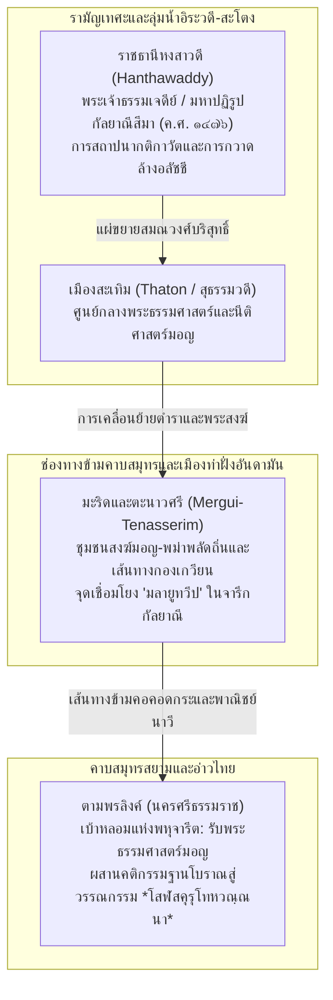
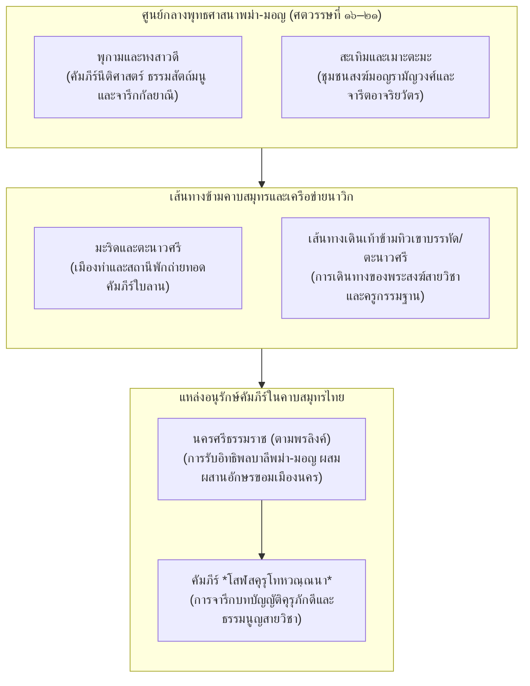

# บทที่ ๕: การสืบค้นคัมภีร์คู่ขนานและร่องรอยจารีตในพม่าและมอญ (The Burmese and Mon Parallels)

## ๕.๑ ธรรมนูญคุรุ-ศิษย์ในวรรณกรรมนีติพม่า: ธรรมนีติ โลกนีติ ราชนีติ มหาราชนีติ


ตารางที่ ๕.๑: การเปรียบเทียบวรรณกรรมตระกูลนีติ (Nīti) และธรรมนูญคุรุ-ศิษย์ในพม่าและรามัญ

| คัมภีร์นีติศาสตร์ | ภาษาและฉันทลักษณ์ | แหล่งที่มาและอิทธิพลแม่บท | ข้อบัญญัติว่าด้วยความสัมพันธ์คุรุ-ศิษย์ | สถานะในจารีตพม่า-มอญ |
|:---|:---|:---|:---|:---|
| **โลกนีติ (Lokanīti)** | บาลีฉันท์คาถา แปลร้อยแก้วพม่า | ภาษิตสันสกฤต (Cāṇakya-nīti) ผสานคติชนพุทธ | อาจริยวุฒิ ๕ ประการ การเคารพครูในฐานะทิศ ๖ | ตำราเรียนเบื้องต้นของเยาวชนและสามเณรทั่วพม่า |
| **ธรรมนีติ (Dhammanīti)** | บาลีฉันท์ ๔๑๔ คาถา | พระไตรปิฎกเถรวาท อรรถกถา และชาดก | หน้าที่อุปัชฌายาจารย์และสัทธิวิหาริก ทัณฑ์คุรุโทหะ | คู่มือประมวลจริยธรรมสงฆ์และศีลธรรมสังคม |
| **ราชนีติ (Rājanīti)** | บาลี-สันสกฤตไฮบริด | อรรถศาสตร์ พระธรรมศาสตร์ และมนูสมฤติ | ราชปุโรหิตาจารย์ สิทธิอำนาจคุรุเหนือพระมหากษัตริย์ | ธรรมนูญราชสำนักพุกาม อังวะ และหงสาวดี |
| **มหาราชนีติ (Mahārājanīti)** | บาลีร้อยกรอง ๑๔๒ คาถา | วรรณกรรมนีติพม่าโบราณยุคตองอู | การห้ามลบหลู่ครูบาอาจารย์และโทษวิบัติแห่งบ้านเมือง | ศาสตร์การปกครองและคติธรรมผู้นำแผ่นดิน |


การสืบค้นสายธารคัมภีร์ *โสฬสคุรุโทหวณฺณนา* (ใบลานนครศรีธรรมราช) ในมิติภูมิปัญญาเปรียบเทียบข้ามภูมิภาค จำเป็นต้องพิจารณาพื้นที่ลุ่มน้ำอิระวดีและดินแดนมอญ-พม่าในฐานะ "แดนเชื่อมต่อทางปัญญาและเครือข่ายคัมภีร์คู่ขนาน" (Burmese Intellectual Interface and Parallel Textual Network) ที่มีความสำคัญยิ่งยวด ดินแดนพม่าและมอญมิเพียงแต่เป็นแหล่งรองรับพุทธศาสนาเถรวาทกระแสหลักควบคู่ไปกับเกาะลังกาเท่านั้น หากยังเป็นเบ้าหลอมแห่งการถ่ายทอดและปรับแปลงวรรณกรรมจริยศาสตร์ นิติศาสตร์ และสุภาษิตภาษาสันสกฤตจากอนุทวีปอินเดียเข้าสู่กรอบคิดของพระพุทธศาสนาอย่างเป็นระบบ วรรณกรรมที่ทำหน้าที่เป็นแกนกลางในการสถาปนา "ธรรมนูญความสัมพันธ์ระหว่างครูกับศิษย์" (The Master-Pupil Moral Constitution) ในสังคมพม่า คือ วรรณกรรมตระกูล **"นีติ" (Nīti Literature)** ซึ่งประกอบด้วยคัมภีร์หลักสำคัญ ๔ เล่ม ได้แก่ *โลกนีติ* (คัมภีร์โลกนีติ (*Lokanīti*)), *ธรรมนีติ* (คัมภีร์ธรรมนีติ (*Dhammanīti*)), *ราชนีติ* (คัมภีร์ราชนีติ (*Rājanīti*)), และ *สุตตวัฑฒนนีติ* (*Suttavaddhananīti*) รวมถึงคัมภีร์ *มหารหนีติ* (*Mahārahanīti*) หรือ *มหาราชนีติ* ซึ่งทำหน้าที่เป็นประมวลคำสอนจริยธรรมของรัฐ คู่มือการศึกษาของกุลบุตรในโรงเรียนวัดพม่า และแบบแผนความประพฤติของชนชั้นปกครองมาหลายศตวรรษ[^1]

การศึกษาวรรณกรรมนีติพม่าผ่านผลงานการตรวจชำระและแปลเชิงวิพากษ์ของ เจมส์ เกรย์ (James Gray, 1886) อาจารย์อาวุโสด้านภาษาบาลีแห่งวิทยาลัยย่างกุ้ง (Rangoon College) ในหนังสือ *Ancient Proverbs and Maxims from Burmese Sources; or, The Nīti Literature of Burma* ได้เปิดเผยให้เห็นข้อเท็จจริงทางประวัติศาสตร์วรรณกรรมที่สำคัญยิ่งว่า คัมภีร์นีติโบราณของพม่า ๓ เล่มแรก (คัมภีร์โลกนีติ (*Lokanīti*), คัมภีร์ธรรมนีติ (*Dhammanīti*), คัมภีร์ราชนีติ (*Rājanīti*)) มิใช่วรรณกรรมที่พระสงฆ์พม่ารจนาขึ้นใหม่จากสุญญากาศ หากแต่เป็น **"สำนวนปริวรรตและดัดแปลงในสำเนียงมคธ/บาลี ที่ถ่ายทอดมาจากประมวลคัมภีร์ภาษาสันสกฤตของอินเดียโบราณโดยตรง" (Original recensions in the Māgadhese dialect, adapted from Sanskrit works)**[^2] ต้นธารแห่งตัวบทเหล่านี้สืบย้อนไปถึงวรรณกรรมคำสอนและนิทานคติธรรมภาษาสันสกฤตชั้นยอดของอินเดีย เช่น *หิโตปเทศ* (*Hitopadeśa*) ของวิษณุศรมัน, *ปัญจตันตระ* (*Pañcatantra*), สุภาษิตของภรรตฤหริ (*Bhartṛhari*), ประมวลสุภาษิตจาณักยะ (*Cāṇakya-nītiśāstra*), มหากาพย์ *มหาภารตะ* (*Mahābhārata*), ประมวลร้อยกรอง *ศารังคธรปัทธติ* (*Śārṅgadharapaddhati*), ตลอดจนประมวลกฎหมายพระธรรมศาสตร์ เช่น *มนูสมฤติ* (คัมภีร์มนูสมฤติ (*Manusmṛti*)) และธรรมสูตรของอาปัสตัมภะ (*Āpastamba Dharmasūtra*)[^3]

กระบวนการเคลื่อนย้ายของภูมิปัญญาสันสกฤตเข้าสู่ดินแดนพม่าดำเนินผ่าน ๒ ช่องทางหลักทางประวัติศาสตร์ ประการแรก คือ **จารีตของชาวมอญแห่งเมืองสะเทิม (Thaton/Sudhammavati):** เกรย์บันทึกว่า เมื่อพระเจ้าอโนรธามังช่อ (King Anoratha) ทรงกรีธาทัพเข้าพิชิตเมืองสะเทิมได้ในราวปี ค.ศ. ๑๐๕๗ ราชสำนักพุกามได้อัญเชิญพระไตรปิฎก คัมภีร์ทางศาสนา ช่างฝีมือ และปราชญ์ราชบัณฑิตชาวมอญขึ้นไปยังพุกาม ในระยะแรก พระสงฆ์และราชบัณฑิตพม่าต้องอาศัยภาษามอญเป็นสะพานเชื่อมในการทำความเข้าใจพระไตรปิฎกและคัมภีร์มคธ โดยรับเอาอักษรมอญโบราณมาปรับประยุกต์เป็นอักษรพม่า[^4] ประการที่สอง คือ **บทบาทของสถาบันพราหมณ์ปุณณะ (Puṇṇas):** กลุ่มพราหมณ์ฮินดู ทั้งที่อพยพมาจากแคว้นมณีปุระ (Manipuri Brahmins) และที่เดินทางข้ามอ่าวเบงกอลมาจากแคว้นเบงกอลและอินเดียใต้ ได้เข้ามาตั้งถิ่นฐานในที่ราบลุ่มตอนล่างของแม่น้ำอิระวดีและแม่น้ำสะโตง ราชสำนักพุกามและอังวะได้ดึงเอาพราหมณ์ปุณณะเหล่านี้มารับราชการในฐานะ "ผู้เชี่ยวชาญทางเทคนิควิทยาการ" (Court Technocrats) ด้านโหราศาสตร์ พระราชพิธี นิติศาสตร์ และการทูต ความร่วมมือระหว่างพราหมณ์ปุณณะผู้ครอบครองคัมภีร์ภาษาสันสกฤต กับพระภิกษุสงฆ์พม่า (Rahans) ผู้เชี่ยวชาญภาษาบาลีมคธ ได้ก่อให้เกิดกระบวนการแปล ปริวรรต และเรียบเรียงวรรณกรรมทางโลก (Secular/Didactic Shastras) ขึ้นในระหว่างคริสต์ศตวรรษที่ ๑๒ ถึง ๑๔ จนตกผลึกเป็นคัมภีร์นีติทั้งปวง[^5]

ท่ามกลางวรรณกรรมนีติทั้งหมด คัมภีร์ **"ธรรมนีติ" (Dhammanīti)** นับเป็นประมวลจริยศาสตร์เล่มที่สมบูรณ์และเป็นระบบที่สุด มีขนาดความยาวถึง ๔๑๔ คาถา จัดแบ่งเป็น ๒๔ วรรค (Sections)[^6] คัมภีร์นี้ได้รับการแปล ปริวรรต และตรวจชำระจากภาษาบาลีมคธสู่ภาษาพม่าอย่างเป็นทางการในปี ค.ศ. ๑๗๘๔ (พ.ศ. ๒๓๒๗) โดยสมเด็จพระสังฆราช ติปิฏกาลังการะ มหาธรรมะ (Tipitakālaṅkāra Mahādhamma) ตามพระบรมราชโองการของพระเจ้าปดุง (King Bodawpaya, ครองราชย์ ค.ศ. ๑๗๘๒–๑๘๑๙) แห่งราชวงศ์คองบอง เพื่อใช้เป็นธรรมนูญจริยธรรมของสังฆมณฑล ราชสำนัก และข้าราชบริพารทั่วราชอาณาจักรพม่า[^7] โครงสร้างของธรรมนีติมีความโดดเด่นเป็นเอกลักษณ์เมื่อเทียบกับคัมภีร์นีติเล่มอื่น กล่าวคือ ในขณะที่ *โลกนีติ* เริ่มต้นด้วยบัณฑิตวรรค (หมวดคนฉลาด) แต่ *ธรรมนีติ* กลับเริ่มต้นทันทีหลังบทประณามพจน์ด้วย **"อาจริยวรรค" (Section I: The Preceptor / Ācariyavagga, คาถา ๑–๑๐)** การจัดวางเช่นนี้สะท้อนนัยทางปรัชญาอย่างละเอียดถี่ถ้วนว่า ในระบบจริยศาสตร์และจารีตการศึกษาของพม่า-มอญ "ความสัมพันธ์ระหว่างครูกับศิษย์" ถูกสถาปนาให้เป็น **ปฐมบัญญัติและเงื่อนไขชี้ขาดลำดับแรกสุด** ของระเบียบสังคมและความเจริญก้าวหน้าในชีวิตของปัจเจกบุคคล[^8]

บทประณามพจน์และมาติกาหัวข้อธรรมของคัมภีร์ธรรมนีติ (คาถาที่ ๑–๓) ได้ประกาศโครงสร้างอำนาจหน้าที่ไว้อย่างแจ้งชัด:

> **ตัวบทบาลีมคธจากคัมภีร์ธรรมนีติ:**  
> *(i.) วนฺทิตฺวา รตนํ เสฏฺฐํ นิสฺสาย ปุพฺพเก ครงฺ / นีติธมฺมํ ปวกฺขามิ สพฺพโลกสุขาวหํ ฯ*  
> *(ii.) อาจริโย จ สิปฺปญฺจ ปญฺญา สุตํ กถา ธนํ / เปโส จ นิสฺสโย มิตฺตํ ทุชฺชโน สุชโน พลํ ฯ*  
> *(iii.) อิตฺถี ปุตฺโต จ ทาโส จ ฆรวาโส กตากโต / ญาตพฺโพ จ อลงฺกาโร ราชธมฺโมปเสวโก / ทุกาทิมิสฺสโก เจว ปกิณฺณโก ติ มาติกา ฯ*[^9]

บทเริ่มต้นนี้ตอกย้ำว่า การรจนาธรรมนีติเป็นการน้อมอภิวาทต่อพระรัตนตรัยและพระบูรพาจารย์ (*vanditvā ratanaṃ seṭṭhaṃ nissāya pubbake garuṃ*) และจัดหมวดอาจารย์ (*ācariyo*) ไว้เป็นอันดับแรกก่อนหมวดศิลปศาสตร์ (*sippañca*) และหมวดปัญญา (*paññā*) ทันทีที่เข้าสู่คาถาที่ ๑ แห่งอาจริยวรรค คัมภีร์ได้วางสัจพจน์รากฐานว่าด้วยการปรนนิบัติแทบเท้าอาจารย์:

> **Dhammanīti คาถาที่ ๑:**  
> *"ในโลกนี้ บุคคลเหล่าใดไม่มีความขวนขวายเอาใจใส่ในการปรนนิบัติรับใช้แทบเท้าของครูบาอาจารย์ บุคคลเหล่านั้นจักกระทำกิจการงานใดให้สำเร็จลุล่วงได้เล่า? ทว่าบุคคลเหล่าใดก้มกราบลงแทบผงธุลีเท้าของอาจารย์ บัณฑิตย่อมสรรเสริญบุคคลเหล่านั้นว่าเป็นคนดีและเป็นผู้มีปัญญาจำแนก"*[^10]

ในการอธิบายคาถาที่ ๑ นี้ เจมส์ เกรย์ ได้ระบุเชิงอรรถวิเคราะห์เชื่อมโยงโดยตรงไปยังประมวลกฎหมายฮินดูโบราณ *มนูสมฤติ* (คัมภีร์มนูสมฤติ (*Manusmṛti*) 2.71–72) ซึ่งบัญญัติไว้ว่า ในการเริ่มต้นและสิ้นสุดการสาธยายพระเวท ศิษย์จะต้องจับต้องเท้าทั้งสองของพระอาจารย์ด้วยมือที่ประสานไขว้กันเสมอ (*brahmārambhe 'vasāne ca pādau grāhyau guroḥ sadā / saṃhatya hastāv adhyeyaṃ sa hi brahmāñjaliḥ smṛtaḥ*)[^11] มโนทัศน์การก้มกราบแทบผงธุลีเท้าครูบาอาจารย์ (*pādavandanā / pādāśraya*) ในวรรณกรรมนีติพม่า จึงมิใช่อะไรอื่น นอกจากการสืบทอดชั้นดินทางวัฒนธรรมจากภารตวิทยาโบราณ ซึ่งมีลักษณะร่วมแบบคำต่อคำกับคัมภีร์ *คุรุปัญจาศิกา* (คัมภีร์คุรุปัญจาศิกา (*Gurupañcāśikā*) คาถาที่ ๑) ของฝ่ายพุทธตันตระ และคัมภีร์ *โสฬสคุรุโทหวณฺณนา* (คาถาที่ ๑) แห่งนครศรีธรรมราช ที่สถาปนาความศักดิ์สิทธิ์ของสรีระครูเหนือเรือนร่างของศิษย์[^12]

ในมิติสืบเนื่อง ธรรมนีติ คาถาที่ ๔–๕ ยังได้วางกฎเหล็กเรื่อง **"ผลกรรมสะท้อนกลับในสายสัมพันธ์ครู-ศิษย์" (Karmic Mirroring in the Guru-Śiṣya Lineage)** โดยระบุว่า ผู้ใดไม่เคารพเลี้ยงดูปรนนิบัติอาจารย์ฝ่ายจิตวิญญาณ (*spiritual teacher* / พระอุปัชฌายาจารย์) และอาจารย์ฝ่ายศิลปศาสตร์ทางโลก (*secular teacher* / ครูผู้ประสิทธิ์ประสาทวิชาชีพ) ตลอดจนบิดามารดาด้วยความยำเกรงอย่างสมควร แม้ศิษย์ของเขาในอนาคตก็จะประพฤติตนเลวทรามและเนรคุณต่อเขาเช่นเดียวกัน ในทางตรงกันข้าม หากเขาปรนนิบัติอาจารย์ทั้งสองและบิดามารดาอย่างดี ศิษย์ของเขาในกาลข้างหน้าก็จะมีความกตัญญูกตเวทีต่อเขาเช่นเดียวกัน[^13] หลักการนี้สะท้อนโดยตรงถึงคำเตือนใน *โสฬสคุรุโทหวณฺณนา* คาถาที่ ๒, ๘ และ ๑๔ ซึ่งระบุว่า บุคคลผู้ละเมิดกระทำคุรุโทหะ ย่อมสูญเสียวงศ์ศิษย์ ตระกูลพินาศ และหาผู้สืบทอดสายวิชาไม่ได้

มิติทางนิติปรัชญาที่ลึกซึ้งที่สุดในวรรณกรรมนีติพม่า คือ **"มโนทัศน์ความรับผิดชอบร่วมและการถ่ายโอนมลทินกรรม" (Vicarious Moral Liability and Transferred Demerit)** ปรากฏในคัมภีร์ *ธรรมนีติ* คาถาที่ ๒๘๐ (หมวดราชธัมโมปเสวกวรรค) และคู่ขนานใน *โลกนีติ* คาถาที่ ๑๒๘ ซึ่งบัญญัติเป็นสัจพจน์ทางสังคมว่า:

> **Dhammanīti คาถาที่ ๒๘๐ (เทียบเคียง Lokanīti คาถา ๑๒๘):**  
> *"บาปความชั่วของบุตรย่อมตกแก่มารดา, ความผิดบาปของศิษย์ย่อมตกเป็นโทษแก่อาจารย์ (antevāsikadoso ācariyassa); การกระทำบาปของราษฎรย่อมตกแก่พระราชา, และบาปกรรมแห่งองค์ราชาย่อมตกแก่ราชปุโรหิต"*[^14]

เจมส์ เกรย์ ได้วิเคราะห์เชิงอรรถเชื่อมโยงคาถาที่ ๒๘๐ นี้เข้ากับบทบัญญัติใน *อาปัสตัมภะ ธรรมสูตร* (*Āpastamba Dharmasūtra* ii. 4) เรื่องการปันส่วนแบ่งบาปและบุญ ๑ ใน ๖ ส่วน (*ṣaḍbhāga*)[^15] สอดคล้องกับการวิเคราะห์ของ ศาสตราจารย์ โรแบร์ ลิงกาต์ (Robert Lingat, 1973) ใน *The Classical Law of India* และ ดร. ปัณฑุรังค วามน กาเน (P. V. Kane, 1941) ใน *History of Dharmaśāstra* Vol. II, Part I ซึ่งชี้ประเด็นสำคัญว่า ในระบบกฎหมายอินเดียโบราณ ผู้ใช้อำนาจปกครอง (Guardian) ย่อมต้องรับผิดชอบต่อการกระทำของผู้ใต้ปกครอง การที่พระอาจารย์ทำหน้าที่เป็น "บิดาทางจิตวิญญาณ" (*brahma-dātṛ pitā*) ผู้ให้กำเนิดครั้งที่สองแก่ศิษย์ในพิธีอุปนยนะตามกฎหมายพระธรรมศาสตร์ ทำให้อาจารย์มีอำนาจสิทธิ์ขาดในการควบคุม อบรม และลงทัณฑ์ศิษย์ ทว่าในทางคู่ขนาน หากศิษย์กระทำความผิด บาปมลทินนั้นย่อมถ่ายโอนกลับมาแปดเปื้อนถึงอาจารย์ด้วย[^16] นิติปรัชญาเรื่องมลทินกรรมตกทอดนี้เองที่ทำให้อาจารย์มีความชอบธรรมตามกฎหมายในการลงโทษศิษย์ ดังปรากฏใน *โลกนีติ* คาถาที่ ๒๒ ว่า *"อาจารย์เฆี่ยนตีศิษย์เพื่อเพิ่มพูนความรู้ มิใช่เพื่อทำร้ายหรือผลักไสศิษย์ให้ตกไปสู่อบาย"*[^17] และทำให้การทรยศหักหลังครูบาอาจารย์ (*gurudroha*) ถูกจัดเป็นอาชญากรรมทางวิญญาณขั้นร้ายแรงที่สุด

ในมิติตัวบทคู่ขนาน ในหมวดราชธัมโมปเสวกวรรคแห่งธรรมนีติ คาถาที่ ๒๙๓–๒๙๔ ได้ประมวลวินัยข้อห้ามเชิงกายภาพในการปรนนิบัติรับใช้ครูบาอาจารย์และพระมหากษัตริย์ ไว้อย่างละเอียดละออ คาถาที่ ๒๙๓ บัญญัติห้ามมิให้ศิษย์ขึ้นนั่งหรือนอนบนแท่นบรรทม ราชบัลลังก์ อาสนะ ตั่ง เตียง หรือราชรถร่วมกับผู้มีพระคุณ ส่วนคาถาที่ ๒๙๔ ได้รับการอธิบายขยายความโดยเกรย์ผ่านการอ้างอิงบทบัญญัติ *Āpastamba Dharmasūtra* (1.2.6) โดยตรง ๓ ประการ:  
๑) **ข้อห้ามเรื่องทิศทางลม:** หากลมพัดจากทิศที่ศิษย์ยืนไปยังทิศที่อาจารย์ประทับอยู่ ศิษย์จะต้องขยับเปลี่ยนตำแหน่งที่ยืนทันที เพื่อมิให้กลิ่นกาย ฝุ่นละออง หรือลมหายใจของตนพัดผ่านไปกระทบสรีระของอาจารย์ (ห้ามยืนเหนือลมครู)  
๒) **ข้อห้ามเรื่องสายตาและทิศทางใบหน้า:** ศิษย์จะต้องหันหน้าเข้าหาอาจารย์เสมอ แม้ในขณะที่อาจารย์จะมิได้หันมามองตนก็ตาม ห้ามหันหลังหรือหันข้างให้อาจารย์  
๓) **ข้อกำหนดเรื่องระยะห่างทางกายภาพ:** ศิษย์ต้องนั่งในระยะที่พระอาจารย์สามารถเอื้อมมือถึง (*within arm's reach*) เพื่อความพร้อมในการรับใช้สนองพระคุณได้ทันท่วงที[^18]

ข้อบัญญัติเรื่องทิศทางลม อาสนะ และการวางตนใน *ธรรมนีติ* คาถาที่ ๒๙๓–๒๙๔ นี้ มีความสอดรับอย่างน่าประหลาดใจกับตัวบทในคัมภีร์ *โสฬสคุรุโทหวณฺณนา* คาถาที่ ๔ ซึ่งบัญญัติห้ามมิให้ศิษย์นั่งเสมอกับอาจารย์ในเรือน (`สรเก ฆเร น วเส สถา`) และคาถาที่ ๖ ว่าด้วยการปรนนิบัติรับใช้บาทมูลด้วยความคารวะอย่างสูงสุด ซึ่งพิสูจน์ให้เห็นว่า กฎเกณฑ์เรื่องสรีรศาสตร์ศักดิ์สิทธิ์ (Sacred Somatics) ในคัมภีร์ใบลานนครศรีธรรมราช มีรากเหง้าสืบเนื่องมาจากประมวลกฎหมายพระธรรมศาสตร์และนีติศาสตร์ชุดเดียวกันกับที่ปรากฏในพม่า

ทว่า ประเด็นใจกลางที่แสดงถึงความแตกต่างเชิงอรรถศาสตร์และการแยกสายธารความคิดระหว่างวรรณกรรมนีติพม่ากับคัมภีร์โสฬสคุรุโทหะ คือการวิเคราะห์คำว่า **"ฉายา" (chāyā - เงา)** ในคัมภีร์ *ธรรมนีติ* คาถาที่ ๘ (Book p. 38) และ *โลกนีติ* คาถาที่ ๕๐ (Book p. 12) ซึ่งได้ประพันธ์ฉันท์เปรียบเทียบระดับความร่มเย็นของร่มเงาไว้อย่างประณีต:

> **Dhammanīti คาถาที่ ๘ / Lokanīti คาถาที่ ๕๐:**  
> *"ร่มเงาแห่งต้นไม้ย่อมให้ความร่มเย็น; ร่มเงาแห่งบิดามารดาและหมู่ญาติย่อมร่มเย็นยิ่งกว่านั้น; ร่มเงาแห่งพระอาจารย์ (ācariyachāyā) ย่อมร่มเย็นยิ่งขึ้นไปอีก; ร่มเงาแห่งพระราชายิ่งร่มเย็นเหนือกว่านั้น; และร่มเงาแห่งพระธรรมวินัยของพระสัมมาสัมพุทธเจ้าย่อมร่มเย็นเป็นสุขในหลากหลายประการยิ่งที่สุด"*[^19]

ในวรรณกรรมนีติพม่า คำว่า `ฉายา` ถูกใช้ในมิติเชิงอุปลักษณ์ทางศีลธรรม (Moral Metaphor) หมายถึง **"ร่มเงาแห่งความคุ้มครอง ความร่มเย็นทางปัญญา และบารมีธรรม" (Benevolent Protective Shelter)** ซึ่งก่อให้เกิดทิศทางความสัมพันธ์แบบ **"การเคลื่อนเข้าหา" (Centripetal Attraction)** นั่นคือ ศิษย์พึงขวนขวายวิ่งเข้าหาร่มเงาของอาจารย์เพื่อรับการอบรมสั่งสอน ทว่า ในคัมภีร์ คัมภีร์คุรุปัญจาศิกา (*Gurupañcāśikā*) คาถาที่ ๑๕ (`guror nākrāmayec chāyām`), *Śrī Hari-bhakti-vilāsa* วิลาสที่ ๑ (อ้างอิง *Devy-āgama* และ *Vyāsa-gītā*), และคัมภีร์ *โสฬสคุรุโทหวณฺณนา* คาถาที่ ๓ (`คุรุโน จีวรํ ฉตฺตํ ปตฺตํ ฉายํ น ลงฺฆเร`) คำว่า `ฉายา` กลับถูกใช้ในมิติทางกายภาพและไสยเวทอันศักดิ์สิทธิ์ หมายถึง **"เงาของเรือนร่างและรัศมีแห่งสนามพลังสรีระ" (Somatic Projection & Sacred Aura)** ซึ่งกำหนดทิศทางความสัมพันธ์แบบ **"การรักษาระยะห่างและการหลีกเลี่ยง" (Centrifugal Avoidance)** โดยจัดเป็นข้อห้ามเด็ดขาด (Strict Esoteric Taboo) ห้ามมิให้ศิษย์ก้าวข้ามหรือเหยียบย่ำเงาครู ผู้ใดเหยียบย่ำย่อมมีโทษเทียบเท่าการทำลายพระสถูปเจดีย์และต้องตกอเวจีมหานรก[^20]

ปรากฏการณ์การแยกสายธารความหมาย (Semiotic Divergence) นี้ สามารถอธิบายได้ด้วยทฤษฎีประวัติศาสตร์กฎหมายของ โรแบร์ ลิงกาต์ ว่า ในพม่า วรรณกรรมนีติศาสตร์และประมวลกฎหมาย "ธัมมสัตถ์" (Dhammathat เช่น *มโนสารธัมมสัตถ์*) ได้ผ่าน **"กระบวนการแปลงสารสู่ออร์โธดอกซีเถรวาท" (Theravada Moralization & De-Brahminisation)** อย่างเข้มข้น พระสงฆ์พม่าได้ทำการถอดรหัสเทวนิยมพราหมณ์ ตัดบทบูชาพระศิวะในต้นฉบับ *หิโตปเทศ* ทิ้ง แล้วนำพระรัตนตรัยมาประดิษฐานแทนที่ ตลอดจนลดทอนมิติข้อห้ามไสยเวทแบบตันตระลง ให้กลายเป็นหลักจริยธรรมสากลเพื่อการอยู่ร่วมกันในสังคมอารามหลวง[^21] ในขณะที่เอกสารใบลาน *โสฬสคุรุโทหวณฺณนา* แห่งนครศรีธรรมราช ยังคงอนุรักษ์ "กลุ่มข้อห้ามทางกายภาพโบราณ" (Archaic Somatic Taboos) จากมณฑลตันตระและพระธรรมศาสตร์ดั้งเดิมเอาไว้ในรูปฉันท์บาลีไฮบริดอย่างบริบูรณ์

ด้วยเหตุดังกล่าว วรรณกรรมนีติพม่า ทั้ง *ธรรมนีติ*, *โลกนีติ*, *ราชนีติ*, และ *มหาราชนีติ* จึงทำหน้าที่เป็นหลักฐานประจักษ์ชิ้นเอกที่ยืนยันว่า มโนทัศน์เรื่องสิทธิอำนาจเบ็ดเสร็จของครูบาอาจารย์ การกราบแทบเท้า การแบ่งปันมลทินกรรม และข้อปฏิบัติเรื่องอาสนะและระยะห่าง มิใช่สิ่งแปลกปลอมที่กำเนิดขึ้นอย่างโดดเดี่ยวในภาคใต้ของไทย หากแต่เป็น "ธรรมนูญทางวัฒนธรรมร่วม" (Pan-Regional Moral Constitution) ที่แผ่คลุมลุ่มน้ำอิระวดี สะเทิม หงสาวดี และเชื่อมโยงผ่านเครือข่ายปัญญานาวิกข้ามอ่าวเบงกอลลงสู่คาบสมุทรไทย-มลายูอย่างแนบแน่น

---

## ๕.๒ มโนทัศน์ "อาจริยคุณ" และ "อาจริยโทสะ" ในวรรณกรรมและจารึกพม่า-มอญ

การทำความเข้าใจสายสัมพันธ์ระหว่างครูกับศิษย์ในประวัติศาสตร์พุทธศาสนาและวรรณกรรมของพม่าและมอญ มิอาจจำกัดกรอบอยู่เพียงข้อบังคับเชิงจริยธรรมในระดับคฤหัสถ์ตามที่ปรากฏในวรรณกรรมนีติศาสตร์เท่านั้น หากแต่ต้องหยั่งลึกลงไปถึงมิติทางปรมัตถธรรม ญาณวิทยา และสรีรศาสตร์ศักดิ์สิทธิ์ที่ค้ำจุนมโนทัศน์คู่ตรงข้ามระหว่าง **"อาจริยคุณ" (Ācariyaguṇa - พระคุณอันหาที่สุดมิได้ของพระอาจารย์)** กับ **"อาจริยโทสะ / คุรุโทหะ" (Ācariyadosa / Gurudroha - มหันตโทษแห่งการลบหลู่ ประทุษร้าย และทรยศต่อครูบาอาจารย์)** มโนทัศน์คู่นี้ปรากฏร่องรอยอย่างเด่นชัดทั้งในคัมภีร์อภิธรรม จารึกวัดวาอาราม เอกสารตัวเขียนบาลี-มอญ-พม่า ตลอดจนหลักฐานทางประติมาวิทยาและจิตรกรรมฝาผนังในราชธานีพุกาม สะท้อนให้เห็นการปะทะสังสรรค์และการสังเคราะห์ร่วมกันระหว่างพุทธศาสนาเถรวาทฝ่ายมหาวิหาร กับกระแสธารตันตรยานและพระธรรมศาสตร์โบราณ[^22]

ในมิตินิรุกติศาสตร์และจิตวิทยาเชิงพุทธ คัมภีร์ *อัฏฐสาลินี* (*Atthasālinī*) อรรถกถาพระอภิธรรมปิฎก (ธัมมสังคณี) ของพระพุทธโฆษาจารย์ ซึ่งได้รับการแปลและอธิบายอย่างละเอียดถี่ถ้วนโดย อู้ ภี หม่อง ทิน (เพ หม่อง ทิน (Pe Maung Tin)) และ แคโรไลน์ ไรส์ เดวิดส์ (C.A.F. Rhys Davids, 1921) ใน *The Expositor* Vol. II ได้วางรากฐานการอธิบายสภาวธรรมแห่งจิตใจที่เป็นบ่อเกิดของ "อาจริยโทสะ" ไว้อย่างหมดจด พระพุทธโฆษะได้วิเคราะห์ศัพท์คำว่า `โทสะ` (*Dosa*) จากรากศัพท์ √dus ไว้อย่างละเอียดพิสดาร ๓ นัย คือ *dussatīti doso* (สภาวะที่ทำให้สัมปยุตธรรมประทุษร้าย), *dussanaṃ doso* (ตัวสภาวะที่ประทุษร้ายเอง), หรือ *dussanabhāvo vā doso* (ความเป็นสภาพประทุษร้าย) พร้อมทั้งกำหนดลักขณาทิจตุกะของโทสะไว้ ๔ ประการ:  
๑) **ลักษณะ (Characteristic):** มีความดุร้าย เกรี้ยวกราด หรือขุ่นเคืองกระด้าง ดุจงูพิษที่ถูกตีด้วยท่อนไม้ (*caṇḍikka-lakkhaṇo pahata-āsīviso viya*)  
๒) **หน้าที่หรือรส (Function):** มีการแผ่ซ่านไปทั่วสรรพางค์ดุจพิษร้ายแล่นเข้าสู่กระแสเลือด หรือเผาผลาญที่พึ่งอาศัยของตนเอง ดุจไฟป่าที่เผาผลาญต้นไม้กิ่งไม้ที่ตนอาศัยเกิด (*attano nissaya-ḍahana-raso dāvaggi viya*)  
๓) **อาการปรากฏ (Manifestation):** มีการประทุษร้าย ทำลายล้าง หรือเบียดเบียน ดุจศัตรูคู่อาฆาตที่สบโอกาสทำร้าย (*dussana-paccupaṭṭhāno laddhokāso viya veri*)  
๔) **เหตุใกล้ (Proximate Cause):** มีอาฆาตวัตถุ ๑๐ ประการเป็นแดนเกิด ดุจน้ำมูตรเน่าที่เจือปนด้วยยาพิษร้ายแรง (*āghātavatthu-padaṭṭhāno visa-saṃsaṭṭha-muttaṃ viya*)[^23]

ในเชิงภาษาศาสตร์เปรียบเทียบ รากศัพท์สันสกฤต √druh (ประทุษร้าย มุ่งร้าย ทรยศ หักหลัง) ในคำว่า *Gurudroha* (คุรุโทหะ) แท้จริงแล้วคือคู่แฝดทางความหมายของรากศัพท์บาลี √dus ในคำว่า *Dosa* (โทสะ) และ *Byāpāda* (พยาบาท) ซึ่งพระพุทธโฆษะระบุว่า พยาบาทคือสภาวะที่จิต "เข้าถึงภาวะเน่าเปื่อยผุพัง" (*mind reaches the putrid state / pūti-bhāvaṃ āpadyati*) และทำลายข้อปฏิบัติในพระวินัย ทำลายศีล และทำลายประโยชน์สุขทั้งปวง[^24] ในมิติตัวบทคู่ขนาน ข้อค้นพบทางจิตวิทยาที่ลึกซึ้งที่สุดใน *อัฏฐสาลินี* (Book II Part IX, p. 344) คือ พระพุทธโฆษะระบุว่า ในโทสมูลจิต ย่อมไม่สามารถเกิด "อารัมมณาธิปติ" (ภาวะที่จิตยกย่องอารมณ์เป็นใหญ่ยิ่งยวด) ได้เลย ด้วยเหตุว่า **"ความโกรธย่อมไม่แยแส ไม่ใส่ใจ และไม่เคารพยำเกรงต่อสิ่งใดๆ ทั้งสิ้น"** (*anger does not care or have respect for anything / doso hi kiñci na apekkhati na garuṃ karoti*)[^25] สภาวธรรมข้อนี้อธิบายกลไกทางจิตวิทยาของศิษย์ผู้กระทำคุรุโทหะได้อย่างแจ้งชัดว่า ในชั่วขณะที่โทสะเข้าครอบงำ สภาวะคารวะยำเกรง (Gārava) และสติสัมปชัญญะจะดับสูญไป จิตจะเกิด "ทุพพจภาพ" (Dovacassatā / ความเป็นผู้ว่ายากสอนยาก) เข้าไปขัดขวางคำสอนของอาจารย์ดุจดั่งการลงกลอนประตู (*cross-bolt*) และกลายสภาพเป็น "เวรีผู้ได้ช่อง" (*laddhokāso viya veri*) ที่พร้อมจะลบหลู่ เหยียบย่ำ หรือทำลายล้างแม้กระทั่งผู้มีพระคุณสูงสุดของตนเอง

ในทางตรงกันข้าม มโนทัศน์เรื่อง **"อาจริยคุณ"** ในโลกพุทธศาสนาพม่า-มอญและลังกา ได้รับการสถาปนาขึ้นในจุดสูงสุดของระบบคุณค่าทางสังคมและศาสนา ดังปรากฏหลักฐานจารึกวิทยาชิ้นเอกใน *Epigraphia Zeylanica* เล่มที่ ๑ โดย ดอน มาร์ติโน เด ซิลวา วิกกระมะสิงเห (ดอน มาร์ติโน เด ซิลวา วิกเกรมาสิงหะ (Don Martino de Zilva Wickremasinghe), 1904–1912) เรื่อง "ศิลาจารึกแผ่นหินคู่ของพระเจ้ามหินทะที่ ๔ ณ มิหินตาเล" (The Two Tablets of Mahinda IV at Mihintale, ค.ศ. ๙๗๕–๙๙๑) ซึ่งทำหน้าที่เป็นแม่บทธรรมนูญสงฆ์ (Katikāvata) ก่อนการปฏิรูปครั้งใหญ่ในยุคโปลอนนารุวะ จารึกมิหินตาเล แผ่น A บรรทัดที่ ๑๒–๑๕ ได้เปิดเผยให้เห็น "โครงสร้างญาณวิทยาแห่งการจัดสรรปัจจัยสี่" (The Epistemological Hierarchy of Requisite Allocation) โดยกำหนดอัตราส่วนแบ่งเสบียงอาหารและเครื่องนุ่งห่มที่เรียกว่า **"วสัค" (Vasag)** แก่พระภิกษุผู้ทรงพระไตรปิฎกตามลำดับชั้นความลึกซึ้งของคัมภีร์:  
- พระภิกษุผู้ศึกษาเล่าเรียนและสั่งสอน **พระวินัยปิฎก** ได้รับ **๕ วสัค**  
- พระภิกษุผู้ศึกษาเล่าเรียนและสั่งสอน **พระสุตตันตปิฎก** ได้รับ **๗ วสัค**  
- พระภิกษุผู้ศึกษาเล่าเรียนและสั่งสอน **พระอภิธรรมปิฎก** ได้รับ **๑๒ วสัค**[^26]

การที่พระอาจารย์ผู้เชี่ยวชาญพระอภิธรรมปิฎกได้รับส่วนแบ่งปัจจัยสี่สูงถึง ๑๒ วสัค (มากกว่าพระวินัยธรเกินกว่าสองเท่า) สะท้อนชัดว่า สถาบันสงฆ์และราชสำนักยกย่องคุรุผู้ถ่ายทอดปรมัตถธรรมว่าเป็นผู้ทรงคุณูปการสูงสุดในสังฆมณฑล การจัดสรรปัจจัยสี่อย่างล้นพ้นนี้สอดรับโดยตรงกับข้อความในคัมภีร์ *โสฬสคุรุโทหวณฺณนา* คาถาที่ ๖ และ ๑๘ ตลอดจนคัมภีร์ *คุรุปัญจาศิกา* ที่บัญญัติว่า ศิษย์และพุทธศาสนิกชนพึงปรนนิบัติบำรุงพระอาจารย์ด้วยปัจจัยสี่และการกราบกรานแทบเท้าอย่างเต็มกำลัง เพื่อตอบแทนพระคุณที่ได้นำพาศิษย์ออกจากความมืดบอดแห่งอวิชชา

ความศักดิ์สิทธิ์ของสถาบันครูบาอาจารย์ในพม่ายังได้รับการตอกย้ำผ่านวัฒนธรรมทางวิชาการและการสืบทอดสายวิชา (Lineage / Ācariya-paramparā) อาแลสแตร์ กอร์นอลล์ และ โจวันนี ชอตตี (อาแลสแตร์ กอร์นอลล์ (Alastair Gornall) and Giovanni Ciotti, 2014) ในบทความวิจัยเรื่อง *"Kārakas in Cāndra Grammar: An Interpretation from the Pāli Buddhist Śāstras"* ได้ชี้แจงแสดงหลักฐานว่า ในเครือข่ายปัญญาชนสงฆ์ยุคกลางที่เชื่อมโยงระหว่างลังกา พุกาม และอังวะ พระสงฆ์สายบาลีไวยากรณ์โมคคัลลานะ (เช่น พระสารีบุตรมหาสามี, พระโมคคัลลานเถระ, พระสังฆรักขิตเถระ, และพระศรีราหุล) ได้สถาปนาธรรมเนียมการยกย่องพระอุปัชฌายาจารย์ชั้นผู้ใหญ่ว่าเป็น **"ปรมคุรุ" (Paramaguru - พระบรมครูสูงสุด)**[^27] ในคัมภีร์ *Moggallāna-pañcikā-ṭīkā* พระสังฆรักขิตเถระได้ระบุสรรพนามเรียกพระสารีบุตรสังฆนายกว่า `Sāriputto mahāsāmī amhākaṃ paramaguru` (พระสารีบุตรมหาสามีผู้เป็นบรมครูสูงสุดของพวกเรา)[^28] การสืบทอดตำราไวยากรณ์และอรรถกถา เช่น *Sambandhacintā* และ *Candrālaṅkāra* เข้าสู่ราชธานีพุกามและอังวะ มิได้เป็นเพียงการส่งผ่านตัวบททางภาษาศาสตร์ แต่เป็นการนำเข้า "แบบแผนอำนาจนิยมทางวิชาการ" (Scholastic Authoritarianism) ที่ศิษย์จะต้องเคารพเชื่อฟังมติของพระอาจารย์อย่างเคร่งครัด การละเมิดหรือโต้แย้งคำสอนของบรมครูโดยปราศจากฐานทางคัมภีร์นับเป็นความผิดทางจริยธรรมที่ไม่อาจยอมรับได้

ทว่า มิติที่น่าตระหนกที่สุดของมโนทัศน์เรื่องคุรุในพม่า คือร่องรอยแห่ง **พุทธตันตรยาน (Vajrayāna) และบทบาทของกลุ่มสงฆ์อริยวงศ์ (Ari Monks / Samanakuttaka)** ในสมัยพุกามตอนต้น (ก่อนการปฏิรูปของพระเจ้าอโนรธามังช่อในพุทธศตวรรษที่ ๑๖) ดร. นันทนา ชุติวงศ์ (Nandana Chutiwongs, 1979/1982) ได้วิเคราะห์ไว้ในงานวิจัยระดับคลาสสิกเรื่อง *"Visual Expressions of Tantric Buddhism"* ว่า ในระบบตันตระ สถาบันคุรุมิได้มีหน้าที่เพียงสั่งสอนตัวหนังสือ แต่เป็น **"ศูนย์กลางแห่งการตัดสินชะตากรรมทางจิตวิญญาณของศิษย์"** พระอาจารย์ (วัชราจารย์) คือบุคคลเพียงคนเดียวที่หยั่งรู้จิตใจ ภูมิหลัง จุดแข็ง จุดบกพร่อง และบาปกำเนิดของศิษย์ เพื่อทำหน้าที่คัดเลือก **"อิษฏเทวดา" (Iṣṭadevatā - เทวะประจำตัว)** ให้แก่ศิษย์แต่ละบุคคลอย่างจำเพาะเจาะจง[^29]

สำหรับศิษย์ที่มีจิตใจอ่อนโยน คุรุจะมอบเทวะฝ่ายศานติ เช่น พระศิตาตารา พระมัญชุศรี หรือพระอมิตาภะ แต่สำหรับศิษย์ที่มีจิตใจกระด้าง ดื้อรั้น เจ้าโทสะ และมีพลังอารมณ์รุนแรง คุรุจะมอบ **"เทวะดุร้ายและน่าสะพรึงกลัว" (Wrathful/Demonic Deities)** ให้เป็นอิษฏเทวดา เช่น พระเหวัชระ (Hevajra), พระยมรานตกะ (Yamāntaka), หรือพระหัยครีวะ (Hayagrīva) ซึ่งเป็นบุคลาธิษฐานแห่ง "โทสะที่พุ่งขึ้นสู่ขีดสุด" เพื่อให้ศิษย์ได้เผชิญหน้ากับปีศาจภายในจิตตนเอง และใช้พลังความโกรธนั้นแปรเปลี่ยน (Transmutation) ให้กลายเป็นพลังงานแห่งปัญญาญาณและการตรัสรู้[^30] ร่องรอยนี้ปรากฏเป็นหลักฐานประจักษ์ทางโบราณคดีอย่างเด่นชัดในภาพจิตรกรรมฝาผนังพุทธตันตระ ณ วัดพายาโถนซู (Payathonzu) และวัดนันดามันยา (Nandamanya) เมืองพุกาม ซึ่งแสดงภาพพระโพธิสัตว์และเทวะในมณฑลตันตระเคียงคู่กับรูปสตรีและพิธีกรรมรหัสยะ สอดคล้องกับบันทึกในพงศาวดารพม่า *มหาราชวงศ์* (Hmannan Yazawin) เรื่องสงฆ์ลัทธิอริที่อ้างสิทธิอำนาจเบ็ดเสร็จในการลบล้างบาปกรรมให้แก่ผู้คน และประกอบพิธีรับมอบตัวกุลบุตรกุลธิดาเพื่อประสิทธิ์ประสาทวิชา ซึ่งสะท้อนถึงโครงสร้างความสัมพันธ์ที่ครูมีอำนาจเหนือชีวิตและร่างกายของศิษย์อย่างสมบูรณ์

โครงสร้างอำนาจเบ็ดเสร็จนี้ได้รับการอธิบายเชิงทฤษฎีพิธีกรรมโดย เปแตร์-ดานีเอล ซานโต (ปีเตอร์-ดาเนียล ซานโต (Péter-Dániel Szántó), 2015) ในบทความ *"Ritual Texts: South Asia"* ตีพิมพ์ใน *Brill's Encyclopedia of Buddhism* โดยอธิบายชี้ประเด็นว่า ในพิธีอภิเษก (Abhiṣeka) ของพุทธตันตระ พระอาจารย์จะทำหน้าที่มอบ **"อธิการ" (Adhikāra)** ซึ่งเป็นทั้งสิทธิและหน้าที่พร้อมกันในการเข้าถึงมณฑลศักดิ์สิทธิ์และการสวดมนตร์ภาวนา ในมิติตัวบทคู่ขนาน ในคู่มือสำหรับผู้เริ่มปฏิบัติ (Ādikarmika manuals) เช่น คัมภีร์ *Ādikarmapradīpa* ของอนุปมวัชระ (พุทธศตวรรษที่ ๑๖–๑๗) ได้บัญญัติให้ศิษย์ต้องประกอบพิธี **"คุรุมณฑลกะ" (Gurumaṇḍalaka)** คือการน้อมถวายภาพจำลองของจักรวาลทั้งปวงและสรรพสิ่งแด่พระอาจารย์ เพื่อเป็นการประกาศ "สละกรรมสิทธิ์ในตนเอง" (Surrender of Agency and Self-Possession)[^31]

การถวายคุรุมณฑลกะและการยอมจำนนต่อครูในจารีตตันตระนี้ คือต้นเค้าทางความคิดโดยตรงของข้อความในคัมภีร์ *โสฬสคุรุโทหวณฺณนา* คาถาที่ ๑๘ ซึ่งบัญญัติว่า `สรีรเมว คุรุทาสํ นิวาเสตฺวา อเสสโต` (ศิษย์พึงน้อมมอบสรีระร่างกายของตนให้เป็นทาสรับใช้ของพระอาจารย์อย่างสิ้นเชิงโดยไม่มีส่วนเหลือ) และคาถาที่ ๑๕–๑๗ ว่าด้วยการยอมตัดศีรษะบูชาครู (`สิรํ ฉินฺทติ วิย`) การยอมโดดลงสู่หลุมถ่านเพลิงไม้ตะเคียน (`ขทิรงฺคาเรสุ ปตนฺโต`) และการบดขยี้ร่างกายลงบนแผ่นหินคมกริบ (`ปาสาเณ สรีรเมว ฆํสนฺโต`) เพื่อบูชาพระอาจารย์[^32] ในมณฑลศักดิ์สิทธิ์เช่นนี้ การที่ศิษย์กระทำ "คุรุโทหะ" หรือละเมิดข้อห้าม (Samaya) จึงมิใช่เพียงการทำผิดมารยาท แต่เป็นการทำลายสะพานเชื่อมแห่งการหลุดพ้น ซึ่งส่งผลให้มรรคผลทั้งหมดล่มสลายและต้องไปปฏิสนธิในอเวจีมหานรกสิ้นกาลนาน ดุจดังที่พระพุทธโฆษะได้เตือนไว้ใน *อัฏฐสาลินี* (p. 463) เรื่องมิจฉัตตนิยตกรรมว่า กรรมชั่วที่ทำต่อผู้ทรงคุณธรรมอันประเสริฐ ย่อมเป็นกรรมหนักเด็ดขาดที่ไม่อาจแก้ไขหรือไถ่ถอนได้ แม้จะสร้างวิหารทองคำสูงเทียมยอดเขาพระสุเมรุมาถวายก็ตาม[^33]

ด้วยประการฉะนี้ มโนทัศน์ "อาจริยคุณ" และ "อาจริยโทสะ" ในโลกพม่า-มอญ จึงเป็นผลผลิตจากการหลอมรวมทางปัญญาอันแยบคายล้ำลึก: ด้านหนึ่งอาศัยกรอบจิตวิทยาอภิธรรมของพระพุทธโฆษาจารย์มาอธิบายสภาวธรรมแห่งโทสะและการตัดรอนมรรคผล อีกด้านหนึ่งอาศัยระบบกติกาวัตและจารึกพระไตรปิฎกมาสถาปนาเกียรติคุณของพระอาจารย์ในฐานะผู้สืบทอดศาสนธรรม และขณะเดียวกันก็ซึมซับเอาพลังอำนาจอันลี้ลับของสถาบันคุรุจากมณฑลตันตระมาสร้างความยำเกรงขั้นเด็ดขาด ซึ่งสายธารความคิดเหล่านี้ได้หล่อหลอมและส่งผ่านเข้าสู่คัมภีร์ *โสฬสคุรุโทหวณฺณนา* ในนครศรีธรรมราชอย่างสมบูรณ์

> [!NOTE]
> **มโนทัศน์ "อาจริยคุณ" และ "อาจริยโทสะ" ในสายธารพม่า-มอญ:**  
> ในวรรณกรรมนีติและคัมภีร์ใบลานพม่า-มอญ "อาจริยคุณ" มิได้เป็นเพียงคุณธรรมเชิงนามธรรม หากมีสถานะเป็น "พลังค้ำจุนชีวิต" ของศิษย์ ขณะที่ "อาจริยโทสะ" หรือการก่อความขุ่นเคืองแก่ครู มีสถานะเป็นมลทินโทษทางจักรวาลที่ทำลายล้างความเจริญก้าวหน้าในโลกนี้และปิดกั้นมรรคผลในโลกหน้า ซึ่งสอดรับกับปรัชญาของ *โสฬสคุรุโทหวณฺณนา* อย่างแนบแน่น

---

## ๕.๓ การหลอมรวมคติพราหมณ์-ฮินดูสู่จริยธรรมพุทธในพม่า (Chanakya-Niti และคติคุรุ)

### ๕.๓.๑ บทนำ: สายธารนีติศาสตร์และภูมิปัญญาพราหมณ์ในบริบทพุทธพม่า-รามัญ

ปฏิสัมพันธ์ระหว่างศาสนาพราหมณ์-ฮินดูกับพระพุทธศาสนาเถรวาทในดินแดนเอเชียตะวันออกเฉียงใต้ภาคพื้นทวีป โดยเฉพาะในเขตอารยธรรมพม่าโบราณ (ปยู พุกาม อังวะ ตองอู และคองบอง) ตลอดจนรามัญเทศะ (สะเทิม หงสาวดี และเมาะตะมะ) มิได้ดำเนินไปในลักษณะของการขัดแย้งเชิงทำลายล้าง หากแต่เป็นการประนีประนอม ผสมผสาน และหลอมรวมเชิงโครงสร้างทางภูมิปัญญา (Intellectual Syncretism) อย่างเป็นระบบ[^34] พระสงฆ์และราชสำนักในดินแดนเหล่านี้ได้รับเอาองค์ความรู้ทางคดีโลก (Lokavidyā) จากอินเดียเข้ามาปรับใช้เป็นกรอบการบริหารรัฐและบรรทัดฐานทางสังคม โดยเฉพาะอย่างยิ่งวรรณกรรมในตระกูล **นีติศาสตร์ (Nītiśāstra)** และ **ธรรมศาสตร์ (Dharmaśāstra)** ซึ่งมีคัมภีร์ชุด *จาณักยะนีติ* (*Cāṇakya-nīti*), *มนูสมฤติ* (คัมภีร์มนูสมฤติ (*Manusmṛti*)), และ *วิษณุสมฤติ* (*Viṣṇusmṛti*) เป็นแม่บทหลัก[^35]

ในกระบวนการรับและดัดแปลงวรรณกรรมอินเดียโบราณเข้าสู่สังคมพุทธเถรวาทในพม่าและมอญ ปราชญ์ราชสำนักที่เป็นพราหมณ์ปุโรหิต (Brahmin Pārohita) และพระมหาเถระผู้ทรงภูมิปัญญาสองภาษา (Pāli-Sanskrit Bilingualism) ได้ร่วมกันคัดเลือกคาถาสุภาษิตและกฎเกณฑ์เชิงจริยธรรมจากภาษาสันสกฤต นำมาแปล เรียบเรียง และประพันธ์ขึ้นใหม่เป็นภาษาบาลี standard Nissaya[^36] ปรากฏการณ์นี้เห็นได้ชัดจากการเกิดขึ้นของวรรณกรรมนีติชุดใหญ่ เช่น *ธรรมนีติ* (คัมภีร์ธรรมนีติ (*Dhammanīti*)), *โลกนีติ* (*Lokannīti*), *ราชนีติ* (คัมภีร์ราชนีติ (*Rājanīti*)), และ *มหาราชนีติ* (*Mahārajanīti*) ซึ่งแปลและยืมคาถาโดยตรงมาจากประมวลภาษิตของจาณักยะ (*Cāṇakya-śataka* / *Vṛddha-Cāṇakya*), *หิโตปเทศ* (*Hitopadeśa*), และ *ปัญจตันตระ* (*Pañcatantra*)[^37]

หัวใจสำคัญประการหนึ่งที่สืบทอดจากแม่บทสันสกฤตเข้าสู่จริยธรรมพม่า คือ **"มโนทัศน์ว่าด้วยความศักดิ์สิทธิ์ของคุรุและสถาบันอาจารย์-ศิษย์"** พระพุทธศาสนาเถรวาทในพม่าได้เปิดรับเอาแบบแผนวินัยแห่งสรีระ (Bodily Discipline), วจีวินัย (Speech Demarcation), และมโนคติเรื่องความผิดมหันต์จากการล่วงเกินครูบาอาจารย์ (Gurudroha / Gurunindā) ที่มีต้นธารดึกดำบรรพ์มาจากคัมภีร์พระธรรมศาสตร์ของพราหมณ์ แล้วนำมาจัดระเบียบใหม่ภายใต้โลกทัศน์เรื่องกรรมและวิบาก (Karmic Retribution) ของพระพุทธศาสนาเถรวาท ซึ่งเป็นกลไกสำคัญที่สร้างฐานรองรับให้แก่ความเข้าใจในคัมภีร์ *โสฬสคุรุโทหวณฺณนา* แห่งคาบสมุทรไทย-มลายูในเวลาต่อมา

---

### ๕.๓.๒ ภววิทยาแห่งคุรุในแม่บทพระธรรมศาสตร์: มนูสมฤติ และ วิษณุสมฤติ

เพื่อทำความเข้าใจรากเหง้าของคติคุรุที่ไหลเวียนอยู่ในวรรณกรรมพม่า จำเป็นต้องย้อนกลับไปพิจารณาบทบัญญัติในคัมภีร์พระธรรมศาสตร์ดั้งเดิมของอินเดีย โดยเฉพาะ *มนูสมฤติ* (คัมภีร์มนูสมฤติ (*Manusmṛti*)) ตรวจชำระโดย แพทริก โอลิเวลล์  (Patrick Olivelle)[^38] และ *วิษณุสมฤติ* (*Viṣṇusmṛti*) ตรวจชำระและแปลโดย ยูเลียส ย็อลลี (ยูเลียส ยอลลี (Julius Jolly))[^39] ซึ่งสถาปนาอภิปรัชญาว่าด้วยความเป็นครูไว้อย่างหนักแน่นใน ๒ มิติหลัก:

#### ๒.๑ ทวิกำเนิดและบิดาทางจิตวิญญาณ (Dvija & Brahmajanma)
ในคัมภีร์ *Viṣṇusmṛti* หมวด XXVIII.37–40 และ XXX.44–47 ได้สถาปนามโนทัศน์เรื่อง "ทวิกำเนิด" ไว้อย่างแจ้งชัดว่า มนุษย์มีกำเนิด ๒ ครั้ง คือ:[^40]
1. **สรีรชนม์ (Śarīra-janma):** การถือกำเนิดทางกายภาพจากบิดามารดาผู้ให้กำเนิดตามธรรมชาติ ซึ่งดำเนินไปด้วยอำนาจแห่งกามราคะ นับเป็นเพียง "กำเนิดในสภาพมนุษย์ปุถุชน" (*merely human existence*) ที่ไม่เที่ยง มีมลทิน และต้องสิ้นสุดลงด้วยความแก่และความตาย
2. **พรหมชนม์ (Brahma-janma):** การถือกำเนิดครั้งที่สอง (*dvija*) ผ่านพิธีกรรมอุปนยนะ โดยการที่พระอาจารย์ผู้เจนจบพระเวทได้ผูกสายธุรำศักดิ์สิทธิ์ (*yajñopavīta*) และประสิทธิ์ประสาทพระคาถาสาวิตรี/คายตรีให้แก่ศิษย์ วิษณุสมฤติบัญญัติว่า ในกำเนิดอันบริสุทธิ์นี้ **"พระแม่สาวิตรีคือมารดา และพระอาจารย์คือบิดา"** (*Sāvitrī mātā, ācāryas tu pitā*)[^41]

ในสูตร XXX.44–46 พระวิษณุได้ขยายความเปรียบเทียบว่า ในบรรดาบิดาทั้งสอง บิดาผู้ประสิทธิ์ประสาทพระเวทและธรรมะย่อมประเสริฐกว่าบิดาผู้ให้กำเนิดทางร่างกายอย่างไม่อาจเทียบเคียงได้ เพราะการเกิดผ่านพระอาจารย์เป็นการเปิดหูของศิษย์ด้วยสัจธรรมอันศักดิ์สิทธิ์ ปลดเปลื้องศิษย์จากห้วงทุกข์ และมอบอมตภาพอันปราศจากความแก่และความตายให้แก่เขา[^42] มโนทัศน์นี้สอดคล้องอย่างสมบูรณ์กับ คัมภีร์มนูสมฤติ (*Manusmṛti*) 2.146–148 ซึ่งบัญญัติว่า บิดาผู้ให้กำเนิดทางธรรมย่อมเหนือกว่าบิดาทางสรีระ เพราะการเกิดในพระเวทดำรงอยู่ชั่วกาลนานทั้งในชาตินี้และชาติหน้า[^43]

#### ๒.๒ ลำดับชั้นแห่งอติคุรุ และไฟบูชา ๓ กอง (Trīṇi Atiguravaḥ & Sacrificial Fires)
*Viṣṇusmṛti* หมวด XXXI.1–10 และ คัมภีร์มนูสมฤติ (*Manusmṛti*) 2.225–234 ได้บัญญัติถึงกลุ่มบุคคลสูงสุดที่เรียกว่า **"อติคุรุ" (Atiguru)** ๓ ท่าน ได้แก่ บิดา มารดา และพระอาจารย์ โดยนำไปเทียบเคียงกับระบบไฟบูชายัญ ๓ กองในพิธีกรรมพระเวท (Śrauta Sacrifice):[^44]
- **บิดา** เปรียบเสมือน **ไฟการหปัตยะ (Gārhapatya)** ซึ่งเป็นไฟประจำเรือนที่เป็นรากฐานของไฟกองอื่น
- **มารดา** เปรียบเสมือน **ไฟทักษิณาคนิ (Dakṣiṇāgni)** ซึ่งเป็นไฟบูชาบรรพบุรุษทางทิศใต้
- **พระอาจารย์** เปรียบเสมือน **ไฟอาหวนียะ (Āhavanīya)** ซึ่งเป็นไฟบูชาชั้นสูงสุดทางทิศตะวันออก สำหรับเผาเครื่องสังเวยเพื่อนำส่งตรงแด่ทวยเทพบนสรวงสวรรค์[^45]

นัยสำคัญสูงสุดของมโนทัศน์นี้ปรากฏใน *Viṣṇusmṛti* XXXI.9 และ คัมภีร์มนูสมฤติ (*Manusmṛti*) 2.234 ซึ่งระบุอย่างเคร่งครัดว่า บุคคลใดที่แสดงความเคารพปรนนิบัติอติคุรุทั้งสาม ย่อมได้ชื่อว่าปฏิบัติหน้าที่ทางธรรมทั้งปวงครบถ้วน แต่หากบุคคลใดละเลย ไม่เชื่อฟัง หรือล่วงเกินบุคคลทั้งสาม **"การประกอบศาสนกิจ บุญกุศล ตบะ การบูชายัญ และพิธีกรรมทั้งปวงของบุคคลผู้นั้น ย่อมตกเป็นโมฆะ ปราศจากผลโดยสิ้นเชิง"** (*sarvās tasyāphalāḥ kriyāḥ*)[^46] หลักการนี้คือต้นธารแม่บทโดยตรงของข้อความในคัมภีร์ *โสฬสคุรุโทหวณฺณนา* คาถาที่ ๙ ซึ่งประพันธ์ไว้ว่า `กตญฺญุตา วินาเสติ ผลํ เตสํ นิรตฺถกํ` (การทำลายความกตัญญู ย่อมทำให้ผลบุญทั้งปวงของพวกเขากลายเป็นสิ่งไร้ประโยชน์)[^47]

---

### ๕.๓.๓ วินัยแห่งสรีระและวจีมรรยาทต่อคุรุ: สายสัมพันธ์ตัวบทข้ามประเพณี

เมื่อสำรวจบทบัญญัติเชิงรูปธรรมว่าด้วยพฤติกรรมที่ศิษย์พึงปฏิบัติต่อครู จะพบว่าข้อห้ามในวรรณกรรมพม่า-มอญ และในคัมภีร์ *โสฬสคุรุโทหวณฺณนา* มีความสอดคล้องกับข้อห้ามใน *Viṣṇusmṛti* และ คัมภีร์มนูสมฤติ (*Manusmṛti*) อย่างน่าอัศจรรย์ สะท้อนถึงการหยิบยืมตัวบทข้ามสายจารีตอย่างเป็นระบบ:

#### ๓.๑ ข้อห้ามการก้าวข้ามหรือเหยียบเงาครู (Chāyā-laṅghana)
ประเด็นที่เป็นปริศนาสำคัญที่สุดข้อหนึ่งในวงวิชาการ คือการปรากฏขึ้นของข้อห้ามเรื่อง **"การห้ามเหยียบเงาครู"** ซึ่งพบในคัมภีร์ *คุรุปัญจาศิกา* คาถาที่ ๑๕ (`guruchāyāṃ na laṅghayet`)[^48] และในคัมภีร์ *โสฬสคุรุโทหวณฺณนา* คาถาที่ ๓ (`ปตฺตฉายํ น ลงฺฆเร`)[^49] 

การตรวจสอบเอกสารปฐมภูมิยืนยันอย่างประจักษ์หลักฐานว่า ข้อห้ามนี้มิได้เกิดขึ้นในพุทธตันตระเป็นแห่งแรก หากแต่มีรากฐานดั้งเดิมอยู่ในกฎหมายพระธรรมศาสตร์ของพราหมณ์:
- ใน *Viṣṇusmṛti* หมวด LXIII.40 (Jolly 1880, p. 203 [PDF 247]) บัญญัติเด็ดขาดในหมวดจริยวัตรของสนตกะว่า:
  > *"He must not (knowingly) step on (or step over, or stand on) the shade of the image of a deity, of a (learned) Brāhmaṇa, of a spiritual teacher, of a brown (bull or other animal), or of one by whom the initiatory ceremony at a Soma-sacrifice has been performed."*[^50]
- บัญญัตินี้เป็นคู่ขนานโดยตรงกับ คัมภีร์มนูสมฤติ (*Manusmṛti*) 4.130 ซึ่งระบุว่า:
  > *"devatānāṃ guror rājñaḥ snātakācāryayos tathā / na laṅghayet kramāc chāyāṃ raktasya dīkṣitasya ca"*  
  > (พึงไม่ก้าวข้ามเงาของรูปเคารพเทวดา เงาของคุรุ เงาของกษัตริย์ เงาของสนตกะและอาจารย์ ตลอดจนเงาของโคสีแดงและผู้ผ่านพิธีทีกษา)[^51]

ในจักรวาลทัศน์ของพระธรรมศาสตร์ 'เงา' (*chāyā*) มิใช่เพียงความมืดทางกายภาพที่ปราศจากตัวตน แต่มีสถานะเป็น "ส่วนขยายอันละเอียดอ่อนแห่งสรีระและบารมีศักดิ์สิทธิ์" (Subtle Somatic Extension / Tejas) ของบุคคลผู้ทรงศีลและสิทธิอำนาจ การเหยียบ ยืนทับ หรือก้าวข้ามเงาของครู จึงมีค่าเท่ากับการเหยียบย่ำสรีระจริงของครูบาอาจารย์ อันนับเป็นการลบหลู่ดูหมิ่นสถานะอันศักดิ์สิทธิ์อย่างร้ายแรง มโนทัศน์นี้ได้ถูกส่งต่อเข้ามาสู่จารีตนีติและวรรณกรรมคำสอนในพม่า มอญ และล้านนา ก่อนจะกลายมาเป็นหัวใจของข้อห้ามในใบลานภาคใต้ของไทย

#### ๓.๒ วจีวินัย: ข้อห้ามออกนามครูล้วนๆ และข้อห้ามล้อเลียนกิริยา
ในด้านการใช้ภาษาและมรรยาททางวาจา *Viṣṇusmṛti* ได้วางระเบียบที่เข้มงวดไว้ในหมวด XXVIII:
1. **ข้อห้ามออกนามครูล้วนๆ (Kevala-nāma, XXVIII.24):** บัญญัติว่า *“Neither must he pronounce his mere name (without adding to it the word Śrī or a similar term at the beginning)”* ห้ามเอ่ยชื่อของครูเปล่าๆ โดยเด็ดขาด จำเป็นต้องมีคำว่า 'ศรี' (*Śrī*) หรือสมณศักดิ์นำหน้าเสมอ[^52] บัญญัตินี้ตรงกับ *โสฬสคุรุโทหวณฺณนา* คาถาที่ ๔ วรรคแรก (`ปจฺจกฺเข น วเท นามํ` = ต่อหน้า พึงไม่ออกนามของท่าน) และตรงกับ คัมภีร์มนูสมฤติ (*Manusmṛti*) 2.199 (`nodāhared asya nāma parokṣam api kevalam`)[^53]
2. **ข้อห้ามล้อเลียนกิริยาท่าทางและสำเนียง (Anukāra, XXVIII.25):** บัญญัติว่า *“He must not mimic his gait, his manner, his speech, and so on”* ห้ามเลียนแบบท่วงท่าการเดิน กิริยาอาการ และสำเนียงเสียงพูดของครูเพื่อความตลกคะนอง[^54] ข้อห้ามนี้มุ่งขจัดพฤติกรรมก้าวร้าวเชิงสัญลักษณ์ที่ทำลายความเคารพยำเกรง
3. **ข้อห้ามการใช้คำว่า 'มึง/สู' (Tvaṃkāra, XXXII.8–9):** พระวิษณุบัญญัติว่า *“Let him not say 'thou' to his Gurus”* ห้ามใช้สรรพนามบุรุษที่ ๒ แบบไม่สุภาพ (เช่น ตฺวัม / thou / มึง, สู) ต่อครูบาอาจารย์ นันทบัณฑิตขยายความว่ารวมถึงการเปล่งเสียงสบประมาท เช่น ชิ หรือ ฮึ หากเผลอกล่าวล่วงเกิน ต้องขอขมาและอดอาหารตลอดทั้งวันจนถึงค่ำจึงจะพ้นผิด[^55]
4. **การตัดขาดจากสถานที่นินทาครู (Gurunindā-bahiṣkāra, XXVIII.26):** บัญญัติว่า *“Where his Guru is censured or foully belied, there let him not stay”* ณ สถานที่ใดที่มีการด่าว่า นินทา หรือใส่ร้ายป้ายสีครู ศิษย์ต้องไม่อยู่ในสถานที่นั้น ต้องลุกหนีออกไปทันที[^56] ซึ่งตรงกับ คัมภีร์มนูสมฤติ (*Manusmṛti*) 2.200 (`guror yatra parīvādo nindā vāpi pravartate / karṇau tatra pidhātavyau gantavyaṃ vā tato 'nyataḥ` = พึงเอามืออุดหูทั้งสองข้างหรือลุกเดินหนีไปเสียจากที่นั้น)[^57]

#### ๓.๓ สรีรศาสตร์และการจัดวางพื้นที่: การนั่งนอนต่ำกว่าครู
*Viṣṇusmṛti* XXVIII.12 บัญญัติว่า ศิษย์ต้องนอนและนั่งบนเตียงหรือตั่งที่ต่ำกว่าครูเสมอ (*nīcaśayyāsana*)[^58] และในสูตร XXVIII.23 กำหนดห้ามมิให้นั่งเอกเขนกหรือนั่งตามอำเภอใจ (*careless attitude*) ต่อหน้าสายตาครู ซึ่งนันทบัณฑิตอธิบายว่าหมายรวมถึงการนั่งกอดเข่า นั่งไขว่ห้าง เหยียดเท้า หรือการเอาผ้ามามัดรัดเข่าทั้งสองไว้ขณะนั่งยองๆ (*paryastikā / vīrāsana*)[^59] ข้อห้ามเหล่านี้ถูกนำมาสังเคราะห์เข้าเป็นข้อวัตรใน คัมภีร์ธรรมนีติ (*Dhammanīti*) คาถาที่ ๔๐–๔๕ และสะท้อนอยู่ใน *โสฬสคุรุโทหวณฺณนา* คาถาที่ ๔ วรรคหลัง (`สรเก ฆเร น วเส สถา` = พึงไม่อยู่อาศัยในเรือนที่มีหลังคาเสมอกัน/ร่วมกันอย่างตีเสมอ)[^60]

---

### ๕.๓.๔ กระบวนการแปลงสารสู่พุทธเถรวาทในพม่า (กระบวนการแปลงสารสู่เถรวาท (Theravadization) of Nīti Maxims)

เมื่อแบบแผนจริยธรรมของพราหมณ์-ฮินดูไหลบ่าเข้าสู่วัฒนธรรมพม่า ปราชญ์พุทธมิได้รับเอาคติเหล่านั้นมาอย่างดิบๆ หากแต่ผ่านกระบวนการ **"แปลงสารสู่เถรวาท" (กระบวนการแปลงสารสู่เถรวาท (Theravadization))** เพื่อให้สอดคล้องกับหลักพระธรรมวินัยและโครงสร้างความคิดพุทธศาสนา:

#### ๔.๑ การสวมทับด้วย "อภิสมาจาริกวัตร" จากคัมภีร์วิสุทธิมรรค
ในคัมภีร์ *วิสุทธิมรรค* ภาค ๑ ศีลนิเทศ ซึ่งแปลและตรวจชำระโดย ศาสตราจารย์ เพ หม่อง ทิน (เพ หม่อง ทิน (Pe Maung Tin), 1923)[^61] พระพุทธโฆษาจารย์ได้สถาปนามโนทัศน์เรื่อง **"อาภิสมาจาริกศีล" (Ābhisamācārika-sīla)** ไว้อย่างละเอียดถี่ถ้วน:
- พระพุทธโฆสะระบุว่า ข้อวัตรปฏิบัติในพระวินัยขันธกะ (ได้แก่ อาจริยวัตร อุปัชฌายวัตร สัทธิวิหาริกวัตร และอันเตวาสิกวัตร) มิใช่เพียงเรื่องมารยาททางสังคม แต่เป็น "อภิสมาจาริกธรรม" ซึ่งเป็นฐานรองรับที่ขาดมิได้ของ "อาทิพรหมจาริยกธรรม" (ศีลปาติโมกข์)[^62]
- พระพุทธโฆสะได้ยกพระพุทธพจน์มาตอกย้ำว่า:
  > *"Brethren, it is impossible that a brother without fulfilling the law of the minor precept (ābhisamācārikaṃ dhammaṃ), should fulfil the law of the major precept (ādibrahmacariyaṃ dhammaṃ)... The former is perfected by perfection in the latter."*[^63]
  > (ดูกรภิกษุทั้งหลาย ข้อที่ภิกษุผู้ยังไม่บำเพ็ญอภิสมาจาริกธรรมให้บริบูรณ์ จักยังอาทิพรหมจาริยกธรรมให้บริบูรณ์ได้นั้น มิใช่ฐานะที่จะมีได้เลย... อาทิพรหมจรรย์ย่อมบริบูรณ์ได้ ก็ด้วยความบริบูรณ์แห่งอภิสมาจาริกวัตรนั้นเอง)

พระสงฆ์และนักปราชญ์พม่าจึงนำเอาหลักการนี้มาเป็นสะพานเชื่อม โดยอธิบายว่า ข้อห้ามและมรรยาทต่อครูที่หยิบยืมมาจากนีติศาสตร์สันสกฤต แท้จริงแล้วคือส่วนขยายของ "อาจริยวัตร" ในพระวินัยปิฎก ภิกษุ สามเณร หรือคฤหัสถ์ผู้ละเลยข้อห้ามเหล่านี้ ย่อมได้ชื่อว่าเป็น **"ผู้ทำลายวัตร" (Vattabhedaka)** ซึ่งจะส่งผลให้ศีลวิบัติ สมาธิและปัญญาไม่อาจเจริญงอกงามได้[^64]

#### ๔.๒ การเปลี่ยนฐานจาก "เทวโองการ" สู่ "กฎแห่งกรรมและการสืบทอดสายธรรม"
ในจารีตพระธรรมศาสตร์ดั้งเดิม เช่น *Viṣṇusmṛti* ครูได้รับการเทิดทูนให้มีสถานะศักดิ์สิทธิ์ประดุจพระผู้เป็นเจ้า และการลงทัณฑ์ผู้ล่วงเกินครูอิงอยู่กับอำนาจบันดาลของทวยเทพและเทวโองการ แต่เมื่อเข้าสู่วรรณกรรมนีติพม่า:
1. **สถานะของครู:** ถูกปรับเปลี่ยนให้เป็น "กัลยาณมิตรสูงสุด" ผู้เปิดตามนุษย์ด้วยประทีปแห่งปัญญา และเป็นผู้สืบทอดพระธรรมวินัย (Dhamma-dāyāda) คุรุในสังคมพม่าจึงมิได้เป็นผู้ประกอบยัญพิธี หากแต่เป็นพระมหาเถระผู้ทรงพระไตรปิฎกในสำนักวัด (Kyoung)[^65]
2. **การให้เหตุผลทางวิบากกรรม:** ผลร้ายของการล่วงเกินครูมิได้เกิดจากคำสาปแช่งของเทพเจ้า แต่เกิดจาก **"อำนาจแห่งกรรมชั่วอันหนัก" (Garu-kamma)** การเนรคุณครู (อาจริยทุพภี) ถูกจัดเป็นอนันตริยกรรมเสมือน หรืออุปปาตกะที่ส่งผลให้จิตเศร้าหมองและส่งวิบากสู่ทุคติภูมิโดยอัตโนมัติตามกฎแห่งธรรมนิยาม[^66]

#### ๔.๓ วรรณกรรมเปรียบเทียบ: บทบาทของพระธรรมภาณกะในสัทธรรมปุณฑรีกสูตร
ปรากฏการณ์การยกระดับครูผู้สอนธรรมในพุทธศาสนา มิได้จำกัดอยู่เฉพาะเถรวาทเท่านั้น หากยังปรากฏอย่างเข้มข้นในมหายานสันสกฤต เช่น คัมภีร์ *สัทธรรมปุณฑรีกสูตร* (*Saddharma-puṇḍarīka-sūtra*) ฉบับแปลโดย เฮนดริก เคิร์น (Hendrik Kern, 1884)[^67] ในหมวดที่ ๑๐ ว่าด้วย "พระธรรมภาณกะ" (Dharmabhāṇaka) ตัวบทระบุว่า ภิกษุผู้แสดงธรรมคือผู้ที่ตถาคตส่งมาทำหน้าที่แทนพระองค์ พระธรรมภาณกะคือผู้ที่ "แบกตถาคตไว้บนบ่าของตน" (*borne on the shoulder of the Tathāgata*)[^68] การด่าว่า บริภาษ หรือนินทาใส่ร้ายพระธรรมภาณกะแม้เพียงชั่วครู่ ถูกจัดว่ามีโทษทางวิบากกรรมหนักหนาสาหัสยิ่งกว่าการด่าว่าพระพุทธเจ้าตลอด ๑ กัลป์เสียอีก[^69]

ขณะเดียวกัน ในหมวดที่ ๒๒ แห่งสัทธรรมปุณฑรีกสูตร ยังได้พรรณนาถึงการบูชาครูและธรรมะขั้นสูงสุดผ่านเรื่องราวของพระโพธิสัตว์สรวสัตตวปริยทรรศนะ (พระไภษัชยราช) ผู้ยอมจุดไฟเผาร่างกายของตนเองเป็นประทีปบูชาพระพุทธเจ้าและคัมภีร์เป็นเวลา ๑,๒๐๐ ปี และในชาติถัดมาได้เผาแขนทั้งสองข้างของตนเป็นเวลา ๗๒,๐๐๐ ปีเพื่อบูชาพระสถูปของพระอาจารย์ จนกระทั่งตั้งสัจวาจาทำให้แขนงอกกลับคืนมาบริบูรณ์[^70] จารีตการบูชาครูด้วยความภักดีในระดับสำคัญยิ่งนี้ บ่งชี้ว่าในโลกพุทธศาสนายุคโบราณ ทั้งฝ่ายเถรวาทและมหายานต่างมีโครงสร้างความเชื่อร่วมกันในการยกย่อง "ผู้ถ่ายทอดธรรม" ให้อยู่เหนือสรีระและชีวิตของตนเอง

---

### ๕.๓.๕ สรุปสังเคราะห์: มิติคู่ขนานสู่คัมภีร์โสฬสคุรุโทหวณฺณนา

การวิเคราะห์สายธารวรรณกรรมนีติพม่า-มอญ และการสืบค้นย้อนกลับไปยังแม่บทพระธรรมศาสตร์สันสกฤต ก่อให้เกิดข้อสรุปเชิงโครงสร้าง ๔ ประการที่ไขปริศนาคัมภีร์ *โสฬสคุรุโทหวณฺณนา* แห่งนครศรีธรรมราช:

```
[สายธารแม่บทสันสกฤตดั้งเดิม]
Manusmṛti (2.191-201, 2.225-234, 4.130) + Viṣṇusmṛti (XXVIII, XXXI, LXIII.40)
  │
  ├─► สรีรศาสตร์และมรรยาท: ห้ามเหยียบเงา (chāyā-laṅghana), ห้ามออกนามล้วนๆ (kevala-nāma), 
  │                       ห้ามนั่งเสมอครู (nīcaśayyāsana), ห้ามล้อเลียนท่าทาง (anukāra)
  ├─► อภิปรัชญาแห่งคุรุ: กำเนิดทางธรรม (Brahmajanma), ไฟบูชา ๓ กอง (Āhavanīya fire)
  └─► นิติศาสตร์แห่งบาป: อติคุรุโทหะทำให้บุญกุศลเป็นโมฆะ (sarvās tasyāphalāḥ kriyāḥ)
            │
            ▼
[การหลอมรวมและแปลงสารสู่พุทธในพม่า-รามัญ (กระบวนการแปลงสารสู่เถรวาท (Theravadization))]
Dhammanīti, Lokannīti, Rājanīti, Mahārajanīti (Gray 1886)
  │
  ├─► สวมทับด้วย "อาภิสมาจาริกศีล" และข้อวัตรขันธกะแห่ง Visuddhimagga (เพ หม่อง ทิน (Pe Maung Tin) 1923)
  ├─► แปลงโทษคำสาปสู่ "กฎแห่งกรรม" (Karmic Retribution) และการเป็นผู้ทำลายวัตร (Vattabhedaka)
  └─► นำเข้าสู่ระบบการศึกษาของสามเณรและศิษย์วัดในพม่า (Kyoung / Nissaya Tradition)
            │
            ▼
[การตกผลึกเป็นบทบัญญัติ ๑๖ ประการในคาบสมุทรไทย-มลายู]
Soḷasagurudohavaṇṇanā (คัมภีร์ใบลานนครศรีธรรมราช)
  │
  ├─► คาถาที่ ๑: คุรุนินทาและคุรุโทหะ (Gurunindā / Gurudroha)
  ├─► คาถาที่ ๓: ปตฺตฉายํ น ลงฺฆเร (ห้ามเหยียบเงาครู = Viṣṇusmṛti LXIII.40 / Manu 4.130)
  ├─► คาถาที่ ๔: ปจฺจกฺเข น วเท นามํ (ห้ามออกนามครู = Viṣṇusmṛti XXVIII.24 / Manu 2.199)
  └─► คาถาที่ ๙: ผลํ เตสํ นิรตฺถกํ (บุญกุศลเป็นโมฆะ = Viṣṇusmṛti XXXI.9 / Manu 2.234)
```

หลักฐานเปรียบเทียบทั้งหมดนี้ยืนยันอย่างแน่ชัดว่า คติคุรุและข้อห้าม ๑๖ ประการในคัมภีร์ *โสฬสคุรุโทหวณฺณนา* มิใช่เรื่องที่แต่งขึ้นใหม่โดยปราศจากรากเหง้า หากแต่เป็นผลิตผลของการหลอมรวมทางปัญญาระหว่าง "ประมวลกฎหมายพระธรรมศาสตร์พราหมณ์โบราณ" กับ "วินัยและจริยศาสตร์พุทธเถรวาท" ซึ่งได้รับการขัดเกลาและส่งผ่านเครือข่ายอารยธรรมพม่า-มอญ ข้ามผ่านเส้นทางคาบสมุทรมายังศูนย์กลางทางปัญญา ณ นครศรีธรรมราชอย่างสมบูรณ์

ตารางที่ ๕.๒: การเปรียบเทียบหมวดอาจริยวัตรและนิติประเพณีในคัมภีร์ธรรมสัตถ์พม่า-มอญกับ *โสฬสคุรุโทหวณฺณนา*

| มิติเชิงนิติศาสตร์และจริยธรรม | คัมภีร์ธรรมสัตถ์พม่า-มอญ (*Manugye / Wagaru Dhammathat*) | คัมภีร์ *โสฬสคุรุโทหวณฺณนา* (ใบลานนครศรีธรรมราช) | นัยสำคัญทางประวัติศาสตร์กฎหมาย |
|:---|:---|:---|:---|
| **๑. ฐานะทางกฎหมายของครู** | เทียบเท่าบิดาคนที่สอง มีสิทธิในผลประโยชน์ที่ศิษย์แสวงหาได้ | เทียบเท่าพระพุทธเจ้าและบิดามารดา (คาถา ๑–๔) | การสถาปนาสิทธิคุ้มครองครูตามหลักภารตวิทยา |
| **๒. ข้อห้ามการละเมิดสิทธิครู** | ห้ามแย่งชิงทรัพย์สิน ที่นั่ง หรือภรรยาของครู | ห้ามนั่งทับอาสนะ ก้าวข้ามเงา และบริขาร (คาถา ๕–๘) | การแปรเปลี่ยนจากกฎหมายทรัพย์สินสู่เขตศักดิ์สิทธิ์ |
| **๓. การรับมรดกอาราม** | ศิษย์ก้นกุฏิที่อุปัฏฐากครูมีสิทธิรับมรดกก่อนญาติสายเลือด | การยอมมอบสรีระร่างกายเป็น "คุรุทาส" (คาถา ๑๘, ๒๐) | การตัดขาดสิทธิของญาติเพื่อคุ้มครองสายตระกูลธรรม |
| **๔. การลงทัณฑ์ผู้ลบหลู่ครู** | ปรับสินไหม ขับไล่ออกจากสำนัก ถูกสังคมประณาม | ทัณฑ์อเวจี สูญสิ้นกุศล เกิดเป็นลา หนอน สุนัข (คาถา ๙–๑๔) | การยกระดับจากโทษทางแพ่งสู่ทัณฑ์นรกวิทยา |
| **๕. การแสดงความภักดี** | กราบไหว้ ปรนนิบัติรับใช้ มอบส่วยและค่าเล่าเรียน | การพลีสรีระ ตัดศีรษะ กระโดดลงหลุมเพลิง (คาถา ๑๕–๑๗) | การพัฒนาสู่คุรุภักดีเชิงสัญลักษณ์ขั้นอุกฤษฏ์ |

---

## ๕.๔ การปฏิรูปสังฆมณฑลของพระเจ้าธรรมเจดีย์ (King Dhammacetī) จารึกกัลยาณี  (Kalyāṇī Inscriptions) (ค.ศ. ๑๔๗๖) และการกวาดล้างวัตรปฏิบัติผิดเพี้ยน

### ๕.๔.๑ บทนำ: วิกฤตการณ์แห่งความแตกแยกและมลทินในสังฆมณฑลรามัญ-พม่า

ในช่วงปลายคริสต์ศตวรรษที่ ๑๕ อาณาจักรหงสาวดี (Haṃsāvatī) ภายใต้ร่มเงาแห่งอารยธรรมมอญ-รามัญเทศะ ได้เผชิญกับวิกฤตการณ์เชิงโครงสร้างที่สั่นคลอนรากฐานของพระพุทธศาสนาเถรวาทอย่างรุนแรงที่สุดครั้งหนึ่งในประวัติศาสตร์อุษาคเนย์[^71] วิกฤตการณ์ดังกล่าวเกิดจากการแตกกระจายของคณะสงฆ์ออกเป็นนิกายย่อย ๆ ที่ไม่ยอมลงรอยกัน และการแทรกซึมของวัตรปฏิบัติเชิงไสยเวท โหราศาสตร์ และพาณิชยกรรมเข้าสู่วิถีชีวิตของสมณะ ซึ่งขัดแย้งกับอุดมการณ์พระธรรมวินัยของสำนักมหาวิหารแห่งศรีลังกาอย่างสิ้นเชิง[^72]

หากย้อนรอยประวัติศาสตร์สมณวงศ์ตามหลักฐานที่ปรากฏใน *ศิลาจารึกกัลยาณี  (Kalyāṇī Inscriptions)* (*The จารึกกัลยาณี (Kalyāṇī Inscriptions)*) ซึ่งตรวจชำระและแปลโดย ตอเสงโก (Taw Sein Ko, 1892)[^73] จะพบว่าความแตกแยกของคณะสงฆ์ในลุ่มน้ำอิระวดีและสะโตงมีจุดเริ่มต้นย้อนหลังไปตั้งแต่ปลายคริสต์ศตวรรษที่ ๑๒:
1. **การเผชิญหน้าระหว่างสองสมณวงศ์:** ในปี ค.ศ. ๑๑๘๑/๑๑๙๐ พระฉปัฏ (Chapaṭa หรือมีสมณฉายาว่า สัทธรรมโชติปาล / Saddhammajotipāla) ภิกษุมอญแห่งเมืองกุสิมะ (พะสิม) ได้เดินทางกลับจากเกาะลังกาหลังศึกษาพระธรรมวินัยในสำนักมหาวิหารเป็นเวลา ๑๐ ปี พร้อมด้วยพระมหาเถระผู้เชี่ยวชาญพระไตรปิฎกอีก ๔ รูป พระฉปัฏได้ประกาศว่า คณะสงฆ์ดั้งเดิมในพม่าและรามัญเทศะซึ่งเรียกว่า **"ปุริมภิกขุสงฆ์" (Purimabhikkhusaṅgha)** หรือคณะสงฆ์ฝ่ายสะเทิม ได้ขาดสายสมณวงศ์บริสุทธิ์ไปแล้ว จึงปฏิเสธที่จะร่วมอุโบสถสังฆกรรมกับสงฆ์พื้นถิ่น และได้สถาปนา **"สีหลสงฆ์" (Sīhaḷasaṅgha)** ขึ้นในพุกาม[^74]
2. **การแตกแยกภายในคณะสงฆ์สิงหลใหม่:** ภายหลังการมรณภาพของพระฉปัฏ คณะสงฆ์สิงหลในพุกามกลับแตกแยกออกเป็น ๔ นิกายย่อยตามพระมหาเถระทั้งสี่ ได้แก่ สำนักพระสีวลีเถระ (ชาวเบงกอล), สำนักพระตามลินทเถระ (พระราชโอรสกษัตริย์กรุงกัมโพช/กัมพูชา), สำนักพระอานันทเถระ (ชาวกาญจีปุระ อินเดียใต้), และสำนักพระราหุลเถระ (ชาวสิงหล)[^75]
3. **การแตกนิกายในรามัญเทศะ:** ในดินแดนมารทมะ (เมาะตะมะ) คณะสงฆ์ได้แตกสาขาออกเป็น ๖ นิกายที่ตั้งตนเป็นอิสระต่อกัน ได้แก่ นิกายพุทธวงศ์, นิกายมหานาค, นิกายพระมหาสามี ฯลฯ พระภิกษุต่างสำนักต่างปฏิเสธที่จะทำอุโบสถกรรมร่วมกัน และต่างผูกพัทธสีมาขึ้นตามอำเภอใจโดยไม่ถูกต้องตามพระวินัยบัญญัติ[^76]

สภาพความแตกแยกนี้ก่อให้เกิดสภาวะที่เรียกว่า **"สีมาวิบัติ" (Sīmāvipatti)** และ **"ปริสวิบัติ" (Parisavipatti)** กล่าวคือ เขตสีมาที่ใช้ทำสังฆกรรมเกิดการเหลื่อมล้ำทับซ้อนกัน (**สีมาสังกระ / Sīmāsaṅkara**) หรือกระทบกระทั่งกัน (**สีมาสัมเภท / Sīmā-sambheda**) ทำให้การอุปสมบททั้งหมดที่กระทำในสีมาเหล่านั้นตกเป็นโมฆะกรรม ภิกษุที่บวชใหม่จึงมิใช่ภิกษุที่แท้จริงตามพระวินัย แต่กลายเป็นเพียง "คฤหัสถ์ผู้ครองผ้ากาสาวพัสตร์" ที่ส่งผ่านความไม่บริสุทธิ์ต่อไปเป็นลูกโซ่ยาวนานหลายร้อยปี[^77]

---

### ๕.๔.๒ มหาปฏิรูปของพระเจ้าธรรมเจดีย์ (King Dhammacetī) และศิลาจารึกกัลยาณี  (Kalyāṇī Inscriptions) (ค.ศ. ๑๔๗๖)

ผู้ที่ก้าวขึ้นมาคลี่คลายวิกฤตการณ์ทางเทววิทยาและวินัยกรรมครั้งนี้ คือ **พระเจ้ารามาธิบดี** หรือที่รู้จักกันในพระนาม **พระเจ้าธรรมเจดีย์ (King Dhammacetī) (Dhammaceti, ครองราชย์ ค.ศ. ๑๔๗๒–๑๔๙๒)** พระมหากษัตริย์มอญผู้ทรงพระปรีชาญาณลึกซึ้ง[^78] ก่อนเสด็จขึ้นครองราชย์ พระองค์ทรงเคยบวชเรียนเป็นพระภิกษุผู้ทรงพระไตรปิฎก มีสมณศักดิ์เป็นที่ "พระปิฎกธรพุทโธฆโษ" จึงทรงตระหนักดีว่ารากเหง้าของความเสื่อมโทรมในพระพุทธศาสนามิอาจแก้ไขได้ด้วยอำนาจทางโลกเพียงอย่างเดียว หากจำเป็นต้องใช้ "ความแม่นยำทางพระวินัยปิฎก" เข้ามาปฏิรูปสถาบันสงฆ์อย่างถอนรากถอนโคน[^79]

ในปี ค.ศ. ๑๔๗๖ (จุลศักราช ๘๓๘) พระเจ้าธรรมเจดีย์ (King Dhammacetī)ได้ทรงจารึกมหาแถลงการณ์ปฏิรูปศาสนาลงบนแท่งศิลาทรายขนาดใหญ่ ๑๐ หลัก ณ ตำบลไซง์กะไนง์ ชานเมืองหงสาวดี ซึ่งกลายมาเป็นที่รู้จักในนาม **"ศิลาจารึกกัลยาณี  (Kalyāṇī Inscriptions)"** (หลักที่ ๑–๓ จารึกเป็นภาษาบาลี และหลักที่ ๔–๑๐ เป็นคำแปลภาษามอญโบราณ)[^80]

#### ๒.๑ ภววิทยาแห่งความบริสุทธิ์: วินัยกรรมและอุปสัมปทาสัมปัตติ ๕ ประการ
ในจารึกกัลยาณี  (Kalyāṇī Inscriptions) พระเจ้าธรรมเจดีย์ (King Dhammacetī)ทรงวางกรอบการพิจารณาความสมบูรณ์แห่งการอุปสมบท (Upasampadā-sampatti) ไว้อย่างเคร่งครัดตามคัมภีร์ *สมันตปาสาทิกา*, *สารัตถทีปนี*, *วิมติวิโนทนี*, และ *สีมาลังการะ* โดยระบุว่าการบวชจะบริสุทธิ์ได้ต้องประกอบด้วยความพรั่งพร้อม ๕ ประการ:[^81]
1. **วัตถุสัมปัตติ (Vatthu-sampatti):** ผู้ขอบวชต้องเป็นมนุษย์เพศชาย มีอายุครบ ๒๐ ปี และปราศจากลักษณะต้องห้ามตามพระวินัย
2. **ญัตติสัมปัตติ (Ñatti-sampatti):** การตั้งญัตติในท่ามกลางสงฆ์ต้องถูกต้องตามระเบียบภาษาและอักขรวิธี
3. **อนุสาวนาสัมปัตติ (Anusāvanā-sampatti):** การสวดประกาศกรรมวาจา ๓ ครั้งต้องชัดเจน ถูกต้องตามฐานกรณ์
4. **สีมาสัมปัตติ (Sīmā-sampatti):** เขตสีมาที่ประกอบพิธีต้องบริสุทธิ์ ปราศจากมลทินสีมาวิบัติ สีมาสังกระ หรือสีมาสัมเภท
5. **ปริสสัมปัตติ (Parisa-sampatti):** คณะสงฆ์ผู้เป็นองค์ประชุมต้องเป็นภิกษุผู้มีศีลบริสุทธิ์ ไม่ต้องอาบัติปาราชิก และบวชมาจากสายสมณวงศ์ที่ถูกต้อง[^82]

พระเจ้าธรรมเจดีย์ (King Dhammacetī)ทรงมีพระราชดำริด้วยความสะเทือนพระทัยว่า เมื่อคณะสงฆ์ในรามัญเทศะแตกแยกและมีสีมาวิบัติเช่นนี้ ภิกษุที่บวชในดินแดนนี้ย่อมไม่อาจเป็นภิกษุที่ถูกต้องได้เลย ดังข้อความบาลีในจารึกกัลยาณี  (Kalyāṇī Inscriptions) (Text p. 5):
> *"Evañ ca pana sati kuto pabbajita-bhāvo? Kuto upasampanna-bhāvo? Kuto sāsana-patiṭṭhānaṃ? Kuto sāsana-vuddhi? Yo hi koci dīghāyuko manusso Vassasatāyuko hoti, so pi dvidhā bhinnesu gaṇesu ekamekassa santike upasampajjamāno n'eva upasampanno hoti."*[^83]  
> (เมื่อเป็นเช่นนี้แล้ว ภาวะแห่งบรรพชิตจักมีได้อย่างไร? ภาวะแห่งอุปสัมปันน์จักมีได้อย่างไร? ความประดิษฐานมั่นแห่งพระศาสนาจักมีได้อย่างไร? ความเจริญงอกงามแห่งพระศาสนาจักมีได้อย่างไร? แท้จริงแล้ว แม้ว่ามนุษย์ผู้มีอายุขัยยืนยาวถึงร้อยปีรูปใดรูปหนึ่ง จะพึงรับอุปสมบทในสำนักของภิกษุคณะใดคณะหนึ่งในบรรดาคณะทั้งสองที่แตกแยกกันออกจากสีมาเดิม ผู้นั้นย่อมมิใช่อุปสัมปันน์เลยแม้แต่น้อย)

#### ๒.๒ การฟื้นฟูสมณวงศ์ผ่านอุทกุกเขปสีมากลางแม่น้ำกัลยาณี
เพื่อตัดวงจรแห่งความไม่บริสุทธิ์ พระเจ้าธรรมเจดีย์ (King Dhammacetī)จึงทรงดำเนินนโยบายส่งคณะสมณทูตนำโดย พระจิตรสิริทูตและพระรามทูต พร้อมพระภิกษุอาวุโส ๒๒ รูป ข้ามมหาสมุทรเบงกอลไปยังราชธานีโกฏเฏ (Jayavardhanapura Kotte) ในศรีลังกา เพื่อเข้าเฝ้าพระเจ้าภูวเนกพาหุที่ ๖ และอาราธนาคณะสงฆ์แห่งสำนักมหาวิหารให้นำพระสงฆ์มอญเข้าพิธีอุปสมบทใหม่[^84]

ในเดือนกรกฎาคม ค.ศ. ๑๔๗๖ พิธีอุปสมบทครั้งประวัติศาสตร์ได้จัดขึ้นบน **"อุทกุกเขปสีมา" (Udakukkhepa-sīmā)** ซึ่งเป็นแพขนานยนต์ที่ผูกขึ้นเหนือน้ำธรรมชาติกลางแม่น้ำกัลยาณี (Kelani River) โดยมี **พระวนรัตนมหาเถระ** ประธานแห่งสำนักมหาวิหารและสังฆนายกแห่งปัญจปริเวณ ทำหน้าที่เป็นพระอุปัชฌาย์ และมีพระราหุลภัทรเถระเป็นพระกรรมวาจาจารย์ ท่ามกลางคณะสงฆ์มหาวิหาร ๒๑ รูป[^85] การเลือกอุทกุกเขปสีมาเหนือน้ำไหลตามธรรมชาติมีความสำคัญในระดับสำคัญยิ่ง เพราะเป็นสีมาที่ปลอดภัยจากมลทินการทับซ้อนของพัทธสีมาเก่าบนผืนดินอย่างเคร่งครัด คณะสงฆ์มอญจึงได้รับสายอุปสมบทที่บริสุทธิ์ผุดผ่องตามจารีตมหาวิหารดั้งเดิมอย่างสมบูรณ์[^86]

เมื่อคณะสงฆ์เดินทางกลับสู่เมืองหงสาวดี พระเจ้าธรรมเจดีย์ (King Dhammacetī)ได้ทรงสถาปนาเขต **"กัลยาณีสีมา"** ขึ้น ณ นครหงสาวดี โดยถ่ายทอดรูปแบบและมโนทัศน์ความบริสุทธิ์จากแม่น้ำกัลยาณี และมีพระบรมราชโองการให้พระภิกษุสงฆ์ทั่วพระราชอาณาจักรรามัญเทศะลาสิกขาและเข้ารับการอุปสมบทใหม่ในสาย **"กัลยาณีวงศ์" (Kalyāṇī-vaṃsa)** เพื่อหลอมรวมคณะสงฆ์ให้เป็นเอกภาพหนึ่งเดียว[^87]

---

### ๕.๔.๓ พระราชโองการกติกาวัต (Katikāvata): การกวาดล้างวัตรปฏิบัติผิดเพี้ยนและกลุ่มอลัชชี

มิติที่สำคัญที่สุดของจารึกกัลยาณี  (Kalyāṇī Inscriptions)ต่อโครงการวิจัยโสฬสคุรุโทหวณฺณนา คือเนื้อหาในจารึกด้านหลังของหลักที่ ๓ (Text pp. 40–43, Trans pp. 98–103) ซึ่งเป็น **"พระราชโองการกติกาวัต" (The Royal Injunction / Katikāvata)** ของพระเจ้าธรรมเจดีย์ (King Dhammacetī)[^88] กฎบัตรนี้เผยให้เห็นสภาพความเป็นจริงของพุทธศาสนาในพม่าและรามัญเทศะก่อนการปฏิรูป ซึ่งเต็มไปด้วยกลุ่มภิกษุที่ประพฤติย่อหย่อนและหลงใหลในศาสตร์ลี้ลับ:

#### ๓.๑ รายการพฤติกรรมนอกรีตของภิกษุอลัชชี
พระเจ้าธรรมเจดีย์ (King Dhammacetī)ทรงตราข้อห้ามเด็ดขาด มิให้พระภิกษุประพฤติตนเยี่ยงคฤหัสถ์ โดยระบุรายการพฤติกรรมต้องห้ามไว้อย่างละเอียดในตัวบทบาลี (Text p. 41):
> *"Bhikkhū nāma na vejjakammaṃ kātabbaṃ, na gaṇakakammaṃ kātabbaṃ, na dantakāra-tacchana-kammaṃ kātabbaṃ, na citrakammaṃ kātabbaṃ, na suvaṇṇa-rajata-dāsa-dāsī-khetta-vatthu-gāvi-mahisa-dhanādīni dhāretabbāni... Ye pana bhikkhū evaṃ karonti, te sabbe pi sāsanamhā nīharitvā gihīkātabbā."*[^89]  
> (ขึ้นชื่อว่าภิกษุ ย่อมไม่พึงประกอบเวชกรรม ไม่พึงประกอบคณกกรรม ไม่พึงประกอบทันตการกรรมและตัจฉนกรรม ไม่พึงประกอบจิตรกรรม และไม่พึงถือครองทอง เงิน ทาสชาย ทาสหญิง ที่นา ที่ดิน แม่โค กระบือ และทรัพย์สมบัติอื่น ๆ... ส่วนภิกษุเหล่าใดประพฤติเช่นนี้ ภิกษุเหล่านั้นทั้งหมดจักต้องถูกขับไล่ออกจากพระพุทธศาสนาและบังคับให้สึกกลับไปเป็นคฤหัสถ์)

พฤติกรรมนอกรีตที่ถูกกวาดล้างสามารถจำแนกออกเป็น ๔ กลุ่มใหญ่:
1. **การประกอบเวชกรรมและไสยศาสตร์บำบัด (Vejjakamma):** ภิกษุที่ตั้งตนเป็นหมอยารักษาโรค ผสมยาสมุนไพร ทำน้ำมนต์ เป่าเสกคาถาอาคมเพื่อรักษาคนป่วย และทำเสน่ห์ยาแฝด
2. **การทำนายโชคชะตาและโหราศาสตร์ (Gaṇana / Jātaka / Nimitta / Supina):** ภิกษุที่ประกอบวิชาคำนวณดวงชะตาราศี ผูกดวง ดูฤกษ์ยาม ทักนิมิต และทำนายความฝันให้แก่ขุนนางและราษฎรเพื่อแลกกับลาภสักการะ
3. **การทำงานช่างและศิลปหัตถกรรมเชิงพาณิชย์:** ภิกษุที่ทำหน้าที่เป็นช่างแกะสลักงาช้าง ช่างไม้ ช่างกลึง ช่างเขียนภาพจิตรกรรม และช่างหล่อพระพุทธรูปเพื่อหารายได้
4. **การค้าขายและการสะสมโภคทรัพย์:** ภิกษุที่ออกไปเทศน์สวดขับลำนำเสียงยาวตามไร่ฝ้าย ไร่นา และไร่พริก เพื่อขอผลผลิตทางการเกษตรมาค้าขาย ตลอดจนการสะสมเงิน ทองคำ ที่ดิน ข้าทาสบริวาร โค กระบือ ช้าง และม้า[^90]

#### ๓.๒ การปะทะระหว่าง "มหาวิหารนิยม" กับ "กลุ่มสงฆ์อริยวงศ์และพุทธตันตระเถรวาท"
รายการข้อห้ามในกติกาวัตของพระเจ้าธรรมเจดีย์ (King Dhammacetī)มิใช่สิ่งลอย ๆ หากแต่สะท้อนถึงการปะทะกันทางอุดมการณ์ระหว่าง **"เถรวาทมหาวิหารบริสุทธิ์" (Mahāvihāra Orthodoxy)** จากลังกา กับ **"กลุ่มสงฆ์อริยวงศ์" (Ari Monks / Sāmaṇakuttaka)** และร่องรอยของ **"พุทธตันตระเถรวาท" (Esoteric Southern Buddhism / Borān Kammaṭṭhāna)** ที่หยั่งรากลึกอยู่ในพม่าตอนบน (พุกาม) และรามัญเทศะมาตั้งแต่พุทธศตวรรษที่ ๑๖[^91]

กลุ่มสงฆ์พื้นถิ่นเหล่านี้มักยึดถือสิทธิอำนาจศักดิ์สิทธิ์ของครูบาอาจารย์ (Sayar / คุรุ) มีการฝึกฝนศาสตร์คันธารี (*Gandhārī-vijjā*) อันได้แก่ การเล่นแร่แปรธาตุปรอทและเหล็กไหล การสักหมึกยาแดงมหาอาคม การเขียนเลขยันต์ (*In*) และการใช้มนตร์พิธีกรรมเพื่อความแคล้วคลาดและอิทธิฤทธิ์ทางโลกิยะ[^92] การปฏิรูปของพระเจ้าธรรมเจดีย์ (King Dhammacetī)จึงเป็นการใช้พระราชอำนาจของรัฐฝ่ายอาณาจักรเข้ากวาดล้างและขับภิกษุสายไสยเวทเหล่านี้ออกจากสังฆมณฑลอย่างเคร่งครัด โดยบังคับให้สึกออกไปเป็นคฤหัสถ์ (*Gihīkātabbā*) หรือปรับเปลี่ยนตนเองเข้าสู่วินัยมหาวิหารที่เน้นคันถธุระและวิปัสสนาธุระบริสุทธิ์[^93]

---

### ๕.๔.๔ มิติคู่ขนานกับจารึกคำสาปแช่งและนิติศาสตร์ในภารตวรรษ

การทำความเข้าใจความเด็ดขาดของพระราชโองการกติกาวัตในจารึกกัลยาณี  (Kalyāṇī Inscriptions) จำเป็นต้องเชื่อมโยงกับบริบทของ **"ธรรมนูญจารึกคำสาปแช่ง" (Imprecatory Epigraphs)** ในโลกภารตวิทยา ซึ่งได้รับการประมวลไว้อย่างสมบูรณ์ใน *Epigraphia Indica* เล่มที่ ๔ โดย ดร. ออยเกิน ฮูลท์ช (Eugen Hultzsch) และ ศาสตราจารย์ฟรันซ์ คีลฮอร์น (Franz Kielhorn)[^94]

#### ๔.๑ การบังคับคดีทางอภิปรัชญาและคาถาสาปแช่งสากล (Metaphysical Legal Sanction)
ใน *Epigraphia Indica* Vol. IV ฮูลท์ชและคีลฮอร์นเสนอข้อวิเคราะห์ว่า พระบรมราชโองการหรือจารึกพระราชทานศาสนสมบัติในอินเดียโบราณ (เช่น จารึกสโลฏคิ, จารึกคาลิมปุระของพระเจ้าธรรมปาละ, จารึกกเนาช์ และจารึกจาลุกยะ) ล้วนต้องพึ่งพา **"กลไกการบังคับคดีทางอภิปรัชญา" (Metaphysical Enforcement Mechanism)** ในรูปของคาถาสาปแช่งท้ายจารึก (Śāpa-śloka) เพื่อป้องกันมิให้กษัตริย์หรือผู้มีอำนาจในอนาคตละเมิดพระราชโองการ[^95]

สูตรคาถาสาปแช่งมาตรฐานที่ปรากฏซ้ำ ๆ ในจารึกทั่วอินเดีย คือบทลงโทษผู้ทำลายศาสนสถานหรือยักยอกทรัพย์สินครูอาจารย์ให้ต้องไปเกิดเป็น **"หนอนในอาจมเป็นเวลา ๖๐,๐๐๐ ปี"**:
> *"ṣaṣṭiṃ varṣa-sahasrāṇi svarge modati bhūmidaḥ /  
> ākṣeptā cānumantā ca tāny eva narake vaset //  
> sva-dattāṃ para-dattāṃ vā yo hareta vasundharām /  
> ṣaṣṭir-varṣa-sahasrāṇi viṣṭhāyāṃ jāyate kṛmiḥ //"*[^96]  
> (ผู้ให้ที่ดินย่อมเสวยสุขในสวรรค์หกหมื่นปี ผู้ริบทรัพย์คืนหรือผู้ยินยอมย่อมตกนรกตลอดกาลเท่านั้น ผู้ใดยักยอกเอาที่ดินที่ตนให้ไว้หรือที่ผู้อื่นให้ไว้ ผู้นั้นจักต้องไปเกิดเป็นหนอนในคูถตลอดหกหมื่นปี)

มโนทัศน์นี้สอดคล้องอย่างสมบูรณ์กับ *Viṣṇusmṛti* หมวด XLIV.3 ซึ่งระบุว่าผู้กระทำมหัปปาตกะและผู้ทรยศครูจะต้องไปเกิดเป็นหนอนและแมลง (*kṛmi-kīṭa*)[^97] และในหมวด XLIII ที่ระบุถึงทัณฑ์ทรมานในนรก ๒๑ ขุม เช่น ปูติมฤตติกะ (นรกโคลนเน่า) และกากังขะ (นรกหนอนชอนไช)[^98] ซึ่งสะท้อนเข้ามาเป็นแกนกลางของคัมภีร์ *โสฬสคุรุโทหวณฺณนา* คาถาที่ ๑๐ (`ยมโลกญฺจ ปปฺโปติ เตตฺตึสนรเกสุปิ`) และคาถาที่ ๑๔ (`คุรุโทเหน เต ชนา... ปปฺโปนฺติ ติรจฺฉานคตํ`)[^99]

#### ๔.๒ คาถาฉันท์สรุปท้ายจารึกกัลยาณี  (Kalyāṇī Inscriptions) ๑๙ คาถา
ในตอนท้ายของจารึกกัลยาณี  (Kalyāṇī Inscriptions) (Text pp. 44–45, Trans pp. 104–105) พระเจ้าธรรมเจดีย์ (King Dhammacetī)มิได้ทรงใช้ถ้อยคำสาปแช่งที่หยาบคายแบบจารึกฮินดู แต่ทรงแปลงเจตนารมณ์แห่งการคุ้มครองศาสนาให้กลายเป็น **"คาถาฉันท์ภาษาบาลีชั้นสูง ๑๙ คาถา"** ซึ่งแต่งด้วยปัฐยาวัตรฉันท์และอินทรวิเชียรฉันท์[^100] โดยทรงอัญเชิญเรื่องราวจากชาดก เมื่อครั้งที่ท้าวสักกะแปลงกายเป็นสุนัขดำตัวมหึมา (**กัณหสุนัข / Kaṇhasunakha**) ส่งเสียงคำรามกึกก้องเพื่อเตือนสติพระเจ้าอุสีนระมิให้ปล่อยปละละเลยให้ภิกษุอลัชชีย่ำยีพระศาสนา และทรงจบลงด้วยคาถาวิพากษ์อันหนักแน่นเฉียบคม (Text p. 45):
> *"Yathā Dhammāceṭī rājā sāsanaṃ sodhayī puraṃ,  
> Tathā saddhammarakkhatthaṃ sodhayantu anāgate."*[^101]  
> (พระเจ้าธรรมเจดีย์ (King Dhammacetī)ราชาได้ทรงชำระพระพุทธศาสนาให้บริสุทธิ์ผุดผ่องในกาลก่อนฉันใด ขอพระมหากษัตริย์ในอนาคตกาล จงทรงชำระพระพุทธศาสนาเพื่อประโยชน์แก่การรักษาพระสัทธรรมไว้ฉันนั้นเถิด)

---

### ๕.๔.๕ สายสัมพันธ์สู่คาบสมุทรไทยและคัมภีร์โสฬสคุรุโทหวณฺณนา

การปฏิรูปของพระเจ้าธรรมเจดีย์ (King Dhammacetī)ในปี ค.ศ. ๑๔๗๖ มิได้จำกัดผลกระทบอยู่เพียงในพม่าและรามัญเทศะ หากแต่ได้ส่งแรงกระเพื่อมอย่างละเอียดถี่ถ้วนข้ามอ่าวเมาะตะมะลงมายัง **"มลายูทวีป" (Malayadīpa)** และคาบสมุทรไทย-มลายู:

#### ๕.๑ หลักฐานการเดินทางของพระราหุลเถระสู่ "มลายูทวีป" ในจารึกกัลยาณี  (Kalyāṇī Inscriptions)
หลักฐานเชิงประจักษ์ชิ้นสำคัญยิ่งในจารึกกัลยาณี  (Kalyāṇī Inscriptions) (Text pp. 6–7, Trans pp. 53–54) ระบุว่า พระราหุลเถระ (หนึ่งในคณะสงฆ์สิงหล ๔ รูปของพระฉปัฏ) เกิดความกำหนัดยินดีในนางระบำรูปงาม คณะสงฆ์จึงตักเตือนและแนะนำให้ท่านเดินทางลงสู่ทิศใต้:
> พระราหุลเถระได้ลงเรือข้ามสมุทรไปยัง **"มลายูทวีป" (Malayadīpa)** ซึ่งหมายถึงดินแดนบนคาบสมุทรมลายู/ภาคใต้ของไทย (บริเวณนครศรีธรรมราชและไชยา) ณ ดินแดนนั้น ท่านได้รับการต้อนรับอย่างยิ่งใหญ่จากพระมหากษัตริย์แห่งมลายูทวีป และได้ถวายตัวเป็น **"พระราชคุรุ" (Rājaguru)** โดยได้ถวายการสอนคัมภีร์วินัยย่อชื่อ *ขุททสิกขา* (*Khuddasikkhā*) พร้อมฎีกาแก่กษัตริย์ กษัตริย์แห่งมลายูทวีปทรงเลื่อมใสยิ่งนัก ได้ถวายบาตรที่เต็มเปี่ยมไปด้วยอัญมณีมีค่ามหาศาล จนกระทั่งในบั้นปลายพระราหุลเถระจึงได้ลาสิกขาออกไปครองเรือน[^102]

บันทึกประวัติศาสตร์นี้ยืนยันอย่างแจ้งประจักษ์ว่า พระสงฆ์ผู้เชี่ยวชาญพระวินัยและคัมภีร์จากสายลังกา-พม่า ได้เดินทางเข้ามามีบทบาทในฐานะ "พระราชคุรุ" ในราชสำนักของคาบสมุทรไทย-มลายูตั้งแต่พุทธศตวรรษที่ ๑๘ เป็นต้นมา ก่อให้เกิดการแลกเปลี่ยนตัวบทคัมภีร์และแบบแผนวินัยกรรมระหว่างรามัญเทศะกับนครศรีธรรมราชอย่างต่อเนื่อง

#### ๕.๒ การหลบลงสู่ใต้ดินของศาสตร์ลี้ลับ และการดำรงอยู่ของโสฬสคุรุโทหวณฺณนา
ผลจากการปฏิรูปครั้งใหญ่ของพระเจ้าธรรมเจดีย์ (King Dhammacetī)ในปี ค.ศ. ๑๔๗๖ ทำให้กลุ่มภิกษุที่ยึดถือพุทธตันตระ เวทมนตร์คาถา และไสยเวท ไม่สามารถดำรงอยู่ในสังฆมณฑลกระแสหลักของพม่าและมอญได้อีกต่อไป:
1. **ในพม่า:** ศาสตร์ลี้ลับเหล่านี้ได้แปรสภาพและปรับตัวลงสู่ใต้ดิน กลายเป็น **"สมาคมลี้ลับสายเวชชา" (Weizzā Gaing)** ในหมู่ฆราวาสและภิกษุนอกแบบ ตามที่ นิกลาส ฟ็อกซิอุส (Niklas Foxeus, 2013) ได้วิเคราะห์ไว้ โดยต้องสวมทับตนเองด้วยวาทกรรม "อริยสิกขา" และพระอภิธรรมเพื่อความอยู่รอด[^103]
2. **ในคาบสมุทรภาคใต้ของไทย:** นครศรีธรรมราช (ตามพรลิงค์) และพัทลุง (สำนักเขาอ้อ) ซึ่งตั้งอยู่ห่างไกลจากศูนย์กลางอำนาจรัฐหงสาวดี ได้กลายเป็น **"พื้นที่หลบภัยทางปัญญา" (Intellectual Sanctuary)** ที่ยังคงเก็บรักษาแบบแผนความสัมพันธ์ระหว่างครูกับศิษย์แบบเข้มข้น พิธีกรรมการขึ้นครู พิธีครอบครู และการสาบานตัวเป็นศิษย์เอาไว้ได้อย่างมั่นคง

ในบริบทเช่นนี้เอง คัมภีร์ *โสฬสคุรุโทหวณฺณนา* แห่งวัดโคกโพธิ์สถิตย์ นครศรีธรรมราช จึงทำหน้าที่เป็น **"พยานวัตถุชิ้นเอก" (คัมภีร์เอกสารชิ้นเดียวในโลก (Codex Unicus))** ที่บันทึกรอยต่อทางประวัติศาสตร์ช่วงที่ "คติคุรุบูชาและคำสาปแช่งผู้ละเมิดครู" ได้รับการประพันธ์เป็นคาถาบาลี เพื่อใช้เป็นธรรมนูญกำกับความภักดีและศีลธรรมในสำนักวิทยาคมและสำนักวิปัสสนาโบราณ ก่อนที่กระแสการปฏิรูปมหาวิหารบริสุทธิ์แบบกัลยาณีจะกลืนกลายจารีตดั้งเดิมเหล่านี้ไปในเวลาต่อมา

> [!IMPORTANT]
> **การปฏิรูปของพระเจ้าธรรมเจดีย์และการขับไสจารีตเร้นลับ:**  
> การสถาปนาสมณวงศ์มหาวิหารบริสุทธิ์ผ่านจารึกกัลยาณี (ค.ศ. ๑๔๗๖) ส่งผลให้คัมภีร์และข้อวัตรปฏิบัติที่มีกลิ่นอายตันตระและมหายานในพม่าและมอญถูกขับไสออกจากศูนย์กลางอำนาจ ทว่า สายธารเหล่านี้ได้หลบภัยและไหลบ่าลงมาตามเส้นทางมะริด-ตะนาวศรี สู่ชุมชนสงฆ์หัวเมืองปักษ์ใต้ของไทย ก่อให้เกิดการอนุรักษ์คัมภีร์อย่าง *โสฬสคุรุโทหวณฺณนา* ไว้ได้

---

## ๕.๕ สายธารการถ่ายทอดสู่คาบสมุทรไทย: จากชุมชนมอญ มะริด-ตะนาวศรี สู่เมืองนครศรีธรรมราช




### ๕.๕.๑ บทนำ: ภูมิศาสตร์ประวัติศาสตร์และเส้นทางข้ามคาบสมุทร (Trans-Peninsular Networks)

การศึกษากำเนิดและวิวัฒนาการของคัมภีร์ *โสฬสคุรุโทหวณฺณนา* (Soḷasagurudohavaṇṇanā) ซึ่งค้นพบในรูปคัมภีร์ใบลานอักษรขอมบาลีไฮบริด ณ วัดโคกโพธิ์สถิตย์ อำเภอเมือง จังหวัดนครศรีธรรมราช มิอาจจำกัดกรอบการวิเคราะห์อยู่เพียงขอบเขตท้องถิ่นของภาคใต้ไทย หากจำเป็นต้องทำความเข้าใจผ่านเลนส์ของ **"ประวัติศาสตร์ภูมิปัญญานาวิกข้ามเอเชีย" (Trans-Asian Maritime Intellectual History)**[^104] คาบสมุทรไทย-มลายูในยุคจารีตมิได้เป็นกำแพงขวางกั้นอารยธรรม หากแต่ทำหน้าที่เป็น "สะพานเชื่อมโยงข้ามสมุทร" (Trans-Peninsular Bridge) ที่ประสานโลกแห่งมหาสมุทรอินเดีย (อ่าวเบงกอล ทะเลอันดามัน) เข้ากับโลกแห่งทะเลจีนใต้และอ่าวไทยอย่างแนบแน่น[^105]

ในเครือข่ายเส้นทางการค้าและการแสวงบุญทางศาสนา จุดเชื่อมต่อทางยุทธศาสตร์ที่สำคัญที่สุดแห่งหนึ่งคือ **เส้นทางข้ามคาบสมุทรมะริด-ตะนาวศรี (Mergui-Tenasserim Portage Route)**:
1. **ท่าเรือมะริดและตะนาวศรี:** ตั้งอยู่บนชายฝั่งทะเลอันดามัน ทำหน้าที่เป็นเมืองท่าหน้าด่านของอาณาจักรพม่าและมอญ เป็นจุดจอดเรือสำเภาที่เดินทางมาจากศรีลังกา อินเดียใต้ และอ่าวเมาะตะมะ (หงสาวดี สะเทิม เมาะตะมะ)
2. **เส้นทางตัดข้ามทิวเขาตะนาวศรี:** พ่อค้า สมณทูต และพระสงฆ์จาริกสามารถขนถ่ายสินค้าและคัมภีร์ใบลานลงจากเรือที่มะริด ล่องขึ้นตามแม่น้ำตะนาวศรี ข้ามช่องแคบหรือช่องเขาเตี้ย ๆ สู่ฝั่งตะวันออก (ประจวบคีรีขันธ์ ชุมพร หรือเพชรบุรี) แล้วล่องเรือเลียบชายฝั่งอ่าวไทยลงสู่เมืองนครศรีธรรมราช สงขลา และปัตตานี หรือขึ้นเหนือสู่กรุงศรีอยุธยา[^106]

เส้นทางบกข้ามคาบสมุทรนี้ช่วยร่นระยะเวลาและหลีกเลี่ยงอันตรายจากลมมรสุมและโจรสลัดในช่องแคบมะละกา ทำให้เมือง **นครศรีธรรมราช (ตามพรลิงค์ / ศิริธรรมนคร)** กลายเป็น "ชุมทางปัญญานาวิก" (Maritime Intellectual Hub) ที่เปิดรับการหลั่งไหลของวัฒนธรรมบาลี ภาษาสันสกฤต วรรณกรรมมอญ-พม่า และลัทธิพิธีกรรมจากมหาสมุทรอินเดียมาตั้งแต่พุทธศตวรรษที่ ๑๐ เป็นต้นมา[^107]

---

### ๕.๕.๒ "มลายูทวีป" ในจารึกกัลยาณี  (Kalyāṇī Inscriptions) และสายสัมพันธ์สงฆ์มอญ-พม่าสู่นครศรีธรรมราช

หลักฐานเชิงประจักษ์ชิ้นเอกที่ยืนยันความเชื่อมโยงโดยตรงระหว่างคณะสงฆ์สายพม่า-มอญกับคาบสมุทรภาคใต้ ปรากฏในตัวบท *ศิลาจารึกกัลยาณี  (Kalyāṇī Inscriptions)* (The จารึกกัลยาณี (Kalyāṇī Inscriptions), ค.ศ. ๑๔๗๖) ตรวจชำระและแปลโดย ตอเสงโก (Taw Sein Ko, 1892)[^108] ในส่วนที่บันทึกประวัติศาสตร์สมณวงศ์สิงหลรุ่นแรกที่พระฉปัฏ (Saddhammajotipāla) นำกลับมายังพุกามในปี ค.ศ. ๑๑๘๑/๑๑๙๐:

ในจารึกกัลยาณี  (Kalyāṇī Inscriptions) (Text pp. 6–7, Trans pp. 53–54) มีข้อความบันทึกเหตุการณ์ทางประวัติศาสตร์ชิ้นสำคัญว่าด้วย **พระราหุลเถระ (Rāhula Mahāthera)** พระมหาเถระชาวสิงหลผู้เป็น ๑ ใน ๔ พระสหายร่วมคณะของพระฉปัฏ:
> พระราหุลเถระได้เกิดความกำหนัดยินดีในนางระบำรูปงามรูปหนึ่ง พระมหาเถระรูปอื่นจึงตักเตือนและเสนอแนะให้ท่านออกเดินทางไปเสียจากพุกาม พระราหุลเถระจึงได้ลงเรือข้ามสมุทรลงสู่ทิศใต้ไปยัง **"มลายูทวีป" (Malayadīpa)** ซึ่งหมายถึงดินแดนบนคาบสมุทรมลายู/ภาคใต้ของไทย (บริเวณตามพรลิงค์-นครศรีธรรมราช และไชยา)[^109]
> 
> เมื่อไปถึงมลายูทวีป พระราหุลเถระได้รับการต้อนรับอย่างเลื่อมใสยิ่งยวดจากพระมหากษัตริย์แห่งมลายูทวีป พระองค์ทรงสถาปนาพระราหุลเถระขึ้นเป็น **"พระราชคุรุ" (Rājaguru)** และได้ทรงศึกษาคัมภีร์พระวินัยย่อชื่อ **ขุททสิกขา (Khuddasikkhā)** พร้อมอรรถกถาและฎีกาจากท่าน พระมหากษัตริย์ทรงมีความเคารพเลื่อมใสอย่างเปี่ยมล้น ได้พระราชทานถวายบาตรที่บรรจุอัญมณีมีค่ามหาศาลเต็มเปี่ยม จนกระทั่งในบั้นปลายชีวิต พระราหุลเถระจึงได้ลาสิกขาออกไปครองเรือนในดินแดนนั้น[^110]

บันทึกประวัติศาสตร์นี้มีความสำคัญในระดับสำคัญยิ่ง ๓ ประการ:
1. **การยืนยันทางภูมิศาสตร์:** คำว่า "มลายูทวีป" (*Malayadīpa*) ในสภาพแวดล้อมทางประวัติศาสตร์พุทธศตวรรษที่ ๑๘ เชื่อมโยงโดยตรงกับเครือข่ายเมืองท่าในคาบสมุทรไทย-มลายู โดยเฉพาะนครศรีธรรมราชซึ่งมีบทบาทเป็นศูนย์กลางพุทธศาสนาเถรวาทลังกาวงศ์
2. **การสถาปนาสถาบันพระราชคุรุ:** พระสงฆ์จากสายลังกา-พม่า-มอญได้เดินทางเข้ามาทำหน้าที่เป็น "พระราชคุรุ" ของกษัตริย์พื้นถิ่น และเป็นผู้นำคัมภีร์พระวินัย (เช่น *Khuddasikkhā*) เข้ามาประสิทธิ์ประสาทวิชา
3. **การหล่อหลอมคติคุรุบูชา:** การถวายบาตรบรรจุอัญมณีเต็มเปี่ยมสะท้อนถึงประเพณีการบูชาครูด้วยทรัพย์สินสูงสุด ซึ่งเป็นรากฐานของการยอมรับอำนาจศักดิ์สิทธิ์ของครูบาอาจารย์ในราชสำนักและสำนักสงฆ์ภาคใต้[^111]

ในหลักฐานร่วมสมัย จารึกกัลยาณี (Kalyāṇī Inscriptions) (Text p. 21, Trans p. 72) ยังบันทึกรายการเครื่องราชบรรณาการที่พระเจ้าธรรมเจดีย์ (King Dhammacetī)แห่งหงสาวดีส่งไปถวายพระเจ้าภูวเนกพาหุที่ ๖ แห่งศรีลังกาในปี ค.ศ. ๑๔๗๖ ซึ่งปรากฏกล่องหมากเบญจรงค์และผืนผ้าที่ผลิตขึ้นจาก **"หริภุญชัย" (Haribhuñja / ลำพูน)**[^112] บ่งบอกว่าดินแดนล้านนา มอญ พม่า และเครือข่ายคาบสมุทรภาคใต้ มีการติดต่อค้าขายและแลกเปลี่ยนทางวัฒนธรรมอย่างต่อเนื่องตลอดหลายศตวรรษ

---

### ๕.๕.๓ การถ่ายทอดพระธรรมศาสตร์และนีติศาสตร์มอญสู่จารีตสยามและปักษ์ใต้

สะพานเชื่อมทางปัญญาที่สำคัญอีกประการหนึ่งระหว่างพม่า-รามัญเทศะกับคาบสมุทรไทย คือการส่งผ่าน **"วรรณกรรมพระธรรมศาสตร์มอญ" (Mon Dhammasattha)**:

หลังจากการล่มสลายของอาณาจักรพุกามในปลายคริสต์ศตวรรษที่ ๑๓ พระเจ้าฟ้ารั่ว (มะกะโท / Wareru, ครองราชย์ ค.ศ. ๑๒๘๗–๑๒๙๖) ได้สถาปนาราชธานีเมาะตะมะขึ้นในรามัญเทศะ และทรงโปรดเกล้าฯ ให้รวบรวมประมวลกฎหมายขึ้น เรียกว่า **"วาเรรูธรรมศาสตร์" (Dhammathat of Wareru หรือ วรรคูธรรมศาสตร์)** ซึ่งเขียนขึ้นด้วยภาษามอญโบราณ โดยดัดแปลงมาจากคัมภีร์ *มนูสมฤติ* (คัมภีร์มนูสมฤติ (*Manusmṛti*)) ของพราหมณ์ และนำมาปรับให้สอดคล้องกับหลักธรรมพุทธศาสนาเถรวาท[^113]

ประมวลกฎหมายพระธรรมศาสตร์มอญชุดนี้ได้กลายมาเป็นแม่แบบให้แก่:
1. **คัมภีร์พระธรรมศาสตร์แห่งกรุงศรีอยุธยา:** ซึ่งต่อมาได้รับการชำระเป็นส่วนหนึ่งของ *กฎหมายตราสามดวง* ในรัชกาลที่ ๑ แห่งกรุงรัตนโกสินทร์[^114]
2. **คัมภีร์กฎหมายและระเบียบปฏิบัติท้องถิ่นเมืองนครศรีธรรมราช:** ซึ่งปรากฏการใช้ศัพท์เฉพาะทางนิติศาสตร์และโครงสร้างการระงับอธิกรณ์ที่ได้รับอิทธิพลจากมอญอย่างเด่นชัด

ในคัมภีร์พระธรรมศาสตร์มอญและพม่า (รวมถึง คัมภีร์ธรรมนีติ (*Dhammanīti*) และ *Lokannīti* ที่ชำระโดย James Gray 1886)[^115] ได้มีการประมวลข้อห้ามเรื่อง **"ความผิดต่อครูบาอาจารย์" (Gurudroha)** ไว้อย่างเป็นระบบ โดยกำหนดให้การล่วงเกินครูเป็นความผิดทางนิติธรรมและเป็นอกุศลกรรมอันหนักหน่วง เมื่อพระสงฆ์สายรามัญและพ่อค้าชาวมอญอพยพข้ามช่องเขาตะนาวศรีเข้ามาตั้งถิ่นฐานในภาคใต้ วรรณกรรมคำสอนเหล่านี้จึงได้รับการคัดลอก ถ่ายทอด และแปลความสู่ภาษาถิ่นใต้ กลายเป็นเบ้าหลอมทางความคิดที่รองรับการเกิดขึ้นของคัมภีร์ *โสฬสคุรุโทหวณฺณนา*[^116]

---

### ๕.๕.๔ สถาบันอุปัชฌายาจารย์และจารีต "มอบกายถวายชีวิต" (การมอบกายถวายชีวิต (Attaniryyātana))

เพื่อทำความเข้าใจว่า เหตุใดคัมภีร์ *โสฬสคุรุโทหวณฺณนา* จึงกำหนดบทลงโทษและทัณฑ์ทรมานต่อผู้ละเมิดครูไว้อย่างรุนแรงถึง ๑๖ ประการ จำเป็นต้องพิจารณา **"จารีตการมอบกายถวายชีวิต" (การมอบกายถวายชีวิต (Attaniryyātana))** ซึ่งเป็นแกนกลางของการฝึกจิตตภาวนาในคัมภีร์ *วิสุทธิมรรค* ภาค ๒ ว่าด้วยสมาธินิเทศ (เพ หม่อง ทิน (Pe Maung Tin) 1929)[^117]

#### ๔.๑ การสละตนมอบชีวิตแก่พระพุทธเจ้าและพระอาจารย์ในวิสุทธิมรรค
ใน *วิสุทธิมรรค* บทที่ ๓ กัมมัฏฐานคหณนิเทศ พระพุทธโฆษาจารย์ได้บัญญัติระเบียบปฏิบัติขั้นเด็ดขาดว่า ผู้ที่จะขอเรียนกัมมัฏฐานภาวนาจะต้องกระทำการ **"สละตนมอบชีวิต" (การมอบกายถวายชีวิต (Attaniryyātana) / Entrusting oneself)** ๒ ประการก่อนเป็นเบื้องแรก:[^118]
1. **การมอบตนแก่พระสัมมาสัมพุทธเจ้า:** เปล่งวาจาว่า *"ข้าพระองค์ขอมอบสรีระอัตภาพนี้แด่พระผู้มีพระภาคเจ้า"* กุศโลบายนี้มีไว้เพื่อขจัดความสะดุ้งกลัว ความหวาดหวั่น และภาพหลอนเมื่อต้องไปพำนักอยู่โดดเดี่ยวในป่าชัฏหรือป่าช้า หากมีสัตว์ร้ายหรืออมนุษย์มาปรากฏ ผู้ปฏิบัติจะสามารถระลึกได้ทันทีว่าตนได้สละชีพถวายพระพุทธองค์ไปแล้ว ย่อมไม่มีความอาลัยในสรีระอีกต่อไป[^119]
2. **การมอบตนแก่พระอาจารย์ (กัมมัฏฐานาจารย์):** เปล่งวาจาว่า *"ข้าแต่ท่านผู้เจริญ ข้าพเจ้าขอมอบสรีระอัตภาพนี้แด่ท่านอาจารย์"* พระพุทธโฆสะระบุเหตุผลทางจิตวิทยาอย่างละเอียดถี่ถ้วนว่า การมอบตนแก่อาจารย์มีไว้เพื่อทำลายความดื้อดึงถือดี (*thaddha / dubbaca*) ในจิตใจ หากศิษย์ไม่มอบชีวิตแก่อาจารย์ เมื่ออาจารย์ว่ากล่าวตักเตือนด้วยคำรุนแรง ศิษย์ย่อมโกรธเคืองและผูกเวร หรือหนีเตลิดไป แต่เมื่อได้มอบชีวิตแล้ว ศิษย์ย่อมกลายเป็นผู้ว่าง่าย (*suvaca*) ยอมรับการฝึกฝนเคี่ยวกรำทุกประการ และเปิดทางให้อาจารย์เมตตาถ่ายทอด **"คัมภีร์ลี้ลับ" (Guḷha-gantha / Secret booklore)** ตลอดจนวิทยาการขั้นสูงให้โดยไม่ปิดบัง[^120]

พระพุทธโฆสะได้ยกอุทาหรณ์เรื่องภิกษุหนุ่มผู้เป็นศิษย์ของพระจุลลปิณฑปาติกติสสะเถระในเกาะลังกา ซึ่งยอมกระโดดลงสู่หน้าผาหิน ยอมทอดกายให้บดขยี้บนแผ่นหิน และยอมกลั้นลมหายใจจนเกือบมรณภาพ เพียงเพื่อปฏิบัติตามคำสั่งของพระอาจารย์[^121] เรื่องเล่านี้สะท้อนว่าในโลกทัศน์เถรวาทโบราณ พันธะสัญญาระหว่างครูกับศิษย์มิใช่เพียงการแลกเปลี่ยนความรู้ แต่คือ **"การยอมจำนนทางภววิทยา" (Ontological Surrender)** ซึ่งตรงกับตัวบท *โสฬสคุรุโทหวณฺณนา* คาถาที่ ๑๘ ที่ระบุว่า `สรีรเมว คุรุทาสํ` (ร่างกายนี้เป็นทาสรับใช้ของคุรุ)[^122]

#### ๔.๒ โครงสร้างอันเตวาสิก ๔ ประเภท และกฎหมายสงฆ์กติกาวัต
ความสัมพันธ์ระหว่างครูกับศิษย์ในโลกพุทธศาสนายังได้รับการคุ้มครองผ่านกฎหมายสงฆ์และกติกาวัต (Katikāvata) ดังที่ รามานี เฮตติอาราชชิ (Ramani Hettiarachchi, 2018) ได้วิเคราะห์ไว้ในงานวิจัยเรื่อง *"The Lineage and Buddhism in Sri Lanka"*[^123] พระวินัยได้รับรองสถานะอันเตวาสิกไว้ ๔ ประเภท ได้แก่:
1. *ปัพพัชชันเตวาสิก (Pabbajjantevāsika)* — ศิษย์ผู้ได้รับการบรรพชา
2. *อุปสัมปทันเตวาสิก (Upasampadantevāsika)* — ศิษย์ผู้ได้รับการอุปสมบท
3. *นิสสยันเตวาสิก (Nissayantevāsika)* — ศิษย์ผู้อยู่อาศัยรับการอบรมในสำนัก
4. *ธัมมันเตวาสิก (Dhammantevāsika)* — ศิษย์ผู้ได้รับการสอนธรรมและกัมมัฏฐาน[^124]

ในระบบกติกาวัตดัมบาเดนิยา (ค.ศ. ๑๒๖๕) และจารึกมิหินตาเล (วิกเกรมาสิงหะ (Wickremasinghe) 1912)[^125] กำหนดให้อุปัชฌายาจารย์มีอำนาจสิทธิ์ขาดในการควบคุมความประพฤติของศิษย์ หากศิษย์ประพฤติมิชอบ อุปัชฌาย์ต้องร่วมรับผิดชอบอาบัติทุกกฏ (*dukkaṭa*) และหากศิษย์ดื้อดึงกระด้างกระเดื่อง คณะสงฆ์สามารถใช้มาตรการลงทัณฑ์ (*Ge-daṇḍ*) และเนรเทศออกจากอารามได้ โครงสร้างทางกฎหมายสงฆ์นี้ได้หลั่งไหลผ่านเครือข่ายลังกาวงศ์เข้าสู่วิถีปฏิบัติของวัดในภาคใต้ของไทย กลายเป็นกลไกเชิงสถาบันที่ค้ำประกันความศักดิ์สิทธิ์ของคุรุ[^126]

---

### ๕.๕.๕ เครือข่ายตันตระและไศว-พุทธในคาบสมุทร: ชวา ศรีวิชัย และตามพรลิงค์

อีกมิติหนึ่งที่ไม่อาจละเลยได้ในการทำความเข้าใจคัมภีร์ *โสฬสคุรุโทหวณฺณนา* คือกระแสธาร **"พุทธตันตระและไศวนิกายข้ามสมุทร" (Trans-Maritime Tantric & Śaiva Continuum)** ซึ่งไหลเวียนอยู่ในภูมิภาคเอเชียตะวันออกเฉียงใต้หมู่เกาะและคาบสมุทร:

#### ๕.๑ จารึกมันตยาสิห์ ๓ (จารึกมันตยาสิห์ ๓ (Mantyasih III), ค.ศ. ๙๐๗) และคติ Gurudrohaka ในชวาโบราณ
อันเดรีย อาครี (อันเดรีย อากริ (Andrea Acri), 2011) ในงานวิจัยดุษฎีบัณฑิตชิ้นเอกเรื่อง *Dharma Pātañjala* ได้เปิดเผยหลักฐานจารึกวิทยาชิ้นสำคัญยิ่งในเกาะชวากลาง นั่นคือ **"ศิลาจารึกมันตยาสิห์ ๓" (จารึกมันตยาสิห์ ๓ (Mantyasih III) Inscription, 907 CE)** ซึ่งสถาปนาขึ้นในรัชสมัยพระเจ้าบาลีตุง (King Balitung)[^127]

ในจารึกแผ่นทองแดงมันตยาสิห์ ๓ ได้มีการบันทึกสูตรคาถาสาปแช่งผู้ทำลายเขตสีมาและผู้ละเมิดธรรมนูญ โดยระบุว่าผู้กระทำผิดจะต้องตกนรกขุมต่าง ๆ เสมอด้วยผู้กระทำปัญจมหัปปาตกะ (ฆ่าพราหมณ์ ดื่มสุรา ขโมยทอง ละเมิดเตียงครู) และที่สำคัญที่สุดคือตัวบทได้ระบุคำสาปต่อ **"gurudrohaka" (ผู้ทรยศประทุษร้ายครู)** ไว้อย่างแจ้งชัด[^128] หลักฐานนี้พิสูจน์ว่าในคริสต์ศตวรรษที่ ๑๐ มโนทัศน์เรื่อง "คุรุโทฺรหะ" มิได้เป็นเพียงข้อห้ามในคัมภีร์สันสกฤตของอินเดีย หากแต่ได้รับการประกาศใช้เป็นกฎหมายและสูตรคำสาปแช่งของรัฐในดินแดนอุษาคเนย์แล้ว

#### ๕.๒ คัมภีร์ Dharma Pātañjala และการสืบทอดสายวิชาในสำนักอาศรม
ในมิติตัวบทชวาโบราณ Acri (2011) ได้วิเคราะห์คัมภีร์ *ธรรมปาตัญชละ* (*Dharma Pātañjala*, ลานที่ 41v, pp. 268–269) ซึ่งค้นพบบนเทือกเขาเมอร์บาบูในชวากลาง ตัวบทได้ตั้งคำเตือนอย่างรุนแรงต่อครูผู้มิจฉาทิฐิว่า **"yekā guru manәbakәn i naraka ṅaranya"** (นั่นคือครูผู้ผลักไสศิษย์ให้ตกนรก) และกำหนดให้ศิษย์ต้องถือปฏิบัติตามหลัก *ตรีกายปรมารถ* (ความบริสุทธิ์แห่งกาย วาจา ใจ) และยอมสละตนโดยไม่ห่วงอาลัยในกาย (*svakāyanirapekṣa*)[^129]

โครงสร้างสำนักอาศรมบนภูเขาศักดิ์สิทธิ์ (Kadewaguruan) ในชวาโบราณนี้ มีลักษณะร่วมเชิงสถาบันอย่างน่าประหลาดกับ **"สำนักวิทยาคมเขาอ้อ"** ในจังหวัดพัทลุง และเครือข่ายสำนักปฏิบัติธรรมบนเทือกเขานครศรีธรรมราช ทั้งในมิติของ:
- การคัดเลือกศิษย์อย่างเข้มงวด
- พิธีกรรมการสาบานตัวและการขึ้นครู
- การถ่ายทอดสรรพวิชา (ไสยเวท แพทย์แผนโบราณ และการเจริญจิตตภาวนา) ผ่านระบบความลับ (Rhetoric of secrecy)
- การห้ามทรยศหักหลังสายวิชาโดยเด็ดขาด[^130]

---

### ๕.๕.๖ บทสรุปสังเคราะห์: นครศรีธรรมราชในฐานะเบ้าหลอมแห่งจารีตพหุกำเนิด (Polygenetic Model)

การสืบค้นสายธารการถ่ายทอดจากชุมชนมอญ มะริด-ตะนาวศรี สู่เมืองนครศรีธรรมราช ก่อให้เกิดข้อสรุปเชิงประวัติศาสตร์ภูมิปัญญา ๔ ประการ:

```
[โลกภารตวิทยา: พระธรรมศาสตร์และคัมภีร์สมาธิ]
Manusmṛti / Viṣṇusmṛti ──► Visuddhimagga (เพ หม่อง ทิน (Pe Maung Tin) 1923, 1929)
(สรีรศาสตร์, นามครู, เงาครู, ไฟ ๓ กอง)     (อภิสมาจาริกวัตร, การมอบกายถวายชีวิต (Attaniryyātana) สละชีพเพื่อครู)
            │                                      │
            ▼                                      ▼
[ศูนย์กลางรามัญ-พม่า: อ่าวเมาะตะมะ]        [ศูนย์กลางลังกา: โกฏเฏและกัลยาณี]
Dhammasattha / Dhammanīti (Gray 1886)    จารึกกัลยาณี (Kalyāṇī Inscriptions) (Taw Sein Ko 1892)
(พระธรรมศาสตร์มอญ, จาณักยะนีติ)          (พระราหุลเถระสู่มลายูทวีป, กติกาวัต)
            │                                      │
            └───────────────┬──────────────────────┘
                            │
                            ▼ (เส้นทางข้ามคาบสมุทร มะริด-ตะนาวศรี)
            [ชุมทางปัญญานาวิก: นครศรีธรรมราช (ตามพรลิงค์)]
            - เครือข่ายพระสงฆ์สายสิงหล-รามัญ
            - พราหมณ์ราชสำนักนครศรีธรรมราช (ไศวะ-ไวษณวะ)
            - สำนักวิทยาคมเขาอ้อและสำนักวัดป่า (ตันตระเถรวาท)
                            │
                            ▼
            [การตกผลึกเป็นเอกสารตัวเขียนชิ้นเอก (คัมภีร์เอกสารชิ้นเดียวในโลก (Codex Unicus))]
            คัมภีร์โสฬสคุรุโทหวณฺณนา (ใบลานวัดโคกโพธิ์สถิตย์ นศ. ๔๑)
            (บาลีไฮบริด ๒๐ คาถา: ธรรมนูญแห่งสัตยาธิษฐานและคำสาปแช่งคุรุโทหะ)
```

คัมภีร์ *โสฬสคุรุโทหวณฺณนา* จึงมิได้เป็นผลผลิตที่เกิดขึ้นอย่างโดดเดี่ยวหรือเป็นเพียงตำราไสยศาสตร์พื้นบ้าน หากแต่เป็น **"ผลึกแห่งประวัติศาสตร์ภูมิปัญญาข้ามสมุทร"** ที่หลอมรวมเอา:
1. บทบัญญัติแห่งพระธรรมศาสตร์อินเดียโบราณ (ห้ามเหยียบเงา ห้ามออกนามครู ห้ามนั่งเสมอครู)
2. อภิสมาจาริกวัตรและจารีตมอบกายถวายชีวิต (*การมอบกายถวายชีวิต (Attaniryyātana)*) จากคัมภีร์วิสุทธิมรรค
3. พระธรรมศาสตร์และวรรณกรรมนีติศาสตร์ของมอญและพม่า
4. อำนาจศักดิ์สิทธิ์แห่งคำสาปแช่งในจารึกภารตวรรษและชวาโบราณ (*gurudrohaka*)

มรดกทางปัญญาเหล่านี้ได้เดินทางข้ามเทือกเขาตะนาวศรีและล่องมาตามแนวชายฝั่งทะเล หล่อหลอมเข้ากับบริบทความเชื่อของชาวปักษ์ใต้ จนกระทั่งได้รับการรจนาขึ้นเป็นคาถาภาษาบาลีไฮบริด ๒๐ บท เพื่อทำหน้าที่เป็น "ธรรมนูญกำกับสัจจะและการขึ้นครู" ในสำนักวิทยาคมและสำนักวิปัสสนาโบราณแห่งนครศรีธรรมราชอย่างสมบูรณ์รอบด้านและทรงคุณค่าทางประวัติศาสตร์ยิ่ง



> [!TIP]
> **เครือข่ายเชื่อมโยงมะริด-ตะนาวศรีสู่นครศรีธรรมราช:**  
> เส้นทางข้ามคาบสมุทรจากอ่าวเบงกอลผ่านมะริด-ตะนาวศรี ข้ามมายังอ่าวไทยที่ชุมพร สุราษฎร์ธานี และนครศรีธรรมราช มิได้เป็นเพียงเส้นทางการค้าไม้หอมและเครื่องเทศ แต่คือ "ทางหลวงสายวิชาการและจิตวิญญาณ" ที่ลำเลียงตัวบทใบลานบาลีรามัญสู่วัดพระบรมธาตุวรมหาวิหาร

---

### เชิงอรรถ

[^1]: James Gray, trans. and ed., *Ancient Proverbs and Maxims from Burmese Sources; or, The Nīti Literature of Burma*, Trübner's Oriental Series (London: Trübner & Co., 1886), Introduction, pp. vii–viii (Digital PDF pp. 25–26).
[^2]: Gray, *The Nīti Literature of Burma*, p. vii (Digital PDF p. 25).
[^3]: Gray, *The Nīti Literature of Burma*, pp. vii–ix (Digital PDF pp. 25–27); ดูการวิเคราะห์ความเชื่อมโยงกับ คัมภีร์มนูสมฤติ (*Manusmṛti*) และ *Āpastamba* ใน Pandurang Vaman Kane, *History of Dharmaśāstra: Ancient and Mediaeval Religious and Civil Law*, Vol. II, Part I (Poona: Bhandarkar Oriental Research Institute, 1941), pp. 311–368.
[^4]: Gray, *The Nīti Literature of Burma*, pp. viii–ix (Digital PDF pp. 26–27).
[^5]: Gray, *The Nīti Literature of Burma*, pp. viii–x (Digital PDF pp. 26–28); ดูเพิ่มเติมใน Robert Lingat, *The Classical Law of India*, trans. J. Duncan M. Derrett (Berkeley: University of California Press, 1973), pp. 266–269.
[^6]: James Gray, trans. and ed., *Ancient Proverbs and Maxims from Burmese Sources; or, The Nīti Literature of Burma: The Dhammanīti* (London: Trübner & Co., 1886), pp. 37–118 (Digital PDF pp. 65–146).
[^7]: Gray, *The Dhammanīti*, p. 37 n. 1 (Digital PDF p. 65).
[^8]: Gray, *The Dhammanīti*, Section I: "The Preceptor" (Ācariyavagga), pp. 37–39 (Digital PDF pp. 65–67).
[^9]: Gray, *The Dhammanīti*, p. 37 n. 1 (Digital PDF p. 65) ยกตัวบทบาลีมคธพร้อมคำแปลภาษาอังกฤษของคาถาประณามพจน์และมาติกาหัวข้อธรรมทั้ง ๒๔ วรรค.
[^10]: Gray, *The Dhammanīti*, p. 37 (Digital PDF p. 65): "1. To whom in this world there is no solicitude for service at the feet of preceptors, by them what can be accomplished? Those, however, who bow down to the dust at their teachers' feet are looked upon as both good and discriminating."
[^11]: Gray, *The Dhammanīti*, p. 37 n. 2 (Digital PDF p. 65), อ้างอิง คัมภีร์มนูสมฤติ (*Manusmṛti*) 2.71–72; ตรวจสอบเทียบเคียงกับ Kane, *History of Dharmaśāstra*, Vol. II, Part I, pp. 335–336.
[^12]: Gopāla Bhaṭṭa Gosvāmī and Sanātana Gosvāmī, *Śrī Hari-bhakti-vilāsa*, ed. Bābū Gopāla Dāsa (Vrindavan: Śrī Rādhāramaṇa Press, 1909), Vilāsa 1, Ślokas 56–58, pp. 25–26 (อ้างอิง *Devy-āgama* และ คัมภีร์มนูสมฤติ (*Manusmṛti*) 2.199).
[^13]: Gray, *The Dhammanīti*, p. 38 (Digital PDF p. 66), Stanzas 4–5.
[^14]: Gray, *The Dhammanīti*, p. 94 (Digital PDF p. 122), Stanza 280; เทียบกับ Gray, *The Nīti Literature of Burma: Lokanīti*, p. 28 (Digital PDF p. 56), Stanza 128.
[^15]: Gray, *The Dhammanīti*, p. 94 n. 1 (Digital PDF p. 122), อ้างอิง *Āpastamba Dharmasūtra* ii. 4.
[^16]: Lingat, *The Classical Law of India*, pp. 45–56, 267–268; Kane, *History of Dharmaśāstra*, Vol. II, Part I, pp. 323, 362–363.
[^17]: Gray, *The Nīti Literature of Burma: Lokanīti*, p. 6 (Digital PDF p. 34), Stanza 22: "A preceptor beats a pupil to improve him, not to cause him suffering; as a potter beats the clay to shape a vessel, not to break it."
[^18]: Gray, *The Dhammanīti*, pp. 97–98 (Digital PDF pp. 125–126), Stanzas 293–294 และเชิงอรรถหน้า 97 n. 1 อ้างอิง *Āpastamba Dharmasūtra* 1.2.6.
[^19]: Gray, *The Dhammanīti*, p. 38 (Digital PDF p. 66), Stanza 8; เทียบกับ Gray, *The Nīti Literature of Burma: Lokanīti*, p. 12 (Digital PDF p. 40), Stanza 50.
[^20]: Gopāla Bhaṭṭa Gosvāmī and Sanātana Gosvāmī, *Śrī Hari-bhakti-vilāsa*, Vilāsa 1, Śloka 56, p. 25 (ยกข้อความ *Devy-āgama*: `snānodakaṁ tathā cchāyāṁ laṅghayen na kadācana`); ตรวจสอบกับ Kane, *History of Dharmaśāstra*, Vol. II, Part I, p. 173 (อ้างอิง คัมภีร์มนูสมฤติ (*Manusmṛti*) 4.130).
[^21]: Lingat, *The Classical Law of India*, pp. 266–269; Gray, *The Nīti Literature of Burma*, Introduction, pp. ix–x (Digital PDF pp. 27–28).
[^22]: เพ หม่อง ทิน (Pe Maung Tin), trans., and C.A.F. Rhys Davids, ed., *The Expositor (Atthasālinī): Buddhaghosa's Commentary on the Dhammasaṅgaṇī*, Vol. II, Pali Text Society Translation Series, No. 9 (London: Oxford University Press, 1921), pp. 330–347 (Digital PDF pp. 54–65); Nandana Chutiwongs, "Visual Expressions of Tantric Buddhism," *Journal of the Siam Society* 67, no. 2 (1979): 76–85.
[^23]: เพ หม่อง ทิน (Pe Maung Tin) and Rhys Davids, *The Expositor (Atthasālinī)*, Vol. II, p. 342 (Digital PDF p. 60; PTS p. 257).
[^24]: เพ หม่อง ทิน (Pe Maung Tin) and Rhys Davids, *The Expositor (Atthasālinī)*, Vol. II, p. 342 (Digital PDF p. 60): "It has the characteristic of churlishness, like a smitten snake; its function is the spreading of itself, or burning that on which it depends, like a jungle-fire; offending or injuring as manifestation, like a foe who has got his chance; having the grounds of vexation as proximate cause, like urine mixed with poison."
[^25]: เพ หม่อง ทิน (Pe Maung Tin) and Rhys Davids, *The Expositor (Atthasālinī)*, Vol. II, p. 344 (Digital PDF p. 62; PTS p. 259).
[^26]: ดอน มาร์ติโน เด ซิลวา วิกเกรมาสิงหะ (Don Martino de Zilva Wickremasinghe), ed. and trans., *Epigraphia Zeylanica: Being Lithic and Other Inscriptions of Ceylon*, Vol. I (London: Oxford University Press for the Government of Ceylon, 1904–1912), No. 7: "The Two Tablets of Mahinda IV at Mihintale," Tablet A, lines 12–15, pp. 88, 100–102 (Digital PDF pp. 104, 116–118).
[^27]: อาแลสแตร์ กอร์นอลล์ (Alastair Gornall), "Kārakas in Cāndra Grammar: An Interpretation from the Pāli Buddhist Śāstras," in *Puṣpikā: Tracing Ancient India through Texts and Traditions, Vol. II*, ed. Giovanni Ciotti, อาแลสแตร์ กอร์นอลล์ (Alastair Gornall), and Paolo Visigalli (Oxford & Philadelphia: Oxbow Books, 2014), pp. 87–94 (Digital PDF pp. 98–105).
[^28]: Gornall, "Kārakas in Cāndra Grammar," pp. 93–94 (Digital PDF pp. 104–105), อ้างอิง *Moggallāna-pañcikā-ṭīkā* (CSCD edition).
[^29]: Chutiwongs, "Visual Expressions of Tantric Buddhism," pp. 81–82 (Digital PDF pp. 81–82).
[^30]: Chutiwongs, "Visual Expressions of Tantric Buddhism," pp. 79–80, 82–83, Plates Figs. 6–9; ดูเพิ่มเติมใน Niharranjan Ray, *Sanskrit Buddhism in Burma* (Amsterdam: H.J. Paris, 1936), pp. 45–68.
[^31]: ปีเตอร์-ดาเนียล ซานโต (Péter-Dániel Szántó), "Ritual Texts: South Asia," in *Brill's Encyclopedia of Buddhism*, Vol. I: *Literature and Languages*, ed. Jonathan A. Silk, ออสการ์ ฟอน ฮินือเบอร์ (Oskar von Hinüber), and Vincent Eltschinger (Leiden & Boston: Brill, 2015), pp. 656–658.
[^32]: ตรวจสอบเทียบเคียงกับตัวบทใบลานนครศรีธรรมราชใน บทที่ ๒ หัวข้อ ๒.๕ และ ๒.๖ แห่งรายงานวิจัยนี้.
[^33]: เพ หม่อง ทิน (Pe Maung Tin) and Rhys Davids, *The Expositor (Atthasālinī)*, Vol. II, p. 463 (Digital PDF p. 181; PTS pp. 358–359).
[^34]: James Gray, ed. and trans., *Ancient Proverbs and Maxims from Burmese Sources; or, The Nīti Literature of Burma*, Trübner's Oriental Series (London: Trübner & Co., 1886), pp. ix–xii (PDF 13–16).
[^35]: Robert Lingat, *The Classical Law of India*, trans. J. Duncan M. Derrett (Berkeley: University of California Press, 1973), pp. 13–18, 73–76 (PDF 32–37, 92–95).
[^36]: Gray, *Ancient Proverbs and Maxims from Burmese Sources*, pp. xiii–xiv (PDF 17–18).
[^37]: ดูรายละเอียดการเปรียบเทียบคาถาใน James Gray, ed., *The Dhammanīti*, in *Ancient Proverbs and Maxims from Burmese Sources* (London: Trübner & Co., 1886), pp. 37–74 (PDF 55–92).
[^38]: แพทริก โอลิเวลล์ (Patrick Olivelle), ed. and trans., *Manu's Code of Law: A Critical Edition and Translation of the Mānava-Dharmaśāstra* (Oxford: Oxford University Press, 2005).
[^39]: ยูเลียส ยอลลี (Julius Jolly), trans., *The Institutes of Vishnu*, Sacred Books of the East, Vol. 7, ed. F. Max Müller (Oxford: Clarendon Press, 1880).
[^40]: Jolly, *The Institutes of Vishnu*, XXVIII.37–40, XXX.44–47, pp. 119–120, 127–128 (PDF 163–164, 171–172).
[^41]: Jolly, *The Institutes of Vishnu*, XXVIII.37–38, pp. 119–120 (PDF 163–164).
[^42]: Jolly, *The Institutes of Vishnu*, XXX.44–47, pp. 127–128 (PDF 171–172).
[^43]: Olivelle, *Manu's Code of Law*, 2.146–148, p. 98 (PDF 115).
[^44]: Jolly, *The Institutes of Vishnu*, XXXI.1–8, pp. 128–129 (PDF 172–173); Olivelle, *Manu's Code of Law*, 2.225–232, pp. 104–105 (PDF 121–122).
[^45]: Jolly, *The Institutes of Vishnu*, XXXI.7–8, p. 129 (PDF 173).
[^46]: Jolly, *The Institutes of Vishnu*, XXXI.9, p. 129 (PDF 173); Olivelle, *Manu's Code of Law*, 2.234, p. 105 (PDF 122).
[^47]: คัมภีร์ *โสฬสคุรุโทหวณฺณนา* ใบลานนครศรีธรรมราช รหัสเอกสาร นศ. ๔๑, ผูก ๑, หน้าลาน ๓; เทียบเคียงกับตัวบทชำระในบทที่ ๒ แห่งรายงานวิจัยนี้.
[^48]: อัศวโฆษ (กำหนดให้เป็นผู้รจนา), *คุรุปัญจาศิกา* (คัมภีร์คุรุปัญจาศิกา (*Gurupañcāśikā*)), คาถาที่ ๑๕; ดูการวิเคราะห์ในบทที่ ๓ ของรายงานวิจัยนี้.
[^49]: คัมภีร์ *โสฬสคุรุโทหวณฺณนา*, คาถาที่ ๓, หน้าลาน ๒.
[^50]: Jolly, *The Institutes of Vishnu*, LXIII.40, p. 203 (PDF 247).
[^51]: Olivelle, *Manu's Code of Law*, 4.130, p. 131 (PDF 148).
[^52]: Jolly, *The Institutes of Vishnu*, XXVIII.24, p. 118 (PDF 162).
[^53]: Olivelle, *Manu's Code of Law*, 2.199, p. 102 (PDF 119); คัมภีร์ *โสฬสคุรุโทหวณฺณนา*, คาถาที่ ๔, หน้าลาน ๒.
[^54]: Jolly, *The Institutes of Vishnu*, XXVIII.25, p. 118 (PDF 162).
[^55]: Jolly, *The Institutes of Vishnu*, XXXII.8–9, p. 130 (PDF 174).
[^56]: Jolly, *The Institutes of Vishnu*, XXVIII.26, p. 118 (PDF 162).
[^57]: Olivelle, *Manu's Code of Law*, 2.200, p. 102 (PDF 119).
[^58]: Jolly, *The Institutes of Vishnu*, XXVIII.12, p. 117 (PDF 161).
[^59]: Jolly, *The Institutes of Vishnu*, XXVIII.23, p. 118 (PDF 162), พร้อมเชิงอรรถอ้างคำอธิบายของนันทบัณฑิต.
[^60]: Gray, *The Dhammanīti*, pp. 43–45 (PDF 61–63); คัมภีร์ *โสฬสคุรุโทหวณฺณนา*, คาถาที่ ๔, หน้าลาน ๒.
[^61]: เพ หม่อง ทิน (Pe Maung Tin), trans., *The Path of Purity: Being a Translation of Buddhaghosa's Visuddhimagga, Part I: Of Virtue (or Sīla)*, Pali Text Society Translation Series, No. 11 (London: Oxford University Press, 1923).
[^62]: เพ หม่อง ทิน (Pe Maung Tin), *The Path of Purity*, Part I, pp. 14–15 (PTS [11]–[12]).
[^63]: เพ หม่อง ทิน (Pe Maung Tin), *The Path of Purity*, Part I, p. 15 (PTS [12]).
[^64]: เพ หม่อง ทิน (Pe Maung Tin), *The Path of Purity*, Part I, pp. 57–60 (PTS [51]–[54]).
[^65]: Gray, *Ancient Proverbs and Maxims from Burmese Sources*, pp. x–xi (PDF 14–15).
[^66]: G. P. Malalasekera, *The Pali Literature of Ceylon*, Prize Publication Fund, Vol. X (London: Royal Asiatic Society, 1928), pp. 176–178 (PDF 183–185).
[^67]: H. Kern, trans., *The Saddharma-puṇḍarīka or The Lotus of the True Law*, Sacred Books of the East, Vol. 21, ed. F. Max Müller (Oxford: Clarendon Press, 1884).
[^68]: Kern, *The Saddharma-puṇḍarīka*, Chapter X: The Preacher, pp. 213–216 (PDF 241–244).
[^69]: Kern, *The Saddharma-puṇḍarīka*, Chapter X, pp. 215–216 (PDF 243–244).
[^70]: Kern, *The Saddharma-puṇḍarīka*, Chapter XXII: Ancient Devotion of Bhaiṣajyarāja, pp. 378–385 (PDF 406–413).
[^71]: Taw Sein Ko, ed. and trans., *The จารึกกัลยาณี (Kalyāṇī Inscriptions) Erected by King Dhammaceti at Pegu in 1476 A.D.: Text and Translation* (Rangoon: Printed by the Superintendent, Government Printing, Burma, 1892), Introduction, pp. i–vi (PDF 9–14).
[^72]: Taw Sein Ko, *The จารึกกัลยาณี (Kalyāṇī Inscriptions)*, Text pp. 1–4 (PDF 17–20), Trans pp. 46–52 (PDF 62–68).
[^73]: Taw Sein Ko, *The จารึกกัลยาณี (Kalyāṇī Inscriptions) Erected by King Dhammaceti at Pegu in 1476 A.D.* (Rangoon: Superintendent, Government Printing, Burma, 1892).
[^74]: Taw Sein Ko, *The จารึกกัลยาณี (Kalyāṇī Inscriptions)*, Text pp. 4–5 (PDF 20–21), Trans pp. 52–54 (PDF 68–70).
[^75]: Taw Sein Ko, *The จารึกกัลยาณี (Kalyāṇī Inscriptions)*, Text pp. 5–6 (PDF 21–22), Trans pp. 53–55 (PDF 69–71).
[^76]: Taw Sein Ko, *The จารึกกัลยาณี (Kalyāṇī Inscriptions)*, Text pp. 6–7 (PDF 22–23), Trans pp. 54–56 (PDF 70–72).
[^77]: Taw Sein Ko, *The จารึกกัลยาณี (Kalyāṇī Inscriptions)*, Text pp. 4–6 (PDF 20–22), Trans pp. 54–56 (PDF 70–72).
[^78]: Taw Sein Ko, *The จารึกกัลยาณี (Kalyāṇī Inscriptions)*, Introduction, pp. i–iii (PDF 9–11).
[^79]: Taw Sein Ko, *The จารึกกัลยาณี (Kalyāṇī Inscriptions)*, Text pp. 2–3 (PDF 18–19), Trans pp. 49–51 (PDF 65–67).
[^80]: Taw Sein Ko, *The จารึกกัลยาณี (Kalyāṇī Inscriptions)*, Introduction, pp. iii–iv (PDF 11–12).
[^81]: Taw Sein Ko, *The จารึกกัลยาณี (Kalyāṇī Inscriptions)*, Text pp. 8–16 (PDF 24–32), Trans pp. 56–66 (PDF 72–82).
[^82]: Taw Sein Ko, *The จารึกกัลยาณี (Kalyāṇī Inscriptions)*, Text pp. 8–10 (PDF 24–26), Trans pp. 56–58 (PDF 72–74).
[^83]: Taw Sein Ko, *The จารึกกัลยาณี (Kalyāṇī Inscriptions)*, Text p. 5 (PDF 21), Trans p. 56 (PDF 72).
[^84]: Taw Sein Ko, *The จารึกกัลยาณี (Kalyāṇī Inscriptions)*, Text pp. 16–18 (PDF 32–34), Trans pp. 66–72 (PDF 82–88).
[^85]: Taw Sein Ko, *The จารึกกัลยาณี (Kalyāṇī Inscriptions)*, Text pp. 19–20 (PDF 35–36), Trans pp. 73–75 (PDF 89–91).
[^86]: Taw Sein Ko, *The จารึกกัลยาณี (Kalyāṇī Inscriptions)*, Text p. 19 (PDF 35), Trans p. 73 (PDF 89).
[^87]: Taw Sein Ko, *The จารึกกัลยาณี (Kalyāṇī Inscriptions)*, Text pp. 23–29 (PDF 39–45), Trans pp. 75–84 (PDF 91–100).
[^88]: Taw Sein Ko, *The จารึกกัลยาณี (Kalyāṇī Inscriptions)*, Text pp. 40–43 (PDF 56–59), Trans pp. 98–103 (PDF 114–119).
[^89]: Taw Sein Ko, *The จารึกกัลยาณี (Kalyāṇī Inscriptions)*, Text p. 41 (PDF 57), Trans p. 100 (PDF 116).
[^90]: Taw Sein Ko, *The จารึกกัลยาณี (Kalyāṇī Inscriptions)*, Text pp. 41–42 (PDF 57–58), Trans pp. 100–102 (PDF 116–118).
[^91]: ดูการเปรียบเทียบใน Nihar-ranjan Ray, *Sanskrit Buddhism in Burma* (Calcutta: University of Calcutta, 1936), pp. 85–104; อ้างในบันทึกวิเคราะห์ S-1946-ray-burma-188.
[^92]: Niklas Foxeus, "Esoteric Theravāda Buddhism in Burma/Myanmar," *Scripta Instituti Donneriani Aboensis* 25 (2013): 55 n. 2, 63–66.
[^93]: Taw Sein Ko, *The จารึกกัลยาณี (Kalyāṇī Inscriptions)*, Text pp. 42–43 (PDF 58–59), Trans pp. 101–103 (PDF 117–119).
[^94]: Eugen Hultzsch, ed., *Epigraphia Indica and Record of the Archaeological Survey of India*, Vol. IV (1896–1897) (Calcutta: Office of the Superintendent of Government Printing, India, 1897).
[^95]: F. Kielhorn, "Salōṭgi Pillar Inscriptions," in *Epigraphia Indica*, Vol. IV, ed. E. Hultzsch (Calcutta: Government Printing, 1897), pp. 57–66.
[^96]: ปรากฏซ้ำในจารึกหลายฉบับ เช่น จารึกสโลฏคิ (Hultzsch, *Epigraphia Indica*, IV: 62), จารึกคาลิมปุระของพระเจ้าธรรมปาละ (IV: 249), และจารึกกเนาช์ (IV: 101, 107).
[^97]: ยูเลียส ยอลลี (Julius Jolly), trans., *The Institutes of Vishnu*, Sacred Books of the East, Vol. 7, ed. F. Max Müller (Oxford: Clarendon Press, 1880), XLIV.3, p. 144 (PDF 188).
[^98]: Jolly, *The Institutes of Vishnu*, XLIII.1–22, pp. 140–142 (PDF 184–186).
[^99]: คัมภีร์ *โสฬสคุรุโทหวณฺณนา* ใบลานนครศรีธรรมราช รหัส นศ. ๔๑, คาถาที่ ๑๐ และ ๑๔, หน้าลาน ๓–๔.
[^100]: Taw Sein Ko, *The จารึกกัลยาณี (Kalyāṇī Inscriptions)*, Text pp. 44–45 (PDF 60–61), Trans pp. 104–105 (PDF 120–121).
[^101]: Taw Sein Ko, *The จารึกกัลยาณี (Kalyāṇī Inscriptions)*, Text p. 45 (PDF 61), Trans p. 105 (PDF 121).
[^102]: Taw Sein Ko, *The จารึกกัลยาณี (Kalyāṇī Inscriptions)*, Text pp. 6–7 (PDF 22–23), Trans pp. 53–54 (PDF 69–70).
[^103]: Foxeus, "Esoteric Theravāda Buddhism in Burma/Myanmar," pp. 58–63, 73–75.
[^104]: ดูการวางกรอบทฤษฎีในบทที่ ๑ ของรายงานวิจัยนี้; เทียบเคียงกับ Michael Feener and Teren Sevea, eds., *Islamic Connections: Muslim Societies in South and Southeast Asia* (Singapore: ISEAS, 2009).
[^105]: O. W. Wolters, *History, Culture, and Region in Southeast Asian Perspectives* (Ithaca: Cornell Southeast Asia Program Publications, 1999), pp. 27–40.
[^106]: Sunait Chutintaranond and Chris Baker, eds., *Recalling Local Pasts: Autonomous History in Southeast Asia* (Bangkok: Silkworm Books, 2002), pp. 65–88.
[^107]: ดูรายละเอียดในบทที่ ๑ หัวข้อ ๑.๓ และบทที่ ๗ หัวข้อ ๗.๑ ของรายงานวิจัยนี้.
[^108]: Taw Sein Ko, ed. and trans., *The จารึกกัลยาณี (Kalyāṇī Inscriptions) Erected by King Dhammaceti at Pegu in 1476 A.D.: Text and Translation* (Rangoon: Printed by the Superintendent, Government Printing, Burma, 1892).
[^109]: Taw Sein Ko, *The จารึกกัลยาณี (Kalyāṇī Inscriptions)*, Text pp. 6–7 (PDF 22–23), Trans pp. 53–54 (PDF 69–70).
[^110]: Taw Sein Ko, *The จารึกกัลยาณี (Kalyāṇī Inscriptions)*, Text p. 7 (PDF 23), Trans p. 54 (PDF 70).
[^111]: Taw Sein Ko, *The จารึกกัลยาณี (Kalyāṇī Inscriptions)*, Trans p. 54 n. 1 (PDF 70).
[^112]: Taw Sein Ko, *The จารึกกัลยาณี (Kalyāṇī Inscriptions)*, Text p. 21 (PDF 37), Trans p. 72 (PDF 88).
[^113]: Robert Lingat, *The Classical Law of India*, trans. J. Duncan M. Derrett (Berkeley: University of California Press, 1973), pp. 268–272; ดูรายละเอียดเพิ่มเติมใน John Jardine, ed., *King Wagaru's Manu Dhammasattha* (Rangoon: Government Press, 1892).
[^114]: Lingat, *The Classical Law of India*, pp. 269–271.
[^115]: James Gray, ed. and trans., *Ancient Proverbs and Maxims from Burmese Sources; or, The Nīti Literature of Burma*, Trübner's Oriental Series (London: Trübner & Co., 1886).
[^116]: ดูบทวิเคราะห์ในบทที่ ๕ หัวข้อ ๕.๑ และ ๕.๓ ของรายงานวิจัยนี้.
[^117]: เพ หม่อง ทิน (Pe Maung Tin), trans., *The Path of Purity: Being a Translation of Buddhaghosa's Visuddhimagga, Part II: Of Concentration (or Samādhi)*, ed. Mrs. C. A. F. Rhys Davids, Pali Text Society Translation Series, No. 17 (London: Oxford University Press, 1929).
[^118]: เพ หม่อง ทิน (Pe Maung Tin), *The Path of Purity, Part II*, Chapter III: Taking a Concentration-Subject, pp. 114–116 [PTS 98–101].
[^119]: เพ หม่อง ทิน (Pe Maung Tin), *The Path of Purity, Part II*, p. 115 [PTS 99–100].
[^120]: เพ หม่อง ทิน (Pe Maung Tin), *The Path of Purity, Part II*, pp. 115–116 [PTS 100–101].
[^121]: เพ หม่อง ทิน (Pe Maung Tin), *The Path of Purity, Part II*, p. 116 [PTS 101].
[^122]: คัมภีร์ *โสฬสคุรุโทหวณฺณนา* ใบลานนครศรีธรรมราช รหัส นศ. ๔๑, คาถาที่ ๑๘, หน้าลาน ๕.
[^123]: Ramani Hettiarachchi, "The Lineage and Buddhism in Sri Lanka," *Elixir Social Studies* 121 (2018): 51411–51420.
[^124]: Hettiarachchi, "The Lineage and Buddhism in Sri Lanka," pp. 51412–51413.
[^125]: ดอน มาร์ติโน เด ซิลวา วิกเกรมาสิงหะ (Don Martino de Zilva Wickremasinghe), ed. and trans., *Epigraphia Zeylanica*, Vol. I (London: Oxford University Press, 1904–1912), No. 7: The Two Tablets of Mahinda IV at Mihintale, pp. 75–113.
[^126]: Hettiarachchi, "The Lineage and Buddhism in Sri Lanka," pp. 51415–51416.
[^127]: อันเดรีย อากริ (Andrea Acri), *Dharma Pātañjala: A Śaiva Scripture from Ancient Java Studied in the Light of Related Old Javanese and Sanskrit Texts* (PhD diss., Universiteit Leiden, 2011), pp. 44–47, 365–378.
[^128]: Acri, *Dharma Pātañjala*, pp. 45–46, 370–372.
[^129]: Acri, *Dharma Pātañjala*, pp. 268–269, 448–450.
[^130]: Niklas Foxeus, "Esoteric Theravāda Buddhism in Burma/Myanmar," *Scripta Instituti Donneriani Aboensis* 25 (2013): 55 n. 2, 65–67.
