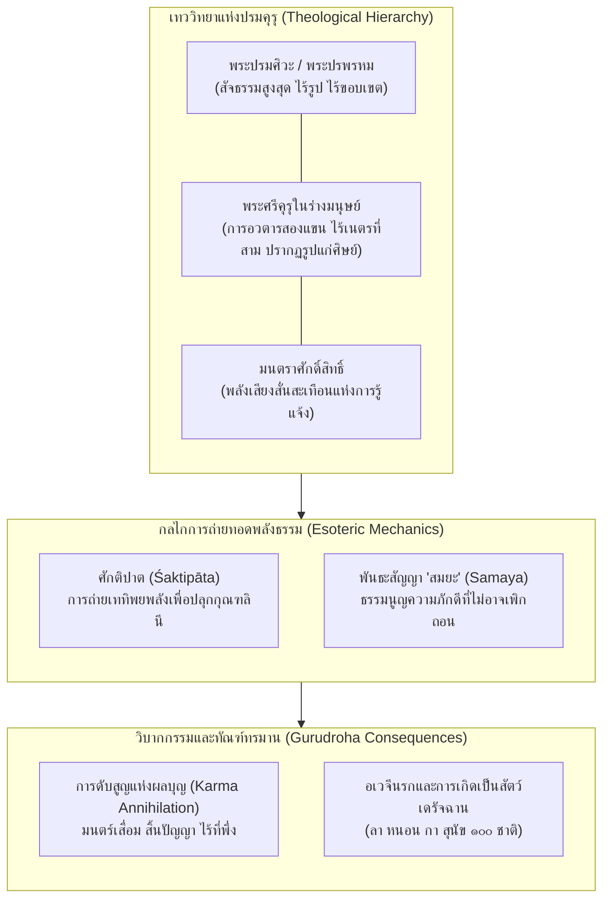
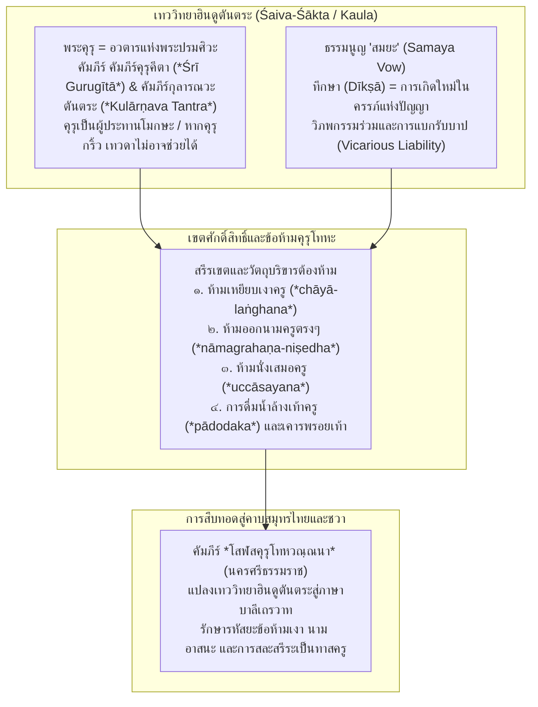
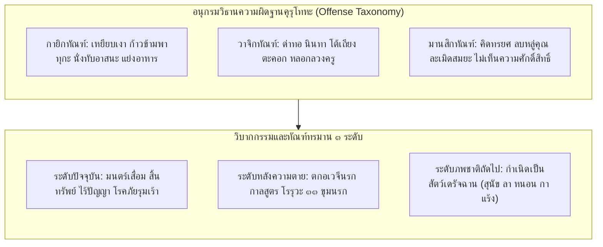

# บทที่ ๘: สายธารจารีตฮินดูตันตระ: คุรุคีตา กุลารณวะตันตระ และเทววิทยาแห่งคุรุปูชา-คุรุโทหะ (The Hindu Tantric Foundations: Gurugītā, Kulārṇava Tantra, Tantrāloka & The Sacred Order of Guru-Bhakti)

---

## ๘.๑ เทววิทยาและจักรวาลวิทยาแห่ง "ปรมคุรุ" ในจารีตฮินดูตันตระ: การสถิตรูปแห่งพระศิวะ มนตร์ และพลังศักดิ์สิทธิ์ (Theology and Cosmology of the Paramaguru in Hindu Tantra: Embodiment of Śiva, Mantra, and Divine Power)

### ๘.๑.๑ สภาวะแห่ง "ปรมคุรุ" (Paramaguru): พระศิวะ มนตร์ และการสถิตรูปแห่งพลังศักดิ์สิทธิ์

ในกระบวนทัศน์ทางปรัชญาและประวัติศาสตร์ศาสนาเปรียบเทียบในอนุทวีปอินเดีย การก้าวข้ามจากยุคพระเวท (Vedic Period) เข้าสู่ยุคตันตระ (Tantric Period) ในช่วงครึ่งหลังของสหัสวรรษแรกแห่งคริสต์ศักราช ได้ก่อให้เกิดการปฏิวัติทางภววิทยา (Ontological Revolution) และญาณวิทยาครั้งสำคัญที่สุดครั้งหนึ่งในประวัติศาสตร์ความคิดของมนุษยชาติ นั่นคือการสถาปนาสถาบัน "คุรุ" (Guru) ให้กลายเป็นศูนย์กลางอันติมะแห่งจักรวาลวิทยา เทววิทยา และกลไกการหลุดพ้นทางจิตวิญญาณ ในขณะที่จารีตพระเวทและอุปนิษัทดั้งเดิมมองคุรุในฐานะอาจารย์ผู้ถ่ายทอดและอรรถาธิบายคัมภีร์ศักดิ์สิทธิ์ หรือเป็นเพียงกัลยาณมิตรผู้ชี้นำทางจิตวิญญาณ จารีตฮินดูตันตระ—โดยเฉพาะในสายไศวะ (Śaivism) และศากตะ (Śāktism)—กลับยกฐานะของคุรุขึ้นสู่สภาวะ "ปรมคุรุ" (Paramaguru) หรือสัจจะสูงสุดอันมิอาจแบ่งแยกได้จากพระศิวะ (Paramaśiva) และมหาศักติ (Parāśakti)[^1]

ความเข้าใจอันถ่องแท้ต่อสภาวะของคุรุในจารีตตันตระ ปรากฏอยู่อย่างประณีตในคัมภีร์ *ศรีคุรุคีตา* (คัมภีร์คุรุคีตา (*Śrī Gurugītā*)) ซึ่งเป็นวรรณกรรมคำสอนศักดิ์สิทธิ์ที่ประดิษฐานอยู่ในบรรพ *อุตตรขัณฑ์* (*Uttarakhaṇḍa*) แห่งมหาคัมภีร์ *สกันทปุราณะ* (*Skanda Purāṇa*)[^2] ตัวบทของคุรุคีตาดำเนินเรื่องด้วยบทสนทนาเชิงปรัชญา ณ ยอดเขาไกลาส (Kailāsa) ระหว่างพระแม่ปารวตี (Pārvatī) และพระปรเมศวร (Parameśvara / Śiva) โดยพระแม่ผู้เป็นตัวแทนแห่งความกรุณาต่อสรรพสัตว์ในสังสารวัฏ ได้ทูลถามถึงหนทางหลุดพ้นอันสูงสุดและรวดเร็วที่สุดสำหรับมนุษย์ผู้มีกำลังอันจำกัด พระศิวะจึงทรงเปิดเผยรหัสยะลึกซึ้งว่า ไม่มีสิ่งใดในสากลจักรวาลที่ประเสริฐและทรงอานุภาพยิ่งไปกว่า "คุรุตัตตวะ" (Gurutattva / ธาตุแห่งคุรุ) ดังปรากฏในคาถาที่ ๔๐ ซึ่งกลายเป็นโศลกอมตะที่ได้รับการสวดสาธยายทั่วทั้งโลกฮินดู:

> गुरुर्ब्रह्मा गुरुर्विष्णुर्गुरुर्देवो महेश्वरः ।  
> गुरुरेव परब्रह्म तस्मै श्रीगुरवे नमः ॥  
>
> "คุรุคือพระพรหม คุรุคือพระวิษณุ คุรุคือพระมเหศวร คุรุนั่นแลคือปรพรหม ข้าพเจ้าขอนอบน้อมแด่พระศรีคุรุพระองค์นั้น"[^3]

คาถานี้มิได้เป็นเพียงถ้อยคำสรรเสริญในเชิงวรรณศิลป์หรืออุปลักษณ์เปรียบเปรย (Metaphor) หากแต่เป็นการประกาศสัจจะทางภววิทยาอย่างตรงไปตรงมาว่า พระตรีมูรติ (Trimūrti)—อันได้แก่ พระพรหมผู้สร้าง พระวิษณุผู้รักษา และพระรุทร/ศิวะผู้ทำลายและรวบเก็บสรรพสิ่ง—มิใช่อื่นใดนอกจากการสำแดงรูป (Epiphany) ของพลังแห่งคุรุในมิติต่างๆ นอกจากมิติดังกล่าว ในวรรคที่สองที่ประกาศว่า *gurureva parabrahma* ("คุรุนั่นแลคือปรพรหม") ได้ตัดขาดข้อจำกัดของรูปกายมนุษย์ (Nāmārūpa) และยกสถานะของคุรุขึ้นสู่สภาวะปรมัตถ์ที่อยู่เหนือการปรุงแต่ง ข้ามพ้นกาลเทศะ และครอบคลุมสรรพภพ ดังที่คุรุคีตา คาถาที่ ๕๕ ได้สำทับไว้อย่างแยบคายว่า:

> अखण्डमण्डलाकारं व्याप्तं येन चराचरम् ।  
> तत्पदं दर्शितं येन तस्मै श्रीगुरवे नमः ॥  
>
> "พระองค์ใดผู้ทรงแผ่ซ่านครอบคลุมทั่วทั้งจักรวาลอันกลมกลืนไร้รอยต่อ ทั้งสรรพสิ่งที่เคลื่อนไหวและไม่เคลื่อนไหว พระองค์ใดผู้ทรงเปิดเผยพระบาท/สัจจะแห่งสิ่งนั้น ข้าพเจ้าขอนอบน้อมแด่พระศรีคุรุพระองค์นั้น"[^4]

มโนทัศน์เรื่องการสถิตรูปของพระผู้เป็นเจ้าในเรือนกายของคุรุนี้ ได้รับการพัฒนาและจัดวางระบบเทววิทยาอย่างเป็นระบบและเข้มข้นที่สุดในคัมภีร์ *กุลารณวะตันตระ* (คัมภีร์กุลารณวะตันตระ (*Kulārṇava Tantra*)) ซึ่งเป็นหนึ่งในคัมภีร์หลักของสายเกาละ (Kaula Sampradāya) ที่ได้รับการตรวจชำระโดย อาร์เธอร์ อวาโลน  (Arthur Avalon / เซอร์ จอห์น วูดรอฟฟ์ (Sir John Woodroffe) หรือ เซอร์ จอห์น วูดรอฟฟ์ / เซอร์ จอห์น วูดรอฟฟ์ (Sir John Woodroffe)) และ ตารานาถ วิทยารัตนะ (Tārānātha Vidyāratna) ในชุด *Tāntrik Texts* เล่มที่ ๕ (ค.ศ. ๑๙๑๗/๑๙๑๘)[^5] ในอุลลาสะที่ ๑๓ (Ullāsa 13) คัมภีร์กุลารณวะได้อธิบายถึงเหตุผลทางเทววิทยาว่า เหตุใดองค์ปรมศิวะจึงไม่ทรงโปรดสัตว์ด้วยรูปทิพย์อันไร้ขอบเขต แต่ทรงเลือกที่จะปรากฏพระองค์ในร่างมนุษย์ของคุรุ:

> अतृन्नेत्रः शिवः साक्षाद् द्विबाहुश्च हरिः स्मृतः ।  
> अचतुर्बदनो ब्रह्मा श्रीगुरुः कथितः प्रिये ॥  
> प्रत्यक्षो विग्रहो गुरुः ...  
>
> "ดูก่อนนางผู้เป็นที่รัก แท้จริงแล้วพระศรีคุรุคือพระศิวะผู้ไร้ซึ่งเนตรที่สาม (atrinnetraḥ śivaḥ), คือพระหริ/วิษณุผู้มีเพียงสองกร (dvibāhuś ca hariḥ), และคือพระพรหมผู้ไม่มีสี่พักตร์ (acaturbadano brahmā)... พระคุรุคือรูปกายที่ปรากฏแจ่มแจ้งเฉพาะหน้าแห่งพระเจ้า (pratyakṣo vigraho guruḥ)"[^6]

### ๘.๑.๒ รหัสยปรัชญานิรุกติศาสตร์แห่งคำว่า "คุรุ": ปริศนาธรรม กุ (ความมืด) และ รุ (แสงสว่าง)

ข้อความนี้เผยให้เห็นรหัสยปรัชญาอันแยบคายว่า พระศิวะทรง "ซ่อน" อัตลักษณ์ทิพย์อันน่าเกรงขามของพระองค์—อันได้แก่ พระเนตรที่สามที่พร้อมจะเผาผลาญกามเทพ, พระจันทร์เสี้ยวบนมวยผม, และกรทั้งหลายที่ถืออาวุธร้ายแรง—เพื่อแปลงรูปเป็นมนุษย์ธรรมดาที่มีสองตาและสองแขน เพื่อที่สานุศิษย์ผู้เป็นเพียงมนุษย์เดินดิน (Jīva) ซึ่งมีอินทรีย์อันหยาบและจำกัด จะสามารถเข้าใกล้ สัมผัส สนทนา และรับการถ่ายทอดกระแสพระกรุณา (Anugraha / Śaktipāta) ได้โดยไม่แตกสลายไปเสียก่อน คุรุจึงมิใช่ "ตัวแทน" (Representative) แต่เป็น "พระวรกายที่แท้จริง" (Vigraha) ของพระผู้เป็นเจ้าที่ลงมาสถิตอยู่ในโลกียวิสัย[^7]

นอกจากมิติทางเทววิทยาแล้ว ทั้งคัมภีร์ *ศรีคุรุคีตา* และ *กุลารณวะตันตระ* ยังได้สถาปนาระบบ "นิรุกติศาสตร์รหัสยะ" (Mystical Etymology / Nirukta) เพื่อจำแนกความหมายอันศักดิ์สิทธิ์ของอักขระที่ประกอบขึ้นเป็นคำว่า "คุรุ" (Gu-ru) ไว้อย่างน่าอัศจรรย์ ใน *ศรีคุรุคีตา* คาถาที่ ๑๒, ๓๑ และ ๓๒ ได้แจกแจงความหมายของพยางค์ *คุ* (Gu) และ *รุ* (Ru) ไว้ว่า:

> गुकारश्चान्धकारश्च रुकारस्तेज उच्यते ।  
> अज्ञानग्रासकं ब्रह्म गुरुरेव न संशयः ॥  
> गुकारस्त्वन्धकारो हि रुकारस्तन्निवारकः ।  
> अन्धकारनिवारित्वाद् गुरुरित्यभिधीयते ॥  
> गुकारः प्रथमो वर्णो मायादिगुणभासकः ।  
> रुकारो द्वितीयो ब्रह्म मायाभ्रान्तिविमोचनम् ॥  
>
> "พยางค์ 'คุ' หมายถึงความมืดมนอนธการ ส่วนพยางค์ 'รุ' หมายถึงแสงสว่างอันเจิดจ้า พระพรหมผู้กลืนกินความไม่รู้นั้นคือคุรุอย่างไม่ต้องสงสัย... พยางค์ 'คุ' คือความมืด ส่วนพยางค์ 'รุ' คือผู้ขจัดความมืดนั้น เพราะเหตุที่เป็นผู้ขจัดความมืดมน พระองค์จึงได้นามว่า 'คุรุ'... อักขระแรก 'คุ' ส่องแสดงถึงมายาและคุณะทั้งหลาย ส่วนอักขระที่สอง 'รุ' คือพรหมันผู้ปลดปล่อยจากความหลงผิดในมายา"[^8]

ในด้านคู่ขนาน *กุลารณวะตันตระ* ในอุลลาสะที่ ๑๗ คาถาที่ ๔–๕ ได้ขยายความลึกซึ้งของอักขรวิทยาเชิงตันตระ โดยแยกคำว่า คุรุ ออกเป็นสามองค์ประกอบทางสัทศาสตร์ ได้แก่ พยางค์ "คุ" (Gu), พยัญชนะ "ร" (R), และสระ "อุ" (U):

> गुकारः सिद्धिदः प्रोक्तो रेफः पापस्य दाहकः ।  
> उकारः शम्भुरित्युक्तः त्रितयात्मा गुरुः स्मृतः ॥  
>
> "พยางค์ 'คุ' กล่าวกันว่าเป็นผู้ประทานความสำเร็จ (Siddhida), พยัญชนะ 'ร' (เรผะ) คือผู้เผาผลาญบาปทั้งปวง (Pāpasya dāhaka), และสระ 'อุ' กล่าวกันว่าคือองค์พระศัมภุ/ศิวะ (Śambhu) คุรุจึงได้รับการจดจำว่าเป็นผู้รวมสภาวะแห่งตรีเอกภาพนี้ไว้ในตน"[^9]

การวิเคราะห์ทางนิรุกติศาสตร์ศักดิ์สิทธิ์นี้บ่งชี้ว่า นามของคุรุมิใช่คำเรียกขานทางโลกียะ หากแต่เป็นมนตร์ประจุพลังจักรวาลที่ทำหน้าที่ทำลายบาปกรรม (Pāpa) ขจัดความมืดแห่งอวิชชา (Ajñāna) และสถาปนาสภาวะอันบริสุทธิ์ของพระศิวะลงสู่จิตใจของผู้เป็นศิษย์

### ๘.๑.๓ ภาษิตเด็ดขาดสูงสุด: ความเกรงกลัวต่อโทสะของครูและมิติเปรียบเทียบในโสฬสคุรุโทหวณฺณนา

แก่นแท้แห่งเทววิทยาว่าด้วยคุรุในบริบทตันตระนี้ ได้ก่อให้เกิดการสถาปนา "ภาษิตเด็ดขาดสูงสุด" (Absolute Axiom) ที่สะท้อนอำนาจสิทธิ์ขาดในการคุ้มครองและการลงทัณฑ์ ซึ่งปรากฏตรงกันอย่างน่าทึ่งในทั้งสองคัมภีร์หลัก โดยใน *กุลารณวะตันตระ* อุลลาสะที่ ๑๒ คาถาที่ ๔๙ และ *ศรีคุรุคีตา* คาถาที่ ๘๖ ได้บันทึกไว้ด้วยถ้อยคำที่เกือบจะเหมือนกันทุกประการ:

> शिवे रुष्टे गुरुस्त्राता गुरौ रुष्टे न कश्चन ।  
> तस्मात् सर्वप्रयत्नेन गुरुं प्रीणयेद् आदरात् ॥  
>
> "แม้นพระศิวะทรงกริ้ว คุรุยังเป็นที่พึ่งช่วยปกป้องได้ แต่หากคุรุกริ้วแล้วไซร้ ย่อมไม่มีผู้ใดในสากลโลกสามารถช่วยได้เลย! เพราะฉะนั้น พึงกระทำความเพียรในทุกวิถีทางเพื่อสร้างความพึงพอใจและเคารพรักในพระคุรุด้วยความเคารพอย่างยิ่ง"[^10]

ภาษิตศักดิ์สิทธิ์บทนี้นับเป็นหัวใจของเทววิทยาคุรุภักดีในสายตันตระ เพราะเป็นการยกระดับอำนาจของคุรุให้อยู่ "เหนือกว่า" เทพเจ้าทั้งปวงในมิติของการปฏิบัติการทางวิญญาณ หากพระศิวะทรงลงทัณฑ์ คุรุในฐานะผู้ถือรหัสยะแห่งพระกรุณาสามารถสวดอ้อนวอน แผ่เมตตา หรือใช้อำนาจมนตร์ขออภัยโทษให้แก่ศิษย์ได้ แต่หากศิษย์ทำให้คุรุขัดเคืองใจจนตัดขาดสายสัมพันธ์ทางจิตวิญญาณแล้ว แม้พระศิวะ พระนารายณ์ หรือทวยเทพทั้งปวงก็ไม่อาจก้าวเข้ามาก้าวก่ายหรือยับยั้งวิบากกรรมอันน่าสะพรึงกลัวที่จะบังเกิดขึ้นแก่ศิษย์ผู้นั้นได้เลย

เมื่อนำภาษิตตันตระบทนี้มาเปรียบเทียบเชิงสัทศาสตร์และอรรถศาสตร์กับตัวบทคัมภีร์ *โสฬสคุรุโทหวณฺณนา* ในใบลานนครศรีธรรมราช จะพบความสอดคล้องอย่างแยบคายจนปฏิเสธไม่ได้ ในคาถาที่ ๑๑ แห่ง *โสฬสคุรุโทหวณฺณนา* ได้ประพันธ์ไว้ด้วยภาษาบาลีไฮบริดว่า:

> น สกฺโกนฺติปิ สพฺเพปิ เทวา สกฺกาทเยาปิจ  
> คุรุนา อากุลํ กตฺวา รกฺขิตุํ สิสฺสปุคฺคลํ ฯ  
>
> ("แม้ทวยเทพทั้งหลายทั้งปวง มีท้าวสักกะเป็นต้น ก็มิอาจสามารถที่จะปกปักรักษาบุคคลผู้เป็นศิษย์ ซึ่งได้กระทำความขุ่นเคือง [อาคุล] ต่อพระคุรุได้เลย")[^11]

ความสอดคล้องระหว่าง *śive ruṣṭe gurus trātā gurau ruṣṭe na kaścana* ในกุลารณวะตันตระและคุรุคีตา กับ *na sakkontipi sabbepi devā sakkādayopica gurunā ākulaṃ katvā rakkhituṃ sissapuggalaṃ* ในใบลานนครศรีธรรมราช เป็นพยานหลักฐานอันหนักแน่นว่า นักปราชญ์ผู้รจนาคัมภีร์โสฬสคุรุโทหวณฺณนา ได้รับอิทธิพลโดยตรงจากเทววิทยาคุรุของฮินดูตันตระ โดยนำเอาแก่นความคิดเรื่อง "อำนาจอันเด็ดขาดของคุรุที่อยู่เหนืออำนาจของเทพเจ้า" มาถ่ายทอดและดัดแปลงเข้าสู่ฉันทลักษณ์คาถาบาลี เพื่อสถาปนากฎเกณฑ์ความศักดิ์สิทธิ์ในสังฆมณฑลแห่งคาบสมุทรไทย-มลายู

### ๘.๑.๔ ตรีเอกภาพแห่งเทวะ มนตร์ คุรุ และกลไกศักติปาต (Śaktipāta)

นอกจากมิติดังกล่าว มิติทางจักรวาลวิทยาของคุรุยังครอบคลุมถึง "ตรีเอกภาพแห่งความศักดิ์สิทธิ์" (The Sacred Triad) อันได้แก่ เทพเจ้า (Deva), มนตร์ (Mantra), และคุรุ (Guru) ซึ่งในคัมภีร์ *ตันตรราชตันตระ* (*Tantrarāja Tantra*) ภาคที่ ๑ (ตรวจชำระโดย อาร์เธอร์ อวาโลน และ บัณฑิต ลักษมณ ศัสตรี / สทาศิวะ มิศระ, ค.ศ. ๑๙๑๘)[^12] ในปฏละที่ ๑ คาถาที่ ๓๐ ได้ประกาศไว้อย่างเคร่งครัดเด็ดเดี่ยวว่า:

> यथा देवः तथा मन्त्रो यथा मन्त्रस्तथा गुरुः ।  
> देवस्य मन्त्रस्य गुरोः ऐकरूप्यं विचिन्तयेत् ॥  
>
> "เฉกเช่นที่เทพเจ้าเป็นเช่นใด มนตร์ก็เป็นเช่นนั้น มนตร์เป็นเช่นใด คุรุก็เป็นเช่นนั้น พึงเพ่งพินิจถึงความเป็นเอกภาพอันมิอาจแยกขาดจากกัน (Ekarūpya) ระหว่างเทพเจ้า มนตร์ และคุรุ"[^13]

คัมภีร์ *กุลารณวะตันตระ* อุลลาสะที่ ๑๓ คาถาที่ ๖๔ ได้เน้นย้ำสัจจะนี้ผ่านอุปมาอุปไมยว่า ความแตกต่างระหว่าง เทพ คุรุ และมนตร์ เป็นเพียงความแตกต่างของชื่อเรียก ดุจดังคำว่า "หม้อ" (Ghaṭa), "คนโท" (Kalaśa), และ "กุมภ์" (Kumbha) ซึ่งล้วนแต่หมายถึงภาชนะดินเผาชนิดเดียวกันทั้งสิ้น[^14] การแบ่งแยกคุรุออกจากพระเจ้าจึงจัดเป็น "อวิชชาขั้นรุนแรง" เพราะคุรุมิใช่บุคคลที่ยืนอยู่นอกระบบมนตร์ แต่เป็นตัวมนตร์ที่มีชีวิตและกำลังเปล่งสำเนียง (Living Embodied Mantra) ผู้ซึ่งทำหน้าที่ถ่ายทอดคลื่นความถี่แห่งการตื่นรู้ให้แก่ศิษย์

กลไกทางเทววิทยาและสรีรวิทยาโยคะ (Yogic Physiology) ในการถ่ายทอดพลังนี้ ได้รับการอธิบายอย่างละเอียดลึกซึ้งในคัมภีร์ *ศรีมาลินีวิชโยตตรตันตระ* (*Śrī Mālinīvijayottara Tantram*) แห่งสายไศวนิกายกัศมีร์ (ตรวจชำระโดย มธุสูทน เคาล ศาสตรี ใน *Kashmir Series of Texts and Studies* เล่มที่ ๓๗, ค.ศ. ๑๙๒๒)[^15] ซึ่งมหาปราชญ์ อภินวคุปตะ (Abhinavagupta, ราว ค.ศ. ๙๗๕–๑๐๒๕) ได้ยกย่องในมหาคัมภีร์ *ตันตราโลก* (*Tantrāloka*, อาหฺนิกะที่ ๑ คาถาที่ ๑๗) ว่าเป็นคัมภีร์ชั้นยอดเยี่ยมสูงสุดและเป็นรากฐานแห่งตันตระทั้งปวง (*mālinīvijayottare śrīmate sarvottamatve...*)[^16] ในอธิการที่ ๒ คาถาที่ ๑๐–๑๖ แห่งมาลินีวิชโยตตรตันตระ ได้แจกแจงปรากฏการณ์ "รุทรศักติสมาเวศ" (Rudraśakti-samāveśa) หรือการแทรกซึมเข้าสถิตแห่งพลังของพระรุทร/ศิวะ ซึ่งจะเกิดขึ้นได้ก็ต่อเมื่อได้รับการประสาทพรผ่านสายตา (Dṛk), การสัมผัส (Sparśa), หรือมนตร์ของสัตคุรุ[^17]

พลังศักติที่คุรุส่งผ่านมานี้ จะกระตุ้นให้กุณฑลินี (Kuṇḍalinī) ตื่นขึ้นและเคลื่อนตัวผ่านท่อสุษุมนา (Suṣumnā Nāḍī) ทะลวงผ่านจักระทั้งหลายขึ้นไปจนถึง "พรหมรันธระ" (Brahmarandhra) หรือช่องเปิดแห่งพรหมัน ณ กะโหลกศีรษะส่วนยอด เพื่อรวมเป็นหนึ่งกับสหัสราระ (Sahasrāra Padma) อันเป็นที่ประทับของปรมศิวะ คุรุจึงทำหน้าที่เป็นประตูกลไกทางจิตวิญญาณเพียงหนึ่งเดียวที่สามารถ "เปิด" พรหมรันธระให้แก่ศิษย์ได้ หากปราศจากคุรุ มนุษย์ย่อมตกเป็นทาสของวัฏสงสารและพันธนาการแห่งกรรม (Mala) ตลอดไป[^18]

ด้วยเหตุดังกล่าว เทววิทยาและจักรวาลวิทยาแห่ง "ปรมคุรุ" ในจารีตฮินดูตันตระ จึงมิได้เป็นเพียงเรื่องของความเคารพในตัวบุคคลตามจริยธรรมธรรมดาสามัญ หากแต่เป็นโครงสร้างความเชื่อทางปรัชญาและรหัสยศาสตร์อันเข้มข้น ที่หลอมรวมพระผู้เป็นเจ้า มนตร์ จักรวาลวิทยา และสรีรวิทยาแห่งโยคะเข้าไว้ด้วยกันอย่างเป็นระบบ โครงสร้างเทววิทยานี้เองที่เป็นต้นธารทางปัญญาอันไพศาล ซึ่งไหลบ่าข้ามมหาสมุทรอินเดียเข้าสู่อาณาจักรศรีวิชัย ตามพรลิงค์ และกลั่นตัวกลายเป็นธรรมนูญความศักดิ์สิทธิ์ในคัมภีร์ *โสฬสคุรุโทหวณฺณนา* แห่งเมืองนครศรีธรรมราชในเวลาต่อมา

> [!NOTE]
> **เทววิทยาแห่งพระปรมคุรุในไศวะ-ศากตะตันตระ:**  
> ในจารีตฮินดูตันตระ พระอาจารย์มิใช่ผู้สอนวิชาทางโลกียะ หากคือการปรากฏพระองค์ของพระผู้เป็นเจ้า (Śiva incarnate) ผู้มีอำนาจชี้ขาดในการปลดเปลื้องพันธนาการแห่งสังสารวัฏ การล่วงเกินพระอาจารย์จึงมีผลทำลายล้างความหลุดพ้นโดยตรง และเป็นต้นธารของคำสาปในคัมภีร์ *โสฬสคุรุโทหวณฺณนา*

---

## ๘.๒ ธรรมนูญการปฏิญาณสัจจะและพันธะสัญญา "สมยะ": พิธีกรรมการให้กำเนิดใหม่ การอภิเษก และความรับผิดชอบร่วมทางวิญญาณ (The Constitution of Samaya and Sacramental Vows: Rebirth, Abhiṣeka, and Spiritual Vicarious Liability)

### ๘.๒.๑ ธรรมนูญแห่งสมยะ: พันธะสัญญาศักดิ์สิทธิ์ที่ไม่อาจเพิกถอน

ในโครงสร้างสถาบันศาสนาของจารีตฮินดูตันตระ ความสัมพันธ์ระหว่างคุรุและศิษย์มิได้ก่อตั้งขึ้นบนพื้นฐานของสัญญาประชาคมหรือการตกลงแลกเปลี่ยนผลประโยชน์ทางโลก หากแต่สถาปนาขึ้นผ่าน "พันธสัญญาศักดิ์สิทธิ์" ที่เรียกว่า **"สมยะ" (Samaya)** ซึ่งมีสถานะเป็นดั่งธรรมนูญทางจิตวิญญาณที่ไม่อาจเพิกถอนได้ คำว่า "สมยะ" ในบริบทตันตรศาสตร์มีความหมายครอบคลุมทั้ง ข้อบังคับทางวินัย กฎเกณฑ์ข้อห้าม คำสัตย์ปฏิญาณ และสภาวะแห่งการตระหนักรู้ร่วมกันระหว่างคุรุ ศิษย์ และสายตระกูลธรรม (Sampradāya)[^19] พันธะสัญญานี้จะเริ่มต้นขึ้นอย่างเป็นทางการผ่านพิธีกรรมการเปลี่ยนผ่านสถานะทางวิญญาณขั้นสูงสุด ๒ ประการ คือ **"ทีชา" (Dīkṣā / การประสาทปริสุทธิคุณ)** และ **"อภิเษก" (Abhiṣeka / การสรงสถาปนาศักดิ์สิทธิ์)**[^20]

เดิร์ก ยาน โฮนส์ (Dirk Jan Hoens) ในบทความวิชาการว่าด้วยพิธีกรรมตันตระใน *Hindu Tantrism* (ตีพิมพ์โดยสำนักพิมพ์ E.J. Brill, 1979) ได้ชำระนิรุกติศาสตร์เชิงปรัชญาของคำว่า "ทีชา" ตามที่ปรากฏในคัมภีร์ตันตระโบราณ อาทิ *ปัทมสัมหิตา* (*Padmasaṃhitā*) และ *วิษณุสัมหิตา* (*Viṣṇusaṃhitā*) ไว้อย่างแจ่มแจ้งว่า คำว่า *ทีชา* ประกอบขึ้นจากรากศัพท์ศักดิ์สิทธิ์ ๒ ตัว ได้แก่:
- รากศัพท์ **"ทา" (Dā)** ซึ่งหมายถึง "การให้" หรือ "การประสาททิพยญาณ" (*dīyate jñānam*)  
- รากศัพท์ **"ชิ" (Kṣi)** ซึ่งหมายถึง "การทำลายล้าง" หรือ "การผลาญบาปกรรมและพันธนาการ" (*kṣīyate pāpasañcayaḥ / kṣīyante ca malāni*)[^21]

พิธีทีชาจึงเป็นกระบวนการตัดขาดศิษย์ออกจากพันธนาการทางสายเลือดและสภาวะ "ปศุ" (Paśu / สัตว์ผู้ติดข้องอยู่ในสัญชาตญาณดิบ) เพื่อถือกำเนิดใหม่เป็น "วีระ" (Vīra / นักรบจิตวิญญาณ) หรือ "ทิวยะ" (Divya / ผู้รู้แจ้ง) พิธีทีชาในสายตันตระจึงได้รับการเทิดทูนว่าเป็น "การให้กำเนิดครั้งที่สองอันแท้จริงทางจิตวิญญาณ" (Spiritual Second Birth) ยิ่งกว่าพิธีอุปนยนะ (Upanayana) ในจารีตพระเวทดั้งเดิม เพราะคุรุทำหน้าที่เป็นทั้งบิดาและมารดาทางวิญญาณ ผู้ให้กำเนิดสรีระทิพย์ (Divya-deha) แก่ศิษย์ผ่านการประสาทมนตร์[^22]

### ๘.๒.๒ การทดสอบศิษย์และพิธีกรรมการให้กำเนิดใหม่ (Dīkṣā)

ในคัมภีร์ *ศารทาติลักตันตระ* (*Śāradātilaka Tantram*) รจนาโดยพระลักษมณเทศิเกนทระ (Lakṣmaṇadeśikendra, ราวคริสต์ศตวรรษที่ ๑๑) ซึ่งได้รับการตรวจชำระโดย อาร์เธอร์ อวาโลน ในชุด *Tāntrik Texts* เล่มที่ ๑๖–๑๗ (ค.ศ. ๑๙๓๓)[^23] ร่วมกับคัมภีร์ *กุลารณวะตันตระ* อุลลาสะที่ ๑๔ ได้จำแนกรูปแบบแห่งการประสาทปริสุทธิคุณ (ทีชา) ออกเป็น ๔ ลำดับขั้นอันประณีตแยบคาย ได้แก่:
๑. **กริยาวตี ทีชา (Kriyāvatī Dīkṣā):** การประสาทธรรมผ่านพิธีกรรมรูปธรรมภายนอก การสร้างมณฑล (Maṇḍala) คนโทศักดิ์สิทธิ์ และการทำพิธีโหมกูณฑ์ (Homa) บูชาไฟ เพื่อชำระมลทินในร่างกายหยาบ (Sthūla-śarīra)  
๒. **วรรณมยี ทีชา (Varṇamayī Dīkṣā):** การประสาทธรรมผ่านพลังแห่งสัทศาสตร์ศักดิ์สิทธิ์ โดยคุรุจะทำการลงอักขระมาตฤกา (Mātṛkā-nyāsa) ๕๐ ตัวอักษรภาษาสันสกฤตลงบนเรือนกายและจักระของศิษย์ เพื่อเปลี่ยนสรีระของศิษย์ให้กลายเป็นเรือนสถิตแห่งพระมนตร์  
๓. **กลาวตี ทีชา (Kalāvatī Dīkṣā):** การประสาทธรรมผ่านการชำระองค์ประกอบจักรวาลทั้ง ๕ ที่เรียกว่า "เบญจกลา" (Pañca-kalā) ได้แก่ นิวฤตติ (Nivṛtti), ประติษฐา (Pratiṣṭhā), วิทยา (Vidyā), ศานติ (Śānti), และศานตยตีตะ (Śāntyatīta) เพื่อยกระดับจิตของศิษย์ให้ข้ามพ้นมิติแห่งจักรวาลอันจำกัด  
๔. **เวธมยี ทีชา (Vedhamayī Dīkṣā):** การประสาทธรรมชั้นอุกฤษฏ์ขั้นสูงสุดที่คุรุใช้พลังจิตวิญญาณ "เจาะทะลวง" (Vedha) ผ่านกระแสปราณ ทะลวงจักระและปลุกพลังกุณฑลินีของศิษย์ให้ลุกโพลงขึ้นสู่สหัสราระในชั่วพริบตา โดยมิต้องอาศัยพิธีกรรมภายนอกใดๆ เลย[^24]

ทว่า ก่อนที่กระบวนการศักดิ์สิทธิ์เหล่านี้จะเกิดขึ้นได้ คัมภีร์ตันตระทุกสำนักต่างกำหนดกฎเกณฑ์อันเข้มงวดสูงสุดในเรื่อง **"สังวัตสรปรีชา" (Saṃvatsara-parīkṣā)** หรือการทดสอบคุณสมบัติและความประพฤติของศิษย์เป็นระยะเวลาอย่างน้อย ๑ ถึง ๔ ปี ในคัมภีร์ *ศารทาติลักตันตระ* ปฏละที่ ๒ คาถาที่ ๑๕๓ พร้อมด้วยอรรถกถา *ปทารถาทรรศะ* (*Padārthādarśa*) ของ ราฆวภัฏฏะ (Rāghavabhaṭṭa, ค.ศ. ๑๔๙๓) ได้บันทึกหลักเกณฑ์การทดสอบตามวรรณะและวุฒิภาวะไว้ว่า:

> तस्मात् परीक्षयेत् शिष्यं संवत्सरं द्विजोत्तमम् ।  
> राजन्यं द्व्यब्दसंयुक्तं वैश्यं वर्षत्रयेण तु ।  
> शूद्रं वर्षचतुष्केण ...  
>
> "ด้วยเหตุฉะนี้ พึงทดสอบศิษย์ผู้เป็นพราหมณ์ชั้นเลิศเป็นเวลาหนึ่งปีเต็ม, ทดสอบกษัตริย์เป็นเวลาสองปี, ทดสอบแพศย์เป็นเวลาสามปี, และทดสอบศูทรเป็นเวลาสี่ปีเต็ม..."[^25]

### ๘.๒.๓ ความรับผิดชอบร่วมทางวิญญาณ (Vicarious Spiritual Liability): วิบากกรรมของครูต่อการกระทำของศิษย์

เหตุผลที่คุรุต้องใช้ความระมัดระวังและทดสอบศิษย์อย่างยาวนาน มิใช่เพียงเพื่อคัดกรองบุคคลที่มีคุณธรรมเท่านั้น แต่มีรากฐานมาจากเทววิทยาว่าด้วย **"ความรับผิดชอบร่วมทางวิญญาณ" (Spiritual Vicarious Liability)** หรือกฎแห่งกรรมแทนที่ ในคัมภีร์ *ศารทาติลักตันตระ* ปฏละที่ ๒ คาถาที่ ๑๔๙–๑๕๐ และคัมภีร์ *ปราณโตษิณี* (*Prāṇatoṣiṇī*, 33.42–50) ได้ระบุสัจจะอันน่าสะพรึงกลัวสำหรับผู้เป็นคุรุว่า:

> राज्ञि चामात्यजं पापं पत्नीपापं स्वभर्तरि ।  
> तथा शिष्यार्जितं पापं गुरुः प्राप्नोति निश्चितम् ॥  
>
> "บาปที่เสนาบดีก่อขึ้น ย่อมตกแก่พระราชา; บาปที่ภรรยาก่อขึ้น ย่อมตกแก่สามี; ฉันใดก็ฉันนั้น บาปกรรมทั้งหลายทั้งปวงที่ศิษย์ได้สั่งสมขึ้น ย่อมตกทอดเข้าสู่ผู้เป็นคุรุอย่างแน่นอนที่สุด!"[^26]

คัมภีร์ *กุลารณวะตันตระ* อุลลาสะที่ ๑๑ คาถาที่ ๑๐๘ ได้สำทับเตือนคุรุทั้งหลายว่า คุรุผู้ใดที่ให้ทีชาแก่บุคคลผู้ไร้คุณสมบัติ เพียงเพราะความโลภในลาภสักการะหรือความประมาท ย่อมต้องร่วมรับวิบากกรรมอันหนักหน่วงและต้องตกลงสู่นรกภูมิพร้อมกับศิษย์ผู้นั้น[^27] คุรุจึงต้องแบกรับ "ภาระทางวิญญาณ" (Karmic Burden) ของศิษย์ไว้บนบ่าตนเอง การรับศิษย์จึงเปรียบเสมือนการนำเอาพิษร้ายเข้าสู่ร่างกาย หากศิษย์ผู้นั้นมิได้เป็นผู้บริสุทธิ์และรักษาคำสัตย์โดยแท้

เมื่อผ่านการทดสอบจนสิ้นสงสัยแล้ว พิธีกรรมการอภิเษก (Abhiṣeka) จะจัดขึ้นอย่างยิ่งใหญ่ โฮนส์ได้อธิบายว่า พิธีอภิเษกเป็นการสรงน้ำศักดิ์สิทธิ์จากคนโทมนตร์ (Kalaśa / Kumbha) ที่ผ่านการอัญเชิญทวยเทพและพลังแห่งสายตระกูลลงมาสถิต ศิษย์จะได้รับการโกนผม ชำระกาย นั่งบนแผ่นหนังเสือ หนังกวาง หรืออาสนะรูปดอกบัว จากนั้นคุรุจะทำการรดน้ำอภิเษกเหนือศีรษะ เพื่อลบล้างอัตลักษณ์เดิมในทางโลก แล้วประสาทนามศักดิ์สิทธิ์ใหม่ (Dīkṣā-nāma) ซึ่งมักลงท้ายด้วยสร้อยคำว่า *-อานันทนาถ* (*-ānandanātha*)[^28]

ในขณะนั้นเอง ศิษย์จะต้องเข้าสู่พิธีปฏิญาณสัจจะเพื่อรับ **"ข้อบังคับสมยะ" (Samaya Vows)** ซึ่งในคัมภีร์ *ตันตรราชตันตระ* (*Tantrarāja Tantra*) ภาคที่ ๒ (ตรวจชำระโดย อาร์เธอร์ อวาโลน และ สทาศิวะ มิศระ, ค.ศ. ๑๙๒๖)[^29] ปฏละที่ ๒๖ คาถาที่ ๗๐–๗๘ ได้ประมวล "สมยะ ๑๓ ประการ" (Trayodaśa Samayāḥ) ไว้อย่างเป็นระบบ ควบคู่กับ "ศิษยาจาร ๑๕ ประการ" (Śiṣyācāra) ในปฏละที่ ๑ คาถาที่ ๒๕–๒๙ ซึ่งครอบคลุมหลักปฏิบัติตั้งแต่:
๑. การเคารพเชื่อฟังคำสั่งของคุรุโดยปราศจากข้อโต้แย้ง (*ājñā-pālana*)  
๒. การรักษาความลับแห่งตันตรศาสตร์และมนตร์มิให้รั่วไหลไปสู่บุคคลภายนอก (*rahasya-gopana*)  
๓. การห้ามลักขโมย ยักยอก หรือถือเอาทรัพย์สินของคุรุและของสงฆ์มาเป็นของตนโดยเด็ดขาด (*gurudravya-aharaṇa*)  
๔. การไม่มองคุรุว่าเป็นมนุษย์ธรรมดาที่มีกิเลส (*manuṣya-buddhi-varjana*)  
๕. การไม่เดินลัดหน้า ไม่เหยียบเงา ไม่ใช้อาสนะ ยานพาหนะ หรือสิ่งของเครื่องใช้ร่วมกับคุรุ (*gurucchāyā-āsana-varjana*)  
๖. การปกป้องชื่อเสียงของคุรุและสายตระกูลธรรมยิ่งกว่าชีวิตตน[^30]

โดยเฉพาะอย่างยิ่งในประเด็นเรื่อง **"การรักษาความลับ" (Rahasya-gopana)** คัมภีร์ *กุลารณวะตันตระ* อุลลาสะที่ ๑๑ คาถาที่ ๘๔ ได้เปรียบเปรยด้วยภาษิตอันรุนแรงและเฉียบขาดว่า:

> गोपयेन् मातृजारवत् ...  
>
> "พึงปกปิดและรักษาความลับแห่งธรรมนี้ไว้ ดุจดังหญิงผู้รักษาความลับเรื่องชู้รักของมารดาตนเอง..."[^31]

หากศิษย์ผู้ใดนำมนตร์ ตัวบทคัมภีร์ หรือพิธีกรรมลับไปเปิดเผยแก่ "ปศุ" (ผู้มิได้รับการประสาทปริสุทธิคุณ / Anadhikārin) ผลแห่งการละเมิดสมยะ (Samayabhedana) จะทำให้มนตร์นั้นเสื่อมสลายทันที และทั้งคุรุและศิษย์จะต้องเผชิญกับคำสาปแช่งแห่งโยคินี (Yoginī-śāpa) อันก่อให้เกิดความวิบัติและความตายอย่างทรมาน[^32]

### ๘.๒.๔ อนุกรมวิธานแห่งคุรุและศิษย์ในจารีตตันตระ: การจัดลำดับชั้นแห่งมณฑล

นอกจากมิติดังกล่าว จารีตตันตระยังได้วางอนุกรมวิธานของคุรุไว้อย่างเป็นระบบ โดยจำแนกคุรุออกเป็น ๔ ลำดับขั้น ได้แก่:  
๑. **เปรกะ (Preraka):** คุรุผู้กระตุ้นเร้าและชักนำให้เกิดความสนใจในธรรม  
๒. **สูจกะ (Sūcaka):** คุรุผู้ชี้แนะหนทางและวัตรปฏิบัติเบื้องต้น  
๓. **วาจกะ (Vācaka):** คุรุผู้อธิบายขยายความตัวบทคัมภีร์และธรรมปฏิบัติ  
๔. **ทรรศกะ (Darśaka / ปรมคุรุ):** คุรุผู้เปิดเผยความจริงอันติมะและประสาทการตื่นรู้แห่งจิตวิญญาณ[^33]

หรือในอีกมิติหนึ่งจำแนกเป็น: (๑) **ศิกษาคุรุ (Śikṣāguru)** ครูผู้สอนวิชาความรู้, (๒) **ทีชาคุรุ (Dīkṣāguru)** คุรุผู้ประสาทมนตร์และทีชา, (๓) **กุลคุรุ (Kulaguru)** คุรุประจำสายตระกูลธรรม, และ (๔) **ปรมคุรุ (Paramaguru)** คุรุต้นสายตระกูลอันเป็นเอกภาพกับพระศิวะ เมื่อนำกรอบการจำแนกคุรุ ๔ ประการนี้ไปเปรียบเทียบกับคัมภีร์ *โสฬสคุรุโทหวณฺณนา* ในใบลานนครศรีธรรมราช จะพบความสอดคล้องเชิงโครงสร้างอย่างน่าอัศจรรย์ ในคาถาที่ ๒ แห่ง *โสฬสคุรุโทหวณฺณนา* ระบุไว้อย่างแจ้งชัดว่า:

> คุรุจตุพฺพิโธ โหติ อุปชฺฌาจริโย เจว  
> คมฺมคุรุ สิสฺสานุคุรุ ภิกฺขุเจว จตุพฺพิโธ โหติ ฯ  
>
> ("พระคุรุย่อมมี ๔ ประการ คือ อุปัชฌายาจารย์ ๑, คามคุรุ [ครูประจำคาม/สำนัก] ๑, ศิษยานุคุรุ [ครูผู้สืบทอดสายศิษย์] ๑, และภิกขุคุรุ ๑ ย่อมมี ๔ ประการดังนี้แล")[^34]

การจำแนกคุรุออกเป็น ๔ ประเภทยืนยันถึงการถ่ายโอนแบบแผนความคิดเรื่อง "จตุรพุทธ/จตุรคุรุ" จากมณฑลตันตระเข้ามาปรับใช้ในโครงสร้างสงฆ์เถรวาทในคาบสมุทรไทย-มลายู โดยดัดแปลงคำศัพท์ให้สอดคล้องกับตำแหน่งพระวินัย (อุปัชฌายะและอาจริยะ) แต่ยังคงรักษาระบบลำดับชั้นทางสิทธิอำนาจ ๔ ระดับไว้อย่างครบถ้วน

ในมิติต่อมา คาถาที่ ๕ แห่ง *โสฬสคุรุโทหวณฺณนา* ยังได้บันทึกสถานะอันสูงส่งและเป็นเอกเทศของศิษย์ผู้ผ่านพิธีอภิเษกไว้ว่า:

> คุรุนาภิสิโต สิสฺโส ยสฺมา คุรุสิสฺโส อโหสิ  
> สพฺพญฺจ คหิโต โลเก น สกฺกา สิสฺสสทิโส ฯ  
>
> ("ศิษย์ผู้ได้รับการอภิเษก [ประสาทพร] โดยพระคุรุ ย่อมดำรงสถานะเป็น 'คุรุศิษย์' [ศิษย์สายตรงแท้จริง] แห่งพระคุรุ เพราะเหตุนั้น บุคคลเช่นนั้นย่อมได้รับการเคารพนับถือในโลกทั้งปวง ไม่มีผู้ใดจะเสมอเหมือนกับศิษย์เช่นนี้ได้")[^35]

การใช้คำว่า **"คุรุนาภิสิโต" (Gurunābhisito / อภิเษกโดยคุรุ)** ในคาถาที่ ๕ นี้ นับเป็น "รอยประทับทางพิธีกรรมตันตระ" (Tantric Ritual Imprint) ที่สำคัญยิ่ง เพราะคำว่า *อภิเษก* ในจารีตพระวินัยของพระพุทธศาสนาเถรวาทดั้งเดิมมิได้ถูกนำมาใช้เป็นศัพท์เทคนิคหลักในการอุปสมบทภิกษุ (ซึ่งใช้คำว่า *อุปสมฺปทา*) แต่เป็นคำศัพท์ศูนย์กลางในพิธีกรรมตันตระทั้งในสายฮินดูและพุทธตันตรยาน (Vajrayāna) การที่ตัวบทโสฬสคุรุโทหวณฺณนานำคำว่า *คุรุนาภิสิโต* มาวางเป็นแกนกลาง ย่อมพิสูจน์ว่า ชุมชนวิชาการสงฆ์ในคาบสมุทรไทย-มลายูได้รับเอาธรรมนูญแห่งการอภิเษกและสัญญาสมยะจากโลกฮินดูตันตระเข้ามาปรับใช้ เพื่อสถาปนาความสัมพันธ์ทางสายตระกูลธรรม (Paramparā) ให้มีความศักดิ์สิทธิ์ เด็ดขาด และผูกพันกันในระดับข้ามภพข้ามชาติ

ด้วยเหตุดังกล่าว พันธะสัญญาสมยะจึงมิใช่เพียงกฎหมายภายนอก แต่เป็น "สายใยชีวพลังร่วม" (Ontological & Spiritual Lifeline) ที่เชื่อมวิญญาณของศิษย์เข้ากับคุรุ ความผิดพลาดหรือการทรยศของฝ่ายใดฝ่ายหนึ่งย่อมก่อให้เกิดคลื่นสะเทือนทางวิญญาณที่ทำลายล้างทั้งสองฝ่าย ระบบสมยะจึงทำหน้าที่เป็นเกราะคุ้มกันความบริสุทธิ์ของสายธรรม และเป็นรากฐานที่รองรับบทลงโทษทัณฑ์อันรุนแรงของ "คุรุโทหะ" ที่จะตามมาหากมีการล่วงละเมิดพันธสัญญาศักดิ์สิทธิ์นี้

> [!IMPORTANT]
> **มโนทัศน์ "ภาระความรับผิดแทนทางวิญญาณ" (Vicarious Spiritual Liability):**  
> เหตุที่คัมภีร์ตันตระและ *โสฬสคุรุโทหวณฺณนา* กำหนดโทษทัณฑ์ของการลบหลู่ครูไว้อย่างรุนแรงถึงขั้นตกอเวจี เนื่องจากเมื่อศิษย์ทำบาป พระอาจารย์จะต้องแบกรับผลกรรมนั้นด้วยหนึ่งในสี่ส่วน ความผิดฐาน "คุรุโทหะ" จึงเป็นการทรยศต่อผู้ที่ยอมแบกรับวิบากกรรมแทนตน

---

## ๘.๓ สรีระ วัตถุบริขาร และรอยเท้าของครูในฐานะ "เขตศักดิ์สิทธิ์ต้องห้าม": การเคารพเงา พาทุกะ และน้ำล้างเท้า (The Sacred Topography of the Master's Person and Utensils: Shadow Taboos, Pādukā, and Padodaka)

### ๘.๓.๑ ภูมิศาสตร์ศักดิ์สิทธิ์แห่งสรีระคุรุ: สรีระในฐานะมณฑลที่มีชีวิต

ในภูมิทัศน์ทางมานุษยวิทยาศาสนาและเทววิทยาตันตระ เรือนกายของคุรุมิได้มีสถานะเป็นเพียงสังขารเนื้อหนังของมนุษย์ธรรมดา หากแต่แปรสภาพผ่านพิธีกรรม "นยาสะ" (Nyāsa) และการประจุพระมนตร์ ให้กลายเป็น "วิหารอันมีชีวิต" (Living Temple) หรือ "ยันตร์ทางชีวภาพ" (Biological Yantra) ซึ่งเป็นศูนย์รวมแห่งพลังงานศักดิ์สิทธิ์ของจักรวาล ด้วยเหตุนี้ สรีระทุกส่วน วัตถุบริขารเครื่องใช้ แม้กระทั่งพื้นที่ทางกายภาพและปรากฏการณ์ธรรมชาติต่อเนื่อง เช่น เงา (Chāyā) และรอยเท้า (Pada) ของคุรุ จึงถูกสถาปนาให้เป็น **"เขตศักดิ์สิทธิ์ต้องห้าม" (Sacred Taboo Zone)** ที่ศิษย์จะต้องปฏิบัติต่อสิ่งเหล่านั้นด้วยความยำเกรงขั้นสูงสุด การล่วงล้ำเขตศักดิ์สิทธิ์นี้แม้เพียงโดยไม่เจตนาย่อมนับเป็นมลทินและบาปกรรมอันหนักหน่วง[^36]

หลักเกณฑ์ข้อห้ามว่าด้วยการเคารพสรีระและวัตถุบริขารของคุรุปรากฏอยู่อย่างหนาแน่นในคัมภีร์ *กุลารณวะตันตระ* (*Kulārṇava Tantram*) อุลลาสะที่ ๑๒ (ตรวจชำระโดย อาร์เธอร์ อวาโลน และ ตารานาถ วิทยารัตนะ, ค.ศ. ๑๙๑๗)[^37] ซึ่งได้ระบุข้อห้ามเด็ดขาดในการล่วงเกินเขตแดนของคุรุไว้ในคาถาที่ ๘๓–๘๔ ว่า:

> न लङ्घयेद् गुरोश्छायां दीपं पादुकाम् आसनम् ।  
> शय्यां वाहं तथा वस्त्रं न स्पृशेत् पदसम्पुटे ॥  
>
> "ศิษย์พึงอย่าได้ก้าวข้ามเงาของพระคุรุ (na laṅghayed guroś chāyāṃ), อย่าได้ก้าวข้ามดวงประทีป, รองเท้าไม้พาทุกะ (pādukā), อาสนะที่นั่ง, ที่นอน (śayyā), ยานพาหนะ (vāha), และพึงอย่าได้ก้าวข้ามหรือเหยียบย่ำผืนผ้าพัสตราภรณ์ (vastra) ของพระคุรุโดยเด็ดขาด..."[^38]

### ๘.๓.๒ คัมภีรภาพว่าด้วยข้อห้ามการเหยียบเงา (Chāyā-laṅghana) และการก้าวข้ามบริขาร

ข้อห้ามเรื่อง **"การก้าวข้ามเงาครู" (Gurucchāyā-laṅghana)** นับเป็นมโนทัศน์รหัสยะอันล้ำลึกยิ่ง ในทัศนะของตันตรศาสตร์ เงาของคุรุมิใช่เพียงปรากฏการณ์ทางทัศนศาสตร์ที่เกิดจากการบังแสงอาทิตย์ หากแต่เป็น "รัศมีกายทิพย์" (Aura / Prāṇamayakośa) ที่แผ่ออกมาจากพระวรกายของคุรุ การที่ศิษย์ก้าวเท้าเหยียบย่ำลงบนเงาของคุรุจึงมีค่าเท่ากับการเหยียบย่ำลงบนพระวรกายอันศักดิ์สิทธิ์โดยตรง สาระสำคัญประการต่อมา ในคัมภีร์ *ศรีคุรุคีตา* (คัมภีร์คุรุคีตา (*Śrī Gurugītā*), 1925) คาถาที่ ๓๔ ได้สำทับข้อห้ามนี้ไว้อย่างสอดคล้องกันว่า:

> गुरुपादं न लङ्घेत गुरोश्छायां न लङ्घयेत् ।  
> शय्यामासनयानं च वस्त्रं पादुकामेव च ॥  
>
> "พึงอย่าได้ก้าวข้ามพระบาทของคุรุ, อย่าได้ก้าวข้ามเงาของคุรุ, ตลอดจนที่นอน, อาสนะ, ยานพาหนะ, ผืนผ้า, และรองเท้าพาทุกะของคุรุ"[^39]

เมื่อนำข้อห้ามตันตระเหล่านี้มาเปรียบเทียบกับคัมภีร์ *โสฬสคุรุโทหวณฺณนา* ในใบลานนครศรีธรรมราช จะพบความสอดคล้องทางคำศัพท์และฉันทลักษณ์ในระดับคำต่อคำ (Verbatim Parallel) อย่างน่าตะลึงงัน ในคาถาที่ ๓ แห่ง *โสฬสคุรุโทหวณฺณนา* ได้บันทึกไว้ว่า:

### ๘.๓.๓ มหาพาทุกะและอาสนะ: วัตถุศักดิ์สิทธิ์ตัวแทนแห่งพระอาจารย์

> คุรุโน จีวรํ ฉตฺตํ ปตฺตํ ฉายํ น ลงฺฆเร  
> ยานํ ปาทุกํ ทณฺฑมาสนํ สพฺพญฺจ คหิโต โลเก  
> น สกฺกา ตสฺส ลงฺฆิตุํ ฯ  
>
> ("ผืนจีวร ร่ม บาตร และเงาแห่งพระคุรุ ศิษย์พึงอย่าได้ก้าวข้ามเลย; ยานพาหนะ รองเท้าพาทุกะ ไม้เท้า และอาสนะที่นั่ง อันเป็นบริขารทั้งปวงที่พระคุรุถือครองในโลก ศิษย์มิอาจสามารถที่จะก้าวข้ามสิ่งเหล่านั้นได้เลย")[^40]

การเปรียบเทียบระหว่างสองตัวบทเผยให้เห็นโครงสร้างที่เหมือนกันทุกประการ:
- คำว่า `ฉายํ น ลงฺฆเร` ในใบลานนครศรีธรรมราช ตรงกับ `na laṅghayed guroś chāyāṃ` ในกุลารณวะตันตระและคุรุคีตา
- รายการวัตถุบริขารต้องห้าม: `ยานํ` ตรงกับ `vāhaṃ/yānaṃ`, `ปาทุกํ` ตรงกับ `pādukāṃ`, `อาสนํ` ตรงกับ `āsanaṃ`, และ `จีวรํ` ซึ่งเป็นคำบาลีที่ใช้แทน `vastraṃ` ในภาษาสันสกฤต
- การเพิ่มบริขารสงฆ์ ได้แก่ "ร่ม" (`ฉตฺตํ`), "บาตร" (`ปตฺตํ`), และ "ไม้เท้า" (`ทณฺฑํ`) ในตัวบทนครศรีธรรมราช สะท้อนถึงกระบวนการ "ปรับให้เข้ากับบริบทพุทธเถรวาท" (Buddhist Monastic Adaptation) โดยนำเอากฎเกณฑ์ตันตระมาสวมทับลงบนอัฏฐบริขารของภิกษุสงฆ์ แต่ยังคงรักษากฎเหล็กเรื่องการห้ามก้าวข้าม (Laṅghana) ไว้อย่างเคร่งครัด

ในมิติของกฎหมายศาสนาเปรียบเทียบ ดร. ปัณฑุรัง วามัน กาเณ (P. V. Kane) ได้ชี้แจงใน *History of Dharmasastra* เล่ม ๓ (1946) ว่า ในคัมภีร์พระธรรมศาสตร์ดั้งเดิม เช่น *มนุสมฤติ* (คัมภีร์มนูสมฤติ (*Manusmṛti*), II.198–205) และ *ยาชญวัลกยสมฤติ* (*Yājñavalkyasmṛti*) มีข้อห้ามมิให้ศิษย์นั่งหรือนอนบนเตียงของครู (*śayyā*) หรือใช้อาสนะร่วมกับครูอยู่แล้ว แต่เหตุผลเบื้องหลังในจารีตพระธรรมศาสตร์คือการป้องกันมหันตโทษเรื่อง **"คุรุตัลปคมนะ" (Gurutalpagamana / การล่วงประเวณีกับภรรยาของครู)** อันจัดเป็นหนึ่งใน "ปัญจมหาปาตกะ" (ห้ามล่วงเกินเตียงครูเพราะเตียงเป็นสัญลักษณ์ของภรรยาครู)[^41] ทว่า เมื่อแนวคิดนี้ไหลเข้าสู่มณฑลตันตระ ตันตรศาสตร์ได้ขยายความศักดิ์สิทธิ์ของเตียงและอาสนะครูให้กลายเป็น "เขตพลังงานศักดิ์สิทธิ์โดยแท้จริง" การแตะต้องหรือนั่งบนที่นอนครู (*śayyā*) จึงมิใช่เพียงความผิดทางเพศสถานะ แต่เป็นการลบหลู่บัลลังก์แห่งพระปรเมศวร

### ๘.๓.๔ ปรากฏการณ์การดื่มน้ำล้างเท้า (Pādodaka): พิธีกรรมภักดีเชิงสัญลักษณ์สูงสุด

นอกจากมิติดังกล่าว ศูนย์กลางแห่งความศักดิ์สิทธิ์ทางสรีรวิทยาของคุรุอยู่ที่ "พระบาท" (Guru-pada) และ "รองเท้าไม้" หรือ **"พาทุกะ" (Pādukā)** เซอร์ จอห์น วูดรอฟฟ์  (Sir John Woodroffe) ได้อธิบายไว้ใน *Shakti and Shakta* (ค.ศ. ๑๙๒๙) ว่า ในมณฑลตันตระ พระบาทของคุรุคือจุดเชื่อมต่ออันติมะระหว่างสภาวะประกาศะ (Prakāśa / แสงสว่างแห่งจิตบริสุทธิ์ของพระศิวะ) และวิมรรศะ (Vimarśa / พลังสำนึกรู้แห่งมหาศักติ) มนตร์พาทุกะ (Pādukā-mantra) นับเป็นยอดแห่งมนตร์ทั้งปวง เพราะเป็นมนตร์ที่ใช้ปลุกพลังการตระหนักรู้สูงสุด (*oṃ aiṃ hrīṃ śrīṃ... haṃsaḥ śivaḥ so'ham...*)[^42] ในคัมภีร์ *กุลารณวะตันตระ* อุลลาสะที่ ๑๒ คาถาที่ ๑๓ ได้สถาปนาพระบาทของคุรุให้เป็นมูลฐานแห่งการบูชาทั้งปวง:

> ध्यानमूलं गुरोर्मूर्तिः पूजामूलं गुरोः पदम् ।  
> मन्त्रमूलं गुरोर्वाक्यं मोक्षमूलं गुरोः कृपा ॥  
>
> "มูลฐานแห่งการเพ่งสมาธิคือรูปกายแห่งพระคุรุ; มูลฐานแห่งการบูชาทั้งปวงคือพระบาทแห่งพระคุรุ (pūjāmūlaṃ guroḥ padam); มูลฐานแห่งมนตร์คือวาจาแห่งพระคุรุ; มูลฐานแห่งการหลุดพ้นคือพระกรุณาแห่งพระคุรุ"[^43]

การทำสมาธิเพ่งพินิจพระบาทของคุรุนี้ ยังได้รับการเน้นย้ำในคัมภีร์โยคะสายหฐโยคะและฆรันทโยคะ ดังที่ ปรากฏในคัมภีร์ *ฆรัญฑสัมหิตา* (*The Gheraṇḍa Saṃhitā*, แปลและตรวจชำระโดย ศรีศจันทระ วสุ / Rai Bahadur Srisa Chandra Vasu, ค.ศ. ๑๙๑๕/๑๙๒๘)[^44] ในอุปเทศที่ ๖ คาถาที่ ๘–๑๑ ว่าด้วย "สถูลธยานะ" (Sthūla Dhyāna / การเพ่งรูปธรรมหยาบ) ซึ่งกำหนดให้ผู้ฝึกโยคะจินตภาพดอกบัว ๑๒ กลีบ ณ จักระสหัสราระบนยอดกะโหลกศีรษะ ภายในเกสรดอกบัวนั้นเป็นที่ประดิษฐานของพระคุรุเทพผู้มีสองกร ทรงชุดขาวบริสุทธิ์ ประทานพรอภัยทาน และมีพระบาทอันเปล่งประกายรัศมีทิพย์ การเพ่งพระบาทของคุรุบนกระหม่อมจะส่งผลสู่การบรรลุสมาธิขั้นสูงสุดในทันที[^45]

ความศักดิ์สิทธิ์ของพระบาทนี้ก่อกำเนิดข้อปฏิบัติเรื่อง **"ปาโททกะ" (Pādodaka)** หรือน้ำที่ใช้สรงล้างพระบาทของคุรุ และ **"คุรุจฉิษฏะ" (Gurucchiṣṭa)** หรือการบริโภคอาหารที่เหลือจากการขบฉันของครู ในคัมภีร์ *ศรีคุรุคีตา* คาถาที่ ๑๘–๒๐ และคาถาที่ ๓๔ ได้ยกย่องอานุภาพของน้ำล้างเท้าครูไว้อย่างอัศจรรย์ยิ่ง:

> शोषणं पापपङ्कस्य दीपनं ज्ञानतेजसः ।  
> गुरोः पादोदकं सम्यक् संसारार्णवतारकम् ॥  
> अज्ञानमूलहरणं जन्मकर्मपदान्वयम् ।  
> ज्ञानवैराग्यसिद्ध्यर्थं गुरुपादोदकं पिबेत् ॥  
> गुरोः पादोदकं यस्तु गङ्गासार्धाघदाहकम् ।  
> सर्वतीर्थावगाहस्य फलं प्राप्नोति मानवः ॥  
>
> "น้ำล้างพระบาทแห่งพระคุรุ ย่อมทำลายตมแห่งบาปกรรมให้แห้งเหือดไป, ย่อมจุดประทีปแห่งปัญญารัศมีให้สว่างไสว, ย่อมช่วยพาข้ามมหาสมุทรแห่งสังสารวัฏโดยแท้... น้ำนั้นถอนรากโคนแห่งอวิชชาและพันธนาการแห่งกรรมในชาติกำเนิดทั้งหลาย บุคคลพึงดื่มน้ำล้างพระบาทแห่งคุรุเพื่อความสำเร็จแห่งญาณและความหลุดพ้น... น้ำล้างพระบาทแห่งคุรุสามารถเผาผลาญบาปกรรมได้ยิ่งกว่าแม่น้ำคงคา บุคคลผู้ได้สัมผัสน้ำนั้นย่อมได้รับผลบุญเทียบเท่ากับการได้ลงอาบน้ำชำระกายในเทวสถานและแม่น้ำศักดิ์สิทธิ์ (Tīrtha) ทั่วทั้งจักรวาล!"[^46]

เซอร์ จอห์น วูดรอฟฟ์ ได้อรรถาธิบายว่า ในสายตาของคนภายนอก การดื่มน้ำล้างเท้าหรือการกินอาหารเดนของผู้อื่นย่อมดูน่ารังเกียจและขัดต่อหลักสุขอนามัย แต่ในระบบรหัสยวิทยาตันตระ สิ่งนี้คือ "การเล่นแร่แปรธาตุทางวิญญาณ" (Spiritual Alchemy / Rasāyana) น้ำล้างพระบาทและอาหารเดนของคุรุได้รับการแปรสภาพด้วยพลังจิตบริสุทธิ์จนกลายเป็น "อมฤตโอสถ" ที่สามารถลบล้างมลทินและทำลายพิษร้ายแห่งอัตตา (Ahaṃkāra) ของผู้เป็นศิษย์ลงได้อย่างสิ้นเชิง[^47]

ประเพณีการนำน้ำล้างเท้าครูมารองรับไว้ในภาชนะ เพื่อดื่มกินและนำมาลูบไล้บนศีรษะนี้ ปรากฏจารึกไว้อย่างแจ้งชัดในคาถาที่ ๔ แห่งคัมภีร์ *โสฬสคุรุโทหวณฺณนา* ในใบลานนครศรีธรรมราชเช่นกัน:

> สรเก ปาทโธวนํ สพฺพญฺจ สิรสา ธาเร  
> ปจฺจกฺเข น วเท นามํ ปโรภเว น ทิสฺสเร ฯ  
>
> ("พึงรองรับน้ำล้างพระบาท [ของพระคุรุ] ลงในภาชนะ [สรเก / สราเว] แล้วนำน้ำทั้งปวงนั้นมาเทินทูลไว้เหนือเศียรเกล้า; ต่อหน้าพระพักตร์พึงอย่าได้เอ่ยนามของพระองค์ และในภพเบื้องหน้าพึงอย่าให้ต้องคลาดแคล้วจากพระองค์เลย")[^48]

คำว่า `สรเก ปาทโธวนํ` มาจากคำสันสกฤตว่า *śarāve pādadhovanam* (การล้างเท้าลงในชาม/ภาชนะดินเผา) และคำว่า `สิรสา ธาเร` ตรงกับจารีตฮินดูตันตระในการนำ *pādodaka* มาประพรมและเทินไว้บนกะโหลกศีรษะ (Śiras) ซึ่งเป็นที่สถิตของพรหมรันธระ นอกจากมิติดังกล่าว ท้ายคาถาที่ระบุว่า `ปจฺจกฺเข น วเท นามํ` (ห้ามเอ่ยนามคุรุต่อหน้า) ก็สอดคล้องกับข้อห้ามในคัมภีร์ *ตันตรราชตันตระ* ปฏละที่ ๑ คาถาที่ ๓๓ และคัมภีร์ *มนุสมฤติ* (คัมภีร์มนูสมฤติ (*Manusmṛti*), II.199) ซึ่งกาเณระบุว่า การออกนามครูโดยตรงโดยไม่มีคำนำหน้ายกย่องจัดเป็นการลบหลู่ความศักดิ์สิทธิ์อย่างร้ายแรง[^49]

ในมิติสืบเนื่อง คาถาที่ ๖ แห่ง *โสฬสคุรุโทหวณฺณนา* ยังได้ระบุข้อห้ามเรื่องอาสนะไว้อีกว่า:

> ... วราสเน น นิสีเท ...  
>
> ("... ศิษย์พึงอย่านั่งบนอาสนะอันประเสริฐ [ร่วมกับหรือเทียบเท่าพระคุรุ] ...")[^50]

และในคาถาที่ ๗ ยังได้กล่าวถึงข้อปฏิบัติในการถวายงานรับใช้พระวรกาย:

> คุรุปาทาทิกมฺมญฺจ กโรนฺโต สพฺพทา สิสฺโส ...  
>
> ("ศิษย์พึงกระทำกิจทั้งปวง มีการบีบนวดพระบาทแห่งพระคุรุเป็นต้นอยู่ตลอดกาลเป็นนิตย์ ...")[^51]

ซึ่งตรงกับข้อปฏิบัติใน *กุลารณวะตันตระ* อุลลาสะที่ ๑๒ คาถาที่ ๘๓ และ *คุรุคีตา* คาถาที่ ๗๕ เรื่อง *nāsane gurubhūpite* (อย่านั่งบนอาสนะที่คุรุประทับอยู่) และการถวายการปรนนิบัติบีบนวดพระบาทด้วยความอ่อนน้อมถ่อมตน

การหลอมรวมข้อห้ามทางกายภาพเหล่านี้สะท้อนว่า จารีตใบลานนครศรีธรรมราชได้สถาปนาระบบ "ภูมิศาสตร์ศักดิ์สิทธิ์ระดับจุลภาค" (Micro-sacred Topography) ขึ้นรอบตัวครูบาอาจารย์ สรีระและบริขารของคุรุมิใช่พื้นที่สาธารณะ แต่เป็นพื้นที่ศักดิ์สิทธิ์ที่ถูกล้อมกรอบด้วยข้อห้าม (Taboo Enclosure) การละเมิดเขตแดนนี้มิใช่เพียงการเสียมารยาททางสังคม แต่เป็นการทำลายระเบียบแห่งจักรวาลและดึงดูดวิบากกรรมแห่ง "คุรุโทหะ" เข้าสู่ตัวศิษย์โดยตรง

> [!TIP]
> **นัยสัญญะวิทยาแห่งข้อห้ามทางสรีระ (Semiotics of Bodily Taboos):**  
> ข้อห้ามเรื่องการเหยียบเงา (ฉายาลังฆนะ) การนั่งทับอาสนะ และการก้าวข้ามพาทุกะ ใน *โสฬสคุรุโทหวณฺณนา* คาถาที่ ๕–๘ มิใช่เพียงขนบธรรมเนียมมารยาท แต่คือการสถาปนา "ภูมิศาสตร์ศักดิ์สิทธิ์" (Sacred Topography) เพื่อป้องกันไม่ให้คลื่นพลังงานมนตร์ของพระอาจารย์ถูกรบกวน

---

## ๘.๔ อนุกรมวิธาน "คุรุโทหะ" (Gurudroha) และทัณฑ์ทรมานทางนรกวิทยาในคัมภีร์ตันตระ: การทำลายกุศลกรรมและการเวียนว่ายในอเวจี (Taxonomy of Gurudroha and Tantric Eschatological Torments: Annihilation of Merit and Samsaric Damnation)

ตารางที่ ๘.๑: การเปรียบเทียบอนุกรมวิธานแห่ง "คุรุโทหะ" (Gurudroha) และวิบากกรรมข้ามคัมภีร์

| คัมภีร์แม่บท | ฐานความเชื่อและศาสนธรรม | นิยามของคุรุโทหะ / การล่วงละเมิด | วิบากกรรมทางนรกวิทยาและภพชาติ | การขอขมาและการชำระมลทิน |
|:---|:---|:---|:---|:---|
| *คัมภีร์คุรุคีตา (*Śrī Gurugītā*)* (สกันทปุราณะ) | ไศวะตันตระ / อััทไวตะ | การคิดร้าย การนินทา และการก้าวข้ามเงาครู | ตกสู่โรรวนรกและอเวจี เกิดเป็นหนอนในคูถ ๖๐,๐๐๐ ปี | การหมอบกราบแทบเท้าและการถวายชีวิต |
| *คัมภีร์กุลารณวะตันตระ (*Kulārṇava Tantra*)* | เกาลตันตระ (Kaula) | การทรยศต่อสมยะ การดูหมิ่นมนตราและอาจารย์ | สิ้นสูญกุศลผลบุญทั้งหมดในทันที ตกนรกมหาราวระ | บทสวดขอขมาและการรับทัณฑ์ตามวินัยมณฑล |
| *คัมภีร์คุรุปัญจาศิกา (*Gurupañcāśikā*)* | พุทธตันตรยาน (วัชรยาน) | มูลอาบัติข้อที่ ๑: การลบหลู่ดูแคลนวัชราจารย์ | การบังเกิดในอเวจีนรก ทนทุกข์ตลอดกัลป์ | การสารภาพบาปต่อหน้ามณฑลและอภิเษกซ้ำ |
| **โสฬสคุรุโทหวณฺณนา** | พุทธตันตระเถรวาท (ตามพรลิงค์) | คุรุโทหะ ๑๖ ประการ (วาจาล่วงเกิน ลบหลู่เงา ทับอาสนะ) | ตกนรก ๓๓ ขุม, อเวจี, และบุญบารมีพินาศสูญ | การยอมสละสรีระถวายตนเป็นทาสครูตลอดชีวิต |

### ๘.๔.๑ อนุกรมวิธานความผิดฐานคุรุโทหะในคัมภีร์กุลารณวะและคุรุคีตา

ในระบบจริยศาสตร์และนิติศาสตร์ศักดิ์สิทธิ์ของจารีตฮินดูตันตระ มโนทัศน์เรื่อง **"คุรุโทหะ" หรือ "คุรุโทหะ" (Gurudroha / การประทุษร้ายต่อครู, การทรยศหักหลังครู)** มิได้ถูกจัดอยู่ในระดับความผิดทางวินัยธรรมดา หากแต่ได้รับการจัดสถานะให้เป็น "อภิมหันตโทษ" (Supreme Transgression) ที่รุนแรงยิ่งกว่า "ปัญจมหาปาตกะ" (Pañcamahāpātaka / บาปมหันต์ ๕ ประการในจารีตพระเวทและพระธรรมศาสตร์ อันได้แก่ การฆ่าพราหมณ์, การดื่มสุรา, การลักทองคำ, การผิดประเวณีกับภรรยาครู, และการคบหาสมาคมกับผู้ก่อบาปเหล่านี้)[^52] ตันตรศาสตร์ถือว่า บาปมหันต์ทั้งปวงยังอาจมีพิธีกรรม "ปรายัศจิตตะ" (Prāyaścitta / พิธีล้างบาปหรือชดใช้กรรม) เพื่อเยียวยาแก้ไขได้ แต่สำหรับบาปแห่งคุรุโทหะนั้น คัมภีร์ตันตระทุกสำนักต่างยืนยันอย่างเป็นเอกฉันท์ว่า **"ไม่มีพิธีกรรมล้างบาปใดในสากลจักรวาลที่จะสามารถไถ่ถอนความผิดนี้ได้เลย" (Niṣprāyaścitta)**[^53]

ในคัมภีร์ *กุลารณวะตันตระ* (*Kulārṇava Tantram*) อุลลาสะที่ ๑๒ (ตรวจชำระโดย อาร์เธอร์ อวาโลน และ ตารานาถ วิทยารัตนะ, ค.ศ. ๑๙๑๗)[^54] ได้สถาปนา "บทนิยามไตรภาคีแห่งคุรุโทหะ" (Tripartite Canonical Definition of Gurudroha) ไว้อย่างกระชับและครอบคลุมที่สุดในคาถาที่ ๗๕ ว่า:

> आज्ञाभङ्गो ऽर्थहरणं गुरोरप्रियवर्तनम् ।  
> गुरुद्रोह इति प्रोक्तः सर्वपापतमो महान् ॥  
>
> "การละเมิดฝ่าฝืนคำสั่งของพระคุรุ (Ājñābhaṅga) ๑, การลักขโมยยักยอกหรือถือเอาทรัพย์สินของพระคุรุมาเป็นของตน (Arthaharaṇa) ๑, และการประพฤติปฏิบัติอันเป็นที่ขัดเคืองใจหรือไม่น่าพึงใจต่อพระคุรุ (Guroḥ apriyavartanam) ๑; บัณฑิตพึงทราบเถิดว่า พฤติกรรมทั้งสามประการนี้แลเรียกว่า 'คุรุโทหะ' อันเป็นมหาบาปที่มืดมนอนธการและร้ายแรงที่สุดเหนือกว่าบาปทั้งปวง!"[^55]

บทนิยามนี้จำแนกการประทุษร้ายต่อครูออกเป็น ๓ มิติหลัก:
๑. **มิติทางอำนาจและสิทธิธรรม (Ājñābhaṅga):** การขัดขืน ไม่ปฏิบัติตาม หรือท้าทายคำสั่งของคุรุ  
๒. **มิติทางเศรษฐกิจและวัตถุ (Arthaharaṇa):** การเบียดบัง ยักยอก ขโมย หรือไม่ถวายปัจจัยสี่ที่ควรแก่คุรุ  
๓. **มิติทางจิตวิทยาและความสัมพันธ์ (Apriyavartana):** การประพฤติกาย วาจา ใจ ที่ก่อให้เกิดความระคายเคือง ความเจ็บปวด หรือความผิดหวังแก่คุรุ

เมื่อขยายความอนุกรมวิธานแห่งคุรุโทหะออกไป คัมภีร์ *กุลารณวะตันตระ* (อุลลาสะที่ ๑๑ และ ๑๒) ร่วมกับ *ศรีคุรุคีตา* (คัมภีร์คุรุคีตา (*Śrī Gurugītā*), 1925)[^56] และ *ตันตรราชตันตระ* (*Tantrarāja Tantra*, Paṭala 1)[^57] ได้ประมวลกรรมชั่วแห่งการละเมิดต่อครูออกเป็น "ข่ายกรรม ๑๖ สถาน" ซึ่งสอดรับอย่างน่าอัศจรรย์กับหัวข้อ "โสฬสคุรุโทหะ" (ความประทุษร้ายต่อครู ๑๖ ประการ) อันได้แก่:
๑. การนินทาว่าร้าย ลบหลู่เกียรติคุณครู (Nindā)  
๒. การบริภาษ สบประมาท หรือด่าทอครู (Paribhāṣaṇa)  
๓. การกล่าววาจาโอหัง อวดรู้ เถียงคำครู (Garva-vāda)  
๔. การเปล่งเสียงแสดงความรังเกียจหรือไม่เคารพ เช่น การทำเสียง "หึ/ฮึ่ม" ในลำคอ (Humiti-karaṇa) ดังที่คุรุคีตา คาถาที่ ๘๒ บันทึกว่า:
> हुमिति कृत्य यः शिष्यो गुरोर्वाक्यं न मन्यते ।  
> स च घोरतमे घोरे नरके पतत्येव च ॥  
>
> ("ศิษย์ใดทำเสียง 'หึ' [humiti kṛtya] ไม่เชื่อฟังคำสั่งสอนแห่งพระคุรุ ศิษย์ผู้นั้นย่อมตกลงสู่นรกอันน่าสะพรึงกลัวที่สุดอย่างแน่นอน")[^58]  
๕. การพูดมุสา โกหกหลอกลวงครู (Anṛta-bhāṣaṇa)  
๖. การนั่งบนอาสนะเสมอหรือสูงกว่าครู (Samāsana-niṣadana)  
๗. การเดินนำหน้า ลัดหน้า หรือเหยียบเงาครู (Agrataḥ gamana / Chāyā-laṅghana)  
๘. การออกนามครูโดยตรงอย่างหยาบคาย (Nāma-grahaṇa)  
๙. การใช้สอยเครื่องนุ่งห่ม ยานพาหนะ หรือของใช้ร่วมกับครู (Vastrādi-paridhāna)  
๑๐. การปิดบังซ่อนเร้นความลับหรือทรัพย์สินต่อครู (Rahasya-bhedana / Gupti)  
๑๑. การแสดงตนเป็นผู้รู้ดีกว่าครู (Guru-tulyatva-darśana)  
๑๒. การไม่ปกป้องครูเมื่อได้ยินผู้อื่นนินทาครู (Nindā-śravaṇa)  
๑๓. การขโมยหรือยักยอกทรัพย์สินแห่งครู (Gurudravya-apaharaṇa)  
๑๔. การมีจิตปฏิพัทธ์หรือล่วงเกินสตรีของครู (Gurustrī-gamana / Gurutalpa)  
๑๕. การทรยศหักหลัง ละทิ้งครูไปหาสำนักอื่นโดยไม่ได้รับอนุญาต (Guru-tyāga)  
๑๖. การตัดขาดสายสัมพันธ์แห่งสมยะและทำลายสายธรรม (Samaya-bheda / Sampradāya-nāśa)[^59]

### ๘.๔.๒ ทัณฑ์ทำลายล้างกุศลกรรมและการดับสูญแห่งสัมฤทธิผล (Karma Annihilation)

ผลพวงทางวิภังควิทยาและภววิทยาของ "คุรุโทหะ" มิได้จำกัดอยู่เพียงความเสื่อมเสียในชาตินี้ แต่ก่อให้เกิด **"ปรากฏการณ์การสูญสลายแห่งกุศลกรรมโดยสิ้นเชิง" (Total Annihilation of Merit)** ในคัมภีร์ *กุลารณวะตันตระ* อุลลาสะที่ ๑๒ คาถาที่ ๔๗ ได้ประกาศสัจจะแห่งกรรมไว้อย่างเคร่งครัดเด็ดเดี่ยวว่า:

> सुकृतं यत् कृतं पूर्वं सर्वं पातकं भवति ।  
> गुरुद्रोहात् परित्यागात् सर्वं निष्फलतां व्रजेत् ॥  
>
> "บุญกุศลและความดีงาม (Sukṛta) ใดๆ ก็ตามที่บุคคลได้สั่งสมกระทำมาแต่กาลก่อน ทั้งหมดทั้งปวงนั้นย่อมแปรสภาพกลายเป็นบาปกรรม (Pātaka) ไปในทันที! เพราะเหตุแห่งการทรยศประทุษร้ายต่อครู (Gurudroha) และการทอดทิ้งครู สรรพกิจและผลบุญทั้งมวลย่อมกลายสภาพเป็นหมัน ไร้ผล ไร้ประโยชน์โดยสิ้นเชิง (sarvaṃ niṣphalatāṃ vrajet)!"[^60]

ใน *ศรีคุรุคีตา* คาถาที่ ๑๓๓ ได้ขนานนามบุคคลผู้ก่อคุรุโทหะว่าเป็น **"กรรมทริดระ" (Karmadaridra / ผู้ยากไร้สิ้นเนื้อประดาตัวทางกรรม)** คือแม้จะทำบุญ สวดมนตร์ ทำพิธีโหมกูณฑ์ หรือบำเพ็ญตบะทรมานกายมานับร้อยนับพันปี ผลบุญเหล่านั้นจะถูกเผาผลาญมลายสิ้นในชั่วพริบตาที่เกิดจิตประทุษร้ายต่อครู[^61]

หลักการทำลายล้างกุศลกรรมนี้ สอดคล้องลงรอยกับคัมภีร์ *โสฬสคุรุโทหวณฺณนา* ในใบลานนครศรีธรรมราช คาถาที่ ๙ ซึ่งประพันธ์ไว้ว่า:

> กตญฺญุตา วินาเสติ ผลํ เตสํ นิรตฺถกํ  
> ปุญฺญกมฺมํ น เสเสติ นินฺทิโต จ คุรุํ ตทา ฯ  
>
> ("ความกตัญญูกตเวทิตาย่อมถูกทำลายล้างไป ผลแห่งกรรมทั้งหลายของพวกเขาย่อมกลายเป็นสิ่งไร้ประโยชน์ [นิรตฺถกํ / niṣphalaṃ]; บุญกรรมใดๆ ย่อมไม่หลงเหลืออยู่อีกเลย [ปุญฺญกมฺมํ น เสเสติ] ในกาลเมื่อบุคคลได้ทำการนินทาว่าร้ายลบหลู่ต่อพระคุรุ!")[^62]

คำว่า `ผลํ เตสํ นิรตฺถกํ` (ผลกลายเป็นสิ่งไร้ประโยชน์) คือคำแปลภาษาบาลีที่ถ่ายทอดมาจากคำสันสกฤตว่า `sarvaṃ niṣphalatāṃ vrajet` ในกุลารณวะตันตระ และคำว่า `ปุญฺญกมฺมํ น เสเสติ` (ไม่เหลือบุญกรรมใดๆ) คือภาพสะท้อนของแนวคิด *karmadaridra* และการแปรสภาพกุศลเป็นอกุศลอย่างแจ้งชัด

### ๘.๔.๓ มหากาลสูตร มหาโรรุวะ และอเวจี: นรกวิทยาแห่งการทรยศครูในสายธารตันตระ

นอกจากมิติดังกล่าว ในมิติของ **"นรกวิทยาและทัณฑ์ทรมานหลังความตาย" (Tantric Eschatological Torments)** คัมภีร์ตันตระได้พรรณนาชะตากรรมของ "คุรุโทรหี" (Gurudrohī / ผู้ทรยศครู) ไว้อย่างน่าสยดสยอง:
๑. **การตกลงสู่มหาโรรวนรก:** คัมภีร์ *กุลารณวะตันตระ* อุลลาสะที่ ๑๒ คาถาที่ ๕๒ และ ๗๖ ระบุว่า คุรุโทรหีจะต้องจมดิ่งลงสู่ก้นบึ้งแห่ง "โรรวะ" (Raurava) และ "มหาโรรวนรก" (Mahāraurava) เป็นเวลาตราบนานเท่านานถึง ๑๐๐ โกฏิกลป์ (*koṭi-kalpa-śatāni ca*) โดยไม่มีวันได้รับการปลดปล่อยตราบเท่าที่ดวงอาทิตย์และดวงจันทร์ยังคงส่องแสงอยู่บนท้องฟ้า[^63]  
๒. **การกำเนิดเป็นหนอนในคูถอาจม:** คาถาที่ ๕๐ แห่งกุลารณวะระบุว่า:
> विष्ठायां जायते कृमिः ...  
>
> ("ย่อมไปถือกำเนิดเป็นหนอนชอนไชอยู่ในอุจจาระคูถเน่า...")  
๓. **การกำเนิดเป็นสุนัขร้อยชาติและคนจัณฑาล:** อุลลาสะที่ ๑๑ คาถาที่ ๗๔ บันทึกว่า:
> शुनां योनिश्तं गत्वा चण्डालेष्व् अभिजायते ।  
>
> ("ต้องไปเวียนว่ายตายเกิดในกำเนิดของสุนัขถึงหนึ่งร้อยชาติ แล้วจึงมาถือกำเนิดในตระกูลจัณฑาลชั้นต่ำสุด")[^64]  
๔. **การกลายสภาพเป็นพรหมรากษสในทะเลทราย:** *ศรีคุรุคีตา* คาถาที่ ๘๔ ระบุว่า:
> गुरोरप्रियकृद् यश्च ब्रह्मराक्षस एव च ।  
> निर्जले मरुभूमौ तु वसेद् वै दारुणे वने ॥  
>
> ("ผู้ใดที่กระทำความขุ่นเคืองไม่พอใจแก่คุรุ ผู้นั้นย่อมกลายสภาพเป็น 'พรหมรากษส' [อสูรร้ายที่หิวกระหาย] ต้องระเหเร่ร่อนอยู่ในทะเลทรายอันแห้งผากไร้น้ำ [nirjale marubhūmau] และในพงไพรอันน่าสะพรึงกลัว [dāruṇe vane]")[^65]

เมื่อหันมาพิจารณาคัมภีร์ *โสฬสคุรุโทหวณฺณนา* ในใบลานนครศรีธรรมราช จะพบว่าทัศนะทางนรกวิทยานี้ได้รับการประมวลไว้อย่างสอดรับกันในคาถาที่ ๑๐ ว่า:

> ยมโลกญฺจ ปปฺโปติ เตตฺตึสนรเกสุปิ  
> นิรยนฺโต สพฺพภพฺเพ ปรโลเก จ ทารุเณ ฯ  
>
> ("พวกเขาย่อมเข้าถึงยมโลก และตกลงสู่นรกทั้ง ๓๓ ขุม ต้องตกนรกหมกไหม้อยู่ในภพทั้งปวง และเผชิญกับทัณฑ์ทรมานอันน่าสะพรึงกลัว [ทารุเณ / dāruṇe] ในปรโลกเบื้องหน้า")[^66]

การใช้คำว่า `เตตฺตึสนรเกสุปิ` (นรก ๓๓ ขุม) และ `ทารุเณ` (อันน่าสะพรึงกลัว / dāruṇa) ซึ่งตรงกับคำว่า *dāruṇe vane / dāruṇa* ในคุรุคีตา คาถาที่ ๘๔ ยืนยันว่า ตัวบทโสฬสคุรุโทหวณฺณนาได้สืบทอดมโนทัศน์เรื่องการลงทัณฑ์อันเด็ดขาดของคุรุโทหะมาจากสายธารฮินดูตันตระ เพื่อสร้างความยำเกรงขั้นสูงสุดในหมู่อารามิกชนและพระภิกษุสงฆ์

### ๘.๔.๔ วิบากกรรมเชิงญาณวิทยาและการทำลายล้างสายตระกูลธรรม (Sampradāya-bhaṅga)

ความน่าสะพรึงกลัวของคุรุโทหะยังแผ่ขยายไปสู่การทำลายล้าง **"สายตระกูลธรรม" (Sampradāya)** ในคัมภีร์ *เกาลชญานเนิร์ณยะ* (*Kaulajñāna-nirṇaya*) ของพระมัสเยนทรนาถ (Matsyendranātha, ตรวจชำระโดย ศาสตราจารย์ ประโพธ จันทระ บัคจี / P. C. Bagchi, ค.ศ. ๑๙๓๔)[^67] ปฏละที่ ๘ และ ๑๔ ชี้ประเด็นสำคัญว่า การที่ศิษย์ล่วงละเมิดคำสาบานและทรยศต่อเกาลคุรุ มิได้ทำลายเพียงตัวศิษย์เท่านั้น แต่ยังทำให้พลังสิทธิ (Siddhi) ของสายตระกูลเหือดแห้ง และทำให้คุรุผู้เป็นครูบาอาจารย์ต้องสูญเสียญาณทัศนะไปด้วย ดร. ปัณฑุรัง วามัน กาเณ ใน *History of Dharmasastra* เล่ม ๕ ภาค ๒ (1962) จึงได้สรุปว่า ในยุคปลายของตันตรศาสตร์ "คุรุโทหะ" ได้ถูกสถาปนาให้เป็นความผิดอาญาทางจิตวิญญาณขั้นเด็ดขาด (Absolute Spiritual Treason) ที่ทำลายรากฐานของสังคมศาสนาทั้งระบบ[^68]

ด้วยเหตุนี้ อนุกรมวิธานแห่งคุรุโทหะและทัณฑ์ทรมานทางนรกวิทยาในคัมภีร์ตันตระ จึงมิใช่เพียงเรื่องเล่าขานเพื่อขู่ให้กลัว แต่เป็น "กลไกการควบคุมทางสังคมและจิตวิญญาณ" (Spiritual and Social Control Mechanism) ที่เข้มงวดที่สุด ซึ่งถูกส่งผ่านข้ามสมุทรมายังคาบสมุทรไทย-มลายู และกลายเป็นแกนกลางของคัมภีร์ *โสฬสคุรุโทหวณฺณนา* แห่งนครศรีธรรมราชอย่างแนบแน่นสมบูรณ์

---

## ๘.๕ ปรากฏการณ์คุรุภักดีสละชีพสุดขั้วและการแพร่กระจายสู่คาบสมุทรไทย: จากคัมภีร์กุลารณวะสู่จารึกชวาโบราณและใบลานนครศรีธรรมราช (Radical Self-Sacrificing Guru-Bhakti and its Peninsular Transmission: From Kulārṇava to Old Javanese Epigraphy and Nakhon Si Thammarat Palm-Leaf Tradition)

### ๘.๕.๑ ปรากฏการณ์คุรุภักดีสละชีพสุดขั้ว: การตัดศีรษะ หลุมถ่านเพลิง และการบดร่างบนหินคม

จุดยอดอันเป็นที่สุดแห่งเทววิทยาและวัตรปฏิบัติในจารีตฮินดูตันตระ มิได้หยุดอยู่เพียงการปฏิบัติตามกฎเกณฑ์ทางศีลธรรมหรือการหลีกเลี่ยงบาปแห่งคุรุโทหะ หากแต่ทะยานขึ้นสู่ปรากฏการณ์ **"คุรุภักดีสละชีพสุดขั้ว" (Radical Self-Sacrificing Guru-Bhakti)** ซึ่งเรียกร้องให้ผู้เป็นศิษย์สละทิ้งความยึดมั่นถือมั่นในอัตตา ทรัพย์สมบัติ อวัยวะ เลือดเนื้อ และชีวิตของตนเอง เพื่อถวายบูชาแด่พระบาทของคุรุอย่างไม่มีเงื่อนไข ในกระบวนทัศน์ตันตระ การยอมสละชีวิตเพื่อคุรุมิใช่การฆ่าตัวตาย (Suicide) หากแต่เป็น "การสละสังขารเป็นเครื่องบูชาอันติมะ" (Ultimate Sacrificial Oblation / Ātma-samarpaṇa) ซึ่งเป็นหนทางลัดที่ทรงอานุภาพที่สุดในการบรรลุศิวตวะ (สภาวะเดียวกับพระศิวะ) ภายในชั่วพริบตาเดียว[^69]

อุดมคติแห่งการถวายชีวิตนี้ได้รับการประมวลไว้อย่างเด่นชัดในคัมภีร์ *กุลารณวะตันตระ* (*Kulārṇava Tantram*) อุลลาสะที่ ๑๒ คาถาที่ ๕๓ (ตรวจชำระโดย อาร์เธอร์ อวาโลน และ ตารานาถ วิทยารัตนะ, ค.ศ. ๑๙๑๗)[^70] ซึ่งกำหนดหน้าที่สูงสุดของศิษย์ไว้ว่า:

> सर्वस्वं धारयेद् देहं गुरवे तु निवेदयेत् ।  
> निजप्राणान् परित्यज्य गुरुकृत्यं समाचरेत् ॥  
>
> "ศิษย์พึงน้อมถวายทรัพย์สมบัติทั้งปวงตลอดจนเรือนกายของตนแด่พระคุรุ (gurave tu nivedayet); พึงพร้อมที่จะสละชีวิตและลมหายใจของตนเอง (nijaprāṇān parityajya) เพื่อดำเนินกิจการและสนองพระบัญชาแห่งพระคุรุให้สำเร็จลุล่วง!"[^71]

ในคัมภีร์ *ศรีคุรุคีตา* (คัมภีร์คุรุคีตา (*Śrī Gurugītā*), 1925) คาถาที่ ๓๕–๓๗ และคาถาที่ ๑๐๒ ได้สำทับหลักการนี้ด้วยถ้อยคำอันเข้มข้นว่า ศิษย์พึงน้อมถวายเรือนกาย (Śarīra), อินทรีย์ (Indriya), และปราณชีวิต (Prāṇa) ลงแทบเบื้องพระบาทแห่งสัตคุรุ และได้ใช้อุปมาอุปไมยขั้นอุกฤษฏ์ว่า แม้นศิษย์จะตัดศีรษะของตนเองออกเป็นเครื่องบูชา (*ātmano mastakaṃ chittvā*) ก็ยังมิอาจตอบแทนพระคุณแห่งคุรุผู้ประสาทความรู้แจ้งได้หมดสิ้น[^72]

เมื่อนำภาพสะท้อนแห่งคุรุภักดีสละชีพสุดขั้วนี้มาสอบทานกับคัมภีร์ *โสฬสคุรุโทหวณฺณนา* ในใบลานนครศรีธรรมราช จะพบความน่าอัศจรรย์ใจเป็นล้นพ้น เพราะกลุ่มคาถาที่ ๑๕ ถึง ๑๘ แห่งตัวบทใบลานได้พรรณนาถึง "มหาวีรกรรมแห่งการสละชีพเพื่อคุรุ" (Martyrdom for the Guru) ไว้อย่างละเอียดลออและสยดสยองยิ่งกว่าคัมภีร์พุทธศาสนาเถรวาทเล่มใดๆ ในประวัติศาสตร์:

ในคาถาที่ ๑๕ แห่ง *โสฬสคุรุโทหวณฺณนา* ระบุว่า:
> อตฺตโน สิรํ ฉินฺทิตฺวา คุรุโน ปาทปูชโก  
> กตญฺญุตา น สกฺกา ตสฺส สพฺพญฺจ โลกสาธิโต ฯ  
>
> ("แม้นว่าศิษย์จะตัดเศียรเกล้าของตนเอง [อตฺตโน สิรํ ฉินฺทิตฺวา / attano siraṃ chinditvā] ออกบูชาพระบาทแห่งพระคุรุไซร้; การกระทำเพียงเท่านั้นก็ยังมิอาจสามารถตอบแทนความกตัญญูกตเวทิตาแด่พระองค์ผู้ทรงสร้างความสำเร็จแก่โลกทั้งปวงได้เลย!")[^73]

ในคาถาที่ ๑๖ บันทึกว่า:
> ขทิรงฺคาเรสุ ปตนฺโต อคฺคิกฺขนฺเธ จ สพฺพทา  
> คุรุโน รกฺขิตุํ กตฺวา กตญฺญุตา น เสเสติ ฯ  
>
> ("แม้นว่าศิษย์จะกระโดดทอดตัวลงสู่หลุมถ่านเพลิงไม้ตะเคียนอันลุกโชน [ขทิรงฺคาเรสุ ปตนฺโต] และกระโจนเข้าสู่กองไฟอันโหมไหม้อยู่ตลอดกาล เพื่อพิทักษ์รักษาพระคุรุ; ความกตัญญูกตเวทิตาก็ยังมิอาจหมดสิ้นไปได้เลย!")[^74]

ในคาถาที่ ๑๗ บันทึกว่า:
> ปาสาเณ สรีรเมว ฆํสนฺโต ติขิเณ ทารุเณ จ สพฺพทา  
> คุรุกิจฺจํ กโรนฺโตปิ น มุญฺจนฺติ กตญฺญุตา ฯ  
>
> ("แม้นว่าศิษย์จะนำเรือนกายของตนไปขูดบดขยี้ลงบนแผ่นหินอันคมกริบและน่าสะพรึงกลัว [ปาสาเณ สรีรเมว ฆํสนฺโต ติขิเณ ทารุเณ] อยู่ตลอดกาลเป็นนิตย์ เพื่อกระทำกิจแห่งพระคุรุ; พระคุณแห่งความกตัญญูก็ยังมิอาจหลุดพ้นไปได้!")[^75]

และในคาถาที่ ๑๘ ได้ปิดท้ายด้วยการมอบกายถวายชีวิตอย่างเคร่งครัดเด็ดเดี่ยว:
> สรีรเมว คุรุทาสํ นิจฺจกาลํ ปวตฺตติ  
> ยาวชีวํ ปรโลเก จ สพฺพภพฺเพ น มุญฺจเร ฯ  
>
> ("ศิษย์ย่อมน้อมถวายเรือนกายนี้เป็น 'ทาสแห่งพระคุรุ' [สรีรเมว คุรุทาสํ / sarīram eva gurudāsaṃ] ดำรงอยู่ตลอดกาลเป็นนิตย์ ตราบเท่าอายุขัย ในปรโลกเบื้องหน้า และในภพภูมิต่างๆ ทั้งปวง พึงอย่าได้คลาดแคล้วจากพระองค์เลย!")[^76]

มโนทัศน์เรื่อง **"การตัดศีรษะบูชา" (Śiraścheda)**, **"การกระโดดลงหลุมถ่านเพลิง" (Khadiraṅgāra-patana)**, **"การขูดบดเนื้อหนังบนหินคม" (Pāṣāṇa-gharṣana)**, และ **"การยอมตนเป็นคุรุทาสข้ามภพข้ามชาติ" (Gurudāsa)** เหล่านี้ เป็นสิ่งที่แปลกแยกและแทบไม่เคยปรากฏในวรรณกรรมพระวินัยเถรวาทดั้งเดิมในชมพูทวีปหรือศรีลังกา หากแต่เป็น "พันธุกรรมทางความคิด" (Ideological DNA) ที่สืบทอดมาจากสำนักตันตระสายไศวะและศากตะขั้นรุนแรง (เช่น สำนักกปาลิกะ / Kāpālika, กาลามุขะ / Kālāmukha, และเกาละ / Kaula) ซึ่งแพร่กระจายข้ามมหาสมุทรอินเดียเข้าสู่อุษาคเนย์ในยุคศรีวิชัย[^77]

### ๘.๕.๒ การถ่ายทอดสายธารตันตระสู่จารึกชวาโบราณและคาบสมุทรไทย-มลายู

หลักฐานทางจารึกวิทยาและวรรณกรรมโบราณในหมู่เกาะชวาและคาบสมุทรไทย-มลายู ยืนยันถึงการหยั่งรากลึกของคติคุรุภักดีสละชีพและบทสาปแช่งคุรุโทหะนี้อย่างเป็นรูปธรรม ในเกาะชวา ดร. อันเดรีย อัครี (อันเดรีย อากริ (Andrea Acri)) ได้ศึกษาวิจัยคัมภีร์ไศวนิกายโบราณภาษาชวาโบราณเรื่อง *ธรรมปาตัญชละ* (*Dharma Pātañjala: A Saiva Scripture from West Java*, 2011)[^78] ซึ่งชี้ให้ประจักษ์ว่า ปรัชญาไศวะและโยคะที่ผสมผสานระหว่างระบบปาตัญชลีกับไศวะสิทธานตะในชวากลางและชวาตะวันตก ได้สถาปนาอุดมคติ **"สวกายนิรเปกษะ" (Svakāyanirapekṣa)** หรือ "ความไม่แยแส ไม่ห่วงอาลัยในเรือนกายของตนเอง" เพื่อถวายการปรนนิบัติรับใช้คุรุไว้อย่างเข้มข้นยิ่ง[^79]

นอกจากมิติดังกล่าว ในมิติของประวัติศาสตร์กฎหมายและจารึกวิทยา ดร. เจ. แอล. เอ. บรันเดส (J. L. A. Brandes) ได้ชำระ *จารึกมันตยาสิห์ที่ ๓* หรือ *จารึกเคดู แผ่นที่ ๓* (จารึกมันตยาสิห์ ๓ (Mantyasih III) / Kedu Plate III, มหาศักราช ๘๒๙ / ค.ศ. ๙๐๗) ในรัชสมัยของพระเจ้าบาลิตุง (King Balitung) แห่งชวากลาง ซึ่งในแผ่นจารึกด้าน b บรรทัดที่ ๑๑–๑๒ ปรากฏข้อความภาษาชวาโบราณผสมสันสกฤตที่สาปแช่งผู้กระทำความผิดด้วยคำว่า:
`... gurudrohaka matibrahmana wihikan mangaji 108 bhrunaghna ...`  
("... ผู้ทรยศต่อครู [คุรุโทรหกะ], ผู้ฆ่าพราหมณ์ผู้เจนจบพระเวท ๑๐๘ จบ, ผู้ฆ่าทารกในครรภ์ ...")[^80]  
และได้กำหนดบทลงโทษทางวิญญาณให้ตกลงสู่กระทะทองแดงปากวัว (*kawah tambragomukha*) ในนรกภูมิ การที่คำว่า **"คุรุโทรหกะ" (Gurudrohaka)** ปรากฏเคียงคู่กับมหาปาตกะในจารึกพระราชโองการของกษัตริย์ชวาโบราณตั้งแต่ต้นพุทธศตวรรษที่ ๑๕ ยืนยันว่า ธรรมนูญคุรุโทหะมิใช่จินตนาการเฉพาะถิ่น แต่เป็นมโนทัศน์ร่วมทางกฎหมายและเทววิทยาข้ามสมุทรที่ได้รับการยอมรับในระดับสากล[^81]

### ๘.๕.๓ ทฤษฎีการแปรเปลี่ยนเชิงบริบทและเครือข่ายลมมรสุมนาวิก

กระบวนการถ่ายทอดตัวบทข้ามวัฒนธรรมนี้ ได้รับการอธิบายอย่างแยบคายผ่านทฤษฎี **"การแปลในฐานะอรรถกถา" (Translation as Commentary)** โดย อันเดรีย อัครี และ โทมัส เอ็ม. ฮันเตอร์ (Thomas M. Hunter, 2020)[^82] ซึ่งชี้ประเด็นว่า ในโลกวิชาการโบราณของเอเชียตะวันออกเฉียงใต้ การถ่ายทอดตัวบทสันสกฤตสู่ภาษาท้องถิ่น (เช่น กวิ หรือบาลีไฮบริด) มิได้เป็นการแปลคำต่อคำอย่างไร้วิจารณญาณ หากแต่ดำเนินการผ่าน "คู่การแปลคุรุ-ศิษย์" (Translation Dyad) ที่คุรุและศิษย์ร่วมกันอภิปราย ถอดรหัส และปรับประยุกต์ตัวบทให้เข้ากับบริบทแวดล้อมทางวัฒนธรรมใหม่ การกำเนิดของ *โสฬสคุรุโทหวณฺณนา* ในรูปฉันทลักษณ์ภาษาบาลีผสมสันสกฤต จึงเป็นผลผลิตของกระบวนการนี้ โดยนักปราชญ์สงฆ์ในคาบสมุทรได้นำเอาตัวบทตันตระภาษาสันสกฤตที่มีเนื้อหาว่าด้วยคุรุภักดีและการสละชีพ มา "แปล ถอดความ และรจนาใหม่" ในคราบของภาษาบาลี เพื่อให้สามารถสถิตอยู่ได้อย่างชอบธรรมในสังฆมณฑลเถรวาท[^83]

เส้นทางการแพร่กระจายทางประวัติศาสตร์และภูมิศาสตร์ปัญญาของคตินี้ สอดคล้องกับข้อค้นพบของ หม่อมเจ้าจันทร์จิรายุ รัชนี ในบทความวิจัยระดับหมุดหมาย *Background to the Sri Vijaya Story: Part IV* (1976)[^84] และ อันเดรีย อัครี ใน *Spirits and Ships: Cultural Transfers in Early Monsoon Asia* (2017)[^85] ซึ่งยืนยันว่า คาบสมุทรไทย-มลายู โดยเฉพาะเมืองไชยา (สุวรรณปุระ) และนครศรีธรรมราช (ตามพรลิงค์) เป็นศูนย์กลางมหาอำนาจทางทะเลและชุมทางปัญญานาวิกที่เชื่อมโยงอ่าวเบงกอล ทะเลอันดามัน และทะเลชวาเข้าด้วยกัน เส้นทางข้ามคาบสมุทร (Trans-peninsular routes) ผ่านคอคอดกระ ภูเขาทอง และเขาสามแก้ว ทำให้ตามพรลิงค์กลายเป็นเบ้าหลอมทางเทววิทยาที่รองรับทั้งจารีตไศวะ มหายาน-วัชรยาน และเถรวาทลังกาวงศ์[^86]

หลักฐานทางโบราณคดีและประวัติศาสตร์ท้องถิ่นในนครศรีธรรมราชและพัทลุง บ่งบอกการสืบทอดสายธารคุรุศาสตร์นี้อย่างแจ้งชัด ดังปรากฏในจารึกวัดเสมาเมือง (หลักที่ ๒๓, ค.ศ. ๗๗๕) และจารึกวัดหัวเวียง เมืองไชยา (หลักที่ ๒๔, ค.ศ. ๑๒๓๐ ของพระเจ้าศรีธรรมาโศกราช จันทรภานุ) ซึ่งสะท้อนการใช้ภาษาสันสกฤตลูกผสมชั้นสูงในการสรรเสริญพระมหากษัตริย์และพระรัตนตรัย[^87] นอกจากมิติดังกล่าว ในสายตระกูลพระเวทและไสยศาสตร์ภาคใต้ เช่น **"สำนักวัดเขาอ้อ" (Wat Khao Or Tradition)** ในจังหวัดพัทลุงและนครศรีธรรมราช ซึ่งมีสถานะเป็นตักศิลาแห่งไสยเวทและพุทธาคมของภาคใต้ ยังคงธำรงรักษาพิธีกรรมการแช่วานยา การกินเหนียวดำ การประสาทมนตร์ และคำสาบานศิษย์-อาจารย์ที่ห้ามทรยศหักหลังครูบาอาจารย์อย่างเคร่งครัดเด็ดเดี่ยว โดยนับเป็นกฎเหล็กสูงสุดที่หากผู้ใดล่วงละเมิดจะต้องเผชิญกับความวิบัติฉิบหายและการสูญสิ้นวิชาอาคม ซึ่งเป็นมรดกตกทอดโดยตรงจากคติคุรุโทหะในอดีต[^88]

ด้วยเหตุดังกล่าว ปรากฏการณ์คุรุภักดีสละชีพสุดขั้วในคัมภีร์ *โสฬสคุรุโทหวณฺณนา* จึงมิใช่เรื่องบังเอิญหรือความวิปริตทางอักขรวิธี แต่เป็น "หลักฐานประจักษ์ชิ้นเอก" (Master Witness) แห่งการตกผลึกทางประวัติศาสตร์ความคิด ที่สะท้อนการเดินทางข้ามสมุทรของจารีตฮินดูตันตระจากอินเดีย ผ่านชวาและศรีวิชัย เข้ามาหลอมรวมและสถิตอยู่อย่างมั่นคงในคลังใบลานของเมืองนครศรีธรรมราช อันเป็นมหานครแห่งปัญญานาวิกที่ธำรงรักษาคัมภีร์ฉบับเดียวในโลกนี้ไว้ตราบจนปัจจุบัน

### ๘.๕.๔ ตารางเทียบโศลกต่อคาถา (Textual Concordance Matrix) ระหว่าง กุลารณวะตันตระ / คุรุคีตา กับ โสฬสคุรุโทหวณฺณนา

ตารางที่ ๘.๒: การเทียบเคียงโศลกต่อคาถา (Textual Concordance Matrix) ระหว่างคัมภีร์ฮินดูตันตระกับ *โสฬสคุรุโทหวณฺณนา*

| มิติเนื้อหาและข้อวัตร | *กุลารณวะตันตระ* / *คุรุคีตา* | คัมภีร์ *โสฬสคุรุโทหวณฺณนา* (ใบลานนครศรีธรรมราช) | ความสอดคล้องเชิงความหมายและนัยสัญญะ |
|:---|:---|:---|:---|
| **๑. คุรุคือสัจธรรมสูงสุด** | *gurur brahmā gurur viṣṇuḥ* (*Gurugītā* ๕๕) | `ตํ วนฺทิตฺวา สิรสา พุทฺธํ... นมามิ คุรุภิกฺขุโน` (คาถา ๑–๒) | การเทิดทูนครูเทียบเท่าพระรัตนตรัยและพระผู้เป็นเจ้า |
| **๒. โทสะของครูไร้ผู้ต้าน** | *śive ruṣṭe gurus trātā gurau ruṣṭe na kaścana* (*Kulārṇava* ๑๒.๔๙) | `น สกฺโกนฺติปิ สพฺเพปิ เทวา สกฺกาทเยาปิจ...` (คาถา ๓) | ทวยเทพทั้งปวงไม่อาจช่วยผู้ที่ถูกครูกริ้ว |
| **๓. การเหยียบเงาครู** | *chāyālaṅghana* ห้ามเหยียบเงา (*Kulārṇava* ๑๒.๗๔) | `ฉายํ น ลงฺฆเร` ห้ามก้าวข้ามเงาครู (คาถา ๕) | การคุ้มครองมณฑลสรีระแห่งพระอาจารย์ |
| **๔. การก้าวข้ามพาทุกะ** | *pādukālaṅghana* ห้ามเหยียบรองเท้าไม้ (*Kulārṇava* ๑๒.๗๕) | `ยานํ ปาทุกํ ทณฺฑมาสนํ สพฺพํ น ลงฺฆเร` (คาถา ๕) | บริขารของครูเป็นสิ่งศักดิ์สิทธิ์เทียบเท่าตัวครู |
| **๕. การนั่งทับอาสนะครู** | *gurasane na viśet* ห้ามนั่งทับที่ครู (*Gurugītā* ๗๘) | `สิสฺโส อาสนกํ สพฺพํ น นิสีเทยฺย สพฺพทา` (คาถา ๖) | การรักษาความสูงต่ำแห่งสมณศักดิ์และมณฑล |
| **๖. การดื่มน้ำล้างเท้า** | *pādodaka* น้ำล้างเท้าชำระบาป (*Gurugītā* ๑๔) | `สรเก ปาทโธวนํ... ปาทวารึ น ปาตพฺพํ` (คาถา ๖) | การถวายความเคารพสูงสุดผ่านน้ำล้างเท้า |
| **๗. ผลบุญกลายเป็นโมฆะ** | *vṛthā tasya kṛtaṃ sarvam* (*Kulārṇava* ๑๒.๕๒) | `ผลํ เตสํ นิรตฺถกํ` กุศลสูญเปล่า (คาถา ๙) | การทำลายล้างกุศลกรรมทั้งหมดของผู้ทรยศครู |
| **๘. กำเนิดสัตว์เดรัจฉาน** | บังเกิดเป็นสุนัข หนอน กา (*Kulārṇava* ๑๑.๗๔) | เกิดเป็นลา สุนัข หนอน และเปรต (คาถา ๑๑–๑๔) | ทัณฑ์นรกวิทยาและวิบากกรรมข้ามภพชาติ |
| **๙. การตัดศีรษะบูชาครู** | *śiraścheda* การสละศีรษะ (*Kulārṇava* ๑๑.๑๒๐) | `อตฺตโน สิรํ ฉินฺทิตฺวา ปตฺตํ กตฺวา...` (คาถา ๑๕) | การละวางอัตตาตัวตนขั้นสูงสุดเพื่อบูชาครู |
| **๑๐. การยอมเป็นคุรุทาส** | *dāsatva* ถวายตัวเป็นทาสคุรุ (*Kulārṇava* ๑๒.๑๐๘) | `สรีรเมว คุรุทาสํ นิจฺจํ เทติ ทฬฺหํ วตํ` (คาถา ๑๘, ๒๐) | การสถาปนาพันธะสัญญาแห่งความภักดีนิรันดร์ |

---

### เชิงอรรถ

[^1]: ดูการสังเคราะห์พัฒนาการทางเทววิทยาและภววิทยาของสถาบันคุรุในบริบทตันตระเปรียบเทียบใน Sanjukta Gupta, Dirk Jan Hoens, and Teun Goudriaan, *Hindu Tantrism*, Handbuch der Orientalistik, 2. Abt., 4. Bd., 2. Abschn. (Leiden: E. J. Brill, 1979), 71–75; และ อาร์เธอร์ อวาโลน (Arthur Avalon / เซอร์ จอห์น วูดรอฟฟ์ (Sir John Woodroffe)) (เซอร์ จอห์น วูดรอฟฟ์ (Sir John Woodroffe)), *Principles of Tantra (Tantra-Tattva)*, 2 vols. (London: Luzac & Co., 1914–1916), 1:215–228.
[^2]: Pandit Narayanananda Saraswati and Pandit Govinda Shastri, eds., *Śrī Gurugītā: With the 'Tattvacintāmaṇi' Sanskrit Commentary and Hindi Translation* (Benares: Pandit Pustakalaya, 1925), 1–5.
[^3]: Saraswati and Shastri, eds., คัมภีร์คุรุคีตา (*Śrī Gurugītā*), v. 40, p. 10 (PDF p. 28).
[^4]: Saraswati and Shastri, eds., คัมภีร์คุรุคีตา (*Śrī Gurugītā*), v. 55, p. 12 (PDF p. 30).
[^5]: อาร์เธอร์ อวาโลน (Arthur Avalon / เซอร์ จอห์น วูดรอฟฟ์ (Sir John Woodroffe)) (เซอร์ จอห์น วูดรอฟฟ์ (Sir John Woodroffe)) and Tārānātha Vidyāratna, eds., *Tāntrik Texts, Vol. V: Kulārṇava Tantram* (London: Luzac & Co.; Calcutta: Sanskrit Press Depository, 1917), Introduction, 1–12.
[^6]: Avalon and Vidyāratna, eds., *Kulārṇava Tantram*, Ullāsa 13, vv. 55–57, pp. 167–169.
[^7]: ดูการอธิบายความหมายเชิงลึกของ *vigraha* ในฐานะรูปสำแดงทางภววิทยาของพระศิวะใน M. P. Pandit, *Kulārṇava Tantra: Introduction and Readings* (Madras: Ganesh & Co., 1965), 78–82.
[^8]: Saraswati and Shastri, eds., คัมภีร์คุรุคีตา (*Śrī Gurugītā*), vv. 12, 31, 32, pp. 6, 9 (PDF pp. 24, 27).
[^9]: Avalon and Vidyāratna, eds., *Kulārṇava Tantram*, Ullāsa 17, vv. 4–5, pp. 215–217.
[^10]: Avalon and Vidyāratna, eds., *Kulārṇava Tantram*, Ullāsa 12, v. 49, pp. 158–159; เทียบเคียงกับ Saraswati and Shastri, eds., คัมภีร์คุรุคีตา (*Śrī Gurugītā*), v. 86, p. 16 (PDF p. 34).
[^11]: คัมภีร์ใบลาน *โสฬสคุรุโทหวณฺณนา* (ฉบับตัวเขียนใบลาน วัดหน้าพระบรมธาตุ นครศรีธรรมราช), คาถาที่ ๑๑; ดูการตรวจชำระตัวบทบาลีใน บทที่ ๒ แห่งรายงานวิจัยฉบับนี้.
[^12]: อาร์เธอร์ อวาโลน (Arthur Avalon / เซอร์ จอห์น วูดรอฟฟ์ (Sir John Woodroffe)) (เซอร์ จอห์น วูดรอฟฟ์ (Sir John Woodroffe)) and Sadāśiva Miśra, eds., *Tāntrik Texts, Vol. VIII: Tantrarāja Tantra (A Dualistic Āgama)*, Part I (Calcutta: Sanskrit Press Depository; London: Luzac & Co., 1918), 1–15.
[^13]: Avalon and Miśra, eds., *Tantrarāja Tantra*, Part I, Paṭala 1, v. 30, p. 6 (PDF p. 60).
[^14]: Avalon and Vidyāratna, eds., *Kulārṇava Tantram*, Ullāsa 13, v. 64, p. 172.
[^15]: Madhusūdan Kaul Śāstrī, ed., *The Śrī Mālinīvijayottara Tantram*, Kashmir Series of Texts and Studies (KSTS), No. XXXVII (Bombay: Printed at the "Tatva-Vivechaka" Press, 1922), 1–10.
[^16]: Śāstrī, ed., *The Śrī Mālinīvijayottara Tantram*, Preface, i–iv; อ้างถึง Abhinavagupta, *Tantrāloka*, Āhnika 1, v. 17: "mālinīvijayottare śrīmate sarvottamatve...".
[^17]: Śāstrī, ed., *The Śrī Mālinīvijayottara Tantram*, Adhikāra 2, vv. 10–16, pp. 88–90.
[^18]: Gupta, Hoens, and Goudriaan, *Hindu Tantrism*, 76–80; Śāstrī, ed., *The Śrī Mālinīvijayottara Tantram*, Adhikāra 2, vv. 17–24, pp. 91–95.
[^19]: ดูการวิเคราะห์ความหมายและบทบาทของ "สมยะ" ในจารีตฮินดูตันตระใน Teun Goudriaan and Sanjukta Gupta, *Hindu Tantric and Śākta Literature*, A History of Indian Literature, Vol. II, Fasc. 2 (Wiesbaden: Otto Harrassowitz, 1981), 18–22; และ Sanjukta Gupta, Dirk Jan Hoens, and Teun Goudriaan, *Hindu Tantrism*, Handbuch der Orientalistik, 2. Abt., 4. Bd., 2. Abschn. (Leiden: E. J. Brill, 1979), 85–90.
[^20]: Dirk Jan Hoens, "Initiation and Other Rites in Hindu Tantrism," ใน Gupta, Hoens, and Goudriaan, *Hindu Tantrism*, 71–85.
[^21]: Hoens, "Initiation and Other Rites," 71–72; อ้างถึง *Padmasaṃhitā*, Caryāpāda 1.2b–3a; และ *Viṣṇusaṃhitā* 10.12.
[^22]: อาร์เธอร์ อวาโลน (Arthur Avalon / เซอร์ จอห์น วูดรอฟฟ์ (Sir John Woodroffe)) (เซอร์ จอห์น วูดรอฟฟ์ (Sir John Woodroffe)), *Principles of Tantra (Tantra-Tattva)*, 2 vols. (London: Luzac & Co., 1914–1916), 2:108–120.
[^23]: อาร์เธอร์ อวาโลน (Arthur Avalon / เซอร์ จอห์น วูดรอฟฟ์ (Sir John Woodroffe)) (เซอร์ จอห์น วูดรอฟฟ์ (Sir John Woodroffe)), ed., *Śāradātilaka Tantram by Lakṣmaṇadeśikendra, with the Commentary Padārthādarśa of Rāghavabhaṭṭa*, 2 vols., Tāntrik Texts, Vols. XVI & XVII (Calcutta: Agamanusandhana Samiti; London: Luzac & Co., 1933).
[^24]: Avalon, ed., *Śāradātilaka Tantram*, Vol. I, Paṭala 4–5, pp. 165–182; อาร์เธอร์ อวาโลน (Arthur Avalon / เซอร์ จอห์น วูดรอฟฟ์ (Sir John Woodroffe)) and Tārānātha Vidyāratna, eds., *Kulārṇava Tantram*, Tāntrik Texts, Vol. V (London: Luzac & Co., 1917), Ullāsa 14, vv. 32–45, pp. 182–186.
[^25]: Avalon, ed., *Śāradātilaka Tantram*, Vol. I, Paṭala 2, v. 153, pp. 125–126; และดูอรรถกถา *Padārthādarśa* ของ Rāghavabhaṭṭa ประกอบในหน้าเดียวกัน.
[^26]: Avalon, ed., *Śāradātilaka Tantram*, Vol. I, Paṭala 2, vv. 149–150, p. 124; เทียบเคียงกับ *Prāṇatoṣiṇī Tantra*, Kāṇḍa 2, Pariccheda 2, pp. 33.42–50 (อ้างใน Hoens, "Initiation and Other Rites," 78 n. 34).
[^27]: Avalon and Vidyāratna, eds., *Kulārṇava Tantram*, Ullāsa 11, v. 108, p. 65.
[^28]: Hoens, "Initiation and Other Rites," 81–84; M. P. Pandit, *Kulārṇava Tantra: Introduction and Readings* (Madras: Ganesh & Co., 1965), 65–70.
[^29]: อาร์เธอร์ อวาโลน (Arthur Avalon / เซอร์ จอห์น วูดรอฟฟ์ (Sir John Woodroffe)) (เซอร์ จอห์น วูดรอฟฟ์ (Sir John Woodroffe)) and Sadāśiva Miśra, eds., *Tāntrik Texts, Vol. XII: Tantrarāja Tantra*, Part II (Calcutta: Agamanusandhana Samiti; London: Luzac & Co., 1926).
[^30]: Avalon and Miśra, eds., *Tantrarāja Tantra*, Part II, Paṭala 26, vv. 70–78, pp. 78–82; และเทียบเคียงกับ Part I (1918), Paṭala 1, vv. 25–29, pp. 5–6 (PDF pp. 59–60).
[^31]: Avalon and Vidyāratna, eds., *Kulārṇava Tantram*, Ullāsa 11, v. 84, p. 63.
[^32]: Avalon and Vidyāratna, eds., *Kulārṇava Tantram*, Ullāsa 11, vv. 85–88, pp. 63–64; Pandit, คัมภีร์กุลารณวะตันตระ (*Kulārṇava Tantra*), 72–74.
[^33]: Pandit, คัมภีร์กุลารณวะตันตระ (*Kulārṇava Tantra*), 61–64; Gupta, Hoens, and Goudriaan, *Hindu Tantrism*, 74–75.
[^34]: คัมภีร์ใบลาน *โสฬสคุรุโทหวณฺณนา* (ฉบับตัวเขียนใบลาน วัดหน้าพระบรมธาตุ นครศรีธรรมราช), คาถาที่ ๒; ดูการวิเคราะห์และชำระตัวบทใน บทที่ ๒ แห่งรายงานวิจัยฉบับนี้.
[^35]: คัมภีร์ใบลาน *โสฬสคุรุโทหวณฺณนา*, คาถาที่ ๕; ดูการปริวรรตและวิเคราะห์ศัพท์ใน บทที่ ๒ แห่งรายงานวิจัยฉบับนี้.
[^36]: ดูการวิเคราะห์เชิงมานุษยวิทยาและเทววิทยาว่าด้วย "สรีระของคุรุในฐานะเขตศักดิ์สิทธิ์" ใน Sanjukta Gupta, Dirk Jan Hoens, and Teun Goudriaan, *Hindu Tantrism*, Handbuch der Orientalistik, 2. Abt., 4. Bd., 2. Abschn. (Leiden: E. J. Brill, 1979), 74–79; และ เซอร์ จอห์น วูดรอฟฟ์ (Sir John Woodroffe) (อาร์เธอร์ อวาโลน (Arthur Avalon / เซอร์ จอห์น วูดรอฟฟ์ (Sir John Woodroffe))), *Shakti and Shakta: Essays and Addresses on the Shakta Tantrashastra*, 3rd ed. (Madras: Ganesh & Co.; London: Luzac & Co., 1929), 438–445.
[^37]: อาร์เธอร์ อวาโลน (Arthur Avalon / เซอร์ จอห์น วูดรอฟฟ์ (Sir John Woodroffe)) (เซอร์ จอห์น วูดรอฟฟ์ (Sir John Woodroffe)) and Tārānātha Vidyāratna, eds., *Tāntrik Texts, Vol. V: Kulārṇava Tantram* (London: Luzac & Co.; Calcutta: Sanskrit Press Depository, 1917).
[^38]: Avalon and Vidyāratna, eds., *Kulārṇava Tantram*, Ullāsa 12, vv. 83–84, pp. 162–163.
[^39]: Pandit Narayanananda Saraswati and Pandit Govinda Shastri, eds., *Śrī Gurugītā: With the 'Tattvacintāmaṇi' Sanskrit Commentary and Hindi Translation* (Benares: Pandit Pustakalaya, 1925), v. 34, p. 9 (PDF p. 27).
[^40]: คัมภีร์ใบลาน *โสฬสคุรุโทหวณฺณนา* (ฉบับตัวเขียนใบลาน วัดหน้าพระบรมธาตุ นครศรีธรรมราช), คาถาที่ ๓; ดูการตรวจชำระและแปลถอดความใน บทที่ ๒ แห่งรายงานวิจัยฉบับนี้.
[^41]: Pandurang Vaman Kane, *History of Dharmasastra (Ancient and Mediaeval Religious and Civil Law)*, vol. III (Poona: Bhandarkar Oriental Research Institute, 1946), 345–350; และดู คัมภีร์มนูสมฤติ (*Manusmṛti*) II.198–205.
[^42]: Woodroffe, *Shakti and Shakta*, 446–452; ดูรายละเอียดของ Pādukā-mantra ใน M. P. Pandit, *Kulārṇava Tantra: Introduction and Readings* (Madras: Ganesh & Co., 1965), 75–77.
[^43]: Avalon and Vidyāratna, eds., *Kulārṇava Tantram*, Ullāsa 12, v. 13, pp. 151–152.
[^44]: Rai Bahadur Srisa Chandra Vasu, ed. and trans., *The Gheraṇḍa Saṃhitā: A Treatise on Hatha Yoga*, 2nd ed. (Allahabad: The Pāṇini Office, 1928; first published 1915).
[^45]: Vasu, ed. and trans., *The Gheraṇḍa Saṃhitā*, Upadeśa 6, vv. 8–11, pp. 53–54.
[^46]: Saraswati and Shastri, eds., คัมภีร์คุรุคีตา (*Śrī Gurugītā*), vv. 18–20, p. 7 (PDF p. 25).
[^47]: Woodroffe, *Shakti and Shakta*, 450–454; Pandit, คัมภีร์กุลารณวะตันตระ (*Kulārṇava Tantra*), 77–80.
[^48]: คัมภีร์ใบลาน *โสฬสคุรุโทหวณฺณนา*, คาถาที่ ๔; ดูการปริวรรตและวิเคราะห์ศัพท์ใน บทที่ ๒ แห่งรายงานวิจัยฉบับนี้.
[^49]: Kane, *History of Dharmasastra*, vol. III, 345–348; อ้างถึง คัมภีร์มนูสมฤติ (*Manusmṛti*) II.199: "noddhared guror nāma parokṣam api kevalam"; เทียบเคียงกับ *Tantrarāja Tantra*, Part I, Paṭala 1, v. 33, p. 6 (PDF p. 60).
[^50]: คัมภีร์ใบลาน *โสฬสคุรุโทหวณฺณนา*, คาถาที่ ๖.
[^51]: คัมภีร์ใบลาน *โสฬสคุรุโทหวณฺณนา*, คาถาที่ ๗.
[^52]: ดูการวิเคราะห์เปรียบเทียบระหว่างมหาปาตกะในพระธรรมศาสตร์กับคุรุโทหะในตันตระใน Pandurang Vaman Kane, *History of Dharmasastra (Ancient and Mediaeval Religious and Civil Law)*, vol. IV (Poona: Bhandarkar Oriental Research Institute, 1953), 10–25; และ vol. V, pt. II (1962), 1070–1076.
[^53]: Sanjukta Gupta, Dirk Jan Hoens, and Teun Goudriaan, *Hindu Tantrism*, Handbuch der Orientalistik, 2. Abt., 4. Bd., 2. Abschn. (Leiden: E. J. Brill, 1979), 88–90; M. P. Pandit, *Kulārṇava Tantra: Introduction and Readings* (Madras: Ganesh & Co., 1965), 71–74.
[^54]: อาร์เธอร์ อวาโลน (Arthur Avalon / เซอร์ จอห์น วูดรอฟฟ์ (Sir John Woodroffe)) (เซอร์ จอห์น วูดรอฟฟ์ (Sir John Woodroffe)) and Tārānātha Vidyāratna, eds., *Tāntrik Texts, Vol. V: Kulārṇava Tantram* (London: Luzac & Co.; Calcutta: Sanskrit Press Depository, 1917).
[^55]: Avalon and Vidyāratna, eds., *Kulārṇava Tantram*, Ullāsa 12, v. 75, p. 161.
[^56]: Pandit Narayanananda Saraswati and Pandit Govinda Shastri, eds., *Śrī Gurugītā: With the 'Tattvacintāmaṇi' Sanskrit Commentary and Hindi Translation* (Benares: Pandit Pustakalaya, 1925).
[^57]: อาร์เธอร์ อวาโลน (Arthur Avalon / เซอร์ จอห์น วูดรอฟฟ์ (Sir John Woodroffe)) and Sadāśiva Miśra, eds., *Tāntrik Texts, Vol. VIII: Tantrarāja Tantra*, Part I (London: Luzac & Co., 1918), Paṭala 1, vv. 35–42, pp. 6–7 (PDF pp. 60–61).
[^58]: Saraswati and Shastri, eds., คัมภีร์คุรุคีตา (*Śrī Gurugītā*), v. 82, p. 16 (PDF p. 34).
[^59]: ดูการประมวลข่ายกรรมแห่งการทรยศครูใน Pandit, คัมภีร์กุลารณวะตันตระ (*Kulārṇava Tantra*), 68–74; และเปรียบเทียบกับ Avalon and Vidyāratna, eds., *Kulārṇava Tantram*, Ullāsa 11, vv. 70–88, pp. 61–64; Ullāsa 12, vv. 65–85, pp. 160–163.
[^60]: Avalon and Vidyāratna, eds., *Kulārṇava Tantram*, Ullāsa 12, v. 47, p. 158.
[^61]: Saraswati and Shastri, eds., คัมภีร์คุรุคีตา (*Śrī Gurugītā*), v. 133, p. 23 (PDF p. 41).
[^62]: คัมภีร์ใบลาน *โสฬสคุรุโทหวณฺณนา* (ฉบับตัวเขียนใบลาน วัดหน้าพระบรมธาตุ นครศรีธรรมราช), คาถาที่ ๙; ดูการตรวจชำระและแปลถอดความใน บทที่ ๒ แห่งรายงานวิจัยฉบับนี้.
[^63]: Avalon and Vidyāratna, eds., *Kulārṇava Tantram*, Ullāsa 12, vv. 52, 76, pp. 159, 161; เทียบเคียงกับ Saraswati and Shastri, eds., คัมภีร์คุรุคีตา (*Śrī Gurugītā*), vv. 79–80, p. 15 (PDF p. 33).
[^64]: Avalon and Vidyāratna, eds., *Kulārṇava Tantram*, Ullāsa 11, v. 74, p. 62; Ullāsa 12, v. 50, p. 159.
[^65]: Saraswati and Shastri, eds., คัมภีร์คุรุคีตา (*Śrī Gurugītā*), v. 84, p. 16 (PDF p. 34).
[^66]: คัมภีร์ใบลาน *โสฬสคุรุโทหวณฺณนา*, คาถาที่ ๑๐; ดูการปริวรรตและวิเคราะห์ศัพท์ใน บทที่ ๒ แห่งรายงานวิจัยฉบับนี้.
[^67]: Prabodh Chandra Bagchi, ed., *Kaulajñāna-nirṇaya and Some Minor Texts of the School of Matsyendranātha*, Calcutta Sanskrit Series, No. III (Calcutta: Metropolitan Printing and Publishing House, 1934), Paṭala 8 & 14, pp. 32–36, 58–62.
[^68]: Kane, *History of Dharmasastra*, vol. V, pt. II, 1074–1076.
[^69]: ดูการสังเคราะห์ปรัชญาว่าด้วยการสละชีพเพื่อคุรุในบริบทตันตระใน อาร์เธอร์ อวาโลน (Arthur Avalon / เซอร์ จอห์น วูดรอฟฟ์ (Sir John Woodroffe)) (เซอร์ จอห์น วูดรอฟฟ์ (Sir John Woodroffe)), *Principles of Tantra (Tantra-Tattva)*, 2 vols. (London: Luzac & Co., 1914–1916), 2:135–150; และ Sanjukta Gupta, Dirk Jan Hoens, and Teun Goudriaan, *Hindu Tantrism*, Handbuch der Orientalistik, 2. Abt., 4. Bd., 2. Abschn. (Leiden: E. J. Brill, 1979), 78–82.
[^70]: อาร์เธอร์ อวาโลน (Arthur Avalon / เซอร์ จอห์น วูดรอฟฟ์ (Sir John Woodroffe)) (เซอร์ จอห์น วูดรอฟฟ์ (Sir John Woodroffe)) and Tārānātha Vidyāratna, eds., *Tāntrik Texts, Vol. V: Kulārṇava Tantram* (London: Luzac & Co.; Calcutta: Sanskrit Press Depository, 1917).
[^71]: Avalon and Vidyāratna, eds., *Kulārṇava Tantram*, Ullāsa 12, v. 53, p. 159.
[^72]: Pandit Narayanananda Saraswati and Pandit Govinda Shastri, eds., *Śrī Gurugītā: With the 'Tattvacintāmaṇi' Sanskrit Commentary and Hindi Translation* (Benares: Pandit Pustakalaya, 1925), vv. 35–37, 102, pp. 9, 18 (PDF pp. 27, 36).
[^73]: คัมภีร์ใบลาน *โสฬสคุรุโทหวณฺณนา* (ฉบับตัวเขียนใบลาน วัดหน้าพระบรมธาตุ นครศรีธรรมราช), คาถาที่ ๑๕; ดูการตรวจชำระและแปลถอดความใน บทที่ ๒ แห่งรายงานวิจัยฉบับนี้.
[^74]: คัมภีร์ใบลาน *โสฬสคุรุโทหวณฺณนา*, คาถาที่ ๑๖.
[^75]: คัมภีร์ใบลาน *โสฬสคุรุโทหวณฺณนา*, คาถาที่ ๑๗.
[^76]: คัมภีร์ใบลาน *โสฬสคุรุโทหวณฺณนา*, คาถาที่ ๑๘.
[^77]: ดูการวิเคราะห์การแพร่กระจายของสำนักตันตระสายสุดขั้วในอุษาคเนย์ใน อันเดรีย อากริ (Andrea Acri), "Introduction: Esoteric Buddhist Networks along the Maritime Silk Routes, 7th–13th Centuries," ใน *Spirits and Ships: Cultural Transfers in Early Monsoon Asia*, ed. อันเดรีย อากริ (Andrea Acri), Roger Blench, and Alexandra Landmann (Singapore: ISEAS Publishing, 2017), 12–25.
[^78]: อันเดรีย อากริ (Andrea Acri), *Dharma Pātañjala: A Śaiva Scripture from West Java: The Text, with Translation and Commentary* (PhD diss., Leiden University, 2011; ตีพิมพ์เป็นหนังสือใน Gonda Indological Studies, Groningen: Egbert Forsten, 2011).
[^79]: Acri, *Dharma Pātañjala*, 145–158, 230–245.
[^80]: J. L. A. Brandes, ed., *Oud-Javaansche Oorkonden: Nagelaten Transscripties*, Verhandelingen van het Bataviaasch Genootschap van Kunsten en Wetenschappen, Deel LX (Batavia: Albrecht & Co.; 's-Hage: Martinus Nijhoff, 1913), Inscription No. CX (Kedu / จารึกมันตยาสิห์ ๓ (Mantyasih III)), pp. 144–147 (Plate b, lines 11–12).
[^81]: Brandes, *Oud-Javaansche Oorkonden*, 145–146; ดูการวิเคราะห์ใน บทที่ ๗ แห่งรายงานวิจัยฉบับนี้.
[^82]: อันเดรีย อากริ (Andrea Acri) and Thomas M. Hunter, "Translation as Commentary: The Multi-layered Textual Life of Old Javanese Scriptures," *Journal of Indian Philosophy* 48, no. 3 (2020): 495–528.
[^83]: Acri and Hunter, "Translation as Commentary," 502–515.
[^84]: M. C. Chand Chirayu Rajani, "Background to the Sri Vijayan Story—Part IV: Tāmbraliṅga, Ceylon and the Candrabhānu Problem," *Journal of the Siam Society* 64, no. 1 (1976): 275–323.
[^85]: อันเดรีย อากริ (Andrea Acri), Roger Blench, and Alexandra Landmann, eds., *Spirits and Ships: Cultural Transfers in Early Monsoon Asia*, Nalanda-Sriwijaya Series, Vol. 31 (Singapore: ISEAS Publishing, 2017), 1–28.
[^86]: Rajani, "Background to the Sri Vijayan Story—Part IV," 276–285; Acri, "Introduction: Esoteric Buddhist Networks," 15–22.
[^87]: Rajani, "Background to the Sri Vijayan Story—Part IV," 295–305; จอร์จ เซเดส์ (George Cœdès), *Recueil des inscriptions du Siam, Deuxième partie: Inscriptions de Dvāravatī, de Çrīvijaya et de Lāvo* (Bangkok: Bangkok Times Press, 1929), 25–34.
[^88]: ดูการสังเคราะห์ประวัติศาสตร์ความคิดและจารีตไสยเวทสายวัดเขาอ้อเปรียบเทียบกับตันตรศาสตร์ใน บทที่ ๗ แห่งรายงานวิจัยฉบับนี้.
