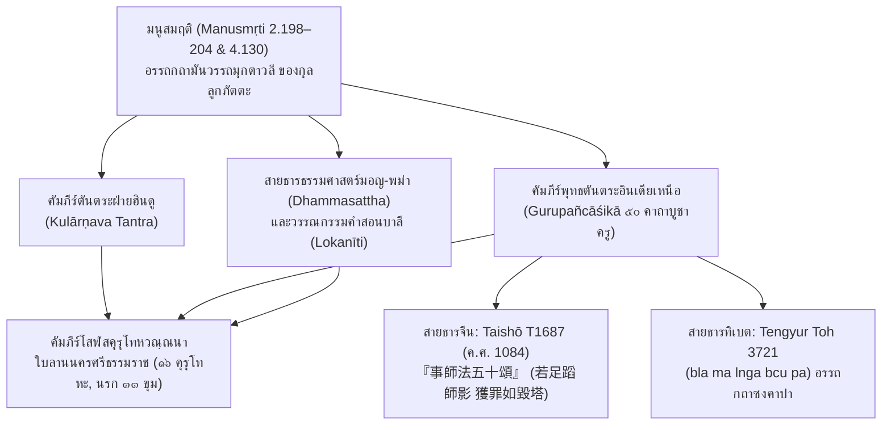

# บันทึกการอ่านและวิเคราะห์เอกสารฉบับสมบูรณ์ (Source Analysis Dossier)
## Manusmṛti with the Commentary Manvarthamuktāvalī of Kullūka Bhaṭṭa (1886)

---

### ส่วนที่ 1: ข้อมูลบรรณานุกรมและการอ้างอิงมาตรฐาน (Bibliographic Metadata)

- **Source ID:** S-1886-kulluka-97
- **ชื่อไฟล์ PDF ในเครื่อง:** `Manusmriti_with_Kulluka_Commentary.pdf`
- **ไฟล์ข้อความสกัด:** `Manusmriti_with_Kulluka_Commentary.txt`
- **ประเภทเอกสาร:** คัมภีร์พระธรรมศาสตร์ภาษาสันสกฤตฉบับมาตรฐาน (Mūla-text) พร้อมอรรถกถาขยายความเชิงนิติศาสตร์และปรัชญา (*Manvarthamuktāvalī*) ของกุลลูกภัตตะ (Kullūka Bhaṭṭa) ตรวจชำระโดย บัณฑิต จีวานันทะ วิทยาสาคร (Jīvānanda Vidyāsāgara) จัดพิมพ์ ณ โรงพิมพ์สรัสวตี (Sarasvati Press) เมืองกัลกัตตา ค.ศ. ๑๘๘๖ ควบคู่กับฉบับแปลภาษาอังกฤษเชิงวิชาการของ จอร์จ บือห์เลอร์ (George Bühler, 1886) ในชุด *Sacred Books of the East* เล่มที่ ๒๕ (Oxford: Clarendon Press) ซึ่งยึดอรรถกถามันวรรถมุกตาวลีของกุลลูกภัตตะเป็นแม่บทหลักตลอดทั้งเล่ม
- **ภาษาของเอกสาร:** ภาษาสันสกฤต (Sanskrit) ในระบบอักษรเทวนาครีและอักษรโรมันสากล (IAST) พร้อมบทแปลภาษาอังกฤษวิชาการ
- **ขอบเขตเนื้อหาหลัก:** คัมภีร์มนูสมฤติ บทที่ ๒ โศลก ๑๙๘–๒๐๔ (ข้อบัญญัติจริยวัตรต่ออาจารย์ การจัดลำดับที่นั่งที่นอน ข้อห้ามการออกนามครู ข้อห้ามการล้อเลียนเลียนแบบกิริยาครู ข้อห้ามการฟังคำนินทา และวิบากกรรมตกนรกและการกลายรูปไปเกิดเป็นสัตว์เดรัจฉาน ๔ จำพวก คือ ลา สุนัข หนอน แมลง) และบทที่ ๔ โศลก ๑๓๐ (ข้อห้ามเด็ดขาดเรื่องการเหยียบเงาครู เทวรูป พระราชา สนตกะ อาจาริยะ หรือ *Chāyā-laṅghana*) พร้อมทั้งโศลกแวดล้อมที่เกี่ยวข้องกับสถานะศักดิ์สิทธิ์ของคุรุ (๒.๑๔๐–๑๔๘, ๒.๑๙๒–๑๙๗, ๒.๒๒๕–๒๓๗, ๑๑.๕๕, ๑๒.๕๘)
- **การอ้างอิงฉบับเต็มระบบ Chicago/Turabian Notes-Bibliography:**  
  `Kullūka Bhaṭṭa, comm. Manusmṛti with the Commentary Manvarthamuktāvalī of Kullūka. Edited by Jīvānanda Vidyāsāgara. Calcutta: Sarasvati Press, 1886.`  
  ควบคู่กับ:  
  `Bühler, George, trans. The Laws of Manu: Translated with Extracts from Seven Commentaries. Sacred Books of the East, Vol. 25. Oxford: Clarendon Press, 1886.`

---

### ส่วนที่ 2: แผนผังการจัดสรรเข้าสู่บทและหัวข้อย่อย (Chapter & Section Mapping Matrix)

การวิเคราะห์ตัวบทมนูสมฤติและอรรถกถามันวรรถมุกตาวลี ทำหน้าที่เป็นพิมพ์เขียวต้นตระกูล (Archetypal Blueprint) ทางนิติศาสตร์และจริยศาสตร์ภารตะ ข้อมูลและข้อค้นพบจะได้รับการจัดสรรเข้าสู่โครงร่างงานวิจัยหลักทั้ง ๘ บท ดังนี้:

- **บทที่ ๑: บทนำ กรอบแนวคิด และระเบียบวิธีวิจัยว่าด้วยเครือข่ายคัมภีร์ข้ามวัฒนธรรม**
  - *๑.๑ (ที่มาและปัญหาการวิจัย):* ใช้มนูสมฤติ ๒.๑๙๘–๒๐๔ และ ๔.๑๓๐ แสดงรากเหง้าข้อห้ามเรื่องเงาครูและการล่วงเกินครูจากอินเดียโบราณสู่อุษาคเนย์
  - *๑.๒ (กรอบทฤษฎีการแพร่กระจายตัวบท):* วิเคราะห์การกลั่นกรองกฎหมายศักดิ์สิทธิ์ของพราหมณ์เข้าสู่ระบบจริยธรรมพุทธ
  - *๑.๓ (สถานะการวิจัยและช่องว่างทางวิชาการ):* เชื่อมโยงมนูธรรมศาสตร์ฮินดูกับวรรณกรรมบาลีและคัมภีร์ใบลานภาคใต้ของไทย
  - *๑.๔ (ระเบียบวิธีวิจัยทางนิรุกติศาสตร์):* ตรวจสอบศัพท์เทคนิคเปรียบเทียบ เช่น *chāyā-laṅghana*, *parīvāda*, *nindā*, *kevala-nāma*
- **บทที่ ๒: สรีรศาสตร์แห่งความเคารพและโครงสร้างวรรณกรรมของโสฬสคุรุโทหะ**
  - *๒.๑ (การจำแนกความผิด ๑๖ ประการ):* ใช้มนูสมฤติ ๒.๑๙๘–๒๐๔ เทียบเคียงโครงสร้างความผิดทางกาย วาจา ใจ กับคาถาที่ ๗–๘ ของโสฬสคุรุโทหะ
  - *๒.๒ (วัตรปฏิบัติทางกายภาพและระยะห่าง):* นำมนู ๒.๑๙๘ (นั่งต่ำกว่าครู, ไม่นั่งเอกเขนก) และ ๒.๒๐๒ (ไม่ยืนรับใช้แต่ไกล) อธิบายมิติเชิงพื้นที่
  - *๒.๓ (การควบคุมวาจาและข้อห้ามทางภาษา):* นำมนู ๒.๑๙๙ (ห้ามออกนามครูล้วนๆ) และ ๒.๒๐๓ (ห้ามวาจาอู้อี้) เทียบเคียงกับ 'คุรุนามคหณะ'
  - *๒.๔ (การสบสายตาและภาษากาย):* นำมนู ๒.๑๙๒–๑๙๗ วิเคราะห์วินัยทางกาย การประณมมือ และการเปิดแขนขวา
- **บทที่ ๓: เครือข่ายการถ่ายทอดข้ามภูมิภาค: จากอินเดีย สู่เนปาล ทิเบต และเอเชียตะวันออก**
  - *๓.๑ (การถ่ายโอนสู่พุทธตันตระ):* เชื่อมโยงมนู ๔.๑๓๐ สู่ *Gurupañcāśikā* คาถาที่ ๑๕ (ห้ามเหยียบเงาและห้ามออกนามครู)
  - *๓.๒ (การตีความในทิเบต):* เทียบเคียงอรรถกถาของท่านซงคาปากับอรรถกถามันวรรถมุกตาวลีเรื่องโทษของการนินทาครู
  - *๓.๓ (ฉบับแปลจีนราชวงศ์ซ่ง ค.ศ. ๑๐๘๔):* วิเคราะห์ข้อความใน Taishō T1687 (『事師法五十頌』: `若足蹈師影 獲罪如毀塔`) กับมนู ๔.๑๓๐
  - *๓.๔ (เบ้าหลอมพาราณสีและนาลันทา):* สภาพแวดล้อมทางปัญญาของอินเดียเหนือที่เป็นแหล่งกำเนิดร่วมของตัวบท
- **บทที่ ๔: สายธารมอญ-พม่า: คัมภีร์ธรรมศาสตร์ (Dhammasattha) และวัฒนธรรมราชสำนัก**
  - *๔.๑ (การแปรสภาพสู่พระธรรมศาสตร์พุทธ):* การสืบทอดกฎหมายความสัมพันธ์ครู-ศิษย์ในมนูสาระและวาโรรุธัมมสัตถ์
  - *๔.๒ (สถานะอาจารย์ในกฎหมายจารีตพม่า):* สิทธิและหน้าที่ของอาจารย์เทียบกับมนู ๒.๑๔๐–๑๔๘
  - *๔.๓ (คติคุรุภักดีในโลกนีติและธัมมนีติ):* การหลั่งไหลของโศลกคำสอนเรื่องการเคารพครูสู่วรรณกรรมคำสอนพม่า
  - *๔.๔ (การถ่ายทอดสู่หัวเมืองมอญ):* สะพานเชื่อมจากเมาะตะมะ-หงสาวดีสู่คาบสมุทรไทย
- **บทที่ ๕: สายธารลังกา-สยาม: เครือข่ายสมณวงศ์และจริยธรรมครูในพุทธศาสนาเถรวาท**
  - *๕.๑ (การประสานพระวินัยกับธรรมศาสตร์):* เปรียบเทียบวัตตกขันธกะ (อุปัชฌายวัตร-อาจริยวัตร) กับมนูสมฤติ ๒.๑๙๒–๒๐๔
  - *๕.๒ (คติพระมหาเถรในลังกา):* ร่องรอยการเคารพอาสนะและเงาครูในสมันตปาสาทิกาและสารัตถทีปนี
  - *๕.๓ (การสถาปนาสมณวงศ์ในนครศรีธรรมราช):* บริบทที่เปิดรับทั้งวินัยเถรวาทและคติธรรมศาสตร์
  - *๕.๔ (การผสานไฟบูชาสามกองกับทิศ ๖):* เทียบเคียงมนู ๒.๒๒๙–๒๓๑ กับสิงคาโลวาทสูตร
- **บทที่ ๖: การสังเคราะห์เปรียบเทียบข้ามจารีต: ฮินดู-พุทธตันตระ-เถรวาท**
  - *๖.๑ (แม่บทโบราณจากภารตวิทยา):* เจาะลึกมนู ๒.๑๙๘–๒๐๔ และ ๔.๑๓๐ ในฐานะรากเหง้าข้อห้ามเรื่องเงา นาม อาสนะ
  - *๖.๒ (การเปรียบเทียบโครงสร้างความผิด):* ตารางเปรียบเทียบระหว่าง *Manusmṛti* vs *Gurupañcāśikā* vs *โสฬสคุรุโทหวณฺณนา*
  - *๖.๓ (เทววิทยาว่าด้วยเงาและสรีรประติพิมพรูป):* มิติอภิปรัชญาของเงาตามคำอธิบายของกุลลูกะ
  - *๖.๔ (วิบากกรรมและมโนทัศน์เรื่องนรก):* การเกิดเป็นสัตว์ ๔ ชนิด (มนู ๒.๒๐๑) สู่มหานรก ๓๓ ขุมและอเวจี
- **บทที่ ๗: คัมภีร์โสฬสคุรุโทหวณฺณนา ฉบับใบลานนครศรีธรรมราช**
  - *๗.๑ (การวิเคราะห์ตัวบทคาถาที่ ๗–๘):* ไขความศัพท์บาลี `ฉายาลํฆน`, `คุรุอาสนนิสีทน`, `คุรุนามคหณ` ด้วยอรรถกถากุลลูกะ
  - *๗.๒ (การปรับเปลี่ยนสู่วรรณกรรมพุทธพื้นถิ่น):* การแปลงกฎเกณฑ์พราหมณ์สู่คัมภีร์คำสอนเตือนใจ
  - *๗.๓ (อิทธิพลพราหมณ์นครศรีธรรมราช):* บทบาทของตระกูลพราหมณ์ราชสำนักในการเป็นสะพานเชื่อมตัวบท
  - *๗.๔ (พิธีกรรมไหว้ครูภาคใต้):* รากฐานคัมภีร์ที่ค้ำจุนพิธีไหว้ครูโนรา หนังตะลุง และสำนักวิชา
- **บทที่ ๘: บทสรุป พันธุศาสตร์คัมภีร์ (Stemma) และนัยสำคัญทางประวัติศาสตร์**
  - *๘.๑ (การสังเคราะห์คำตอบต่อโจทย์วิจัย):* เส้นทางการเดินทางของตัวบทจากลุ่มน้ำคงคาสู่อ่าวไทย
  - *๘.๒ (แผนผังพันธุศาสตร์คัมภีร์):* บรรจุมนูสมฤติและกุลลูกะไว้ ณ จุดยอดของสายธารความคิด
  - *๘.๓ (คุณูปการต่อประวัติศาสตร์ความคิดอุษาคเนย์):* กระบวนการคัดสรรและสังเคราะห์ข้ามจารีตอย่างสร้างสรรค์
  - *๘.๔ (บทเรียนทางจริยศาสตร์ร่วมสมัย):* ความสมดุลระหว่างความเคารพครูกับเสรีภาพทางปัญญา

---

### ส่วนที่ 3: สรุปสาระสำคัญเชิงวิเคราะห์และจุดยืนทางวิชาการ (Executive Academic Analysis)

การศึกษาวิเคราะห์คัมภีร์ *มนูสมฤติ* (*Manusmṛti*) ควบคู่กับอรรถกถา *มันวรรถมุกตาวลี* (*Manvarthamuktāvalī*) ของพระกุลลูกภัตตะ (Kullūka Bhaṭṭa) ถือเป็นกุญแจสำคัญในการไขปริศนาต้นตระกูลความคิดว่าด้วย 'จริยวัตรอันศักดิ์สิทธิ์และความล่วงละเมิดมิได้ของครูบาอาจารย์' ในอารยธรรมเอเชียใต้และเอเชียอาคเนย์ กุลลูกภัตตะมิได้ทำหน้าที่เป็นเพียงผู้อธิบายความหมายตามตัวอักษร หากเป็น 'สถาปนิกทางนิติศาสตร์' ผู้ประมวล สังเคราะห์ และจัดระเบียบกฎเกณฑ์ของพระมนูให้มีความกระชับ แม่นยำเชิงตรรกะ และทรงพลังในทางปฏิบัติการทางสังคมสูงสุด

#### ๑. วิทยานิพนธ์และข้อถกเถียงหลักของผู้เขียน (Core Argument / Thesis)
- **สถานะอันเป็นที่สุดแห่งคัมภีร์มันวรรถมุกตาวลี:** กุลลูกภัตตะตั้งข้อถกเถียงว่า คัมภีร์มนูธรรมศาสตร์คือประมวลกฎหมายสูงสุดแห่งมนุษยชาติที่ไม่มีข้อขัดแย้งในตัวเอง อรรถกถามันวรรถมุกตาวลีจึงมุ่งขจัดข้อกำกวมทางไวยากรณ์ โดยใช้ระเบียบวิธีตีความแบบมีมางสา (Mīmāṃsā) ควบคู่กับนิยามศัพท์ที่มีความรัดกุมสูง ส่งผลให้อรรถกถาฉบับนี้ได้รับการยอมรับอย่างเป็นเอกฉันท์ทั่วทั้งชมพูทวีปให้เป็น 'Textus Receptus' หรือฉบับมาตรฐานสากล
- **ภววิทยาแห่งความศักดิ์สิทธิ์ของคุรุ:** วิทยานิพนธ์สำคัญในหมวดที่ ๒ (โศลก ๑๔๐–๒๔๙) คือการสถาปนาให้ 'อาจาริยะ' และ 'คุรุ' มีสถานะทางจิตวิญญาณและนิติศาสตร์เหนือกว่าบิดามารดาผู้ให้กำเนิดทางสรีระ มนูและกุลลูกะยืนยันว่า การให้กำเนิดทางกายภาพเป็นเพียงเรื่องของโลกียวิสัยและมีจุดจบที่ความตาย ทว่าการที่อาจารย์ประสิทธิ์ประสาทความรู้ในพระเวทผ่านพิธีอุปนยนะ คือการให้กำเนิดครั้งที่สองอันเป็นทิพย์ (*brahmajanma*) ซึ่งนำพาจิตวิญญาณไปสู่ความเป็นอมตะ คุรุจึงครองสถานะเปรียบเสมือนไฟบูชาอาหวนียะ (Āhavanīya) และเป็นตัวแทนของพระพรหมในโลกมนุษย์
- **ขอบเขตความล่วงละเมิดมิได้ที่แผ่คลุมทุกมิติ:** ความเคารพต่อคุรุครอบคลุมสรีระและพื้นที่รอบตัวครูอย่างละเอียด:
  1. *มิติเชิงนาม:* ข้อห้ามการเอ่ยนามครูโดยลำพังปราศจากคารวศัพท์ (*kevala-nāma*) แม้ในเวลาลับหลัง (๒.๑๙๙)
  2. *มิติเชิงกายภาพ:* ข้อห้ามการเลียนแบบท่วงท่า กิริยาการเดิน การพูดจา หรือภาษากายของครู (*anukāra*) (๒.๑๙๙)
  3. *มิติเชิงพื้นที่:* ข้อห้ามการนั่งเสมอหรือสูงกว่าครู การนั่งเอกเขนกต่อหน้าสายตาครู (*yatheṣṭam āsīta*) (๒.๑๙๘) และการยืนรับใช้อยู่ห่างไกล (๒.๒๐๒)
  4. *มิติเชิงอุตุนิยมวิทยา:* ข้อห้ามการอยู่ทางเหนือลมหรือใต้ลมของครู เพื่อมิให้กลิ่นกายกระทบถึงครู (๒.๒๐๓)
  5. *มิติเชิงเงา:* ข้อห้ามเด็ดขาดเรื่องการเหยียบเงาครู (*chāyā-laṅghana*) ในโศลก ๔.๑๓๐ ซึ่งกุลลูกะนิยามว่าเงาคือ 'สรีรประติพิมพรูป' (รูปสะท้อนที่เป็นส่วนขยายของร่างกายจริง)

#### ๒. บริบทประวัติศาสตร์นิพนธ์และการประเมินความน่าเชื่อถือ (Historiography & Source Criticism)
- **ชีวประวัติของกุลลูกภัตตะ:** ถือกำเนิดในตระกูลพราหมณ์สายวเรนทระ (Varendra) ในแคว้นเบงกอล บุตรของภัตตะ ทิวากร นักปราชญ์กำหนดช่วงเวลาของท่านอยู่ในช่วงปลายศตวรรษที่ ๑๓ ถึงต้นศตวรรษที่ ๑๕ ต่อมาได้ย้ายไปพำนัก ณ เมืองพาราณสี ศูนย์กลางวิทยาการพราหมณ์ โดยได้รจนาอรรถกถามันวรรถมุกตาวลี ณ บริเวณเทวสถานพระวิศเวศวร ริมฝั่งแม่น้ำคงคา
- **การสังเคราะห์อรรถกถารุ่นก่อน:** กุลลูกภัตตะวิพากษ์ *มนุภาษยะ* ของเมธาติถิ (Medhātithi, ราว ค.ศ. ๘๕๐–๙๐๐) ว่าอธิบายเยิ่นเย้อเกินความจำเป็น และวิพากษ์ *มนุว๎ยาก๎ยานะ* ของโควินทราช (Govindarāja, ราว ค.ศ. ๑๐๕๐–๑๑๐๐) ว่าตีความตื้นเขิน จุดเด่นของกุลลูกะคือการสกัดความหมายอันแท้จริง (*manvartha*) ออกมาดุจสายสร้อยไข่มุก (*muktāvalī*) ด้วยภาษาที่กระชับ รัดกุม ชัดเจน และใช้ตรรกะไวยากรณ์ปาณินิอย่างแม่นยำ
- **การยอมรับในโลกวิชาการ:** เซอร์ วิลเลียม โจนส์ (1794) และ จอร์จ บือห์เลอร์ (1886) ในชุด *Sacred Books of the East* (Vol. 25) ได้เลือกใช้อรรถกถาของกุลลูกภัตตะเป็นหลักในการแปลคัมภีร์มนูสู่ภาษาอังกฤษ และฉบับที่ตรวจชำระโดย บัณฑิต จีวานันทะ วิทยาสาคร (Jīvānanda Vidyāsāgara, Calcutta 1886) ก็เป็นหลักฐานปฐมภูมิที่ได้รับการยอมรับสูงสุด

#### ๓. ภววิทยาแห่งคุรุและเทววิทยาว่าด้วย 'ความล่วงละเมิดมิได้ของครู'
- **การเทียบเคียงครูกับไฟศักดิ์สิทธิ์ทั้งสาม:** ในมนูสมฤติ ๒.๒๒๙–๒๓๑ กุลลูกะอธิบายว่า บิดาคือไฟการหปัตยะ, มารดาคือไฟทักษิณาคนิ, และ **พระอาจารย์คือไฟอาหวนียะ** (ไฟบูชาเทวดาชั้นสูงสุดที่ส่งเครื่องเซ่นสู่สรวงสวรรค์) การปรนนิบัติอาจารย์จึงมีอานิสงส์เท่ากับการประกอบมหายัญตลอดเวลา การล่วงเกินอาจารย์จึงเป็นการทำลายไฟบูชาศักดิ์สิทธิ์ที่ค้ำจุนจักรวาล
- **ผลลัพธ์ที่เป็นโมฆะแห่งบุญกุศล:** กุลลูกะเน้นย้ำตามมนู ๒.๒๓๔ ว่า หากบุคคลใดดูหมิ่น ละเลย หรือไม่กตัญญูต่อผู้มีพระคุณทั้งสามนี้ พิธีกรรม (kriyā), ตบะ (tapas), หรือการสร้างบุญกุศลใดๆ ย่อม 'ไร้ผลโดยสิ้นเชิง' (*sarvās tasyāphalāḥ kriyāḥ*) มโนทัศน์นี้กลายเป็นเสาหลักในคัมภีร์พุทธตันตระและวรรณกรรมคำสอนของพม่าและไทย

#### ๔. สัญญะวิทยาของ 'เงา' (Semiology of the Shadow - Chāyā)
- **เงาในฐานะส่วนขยายของสรีระศักดิ์สิทธิ์:** ในการอธิบายโศลก ๔.๑๓๐ กุลลูกภัตตะนิยามคำว่า *chāyā* ว่าคือ `śarīra-pratibimba-rūpāṃ` (รูปสะท้อนที่เป็นตัวแทนแห่งร่างกาย) เงาไม่ใช่เพียงพื้นที่อับแสงทางฟิสิกส์ หากแต่เป็นส่วนขยายของร่างกายและบารมี
- **การเหยียบเงาคือการคุกคามทางกายภาพ:** การก้าวเท้าเหยียบย่ำเงาของครู กษัตริย์ หรือเทวรูป มีค่าเท่ากับการเอาเท้าไปเหยียบย่ำบนศีรษะหรือสรีระของบุคคลนั้นโดยตรง เท้าเป็นอวัยวะต่ำสุดที่มีมลทิน ขณะที่สรีระครูคือที่สถิตแห่งพระเวท การเหยียบเงาจึงเป็นการทำลายระเบียบแห่งความศักดิ์สิทธิ์อย่างร้ายแรง
- **เจตนาและการชำระมลทิน:** กุลลูกะชี้ว่า การระบุคำว่า `kāmataḥ` (โดยเจตนา) ในโศลก ๔.๑๓๐ สะท้อนการแบ่งระดับความผิด หากกระทำโดยไม่เจตนา ย่อมชำระมลทินได้ด้วยพิธีตบะล้างบาป (*prāyaścitta*) แต่หากกระทำโดยเจตนา ย่อมก่อให้เกิดมหันตโทษ (*mahān doṣaḥ*)

#### ๕. สัตวสัณฐานวิทยาแห่งวิบากกรรม (Zoomorphic Retribution)
- **ตรรกะแห่งการกลายรูปของวิญญาณ (MDh 2.201):** กุลลูกภัตตะอธิบายเชื่อมโยงระหว่างพฤติกรรมล่วงเกินครูกับการไปเกิดในกำเนิดสัตว์เดรัจฉาน ๔ ชนิด:
  1. *ใส่ความครูด้วยเรื่องเท็จ (Parīvāda) -> กำเนิดเป็น 'ลา' (Khara / Gardabha):* สัตว์โง่เขลา แบกของหนัก และร้องเสียงหยาบคาย
  2. *นินทาครูด้วยเรื่องจริง (Nindā) -> กำเนิดเป็น 'สุนัข' (Śvan / Śvā):* สัตว์กินสิ่งปฏิกูลและเห่าหอนทำลายความสงบ
  3. *ยักยอกหรือใช้ทรัพย์ครูโดยมิชอบ (Paribhotkā) -> กำเนิดเป็น 'หนอน' (Kṛmi):* สัตว์ชั้นต่ำชอนไชในสิ่งปฏิกูล
  4. *ริษยาในเกียรติคุณครู (Matsarī) -> กำเนิดเป็น 'แมลงปีกแข็ง/ริ้นยุง' (Kīṭa):* สัตว์สร้างความรำคาญ มีอายุสั้น และถูกบดขยี้ได้ง่าย
- **สะพานเชื่อมสู่คติมหาอเวจี:** มโนทัศน์นี้เป็นสารตั้งต้นให้แก่ *คุรุปัญจาศิกา* และ *กุลารณวะตันตระ* ในการขยายผลสู่การตกนรกอเวจี และตกผลึกใน *โสฬสคุรุโทหวณฺณนา* ของนครศรีธรรมราช สู่การตก 'มหานรก ๓๓ ขุม' และ 'อเวจีมหานรก'

---

### ส่วนที่ 4: สารบัญข้อค้นพบเชิงลึกตามประเด็นหลัก (Thematic Findings with Exact Pages)

การวิเคราะห์ตัวบทภาษาสันสกฤตและอรรถกถามันวรรถมุกตาวลีของกุลลูกภัตตะ (ฉบับพิมพ์ปฐมภูมิของ Jīvānanda Vidyāsāgara, Calcutta 1886 เทียบเคียงกับฉบับแปลของ George Bühler, SBE Vol. 25, Oxford 1886) สกัดข้อค้นพบทางวิชาการเชิงลึกได้ ๑๕ ประเด็นหลัก พร้อมเลขหน้ากำกับอย่างแม่นยำ:

1. **การจัดระเบียบเชิงพื้นที่และการนั่งที่ต่ำกว่าครู (MDh 2.198):**  
   - *ตัวบทและเลขหน้า:* Vidyāsāgara (1886), p. 107; Bühler (1886), p. 50 (ข้อความสกัดบรรทัดที่ 1400–1405).
   - *สาระสำคัญ:* โศลก ๒.๑๙๘ บัญญัติว่า `nīcaśayyāsanaś cāsīj jyāyasi sannidhau / guror dṛṣṭipathesano na caiva syād yatheṣṭa-bhāk //` กุลลูกภัตตะอธิบายว่า เมื่อบุคคลผู้เจริญหรือคุรุอยู่ใกล้ ศิษย์จะต้องจัดหาที่นอนและที่นั่งที่ 'ต่ำกว่า' (*nīce śayyāsane*) ของพระอาจารย์เสมอ การนั่งเสมอหรือสูงกว่าครูถือเป็นการละเมิดลำดับชั้นทางจักรวาล นอกจากนี้ เมื่ออยู่ต่อหน้าสายตาของคุรุ (*guror darśanagocare*) ศิษย์จะต้องไม่นั่งเอกเขนกตามอำเภอใจ (*yatheṣṭam upaviśet*) เช่น นั่งไขว่ห้าง เอนหลัง หรือทอดขาอย่างไม่สำรวม ข้อบัญญัตินี้เป็นต้นแบบของข้อห้าม 'คุรุอาสนนิสีทนะ' ใน *คุรุปัญจาศิกา* คาถาที่ ๑๑ และ *โสฬสคุรุโทหวณฺณนา* คาถาที่ ๗

2. **สัจนิยมแห่งข้อห้ามการออกนามครูโดยปราศจากคารวศัพท์ (MDh 2.199a):**  
   - *ตัวบทและเลขหน้า:* Vidyāsāgara (1886), p. 108; Bühler (1886), p. 50 (ข้อความสกัดบรรทัดที่ 1406–1410).
   - *สาระสำคัญ:* กึ่งโศลกแรกของ ๒.๑๙๙ บัญญัติเด็ดขาดว่า `nodāhared guror nāma parokṣam api kevalam /` กุลลูกะให้คำจำกัดความของ `kevalaṃ nāma` ว่าหมายถึง 'ชื่อล้วนๆ ที่ปราศจากคำนำหน้าหรือสร้อยคำแสดงความเคารพ' (*śrī-kārādi-rahitam*) เช่น เรียกชื่อเฉยๆ โดยไม่มีคำว่า ศรี (Śrī), ภัตตะ (Bhaṭṭa), ปาทะ (Pāda), หรือ สวามิน (Svāmin) และข้อห้ามนี้ครอบคลุมแม้ในเวลาที่ 'ลับหลัง' (*parokṣam api*) การออกนามโดยประมาทถือเป็นการลบล้างความศักดิ์สิทธิ์ ซึ่งสืบทอดตรงสู่ข้อห้าม 'คุรุนามคหณะ' ในคัมภีร์ใบลานภาคใต้ของไทย

3. **ข้อห้ามการล้อเลียนและเลียนแบบกิริยาท่าทางของครู (MDh 2.199b):**  
   - *ตัวบทและเลขหน้า:* Vidyāsāgara (1886), p. 108; Bühler (1886), p. 50 (ข้อความสกัดบรรทัดที่ 1411–1415).
   - *สาระสำคัญ:* กึ่งโศลกหลังของ ๒.๑๙๙ ระบุว่า `na caivāsyānukurvīta gati-bhāṣaṇa-ceṣṭitam //` กุลลูกะจำแนกการเลียนแบบ (*anukāra*) เป็น ๓ ด้าน: (๑) การยกเท้าหรือท่าทางการเดิน (*pādoddhārādi-gati*), (๒) สำเนียงเสียงพูด (*śabdādi-bhāṣaṇa*), (๓) ภาษากายหรือการขยับตา (*netravikārādi-ceṣṭita*) การล้อเลียนด้วยความคะนอง (*parihāsādinā*) ถือเป็นบาปหนักเพราะทำลายภาพลักษณ์แห่งปราชญ์ผู้ทรงธรรม ข้อห้ามนี้ปรากฏใน *โสฬสคุรุโทหวณฺณนา* หมวด 'คุรุคติภณนานุกรณะ'

4. **มิติทางญาณวิทยา: การจำแนกระหว่าง 'ปริวาท' กับ 'นินทา' (MDh 2.200a):**  
   - *ตัวบทและเลขหน้า:* Vidyāsāgara (1886), p. 108; Bühler (1886), p. 50 (ข้อความสกัดบรรทัดที่ 1416–1422).
   - *สาระสำคัญ:* ในโศลก ๒.๒๐๐ `guror yatra parīvādo nindā vāpi pravartate /` กุลลูกภัตตะแยกแยะความหมายไว้อย่างเด็ดขาด: `parīvādaḥ` คือ `abhūta-doṣa-kīrtanam` (การประกาศความผิดที่ไม่มีอยู่จริง หรือการกุเรื่องเท็จใส่ร้าย) ส่วน `nindā` คือ `bhūta-doṣa-kathanam` (การนำเอาข้อบกพร่องที่มีอยู่จริงของครูมาโพนทะนา) การจำแนกนี้สะท้อนว่า ไม่ว่าความผิดของครูจะเป็นเรื่องเท็จหรือเรื่องจริง ศิษย์ไม่มีสิทธิในการนำมาวิพากษ์วิจารณ์ทั้งสิ้น

5. **จริยธรรมแห่งการปิดหูและละทิ้งพื้นที่ (MDh 2.200b):**  
   - *ตัวบทและเลขหน้า:* Vidyāsāgara (1886), p. 108; Bühler (1886), p. 50 (ข้อความสกัดบรรทัดที่ 1423–1428).
   - *สาระสำคัญ:* กึ่งโศลกหลังของ ๒.๒๐๐ กำหนดว่า `karṇau tatra pidhātavyau gantavyaṃ vā tato 'nyataḥ //` กุลลูกะขยายความว่า หากศิษย์อยู่ในสถานที่ซึ่งมีการนินทาหรือใส่ความครู ศิษย์จะต้องเอามือทั้งสองข้างปิดหูตนเองให้แน่น (*svakarṇau pidhāya*) เพื่อมิให้มลทินทางเสียงผ่านเข้าไปทำลายจิตใจ หรือหากปิดหูไม่ได้ ก็ต้องลุกเดินหนีออกไปทันที (*anyatra pradeśe gantavyam*) การนั่งฟังอยู่อย่างเพิกเฉยย่อมถือว่ามีส่วนร่วมในบาปแห่งการดูหมิ่นครู

6. **สัตวสัณฐานวิทยาแห่งวิบากกรรม: ลา สุนัข หนอน และแมลง (MDh 2.201):**  
   - *ตัวบทและเลขหน้า:* Vidyāsāgara (1886), p. 109; Bühler (1886), pp. 50–51 (ข้อความสกัดบรรทัดที่ 1429–1435).
   - *สาระสำคัญ:* โศลก ๒.๒๐๑ บัญญัติว่า `parīvādāt kharo bhavati śvā bhavati nindakaḥ / paribhotkā kṛmir bhavati kīṭo bhavati matsarī //` กุลลูกะอธิบายเชื่อมโยงสภาพจิตกับสรีระในชาติหน้า: (๑) ใส่ความครูด้วยเรื่องเท็จ เกิดเป็น **ลา** (*gardabha/khara*), (๒) นินทาครูด้วยเรื่องจริง เกิดเป็น **สุนัข** (*śvā*), (๓) เสพใช้หรือยักยอกทรัพย์สินของครู เกิดเป็น **หนอน** (*kṛmi*), (๔) มีความริษยาในคุณธรรมความรู้ของครู เกิดเป็น **แมลง/ริ้นยุง** (*kīṭa*) สัตว์ ๔ จำพวกนี้สะท้อนลำดับชั้นความเสื่อมถอยแห่งวิญญาณและกลายเป็นโครงสร้างแม่บทของการลงทัณฑ์ในนรกยุคต่อมา

7. **มารยาทการปรนนิบัติ: ระยะห่าง อารมณ์โกรธ และการปรากฏของสตรี (MDh 2.202):**  
   - *ตัวบทและเลขหน้า:* Vidyāsāgara (1886), p. 109; Bühler (1886), p. 51 (ข้อความสกัดบรรทัดที่ 1436–1442).
   - *สาระสำคัญ:* โศลก ๒.๒๐๒ วางระเบียบว่า ศิษย์ต้องไม่ปรนนิบัติรับใช้ครูขณะยืนอยู่ไกลเกินไป (*dūrasthaḥ*), ขณะมีอารมณ์โกรธ (*kruddhaḥ*), หรือขณะมีสตรีอยู่ใกล้ชิด (*yoṣiti sannidhau*) หากศิษย์นั่งอยู่บนยานพาหนะหรืออาสนะตั่งสูง เมื่อพบครู จะต้องก้าวลงมาสู่พื้นดินก่อนแล้วจึงกราบไหว้อภิวาท

8. **อุตุนิยมวิทยาและสรีรศาสตร์: ข้อห้ามการอยู่ทางเหนือลมหรือใต้ลม (MDh 2.203):**  
   - *ตัวบทและเลขหน้า:* Vidyāsāgara (1886), p. 109; Bühler (1886), p. 51 (ข้อความสกัดบรรทัดที่ 1443–1450).
   - *สาระสำคัญ:* โศลก ๒.๒๐๓ บัญญัติว่า `guror vātānulomaṃ tu vātaprātilomyaṃ ca varjayet / ashrāvyam api ced vākyaṃ na gurau pratipādayet //` กุลลูกะอธิบายว่า ศิษย์ต้องหลีกเลี่ยงการนั่งหรือยืนในทิศทางที่อยู่ 'เหนือลม' หรือ 'ใต้ลม' ของครู เพื่อมิให้กลิ่นกาย เหงื่อ หรือไอระเหยพัดไปถูกครู และห้ามพูดจาพึมพำอู้อี้ที่ครูไม่ได้ยินชัดเจน (*aśrāvyaṃ mandākṣarādinā*) เพื่อความโปร่งใสทางวาจา

9. **ข้อยกเว้นเชิงการใช้สอย: ภาวะร่วมอาสนะที่อนุโลมได้ (MDh 2.204):**  
   - *ตัวบทและเลขหน้า:* Vidyāsāgara (1886), p. 110; Bühler (1886), p. 51 (ข้อความสกัดบรรทัดที่ 1451–1458).
   - *สาระสำคัญ:* โศลก ๒.๒๐๔ บัญญัติข้อยกเว้นตามสภาพจริง ให้ศิษย์นั่งร่วมกับครูได้ในกรณีจำเป็น: ในเกวียนเทียมโค ม้า อูฐ (*go-'śva-uṣṭra-yāna*), บนดาดฟ้าปราสาท (*prāsāda*), บนที่นอนหญ้าหรือใบไม้ (*tṛṇa-parṇa*), บนเสื่อลำแพน (*kaṭa*), บนแผ่นหิน (*aśma/śilā*), บนม้านั่งไม้กระดาน (*phalaka*), หรือในเรือ (*nau*) แสดงความยืดหยุ่นเชิงนิติศาสตร์

10. **สัจศาสตร์แห่งการเหยียบเงา: โศลกแม่บท ๔.๑๓๐ (MDh 4.130):**  
    - *ตัวบทและเลขหน้า:* Vidyāsāgara (1886), p. 234; Bühler (1886), p. 111 (ข้อความสกัดบรรทัดที่ 3280–3286).
    - *สาระสำคัญ:* `devatānāṃ guro rājñaḥ snātakācāryayos tathā / nākramet kāmatas chāyāṃ babhror dīkṣitasya ca //` มนูห้ามเหยียบเงาของบุคคลศักดิ์สิทธิ์ ๗ ประการ: เทวรูป, คุรุ, พระราชา, พระสนตกะ, พระอาจารย์, สัตว์สีน้ำตาลทอง (โคแดง), และผู้ประกอบพิธีทิกษา กุลลูกะอธิบายว่า เงาคือ 'สรีรประติพิมพรูป' การเหยียบย่ำเงาเท่ากับการเหยียบย่ำตัวตนจริง

11. **เจตนาการกระทำ (Kāmataḥ) กับการชำระมลทิน (Prāyaścitta, MDh 4.130):**  
    - *ตัวบทและเลขหน้า:* Vidyāsāgara (1886), p. 234; Bühler (1886), p. 111 (ข้อความสกัดบรรทัดที่ 3287–3292).
    - *สาระสำคัญ:* กุลลูกภัตตะวิเคราะห์ว่า หากเหยียบเงาครูโดยไม่ตั้งใจ (*akāmataḥ*) มีบทบัญญัติให้ชำระมลทินได้ด้วยพิธีตบะล้างบาป (*prāyaścitta*) แต่หากกระทำ 'โดยเจตนา' (*kāmataḥ*) ย่อมเป็นโทษมหันต์ (*mahān doṣaḥ*) ที่ไม่อาจลบล้างได้ด้วยพิธีธรรมดา

12. **ความเป็นเลิศแห่งการให้กำเนิดทางพระเวทเหนือการให้กำเนิดทางกายภาพ (MDh 2.146–148):**  
    - *ตัวบทและเลขหน้า:* Vidyāsāgara (1886), p. 85; Bühler (1886), pp. 41–42 (ข้อความสกัดบรรทัดที่ 1150–1165).
    - *สาระสำคัญ:* มนู ๒.๑๔๖ ระบุว่า ระหว่างบิดาผู้ให้กำเนิดทางสรีระ (*utpādaka*) กับบิดาผู้ให้กำเนิดทางพระเวท (*brahmadātṛ*) บิดาผู้ให้พระเวทย่อมประเสริฐกว่า เพราะการเกิดทางกายภาพย่อมดับสูญไป แต่การเกิดทางพระเวท (*brahmajanma*) เป็นอมตะเที่ยงแท้ถาวรทั้งในโลกนี้และโลกหน้า

13. **บูรณาการไฟบูชาศักดิ์สิทธิ์ทั้งสามกับผู้มีพระคุณทั้งสาม (MDh 2.225–234):**  
    - *ตัวบทและเลขหน้า:* Vidyāsāgara (1886), pp. 118–122; Bühler (1886), pp. 54–56 (ข้อความสกัดบรรทัดที่ 1520–1560).
    - *สาระสำคัญ:* กุลลูกะอธิบายว่า มารดาคือไฟทักษิณาคนิ, บิดาคือไฟการหปัตยะ, และ **พระอาจารย์คือไฟอาหวนียะ** หากบุคคลใดละเลยผู้มีพระคุณทั้งสามนี้ พิธีกรรม บวงสรวง บำเพ็ญตบะ หรือบุญกุศลทั้งมวลย่อมกลายเป็นโมฆะทันที (*sarvās tasyāphalāḥ kriyāḥ*)

14. **มหาปาตกะ: คุรุตัลปคมนะ และการทรยศต่อครู (MDh 11.55, 11.59–60):**  
    - *ตัวบทและเลขหน้า:* Vidyāsāgara (1886), p. 512; Bühler (1886), pp. 278–280 (ข้อความสกัดบรรทัดที่ 8500–8525).
    - *สาระสำคัญ:* การล่วงประเวณีต่อภรรยาครู (*gurvaṅganāgama*) จัดเป็นหนึ่งในปัญจมหาปาตกะเทียบเท่าการฆ่าพราหมณ์ และในโศลก ๑๑.๕๙–๖๐ การละทิ้งครู (*guror atyāgaḥ*) ถือเป็นอุปปาตกะที่ต้องโทษขับออกจากวรรณะและตกนรก

15. **การแผ่ขยายของคติธรรมศาสตร์สู่พุทธตันตระและอุษาคเนย์ (MDh 2 & 4):**  
    - *ตัวบทและเลขหน้า:* Vidyāsāgara (1886), pp. 107–110, 234; Bühler (1886), Introduction pp. 3–4, Text pp. 50, 111.
    - *สาระสำคัญ:* กฎเกณฑ์เรื่องการเคารพครูในมนูสมฤติได้หลั่งไหลเข้าสู่พุทธตันตระในรูป *Gurupañcāśikā* และแผ่ขยายสู่เอเชียอาคเนย์ผ่านคัมภีร์ธรรมศาสตร์มอญ-พม่า จนกระทั่งตกผลึกเป็นคัมภีร์ *โสฬสคุรุโทหวณฺณนา* ของนครศรีธรรมราช

---

### ส่วนที่ 5: คลังข้อความอ้างอิงตรงและเชิงอรรถสำเร็จรูป (Verbatim Quotes & Footnote Bank)

การสกัดตัวบทปฐมภูมิภาษาสันสกฤตดั้งเดิม (อักษรเทวนาครีและ IAST) พร้อมด้วยอรรถกถามันวรรถมุกตาวลีของกุลลูกภัตตะ, คำแปลภาษาอังกฤษของ George Bühler (1886), คำแปลภาษาไทยเชิงวิชาการ, บทวิเคราะห์บริบท, และเชิงอรรถ Chicago รวม ๑๘ ชุดข้อความ:

#### โควทที่ ๑: การจัดลำดับที่นั่งที่นอนและข้อห้ามการนั่งเอกเขนกต่อหน้าครู (Manusmṛti 2.198)
- **ตัวบทภาษาสันสกฤตดั้งเดิม (Devanāgarī & IAST):**
  > नीचशय्यासनश्चासीज्ज्यायसि सन्निधौ ।  
  > गुरोर्दृष्टिपथे चापि न चेष्टामुपवेशयेत् ॥ (MDh 2.198)  
  > *nīcaśayyāsanaś cāsīj jyāyasi sannidhau / guror dṛṣṭipathe cāpi na ceṣṭām upaveśayet //*
- **ตัวบทอรรถกถามันวรรถมุกตาวลีของกุลลูกภัตตะ:**
  > *jyāyasi gurau sannihite saty ātmano nīce śayyāsane yasya sa tathābhūtaḥ syāt / guror darśanagocare ca yatheṣṭam āsanaṃ śayanaṃ vā na kuryāt //*
- **คำแปลภาษาอังกฤษวิชาการ (George Bühler, 1886, p. 50):**
  > "When his teacher is nigh, let his bed or seat be low; but within sight of his teacher he shall not sit carelessly at ease."
- **คำแปลภาษาไทยเชิงวิชาการ:**
  > "เมื่อพระคุรุผู้เจริญสถิตอยู่ ณ ที่ใกล้ ศิษย์พึงจัดที่นอนและที่นั่งของตนให้อยู่ในระดับต่ำกว่าเสมอ และเมื่ออยู่ในคลองสายตาของพระคุรุ ศิษย์จะต้องไม่นั่งเอกเขนกหรือนั่งตามอำเภอใจเป็นอันขาด"
- **บทวิเคราะห์บริบททางนิติศาสตร์และปรัชญา:**
  > สถาปนาสัจนิยมเชิงพื้นที่ (Spatial Hierarchy) ที่นั่งของครูเปรียบเสมือนแท่นบูชา การนั่งเสมอครูถือเป็นการท้าทายอำนาจนำทางจิตวิญญาณ คำว่า `yatheṣṭam` กำหนดให้ศิษย์ควบคุมอากัปกิริยาตลอดเวลา เป็นต้นแบบของ 'คุรุอาสนนิสีทนะ' ใน *โสฬสคุรุโทหวณฺณนา* คาถาที่ ๗
- **รูปแบบเชิงอรรถ Chicago:**
  `[1]` Kullūka Bhaṭṭa, comm., *Manusmṛti with the Commentary Manvarthamuktāvalī of Kullūka*, ed. Jīvānanda Vidyāsāgara (Calcutta: Sarasvati Press, 1886), 107; George Bühler, trans., *The Laws of Manu*, Sacred Books of the East, Vol. 25 (Oxford: Clarendon Press, 1886), 50.

#### โควทที่ ๒: ข้อห้ามเด็ดขาดเรื่องการออกนามของครูโดยปราศจากคารวศัพท์ (Manusmṛti 2.199a)
- **ตัวบทภาษาสันสกฤตดั้งเดิม (Devanāgarī & IAST):**
  > नोदाहरेद्गुरोर्नाम परोक्षमपि केवलम् । (MDh 2.199a)  
  > *nodāhared guror nāma parokṣam api kevalam /*
- **ตัวบทอรรถกถามันวรรถมุกตาวลีของกุลลูกภัตตะ:**
  > *kevalaṃ nāma śrī-kārādi-rahitaṃ guror nāma pratyakṣam iva parokṣam api nodāharet //*
- **คำแปลภาษาอังกฤษวิชาการ (George Bühler, 1886, p. 50):**
  > "Let him not pronounce the mere name of his teacher (without adding an honorific title) behind his back even."
- **คำแปลภาษาไทยเชิงวิชาการ:**
  > "ศิษย์พึงอย่าได้เอ่ยนามของพระคุรุเพียงลำพัง (โดยปราศจากคำยกย่องแสดงความเคารพ) แม้ในเวลาลับหลังก็ตาม"
- **บทวิเคราะห์บริบททางนิติศาสตร์และปรัชญา:**
  > คำว่า `kevalaṃ nāma` คือการเรียกชื่อเพียวๆ โดยไม่มีสร้อยคำเทิดทูน เช่น ศรี หรือ ปาทะ นามของครูมีพลังศักดิ์สิทธิ์ การออกนามโดยประมาทถือเป็นการลบล้างความศักดิ์สิทธิ์ ปรากฏเป็นข้อห้าม 'คุรุนามคหณะ' ในคัมภีร์ใบลานนครศรีธรรมราช
- **รูปแบบเชิงอรรถ Chicago:**
  `[2]` Kullūka Bhaṭṭa, comm., *Manusmṛti with Manvarthamuktāvalī*, ed. Vidyāsāgara (1886), 108; Bühler, *The Laws of Manu* (1886), 50.

#### โควทที่ ๓: ข้อห้ามการเลียนแบบท่วงท่า กิริยาการเดิน และวาจาของครู (Manusmṛti 2.199b)
- **ตัวบทภาษาสันสกฤตดั้งเดิม (Devanāgarī & IAST):**
  > न चैवास्यानुकुर्वीत गतिभाषितचेष्टितम् ॥ (MDh 2.199b)  
  > *na caivāsyānukurvīta gati-bhāṣaṇa-ceṣṭitam //*
- **ตัวบทอรรถกถามันวรรถมุกตาวลีของกุลลูกภัตตะ:**
  > *asya guroḥ pādoddhārādi-gatiṃ śabdādi-bhāṣaṇaṃ netravikārādi-ceṣṭitaṃ parihāsādinā nānukurvīta //*
- **คำแปลภาษาอังกฤษวิชาการ (George Bühler, 1886, p. 50):**
  > "And let him not mimic his gait, speech, and deportment."
- **คำแปลภาษาไทยเชิงวิชาการ:**
  > "และศิษย์พึงอย่าได้กระทำการเลียนแบบท่วงท่าการย่างก้าว กิริยาการพูดจา และอากัปกิริยาของพระอาจารย์นั้นเป็นอันขาด"
- **บทวิเคราะห์บริบททางนิติศาสตร์และปรัชญา:**
  > การล้อเลียนสรีระหรือบุคลิกภาพของครูถือเป็น 'การคุกคามทางสัญลักษณ์' (Symbolic Aggression) ที่ทำลายบารมีของครู ข้อห้ามนี้ต่อมาปรากฏเป็นความผิดหมวด 'คุรุคติภณนานุกรณะ' ในคาถาที่ ๗ ของคัมภีร์โสฬสคุรุโทหะ
- **รูปแบบเชิงอรรถ Chicago:**
  `[3]` Kullūka Bhaṭṭa, comm., *Manusmṛti with Manvarthamuktāvalī*, ed. Vidyāsāgara (1886), 108; Bühler, *The Laws of Manu* (1886), 50.

#### โควทที่ ๔: การจำแนกระหว่างการใส่ความ (Parīvāda) กับการนินทา (Nindā) (Manusmṛti 2.200)
- **ตัวบทภาษาสันสกฤตดั้งเดิม (Devanāgarī & IAST):**
  > गुरोर्यत्र परीवादो निन्दा वापि प्रवर्तते ।  
  > कर्णौ तत्र विधातव्यौ गन्तव्यं वा ततोऽन्यतः ॥ (MDh 2.200)  
  > *guror yatra parīvādo nindā vāpi pravartate / karṇau tatra pidhātavyau gantavyaṃ vā tato 'nyataḥ //*
- **ตัวบทอรรถกถามันวรรถมุกตาวลีของกุลลูกภัตตะ:**
  > *parīvādo 'bhūta-doṣa-kīrtanam / nindā tu bhūta-doṣa-kathanam / yatra tādṛśī guroḥ pravṛttis tatra svakarṇau pidhāya tiṣṭhet / apidhāne vā tato 'nyatra pradeśe gantavyam //*
- **คำแปลภาษาอังกฤษวิชาการ (George Bühler, 1886, p. 50):**
  > "Wherever (people) justly censure or falsely defame his teacher, there he must cover his ears or depart thence to another place."
- **คำแปลภาษาไทยเชิงวิชาการ:**
  > "ณ สถานที่ใดก็ตาม ที่มีการใส่ร้ายด้วยความเท็จ (ปริวาท) หรือมีการนินทาด้วยความจริง (นินทา) ต่อพระอาจารย์ ศิษย์พึงเอามือปิดหูทั้งสองข้างของตนเสีย หรือมิฉะนั้นก็พึงหลีกหนีออกไปเสียจากสถานที่นั้น"
- **บทวิเคราะห์บริบททางนิติศาสตร์และปรัชญา:**
  > กุลลูกะแยกแยะระหว่าง `abhūta-doṣa-kīrtana` (กุเรื่องเท็จ) กับ `bhūta-doṣa-kathana` (พูดความจริงที่เป็นโทษ) ไม่ว่าครูจะผิดจริงหรือไม่ ศิษย์ไม่มีสิทธิวิพากษ์วิจารณ์ การนั่งฟังอยู่นิ่งๆ ถือเป็นบาปแห่งการสมรู้ร่วมคิด (Complicity by Silence)
- **รูปแบบเชิงอรรถ Chicago:**
  `[4]` Kullūka Bhaṭṭa, comm., *Manusmṛti with Manvarthamuktāvalī*, ed. Vidyāsāgara (1886), 108; Bühler, *The Laws of Manu* (1886), 50.

#### โควทที่ ๕: สัตวสัณฐานวิทยาแห่งวิบากกรรม: ลา สุนัข หนอน และแมลง (Manusmṛti 2.201)
- **ตัวบทภาษาสันสกฤตดั้งเดิม (Devanāgarī & IAST):**
  > परीवादात्खरो भवति श्वा भवति निन्दकः ।  
  > परिभोक्ता कृमिर्भवति कीटो भवति मत्सरी ॥ (MDh 2.201)  
  > *parīvādāt kharo bhavati śvā bhavati nindakaḥ / paribhotkā kṛmir bhavati kīṭo bhavati matsarī //*
- **ตัวบทอรรถกถามันวรรถมุกตาวลีของกุลลูกภัตตะ:**
  > *guror abhūta-doṣokter jantur janmāntare gardabho bhavati / bhūta-doṣābhidhāyī śvā bhavati / paribhotkā gurudravyopabhoktā kṛmir bhavati / matsaro 'sūyā tadvān kīṭo bhavati //*
- **คำแปลภาษาอังกฤษวิชาการ (George Bühler, 1886, pp. 50–51):**
  > "By censuring (his teacher), though justly, he will become (in his next birth) an ass, by falsely defaming him, a dog; he who lives on his teacher's substance, will become a worm, and he who is envious (of his merit), a (larger) insect."
- **คำแปลภาษาไทยเชิงวิชาการ:**
  > "ด้วยการใส่ความพระอาจารย์ ผู้กระทำย่อมไปเกิดเป็นลา, ด้วยการนินทาพระอาจารย์ ย่อมไปเกิดเป็นสุนัข, ผู้ใช้สอยทรัพย์สินของพระอาจารย์โดยมิชอบ ย่อมไปเกิดเป็นหนอน, และผู้มีความริษยาต่อพระอาจารย์ ย่อมไปเกิดเป็นแมลง"
- **บทวิเคราะห์บริบททางนิติศาสตร์และปรัชญา:**
  > รากฐานของการกลายรูปของวิญญาณ (Zoomorphic Degradation) สัตว์ ๔ ชนิดสะท้อนโทษานุโทษที่สอดคล้องกับพฤติกรรมอกตัญญู และเป็นสะพานเชื่อมสู่การพัฒนาทัณฑ์นรก ๓๓ ขุมใน *โสฬสคุรุโทหวณฺณนา*
- **รูปแบบเชิงอรรถ Chicago:**
  `[5]` Kullūka Bhaṭṭa, comm., *Manusmṛti with Manvarthamuktāvalī*, ed. Vidyāsāgara (1886), 109; Bühler, *The Laws of Manu* (1886), 50–51.

#### โควทที่ ๖: ระเบียบการปรนนิบัติ: ข้อห้ามยืนห่างไกล อารมณ์โกรธ และการปรากฏของสตรี (Manusmṛti 2.202)
- **ตัวบทภาษาสันสกฤตดั้งเดิม (Devanāgarī & IAST):**
  > दूरस्थो नैव सेवेत न क्रुद्धो नैव योषितः ।  
  > यानस्थो वा निषण्णो वा नाभिवादयेत्तु स गुरुम् ॥ (MDh 2.202)  
  > *dūrastho naiva sevet na kruddho naiva yoṣitaḥ / yānastho vā niṣaṇṇo vā nābhivādayet tu sa gurum //*
- **ตัวบทอรรถกถามันวรรถมุกตาวลีของกุลลูกภัตตะ:**
  > *dūrasthaḥ sthito guruṃ na paricareta / na krodhayuktaḥ / na ca gurvādyoṣitsannidhau / tathā yānasthaḥ pīṭhādyāsana-stho vā pūrvam avaruhya gurum abhivādayet na tūpaviṣṭa eva //*
- **คำแปลภาษาอังกฤษวิชาการ (George Bühler, 1886, p. 51):**
  > "He must not serve the (teacher) while he himself stands aloof, nor when he (himself) is angry, nor when a woman is near; if he is seated in a carriage or on a (raised) seat, he must descend and afterwards salute his (teacher)."
- **คำแปลภาษาไทยเชิงวิชาการ:**
  > "ศิษย์พึงอย่าได้ปรนนิบัติพระอาจารย์ขณะที่ตนยืนอยู่แต่ไกล, พึงอย่าปรนนิบัติขณะกำลังมีโทสะ, และพึงอย่าปรนนิบัติขณะมีสตรีอยู่ใกล้; หากนั่งอยู่บนยานพาหนะหรือบนอาสนะ ศิษย์พึงลงมาก่อนแล้วจึงกราบไหว้พระอาจารย์"
- **บทวิเคราะห์บริบททางนิติศาสตร์และปรัชญา:**
  > การรับใช้จากที่ไกลแสดงถึงความเกียจคร้าน โทสะทำลายจิตแห่งการอุทิศตน และการก้าวลงจากยานพาหนะแสดงถึงการถ่อมตนเชิงกายภาพอย่างสมบูรณ์
- **รูปแบบเชิงอรรถ Chicago:**
  `[6]` Kullūka Bhaṭṭa, comm., *Manusmṛti with Manvarthamuktāvalī*, ed. Vidyāsāgara (1886), 109; Bühler, *The Laws of Manu* (1886), 51.

#### โควทที่ ๗: ข้อห้ามการอยู่ทางเหนือลมหรือใต้ลม และข้อห้ามวาจาอู้อี้ (Manusmṛti 2.203)
- **ตัวบทภาษาสันสกฤตดั้งเดิม (Devanāgarī & IAST):**
  > गुरोर्वातानुकूलं तु वातप्रातिकूल्यं च वर्जयेत् ।  
  > अश्राव्यमपि चेद्वाक्यं न गुरौ प्रतिपादयेत् ॥ (MDh 2.203)  
  > *guror vātānulomaṃ tu vātaprātilomyaṃ ca varjayet / ashrāvyam api ced vākyaṃ na gurau pratipādayet //*
- **ตัวบทอรรถกถามันวรรถมุกตาวลีของกุลลูกภัตตะ:**
  > *guroḥ sakāśād vātānulomyaṃ vātaprātilomyaṃ ca sthitiśayanādau varjayet / aśrāvyaṃ mandākṣarādinā gurau na brūyāt //*
- **คำแปลภาษาอังกฤษวิชาการ (George Bühler, 1886, p. 51):**
  > "Let him not sit with his teacher, to the leeward or to the windward (of him); nor let him say anything which his teacher cannot hear."
- **คำแปลภาษาไทยเชิงวิชาการ:**
  > "ศิษย์พึงหลีกเลี่ยงการอยู่ทางทิศเหนือลมหรือทิศใต้ลมของพระอาจารย์ และพึงอย่าได้กล่าวถ้อยคำอันแผ่วเบาอู้อี้จนพระอาจารย์ไม่อาจได้ยินได้ชัดเจน"
- **บทวิเคราะห์บริบททางนิติศาสตร์และปรัชญา:**
  > ความละเอียดอ่อนทางสรีรศาสตร์ กลิ่นกายของศิษย์ถือเป็นมลทินที่ไม่ควรให้พัดไปกระทบครู และการพูดเสียงเบาพึมพำแสดงถึงความไม่จริงใจ
- **รูปแบบเชิงอรรถ Chicago:**
  `[7]` Kullūka Bhaṭṭa, comm., *Manusmṛti with Manvarthamuktāvalī*, ed. Vidyāsāgara (1886), 109; Bühler, *The Laws of Manu* (1886), 51.

#### โควทที่ ๘: ข้อยกเว้นทางนิติศาสตร์: ภาวะร่วมอาสนะที่อนุโลมได้ (Manusmṛti 2.204)
- **ตัวบทภาษาสันสกฤตดั้งเดิม (Devanāgarī & IAST):**
  > गोऽश्वोष्ट्रयानप्रासादतृणपर्णकटाश्मसु ।  
  > समासीत गुरुणा सार्धं शिलाफलकनौषु च ॥ (MDh 2.204)  
  > *go-'śva-uṣṭra-yāna-prāsāda-tṛṇa-parṇa-kaṭāśmasu / samāsīta guruṇā sārdhaṃ śilā-phalaka-nauṣu ca //*
- **ตัวบทอรรถกถามันวรรถมุกตาวลีของกุลลูกภัตตะ:**
  > *gavāśvoṣṭrayukte yāne prāsādādyuparitanabhūmau tṛṇamayyāṃ śayyāyāṃ parṇamayyāṃ vā kaṭe 'śmani śilāyāṃ phalakāsane nāvi caiteṣu guruṇā sahaikatra samāsīta yugapad upaviśet //*
- **คำแปลภาษาอังกฤษวิชาการ (George Bühler, 1886, p. 51):**
  > "He may sit with his teacher in a carriage drawn by oxen, horses, or camels, on a terrace, on a bed of grass or leaves, on a mat, on a rock, on a wooden bench, or in a boat."
- **คำแปลภาษาไทยเชิงวิชาการ:**
  > "ศิษย์อาจนั่งร่วมกับพระอาจารย์ได้ในเกวียนเทียมโค ม้า หรืออูฐ, บนระเบียงปราสาท, บนที่ปูลาดด้วยหญ้าหรือใบไม้, บนเสื่อกก, บนก้อนหิน, บนม้านั่งไม้กระดาน หรือในเรือ"
- **บทวิเคราะห์บริบททางนิติศาสตร์และปรัชญา:**
  > นิติศาสตร์เชิงปฏิบัตินิยม (Pragmatic Jurisprudence) ในสถานการณ์การเดินทางหรือพื้นที่ธรรมชาติ อนุโลมให้ร่วมอาสนะได้โดยไม่ถือเป็นความผิด
- **รูปแบบเชิงอรรถ Chicago:**
  `[8]` Kullūka Bhaṭṭa, comm., *Manusmṛti with Manvarthamuktāvalī*, ed. Vidyāsāgara (1886), 110; Bühler, *The Laws of Manu* (1886), 51.

#### โควทที่ ๙: สัจศาสตร์แห่งการเหยียบเงา: โศลกแม่บท ๔.๑๓๐ (Chāyā-laṅghana)
- **ตัวบทภาษาสันสกฤตดั้งเดิม (Devanāgarī & IAST):**
  > देवतानां गुरो राज्ञः स्नातकाचार्ययोस्तथा ।  
  > नाक्रामेत्कामतश्छायां बभ्रोर्दीक्षितस्य च ॥ (MDh 4.130)  
  > *devatānāṃ guro rājñaḥ snātakācāryayos tathā / nākramet kāmatas chāyāṃ babhror dīkṣitasya ca //*
- **ตัวบทอรรถกถามันวรรถมุกตาวลีของกุลลูกภัตตะ:**
  > *devatānāṃ devatā-pratimānām / guroḥ pitrādeḥ / rājño 'bhiṣiktasya / snātakasya vidyāvrata-snātakasya / ācāryasya vidyā-guroḥ / tathā babhroḥ piṅgala-varṇasya gavādeḥ / dīkṣitasya somayāgārthaṃ kṛta-dīkṣasya / eteṣāṃ sarveṣāṃ chāyāṃ kāmatas teṣāṃ śarīra-pratibimba-rūpāṃ svapādena nākramet na laṅghayet / akāmataḥ prāyaścitta-smaraṇāt kāmatas tu mahān doṣaḥ //*
- **คำแปลภาษาอังกฤษวิชาการ (George Bühler, 1886, p. 111):**
  > "Let him not intentionally step on the shadow of (images of) the gods, of a Guru, of a king, of a Snataka, of his teacher, of a reddish-brown animal, or of one who has been initiated to the performance of a Srauta sacrifice (Dikshita)."
- **คำแปลภาษาไทยเชิงวิชาการ:**
  > "ศิษย์พึงอย่าได้ก้าวเท้าเหยียบย่ำลงบนเงาแห่งเทวรูป เทพเจ้า พระคุรุ พระราชา พระสนตกะ พระอาจารย์ สัตว์สีน้ำตาลทอง (โคแดง) หรือผู้ประกอบพิธีทิกษา โดยเจตนาเป็นอันขาด"
- **บทวิเคราะห์บริบททางนิติศาสตร์และปรัชญา:**
  > หลักฐานปฐมภูมิที่เก่าแก่ที่สุดในภารตวิทยาว่าด้วยข้อห้ามเหยียบเงา กุลลูกะนิยามเงาว่าเป็น `śarīra-pratibimba-rūpāṃ` (รูปสะท้อนแห่งสรีระ) การเหยียบเงาเท่ากับเหยียบตัวตนจริง สืบทอดตรงสู่ *Gurupañcāśikā* คาถาที่ ๑๕, ฉบับแปลจีนราชวงศ์ซ่ง (T1687), และ *โสฬสคุรุโทหวณฺณนา* คาถาที่ ๗
- **รูปแบบเชิงอรรถ Chicago:**
  `[9]` Kullūka Bhaṭṭa, comm., *Manusmṛti with Manvarthamuktāvalī*, ed. Vidyāsāgara (1886), 234; Bühler, *The Laws of Manu* (1886), 111.

#### โควทที่ ๑๐: นิยามและความเป็นเลิศของพระอาจารย์ (Manusmṛti 2.140)
- **ตัวบทภาษาสันสกฤตดั้งเดิม (Devanāgarī & IAST):**
  > उपनीय तु यः शिष्यं वेदमध्यापयेद् द्विजः ।  
  > सकल्पं सरहस्यं च तमाचार्यं प्रचक्षते ॥ (MDh 2.140)  
  > *upanīya tu yaḥ śiṣyaṃ vedam adhyāpayed dvijaḥ / sa-kalpaṃ sa-rahasyaṃ ca tam ācāryaṃ pracakṣate //*
- **ตัวบทอรรถกถามันวรรถมุกตาวลีของกุลลูกภัตตะ:**
  > *dvijaḥ sann upanayanaṃ kṛtvā yaḥ śiṣyaṃ vedam aṅga-kalpa-upaniṣad-rahasyādi-sahitam adhyāpayati tam ācāryaṃ munayaḥ prāhuḥ //*
- **คำแปลภาษาอังกฤษวิชาการ (George Bühler, 1886, p. 40):**
  > "They call that Brahmana who initiates a pupil and teaches him the Veda together with the Kalpa (sutras) and the Rahasyas (Upanishads), the Acharya."
- **คำแปลภาษาไทยเชิงวิชาการ:**
  > "พราหมณ์ผู้ประกอบพิธีอุปนยนะรับศิษย์เข้าสู่การศึกษา แล้วสั่งสอนพระเวทพร้อมทั้งคัมภีร์กัลปะและอุปนิษัทรหัสยศาสตร์ บัณฑิตทั้งหลายเรียกพราหมณ์ผู้นั้นว่า พระอาจารย์ (Ācārya)"
- **บทวิเคราะห์บริบททางนิติศาสตร์และปรัชญา:**
  > พระอาจารย์คือผู้ประสิทธิ์ประสาทความรู้รหัสยะแห่งพระเวท จึงครองสถานะสูงสุดในบรรดาครูทั้งปวง สูงกว่าอุปัธยายะผู้สอนเพียงบางส่วนเพื่อรับค่าจ้าง
- **รูปแบบเชิงอรรถ Chicago:**
  `[10]` Kullūka Bhaṭṭa, comm., *Manusmṛti with Manvarthamuktāvalī*, ed. Vidyāsāgara (1886), 83; Bühler, *The Laws of Manu* (1886), 40.

#### โควทที่ ๑๑: ลำดับชั้นแห่งความเคารพ: มารดา บิดา และอาจารย์ (Manusmṛti 2.145)
- **ตัวบทภาษาสันสกฤตดั้งเดิม (Devanāgarī & IAST):**
  > उपाध्यायान् दशाचार्य आचार्याणां शतं पिता ।  
  > सहस्रं तु पितॄन् माता गौरवेणातिरिच्यते ॥ (MDh 2.145)  
  > *upādhyāyān daśācārya ācāryāṇāṃ śataṃ pitā / sahasraṃ tu pitṝn mātā gauraveṇātiricyate //*
- **ตัวบทอรรถกถามันวรรถมุกตาวลีของกุลลูกภัตตะ:**
  > *daśopādhyāyān apekṣya ācāryo gauraveṇādhikaḥ / śatam ācāryān apekṣya pitā gauraveṇādhikaḥ / pitṝṇāṃ sahasram apekṣya mātā gauraveṇātiricyate //*
- **คำแปลภาษาอังกฤษวิชาการ (George Bühler, 1886, p. 41):**
  > "The Acharya is ten times more venerable than an Upadhyaya, the father a hundred times more than an Acharya, but the mother a thousand times more than the father."
- **คำแปลภาษาไทยเชิงวิชาการ:**
  > "พระอาจารย์ย่อมทรงไว้ซึ่งความเคารพยิ่งกว่าอุปัธยายะสิบคน, บิดาย่อมทรงไว้ซึ่งความเคารพยิ่งกว่าพระอาจารย์หนึ่งร้อยคน, แต่มารดาย่อมทรงไว้ซึ่งความเคารพบูชายิ่งกว่าบิดาถึงหนึ่งพันคน"
- **บทวิเคราะห์บริบททางนิติศาสตร์และปรัชญา:**
  > ลำดับความเคารพในทางโลกียวิสัย แต่ในโศลก ๒.๑๔๖ มนูจะระบุเงื่อนไขทางภววิทยาที่ทำให้อาจารย์อยู่เหนือกว่าบิดาอย่างสมบูรณ์ในมิติทางจิตวิญญาณ
- **รูปแบบเชิงอรรถ Chicago:**
  `[11]` Kullūka Bhaṭṭa, comm., *Manusmṛti with Manvarthamuktāvalī*, ed. Vidyāsāgara (1886), 85; Bühler, *The Laws of Manu* (1886), 41.

#### โควทที่ ๑๒: ความเหนือกว่าของการกำเนิดทางพระเวทต่อการกำเนิดทางกายภาพ (Manusmṛti 2.146)
- **ตัวบทภาษาสันสกฤตดั้งเดิม (Devanāgarī & IAST):**
  > उत्पादकब्रह्मदात्रोर्गरीयान् ब्रह्मदः पिता ।  
  > ब्रह्मजन्म हि विप्रस्य प्रेत्य चेह च शाश्वतम् ॥ (MDh 2.146)  
  > *utpādaka-brahmadātror garīyān brahma-daḥ pitā / brahmajanma hi viprasya pretya ceha ca śāśvatam //*
- **ตัวบทอรรถกถามันวรรถมุกตาวลีของกุลลูกภัตตะ:**
  > *śarīrotpādakād vedādhyāpakaḥ pitā śreṣṭhaḥ / śarīrotpādanaṃ vināśi vedotpādanaṃ tu mukti-dvārā pretya ceha ca śāśvatam //*
- **คำแปลภาษาอังกฤษวิชาการ (George Bühler, 1886, pp. 41–42):**
  > "Of him who gives natural birth and him who gives (the knowledge of) the Veda, the giver of the Veda is the more venerable father; for the birth for the sake of the Veda (ensures) to the twice-born both in this life and after death (eternal bliss)."
- **คำแปลภาษาไทยเชิงวิชาการ:**
  > "ระหว่างบิดาผู้ให้กำเนิดทางสรีระร่างกาย กับบิดาผู้ประสิทธิ์ประสาทความรู้ในพระเวท บิดาผู้ให้พระเวทย่อมเป็นบิดาผู้ประเสริฐกว่าอย่างยิ่ง; ด้วยว่าการกำเนิดในพระเวทของพราหมณ์ย่อมเป็นของเที่ยงแท้ถาวรทั้งในโลกนี้และในโลกหน้า"
- **บทวิเคราะห์บริบททางนิติศาสตร์และปรัชญา:**
  > หลักการแห่ง 'ทวิชะ' ครูคือผู้ให้กำเนิดจิตวิญญาณอันเป็นอมตะ การทรยศต่อครูจึงมีโทษหนักกว่าการทรยศต่อบิดาทางกายภาพ เพราะเป็นการทำลายหนทางสู่โมกษะ
- **รูปแบบเชิงอรรถ Chicago:**
  `[12]` Kullūka Bhaṭṭa, comm., *Manusmṛti with Manvarthamuktāvalī*, ed. Vidyāsāgara (1886), 85; Bühler, *The Laws of Manu* (1886), 41–42.

#### โควทที่ ๑๓: วินัยทางกายและการสบสายตาต่อพระคุรุ (Manusmṛti 2.192)
- **ตัวบทภาษาสันสกฤตดั้งเดิม (Devanāgarī & IAST):**
  > संयम्य चेन्द्रियग्रामं कुर्यादध्ययनं सदा ।  
  > कृताञ्जलिः सुगुप्तश्च दृष्टिं गुरौ विनिक्षिपेत् ॥ (MDh 2.192)  
  > *saṃyamya cendriyagrāmaṃ kuryād adhyayanaṃ sadā / kṛtāñjaliḥ suguptaś ca dṛṣṭiṃ gurau vinikṣipet //*
- **ตัวบทอรรถกถามันวรรถมุกตาวลีของกุลลูกภัตตะ:**
  > *sarvendriyāṇi vaśīkṛtya adhyayanaṃ kuryāt / baddhāñjaliḥ samāhitaḥ sann ātmadṛṣṭiṃ gurumukhe nyaset //*
- **คำแปลภาษาอังกฤษวิชาการ (George Bühler, 1886, p. 49):**
  > "Controlling his body, his speech, his organs (of sense), and his mind, let him stand with joined hands, looking at the face of his teacher."
- **คำแปลภาษาไทยเชิงวิชาการ:**
  > "ศิษย์พึงควบคุมกาย วาจา อินทรีย์ และจิตใจของตน แล้วทำการศึกษาเล่าเรียนเสมอ พึงประณมมือ นอบน้อมสำรวมระวัง และทอดสายตาจับจ้องอยู่ที่ใบหน้าของพระอาจารย์"
- **บทวิเคราะห์บริบททางนิติศาสตร์และปรัชญา:**
  > การมองที่ใบหน้าครูเป็นการแสดงความพร้อมในการรับคำสอน การประณมมือ (*kṛtāñjali*) คือสัญลักษณ์แห่งการยอมรับอำนาจนำ
- **รูปแบบเชิงอรรถ Chicago:**
  `[13]` Kullūka Bhaṭṭa, comm., *Manusmṛti with Manvarthamuktāvalī*, ed. Vidyāsāgara (1886), 105; Bühler, *The Laws of Manu* (1886), 49.

#### โควทที่ ๑๔: วินัยแห่งการเปิดแขนขวาและการนั่ง (Manusmṛti 2.193)
- **ตัวบทภาษาสันสกฤตดั้งเดิม (Devanāgarī & IAST):**
  > नित्यमुद्धृतपाणिः स्यात्साध्वचारः सुसंवृतः ।  
  > आस्यतामिति चोक्तः सन्नासीताभिमुखं गुरोः ॥ (MDh 2.193)  
  > *nityam uddhṛtapāṇiḥ syāt sādhvācāraḥ susaṃvṛtaḥ / āsyatām iti coktaḥ sann āsītābhimukhaṃ guroḥ //*
- **ตัวบทอรรถกถามันวรรถมุกตาวลีของกุลลูกภัตตะ:**
  > *dakṣiṇaṃ bāhum anāvṛtaṃ kṛtvā tiṣṭhet / suveṣṭitavastraḥ san guror āsyatām iti vacanaṃ śrutvopaviśet //*
- **คำแปลภาษาอังกฤษวิชาการ (George Bühler, 1886, pp. 49–50):**
  > "Let him always keep his right arm uncovered, behave decently and keep his body well covered, and when he is addressed (with the words), 'Be seated,' he shall sit down, facing his teacher."
- **คำแปลภาษาไทยเชิงวิชาการ:**
  > "ศิษย์พึงเปิดแขนขวาไว้เสมอ มีอาจาระอันดี นุ่งห่มปกปิดร่างกายให้มิดชิดเรียบร้อย และเมื่อพระอาจารย์กล่าวคำว่า 'จงนั่งเถิด' จึงค่อยนั่งลงเบื้องหน้าพระอาจารย์"
- **บทวิเคราะห์บริบททางนิติศาสตร์และปรัชญา:**
  > การเปิดแขนขวา (*uddhṛtapāṇi*) สอดคล้องตรงกันกับคติพุทธในการ 'ห่มเฉวียงบ่า' เพื่อแสดงความเคารพสูงสุด
- **รูปแบบเชิงอรรถ Chicago:**
  `[14]` Kullūka Bhaṭṭa, comm., *Manusmṛti with Manvarthamuktāvalī*, ed. Vidyāsāgara (1886), 106; Bühler, *The Laws of Manu* (1886), 49–50.

#### โควทที่ ๑๕: การกินน้อย แต่งตัวต่ำกว่า และตื่นก่อนนอนทีหลัง (Manusmṛti 2.194)
- **ตัวบทภาษาสันสกฤตดั้งเดิม (Devanāgarī & IAST):**
  > हीनान्नवस्त्रवेषः स्यात्सर्वदा गुरुसन्निधौ ।  
  > उत्तिष्ठेत्प्रथमं चास्य चरमं चैव संविशेत् ॥ (MDh 2.194)  
  > *hīnānnavastraveṣaḥ syāt sarvadā gurusannidhau / uttiṣṭhet prathamaṃ cāsya caramaṃ caiva saṃviśet //*
- **ตัวบทอรรถกถามันวรรถมุกตาวลีของกุลลูกภัตตะ:**
  > *guroḥ sakāśād alpam annaṃ paridadhyāt hīnataravastraṃ ca dhārayet / pūrvam uttiṣṭhet paścāc ca supyāt //*
- **คำแปลภาษาอังกฤษวิชาการ (George Bühler, 1886, p. 50):**
  > "In the presence of his teacher let him always eat less, wear a less valuable dress and ornaments (than the former), and let him rise earlier (from his bed), and go to rest later."
- **คำแปลภาษาไทยเชิงวิชาการ:**
  > "ในที่จำเพาะหน้าพระอาจารย์ อาหาร เครื่องนุ่งห่ม และการแต่งกายของศิษย์พึงด้อยกว่าของพระอาจารย์เสมอ ศิษย์พึงตื่นขึ้นก่อนพระอาจารย์ และพึงเข้านอนภายหลังพระอาจารย์เสมอ"
- **บทวิเคราะห์บริบททางนิติศาสตร์และปรัชญา:**
  > สอดคล้องกับอาจริยวัตรในวินัยปิฎก (จุลลวรรค วัตตกขันธกะ) ที่พระภิกษุผู้อ่อนพรรษาต้องตื่นก่อนและนอนทีหลังพระอุปัชฌาย์
- **รูปแบบเชิงอรรถ Chicago:**
  `[15]` Kullūka Bhaṭṭa, comm., *Manusmṛti with Manvarthamuktāvalī*, ed. Vidyāsāgara (1886), 106; Bühler, *The Laws of Manu* (1886), 50.

#### โควทที่ ๑๖: ข้อห้ามดูหมิ่นบิดา มารดา พระอาจารย์ และพี่ชาย (Manusmṛti 2.225)
- **ตัวบทภาษาสันสกฤตดั้งเดิม (Devanāgarī & IAST):**
  > आचार्यश्च पिता चैव माता भ्राता च पूर्वजः ।  
  > नार्तेनाप्यवमन्तव्या ब्राह्मणेन विशेषतः ॥ (MDh 2.225)  
  > *ācāryaś ca pitā caiva mātā bhrātā ca pūrvajaḥ / nārtenāpy avamantavyā brāhmaṇena viśeṣataḥ //*
- **ตัวบทอรรถกถามันวรรถมุกตาวลีของกุลลูกภัตตะ:**
  > *duḥkhitenāpi brāhmaṇenaite catvāraḥ kadācid api nāvamantavyāḥ sarvathā pūjyā eva //*
- **คำแปลภาษาอังกฤษวิชาการ (George Bühler, 1886, p. 54):**
  > "The teacher, the father, the mother, and an elder brother must not be treated with disrespect, especially by a Brahmana, though one may be severely afflicted (by them)."
- **คำแปลภาษาไทยเชิงวิชาการ:**
  > "พระอาจารย์ บิดา มารดา และพี่ชายคนโต พราหมณ์พึงอย่าได้ดูหมิ่นเหยียดหยามเป็นอันขาด แม้ว่าตนเองจะได้รับความทุกข์ยากแสนสาหัสก็ตาม"
- **บทวิเคราะห์บริบททางนิติศาสตร์และปรัชญา:**
  > ความกตัญญูเป็นกฎเกณฑ์เด็ดขาด (Categorical Imperative) ที่ไม่มีข้อยกเว้น แม้ครูจะดุด่า ศิษย์ก็ไม่มีสิทธิขุ่นเคือง
- **รูปแบบเชิงอรรถ Chicago:**
  `[16]` Kullūka Bhaṭṭa, comm., *Manusmṛti with Manvarthamuktāvalī*, ed. Vidyāsāgara (1886), 118; Bühler, *The Laws of Manu* (1886), 54.

#### โควทที่ ๑๗: ความเป็นโมฆะแห่งบุญกุศลและพิธีกรรมทั้งมวล (Manusmṛti 2.234)
- **ตัวบทภาษาสันสกฤตดั้งเดิม (Devanāgarī & IAST):**
  > सर्वे तस्यादृता धर्मा यस्यैते त्रय आदृताः ।  
  > अनादृतास्तु यस्यैते सर्वास्तस्याफलाः क्रियाः ॥ (MDh 2.234)  
  > *sarve tasyādṛtā dharmā yasyaite traya ādṛtāḥ / anādṛtās tu yasyaite sarvās tasyāphalāḥ kriyāḥ //*
- **ตัวบทอรรถกถามันวรรถมุกตาวลีของกุลลูกภัตตะ:**
  > *yenaite trayaḥ pūjitās tasya sarve dharmāḥ sādhitāḥ / yaistu na pūjitās tasya sarvāḥ kriyā niṣphalā bhavanti //*
- **คำแปลภาษาอังกฤษวิชาการ (George Bühler, 1886, p. 56):**
  > "All duties have been fulfilled by him by whom that triad is honoured; but for him by whom they are not honoured, all rites remain fruitless."
- **คำแปลภาษาไทยเชิงวิชาการ:**
  > "หน้าที่และธรรมทั้งปวงย่อมเป็นอันบุคคลนั้นปฏิบัติบริบูรณ์แล้ว หากบุคคลนั้นให้ความเคารพบูชาบุคคลทั้งสาม (มารดา บิดา อาจารย์); แต่หากบุคคลใดมิได้เคารพบูชาบุคคลทั้งสามนี้ พิธีกรรมและกิจการทั้งมวลของเขาย่อมไร้ผลโดยสิ้นเชิง"
- **บทวิเคราะห์บริบททางนิติศาสตร์และปรัชญา:**
  > 'โมฆียะแห่งบุญ' กลายเป็นหัวใจของ *โสฬสคุรุโทหวณฺณนา* ผู้ทรยศครูสวดมนต์ไม่ขึ้น มนต์เสื่อม ทำบุญเท่าใดก็ตกนรกอเวจี
- **รูปแบบเชิงอรรถ Chicago:**
  `[17]` Kullūka Bhaṭṭa, comm., *Manusmṛti with Manvarthamuktāvalī*, ed. Vidyāsāgara (1886), 121; Bühler, *The Laws of Manu* (1886), 56.

#### โควทที่ ๑๘: การล่วงเกินภรรยาของครูในฐานะมหาปาตกะ (Manusmṛti 11.55)
- **ตัวบทภาษาสันสกฤตดั้งเดิม (Devanāgarī & IAST):**
  > ब्रह्महत्या सुरापानं स्तेयं गुर्वङ्गनागमः ।  
  > महान्ति पातकान्याहुः संसर्गश्चापि तैः सह ॥ (MDh 11.55)  
  > *brahmahatyā surāpānaṃ steyaṃ gurvaṅganāgamaḥ / mahānti pātakāny āhus tatsaṃyogaś ca taiḥ saha //*
- **ตัวบทอรรถกถามันวรรถมุกตาวลีของกุลลูกภัตตะ:**
  > *brāhmaṇa-vadhaḥ surāpānaṃ steyaṃ gurupatnī-gamanaṃ ceti catvāri mahāpātakāni / pañcamaṃ ca taiḥ saha saṃsargaḥ //*
- **คำแปลภาษาอังกฤษวิชาการ (George Bühler, 1886, p. 278):**
  > "Killing a Brahmana, drinking (the spirituous liquor called) Sura, stealing (the gold of a Brahmana), a connection with the wife of a Guru, and associating with such (offenders), they declare to be mortal sins (Mahapataka)."
- **คำแปลภาษาไทยเชิงวิชาการ:**
  > "การฆ่าพราหมณ์, การดื่มสุรา, การลักขโมยทองคำ, และการล่วงประเวณีต่อภรรยาของพระอาจารย์ (คุรุตัลปคมนะ)—บัณฑิตทั้งหลายกล่าวว่าสิ่งเหล่านี้คือมหาปาตกะ (มหันตบาปอันร้ายแรงที่สุด) รวมถึงการคบหาสมาคมกับบุคคลผู้กระทำบาปเหล่านั้นด้วย"
- **บทวิเคราะห์บริบททางนิติศาสตร์และปรัชญา:**
  > ภรรยาครูมีสถานะเสมือนมารดา การล่วงเกินภรรยาครูจึงเป็นอนันตริยกรรม โทษของมหาปาตกะคือการตกนรกอันยาวนานชั่วกัลป์
- **รูปแบบเชิงอรรถ Chicago:**
  `[18]` Kullūka Bhaṭṭa, comm., *Manusmṛti with Manvarthamuktāvalī*, ed. Vidyāsāgara (1886), 512; Bühler, *The Laws of Manu* (1886), 278.

---

### ส่วนที่ 6: คลังคำศัพท์เฉพาะทางจากเอกสาร (Native Terminology Glossary)

ตารางอภิธานศัพท์เฉพาะทางทางนิติศาสตร์ เทววิทยา และนิรุกติศาสตร์ จำนวน ๔๒ คำ ที่ปรากฏในคัมภีร์มนูสมฤติและอรรถกถามันวรรถมุกตาวลีของกุลลูกภัตตะ พร้อมคำจำกัดความเชิงวิชาการและเลขหน้าอ้างอิง:

| ลำดับ | คำศัพท์เดิม (Devanāgarī / IAST) | การถอดเสียงและรูปคำแปลไทย | ความหมายเชิงวิชาการในคัมภีร์มนูสมฤติและอรรถกถากุลลูกภัตตะ | เลขหน้าที่ปรากฏ (Vidyāsāgara / Bühler) |
|:---:|:---|:---|:---|:---|
| ๑ | छायालङ्घन (*Chāyā-laṅghana*) | ฉายาลังฆนะ (การก้าวข้ามหรือเหยียบย่ำเงา) | การเอาเท้าเหยียบย่ำหรือก้าวข้ามเงาอันเป็นรูปสะท้อนสรีระของครู เทพ กษัตริย์ หรือสนตกะ ถือเป็นมหาบาปเพราะละเมิดสรีรประติพิมพรูป | Vidyāsāgara p. 234; Bühler p. 111 (๔.๑๓๐) |
| ๒ | शरीरप्रतिबिम्बरूपा (*Śarīra-pratibimba-rūpā*) | สรีรประติพิมพรูปา (รูปสะท้อนแห่งสรีระ) | นิยามของกุลลูกะต่อคำว่า 'เงา' (*chāyā*) ว่ามิใช่เพียงความมืด แต่เป็นส่วนขยายทางภววิทยาและร่างกายอันศักดิ์สิทธิ์ของบุคคล | Vidyāsāgara p. 234; Bühler p. 111 (๔.๑๓๐) |
| ๓ | केवलनामन् (*Kevala-nāman*) | เกวลนามัน (ชื่อล้วนๆ ปราศจากสร้อยคารวะ) | การออกนามของครูเพียวๆ โดยไม่มีคำนำหน้าหรือคำต่อท้ายแสดงความเคารพ เช่น ศรี, ภัตตะ, ปาทะ กุลลูกะห้ามเด็ดขาดแม้ในเวลาลับหลัง | Vidyāsāgara p. 108; Bühler p. 50 (๒.๑๙๙) |
| ๔ | अनुकार (*Anukāra*) / अनुकरण (*Anukaraṇa*) | อนุกาละ / อนุกรณะ (การเลียนแบบ/ล้อเลียน) | การล้อเลียนกิริยาการเดิน (*gati*), สำเนียงเสียงพูด (*bhāṣaṇa*), หรือการขยับตา/ภาษากาย (*ceṣṭita*) ของครูด้วยความคะนอง | Vidyāsāgara p. 108; Bühler p. 50 (๒.๑๙๙) |
| ๕ | परीवाद (*Parīvāda*) | ปริวาท (การกล่าวโทษอันเป็นเท็จ) | กุลลูกะนิยามว่า `abhūta-doṣa-kīrtanam` คือการกุเรื่องเท็จหรือใส่ร้ายป้ายสีในความผิดที่ครูมิได้กระทำ มีวิบากกรรมให้ไปเกิดเป็นลา | Vidyāsāgara p. 108; Bühler p. 50 (๒.๒๐๐–๒๐๑) |
| ๖ | निन्दा (*Nindā*) | นินทา (การติเตียนข้อบกพร่องจริง) | กุลลูกะนิยามว่า `bhūta-doṣa-kathanam` คือการนำเอาข้อผิดพลาดที่มีอยู่จริงของครูมาโพนทะนาติติง มีวิบากกรรมให้ไปเกิดเป็นสุนัข | Vidyāsāgara p. 108; Bühler p. 50 (๒.๒๐๐–๒๐๑) |
| ๗ | कर्णपिधान (*Karṇa-pidhāna*) | กรรณปิธานะ (การปิดหูทั้งสองข้าง) | ข้อปฏิบัติทางจริยธรรมที่ศิษย์ต้องเอามือปิดหูตนเองทันทีเมื่อได้ยินผู้อื่นว่าร้ายหรือนินทาครู เพื่อปฏิเสธการรับมลทินทางเสียง | Vidyāsāgara p. 108; Bühler p. 50 (๒.๒๐๐) |
| ๘ | परिभोक्तृ (*Paribhotkṛ*) | ปริโภกตรึ (ผู้เสพใช้ทรัพย์ครูโดยมิชอบ) | ผู้ที่เบียดเบียน เกาะกิน ยักยอก หรือใช้สอยทรัพย์สินและปัจจัยของครูโดยไร้ความเคารพ กุลลูกะระบุว่าต้องไปเกิดเป็นหนอนในสิ่งปฏิกูล | Vidyāsāgara p. 109; Bühler p. 50 (๒.๒๐๑) |
| ๙ | मत्सरी (*Matsarī*) | มัตสรี (ผู้มีความริษยาในเกียรติครู) | กุลลูกะนิยามว่า `asūyāvān` คือผู้มีจิตตระหนี่ริษยา ไม่ปรารถนาให้ครูมีชื่อเสียงหรือปัญญาเด่นกว่าตน ตายไปย่อมเกิดเป็นแมลง/ริ้นยุง | Vidyāsāgara p. 109; Bühler p. 51 (๒.๒๐๑) |
| ๑๐ | नीचशय्यासन (*Nīca-śayyāsana*) | นีจศัยยาสนะ (ที่นอนและที่นั่งอันต่ำกว่า) | วินัยเชิงพื้นที่ที่ศิษย์ต้องจัดวางที่นั่งและที่นอนของตนให้ต่ำกว่าระดับของครูเสมอ เพื่อแสดงการยอมรับในอำนาจนำทางจิตวิญญาณ | Vidyāsāgara p. 107; Bühler p. 50 (๒.๑๙๘) |
| ๑๑ | यथेष्टासन (*Yatheṣṭāsana*) | ยเถษฏาสนะ (การนั่งตามอำเภอใจ/เอกเขนก) | การนั่งในอิริยาบถไม่สำรวม เช่น นั่งไขว่ห้าง เหยียดเท้า หรือเอนหลังต่อหน้าสายตาของครู ซึ่งกุลลูกะห้ามเด็ดขาด | Vidyāsāgara p. 107; Bühler p. 50 (๒.๑๙๘) |
| ๑๒ | वातानुकूल (*Vātānuloma*) / वातप्रातिकूल्य (*Vātaprātilomya*) | วาตานุโลมะ / วาตปราติโลมยะ (ทิศเหนือลมและใต้ลม) | ข้อห้ามการนั่งหรือยืนในตำแหน่งที่ลมพัดจากตนไปหาครู หรือจากครูมาหาตน เพื่อป้องกันการรบกวนทางกลิ่นกายและสรีระ | Vidyāsāgara p. 109; Bühler p. 51 (๒.๒๐๓) |
| ๑๓ | अश्राव्यवाक्य (*Aśrāvya-vākya*) | อศราวยวากยะ (วาจาอันแผ่วเบาอู้อี้) | ถ้อยคำที่พูดพึมพำในลำคอด้วยอักษรเบาบางจนครูไม่ได้ยินชัดเจน สะท้อนความไม่โปร่งใสและขาดความเคารพยำเกรง | Vidyāsāgara p. 109; Bühler p. 51 (๒.๒๐๓) |
| ๑๔ | कामतः (*Kāmataḥ*) | กามตะ (โดยเจตนา/โดยความจงใจ) | เงื่อนไขทางนิติศาสตร์ที่ชี้วัดความผิด หากกระทำโดยเจตนารู้เห็น ย่อมเป็นโทษมหันต์ที่ไม่สามารถลบล้างได้ด้วยพิธีล้างบาปธรรมดา | Vidyāsāgara p. 234; Bühler p. 111 (๔.๑๓๐) |
| ๑๕ | अकामतः (*Akāmataḥ*) | อกามตะ (โดยไม่เจตนา/โดยอุบัติเหตุ) | การกระทำผิดพลาดโดยไม่ตั้งใจหรือพลั้งเผลอ ซึ่งเปิดโอกาสให้สามารถชำระมลทินได้ด้วยพิธีตบะล้างบาป (*prāyaścitta*) | Vidyāsāgara p. 234; Bühler p. 111 (๔.๑๓๐) |
| ๑๖ | प्रायश्चित्त (*Prāyaścitta*) | ปรายัศจิตตะ (การชำระบาป/การชำระมลทิน) | พิธีกรรมการทำตบะ การสวดมนต์ หรือการบริจาคทาน เพื่อลบล้างความมัวหมองทางจิตวิญญาณอันเกิดจากการละเมิดกฎเกณฑ์ศาสนา | Vidyāsāgara p. 234, 510; Bühler p. 111, 275 |
| ๑๗ | आचार्य (*Ācārya*) | อาจารยะ / พระอาจารย์ | พราหมณ์ผู้ทำพิธีอุปนยนะและสั่งสอนพระเวทพร้อมทั้งกัลปะและอุปนิษัทรหัสยศาสตร์ เป็นผู้มีพระคุณสูงสุดในบรรดาครูทั้งปวง | Vidyāsāgara p. 83; Bühler p. 40 (๒.๑๔๐) |
| ๑๘ | उपाध्याय (*Upādhyāya*) | อุปัธยายะ (ครูผู้สอนเวทบางส่วน) | ครูผู้รับจ้างสอนคัมภีร์พระเวทหรือเวทางคะเพียงบางส่วนเพื่อแลกกับค่าตอบแทน มีสถานะต่ำกว่าพระอาจารย์สิบเท่า | Vidyāsāgara p. 83; Bühler p. 40 (๒.๑๔๑) |
| ๑๙ | गुरु (*Guru*) | คุรุ (ผู้ทรงเกียรติภูมิ/บิดาทางจิตวิญญาณ) | คำรวมที่ครอบคลุมบิดา มารดา พระอาจารย์ และผู้ประสิทธิ์ประสาทปัญญา ผู้มีน้ำหนักทางคุณธรรมที่ศิษย์ต้องเคารพสูงสุด | Vidyāsāgara p. 85, 107; Bühler p. 41, 50 |
| ๒๐ | ब्रह्मजन्मन् (*Brahmajanman*) | พรหมชันมัน (การกำเนิดในพระเวท) | การเกิดครั้งที่สองของบุคคลผ่านพิธีอุปนยนะและการเรียนพระเวท ซึ่งกุลลูกะถือว่าประเสริฐกว่าการเกิดทางกายภาพเพราะเป็นอมตะ | Vidyāsāgara p. 85; Bühler p. 41 (๒.๑๔๖) |
| ๒๑ | द्विज (*Dvija*) | ทวิชะ (ผู้เกิดสองครั้ง) | สมาชิกในวรรณะพราหมณ์ กษัตริย์ และแพศย์ ผู้ผ่านพิธีอุปนยนะ ได้รับสายธุรำ (ยัญโญปวีต) และกำเนิดใหม่ในพระเวท | Vidyāsāgara p. 45, 83; Bühler p. 21, 40 |
| ๒๒ | आहवनीय (*Āhavanīya*) | อาหวนียะ (ไฟบูชาชั้นสูงสุด) | ไฟศักดิ์สิทธิ์กองทิศตะวันออกที่ใช้ส่งเครื่องเซ่นสู่เทวดา มนูเปรียบเทียบว่า พระอาจารย์คือไฟอาหวนียะอันศักดิ์สิทธิ์ | Vidyāsāgara p. 120; Bühler p. 55 (๒.๒๓๑) |
| ๒๓ | गार्हपत्य (*Gārhapatya*) | การหปัตยะ (ไฟประจำเรือน) | ไฟศักดิ์สิทธิ์กองทิศตะวันตกที่ใช้ประกอบพิธีในครอบครัว มนูเปรียบเทียบว่า บิดาคือไฟการหปัตยะประจำตระกูล | Vidyāsāgara p. 120; Bühler p. 55 (๒.๒๓๑) |
| ๒๔ | दक्षिणाग्नि (*Dakṣiṇāgni*) | ทักษิณาคนิ (ไฟบูชาบรรพบุรุษ) | ไฟศักดิ์สิทธิ์กองทิศใต้ที่ใช้ประกอบพิธีศราทธ์บูชาบรรพบุรุษ มนูเปรียบเทียบว่า มารดาคือไฟทักษิณาคนิ | Vidyāsāgara p. 120; Bühler p. 55 (๒.๒๓๑) |
| ๒๕ | स्नातक (*Snātaka*) | สนตกะ (ผู้สรงน้ำสำเร็จการศึกษา) | พราหมณ์หนุ่มผู้ผ่านการศึกษาสิ้นสุดพรหมจรรย์และทำพิธีสรงน้ำเสร็จสิ้น มีสถานะบริสุทธิ์ศักดิ์สิทธิ์ที่ห้ามผู้ใดเหยียบเงา | Vidyāsāgara p. 234; Bühler p. 111 (๔.๑๓๐) |
| ๒๖ | दीक्षित (*Dīkṣita*) | ทิกษิตะ (ผู้เข้าสู่พิธีทิกษา) | บุคคลผู้กำลังประกอบพิธีกรรมสังเวยโสมยาคและครองตนอยู่ในศีลพรตอันเข้มงวด มีความศักดิ์สิทธิ์ที่ห้ามเหยียบเงา | Vidyāsāgara p. 234; Bühler p. 111 (๔.๑๓๐) |
| ๒๗ | बभ्रु (*Babhru*) | พัภรุ (สัตว์สีน้ำตาลทอง/โคแดงมงคล) | สัตว์มงคลสีน้ำตาลอมแดง โดยเฉพาะโคศักดิ์สิทธิ์ กุลลูกะระบุว่าห้ามเหยียบเงาเพราะเป็นสัตว์ที่มีสิริมงคลแห่งเทพ | Vidyāsāgara p. 234; Bühler p. 111 (๔.๑๓๐) |
| ๒๘ | गुरुतल्पगमन (*Gurutalpagamana*) | คุรุตัลปคมนะ (การล่วงเกินภรรยาของครู) | การร่วมประเวณีกับภรรยาของอาจารย์ จัดเป็นหนึ่งในปัญจมหาปาตกะ (มหันตบาป ๕ ประการ) มีผลให้ตกนรกขุมลึกที่สุด | Vidyāsāgara p. 512; Bühler p. 278 (๑๑.๕๕) |
| ๒๙ | महापातक (*Mahāpātaka*) | มหาปาตกะ (มหันตบาปอันร้ายแรงที่สุด) | บาปหนัก ๕ ประการ ได้แก่ ฆ่าพราหมณ์, ดื่มสุรา, ขโมยทอง, ละเมิดภรรยาครู, และคบหาผู้ทำบาปดังกล่าว | Vidyāsāgara p. 512; Bühler p. 278 (๑๑.๕๕) |
| ๓๐ | उपपातक (*Upapātaka*) | อุปปาตกะ (บาปรองที่เทียบเท่ามหาบาป) | ความผิดระดับรอง รวมถึงการละทิ้งหรือทรยศต่อครู (*guror atyāgaḥ*) ซึ่งต้องโทษขับออกจากวรรณะ | Vidyāsāgara p. 513; Bühler p. 279 (๑๑.๕๙–๖๐) |
| ๓๑ | कृमि (*Kṛmi*) | กฤมิ (หนอนในสิ่งปฏิกูล) | กำเนิดเดรัจฉานชั้นต่ำในหลุมอุจจาระเน่า สำหรับผู้ที่ยักยอกหรือบริโภคทรัพย์สมบัติของครูโดยมิชอบ | Vidyāsāgara p. 109; Bühler p. 50 (๒.๒๐๑) |
| ๓๒ | कीटो (*Kīṭa*) | กีฏะ (แมลงปีกแข็ง/ริ้นยุง) | กำเนิดสัตว์มีอายุสั้นและไร้ค่า สำหรับผู้ที่ผูกใจริษยาในบารมีและความรู้ของพระอาจารย์ | Vidyāsāgara p. 109; Bühler p. 51 (๒.๒๐๑) |
| ๓๓ | खर (*Khara*) / गर्दभ (*Gardabha*) | ขระ / ครรภภะ (ลา) | สัตว์สัญลักษณ์แห่งความโง่เขลาและงานหนัก เป็นที่ไปในชาติหน้าของผู้ที่กุเรื่องเท็จใส่ร้ายป้ายสีครู | Vidyāsāgara p. 109; Bühler p. 50 (๒.๒๐๑) |
| ๓๔ | श्वन् (*Śvan*) / श्वा (*Śvā*) | ศวัน / ศวา (สุนัข) | สัตว์กินของเน่าและสิ่งปฏิกูล เป็นที่ไปในชาติหน้าของผู้ที่จ้องจับผิดและนำเรื่องจริงของครูไปนินทา | Vidyāsāgara p. 109; Bühler p. 50 (๒.๒๐๑) |
| ๓๕ | उद्धृतपाणि (*Uddhṛtapāṇi*) | อุทธฤตปาณิ (การเปิดแขนขวาให้ว่างเปล่า) | ระเบียบการแต่งกายที่ศิษย์ต้องเปิดไหล่และแขนขวาไว้โดยไม่คลุมผ้า เพื่อแสดงความนอบน้อม ตรงกับคติห่มเฉวียงบ่าในพุทธ | Vidyāsāgara p. 106; Bühler p. 49 (๒.๑๙๓) |
| ๓๖ | कृताञ्जलि (*Kṛtāñjali*) | กฤตาญชลี (การประณมมือขึ้นไหว้) | กิริยาการพนมมือด้วยความเคารพ สำรวมอินทรีย์ และจับจ้องมองที่ใบหน้าครูในเวลาศึกษาเล่าเรียน | Vidyāsāgara p. 105; Bühler p. 49 (๒.๑๙๒) |
| ๓๗ | शुश्रूषा (*Śuśrūṣā*) | ศุศรูษา (ความปรารถนาจะฟัง/การปรนนิบัติรับใช้) | การตั้งใจสดับตรับฟังคำสอนของครู และการอุทิศตนรับใช้ด้วยความภักดี ถือเป็นตบะสูงสุดในมนูสมฤติ | Vidyāsāgara p. 119; Bühler p. 55 (๒.๒๒๘) |
| ๓๘ | अफलाः क्रियाः (*Aphalāḥ kriyāḥ*) | อผลาห์ กริยาห์ (พิธีกรรมอันไร้ผล/เป็นโมฆะ) | ภาวะที่บุญกุศล ยัญพิธี และตบะทั้งปวงกลายเป็นโมฆะทันที หากบุคคลนั้นกระทำการดูหมิ่นหรือไม่กตัญญูต่อครู | Vidyāsāgara p. 121; Bühler p. 56 (๒.๒๓๔) |
| ๓๙ | अन्धतामिस्र (*Andhatāmisra*) | อันธตามิสร (นรกอันมืดมิดสนิท) | ขุมนรกแห่งความมืดมิดนิรันดร์สำหรับผู้หลอกลวง ปลอมแปลงศีลพรต และล่วงเกินครูบาอาจารย์ | Vidyāsāgara p. 245; Bühler p. 116 (๔.๑๙๗) |
| ๔๐ | रौरव (*Raurava*) | เราวรวะ (นรกแห่งเสียงกรีดร้อง) | มหานรกที่คนบาปต้องถูกแผดเผาและส่งเสียงร้องคร่ำครวญ เป็นที่ลงทัณฑ์ของผู้ละเมิดคุรุตัลปะและมหาปาตกะ | Vidyāsāgara p. 238; Bühler p. 113 (๔.๘๘–๙๐) |
| ๔๑ | गुरुद्रुह् (*Gurudruh*) | คุรุทุรุหะ (ผู้ทรยศคิดร้ายต่อครู) | บุคคลต้องห้ามทางสังคมและศาสนา ถูกตัดสิทธิจากการเข้าร่วมพิธีศราทธ์และประชาคมคนดีทั้งปวง | Vidyāsāgara p. 165; Bühler p. 77 (๓.๑๕๓) |
| ๔๒ | मन्वर्थमुक्तावली (*Manvarthamuktāvalī*) | มันวรรถมุกตาวลี (สายสร้อยไข่มุกแห่งความหมายพระมนู) | ชื่อคัมภีร์อรรถกถาของกุลลูกภัตตะ สื่อถึงการร้อยเรียงเจตนารมณ์อันแท้จริงของมนูธรรมศาสตร์อย่างประณีตและกระจ่างแจ้ง | Vidyāsāgara Title Page; Bühler Introduction p. 13 |

---

### บทวิเคราะห์ประวัติศาสตร์นิพนธ์ นิติศาสตร์เปรียบเทียบ และพันธุศาสตร์คัมภีร์เชิงลึก (Extended Historiographical, Juridical & Stemma Synthesis)

บทวิเคราะห์ขยายความเชิงวิพากษ์นี้ทำการสังเคราะห์ประเด็นทางวิชาการ ๕ ด้านหลักที่เชื่อมโยงตัวบทภาษาสันสกฤตดั้งเดิมเข้ากับพัฒนาการในเอเชียตะวันออกและเอเชียอาคเนย์:

#### ๑. การแปรสภาพโครงสร้าง: จากวรรณธรรมพราหมณ์สู่วินัยสงฆ์และสมัยแห่งพุทธตันตระ
ข้อบัญญัติว่าด้วยความสัมพันธ์ระหว่างศิษย์กับอาจารย์ในมนูสมฤติ (๒.๑๙๒–๒๐๔ และ ๔.๑๓๐) ทำหน้าที่เป็น 'โครงสร้างส่วนลึก' (Deep Structure) ทางสังคมและจิตวิญญาณที่ระบบศาสนาอื่นๆ ในอินเดียรับไปปรับใช้ ในพุทธศาสนายุคแรกเริ่ม พระวินัยปิฎก (จุลลวรรค วัตตกขันธกะ) บัญญัติ 'อุปัชฌายวัตร' และ 'อาจริยวัตร' ซึ่งสอดคล้องกับมนูสมฤติ: การตื่นก่อนนอนทีหลัง (มนู ๒.๑๙๔), การเดินตามหลังไม่เหยียบเงาหรือรอยจีวร, และการเปิดไหล่ขวาประณมมือนอบน้อม (มนู ๒.๑๙๒–๑๙๓)

ทว่าจุดเปลี่ยนครั้งใหญ่เกิดขึ้นในยุค 'พุทธตันตระ' หรือ 'วัชรยาน' (ศตวรรษที่ ๗–๑๒) ศูนย์กลางความศักดิ์สิทธิ์เคลื่อนย้ายสู่ 'พระวัชราจารย์' (Vajrācārya) ผู้เป็นศูนย์รวมแห่งพระพุทธเจ้าทั้งห้าพระองค์ วัชรยานได้รับเอาข้อบัญญัติเรื่องความล่วงละเมิดมิได้ของครูเข้าสู่อภิธาน 'สมัย' (Samaya) ในคัมภีร์ *จตุรทศมูลลภัตติ* (*Caturdaśa-mūlāpatti*) ข้อที่ ๑ คือ `vajrācāryasya paribhavanam` (การล่วงเกินพระวัชราจารย์) ซึ่งมีโทษให้ตกอเวจีมหานรกทันที การยกระดับโทษจากการเกิดเป็นสัตว์เดรัจฉาน (มนู ๒.๒๐๑) สู่ 'การตกอเวจีทันที' กลายเป็นแม่แบบของคัมภีร์ *คุรุปัญจาศิกา* และ *โสฬสคุรุโทหวณฺณนา*

#### ๒. สัญญะวิทยาและมานุษยวิทยาแห่ง 'เงา' (Semiology of the Shadow - Chāyā-laṅghana)
ข้อห้ามเรื่องการเหยียบเงาในมนูสมฤติ ๔.๑๓๐ (`devatānāṃ guro rājñaḥ... nākramet kāmatas chāyāṃ`) ได้รับการนิยามโดยกุลลูกภัตตะว่า เงาคือ `śarīra-pratibimba-rūpāṃ` (รูปสะท้อนที่เป็นส่วนขยายของร่างกายจริง) ร่างกายของมนุษย์มิได้สิ้นสุดลงที่ผิวหนังภายนอก หากแผ่ขยายออกไปผ่านรัศมีและเงา เงาของครูเปรียบเสมือนสนามพลังงานแห่งตบะบารมี การที่ศิษย์ก้าวเท้าอันเป็นอวัยวะต่ำสุดที่มีมลทิน (*aśuci*) เหยียบย่ำลงบนเงา ย่อมเป็นการทำลายระเบียบแห่งความศักดิ์สิทธิ์ (Cosmic Desecration)

เมื่อคตินี้เข้าสู่อุษาคเนย์ ได้หลอมรวมเข้ากับความเชื่อดั้งเดิมเรื่อง 'ขวัญ' ในวัฒนธรรมไท-สยาม, 'เลก-เปีย' (วิญญาณผีเสื้อ) ในพม่า, และ 'อัษมา' ในชวา-บาหลี การที่คัมภีร์ *โสฬสคุรุโทหวณฺณนา* ของนครศรีธรรมราช ยกข้อห้าม 'ฉายาลํฆนะ' (เหยียบเงาครู) มาไว้ในคาถาที่ ๗ จึงเป็นการสืบทอดทั้งปรัชญาภารตวิทยาและความเชื่อพื้นถิ่นอย่างแนบแน่น

#### ๓. แผนผังพันธุศาสตร์คัมภีร์และเครือข่ายการถ่ายทอด (Genealogical Stemma)

1. **ยอดรากฐาน (Root Archetype):** มนูสมฤติ ๒.๑๙๘–๒๐๔ และ ๔.๑๓๐ ภายใต้อรรถกถากุลลูกะ วางหลักการ ๔ ด้าน: ห้ามเหยียบเงา (*chāyā*), ห้ามออกนามครูล้วนๆ (*kevala-nāma*), ห้ามเลียนแบบกิริยา (*anukāra*), และห้ามนั่งเสมอครู (*nīcaśayyāsana*)
2. **การแตกแขนงสู่พุทธตันตระ:** พระอัศวโฆษเรียบเรียงเป็น *คุรุปัญจาศิกา* โดยคาถาที่ ๑๕ ระบุ: `guroś chāyāṃ na laṅghayet... pādukāsanayānādi na spṛśed guru-nāma ca`
3. **การแปลสู่ภาษาจีนและทิเบต:** พระรื่อเชิ่งแปลเป็นจีน ค.ศ. ๑๐๘๔ (T1687) ระบุว่าเหยียบเงาครูบาปเท่าทำลายพระสถูป ส่วนทิเบตแปลลงเทนเกียวร์โดยพระรินเชน ซังโป
4. **สายธารธรรมศาสตร์มอญ-พม่า:** แปลงมนูสมฤติสู่พระธรรมศาสตร์พุทธและวรรณกรรมโลกนีติ
5. **การตกผลึก ณ นครศรีธรรมราช:** คัมภีร์ *โสฬสคุรุโทหวณฺณนา* ผสานข้อห้ามเชิงกายภาพจากมนู เข้ากับความภักดีเด็ดขาดของตันตระ และไตรภูมิวิทยาเถรวาท

#### ๔. ภูมิศาสตร์นรกวิทยาเปรียบเทียบ: จากสัตวสัณฐานวิทยาในมนู สู่มหานรก ๓๓ ขุม และอเวจี

| คัมภีร์และยุคสมัย | ฐานความผิดที่ระบุ | รูปแบบการลงทัณฑ์และวิบากกรรม | ลักษณะเชิงจักรวาลทัศน์ |
|:---|:---|:---|:---|
| **Manusmṛti (2.201)** *(กุลลูกภัตตะ, ราวศตวรรษที่ ๑๓–๑๕)* | ใส่ความเท็จ, นินทาจริง, ยักยอกทรัพย์ครู, ริษยาครู | เกิดเป็น **ลา**, **สุนัข**, **หนอน**, และ **แมลง** | **สัตวสัณฐานวิทยา:** ลดระดับจิตวิญญาณสู่สัตว์เดรัจฉานชั้นต่ำเพื่อชดใช้กรรมทางกายภาพ |
| **Kulārṇava Tantra (Ullāsa 12)** *(ตันตระไศวะ-ศักติ, ศตวรรษที่ ๑๑–๑๔)* | ทรยศครู (*gurudroha*), เถียงครู, ขัดคำสั่ง | ตกนรก ๘๔ ขุม, ต้มในกุมภีปากนรก, ถูกเลื่อยร่าง | **ทัณฑ์นรกเพลิงกัลป์:** ยกระดับสู่การทรมานในนรกขุมมืดมิดนับล้านปี |
| **Gurupañcāśikā (คาถา ๑๕–๑๗)** *(พุทธตันตระอินเดีย-ทิเบต-จีน)* | เหยียบเงาครู, ออกนามครู, ล้อเลียนกิริยา | ตกสู่อเวจีมหานรกทันที, ปัจจุบันชาติอาเจียนเป็นเลือด | **การล่มสลายฉับพลัน:** ปรากฏโรคร้ายทันตาและขาดจากสายใยพุทธภาวะ |
| **โสฬสคุรุโทหวณฺณนา** *(ใบลานนครศรีธรรมราช)* | โสฬสคุรุโทหะ ๑๖ ประการ (เหยียบเงา, นั่งเสมอ, ออกนาม ฯลฯ) | ตก **มหานรก ๓๓ ขุม** และ **อเวจีมหานรก** ชั่วกัลป์ | **ไตรภูมิมหานิรยวิทยา:** บูรณาการบทลงทัณฑ์พราหมณ์สู่นรกภูมิเถรวาทอย่างสมบูรณ์ |

#### ๕. การประเมินคุณค่าเชิงวิพากษ์: บทบาทของกุลลูกภัตตะในการสถาปนา Textus Receptus
- **การสร้างมาตรฐานแห่งตัวบท:** กุลลูกภัตตะจัดระเบียบสำเนาคัดลอกที่กระจัดกระจาย ทำให้อรรถกถามันวรรถมุกตาวลีกลายเป็น 'ฉบับมาตรฐานสากล' ของมนูสมฤติ
- **คุณค่าต่อการศึกษาเอเชียอาคเนย์:** ขณะที่ฉบับวิจารณ์ของ Olivelle (2005) พยายามสร้างภาพตัวบทศตวรรษที่ ๒ แต่ตัวบทฉบับกุลลูกภัตตะคือตัวบทที่ 'มีชีวิต' (Living Tradition) ซึ่งนักปราชญ์ในพม่า ชวา และสยาม ได้สัมผัสและนำมาแปลแปลงเป็นกฎหมายบ้านเมือง
- **บทสรุป:** ตัวบทมนูสมฤติ ๒.๑๙๘–๒๐๔ และ ๔.๑๓๐ ยืนยันว่าคัมภีร์ *โสฬสคุรุโทหวณฺณนา* ของนครศรีธรรมราช คือปลายทางแห่งการสังเคราะห์อันรุ่งโรจน์ของเครือข่ายคัมภีร์ที่เชื่อมโยงอารยธรรมลุ่มน้ำคงคากับอ่าวไทยตลอดระยะเวลานับพันปี

---
