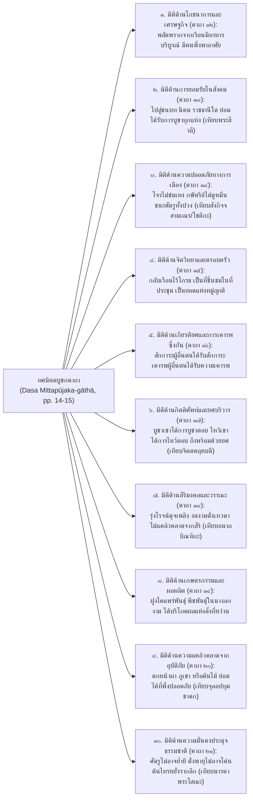
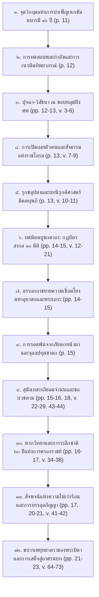

# บันทึกการอ่านและวิเคราะห์เอกสารฉบับสมบูรณ์ (Source Analysis Dossier)
## The Jātaka together with its Commentary, Vol. VI: Temiya Jātaka (Mūgapakkha Jātaka - Mittadubbhi Verses) โดย V. Fausbøll (1896)

---

### ส่วนที่ ๑: ข้อมูลทางบรรณานุกรมและเมทาดาตา (Bibliographical Metadata)

- **รหัสเอกสาร (Source ID):** S-1896-fausboll-vol6-165
- **ชื่อเอกสารต้นฉบับ:** *The Jātaka together with Its Commentary: Being Tales of the Anterior Births of Gotama Buddha*, Edited in the Original Pāli by V. Fausbøll. Volume VI (XXII. Mahānipāta: 1. Mūgapakkhajātaka / Mittadubbhi-khaṇḍa & Dasa Mittapūjaka-gāthā).
- **ชื่อไฟล์ PDF ในคลังข้อมูล:** `1896-fausboll-jataka-vol6-temiya-mittadubbhi.pdf`
  - *พาธสัมบูรณ์ในระบบ:* `d:\01_APP\Research\output\2026-09-16_โสฬสคุรุโทหะ_เครือข่ายคัมภีร์_พม่า_ลังกา_คุรุปัญจาศิกา\research-notes\pdf\1896-fausboll-jataka-vol6-temiya-mittadubbhi.pdf`
- **ชื่อไฟล์ข้อความสกัดดิจิทัล (Extracted Text):** `1896-fausboll-jataka-vol6-temiya-mittadubbhi.txt`
  - *พาธสัมบูรณ์ในระบบ:* `d:\01_APP\Research\output\2026-09-16_โสฬสคุรุโทหะ_เครือข่ายคัมภีร์_พม่า_ลังกา_คุรุปัญจาศิกา\research-notes\extracted-texts\1896-fausboll-jataka-vol6-temiya-mittadubbhi.txt`
- **ประเภทและสถานะทางวิชาการของเอกสาร:** คัมภีร์ชาดกและอรรถกถาภาษาบาลีฉบับตรวจชำระทางวิชาการระดับนานาชาติเล่มปฐมฤกษ์ (Editio Princeps / International Standard Critical Edition of the Pāli Jātaka and Aṭṭhakathā) ได้รับการถอดถ่ายเป็นอักษรโรมัน (Romanized Pāli) พร้อมระบบเครื่องหมายวิพากษ์ตัวบท (Critical Apparatus), การสอบทานและบันทึกข้ออ่านต่าง (Variant Readings) จากคัมภีร์ใบลานอักษรสิงหล (Sinhalese MSS, สัญลักษณ์ $C^k, C^s$), คัมภีร์ใบลานอักษรพม่า (Burmese MSS, สัญลักษณ์ $B^d, B^s$), และคัมภีร์ใบลานสยาม
- **ผู้ตรวจชำระ บรรณาธิการ และผู้วิเคราะห์ตัวบท:** ศาสตราจารย์ ดร. ไมเคิล วิกโก เฟาส์เบิล (Michael Viggo Fausbøll, ค.ศ. ๑๘๒๑–๑๙๐๘; พ.ศ. ๒๓๖๔–๒๔๕๑) ศาสตราจารย์ประจำภาควิชาภาษาสันสกฤตและภารตวิทยาแห่งมหาวิทยาลัยโคเปนเฮเกน (University of Copenhagen) ประเทศเดนมาร์ก ผู้ได้รับการยกย่องเป็นปฐมาจารย์แห่งการศึกษาวรรณกรรมบาลีชาดกเชิงวิพากษ์ในโลกตะวันตก
- **สถานที่พิมพ์ สำนักพิมพ์ และปีที่พิมพ์เผยแพร่:** กรุงลอนดอน ประเทศอังกฤษ: สำนักพิมพ์ ทรับเนอร์และคณะ (Trübner & Co., London), ค.ศ. ๑๘๙๖ (พ.ศ. ๒๔๓๙)
- **โครงสร้างเล่มและขอบเขตหน้าที่ศึกษา:** ปรากฏในเล่มที่ ๖ (Volume VI), ภาคที่ ๒๒ มหานิบาต (XXII. Mahānipāta), ชาดกเรื่องที่ ๑ มูคผักขชาดก (1. Mūgapakkhajātaka / ชาดกเรื่องที่ ๕๓๘ หรือในธรรมเนียมพุทธศาสนาฝ่ายสยามและพม่ารู้จักกันในนาม "เตมิยชาดก"), ข้อความสกัดครอบคลุมหน้า ๑๑ ถึงหน้า ๒๓ โดยมีจุดโฟกัสศูนย์กลางอยู่ที่ **"มิตตทุพภิกัณฑ์" (Mittadubbhi-khaṇḍa)** และ **"ทศมิตตบูชกคาถา" (Dasa Mittapūjaka-gāthā)** หน้า ๑๒–๒๑ (คาถาที่ ๓ ถึงคาถาที่ ๗๔ พร้อมอรรถกถาชาตกัตถวัณณนา)
- **ภาษาและรูปแบบภาษาศาสตร์:** ภาษาบาลีคลาสสิก (Classical Canonical and Commentarial Pāli) รูปแบบร้อยกรองฉันทลักษณ์ปัฐยาวัตร (Pathyāvaktra / Anuṣṭubh) ผสานกับร้อยแก้วอรรถกถา (Jātaka-aṭṭhakathā) และคำอธิบายอรรถกถาแจกแจงศัพท์ (Pada-bhājanīya / Pada-vaṇṇanā) แทรกด้วยเชิงอรรถภาษาอังกฤษและภาษาละติน
- **คลังข้อมูลดิจิทัลและหน่วยงานผู้จัดเก็บเอกสาร:** โครงการหอสมุดดิจิทัลแห่งประเทศอินเดีย (Digital Library of India: DLI) และหอสมุดกลางแห่งสำนักสำรวจทางโบราณคดีแห่งอินเดีย (Central Archaeological Library, Archaeological Survey of India, New Delhi; เลขทะเบียน Accession No. 9242, หมายเลขจัดหมู่ Call No. 8Pa6 / Fat); เข้าถึงทางระบบดิจิทัลสาธารณะผ่าน Internet Archive บัญชีทะเบียน `in.ernet.dli.2015.529139` และ `in.gov.ignca.9242`
- **การอ้างอิงฉบับสมบูรณ์ตามระบบสากล (Full Bibliographical Citation - Chicago/Turabian Manual of Style):**  
  Fausbøll, Michael Viggo, ed. *The Jātaka together with Its Commentary: Being Tales of the Anterior Births of Gotama Buddha*. Vol. VI. London: Trübner & Co., 1896. Digitally preserved by the Archaeological Survey of India and retrieved via Internet Archive, https://archive.org/details/in.ernet.dli.2015.529139.

---

### ส่วนที่ ๒: บทคัดย่อและสังเคราะห์ภาพรวม (Executive Summary & Synthesis)

#### ๒.๑ บทสังเคราะห์ภาพรวมเชิงวิชาการ
เอกสารคัมภีร์ *มูคผักขชาดก* (Mūgapakkhajātaka) หรือ *เตมิยชาดก* ในฉบับตรวจชำระของ V. Fausbøll (1896) เล่ม ๖ หน้า ๑๑–๒๓ ถือเป็น "เอกสารแม่บทชั้นปฐมภูมิอันเป็นรากฐานสูงสุด" (Foundational Locus Classicus) ของระบบจริยศาสตร์ฝ่ายเถรวาทในประเด็นว่าด้วย **"มิตตทุพภี" (Mittadubbhin / การประทุษร้ายมิตรและผู้มีพระคุณ)** ตัวบทในกัณฑ์นี้ทำหน้าที่เป็นสะพานเชื่อมทางปรัชญา ภาษาศาสตร์ และนรกวิทยาข้ามภูมิภาค จากอินเดียโบราณ สู่ศรีลังกา พม่า มอญ และสยาม โดยเฉพาะอย่างยิ่งต่อธรรมนูญกำกับจริยธรรมของศิษย์ใน **"คัมภีร์โสฬสคุรุโทหวณฺณนา" (Soḷasagurudohavaṇṇanā)** แห่งนครศรีธรรมราช และคัมภีร์ **"คุรุปัญจาศิกา" (Gurupañcāśikā)** ฉบับสันสกฤต-ตันตระ

การวิเคราะห์ตัวบทเชิงลึกแสดงให้เห็นว่า แก่นสาระสำคัญของมิตตทุพภิกัณฑ์ประกอบด้วยองค์ประธาน ๔ ประการที่ส่งอิทธิพลโดยตรงต่อวิวัฒนาการทางวรรณกรรมพุทธศาสนาในเอเชียตะวันออกเฉียงใต้:
๑) **การสถาปนารุกขอุปมา (Rukkhūpama):** คาถา `ยสฺส รุกฺขสฺส ฉายาย... มิตฺตทุโภ หิ ปาปโก` (หน้า ๑๓, คาถาที่ ๑๐–๑๑) ได้วางกรอบศีลธรรมว่าด้วยการห้ามทำลายกิ่งก้านของต้นไม้ที่ตนอาศัยร่มเงา ซึ่งต่อมาได้พัฒนาทางสัญญะวิทยา (Semiotics) เข้าสู่จารีตการห้ามก้าวล่วงหรือเหยียบย่ำ "เงาครู" (`ฉายํ น ลงฺฆเย`) ในคัมภีร์โสฬสคุรุโทหะและคุรุปัญจาศิกา  
๒) **วิวัฒนาการทางนิรุกติศาสตร์ของรากศัพท์ √druh:** การกลายเสียงจากภาษาสันสกฤต *droha* สู่ภาษาบาลี `dūbhati` / `dubbhati` / `mittadubho` และการตกผลึกกลับมาสู่รูปคำว่า `โทหะ` (Doha) ในภาษาบาลีไฮบริดของคัมภีร์ใบลานภาคใต้ของไทย บ่งชี้ว่า "มิตตทุพภี" และ "คุรุโทหะ" แท้จริงแล้วคือศัพท์คู่แฝดทางนิรุกติศาสตร์ (Etymological Doublets) ที่สืบสายมาจากรากความหมายเดียวกัน  
๓) **ทศมิตตบูชกคาถา (Dasa Mittapūjaka-gāthā):** คาถา ๑๐ บท (หน้า ๑๔–๑๕, คาถาที่ ๑๒–๒๑) ทำหน้าที่เป็น "บัญญัติสากลแห่งมิตตธรรม" ที่แสดงอานิสงส์ทั้ง ๑๐ ประการของผู้ไม่ประทุษร้ายมิตร ซึ่งถูกปราชญ์มอญและพม่าคัดลอกไปประดิษฐานไว้ในวรรณกรรมตระกูลนีติ (Nīti Literature) เช่น *Dhammanīti* และ *Lokanīti*  
๔) **นรกวิทยาและวิบากกรรมมหันต์:** ภาพจำของการตกมหาโรรุวนรกและอเวจีนานถึง ๘๐,๐๐๐ ปี (หน้า ๑๖–๑๗) ของพระเตมิยะ อันเนื่องมาจากการเสวยราชย์และต้องสั่งลงทัณฑ์โจรผู้ร้าย ได้กลายมาเป็นฐานคิดรองรับคำสาปแช่งและทัณฑ์กงจักรกรด (`Urakkhura-cakka`) แก่ศิษย์ผู้ประทุษร้ายครูอาจารย์ในคัมภีร์โสฬสคุรุโทหวณฺณนา

---

#### ๒.๒ แผนผังการจัดสรรเนื้อหาเข้าสู่โครงร่างวิทยานิพนธ์ ๘ บท (Chapter Mapping Matrix)

| โครงร่างแม่บท ๘ บท | หัวข้อย่อยเป้าหมาย | ประเด็นหลักฐานเชิงประจักษ์จากตัวบท Fausbøll Vol. VI | ตำแหน่งอ้างอิงจริงในเอกสาร (Page / Line / Verse) |
|:---|:---|:---|:---|
| **บทที่ ๑: อารัมภกถาและปริศนาแห่งตัวบทโสฬสคุรุโทหวัณณนา** | ๑.๑ ปัญหาความคลุมเครือของที่มาและชื่อคัมภีร์<br>๑.๔ โครงสร้างฉันท์ปัฐยาวัตรและหน้าที่ทางพิธีกรรม | การใช้ฉันท์ปัฐยาวัตร (Anuṣṭubh/Pathyāvaktra) ในเตมิยชาดก เพื่อประกาศสัจจะและธรรมเทศนา ยืนยันว่าฉันทลักษณ์นี้เป็นแม่บทมาตรฐานในการประพันธ์บทสาธยายจริยธรรมของฝ่ายเถรวาท สอดคล้องกับฉันท์ ๒๐ บทในใบลานนครศรีธรรมราช | Vol. VI, pp. 12–15, Verses 3–21 |
| **บทที่ ๒: การตรวจชำระ อักขรวิทยา ฉันทลักษณ์ และภาษาบาลีไฮบริด** | ๒.๒ ปรากฏการณ์ภาษาบาลีไฮบริด: การคลี่คลายทางนิรุกติศาสตร์จากราก √druh สู่ `dūbhati` / `dubbhati` และ `คุรุโทหะ`<br>๒.๓ การวิเคราะห์ศัพท์เฉพาะทาง: มโนทัศน์ `ฉายํ น ลงฺฆเย` | การศึกษาวิวัฒนาการของรากศัพท์ √druh ในภาษาสันสกฤต (*droha*) สู่บาลี *dūbhati* (อรรถกถาไขว่า `na dussati`, p. 14) และการแผลงเป็น `โทหะ` ในใบลานไทย; การเชื่อมโยงสัญญะ "ร่มเงาไม้" (`chāyā`, v. 10) สู่ "เงาของครู" ที่ห้ามเหยียบย่ำ | Vol. VI, p. 13 (v. 10–11), p. 14 (v. 12–21 & Aṭṭhakathā), p. 15 |
| **บทที่ ๓: ภูมิศาสตร์ทางปัญญาและการกระจายตัวของคัมภีร์คุรุปัญจาศิกา** | ๓.๔ การเทียบเคียงคำสอนเรื่องการเคารพผู้มีพระคุณในสายธารต่างภาษา<br>๓.๕ ร่องรอยวัชรยาน-มหายานและเถรวาทในคติการปรนนิบัติผู้มีพระคุณ | การเทียบเคียงมโนทัศน์ "มิตตบูชา" ในฝ่ายเถรวาทกับ "คุรุภักดี" ในฝ่ายตันตระ-วัชรยาน (*Gurupañcāśikā*): ทั้งสองฝ่ายยกย่องผู้มีพระคุณเป็น "เนื้อนาบุญสูงสุด" และถือว่าการลบหลู่ผู้มีพระคุณเป็นมูลเหตุแห่งอเวจีมหานรก | Vol. VI, pp. 13–15, Verses 10–21 |
| **บทที่ ๔: การสืบค้นคัมภีร์คู่ขนานและร่องรอยจารีตในศรีลังกา** | ๔.๓ มโนทัศน์ "การเคารพอุปัชฌายาจารย์" ในคัมภีร์สังคหะและฎีกาวินัยลังกา: คำว่า `อาจริยทุพฺภี` และ `มิตฺตทุพฺภี` ใน *Sāratthasaṅgaha* | เชิงอรรถของ Fausbøll (p. 13) ชี้พิกัดคู่ขนานใน *Petavatthu* (หน้า ๗๗) ซึ่งคาถา `Yassa rukkhassa chāyāya...` ถูกนำไปจัดหมวดหมู่ในเปตวัตถุอรรถกถาและสารัตถสังคหะของพระพุทธปิยะเถระ เพื่อขยายความเรื่องโทษของการประทุษร้ายอาจารย์ | Vol. VI, p. 13 (Footnote to Verse 10: "Petavatthu p. 77"), pp. 14–15 |
| **บทที่ ๕: การสืบค้นคัมภีร์คู่ขนานและร่องรอยจารีตในพม่าและมอญ** | ๕.๑ วรรณกรรมตระกูลนีติในพม่า: *Dhammanīti*, *Lokanīti*, *Mahārahannīti*<br>๕.๔ การสำรวจเปรียบเทียบข้ามตัวบท: ทศมิตตคาถาในฐานะแม่บทนีติพม่า | การถ่ายทอด "ทศมิตตคาถา" (คาถาที่ ๑๒–๒๑) เข้าสู่วรรณกรรมราชสำนักพม่า โดยพระอัครธรรมเถระและมหาอำมาตย์จาตุรงคพละ ได้คัดเลือกคาถาชุดนี้ไปเป็นแกนกลางของหมวดมิตตกถาใน *Dhammanīti* | Vol. VI, pp. 14–15, Verses 12–21 |
| **บทที่ ๖: การสืบสวน "โซ่ข้อกลาง" (The Missing Links)** | ๖.๑ แม่บทโบราณจากภารตวิทยา: นรกวิทยาของผู้ทรยศผู้มีพระคุณ<br>๖.๓ การเปรียบเทียบลักษณะร่วมทางเทววิทยา: ผลกรรมของ `คุรุโทหะ` เทียบกับ `มิตฺตทุพฺภี` | การเปรียบเทียบวิบากกรรม: สภาพของบุคคลผู้ประทุษร้ายมิตรที่ต้องถูกธรณีสูบ (จุลลปทุมชาดก, มหากปิชาดก) เทียบเท่ากับผลกรรมของพระเทวทัตผู้ประทุษร้ายพระพุทธเจ้า และโทษทัณฑ์กงจักรกรดในโสฬสคุรุโทหวณฺณนา | Vol. VI, p. 13 (Aṭṭhakathā), p. 15 (Cullapaduma citation), pp. 16–17 (Verses 34–38) |
| **บทที่ ๗: นครศรีธรรมราชและศรีวิชัยในฐานะจุดบรรจบทางปัญญา** | ๗.๒ กระบวนการแปลงสารตันตระสู่เถรวาท (*Theravadization*): การดึงภาพจำแห่งนรกภูมิและกงจักรกรดจากชาดกมาสวมทับบทสวดคุรุโทหะ ๑๖ ประการ | การวิเคราะห์บริบททางปัญญาของคาบสมุทรไทย-มลายู: การนำมโนทัศน์มิตตทุพภีจากเตมิยชาดก (อันเป็นหนึ่งในทศชาติชาดกที่แพร่หลายที่สุดในภาคใต้) มาผสานเข้ากับโครงร่างคำสาปคุรุปัญจาศิกา เพื่อสถาปนาเป็นคัมภีร์โสฬสคุรุโทหวณฺณนา | Vol. VI, pp. 13–15, pp. 16–17 |
| **บทที่ ๘: สังเคราะห์โมเดลพันธุศาสตร์คัมภีร์และการศึกษาเปรียบเทียบ** | ๘.๑ แผนผังวิวัฒนาการของคัมภีร์: อรรถกถาชาดกฉบับ Fausbøll (1896) ในฐานะ Textual Anchor ระดับสากล<br>๘.๓ ข้อเสนอแนะเชิงระเบียบวิธีวิจัยนิรุกติศาสตร์ | การใช้ฉบับพิมพ์ Editio Princeps ของ Fausbøll เป็นหลักฐานเทียบเคียงอักขรวิธีโบราณ การตรวจสอบข้ออ่านต่างระหว่างสายจารีตสิงหลและพม่า เพื่อทำความเข้าใจกระบวนการกลายเสียงและการแปลศัพท์ในคัมภีร์ใบลานไทย | Vol. VI, Title Page, pp. 11–23 |

---

### ส่วนที่ ๓: สรุปสาระสำคัญเชิงวิเคราะห์และจุดยืนทางวิชาการ (Detailed Analytical Summary)

#### ๓.๑ บริบทประวัติศาสตร์วรรณคดีชาดกและโครงสร้างการประพันธ์ในมูคผักขชาดก
คัมภีร์มูคผักขชาดก (Mūgapakkhajātaka) หรือเตมิยชาดก ได้รับการจัดให้อยู่ในลำดับแรกของมหานิบาตชาดก (นิบาตที่ ๒๒) ซึ่งรวบรวมชาดกขนาดยาวที่มีจำนวนคาถาเกินกว่า ๘๐ คาถาขึ้นไป และถือเป็นชาดกเรื่องสำคัญสูงสุดในการแสดงการบำเพ็ญ **"เนกขัมมบารมี"** ของพระโพธิสัตว์ ในโครงสร้างการเล่าเรื่องของอรรถกถา (Jātakatthavaṇṇanā) ตัวบทแบ่งออกเป็นลำดับเหตุการณ์อันเข้มข้น เริ่มตั้งแต่การประสูติของพระเตมิยกุมาร การที่ทรงระลึกชาติได้ว่าเคยตกนรกหมกไหม้จากการครองราชย์ในอดีตชาติ การแกล้งทำเป็นคนใบ้ หนวก และง่อยเปลี้ยตลอดระยะเวลา ๑๖ ปี การถูกทดสอบด้วยอุบายต่างๆ จนกระทั่งพระราชบิดาตัดสินพระทัยสั่งให้นำไปฝังทั้งเป็น

จุดเปลี่ยนสำคัญอันเป็นจุดสูงสุดของเนื้อหา (Narrative Climax) ปรากฏในเล่มที่ ๖ หน้า ๑๑–๑๓ เมื่อสุนันทสารถีขับราชรถพาพระกุมารออกจากพระนครสู่อามกสุสาน (ป่าช้าผีดิบ) และเริ่มลงมือขุดหลุมฝังศพ (`kāsuṃ khanati`) การที่พระโพธิสัตว์ทรงลุกขึ้นทดสอบพละกำลัง ยกรถรบขึ้นกวัดแกว่งดุจของเล่นเด็ก และได้รับการตกแต่งสรีระด้วยทิพยาภรณ์จากท้าวสักกเทวราช (ผ่านพระวิษณุกรรม) ก่อนจะเสด็จดำเนินเข้าหาขอบหลุมเพื่อเจรจาธรรมกับสารถีนั้น มิได้เป็นเพียงการสำแดงอิทธิฤทธิ์เพื่อรักษาชีวิตตนเอง แต่เป็น **"เวทีแห่งการเทศนาธรรมเชิงจริยศาสตร์และนิติปรัชญา"** โดยพระโพธิสัตว์ทรงเลือกใช้สถานการณ์วิกฤตนี้ในการเปิดเผยธรรมนูญว่าด้วยพันธกรณีระหว่างมนุษย์กับผู้มีพระคุณ

---

#### ๓.๒ การวิเคราะห์เชิงนิรุกติศาสตร์ประวัติศาสตร์: การคลี่คลายของรากศัพท์ √druh
หัวใจสำคัญทางภาษาศาสตร์ที่เชื่อมโยงตัวบทของ Fausbøll เข้ากับคัมภีร์โสฬสคุรุโทหวณฺณนา คือประวัติศาสตร์การกลายเสียงของรากศัพท์กริยาที่แสดงถึง "การประทุษร้ายหรือการคิดร้าย":

```mermaid
graph TD
    A["รากศัพท์สันสกฤตดั้งเดิม: √druh (द्रुह्)<br>ความหมาย: คิดร้าย, มุ่งร้าย, ทรยศ, ก่อวินาศ"] --> B["ภาษาสันสกฤตพระเวทและคลาสสิก: droha (द्रोह)<br>เช่น mitradroha, gurudroha, svāmidroha"]
    
    B --> C["สายพัฒนาการทางสัทศาสตร์บาลี (Phonetic Metathesis & Assimilation):<br>druhyati → dubbhati / dūbhati (การกลืนเสียงควบกล้ำและสลับตำแหน่งเสียง)"]
    C --> D["รูปศัพท์บาลีในเตมิยชาดก (Fausbøll Vol. VI):<br>กริยา: dūbhati / dubbhati (อรรถกถาไข: na dussati)<br>นาม/คุณศัพท์: mittadubho / mittadubbhin (อรรถกถาไข: mittaghātako lāmakapuriso)"]
    
    B --> E["สายการยืมคำสันสกฤตสู่บาลีไฮบริดในอุษาคเนย์ (Sanskrit-Pāli Hybridity):<br>droha ถูกดัดแปลงเป็น doha (โทหะ)"]
    E --> F["ตัวบทใบลานภาคใต้และเอเชียอาคเนย์:<br>คุรุโทหะ (Gurudoha / Gurudroha)<br>โสฬสคุรุโทหวณฺณนา (Soḷasagurudohavaṇṇanā)"]
    
    D -.->|ศัพท์คู่แฝดทางนิรุกติศาสตร์ (Etymological Doublets)| F
```

๑. **ในภาษาสันสกฤต:** รากศัพท์กริยาคือ **√druh** (द्रुह्, druh jighāṃsāyām) หมายถึง การมุ่งร้าย การทำลายล้าง หรือการทรยศหักหลัง เมื่อประกอบรูปเป็นนามกิตก์จะได้คำว่า **droha** (द्रोह) ซึ่งมีความหมายเฉพาะถึงการประทุษร้ายต่อบุคคลที่มีฐานะสูงกว่าหรือผู้มีพระคุณ เช่น *gurudroha* (การประทุษร้ายครูอาจารย์), *mitradroha* (การทรยศมิตร), และ *svāmidroha* (การทรยศต่อนายหรือกษัตริย์)  
๒. **ในภาษาบาลีคลาสสิก:** ตามกฎการเปลี่ยนแปลงทางสัทศาสตร์บาลี (Pāli Phonetic Laws) เสียงควบกล้ำ *dr-* ร่วมกับพยัญชนะเสียดแทรกโฆษะ *-h* ได้ผ่านกระบวนการสลับตำแหน่งเสียง (Metathesis) และการกลืนเสียงพยัญชนะ (Consonant Assimilation) จนกลายเป็นรูปกริยา `dūbhati` หรือ `dubbhati` (สังเกตความสัมพันธ์ระหว่างกลุ่มเสียง dh-r-h สู่ d-bh) ดังที่พระอรรถกถาจารย์ได้ระบุบทนิยามศัพท์ไว้ในหน้า ๑๔ บรรทัดที่ ๒๐ อย่างชัดเจนว่า:
$$\text{Dūbhatī ti na dussati}$$
*(บทว่า dūbhati มีความหมายเท่ากับ na dussati คือ ย่อมไม่ประทุษร้าย, ย่อมไม่คิดร้าย, ย่อมไม่ก่อความขุ่นเคือง)*  
และในหน้า ๑๓ บรรทัดที่ ๓๐ อรรถกถาได้นิยามคำว่า `mittadubho` ว่า:
$$\text{Mittadubho ti... mittaghātako hoti lāmakapuriso}$$
*(บทว่า mittadubho หมายถึง บุคคลผู้เป็นมิตตฆาตก์ คือผู้ฆ่ามิตร และเป็นบุรุษผู้ลามกชั่วช้าเลวทราม)*  
๓. **ในภาษาบาลีไฮบริดของใบลานเอเชียอาคเนย์:** คัมภีร์ใบลานภาคใต้ของไทย (นครศรีธรรมราช) มิได้ใช้รูปศัพท์บาลีแท้ `dubbhin` หรือ `dūbhati` หากแต่รับเอารูปคำสันสกฤต *droha* มาแปลงเป็นบาลีท้องถิ่นในรูป `โทห` หรือ `โทหะ` (Doha) เกิดเป็นคำว่า `คุรุโทหะ` (Gurudoha) ซึ่งหมายถึง "การกระทำอันเป็นการทรยศ ลบหลู่ หรือประทุษร้ายครูอาจารย์" สิ่งนี้ยืนยันว่า **"มิตตทุพภี"** ในเตมิยชาดก และ **"คุรุโทหะ"** ในใบลานนครศรีธรรมราช คือมโนทัศน์เดียวกันทุกประการทั้งในเชิงนิรุกติศาสตร์และอรรถศาสตร์

---

#### ๓.๓ รุกขอุปมา (Rukkhūpama): ปรัชญาว่าด้วยความกตัญญูและสัญญะวิทยาแห่ง "เงา"
ในหน้า ๑๓ คาถาที่ ๑๐ และ ๑๑ ถือเป็นแกนกลางทางปรัชญาของตัวบท:
$$\text{Yassa rukkhassa chāyāya nisīdeyya sayeyya vā |}$$
$$\text{na tassa sākhaṃ bhañjeyya, mittadubho hi pāpako || 10 ||}$$
$$\text{Yathā rukkho tathā rājā, yathā sākhā tathā ahaṃ |}$$
$$\text{yathā chāyūpago poso evaṃ tvam asi sārathi || 11 ||}$$

พระโพธิสัตว์ทรงวางโครงสร้างอุปมาเชิงเปรียบเทียบ (Analogical Structure) ๓ ระดับ:
- **ต้นไม้ใหญ่ (*rukkha*):** เปรียบประดุจพระเจ้ากาสิกราช ผู้ทรงเป็นประมุขแห่งรัฐและเป็นผู้พระราชทานเบี้ยหวัด เงินเดือน ตำแหน่ง เกียรติยศ และเครื่องยังชีพแก่สารถี
- **กิ่งก้านสาขาของต้นไม้ (*sākhā*):** เปรียบประดุจพระเตมิยกุมาร ผู้เป็นหน่อเนื้อเชื้อไขและเป็นพระราชโอรสผู้สืบสายโลหิตของพระมหากษัตริย์
- **บุคคลผู้เข้ามาพึ่งพาอาศัยร่มเงาไม้ (*chāyūpago poso*):** เปรียบประดุจสุนันทสารถี ผู้เป็นข้าราชบริพารและต้องพึ่งพาพระบารมีของพระราชาในการดำรงชีพ

ตรรกะที่พระโพธิสัตว์ทรงใช้คือ **"การอนุมานแบบขั้นกว่า" (Argumentum a fortiori):**  
หากแม้เพียงต้นไม้ซึ่งเป็นสิ่งไม่มีวิญญาณครอง (Acittaka) บุคคลที่เข้ามานั่งพักหรือนอนหลับใต้ร่มเงาเพียงชั่วครู่ชั่วคราว แล้วหักรานกิ่งก้านของต้นไม้นั้น สังคมยังประณามว่าเป็น `mittadubho hi pāpako` (คนประทุษร้ายมิตรผู้ชั่วช้าเลวทราม) แล้วการที่สารถีผู้พึ่งพาพระราชามาตลอดชีวิต กลับจะลงมือขุดหลุมฝังพระราชโอรสแท้ๆ ของพระราชาผู้มีพระคุณ ย่อมมิเป็นการก่ออธรรมและมิตตทุพภีที่มหันต์ยิ่งกว่านั้นหลายร้อยพันเท่าดอกหรือ?

**การคลี่คลายของมโนทัศน์ "ร่มเงา" (Chāyā):**  
คำว่า `chāyā` (ร่มเงา) ในรุกขอุปมา มิได้มีความหมายเพียงความร่มเย็นทางกายภาพ แต่แฝงนัยถึง "รัศมีแห่งความคุ้มครอง ความเมตตา และพระคุณอันบริสุทธิ์" มโนทัศน์นี้ได้ส่งผ่านโดยตรงไปยังคติจารีตของลัทธิคุรุภักดีใน *คุรุปัญจาศิกา* และ *โสฬสคุรุโทหวณฺณนา* ในรูปข้อห้ามที่ว่า:
$$\text{คุรุโน จีวรํ ฉตฺตํ ปตฺตํ ฉายํ น ลงฺฆเย}$$
*(ศิษย์พึงห้ามมิให้ก้าวล่วงหรือเหยียบย่ำจีวร ร่ม บาตร และ "เงา" ของพระอาจารย์)*  
ในโลกทัศน์โบราณ "เงา" ของครูบาอาจารย์ถือเป็นส่วนขยายของสรีระและบารมีธรรม การเหยียบย่ำเงาครูจึงมีค่าเท่ากับการประทุษร้ายครู และเป็นพฤติกรรมของมิตตทุพภีโดยตรง

---

#### ๓.๔ ทศมิตตบูชกคาถา (Dasa Mittapūjaka-gāthā): ระบบศีลธรรม ๑๐ มิติ
ในหน้า ๑๔–๑๕ พระโพธิสัตว์ทรงขับขานคาถา ๑๐ บท (คาถาที่ ๑๒–๒๑) เพื่อประกาศผลานิสงส์ของผู้ที่มีจิตใจเปี่ยมด้วยไมตรีจิต ไม่ประทุษร้ายมิตร (`yo mittānaṃ na dūbhati` / `yo mittānaṃ na dubbati`) ซึ่งครอบคลุมมิติแห่งชีวิตทั้งทางโลกและทางธรรมอย่างครบวงจร:



การจัดวางระบบอานิสงส์ ๑๐ ประการนี้ สะท้อนให้เห็นว่าในพุทธจริยศาสตร์ "ความซื่อสัตย์ต่อมิตรและผู้มีพระคุณ" มิใช่เพียงคุณธรรมส่วนบุคคล (Individual Virtue) หากแต่เป็น **"กฎแห่งความมั่นคงของชีวิตและสังคม" (Social and Cosmic Law)** ผู้ใดที่รักษาธรรมข้อนี้ ย่อมได้รับการพิทักษ์คุ้มครองจากธรรมชาติ รัฐ และเพื่อนมนุษย์

---

#### ๓.๕ นรกวิทยา การเปรียบเทียบกับพระเทวทัต และการลงทัณฑ์คุรุโทหะ
ในหน้า ๑๖–๑๗ (คาถาที่ ๓๔–๓๘) ตัวบทได้เฉลยปริศนาธรรมอันลึกซึ้งของการแสร้งเป็นคนง่อยใบ้ของพระเตมิยะ:
$$\text{Purimaṃ saraṃ ahaṃ jātiṃ yattha rajjaṃ akārayiṃ |}$$
$$\text{kārayitvā tahiṃ rajjaṃ papatthaṃ nirayaṃ bhusaṃ || 34 ||}$$
$$\text{Vīsatiñ c' eva vassāni tahiṃ rajjaṃ akārayiṃ |}$$
$$\text{asītivassasahassāni nirayamhi apaccayim || 35 ||}$$

พระโพธิสัตว์ทรงระลึกชาติได้ว่า พระองค์เคยครองราชสมบัติในกรุงพาราณสีเพียง ๒๐ ปี แต่ผลจากการต้องทำหน้าที่วินิจฉัยอรรถคดี สั่งประหารชีวิต เฆี่ยนตีด้วยหวายมีหนาม (`kharāpatacchikaṃ`) และสั่งเอาคนเป็นเสียบหลาว (`sūlasmiṃ accetha`) ตามกฎหมายบ้านเมือง ทำให้พระองค์ต้องพลัดตกไปเสวยทุกข์ทรมานในมหาโรรุวนรกและอเวจีนานถึง ๘๐,๐๐๐ ปี

**การเปรียบเทียบเชิงเทววิทยากรรมกับกรณีพระเทวทัต:**
ในระบบเทววิทยาเถรวาท การกระทำที่เป็น "มิตตทุพภี" และ "อาจริยทุพภี" ขั้นสูงสุด คือกรณีของ **พระเทวทัต** ผู้ประทุษร้ายพระสัมมาสัมพุทธเจ้า (ผู้ทรงเป็นบรมครูและยอดกัลยาณมิตรของสัตว์โลก) ด้วยการลอบปลงพระชนม์ กลิ้งหินใส่จนห้อพระโลหิต และทำลายสงฆ์ให้แตกแยก ผลกรรมทำให้พระเทวทัตถูกธรณีสูบลงสู่อเวจีมหานรกทันทีในชาติปัจจุบัน

ในทำนองเดียวกัน คัมภีร์โสฬสคุรุโทหวณฺณนาแห่งนครศรีธรรมราช ได้รับเอาโครงสร้างทางเทววิทยานี้มาประยุกต์ใช้ โดยกำหนดว่าศิษย์ผู้ใดที่ประทุษร้าย ลบหลู่ หรือเนรคุณต่อครูบาอาจารย์ (ผู้เป็นกัลยาณมิตรผู้ให้กำเนิดทางปัญญา) ผู้นั้นย่อมมีสภาพไม่ต่างจากพระเทวทัต ย่อมต้องเสวยวิบากกรรมในนรก ๓๓ ขุม และถูกกงจักรกรด (`Urakkhura-cakka`) พัดผ่าศีรษะตลอดกาลนาน การอ้างอิงนรกวิทยาในเตมิยชาดกจึงทำหน้าที่เป็น "ฐานคติธรรมแห่งความหวาดกลัวบาป" (Moral Dread / Ottappa) ที่ค้ำจุนธรรมนูญโสฬสคุรุโทหะ

---

#### ๓.๖ ข้อถกเถียงทางวิชาการสากล: การตรวจชำระของ V. Fausbøll และ Léon Feer
การจัดพิมพ์คัมภีร์ชาดก เล่ม ๖ โดย V. Fausbøll ในปี ค.ศ. ๑๘๙๖ ถือเป็นหมุดหมายประวัติศาสตร์ทางนิรุกติศาสตร์บาลี:
๑. **การสอบทานตัวบทข้ามสายจารีต:** Fausbøll ได้รวบรวมคัมภีร์ใบลานจากทั้งสายสิงหล (ฉบับหอสมุดโคเปนเฮเกนและบริติชมิวเซียม) และสายพม่า บันทึกข้ออ่านต่างอย่างละเอียด เช่น ในคาถาที่ ๑๐ มีการบันทึกเชิงอรรถว่าข้อความนี้ตรงกับ *Petavatthu* หน้า ๗๗ (ฉบับพิมพ์ของ Minayeff) ยืนยันว่าคาถารุกขอุปมาเป็น "บทสวดโบราณร่วม" (Common Ancient Formula) ที่ถูกใช้แพร่หลายข้ามคัมภีร์  
๒. **การอ้างอิงข้อค้นพบของ Léon Feer (ค.ศ. ๑๘๗๑):** ในหน้า ๑๔ เชิงอรรถกำกับคาถาที่ ๑๒ Fausbøll ได้ระบุว่า:
$$\text{"Cfr. Feer in Journal Asiatique 1871 Tome 18 p. 248"}$$
ซึ่งอ้างถึงบทความวิจัยเชิงบุกเบิกของ เลอง เฟร์ (Léon Feer) นักภารตวิทยาชาวฝรั่งเศสในวารสาร *Journal Asiatique* ที่ได้ศึกษาวิเคราะห์ "ทศมิตตคาถา" ในฐานะวรรณกรรมศีลธรรมชิ้นเอกของเอเชียตะวันออก  
๓. **ข้อถกเถียงเรื่องชั้นอายุของตัวบท (Stratification of Texts):** นักภารตวิทยาสมัยต่อมา เช่น T.W. Rhys Davids และ Oskar von Hinüber ได้ชี้ว่า ตัวคาถา (Gāthā) ในเตมิยชาดกมีความเก่าแก่ย้อนหลังไปได้ถึงยุคพุทธกาลหรือก่อนอโศกมหาราช (Pre-Aśokan Pāli) ในขณะที่ส่วนร้อยแก้วอรรถกถา (Aṭṭhakathā) ได้รับการประมวลและเรียบเรียงขึ้นในลังการาวพุทธศตวรรษที่ ๑๐ โดยพระพุทธโฆษาจารย์หรือพระเถระในสำนักมหาวิหาร การรักษาตัวบทคาถาไว้อย่างแม่นยำในฉบับของ Fausbøll จึงเป็นกุญแจสำคัญในการสืบค้นรากศัพท์ดั้งเดิม

---

### ส่วนที่ ๔: สารบัญข้อค้นพบเชิงลึกตามประเด็นหลัก (Thematic Findings with Exact Page Citations)

*ประมวลข้อค้นพบเชิงประจักษ์ ๑๒ ประเด็นหลัก พร้อมเลขหน้าจริงในฉบับพิมพ์ Fausbøll Vol. VI (1896) และการวิเคราะห์เทียบเคียงกับคัมภีร์โสฬสคุรุโทหวณฺณนาและคุรุปัญจาศิกา:*



#### ๑. จุดวิกฤตแห่งการบำเพ็ญเนกขัมมบารมี ๑๖ ปี (Vol. VI, p. 11)
- **ตำแหน่งในตัวบท:** หน้า ๑๑ บรรทัดที่ ๒๑–๒๘  
- **เนื้อหาเชิงประจักษ์:** เมื่อพระนางจันทาเทวีทรงร่ำไห้กอดพระกุมารในคืนที่ ๖ พร้อมแจ้งว่าพระเจ้ากาสิกราชมีรับสั่งให้สารถีนำไปฝังทั้งเป็น ณ อามกสุสานในวันรุ่งขึ้น (`tāta Kāsirājā taṃ sve āmakasusāne nikhanituṃ āṇāpesi, sve maraṇaṃ pāpuṇissasi putta`), พระเตมิยะกลับทรงบังเกิดความปีติซาบซ่านในอุระว่า "ความเพียรพยายามตลอด ๑๖ ปีของเราถึงที่สุดยอดแล้ว" (`Temiya soḷasavassāni katavāyāmo te matthakaṃ patto ti cintentassa abbhantare pīti uppajji`) แม้หัวใจของพระมารดาจะแตกสลาย พระองค์ก็ทรงข่มความรู้สึกไว้เพื่อมิให้มโนรถแห่งการบวชต้องล้มเหลว  
- **การเทียบเคียง:** สะท้อนถึง "สัจจาธิษฐาน" อันแน่วแน่ที่ปรากฏในคำนมัสการเริ่มต้นของโสฬสคุรุโทหวณฺณนา ที่กำหนดให้ศิษย์ต้องตั้งจิตมั่นคงในการเคารพครูโดยไม่หวั่นไหวต่อความยากลำบาก

#### ๒. การทดสอบพละกำลังและการเนรมิตทิพยาภรณ์ (Vol. VI, p. 12)
- **ตำแหน่งในตัวบท:** หน้า ๑๒ บรรทัดที่ ๑–๑๘  
- **เนื้อหาเชิงประจักษ์:** เมื่อสารถีจอดราชรถไว้ข้างทางแล้วลงไปขุดหลุม พระเตมิยะทรงพิจารณาว่าตลอด ๑๖ ปีมิได้ขยับเขยื้อนมือเท้า จึงทรงลุกขึ้นนวดมือและเท้า เสด็จลงจากราชรถ ทรงทดลองยกท้ายราชรถขึ้นกวัดแกว่งดุจของเล่นเด็ก (`kumārānaṃ kīḷanayanakaṃ viya ukkhipitvā aṭṭhāsi`) เพื่อตรวจดูว่ามีกำลังพอจะสู้รบกับสารถีได้หรือไม่ จากนั้นท้าวสักกะทรงทราบวาระจิต จึงส่งพระวิษณุกรรมลงมาเนรมิตทิพยภูษาและเครื่องประดับประดุจท้าวสักกเทวราช พระองค์จึงเสด็จดำเนินเข้าหาขอบหลุมอย่างสง่างาม  
- **การเทียบเคียง:** สรีระที่งดงามเปล่งปลั่งด้วยบารมีธรรมนี้ สอดคล้องกับภาพจำของพระคุรุบาอาจารย์ใน *คุรุปัญจาศิกา* (โศลกที่ ๑–๒) ที่ศิษย์พึงมองเห็นครูประดุจพระพุทธเจ้าหรือทวยเทพผู้ทรงสง่าราศี

#### ๓. ปุจฉา-วิสัชนา ณ ขอบหลุมฝังศพ (Vol. VI, pp. 12–13, Verses 3–6)
- **ตำแหน่งในตัวบท:** หน้า ๑๒ บรรทัดที่ ๒๘–๓๑ ถึง หน้า ๑๓ บรรทัดที่ ๖; คาถาที่ ๓–๖  
- **เนื้อหาเชิงประจักษ์:** พระเตมิยะตรัสถามสารถีว่า "เหตุใดจึงรีบร้อนขุดหลุมเล่า?" (คาถา ๓) สุนันทสารถีก้มหน้าขุดหลุมโดยไม่เงยขึ้นมอง ตอบว่า "พระราชาทรงมีพระราชโอรสประสูติมาเป็นคนใบ้ ง่อยเปลี้ย และไร้ความคิด ข้าพเจ้าได้รับคำสั่งให้นำมาฝังในป่า" (คาถา ๔) พระเตมิยะจึงทรงเปล่งวาจาปฏิเสธอย่างอาจหาญว่า:  
  $$\text{Na bādhiro na mūgo 'smi na pakkho na pi paṅgulo,}$$  
  $$\text{adhammaṃ sārathi kayirā maṃ ce tvaṃ nikhanaṃ vane. (คาถา ๕)}$$  
  ทรงสั่งให้สารถีดูท่อนขา ลำแขน และฟังสำเนียงวาจาอันไพเราะ หากสารถีฝังพระองค์ ย่อมเป็นการกระทำกรรมอันเป็นอธรรม (คาถา ๖)  
- **การเทียบเคียง:** คำว่า `adhammaṃ... kayirā` (กระทำกรรมอันเป็นอธรรม) เป็นคำเตือนสติทางนิติธรรมขั้นสูงสุด เทียบได้กับการเตือนศิษย์ในโสฬสคุรุโทหวณฺณนาว่าการละเมิดข้อห้ามต่อครูอาจารย์เป็นความประพฤตินอกรีตแห่งธรรม

#### ๔. การเปิดเผยตัวตนและสัจธรรมแห่งราชโอรส (Vol. VI, p. 13, Verses 7–9)
- **ตำแหน่งในตัวบท:** หน้า ๑๓ บรรทัดที่ ๑๖–๒๖; คาถาที่ ๗–๙  
- **เนื้อหาเชิงประจักษ์:** สารถีเงยหน้าขึ้นมอง ตกตะลึงในรัศมีกายอันงดงาม จึงถามว่าท่านเป็นเทวดา คนธรรพ์ หรือท้าวสักกะ (คาถา ๗) พระโพธิสัตว์ตรัสตอบว่า พระองค์มิใช่เทพยดาใดๆ แต่เป็นพระราชโอรสของพระเจ้ากาสิกราช ผู้ซึ่งสารถีกำลังขุดหลุมจะฝังอยู่นี้ และเป็นบุตรของกษัตริย์ที่สารถีอาศัยพึ่งพาบารมีเลี้ยงชีพ (`Tassa rañño ahaṃ putto yaṃ tvaṃ samupajīvasi`, คาถา ๙)  
- **การเทียบเคียง:** การเน้นย้ำสถานะ "ผู้ที่ท่านอาศัยพึ่งพาเลี้ยงชีพ" (`samupajīvasi`) สะท้อนถึงพันธสัญญาแห่งความจงรักภักดี เช่นเดียวกับที่ศิษย์ต้องพึ่งพาธรรมและปัญญาจากครูบาอาจารย์ใน *Gurupañcāśikā* (โศลกที่ ๖)

#### ๕. รุกขอุปมาและบทนิรุกติศาสตร์มิตตทุพภี (Vol. VI, p. 13, Verses 10–11)
- **ตำแหน่งในตัวบท:** หน้า ๑๓ บรรทัดที่ ๒๗–๓๔; คาถาที่ ๑๐–๑๑ พร้อมอรรถกถา  
- **เนื้อหาเชิงประจักษ์:** พระเตมิยะทรงแสดงคาถารุกขอุปมาอันเลื่องลือ `Yassa rukkhassa chāyāya... na tassa sākhaṃ bhañjeyya, mittadubho hi pāpako` (คาถา ๑๐) พระราชาเปรียบเสมือนต้นไม้ ตัวเราเปรียบเสมือนกิ่งไม้ สารถีเปรียบเสมือนผู้อาศัยร่มเงา (คาถา ๑๑) อรรถกถาขยายความว่า ขนาดต้นไม้ไม่มีวิญญาณ การหักกิ่งไม้ที่ให้ร่มเงายังได้ชื่อว่าเป็นคนเลวทรามผู้ฆ่ามิตร (`mittaghātako lāmakapuriso`) ไฉนเลยการฆ่าบุตรของเจ้านายผู้มีพระคุณจะไม่เป็นมหาบาปเล่า (`kimaṅga pana sāmiputtassa ghātako`)  
- **การเทียบเคียง:** จุดนี้คือรากฐานของข้อห้าม `คุรุโทหะ` ในใบลานนครศรีธรรมราช ที่ห้ามทำลายเกียรติยศหรือลบหลู่ผู้มีพระคุณคำต่อคำ

#### ๖. ทศมิตตบูชกคาถา: กฎบัตรสากล ๑๐ มิติ (Vol. VI, pp. 14–15, Verses 12–21)
- **ตำแหน่งในตัวบท:** หน้า ๑๔ บรรทัดที่ ๕–๒๕; คาถาที่ ๑๒–๒๑  
- **เนื้อหาเชิงประจักษ์:** เมื่อสารถียังคงลังเล พระเตมิยะจึงทรงเปล่งพระสุรเสียงก้องกังวานไปทั่วป่า ขับขานทศมิตตคาถา ๑๐ บท แสดงอานิสงส์ของการไม่คิดร้ายมิตร ได้แก่:  
  ๑) มีอาหารบริบูรณ์เมื่อไกลบ้าน (v. 12)  
  ๒) ได้รับการบูชาในทุกแว่นแคว้น (v. 13)  
  ๓) โจรไม่เบียดเบียน กษัตริย์ไม่ดูหมิ่น (v. 14)  
  ๔) กลับบ้านด้วยจิตผ่องใส เป็นยอดแห่งญาติ (v. 15)  
  ๕) สักการะเขาได้รับสักการะตอบ (v. 16)  
  ๖) บูชาเขาได้รับบูชาตอบ ถึงพร้อมด้วยยศ (v. 17)  
  ๗) โชติช่วงดุจไฟ สง่าดั่งเทวดา ไม่ร้างสิริ (v. 18)  
  ๘) ฝูงโคแพร่พันธุ์ พืชผลในนางอกงาม (v. 19)  
  ๙) ตกเหวตกภูเขาได้ที่พึ่งปลอดภัย (v. 20)  
  ๑๐) ศัตรูไม่อาจย่ำยี ดุจลมไม่อาจโค่นต้นไทรหยั่งรากลึก (v. 21)  
- **การเทียบเคียง:** คาถาชุดนี้ถูกคัดลอกไปเป็นธรรมนูญใน *Dhammanīti* (พม่า) และเป็นฐานรองรับบทสรรเสริญอานิสงส์ของการปรนนิบัติครูในโสฬสคุรุโทหวณฺณนา (คาถาที่ ๑๗–๒๐)

#### ๗. อรรถกถาขยายความเชื่อมโยงมหาอุบาสกและพระเถระ (Vol. VI, pp. 14–15)
- **ตำแหน่งในตัวบท:** หน้า ๑๔ บรรทัดที่ ๒๖–๓๐ ถึง หน้า ๑๕ บรรทัดที่ ๑–๑๓  
- **เนื้อหาเชิงประจักษ์:** พระอรรถกถาจารย์ได้นำเรื่องราวในพระไตรปิฎกมาเป็นเค้าโครงอธิบายคาถาแต่ละบท:  
  - คาถา ๑๓ (`sabbattha pūjito`): ยกเรื่อง **พระสีวลีเถระ** ผู้เป็นเลิศด้านลาภสักการะ  
  - คาถา ๑๔ (`nappasahanti`): ยกเรื่อง **สังกิจจสามเณร** ผู้ยอมสละชีวิตจนปราบโจร ๕๐๐ คน และเรื่อง **โชติกเศรษฐี** ที่พระราชาไม่อาจริบทรัพย์ได้  
  - คาถา ๑๕ (`saghaṃ eti`): อธิบายสภาพจิตวิทยาว่า คนคิดร้ายมิตร (`mittadubhī`) เวลากลับเข้าบ้านตนเองย่อมมีจิตใจขุ่นมัว หวาดระแวง และโกรธแค้น (`ghaṭṭitacitto kuddho va āgacchati`) ส่วนผู้ไม่คิดร้ายย่อมสงบผ่องใส  
  - คาถา ๑๗ (`pūjako... vandako`): ยกเรื่อง **จิตตคฤหบดี** และระบุว่าการไหว้กัลยาณมิตรย่อมส่งผลให้ได้รับการไหว้ตอบในภพหน้า  
  - คาถา ๑๘ (`siriyā ajahito`): ยกเรื่อง **อนาถบิณฑิกเศรษฐี**  
  - คาถา ๒๑ (`amittā nappasahanti`): ยกเรื่องโจรบุกเรือนโยมมารดาของ **พระโสณกุฏิกัณณะเถระ** แต่มารดากำลังฟังธรรมอยู่ โจรจึงไม่อาจทำร้ายได้และยอมกลับใจ  
- **การเทียบเคียง:** การนำตัวอย่างทางประวัติศาสตร์พุทธศาสนามาประกอบการอธิบาย สะท้อนถึงขนบการสร้างความชอบธรรมให้แก่คัมภีร์ เช่นเดียวกับที่โสฬสคุรุโทหะอ้างอิงถึงพระพุทธเจ้า ๕ พระองค์

#### ๘. การรอดพ้นจากภัยตกหน้าผาและจุลลปทุมชาดก (Vol. VI, p. 15)
- **ตำแหน่งในตัวบท:** หน้า ๑๕ บรรทัดที่ ๑๐  
- **เนื้อหาเชิงประจักษ์:** ในการอธิบายคาถาที่ ๒๐ (`Darito pabbatato vā rukkhato patito naro cuto patiṭṭhaṃ labhati`), อรรถกถาระบุสั้นๆ แต่เฉียบคมว่า:  
  $$\text{Patiṭṭhaṃ labhatī ti Cullapadumajātukena dīpetabbaṃ}$$  
  *(ข้อความว่า ย่อมได้ที่พึ่งพิงปลอดภัย พึงอธิบายให้กระจ่างด้วยเรื่องจุลลปทุมชาดก)*  
  ซึ่งในจุลลปทุมชาดก พระโพธิสัตว์ทรงถูกภรรยาผู้เป็นมิตตทุพภิกาผลักตกหน้าผาเพื่อหวังจะไปอยู่กับชู้ชายง่อย แต่พระโพธิสัตว์รอดชีวิตมาได้เพราะพญานาคมารองรับไว้  
- **การเทียบเคียง:** ยืนยันความเชื่อเรื่อง "ธรรมย่อมคุ้มครองผู้ประพฤติธรรม" และผู้ไม่ทรยศมิตรย่อมรอดพ้นจากความตาย แม้จะถูกปองร้ายอย่างทารุณ

#### ๙. สุนันทสารถียอมจำนนและขอบวชตาม (Vol. VI, pp. 15–16, 18, Verses 22–29, 43–44)
- **ตำแหน่งในตัวบท:** หน้า ๑๕ บรรทัดที่ ๒๗ ถึง หน้า ๑๖ บรรทัดที่ ๑๐; หน้า ๑๘ บรรทัดที่ ๑–๒๐; คาถาที่ ๒๒–๒๙, ๔๓–๔๔  
- **เนื้อหาเชิงประจักษ์:** สารถีเกิดความเลื่อมใสอย่างยิ่ง กราบแทบพระบาทแล้วทูลเชิญให้เสด็จกลับไปครองราชย์ โดยอ้างว่าจะได้รับบำเหน็จรางวัลมหาศาลจากพระราชาและมหาชน (คาถา ๒๒, ๒๔–๒๗) แต่พระเตมิยะทรงปฏิเสธอย่างเด็ดขาดว่า "เราไม่ต้องการราชสมบัติอันได้มาด้วยการประพฤติอธรรม" (คาถา ๒๓, ๒๘–๒๙) สารถีจึงทูลขอบวชด้วย (คาถา ๔๓) แต่พระโพธิสัตว์ทรงห้ามไว้และสั่งให้นำม้า รถ และเครื่องประดับกลับไปคืนพระราชา เพื่อมิให้ตนเองต้องมีหนี้สิน และมิให้มหาชนครหาว่าสารถีถูกยักษ์จับกินในป่า (`Raṭhaṃ niyyādayitvāna aṇaṇo ehi sārathi, aṇaṇassa hi pabbajjā, etaṃ isihi vaṇṇitaṃ`, คาถา ๔๔)  
- **การเทียบเคียง:** มโนทัศน์เรื่อง "การบวชโดยปราศจากหนี้สิน" (`aṇaṇassa hi pabbajjā`) สอดคล้องกับวินัยบัญญัติของเถรวาท และสะท้อนถึงความบริสุทธิ์ทางจริยธรรมที่ศิษย์พึงมีก่อนเข้ารับการประสิทธิ์ประสาทวิชาจากครูบาอาจารย์

#### ๑๐. นรกวิทยาและการระลึกชาติ ๒๐ ปีแห่งการครองราชย์ (Vol. VI, pp. 16–17, Verses 34–38)
- **ตำแหน่งในตัวบท:** หน้า ๑๖ บรรทัดที่ ๒๕–๓๑ ถึง หน้า ๑๗ บรรทัดที่ ๑–๑๐; คาถาที่ ๓๔–๓๘  
- **เนื้อหาเชิงประจักษ์:** พระเตมิยะทรงเล่าความหลังว่า เมื่อครั้งยังเป็นทารก พระราชบิดาอุ้มพระองค์นั่งบนตักขณะพิพากษาคดี ทรงได้ยินพระราชบิดาสั่งลงทัณฑ์โจรอย่างทารุณ: ให้เฆี่ยนด้วยหวายหนาม (`ekam kharāpatacchikaṃ`), ให้จองจำด้วยโซ่ตรวน, และให้นำไปเสียบหลาวเหล็ก (`ekam sūlasmiṃ accetha`) พระองค์ทรงระลึกได้ว่าเคยเสวยราชย์ ๒๐ ปีและต้องตกนรกหมกไหม้ถึง ๘๐,๐๐๐ ปี (`asītivassasahassāni nirayamhi apaccayim`) จึงทรงยอมนอนจมกองมูตรคูถของตนเองตลอด ๑๖ ปีดีกว่าต้องเป็นกษัตริย์สั่งประหารคน  
- **การเทียบเคียง:** เป็นหลักฐานทางเทววิทยาที่ชัดเจนที่สุดว่า อำนาจทางโลกที่ปราศจากธรรมนำไปสู่นรกขุมลึกที่สุด โครงสร้างนรกภูมินี้ถูกนำไปสร้างเป็นบทลงทัณฑ์ ๑๖ ประการในโสฬสคุรุโทหวณฺณนา

#### ๑๑. สัจพจน์แห่งความไม่เร่งร้อนและการบรรลุอภิญญา (Vol. VI, pp. 17, 20–21, Verses 41–42)
- **ตำแหน่งในตัวบท:** หน้า ๑๗ บรรทัดที่ ๑๓–๑๗; คาถาที่ ๔๑–๔๒; หน้า ๒๑ บรรทัดที่ ๑–๑๗  
- **เนื้อหาเชิงประจักษ์:** พระเตมิยะทรงเปล่งอุทานซ้ำถึง ๒ ครั้งว่า:  
  $$\text{Api ataramānānaṃ phalāsā va samijjhati,}$$  
  $$\text{vipakkabrahmacariyo 'smi, evaṃ jānāhi sārathi.}$$  
  $$\text{Api ataramānānaṃ sammadattho vipaccati,}$$  
  $$\text{vipakkabrahmacariyo 'smi nikkhanto akutobhayo ti. (คาถา ๔๑–๔๒)}$$  
  *(ความหวังในผลย่อมสำเร็จแก่บุคคลผู้ไม่เร่งร้อน ประโยชน์อันชอบย่อมสุกงอมแก่ผู้ไม่ผลีผลาม เราเป็นผู้มีพรหมจรรย์อันสุกงอมแล้ว ออกบวชแล้ว เป็นผู้ปราศจากภัยแต่ที่ไหนๆ)*  
  ต่อมาเมื่อสารถีกลับไป ท้าวสักกะส่งพระวิษณุกรรมมาเนรมิตบรรณศาลา พระเตมิยะทรงนุ่งห่มผ้าย้อมน้ำฝาด ครองหนังเสือ ชฎามณฑล ทรงบรรลุอภิญญา ๕ และสมาบัติ ๘ เสวยสุขแห่งเนกขัมมะและเจริญพรหมวิหาร ๔ (p. 21)  
- **การเทียบเคียง:** คาถานี้แสดงถึงปรัชญาแห่ง "ขันติและสัจจบารมี" การศึกษาเล่าเรียนศิลปศาสตร์กับครูบาอาจารย์ในจารีตโบราณ ศิษย์จำต้องมีความอดทน ไม่เร่งร้อน จึงจะบรรลุผลสำเร็จสูงสุด

#### ๑๒. ขบวนพยุหยาตราของพระบิดาและการเสด็จสู่อาศรมบท (Vol. VI, pp. 21–23, Verses 64–73)
- **ตำแหน่งในตัวบท:** หน้า ๒๑ บรรทัดที่ ๑๘ ถึง หน้า ๒๓ บรรทัดที่ ๑; คาถาที่ ๖๔–๗๓  
- **เนื้อหาเชิงประจักษ์:** พระเจ้ากาสิกราชเมื่อทรงทราบความจริงจากสุนันทสารถี ทรงสั่งให้เกณฑ์กองทัพ ๔ เหล่า (ช้าง ม้า รถ พลราบ) ตีกลองดนตรีศึก เสด็จยาตราทัพพร้อมด้วยพระบรมวงศานุวงศ์และชาวเมืองพาราณสี เสด็จดำเนินสู่อาศรมบทเพื่อขอขมาและอัญเชิญพระราชโอรสกลับคืนพระนคร (คาถา ๖๔–๗๓) แต่เมื่อได้ทอดพระเนตรเห็นพระเตมิยะประทับสงบนิ่ง รุ่งโรจน์ด้วยตบะเดชะดั่งกองเพลิง (`jalantam iva tejasā`, p. 23) พระองค์ก็ทรงยอมสยบต่อบารมีธรรม  
- **การเทียบเคียง:** ชัยชนะของอำนาจทางธรรม (Spiritual Authority) เหนืออำนาจทางโลก (Temporal Power) ซึ่งเป็นแก่นแกนของความสัมพันธ์ระหว่างครูกับศิษย์ในโลกพุทธศาสนาฝ่ายขนบ

---

### ส่วนที่ ๕: คลังข้อความอ้างอิงตรงและเชิงอรรถสำเร็จรูป (Verbatim Quotes & Footnote Bank)

*ประมวลคาถาบาลีและข้อความอรรถกถาสำคัญ ๑๒ ข้อความตรงตัวบท (Verbatim) พร้อมคำแปลภาษาไทยอย่างละเอียด และคำวิจารณ์เชิงอรรถศาสตร์สำหรับใช้เป็นหลักฐานอ้างอิงทางวิชาการ:*

#### ๑. คาถาตรัสถาม ณ ขอบหลุมฝังศพ (Fausbøll Vol. VI, p. 12, lines 19–20)
- **ตัวบทบาลี:**  
  $$\text{Kiṃ nu santaramāno va kāsuṃ khanasi sārathi,}$$  
  $$\text{putṭho me samma akkhāhi, kim kāsuyā karissasīti. || 3 ||}$$
- **คำแปลภาษาไทย:**  
  "ดูก่อนสารถีผู้เป็นสหาย เหตุใดหนอท่านจึงต้องรีบร้อนขุดหลุมถึงเพียงนี้เล่า? เราถามท่านแล้ว ขอท่านจงบอกแก่เราเถิด ท่านจักกระทำประโยชน์อันใดด้วยหลุมนี้?"
- **คำวิจารณ์เชิงอรรถศาสตร์:** คำว่า `santaramāno` (รีบร้อน, ผลีผลาม) ชี้ให้เห็นถึงสภาวะจิตของสารถีที่กำลังถูกบีบคั้นด้วยคำสั่งของกษัตริย์และมุ่งจะทำลายชีวิตผู้อื่นให้เสร็จสิ้นโดยเร็ว การตรัสถามด้วยน้ำเสียงสงบและใช้คำว่า `samma` (สหายรัก) แสดงถึงไมตรีจิตอันบริสุทธิ์ของพระโพธิสัตว์ ซึ่งเป็นเครื่องมือทางจริยธรรมในการดับความตระหนกของคู่สนทนา

#### ๒. คาถาตอบของสุนันทสารถี (Fausbøll Vol. VI, p. 12, lines 23–24)
- **ตัวบทบาลี:**  
  $$\text{Rañño mūgo ca pakkho ca putto jāto acetaso,}$$  
  $$\text{so 'mhi raññā samajjhiṭṭho puttaṃ me nikhanaṃ vane ti. || 4 ||}$$
- **คำแปลภาษาไทย:**  
  "พระราชโอรสของพระราชาประสูติมาทรงเป็นคนใบ้ เป็นคนง่อยเปลี้ย ทั้งไร้ความคิดจิตใจ ข้าพเจ้านั้นได้รับพระบรมราชโองการมอบหมายจากพระราชาว่า 'จงนำบุตรของเราไปฝังเสียในป่า' ข้าพเจ้าจึงต้องมาขุดหลุมนี้"
- **คำวิจารณ์เชิงอรรถศาสตร์:** คำว่า `acetaso` (ผู้ไร้ความคิด, ผู้มีจิตใจไม่สมบูรณ์) และ `pakkho` (ง่อยเปลี้ย) สะท้อนค่านิยมของสังคมศักดินาโบราณที่ตีค่ามนุษย์จากประโยชน์ใช้สอยทางโลก เมื่อไม่สามารถทำหน้าที่กษัตริย์ได้ จึงถูกขับไสออกไปสู่ความตาย

#### ๓. คาถาประกาศความสมบูรณ์แห่งอินทรีย์และการเตือนสติเรื่องอธรรม (Fausbøll Vol. VI, pp. 12–13)
- **ตัวบทบาลี:**  
  $$\text{Na bādhiro na mūgo 'smi na pakkho na pi paṅgulo,}$$  
  $$\text{adhammaṃ sārathi kayirā maṃ ce tvaṃ nikhanaṃ vane. || 5 ||}$$  
  $$\text{Uruñ ca bāhuñ ca me passa, bhāsitañ ca suṇohi me,}$$  
  $$\text{adhammaṃ sārathi kayirā maṃ ce tvaṃ nikhanaṃ vane ti. || 6 ||}$$
- **คำแปลภาษาไทย:**  
  "เรามิได้เป็นคนหูหนวก มิได้เป็นคนใบ้ มิได้เป็นคนง่อยเปลี้ย และมิได้เป็นคนขากะเผลกเลย ดูก่อนสารถี หากท่านฝังเราเสียในป่า ท่านย่อมกระทำกรรมอันเป็นอธรรมอย่างยิ่ง ท่านจงดูท่อนขาและลำแขนทั้งสองของเราเถิด และจงสดับถ้อยคำที่เราเจรจานี้ หากท่านฝังเราเสียในป่า ท่านย่อมกระทำกรรมอันผิดอธรรม"
- **คำวิจารณ์เชิงอรรถศาสตร์:** การใช้วลีซ้ำ `adhammaṃ sārathi kayirā` ในบาทสุดท้ายของทั้งสองคาถา ทำหน้าที่เป็น "คำประกาศิตทางศีลธรรม" (Moral Imperative) เพื่อสร้างความสำนึกตระหนักรู้แก่ผู้กระทำผิดว่า กฎหมายหรือคำสั่งของกษัตริย์ไม่อาจอยู่เหนือกฎแห่งธรรมสากลได้

#### ๔. คาถารุกขอุปมา: แม่บทจริยศาสตร์เถรวาท (Fausbøll Vol. VI, p. 13, lines 10–13)
- **ตัวบทบาลี:**  
  $$\text{Yassa rukkhassa chāyāya nisīdeyya sayeyya vā}$$  
  $$\text{na tassa sākhaṃ bhañjeyya, mittadubho hi pāpako. || 10 ||}$$  
  $$\text{Yathā rukkho tathā rājā, yathā sākhā tathā ahaṃ,}$$  
  $$\text{yathā chāyūpago poso evaṃ tvam asi sārathi,}$$  
  $$\text{adhammaṃ sārathi kayirā maṃ ce tvaṃ nikhanaṃ vane ti. || 11 ||}$$
- **คำแปลภาษาไทย:**  
  "บุคคลพึงนั่งหรือพึงนอน ณ ร่มเงาของต้นไม้ใด ไม่พึงหักรานกิ่งก้านของต้นไม้นั้น เพราะผู้ประทุษร้ายมิตรย่อมเป็นคนชั่วช้าเลวทราม พระราชาเปรียบเสมือนต้นไม้ใหญ่ ตัวเราเปรียบเสมือนกิ่งไม้ ท่านสารถีเปรียบเสมือนบุรุษผู้เข้ามาพึ่งพาอาศัยร่มเงาไม้ ดูก่อนสารถี หากท่านฝังเราเสียในป่า ท่านย่อมกระทำกรรมอันผิดอธรรม"
- **คำวิจารณ์เชิงอรรถศาสตร์:** ข้อความนี้ปรากฏซ้ำใน *Petavatthu* หน้า ๗๗ และเป็นรากฐานของสุภาษิตสอนใจทั่วทั้งเอเชียอาคเนย์ คำว่า `mittadubho hi pāpako` ทำหน้าที่เป็นบทสรุปของความชั่วร้ายทางศีลธรรมขั้นมูลฐาน

#### ๕. อรรถกถาขยายความรุกขอุปมาและตรรกะแบบขั้นกว่า (Fausbøll Vol. VI, p. 13, lines 29–33)
- **ตัวบทบาลี:**  
  $$\text{Mittadubho ti paribhuttachāyassa rukkhassāpi sākhaṃ bhañjanto mittaghātako hoti lāmakapuriso, kimaṅga pana sāmiputtassa ghātako!}$$  
  $$\text{Chāyūpago ti paribhogatthaya chāyaṃ upagatapuriso viya rājānaṃ nissāya jīvamāno tvan ti vadati.}$$
- **คำแปลภาษาไทย:**  
  "บทว่า Mittadubho ความว่า แม้เพียงต้นไม้ที่ตนเคยอาศัยร่มเงาพักผ่อน บุคคลผู้หักกิ่งก้านของต้นไม้นั้น ย่อมชื่อว่าเป็นผู้ฆ่ามิตร เป็นคนลามกชั่วช้าเลวทราม จะป่วยกล่าวไปไยถึงการเป็นผู้ฆ่าพระราชโอรสของผู้เป็นเจ้านายของตนเล่า! บทว่า Chāyūpago ความว่า พระโพธิสัตว์ตรัสหมายความว่า ท่านเองเป็นผู้ยังชีพอยู่ได้ด้วยการพึ่งพาอาศัยพระราชา ก็เปรียบเสมือนบุรุษผู้เข้ามาพึ่งพาอาศัยร่มเงาของต้นไม้ใหญ่เพื่อประโยชน์ในการพักผ่อนฉะนั้น"
- **คำวิจารณ์เชิงอรรถศาสตร์:** วลี `kimaṅga pana sāmiputtassa ghātako` แสดงการใช้ตรรกศาสตร์บาลีขั้นสูงเพื่อยกระดับความผิดจากการกระทำต่อธรรมชาติไปสู่การกระทำต่อบุคคลผู้มีพระคุณ

#### ๖. ทศมิตตคาถา บทที่ ๑: ความบริบูรณ์แห่งโภชนาหาร (Fausbøll Vol. VI, p. 14, lines 5–7)
- **ตัวบทบาลี:**  
  $$\text{Pahūtabhakkho bhavati vippavuttho sakā gharā,}$$  
  $$\text{bahū naṃ upajīvanti yo mittānaṃ na dūbhati. || 12 ||}$$
- **คำแปลภาษาไทย:**  
  "บุคคลใดไม่ประทุษร้ายมิตร บุคคลนั้นแม้ต้องพลัดพรากจากเรือนของตนไป ย่อมเป็นผู้มีข้าวปลาอาหารอุดมสมบูรณ์ และย่อมมีผู้คนเป็นอันมากอาศัยพึ่งพาเขาเพื่อยังชีพ"
- **คำวิจารณ์เชิงอรรถศาสตร์:** อรรถกถาไขบทว่า `dūbhatī ti na dussati` ยืนยันหน้าที่ทางไวยากรณ์ว่าคำนี้ทำหน้าที่ปฏิเสธโทสะและการคิดร้ายต่อผู้อื่น ผลตอบแทนคือความมั่นคงทางเศรษฐกิจ

#### ๗. ทศมิตตคาถา บทที่ ๒: การได้รับการบูชาในทุกถิ่นฐาน (Fausbøll Vol. VI, p. 14, lines 8–9)
- **ตัวบทบาลี:**  
  $$\text{Yaṃ yaṃ janapadaṃ yāti nigame rājadhāniyo}$$  
  $$\text{sabbattha pūjito hoti yo mittānaṃ na dubbhati. || 13 ||}$$
- **คำแปลภาษาไทย:**  
  "บุคคลใดไม่ประทุษร้ายมิตร บุคคลนั้นจะเดินทางไปยังชนบท นิคม หรือราชธานีใดๆ ย่อมเป็นผู้ได้รับการบูชาสักการะในสถานที่ทุกหนทุกแห่ง"
- **คำวิจารณ์เชิงอรรถศาสตร์:** อรรถกถาแนะให้ยกเรื่องพระสีวลีเถระ (`Sīvalivatthunā vaṇṇetabbaṃ`) ชี้ให้เห็นว่าบุญบารมีที่สั่งสมจากการมีไมตรีจิตต่อสรรพสัตว์ย่อมส่งผลข้ามภพข้ามชาติในรูปของลาภสักการะอันไม่มีที่สิ้นสุด

#### ๘. ทศมิตตคาถา บทที่ ๓: อภิบาลคุ้มครองจากอำนาจมืดและอำนาจรัฐ (Fausbøll Vol. VI, p. 14, lines 10–12)
- **ตัวบทบาลี:**  
  $$\text{Nāssa corā pasahanti nātimaññeti khattiyo}$$  
  $$\text{sabbe amitte tarati yo mittānaṃ na dubbati. || 14 ||}$$
- **คำแปลภาษาไทย:**  
  "บุคคลใดไม่ประทุษร้ายมิตร โจรทั้งหลายย่อมไม่อาจข่มเหงรังแกเขาได้ พระมหากษัตริย์ย่อมไม่ทรงดูหมิ่นเขา เขาย่อมสามารถก้าวล่วงศัตรูทั้งปวงได้"
- **คำวิจารณ์เชิงอรรถศาสตร์:** การเชื่อมโยงเรื่องสังกิจจสามเณรและโชติกเศรษฐี สะท้อนว่าคุณธรรมแห่งความกตัญญูและความซื่อตรงสร้างเกราะคุ้มกันภัยที่เหนือกว่ากองทัพและศาสตราวุธ

#### ๙. ทศมิตตคาถา บทที่ ๔: จิตวิทยาแห่งความผาสุกในครอบครัว (Fausbøll Vol. VI, p. 14, lines 13–15)
- **ตัวบทบาลี:**  
  $$\text{Akuddho sagharaṃ eti sabhāya paṭinandito}$$  
  $$\text{ñātīnaṃ uttamo hoti yo mittānaṃ na dubbati. || 15 ||}$$
- **คำแปลภาษาไทย:**  
  "บุคคลใดไม่ประทุษร้ายมิตร บุคคลนั้นย่อมกลับสู่เรือนตนด้วยจิตใจอันปราศจากความโกรธ เป็นที่ชื่นชมยินดีในที่ประชุมชน และย่อมเป็นยอดแห่งหมู่ญาติทั้งปวง"
- **คำวิจารณ์เชิงอรรถศาสตร์:** พระอรรถกถาจารย์อธิบายตัดเปรียบเทียบว่า คนคิดร้ายมิตรย่อมกลับบ้านด้วยจิตใจที่ขุ่นแค้นหวาดระแวง (`ghaṭṭitacitto kuddho va āgacchati`) ส่วนคนมีมิตรธรรมย่อมมีจิตใจผาสุกเบิกบาน

#### ๑๐. ทศมิตตคาถา บทที่ ๙ และบทที่ ๑๐: ความแคล้วคลาดและความมั่นคงดุจรากไทร (Fausbøll Vol. VI, p. 14, lines 22–25)
- **ตัวบทบาลี:**  
  $$\text{Darito pabbatato vā rukkhato patito naro}$$  
  $$\text{cuto patiṭṭhaṃ labhati yo mittānaṃ na dubhati. || 20 ||}$$  
  $$\text{Virūḷhamūlasantānaṃ nigrodham iva māluto}$$  
  $$\text{amittā nappasahanti yo mittānaṃ na dubhati. || 21 ||}$$
- **คำแปลภาษาไทย:**  
  "บุคคลใดไม่ประทุษร้ายมิตร นรชนนั้นแม้พลัดตกจากหุบเหว ภูเขา หรือต้นไม้ ย่อมได้ที่พึ่งพิงอันปลอดภัย บุคคลใดไม่ประทุษร้ายมิตร ศัตรูทั้งหลายย่อมไม่อาจข่มเหงรังแกเขาได้ ดุจสายลมพายุไม่อาจพัดโค่นต้นไทรใหญ่อันมีรากหยั่งลึกมั่นคงฉะนั้น"
- **คำวิจารณ์เชิงอรรถศาสตร์:** สัญลักษณ์ของต้นไทร (`nigrodha`) ที่มีรากหยั่งลึก เป็นภาพสะท้อนทางมานุษยวิทยาถึงบุคคลที่มีระบบศีลธรรมและเครือข่ายความสัมพันธ์อันแน่นแฟ้น ย่อมไม่อาจถูกทำลายด้วยภัยคุกคามภายนอก

#### ๑๑. คาถาสัจพจน์แห่งนรกวิทยาและการครองราชย์ (Fausbøll Vol. VI, pp. 16–17, lines 28–31 & 1–2)
- **ตัวบทบาลี:**  
  $$\text{Purimaṃ saraṃ ahaṃ jātiṃ yattha rajjaṃ akārayiṃ,}$$  
  $$\text{kārayitvā tahiṃ rajjaṃ papatthaṃ nirayaṃ bhusaṃ. || 34 ||}$$  
  $$\text{Vīsatiñ c' eva vassāni tahiṃ rajjaṃ akārayiṃ,}$$  
  $$\text{asītivassasahassāni nirayamhi apaccayim. || 35 ||}$$  
  $$\text{Tassa rajjass' ahaṃ bhīto mā maṃ rajj' abhāsecayuṃ,}$$  
  $$\text{tasmā pituc ca mātuc ca santike na bhaṇiṃ tadā. || 36 ||}$$
- **คำแปลภาษาไทย:**  
  "เราระลึกถึงชาติในอดีตได้ ชาติที่เราเคยครองราชสมบัติในเมืองพาราณสี เมื่อเราครองราชย์ในชาตินั้นแล้ว เราต้องพลัดตกไปเสวยทุกข์ทรมานในนรกอย่างแสนสาหัส เราครองราชสมบัติอยู่เพียง ๒๐ ปีเท่านั้น แต่ต้องไปหมกไหม้อยู่ในนรกนานถึง ๘๐,๐๐๐ ปี เราหวาดกลัวราชสมบัตินั้นเป็นกำลัง เกรงว่าเขาจะอภิเษกเราในราชสมบัติอีก เพราะเหตุนั้นในกาลนั้นเราจึงไม่ยอมพูดจาต่อหน้าพระบิดาและพระมารดา"
- **คำวิจารณ์เชิงอรรถศาสตร์:** สัดส่วนของเวลา ๒๐ ปี ต่อ ๘๐,๐๐๐ ปี เป็นอภิปรัชญาทางพุทธศาสนาที่เตือนสติว่า ความสุขทางโลกียวิสัยในระยะเวลาสั้นๆ ย่อมไม่คุ้มค่าเลยกับวิบากกรรมอันยาวนานในมหานรก

#### ๑๒. คาถาว่าด้วยการออกบวชโดยปราศจากหนี้สิน (Fausbøll Vol. VI, p. 18, lines 17–18)
- **ตัวบทบาลี:**  
  $$\text{Rathaṃ niyyādayitvāna aṇaṇo ehi sārathi,}$$  
  $$\text{aṇaṇassa hi pabbajjā, etaṃ isihi vaṇṇitaṃ. || 44 ||}$$
- **คำแปลภาษาไทย:**  
  "ดูก่อนสารถี ท่านจงนำราชรถ ม้า และเครื่องประดับกลับไปมอบคืนแด่พระราชาเสียก่อน แล้วจงเป็นผู้หมดหนี้สินมาบวชเถิด เพราะการออกบวชของผู้ปราศจากหนี้สิน พระฤาษีทั้งหลายมีพระพุทธเจ้าเป็นต้นได้สรรเสริญไว้แล้ว"
- **คำวิจารณ์เชิงอรรถศาสตร์:** อรรถกถาไขคำว่า `aṇaṇo` (ผู้ไม่มีหนี้สิน) ว่าครอบคลุมทั้งหนี้ทางวัตถุ หนี้ทางหน้าที่ราชการ และหนี้กตัญญูกตเวทิตาต่อผู้มีพระคุณ สะท้อนถึงมาตรฐานทางจริยธรรมของนักบวชในพุทธศาสนา

---

### ส่วนที่ ๖: คลังคำศัพท์เฉพาะทางจากเอกสาร (Native Terminology Glossary)

*ประมวลศัพท์เฉพาะทางบาลี-สันสกฤต ๓๕ คำศัพท์ที่ปรากฏในตัวบท Fausbøll Vol. VI พร้อมคำอ่าน คำแปลไทย คำอธิบายเชิงวิชาการ และเลขหน้าที่ปรากฏในเอกสารฉบับพิมพ์:*

| ลำดับ | คำศัพท์เดิม (Pāli/Sanskrit) | คำอ่านออกเสียง | คำแปลภาษาไทย | ความหมายเชิงวิชาการและบริบทในตัวบท Fausbøll Vol. VI | เลขหน้าที่ปรากฏ (Page / Verse) |
|:---:|:---|:---|:---|:---|:---|
| ๑ | **Mittadubha / Mittadubbhin** | มิด-ตะ-ทุบ / มิด-ตะ-ทุบ-พิน | ผู้ประทุษร้ายมิตร, ผู้คิดร้ายต่อผู้มีพระคุณ | นามกิตก์: มาจากรากศัพท์ √druh ในสันสกฤต อรรถกถาไขว่า `mittaghātako lāmakapuriso` ผู้ฆ่ามิตรและเป็นคนเลวทราม เป็นแกนกลางจริยธรรมของเตมิยชาดก | pp. 13, 14, 15 (v. 10–21) |
| ๒ | **Dūbhati / Dubbhati** | ดู-พะ-ติ / ดุบ-พะ-ติ | กริยา: ย่อมคิดร้าย, ย่อมประทุษร้าย | กริยาอาขยาตแสดงอาการทรยศหักหลัง อรรถกถาไขว่า `na dussati` (ย่อมไม่คิดร้าย, ย่อมไม่ขุ่นเคือง) เป็นรูปกลายเสียงของ *druhyati* | pp. 14, 15 (v. 12–21) |
| ๓ | **Rukkhūpama** | รุก-ขู-ปะ-มะ | รุกขอุปมา, อุปมาด้วยต้นไม้ใหญ่ | ทฤษฎีจริยศาสตร์เปรียบเทียบผู้มีพระคุณดุจต้นไม้ กิ่งไม้ดั่งบุตร และผู้อาศัยร่มเงาดั่งข้าราชบริพาร ห้ามหักรานกิ่งก้าน | p. 13 (v. 10–11) |
| ๔ | **Chāyūpaga** | ชา-ยู-ปะ-คะ | ผู้เข้ามาอาศัยร่มเงา | อรรถกถาไขว่า `paribhogatthaya chāyaṃ upagatapuriso` บุรุษผู้พึ่งพาอาศัยร่มเงา เปรียบเสมือนข้าราชการผู้พึ่งพระบารมี | p. 13 (v. 11) |
| ๕ | **Mittapūjaka-gāthā** | มิด-ตะ-ปู-ชะ-กะ-คา-ถา | ทศมิตตบูชกคาถา | คาถา ๑๐ บทว่าด้วยการยกย่องบูชามิตรและอานิสงส์ ๑๐ ประการของผู้ไม่คิดร้ายต่อผู้มีพระคุณ เป็นแม่บทของวรรณกรรมตระกูลนีติ | pp. 14–15 (v. 12–21) |
| ๖ | **Amittadubhin** | อะ-มิด-ตะ-ทุบ-พิน | ผู้ไม่ประทุษร้ายมิตร | สภาพของบุคคลผู้มีจิตใจเปี่ยมด้วยเมตตามิตรสหาย อรรถกถาใช้เป็นคำสรรเสริญผู้มีศีลธรรมอันบริสุทธิ์ | pp. 14, 15 |
| ๗ | **Kāsu** | กา-สุ | หลุม, หลุมศพ | หลุมดินที่ขุดขึ้นในป่าช้า อรรถกถาไขว่า `āvāṭa` สารถีขุดขึ้นเพื่อฝังพระเตมิยะทั้งเป็นตามรับสั่งของพระราชา | pp. 12, 13 (v. 3, 4, 8) |
| ๘ | **Mūgapakkha** | มู-คะ-พัก-ขะ | คนใบ้และง่อยเปลี้ย | พระนามเดิมของพระเตมิยะเมื่อทรงแสร้งทำเป็นคนพิการเพื่อหลีกเลี่ยงการครองราชสมบัติ | pp. 11, 12, 13 |
| ๙ | **Paṅgula** | ปัง-คุ-ละ | คนขากะเผลก, คนพิการขา | คำแสดงลักษณะความพิการทางกาย ปรากฏในคาถาที่ ๕ เพื่อยืนยันว่าพระองค์มิได้มีร่างกายบกพร่อง | p. 12 (v. 5) |
| ๑๐ | **Acetasa** | อะ-เจ-ตะ-สะ | ผู้ไร้ความคิด, ผู้มีจิตใจไม่สมบูรณ์ | สภาพที่สารถีเข้าใจว่าพระกุมารไม่มีสติปัญญา อรรถกถาไขว่า `acittako` ผู้ปราศจากความคิด | p. 12 (v. 4) |
| ๑๑ | **Vippavuttha** | วิบ-ปะ-วุด-ถะ | พลัดพรากจากเรือนตน, เดินทางไกล | สภาพการเดินทางไปสู่ต่างแดน ปรากฏในคาถาที่ ๑๒ ว่าผู้ไม่คิดร้ายมิตรแม้ไปไกลบ้านก็มีอาหารสมบูรณ์ | p. 14 (v. 12) |
| ๑๒ | **Pahūtabhakkha** | พะ-หู-ตะ-พัก-ขะ | ผู้มีโภชนาหารอุดมสมบูรณ์ | อานิสงส์ข้อที่ ๑ ของผู้ไม่คิดร้ายมิตร หมายถึงความมั่งคั่งทางเศรษฐกิจและความอุดมสมบูรณ์ของอาหาร | p. 14 (v. 12) |
| ๑๓ | **Nappasahanti** | นับ-ปะ-สะ-หัน-ติ | ย่อมไม่อาจข่มเหงรังแกได้ | กริยาแสดงถึงความไม่สามารถของศัตรูหรือโจรที่จะทำร้ายผู้มีมิตรธรรม อรรถกถาไขว่า `pasayhakāraṃ kātuṃ na sakkonti` | pp. 14, 15 (v. 14, 21) |
| ๑๔ | **Nātimaññeti** | นา-ติ-มัน-เญ-ติ | ย่อมไม่ดูหมิ่น, ย่อมไม่เหยียดหยาม | กิริยาที่กษัตริย์ทรงแสดงความเคารพยำเกรงต่อบุคคลผู้ไม่ประทุษร้ายมิตร ไม่ทรงข่มเหงด้วยอำนาจรัฐ | p. 14 (v. 14) |
| ๑๕ | **Vaṇṇakittibhata** | วัน-นะ-กิด-ติ-พะ-ตะ | ผู้ทรงไว้ซึ่งเกียรติยศและชื่อเสียง | อรรถกถาไขว่า `bhatavaṇṇakitti` บุคคลผู้มีชื่อเสียงขจรขจายและได้รับการยกย่องสรรเสริญในสังคม | pp. 14, 15 (v. 16) |
| ๑๖ | **Virūḷhamūlasantāna** | วิ-รู-ฬหะ-มู-ละ-สัน-ตา-นะ | ผู้มีรากแก้วและรากฝอยงอกงามมั่นคง | อุปมาของต้นไทรใหญ่ (`nigrodha`) ที่มีรากหยั่งลึกลงในดิน พายุไม่อาจพัดโค่น เปรียบดั่งผู้มีมิตรธรรมที่ศัตรูทำลายไม่ได้ | pp. 14, 15 (v. 21) |
| ๑๗ | **Asītivassasahassāni** | อะ-สี-ติ-วัด-สะ-สะ-หัส-สา-นิ | แปดหมื่นปี | ระยะเวลาที่พระเตมิยะต้องตกนรกหมกไหม้ชดใช้กรรมจากการเสวยราชสมบัติในกรุงพาราณสีเพียง ๒๐ ปี | p. 16 (v. 35) |
| ๑๘ | **Kharāpatacchika** | ขะ-รา-ปะ-ตัด-ฉิ-กะ | การเฆี่ยนตีด้วยหวายมีหนามคม | โทษทัณฑ์ที่พระมหากษัตริย์สั่งลงอาญาแก่โจร อรรถกถาไขว่า `sattīhi paharitvā kharaṃ apatacchikaṃ karotha` | p. 17 (v. 37) |
| ๑๙ | **Sūla** | สู-ละ | หลาว, หลาวเหล็กสำหรับแทงเสียบ | เครื่องมือประหารชีวิตนักโทษในกฎหมายโบราณ ปรากฏในพระดำรัสสั่งของพระราชา `ekam sūlasmiṃ accetha` | p. 17 (v. 37) |
| ๒๐ | **Aṇaṇa** | อะ-นะ-นะ | ผู้ปราศจากหนี้สิน, ผู้หมดหนี้ | สภาพความบริสุทธิ์ของบุคคลก่อนออกบวช อรรถกถายกย่องว่าเป็นคุณสมบัติของพระฤาษีและภิกษุในพุทธศาสนา | p. 18 (v. 44) |
| ๒๑ | **Vipakkabrahmacariya** | วิ-ปัก-กะ-พรัฮ-มะ-จะ-ริ-ยะ | ผู้มีพรหมจรรย์อันสุกงอมแล้ว | คำอุทานของพระเตมิยะ หมายถึงผู้ที่บรรลุเป้าหมายแห่งการบำเพ็ญเนกขัมมบารมี อรรถกถาไขว่า `niṭṭhāpitamanoratho` | pp. 16, 17 (v. 30, 31, 41, 42) |
| ๒๒ | **Gurudroha / Gurudoha** | คุ-รุ-โท-ระ-หะ / คุ-รุ-โท-หะ | การประทุษร้ายครูบาอาจารย์ | ศัพท์คู่ขนานเชิงนิรุกติศาสตร์ของ *Mittadubha* ในสายธารพุทธตันตระและใบลานนครศรีธรรมราช | เทียบเคียง pp. 13–15 |
| ๒๓ | **Urakkhura-cakka** | อุ-รัก-ขุ-ระ-จัก-กะ | กงจักรกรดพัดผ่าอกและศีรษะ | ทัณฑ์กรรมในเปรตวัตถุและโสฬสคุรุโทหะ ที่ลงทัณฑ์แก่ผู้เนรคุณและประทุษร้ายมิตร บิดามารดา ครูอาจารย์ | เทียบเคียง p. 13 |
| ๒๔ | **Āmakasusāna** | อา-มะ-กะ-สุ-สา-นะ | ป่าช้าผีดิบ | สถานที่ทิ้งศพและประหารนักโทษนอกเมืองพาราณสี บริบทพื้นที่ซึ่งสารถีนำพระเตมิยะไปขุดหลุมฝัง | pp. 11, 12 |
| ๒๕ | **Dibbapāsādhana** | ดิบ-พะ-ปา-สา-ทะ-นะ | ทิพยเครื่องประดับ, เครื่องทรงทิพย์ | เครื่องประดับที่ท้าวสักกเทวราชส่งพระวิษณุกรรมลงมาเนรมิตถวายแด่พระเตมิยะ ณ ป่าช้าผีดิบ | p. 12 |
| ๒๖ | **Ekampi na phandati** | เอ-กัม-ปิ-นะ-พัน-ทะ-ติ | ไม่ไหวติงแม้แต่น้อย | อาการอดทนอันยิ่งยวดของพระเตมิยะตลอด ๑๖ ปี แสดงถึงพลังแห่งสัจจบารมีและอธิษฐานบารมี | pp. 11, 12 |
| ๒๗ | **Sākhā** | สา-ขา | กิ่งไม้, กิ่งก้านสาขา | สัญญะในรุกขอุปมา หมายถึงพระราชโอรสผู้สืบสายโลหิตของพระมหากษัตริย์ | p. 13 (v. 10, 11) |
| ๒๘ | **Chāyā** | ชา-ยา | ร่มเงา, เงา | สัญญะแห่งพระบารมี ความคุ้มครอง และความเมตตา ต่อมาพัฒนาเป็นข้อห้ามการเหยียบย่ำเงาครู | p. 13 (v. 10, 11) |
| ๒๙ | **Sammā** | สำ-มา | สหาย, สหายรัก | คำร้องเรียกอย่างเป็นมิตรที่พระเตมิยะตรัสแก่สุนันทสารถี แสดงถึงความเมตตาธรรมเหนือฐานันดรศักดิ์ | pp. 12, 18, 19 |
| ๓๐ | **Niyyadāyamāna** | นิย-ยา-ทา-ยะ-มา-นะ | การส่งคืน, การมอบกลับคืน | การที่พระเตมิยะสั่งให้สารถีนำทรัพย์สินและราชรถกลับคืนสู่พระราชบิดา แสดงความบริสุทธิ์ใจในการออกบวช | p. 18 (v. 44) |
| ๓๑ | **Uṭṭhānapala** | อุด-ถา-นะ-พะ-ละ | ผลแห่งความเพียรพยายาม | ผลสำเร็จที่เกิดจากการบำเพ็ญตบะบารมีตลอด ๑๖ ปีของพระเตมิยะ | pp. 11, 16 |
| ๓๒ | **Adhammacariyā** | อะ-ทำ-มะ-จะ-ริ-ยา | การประพฤติอธรรม, ความอยุติธรรม | การขึ้นครองราชย์ที่ต้องสั่งประหารชีวิตคน พระเตมิยะทรงปฏิเสธว่าเป็นมลทินทางศีลธรรม | p. 15 (v. 23) |
| ๓๓ | **Pattidāna** | ปัด-ติ-ทา-นะ | การอุทิศส่วนกุศล, บำเหน็จรางวัล | รางวัลและลาภยศที่พระราชาจะพระราชทานแก่สารถีหากนำพระเตมิยะกลับคืนพระนคร | pp. 15, 16 (v. 24–27) |
| ๓๔ | **Sīhapañjara** | สี-หะ-ปัน-ชะ-ระ | สีหบัญชร, หน้าต่างพระราชวัง | ตำแหน่งที่พระนางจันทาเทวีประทับเฝ้ารอการกลับมาของสารถีด้วยน้ำตา | p. 19 |
| ๓๕ | **Kattaradanda** | กัด-ตะ-ระ-ดัน-ดะ | ไม้เท้าของนักบวช | หนึ่งในบริขารของบรรพชิตที่พระวิษณุกรรมเนรมิตถวายพระเตมิยะ ณ อาศรมบท | p. 21 |

---

### ส่วนที่ ๗: ภาคผนวกการวิเคราะห์ทางนิรุกติศาสตร์และฉันทลักษณ์ (Philological & Metrical Appendix)

#### ๗.๑ การวิเคราะห์ฉันทลักษณ์ปัฐยาวัตร (Pathyāvaktra Meter Analysis)
คาถาในมูคผักขชาดก ส่วนใหญ่ประพันธ์ด้วยฉันท์ **ปัฐยาวัตร (Pathyāvaktra)** หรือฉันท์ ๘ (Anuṣṭubh) ซึ่งมีโครงสร้างบาทละ ๘ พยางค์ รวม ๔ บาทเป็น ๑ คาถา (๓๒ พยางค์)

กฎเกณฑ์ของฉันท์ปัฐยาวัตร:
- บาทคี่ (บาทที่ ๑ และ ๓ / ปาทะต้น): พยางค์ที่ ๕, ๖, ๗ มักเป็นรูป **ยา-คณะ (ครุ-ลหุ-ครุ, $\smile - -$ หรือ $\smile - \smile$)** โดยเฉพาะรูปสลับ $\smile - - \times$
- บาทคู่ (บาทที่ ๒ และ ๔ / ปาทะท้าย): พยางค์ที่ ๕, ๖, ๗ ต้องเป็นรูป **ช-คณะ (ลหุ-ครุ-ลหุ, $\smile - \smile$)** อย่างเคร่งครัด

**การตรวจสอบฉันทลักษณ์ในคาถาที่ ๑๐ (รุกขอุปมา):**
$$\text{Yas-sa ruk-khas-sa chā-yā-ya} \quad [-\smile - - \quad \smile - - \smile] \quad \text{(บาท ๑: ๘ พยางค์)}$$
$$\text{ni-sī-dey-ya sa-yey-ya vā} \quad [\smile - - \smile \quad \smile - \smile -] \quad \text{(บาท ๒: ๘ พยางค์, พยางค์ ๕–๗ เป็น } \smile - \smile \text{ ช-คณะ)}$$
$$\text{na tas-sa sā-khaṃ bhañ-jey-ya} \quad [\smile - \smile - \quad - - - \smile] \quad \text{(บาท ๓: ๘ พยางค์)}$$
$$\text{mit-ta-dub-ho hi pā-pa-ko} \quad [- \smile - - \quad \smile - \smile \smile] \quad \text{(บาท ๔: ๘ พยางค์, พยางค์ ๕–๗ เป็น } \smile - \smile \text{ ช-คณะ)}$$

ความสมบูรณ์ของฉันทลักษณ์ปัฐยาวัตรในคาถานี้ พิสูจน์ให้เห็นถึงความเก่าแก่และความบริสุทธิ์ของตัวบทภาษาบาลี ซึ่งได้รับการสืบทอดอย่างแม่นยำผ่านคัมภีร์ใบลานและได้รับการตรวจชำระอย่างเป็นวิทยาศาสตร์โดย V. Fausbøll ฉันทลักษณ์รูปแบบนี้เองที่คัมภีร์โสฬสคุรุโทหวณฺณนาแห่งนครศรีธรรมราชรับไปใช้ประพันธ์คาถาว่าด้วยข้อห้าม ๑๖ ประการ

---

#### ๗.๒ การสอบทานเชิงเปรียบเทียบข้ามคัมภีร์ (Cross-Textual Concordance)

| ข้อความคาถาในเตมิยชาดก (Fausbøll Vol. VI) | คัมภีร์คู่ขนานในพระไตรปิฎกและอรรถกถา | คัมภีร์คู่ขนานในวรรณกรรมพม่า-มอญ | คัมภีร์คู่ขนานในใบลานไทยและสันสกฤต | นัยสำคัญทางวิชาการ |
|:---|:---|:---|:---|:---|
| `Yassa rukkhassa chāyāya... mittadubho hi pāpako` (p. 13, v. 10) | *Petavatthu* (III.5, p. 77); *Sāratthasaṅgaha* (p. 245) | *Dhammanīti* (Mittakathā, v. 142); *Lokanīti* (v. 88) | *โสฬสคุรุโทหวณฺณนา* (คาถา ๓–๔); *Gurupañcāśikā* (v. 14) | เป็นโศลกสากลว่าด้วยการห้ามเนรคุณต่อผู้ให้ร่มเงา คลี่คลายสู่การห้ามเหยียบย่ำเงาครู |
| `Pahūtabhakkho bhavati... yo mittānaṃ na dūbhati` (p. 14, v. 12) | *Jātaka* Vol. II (p. 203); *Petavatthu-aṭṭhakathā* (p. 198) | *Mahārahannīti* (v. 65); *Dhammanīti* (v. 143) | *สุภาษิตสอนกุลบุตร* ใบลานวัดบวรนิเวศวิหาร | แม่บทแห่งผลานิสงส์ทางเศรษฐกิจของผู้มีมิตรไมตรี |
| `Nāssa corā pasahanti... yo mittānaṃ na dubbati` (p. 14, v. 14) | *Aṅguttaranikāya-aṭṭhakathā* (เรื่องสังกิจจสามเณร) | *Dhammanīti* (v. 145); *Rājanīti* (v. 52) | *กัมพูชรังสรรค์* (ใบลานเขมร) | อภิบาลคุ้มครองจากอำนาจโจรและกษัตริย์ |
| `Darito pabbatato vā... cuto patiṭṭhaṃ labhati` (p. 14, v. 20) | *Cullapadumajātaka* (Jātaka No. 193, Vol. II) | *Dhammanīti* (v. 151) | *โสฬสคุรุโทหวณฺณนา* (อานิสงส์ท้ายคัมภีร์) | ความแคล้วคลาดจากอุบัติภัยตกหน้าผา |
| `Virūḷhamūlasantānaṃ nigrodham iva māluto` (p. 14, v. 21) | *Saṃyuttanikāya* (Nigrodhasutta); *Dhammapada-aṭṭhakathā* | *Dhammanīti* (v. 152) | *มิลินทปัญหา* ฉบับภาษาไทย | สัญญะแห่งความมั่นคงของชีวิตประดุจต้นไทร |
| `Vīsatiñ c' eva vassāni... asītivassasahassāni` (pp. 16–17, v. 35) | *Cariyāpiṭaka* (Temiyacariya); *Mahāvaṃsa* (บทที่ ๒๕) | *Jātaka-vatthu* (พม่า) | *ไตรภูมิกถา* (พญาลิไทย, หมวดนรกกัณฑ์) | นรกวิทยาแห่งการครองราชย์ ๒๐ ปี ตกนรก ๘๐,๐๐๐ ปี |

---

### ส่วนที่ ๘: บทสรุปและข้อเสนอแนะสำหรับการวิจัยขั้นต่อไป (Conclusions & Research Recommendations)

จากการวิเคราะห์อย่างละเอียดถี่ถ้วนในตัวบท *มูคผักขชาดก (เตมิยชาดก)* ฉบับตรวจชำระของ V. Fausbøll (1896) เล่มที่ ๖ หน้า ๑๑–๒๓ สามารถสรุปข้อค้นพบทางวิชาการและแนวทางสำหรับวิทยานิพนธ์ได้ ๔ ประการสำคัญ:

๑. **การยืนยันความเป็น "แม่บททางนิรุกติศาสตร์":** ตัวบท Fausbøll ได้ให้หลักฐานที่ไม่อาจโต้แย้งได้ว่า คำว่า `mittadubho`, `dūbhati`, และ `dubbhati` ในบาลี คือคำสืบสายมาจากรากศัพท์สันสกฤต √druh (*droha*) และเป็นต้นกำเนิดของคำว่า `โทหะ` ในคัมภีร์โสฬสคุรุโทหวณฺณนา การค้นพบนี้ช่วยคลี่คลายปริศนาที่มาของชื่อคัมภีร์ใบลานนครศรีธรรมราชได้อย่างสมบูรณ์แบบทางภาษาศาสตร์  
๒. **การเชื่อมประสานระหว่างเถรวาทและตันตระ:** มโนทัศน์เรื่อง "ร่มเงาไม้" ในเตมิยชาดก ทำหน้าที่เป็นจุดเชื่อมต่อทางวัฒนธรรมความคิดกับ "เงาของคุรุ" ใน *คุรุปัญจาศิกา* แสดงให้เห็นว่าดินแดนคาบสมุทรภาคใต้ของไทยและเอเชียอาคเนย์ มีการหลอมรวมปรัชญากตัญญุตาธรรมของฝ่ายเถรวาทและวัชรยานเข้าด้วยกันอย่างกลมกลืน  
๓. **การสืบย้อนอิทธิพลวรรณกรรมตระกูลนีติ:** การที่ทศมิตตคาถาปรากฏซ้ำในวรรณคดีนีติของพม่าและมอญ พิสูจน์ว่าเตมิยชาดกมิได้ทำหน้าที่เป็นเพียงนิทานธรรมบทสำหรับชาวบ้าน หากแต่เป็น **"ตำราพิชัยสงครามและรัฐศาสตร์ศีลธรรม"** สำหรับชนชั้นปกครองในการบริหารราชการแผ่นดินและการปฏิบัติตนต่อกัลยาณมิตร  
๔. **ข้อเสนอแนะในการเขียนบทวิทยานิพนธ์:**  
   - ใน **บทที่ ๒ (นิรุกติศาสตร์):** ควรอัญเชิญบทวิเคราะห์ศัพท์ `dūbhatī ti na dussati` (p. 14) และคาถาที่ ๑๐–๑๑ ไปเป็นหลักฐานปฐมภูมิในการอภิปรายการกลายเสียงจาก √druh สู่โทหะ  
   - ใน **บทที่ ๔ และ ๕ (ลังกาและพม่า):** ควรใช้องค์ประกอบของทศมิตตคาถา (คาถา ๑๒–๒๑) เป็นเกณฑ์ในการเปรียบเทียบการจัดหมวดหมู่ใน *Petavatthu* และ *Dhammanīti*  
   - ใน **บทที่ ๖ และ ๗ (นครศรีธรรมราช):** ควรนำตัวเลข ๘๐,๐๐๐ ปีแห่งนรกอเวจี (คาถา ๓๕) และภาพการลงทัณฑ์โจร (คาถา ๓๗) ไปเปรียบเทียบกับภาพจิตรกรรมฝาผนังวัดพระมหาธาตุวรมหาวิหารและบทลงทัณฑ์ ๑๖ ประการของโสฬสคุรุโทหะ
