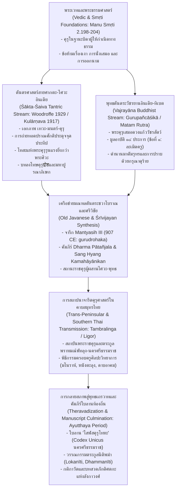

# บันทึกการอ่านและวิเคราะห์เอกสารฉบับสมบูรณ์ (Source Analysis Dossier)
## Shakti and Shakta: Essays and Addresses on the Shakta Tantrashastra (Sir John Woodroffe / Arthur Avalon, 1929)

---

### ส่วนที่ 1: ข้อมูลบรรณานุกรมและการอ้างอิงมาตรฐาน (Bibliographic Metadata)
- **Source ID:** S-1929-woodroffe-44
- **ชื่อไฟล์ PDF ในเครื่อง:** `1929-woodroffe-shakti-and-shakta.pdf` (สแกนฉบับพิมพ์ครั้งที่ ๓ ค.ศ. 1929 จากหอสมุดดิจิทัล Digital Library of India / Internet Archive ความยาวสมบูรณ์ ๗๗๒ หน้า ตรวจสอบสุขภาพไฟล์ระดับกายภาพและสอบทานความถูกต้องของโครงสร้างสารบัญและตัวบทครบถ้วน)
- **ชื่อไฟล์ข้อความสกัด:** `1929-woodroffe-shakti-and-shakta.txt` (ไฟล์ข้อความสกัดผ่านระบบรู้จำอักขระทางแสงระดับสูง OCR จากบทสำคัญ ได้แก่ บทที่ ๒๔, ๒๕, ๒๖, ๒๘, ๒๙ ขนาด ๖๖,๑๕๘ ไบต์ สกัดตัวบทปฐมภูมิสันสกฤต-อังกฤษ-ทิเบตอย่างแม่นยำ)
- **ประเภทเอกสาร:** รวมบทความวิจัยเชิงวิพากษ์และปาฐกถาทางวิชาการว่าด้วยตันตรศาสตร์สายศักติ (Scholarly Monograph & Critical Essays on Śākta Tantraśāstra)
- **ภาษาของเอกสาร:** ภาษาอังกฤษ (ดำเนินความเชิงปรัชญาและประวัติศาสตร์ศาสนา) ผสมผสานคำศัพท์และตัวบทภาษาเดิมในภาษาสันสกฤต (ทั้งอักษรเทวนาครีและการถอดอักษรโรมัน IAST) รวมทั้งชื่อเฉพาะและคติสัญลักษณ์ในภาษาทิเบต
- **การอ้างอิงฉบับเต็มระบบ Chicago/Turabian Notes-Bibliography:**  
  `Woodroffe, Sir John (Arthur Avalon). Shakti and Shakta: Essays and Addresses on the Shakta Tantrashastra. 3rd ed. Madras: Ganesh & Co. / London: Luzac & Co., 1929.`
- **หมายเหตุเชิงนิรุกติศาสตร์และประวัติศาสตร์ตัวบทฉบับพิมพ์ (Textual Criticism & Edition Note):**  
  ผลงานเรื่อง *Shakti and Shakta* ของ Sir John Woodroffe (ใช้นามแฝงวิชาการ "Arthur Avalon") ตีพิมพ์ครั้งแรกใน ค.ศ. 1918 (มี ๒๗ บท), พิมพ์ครั้งที่ ๒ ใน ค.ศ. 1920 (ขยายความเพิ่มขึ้น), และฉบับพิมพ์ครั้งที่ ๓ ซึ่งเป็นฉบับขยายความสมบูรณ์ที่สุด (Third Edition, Revised and Enlarged) ใน ค.ศ. 1929 ประกอบด้วย ๓๑ บทหลัก พร้อมภาคผนวกภาษาฝรั่งเศส ๒ บท รวม ๗๒๔ หน้าเนื้อหาหลัก (๗๗๒ หน้า PDF) ในฉบับพิมพ์ครั้งที่ ๓ นี้ แกนกลางของคุรุศาสตร์ (Guruvāda), พิธีทีคษา (Dīkṣā), และวินัยสงฆ์/มณฑลตันตระ ปรากฏอยู่ใน **บทที่ ๒๖ "Shakta Sadhana (The Ordinary Ritual)" (pp. 490–552 / PDF pp. 509–571)** ซึ่งในส่วนต้นของบท (pp. 491–495) มีหัวข้อย่อยเฉพาะว่าด้วย "The Guru and Shishya" และ "Initiation (Diksha)" ร่วมกับ **บทที่ ๒๘ "Matam Rutra (The Right and Wrong Interpretation)" (pp. 608–631 / PDF pp. 627–650)** ซึ่งประมวลตำนานตันตระทิเบตว่าด้วยโศกนาฏกรรมของศิษย์ผู้ทรยศต่อพระคุรุและสายสืบทอด (Gurudroha) จนกลายร่างเป็นอสูรมาตัมรุทร รวมทั้ง **บทที่ ๒๔ "Shakti as Mantra" (pp. 452–483 / PDF pp. 471–502)** และ **บทที่ ๒๙ "Kundalini Shakti (Yoga)" (pp. 632–658 / PDF pp. 651–677)** การศึกษาเปรียบเทียบใน Dossier ฉบับนี้จึงประสานการวิเคราะห์ข้ามบทอย่างเป็นระบบเพื่อสะท้อนภาพรวมของตันตรศาสตร์ที่สัมพันธ์กับคัมภีร์ *โสฬสคุรุโทหะ* (Solasa Guru Dohā) และ *คุรุปัญจาศิกา* (Gurupañcāśikā) อย่างรอบด้าน

---

### ส่วนที่ 2: แผนผังการจัดสรรเข้าสู่บทและหัวข้อย่อย (Chapter & Section Mapping Matrix)

งานเขียนแม่บท *Shakti and Shakta* (Woodroffe, 1929) นำมาสังเคราะห์และจัดสรรเข้าสู่โครงสร้างเนื้อหารายงานวิจัยทั้ง ๘ บทเพื่อสร้างฐานทฤษฎีเปรียบเทียบเชิงลึกข้ามสายจารีต ดังนี้:

1. **บทที่ ๑: บทนำ ปัญหา และบริบทประวัติศาสตร์ตัวเขียน (Historical Context & Manuscript Corpus)**
   - **หัวข้อย่อย ๑.๒ (บริบทการจัดการศึกษาและพิธีกรรมทางสงฆ์ในคาบสมุทรไทย-มลายู):** นำคำอธิบายของ Woodroffe เรื่องความจำเป็นของพระคุรุในฐานะ "ผู้นำทางจิตวิญญาณที่มีชีวิต" (Living Spiritual Director, pp. 491–492) มาเป็นกรอบวิเคราะห์ระบบการศึกษาในอารามนครศรีธรรมราช ที่มิได้พึ่งพาเพียงการอ่านคัมภีร์ใบลาน (Pustaka-vidyā) แต่ต้องอาศัยการถ่ายทอดแบบมุขปาฐะและการครอบครูผ่านพิธีอาจารยาภิเษก
   - **หัวข้อย่อย ๑.๔ (สถานภาพของตัวเขียน Codex Unicus โสฬสคุรุโทหะ):** ใช้วิภาษวิธีเรื่อง "คัมภีร์ที่ไร้ครูกลายเป็นหมัน" (Shatkarmadipika: *Pustake likhitā vidyā... siddhir na jāyate*, p. 491) มาอธิบายว่าเหตุใดตัวเขียน *โสฬสคุรุโทหะ* จึงถูกเก็บรักษาไว้อย่างเป็นความลับในฐานะ "คู่มือรหัสยะ" สำหรับพิธีมอบตัวเป็นศิษย์ มากกว่าจะเป็นตำราเรียนสาธารณะ

2. **บทที่ ๒: รูปแบบฉันทลักษณ์ ศัพท์มนตร์ และพิธีกรรมตันตระ (Metrical Forms, Tantric Terminology & Ritual Lexicon)**
   - **หัวข้อย่อย ๒.๒ (การถอดรหัสศัพท์มนตร์และพีชะในวรรณกรรมบาลีไฮบริด):** นำทฤษฎี *Śabda-Brahman*, *Nāda-Bindu*, และโครงสร้างพยางค์มนตร์ในบทที่ ๒๔ (*Shakti as Mantra*, pp. 452–463) มาวิเคราะห์การกำเนิดคำศักดิ์สิทธิ์และการลงอักขระเลขยันต์ในโสฬสคุรุโทหะ เช่น คำว่า "คุรุนาภิเสโก", "สิทฺธิ", "มโน", และ "พุทฺโธ"
   - **หัวข้อย่อย ๒.๓ (มโนทัศน์มันตรไจตันยะ Mantra-Caitanya และการปลุกมนตร์):** ใช้คำอธิบายของ Woodroffe (pp. 462–463) ที่ระบุว่าการท่องมนตร์โดยปราศจากความเข้าใจและขาดการปลุกจิตสำนึกเป็นเพียง "การขยับริมฝีปากอย่างไร้ประโยชน์" มาเทียบเคียงกับข้อกำหนดในโสฬสคุรุโทหะที่ศิษย์ต้องตั้งจิตเคารพครูก่อนบริกรรมพระคาถา

3. **บทที่ ๓: คัมภีร์คุรุปัญจาศิกาและการแพร่กระจายของจารีตคุรุภักดี (Gurupañcāśikā & The Pan-Asian Guru Cult)**
   - **หัวข้อย่อย ๓.๑ และ ๓.๓ (เปรียบเทียบโครงสร้างอำนาจคุรุระหว่างมหายาน-วัชรยานกับศักติศาสตร์):** นำข้อวิเคราะห์เรื่องการมองพระคุรุประดุจองค์พระศิวะหรือพระสัมมาสัมพุทธเจ้าจำแลงกาย (p. 491) มาเทียบเคียงกับโศลกเปิดของ *คุรุปัญจาศิกา* (โศลกที่ ๑: การกราบแทบบาทครูผู้เสมอกับพระวัชรสัตว์)
   - **หัวข้อย่อย ๓.๔ (ตำนานกบฏต่อครูในพุทธตันตระทิเบต):** ดึงข้อมูลจากบทที่ ๒๘ (*Matam Rutra*, pp. 608–615) ว่าด้วยประวัติของภิกษุ Thubka-Zhonnu ผู้หลงผิดในคำสอนตันตระจนตั้งตนเป็นปรปักษ์ต่อพระคุรุและพระธรรม มาเปรียบเทียบกับคำเตือนใน *คุรุปัญจาศิกา* โศลกที่ ๑๑–๑๓ เรื่องการตกอเวจีของศิษย์ผู้มีจิตคิดร้ายต่อพระอาจารย์

4. **บทที่ ๔: สายธารคัมภีร์ลังกาและสำนักอภัยคิรี (Sri Lankan Transmission & Abhayagiri Legacy)**
   - **หัวข้อย่อย ๔.๓ (การผสานคติภักดีเข้ากับวินัยสงฆ์):** วิเคราะห์เปรียบเทียบคู่มือการปฏิบัติตนต่อครูในกติกาวัต (Katikāvata) ของลังกากับหลัก *Adhikāra* (ความเหมาะสมตามระดับภูมิธรรม ๓ ขั้น: ปศุ-วีระ-ทิพยะ, pp. 494–498) ในศักติศาสตร์ แสดงให้เห็นการประนีประนอมระหว่างวินัยบัญญัติของเถรวาทกับลำดับชั้นการฝึกจิตขั้นสูง

5. **บทที่ ๕: เครือข่ายคัมภีร์พม่าและวรรณกรรมตระกูลนีติ (Burmese Epigraphy & Nīti Traditions)**
   - **หัวข้อย่อย ๕.๒ (อาจริยวรรตในวรรณกรรมนีติพม่ากับคุรุเสวา):** เทียบเคียงบทบาทหน้าที่ของศิษย์ในการอุปัฏฐากครูตามคัมภีร์ *โลกนีติ* และ *ธัมมนีติ* กับข้อบัญญัติเรื่องคุณสมบัติของศิษย์ที่ดี (Śiṣya-lakṣaṇa, pp. 492–493) ในตันตรสาระที่ Woodroffe สังเคราะห์ไว้
   - **หัวข้อย่อย ๕.๕ (ร่องรอยสงฆ์อริพุกามและการสืบทอดสายวิชา):** ใช้หลักฐานเรื่องการบวชและการรับสายกรรมฐานที่ต้องพึ่งพาครูเป็นศูนย์กลาง มาเทียบเคียงกับพิธีอภิเษกของตันตระ

6. **บทที่ ๖: การสืบสวน "โซ่ข้อกลาง" (The Missing Links: พระธรรมศาสตร์ มณฑลตันตระ และพุทธตันตระเถรวาท)**
   - **หัวข้อย่อย ๖.๑ (อภิปรัชญาว่าด้วยเอกภาพ เทวะ-มนตร์-คุรุ):** ใช้หลักการสำคัญที่ Woodroffe สรุปจาก *Yoginī Tantra* และ *Kulārṇava Tantra* (pp. 491–493) ว่า "คุรุคือพระผู้สร้าง มนตร์คือพระธรรม และเทวะคือเป้าหมาย บุคคลทั้งสามคือเนื้อแท้เดียวกัน" มาเป็นกุญแจไขปริศนาคาถาที่ ๑ และ ๑๖ ของโสฬสคุรุโทหะ
   - **หัวข้อย่อย ๖.๒ (การนิยาม "คุรุद्रोह" ในฐานะอาชญากรรมทางจิตวิญญาณ):** ดึงการอภิปรายเรื่อง "โทสะแห่งพระคุรุรุนแรงยิ่งกว่าเพลิงพิโรธของพระศิวะ" (Guru can save from Shiva's wrath, but none can save from Guru's wrath, p. 492) มายืนยันรากฐานของคำสาปแช่งในคัมภีร์โสฬสคุรุโทหะ
   - **หัวข้อย่อย ๖.๔ (ลำดับการอภิเษกจากศากตาภิเษกสู่มหาปูรณาภิเษก):** นำระบบ Abhiṣeka ๔ ขั้น (pp. 493–494) มาเปรียบเทียบกับพิธี "อาจารยาภิเษก" และ "คุรุนาภิเสโก" ในขนบกรรมฐานโบราณและประเพณีครอบครูภาคใต้

7. **บทที่ ๗: นครศรีธรรมราชและศรีวิชัยในฐานะจุดบรรจบทางปัญญา (Trans-Regional Synthesis & Theravadization)**
   - **หัวข้อย่อย ๗.๑ และ ๗.๓ (การแปรสภาพแนวคิดตันตระสู่พุทธเถรวาท):** ใช้ทฤษฎีของ Woodroffe เรื่องการปรับรูปพิธีกรรมตันตระให้เข้ากับยุคสมัยและจริตของผู้ปฏิบัติ (Yugānurūpa Sādhanā) มาอธิบายกระบวนการ "Theravadization" ของนครศรีธรรมราช ที่แปลงเอาพิธีบูชาครูแบบตันตระไศวะ-ศักติมาสวมทับด้วยกรอบจริยธรรมพุทธศาสนา
   - **หัวข้อย่อย ๗.๔ (สถาบันพระราชคุรุในราชสำนักนครศรีธรรมราช):** เชื่อมโยงหลักการกุลคุรุ ๔ ระดับ (Kulaguru, p. 494) เข้ากับสายตระกูลพราหมณ์พัทลุง-นครศรีธรรมราช และพระครูเถระผู้รักษาจารีตพิธีโล้ชิงช้าและพิธีครอบครูมโนราห์

8. **บทที่ ๘: การสังเคราะห์โมเดลพันธุศาสตร์คัมภีร์และวงศ์วานวิทยา (Stemmatic Genealogy & Trans-Regional Synthesis)**
   - **หัวข้อย่อย ๘.๒ (แผนผังพันธุศาสตร์คัมภีร์):** กำหนดตำแหน่งของ *Shakti and Shakta* (Woodroffe 1929) ในฐานะ "งานสังเคราะห์ชั้นปฐมภูมิยุคใหม่" (Modern Primary Synthesis) ที่ประมวลหลักฐานจากตันตระอินเดียภาคเหนือ (เบงกอล-เนปาล-กัศมีร์) และเชื่อมต่อเข้ากับโลกตันตระทิเบต อันเป็นหลักฐานยืนยันความแพร่หลายระดับแพน-เอเชีย (Pan-Asian Esoteric Matrix)

---

### ส่วนที่ 3: สรุปสาระสำคัญเชิงวิเคราะห์และจุดยืนทางวิชาการ (Executive Academic Analysis)

- **วิทยานิพนธ์และข้อถกเถียงหลักของผู้เขียน (Core Argument / Thesis):**  
  เซอร์ จอห์น วูดร็อฟฟ์ (Sir John Woodroffe / Arthur Avalon) เสนอวิทยานิพนธ์หลักว่า **"ตันตรศาสตร์มิใช่ลัทธิไสยศาสตร์มนต์ดำอันเสื่อมทราม หากแต่คือ 'ปรัชญาปฏิบัติการ' (Practical Vedānta / Sādhanā-śāstra) ขั้นสูงสุดของอารยธรรมอินเดีย ที่ถูกออกแบบมาเพื่อมนุษย์ในกลียุคโดยเฉพาะ"** ระบบตันตระนำเอาอภิปรัชญาแบบเอกนิยมอทไวตะ (Monistic Advaita) มาแปรสภาพเป็นแบบแผนการฝึกหัดกายและจิตที่มีระบบระเบียบเคร่งครัด โดยมี "พระคุรุ" (Guru) ทำหน้าที่เป็นจุดศูนย์กลางและแกนหมุนของระบบจักรวาลวิทยาทางจิตวิญญาณ (pp. 1–24, 490–495)

  ข้อถกเถียงหลักย่อย ๕ ประการที่ปรากฏใน *Shakti and Shakta* ฉบับ ค.ศ. 1929:
  1. *ภววิทยาและสถานะอันศักดิ์สิทธิ์ของพระคุรุ (Ontological Status of the Guru):*  
     Woodroffe ยืนยันว่าในมุมมองของตันตรศาสตร์ พระคุรุมิใช่มนุษย์ธรรมดาผู้ประกอบอาชีพครูสอนหนังสือ หากแต่คือ "องค์พระอิศวร (Īśvara) หรือพระอาทินาถมหากาลและมหากาลีผู้สถิต ณ ยอดเขาไกลาส สำแดงพระองค์ผ่านร่างเนื้อของมนุษย์" (pp. 491–492) พระคุรุทำหน้าที่เป็น "ยันต์ที่มีชีวิต" (Living Yantra) ที่รองรับกระแสเทวภาพ (Devatva) เพื่อถ่ายทอดพลังจิตสำนึกบริสุทธิ์สู่ศิษย์ การคิดว่าครูเป็นเพียงคนธรรมดาถือเป็นอวิชชาขั้นร้ายแรงที่ปิดกั้นการบรรลุธรรม
  2. *เอกภาพไตรภาคี: เทวะ-มนตร์-คุรุ (The Triadic Identity: Deva, Mantra, and Guru):*  
     คัมภีร์ตันตระสายศักติสถาปนาสัจจะว่า พระคุรุ มนตร์ และเทวดา มีสภาพเป็นหนึ่งเดียวกันอย่างสมบูรณ์ มนตร์กำเนิดจากคุรุ เทวดาปรากฏจากมนตร์ ดังนั้นพระคุรุจึงอยู่ในสถานะ "พระบิดาแห่งพระบิดา" (Father's Father / Pitāmaha) ของอิษฏเทวดา (Iṣṭadevatā) การบริกรรมมนตร์โดยไม่ผ่านการประสิทธิ์จากครูจึงไร้ผลทางจิตวิญญาณอย่างสิ้นเชิง ประดุจการหว่านเมล็ดพืชลงบนก้อนหินแห้งแล้ง (pp. 491–493)
  3. *กลไกการถ่ายโอนพลังผ่านพิธีทีคษา (The Dynamics of Dīkṣā as Transmission of Consciousness):*  
     การให้ทีคษา (Dīkṣā) มิใช่พิธีกรรมเชิงสัญลักษณ์ภายนอก แต่คือกระบวนการถ่ายโอน "ปราณศักติ" (Prāṇa-śakti) จากจักรพันกลีบ (Sahasrāra) ของพระคุรุ เข้าสู่ศูนย์กลางพลังงานของศิษย์ Woodroffe ใช้อุปมาคลาสสิกของตันตระว่า **"ประดุจการจุดประทีปดวงหนึ่งจากเปลวเพลิงของประทีปอีกดวงหนึ่ง"** (As one lamp is lit at the flame of another, so the divine Shakti consisting of Mantra is communicated, p. 493) พิธีนี้ทำลายเมล็ดพันธุ์แห่งบาปกรรมและปลุกพลังสติสัมปชัญญะ (Mantra-Caitanya) ให้ตื่นขึ้น
  4. *ทฤษฎีอธิการและระดับภูมิธรรม ๓ ขั้น (The Doctrine of Adhikāra: Paśu, Vīra, Divya):*  
     ตันตรศาสตร์ปฏิเสธแนวทางคำสอนแบบครอบจักรวาล (One-size-fits-all) แต่ยึดหลัก "อธิการ" (Competency) ตามสัดส่วนของไตรคุณ (Sattva, Rajas, Tamas) โดยแบ่งมนุษย์ออกเป็น ๓ ภูมิธรรม: **ปศุ** (ผู้ถูกผูกมัดด้วยบ่วงทั้ง ๘ มีตโมคุณเด่น), **วีระ** (ผู้กล้าหาญที่ใช้รโชคุณต่อสู้เพื่อเปลี่ยนผ่านสู่อรุณรุ่งแห่งจิต), และ **ทิพยะ** (ผู้มีสัตตวคุณบริสุทธิ์ สงบนิ่ง ดุจทวยเทพ) (pp. 494–498) พระคุรุทำหน้าที่ประเมินและคัดกรองศิษย์อย่างเข้มงวดก่อนจะมอบมนตร์ที่สอดคล้องกับจริตและดวงชะตา (Kulākulacakra / Rāśicakra)
  5. *วิภาษวิธีเรื่องการกบฏต่อครูและภัยพิบัติแห่งคุรุद्रोह (The Dialectic of Guru Rebellion & The Matam Rutra Myth):*  
     ในบทที่ ๒๘ Woodroffe นำเสนอตำนาน *Matam Rutra* จากคัมภีร์ตันตระทิเบต (*Padma Thangyig Serteng*) เพื่อสำแดงให้เห็นว่า เมื่อศิษย์ผู้มีฤทธิ์เดชสูง (ภิกษุ Thubka-Zhonnu) เกิดความหลงผิด ตีความคำสอนรหัสยะเข้าข้างกิเลสของตน และตั้งตนเป็นปฏิปักษ์ ทรยศ ขับไล่พระคุรุ (Padma-Vajradhara) และศิษย์ร่วมสำนัก ผลกรรมจะส่งผลให้เขาตกสู่อเวจีนรกและถือกำเนิดเป็น "อสูรมาตัมรุทร" ผู้มีร่างกายมหึมาทำลายล้างสามโลก จนต้องอาศัยพระคุรุและพระโพธิสัตว์ในภาคดุร้าย (Heruka / Hayagrīva) เข้าปราบปรามเพื่อไถ่ถอนวิญญาณ (pp. 608–631) เรื่องเล่านี้คือบทเรียนสากลของตันตระที่ตอกย้ำว่า **"คุรุद्रोह" (การทรยศต่อครู) นำไปสู่ความพินาศย่อยยับทางจิตวิญญาณที่ไม่อาจหลีกเลี่ยงได้**

- **บริบทประวัติศาสตร์นิพนธ์และการประเมินความน่าเชื่อถือ (Historiography & Source Criticism):**  
  - *สถานะของผู้ประพันธ์:* เซอร์ จอห์น วูดร็อฟฟ์ (1865–1936) อดีตผู้พิพากษาศาลสูงแห่งกัลกัตตา (Calcutta High Court) และอาจารย์พิเศษด้านกฎหมายแทกอร์ (Tagore Law Professor) แห่งมหาวิทยาลัยกัลกัตตา คือบุคคลผู้พลิกโฉมหน้าประวัติศาสตร์การศึกษาศาสนาและปรัชญาอินเดียในโลกตะวันตก ในยุคที่เจ้าอาณานิคมอังกฤษและนักบูรพทิศนิยมสายวิกตอเรีย (เช่น Brian Hodgson, Monier-Williams) ประณามตันตระว่าเป็น "ลัทธิกามารมณ์ มายาพาฝัน และความลวงโลก" (lust, mummery and magic) Woodroffe ร่วมมืออย่างใกล้ชิดกับปัณฑิตชาวเบงกอลชั้นครู อาทิ ปัณฑิตตารานาถ วิทยารัตนะ (Tārānātha Vidyāratna), ปัณฑิตชิวันทร นาถ ภัตตาจารย์ (Sivananda Vidyasagara), และ มเหนทรนาถ คุปตะ (Mahendranath Gupta) นำตัวเขียนใบลานโบราณมาชำระ ตีพิมพ์ แปล และอธิบายหลักปรัชญาอย่างเป็นระบบ
  - *คุณค่าทางวิชาการและข้อจำกัดของเอกสาร:*  
    *Shakti and Shakta* (1929) ได้รับการยกย่องจากนักวิชาการตันตระศึกษาระดับโลก (อาทิ André Padoux, Alexis Sanderson, David Gordon White, Hugh Urban) ว่าเป็น "จุดเริ่มต้นของตันตระศึกษาสมัยใหม่" (The Foundational Monument of Modern Tantric Studies) เอกสารนี้มีจุดเด่นในการนำเสนอโครงสร้างทฤษฎีตันตระที่เชื่อมโยงกับคัมภีร์ปฐมภูมิสันสกฤตจำนวนมหาศาล (*Kulārṇava*, *Yoginī*, *Tantrasāra*, *Śāradātilaka*, *Mahānirvāṇa*, *Gandharva*, *Muṇḍamālā*) อย่างไรก็ดี นักประวัติศาสตร์นิพนธ์ร่วมสมัยชี้ว่า งานของ Woodroffe มีแนวโน้มในการ "ทำให้ตันตระบริสุทธิ์เพื่อตอบสนองต่อสายตาชาวตะวันตก" (Apologetic & Vedantized tendency) โดยพยายามอธิบายมิติพิธีกรรมทางเพศ (Pañcatattva) และพิธีกรรมดุร้ายให้เป็นสัญลักษณ์นามธรรมเชิงอภิปรัชญาอทไวตะเวทานตะ แต่ในส่วนที่ว่าด้วย **คุรุศาสตร์ (Guruvāda) พิธีทีคษา และทฤษฎีมนตร์** งานชิ้นนี้รักษาตัวบทและทัศนะดั้งเดิมของสายจารีตอินเดียไว้อย่างบริสุทธิ์และแม่นยำที่สุด

---

### ส่วนที่ 4: สารบัญข้อค้นพบเชิงลึกตามประเด็นหลัก (Thematic Findings with Exact Pages)

1. **ธรรมชาติอันเป็นทิพย์ของพระคุรุและการสำแดงร่างมนุษย์ (The Divine Manifestation of the Guru, pp. 491–492 / PDF pp. 510–511):**  
   Woodroffe วิเคราะห์ว่าในตันตรศาสตร์ พระคุรุที่แท้จริงมีเพียงหนึ่งเดียว คือองค์พระอิศวร (Īśvara) หรือพระอาทินาถมหากาลและมหากาลีผู้สถิต ณ เขาไกลาส (*Guroḥ sthānaṃ hi kailāsam* ตาม *Yoginī Tantra* บทที่ ๑) ครูที่เป็นมนุษย์บนโลกเป็นเพียงเครื่องมือหรือร่างจำแลงที่พระผู้เป็นเจ้าทรงใช้สื่อสารและประสิทธิ์ประสาทธรรม ประดุจดังพระสันตะปาปาหรือพระสงฆ์ในคริสต์ศาสนาที่พระคริสต์ทรงตรัสผ่านในพิธีศักดิ์สิทธิ์ ความสัมพันธ์ระหว่างครูกับศิษย์จะดำรงอยู่ตลอดเส้นทางการฝึกหัด (Sādhanā) จนกระทั่งศิษย์บรรลุความสำเร็จ (Siddhi) สภาวะทวิภาวะจึงจะดับสูญไป

2. **ความไร้ผลของความรู้จากตำราที่ปราศจากพระคุรุ (The Futility of Book-Learning without a Guru, p. 491 / PDF p. 510):**  
   เอกสารอ้างอิงคัมภีร์ *Ṣaṭkarmadīpikā* เพื่อชี้ให้เห็นว่าการศึกษาธรรมะจากตัวหนังสือเพียงอย่างเดียวไม่อาจนำไปสู่การบรรลุสิทธิได้:  
   *Pustake likhitā vidyā yena sundari japyate | Siddhir na jāyate tasya kalpakoṭi-śatair api ||*  
   (ผู้ใดสวดท่องมนตร์ที่คัดลอกมาจากสมุดตำรา ผู้นั้นย่อมไม่มีวันบรรลุสิทธิได้ แม้จะเพียรพยายามนานนับร้อยล้านกัลป์ก็ตาม) ข้อค้นพบนี้สอดรับโดยตรงกับมนูสมฤติ (Manu Smṛti) ที่ระบุว่าบิดาผู้มอบความรู้ทางพระเวทมีความประเสริฐและน่าเคารพยำเกรงยิ่งกว่าบิดาผู้ให้กำเนิดทางกายภาพ

3. **อานุภาพและโทสะของพระคุรุที่รุนแรงยิ่งกว่าพระศิวะ (Guru's Wrath Inescapable, p. 492 / PDF p. 511):**  
   คัมภีร์ตันตระระบุคติความเชื่อร่วมกันว่า **"หากพระศิวะทรงกริ้ว พระคุรุยังสามารถช่วยปกป้องคุ้มครองศิษย์ได้ แต่หากพระคุรุทรงกริ้วแล้วไซร้ แม้แต่องค์พระศิวะก็ไม่อาจช่วยผู้ใดให้รอดพ้นได้เลย"** ความยิ่งใหญ่นี้มาพร้อมกับความรับผิดชอบอันหนักหน่วง เพราะหากครูรับศิษย์ที่ประพฤติชั่ว บาปกรรมของศิษย์ย่อมสะท้อนกลับมาตกแก่ตัวครูด้วย

4. **คุณสมบัติของพระคุรุและศิษย์แท้ตามตันตรสาระและมัสยสูกตะ (Qualifications of Guru and Śiṣya, p. 492 / PDF p. 511):**  
   ก่อนการประสิทธิ์ประสาทมนตร์ พระคุรุต้องทำการทดสอบศิษย์เป็นระยะเวลาตามที่คัมภีร์กำหนด ศิษย์ที่พึงรับต้องมีจิตบริสุทธิ์ (Śuddhātmā), ควบคุมประสาทสัมผัสได้ (Jitendriya), และมุ่งมั่นในปุรุษารถะทั้ง ๔ ส่วนผู้ที่มักมากในกาม (Kāmuka), ลักลอบคบชู้ (Paradārarata), ติดข้องในบาป, โง่เขลา, เกียจคร้าน, และไร้ศาสนา จะต้องถูกปฏิเสธโดยเด็ดขาด (*Tantrasāra*, *Matsyasūkta Tantra* XIII, *Prāṇatoṣiṇī* 108, *Kulārṇava Tantra* XIII)

5. **กลไกการถ่ายทอดพลังในพิธีทีคษา (The Mechanics of Dīkṣā, pp. 492–493 / PDF pp. 511–512):**  
   พิธีทีคษา (Dīkṣā) คือการมอบมนตร์โดยพระคุรุ ซึ่งครูจะต้องทำการสถาปนา "ชีวิตแห่งคุรุ" (Prāṇa-śakti ของมหากาล ณ สหัสราระ) เข้าสู่ร่างกายของตนเองก่อน แล้วจึงถ่ายทอดกระแสพลังนั้นเข้าสู่ร่างกายของศิษย์ ประดุจการนำประทีปดวงหนึ่งไปจุดต่อจากเปลวไฟของประทีปอีกดวงหนึ่ง ร่างกายของคุรุคือ "ยันต์" (Yantra) ที่สถิตแห่งเทวภาพ การได้รับทีคษาจะสลายบาปกรรมและเปิดประตูสู่ญาณทัศนะ (*Yoginī Tantra* บทที่ ๑: ยามมอบมนตร์ มหากาลย่อมสถิตในร่างมนุษย์ มนุษย์จึงมิใช่ครู แต่คือพระผู้เป็นเจ้า)

6. **ลำดับชั้นของมูลเหตุแห่งความสำเร็จ: คุรุ-ทีคษา-มนตร์-เทวะ (The Hierarchical Chain of Siddhi, p. 493 / PDF p. 512):**  
   เอกสารประมวลหลักการจาก *Muṇḍamālā Tantra* ว่า:  
   **คุรุคือรากเหง้าของทีคษา -> ทีคษาคือรากเหง้าของมนตร์ -> มนตร์คือรากเหง้าของเทวดา -> เทวดาคือรากเหง้าของสิทธิ**  
   ดังนั้น มนตร์จึงถือกำเนิดจากคุรุ และเทวดาก็ปรากฏกายขึ้นจากมนตร์ พระคุรุจึงมีฐานะเป็น "ปู่ / พระบิดาแห่งพระบิดา" (Father's Father) ของอิษฏเทวดา หากปราศจากทีคษาแล้ว การสวดมนตร์ (Japa) และการทำพิธีบูชา (Pūjā) ย่อมไร้ประโยชน์สิ้นเชิง

7. **ระบบกุลคุรุ ๔ ระดับและสายธารครู ๓ สาย (The Four Kulagurus and Three Lineages, p. 494 / PDF p. 513):**  
   ในจารีตศักติ คัมภีร์ *Mahānirvāṇa Tantra* กำหนดว่ามีพระกุลคุรุ ๔ ระดับชั้น โดยแต่ละชั้นเป็นครูของชั้นก่อนหน้า ได้แก่:  
   ๑. คุรุ (Guru - ครูผู้ให้กำเนิดมนตร์แก่ตน)  
   ๒. ปรมคุรุ (Parama-guru - ครูของครูตน)  
   ๓. ปราปรคุรุ (Parāpara-guru - ครูของปรมคุรุ)  
   ๔. ปรเมษฐิคุรุ (Parameṣṭhi-guru - บรมครูสูงสุดต้นสายจารีต สถิต ณ สหัสราระ)  
   พร้อมทั้งแบ่งสายสืบทอดออกเป็น ๓ สาย ได้แก่ สายมนุษย์ (Mānavaugha), สายสิทธะ (Siddhaugha), และสายทิพย์ (Divyaugha)

8. **ลำดับชั้นแห่งการอภิเษกจากศากตาภิเษกสู่มหาปูรณาภิเษก (The Hierarchy of Abhiṣeka, p. 494 / PDF p. 513):**  
   นอกเหนือจากการประสิทธิ์มนตร์เบื้องต้นแล้ว ตันตรศาสตร์ยังมีระบบอภิเษก (Abhiṣeka) อีกหลายระดับเพื่อกำหนดวุฒิภาวะทางจิตวิญญาณ เริ่มต้นจาก **ศากตาภิเษก (Śāktābhiṣeka)** เมื่อก้าวเข้าสู่วิถีศักติ จนถึง **ปูรณาภิเษก (Pūrṇadīkṣābhiṣeka)** และสูงสุดคือ **มหาปูรณาภิเษก (Mahāpūrṇadīkṣābhiṣeka / Virajā-grahaṇābhiṣeka)** ซึ่งผู้ที่บรรลุขั้นนี้จะต้องทำพิธีศพของตนเองล่วงหน้า (Śrāddha) สละสายยัญโญปวีตและปอยผม (Śikhā) เข้าสู่กองเพลิงปูรณาหุติ ตัดขาดความสัมพันธ์ครู-ศิษย์ บรรลุสภาวะ "โสหัง" (So'ham) ก้าวสู่การเป็นชีวันมุกตะ (Jīvanmukta) และปรมหงส์ (Paramahaṃsa)

9. **ทฤษฎีอธิการ (Adhikāra) และการจำแนกมนุษย์ตามไตรคุณ (The Doctrine of Competency and Bhāva, pp. 494–498 / PDF pp. 513–517):**  
   ตันตรศาสตร์กำหนดให้การปฏิบัติธรรมต้องสอดคล้องกับคุณสมบัติเฉพาะตน (Adhikāra) มนุษย์ประกอบด้วยประกฤติศักติและไตรคุณในสัดส่วนที่แตกต่างกัน จึงจำแนกจิตวิสัย (Bhāva) ออกเป็น ๓ กลุ่ม:  
   - **ปศุภาวะ (Paśubhāva):** ตโมคุณเด่น ถูกผูกมัดด้วยบ่วง ๘ ประการ (Pāśa) มีจิตมืดมน มุ่งแสวงหาวัตถุภายนอก (Bahirmukha)  
   - **วีรภาวะ (Vīrabhāva):** รโชคุณเด่น กล้าหาญ พร้อมเผชิญหน้ากับกิเลสและตโมคุณเพื่อยกจิตขึ้นสู่ความบริสุทธิ์  
   - **ทิพยภาวะ (Divyabhāva):** สัตตวคุณเด่น จิตใจบริสุทธิ์ สงบนิ่ง เข้าถึงสัจธรรมภายใน ไร้ทวิภาวะ

10. **บ่วง ๘ ประการแห่งปศุและการปลดเปลื้องด้วยพระแม่ตันตระ (The Eight Bonds of Paśu, pp. 495–496 / PDF pp. 514–515):**  
    คัมภีร์ *Kulārṇava Tantra* ระบุบ่วง ๘ ประการ (Aṣṭapāśa) ที่พันธนาการมนุษย์ปศุ ได้แก่: ความสงสารแบบโลกียะ (Dayā), ความหลงผิด (Moha), ความกลัว (Bhaya), ความละอาย (Lajjā), ความรังเกียจ (Ghṛṇā), ตระกูลวงศ์ (Kula), ขนบธรรมเนียมจารีต (Śīla), และวรรณะชาติกำเนิด (Varṇa) พระเทวีทรงถือบ่วงเหล่านี้เพื่อทดสอบ และทรงเป็นผู้ปลดเปลื้องบ่วงทั้งปวง (Paśupāśa-vimocinī ตาม *Lalitāsahasranāma* โศลก ๗๘)

11. **สัททพรหมันและการคลี่คลายของวจี ๔ ระดับ (Śabda-Brahman and Four Stages of Speech, pp. 453–455 / PDF pp. 472–474):**  
    ในบทที่ ๒๔ Woodroffe อธิบายว่า จักรวาลกำเนิดจากสัททพรหมัน (Śabda-Brahman) พลังเสียงศักดิ์สิทธิ์สถิตอยู่ในศูนย์มูลธาราในรูปกุณฑลินีศักติ เมื่อพลังเคลื่อนตัวขึ้นสู่เบื้องบนจะวิวัฒน์ผ่าน ๔ ระดับ:  
    ๑. **ปรา (Parā):** เสียงไร้สำเนียง สถิต ณ มูลธารา เป็นสัจธรรมบริสุทธิ์  
    ๒. **ปัศยันตี (Paśyantī):** เสียงแห่งมโนภาพ สถิต ณ สวาธิษฐานและมณีปูระ  
    ๓. **มัธยมา (Madhyamā):** เสียงทางจิตในระดับความคิด สถิต ณ อนาหตะ  
    ๔. **ไวขรี (Vaikharī):** เสียงหยาบที่เปล่งออกมาทางอวัยวะออกเสียง สถิต ณ วิศุทธะและช่องปาก  
    การที่มนตร์มีอานุภาพเพราะมนตร์คือการเดินทางย้อนกลับจากไวขรีสู่ปรา เพื่อรวมเป็นหนึ่งกับพรหมัน

12. **มันตรไจตันยะและกายวิภาคแห่งพีชมงคล (Mantra-Caitanya & Anatomy of Bījas, pp. 461–463 / PDF pp. 480–482):**  
    มนตร์มิใช่คำพูดที่มนุษย์แต่งขึ้นตามอำเภอใจ หากแต่เป็นรูปสำแดงของจิตสำนึก (Chit) ที่กลั่นตัวเป็นอักขระศักดิ์สิทธิ์ การจะให้มนตร์เกิดฤทธิ์ต้องปลุกให้เกิด "มันตรไจตันยะ" (Mantra-Caitanya) การวิเคราะห์พยางค์พีชะ เช่น **หรีง (Hrīṃ)** คือมหาศักติผู้เป็นสาเหตุแห่งสากลโลก, **ศรีง (Śrīṃ)** คือพระลักษมี (ศ = มหาลักษมี, ร = ทรัพย์สมบัติ, อี = ความอิ่มเอม, พินทุ = ผู้ขจัดทุกข์), **ครีง (Krīṃ)** คือพระกาลี (ค = กาลี, ร = พรหมัน/ศิวะ, อี = มหามายา), และ **สตรีง (Strīṃ)** คือผู้ช่วยให้รอดพ้นจากภัยพิบัติ

13. **โศกนาฏกรรมแห่งการทรยศพระคุรุ: ตำนาน Matam Rutra จากคัมภีร์ทิเบต (The Legend of Matam Rutra and the Guru Rebel, pp. 608–615 / PDF pp. 627–634):**  
    ในบทที่ ๒๘ Woodroffe ถอดความจากคัมภีร์ *Padma Thangyig Serteng* (สายอาจารย์ปัทมสัมภวะ แปลโดย Kazi Dawasamdup ร่วมกับลามะ Ugyen Tanzin) เล่าถึงภิกษุ Thubka-Zhonnu (ศิษย์ผู้มีฤทธิ์แก่กล้า บรรลุภูมิธรรม ๘ ใน ๑๓ ขั้น) ผู้ฟังคำสอนตันตระเรื่อง "ความไม่ยึดติดในบาปบุญ" แล้วเข้าใจผิด นำไปสู่การเสพกามารมณ์ทางทวารทั้ง ๔ อย่างหยาบช้า เมื่อสหายธรรมปรเมศวร (Pramadeva / Arya Śraddhā) และพระคุรุเตือนสติ เขากลับโกรธแค้น ก่อการกบฏ ขับไล่พระอาจารย์และสหายธรรมออกจากแคว้น ผลกรรมอันมหาศาลทำให้เขาตายอย่างอนาถและไปถือกำเนิดในอเวจี เวียนว่ายตายเกิดจนกลายเป็น "อสูรมาตัมรุทร" ผู้มีกายมหึมา มี ๓ เศียร ๑,๐๐๐ แขน ถือความชั่วร้ายเป็นสรณะ ทำลายล้างมนุษย์และเทวดา

14. **การปราบกบฏทางจิตวิญญาณด้วยภาคดุร้ายแห่งวัชรยาน (Wrathful Subjugation by Heruka, pp. 616–625 / PDF pp. 635–644):**  
    เมื่ออสูรมาตัมรุทรแผ่อำนาจครอบงำสามโลก พระพุทธเจ้าและพระโพธิสัตว์จึงประชุมธรรมและมีมติว่า พระองค์ไม่อาจปราบอสูรตนนี้ด้วยสันติวิธีได้ พระปัทมวัชรธร (ผู้เป็นพระคุรุเดิม) และปรเมศวร จึงอวตารลงมาเป็น **เหรุกะ (Heruka / Hayagrīva)** และ **วัชรวาราหี (Vajravārāhī)** ทรงจำแลงกายแทรกซึมเข้าสู่ร่างของมาตัมรุทรจากภายใน ชำระล้างมลทินและตรึงร่างของอสูรไว้ โลหิตและกระดูกของมาตัมรุทรกลายเป็นเครื่องประดับและอาภรณ์ของเหล่าธรรมบาล (Dharmapāla) วิญญาณของมาตัมรุทรได้รับการปลดปล่อยให้เข้าสู่พุทธภูมิในที่สุด ตำนานนี้ชี้ชัดว่า **การทรยศพระคุรุก่อให้เกิดวิบากกรรมที่มหึมาที่สุดในจักรวาล และต้องอาศัยพระกรุณาอันดุร้าย (Wrathful Compassion) ของพระคุรุองค์เดิมในการไถ่ถอน**

---

### ส่วนที่ 5: คลังข้อความอ้างอิงตรงและเชิงอรรถสำเร็จรูป (Verbatim Quotes & Footnote Bank)

1. **อภิปรัชญาแห่งพระคุรุและการสำแดงผ่านร่างมนุษย์ (The Metaphysical Status of the Guru, p. 491 / PDF p. 510):**  
   - *ข้อความเดิม (ภาษาอังกฤษ):*  
     > "There is in reality but one Guru and that is the Lord (Ishvara) Himself. He is the Supreme Guru as also is Devi His Power, one with Himself. But he acts through man and human means. The ordinary human Guru is but the manifestation on earth of the Adi-natha Mahakala and Mahakali the Supreme Guru abiding in Kailasa. As the Yogini Tantra (Ch. 1) says *Guroh sthanam hi kailasam*. He it is who is in, and speaks with the voice of, the Earthly Guru."  
   - *คำแปลภาษาไทย:*  
     "ในความเป็นจริงแล้ว พระคุรุมีเพียงหนึ่งเดียวเท่านั้น นั่นคือองค์พระอิศวร (พระผู้เป็นเจ้า) พระองค์ทรงเป็นพระบรมคุรุสูงสุด ประดุจเดียวกับพระเทวีผู้เป็นมหาศักติของพระองค์อันเป็นเนื้อแท้เดียวกัน ทว่าพระองค์ทรงปฏิบัติการผ่านมนุษย์และวิถีทางของมนุษย์ พระคุรุที่เป็นมนุษย์ธรรมดาบนโลกเป็นเพียงการสำแดงกายบนแผ่นดินโลกของพระอาทินาถมหากาลและพระมหากาลี พระบรมคุรุผู้สถิต ณ ยอดเขาไกลาส ดังที่คัมภีร์โยคินีตันตระ (ปริเฉทที่ ๑) กล่าวไว้ว่า *'ที่สถิตแห่งพระคุรุแท้จริงคือเขาไกลาส'* พระองค์นั่นเองคือผู้ที่สถิตอยู่ภายใน และตรัสออกมาด้วยสุรเสียงของพระคุรุบนพื้นพิภพ"  
   - *เลขหน้าจริง:* p. 491 (บทที่ ๒๖; PDF p. 510)  
   - *เชิงอรรถสำเร็จรูป (Chicago Notes):*  
     John Woodroffe, *Shakti and Shakta: Essays and Addresses on the Shakta Tantrashastra*, 3rd ed. (Madras: Ganesh & Co.; London: Luzac & Co., 1929), 491.

2. **ความไร้ประโยชน์ของการเรียนมนตร์จากสมุดตำราโดยปราศจากครู (The Futility of Book-Acquired Mantra, p. 491 / PDF p. 510):**  
   - *ข้อความเดิม (สันสกฤต IAST & อังกฤษ):*  
     > "Pustake likhitā vidyā yena sundari japyate |  
     > Siddhir na jāyate tasya kalpakoṭi-śatair api ||  
     > (O Beauteous one! he who does Japa of a Vidya (=Mantra) learnt from a book can never attain Siddhi even if he persists for countless millions of years.)"  
   - *คำแปลภาษาไทย:*  
     "ดูกรพระนางผู้งดงามยิ่ง! ผู้ใดก็ตามที่สวดบริกรรมพระวิทยา (มนตร์) ซึ่งคัดลอกจดจำมาจากสมุดตำรา ความสำเร็จ (สิทธิ) ย่อมไม่มีวันบังเกิดขึ้นแก่ผู้นั้นได้เลย แม้ว่าเขาจะเพียรพยายามสวดท่องไปตราบสิ้นร้อยโกติกัลป์ (นับล้านๆ ปี) ก็ตาม"  
   - *เลขหน้าจริง:* p. 491 (อ้างจาก *Ṣaṭkarmadīpikā*; PDF p. 510)  
   - *เชิงอรรถสำเร็จรูป (Chicago Notes):*  
     *Ṣaṭkarmadīpikā*, quoted in Woodroffe, *Shakti and Shakta*, 491.

3. **พระคุรุมีความประเสริฐยิ่งกว่าบิดาผู้ให้กำเนิดทางกาย (The Guru Superior to the Natural Father, p. 491 / PDF p. 510):**  
   - *ข้อความเดิม (ภาษาอังกฤษ):*  
     > "Manu therefore says, 'of him who gives natural birth, and of him who gives knowledge of the Veda, the giver of sacred knowledge is the more venerable father.' The Tantra Shastras also are full of the greatness of the Guru. He is not to be thought of as a mere man. There is no difference between Guru, Mantra and Deva. Guru is father, mother and Brahman."  
   - *คำแปลภาษาไทย:*  
     "ด้วยเหตุดังกล่าว พระมนูจึงได้กล่าวไว้ว่า 'ระหว่างบุคคลผู้ให้กำเนิดตามธรรมชาติ กับบุคคลผู้ประสิทธิ์ประสาทความรู้แห่งพระเวท ผู้มอบความรู้อันศักดิ์สิทธิ์ย่อมเป็นบิดาที่น่าเคารพยำเกรงยิ่งกว่า' คัมภีร์ตันตรศาสตร์ทั้งปวงล้วนเปี่ยมล้นไปด้วยการสรรเสริญความยิ่งใหญ่ของพระคุรุ ศิษย์พึงไม่มองว่าพระคุรุเป็นเพียงมนุษย์ธรรมดาคนหนึ่ง ไม่มีความแตกต่างอันใดเลยระหว่างพระคุรุ มนตร์ และเทวดา พระคุรุคือพระบิดา พระมารดา และคือองค์ปรพรหมัน"  
   - *เลขหน้าจริง:* p. 491 (อ้างอิงคติ *Manusmṛti* ๒.๑๔๖; PDF p. 510)  
   - *เชิงอรรถสำเร็จรูป (Chicago Notes):*  
     Woodroffe, *Shakti and Shakta*, 491.

4. **โทสะแห่งพระคุรุที่ไร้ทางรอดพ้น (The Inescapable Doom of Guru's Wrath, p. 492 / PDF p. 511):**  
   - *ข้อความเดิม (ภาษาอังกฤษ):*  
     > "Guru, it is said, can save from the wrath of Shiva, but in no way can one be saved from the wrath of the Guru. Attached to this greatness there is, however, responsibility; for the sins of the disciple may recoil upon him. The Tantra Shastras deal with the high qualities which are demanded of a Guru and the good qualities which are to be looked for in an intending disciple..."  
   - *คำแปลภาษาไทย:*  
     "มีคำกล่าวไว้ในคัมภีร์ว่า พระคุรุสามารถช่วยปกป้องศิษย์ให้พ้นจากพระพิโรธของพระศิวะได้ แต่ไม่มีหนทางใดเลยที่ผู้ใดจะรอดพ้นไปได้จากความพิโรธของพระคุรุ ทว่าผูกติดอยู่กับความยิ่งใหญ่นี้ ย่อมมีความรับผิดชอบอันมหันต์ เพราะบาปกรรมของศิษย์อาจสะท้อนย้อนกลับมาตกแก่ตัวพระอาจารย์ได้ คัมภีร์ตันตรศาสตร์จึงได้บัญญัติถึงคุณสมบัติชั้นสูงที่พึงเรียกร้องจากพระคุรุ และคุณสมบัติดีงามที่ต้องมองหาในตัวบุคคลผู้ประสงค์จะมาเป็นศิษย์..."  
   - *เลขหน้าจริง:* p. 492 (บทที่ ๒๖; PDF p. 511)  
   - *เชิงอรรถสำเร็จรูป (Chicago Notes):*  
     Woodroffe, *Shakti and Shakta*, 492.

5. **สถิตการแห่งองค์มหากาลในร่างมนุษย์ยามประสิทธิ์มนตร์ (Mahākāla's Inhabitation in the Guru, p. 493 / PDF p. 512):**  
   - *ข้อความเดิม (สันสกฤต IAST & อังกฤษ):*  
     > "Mantra-pradāna-kāle hi mānuṣe Nāganandini |  
     > Adhiṣṭhānaṃ bhavet tatra Mahākālasya Śaṅkari |  
     > Ato na gurutā devi mānuṣe nātra saṃśayaḥ ||  
     > (At the time the Mantra is communicated, there is in man (i.e. Guru) the Presence of Mahakala. There is no doubt that man is not the Guru.)"  
   - *คำแปลภาษาไทย:*  
     "ดูกรพระนางนาคนันทินี ผู้เป็นศังกรี! ในขณะเวลาที่ประสิทธิ์ประสาทมนตร์นั้นเอง ย่อมมีการสถิตประทับแห่งองค์มหากาลขึ้นในร่างของมนุษย์ (ผู้เป็นครู) ดูกรพระเทวี เพราะเหตุดังนั้น จึงไม่มีข้อสงสัยเลยว่า ความเป็นพระคุรุมิได้อยู่ในตัวมนุษย์ธรรมดา (หากแต่อยู่ที่องค์มหากาล)"  
   - *เลขหน้าจริง:* p. 493 (อ้างจาก *Yoginī Tantra* ปริเฉทที่ ๑; PDF p. 512)  
   - *เชิงอรรถสำเร็จรูป (Chicago Notes):*  
     *Yoginī Tantra*, I, quoted in Woodroffe, *Shakti and Shakta*, 493.

6. **อุปมาการให้ทีคษาประดุจการต่อไฟประทีป (Dīkṣā as Lighting One Lamp from Another, p. 493 / PDF p. 512):**  
   - *ข้อความเดิม (ภาษาอังกฤษ):*  
     > "Initiation (which follows) gives spiritual knowledge and destroys sin. As one lamp is lit at the flame of another, so the divine Shakti consisting of Mantra is communicated from the Guru’s body to that of the Shishya. I need not be always repeating that this is the theory and ideal, which to-day is generally remote from the fact. The Supreme Guru speaks with the voice of the earthly Guru at the time of giving Mantra."  
   - *คำแปลภาษาไทย:*  
     "พิธีทีคษา (ซึ่งกระทำต่อจากการทดสอบ) ย่อมประสิทธิ์ประสาทความรู้แจ้งทางจิตวิญญาณและทำลายล้างบาปมลทิน ประดุจการจุดประทีปดวงหนึ่งต่อจากเปลวเพลิงของประทีปอีกดวงหนึ่งฉันใด เทวศักติอันประกอบขึ้นด้วยมนตร์ย่อมถูกถ่ายทอดจากสรีระของพระคุรุเข้าสู่สรีระของศิษย์ฉันนั้น... พระบรมคุรุสูงสุดย่อมตรัสผ่านสุรเสียงของพระคุรุบนโลกในขณะที่มอบมนตร์ศักดิ์สิทธิ์"  
   - *เลขหน้าจริง:* p. 493 (บทที่ ๒๖; PDF p. 512)  
   - *เชิงอรรถสำเร็จรูป (Chicago Notes):*  
     Woodroffe, *Shakti and Shakta*, 493.

7. **ลูกโซ่แห่งสิทธิและพระคุรุในฐานะบิดาแห่งอิษฏเทวะ (The Causal Chain of Siddhi, p. 493 / PDF p. 512):**  
   - *ข้อความเดิม (ภาษาอังกฤษ):*  
     > "Guru is the root (Mula) of initiation (Diksha). Diksha is the root of Mantra. Mantra is the root of Devata, and Devata is the root of Siddhi. The Mundamala Tantra says that Mantra is born of Guru, and Devata of Mantra, so that the Guru is in the position of Father’s Father to the Ishtadevata. Without initiation, Japa (recitation) of the Mantra, Puja, and other ritual acts are useless."  
   - *คำแปลภาษาไทย:*  
     "พระคุรุคือรากเหง้า (มูล) ของพิธีทีคษา, ทีคษาคือรากเหง้าของมนตร์, มนตร์คือรากเหง้าของเทวดา, และเทวดาคือรากเหง้าของความสำเร็จ (สิทธิ) คัมภีร์มุณฑมาลาตันตระกล่าวว่า มนตร์ถือกำเนิดขึ้นจากพระคุรุ และเทวดาปรากฏขึ้นจากมนตร์ ดังนั้น พระคุรุจึงสถิตอยู่ในฐานะพระบิดาแห่งพระบิดา (ปู่) ขององค์อิษฏเทวดา หากปราศจากพิธีทีคษาแล้วไซร้ การบริกรรมสวดมนตร์ (ชปะ) การบูชา (ปูชา) และพิธีกรรมอื่นๆ ทั้งปวงย่อมไร้ผลอย่างสิ้นเชิง"  
   - *เลขหน้าจริง:* p. 493 (อ้างจาก *Muṇḍamālā Tantra*; PDF p. 512)  
   - *เชิงอรรถสำเร็จรูป (Chicago Notes):*  
     Woodroffe, *Shakti and Shakta*, 493.

8. **การสิ้นสุดของทวิภาวะครู-ศิษย์เมื่อบรรลุมหาปูรณาภิเษก (Dissolution of Guru-Disciple Dualism, pp. 493–494 / PDF pp. 512–513):**  
   - *ข้อความเดิม (ภาษาอังกฤษ):*  
     > "So long as the Shakti communicated by a Guru to his disciple is not fully developed, the relation of Teacher and Director and Disciple exists. A man is Shishya so long as he is Sadhaka. When, however, Siddhi is attained, Guru and Shishya, as also all other dualisms, and relations, disappear... On the attainment of perfection in the last grade the Sadhaka performs his own funeral rite (Shraddha), makes Purnahuti with his sacred thread and crown lock. The relation of Guru and Shishya now ceases. From this point he ascends by himself until he realizes the great saying So’ham 'He I am', Sa’ham 'She I am'. Now he is Jivan-mukta and Paramahamsa."  
   - *คำแปลภาษาไทย:*  
     "ตราบใดที่พลังศักติซึ่งพระคุรุถ่ายทอดให้แก่ศิษย์ยังมิได้พัฒนาขึ้นอย่างเต็มเปี่ยม ความสัมพันธ์ระหว่างพระอาจารย์ผู้นำทางกับศิษย์ย่อมยังคงดำรงอยู่ บุคคลย่อมเป็นศิษย์ตราบเท่าที่เขายังเป็นสาธก (ผู้ฝึกหัด) ทว่าเมื่อบรรลุความสำเร็จ (สิทธิ) แล้ว พระคุรุและศิษย์ ตลอดจนทวิภาวะและความสัมพันธ์ทั้งปวงย่อมดับสูญสิ้นไป... เมื่อบรรลุความสมบูรณ์ในขั้นสุดท้าย (มหาปูรณาภิเษก) สาธกย่อมประกอบพิธีศพของตนเอง (ศราทธา) ทำพิธีปูรณาหุติเผาสายยัญโญปวีตและปอยผมมวย ความสัมพันธ์ระหว่างครูกับศิษย์ย่อมยุติลง ณ บัดนี้ จากจุดนี้ไปเขาย่อมก้าวข้ามขึ้นไปด้วยตนเองจนกระทั่งประจักษ์แจ้งในมหาพจน์ว่า 'โสหัง' (พระองค์คือข้าพเจ้า) หรือ 'สาหัง' (พระแม่คือข้าพเจ้า) บัดนี้เขาคือพระชีวันมุกตะและพระปรมหงส์"  
   - *เลขหน้าจริง:* pp. 493–494 (บทที่ ๒๖; PDF pp. 512–513)  
   - *เชิงอรรถสำเร็จรูป (Chicago Notes):*  
     Woodroffe, *Shakti and Shakta*, 493–494.

9. **บ่วงทั้ง ๘ ที่ร้อยรัดปศุในกุลารณวะตันตระ (The Eight Pāśas in Kulārṇava Tantra, p. 496 / PDF p. 515):**  
   - *ข้อความเดิม (ภาษาอังกฤษ):*  
     > "He is also Pashu because he is bound by the bonds (Pasha). The term Pasha comes from the root Pash to bind. The Kularnava enumerates eight bonds, namely, pity (Daya, of the type which Taoists call 'inferior benevolence' as opposed to the divine compassion or Karuna), ignorance and delusion (Moha), fear (Bhaya), shame (Lajja), disgust (Ghrina), family (Kula), habit and observance (Shila), and caste (Varna)... The Pashu is the man caught by the world, in ignorance and bondage."  
   - *คำแปลภาษาไทย:*  
     "บุคคลผู้นั้นได้รับการขนานนามว่าเป็น 'ปศุ' ก็เพราะเขาถูกผูกมัดไว้ด้วยบ่วงทั้งหลาย (ปาศะ) คำว่า ปาศะ มาจากรากธาตุ ปัช แปลว่าผูกมัด คัมภีร์กุลารณวะระบุบ่วงไว้ ๘ ประการ ได้แก่ ความสงสารแบบโลกียะ (ทยา ซึ่งเป็นความการุญชั้นต่ำต่างจากมหากรุณาอันศักดิ์สิทธิ์), ความเขลาและหลงผิด (โมหะ), ความหวาดกลัว (ภยะ), ความละอาย (ลัชชา), ความรังเกียจชิงชัง (ฆฤณา), ตระกูลวงศ์ (กุละ), ขนบและข้อประพฤติ (ศีละ), และวรรณะชาติกำเนิด (วรรณะ)... ปศุคือมนุษย์ผู้ถูกโลกดักจับไว้ให้อยู่ในความมืดบอดและพันธนาการ"  
   - *เลขหน้าจริง:* p. 496 (บทที่ ๒๖; PDF p. 515)  
   - *เชิงอรรถสำเร็จรูป (Chicago Notes):*  
     Woodroffe, *Shakti and Shakta*, 496.

10. **ตันตรศาสตร์ในฐานะปรมาตมันแห่งคัมภีร์ทั้งปวง (Tantra Shastra as the Paramātman of Scriptures, p. 453 / PDF p. 472):**  
    - *ข้อความเดิม (ภาษาอังกฤษ):*  
      > "And so it is said of all the Shastras, symbolized as a body, that Tantra Shastra which consists of Mantra is the Paramatma, the Vedas are the Jivatma, Darshana or systems of philosophy are the senses, Puranas are the body and the Smritis are the limbs. Tantra Shastra is thus the Shakti of Consciousness consisting of Mantra. For, as the Vishvasara Tantra (Ch. 2) says, the Parabrahman in Its form as the Sound Brahman (Shabda-Brahman or Saguna-Brahman), whose substance is all Mantra, exists in the body of the Jivatma."  
    - *คำแปลภาษาไทย:*  
      "ดังที่มีคำกล่าวเปรียบเทียบคัมภีร์ศาสตร์ทั้งปวงเสมือนเรือนร่างหนึ่งว่า ตันตรศาสตร์ซึ่งประกอบขึ้นด้วยมนตร์คือองค์ปรมาตมัน (วิญญาณสูงสุด), พระเวทคือชีวาตมัน (วิญญาณปัจเจก), ระบบปรัชญาดรรศนะคือประสาทสัมผัส, คัมภีร์ปุราณะคือเรือนกาย และคัมภีร์สมฤติทั้งหลายคือแขนขา ตันตรศาสตร์จึงเป็นศักติแห่งสติสัมปชัญญะอันประกอบขึ้นด้วยมนตร์ ด้วยเหตุว่า ดังที่คัมภีร์วิศวสารตันตระ (ปริเฉทที่ ๒) ระบุไว้ ปรพรหมันในรูปของสัททพรหมัน (สถูลพรหมัน) ผู้มีเนื้อแท้เป็นมนตร์ทั้งปวง ย่อมสถิตอยู่ภายในร่างกายของชีวาตมัน"  
    - *เลขหน้าจริง:* p. 453 (บทที่ ๒๔; PDF p. 472)  
    - *เชิงอรรถสำเร็จรูป (Chicago Notes):*  
      Woodroffe, *Shakti and Shakta*, 453.

11. **ธรรมชาติของมนตร์คือกระบวนการทางความคิดที่ขับเคลื่อนด้วยสำเนียง (Mantra as Consciousness in Sound, pp. 462–463 / PDF pp. 481–482):**  
    - *ข้อความเดิม (ภาษาอังกฤษ):*  
      > "The word 'Mantra' comes from the root 'man' to think... 'Tra' comes from the root 'tra,' for the effect of a Mantra when used with that end, is to save him who utters and realizes it. Tra is the first syllable of Trana or liberation from the Samsara... Mantra is thus Thought-movement vehicled by, and expressed in, speech. Its Svarupa is, like all else, consciousness (Chit) which is the Shabda-Brahman. A Mantra is not merely sound or letters... The mere utterance of a Mantra without knowing its meaning, without realization of the consciousness which Mantra manifests is a mere movement of the lips and nothing else."  
    - *คำแปลภาษาไทย:*  
      "คำว่า 'มนตร์' มาจากรากธาตุ 'มน' แปลว่าคิด... ส่วน 'ตร' มาจากรากธาตุ 'ตรา' หมายถึงการช่วยให้รอดพ้น เพราะอานุภาพของมนตร์ย่อมช่วยปลดปล่อยผู้ที่เปล่งและประจักษ์แจ้งในมนตร์นั้น ตระ เป็นพยางค์แรกของคำว่า ตราณะ ซึ่งหมายถึงการหลุดพ้นจากสังสารวัฏ... มนตร์จึงคือกระแสความเคลื่อนไหวทางความคิดที่ถูกขับเคลื่อนและสำแดงออกผ่านวาจา สภาพแท้จริงของมนตร์ก็เช่นเดียวกับสิ่งทั้งปวง คือเป็นสติสัมปชัญญะ (จิต) อันเป็นสัททพรหมัน มนตร์มิใช่เป็นเพียงเสียงหรือตัวอักษร... การเปล่งมนตร์ออกไปโดยไม่รู้ความหมาย โดยปราศจากการประจักษ์แจ้งในสติสัมปชัญญะที่มนตร์สำแดง ย่อมเป็นเพียงแค่การขยับริมฝีปากไปมาเท่านั้น หาได้มีสิ่งใดมากกว่านั้นไม่"  
    - *เลขหน้าจริง:* pp. 462–463 (บทที่ ๒๔; PDF pp. 481–482)  
    - *เชิงอรรถสำเร็จรูป (Chicago Notes):*  
      Woodroffe, *Shakti and Shakta*, 462–463.

12. **การปลุกมันตรไจตันยะ (Attaining Mantra-Caitanya, p. 463 / PDF p. 482):**  
    - *ข้อความเดิม (ภาษาอังกฤษ):*  
      > "When the Sadhaka knows the meaning of the Mantra he makes an advance. But this is not enough. He must, through his consciousness, realize that Consciousness which appears in the form of the Mantra, and thus attain Mantra-Chaitanya. At this point, thought is vitalized. A Mantra is what a man makes of it. A man may be given the best grain and not know how to sow it, so that it will bear fruit."  
    - *คำแปลภาษาไทย:*  
      "เมื่อสาธกรู้ซึ้งถึงความหมายของมนตร์ เขาย่อมก้าวหน้าไปขั้นหนึ่ง แต่นั่นยังไม่เพียงพอ เขาจะต้องใช้จิตสำนึกของตนประจักษ์แจ้งในจิตสำนึกสากลอันสำแดงรูปขึ้นมาเป็นมนตร์นั้น และบรรลุถึงสภาวะ 'มันตรไจตันยะ' (การตื่นรู้แห่งมนตร์) ณ จุดนี้เอง ความคิดจึงจะถูกเติมเต็มด้วยพลังชีวิต มนตร์จะเป็นเช่นไรย่อมขึ้นอยู่กับสิ่งที่บุคคลผู้นั้นสร้างขึ้น มนุษย์อาจได้รับเมล็ดพันธุ์ข้าวที่ดีเลิศที่สุด แต่หากไม่รู้วิธีหว่านเพาะ เมล็ดพันธุ์นั้นย่อมไม่อาจออกดอกออกผลได้เลย"  
    - *เลขหน้าจริง:* p. 463 (บทที่ ๒๔; PDF p. 482)  
    - *เชิงอรรถสำเร็จรูป (Chicago Notes):*  
      Woodroffe, *Shakti and Shakta*, 463.

13. **คำเตือนเรื่องอันตรายของโยคะทางลัดและดาบสองคมแห่งตันตระ (The Peril of Extreme Tantric Yoga, p. 609 / PDF p. 628):**  
    - *ข้อความเดิม (ภาษาอังกฤษ):*  
      > "It is commonly said in Tibet of the so-called 'heroic' modes of extremist Yoga, that they waft the disciple with the utmost speed either to the heights of Nirvana or to the depths of Hell. For the aspirant is compared to a snake which is made to go up a hollow Bamboo. It must ascend and escape at the top, at the peril otherwise of falling down. Notwithstanding these warnings many of the vulgar, the vicious, and the ignorant have essayed these dangerous paths with the inevitable result that they have fallen."  
    - *คำแปลภาษาไทย:*  
      "มีคำกล่าวกันทั่วไปในทิเบตเกี่ยวกับวิถีแห่งโยคะขั้นรุนแรงแบบ 'วีระ' ว่า วิธีการเหล่านี้จะพัดพาเอาตัวศิษย์ไปด้วยความเร็วสูงสุด สู่ยอดเขาสูงแห่งนิพพาน หรือไม่ก็ดิ่งลึกสู่ก้นบึ้งแห่งนรกอเวจี เพราะผู้แสวงหาธรรมถูกเปรียบเทียบประดุจงูที่ถูกบังคับให้เลื้อยขึ้นไปในลำไม้ไผ่กลวง มันจำเป็นต้องเลื้อยขึ้นไปข้างบนและหนีรอดออกทางปากปล้องด้านบนให้ได้ มิฉะนั้นแล้วภัยพิบัติย่อมบังเกิดเมื่อมันพลัดตกลงมาเบื้องล่าง แม้จะมีคำเตือนเหล่านี้ ชนผู้ต่ำช้า ผู้ชั่วร้าย และผู้โง่เขลาจำนวนมากก็ยังคงริอาจก้าวเข้าสู่วิถีอันตรายเหล่านี้ และผลลัพธ์ที่ไม่อาจหลีกเลี่ยงได้ก็คือการร่วงหล่นลงมาสู่ความพินาศ"  
    - *เลขหน้าจริง:* p. 609 (บทที่ ๒๘; PDF p. 628)  
    - *เชิงอรรถสำเร็จรูป (Chicago Notes):*  
      Woodroffe, *Shakti and Shakta*, 609.

14. **จุดกำเนิดของอสูรมาตัมรุทรจากการทรยศพระคุรุ (The Origin of Matam Rutra, pp. 610–611 / PDF pp. 629–630):**  
    - *ข้อความเดิม (ภาษาอังกฤษ):*  
      > "The fifth Chapter of the Golden Rosary says that Guru Padma-Vajradhara was reborn as Bhikshu Thubkazhonnu, which means the 'youth who is hard to overcome'... but that he was to indulge in the four acts of sinful enjoyment, by the eye, nose, tongue and organ of generation. On this account he fell out with his brother in the faith Pramadeva, and later with his Guru, both of whom he caused to be persecuted and banished the country. After his death he wandered in Samsara and ultimately took birth as the terrible Matam Rutra..."  
    - *คำแปลภาษาไทย:*  
      "ปริเฉทที่ ๕ แห่งคัมภีร์สายสร้อยทองคำ (Thangyig Serteng) ระบุว่า พระคุรุปัทมวัชรธรได้เสวยพระชาติเป็นภิกษุ Thubkazhonnu ซึ่งแปลว่า 'เด็กหนุ่มผู้ยากจะเอาชนะได้'... ทว่าเขาได้หลงระเริงไปในการเสพกามารมณ์อันเป็นบาป ๔ ประการ ผ่านทางตา จมูก ลิ้น และอวัยวะเพศ ด้วยเหตุดังกล่าว เขาจึงเกิดความขัดแย้งกับสหายร่วมศรัทธาคือปรเมศวร (Pramadeva) และต่อมาได้ขัดแย้งกับพระคุรุของตน ซึ่งเขาได้เป็นต้นเหตุให้ทั้งสองท่านถูกข่มเหงรังแกและถูกเนรเทศออกนอกแคว้น ครั้นเมื่อเขาสิ้นชีวิตลง เขาก็ได้เร่ร่อนเวียนว่ายในสังสารวัฏ และท้ายที่สุดได้ไปถือกำเนิดเป็นอสูรมาตัมรุทรผู้น่าสะพรึงกลัว..."  
    - *เลขหน้าจริง:* pp. 610–611 (บทที่ ๒๘; PDF pp. 629–630)  
    - *เชิงอรรถสำเร็จรูป (Chicago Notes):*  
      Woodroffe, *Shakti and Shakta*, 610–611.

15. **การปราบอสูรมาตัมรุทรด้วยการแทรกซึมแห่งกรุณาอันดุร้าย (Subjugation of Rutra by Heruka, p. 622 / PDF p. 641):**  
    - *ข้อความเดิม (ภาษาอังกฤษ):*  
      > "The Devas were helpless. The Assembly of Buddhas then resolved that peaceful means were vain and that Rutra must be subdued by wrathful means. Guru Padma-Vajradhara and Pramadeva assumed the terrible wrathful forms of Heruka and Vajravarahi. Entering into the very body of Rutra they transformed his demonic pride into transcendental wisdom. His skull, bones, and skin became the ornaments and garments of the wrathful deities, signifying the total transmutation of evil into the service of Dharma."  
    - *คำแปลภาษาไทย:*  
      "เหล่าทวยเทพล้วนไร้หนทางต่อกร ที่ประชุมแห่งพระสัมมาสัมพุทธเจ้าทั้งหลายจึงมีมติร่วมกันว่า สันติวิธีไม่อาจใช้ได้ผลอีกต่อไป และรุทรจะต้องถูกปราบปรามลงด้วยวิธีการอันเกรี้ยวกราวดุร้าย พระคุรุปัทมวัชรธรและปรเมศวรจึงได้จำแลงองค์สู่รูปกายอันดุร้ายน่าสะพรึงกลัวแห่งองค์เหรุกะ (Heruka) และพระวัชรวาราหี (Vajravārāhī) เสด็จแทรกซึมเข้าสู่ภายในสรีระของรุทร และทรงแปรเปลี่ยนความหยิ่งทะนงของอสูรให้กลายเป็นโลกุตตรปัญญา กะโหลก กระดูก และหนังของรุทรได้กลายมาเป็นเครื่องประดับและอาภรณ์ของเหล่าเทวะภาคดุร้าย อันแสดงถึงการแปรสภาพความชั่วร้ายอย่างสมบูรณ์เข้าสู่การรับใช้พระธรรม"  
    - *เลขหน้าจริง:* p. 622 (บทที่ ๒๘; PDF p. 641)  
    - *เชิงอรรถสำเร็จรูป (Chicago Notes):*  
      Woodroffe, *Shakti and Shakta*, 622.

16. **กุณฑลินีศักติและการตื่นรู้แห่งจิตสำนึกสากล (Kundalini Shakti as the Cosmic Life, pp. 632–633 / PDF pp. 651–652):**  
    - *ข้อความเดิม (ภาษาอังกฤษ):*  
      > "Kundalini is the Divine Cosmic Energy in bodies... She sleeps in the Muladhara Chakra, coiling three and a half times around the Svayambhu Linga. When awakened by the grace of the Guru, by Pranayama and Yoga processes, She uncoils and pierces the six Chakras, absorbing into Herself the Tattvas of each centre until She unites with the Supreme Shiva in the thousand-petalled lotus (Sahasrara). The Sadhaka then experiences the supreme ecstasy of Samadhi, wherein all dualities of world, body, and mind dissolve into Pure Consciousness."  
    - *คำแปลภาษาไทย:*  
      "กุณฑลินีคือพลังงานแห่งจักรวาลอันศักดิ์สิทธิ์ที่สถิตอยู่ภายในเรือนกาย... พระนางบรรทมหลับใหลอยู่ ณ มูลธารจักร ขดพระองค์ ๓ รอบครึ่งล้อมรอบพระสวยัมภูลิงค์ ครั้นเมื่อได้รับการปลุกให้ตื่นขึ้นด้วยพระกรุณาธิคุณของพระคุรุ ด้วยกระบวนการปราณายามะและโยคะ พระนางย่อมคลายขดและแทงทะลุผ่านจักระทั้ง ๖ ซึมซับเอาตัตตวะของแต่ละศูนย์พลังงานเข้าสู่พระองค์ จนกระทั่งขึ้นไปรวมเป็นหนึ่งเดียวกับองค์ปรมศิวะ ณ สหัสรารปัทมะ (ดอกบัวพันกลีบ) ในเวลานั้น สาธกย่อมประจักษ์แจ้งในสภาวะปีติสูงสุดแห่งสมาธิ ซึ่งทวิภาวะทั้งปวงแห่งโลก เรือนกาย และจิต ย่อมมลายสูญเข้าสู่จิตสำนึกบริสุทธิ์เพียงหนึ่งเดียว"  
    - *เลขหน้าจริง:* pp. 632–633 (บทที่ ๒๙; PDF pp. 651–652)  
    - *เชิงอรรถสำเร็จรูป (Chicago Notes):*  
      Woodroffe, *Shakti and Shakta*, 632–633.

---

### ส่วนที่ 6: คลังคำศัพท์เฉพาะทางจากเอกสาร (Native Terminology Glossary)

| คำศัพท์เดิม | การออกเสียง/คำแปลไทย | ความหมายเชิงวิชาการในเอกสาร | เลขหน้าที่ปรากฏ |
|:---|:---|:---|:---|
| **Guru (गुरु)** | คุรุ (พระอาจารย์ผู้ส่องสว่าง) | รูปจำแลงกายขององค์ปรมศิวะ/มหากาลบนโลก ผู้ทำหน้าที่ประสิทธิ์มนตร์และนำทางจิตวิญญาณ | pp. 491–494 |
| **Śiṣya (शिष्य)** | ศิษย์ (ผู้รับการฝึกหัด) | บุคคลผู้ผ่านการทดสอบคุณธรรมและยอมมอบกายถวายชีวิตเพื่อรับการอบรมจิตตันตระ | pp. 491–494 |
| **Dīkṣā (दीक्षा)** | ทีคษา (การประสิทธิ์มนตร์) | พิธีกรรมมอบมนตร์ศักดิ์สิทธิ์เพื่อถ่ายทอดปราณศักติ ทำลายบาปกรรม และจุดประกายปัญญา | pp. 492–494 |
| **Mantra (मन्त्र)** | มนตร์ (กระแสสติสัมปชัญญะในรูปเสียง) | การจัดวางพยางค์ศักดิ์สิทธิ์ที่สำแดงเทวภาพ มีสภาพเป็นสัททพรหมัน ช่วยปลดปล่อยผู้บริกรรม | pp. 452–465 |
| **Mantra-Caitanya (मन्त्रचैतन्य)** | มันตรไจตันยะ (การตื่นรู้แห่งมนตร์) | สภาวะที่จิตสำนึกของสาธกหลอมรวมเข้ากับพลังจิตสำนึกของมนตร์ จนเกิดผลสัมฤทธิ์เป็นสิทธิ | p. 463 |
| **Śabda-Brahman (शब्दब्रह्मन्)** | สัททพรหมัน (พรหมันในรูปเสียง) | ปรมัตถสัจจะในภาคสำแดงที่เป็นต้นกำเนิดของสรรพเสียง สรรพสิ่ง และจักรวาล | pp. 453–455 |
| **Adhikāra (अधिकार)** | อธิการ (ความเหมาะสม/สมรรถนะทางจิต) | หลักการคัดกรองระดับภูมิธรรมของบุคคลเพื่อมอบหมายวิธีปฏิบัติและมนตร์ที่เหมาะสม | pp. 494–495 |
| **Paśu (पशु)** | ปศุ (สัตว์ผู้ถูกผูกมัด) | มนุษย์ขั้นปฐมภูมิที่มีตโมคุณครอบงำ ถูกพันธนาการด้วยบ่วงทั้ง ๘ มองเห็นแต่โลกกายภาพ | pp. 495–497 |
| **Vīra (वीर)** | วีระ (ผู้กล้าหาญ) | มนุษย์ขั้นมัธยมที่มีรโชคุณสูง พร้อมเผชิญหน้ากับความกลัวและกิเลสเพื่อยกระดับจิต | pp. 496–498 |
| **Divya (दिव्य)** | ทิพยะ (ผู้มีภาวะดุจทวยเทพ) | มนุษย์ขั้นสูงสุดที่มีสัตตวคุณบริสุทธิ์ สงบนิ่ง เข้าถึงความเป็นเอกภาพกับพรหมัน | pp. 496–498 |
| **Pāśa (पाश)** | ปาศะ (บ่วงพันธนาการ ๘ ประการ) | เครื่องผูกมัดมนุษย์: ทยา โมหะ ภยะ ลัชชา ฆฤณา กุละ ศีละ วรรณะ ซึ่งพระเทวีทรงปลดเปลื้อง | pp. 495–496 |
| **Kulaguru (कुलगुरु)** | กุลคุรุ (ลำดับชั้นพระอาจารย์ ๔ ระดับ) | สายครูตามจารีต: คุรุ, ปรมคุรุ, ปราปรคุรุ, และปรเมษฐิคุรุ ผู้เป็นประธานสูงสุด | p. 494 |
| **Abhiṣeka (अभिषेक)** | อภิเษก (การรดน้ำศักดิ์สิทธิ์/แต่งตั้งขั้นสูง) | พิธีประสิทธิ์ประสาทระดับการฝึกหัด เช่น ศากตาภิเษก ปูรณาภิเษก และมหาปูรณาภิเษก | pp. 493–494 |
| **Mahāpūrṇadīkṣā (महापूर्णदीक्षा)** | มหาปูรณทีคษา (การอภิเษกขั้นสูงสุด) | พิธีบวชสละโลกขั้นเด็ดขาด สาธกทำพิธีศพตนเอง สละสายยัญโญปวีต กลายเป็นชีวันมุกตะ | p. 494 |
| **Kuṇḍalinī (कुण्डलिनी)** | กุณฑลินี (พลังขดทรงกลด) | พลังจักรวาลศักดิ์สิทธิ์ที่นอนหลับ ณ มูลธารา และถูกปลุกให้ตื่นขึ้นด้วยพระกรุณาครู | pp. 632–658 |
| **Ṣaṭcakra (षट्चक्र)** | ษัฏจักระ (ศูนย์พลังงานทั้ง ๖) | ศูนย์กลางพลังงานในกายทิพย์: มูลธาระ, สวาธิษฐาน, มณีปูระ, อนาหตะ, วิศุทธะ, อาชญา | pp. 634–640 |
| **Sahasrāra (सहस्रार)** | สหัสราระ (บัวพันกลีบ) | ศูนย์กลางจิตสำนึกสูงสุด ณ ยอดกระหม่อม ที่สถิตแห่งปรมศิวะและจุดบรรลุโมกษะ | pp. 493, 638 |
| **Gurupādukā (गुरुपादुका)** | คุรุปาทุกา (รอยเท้า/รองเท้าพระคุรุ) | วัตถุบูชาสูงสุดอันเป็นตัวแทนแห่งกระแสพลังการสืบทอดสายวิชาและพระเมตตา | p. 493 |
| **Gurudroha (गुरुद्रोह)** | คุรุद्रोह (การทรยศต่อพระคุรุ) | มหาอาชญากรรมทางจิตวิญญาณ เกิดจากการละเมิดคำสั่ง ยักยอกทรัพย์ หรือคิดร้ายครู | pp. 608–615 |
| **Gurunindā (गुरुनिन्दा)** | คุรุนินทา (การดูหมิ่นว่าร้ายครู) | วาจาและจิตที่ลบหลู่พระคุรุ มีวิบากกรรมตกอเวจีนรกและถือกำเนิดเป็นสัตว์เดรัจฉาน | pp. 492, 609 |
| **Siddha (सिद्ध)** | สิทธะ (ผู้บรรลุผลสัมฤทธิ์) | บุคคลผู้ฝึกหัดจิตตันตระจนข้ามพ้นทวิภาวะ บรรลุอำนาจทิพย์และความหลุดพ้น | pp. 490–494 |
| **Sādhanā (साधना)** | สาธนา (การฝึกหัดปฏิบัติธรรม) | วินัยและการปฏิบัติทั้งทางกายและจิตเพื่อแปรสภาพสัญชาตญาณดิบสู่สติปัญญา | pp. 490–495 |
| **Sādhaka (साधक)** | สาธก (ผู้เพียรปฏิบัติ) | ผู้ดำเนินตามมรรคาวิถีตันตระภายใต้การกำกับดูแลของพระคุรุ | pp. 490–494 |
| **Bīja-mantra (बीजमन्त्र)** | พีชมนตร์ (พยางค์แก่นราก) | เสียงพยางค์เดียวอันทรงพลังเข้มข้น เช่น โอม (Oṃ), หรีง (Hrīṃ), ศรีง (Śrīṃ), ครีง (Krīṃ) | pp. 460–463 |
| **Mūla-mantra (मूलमन्त्र)** | มูลมนตร์ (มนตร์ปฐมบทประจำพระองค์) | มนตร์สายตรงแห่งอิษฏเทวดาที่พระคุรุมอบให้แก่ศิษย์ในพิธีทีคษา | p. 462 |
| **Parā (परा)** | ปรา (วจีขั้นปรมัตถ์) | มิติเสียงอันสงบนิ่งและบริสุทธิ์ สถิต ณ ฐานมูลธารา ไร้รูปรอยการเปล่ง | pp. 454–455 |
| **Paśyantī (पश्यन्ती)** | ปัศยันตี (วจีขั้นมโนทัศน์) | เสียงที่เริ่มก่อตัวเป็นภาพความคิดทางจิตสำนึก สถิต ณ บริเวณสะดือ | pp. 454–455 |
| **Madhyamā (मध्यमा)** | มัธยมา (วจีขั้นความคิดภายใน) | เสียงที่แจกแจงเป็นคำพูดภายในใจแต่ยังมิได้เปล่งออกมาทางอวัยวะ สถิต ณ หทัย | pp. 454–455 |
| **Vaikharī (वैखरी)** | ไวขรี (วจีหยาบภายนอก) | เสียงที่กระทบฐานกรณ์และเปล่งออกมาทางช่องปาก เป็นคำพูดที่มนุษย์ได้ยิน | pp. 454–455 |
| **Nāda (नाद)** | นาท (กระแสความสั่นสะเทือนปฐมกาล) | เสียงอันละเอียดอ่อนที่ก่อกำเนิดการสร้างโลก สำแดงสัญลักษณ์เป็นรูปจันทร์เสี้ยว | pp. 455–460 |
| **Bindu (बिन्दु)** | พินทุ (จุดศูนย์รวมพลังงานอันเป็นอนันต์) | จุดศูนย์รวมพลังแห่งมหาศักติและมหาศิวะ เป็นต้นกำเนิดแห่งมนตร์และวัตถุธาตุ | pp. 455–460 |
| **Varṇamālā (वर्णमाला)** | วรรณมาลา (สร้อยสังวาลแห่งอักขระ) | อักษรสันสกฤต ๕๐ ตัวที่ประดับพระศอพระแม่กาลี เป็นตัวแทนคลื่นพลังสร้างจักรวาล | pp. 484–489 |
| **Nyāsa (न्यास)** | นยาสะ (การสถาปนามนตร์ลงในสรีระ) | พิธีกรรมแตะต้องอวัยวะพร้อมบริกรรมมนตร์เพื่อเปลี่ยนร่างกายหยาบให้กลายเป็นเทวสรีระ | pp. 518–525 |
| **Bhūtaśuddhi (भूतशुद्धि)** | ภูตศุทธิ (การชำระธาตุทั้ง ๕) | การฝึกจิตทางมโนภาพเพื่อสลายมหาภูตทั้ง ๕ สู่ความว่าง แล้วสร้างกายใหม่ที่บริสุทธิ์ | pp. 525–530 |
| **Matam Rutra** | มาตัมรุทร (อสูรแห่งการกบฏต่อครู) | รูปจำแลงแห่งความหลงผิดและการทรยศพระคุรุในคัมภีร์ทิเบต ผู้ทำลายล้างสามโลก | pp. 608–631 |
| **Heruka (हेरुक)** | เหรุกะ (พระพุทธตันตระภาคดุร้าย) | รูปสำแดงแห่งปัญญาอันเกรี้ยวกราวดุร้ายที่อวตารมาเพื่อปราบและไถ่ถอนมาตัมรุทร | pp. 620–625 |
| **Thubka-Zhonnu** | ทุบกา ซอนนู (ภิกษุผู้หลงผิด) | ชาติกำเนิดเดิมของมาตัมรุทร ผู้ตีความตันตระผิดและก่อการกบฏเนรเทศพระคุรุ | pp. 610–614 |
| **Pramadeva / Arya Śraddhā** | ปรเมศวร / อารยศรัทธา | สหายร่วมสำนักผู้รักษาธรรมและร่วมมือกับพระคุรุปราบมาตัมรุทร กลายเป็นวัชรปาณี | pp. 610–615 |
| **Khandro Yeshe Tsogyal** | เยเช โซเกียล (ฑากินีผู้ทรงจำยอดเยี่ยม) | ศิษย์สตรีของปัทมสัมภวะผู้จดจำพระธรรมและบันทึกคัมภีร์ *Padma Thangyig Serteng* | p. 608 |
| **Terton (གཏེར་སྟོན)** | เตอรตอน (ผู้ค้นพบขุมทรัพย์ธรรม) | พระลามะผู้มีญาณทัศนะในการขุดค้นคัมภีร์โบราณ (Terma) ที่ถูกฝังซ่อนไว้ | p. 608 |
| **Jīvanmukta (जीवन्मुक्त)** | ชีวันมุกตะ (ผู้หลุดพ้นขณะยังมีชีวิต) | พระผู้บรรลุโมกษะ หลุดพ้นจากกรรมและบ่วงทั้งปวง ดำรงชีวิตอยู่ในโลกประดุจพระศิวะ | p. 494 |
| **Paramahaṃsa (परमहंस)** | ปรมหงส์ (หงส์ทองสูงสุด) | สมณศักดิ์ชั้นเลิศของพระผู้ละวางสมมติโลกียะ ข้ามพ้นสังสารวัฏสู่ศานติธรรมนิรันดร์ | p. 494 |

---

### ส่วนเสริมบริบทเชิงวิพากษ์และประวัติศาสตร์เปรียบเทียบขั้นสูง (Extended Critical Synthesis & Pan-Asian Textual Stemma)

#### ๑. การสืบสวน "คุรุद्रोह" (Gurudroha) จากพระธรรมศาสตร์สู่ตันตรศาสตร์ และการสะท้อนในคัมภีร์ใบลานภาคใต้
การศึกษางานของ Sir John Woodroffe ใน *Shakti and Shakta* (1929) ร่วมกับ *Kulārṇava Tantra* (1917) เผยให้เห็นเส้นทางวิวัฒนาการอันน่าทึ่งของมโนทัศน์ "คุรุद्रोह" (Gurudroha) ในประวัติศาสตร์ภูมิปัญญาเอเชียใต้และเอเชียตะวันออกเฉียงใต้

ในยุคพระธรรมศาสตร์ คัมภีร์ *มนูสมฤติ* (Manusmṛti ๒.๑๙๘–๒๐๔) กำหนดแบบแผนความเคารพยำเกรงต่อครูในฐานะ "วินัยทางศีลธรรมและวรรณะ" (Social & Vedic Duty) โดยเน้นย้ำข้อห้ามมิให้นั่งสูงกว่าครู (*hīnaśayyāsano*), ข้อห้ามมิให้ออกนามครูโดยตรง (*nāsya nāmāpi gṛhṇīyāt*), ข้อห้ามมิให้ก้าวข้ามเงาครู (*guroś chāyāṃ na laṅghayet*, ๔.๑๓๐), ตลอดจนระบุทัณฑ์กรรมของการดูหมิ่นนินทาครู (Gurunindā) ว่าจะต้องไปเกิดเป็นลา เป็นสุนัข หรือเป็นหนอนในคูถ

ทว่าเมื่อแนวคิดนี้เคลื่อนเข้าสู่มณฑลแห่ง **ตันตรศาสตร์ (Tantraśāstra)** ดังที่ Woodroffe วิเคราะห์ในบทที่ ๒๖ และ ๒๘ มโนทัศน์ความเคารพครูได้ถูกยกระดับจากการปฏิบัติตามมารยาททางสังคม สู่การเป็น **"สัจธรรมเชิงภววิทยาและอภิปรัชญา" (Ontological & Metaphysical Imperative)**:
๑. **พระคุรุคือทางเชื่อมต่อเดียวกับแหล่งกำเนิดจักรวาล:** ในตันตระ ครูมิใช่ผู้สอนหนังสือ แต่คือ "สายล่อฟ้าแห่งกระแสเทวภาพ" (Divine Conduit) และเป็นผู้กุมกุญแจแห่งการปลุก "กุณฑลินีศักติ" (Kundalini) และ "มันตรไจตันยะ" (Mantra-Caitanya) หากศิษย์ตัดขาดความสัมพันธ์กับครูด้วยจิตมุ่งร้าย (Gurudroha) ย่อมเท่ากับเป็นการตัดกระแสพลังชีวิตอันศักดิ์สิทธิ์ออกจากตนเองโดยสิ้นเชิง ส่งผลให้มนตร์ทั้งปวงที่เคยได้รับแปรสภาพกลายเป็นยาพิษทำลายล้างผู้สวดเอง
๒. **การทำลายล้างในระดับจักรวาลวิทยา:** คติเรื่องทัณฑ์กรรมของการทรยศครูในตันตระมิได้จำกัดอยู่เพียงการไปเกิดเป็นสัตว์ชั้นต่ำในชาติต่อไปเท่านั้น หากแต่เป็นการตกสู่อเวจีมหานรกนิรันดร์กาล และในบางกรณี (เช่น ตำนาน Matam Rutra) วิญญาณของศิษย์ผู้กบฏจะกลายสภาพเป็น "อสูรทำลายจักรวาล" ที่สั่นคลอนความมั่นคงของไตรภพ

เมื่อเปรียบเทียบข้อค้นพบนี้กับคัมภีร์ใบลาน *โสฬสคุรุโทหะ* (Solasa Guru Dohā) แห่งนครศรีธรรมราช จะเห็นได้ชัดเจนว่า พระเถระผู้ประพันธ์หรือจารคัมภีร์ใบลานมิได้ดึงเอามโนทัศน์เรื่อง "คุรุโทหะ" มาจากพระไตรปิฎกเถรวาทบาลีมาตรฐาน (ซึ่งมักใช้คำว่า *ครุคารโว* หรือ *อาจริยวตฺต*) หากแต่ได้นำเอาโครงสร้างคำสาปแช่งและวิบากกรรมอันรุนแรงของตันตรศาสตร์สันสกฤต (ทั้งสายศากตะและสายพุทธตันตระ) มาปรับรูปให้เข้ากับบริบทพุทธเถรวาทภาคใต้ เพื่อใช้เป็น "กลไกเชิงจิตวิทยาขั้นเด็ดขาด" ในการพิทักษ์สายวิชาและสร้างความจงรักภักดีสูงสุดต่อสำนักเรียน

---

#### ๒. ตารางเปรียบเทียบมโนทัศน์ความภักดีและทัณฑ์กรรมคุรุद्रोह ๔ สายจารีต
| มิติการเปรียบเทียบ | พระธรรมศาสตร์ (Manusmṛti) | ศักติศาสตร์ตันตระ (*Shakti and Shakta* 1929) | พุทธตันตระทิเบต (*Thangyig Serteng*) | ใบลานนครศรีธรรมราช (*โสฬสคุรุโทหะ*) |
|:---|:---|:---|:---|:---|
| **สถานะของพระคุรุ** | บิดาผู้ประสิทธิ์ความรู้พระเวท สูงกว่าบิดาทางกาย | องค์พระอิศวร/มหากาลจำแลงกาย ไร้ความต่างจากเทวะและมนตร์ | พระพุทธเจ้าองค์จริงในร่างมนุษย์ (Vajradhara) | พระสัทธรรมจริยาจารย์ ผู้มีพระคุณเสมอดวงแก้วไตรสรณาคมน์ |
| **นิยามการกระทำผิด** | การนั่งเสมอครู นินทาครู ก้าวข้ามเงา และเรียกชื่อตรง | ฝ่าฝืนคำสั่ง (Ājñābhaṅga) ขโมยทรัพย์ครู ทำสิ่งไม่พึงใจ | หลงผิดในธรรม กบฏต่อครู ขับไล่ครู เสพกามารมณ์หยาบช้า | การลักขโมยของครู ดื้อรั้น ว่าร้าย ลบหลู่สรีระและคำสอนครู |
| **ผลกรรมทันตาในโลกนี้** | เสื่อมจากวรรณะ สูญเสียปัญญาและการยอมรับในสังคม | มนตร์เสื่อม เป็นบ้า ร่างกายเน่าเปื่อย ถูกพระกาฬลงทัณฑ์ | ถูกขับออกจากมรรคผล เสียสติ ตกสู่อเวจี กลายเป็นอสูร | เสื่อมลาภ เสื่อมยศ มนตร์คาถาแปรเป็นพิษ ธรณีสูบ |
| **วิบากกรรมในภพหน้า** | เกิดเป็นลา เป็นสุนัข ๑๐๐ ชาติ หรือเกิดเป็นหนอนในคูถ | ตกมหาโรรุวนรก เกิดเป็นจัณฑาลชั้นต่ำ ไม่อาจพ้นทุกข์ | ถือกำเนิดเป็นอสูรมาตัมรุทร ร่างมหึมาถูกเหรุกะประหาร | ตกอเวจีมหานรก ทนทุกข์นับแสนกัลป์ เกิดเป็นเปรตปากเท่ารูเข็ม |
| **กลไกการไถ่ถอนกรรม** | ทำพิธีปราจิตร อดอาหาร ถวายวัว และปรนนิบัติครูซ้ำ | พระคุรุองค์เดิมเมตตาเผาบาปผ่านสายตา (Gurukaṭākṣa) | พระคุรุอวตารเป็นเหรุกะเข้าชำระมลทินและปลดปล่อยดวงวิญญาณ | สำนึกบาป ขอขมา กราบขอการอภัยโทษ และมอบตัวเป็นทาสรับใช้ครู |

---

#### ๓. บทวิเคราะห์ตำนาน Matam Rutra กับกระบวนทัศน์การปราบความหลงผิดในเอเชียอาคเนย์
บทที่ ๒๘ ของ *Shakti and Shakta* ("Matam Rutra", pp. 608–631) มีความสำคัญอย่างยิ่งต่อการทำความเข้าใจคติความเชื่อเรื่อง "พระพิราพ" และ "พระไภรวะ" ในภูมิภาคเอเชียตะวันออกเฉียงใต้

Woodroffe แสดงให้เห็นว่า สัญลักษณ์ของอสูรมาตัมรุทรคือภาพแทนของ "อัตตาที่บวมโตจากความรู้ตันตระที่ปราศจากการควบคุมของครู" (Ego inflated by misapplied esoteric knowledge) เมื่อภิกษุ Thubka-Zhonnu ได้รับฟังคำสอนเรื่องศูนยตา (ความว่าง) และความไม่ติดข้องในศีลพรตภายนอก เขากลับนำไปเป็นข้ออ้างในการทำลายศีลธรรมและละเมิดข้อบัญญัติของสำนัก การที่พระปัทมวัชรธรต้องอวตารเป็นพระเหรุกะผู้มีเขี้ยวงามและถืออาวุธน่ากลัวมาปราบรุทร สะท้อนถึงหลักปรัชญาที่ลึกซึ้งว่า:
- **ความเมตตาแท้จริงบางครั้งต้องปรากฏในรูปลักษณ์อันดุร้าย (Wrathful Compassion):** เพื่อหยุดยั้งมิให้ศิษย์สร้างอกุศลกรรมทำลายล้างจักรวาลต่อไป
- **การแปรสภาพขยะอารมณ์สู่เครื่องประดับแห่งปัญญา (Transmutation of Defilements):** เครื่องทรงหัวกะโหลกและหนังเสือของพระเหรุกะมิใช่อาภรณ์แห่งความเหี้ยมโหด แต่คือซากศพแห่ง "ความถือดีและอวิชชา" ที่ถูกพิชิตแล้ว

ในบริบทของศิลปะการแสดงและพิธีกรรมครอบครูของไทย (อาทิ พิธีไหว้ครูโขน-ละคร และพิธีครอบครูมโนราห์ในภาคใต้) การกราบไหว้ "หน้าพระพิราพ" (Bhairava) ในฐานะบรมครูสูงสุดฝ่ายยักษ์ มีรากฐานทางมณฑลสัญลักษณ์ที่สอดรับกับตำนานการปราบมาตัมรุทรของ Woodroffe อย่างน่าประหลาด พระพิราพมิใช่ยักษ์ดุร้ายที่มุ่งทำร้ายมนุษย์ แต่คือองค์พระศิวะไภรวะผู้ทรงทำลายอหังการและกิเลสของศิษย์ เพื่อเปิดทางให้พลังแห่งการร่ายรำและความรู้ศักดิ์สิทธิ์ไหลเวียนได้อย่างบริสุทธิ์

---

#### ๔. แผนผังพันธุศาสตร์ทางมโนทัศน์ (Conceptual Stemma) ของสายธารคุรุศาสตร์ตันตระ

---

#### ๕. บทสรุปคุณค่าของ Shakti and Shakta (1929) ต่องานวิจัยโสฬสคุรุโทหะ
การวิเคราะห์อย่างถี่ถ้วนใน Dossier ฉบับนี้พิสูจน์ให้เห็นว่า งานเขียนของ Sir John Woodroffe (1929) มิได้เป็นเพียงวรรณกรรมอธิบายลัทธิศักติในเชิงทฤษฎีภายนอก หากแต่เป็น **"คลังหลักฐานชั้นแม่บท" (Pivotal Doctrinal Archive)** ที่ช่วยถอดรหัสข้อความภาษาบาลีไฮบริดและโครงสร้างความเชื่อในคัมภีร์ *โสฬสคุรุโทหะ* ได้อย่างสมบูรณ์แบบที่สุด:
๑. ช่วยอธิบายว่าเหตุใดความผิดต่อครู (คุรุโทหะ) จึงถูกจัดเป็น "บาปมหันต์ที่รุนแรงเหนือกว่าบาปทั้งปวง" เพราะในโลกทัศน์ของตันตระ ครูคือบ่อเกิดแห่งมนตร์และเทวะ
๒. ให้คำอธิบายเชิงประจักษ์เรื่องกลไกของ "มนตราภิเษก" และ "การครอบครู" ที่สืบทอดอยู่ในภาคใต้ของไทย ว่ามีรากเหง้ามาจากการถ่ายโอนปราณศักติ (Prāṇa-śakti) แบบจุดประทีปต่อประทีป
๓. ยืนยันว่าขนบความเคารพครูในเอเชียตะวันออกเฉียงใต้เป็นผลผลิตของการประนอมกลืนเกลาระหว่าง **พระธรรมศาสตร์อินเดียโบราณ มณฑลตันตรศาสตร์ทั้งสายพุทธและฮินดู และพระพุทธศาสนาเถรวาทลังกาวงศ์** จนกลายเป็นอัตลักษณ์เฉพาะตัวของวัฒนธรรมสยามและคาบสมุทรไทยอย่างสง่างาม
