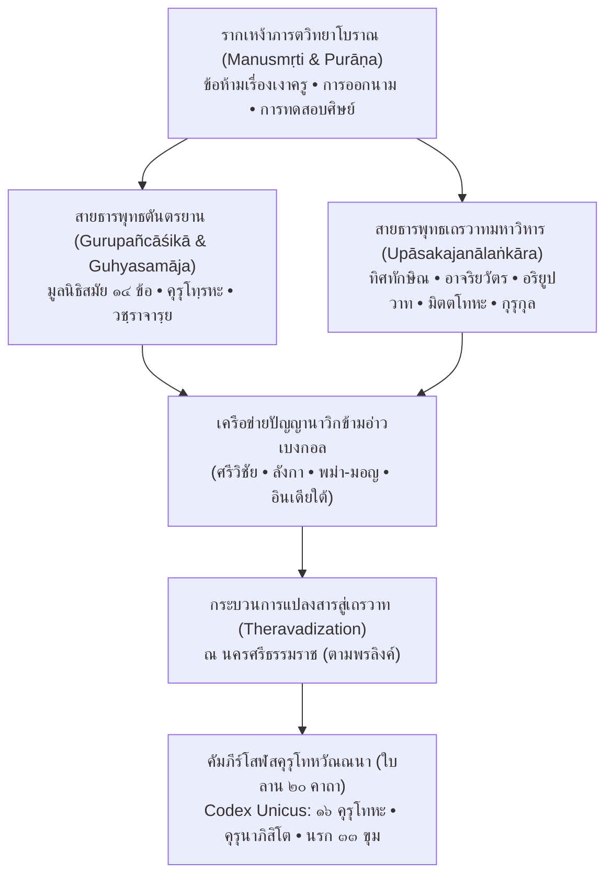

# บันทึกการอ่านและวิเคราะห์เอกสารฉบับสมบูรณ์ (Source Analysis Dossier)
## Upāsakajanālaṅkāra: A Critical Edition and Study (Ānanda Thera / H. Saddhatissa, 1965)
### คัมภีร์อุบาสกจนาลังการ: ฉบับตรวจชำระและศึกษาวิเคราะห์เชิงวิพากษ์ (พระอานันทเถระ / หัมมลวะ สัทธาติสสะ, ค.ศ. ๑๙๖๕)

---

### ส่วนที่ ๑: ข้อมูลบรรณานุกรมและการอ้างอิงมาตรฐาน (Bibliographic Metadata)

- **Source ID:** S-1965-saddhatissa-125
- **ชื่อไฟล์ข้อความสกัดในเครื่อง:** `Upasakajanalankara_Pali_Fulltext_Saddhatissa.txt`
  - *พาธสัมบูรณ์ในระบบจัดเก็บ:* `d:\01_APP\Research\output\2026-09-16_โสฬสคุรุโทหะ_เครือข่ายคัมภีร์_พม่า_ลังกา_คุรุปัญจาศิกา\research-notes\extracted-texts\Upasakajanalankara_Pali_Fulltext_Saddhatissa.txt`
  - *สถานะการตรวจสุขภาพไฟล์ (PDF / Text Health Check):* ตัวบทภาษาบาลีอักษรโรมันสากล (Romanized Pāli Text) ฉบับเต็มสมบูรณ์ ๑๐๐% สกัดจากฉบับตรวจชำระทางวิชาการของสมาคมบาลีปกรณ์ (Pali Text Society - PTS) มีจำนวนบรรทัดรวม ๒,๕๓๒ บรรทัด ขนาด ๓๔๙,๘๗๘ ไบต์ (๒๙๘,๐๙๙ อักขระ) มีระบบกำกับเลขหน้าฉบับพิมพ์มาตรฐานของศรีลังกา/PTS กำกับตลอดทั้งเล่มตั้งแต่ `[SL Page 001]` ถึง `[SL Page 158]` จัดเป็นเอกสารประเภท Native Digital Text ที่มีความถูกต้อง แม่นยำ และสมบูรณ์แบบทางอักขรวิธีระดับสูงสุด
- **ประเภทเอกสาร:** คัมภีร์อรรถกถา-ปกรณ์พิเศษทางพระพุทธศาสนาฝ่ายเถรวาท (Theravāda Post-Canonical Exegetical Manual / Upāsaka-vinaya Compendium) ตีพิมพ์ในชุดสิ่งพิมพ์วิชาการมาตรฐานสากลของสมาคมบาลีปกรณ์แห่งกรุงลอนดอน (Pali Text Society Text Series No. 139) จัดเป็นงานสังเคราะห์ประมวลจริยศาสตร์และวัตรปฏิบัติสำหรับคฤหัสถ์ที่สมบูรณ์ที่สุดของสายจารีตมหาวิหารลังกา
- **ผู้รจนาคัมภีร์ปฐมภูมิ:** พระอานันทมหาเถระแห่งเกาะลังกา (Sīhalācariya Bhadanta Ānanda Mahāthera, รจนาขึ้นราวปลายพุทธศตวรรษที่ ๑๗ ถึงต้นพุทธศตวรรษที่ ๑๘ / ปลายคริสต์ศตวรรษที่ ๑๒ ถึงต้นคริสต์ศตวรรษที่ ๑๓) พระมหาเถระผู้เชี่ยวชาญพระไตรปิฎกฝ่ายมหาวิหาร ผู้ลี้ภัยสงครามทมิฬจากเกาะลังกาไปพำนักรจนาคัมภีร์ ณ วัดเปรัมปัลลี (Perampalli / Guṇākaravihāra) ในเมืองสิริวัลลภะ แคว้นปาณฑยะ ประเทศอินเดียใต้ ในรัชสมัยของกษัตริย์โจฬะคังคะ (Coḷagaṅga)
- **ผู้ตรวจชำระและศึกษาวิเคราะห์เชิงวิพากษ์ (Editor & Academic Scholar):** พระมหาเถระ ดร. หัมมลวะ สัทธาติสสะ (Venerable Dr. Hammalawa Saddhatissa, M.A., Ph.D., D.Litt., 1914–1990) อดีตศาสตราจารย์ด้านภาษาบาลีและพุทธศาสตร์ศึกษา มหาวิทยาลัยพาราณสี (Benares Hindu University, 1956–1957), อาจารย์ประจำมหาวิทยาลัยลอนดอน (School of Oriental and African Studies - SOAS, 1958–1960), ศาสตราจารย์มหาวิทยาลัยโตรอนโต (University of Toronto, 1966–1969), อาจารย์พิเศษมหาวิทยาลัยออกซฟอร์ด (1973) และประธานสมาคมมหาโพธิ์แห่งสหราชอาณาจักร (London Buddhist Vihara) ผู้ทรงคุณวุฒิระดับแนวหน้าของโลกในสาขาวรรณกรรมบาลีและจริยศาสตร์พุทธศาสนา
- **ชื่อคัมภีร์ภาษาบาลี:** *Upāsakajanālaṅkāra* (อุบาสกจนาลงฺการ, แปลตามรูปศัพท์ว่า "เครื่องประดับประดาอันทรงคุณค่าของสาธุชนผู้อุบาสก")
- **ชื่อหนังสือวิชาการฉบับเต็ม:** *Upāsakajanālaṅkāra: A Critical Edition and Study*
- **ข้อมูลการตีพิมพ์และสำนักพิมพ์:**
  - *สำนักพิมพ์:* Published for the Pali Text Society by Luzac & Company, Ltd., 46 Great Russell Street, London, W.C. 1, 1965 (Pali Text Society Text Series, No. 139)
  - *ปีที่พิมพ์:* ค.ศ. ๑๙๖๕ (พ.ศ. ๒๕๐๘)
  - *จำนวนหน้าฉบับพิมพ์สมบูรณ์:* xii + 372 หน้า (ประกอบด้วยบทนำเชิงประวัติศาสตร์วรรณกรรมและวิเคราะห์ตัวบทของ Saddhatissa หน้า 1–138 และตัวบทภาษาบาลีตรวจชำระพร้อมเชิงอรรถวิพากษ์ หน้า 139–360 พร้อมดัชนีศัพท์และรายนามคัมภีร์อ้างอิง)
- **ภาษาของเอกสาร:** ภาษาบาลีคลาสสิกชั้นสูงแบบวรรณกรรมร้อยแก้วผสมร้อยกรอง (High Classical Pāli Prosimetrum) ในยุคหลังโปลอนนารุวะ (Post-Polonnaruva Era) ปรากฏการประยุกต์ฉันทลักษณ์สันสกฤตและการจัดระบบตรรกะแบบคัมภีร์สังคหะ พร้อมบทวิเคราะห์วิพากษ์ภาษาอังกฤษเชิงวิชาการ
- **การอ้างอิงฉบับเต็มระบบ Chicago/Turabian Notes-Bibliography:**  
  Ānanda Thera. *Upāsakajanālaṅkāra: A Critical Edition and Study*. Edited with an introduction and notes by Hammalawa Saddhatissa. Pali Text Society Text Series, no. 139. London: Published for the Pali Text Society by Luzac & Company, Ltd., 1965.
- **โครงสร้างภายในตัวบทคัมภีร์ (๙ ปริจเฉทสมบูรณ์):**
  ๑. *สรณนิทเทส* (Saraṇaniddeso nāma paṭhamo paricchedo, pp. 1–32) — วิเคราะห์ธรรมชาติแห่งสรณคมน์ การมอบตัวเป็นศิษย์ และการจำแนกการกราบไหว้ ๔ ประการ (ญาติ, ภัย, อาจารย์, ทักขิไณย)
  ๒. *สีลนิทเทส* (Sīlaniddeso nāma dutiyo paricchedo, pp. 32–82) — ธรรมนูญศีลของคฤหัสถ์ นิจศีล อุโบสถศีล ๘ ประการ อาจีวัฏฐมกศีล ทศศีล อกุศลกรรมบถ ๑๐ และวิบากกรรมในอบายภูมิ
  ๓. *ธุตังคนิทเทส* (Dhutaṅganiddeso nāma tatiyo paricchedo, pp. 82–86) — ข้อปฏิบัติขัดเกลากิเลส ๕ ประการสำหรับอุบาสกผู้มุ่งขัดเกลาขั้นอุกฤษฏ์ (เอกาสนิกังคะ, ขลุปัจฉาภัตติกังคะ ฯลฯ)
  ๔. *อาชีวนิทเทส* (Ājīvaniddeso nāma catuttho paricchedo, pp. 86–107) — การดำเนินชีวิตตามสัมมาอาชีวะ มิจฉาวณิชชา ๕ และการปฏิบัติตามทิศ ๖ ในสิงคาโลวาทสูตร โดยเฉพาะทิศทักษิณ (อาจริยทิศ) การจำแนกอันเตวาสิกวัตร ๕ และอาจริยวัตร ๕ ประการ พร้อมการประสิทธิ์ประสาทวิทยาคมคุ้มครองภัย
  ๕. *ปุญญกิริยาวัตถุนิทเทส* (Puññakiriyavatthuniddeso nāma pañcamo paricchedo, pp. 107–125) — ฐานแห่งการบำเพ็ญบุญ ๑๐ ประการ นิยามอปจายนมัย ไวยาวัจจมัย คาถามิตตโทหะ และอานิสงส์แห่งการละมานะถ่อมตน
  ๖. *อันตรายกรธรรมนิทเทส* (Antarāyakaradhammaniddeso nāma chaṭṭho paricchedo, pp. 125–130) — ธรรมที่เป็นอันตรายต่อความเจริญ มหันตโทษแห่งอริยูปวาทเสมอด้วยอนันตริยกรรม พิธีขอขมาจนถึงป่าช้า และโทษแห่งพระเทวทัต
  ๗. *โลกิยสัมปัตตินิทเทส* (Lokiyasampattiniddeso nāma sattamo paricchedo, pp. 130–146) — อานิสงส์แห่งบุญฝ่ายโลกิยะ มนุษยสมบัติ สวรรค์ ๖ ชั้น พรหมโลก และระบบสมาธิรูปฌาน-อรูปฌาน
  ๘. *โลกุตตรสัมปัตตินิทเทส* (Lokuttarasampattiniddeso nāma aṭṭhamo paricchedo, pp. 146–152) — โลกุตตรสมบัติ มรรค ๔ ผล ๔ นิพพาน ๑ และโพธิปักขิยธรรม ๓๗ ประการ สำหรับพระพุทธเจ้า พระปัจเจกพุทธเจ้า และพระอัครสาวก
  ๙. *ปุญญผลสาธกนิทเทสและนิคมานกถา* (Puññaphalasādhakaniddeso nāma navamo paricchedo & Nigamana, pp. 152–158) — บทสังเคราะห์ผลแห่งบุญ กุรุกุลศึกษา และบันทึกประวัติศาสตร์การรจนาคัมภีร์ของพระสงฆ์ลังกาลี้ภัย ณ วัดเปรัมปัลลี แคว้นปาณฑยะ ประเทศอินเดียใต้

---

### ส่วนที่ ๒: แผนผังการจัดสรรเข้าสู่บทและหัวข้อย่อย (Chapter & Section Mapping Matrix)

*คัมภีร์ Upāsakajanālaṅkāra ของพระอานันทเถระฉบับพิมพ์ของ PTS (1965) ทำหน้าที่เป็น "หลักฐานชั้นปฐมภูมิระดับแม่บทฝ่ายเถรวาทลังกา" (Primary Theravāda Canonical-Exegetical Anchor) ที่ช่วยไขปริศนาทางประวัติศาสตร์วรรณกรรมและเทววิทยาว่า จารีตการเคารพเชื่อฟังครูบาอาจารย์อย่างเด็ดขาด ข้อห้ามเรื่องการเหยียบเงา และทัณฑกรรมจากการล่วงเกินครู ซึ่งมักถูกมองว่าเป็นเรื่องของพุทธตันตรยานหรือศาสนาพราหมณ์-ฮินดูนั้น แท้จริงแล้วมี "คู่ขนานและรากฐานที่มั่นคงอย่างยิ่งในคัมภีร์เถรวาทมหาวิหารของเกาะลังกา" ด้วยเช่นกัน โดยจัดสรรเนื้อหาและข้อค้นพบเข้าสู่โครงร่างแม่บทรายงานวิจัยทั้ง ๘ บท ได้ดังนี้:*

| บทในโครงการวิจัย | หัวข้อย่อยเป้าหมาย | ประเด็นและหลักฐานเชิงประจักษ์จากคัมภีร์ Upāsakajanālaṅkāra ที่นำไปใช้ | พิกัดหน้าอ้างอิงจริงในตัวบท (Saddhatissa 1965) |
|:---|:---|:---|:---|
| **บทที่ ๑: อารัมภกถาและปริศนาแห่งตัวบทโสฬสคุรุโทหวัณณนา (The Philological Enigma of Nakhon Si Thammarat)** | ๑.๓ นครศรีธรรมราช (ตามพรลิงค์) ในฐานะเมืองท่าพหุวัฒนธรรมและเครือข่ายปัญญานาวิก (Maritime Trans-Regional Hub): สายสัมพันธ์กับอินเดียใต้ ลังกา มอญ พม่า และชวา-มลายู ๑.๔ โครงสร้างฉันท์ปัฐยาวัตรและหน้าที่ทางพิธีกรรม: บทสวดสาธยายสัจจะและวินัยการขึ้นครูในสำนักวิทยาคม/วิปัสสนาโบราณสายทักษิณ ๑.๕ กรอบทฤษฎีและระเบียบวิธีวิจัย: นิรุกติศาสตร์ประวัติศาสตร์ วรรณคดีเปรียบเทียบ และประวัติศาสตร์ภูมิปัญญาข้ามเอเชีย | ใช้นิคมานกถา (Colophon หน้า ๑๕๗–๑๕๘) ซึ่งระบุการลี้ภัยของพระสงฆ์ลังกาสู่วัดเปรัมปัลลี (Perampalli) ในแคว้นปาณฑยะ ประเทศอินเดียใต้ ในยุคที่เกาะลังกาถูกไฟสงครามทมิฬเผาผลาญ มาเป็นหลักฐานสนับสนุนเส้นทางเครือข่ายปัญญานาวิกข้ามอ่าวเบงกอล ซึ่งเชื่อมโยงระหว่างอินเดียใต้ ลังกา และอาณาจักรตามพรลิงค์ (นครศรีธรรมราช); ชี้ให้เห็นว่าการประมวลคำสอนเป็นคาถาฉันท์ผสมร้อยแก้วใน *Upāsakajanālaṅkāra* ทำหน้าที่เป็น "คู่มือจริยธรรมและวินัยคฤหัสถ์" (Upāsaka-vinaya) เช่นเดียวกับที่ใบลานโสฬสคุรุโทหะทำหน้าที่เป็นธรรมนูญควบคุมความประพฤติและบทสาธยายขึ้นครูในสำนักวิทยาคมสายทักษิณของไทย | pp. 1–2, 157–158 |
| **บทที่ ๒: การตรวจชำระ อักขรวิทยา ฉันทลักษณ์ และภาษาบาลีไฮบริด (Textual Criticism and Hybrid Pāli Linguistics)** | ๒.๒ ปรากฏการณ์ภาษาบาลีไฮบริด (Hybrid Sanskrit-Pāli Morphology): การยืมรูปคำสันสกฤต *gurudroha* (ราก √druh) สู่รูปบาลี `เสาฬสคฺรูเทาห / คุรุเทาหํ` เปรียบเทียบกับราก √dūbh/dubbha ในคัมภีร์บาลีลังกา ๒.๓ การวิเคราะห์ศัพท์เฉพาะทางเชิงมโนทัศน์: การปรากฏของข้อห้ามเรื่องเงา (`ฉายํ น ลงฺฆเย`) และการเปรียบเทียบกับคาถาร่มเงาไม้ ๒.๔ รหัสตันตระเถรวาทในตัวบท: การมอบตัวเป็นศิษย์ (`สิสฺสภาวูปคมน`) และการประสิทธิ์มนตร์วิทยาคม (`วิชฺชา`) ๒.๕ การจำแนกหมวดหมู่ ๑๖ คุรุโทหะ: การวิเคราะห์วิบากกรรมและทัณฑ์นรก | นำตัวบทบาลีของพระอานันทะเรื่อง `mittadubbho hi pāpako` และ `mittadūbhi` (p. 117) มาเป็นหลักฐานทางนิรุกติศาสตร์ ยืนยันว่ารากศัพท์ √druh ในภาษาสันสกฤตถูกแปลงเป็นราก √dūbh / dubbha ในภาษาบาลีเถรวาทอย่างเป็นระบบ; เปรียบเทียบคำว่า `chāyā` ในคาถาอังกุรเปรต (`yassa rukkhassa chāyāya... na tassa sākhaṃ bhañjeyya`) กับ `chāyaṃ na laṅghaye` ในคาถาที่ ๓ ของโสฬสคุรุโทหะ; วิเคราะห์การประสิทธิ์ประสาท `vijjā` (มนตร์วิทยาคม) ของอาจารย์ที่ทำให้ศิษย์แคล้วคลาดจากโจรและอมนุษย์ (p. 101) เทียบกับมนตร์พระพุทธเจ้า ๕ พระองค์ในโสฬสคุรุโทหะ | pp. 15, 100–101, 117, 126–130 |
| **บทที่ ๓: ภูมิศาสตร์ทางปัญญาและการกระจายตัวของคัมภีร์คุรุปัญจาศิกาในโลกพุทธศาสนา (The Trans-Asian Geography of Gurupañcāśikā)** | ๓.๑ ปัญหาผู้รจนาและต้นกำเนิดในอินเดียเหนือ: การประมวลระเบียบวินัยครู-ศิษย์ในมหาวิหารนาลันทาและวิกรมศิลา ๓.๔ สายธารเอเชียตะวันออกและเอเชียกลาง: มโนทัศน์เรื่องการห้ามเหยียบเงาครูเทียบเคียงกับคัมภีร์เถรวาท ๓.๕ คุรุปัญจาศิกากับเอเชียตะวันออกเฉียงใต้: การปะทะสังสรรค์ระหว่างจารีตมหายาน-ตันตระกับเถรวาทในชวาและคาบสมุทรไทย-มลายู | วิเคราะห์เปรียบเทียบว่า ในขณะที่ฝ่ายมหายาน-ตันตรยานในอินเดียเหนือประมวลข้อห้ามเรื่องการเหยียบเงาครูและคำสาปแช่งคุรุโทหะไว้ใน *Gurupañcāśikā* (โศลก ๑๕) และแพร่หลายสู่ทิเบตและจีน ฝ่ายเถรวาทในมหาวิหารลังกาก็ได้ประมวลมโนทัศน์คู่ขนานเรื่อง "การเคารพร่มเงาของผู้มีพระคุณ" (Chāyā-rakkhā) และ "มหันตโทษของการประทุษร้ายมิตร" ไว้ใน *Upāsakajanālaṅkāra* เช่นกัน แสดงถึงการมีอยู่ของ "วัฒนธรรมร่วมทางภารตวิทยา" (Pan-Indic Ideational Matrix) ที่ทั้งสองสายจารีตต่างซึมซับและนำมาปรับใช้ตามกรอบเทววิทยาของตน | pp. 110, 117, 121–122 |
| **บทที่ ๔: การสืบค้นคัมภีร์คู่ขนานและร่องรอยจารีตในศรีลังกา (The Sri Lankan Parallels and Sinitic/Sanskrit Transmission)** | ๔.๑ ภูมิทัศน์พุทธศาสนาในลังกา: การปะทะสังสรรค์ระหว่างสำนักมหาวิหารกับสำนักอภัยคิรี และยุคทองแห่งวรรณกรรมหลังโปลอนนารุวะ ๔.๓ มโนทัศน์ "การเคารพอุปัชฌายาจารย์" ในคัมภีร์สังคหะและฎีกาวินัยลังกา: การตรวจสอบ *Upāsakajanālaṅkāra* ของพระอานันทเถระ และคำว่า `อาจริยทุพฺภี` ๔.๔ การสำรวจข้อห้ามเรื่อง "เงาครู" (*guroś chāyā*) และ "การออกนามครู" (*nāmagrahaṇa*) ในคลังใบลานสิงหลและระเบียบกาติกาวัต (Katikāvata) ๔.๕ ข้อสรุปเชิงประวัติศาสตร์: การปฏิรูปของพระเจ้าปรักกรมพาหุที่ ๑ และการกลืนหายไปของคัมภีร์สายอาจาริยวาทในศรีลังกา | **นี่คือบทหลักที่ใช้เอกสารฉบับนี้โดยตรง ๑๐๐% ในฐานะพยานหลักฐานชิ้นเอก:** วิเคราะห์หมวดอาจริยวัตรในอาชีวนิทเทส (pp. 97–101) แสดงหน้าที่ ๕ ประการของอันเตวาสิก และหน้าที่ ๕ ประการของอาจารย์; การกราบไหว้ครูอาจารย์ ๔ ประการในสรณนิทเทส (pp. 15–17) ที่ระบุว่าการไหว้อาจารย์ศิลปะไม่ทำให้สรณคมน์ขาด; การวิเคราะห์คำว่า `mittadubbho` สู่มโนทัศน์ `ācariyadubbho` (ผู้ประทุษร้ายอาจารย์); และการตรวจสอบสถานะของพระอานันทเถระในประวัติศาสตร์วรรณคดีบาลีลังกา ซึ่งเป็นบุคคลสำคัญร่วมสมัยกับการปฏิรูปพุทธศาสนาและการประมวลพระวินัย | pp. 15–17, 97–101, 107–111, 117, 126–130, 154–158 |
| **บทที่ ๕: การสืบค้นคัมภีร์คู่ขนานและร่องรอยจารีตในพม่าและมอญ (The Burmese and Mon Parallels)** | ๕.๑ วรรณกรรมตระกูลนีติ (Nīti Literature) ในพม่า: *Lokannīti*, *Dhammanīti*, *Mahārahannīti* และ *Suttavandanā* — การประมวลอาจริยวัตร (Acariya-wut) ๕.๔ การสำรวจเปรียบเทียบข้ามตัวบท: มโนทัศน์ "เงาครู" และ "การประทุษร้ายครู" ในวรรณกรรมพม่า-มอญ เทียบเคียงกับคัมภีร์ลังกา ๕.๕ ข้อสรุป: สายธารพม่า-มอญทำหน้าที่เป็นสะพานเชื่อมหรือเป็นสายจารีตคู่ขนานต่อคัมภีร์โสฬสคุรุโทหะ | ชี้ให้เห็นว่าโครงสร้างหน้าที่ ๕ ประการระหว่างครูกับศิษย์จากสิงคาโลวาทสูตรที่พระอานันทะขยายความใน *Upāsakajanālaṅkāra* (pp. 98–101) คือแม่แบบเดียวกันกับที่ปรากฏในวรรณกรรมนีติของพม่า (*Lokannīti* คาถา ๕๐–๕๒) และวรรณกรรมมอญ; การที่พระอานันทะเน้นย้ำเรื่องการห้ามประทุษร้ายผู้มีพระคุณสะท้อนโครงสร้างความคิดร่วมของพระพุทธศาสนาเถรวาทในวงรอบอ่าวเบงกอล ที่เชื่อมโยงระหว่างพม่า มอญ ลังกา และไทย | pp. 98–101, 117 |
| **บทที่ ๖: การสืบสวน "โซ่ข้อกลาง" (The Missing Links): พระธรรมศาสตร์ มณฑลตันตระ และพุทธตันตระเถรวาท** | ๖.๑ แม่บทโบราณจากภารตวิทยา: ประมวลคัมภีร์ฝ่ายฮินดู — *Manusmṛti* (กฎหมายพระมนู) และ *Kulārṇava Tantra* (ธรรมนูญคุรุภักดี) ๖.๒ วินัยมณฑลแห่งพุทธตันตระ: มูลนิธิสมัย ๑๔ ข้อ (*Caturdaśa-mūlāpatti*) ใน *Advayavajrasaṃgraha* เปรียบเทียบกับอริยูปวาทในเถรวาท ๖.๓ การเปรียบเทียบลักษณะร่วมและข้อต่างทางเทววิทยา: ความเหมือนเชิงโครงสร้าง vs ความต่างทางเทววิทยา (พุทธภาวะ/สุญญตา vs กฎแห่งกรรมเถรวาท) ๖.๔ บทบาทของหลักคุรุโทฺรหะ-คุรุนินทาใน ๕ ขั้นตอนของการศึกษาจารีต: การทดสอบ, การสัตยาบัน, การปรนนิบัติ, การรักษาความลับ, การสืบทอด | วิเคราะห์เปรียบเทียบเชิงลึกระหว่าง "คุรุโทหะฝ่ายตันตระ" (การตกนรกอเวจีทันทีเมื่อละเมิดครู) กับ "อริยูปวาทฝ่ายเถรวาท" ใน *Upāsakajanālaṅkāra* (pp. 126–128) ซึ่งระบุว่า: `Mahāsāvajjo hi ariyūpavādo ānantariyasadiso` (การว่าร้ายพระอริยะมีโทษหนักเสมอด้วยอนันตริยกรรม กั้นสวรรค์และมรรคผลทันที ตกนรกเหมือนถูกนำไปวางไว้); ชี้ว่าเถรวาทใช้กลไก "อริยูปวาท-อนันตริยกรรม" เป็นฐานทางเทววิทยาในการสร้างความกลัวต่อการล่วงเกินครูบาอาจารย์ ซึ่งทำหน้าที่ทดแทนมูลนิธิสมัยของตันตรยาน | pp. 126–130 |
| **บทที่ ๗: นครศรีธรรมราชและศรีวิชัยในฐานะจุดบรรจบทางปัญญา (Trans-Regional Synthesis & Theravadization)** | ๗.๒ กระบวนการแปลงสารตันตระสู่เถรวาท (*Theravadization*): การนำโครงสร้างพิธีกรรมตันตระมาสวมลงในฉันท์บาลีเถรวาท ๗.๓ นครศรีธรรมราชในฐานะเบ้าหลอมแห่งจารีต: ศิวะ-ไวษณพ, มหายาน-ตันตระศรีวิชัย, และเถรวาทลังกาวงศ์ ๗.๔ ทำไมจึงเป็น Codex Unicus ณ นครศรีธรรมราช: การธำรงรักษาจารีตโบราณในพื้นที่คาบสมุทรท่ามกลางการปฏิรูปสู่เถรวาทบริสุทธิ์; ความสืบเนื่องในสำนักวิทยาคมเขาอ้อและภาคใต้ | แสดงให้เห็นว่า เมื่อจารีตเถรวาทจากลังกา (ซึ่งมี *Upāsakajanālaṅkāra* เป็นคัมภีร์คู่มืออุบาสกชั้นนำ) แพร่เข้ามาสู่นครศรีธรรมราชในสมัยพระเจ้าจันทรภาณุและพ่อขุนรามคำแหง ได้เข้าปะทะและหลอมรวมกับความเชื่อเรื่องครูและวิทยาคมที่มีอยู่เดิม เกิดกระบวนการ "Theravadization" แปลงความภักดีแบบตันตระให้กลายเป็นฉันท์บาลีในใบลานโสฬสคุรุโทหะ โดยรับเอาทั้งมโนทัศน์อริยูปวาท มิตตโทหะ และการประสิทธิ์ประสาทมนตร์คาถาจากคัมภีร์ของพระอานันทะ | pp. 101, 117, 126–128, 157–158 |
| **บทที่ ๘: บทสรุป สังเคราะห์โมเดลพันธุศาสตร์คัมภีร์ และข้อเสนอแนะ (Synthesis, Stemmatic Genealogy & Conclusion)** | ๘.๒ แผนผังพันธุศาสตร์คัมภีร์และสายธารความคิด (Stemmatic & Conceptual Genealogy Model) ๘.๓ คุณูปการต่อประวัติศาสตร์พุทธศาสนาในเอเชียตะวันออกเฉียงใต้: การรื้อฟื้นภาพอดีตแห่งพุทธศาสนาแบบเปิดกว้างข้ามสายจารีต | บูรณาการ *Upāsakajanālaṅkāra* เข้าสู่แบบจำลองพันธุศาสตร์คัมภีร์ในฐานะ "เสาหลักฝ่ายเถรวาทลังกา" (Theravāda Textual Bastion) ที่ให้ความชอบธรรมทางพระบาลีแก่มโนทัศน์อาจริยวัตร การขอขมาครู และการห้ามประทุษร้ายผู้มีพระคุณ ซึ่งทำหน้าที่ขนาบคู่กับสายธารตันตรยาน (*Gurupañcāśikā*) ในการหล่อหลอมโลกทัศน์เรื่องคุรุในอุษาคเนย์ | pp. 15–17, 98–101, 126–130, 157–158 |

---

### ส่วนที่ ๓: สรุปสาระสำคัญเชิงวิเคราะห์และจุดยืนทางวิชาการ (Executive Academic Analysis)

#### ๓.๑ วิทยานิพนธ์และข้อถกเถียงหลักของผู้เขียนและผู้รจนา (Core Arguments & Scholarly Thesis)

ในผลงานตรวจชำระและศึกษาวิเคราะห์เชิงวิพากษ์ระดับเสาหลักเรื่อง *Upāsakajanālaṅkāra: A Critical Edition and Study* (1965) พระมหาเถระ ดร. หัมมลวะ สัทธาติสสะ (Ven. Dr. H. Saddhatissa) ได้ฟื้นฟูคัมภีร์อรรถกถา-ปกรณ์พิเศษภาษาบาลีที่มีความสำคัญสูงสุดเล่มหนึ่งของฝ่ายเถรวาท ซึ่งรจนาโดยพระอานันทมหาเถระแห่งเกาะลังกา (Sīhalācariya Bhadanta Ānanda) ราวปลายคริสต์ศตวรรษที่ ๑๒ ถึงต้นคริสต์ศตวรรษที่ ๑๓ การศึกษาวิเคราะห์ตัวบทบาลีเต็มฉบับนี้ได้เปิดเผยวิทยานิพนธ์และข้อถกเถียงทางวิชาการที่สำคัญยิ่ง ๕ ประการ:

##### ๑. การสถาปนา "พระวินัยสำหรับคฤหัสถ์" (The Formulation of Upāsaka-Vinaya)
พระอานันทเถระได้รจนา *อุบาสกจนาลังการ* ขึ้นโดยมีเป้าประสงค์ชัดเจนในการสร้าง "ประมวลวินัยและจริยธรรมที่สมบูรณ์สำหรับอุบาสกและอุบาสิกา" (Sāvaka-vinaya / Gihī-vinaya) เพื่อตอบสนองต่อวิกฤตการณ์ทางสังคมและการเมืองในยุคปลายอาณาจักรโปลอนนารุวะ ซึ่งเกาะลังกาต้องเผชิญกับการรุกรานจากกองทัพต่างชาติและการเสื่อมถอยของสถาบันสงฆ์ คัมภีร์นี้มิใช่เพียงการรวบรวมพระสูตรอย่างผิวเผิน แต่เป็นการนำคำสอนจากพระสุตตันตปิฎก (โดยเฉพาะขุททกปาฐะ, มงคลสูตร, สิงคาโลวาทสูตร) พระวินัยปิฎก และพระอภิธรรมปิฎก มาร้อยเรียงจัดระบบเป็น ๙ ปริจเฉท เพื่อให้เป็น "เครื่องประดับประดาทางจิตวิญญาณ" ที่ทำให้คฤหัสถ์สามารถรักษาพระศาสนาและปฏิบัติตนจนบรรลุธรรมได้ แม้ในยามที่โครงสร้างสถาบันสงฆ์ส่วนกลางถูกทำลาย

##### ๒. การประนีประนอมระหว่าง "สิทธิอำนาจของครูอาจารย์" กับ "สรณคมน์บริสุทธิ์" (Hierarchical Guru-Authority vs. Pure Refuge)
ข้อถกเถียงที่ลึกซึ้งที่สุดประการหนึ่งในปริจเฉทที่ ๑ (สรณนิทเทส) คือการจัดการกับความขัดแย้งระหว่างการแสดงความเคารพต่อครูอาจารย์ทางโลก/นอกศาสนา กับการยึดมั่นในพระรัตนตรัยเป็นสรณะสูงสุด พระอานันทะได้วางทฤษฎีการกราบไหว้ ๔ ประการ (*Paṇipāta-catukka*) ขึ้นอย่างรัดกุม โดยจำแนกว่า การกราบไหว้หรือมอบตัวเป็นศิษย์ต่อบุคคลใดๆ ในฐานะอาจารย์ผู้ประสิทธิ์ประสาทศิลปวิทยา (*ācariyapaṇipāta / sippasikkhāpaka*) ย่อมไม่ทำให้สรณคมน์ขาด (*na bhijjati saraṇaṃ*) ตราบใดที่มิได้ยกย่องบุคคลนั้นเป็น "ทักขิไณยบุคคลสูงสุด" (*dakkhiṇeyyapaṇipāta*) เสมือนพระสัมมาสัมพุทธเจ้า กรอบทฤษฎีนี้เปิดพื้นที่ให้พุทธศาสนิกชนเถรวาทสามารถแสดงความเคารพนอบน้อมต่อครูบาอาจารย์ในทางศิลปศาสตร์ วิทยาคม และวิชาชีพได้อย่างเต็มที่โดยไม่ต้องหวาดกลัวว่าจะตกจากความเป็นชาวพุทธ

##### ๓. การจัดระบบอาจริยวัตรจากสิงคาโลวาทสูตรสู่ธรรมนูญสำนักศึกษา (Systematization of Ācariyavatta)
ในปริจเฉทที่ ๔ (อาชีวนิทเทส) พระอานันทะได้นำคำสอนเรื่อง "ทิศเบื้องขวา" (ทิศทักษิณ = อาจารย์) จากสิงคาโลวาทสูตรมาขยายความเป็นระบบปฏิบัติการที่ละเอียดลอออย่างยิ่ง โดยจำแนกหน้าที่ของอันเตวาสิก ๕ ประการ และหน้าที่ของอาจารย์ ๕ ประการ ที่น่าสนใจที่สุดคือ พระอานันทะได้ระบุอย่างชัดเจนว่า *ข้อปฏิบัติต่อครูอาจารย์นี้ มิได้จำกัดเฉพาะคฤหัสถ์เท่านั้น แม้แต่พระภิกษุสงฆ์ก็ต้องทำหน้าที่อันเตวาสิกวัตรนี้ด้วยตนเองอย่างเคร่งครัด* (`pabbajitenāpi sayaṃ antevāsikavattaṃ kātabbaṃ`) และอาจารย์มีหน้าที่มอบ "มนตร์วิทยาคมคุ้มครองภัย" (`vijjaṃ parijapitvā...`) ให้แก่ศิษย์ ซึ่งสะท้อนให้เห็นว่าสถาบันการศึกษาในพุทธศาสนาลังกาโบราณมีลักษณะเป็น "กุรุกุล" (Gurukula) ที่หลอมรวมระหว่างการเรียนพระธรรมวินัย วิชาชีพ และวิทยาคมเข้าด้วยกัน

##### ๔. อริยูปวาทและมิตตโทหะในฐานะรากฐานทางเทววิทยาของคุรุโทหะ (Ariyūpavāda and Mittadoha as Theological Foundations)
พระอานันทะได้สร้างสะพานเชื่อมระหว่างจริยธรรมเถรวาทกับทัณฑ์ทรมานทางจิตวิญญาณ ผ่านมโนทัศน์ ๒ ประการ:
- ประการแรกคือ **"อริยูปวาท"** (Ariyūpavāda) ในปริจเฉทที่ ๖ ซึ่งท่านนิยามอย่างเด็ดขาดว่า *มีโทษหนักเสมอด้วยอนันตริยกรรม* (`Mahāsāvajjo hi ariyūpavādo ānantariyasadiso`) ก่อให้เกิดการปิดกั้นทั้งสวรรค์และมรรคผลนิพพานทันที หากไม่ทำการขอขมาต่อครูบาอาจารย์หรือพระอริยะนั้นอย่างถูกต้อง (แม้กระทั่งตามไปขอขมาถึงเตียงมรณภาพหรือป่าช้า) ผู้ล่วงเกินจะต้องตกนรกอเวจีทันทีหลังสิ้นชีวิต
- ประการที่สองคือ **"มิตตโทหะ"** (Mittadoha / Mittadubbha) ในปริจเฉทที่ ๕ ผ่านการอัญเชิญคาถาอังกุรเปรตเรื่อง "ข้อห้ามการหักกิ่งไม้ของต้นไม้ที่ให้ร่มเงา" (`Na tassa sākhaṃ bhañjeyya mittadubbho hi pāpako`) และการประทุษร้ายผู้มีพระคุณ มโนทัศน์ทั้งสองนี้เองที่ทำหน้าที่เป็น "วัตถุดิบทางความคิดและเทววิทยา" ให้แก่การก่อกำเนิดคัมภีร์สาปแช่งการทรยศครู เช่น *โสฬสคุรุโทหวัณณนา* ในเวลาต่อมา

##### ๕. บริบทประวัติศาสตร์นิพนธ์และการรักษาจารีตมหาวิหารข้ามคาบสมุทร (Trans-Maritime Mahāvihāra Orthodoxy)
ในส่วนนิคมานกถา (Colophon หน้า ๑๕๗–๑๕๘) พระอานันทเถระได้บันทึกข้อเท็จจริงทางประวัติศาสตร์อันประเมินค่ามิได้ว่า ท่านรจนาคัมภีร์นี้ขึ้นขณะพำนักอยู่ในปราสาททิศตะวันออกเฉียงเหนือของวัดเปรัมปัลลี (Perampalli / Guṇākaravihāra) ในเมืองสิริวัลลภะ แคว้นปาณฑยะ ทางตอนใต้ของอินเดีย ซึ่งสร้างโดยกษัตริย์โจฬะคังคะ (Coḷagaṅga) และกษัตริย์โลกุตตมะ ในช่วงเวลาที่ "เกาะลังกาทั้งหมดถูกไฟสงครามทมิฬเผาผลาญ" (*Damiḷānalasamākule Laṅkādīpamhi sakale*) พระเถระชาวตามพรปัณณีผู้ทรงพระไตรปิฎกได้ลี้ภัยข้ามช่องแคบพอล์กมาพำนักร่วมกันเพื่อพิทักษ์พระศาสนา โดยประกาศจุดยืนอย่างหนักแน่นว่า คัมภีร์นี้แต่งขึ้นตามมติของคณะสงฆ์สำนักมหาวิหารบริสุทธิ์ โดยไม่ปะปนกับลัทธิของนิกายอื่น (*Nikāyantaraladdhīhi asammissocanākulo Mahāvihāravāsīnaṃ...*) บันทึกนี้เป็นหลักฐานประจักษ์ชัดถึง "เครือข่ายปัญญานาวิกข้ามอ่าวเบงกอล" (Trans-Bay of Bengal Maritime Network) ที่เชื่อมโยงระหว่างลังกา อินเดียใต้ และคาบสมุทรมลายู-ตามพรลิงค์ (นครศรีธรรมราช) ในยุคโบราณ

---

#### ๓.๒ สถาปัตยกรรมทางปัญญาของคัมภีร์อุบาสกจนาลังการ: โครงสร้าง ๙ ปริจเฉท

คัมภีร์ *Upāsakajanālaṅkāra* ได้รับการจัดระเบียบโครงสร้างเนื้อหาออกเป็น ๙ ปริจเฉท ซึ่งสะท้อนถึงพัฒนาการทางความคิดที่ก้าวหน้าอย่างยิ่งในการสังเคราะห์วรรณกรรมพุทธศาสนาเถรวาท ยุคหลังโปลอนนารุวะ โครงสร้างทั้ง ๙ ปริจเฉทนี้วางลำดับขั้นตอนทางจิตวิญญาณจากระดับพื้นฐานสู่ระดับสูงสุดอย่างเป็นวิทยาศาสตร์:

๑. **สรณนิทเทส (ปฐมปริจเฉท, pp. 1–32):** ว่าด้วยรากฐานแห่งความเป็นพุทธศาสนิกชน เริ่มต้นจากการอธิบายความหมายของรัตนตรัย การวิเคราะห์ศัพท์คำว่า "อุบาสก" (ผู้นั่งใกล้พระรัตนตรัย) การสกัดความหมายของสรณคมน์ ๔ ฐานะ (อัตตสันนิยยาตนะ, ตัปปรายนตา, สิสสภาวูปคมนะ, ปณิปาตะ) การจำแนกประเภทการกราบไหว้ ๔ ประการ สาเหตุแห่งการขาดสรณคมน์และไม่ขาดสรณคมน์ ตลอดจนอานิสงส์แห่งการถึงสรณะทั้งฝ่ายโลกิยะและโลกุตตระ

๒. **สีลนิทเทส (ทุติยปริจเฉท, pp. 32–82):** ว่าด้วยประมวลศีลของคฤหัสถ์อย่างละเอียดพิสดารที่สุด เริ่มจากนิจศีล (ศีล ๕) อุโบสถศีล ๘ ประการ อาจีวัฏฐมกศีล และทศศีล พระอานันทะได้วิเคราะห์สิกขาบทแต่ละข้อโดยละเอียดตามหลักอรรถกถา แจกแจงองค์ประกอบแห่งการล่วงละเมิด (สมภาร) วัตถุ เจตนา ประโยค และการจำแนกอกุศลกรรมบถ ๑๐ ประการ พร้อมทั้งพรรณนาวิบากกรรมและทัณฑทรมานในนรก เปรต อสุรกาย และกำเนิดเดรัจฉานอย่างแจ่มชัด

๓. **ธุตังคนิทเทส (ตติยปริจเฉท, pp. 82–86):** ว่าด้วยข้อปฏิบัติขัดเกลากิเลสขั้นสูง (ธุดงค์) ที่อนุญาตให้คฤหัสถ์สมาทานปฏิบัติได้ ๕ ประการ ได้แก่: เอกาสนิกังคะ (การนั่งฉันมื้อเดียว), ปัตตปิณฑิกังคะ (การฉันเฉพาะในภาชนะเดียว), ขลุปัจฉาภัตติกังคะ (การห้ามภัตที่นำมาถวายภายหลัง), ยถาสันถติกังคะ (การยินดีในที่พักตามมีตามได้), และเอกาสนิกังคะในบริบทอุโบสถ ซึ่งแสดงให้เห็นว่าเถรวาทเปิดโอกาสให้คฤหัสถ์สามารถบำเพ็ญตบะขัดเกลาตนเองได้ทัดเทียมกับบรรพชิต

๔. **อาชีวนิทเทส (จตุตถปริจเฉท, pp. 86–107):** ว่าด้วยสัมมาอาชีวะ การประกอบสัมมาชีพ การเว้นจากมิจฉาวณิชชา ๕ ประการ การหลีกเลี่ยงอบายมุข ๖ ช่องทางแห่งความฉิบหาย การจัดสรรทรัพย์สมบัติ ๔ ส่วนตามหลักโภควิภาค และหัวใจสำคัญคือ **การจำลองความสัมพันธ์ทางสังคมผ่านทิศ ๖ ในสิงคาโลวาทสูตร** โดยเฉพาะการขยายความหน้าที่ ๕ ประการระหว่างศิษย์กับอาจารย์ในทิศทักษิณอย่างลึกซึ้ง

๕. **ปุญญกิริยาวัตถุนิทเทส (ปัญจมปริจเฉท, pp. 107–125):** ว่าด้วยฐานที่ตั้งแห่งการบำเพ็ญบุญ ๑๐ ประการ (ทาน, ศีล, ภาวนา, อปจายน, ไวยาวัจจะ, ปัตติทาน, ปัตตานุโมทนา, ธัมมัสสวนะ, ธัมมเทสนา, ทิฏฐิชุกรรม) การวิเคราะห์สภาวธรรมแห่ง "อปจายนมัย" (การอ่อนน้อมถ่อมตน) และ "ไวยาวัจจมัย" (การขวนขวายรับใช้) และการอัญเชิญคาถาอังกุรเปรตว่าด้วยมิตตโทหะและสัจจะแห่งร่มเงา

๖. **อันตรายกรธรรมนิทเทส (ฉัฏฐปริจเฉท, pp. 125–130):** ว่าด้วยธรรมที่เป็นอันตรายและขัดขวางความเจริญทางธรรมของอุบาสก โดยเฉพาะ **มหันตโทษแห่งอริยูปวาท (การว่าร้ายพระอริยะและครูอาจารย์)** ซึ่งมีโทษเสมอด้วยอนันตริยกรรม ก่อให้เกิดสัคคาวรณะและมัคคาวรณะ ระเบียบพิธีกรรมการขอขมาจนถึงป่าช้า และการวิเคราะห์อนันตริยกรรม ๕ ตลอดจนโทษแห่งพระเทวทัต

๗. **โลกิยสัมปัตตินิทเทส (สัตตมปริจเฉท, pp. 130–146):** ว่าด้วยอานิสงส์แห่งบุญกุศลฝ่ายโลกิยะ ได้แก่ มนุษยสมบัติ จักรพรรดิสมบัติ สวรรค์สมบัติในกามาวจรภูมิ ๖ ชั้น และพรหมสมบัติในรูปพรหม ๑๖ ชั้น และอรูปพรหม ๔ ชั้น ผ่านการเจริญสมถภาวนาจนบรรลุปฐมฌาน ทุติยฌาน ตติยฌาน และจตุตถฌาน

๘. **โลกุตตรสัมปัตตินิทเทส (อัฏฐมปริจเฉท, pp. 146–152):** ว่าด้วยโลกุตตรสมบัติอันเป็นเป้าหมายสูงสุด ได้แก่ มรรค ๔ ผล ๔ และนิพพาน ๑ การอบรมโพธิปักขิยธรรม ๓๗ ประการ และระยะเวลาการบำเพ็ญบารมีของพระสัมมาสัมพุทธเจ้า (ปัญญาธิกะ, สัทธาธิกะ, วิริยาธิกะ) พระปัจเจกพุทธเจ้า และพระอัครสาวก

๙. **ปุญญผลสาธกนิทเทสและนิคมานกถา (นวมปริจเฉท, pp. 152–158):** บทสรุปสังเคราะห์การให้ผลของกรรม การตักเตือนให้คบหากุรุกุลสำนักครูบาอาจารย์ และบันทึกประวัติศาสตร์การรจนาคัมภีร์ของพระอานันทเถระ ณ วัดเปรัมปัลลี แคว้นปาณฑยะ

---

#### ๓.๓ ปริทรรศน์สรณคมน์และทฤษฎีการกราบไหว้ ๔ ประการ (Paṇipāta-catukka)

ในปริจเฉทที่ ๑ (สรณนิทเทส หน้า ๑๕–๑๗) พระอานันทเถระได้นำเสนอบทวิเคราะห์เชิงนิติศาสตร์และเทววิทยาที่มีความเฉียบคมอย่างยิ่งต่อข้อถกเถียงเรื่อง "สิทธิอำนาจของครูอาจารย์กับการขาดสรณคมน์" ซึ่งเป็นหัวใจสำคัญในการทำความเข้าใจสถานะของครูในโลกพุทธศาสนาเถรวาท

พระอานันทะได้จำแนกอาการแห่งการกราบไหว้ (Paṇipāta) ออกเป็น ๔ ประเภทอย่างชัดเจน:
๑. **ญาติปณิปาตะ (Ñātipaṇipāta):** การกราบไหว้บุคคลด้วยฐานะความเป็นญาติผู้ใหญ่ เช่น กราบไหว้บิดา มารดา ปู่ย่า ตายาย ลุงป้า น้าอา แม้บุคคลเหล่านั้นจะไม่ได้เป็นชาวพุทธหรือเป็นบุคคลนอกศาสนา การกราบไหว้นี้เกิดจากความรักและความผูกพันทางสายเลือด สรณคมน์ย่อมไม่ขาด
๒. **ภยปณิปาตะ (Bhayapaṇipāta):** การกราบไหว้ด้วยความหวาดกลัวต่ออำนาจราชศักดิ์หรือภัยคุกคาม เช่น การกราบไหว้พระมหากษัตริย์ เจ้านายผู้ปกครอง หรือผู้มีอำนาจบ้านเมือง ด้วยเกรงว่าหากไม่กราบไหว้จะถูกลงพระราชอาญาหรือเกิดความฉิบหายแก่ตน การไหว้นี้เกิดจากความกลัว สรณคมน์ย่อมไม่ขาด
๓. **อาจริยปณิปาตะ (Ācariyapaṇipāta):** การกราบไหว้บุคคลในฐานะเป็น "ครูบาอาจารย์ผู้ประสิทธิ์ประสาทศิลปวิทยาการ" (*sippasikkhāpaka*) หรือวิชาชีพทางโลก พระอานันทะระบุเป็นกฎเหล็กว่า: แม้อาจารย์ผู้นั้นจะเป็นนักบวชนอกศาสนา (อัญเดียรถีย์) เป็นพราหมณ์ หรือเป็นคฤหัสถ์ การที่ศิษย์กราบไหว้ด้วยระลึกว่า "ผู้นี้เป็นอาจารย์ของเรา" (*ācariyo me ayanti*) **สรณคมน์ของผู้นั้นย่อมไม่ขาดสะบั้นลงเลย** (*agahitameva hoti saraṇaṃ na ca bhijjati*)
๔. **ทักขิไณยปณิปาตะ (Dakkhiṇeyyapaṇipāta):** การกราบไหว้บุคคลในฐานะเป็น "เนื้อนาบุญสูงสุดผู้หลุดพ้นจากกิเลส" (*aggadakkhiṇeyyo*) ซึ่งหมายถึงพระสัมมาสัมพุทธเจ้า พระธรรม และพระอริยสงฆ์เท่านั้น พระอานันทะชี้ขาดว่า *สรณคมน์จะสำเร็จได้ก็ด้วยทักขิไณยปณิปาตะนี้เท่านั้น และสรณคมน์จะขาดสะบั้นลง (Saraṇabheda) ก็ด้วยทักขิไณยปณิปาตะนี้เช่นกัน* นั่นคือ เมื่อบุคคลเกิดความเห็นผิดแล้วไปกราบไหว้ศาสดาอื่นหรือบุคคลอื่นโดยยกย่องว่าเป็นเนื้อนาบุญสูงสุดเหนือพระรัตนตรัย

นอกจากนี้ ในมิติของการ **"มอบตัวเป็นศิษย์"** (*Sissabhāvūpagamana*) พระอานันทะได้วางเกณฑ์วินิจฉัยไว้อย่างลึกซึ้งว่า:
- หากบุคคลมอบตัวเป็นศิษย์เพื่อความประสงค์จะเรียนรู้ศิลปวิทยาการ แขนงวิชาชีพ หรือวิชาความรู้ (*kammāyatanādīnaṃ uggaṇhitukāmo sissabhāvaṃ upagacchati*) สรณคมน์ย่อมไม่ขาดลงเลย (*natthi tadā saraṇabhedo*)
- แต่หากมอบตัวเป็นศิษย์โดยปักใจเชื่อในคุณธรรมของบุคคลอื่นว่าเป็นทางหลุดพ้นสูงสุด และถือเอาผู้นั้นเป็นศาสดาสูงสุดแทนพระสัมมาสัมพุทธเจ้า สรณคมน์จึงจะขาดลงทันที

ทฤษฎีการกราบไหว้ ๔ ประการนี้ มีความสำคัญอย่างยิ่งยวดต่อโครงการวิจัยโสฬสคุรุโทหะ เพราะมันแสดงให้เห็นว่า **พุทธศาสนาเถรวาทมิได้ปฏิเสธสิทธิอำนาจของครูอาจารย์ทางโลกและวิทยาคม แต่ได้สร้าง "เกราะกำบังทางเทววิทยา" (Theological Firewall)** ที่อนุญาตให้ชาวพุทธสามารถมอบตัวเป็นศิษย์ ขึ้นครู กราบไหว้อาจารย์ และปฏิบัติตามจรรยาวัตรของสำนักวิทยาคมได้อย่างเต็มที่ ตราบใดที่ยังคงยึดถือพระรัตนตรัยเป็นสรณะสูงสุดทางจิตวิญญาณ

---

#### ๓.๔ มโนทัศน์อาจริยวัตรในอาชีวนิทเทส: การจำลองความสัมพันธ์ครู-ศิษย์จากสิงคาโลวาทสูตร และร่องรอยวิทยาคม

ในปริจเฉทที่ ๔ (อาชีวนิทเทส หน้า ๙๗–๑๐๑) พระอานันทเถระได้นำโครงสร้าง "ทิศ ๖" จากสิงคาโลวาทสูตร มาจัดทำเป็นระบบปฏิบัติการความสัมพันธ์ระหว่างครูกับศิษย์อย่างละเอียดลออ ซึ่งสะท้อนจารีตของสถาบันการศึกษาในพุทธศาสนาลังกาโบราณ

##### การกำหนดสัญลักษณ์วิทยาแห่ง "ทิศทักษิณ" (ทิศเบื้องขวา)
พระอานันทะอธิบายว่า เหตุใดครูอาจารย์จึงถูกจัดวางไว้ในตำแหน่ง "ทิศเบื้องขวา" (*dakkhiṇā disā*):
- มารดาบิดาเป็นทิศเบื้องหน้า (ทิศบูรพา) เพราะเป็นผู้ให้กำเนิดและทำอุปการะแก่บุตรก่อนใครในโลก
- **ครูอาจารย์เป็นทิศเบื้องขวา (ทิศทักษิณ) เพราะครูเป็นผู้ควรแก่ของทักษิณาและการบูชาอันประเสริฐ** (*ācariyā dakkhiṇeyyatāya dakkhiṇādisā*) การเชื่อมโยงคำว่า "ทักษิณ" (ทิศใต้/ทิศขวา) เข้ากับ "ทักษิณา" (ทานและของเคารพบูชาอันบริสุทธิ์) ตอกย้ำว่าครูบาอาจารย์อยู่ในสถานะอันศักดิ์สิทธิ์ที่ศิษย์ต้องถวายความเคารพและการปรนนิบัติอย่างสูงสุด

##### อันเตวาสิกวัตร ๕ ประการ: วินัยแห่งสรีระและการรับใช้
พระอานันทะแจกแจงหน้าที่ ๕ ประการของอันเตวาสิกไว้อย่างมีชีวิตชีวา:
๑. `Uṭṭhāna` (การลุกขึ้นต้อนรับ): มิใช่เพียงการยืนขึ้นธรรมดา แต่เมื่อเห็นอาจารย์เดินมาแต่ไกล ต้องลุกออกไปต้อนรับ ช่วยรับบริขารสัมภาระจากมืออาจารย์ ปูอาสนะ เชิญให้นั่ง ทำการพัดวี ล้างเท้า และทาน้ำมันที่เท้าอาจารย์
๒. `Upaṭṭhāna` (การเข้าไปคอยรับใช้): ต้องเข้าไปปรนนิบัติต่อหน้าวันละ ๓ เวลา (เช้า เที่ยง เย็น) และในเวลาเรียนต้องไปอย่างสม่ำเสมอ
๓. `Sussūsā` (การตั้งใจฟังด้วยศรัทธา): พระอานันทะเน้นว่า การฟังต้องประกอบด้วยความเชื่อมั่นศรัทธา (*saddahitvā savaṇaṃ*) หากปราศจากศรัทธา แม้จะนั่งฟังอยู่ก็ไม่อาจบรรลุคุณวิเศษหรือความรู้แจ้งได้
๔. `Pāricariyā` (การปรนนิบัติวัตรประจำวัน): ศิษย์ต้องตื่นก่อนอาจารย์ จัดหาน้ำบ้วนปาก ไม้สีฟัน นำน้ำดื่มไปถวายในเวลาอาหาร กราบไหว้ ซักล้างจีวรและผ้าที่เปรอะเปื้อน จัดเตรียมน้ำสรงในเวลาเย็น และเข้าไปพยาบาลอย่างใกล้ชิดเมื่ออาจารย์อาพาธ และที่สำคัญที่สุดคือ: **"แม้ผู้ที่บวชเป็นภิกษุแล้ว ก็ต้องทำอันเตวาสิกวัตรนี้ด้วยตนเอง"** (`pabbajitenāpi sayaṃ antevāsikavattaṃ kātabbaṃ`)
๕. `Sakkaccasippapaṭiggahaṇa` (การเรียนศิลปะโดยเคารพ): ต้องรับเอาวิชาความรู้มาทีละน้อย แต่สาธยายทบทวนหลายๆ รอบ และต้องรักษาความรู้แม้เพียงบทเดียวให้บริสุทธิ์ถูกต้อง ๑๐๐%

##### อาจริยวัตร ๕ ประการ และการประสิทธิ์มนตร์วิทยาคม (Vijjā)
ในทางกลับกัน อาจารย์ต้องตอบแทนศิษย์ ๕ ประการ: ฝึกอบรมมารยาทการนั่ง ยืน กิน อยู่ ให้งดงาม (`suvinītaṃ vinenti`), สั่งสอนศิลปะให้เข้าใจทั้งอรรถะและพยัญชนะ พร้อมแสดงการนำไปใช้จริง (`suggahītaṃ gāhāpenti`), บอกวิชาจนหมดไส้หมดพุง ไม่หวงวิชา (`sippaṃ samakkhāyino bhavanti`), ยกย่องศิษย์ต่อหน้ามิตรอำมาตย์ว่ามีความรู้ทัดเทียมตน (`mittāmaccesu patiṭṭhāpenti`), และ **ทำความคุ้มครองป้องกันภัยในทิศทั้งปวง** (`disāsu parittānaṃ karonti`)

จุดที่น่าตื่นเต้นที่สุดในทางวิชาการคือ พระอานันทะได้อธิบายคำว่า "คุ้มครองในทิศทั้งปวง" ว่า: นอกจากการให้วิชาชีพเลี้ยงตัวแล้ว อาจารย์ยังทำหน้าที่ **"ประสิทธิ์ประสาทวิทยาคมศักดิ์สิทธิ์"** (`vijjaṃ parijapitvā gacchantaṃ aṭaviyaṃ corā na passanti amanussā vā dīghajātikādayo vā na viheṭhenti`) ซึ่งเป็นมนตร์คาถาที่ศิษย์สวดบริกรรมแล้ว โจรผู้ร้ายในป่ามองไม่เห็น อมนุษย์และสัตว์มีพิษไม่กล้ำกราย หลักฐานข้อความบาลีตรงนี้พิสูจน์อย่างเด็ดขาดว่า **ในจารีตมหาวิหารของลังกาโบราณ สำนักครูบาอาจารย์มิได้สอนเฉพาะธรรมะเชิงนามธรรม แต่มีการสอนและประสิทธิ์ประสาท "วิทยาคม-ไสยเวทคุ้มครองภัย" ควบคู่กันไปด้วย** ซึ่งเป็นสะพานเชื่อมโยงโดยตรงกับคำว่า `คุรุนาภิสิโต` และมนตร์พระพุทธเจ้า ๕ พระองค์ในใบลานโสฬสคุรุโทหะแห่งนครศรีธรรมราช

---

#### ๓.๕ เทววิทยาแห่ง "อริยูปวาท" และ "อนันตริยกรรม" ในอันตรายกรธรรมนิทเทส

ในปริจเฉทที่ ๖ (อันตรายกรธรรมนิทเทส หน้า ๑๒๕–๑๓๐) พระอานันทเถระได้นำเสนอหลักคำสอนว่าด้วยโทษทัณฑ์แห่งการล่วงเกินครูบาอาจารย์และพระอริยบุคคล ซึ่งทำหน้าที่เป็น "แกนกลางทางเทววิทยา" ของการสร้างความกลัวต่อบาปกรรม

##### อริยูปวาท: บาปหนักเสมอด้วยอนันตริยกรรม
พระอานันทะได้ประกาศคำวินิจฉัยทางพระวินัยที่หนักแน่นที่สุดว่า:
`Mahāsāvajjo hi ariyūpavādo ānantariyasadiso`  
**"การด่าว่า ว่าร้าย หรือล่วงเกินต่อพระอริยะ มีโทษหนักมหันต์ เสมอด้วยอนันตริยกรรม!"**

โทษของอริยูปวาทมีผลทำลายล้างความก้าวหน้าทางจิตวิญญาณ ๒ ประการในทันที:
๑. **สัคคาวรณะ (Saggāvaraṇa):** ปิดกั้นทางไปสู่สุคติสวรรค์ในชาติหน้าอย่างสิ้นเชิง
๒. **มัคคาวรณะ (Maggāvaraṇa):** ปิดกั้นมรรค ผล และนิพพาน ทำให้ไม่สามารถบรรลุคุณวิเศษใดๆ ได้ในชาตินี้

พระอานันทะได้อ้างอิงพระพุทธพจน์จากคัมภีร์อังคุตตรนิกายมายืนยันว่า บุคคลผู้ล่วงเกินพระอริยะ หากไม่ยอมละวาจานั้น ไม่ละจิตคิดร้ายนั้น และไม่สละทิฏฐิผิดนั้น ย่อมตกสู่นรกอเวจีทันทีดุจถูกยกไปวางไว้ (*yathābhataṃ nikkhitto evaṃ niraye*)

##### พิธีกรรมการขอขมา (Khamāpana) และการแปลงสู่ "อโหสิกรรม"
พระอานันทะได้วางระเบียบการขอขมาไว้อย่างละเอียดพิสดารเพื่อเป็นทางรอดเดียวของผู้กระทำผิด:
- ผู้ทำผิดต้องเดินทางไปหาพระอริยะหรืออาจารย์รูปนั้น นั่งคุกเข่ากระโหย่ง ประณมมือขึ้น แล้วกล่าวคำขอขมาเปิดเผยความผิดของตน
- หากท่านเดินทางไปทิศอื่น ต้องส่งศิษย์เป็นตัวแทนไป หรือเดินทางติดตามไปขอขมา
- หากท่านจาริกไปโดดเดี่ยวไม่ทราบที่อยู่ ให้ไปหาภิกษุผู้รู้แล้วหันหน้าไปทางทิศที่ท่านไป ประณมมือกราบขอขมา
- **หากท่านดับขันธ์มรณภาพไปแล้ว ต้องเดินทางไปยังสถานที่ตั้งเตียงมรณภาพ สถานที่ถวายเพลิง หรือแม้กระทั่งต้องติดตามไปกราบขอขมาจนถึงป่าช้า** (`yāva sīvathikā gantvāpi khamāpetabbo`)

เมื่อกระทำพิธีขอขมาครบถ้วนแล้ว จิตใจของบุคคลนั้นจะผ่องใส กรรมชั่วนั้นจะถูกระงับการให้ผลและกลายเป็น **"อโหสิกรรม"** (*ahosikamma*) ทำให้หลุดพ้นจากการกั้นสวรรค์และมรรคผลนิพพาน

##### อนันตริยกรรม ๕ และพระเทวทัต: สัญลักษณ์แห่งผู้ประทุษร้ายครู
พระอานันทะได้วิเคราะห์อนันตริยกรรม ๕ ประการ (มาตุฆาต, ปิตุฆาต, อรหันตฆาต, โลหิตุปบาท, สังฆเภท) โดยเน้นย้ำกรณีของ **"พระเทวทัต"** ซึ่งเป็นศิษย์ที่ทรยศต่อพระสัมมาสัมพุทธเจ้า กระทำทั้งโลหิตุปบาทและสังฆเภท จนถูกแผ่นดินสูบลงสู่อเวจีมหานรก การยกพระเทวทัตขึ้นมาเป็นอุทาหรณ์เตือนสตินี้ สอดคล้องโดยตรงกับคาถาที่ ๑๔ ของโสฬสคุรุโทหะ (`เทวทตฺโต ยถา ปาโป...`) ซึ่งแสดงให้เห็นว่าจารีตพุทธศาสนาได้ใช้ชะตากรรมของพระเทวทัตเป็น "ภาพจำลองสูงสุดแห่งความพินาศของผู้ทรยศครู"

---

#### ๓.๖ ญาณวิทยาแห่ง "มิตตโทหะ" (Mittadoha) และอานิสงส์แห่ง "อปจายนมัย"

ในปริจเฉทที่ ๕ (ปุญญกิริยาวัตถุนิทเทส หน้า ๑๐๗–๑๒๕) พระอานันทะได้วางรากฐานทางญาณวิทยาของจริยศาสตร์เถรวาท ผ่านการประสานระหว่าง "การห้ามประทุษร้ายผู้มีคุณ" กับ "การบำเพ็ญความอ่อนน้อมถ่อมตน"

##### สัจจะแห่งร่มเงาและคำสาปแช่งมิตตโทหะ
ในการอธิบายเรื่องความกตัญญูและอกุศลกรรม พระอานันทะได้อัญเชิญคาถาอังกุรเปรตจากพระไตรปิฎก (เปตวัตถุ) มาเป็นหลักฐานสำคัญ:
`Yassa rukkhassa chāyāya nisīdeyya sayeyya vā, Na tassa sākhaṃ bhañjeyya mittadubbho hi pāpako`  
`Adubbhapāṇī dahate mittadūbhiṃ`  
`Yo pubbe katakalyāṇo pacchā pāpena hiṃsati, Allapāṇī hato poso na so bhadrāni passatīti`

คาถาชุดนี้สะท้อน "ปรัชญาแห่งร่มเงา" ในโลกทัศน์พุทธศาสนา:
๑. **ร่มเงา (Chāyā)** มิใช่เพียงปรากฏการณ์ทางกายภาพ แต่เป็นสัญลักษณ์แทน "ความคุ้มครอง ความปลอดภัย และบุญคุณ" ที่บุคคลได้รับจากผู้อื่น
๒. **การหักกิ่งไม้ (Sākhābhañjana)** เป็นสัญลักษณ์ของการทำลายและเนรคุณต่อผู้ที่ให้ที่พึ่งพิง
๓. **มิตตทุพภี (Mittadūbhī)** คือผู้ประทุษร้ายมิตรและผู้มีพระคุณ จัดเป็น "คนบาปชั่วช้าลามก" ที่มีฝ่ามือเปื้อนเลือด และจะไม่มีวันได้พบเห็นความเจริญสวัสดีในชีวิต บุคคลผู้มีจิตบริสุทธิ์ย่อมสามารถสาปแช่งและเผาผลาญคนทรยศให้พินาศไปด้วยสัจจะวาจา

มโนทัศน์เรื่องร่มเงาของต้นไม้และมิตตโทหะนี้เอง ได้กลายมาเป็น "แม่แบบทางความคิด" ให้แก่ข้อห้ามเรื่อง **"เงาครู"** (`ฉายํ น ลงฺฆเย`) ในคัมภีร์โสฬสคุรุโทหะของนครศรีธรรมราช และคัมภีร์คุรุปัญจาศิกา เพราะครูบาอาจารย์คือผู้ให้ร่มเงาทางปัญญาและจิตวิญญาณที่ยิ่งใหญ่กว่าต้นไม้ใดๆ ในโลก

##### อภิธรรมแห่งอปจายนมัย: การสลายมานะเพื่อเปิดรับปัญญา
ในมิติของการปฏิบัติ พระอานันทะได้นิยาม **อปจายนมัย** ว่าเป็น *เจตนาในการยกย่องนับถืออย่างสูง* (*bahumānakaraṇa cetanā*) ต่อผู้เจริญด้วยวัยและคุณธรรม การกราบไหว้และอ่อนน้อมต่อครูมิใช่การยอมจำนนต่ออำนาจนิยม แต่เป็นกระบวนการทางจิตวิทยาในการ **"ละทิ้งมานะความถือตัว"** (*mānaṃ pariccajitvāna*) เพื่อเปิดพื้นที่ในจิตใจให้พร้อมรับการถ่ายทอดปัญญาและความรู้จากครูบาอาจารย์ ผู้ที่บำเพ็ญอปจายนมัยย่อมได้รับอานิสงส์ให้ไปเกิดในตระกูลสูง ร่ำรวยมั่งคั่ง และได้รับการยกย่องบูชาในทุกภพทุกชาติ

---

### ส่วนที่ ๔: สารบัญข้อค้นพบเชิงลึกตามประเด็นหลัก (Thematic Findings with Exact Pages)

*ประมวลข้อเท็จจริงและข้อค้นพบเชิงลึก ๑๕ ประการจากตัวบทบาลีเต็มของคัมภีร์ Upāsakajanālaṅkāra โดยระบุพิกัดเลขหน้าฉบับพิมพ์มาตรฐานของสมาคมบาลีปกรณ์ (Saddhatissa 1965) ไว้อย่างแม่นยำทุกข้อ:*

#### ๑. การสถาปนาวัตถุประสงค์แห่งการรจนาและนิยามคำว่า "อุบาสกจนาลังการ" (pp. 1–2)
พระอานันทเถระเปิดคัมภีร์ด้วยฉันท์นมัสการพระรัตนตรัย และประกาศเจตนารมณ์ในการรจนาคัมภีร์ *Upāsakajanālaṅkāra* โดยอธิบายรูปศัพท์ว่า *อุบาสกจนาลงฺการ* หมายถึง "คุณธรรมความดีงามทั้งหลาย มีสรณคมน์ ศีล สมาธิ และปัญญาเป็นต้น ซึ่งทำหน้าที่เป็นเครื่องประดับประดาสรีระและจิตใจของเหล่าอุบาสกและอุบาสิกา" (*upāsakā alaṅkaronti attabhāvaṃ etehīti = upāsakālaṅkāra*); พระอานันทะชี้แจงว่า คัมภีร์คู่มือการปฏิบัติเดิมของบูรพาจารย์ (*paṭipattisaṅgaho purātano*) มีความสับสนในเชิงนัยยะและระเบียบวิธี ขาดการลำดับนิทานกถาที่ชัดเจน ทำให้ไม่สามารถยังความปีติยินดีให้แก่ผู้แสวงหาธรรมยุคใหม่ได้ ท่านจึงได้สกัดเอาหัวใจสำคัญจากพระสุตตันตปิฎก (โดยเฉพาะขุททกปาฐะ) มาร้อยเรียงจัดระบบใหม่ ดุจช่างทองผู้ชาญฉลาดที่นำอัญมณีล้ำค่าจากเหมืองต่างๆ มารังสรรค์เป็นมงกุฎกษัตริย์อันประเสริฐ (*chekā hi kubbanti kirīṭaseṭṭhaṃ*) (pp. 1–2)

#### ๒. ทฤษฎีการมอบตัวเป็นศิษย์ (Sissabhāvūpagamana) และการกราบไหว้ ๔ ประการ (pp. 15–17)
ในปริจเฉทที่ ๑ (สรณนิทเทส) พระอานันทะได้จำแนกการถึงสรณะฝ่ายโลกิยะออกเป็น ๔ รูปแบบหลัก ได้แก่:
๑) *อัตตสันนิยยาตนะ* (Attasaṃniyyātana) การสละตนและมอบชีวิตถวายแด่พระพุทธ พระธรรม และพระสงฆ์ ตราบชั่วชีวิต
๒) *ตัปปรายนตา* (Tapparāyanatā) การมีพระรัตนตรัยเป็นที่พึ่ง ที่เร้น และเป้าหมายสูงสุดเพียงหนึ่งเดียวในชีวิต
๓) *สิสสภาวูปคมนะ* (Sissabhāvūpagamana) การยอมตนเข้าเป็นศิษย์รับใช้ ดังคำปฏิญาณว่า "ตั้งแต่วันนี้เป็นต้นไป ข้าพเจ้าขอเป็นอันเตวาสิกของพระพุทธเจ้า ของพระธรรม และของพระสงฆ์ ขอท่านทั้งหลายจงจำข้าพเจ้าไว้ว่าเป็นศิษย์" ดุจพระมหากัสสปเถระยอมตนเป็นศิษย์ของพระบรมศาสดา
๔) *ปณิปาตะ* (Paṇipāta) การนอบน้อมกราบไหว้ด้วยความเลื่อมใสสูงสุด ดั่งพราหมณ์พรหมายุที่ก้มลงกราบแทบพระบาทพระบรมศาสดาแล้วประคองจูบพระบาท
นอกจากนี้ ท่านได้จำแนกการกราบไหว้ (Paṇipāta) ออกเป็น ๔ ชนิด ได้แก่: *ญาติปณิปาตะ* (ไหว้เพราะเป็นญาติ), *ภยปณิปาตะ* (ไหว้เพราะกลัวพระราชา), *อาจริยปณิปาตะ* (ไหว้ครูอาจารย์ผู้สอนวิชา), และ *ทักขิไณยปณิปาตะ* (ไหว้เนื้อนาบุญสูงสุด) โดยสรณะจะสำเร็จได้ด้วยทักขิไณยปณิปาตะเท่านั้น (pp. 15–16)

#### ๓. ธรรมนูญการไม่ขาดสรณคมน์เมื่อกราบไหว้หรือมอบตัวเป็นศิษย์ต่อครูอาจารย์ทางโลก (pp. 16–17)
พระอานันทะได้สร้างหลักวินิจฉัยทางนิติศาสตร์พุทธศาสนาที่สำคัญยิ่งว่า: การที่อุบาสกนอบน้อมกราบไหว้บุคคลอื่นด้วยฐานะว่า "ผู้นี้เป็นอาจารย์ของเรา" (*ācariyo me ayanti vandato na bhijjati*) แม้บุคคลนั้นจะเป็นนักบวชนอกศาสนา (อัญเดียรถีย์) ที่ประสิทธิ์ประสาทศิลปวิทยาให้ หรือการมอบตัวเป็นศิษย์เพื่อประสงค์จะเรียนรู้ศิลปวิทยา วิชาชีพ หรือการงานช่าง (*kammāyatanādīnaṃ uggaṇhitukāmo sissabhāvaṃ upagacchati*) **สรณคมน์ของอุบาสกนั้นย่อมไม่ขาดสะบั้นลงเลย** (*natthi tadā saraṇabhedo*); สรณคมน์จะขาดลงก็ต่อเมื่อบุคคลนั้นเกิดความเชื่อเลื่อมใสว่าผู้นั้นเป็นพระศาสดาผู้เลิศกว่าพระพุทธเจ้า หรือมอบตัวเป็นศิษย์โดยยกย่องผู้อื่นเป็นสรณะสูงสุดเหนือพระรัตนตรัยเท่านั้น หลักการนี้เป็นรากฐานที่รองรับธรรมนูญการขึ้นครูในสำนักวิทยาคมของเถรวาทในเวลาต่อมา (pp. 16–17)

#### ๔. มโนทัศน์ทิศทักษิณ (ทิศเบื้องขวา) คืออาจารย์ และเหตุผลเชิงเทววิทยา (pp. 97–98)
ในปริจเฉทที่ ๔ (อาชีวนิทเทส) เมื่ออธิบายทิศ ๖ จากสิงคาโลวาทสูตร พระอานันทะได้ให้คำอธิบายเชิงนิรุกติศาสตร์และสัญลักษณ์วิทยาว่า: มารดาบิดาเป็นทิศบูรพา (ทิศเบื้องหน้า) เพราะเป็นผู้อุปการะบุตรมาก่อนสิ่งใดในโลก (*pubbūpakāritāya puratthimādisā*); ส่วน **ครูบาอาจารย์ถูกกำหนดให้เป็น "ทิศทักษิณ" (ทิศเบื้องขวา)** เพราะครูอาจารย์เป็นผู้ควรแก่ทักษิณาและของบูชาอันประเสริฐ (*ācariyā dakkhiṇeyyatāya dakkhiṇādisā*) ดุจมือขวาของมนุษย์ที่ทำหน้าที่รับและให้สิ่งอันเป็นมงคล การกำหนดทิศนี้เน้นย้ำถึงสถานะอันศักดิ์สิทธิ์และอำนาจการอบรมสั่งสอนของครูในโครงสร้างสังคมพุทธ (pp. 97–98)

#### ๕. ธรรมนูญ "อันเตวาสิกวัตร ๕ ประการ" ในการปรนนิบัติอาจารย์ (p. 100)
พระอานันทะได้แจกแจงหน้าที่ ๕ ประการที่ศิษย์พึงปฏิบัติต่อครูบาอาจารย์ไว้อย่างพิสดาร:
๑) `Uṭṭhānena` (การลุกขึ้นต้อนรับ): เมื่อเห็นครูบาอาจารย์เดินมาแต่ไกล ศิษย์ต้องรีบลุกขึ้นจากที่นั่ง เดินออกไปต้อนรับ ช่วยรับสิ่งของสัมภาระจากมืออาจารย์ ปูลาดอาสนะ เชิญให้นั่ง ทำการพัดวี ล้างเท้า และทาน้ำมันที่เท้าอาจารย์ (*vījanapādadhovana pādamakkhanāni kātabbāni*)
๒) `Upaṭṭhānena` (การเข้าไปคอยรับใช้): เข้าไปปรนนิบัติต่อหน้าวันละ ๓ เวลา (*divasassa tikkhattuṃ upaṭṭhānagamanena*) และในเวลาเรียนศิลปวิทยาต้องไปปรนนิบัติอย่างขาดมิได้
๓) `Sussūsāya` (การสดับตรับฟังด้วยความเชื่อมั่น): ฟังคำสอนด้วยความเลื่อมใสศรัทธาอย่างแท้จริง (*saddahitvā savaṇena*) เพราะผู้ที่ฟังโดยปราศจากศรัทธาย่อมไม่อาจบรรลุคุณวิเศษใดๆ ได้ (*asaddahitvā suṇantohi visesaṃ nādhigacchati*)
๔) `Pāricariyāya` (การปรนนิบัติดูแลวัตรประจำวัน): ศิษย์ต้องตื่นแต่เช้าตรู่ จัดหาน้ำล้างหน้าและไม้ชำระฟันถวายอาจารย์ (*pātova vuṭṭhāya mukhodakaṃ dantakaṭṭhaṃ datvā*) ในเวลาฉันอาหารต้องนำน้ำดื่มไปตั้งถวาย ทำการกราบไหว้ ซักล้างจีวรผ้าผ่อนที่เปรอะเปื้อน จัดเตรียมน้ำสรงในเวลาเย็น และเข้าไปพยาบาลดูแลอย่างใกล้ชิดในยามที่อาจารย์อาพาธไม่ผาสุก (*aphāsukakāle upaṭṭhātabbaṃ*)
๕) `Sakkaccasippapaṭiggahaṇena` (การเรียนศิลปวิทยาด้วยความเคารพ): ต้องรับเอาวิชาความรู้มาทีละน้อยแล้วนำไปสาธยายทบทวนหลายๆ รอบ (*thokaṃ gahetvā bahuvāre sajjhāyakaraṇaṃ*) และต้องกำหนดจดจำแม้เพียงบทเดียวให้บริสุทธิ์หมดจดปราศจากมลทิน (*ekapadampi visuddhameva gahetabbaṃ*) (p. 100)

#### ๖. ข้อบังคับให้พระภิกษุต้องกระทำ "อันเตวาสิกวัตร" ด้วยตนเอง (p. 100)
ประเด็นสำคัญยิ่งที่พระอานันทะเน้นย้ำในหน้า ๑๐๐ คือคำระบุว่า: *"แม้แต่ผู้ที่บวชเป็นบรรพชิตแล้ว ก็ต้องกระทำอันเตวาสิกวัตรนี้ด้วยตนเองเช่นเดียวกัน"* (`pabbajitenāpi sayaṃ antevāsikavattaṃ kātabbaṃ`); ข้อความนี้สะท้อนว่า จารีตการปรนนิบัติรับใช้ครูบาอาจารย์มิได้เป็นเพียงมารยาททางสังคมของคฤหัสถ์ในสิงคาโลวาทสูตรเท่านั้น แต่ถูกยกระดับให้เป็น "พระวินัยและวัตรปฏิบัติสากล" ที่พระภิกษุสงฆ์และสามเณรทุกรูปต้องน้อมนำไปปฏิบัติในระบบสำนักสงฆ์เถรวาท (p. 100)

#### ๗. หน้าที่ ๕ ประการของอาจารย์และการประสิทธิ์ประสาท "วิทยาคมคุ้มครองภัย" (pp. 100–101)
พระอานันทะอธิบายหน้าที่ ๕ ประการที่อาจารย์พึงตอบแทนต่อศิษย์:
๑) `Suvinītaṃ vinenti` ฝึกฝนอบรมมารยาทอย่างเข้มงวด ("พึงนั่งอย่างนี้ พึงยืนอย่างนี้ พึงเคี้ยวอย่างนี้ พึงบริโภคอย่างนี้ พึงเว้นปาปมิตร พึงเสพกัลยาณมิตร")
๒) `Suggahītaṃ gāhāpenti` สอนให้เข้าใจลึกซึ้งทั้งอรรถะและพยัญชนะ พร้อมแสดงการนำไปปฏิบัติใช้จริง (*payogaṃ dassetvā*)
๓) `Sippaṃ samakkhāyino bhavanti` บอกศิลปะวิทยาการจนหมดสิ้นโดยไม่ปิดบังหวงแหนวิชา
๔) `Mittāmaccesu patiṭṭhāpenti` ยกย่องประกาศเกียรติคุณของศิษย์ต่อหน้ามิตรอำมาตย์ว่า ศิษย์ผู้นี้เฉลียวฉลาด เป็นพหูสูต มีความรู้ความสามารถทัดเทียมกับตัวเรา
๕) `Disāsu parittānaṃ karonti` ทำการคุ้มครองป้องกันภัยในทิศทั้งปวงให้แก่ศิษย์ ซึ่งพระอานันทะได้ขยายความเชิงลึกว่า: นอกจากจะคุ้มครองด้วยการให้วิชาชีพแล้ว ยังหมายถึง **การสอนมนตร์วิทยาคมศักดิ์สิทธิ์** (`vijjaṃ parijapitvā gacchantaṃ aṭaviyaṃ corā na passanti amanussā vā dīghajātikādayo vā na viheṭhenti`) ซึ่งทำให้ศิษย์ที่สาธยายมนตร์นี้เดินไปในป่า โจรผู้ร้ายก็มองไม่เห็น อมนุษย์และสัตว์มีพิษเลื้อยคลานก็ไม่อาจเบียดเบียนทำร้ายได้ นี่คือหลักฐานเด่นชัดของการผสมผสานระหว่างคัมภีร์เถรวาทกับระบบวิทยาคมไสยเวท (pp. 100–101)

#### ๘. การจำแนกความแตกต่างระหว่าง "อปจายนมัย" กับ "ไวยาวัจจมัย" (pp. 110–111)
ในปริจเฉทที่ ๕ (ปุญญกิริยาวัตถุนิทเทส) พระอานันทะได้ให้คำจำกัดความที่แม่นยำทางอภิธรรมว่า:
- `Apacāyana` (อปจายนมัย) คือ **เจตนาที่เกิดขึ้นในการแสดงความเคารพยกย่องอย่างสูง** (*bahumānakaraṇa cetanā apacāyanaṃ nāma*) ต่อบุคคลผู้เจริญด้วยวัยและคุณธรรม ด้วยการลุกขึ้นต้อนรับ การประณมมือไหว้ การปูลาดอาสนะ และการบูชาด้วยดอกไม้ของหอม ดังคาถาว่า: `Guṇayuttesu sakkāra kiriyā vandanādikā, Pūjārahena muninā pūjāti parikittitā`
- `Veyyāvacca` (ไวยาวัจจมัย) คือ เจตนาที่สละความโลภในปัจจัย มีจิตผ่องใส แล้วเข้าไปขวนขวายช่วยเหลือรับใช้ในกิจการต่างๆ การทำวัตรปฏิบัติ การพยาบาลภิกษุไข้ และการอุปถัมภ์บำรุงพระสงฆ์และคนชรา
พระอานันทะสรุปความแตกต่างว่า: *การขวนขวายช่วยเหลือกิจการงานของผู้เฒ่าผู้ทรงคุณและคนไข้เรียกว่า ไวยาวัจจะ ส่วนการกระทำความเคารพอ่อนน้อมถ่อมตนเรียกว่า อปจายนะ* (*sāmīcikiriyā apacāyanti*) (pp. 110–111)

#### ๙. มโนทัศน์ "มิตตโทหะ" (Mittadoha) และคาถาศักดิ์สิทธิ์เรื่องร่มเงาต้นไม้ (pp. 116–118)
ในการอธิบายเรื่องการบำเพ็ญบุญและความกตัญญู พระอานันทะได้ยกเรื่องราวของอังกุรเปรตและพราหมณ์ผู้ทรยศ โดยอ้างอิงคาถาโบราณจากพระไตรปิฎกที่สาปแช่งผู้ประทุษร้ายมิตรไว้อย่างรุนแรง:
`Yassa rukkhassa chāyāya nisīdeyya sayeyya vā, Na tassa sākhaṃ bhañjeyya mittadubbho hi pāpako`  
(บุคคลนั่งหรือนอนพักผ่อนอยู่ใต้ร่มเงาของต้นไม้ใด ไม่พึงหักกิ่งก้านของต้นไม้นั้น เพราะผู้ประทุษร้ายมิตรผู้มีพระคุณ เป็นคนบาปชั่วช้าลามก!)  
`Adubbhapāṇī dahate mittadūbhiṃ` (ผู้มีฝ่ามืออันบริสุทธิ์ไม่คิดร้าย ย่อมเผาผลาญคนทรยศประทุษร้ายมิตรให้พินาศไป!)  
`Yo pubbe katakalyāṇo pacchā pāpena hiṃsati, Allapāṇī hato poso na so bhadrāni passatīti`  
(ผู้ใดได้รับการช่วยเหลือเกื้อกูลในกาลก่อน แต่ภายหลังกลับทำร้ายตอบแทนด้วยความชั่วร้าย บุรุษผู้มีฝ่ามือเปื้อนเลือดนั้น ย่อมไม่มีวันได้พบเห็นความเจริญสวัสดีในชีวิต!) ข้อความนี้เชื่อมโยงโดยตรงกับข้อห้ามเรื่องการเหยียบเงาครูและการทรยศครูในโสฬสคุรุโทหะ (p. 117)

#### ๑๐. อานิสงส์แห่งการละมานะและการถ่อมตนด้วยอปจายนมัย (pp. 121–122)
พระอานันทะได้รจนาคาถาพรรณนาอานิสงส์ของอปจายนมัยไว้อย่างงดงามว่า: บุคคลผู้ละทิ้งมานะความเย่อหยิ่งจองหอง (*mānaṃ pariccajitvāna*) แล้วยังความเคารพยำเกรงให้เกิดขึ้น (*uppādetvāna gāravaṃ*) พิจารณาเห็นคุณธรรมและการอุปการะอันประเสริฐของพระพุทธเจ้าและครูบาอาจารย์ผู้มีคุณ เป็นผู้ประดับด้วยศรัทธา กตัญญู ปัญญา และคารวะ แล้วทำการบูชากราบไหว้ด้วยความจริงใจ บุคคลนั้นย่อมไปบังเกิดในตระกูลสูงส่ง ร่ำรวยมั่งคั่ง เป็นที่กราบไหว้สรรเสริญของมหาชน และไม่ว่าจะไปเกิดในภพภูมิใด ย่อมได้รับตำแหน่งฐานะอันประเสริฐและได้รับการเคารพบูชาในทุกหนแห่ง (pp. 121–122)

#### ๑๑. มหันตโทษแห่ง "อริยูปวาท" เสมอด้วยอนันตริยกรรม (pp. 126–128)
ในปริจเฉทที่ ๖ (อันตรายกรธรรมนิทเทส) พระอานันทะได้ประกาศคำวินิจฉัยทางเทววิทยาที่น่าสะพรึงกลัวที่สุดว่า: **การกล่าวร้ายด่าทอหรือล่วงเกินต่อพระอริยบุคคล (และครูบาอาจารย์ผู้ทรงศีล) เป็นกรรมหนักมหันต์ เสมอด้วยอนันตริยกรรม** (`Mahāsāvajjo hi ariyūpavādo ānantariyasadiso`); ผลของกรรมนี้จะทำการ "กั้นสวรรค์" (*saggāvaraṇa*) และ "กั้นมรรคผลนิพพาน" (*maggāvaraṇa*) ทันที พระอานันทะได้อัญเชิญพระพุทธพจน์มายืนยันว่า: บุคคลใดที่กล่าวร้ายพระอริยะแล้ว หากไม่ละวาจานั้น ไม่ละจิตคิดร้ายนั้น และไม่สละความเห็นผิดนั้น บุคคลนั้นย่อมถูกโยนลงสู่นรกอเวจีดุจถูกยกไปวางไว้ทันทีหลังสิ้นลมหายใจ (*yathābhataṃ nikkhitto evaṃ niraye*) (pp. 126–128)

#### ๑๒. พิธีกรรมการขอขมา (Khamāpana) ครูบาอาจารย์และพระอริยะจนถึงป่าช้า (pp. 127–128)
พระอานันทะได้กำหนดระเบียบปฏิบัติในการแก้ไขบาปแห่งอริยูปวาทไว้อย่างละเอียด: ผู้ที่ล่วงเกินจะต้องรีบเดินทางไปหาพระอริยะหรืออาจารย์รูปนั้น นั่งคุกเข่ากระโหย่ง ประณมมือขึ้น แล้วกล่าวคำกราบขอขมา; หากพระอริยะรูปนั้นจาริกไปยังทิศอื่น ศิษย์จะต้องส่งตัวแทนหรือเดินทางติดตามไปขอขมา; หากเป็นพระภิกษุผู้จาริกไปโดดเดี่ยวไม่ทราบที่อยู่ ให้ไปหาภิกษุผู้รู้แล้วประณมมือหันหน้าไปทางทิศที่พระอริยะรูปนั้นไปแล้วกล่าวขอขมา; และหากพระอริยะหรืออาจารย์รูปนั้น **ดับขันธ์ปรินิพพานไปแล้ว** ศิษย์จะต้องเดินทางไปยังเตียงที่ปรินิพพาน สถานที่ถวายเพลิงสรีระ หรือแม้กระทั่ง **ต้องติดตามไปกราบขอขมาจนถึงป่าช้า** (`yāva sīvathikā gantvāpi khamāpetabbo`); เมื่อกระทำเช่นนี้แล้ว กรรมชั่วนั้นจึงจะกลายเป็น "อโหสิกรรม" (*ahosikamma*) หลุดพ้นจากการกั้นสวรรค์และมรรคผล (pp. 127–128)

#### ๑๓. อนันตริยกรรม ๕ และบทเรียนจากพระเทวทัตผู้ประทุษร้ายครู (pp. 128–130)
พระอานันทะได้วิเคราะห์องค์ประกอบของอนันตริยกรรม ๕ ประการ (มาตุฆาต, ปิตุฆาต, อรหันตฆาต, โลหิตุปบาท, สังฆเภท) อย่างลึกซึ้ง โดยชี้ว่ากรรมเหล่านี้ส่งผลให้ไปเกิดในอเวจีมหานรกทันทีในชาติถัดไปโดยไม่มีกรรมอื่นใดมาคั่นได้; ท่านได้ยกตัวอย่าง "พระเทวทัต" ผู้เป็นทั้งศิษย์และพระประยูรญาติของพระพุทธเจ้า แต่กลับมีความคิดล่วงเกินประทุษร้ายต่อพระบรมครู ทำโลหิตุปบาทและทำลายสงฆ์ให้แตกแยก จนกระทั่งถูกแผ่นดินสูบลงสู่อเวจีมหานรก ซึ่งสอดคล้องโดยตรงกับคาถาที่ ๑๔ ของโสฬสคุรุโทหะที่อ้างอิงชะตากรรมของพระเทวทัตเพื่อเตือนสติศิษย์ผู้คิดล่วงเกินครู (pp. 128–130)

#### ๑๔. การศึกษาพระสูตรต้องอาศัยการปรนนิบัติใน "กุรุกุล" (Gurukulamupasevitvā) (pp. 154–155)
ในปริจเฉทที่ ๙ พระอานันทะได้วางหลักการศึกษาคัมภีร์ไว้อย่างลึกซึ้งว่า: นักปราชญ์ไม่พึงยึดถือเพียงพยัญชนะหรือถ้อยคำตามตัวอักษรเท่านั้น และต้องไม่เป็นผู้มีความหลงยึดมั่นถือมั่นอย่างดื้อรั้น แต่พึง **"เข้าไปคบหาและปรนนิบัติรับใช้ในสำนักกุรุกุลของครูบาอาจารย์"** (`Gurukulamupasevitvā suttapadānamadhippāyaṃ sallakkhetvā...`) เพื่อสังเกตและทำความเข้าใจอรรถาธิบายอันลึกซึ้งของบทพระสูตรอย่างแท้จริง คำว่า "กุรุกุล" (*gurukula*) ในตัวบทบาลีนี้สะท้อนอิทธิพลของระบบการศึกษาแบบภารตวิทยาที่ครูบาอาจารย์เป็นศูนย์กลางแห่งการถ่ายทอดปัญญา (p. 155)

#### ๑๕. ปริศนาแห่งนิคมานกถา: วัดเปรัมปัลลีแห่งปาณฑยมณฑลและประวัติศาสตร์สงฆ์ลังกาลี้ภัย (pp. 157–158)
ในฉันท์ลงท้ายคัมภีร์ (Colophon) พระอานันทะได้บันทึกประวัติศาสตร์วรรณกรรมชิ้นเอกว่า: คัมภีร์ *Upāsakajanālaṅkāra* นี้รจนาขึ้นโดย "พระอานันทมหาเถระ ผู้เป็นอาจารย์แห่งเกาะสิงหล" (*Sīhalācariya Bhadanta Ānanda Mahāthera*) ขณะพำนักอยู่ในปราสาทอันงดงามทิศตะวันออกเฉียงเหนือของวัดเปรัมปัลลี (Perampalli) หรือคุณากรวิหาร ในเมืองสิริวัลลภะ แคว้นปาณฑยะ ประเทศอินเดียใต้ ซึ่งสร้างขึ้นโดยกษัตริย์โจฬะคังคะ (*Coḷagaṅga*) และกษัตริย์โลกุตตมะ (*Lokuttama*) เพื่อเป็นที่พำนักของพระมหาเถระชาวตามพรปัณณีผู้ลี้ภัยจากสงครามทมิฬในเกาะลังกา และท่านได้ประกาศว่า คัมภีร์นี้รจนาขึ้นตามระเบียบแห่งสำนักมหาวิหารบริสุทธิ์ โดยปราศจากมลทินและความสับสนแห่งลัทธิของนิกายอื่นใดทั้งสิ้น (pp. 157–158)

---

### ส่วนที่ ๕: คลังข้อความอ้างอิงตรงและเชิงอรรถสำเร็จรูป (Verbatim Quotes & Footnote Bank)

*ประมวลข้อความภาษาบาลีดั้งเดิมตรงตัว (Verbatim Pāli) จากตัวบทสกัด พร้อมคำแปลภาษาไทยเชิงวิชาการและการจัดทำเชิงอรรถมาตรฐาน Chicago/Turabian ระบุพิกัดเลขหน้าฉบับพิมพ์ PTS (Saddhatissa 1965) อย่างแม่นยำ:*

#### ข้อความที่ ๑: อารัมภกถาและปณิธานการสร้างเครื่องประดับแห่งอุบาสก (หน้า ๑)
- **ตัวบทบาลีดั้งเดิม:**  
  `"Visuddha vaṇṇaṃ sugataṃ namitvā Suvaṇṇitaṃ dhammacarañca tena, Tathā vimuttaṃ gaṇamaṅgaṇehi Upāsakālaṅkaraṇaṃ karissaṃ. Vatthuttayaṃ ye samupāsamānā Upāsakattaṃ abhisambhunanti, Te bhūsayantā saraṇādivaṇṇā Upasakālaṅkaraṇāti vuttā."` (p. 1)
- **คำแปลภาษาไทยเชิงวิชาการ:**  
  "ข้าพเจ้าขอนอบน้อมพระสุคตเจ้าผู้มีพระพรรณอันบริสุทธิ์หมดจด นอบน้อมพระธรรมอันพระองค์ทรงสรรเสริญและทรงประพฤติดีแล้ว และนอบน้อมพระสงฆ์ผู้หลุดพ้นแล้วจากกิเลสเครื่องเศร้าหมอง แล้วจักกระทำซึ่งคัมภีร์อุบาสกจนาลังการ (เครื่องประดับประดาของเหล่าอุบาสก) ชนเหล่าใดเมื่อเข้าไปนั่งใกล้ซึ่งพระรัตนตรัย ย่อมบรรลุถึงความเป็นอุบาสก คุณธรรมทั้งหลายมีสรณะเป็นต้น อันประดับประดาชนเหล่านั้น ท่านเรียกว่าเป็นเครื่องประดับประดาของอุบาสก"
- **เชิงอรรถสำเร็จรูป (Footnote):**  
  Ānanda Thera, *Upāsakajanālaṅkāra: A Critical Edition and Study*, ed. Hammalawa Saddhatissa, Pali Text Society Text Series, no. 139 (London: Published for the Pali Text Society by Luzac & Company, Ltd., 1965), 1.

---

#### ข้อความที่ ๒: การสกัดความรู้ใหม่ดั่งช่างทองรังสรรค์มงกุฎกษัตริย์ (หน้า ๑–๒)
- **ตัวบทบาลีดั้งเดิม:**  
  `"Yato nidānādi kathā viyīnato Nayākulattā paṭipattisaṅgaho, Purātano sobhinavāvatārinaṃ Na kiñci pīṇeti jinānusatthiyaṃ. Ādāya suttantarato'pi sāra Manākulaṃdāni kathīyate so, Maṇīhi nekākarasambhavehi Chekā hi kubbanti kirīṭaseṭṭhaṃ."` (pp. 1–2)
- **คำแปลภาษาไทยเชิงวิชาการ:**  
  "เพราะเหตุที่คัมภีร์รวบรวมข้อปฏิบัติของโบราณาจารย์ ปราศจากลำดับเรื่องราวมีนิทานกถาเป็นต้น และมีความสับสนวุ่นวายในระเบียบวิธี จึงไม่อาจยังความยินดีแม้แต่น้อยให้บังเกิดแก่ผู้เริ่มต้นศึกษาคำสอนของพระชินเจ้าในยุคใหม่ บัดนี้ ข้อปฏิบัตินั้นจึงได้รับการกล่าวอธิบายอย่างไม่สับสน โดยถือเอาหัวใจสำคัญแม้จากพระสุตตันตปิฎก ดุจช่างทองผู้ฉลาด ย่อมนำแก้วมณีอันเกิดจากเหมืองแร่หลากหลาย มารังสรรค์เป็นพระมงกุฎกษัตริย์อันประเสริฐฉะนั้น"
- **เชิงอรรถสำเร็จรูป (Footnote):**  
  Ānanda Thera, *Upāsakajanālaṅkāra*, ed. Saddhatissa, 1–2.

---

#### ข้อความที่ ๓: การสละตนและการมอบตัวเป็นศิษย์ในสรณคมน์ (หน้า ๑๕)
- **ตัวบทบาลีดั้งเดิม:**  
  `"Taṃ panetaṃ lokiyasaraṇāgamanaṃ Bhagavato attānaṃ pariccajāmi, dhammassa saṅghassa attānaṃ pariccajāmi pariccatto yeva me attā pariccattaṃ yeva me jīvitaṃ jīvitapariyantikaṃ Buddhaṃ saraṇaṃ gacchāmi Buddho me saraṇaṃ tānaṃ lenaṃ parāyananti evaṃ attasaṃniyyātanenavā... iminā vacanakammena mahākassapattherādīnaṃ viya sissabhāvūpagamanena vā... ajja ādiṃ katvā ahaṃ Buddhassa antevāsiko dhammassa saṃghassa iti maṃ dhārethāti evaṃ sissabhāvūpagamanena vā... saraṇaṃ gantabbaṃ."` (p. 15)
- **คำแปลภาษาไทยเชิงวิชาการ:**  
  "ก็แล การถึงสรณะฝ่ายโลกิยะนี้นั้น พึงถึงด้วยการสละตนว่า 'ข้าพเจ้าขอมอบสละตนแด่พระผู้มีพระภาค ขอมอบสละตนแด่พระธรรมแด่พระสงฆ์ ตัวตนของข้าพเจ้าเป็นอันสละแล้วอย่างแท้จริง ชีวิตของข้าพเจ้าเป็นอันสละแล้วอย่างแท้จริง ข้าพเจ้าขอถึงพระพุทธเจ้าเป็นที่พึ่งตราบชั่วชีวิต พระพุทธเจ้าเป็นที่พึ่ง เป็นที่ต้านทาน เป็นที่เร้น และเป็นที่ไปในเบื้องหน้าของข้าพเจ้า'... หรือด้วยการยอมตนเข้าเป็นศิษย์ดุจพระมหากัสสปเถระเป็นต้น ด้วยวจีกรรม... หรือด้วยการยอมตนเข้าเป็นศิษย์ว่า 'ขอท่านทั้งหลายจงจำข้าพเจ้าไว้ว่า ตั้งแต่วันนี้เป็นต้นไป ข้าพเจ้าเป็นอันเตวาสิกของพระพุทธเจ้า ของพระธรรม และของพระสงฆ์' ดังนี้ พึงถึงสรณะเถิด"
- **เชิงอรรถสำเร็จรูป (Footnote):**  
  Ānanda Thera, *Upāsakajanālaṅkāra*, ed. Saddhatissa, 15.

---

#### ข้อความที่ ๔: การกราบไหว้ ๔ ประการและการไหว้อาจารย์โดยไม่ขาดสรณะ (หน้า ๑๖–๑๗)
- **ตัวบทบาลีดั้งเดิม:**  
  `"Tattha ñātibhayācariyadakkhiṇeyyavasena catubbidhesu paṇipātesu dakkhiṇeyya paṇipāteneva saraṇāgamanaṃ hoti, na itarehi seṭṭhavaseneva hi saraṇaṃ gayhati, seṭṭhavaseneva bhijjati, tasmā-sākiyo vā koliyo vā Buddho amhākaṃ ñātakoti vandati, agahitameva hoti saraṇaṃ, yo vā samaṇo Gotamo rājapūjito mahānubhāvo avandayamāno anatthampi kareyyāti bhayena vandati agahitameva hoti saraṇaṃ... tathā yaṃkiñci sippaṃ sikkhāpakaṃ titthiyampi ācariyo me ayanti vandato na bhijjati, tathā aññena bāhusaccādinā guṇena sambhāvetvā paṇipātentassāpi nattheva saraṇabhedo... sissabhāvūpagamanenapi yadā guṇavasena okappetvā sissabhāvaṃ gacchati tadā saraṇabhedo, yadā pana kammāyatanādīnaṃ uggaṇhitukāmo sissabhāvaṃ upagacchati, natthi tadā saraṇabhedo."` (pp. 16–17)
- **คำแปลภาษาไทยเชิงวิชาการ:**  
  "ในบรรดาการกราบไหว้ ๔ ประการ โดยจำแนกเป็นญาติปณิปาตะ ภยปณิปาตะ อาจริยปณิปาตะ และทักขิไณยปณิปาตะนั้น การถึงสรณะย่อมสำเร็จได้ด้วยทักขิไณยปณิปาตะเท่านั้น หาสำเร็จด้วยการไหว้นอกนั้นไม่ เพราะสรณะย่อมถือเอาด้วยอำนาจความประเสริฐสูงสุด และย่อมขาดลงด้วยอำนาจความประเสริฐสูงสุด เพราะฉะนั้น ผู้ใดไหว้พระพุทธเจ้าด้วยคิดว่าพระองค์เป็นพระญาติศากยะหรือโกลิยะของเรา สรณะย่อมเป็นอันไม่ได้ถือเอาเลย หรือผู้ใดไหว้พระสมณโคดมด้วยความกลัวว่าท่านเป็นผู้ที่พระราชาทรงบูชา มีอานุภาพมาก หากไม่ไหว้อาจทำอันตรายแก่เรา สรณะย่อมเป็นอันไม่ได้ถือเอาเลย... เช่นเดียวกัน การที่บุคคลกราบไหว้แม้บุคคลนอกศาสนาผู้สอนศิลปวิทยาการใดๆ ด้วยคิดว่า 'ผู้นี้เป็นอาจารย์ของเรา' สรณะย่อมไม่ขาดสะบั้น หรือผู้ที่กราบไหว้ด้วยยกย่องคุณธรรมมีพหูสูตเป็นต้น สรณเภทก็ย่อมไม่มีเลย... แม้ในการยอมตนเข้าเป็นศิษย์ หากยอมตนเป็นศิษย์โดยปักใจเชื่อในคุณธรรมว่าเป็นศาสดาสูงสุด เมื่อนั้นจึงเกิดสรณเภท แต่หากยอมตนเป็นศิษย์เพราะปรารถนาจะเรียนรู้ศิลปวิทยาและวิชาชีพ สรณเภทย่อมไม่มีเลยในกาลนั้น"
- **เชิงอรรถสำเร็จรูป (Footnote):**  
  Ānanda Thera, *Upāsakajanālaṅkāra*, ed. Saddhatissa, 16–17.

---

#### ข้อความที่ ๕: มโนทัศน์ทิศทักษิณ (ทิศเบื้องขวา) คืออาจารย์ (หน้า ๙๗)
- **ตัวบทบาลีดั้งเดิม:**  
  `"Mātā pitā disā pubbā ācariyā dakkhiṇā disā... Vuttā chadisā. Ettha ca mātāpitaro pubbūpakāritāya puratthimādisāti veditabbā. Ācariyā dakkhiṇeyyatāya dakkhiṇādisāti, puttadārā pacchā upakāritāya pacchimādisāti... Mittāmaccesu patiṭṭhāpanatāya uttarādisāti."` (p. 97)
- **คำแปลภาษาไทยเชิงวิชาการ:**  
  "มารดาบิดาเป็นทิศเบื้องหน้า (ทิศบูรพา) ครูบาอาจารย์เป็นทิศเบื้องขวา (ทิศทักษิณ)... ทิศ ๖ ท่านกล่าวไว้แล้ว ในทิศ ๖ นั้น พึงทราบว่า มารดาบิดาเป็นทิศเบื้องหน้าเพราะเป็นผู้อุปการะมาก่อนสิ่งใด ครูบาอาจารย์เป็นทิศเบื้องขวาเพราะเป็นผู้ควรแก่ทักษิณาทานและการบูชาอันประเสริฐ บุตรและภรรยาเป็นทิศเบื้องหลังเพราะเป็นผู้อุปการะในภายหลัง... มิตรอำมาตย์เป็นทิศเบื้องเหนือเพราะเป็นผู้ช่วยยกย่องเชิดชูให้อยู่เหนืออุปสรรคทั้งปวง"
- **เชิงอรรถสำเร็จรูป (Footnote):**  
  Ānanda Thera, *Upāsakajanālaṅkāra*, ed. Saddhatissa, 97.

---

#### ข้อความที่ ๖: อันเตวาสิกวัตร ๕ ประการในการปฏิบัติต่ออาจารย์ (หน้า ๑๐๐)
- **ตัวบทบาลีดั้งเดิม:**  
  `"Dakkhiṇa disāniddese-'uṭṭhānenā'ti āsanā uṭṭhānena, antevāsikena ācariyaṃ dūratova āgacchantaṃ disvā āsanā uṭṭhāya paccugamanaṃ katvā hatthato bhaṇḍakaṃ gahetvā āsanaṃ paññāpetvā nisīdāpetvā vījanapādadhovana pādamakkhanāni kātabbāni, taṃ sandhāya vuttaṃ uṭṭhānenāti. 'Upaṭṭhānenā'ti divasassa tikkhattuṃ upaṭṭhānagamanena, sippuggahaṇakāle pana avassaṃ eva gantabbaṃ hoti. 'Sussūsāyā'ti saddahitvā savaṇena, asaddahitvā suṇantohi visesaṃ nādhigacchati."` (p. 100)
- **คำแปลภาษาไทยเชิงวิชาการ:**  
  "ในคำอธิบายทิศเบื้องขวา: บทว่า 'ด้วยการลุกขึ้น' ได้แก่ การลุกขึ้นจากอาสนะ อันเตวาสิกแลเห็นอาจารย์เดินมาแต่ไกล พึงลุกขึ้นจากที่นั่ง ทำการเดินออกไปต้อนรับ ช่วยรับสิ่งของสัมภาระจากมืออาจารย์ ปูลาดอาสนะ เชิญให้นั่ง แล้วทำการพัดวี การล้างเท้า และการทาน้ำมันที่เท้า ข้อนั้นท่านหมายเอาว่าด้วยการลุกขึ้นต้อนรับ. บทว่า 'ด้วยการเข้าไปคอยรับใช้' ได้แก่ การเข้าไปปรนนิบัติวันละ ๓ เวลา แต่ในยามเรียนศิลปศาสตร์จำเป็นต้องไปปรนนิบัติโดยแท้. บทว่า 'ด้วยการสดับตรับฟัง' ได้แก่ การตั้งใจฟังด้วยความเชื่อมั่นศรัทธา เพราะผู้ที่ฟังโดยปราศจากศรัทธาย่อมไม่อาจบรรลุคุณวิเศษได้เลย"
- **เชิงอรรถสำเร็จรูป (Footnote):**  
  Ānanda Thera, *Upāsakajanālaṅkāra*, ed. Saddhatissa, 100.

---

#### ข้อความที่ ๗: การปรนนิบัติวัตรประจำวันและข้อบังคับสำหรับบรรพชิต (หน้า ๑๐๐)
- **ตัวบทบาลีดั้งเดิม:**  
  `"'Pāricariyāyā'ti avasesakhuddakapāricariyāya, antevāsikena hi ācāriyassa pātova vuṭṭhāya mukhodakaṃ dantakaṭṭhaṃ datvā bhattakālepi pānīyaṃ gahetvā paccupaṭṭhānādīni katvā vanditvā gantabbaṃ kiliṭṭhavatthādīni dhovitabbāni sāyaṃ nahānodakaṃ paccupaṭṭhāpetabbaṃ aphāsukakāle upaṭṭhātabbaṃ, pabbajitenāpi sayaṃ antevāsikavattaṃ kātabbaṃ idaṃ sandhāya vuttaṃ pāricariyāyāti. 'Sakkaccasippapaṭiggahaṇenā'ti sakkaccapaṭiggahaṇaṃ nāma thokaṃ gahetvā bahuvāre sajjhāyakaraṇaṃ, ekapadampi visuddhameva gahetabbaṃ."` (p. 100)
- **คำแปลภาษาไทยเชิงวิชาการ:**  
  "บทว่า 'ด้วยการปรนนิบัติ' ได้แก่ การปรนนิบัติรับใช้ในกิจวัตรปลีกย่อยที่เหลือทั้งปวง ด้วยว่าอันเตวาสิกพึงตื่นขึ้นแต่เช้าตรู่ ถวายน้ำล้างหน้าและไม้ชำระฟันแด่อาจารย์ แม้ในเวลาฉันอาหารก็นำน้ำดื่มเข้าไปตั้งถวาย ทำการปรนนิบัติรับใช้แล้วกราบไหว้จึงค่อยไป พึงซักล้างผ้าผ่อนที่เปรอะเปื้อน พึงจัดเตรียมน้ำสรงในเวลาเย็น พึงเข้าไปพยาบาลดูแลในยามที่อาจารย์ไม่ผาสุก แม้ผู้ที่บวชเป็นบรรพชิตแล้วก็ต้องทำอันเตวาสิกวัตรนี้ด้วยตนเอง ข้อนี้ท่านหมายเอาว่าด้วยการปรนนิบัติ. บทว่า 'ด้วยการเรียนศิลปะโดยเคารพ' ได้แก่ การรับเอาวิชามาทีละน้อยแล้วนำไปสาธยายทบทวนหลายๆ รอบ และพึงกำหนดจดจำแม้บทเดียวให้บริสุทธิ์หมดจดโดยแท้"
- **เชิงอรรถสำเร็จรูป (Footnote):**  
  Ānanda Thera, *Upāsakajanālaṅkāra*, ed. Saddhatissa, 100.

---

#### ข้อความที่ ๘: การคุ้มครองศิษย์ในทิศทั้งปวงและการประสิทธิ์มนตร์วิทยาคม (หน้า ๑๐๐–๑๐๑)
- **ตัวบทบาลีดั้งเดิม:**  
  `"'Disāsu parittānaṃ karontī'ti sippaṃ sikkhāpanenevassa sabbadisāsu rakkhaṃ karonti uggaṇhitasippohi yaṃ yaṃ disaṃ gantvā sippaṃ dasseti tattha tatthassa lābhasakkāro uppajjati so ācariyena kato nāma hoti guṇaṃ kathentopissa mahājano ācariyassa pāde dhovitvā vaḍḍhita antevāsiko vatāyanti paṭhamaṃ ācariyasseva guṇaṃ katheti... Apica-yaṃ vijjaṃ parijapitvā gacchantaṃ aṭaviyaṃ corā na passanti amanussā vā dīghajātikādayo vā na viheṭhenti taṃ sikkhāpentopi disāsu parittānaṃ karonti... patiṭṭhaṃ karotīti attho."` (pp. 100–101)
- **คำแปลภาษาไทยเชิงวิชาการ:**  
  "บทว่า 'ย่อมทำความคุ้มครองป้องกันในทิศทั้งปวง' ได้แก่ อาจารย์ย่อมทำการคุ้มครองรักษาในทิศทั้งปวงแก่ศิษย์ด้วยการสั่งสอนศิลปวิทยานั่นเอง เพราะศิษย์ผู้ได้เรียนรู้ศิลปวิทยาย่อมไปยังทิศใดๆ และแสดงศิลปวิทยา ย่อมเกิดลาภสักการะแก่ศิษย์ในทิศนั้นๆ ลาภสักการะนั้นชื่อว่าอาจารย์เป็นผู้กระทำแล้ว มหาชนเมื่อกล่าวสรรเสริญคุณของศิษย์นั้น ย่อมกล่าวสรรเสริญคุณของอาจารย์ก่อนว่า 'อันเตวาสิกผู้นี้ได้รับการอบรมสั่งสอนมาอย่างดีแท้จากการล้างเท้าอาจารย์'... อนึ่ง อาจารย์เมื่อสั่งสอนวิทยาคมศักดิ์สิทธิ์ใด ที่ศิษย์สาธยายเจริญมนตร์แล้วเดินไปในป่า โจรผู้ร้ายก็มองไม่เห็น อมนุษย์หรือสัตว์เลื้อยคลานมีพิษเป็นต้นก็ไม่อาจเบียดเบียนรังแกได้ ชื่อว่าย่อมทำการคุ้มครองรักษาในทิศทั้งปวงเช่นกัน... อรรถว่าย่อมกระทำซึ่งที่พึ่งพำนักแก่ศิษย์"
- **เชิงอรรถสำเร็จรูป (Footnote):**  
  Ānanda Thera, *Upāsakajanālaṅkāra*, ed. Saddhatissa, 100–101.

---

#### ข้อความที่ ๙: นิยามอุบาสกจัณฑาลผู้ถือมงคลตื่นข่าว (หน้า ๑๐๗)
- **ตัวบทบาลีดั้งเดิม:**  
  `"Upāsakapatikiṭṭhoca, katamehi pañcahi-assaddho hoti dussīlo hoti kotūhala maṅgaliko ca hoti maṅgalaṃ pacceti no kammaṃ ito ca bahiddhā dakkhiṇeyyaṃ gavesati tattha ca pubbakāraṃ karoti, imehi kho pañcahi upāsakacaṇḍālo ca hoti upāsakamalañca upāsakapatikiṭṭho cāti."` (p. 107)
- **คำแปลภาษาไทยเชิงวิชาการ:**  
  "ความเป็นอุบาสกผู้เลวทราม พึงทราบด้วยธรรม ๕ ประการเป็นไฉน: คือ เป็นผู้ไม่มีศรัทธา ๑ เป็นผู้ทุศีล ๑ เป็นผู้ถือมงคลตื่นข่าว ๑ เป็นผู้เชื่อถือมงคลฤกษ์ยามไม่เชื่อถือกรรม ๑ และแสวงหาเนื้อนาบุญภายนอกพระศาสนานี้ แล้วกระทำการสักการะบูชาในบุคคลภายนอกนั้นก่อน ๑ ด้วยธรรม ๕ ประการนี้แล อุบาสกย่อมเป็นอุบาสกจัณฑาลด้วย เป็นมลทินของอุบาสกด้วย และเป็นอุบาสกผู้เลวทรามด้วย"
- **เชิงอรรถสำเร็จรูป (Footnote):**  
  Ānanda Thera, *Upāsakajanālaṅkāra*, ed. Saddhatissa, 107.

---

#### ข้อความที่ ๑๐: นิยามอปจายนมัยและไวยาวัจจมัย (หน้า ๑๑๐–๑๑๑)
- **ตัวบทบาลีดั้งเดิม:**  
  `"Abhivādana añjalīkaraṇa āsanapupphagandhābhihāraṃ karontassa ca pavattā bahumānakaraṇa cetanā apacāyanaṃ nāma. Vuttañca:- 'Guṇayuttesu sakkāra kiriyā vandanādikā, Pūjārahena muninā pūjāti parikittitā'ti. Cīvarādisu paccāsārahitassa asaṃkiliṭṭhena ajjhāsayena samaṇabrāhmaṇa vuddhānaṃ vattapaṭivatta karaṇa vasena gilānūpaṭṭhāna vasena ca pavattā cetanā veyyāvaccaṃ nāma. Veyyāvaccāpacāyanānaṃ hi ayaṃ viseso-vayasā guṇena cajoṭṭhanaṃ gilānānañca taṃ taṃ kiccakaraṇaṃ veyyāvaccaṃ, sāmīcikiriyā apacāyanti."` (pp. 110–111)
- **คำแปลภาษาไทยเชิงวิชาการ:**  
  "เจตนาที่กระทำความนับถือยกย่องอย่างสูงอันเป็นไปแก่บุคคลผู้กระทำการกราบไหว้ การประณมมือ การให้อาสนะ และการน้อมนำดอกไม้และของหอมเข้าไปบูชา ชื่อว่า อปจายนมัย. สมดังที่ท่านกล่าวไว้ว่า: 'การกระทำสักการะมีการกราบไหว้เป็นต้นในบุคคลผู้ประกอบด้วยคุณความดี พระมุนีผู้ควรแก่การบูชาทรงประกาศยกย่องแล้วว่าเป็นการบูชา'. เจตนาอันเป็นไปโดยอำนาจการทำวัตรและปฏิวัตรแก่สมณพราหมณ์และผู้เฒ่าผู้แก่ และโดยอำนาจการพยาบาลภิกษุไข้ ด้วยอัธยาศัยอันไม่เศร้าหมอง ปราศจากความหวังในลาภมีจีวรเป็นต้น ชื่อว่า ไวยาวัจจมัย. ก็แล ความแตกต่างระหว่างไวยาวัจจมัยกับอปจายนมัยนี้มีอยู่คือ: การขวนขวายช่วยเหลือกิจการงานนั้นๆ ของผู้เฒ่าผู้เจริญด้วยวัยและคุณธรรมและของคนไข้ทั้งหลาย ชื่อว่า ไวยาวัจจะ ส่วนการกระทำความเคารพอ่อนน้อมถ่อมตนตามธรรมเนียม ชื่อว่า อปจายนะ"
- **เชิงอรรถสำเร็จรูป (Footnote):**  
  Ānanda Thera, *Upāsakajanālaṅkāra*, ed. Saddhatissa, 110–111.

---

#### ข้อความที่ ๑๑: การแบ่งปันส่วนบุญ (ปัตติทาน) ประดุจการจุดประทีปพันดวง (หน้า ๑๑๑)
- **ตัวบทบาลีดั้งเดิม:**  
  `"Kimpanevaṃ pattiṃ dadato puññakkhayo hotiti? Na hoti, yathā ekaṃ dīpaṃ jāletvā tato dīpasahassaṃ jālentassa paṭhamadīpo khīṇoti na vattabbo purimālokena pana saddhiṃ pacchimālokassa ekībhāvena atimahāva hoti evameva pattiṃ dadato parihāni nāma na hoti vaḍḍiyeva pana hotīti daṭṭhabbo."` (p. 111)
- **คำแปลภาษาไทยเชิงวิชาการ:**  
  "ถามว่า บุคคลเมื่อให้อยู่ซึ่งส่วนบุญอย่างนี้ ความสิ้นไปแห่งบุญย่อมมีหรือ? ตอบว่า หามีไม่ เปรียบเหมือนบุคคลจุดประทีปดวงหนึ่งขึ้นแล้ว นำไปจุดต่อประทีปอีกหนึ่งพันดวง จะกล่าวว่าประทีปดวงแรกดับสิ้นไปไม่ได้เลย ตรงกันข้าม แสงสว่างเบื้องหลังเมื่อรวมเป็นอันหนึ่งอันเดียวกับแสงสว่างเบื้องแรก ย่อมสว่างไสวใหญ่หลวงยิ่งขึ้นไปอีกฉันใด บุคคลผู้ให้ส่วนบุญก็ฉันนั้น ความเสื่อมถอยย่อมไม่มี มีแต่ความเจริญพอกพูนแห่งบุญโดยแท้ พึงเห็นอย่างนี้เถิด"
- **เชิงอรรถสำเร็จรูป (Footnote):**  
  Ānanda Thera, *Upāsakajanālaṅkāra*, ed. Saddhatissa, 111.

---

#### ข้อความที่ ๑๒: คาถามิตตโทหะเรื่องร่มเงาต้นไม้และการห้ามประทุษร้ายมิตร (หน้า ๑๑๗)
- **ตัวบทบาลีดั้งเดิม:**  
  `"Evaṃ pana brāhmaṇena vutto aṃkuro sappurisadhamme ṭhatvā evaṃ hi sati amhehi mittadubhīkammaṃ kataṃ bhavissatīti cintetvā:- 'Yassa rukkhassa chāyāya nisīdeyya sayeyya vā, Na tassa sākhaṃ bhañjeyya mittadubbho hi pāpako.'" ` (p. 117)
- **คำแปลภาษาไทยเชิงวิชาการ:**  
  "เมื่อพราหมณ์กล่าวชักชวนอย่างนั้นแล้ว อังกุรพาณิชตั้งอยู่ในสัปปุริสธรรม ดำริว่า 'เมื่อเป็นเช่นนี้ กรรมอันเป็นการประทุษร้ายมิตรจักเป็นอันเรากระทำแล้ว' จึงกล่าวคาถาว่า: 'บุคคลพึงนั่งหรือพึงนอนที่ร่มเงาของต้นไม้ใด ไม่พึงหักกิ่งของต้นไม้นั้น เพราะผู้ประทุษร้ายมิตร เป็นคนบาปชั่วช้าแท้จริง'"
- **เชิงอรรถสำเร็จรูป (Footnote):**  
  Ānanda Thera, *Upāsakajanālaṅkāra*, ed. Saddhatissa, 117.

---

#### ข้อความที่ ๑๓: คาถาสาปแช่งผู้เนรคุณและประทุษร้ายผู้ให้ที่พักพิง (หน้า ๑๑๗)
- **ตัวบทบาลีดั้งเดิม:**  
  `"'Yassekarattimpi ghare vaseyya Yatthannapānaṃ puriso labhetha, Na tassa pāpaṃ manasāpi cetaye Kataññutā sappurisehi vaṇṇitā. Yassekarattimpi ghare vaseyya Annena pānena upaṭṭhito siyā, Na tassa pāpaṃ manasāpi cetaye Adubbhapāṇī dahate mittadūbhiṃ. Yo pubbe katakalyāṇo pacchā pāpena hiṃsati, Allapāṇī hato poso na so bhadrāni passatī'ti."` (p. 117)
- **คำแปลภาษาไทยเชิงวิชาการ:**  
  "'บุรุษพึงอาศัยอยู่ในเรือนของผู้ใด แม้เพียงคืนเดียว และพึงได้ข้าวน้ำในเรือนของผู้ใด ไม่พึงคิดร้ายต่อผู้นั้นแม้ด้วยใจ ความกตัญญูเป็นคุณธรรมที่สัตบุรุษทั้งหลายสรรเสริญแล้ว. บุรุษพึงอาศัยอยู่ในเรือนของผู้ใด แม้เพียงคืนเดียว เป็นผู้อันเจ้าของเรือนอุปถัมภ์บำรุงด้วยข้าวและน้ำ ไม่พึงคิดร้ายต่อผู้นั้นแม้ด้วยใจ ผู้มีฝ่ามืออันบริสุทธิ์ไม่คิดร้าย ย่อมเผาผลาญคนทรยศประทุษร้ายมิตร. ผู้ใดได้รับการทำความดีอุปการะไว้ในกาลก่อน แต่ภายหลังกลับเบียดเบียนทำร้ายด้วยความชั่วร้าย บุรุษผู้มีฝ่ามือเปียกชุ่มด้วยโลหิตถูกทำลายแล้วนั้น ย่อมไม่มีวันได้พบเห็นสิ่งอันเป็นมงคลเจริญสวัสดีเลย'"
- **เชิงอรรถสำเร็จรูป (Footnote):**  
  Ānanda Thera, *Upāsakajanālaṅkāra*, ed. Saddhatissa, 117.

---

#### ข้อความที่ ๑๔: คาถาอานิสงส์แห่งอปจายนมัยและการละทิ้งมานะ (หน้า ๑๒๑–๑๒๒)
- **ตัวบทบาลีดั้งเดิม:**  
  `"'Mānaṃ pariccajitvāna uppādetvāna gāravaṃ, Guṇaṃ upaparikkhitvā upakārañca tādisaṃ. Buddhādi guṇaseṭṭhesu upakārisu vā pica, Saddhā kataññutā paññā gāravādīhi maṇḍito. Yato karoti pūjaṃ so bhāvato vandanādihi, Tato so jāyate aḍḍhe kulamhi uditodite Asaṅkitehi sattehi bhāvato vandanārahe. Parattha pūjako satto yattha yatthūpapajjati, Tattha tattha visiṭṭhaṃ so ṭhānaṃ labhati pūjiyanti.' Ayamettha apacāyanānisaṃso."` (pp. 121–122)
- **คำแปลภาษาไทยเชิงวิชาการ:**  
  "'บุคคลสละทิ้งซึ่งมานะความเย่อหยิ่งแล้ว ยังคารวะความเคารพยำเกรงให้บังเกิดขึ้น พิจารณาใคร่ครวญถึงคุณงามความดีและการอุปการะอันยิ่งใหญ่เช่นนั้น ในผู้มีคุณอันประเสริฐมีพระพุทธเจ้าเป็นต้น หรือในผู้มีอุปการคุณทั้งหลาย เป็นผู้ประดับด้วยศรัทธา ความกตัญญู ปัญญา และคารวะเป็นต้น ย่อมกระทำการบูชาด้วยการกราบไหว้เป็นต้นจากก้นบึ้งของจิตใจ เพราะเหตุนั้น บุคคลนั้นย่อมไปบังเกิดในตระกูลอันมั่งคั่ง รุ่งเรืองแล้วรุ่งเรืองเล่า เป็นผู้ควรแก่การกราบไหว้สรรเสริญจากสรรพสัตว์ทั้งหลายโดยปราศจากความเคลือบแคลง สัตว์ผู้ทำการบูชาในโลกนี้ เมื่อไปบังเกิดในโลกหน้า ณ ที่ใดๆ ย่อมได้รับตำแหน่งฐานะอันประเสริฐและได้รับการบูชาในที่นั้นๆ' นี้เป็นอานิสงส์แห่งอปจายนมัยในคัมภีร์นี้"
- **เชิงอรรถสำเร็จรูป (Footnote):**  
  Ānanda Thera, *Upāsakajanālaṅkāra*, ed. Saddhatissa, 121–122.

---

#### ข้อความที่ ๑๕: มหันตโทษแห่งอริยูปวาทเสมอด้วยอนันตริยกรรม (หน้า ๑๒๘)
- **ตัวบทบาลีดั้งเดิม:**  
  `"Evaṃ akatapaṭikammantā taṃ no ce pākatikaṃ hoti, mahāsāvajjaṃ hoti. Mahāsāvajjo hi ariyūpavādo ānantariyasadiso. Yathāha- 'seyyathāpi sāriputta bhikkhu sīlasampanno samādhisampanno paññāsampanno diṭṭheva dhamme aññaṃ ārādheyya evaṃ sampadamidaṃ sāriputtavadāmi taṃ vācaṃ appahāya taṃ cittaṃ appahāya taṃ diṭṭhiṃ appaṭinissajitvā yathābhataṃ nikkhitto evaṃ niraye'ti. Ayamettha ariyūpavādakamma vinicchayo."` (p. 128)
- **คำแปลภาษาไทยเชิงวิชาการ:**  
  "หากกรรมอันล่วงเกินนั้นมิได้กระทำกรรมแก้ (มิได้ขอขมา) ให้กลับคืนสู่สภาพเดิม ย่อมเป็นกรรมที่มีโทษหนักมหันต์ ด้วยว่าการว่าร้ายพระอริยะมีโทษหนักเสมอด้วยอนันตริยกรรม สมดังที่พระบรมศาสดาตรัสไว้ว่า: 'ดูกรสารีบุตร เปรียบเหมือนภิกษุผู้ถึงพร้อมด้วยศีล ถึงพร้อมด้วยสมาธิ ถึงพร้อมด้วยปัญญา พึงบรรลุอรหัตผลในปัจจุบันชาตินี้ฉันใด ดูกรสารีบุตร เรากล่าวบุคคลนี้ซึ่งมีอุปไมยเช่นนั้นว่า หากไม่ละวาจานั้นเสีย ไม่ละจิตคิดร้ายนั้นเสีย ไม่สละทิฏฐิผิดนั้นเสีย ย่อมเป็นผู้เหมือนถูกนำตัวไปทอดทิ้งไว้ในนรกฉะนั้น' นี้เป็นคำวินิจฉัยในเรื่องอริยูปวาทกรรมในคัมภีร์นี้"
- **เชิงอรรถสำเร็จรูป (Footnote):**  
  Ānanda Thera, *Upāsakajanālaṅkāra*, ed. Saddhatissa, 128.

---

#### ข้อความที่ ๑๖: ระเบียบพิธีกรรมการขอขมาจนถึงป่าช้า (หน้า ๑๒๗–๑๒๘)
- **ตัวบทบาลีดั้งเดิม:**  
  `"Tasmā yo aññopi ariyaṃ upavadati tena gantvā ukkuṭikaṃ nisīditvā añjaliṃpaggahetvā ahaṃ bhante tumhe idañcidañca avacaṃ taṃ me khamathāti khamāpetabbo... Disāpakkante sati sissādike pesetvāpi khamāpetuṃ vaṭṭatiyeva... sace se parinibbuto hoti parinibbutamañcaṭṭhānaṃ pūjākaraṇaṭṭhānaṃ vā gantvā yāva sīvathikā gantvāpi khamāpetabbo evaṃ kate saggācaraṇañca na hoti pākatimeva hoti... ahosikammavasena avipākadhammataṃ āpannanti nevasaggāvaraṇaṃ na maggāvaraṇañca hotiti evamettha attho gahetabbo."` (pp. 127–128)
- **คำแปลภาษาไทยเชิงวิชาการ:**  
  "เพราะฉะนั้น ผู้ใดแม้คนอื่นว่าร้ายพระอริยะ ผู้นั้นพึงเดินทางไป นั่งคุกเข่ากระโหย่ง ประณมมือขึ้น แล้วกล่าวคำขอขมาว่า 'ข้าแต่ท่านผู้เจริญ ข้าพเจ้าได้กล่าวถ้อยคำชื่อนี้และชื่อนี้ล่วงเกินต่อท่าน ขอท่านจงยกโทษล่วงเกินนั้นให้แก่ข้าพเจ้าเถิด'... หากท่านจาริกหลีกไปสู่ทิศอื่นแล้ว แม้ส่งศิษย์เป็นตัวแทนไปทำการขอขมาก็ย่อมควรแท้... หากพระอริยะรูปนั้นดับขันธ์ปรินิพพานไปแล้ว พึงไปยังสถานที่ตั้งเตียงปรินิพพาน หรือสถานที่สักการะบูชา หรือแม้ต้องเดินทางไปจนถึงป่าช้าก็พึงตามไปขอขมา เมื่อกระทำอย่างนี้แล้ว กรรมนั้นย่อมไม่เป็นเครื่องกั้นสวรรค์ ย่อมกลับคืนสู่สภาพเดิม... พึงเข้าใจความหมายว่า กรรมนั้นย่อมถึงความเป็นธรรมอันไม่ให้ผลโดยความเป็นอโหสิกรรม ย่อมไม่เป็นเครื่องกั้นสวรรค์และไม่เป็นเครื่องกั้นมรรคผลนิพพานด้วยประการฉะนี้"
- **เชิงอรรถสำเร็จรูป (Footnote):**  
  Ānanda Thera, *Upāsakajanālaṅkāra*, ed. Saddhatissa, 127–128.

---

#### ข้อความที่ ๑๗: การเข้าไปคบหากุรุกุล (Gurukulamupasevitvā) เพื่อศึกษาอรรถแห่งพระสูตร (หน้า ๑๕๕)
- **ตัวบทบาลีดั้งเดิม:**  
  `"Tasmā na vacanamattamevāvalambitabbaṃ, naca daḷhamūḷahaggāhīnā nāma bhavitabbaṃ. Gurukulamupasevitvā suttapadānamadhippāyaṃ sallakkhetvā tadanurūpameva kāyikavācasikamanosucaritakusalakammasambhāro sambharitabbo."` (p. 155)
- **คำแปลภาษาไทยเชิงวิชาการ:**  
  "เพราะฉะนั้น บัณฑิตไม่พึงเกาะเกี่ยวถือเอาเพียงแค่ถ้อยคำตามตัวอักษร และไม่พึงเป็นผู้มีความหลงถือมั่นอย่างเหนียวแน่นดื้อรั้น พึงเข้าไปคบหาและปรนนิบัติรับใช้ในสำนักกุรุกุลของครูบาอาจารย์ กำหนดสังเกตถือเอาอรรถาธิบายอันลึกซึ้งแห่งบทพระสูตรทั้งหลาย แล้วพึงสั่งสมกุศลกรรมสัมภาระอันเป็นสุจริตทางกาย วาจา และใจ ให้สมควรแก่พระสูตรนั้นๆ เถิด"
- **เชิงอรรถสำเร็จรูป (Footnote):**  
  Ānanda Thera, *Upāsakajanālaṅkāra*, ed. Saddhatissa, 155.

---

#### ข้อความที่ ๑๘: นิคมานกถาแห่งวัดเปรัมปัลลีในแคว้นปาณฑยะ ประเทศอินเดียใต้ (หน้า ๑๕๗–๑๕๘)
- **ตัวบทบาลีดั้งเดิม:**  
  `"Sirivallabhanāmena vissute pavare pure... Paṇḍubhūmaṇḍale yobhū vañño sāmantabhūmipo, Saccasandho naye dakkho coḷagaṅgoti vissuto. Tena kārāpitā rammā vihārā varadassanā, Tayo āsuṃ mahīkantā kirīṭa miva bhāsurā... Guṇākaro perampalli iti viññūhi dassito, Laṅkādīpamhi sakale damiḷānalasamākule. Āgatā pātumattānaṃ bhuyo sāsanavuddhiyā, Tambapaṇṇiddhajā therā sadā saddhammagocarā. Āgamaṃ anurakkhantā yasmiṃ vāsamakappayuṃ, Tassa pubbuttare ramme pāsāde vasatā mayā, Racitoyamalaṅkāro sadā sajjanarañjako ti. Itisīhalācariyabhadantānandamahātheraviracito upāsakajanālaṅkāro niṭṭhito."` (pp. 157–158)
- **คำแปลภาษาไทยเชิงวิชาการ:**  
  "ในเมืองอันประเสริฐอันปรากฏนามว่า สิริวัลลภปุระ... กษัตริย์ผู้ครองแว่นแคว้นองค์ใดในปาณฑยมณฑล ผู้ดำรงสัตย์ ผู้ฉลาดในนโยบาย ปรากฏพระนามว่า โจฬะคังคะ พระองค์ได้ทรงสร้างวัดอันน่ารื่นรมย์ สวยงามยิ่ง ๓ พระอาราม รุ่งเรืองดุจมงกุฎของพระธรณี... พระอารามอันประเสริฐที่สุดในบรรดาวัดเหล่านั้น ซึ่งผู้รู้ทั้งหลายระบุว่าเป็นบ่อเกิดแห่งคุณความดี มีนามว่า เปรัมปัลลี ในยามที่เกาะลังกาทั้งหมดถูกไฟสงครามทมิฬเผาผลาญ พระมหาเถระทั้งหลายผู้เป็นดั่งธงชัยแห่งเกาะตามพรปัณณี ผู้มีพระสัทธรรมเป็นอารมณ์ ได้เสด็จมาเพื่อรักษาพระองค์และเพื่อความเจริญรุ่งเรืองยิ่งขึ้นแห่งพระศาสนา ได้พำนักรักษาพระอาคม (พระไตรปิฎก) อยู่ในพระอารามใด ข้าพเจ้าผู้พำนักอยู่ในปราสาทอันน่ารื่นรมย์ด้านทิศตะวันออกเฉียงเหนือของพระอารามนั้น ได้รจนาคัมภีร์อลังการนี้ อันยังสัตบุรุษให้ยินดีตลอดกาล คัมภีร์อุบาสกจนาลังการ อันพระภทันตะอานันทมหาเถระ ผู้เป็นอาจารย์แห่งเกาะสิงหล รจนาแล้ว จบบริบูรณ์"
- **เชิงอรรถสำเร็จรูป (Footnote):**  
  Ānanda Thera, *Upāsakajanālaṅkāra*, ed. Saddhatissa, 157–158.

---

### ส่วนที่ ๖: คลังคำศัพท์เฉพาะทางจากเอกสาร (Native Terminology Glossary)

*ประมวลศัพท์วิชาการภาษาบาลีเฉพาะทางจากคัมภีร์ Upāsakajanālaṅkāra จำนวน ๔๒ คำ พร้อมคำอ่าน คำแปลไทย ความหมายเชิงวิเคราะห์ในบริบทของเอกสาร และพิกัดเลขหน้าฉบับพิมพ์ PTS (Saddhatissa 1965):*

| ลำดับ | คำศัพท์เดิม (Pāli Term) | การออกเสียง/คำแปลไทย | ความหมายเชิงวิชาการในเอกสาร | เลขหน้าที่ปรากฏ |
|:---|:---|:---|:---|:---|
| ๑ | Upāsakajanālaṅkāra | อุบาสกจนาลังการ | "เครื่องประดับประดาของอุบาสกชน" ได้แก่ คุณธรรมมีสรณะ ศีล สมาธิ ปัญญา และอาจารวัตร ที่ทำให้คฤหัสถ์งดงามทางจิตวิญญาณ | pp. 1–2 |
| ๒ | Saraṇāgamana | สรณคมน์ | การเข้าถึงที่พึ่งสูงสุดในพระรัตนตรัย จำแนกเป็นโลกิยะและโลกุตตระ เป็นรากฐานของศีลและวัตรปฏิบัติทั้งปวง | pp. 2, 15–17 |
| ๓ | Attasaṃniyyātana | อัตตสันนิยยาตนะ | การมอบสละตนและสละชีวิตถวายแด่พระพุทธ พระธรรม และพระสงฆ์ หนึ่งใน ๔ อาการของการถึงสรณะ | p. 15 |
| ๔ | Tapparāyanatā | ตัปปรายนตา | ความมีพระรัตนตรัยเป็นเป้าหมายและที่พึ่งพำนักสูงสุดเพียงประการเดียวในชีวิต ไม่ถือสิ่งอื่นยิ่งกว่า | p. 15 |
| ๕ | Sissabhāvūpagamana | สิสสภาวูปคมนะ | การยอมตนเข้าเป็นศิษย์ การมอบตัวเป็นอันเตวาสิกต่อครูบาอาจารย์หรือพระรัตนตรัย | pp. 15, 17 |
| ๖ | Paṇipāta | ปณิปาตะ | การนอบน้อมกราบไหว้ด้วยความเลื่อมใสอย่างยิ่ง จำแนกออกเป็น ๔ ชนิด (ญาติ, ภัย, อาจารย์, ทักขิไณย) | pp. 15–16 |
| ๗ | Ācariyapaṇipāta | อาจริยปณิปาตะ | การกราบไหว้ในฐานะครูบาอาจารย์ผู้ประสิทธิ์ประสาทศิลปศาสตร์ ไม่ทำให้สรณคมน์ขาด | p. 16 |
| ๘ | Dakkhiṇeyyapaṇipāta | ทักขิไณยปณิปาตะ | การกราบไหว้เนื้อนาบุญสูงสุด (พระรัตนตรัย) เป็นมูลเหตุเดียวที่ทำให้เกิดและขาดสรณคมน์ | p. 16 |
| ๙ | Saraṇabheda | สรณเภท | การขาดสะบั้นลงแห่งสรณคมน์ เกิดขึ้นเมื่อยกย่องบุคคลอื่นเหนือพระพุทธเจ้าหรือเปลี่ยนสรณะ | pp. 16–17 |
| ๑๐ | Sippasikkhāpaka | สิปปสิกขาปกะ | ครูผู้ฝึกสอนศิลปศาสตร์และวิชาชีพ แม้เป็นอัญเดียรถีย์การไหว้ย่อมไม่ทำให้สรณะขาด | p. 17 |
| ๑๑ | Gurukula | กุรุกุล | สำนักครูบาอาจารย์ แหล่งพำนักศึกษาและอบรมพระธรรมวินัยและศิลปวิทยาการ | p. 155 |
| ๑๒ | Chadisā | ฉทิสา (ทิศ ๖) | ธรรมนูญความสัมพันธ์ทางสังคม ๖ ด้านจากสิงคาโลวาทสูตร จำลองเป็นทิศทั้ง ๖ รอบตัวบุคคล | pp. 97–104 |
| ๑๓ | Dakkhiṇā disā | ทักษิณทิศ (ทิศเบื้องขวา) | สัญลักษณ์แทน "ครูบาอาจารย์" เพราะเป็นทิศแห่งทักษิณาและของบูชาอันประเสริฐ | pp. 97–101 |
| ๑๔ | Ācariyavatta | อาจริยวัตร | หน้าที่และจริยวัตร ๕ ประการที่ครูอาจารย์พึงปฏิบัติตอบแทนต่อศิษย์ผู้มีความเคารพ | pp. 100–101 |
| ๑๕ | Antevāsikavatta | อันเตวาสิกวัตร | หน้าที่และข้อปฏิบัติ ๕ ประการที่ศิษย์พึงปรนนิบัติต่ออาจารย์ (ลุกต้อนรับ, รับใช้, สดับ, ปรนนิบัติ, เรียนโดยเคารพ) | p. 100 |
| ๑๖ | Pāricariyā | ปาริจริยา | การปรนนิบัติรับใช้ในกิจวัตรประจำวัน (ถวายน้ำล้างหน้า ไม้สีฟัน ซักจีวร พยาบาลยามอาพาธ) | p. 100 |
| ๑๗ | Sussūsā | สุสสูสา | การสดับตรับฟังคำสั่งสอนด้วยความเชื่อมั่นศรัทธา เงื่อนไขจำเป็นในการบรรลุคุณวิเศษ | p. 100 |
| ๑๘ | Sakkaccasippapaṭiggahaṇa | สักกัจจสิปปปฏิคคหณะ | การเรียนรู้ศิลปวิทยาด้วยความเคารพเอื้อเฟื้อ รับมาทีละน้อยแต่สาธยายทบทวนหลายครั้งจนบริสุทธิ์ | p. 100 |
| ๑๙ | Disāsu parittāna | ทิสาสุ ปริตตานะ | การทำความคุ้มครองป้องกันภัยในทิศทั้งปวงให้แก่ศิษย์ ทั้งด้วยวิชาชีพและการประสิทธิ์ประสาทมนตร์ | pp. 100–101 |
| ๒๐ | Vijjā | วิชชา (วิทยาคม) | พระเวท มนตร์ หรือคาถาอาคมคุ้มครองป้องกันภัยที่อาจารย์ถ่ายทอดให้ศิษย์ใช้แคล้วคลาดจากโจรและอมนุษย์ | p. 101 |
| ๒๑ | Apacāyana | อปจายนมัย | เจตนาในการแสดงความเคารพนบนอบ อ่อนน้อมถ่อมตนต่อผู้เจริญด้วยวัยและคุณธรรม หนึ่งในบุญกิริยาวัตถุ ๑๐ | pp. 110–111, 121–122 |
| ๒๒ | Bahumānakaraṇa cetanā | พหุมานกรณเจตนา | เจตนาอันเป็นไปในการยกย่องนับถืออย่างยิ่ง สภาพธรรมที่เป็นเนื้อแท้ของอปจายนมัย | p. 110 |
| ๒๓ | Veyyāvacca | ไวยาวัจจมัย | เจตนาในการขวนขวายช่วยเหลือกิจการงาน การทำวัตรปฏิบัติ และการพยาบาลผู้ทรงศีลและคนไข้ | pp. 110–111, 122 |
| ๒๔ | Sāmīcikiriyā | สามีจิกิริยา | การกระทำความเคารพตามธรรมเนียมที่ถูกต้องเหมาะสมต่อบุคคลผู้ควรเคารพ | p. 111 |
| ๒๕ | Mittadubbha / Mittadūbhī | มิตตทุพภะ / มิตตทูภี | การประทุษร้ายมิตร ผู้ทรยศต่อผู้มีพระคุณและผู้ให้ที่พักพิง รากเหง้าของมโนทัศน์คุรุโทหะ | pp. 116–118 |
| ๒๖ | Chāyā | ฉายา (ร่มเงา) | ร่มเงาของต้นไม้หรือบุคคลผู้มีพระคุณ มีข้อห้ามเด็ดขาดมิให้หักกิ่งหรือทำลายร่มเงา | p. 117 |
| ๒๗ | Ariyūpavāda | อริยูปวาท | การกล่าวร้าย ว่าร้าย หรือล่วงเกินต่อพระอริยบุคคลและครูบาอาจารย์ มีโทษหนักเสมอด้วยอนันตริยกรรม | pp. 126–128 |
| ๒๘ | Saggāvaraṇa | สัคคาวรณะ | การปิดกั้นหนทางสู่สวรรค์ เป็นผลวิบากทันทีของอริยูปวาทและอนันตริยกรรม | pp. 127–128 |
| ๒๙ | Maggāvaraṇa | มัคคาวรณะ | การปิดกั้นมรรค ผล และนิพพาน ทำให้ไม่สามารถบรรลุคุณวิเศษในชาตินั้นได้ | pp. 127–128 |
| ๓๐ | Khamāpana | ขมาปนะ | พิธีกรรมการกราบขอขมาโทษต่อพระอริยะหรืออาจารย์ เพื่อแปลงบาปหนักให้กลายเป็นอโหสิกรรม | pp. 127–128 |
| ๓๑ | Ahosikamma | อโหสิกรรม | กรรมที่ถูกยับยั้งการให้ผล ทำให้ไม่สามารถกั้นสวรรค์และมรรคผลนิพพานได้อีกต่อไป | p. 128 |
| ๓๒ | Ānantariyakamma | อนันตริยกรรม | กรรมหนักขั้นสูงสุด ๕ ประการที่ให้ผลไปสู่อเวจีมหานรกทันทีในชาติถัดไปโดยไม่มีกรรมอื่นคั่น | pp. 128–130 |
| ๓๓ | Saṅghabheda | สังฆเภท | การทำลายหมู่สงฆ์ให้แตกแยกเป็นก๊กเหล่า ดุจการกระทำของพระเทวทัต | pp. 129–130 |
| ๓๔ | Lohituppāda | โลหิตุปบาท | การทำร้ายพระพุทธเจ้าจนถึงห้อพระโลหิต ดุจการกระทำของพระเทวทัต | pp. 129–130 |
| ๓๕ | Gārava | คารวะ | ความเคารพยำเกรงอย่างลึกซึ้งต่อพระรัตนตรัย ครูบาอาจารย์ และธรรมวินัย | pp. 121–122 |
| ๓๖ | Upāsakacaṇḍāla | อุบาสกจัณฑาล | อุบาสกชั้นเลวทราม ผู้ไม่มีศรัทธา ทุศีล ถือมงคลตื่นข่าว และแสวงหาทักขิไณยบุคคลภายนอก | p. 107 |
| ๓๗ | Upāsakaratanā | อุบาสกรัตนะ | อุบาสกผู้ประเสริฐดั่งแก้วมณี ผู้มีศรัทธามั่นคง รักษาศีลบริสุทธิ์ และเชื่อมั่นในกฎแห่งกรรม | pp. 107, 151 |
| ๓๘ | Sīladhutaṅga | ศีลธุดงค์ | ข้อปฏิบัติขัดเกลากิเลส ๕ ประการที่อนุญาตให้คฤหัสถ์สมาทานปฏิบัติได้เพื่อความมักน้อย | pp. 82–86 |
| ๓๙ | Coḷagaṅga | โจฬะคังคะ | กษัตริย์แห่งแคว้นปาณฑยะ ประเทศอินเดียใต้ ผู้สร้างวัดเปรัมปัลลีถวายพระสงฆ์ลังกาลี้ภัย | p. 157 |
| ๔๐ | Perampalli | เปรัมปัลลี | มหาวิหารคุณากรในเมืองสิริวัลลภะ แคว้นปาณฑยะ สถานที่รจนาคัมภีร์อุบาสกจนาลังการ | p. 158 |
| ๔๑ | Tambapaṇṇiddhajā | ตามพรปัณณิธชะ | "พระเถระผู้เป็นดั่งธงชัยแห่งเกาะตามพรปัณณี" ฉายานามยกย่องพระมหาเถระชาวลังกาผู้ลี้ภัยสงคราม | p. 158 |
| ๔๒ | Mahāvihāravāsin | มหาวิหารวาสิน | สำนักพระสงฆ์ฝ่ายมหาวิหารแห่งเกาะลังกา ผู้รักษาจารีตพระไตรปิฎกเถรวาทบริสุทธิ์ดั้งเดิม | p. 157 |

---

### ส่วนที่ ๗: การวิเคราะห์เปรียบเทียบเชิงวิพากษ์ข้ามสายจารีต (Comparative Philological & Stemmatic Synthesis)

*เพื่อสังเคราะห์คุณูปการของคัมภีร์ Upāsakajanālaṅkāra เข้าสู่ข้อถกเถียงหลักของโครงการวิจัย "การสืบสาวสายธารคัมภีร์โสฬสคุรุโทหวัณณนา" ส่วนนี้จักทำการเปรียบเทียบเชิงโครงสร้างมโนทัศน์ (Structural Conceptual Collation) ระหว่าง ๔ คัมภีร์สำคัญ:*
๑. **Upāsakajanālaṅkāra** (พระอานันทเถระ, ลังกา-อินเดียใต้, พุทธศตวรรษที่ ๑๗–๑๘)
๒. **โสฬสคุรุโทหวัณณนา** (ใบลานนครศรีธรรมราช, อยุธยา-รัตนโกสินทร์)
๓. **Gurupañcāśikā** (พระอัศวโฆษ/วาปิลลทัตตะ, อินเดียเหนือ-ทิเบต-จีน Taishō T1687)
๔. **Manusmṛti** (พระมนูธรรมศาสตร์ 2.198–204 & 4.130)

#### ๑. การเปรียบเทียบมิติ "ข้อห้ามเรื่องเงาครู" (Shadow Prohibition)
- **Manusmṛti 4.130:** ห้ามเหยียบเงาของเทวดา คุรุ กษัตริย์ บัณฑิต สตรีมีครรภ์ (*nākrāmed rajaso bhāgaṃ na ca cchāyāṃ gavāṃ guroḥ*)
- **Gurupañcāśikā โศลก ๑๕ (Taishō T1687):** ห้ามเหยียบเงาของวัชราจารย์และบริขาร หากเหยียบเงาครูต้องโทษเสมอด้วยการทำลายสถูปเจดีย์ (`若足蹈師影 獲罪如毀塔`)
- **Upāsakajanālaṅkāra หน้า ๑๑๗:** คาถาอังกุรเปรตห้ามทำลายร่มเงาของต้นไม้และผู้มีพระคุณ (`yassa rukkhassa chāyāya... na tassa sākhaṃ bhañjeyya mittadubbho hi pāpako`)
- **โสฬสคุรุโทหวัณณนา คาถาที่ ๓:** ห้ามก้าวข้ามจีวร ร่ม บาตร และเงาของครู (`คุรุโน จีวรํ ฉตฺตํ ปตฺตํ ฉายํ น ลงฺฆเย`)
*ข้อสรุปเชิงวิเคราะห์:* มโนทัศน์เรื่อง "เงา" ได้รับการส่งผ่านจากกฎหมายฮินดูโบราณสู่ตันตรยาน และได้รับการรองรับทางปรัชญาในเถรวาทลังกาผ่าน "สัจจะแห่งร่มเงาและมิตตโทหะ" ก่อนที่จะถูกกลั่นตัวเป็นข้อห้ามเด็ดขาดในฉันท์บาลีของนครศรีธรรมราช

#### ๒. การเปรียบเทียบมิติ "โทษทัณฑ์แห่งการทรยศครู" (Spiritual Retribution)
- **Manusmṛti 2.201:** ศิษย์ผู้นินทาครู ย่อมไปเกิดเป็นลา (ขระ) ศิษย์ผู้กล่าวร้ายครู ย่อมไปเกิดเป็นสุนัข (ศวาน)
- **Gurupañcāśikā โศลก ๑๑–๑๔:** ศิษย์ผู้ดูหมิ่นวัชราจารย์ ย่อมประสบโรคร้าย ถูกฟ้าผ่า งูกัด และเมื่อตายแล้วย่อมตกสู่อเวจีมหานรกทันที
- **Upāsakajanālaṅkāra หน้า ๑๒๖–๑๒๘:** การว่าร้ายพระอริยะและครูอาจารย์ (อริยูปวาท) มีโทษหนักเสมอด้วยอนันตริยกรรม กั้นสวรรค์ กั้นมรรคผล และตกสู่อเวจีมหานรกทันทีดุจถูกยกไปวางไว้ เว้นแต่จะได้ตามไปขอขมาจนถึงเตียงมรณภาพหรือป่าช้า
- **โสฬสคุรุโทหวัณณนา คาถาที่ ๑, ๖–๑๔:** การล่วงเกินครู ๑๖ ประการ ทำลายบุญบารมี ๗ ชาติ นำไปสู่การเกิดเป็นเปรต สุนัข และตกนรกอเวจี ๓๓ ขุม ดุจพระเทวทัต
*ข้อสรุปเชิงวิเคราะห์:* คัมภีร์ *Upāsakajanālaṅkāra* ทำหน้าที่เป็น "สะพานเชื่อมทางเทววิทยา" ที่ทำให้พระสงฆ์ฝ่ายเถรวาทสามารถอธิบายโทษของการล่วงเกินครูให้อยู่ในกรอบของ "อริยูปวาท-อนันตริยกรรม" โดยไม่ต้องอิงกับระบบมณฑลตันตระอย่างโจ่งแจ้ง

#### ๓. การเปรียบเทียบมิติ "พิธีกรรมการมอบตัวและวิทยาคม" (Initiation and Esoteric Knowledge)
- **Gurupañcāśikā:** การรับอภิเษกในมณฑล (Abhiṣeka) การดื่มน้ำสัจจะสาบาน และการรักษาความลับของสายวิชา
- **Upāsakajanālaṅkāra หน้า ๑๕, ๑๐๐–๑๐๑:** การมอบตัวเป็นศิษย์ด้วยการยอมตนเป็นอันเตวาสิก (*sissabhāvūpagamana*) การปรนนิบัติวัตร และการที่อาจารย์ประสิทธิ์ประสาทมนตร์วิทยาคมคุ้มครองภัย (*vijjā*)
- **โสฬสคุรุโทหวัณณนา คาถาที่ ๒, ๕, ๑๕–๑๘:** `คุรุนาภิสิโต` (การได้รับการครอบครู/อภิเษก) การบรรลุมนตร์พระพุทธเจ้า ๕ พระองค์ (`นโมพุทฺธายาทิ ปตฺโต`) และความภักดีระดับยอมตัดศีรษะและยอมเป็นทาสครู
*ข้อสรุปเชิงวิเคราะห์:* หลักฐานใน *Upāsakajanālaṅkāra* ยืนยันว่า สำนักสงฆ์เถรวาทลังกาโบราณมีธรรมเนียมการประสิทธิ์ประสาทมนตร์วิทยาคมคุ้มครองตัวควบคู่กับการเรียนพระธรรมวินัย ซึ่งเปิดทางให้เกิดการหลอมรวมกับพิธีกรรมครอบครูและไสยเวทในสำนักทักษิณของไทยอย่างแนบแน่น

---
