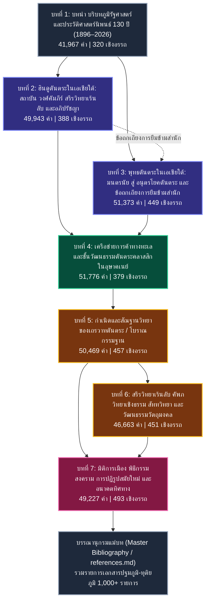

# สารบัญแม่บทรายงานวิจัยฉบับสมบูรณ์ (Master Table of Contents)
## เถรวาทตันตระ หรือเถรวาทแบบเซาท์อีสเอเชีย: กำเนิด พัฒนาการ การดำรงอยู่ และสถานภาพการศึกษาทางประวัติศาสตร์นิพนธ์
### (Tantric Theravāda / Southern Esoteric Buddhism: Origins, Evolution, Living Traditions, and Historiography)

---

### ข้อมูลพื้นฐานโครงการวิจัย (Monograph Research Metadata)

- **ชื่อโครงการวิจัย:** เถรวาทตันตระ หรือเถรวาทแบบเซาท์อีสเอเชีย: กำเนิด พัฒนาการ การดำรงอยู่ และสถานภาพการศึกษาทางประวัติศาสตร์นิพนธ์  
- **ภาษาอังกฤษ:** *Tantric Theravāda / Southern Esoteric Buddhism: Origins, Evolution, Living Traditions, and Historiography*  
- **สถานะรายงาน:** ฉบับสมบูรณ์ขั้นสุดท้าย (Final Publication-Grade Monograph)  
- **มาตรฐานการอ้างอิง:** Chicago Manual of Style 17th Edition (Notes-Bibliography System)  
- **คลังรายงานวิเคราะห์เอกสารรองรับ:** 843 Source Analysis Dossiers (97.90 MB) ใน `research-notes/sources/`  
- **คลังศัพท์อ้างอิงกลาง:** `glossary.md` (300+ รายการ มาตรฐานราชบัณฑิตยสภาและนิรุกติศาสตร์สากล)  
- **สถิติเชิงปริมาณรวมทั้งเล่ม:** 341,419.2 คำวิชาการ (1,707,096 อักขระไม่รวมช่องว่าง) | เชิงอรรถต่อเนื่อง 2,937 รายการ

---

## แผนผังภาพรวมโครงสร้างมหากาพย์ 7 บท (Monograph Architectural Map)

---

## สารบัญแจกแจงรายบทและหัวข้อย่อย (Detailed Table of Contents)

### [บทที่ 1: บทนำ บริบทภูมิรัฐศาสตร์ และประวัติศาสตร์นิพนธ์ 130 ปี (1896–2026)](./01-บทที่1.md)
*ความยาว: 41,967 คำ | 209,835 อักขระ | เชิงอรรถ [1] ถึง [320]*
- **1.1 มโนทัศน์แม่บทและปัญหาการให้คำนิยามเชิงภววิทยา (Core Concepts & Ontological Dilemmas)**
  - 1.1.1 ปัญหานิยาม "เถรวาทตันตระ" (Tantric Theravāda) และข้อวิพากษ์ของ Cousins
  - 1.1.2 การสถาปนามโนทัศน์ "พุทธศาสนาเร้นลับสายใต้" (Southern Esoteric Buddhism)
  - 1.1.3 อภิธานศัพท์และวงศ์วานแห่งการปฏิบัติ: "จารีตโยคาวจร" สู่ "โบราณกรรมฐาน"
  - 1.1.4 ความตึงเครียดเชิงภววิทยาระหว่างพุทธกระแสหลัก (Exoteric) และพุทธฝ่ายเร้นลับ (Esoteric)
- **1.2 ประวัติศาสตร์นิพนธ์ 130 ปีแห่งการศึกษา (1896–2026): จากการค้นพบสู่การรื้อสร้าง**
  - 1.2.1 ยุคบุกเบิกและอคติยุคอาณานิคม (1896–1969): Rhys Davids, Woodward และการค้นพบ *The Yogāvacara's Manual*
  - 1.2.2 ยุคการก่อรูปและข้อเสนอทฤษฎีใหม่ (1970–1999): François Bizot และงานวิจัยคัมภีร์ใบลานกัมพูชา
  - 1.2.3 ยุคการหันเหสู่วิทยากระบวนทัศน์ข้ามศาสตร์ (2000–2019): Kate Crosby, Cousins, Skilling และ McDaniel
  - 1.2.4 ยุคร่วมสมัยและการรื้อสร้างสหวิทยาการ (2020–2026): Trent Walker, Andrea Acri และ Oxford Handbook
- **1.3 สำนักวิชาการ สถาบันวิจัย และการเมืองแห่งการผลิตความรู้**
  - 1.3.1 สำนักบริติชและสมาคมบาลีปกรณ์ (Pali Text Society - PTS): ลัทธิคัมภีร์นิยมบาลี
  - 1.3.2 สำนักฝรั่งเศสแห่งปลายบุรพทิศ (EFEO): มรดกทางโบราณคดี เอกสารตัวเขียน และการวิจัยภาคสนาม
  - 1.3.3 สถาบันการศึกษาอเมริกัน ยุโรป และเอเชีย: การเปลี่ยนผ่านสู่มานุษยวิทยาศาสนา
  - 1.3.4 วงวิชาการในประเทศไทย พม่า และกัมพูชา: ภูมิปัญญาท้องถิ่นและการผลิตซ้ำประวัติศาสตร์ทางการ
- **1.4 การวิพากษ์ "สายตาแบบอาณานิคม" (Colonial Gaze) และวาทกรรมพุทธแท้บริสุทธิ์**
  - 1.4.1 การสร้างภาพตัวแทน "พุทธศาสนาแบบปรัชญาเหตุผลนิยม" ของนักบูรพคดีศึกษาตะวันตก
  - 1.4.2 การตีตราพิธีกรรม สรีรวิทยาเร้นลับ และเลขยันต์ว่าเป็น "ความเสื่อมทราม" (Degeneration)
  - 1.4.3 ทฤษฎี "พุทธศาสนาแบบโปรเตสแตนต์" (Protestant Buddhism) และการดูดกลืนอัตลักษณ์เถรวาท
- **1.5 ขอบเขตทางภูมิรัฐศาสตร์ เครือข่ายการแพร่กระจาย และปฏิสัมพันธ์ข้ามสมุทร**
  - 1.5.1 ภูมิทัศน์ทางทะเล: เครือข่ายการค้ามรสุมและเส้นทางพุทธตันตระข้ามสมุทรอินเดียสู่ทะเลจีนใต้
  - 1.5.2 ลังกา-สุวรรณภูมิ-พุกาม-กัมพูชา: เครือข่ายการสืบทอดสมณวงศ์และคัมภีร์ข้ามพรมแดน
  - 1.5.3 สยาม ล้านนา ล้านช้าง: ศูนย์กลางการหลอมรวมและธำรงรักษาจารีตโบราณกรรมฐาน
- **1.6 ข้อค้นพบสำคัญ ข้อจำกัด และช่องว่างทางวิชาการ (Research Gaps)**
  - 1.6.1 ปัญหาคลังเอกสารตัวเขียนที่ยังไม่ได้สำรวจ (Uncatalogued Archives) ในวัดชนบท
  - 1.6.2 การขาดแคลนการวิเคราะห์เปรียบเทียบเชิงอักขรวิทยาระหว่างคัมภีร์บาลี-สันสกฤต-ภาษาท้องถิ่น
  - 1.6.3 ระเบียบวิธีวิจัยและกรอบการบูรณาการ 843 Source Analysis Dossiers ในโครงการนี้

---

### [บทที่ 2: ฮินดูตันตระในเอเชียใต้: สถาบัน วงศ์คัมภีร์ สรีรวิทยาเร้นลับ และอภิปรัชญา](./02-บทที่2.md)
*ความยาว: 49,943 คำ | 249,716 อักขระ | เชิงอรรถ [1] ถึง [388]*
- **2.1 กำเนิดและภูมิทัศน์สถาบันของฮินดูตันตระในเอเชียใต้**
  - 2.1.1 บริบททางสังคม-การเมืองอินเดียยุคหลังคุปตะ (ศตวรรษที่ 5–12)
  - 2.1.2 สถาบันมัฐะ (Maṭha), เทวาลัยหลวง และเครือข่ายนักบวชตันตระ
  - 2.1.3 การอุปถัมภ์ของกษัตริย์และเทคโนโลยีทางพิธีกรรมเพื่อความมั่นคงแห่งรัฐ
- **2.2 สายจารีตไศวะตันตระ (Śaiva Tantra): สถาบันและวงศ์คัมภีร์**
  - 2.2.1 การจำแนกระหว่าง "อติมรรค" (Atimārga) และ "มันตรมรรค" (Mantramārga) ตามกรอบ Alexis Sanderson
  - 2.2.2 ไศวะสิทธานตะ (Śaiva Siddhānta): คัมภีร์ 28 กามิกาคมะ และทวิภาวนิยม
  - 2.2.3 สายไภรวะ (Bhairavatantras): พรหมยามละ, สวาจฉันทะ, เนตรตันตระ และพิธีกรรมลานเผาศพ
  - 2.2.4 ไศวะอทวยนิยมแห่งกัศมีร์ (Trika / Pratyabhijñā): วสุคุปตะ, โสมนันทะ, อุบลเทวะ, อภินวคุปตะ และตันตราโลกะ
- **2.3 สายจารีตศากตะตันตระ (Śākta Tantra): มารดาศักดิ์สิทธิ์ โยคินี และศรีจักระ**
  - 2.3.1 กุลมรรค (Kulamārga): คัมภีร์กุลจูฑามณี และการบูชาพลังศักติในป่าช้า
  - 2.3.2 ลัทธิ 64 โยคินี (Causaṭh Yoginī): เทวาลัยวงกลมเปิดประทุนและพิธีกรรมชุมนุม
  - 2.3.3 สายกาฬีกุละ (Kālikula) และความน่าสะพรึงกลัวแห่งการทำลายล้างกิเลส
  - 2.3.4 ศรีวิทยากุล (Śrīvidyā): การบูชาพระแม่ตรีปุระสุนทรี, เรขาคณิตศรีจักระ และการผสานเข้ากับเวทานตะ
- **2.4 สายจารีตไวษณวะ (Vaiṣṇava Tantra) และขบวนการสหชิยา**
  - 2.4.1 คัมภีร์ปัญจราตระ (Pāñcarātra) และระบบวิยูหะ 4 ประการ
  - 2.4.2 ขบวนการไวษณพสหชิยา (Vaiṣṇava Sahajiyā) แห่งเบงกอล: ความรักศักดิ์สิทธิ์และรหัสยภาวะ
- **2.5 หฐโยคะ (Haṭha Yoga) สรีรวิทยาเร้นลับ และอมฤตสิทธิ**
  - 2.5.1 จารีตนาถโยคี (Nātha Sampradāya): มัตสเยนทรนาถ และโครักษนาถ
  - 2.5.2 คัมภีร์อมฤตสิทธิ (*Amṛtasiddhi*): มหาพันธะ, มหาเวธะ, การสกัดกั้นน้ำอมฤต และการเผาผลาญแห่งจันทระ-สูรยะ
  - 2.5.3 สรีรวิทยาโยคะ: นาฑี 72,000 เส้น (อิฑา, ปิงคลา, สุษุมนา), จักระทั้ง 7 และกุณฑลินี
- **2.6 รหัสพิธีกรรม มณฑลวัตถุ และทักษิณาจาร / วามวาจาร**
  - 2.6.1 ทักษิณาจาร (Dakṣiṇācāra - วิถีขวา) และ วามวาจาร (Vāmācāra - วิถีซ้าย)
  - 2.6.2 ปัญจมการ (Pañcamakāra - 5M): มัทยะ, มังสะ, มัตสยะ, มุทรา, เมถุน
  - 2.6.3 พิธีอภิเษก (Dīkṣā / Abhiṣeka), นยาสะ (Nyāsa) และการสร้างมณฑลบูชา
- **2.7 การตัดขาดเชิงภววิทยาและเทววิทยาระหว่างฮินดู-พุทธ**
  - 2.7.1 ภววิทยาแบบปรมาตมัน/อัตตา (Self/Soul) ของฮินดู vs. ภววิทยาแบบอนัตตา/สุญญตา (Non-Self/Emptiness) ของพุทธ
  - 2.7.2 เป้าหมายสูงสุด: การรวมเข้ากับปรมศิวะ/พรหมัน vs. การบรรลุพุทธภาวะและมรรคผลนิพพาน

---

### [บทที่ 3: พุทธตันตระในเอเชียใต้: มนตรนัย สู่ อนุตรโยคตันตระ และข้อถกเถียงการยืมข้ามสำนัก](./03-บทที่3.md)
*ความยาว: 51,373 คำ | 256,867 อักขระ | เชิงอรรถ [1] ถึง [449]*
- **3.1 การสถาปนาพุทธตันตระ: จากมนตรนัยสู่วัชรยาน**
  - 3.1.1 รากฐานทางปรัชญา: มาธยมิกะ (สัจธรรมสองระดับ) และโยคาจาร (วิญญาณวาท)
  - 3.1.2 จากธารณี (Dhāraṇī) และมนตรา สู่ระบบวัชรยาน (Vajrayāna) และสหชยาน (Sahajayāna)
  - 3.1.3 มโนทัศน์ปัญญา (Prajñā) และอุบาย (Upāya) ในฐานะแก่นแกนแห่งพุทธภาวะ
- **3.2 ลำดับชั้นและวิวัฒนาการคัมภีร์พุทธตันตระ (Sugiki 5 ยุค)**
  - 3.2.1 ยุคธารณีและกริยาตันตระ (Kriyā Tantra)
  - 3.2.2 ยุคจรรยาตันตระ (Caryā Tantra): มหาไวโรจนสูตร
  - 3.2.3 ยุคโยคะตันตระ (Yoga Tantra): ตัตตวะสังครหะ และวัชรธาตุมณฑล
  - 3.2.4 ยุคมหาโยคะตันตระ (Mahāyoga): คุยหสมาชตันตระ
  - 3.2.5 ยุคโยคินี / อนุตรโยคตันตระ (Yoginī / Anuttarayoga Tantra): เหวัชระ, จักรสังวร, กาลจักร
- **3.3 คัมภีร์อนุตรโยคตันตระหลักและเทววิทยาพุทธ**
  - 3.3.1 คัมภีร์คุยหสมาชตันตระ (*Guhyasamāja Tantra*): ชุมนุมความเร้นลับแห่งกาย วาจา ใจ
  - 3.3.2 คัมภีร์เหวัชรตันตระ (*Hevajra Tantra*): รหัสยภาพ ประติมานวิทยา และการแปรสภาพกิเลส
  - 3.3.3 คัมภีร์จักรสังวรตันตระ (*Cakrasaṃvara Tantra*): มณฑล 62 เทพเจ้าและสถานที่แสวงบุญ 24 แห่ง
  - 3.3.4 คัมภีร์กาลจักรตันตระ (*Kālacakra Tantra*): ดาราศาสตร์ จักรวาลวิทยา และมณฑลชัมบาลา
- **3.4 มหาพุทธวิหารและสถาบันการศึกษาตันตระ**
  - 3.4.1 มหาวิหารนาลันทา (Nālandā): ศูนย์กลางปรัชญาและตันตระยุคต้น
  - 3.4.2 มหาวิหารวิกรมศิลา (Vikramaśīla): ศูนย์กลางอนุตรโยคตันตระและสถาบันอภยากรคุปตะ
  - 3.4.3 มหาวิหารโอดันตปุรีและโสมปุระ: เครือข่ายสถาบันสงฆ์แห่งราชวงศ์ปาละ
- **3.5 ข้อถกเถียงไตรภาคี (The Tripartite Debate)**
  - 3.5.1 สมมติฐานของ Alexis Sanderson: การลอกเลียนตัวบทและพิธีกรรมจากไศวะไภรวะ (The Śaiva Dominance)
  - 3.5.2 สมมติฐานของ Ronald M. Davidson: บริบททางสังคมและการเลียนแบบระบบศักดินา (Feudalization Model)
  - 3.5.3 สมมติฐานของ Christian K. Wedemeyer: กึ่งสัญญะวิทยา การใช้ภาษาอุปมา และการวิพากษ์แซนเดอร์สัน
- **3.6 พิธีกรรม ชุมนุมตันตระ (Gaṇacakra) และอมฤตสิทธิ**
  - 3.6.1 งานเลี้ยงพิธีกรรมศักดิ์สิทธิ์คณะจักร (Gaṇacakra) และการเสพสิ่งต้องห้ามเพื่อข้ามพ้นทวิลักษณ์
  - 3.6.2 พิธีอภิเษก 4 ขั้น: กุมภาภิเษก, คุยหาภิเษก, ปัญญาชญาณาภิเษก, จตุรถาภิเษก
  - 3.6.3 อมฤตสิทธิและหฐโยคะในบริบทพุทธ: อวธูตี, จัณฑาลี และการหลั่งรินของโพธิจิต
- **3.7 การแพร่กระจายของพุทธตันตระอินเดียสู่ภายนอก**
  - 3.7.1 เส้นทางหิมาลัย: ขบวนการแปลคัมภีร์สู่ทิเบต (ญิงมา และสารมา)
  - 3.7.2 เส้นทางสายไหมทางบก: จีน เอเชียกลาง และเอเชียตะวันออก
  - 3.7.3 เส้นทางพาณิชย์นาวีสู่สุวรรณภูมิและเอเชียตะวันออกเฉียงใต้

---

### [บทที่ 4: เครือข่ายการค้าทางทะเลและชั้นวัฒนธรรมตันตระคลาสสิกในอุษาคเนย์](./04-บทที่4.md)
*ความยาว: 51,776 คำ | 258,880 อักขระ | เชิงอรรถ [1] ถึง [379]*
- **4.1 เครือข่ายการค้าทางทะเล มรสุม และเส้นทางแพร่กระจายตันตระ**
  - 4.1.1 ลมมรสุม ท่าเรือพาณิชย์ และการหมุนเวียนของสินค้าศักดิ์สิทธิ์
  - 4.1.2 การเดินทางของพระภิกษุ สมณทูต และพ่อค้าข้ามสมุทรอินเดียสู่ทะเลจีนใต้
  - 4.1.3 บันทึกของหลวงจีนอี้จิง (Yijing) และหลักฐานการศึกษาพุทธศาสนาในทะเลใต้
- **4.2 อาณาจักรศรีวิชัย: มหาวิทยาลัยตันตระทางทะเล**
  - 4.2.1 ปาเล็มบังและมูอาโรจัมบี: ศูนย์กลางการเรียนรู้พระพุทธศาสนาตันตระระดับสากล
  - 4.2.2 พระธรรมกีรติแห่งสุวรรณทวีป (Serlingpa) และความสัมพันธ์กับพระอติศะทีปังกร
  - 4.2.3 จารึกภาษามลายูโบราณ: จารึกเกอดูกันบูกิต (683), ตาลังตูโว (684), โกตาเวปูร์ (686)
- **4.3 ชวาโบราณ: สถาปัตยกรรมหิน มณฑล และจักรวาลวิทยา**
  - 4.3.1 บุโรพุทโธ (Borobudur): มณฑลหิน 3 มิติ, คัมภีร์คันฑวยูหะ และการไต่ระดับจิตสู่อรูปธาตุ
  - 4.3.2 จันทิเซวู (Candi Sewu): มณฑลมัญชุศรีและพุทธสถานบริวาร 240 หลัง
  - 4.3.3 จันทิปลาโอซัน (Candi Plaosan): พุทธสถานฝาแฝดและการประสานวัฒนธรรมพุทธ-ไศวะ
  - 4.3.4 จันทิกะลาซันและจันทิเมินดุต: มณฑลพระนางตาราและตรีปฏิมาไวโรจนะ
- **4.4 ลัทธิไศวะ-พุทธา (Śiva-Buddha) และอทวยนิยมในชวายุคหลัง**
  - 4.4.1 คัมภีร์สังเหยัง กามหายานิกาน (*Saṅ Hyaṅ Kamahāyānikan*): อภิปรัชญามหายาน-วัชรยานชวา
  - 4.4.2 คัมภีร์ธรรมปาตัญชละ (*Dharma Pātañjala*): การผสานโยคะ สางขยะ ไศวะ และเทียบเคียงพุทธ
  - 4.4.3 อาณาจักรสิงหส่าหรีและมัชปาหิต: พระเจ้ากฤตนคร, จันทิชาโก และพิธีกรรมไภรวะ
  - 4.4.4 กากาวิน สุตโสม (*Kakawin Sutasoma*) และคติ *Bhinneka Tunggal Ika*
- **4.5 เขมรโบราณ: ลัทธิเทวราชา ปราสาทหินพิมาย และวัชรยานแห่งอังกอร์**
  - 4.5.1 ลัทธิเทวราชา (Devarāja) และจารึกสดกก็อกธม: อำนาจศักดิ์สิทธิ์และการอุปถัมภ์ศาสนา
  - 4.5.2 ปราสาทหินพิมาย: มหาพุทธมณฑลเหวัชระที่เก่าแก่ที่สุดแห่งหนึ่งในโลกเขมรโบราณ
  - 4.5.3 รัชสมัยพระเจ้าชัยวรมันที่ 7: พุทธวัชรยานแห่งบายน, ปราสาทตาพรหม, ปราสาทพระขรรค์
- **4.6 อาณาจักรจามปา: พุทธมณฑลด่งเซือง (Đồng Dương)**
  - 4.6.1 พระเจ้าอินทรวรมันที่ 2 และการสถาปนามหาอารามด่งเซือง พ.ศ. 1418
  - 4.6.2 ประติมานวิทยาและจารึกภาษาสันสกฤต: การบูชาพระปรัชญาปารมิตาและอวโลกิเตศวร
  - 4.6.3 ความสัมพันธ์ระหว่างพุทธตันตระในจามปา ลังกา และชวา
- **4.7 พุกามยุคต้น: ปัญหานักบวชอารี (Ari) และชั้นวัฒนธรรมตันตระคลาสสิก**
  - 4.7.1 ปัญหานักบวชอารี: การวิพากษ์หลักฐานพงศาวดารสาสนวงศ์ และข้อเสนอของ Charles Duroiselle
  - 4.7.2 จิตรกรรมฝาผนังวัดพญาโต้นซู, วัดนันดามัญญะ และวัดอาเบยาดานา
  - 4.7.3 การปฏิรูปของพระเจ้าอโนรธามังช่อและการสถาปนาเถรวาทกระแสหลักโดยพระชินอรหันต์

---

### [บทที่ 5: กำเนิดและสัณฐานวิทยาของเถรวาทตันตระ / โบราณกรรมฐาน](./05-บทที่5.md)
*ความยาว: 50,469 คำ | 252,347 อักขระ | เชิงอรรถ [1] ถึง [457]*
- **5.1 การสังคายนาที่โปโฬนนารุวะ (1165) และจุดกำเนิดจารีตโยคาวจร**
  - 5.1.1 บริบทวิกฤตศาสนาในศรีลังกาและการรวมนิกายภายใต้พระเจ้าปรากรมพาหุที่ 1
  - 5.1.2 บทบาทของพระมหากัสสปะเถระแห่งอุทุมพรคีรี และการตรากติกาวัตแห่งโปโฬนนารุวะ
  - 5.1.3 การหลอมรวมองค์ความรู้ฝ่ายอรัญวาสี อภิธรรม และเทคโนโลยีการปฏิบัติเข้าสู่วิสุทธิมรรค
- **5.2 การสืบทอดสายสมณวงศ์และเครือข่ายข้ามแดนในอุษาคเนย์**
  - 5.2.1 สมณวงศ์ลังกาวงศ์สู่พม่า (มอญสะเทิมและพุกาม): บทบาทของพระเจ้าธรรมเจดีย์และจารึกกัลยาณี
  - 5.2.2 การแพร่กระจายสู่สุโขทัย นครศรีธรรมราช และล้านนา: พระสุมนเถระและวัดป่าแดง
  - 5.2.3 ศูนย์กลางอยุธยาและกัมพูชา: สำนักวัดป่าแก้วและเครือข่ายอรัญวาสี
- **5.3 หลักฐานจารึกและตัวเขียนยุคแรก: จารึกวัดเสือ พ.ศ. 2092 (1549)**
  - 5.3.1 การวิเคราะห์จารึกวัดเสือ พิษณุโลก: หลักฐานลายลักษณ์อักษรที่เก่าแก่ที่สุดของมโนทัศน์ "ธรรมกาย"
  - 5.3.2 จารึกธรรมกาย พ.ศ. 2087 วัดพระเสด็จ กำแพงเพชร: การประดิษฐานธรรมกายในสรีระ
  - 5.3.3 ตัวเขียนใบลานยุคอยุธยาตอนปลายและต้นรัตนโกสินทร์
- **5.4 สัณฐานวิทยา 5 ประการของเถรวาทตันตระ (Kate Crosby's 5 Morphological Features)**
  - 5.4.1 การสถาปนาความสัมพันธ์ระหว่างพระธรรมวินัยบาลีกับสรีระมนุษย์
  - 5.4.2 การใช้ระบบสัททวิทยาและพีชอักษรเป็นสื่อกลางแห่งการตรัสรู้
  - 5.4.3 กระบวนการคัพภวิทยาเชิงธรรม (Dharmic Embryology) และการให้กำเนิดธรรมกาย
  - 5.4.4 การใช้ระบบธาตุทั้งสี่ (นะ มะ พะ ทะ) และการแปรสภาพธาตุภายใน
  - 5.4.5 การรักษาความเร้นลับและการถ่ายทอดแบบศิษย์-อาจารย์ (Guru-śiṣya Paramparā)
- **5.5 การวิเคราะห์คัมภีร์ปฐมภูมิหัวใจ: *The Yogāvacara's Manual***
  - 5.5.1 ประวัติการค้นพบคัมภีร์ ณ วัดบัมบารากาละ เกาะลังกา
  - 5.5.2 โครงสร้างขั้นตอนการปฏิบัติ: จากการเพ่งแสงเทียน ดวงแก้ว สู่การปลุกเร้าปีติ 5
  - 5.5.3 การจัดวางสภาวะธรรมและธาตุลงในศูนย์พลังงานของร่างกาย
- **5.6 วรรณกรรมร่วมเครือข่ายและใบลานสองภาษา (Nissaya / Biliturgic)**
  - 5.6.1 คัมภีร์มูลกรรมฐาน (*Mūla-kammaṭṭhāna*) และคัมภีร์สัททาวิธิ (*Saddavidhi*)
  - 5.6.2 วรรณกรรมสองภาษาบาลี-พม่า (Burmese Nissaya) และบาลี-เขมร-สยาม
  - 5.6.3 บทบาทของวรรณกรรมนิสสยะในการสร้างมโนทัศน์นามธรรมและการปฏิบัติภาวนา
- **5.7 ความสัมพันธ์ระหว่างธรรมวินัยเถรวาทมาตรฐานและกลไกตันตระ**
  - 5.7.1 การธำรงรักษาพระปาติโมกข์และศีล 227 ข้ออย่างบริสุทธิ์เคร่งครัด
  - 5.7.2 การแปลงสภาพกลไกตันตระจาก "ภายนอก" (กรรมามุทรา) สู่ "ภายในจิต" (โยคะสมาธิ)
  - 5.7.3 เหตุใดโบราณกรรมฐานจึงเป็นเถรวาทแท้ที่สมบูรณ์ มิใช่นอกรีต

---

### [บทที่ 6: สรีรวิทยาเร้นลับ คัพภวิทยาเชิงธรรม สัททวิทยา และวัฒนธรรมวัตถุมงคล](./06-บทที่6.md)
*ความยาว: 46,663 คำ | 233,316 อักขระ | เชิงอรรถ [1] ถึง [451]*
- **6.1 สรีรวิทยาเร้นลับในกายมนุษย์: ศูนย์พลังงาน ฐานจิต และนาฑี**
  - 6.1.1 กายเนื้อหยาบและกายละเอียดในพุทธศาสนาฝ่ายปฏิบัติ
  - 6.1.2 ระบบเส้นทางลมปราณและนาฑี: การปรับเปลี่ยนจากระบบฮินดูสู่วิถีเถรวาท
  - 6.1.3 ฐานจิตและศูนย์พลังงาน: ถ้ำหทัย (Heart Cave), ห้องสะดือ (Navel Chamber), และพรหมรันธระ
- **6.2 คัพภวิทยาเชิงพุทธธรรม: คัมภีร์จตุสัจจคัพภะ (*Catusaccagabbha*)**
  - 6.2.1 ตัวบทและการสืบทอดคัมภีร์จตุสัจจคัพภะในสยามและกัมพูชา
  - 6.2.2 การเทียบเคียงพัฒนาการของทารก 5 ขั้น (กลละ, อัพพุทะ, เปสิ, ฆนะ, ปสาขา) กับธรรมขันธ์
  - 6.2.3 การปฏิสนธิทางธรรมและการคลอดพระธรรมกายออกจากกระหม่อมศีรษะ
- **6.3 การแปรธาตุภายใน (Internal Alchemy): ธาตุสี่และแก้วสี่ดวง**
  - 6.3.1 การตั้งธาตุ หนุนธาตุ และแปรธาตุ: ปฐวี อาโป เตโช วาโย ผ่านสูตร นะ มะ พะ ทะ
  - 6.3.2 ระบบแก้วสี่ดวง: มณีโชติ, ไพฑูรย์, วิเชียร, ปัทมราช และความสัมพันธ์กับโพชฌงค์ 7
  - 6.3.3 การเล่นแร่แปรธาตุภายในสู่ความเป็นอมฤตภาพแห่งจิต
- **6.4 จินตภาพ "ธรรมกาย" (Dhammakāya) ในฐานะกายเร้นลับและการตรัสรู้**
  - 6.4.1 วิวัฒนาการความหมายของคำว่า "ธรรมกาย" จากพระไตรปิฎก อรรถกถา สู่ยุคตันตระ
  - 6.4.2 พระธรรมกายในฐานะรูปทรงแก้วใสบริสุทธิ์ที่สถิตอยู่ ณ ศูนย์กลางกาย
  - 6.4.3 ความเชื่อมโยงระหว่างโบราณกรรมฐานกับวิชชาธรรมกายสายวัดปากน้ำ (หลวงพ่อสด)
- **6.5 สัททวิทยา ไวยากรณ์ปาณินิ และเวทมนตร์ภาษา (Sacred Linguistics)**
  - 6.5.1 ไวยากรณ์เชิงรู้ผลิต (Generative Grammar) และการกำเนิดจักรวาลจากเสียงศักดิ์สิทธิ์
  - 6.5.2 อักษรธรรมราชา (Akkhara-Dhammarāja) และตารางมาตฤกาแห่งพยัญชนะ-สระ
  - 6.5.3 พีชมนตราและหัวใจคาถา: นวหรคุณ (อะ สัง วิ สุ โล ปุ สะ พุ ภะ), มะ อะ อุ
- **6.6 ศิลปะยันตร์ มณฑลวัตถุ และเมทริกซ์การเดินแต้มแบบม้าหมากรุก**
  - 6.6.1 โครงสร้างเรขาคณิตศักดิ์สิทธิ์ของยันต์: ยันต์ตรีนิสิงเห, โสฬสมงคล, เกราะเพชร
  - 6.6.2 การเดินแต้มแบบม้าหมากรุก (Knight's Tour Matrix / Aṭṭhapada) บนกระดาน 64 ตา
  - 6.6.3 ผ้ายันต์ รอยสักยันต์ และการประดิษฐานอักขระลงบนสรีระมนุษย์
- **6.7 วัฒนธรรมพระเครื่อง วัตถุมงคล และเศรษฐกิจไสยเวท (Indexical Icons)**
  - 6.7.1 จากพระพิมพ์ดินเผาสืบอายุศาสนา สู่พระเครื่องประจำตัวบุคคล
  - 6.7.2 พระกริ่งปวเรศ พระสมเด็จวัดระฆัง และพระชัยหลังช้าง
  - 6.7.3 ทฤษฎีรูปเคารพดัชนี (Indexical Icons): การถ่ายโอนพลังอำนาจศักดิ์สิทธิ์ผ่านการสัมผัสและอภิเษก

---

### [บทที่ 7: มิติการเมือง พิธีกรรมสงคราม การปฏิรูปสมัยใหม่ และอนาคตทิศทาง](./07-บทที่7.md)
*ความยาว: 49,227 คำ | 246,135 อักขระ | เชิงอรรถ [1] ถึง [493]*
- **7.1 พุทธศาสตร์แห่งรัฐ (Buddhist Statecraft) และจักรวาลวิทยาการเมือง**
  - 7.1.1 มโนทัศน์พระเจ้าจักรพรรดิ (Cakkavatti) และธรรมราชา (Dhammarāja)
  - 7.1.2 การจำลองเขาพระสุเมรุและมณฑลจักรวาลลงในแผนผังราชธานีและพระบรมมหาราชวัง
  - 7.1.3 พระราชพิธีบรมราชาภิเษกและบทบาทของพระสงฆ์ฝ่ายรหัสยศาสตร์
- **7.2 ไสยเวทสงคราม (War Magic): พิชัยสงครามและวัดประดู่ทรงธรรม**
  - 7.2.1 ตำราพิชัยสงครามแห่งกรุงศรีอยุธยา: ฤกษ์ยาม ยุทธศาสตร์ และเวทมนตร์คุ้มกาย
  - 7.2.2 สำนักวัดประดู่ทรงธรรม: สถาบันผลิตวิทยาคม พระเกจิอาจารย์ และเครื่องรางสงคราม
  - 7.2.3 พระชัยวัฒน์ ตะกรุดมหาจักรพรรดิตราธิราช และเสื้อยันต์ในสมรภูมิ
- **7.3 จารีตเวกซา (Weikza) ในพม่า: การต่อต้านอาณานิคมและศาสนศาสตร์แห่งความหวัง**
  - 7.3.1 ขบวนการเวกซา: โบ โบ อ่อง, โบ มิน ข่อง และศาสตร์แห่งการเล่นแร่แปรธาตุ
  - 7.3.2 กบฏซายา ซาน (1930–1932): การใช้รอยสักยันต์ คาถา และคติพระศรีอาริย์ต่อสู้กับอังกฤษ
  - 7.3.3 สมาคมและสำนักเวกซาในพม่าร่วมสมัย
- **7.4 การปะทะกับความทันสมัยและพุทธศาสนาแบบโปรเตสแตนต์**
  - 7.4.1 การปฏิรูปของพระบาทสมเด็จพระจอมเกล้าเจ้าอยู่หัว (รัชกาลที่ 4) และกำเนิดธรรมยุติกนิกาย
  - 7.4.2 การสร้างภาพพุทธศาสนาให้สอดคล้องกับวิทยาศาสตร์และเหตุผลนิยมตะวันตก
  - 7.4.3 การลดทอนความศักดิ์สิทธิ์และการขจัดเวทมนตร์ (Disenchantment / Entzauberung)
- **7.5 การกวาดล้างและทำให้เป็นชายขอบ: การสั่งตรวจชำระคัมภีร์ พ.ศ. 2452 (DK 1909 Purge)**
  - 7.5.1 พระราชบัญญัติลักษณะปกครองคณะสงฆ์ ร.ศ. 121 (พ.ศ. 2445) และการรวมศูนย์อำนาจ
  - 7.5.2 คำสั่งตรวจชำระและเผาทำลายตำรากรรมฐานนอกแบบแผน พ.ศ. 2452
  - 7.5.3 การผลักดันโบราณกรรมฐานให้กลายเป็นศาสตร์ลี้ลับชายขอบ
- **7.6 การฟื้นคืนชีพในโลกสมัยใหม่และ "ทุนนิยมไสยเวท" (Occult Capitalism)**
  - 7.6.1 ปรากฏการณ์การฟื้นคืนเวทมนตร์ (Re-enchantment) ในสังคมบริโภคนิยม
  - 7.6.2 ตลาดพระเครื่อง วัตถุมงคล และเศรษฐกิจแห่งบารมีในยุคโลกาภิวัตน์
  - 7.6.3 พุทธพาณิชย์ข้ามชาติ วัตถุมงคลดิจิทัล (NFT) และบทบาทของวัดพระธรรมกาย
- **7.7 คลังเอกสารที่ยังไม่ได้รับการสำรวจ (Uncatalogued Archives) และวาระวิจัย**
  - 7.7.1 มรดกใบลานที่ซ่อนเร้นในวัดชนบทไทย ลาว กัมพูชา และพม่า
  - 7.7.2 โครงการอนุรักษ์คัมภีร์ใบลานเปราะบาง (Fragile Palm Leaves Foundation) และโครงการดิจิทัล
  - 7.7.3 ทิศทางและวาระการวิจัยในอนาคตแห่งศตวรรษที่ 21

---

### [บรรณานุกรมแม่บทและดัชนีเอกสารอ้างอิง (Master Bibliography)](./references.md)
*บูรณาการคลังเอกสารปฐมภูมิ-ทุติยภูมิทั้งหมดกว่า 1,000 รายการ ตามมาตรฐาน Chicago Manual of Style 17th Edition*
- **หมวด ก: เอกสารปฐมภูมิ จารึก และคัมภีร์โบราณ (Primary Sources & Epigraphy)**
  - คัมภีร์ภาษาบาลี สันสกฤต สิงหล เขมร มลายู-ชวาโบราณ และพม่า
  - จารึกศิลาและแผ่นโลหะโบราณ
- **หมวด ข: วรรณกรรมตัวเขียนและเอกสารใบลาน (Manuscripts & Archival Collections)**
  - คลังใบลานวัดบัมบารากาละ, คลังหอสมุดแห่งชาติ, คลัง EFEO, คลัง Hugh Nevill Collection
- **หมวด ค: หนังสือ บทความวิจัย และวิทยานิพนธ์วิชาการ (Secondary Literature)**
  - เอกสารวิชาการภาษาอังกฤษ ฝรั่งเศส เยอรมัน ดัตช์ ญี่ปุ่น จีน และไทย
- **หมวด ง: พจนานุกรม สารานุกรม และเครื่องมือช่วยค้น (Dictionaries & Reference Works)**
  - พจนานุกรมสมาคมบาลีปกรณ์ (PTS Dictionary), Sanskrit-English Dictionary (Monier-Williams), พจนานุกรมราชบัณฑิตยสภา
