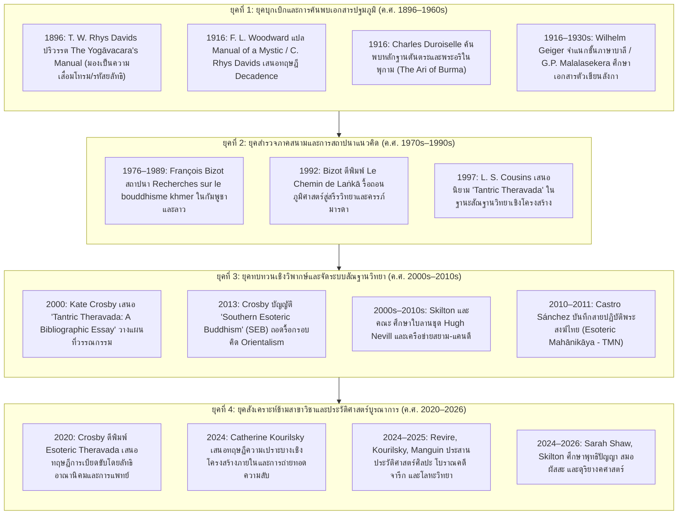

# บทที่ 1: บทนำ บริบทภูมิรัฐศาสตร์ และประวัติศาสตร์นิพนธ์ 130 ปี (1896–2026)
(Introduction, Geopolitical Framework, and 130 Years of Historiography: 1896–2026)

---

## บทนำประจำบท (Executive Chapter Introduction)

รายงานวิจัยแม่บทฉบับนี้มีเป้าหมายเพื่อบุกเบิกและประมวลสถานภาพความรู้เชิงวิชาการว่าด้วย **"เถรวาทตันตระ หรือเถรวาทแบบเซาท์อีสเอเชีย: กำเนิด พัฒนาการ การดำรงอยู่ และสถานภาพการศึกษาทางประวัติศาสตร์นิพนธ์"** ซึ่งถือเป็นหนึ่งในปรากฏการณ์ทางจิตวิญญาณ วัฒนธรรมตัวเขียน และสรีรวิทยาเชิงสัญลักษณ์ที่สลับซับซ้อนและทรงอิทธิพลสูงสุดในประวัติศาสตร์พุทธศาสนาแห่งภูมิภาคเอเชียใต้และเอเชียตะวันออกเฉียงใต้ ตลอดระยะเวลากว่าหนึ่งศตวรรษครึ่งที่ผ่านมา ภาพตัวแทนของพุทธศาสนาเถรวาทในความรับรู้ของวงวิชาการสากลและสาธารณชน มักถูกประกอบสร้างขึ้นภายใต้กระบวนทัศน์แบบ "พุทธปรัชญาเหตุผลนิยมบริสุทธิ์" (Pristine Rationalist Buddhism) ซึ่งมองพระพุทธศาสนาเป็นระบบจริยศาสตร์เชิงประจักษ์ที่ปราศจากพิธีกรรม เวทมนตร์ หรือมิติรหัสยลัทธิ ทว่าการค้นพบและการสังเคราะห์หลักฐานเชิงประจักษ์ข้ามสาขาวิชาในรอบไม่กี่ทศวรรษที่ผ่านมา—นับตั้งแต่เอกสารตัวเขียนใบลาน สมุดข่อย พับสา ศิลาจารึก ประติมาวิทยา ไปจนถึงประเพณีมุขปาฐะของสายครูกรรมฐาน—ได้เปิดเผยความจริงอันน่าตื่นตะลึงว่า ก่อนหน้าคลื่นการปฏิรูปศาสนาสู่ความทันสมัยในคริสต์ศตวรรษที่ 19 โลกพุทธศาสนาเถรวาทในเอเชียตะวันออกเฉียงใต้และศรีลังกาเคยถูกครอบงำและขับเคลื่อนด้วยระบบการปฏิบัติธรรมเร้นลับที่มีลักษณะเฉพาะทางสัณฐานวิทยา ซึ่งผสานคัมภีร์พระอภิธรรม สรีรวิทยาเชิงสัญลักษณ์ คัพภวิทยาเชิงธรรม การใช้อักขระมนตรา และการแปรสภาพธาตุภายในร่างกายเข้าเป็นระบบการหลุดพ้นอันสมบูรณ์ในตนเอง

บทที่ 1 นี้ทำหน้าที่เป็น "พิมพ์เขียวแม่บทและหมุดหมายตั้งต้นทางญาณวิทยา" สำหรับการศึกษารายงานวิจัยทั้งระบบ โดยจัดแบ่งโครงสร้างการวิเคราะห์ออกเป็น 6 ส่วนหลักที่มีความเชื่อมโยงร้อยเรียงกันอย่างเป็นเอกภาพ:

ใน **ส่วนที่ 1.1 (มโนทัศน์แม่บทและปัญหาการให้คำนิยามเชิงภววิทยา)** รายงานจะชำแหละรากเหง้าของปัญหาการให้คำนิยามต่อปรากฏการณ์นี้ โดยเปรียบเทียบพัฒนาการและความหมายของชุดคำนิยามหลัก ได้แก่ "พุทธศาสนาลี้ลับ" (Esoteric Buddhism ของ Sinnett 1883), "เถรวาทตันตระ" (Tantric Theravāda ของ Bizot 1976), "พุทธศาสนาลี้ลับสายใต้" (Southern Esoteric Buddhism ของ Cousins 1997, 2022), "จารีตโยคาวจร" (Yogāvacara Tradition ของ Crosby 2000), ตลอดจนคำนิยามจากภายในของผู้ปฏิบัติเองว่า "โบราณกรรมฐาน" (Borān Kammaṭṭhāna ของ Crosby 2020) พร้อมทั้งวิเคราะห์ทฤษฎีว่าด้วยพระอภิธรรมในฐานะระบบปฏิบัติการที่เชื่อมประสานวิทยาการโบราณ และการรื้อถอนกรอบคิดทวิภาวะระหว่างฝ่ายจารีตกับฝ่ายปฏิรูป

ใน **ส่วนที่ 1.2 (ประวัติศาสตร์นิพนธ์ 130 ปีแห่งการศึกษา: 1896–2026)** รายงานจะติดตามเส้นทางวิวัฒนาการทางวิชาการตลอด 130 ปี โดยจำแนกออกเป็น 4 ยุคสมัยสำคัญ: ยุคบุกเบิกและการค้นพบเอกสารปฐมภูมิ (1896–1960s) ผ่านงานของ Rhys Davids, Woodward, Duroiselle, และ Geiger; ยุคสำรวจภาคสนามและการสถาปนาแนวคิด (1970s–1990s) ผ่านการบุกเบิกของ François Bizot ในกัมพูชาและลาว; ยุคทบทวนเชิงวิพากษ์และจัดระบบสัณฐานวิทยา (2000s–2010s) ผ่านงานของ Crosby, Cousins, Lamotte, และ Cox; และยุคสังเคราะห์ข้ามสาขาวิชาและประวัติศาสตร์บูรณาการ (2020–2026) ซึ่งประสานข้อมูลจากจารึกวิทยา เอกสารตัวเขียน ดุริยางคศาสตร์ และประวัติศาสตร์ศิลปะ

ใน **ส่วนที่ 1.3 (สำนักวิชาการ สถาบันวิจัย และการเมืองแห่งการผลิตความรู้)** รายงานจะตรวจสอบบทบาทเชิงสถาบันและโครงสร้างอำนาจในการผลิตความรู้ ทั้งจากสำนักฝรั่งเศสแห่งปลายบุรพทิศ (EFEO), สมาคมบาลีปกรณ์และสำนักบริติช (PTS), ตลอดจนสถาบันพุทธศาสน์ศึกษาและมหาวิทยาลัยสงฆ์ในภูมิภาค (สยาม พม่า และศรีลังกา) ซึ่งมีบทบาทสำคัญในการนิยามความเป็นทางการและการเบียดขับจารีตท้องถิ่น

ใน **ส่วนที่ 1.4 (การวิพากษ์ "สายตาแบบอาณานิคม" และวาทกรรม "พุทธแท้บริสุทธิ์")** รายงานจะชำแหละกลไกของ "สายตาอาณานิคม" (Colonial Gaze) และวาทกรรมต่อต้านคาทอลิกยุควิกตอเรียนที่นำมาสวมทับพุทธศาสนา การตีตราโบราณกรรมฐานว่าเป็นความเสื่อมถอยหรือไสยศาสตร์นอกรีต ตลอดจนการรื้อสร้างโครงสร้างอำนาจในการนิยามคำว่า "ออร์โธดอกซ์" และ "เฮเทอโรด็อกซ์" ผ่านการวิเคราะห์ประวัติศาสตร์ตัวบทและจิตมิติร่วมสมัย

ใน **ส่วนที่ 1.5 (ขอบเขตทางภูมิรัฐศาสตร์ เครือข่ายการแพร่กระจาย และภูมิทัศน์วัฒนธรรม)** รายงานจะเปิดเผยเครือข่ายการไหลเวียนทางจิตวิญญาณและพิธีกรรมข้ามสมุทรและลุ่มน้ำใน 4 อนุภูมิภาคหลัก ได้แก่ ลุ่มน้ำเจ้าพระยาตอนล่างในฐานะชุมทางสายกรรมฐานหลวง, เขตวัฒนธรรมอักษรธรรมแห่งล้านนา ล้านช้าง และอีสาน, กัมพูชาในฐานะแกนกลางแห่งพิธีกรรมโยคาวจรและการบวชเชิงสัญลักษณ์, และพม่าในฐานะเครือข่ายพระป่าและจารีตเวกซา

และใน **ส่วนที่ 1.6 (ข้อค้นพบสำคัญ ข้อจำกัดของเอกสารหลักฐาน และช่องว่างทางวิชาการ)** รายงานจะประมวลสรุปบทเรียนสำคัญ เผชิญหน้ากับความท้าทายเชิงประจักษ์พยานเรื่องการสูญหายของใบลานจากภัยสงครามและการเซ็นเซอร์ทางอุดมการณ์ ข้อจำกัดของการสืบทอดสายวิชาแบบมุขปาฐะของคุรุ ตลอดจนการชี้เป้าช่องว่างทางวิชาการเพื่อนำเสนอทิศทางการวิจัยในอนาคต ซึ่งจะปูทางอย่างมั่นคงและสง่างามไปสู่การทำความเข้าใจรากฐานของฮินดูตันตระในบทที่ 2 และพุทธตันตระในเอเชียใต้ในบทที่ 3 ต่อไป

---

## 1.1 มโนทัศน์แม่บทและปัญหาการให้คำนิยามเชิงภววิทยา (Tantric Theravāda vs Southern Esoteric Buddhism vs Yogāvacara vs Borān Kammaṭṭhāna)

การศึกษาประวัติศาสตร์ ภูมิปัญญา และวัตรปฏิบัติทางจิตตภาวนาของพุทธศาสนาฝ่ายเถรวาทในภูมิภาคเอเชียใต้และเอเชียตะวันออกเฉียงใต้ เผชิญกับความท้าทายเชิงทฤษฎีและระเบียบวิธีวิจัยขั้นพื้นฐานที่สุดประการหนึ่ง นั่นคือ "ปัญหาการให้คำนิยามเชิงภววิทยา" (the ontological definition problem) ต่อระบบคำสอน การจัดวางสรีรวิทยาเชิงสัญลักษณ์ พิธีกรรมการถ่ายทอดความรู้ และแบบแผนกรรมฐานเร้นลับที่ดำรงอยู่อย่างกว้างขวางในคาบสมุทรอินโดจีนและศรีลังกาก่อนการปฏิรูปศาสนาในคริสต์ศตวรรษที่ 19 [1] ตลอดระยะเวลากว่าหนึ่งศตวรรษที่ผ่านมา วงวิชาการพุทธศาสน์ศึกษาตะวันตกและนักวิชาการท้องถิ่นได้ประดิษฐ์และปรับเปลี่ยนชุดมโนทัศน์แม่บทขึ้นมาเพื่อจำแนกและอธิบายปรากฏการณ์ดังกล่าวอย่างหลากหลาย ไม่ว่าจะเป็นคำว่า "พุทธศาสนาลี้ลับ" (Esoteric Buddhism), "เถรวาทตันตระ" (Tantric Theravāda), "พุทธศาสนาลี้ลับสายใต้" (Southern Esoteric Buddhism), "จารีตโยคาวจร" (Yogāvacara Tradition), ไปจนถึงคำนิยามพื้นถิ่นว่า "โบราณกรรมฐาน" (Borān Kammaṭṭhāna) [2]

ความหลากหลายของชุดคำนิยามเหล่านี้หาได้เป็นเพียงข้อถกเถียงทางอภิปรัชญาหรือความชอบพอส่วนบุคคลในเชิงภาษาศาสตร์ หากแต่สะท้อนถึงการปะทะประสานทางญาณวิทยา (epistemological clashes) และกระบวนทัศน์ทางประวัติศาสตร์นิพนธ์ที่แตกต่างกันอย่างลึกซึ้ง คำนิยามแต่ละคำแฝงไว้ด้วยสมมติฐานเบื้องต้นเกี่ยวกับ "ความเป็นของแท้" (authenticity), ลำดับสายธารแห่งการสืบทอด (genealogy), ความสัมพันธ์ระหว่างตัวบทพระไตรปิฎกภาษาบาลีกับคัมภีร์อรรถกถาพื้นถิ่น, ตลอดจนการมองบทบาทของร่างกายมนุษย์ในฐานะมณฑลศักดิ์สิทธิ์ [3] การทำความเข้าใจพัฒนาการทางความคิด ข้อวิพากษ์ และขอบเขตการบังคับใช้ของแต่ละมโนทัศน์ จึงเป็นหมุดหมายตั้งต้นอันขาดมิได้ในการรื้อถอนภาพตัวแทนแบบอาณานิคม และการฟื้นฟูมิติความซับซ้อนอันหลากหลายของโลกพุทธศาสนาเถรวาทก่อนยุคสมัยใหม่

---

### 1.1.1 นิรุกติศาสตร์และวิวัฒนาการของคำ: จาก "Esoteric Buddhism" (Sinnett 1883) สู่ "Tantric Theravāda" (Bizot 1976)

จุดเริ่มต้นของการใช้คำว่า "พุทธศาสนาลี้ลับ" (Esoteric Buddhism) ในโลกวิชาการและปริมณฑลสาธารณะของตะวันตก ปรากฏขึ้นอย่างเป็นทางการจากการตีพิมพ์หนังสือชื่อ *Esoteric Buddhism* (1883) โดย อัลเฟรด เพอร์ซี ซินเนตต์ (Alfred Percy Sinnett) นักหนังสือพิมพ์ชาวอังกฤษและอดีตบรรณาธิการหนังสือพิมพ์ *The Pioneer* แห่งเมืองอัลลาฮาบัด (Allahabad) ประเทศอินเดีย [4] หนังสือเล่มดังกล่าวมีบทบาทอย่างยิ่งในการขับเคลื่อนกระแสความนิยมต่อสมาคมเทวญาณวิทยา (Theosophical Society) ซึ่งก่อตั้งขึ้นโดย มาดาม เฮเลนา เปโตรฟนา บลาวัตสกี (Helena Petrovna Blavatsky) และพันเอก เฮนรี สตีล โอลคอตต์ (Henry Steel Olcott) ซินเนตต์ได้อ้างว่า ตนได้รับองค์ความรู้เร้นลับผ่านจดหมายติดต่อทางจิตวิญญาณจาก "มหาตมะ" (The Mahatmas) สองท่านแห่งเทือกเขาหิมาลัย คือ ท่านคูต ฮูมี (Koot Hoomi) และท่านโมรยา (Morya) ซึ่งเขาขนานนามว่าเป็น "ครูบาอาจารย์ผู้เร้นลับ" (Adept Masters) ผู้กุมความลับสูงสุดของจักรวาล [5]

อย่างไรก็ดี ในทางนิรุกติศาสตร์และภววิทยาทางประวัติศาสตร์ มโนทัศน์ "Esoteric Buddhism" ของซินเนตต์หาได้มีรากฐานเชื่อมโยงกับพุทธศาสนาตามความเป็นจริง ทั้งในสายเถรวาท มหายาน หรือวัชรยาน ซินเนตต์ได้ใช้คำว่า "Buddhism" สลับกับคำว่า "Budhism" (ซึ่งเขาจงใจสะกดด้วย 'd' ตัวเดียว เพื่อโยงเข้ากับรากศัพท์ภาษาสันสกฤต *budh* อันแปลว่า ผู้รู้ หรือ ปัญญาญาณ / Wisdom) [6] ในทัศนะของซินเนตต์ พระพุทธศาสนาประวัติศาสตร์ที่ปรากฏตามคัมภีร์และบันทึกทั่วไปเป็นเพียง "เปลือกนอก" (exoteric creed) ที่สร้างขึ้นสำหรับมหาชนทั่วไป ส่วน "แก่นแท้ลี้ลับ" (esoteric doctrine) คือ "ศาสนาแห่งปัญญาดั้งเดิม" (Wisdom Religion) ซึ่งเป็นมารดาแห่งสัจธรรมสากลที่แฝงเร้นอยู่ในทุกศาสนาโบราณ [7] โครงสร้างคำสอนที่ซินเนตต์นำเสนอในหนังสือจึงถูกประกอบสร้างขึ้นจากแนวคิดวิวัฒนาการทางจิตวิญญาณแบบดาร์วิน (Spiritual Darwinism) ผสมผสานกับเอกนิยมแบบเวทานตะ (Vedantic Monism) โดยอธิบายถึงวัฏจักรของจักรวาลผ่านมโนทัศน์เรื่อง "วงโคจรทั้งเจ็ด" (Seven Rounds), "เผ่าพันธุ์รากฐานทั้งเจ็ด" (Seven Root Races), สายโซ่ดาวเคราะห์ (planetary chains), และการเดินทางของจิตวิญญาณผ่านมิติร่างกายทั้งเจ็ดชั้นเพื่อกลับคืนสู่ "ปรพรหม" (Parabrahm) [8]

วงวิชาการบูรพคดีศึกษาและพุทธศาสน์ศึกษาร่วมสมัย โดยเฉพาะ มักซ์ มึลเลอร์ (Max Müller) และ ที. ดับเบิลยู. ริส เดวิดส์ (T. W. Rhys Davids) ได้ออกมาวิพากษ์วิจารณ์หนังสือของซินเนตต์อย่างรุนแรงในทันที โดยชี้ให้เห็นว่า หนังสือเล่มนี้ไม่มีการอ้างอิงเอกสารตัวเขียนทางพุทธศาสนาแม้แต่ฉบับเดียว ปราศจากความรู้ความเข้าใจในภาษาบาลีและสันสกฤต และเป็นการสวมรอยปรัชญาเวทานตะและรหัสยลัทธิตะวันตกเข้ากับชื่อของพระสัมมาสัมพุทธเจ้า [9] ยิ่งไปกว่านั้น ริส เดวิดส์ ยังได้อ้างอิงข้อความจาก *มหาปรินิพพานสูตร* ในพระไตรปิฎกภาษาบาลีที่พระพุทธองค์ทรงประกาศแก่พระอานนท์ว่า ทรงแสดงธรรมโดยไม่ทำกำมือของอาจารย์ (anācariyamuṭṭhi) คือไม่มีคำสอนที่เป็นความลับปิดบังไว้ เพื่อปฏิเสธว่าพุทธศาสนาดั้งเดิมไม่มีระบบคำสอนลี้ลับแต่อย่างใด [10] มโนทัศน์ "Esoteric Buddhism" ของซินเนตต์จึงถูกจัดให้เป็นเพียงผลผลิตของจินตนาการทางไสยศาสตร์แบบวิกตอเรียน (Victorian occultism) ที่ถูกตัดขาดจากประวัติศาสตร์ตัวบทของชาวพุทธในเอเชียอย่างสิ้นเชิง

เกือบหนึ่งศตวรรษหลังจากการปรากฏตัวของหนังสือซินเนตต์ วงวิชาการพุทธศาสน์ศึกษาได้ก้าวเข้าสู่จุดเปลี่ยนครั้งประวัติศาสตร์เมื่อ ฟร็องซัวส์ บิโซต์ (François Bizot) นักวิชาการแห่งสำนักฝรั่งเศสแห่งปลายบุรพทิศ (École française d'Extrême-Orient - EFEO) ได้ตีพิมพ์ผลงานวิจัยระดับอนุสรณ์ชื่อ *Le Figuier à cinq branches: Recherche sur le bouddhisme khmer* ในปี ค.ศ. 1976 [11] ในผลงานชิ้นนี้ บิโซต์ได้ประดิษฐ์และเสนอคำนิยามภาษาฝรั่งเศสว่า **"Théravāda tantrique"** หรือ **"Tantric Theravāda"** (เถรวาทตันตระ) ขึ้นมาเป็นครั้งแรกในโลกวิชาการ [12]

สิ่งที่ทำให้มโนทัศน์ "เถรวาทตันตระ" ของบิโซต์แตกต่างจาก "พุทธศาสนาลี้ลับ" ของซินเนตต์อย่างหน้ามือเป็นหลังมือ คือการที่ข้อเสนอของบิโซต์มิได้ตั้งอยู่บนการติดต่อทางจิตวิญญาณหรือการคาดเดาเชิงปรัชญา หากแต่วางรากฐานอยู่บน "หลักฐานทางนิรุกติศาสตร์และข้อมูลภาคสนามทางมานุษยวิทยาอย่างแท้จริง" (empirical philology and anthropological fieldwork) บิโซต์ได้ลงพื้นที่สำรวจเอกสารตัวเขียนใบลานในวัดชนบทของกัมพูชา (เช่น วัดแปรกลือ และวัดต่างๆ ในแถบพระตะบอง เสียมราฐ และกำปงจาม) ตลอดจนเข้าไปมีส่วนร่วมสังเกตการณ์ในพิธีกรรมทางจิตตภาวนาและการอุปสมบทของพระสงฆ์สายมหานิกายดั้งเดิม [13]

ใน *Le Figuier à cinq branches* บิโซต์ได้ทำการตรวจชำระคัมภีร์ *มูลกัมมัฏฐาน* (Mūla-kammaṭṭhāna) ฉบับเขมร ซึ่งใช้สัญลักษณ์อุปมานิทัศน์ร่างกายมนุษย์เป็น "ต้นมะเดื่อห้ากิ่ง" (ขันธ์ 5 หรือ อวัยวะแขน ขา และศีรษะ) [14] บิโซต์ได้ค้นพบชุดวัตรปฏิบัติที่มีลักษณะเฉพาะทางโครงสร้าง ได้แก่:
1. การถ่ายทอดคำสอนผ่านพิธีกรรมการมอบตัวเป็นศิษย์และการประสิทธิ์ประสาทวิชาโดยครูบาอาจารย์ (ācariya / kru) เป็นการเฉพาะบุคคล โดยมีคำสัตย์สาบานห้ามเปิดเผยความลับแก่ผู้มิได้รับการถ่ายทอด
2. การใช้ตัวอักขระศักดิ์สิทธิ์และมาติกา (mātṛkā / bīja) เช่น พระคาถาหัวใจพระอภิธรรม 7 คัมภีร์ (สัง วิ ธา ปุ กะ ยะ ปะ) และหัวใจพระไตรปิฎก (มะ อะ อุ) โดยกำหนดให้เป็น "มูลธาตุแห่งการกำเนิด" (creative transcription)
3. การจำลองกระบวนการเกิดใหม่ทางจิตวิญญาณผ่าน "คัพภวิทยาเชิงธรรม" (dharmic embryology) ซึ่งผู้ปฏิบัติจะนำอักขระบาลีมาปฏิสนธิในมดลูก เจริญเป็นก้อนเนื้อ และคลอดออกมาเป็น "ธรรมกาย" (dhammakāya) ภายในร่างกายเนื้อของตนเอง
4. การสร้างความสอดคล้องระดับจุลจักรวาลและมหจักรวาล (microcosm-macrocosm homologies) ระหว่างอวัยวะกายวิภาค 32 ประการของมนุษย์กับธรรมหมวดต่างๆ ในพระอภิธรรม [15]

บิโซต์ได้เสนอสมมติฐานทางประวัติศาสตร์ที่กล้าหาญว่า จารีตนี้หาได้เป็นเพียงนิกายย่อยที่เพิ่งเกิดขึ้น หากแต่เป็น "พุทธศาสนาเถรวาทดั้งเดิมนอกสายมหาวิหาร" (Non-Mahāvihāran Theravāda) ที่หยั่งรากลึกอยู่ในเอเชียตะวันออกเฉียงใต้มาแต่โบราณ และมีอายุเก่าแก่ย้อนไปได้อย่างน้อยถึงยุคก่อนที่อิทธิพลทางนิกายของสำนักมหาวิหารแห่งศรีลังกาจะแผ่เข้ามาครอบงำในปลายศตวรรษที่ 12 [16] แม้ข้อเสนอดังกล่าวจะเปิดพรมแดนใหม่ในการศึกษาพุทธศาสนาอุษาคเนย์ แต่การเลือกใช้คำว่า "ตันตระ" (Tantric) ของบิโซต์ก็ได้จุดชนวนข้อถกเถียงทางวิชาการครั้งสำคัญที่สุดในวงการบาลีศึกษาและพุทธศาสน์ศึกษาสากลในเวลาต่อมา

---

### 1.1.2 ข้อวิพากษ์ของ L. S. Cousins (2001, 2022): ข้อจำกัดของคำว่า "ตันตระ" ในบริบทคัมภีร์บาลี และการเสนอคำว่า "Southern Esoteric Buddhism"

การนำคำว่า "ตันตระ" มาใช้ประกบกับ "เถรวาท" ของฟร็องซัวส์ บิโซต์ แม้จะมีพลังในการดึงดูดความสนใจทางวิชาการ แต่ก็เผชิญกับการตั้งคำถามและวิพากษ์วิจารณ์อย่างเข้มข้นจาก แอล. เอส. คัซซินส์ (L. S. Cousins) อดีตประธานสมาคมบาลีปกรณ์ (Pali Text Society - PTS) และผู้เชี่ยวชาญด้านพระอภิธรรมและคัมภีร์วิจักษ์ระดับแนวหน้าของโลก ในบทความสำคัญเรื่อง "On the Vibhajjavādin" (2001) และหนังสืออนุสรณ์ที่ได้รับการจัดพิมพ์หลังมรณกรรมเรื่อง *Meditations on the Solitary Adult: Southern Buddhism and Its Esoteric Traditions* (2022 จัดพิมพ์โดย Sarah Shaw) คัซซินส์ได้ชำแหละให้เห็นข้อจำกัดเชิงภววิทยาและนิรุกติศาสตร์ของการใช้คำว่า "ตันตระ" ไว้อย่างรอบด้าน [17]

ประการแรก คัซซินส์ชี้ให้เห็นปัญหาทางนิรุกติศาสตร์ในคัมภีร์บาลี: ในภาษาบาลี canonical และ commentarial คำว่า **"ตันตะ" หรือ "ตันตระ" (tanta / tantra)** มีรากศัพท์มาจากธาตุ *ตัน* (tan - แผ่ขยาย, ถักทอ) มีความหมายดั้งเดิมตามตัวอักษรว่า "เส้นด้ายยืนบนหูกทอผ้า" (warp), "โครงข่าย", "ระบบแบบแผนอันต่อเนื่อง", หรือ "หลักคำสอน" ดังที่ปรากฏในคำว่า *สุตตันติกะ* (suttantika) หรือการอ้างอิงถึงตัวบทธรรมทั่วไป [18] ทว่า ในวรรณกรรมบาลีทั้งหมด ไม่เคยมีการใช้คำว่า "ตันตระ" เพื่อระบุถึง "หมวดหมู่ประเภทของคัมภีร์รหัสยลัทธิ" (a genre of esoteric texts) ดังเช่นที่ปรากฏในภาษาสันสกฤตของฝ่ายมหายานและวัชรยาน (เช่น กริยาตันตระ, จรรยาตันตระ, โยคตันตระ, และอนุตตรโยคตันตระ) แต่อย่างใด [19] พระไตรปิฎกภาษาบาลีไม่เคยจัดแบ่งคัมภีร์หมวดใดเป็นตันตระ และเอกสารตัวเขียนใบลานในกัมพูชา สยาม ลาว หรือพม่า ที่บันทึกกรรมฐานสายนี้ ก็ไม่เคยเรียกตนเองว่า "ตันตระ" เลยแม้แต่ฉบับเดียว [20]

ประการที่สอง ปัญหาการสวมรอยความหมายเชิงกระบวนทัศน์ (paradigm projection): ริชาร์ด เพย์น และ แมทธิว เฮยส์ (Richard Payne & Matthew Hayes, 2024) ใน *The Oxford Handbook of Tantric Studies* ได้วิเคราะห์ว่า ในประวัติศาสตร์วิชาการตะวันตก คำว่า "Tantrism" หรือ "Tantra" ได้ถูกประกอบสร้างขึ้นในยุคอาณานิคมให้มีความหมายที่ผูกติดอยู่กับองค์ประกอบเฉพาะบางประการ ได้แก่ พิธีกรรมที่ก้าวล่วงข้อห้ามทางสังคมและศีลธรรม (transgressive rituals), การเสพกามคุณในพิธีลับ (sexual yoga / pañcamakāra), การบูชาทวยเทพและเทวนารีที่มีภาคดุร้าย (wrathful deities / yab-yum), และพิธีกรรมในป่าช้า [21] แม้ว่าการศึกษาตันตระร่วมสมัยภายใต้แนวคิด "lowercase tantra" หรือ "autotelic tantra" จะพยายามนิยามตันตระผ่านลักษณะทางสัณฐานวิทยา 10 ประการของ ดักลาส บรูคส์ (Douglas Brooks) เช่น การใช้มนตรา ยันตรา การเทียบเคียงจุลจักรวาลกับมหจักรวาล และบทบาทของคุรุ [22] แต่การนำป้าย "Tantric" ไปแปะไว้บนหน้าผากของพุทธศาสนาเถรวาท ย่อมหลีกเลี่ยงไม่ได้ที่จะสร้างความเข้าใจผิดอย่างร้ายแรงต่อสาธารณชนและนักวิชาการทั่วไป ทำให้เข้าใจไปว่าพระสงฆ์เถรวาทในอุษาคเนย์ปฏิบัติพิธีกรรมทางเพศหรือละเมิดพระวินัย ซึ่งขัดแย้งกับข้อเท็จจริงทางประวัติศาสตร์อย่างสิ้นเชิง เพราะพระสงฆ์สายโยคาวจรยังคงถือเพศพรหมจรรย์และรักษาพระวินัยปาฏิโมกข์อย่างเคร่งครัดสูงสุด [23]

ด้วยเหตุนี้ คัซซินส์จึงเสนอให้ยกเลิกการใช้คำว่า "Tantric Theravāda" และเสนอคำนิยามทางเลือกใหม่สองคำที่มีความแม่นยำทางวิชาการมากกว่า ได้แก่:
1. **"Southern Esoteric Buddhism" (พุทธศาสนาลี้ลับสายใต้)** — คำว่า "Southern" (สายใต้) มีความเหนือกว่าคำว่า "Theravāda" ในเชิงประวัติศาสตร์ เนื่องจากช่วยหลีกเลี่ยงการทึกทักเอาลัทธิความเป็นทางการของสำนักมหาวิหารในยุคหลังไปครอบงำความหลากหลายในอดีต และครอบคลุมขอบเขตทางภูมิศาสตร์ของวัฒนธรรมที่ใช้ภาษาบาลีเป็นแกนกลาง (Pali imaginaire) ทั้งในศรีลังกา พม่า สยาม ลาว และกัมพูชา ส่วนคำว่า "Esoteric" (ลี้ลับ) ทำหน้าที่ชี้บอกถึงระบบการถ่ายทอดแบบปิดเฉพาะศิษย์ที่มีครู [24]
2. **"The Porāṇa Tradition" (จารีตโบราณ)** — คัซซินส์ได้นำคำว่า *โบราณ* (Porāṇa) ซึ่งปรากฏซ้ำแล้วซ้ำเล่าในเอกสารตัวเขียนและคำบอกเล่าของครูกรรมฐาน มาสถาปนาเป็นหมวดหมู่ทางวิชาการ เพื่อสะท้อนถึงสำนึกของผู้ปฏิบัติเองที่มองว่าตนเองกำลังสืบทอด "แบบแผนดั้งเดิมอันบริสุทธิ์" ของพระเถระรุ่นก่อน [25]

นอกจากนี้ คัซซินส์ยังได้เสนอกรอบการวิเคราะห์อันลึกซึ้งว่า โครงสร้างของพุทธศาสนาลี้ลับสายใต้แท้จริงแล้วคือ **"ระบบความสอดคล้องแบบตันโตร-คับบาลาห์" (Tantro-Kabbalistic correspondences)** [26] ในระบบนี้ ผู้ปฏิบัติมิได้ละทิ้งคัมภีร์พระอภิธรรม แต่ได้นำเอาเนื้อหาในพระอภิธรรม 7 คัมภีร์ (โดยเฉพาะ *ธัมมสังคณี* และ *ปัฏฐาน*) ตลอดจนคัมภีร์อรรถกถาอย่าง *วิสุทธิมรรค* และ *อัฏฐสาลินี* มาแปรสภาพให้กลายเป็น "เทคโนโลยีทางจิต-สรีรวิทยา" (psycho-physiological technology) โดยการจับคู่เทียบเคียง (homology) ระหว่าง:
- สภาวธรรมในอภิธรรม (เช่น จิต 89, เจตสิก 52, รูป 28, นิพพาน)
- กายวิภาคศาสตร์ภายในร่างกายมนุษย์ (อาการ 32 หรือ โกฏฐาส, ศูนย์กลางกาย, ฐานลมปราณ)
- อักขระและคลื่นเสียงแห่งพระปริตร (เช่น มะ-อะ-อุ, นะ-โม-พุท-ธา-ยะ) [27]

เพื่ออธิบายปรากฏการณ์นี้ คัซซินส์ได้เสนอ "อุปมานิทัศน์ต้นไทร" (The Fig Tree Allegory) อันทรงพลัง: หากเปรียบพุทธศาสนาเถรวาทสายพระบาลีเป็นต้นไทรใหญ่ (banyan tree) คัมภีร์พระสูตร พระวินัย และพระอภิธรรมย่อมเปรียบเสมือนลำต้นหลักที่หยั่งลงในแผ่นดิน ส่วนจารีตพุทธศาสนาลี้ลับสายใต้ก็เปรียบประดุจ "รากอากาศ" (aerial roots) ที่งอกย้อยลงมาจากกิ่งก้านเบื้องบน แล้วแทงลึกลงสู่ผืนดินเบื้องล่างเพื่อค้ำยันและดูดซับสารอาหารกลับคืนสู่ต้นเดิม [28] จารีตโบราณนี้จึงมิใช่กาฝากหรือสิ่งแปลกปลอมที่ลอยมาจากภายนอก หากแต่เป็นหน่อเนื้อที่เจริญเติบโตขึ้นมาจากดินและน้ำของอภิธรรมเถรวาทนั่นเอง

---

### 1.1.3 มโนทัศน์ "จารีตโยคาวจร" (Yogāvacara Tradition) และ "โบราณกรรมฐาน" (Borān Kammaṭṭhāna / Crosby 2000, 2020): ความแม่นยำในการสะท้อนปฏิบัติการทางจิตและสรีรวิทยา

เคต ครอสบี (Kate Crosby) ศาสตราจารย์แห่งมหาวิทยาลัยออกซ์ฟอร์ด ได้เข้ามาจัดระเบียบและยกระดับการศึกษาเรื่องนี้ขึ้นสู่จุดสูงสุดใหม่ ผ่านผลงานวิจัยบุกเบิกสองยุคสำคัญ: บทความสังเคราะห์เชิงบรรณานุกรม "Tantric Theravāda: A Bibliographic Essay" (2000) และหนังสือวิจัยแม่บทระดับรางวัลสากล *Esoteric Theravada: The Story of the Forgotten Meditation Tradition of Southeast Asia* (2020) [29]

ในงานวิจัยชิ้นแรกเมื่อปี ค.ศ. 2000 ครอสบีได้พยายามประนีประนอมและสร้างความชัดเจนทางอนุกรมวิธาน โดยการจำแนกคุณลักษณะทางสัณฐานวิทยาของจารีตนี้ออกเป็นสองระนาบอย่างเป็นระบบ: **ลักษณะร่วมแบบตันตระ 7 ประการ (7 Tantric features)** และ **ลักษณะเฉพาะแบบโยคาวจร 4 ประการ (4 Yogāvacara features)** [30]

ลักษณะร่วมแบบตันตระ 7 ประการตามข้อเสนอของครอสบี ประกอบด้วย:
1. การสร้างหรือให้กำเนิดสรีระของพระพุทธเจ้าขึ้นภายในร่างกายตนเอง (Internal generation of the Buddha's body/form)
2. การถอดรหัสและการใช้อักขระสร้างสรรค์ (Creative transcription / esoteric phonology) การใช้อักขระภาษาบาลีในฐานะเมล็ดพันธุ์ศักดิ์สิทธิ์ (mātṛkā / bīja)
3. การแทนที่อวัยวะและการเทียบเคียงกายวิภาค (Bodily substitution and anatomical homologization)
4. การรับการประสิทธิ์ประสาทวิชาและการถ่ายทอดผ่านพิธีกรรมจากครูบาอาจารย์เฉพาะตน (Esoteric initiation under a master / kru)
5. การรักษาความลับของการถ่ายทอดคำสอน (Esoteric transmission secrecy)
6. การสถาปนาความสัมพันธ์สอดคล้องระหว่างจุลจักรวาล (ร่างกาย) กับมหจักรวาล (พระธรรม) (Microcosm-macrocosm homologies)
7. พิธีกรรมที่มุ่งผลทั้งในระดับโลกียะ (การป้องกันภัย, การรักษาโรค, มหาอำนาจ) และโลกุตตระ (การบรรลุนิพพาน) (Transformative and apotropaic efficacy) [31]

ขณะที่ลักษณะเฉพาะแบบโยคาวจร 4 ประการ เน้นย้ำถึงอัตลักษณ์ที่ผูกพันอยู่กับคัมภีร์กรรมฐานสายบาลี เช่น การใช้เทียนและดวงแก้วเป็นนิมิต, การปลุกเร้าปีติ 5 ประการให้แล่นไปตามฐานกาย, การดับและเกิดใหม่ของจิตตามกระบวนการในพระอภิธรรม, และการใช้โครงสร้างภาษาบาลีผสมผสานกับภาษาท้องถิ่น (bitexts / nissaya) [32]

หลักฐานชิ้นเอกที่ครอสบีใช้ในการสนับสนุนมโนทัศน์ "จารีตโยคาวจร" (Yogāvacara Tradition) คือคัมภีร์ *โยคาวจรพุทธคัมภีร์* หรือ *The Yogāvacara's Manual* ซึ่ง ที. ดับเบิลยู. ริส เดวิดส์ ได้ค้นพบเป็นเอกสารตัวเขียนใบลานสองภาษา (บาลี-สิงหล) จากวัดในศรีลังกาและจัดพิมพ์ขึ้นในปี ค.ศ. 1896 และคัมภีร์ *อมตกรรวัณณนา* (Amatakaravaṇṇanā) ซึ่งแต่งขึ้นในรัชสมัยพระเจ้ากีรติศรีราชสิงหะ (Kīrti Śrī Rājasimha) แห่งอาณาจักรแคนดียุคศตวรรษที่ 18 [33] คัมภีร์เหล่านี้ได้แสดงให้เห็นคำสอนที่เรียกผู้ปฏิบัติว่า "โยคาวจร" (yogāvacara — ผู้มีความเพียรในการประกอบความสงบ) ซึ่งเป็นคำบาลีดั้งเดิมที่ปรากฏตั้งแต่ในพระสูตรและคัมภีร์มิลินทปัญหา แต่ถูกนำมานิยามใหม่ในฐานะผู้ฝึกหัดกรรมฐานเร้นลับสายนี้โดยเฉพาะ [34]

อย่างไรก็ดี ในหนังสือ *Esoteric Theravada* (2020) ครอสบีได้ตัดสินใจก้าวข้ามทั้งคำว่า "Tantric Theravāda" และลดทอนการใช้คำว่า "Yogāvacara" ลง โดยหันมาสถาปนาคำว่า **"โบราณกรรมฐาน" (Borān Kammaṭṭhāna / Traditional Meditation)** ขึ้นเป็นมโนทัศน์หลักในการอธิบายประวัติศาสตร์และวัตรปฏิบัตินี้ [35] การเปลี่ยนผ่านเชิงมโนทัศน์ของครอสบีมีเหตุผลรองรับทางประวัติศาสตร์และมานุษยวิทยาอย่างลึกซึ้ง 3 ประการ:
1. **เป็นคำเรียกจากภายใน (Emic term)**: คำว่า "โบราณกรรมฐาน" หรือ "กรรมฐานแบบโบราณ" เป็นคำศัพท์ที่พระสงฆ์และฆราวาสผู้สืบทอดสายวิชานี้ในประเทศไทย กัมพูชา และลาว ใช้เรียกตนเองจริงในวิถีปฏิบัติชีวิตประจำวัน มิใช่คำนิยามที่นักวิชาการตะวันตกประดิษฐ์ขึ้นมาสวมทับจากภายนอก (etic term) [36]
2. **สะท้อนลำดับเวลาและสถานะก่อนการปฏิรูป (Anteriority prior to modernism)**: คำว่า "โบราณ" ในบริบทวัฒนธรรมอุษาคเนย์มีความหมายบ่งชี้ถึง "แบบแผนดั้งเดิมที่ดำรงอยู่มาก่อนการเข้ามาของการปฏิรูปศาสนาในศตวรรษที่ 19" การใช้คำนี้ช่วยขับเน้นให้เห็นว่า วัตรปฏิบัตินี้เคยเป็น "กระแสหลักของพุทธศาสนาเถรวาทในภูมิภาค" (mainstream pre-modern Theravāda) มิใช่นิกายย่อยที่แปลกแยกหรืออยู่นอกรีต [37]
3. **การหลุดพ้นจากภาระทางความหมายของคำว่าตันตระ**: ช่วยตัดขาดจากภาพลบของตันตระแบบอินเดีย และมุ่งเน้นไปที่กลไกการทำงานทางจิตของตัวระบบเอง [38]

ที่สำคัญยิ่ง ครอสบีได้สร้างคุณูปการทางทฤษฎีครั้งยิ่งใหญ่ด้วยการเสนอมโนทัศน์ว่า **"พระอภิธรรมในฐานะระบบปฏิบัติการ" (Abhidhamma as an operating system)** [39] ครอสบีชี้ให้เห็นว่า ในโลกทัศน์ของชาวพุทธยุคก่อนสมัยใหม่ พระอภิธรรมมิได้เป็นเพียงบทสวดในงานศพหรือทฤษฎีอภิปรัชญาเชิงนามธรรม หากแต่ทำหน้าที่เสมือน "ระบบปฏิบัติการคอมพิวเตอร์" (operating system) ที่เชื่อมโยงและบูรณาการ "วิทยาการยุคก่อนสมัยใหม่" (pre-modern sciences) ทั้งหมดเข้าด้วยกันอย่างแนบแน่น วิทยาการเหล่านี้ได้แก่:
- **คัพภวิทยาโบราณ (Traditional embryology)**: แผนที่การปฏิสนธิและการก่อตัวของอวัยวะในครรภ์มารดาถูกนำมาใช้จำลองการก่อกำเนิดของพระพุทธเจ้าภายในจิต
- **การแพทย์เชิงธาตุและอายุรเวท (Humoral medicine)**: การปรับสมดุลของธาตุทั้ง 4 (ดิน น้ำ ลม ไฟ) และลมปราณในร่างกายเพื่อสร้างสุขภาพกายและจิตที่พร้อมต่อการตรัสรู้
- **สัทศาสตร์และอักขรวิทยาอินเดีย (Indian phonology & phonetics)**: การเข้าใจฐานที่เกิดของเสียง (สิถิล, ธนิต, นาสิก) และการสั่นสะเทือนของจักระ
- **รสายนวิทยาหรือการเล่นแร่แปรธาตุภายใน (Internal alchemy)**: การแปรสภาพธาตุหยาบในร่างกายให้กลายเป็นธาตุบริสุทธิ์ดุจทองคำหรือแก้วมณี [40]

สตีเฟน ซี. เบอร์กวิตซ์ และ แอชลีย์ ทอมป์สัน (Stephen C. Berkwitz & Ashley Thompson, 2022) ใน *The Routledge Handbook of Theravāda Buddhism* ได้ยืนยันข้อค้นพบของครอสบีและ พี พี จอ (Pyi Phyo Kyaw) โดยชี้ว่า โบราณกรรมฐานมิได้จำกัดอยู่เฉพาะในลุ่มน้ำเจ้าพระยาหรือโตนเลสาบ หากแต่มีเครือข่ายความสัมพันธ์ข้ามภูมิภาคที่เชื่อมโยงโยคาวจรในพม่า (เช่น สายเวะซา / Weizza และสายถ้ำเขาสะกาย) ลังกา สยาม และกัมพูชา เข้าไว้ด้วยกันเป็นอารยธรรมพุทธศาสนาเถรวาทแบบพหุศูนย์กลาง [41]

---

### 1.1.4 การก้าวข้ามทวิภาวะ: เถรวาทแบบจารีต (Traditionalist) ปะทะ เถรวาทแบบปฏิรูป (Modernist/Rationalist)

การทำความเข้าใจสถานภาพของโบราณกรรมฐานในโลกปัจจุบัน จำเป็นต้องพิจารณาผ่านพลวัตความขัดแย้งระหว่างสองกระแสธารใหญ่: **พุทธศาสนาเถรวาทแบบจารีต (Traditionalist Theravāda)** กับ **พุทธศาสนาเถรวาทแบบปฏิรูปหรือเหตุผลนิยม (Modernist/Rationalist Theravāda)** ซึ่งปะทุขึ้นอย่างรุนแรงตั้งแต่ช่วงกลางคริสต์ศตวรรษที่ 19 เป็นต้นมา [42]

ในสยาม กระบวนการปฏิรูปเริ่มต้นขึ้นจากการเคลื่อนไหวของพระบาทสมเด็จพระจอมเกล้าเจ้าอยู่หัว (รัชกาลที่ 4) เมื่อครั้งยังทรงผนวชเป็นพระภิกษุวชิรญาณ ทรงสถาปนาคณะธรรมยุติกนิกายขึ้นในปี ค.ศ. 1833 (พ.ศ. 2376) เพื่อฟื้นฟูพระวินัยให้บริสุทธิ์ตามแบบอย่างคัมภีร์มอญ และทรงริเริ่มการศึกษาพระไตรปิฎกด้วยกระบวนทัศน์แบบเหตุผลนิยมทางวิทยาศาสตร์ [43] กระบวนการปฏิรูปนี้ได้รับการสานต่อจนถึงจุดสูงสุดในรัชสมัยพระบาทสมเด็จพระจุลจอมเกล้าเจ้าอยู่หัว (รัชกาลที่ 5) ผ่านการนำของสมเด็จพระมหาสมณเจ้า กรมพระยาวชิรญาณวโรรส ผู้ทรงปฏิรูปการศึกษาสงฆ์ทั่วประเทศผ่านระบบ "นักธรรม" และ "เปรียญธรรม" รวมศูนย์อำนาจการปกครองคณะสงฆ์ผ่านพระราชบัญญัติลักษณะปกครองคณะสงฆ์ ร.ศ. 121 (ค.ศ. 1902) และจัดตั้งมหาวิทยาลัยสงฆ์มหามกุฏราชวิทยาลัย [44]

กระบวนทัศน์แบบปฏิรูปดำเนินไปภายใต้อิทธิพลของสิ่งที่ ริชาร์ด กอมบริช และ กานานาถ โอเบเยเซเกเร (Richard Gombrich & Gananath Obeyesekere) ขนานนามว่า **"พุทธศาสนาแบบโปรเตสแตนต์" (Protestant Buddhism)** [45] กระแสธารนี้มีลักษณะร่วมกันทั่วทั้งศรีลังกา พม่า และสยาม นั่นคือ:
- การปลดเปลื้องเวทมนตร์และสิ่งศักดิ์สิทธิ์ออกจากศาสนา (Disenchantment / Weberian *Entzauberung*)
- การยึดมั่นเฉพาะคัมภีร์พระไตรปิฎกส่วนพระสูตรและพระวินัยที่ผ่านการตีความเชิงเหตุผล ปฏิเสธคัมภีร์รุ่นหลัง ชาดกนอกนิบาต และวรรณกรรมอภินิหาร
- การผลักไสพิธีกรรมการบริกรรมอักขระเลขยันต์ การเพ่งนิมิตดวงแก้ว และสรีรวิทยาเชิงสัญลักษณ์ของโบราณกรรมฐาน ให้กลายเป็น "ไสยศาสตร์" (superstition / saiyasāt) หรือความหลงผิดที่แปดเปื้อนเข้ามาทำลายความบริสุทธิ์ของพุทธธรรม [46]
- การสถาปนาระบบ "วิปัสสนาสมัยใหม่" (Modern Vipassanā Movement) ในพม่าและไทย (เช่น แบบแผนของพระเลดี ซายาดอว์, มหาสี ซายาดอว์, และพุทธทาสภิกขุ) ซึ่งตัดทอนสมถภาวนาที่ซับซ้อนทิ้งไป และเน้นการเจริญสติรู้ลมหายใจหรือการพองยุบของหน้าท้องที่เข้าถึงได้ง่ายและรวดเร็วสำหรับคฤหัสถ์ชนชั้นกลาง [47]

ผลลัพธ์จากการปฏิรูปดังกล่าวทำให้สายการถ่ายทอดโบราณกรรมฐานถูกเบียดขับออกจากสถาบันการศึกษาสงฆ์อย่างเป็นทางการ ตำราสมุดข่อยและใบลานว่าด้วยโยคาวจรกรรมฐานถูกสั่งเก็บ เผาทำลาย หรือปล่อยทิ้งร้างในหอไตรตามวัดชนบท ครูบาอาจารย์สายโบราณต้องจำกัดการสอนไว้เฉพาะในกลุ่มศิษย์ลับ หรือแปรสภาพตนเองไปเป็นพระเกจิอาจารย์ผู้สร้างวัตถุมงคลและเครื่องรางของขลังในระบบเศรษฐกิจพุทธพาณิชย์ [48]

อย่างไรก็ดี การวิจัยเชิงประวัติศาสตร์นิพนธ์ในรอบสองทศวรรษที่ผ่านมา ได้นำไปสู่การรื้อถอน "เรื่องเล่ากระแสหลัก" (grand narrative) ที่มองว่าเถรวาทเป็นนิกายที่หยุดนิ่ง ไร้กาลเวลา และเป็นเนื้อเดียวกันมาตั้งแต่สมัยพุทธกาล ปีเตอร์ สกิลลิง, เจสัน คาร์ไบน์, เคลาดิโอ ชิคคุซซา, และ สันติ ภักดีคำ (Peter Skilling et al., 2012) ในหนังสือทรงอิทธิพล *How Theravāda is Theravāda? Exploring Buddhist Identities* ได้เปิดเผยหลักฐานทางประวัติศาสตร์ที่สั่นสะเทือนวงการว่า **คำว่า "Theravāda" ในฐานะชื่อนิกายร่มใหญ่ระดับโลก (umbrella denomination) เพิ่งถูกประดิษฐ์ขึ้นอย่างเป็นทางการในปี ค.ศ. 1903 (พ.ศ. 2446)** โดย อัลลัน เบนเนตต์ (Allan Bennett หรือ พระอานันทเมตเตยยะ / Bhikkhu Ananda Metteyya) อดีตนักลี้ลับวิทยาชาวอังกฤษผู้อุปสมบทในพม่า ร่วมกับชนชั้นนำชาวพุทธในซีลอน เพื่อใช้ต่อรองกับมหาอำนาจอาณานิคมและนำเสนอภาพแทนของพุทธศาสนาในฐานะปรัชญาสากลที่เทียบเคียงได้กับวิทยาศาสตร์ตะวันตก [49]

ท็อดด์ เพอร์ไรรา (Todd Perreira) และ รูเพิร์ต เกธิน (Rupert Gethin) ได้พิสูจน์ให้เห็นว่า ในโลกพุทธศาสนาอุษาคเนย์ยุคก่อนสมัยใหม่ ไม่เคยมีใครนิยามตนเองว่าเป็น "ชาวเถรวาท" (Theravādin) ในความหมายของนิกายข้ามชาติ อัตลักษณ์ของสงฆ์และชาวพุทธในยุคนั้นเป็นแบบ "พหุศูนย์กลาง" (Polycentric Southern Buddhism) ซึ่งยึดโยงอยู่กับ:
- สายธารการอุปสมบทและสืบสายวงศ์ (paramparā / vaṃsa)
- ขอบเขตสีมาแห่งพระอุโบสถ (sīmā)
- พระอารามและสำนักท้องถิ่น (vihāra / wat) [50]

ยิ่งไปกว่านั้น แคทเธอรีน กูริลสกี (Catherine Kourilsky, 2024) ได้นำเสนอมุมมองเชิงวิพากษ์ที่ถ่วงดุล "สมมติฐานการถูกปราบปรามโดยรัฐ" (Suppression Thesis) ของครอสบีไว้อย่างแหลมคม กูริลสกีชี้ว่า การเสื่อมถอยของโบราณกรรมฐานมิได้เกิดจากการกดทับและกวาดล้างโดยอำนาจรัฐรวมศูนย์ของกรุงเทพฯ เพียงประการเดียว หากแต่เกิดจาก **"ความเปราะบางเชิงโครงสร้างภายในของการถ่ายทอดคำสอนเอง" (internal structural fragility)** [51] จารีตโยคาวจรยึดถือกฎแห่งการรักษาความลับอย่างยิ่งยวด การถ่ายทอดคำสอนต้องดำเนินผ่านมุขปาฐะและการควบคุมตัวต่อตัวระหว่างอาจารย์กับศิษย์ เมื่อภูมิภาคต้องเผชิญกับภาวะสงครามกลางเมือง การทำลายล้างของระบอบเขมรแดงในกัมพูชา การปฏิวัติระบอบการปกครองในลาว และการล้มหายตายจากของครูกรรมฐานรุ่นโบราณ สายธารการถ่ายทอดจึงขาดสะบั้นลงอย่างไม่อาจฟื้นคืนได้โดยง่าย [52]

กูริลสกียังได้ชี้ให้เห็นถึง "ความหลากหลายอย่างไพศาลในระดับภูมิภาค" (regional plurality) ของจารีตนี้ โดยแสดงให้เห็นว่า โบราณกรรมฐานในกัมพูชามีความโดดเด่นในเรื่อง "คัพภวิทยาเชิงสัญลักษณ์และมโนทัศน์มดลูก" (Khmer somatic embryology) ดังปรากฏในพิธีมุดถ้ำกำเนิดและคัมภีร์มูลกัมมัฏฐาน ขณะที่โบราณกรรมฐานในเขตวัฒนธรรมไท-ลาว (ภาคอีสาน ลาว และล้านนา) มักให้ความสำคัญกับการสังเคราะห์ "พระอภิธรรมลงในตารางยันต์และดวงแก้วผลึก" (Tai-Lao Abhidhamma-yantra matrices) [53] ดังที่ กีเยร์โม กัสโตร ซานเชซ (Guillermo Castro Sánchez, 2010/2011) ได้บันทึกไว้อย่างละเอียดถึงการใช้แม่บทอักขระ มะ-อะ-อุ และคาถาพระพุทธเจ้า 5 พระองค์ (นะ โม พุท ธา ยะ) ในการเดินจิตของพระสงฆ์สายมหานิกายเร้นลับ (Esoteric Mahānikāya - TMN) ในประเทศไทย [54]

ในปริมณฑลร่วมสมัย ซาราห์ ชอว์ (Sarah Shaw, 2024) ใน *The Spirit of Buddhist Meditation* ได้ตอกย้ำว่า วัตรปฏิบัติการเพ่งนิมิต แสงสว่าง และการใช้ยันตราของโบราณกรรมฐาน หาได้เป็นภาพลวงตาทางจิต หากแต่ทำหน้าที่เป็น "สมอทางปัญญาและผัสสะ" (cognitive and somatic anchors) ที่ช่วยให้จิตของมนุษย์สามารถหยั่งลึกลงสู่อัปปนาสมาธิได้อย่างมีแบบแผน [55] ซึ่งหลักการนี้ได้รับการสืบทอดและฟื้นฟูไปสู่วงวิชาการและการปฏิบัติในโลกตะวันตก เช่น สมาคมสมาถะ (The Samatha Trust) ในสหราชอาณาจักร [56] ขณะเดียวกัน แอนดรูว์ สกิลตัน (Andrew Skilton, 2025) ได้เสนอแนวทาง "การปลดแอกบิโซต์ออกจากความเป็นท้องถิ่น" (de-provincializing Bizot) โดยชี้ว่า การศึกษาเอกสารตัวเขียนชุดฮิวจ์ เนวิลล์ (Hugh Nevill Collection) ในหอสมุดแห่งชาติอังกฤษ พิสูจน์ว่าจารีตนี้เคยเป็นมรดกทางปัญญาร่วมของชาวพุทธสิงหลและเอเชียตะวันออกเฉียงใต้ทั้งมวล [57]

การก้าวข้ามทวิภาวะระหว่าง "เถรวาทแบบจารีต" กับ "เถรวาทแบบปฏิรูป" จึงมิใช่การตัดสินว่าฝ่ายใดคือพุทธศาสนาที่ "แท้จริง" กว่ากัน หากแต่เป็นการทำความเข้าใจว่า พุทธศาสนาเถรวาทคือปรากฏการณ์ทางวัฒนธรรมที่มีชีวิต มีพลวัตการปรับตัว มีหลายชั้นเชิงแห่งความหมาย และประกอบสร้างขึ้นจากทั้งมิติทางเหตุผลนิยมเชิงตัวบทและมิติรหัสยลัทธิเชิงสรีรวิทยา การยอมรับความจริงข้อนี้ย่อมปลดปล่อยการศึกษาพุทธศาสน์ศึกษาออกจากกรอบคิดแบบขั้วตรงข้าม และเปิดประตูสู่การทำความเข้าใจสัณฐานวิทยาของ "เถรวาทตันตระ / โบราณกรรมฐาน" ในฐานะมรดกทางจิตวิญญาณอันทรงคุณค่าสูงสุดสายหนึ่งของมนุษยชาติ

### สรุปเปรียบเทียบมโนทัศน์และศัพท์วิทยาสำคัญ 4 ประการ

เพื่อความกระจ่างชัดในการวิเคราะห์วรรณกรรมและข้อถกเถียงตลอดทั้งรายงานวิจัยนี้ ตารางด้านล่างแสดงการเปรียบเทียบเชิงวิพากษ์ระหว่าง 4 มโนทัศน์หลักที่ใช้อธิบายปรากฏการณ์พุทธศาสนารหัสยลัทธิในเอเชียใต้และเอเชียตะวันออกเฉียงใต้:

| มโนทัศน์ / ศัพท์วิทยา | ผู้เสนอ / ผู้ใช้นำในวงวิชาการ | ขอบเขตนิยามและรากฐานเชิงทฤษฎี | จุดเด่นและมิติที่ขับเน้น | ข้อจำกัดและข้อควรระวังเชิงวิพากษ์ |
| :--- | :--- | :--- | :--- | :--- |
| **เถรวาทตันตระ (Tantric Theravāda)** | ฟร็องซัวส์ บิโซต์ (1976–1989), แอล. เอส. คัซซินส์ (1997) | การนิยามปรากฏการณ์เชิงสัณฐานวิทยาเปรียบเทียบ (Morphological Homology) โดยชี้ว่ามีโครงสร้างการปฏิบัติคล้ายคลึงกับตันตระในอินเดีย แต่วางอยู่บนระบบพระธรรมวินัยและพระอภิธรรมภาษาบาลี | ขับเน้นกลไกการปฏิบัติขั้นสูง เช่น สรีรวิทยาเร้นลับ (กายวิภาคภายใน), มนต์คาถา, การจับคู่นามธรรมกับสรีระ, พิธีอภิเษกภายใน และสายครูบาอาจารย์ | มีความล่อแหลมต่อการถูกเข้าใจผิดว่ามีวัตรปฏิบัติตันตระสายซ้าย (Antinomian practices) หรือพิธีกรรมทางเพศ ซึ่งไม่เคยปรากฏในจารีตนี้เลย |
| **พุทธศาสนาลี้ลับสายใต้ (Southern Esoteric Buddhism - SEB)** | เคต ครอสบี (2000, 2013, 2020) | มโนทัศน์ร่มเชิงประวัติศาสตร์และภูมิศาสตร์ (Geographical & Historiographical Umbrella) ครอบคลุมระบบพุทธศาสนาฝ่ายรหัสยลัทธิในศรีลังกาและเอเชียตะวันออกเฉียงใต้ | หลีกเลี่ยงความขัดแย้งของคำว่า "Tantric" และ "Theravāda"; บูรณาการเชื่อมโยงกับบริบทสหวิทยาการ เช่น ไวยากรณ์บาลี, อายุรเวท, คัพภวิทยา และการแพทย์แผนโบราณ | ขอบเขตของคำว่า "Esoteric" กว้างขวางจนอาจกลืนความเฉพาะเจาะจงของระบบจิตวิทยาพระอภิธรรมแบบดั้งเดิม และอาจถูกตีความปะปนกับรหัสยลัทธิตะวันตก |
| **จารีตโยคาวจร (Yogāvacara Tradition)** | ที. ดับเบิลยู. ริส เดวิดส์ (1896), บิโซต์, แอนดรูว์ สกิลตัน (Andrew Skilton) | การนิยามตามภาษาตัวบทและคำที่คัมภีร์เรียกตนเอง (Emic self-designation) มุ่งเน้นผู้ประกอบความเพียรทางจิตตามขนบคู่มือการปฏิบัติ | มีความชอบธรรมทางคัมภีร์บาลีโดยตรง สะท้อนความต่อเนื่องจากเอกสารตัวเขียนใบลานโบราณ (เช่น ชุด Hugh Nevill) และรักษาคุณค่าดั้งเดิมของระบบคู่มือภาวนา | คำว่า "โยคาวจร" เป็นศัพท์บาลีทั่วไปที่ปรากฏในพระสูตรและคัมภีร์วิสุทธิมรรค จึงอาจสร้างความสับสนหากไม่ได้ระบุบริบทเฉพาะของกลุ่มคัมภีร์สายนี้ |
| **โบราณกรรมฐาน (Borān Kammaṭṭhāna)** | คณะสงฆ์ไทย-อุษาคเนย์, กัสโตร ซานเชซ, แคทเธอรีน กูริลสกี | คำเรียกภายในเชิงวัฒนธรรมท้องถิ่น (Emic vernacular designation) หมายถึงระบบการปฏิบัติกรรมฐานดั้งเดิมก่อนการปฏิรูปของธรรมยุติกนิกายและวิปัสสนากระแสใหม่ | สะท้อนภาพประวัติศาสตร์สังคมจริงในลุ่มน้ำเจ้าพระยา ล้านนา ล้านช้าง และเขมร เช่น การบริกรรมดวงแก้ว, กสิณแสงสว่าง, พระคาถาพระพุทธเจ้า 5 พระองค์ และยันต์ | เป็นคำจำเพาะต่อบริบทประวัติศาสตร์อุษาคเนย์ยุครัตนโกสินทร์และอยุธยาตอนปลาย อาจไม่ครอบคลุมพลวัตระดับภูมิภาคเอเชียใต้ในยุคโบราณ |

---

## 1.2 ประวัติศาสตร์นิพนธ์ 130 ปีแห่งการศึกษา (1896–2026): 4 ยุคสมัยทางวิชาการ

การศึกษาปรากฏการณ์ทางพุทธศาสนาที่ในปัจจุบันได้รับการจัดหมวดหมู่ภายใต้ร่มมโนทัศน์ "เถรวาทตันตระ" (Tantric Theravāda), "พุทธศาสนาลี้ลับสายใต้" (Southern Esoteric Buddhism), หรือ "โยคาวจร / โบราณกรรมฐาน" (Yogāvacara / Borān Kammaṭṭhāna) มีวิวัฒนาการทางประวัติศาสตร์นิพนธ์ (Historiography) อันยาวนานและสลับซับซ้อนกินเวลาย่างเข้าสู่ศตวรรษที่สอง นับตั้งแต่การค้นพบเอกสารตัวเขียนใบลานชุดแรก ณ ศรีลังกาในปลายคริสต์ศตวรรษที่ 19 จวบจนกระทั่งการสังเคราะห์หลักฐานข้ามสาขาวิชาในคริสต์ทศวรรษ 2020 พัฒนาการทางวิชาการตลอด 130 ปี (ค.ศ. 1896–2026) มิได้ดำเนินไปในลักษณะเส้นตรงที่เป็นเพียงการสะสมข้อมูลเชิงปริมาณ หากแต่สะท้อนการเปลี่ยนผ่านกระบวนทัศน์ (Paradigm Shift) เชิงญาณวิทยาและระเบียบวิธีวิจัยอย่างถอนรากถอนโคน จากเดิมที่วงวิชาการบูรพคดีศึกษา (Orientalism) ในยุคอาณานิคมเคยจัดวางวัตรปฏิบัติดังกล่าวไว้ในฐานะ "สิ่งวิปริตผิดเพี้ยนทางศาสนา" (Abberation), "ความเสื่อมโทรมทางศีลธรรมและปัญญา" (Degeneration), หรือ "ไสยศาสตร์นอกรีตของคนป่าเถื่อน" (Heterodox Syncretism) ที่แทรกซึมเข้ามาทำลายความบริสุทธิ์ของพุทธศาสนาเถรวาทดั้งเดิม (Pristine Theravāda) ได้แปรเปลี่ยนไปสู่การยอมรับในวงวิชาการร่วมสมัยระดับสากลว่า ระบบคำสอน สรีรวิทยาเร้นลับ และวัตรปฏิบัติชุดนี้ แท้จริงแล้วคือ "มหาจารีตกระแสหลักร่วมระดับภูมิภาค" (Pan-regional Mainstream Great Tradition) ที่เคยหยั่งรากลึก ครอบงำ และกำหนดโครงสร้างจิตวิญญาณของโลกพุทธศาสนาภาษาบาลีในเอเชียใต้และเอเชียตะวันออกเฉียงใต้ภาคพื้นทวีปมาอย่างต่อเนื่องยาวนาน ก่อนที่จะถูกตัดตอน เบียดขับ และลบล้างให้กลายเป็นสิ่งชายขอบอันเนื่องมาจากคลื่นการปฏิรูปศาสนาสู่ความเป็นสมัยใหม่ (Buddhist Modernism) และระเบียบอำนาจรัฐอาณานิคมในคริสต์ศตวรรษที่ 19 ถึงต้นศตวรรษที่ 20 [58]

เพื่อทำความเข้าใจวิวัฒนาการของการก่อรูปมโนทัศน์ ข้อค้นพบเชิงประจักษ์ และข้อถกเถียงเชิงทฤษฎีได้อย่างเป็นระบบ ประวัติศาสตร์นิพนธ์ 130 ปีแห่งการศึกษานี้ สามารถจำแนกออกเป็น 4 ยุคสมัยทางวิชาการหลัก ได้แก่:
1. ยุคบุกเบิกและการค้นพบเอกสารปฐมภูมิ (ค.ศ. 1896–1960s): การเผชิญหน้าของนักบูรพคดีนิยมกับคัมภีร์ปริศนาและการตั้งต้นสำรวจจารึก-จิตรกรรมโบราณ
2. ยุคสำรวจภาคสนามและการสถาปนาแนวคิด (ค.ศ. 1970s–1990s): การบุกเบิกค้นคว้าเอกสารตัวเขียนในกัมพูชาและลาวของ François Bizot และการวางหมุดหมายเชิงมโนทัศน์
3. ยุคทบทวนเชิงวิพากษ์และจัดระบบสัณฐานวิทยา (ค.ศ. 2000s–2010s): การจัดระบบข้อถกเถียงเชิงประวัติศาสตร์นิพนธ์ การสืบค้นเครือข่ายสยาม-แคนดี และการวิเคราะห์กลไกการเบียดขับในยุคอาณานิคม
4. ยุคสังเคราะห์ข้ามสาขาวิชาและประวัติศาสตร์บูรณาการ (ค.ศ. 2020–2026): การประสานสหวิทยาการระหว่างจารึกวิทยา เอกสารตัวเขียน ประวัติศาสตร์ศิลปะ โลหะวิทยา ดุริยางคศาสตร์ และการรื้อถอนทวิภาวะทางนิกาย

---

### 1.2.1 ยุคบุกเบิกและการค้นพบเอกสารปฐมภูมิ (ค.ศ. 1896–1960s)

จุดเริ่มต้นของประวัติศาสตร์การศึกษาโยคาวจรในโลกตะวันตกมีหมุดหมายสำคัญอยู่ที่ปี ค.ศ. 1896 เมื่อ ทอมัส วิลเลียม ริส เดวิดส์ (Thomas William Rhys Davids) ผู้ก่อตั้งและประธานสมาคมบาลีปกรณ์ (Pali Text Society - PTS) ได้จัดพิมพ์ตัวบทภาษาบาลีของเอกสารตัวเขียนชิ้นหนึ่งภายใต้ชื่อ *The Yogāvacara's Manual of Indian Mysticism as Practised by Buddhists* [59] เอกสารตัวเขียนใบลานฉบับนี้เป็นอักษรสิงหล บันทึกเนื้อหาทั้งภาษาบาลีและคำอธิบายภาษาสิงหล ได้รับการค้นพบ ณ อารามบัมบารากัลลา (Bambaragalla Vihāra) ใกล้เมืองเตลดาณิยะ (Teldeniya) ในเขตแคนดี ประเทศศรีลังกา โดย อนาคาริก ธรรมปาละ (Anagarika Dharmapala) ในปี ค.ศ. 1893 แล้วส่งมอบต่อมายังริส เดวิดส์ เพื่อทำการปริวรรตและตรวจชำระ [60] ในบทนำอันทรงอิทธิพล ริส เดวิดส์ ได้แสดงความฉงนสนเท่ห์อย่างยิ่งต่อโครงสร้างของคัมภีร์เล่มนี้ ซึ่งแตกต่างอย่างสิ้นเชิงจากวรรณคดีบาลีสายพระสูตรและพระอภิธรรมที่สมาคมบาลีปกรณ์เคยจัดพิมพ์มาแต่ก่อน คัมภีร์แบ่งออกเป็น 12 หมวดหลัก เริ่มต้นด้วยการเจริญปีติ 5 ประการ (pañca pīti), ยุคลธรรม 6 คู่ (cha yugala), สุข, อานาปานสติ, กสิณ, อสุภะ, ทวาทตึสาการ (อาการ 32), อนุสสติ, จตุภูมิ, พรหมวิหาร, ทศญาณ, และโลกุตตรธรรม [61] ทว่าสิ่งที่สร้างความประหลาดใจที่สุดแก่นักวิชาการอาณานิคมคือ รูปแบบการปฏิบัติที่กำหนดให้ผู้ภาวนาจัดวางสภาวะธรรมทางจิตและอักขระคาถาลงในจุดพิกัดทางกายวิภาคภายใน 4 ตำแหน่ง ได้แก่ นาสิกัคคะ (ปลายจมูก), กัณฐะ (ช่องคอ), หทยะ (หทัยวัตถุ/หัวใจ), และนาภี (สะดือ/ศูนย์กลางกาย) ร่วมกับการจัดระดับฌาน 5 ขั้นตามคัมภีร์อภิธรรม [62]

ริส เดวิดส์ ได้บันทึกข้อสังเกตเชิงสถิติอย่างน่าทึ่งว่า ในตัวบทใบลานมีความยาวของบรรทัดสั้นๆ ปรากฏคำว่า *ṭhāna* (ตำแหน่งหรือฐานในกาย) ควบคู่กับคำสั่งปรับเปลี่ยนอิริยาบถและการกำหนดจุดเพ่งมากกว่า 1,500 ครั้ง ซึ่งทำให้เขาปฏิเสธสมมติฐานเดิมที่ว่าการภาวนานี้เป็นเพียง "การสะกดจิตตนเองอย่างไร้สติ" (Auto-hypnosis) ตามทัศนะจิตวิทยาตะวันตกในยุคนั้น ทว่าเป็นการฝึกฝนที่ต้องอาศัยการตื่นตัวของสติสัมปชัญญะอย่างยิ่งยวด [63] อย่างไรก็ดี ด้วยกรอบคิดแบบบูรพคดีศึกษาที่ยึดถือพระไตรปิฎกฉบับบาลีเป็น "พุทธศาสนาบริสุทธิ์ดั้งเดิมเชิงเหตุผล" (Rational Pristine Buddhism) ริส เดวิดส์ จึงมองคัมภีร์โยคาวจรนี้ว่าเป็นผลผลิตของการเสื่อมถอยหรือเป็นผลสะท้อนของ "รหัสยลัทธิของชาวอินเดีย" (Indian Mysticism) ที่ได้รับอิทธิพลจากระบบโยคะของฮินดูและการแทรกซึมของลัทธิตันตระยุคปลาย [64] ยิ่งไปกว่านั้น เขายังได้หยิบยกข้อถกเถียงกับ ราเชนทราลาล มิตระ (Rājendralāla Mitra) นักวิชาการชาวอินเดียผู้ค้นพบเอกสารภาษาสันสกฤตของเนปาล เพื่อชี้ให้เห็นว่าโครงสร้างการฝึกจิตแบบโยคะได้แทรกซึมอยู่ในพุทธศาสนาทั้งสองสายธาร [65]

ต่อมาในปี ค.ศ. 1916 แฟรงก์ ลี วูดเวิร์ด (Frank Lee Woodward) ร่วมกับ แคโรไลน์ ออกัสตา ฟอลีย์ ริส เดวิดส์ (Caroline Augusta Foley Rhys Davids) ได้แปลคัมภีร์ฉบับนี้เป็นภาษาอังกฤษทั้งเล่ม ตีพิมพ์โดยสมาคมบาลีปกรณ์ในชื่อ *Manual of a Mystic: Being a Translation from the Pali and Sinhalese Work Entitled The Yogavachara's Manual* [66] แคโรไลน์ ฟอลีย์ ริส เดวิดส์ ได้เขียนบทนำเชิงวิเคราะห์ที่ขยายขอบเขตความเข้าใจทางประวัติศาสตร์ โดยอาศัยบันทึกทางจดหมายเหตุของ ดอน มาร์ติโน เด ซิลวา วิกกระมะสิงเห (Don Martino de Zilva Wickremasinghe) และ ดี. บี. ชยติลัก (D. B. Jayatilaka) ซึ่งชี้ชัดว่าเอกสารตัวเขียนบัมบารากัลลาชิ้นนี้ มีความเชื่อมโยงโดยตรงกับการเดินทางเข้ามาของคณะสมณทูตชาวสยามแห่ง "สยามวงศ์" (Syamavamsa) นำโดยพระอุบาลีมหาเถระและพระอริยมุนี จากกรุงศรีอยุธยาสู่ราชอาณาจักรแคนดีในรัชสมัยพระเจ้าเกียรติศิริราชสิงหะ (Kirti Sri Rajasinha) เมื่อปี ค.ศ. 1753 เพื่อฟื้นฟูอุปสมบทกรรมและพระพุทธศาสนาในลังกาทวีป [67] วูดเวิร์ดยังได้อธิบายรายละเอียดเชิงปฏิบัติการอันวิจิตรพิสดาร เช่น "พิธีกรรมจุดเทียนขี้ผึ้ง" (wax-taper exercise) ที่ต้องชั่งน้ำหนักเทียนและตัดไส้เทียนตามมาตราส่วนทางคัมภีร์ การเพ่งนิมิตแสงสว่างและวรรณะกสิณ ตลอดจนการถอดรหัสกระบวนการทางจิตวิญญาณภายในให้กลายเป็นการเดินทางผ่านห้วงอวกาศและจักรวาลทัศน์ (interiorized cosmic process) [68]

ในเวลาไล่เลี่ยกัน ณ ประเทศพม่า ชาลส์ ดูรัวเซลล์ (Charles Duroiselle) นักวิชาการโบราณคดีชาวฝรั่งเศสผู้ดำรงตำแหน่งผู้อำนวยการสำรวจทางโบราณคดีแห่งพม่า (Superintendent of Archaeological Survey, Burma) ได้ตีพิมพ์รายงานวิจัยครั้งประวัติศาสตร์ใน *Archaeological Survey of India: Annual Report 1915-16* หัวข้อ "The Ari of Burma and Tantric Buddhism" [69] ดูรัวเซลล์ได้ท้าทายประวัติศาสตร์นิพนธ์กระแสหลักที่บันทึกไว้ในพงศาวดารพม่าฉบับหอแก้ว (*Hmannan Yazawin*) ซึ่งระบุว่าก่อนการปฏิรูปทางศาสนาของพระเจ้าอโนรธามังช่อ (Anawrahta) ในปี ค.ศ. 1057 ดินแดนพม่าตอนบนตกอยู่ภายใต้อิทธิพลของ "พวกอะยี" (Ari) ซึ่งพงศาวดารประณามว่าเป็นนักบวชนอกรีต ประพฤติพรหมจรรย์จอมปลอม เสพสุราเมรัย และบังคับให้เจ้าสาวต้องส่งมอบพรหมจรรย์แก่นักบวชก่อนแต่งงาน (Ius primae noctis) [70] ดูรัวเซลล์ได้ลงพื้นที่สำรวจจิตรกรรมฝาผนังในวัดเจดีย์สามองค์ (Payathonzu) และวัดนันทมัญญา (Nandamannya) ณ หมู่บ้านมินนานธู (Min-nan-thu) ในเขตพุกามโบราณ และค้นพบภาพจิตรกรรมฝาผนังที่แสดงรูปพระโพธิสัตว์ในพุทธศาสนามหายานและตันตรยานอย่างชัดเจน เช่น พระอวโลกิเตศวร, พระมัญชุศรี, เทพสตรี (ศักติ / ดากินี) ในท่ากอดรัด (Yab-Yum) และรูปเคารพที่มีลักษณะแบบตันตระ [71]

ดูรัวเซลล์ได้เชื่อมโยงหลักฐานจิตรกรรมเหล่านี้เข้ากับบันทึกประวัติศาสตร์พุทธศาสนาในอินเดียของตารานาถ (Tāranātha) ปราชญ์ชาวทิเบตในศตวรรษที่ 16 ซึ่งระบุว่า ดินแดน "โกกิ" (Koki land อันหมายถึงดินแดนแถบพม่าและเอเชียตะวันออกเฉียงใต้) ได้รับอิทธิพลของลัทธิมหายานและตันตระมาตั้งแต่สมัยราชวงศ์ปาละแห่งเบงกอล [72] ยิ่งไปกว่านั้น ดูรัวเซลล์ยังได้นำหลักฐานจารึกวิทยาและโบราณวัตถุภาษาบาลีของชาวปยู (Pyu) ที่ขุดค้นพบ ณ เมืองหม่องกาน (Maunggun) และเมืองหะมาวซา (Hmawza / ศรีเกษตร) ซึ่งมีอายุเก่าแก่ย้อนไปถึงคริสต์ศตวรรษที่ 5–6 มาแสดงให้เห็นว่า ในดินแดนพม่าโบราณ พุทธศาสนาเถรวาทภาษาบาลีได้ดำรงอยู่เคียงคู่กับพุทธศาสนามหายานภาษาสันสกฤตและลัทธิตันตระมาโดยตลอด การปฏิรูปของพระเจ้าอโนรธามิใช่การสถาปนาเถรวาทขึ้นเป็นครั้งแรกบนสุญญากาศ แต่คือการรวมศูนย์อำนาจทางการเมืองและศาสนาเพื่อปราบปรามสายธารตันตระดั้งเดิมลงสู่ความทรงจำที่ถูกบิดเบือน [73]

นอกจากนี้ ในมิติด้านภาษาศาสตร์และประวัติศาสตร์วรรณคดี วิลเฮล์ม ไกเกอร์ (Wilhelm Geiger) ได้ตีพิมพ์งานชิ้นอนุสาวรีย์ *Pāli Literatur und Sprache* ในปี ค.ศ. 1916 ซึ่งจำแนกชั้นพัฒนาการทางภาษาศาสตร์ของภาษาบาลีออกเป็น 4 ระดับ (Sprachschichten) ได้แก่ บาลีพุทธวจนะคาถาโบราณ, บาลีร้อยแก้วพระสูตร, บาลีอรรถกถา, และบาลีกวีนิพนธ์ยุคหลัง [74] ไกเกอร์ได้เปิดการวิวาทะสำคัญว่าด้วย "ถิ่นกำเนิดดั้งเดิมของภาษาบาลี" (Heimat des Pāli) โดยหักล้างแนวคิดดั้งเดิมที่เชื่ออย่างผิวเผินว่าภาษาบาลีคือภาษามาคธีแท้ที่พระพุทธองค์ทรงใช้ตรัสสอนในแคว้นมคธ หากแต่ชี้ว่าภาษาบาลีมีลักษณะของภาษากลางทางวรรณกรรม (Literary Lingua Franca / Kunstsprache) ที่พัฒนาขึ้นบนฐานของภาษาถิ่นอินเดียภาคตะวันตกและภาคกลาง (Ujjayinī / Vindhya) ซึ่งผสมผสานองค์ประกอบทางสัทวิทยาของภาษาอาร์ธมาคธี (Ardhamāgadhī) เข้าไว้ด้วยกัน [75] ทัศนะนี้ได้รับการตอกย้ำโดยคุณูปการของสองนักวิชาการชาวเอเชียใต้ ได้แก่ กุรุนันทะ ปูชิตะ มลลเศขระ (G.P. Malalasekera) ใน *The Pali Literature of Ceylon* (ค.ศ. 1928) และ วิมลจรณ ลอว์ (B.C. Law) ใน *A History of Pali Literature* (ค.ศ. 1933) มลลเศขระได้เปิดเผยหลักฐานทางประวัติศาสตร์ว่าด้วยการทำลายล้างเอกสารตัวเขียนของฝ่ายเวทุลละ (Vaitulyavāda) และสำนักอภัยคีรีวิหารโดยสำนักมหาวิหาร ตลอดจนการเผาทำลายคัมภีร์ครั้งมโหฬารในรัชสมัยพระเจ้าราชสิงหะที่ 1 แห่งสีตาวะกะ (Sītāwaka Rājasinha I) ซึ่งส่งผลให้วรรณกรรมกรรมฐานดั้งเดิมสูญหายไปเป็นจำนวนมาก จนกระทั่งต้องมีการสืบทอดสายวิชากลับมาจากพม่าและสยามในศตวรรษที่ 18 [76] ขณะที่บี. ซี. ลอว์ ได้วิเคราะห์นิรุกติศาสตร์ของคำว่า "ปาฬิ" (Pāḷi) โดยชี้ว่าแต่เดิมมิใช่ชื่อของภาษา หากหมายถึง "พระพุทธพจน์หรือพระธรรมวินัย" (*tanti*) ตรงข้ามกับอรรถกถา และชื่นชมการจัดพิมพ์พระไตรปิฎกอักษรสยามฉบับ ร.ศ. 112 (ค.ศ. 1893) ในรัชสมัยพระบาทสมเด็จพระจุลจอมเกล้าเจ้าอยู่หัว ว่าเป็นหมุดหมายสำคัญของการจัดระบบวรรณคดีบาลีของโลก [77]

อย่างไรก็ตาม แม้ว่านักวิชาการยุคบุกเบิกจะได้ค้นพบและตีพิมพ์เอกสารปฐมภูมิชิ้นสำคัญ แต่ทัศนะโดยรวมของยุคนี้ยังคงตกอยู่ภายใต้พันธนาการของทฤษฎีอาณานิคมที่มอง "เถรวาทบริสุทธิ์" แยกขาดจาก "ตันตระ" เอกสารอย่าง *Yogāvacara's Manual* จึงยังคงถูกจัดเป็นเพียง "สิ่งแปลกปลอมนอกคอก" (Anomalous Curio) ที่ไร้บริบทคำอธิบายที่แน่ชัด

---

### 1.2.2 ยุคสำรวจภาคสนามและการสถาปนาแนวคิด (ค.ศ. 1970s–1990s)

การก้าวข้ามทางญาณวิทยาครั้งสำคัญที่สุดในประวัติศาสตร์การศึกษาเถรวาทตันตระเกิดขึ้นในคริสต์ทศวรรษ 1970 ถึง 1990 ผ่านผลงานการวิจัยภาคสนามเชิงลึกและการสำรวจเอกสารตัวเขียนใบลานในกัมพูชาและลาวโดย ฟร็องซัวส์ บิโซต์ (François Bizot) นักวิชาการชาวฝรั่งเศสแห่งสำนักฝรั่งเศสแห่งปลายบุรพทิศ (École française d'Extrême-Orient - EFEO) บิโซต์ได้อุทิศเวลาหลายทศวรรษในการลงพื้นที่ศึกษาวิถีปฏิบัติของพระสงฆ์สายป่า ครูบาอาจารย์ผู้สอนกรรมฐานโบราณ และสืบค้นรวบรวมเอกสารตัวเขียนใบลานจำนวนมหาศาลกว่า 455 ผูกทั่วย่อมย่านวัดวาอารามในกัมพูชา ก่อนที่มรดกทางปัญญาเหล่านี้จะถูกทำลายล้างเกือบสิ้นเชิงในยุคเขมรแดง (Khmer Rouge) [78]

ผลงานวิจัยระดับอนุสาวรีย์ของบิโซต์ได้รับการตีพิมพ์เป็นชุดหนังสือวิชาการ *Recherches sur le bouddhisme khmer* จำนวน 5 เล่มหลัก (ค.ศ. 1976–1989) ควบคู่กับหนังสือชิ้นเอก *Le Chemin de Laṅkā* (ค.ศ. 1992) ซึ่งได้สถาปนาพิมพ์เขียวทางสัณฐานวิทยาของสิ่งที่วงวิชาการในเวลาต่อมาเรียกว่า "เถรวาทตันตระ" อย่างสมบูรณ์:
1. *Le Figuier à cinq branches* (เล่ม 1, ค.ศ. 1976): บิโซต์ได้วิเคราะห์คัมภีร์ "ต้นมะเดื่อห้ากิ่ง" ซึ่งใช้ภาพเปรียบเชิงสัญลักษณ์ของต้นมะเดื่อและดอกบัวในการอธิบาย "สรีรวิทยาของตัวอ่อนทางจิตวิญญาณ" (Spiritual Embryology) บิโซต์ค้นพบว่า ในระบบกรรมฐานโบราณนี้ การบรรลุธรรมมิใช่กระบวนการคิดเชิงนามธรรม แต่คือการสร้าง "จิตตกุมาร" (Cittakumāra) หรือ "กายทิพย์ภายใน" ขึ้นมาในครรภ์มารดา โดยการรวบรวมธาตุทั้ง 4 (ดิน น้ำ ไฟ ลม) และการบริกรรมพระคาถาเพื่อหล่อเลี้ยงตัวอ่อนจนกระทั่งคลอดออกมาเป็น "พระพุทธเจ้าภายในตน" [79]
2. *La Grotte de la naissance* (เล่ม 2, ค.ศ. 1980): นำเสนอคัมภีร์และพิธีกรรมว่าด้วย "ถ้ำแห่งการกำเนิด" ซึ่งจำลองสภาวะการเข้าสู่ถ้ำมืดหรือครรภ์มารดาเพื่อประกอบพิธีคืนชีพใหม่ทางจิตวิญญาณ โดยผู้ปฏิบัติจะต้องเผชิญหน้ากับความตายทางกายภาพและชำระล้างมลทินแห่งการกำเนิด [80]
3. *Le Don de soi-même* (เล่ม 3, ค.ศ. 1981): ศึกษาวรรณกรรมและพิธีกรรม "การสละตนเอง" ซึ่งเชื่อมโยงกับพิธีบังสุกุลเป็น-บังสุกุลตาย การนอนในเขาวงกต (Labyrinth) และการใช้ผ้าบังสุกุลคลุมร่างเพื่อจำลองความตายเชิงกายวิภาค ก่อนจะดึงเอาจิตบริสุทธิ์คืนสู่สภาวะหลุดพ้น [81]
4. *Les traditions de la pabbajjā en Asie du Sud-Est* (เล่ม 4, ค.ศ. 1988): เปิดเผยข้อขัดแย้งประวัติศาสตร์ว่าด้วยพิธีบรรพชาอุปสมบทแบบโบราณ ซึ่งมีธรรมเนียมการซักถามข้อความลับและการขอขมาด้วยบท *Okāsa* (โอกาสะ) อันสะท้อนการถ่ายทอดสายวิชาเฉพาะ (Initiation / Guru-śiṣya lineage) ที่อยู่นอกเหนือกฎระเบียบวินัยบัญญัติของคณะสงฆ์สมัยใหม่ [82]
5. *Rāmaker ou L'amour symbolique de Rām et Setā* (เล่ม 5, ค.ศ. 1989): บิโซต์ได้ถอดรหัสวรรณคดีรามเกียรติ์ฉบับเขมร (*เรอมเกร์*) โดยแสดงให้เห็นว่าเรื่องราวการทำศึกระหว่างพระรามกับทศกัณฐ์ แท้จริงแล้วถูกปราชญ์พุทธโบราณนำมาใช้เป็น "บุคลาธิษฐานเชิงรหัสยนิยม" (Esoteric Allegory) เพื่ออธิบายการต่อสู้ระหว่างจิต (พระราม) สติสัมปชัญญะ (นางสีดา) และกิเลสตัณหา (ราวณะ) โดยมีตัวละครลึกลับคือ "ตามิจัก" (Ta Mi Chak) ทำหน้าที่เป็นสัญลักษณ์ของลมหายใจและพลังชีวิตภายในร่างกาย [83]

จุดสูงสุดของการสังเคราะห์เชิงทฤษฎีของบิโซต์ปรากฏใน *Le Chemin de Laṅkā* ("หนทางสู่ลังกา", ค.ศ. 1992) ในผลงานชิ้นนี้ บิโซต์ได้รื้อถอนมโนทัศน์ภูมิศาสตร์ทางกายภาพของ "เกาะลังกา" โดยพิสูจน์ว่าในคัมภีร์กรรมฐานโบราณ "ลังกา" มิได้หมายถึงเกาะศรีลังกาในมหาสมุทรอินเดีย หากแต่ถูกแปรสภาพให้กลายเป็น "ครรภ์ของมารดา" (Interiorized Maternal Womb) และเป็นภูมิสรีรวิทยาภายในกายมนุษย์ [84] ตัวบทได้กำหนดศูนย์กลางพลังงานในร่างกายออกเป็น 5 จุด สัมพันธ์กับพระพุทธเจ้า 5 พระองค์ในภัทรกัป และอักขระหัวใจพุทธคุณ 5 ตัว ได้แก่ นาสิก (นะ - พระกกุสันโธ), กัณฐะ (โม - พระโกนาคมโน), หทัย (พุท - พระกัสสโป), นาภี (ธา - พระโคตโม), และอุณหิสสะ/กระหม่อม (ยะ - พระเมตเตยโย) [85] โดยเฉพาะอย่างยิ่ง บริเวณสะดือได้รับการยกย่องให้เป็น "แกนกลางแห่งจักรวาล" (Axis Mundi) เรียกว่า "นาภีปฐวี" (Nābhipaṭhavī) ซึ่งเป็นที่สถิตของธรรมขันธ์ทั้ง 84,000 พระธรรมขันธ์ [86] ผู้ปฏิบัติจะต้องฝึกเทคนิคการกักลมหายใจอย่างยิ่งยวดร่วมกับการบริกรรมอักขระ "อะ" เพื่อเผาผลาญกิเลสและจำลองสภาวะทุกขสัจจะและสมุทัยสัจจะในระดับสรีระ ก่อนจะนำจิตละเอียดเคลื่อนผ่านช่องลมเพื่อหลุดพ้นออกทางกระหม่อม ยิ่งไปกว่านั้น ในบทที่ 11 ของหนังสือเล่มนี้ บิโซต์ยังได้ชำระและแปลคัมภีร์ *พระธรรมกาย* (Dhammakāya) ฉบับภาษาเขมร ซึ่งสอดคล้องกับตัวบทที่พบในสยามอย่างน่าอัศจรรย์ [87]

ผลงานของบิโซต์ได้รับการขยายพรมแดนเพิ่มเติมผ่านความร่วมมือกับ ฟร็องซัวส์ ลากิราร์ด (François Lagirarde) ใน *La pureté par les mots* (ค.ศ. 1996) ซึ่งรวบรวมและวิเคราะห์เอกสารตัวเขียนกรรมฐานและบทสวดโบราณในล้านนาและลาว ยืนยันว่าระบบสัญศาสตร์และวัตรปฏิบัติตามแนวทางนี้มิได้จำกัดอยู่เฉพาะในกัมพูชา หากแต่เป็นระบบร่วมของกลุ่มวัฒนธรรมไท-ลาวและอุษาคเนย์ภาคพื้นทวีปทั้งหมด [88]

การค้นพบของบิโซต์ได้สร้างความตื่นตะลึงแก่วงวิชาการพุทธศาสนศึกษานานาชาติ เพราะมันได้ลบล้างสมมติฐานเดิมของสำนักบูรพคดีนิยมลงอย่างราบคาบ และพิสูจน์ให้เห็นเป็นครั้งแรกว่า มีระบบการปฏิบัติสมาธิภาวนาอีกชุดหนึ่งที่สมบูรณ์ในตัวเอง มีคัมภีร์ มีปรัชญา มีสรีรวิทยา และมีการสืบทอดสายวิชาที่เป็นเอกเทศ ดำรงอยู่เคียงคู่กับพุทธศาสนาเถรวาทกระแสหลักมานานนับร้อยนับพันปี

---

### 1.2.3 ยุคทบทวนเชิงวิพากษ์และจัดระบบสัณฐานวิทยา (ค.ศ. 2000s–2010s)

เมื่อเข้าสู่คริสต์ศตวรรษที่ 21 วงวิชาการได้ก้าวเข้าสู่ยุคแห่งการทบทวนเชิงวิพากษ์ (Critical Review) และการจัดระบบสัณฐานวิทยาเชิงทฤษฎี บุคคลสำคัญผู้เปิดศักราชนี้คือ เคต ครอสบี (Kate Crosby) ศาสตราจารย์แห่งมหาวิทยาลัยลอนดอน (SOAS) และต่อมา ณ มหาวิทยาลัยออกซฟอร์ด ในปี ค.ศ. 2000 ครอสบีได้ตีพิมพ์บทความวิชาการขนาดยาวระดับหมุดหมายชื่อ "Tantric Theravada: A Bibliographic Essay on the Writing of François Bizot and its Relevance to Buddhist Studies" ในวารสาร *Contemporary Buddhism* [89] บทความนี้ทำหน้าที่สังเคราะห์งานวิจัยภาษาฝรั่งเศสทั้งหมดของบิโซต์มาประเมินค่าใหม่ในโลกวิชาการแองโกลโฟน (Anglophone academia) ครอสบีเป็นผู้สถาปนาคำนิยามและกำหนด "สัณฐานวิทยา 7 ประการของเถรวาทตันตระ" (Seven Morphological Features of Tantric Theravāda) ไว้อย่างชัดเจน ได้แก่:
1. การใช้อักขระบาลีและพระพุทธพจน์เป็นมนตราศักดิ์สิทธิ์ที่ทรงพลานุภาพในการแปรเปลี่ยนสภาวะ
2. การจัดวางระบบกายวิภาคศาสตร์ศักดิ์สิทธิ์และเส้นทางพลังงานภายในร่างกาย (Nāḍī / Cakra / Dhātu)
3. ทฤษฎีตัวอ่อนทางจิตวิญญาณและการปฏิสนธิใหม่ในครรภ์ธรรม (Embryology / Spiritual Birth)
4. การสร้าง "พระธรรมกาย" หรือรูปกายทิพย์ภายในผ่านการผสมธาตุ
5. การสืบทอดสายวิชาผ่านการครอบครูและการอภิเษกเฉพาะ (Initiation / Guru-śiṣya transmission)
6. การใช้ภาษาปริศนาสัญลักษณ์และการถอดรหัสแบบสองชั้น (Esoteric hermeneutics / Sandhyābhāṣā)
7. การบูรณาการโครงสร้างพระอภิธรรมเข้ากับมโนทัศน์เรื่องการก่อกำเนิดจักรวาล [90]

นอกจากนี้ ครอสบียังได้ดำเนินการวิพากษ์บทความคลาสสิกของ แอล. เอส. คัซซินส์ (L. S. Cousins) เรื่อง "Aspects of Esoteric Southern Buddhism" (ค.ศ. 1997) [91] คัซซินส์เป็นผู้ริเริ่มเสนอให้ใช้คำว่า "พุทธศาสนาลี้ลับสายใต้" (Southern Esoteric Buddhism) เพื่อหลีกเลี่ยงข้อถกเถียงเรื่องการยืมคำว่า "ตันตระ" มาจากมหายาน ในบทความดังกล่าว คัซซินส์ได้ตั้งสมมติฐาน 5 ประการเกี่ยวกับจุดกำเนิดของจารีตนี้:
- สมมติฐานที่ 1: การสืบทอดตกทอดมาจากพุทธศาสนายุคก่อนแยกนิกาย หรือสายมหาสังฆิกะ/เวตุลละโบราณ
- สมมติฐานที่ 2: การแพร่กระจายของตันตระยุคกลางจากเบงกอล (ราชวงศ์ปาละ) หรือสำนักอภัยคีรีในศรีลังกา
- สมมติฐานที่ 3: การผสมผสานกลืนกลายทางวัฒนธรรมกับลัทธิพื้นเมืองดั้งเดิมในเอเชียตะวันออกเฉียงใต้
- สมมติฐานที่ 4: พัฒนาการเฉพาะตัวที่เกิดขึ้นใหม่หลังคริสต์ศตวรรษที่ 14 ในแถบสยามและกัมพูชา
- สมมติฐานที่ 5: การก่อตัวขึ้นจากภายในจารีตอรรถกถาของสำนักมหาวิหารเอง โดยการนำเอามโนทัศน์พระสูตรและอภิธรรมมาตีความเชิงรหัสยศาสตร์ [92]

ครอสบีได้ประเมินสมมติฐานทั้งห้าอย่างรอบด้าน และโน้มเอียงสนับสนุนสมมติฐานที่มองว่า จารีตโยคาวจรนี้มิใช่ลัทธิชายขอบหรือสิ่งแปลกปลอม หากแต่เคยเป็น "มหาจารีตกระแสหลัก" (Great Tradition) ของพุทธศาสนาเถรวาททั่วทั้งเอเชียตะวันออกเฉียงใต้และศรีลังกา ก่อนหน้าที่จะถูกขบวนการปฏิรูปในศตวรรษที่ 19 กวาดล้างจนสูญหาย [93]

มิติประวัติศาสตร์นิพนธ์ของยุคนี้ยังได้รับการกระตุ้นเตือนผ่านวาระครบรอบ 100 ปีชาตกาลของ เอเตียน ลาม็อตต์ (Étienne Lamotte, 1903–1983) ในปี ค.ศ. 2003 โดย รัสเซลล์ เว็บบ์ (Russell Webb) ได้ตีพิมพ์บทความประเมินคุณูปการของลาม็อตต์ใน *Buddhist Studies Review* [94] เว็บบ์ได้ชี้ให้เห็นความแตกต่างเชิงปรัชญาญาณวิทยาระหว่าง "สำนักลูแวง-ปารีส" (Louvain-Paris School) ของลาม็อตต์, หลุยส์ เดอ ลา วัลเล ปูแซ็ง (Louis de La Vallée Poussin), ซิลแว็ง เลวี (Sylvain Lévi), และ ฌอง พรซีลุสกี (Jean Przyluski) ซึ่งเน้นการศึกษาเปรียบเทียบข้ามภาษา (สันสกฤต-ทิเบต-จีน) และให้ความสนใจอย่างยิ่งต่อบทบาทของธารณีและมนตราในฐานะสะพานเชื่อมระหว่างมหายานสู่ตันตระ กับ "สำนักบาลีปกรณ์แห่งอังกฤษ" (PTS) ที่จำกัดกรอบอยู่เฉพาะตัวบทภาษาบาลีคลาสสิก [95] ลาม็อตต์ได้แสดงให้เห็นวิวัฒนาการของพระวัชรปาณีจากยักษ์ผู้พิทักษ์พระพุทธเจ้าในบาลีวินัย สู่การเป็นพระมหาโพธิสัตว์แห่งพลังอำนาจตันตระ ซึ่งเป็นกรอบความคิดที่ช่วยอธิบายการปรับเปลี่ยนบทบาทของพุทธคุณและเทวดาในเถรวาทตันตระได้อย่างลึกซึ้ง [96]

หมุดหมายสำคัญอีกประการหนึ่งคือการตีพิมพ์หนังสือ *Theravada Buddhism: Continuity, Diversity, and Identity* (ค.ศ. 2013) ของ Kate Crosby ซึ่งได้รับการวิจารณ์เชิงวิพากษ์อย่างลึกซึ้งโดย ลอเรนซ์ ค็อกซ์ (Laurence Cox) ในปี ค.ศ. 2014 [97] งานของครอสบีและบทวิจารณ์ของค็อกซ์ได้สังเคราะห์หลักฐานทางประวัติศาสตร์และจารึกวิทยา โดยเฉพาะการค้นพบจารึกวัดป่ามะม่วง ณ กรุงศรีอยุธยา (พ.ศ. 2092 / ค.ศ. 1549) ในรัชสมัยสมเด็จพระมหาจักรพรรดิ ซึ่งจารึกตัวบท "พระธรรมกาย" ไว้อย่างชัดเจน เป็นการตอกย้ำว่าจารีตนี้มีรากฐานในสยามย้อนหลังไปได้อย่างน้อยตั้งแต่ยุคอยุธยาตอนกลาง และได้รับการส่งถ่ายข้ามมหาสมุทรไปยังศรีลังกาผ่านการสถาปนาคณะสงฆ์สยามวงศ์ในปี ค.ศ. 1753 และการอพยพหลังการเสียกรุงศรีอยุธยาในปี ค.ศ. 1767 [98]

ที่สำคัญยิ่ง ค็อกซ์และครอสบีได้ร่วมกันจัดระบบการวิเคราะห์ "4 กลไกแห่งการเบียดขับในยุคอาณานิคมสู่สมัยใหม่" (Four Mechanisms of Colonial/Modernist Suppression) ซึ่งอธิบายสาเหตุที่ทำให้เถรวาทตันตระอันตรธานไปจากหน้าประวัติศาสตร์:
1. *วาทกรรมเวชศาสตร์และสุขอนามัยตะวันตก (Western Medicine and Bacteriology):* การนำเข้าทฤษฎีเชื้อโรค กายวิภาคศาสตร์สมัยใหม่ และการฉีดวัคซีนป้องกันไข้ทรพิษ ทำให้การแพทย์แผนโบราณและสรีรวิทยาธาตุภายใน (Internal elemental physiology) ของระบบโยคาวจรถูกตีตราว่าเป็นเรื่องงมงายและเป็นอันตรายต่อสุขอนามัยของชาติ [99]
2. *วิทยาศาสตร์ทางจิตและทวิภาวะแบบคาร์ทีเซียน (Mental Science and Cartesian Dualism):* นักปฏิรูปพุทธศาสนาสมัยใหม่ (เช่น คณะธรรมยุตในสยาม และกลุ่มปฏิรูปในพม่าและลังกา) ได้รับอิทธิพลจากปรัชญาวิทยาศาสตร์ตะวันตก จึงลดทอนการทำสมาธิให้เหลือเพียง "จิตวิทยาแห่งสติบริสุทธิ์" (Mindfulness / Mental culture) เพื่อใช้พัฒนาประสิทธิภาพในการทำงาน และประณามการกำหนดตำแหน่งจักระ การบริกรรมคาถา หรือการเพ่งธาตุว่าเป็น "ไสยศาสตร์มนต์ดำ" [100]
3. *การรวมศูนย์อำนาจผ่าน พ.ร.บ. คณะสงฆ์ และหลักสูตรปริยัติธรรมทางการ (Sangha Centralisation and Standardised Curricula):* การตราพระราชบัญญัติลักษณะปกครองคณะสงฆ์ ร.ศ. 121 (ค.ศ. 1902) ในสยาม และการจัดทำหลักสูตร "นักธรรม" ของสมเด็จพระมหาสมณเจ้า กรมพระยาวชิรญาณวโรรส ได้ยกเลิกคัมภีร์กรรมฐานโบราณทั้งหมด และสถาปนาแบบเรียนมาตรฐานที่เน้นพระวินัยและพระสูตรตามแนวทางเหตุผลนิยม ส่งผลให้การถ่ายทอดแบบตัวต่อตัวของครูกรรมฐานโบราณกลายเป็นการกระทำที่ผิดกฎหมายคณะสงฆ์ [101]
4. *ผลกระทบจากสงครามและการล่มสลายของสถาบันอารามในอินโดจีน (Indochina Wars and Physical Destruction):* สงครามกลางเมืองในลาว และการฆ่าล้างเผ่าพันธุ์ในยุคเขมรแดงของกัมพูชา ได้ทำลายล้างพระสงฆ์ผู้ทรงความรู้ คลังเอกสารใบลาน และวัดป่ากรรมฐานไปจนเกือบหมดสิ้น ทำให้สายการถ่ายทอดขาดสะบั้นลงอย่างน่าอนาถ [102]

ท่ามกลางการล่มสลายดังกล่าว สายธารโบราณกรรมฐานได้แตกแขนงและปรับตัวเพื่อความอยู่รอด เช่น การกลายรูปไปสู่ขบวนการวิปัสสนาสายเลดี ซายาดอว์ (Ledi Sayadaw) ในพม่า ซึ่งตัดทอนองค์ประกอบเชิงรหัสยศาสตร์ออกเพื่อสอนแก่ฆราวาส หรือการสืบทอดแบบปฏิรูปใหม่ในขบวนการ "วิชชาธรรมกาย" ของหลวงพ่อสด จนฺทสโร แห่งวัดปากน้ำ ภาษีเจริญ ในสยาม และการก่อตั้ง Samatha Trust ในประเทศอังกฤษโดย แอล. เอส. คัซซินส์ (L. S. Cousins) [103]

---

### 1.2.4 ยุคสังเคราะห์ข้ามสาขาวิชาและประวัติศาสตร์บูรณาการ (ค.ศ. 2020–2026)

ในห้วงเวลาปัจจุบัน (ค.ศ. 2020–2026) วงวิชาการพุทธศาสนศึกษาได้ก้าวเข้าสู่ "ยุคทองแห่งการสังเคราะห์ข้ามสาขาวิชา" (Interdisciplinary Synthesis) ซึ่งเป็นการผนวกรวมข้อมูลจากจารึกวิทยา นิรุกติศาสตร์ประวัติศาสตร์ วรรณคดีศึกษา ดุริยางคศาสตร์ โบราณคดีโลหะวิทยา และประวัติศาสตร์ศิลปะเข้าด้วยกัน เพื่อสร้างประวัติศาสตร์บูรณาการที่ก้าวพ้นข้อจำกัดเดิม

จุดระเบิดทางวิชาการของยุคนี้เริ่มต้นด้วยการตีพิมพ์หนังสือระดับมาสเตอร์พีซของ เคต ครอสบี ในปี ค.ศ. 2020 ชื่อ *Esoteric Theravada: The Story of the Forgotten Meditation Tradition of Southeast Asia* [104] ครอสบีได้นำเสนอประวัติศาสตร์ฉบับสมบูรณ์ของการลบเลือนและสูญหายของกรรมฐานโบราณ โดยให้รายละเอียดเชิงเทคนิคเกี่ยวกับการแปลงสภาวะทางจิตผ่านระบบอภิธรรม การสร้างกายทิพย์ของพระพุทธเจ้าขึ้นในร่างกายผ่านอักขระ 5 ตัว (*นะ โม พุท ธา ยะ*) การผสมธาตุและการควบคุมลมปราณ พร้อมทั้งวิเคราะห์บทบาทของวรรณกรรมแปลและเอกสารใบลานสองภาษา (Bilingual manuscripts) ที่ทำหน้าที่เป็นคู่มือครูในการประกอบพิธีกรรม [105]

ตามมาด้วยการตีพิมพ์ผลงานรวมเล่มหลังมรณกรรมของ แอล. เอส. คัซซินส์ ในปี ค.ศ. 2022 ชื่อ *Meditations of the Pali Tradition: Illuminating Buddhist Doctrine, History, and Practice* ซึ่งได้รับการชำระและเรียบเรียงโดย ซาราห์ ชอว์ (Sarah Shaw) [106] ในหนังสือเล่มนี้ บทที่ 8 ("The Porāṇa Tradition") ได้สร้างคุณูปการครั้งประวัติศาสตร์ด้วยการนำเอาคำแปลตัวบทภาษาฝรั่งเศสของบิโซต์มาแปลถ่ายทอดเป็นภาษาอังกฤษอย่างประณีต ซึ่ง แอนดรูว์ สกิลตัน (Andrew Skilton) ได้กล่าวยกย่องในบทวิจารณ์เชิงวิพากษ์ปี ค.ศ. 2024/2025 ว่าเป็นการ "ปลดปล่อยงานวิจัยของบิโซต์ออกจากพันธนาการทางภาษา" สู่โลกวิชาการสากล [107] นอกจากนี้ หนังสือของคัซซินส์ยังได้นำเสนอการศึกษาคัมภีร์ *Yogalehrbuch* (คู่มือโยคะภาษาสันสกฤต ศตวรรษที่ 7–8 จากเอเชียกลาง ตรวจชำระโดย Dieter Schlingloff) ซึ่งพิสูจน์ว่าการเพ่งนิมิตแสงสว่างและการจัดวางธาตุในกายมิได้เป็นของมหายานเท่านั้น แต่เป็นมรดกตกทอดโบราณของพุทธศาสนาสายสาวกยาน (Śrāvakayāna) ตลอดจนการตีพิมพ์คำแปลภาษาอังกฤษฉบับแรกของโลกสำหรับคัมภีร์ *อภิธัมมาวตาร* (Abhidhammāvatāra) บทที่ 14 ของพระพุทธทัตตะ ว่าด้วยเรื่องรูปาวจรสมธิภาวนา [108] สกิลตันยังได้ชี้ให้เห็นหลักฐานการเชื่อมโยงข้ามภูมิภาคผ่านคลังเอกสารตัวเขียน Hugh Nevill Collection ณ หอสมุดแห่งชาติอังกฤษ ซึ่งบรรจุเอกสารจากสยามที่ส่งผ่านไปยังแคนดี ยืนยันความต่อเนื่องของสายธารนี้ [109]

ในมิติด้านดุริยางคศาสตร์และวัฒนธรรมการขับสวด เทรนต์ วอล์กเกอร์ (Trent Walker) ได้สร้างคุณูปการอันโดดเด่นผ่านวิทยานิพนธ์ดุษฎีบัณฑิต (ค.ศ. 2018) และผลงานวิจัยต่อเนื่องจนถึงปี ค.ศ. 2026 ว่าด้วย *Unfolding Buddhism: Communal Chanting and the Khmer-Tai Buddhist World* [110] วอล์กเกอร์ได้เปิดมิติใหม่ของการศึกษาเถรวาทตันตระผ่าน "วัฒนธรรมการเปล่งเสียงสวดและการมีส่วนร่วมของชุมชน" (Acoustic and Liturgical Embodiment) วอล์กเกอร์ศึกษาหนังสือสมุดข่อยและสมุดไทย (*krāṃng* / *samut khoi*) และการขับลำนำทางศาสนา เช่น พิธี "สโมต" (*Smot*) ในกัมพูชา และการขับ "ร้องรอย" ในแถบอีสานและล้านนา โดยชี้ให้เห็นว่า คัมภีร์กรรมฐานมิได้มีไว้เพื่อการอ่านเงียบๆ ในห้องสมุด หากแต่มีหน้าที่สำคัญที่สุดในการ "ขับสวดนำทางจิตของผู้กำลังจะสิ้นลมหายใจ" (Work of the dying) การขับสวดคาถาหัวใจพระธรรมและบทสรรเสริญพระพุทธคุณด้วยท่วงทำนองอันโหยหวนและจังหวะจะโคนอันประณีต ทำหน้าที่เป็นเครื่องมือปลุกเร้าธาตุภายในและเหนี่ยวนำให้จิตของผู้ตายเคลื่อนเข้าสู่ครรภ์แห่งธรรมเพื่อไปอุบัติในแดนสวรรค์หรือยุคพระศรีอาริยเมตไตรย [111]

ขณะเดียวกัน ในมิติด้านประวัติศาสตร์ภูมิปัญญาและวรรณคดีบาลี อลาสแตร์ กอร์นอลล์ (Alastair Gornall) ได้ตีพิมพ์ผลงานชิ้นเอก *Rewriting Buddhism: Pali Literature and Monastic Reform in Sri Lanka, 1157–1270* (ค.ศ. 2020) ซึ่งปฏิวัติความเข้าใจเกี่ยวกับพุทธศาสนาเถรวาทยุคกลางอย่างสิ้นเชิง [112] กอร์นอลล์ได้รื้อถอนมายาคติเรื่อง "ความหยุดนิ่งอนุรักษนิยมของเถรวาท" โดยพิสูจน์ว่าในยุคการปฏิรูปสังฆมณฑลของศรีลังกาในศตวรรษที่ 12 (รัชสมัยพระเจ้าปรากรมพาหุที่ 1) หลังการยุบรวมสำนักอภัยคีรีและเชตวันเข้าสู่อภิสิทธิ์ของสำนักมหาวิหาร ณ เมืองโปโฬนนารุวะ พระสงฆ์สายป่าแห่งสำนักอุทุมพรคีรี (Udumbaragiri / Dimbulāgala) นำโดยพระมหากัสสปะเถระและพระสารีบุตรเถระ ได้ "เขียนพระพุทธศาสนาขึ้นมาใหม่" อย่างแท้จริง มีการผลิตวรรณกรรมบาลีคิดเป็นสัดส่วนมากกว่าหนึ่งในสามของวรรณกรรมบาลีทั้งหมดที่เคยมีมา [113] พระสงฆ์ยุคปฏิรูปได้นำเข้าทฤษฎีวรรณคดีและสุนทรียศาสตร์ภาษาสันสกฤต (เช่น *Kāvyādarśa* ของทัณฑิน) เข้ามาประยุกต์แต่งกวีนิพนธ์บาลีเพื่อสร้าง "เทคโนโลยีทางอารมณ์" (Affective technology) ที่กระตุ้นความเลื่อมใส (*pasāda*) ผ่านการบูชาพระทันตธาตุและพระบรมสารีริกธาตุ ควบคู่กับการย่อยจัดระบบพระอภิธรรมผ่าน *อภิธัมมัตถสังคหะ* ของพระอนุรุทธะ และ *วิภาวินีฎีกา* ของพระสุมังคละ โครงสร้างทางปัญญาชุดนี้เองที่ถูกส่งออกไปยังพุกาม สุโขทัย อยุธยา และล้านนา และกลายมาเป็นโครงกระดูกทางปรัชญาที่สายโยคาวจรนำมาใช้ประดิษฐานลงในร่างกาย [114]

การค้นพบทางจารึกวิทยาในยุคนี้ยังได้รับการยืนยันอย่างหนักแน่นผ่านบทบรรณาธิการของ อลิซ คอลเล็ตต์ (Alice Collett) ใน *Buddhist Studies Review* (ค.ศ. 2022) ซึ่งประเมินงานวิจัยของ พิบูลย์ ชุมพลไพศาล (Phibul Choompolpaisal) และ แอนดรูว์ สกิลตัน เกี่ยวกับจารึกวัดพิษณุโลก [115] คอลเล็ตต์ชี้ว่า จารึกหลักนี้ซึ่งมีอายุในศตวรรษที่ 16 (ยุคอยุธยา) ได้จารึกตัวบท "พระธรรมกาย" ไว้อย่างชัดเจน และการค้นพบนี้ได้มอบคุณค่าแห่ง **"ขอบฟ้าทางกาลเวลาเชิงวัตถุวิสัย" (Objective Chronological Horizon)** ที่พิสูจน์อย่างหนักแน่นว่า วัตรปฏิบัติสายโบรณกรรมฐานมีอายุเก่าแก่ย้อนไปได้อย่างน้อย 500 ปีก่อนการปฏิรูปสมัยใหม่ และ **"ไม่อาจถูกนักวิจารณ์วิชาการที่จริงจังผลักไสให้เป็นเพียงความสำคัญที่อยู่ชายขอบหรือเป็นเพียงเรื่องบังเอิญในประวัติศาสตร์เถรวาทได้อีกต่อไป"** [116]

ในด้านประวัติศาสตร์ศิลปะและโบราณคดี นิโกลาส์ เรอวีร์ (Nicolas Revire), เกรโกรี กูริลสกี (Gregory Kourilsky), และ ปีแยร์-อีฟว์ ม็องแกง (Pierre-Yves Manguin) ได้จัดทำวารสาร *Journal of the Siam Society* ฉบับพิเศษเพื่อเป็นอนุสรณ์แด่ ยอร์ช เซเดส์ ในปี ค.ศ. 2024/2025 [117] ในบทความชิ้นเอกของเรอวีร์ว่าด้วย "A Pre-Angkorian Bronze Bodhisattva at the Art Institute of Chicago" เรอวีร์ได้วิเคราะห์ประติมากรรมสำริดพระโพธิสัตว์อวโลกิเตศวร (ศตวรรษที่ 7–8) และเชื่อมโยงเข้ากับกลุ่มประติมากรรมสำริดประโคนชัย (Prakhon Chai Hoard) ในแถบอีสานใต้ของไทย [118] เรอวีร์ได้เสนอข้อถกเถียงสำคัญว่า ในเอเชียตะวันออกเฉียงใต้โบราณ ดินแดนภาคกลางของไทย อีสานใต้ และกัมพูชา ได้แบ่งปัน **"ชั้นฐานวัฒนธรรมตันตระ-มหายานโบราณร่วมกัน" (Esoteric Substrate)** พระโพธิสัตว์ได้รับการเคารพบูชาในรูปของ "พระมหาโยคีนักพรต" (Ascetic Mahāyogin) ผู้บำเพ็ญตบะธรรมในป่าเขา ซึ่งเป็นพิมพ์เขียวของพระโยคาวจร การแบ่งประวัติศาสตร์ออกเป็น "ยุคมหายาน" ปะทะ "ยุคเถรวาทบริสุทธิ์" เป็นเพียงภาพลวงตาของประวัติศาสตร์นิพนธ์อาณานิคม มรดกทางจิตวิญญาณของตันตระมิได้สูญหายไปไหน แต่ได้ไหลเวียนและกลืนกลายเข้าสู่โครงสร้างภาษาบาลีของพุทธศาสนาเถรวาทในยุคต่อมา [119]

การวิจัยเชิงบูรณาการตลอด 130 ปีแห่งประวัติศาสตร์นิพนธ์ (ค.ศ. 1896–2026) จึงได้พาแวดวงวิชาการเดินทางข้ามพ้นมายาคติแบบอาณานิคม สู่การสถาปนาความจริงเชิงประจักษ์ว่า "เถรวาทตันตระ" หรือ "โบราณกรรมฐาน" คือเสาหลักทางจิตวิญญาณและวัฒนธรรมที่แท้จริงของเอเชียตะวันออกเฉียงใต้ ซึ่งทรงคุณค่าและจำเป็นต้องได้รับการศึกษาอย่างลึกซึ้งรอบด้านในมิติต่อไป

---

## 1.3 สำนักวิชาการ สถาบันวิจัย และการเมืองแห่งการผลิตความรู้

การศึกษาประวัติศาสตร์และพัฒนาการของพุทธศาสนาเถรวาทในภูมิภาคเอเชียใต้และเอเชียตะวันออกเฉียงใต้ มิอาจพิจารณาแยกขาดจากบริบทเชิงสถาบันและโครงสร้างอำนาจทางการเมืองในการผลิตความรู้ (the politics of knowledge production) ตลอดระยะเวลากว่าหนึ่งศตวรรษที่ผ่านมา มโนทัศน์ว่าด้วย "เถรวาทบริสุทธิ์" (pure/orthodox Theravāda) และภาพตัวแทนของจารีตปฏิบัติลี้ลับที่ถูกจัดหมวดหมู่ใหม่เป็น "เถรวาทตันตระ" (Tantric Theravāda), "พุทธศาสนาลี้ลับสายใต้" (Southern Esoteric Buddhism), หรือ "โบราณกรรมฐาน" (Borān Kammaṭṭhāna) หาได้เป็นเพียงข้อเท็จจริงทางภววิทยาที่หยุดนิ่งรอการค้นพบ แต่เป็นผลผลิตทางญาณวิทยาที่ถูกประกอบสร้าง ถกเถียง คัดกรอง และเบียดขับผ่านสถาบันวิชาการอาณานิคม สมาคมด้านนิรุกติศาสตร์ คณะสงฆ์แห่งรัฐ และสถาบันการศึกษาสงฆ์ระดับภูมิภาค [120]

ความสัมพันธ์เชิงอำนาจในการสถาปนา "ความเป็นทางการ" (orthodoxy) และการผลักไสวัตรปฏิบัติด้านสรีรวิทยาเร้นลับ มนตรา และอักขระเลขยันต์ให้กลายเป็น "ความนอกรีต" (heterodoxy) หรือ "ไสยศาสตร์ผสานกลืน" (syncretic magic) ดำเนินไปผ่านกลไกสถาบันหลักสามกระแส: ประการแรก สำนักฝรั่งเศสแห่งปลายบุรพทิศ (École française d'Extrême-Orient - EFEO) ซึ่งบุกเบิกวิธีวิทยาเชิงโบราณคดี จารึกวิทยา และการสำรวจเอกสารตัวเขียนใบลานภาคสนามในกัมพูชาและลาว; ประการที่สอง สมาคมบาลีปกรณ์ (Pali Text Society - PTS) และวงวิชาการบริติช ซึ่งผูกขาดการสร้างมาตรฐานตัวบทพระไตรปิฎกภาษาบาลีอักษรโรมันบนฐานคิดแบบเหตุผลนิยมวิกตอเรียน; และประการที่สาม สถาบันพุทธศาสน์ศึกษาและมหาวิทยาลัยสงฆ์ในภูมิภาค ทั้งในสยาม พม่า และศรีลังกา ซึ่งได้ปรับโครงสร้างการศึกษาและการบันทึกประวัติศาสตร์สงฆ์เพื่อตอบสนองต่อการสร้างรัฐชาติสมัยใหม่และการรวมศูนย์อำนาจคณะสงฆ์ [121] การตรวจสอบเชิงวิพากษ์ต่อสถาบันเหล่านี้จึงเป็นเงื่อนไขจำเป็นทางระเบียบวิธีวิจัยในการรื้อถอน "สายตาแบบอาณานิคม" (colonial gaze) และเปิดทางสู่การทำความเข้าใจสัณฐานวิทยาอันแท้จริงของพุทธศาสนาลี้ลับในอุษาคเนย์

---

### 1.3.1 สำนักฝรั่งเศสแห่งปลายบุรพทิศ (École française d'Extrême-Orient - EFEO): วิธีวิทยาเชิงภาษาศาสตร์และโบราณคดีภาคสนามในกัมพูชาและลาว (Finot, Coedès, Bizot)

การก่อตั้งสำนักฝรั่งเศสแห่งปลายบุรพทิศ (École française d'Extrême-Orient - EFEO) ในปี ค.ศ. 1898 ณ ไซ่ง่อน (ก่อนย้ายไปยังฮานอยและกระจายสาขาทั่วอินโดจีน) นับเป็นหมุดหมายสำคัญในการสถาปนาสาขาบูรพทิศคดีศึกษาและโบราณคดีในภาคพื้นทวีปเอเชียตะวันออกเฉียงใต้ ภายใต้การนำของนักปราชญ์รุ่นบุกเบิก เช่น หลุยส์ ฟิโนต์ (Louis Finot) และ ยอร์ช เซเดส์ (George Cœdès) สำนักฝรั่งเศสได้วางรากฐานระเบียบวิธีวิจัยที่ประสานระหว่างนิรุกติศาสตร์คลาสสิก (Classical Philology ทั้งภาษาสันสกฤตและบาลี), จารึกวิทยาเชิงวิพากษ์ (Epigraphy), และการอนุรักษ์โบราณสถานทางสถาปัตยกรรม [122]

ในยุคแรกเริ่ม งานวิชาการของ EFEO มุ่งเน้นการถอดรหัสจารึกภาษาสันสกฤตและเขมรโบราณในยุคพระนคร เพื่อฟื้นฟูประวัติศาสตร์ราชวงศ์และระบบเทวราชา เซเดส์ได้สถาปนากรอบทฤษฎี "ภารตภิวัตน์" (Indianization) เพื่ออธิบายการแพร่กระจายของอารยธรรมอินเดียสู่อุษาคเนย์ และชี้ให้เห็นร่องรอยอันหนาแน่นของมหายานและวัชรยานในรัชสมัยพระเจ้าชัยวรมันที่ 7 ดังปรากฏในรูปเคารพพระโลเกศวร พระปรัชญาปารมิตา และพระเหวัชระ [123] อย่างไรก็ดี ทัศนะของนักวิชาการอาณานิคมยุคแรกมักมองพัฒนาการทางประวัติศาสตร์ของกัมพูชาผ่านกรอบ "ความเสื่อมถอย" (decline) โดยถือว่าการเปลี่ยนผ่านจากจักรวรรดิขอมมหายาน-ไศวนิกายอันเกรียงไกรมาสู่พุทธศาสนาเถรวาทสายบาลีในปลายศตวรรษที่ 13 เป็นจุดเริ่มต้นของความถดถอยทางอารยธรรมและศิลปกรรม [124]

ข้อจำกัดของทัศนะอาณานิคมในยุคแรกเริ่มได้รับการท้าทายและปฏิวัติระเบียบวิธีวิจัยอย่างถึงรากในทศวรรษ 1970 ผ่านผลงานวิจัยของ ฟร็องซัวส์ บิโซต์ (François Bizot) นักวิชาการแห่ง EFEO ผู้บุกเบิกโครงการสำรวจและจัดพิมพ์เอกสารตัวเขียนแห่งกัมพูชา (Fonds pour l'Édition des Manuscrits du Cambodge - FEMC) [125] บิโซต์ได้ก้าวข้ามระเบียบวิธีวิจัยแบบ "นักวิชาการติดโต๊ะ" (armchair scholarship) โดยการลงพื้นที่ภาคสนามอย่างยาวนานในหมู่บ้านสระสรง นครวัด และชนบทกัมพูชา เข้าไปร่วมพิธีกรรม สัมภาษณ์ครูบาอาจารย์พื้นบ้าน (อาจารย์บอกโบราณ เช่น ตากรูมิชัก และครูชุน) และสำรวจคัดลอกเอกสารตัวเขียนใบลานจำนวนกว่า 455 ผูกแรกก่อนการเกิดสงครามกลางเมืองและการกวาดล้างของเขมรแดง [126]

ผลงานวิจัยชุดเอกของบิโซต์ภายใต้ชื่อ *Recherches sur le bouddhisme khmer* จำนวน 5 เล่ม (ตีพิมพ์ระหว่างปี ค.ศ. 1976–1989) ได้เผยให้เห็นความจริงอันน่าตื่นตะลึงว่า พุทธศาสนาเถรวาทในกัมพูชาหาได้จำกัดอยู่เฉพาะการปฏิบัติตามกรอบพระวินัยและพระสูตรตัวบทบาลีแบบลังกาอย่างแห้งแล้ง หากแต่มี "ระบบการปฏิบัติกรรมฐานและพิธีกรรมลี้ลับ" (esoteric ritual and contemplative system) ที่ดำรงอยู่อย่างเป็นเอกเทศและสืบทอดกันมาแต่โบราณกาล ในหนังสือ *Le Figuier à cinq branches* (1976) บิโซต์ได้นำเสนอการตรวจชำระคัมภีร์ *มูลกัมมัฏฐาน* (Mūla-kammaṭṭhāna) ซึ่งใช้อุปมานิทัศน์ร่างกายมนุษย์เป็น "ต้นมะเดื่อห้ากิ่ง" (ขันธ์ 5 หรือแขน ขา ศีรษะ) ที่ผู้ปฏิบัติจะต้องเจริญจิตตภาวนาเพื่อเก็บเกี่ยว "ดวงแก้วผลึกสามดวง" (พระรัตนตรัย) นำไปเปิดประตูนครพระนิพพาน [127]

นอกจากนี้ บิโซต์ยังได้บันทึกและวิเคราะห์พิธีกรรมทางจิต-สรีรวิทยาที่เชื่อมโยงกับคัพภวิทยาเชิงธรรม (dharmic embryology) อย่างละเอียด เช่น พิธีกรรมมุด "ถ้ำกำเนิด" (*La Grotte de la naissance*, 1980) ณ เขากบาลปรีล ซึ่งผู้ปฏิบัติธรรมจะมุดเข้าไปในโพรงถ้ำที่มีสัณฐานดุจมดลูกของมารดา พร้อมบริกรรมพระคาถา "อะระหัง" เพื่อจำลองกระบวนการปฏิสนธิ ย้อนคืนสู่ครรภ์มารดา และเกิดใหม่ในฐานะสรีระแห่งพระพุทธเจ้า [128] ใน *Le Don de soi-même* (1981) บิโซต์ได้จัดหมวดหมู่พิธีกรรมชักผ้าบังสุกุล 11 ประเภทของสงฆ์มหานิกายดั้งเดิม โดยเฉพาะพิธี "ชักมหาบังสุกุล" (Chhāk Mahāpaṃsukūl) ซึ่งผู้เข้ารับพิธีต้องเดินฝ่าเขาวงกตไม้ไผ่ที่จำลองมดลูกและเกาะลังกา เพื่อสลัดทิ้งกายหยาบและรับเอากายธรรม [129] และใน *Rāmaker ou L'Amour Symbolique de Ram et Setā* (1989) บิโซต์ได้ถอดรหัสคำบอกเล่าของมิชัก แสดงให้เห็นว่ามหากาพย์รามเกียรติ์ฉบับเขมรถูกตีความในจารีตโยคาวจรให้กลายเป็น "แผนที่การเดินทางของจิต" โดยพระรามคือจิต (citta), พระลักษมณ์คือเจตสิก (cetasika), หนุมานคือลมปราณในครรภ์, นางสีดาคือนิพพาน, และทศกัณฐ์พร้อมพี่น้อง 12 ตนคืออุปธิกิเลส 13 ประการ [130]

แม้ผลงานของบิโซต์จะได้รับการยกย่องว่าเป็นการปฏิวัติภววิทยาทางวิชาการ แต่เคต ครอสบี (Kate Crosby) ได้ตั้งข้อสังเกตเชิงวิพากษ์ว่า การที่บิโซต์ใช้คำว่า "Non-Mahāvihāra" (นอกสายมหาวิหาร) เพื่อจำแนกจารีตนี้ออกจาก "Mahāvihāra" (สายมหาวิหาร) แท้จริงแล้วสะท้อน "วาทกรรมทางอุดมการณ์ของกลุ่มปฏิรูปในสยามและกัมพูชาศตวรรษที่ 19" มากกว่าข้อเท็จจริงทางประวัติศาสตร์ เพราะในความเป็นจริง พระสงฆ์ในสายมหาวิหารของลังกาและสยามวงศ์ในศตวรรษที่ 18 ก็ได้ปฏิบัติและสืบทอดคัมภีร์โยคาวจรนี้ด้วยเช่นกัน [131]

นอกจากนี้ การศึกษาทางภาษาศาสตร์ประวัติศาสตร์ร่วมสมัยของ เฟรเดอริก แปง (Frédéric Pain, 2026) ได้ชี้ให้เห็นนโยบายการเมืองทางภาษาของเจ้าอาณานิคมฝรั่งเศสในอินโดจีน ซึ่งพยายามตัดขาดอิทธิพลของสยามเหนือกัมพูชา ผ่านการจัดตั้งโรงเรียนบาลีชั้นสูง (École Supérieure de Pāli) ขึ้นในพนมเปญเมื่อปี ค.ศ. 1922 และการก่อตั้งพุทธศาสนบัณฑิตย์ (Institut Bouddhique) ภายใต้การกำกับของ ซูซานน์ คาร์เปเลส (Suzanne Karpelès) และนักวิชาการ EFEO เพื่อผลักดันกระบวนการ "ทำให้เป็นบาลีบริสุทธิ์" (Pālisisation) [132] แปงได้เปิดเผยว่า ในบริบทกัมพูชา คำว่า *āgama* (ซึ่งในอินเดียหมายถึงคัมภีร์พระเวทหรือคัมภีร์ของนิกาย) ได้ถูกเปลี่ยนความหมายเชิงวัฒนธรรม (reconnotation) กลายมาเป็น **"’āgama / อาคม"** อันหมายถึง วิทยาคม เวทมนตร์ คาถา และสูตรผูกเลขยันต์ เพื่อแยกขั้วออกจากคำว่า *sāsanā* (พระศาสนา) [133] ยิ่งไปกว่านั้น แปงยังได้วิเคราะห์ปรากฏการณ์การสวดพระปริตรถอยหลังแบบภาพสะท้อนในกระจกเงา (paritta lu en miroir / mant āgama) ในชนบทกัมพูชา เช่น การนำคาถาชัยมงคลคาถา (พาหุงมหากาฯ) มาสวดถอยหลังจากท้ายประโยคสู่ต้นประโยค (*tan tejasā bhavatu me jayamaṅgalāni* กลายเป็น *ntaṃdhavusātamminibhimassahasahuṃbā*) ซึ่งพิสูจน์ว่า พลังอำนาจของภาษาบาลีในเอเชียตะวันออกเฉียงใต้มิได้ขึ้นอยู่กับความหมายเชิงไวยากรณ์ตามกรอบอาณานิคม แต่อยู่ที่ "พลังศักดิ์สิทธิ์เชิงปฏิบัติการ" (performative efficacy) ของเสียงและอักขระลี้ลับ [134]

---

### 1.3.2 สมาคมบาลีปกรณ์ (Pali Text Society - PTS) และสำนักบริติช: การเน้นย้ำคัมภีร์บาลีพระไตรปิฎกมาตรฐานและการละเลยคัมภีร์นอกสาย (Rhys Davids, Woodward, Norman)

ในฟากฝั่งของจักรวรรดิบริติช ศูนย์กลางการผลิตความรู้เกี่ยวกับพุทธศาสนาเถรวาทได้ถูกสถาปนาขึ้นในกรุงลอนดอนผ่านการก่อตั้ง **สมาคมบาลีปกรณ์ (Pali Text Society - PTS)** ในปี ค.ศ. 1881 โดย ที. ดับเบิลยู. ริส เดวิดส์ (T. W. Rhys Davids) อดีตข้าราชการอาณานิคมในซีลอน (ศรีลังกา) วัตถุประสงค์หลักของ PTS คือการตรวจชำระ (critical editing) และจัดพิมพ์ตัวบทคัมภีร์ภาษาบาลี ทั้งพระไตรปิฎก อรรถกถา และฎีกา ให้อยู่ในรูปอักษรโรมัน (Roman script) พร้อมทั้งแปลเป็นภาษาอังกฤษ เพื่อให้โลกตะวันตกสามารถเข้าถึงสิ่งที่พวกเขาเชื่อว่าเป็น "คำสอนดั้งเดิมอันแท้จริงของพระพุทธเจ้า" [135]

ทว่า โครงการทางปัญญาของ PTS ดำเนินไปภายใต้อุดมการณ์แบบเหตุผลนิยมวิกตอเรียน (Victorian Rationalism) และโปรเตสแตนต์ (Protestant Buddhism) ซึ่งมองหาศาสนาที่วางอยู่บนฐานของปรัชญา ศีลธรรม และการคิดเชิงวิพากษ์ ปราศจากองค์ประกอบของไสยศาสตร์ ปาฏิหาริย์ และพิธีกรรม ร่างจำแลงของพุทธศาสนาที่ PTS ประกอบสร้างขึ้นจึงกลายเป็น "พุทธปรัชญาเชิงเหตุผลนิยมบริสุทธิ์" (pure rationalist philosophy) ที่อิงอยู่กับตัวบทพระไตรปิฎกบาลีอย่างตายตัว [136]

สเวน เบรตเฟลด์ (Sven Bretfeld, 2022) ได้ชี้ให้เห็นว่า นักบูรพคดีชาวอังกฤษรุ่นบุกเบิก เช่น จอร์จ เทอร์เนอร์ (George Turnour ผู้แปลคัมภีร์ *มหาวงศ์*), แฮร์มันน์ โอลเดนแบร์ก (Hermann Oldenberg ผู้ชำระ *ทีปวงศ์*), และริส เดวิดส์ ได้รับเอา "ประวัติศาสตร์นิพนธ์ของสำนักมหาวิหาร" (Mahāvihāra historiography) แห่งอนุราธปุระมาเป็นสัจพจน์โดยปราศจากการตรวจสอบเชิงวิพากษ์ [137] คัมภีร์พงศาวดารวงศ์ของฝ่ายมหาวิหารได้ใช้วาทศิลป์อุปมาพุทธศาสนาเป็น "ต้นไทรใหญ่" (nigrodho va mahārukkho) โดยอ้างว่าสำนักมหาวิหารคือ "ลำต้นแท้ที่ไม่เคยแตกหัก" (abhinnavāda) ส่วนนิกายอื่นๆ อีก 17 นิกาย (รวมถึงสำนักอภัยคีรีวิหารที่มีแนวคิดเปิดกว้างต่อมหายานและวัชรยาน) ล้วนเป็น "กิ่งก้านเน่าเสียที่แตกหักแยกออกไป" (bhinnavādā) วงวิชาการบริติชได้ผนวกรวมเรื่องเล่าแบ่งขั้วนี้เข้ากับอคติของตน ทำให้เกิดการทึกทักว่า พุทธศาสนาสายบาลีของมหาวิหารคือ "เถรวาทดั้งเดิมแท้" เพียงหนึ่งเดียว ส่วนวัตรปฏิบัติเชิงรหัสยลัทธิ ตันตระ หรือพิธีกรรมอภินิหาร ล้วนเป็นสิ่งแปลกปลอมที่เข้ามาทำลายความบริสุทธิ์ของคำสอน [138]

ความเชื่อเรื่องความบริสุทธิ์ของภาษาบาลีได้รับการตรวจสอบและรื้อถอนอย่างถึงรากโดย ชิปามง โจวธุรี (Chipamong Chowdhury, 2011) ซึ่งประมวลข้อถกเถียงของนักภาษาศาสตร์บาลีระดับแนวหน้าของโลก (เช่น Oscar von Hinüber, K. R. Norman, Heinz Bechert, และ Kate Crosby) เพื่อพิสูจน์ว่า **"พระพุทธเจ้ามิได้ตรัสภาษาบาลี"** และภาษาบาลีไม่เคยเป็นภาษาพูดในแคว้นมคธหรือที่ใดๆ ในสมัยพุทธกาล [139] ภาษาบาลีแห่งพระไตรปิฎกแท้จริงแล้วคือ "ภาษากลางทางวรรณกรรมและศาสนธรรมที่ถูกสร้างขึ้นในภายหลัง" (composite literary lingua franca) โดยมีพื้นฐานจากภาษาปรากฤตแถบตะวันตก (อุชเชนี/อวันตี) ผสมผสานกับภาษามคธ การที่คัมภีร์อรรถกถาของพระพุทธโฆสะสถาปนาภาษาบาลีให้เป็น "สัพเพสัง มูลภาษา" (sabbesaṃ mūlabhāsā — มูลภาษาแห่งสรรพสัตว์และจักรวาล) เป็นอุดมการณ์ทางเทววิทยาที่ถูกสร้างขึ้นในศตวรรษที่ 5 เพื่อยกสถานะภาษาบาลีให้ศักดิ์สิทธิ์ทัดเทียมกับภาษาสันสกฤตของพราหมณ์ [140]

ยิ่งไปกว่านั้น ภิกขุ อนาลโย (Bhikkhu Anālayo, 2005) ได้ใช้ระเบียบวิธีคัมภีร์วิจักษ์เปรียบเทียบระหว่างพระไตรปิฎกบาลีกับพระอาคมภาษาจีน (Āgamas) และฉบับแปลภาษาทิเบต เพื่อทลาย "มายาคติว่าด้วยความบริสุทธิ์ผุดผ่องของมุขปาฐะบาลี" อนาลโยได้พิสูจน์ให้เห็นว่า ตัวบทบาลีของ PTS มีความคลาดเคลื่อนทางประวัติศาสตร์เกิดขึ้นจริง ทั้งการสลับที่ของเนื้อหา (เช่น การวางซ้ำซ้อนของฌานใน *จูฬสกุลุทายิสูตร* MN 79), การหล่นหายของข้อความ (เช่น การหายไปของปฐมฌานใน *ทันตภูมิสูตร* MN 125 และอาหาร 4 ใน *ฉัพพิโสธนสูตร* MN 112), ตลอดจนการแทรกแซงของอภิธรรมเข้าสู่พระสูตร (เช่น การเพิ่มมรรคระดับโลกุตตระด้วยศัพท์อภิธรรมอย่าง *appanā*, *vyappanā*, *cetaso abhiniropanā* ใน *มหาจัตตารีสกสูตร* MN 117) [141] ข้อค้นพบของอนาลโยแสดงให้เห็นว่า ตัวบทบาลีมีความลื่นไหลและถูกแต่งเติมขยายความข้ามศตวรรษ การยึดมั่นในคัมภีร์บาลีของ PTS ในฐานะตัวแทนคำสอนดั้งเดิมเพียงหนึ่งเดียว จึงเป็นการจำกัดขอบฟ้าทางญาณวิทยาอย่างคับแคบ

ความตึงเครียดของสำนักบริติชปรากฏชัดเจนที่สุดในกรณีของคัมภีร์ *The Yogāvacara's Manual* ซึ่งค้นพบเป็นเอกสารตัวเขียนใบลานสองภาษา (บาลี-สิงหล) ในศรีลังกา และได้รับการปริวรรตพิมพ์โดย ริส เดวิดส์ ในปี ค.ศ. 1896 ก่อนที่ เอฟ. แอล. วูดเวิร์ด (F. L. Woodward) จะแปลเป็นภาษาอังกฤษในชื่อ *Manual of a Mystic* ในปี ค.ศ. 1916 [142] แม้ PTS จะจัดพิมพ์คัมภีร์นี้ แต่วูดเวิร์ดและนักวิชาการร่วมสมัยกลับแสดงความงุนงงสงสัยและอึดอัดใจต่อเนื้อหาภายในเล่มเป็นอย่างยิ่ง เนื่องจากการเจริญภาวนาในคัมภีร์มิได้ดำเนินตามแบบแผนสมถวิปัสสนาในคัมภีร์วิสุทธิมรรค แต่เต็มไปด้วยการเพ่งนิมิตแสงเทียน นิมิตดวงแก้ว การปลุกเร้าปีติ 5 การจัดวางธาตุลงในศูนย์กลางกาย และการเชื่อมโยงกับพระอภิธรรม นักวิชาการสาย PTS จึงมองคัมภีร์นี้ว่าเป็นเพียง "สิ่งประหลาดนอกรีต" (curious anomaly) หรืออิทธิพลของโยคะฮินดูที่หลงเข้ามาแปดเปื้อน [143]

อลาสแตร์ กอร์นอลล์ (Alastair Gornall, 2022) ได้ชี้ให้เห็นว่า นักบูรพคดีแห่ง PTS และสำนักบริติช โดยเฉพาะในยุคของ เค. อาร์. นอร์แมน (K. R. Norman) ได้ใช้ระเบียบวิธีวิจัยทางนิรุกติศาสตร์ที่เคร่งครัดในการวิเคราะห์ฉันทลักษณ์และไวยากรณ์ แต่กลับ "ตัดทอนภาษาบาลีให้เหลือเพียงมิติการสื่อความหมายเชิงตรรกะ" (semantic communication) และละเลย "พลังเชิงดัชนีและเทคโนโลยีแห่งการเปลี่ยนผ่าน" (indexical power and technology of transformation) ของภาษาบาลี [144] ในสายตาของชาวพุทธเถรวาทในเอเชียใต้และอุษาคเนย์ ภาษาบาลีมิได้มีไว้เพียงเพื่อการอ่านทำความเข้าใจปรัชญา แต่เสียงสวดบาลี พระปริตร ยันตรา และพระเครื่อง ทำหน้าที่เป็น "สิ่งชี้บอกถึงการประทับอยู่จริงของพระพุทธเจ้า" (Buddha's living presence) และเป็นพลังงานทางกายภาพที่จัดระเบียบธาตุในสรีระของผู้ปฏิบัติ การที่ PTS ละเลยวรรณกรรมนอกสายพระไตรปิฎก วรรณกรรมสองภาษา (bitexts) และตำรากรรมฐานพื้นถิ่น จึงทำให้วงวิชาการตะวันตกมองไม่เห็นการดำรงอยู่ของเถรวาทตันตระมานานนับศตวรรษ [145]

---

### 1.3.3 สถาบันพุทธศาสน์ศึกษาในภูมิภาค: มหาวิทยาลัยสงฆ์สยาม, สำนักพุทธศาสนาพม่า, และการบันทึกประวัติศาสตร์สงฆ์ท้องถิ่น (Bode, Bretfeld, Gornall)

ในขณะที่มหาอำนาจตะวันตกสร้างความรู้ผ่านสถาบันอาณานิคม สถาบันศาสนาและราชสำนักในภูมิภาคเอเชียตะวันออกเฉียงใต้เองก็ได้แสดงบทบาทเชิงรุกในการจัดระเบียบและสถาปนา "ความเป็นทางการ" ของตนเองขึ้นมาใหม่ เพื่อเผชิญหน้ากับคลื่นลมแห่งความทันสมัยและลัทธิจักรวรรดินิยม กระบวนการนี้ก่อให้เกิดการปะทะ ปรับเปลี่ยน และเบียดขับจารีตปฏิบัติลี้ลับในระดับท้องถิ่นอย่างลึกซึ้ง

ในประเทศพม่า เมเบิล เฮย์นส์ โบด (Mabel Haynes Bode, 1909) นักวิชาการสตรีผู้บุกเบิกการศึกษาประวัติศาสตร์วรรณกรรมบาลีพม่าและศิษย์เอกของริส เดวิดส์ ได้ผลิตผลงานวิชาการแม่บท *The Pali Literature of Burma* ซึ่งสะท้อนให้เห็นพลวัตระหว่างคัมภีร์บาลีกับสถาบันสงฆ์พม่าอย่างเป็นระบบ [146] ในบทนำของหนังสือ โบดได้ประกาศหลักการทางญาณวิทยาที่ก้าวหน้าอย่างยิ่ง โดยเตือนสติว่า นักวิชาการที่จำกัดตนเองอยู่แต่ในภาษาเดียวหรือวรรณกรรมสายเดียว (เช่น ยึดติดเฉพาะคัมภีร์บาลีของลังกา) ย่อมเสี่ยงที่จะ "ลื่นไถลตกเข้าไปสู่ความเป็นทางการอันคับแคบของตนเอง" (slipping into an orthodoxy of his own) [147]

โบดได้ชี้ให้เห็นว่า ความเป็นอัจฉริยะที่แท้จริงของพุทธศาสนาพม่ามิได้อยู่ที่การแต่งคัมภีร์บาลีเลียนแบบลังกา แต่อยู่ที่ **"วรรณกรรมนิสสยะ" (Burmese Nissaya)** ซึ่งเป็นการแปลและอรรถาธิบายภาษาบาลีคำต่อคำเป็นภาษาพม่า วรรณกรรมสองภาษานี้เองคือสะพานเชื่อมที่ทำให้ "เชื้อแป้งแห่งความคิดอินเดีย" (the leaven of Indian thought) เข้าไปกระตุ้นให้ภาษาพม่าพัฒนาคำศัพท์เชิงนามธรรมและมโนทัศน์ทางจิตวิทยาขึ้นมารองรับความลึกซึ้งของพระอภิธรรม [148] อย่างไรก็ดี โบดได้เปิดโปงว่า คัมภีร์พงศาวดารศาสนาสายพม่า โดยเฉพาะ *สาสนวงศ์* (*Sāsanavaṃsa* รจนาโดยพระปัญญาสามี ค.ศ. 1861) ซึ่งแต่งขึ้นภายใต้การอุปถัมภ์ของพระเจ้ามินดง เต็มไปด้วย "อคติทางนิกายของฝ่ายสีหลนิกาย" (Sīhaḷasaṅgha bias) พงศาวดารนี้จงใจเขียนประวัติศาสตร์เพื่อยกย่องเฉพาะพระสงฆ์สายที่ไปรับการอุปสมบทใหม่จากลังกา และประณามพระสงฆ์สายมอญ-มรมนิกายดั้งเดิม ตลอดจนใส่สีตีไข่เรื่อง "ความชั่วร้ายและเสื่อมทรามของพระอริ" (the debased doctrines of the Ari) ในพุกามโบราณ เพื่อสร้างความชอบธรรมให้แก่การรวมศูนย์อำนาจและการสังคายนาพระไตรปิฎกครั้งที่ 5 ณ เมืองมัณฑะเลย์ ในปี ค.ศ. 1871 [149]

ที่สำคัญยิ่ง โบดได้นำเสนอหลักฐานจากจารึกหอสมุดพุทธศาสนาปี ค.ศ. 1442 (The Inscription of 1442 A.D. ณ เมืองตองกวินยี) ซึ่งระบุรายชื่อคัมภีร์กว่า 295 รายการที่เจ้าเมืองและภริยาถวายแก่อารามสงฆ์ รายการคัมภีร์นี้มิได้มีเพียงพระไตรปิฎกและคัมภีร์ไวยากรณ์สัททนีติ แต่ประกอบด้วยตำราดาราศาสตร์, ตำราโหราศาสตร์ (*Makaranda-bedin*), ตำราอายุรเวท, ตลอดจนคัมภีร์มนตรา ไสยเวท และพิชัยสงคราม เช่น *รัตนกรัณฑกะ* และ *มหาชมพูปติสูตร* [150] หลักฐานนี้ยืนยันอย่างปฏิเสธไม่ได้ว่า อารามสงฆ์พม่าโบราณมีการศึกษาและสืบทอดวิทยาการแบบพหุนิยม ทั้งศาสตร์คัมภีร์และศาสตร์ลี้ลับเชิงพิธีกรรม ควบคู่กันมาโดยตลอด ก่อนที่จะถูกปฏิรูปให้กลายเป็นการศึกษาปริยัติธรรมและวิปัสสนากรรมฐานแบบจารีตใหม่ในศตวรรษที่ 20

ในบริบทของสยาม การปฏิรูปพุทธศาสนาได้ดำเนินไปอย่างเข้มข้นภายใต้การนำของพระบาทสมเด็จพระจอมเกล้าเจ้าอยู่หัว (รัชกาลที่ 4) ผู้ทรงสถาปนาคณะธรรมยุติกนิกายขึ้นขณะทรงผนวช และได้รับการสานต่อในรัชสมัยพระบาทสมเด็จพระจุลจอมเกล้าเจ้าอยู่หัว (รัชกาลที่ 5) โดยสมเด็จพระมหาสมณเจ้า กรมพระยาวชิรญาณวโรรส ผ่านการจัดตั้ง **มหามกุฏราชวิทยาลัย (พ.ศ. 2436)** และ **มหาจุฬาลงกรณราชวิทยาลัย (พ.ศ. 2430/2439)** ตลอดจนการประกาศใช้พระราชบัญญัติลักษณะปกครองคณะสงฆ์ ร.ศ. 121 (พ.ศ. 2445) [151]

การปฏิรูปของสยามมุ่งเน้นการชำระพระพุทธศาสนาให้สอดคล้องกับหลักเหตุผลนิยมแบบตะวันตก มีการจัดระบบการศึกษาสงฆ์ตามหลักสูตร "นักธรรม" และ "เปรียญธรรม" ซึ่งผูกขาดมาตรฐานความรู้ไว้ที่คัมภีร์บาลีไวยากรณ์และอรรถกถาสายพระพุทธโฆสะ (เช่น ธรรมบทและมงคลทีปนี) ส่งผลให้แบบแผนการปฏิบัติกรรมฐานดั้งเดิมในสาย "โบราณกรรมฐาน" ซึ่งเคยรุ่งเรืองในสำนักวัดประดู่ทรงธรรมแห่งกรุงศรีอยุธยาและวัดป่าทั่วราชอาณาจักร ถูกลดทอนสถานะลงเป็นเพียงวัตรปฏิบัตินอกรีต ไร้หลักการ และงมงาย ดังปรากฏในเหตุการณ์สั่งยึดและเผาทำลายตำรากรรมฐานแบบโบราณในหลายมณฑลช่วงต้นศตวรรษที่ 20 [152]

ทว่า คริส เบเคอร์ และ ผาสุก พงษ์ไพจิตร (Chris Baker & Pasuk Phongpaichit, 2024) ได้เปิดเผยให้เห็น "ความย้อนแย้งเชิงอำนาจ" (epistemic paradox) ในสังคมสยามไว้อย่างแหลมคม: ในขณะที่ชนชั้นนำสยามพยายามส่งเสริมภาพลักษณ์พุทธศาสนาเชิงเหตุผลนิยม ชนชั้นนำกลุ่มเดียวกันนี้เองกลับเป็นผู้ริเริ่มสถาปนา **"วัฒนธรรมพระเครื่อง" (the modern cult of Buddha amulets)** ขึ้นในปลายคริสต์ศตวรรษที่ 19 [153] เบเคอร์และผาสุกชี้ว่า ในสมัยอยุธยาจนถึงต้นรัตนโกสินทร์ สยามโบราณไม่เคยมีวัฒนธรรมการคล้องพระเครื่ององค์เล็กติดตัว การป้องกันตนดำเนินผ่าน "อุปกรณ์ไสยเวทโบราณ" (pre-modern protective devices) สามหมวดหลักตามกรอบคัมภีร์อาถรรพเวท ได้แก่: (1) ถ้อยคำและตัวเลข (มนตรา คาถา และการลบผงปถมัง), (2) วัตถุธรรมชาติที่มีความขลังในตัว (ปรอท คด งากระเด็น เข็มทองคำ), และ (3) วัตถุประดิษฐ์เชิงพิธีกรรม (ตะกรุด ประเจียด มีดหมอ ดาบฟ้าฟื้น และผ้ายันต์) [154]

การเปลี่ยนผ่านจาก "พระพิมพ์บรรจุกรุ" เพื่อสืบอายุพระศาสนา มาสู่ "พระเครื่องประจำตัว" เกิดขึ้นจากการริเริ่มของพระมหากษัตริย์ พระบรมวงศานุวงศ์ และพระมหาเถระชั้นผู้ใหญ่ในกรุงเทพฯ เช่น การสร้างพระกริ่งปวเรศโดยสมเด็จพระมหาสมณเจ้า กรมพระยาปวเรศวริยาลงกรณ์, การสร้างพระสมเด็จโดยสมเด็จพระพุฒาจารย์ (โต พรหมรังสี) วัดระฆัง, และการสร้างเหรียญพระพุทธชินสีห์จำลองในปี พ.ศ. 2440 [155] ยิ่งไปกว่านั้น ด้านหลังของพระเครื่องเกือบทุกประเภทยังคงต้องประทับตรา "อักขระเลขยันต์" และผ่านพิธีพุทธาภิเษกที่อาศัยการสวดพระปริตรและพระอภิธรรมภาษาบาลีข้ามคืน วัฒนธรรมพระเครื่องจึงกลายเป็นการยักย้ายถ่ายโอนพลังอำนาจความขลัง (transference of charismatic power) จากยันต์และเครื่องรางโบราณมาสู่รูปเคารพของพระพุทธเจ้า เพื่อตอบสนองต่อระบบเศรษฐกิจตลาด ทุนนิยมไสยเวท และความต้องการความมั่นคงทางจิตวิทยาในยุคสงครามเย็น [156]

---

### สรุปเชิงสังเคราะห์: การเมืองแห่งญาณวิทยาและเส้นทางสู่การรื้อสร้าง

การสำรวจสำนักวิชาการ สถาบันวิจัย และสถาบันสงฆ์ในภูมิภาค ได้เปิดเผยให้เห็นว่า การผลิตความรู้เกี่ยวกับพุทธศาสนาเถรวาทในเอเชียตะวันออกเฉียงใต้ตกอยู่ภายใต้ "วาทกรรมอำนาจไตรภาคี" (tripartite discourse of power):

1. **สำนักฝรั่งเศส (EFEO):** แม้จะเริ่มต้นด้วยกรอบอาณานิคมที่เน้นจารึกภาษาสันสกฤตและมองข้ามพุทธศาสนาพื้นถิ่น แต่การลงพื้นที่สำรวจเอกสารตัวเขียนภาคสนามของ ฟร็องซัวส์ บิโซต์ ได้ปลดปล่อยคลังข้อมูลเอกสารใบลานสายโยคาวจรในกัมพูชาและลาวสู่เวทีวิชาการสากล ขณะที่งานภาษาศาสตร์ประวัติศาสตร์ของ เฟรเดอริก แปง ชี้ให้เห็นการปรับเปลี่ยนความหมายของคำว่า "อาคม" และพลังเชิงปฏิบัติการของการสวดพระปริตรถอยหลังในบริบทเขมร
2. **สมาคมบาลีปกรณ์และสำนักบริติช (PTS):** การสถาปนาตัวบทพระไตรปิฎกบาลีอักษรโรมันบนฐานคติเหตุผลนิยมวิกตอเรียน ได้ผลิตซ้ำประวัติศาสตร์นิพนธ์ของสำนักมหาวิหารแห่งลังกา และตัดทอนมิติสรีรวิทยาเร้นลับ พลังเชิงดัชนี และมิติมนตราของภาษาบาลีออกไป จนทำให้คัมภีร์นอกสาย เช่น *The Yogāvacara's Manual* กลายเป็นสิ่งแปลกปลอม ทั้งที่การศึกษาของ อนาลโย, โจวธุรี, และ กอร์นัลล์ ยืนยันถึงความลื่นไหลของตัวบทและการทำงานของภาษาบาลีในฐานะวัตถุทางกายภาพและพิธีกรรม
3. **สถาบันพุทธศาสน์ศึกษาและคณะสงฆ์ในภูมิภาค:** การปฏิรูปการศึกษาสงฆ์และการรวมศูนย์อำนาจในสยามและพม่า ได้ใช้อุดมการณ์ความบริสุทธิ์ของพระไตรปิฎกและพระวินัยแบบมหาวิหารเป็นเครื่องมือกวาดล้างจารีตโบราณกรรมฐานในท้องถิ่น ทว่าชนชั้นนำและสถาบันสงฆ์เองกลับปรับแปลงเทคโนโลยีความศักดิ์สิทธิ์โบราณ (มนตรา ผงปถมัง ปรอท และเลขยันต์) เข้าสู่ระบบพระเครื่องสมัยใหม่และการประกอบพิธีกรรมแห่งรัฐ

การทำความเข้าใจ "การเมืองแห่งการผลิตความรู้" นี้ เป็นกุญแจดอกสำคัญในการปลดแอกการศึกษาพุทธศาสนาลี้ลับในอุษาคเนย์ออกจากกับดักของการมองแบบทวิภาวะ (ความบริสุทธิ์ ปะทะ ความเสื่อมถอย) และเปิดทางให้เราสามารถมองเห็น "เถรวาทตันตระ" ในฐานะกระแสธารทางจิตวิญญาณและวัฒนธรรมที่มีความสลับซับซ้อน ทรงพลัง และมีชีวิตชีวาอย่างแท้จริงในประวัติศาสตร์ภูมิปัญญาเอเชียตะวันออกเฉียงใต้

---

## 1.4 การวิพากษ์ "สายตาแบบอาณานิคม" (Colonial Gaze) และวาทกรรม "พุทธแท้บริสุทธิ์"

กระบวนการศึกษาและทำความเข้าใจพุทธศาสนาเถรวาทในเอเชียตะวันออกเฉียงใต้และศรีลังกาตลอดช่วงหนึ่งศตวรรษครึ่งที่ผ่านมา มิได้ดำเนินไปบนสุญญากาศทางประวัติศาสตร์หรือเป็นเพียงวิวัฒนาการทางวิชาการอันบริสุทธิ์ หากแต่ก่อรูปขึ้นท่ามกลางสมรภูมิอันตึงเครียดของการแผ่ขยายอำนาจจักรวรรดินิยมตะวันตกในคริสต์ศตวรรษที่ 19 ซึ่งนำมาพร้อมกับกระบวนทัศน์ทางญาณวิทยาแบบยุโรปเป็นศูนย์กลาง (Eurocentric Epistemology) สถาบันวิชาการอาณานิคม และคตินิยมทางศาสนาแบบโปรเตสแตนต์วิกตอเรียน (Victorian Protestant Paradigm) การปะทะสังสรรค์ดังกล่าวได้ให้กำเนิดปฏิบัติการทางวาทกรรมที่เรียกว่า "สายตาแบบอาณานิคม" (Colonial Gaze) ซึ่งทำหน้าที่จำแนก คัดสรร จัดระเบียบ และประดิษฐ์สร้างภาพตัวแทนของ "พุทธศาสนาดั้งเดิมที่แท้จริง" (Original or Primitive Buddhism) ขึ้นมาใหม่ โดยตัดทอนมิติทางพิธีกรรม รหัสยลัทธิ สรีรวิทยาเร้นลับ และเทคโนโลยีการภาวนาเชิงสัญลักษณ์ ออกไปสู่ปริมณฑลแห่งความไร้เหตุผล [157]

ผลลัพธ์ประการสำคัญที่สุดของปฏิบัติการทางวาทกรรมนี้ คือการทำให้แบบแผนการปฏิบัติธรรมโบราณของฝ่ายเถรวาท ซึ่งเคยเป็นกระแสหลักร่วมของภูมิภาคอุษาคเนย์และศรีลังกา ที่รู้จักกันในนาม "โบราณกรรมฐาน" (Borān Kammaṭṭhāna), "จารีตโยคาวจร" (Yogāvacara Tradition) หรือ "เถรวาทตันตระ" (Tantric Theravāda) กลายเป็นสิ่ง "ล่องหน" (Invisible) ไปจากความรับรู้ของวงวิชาการสากล และถูกลดทอนคุณค่าให้กลายเป็นเพียง "ความเสื่อมถอย" (Degeneration) หรือ "ไสยศาสตร์นอกรีต" (Syncretic Corruption) [158] ยิ่งไปกว่านั้น ชนชั้นนำชาวพุทธยุคปฏิรูปสมัยใหม่ในสยาม ลังกา พม่า และกัมพูชา ได้ตอบสนองต่อภัยคุกคามทางจักรวรรดินิยมด้วยการรับเอาสายตาอาณานิคมนี้มาเป็นแว่นตาของตนเองอย่างแนบเนียน เพื่อปรับปรุงภาพลักษณ์ของพุทธศาสนาให้สอดคล้องกับลัทธิเหตุผลนิยมเชิงวิทยาศาสตร์ จนนำไปสู่การกวาดล้างและเบียดขับจารีตโบราณกรรมฐานออกจากพื้นที่ทางการของรัฐและสถาบันสงฆ์ส่วนกลาง [159] การวิพากษ์สายตาอาณานิคมและวาทกรรมพุทธแท้บริสุทธิ์จึงมิใช่เพียงการทบทวนประวัติศาสตร์นิพนธ์ย้อนหลัง หากแต่เป็นภารกิจเชิงญาณวิทยาที่จำเป็นอย่างยิ่งในการรื้อถอนโครงสร้างอำนาจที่ครอบงำการนิยาม "ออร์โธดอกซ์" (Orthodoxy) และ "เฮเทอโรด็อกซ์" (Heterodoxy) เพื่อฟื้นคืนความเข้าใจต่อความหลากหลายอันแท้จริงของโลกพุทธศาสนาสายใต้

---

### 1.4.1 การสร้างภาพตัวแทนพุทธศาสนาเถรวาทในฐานะ "ปรัชญาเหตุผลนิยมบริสุทธิ์" ปราศจากเวทมนตร์และพิธีกรรม

การสถาปนามโนทัศน์ว่าด้วย "พุทธศาสนาแท้" ในฐานะปรัชญาเหตุผลนิยมที่ปราศจากพิธีกรรม เป็นผลผลิตโดยตรงจากพัฒนาการของวิชานิรุกติศาสตร์ยุโรป (European Philology) และสาขาวิชาศาสนศาสตร์เปรียบเทียบ (*Religionswissenschaft*) ในคริสต์ศตวรรษที่ 19 ซึ่งนำโดยนักบูรพทิศนิยม เช่น เออแฌน บูร์นูฟ (Eugène Burnouf), มักซ์ มึลเลอร์ (Max Müller) และต่อมาคือ ที. ดับเบิลยู. ริส เดวิดส์ (T. W. Rhys Davids) ผู้ก่อตั้งสมาคมบาลีปกรณ์ (Pali Text Society - PTS) ในปี ค.ศ. 1881 [160] นักวิชาการกลุ่มนี้ได้วางรากฐานระเบียบวิธีวิจัยที่ยึดถือคัมภีร์ตัวเขียนภาษาบาลีมาตรฐานเป็นศูนย์กลางเด็ดขาด (Pali Textualism) โดยมีสมมติฐานเบื้องต้นว่า สัจธรรมและแก่นแท้ของพุทธศาสนาสถิตอยู่เฉพาะในตัวบทพระไตรปิฎกยุคปฐมกาลเท่านั้น ส่วนวัตรปฏิบัติ พิธีกรรม และความเชื่อของชาวพุทธร่วมสมัยในเอเชียเป็นเพียงสิ่งแปลกปลอมที่เสื่อมโทรมไปตามกาลเวลา [161]

ภายใต้แว่นตาของลัทธิเสรีนิยมและคติโปรเตสแตนต์ยุควิกตอเรียน พระพุทธเจ้าได้รับการประกอบสร้างขึ้นใหม่ให้เป็น "มหาบุรุษนักคิดผู้มีเหตุผล" (A Rational Human Moral Philosopher) ผู้ทรงปฏิเสธระบบวรรณะ ต่อต้านความงมงาย และประกาศคำสอนที่มีลักษณะเป็นจริยศาสตร์เชิงประจักษ์ คล้ายคลึงกับปรัชญาแสงสว่างทางปัญญา (Enlightenment Rationalism) และทฤษฎีวิวัฒนาการทางธรรมชาติ [162] ภาพตัวแทนดังกล่าวจงใจตัดขาดองค์ประกอบทางจักรวาลวิทยา ปาฏิหาริย์ การดลบันดาลของทวยเทพ การสวดพระปริตรคุ้มครองป้องกันภัย และพิธีกรรมลงอักขระเลขยันต์ ออกจากระบบคำสอนแท้ โดยประเมินว่าสิ่งเหล่านี้เป็นเพียงความเขลาของชาวบ้านหรืออิทธิพลพราหมณ์ที่แทรกซึมเข้ามาทำลายความบริสุทธิ์ดั้งเดิม [163]

เคต ครอสบี (Kate Crosby) ได้ชี้ให้เห็นว่า รากเหง้าของอคติในการมองพุทธศาสนาในยุคอาณานิคมมีลักษณะย้อนแย้งและซับซ้อนอย่างยิ่ง โดยเฉพาะการที่เจ้าอาณานิคมและนักสังเกตการณ์ชาวยุโรปได้นำเอา "วาทกรรมต่อต้านลัทธิคาทอลิกยุควิกตอเรียน" (Victorian Anti-Catholic Polemic) มาสวมทับลงบนคณะสงฆ์ชาวพุทธในเอเชีย [164] ในสังคมอังกฤษศตวรรษที่ 19 ชนชั้นนำแองกลิกันมีความรังเกียจเดียดฉันท์สถาบันนักบวชคาทอลิกที่ถือพรหมจรรย์ (Celibacy) โดยมองว่าการตัดขาดจากชีวิตทางโลกเป็นวิถีชีวิตที่ "ผิดธรรมชาติ" และ "ไม่สร้างผลผลิตทางเศรษฐกิจ" (Unproductive and Unnatural) อคตินี้ปรากฏอย่างชัดเจนในข้อเขียนของ เฮนรี อลาบาสเตอร์ (Henry Alabaster) ข้าราชการชาวอังกฤษผู้ใกล้ชิดราชสำนักสยามและผู้ประพันธ์หนังสือ *The Wheel of the Law* (1871) แม้อลาบาสเตอร์จะชื่นชมพุทธศาสนาแบบเหตุผลนิยมของชนชั้นนำสยาม แต่เขากลับแสดงความรังเกียจต่อการทำสมาธิภาวนาของพระสงฆ์ตามจารีตเดิมอย่างรุนแรง โดยระบุว่าพระสงฆ์เป็นกลุ่มคนที่ดำเนินชีวิตผิดธรรมชาติ มีจิตใจเพ้อฝัน และได้ประดิษฐ์ระบบการทำสมาธิที่ซับซ้อนไร้ประโยชน์ขึ้นเพื่อนำจิตเข้าสู่ภวังค์อันว่างเปล่า [165]

ในทำนองเดียวกัน บิชอป เรจินัลด์ สตีเฟน คอพเพิลสตัน (Bishop Reginald Stephen Copleston) ประมุขคริสตจักรอังกฤษแห่งโคลัมโบ ได้บันทึกในหนังสือ *Buddhism, Primitive and Present* (1892) โดยกล่าวหาว่า การเจริญฌานและอภิญญาจิตของพระสงฆ์ในศรีลังกาเป็นเพียงเรื่องเพ้อฝันใน "แดนเมฆหมอกและภาวะนามธรรมที่กลวงเปล่า" (Region of empty abstraction / Cloudland) [166] ทัศนะของคอพเพิลสตันสะท้อนกลไกสองหน้าของสายตาอาณานิคม กล่าวคือ ในระนาบหนึ่ง มันเป็นการรายงานสภาพจริงของพุทธศาสนาในลังกาที่บอบช้ำอย่างหนักจากการถูกปกครองโดยมหาอำนาจตะวันตกสามชาติมานานกว่าสามศตวรรษ แต่ในอีกระนาบหนึ่ง มันคือปฏิบัติการกดทับและลดทอนคุณค่าเทคโนโลยีทางจิตวิญญาณของพุทธศาสนา เพื่อสถาปนาความเหนือกว่าของอารยธรรมยุโรป [167]

วิกฤตการณ์ทางญาณวิทยานี้ทวีความรุนแรงขึ้นเมื่อ จอห์น วิลเลียม เดรเปอร์ (John William Draper) ตีพิมพ์หนังสืออันทรงอิทธิพลระดับโลก *History of the Conflict between Religion and Science* (1874) ซึ่งสถาปนา "ทฤษฎีความขัดแย้ง" (Conflict Thesis) ว่าด้วยการต่อสู้อย่างไม่อาจประนีประนอมได้ระหว่างวิทยาศาสตร์กับศาสนา [168] ชนชั้นนำชาวพุทธในเอเชีย ทั้งในสยาม ลังกา และพม่า ซึ่งกำลังเผชิญกับการคุกคามทางการเมืองและการเผยแผ่ศาสนาของมิชชันนารีคริสต์ ตระหนักดีว่าหากพุทธศาสนายังคงผูกติดอยู่กับจักรวาลวิทยาไตรภูมิ พระสุเมรุ และเวทมนตร์คาถา ย่อมไม่อาจต้านทานแรงกดดันจากวิทยาศาสตร์กายภาพของตะวันตกได้

เพื่อตอบสนองต่อแรงกดดันดังกล่าว ปัญญาชนชาวพุทธได้ดำเนินยุทธศาสตร์ "การแบ่งแยกแดนความจริง" อย่างถึงรากถึงโคน โดยยอมจำนนและยกปริมณฑลทางวัตถุและกายภาพ (*รูปธรรม* หรือ *Rūpa*) ให้เป็นกรรมสิทธิ์อันชอบธรรมของวิทยาศาสตร์ตะวันตก และในทางกลับกัน ได้ทำการล่าถอยเข้าสู่ปริมณฑลทางจิต (*นามธรรม* หรือ *Nāma*) พร้อมทั้งสถาปนาความเหนือกว่าของพุทธศาสนาขึ้นใหม่ในฐานะ **"วิทยาศาสตร์แห่งจิต" (Buddhism as Mind-Science)** หรือจิตวิทยาเชิงประจักษ์ที่มีความลุ่มลึกยิ่งกว่าวิทยาศาสตร์ธรรมชาติ [169] ดังที่ปรากฏในงานเขียนของ ชเว ซาน อ่อง (Shwe Zan Aung) ในพม่า และข้อเขียนของ อนคาริก ธรรมปาละ (Anagarika Dharmapala) ในศรีลังกา [170]

ทว่า ยุทธศาสตร์การปรับตัวนี้ต้องแลกมาด้วยราคาทางประวัติศาสตร์ที่สูงลิ่ว การนิยามพุทธศาสนาให้กลายเป็นวิทยาศาสตร์แห่งจิตบริสุทธิ์ ได้นำไปสู่กระบวนการ **"ตัดทอนมิติทางสรีรวิทยาออกจากจิตตภาวนา" (Somatic Disembodiment)** กล่าวคือ การปฏิบัติกรรมฐานที่เน้นเฉพาะกระบวนการทางปัญญาและจิตวิทยานามธรรมล้วนๆ เช่น ขบวนการวิปัสสนาสมัยใหม่ (Modern Vipassanā) ได้รับการยกย่องเชิดชูว่าเป็น "พุทธแท้" [171] ในขณะที่ "โบราณกรรมฐาน" ซึ่งมีแกนกลางอยู่ที่การแปรสภาพทางกายภาพและสรีรวิทยาเร้นลับ (Somatic transformation) การจัดวางธาตุทั้งสี่ในร่างกาย การเดินลมปราณผ่านจุดศูนย์กลางสรีระ การสวดบริกรรมพระคาถาเพื่อสร้างแรงสั่นสะเทือนทางกาย และการจำลองการปฏิสนธิของพระพุทธเจ้าภายในครรภ์มารดา กลับถูกประณามว่าเป็นความงมงาย เป็นไสยเวท และถูกผลักไสให้กลายเป็นสิ่งแปลกปลอมนอกพระพุทธศาสนา [172]

---

### 1.4.2 การตราหน้าจารีตโบราณกรรมฐานว่าเป็น "ความเสื่อมถอย" (Degeneration) หรือ "ไสยศาสตร์นอกรีต" (Syncretic Corruption)

เมื่อโลกวิชาการตะวันตกเริ่มเผชิญหน้ากับหลักฐานทางเอกสารของจารีตโบราณกรรมฐานเป็นครั้งแรก ปฏิกิริยาที่เกิดขึ้นมิใช่ความพยายามทำความเข้าใจโครงสร้างความหมายจากภายใน หากแต่เป็นการแสดงความผิดหวังและตราหน้าเอกสารเหล่านั้นด้วยกรอบคิดเรื่องความเสื่อมโทรมทางประวัติศาสตร์ ตัวอย่างที่ชัดเจนที่สุดเกิดขึ้นในการค้นพบและจัดพิมพ์คัมภีร์ *The Yogāvacara's Manual* ซึ่ง ที. ดับเบิลยู. ริส เดวิดส์ ค้นพบตัวเขียนใบลานในศรีลังกาและจัดพิมพ์เป็นอักษรโรมันในปี ค.ศ. 1896 และต่อมาได้รับการแปลเป็นภาษาอังกฤษโดย เอฟ. แอล. วูดเวิร์ด (F. L. Woodward) ภายใต้ชื่อ *Manual of a Mystic* ในปี ค.ศ. 1916 [173]

ในคำนำของหนังสือแปลฉบับดังกล่าว แคโรไลน์ ฟอลีย์ ริส เดวิดส์ (Caroline A. F. Rhys Davids) นักวิชาการบาลีคนสำคัญ ได้แสดงความผิดหวังอย่างเปิดเผยต่อเนื้อหาของคู่มือโยคาวจร โดยเธอประณามว่าคู่มือนี้มิใช่ตัวแทนของพุทธธรรมดั้งเดิม แต่เป็นผลผลิตของ **"ความเสื่อมโทรมในศตวรรษที่ 17" (Seventeenth-Century Decadence)** ที่เต็มไปด้วยพิธีกรรมอันซับซ้อนและการฝึกจิตที่ห่างไกลจากความเรียบง่ายของพระไตรปิฎก [174] ทัศนะดังกล่าวได้รับการตอกย้ำซ้ำเติมในงานศึกษามานุษยวิทยายุคต่อมา เช่น ไมเคิล คาร์ริเธอร์ส (Michael Carrithers, 1983) ในงานศึกษาเรื่องพระป่าในศรีลังกา ได้ตัดรวบว่าคำสอนในคู่มือโยคาวจรเป็นเรื่องของ "เวทมนตร์คาถา หาใช่การทำสมาธิภาวนาไม่" (Magic, not meditation) [175]

การตราหน้าเช่นนี้สอดรับกับมายาคติของนักสังเกตการณ์อาณานิคมในเอเชียตะวันออกเฉียงใต้ เช่น เซอร์ ริชาร์ด คาร์แนก เทมเปิล (Sir Richard Carnac Temple, 1906) ในหนังสือ *The Thirty-Seven Nats* และ ชเว โย (Shway Yoe / Sir James George Scott, 1882) ในหนังสือ *The Burman: His Life and Notions* ซึ่งต่างเสนอทัศนะเชิงเหยียดหยามว่า พุทธศาสนาเถรวาทในพม่าและอุษาคเนย์เป็นเพียง **"เปลือกนอกอันบางเบา" (A thin veneer)** ที่เคลือบทับศาสนาดั้งเดิมที่แท้จริงคือ ลัทธิผีสางวิญญาณนิยม (Animism) และเวทมนตร์คาถา [176] ภายใต้กรอบคิดนี้ วัตรปฏิบัติใดๆ ที่เกี่ยวข้องกับอำนาจลี้ลับ มนตรา หรือการคุ้มครองป้องกันภัย (Apotropaic rites) จึงถูกจัดหมวดหมู่ให้เป็น "การปนเปื้อนของไสยศาสตร์นอกรีต" (Syncretic Corruption) ที่ทำให้พุทธศาสนาบริสุทธิ์ต้องแปดเปื้อน

อย่างไรก็ดี งานวิจัยทางประวัติศาสตร์และเอกสารตัวเขียนของ เคต ครอสบี (2020) ได้หักล้างวาทกรรมเรื่องความเสื่อมโทรมนี้อย่างสิ้นเชิง ครอสบีได้พิสูจน์ให้เห็นว่า โบราณกรรมฐานมิได้เป็นผลผลิตที่เพิ่งเกิดขึ้นในยุคเสื่อมของศตวรรษที่ 17 หรือเป็นเพียงความเชื่อชายขอบเฉพาะถิ่น หากแต่มีรากฐานทางมโนทัศน์ที่วางอยู่บนระบบพระอภิธรรมมาตรฐาน (Abhidhamma) ซึ่งก่อรูปสมบูรณ์มาตั้งแต่คริสต์ศตวรรษที่ 5 ในยุคของพระพุทธโฆสะ อันถือเป็น *terminus post quem* (จุดเริ่มต้นที่เก่าแก่ที่สุดที่เป็นไปได้ในเชิงทฤษฎี) [177] ยิ่งไปกว่านั้น หลักฐานทางประวัติศาสตร์ตัวเขียน จารึก และสมุดภาพกรรมฐาน ยืนยันว่าจารีตนี้ดำรงอยู่อย่างมั่นคงในดินแดนอุษาคเนย์อย่างน้อยตั้งแต่คริสต์ศตวรรษที่ 16 (ดังปรากฏในบันทึกของพระสังฆราชสิวิสุทธิโสมแห่งล้านช้าง พ.ศ. 2044 และจารึกวัดเสือ พิษณุโลก พ.ศ. 2092) [178]

หลักฐานที่หนักแน่นที่สุดในการพิสูจน์สถานะความเป็นกระแสหลักของโบราณกรรมฐาน คือการที่ราชสำนักอยุธยาได้ส่งคณะสมณทูตนำโดยพระอุบาลีมหาเถระ (พ.ศ. 2296 / ค.ศ. 1753) และคณะที่สองนำโดยพระวิสุทธาจารย์และพระวรญาณเถระ (พ.ศ. 2299 / ค.ศ. 1756) เดินทางข้ามมหาสมุทรอินเดียไปฟื้นฟูสมณวงศ์ในศรีลังกาจนก่อกำเนิดเป็น "สยามนิกาย" (Siam Nikāya) พระอาจารย์จากอยุธยาเหล่านี้เป็นผู้เชี่ยวชาญด้านโบราณกรรมฐาน และได้นำคู่มือการปฏิบัติไปถ่ายทอดให้แก่พระสงฆ์สิงหล ณ วัดมัลวัตตะและวัดอัสคิริยา จนตกทอดเป็นคัมภีร์ *Amatākaravaṇṇanā* และเอกสารในคอลเลกชันของ ฮิวจ์ เนวิลล์ (Hugh Nevill Collection) ในหอสมุดบริติช ซึ่งมีเนื้อหาสอดคล้องอย่างสมบูรณ์กับกลุ่มคัมภีร์ *มูลกรรมฐาน* (Mūlakammaṭṭhāna) ที่พบในกัมพูชา ลาว และไทย [179] ข้อเท็จจริงนี้ยืนยันว่า โบราณกรรมฐานคือ **"กระแสหลักร่วมของโลกพุทธศาสนาเถรวาทข้ามภูมิภาค"** ก่อนการเข้ามาของลัทธิอาณานิคม มิใช่ความเบี่ยงเบนหรือความเสื่อมโทรมเฉพาะถิ่นแต่อย่างใด

ในมิติทางมานุษยวิทยา ข้อกล่าวหาเรื่อง "การผสมผสานนอกรีต" (Syncretic Corruption) ได้รับการรื้อถอนอย่างลึกซึ้งผ่านงานวิจัยของ กัญญา วัฒนกุล (Kanya Wattanagun, 2017) ซึ่งวิพากษ์แนวคิดเรื่อง Syncretism แบบดั้งเดิมที่มักตั้งสมมติฐานว่ามีพุทธศาสนาบริสุทธิ์ที่ถูกปนเปื้อน กัญญาได้ชี้ให้เห็นผ่านงานวิจัยภาคสนามในไทยว่า ชาวพุทธระดับชาวบ้านมิได้ยอมรับความเชื่อไสยเวทเข้ามาอย่างมืดบอดหรือผสมปนเปอย่างไร้ระเบียบ หากแต่มีความตระหนักรู้ถึง "ความไม่ลงรอยทางความคิด" (Cognitive Dissonance) ระหว่าง "กฎแห่งกรรม" กับ "ความเชื่อเรื่องเวทมนตร์และวัตถุมงคล" อย่างลึกซึ้ง [180]

กัญญาเสนอว่า ชาวพุทธได้พัฒนา **"การสังเคราะห์ทางปัญญาแบบจัดลำดับชั้น" (Hierarchical Syncretization)** ขึ้นมา โดยกำหนดให้ **"ไสยเวทต้องยอมสยบและอยู่ภายใต้กฎแห่งกรรมเสมอ"** ดังปรากฏในอุปมาของคุณวรวิทย์ว่า คาถาอาคมเปรียบเสมือน "รหัสผ่านตู้เอทีเอ็ม" ที่ทำหน้าที่กดเบิกเงินบุญเก่าที่สะสมไว้ในบัญชีกรรมออกมาใช้ หากปราศจากบุญเดิม คาถาย่อมไร้ผล หรือในกรณีของพระอาจารย์โกที่อธิบายว่า การรักษาโรคด้วยมนต์จะสำเร็จได้ต้องมี "สายใยกรรมร่วมกันในอดีตชาติ" (Karmic Bond) มาก่อน [181] พลวัตนี้มีหลักฐานย้อนหลังไปถึงพระราชกำหนด พ.ศ. 2325 ในรัชกาลที่ 1 แห่งกรุงรัตนโกสินทร์ ซึ่งทรงอนุญาตให้ราษฎรเซ่นสรวงเทวรูปและผีบรรพบุรุษได้ แต่ทรงสำทับอย่างเฉียบขาดว่า อำนาจสูงสุดในการกำหนดสุขทุกข์เป็นของกฎแห่งกรรมเท่านั้น [182] ดังนั้น การปฏิบัติที่ตะวันตกมองว่าเป็นไสยศาสตร์ แท้จริงแล้วถูกกำกับด้วยระบบญาณวิทยาแบบพุทธอย่างเข้มงวด

ข้อค้นพบของกัญญาสอดรับอย่างน่าทึ่งกับการทดสอบทางจิตมิติเชิงปริมาณ (Psychometric Testing) ครั้งประวัติศาสตร์ของ มาร์ก สแตนฟอร์ด และ โจนาธาน จง (Mark Stanford and Jonathan Jong, 2019) ซึ่งได้ทำการสำรวจกลุ่มตัวอย่างชาวพุทธในพม่าจำนวนมหาศาลถึง 5,662 คน ผลการวิเคราะห์สถิติขั้นสูง (EFA, CFA และ SEM) ปฏิเสธแบบจำลองสองขั้วที่ขัดแย้งกันของ เมลฟอร์ด สไปโร (Melford Spiro, 1967) และแบบจำลองแบ่งบทบาทหน้าที่ของ ไมเคิล เอมส์ (Michael Ames, 1964) โดยสแตนฟอร์ดและจงค้นพบว่า โครงสร้างทางศาสนาของชาวพุทธพม่าประกอบด้วย 2 มิติหลักที่ **"ตั้งฉากทางสถิติซึ่งกันและกัน" (Two Orthogonal Dimensions)** ได้แก่: (1) มิติประเพณีหลวง (Great Tradition) ที่เน้นการรักษาศีล สวดมนต์ นั่งสมาธิ และกรรม และ (2) มิติประเพณีย่อย (Little Tradition) ที่ครอบคลุมการบูชานัต โหราศาสตร์ และสำนักเวกซา (Weikza / วิชาธร) [183]

ภาวะตั้งฉากทางสถิติหมายความว่า ทั้งสองมิติดำรงอยู่อย่างเป็นอิสระและไม่ขัดแย้งกันในจิตวิทยาของบุคคลคนเดียวกัน ผู้ที่เคร่งครัดในพระธรรมวินัยสามารถปฏิบัติธรรมในสายเวกซาหรือเคารพนัตได้โดยไม่เกิดความขัดแย้งภายในจิตใจ ยิ่งไปกว่านั้น สแตนฟอร์ดและจงยังลบล้างมายาคติทางอาณานิคมที่เชื่อว่าความเชื่อเรื่องเวทมนตร์เป็นของคนจนหรือคนไร้การศึกษา โดยพบว่าระดับการศึกษาและรายได้ไม่มีความสัมพันธ์กับการลดลงของการนับถือเวกซา ชนชั้นนำที่มีการศึกษาระดับมหาวิทยาลัยในเมืองยังคงศรัทธาในสายวิชาลี้ลับนี้เช่นเดียวกับชาวชนบท [184]

นอกจากนี้ ในมิติหน้าที่ด้านการบำบัดรักษาและการเยียวยา บาดรี ปราสาท โปขเรล (Badri Prasad Pokharel, 2023) ได้เสนอข้อถกเถียงว่า เทคโนโลยีทางสรีรวิทยาของพุทธตันตระ เช่น **"การเจาะทะลุจุดชีพจรสำคัญของร่างกาย" (Penetrating the vital points of the body / Marma / Nāḍī)** ทำหน้าที่เป็นระบบการแพทย์เชิงจิตวิญญาณขั้นสูงที่มีศักยภาพในการสลาย "รอยประทับแห่งความบอบช้ำทางจิตใจ" (Traumatic Imprints / Saṅkhāra) ที่ฝังแน่นอยู่ในระดับเซลล์ประสาทและกระแสลมปราณ ซึ่งการแพทย์แผนปัจจุบันหรือการเจริญสตินามธรรมเพียงลำพังไม่อาจเข้าถึงได้ [185] สิ่งนี้สะท้อนว่า โครงสร้างสรีรวิทยาเร้นลับในโบราณกรรมฐานมิใช่เรื่องเหลวไหล แต่เป็นศาสตร์แห่งการเยียวยาแบบองค์รวมที่บูรณาการกาย จิต และจักรวาลเข้าเป็นหนึ่งเดียว

---

### 1.4.3 ทฤษฎีความสอดคล้องข้ามสายวัฒนธรรม: การรื้อสร้างโครงสร้างอำนาจในการนิยาม "ออร์โธดอกซ์" (Orthodoxy) และ "เฮเทอโรด็อกซ์" (Heterodoxy)

ในการก้าวพ้นมายาคติของสายตาอาณานิคม จำเป็นอย่างยิ่งที่จะต้องทำการรื้อถอนโครงสร้างอำนาจเบื้องหลังการสร้างคู่ตรงข้ามระหว่าง "ออร์โธดอกซ์" (Orthodoxy - ความถูกต้องแท้จริงตามจารีต) กับ "เฮเทอโรด็อกซ์" (Heterodoxy - ความนอกรีตหรือสิ่งแปลกปลอม) การตรวจสอบเชิงนิรุกติศาสตร์และประวัติศาสตร์ตัวบทของ รูเพิร์ต เกธิน (Rupert Gethin, 2012) ภายใต้คำถามสำคัญว่า **"พระพุทธโฆสะเป็นชาวเถรวาทหรือไม่?" (Was Buddhaghosa a Theravādin?)** ได้เปิดเผยความจริงอันน่าตื่นตะลึงว่า มโนทัศน์เรื่อง "เถรวาท" ในฐานะนิกายเอกภาพสากลที่ต่อต้านตันตระ เป็นสิ่งประดิษฐ์ยุคใหม่ที่ไม่มีอยู่จริงในประวัติศาสตร์คลาสสิก [186]

เกธินชี้ให้เห็นว่า พระพุทธโฆสะ มหาเถระผู้รจนาคัมภีร์ *วิสุทธิมรรค* และอรรถกถาพระไตรปิฎกในศตวรรษที่ 5 **ไม่เคยนิยามหรือเรียกตนเองว่าเป็น "เถรวาทิน" (Theravādin) เลยแม้แต่ครั้งเดียว** ในคาถาเปิดและปิดคัมภีร์ พระพุทธโฆสะระบุตัวตนอย่างสม่ำเสมอว่าสังกัด **"สำนักมหาวิหาร" (Mahāvihāravāsin)** แห่งอนุราธปุระ ยิ่งไปกว่านั้น จากการสำรวจความถี่ของคำว่า `theravāda` ในคลังอรรถกถาบาลีทั้งหมด พบคำนี้เพียง **34 ครั้ง** โดยกว่าร้อยละ 70 (24 ครั้ง) ถูกใช้ในฐานะศัพท์เทคนิคที่หมายถึง "มติเฉพาะตัวของพระเถระรายบุคคล" (*therānaṃ vādo*) เช่น พระมหาปทุมเถระ หรือพระมหาทัตตเถระ [187]

ที่น่าสนใจที่สุดคือ ในลำดับชั้นแห่งอำนาจสิทธิ์ขาดในการวินิจฉัยธรรมวินัย 4 ระดับตามคัมภีร์ *สมันตปาสาทิกา* (Sp I 231) ได้แก่: (1) สุตตะ (พุทธพจน์), (2) สุตตานุโลม (ข้อความที่คล้อยตามสูตร), (3) อาจริยวาท (มติที่ประชุมปฐมสังคายนา), และ (4) อัตตโนมัติ (ความเห็นส่วนตัว) อรรถกถาระบุชัดเจนว่า *sabbo pi theravādo attanomati nāma* นั่นคือ **"มติของพระเถระทั้งปวง (เถรวาท) จัดเป็นเพียงอัตตโนมัติ ซึ่งมีอำนาจต่ำที่สุดใน 4 ลำดับชั้น!"** [188] คำว่า `theravāda` จึงไม่เคยถูกใช้เป็นชื่อนิกายทางสังคมในชีวิตประจำวันของชาวพุทธโบราณ การนำคำว่าเถรวาทมาใช้เป็นป้ายกำกับของมหาลัทธิเอกภาพที่ปฏิเสธตันตระจึงเป็นการฉายภาพย้อนหลังทางประวัติศาสตร์ (Anachronism) ที่ไร้หลักฐานรองรับ

ปีเตอร์ สกิลลิง และคณะ (Peter Skilling et al., 2012) ได้เสนอในบทนำ *How Theravāda is Theravāda?* ว่า อัตลักษณ์ของพุทธศาสนาฝ่ายใต้ในยุคก่อนสมัยใหม่มีลักษณะเป็น **"เครือข่ายที่มีหลายศูนย์กลาง" (Polycentric Network)** ที่มีความลื่นไหลและซ้อนทับกันหลายมิติ (Fluid and Layered Identities) อัตลักษณ์ของสงฆ์โบราณมิได้ขึ้นต่อป้ายชื่อนิกายเถรวาทในระดับนามธรรม แต่ผูกพันอยู่กับ: (1) สายตระกูลแห่งการบวชและวงศ์อาจารย์ (Monastic lineage / Paramparā), (2) ขอบเขตพื้นที่สีมาอันศักดิ์สิทธิ์ (Sacred spatial enclosures / Sīmā), (3) คลังวรรณกรรมตัวเขียนสองภาษา (Bilingual bitexts), และ (4) พิธีกรรมการคุ้มครองป้องกันภัยด้วยพระปริตรและมนตรา [189] ในโลกทัศน์ดังกล่าว การเจริญสมาธิภาวนาที่ทำงานกับรูปกาย นิมิต และมนตรา เป็นเนื้อแท้ของวิถีปฏิบัติที่ได้รับการยอมรับเคียงคู่ไปกับการถือพระวินัย

ทว่า จุดเปลี่ยนสำคัญที่ทำให้การนิยาม "ออร์โธดอกซ์" พลิกกลับตาลปัตร เกิดขึ้นจาก **"การสมคบคิดกันทางญาณวิทยาระหว่างลัทธิอาณานิคมกับรัฐสมบูรณาญาสิทธิราชย์สยาม"** ดังที่ แอนน์ อาร์. แฮนเซน และ แอนโทนี โลเวนไฮม์ เออร์วิน (Anne R. Hansen and Anthony Lovenheim Irwin, 2022) ได้วิเคราะห์ไว้อย่างแหลมคม [190] ภายใต้การนำของพระบาทสมเด็จพระจอมเกล้าเจ้าอยู่หัว (รัชกาลที่ 4) และสมเด็จพระมหาสมณเจ้า กรมพระยาวชิรญาณวโรรส ชนชั้นนำสยามได้สถาปนาคณะธรรมยุติกนิกายขึ้น พร้อมทั้งนำเทคโนโลยีแท่นพิมพ์ (Print Technology) มาปฏิวัติการเผยแพร่คำสอน [191]

การจัดพิมพ์พระไตรปิฎกบาลีอักษรไทยฉบับสมบูรณ์ชุดแรกของโลกใน พ.ศ. 2436 (ฉบับ ร.ศ. 112) ในรัชสมัยรัชกาลที่ 5 ได้สถาปนา **"ลัทธิยึดมั่นตัวบทพระไตรปิฎกฉบับทางการ" (Pāli Scripturalism / Sola Scriptura)** ให้กลายเป็นมาตรฐานสูงสุดเพียงหนึ่งเดียว คัมภีร์ใบลานและสมุดข่อยโบราณนับหมื่นผูกที่บันทึกคำสอนโบราณกรรมฐานด้วยภาษาถิ่นผสมบาลีถูกลดทอนสถานะและละทิ้งไป เนื่องจากไม่มีที่อยู่ที่ยืนในพระไตรปิฎกฉบับพิมพ์ [192] ยิ่งไปกว่านั้น รัฐสยามได้ใช้พระราชบัญญัติลักษณะปกครองคณะสงฆ์ ร.ศ. 121 (พ.ศ. 2445) และหลักสูตรแบบเรียนมาตรฐาน เช่น *นวโกวาท* และ *วินัยมุข* เข้าไปรวมศูนย์อำนาจสงฆ์ทั่วพระราชอาณาจักร มีการยกเลิกพิธีขึ้นครูกรรมฐานดั้งเดิม และออกคำสั่งห้ามพระสงฆ์ประกอบพิธีปลุกเสกเครื่องราง ลงเลขยันต์ หรือสอนสมาธิเดินธาตุ พระสงฆ์ในภูมิภาค (เช่น ล้านนา ล้านช้าง และอีสาน) ที่ไม่ยอมจำนนต่อแบบเรียนกรุงเทพฯ ถูกตราหน้าว่าเป็น "พระนอกรีต" หรือ "พระเถื่อน" [193] โมเดลการปฏิรูปนี้ต่อมาได้ถูกส่งออกไปยังกัมพูชาผ่านสมเด็จพระสังฆราชจุโอน ณาต (Chuon Nath) และสมเด็จฮวต ตาต (Huot Tath) เพื่อกวาดล้างสายวิชากรรมฐานโบราณ (Mūlanikkāy) ในเขมรเช่นเดียวกัน [194]

มาร์ติน ซีเกอร์ (Martin Seeger, 2009) ได้ชี้ให้เห็นว่า ในพุทธศาสนาไทยสมัยใหม่ "พระไตรปิฎกบาลี" ได้ถูกแปรสภาพจากเดิมที่เป็นคัมภีร์ศักดิ์สิทธิ์ที่มีลักษณะลื่นไหลในทางปฏิบัติ (Fluid/Curricular Canon) ให้กลายเป็น **"รัฐธรรมนูญแห่งรัฐพุทธศาสนา" (The Pali Canon as Constitution)** ที่มีสถานะเป็นระบบปิด [195] ซีเกอร์วิเคราะห์บทบาทของสมเด็จพระพุทธโฆษาจารย์ (ป. อ. ปยุตฺโต) ในฐานะตัวแทนของลัทธิอนุรักษนิยมทางตัวบท (Scriptural Conservatism) ซึ่งได้นำคำว่า "สัทธรรมปฏิรูป" (Saddhammapaṭirūpa) และ "อาจริยวาท" (Ācariyavāda) มาใช้เป็นอาวุธทางวาทกรรมในการกีดกันและเบียดขับสายการปฏิบัติที่อิงกับประสบการณ์ทางจิต นิมิตกายภายใน หรือสรีรวิทยาเร้นลับ (เช่น กรณีธรรมกายและโบราณกรรมฐาน) ให้กลายเป็นสิ่งนอกรีต [196] ทั้งที่ในประวัติศาสตร์โบราณ ชุมชนชาวพุทธเรียนรู้ธรรมผ่านวรรณกรรมชาดก ไตรภูมิ และคู่มือปฏิบัติเฉพาะสำนักมากกว่าการยึดถือตัวบทบาลีแบบเคร่งครัดตามตัวอักษร [197]

ในเชิงทฤษฎีวัฒนธรรม ฮิวจ์ บี. เออร์บัน (Hugh B. Urban, 2016) โดยอาศัยกรอบคิดของ ฌอร์ฌ บาตาย (Georges Bataille) และ อเล็กซิส แซนเดอร์สัน (Alexis Sanderson) ได้เปิดเผยว่า การแบ่งขั้วระหว่างออร์โธดอกซ์กับเฮเทอโรด็อกซ์ แท้จริงแล้วคือ **"ไดอะเลกติกของการจัดการอำนาจผ่านข้อห้ามและการก้าวล่วง" (Dialectic of Taboo and Transgression)** [198] ออร์โธดอกซ์เป็นตัวแทนของ "วิถีแห่งความบริสุทธิ์" (Path of Purity) ที่สร้างกฎเกณฑ์เพื่อควบคุมระเบียบทางสังคม ในขณะที่จารีตลี้ลับและตันตระเป็น "วิถีแห่งอำนาจ" (Path of Power) ที่ทำงานผ่านพลังแห่งการก้าวล่วงข้อห้าม การนำเอากายสรีระ สารคัดหลั่ง และมรณานุสติในป่าช้ามาเป็นฐานแห่งการตรัสรู้ การตราหน้าตันตระว่าเป็นสิ่งนอกรีตจึงเป็นกลไกทางการเมืองในการควบคุมและกำจัดพลังอำนาจที่ไม่ยอมสยบอยู่ใต้การจัดระเบียบของรัฐและสถาบันศาสนากระแสหลัก [199]

ท้ายที่สุด เยิร์น โบรุป (Jørn Borup, 2023) ในหนังสือ *Decolonising the Study of Religion* ได้เสนอทางออกเชิงญาณวิทยาว่า การปลดแอกพุทธศาสนศึกษาจากอาณานิคมที่แท้จริง ต้องก้าวข้ามทั้ง "ภววิสัยจอมปลอมของบูรพทิศนิยมยุคเก่า" ที่ผูกขาดความแท้ไว้กับตัวบทบาลี และ "อัตลักษณ์นิยมสุดโต่งแบบกลับด้าน" ที่หันไปสร้างชาตินิยมเชิงจิตวิญญาณ [200] โบรุปเสนอแนวคิด **"ญาณวิทยาข้ามวัฒนธรรม" (Transculturality)** ที่มองว่าพุทธศาสนามิได้เป็นกรรมสิทธิ์ผูกขาดของกลุ่มใดกลุ่มหนึ่ง หากแต่เป็นมรดกทางวัฒนธรรมที่มีปฏิสัมพันธ์ ถ่ายโอน และต่อรองความหมายข้ามพรมแดนอย่างต่อเนื่อง การศึกษาเถรวาทตันตระหรือโบราณกรรมฐานในฐานะจารีตที่มีอยู่จริงและเป็นกระแสหลักทางประวัติศาสตร์ จึงเป็นการรื้อถอนสายตาอาณานิคมที่ทรงพลังที่สุด และเป็นการคืนความยุติธรรมทางญาณวิทยาให้แก่ความรุ่มรวยของอารยธรรมพุทธในเอเชียตะวันออกเฉียงใต้ [201]

---

### สรุปประจำส่วน 1.4

การวิพากษ์ "สายตาแบบอาณานิคม" และวาทกรรม "พุทธแท้บริสุทธิ์" เผยให้เห็นว่า ภาพตัวแทนของพุทธศาสนาเถรวาทในฐานะปรัชญาเหตุผลนิยมเชิงประจักษ์ที่ปราศจากพิธีกรรม มิใช่สัจธรรมดั้งเดิมที่มีมาแต่โบราณกาล หากแต่เป็น "สิ่งประดิษฐ์ทางวาทกรรม" ที่ก่อรูปขึ้นจากการปะทะสังสรรค์ระหว่างลัทธิล่าอาณานิคมตะวันตก นิรุกติศาสตร์เชิงตัวบทแบบโปรเตสแตนต์ และการปรับตัวของชนชั้นนำชาวพุทธในเอเชียยุคปฏิรูปสมัยใหม่ กระบวนการนี้ได้ตัดทอนมิติทางสรีรวิทยาและเทคโนโลยีการภาวนาเชิงพลังงานละเอียดออกไป จนทำให้ "โบราณกรรมฐาน" กลายเป็นสิ่งล่องหนและถูกตราหน้าว่าเป็นความเสื่อมโทรมหรือไสยศาสตร์นอกรีต

อย่างไรก็ดี พยานหลักฐานทางประวัติศาสตร์ตัวเขียน จารึกข้ามภูมิภาค ตลอดจนการศึกษาทางมานุษยวิทยาและจิตมิติร่วมสมัย ได้พิสูจน์อย่างกระจ่างแจ้งว่า โบราณกรรมฐานเป็นระบบการปฏิบัติกระแสหลักที่มีรากฐานลึกซึ้งในพระอภิธรรมโบราณ และดำรงอยู่อย่างสอดคล้องกลมกลืนในโครงสร้างจิตวิทยาของชาวพุทธฝ่ายใต้ การรื้อถอนมโนทัศน์เถรวาทแบบเอกภาพนิยมและการเปิดโปงกลไกอำนาจเบื้องหลังการนิยามความถูกต้อง ช่วยเปิดพื้นที่ทางวิชาการให้แก่การศึกษาเถรวาทตันตระในฐานะปรากฏการณ์ทางศาสนาที่มีความสมบูรณ์และทรงคุณค่าในตนเอง ซึ่งจะนำไปสู่การสำรวจขอบเขตทางภูมิรัฐศาสตร์ เครือข่ายการแพร่กระจาย และภูมิทัศน์วัฒนธรรมในหัวข้อย่อย 1.5 ต่อไป

---

## 1.5 ขอบเขตทางภูมิรัฐศาสตร์ เครือข่ายการแพร่กระจาย และภูมิทัศน์วัฒนธรรม

การศึกษาพุทธศาสนาเถรวาทในเอเชียตะวันออกเฉียงใต้ตามแนวประวัติศาสตร์นิพนธ์กระแสหลักที่ได้รับอิทธิพลจากโลกทัศน์ยุคอาณานิคม มักตกอยู่ภายใต้ภาพตัวแทนของการแพร่กระจายทางวัฒนธรรมแบบขั้วเดียวและเป็นเส้นตรง (Unidirectional Linear Diffusionism) ซึ่งสันนิษฐานว่าพุทธศาสนาเถรวาทอันบริสุทธิ์มีศูนย์กลางศักดิ์สิทธิ์อยู่ที่ชมพูทวีปหรือเกาะลังกา ก่อนจะแผ่ขยายออกเป็นระลอกคลื่นแบบวงกลมร่วมศูนย์กลาง (Concentric Diffusion) เข้าสู่ดินแดนสุวรรณภูมิ และค่อยๆ แตกแขนงออกเป็นพุทธศาสนาประจำราชอาณาจักรหรือรัฐชาติต่างๆ [202] ทว่า การค้นพบทางโบราณคดี จารึกวิทยา และเอกสารตัวเขียนใบลานในรอบหลายทศวรรษที่ผ่านมา ได้สั่นคลอนและรื้อถอนกระบวนทัศน์อันคับแคบดังกล่าวลงอย่างสิ้นเชิง หลักฐานเชิงประจักษ์ชี้ชัดว่า ดินแดนเอเชียตะวันออกเฉียงใต้ทั้งภาคพื้นทวีปและคาบสมุทร-หมู่เกาะ มิได้เป็นเพียง "ผู้รับอิทธิพลอย่างเฉื่อยชา" (Passive Recipients) หากแต่เป็นพื้นที่เครือข่ายพหุศูนย์กลางที่มีพลวัตอันซับซ้อน (Polycentric and Multidirectional Networks) ซึ่งมีการเคลื่อนย้าย ถ่ายทอด และแลกเปลี่ยนอย่างมีชีวิตชีวาระหว่างคณะสงฆ์ พ่อค้าวาณิช ช่างฝีมือ และราชสำนัก [203]

เมื่อพิจารณาผ่านกรอบมโนทัศน์ "การไหลเวียน" (Circulations) ของแอนน์ เอ็ม. แบล็กเบิร์น (Anne M. Blackburn) จะพบว่า ปรากฏการณ์ที่นักวิชาการร่วมสมัยเรียกว่า "เถรวาทตันตระ" (Tantric Theravāda), "พุทธศาสนาลี้ลับสายใต้" (Southern Esoteric Buddhism) หรือ "จารีตโยคาวจร / โบราณกรรมฐาน" (Borān Kammaṭṭhāna) มิใช่สิ่งแปลกปลอมนอกรีตที่เกิดขึ้นอย่างโดดเดี่ยวในท้องถิ่นใดท้องถิ่นหนึ่ง แต่เป็น "เครือข่ายการไหลเวียนทางวัฒนธรรมและพิธีกรรมข้ามสมุทร" ที่เชื่อมต่อระบบนิเวศทางเศรษฐกิจการค้าแถบมรสุม (Monsoon Trade Ecosystem) เข้ากับโครงสร้างอำนาจทางการเมืองและภูมิทัศน์ศักดิ์สิทธิ์ [204] การเคลื่อนที่ของตัวบทคัมภีร์ พระบรมสารีริกธาตุ พระพุทธรูป รอยพระพุทธบาทจำลอง และสายสมณวงศ์มิได้ดำเนินไปตามท่อส่งที่ราบเรียบ แต่เป็นการไหลเวียนที่เผชิญกับแรงเสียดทานทางวัฒนธรรม (Cultural Friction) มีการแปลความหมายใหม่ (Translation) และการหลอมรวมเข้ากับชั้นฐานความเชื่อดั้งเดิมของชนพื้นเมือง (Indigenous Substratum) [205]

ยิ่งไปกว่านั้น ดังที่อังเดรอา อาครี (Andrea Acri), โรเจอร์ เบลนช์ (Roger Blench) และอเล็กซานดรา ลันด์มันน์ (Alexandra Landmann) ได้เสนอไว้ในกรอบคิด "เอเชียมรสุม" (Monsoon Asia หรือ Indo-Pacific Interaction Sphere) ดินแดนตั้งแต่ชายฝั่งมหาสมุทรอินเดีย ทะเลอันดามัน ช่องแคบมะละกา จนถึงทะเลจีนใต้ มีความต่อเนื่องทางวัฒนธรรมและระบบนิเวศลึกซึ้งย้อนไปตั้งแต่ยุคก่อนประวัติศาสตร์ตอนปลาย เครือข่ายการเดินเรือของกลุ่มชนผู้ใช้ภาษาตระกูลออสโตรนีเชียนและออสโตรเอเชียติก ได้วางรากฐานโครงข่ายคมนาคมทางกายภาพและโลกทัศน์ร่วม—อันได้แก่ ลัทธิบูชาบรรพบุรุษ, มโนทัศน์เรื่องพลังวิญญาณชีวิต (*Semangat*), สัญลักษณ์เรือส่งวิญญาณข้ามภพภูมิ, และเทคโนโลยีการเข้าทรงของคนทรงเจ้า/หมอผี—ซึ่งต่อมาได้กลายเป็น "เบ้าหลอมทางภววิทยา" (Ontological Crucible) ที่เปิดรับและหลอมรวมเข้ากับระบบพิธีกรรม สรีรวิทยาเร้นลับ และมนตราของพุทธตันตระได้อย่างกลมกลืน [206]

ในมิติของอำนาจรัฐ โยฮันเนส บรองก์ฮอร์สต์ (Johannes Bronkhorst) ชี้ให้เห็นว่า การที่ชนชั้นนำในเอเชียตะวันออกเฉียงใต้เปิดรับวัฒนธรรมอินเดียตั้งแต่ต้นคริสต์ศักราช มิใช่เพียงเพื่อสุนทรียศาสตร์ทางการเมืองตามสมมติฐาน "เอกมณฑลสันสกฤต" (Sanskrit Cosmopolis) แต่เป็นเพราะชนชั้นนำต้องการ "การเข้าถึงอำนาจเหนือธรรมชาติ" (Access to the Supernatural) ของนักบวชพราหมณ์เพื่อใช้ในการจัดระเบียบและควบคุมสังคม [207] เมื่อพุทธศาสนาเถรวาทสายบาลีแผ่ขยายเข้ามามีบทบาทนำในภูมิภาคตั้งแต่ศตวรรษที่ 11–13 คณะสงฆ์จึงมิอาจจำกัดตนเองอยู่เฉพาะในกรอบจริยธรรมเชิงเหตุผลนิยมบริสุทธิ์ได้ หากแต่จำเป็นต้องพัฒนาและสืบทอด "เทคโนโลยีทางจิตและเวทมนตร์พุทธ" (Buddhist Ritual-Magical Technology)—อันครอบคลุมพระปริตร มนต์ธารณี เลขยันต์ การเดินธาตุภายใน และพิธีพุทธาภิเษก/ราชาภิเษก—เพื่อตอบสนองความต้องการความมั่นคงทางอำนาจของราชสำนัก และแข่งขันกับอำนาจลี้ลับของพราหมณ์ [208]

ขอบเขตทางภูมิรัฐศาสตร์ของจารีตโบราณกรรมฐานและเถรวาทตันตระในเอเชียตะวันออกเฉียงใต้ จึงสามารถจำแนกออกเป็น 4 อนุภูมิภาคหลักที่มีปฏิสัมพันธ์และสายสัมพันธ์สืบทอดข้ามพรมแดนอย่างแนบแน่น ได้แก่: (1) ลุ่มน้ำเจ้าพระยาตอนล่างในฐานะชุมทางแห่งการสืบทอดสายกรรมฐานหลวง; (2) เขตวัฒนธรรมอักษรธรรมแห่งล้านนา ล้านช้าง และที่ราบสูงโคราช; (3) กัมพูชาในฐานะแกนกลางแห่งพิธีกรรมโยคาวจรและการบวชเชิงสัญลักษณ์; และ (4) พม่าในฐานะเครือข่ายพระป่าและจารีตวิชชาธร/เวกซา ซึ่งแต่ละเขตแดนล้วนสะท้อนภูมิทัศน์วัฒนธรรมอันเป็นเอกลักษณ์ ทว่าเชื่อมร้อยอยู่ภายใต้กระแสธารแห่งการไหลเวียนทางจิตวิญญาณเดียวกัน

---

### 1.5.1 ลุ่มน้ำเจ้าพระยาตอนล่าง (อยุธยา, ธนบุรี, รัตนโกสินทร์) ในฐานะชุมทางแห่งการสืบทอดสายกรรมฐาน

ลุ่มน้ำเจ้าพระยาตอนล่างเป็นพื้นที่ชัยภูมิทางภูมิรัฐศาสตร์ที่สำคัญยิ่งของอุษาคเนย์ภาคพื้นทวีป ด้วยทำเลที่ตั้งบริเวณปากแม่น้ำที่เปิดออกสู่อ่าวไทย ทำให้ราชธานีในแถบนี้ ตั้งแต่กรุงศรีอยุธยา กรุงธนบุรี จนถึงกรุงรัตนโกสินทร์ มิได้ทำหน้าที่เป็นเพียงศูนย์กลางอำนาจทางการเมืองและการเกษตรกรรมภายในแผ่นดินเท่านั้น แต่ยังเป็น "นครรัฐพาณิชย์นาวีข้ามสมุทร" (Maritime Entrepôt) ที่เชื่อมโยงเครือข่ายการค้าและการคมนาคมระหว่างมหาสมุทรอินเดีย ทะเลอันดามัน และทะเลจีนใต้ [209] การเป็นชุมทางการค้านานาชาตินี้ ส่งผลให้ลุ่มน้ำเจ้าพระยาตอนล่างกลายเป็นเบ้าหลอมทางพุทธศาสนาที่มีการหลั่งไหล ปะทะสังสรรค์ และแลกเปลี่ยนสายสมณวงศ์ ตำราพิชัยสงคราม พระบรมสารีริกธาตุ และคัมภีร์ภาวนาจากทั่วทุกสารทิศ ทั้งจากลังกา มอญ พม่า เขมร ล้านนา และจีน [210]

ในยุคกรุงศรีอยุธยาตอนปลาย ปรากฏหลักฐานเด่นชัดว่าระบบ "โบราณกรรมฐาน" (Borān Kammaṭṭhāna) หรือการปฏิบัติสมาธิภาวนาแบบลี้ลับที่อิงกับพระอภิธรรม การเดินธาตุภายในกาย และการจัดวางอักขระศักดิ์สิทธิ์ ได้สถาปนาตนเองขึ้นเป็น "กรรมฐานหลวงประจำราชสำนัก" (Royal Court Meditation Tradition) [211] ศูนย์กลางการสืบทอดสายวิชาที่ทรงอิทธิพลสูงสุดแห่งหนึ่งคือ **วัดประดู่ทรงธรรม** ทางทิศตะวันออกเฉียงเหนือของเกาะเมืองอยุธยา ซึ่งเป็นสำนักสงฆ์ฝ่ายอรัญวาสีที่มีชื่อเสียงในการประสิทธิ์ประสาททั้งคันถธุระ วิปัสสนาธุระ ตำราพิชัยสงคราม คาถาอาคม เลขยันต์ และศาสตร์การควบคุมธาตุ [212] พระมหากษัตริย์ แม่ทัพนายกอง และเจ้านายในราชสำนักอยุธยาต่างเข้ารับการฝึกอบรมจิตตภาวนาและวิทยาคมจากสำนักวัดประดู่ทรงธรรม เพื่อสร้างพลังความคุ้มครองทางจิตวิญญาณและบารมีในการปกครอง [213]

บทบาทของอยุธยาในฐานะ "ผู้ส่งออกและฟื้นฟูสายวิชากรรมฐานข้ามสมุทร" ปรากฏเป็นประจักษ์พยานชัดเจนที่สุดในเหตุการณ์ประวัติศาสตร์ช่วงกลางศตวรรษที่ 18 เมื่อพระเจ้าเกียรติศิริราชสิงหะ (King Kīrti Śrī Rājasiṃha) แห่งราชอาณาจักรแคนดีในศรีลังกา ทรงส่งคณะราชทูตเดินทางข้ามมหาสมุทรอินเดียมายังกรุงศรีอยุธยาในรัชสมัยสมเด็จพระเจ้าอยู่หัวบรมโกศ เพื่อทูลขอพระภิกษุสงฆ์ไปฟื้นฟูสมณวงศ์และศีลอุปสมบทที่สูญสิ้นไปในเกาะลังกา [214] คณะสมณทูตสยามชุดแรกเดินทางไปใน ค.ศ. 1753 นำโดยพระอุบาลีเถระและพระอริยมุนีเถระ เพื่อสถาปนา "สยามวงศ์" หรือ "สยามนิกาย" (Syāmopāli Nikāya) ขึ้น ณ วัดมัลวัตตะ (Malwatta) เมืองแคนดี ต่อมาใน ค.ศ. 1756 ราชสำนักอยุธยาได้จัดส่งคณะสมณทูตชุดที่สองไปเสริมกำลัง ภายใต้การนำของ **พระวิสุทธาจารย์** และ **พระวรญาณเถระ** [215]

ข้อค้นพบสำคัญยิ่งของเคต ครอสบี (Kate Crosby) คือ คณะสงฆ์อยุธยาชุดที่สองนี้ล้วนเป็น "พระมหาเถระผู้เชี่ยวชาญโบราณกรรมฐานขั้นสูง" ซึ่งมิได้เดินทางไปเพียงเพื่อทำพิธีบวชตามวินัยบัญญัติเท่านั้น แต่ได้นำเอา "คู่มือการปฏิบัติกรรมฐานลี้ลับและสมุดภาพประกอบ" ไปถ่ายทอดให้แก่พระสงฆ์ลังกา ณ วัดมัลวัตตะและวัดอัสคิริยา (Asgiriya) จนทำให้โบราณกรรมฐานกลายเป็นสายปฏิบัติหลักของสยามนิกายในศรีลังกา คัมภีร์ภาษาบาลีว่าด้วยกรรมฐาน เช่น *อมาตการวัณณนา* (*Amatākaravaṇṇanā*) และคู่มือพระโยคาวจร (*The Yogāvacara's Manual* สายพระโดระติยาวะเย / Doratiyāveye) ล้วนเป็นหลักฐานที่ตกทอดมาจากพระอาจารย์ชาวสยามในยุคนี้ทั้งสิ้น [216]

ทว่า เมื่อกรุงศรีอยุธยาถูกกองทัพพม่าเข้ายึดและเผาทำลายใน ค.ศ. 1767 สายสัมพันธ์ข้ามมหาสมุทรระหว่างอยุธยากับลังกาได้ถูกตัดขาดลงอย่างกะทันหัน ส่งผลให้การปฏิบัติโบราณกรรมฐานในลังกาค่อยๆ ชะงักงันเนื่องจากขาดพระอาจารย์ผู้เชี่ยวชาญการถ่ายทอดแบบมุขปาฐะ [217] แต่ในลุ่มน้ำเจ้าพระยาตอนล่าง สายวิชานี้กลับได้รับการฟื้นฟูขึ้นใหม่อย่างรวดเร็วในยุคกรุงธนบุรี (ค.ศ. 1767–1782) โดยสมเด็จพระเจ้าตากสินมหาราช ผู้ทรงเป็นกษัตริย์นักรบที่ทรงเจริญวิปัสสนาธุระตามแบบโบราณกรรมฐานอย่างยิ่งยวด พระองค์ทรงใช้ **วัดหงส์รัตนารามราชวรวิหาร** ฝั่งธนบุรี เป็นศูนย์กลางการฝึกอบรมจิตภาวนา และทรงใช้อำนาจจิตที่ได้จากการปฏิบัติกรรมฐานเป็นแหล่งบารมีและความชอบธรรมทางจิตวิญญาณในการกอบกู้บ้านเมืองและรวบรวมแว่นแคว้น [218]

เมื่อเข้าสู่ยุคกรุงรัตนโกสินทร์ตอนต้น (รัชกาลที่ 1 ถึงรัชกาลที่ 3) โบราณกรรมฐานยังคงครองสถานะ "ศูนย์กลางแห่งจิตวิญญาณของรัฐสยาม" พระบาทสมเด็จพระพุทธยอดฟ้าจุฬาโลกมหาราช (รัชกาลที่ 1) ทรงอัญเชิญ **สมเด็จพระอริยวงษญาณ (สุก ไก่เถื่อน)** พระเถระผู้ทรงวิทยาคมและสมาธิขั้นเอกอุจากวัดท่าหอย พระนครศรีอยุธยา มาจำพรรษา ณ **วัดราชสิทธารามราชวรวิหาร (วัดพลับ)** ฝั่งธนบุรี และทรงสถาปนาวัดพลับให้เป็น "สำนักกรรมฐานหลวงประจำพระนคร" โดยมีธรรมเนียมว่าพระมหากษัตริย์และพระบรมวงศานุวงศ์ทุกพระองค์จะต้องเสด็จมาทรงฝึกกรรมฐานมัชฌิมาแบบลำดับ ณ วัดนี้ [219] ในสมัยรัชกาลที่ 2 และรัชกาลที่ 3 สายวิชาโบราณกรรมฐานยิ่งเจริญรุ่งเรืองสูงสุด โดยมีพระเถระชั้นผู้ใหญ่แห่งราชสำนักเป็นเสาหลัก เช่น สมเด็จพระวันรัต (ทับ) วัดสุทัศนเทพวราราม และสมเด็จพระมหาสมณเจ้า กรมพระปรมานุชิตชิโนรส วัดพระเชตุพนวิมลมังคลาราม ผู้ทรงรจนาและคัดลอกคู่มือโบราณกรรมฐานไว้เป็นจำนวนมาก [220]

อย่างไรก็ดี ภูมิทัศน์ทางศาสนาในลุ่มน้ำเจ้าพระยาได้เผชิญกับจุดเปลี่ยนผ่านครั้งประวัติศาสตร์ในทศวรรษ 1830 เมื่อ **วชิรญาณภิกขุ (สมเด็จพระเจ้าน้องยาเธอ เจ้าฟ้ามงกุฎ / ต่อมาคือ พระบาทสมเด็จพระจอมเกล้าเจ้าอยู่หัว รัชกาลที่ 4)** ทรงเริ่มขบวนการปฏิรูปพุทธศาสนาให้ทันสมัย พระองค์ทรงศึกษาโบราณกรรมฐานจากสำนักต่างๆ แต่ทรงพบกับความไม่น่าเชื่อถือ ทรงมองว่าการเพ่งนิมิตแสงสว่าง การนับลมหายใจแบบซับซ้อน และการจัดวางอักขระในร่างกาย ขาดพุทธพจน์รองรับในพระไตรปิฎกบาลี พระองค์จึงทรงสถาปนา **"คณะธรรมยุติกนิกาย"** ขึ้นเพื่อชำระพระพุทธศาสนาให้บริสุทธิ์ตามกรอบเหตุผลนิยม (Rationalism) และสถาปนา "ลัทธิมาตรฐานตัวบทบาลี" (Pali-normativity) [221] 

การปฏิรูปนี้ได้รับการสานต่อจนถึงจุดสูงสุดในรัชสมัยพระบาทสมเด็จพระจุลจอมเกล้าเจ้าอยู่หัว (รัชกาลที่ 5) โดยสมเด็จพระมหาสมณเจ้า กรมพระยาวชิรญาณวโรรส ผ่านการประกาศใช้ **พระราชบัญญัติลักษณะปกครองคณะสงฆ์ ร.ศ. 121 (ค.ศ. 1902)** และการจัดตั้งหลักสูตรนักธรรมส่วนกลาง การรวมศูนย์อำนาจสงฆ์เข้าสู่กรุงเทพฯ ได้ส่งผลให้คู่มือกรรมฐานโบราณถูกเก็บ กัก หรือทำลาย ทั้งยังตีตราการสั่งสอนวิชานี้ว่าเป็นเรื่องนอกรีต โบราณกรรมฐานจึงถูกขับออกจากศูนย์กลางอำนาจในเมืองหลวง และกลายสภาพเป็น "ประเพณีชายขอบ" ที่หลงเหลืออยู่เฉพาะในวัดราษฎร์บางแห่ง เช่น วัดราชสิทธาราม (วัดพลับ) ภายใต้สายพระสังวรานุวงษ์เถร, วัดประดู่ทรงธรรม, และวัดในชนบทห่างไกล [222]

---

### 1.5.2 ล้านนา ล้านช้าง และที่ราบสูงโคราช: เขตวัฒนธรรมอักษรธรรมและคลังคัมภีร์ใบลาน

ในขณะที่ลุ่มน้ำเจ้าพระยาตอนล่างดำเนินไปในฐานะชุมทางการค้าและการเมืองของราชสำนักภาคกลาง ภูมิภาคทางตอนเหนือและตะวันออกเฉียงเหนือของอุษาคเนย์ภาคพื้นทวีป—อันประกอบด้วย อาณาจักรล้านนา (เชียงใหม่, เชียงราย, ลำพูน, ลำปาง, แพร่, น่าน), อาณาจักรล้านช้าง (หลวงพระบาง, เวียงจันทน์, จำปาศักดิ์), กลุ่มรัฐไทในแถบยูนนานตอนใต้ (สิบสองปันนา) และรัฐฉานตะวันออก (เชียงตุง), ตลอดจนชุมชนลุ่มน้ำชี-มูลบนที่ราบสูงโคราช (อีสาน)—ได้ก่อรูปขึ้นเป็น **"เขตวัฒนธรรมอักษรธรรม" (Dhamma Script Cultural Sphere)** ที่มีความเป็นเอกภาพทางภาษา ศาสนา และประเพณีตัวเขียนใบลานอย่างเหนียวแน่น [223]

หัวใจสำคัญที่เชื่อมร้อยภูมิทัศน์วัฒนธรรมอันไพศาลนี้เข้าด้วยกันคือ **"อักษรธรรม" (Tua Tham)** ทั้งในรูปอักษรธรรมล้านนา (ตั๋วเมือง), อักษรธรรมลาว, และอักษรธรรมอีสาน ซึ่งพัฒนามาจากอักษรมอญโบราณ อักษรธรรมมิได้ทำหน้าที่เป็นเพียงสัญลักษณ์สำหรับบันทึกภาษาพูดหรือภาษาบาลีเท่านั้น แต่ในโลกทัศน์ของชาวพุทธล้านนาและล้านช้าง อักษรธรรมแต่ละตัวถือเป็น "สิ่งศักดิ์สิทธิ์ที่มีชีวิตและมีพลังอำนาจในตัวเอง" (Graphemic Sacrality) การจารึกอักขระลงบนใบลานนับเป็นปฏิบัติการทางพิธีกรรมอันศักดิ์สิทธิ์ที่สร้างบุญบารมีมหาศาล และเป็นเครื่องมือในการสถาปนา "พระธรรมกาย" (Dhammakāya) ให้ปรากฏขึ้นในโลกมนุษย์ [224]

เขตวัฒนธรรมอักษรธรรมนี้เป็นแหล่งเก็บรักษาสมบัติทางวรรณกรรมของเถรวาทตันตระและโบราณกรรมฐานที่อุดมสมบูรณ์ที่สุดแห่งหนึ่งในโลก การสำรวจภาคสนามของสำนักฝรั่งเศสแห่งปลายบุรพทิศ (EFEO) นำโดยฟร็องซัวส์ บิโซต์ (François Bizot) และฟร็องซัวส์ ลาฌีราร์ด (François Lagirarde) ได้เปิดเผยความจริงอันน่าตื่นตะลึงเมื่อพบว่า คัมภีร์กรรมฐานโบราณเรื่อง **สัททวิมล** (*Saddavimala* / *La pureté par les mots*) ได้รับการคัดลอกและประดิษฐานอยู่ในหอไตรของวัดต่างๆ ทั่วภาคเหนือของไทยและลาวมากกว่า 200 ฉบับ [225] คัมภีร์นี้บันทึกด้วยอักษรธรรมล้านนา อักษรธรรมลาว อักษรไทลื้อ และอักษรไทเขิน แสดงให้เห็นว่าวรรณกรรมชุดนี้มิใช่คำสอนเฉพาะกลุ่ม แต่เป็น "กระแสหลักทางปัญญาและจิตวิญญาณ" ที่แพร่หลายอยู่ในทุกระดับของสังคมสงฆ์ล้านนา-ล้านช้าง [226]

ยิ่งไปกว่านั้น งานวิจัยของ Lagirarde (1994) ยังได้พิสูจน์ความสัมพันธ์ข้ามภูมิภาคอันลึกซึ้ง โดยนำคัมภีร์ใบลานอักษรธรรมล้านนาเรื่อง **ปุจฉาพันธะ** (*Pucchābandh*) มาเปรียบเทียบกับคัมภีร์ **มูลพระกรรมฐาน** (*Mūl Brah Kammaṭṭhān*) ของกัมพูชา และพบว่าตัวบททั้งสองมีโครงสร้าง เนื้อหา และบทสนทนาธรรมที่ตรงกันอย่างน่าอัศจรรย์ [227] การค้นพบนี้ทำลายกรอบคิดชาตินิยมคับแคบที่มักมองว่ากรรมฐานเขมรหรือกรรมฐานล้านนาเป็นเอกเทศจากกัน และยืนยันว่าอุษาคเนย์ภาคพื้นทวีปเคยแชร์ "คลังคัมภีร์และระบบสัณฐานวิทยาของเถรวาทตันตระร่วมกัน" (Shared Morphological Corpus) อย่างเป็นเอกภาพ [228]

สาระสำคัญที่ปรากฏในคัมภีร์ใบลานสายอักษรธรรม คือการนำเสนอระบบ **"สรีรวิทยาเชิงอักขระ" (Graphemic Somaticization)** และ **"คัพภวิทยาเชิงธรรม" (Dhammic Embryology)** อย่างเป็นระบบ:
1. *การจัดวางอักขระในสรีระ:* คัมภีร์ *สัททวิมล* ได้ทำการจับคู่อักษรบาลี 33 ตัวเข้ากับอาการ 32 ของร่างกายมนุษย์, จับคู่พยัญชนะ 5 วรรค (กะ ขะ คะ ฆะ งะ ฯลฯ) เข้ากับขันธ์ 5 (รูป เวทนา สัญญา สังขาร วิญญาณ), และระบุว่าคัมภีร์พระอภิธรรมทั้ง 7 เล่มทำหน้าที่ร่วมกันในการ "สร้างสรีรภาพและดวงวิญญาณ" ของทารกในครรภ์ [229]
2. *มโนทัศน์ต้นไม้ห้ากิ่ง:* การเจริญเติบโตของทารกในครรภ์มารดาถูกอธิบายผ่านสัญลักษณ์ "ต้นมะเดื่อห้ากิ่ง" (ศีรษะ, แขน 2 ข้าง, ขา 2 ข้าง) ซึ่งตรงกับคติ *Le Figuier à cinq branches* ในกัมพูชา โดยมีอักขระ "ยะ" ประดิษฐานอยู่ ณ หน้าผาก ทำหน้าที่เป็นประตูศักดิ์สิทธิ์สู่นครพระนิพพาน [230]
3. *อนุกรมวิธานสรีรวิทยาโบราณ:* การพรรณนาถึงหนอนหรือพยาธิ 80 ตระกูลที่อาศัยอยู่ในอวัยวะต่างๆ ของร่างกาย ซึ่งสอดคล้องกับคัมภีร์ *วิมุตติมรรค* (*Vimuttimagga*) ในภาษาสันสกฤตและจีน สะท้อนร่องรอยการตกค้างของพุทธศาสนานิกายดั้งเดิมในเอเชียใต้ [231]

ในเชิงภูมิรัฐศาสตร์และการแข่งขันเชิงสถาบัน แอนน์ เอ็ม. แบล็กเบิร์น (2015) ชี้ให้เห็นปรากฏการณ์ **"การแข่งขันเลียนแบบระหว่างกษัตริย์พุทธ" (Competitive Imitation among Buddhist Monarchs)** ในศตวรรษที่ 15: ในขณะที่พระเจ้าธรรมเจดีย์แห่งพะโคทรงปฏิรูปคณะสงฆ์มอญผ่านสายกัลยาณีสีมา **พระเจ้าติโลกราชแห่งอาณาจักรล้านนา** (ครองราชย์ ค.ศ. 1441–1487) ก็ทรงแสวงหาความชอบธรรมในฐานะ "พระเจ้าจักรพรรดิธรรมราชา" โดยการส่งพระสงฆ์ล้านนาไปอุปสมบทแปลงที่ศรีลังกา แล้วนำสายสมณวงศ์ใหม่มาสถาปนานิกายสีหฬภิกขุ ณ วัดป่าแดง (เชียงใหม่) ซึ่งนำไปสู่ความขัดแย้งและการเบียดขับพระสงฆ์สายจารีตเดิม ณ วัดสวนดอก (สายนครพัน) [232] 

นอกจากนี้ พระเจ้าติโลกราชยังทรงสร้าง **วัดโพธารามมหาวิหาร (วัดเจ็ดยอด เชียงใหม่)** ในปี ค.ศ. 1455 โดยทรงจำลองสถาปัตยกรรมของ "มหาโพธิวิหารแห่งพุทธคยา" ในอินเดียมาประดิษฐานไว้ใจกลางนครเชียงใหม่ ควบคู่ไปกับการจัดงานสังคายนาพระไตรปิฎกครั้งที่ 8 (พ.ศ. 2020) ปฏิบัติการเชิงพื้นที่นี้สะท้อนความพยายามในการดึงเอาพลังงานและความศักดิ์สิทธิ์ของ "มัชฌิมประเทศ" มาสถิตอยู่ในดินแดนล้านนา เพื่อแผ่รังสีแห่งพระบารมีคุ้มครองอาณาจักร [233] ภูมิทัศน์ศักดิ์สิทธิ์ทำนองเดียวกันนี้ยังปรากฏในอาณาจักรล้านช้าง ผ่านการสร้างพระธาตุพนม ริมฝั่งแม่น้ำโขง และการสถาปนาพระธาตุหลวง ณ นครเวียงจันทน์ โดยพระเจ้าไชยเชษฐาธิราช ซึ่งทำหน้าที่เป็นศูนย์รวมจิตวิญญาณและเครือข่ายพระป่าภาวนาตลอดแนวเทือกเขาภูพานและที่ราบสูงโคราช [234]

อย่างไรก็ตาม คลังคัมภีร์ใบลานในเขตวัฒนธรรมอักษรธรรมต้องเผชิญกับคลื่นลมแห่งความเปลี่ยนแปลงครั้งใหญ่ เมื่ออำนาจรัฐสยามจากกรุงเทพฯ แผ่ขยายเข้ามากลืนกลายล้านนาและอีสานผ่านการปฏิรูปการปกครองแบบมณฑลเทศาภิบาลและ พ.ร.บ. คณะสงฆ์ ร.ศ. 121 ในรัชกาลที่ 5 การบังคับใช้อักษรไทยและหลักสูตรนักธรรมส่วนกลางทำให้ประเพณีการเรียนรู้อักษรธรรมถูกยกเลิก พระสงฆ์รุ่นใหม่ไม่สามารถอ่านคัมภีร์ใบลานโบราณได้ ยิ่งไปกว่านั้น ในช่วงปลายทศวรรษ 1970 ยังเกิดปรากฏการณ์ "การเซ็นเซอร์ตนเองในแวดวงวิชาการไทย" ดังที่บิโซต์บันทึกไว้ว่า โครงการสำรวจใบลานของมหาวิทยาลัยเชียงใหม่ในยุคแรกปฏิเสธที่จะบันทึกชื่อคัมภีร์ *สัททวิมล* ลงในแคตตาล็อก เพราะนักวิชาการสมัยใหม่มองว่าเป็นเพียง "ความเชื่องมงายของชาวบ้านนอกรีต" มิใช่พุทธศาสนาที่แท้จริง [235] ส่วนในฝั่งลาว การปฏิรูปอักษรหลังการปฏิวัติคอมมิวนิสต์ ค.ศ. 1975 ได้ตัดทอนพยัญชนะบาลีในภาษาลาวออกไปจำนวนมาก ส่งผลให้การสืบทอดสายวิชาคัมภีร์ธรรมต้องเผชิญกับอุปสรรคทางภาษาศาสตร์อย่างรุนแรง [236]

---

### 1.5.3 กัมพูชา (พระนคร, อุดงค์, พนมเปญ): แกนกลางแห่งพิธีกรรมโยคาวจรและการบวชเชิงสัญลักษณ์

กัมพูชาถือเป็น "หัวใจทางประวัติศาสตร์และห้องปฏิบัติการทางพิธีกรรมที่สำคัญที่สุด" ของการศึกษาเถรวาทตันตระในเอเชียตะวันออกเฉียงใต้ การที่ดินแดนเขมรโบราณดำรงอยู่เป็นศูนย์กลางของจักรวรรดิอันยิ่งใหญ่มานับพันปี ทำให้กัมพูชามีชั้นฐานทางวัฒนธรรมและศาสนาที่ทับซ้อนกันอย่างหนาแน่น ตั้งแต่ยุคฟูนัน เจนละ จนถึงยุคพระนคร (Angkor) [237]

ดังที่โยฮันเนส บรองก์ฮอร์สต์ (2011) ได้ชี้ให้เห็นอย่างลึกซึ้ง ในยุคพระนคร ศาสนาพราหมณ์-ฮินดู (โดยเฉพาะไศวนิกาย) ได้สถาปนาตนเองเป็นแกนกลางของโครงสร้างอำนาจรัฐผ่านลัทธิเทวราชา (Devarāja Cult) ซึ่งเริ่มต้นขึ้นบนภูเขาพนมกุเลนในปี ค.ศ. 802 โดยพราหมณ์หิรัญยทามะ (Hiraṇyadāma) และพระเจ้าชัยวรมันที่ 2 พิธีกรรมนี้ขับเคลื่อนโดยตระกูลพราหมณ์หลวง "ศิวไกวัลยะ" ที่ผูกขาดตำแหน่งพระราชปุโรหิตและสืบทอดอำนาจทางสายเลือดต่อเนื่องยาวนานหลายร้อยปี [238] ราชสำนักเขมรยอมรับและอุปถัมภ์พราหมณ์ไม่ใช่เพียงเพื่อความชอบธรรมเชิงนามธรรม แต่เพราะเชื่อว่าพราหมณ์เป็น "ผู้ถือครองกุญแจเข้าถึงอำนาจเหนือธรรมชาติ" (Access to the Supernatural) ผ่านการประกอบพิธีบูชาไฟ (โกฏิโหมะ) มนตรา และศาสตร์การจัดระเบียบดินแดน [239]

เมื่ออาณาจักรพระนครเปลี่ยนผ่านเข้าสู่พุทธศาสนาเถรวาทสายบาลีในราวศตวรรษที่ 13–14 แม้ชนชั้นพราหมณ์หลวงจะค่อยๆ เสื่อมสลายลงและกลายสภาพเป็นกลุ่ม "พราหมณ์บากู" (Baku) ผู้ดูแลพระแสงขรรค์ชัยศรีในราชสำนักพนมเปญ [240] ทว่า "โครงสร้างทางอารมณ์ความรู้สึกและความต้องการอำนาจศักดิ์สิทธิ์เชิงพิธีกรรม" มิได้เลือนหายไป คณะสงฆ์เถรวาทในกัมพูชาที่สืบทอดสายวิชาโยคาวจรจึงต้องทำหน้าที่สืบทอดและจัดวางเทคโนโลยีทางจิตวิญญาณนี้ใหม่ โดยนำเอาระบบอภิธรรม การเดินธาตุ และมนตราบาลี เข้ามาทำหน้าที่ทดแทนพิธีกรรมพราหมณ์โบราณ [241]

การค้นพบและบุกเบิกทางวิชาการของ ฟร็องซัวส์ บิโซต์ (François Bizot) แห่งสำนักฝรั่งเศสแห่งปลายบุรพทิศ (EFEO) นับตั้งแต่ทศวรรษ 1970 เป็นต้นมา ได้เปิดเผยให้เห็นว่ากัมพูชาคือศูนย์กลางที่มีเอกสารตัวเขียนและพิธีกรรมโยคาวจรที่สมบูรณ์แบบที่สุด ผลงานชิ้นเอกของบิโซต์ ได้แก่:
1. *Le Figuier à cinq branches* (1976): การชำระและศึกษาวรรณกรรม *มูลพระกรรมฐาน* (*Mūl Brah Kammaṭṭhān*) ซึ่งอธิบายระบบการกำเนิดกายพระพุทธเจ้าภายในครรภ์แห่งจิตของผู้ปฏิบัติภาวนา ผ่านการจัดวางธาตุ ดิน น้ำ ลม ไฟ และอักขระหัวใจพระไตรปิฎก [242]
2. *La Guirlande de Joyaux* (1994, ร่วมกับ Oskar von Hinüber): การชำระคัมภีร์ *รัตนมาลา* (*Ratanamālā*) ซึ่งเป็นวรรณกรรมร้อยกรองบาลีกลอนซ่อนรูป (Acrostic verses) 108 บท ผูกโยงกับรหัสยพยางค์ในบทสรรเสริญพระพุทธคุณ (อิติปิโส) และนำเสนอแผนผังยันต์ 81 แบบสำหรับการใช้งานทั้งในทางธรรมและทางโลก [243]
3. *Le Chemin de Lankā* (1992): การศึกษาปรากฏการณ์วิทยาของ **"พิธีกรรมการบวชเชิงสัญลักษณ์"** (Symbolic Ordination / Esoteric Pabbajjā) ในป่าลึกของกัมพูชา [244]

ใน *Le Chemin de Lankā* บิโซต์ได้สาธยายถึงพิธีกรรมอันลี้ลับที่สืบทอดกันมาแต่โบราณในกัมพูชา ซึ่งผู้ขอบวชมิได้เพียงแค่กล่าวคำขอบวชตามพระวินัยภายนอกเท่านั้น แต่ต้องผ่าน "กระบวนการตายและเกิดใหม่เชิงจิตวิญญาณ" (Spiritual Death and Rebirth):
- ผู้บวชต้องถูกนำตัวเข้าไปนอนในโลงศพหรือพื้นที่มืดมิด ซึ่งเป็นตัวแทนของ "มดลูกของมารดา" (Embryonic Gestation in the Maternal Womb)
- พระอาจารย์ผู้เป็นคุรุจะร่ายมนต์เพื่อสลายธาตุขันธ์เดิมของผู้บวช และสถาปนา "กายธรรม" (Dhammakāya) ขึ้นมาใหม่ภายในสรีระ ผ่านการเดินธาตุ *นะ มะ พะ ทะ* และการประจุอักขระพระธรรม 84,000 พระธรรมขันธ์เข้าสู่จุดศูนย์กลางกาย
- เมื่อผู้บวชก้าวออกจากโลงศพ จึงถือว่าได้สลัดคราบกายเนื้ออันเป็นโลกียะ และถือกำเนิดใหม่ในฐานะ "บุตรแห่งองค์พระสัมมาสัมพุทธเจ้า" อย่างแท้จริง [245]

นอกจากนี้ ในระบบโยคาวจรของกัมพูชา ยังมีการจัดแบ่งสายปฏิบัติออกเป็น 2 แนวทางอย่างชัดเจน:
- **"ทางขวา" (Phlūv stāṃ):** คือการนำเทคโนโลยีมนตรา อักขระ และการควบคุมธาตุไปใช้เพื่อเป้าหมายทาง "โลกุตตระ" มุ่งสู่ความสงบระงับ การดับกิเลส และพระนิพพาน
- **"ทางซ้าย" (Phlūv chveṅ):** คือการนำเทคโนโลยีเดียวกันนี้ไปใช้เพื่อเป้าหมายทาง "โลกิยะ" เช่น การรักษาโรคภัยไข้เจ็บ การสะเดาะเคราะห์ การมีอายุวัฒนะ การป้องกันภัยจากภูตผีปีศาจ ตลอดจนเวทมนตร์สงครามและความคงกระพันชาตรี (Kriyāsiddhi) ซึ่งมิได้หมายถึงนิกายนอกรีตแบบวามมารคของตันตระฮินดู หากแต่เป็นมิติการประยุกต์ใช้ในชีวิตประจำวัน [246]

อย่างไรก็ดี ประวัติศาสตร์ของเถรวาทตันตระในกัมพูชาต้องเผชิญกับวิกฤตการณ์ครั้งใหญ่สองระลอก ระลอกแรกเกิดขึ้นจากการนำเข้าโมเดลการปฏิรูปจากสยาม: ในปี ค.ศ. 1854 พระบาทสมเด็จพระหริรักษ์รามาอิศราธิบดี (นักองค์ด้วง) ทรงส่งพระราชสาส์นทูลขอพระราชทานพระไตรปิฎกและคณะสงฆ์ธรรมยุตจากรัชกาลที่ 4 แห่งสยาม [247] ต่อมาในรัชสมัยพระบาทสมเด็จพระนโรดม (ค.ศ. 1864) พระมหาปานได้นำคณะธรรมยุตมาสถาปนาอย่างเป็นทางการในพนมเปญ อิทธิพลของลัทธิเหตุผลนิยมนี้ทำให้ผู้นำสงฆ์หนุ่มในคณะมหานิกายของกัมพูชาในยุคอารักขาของฝรั่งเศส นำโดย **สมเด็จพระสังฆราช จวน นารถ (Chuon Nath)** และ **สมเด็จพระสังฆราช ฮวด ตาด (Huot Tat)** ดำเนินนโยบายกวาดล้างโบราณกรรมฐานอย่างรุนแรง โดยออกประกาศห้ามพระสงฆ์เขมรประกอบพิธีกรรมทางไสยศาสตร์ สักยันต์ หรือปฏิบัติกรรมฐานโบราณ และตีตราว่าคำสอนเหล่านี้คือ **"เดรัจฉานวิชา" (Dérachchan Vichéa / Tiracchāna-vijjā)** [248]

ระลอกที่สอง คือโศกนาฏกรรมสงครามกลางเมืองและการกวาดล้างของระบอบเขมรแดง (1975–1979): พระสงฆ์เขมรถูกบังคับสึกและสังหารหมู่ไปเกือบหมดสิ้น ครูบาอาจารย์ผู้ทรงวิทยาคม เช่น **ครู สวน ชุน** (Grū Suon Chun) ผู้เป็นอาจารย์ของบิโซต์ในการปริวรรตคัมภีร์รัตนมาลา ได้ถูกเขมรแดงสังหารอย่างทารุณในปี 1975 [249] และรายงานของกองทุนฟื้นฟูเอกสารตัวเขียน (FEMC) ระบุว่า คัมภีร์ใบลานของกัมพูชาสูญหายและถูกทำลายไปมากกว่าร้อยละ 95 ทำให้สายการถ่ายทอดแบบมุขปาฐะของโยคาวจรในกัมพูชาแทบจะขาดสะบั้นลงอย่างสิ้นเชิง [250]

---

### 1.5.4 พม่า (พุกาม, อังวะ, มัณฑะเลย์): เครือข่ายพระป่าและจารีตเวกซา

ในฟากตะวันตกของอุษาคเนย์ภาคพื้นทวีป ประเทศพม่า (เมียนมา) เป็นอีกหนึ่งภูมิทัศน์วัฒนธรรมที่มีความสัมพันธ์อันสลับซับซ้อนระหว่างพุทธศาสนาฝ่ายคันถธุระกระแสหลัก กับขบวนการพุทธเร้นลับที่หยั่งรากลึกในประวัติศาสตร์ ดินแดนลุ่มน้ำอิระวดีและสะโตงเชื่อมต่อกับอ่าวเบงกอลและมหาสมุทรอินเดียมาตั้งแต่สหัสวรรษแรก โดยมีอาณาจักรศรีเกษตรของชาวปยู และอาณาจักรสุธรรมวดี (สะเทิม) ของชาวมอญ เป็นสะพานรับพุทธศาสนาและวัฒนธรรมจารึกจากอินเดียใต้ [251]

ในยุคอาณาจักรพุกาม (Bagan, ศตวรรษที่ 11–13) ประวัติศาสตร์นิพนธ์ทางการของพม่ามักบันทึกว่า พระเจ้าอนิรุทธะ (อโนรธามังช่อ) ทรงรับเอาพุทธศาสนาเถรวาทบริสุทธิ์มาจากพระชินอรหันต์เถระชาวมอญ และทรงทำการกวาดล้าง **"พระอริ" (Ari Monks)** ซึ่งถูกวาดภาพว่าเป็นพระสงฆ์นอกรีตที่ไว้ผมยาว ดื่มสุรา เลี้ยงม้า และมีพิธีกรรมร่วมเพศ [252] ทว่า นักประวัติศาสตร์และโบราณคดีร่วมสมัย เช่น ชาลส์ ดูรัวเซลล์ (Charles Duroiselle) ได้ชี้ให้เห็นว่า ภาพตัวแทนอันเลวร้ายของพระอริเป็นผลผลิตของวรรณกรรมพงศาวดารยุคหลัง ในความเป็นจริง ภาพจิตรกรรมฝาผนังในวัดเจดีย์เปย์ท้นซู (Payathonzu) และนันทมัญญา (Nandamannya) ในพุกาม แสดงให้เห็นร่องรอยของการประสมประสานระหว่างพุทธศาสนามหายาน-วัชรยาน กับตันตระไศวนิกาย ซึ่งเป็น "ชั้นฐานวัฒนธรรมดั้งเดิม" (Substratum) ที่ดำรงอยู่คู่ขนานกับเถรวาท [253]

ยิ่งไปกว่านั้น ดังที่แอนน์ เอ็ม. แบล็กเบิร์น (2015) ได้ค้นพบ ในช่วงปลายศตวรรษที่ 11 (ราว ค.ศ. 1070s) อาณาจักรพม่าตอนล่างหรือ **"รามัญประเทศ" (Ramaññadesa)** มีสถานะเป็นมหาอำนาจทางจิตวิญญาณแห่งโลกบาลี ถึงขนาดที่พระเจ้าวิชัยพาหุที่ 1 แห่งศรีลังกา ต้องทรงส่งพระราชสาส์นมายังพระเจ้าอโนรธา เพื่อขอนิมนต์พระภิกษุสงฆ์ผู้เชี่ยวชาญพระไตรปิฎกจากรามัญ เดินทางข้ามมหาสมุทรอินเดียไปช่วยฟื้นฟูศีลอุปสมบทในเกาะลังกาหลังจากการทำลายล้างของราชวงศ์โจฬะ [254] และต่อมาในศตวรรษที่ 15 **พระเจ้าธรรมเจดีย์แห่งพะโค** (ครองราชย์ ค.ศ. 1472–1492) ก็ได้ทรงส่งคณะสงฆ์ 44 รูปไปยังศรีลังกาเพื่อรับการบวชใหม่ในอุทกุกเขปสีมา ณ แม่น้ำกัลยาณี แล้วนำกลับมาสถาปนา "กัลยาณีสีมา" พร้อมทั้งจารึกศิลาสองภาษา (บาลี-มอญ) เพื่อบังคับให้พระสงฆ์ทั่วพม่าตอนล่างต้องลาสิกขาแล้วบวชใหม่ในสายกัลยาณี ซึ่งเป็นการใช้อำนาจรัฐในการจัดระเบียบสงฆ์ครั้งมโหฬาร [255]

ควบคู่ไปกับประเพณีสงฆ์หลวง ในปริมณฑลของพม่าตอนบน (อังวะ, สกายน์, มัณฑะเลย์) ได้เกิดเครือข่ายพระสงฆ์ฝ่ายอรัญวาสีหรือ **"พระป่า" (Araññavāsī)** ซึ่งเน้นการบำเพ็ญสมถกรรมฐานขั้นสูงในถ้ำ ภูเขา และป่าลึก พระป่าเหล่านี้เป็นผู้เก็บรักษาศาสตร์ลี้ลับดั้งเดิมที่เรียกว่า **"ศาสตร์คันธารี" (Gandhāra lore / Gandhārī-vijjā)** ซึ่งต่อมาได้วิวัฒนาการและหลอมรวมเข้ากับขบวนการฆราวาสลี้ลับ จนกลายเป็นจารีต **"เวกซา" หรือ "เหวยซา" (Weikza-lam / ဝိဇ္ဇာ / Vidyādhara)** [256]

งานวิจัยเชิงลึกของนิคลาส ฟ็อกเซอุส (Niklas Foxeus, 2013) ได้ถอดรหัสปรากฏการณ์วิทยาของจารีตเวกซาไว้อย่างลึกซึ้ง คำว่า *Weikzā* มาจากรากศัพท์บาลีว่า *Vijjādhara* (วิทยาธร / ผู้ทรงไว้ซึ่งวิชชา) ในบริบทของพม่า เวกซามิใช่เพียงนักเล่นแร่แปรธาตุหรือหมอยาธรรมดา แต่คือ "ผู้บรรลุการแปรสภาพทางภววิทยา" (Ontological Transmutation) ผ่านการฝึกฝนศาสตร์คันธารี 4 ประการ:
1. *ปรอทวิทยา (Mercury Alchemy):* การหุงและสะกดปรอทดิบให้กลายเป็น "ปรอทสำเร็จ" เพื่อนำมากลืนหรือฝังไว้ในร่างกาย
2. *การหุงเหล็ก (Iron Alchemy):* การแปรธาตุโลหะให้บริสุทธิ์เพื่อเสริมสร้างอำนาจจิต
3. *ศาสตร์อักขระเลขยันต์ (In และ Sama):* การเขียนตารางยันต์เรขาคณิตและการบริกรรมมนตราบาลี
4. *เวชศาสตร์สมุนไพรและว่านยา (Say):* การปรุงยาศักดิ์สิทธิ์เพื่อบำบัดโรคและชำระล้างมลทินในร่างกาย [257]

เป้าหมายสูงสุดของสายเวกซา คือการก้าวข้ามความตายและการบรรลุสู่ "ทางออก" (Htwek-yap-pauk) ซึ่งแบ่งออกเป็นสองแนวทาง:
- **"การออกไปทั้งเป็น" (Ashin-htwek):** ดั่งเช่นมหาปรมาจารย์ **โบโบอ่อง (Bo Bo Aung)** ในสมัยราชวงศ์คองบอง (ศตวรรษที่ 18) ซึ่งสามารถแปรเปลี่ยนกายเนื้ออันหยาบช้าให้กลายเป็น "กายทิพย์เรืองแสง" หายวับไปต่อหน้าผู้คนโดยไม่ต้องทิ้งซากศพไว้
- **"การออกไปแบบตาย" (Athay-htwek):** ดั่งเช่น **โบบินข่อง (Bo Min Gaung)** แห่งเขาโปปา (ศตวรรษที่ 20) ซึ่งจิตวิญญาณถอนตัวออกจากสรีระที่แข็งทื่อดั่งท่อนไม้ ทว่ากายทิพย์ได้ก้าวข้ามไปพำนักอยู่ในมิติลี้ลับคู่ขนาน เช่น **ป่าหิมพานต์มหามยาง (Mahāmyaing)** หรือเชิงเขาหิมาลัย [258]

สิ่งที่ทำให้จารีตเวกซามีความเชื่อมโยงกับพุทธศาสนาเถรวาทอย่างแนบแน่น คือ "มิติทางโลกุตตระและอวสานวิทยา" (Soteriological and Eschatological Dimensions): เวกซาชั้นสูงจะไม่ใช้ฤทธิ์เดชเพื่อความสุขส่วนตน แต่จะตั้งปณิธานเป็นพระโพธิสัตว์ (Bodhisatta) ผู้ยอมยืดอายุขัยของตนออกไปนับพันปีเพื่อทำหน้าที่ **"พิทักษ์รักษาพระศาสนา" (Thāthanā-pyu)** คุ้มครองผู้ปฏิบัติธรรม และรอคอยการอุบัติขึ้นของพระศรีอาริยเมตไตรย (Metteyya) หรือรอคอยวาระครบ 5,000 ปีแห่งพุทธศาสนา เมื่อเกิดเหตุการณ์ **"ธาตุปรินิพพาน" (Dhātu-parinibbāna)** ที่พระบรมสารีริกธาตุทั่วทั้งอนันตจักรวาลจะลอยมารวมตัวกันเป็น "พระพุทธรูปนิมิต" (Phantom Buddha / Buddha-rūpa) แสดงยมกปาฏิหาริย์และแสดงธรรมเป็นครั้งสุดท้าย ซึ่งจะเป็นโอกาสให้เหล่าเวกซาได้สดับพระธรรมเทศนาและบรรลุพระอรหัตผล [259]

ในมิติทางสังคม-การเมือง Foxeus ชี้ว่า การเสียกรุงมัณฑะเลย์ใน ค.ศ. 1885 เมื่ออังกฤษโค่นล้มพระเจ้าธีบอและยกเลิกระบอบกษัตริย์ ได้ทำลาย "โมเดลพระเจ้าอโศก" (Asokan Model) ที่กษัตริย์ทรงทำหน้าที่เป็นจักรล้อที่สองคู่กับคณะสงฆ์ การสูญเสียเสาหลักนี้ส่งผลให้เกิดวิกฤตอำนาจนำ (Crisis of Authority) ซึ่งกระตุ้นให้ชาวพุทธฆราวาสต้องรวมตัวกันจัดตั้ง **"คณะสมาคมเวกซา" (Gaing)** ขึ้นมาทำหน้าที่เป็นผู้พิทักษ์พระศาสนาแทนองค์พระมหากษัตริย์ โดยมีการจัดตั้งระบบสายอาจารย์-ศิษย์ (Hsayā-tapyi), การริเริ่มเข้าสู่สายวิชาผ่านการสักยาแดง 9 ขั้น (เช่น คณะชเวหยิ่นจ่อ / Shway Yin Kyaw), และการใช้ "วาทกรรมว่าด้วยความลับ" (Rhetoric of Secrecy ตามแนวคิดของ Hugh B. Urban) เพื่อสร้างทุนเชิงสัญลักษณ์และปกป้องสายวิชาจากการแทรกแซงของรัฐบาลอาณานิคมและคณะสงฆ์ทางการ [260]

ในยุคร่วมสมัย เบเนดิคต์ บรัก เดอ ลา แปร์ริแยร์ (Bénédicte Brac de la Perrière, 2026) ได้นำเสนอมโนทัศน์ใหม่ว่าด้วย **"Tantricking"** เพื่ออธิบายพลวัตของจารีตเวกซาในเขตเมืองใหญ่ (ย่างกุ้ง) ท่ามกลางวิกฤตเศรษฐกิจและการเมืองหลังการรัฐประหาร ค.ศ. 2021 [261] บรัก เดอ ลา แปร์ริแยร์ ได้ศึกษาชีวประวัติของ **แม่ดอว์ (Medaw / "พระมารดาหลวง")** ซึ่งพิสูจน์ให้เห็นว่า พุทธลี้ลับในพม่ามิได้เป็นพื้นที่ผูกขาดของภิกษุชาย แต่สตรีสามารถสถาปนาอำนาจบารมีอันศักดิ์สิทธิ์ได้ผ่านการถือพรหมจรรย์ การกินมังสวิรัติ และการฝึกจิตตภาวนาชั้นสูง [262] 

แม่ดอว์ได้ผสานหลักธรรมเถรวาทเข้ากับไสยเวทผ่าน 3 กลไกสำคัญ:
1. *การสะเดาะเคราะห์ยะดายา เช (Yadaya Che):* การปรับทิศทางของกรรมตามหลักโหราศาสตร์
2. *การลงยันต์อีน-ซแว (In-sve):* การจารึกผังยันต์เรขาคณิตที่บรรจุหัวใจพระอภิธรรม 24 ปัจจัยแห่งคัมภีร์มหาปัฏฐาน (*Paṭṭhāna*)
3. *ญาณทัศนะ (Hman-pyah):* การเพ่งสมาธิสื่อสารกับมหาปรมาจารย์โบโบอ่องและโบบินข่อง [263]

ที่สำคัญยิ่งคือ แม่ดอว์ได้ทำการแยกตนเองออกจาก "คนทรงนัต" (Nat-gadaw) อย่างเด็ดขาด: ในขณะที่คนทรงนัตเข้าทรงด้วยอารมณ์ ดื่มสุรา สูบบุหรี่ และสูญเสียการควบคุมตนเอง แม่ดอว์กลับปฏิบัติการด้วย **"สัมมาสมาธิอันแจ่มชัด" (Lucid Mental Clarity)** ถือศีลบริสุทธิ์ และใช้ความรู้พระอภิธรรมเป็นเกราะกำบัง ปรากฏการณ์นี้ยืนยันว่า จารีตเวกซาในพม่าเป็นปฏิบัติการทางจิตวิญญาณที่มีความยืดหยุ่นสูง และทำหน้าที่เป็น "สะพานเชื่อมเชิงภววิทยา" ระหว่างความเปราะบางของชีวิตมนุษย์ในทางโลก กับเป้าหมายแห่งการหลุดพ้นในทางธรรมอย่างแนบแน่น [264]

---

### สรุปประจำส่วน 1.5: ภูมิทัศน์วัฒนธรรมแห่งการไหลเวียนและพหุกาลภาพ

เมื่อประมวลภาพรวมทางภูมิรัฐศาสตร์ เครือข่ายการแพร่กระจาย และภูมิทัศน์วัฒนธรรมของทั้ง 4 อนุภูมิภาค—ลุ่มน้ำเจ้าพระยาตอนล่าง, เขตวัฒนธรรมอักษรธรรม, กัมพูชา, และพม่า—จะเห็นได้ประจักษ์ชัดว่า พุทธศาสนาเถรวาทในเอเชียตะวันออกเฉียงใต้ก่อนการปฏิรูปสู่ความทันสมัย มิได้ดำรงอยู่เป็น "ดินแดนที่แยกส่วนหรือตัดขาดจากกันตามเส้นพรมแดนรัฐชาติ" [265] ในทางตรงกันข้าม ดินแดนเหล่านี้หลอมรวมกันเป็น **"เครือข่ายแห่งการไหลเวียนทางจิตวิญญาณและพิธีกรรมร่วม" (Shared Spiritual Circulation Sphere)** ที่ขับเคลื่อนโดยการสัญจรของพระสงฆ์ คัมภีร์ใบลาน พระบรมสารีริกธาตุ และพ่อค้าวาณิชข้ามลุ่มน้ำและท้องทะเลมรสุม [266]

กรอบทฤษฎี **"การไหลเวียน" (Circulations)** ของแอนน์ เอ็ม. แบล็กเบิร์น (2022) ช่วยให้เราเข้าใจว่า ความเชื่อมโยงในโลกบาลีมิได้เกิดขึ้นเฉพาะในมิติของ "พื้นที่ทางกายภาพ" (Linked Spaces) เท่านั้น แต่ยังเกิดขึ้นท่ามกลาง **"พหุกาลภาพที่เหลื่อมซ้อนกัน" (Divergent Temporalities)**:
1. *เวลาแห่งจักรวาลวิทยา (Cosmological Time):* การระลึกถึงยุคสมัยของพระอดีตพุทธเจ้า และการตั้งจิตอธิษฐานเพื่อร่วมยุคพระศรีอาริยเมตไตรย
2. *เวลาแห่งพระบรมสารีริกธาตุ (Relic Time):* ความเชื่อเรื่องการรวมตัวของพระธาตุเป็นพระพุทธนิมิตในวาระ 5,000 ปี (ธาตุปรินิพพาน) ซึ่งปรากฏทั้งในจารึกสุโขทัย จารึกกัลยาณี และตำนานเวกซาของพม่า
3. *เวลาแห่งสายสมณวงศ์ (Monastic Lineage Time):* การนับสืบสายอุปสมบทจากพระอุปัชฌาย์ย้อนหลังไปถึงพระมหาวิหารในลังกาและพระอรหันต์ในพุทธกาล
4. *เวลาแห่งราชวงศ์ (Dynastic Time):* กาลเวลาแห่งการสร้างบารมีของพระมหากษัตริย์ธรรมราชา [267]

การไหลเวียนของวัตถุศักดิ์สิทธิ์ เช่น พระบรมสารีริกธาตุ หน่อพระศรีมหาโพธิ์ และรอยพระพุทธบาทจำลอง (ดั่งที่มหาเถรศรีศรัทธาและพญาลิไทยนำมาสู่สุโขทัย, พระเจ้าติโลกราชสร้างพุทธคยาจำลองที่เชียงใหม่, และพระเจ้าธรรมเจดีย์สร้างมหาโพธิวิหารที่พะโค) ได้ทำหน้าที่เป็น **"การทูตพระบรมสารีริกธาตุ" (Relic Diplomacy)** ที่พับทบเอากาลเวลาศักดิ์สิทธิ์และสถานที่ดั้งเดิมในมัชฌิมประเทศ มาสถิตอยู่ในภูมิทัศน์ท้องถิ่นของตนเอง [268] 

ยิ่งไปกว่านั้น การที่ระบบกรรมฐานโบราณทั้งในสยาม ล้านนา ลาว เขมร และพม่า ต่างแชร์องค์ประกอบร่วมกันอย่างลึกซึ้ง—ไม่ว่าจะเป็นการจัดวางอักขระในสรีระ, คัพภวิทยาเชิงธรรม, การเดินธาตุ, การกำเนิดพระธรรมกาย, และการใช้พระอภิธรรมเป็นเทคโนโลยีในการแปลงสภาพจิต—เป็นพยานหลักฐานอันปฏิเสธมิได้ว่า ทั้งหมดนี้พัฒนาขึ้นบน **"ชั้นฐานความเชื่อและโลกทัศน์ร่วมของเอเชียมรสุม" (Shared Monsoon Cosmological Substratum)** ที่มีรากฐานมาจากมโนทัศน์พลังชีวิต (*Semangat*) และการเข้าทรงติดต่อกับอำนาจลี้ลับ [269] ควบคู่ไปกับการที่คณะสงฆ์ต้องทำหน้าที่ผลิต "เทคโนโลยีทางพิธีกรรมเหนือธรรมชาติ" เพื่อแข่งขันและทดแทนหน้าที่ของพราหมณ์หลวงในราชสำนักโบราณ [270]

การเบียดขับและลดทอนความสำคัญของจารีตโบราณกรรมฐานในคริสต์ศตวรรษที่ 19–20 ผ่านการปฏิรูปสมัยใหม่ของสยาม (รัชกาลที่ 4 และ 5), การแบนเดรัจฉานวิชาในกัมพูชา (จวน นารถ และ ฮวด ตาด), ตลอดจนการสถาปนาขบวนการวิปัสสนาสมัยใหม่ในพม่าหลังอาณานิคม จึงมิใช่ผลลัพธ์ของ "ชัยชนะแห่งสัจธรรมอันบริสุทธิ์เหนือความงมงาย" หากแต่เป็น **"กระบวนการทางการเมือง วาทกรรม และอำนาจรัฐสมัยใหม่"** ที่พยายามสร้างภาพตัวแทนพุทธศาสนาแบบเหตุผลนิยมเพื่อรับมือกับภัยคุกคามของจักรวรรดินิยมตะวันตก [271] การรื้อฟื้นและทำความเข้าใจขอบเขตทางภูมิรัฐศาสตร์ เครือข่ายการแพร่กระจาย และภูมิทัศน์วัฒนธรรมของเถรวาทตันตระในมิติประวัติศาสตร์นิพนธ์ร่วมสมัย จึงมิใช่เพียงการกอบกู้ความทรงจำที่สาบสูญ แต่เป็นการคืนความเป็นธรรมและคืนมิติอันหลากหลาย รุ่มรวย และมีชีวิตชีวาให้แก่ประวัติศาสตร์พุทธศาสนาแห่งอุษาคเนย์อย่างแท้จริง

---

## 1.6 ข้อค้นพบสำคัญ ข้อจำกัดของเอกสารหลักฐาน และช่องว่างทางวิชาการ (Research Gaps)

การศึกษาวิจัยประวัติศาสตร์และพัฒนาการของ "เถรวาทตันตระ" (Tantric Theravāda), "พุทธศาสนาลี้ลับสายใต้" (Southern Esoteric Buddhism), หรือ "จารีตโบราณกรรมฐาน" (Borān Kammaṭṭhāna) ในภูมิภาคเอเชียตะวันออกเฉียงใต้และศรีลังกา จำต้องเผชิญหน้ากับความท้าทายเชิงญาณวิทยาและข้อจำกัดเชิงประจักษ์ขั้นรากฐานที่แตกต่างอย่างมีนัยสำคัญจากการศึกษาพุทธศาสนาเถรวาทกระแสหลัก ในขณะที่เถรวาทตามแบบแผนจารีตพระไตรปิฎกศึกษา (Scholastic Canonical Theravāda) วางฐานอยู่บนคัมภีร์พระบาลีฉบับพิมพ์มาตรฐานที่ผ่านการชำระ จัดพิมพ์ และเผยแพร่อย่างเป็นระบบในโลกสมัยใหม่ เช่น ฉบับสมาคมบาลีปกรณ์ (Pali Text Society - PTS), ฉบับการสังคายนาฉัฏฐสังคายนาของพม่า, หรือฉบับพระไตรปิฎกสยามรัฐ ทว่าหลักฐานของจารีตโบราณกรรมฐานกลับดำรงอยู่อย่างกระจัดกระจายในรูปของเอกสารตัวเขียนใบลาน สมุดข่อย พับสา ศิลาจารึก และความทรงจำมุขปาฐะของสายครูบาอาจารย์ ซึ่งตกค้างอยู่ตามอารามในเขตชนบทห่างไกล [272]

ความย้อนแย้งเชิงประวัติศาสตร์นิพนธ์ประการสำคัญที่นักวิชาการร่วมสมัยได้เปิดเผย คือ ในขณะที่แวดวงวิชาการอาณานิคมและขบวนการปฏิรูปพุทธศาสนาสมัยใหม่ได้สถาปนาภาพตัวแทนของเถรวาทว่าเป็น "ปรัชญาเหตุผลนิยมบริสุทธิ์" ปราศจากมิติเร้นลับทางพิธีกรรม หลักฐานเชิงประจักษ์ที่รอดพ้นกาลเวลาชี้ชัดว่า ระบบการปฏิบัติกรรมฐานที่เชื่อมโยงพระอภิธรรมเข้ากับสรีรวิทยาเร้นลับ อักขระมนตรา และการแปรสภาพธาตุภายในร่างกาย เคยเป็น "กระแสหลักทางวัตรปฏิบัติ" (Dominant Orthopraxy) ของโลกพุทธเถรวาทก่อนการปฏิรูปในศตวรรษที่ 19 [273] ทว่าการรื้อฟื้นและประกอบสร้างภาพรวมของจารีตนี้กลับต้องเผชิญกับอุปสรรคเชิงโครงสร้าง 3 ประการหลัก ได้แก่ การสูญหายของคัมภีร์ใบลานจากภัยสงครามและการเผาทำลายอย่างเป็นระบบ, ข้อจำกัดในการเข้าถึงเอกสารลับและการสืบทอดสายวิชาผ่านมุขปาฐะของคุรุ (Guru-Śiṣya Paramparā), และช่องว่างมโหฬารในการศึกษาเปรียบเทียบข้ามสายภาษาและจารึกโบราณ ซึ่งตัดขาดวงวิชาการระดับสากลออกจากมรดกตัวเขียนในภูมิภาคนี้อย่างยาวนาน [274]

---

### 1.6.1 ปัญหาการสูญหายของคัมภีร์ใบลานจากสงครามและการเผาทำลาย

ข้อจำกัดประการแรกสุดและมีความรุนแรงที่สุดในเชิงประจักษ์พยาน คือความเปราะบางของวัสดุรองรับการบันทึกทางวัฒนธรรมในภูมิอากาศร้อนชื้นแบบมรสุมของเอเชียตะวันออกเฉียงใต้ คัมภีร์ใบลาน (ใบลาน / Sastra Sleuk Rith) และกระดาษเปลือกไม้ธรรมชาติ (สมุดข่อย / สมุดไทย / พับสา / Parabaik) มีอายุขัยทางชีวภาพที่สั้นและเสื่อมสลายได้ง่ายจากเชื้อรา ปลวก มอด และความชื้น หากไม่ได้รับการคัดลอกใหม่เพื่อทดแทนอย่างสม่ำเสมอทุกๆ หนึ่งถึงสองศตวรรษ คัมภีร์เหล่านี้จะผุพังไปตามธรรมชาติ [275] ทว่าภัยพิบัติที่สร้างความเสียหายต่อคลังเอกสารโบราณอย่างลึกซึ้งและไม่อาจฟื้นคืนได้ ย่อมได้แก่สงครามความขัดแย้งทางการเมืองและการเผาทำลายอย่างเป็นระบบตลอดประวัติศาสตร์ของภูมิภาค

ประวัติศาสตร์ความสูญเสียครั้งใหญ่ของศูนย์กลางวัฒนธรรมสยามในลุ่มน้ำเจ้าพระยา ปรากฏชัดในการล่มสลายของกรุงศรีอยุธยาเมื่อ พ.ศ. 2310 (ค.ศ. 1767) กองทัพอังวะได้เผาทำลายหอพระสมุดและหอไตรหลวงในพระราชวังและอารามสำคัญ ส่งผลให้คัมภีร์พระไตรปิฎก ฉบับพระราชทาน ตำราพิชัยสงคราม และคู่มือพระกรรมฐานโบราณของสำนักสำคัญ เช่น สายวัดประดู่ทรงธรรม ถูกทำลายลงเป็นจำนวนมหาศาล [276] แม้พระบาทสมเด็จพระพุทธยอดฟ้าจุฬาโลกมหาราช (รัชกาลที่ 1) จะทรงรวบรวมเอกสารตัวเขียนจากหัวเมืองฝ่ายใต้ (นครศรีธรรมราช) และเมืองที่รอดพ้นภัยสงคราม (เพชรบุรี) มาเพื่อทำการสังคายนาพระไตรปิฎกใน พ.ศ. 2331 ทว่าเอกสารว่าด้วยระเบียบวิธีปฏิบัติกรรมฐานโบราณจำนวนมากได้สูญหายไป หรือคงเหลือเพียงเศษเสี้ยวความรู้ที่กระจัดกระจายอยู่ในสมุดไทยของวัดราชสิทธาราม (วัดพลับ) และสายปฏิบัติในภูมิภาคตะวันออกเท่านั้น [277]

ในบริบทของกัมพูชาและลาว ความสูญเสียในศตวรรษที่ 20 ก่อให้เกิดโศกนาฏกรรมทางเอกสารระดับหายนะ โครงการสำรวจและอนุรักษ์เอกสารตัวเขียนใบลานแห่งกัมพูชา (Fonds pour l'Édition des Manuscrits du Cambodge - FEMC) ภายใต้การนำของ โอลิวิเยร์ เดอ แบร์นง (Olivier de Bernon) และสำนักฝรั่งเศสแห่งปลายบุรพทิศ (EFEO) ได้รายงานข้อเท็จจริงอันน่าสะเทือนใจว่า มรดกเอกสารตัวเขียนใบลานของประเทศกัมพูชาได้สูญหายและถูกทำลายไปมากกว่าร้อยละ 95 ในช่วงสงครามกลางเมืองและการกวาดล้างของระบอบเขมรแดง (Khmer Rouge, ค.ศ. 1975–1979) [278] การสำรวจวัดพุทธศาสนาทั่วกัมพูชาหลังสงครามพบว่า มากกว่าร้อยละ 83 ของวัดทั้งหมดไม่มีคัมภีร์ใบลานหลงเหลืออยู่แม้แต่ผูกเดียว และในบรรดาเอกสารที่ค้นพบ มีเพียงประมาณร้อยละ 30 เท่านั้นที่ยังคงมีสภาพสมบูรณ์พอที่จะปริวรรตและอ่านทำความเข้าใจได้ [279]

ชะตากรรมของนักวิชาการและผู้สืบทอดสายวิชาสะท้อนความเปราะบางของเอกสารหลักฐานได้อย่างสะเทือนใจยิ่ง ในปี ค.ศ. 1974 ฟร็องซัวส์ บิโซต์ (François Bizot) ได้เริ่มต้นทำงานตรวจชำระคัมภีร์ *รัตนมาลา* (*Ratanamālā* หรือ *La Guirlande de Joyaux*) ร่วมกับ "ครู สวน ชุน" (Grū Suon Chun) ผู้เป็นอาจารย์และผู้เชี่ยวชาญทั้งพุทธมนต์และเวทมนต์ ผู้สามารถท่องจำคัมภีร์รัตนมาลาและสูตรยันต์พิสดารได้ขึ้นใจ ทว่าเมื่อกองทัพเขมรแดงเข้ายึดกรุงพนมเปญในเดือนเมษายน ค.ศ. 1975 ครูสวน ชุน ได้ถูกจับกุมและสังหารอย่างทารุณ เอกสารสมุดบันทึกและคู่มือปฏิบัติส่วนตัวของท่านต้องสูญหายไป บิโซต์ต้องระงับโครงการวิจัยลงเป็นเวลานานนับทศวรรษ จนกระทั่งสามารถรวบรวมสำเนาที่หลงเหลือและตีพิมพ์หนังสือเล่มนี้ได้ใน ค.ศ. 1994 ร่วมกับ ออสการ์ ฟอน ฮินือเบอร์ (Oskar von Hinüber) โดยได้อุทิศเล่มและพิมพ์ภาพถ่ายของครูสวน ชุน ไว้ที่หน้าแรกเพื่อเป็นอนุสรณ์แด่ความรู้ที่ถูกตัดตอนลง [280]

ในประเทศลาว ภัยสงครามอินโดจีน การทิ้งระเบิดทำลายล้างในเขตที่ราบสูง และการปฏิวัติทางการเมืองของขบวนการปะเทดลาวหลัง ค.ศ. 1975 ได้สร้างความชะงักงันต่อการสืบทอดเอกสารตัวเขียนอักษรธรรม ยิ่งไปกว่านั้น การปฏิรูปภาษาและอักขรวิธีลาวยุคคอมมิวนิสต์ที่ตัดทอนพยัญชนะวรรค ตัวสะกด และสระบาลีออกไปจากระบบการศึกษาของรัฐ ได้ตัดขาดพระสงฆ์และประชาชนรุ่นใหม่จากการอ่านคัมภีร์ใบลานภาษาบาลี-ลาวอย่างสิ้นเชิง [281] การจัดพิมพ์คัมภีร์ *สัททวิมล* (*Saddavimala*) โดย บิโซต์ และ ฟร็องซัวส์ ลากีราร์ด (François Lagirarde) ในปี ค.ศ. 1996 ต้องอาศัยการฟื้นฟูระบบอักขรวิธีโบราณตามแบบแผนตำราไวยากรณ์บาลีลาวของ มหาสิลา วีระวงส์ (Mahā Sīlā Vīravongs) เพื่อให้สามารถบันทึกตัวบทบาลีโบราณได้อย่างถูกต้องตามที่ปรากฏในใบลาน [282]

นอกเหนือจากภัยสงครามแล้ว ปัญหาการทำลายและการสูญหายของคัมภีร์ยังเกิดขึ้นจาก **"การเซ็นเซอร์และการเบียดขับทางอุดมการณ์" (Ideological Suppression & Self-Censorship)** ภายใต้กระบวนการสร้างความทันสมัยของรัฐชาติ ในสยาม การปฏิรูปการศึกษาของคณะสงฆ์ตามพระราชบัญญัติลักษณะปกครองคณะสงฆ์ ร.ศ. 121 (พ.ศ. 2445) และการประกาศใช้หลักสูตรนักธรรมในสมัยสมเด็จพระมหาสมณเจ้า กรมพระยาวชิรญาณวโรรส ได้ยกเลิกการสอบบาลีปากเปล่าและการศึกษาคัมภีร์กรรมฐานท้องถิ่น คัมภีร์คู่มือโบราณกรรมฐานและสมุดข่อยลงยันต์ในวัดหลายแห่งถูกตีตราว่าเป็น "ความงมงาย" หรือ "อวิชชา" ส่งผลให้คัมภีร์เหล่านั้นถูกนำไปทิ้ง เผาทำลาย หรือปล่อยให้ผุพังในหอไตรโดยไม่มีผู้สืบทอด [283]

ในกัมพูชา แคทเธอรีน เบคเชตตี (Catherine Becchetti) ชี้ให้เห็นว่า กระบวนการลดทอนคุณค่าของวรรณกรรมกรรมฐานดั้งเดิมเริ่มต้นขึ้นตั้งแต่ ค.ศ. 1854 เมื่อพระบาทสมเด็จพระหริรักษ์รามาอิศราธิบดี (นักองค์ด้วง) ทรงมีพระราชสาส์นทูลขอพระราชทานพระไตรปิฎกและคณะสงฆ์นิกายธรรมยุตจากพระบาทสมเด็จพระจอมเกล้าเจ้าอยู่หัว (รัชกาลที่ 4) แห่งสยาม โดยระบุว่าพระธรรมวินัยในกัมพูชามืดมนและขาดแคลนพระคัมภีร์ แม้ว่าในความเป็นจริงกัมพูชาจะมีคัมภีร์กรรมฐานสายโบราณอยู่เป็นจำนวนมาก แต่วรรณกรรมเหล่านั้นกลับสูญเสีย "สถานะอันทรงเกียรติ" (Prestige) เมื่อเผชิญหน้ากับพระไตรปิฎกบาลีสายราชสำนักกรุงเทพฯ จนนำไปสู่การยุติการคัดลอกวรรณกรรมโบราณในที่สุด [284]

กระบวนการเซ็นเซอร์ตัวเองยังปรากฏชัดแม้ในสถาบันวิชาการยุคหลัง ดังที่บิโซต์ได้บันทึกไว้ว่า โครงการสำรวจคัมภีร์ใบลานของสถาบันวิจัยสังคม มหาวิทยาลัยเชียงใหม่ (ค.ศ. 1978–1981) ไม่เคยบันทึกชื่อคัมภีร์ *สัททวิมล* แม้แต่ฉบับเดียวตลอดการสำรวจ 3 ปีแรก ทั้งที่คัมภีร์นี้มีอยู่ทั่วไปในวัดทางภาคเหนือ เมื่อบิโซต์สอบถามผู้อำนวยการสถาบัน จึงได้รับคำตอบว่า คัมภีร์นี้ถูกคัดทิ้งและไม่จัดทำบัญชีลงแคตตาล็อก เนื่องจากมีทัศนะเหยียดหยามว่าเป็นเพียง "ผลผลิตของชาวบ้านไร้การศึกษา" (Popular superstition) มิใช่พระพุทธศาสนาที่ถูกต้องแท้จริง [285]

ท้ายที่สุด ริชาร์ด เค. เพย์น (Richard K. Payne) และ เกลน เอ. เฮยส์ (Glen A. Hayes) ได้ชี้ให้เห็นในระดับสากลว่า วิกฤตการณ์การสูญหายของเอกสารมิได้เกิดขึ้นเฉพาะกับคัมภีร์เล่มใหญ่ แต่เกิดขึ้นอย่างรุนแรงที่สุดกับ **"คู่มือพิธีกรรมที่ใช้ในการปฏิบัติจริงประจำวัน" (Ephemeral Ritual Manuals / Sādhana manuals)** เนื่องจากนักสะสม บรรณารักษ์ และหอสมุดในอดีตมักมุ่งเก็บรักษาเฉพาะคัมภีร์หลักทางปรัชญาหรือวรรณกรรมหลวง ละเลยสมุดบันทึกขนาดเล็กและแผ่นพับสวดมนต์ของพระสงฆ์ ทำให้เอกสารที่สะท้อนการปฏิบัติการจริงของตันตระและโบราณกรรมฐานสูญหายไปจากบันทึกประวัติศาสตร์เป็นจำนวนมหาศาล [286]

---

### 1.6.2 ข้อจำกัดในการเข้าถึงเอกสารลับและการถ่ายทอดแบบมุขปาฐะจากอาจารย์สู่ศิษย์ (Guru-Śiṣya Paramparā)

ข้อจำกัดประการที่สอง ซึ่งเป็นอุปสรรคสำคัญในการตีความและทำความเข้าใจเนื้อหาของเอกสารหลักฐานที่หลงเหลือรอดมา คือธรรมชาติอันลี้ลับของคำสอนและการจัดโครงสร้างความสัมพันธ์ทางสถาบันแบบ **"สายครูบาอาจารย์สู่ศิษย์" (Guru-Śiṣya Paramparā)** จารีตโบราณกรรมฐานและเถรวาทตันตระมิใช่ระบบความรู้ที่เปิดกว้างสำหรับการศึกษาเรียนรู้ด้วยตนเองผ่านการอ่านตัวบท (Autodidactic learning) หากแต่วางอยู่บนฐานคติว่า ความรู้เชิงปฏิบัติการทางจิตและสรีรวิทยาเร้นลับเป็น "ความรู้ลับ" (Guhya / Esoteric knowledge) ที่ต้องได้รับการถ่ายทอดผ่านพิธีกรรมริเริ่มเข้าสู่สายวิชาเท่านั้น [287]

โรนัลด์ เอ็ม. เดวิดสัน (Ronald M. Davidson) ได้วิเคราะห์ไว้อย่างแหลมคมว่า หัวใจสำคัญของการอุบัติขึ้นของพุทธศาสนาฝ่ายลี้ลับหรือตันตระ คือการแปรสภาพพิธีกรรม **"อภิเษก" (Abhiṣeka)** จากพระราชพิธีราชาภิเษกของกษัตริย์ในสังคมศักดินา ให้กลายมาเป็น "ประตูบานหลักในการก้าวเข้าสู่ชุมชนเร้นลับ" ผ่านพิธีอภิเษก ศิษย์จะได้รับการถือกำเนิดใหม่เชิงพิธีกรรมเข้าสู่วงศ์ตระกูลทางจิตวิญญาณ (Kula) ของพระพุทธเจ้า ได้รับการถ่ายทอดสิทธิอำนาจในการเจริญจินตภาพรูปเคารพ การสวดท่องมนตรา และการเข้าสู่มณฑล [288] โครงสร้างนี้ปรากฏอย่างชัดเจนในจารีตโบราณกรรมฐานของเอเชียตะวันออกเฉียงใต้ ผ่านพิธี "ขึ้นกรรมฐาน", "มอบกรรมฐาน", หรือ "ยกครู" ซึ่งผู้ปฏิบัติจะต้องถวายขันธ์ห้า เครื่องสักการะ และรับศีลบริสุทธิ์ พร้อมทั้งกล่าวคำสัตย์ปฏิญาณ (สะมะยะ / Samaya) ว่าจะรักษาความลับของสายวิชาและไม่นำไปเปิดเผยแก่ผู้ที่ยังไม่ได้รับอนุญาต [289]

ผลพวงโดยตรงจากอุดมการณ์ว่าด้วยความลับนี้ คือ **"ลักษณะความไม่สมบูรณ์โดยเจตนาของเอกสารตัวเขียน" (Deliberate Textual Incompleteness)** ตัวบทคัมภีร์ใบลานและสมุดข่อยสายโยคาวจรที่พบในสยาม ลาว กัมพูชา และศรีลังกา มิได้ถูกจารขึ้นเพื่อทำหน้าที่เป็น "ตำราเรียนฉบับสมบูรณ์" หากแต่ทำหน้าที่เป็นเพียง **"เครื่องช่วยจำ" (Aide-mémoire)** สำหรับผู้ที่ได้รับการถ่ายทอดคำสอนปากเปล่า (มุขปาฐะ) จากอาจารย์มาแล้วเท่านั้น [290] ผู้รจนาคัมภีร์จงใจละเว้น "กุญแจรหัสยวิทยา" ที่สำคัญที่สุดเอาไว้ ไม่ว่าจะเป็นลำดับการเดินลมหายใจในฐานจิตภายใน จุดสถิตที่แน่นอนของอักขระในร่างกาย หรือผลลัพธ์ของนิมิตสมาธิ เพื่อป้องกันมิให้ผู้ที่มิได้รับการฝึกฝนนำไปปฏิบัติจนเกิดอันตรายทางจิตและสกายภาพ หรือนำเทคโนโลยีมนตราไปใช้ในทางที่ผิด [291]

ยิ่งไปกว่านั้น วรรณกรรมสายนี้ยังใช้กลไกทางภาษาที่ซับซ้อนและคลุมเครือ ซึ่งสอดคล้องกับลักษณะของ "ภาษาสนธยา" (Sandhyā-bhāṣā / Twilight Language) หรือการใช้รหัสภาษาเชิงกวี (Kāvya bandha / Acrostic verses) เพื่อปกปิดความหมายชั้นใน ดังที่ปรากฏในคัมภีร์ *รัตนมาลา* ซึ่งตัวบทภาษาบาลีร้อยกรอง 108 บท แต่ละวรรคจะขึ้นต้นด้วยพยางค์ของบทสวดพุทธคุณ ธรรมคุณ สังฆคุณ (อิติปิโส 56, 38, 14 พยางค์) และจบลงด้วยคำว่า *namāmi’haṃ* ทว่าการจะถอดรหัสความหมายเพื่อนำไปสู่การปฏิบัติ ผู้ภาวนาจำต้องอาศัยกฎเกณฑ์การสนธิ (Sandhi) และการลบรูป (Lopa) ตามไวยากรณ์บาลีสายกัจจายนะ เพื่อแปลงพยางค์และประโยคเหล่านั้นไปสู่ "มูลอักขระ" และ "หัวใจมนตรา" เช่น การแปลงประโยค *idha cetaso daḷhaṃ gaṇhāti tāmasā* ไปสู่หัวใจพระพุทธเจ้า 5 พระองค์ *นะ โม พุท ธา ยะ* [292] หากปราศจากคำอธิบายมุขปาฐะของคุรุ ตัวบทเหล่านี้จะปรากฏเป็นเพียงบทกวีทางศาสนาธรรมดา หรือดูเสมือนเป็นข้อความที่ผิดหลักไวยากรณ์บาลีคลาสสิก [293]

ความผูกพันอันแนบแน่นระหว่างตัวบทกับสายครูบาอาจารย์ ส่งผลให้จารีตนี้มีความ **"เปราะบางอย่างยิ่งยวดต่อความต่อเนื่องทางประวัติศาสตร์" (Lineage Fragility)** เมื่อใดก็ตามที่สายการถ่ายทอดจากอาจารย์สู่ศิษย์ถูกตัดขาดลง—ไม่ว่าจะเกิดจากการเสียชีวิตกะทันหันของครูบาอาจารย์ในภาวะสงคราม, ความล้มเหลวในการค้นหาศิษย์ที่มีคุณสมบัติเหมาะสมตามเกณฑ์ทดสอบอันเข้มงวด, หรือการที่พระสงฆ์รุ่นหลังหันไปสนใจการศึกษาปริยัติสมัยใหม่—องค์ความรู้ในการถอดรหัสคัมภีร์จะสูญสลายไปในทันที เหลือทิ้งไว้เพียงแผ่นลานที่ไม่มีใครสามารถอ่านปฏิบัติการจริงได้อีกต่อไป [294]

เคต ครอสบี ได้ชี้ให้เห็นว่า ในศรีลังกา คัมภีร์ *โยคาวจรกรรมฐาน* (*The Yogāvacara's Manual*) และคัมภีร์ *Amatākaravaṇṇanā* ซึ่งเคยได้รับการอุปถัมภ์ในสายสมณวงศ์สยามนิกาย ณ วัดบัมบะระกาละ (Bambaragala Vihāraya) และวัดอัสกิริยาในศตวรรษที่ 18 ได้ค่อยๆ เสื่อมสลายไปจนกลายเป็นเพียงเอกสารโบราณที่ไม่มีผู้ปฏิบัติจริงในศตวรรษที่ 20 เนื่องจากพระเถระรุ่นหลังละทิ้งวัตรปฏิบัติอันเข้มงวดทางสรีรวิทยา และหันไปรับเอาการฝึกสมาธิแบบวิปัสสนาสมัยใหม่ที่ตัดมิติทางกายทิ้งไป [295] เช่นเดียวกับในกัมพูชา ที่บันทึกของพระวนรัตน์ เกน วงศ์ (Ven. Vanarot Ken Vong, 1924–1994) แสดงให้เห็นว่า พิธีกรรมการขึ้นกรรมฐานโบราณที่ต้องเผชิญกับความทรหดทางกายภาพและการทดสอบอารมณ์อย่างเข้มงวด ได้ถูกลดทอนลงจนเหลือเพียงการนั่งสมาธิอย่างเรียบง่ายในปัจจุบัน [296]

นอกจากนี้ ครอสบียังได้สถาปนาข้อสังเคราะห์สำคัญว่า อุปสรรคในการเข้าถึงจารีตนี้มิได้อยู่ที่การขาดแคลนเอกสารตัวเขียนเท่านั้น แต่อยู่ที่การที่นักวิชาการสมัยใหม่พยายามศึกษาโบราณกรรมฐานผ่าน **"กรอบคิดทวิลักษณ์จิต-กายแบบเดการ์ต" (Cartesian Dualism)** ซึ่งลดทอนศาสนาให้เป็นเพียง "วิทยาศาสตร์แห่งจิต" (Mind-Science) และมองว่าร่างกายเป็นเพียงวัตถุเฉื่อยชา ทว่าในโลกทัศน์ของโบราณกรรมฐาน **"ร่างกายคือสถานที่ตั้งและประธานแห่งการแปรสภาพ" (The body as the subject and locus of transformation)** [297] การทำความเข้าใจคัมภีร์จึงไม่อาจสำเร็จได้ด้วยการวิเคราะห์ตัวอักษรบนหน้ากระดาษอย่างแยกส่วน หากปราศจากการเข้าใจเทคโนโลยีการแปรสภาพสรีระ การควบคุมธาตุสี่ และคัพภวิทยาเชิงธรรม (Dharmic Embryology) ที่เคยถูกถ่ายทอดผ่านประสบการณ์ตรงของสายครูบาอาจารย์ [298]

---

### 1.6.3 ช่องว่างในการศึกษาเปรียบเทียบข้ามสายภาษาและจารึกโบราณ

ข้อจำกัดประการที่สาม ซึ่งเป็นความท้าทายระดับโครงสร้างของวงวิชาการร่วมสมัย คือ **"ภาวะการแบ่งแยกส่วนเชิงสาขาวิชาและกำแพงทางภาษาศาสตร์" (Disciplinary Silos & Linguistic Fragmentation)** การศึกษาวิจัยเถรวาทตันตระและโบราณกรรมฐานเรียกร้องทักษะทางนิรุกติศาสตร์และอักขรวิทยาโบราณที่ครอบคลุมคลังภาษาอันหลากหลายอย่างยิ่งยวด ได้แก่ ภาษาบาลี, สันสกฤต, เขมรโบราณ, เขมรสมัยกลาง, ไทยวน (อักษรธรรมล้านนา), ไทลื้อ, ไทเขิน, ลาว (อักษรธรรมลาว), ไทยสยาม (อักษรขอมไทยและอักษรไทย), มอญ, พม่า, สิงหล, และชวาโบราณ ทว่าในความเป็นจริง นักวิชาการในอดีตมักถูกกักขังอยู่ในกรอบความเชี่ยวชาญเฉพาะภาษาหรือขอบเขตของรัฐชาติตนเอง จนทำให้เกิดช่องว่างทางวิชาการ (Research Gaps) ขนาดใหญ่หลายประการ:

ประการแรก **ความแปลกแยกและช่องว่างระหว่างสำนักวิชาการระดับสากล (International Scholarly Divide):**  
ตลอดศตวรรษที่ 20 งานวิจัยชิ้นเอกของสำนักฝรั่งเศสแห่งปลายบุรพทิศ (EFEO) ภายใต้การนำของ ฟร็องซัวส์ บิโซต์ ซึ่งบุกเบิกการสำรวจเอกสารตัวเขียนในกัมพูชาและลาว ได้รับการตีพิมพ์เป็นภาษาฝรั่งเศสเกือบทั้งหมด (เช่น ซีรีส์ *Recherches sur le bouddhisme khmer*, *Le Figuier à cinq branches*, *Le Chemin de Laṅkā*) ส่งผลให้นักวิชาการในโลกแองโกลโฟน (Anglophone academia) โดยเฉพาะในสหราชอาณาจักรและสหรัฐอเมริกา ไม่สามารถเข้าถึงหรือเลือกที่จะเพิกเฉยต่องานวิจัยเหล่านี้ [299] เคต ครอสบี ได้บันทึกไว้ในเชิงอรรถวิพากษ์ว่า แม้จนถึงปลายทศวรรษ 1990 นักวิชาการอาวุโสด้านเถรวาทศึกษาในสหรัฐฯ คนหนึ่งยังคงแสดงทัศนะดูแคลนต่อหน้าเธอว่า จารีตโยคาวจรเป็นเพียง "ขบวนการที่ถูกประดิษฐ์ขึ้นมาอย่างโดดเดี่ยว ผิวเผิน และไร้ความสำคัญ" [300] การปฏิเสธความจริงนี้เกิดจาก "ความไม่รู้หนังสือในเอกสารตัวเขียน" (Manuscript illiteracy) ของนักบาลีศาสตร์กระแสหลัก ที่คุ้นเคยเฉพาะตัวบทอักษรโรมันฉบับพิมพ์ของ PTS แต่ขาดทักษะในการอ่านใบลานอักษรขอมหรืออักษรธรรม และความต้องการที่จะปกป้องสถานะของความรู้เดิมว่าเถรวาทเป็นเสาหินเนื้อเดียวที่ปราศจากตันตระ [301]

ยิ่งไปกว่านั้น ดังที่ปรากฏใน *The Oxford Handbook of Tantric Studies* (2024) ซึ่งบรรณาธิการ ริชาร์ด เค. เพย์น และ เกลน เอ. เฮยส์ ได้รวบรวมงานวิจัยชั้นยอดกว่า 45 บทเพื่อสถาปนากระบวนทัศน์ตันตริกศึกษาร่วมสมัย ครอบคลุมทั้งตันตระฮินดู พุทธ เชน ในอินเดีย ทิเบต จีน ญี่ปุ่น เนปาล และเอเชียสมุทรภาค (ชวา-บาหลี) [302] ทว่าหนังสือคู่มืออ้างอิงระดับโลกเล่มนี้กลับ **"ขาดหายไปซึ่งบทความที่ศึกษาเถรวาทตันตระหรือโบราณกรรมฐานในแผ่นดินใหญ่อุษาคเนย์โดยสิ้นเชิง"** [303] การขาดหายไปนี้เป็นประจักษ์พยานชัดเจนถึงช่องว่างทางวิชาการระหว่าง "อินเดียศึกษา/พุทธตันตริกศึกษากระแสหลัก" (Sanskrit/Tibetan Tantric Studies) กับ "เอเชียตะวันออกเฉียงใต้ศึกษา" (Southeast Asian Studies) นักวิชาการสายสันสกฤตมักขาดความคุ้นเคยกับวรรณคดีบาลี-ภาษาถิ่นในอุษาคเนย์ ขณะที่นักเอเชียตะวันออกเฉียงใต้ศึกษาก็มักขาดการเชื่อมโยงข้อมูลใบลานเข้ากับข้อถกเถียงเชิงทฤษฎีตันตระระดับโลก (เช่น ข้อวิวาทะระหว่าง Sanderson, Davidson, และ Wedemeyer) [304]

ประการที่สอง **รอยต่อที่ขาดหายระหว่างหลักฐานทางจารึก ประวัติศาสตร์ศิลปะ และเอกสารตัวเขียน (Disjunction between Epigraphy, Art, and Manuscripts):**  
ช่องว่างสำคัญอีกประการหนึ่งคือ การขาดการศึกษาเปรียบเทียบอย่างบูรณาการระหว่าง "หลักฐานศิลาจารึกและประติมาวิทยาโบราณ" กับ "คัมภีร์ใบลานยุคหลัง" ในอุษาคเนย์ภาคพื้นทวีปและเอเชียสมุทรภาค หลักฐานทางโบราณคดีและจารึกยืนยันอย่างหนักแน่นว่า วัฒนธรรมตันตระทั้งสายไศวะและพุทธวัชรยานเคยรุ่งเรืองอย่างสูงสุดในอาณาจักรโบราณ เช่น จารึกและภาพสลักพระเหรุกะและมณฑลตันตระที่ปราสาทหินพิมายและปราสาทบายนในสมัยพระเจ้าชัยวรมันที่ 7 แห่งกัมพูชา (ดังที่ Peter Sharrock และ Swati Chemburkar วิเคราะห์ไว้) [305] และลัทธิไศวะ-ไภรวะและพุทธตันตระในชวาโบราณ (Andrea Acri 2024) [306] 

ทว่า ประวัติศาสตร์นิพนธ์กระแสหลักมักอธิบายการเปลี่ยนผ่านทางศาสนาในศตวรรษที่ 13–14 ว่าเป็น "การกวาดล้างและแทนที่อย่างสิ้นเชิง" โดยพุทธศาสนาเถรวาทสายลังกาวงศ์ ทำให้วงวิชาการละเลยที่จะสืบค้นว่า **"เทคโนโลยีทางพิธีกรรม สัญลักษณ์มณฑล และสัททวิทยาเร้นลับของชั้นวัฒนธรรมตันตระคลาสสิก ได้ถูกกลืนกลาย แปลงรูป และประดิษฐานลงในคัมภีร์โบราณกรรมฐานสายบาลีได้อย่างไร?"** [307] การค้นพบจารึกพระธรรมกาย ณ วัดศรีโคมคำ จังหวัดพะเยา (จารึก พ.ศ. 2092 / ค.ศ. 1549) ซึ่งบันทึกมโนทัศน์เรื่องธรรมกาย การตั้งฐานจิต และการประกอบพระพุทธคุณลงในร่างกาย [308] และจารึกฐานพระพุทธรูปวัดเกตศรี เมืองเชียงใหม่ (พ.ศ. 2049 / ค.ศ. 1506) ที่บันทึกคาถาพระพุทธเจ้าประจำทิศ (Penth 1997) [309] เป็นหลักฐานเชิงประจักษ์ที่เชื่อมโยงระหว่างจารึกโบราณกับตัวบทใบลานอย่าง *Dhammakāyānussatikathā* ในคอลเลกชัน Hugh Nevill ของหอสมุดแห่งชาติอังกฤษ (Or.6601(72)) [310] และคัมภีร์ *Amatākaravaṇṇanā* ในศรีลังกา [311] ทว่าการศึกษาเปรียบเทียบข้ามภูมิภาคในลักษณะนี้ยังคงมีอยู่อย่างจำกัดยิ่ง

ประการที่สาม **การติดหล่มอยู่ในมายาคติเรื่อง "คัมภีร์ต้นฉบับแท้ดั้งเดิม" (The Myth of the Urtext):**  
เพย์น และ เฮยส์ (Payne & Hayes 2024) ได้ชี้ให้เห็นว่า ระเบียบวิธีวิจัยทางนิรุกติศาสตร์แบบคลาสสิกที่มุ่งแสวงหา "คัมภีร์ต้นฉบับดั้งเดิมแท้เพียงหนึ่งเดียว" (Urtext) เพื่อใช้เป็นเกณฑ์ตัดสินความแท้จริงของคำสอน เป็นวิธีคิดที่ล้าสมัยและไม่สอดคล้องกับธรรมชาติของวรรณกรรมตันตระ [312] ในการศึกษาเอกสารตัวเขียนใบลานเถรวาท นักวิชาการในอดีตมักตัดสินว่าคัมภีร์กรรมฐานที่พบในไทยหรือกัมพูชา "ไม่ใช่ของแท้" เพียงเพราะไม่พบต้นฉบับภาษาสันสกฤตโบราณในอินเดียรองรับ หรือมองว่าความแปรผันของตัวบทเกิดจาก "ความผิดพลาดของอาลักษณ์" (Scribal corruption) 

ทว่า เคต ครอสบี ได้เสนอในเชิงอรรถวิพากษ์ว่า กระบวนการที่อาลักษณ์โบราณนำเอกสารตัวเขียนหลายฉบับมาสอบทานและคัดลอกร่วมกัน (Contamination) แท้จริงแล้วคือ **"กระบวนการตรวจชำระตัวบทเชิงวิพากษ์ของจารีตโบราณเอง" (Traditional Critical Collation)** [313] ยิ่งไปกว่านั้น โจนาธาน แซด. สมิธ (J. Z. Smith) และ ดักลาส เรนฟรูว์ บรูคส์ (Douglas Renfrew Brooks) ได้เสนอกรอบการจำแนกแบบ "โพลีเธติก" (Polythetic Mode of Classification) ซึ่งชี้ว่าตันตระมิได้มีนิยามตายตัวแบบเสาหินเนื้อเดียว แต่เป็นเครือข่ายของลักษณะร่วม (Family Resemblances) [314] การศึกษาโบราณกรรมฐานจึงต้องก้าวข้ามการสืบหาต้นฉบับบริสุทธิ์ ไปสู่การยอมรับความหลากหลายและการลื่นไหลของตัวบทที่มีชีวิตในบริบทพื้นที่

ประการที่สี่ **คลังเอกสารตัวเขียนที่ยังไม่ได้รับการสำรวจและปริวรรต (Uncataloged & Unstudied Archives):**  
แม้ว่าโครงการความร่วมมือระหว่างประเทศ เช่น กองทุน FEMC ในกัมพูชา และโครงการหอสมุดดิจิทัลใบลานลาว (Digital Library of Lao Manuscripts - DLLM) จะสามารถบันทึกภาพดิจิทัลและไมโครฟิล์มของคัมภีร์ใบลานไว้ได้หลายหมื่นรายการ [315] ทว่าคัมภีร์ใบลานอีกนับแสนผูกที่ประดิษฐานอยู่ในหอไตรตามวัดชนบทในภาคเหนือของไทย (ล้านนา), ภาคอีสาน, รัฐฉานของพม่า, และแขวงต่างๆ ของลาว ยังคงไม่ได้รับการสำรวจ จัดทำแคตตาล็อก หรือปริวรรตเป็นอักษรสมัยใหม่ ยิ่งไปกว่านั้น โครงการตรวจชำระตัวบทเชิงวิพากษ์ (Critical Editions) ของวรรณกรรมกรรมฐานโบราณยังมีจำนวนน้อยนิดเมื่อเทียบกับขนาดอันมหาศาลของคลังเอกสาร [316]

---

### สรุปประจำส่วน 1.6: ญาณวิทยาสังเคราะห์และทิศทางการวิจัยในอนาคต

การประมวลวิเคราะห์ข้อค้นพบสำคัญ ข้อจำกัดของเอกสารหลักฐาน และช่องว่างทางวิชาการข้างต้น นำไปสู่ข้อสรุปเชิงญาณวิทยาว่า การศึกษา "เถรวาทตันตระ" หรือ "โบราณกรรมฐาน" ในศตวรรษที่ 21 ไม่อาจดำเนินไปตามแนวทางตัวบทนิยมแบบแยกส่วน (Textual reductionism) หรือพึ่งพาเฉพาะบันทึกประวัติศาสตร์ของรัฐส่วนกลางได้อีกต่อไป หากแต่ต้องการ **"การปฏิวัติกระบวนทัศน์ทางระเบียบวิธีวิจัย" (Methodological Paradigm Shift)** ที่บูรณาการหลักฐานข้ามศาสตร์อย่างเป็นระบบ:

1. **การสร้างสะพานเชื่อมข้ามสายภาษานิรุกติศาสตร์ (Trans-regional Digital Philology):** นักวิจัยจำเป็นต้องเชื่อมโยงฐานข้อมูลเอกสารตัวเขียนหลายภาษา ทั้ง FEMC, DLLM, หอสมุดแห่งชาติอังกฤษ (Nevill Collection), หอสมุดแห่งชาติเบอร์ลิน (Staatsbibliothek zu Berlin Ms.or.fol. 3276), และคลังสมุดไทยในสยาม เข้าด้วยกัน เพื่อศึกษาการแพร่กระจายของตัวบทแบบเปรียบเทียบข้ามพรมแดนรัฐชาติ [317]
2. **การกอบกู้ประวัติศาสตร์บอกเล่าและชาติพันธุ์วรรณนาที่มีชีวิต (Oral History & Living Ethnography):** ในขณะที่ครูบาอาจารย์และอาจารย์วัด (Achar) รุ่นสุดท้ายที่มีความรู้ความเข้าใจในพิธีกรรมโบราณกำลังร่วงโรยตามกาลเวลา การลงพื้นที่บันทึกบทสัมภาษณ์ ขั้นตอนพิธีกรรม และคำอธิบายมุขปาฐะของผู้ปฏิบัติที่ยังมีชีวิตอยู่ จึงเป็นภารกิจเร่งด่วนทางวิชาการก่อนที่สายวิชานี้จะสูญสลายไปอย่างถาวร [318]
3. **การเชื่อมโยงข้ามศาสตร์สู่ประสาทวิทยาศาสตร์และวิทยาศาสตร์พุทธิปัญญา (Cognitive Science & Embodied Somatics):** เพื่อก้าวข้ามอคติยุคอาณานิคมที่มองว่ามิติทางกายภาพของโบราณกรรมฐานเป็นไสยศาสตร์ การเปิดรับกรอบทฤษฎีว่าด้วย "Embodied Cognition" ของ วาเรลา และ ธอมป์สัน (Varela & Thompson) และข้อเสนออันล้ำยุคของ เคต ครอสบี ที่เชื่อมโยงการฝึกสมาธิโบราณเข้ากับงานวิจัยเรื่องความยาวของหมวกหุ้มปลายโครโมโซมหรือเทโลเมียร์ (Telomeres) และทุนสำรองการรู้คิด (Cognitive Reserve) ย่อมเปิดขอบฟ้าใหม่ในการพิสูจน์ว่า เทคโนโลยีการจัดวางธาตุและการแปรสภาพกายเนื้อในโบราณกรรมฐานมีฐานรองรับทางประสาทชีววิทยาที่ลึกซึ้งเกินกว่าที่กระบวนทัศน์ยุคอาณานิคมจะเข้าใจได้ [319]

การอุดช่องว่างทางวิชาการเหล่านี้ ย่อมไม่เพียงแต่เป็นการกอบกู้มรดกทางปัญญาที่ถูกลืมของชาวพุทธในเอเชียตะวันออกเฉียงใต้กลับคืนมาเท่านั้น หากแต่ยังเป็นการรื้อสร้างประวัติศาสตร์นิพนธ์ของพุทธศาสนาเถรวาทในระดับสากล ให้ก้าวพ้นจากภาพตัวแทนแบบเสาหินเนื้อเดียว สู่การยอมรับความหลากหลาย พลวัต และความลุ่มลึกอันไม่มีที่สิ้นสุดของประสบการณ์ทางจิตวิญญาณแห่งมนุษยชาติ [320]

---

## บทสรุปและสังเคราะห์ภาพรวมบทที่ 1 (Chapter Synthesis)

บทที่ 1 ได้ทำการสำรวจ รื้อถอน และสถาปนากรอบทัศน์ใหม่ต่อสถานภาพการศึกษา "เถรวาทตันตระ" (Tantric Theravāda), "พุทธศาสนาลี้ลับสายใต้" (Southern Esoteric Buddhism), หรือ "จารีตโบราณกรรมฐาน" (Borān Kammaṭṭhāna) ในเอเชียตะวันออกเฉียงใต้และศรีลังกา โดยประสานมุมมองจากประวัติศาสตร์นิพนธ์, คัมภีร์ศึกษาและนิรุกติศาสตร์ตัวเขียนใบลาน, ปรากฏการณ์วิทยาแห่งการปฏิบัติการทางสรีระ, ทฤษฎีวิพากษ์หลังอาณานิคม, ภูมิรัฐศาสตร์วัฒนธรรมข้ามสมุทร, และญาณวิทยาการศึกษาสมัยใหม่เข้าด้วยกันอย่างเป็นองค์รวม ข้อค้นพบและข้อสรุปเชิงสังเคราะห์สามารถประมวลออกเป็น 6 มิติหลัก ดังต่อไปนี้:

ประการแรก **การทลายกรอบคิดประวัติศาสตร์นิพนธ์แบบเอกภาพนิยม (Dismantling Monolithic Theravāda Historiography):**  
การศึกษาในส่วน 1.1 และ 1.4 ได้ชี้ชัดว่า ภาพตัวแทนของพุทธศาสนาเถรวาทในฐานะ "ปรัชญาเหตุผลนิยมเชิงประจักษ์ ปราศจากพิธีกรรม มุ่งเน้นเพียงตัวบทบาลีคลาสสิก" มิใช่สภาพความเป็นจริงทางประวัติศาสตร์ที่มีมาแต่โบราณกาล หากแต่เป็น "สิ่งประดิษฐ์ทางวาทกรรม" (Discursive Construct) ที่ก่อรูปขึ้นจากการปะทะสังสรรค์ระหว่างลัทธิล่าอาณานิคมตะวันตก, นิรุกติศาสตร์เชิงตัวบทแบบโปรเตสแตนต์, และการปรับตัวของชนชั้นนำชาวพุทธสยาม-เอเชียในศตวรรษที่ 19–20 การรื้อถอนสายตาอาณานิคมเผยให้เห็นว่า ก่อนการสถาปนารัฐพุทธศาสนาสมัยใหม่ โลกพุทธฝ่ายใต้ดำรงอยู่เป็น "พหุภาพทางจารีต" (Heterogeneous Traditions) โดยมีระบบโบราณกรรมฐานเป็น "กระแสหลักทางวัตรปฏิบัติ" (Dominant Orthopraxy) ที่ราชสำนักและชุมชนสงฆ์ยอมรับนับถืออย่างกว้างขวาง

ประการที่สอง **ความเป็นเอกภาพของคลังคัมภีร์และสัณฐานวิทยาข้ามภูมิภาค (Trans-regional Morphological Unity of Textual Corpus):**  
การวิเคราะห์เอกสารตัวเขียนในส่วน 1.2 พิสูจน์ให้เห็นว่า คัมภีร์หลักของจารีตโยคาวจร—ไม่ว่าจะเป็น *The Yogāvacara's Manual* และ *Amatākaravaṇṇanā* ในศรีลังกา, *มูลพระกรรมฐาน* ในกัมพูชา, *สัททวิมล* ในเขตวัฒนธรรมอักษรธรรมล้านนา-ล้านช้าง, ตลอดจนสมุดไทยกรรมฐานสายวัดราชสิทธารามและวัดประดู่ทรงธรรมในสยาม—มิได้เป็นเพียงผลงานที่แต่งขึ้นอย่างโดดเดี่ยวเฉพาะถิ่น หากแต่แชร์ "โครงสร้างสัณฐานวิทยาทางคัมภีร์ร่วมกัน" (Shared Morphological System) อย่างลึกซึ้ง เอกสารเหล่านี้พัฒนาขึ้นจากรากฐานอภิธรรมโบราณและอภิธรรมมัตถสังคหะ โดยนำระบบปรมัตถธรรมมาจัดวางเป็นแผนที่การภาวนาภายในกาย

ประการที่สาม **การแปรสภาพร่างกายและสรีรวิทยาเชิงอักขระ (Somatic Transmutation & Graphemic Sacrality):**  
ในส่วน 1.3 ได้สังเคราะห์ให้เห็นว่า แก่นแท้ที่จำแนกโบราณกรรมฐานออกจากวิปัสสนากรรมฐานสมัยใหม่ คือ "การให้คุณค่าแก่ร่างกายในฐานะสถานที่และประธานแห่งการแปรสภาพ" (The Body as Locus of Spiritual Transformation) แทนที่จะมองกายเป็นเพียงสิ่งปฏิกูลที่ต้องละทิ้ง จารีตนี้มองกายมนุษย์เป็นมณฑลศักดิ์สิทธิ์ที่สามารถรองรับ "กายธรรม" (Dhammakāya) ผ่านเทคโนโลยีการเดินธาตุสี่ (*นะ มะ พะ ทะ*), การประจุอักขระหัวใจพระธรรมขันธ์ 84,000 เข้าสู่ฐานจิต, การอุปมาคัพภวิทยาเชิงธรรม (Dhammic Embryology) ดั่งทารกก่อกำเนิดในครรภ์จิต, และการประจักษ์แจ้งนิมิตดวงสว่าง (Nimitta) ซึ่งมีแบบแผนอย่างเคร่งครัดตามสายครูอาจารย์

ประการที่สี่ **พลวัตแห่งการไหลเวียนทางภูมิรัฐศาสตร์ในเอเชียมรสุม (Maritime Circulations in Monsoon Asia):**  
การสำรวจขอบเขตในส่วน 1.5 แสดงให้เห็นว่า เครือข่ายการแพร่กระจายของเถรวาทตันตระดำเนินไปตามเส้นทางการค้าทางทะเลและลุ่มน้ำในแถบมรสุม เชื่อมโยงลุ่มน้ำเจ้าพระยาตอนล่าง, เขตวัฒนธรรมอักษรธรรม, กัมพูชา, และพม่า เข้ากับเกาะลังกา การไหลเวียนของสายสมณวงศ์ (เช่น สยามวงศ์ในศรีลังกา), พระบรมสารีริกธาตุ, และคัมภีร์กรรมฐาน ดำเนินไปภายใต้พหุกาลภาพ (Cosmological, Relic, Lineage, and Dynastic Temporalities) ซึ่งหลอมรวมเข้ากับชั้นฐานความเชื่อดั้งเดิมของเอเชียมรสุม (Monsoon Substratum) เกี่ยวกับพลังชีวิตและการก้าวข้ามภพภูมิได้อย่างแนบเนียน

ประการที่ห้า **โศกนาฏกรรมแห่งความสูญเสียและกำแพงทางญาณวิทยา (Tragedy of Loss & Epistemological Barriers):**  
การประเมินในส่วน 1.6 ชี้ให้เห็นถึงข้อจำกัดประการสำคัญของหลักฐานทางประวัติศาสตร์ ทั้งการสูญหายของใบลานจากสงคราม (การเสียกรุงศรีอยุธยา ค.ศ. 1767 และสงครามเขมรแดง ค.ศ. 1975–1979 ซึ่งทำลายเอกสารถึง 95%), การเซ็นเซอร์ตัวเองภายใต้การปฏิรูปรวมศูนย์อำนาจสงฆ์, และความเปราะบางของสายการถ่ายทอดแบบมุขปาฐะ (Guru-Śiṣya Paramparā) ยิ่งไปกว่านั้น ความแปลกแยกระหว่างสำนักวิชาการแองโกลโฟนกับฝรั่งเศส และการตกหล่นของเถรวาทตันตระจากสารบบตันตริกศึกษาระดับโลก ได้ตอกย้ำถึงความจำเป็นเร่งด่วนในการทลายกรอบแบ่งแยกส่วนเชิงสาขาวิชา

ประการที่หก **ทิศทางสู่อนาคต: นิรุกติศาสตร์ดิจิทัลและวิทยาศาสตร์พุทธิปัญญา (Digital Philology & Embodied Cognitive Science):**  
บทสรุปสุดท้ายเสนอว่า ทางรอดและการพัฒนาการศึกษาเถรวาทตันตระในศตวรรษที่ 21 จำต้องพึ่งพาการบูรณาการข้ามศาสตร์ ทั้งการสร้างฐานข้อมูลเอกสารตัวเขียนดิจิทัลข้ามพรมแดน (Digital Philology), การบันทึกชาติพันธุ์วรรณนาและประวัติศาสตร์บอกเล่าของสายปฏิบัติที่ยังหลงเหลือ, ตลอดจนการเปิดรับการศึกษาสมาธิเชิงกายและประสาทชีววิทยา (Embodied Cognition and Telomere Research) ซึ่งจะช่วยพิสูจน์ให้เห็นว่า โบราณกรรมฐานมิใช่ไสยศาสตร์งมงาย หากแต่เป็นเทคโนโลยีจิตตภาวนาชั้นสูงที่มีระเบียบวิธีและฐานรองรับทางปัญญาอันลึกซึ้งของอารยธรรมเอเชียตะวันออกเฉียงใต้

---

## เชิงอรรถประจำบทที่ 1 (Footnotes)

[1] François Bizot, *Le Figuier à cinq branches: Recherche sur le bouddhisme khmer*, Publications de l'École française d'Extrême-Orient, vol. 107 (Paris: École française d'Extrême-Orient, 1976), 1–15; Kate Crosby, "Tantric Theravada: A Bibliographic Essay on the Writings of François Bizot and others on the Yogavacara Tradition," *Contemporary Buddhism* 1, no. 2 (2000): 141–144; Kate Crosby, *Esoteric Theravada: The Story of the Forgotten Meditation Tradition of Southeast Asia* (Boulder, CO: Shambhala Publications, 2020), 1–6.

[2] L. S. Cousins, "On the Vibhajjavādin: The Concept of Voidness in the Theravādin and Southern Esoteric Traditions," *Buddhist Studies Review* 18, no. 2 (2001): 131–182; L. S. Cousins, *Meditations on the Solitary Adult: Southern Buddhism and Its Esoteric Traditions*, ed. Sarah Shaw (London: Equinox Publishing, 2022), 1–28, 154–174; Crosby, *Esoteric Theravada*, 25–45.

[3] Peter Skilling, Jason A. Carbine, Claudio Cicuzza, and Santi Pakdeekham, eds., *How Theravāda is Theravāda? Exploring Buddhist Identities* (Chiang Mai: Silkworm Books, 2012), xiii–xxxvii, 1–66; Catherine Kourilsky, "Regional Plurality and the Transmission of Esoteric Buddhist Knowledge in Mainland Southeast Asia," in *Buddhism in Maritime and Mainland Southeast Asia*, ed. Bernard Formoso (Paris: EFEO, 2024), 85–92.

[4] A. P. Sinnett, *Esoteric Buddhism*, 5th ed., annotated and enlarged (London: Chapman and Hall, 1885 [orig. pub. 1883]), v–xx, 1–15.

[5] Sinnett, *Esoteric Buddhism*, vi–ix, 18–25; Joscelyn Godwin, *The Theosophical Enlightenment* (Albany: State University of New York Press, 1994), 315–330.

[6] Sinnett, *Esoteric Buddhism*, 6–8; Philip C. Almond, *The British Discovery of Buddhism* (Cambridge: Cambridge University Press, 1988), 45–52.

[7] Sinnett, *Esoteric Buddhism*, 12–15, 45–55.

[8] Sinnett, *Esoteric Buddhism*, 56–78, 293–308.

[9] F. Max Müller, "Esoteric Buddhism," *The Nineteenth Century* 33 (1893): 767–788; Donald S. Lopez Jr., *Curators of the Buddha: The Study of Buddhism under Colonialism* (Chicago: University of Chicago Press, 1995), 18–24.

[10] T. W. Rhys Davids, trans., *Buddhist Suttas*, Sacred Books of the East, vol. 11 (Oxford: Clarendon Press, 1881), 35–37; Dīgha Nikāya II, 100 (*Mahāparinibbāna Sutta*): "na tattha ānanda tathāgatassa dhammesu ācariyamuṭṭhi."

[11] Bizot, *Le Figuier à cinq branches*, 1–30.

[12] Bizot, *Le Figuier à cinq branches*, 7–12; Crosby, "Tantric Theravada," 141–143.

[13] François Bizot, *Le Don de soi-même: Recherches sur le bouddhisme khmer III*, Publications de l'École française d'Extrême-Orient, vol. 130 (Paris: EFEO, 1981), 15–42; François Bizot, *Le Chemin de Laṅkā*, Textes bouddhiques du Cambodge, no. 1 (Phnom Penh: EFEO, 1992), 11–28.

[14] Bizot, *Le Figuier à cinq branches*, 31–65.

[15] Bizot, *Le Figuier à cinq branches*, 67–118; François Bizot, *La Grotte de la naissance: Recherches sur le bouddhisme khmer II*, Publications de l'École française d'Extrême-Orient, vol. 126 (Paris: EFEO, 1980), 22–58.

[16] Bizot, *Le Figuier à cinq branches*, 13–18, 145–150.

[17] Cousins, "On the Vibhajjavādin," 154–162; Cousins, *Meditations on the Solitary Adult*, 1–15, 154–160.

[18] T. W. Rhys Davids and William Stede, eds., *Pali-English Dictionary* (London: Pali Text Society, 1921–1925), s.v. "tanta", "suttanta"; Cousins, *Meditations on the Solitary Adult*, 156–158.

[19] Cousins, *Meditations on the Solitary Adult*, 155–159; Crosby, "Tantric Theravada," 142–143.

[20] Cousins, "On the Vibhajjavādin," 158–162; Cousins, *Meditations on the Solitary Adult*, 158–161.

[21] Richard K. Payne and Matthew D. Hayes, "Introduction: Defining Tantra in the Twenty-First Century," in *The Oxford Handbook of Tantric Studies*, ed. Richard K. Payne and Matthew D. Hayes (New York: Oxford University Press, 2024), xv–xx, 1–10.

[22] Richard K. Payne, "Tantric Studies: The Emergence of a Field," in *The Oxford Handbook of Tantric Studies*, ed. Richard K. Payne and Matthew D. Hayes (New York: Oxford University Press, 2024), 11–28; Douglas Renfrew Brooks, *The Secret of the Three Cities: An Introduction to Hindu Śākta Tantrism* (Chicago: University of Chicago Press, 1990), 45–72.

[23] Cousins, *Meditations on the Solitary Adult*, 158–162; Crosby, *Esoteric Theravada*, 30–35.

[24] Cousins, "On the Vibhajjavādin," 160–165; Cousins, *Meditations on the Solitary Adult*, 1–5, 160–164.

[25] Cousins, *Meditations on the Solitary Adult*, 154–157, 168–174.

[26] Cousins, *Meditations on the Solitary Adult*, 162–167; L. S. Cousins, "The Origin of the Esoteric Tradition in Theravāda Buddhism," *The Wheel* (Buddhist Publication Society, 1997), 1–18.

[27] Cousins, *Meditations on the Solitary Adult*, 165–172; Guillermo Castro Sánchez, "The Esoteric Mahānikāya: A Southeast Asian Tradition of Theravāda Meditation," *Journal of the Oxford Centre for Buddhist Studies* 1 (2011): 30–45.

[28] Cousins, *Meditations on the Solitary Adult*, 168–174.

[29] Crosby, "Tantric Theravada," 141–188; Crosby, *Esoteric Theravada*, 1–280.

[30] Crosby, "Tantric Theravada," 142–144, 174–188.

[31] Crosby, "Tantric Theravada," 142–144; Crosby, *Esoteric Theravada*, 25–38.

[32] Crosby, "Tantric Theravada," 144–146, 176–182.

[33] T. W. Rhys Davids, ed., *The Yogāvacara's Manual of Indian Mysticism as Practised by Buddhists* (London: Pali Text Society, 1896), vii–xxxi; Crosby, "Tantric Theravada," 174–178; Crosby, *Esoteric Theravada*, 50–72.

[34] V. Trenckner, ed., *The Milindapañho* (London: Pali Text Society, 1880), 365–368; Crosby, "Tantric Theravada," 143–145.

[35] Crosby, *Esoteric Theravada*, 1–15, 25–40.

[36] Crosby, *Esoteric Theravada*, 4–6, 32–36.

[37] Crosby, *Esoteric Theravada*, 1–6, 28–32.

[38] Crosby, *Esoteric Theravada*, 30–35.

[39] Crosby, *Esoteric Theravada*, 38–48.

[40] Crosby, *Esoteric Theravada*, 45–68, 120–155.

[41] Stephen C. Berkwitz and Ashley Thompson, "Introduction: Conceptualizing Theravāda Civilizations," in *The Routledge Handbook of Theravāda Buddhism*, ed. Stephen C. Berkwitz and Ashley Thompson (London: Routledge, 2022), 1–12; Pyi Phyo Kyaw and Kate Crosby, "Meditation in Theravāda Practice," in *The Routledge Handbook of Theravāda Buddhism*, 127–139.

[42] Crosby, *Esoteric Theravada*, 156–198; Stanley J. Tambiah, *World Conqueror and World Renouncer: A Study of Buddhism and Polity in Thailand against a Historical Background* (Cambridge: Cambridge University Press, 1976), 200–225.

[43] Donald K. Swearer, *The Buddhist World of Southeast Asia*, 2nd ed. (Albany: State University of New York Press, 2010), 145–162; Crosby, *Esoteric Theravada*, 160–175.

[44] Craig J. Reynolds, *The Buddhist Monkhood in Nineteenth Century Thailand* (PhD diss., Cornell University, 1972), 85–130; Crosby, *Esoteric Theravada*, 170–185.

[45] Richard Gombrich and Gananath Obeyesekere, *Buddhism Transformed: Religious Change in Sri Lanka* (Princeton: Princeton University Press, 1988), 202–240; Anne M. Blackburn, *Locations of Buddhism: Colonialism and Modernity in Sri Lanka* (Chicago: University of Chicago Press, 2010), 45–80.

[46] Crosby, *Esoteric Theravada*, 178–195; Chris Baker and Pasuk Phongpaichit, "Before the Amulet: Concepts and Devices in Old Siam," *Journal of the Siam Society* 112, no. 2 (2024): 30–33.

[47] Robert H. Sharf, "Buddhist Modernism and the Rhetoric of Meditative Experience," *Numen* 42, no. 3 (1995): 228–283; Erik Braun, *The Birth of Insight: Meditation, Modern Buddhism, and the Burmese Monk Ledi Sayadaw* (Chicago: University of Chicago Press, 2013), 50–95.

[48] Crosby, *Esoteric Theravada*, 185–210; Baker and Pasuk, "Before the Amulet," 32–36.

[49] Todd LeRoy Perreira, "“Whence Came the Theravāda?”: The Modern Emergence of an Ancient Name," in *How Theravāda is Theravāda? Exploring Buddhist Identities*, ed. Peter Skilling et al. (Chiang Mai: Silkworm Books, 2012), 443–572; Peter Skilling, "Introduction: How Theravāda is Theravāda?," in *How Theravāda is Theravāda?*, xiii–xxxvii.

[50] Rupert Gethin, "Was Buddhaghosa a Theravādin? The Buddhist Schools in the Pāli Commentaries and the History of Theravāda," in *How Theravāda is Theravāda? Exploring Buddhist Identities*, ed. Peter Skilling et al. (Chiang Mai: Silkworm Books, 2012), 1–66; Skilling et al., *How Theravāda is Theravāda?*, 15–35.

[51] Catherine Kourilsky, "Regional Plurality and the Transmission of Esoteric Buddhist Knowledge in Mainland Southeast Asia," in *Buddhism in Maritime and Mainland Southeast Asia*, ed. Bernard Formoso (Paris: EFEO, 2024), 95–110.

[52] Kourilsky, "Regional Plurality," 105–118.

[53] Kourilsky, "Regional Plurality," 112–128.

[54] Guillermo Castro Sánchez, "The Esoteric Mahānikāya: A Southeast Asian Tradition of Theravāda Meditation," *Journal of the Oxford Centre for Buddhist Studies* 1 (2011): 30–58; Guillermo Castro Sánchez, "The Meditation Tradition of the Esoteric Mahānikāya" (MA thesis, Mahidol University, 2010), 45–90.

[55] Sarah Shaw, *The Spirit of Buddhist Meditation* (New Haven: Yale University Press, 2024), ix–x, 18–25, 86–92, 105–110.

[56] Shaw, *The Spirit of Buddhist Meditation*, 108–112; L. S. Cousins, *Meditations on the Solitary Adult*, xxi–xxvi.

[57] Andrew Skilton, "De-provincializing Bizot: The Hugh Nevill Collection and the Pan-Asian Horizons of Esoteric Southern Buddhism," *Journal of Buddhist Studies* 23 (2025): 258–262.

[58] Kate Crosby, *Esoteric Theravada: The Story of the Forgotten Meditation Tradition of Southeast Asia* (Boulder, CO: Shambhala Publications, 2020), 1–15; François Bizot, *Le Chemin de Laṅkā* (Paris: École française d'Extrême-Orient, 1992), 9–21.

[59] T. W. Rhys Davids, ed., *The Yogāvacara's Manual of Indian Mysticism as Practised by Buddhists* (London: Pali Text Society, 1896), v–vii.

[60] Ibid., v–vi; Bhadrajee Hewage, "The True Driving Force Behind the Ceylonese Buddhist Revival," cited in Alice Collett, "Editorial: Recent Trends in Buddhist Studies and Epigraphy," *Buddhist Studies Review* 39, no. 1 (2022): 1.

[61] Rhys Davids, *The Yogāvacara's Manual*, vii–xviii; ดูรายละเอียดการจัดหมวดคัมภีร์และขั้นตอนการปฏิบัติใน `S-1896-rhysdavids-intro.md`, 1–4.

[62] Rhys Davids, *The Yogāvacara's Manual*, xxi–xxv; Kate Crosby, "Tantric Theravada: A Bibliographic Essay on the Writings of François Bizot and its Relevance to Buddhist Studies," *Contemporary Buddhism* 1, no. 2 (2000): 150–153.

[63] Rhys Davids, *The Yogāvacara's Manual*, xxvi–xxviii; `S-1896-rhysdavids-intro.md`, 5.

[64] Rhys Davids, *The Yogāvacara's Manual*, xxix–xxxi; Crosby, *Esoteric Theravada*, 25–28.

[65] Rhys Davids, *The Yogāvacara's Manual*, xxx; Rājendralāla Mitra, *The Sanskrit Buddhist Literature of Nepal* (Calcutta: Asiatic Society of Bengal, 1882), 187–190.

[66] F. L. Woodward, trans., *Manual of a Mystic: Being a Translation from the Pali and Sinhalese Work Entitled The Yogavachara's Manual*, with an Introduction by Mrs. Rhys Davids (London: Pali Text Society, 1916), v–xxi.

[67] C. A. F. Rhys Davids, "Introduction," in Woodward, *Manual of a Mystic*, ix–xiii; D. B. Jayatilaka and D. M. de Z. Wickremasinghe, cited in ibid., xi–xii; ดู `S-1916-woodward-preface.md`, 2–4.

[68] Woodward, *Manual of a Mystic*, xiv–xviii, 1–15; `S-1916-woodward-preface.md`, 5–6.

[69] Charles Duroiselle, "The Ari of Burma and Tantric Buddhism," in *Archaeological Survey of India: Annual Report 1915-16*, ed. John Marshall (Calcutta: Superintendent Government Printing, 1916), 79–93.

[70] Ibid., 79–82; Pe Maung Tin and G. H. Luce, trans., *The Glass Palace Chronicle of the Kings of Burma* (London: Oxford University Press, 1923), 70–75; `S-1915-duroiselle-sec01-historical-background.md`, 2–3.

[71] Duroiselle, "The Ari of Burma," 83–91; `S-1915-duroiselle-sec01-historical-background.md`, 4.

[72] Duroiselle, "The Ari of Burma," 81–82; Anton Schiefner, trans., *Tāranātha's Geschichte des Buddhismus in Indien* (St. Petersburg: Kaiserliche Akademie der Wissenschaften, 1869), 262–264.

[73] Duroiselle, "The Ari of Burma," 91–93; `S-1915-duroiselle-sec01-historical-background.md`, 5–6.

[74] Wilhelm Geiger, *Pāli Literatur und Sprache* (Strassburg: Verlag von Karl J. Trübner, 1916), 1–6; `S-1916-geiger-01-ch01.md`, 2–4.

[75] Ibid., 2–5; ดูข้อวิเคราะห์เรื่องภาษาอาร์ธมาคธีและภาษาศาสตร์ประวัติศาสตร์ใน `S-1916-geiger-01-ch01.md`, 4–6.

[76] G. P. Malalasekera, *The Pali Literature of Ceylon* (London: Royal Asiatic Society of Great Britain and Ireland, 1928), 84–90, 280–285; `S-1928-malalasekera-01-ch01.md`, 3–6.

[77] Bimala Churn Law, *A History of Pali Literature*, vol. 1 (London: Kegan Paul, Trench, Trubner & Co., 1933), 1–12; `S-1933-law-01-ch01.md`, 2–5.

[78] Crosby, "Tantric Theravada," 141–145; François Bizot, *Recherches sur le bouddhisme khmer: Catalogue des manuscrits de la collection EFEO* (Paris: EFEO, 1989), 1–35; `S-2000-crosby-sec02-bizot-recherches.md`, 1–3.

[79] François Bizot, *Le Figuier à cinq branches: Recherche sur le bouddhisme khmer, I* (Paris: École française d'Extrême-Orient, 1976), 1–25, 65–85; Crosby, "Tantric Theravada," 146–149; `S-2000-crosby-sec02-bizot-recherches.md`, 3–5.

[80] François Bizot, *La Grotte de la naissance: Recherches sur le bouddhisme khmer, II* (Paris: École française d'Extrême-Orient, 1980), 15–42; Crosby, "Tantric Theravada," 149–151.

[81] François Bizot, *Le Don de soi-même: Recherches sur le bouddhisme khmer, III* (Paris: École française d'Extrême-Orient, 1981), 30–68; Crosby, "Tantric Theravada," 151–154.

[82] François Bizot, *Les traditions de la pabbajjā en Asie du Sud-Est: Recherches sur le bouddhisme khmer, IV [bis]* (Göttingen: Vandenhoeck & Ruprecht, 1988), 7–35; Crosby, "Tantric Theravada," 154–157.

[83] François Bizot, *Rāmaker ou L'amour symbolique de Rām et Setā: Recherches sur le bouddhisme khmer, V* (Paris: École française d'Extrême-Orient, 1989), 1–50; Crosby, "Tantric Theravada," 157–160; `S-2000-crosby-sec02-bizot-recherches.md`, 6–7.

[84] Bizot, *Le Chemin de Laṅkā*, 9–35; `S-2000-crosby-sec03-chemin-de-lanka.md`, 1–4.

[85] Ibid., 36–58; Crosby, "Tantric Theravada," 161–164.

[86] Bizot, *Le Chemin de Laṅkā*, 59–82; `S-2000-crosby-sec03-chemin-de-lanka.md`, 4–5.

[87] Bizot, *Le Chemin de Laṅkā*, 120–165; George Cœdès, "Le traité des carats: Études cambodgiennes XXXIX," *Bulletin de l'École française d'Extrême-Orient* 44, no. 2 (1954): 577–585.

[88] François Bizot and François Lagirarde, *La pureté par les mots* (Paris: École française d'Extrême-Orient, 1996), 1–45; Crosby, "Tantric Theravada," 165–168.

[89] Kate Crosby, "Tantric Theravada: A Bibliographic Essay on the Writings of François Bizot and its Relevance to Buddhist Studies," *Contemporary Buddhism* 1, no. 2 (2000): 141–198.

[90] Ibid., 141–143, 170–178; `S-2000-crosby-sec06-cousins-critique-synthesis.md`, 2–4.

[91] L. S. Cousins, "Aspects of Esoteric Southern Buddhism," in *Indian Insights: Buddhism, Brahmanism and Bhakti*, ed. Peter Connolly and Sue Hamilton (London: Luzac Oriental, 1997), 185–207.

[92] Ibid., 186–195; Crosby, "Tantric Theravada," 178–186; `S-2000-crosby-sec06-cousins-critique-synthesis.md`, 4–6.

[93] Crosby, "Tantric Theravada," 187–192; Crosby, *Esoteric Theravada*, 15–30.

[94] Russell Webb, "Étienne Lamotte (1903–1983): A Centenary Assessment of His Contributions to Buddhist Studies," *Buddhist Studies Review* 20, no. 1 (2003): 1–16.

[95] Ibid., 2–8; `S-2003-webb-ed00-lamotte-centenary.md`, 2–4.

[96] Étienne Lamotte, *Le Traité de la Grande Vertu de Sagesse*, tome III (Louvain: Institut Orientaliste, 1970), cited in Webb, "Étienne Lamotte," 8–11; `S-2003-webb-ed00-lamotte-centenary.md`, 4–5.

[97] Laurence Cox, review of *Theravada Buddhism: Continuity, Diversity, and Identity*, by Kate Crosby, *Journal of Contemporary Religion* 29, no. 3 (2014): 555–557.

[98] Kate Crosby, *Theravada Buddhism: Continuity, Diversity, and Identity* (Malden, MA: Wiley-Blackwell, 2014), 135–158; Cox, review of *Theravada Buddhism*, 555–556; `S-2014-cox-01.md`, 2–3.

[99] Crosby, *Theravada Buddhism*, 159–165; Crosby, *Esoteric Theravada*, 35–65; `S-2014-cox-01.md`, 3–4.

[100] Crosby, *Esoteric Theravada*, 66–98; Cox, review of *Theravada Buddhism*, 556; Erik Braun, *The Birth of Insight: Meditation, Modern Buddhism, and the Burmese Monk Ledi Sayadaw* (Chicago: University of Chicago Press, 2013), 50–85.

[101] Crosby, *Esoteric Theravada*, 115–142; Cox, review of *Theravada Buddhism*, 556; `S-2014-cox-01.md`, 4–5.

[102] Crosby, "Tantric Theravada," 142–144; Bizot, *Le Chemin de Laṅkā*, 10–14; `S-2014-cox-01.md`, 5.

[103] Cox, review of *Theravada Buddhism*, 556–557; Andrew Skilton, review of *Meditations of the Pali Tradition: Illuminating Buddhist Doctrine, History, and Practice*, by L. S. Cousins, *Buddhist Studies Review* 41, no. 1–2 (2024/2025): 258–260; `S-2025-skilton-01.md`, 2–3.

[104] Kate Crosby, *Esoteric Theravada: The Story of the Forgotten Meditation Tradition of Southeast Asia* (Boulder, CO: Shambhala Publications, 2020), 1–286.

[105] Ibid., 67–112, 143–180; `S-2020-crosby-ch01-colonial-gaze.md`, 2–5.

[106] L. S. Cousins, *Meditations of the Pali Tradition: Illuminating Buddhist Doctrine, History, and Practice*, ed. Sarah Shaw (Boulder, CO: Shambhala Publications, 2022), 1–336.

[107] Skilton, review of *Meditations of the Pali Tradition*, 258–262; `S-2025-skilton-01.md`, 2–4.

[108] Cousins, *Meditations of the Pali Tradition*, 185–215, 255–280; Dieter Schlingloff, *Ein buddhistisches Yogalehrbuch* (Berlin: Akademie-Verlag, 1964); Skilton, review of *Meditations of the Pali Tradition*, 259–260.

[109] Skilton, review of *Meditations of the Pali Tradition*, 260; `S-2025-skilton-01.md`, 3–4.

[110] Trent Walker, "Unfolding Buddhism: Communal Chanting and the Khmer-Tai Buddhist World, 1350–1950" (PhD diss., University of California, Berkeley, 2018), 1–350; `S-2018-walker-ch00-intro.md`, 1–6.

[111] Walker, "Unfolding Buddhism," 45–95; `S-2018-walker-ch00-intro.md`, 4–5.

[112] Alastair Gornall, *Rewriting Buddhism: Pali Literature and Monastic Reform in Sri Lanka, 1157–1270* (London: UCL Press, 2020), 1–286.

[113] Ibid., 7–10, 22–35, 53–54; `S-2020-gornall-01.md`, 2–4.

[114] Gornall, *Rewriting Buddhism*, 88–95, 145–150, 213–219; `S-2020-gornall-01.md`, 3–6.

[115] Alice Collett, "Editorial: Recent Trends in Buddhist Studies and Epigraphy," *Buddhist Studies Review* 39, no. 1 (2022): 1–2; `S-2022-collett-01.md`, 1–3.

[116] Collett, "Editorial," 1; Phibul Choompolpaisal and Andrew Skilton, "The Phitsanulok Inscription and the Dhammakāya Text," cited in ibid.; `S-2022-collett-01.md`, 2–4.

[117] Nicolas Revire, Gregory Kourilsky, and Pierre-Yves Manguin, eds., *Special Edition on George Cœdès, Śrīvijaya, and Pre-Angkorian Bodhisattvas*, *Journal of the Siam Society* 113, no. 2 (2024/2025): iii–iv, 1–242; `S-2024-revire-02.md`, 1–3.

[118] Nicolas Revire, "A Pre-Angkorian Bronze Bodhisattva at the Art Institute of Chicago," *Journal of the Siam Society* 113, no. 2 (2024/2025): 215–242; Emma C. Bunker, "Pre-Angkorian Bronzes from Prakhon Chai," *Archives of Asian Art* 25 (1971–1972): 67–76; `S-2024-revire-02.md`, 3–5.

[119] Revire, "A Pre-Angkorian Bronze Bodhisattva," 235–240; `S-2024-revire-02.md`, 4–6.

[120] Kate Crosby, "Tantric Theravada: A Bibliographic Essay on the Writings of François Bizot and others on the Yogāvacara Tradition," *Contemporary Buddhism* 1, no. 2 (2000): 141–145.

[121] Sven Bretfeld, "“Theravāda”: sectarianism and diversity in Mahāvihāra historiography," in *The Routledge Handbook of Theravāda Buddhism*, ed. Stephen C. Berkwitz and Ashley Thompson (London and New York: Routledge, 2022), 15–16; Alastair Gornall, "Pāli: Its place in the Theravāda Buddhist tradition," in *The Routledge Handbook of Theravāda Buddhism*, ed. Stephen C. Berkwitz and Ashley Thompson (London and New York: Routledge, 2022), 43–47.

[122] Crosby, "Tantric Theravada," 144; Frédéric Pain, "Brève Introduction à l’Indo-Aryen et Situation Linguistique du Sanskrit Classique," *BABELAO: Bulletin de l'Académie Belge pour l'Étude des Langues Anciennes et Orientales* 15 (2026): 21–23.

[123] Pain, "Brève Introduction à l’Indo-Aryen," 21–22; George Cœdès, *Les États hindouisés d'Indochine et d'Indonésie* (Paris: E. de Boccard, 1964), 215–230.

[124] Crosby, "Tantric Theravada," 144–145.

[125] François Bizot, *Le Figuier à cinq branches*, Recherches sur le bouddhisme khmer, vol. 1, Publications de l'École française d'Extrême-Orient, vol. 107 (Paris: EFEO, 1976), 1–15; Crosby, "Tantric Theravada," 144.

[126] Crosby, "Tantric Theravada," 144, 153.

[127] Bizot, *Le Figuier à cinq branches*, 1–35; Crosby, "Tantric Theravada," 146–148.

[128] François Bizot, "La Grotte de la naissance," Recherches sur le bouddhisme khmer II, *Bulletin de l'École française d'Extrême-Orient* 67 (1980): 222–273; Crosby, "Tantric Theravada," 148–149.

[129] François Bizot, *Le Don de soi-même*, Recherches sur le bouddhisme khmer, vol. 3, Publications de l'École française d'Extrême-Orient, vol. 130 (Paris: EFEO, 1981), 1–60; Crosby, "Tantric Theravada," 149–151.

[130] François Bizot, *Rāmaker ou L'Amour Symbolique de Ram et Setā*, Recherches sur le bouddhisme khmer, vol. 5 (Paris: EFEO, 1989), 13–45; Crosby, "Tantric Theravada," 154–156.

[131] Crosby, "Tantric Theravada," 145–146.

[132] Pain, "Brève Introduction à l’Indo-Aryen," 23.

[133] Pain, "Brève Introduction à l’Indo-Aryen," 24.

[134] Pain, "Brève Introduction à l’Indo-Aryen," 22, 27 (เชิงอรรถ 6).

[135] T. W. Rhys Davids, "Report of the Pali Text Society," *Journal of the Pali Text Society* 1 (1882): 1–15; Chipamong Chowdhury, "Did the Buddha Speak Pāli? An Investigation of The Buddha-Vacana and Origins of Pāli," *The Dhaka University Journal of Linguistics* 2, no. 4 (2009/2010): 44–45.

[136] Chowdhury, "Did the Buddha Speak Pāli?," 44–45; Gornall, "Pāli: Its place in the Theravāda Buddhist tradition," 46–47, 54.

[137] Bretfeld, "“Theravāda”: sectarianism and diversity," 15–16, 34–36.

[138] Bretfeld, "“Theravāda”: sectarianism and diversity," 23–28.

[139] Chowdhury, "Did the Buddha Speak Pāli?," 44–48; Oscar von Hinüber, *A Handbook of Pāli Literature* (Berlin: Walter de Gruyter, 1996), 5.

[140] Chowdhury, "Did the Buddha Speak Pāli?," 50–54; Gornall, "Pāli: Its place in the Theravāda Buddhist tradition," 44–46.

[141] Bhikkhu Anālayo, "Some Pali Discourses in the Light of Their Chinese Parallels: Part Two," *Buddhist Studies Review* 22, no. 2 (2005): 93–105.

[142] T. W. Rhys Davids, ed., *The Yogāvacara's Manual of Indian Mysticism as Practised by Buddhists* (London: Pali Text Society, 1896), vii–xxxi; F. L. Woodward, trans., *Manual of a Mystic: Being a Translation from the Pali and Sinhalese Work Entitled The Yogāvachara's Manual*, Pali Text Society Translation Series, no. 6 (London: Humphrey Milford, Oxford University Press, 1916), v–xxi.

[143] Woodward, *Manual of a Mystic*, v–viii; Crosby, "Tantric Theravada," 142–143.

[144] Gornall, "Pāli: Its place in the Theravāda Buddhist tradition," 43–44, 51–54; K. R. Norman, *Pāli Literature: Including the Canonical Literature in Prakrit and Sanskrit of All the Hīnayāna Schools of Buddhism* (Wiesbaden: Otto Harrassowitz, 1983), 1–10.

[145] Gornall, "Pāli: Its place in the Theravāda Buddhist tradition," 51–54.

[146] Mabel Haynes Bode, *The Pali Literature of Burma*, Prize Publication Fund, vol. 2 (London: Royal Asiatic Society, 1909), 1–119.

[147] Mabel Haynes Bode, "Introduction," in *The Pali Literature of Burma*, Prize Publication Fund, vol. 2 (London: Royal Asiatic Society, 1909), ix.

[148] Bode, "Introduction," ix–x, xiii–xiv; Gornall, "Pāli: Its place in the Theravāda Buddhist tradition," 50–52.

[149] Bode, *The Pali Literature of Burma*, 11–13, xi–xii; Bode, "Introduction," xi–xii.

[150] Bode, *The Pali Literature of Burma*, 101–109.

[151] Chris Baker and Pasuk Phongpaichit, "Before the Amulet: Concepts and Devices in Old Siam," *Journal of the Siam Society* 112, no. 2 (2024): 30–33.

[152] Baker and Pasuk, "Before the Amulet," 30–32; Crosby, "Tantric Theravada," 144–145.

[153] Baker and Pasuk, "Before the Amulet," 17–18, 32–35.

[154] Baker and Pasuk, "Before the Amulet," 18–25.

[155] Baker and Pasuk, "Before the Amulet," 32–34.

[156] Baker and Pasuk, "Before the Amulet," 34–36; Gornall, "Pāli: Its place in the Theravāda Buddhist tradition," 51–54.

[157] Kate Crosby, *Esoteric Theravada: The Story of the Forgotten Meditation Tradition of Southeast Asia* (Boulder, CO: Shambhala Publications, 2020), chap. 1, 7–9.

[158] Jørn Borup, *Decolonising the Study of Religion: Who Owns Buddhism?*, Routledge Studies in Asian Religion and Philosophy, vol. 32 (Abingdon, Oxon and New York: Routledge, 2023), 80–84.

[159] Anne R. Hansen and Anthony Lovenheim Irwin, "Reform: Ideas and events in modern Theravāda reformism," in *The Routledge Handbook of Theravāda Buddhism*, ed. Stephen C. Berkwitz and Ashley Thompson (London and New York: Routledge, 2022), 83–86.

[160] Peter Skilling, Jason A. Carbine, Claudio Cicuzza, and Santi Pakdeekham, "Introduction: Exploring Buddhist Identities," in *How Theravāda is Theravāda? Exploring Buddhist Identities*, ed. Peter Skilling et al. (Chiang Mai: Silkworm Books, 2012), xiv–xv.

[161] Borup, *Decolonising the Study of Religion*, 80–83.

[162] Crosby, *Esoteric Theravada*, 9–11.

[163] Hansen and Irwin, "Reform: Ideas and events," 86–88.

[164] Crosby, *Esoteric Theravada*, 10–12.

[165] Henry Alabaster, *The Wheel of the Law: Buddhism Illustrated from Siamese Sources* (London: Trübner & Co., 1871), 164–165, cited in Crosby, *Esoteric Theravada*, 10–12.

[166] Bishop Reginald Stephen Copleston, *Buddhism, Primitive and Present in Magadha and in Ceylon* (London: Longmans, Green, and Co., 1892), 438–440, cited in Crosby, *Esoteric Theravada*, 8–10.

[167] Crosby, *Esoteric Theravada*, 8–9.

[168] John William Draper, *History of the Conflict between Religion and Science* (New York: D. Appleton and Company, 1874), cited in Crosby, *Esoteric Theravada*, 13–15.

[169] Crosby, *Esoteric Theravada*, 13–16.

[170] Borup, *Decolonising the Study of Religion*, 61–65.

[171] Hansen and Irwin, "Reform: Ideas and events," 92–95.

[172] Crosby, *Esoteric Theravada*, 16–21.

[173] Caroline A. F. Rhys Davids, preface to *Manual of a Mystic: Being a Translation from the Pali and Sinhalese Work Entitled The Yogāvacara's Manual*, trans. F. L. Woodward (London: Pali Text Society, 1916), xvi–xvii, cited in Crosby, *Esoteric Theravada*, 16–18.

[174] Ibid., xvii.

[175] Michael Carrithers, *The Forest Monks of Sri Lanka: An Anthropological and Historical Study* (Delhi: Oxford University Press, 1983), 73, cited in Crosby, *Esoteric Theravada*, 17–19.

[176] Sir Richard Carnac Temple, *The Thirty-Seven Nats: A Phase of Spirit-Worship Prevailing in Burma* (London: W. Griggs, 1906), 2–4; Shway Yoe [Sir James George Scott], *The Burman: His Life and Notions* (London: Macmillan and Co., 1882; repr., New York: Norton, 1963), cited in Mark Stanford and Jonathan Jong, "Beyond Buddhism and Animism: A Psychometric Test of the Structure of Burmese Theravada Buddhism," *PLOS ONE* 14, no. 12 (2019): e0226414, https://doi.org/10.1371/journal.pone.0226414.

[177] Kate Crosby, "Documenting the Esoteric: The Production and Survival of Evidence for Borān Kammaṭṭhāna Meditation," in *Esoteric Theravada: The Story of the Forgotten Meditation Tradition of Southeast Asia* (Boulder, CO: Shambhala Publications, 2020), 56–58, 77.

[178] Ibid., 60–63, 77–78.

[179] Ibid., 65–70; Olivier de Bernon, "Le Traité des trois corps selon le Bouddhisme du Cambodge" (PhD diss., Université de Paris III, 2000), cited in Crosby, "Documenting the Esoteric," 71–73.

[180] Kanya Wattanagun, "Karma versus Magic: Dissonance and Syncretism in Vernacular Thai Buddhism," *Southeast Asian Studies* 6, no. 1 (2017): 115–117, https://doi.org/10.20495/seas.6.1_115.

[181] Ibid., 121–126.

[182] Ibid., 119–121.

[183] Stanford and Jong, "Beyond Buddhism and Animism," e0226414.

[184] Ibid.

[185] Badri Prasad Pokharel, "The Importance of Buddhism to Heal Trauma in Pahadi’s 'The Tears of Terror'," *Interdisciplinary Journal of Management and Social Sciences* 4, no. 1 (2023): 1–5.

[186] Rupert Gethin, "Was Buddhaghosa a Theravādin? Buddhist Identity in the Pali Commentaries and Chronicles," in *How Theravāda is Theravāda? Exploring Buddhist Identities*, ed. Peter Skilling et al. (Chiang Mai: Silkworm Books, 2012), 1–4.

[187] Ibid., 7–15.

[188] Ibid., 8–9.

[189] Skilling et al., "Introduction: Exploring Buddhist Identities," xiii–xvi.

[190] Hansen and Irwin, "Reform: Ideas and events," 83–86.

[191] Ibid., 89–92.

[192] Ibid., 89–90; Crosby, "Documenting the Esoteric," 61–63.

[193] Hansen and Irwin, "Reform: Ideas and events," 90–92.

[194] Ibid., 90–93, 95.

[195] Martin Seeger, "Phra Payutto and Debates 'On the Very Idea of the Pali Canon' in Thai Buddhism," *Buddhist Studies Review* 26, no. 1 (2009): 1–5, https://doi.org/10.1558/bsrv.v26i1.1.

[196] Ibid., 6–10, 23–24.

[197] Ibid., 4–5; Justin McDaniel, *The Lovelorn Ghost and the Magical Monk: Practicing Buddhism in Modern Thailand* (New York: Columbia University Press, 2011), cited in Wattanagun, "Karma versus Magic," 115–117.

[198] Hugh B. Urban, "Desire, Blood and Power: Georges Bataille and the Study of Hindu Tantra in Northeast India," *Revista Científica Arbitrada de la Fundación MenteClara* 1, no. 3 (2016): 26–30, 40–42, https://doi.org/10.32351/rca.v1.3.22.

[199] Ibid., 40–44.

[200] Borup, *Decolonising the Study of Religion*, 149–155, 172–176.

[201] Ibid., 172–179.

[202] Jason Neelis, *Early Buddhist Transmission and Trade Networks: Mobility and Exchange within and beyond Northwestern South Asia*, Dynamics in the History of Religions, vol. 2 (Leiden: Brill, 2010), 1–12, 53–54; ดูการวิพากษ์แนวคิด Geographical Diffusionism เพิ่มเติมใน Anne M. Blackburn, "Circulations: Linked spaces and divergent temporalities in the Pāli world," in *The Routledge Handbook of Theravāda Buddhism*, ed. Stephen C. Berkwitz and Ashley Thompson (London and New York: Routledge, 2022), 58–59.

[203] Neelis, *Early Buddhist Transmission and Trade Networks*, 12–25, 311–315.

[204] Anne M. Blackburn, "Buddhist Connections in the Indian Ocean: Changes in Monastic Mobility, 1000–1500," *Journal of the Economic and Social History of the Orient* 58, no. 3 (2015): 237–244; Blackburn, "Circulations: Linked spaces and divergent temporalities," 58, 62–67.

[205] Blackburn, "Circulations: Linked spaces and divergent temporalities," 58, 63–65; Kate Crosby, "From Center to Periphery: The Changing Place of Borān Kammaṭṭhāna under Thai Influence," in *Esoteric Theravada: The Story of the Forgotten Meditation Tradition of Southeast Asia* (Boulder, CO: Shambhala Publications, 2020), 136–138.

[206] Andrea Acri, Roger Blench, and Alexandra Landmann, "Introduction: Re-connecting Histories across the Indo-Pacific," in *Spirits and Ships: Cultural Transfers in Early Monsoon Asia*, ed. Andrea Acri, Roger Blench, and Alexandra Landmann, Nalanda-Sriwijaya Series, vol. 24 (Singapore: ISEAS - Yusof Ishak Institute, 2017), 1–10, 18–22; Andrea Acri, "Tantrism 'Seen from the East'," in *Spirits and Ships*, 71–74, 86–90, 107–112.

[207] Johannes Bronkhorst, "The Spread of Sanskrit in Southeast Asia," in *Early Interactions Between South and Southeast Asia: Reflections on Cross-Cultural Exchange*, ed. Pierre-Yves Manguin, A. Mani, and Geoff Wade (Singapore: Institute of Southeast Asian Studies; New Delhi: Manohar, 2011), 263–267.

[208] Bronkhorst, "The Spread of Sanskrit in Southeast Asia," 266–271; Crosby, "From Center to Periphery," 137–139.

[209] Blackburn, "Buddhist Connections in the Indian Ocean," 246–250.

[210] Neelis, *Early Buddhist Transmission and Trade Networks*, 183–228; Blackburn, "Buddhist Connections in the Indian Ocean," 246–248.

[211] Crosby, "From Center to Periphery," 136–140.

[212] Kate Crosby, "Tantric Theravada: A Bibliographic Essay on the Writings of François Bizot and others on the Yogāvacara Tradition," *Contemporary Buddhism* 1, no. 2 (2000): 141–145, 161–163; Crosby, "From Center to Periphery," 140–142, 157.

[213] Crosby, "From Center to Periphery," 140–141.

[214] Blackburn, "Buddhist Connections in the Indian Ocean," 238–239; Crosby, "From Center to Periphery," 136–137.

[215] Crosby, "From Center to Periphery," 137–138, 227n3.

[216] Crosby, "From Center to Periphery," 137–139, 227n4; Crosby, "Tantric Theravada: A Bibliographic Essay," 150–152.

[217] Crosby, "From Center to Periphery," 139–140.

[218] Crosby, "From Center to Periphery," 140–141.

[219] Crosby, "From Center to Periphery," 141–142, 228n12.

[220] Crosby, "From Center to Periphery," 142–143.

[221] Crosby, "From Center to Periphery," 143–147; ดูบริบทเปรียบเทียบใน Henry Alabaster, *The Wheel of the Law: Buddhism Illustrated from Siamese Sources* (London: Trübner & Co., 1871), 1–35.

[222] Crosby, "From Center to Periphery," 147–152, 157–158.

[223] Crosby, "Tantric Theravada: A Bibliographic Essay," 169–172; François Bizot and François Lagirarde, eds., *La pureté par les mots (Saddavimala)*, Textes bouddhiques du Laos, vol. 3 (Paris and Chiang Mai: École française d'Extrême-Orient, 1996), 1–25.

[224] Crosby, "Tantric Theravada: A Bibliographic Essay," 162–165, 169–171.

[225] Crosby, "Tantric Theravada: A Bibliographic Essay," 169–170; Bizot and Lagirarde, *La pureté par les mots*, 11–18.

[226] Crosby, "Tantric Theravada: A Bibliographic Essay," 170–172.

[227] François Lagirarde, "Les manuscrits en kün du troisième livre du Saddavimala," in *Recherches nouvelles sur le Cambodge*, ed. François Bizot, Études thématiques, vol. 1 (Paris: École française d'Extrême-Orient, 1994), 187–205; Crosby, "Tantric Theravada: A Bibliographic Essay," 167–168.

[228] Crosby, "Tantric Theravada: A Bibliographic Essay," 167–169.

[229] Crosby, "Tantric Theravada: A Bibliographic Essay," 173–174; Bizot and Lagirarde, *La pureté par les mots*, 35–48.

[230] Crosby, "Tantric Theravada: A Bibliographic Essay," 173–174; François Bizot, *Le Figuier à cinq branches: Recherche sur le bouddhisme khmer*, Publications de l'EFEO, vol. 107 (Paris: École française d'Extrême-Orient, 1976), 15–30.

[231] Crosby, "Tantric Theravada: A Bibliographic Essay," 170, 173; Ole Pind, "Studies in the Pāli Grammarians," cited in Crosby, "Tantric Theravada: A Bibliographic Essay," 170–171.

[232] Blackburn, "Buddhist Connections in the Indian Ocean," 252–254.

[233] Blackburn, "Buddhist Connections in the Indian Ocean," 253–255; Blackburn, "Circulations: Linked spaces and divergent temporalities," 60–62.

[234] Blackburn, "Circulations: Linked spaces and divergent temporalities," 61–63, 66–68.

[235] Crosby, "Tantric Theravada: A Bibliographic Essay," 171–172.

[236] Crosby, "Tantric Theravada: A Bibliographic Essay," 172–173.

[237] Bronkhorst, "The Spread of Sanskrit in Southeast Asia," 267–268; Crosby, "Tantric Theravada: A Bibliographic Essay," 161–166.

[238] Bronkhorst, "The Spread of Sanskrit in Southeast Asia," 267–268.

[239] Bronkhorst, "The Spread of Sanskrit in Southeast Asia," 266–267.

[240] Bronkhorst, "The Spread of Sanskrit in Southeast Asia," 268.

[241] Crosby, "From Center to Periphery," 137–139; Crosby, "Tantric Theravada: A Bibliographic Essay," 162–165.

[242] Bizot, *Le Figuier à cinq branches*, 1–50; Crosby, "Tantric Theravada: A Bibliographic Essay," 145–148.

[243] François Bizot and Oskar von Hinüber, eds., *La Guirlande de Joyaux (Ratanamālā)*, Textes bouddhiques du Cambodge, vol. 1 (Paris: École française d'Extrême-Orient, 1994), 1–45; Crosby, "Tantric Theravada: A Bibliographic Essay," 161–165.

[244] François Bizot, *Le Chemin de Lankā*, Textes bouddhiques du Cambodge, vol. 2 (Paris: École française d'Extrême-Orient, 1992), 1–60; Crosby, "Tantric Theravada: A Bibliographic Essay," 152–158.

[245] Bizot, *Le Chemin de Lankā*, 25–55; Crosby, "Tantric Theravada: A Bibliographic Essay," 153–156.

[246] Crosby, "Tantric Theravada: A Bibliographic Essay," 162–163; Bizot and von Hinüber, *La Guirlande de Joyaux*, 18–22.

[247] Catherine Becchetti, "Une ancienne tradition de méditation au Cambodge," in *Recherches nouvelles sur le Cambodge*, ed. François Bizot (Paris: EFEO, 1994), 47–62; Crosby, "Tantric Theravada: A Bibliographic Essay," 166–167.

[248] Crosby, "From Center to Periphery," 152–156; Anne Hansen, *How to Behave: Buddhism and Modernity in Colonial Cambodia, 1860–1930* (Honolulu: University of Hawai'i Press, 2007), 110–135.

[249] Crosby, "Tantric Theravada: A Bibliographic Essay," 161–162.

[250] Olivier de Bernon, "Le fonds des manuscrits de la commission du renouveau khmer," cited in Crosby, "Tantric Theravada: A Bibliographic Essay," 166, 172.

[251] Neelis, *Early Buddhist Transmission and Trade Networks*, 183–228; Blackburn, "Buddhist Connections in the Indian Ocean," 239–242.

[252] Charles Duroiselle, "The Ari of Burma and Tantric Buddhism," *Archaeological Survey of India, Annual Report 1915–16* (Calcutta: Superintendent Government Printing, 1918), 79–93.

[253] Duroiselle, "The Ari of Burma and Tantric Buddhism," 80–85; ดูการทบทวนประวัติศาสตร์นิพนธ์นี้ใน Niklas Foxeus, "Esoteric Theravāda Buddhism in Burma/Myanmar: The Practice of the Weikza-lam," *Scripta Instituti Donneriani Aboensis* 25 (2013): 57–59.

[254] Blackburn, "Buddhist Connections in the Indian Ocean," 239–242; Cūlavaṃsa 60.4–8.

[255] Blackburn, "Buddhist Connections in the Indian Ocean," 247–250.

[256] Foxeus, "Esoteric Theravāda Buddhism in Burma/Myanmar," 55–58, 63–64.

[257] Foxeus, "Esoteric Theravāda Buddhism in Burma/Myanmar," 63–64.

[258] Foxeus, "Esoteric Theravāda Buddhism in Burma/Myanmar," 64–65.

[259] Foxeus, "Esoteric Theravāda Buddhism in Burma/Myanmar," 64–66, 72–74.

[260] Foxeus, "Esoteric Theravāda Buddhism in Burma/Myanmar," 55–57, 66–68; Hugh B. Urban, "The Torment of Secrecy: Ethical and Epistemological Problems in the Study of Esoteric Traditions," *History of Religions* 37, no. 3 (1998): 209–248.

[261] Bénédicte Brac de la Perrière, "Encountering weikza in Buddhist Burma: The Biographical Account of a Ritual Specialist," *Entangled Religions* 16, no. 2 (2026): 1–6, https://doi.org/10.46586/er.16.2026.1-28.

[262] Brac de la Perrière, "Encountering weikza in Buddhist Burma," 4–7, 20–22.

[263] Brac de la Perrière, "Encountering weikza in Buddhist Burma," 13–18.

[264] Brac de la Perrière, "Encountering weikza in Buddhist Burma," 10–12, 23–26.

[265] Blackburn, "Circulations: Linked spaces and divergent temporalities," 58–60.

[266] Acri, Blench, and Landmann, "Introduction: Re-connecting Histories across the Indo-Pacific," 4–10; Neelis, *Early Buddhist Transmission and Trade Networks*, 311–320.

[267] Blackburn, "Circulations: Linked spaces and divergent temporalities," 64–67.

[268] Blackburn, "Circulations: Linked spaces and divergent temporalities," 60–63, 67–68; Blackburn, "Buddhist Connections in the Indian Ocean," 244–246, 252–255.

[269] Acri, "Tantrism 'Seen from the East'," 86–92, 107–114; Crosby, "Tantric Theravada: A Bibliographic Essay," 162–165.

[270] Bronkhorst, "The Spread of Sanskrit in Southeast Asia," 266–271.

[271] Crosby, "From Center to Periphery," 143–152; Hansen, *How to Behave*, 110–135; Foxeus, "Esoteric Theravāda Buddhism in Burma/Myanmar," 55–58.

[272] Kate Crosby, *Esoteric Theravada: The Story of the Forgotten Meditation Tradition of Southeast Asia* (Boulder, CO: Shambhala Publications, 2020), 183–185; Kate Crosby, "Tantric Theravada: A Bibliographic Essay on the Writings of François Bizot and others on the Yogāvacara Tradition," *Contemporary Buddhism* 1, no. 2 (2000): 141–144.

[273] Crosby, *Esoteric Theravada*, 183–184; L. S. Cousins, "Buddhism," in *A New Handbook of Living Religions*, ed. John R. Hinnells (Oxford: Blackwell, 1997), 369–370.

[274] Richard K. Payne and Glen A. Hayes, "Introduction," in *The Oxford Handbook of Tantric Studies*, ed. Richard K. Payne and Glen A. Hayes (New York: Oxford University Press, 2024), xv–xx; Crosby, "Tantric Theravada," 193–198.

[275] Crosby, *Esoteric Theravada*, 208–212; Oskar von Hinüber, *A Handbook of Pāli Literature* (Berlin: Walter de Gruyter, 1996), 4–8.

[276] Crosby, *Esoteric Theravada*, 208–209; Phibul Choompolpaisal, "The Conditioned and the Unconditioned: An Analysis of the Development of the Nimitta in the Borān Kammaṭṭhāna Tradition," (PhD diss., SOAS University of London, 2011), 45–52.

[277] Somdet Phra Phonnarat, *Phraratchaphongsawadan chabap phraratchahatthalekha* [Royal Autograph Chronicle of Ayutthaya and Thonburi], ed. Prince Damrong Rajanubhab (Bangkok: Bannakhan, 1968), 2:310–315; Crosby, *Esoteric Theravada*, 209.

[278] Olivier de Bernon, "Le fonds des manuscrits du Cambodge de l'EFEO," *Bulletin de l'École française d'Extrême-Orient* 85 (1998): 423–428; Crosby, "Tantric Theravada," 166, 172.

[279] Crosby, "Tantric Theravada," 166, 172; Crosby, *Esoteric Theravada*, 209.

[280] François Bizot and Oskar von Hinüber, *La Guirlande de Joyaux (Ratanamālā)*, Textes bouddhiques du Cambodge 1 (Paris: École française d'Extrême-Orient, 1994), i–v; Crosby, "Tantric Theravada," 161–162.

[281] Crosby, "Tantric Theravada," 172–173; François Bizot and François Lagirarde, *La pureté par les mots (Saddavimala)*, Textes bouddhiques du Laos 1 (Paris and Chiang Mai: École française d'Extrême-Orient, 1996), 11–18.

[282] Bizot and Lagirarde, *La pureté par les mots*, 15–18; Crosby, "Tantric Theravada," 172–173; Mahā Sīlā Vīravongs, *Vaiyākaraṇa Lāo* [Lao Grammar] (Vientiane: Ministry of Education, 1957), 45–60.

[283] Crosby, *Esoteric Theravada*, 185; Somdet Phra Maha Samana Chao Krom Phraya Wachirayanwarorot, *Winaimuk* [The Entrance to the Vinaya], vol. 1 (Bangkok: Mahamakut Rajavidyalaya, 1913), 1–12.

[284] Catherine Becchetti, "Une ancienne tradition de méditation au Cambodge," in *Recherches nouvelles sur le Cambodge*, ed. François Bizot (Paris: École française d'Extrême-Orient, 1994), 47–50; Crosby, "Tantric Theravada," 166–167.

[285] Crosby, "Tantric Theravada," 171–172; Bizot and Lagirarde, *La pureté par les mots*, 21–24.

[286] Payne and Hayes, "Introduction," xx n. 4; Richard K. Payne and Glen A. Hayes, "Tantric Studies: Issues, Methods, and Scholarly Collaborations," in *The Oxford Handbook of Tantric Studies*, ed. Richard K. Payne and Glen A. Hayes (New York: Oxford University Press, 2024), 14–16.

[287] Crosby, *Esoteric Theravada*, 184–186; Michael Carrithers, *The Forest Monks of Sri Lanka: An Anthropological and Historical Study* (Delhi: Oxford University Press, 1983), 145–150.

[288] Ronald M. Davidson, "Initiation (Abhiṣeka) in Indian Buddhism," in *The Oxford Handbook of Tantric Studies*, ed. Richard K. Payne and Glen A. Hayes (New York: Oxford University Press, 2024), 29–35.

[289] Davidson, "Initiation (Abhiṣeka)," 30–32; Crosby, *Esoteric Theravada*, 237 n. 34; François Bizot, *Le Figuier à cinq branches: Recherche sur le bouddhisme khmer* (Paris: École française d'Extrême-Orient, 1976), 65–78.

[290] Crosby, *Esoteric Theravada*, 184–186; Crosby, "Tantric Theravada," 163–165.

[291] Crosby, *Esoteric Theravada*, 186; Glen A. Hayes, "The Subtle Body in Tantric Traditions," in *The Oxford Handbook of Tantric Studies*, ed. Richard K. Payne and Glen A. Hayes (New York: Oxford University Press, 2024), 198.

[292] Bizot and von Hinüber, *La Guirlande de Joyaux*, 35–42; Crosby, "Tantric Theravada," 163–164; Crosby, *Esoteric Theravada*, 186.

[293] Crosby, "Tantric Theravada," 163, 196 n. 88; Oskar von Hinüber, "Origin and Varieties of Buddhist Sanskrit," in *Dialectes dans les littératures indo-aryennes*, ed. Colette Caillat (Paris: Collège de France, 1989), 341–367.

[294] Crosby, *Esoteric Theravada*, 183–184; Carrithers, *The Forest Monks of Sri Lanka*, 148–152.

[295] T. W. Rhys Davids, ed., *The Yogāvacara's Manual of Indian Mysticism as Practised by Buddhists* (London: Pali Text Society, 1896), v–xxxi; Crosby, "Tantric Theravada," 194 n. 12, 197 n. 142; Crosby, *Esoteric Theravada*, 200, 205.

[296] Olivier de Bernon, "Le rituel de la 'prise de kammaṭṭhān' au Cambodge," *Aséanie* 5 (2000): 13–28; Crosby, *Esoteric Theravada*, 237 n. 34.

[297] Crosby, *Esoteric Theravada*, 184; Lubomír Ondračka, "Transforming the Body: Bhūtaśuddhi and Haṭhayogic Practices," in *The Oxford Handbook of Tantric Studies*, ed. Richard K. Payne and Glen A. Hayes (New York: Oxford University Press, 2024), 226.

[298] Crosby, *Esoteric Theravada*, 186–187; Anna Andreeva, "Buddhist Embryology and the Esoteric Body in Medieval Japan," in *The Oxford Handbook of Tantric Studies*, ed. Richard K. Payne and Glen A. Hayes (New York: Oxford University Press, 2024), 249–265.

[299] Crosby, "Tantric Theravada," 193 n. 3, 198 n. 152; Peter Skilling, "Buddhism and the Early History of Southeast Asia," *Enquêtes et documents* 25 (2001): 241–245.

[300] Crosby, "Tantric Theravada," 193 n. 3, 198 n. 152.

[301] Crosby, "Tantric Theravada," 193 n. 3; Crosby, *Esoteric Theravada*, 183, 199–201.

[302] Payne and Hayes, "Introduction," xv–xx; Payne and Hayes, "Tantric Studies," 1–28.

[303] Payne and Hayes, eds., *The Oxford Handbook of Tantric Studies*, table of contents, xi–xiv; Payne and Hayes, "Tantric Studies," 11–14.

[304] Payne and Hayes, "Tantric Studies," 3–5, 14–16; Alexis Sanderson, "The Śaiva Age: The Rise and Dominance of Śaivism during the Early Medieval Period," in *Genesis and Development of Tantrism*, ed. Shingo Einoo (Tokyo: Institute of Oriental Culture, University of Tokyo, 2009), 41–350; Ronald M. Davidson, *Indian Esoteric Buddhism: A Social History of the Tantric Movement* (New York: Columbia University Press, 2002), 113–168; Christian K. Wedemeyer, *Making Sense of Tantric Buddhism: History, Semiology, and Transgression in the Indian Traditions* (New York: Columbia University Press, 2013), 56–88.

[305] Peter Sharrock, "Mandalas in the Landscape of Maritime Southeast Asia," in *The Oxford Handbook of Tantric Studies*, ed. Richard K. Payne and Glen A. Hayes (New York: Oxford University Press, 2024), 558–562; Swati Chemburkar, "Tantric Mandalas and Royal Temples in Southeast Asia," in *The Oxford Handbook of Tantric Studies*, ed. Richard K. Payne and Glen A. Hayes (New York: Oxford University Press, 2024), 581–586.

[306] Andrea Acri, "Bhairava and the Cult of the Wrathful Deities in Ancient Java," in *The Oxford Handbook of Tantric Studies*, ed. Richard K. Payne and Glen A. Hayes (New York: Oxford University Press, 2024), 428.

[307] Acri, "Bhairava and the Cult of the Wrathful Deities," 428; Crosby, "Tantric Theravada," 162–165; Crosby, *Esoteric Theravada*, 185.

[308] Hans Penth, *Jārik Wat Sī Khōm Kham phō̜. sō̜. 2092* [The Wat Sī Khōm Kham Inscription, 1549 CE] (Chiang Mai: Social Research Institute, Chiang Mai University, 1993), 12–25; Crosby, *Esoteric Theravada*, 209.

[309] Hans Penth, "The Wat Ket Si Inscription of 1506," *Journal of the Siam Society* 85, nos. 1–2 (1997): 147–152; Crosby, "Tantric Theravada," 195.

[310] Kate Crosby, "The Dhammakāyānussatikathā: An Unedited Pāli Text on the Visualization of the Body of the Buddha," *Journal of the Centre for Buddhist Studies, Sri Lanka* 1 (1999): 1–18; Crosby, *Esoteric Theravada*, 200, 209.

[311] Crosby, "Tantric Theravada," 197 n. 142; P. Ratnajoti and P. Ratnapāla, eds., *Vimuktisaṅgrahava hā Yogāvacara Saňgarāva* (Colombo: Department of Cultural Affairs, 1963), 1–45.

[312] Payne and Hayes, "Tantric Studies," 4.

[313] Crosby, "Tantric Theravada," 197 n. 117.

[314] Douglas Renfrew Brooks, *The Secret of the Three Cities: An Introduction to Hindu Śākta Tantrism* (Chicago: University of Chicago Press, 1990), 48–72; Jonathan Z. Smith, *Imagining Religion: From Babylon to Jonestown* (Chicago: University of Chicago Press, 1982), 4–18; Payne and Hayes, "Tantric Studies," 5.

[315] De Bernon, "Le fonds des manuscrits du Cambodge," 423–428; Harald Hundius, "The Digital Library of Lao Manuscripts (DLLM): A Project of Preservation and Access," *Manuscript Cultures* 4 (2011): 12–20; Crosby, *Esoteric Theravada*, 209.

[316] Crosby, *Esoteric Theravada*, 208–215; Peter Skilling, "Past, Present, and Future of Buddhist Studies," in *Buddhist Studies into the 21st Century*, ed. Sukomal Sen (Kolkata: Maha Bodhi Society of India, 2007), 101–115.

[317] Crosby, *Esoteric Theravada*, 208–212; Klaus Wenk, *Laotische Handschriften*, Verzeichnis der orientalischen Handschriften in Deutschland 32 (Wiesbaden: Franz Steiner, 1975), 14–28.

[318] Crosby, *Esoteric Theravada*, 188, 237 n. 34; De Bernon, "Le rituel de la 'prise de kammaṭṭhān'," 13–28.

[319] Crosby, *Esoteric Theravada*, 188–189, 240 n. 2; Francisco J. Varela, Evan Thompson, and Eleanor Rosch, *The Embodied Mind: Cognitive Science and Human Experience* (Cambridge, MA: MIT Press, 1991), 145–180; Sthaneshwar Timalsina, "Visualization and Cognitive Restructuring in Tantric Meditation," in *The Oxford Handbook of Tantric Studies*, ed. Richard K. Payne and Glen A. Hayes (New York: Oxford University Press, 2024), 675–694.

[320] Crosby, *Esoteric Theravada*, 188–189; Payne and Hayes, "Tantric Studies," 16–18.

---

## บรรณานุกรมประจำบทที่ 1 (Chapter Bibliography)

### 1. เอกสารชั้นต้น จารึก และคัมภีร์ตัวเขียน (Primary Sources, Inscriptions, and Manuscripts)

*Amatākaravaṇṇanā*. คัมภีร์ใบลานภาษาบาลีว่าด้วยการเจริญพระกรรมฐานโบราณ. สายสยามนิกาย วัดมัลวัตตะและวัดอัสคิริยา เมืองแคนดี ศรีลังกา.

Bizot, François, and François Lagirarde, eds. *La pureté par les mots (Saddavimala)*. Textes bouddhiques du Laos, vol. 3. Paris and Chiang Mai: École française d'Extrême-Orient, 1996.

Bizot, François, and Oskar von Hinüber, eds. *La Guirlande de Joyaux (Ratanamālā)*. Textes bouddhiques du Cambodge, vol. 1. Paris: École française d'Extrême-Orient, 1994.

Bizot, François, ed. *Le Figuier à cinq branches: Recherche sur le bouddhisme khmer*. Publications de l'EFEO, vol. 107. Paris: École française d'Extrême-Orient, 1976.

Bizot, François, ed. *Le Chemin de Laṅkā*. Textes bouddhiques du Cambodge, vol. 2. Paris and Phnom Penh: École française d'Extrême-Orient, 1992.

*Cūlavaṃsa: Being the More Recent Part of the Mahāvaṃsa*. Edited by Wilhelm Geiger. 2 vols. London: Pali Text Society, 1925–1927.

*Dhammakāyānussatikathā*. เอกสารตัวเขียนใบลานภาษาบาลี. Hugh Nevill Collection, British Library, London (Or.6601(72)). ปริวรรตและศึกษาโดย Kate Crosby, *Journal of the Centre for Buddhist Studies, Sri Lanka* 1 (1999): 1–18.

*Dīgha Nikāya*. Edited by T. W. Rhys Davids and J. Estlin Carpenter. 3 vols. London: Pali Text Society, 1890–1911.

*Milindapañho: Being Dialogues between King Milinda and the Buddhist Sage Nāgasena*. Edited by V. Trenckner. London: Pali Text Society, 1880.

Penth, Hans. *Jārik Wat Sī Khōm Kham phō̜. sō̜. 2092* [The Wat Sī Khōm Kham Inscription, 1549 CE]. Chiang Mai: Social Research Institute, Chiang Mai University, 1993.

———. "The Wat Ket Si Inscription of 1506." *Journal of the Siam Society* 85, nos. 1–2 (1997): 147–152.

Ratnajoti, P., and P. Ratnapāla, eds. *Vimuktisaṅgrahava hā Yogāvacara Saňgarāva*. Colombo: Department of Cultural Affairs, 1963.

Rhys Davids, T. W., ed. *The Yogāvacara's Manual of Indian Mysticism as Practised by Buddhists*. London: Pali Text Society, 1896.

Schiefner, Anton, trans. *Tāranātha's Geschichte des Buddhismus in Indien*. St. Petersburg: Kaiserliche Akademie der Wissenschaften, 1869.

Schlingloff, Dieter, ed. *Ein buddhistisches Yogalehrbuch*. Sanskrittexte aus den Turfanfunden, vol. 7. Berlin: Akademie-Verlag, 1964.

Somdet Phra Maha Samana Chao Krom Phraya Wachirayanwarorot [สมเด็จพระมหาสมณเจ้า กรมพระยาวชิรญาณวโรรส]. *Winaimuk* [วินัยมุข]. เล่ม 1. กรุงเทพฯ: โรงพิมพ์มหามกุฏราชวิทยาลัย, 2456 [1913].

Somdet Phra Phonnarat [สมเด็จพระวันรัต วัดพระเชตุพน]. *Phraratchaphongsawadan chabap phraratchahatthalekha* [พระราชพงศาวดาร ฉบับพระราชหัตถเลขา]. บรรณาธิการโดย สมเด็จพระเจ้าบรมวงศ์เธอ กรมพระยาดำรงราชานุภาพ. 2 เล่ม. กรุงเทพฯ: บรรณาคาร, 2511 [1968].

Tin, Pe Maung, and G. H. Luce, trans. *The Glass Palace Chronicle of the Kings of Burma*. London: Oxford University Press, 1923.

Vīravongs, Mahā Sīlā [มหาสิลา วีระวงส์]. *Vaiyākaraṇa Lāo* [ไวยากรณ์ลาว]. Vientiane: Ministry of Education, 1957.

Woodward, F. L., trans. *Manual of a Mystic: Being a Translation from the Pali and Sinhalese Work Entitled The Yogāvachara's Manual*. With an Introduction by Mrs. Rhys Davids. Pali Text Society Translation Series, no. 6. London: Humphrey Milford, Oxford University Press, 1916.

### 2. เอกสารชั้นรองและงานศึกษาวิจัยร่วมสมัย (Secondary Literature and Contemporary Studies)

Acri, Andrea. "Bhairava and the Cult of the Wrathful Deities in Ancient Java." In *The Oxford Handbook of Tantric Studies*, edited by Richard K. Payne and Glen A. Hayes, 415–438. New York: Oxford University Press, 2024.

———. "Tantrism 'Seen from the East'." In *Spirits and Ships: Cultural Transfers in Early Monsoon Asia*, edited by Andrea Acri, Roger Blench, and Alexandra Landmann, 71–124. Singapore: ISEAS - Yusof Ishak Institute, 2017.

Acri, Andrea, Roger Blench, and Alexandra Landmann. "Introduction: Re-connecting Histories across the Indo-Pacific." In *Spirits and Ships: Cultural Transfers in Early Monsoon Asia*, edited by Andrea Acri, Roger Blench, and Alexandra Landmann, 1–36. Nalanda-Sriwijaya Series, vol. 24. Singapore: ISEAS - Yusof Ishak Institute, 2017.

Alabaster, Henry. *The Wheel of the Law: Buddhism Illustrated from Siamese Sources*. London: Trübner & Co., 1871.

Almond, Philip C. *The British Discovery of Buddhism*. Cambridge: Cambridge University Press, 1988.

Anālayo, Bhikkhu. "Some Pali Discourses in the Light of Their Chinese Parallels: Part Two." *Buddhist Studies Review* 22, no. 2 (2005): 93–105.

Andreeva, Anna. "Buddhist Embryology and the Esoteric Body in Medieval Japan." In *The Oxford Handbook of Tantric Studies*, edited by Richard K. Payne and Glen A. Hayes, 249–272. New York: Oxford University Press, 2024.

Baker, Chris, and Pasuk Phongpaichit. "Before the Amulet: Concepts and Devices in Old Siam." *Journal of the Siam Society* 112, no. 2 (2024): 1–40.

Becchetti, Catherine. "Une ancienne tradition de méditation au Cambodge." In *Recherches nouvelles sur le Cambodge*, edited by François Bizot, 47–62. Études thématiques, vol. 1. Paris: École française d'Extrême-Orient, 1994.

Berkwitz, Stephen C., and Ashley Thompson, eds. *The Routledge Handbook of Theravāda Buddhism*. London and New York: Routledge, 2022.

Bernon, Olivier de. "Le fonds des manuscrits du Cambodge de l'EFEO." *Bulletin de l'École française d'Extrême-Orient* 85 (1998): 423–428.

———. "Le rituel de la 'prise de kammaṭṭhān' au Cambodge." *Aséanie* 5 (2000): 13–28.

———. "Le Traité des trois corps selon le Bouddhisme du Cambodge." PhD diss., Université de Paris III, 2000.

Bizot, François. *La Grotte de la naissance: Recherches sur le bouddhisme khmer II*. Publications de l'École française d'Extrême-Orient, vol. 126. Paris: EFEO, 1980.

———. *Le Don de soi-même: Recherches sur le bouddhisme khmer III*. Publications de l'École française d'Extrême-Orient, vol. 130. Paris: EFEO, 1981.

———. *Les traditions de la pabbajjā en Asie du Sud-Est: Recherches sur le bouddhisme khmer, IV [bis]*. Göttingen: Vandenhoeck & Ruprecht, 1988.

———. *Rāmaker ou L'amour symbolique de Rām et Setā: Recherches sur le bouddhisme khmer, V*. Publications de l'École française d'Extrême-Orient, vol. 155. Paris: EFEO, 1989.

———. *Recherches sur le bouddhisme khmer: Catalogue des manuscrits de la collection EFEO*. Paris: EFEO, 1989.

Blackburn, Anne M. "Buddhist Connections in the Indian Ocean: Changes in Monastic Mobility, 1000–1500." *Journal of the Economic and Social History of the Orient* 58, no. 3 (2015): 237–266.

———. "Circulations: Linked spaces and divergent temporalities in the Pāli world." In *The Routledge Handbook of Theravāda Buddhism*, edited by Stephen C. Berkwitz and Ashley Thompson, 58–70. London and New York: Routledge, 2022.

———. *Locations of Buddhism: Colonialism and Modernity in Sri Lanka*. Chicago: University of Chicago Press, 2010.

Bode, Mabel Haynes. *The Pali Literature of Burma*. Prize Publication Fund, vol. 2. London: Royal Asiatic Society, 1909.

Borup, Jørn. *Decolonising the Study of Religion: Who Owns Buddhism?* Routledge Studies in Asian Religion and Philosophy, vol. 32. Abingdon, Oxon and New York: Routledge, 2023.

Brac de la Perrière, Bénédicte. "Encountering weikza in Buddhist Burma: The Biographical Account of a Ritual Specialist." *Entangled Religions* 16, no. 2 (2026): 1–28. https://doi.org/10.46586/er.16.2026.1-28.

Braun, Erik. *The Birth of Insight: Meditation, Modern Buddhism, and the Burmese Monk Ledi Sayadaw*. Chicago: University of Chicago Press, 2013.

Bretfeld, Sven. "“Theravāda”: sectarianism and diversity in Mahāvihāra historiography." In *The Routledge Handbook of Theravāda Buddhism*, edited by Stephen C. Berkwitz and Ashley Thompson, 15–40. London and New York: Routledge, 2022.

Bronkhorst, Johannes. "The Spread of Sanskrit in Southeast Asia." In *Early Interactions Between South and Southeast Asia: Reflections on Cross-Cultural Exchange*, edited by Pierre-Yves Manguin, A. Mani, and Geoff Wade, 263–275. Singapore: Institute of Southeast Asian Studies; New Delhi: Manohar, 2011.

Brooks, Douglas Renfrew. *The Secret of the Three Cities: An Introduction to Hindu Śākta Tantrism*. Chicago: University of Chicago Press, 1990.

Bunker, Emma C. "Pre-Angkorian Bronzes from Prakhon Chai." *Archives of Asian Art* 25 (1971–1972): 67–76.

Carrithers, Michael. *The Forest Monks of Sri Lanka: An Anthropological and Historical Study*. Delhi: Oxford University Press, 1983.

Castro Sánchez, Guillermo. "The Esoteric Mahānikāya: A Southeast Asian Tradition of Theravāda Meditation." *Journal of the Oxford Centre for Buddhist Studies* 1 (2011): 30–58.

———. "The Meditation Tradition of the Esoteric Mahānikāya." MA thesis, Mahidol University, 2010.

Chemburkar, Swati. "Tantric Mandalas and Royal Temples in Southeast Asia." In *The Oxford Handbook of Tantric Studies*, edited by Richard K. Payne and Glen A. Hayes, 577–600. New York: Oxford University Press, 2024.

Choompolpaisal, Phibul. "The Conditioned and the Unconditioned: An Analysis of the Development of the Nimitta in the Borān Kammaṭṭhāna Tradition." PhD diss., SOAS University of London, 2011.

Chowdhury, Chipamong. "Did the Buddha Speak Pāli? An Investigation of The Buddha-Vacana and Origins of Pāli." *The Dhaka University Journal of Linguistics* 2, no. 4 (2009/2010): 39–62.

Cœdès, George. *Les États hindouisés d'Indochine et d'Indonésie*. Paris: E. de Boccard, 1964.

———. "Le traité des carats: Études cambodgiennes XXXIX." *Bulletin de l'École française d'Extrême-Orient* 44, no. 2 (1954): 577–585.

Collett, Alice. "Editorial: Recent Trends in Buddhist Studies and Epigraphy." *Buddhist Studies Review* 39, no. 1 (2022): 1–4.

Copleston, Reginald Stephen. *Buddhism, Primitive and Present in Magadha and in Ceylon*. London: Longmans, Green, and Co., 1892.

Cousins, L. S. "Aspects of Esoteric Southern Buddhism." In *Indian Insights: Buddhism, Brahmanism and Bhakti*, edited by Peter Connolly and Sue Hamilton, 185–207. London: Luzac Oriental, 1997.

———. "Buddhism." In *A New Handbook of Living Religions*, edited by John R. Hinnells, 369–407. Oxford: Blackwell, 1997.

———. *Meditations of the Pali Tradition: Illuminating Buddhist Doctrine, History, and Practice*. Edited by Sarah Shaw. Boulder, CO: Shambhala Publications, 2022.

———. *Meditations on the Solitary Adult: Southern Buddhism and Its Esoteric Traditions*. Edited by Sarah Shaw. London: Equinox Publishing, 2022.

———. "On the Vibhajjavādin: The Concept of Voidness in the Theravādin and Southern Esoteric Traditions." *Buddhist Studies Review* 18, no. 2 (2001): 131–182.

———. "The Origin of the Esoteric Tradition in Theravāda Buddhism." *The Wheel*, Buddhist Publication Society, 1997, 1–18.

Cox, Laurence. Review of *Theravada Buddhism: Continuity, Diversity, and Identity*, by Kate Crosby. *Journal of Contemporary Religion* 29, no. 3 (2014): 555–557.

Crosby, Kate. *Esoteric Theravada: The Story of the Forgotten Meditation Tradition of Southeast Asia*. Boulder, CO: Shambhala Publications, 2020.

———. "Tantric Theravada: A Bibliographic Essay on the Writings of François Bizot and others on the Yogāvacara Tradition." *Contemporary Buddhism* 1, no. 2 (2000): 141–198.

———. "The Dhammakāyānussatikathā: An Unedited Pāli Text on the Visualization of the Body of the Buddha." *Journal of the Centre for Buddhist Studies, Sri Lanka* 1 (1999): 1–18.

———. *Theravada Buddhism: Continuity, Diversity, and Identity*. Malden, MA: Wiley-Blackwell, 2014.

Davidson, Ronald M. *Indian Esoteric Buddhism: A Social History of the Tantric Movement*. New York: Columbia University Press, 2002.

———. "Initiation (Abhiṣeka) in Indian Buddhism." In *The Oxford Handbook of Tantric Studies*, edited by Richard K. Payne and Glen A. Hayes, 29–48. New York: Oxford University Press, 2024.

Draper, John William. *History of the Conflict between Religion and Science*. New York: D. Appleton and Company, 1874.

Duroiselle, Charles. "The Ari of Burma and Tantric Buddhism." In *Archaeological Survey of India: Annual Report 1915-16*, edited by John Marshall, 79–93. Calcutta: Superintendent Government Printing, 1916.

Foxeus, Niklas. "Esoteric Theravāda Buddhism in Burma/Myanmar: The Practice of the Weikza-lam." *Scripta Instituti Donneriani Aboensis* 25 (2013): 54–86.

Geiger, Wilhelm. *Pāli Literatur und Sprache*. Grundriss der Indo-Arischen Philologie und Altertumskunde, I. Band, 7. Heft. Strassburg: Verlag von Karl J. Trübner, 1916.

Gethin, Rupert. "Was Buddhaghosa a Theravādin? The Buddhist Schools in the Pāli Commentaries and the History of Theravāda." In *How Theravāda is Theravāda? Exploring Buddhist Identities*, edited by Peter Skilling, Jason A. Carbine, Claudio Cicuzza, and Santi Pakdeekham, 1–66. Chiang Mai: Silkworm Books, 2012.

Godwin, Joscelyn. *The Theosophical Enlightenment*. Albany: State University of New York Press, 1994.

Gombrich, Richard, and Gananath Obeyesekere. *Buddhism Transformed: Religious Change in Sri Lanka*. Princeton: Princeton University Press, 1988.

Gornall, Alastair. "Pāli: Its place in the Theravāda Buddhist tradition." In *The Routledge Handbook of Theravāda Buddhism*, edited by Stephen C. Berkwitz and Ashley Thompson, 41–57. London and New York: Routledge, 2022.

———. *Rewriting Buddhism: Pali Literature and Monastic Reform in Sri Lanka, 1157–1270*. London: UCL Press, 2020.

Hansen, Anne R. *How to Behave: Buddhism and Modernity in Colonial Cambodia, 1860–1930*. Honolulu: University of Hawai'i Press, 2007.

Hansen, Anne R., and Anthony Lovenheim Irwin. "Reform: Ideas and events in modern Theravāda reformism." In *The Routledge Handbook of Theravāda Buddhism*, edited by Stephen C. Berkwitz and Ashley Thompson, 83–99. London and New York: Routledge, 2022.

Hayes, Glen A. "The Subtle Body in Tantric Traditions." In *The Oxford Handbook of Tantric Studies*, edited by Richard K. Payne and Glen A. Hayes, 189–212. New York: Oxford University Press, 2024.

Hinüber, Oskar von. *A Handbook of Pāli Literature*. Indian Philology and South Asian Studies, vol. 2. Berlin and New York: Walter de Gruyter, 1996.

———. "Origin and Varieties of Buddhist Sanskrit." In *Dialectes dans les littératures indo-aryennes*, edited by Colette Caillat, 341–367. Paris: Collège de France, 1989.

Hundius, Harald. "The Digital Library of Lao Manuscripts (DLLM): A Project of Preservation and Access." *Manuscript Cultures* 4 (2011): 12–20.

Kourilsky, Catherine. "Regional Plurality and the Transmission of Esoteric Buddhist Knowledge in Mainland Southeast Asia." In *Buddhism in Maritime and Mainland Southeast Asia*, edited by Bernard Formoso, 85–130. Paris: EFEO, 2024.

Kyaw, Pyi Phyo, and Kate Crosby. "Meditation in Theravāda Practice." In *The Routledge Handbook of Theravāda Buddhism*, edited by Stephen C. Berkwitz and Ashley Thompson, 127–142. London and New York: Routledge, 2022.

Lagirarde, François. "Les manuscrits en kün du troisième livre du Saddavimala." In *Recherches nouvelles sur le Cambodge*, edited by François Bizot, 187–205. Études thématiques, vol. 1. Paris: École française d'Extrême-Orient, 1994.

Lamotte, Étienne. *Le Traité de la Grande Vertu de Sagesse*. Tome III. Louvain: Institut Orientaliste, 1970.

Law, Bimala Churn. *A History of Pali Literature*. 2 vols. London: Kegan Paul, Trench, Trubner & Co., 1933.

Lopez, Donald S., Jr., ed. *Curators of the Buddha: The Study of Buddhism under Colonialism*. Chicago: University of Chicago Press, 1995.

Malalasekera, G. P. *The Pali Literature of Ceylon*. London: Royal Asiatic Society of Great Britain and Ireland, 1928.

McDaniel, Justin. *The Lovelorn Ghost and the Magical Monk: Practicing Buddhism in Modern Thailand*. New York: Columbia University Press, 2011.

Mitra, Rājendralāla. *The Sanskrit Buddhist Literature of Nepal*. Calcutta: Asiatic Society of Bengal, 1882.

Müller, F. Max. "Esoteric Buddhism." *The Nineteenth Century* 33 (1893): 767–788.

Neelis, Jason. *Early Buddhist Transmission and Trade Networks: Mobility and Exchange within and beyond Northwestern South Asia*. Dynamics in the History of Religions, vol. 2. Leiden and Boston: Brill, 2010.

Norman, K. R. *Pāli Literature: Including the Canonical Literature in Prakrit and Sanskrit of All the Hīnayāna Schools of Buddhism*. A History of Indian Literature, vol. 7, fasc. 2. Wiesbaden: Otto Harrassowitz, 1983.

Ondračka, Lubomír. "Transforming the Body: Bhūtaśuddhi and Haṭhayogic Practices." In *The Oxford Handbook of Tantric Studies*, edited by Richard K. Payne and Glen A. Hayes, 213–236. New York: Oxford University Press, 2024.

Pain, Frédéric. "Brève Introduction à l’Indo-Aryen et Situation Linguistique du Sanskrit Classique." *BABELAO: Bulletin de l'Académie Belge pour l'Étude des Langues Anciennes et Orientales* 15 (2026): 1–32.

Payne, Richard K. "Tantric Studies: The Emergence of a Field." In *The Oxford Handbook of Tantric Studies*, edited by Richard K. Payne and Glen A. Hayes, 1–28. New York: Oxford University Press, 2024.

Payne, Richard K., and Glen A. Hayes, eds. *The Oxford Handbook of Tantric Studies*. New York: Oxford University Press, 2024.

Perreira, Todd LeRoy. "“Whence Came the Theravāda?”: The Modern Emergence of an Ancient Name." In *How Theravāda is Theravāda? Exploring Buddhist Identities*, edited by Peter Skilling, Jason A. Carbine, Claudio Cicuzza, and Santi Pakdeekham, 443–572. Chiang Mai: Silkworm Books, 2012.

Pokharel, Badri Prasad. "The Importance of Buddhism to Heal Trauma in Pahadi’s 'The Tears of Terror'." *Interdisciplinary Journal of Management and Social Sciences* 4, no. 1 (2023): 1–12.

Revire, Nicolas. "A Pre-Angkorian Bronze Bodhisattva at the Art Institute of Chicago." *Journal of the Siam Society* 113, no. 2 (2024/2025): 215–242.

Revire, Nicolas, Gregory Kourilsky, and Pierre-Yves Manguin, eds. *Special Edition on George Cœdès, Śrīvijaya, and Pre-Angkorian Bodhisattvas*. *Journal of the Siam Society* 113, no. 2 (2024/2025): iii–iv, 1–242.

Reynolds, Craig J. *The Buddhist Monkhood in Nineteenth Century Thailand*. PhD diss., Cornell University, 1972.

Rhys Davids, Caroline A. F. "Introduction." In *Manual of a Mystic: Being a Translation from the Pali and Sinhalese Work Entitled The Yogāvachara's Manual*, translated by F. L. Woodward, ix–xxi. London: Pali Text Society, 1916.

Rhys Davids, T. W. "Report of the Pali Text Society." *Journal of the Pali Text Society* 1 (1882): 1–15.

———, trans. *Buddhist Suttas*. Sacred Books of the East, vol. 11. Oxford: Clarendon Press, 1881.

Rhys Davids, T. W., and William Stede, eds. *Pali-English Dictionary*. London: Pali Text Society, 1921–1925.

Sanderson, Alexis. "The Śaiva Age: The Rise and Dominance of Śaivism during the Early Medieval Period." In *Genesis and Development of Tantrism*, edited by Shingo Einoo, 41–350. Tokyo: Institute of Oriental Culture, University of Tokyo, 2009.

Seeger, Martin. "Phra Payutto and Debates 'On the Very Idea of the Pali Canon' in Thai Buddhism." *Buddhist Studies Review* 26, no. 1 (2009): 1–31. https://doi.org/10.1558/bsrv.v26i1.1.

Sharf, Robert H. "Buddhist Modernism and the Rhetoric of Meditative Experience." *Numen* 42, no. 3 (1995): 228–283.

Sharrock, Peter. "Mandalas in the Landscape of Maritime Southeast Asia." In *The Oxford Handbook of Tantric Studies*, edited by Richard K. Payne and Glen A. Hayes, 553–576. New York: Oxford University Press, 2024.

Shaw, Sarah. *The Spirit of Buddhist Meditation*. New Haven and London: Yale University Press, 2024.

Sinnett, A. P. *Esoteric Buddhism*. 5th ed., annotated and enlarged. London: Chapman and Hall, 1885 [orig. pub. 1883].

Skilling, Peter. "Buddhism and the Early History of Southeast Asia." *Enquêtes et documents* 25 (2001): 241–254.

———. "Past, Present, and Future of Buddhist Studies." In *Buddhist Studies into the 21st Century*, edited by Sukomal Sen, 101–125. Kolkata: Maha Bodhi Society of India, 2007.

Skilling, Peter, Jason A. Carbine, Claudio Cicuzza, and Santi Pakdeekham, eds. *How Theravāda is Theravāda? Exploring Buddhist Identities*. Chiang Mai: Silkworm Books, 2012.

Skilton, Andrew. "De-provincializing Bizot: The Hugh Nevill Collection and the Pan-Asian Horizons of Esoteric Southern Buddhism." *Journal of Buddhist Studies* 23 (2025): 258–275.

———. Review of *Meditations of the Pali Tradition: Illuminating Buddhist Doctrine, History, and Practice*, by L. S. Cousins. *Buddhist Studies Review* 41, no. 1–2 (2024/2025): 258–265.

Smith, Jonathan Z. *Imagining Religion: From Babylon to Jonestown*. Chicago: University of Chicago Press, 1982.

Stanford, Mark, and Jonathan Jong. "Beyond Buddhism and Animism: A Psychometric Test of the Structure of Burmese Theravada Buddhism." *PLOS ONE* 14, no. 12 (2019): e0226414. https://doi.org/10.1371/journal.pone.0226414.

Swearer, Donald K. *The Buddhist World of Southeast Asia*. 2nd ed. Albany: State University of New York Press, 2010.

Tambiah, Stanley J. *World Conqueror and World Renouncer: A Study of Buddhism and Polity in Thailand against a Historical Background*. Cambridge: Cambridge University Press, 1976.

Temple, Richard Carnac. *The Thirty-Seven Nats: A Phase of Spirit-Worship Prevailing in Burma*. London: W. Griggs, 1906.

Timalsina, Sthaneshwar. "Visualization and Cognitive Restructuring in Tantric Meditation." In *The Oxford Handbook of Tantric Studies*, edited by Richard K. Payne and Glen A. Hayes, 675–698. New York: Oxford University Press, 2024.

Urban, Hugh B. "Desire, Blood and Power: Georges Bataille and the Study of Hindu Tantra in Northeast India." *Revista Científica Arbitrada de la Fundación MenteClara* 1, no. 3 (2016): 23–48. https://doi.org/10.32351/rca.v1.3.22.

———. "The Torment of Secrecy: Ethical and Epistemological Problems in the Study of Esoteric Traditions." *History of Religions* 37, no. 3 (1998): 209–248.

Varela, Francisco J., Evan Thompson, and Eleanor Rosch. *The Embodied Mind: Cognitive Science and Human Experience*. Cambridge, MA: MIT Press, 1991.

Walker, Trent. "Unfolding Buddhism: Communal Chanting and the Khmer-Tai Buddhist World, 1350–1950." PhD diss., University of California, Berkeley, 2018.

Wattanagun, Kanya. "Karma versus Magic: Dissonance and Syncretism in Vernacular Thai Buddhism." *Southeast Asian Studies* 6, no. 1 (2017): 115–136. https://doi.org/10.20495/seas.6.1_115.

Webb, Russell. "Étienne Lamotte (1903–1983): A Centenary Assessment of His Contributions to Buddhist Studies." *Buddhist Studies Review* 20, no. 1 (2003): 1–16.

Wedemeyer, Christian K. *Making Sense of Tantric Buddhism: History, Semiology, and Transgression in the Indian Traditions*. New York: Columbia University Press, 2013.

Wenk, Klaus. *Laotische Handschriften*. Verzeichnis der orientalischen Handschriften in Deutschland, vol. 32. Wiesbaden: Franz Steiner, 1975.
