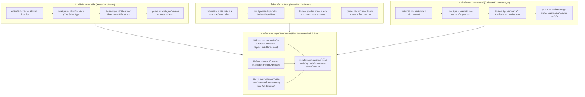

# บทที่ 3: พุทธตันตระในเอเชียใต้: มนตรนัย สู่ อนุตรโยคตันตระ และข้อถกเถียงการยืมข้ามสำนัก
(Buddhist Tantra in South Asia: From Mantranaya to Anuttarayogatantra and Cross-Tradition Borrowing Debates)

---

## บทนำประจำบท (Executive Chapter Introduction)

บทที่ 3 นี้มุ่งเน้นการศึกษาและวิเคราะห์เชิงลึกว่าด้วย **"พุทธตันตระในเอเชียใต้: มนตรนัย สู่ อนุตรโยคตันตระ และข้อถกเถียงการยืมข้ามสำนัก"** (Buddhist Tantra in South Asia: From Mantranaya to Anuttarayogatantra and Cross-Tradition Borrowing Debates) ซึ่งทำหน้าที่เป็นสะพานเชื่อมโยงทางญาณวิทยาอันสำคัญยิ่งจากบทที่ 2 (ซึ่งได้วางรากฐานการทำความเข้าใจสถาบัน วงศ์คัมภีร์ สรีรวิทยาเร้นลับ และอภิปรัชญาของฮินดูตันตระไว้อย่างเป็นเอกเทศ) ไปสู่บทที่ 4 (ซึ่งจะติดตามการเคลื่อนตัวของกระแสธารตันตระผ่านเครือข่ายทางทะเลเข้าสู่อุษาคเนย์)

แกนกลางแห่งวิทยานิพนธ์ประจำบทนี้วางอยู่บนข้อเท็จจริงทางประวัติศาสตร์และคัมภีร์วิทยาว่า พุทธตันตระในเอเชียใต้มิได้เกิดขึ้นอย่างตัดขาดหรือเป็นเพียงความเสื่อมถอยของมหายาน หากแต่ก่อรูปขึ้นจากพลวัตภายในอันทรงพลังของสถาบันมหาพุทธวิหาร (เช่น นาลันทา, วิกรมศิลา, โอทันตปุรี และโสมปุระ) ซึ่งควบคุมและจัดระเบียบวิวัฒนาการทางคัมภีร์อย่างเป็นระบบ โดยสามารถจำแนกออกเป็นลำดับเวลา 5 ยุคสมัยสำคัญตามข้อเสนอของ สึงิกิ (Tsunehiko Sugiki) เริ่มต้นจากมนตรนัยและกริยาตันตระในศตวรรษที่ 7 สู่จรรยาตันตระ (มหาไวโรจนสูตร) และโยคะตันตระ (ตัตตวะสังเคราะห์) ในศตวรรษที่ 8 และคลี่คลายเข้าสู่จุดสูงสุดในอนุตรโยคตันตระสายปิตฤ (คัมภีร์คุยหสมาชตันตระ [Guhyasamāja Tantra]) และสายมาตฤ/โยคินีตันตระ (คัมภีร์เหวัชรตันตระ [Hevajra Tantra], คัมภีร์จักรสังวรตันตระ [Cakrasaṃvara Tantra] และคัมภีร์กาลจักรตันตระ [Kālacakra Tantra]) ในศตวรรษที่ 9 ถึง 11

ยิ่งไปกว่านั้น บทที่ 3 นี้ยังเผชิญหน้าและชำแหละ **ข้อถกเถียงไตรภาคีว่าด้วยการยืมข้ามสำนัก (Tripartite Borrowing Debate)** อันเป็นหัวใจของประวัติศาสตร์นิพนธ์ตันตระร่วมสมัย ระหว่างสามกระบวนทัศน์ใหญ่ ได้แก่:
1. ทฤษฎีการลอกเลียนและการครอบงำของ อเล็กซิส แซนเดอร์สัน (Alexis Sanderson) ซึ่งมองว่าพุทธโยคินีตันตระลอกเลียนตัวบทและพิธีกรรมจากไศวะสายไภรวะ
2. ทฤษฎีการเมืองศักดินาของ โรนัลด์ เอ็ม. เดวิดสัน (Ronald M. Davidson) ซึ่งวิเคราะห์ว่าตันตระคือการจำลองโครงสร้างราชาภิเษกและการทหารของสังคมศักดินายุคกลางในอินเดีย
3. ทฤษฎีสัญศาสตร์และการตีความภายในพุทธของ คริสเตียน เค. เวเดอไมเยอร์ (Christian K. Wedemeyer) ซึ่งรื้อถอนสมมติฐานการยืมแบบกลไก และพิสูจน์ให้เห็นว่าพุทธตันตระปฏิบัติการผ่านระบบสัญศาสตร์ที่ปรับแปลงสัญลักษณ์ภายนอกให้สอดรับกับภววิทยาแห่งสุญญตาและพุทธภาวะอย่างสมบูรณ์

โครงสร้างของบทที่ 3 จัดแบ่งออกเป็น 7 ส่วนหลักที่เชื่อมร้อยกันอย่างแนบแน่น:
- **ส่วนที่ 3.1 (การสถาปนาพุทธตันตระ: จากมนตรนัยสู่วัชรยาน)**: วิเคราะห์รากฐานความคิดจากคัมภีร์มหายาน (ปรัชญาปารมิตา, สัทธรรมปุณฑรีกะ, ธารณี), มโนทัศน์ 'อุบาย' ในฐานะเครื่องมือขับเคลื่อน 'ปัญญา' และวิวัฒนาการของพระวัชรปาณีโพธิสัตว์
- **ส่วนที่ 3.2 (ลำดับชั้นและวิวัฒนาการของคัมภีร์พุทธตันตระ: ลำดับเวลา 5 ยุค)**: สังเคราะห์ลำดับเวลา 5 ยุคสมัยของ Sugiki และโครงสร้างคัมภีร์ 4 ระดับ (กริยา, จรรยา, โยคะ, อนุตรโยคะ)
- **ส่วนที่ 3.3 (คัมภีร์อนุตรโยคตันตระหลักและเทววิทยาพุทธ)**: เจาะลึก 4 มหาคัมภีร์ ได้แก่ คัมภีร์คุยหสมาชตันตระ (Guhyasamāja Tantra), คัมภีร์เหวัชรตันตระ (Hevajra Tantra), คัมภีร์จักรสังวรตันตระ (Cakrasaṃvara Tantra) และคัมภีร์กาลจักรตันตระ (Kālacakra Tantra)
- **ส่วนที่ 3.4 (มหาพุทธวิหารและสถาบันการศึกษาตันตระในอินเดียเหนือ)**: สำรวจบทบาทของมหาวิหารนาลันทา, วิกรมศิลา, โอทันตปุรี, โสมปุระ และขบวนการมหาสิทธา 84 (Caturaśīti-mahāsiddha)
- **ส่วนที่ 3.5 (ข้อถกเถียงไตรภาคีว่าด้วยการยืมข้ามสำนัก)**: ชำแหละวิวาทะระหว่าง Sanderson, Davidson และ Wedemeyer พร้อมทั้งนำเสนอข้อสังเคราะห์ทางญาณวิทยา
- **ส่วนที่ 3.6 (พิธีกรรม ชุมนุมตันตระ และคัมภีร์อมฤตสิทธิ)**: วิเคราะห์พิธีอภิเษก 4 ขั้น, คุรุภักดี, พิธีคณะจักร (Gaṇacakra) และสถานภาพของคัมภีร์อมฤตสิทธิในฐานะต้นธารหฐโยคะสายพุทธ
- **ส่วนที่ 3.7 (การแพร่กระจายของพุทธตันตระอินเดียสู่ดินแดนภายนอก)**: ติดตามการส่งผ่านสู่ทิเบต (ขบวนการญิงมา [Nyingma] และขบวนการสารมา [Sarma]), สู่เอเชียตะวันออก (จีนและญี่ปุ่น), และสู่อุษาคเนย์ ซึ่งกลายเป็นสะพานเชื่อมโยงเข้าสู่บทที่ 4 ต่อไป

---

## 3.1 การสถาปนาพุทธตันตระ: จากมนตรนัยสู่วัชรยาน (The Establishment of Buddhist Tantra: From Mantranaya to Vajrayāna)

การอุบัติขึ้นของพุทธศาสนาฝ่ายตันตระ (Buddhist Tantra) หรือวัชรยาน (Vajrayāna) ในช่วงคริสต์ศตวรรษที่ 6 ถึง 8 ในอนุทวีปอินเดีย มิได้เป็นปรากฏการณ์ที่เกิดขึ้นอย่างตัดขาดจากพัฒนาการทางความคิดดั้งเดิมของพุทธศาสนามหายาน หากแต่เป็นผลลัพธ์ของการปฏิรูปกระบวนทัศน์ทางปรัชญาและระเบียบวิธีปฏิบัติที่หลอมรวมแก่นคำสอนเรื่องความว่าง (śūnyatā) การตระหนักรู้แห่งจิต (vijñāna) และความกรุณาอันไพศาล (karuṇā) เข้ากับเทคโนโลยีทางพิธีกรรม สัญลักษณ์วิทยา และโยคะสรีรวิทยาชั้นสูงอย่างเป็นระบบ [1] ในคัมภีร์ *ตัตตวรัตนาวลี* (Tattvaratnāvalī) ซึ่งปรากฏรวมอยู่ในประมวลคัมภีร์ *อัทวยวัชรสังเคราะห์* (Advayavajrasaṃgraha) ได้จัดแบ่งมหายานออกเป็น 2 มรรคาหลักอย่างชัดเจน ได้แก่ "ปารมิตานัย" (Pāramitā-naya) และ "มนตรนัย" (Mantra-naya) [2] 

ปารมิตานัยถือเป็น "เหตุยาน" (Hetu-yāna) อันเป็นหนทางแห่งการบำเพ็ญสั่งสมบารมีธรรมทั้งสิบประการเพื่อสร้างเหตุปัจจัยแห่งการตรัสรู้ ซึ่งต้องอาศัยระยะเวลายาวนานถึงสามอสงไขยกัปและเต็มไปด้วยความยากลำบาก ในทางตรงกันข้าม มนตรนัยหรือตันตรยานได้รับการนิยามว่าเป็น "ผลยาน" (Phala-yāna) ซึ่งนำเอาผลลัพธ์สูงสุดแห่งพุทธภาวะมาเป็นจุดตั้งต้นและวิถีแห่งการภาวนาโดยตรง ดังมีโศลกอันเลื่องชื่อใน *ตัตตวรัตนาวลี* บันทึกไว้ว่า:

> *nathedam ādau kṛtveti mantranaye tu vidyate / ekārthatve ’py asammoha-bahūpāyād aduṣkarāt / tīkṣṇendriyādhikārāc ca mantrayānaṃ viśiṣyate //*  
> (แม้ว่ามนตรนัยจะมีเป้าหมายสูงสุดเป็นอันหนึ่งอันเดียวกับปารมิตานัย ทว่ามนตรยานมีความเลิศล้ำกว่า ด้วยเหตุที่ปราศจากความหลงใหลฟั่นเฟือน เต็มไปด้วยอุบายอันหลากหลาย ไม่ก่อให้เกิดความยากลำบากอันแสนสาหัสในการปฏิบัติ และเป็นวิถีธรรมที่ประทานไว้สำหรับบุคคลผู้มีอินทรีย์แก่กล้าและเฉียบแหลมยิ่ง) [3]

การเปลี่ยนผ่านจากมหายานดั้งเดิมสู่มนตรนัย และวิวัฒนาการต่อเนื่องไปสู่วัชรยาน สหชยาน (Sahajayāna) และกาลจักรยาน (Kālacakrayāna) วางรากฐานอยู่บนการสถาปนามโนทัศน์ "วัชระ" (Vajra) ให้เป็นสัญลักษณ์สัมบูรณ์สูงสุด โดยคัมภีร์ *อัทวยวัชรสังเคราะห์* ได้ให้อรรถาธิบายทางภววิทยาไว้ว่า วัชระคือสิ่งที่ไม่สามารถตัดแยกได้ ไม่สามารถทำลาย เผาไหม้ หรือทำให้สูญสลายได้ ซึ่งในเนื้อแท้แล้ว วัชระคือเอกภาพอันไร้การแบ่งแยกของ "ศูนยตา" (ความว่าง) "วิชญานะ" (จิตหรือความรู้แจ้ง) และ "มหาสุข" (บรมสุขอันพ้นจากโลกียวิสัย) [4] วิวัฒนาการนี้จึงมิใช่เพียงการแทรกซึมของเวทมนตร์หรือพิธีกรรมภายนอก หากแต่เป็นการสังเคราะห์เชิงทฤษฎีครั้งยิ่งใหญ่เพื่อสร้างวิถีทางอันรวดเร็วในการบรรลุความเป็นพระสัมมาสัมพุทธเจ้าภายในชั่วอายุขัยเดียว (sadyomukti / eka-janma-prāpta) ซึ่งสามารถวิเคราะห์แยกแยะฐานคิด โครงสร้างกลไก และสัญลักษณ์วิทยาหลักออกได้เป็น 3 ปริมณฑลสำคัญ ดังต่อไปนี้

---

### 3.1.1 ฐานคิดจากคัมภีร์มหายาน: ปรัชญาปารมิตา, สัทธรรมปุณฑรีกะ, และการใช้ธารณี (Dhāraṇī)

วิวัฒนาการทางปรัชญาและคัมภีร์ที่นำไปสู่การสถาปนาพุทธตันตระ มิได้เริ่มต้นขึ้นอย่างฉับพลันในคัมภีร์ชั้นตันตระแท้ หากแต่มีจุดกำเนิดและแบบแผนการคลี่คลายที่หยั่งรากลึกอยู่ในวรรณกรรมมหายานคลาสสิก โดยเฉพาะอย่างยิ่งกลุ่มคัมภีร์ปรัชญาปารมิตา คัมภีร์สัทธรรมปุณฑรีกสูตร และการผสานความเชื่อเรื่อง "ธารณี" (Dhāraṇī) เข้าสู่แกนกลางของคำสอน [5]

#### กระบวนการควบแน่นของคัมภีร์ปรัชญาปารมิตาและอำนาจแห่งมนตร์

ในเชิงคัมภีร์วิทยา วรรณกรรมปรัชญาปารมิตามีการพัฒนาการอันน่าทึ่งในลักษณะ "การย่อส่วนและควบแน่นทางเนื้อหา" (textual condensation) จากคัมภีร์ชุดขนาดมหึมา เช่น *ศตสาหัสริกาปรัชญาปารมิตา* (Śatasāhasrikā-prajñāpāramitā ความยาว 100,000 โศลก), *ปัญจวิงศติสาหัสริกา* (25,000 โศลก) และ *อัษฏสาหัสริกาปรัชญาปารมิตา* (8,000 โศลก) ซึ่งมุ่งอรรถาธิบายหลักศูนยตาและความไม่มีสภาวะแท้จริงของสรรพธรรมอย่างละเอียดพิสดาร ได้ถูกสังเคราะห์ย่อลงมาเป็น *ศตโศลกิกา* (Śata-ślokī), คัมภีร์ *ปรัชญาปารมิตาหฤทัยสูตร* (Prajñāpāramitā-hṛdaya-sūtra ความยาว 25 โศลก), ย่อลงสู่อนุปรัชญาปารมิตาธารณี, จนกระทั่งถึงจุดสูงสุดของการควบแน่นกลายเป็นพระมนตร์สั้นเพียงประโยคเดียว:

> *gate gate pāragate pārasaṃgate bodhi svāhā*  
> (ไปแล้ว ไปแล้ว ไปสู่ฝั่งโน้นแล้ว ไปถึงฝั่งโน้นอย่างสมบูรณ์แล้ว ขอความรู้แจ้งจงมีขึ้น) [6]

และในท้ายที่สุด พระมนตร์ทั้งบทนี้ก็ถูกย่อส่วนลงไปสู่ระดับมูลสัทศาสตร์อันเป็น "พืชะ" (Bīja) หรือพยางค์เมล็ดพันธุ์ศักดิ์สิทธิ์เพียงพยางค์เดียว เช่น *ปรำ* (Prāṃ) หรือ *ธีห์* (Dhīḥ) [7] ปรากฏการณ์การควบแน่นของคัมภีร์ปรัชญาปารมิตาแสดงให้เห็นว่า ในทัศนะของปราชญ์พุทธฝ่ายมหายาน คัมภีร์ทั้งฉบับที่มีความยาวนับแสนโศลกมิได้มีคุณค่าอยู่ที่การอ่านและวิเคราะห์เชิงตรรกศาสตร์อย่างเดียวดาย หากแต่ "เสียง" และ "พลังการสั่นสะเทือนทางจิต" ของมนตร์สามารถบรรจุและส่งผ่านสัจธรรมอันลึกซึ้งสูงสุดได้ทั้งหมด เมื่อผู้ปฏิบัติเพ่งจิตไปที่พยางค์พืชะหรือมนตร์ สัจธรรมแห่งศูนยตาของพระสูตรทั้งหมดก็พลันสว่างกระจ่างขึ้นในจิตวิญญาณ [8]

ยิ่งไปกว่านั้น วสุพันธุ (Vasubandhu) ได้เสนอการตีความสถานะทางญาณวิทยาของมนตร์ไว้อย่างลึกซึ้งใน *โพธิสัตตวภูมิ* (Bodhisattvabhūmi) ซึ่งปรากฏอ้างอิงในงานของศาสตราจารย์ สาสิภูษัณ ทาสคุปตะ (Shashi Bhushan Dasgupta) ว่า สาระที่แท้จริงของพระมนตร์มิได้อยู่ที่ความหมายเชิงไวยากรณ์ตามพยัญชนะภายนอก หากแต่อยู่ที่ "ความไร้ความหมาย" (meaninglessness) ของมนตร์นั้นเอง (*anarthatā evārthaḥ*):

> ความไร้ความหมายของมนตร์นั่นแลคือความหมายที่แท้จริงของมนตร์! เมื่อผู้บำเพ็ญภาวนาใคร่ครวญอย่างลึกซึ้งถึงตัวมนตร์และพบว่ามันปราศจากความหมายเชิงมโนทัศน์อันใด การตระหนักรู้นั้นจะน้อมนำดวงจิตเข้าสู่สัจธรรมว่า สรรพธรรมทั้งปวงล้วนปราศจากความหมายที่ตายตัว ไร้แก่นสาร และว่างเปล่าจากสภาวะแห่งตน (dharma-nairātmya) เช่นเดียวกับมนตร์นั้น [9]

ทฤษฎีนี้ได้เปลี่ยนสถานะของมนตร์จากการเป็นเพียงเครื่องมือสวดอ้อนวอนทางพิธีกรรม มาเป็นกลไกทางวิปัสสนาญาณชั้นสูงที่ตัดขาดการปรุงแต่งของจิตเชิงมโนทัศน์ (vikalpa / prapañca) และนำจิตดิ่งตรงเข้าสู่สุญญตสมาธิโดยปราศจากอุปสรรคแห่งภาษา

#### ฐานธารณีและการผสานวัฒนธรรมปริตรเข้าสู่มหายาน

คำว่า "ธารณี" (Dhāraṇī) มีรากศัพท์มาจากธาตุ *ธฤ* (dhṛ) หมายถึง การทรงไว้ การจดจำ การปกป้องรักษา หรือเครื่องค้ำจุนจิตใจ ในระยะเริ่มแรก ธารณีทำหน้าที่เป็นกลเม็ดช่วยจำ (mnemonic device) สำหรับพระโพธิสัตว์ในการรักษาเนื้อหาของพระธรรมคำสอนอันไพศาลมิให้เลอะเลือน ทว่าในเวลาต่อมา ธารณีได้พัฒนาหน้าที่คู่ขนานไปสู่การเป็นมนตร์ศักดิ์สิทธิ์สำหรับปกป้องคุ้มครองผู้สวดให้พ้นจากภยันตราย โรคภัย ไข้เจ็บ ภูตผีปีศาจ และอำนาจมืดทั้งปวง [10]

พัฒนาการของธารณีในมหายานแท้จริงแล้วคือการสืบเนื่องและขยายขอบเขตของประเพณี "ปริตร" (Paritta) ในพุทธศาสนาเถรวาทดั้งเดิม เช่น *ขันธปริตร* (Khandhaparitta มนต์ป้องกันงูและอสรพิษ), *โมรปริตร* (Mora Paritta ปริตรนกยูงทอง), และ *อาฏานาฏิยสูตร* (Āṭānāṭiya Sutta มนต์ประกาศอาณัติแห่งท้าวจาตุมหาราชเพื่อคุ้มครองภิกษุจากยักษ์และอมนุษย์) [11] ฝ่ายมหายานได้นำโครงสร้างทางพิธีกรรมและอำนาจการคุ้มครองนี้มาประมวลเข้าสู่วรรณกรรมกลุ่ม *ปัญจรักษา* (Pañcarakṣā หรือเบญจรักษามหาธารณี) ซึ่งประกอบด้วยมหาธารณีห้าบท ได้แก่:
1. *มหาประติสรา* (Mahāpratisarā) สำหรับการขจัดบาปและคุ้มครองจากภัยพิบัติใหญ่
2. *มหาสหัสรประมรรทินี* (Mahāsahasrapramardinī) สำหรับปราบภูตผีปีศาจและอุปสรรคทั้งปวง
3. *มหามายูรี* (Mahāmāyūrī) มหาธารณีนกยูงสำหรับถอนพิษ ขจัดโรคระบาด และบันดาลฝน
4. *มหาศีตวตี* (Mahāśītavatī) สำหรับระงับความเร่าร้อน คุ้มครองจากสัตว์ร้ายและการลงทัณฑ์
5. *มหามันตรานุสาริณี* (Mahāmantrānusāriṇī) สำหรับการป้องกันโรคภัยไข้เจ็บและอิทธิพลของดวงดาว [12]

คัมภีร์ปัญจรักษาเหล่านี้ได้รับการยกย่องและนับถืออย่างสูงสุด โดยในเวลาต่อมา ธารณีทั้งห้าบทนี้ได้รับการบุคลาธิษฐาน (personification) ให้กลายเป็นพระเทวีหรือพระโพธิสัตว์สตรีทรงอำนาจ มีการกำหนดรูปลักษณ์ สีพระวรกาย อาวุธ และมณฑลประจำพระองค์ ซึ่งกลายมาเป็นต้นแบบของการผสานอำนาจทางพิธีกรรม สัญลักษณ์วิทยาเทวะ และคำสอนทางปรัชญาเข้าเป็นอันหนึ่งอันเดียวกันในพุทธตันตระยุคแรกเริ่ม [13]

#### มรดกจากสัทธรรมปุณฑรีกสูตร: อุบายโกศลและธารณีปริวรรต

คัมภีร์สำคัญอีกฉบับหนึ่งที่เป็นสะพานเชื่อมระหว่างมหายานและตันตรยานคือ *สัทธรรมปุณฑรีกสูตร* (Saddharmapuṇḍarīka-sūtra) ในบทที่ว่าด้วยธารณี (Dhāraṇī-parivarta บทที่ 21 หรือ 26 ตามสำนวนแปลต่าง ๆ) ปรากฏการประทานมนตร์ธารณีเพื่อปกป้องคุ้มครองผู้สั่งสอนและเผยแผ่พระสัทธรรม โดยพระมนตร์มิได้ประทานจากพระสัมมาสัมพุทธเจ้าแต่เพียงพระองค์เดียว หากแต่ได้รับการประสิทธิ์ประสาทจากพระโพธิสัตว์ เช่น พระไภษัชยราช และพระประทานศูระ ตลอดจนทวยเทพฝ่ายโลกบาล ได้แก่ ท้าวไวศรวัณ (ท้าวเวสสุวรรณ) ท้าววิรูฬหก และเหล่านางรากษสีทั้งสิบตน (ทศรากษสี เช่น นางลัมพา และนางวิลัมพา) ซึ่งได้ให้คำสัตย์ปฏิญาณว่าจะใช้อำนาจมนตร์นี้ลงทัณฑ์ผู้ที่คิดประทุษร้ายต่อผู้ทรงธรรม [14]

ยิ่งไปกว่านั้น หลักปรัชญาว่าด้วย "อุบายโกศล" (Upāyakauśalya) และ "เอกยาน" (Ekayāna) ในสัทธรรมปุณฑรีกสูตร โดยเฉพาะอุปมาเรื่องบ้านไฟไหม้ (The Parable of the Burning House) ได้กลายมาเป็นเครื่องมือทางเทววิทยาชิ้นเอกที่สร้างความชอบธรรมให้แก่การนำพิธีกรรม โยคะสรีรวิทยา และมนตร์คาถามาใช้ โดยถือว่ามรรควิธีทั้งหลาย ไม่ว่าจะดูแปลกแยกหรือแตกต่างไปจากแบบแผนสมณสารูปดั้งเดิมเพียงใด หากได้รับการจัดวางอย่างชาญฉลาดโดยพระพุทธเจ้าหรือพระคุรุเพื่อนำพาสรรพสัตว์ผู้มีอินทรีย์และความโน้มเอียงแตกต่างกันให้พ้นจากกองเพลิงแห่งวัฏสงสาร มรรควิธีเหล่านั้นย่อมถือเป็น "อุบายอันแยบคาย" ที่เปี่ยมด้วยพระมหากรุณาธิคุณทั้งสิ้น [15]

---

### 3.1.2 มโนทัศน์ "อุบาย" (Upāya) ในฐานะเครื่องมือขับเคลื่อน "ปัญญา" (Prajñā) เข้าสู่พุทธภาวะ

หากปารมิตานัยของมหายานเน้นหนักไปที่การบำเพ็ญ "ปัญญา" (Prajñā) เพื่อประจักษ์แจ้งในสุญญตาและขจัดอวิชชา มนตรนัยหรือวัชรยานได้ทำการปฏิวัติโครงสร้างทางเทววิทยาโดยการชูมโนทัศน์ "อุบาย" (Upāya) ขึ้นมาเป็นตัวขับเคลื่อนอันทรงพลังยิ่งยวด และกำหนดให้ความรู้แจ้งสูงสุดเกิดขึ้นจากการประสานรวมกันอย่างสมบูรณ์ไร้รอยต่อระหว่างปัญญากับอุบาย [16]

#### วิพากษ์ศูนยตาโดดเดี่ยว: ทำไมศูนยตาเพียงลำพังจึงมิใช่อุบาย?

ในประเด็นพื้นฐานแห่งตันตรยาน อเล็กซ์ เวย์แมน (Alex Wayman) ได้วิเคราะห์โศลกสำคัญ 4 บทจากบทที่ 1 ของคัมภีร์ *วัชรปัญชราตันตระ* (Vajrapañjarā-tantra) ซึ่งสร้างความกระจ่างแจ้งต่อข้อถกเถียงว่าเหตุใดความว่างหรือศูนยตาจึงไม่เพียงพอต่อการบรรลุพุทธภาวะอันสมบูรณ์ [17] คัมภีร์ *วัชรปัญชราตันตระ* ประกาศไว้อย่างหนักแน่นว่า:

> *śūnyatā yadi bhāvet sādhyā buddhatvaṃ śūnyatā bhavet / ... / tasmād upāyavirahāt kuto buddhatvasaṃbhavaḥ //*  
> (หากความว่างเปล่า [ศูนยตา] เป็นอุบายที่ใช้ในการตรัสรู้แล้วไซร้ สภาวะแห่งความเป็นพระพุทธเจ้าก็คงเป็นเพียงความว่างเปล่าที่ดับสูญไป... ดังนั้น หากปราศจากอุบายอันยอดเยี่ยมแล้ว ความบังเกิดขึ้นแห่งพุทธภาวะอันบริบูรณ์จะมีขึ้นได้อย่างไร?) [18]

เวย์แมนอธิบายอย่างเฉียบคมว่า ในทัศนะของตันตรยาน "ปัญญา" ทำหน้าที่รู้แจ้งในสัจธรรมอันติมะ นั่นคือศูนยตา ซึ่งนำไปสู่การบรรลุ "ธรรมกาย" (Dharmakāya) อันเป็นสภาวะนามธรรมที่ไร้รูปร่างและอยู่เหนือการปรุงแต่ง ทว่า พระพุทธเจ้ามิได้ดำรงอยู่เพียงเพื่อการดับสูญส่วนตน พระสัมมาสัมพุทธเจ้าต้องทรงสำแดง "รูปกาย" (Rūpakāya) อันประกอบด้วย "สัมโภคกาย" (Saṃbhogakāya พระกายทิพย์ที่ทรงเครื่องอลังการเพื่อสั่งสอนพระมหาโพธิสัตว์) และ "นิรมาณกาย" (Nirmāṇakāya พระกายที่ทรงเนรมิตมาอุบัติในโลกมนุษย์เพื่อโปรดสัตว์) เพื่อดำเนินงานแห่งการปลดปล่อยสรรพสัตว์ออกจากห้วงทุกข์ [19]

การจะก่อกำเนิดรูปกายทั้งสองนี้ได้ ไม่อาจพึ่งพาปัญญาหรือศูนยตาเพียงลำพังได้เลย เพราะสภาวะแห่งความว่างไม่อาจสร้างรูปลักษณ์หรือการกระทำใด ๆ ได้ สิ่งเดียวที่สามารถก่อร่างสร้างรูปกายและขับเคลื่อนการตรัสรู้ให้ปรากฏเป็นจริงในโลกียวิสัยได้คือ "อุบาย" (Upāya) อันมีมหากรุณา (Mahākaruṇā) เป็นรากฐาน [20] 

ยิ่งไปกว่านั้น คัมภีร์ *วัชรปัญชราตันตระ* ยังชี้เฉพาะเจาะจงลงไปว่า อุบายทั่วไปของการบำเพ็ญทาน ศีล หรือสัจจะในปารมิตานัย ยังมิใช่อุบายอันเลิศล้ำสูงสุดที่สามารถสร้างสัมโภคกายได้อย่างฉับพลัน "อสาทารโณบาย" (asādhāraṇopāya หรืออุบายพิเศษเฉพาะตัวอันมิมีสิ่งใดเสมอเหมือน) ของตันตรยาน คือการทำสมาธิภาวนาในรูปแบบ "มณฑลและเทวตาโยคะ" (Maṇḍala and Devatā-yoga) ร่วมกับการปลุก "ทิพยมานะ" (divyamāna) หรือความมั่นใจเด็ดเดี่ยวในภาวะความเป็นพระพุทธเจ้าของตนเอง [21] ผู้ปฏิบัติจะต้องมองเห็นตนเองเป็นพระชินพุทธะหรือยิดัม (Yi-dam) ผู้ประทับอยู่ ณ ใจกลางมณฑลอันบริสุทธิ์ การฝึกฝนจิตเช่นนี้เองคืออุบายอันทรงพลังที่รังสรรค์สัมโภคกายให้ปรากฏขึ้นในจิตของผู้บำเพ็ญภาวนา

#### อุปมาเรื่อง "มารดาร่วมและบิดาผู้จำแนก": วิภาษวิธีของซงคาปา

เพื่ออธิบายความสัมพันธ์ระหว่างปัญญากับอุบาย ปราชญ์ชาวทิเบตคนสำคัญ เจ ซงคาปา (rJe Tsong-kha-pa, ค.ศ. 1357–1419) ได้นำเสนออุปมาอันลึกซึ้งในมหาคัมภีร์ *งักริมเชนโม* (sNgags rim chen mo หรือมหาลำดับแห่งมนตรนัย) โดยอ้างอิงจากคัมภีร์ *รัตนกูฏ* (Ratnakūṭa) และอรรถกถาของพระจันทรกีรติ (Candrakīrti) [22]

ซงคาปาเปรียบเทียบว่า "ปรัชญาปารมิตา" (ปัญญาญาณที่รู้แจ้งความว่าง) ทำหน้าที่ประดุจ "มารดาร่วม" (common mother) ของบุตรทั้งสี่ประเภท บุตรทั้งสี่ดังกล่าวได้แก่:
1. พระสาวก (Śrāvaka)
2. พระปัจเจกพุทธเจ้า (Pratyekabuddha)
3. พระโพธิสัตว์ฝ่ายพระสูตร (Sūtra-Bodhisattva)
4. พระมหาโพธิสัตว์และสิทธาฝ่ายมนตรยาน (Mantra-Bodhisattva / Siddha)

พระอริยบุคคลทั้งสี่จำพวกนี้ล้วนกำเนิดขึ้นมาจากครรภ์ของมารดาคนเดียวกัน นั่นคือการรู้แจ้งในอนัตตาและศูนยตา (มิเช่นนั้นแล้วย่อมไม่อาจหลุดพ้นจากกิเลสและวัฏสงสารได้) ทว่า สิ่งที่ทำให้บุตรทั้งสี่มีความแตกต่างกันในด้านวรรณะ อำนาจ ความสามารถ และเวลาในการบรรลุธรรม มิได้ขึ้นอยู่กับมารดา หากแต่อยู่ที่ "บิดา" (Father) [23]

ในอุปมานี้ "บิดา" ได้แก่ "อุบาย" (Upāya) อันเป็นมรรคาและวิธีการที่นำมาใช้ประกอบร่วมกับปัญญา:
- พระสาวกและพระปัจเจกพุทธเจ้ามีอุบายเพียงเล็กน้อย (มุ่งความหลุดพ้นเฉพาะตน) จึงมีสถานะเสมือนบุตรผู้มีกำลังจำกัด
- พระโพธิสัตว์ฝ่ายพระสูตรมีอุบายในการบำเพ็ญบารมี 10 ประการ จึงกลายเป็นมหาบุรุษผู้บำเพ็ญพุทธภูมิ แต่ต้องใช้เวลายาวนานนับอสงไขยกัป
- พระมหาโพธิสัตว์ฝ่ายมนตรยานมีอุบายชั้นยอด นั่นคือเทวตาโยคะ การบริกรรมมนตร์ และการโคจรพลังงานในปราณและนาฑี (Prāṇa and Nāḍī) จึงสามารถเร่งรัดกระบวนการรู้แจ้งให้สำเร็จได้ในชาติปัจจุบัน [24]

ดังนั้น อุบายจึงเป็นปัจจัยชี้ขาด (determinant factor) ในการจำแนกความแตกต่างและกำหนดระดับขั้นของความสำเร็จทางจิตวิญญาณในพุทธศาสนา

#### การประสานเป็น "ยุกนัทธะ" (Yuganaddha): อัทวยภาวะและมหาสุข

ในพัฒนาการขั้นสูงของพุทธตันตระ ดังที่ปรากฏในงานชิ้นเอกของอนังควชระ (Anaṅgavajra ราวคริสต์ศตวรรษที่ 8) เรื่อง *ปรัชโญปายวินิจฉยสิทธิ* (Prajñopāyaviniścayasiddhi) และงานของอินทรภูติ (Indrabhūti) เรื่อง *ชญานสิทธิ* (Jñānasiddhi) ปัญญาและอุบายได้รับการสังเคราะห์รวมกันจนกลายเป็นแนวคิด "ยุกนัทธะ" (Yuganaddha) หรือ "ปรัชญาศูนยตา-กรุณาอไทฺวยะ" (Śūnyatā-Karuṇā-Advaya) อันหมายถึงสภาวะที่สัจธรรมทั้งสองด้านหลอมรวมกันเป็นหนึ่งเดียวโดยไม่อาจแยกออกจากกันได้อีกต่อไป [25]

อนังควชระได้พรรณนาถึงการรวมตัวกันของปัญญากับอุบายไว้อย่างไพเราะว่า เปรียบเสมือนการเทน้ำลงในน้ำ หรือการรินน้ำนมผสมเข้ากับน้ำนม (to be unified like water and milk):

> ปัญญาเป็นตัวแทนของความว่าง (Śūnyatā) ความสงบระงับ นิรวาณ และเป็นสัญลักษณ์แห่งสตรีภาพ (female principle)  
> อุบายเป็นตัวแทนของมหากรุณา (Mahākaruṇā) พลวัตแห่งการเคลื่อนไหว สงสารวัฏ และเป็นสัญลักษณ์แห่งบุรุษภาพ (male principle) [26]

เมื่อปัญญา (ศูนยตา) และอุบาย (มหากรุณา) หลอมรวมเข้าด้วยกันอย่างสมบูรณ์ ความขัดแย้งระหว่างนิพพานและสังสารวัฏย่อมมลายหายไป สภาวะจิตของผู้ปฏิบัติจะก้าวข้ามทวิภาวะทั้งปวง และเข้าสู่สภาวะ "มหาสุข" (Mahāsukha) อันเป็นบรมสุขอันบริสุทธิ์เหนือผัสสะโลกียะ สภาวะมหาสุขที่เกิดจากยุกนัทธะนี้เองคือธรรมชาติแท้ของพระสัมมาสัมพุทธเจ้า ซึ่งในคัมภีร์ตันตระชั้นสูงได้ถวายพระนามให้แก่สภาวะอันติมะนี้ว่า "พระสมันตภัทร" (Samantabhadra - องค์บรมพุทธะแห่งความดีงามรอบด้าน) หรือ "พระวัชรธร" (Vajradhara) [27]

#### ข้อแตกต่างทางภววิทยาระหว่าง ปัญญา-อุบาย ในพุทธศาสนา กับ ศิวะ-ศักติ ในศาสนาฮินดู

ประเด็นที่นักวิชาการด้านศาสนวิทยาและพุทธศาสตร์มักสร้างความเข้าใจผิดอย่างกว้างขวาง คือการมองว่าแนวคิดเรื่องการรวมกันของขั้วตรงข้ามหญิง-ชายในพุทธตันตระ เป็นเพียงการลอกเลียนแบบแนวคิดเรื่อง "ศิวะ-ศักติ" (Śiva-Śakti) ของลัทธิไศวะหรือศักติในศาสนาฮินดู [28]

ศาสตราจารย์ ทาสคุปตะ (Dasgupta) และ อเล็กซ์ เวย์แมน (Wayman) ได้ชี้ให้เห็นถึงความแตกต่างทางภววิทยา (ontological distinction) อันเป็นสาระสำคัญอย่างยิ่งยวดไว้ดังนี้:

| ประเด็นทางภววิทยา | ลัทธิศักติในศาสนาฮินดู (Hindu Śāktism) | พุทธศาสนาฝ่ายตันตระ (Buddhist Tantra) |
| :--- | :--- | :--- |
| **บทบาทของเพศหญิง (Female Principle)** | **ศักติ (Śakti):** เป็นพลังงานขับเคลื่อน (Active, Kinetic Energy), เป็นพลังงานแห่งจักรวาลที่ก่อกำเนิดและหมุนวนสรรพสิ่ง, มีพลวัตและอำนาจสร้างสรรค์ [29] | **ปัญญา / ปรัชญา (Prajñā):** เป็นสภาวะนิ่งสงบ (Passive, Quiescent), เป็นการหยั่งรู้ในความว่าง (Śūnyatā), ไม่มีการกระทำ ไม่มีการเคลื่อนไหว, เป็นฐานรองรับความรู้แจ้ง [30] |
| **บทบาทของเพศชาย (Male Principle)** | **ศิวะ (Śiva):** เป็นจิตบริสุทธิ์ที่นิ่งสงบ (Passive Consciousness), เป็นพยานผู้รู้ที่ไม่เคลื่อนไหว (Śava - ดุจศพที่ไร้ชีวิตหากขาดศักติคอยขับเคลื่อน) [31] | **อุบาย (Upāya) / กรุณา (Karuṇā):** เป็นพลังแห่งการกระทำ (Active, Dynamic Principle), เป็นพลวัตแห่งความกรุณาที่ออกไปช่วยเหลือสรรพสัตว์ในสังสารวัฏ [32] |
| **เป้าหมายทางอภิปรัชญา** | การรวมตัวของจิตบริสุทธิ์เข้ากับพลังงานจักรวาลเพื่อการรังสรรค์และครอบครองอำนาจอันไร้ขอบเขต | การผสานความหยั่งรู้ในความว่างเข้ากับการช่วยเหลือสรรพสัตว์อย่างชาญฉลาด เพื่อทำลายอัตตาและบรรลุพุทธภาวะ [33] |

การสลับบทบาทของพลังหยั่งรู้ (Passive) และพลังกระทำ (Active) ระหว่างเพศหญิงและเพศชายในพุทธตันตระเมื่อเทียบกับฮินดูตันตระ เป็นหลักฐานเชิงประจักษ์ว่า พุทธตันตระมิได้เกิดขึ้นจากการคัดลอกระบบความคิดของฮินดูอย่างผิวเผิน หากแต่มีระบบภววิทยาและญาณวิทยาของตนเองที่สืบทอดมาจากพุทธปรัชญาสายมาธยมกะและโยคาจารอย่างเหนียวแน่น [34]

---

### 3.1.3 พระวัชรปาณีโพธิสัตว์ (Vajrapāṇi): วิวัฒนาการจากยักษ์ผู้พิทักษ์สู่พระชินพุทธะผู้ทรงอำนาจตันตระ

ในบรรดาบุคคลและเทวบุคคลที่สะท้อนถึงวิวัฒนาการอันน่าทึ่งจากพุทธศาสนาดั้งเดิมสู่พุทธตันตระ ไม่มีรูปเคารพใดที่จะแสดงให้เห็นถึงการเปลี่ยนแปลงทางเทววิทยาและสัญลักษณ์วิทยาได้อย่างชัดเจนไปกว่า "พระวัชรปาณี" (Vajrapāṇi หรือ วัชิรปาณี ในภาษาบาลี) [35]

การศึกษาวิจัยเชิงประวัติศาสตร์และนิรุกติศาสตร์ระดับมาสเตอร์พีซของ เอเตียน ลามอตต์ (Étienne Lamotte, ค.ศ. 1903–1983) ในบทความเรื่อง *"Vajrapāṇi in India"* ได้แบ่งวิวัฒนาการของพระวัชรปาณีออกเป็นสี่ระยะสำคัญ ซึ่งเผยให้เห็นการเดินทางข้ามสหัสวรรษของสัญลักษณ์ "วัชระ" ในอินเดียโบราณ [36]

#### ระยะที่ 1: วัชิรปาณีในพระไตรปิฎกบาลีและอาคม — อวตารแห่งท้าวสักกะเทวราช

ในคัมภีร์พุทธศาสนายุคแรกเริ่ม ทั้งฝ่ายเถรวาทและสรวาสติวาท นามของ "วัชิรปาณี" มิได้ปรากฏในฐานะพระมหาโพธิสัตว์หรือพระพุทธเจ้า หากแต่ปรากฏตัวในฐานะ "ยักษ์" (Yakkha / Yakṣa) ผู้ถือคทาสายฟ้าหรืออาวุธสายฟ้าเหล็กกล้าคอยทำหน้าที่เป็นผู้พิทักษ์พระสัมมาสัมพุทธเจ้า [37]

เหตุการณ์ที่โด่งดังที่สุดปรากฏใน *อัมพัฏฐสูตร* (Ambaṭṭha Sutta ในทีฆนิกาย สีลขันธวรรค) เมื่อมาณพหนุ่มชื่ออัมพัฏฐะผู้มีชาติกำเนิดในวรรณะพราหมณ์ได้แสดงความเย่อหยิ่งโอหังและดูหมิ่นพระศากยมุนีพุทธเจ้าอย่างรุนแรง พระพุทธองค์ได้ตรัสถามคำถามเกี่ยวกับชาติกำเนิดที่แท้จริงของอัมพัฏฐะ แต่อัมพัฏฐะนิ่งเฉยไม่ยอมตอบถึงสองครั้ง พระสัมมาสัมพุทธเจ้าจึงทรงเตือนว่า หากพระพุทธองค์ตรัสถามเป็นครั้งที่สามแล้วยังไม่ตอบ ศีรษะของเขาจะแตกออกเป็นเจ็ดเสี่ยง ในพริบตานั้นเอง:

> มีอมนุษย์ตนหนึ่ง นามว่า "วัชิรปาณียักษ์" ถือกระบองเหล็กมีเปลวไฟลุกโชติช่วง ลอยอยู่บนอากาศเหนือศีรษะของอัมพัฏฐมาณพ พร้อมที่จะทุบศีรษะของเขาให้แตกกระจาย [38]

เหตุการณ์ลักษณะเดียวกันนี้ยังปรากฏใน *จูฬสัจจกสูตร* (Cūḷasaccaka Sutta ในมัชฌิมนิกาย) เมื่อสัจจกนิครนถ์ปฏิเสธที่จะตอบคำถามของพระพุทธองค์ [39]

ในประเด็นนี้ พระพุทธโฆษาจารย์ (Buddhaghosa) มหาอรรถกถาจารย์แห่งลังกา ได้ระบุไว้อย่างชัดเจนในอรรถกถา *สุมังคลวิลาสินี* (Sumaṅgalavilāsinī) ว่า วัชิรปาณียักษ์ตนนี้มิใช่ใครอื่น หากแต่เป็นพระอินทร์แปลงกายมา:

> *Vajirapāṇī ti Sakko devarājā*  
> (คำว่า 'วัชิรปาณี' นั้น ได้แก่ ท้าวสักกะผู้เป็นราชาแห่งทวยเทพ) [40]

ท้าวสักกะได้จำแลงแปลงกายเป็นยักษ์ถือวัชระอันน่าสะพรึงกลัว เพื่อข่มขวัญและปราบพยศของคนพาลที่คิดจะลบหลู่พระพุทธบารมี ในชั้นนี้ วัชิรปาณีจึงเป็นเพียงการสำแดงฤทธิ์อำนาจของเทวราชแห่งชั้นดาวดึงส์ตามจักรวาลวิทยาของเวทและอุปนิษัทดั้งเดิมที่ผสานเข้าสู่พระพุทธศาสนา [41]

#### ระยะที่ 2: มัลละ, คุยหกาธิบดี, และองค์รักษ์ในพระวินัยและอวทาน

ในวรรณกรรมพุทธภาษาสันสกฤตยุคต่อมา เช่น *มูลสรวาสติวาทวินัย* (Mūlasarvāstivāda Vinaya), *ทิวยาวทาน* (Divyāvadāna), และ *มหามยุรีพุทธมารดาธารณีสูตร* สถานะของวัชรปาณีได้แยกตัวออกมาเป็นเอกเทศอย่างชัดเจน โดยมิได้ผูกติดอยู่กับท้าวสักกะหรือพระอินทร์อีกต่อไป [42]

ในคัมภีร์เหล่านี้ วัชรปาณีได้รับการยกย่องให้เป็น:
- **มัลละผู้เกรียงไกร** (Malla): ตัวแทนแห่งพละกำลังอันมหาศาลทางกายภาพ
- **คุยหกาธิบดี** (Guhyakādhipati): จอมทัพหรือราชาผู้ปกครองเหล่า "คุยหกะ" (Guhyaka) หรืออมนุษย์ผู้พิทักษ์ความลับและความลี้ลับแห่งสากลจักรวาล [43]
- **องค์รักษ์ประจำพระองค์ของพระพุทธเจ้า** (The Personal Bodyguard): วัชรปาณีจะปรากฏกายพร้อมกับ "อายสะวัชระ" (āyasa vajra หรือวัชระเหล็กกล้าที่มีไฟลุกโชติช่วง) คอยติดตามพระพุทธองค์ประดุจเงาตามตัว โดยเฉพาะในภารกิจการปราบพยศภัยพาลและอุปสรรคสำคัญ เช่น:
  - การใช้กระบองวัชระสกัดกั้นและทุบก้อนหินใหญ่ที่พระเทวทัตกลิ้งลงมาจากยอดเขาคิชฌกูฏเพื่อหมายปลงพระชนม์พระพุทธเจ้าให้แตกกระจายออกไป [44]
  - การร่วมเสด็จไปยังแคว้นอุฑฑิยาน (Uḍḍiyāna) และนครนครหาร (Nagarahāra) เพื่อปราบพญานาคผู้ดุร้าย เช่น นาคอปลาละ (Apalāla) และนาคโคปาละ (Gopāla) ให้ยอมสวามิภักดิ์และหันมารับศีลในพระพุทธศาสนา [45]
  - การปรากฏกายในปาฏิหาริย์คู่ที่เมืองสาวัตถี (Śrāvastī Twin Miracles) เพื่อบันดาลให้เกิดลมพายุ ฝนฟ้าคะนอง และอสนีบาตฟาดฟันบัลลังก์ของเหล่าเดียรถีย์ครูทั้งหกจนพังพินาศ [46]

ในชั้นนี้ วัชรปาณียังคงมีสถานะเป็นเทวดาหรืออมนุษย์ระดับล่าง (ชั้นสาวกหรือบริวาร) ที่ทำหน้าที่รับใช้และพิทักษ์พระบรมศาสดาทางกายภาพและเชิงพิธีกรรม [47]

#### ระยะที่ 3: การสังเคราะห์ทางประติมาวิทยาในศิลปะคันธาระ — เฮราคลีสแห่งโลกพุทธศาสนา

จุดเปลี่ยนทางประวัติศาสตร์และสุนทรียศาสตร์ที่ผลักดันให้วัชรปาณีก้าวขึ้นสู่สถานะระดับนำในโลกมหายาน เกิดขึ้นในแคว้นคันธาระ (Gandhāra ทางตะวันตกเฉียงเหนือของอนุทวีปอินเดีย ปัจจุบันคือดินแดนปากีสถานและอัฟกานิสถาน) ในช่วงคริสต์ศตวรรษที่ 1 ถึง 3 ผ่านการปฏิสัมพันธ์ระหว่างวัฒนธรรมกรีกโบราณและพุทธศาสนา (Greco-Buddhist Hybridization) [48]

ลามอตต์ได้ชี้ให้เห็นข้อเท็จจริงทางโบราณคดีที่น่าทึ่งว่า ในศิลปะอินเดียดั้งเดิมสายมถุรา (Mathurā School of Art) แทบจะไม่ปรากฏภาพสลักของพระวัชรปาณีเลย หรือหากปรากฏ ก็จะสลักเป็นรูปบุรุษหรือเทวดาแบบอินเดียโบราณทั่วไปที่ถืออาวุธสั้น ๆ [49] แต่ในศิลปะคันธาระ ช่างแกะสลักชาวกรีก-โรมันและช่างท้องถิ่นได้หยิบยืมรูปลักษณ์อันทรงพลังของ "เฮราคลีส" (Herakles) มหาวีรบุรุษแห่งเทพปกรณัมกรีกมาใช้สร้างประติมาวิทยาของพระวัชรปาณีอย่างสมบูรณ์:
- พระวรกายเต็มไปด้วยมัดกล้ามเนื้ออันกำยำ ล่ำสัน แสดงถึงพละกำลังเหนือมนุษย์
- มีหนวดเคราดกหนา ผมหยิกเป็นลอนแบบชาวกรีก
- นุ่งห่มด้วยผ้าคลุมแบบ "ไคตอน" (chiton) หรือมีหนังราชสีห์คลุมไหล่ประดุจสิงโตเนเมียน (Nemean Lion) ของเฮราคลีส
- ในพระหัตถ์กุม "วัชระ" ซึ่งช่างคันธาระได้ดัดแปลงมาจาก "กระบอง" (club) ของเฮราคลีส ผสมผสานเข้ากับ "สายฟ้า" (thunderbolt / keraunos) ของซุส (Zeus) กลายเป็นวัชระกระดูกคู่ที่สามารถทำลายล้างสรรพสิ่งได้ [50]

การผสานสัญลักษณ์ของเฮราคลีสผู้เป็นเทพแห่งชัยชนะและการคุ้มครองเข้ากับวัชรปาณี ได้ยกระดับให้วัชรปาณีกลายเป็นสัญลักษณ์แห่ง "อำนาจเด็ดขาดที่ไม่อาจเอาชนะได้" (invincibility) ของพระพุทธศาสนาในดินแดนเอเชียกลาง ซึ่งเป็นพื้นที่รอยต่อทางยุทธศาสตร์ของการค้าและการแพร่กระจายทางวัฒนธรรม [51]

#### ระยะที่ 4: การสถาปนาสู่วัชรธรและวัชรสัตตว์ในพุทธตันตระ

เมื่อพุทธศาสนามหายานพัฒนาเข้าสู่ยุคตันตระอย่างเต็มตัวในคริสต์ศตวรรษที่ 7–8 สถานะของพระวัชรปาณีได้รับการปฏิรูปทางเทววิทยาอย่างพลิกฟ้าคว่ำแผ่นดิน จากเดิมที่เป็นเพียง "ยักษ์ผู้พิทักษ์" หรือ "สาวกผู้ติดตาม" พระวัชรปาณีได้รับการยกย่องขึ้นสู่ตำแหน่ง "คุยหกาธิบดี" (Lord of Secrets) ผู้ครอบครองและเป็นผู้สืบทอดคำสอนลี้ลับชั้นสูงสุดของพระพุทธเจ้าทั้งปวง [52]

ในคัมภีร์ตันตระรากฐาน เช่น *สรวตถาคตตัตตวสังเคราะห์* (Sarvatathāgatatattvasaṃgraha หรือ STTS) และ *คัมภีร์คุยหสมาชตันตระ* (Guhyasamājatantra) พระวัชรปาณีได้รับการสถาปนาให้เป็น:
1. **พระมหาโพธิสัตว์แห่งตระกูลวัชระ** (Vajra Family): ประจำอยู่ทางทิศตะวันออกในระบบเบญจชินพุทธะ (Five Dhyāni Buddhas) โดยเป็นตัวแทนของพระอักโษภยะพุทธะ (Akṣobhya) ผู้เปลี่ยนโทสะ (ความโกรธเกรี้ยว) ให้กลายเป็น "คันฉ่องญาณ" (Ādarśa-jñāna ปัญญาญาณประดุจกระจกเงาที่สะท้อนสัจธรรมตามความเป็นจริงโดยไม่บิดเบือน) [53]
2. **พระวัชรสัตตว์** (Vajrasattva): ผู้เป็นบุคลาธิษฐานแห่งจิตรู้แจ้งอันบริสุทธิ์ ไร้มลทิน และเป็นตัวแทนของความมุ่งมั่นในการชำระล้างอกุศลกรรมทั้งปวงของผู้ปฏิบัติธรรม [54]
3. **พระวัชรธร** (Vajradhara): พระองค์ผู้ทรงวัชระ ในคัมภีร์ตันตระชั้นสูงสุด (อนุตตรโยคะตันตระ) พระวัชรธรทรงได้รับการยกย่องให้เป็น "อาทิพุทธะ" (Ādibuddha) หรือปฐมพุทธะผู้เป็นต้นกำเนิดแห่งพระชินพุทธะทั้งปวง พระองค์คือธรรมกายอันบริสุทธิ์สูงสุด ทรงถือวัชระ (สัญลักษณ์แห่งอุบายและมหาสุข) ในพระหัตถ์ขวา และกระดิ่ง (ฆัณฏา สัญลักษณ์แห่งปัญญาและศูนยตา) ในพระหัตถ์ซ้าย ไขว้กันแนบพระอุระในท่า "วัชรหูงการมุทรา" (Vajrahūṅkāra-mudrā) อันแสดงถึงการบรรลุยุกนัทธะอย่างสมบูรณ์ [55]

เส้นทางวิวัฒนาการของพระวัชรปาณีจาก "วัชิรปาณียักษ์" ในพระไตรปิฎกบาลี สู่ "เฮราคลีสคันธาระ" และก้าวขึ้นสู่ "พระอาทิพุทธวัชรธร" ในมหาตันตระ จึงมิใช่เพียงเรื่องราวการเปลี่ยนแปลงของประติมากรรมหรือตำนานปรัมปรา หากแต่เป็นเครื่องสะท้อนภาพรวมทั้งหมดของประวัติศาสตร์ความคิดทางพุทธศาสนา: จากการใช้อำนาจภายนอกเพื่อข่มขู่ศัตรูทางกายภาพ ไปสู่การใช้อุปมาแห่งอาวุธสายฟ้าเพื่อทำลายล้างอวิชชาและความยึดมั่นถือมั่น และท้ายที่สุดคือการแปรเปลี่ยนจิตสำนึกของมนุษย์ให้กลายเป็นเนื้อเดียวกับพุทธภาวะอันเป็นอมตะ [56]

---

### บทสังเคราะห์และข้อสรุปประจำตอน

การสถาปนาพุทธตันตระจากมนตรนัยสู่วัชรยาน มิใช่ความเสื่อมถอยหรือการเบี่ยงเบนออกจากสัจธรรมดั้งเดิมของพระพุทธศาสนาตามข้อวิจารณ์ของนักบูรพคดีศึกษายุคอาณานิคม หากแต่เป็นกระบวนการสังเคราะห์ทางประวัติศาสตร์และปรัชญาที่ทรงพลังยิ่งยวด โดยมีแกนกลางสำคัญ 4 ประการที่เกื้อหนุนซึ่งกันและกัน:

1. **การควบแน่นของคัมภีร์และสัทศาสตร์ศักดิ์สิทธิ์:** การย่อส่วนคัมภีร์ปรัชญาปารมิตาลงสู่ธารณี มนต์ และพยางค์พืชะ ได้สร้างสะพานเชื่อมระหว่างการวิเคราะห์ทางปรัชญาอันลึกซึ้งกับการปฏิบัติสมาธิภาวนาที่มีพลังอำนาจจับต้องได้ โดยมีทฤษฎีความไร้ความหมายของมนตร์รองรับสัจธรรมแห่งศูนยตา [57]
2. **วิภาษวิธีแห่งปัญญาและอุบาย:** การสถาปนาแนวคิดว่าศูนยตาเพียงลำพังไม่อาจนำไปสู่การบรรลุพุทธภาวะอันสมบูรณ์ได้ แต่ต้องอาศัยอุบายอันเลิศล้ำ ได้แก่ เทวตาโยคะและมณฑล เพื่อรังสรรค์สัมโภคกายและนิรมาณกาย การผสานปัญญาและอุบายเป็นยุกนัทธะได้สร้างระบบอภิปรัชญาเฉพาะตัวที่แตกต่างจากแนวคิดศิวะ-ศักติของฮินดูอย่างสิ้นเชิง [58]
3. **การสถาปนาประติมาวิทยาและเทววิทยาตันตระ:** วิวัฒนาการของพระวัชรปาณีจากยักษ์ผู้รับใช้ในคัมภีร์ยุคแรก สู่เฮราคลีสแห่งคันธาระ และก้าวขึ้นเป็นพระอาทิพุทธวัชรธรในคัมภีร์ตันตระ สะท้อนถึงการแปรเปลี่ยนสัญลักษณ์แห่งอำนาจการทำลายล้างภายนอกให้กลายมาเป็นอำนาจทางจิตวิญญาณสูงสุดในการทำลายกิเลสและอวิชชา [59]
4. **การวางรากฐานสู่การแพร่กระจายข้ามภูมิภาค:** กรอบคิดมนตรนัยและสัญลักษณ์วัชระที่ได้รับการสถาปนาขึ้นอย่างสมบูรณ์ในอินเดียช่วงคริสต์ศตวรรษที่ 7–8 นี้เอง ที่ได้กลายมาเป็นพิมพ์เขียวแม่บทและเคลื่อนตัวเข้าสู่เอเชียตะวันออกเฉียงใต้ ทั้งในดินแดนชวา สุมาตรา กัมพูชา และลุ่มน้ำเจ้าพระยา ซึ่งจะก่อให้เกิดปฏิสัมพันธ์อันซับซ้อนกับพุทธศาสนาเถรวาทดั้งเดิมในเวลาต่อมา [60]

---


---

## 3.2 ลำดับชั้นและวิวัฒนาการของคัมภีร์พุทธตันตระ: ลำดับเวลา 5 ยุค (Sugiki's 5-Period Chronology)

การศึกษาประวัติศาสตร์วรรณกรรมและพัฒนาการทางหลักคำสอนของพุทธศาสนาตันตระ (Buddhist Tantra) หรือมนตรนัย (Mantranaya) ในเอเชียใต้ ประสบปัญหาท้าทายเชิงญาณวิทยาและประวัติศาสตร์นิพนธ์มาอย่างยาวนานนับตั้งแต่ยุคอาณานิคม ในคริสต์ศตวรรษที่สิบเก้าถึงต้นคริสต์ศตวรรษที่ยี่สิบ นักบูรพคดีศึกษาชาวตะวันตก เช่น เออแฌน บูร์นูฟ (Eugène Burnouf) และแอล. เอ. แวดเดลล์ (L. A. Waddell) มักมองปรากฏการณ์ตันตระว่าเป็น "ความเสื่อมทรามทางศีลธรรมและปัญญา" (moral and intellectual degeneration) ที่เกิดขึ้นอย่างฉับพลันในพุทธศาสนา หรือเป็นเพียงการประนีประนอมรับเอาไสยศาสตร์มนตร์ดำนอกรีตเข้ามาเจือปนในพระธรรมวินัยอันบริสุทธิ์ [61] ทว่าความก้าวหน้าทางนิรุกติศาสตร์ตัวเขียน (manuscript philology) และการค้นพบเอกสารตัวเขียนภาษาสันสกฤตและทิเบตตลอดหลายทศวรรษที่ผ่านมา ได้รื้อถอนมายาคติดังกล่าวอย่างสิ้นเชิง โดยพิสูจน์ให้เห็นว่า วรรณกรรมพุทธตันตระมิใช่ปรากฏการณ์ที่เกิดขึ้นอย่างลอยๆ หรือหยุดนิ่งเป็นเนื้อเดียวกัน หากแต่เป็นขบวนการทางปัญญาที่มีพลวัตสูงยิ่ง มีการพัฒนา สะสม และปรับแปลงโครงสร้างคำสอนอย่างเป็นระบบต่อเนื่องยาวนานกว่าเจ็ดศตวรรษ (นับตั้งแต่ราวกลางคริสต์ศตวรรษที่หกจนถึงต้นคริสต์ศตวรรษที่สิบสาม) ภายในเครือข่ายสถาบันมหาวิหารพุทธศาสนาแห่งอินเดียเหนือและอินเดียตะวันออก

ความยากลำบากประการสำคัญในการจัดทำลำดับเวลา (chronology) ของคัมภีร์พุทธตันตระ คือการที่ผู้รวบรวมคัมภีร์ (compilers) ในอดีตมักขาด "ความตระหนักรู้เชิงประวัติศาสตร์" (lack of sense of historicity) ตามแบบแผนสมัยใหม่ คัมภีร์ตันตระส่วนใหญ่มักไม่ปรากฏนามผู้ประพันธ์ที่เป็นมนุษย์เดินดิน หากแต่ประกาศตนว่าเป็นพระพุทธพจน์อันศักดิ์สิทธิ์ที่เปิดเผยโดยพระสัมมาสัมพุทธเจ้าในสภาวะธรรมกายหรือสัมโภคกาย (เช่น พระมหาไวโรจนะ หรือ พระวัชรธร) ในห้วงเวลาแห่งสัจธรรมอันเป็นอกาลิโก ยิ่งไปกว่านั้น คัมภีร์ตันตระที่มีอยู่ในประวัติศาสตร์มักสร้างความชอบธรรมเชิงเทววิทยา (theological legitimation) โดยอ้างตนว่าเป็นเพียงบทตัดย่อหรือฉบับสังเขปที่คัดแยกออกมาจาก "มูลตันตระ" (mūlatantra) ในจินตภาพขนาดยักษ์ที่มีความยาวเรือนแสนโศลก [62] ด้วยเหตุนี้ การนิยามขอบเขตของคัมภีร์ตันตระในวงวิชาการร่วมสมัยจึงจำเป็นต้องอาศัยนิยามเชิงปฏิบัติการ (operational definition) ที่อิงกับพัฒนาการทางประวัติศาสตร์จริง ดังที่ฮารุนากะ ไอแซกสัน และ ฟรานเชสโก สแฟร์รา (Harunaga Isaacson and Francesco Sferra) ได้เสนอไว้ และได้รับการรับรองโดย สึเนฮิโกะ สุกิกิ (Tsunehiko Sugiki) ว่า:

> "คัมภีร์ตันตระได้รับการนิยามว่าเป็นคัมภีร์ที่เรียกขานตนเองว่าเป็นตันตระ หรือคัมภีร์ที่ได้รับการจัดหมวดหมู่ว่าเป็นเช่นนั้นโดยเหล่านิพนธ์พุทธศาสนาชาวอินเดีย โดยเริ่มอย่างช้าที่สุดตั้งแต่ราวคริสต์ศตวรรษที่แปดเป็นต้นมา แม้ว่าคัมภีร์เหล่านั้นบางเล่มไม่ต้องสงสัยเลยว่าเดิมทีมิได้ถูกคิดสร้างขึ้นมาในฐานะตันตระก็ตาม" [63]

เพื่อข้ามพ้นกับดักของตำนานศักดิ์สิทธิ์ ศาสตราจารย์ สึเนฮิโกะ สุกิกิ (Tsunehiko Sugiki, 2024) ได้สถาปนา "เกณฑ์เชิงประจักษ์ 4 ด้าน" (four empirical criteria) ในการกำหนดอายุเวลาและลำดับพัฒนาการของวรรณกรรมพุทธตันตระในอินเดียอย่างเป็นวิทยาศาสตร์ ได้แก่:
1. ศักราชที่ปรากฏในโคลอฟอน (colophons / บันทึกท้ายเอกสารตัวเขียน) ของเอกสารตัวเขียนภาษาสันสกฤตที่เก่าแก่ที่สุด
2. ช่วงเวลาของพระเถระผู้แปลคัมภีร์สู่ภาษาจีนและภาษาทิเบต อันทำหน้าที่เป็นจุดสิ้นสุดของขอบเขตเวลาที่คัมภีร์ต้องมีอยู่แล้วอย่างแน่นอน (*terminus ante quem*)
3. การอ้างอิง อัญเชิญ หรือวิพากษ์ตัวบทตันตระโดยปราชญ์และอรรถกถาจารย์ที่มีตัวตนและช่วงเวลาแน่นอนในประวัติศาสตร์ (เช่น พระพุทธคุหยะ, พระศานติครภะ, พระอภยากรคุปตะ, พระรัตนากรศานติ)
4. การเปรียบเทียบข้อความคู่ขนานและความสัมพันธ์ระหว่างตัวบท (intertextual parallel passages and borrowing) เพื่อตรวจสอบว่าคัมภีร์ใดทำหน้าที่เป็นต้นแบบและคัมภีร์ใดรับเอาข้อความไปขยายความต่อ [64]

เมื่อนำเกณฑ์เชิงประจักษ์เหล่านี้มาบูรณาการเข้ากับระบบการจัดหมวดหมู่วรรณกรรมตันตระ 4 ชั้นตามจารีตอินเดีย-ทิเบตดั้งเดิม (Kriyā, Caryā, Yoga, Anuttarayoga) ซึ่งได้รับการวิเคราะห์อย่างลึกซึ้งโดย อเล็กซ์ เวย์แมน (Alex Wayman, 1973) ผ่านงานนิพนธ์ของมคัสกรุบเจ (Mkhas-grub rje) และซงคาปา (Tsong-kha-pa) [65] สุกิกิได้เสนอกรอบการวิเคราะห์ลำดับเวลาเชิงวิวัฒนาการ 5 ยุคสมัย (Sugiki's 5-Period Chronology) ซึ่งทำหน้าที่เป็นแผนที่ทางประวัติศาสตร์วรรณกรรมที่แม่นยำและครอบคลุมที่สุดในวงวิชาการสากลร่วมสมัย โดยสะท้อนการเปลี่ยนผ่านจากพิธีกรรมภายนอกเพื่อความสำเร็จทางโลกิยะ สู่ระบบมณฑลจักรวาลวิทยา และก้าวไปสู่จุดสูงสุดในระบบโยคะสรีรวิทยาภายในอันลึกซึ้ง

---

### 3.2.1 ยุคที่ 1 (ศตวรรษที่ 7): กริยาตันตระ (Kriyā) และธารณีคัมภีร์ (*Subāhuparipṛcchā*, *Dhyānottarapatalakrama*)

จุดเริ่มต้นของวรรณกรรมพุทธตันตระอย่างเป็นทางการในประวัติศาสตร์อินเดีย ก่อรูปขึ้นในราวกลางคริสต์ศตวรรษที่หกถึงกลางคริสต์ศตวรรษที่เจ็ด (ค.ศ. 550–650) ภายใต้กลุ่มคัมภีร์ที่ในเวลาต่อมาได้รับการจัดหมวดหมู่ว่าเป็น "กริยาตันตระ" (Kriyātantra หรือ ตันตระแห่งการกระทำภายนอก) คัมภีร์หลักในกลุ่มนี้ประกอบด้วย *สุพาหุปริปฤจฉา* (*Subāhuparipṛcchā*), *ธยานโมตตรปฏลกรม* (*Dhyānottarapatalakrama*), *คุหยตันตระ* (*Guhyaprathama* หรือ *Guhyatantra*), และ *สุสิทธิการตันตระ* (*Susiddhikara*) [66] ในบรรดาคัมภีร์เหล่านี้ นักวิชาการชาวญี่ปุ่น เช่น ซากาอิ (Sakai) ได้ตรวจสอบพบว่าคัมภีร์ *คุหยะ* มีการรวบรวมขึ้นตั้งแต่ราวกลางศตวรรษที่หก ขณะที่คัมภีร์ *สุพาหุปริปฤจฉา* และ *สุสิทธิการะ* ได้รับการพัฒนาจนมีโครงสร้างสมบูรณ์ในศตวรรษที่เจ็ด ก่อนที่จะได้รับการแปลสู่ภาษาจีนโดยพระศุภกรสิงหะ (Śubhakarasiṃha) ในช่วงต้นศตวรรษที่แปด [67]

คุณลักษณะเด่นที่สุดของกริยาตันตระในยุคแรกนี้ คือการให้ความสำคัญอันดับสูงสุดแก่ "พิธีกรรมภายนอก" (*kriyā* หรือ *karma*) ตัวบทคัมภีร์จะอุทิศเนื้อหาส่วนใหญ่ไปกับการกำหนดระเบียบวิธีอันประณีตซับซ้อนว่าด้วยความสะอาดบริสุทธิ์ทางกายภาพ ได้แก่ การสรงน้ำชำระล้างร่างกาย (*snāna*) วันละหลายครั้ง, การสมาทานศีลพรตอย่างเข้มงวดดุจนักบวช, การงดเว้นการบริโภคเนื้อสัตว์ สุรา และอาหารที่มีกลิ่นฉุน (เช่น กระเทียมและหัวหอม), การจัดหาและชำระล้างเครื่องบูชาภายนอก (ดอกไม้ ธูป เครื่องหอม น้ำอบ น้ำสรง), ตลอดจนการสวดบริกรรมมนตราต่อหน้ารูปเคารพของพระพุทธเจ้าหรือพระโพธิสัตว์ที่ประดิษฐานอยู่เบื้องหน้า [68] ในยุคนี้ รูปเคารพและมณฑลยังคงถูกมองว่าเป็น "สิ่งศักดิ์สิทธิ์ภายนอก" ที่สถิตอยู่เบื้องหน้าผู้ปฏิบัติ โดยที่ตัวผู้ปฏิบัติยังมิได้จำลองตนเองให้กลายเป็นองค์พระผู้เป็นเจ้าหรือพุทธะ

เป้าหมายหลักทางวิมุตติวิทยาของกริยาตันตระในยุคที่หนึ่งนี้ มักผูกโยงอยู่กับ "ความสำเร็จทางโลกิยะ" (*laukika-siddhi*) หรือประโยชน์เฉพาะหน้าในการดำรงชีวิตท่ามกลางความไม่มั่นคงของสังคมอินเดียยุคกลางตอนต้น ดังที่ เปแตร์-ดานีเอล ซานโต (Péter-Dániel Szántó) ได้ชี้ให้เห็นว่า วรรณกรรมพิธีกรรมตันตระยุคเริ่มต้นมีวิวัฒนาการมาจากคัมภีร์กลุ่ม "ธารณี" (Dhāraṇī) และ "กัลปะ" (Kalpa) ในมหายาน ซึ่งถูกสร้างขึ้นเพื่อตอบสนองต่อภาวะวิกฤตของชุมชนเมืองและฆราวาส เช่น พิธีขับไล่และป้องกันพิษงู (*viṣākarṣaṇa*), พิธีขับไล่ภูตผีปีศาจและสิ่งอัปมงคล (*vighna / graha*), พิธีสะเดาะเคราะห์และลวงความตายเพื่อต่ออายุขัย (*mṛtyuvañcana*), ตลอดจนพิธีขอฝนเพื่อความอุดมสมบูรณ์ของเกษตรกรรม (*varṣāpaṇa*) [69]

วิวัฒนาการจากพระสูตรมหายานสู่กริยาตันตระสะท้อนให้เห็นกระบวนการที่ เบโนยโตษ ภัฏฏาจารย์ (Benoytosh Bhattacharyya) นิยามว่าเป็น "การย่นย่อความหมายทางสัญศาสตร์" (semiotic condensation of mantras):

> "วิวัฒนาการของระบบมนตราเริ่มต้นจากการย่นย่อตัวบทพระสูตรมหายานขนาดยักษ์ (เช่น *อัษฏสหัศริกาปรัชญาปารมิตา* 8,000 โศลก) ให้เหลือเป็นพระสูตรขนาดสั้น เช่น *ปรัชญาปารมิตาหฤทัยสูตร* จากนั้นจึงย่นย่อลงเป็นธารณี และกลั่นตัวลงสู่บทมนตรา จนกระทั่งท้ายที่สุดแปรสภาพกลายเป็น 'พีชมนตร์' (seed syllable) พยางค์เดียว เช่น อักขระ *ปรำ* (*Pram*) ซึ่งทำหน้าที่เป็นศูนย์รวมแห่งสัจธรรมทั้งหมด" [70]

ในแง่ของจิตวิทยาและการจัดลำดับภูมิธรรมของผู้ปฏิบัติ อเล็กซ์ เวย์แมน ได้อธิบายผ่านอรรถกถาของมคัสกรุบเจและซงคาปาว่า กริยาตันตระถูกออกแบบมาสำหรับผู้ปฏิบัติจำพวก "มฤทุ" (*mṛdu* หรือผู้มีอินทรีย์อ่อน / ไศกษะ) ซึ่งเป็นผู้ที่มีอัธยาศัย "ยินดีในการประกอบพิธีกรรมภายนอกมากกว่าการเจริญสมาธิภายใน" [71] จารีตทิเบตได้ใช้อุปมาอุปไมยเปรียบเทียบตันตระชั้นนี้กับการที่เทวบุรุษและเทวสตรีเพียง "แย้มสรวลและหัวเราะต่อกัน" (*hāsa*) โดยไม่มีการสัมผัสทางกายภาพ ซึ่งสะท้อนระยะห่างระหว่างผู้ปฏิบัติกับองค์พระศาสดาที่ยังคงแยกขาดจากกันในมิติของพิธีกรรม [72] อย่างไรก็ดี แม้กริยาตันตระจะเน้นการกระทำภายนอก แต่ดังที่ เอียน ซินแคลร์ (Iain Sinclair) ได้ชี้ไว้ คัมภีร์เหล่านี้ได้เริ่มสถาปนามโนทัศน์เรื่อง "โพธิจิต" (Bodhicitta) ในฐานะเจตจำนงกำกับพิธี ซึ่งทำให้การแสวงหาฤทธิ์เดชทางโลกมิได้ตกไปสู่วิชาไสยศาสตร์ส่วนบุคคล หากแต่ถูกควบคุมให้อยู่ใต้กรอบแห่งการโปรดสรรพสัตว์ของพระโพธิสัตว์ [73]

---

### 3.2.2 ยุคที่ 2 (ปลายศตวรรษที่ 7–ต้นศตวรรษที่ 8): จรรยาตันตระ (Caryā) และการวางมณฑลแรกเริ่ม (*Mahāvairocana-abhisaṃbodhi-tantra*)

การเปลี่ยนผ่านครั้งสำคัญในประวัติศาสตร์พุทธตันตระเกิดขึ้นในช่วงครึ่งหลังของคริสต์ศตวรรษที่เจ็ด (ราว ค.ศ. 650–700) เมื่อวรรณกรรมตันตระเริ่มก้าวพ้นจากการเป็นเพียงคู่มือพิธีกรรมขอความคุ้มครองทางโลก เข้าสู่การสร้างระบบจักรวาลวิทยา เทววิทยา และปรัชญาการหลุดพ้นที่เป็นเอกเทศ วรรณกรรมชิ้นเอกที่เป็นตัวแทนของยุคที่สองนี้คือ *มหาไวโรจนาภิสัมโพธิตันตระ* (*Mahāvairocanābhisaṃbodhi-tantra* มักเรียกย่อว่า *Vairocanābhisaṃbodhi* หรือ *มหาไวโรจนสูตร*) [74] ซึ่งได้รับการจัดหมวดหมู่ในจารีตโบราณว่าเป็น "จรรยาตันตระ" (Caryātantra หรือ ตันตระแห่งข้อประพฤติ) หรือ "อุภยตันตระ" (Ubhayatantra / ตันตระสองหน้า)

หลักฐานเชิงประจักษ์ในการกำหนดอายุเวลาของคัมภีร์ *มหาไวโรจนสูตร* มีความมั่นคงอย่างยิ่งในทางประวัติศาสตร์ สึเนฮิโกะ สุกิกิ ชี้ว่า เมื่อตรวจสอบบันทึกทางประวัติศาสตร์ของจีนเกี่ยวกับความนิยมในข้อปฏิบัติตันตระในอินเดียยุคหลังพระเจ้าหรรษะวรรธนะ (Harṣavardhana) ประกอบกับบันทึกการเดินทางของพระภิกษุจีน (เช่น พระอี้จิง) มีความเป็นไปได้สูงที่สุดที่คัมภีร์นี้ได้รับการประมวลขึ้นในช่วงปลายศตวรรษที่เจ็ด ก่อนที่พระศุภกรสิงหะ (Śubhakarasiṃha) มหาเถระชาวอินเดีย จะนำไปแปลเป็นภาษาจีน ณ นครฉางอาน ในปี ค.ศ. 724 (Taishō Tripiṭaka เล่มที่ 18 หมายเลข 848) โดยมีพระอี้สิง (Yixing) ร่วมแปลและบันทึกมหาอรรถกถา *ต้ารือจิงซู* (大日經疏) [75]

คำว่า "จรรยา" (*caryā*) ในที่นี้บ่งชี้ถึงสภาวะที่การปฏิบัติการตันตระได้สถาปนา "ความสมดุลอย่างเท่าเทียม" ระหว่างการกระทำพิธีกรรมภายนอก (*kriyā*) กับการเจริญสมาธิภาวนาภายใน (*dhyāna / yoga*) ผู้ปฏิบัติมิได้ละทิ้งพิธีชำระล้างหรือการถวายเครื่องบูชาภายนอก แต่พิธีกรรมเหล่านั้นจะต้องดำเนินควบคู่ไปกับการเพ่งมโนภาพภายในจิตอย่างลึกซึ้ง หัวใจทางวิมุตติวิทยาของจรรยาตันตระได้รับการสรุปไว้ในสูตรคาถาบันลือโลกในบทที่หนึ่งของ *มหาไวโรจนสูตร* ที่ว่า:

> "โพธิจิตเป็นเหตุ มหากรุณาเป็นรากฐาน และอุบายโกศลเป็นที่สุด" (*bodhicitta-hetukaṃ karuṇā-mūlaṃ upāya-paryavasānam*) [76]

นวัตกรรมที่ยิ่งใหญ่ที่สุดของยุคที่สองนี้ คือการสถาปนาระบบมณฑลขนาดยักษ์ที่เป็นระเบียบเรียบร้อยขึ้นเป็นครั้งแรกในประวัติศาสตร์ ได้แก่ **"ครรภโกศมณฑล"** หรือ **"มหาการุณิกครรภมณฑล"** (Garbhadhātumaṇḍala / Womb Realm) มณฑลนี้มิได้เป็นเพียงพื้นที่วาดภาพเพื่อวางเครื่องบูชาเหมือนในยุคกริยาตันตระ แต่ได้รับการจัดวางเป็นแผนผังจักรวาลทัศน์อันไพศาล โดยมี **พระมหาไวโรจนะพุทธะ (Mahāvairocana)** ประทับเป็นศูนย์กลางแห่งความจริงสูงสุดในท่าสมาธิมุทรา แวดล้อมด้วยพระพุทธเจ้าในสี่ทิศ (รัตนเกตุ, สังกุสุมิตราช, อมิตายุส, และทุรทรรภิภวนีรฆาตะ) ตลอดจนพระโพธิสัตว์และเทพบริวารหลายร้อยองค์ที่แบ่งออกเป็นแผนกและศาลารายรอบ (courts) สะท้อนถึงการแผ่ขยายมหากรุณาออกจากศูนย์กลางแห่งพุทธภาวะเข้าโอบอุ้มสรรพสัตว์ในสากลจักรวาล

ในมิติด้านอรรถกถาศาสตร์และการตีความเชิงปรัชญา อเล็กซ์ เวย์แมน ได้วิเคราะห์งานอรรถกถาของพระพุทธคุหยะ (Buddhaguhya ผู้มีชีวิตอยู่ในช่วงศตวรรษที่แปด) ใน *มหาไวโรจนสูตร* โดยชี้ให้เห็นว่า จรรยาตันตระได้เริ่มนำเอากิเลสและอารมณ์ความรู้สึกของมนุษย์มาแปรสภาพเป็นเครื่องมือแห่งปัญญา ตัวอย่างเช่น การอธิบายคำว่า "โทสะ" (*dveṣa* / hatred) มิใช่ในความหมายของความโกรธแค้นทำลายล้าง แต่หมายถึง "จิตแบบสายน้ำ" (*stream mentality / chu bo'i sems*) ที่แสดงปฏิกิริยาปฏิเสธและไม่ยอมจำนนอย่างเด็ดขาดต่อมิจฉาทิฏฐิสุดโต่งทั้งสองด้าน คือ สัสสตทิฏฐิและอุจเฉททิฏฐิ [77]

ตามการจำแนกของจารีตทิเบต จรรยาตันตระถูกจัดไว้สำหรับผู้ปฏิบัติระดับ "มัธยะ" (*madhya* หรือผู้มีอินทรีย์ปานกลาง) ที่ต้องการการผสานระหว่างพิธีภายนอกและการเพ่งจิตภายในอย่างละกึ่งหนึ่ง และใช้อุปมาอุปไมยเปรียบเทียบตันตระชั้นนี้กับการที่เทวบุรุษและเทวสตรี "จ้องสบตากัน" (*dṛṣṭi*) โดยความปีติยินดีอันเกิดจากการแลกเปลี่ยนสายตานี้ ได้กลายมาเป็นพลังขับเคลื่อนจิตเข้าสู่สมาธิภาวนา [78]

---

### 3.2.3 ยุคที่ 3 (ศตวรรษที่ 8): โยคะตันตระ (Yoga) และระบบวัชรธาตุมณฑล (*Tattvasaṃgraha*)

เมื่อเข้าสู่ช่วงต้นถึงกลางคริสต์ศตวรรษที่แปด (ราว ค.ศ. 700–750) วรรณกรรมพุทธตันตระได้พัฒนาเข้าสู่จุดสูงสุดของยุคคลาสสิก ซึ่งรู้จักกันในนาม "โยคะตันตระ" (Yogatantra หรือ ตันตระแห่งสมาธิภาวนา) คัมภีร์รากฐานอันเป็นแกนกลางของยุคนี้คือ *สรวตถาคตตัตตวะสังครหะ* (*Sarvatathāgatatattvasaṃgraha* มักเรียกย่อว่า STTS หรือ *ตัตตวะสังครหะ*) ซึ่งได้รับการแปลสู่ภาษาจีนโดยพระวัชรโพธิ (Vajrabodhi) ในปี ค.ศ. 723 และฉบับสมบูรณ์โดยพระอโมฆวัชระ (Amoghavajra / ปุกง) ในช่วงระหว่าง ค.ศ. 753–754 (Taishō Tripiṭaka เล่มที่ 18 หมายเลข 865) [79]

ความเปลี่ยนแปลงเชิงกระบวนทัศน์ (paradigm shift) จากจรรยาตันตระสู่โยคะตันตระ คือการที่จุดเน้นในการปฏิบัติได้ย้ายจากพิธีกรรมภายนอกเข้าสู่ "สมาธิภาวนาภายในจิต" (*yoga*) อย่างสมบูรณ์ พิธีกรรมทางกายภาพถูกลดทอนบทบาทลงเป็นเพียงเครื่องสนับสนุน ขณะที่จิตของผู้ปฏิบัติได้รับการยกสถานะขึ้นเพื่อหลอมรวมเข้าเป็นหนึ่งเดียวกับพระพุทธเจ้า (self-deification / deity yoga) ใน STTS ได้มีการสถาปนามณฑลที่ทรงอิทธิพลสูงสุดในโลกพุทธศาสนาฝ่ายเอโสเตรกิ นั่นคือ **"วัชรธาตุมณฑล" (Vajradhātumaṇḍala / Diamond Realm)** ประกอบด้วยทวยเทพ 37 องค์ธรรม [80]

ในวัชรธาตุมณฑลนี้ ระบบ **"ตระกูลพระพุทธเจ้า 5 พระองค์" (Pañcakula)** ได้รับการจัดระเบียบและสถาปนาความสัมพันธ์เชิงสัญศาสตร์อย่างสมบูรณ์แบบเป็นครั้งแรกในประวัติศาสตร์ โดยทำหน้าที่เป็นโครงสร้างรองรับญาณวิทยาและสรีรวิทยาของพุทธตันตระ ดังที่ปรากฏในตารางความสอดคล้องที่วิเคราะห์โดย อเล็กซ์ เวย์แมน [81] และ เบโนยโตษ ภัฏฏาจารย์ [82]:
1. **ตระกูลตถาคต (Tathāgatakula):** มีพระไวโรจนะ (Vairocana) เป็นประธาน ประทับ ณ จุดศูนย์กลาง มีสีขาว สัมพันธ์กับรูปขันธ์ โมหะ (ความหลงที่แปรสภาพเป็นปัญญา) และสุวิศุทธธรรมธาตุญาณ
2. **ตระกูลวัชระ (Vajrakula):** มีพระอักษโภภยะ (Akṣobhya) เป็นประธาน ประทับ ณ ทิศตะวันออก มีสีน้ำเงิน/ดำ สัมพันธ์กับวิญญาณขันธ์ โทสะ (ความโกรธที่แปรสภาพเป็นปัญญา) ธาตุน้ำ และอาทรศญาณ (ญาณดุจกระจกเงา)
3. **ตระกูลรัตนะ (Ratnakula):** มีพระรัตนสัมภวะ (Ratnasambhava) เป็นประธาน ประทับ ณ ทิศใต้ มีสีเหลือง สัมพันธ์กับเวทนาขันธ์ มานะ (ความถือตัว) ธาตุดิน และสมตาญาณ (ญาณหยั่งรู้ความเสมอภาค)
4. **ตระกูลปัทมะ (Padmakula):** มีพระอมิตาภะ (Amitābha) เป็นประธาน ประทับ ณ ทิศตะวันตก มีสีแดง สัมพันธ์กับสัญญาขันธ์ ราคะ (ความกำหนัดที่แปรสภาพเป็นปัญญา) ธาตุไฟ และปรัตยเวกษณาญาณ (ญาณจำแนกคุณลักษณะเฉพาะ)
5. **ตระกูลกรรมะ (Karmakula):** มีพระอโมฆสิทธิ (Amoghasiddhi) เป็นประธาน ประทับ ณ ทิศเหนือ มีสีเขียว สัมพันธ์กับสังขารขันธ์ อิสสา (ความริษยา) ธาตุลม และกฤตยานุษฐานญาณ (ญาณแห่งการประกอบกิจสำเร็จ)

ในมิติของพิธีกรรม STTS ได้ประกาศหลักการปฏิวัติว่า การบรรลุพุทธภาวะอันรวดเร็วไม่อาจเกิดขึ้นได้เลยหากปราศจากการผ่านพิธี **"อภิเษก" (Abhiṣeka)** เข้าสู่มณฑล เปแตร์-ดานีเอล ซานโต ชี้ให้เห็นว่า พิธีอภิเษกในยุคโยคะตันตระได้จำลองรูปแบบมาจากพิธีราชาภิเษกของกษัตริย์อินเดียโบราณ โดยศิษย์จะได้รับการปิดตาพาเข้าสู่มณฑล เสี่ยงทายดอกไม้เพื่อกำหนดตระกูลพุทธะ และรับการรดน้ำมนต์จากหม้อกลศ (*kalaśābhiṣeka*), การสวมมงกุฎ (*mukuṭābhiṣeka*), และการมอบวัชระกับกระดิ่ง (*vajra-ghaṇṭābhiṣeka*) เพื่อมอบ "อธิการ" (*adhikāra*) หรือสิทธิธรรมในการปฏิบัติธรรมขั้นสูง [83]

นอกจากนี้ ในช่วงปลายของยุคที่สาม ยังเริ่มปรากฏพัฒนาการแรกเริ่มของ "เทวโยคะปางดุร้าย" (wrathful deity yoga) ดังที่สุกิกิตรวจสอบพบในคัมภีร์ *ภูตดามรตันตระ* (*Bhūtaḍāmara-tantra*) บทที่ 8 ซึ่งสั่งสอนการเจริญมโนภาพองค์พระภูตดามระปางดุร้าย มีการใช้มุทราและมนต์เพื่อปราบปรามเหล่าอุปสรรคและภูตผีปีศาจ ซึ่งเป็นสะพานเชื่อมไปสู่เทววิทยาแห่งความสะพรึงกลัวในยุคถัดไป [84] จารีตทิเบตจัดโยคะตันตระไว้สำหรับผู้ปฏิบัติที่เน้นสมาธิภายใน และใช้อุปมาอุปไมยเปรียบเทียบกับการที่เทวบุรุษและเทวสตรี "จับมือและสัมผัสกายกัน" (*pāṇisaṃsparśa*) [85]

---

### 3.2.4 ยุคที่ 4 (ปลายศตวรรษที่ 8–ศตวรรษที่ 9): มหาโยคะตันตระ / อนุตรโยคตันตระสายปิตฤ (คัมภีร์คุยหสมาชตันตระ / *Guhyasamāja Tantra*)

พัฒนาการในยุคที่สี่ ซึ่งครอบคลุมช่วงปลายคริสต์ศตวรรษที่แปดถึงตลอดคริสต์ศตวรรษที่เก้า (ราว ค.ศ. 750–900) ถือเป็นจุดเปลี่ยนผ่านครั้งมโหฬารที่สุดในประวัติศาสตร์พุทธศาสนาตันตระ โดยเป็นการก้าวเข้าสู่วรรณกรรมกลุ่ม "มหาโยคะตันตระ" (Mahāyoga) หรือที่จารีตทิเบตในยุคหลังจำแนกเป็น "อนุตรโยคตันตระสายปิตฤ" (Father Tantra / Pitṛtantra) คัมภีร์แม่บทอันเป็นศูนย์กลางของยุคนี้อย่างไม่ต้องสงสัยคือ *คัมภีร์คุยหสมาชตันตระ* (*Guhyasamājatantra* มักเรียกสั้นๆ ว่า *คุยหสมาชะ* หรือ "การชุมนุมอันลี้ลับ")

ในอดีต อายุเวลาของการรจนาคัมภีร์ *คุยหสมาชะ* เคยเป็นข้อถกเถียงอันดุเดือดที่สุดข้อหนึ่งในแวดวงภารตวิทยา เบโนยโตษ ภัฏฏาจารย์ (Benoytosh Bhattacharyya, 1928, 1931) เคยเสนอสมมติฐานว่าคุยหสมาชะอาจมีอายุเก่าแก่ถึงคริสต์ศตวรรษที่สามหรือสี่ โดยอ้างว่าพระอสังคะเป็นผู้ประพันธ์ และกำหนดอายุของตันตริกนาคารชุนะไว้ที่ราว ค.ศ. 645 [86] ขณะที่ อเล็กซ์ เวย์แมน (1977) ก็เคยพยายามเสนอว่าตัวบทดั้งเดิมอาจมีอายุเก่าไปถึงศตวรรษที่สี่หรือห้า โดยอาศัยการตีความความหลากหลายของอรรถกถาจารย์อินเดียในการอธิบายคำว่า "อารมณ์ 3 ประการ" ในบทที่ 7 [87] ทว่า ศาสตราจารย์สึเนฮิโกะ สุกิกิ (2024) ได้ใช้หลักฐานทางนิรุกติศาสตร์ตัวเขียนและประวัติศาสตร์การแปลภาษาทิเบตมายุติข้อถกเถียงนี้อย่างเด็ดขาด โดยพิสูจน์ว่า:

> "คัมภีร์คุยหสมาชะ (D 483/P 116) ฉบับสำนวนแปลเก่า ได้รับการแปลเป็นภาษาทิเบตในช่วงปลายศตวรรษที่แปด โดยพระศานติครภะ (Śāntigarbha) ชาวอินเดีย และพระชยรักษิตะ (Jayarakṣita) ชาวทิเบต ในรัชสมัยของกษัตริย์ตรีสองเดตเซน (King Trisong Detsen) แห่งทิเบต หลักฐานทางนิรุกติศาสตร์และประวัติศาสตร์การแปลยืนยันอย่างปฏิเสธไม่ได้ว่า ตัวบทดั้งเดิม 17 บทของคุยหสมาชะได้รับการรวบรวมขึ้นในอินเดียในช่วงกลางศตวรรษที่แปด (mid-8th century) เท่านั้น ไม่อาจเก่าแก่ไปกว่านั้นได้" [88]

โครงสร้างวรรณกรรมของคุยหสมาชะประกอบด้วยตัวบทดั้งเดิม 17 บท (Mūlatantra), บทที่ 18 ซึ่งเป็นบทเสริมท้าย (Uttaratantra), และแวดล้อมด้วย "เครือข่ายคัมภีร์อธิบาย" (Explanatory Tantras) อีก 5 เล่ม ได้แก่ *วัชรมาลา* (*Vajramālā*), *สนธิวยากรณะ* (*Sandhivyākaraṇa*), *จตุรเทวีปริปฤจฉา* (*Caturdevīparipṛcchā*), *วัชรชญานสมุจจัย* (*Vajrajñānasamuccaya*), และ *เทเวนทระปริปฤจฉา* (*Devendraparipṛcchā*) [89]

ในอินเดียยุคกลาง การตีความคัมภีร์คุยหสมาชะได้แตกแขนงออกเป็น 2 สำนักใหญ่ที่มีระเบียบวิธีต่างกันอย่างลึกซึ้ง:
1. **สำนักอารยะ (Ārya School / 'phags lugs):** สถาปนาโดยกลุ่มอาจารย์ตันตระที่ใช้นามตามบูรพาจารย์มาธยมกะ ได้แก่ ท่านนาคารชุนะตันตระ (ผู้แต่ง *Piṇḍīkṛtasādhana* และ *Pañcakrama*), ท่านอารยเทวะตันตระ (ผู้แต่ง *Caryāmelāpakapradīpa*), และท่านจันทรเกียรติตันตระ (ผู้แต่ง *Pradīpoddyotana*) สำนักนี้เน้นการอธิบายระบบโยคะ 5 ขั้น (Pañcakrama), การสร้าง "มายากาย" (māyādeha), สภาวะแสง 3 ระดับ (āloka, ālokābhāsa, ālokopalabdhi), และการเข้าถึง "แสงสว่างกระจ่างแจ้งอันเป็นประภัสสร" (Clear Light / Prabhāsvara) โดยนำเอาระบบอรรถกถาศาสตร์ "เครื่องประดับ 7 ประการ" (Saptālaṃkāra) 28 ข้อย่อยมาเป็นกุญแจถอดรหัสตัวบท [90]
2. **สำนักชญานปาทะ (Jñānapāda School / ye shes zhabs lugs):** สถาปนาโดยพระพุทธศรีชญานะ (Buddhaśrījñāna) และพระพุทธคุหยะ มุ่งเน้นการผูกโยงคำสอนเข้ากับปรัชญาปารมิตา ยึดมั่นในคำสอนมุขปาฐะของคุรุ (Mukhāgama) และเน้นการปฏิบัติจิตเดิมแท้ประภัสสรโดยไม่แยกขั้นกำเนิดและขั้นสมบูรณ์ออกจากกันอย่างเด็ดขาด [91]

จุดเปลี่ยนที่สำคัญอย่างยิ่งในยุคที่สี่นี้ คือการเริ่มต้นผสาน "สัญลักษณ์ทางเพศและวัฒนธรรมป่าช้า" (charnel-ground culture) เข้าสู่พุทธศาสนา ดังที่ปรากฏในคัมภีร์ *สรรวพุทธสมาโยคฑากินีชาลสังวรตันตระ* (*Sarvabuddhasamāyogaḍākinījālasaṃvara*) ซึ่งสุกิกิและซานโตชี้ว่าเป็น "สะพานเชื่อม" สู่ยุคโยคินีตันตระ คัมภีร์นี้ได้ริเริ่มนำเสนอเครือข่ายของเหล่า "ฑากินี" (ḍākinī network), การใช้สัญลักษณ์หัวกะโหลกและกระดูกมนุษย์, ตลอดจนพิธีชุมนุมเสพสารคัดหลั่งในป่าช้า [92] นอกจากนี้ ในศตวรรษที่เก้ายังเป็นช่วงเวลาแห่งการก่อกำเนิดของ "ไตรภาคแห่งความสะพรึงกลัว" ของตระกูลยมาริ (Yamāntaka triad หรือในภาษาทิเบตเรียกว่า *dmar nag 'jigs gsum*) ได้แก่ *กฤษณยมาริ*, *รักตยมาริ*, และ *วัชรไภรวะ* ซึ่งสะท้อนการแปลงความโกรธและความตายให้กลายเป็นปัญญาญาณอันเฉียบคม [93]

ในเชิงเทววิทยา คุยหสมาชะได้รับการจัดเป็น "ปิตฤตันตระ" (Father Tantra) เนื่องจากตัวบทมุ่งเน้นที่มโนทัศน์ **"อุบาย" (Upāya)** และการพัฒนามายากายอันบริสุทธิ์ โดยมีมณฑลศูนย์กลางอยู่ที่พระอักษโภภยะวัชรธรผู้โอบกอดพระชายาสปรศวัชรา แวดล้อมด้วยทวยเทพ 32 องค์ [94]

---

### 3.2.5 ยุคที่ 5 (ศตวรรษที่ 10–11): โยคินีตันตระ / อนุตรโยคตันตระสายมาตฤ (คัมภีร์เหวัชรตันตระ, คัมภีร์จักรสังวรตันตระ, คัมภีร์กาลจักรตันตระ)

ยุคสุดท้ายของวิวัฒนาการพุทธตันตระในอินเดีย ซึ่งครอบคลุมช่วงคริสต์ศตวรรษที่สิบถึงสิบเอ็ด (ราว ค.ศ. 900–1100) ถือเป็นยุคแห่งการระเบิดออกของพลังทางปัญญาและจิตวิญญาณอันถึงรากถึงโคนที่สุด โดยวรรณกรรมได้เคลื่อนเข้าสู่กลุ่ม "โยคินีตันตระ" (Yoginītantra) หรือ "อนุตรโยคตันตระสายมาตฤ" (Mother Tantra / Mātṛtantra) คัมภีร์เอกในยุคนี้ ได้แก่ *คัมภีร์จตุษปีฐะ* (*Catuṣpīṭha*), *คัมภีร์จักรสังวรตันตระ* (*Cakrasaṃvara*), *คัมภีร์เหวัชรตันตระ* (*Hevajra-tantra*), *สังวโรทัย* (*Saṃvarodaya*), *เหรุกาภยุทัย* (*Herukābhyudaya*), และปิดฉากลงด้วยมหาคัมภีร์ *กาลจักรตันตระ* (*Kālacakra-tantra*) [95]

จุดเด่นเชิงเทววิทยาและวิมุตติวิทยาของยุคที่ห้านี้ คือการเชิดชู **"ปัญญา" (Prajñā)**, พลังสตรีเพศ (female sacrality), ฑากินี, และภาพลักษณ์อันน่าสะพรึงกลัวของพระพุทธเจ้าในปาง "เหรุกะ" (Heruka เช่น เหวัชระ หรือ จักรสังวระ) ซึ่งประทับร่ายรำอยู่ท่ามกลางลานเผาศพ เหยียบย่ำอยู่บนอวิชชาและซากศพแห่งอัตตา [96]

ลักษณะเฉพาะที่ทำให้ยุคที่ห้าปฏิวัติโลกทัศน์ทางศาสนาอย่างแท้จริง ประกอบด้วย 4 มิติสำคัญ:

1. **การสถาปนาระบบสรีรวิทยาเร้นลับและโยคะกายละเอียด (Subtle Body & Internal Alchemy):**  
   ในยุคนี้ มณฑลภายนอกได้ถูกดึงกลับเข้ามาประดิษฐานอยู่ภายในร่างกายเนื้อหนังของมนุษย์อย่างสมบูรณ์ พอล บี. ดอนเนลลี (Paul B. Donnelly, 2024) ชี้ให้เห็นว่า โยคินีตันตระได้พัฒนาระบบกายละเอียด (*sūkṣma-śarīra*) อันประกอบด้วย ช่องทางพลังงานหลัก 3 สาย (ได้แก่ ช่องกลาง *avadhūtī*, ช่องซ้าย *lalanā*, และช่องขวา *rasanā*), ศูนย์รวมพลังงานหรือ "จักระ" (cakra) ประจำจุดต่างๆ ในกาย, ลมปราณชีวภาพ (*prāṇa*), และหยดธาตุศักดิ์สิทธิ์ (*bindu* หรือโพธิจิตสีขาวและสีแดง) [97]  
   เป้าหมายสูงสุดของการปฏิบัติใน "ขั้นสมบูรณ์" (Completion Stage / Sampannakrama) คือการปลุกไฟความร้อนภายใน (*caṇḍālī* หรือในภาษาทิเบตเรียกว่า *gtum mo*) ให้ลุกโพลงขึ้นจากจักระสะดือ เพื่อหลอมละลายหยดพินทุสีขาวที่สถิตอยู่ ณ จักระกระหม่อม ให้หยาดรดลงมาตามช่องกลางผ่านจักระคอ หัวใจ สะดือ จนถึงปลายอวัยวะเพศ สภาวะนี้ก่อให้เกิด **"ความสุข 4 ระดับ" (Catur-ānanda)** ตามที่ปรากฏในคัมภีร์ *สหชสิทธิ* ของพระเจ้าโทมพี เหรุกะ ได้แก่ อานันทะ (ความยินดี), ปรมานันทะ (ความยินดียิ่งยวด), วิรมานันทะ (ความยินดีอันปราศจากกิเลส), และ **สหชานันทะ (Sahajānanda / บรมสุขอันเกิดร่วมกันตามธรรมชาติ)** [98] จิตที่เสวยมหาสุข (*mahāsukha*) นี้จะถูกนำไปหลอมรวมเข้ากับปัญญาหยั่งรู้ความว่างสากล (*śūnyatā*) กลายเป็น **"สหภาพอันมิอาจแบ่งแยกได้แห่งสุญญตาและมหาสุข" (The Union of Emptiness and Bliss: *śūnyatā-ānanda / yuganaddha*)** ซึ่งเป็นสภาวะแห่งพุทธภาวะที่บรรลุได้ในชาตินี้และในเรือนกายปัจจุบัน (*ihaiva janmani*) [99]

2. **การเกิดขึ้นของเทคโนโลยี "อุตกรานติโยคะ" (Utkrāntiyoga) ในคัมภีร์จตุษปีฐะ:**  
   งานวิจัยบุกเบิกของ เปแตร์-ดานีเอล ซานโต (2015) ซึ่งได้รับการอ้างอิงโดยสุกิกิ ได้ชี้ให้เห็นหมุดหมายสำคัญว่า คัมภีร์ *มุขาคมะ* ของชญานปาทะเป็นเอกสารชิ้นแรกที่เอ่ยถึงการปฏิบัติ "อุตกรานติโยคะ" (โยคะแห่งการย้ายจิตสำนึกขณะใกล้ดับชีพ หรือ yogic transference of consciousness) แต่คัมภีร์ *จตุษปีฐะ* (*Catuṣpīṭha*) คือคัมภีร์ตันตระเล่มแรกในประวัติศาสตร์ที่สั่งสอนเทคนิคนี้อย่างละเอียดเป็นระบบ [100] เทคโนโลยีนี้เปิดทางให้โยคาวจรสามารถขับดันจิตประภัสสรออกจากร่างกายผ่านแนวกระหม่อม (brahmarandhra) เข้าสู่แดนพุทธภูมิได้โดยตรงในวินาทีแห่งความตาย ซึ่งต่อมาได้กลายเป็นรากฐานของพิธี "โพวา" (Phowa) ในทิเบต และส่งอิทธิพลต่อแนวคิดการดับจิตและสมาธิปฏิสนธิในสายโบราณกรรมฐานของเอเชียตะวันออกเฉียงใต้

3. **พิธีชุมนุมคณะจักร (Gaṇacakra) และการบูชาไฟภายใน (Tattvahoma):**  
   ในยุคนี้ พิธีชุมนุมทางศาสนาได้วิวัฒนาการจากพิธีเข้าทรงอันดิบเถื่อนในศตวรรษที่แปด สู่การจัดระเบียบพิธีกรรมอย่างเข้มงวดในคัมภีร์ *เหวัชรตันตระ* และคู่มือ *คณจักระวิธิ* (*Gaṇacakravidhi*) ตามที่ซานโตได้ตรวจชำระจากเอกสารตัวเขียนใบลานเนปาล NAK 5-7871 [101] สาระสำคัญของคณะจักรคือการก้าวข้ามทวิภาวะเรื่องความสะอาดและความสกปรกตามแบบแผนจารีตพราหมณ์ โดยการร่วมบริโภค "เครื่องสมายะ" ได้แก่ เบญจอมฤต (ปัสสาวะ, อุจจาระ, อสุจิ, เลือดประจำเดือน, เนื้อมนุษย์ ย่อรหัสลับว่า "วิ-มู-มา-ระ-ศุ") บรรจุในถ้วยกะโหลกศีรษะ (kapāla) ทว่าการบริโภคนี้มิใช่เพื่อความกำหนัดมัวเมา หากแต่ได้รับการยกระดับให้กลายเป็น **"ตัตตวโหมะ" (Tattvahoma)** หรือการบูชาไฟแห่งความจริงแท้ภายในร่างกาย โดยถือว่าหยาดน้ำอมฤตที่กลืนลงสู่ลำคอจะพุ่งตรงเข้าไปสรงสนาน "พระพินทุเทพ" (Bindudeva / พระพุทธเจ้าในรูปของหยดแสงบริสุทธิ์) ที่ประทับอยู่บนดวงจันทร์ ณ กลางหทัยจักร [102] ยิ่งไปกว่านั้น คำสอนเรื่องการเคารพสรีระตนเองยังได้รับการตอกย้ำอย่างถึงรากในคัมภีร์ *อทวยสิทธิ* (*Advayasiddhi*) ของพระนางลักษมีงการา (Lakṣmīṅkarā, ค.ศ. 729) ซึ่งสั่งห้ามกราบไหว้รูปเคารพที่ทำจากดิน ไม้ หรือหิน และประกาศว่า "จงบูชาเฉพาะสรีระร่างกายของตนเองเท่านั้น เพราะทวยเทพทั้งปวงสถิตอยู่ภายในกายนี้" [103]

4. **กาลจักรตันตระ (Kālacakra Tantra): การสังเคราะห์ใหญ่ยุคสุดท้าย (ค.ศ. 1025–1040):**  
   จุดสูงสุดและการปิดฉากของวรรณกรรมตันตระในอินเดียปรากฏในคัมภีร์ *กาลจักรตันตระ* และมหาอรรถกถา *วิมลประภา* (*Vimalaprabhā*) ซึ่ง จอห์น นิวแมน (John Newman) และสึเนฮิโกะ สุกิกิ ได้คำนวณจากข้อมูลทางดาราศาสตร์ ปฏิทิน และปีมรณภาพของพระนโรปะ โดยระบุช่วงเวลาการรจนาไว้อย่างแม่นยำระหว่าง **ค.ศ. 1025 ถึง 1040** [104] คัมภีร์กาลจักรได้สังเคราะห์ระบบดาราศาสตร์มหาจักรวาลภายนอก (พหิระกาลจักร) เข้ากับกายวิภาคและระบบลมหายใจจุลจักรวาลภายใน (อัธยาตมะกาลจักร) และการปฏิบัติสมาธิขั้นสูงสุด (ปรังกาลจักร)  
   สิ่งที่น่าทึ่งในเชิงประวัติศาสตร์คือ *กาลจักรตันตระ* เป็นคัมภีร์พุทธฉบับเดียวที่บันทึกบริบทความขัดแย้งทางภูมิรัฐศาสตร์ไว้อย่างชัดเจน โดยเอ่ยนามศาสนาของพวก "มเลจฉะ" (mlecchas / คนเถื่อน) ที่มีศูนย์กลางอยู่ที่เมือง "มักขะ" (Makha / มักกะฮ์) ซึ่งสะท้อนความวิตกกังวลต่อการรุกรานอินเดียเหนือของกองทัพมุสลิมราชวงศ์กัซนาวิด (Ghaznavid invasions) และเรียกร้องให้ผู้คนทุกวรรณะรวมตัวกันเพื่อรับมือกับภัยคุกคามนี้ [105]

ในปลายคริสต์ศตวรรษที่สิบเอ็ด มหาบัณฑิต **พระอภยากรคุปตะ (Abhayākaragupta)** แห่งมหาวิทยาลัยวิกรมศิลา ได้ทำการสังเคราะห์และจัดระบบคัมภีร์และพิธีกรรมตันตระทั้งหมดที่พัฒนามาตลอด 5 ยุคสมัยลงในงานนิพนธ์ประมวลรวมเล่ม เช่น *นิษปันนโยคาวลี* (*Niṣpannayogāvalī*) และ *วัชราวลี* (*Vajrāvalī*) ซึ่งถือเป็นการจัดทำสารานุกรมตันตระฉบับสมบูรณ์ที่สุดก่อนที่พุทธศาสนาจะเสื่อมสลายไปจากแผ่นดินอินเดีย [106]

---

### สรุปประจำหัวข้อ: ตารางเปรียบเทียบวิวัฒนาการ 5 ยุคสมัย และนัยสำคัญต่อเอเชียตะวันออกเฉียงใต้

จากการวิเคราะห์เชิงประจักษ์ สามารถประมวลแบบจำลองวิวัฒนาการ 5 ยุคสมัยของคัมภีร์พุทธตันตระอินเดียตามกรอบของสุกิกิ (Sugiki's 5-Period Chronology) ได้ดังตารางสังเคราะห์ต่อไปนี้:

| ยุคสมัยทางประวัติศาสตร์ | ช่วงเวลาโดยประมาณ | คัมภีร์แม่บทที่สำคัญ | พระพุทธะ/รูปเคารพประธาน | จุดเน้นเชิงพิธีกรรมและสมาธิภาวนา | โครงสร้างสรีรวิทยาและกายละเอียด |
| :--- | :--- | :--- | :--- | :--- | :--- |
| **ยุคที่ 1: กริยาตันตระ (Early Kriyā Phase)** | กลางศตวรรษที่ 6 – กลางศตวรรษที่ 7 (ราว ค.ศ. 550–650) | *Subāhuparipṛcchā*, *Dhyānottara*, *Guhyaprathama*, *Susiddhikara* | พระศากยมุนี, พระโพธิสัตว์อวโลกิเตศวร, พระวัชรปาณี | พิธีกรรมภายนอก, การสรงน้ำชำระล้าง, การสมาทานศีลพรต, สิทธิทางโลกิยะ (สะเดาะเคราะห์, ขอฝน, ปราบพิษ) | เทวรูปและมณฑลอยู่ภายนอกกาย ยังไม่มีระบบกายละเอียดภายใน |
| **ยุคที่ 2: จรรยาตันตระ (Caryā Phase)** | ปลายศตวรรษที่ 7 – ต้นศตวรรษที่ 8 (แปลจีน ค.ศ. 724) | *Mahāvairocana-abhisaṃbodhi* (*มหาไวโรจนสูตร*) | พระมหาไวโรจนะ (ปางสมาธิมุทรา) | สมดุลเท่าเทียมระหว่างพิธีภายนอกและสมาธิภายใน, การวางมณฑลครรภโกศ (Garbhadhātu) | เริ่มมีการเชื่อมโยงจิตประภัสสรเข้ากับธรรมธาตุจักรวาล |
| **ยุคที่ 3: โยคะตันตระ (Yoga Phase)** | ศตวรรษที่ 8 ตอนต้น–กลาง (แปลจีน ค.ศ. 723, 753) | *Sarvatathāgatatattvasaṃgraha* (STTS), *Bhūtaḍāmara* | พระไวโรจนะ (ปางชญานมุทรา) และเบญจพุทธะ 5 วงศ์ | สมาธิภายในเป็นเอกเทศ, การจัดวางมณฑลวัชรธาตุ (Vajradhātu 37 องค์), การอภิเษก, เทวโยคะปางดุร้าย | การจัดระเบียบเบญจขันธ์และเบญจญาณเข้ากับพระพุทธเจ้า 5 ตระกูล |
| **ยุคที่ 4: มหาโยคะ/ปิตฤตันตระ (Mahāyoga Phase)** | กลางศตวรรษที่ 8 – ศตวรรษที่ 9 (แปลทิเบตปลายศตวรรษที่ 8) | *คัมภีร์คุยหสมาชตันตระ* (*Guhyasamāja Tantra*), *Sarvabuddhasamāyoga*, ไตรภาคยมาริ | พระอักษโภภยะวัชรธร (โอบกอดพระชายาสปรศวัชรา) | เน้นอุบาย (Upāya), การสร้างมายากาย, สภาวะแสงประภัสสร, วัฒนธรรมป่าช้าและฑากินีแรกเริ่ม | การจำแนกลมหายใจและอารมณ์จิต, ระบบแสง 3 ระดับในปัญจกรมะ |
| **ยุคที่ 5: โยคินี/มาตฤตันตระ และกาลจักร (Yoginī & Kālacakra Phase)** | ศตวรรษที่ 10 – ต้นศตวรรษที่ 11 (กาลจักร ค.ศ. 1025–1040) | *Catuṣpīṭha*, *Cakrasaṃvara* (คัมภีร์จักรสังวรตันตระ), *Hevajra* (คัมภีร์เหวัชรตันตระ), *Saṃvarodaya*, *Kālacakra* | พระเหรุกะ, พระเหวัชระ, พระจักรสังวระ, พระกาลจักร | เน้นปัญญา (Prajñā), พลังสตรี, ชุมนุมคณะจักร, ตัตตวโหมะ, อุตกรานติโยคะ, ดาราศาสตร์กาลจักร | สรีรวิทยาเต็มรูปแบบ: ช่องทาง 3 สาย, จักระ, ลมปราณ, หยดพินทุ, ไฟจัณฑาลี, สหภาพสุญญตาและมหาสุข |

การสถาปนากรอบลำดับเวลา 5 ยุคสมัยของสุกิกิ มีนัยสำคัญอย่างยิ่งยวดต่อการทำความเข้าใจประวัติศาสตร์พุทธศาสนาในเอเชียตะวันออกเฉียงใต้และระบอบ "เถรวาทตันตระ / โบราณกรรมฐาน" ในมิติดังต่อไปนี้:
1. **การป้องกันภาวะการมองข้ามเวลา (Anachronism):** ช่วยให้นักวิจัยสามารถจำแนกได้อย่างชัดเจนว่า หลักฐานโบราณคดี จารึก และประติมาวิทยาที่พบในเอเชียตะวันออกเฉียงใต้สอดรับกับพัฒนาการยุคใด เช่น การที่มณฑลบุโรพุทโธและจันทิเซวูในชวาโบราณสะท้อนวัฒนธรรมตันตระในยุคที่ 2 และ 3 (ครรภโกศและวัชรธาตุมณฑล) ขณะที่จารึกปราสาทหินพิมายและศิลปะเขมรสมัยพระเจ้าชัยวรมันที่ 7 สอดรับกับยุคที่ 5 (ลัทธิพระเหวัชระและโยคินีตันตระ)
2. **การสืบย้อนรหัสยสรีรวิทยาในโบราณกรรมฐาน:** โครงสร้างการฝึกสมาธิในคัมภีร์โบราณกรรมฐานของไทย เขมร และลาว (เช่น *คัมภีร์พระโยคาวจร*, *มูลกรรมฐาน*, และสายวัดประดู่ทรงธรรม) ซึ่งให้ความสำคัญกับการเดินธาตุในร่างกาย, การจุดไฟเตโชธาตุที่สะดือเพื่อหลอมหยาดน้ำนมบริสุทธิ์ในหทัย, ตลอดจนเทคนิคการย้ายจิตขณะใกล้ดับขันธ์ มิใช่สิ่งแปลกปลอมที่ผุดขึ้นมาโดยไร้รากเหง้า หากแต่เป็นการรับทอดและปรับแปลงเทคโนโลยีทางจิต-สรีรวิทยาที่พัฒนาจนสุกงอมในตันตระยุคที่ 4 และ 5 ในอินเดีย นำมาผสานเข้ากับโครงสร้างพระอภิธรรมและพระสูตรบาลีของเถรวาทอย่างกลมกลืนและเป็นเอกลักษณ์เฉพาะตน

---


---

## 3.3 คัมภีร์อนุตรโยคตันตระหลักและเทววิทยาพุทธ (Major Anuttarayogatantras and Buddhist Theology)

การคลี่คลายตัวของพุทธตันตระในเอเชียใต้ระหว่างคริสต์ศตวรรษที่ 8 ถึง 11 ถือเป็นจุดสูงสุดแห่งวิวัฒนาการทางอภิปรัชญา ประติมานวิทยา และเทคโนโลยีสมาธิภาวนาของพุทธศาสนามหายาน-วัชรยาน [107] ภายใต้บริบททางประวัติศาสตร์และสถาบันมหาพุทธวิหาร เช่น นาลันทา วิกรมศิลา และโสมปุระ วรรณกรรมตันตระได้ก้าวข้ามกรอบของกริยาตันตระ (Kriyā) และจรรยาตันตระ (Caryā) ซึ่งยังคงผูกพันอยู่กับระเบียบพิธีกรรมภายนอก ก้าวเข้าสู่อนุตรโยคตันตระ (Anuttarayogatantra) หรือโยคะชั้นสูงสุดอันหาขอบเขตมิได้ [108] วรรณกรรมกลุ่มนี้มิได้ปฏิเสธสัจธรรมแห่งสุญญตา (Śūnyatā) ตามสายธารมาธยมิกะ หรือมโนทัศน์เรื่องจิตประภัสสร (Prabhāsvara-citta) ของโยคาจาร หากแต่นำเอาสัจธรรมนามธรรมอันลึกซึ้งดังกล่าวลงมาสถาปนาให้เป็น "ข้อปฏิบัติการทางจิตสรีรวิทยาเชิงประจักษ์" (somatic and psychophysical praxis) ภายในเรือนกายของมนุษย์ [109]

เทววิทยาของอนุตรโยคตันตระวางรากฐานอยู่บนหลักการสำคัญที่ว่า กายเนื้อของมนุษย์มิใช่วัตถุอันน่ารังเกียจที่พึงปฏิเสธหรือทรมานตามแนวทางอัตตกิลมถานุโยค และมิใช่อุปสรรคต่อการตรัสรู้ หากแต่เป็น "มณฑลจักรวาลจำลอง" (Microcosmic Mandala) อันศักดิ์สิทธิ์ [110] ในทัศนะของปราชญ์ตันตระ สรรพกิเลส ตัณหา และอารมณ์อันเชี่ยวกรากของมนุษย์ มิใช่สิ่งที่จะต้องข่มปราบหรือทำลายทิ้งด้วยการกดทับทางจิตวิทยา แต่เป็นขุมพลังงานดิบที่มีศักยภาพสูงสุดในการแปรสภาพ (Transmutation) สู่ปัญญาญาณแห่งพุทธภาวะ ดังหลักการอันเป็นที่รู้จักว่า "ราเคณ พัธยเต โลโก ราเคไณว วิมุจยเต" (โลกย่อมผูกมัดด้วยราคะฉันใด โลกย่อมหลุดพ้นได้ด้วยราคะนั้นฉันนั้น) [111]

วรรณกรรมอนุตรโยคตันตระได้รับการจัดแบ่งออกเป็นสายธารหลักตามเน้นย้ำเชิงสรีรวิทยาและอภิปรัชญา ได้แก่:
1. **ปิตุตันตระ หรือ อุปายตันตระ (Father / Upāya Tantra):** มี *คัมภีร์คุยหสมาชตันตระ* (*Guhyasamāja Tantra*) เป็นคัมภีร์แม่บท มุ่งเน้นการจัดระเบียบตระกูลพุทธะ การสร้างมายากาย (Māyādeha) และแสงประภัสสร (Prabhāsvara) [112]
2. **มาตฤตันตระ หรือ โยคินีตันตระ (Mother / Yoginī Tantra):** มี *คัมภีร์เหวัชรตันตระ* (*Hevajra Tantra*) และ *คัมภีร์จักรสังวรตันตระ* (*Cakrasaṃvara Tantra*) เป็นแกนกลาง มุ่งเน้นปัญญาญาณ (Prajñā) สุขอันไพศาล (Mahāsukha) วัฒนธรรมโยคินี และการเผชิญหน้ากับความน่ากลัวในลานเผาศพ [113]
3. **อทวยตันตระ หรือ กาลจักรตันตระ (Non-dual / Kālacakra Tantra):** คัมภีร์ชั้นหลังสุดที่หลอมรวมจักรวาลวิทยา ดาราศาสตร์ สรีรวิทยาเวลา และปรัชญาประวัติศาสตร์แห่งชัมภาลาเข้าเป็นหนึ่งเดียว [114]

---

### 3.3.1 คัมภีร์คุยหสมาชตันตระ (Guhyasamāja Tantra): การจัดระเบียบตระกูลพระพุทธเจ้า 5 พระองค์ (Pañcakula) และสมาธิลึกซึ้ง

*คัมภีร์คุยหสมาชตันตระ* (*Guhyasamājatantra* หรือ *Sarvatathāgatakāyavākcittarahasyaguhyasamājanāmamahākalparāja*) ถือเป็น "ราชาแห่งตันตระทั้งปวง" (Tantrarāja) ในสายปิตุตันตระ ตัวบทประกอบด้วย 18 บริเฉท (Paṭala) โดย 17 บริเฉทแรกจัดเป็นมูลตันตระ (Mūlatantra) และบริเฉทที่ 18 ทำหน้าที่เป็นอุตตรตันตระ (Uttaratantra) [115] คัมภีร์นี้ได้รับการตรวจชำระและแปลวิเคราะห์อย่างละเอียดโดย อเล็กซ์ เวย์แมน (Alex Wayman, 1977) ซึ่งค้นพบต้นฉบับตัวเขียนภาษาสันสกฤตของอรรถกถา *ประทีโปทโยตนา* (*Pradīpoddyotana*) ของท่านจันทรเกียรติ (Candrakīrti ผู้เป็นตันตราจารย์) ณ สมาคมวิจัยพิหารในเมืองปัฏนา พร้อมทั้งนำเสนอการถอดรหัสคาถาโบราณ 40 บทที่เรียกว่า "คุยหสมาชนิทานการิกา" (*Guhyasamāja-nidāna-kārikā*) ในสายจารีตของท่านอารยะนาคาร์ชุนะ อารยะเทวะ และนาคโพธิ [116]

```
========================================================================================================
                      การจัดระเบียบเบญจพุทธกุล (Pañcakula) ในคัมภีร์คุยหสมาชตันตระ
========================================================================================================
 ตระกูล (Kula)     พระพุทธเจ้า     ศักติประจำองค์    ทิศ/ตำแหน่ง    ขันธ์ 5       กิเลสที่แปรสภาพ    ปัญญาญาณ (Jñāna)
--------------------------------------------------------------------------------------------------------
 วัชรกุล (Vajra)    อักษโภภยะ      โลจนา/สปรศวัชรา    ศูนย์กลาง     วิญญาณขันธ์   โทสะ (Dveṣa)      อาทรรศญาณ (กระจกเงา)
 โมหกุล (Tathāgata) ไวโรจนะ       วัชรธาตวีศวรี     ตะวันออก     รูปขันธ์       โมหะ (Moha)       ธรรมธาตุญาณ (สัจธรรม)
 รัตนกุล (Ratna)    รัตนสัมภวะ    มามกี            ใต้          เวทนาขันธ์    มานะ (Māna)       สมตาญาณ (ความเสมอภาค)
 ปัทมกุล (Padma)    อมิตาภะ       ปัณฑรา          ตก           สัญญาขันธ์    ราคะ (Rāga)       ปัจจเวกขณญาณ (จำแนก)
 กรรมกุล (Karma)    อโมฆสิทธิ      ตารา            เหนือ         สังขารขันธ์    อิสสา (Īrṣyā)     กฤตยานุษฐานญาณ (สัมฤทธิ์)
========================================================================================================
```

#### การถอดรหัสนิทานวจนะ: E-VAM และความหมายแห่ง "ภคะ"
ประโยคเปิดของคัมภีร์คุยหสมาชตันตระทำหน้าที่เป็นพิมพ์เขียวแห่งจักรวาลวิทยาและโยคะ:
> "Evam mayā śrutam ekasmin samaye bhagavān sarvatathāgatakāyavākcittahṛdayavajrayoṣidbhageṣu vijahāra" [117]

ในสายตาของนักบูรพคดียุคอาณานิคม ข้อความนี้มักถูกแปลอย่างตื้นเขินและประณามว่าเป็นความลามกอนาจาร ("ข้าพเจ้าได้สดับมาแล้วอย่างนี้ สมัยหนึ่ง พระผู้มีพระภาคประทับอยู่ในโยนิแห่งสตรีวัชระ...") ทว่า เวย์แมนได้พิสูจน์ผ่านอรรถกถา *ประทีโปทโยตนา* และคัมภีร์ *เทเวนทรปริปฤจฉา* (*Devendraparipṛcchā*) ว่า แต่ละพยางค์เป็นรหัสยภาษา (Sandhyābhāṣā) ที่บรรจุความหมายทางปรัชญาอย่างลึกซึ้ง:
- **E (เอ):** หมายถึง พระมารดา, ดอกบัว, ภูมิแห่งความว่าง (Śūnyatā), และปัญญาญาณ (Prajñā) อันเป็นแดนเกิดแห่งธรรมทั้งปวง [118]
- **VAM (วัม):** หมายถึง พระบิดา, วัชระ, มหากรุณา, และอุบายวิธี (Upāya) ผู้ขับเคลื่อนสรรพสัตว์ [119]
- **EVAM (เอวัม):** สภาวะสมประโยคอันปราศจากทวิภาวะระหว่างปัญญาและอุบาย (Prajñopāyātmakam) อันเป็นบ่อเกิดแห่งธรรมขันธ์ 84,000 [120]
- **ภคะ (Bhaga / โยษิตภเคษุ):** มิใช่อวัยวะเพศทางกายวิภาคหยาบ หากแต่มีรากศัพท์มาจากธาตุ *ภญฺชฺ* (bhañj - ทำลาย) ดังอรรถกถาระบุว่า "กิเลสานำ ภญฺชนาต ภโค" (สิ่งที่ทำลายกิเลสทั้งปวงสิ้นเชิง ชื่อว่า ภคะ) จึงหมายถึง สภาวะแห่งธรรมธาตุ (Dharmadhātu) หรือสุญญตาอันบริสุทธิ์หมดจดจากมลทิน [121]

#### การจัดระเบียบตระกูลพระพุทธเจ้า 5 พระองค์ (Pañcakula)
หัวใจสำคัญของเทววิทยาคุยหสมาชะ คือการจัดระเบียบ "เบญจพุทธกุล" (Five Buddha Families) เพื่อแปรสภาพขันธ์ 5 และกิเลส 5 กอง ให้กลายเป็นปัญญาญาณอันบริสุทธิ์ [122] ในระบบคุยหสมาชะ พระอักษโภภยะ (Akṣobhya) ผู้เป็นประธานแห่งวัชรกุลและตัวแทนแห่งวิญญาณขันธ์ ได้รับการสถาปนาให้ประทับ ณ ศูนย์กลางของมณฑล แทนที่พระไวโรจนะ ซึ่งสะท้อนการให้ความสำคัญแก่การแปรสภาพ "โทสะ" (Anger / Dveṣa) และการหยั่งรู้ในสภาวะแห่งจิตเดิมแท้:
1. **วัชรกุล (Vajrakula):** พระอักษโภภยะ ประทับศูนย์กลาง มีวรรณะสีน้ำเงินเข้ม ถือวัชระและกระดิ่ง ทรงเป็นบุคลาธิษฐานแห่งวิญญาณขันธ์ แปรสภาพ "โทสะ" ให้กลายเป็น "อาทรรศญาณ" (Ādarśajñāna - ปัญญาญาณดั่งกระจกเงาที่สะท้อนสรรพสิ่งตามความเป็นจริงโดยไม่หวั่นไหว) คู่ครองคือ พระนางโลจนา หรือ พระนางสปรศวัชรา [123]
2. **ตถาคตกุล หรือ โมหกุล (Tathāgatakula / Mohakula):** พระไวโรจนะ (Vairocana) ประทับทิศตะวันออก มีวรรณะสีขาว ถือกงล้อธรรมจักร ทรงเป็นบุคลาธิษฐานแห่งรูปขันธ์ แปรสภาพ "โมหะ" (Delusion) ให้กลายเป็น "ธรรมธาตุญาณ" (Dharmadhātujñāna - ปัญญาญาณที่หยั่งรู้สัจธรรมสูงสุดแห่งธรรมธาตุ) คู่ครองคือ พระนางวัชรธาตวีศวรี [124]
3. **รัตนกุล หรือ จินตามณิกุล (Ratnakula / Cintāmaṇikula):** พระรัตนสัมภวะ (Ratnasaṃbhava) ประทับทิศใต้ มีวรรณะสีเหลือง ถือมณีจินดามัย ทรงเป็นบุคลาธิษฐานแห่งเวทนาขันธ์ แปรสภาพ "มานะ" (Pride) ให้กลายเป็น "สมตาญาณ" (Samatājñāna - ปัญญาญาณที่มองเห็นความเสมอภาคเท่าเทียมกันของสรรพชีวิตในสุญญตา) คู่ครองคือ พระนางมามกี [125]
4. **ปัทมกุล หรือ ราคกุล (Padmakula / Rāgakula):** พระอมิตาภะ (Amitābha) ประทับทิศตะวันตก มีวรรณะสีแดง ถือดอกบัวบาน ทรงเป็นบุคลาธิษฐานแห่งสัญญาขันธ์ แปรสภาพ "ราคะ" (Passion) ให้กลายเป็น "ปัจจเวกขณญาณ" (Pratyavekṣaṇājñāna - ปัญญาญาณที่จำแนกแยกแยะคุณลักษณะเฉพาะของสรรพธรรมได้อย่างแม่นยำโดยปราศจากความยึดติด) คู่ครองคือ พระนางปัณฑรา [126]
5. **กรรมกุล หรือ สมยกุล (Karmakula / Samayakula):** พระอโมฆสิทธิ (Amoghasiddhi) ประทับทิศเหนือ มีวรรณะสีเขียว ถือวิศววัชระ (วัชระไขว้) ทรงเป็นบุคลาธิษฐานแห่งสังขารขันธ์ แปรสภาพ "อิสสา" (Envy / Jealousy) ให้กลายเป็น "กฤตยานุษฐานญาณ" (Kṛtyānuṣṭhānajñāna - ปัญญาญาณแห่งสัมฤทธิผลในการบำเพ็ญกรณียกิจเพื่อประโยชน์ของสรรพสัตว์) คู่ครองคือ พระนางตารา [127]

#### สมาธิลึกซึ้ง: ขอบเขตสองขั้น (Kramadvaya) และปัญจกรมะ
ในด้านระเบียบวิธีปฏิบัติ คัมภีร์คุยหสมาชตันตระ บทที่ 18 บัญญัติหลักการสำคัญยิ่งว่า การดำเนินจิตต้องอาศัย "ขอบเขตสองขั้น" (Kramadvayam upāśritya vajriṇāṃ tatra deśanā):
1. **ลำดับขั้นกำเนิด (Utpattikrama):** เป็นการปฏิบัติในระดับมโนภาพ (Conceptual / Kalita-yogin) ผู้ปฏิบัติใช้จิตกำหนดภาพมณฑล เทพเจ้า อักขระพืชเชื้อ (Bīja) และสีสัน เพื่อชำระล้างความเคยชินทางประสาทสัมผัสหยาบ และทำความเข้าใจธรรมชาติของลมหายใจและสรีรวิทยาภายใน [128] ดั่งที่คัมภีร์ *ปัญจกรมะ* (*Pañcakrama* I, 2) อุปมาว่า:
> "utpatti-kramasaṃsthānaṃ niṣpannakramakāṅkṣiṇam / upāyaś caiṣa saṃbuddhaiḥ sopānam iva nirmitaḥ //"  
> (พระสัมมาสัมพุทธเจ้าทั้งหลายได้ทรงรังสรรค์อุบายนี้ประดุจดั่งบันได สำหรับผู้ที่ตั้งมั่นอย่างดีแล้วในลำดับขั้นกำเนิด และปรารถนาจะก้าวสู่ลำดับขั้นบริบูรณ์) [129]
2. **ลำดับขั้นบริบูรณ์ (Sampannakrama / Niṣpannakrama):** เป็นการปฏิบัติในระดับรูปธรรมแห่งพลังงานจิตละเอียด (Concrete / Niṣpanna-yogin) ผู้ปฏิบัติควบคุมลมปราณ บังคับให้เข้าสู่ช่องกลาง (Avadhūtī) ดับลมมโนสมมติ 80 ประการ แล้วประจักษ์แจ้งสภาวะแห่งแสงสว่าง 3 ระดับ: แสงสว่าง (Āloka - จิตสีขาวดุจจันทร์), แสงสว่างแผ่กระจาย (Ālokābhāsa - เจตสิกสีแดงดุจสุริยัน), และความบรรลุถึงแสงสว่าง (Ālokopalabdhi - อวิชชาความมืดมิด) ก่อนจะทะลุเข้าสู่ **"แสงสว่างกระจ่างแจ้ง" (Prabhāsvara)** อันเป็นสภาวะธรรมกายดั้งเดิม [130] จากนั้นจึงรวมตัวเป็น "มายากาย" (Māyādeha) และบรรลุสภาวะ **"ยุกนัทธะ" (Yuganaddha)** คือการผสานเป็นหนึ่งเดียวอย่างสมบูรณ์ระหว่างมายากายและแสงประภัสสร [131]

---

### 3.3.2 คัมภีร์เหวัชรตันตระ (Hevajra Tantra): สรีรวิทยาเร้นลับ, การร่ายรำศักดิ์สิทธิ์, และสุขอันไพศาล (Mahāsukha)

*คัมภีร์เหวัชรตันตระ* (*Hevajra Tantra* หรือ *Hevajra-ḍākinījāla-saṃvara*) ถือเป็นคัมภีร์ชั้นเอกในสายโยคินีตันตระ ได้รับการตรวจชำระตัวบทภาษาสันสกฤตและทิเบตอย่างเป็นระบบโดย เดวิด แอล. สเนลล์โกรฟ (David L. Snellgrove, 1959) จากเอกสารตัวเขียนเนปาลโบราณ ร่วมกับอรรถกถา *โยครัตนมาลา* (*Yogaratnamālā*) ของพระกฤษณาจารย์ (Kāṇha / Kṛṣṇācārya) [132] คัมภีร์เหวัชรตันตระทำหน้าที่เป็นสะพานเชื่อมโยงปรัชญาความว่างแห่งมหายานเข้ากับระบบสรีรวิทยาภายใน โดยมีองค์เหวัชระ (พระเหรุกะ 8 เศียร 4 ขา 16 กร กอดรัดพระนางไนราตมยา) เป็นสัญลักษณ์แห่งการหลอมรวมอันติมะ [133]

```
========================================================================================================
                      ระบบจักระทั้งสี่และจตุรนันทะในคัมภีร์เหวัชรตันตระ (Snellgrove 1959)
========================================================================================================
 จักระ (Cakra)             จำนวนกลีบ    สภาวะกาย (Kāya)       ระดับความสุข (Ānanda)    มุทรา (Mudrā)
--------------------------------------------------------------------------------------------------------
 มหาสุขจักระ (กระหม่อม)     32 กลีบ      สหชกาย (Sahajakāya)    สหชานันทะ (สหชสุข)       มหามุทรา (Mahāmudrā)
 สัมโภคจักระ (ลำคอ)        16 กลีบ      สัมโภคกาย             วิรมานันทะ (สุขตัดขาด)    สมยมุทรา (Samayamudrā)
 ธรรมจักระ (หัวใจ)          8 กลีบ       ธรรมกาย               ปรมานันทะ (สุขยิ่งยวด)   ธรรมมุทรา (Dharmamudrā)
 นิรมาณจักระ (สะดือ)        64 กลีบ      นิรมาณกาย             อานันทะ (สุขสามัญ)       กรรมามุทรา (Karmamudrā)
========================================================================================================
```

#### สรีรวิทยาเร้นลับ: จักระทั้งสี่และท่อลมสามสาย
ใน *เหวัชรตันตระ* กายวิภาคศาสตร์ของมนุษย์ถูกจำแนกออกเป็นระบบโครงข่ายพลังงานอันประณีต ประกอบด้วย "จักระทั้งสี่" (Four Plexuses) และ "ท่อลมหลักสามสาย" (Three Channels / Nāḍīs) [134]:
1. **ท่อลมซ้าย ลลนา (Lalanā):** เป็นตัวแทนของพระจันทร์ (Moon), อักษรสระ (Āli), อสุจิสีขาว (Śukra / White Bodhicitta), และปัญญาญาณ (Prajñā) มีคุณลักษณะสงบและเย็น [135]
2. **ท่อลมขวา รสนา (Rasanā):** เป็นตัวแทนของพระอาทิตย์ (Sun), อักษรพยัญชนะ (Kāli), ไข่/โลหิตสีแดง (Rakta), และอุบายวิธี (Upāya) มีคุณลักษณะเผาผลาญและร้อน [136]
3. **ท่อลมกลาง อวธูตี (Avadhūtī):** เป็นท่อพลังงานแกนกลางดิ่งตรงตามแนวกระดูกสันหลัง ปราศจากทวิภาวะ เป็นที่สถิตของไฟจัณฑาลี (Caṇḍālī) หรือความร้อนทิพย์ [137]

กระบวนการโยคะภายในเริ่มต้นขึ้นเมื่อผู้ปฏิบัตินำลมหายใจเข้าสู่ท่อลลนาและรสนา แล้วกักรวมไว้จนกระทั่งเกิดการจุดประกายไฟจัณฑาลี ณ นิรมาณจักระบริเวณสะดือ (มี 64 กลีบ) เปลวเพลิงจัณฑาลีจะลุกโพลงขึ้นตามท่อกลางอวธูตี ผ่านธรรมจักระที่หัวใจ (8 กลีบ) และสัมโภคจักระที่ลำคอ (16 กลีบ) จนกระทั่งพุ่งเข้าสู่มหาสุขจักระ ณ กระหม่อม (32 กลีบ) ความร้อนอันยิ่งยวดนี้จะหลอมละลายหยดโพธิจิตสีขาว (White Bindu) ที่สถิตอยู่ ณ กลางกระหม่อมให้หยดรินย้อนลงมาตามจักระทั้งสี่ ก่อให้เกิดประสบการณ์แห่ง "จตุรนันทะ" หรือความสุข 4 ระดับ [138]:
- **อานันทะ (Ānanda):** ความสุขระดับสามัญ เกิดขึ้นเมื่อโพธิจิตเริ่มเคลื่อนตัว
- **ปรมานันทะ (Paramānanda):** ความสุขระดับยิ่งยวด เกิดขึ้นเมื่อโพธิจิตเคลื่อนผ่านธรรมจักระ
- **วิรมานันทะ (Viramānanda):** ความสุขระดับตัดขาดจากกิเลสและตัณหาหยาบ
- **สหชานันทะ (Sahajānanda):** สุขอันเกิดเองตามธรรมชาติ เป็นสภาวะมหาสุข (Mahāsukha) ที่จิตและสรีระหลอมรวมเป็นเนื้อเดียวกับสุญญตา ปราศจากผู้รู้และสิ่งที่ถูกรู้ บรรลุ "สหชกาย" (Sahajakāya) อันเป็นกายแห่งพุทธภาวะสูงสุด [139]

#### การร่ายรำศักดิ์สิทธิ์ (Nṛtya) และเพลงจรรยาคีติในลานเผาศพ
มิติที่โดดเด่นเป็นเอกลักษณ์ของเหวัชรตันตระ ปรากฏในคัมภีร์ภาคที่ 2 บทที่ 5 ว่าด้วย "การร่ายรำศักดิ์สิทธิ์" (Sacred Dance / Nṛtya) [140] โยคีและโยคินีผู้บำเพ็ญเพียรจะประกอบพิธีกรรมร่ายรำในลานเผาศพ (Śmaśāna) ท่ามกลางซากศพ หัวกะโหลก และสุนัขจิ้งจอก โดยสวมเครื่องประดับกระดูก 6 ชิ้น ถือกะโหลกศีรษะ (Kapāla) และไม้เท้าขัฏวางคะ (Khaṭvāṅga) การร่ายรำนี้มิใช่การเต้นรำเพื่อความรื่นเริงโลกีย์ หากแต่เป็นการเคลื่อนไหวร่างกายตามจังหวะแห่งสัจธรรม เพื่อประกาศชัยชนะเหนือมัจจุราชและความกลัว [141]

ระหว่างการร่ายรำ โยคีจะขับขานบทเพลง "จรรยาคีติ" (Caryāgīti) ซึ่งประพันธ์ด้วยภาษาอปภรังศะ (Apabhraṃśa) หรือสนธยาภาษา บทเพลงเหล่านี้ใช้ถ้อยคำที่ท้าทายขนบธรรมเนียมความบริสุทธิ์ของระบบวรรณะอินเดีย เช่น การสมสู่กับสตรีวรรณะจัณฑาล (Ḍombī, Caṇḍālī, Śabarī) การกินเนื้อสัตว์ต้องห้าม และการดื่มสุรา สเนลล์โกรฟชี้ว่า การกระทำที่ก้าวล่วงข้อห้ามทางสังคม (Transgressive practices) เหล่านี้ ทำหน้าที่เป็น "การบำบัดทางจิตวิญญาณ" (Spiritual Shock Therapy) เพื่อทำลายมายาคติเรื่องความสะอาดและความสกปรก อันเป็นรากเหง้าของทวิภาวะในจิตใจมนุษย์ [142]

หลักฐานทางประวัติศาสตร์ศิลปะและโบราณคดียังยืนยันว่า ลัทธิเหวัชระได้แพร่กระจายเข้าสู่อุษาคเนย์อย่างลึกซึ้ง ดังปรากฏในประติมากรรมสำริดพระเหวัชระ 8 เศียร 16 กร กำลังร่ายรำบนซากศพ ซึ่งค้นพบ ณ ปราสาทหินพิมาย จังหวัดนครราชสีมา และในศิลปะลพบุรี ซึ่ง ดร. นันทนา ชุติวงศ์ (1982) ได้วิเคราะห์ว่า เป็นหลักฐานประจักษ์พยานของการสถาปนาพุทธตันตระระดับอนุตรโยคะขึ้นเป็นศาสนารัฐในจักรวรรดิขแมร์โบราณและลุ่มน้ำเจ้าพระยา [143]

---

### 3.3.3 คัมภีร์จักรสังวรตันตระ (Cakrasaṃvara Tantra): วัฒนธรรมโยคินี, ลานเผาศพ, และการเผชิญหน้ากับความน่ากลัว

*คัมภีร์จักรสังวรตันตระ* (*Cakrasaṃvara Tantra* หรือ *Śrīcakrasaṃvara* / *Laghusaṃvara*) ซึ่งประกอบด้วย 50 หรือ 51 บริเฉท ถือเป็นวรรณกรรมชิ้นเอกที่ทรงอิทธิพลสูงสุดในหมวดโยคินีตันตระ [144] เดวิด บี. เกรย์ (David B. Gray, 2024) ผู้จัดทำฉบับตรวจชำระภาษาสันสกฤต ได้ชี้ให้เห็นว่า วรรณกรรมตระกูลสังวรพัฒนาขึ้นในช่วงปลายศตวรรษที่ 8 ถึงศตวรรษที่ 9 โดยสืบทอดรากฐานมาจาก *สรรวพุทธสมาโยคฑากินีชาลสังวรตันตระ* (*Sarvabuddhasamāyoga-ḍākinījālasaṃvara*) [145] คัมภีร์นี้มีลักษณะปฏิวัติทางวรรณศิลป์ด้วยการปฏิเสธสูตรเปิดเรื่อง "เอวัม เม สุตัง" แต่เปิดฉากด้วยการประกาศเกียรติคุณของพระศรีเหรุกะ (Śrī Heruka) ผู้ทรงราคะอันไร้ขอบเขตเพื่อโปรดเวไนยสัตว์ [146]

```
========================================================================================================
                      ระบบกายมณฑล (Kāyamaṇḍala) 24 สถานที่แสวงบุญในคัมภีร์จักรสังวรตันตระ
========================================================================================================
 วงล้อจักร (Cakra)     ปริมณฑล/ธาตุ             สถานที่ศักดิ์สิทธิ์ (Pīṭha)      ตำแหน่งสรีระภายใน (Nāḍī/Aṅga)
--------------------------------------------------------------------------------------------------------
 จิตตจักร (Cittacakra)  อัสนี/ปัญญาสูงสุด         ปุลลีระมลายะ, ชลันธร, โอฑิยานะ   กระหม่อม, ไรผม, หูขวา, กระดูกคอ
 วักจักร (Vākcakra)     วาจา/สัมโภคบริสุทธิ์     กามรูปะ, มาลวะ, กูลตา           รักแร้, เต้านม, สะดือ, ปลายจมูก
 กายจักร (Kāyacakra)    สรีรกาย/นิรมาณรูป        มารวะ, กัญจี, โกศละ             อวัยวะเพศ, ทวารหนัก, ต้นขา, นิ้วเท้า
========================================================================================================
```

#### วัฒนธรรมโยคินีและลานเผาศพทั้งแปด (Aṣṭaśmaśāna)
คัมภีร์จักรสังวรตันตระมีสภาพแวดล้อมทางจิตวิญญาณที่ผูกติดอยู่กับ "ลานเผาศพทั้งแปด" (Aṣṭaśmaśāna) ชุมชนผู้ขับเคลื่อนคำสอนมิใช่พระภิกษุในอารามใหญ่ แต่เป็นเหล่า "มหาสิทธะ" (Mahāsiddhas) ผู้อยู่นอกวรรณะ เช่น ลูอีปะ (Lūipa) ผู้เสวยไส้ปลาเน่าเพื่อดับความรังเกียจ, กัณหะ (Kāṇha), และฆัณฏาปาทะ (Ghaṇṭāpāda) ผู้บำเพ็ญโยคะร่วมกับสตรีวรรณะต่ำ [147] ลานเผาศพทำหน้าที่เป็น "พื้นที่ศักดิ์สิทธิ์เชิงสัญศาสตร์" (Semiotic Sanctuary) ซึ่งความตาย ซากศพที่เน่าเปื่อย และกองกระดูก กลายเป็นเครื่องมือทำลายอัตตา (Ego) และภาพลวงตาทางสังคม [148]

ในบริบทนี้ จูดิธ ซิมเมอร์-บราวน์ (Judith Simmer-Brown, 2024) ได้นำเสนอการวิเคราะห์โครงสร้าง "สัญลักษณ์สี่ระนาบของฑากินี" (Fourfold Polysemic Architecture of the Ḍākinī) ในจักรสังวร [149]:
1. **ฑากินีระดับลี้ลับ (Secret Ḍākinī):** คือธรรมชาติแห่งจิตเดิมแท้ สุญญตา และธรรมกาย (Dharmakāya) [150]
2. **ฑากินีระดับภายใน (Inner Ḍākinī):** คือระบบสรีรวิทยาเร้นลับ การไหลเวียนของลมปราณ (Prāṇa) และการละลายของหยดพินทุ (Bindu) ในท่ออวธูตี [151]
3. **ฑากินีระดับภายนอก (Outer Ḍākinī):** คือยิดัมหรือเทวนารีในนิมิต เช่น พระนางวัชรวาราหี (Vajravārāhī) และพระนางวัชรโยคินี (Vajrayoginī) [152]
4. **ฑากินีระดับมนุษย์จริง (Outer-outer / Physical Ḍākinī):** คือสตรีผู้มีเลือดเนื้อในประวัติศาสตร์ โยคินี และคู่บำเพ็ญกรรมมุทรา (Karmamudrā) ผู้ทำหน้าที่ถ่ายทอดความรู้และกระตุ้นการรู้แจ้ง [153]

#### เทววิทยาการเผชิญหน้ากับความน่ากลัว (Wrathful Aesthetics)
ประติมานวิทยาของพระศรีเหรุกะในจักรสังวรเป็นภาพตัวแทนของ "ความน่าสะพรึงกลัวขั้นสูงสุด" (Raudra): พระองค์มี 4 พักตร์ 12 กร พระวรกายสีน้ำเงินเข้ม นุ่งหนังเสือ คล้องพวงมาลัยหัวกะโหลกมนุษย์ 50 หัว ทรงเหยียบย่ำลงบนร่างของพระไภรวะ (Bhairava) และพระนางกาลราตรี (Kālarātri) ซึ่งเป็นมหาเทพสูงสุดของลัทธิไศวะ [154] 

เดวิด บี. เกรย์ ชี้ให้เห็นว่า การเหยียบย่ำมหาเทพฮินดูนี้มิได้เป็นเพียงความขัดแย้งทางนิกาย แต่เป็น "การช่วงชิงและให้ความหมายใหม่แก่ภูมิศาสตร์ศักดิ์สิทธิ์" (Appropriation and Re-signification):
- อเล็กซิส แซนเดอร์สัน (Alexis Sanderson) เสนอว่า พุทธตันตระลอกเลียนตัวบทและพิธีกรรมมาจากคัมภีร์สายไภรวะ (เช่น *พรหมยามละ* และ *ตันตรสัทภาวะ*) โดยตรง [155]
- ทว่า เกรย์โต้แย้งว่า เมื่อพุทธศาสนานำสัญลักษณ์ของไภรวะมาใช้ ได้ทำการ "ลดทอนอำนาจและเปลี่ยนแก่นแท้ทางภววิทยา" (Subordination and Ontological Transmutation) โดยเปลี่ยนพระศิวะให้กลายเป็นตัวแทนของ "ความยึดมั่นถือมั่นในอัตตา" (Ego-clinging) และเปลี่ยนลานเผาศพให้กลายเป็นปริมณฑลแห่งการตรัสรู้สุญญตา [156]

#### ระบบกายมณฑล (Kāyamaṇḍala) 62 องค์ประกอบ
จุดสูงสุดของเทววิทยาจักรสังวร คือการถ่ายโอนแผนที่ศักดิ์สิทธิ์ภายนอกเข้าสู่สรีระมนุษย์ผ่าน "กายมณฑล" (Kāyamaṇḍala): มณฑลจักรสังวรประกอบด้วยทวยเทพ 62 องค์ ล้อมรอบศูนย์กลางคู่ยับยุม (เหรุกะและวัชรวาราหี) โดยแบ่งออกเป็น 3 วงล้อ ได้แก่ จิตตจักร (Cittacakra), วักจักร (Vākcakra), และกายจักร (Kāyacakra) รวมเป็นคู่เทพบุรุษ-สตรี (Vīra & Ḍākinī) 24 คู่ [157]

ทวยเทพทั้ง 24 คู่นี้ เป็นบุคลาธิษฐานของ **"สถานที่แสวงบุญศักดิ์สิทธิ์ 24 แห่งทั่วชมพูทวีป"** (24 Pīṭhas/Sthānas เช่น ชลันธร, โอฑิยานะ, กามรูปะ, มาลวะ) ซึ่งคัมภีร์ระบุว่าสถิตอยู่ภายในร่างกายมนุษย์อย่างแท้จริง โดยจับคู่เข้ากับ **"เส้นชีพจร 24 สาย"** และ **"ธาตุ/ของปฏิกูลในกาย 24 ประการ"** (เช่น มัตถลุงค์, เลือด, หนอง, อุจจาระ, ปัสสาวะ, น้ำดี, เสมหะ) [158] ผู้ปฏิบัติจักรสังวรจึงไม่จำเป็นต้องเดินทางจาริกแสวงบุญภายนอก เพราะร่างกายของตนเองคือชมพูทวีปอันศักดิ์สิทธิ์ และของปฏิกูลทั้งมวลในกายแท้จริงแล้วคือเนื้อแท้แห่งพุทธภาวะ [159]

---

### 3.3.4 คัมภีร์กาลจักรตันตระ (Kālacakra Tantra): จักรวาลวิทยา ดาราศาสตร์ และสงครามศักดิ์สิทธิ์แห่งชัมภาลา

*คัมภีร์กาลจักรตันตระ* (*Kālacakra Tantra* หรือ *Paramādibuddhoddhṛta-śrīkālacakranāmatantrarāja*) ซึ่งรจนาขึ้นในต้นคริสต์ศตวรรษที่ 11 (ราว ค.ศ. 1025–1040) ถือเป็นคัมภีร์อนุตรโยคตันตระชิ้นสุดท้ายและมีความประณีตซับซ้อนที่สุดของอินเดีย [160] คัมภีร์แม่บทได้รับการอธิบายขยายความอย่างสมบูรณ์ในมหาอรรถกถา *วิมลประภา* (*Vimalaprabhā*) ของพระเจ้าปุณฑรีกะ (Puṇḍarīka) และคัมภีร์ *เศโกทเทศฏีกา* (*Sekoddeśa-ṭīkā*) ของท่านนาโรปะ (Nāropa) [161] ศศี ภูษัณ ดาสคุปตา (Shashi Bhushan Dasgupta, 1950) และ อเล็กซ์ เวย์แมน (1973) ได้ชี้ให้เห็นว่า กาลจักรตันตระคือการปฏิวัติทางญาณวิทยาที่ผสานดาราศาสตร์ จักรวาลวิทยา และโยคะเข้าเป็นหนึ่งเดียว [162]

```
========================================================================================================
                      โครงสร้างกาลจักร 3 ระดับ (The Threefold Kālacakra System)
========================================================================================================
 ระดับกาลจักร                   ขอบเขตปรากฏการณ์                      มิติสรีรวิทยาและการปฏิบัติ
--------------------------------------------------------------------------------------------------------
 1. พหิทธากาลจักร (Outer)       จักรวาล, ดาราศาสตร์, 12 ราศี, สุริยคติ/จันทรคติ   การโคจรของดวงดาวและกาลเวลาภายนอก
 2. อัธยาตมกาลจักร (Inner)      กายวิภาคเร้นลับ, ลมหายใจ 21,600 ครั้ง/วัน, นาฑี   การเดินทางของลมปราณผ่าน 12 ราศีในหทัยจักระ
 3. อนยตรกาลจักร (Alternative)  การอภิเษก, ษัฑอังคโยคะ, การดับลมในอวธูตี        การประจักษ์แจ้งอักขรสุขและอาทิพุทธะ
========================================================================================================
```

#### นิรุกติศาสตร์แห่ง "กาล-จักร" (KĀ-LA-CA-KRA)
ในคัมภีร์ *เศโกทเทศฏีกา* ท่านนาโรปะได้ถอดรหัสพยางค์ทั้งสี่ของคำว่า "กาลจักร" ไว้อย่างลึกซึ้ง [163]:
- **กา (Kā):** หมายถึง กรณะ (Kāraṇa) บ่อเกิดหรือมูลเหตุแห่งการสร้างสรรค์สรรพสิ่ง [164]
- **ละ (La):** หมายถึง ลยะ (Laya) การสลายตัวหรือการยุบรวมกลับคืนสู่ความว่าง [165]
- **จะ (Ca):** หมายถึง จลจิตตะ (Cala-citta) จิตที่เคลื่อนไหวและซัดส่ายไปตามอารมณ์ [166]
- **กระ (Kra):** หมายถึง กรมพันธนะ (Krama-bandhana) ลำดับขั้นตอนและกระบวนการแห่งวัฏจักร [167]

เมื่อนำมารวมกัน **"กาล" (Kāla)** คือสภาวะแห่งความว่างอันติมะ สุญญตา ปัญญาญาณ และความไม่แปรผัน ส่วน **"จักร" (Cakra)** คือกงล้อแห่งปรากฏการณ์ การสำแดงรูป อุบายวิธี และการเคลื่อนไหว กาลจักรจึงมิใช่ "กงล้อแห่งความตายและการทำลายล้าง" ตามที่นักวิชาการยุคอาณานิคมเข้าใจผิด หากแต่คือ **"สหภาพอันแนบแน่นระหว่างสุญญตาและมหากรุณา"** ที่อยู่เหนือกาลเวลา [168]

#### ระบบกาลจักร 3 มิติ: กายคือจักรวาล
หัวใจของกาลจักรตันตระคือทฤษฎีความสอดคล้องอย่างสมบูรณ์ระหว่างมหจักรวาลและจุลจักรวาล ดังคำประกาศใน *วิมลประภา* ว่า: "เทหมัธเย สมาสตัง" (*Deha-madhye samastaṃ* - สรรพสิ่งในจักรวาลสถิตอยู่ภายในร่างกายนี้ทั้งหมด) [169] ระบบนี้แบ่งออกเป็น 3 ระดับ:
1. **พหิทธากาลจักร (Outer Kālacakra):** กาลเวลาภายนอก ได้แก่ การโคจรของดวงอาทิตย์ ดวงจันทร์ และดาวเคราะห์ทั้งหลายผ่าน 12 ราศี จักรวาลวิทยา โลกธาตุ ภูเขาสิเนรุ ทวีปทั้งสี่ และรอบปี 360 วัน [170]
2. **อัธยาตมกาลจักร (Inner Kālacakra):** กาลเวลาภายในสรีระ อเล็กซ์ เวย์แมน (1973) ได้ชี้ให้เห็นว่า ใน 1 วัน มนุษย์หายใจเข้าออกเฉลี่ย 21,600 ครั้ง ซึ่งตรงกับจำนวนลิปดา (Minutes) ของการโคจรของดวงอาทิตย์ในรอบวันพอดี ลมหายใจเข้าออกนี้ถูกจัดแบ่งออกเป็น 12 ช่วงการเปลี่ยนผ่าน (12 Transits / Saṃkrama) สอดคล้องกับ 12 ราศีที่สถิตอยู่บนกลีบบัวแห่งหทัยจักระ การไหลเวียนของลมปราณผ่านท่อลลนา (พระจันทร์/ลมเข้า) และรสนา (พระอาทิตย์/ลมออก) คือตัวขับเคลื่อนวัน เดือน ปี และความแก่ชราภายในตัวมนุษย์ [171]
3. **อนยตรกาลจักร (Alternative / Other Kālacakra):** กระบวนการโยคะเพื่อเอาชนะกาลเวลา ผ่านการรับอภิเษก และการบำเพ็ญ "ษัฑอังคโยคะ" (โยคะ 6 องค์: ปรัตยาหาระ, ธยานะ, ปราณายามะ, ธารณา, อนุสมฤติ, สมาธิ) เพื่อหยุดยั้งการหายใจภายนอก บังคับลมปราณทั้งหมดให้ละลายเข้าสู่ท่อกลางอวธูตี หลอมรวมหยดพินทุ บรรลุสภาวะ "อักขรสุข" (Akṣarasukha - สุขอันไม่แปรผัน) และกลายเป็นพระอาทิพุทธะ (Ādibuddha) ผู้เป็นอิสระเหนือกาลเวลา [172]

```
========================================================================================================
             แผนผังการเทียบเคียงจักรวาลวิทยาภายนอกสู่สรีรวิทยาภายใน (Wayman 1973; Dasgupta 1950)
========================================================================================================
 มิติภายนอก (Outer Macrocosm)           มิติภายใน (Inner Microcosm)           ผลลัพธ์เชิงโยคะ (Soteriology)
--------------------------------------------------------------------------------------------------------
 จักรวาลและ 12 ราศีบนท้องฟ้า    <=====>  กลีบบัว 12 ทิศในหทัยจักระ     <=====>  การกำหนดจิตตรึงราศีในจักระ
 การโคจรของสุริยะ-จันทรา        <=====>  ลมหายใจผ่านรสนา-ลลนา         <=====>  การบังคับลมเข้าสู่อวธูตี
 เวลา 21,600 ลิปดาต่อวัน        <=====>  ลมหายใจ 21,600 ครั้งต่อวัน     <=====>  การหยุดลมหายใจในกุมภกะ
 สงครามศักดิ์สิทธิ์แห่งชัมภาลา    <=====>  การรบระหว่างปัญญากับอวิชชา   <=====>  การตรัสรู้พระอาทิพุทธะ
========================================================================================================
```

#### ตำนานอาณาจักรชัมภาลาและสงครามศักดิ์สิทธิ์วันสิ้นโลก
มิติทางประวัติศาสตร์และโลกทัศน์ที่โดดเด่นที่สุดของกาลจักรตันตระ คือเรื่องเล่าปรัมปราเกี่ยวกับ **"อาณาจักรชัมภาลา" (Śambhala)**: ตามตำนาน พระพุทธองค์ได้ทรงแสดงกาลจักรตันตระแก่พระเจ้าสุจันทระ (King Sucandra) กษัตริย์แห่งชัมภาลา ณ พระสถูปธัญญกตกะ (Dhānyakaṭaka) ทางตอนใต้ของอินเดีย จากนั้นคำสอนนี้ได้รับการสืบทอดผ่านกษัตริย์แห่งชัมภาลา 7 พระองค์ และกษัตริย์ผู้ทรงธรรมตระกูล "กัลกิ" (Kalki / Kulika) อีก 25 พระองค์ [173]

คัมภีร์ทำนายว่า ในรัชสมัยของพระเจ้ากัลกิองค์ที่ 25 พระนามว่า **พระเจ้าราวทรจักรีน (Raudracakrin)** จะเกิด "มหาสงครามศักดิ์สิทธิ์วันสิ้นโลก" ระหว่างกองทัพธรรมแห่งชัมภีลากับกองทัพของพวกคนเถื่อนนอกศาสนาหรือ "มเลกฉะ" (Mlecchas / Kla-klo) ซึ่งคัมภีร์ระบุรายชื่อศาสดาทางตะวันตกไว้อย่างชัดเจน กองทัพแห่งชัมภาลาจะได้รับชัยชนะอย่างเด็ดขาด สถาปนายุคทอง (Kṛtayuga) แห่งพุทธศาสนาให้กลับคืนมาอีกครั้ง [174]

อย่างไรก็ดี ดาสคุปตาและนักวิชาการตันตระร่วมสมัยชี้ให้เห็นว่า สงครามแห่งชัมภีลานี้มี **"การตีความเชิงบุคลาธิษฐานภายในจิต" (Esoteric Internal Allegory)** อย่างลึกซึ้ง:
- กษัตริย์ราวทรจักรีน คือตัวแทนของ "โพธิจิตอันบริสุทธิ์" หรือสติปัญญาญาณ
- กองทัพมเลกฉะ คือตัวแทนของ "อวิชชา อกุศลมูล ตัณหา และมโนสมมติทวิภาวะ" ที่คอยยึดครองจิตใจมนุษย์
- อาวุธ ดาบ หอก และรถศึก คือมโนภาพแห่งการเพ่งฌานและปราณายาม
- ชัยชนะในสงครามชัมภาลา จึงมิใช่การเข่นฆ่าทางกายภาพในประวัติศาสตร์ แต่คือการทำลายล้างความมืดบอดภายในจิตใจตนเอง เพื่อบรรลุธรรมกายอันเป็นนิรันดร์ [175]

---

### สรุปประจำหัวข้อ 3.3

วิวัฒนาการของคัมภีร์อนุตรโยคตันตระทั้งสี่สาย—*คัมภีร์คุยหสมาชตันตระ*, *คัมภีร์เหวัชรตันตระ*, *คัมภีร์จักรสังวรตันตระ*, และ *คัมภีร์กาลจักรตันตระ*—สะท้อนถึงพัฒนาการขั้นสูงสุดของเทววิทยาพุทธศาสนาในเอเชียใต้ ที่แปรเปลี่ยนจากศาสนาแห่งการสละโลกและจริยธรรมเชิงปฏิเสธ สู่การเป็น "เทคโนโลยีทางจิตวิญญาณแบบบูรณาการ" (Integrated Spiritual Technology) ซึ่งโอบรับร่างกายมนุษย์ อารมณ์ความรู้สึก เพศสภาพ และกาลเวลา ให้กลายเป็นวิถีทางตรงสู่การตรัสรู้ [176]

มรดกทางปรัชญาและสรีรวิทยาเร้นลับเหล่านี้ มิได้จำกัดวงอยู่เพียงในอินเดียและทิเบต หากแต่ได้หลั่งไหลผ่านเครือข่ายการค้าทางทะเลเข้าสู่อุษาคเนย์ กลายเป็น "ชั้นวัฒนธรรมตันตระคลาสสิก" (Classical Tantric Substratum) ที่หยั่งรากลึกในชวา กัมพูชา และสยามโบราณ [177] และที่สำคัญที่สุด มโนทัศน์เรื่องการจัดวางธาตุ การตั้งพระพุทธเจ้า 5 พระองค์ในร่างกาย การกำหนดลมหายใจเข้าออกเป็นราศี และการสร้างกายทิพย์ภายในเนื้อหนัง ได้กลายเป็นรากฐานเชิงโครงสร้างที่ถูกส่งทอดและประยุกต์แปลงเข้าสู่ระบบ **"โบราณกรรมฐาน" (Borān Kammaṭṭhāna)** และ **"เถรวาทตันตระ" (Tantric Theravāda)** ในลานนา ล้านช้าง อยุธยา และเขมรในยุคต่อมาอย่างมิอาจปฏิเสธได้ [178]

---


---

## 3.4 มหาพุทธวิหารและสถาบันการศึกษาตันตระในอินเดียเหนือ

การสถาปนาและวิวัฒนาการของพุทธศาสนาฝ่ายตันตระในอนุทวีปอินเดียระหว่างคริสต์ศตวรรษที่ 7 ถึง 12 มิได้ดำเนินไปในฐานะขบวนการลึกลับที่ตัดขาดจากโครงสร้างทางสังคม หรือจำกัดวงอยู่เฉพาะในหมู่นักบวชโยคีผู้บำเพ็ญพรตตามป่าช้าอย่างโดดเดี่ยว หากแต่ได้รับการหล่อหลอม ประมวลระบบ และขับเคลื่อนผ่านเครือข่ายสถาบันการศึกษาทางพุทธศาสนาขนาดมหึมาที่รู้จักกันในนาม "มหาพุทธวิหาร" (Mahāvihāra) ในแถบอินเดียเหนือและอินเดียตะวันออก โดยเฉพาะในดินแดนมคธและเบงกอล (ปัจจุบันครอบคลุมรัฐพิหาร รัฐเบงกอลตะวันตกของอินเดีย และประเทศบังกลาเทศ) [179] ภายใต้การอุปถัมภ์อย่างมั่นคงและต่อเนื่องของราชวงศ์ปาละ (Pāla Dynasty, ราว ค.ศ. 750–1161) มหาวิทยาลัยสงฆ์เหล่านี้มิได้เป็นเพียงศูนย์กลางการศึกษาพระธรรมวินัยและปรัชญามหายานกระแสหลักเท่านั้น แต่ยังทำหน้าที่เป็นเบ้าหลอมทางปัญญาและเทคโนโลยีทางพิธีกรรมที่แปรสภาพ "มนตรนัย" (Mantranaya) และ "วัชรยาน" (Vajrayāna) ให้กลายเป็นระบบวิชาการที่มีแบบแผน มีวรรณกรรมรองรับ และสามารถถ่ายทอดสืบต่อไปยังดินแดนภายนอก เช่น ทิเบต เนปาล จีน ตลอดจนภูมิภาคเอเชียตะวันออกเฉียงใต้ [180]

พลวัตที่น่าทึ่งที่สุดของสถาบันมหาพุทธวิหารในยุคนี้ คือการดำรงอยู่ร่วมกันอย่างเป็นวิภาษวิธีระหว่างสองขั้วทางศาสนาและสังคม: ด้านหนึ่งคือ "มหาบัณฑิตในระบบอารามหลวง" (Monastic Scholastic Pandits) ผู้เชี่ยวชาญในพระไตรปิฎก ตรรกศาสตร์ ไวยากรณ์ และปรัชญาอภิธรรมชั้นสูง และอีกด้านหนึ่งคือ "มหาฤๅษีสิทธาและอวธูตะ" (Radical Wandering Siddhas / Avadhūtas) ผู้ปฏิเสธแบบแผนพิธีกรรมภายนอก ก้าวข้ามกำแพงวรรณะ และค้นหาสัจธรรมเดิมแท้ผ่านสรีรวิทยาเร้นลับและบทเพลงรหัสยะ [181] ปฏิสัมพันธ์ระหว่างศูนย์กลางทางวิชาการ เช่น นาลันทา, วิกรมศิลา, โอทันตปุรี, และโสมปุระ กับขบวนการมหาสิทธา 84 (Caturaśīti-mahāsiddha) ได้ก่อให้เกิดกระบวนการคัดกรอง สังเคราะห์ และจัดทำประมวลคู่มือพิธีกรรมรวมเล่มขนาดใหญ่ ซึ่งกลายเป็นพิมพ์เขียวแห่งอำนาจศักดิ์สิทธิ์และเทววิทยาที่แผ่กระจายไปทั่วเอเชีย [182]

---

### 3.4.1 มหาวิหารนาลันทา (Nālandā): จุดเชื่อมโยงปรัชญาญาณวิทยาและมนตรนัย

มหาวิหารนาลันทา (Nālandā Mahāvihāra) ซึ่งก่อตั้งขึ้นตั้งแต่ยุคราชวงศ์คุปตะ (Gupta Empire, ราวคริสต์ศตวรรษที่ 5) และรุ่งเรืองสืบเนื่องมาหลายร้อยปี ได้รับการยอมรับในประวัติศาสตร์สากลว่าเป็นมหาวิทยาลัยสงฆ์แห่งแรกของโลกที่มีระบบการจัดการทางวิชาการอย่างเป็นสถาบัน [183] ทว่าในประวัติศาสตร์นิพนธ์ตันตระศึกษา นาลันทามิได้มีบทบาทเฉพาะการเป็นศูนย์กลางของสำนักตรรกศาสตร์ (Pramāṇa) และอภิปรัชญาฝ่ายมหายานเท่านั้น หากแต่ทำหน้าที่เป็น "สะพานเชื่อมเชิงญาณวิทยา" (Epistemological Bridge) ที่เปลี่ยนผ่านคำสอนมหายานดั้งเดิมเข้าสู่ระบบมนตรนัยและพุทธตันตระยุคต้นอย่างเป็นระบบ [184]

รากฐานทางปัญญาที่ทำให้มหาวิหารนาลันทาสามารถโอบรับคำสอนมนตรนัยเข้ามาไว้ในโครงสร้างวิชาการได้โดยไม่เกิดความขัดแย้ง คือการประสานกันระหว่างสองสำนักปรัชญาหลัก ได้แก่ **สำนักมาธยมิกะ (Mādhyamika / ศูนยตาวาท)** ของพระนาคารชุนะและพระจันทรเกียรติ กับ **สำนักโยคาจาร (Yogācāra / จิตตมาตร)** ของพระอสังคะและพระวสุพันธุ [185] บัณฑิตแห่งนาลันทาตระหนักดีว่า การเพ่งบริกรรมมนตร์ (Mantra), การใช้ธารณี (Dhāraṇī), และการสร้างจินตภาพมณฑล (Maṇḍala) มิใช่ไสยศาสตร์ภายนอก แต่เป็น "อุบายโกศล" (Upāya-kauśalya) ทางจิตที่ตั้งอยู่บนฐานแห่งความเข้าใจเรื่องสัจธรรมสองระดับ (ความจริงระดับสมมุติและความจริงระดับปรมัตถ์) [186]

เบโนยโตษ ภัฏฏาจารย์ (Benoytosh Bhattacharyya) ได้ชี้ให้เห็นหลักฐานเชิงประจักษ์จากการตรวจชำระคัมภีร์ *สาธนมาลา* (*Sādhanamālā*) ว่า ต้นเค้าของระบบพุทธตันตระได้เริ่มก่อรูปขึ้นควบคู่กับสำนักโยคาจารในนาลันทาตั้งแต่คริสต์ศตวรรษที่ 4 โดยในคัมภีร์ *สาธนมาลา* (สาธนะบทที่ 159) ปรากฏชื่อของ **พระอสังคะ (Asaṅga)** เป็นผู้รจนาสาธนะแห่งพระปรัชญาปารมิตา [187] ภัฏฏาจารย์ได้ตั้งข้อสังเกตเชิงประวัติศาสตร์นิพนธ์ว่า:

> "ทฤษฎีที่ว่ารูปเคารพของเทพเจ้าและเทวีทั้งปวงจะต้องได้รับการประทับตราด้วยรูปจำลองขนาดจิ๋วของพระธานีพุทธะผู้เป็นบิดาแห่งสายตระกูลนั้น ได้แพร่หลายอยู่แล้วตั้งแต่ช่วงต้นคริสต์ศตวรรษที่ 4 และในช่วงเวลานั้นเอง ทฤษฎีว่าด้วยพระธานีพุทธะ 5 พระองค์ในฐานะผู้ควบคุมขันธ์ทั้ง 5 ก็ได้รับการสถาปนาขึ้นอย่างมั่นคงแล้ว" [188]

ข้อค้นพบนี้หักล้างสมมติฐานเดิมที่เคยเชื่อว่าตันตระเป็นสิ่งแปลกปลอมที่เกิดขึ้นอย่างกะทันหันในยุคเสื่อมของพุทธศาสนา แต่พิสูจน์ให้เห็นว่าระบบการจัดสายตระกูลพุทธะ (Kula) และการจับคู่พระธยานิพุทธะ 5 พระองค์ (ไวโรจนะ, อักษโภภยะ, รัตนสัมภวะ, อมิตาภะ, อโมฆสิทธิ) เข้ากับรูปขันธ์ เวทนาขันธ์ สัญญาขันธ์ สังขารขันธ์ และวิญญาณขันธ์ เป็นผลงานการสังเคราะห์ทางญาณวิทยาของมหาปราชญ์ในระบบอารามิกตั้งแต่ยุคแรกเริ่ม [189]

นอกจากนี้ ในคัมภีร์ *สาธนมาลา* ยังปรากฏผลงานของมหาบัณฑิตแห่งนาลันทาอีกหลายท่านที่สะท้อนการเชื่อมโยงปรัชญาเข้ากับมนตรนัยอย่างเด่นชัด เช่น **พระธรรมกรเมธี (Dharmākaramati)** ผู้รจนาสาธนะพระตาราและพระธวัชอัครเกยูระ ซึ่งในโคโลฟอนของเอกสารตัวเขียนได้ระบุสถานะทางวิชาการของท่านไว้อย่างน่าสนใจว่าเป็นทั้ง "มหาบัณฑิต" (Mahāpaṇḍita), "พระเถระ" (Sthavira), และเป็น **"มาธยมิกรุจิ" (Mādhyamakarucī)** ซึ่งหมายถึง "ผู้มีจิตเลื่อมใสศรัทธาอย่างยิ่งในระบบปรัชญาสำนักมาธยมิกะ" [190] ภัฏฏาจารย์ชี้ว่า นี่คือหลักฐานปฏิเสธไม่ได้ว่านักปรัชญาผู้เคร่งครัดในสุญญตาวาทมิได้รังเกียจการบูชาเทวะและเทวีในลัทธิตันตระ หากแต่มองว่ารูปนิมิตเหล่านั้นคือการสำแดงตัวของความว่างอันบริสุทธิ์ [191] ในทำนองเดียวกัน **พระกุมุทากรเมธี (Kumudākaramati)** มหาบัณฑิตผู้รจนาสาธนะบทที่ 1 แห่ง *สาธนมาลา* ซึ่งสกัดมาจากคัมภีร์ *ไตรสมยราชตันตระ* (*Trisamayarājatantra*) ได้วางรากฐานการฝึกสมาธิเบื้องต้นด้วยการอธิบายความสัมพันธ์ระหว่างมุทรา (การควบคุมกาย), มนตรา (การควบคุมวาจา), และการเพ่งนิมิต (การควบคุมจิต) พร้อมทั้งประกาศอย่างมั่นใจว่า "ตามระดับความเข้มข้นของการเจริญสมาธิภาวนา การพัฒนาอบรมจิตย่อมจักต้องบังเกิดขึ้นตามมาอย่างแน่นอน" [192]

มหาวิหารนาลันทายังทำหน้าที่เป็นศูนย์กลางโครงข่ายการแลกเปลี่ยนทางปัญญาข้ามภูมิภาค โดยเฉพาะกับเอเชียตะวันออกเฉียงใต้ ดังปรากฏในหลักฐานทางโบราณคดีชิ้นประวัติศาสตร์คือ **จารึกแผ่นทองแดงแห่งนาลันทา (Nalanda Copperplate Inscription)** ของพระเจ้าเทวปาละ (Devapāla, ครองราชย์ราว ค.ศ. 810–850) ซึ่งบันทึกการพระราชทานผลประโยชน์จากหมู่บ้าน 5 แห่งในแคว้นมคธ เพื่อบำรุงรักษาพระอารามที่สร้างขึ้น ณ มหาวิหารนาลันทา โดย **พระเจ้าพาลบุตรเทพ (Bālaputradeva)** กษัตริย์แห่งอาณาจักรศรีวิชัย (สุวรรณทวีป) [193] จารึกนี้เป็นประจักษ์พยานแห่งสายสัมพันธ์ทางทะเลอันแนบแน่นระหว่างศูนย์กลางตันตระในอินเดียภาคตะวันออกกับจักรวรรดิทางทะเลในหมู่เกาะมลายู-ชวา พระภิกษุและนักปราชญ์จากสุวรรณภูมิได้เดินทางข้ามอ่าวเบงกอลมาพำนักและศึกษาคัมภีร์มนตรนัย ณ นาลันทา ก่อนจะนำเอาแบบแผนพิธีกรรม ประติมาวิทยา และเอกสารตัวเขียนภาษาสันสกฤตกลับไปประดิษฐานในอุษาคเนย์ [194]

ยิ่งไปกว่านั้น นาลันทายังเป็นจุดกำเนิดของการถ่ายทอดตันตระสู่ทิเบตระลอกแรก นำโดย **พระศานตรักษิต (Śāntarakṣita, ค.ศ. 725–788)** มหาอุปัชฌาย์แห่งนาลันทาผู้รจนาคัมภีร์ *ตัตตวะสังครหะ* (*Tattvasaṃgraha*) ซึ่งได้เดินทางไปยังทิเบตตามคำกราบทูลอาราธนาของพระเจ้าตรีซงเดตเซน (Trisong Detsen) ในปี ค.ศ. 747–749 [195] การที่พระศานตรักษิต ผู้เป็นทั้งพระมหาเถระฝ่ายวินัยและนักปราชญ์ฝ่ายปรัชญา ได้ร่วมมือกับ **คุรุปัทมสัมภวะ (Padmasambhava)** มหายานโยคีผู้เชี่ยวชาญในเวทมนตร์ตันตระแห่งอุฑฑิยาน ในการสร้างวัดสัมเย (Samye Monastery) ได้สะท้อนให้เห็นแบบจำลองความร่วมมือระหว่าง "ปราชญ์สถาบันอารามิก" กับ "ปรมาจารย์สายตันตระเร้นลับ" ซึ่งเป็นลักษณะเฉพาะตัวของยุคสมัย [196]

---

### 3.4.2 มหาวิหารวิกรมศิลา (Vikramaśīla): ศูนย์กลางการรจนาและถ่ายทอดอนุตรโยคตันตระ

หากมหาวิหารนาลันทาคือศูนย์รวมของปรัชญาญาณวิทยาและมนตรนัยยุคต้น **มหาวิหารวิกรมศิลา (Vikramaśīla Mahāvihāra)** ย่อมถือเป็น "ศูนย์กลางอำนาจสูงสุดแห่งการรจนา จัดระเบียบ และถ่ายทอดอนุตรโยคตันตระ (Anuttarayogatantra)" ในยุคคลาสสิก [197] มหาวิหารแห่งนี้ได้รับการสถาปนาขึ้นโดย **พระเจ้าธรรมปาละ (Dharmapāla, ครองราชย์ราว ค.ศ. 775–812)** มหาราชองค์ที่สองแห่งราชวงศ์ปาละ โดยตั้งอยู่บนเนินเขาริมฝั่งแม่น้ำคงคา (ปัจจุบันอยู่ในเขตอันตีจัก อำเภอภาคัลปุระ รัฐพิหาร) เพื่อรองรับการเติบโตอย่างก้าวกระโดดของวรรณกรรมวัชรยานและสหชยานที่กำลังแผ่ขยายอิทธิพลไปทั่วอินเดียภาคตะวันออก [198]

โครงสร้างการบริหารวิชาการของวิกรมศิลามีความโดดเด่นและเข้มงวดยิ่งกว่านาลันทา โดยมีการจัดตั้งตำแหน่ง **"ทวารบัณฑิต 6 ทิศ" (Six Dvārapaṇḍitas / Door-Keepers)** ประจำประตูทั้งสี่ทิศและเสากลางสองตำแหน่ง ทำหน้าที่ตรวจสอบภูมิรู้และโต้วาทีทางปรัชญาเพื่อคัดกรองผู้ที่จะเข้ามาศึกษาในมหาวิทยาลัย [199] ตำแหน่งทวารบัณฑิตเหล่านี้ถูกครอบครองโดยมหาปราชญ์ผู้มีชื่อเสียงก้องชมพูทวีป อาทิ:
- **พระรัตนากรศานติ (Ratnākaraśānti หรือ พระศานติปา / Śāntipa, ราว ค.ศ. 978–1030):** ประจำประตูด้านทิศตะวันออก (Eastern Gate)
- **พระวาคีศวรกีรติ (Vāgīśvarakīrti):** ประจำประตูด้านทิศตะวันตก
- **พระนาโรปะ (Nāropā, ราว ค.ศ. 990):** ประจำประตูด้านทิศเหนือ
- **พระปรัชญาการเมธี (Prajñākaramati):** ประจำประตูด้านทิศใต้ [200]

ในบรรดาทวารบัณฑิตเหล่านี้ พระรัตนากรศานติจัดเป็นตัวแทนที่สมบูรณ์แบบที่สุดของการผสานระหว่างนักวิชาการฝ่ายปริยัติกับปรมาจารย์ฝ่ายตันตระ ในทางปรัชญา ท่านเป็นผู้นำสำนักจิตตมาตร-มาธยมิกะ (Vijñaptimātratā-Madhyamaka) และแต่งอรรถกถาพระสูตรปรัชญาปารมิตา แต่ในทางตันตระ ท่านคือผู้รจนาสาธนะพระวัชรดารา (สาธนะบทที่ 110 ใน *สาธนมาลา*) ซึ่งรวบรวมมนตราและการประยุกต์ใช้วิชาวศีกรณ์ และเป็นผู้แต่งมหาอรรถกถา *มุกติกาวลี* (*Muktikāvalī*) ขยายความคัมภีร์ *เหวัชรตันตระ* (*Hevajra Tantra*) [201] การที่พระมหาเถระผู้คุมประตูด้านบูรพาแห่งวิกรมศิลาสามารถรจนาคัมภีร์โยคินีตันตระชั้นสูง แสดงให้เห็นว่าอนุตรโยคตันตระได้รับการสถาปนาให้เป็นองค์ความรู้กระแสหลักภายในสถาบันสงฆ์อย่างสมบูรณ์แล้ว [202]

จุดสูงสุดของการจัดระบบคัมภีร์ตันตระที่วิกรมศิลาเกิดขึ้นในรัชสมัยของพระเจ้ารามปาละ (Rāmapāla, ครองราชย์ราว ค.ศ. 1084–1130) ผ่านผลงานของ **พระอภยากรคุปตะ (Abhayākaragupta)** มหาปราชญ์ชาวเบงกอลผู้ได้รับการยกย่องเป็นประธานสงฆ์แห่งมหาวิหารวิกรมศิลา [203] อภยากรคุปตะตระหนักถึงความสับสนวุ่นวายของการปฏิบัติการตันตระที่แตกแขนงออกไปเป็นจำนวนมาก จึงได้รจนาชุดคัมภีร์แม่บทที่เปรียบเสมือน "สารานุกรมตันตระศึกษา" ของโลกพุทธศาสนา:
1. **นิษปันนโยคาวลี (*Niṣpannayogāvalī*):** ประมวลระบบมณฑลตันตระทั้งหมด 26 มณฑล พร้อมทั้งกำหนดประติมาวิทยา สีสัน ศาสตราวุธ และตำแหน่งของเทพเจ้าทุกองค์ในชั้นอนุตรโยคตันตระ (เช่น มณฑลแห่งคุยหสมาชะ, เหวัชระ, จักรสังวร, และกาลจักร) ไว้อย่างเป็นมาตรฐานสากล [204]
2. **วัชราวลี (*Vajrāvalī*):** ประมวลคู่มือพิธีกรรมรวมเล่มขนาดใหญ่ (Grand Ritual Compendium) ที่วางระเบียบแบบแผนการประกอบพิธีอภิเษก การสร้างมณฑลผงสี การบูชาไฟ (Homa) และการสมโภชรูปเคารพ (Pratiṣṭhā) [205]
3. **อามนายมัญชรี (*Āmnāyamañjarī*):** มหาอรรถกถาอธิบายคัมภีร์ *สัมปุฏตันตระ* (*Sampuṭa Tantra*) ที่ลึกซึ้งและยาวหลายร้อยหน้าใบลาน [206]

เปแตร์-ดานีเอล ซานโต (Péter-Dániel Szántó) ได้วิเคราะห์บทบาทของวรรณกรรมพิธีกรรมแห่งวิกรมศิลาไว้อย่างเฉียบคมใน *Brill's Encyclopedia of Buddhism* (2015) โดยชี้ให้เห็นว่า คัมภีร์ชั้น "พระสูตรและมูลตันตระ" (*Mūlatantras*) มักจะให้เพียงกรอบโครงร่างกว้างๆ หรือคำสั่งพิธีกรรมที่กระจัดกระจายและเต็มไปด้วยรหัสยะภาษาที่คลุมเครือ เพื่อเปิดทางให้เกิดการตีความที่หลากหลาย ทว่าในโลกแห่งความเป็นจริง บรรดาพระอุปัชฌาย์อาจารย์และคุรุพิธีกรรมจำเป็นต้องมี "คู่มือเชิงกำหนดระเบียบปฏิบัติการจริง" (*Paddhati, Vidhi, Upāyikā*) ที่แจกแจงทุกขั้นตอนอย่างละเอียด ตั้งแต่การตรวจพื้นที่ การตีเส้นมณฑล ไปจนถึงการสลายมณฑล [207] 

คัมภีร์ *วัชราวลี* ของอภยากรคุปตะ และ *กริยาสังครหะ* (*Kriyāsaṃgraha*) ของกุลทัตตะ (Kuladatta) แห่งวิกรมศิลา จึงทำหน้าที่เป็น "แบบจำลองเชิงสถาบัน" (Institutional Models) ที่ประนีประนอมความตึงเครียดระหว่าง "พระวินัยสงฆ์" กับ "พิธีกรรมที่ละเมิดข้อห้ามทางศีลธรรมของโยคินีตันตระ" โดยการจัดลำดับชั้นให้อภิเษกขั้นสูง (เช่น คุหยภิเษก และปัญญาญาณาภิเษก ซึ่งเกี่ยวข้องกับสัญลักษณ์ทางเพศและสารคัดหลั่ง) ได้รับการแปรสภาพให้กลายเป็นการปฏิบัติทางจิตภายใน หรือการตีความเชิงเปรียบเทียบ เพื่อให้นักบวชผู้ถือพรหมจรรย์สามารถประกอบพิธีและศึกษาได้อย่างถูกต้องตามพระวินัย [208]

นอกจากนี้ วิกรมศิลายังเป็นฐานที่มั่นของ **พระทีปังกรศรีชญาน อติศะ (Atiśa Dīpaṅkara Śrījñāna, ค.ศ. 982–1054)** มหาเถระผู้มีบทบาทสำคัญที่สุดในการปฏิรูปพุทธศาสนาในทิเบตยุคฟื้นฟูระลอกหลัง (Chodar / Phyi-dar) อติศะได้รับการอุปสมบทและศึกษาในสายมหาพุทธวิหาร ก่อนที่จะเดินทางรอนแรมข้ามมหาสมุทรเป็นเวลาหลายเดือนเพื่อไปศึกษาพระธรรมและกรรมฐาน ณ ดินแดนสุวรรณทวีป (เกาะสุมาตราในอาณาจักรศรีวิชัย) ภายใต้การแนะนำของ **พระธรรมกีรติแห่งสุวรรณทวีป (Dharmakīrti of Suvarṇadvīpa / Serlingpa)** เป็นเวลายาวนานถึง 12 ปี [209] เมื่อเดินทางกลับสู่อินเดีย ท่านได้ดำรงตำแหน่งประธานสงฆ์แห่งวิกรมศิลา ก่อนจะรับคำอาราธนาเดินทางข้ามเทือกเขาหิมาลัยสู่ทิเบตในปี ค.ศ. 1042 เพื่อประพันธ์คัมภีร์ *โพธิปถประทีป* (*Bodhipathapradīpa*) ซึ่งสร้างความสมดุลระหว่างการปฏิบัติตามพระวินัยและการบำเพ็ญภาวนาวัชรยาน และสถาปนาสายคำสอนนิกายกาตัม (Kadampa) อันเป็นต้นเค้าของนิกายเกลุก (Gelugpa) ในเวลาต่อมา [210]

---

### 3.4.3 โอทันตปุรี (Odantapurī) และโสมปุระ (Somapura): ฐานที่มั่นราชวงศ์ปาละและการผลิตคัมภีร์

นอกเหนือจากนาลันทาและวิกรมศิลาแล้ว จักรวรรดิปาละยังได้สถาปนามหาพุทธวิหารขนาดใหญ่อีกสองแห่งที่มีความสำคัญเชิงยุทธศาสตร์อย่างยิ่งต่อการผลิตคัมภีร์ การกระจายอำนาจทางศาสนา และการเป็นพิมพ์เขียวทางสถาปัตยกรรมตันตระ ได้แก่ **มหาวิหารโอทันตปุรี (Odantapurī Mahāvihāra)** และ **โสมปุระมหาวิหาร (Somapura Mahāvihāra)** [211]

มหาวิหารโอทันตปุรี (หรือ อุทัณฑปุระ / Uddaṇḍapura ตั้งอยู่บริเวณเมืองพิหารชารีฟ ในรัฐพิหารปัจจุบัน) ก่อตั้งขึ้นโดย **พระเจ้าโคปาละ (Gopāla, ราว ค.ศ. 750–770)** ปฐมกษัตริย์ผู้รวบรวมแผ่นดินเบงกอลและมคธ หรืออาจได้รับการขยายต่อเติมครั้งใหญ่ในรัชสมัยพระเจ้าเทวปาละ [212] โอทันตปุรีทำหน้าที่เป็นศูนย์กลางการบริหารสงฆ์และคลังเก็บรักษาเอกสารตัวเขียนภาษาสันสกฤตที่ใหญ่ที่สุดแห่งหนึ่ง มีพระภิกษุสงฆ์และนักศึกษาจำพรรษาอยู่หลายพันรูป ความสำคัญระดับโลกของโอทันตปุรีปรากฏชัดในประวัติศาสตร์สถาปัตยกรรม เมื่อพระเจ้าตรีซงเดตเซนและพระศานตรักษิตทรงมีพระประสงค์จะสร้างวัดสัมเย (Samye) ซึ่งเป็นวัดพุทธแห่งแรกในทิเบต ได้ทรงมีพระบัญชาให้นำเอา **"ผังมณฑลสี่เหลี่ยมของมหาวิหารโอทันตปุรี"** มาเป็นต้นแบบทางสถาปัตยกรรมโดยตรง [213] ผังของโอทันตปุรีและสัมเยถูกออกแบบให้จำลองโครงสร้างจักรวาลวิทยาตันตระ: พระวิหารประธานตรงกลางเปรียบเสมือนเขาพระสุเมรุ วิหารรายรอบทิศทั้งสี่แทนทวีปทั้งสี่ และเจดีย์ประจำมุมแทนปราการป้องกันมณฑล สะท้อนให้เห็นว่าในยุคราชวงศ์ปาละ สถาปัตยกรรมอารามิกได้หลอมรวมเข้ากับมณฑลศาสตร์ของวัชรยานอย่างแยกไม่ออก [214]

สำหรับ **โสมปุระมหาวิหาร** (ตั้งอยู่ที่ปาฮาร์ปุระ อำเภอนาวกอน ทางตะวันตกเฉียงเหนือของประเทศบังกลาเทศปัจจุบัน) ได้รับการสถาปนาขึ้นโดยพระเจ้าธรรมปาละ ดังปรากฏในตราประทับดินเผาที่ขุดค้นพบซึ่งจารึกข้อความว่า *Śrī-Dharmapāladeva-mahāvihāre-āryabhikṣu-saṅghasya* ("แห่งพระอริยภิกษุสงฆ์ในมหาพุทธวิหารของพระเจ้าศรีธรรมปาลเทวะ") [215] โสมปุระมีขนาดอาณาบริเวณกว้างใหญ่ไพศาลกว่า 11 เฮกตาร์ (เกือบ 70 ไร่) โดยมีพระวิหารประธานตั้งตระหง่านอยู่ตรงใจกลาง สร้างขึ้นด้วยอิฐเป็นทรงกากบาทเล่นระดับหลายชั้น (Terraced Cruciform Structure) แวดล้อมด้วยห้องพักสงฆ์ 177 ห้องที่เรียงรายล้อมรอบเป็นกำแพงสี่เหลี่ยม [216]

นักประวัติศาสตร์ศิลปะและโบราณคดีต่างยอมรับอย่างเป็นเอกฉันท์ว่า ผังทรงกากบาทเล่นระดับของโสมปุระมหาวิหารแห่งนี้ คือ **"พิมพ์เขียวแม่บท" (Architectural Prototype)** ที่ส่งอิทธิพลโดยตรงต่อการก่อสร้างพุทธมณฑลและศาสนสถานขนาดมหึมาในเอเชียตะวันออกเฉียงใต้ [217] การออกแบบศาสนสถานให้เป็น "ภูเขาวิหาร" (Temple-Mountain) ที่จำลองมณฑลตันตระลงบนแผ่นดิน เพื่อให้ผู้แสวงบุญเดินทักษิณาวัตรไต่ระดับความสูงจากชั้นล่าง (กามธาตุ/รูปธาตุ) ขึ้นสู่ยอดสุสานหรือห้องครรภคฤหะส่วนยอด (อรูปธาตุ/พุทธภาวะ) ได้ปรากฏอย่างชัดเจนใน:
- **จันทิเซวู (Candi Sewu)** และ **มหาเจดีย์บุโรพุทโธ (Borobudur)** ในเกาะชวากลาง ประเทศอินโดนีเซีย (ปลายศตวรรษที่ 8 ถึงต้นศตวรรษที่ 9)
- **วัดอานันทะ (Ananda Temple)** ในอาณาจักรพุกาม ประเทศพม่า (ปลายศตวรรษที่ 11)
- **ปราสาทหินพิมาย** และ **ปราสาทบายน** ในวัฒนธรรมเขมรโบราณ [218]

ความเชื่อมโยงนี้มิใช่ความบังเอิญทางกายภาพ หากแต่เกิดจากการหมุนเวียนของสมณทูต คัมภีร์ และช่างสถาปัตยกรรมข้ามอ่าวเบงกอล นอกจากนี้ ที่โสมปุระยังมีการค้นพบแผ่นดินเผาประดับผนัง (Terracotta Plaques) มากกว่าสองพันแผ่น ซึ่งแสดงภาพประติมาวิทยาของพระพุทธเจ้า พระโพธิสัตว์อวโลกิเตศวร พระมัญชุศรี พระตารา เทพเจ้าในศาสนาพราหมณ์ และภาพวิถีชีวิตของชาวบ้าน นักดนตรี และสัตว์ป่า แสดงให้เห็นว่าโสมปุระเป็นเบ้าหลอมทางวัฒนธรรมที่เปิดกว้างและมีชีวิตชีวา [219]

ในมิติความสัมพันธ์เชิงอำนาจระหว่างรัฐกับศาสนา ทั้งโอทันตปุรีและโสมปุระทำหน้าที่เป็น **"ฐานที่มั่นทางอุดมการณ์ของราชวงศ์ปาละ" (Ideological Citadels)** กษัตริย์ราชวงศ์ปาละทรงประกาศพระองค์เป็น "ปรมเสาคตะ" (Paramasaugata - ผู้อุปถัมภ์พุทธศาสนาอันประเสริฐ) ราชสำนักให้การอุปถัมภ์ปัจจัยสี่ ที่ดิน และภาษีแก่พระสงฆ์ ขณะเดียวกัน คณะสงฆ์ตันตระในมหาพุทธวิหารก็ตอบสนองด้วยการประกอบ "พิธีราชาภิเษกแบบตันตระ" (*Rājābhiṣeka*), การประกอบพิธีบูชาไฟ (*Homa*) เพื่อชัยชนะในสงคราม, และการสวดบริกรรมมนตราธารณีคุ้มครองราชอาณาจักร (*Rakṣā*) [220] ดังที่ซานโตได้ชี้ว่า คุรุตันตระในยุคนี้มิได้จำกัดตนเองอยู่แต่ในป่า แต่ก้าวเข้ามามีบทบาทในพื้นที่สาธารณะในฐานะ "ผู้เชี่ยวชาญด้านการจัดการวิกฤตของรัฐ" (Specialists of State Crisis) ผ่านพิธีขอฝน พิธีสะเดาะเคราะห์ และพิธีพุทธาภิเษกสถาปนาศาสนสถานประจำเมือง [221]

---

### 3.4.4 บทบาทของมหาบัณฑิตและขบวนการมหาสิทธา 84 (Caturaśīti-mahāsiddha)

หัวใจที่เติมเต็มพลวัตของพุทธศาสนาตันตระในอินเดียภาคเหนือให้สมบูรณ์ มิได้มีเพียงสถาบันมหาพุทธวิหารที่เป็นทางการเท่านั้น แต่คือ **"ขบวนการมหาสิทธา 84" (Caturaśīti-mahāsiddha)** ซึ่งดำเนินไปในลักษณะวิภาษวิธีที่ทั้งท้าทาย คัดง้าง และหนุนเสริมสถาบันสงฆ์กระแสหลัก [222] 

ในศตวรรษที่ 20 ดร. เบโนยโตษ ภัฏฏาจารย์ (Benoytosh Bhattacharyya) ได้สร้างคุณูปการระดับหลักชัยต่อประวัติศาสตร์นิพนธ์ตันตระศึกษา ในบทความและงานวิจัยชิ้นเอกของท่าน ได้แก่ *Chapter VIII: Some Prominent Authors* ในหนังสือ *An Introduction to Buddhist Esoterism* (1932) และบทนำ *Section 7: Authors of Sādhanas & The 84 Mahāsiddhas* ในการชำระคัมภีร์ *Sādhanamālā* เล่ม 2 (1928) [223] ภัฏฏาจารย์เป็นนักวิชาการคนแรกในโลกที่ริเริ่มกอบกู้ประวัติศาสตร์ของเหล่ามหาสิทธา 84 จากการเป็นเพียง "นิทานปรัมปรามหัศจรรย์" ให้กลายมาเป็นประวัติศาสตร์บุคคลที่มีตัวตนจริง โดยใช้ระเบียบวิธีวิจัยทางประวัติศาสตร์เชิงเครือข่ายและการคำนวณ **"ช่วงห่างระหว่างรุ่นของอาจารย์-ศิษย์ 12 ปีต่อรุ่น" (The 12-Year Generational Interval Method)** [224]

ภัฏฏาจารย์ได้อาศัยหมุดหมายทางประวัติศาสตร์ที่แน่นอน (Historical Anchor Points) อาทิ:
1. การเดินทางไปทิเบตของพระศานตรักษิตและคุรุปัทมสัมภวะ ในปี ค.ศ. 747–749
2. รัชสมัยของพระเจ้าโคปาละ (ราว ค.ศ. 695–705 ตามการคำนวณของภัฏฏาจารย์) พระราชบิดาของพระอนังควชิระ
3. รัชสมัยของพระเจ้ามหีปาละที่ 1 (Mahīpāla I, ครองราชย์ราว ค.ศ. 978–1030) ร่วมสมัยกับพระไตโลปะ พระนาโรปะ และพระทีปังกร อติศะ [225]

จากหมุดหมายเหล่านี้ ภัฏฏาจารย์สามารถจำแนกสายสืบทอดใหญ่ของมหาปราชญ์และสิทธาออกเป็นสองตระกูลหลักที่ดำเนินคู่ขนานกัน:
- **สายที่ 1: ตระกูลปัทมวัชระ (สายเหวัชระและคุยหสมาชะ):** ปัทมวัชระ (Padmavajra, ค.ศ. 693) $\rightarrow$ อนังควชิระ (Anaṅgavajra, ค.ศ. 705) $\rightarrow$ พระเจ้าอินทรภูติ (Indrabhūti, ค.ศ. 717) $\rightarrow$ พระนางลักษมีงการา (Lakṣmīṅkarā, ค.ศ. 729) $\rightarrow$ ลีลาวัชระ (Līlavajra, ค.ศ. 741) $\rightarrow$ ทาริกปาทะ (Dārikapāda, ค.ศ. 753) $\rightarrow$ สหชโยคินี จินตา (Sahajayoginī Cintā, ค.ศ. 765) $\rightarrow$ ฑอมพีเหรุกะ (Dombī Heruka, ค.ศ. 777) [226]
- **สายที่ 2: ตระกูลสรหะ (สายจักรสังวรและมหามุทรา):** สรหะ (Sarahapāda, ค.ศ. 633) $\rightarrow$ นาคารชุนตันตระ (Nāgārjuna II, ค.ศ. 645) $\rightarrow$ ศพรีปะ (Śabarīpā, ค.ศ. 657) $\rightarrow$ ลูอีปะ (Luipā, ค.ศ. 669) $\rightarrow$ วัชรฆัณฏะ (Vajraghaṇṭa, ค.ศ. 681) $\rightarrow$ กัจฉปะ (Kacchapa, ค.ศ. 693) $\rightarrow$ ชลันธริปะ หรือ หาฑิปะ (Jālandharipā / Hāḍipā, ค.ศ. 705) $\rightarrow$ กฤษณาจารย์ หรือ กาณหุปะ (Kṛṣṇācārya / Kāhnupā, ค.ศ. 717) สืบเรื่อยมาจนถึง ไตโลปะ (Tilopā, ราว ค.ศ. 978) และ นาโรปะ (Nāropā, ราว ค.ศ. 990) [227]

การวิเคราะห์ชีวประวัติของเหล่าสิทธาเผยให้เห็น **"การปฏิวัติทางสังคมครั้งใหญ่ของกลุ่มคนชายขอบ" (Subaltern and Trans-Caste Movement)** ขบวนการสิทธาปฏิเสธระบบวรรณะพราหมณ์และลำดับชั้นทางสังคมอย่างสิ้นเชิง สิทธาจำนวนมากถือกำเนิดในวรรณะต่ำที่สุดและประกอบอาชีพที่สังคมรังเกียจ:
- **ลูอีปะ (Luipā):** คนในวรรณะชาวประมง (Kaivarta) ริมฝั่งแม่น้ำคงคา ผู้บรรลุธรรมด้วยการเพ่งสมาธิขณะกินไส้ปลาเน่า เพื่อทำลายความรังเกียจในสิ่งปฏิกูล [228]
- **ศพรีปะ (Śabarīpā):** พรานป่าชนเผ่าพื้นเมือง (Śabara) อาศัยอยู่ในป่าเขา มีภรรยาสองคนคือโลกิและกุณิ ได้รับการถ่ายทอดธรรมจากสรหะ และกลายเป็นผู้ให้กำเนิดลัทธิบูชาพระวัชรโยคินีกายสีแดง (Raktavajrayoginī) [229]
- **ตันติปะ (Tantipā):** ช่างทอผ้าผู้ยากจน
- **ฑอมพีเหรุกะ (Dombī Heruka):** แม้เดิมจะเป็นกษัตริย์ แต่ยอมสละราชสมบัติเพื่อไปใช้ชีวิตบำเพ็ญธรรมร่วมกับสตรีวรรณะจัณฑาล (Dombī) ผู้รจนาคัมภีร์ *สหชสิทธิ* (*Sahajasiddhi*) ซึ่งวางทฤษฎีความสุขอันไพศาล 4 ขั้น (อานันทะ, ปรมานันทะ, วิรมานันทะ, สหชานันทะ) และไขรหัสคำว่า "กุละ" (Kula) ว่าหมายถึงสายตระกูลแห่งพระธยานิพุทธะทั้ง 5 [230]
- **ชลันธริปะ หรือ หาฑิปะ (Hāḍipā):** นักบวชวรรณะกวาดขยะและดูแลคอกม้า ผู้แสดงอิทธิฤทธิ์จำศีลอยู่ใต้ดินนานถึง 5 ปี และเป็นพระอาจารย์ผู้ทดสอบจิตใจของกษัตริย์โคปีจันทระ (Gopīcandra) และพระนางมยนมตี (Mayanamatī) ในตำนานพื้นบ้านเบงกอล [231]

ที่โดดเด่นและกล้าหาญที่สุดในประวัติศาสตร์ตันตระ คือคำสอนของ **พระนางลักษมีงการา (Lakṣmīṅkarā)** พระขนิษฐาของกษัตริย์อินทรภูติแห่งอุฑฑิยาน ผู้สละชีวิตในราชสำนักมาบำเพ็ญตนจนบรรลุเป็นมหาสิทธาหญิง พระนางได้รจนาคัมภีร์ *อทวยสิทธิ* (*Advayasiddhi*) ซึ่งประกาศ **"โองการปฏิวัติทางสรีรวิทยา" (Somatic Revolution)** อย่างถึงรากถึงโคน โดยปฏิเสธพิธีกรรมภายนอกทั้งหมด:

> "ไม่ต้องอดอาหาร ไม่ต้องทำพิธีล้างบาป ไม่ต้องปฏิบัติตามกฎเกณฑ์ของสังคม ไม่ต้องกราบไหว้รูปเคารพที่ทำจากไม้ หิน หรือดินเหนียว... แต่จงเพ่งจิตบูชาร่างกายของตนเอง ด้วยจิตที่เป็นสมาธิเสมอ เพราะในร่างกายนี้เองคือที่ประทับของพระพุทธเจ้าทั้งปวง" (*svadehaṃ pūjayet sadā*) [232]

พระนางลักษมีงการายังเป็นผู้นำในการยกระดับสถานะของสตรี โดยสอนว่าสตรีทุกคนไม่ว่าจะอยู่ในวรรณะใด ล้วนเป็นรูปจำแลงของ "พระปรัชญาบารมี" (Prajñā) ผู้ปฏิบัติธรรมจึงต้องเคารพและห้ามดูหมิ่นสตรีโดยเด็ดขาด คำสอนนี้ได้กลายเป็นรากฐานของลัทธิสหชิยา (Sahajiyā) และกลุ่มกวีเบาล์ (Bauls) ในเบงกอลสืบมาหลายร้อยปี [233]

ขบวนการสิทธายังได้ก่อให้เกิด **"การปฏิวัติทางวรรณศิลป์และภาษา" (Vernacular Revolution)** มหาฤๅษีสิทธาปฏิเสธที่จะใช้ภาษาสันสกฤตของชนชั้นสูงแต่เพียงอย่างเดียว แต่ได้ประพันธ์บทเพลงแห่งจิตวิมุติในภาษาถิ่นเบงกาลีโบราณและภาษาอปภรังศะ (Apabhraṃśa / Old Bengali) ที่รู้จักกันในนาม **"จรรยาคีติ" (Caryāgīti)** และ **"โดหาโกษะ" (Dohākoṣa)** [234] บทเพลงของสรหะ, กฤษณาจารย์ (กาณหุปะ), ลูอีปะ, และกุกกุรีปาทะ ซึ่งถูกค้นพบในเนปาลโดยมหาปราชญ์ หรปรสาท ศาสตรี (Haraprasad Sastri) ภายใต้ชื่อ *พุทธคานโอโดหา* (*Bauddha Gān O Dohā*) ได้ใช้ **"รหัสยะภาษา" (Sandhyābhāṣā / Twilight Language)** ในการสื่อสารสัจธรรม เช่น การเปรียบเทียบจิตเดิมแท้กับเรือข้ามฟาก, การเปรียบพลังความร้อนภายใน (กุณฑลินี/จัณฑาลี) กับหญิงจัณฑาลผู้เผาผลาญบ้านเรือน, และการดื่มสุราเพื่อสื่อถึงการดื่มด่ำในอมฤตรสแห่งมหาสุข [235] แม้แต่ในคัมภีร์ *สาธนมาลา* ซึ่งแต่งเป็นภาษาสันสกฤต ก็ยังปรากฏโศลกภาษาถิ่นแทรกอยู่ เช่น ในสาธนะพระอาลีมันมถะของท่านรัตนากร (No. 73) ที่จบท้ายด้วยคำว่า `Rayaṇamkāreṇa raïam` ("รจนาโดยรัตนากร") [236]

ความสัมพันธ์ระหว่าง "มหาบัณฑิตในมหาวิหาร" กับ "มหาฤๅษีสิทธาตามป่าช้า" จึงมิใช่ความขัดแย้งแบบแตกหัก หากแต่เป็น **"ความสัมพันธ์แบบพึ่งพาอาศัยในเชิงสร้างสรรค์" (Creative Symbiosis)** บรรดามหาบัณฑิตในมหาวิหารนาลันทาและวิกรมศิลาทำหน้าที่เป็นผู้คัดกรอง บันทึก และเรียบเรียงประสบการณ์ทางจิตอันดิบเถื่อนและทรงพลังของเหล่าสิทธาเข้าสู่ระบบคัมภีร์ที่มีฉันทลักษณ์และไวยากรณ์ถูกต้อง ขณะที่เหล่าสิทธาก็ทำหน้าที่เติมเต็มพลังชีวิต จิตวิญญาณแห่งความหลุดพ้น และเทคโนโลยีการภาวนาภายในเรือนกาย เพื่อมิให้สถาบันสงฆ์ต้องแข็งตัวตายซากอยู่ในหอคอยงาช้างแห่งการถกเถียงเชิงตรรกะ [237]

ในมิติเทววิทยาและภววิทยา การนำเอาพิธีกรรมป่าช้า (Śmaśāna), ซากศพมนุษย์ (Śavārūḍha), และเทพเจ้าผู้ดุร้ายกระหายเลือด (เช่น พระเหรุกะ, พระวัชรวาราหี, พระเอกชฏา, พระมหากาล, และชัมสรัง) เข้ามาไว้ในพุทธศาสนา ได้รับการสร้างความชอบธรรมผ่านกรอบทฤษฎีปรัชญาชั้นสูง [238] เวสนา เอ. วอลเลซ (Vesna A. Wallace, 2024) ได้ชี้ให้เห็นในบทความเรื่อง *A Dharma Protector in a Transcultural Tantric Buddhist Context* ว่า ตามหลักปรัชญาศูนยตา เทพพิทักษ์ธรรมหรืออสูรยักษ์ดุร้ายมี **"อัตลักษณ์สองด้านที่ไร้แก่นสาระถาวร" (Non-reified Dual Identity)**: ในระนาบหนึ่ง พวกเขาสำแดงรูปเป็นอสูรโลกีย์กระหายเลือดเพื่อปราบปรามศัตรูทางธรรมและทำลายอุปสรรค แต่ในระนาบสูงสุด พวกเขาคือนิรมาณกายแห่งพุทธภาวะและมหาโพธิสัตว์ภูมิที่ 10 (ธรรมเมฆา) รูปลักษณ์ที่น่าสะพรึงกลัวจึงเป็นเพียง "อุบายโกศล" แห่งมหากรุณาเพื่อตัดทำลายอัสมิมานะ [239]

ในทำนองเดียวกัน เจฟฟรีย์ เอส. ลิดเค (Jeffrey S. Lidke, 2024) ได้เสนอในบทความเรื่อง *The Inner and Outer Worship in Nepālī Tantra* ว่า การปฏิบัติการตันตระดำเนินอยู่ภายใต้วิภาษวิธีที่ไม่แบ่งแยก (Nondual Dialectic) ระหว่าง **"การบูชาภายใน" (Antar-yāga)** อันเป็นสมาธิโยคะที่ชำระลมปราณในกายละเอียด กับ **"การบูชาภายนอก" (Bahir-yāga)** ที่ใช้รูปเคารพและมณฑลวัตถุ การกระทำภายนอกและการเพ่งจิตภายในทำงานแบบเกื้อหนุนเสริมแรงซึ่งกันและกันอย่างแนบแน่น โดยมีร่างกายของผู้ปฏิบัติเป็นมณฑลศักดิ์สิทธิ์สูงสุด [240]

มรดกแห่งการสังเคราะห์ระหว่างสถาบันมหาวิหารและขนบสิทธาในอินเดียเหนือนี้นับเป็นเบ้าหลอมสำคัญอย่างยิ่งยวด เพราะโครงสร้างทางความคิดเรื่อง "กายคือวิหารธรรม", การจัดวางระบบธาตุภายในสรีระ, การสวดบริกรรมพยางค์พีชะ, และบทบาทคู่ขนานระหว่างพระบ้าน (คามวาสี) กับพระป่า (อรัญวาสี) ได้กลายมาเป็นรากฐานร่วมที่ส่งผ่านข้ามมหาสมุทรสู่ดินแดนอุษาคเนย์ และปรากฏร่องรอยสืบเนื่องอย่างมั่นคงในจารีต "โบราณกรรมฐาน" และ "เถรวาทตันตระ" ในกาลต่อมา [241]

---

### สรุปประจำหัวข้อ 3.4

จากการศึกษาวิเคราะห์พัฒนาการของพุทธศาสนาฝ่ายตันตระในอินเดียเหนือระหว่างคริสต์ศตวรรษที่ 7 ถึง 12 สามารถสรุปสาระสำคัญได้ 4 ประการหลัก:

1. **มหาวิหารนาลันทา** ทำหน้าที่เป็นศูนย์กลางการเชื่อมโยงปรัชญาญาณวิทยา สำนักมาธยมิกะ และโยคาจาร เข้ากับมนตรนัย โดยมีพระอสังคะ, พระธรรมกรเมธี, และพระกุมุทากรเมธี เป็นผู้บุกเบิกระบบสัญลักษณ์พระธยานิพุทธะ 5 พระองค์ และการสร้างสายสัมพันธ์ทางทะเลกับอาณาจักรศรีวิชัยผ่านจารึกแผ่นทองแดงพระเจ้าเทวปาละ
2. **มหาวิหารวิกรมศิลา** สถาปนาขึ้นเป็นศูนย์กลางอำนาจสูงสุดของอนุตรโยคตันตระ โดดเด่นด้วยระบบทวารบัณฑิต 6 ทิศ นำโดยพระรัตนากรศานติ และการประมวลจัดทำสารานุกรมพิธีกรรมแม่บทระดับสากล (*Vajrāvalī* และ *Niṣpannayogāvalī*) โดยพระอภยากรคุปตะ ซึ่งทำหน้าที่ประนีประนอมระหว่างพระวินัยสงฆ์กับพิธีกรรมลับของโยคินีตันตระ พร้อมทั้งเป็นฐานส่งออกคำสอนสู่ทิเบตผ่านพระทีปังกร อติศะ
3. **โอทันตปุรีและโสมปุระ** ยืนยันบทบาทของราชวงศ์ปาละในการสร้างฐานที่มั่นทางอุดมการณ์และการผลิตคัมภีร์ โดยผังมณฑลของโอทันตปุรีเป็นต้นแบบของวัดสัมเยในทิเบต ขณะที่ผังทรงกากบาทเล่นระดับของโสมปุระมหาวิหารได้กลายเป็นพิมพ์เขียวทางสถาปัตยกรรมของภูเขาวิหารตันตระทั่วยุคคลาสสิกของเอเชียตะวันออกเฉียงใต้ เช่น บุโรพุทโธและพุกาม
4. **ขบวนการมหาสิทธา 84** สะท้อนการเคลื่อนไหวทางสังคมของชนชั้นล่างและการปฏิวัติทางสรีรวิทยาและภาษา บทเพลงจรรยาคีติและโดหาโกษะของสรหะ, ลูอีปะ, และฑอมพีเหรุกะ รวมถึงโองการบูชาร่างกายตนเองของพระนางลักษมีงการา ได้สร้างวิภาษวิธีร่วมกับมหาบัณฑิตในมหาวิหาร ก่อเกิดเป็นระบบพุทธตันตระที่มีทั้งความลึกซึ้งทางปรัชญาและความมีชีวิตชีวาทางจิตวิญญาณ ซึ่งส่งอิทธิพลตกทอดสู่โลกพุทธศาสนาในเอเชียตะวันออกเฉียงใต้อย่างลึกซึ้ง

---


---

## 3.5 ข้อถกเถียงไตรภาคีว่าด้วยการยืมข้ามสำนัก (Tripartite Borrowing Debate)

ในประวัติศาสตร์นิพนธ์ว่าด้วยพุทธตันตระในเอเชียใต้ ประเด็นที่เป็นข้อถกเถียงอันเผ็ดร้อน ทรงอิทธิพล และซับซ้อนที่สุดในรอบสี่ทศวรรษที่ผ่านมา คือปัญหาเรื่อง "ความสัมพันธ์และการยืมข้ามสำนักระหว่างศาสนาพุทธและศาสนาฮินดู" (Buddhist-Śaiva Cross-Tradition Interactions and Borrowing) [242] ตลอดคริสต์ศตวรรษที่ 19 จนถึงต้นคริสต์ศตวรรษที่ 20 นักบูรพคดีศึกษาตะวันตกยุคอาณานิคม ตลอดจนนักปฏิรูปศาสนาชาวเอเชีย มักมองปรากฏการณ์ที่พุทธศาสนาฝ่ายอนุตรโยคตันตระ (Anuttarayogatantra) โดยเฉพาะหมวดโยคินีตันตระ (Yoginītantra) เช่น *คัมภีร์เหวัชรตันตระ* (*Hevajra Tantra*), *คัมภีร์จักรสังวรตันตระ* (*Cakrasaṃvara Tantra*), และ *จตุษปีฐะ* (*Catuṣpīṭha*) มีสัญลักษณ์ รูปเคารพอันดุร้ายน่าสะพรึงกลัว พิธีกรรมลานเผาศพ และภาษาการก้าวล่วงข้อห้ามทางศีลธรรม ว่าเป็นหลักฐานของ "ความเสื่อมทรามขั้นอวสาน" (degeneration and corruption) ของพุทธศาสนาอินเดีย ที่ยอมจำนนและถูกกลืนกลายโดยลัทธิบูชาเทวีนอกรีตและไศวนิกายสายกาลามุขหรือกปาลิกะ [243]

ทว่า นับตั้งแต่ช่วงปลายคริสต์ศตวรรษที่ 20 เป็นต้นมา การค้นพบเอกสารตัวเขียนสันสกฤตโบราณในเนปาลและเอเชียกลาง การตรวจชำระคัมภีร์เชิงวิพากษ์ และการประยุกต์ใช้ระเบียบวิธีวิจัยทางสังคมศาสตร์ มนุษยศาสตร์ และสัญศาสตร์ ได้รื้อถอนวาทกรรมความเสื่อมทรามแบบอาณานิคมดังกล่าวอย่างสิ้นเชิง และนำไปสู่การก่อรูปของ "ข้อถกเถียงไตรภาคี" (Tripartite Borrowing Debate) อันประกอบด้วยสามกระบวนทัศน์แม่บทที่ทรงพลังทางวิชาการ ได้แก่:
1. **ทฤษฎีการลอกเลียนเชิงตัวบทของ อเล็กซิส แซนเดอร์สัน (Alexis Sanderson):** ซึ่งเสนอว่าพุทธโยคินีตันตระลอกเลียนตัวบท โครงสร้างพิธีกรรม มนตรา และวรรณศิลป์มาจากคัมภีร์สายไศวะไภรวะ (Bhairavatantras) และวิทยปีฐะ (Vidyāpīṭha) โดยตรง [244]
2. **ทฤษฎีการเมืองศักดินาของ โรนัลด์ เอ็ม. เดวิดสัน (Ronald M. Davidson):** ซึ่งเสนอว่าตันตระมิใช่การลอกเลียนทางเทววิทยา หากแต่เป็นการปรับตัวของสถาบันศาสนาผ่าน "อุปลักษณ์เชิงศักดินา" (Feudal Metaphor) โดยจำลองมณฑลตามราชสำนักและโครงสร้างการทหารในยุคศักดินาอินเดีย [245]
3. **ทฤษฎีสัญศาสตร์และการตีความของ คริสเตียน เค. เวเดอเมเยอร์ (Christian K. Wedemeyer):** ซึ่งวิพากษ์ทั้งทฤษฎีการลอกเลียนเชิงกลไกและการตีความตามตัวอักษร โดยชี้ให้เห็นว่าตันตระคือระบบสัญศาสตร์ภายในของพุทธศาสนา (Buddhist Semiotic System) ที่ใช้สัญลักษณ์อันเป็นมลทินเพื่อทำลายมายาคติทางสังคมและประจักษ์แจ้งในสุญญตาวาท [246]

การทำความเข้าใจข้อถกเถียงไตรภาคีนี้ มิได้มีความสำคัญจำกัดอยู่เพียงการอธิบายประวัติศาสตร์พุทธตันตระในอินเดียยุคกลางเท่านั้น หากแต่เป็น "พิมพ์เขียวทางญาณวิทยา" (Epistemological Blueprint) ที่ชี้ขาดการประเมินสถานภาพของระบบพุทธศาสนาเร้นลับในเอเชียตะวันออกเฉียงใต้ หรือที่เรียกว่า "เถรวาทตันตระ" (Tantric Theravāda) หรือ "พุทธศาสนาลี้ลับสายใต้" (Southern Esoteric Buddhism) ว่าปรากฏการณ์การใช้มนตรา ตัวเลขยันต์ การอภิเษก และกายวิภาคศักดิ์สิทธิ์ในคาบสมุทรอินโดจีนและหมู่เกาะมลายู-ชวา เป็น "สิ่งแปลกปลอมที่หยิบยืมมาจากพราหมณ์-ฮินดู" หรือเป็น "นวัตกรรมภายในที่ชอบธรรมของพุทธศาสนาสายบาลี" [247]

---

### 3.5.1 ทฤษฎีการลอกเลียนของ Alexis Sanderson: ข้อเสนอว่าพุทธโยคินีตันตระลอกเลียนตัวบท พิธีกรรม และวรรณศิลป์จากไศวะสายไภรวะ (Bhairavatantras)

#### 3.5.1.1 ภูมิหลังและบริบทของทฤษฎี "ยุคสมัยแห่งไศวนิกาย" (The Śaiva Age Hypothesis)

อเล็กซิส แซนเดอร์สัน (Alexis Sanderson, 1948–2020) อดีตศาสตราจารย์แห่งมหาวิทยาลัยออกซ์ฟอร์ดและผู้นำสำนักคิดทางนิรุกติศาสตร์ตัวบทชั้นครู ได้สถาปนาข้อเสนอที่สั่นสะเทือนวงวิชาการภารตวิทยาและพุทธศาสน์ศึกษา ผ่านผลงานวิจัยชิ้นเอกหลายชิ้น โดยเฉพาะบทความระดับอนุสาวรีย์ "Vajrayāna: Origin and Function" (1994) และบทความขนาดยาว "The Śaiva Age: The Rise and Dominance of Śaivism during the Early Medieval Period" (2009) [248]

วิทยานิพนธ์หลักของแซนเดอร์สันวางอยู่บนการวิเคราะห์บริบททางประวัติศาสตร์และสังคมการเมืองของอินเดียในยุคกลางตอนต้น (ช่วงคริสต์ศตวรรษที่ 5 ถึง 13) ซึ่งแซนเดอร์สันขนานนามว่าเป็น **"ยุคสมัยแห่งไศวนิกาย" (The Śaiva Age)** [249] ในยุคนี้ ลัทธิไศวนิกายสายมันตรมรรค (Mantramārga) และโดยเฉพาะสายไภรวะ (Bhairavatantras) ได้กลายเป็นศาสนากระแสหลักที่ครอบงำราชสำนักของกษัตริย์ ราชวงศ์ และชนชั้นนำทั่วชมพูทวีปอย่างที่ไม่เคยปรากฏมาก่อน ราชสำนักต่างๆ นิยมประกอบพิธีทักษิณาจารย์และอภิเษกโดยนักบวชไศวะเพื่อเสริมสร้างพระราชอำนาจและความชอบธรรมทางการเมือง ส่งผลให้ศาสนาอื่น โดยเฉพาะพุทธศาสนาและไวษณวนิกาย ตกอยู่ในภาวะเสียเปรียบและต้องเผชิญหน้ากับการแข่งขันทางศาสนาอย่างรุนแรงในตลาดแห่งศรัทธาและการอุปถัมภ์ของรัฐ [250]

แซนเดอร์สันเสนอว่า ในบริบทแห่งความกดดันทางสถาบันดังกล่าว ชุมชนพุทธศาสนาจึงไม่อาจดำรงอยู่ได้ด้วยการสอนปรัชญามหายานแบบดั้งเดิมเพียงลำพัง หากแต่จำเป็นต้อง "ปรับตัวให้เข้ากับรสนิยมและความคาดหวังของสังคมศักดินา" ที่หลงใหลในอำนาจเวทมนตร์ พิธีกรรมคุ้มครองป้องกันอันทรงพลัง และเทววิทยาที่น่าสะพรึงกลัว พระภิกษุและนักบวชพุทธตันตระจึงหันไปหยิบยืมเทคโนโลยีทางศาสนาจากสำนักไศวะที่กำลังรุ่งเรืองถึงขีดสุด โดยเฉพาะวรรณกรรมตระกูลวิทยปีฐะ (Vidyāpīṭha) และกุลมารฺค (Kulamārga) ซึ่งมีพระไภรวะ (Bhairava) และเหล่าโยคินี (Yoginīs) เป็นศูนย์กลาง [251]

```
┌─────────────────────────────────────────────────────────────────────────────┐
│              แผนผังทฤษฎีการลอกเลียนตัวบทตามกระบวนทัศน์ของ Alexis Sanderson            │
├─────────────────────────────────────────────────────────────────────────────┤
│                                                                             │
│   [ต้นธาร: ไศวะสายไภรวะ / วิทยปีฐะ]                                            │
│   - Brahmayāmala, Tantrasadbhāva, Siddhayogeśvarīmata, Jayadrathayāmala     │
│   - พิธีกรรมลานเผาศพ (Śmaśāna), บูชาโยคินี, มนตราไภรวะ, สัญญะกปาลิกะ              │
│                                │                                            │
│                                │ (การคัดลอกตัวบท, มนตรา, และโครงสร้างพิธี)     │
│                                ▼                                            │
│   [พุทธโยคินีตันตระ / อนุตรโยคตันตระ]                                          │
│   - Cakrasaṃvara Tantra, Hevajra Tantra, Catuṣpīṭha, Ḍākārṇava               │
│   - การเปลี่ยนชื่อเทวดา: ไภรวะ ──> เหรุกะ / จักรสังวร                           │
│   - การเพิ่มกรอบคัมภีร์พุทธ: ใส่คำว่า "สุญญตา", "โพธิจิต", "ปัญญา-อุบาย"         │
│   - สถานะ: "ผลผลิตสืบเนื่องที่มีรากฐานจากไศวะ" (Śaiva-derived / Parasitic)    │
│                                                                             │
└─────────────────────────────────────────────────────────────────────────────┘
```

#### 3.5.1.2 พยานหลักฐานทางนิรุกติศาสตร์: การซ้อนทับคำต่อคำระหว่างโยคินีตันตระกับวิทยปีฐะ

สิ่งที่ทำให้ข้อเสนอของแซนเดอร์สันไม่อาจถูกปฏิเสธได้โดยง่าย คือ "พยานหลักฐานทางนิรุกติศาสตร์เชิงประจักษ์" (empirical philological evidence) อันแน่นหนา แซนเดอร์สันได้นำเอกสารตัวเขียนภาษาสันสกฤตที่ยังไม่เคยตีพิมพ์ของคัมภีร์ไศวะโบราณ เช่น *พรหมยามละ* (*Brahmayāmala* หรือ *Picumata*), *ตันตรสัทภาวะ* (*Tantrasadbhāva*), *สิทธโยเคศวรีมตะ* (*Siddhayogeśvarīmata*), และ *ชยัทรถยามละ* (*Jayadrathayāmala*) มาอ่านเปรียบเทียบขนานตัวบท (parallel reading) แบบคำต่อคำกับคัมภีร์พุทธโยคินีตันตระ [252]

ผลการตรวจสอบเผยให้เห็นข้อความที่ซ้อนทับกันอย่างน่าตระหนก:
1. **การคัดลอกคาถาและร้อยกรองคำต่อคำ:** แซนเดอร์สันชี้ให้เห็นว่า คัมภีร์ *จักรสังวรตันตระ* หรือ *ลฆุสังวร* (*Laghusaṃvara*) ได้คัดลอกบทประพันธ์ภาษาสันสกฤตมาจากคัมภีร์ *ตันตรสัทภาวะ* และ *สิทธโยเคศวรีมตะ* ของไศวะเป็นจำนวนหลายสิบบท โดยในหลายกรณีเป็นการคัดลอกโดยแทบไม่มีการแก้ไขเปลี่ยนแปลงโครงสร้างประโยคเลยแม้แต่น้อย ยกเว้นเพียงการสลับตำแหน่งคำเพื่อให้เข้ากับฉันทลักษณ์ หรือการเปลี่ยนชื่อเทพเจ้า [253]
2. **การยืมมนตราและโครงสร้างทางเทคนิค:** มนตราหัวใจ (hṛdaya-mantra) และอุปหฤทยมนตราของเทพและเทวีใน *คัมภีร์จักรสังวรตันตระ* และ *คัมภีร์เหวัชรตันตระ* มีโครงสร้างพยางค์ศักดิ์สิทธิ์และสูตรมนต์ที่เหมือนกับมนตราในคัมภีร์ตระกูลวิทยปีฐะของไศวะอย่างแทบจะแยกไม่ออก [254]
3. **ระบบสถานที่ศักดิ์สิทธิ์ 24 แห่ง (Pīṭhas / Sthānas):** แซนเดอร์สันพิสูจน์ว่า บัญชีรายชื่อสถานที่แสวงบุญศักดิ์สิทธิ์ 24 แห่งทั่วชมพูทวีป (เช่น ชาลันธระ, โอฑิยานะ, อรรพุท, วาริณาสี) พร้อมทั้งชื่อของเหล่าโยคินีและวีระประจำสถานที่เหล่านั้น ซึ่งปรากฏใน *คัมภีร์จักรสังวรตันตระ* บทที่ 9 และ *คัมภีร์เหวัชรตันตระ* เป็นการยกเอาแผนที่ศักดิ์สิทธิ์ของลัทธิไศวะสายไภรวะมาทั้งชุด [255]
4. **ประติมาวิทยาเชิงพิโรธและวัฒนธรรมกปาลิกะ:** การที่พระเหรุกะหรือพระจักรสังวรทรงเครื่องประดับด้วยกะโหลกศีรษะมนุษย์ ทรงถือคทาขัฏวางคะ (khaṭvāṅga) กะโหลกชโลมเลือด (kapāla) นุ่งหนังเสือ และมีพระพักตร์ดุร้ายดั่งเปลวไฟแห่งกัลปาวสาน ล้วนเป็นคุณลักษณะเฉพาะของพระไภรวะในลัทธิกปาลิกะ (Kāpālikas) ที่ถูกนำมาสวมทับลงบนรูปเคารพของพระพุทธเจ้า [256]

เดวิด บี. เกรย์ (David B. Gray) ผู้เชี่ยวชาญการตรวจชำระคัมภีร์ *จักรสังวรตันตระ* ในระดับสากล ได้ยอมรับในงานวิเคราะห์ของตนใน *The Oxford Handbook of Tantric Studies* (2024) ว่า ข้อมูลเชิงประจักษ์ของแซนเดอร์สันมีความหนักแน่นอย่างยิ่ง และยืนยันว่าการซ้อนทับกันของตัวบทระหว่าง *Laghusaṃvara* กับคัมภีร์วิทยปีฐะของไศวะเป็น "ข้อเท็จจริงทางวรรณกรรมที่ไม่อาจปฏิเสธได้" [257]

#### 3.5.1.3 การตีความการลอกเลียนในฐานะกลยุทธ์การแข่งขันทางศาสนา และข้อจำกัดเชิงกระบวนทัศน์

จากหลักฐานทางนิรุกติศาสตร์ดังกล่าว แซนเดอร์สันจึงสรุปบทเรียนทางประวัติศาสตร์ว่า พุทธโยคินีตันตระมิใช่พัฒนาการตามธรรมชาติของพุทธปรัชญาดั้งเดิม หากแต่เป็น **"ปรากฏการณ์ของการดัดแปลงและลอกเลียนแบบทางศาสนา" (religious adaptation and plagiarism)** ผู้ประพันธ์คัมภีร์พุทธตันตระได้นำเอาคัมภีร์ไศวะที่ได้รับความนิยมมา "ทาสีพุทธ" (Buddhicization) ด้วยการแต่งบทนำแบบพระสูตร เช่น วลีเปิดเรื่องสรรเสริญ หรือการสอดแทรกคำศัพท์ทางพุทธศาสนา เช่น "สุญญตา" (Śūnyatā), "โพธิจิต" (Bodhicitta), หรือ "ปัญญาและอุบาย" (Prajñā-Upāya) เข้าไปเป็นระยะๆ เพื่อสร้างความชอบธรรมว่าคัมภีร์เหล่านี้เป็นพระพุทธวจนะอันแท้จริง [258]

อย่างไรก็ดี ทฤษฎีของแซนเดอร์สันได้เผชิญกับข้อวิพากษ์วิจารณ์สำคัญจากนักวิชาการรุ่นหลัง โดยเฉพาะในแง่ของ "ข้อจำกัดเชิงกระบวนทัศน์แบบลดทอน" (reductionist paradigm):
- **การละเลยมิติแห่งความหมายและเจตจำนงทางปรัชญา:** ริชาร์ด เค. เพย์น และ เกลน เอ. เฮยส์ (Richard K. Payne & Glen A. Hayes, 2024) ชี้ว่า วิธีคิดแบบนิรุกติศาสตร์สายเคร่งครัดของแซนเดอร์สัน มักมุ่งเน้นเฉพาะการจับคู่ตัวอักษรและคำศัพท์ภายนอก แต่ละเลยการตั้งคำถามว่า เมื่อคำศัพท์หรือพิธีกรรมเหล่านั้นถูกย้ายเข้ามาอยู่ในบริบททางปรัชญาและสัจธรรมของพุทธศาสนาแล้ว "ความหมายและหน้าที่เชิงภววิทยาของมันได้เปลี่ยนแปลงไปอย่างไร?" [259]
- **การมองข้ามการปรับแปลงสัญญะเพื่อประกาศชัยชนะ:** เดวิด บี. เกรย์ (2024) ชี้ให้เห็นว่า การที่ชาวพุทธนำพระไภรวะมาเหยียบย่ำไว้ใต้พระบาทของพระเหรุกะและพระนางวัชรวาราหี ในประติมาวิทยาของจักรสังวร มิใช่เพียงการลอกเลียนแบบอย่างไร้เดียงสา หากแต่เป็นกระบวนการ "การลดทอนสถานะและการกลืนกลายความศักดิ์สิทธิ์ของไศวะ" (subordination and appropriation) เพื่อประกาศว่า อำนาจของพระอิศวร/ไภรวะและเหล่าภูตผีปีศาจทั้งปวง ได้ถูกปราบปรามและสยบอยู่ใต้พระบารมีและปัญญาญาณแห่งสุญญตาของพระพุทธองค์ [260]
- **การติดหล่มแนวคิดเรื่อง "คัมภีร์ต้นฉบับแท้ดั้งเดิม" (The Urtext Fallacy):** การมองว่าสิ่งใดเกิดขึ้นก่อนย่อมเป็น "ของแท้" และสิ่งใดเกิดขึ้นทีหลังย่อมเป็นเพียง "ของก๊อปปี้ที่ด้อยค่า" สะท้อนอคติทางประวัติศาสตร์วรรณกรรมที่ไม่สอดคล้องกับธรรมชาติอันลื่นไหลของการถ่ายทอดวรรณกรรมทางศาสนาในอินเดียโบราณ [261]

---

### 3.5.2 ทฤษฎีการเมืองศักดินาของ Ronald M. Davidson (Indian Esoteric Buddhism): การตีความว่าตันตระคือการจำลองโครงสร้างราชาภิเษกและการทหารในยุคศักดินาอินเดีย

#### 3.5.2.1 ภูมิทัศน์สังคมการเมืองอินเดียยุคกลางและการปรับตัวของมหาพุทธวิหาร

โรนัลด์ เอ็ม. เดวิดสัน (Ronald M. Davidson) ศาสตราจารย์แห่งมหาวิทยาลัยแฟร์ฟิลด์ ได้นำเสนอทัศนะทางประวัติศาสตร์สังคมที่ก้าวข้ามข้อถกเถียงเรื่องการลอกเลียนเชิงตัวบทของแซนเดอร์สัน ผ่านหนังสือวิจัยชิ้นเอก *Indian Esoteric Buddhism: A Social History of the Tantric Movement* (2002) และได้รับการตอกย้ำอีกครั้งในบทความวิจัยระดับสังเคราะห์ "Initiation (Abhiṣeka) in Indian Buddhism" ใน *The Oxford Handbook of Tantric Studies* (2024) [262]

เดวิดสันเสนอว่า การจะเข้าใจกำเนิดและธรรมชาติของพุทธตันตระ ไม่อาจทำได้ผ่านการวิเคราะห์ตัวบทในห้องสมุดเพียงอย่างเดียว แต่ต้องทำความเข้าใจ "สภาวะแวดล้อมทางวัตถุและพลวัตทางสังคมการเมือง" (material conditions and sociopolitical dynamics) ของอินเดียยุคกลาง นับตั้งแต่การล่มสลายของจักรวรรดิคุปตะในคริสต์ศตวรรษที่ 6 เป็นต้นมา ชมพูทวีปได้แตกกระจายออกเป็นแว่นแคว้นและอาณาจักรศักดินาขนาดเล็กนับร้อยแห่ง ที่ทำสงครามแก่งแย่งอำนาจกันอย่างไม่สิ้นสุด โครงสร้างทางการเมืองได้เปลี่ยนผ่านเข้าสู่ **"ระบบสามันตะ" (Sāmanta System หรือ Feudal Polities)** ซึ่งอำนาจอธิปไตยไม่ได้รวมศูนย์อยู่ที่องค์จักรพรรดิเพียงพระองค์เดียวอีกต่อไป แต่กระจายตัวอยู่ตามเครือข่ายเจ้าศักดินาท้องถิ่น ขุนศึก และกษัตริย์ประเทศราช [263]

การแตกกระจายของอำนาจทางการเมืองส่งผลกระทบอย่างรุนแรงต่อสถาบันพุทธศาสนา:
1. การค้าทางทะเลและเศรษฐกิจเมืองที่เคยรุ่งเรืองเริ่มซบเซา สมาคมพ่อค้า (guilds) ซึ่งเคยเป็นผู้อุปถัมภ์หลักของวัดวาอารามพุทธในยุคต้นเริ่มสูญเสียอำนาจทางเศรษฐกิจ
2. สถาบันมหาพุทธวิหารขนาดใหญ่ เช่น นาลันทา, วิกรมศิลา, โอทันตปุรี, และโสมปุระ ต้องปรับตัวอย่างขนานใหญ่เพื่อแสวงหา "การอุปถัมภ์จากราชสำนักศักดินาและกองทัพ" (royal and military patronage) เพื่อความอยู่รอดของสถาบัน [264]
3. ศาสนาพุทธต้องพิสูจน์ตนเองต่อชนชั้นปกครองว่า มี "เทคโนโลยีทางพิธีกรรม" (ritual technologies) ที่สามารถดลบันดาลชัยชนะในสงคราม ป้องกันราชอาณาจักร สยบศัตรู และเสริมสร้างบารมีอันเกรียงไกรให้แก่กษัตริย์ได้ทัดเทียมหรือเหนือกว่าพิธีกรรมของพราหมณ์และไศวะ [265]

```
┌─────────────────────────────────────────────────────────────────────────────┐
│                 ตรรกะเชิงโครงสร้างศักดินาในพิธีกรรมตันตระ (Ronald M. Davidson)               │
├─────────────────────────────────────────────────────────────────────────────┤
│                                                                             │
│   [ราชสำนักศักดินาอินเดียยุคกลาง]            [มณฑลในพุทธตันตระ]                     │
│   - องค์จักรพรรดิ / ราชาธิราช         <───>  - องค์พระพุทธเจ้าศูนย์กลาง (มหาราชาธิราช)   │
│   - กษัตริย์ประเทศราช / ขุนนางสามันตะ    <───>  - พระชินพุทธะและเทพบริวารประจำทิศ           │
│   - นายทวารบาลและกองทหารรักษาพระองค์   <───>  - ธรรมบาลและโกรธเทวราชผู้พิทักษ์ประตูมณฑล   │
│   - พระราชพิธีบรมราชาภิเษก            <───>  - พิธีอภิเษก (Abhiṣeka) เข้าสู่สายวิชา      │
│   - สัตยาธิษฐานถวายความจงรักภักดี       <───>  - ข้อสัตย์สาบานสะมะยะ (Samaya)             │
│   - การพระราชทานที่ดินศักดินา/บรรดาศักดิ์  <───>  - การประสิทธิ์มนตราและเทคโนโลยีพิธีกรรม      │
│                                                                             │
└─────────────────────────────────────────────────────────────────────────────┘
```

#### 3.5.2.2 อุปลักษณ์เชิงศักดินา (Feudal Metaphor): มณฑลในฐานะราชสำนักและพระพุทธเจ้าในฐานะมหาราชาธิราช

เดวิดสันได้นำเสนอข้อเสนออันเลื่องชื่อว่า พิธีกรรมและเทววิทยาของตันตระมิได้เป็นเรื่องนามธรรมหรือลึกลับอย่างเลื่อนลอย หากแต่ถูกขับเคลื่อนด้วย **"อุปลักษณ์เชิงศักดินา" (The Feudal Metaphor)** ซึ่งมอบตรรกะเชิงโครงสร้างให้แก่ระบบตันตระทั้งหมด:

> "อุปลักษณ์เชิงศักดินามิได้เป็นเพียงสิ่งประดับภายนอก หากแต่เป็นผู้มอบตรรกะเชิงโครงสร้างให้แก่พิธีกรรมตันตระ มณฑลได้รับการจินตภาพในฐานะราชสำนักศักดินา โดยมีพระพุทธเจ้าศูนย์กลางทรงเป็นองค์อธิปัตย์สูงสุด (มหาราชาธิราช) และมีเหล่าเทพบริวารแวดล้อมทำหน้าที่เป็นกษัตริย์ประเทศราช เสนาบดี และนายทวารบาล ศิษย์ผู้รับการอภิเษกถูกจัดวางตำแหน่งเสมือนเจ้าศักดินาผู้ถวายสัตย์ปฏิญาณแสดงความจงรักภักดีต่อองค์อธิปัตย์ทางจิตวิญญาณ พร้อมกับได้รับพระราชทานที่ดินศักดินาในรูปของมนตราและเทคโนโลยีทางพิธีกรรม" [266]

ในโครงสร้างนี้ พระสัมมาสัมพุทธเจ้าทรงได้รับการสถาปนาพระเกียรติยศสูงสุดให้เป็น "พระมหาราชาธิราช" (Mahārājādhirāja) ทรงประทับอยู่ ณ ศูนย์กลางของมณฑล ประทับเหนือรัตนบัลลังก์ แวดล้อมด้วยพระชินพุทธะประจำทิศทั้งสี่ ซึ่งเปรียบเสมือนกษัตริย์ประเทศราชหรือเสนาบดีชั้นผู้ใหญ่ ขยับออกไปรอบนอกคือเหล่าเทพบริวารและฑากินีที่ทำหน้าที่ดุจข้าราชบริพาร และที่ประตูมณฑลทั้งสี่ทิศมีเหล่า "โกรธเทวราช" (Krodharāja) เช่น พระยมาริ, พระวิฆนานตกะ, พระอจละ, และพระอุษณีษะจักรวรรติน ทำหน้าที่ดุจนายทวารบาลและกองทหารรักษาพระองค์ผู้ทรงแสนยานุภาพ [267]

การฝึกจิตในตันตระผ่าน "เทวตาโยคะ" (Deity Yoga) จึงเป็นการที่ผู้ปฏิบัติธรรมทำการแปลงสภาพสถานะของตนเอง จากสามัญชนผู้ต่ำต้อย ให้กลายเป็น "ราชาธิราชแห่งธรรม" ผู้ทรงอำนาจอธิปไตยเหนือจักรวาล สามารถสั่งการเหล่าทวยเทพและวิญญาณร้ายให้ปฏิบัติตามบัญชาของตนได้ [268]

#### 3.5.2.3 วิวัฒนาการของพิธีอภิเษก (Abhiṣeka): จากพระราชพิธีสู่ประตูบานหลักแห่งชุมชนเร้นลับ และข้อโต้แย้งต่อสมมติฐานการยืมทิศทางเดียว

แกนกลางสำคัญที่สุดในงานของเดวิดสัน (2024) คือการสืบสาวประวัติศาสตร์และสัณฐานวิทยาของ **"พิธีอภิเษก" (Abhiṣeka)**:

> "หัวใจสำคัญยิ่งต่อการอุบัติขึ้นของพุทธศาสนาฝ่ายลี้ลับหรือตันตระ คือการแปรสภาพพิธีกรรมการริเริ่มเข้าสู่สายวิชา (abhiṣeka, แปลตามตัวอักษรว่า 'การรดน้ำ' หรือ 'การเจิมชโลม') จากพระราชพิธีราชาภิเษกของกษัตริย์ ให้กลายมาเป็นประตูบานหลักในการก้าวเข้าสู่ชุมชนเร้นลับและวิถีปฏิบัติของชุมชนนั้น ผ่านพิธีอภิเษก ผู้รับการริเริ่มได้รับการถือกำเนิดใหม่เชิงพิธีกรรมเข้าสู่วงศ์ตระกูลทางจิตวิญญาณ (kula) ของพระพุทธเจ้า ได้รับการสถาปนาสถานะอันศักดิ์สิทธิ์ และได้รับมอบสิทธิอำนาจในการเจริญจินตภาพรูปเคารพ การสวดท่องมนตรา และการก้าวเข้าสู่มณฑล" [269]

เดวิดสันแสดงให้เห็นว่า ชาวพุทธมิได้ลอกเลียนอภิเษกมาจากไศวะอย่างปุบปับ แต่พุทธศาสนามีความคุ้นเคยและใช้ประโยชน์จากอภิเษกมาตั้งแต่ "ยุคก่อนตันตระ" (Pretantric foundations):
1. **รากเหง้าในวรรณกรรมบาลีและมหายานยุคต้น:** การสรงน้ำต้นพระศรีมหาโพธิ (Bodhimaha) และการถวายน้ำหอม (Gandhodaka) ปรากฏในคัมภีร์ *อปทาน* (Apadāna) [270]; คัมภีร์ *มหาวรรตถุ* (Mahāvastu) บันทึกว่าพระโพธิสัตว์ทรงได้รับการอภิเษกเป็น "ยุพราช" ในอดีตชาติ และจัดให้ภูมิที่ 10 เป็น "อภิเษกภูมิ" (Abhiṣekabhūmi) [271]; ขณะที่ *ทศภูมิกสูตร* (Daśabhūmikasūtra) พรรณนาพิธีมหาชญานาภิเษกของพระโพธิสัตว์ไว้อย่างวิจิตรตระการตา โดยพระพุทธเจ้าแห่งทิศทั้งสิบทรงเปล่งรัศมีมารดกระหม่อม [272]
2. **การค้นพบเอกสารตัวเขียนเอเชียกลาง:** เดวิดสันค้นพบหลักฐานชิ้นเอกในคัมภีร์สันสกฤต *Yogalehrbuch* จากซินเจียง ซึ่งบันทึกสมาธิของพระโยคาจารคันธาระ-แคชเมียร์ (ศตวรรษที่ 4–5) ในการเพ่งจินตภาพสายธารน้ำนมทิพย์ (kṣīradhārā) รดกระหม่อมผ่านกระดูกสันหลังเพื่อชำระกาย ซึ่งเป็นต้นเค้าของขั้นตอนแห่งความสมบูรณ์ (Niṣpannakrama) ก่อนการกำเนิดของตันตระยุคหลัง [273]
3. **ลำดับชั้นของอภิเษก:** วิวัฒนาการจากอภิเษกขั้นต้น 6 ประการในมนตรยาน (อุทก-, มุกุฏ-, วัชร-, ฆัณฏา-, นาม-, อาจารยาภิเษก) ไปสู่อภิเษกชั้นสูง 3–4 ประการในโยคินีตันตระ (คุหยาภิเษก, ปรัชญาชญานาภิเษก, จตุรถาภิเษก) ซึ่งสะท้อนการยกระดับจากการจำลองราชาภิเษกภายนอก เข้าสู่การแปรสภาพสารคัดหลั่งและสรีรวิทยาภายใน [274]

จากหลักฐานเหล่านี้ เดวิดสันจึงโต้แย้งทฤษฎีการยืมทางเดียวของแซนเดอร์สันอย่างมีน้ำหนัก โดยชี้ว่า **"อิทธิพลมิได้ไหลไปในทิศทางเดียวจากไศวะสู่พุทธ"** แต่ทั้งสองศาสนาต่างมีปฏิสัมพันธ์ แลกเปลี่ยน และร่วมกันสร้างสรรค์เทคโนโลยีตันตระขึ้นมาบนฐานของวัฒนธรรมร่วมทางสังคมศักดินา และชั้นฐานความเชื่อระดับพื้นบ้าน/ชนเผ่า (Tribal and Vernacular Substratum) [275] วรรณกรรมธารณีมนต์ของพุทธ (เช่น *Dhāraṇīsaṃgraha* และ *Amoghapāśamahākalparāja*) ซึ่งได้รับการแปลเป็นภาษาจีนตั้งแต่กลางคริสต์ศตวรรษที่ 6 ถึงศตวรรษที่ 7 พิสูจน์ให้เห็นว่าพุทธศาสนามีระบบพิธีกรรมและมนตราที่พัฒนาขึ้นคู่ขนานหรือล่วงหน้าคัมภีร์ไศวะหลายฉบับ [276]

---

### 3.5.3 ทฤษฎีสัญศาสตร์และการตีความของ Christian K. Wedemeyer (Making Sense of Tantric Buddhism): การวิพากษ์แนวคิดเรื่องการยืม และชี้ให้เห็นการทำงานของสัญศาสตร์พุทธที่มุ่งทลายมายาคติทางสังคม

#### 3.5.3.1 การรื้อสร้างมายาคติเรื่อง "ความเสื่อมทราม" และการวิพากษ์แนวคิดการยืมเชิงกลไก

คริสเตียน เค. เวเดอเมเยอร์ (Christian K. Wedemeyer) รองศาสตราจารย์ด้านประวัติศาสตร์ศาสนาแห่งมหาวิทยาลัยชิคาโก ได้เปิดฉากการปฏิวัติกระบวนทัศน์ครั้งสำคัญที่สุดในตันตริกศึกษาร่วมสมัย ผ่านหนังสือวิจัยระดับรางวัลแม่บท *Making Sense of Tantric Buddhism: History, Semiology, and Transgression in the Indian Traditions* (2012) [277]

เวเดอเมเยอร์ได้ทำการชำแหละและรื้อสร้าง "ประวัติศาสตร์นิพนธ์กระแสหลัก" (historiographical deconstruction) โดยชี้ให้เห็นว่า ทั้งทัศนะแบบบูรพคดีศึกษาดั้งเดิมที่ประณามตันตระว่าเป็นความเสื่อมทราม และทัศนะทางนิรุกติศาสตร์สมัยใหม่อย่างของแซนเดอร์สันที่มองว่าตันตระพุทธเป็นเพียงการลอกเลียนไศวะ ล้วนตกอยู่ใต้กับดักของ **"ความผิดพลาดเชิงการตีความตามตัวอักษร" (The Literalist Fallacy)** [278]

เวเดอเมเยอร์ตั้งคำถามว่า เหตุใดนักวิชาการจึงด่วนสรุปว่า ข้อความในคัมภีร์ตันตระที่กล่าวถึงการบริโภคเนื้อต้องห้าม 5 ชนิด (เนื้อสุนัข, เนื้อม้า, เนื้อช้าง, เนื้อโค, เนื้อมนุษย์), การเสพสิ่งปฏิกูลและสารคัดหลั่ง 5 ชนิด (อุจจาระ, ปัสสาวะ, น้ำอสุจิ, โลหิตระดู, ไขกระดูก), การร่วมประเวณีกับสตรีวรรณะจัณฑาล, หรือการเต้นรำในป่าช้า จะต้องหมายถึง "การกระทำจริงทางกายภาพในชีวิตประจำวันเสมอไป?" [279] การทึกทักเอาว่าข้อความเหล่านี้สะท้อนพฤติกรรมจริงของชาวพุทธ เป็นการละเลยธรรมชาติของ "ภาษาเชิงวรรณศิลป์ ศาสนธรรม และสัญศาสตร์" (literary, doctrinal, and semiotic discourse) ของชุมชนผู้ผลิตคัมภีร์อย่างสิ้นเชิง [280]

```
┌─────────────────────────────────────────────────────────────────────────────┐
│                 ทฤษฎีสัญศาสตร์แห่งการก้าวล่วง (Christian K. Wedemeyer)               │
├─────────────────────────────────────────────────────────────────────────────┤
│                                                                             │
│   [สังคมพราหมณ์-ฮินดูจารีต]                  [การรื้อถอนสัญญะในพุทธตันตระ]            │
│   - ระบบวรรณะ 4 วรรณะ                       - การยกย่องสตรีวรรณะต่ำ (จัณฑาลี, โทมพี)   │
│   - กฎความบริสุทธิ์ (Śauca)                 - การบริโภคสิ่งปฏิกูล (มหาปัญจอมฤต 5M)     │
│   - สิ่งมลทินต้องห้าม (Aśauca)               - เนื้อ 5 ชนิด, ลานเผาศพ, กะโหลกมนุษย์    │
│   - ทวิภาวะ (บริสุทธิ์ vs ไม่บริสุทธิ์)       - ความเป็นอทวิภาวะ (Advaya / สุญญตา)    │
│             │                                             │                         │
│             ▼                                             ▼                         │
│   [การยึดถือในสภาวะแท้จริง (Svabhāva)]      [การประจักษ์แจ้งในศูนยตา (Niḥsvabhāvatā)]   │
│   = มายาคติทางสังคม และ อุปาทานกิเลส         = การทำลายอภิสังขาร และการตรัสรู้พุทธภาวะ   │
│                                                                             │
└─────────────────────────────────────────────────────────────────────────────┘
```

#### 3.5.3.2 สัญศาสตร์แห่งการก้าวล่วง (Semiotic Antinomianism): การใช้สิ่งปฏิกูลและข้อห้ามทางวรรณะเพื่อทลายทวิภาวะ

หัวใจของทฤษฎีเวเดอเมเยอร์ คือแนวคิดเรื่อง **"สัญศาสตร์แห่งการก้าวล่วงข้อห้าม" (Semiotic Antinomianism)** [281] เวเดอเมเยอร์อธิบายว่า สังคมอินเดียโบราณและยุคกลางถูกจัดระเบียบและควบคุมอย่างเข้มงวดด้วยอุดมการณ์ของพราหมณ์ผ่านระบบวรรณะและคัมภีร์ธรรมศาสตร์ (Dharmaśāstras) โครงสร้างทางสังคมนี้วางอยู่บนเส้นแบ่งทวิภาวะอันเด็ดขาดระหว่าง:
- **ความบริสุทธิ์ (Śauca / Pure):** อันได้แก่ วรรณะพราหมณ์, การอาบน้ำชำระกาย, อาหารมังสวิรัติ, นมโค, เนยใส, และเทวสถานอันสะอาดบริสุทธิ์
- **ความไม่บริสุทธิ์หรือมลทิน (Aśauca / Impure):** อันได้แก่ วรรณะจัณฑาล, คนลอกหนังสัตว์, ป่าช้า, ศพ, เลือด, น้ำอสุจิ, อุจจาระ, และเนื้อสุนัข [282]

ในสายตาของพุทธศาสนาฝ่ายมหายานและมาธยมิกะ การยึดมั่นถือมั่นว่าสิ่งใด "บริสุทธิ์โดยเนื้อแท้" หรือ "มีมลทินโดยเนื้อแท้" ถือเป็นรูปแบบหนึ่งของ **"สัสสตทิฏฐิ"** และเป็นการยึดติดใน **"สภาวะแท้จริง" (Svabhāva)** ซึ่งขัดแย้งกับหลักการสูงสุดเรื่อง **"สุญญตา" (Śūnyatā - ความว่างจากสภาวะแท้จริงของตนเอง / Niḥsvabhāvatā)** [283] สรรพสิ่งหามีความบริสุทธิ์หรือความสกปรกดำรงอยู่จริงในตัวมันเองไม่ หากแต่เป็นเพียง "ความจริงสมมุติ" (Saṃvṛti-satya) และเป็น "สิ่งประดิษฐ์สร้างทางภาษาและสังคม" (social and linguistic constructs / vikalpa) ที่จิตของมนุษย์ปรุงแต่งขึ้นมาขังตนเองไว้ในวัฏสงสาร [284]

ด้วยเหตุนี้ คัมภีร์พุทธตันตระจึงนำเอา "สัญญะที่เป็นมลทินสูงสุดในสังคมพราหมณ์" (the most taboo and polluting signifiers) เข้ามาประดิษฐานไว้ในใจกลางของพิธีกรรมอันศักดิ์สิทธิ์สูงสุด:
- การกำหนดให้ผู้ปฏิบัติต้องเสวยเนื้อสุนัขหรือบริโภคปัญจอมฤต มิได้มีเป้าหมายเพื่อความมัวเมาในกามารมณ์หรือความวิปริต แต่ทำหน้าที่เป็น **"การบำบัดทางจิตวิทยาและสัญศาสตร์" (semiotic shock therapy)** เพื่อกระชากจิตของผู้ปฏิบัติให้หลุดพ้นจากความยึดติดในมโนทัศน์ความสะอาดและความสกปรก
- การที่โยคีต้องจินตภาพตนเองร่วมประเวณีกับ "นางจัณฑาลี" (Cāṇḍālī) หรือ "นางโทมพี" (Ḍombī) หญิงวรรณะต่ำสุดที่สังคมรังเกียจ คือการทำลายกำแพงแห่งอัตตา ความถือตัวในวรรณะสูง และความทะนงตนทางศีลธรรม เพื่อบรรลุถึง "ความเสมอภาคแห่งสรรพธรรม" (Sarva-dharma-samatā) [285]

พอล บี. ดอนเนลลี (Paul B. Donnelly, 2024) ยืนยันข้อเสนอนี้ใน *The Oxford Handbook of Tantric Studies* โดยชี้ว่า ปฏิบัติการตันตระมิใช่การเบี่ยงเบนออกไปสู่ไสยศาสตร์ หากแต่เป็น **"จุดสุดยอดเชิงประจักษ์ของปรัชญาพุทธมหายาน" (The Experiential Culmination of Buddhist Philosophy)** ซึ่งมุ่งนำเอาปรัชญาสุญญตาของนาคารชุน และปรัชญาจิตประภัสสรของโยคาจาร/ตถาคตครรภ์ มาทำให้ประจักษ์แจ้งในสรีระและจิตสำนึกจริง ผ่านสหภาพแห่งสุญญตาและมหาสุข (The Union of Emptiness and Bliss: *śūnyatā-ānanda*) [286]

#### 3.5.3.3 สัธยาภาษา (Twilight Language), ลำดับชั้นแห่งอรรถปริวรรต (Neyārtha vs. Nītārtha), และรากฐานสุญญตาวาท

เวเดอเมเยอร์ชี้ให้เห็นต่อไปว่า เพื่อป้องกันมิให้ผู้คนเข้าใจผิดและนำเอาคำสอนเชิงสัญลักษณ์ไปปฏิบัติอย่างผิดเพี้ยน พระคันถรจนาจารย์และพระอรรถกถาจารย์พุทธตันตระของอินเดีย (เช่น สายอารยะของ*คัมภีร์คุยหสมาชตันตระ*, พระจันทรกีรติ ผู้รจนา *ประทีโปทโยตนะ* [*Pradīpoddyotana*], พระปัทมวัชระ, พระอานันทครรภะ, และพระมุนิทัตตะ) จึงได้พัฒนาระบบอรรถปริวรรตศาสตร์อันซับซ้อนที่เรียกว่า **"ทฤษฎีอักขรนัยหกประการและขั้วอรรถสี่ชั้น" (Ṣaṭkoṭi and Caturvidha-vyākhyā)** [287]

แกนกลางของระบบนี้คือการจำแนกระดับความหมายออกเป็น:
1. **เนยัตถะ (Neyārtha / ความหมายโดยนัยที่ต้องนำไปตีความต่อ):** คือตัวบทภายนอกที่ดูเหมือนก้าวล่วงศีลธรรม ขัดต่อโลกีย์วิสัย หรือใช้สัญลักษณ์ทางเพศ
2. **นีตัตถะ (Nītārtha / ความหมายโดยตรงขั้นปรมัตถ์):** คือสัจธรรมความจริงแท้ภายใน ซึ่งชี้ตรงไปยังความว่าง สติปัญญา และการหลุดพ้น [288]

ภาษาที่ใช้ในคัมภีร์เหล่านี้จึงถูกขนานนามว่า **"สัธยาภาษา" หรือ "สัธยาวจน" (Sandhyā-bhāṣā / Sandhyā-vacana หรือ Twilight Language)** อันหมายถึงภาษาปริศนาสนธยาที่มีความหมายเคลือบคลุมสองชั้น ดั่งแสงสลัวยามอาทิตย์อัสดง [289]

อเล็กซ์ เวย์แมน (Alex Wayman, 1973) ได้ชี้ให้เห็นในบทความระดับคลาสสิกของเขาเรื่อง "The Nature of Buddhist Esotericism" ว่า ในคัมภีร์ *Śrī-Paramādyamantrakalpakhaṇḍa* และอรรถกถาของพระอานันทครรภะ สิ่งที่คัมภีร์เรียกว่า "ความลับทางเพศ 5 ประการ" แท้จริงแล้วถูกถอดรหัสในระดับปรมัตถ์ว่าคือ [290]:
- ความลับที่ 1: **โพธิจิต (Bodhicitta)** — แทนด้วยพระวัชรสัตว์ ผู้ทรงเป็นเอกภาพแห่งสุญญตาและกรุณา
- ความลับที่ 2: **ความเข้าใจในโพธิจิต** — แทนด้วยเทวีราควัชรา
- ความลับที่ 3: **การประจักษ์แจ้งในโพธิจิต** — แทนด้วยเทวีวัชรกิลิกิลา
- ความลับที่ 4: **การไม่ละทิ้งโพธิจิต** — แทนด้วยเทวีวัชรสมฤติ
- ความลับที่ 5: **ปัญญาญาณแห่งการบรรลุธรรม** — แทนด้วยเทวีวัชรกาเมศวรี [291]

เวย์แมนยืนยันอย่างแหลมคมว่า ตันตระมิได้ใช้สิ่งศักดิ์สิทธิ์เป็นเครื่องบังหน้าเพื่อแสวงหากามารมณ์ แต่ในทางกลับกัน **ตันตระใช้คำศัพท์แห่งความรักและกามรส มาเป็น "อุปลักษณ์ขยายความ" (Metaphorical Extension) เพื่ออธิบายความลึกซึ้งของการตรัสรู้ธรรมภายในจิต** ดั่งที่จิตวิญญาณของผู้ปฏิบัติดื่มด่ำในความสุขอันปราศจากความยึดมั่นถือมั่น [292]

ยิ่งไปกว่านั้น ศศิภูษัณ ทาสคุปตะ (Shashibhusan Dasgupta, 1946) ในการศึกษาบทเพลง *จรรยาบท* (*Caryāpada*) ได้แสดงให้เห็นว่า พระมหาสิทธาแห่งเบงกอล (เช่น ลุยปาทะ, กัณหปาทะ, สรหปาทะ, ภุสุกุปาทะ) ได้ใช้สัธยาภาษาผ่านภาพชีวิตชาวบ้านอย่างชาญฉลาด เช่น การเปรียบจิตดุจ "หนู" (Musārā carā) ที่วิ่งพล่านในท่อลมซ้ายขวาทำให้เกิดกาลเวลา, จิตดุจ "กวางหนุ่ม" ที่ถูกล้อมด้วยนายพรานกิเลส แต่ได้รับการปลดปล่อยโดยนางกวางอันเป็นบุคลาธิษฐานแห่ง "พระนางไนราตมยา" (Goddess Nairātmā - อนัตตาสุญญตา), หรือการเดินหมากรุกตันตระเพื่อล้มกษัตริย์แห่งอวิชชา [293]

ด้วยเหตุนี้ การตีความของเวเดอเมเยอร์และแนวคิดสัญศาสตร์ จึงพิสูจน์ให้เห็นว่า **พระภิกษุสงฆ์ในมหาพุทธวิหารขนาดใหญ่อย่างนาลันทาและวิกรมศิลา สามารถสวด สาธยาย และปฏิบัติคัมภีร์อนุตรโยคตันตระอันดุร้ายเหล่านี้ได้ โดยมิต้องละเมิดสิกขาบทปาฏิโมกข์แม้แต่ข้อเดียว** [294] เพราะในระดับการปฏิบัติจริงภายในอาราม พิธีกรรมภายนอกถูกทดแทนด้วย "มโนปูชา" (การบูชาทางจิต), การเจริญเทวตาโยคะภายในมโนภาพ, และการควบคุมระบบลมปราณ (Prāṇa) ในเส้นนาฑีอวธูตีตามหลักสรีรวิทยาเร้นลับ [295]

---

### 3.5.4 การสังเคราะห์ทางญาณวิทยา: ขอบฟ้าใหม่แห่งการศึกษาปฏิสัมพันธ์ข้ามสายจารีตและนัยต่อพุทธศาสนาเอเชียตะวันออกเฉียงใต้

#### 3.5.4.1 การประเมินเปรียบเทียบจุดแข็งและจุดอ่อนของทั้งสามกระบวนทัศน์ (Sanderson vs. Davidson vs. Wedemeyer)

เมื่อนำข้อเสนอของทั้งสามสำนักคิดมาวางเทียบเคียงกันบนโต๊ะวิจัย จะเห็นได้ว่า แต่ละกระบวนทัศน์ต่างมี "คุณูปการอันโดดเด่น" ควบคู่ไปกับ "ข้อจำกัดเชิงญาณวิทยา" ที่ต้องได้รับการถ่วงดุลอย่างรอบคอบ:

| มิติการวิเคราะห์ | 1. อเล็กซิส แซนเดอร์สัน (Alexis Sanderson) | 2. โรนัลด์ เอ็ม. เดวิดสัน (Ronald M. Davidson) | 3. คริสเตียน เค. เวเดอเมเยอร์ (Christian K. Wedemeyer) |
|:---|:---|:---|:---|
| **ระเบียบวิธีวิจัยหลัก** | นิรุกติศาสตร์ตัวบทเชิงเปรียบเทียบ (Textual Philology & Intertextuality) | ประวัติศาสตร์สังคมและมานุษยวิทยาการเมือง (Social History & Political Anthropology) | สัญศาสตร์ ประวัติศาสตร์ความคิด และอรรถปริวรรตศาสตร์ (Semiology & Hermeneutics) |
| **สมมติฐานว่าด้วยกำเนิด** | พุทธตันตระลอกเลียนตัวบทและพิธีกรรมจากไศวะสายไภรวะโดยตรง | พุทธตันตระจำลองโครงสร้างอำนาจราชาภิเษกและการทหารในยุคศักดินา | พุทธตันตระพัฒนาสัญญะแห่งการก้าวล่วงเพื่อรื้อถอนมายาคติทางสังคมของพราหมณ์ |
| **คำอธิบายเรื่องมณฑล** | ภาพสะท้อนของมันตรมรรคและวิทยปีฐะของไศวะ | ราชสำนักศักดินา (Feudal Durbar) และความสัมพันธ์แบบจักรพรรดิ-สามันตะ | มณฑลแห่งการแปรสภาพผัสสะและมายาภาพแห่งจิตสู่อทวิภาวะ |
| **จุดยืนเรื่องการยืม** | การยืมทิศทางเดียว (Unidirectional: ไศวะ ──> พุทธ) | ปฏิสัมพันธ์สองทางบนฐานวัฒนธรรมศักดินาร่วม (Shared Feudal Substratum) | ปฏิเสธการยืมเชิงกลไก; เน้นความต่อเนื่องของตรรกะภายในพุทธศาสนา (Internal Coherence) |
| **จุดแข็งสำคัญ** | หลักฐานตัวบทสันสกฤตแน่นหนา พิสูจน์การซ้อนทับคำต่อคำได้อย่างกระจ่างแจ้ง | อธิบายบริบททางวัตถุ สถาบันสงฆ์ และแรงจูงใจทางการเมืองได้อย่างสมจริง | คืนศักดิ์ศรีทางปัญญาให้แก่พุทธตันตระ อธิบายความสอดคล้องกับสุญญตาวาทและวินัยสงฆ์ |
| **จุดแข็งสำคัญ** | หลักฐานตัวบทสันสกฤตแน่นหนา พิสูจน์การซ้อนทับคำต่อคำได้อย่างกระจ่างแจ้ง | อธิบายบริบททางวัตถุ สถาบันสงฆ์ และแรงจูงใจทางการเมืองได้อย่างสมจริง | คืนศักดิ์ศรีทางปัญญา ให้แก่พุทธตันตระ อธิบายความสอดคล้องกับสุญญตาวาทและวินัยสงฆ์ |
| **ข้อจำกัดสำคัญ** | ลดทอนตันตระพุทธเป็นเพียงของก๊อปปี้ ละเลยมิติความหมายและเจตจำนงทางธรรม | สุ่มเสี่ยงต่อการลดทอนสัจธรรมทางจิตวิญญาณให้กลายเป็นเพียงเกมการเมืองเพื่อความอยู่รอด | อาจให้ความสำคัญกับมิติเชิงสัญลักษณ์จนละเลยหลักฐานทางโบราณคดีและการปฏิบัติจริงในบางกลุ่ม |

การสังเคราะห์ทางวิชาการร่วมสมัยในทศวรรษ 2020 (ดั่งที่สะท้อนใน *The Oxford Handbook of Tantric Studies*, 2024) ชี้ให้เห็นว่า **ทางออกที่ดีที่สุดมิใช่การเลือกรับทฤษฎีใดทฤษฎีหนึ่งอย่างสุดโต่ง แต่คือการประสานทั้งสามกระบวนทัศน์เข้าด้วยกันแบบเกลียวสัมพันธ์ (Hermeneutical Spiral)**:
- เราต้องยอมรับความจริงทางนิรุกติศาสตร์ของแซนเดอร์สัน ว่ามีการหยิบยืมตัวบทและวรรณศิลป์จากไศวะจริง
- แต่ต้องเข้าใจผ่านบริบทสังคมของเดวิดสัน ว่าการหยิบยืมนั้นเกิดขึ้นภายใต้แรงกดดันและการปรับตัวในระบบศักดินาอินเดียยุคกลาง
- และต้องอธิบายผ่านสัญศาสตร์ของเวเดอเมเยอร์ ว่าสิ่งที่ถูกหยิบยืมมานั้น ได้ถูกชาวพุทธนำมา "รื้อโครงสร้างและบรรจุความหมายใหม่" (Subordination and Resignification) จนกลายเป็นเทคโนโลยีทางจิตวิญญาณที่เป็นเอกเทศและรับใช้เป้าหมายแห่งการตรัสรู้ตามหลักสุญญตาและโพธิจิตอย่างแท้จริง [296]



#### 3.5.4.2 การเชื่อมโยงสู่วิวัฒนาการตันตระในอินเดียตะวันออก: จากจรรยาบทสู่ลัทธิพระธรรม

พลวัตของข้อถกเถียงเรื่องการยืมข้ามสำนักนี้ ปรากฏให้เห็นเป็นรูปธรรมอย่างเด่นชัดที่สุดในประวัติศาสตร์พุทธศาสนายุกต์ปลายในภูมิภาคอินเดียตะวันออก (แคว้นเบงกอลและโอริสสา):

ในบทที่ 10 และ 11 ของ *Obscure Religious Cults* (1946) ดร. ศศิภูษัณ ทาสคุปตะ ได้แสดงให้เห็นปรากฏการณ์อันน่าทึ่งของการคลี่คลายของพุทธตันตระ หลังการล่มสลายของราชวงศ์ปาละและการถูกทำลายของมหาพุทธวิหารโดยกองทัพเติร์ก-มุสลิมในคริสต์ศตวรรษที่ 13 [297] เมื่อปราศจากสถาบันสงฆ์คอยควบคุม พุทธศาสนาสายมนตรยาน สหชยาน และวัชรยาน มิได้สูญหายไปในทันที หากแต่ได้หลอมรวมเข้ากับความเชื่อพื้นบ้านฮินดูและชนเผ่า จนตกผลึกกลายเป็น **"ลัทธิพระธรรม" (Dharma Cult หรือ ลัทธิธรรมฐากูร)** [298]

ในลัทธิธรรมฐากูรนี้:
1. มโนทัศน์เรื่อง **"พระธรรม"** มิได้หมายถึงคำสอนที่เป็นนามธรรมอีกต่อไป หากแต่ถูกบุคคลวัต (personified) ให้กลายเป็น **"พระผู้เป็นเจ้าสูงสุด" (Supreme Deity / Godhead)** ซึ่งทำหน้าที่เป็น "ภาชนะรองรับ" (receptacle) การหลอมรวมระหว่าง พรหมันแห่งอุปนิษัท, พระศิวะแห่งตันตระ, พระวิษณุ-กฤษณะ, พญายมราช (ธรรมราชา), และพระอาทิพุทธะ/พระวัชรสัตว์แห่งพุทธตันตระ [299]
2. คัมภีร์พิธีกรรมของลัทธิพระธรรม เช่น *ศูนยปุราณะ* (*Śūnya-purāṇa*) และ *ธรรมปูชาพิธาน* (*Dharma-pūjā-vidhāna*) ได้สืบทอดโครงสร้างพิธีกรรมมาจากคัมภีร์วัชรยาน เช่น *กริยาสังเคราะห์* (*Kriyā-saṃgraha*) ของกุลทัตตะอย่างชัดเจน ไม่ว่าจะเป็นการตั้งหม้อน้ำ (kalaśa), การบูชาไฟ (homa), การบูชาพระชินพุทธะ 5 พระองค์, และการจำแนกสัจธรรมออกเป็น "ความว่าง" (Śūnya / Nirañjana) [300]
3. นอกจากนี้ ในคัมภีร์ *ธรรมปูชาพิธาน* ไตรสรณะยังถูกตีความในเชิงเทววิทยาข้ามสำนัก โดยระบุว่า พระพุทธเจ้าคืออุบาย (Upāya), พระธรรมคือปัญญา (Prajñā/สุญญตา), และพระสงฆ์คือโลกปรากฏการณ์ ซึ่งสะท้อนออกมาในรูปเคารพตรีมูรติแห่งวัดชคันนาถที่เมืองปุรี (ชคันนาถ-พุทธ, สุภัทรา-ธรรม, พลราม-สงฆ์) [301]

ปรากฏการณ์ในเบงกอลและโอริสสานี้พิสูจน์ให้เห็นว่า ในทางประวัติศาสตร์จริง เส้นแบ่งระหว่าง "พุทธ" กับ "ฮินดู" มิได้เป็นกำแพงหินที่แยกขาดจากกันอย่างแข็งทื่อ หากแต่เป็นพื้นที่แห่งการแลกเปลี่ยน การประนีประนอม และการผสมผสานทางวัฒนธรรมที่มีชีวิตชีวา [302]

#### 3.5.4.3 นัยสำคัญต่อการทำความเข้าใจ "เถรวาทตันตระ" หรือ "พุทธศาสนาลี้ลับสายใต้" ในเอเชียตะวันออกเฉียงใต้

การทำความเข้าใจข้อถกเถียงไตรภาคี (Sanderson vs. Davidson vs. Wedemeyer) มอบ "กุญแจไขปริศนาทางญาณวิทยา" ที่สำคัญยิ่งยวดต่อการศึกษา **"เถรวาทตันตระ" (Tantric Theravāda), "พุทธศาสนาลี้ลับสายใต้" (Southern Esoteric Buddhism), และ "โบราณกรรมฐาน" (Borān Kammaṭṭhāna)** ในภูมิภาคเอเชียตะวันออกเฉียงใต้ (สยาม, กัมพูชา, ลาว, พม่า, และศรีลังกา) [303]

ตลอดคริสต์ศตวรรษที่ 20 นักวิชาการสายปฏิรูปสมัยใหม่นิยมและสายบริติช-สยาม มักมองว่า ปรากฏการณ์การลงอักขระเลขยันต์, การปลุกเสกพระพิมพ์และวัตถุมงคล, พิธีพุทธาภิเษก, พิธีสวดภาณยักษ์, พิธีครอบครูกรรมฐาน, และการเจริญภาวนาสร้าง "ดวงธรรม" หรือ "พระธรรมกาย" ในครรภ์/หทัยตามคัมภีร์ *มูลกรรมฐาน* และ *พระโยคาวจร* เป็น "ไสยศาสตร์มนต์ดำของพราหมณ์" หรือ "ความเสื่อมโทรมที่ปนเปื้อนฮินดู" ที่ต้องถูกกวาดล้างและปฏิรูปให้บริสุทธิ์ตามแบบแผนเหตุผลนิยม [304]

ทว่า เมื่อเรานำกรอบทฤษฎีไตรภาคีเข้ามาจับ เราจะค้นพบความจริงชุดใหม่ที่ลึกซึ้ง:
1. **ตามกรอบของเวเดอเมเยอร์ (สัญศาสตร์ภายใน):** โบราณกรรมฐานในอุษาคเนย์หาได้เป็นผลผลิตของการลอกเลียนพราหมณ์ หากแต่เป็น **"ระบบสัญศาสตร์และสรีรวิทยาภายในที่พัฒนาขึ้นบนฐานของพระพุทธศาสนาเถรวาทเอง"** ดังที่ แอล. เอส. คัสซินส์ (L. S. Cousins, 2022) และ เคต ครอสบี (Kate Crosby, 2020) ได้พิสูจน์ว่า จารีตนี้คือการนำเอาโครงสร้างพระอภิธรรม 7 คัมภีร์ (สัง วิ ธา ปุ กะ ยะ ปะ) มาเปลี่ยนสภาพให้กลายเป็น "เทคโนโลยีทางจิต-สรีระที่มีชีวิต" (Living Somatic Abhidhamma) โดยการจับคู่เทียบเคียงระหว่างสภาวธรรม กายวิภาคอาการ 32 และฐานลมหายใจในร่างกาย [305] การนำสัญลักษณ์ภายนอกมาใช้ มิใช่การยอมจำนนต่อพราหมณ์ แต่เป็นการนำสัญญะมาแปรสภาพเพื่อรับใช้การดับกิเลสและการบรรลุพระนิพพาน
2. **ตามกรอบของเดวิดสัน (อุปลักษณ์ศักดินาและรัฐศาสตร์):** พิธีกรรมบรมราชาภิเษกของกษัตริย์ในสยามและเขมรโบราณ ตลอดจนพิธี "เถราภิเษก" (ฮดสรง) ของพระสงฆ์ในล้านช้างและอีสาน สะท้อนการทำงานของอุปลักษณ์เชิงโครงสร้างอำนาจ ที่พุทธศาสนาใช้พิธีอภิเษกในการสถาปนาความชอบธรรมให้แก่ผู้นำรัฐและผู้นำทางจิตวิญญาณ เพื่อค้ำจุนเสถียรภาพของชุมชนท่ามกลางบริบทสงครามและความขัดแย้งทางการเมืองในยุคจารีต [306]
3. **ตามกรอบของแซนเดอร์สัน (การตระหนักรู้ในความลื่นไหลข้ามสายจารีต):** ช่วยเตือนสตินักวิจัยมิให้มองข้ามความจริงว่า ในชั้นวัฒนธรรมคลาสสิกของอุษาคเนย์ (เช่น อาณาจักรฟูนัน, เจนละ, ศรีวิชัย, นครธม, และชวาโบราณ) พุทธศาสนามหายาน-วัชรยานและไศวนิกายได้เคยดำรงอยู่ร่วมกันอย่างใกล้ชิดและแลกเปลี่ยนเทคโนโลยีพิธีกรรมกันมาโดยตลอด ดังที่ปรากฏในปรัชญา "ศิวะ-พุทธะ" (Śiva-Buddha) ในวรรณกรรม *สุตโสม* (*Sutasoma*) แห่งมัชปาหิต [307]

ข้อถกเถียงไตรภาคีนี้จึงนำไปสู่ข้อสรุปทางญาณวิทยาว่า พุทธตันตระ—ไม่ว่าจะในรูปของอนุตรโยคตันตระในอินเดียเหนือ หรือในรูปของโบราณกรรมฐานในลุ่มน้ำเจ้าพระยาและโขง—มิใช่ความวิปริตหรือผลผลิตของการลอกเลียนแบบอันไร้แก่นสาร หากแต่คือ **"การสำแดงออกอย่างมีพลวัตและทรงภูมิปัญญาของพุทธศาสนา"** ในการปรับประยุกต์วรรณศิลป์ พิธีกรรม และสัญลักษณ์ร่วมของยุคสมัย ให้กลายเป็นสะพานนำพาเวไนยสัตว์ก้าวข้ามห้วงมหรรณพแห่งสังสารวัฏ สู่การประจักษ์แจ้งในพระนิพพานและพุทธภาวะอันเป็นอมตะ [308]

---


---

## 3.6 พิธีกรรม ชุมนุมตันตระ (Gaṇacakra) และคัมภีร์อมฤตสิทธิ

### บทนำ: สัณฐานวิทยาแห่งพิธีกรรม รหัสยชุมชน และเทคโนโลยีสรีรวิทยาเพื่อการหลุดพ้น

ในกระบวนทัศน์ของพุทธศาสนาฝ่ายวัชรยาน (Vajrayāna) และอนุตรโยคตันตระ (Anuttarayogatantra) พิธีกรรมมิได้ถูกจัดวางอยู่ในสถานะของแบบแผนพิธีการภายนอกที่ไร้แก่นสาร หรือเป็นเพียงสัญลักษณ์เปรียบเทียบเชิงอุปมาอุปไมยเพื่อประโยชน์ในการสั่งสอนศีลธรรมแก่สาธารณชน หากแต่พิธีกรรมคือ "เทคโนโลยีเชิงภววิทยาเพื่อการแปรสภาพจิตวิญญาณและธาตุขันธ์" (Ontological and Somatosensory Transmutative Technology) อันทรงพลวัตสูงสุด [309] พิธีกรรมทำหน้าที่เป็นเบ้าหลอมอันศักดิ์สิทธิ์ที่เชื่อมประสานมโนทัศน์อภิปรัชญาว่าด้วยสุญญตา (Śūnyatā) และมหาสุข (Mahāsukha) เข้ากับโครงสร้างสรีรวิทยาเร้นลับภายในร่างกายของมนุษย์ โดยอาศัยมณฑล (Maṇḍala) มนตรา (Mantra) และมุทรา (Mudrā) เป็นกลไกในการจัดระเบียบโครงสร้างการรับรู้ทางพุทธิปัญญาใหม่ทั้งหมด [310] การก้าวเข้าสู่วิถีตันตระจึงเริ่มต้นขึ้นด้วยการตัดขาดจากสถานะทางโลกิยะเดิมผ่านพิธีอภิเษก (Abhiṣeka) ซึ่งทำหน้าที่เป็นประตูบานหลักในการกำเนิดใหม่ในตระกูลธรรมของพระพุทธเจ้า ภายใต้การนำพาและความคุ้มครองของพระวัชราจารย์ (Vajrācārya) ผู้เปรียบเสมือนพระพุทธเจ้าที่มีชีวิต [311]

ความสัมพันธ์อันแนบแน่นระหว่างศิษย์กับพระอาจารย์ได้รับการสถาปนาขึ้นผ่าน "คุรุภักดี" (Guru-bhakti) และคำสัตย์ปฏิญาณแห่งสัจจะสัญญา (Samaya) ซึ่งเป็นเส้นลวดทองแดงที่เหนี่ยวนำกระแสแห่งการสืบทอดสายวิชา (Lineage Transmission) ให้ดำเนินไปอย่างบริสุทธิ์ [312] บนฐานรากของความผูกพันนี้ ชุมชนตันตระได้สถาปนา "พิธีชุมนุมตันตระ" หรือ "คณจักร" (Gaṇacakra) ขึ้นเป็นพื้นที่ศักดิ์สิทธิ์ร่วมกัน โดยมีวัตถุประสงค์เพื่อทลายมายาคติทางสังคมเรื่องระบบวรรณะ ลบล้างเส้นแบ่งทวิลักษณ์ระหว่างความบริสุทธิ์กับมลทินแปดเปื้อน และบริโภคเครื่องสังเวยต้องห้ามอันผ่านการแปรสภาพให้กลายเป็นน้ำทิพย์อมฤต (Amṛta) เพื่อบูชาเพลิงภายในร่างกาย (Tattvahoma) [313] ยิ่งไปกว่านั้น สายธารแห่งการแปรเปลี่ยนสรีรวิทยาภายในนี้ยังได้รับการจัดวางระบบอย่างประณีตผ่านวรรณกรรมหฐโยคะยุคแรกเริ่ม โดยเฉพาะคัมภีร์ *อมฤตสิทธิ* (*Amṛtasiddhi*, คริสต์ศตวรรษที่ 11) ซึ่งเป็นตัวบทต้นธารที่ถือกำเนิดขึ้นในบริบทของพุทธตันตระอินเดีย และทำหน้าที่เป็นพิมพ์เขียวทางกายวิภาคเร้นลับในการควบคุมลมปราณ (Prāṇa) และอภิรักษ์หยดทิพย์พินทุ (Bindu) มิให้สูญสลายไปในกองเพลิงแห่งกาลเวลา [314] องค์ประกอบทั้งสี่ประการนี้—พิธีอภิเษก, คุรุภักดี, คณจักร, และสรีรวิทยาแห่งอมฤตสิทธิ—จึงประกอบกันขึ้นเป็นองคาพยพเชิงพิธีกรรมและโยคะอันเป็นหัวใจของพุทธตันตระในเอเชียใต้ ซึ่งส่งอิทธิพลและวางรากฐานโครงสร้างอันลึกซึ้งตกทอดสู่ขนบโบราณกรรมฐานในเอเชียตะวันออกเฉียงใต้ในเวลาต่อมา

---

### 3.6.1 พิธีอภิเษก 4 ขั้น (Vase, Secret, Wisdom-Knowledge, Fourth Initiation)

#### 1. ประวัติศาสตร์และสัณฐานวิทยาของอภิเษก: จากราชาภิเษกพระเวทสู่อุปลักษณ์ศักดินาตันตระ

มโนทัศน์เรื่อง "พิธีอภิเษก" (Abhiṣeka) ซึ่งแปลตามรูปศัพท์ว่า "การรดน้ำ" หรือ "การสรงน้ำศักดิ์สิทธิ์" มีรากเหง้าทางประวัติศาสตร์และวัฒนธรรมอันยาวนานย้อนหลังไปถึงยุคพระเวทของอินเดียโบราณ ศาสตราจารย์ โรนัลด์ เอ็ม. เดวิดสัน (Ronald M. Davidson) ได้ชี้ให้เห็นในการศึกษาวิจัยเชิงประวัติศาสตร์พิธีกรรมว่า อภิเษกเดิมทีเป็นแกนกลางของพระราชพิธีบรมราชาภิเษกตามคัมภีร์เศราตสูตร (Śrautasūtra) โดยเฉพาะในพิธีราชสูยะ (Rājasūya) ซึ่งกษัตริย์จะทรงได้รับการสรงน้ำจากวรรณะพราหมณ์เพื่อสถาปนาพระองค์เป็นสมมติเทวราชหรืออวตารของพระอินทร์ และได้รับการถือกำเนิดใหม่ (Royal Rebirth) ในฐานะบุตรของคณะสงฆ์พราหมณ์ [315] นอกจากนี้ ในคัมภีร์ *ไอตรัยพราหมณะ* (*Aitareyabrāhmaṇa*) ยังปรากฏธรรมเนียม "ปุนรภิเษก" (Punarabhiṣeka) หรือการอภิเษกซ้ำเป็นประจำทุกปี ซึ่งพระมหากษัตริย์จะทรงประกอบพิธีสรงน้ำพระองค์เองก่อนที่จะทรงรับน้ำมนต์ศักดิ์สิทธิ์จากปุโรหิตพราหมณ์ [316]

ในบริบทของพุทธศาสนายุคก่อนตันตระ (Pretantric Buddhism) ชาวพุทธมิได้ปฏิเสธอภิเษก แต่ได้นำมโนทัศน์นี้มาประยุกต์ใช้ในมิติทางศาสนาอย่างต่อเนื่อง ดั่งที่ปรากฏในคัมภีร์อปทาน (Apadāna) ของพระไตรปิฎกบาลี ซึ่งบันทึกพิธีสรงน้ำต้นพระศรีมหาโพธิ (Bodhimaha) และการถวายน้ำหอม (Gandhodaka) แด่พระสถูปเจดีย์และพระพุทธองค์ โดยพระเถระในอดีตชาติได้รับการขนานนามว่า "คันโธทกเถระ" และ "โพธิสัญญกเถระ" [317] ต่อมาในวรรณกรรมมหายานคลาสสิก คัมภีร์ *มหาวรรตถุ* (*Mahāvastu*) ได้บันทึกว่าพระศากยมุนีโพธิสัตว์ทรงได้รับการอภิเษกเป็น "ยุพราช" (Yuvarāja) ในการบำเพ็ญบารมี และกำหนดให้มีภูมิพิเศษคือ "อภิเษกภูมิ" (Abhiṣekabhūmi) ขณะที่คัมภีร์ *ทศภูมิกสูตร* (*Daśabhūmikasūtra*) ได้พรรณนาถึง "มหาชญานาภิเษก" (Mahājñānābhiṣeka) ของพระมหาโพธิสัตว์ในภูมิที่ 10 (ธรรมเมฆภูมิ) ซึ่งพระพุทธเจ้าทั้งปวงจากทศทิศทรงเปล่งรัศมีมารวมกันแล้วหลั่งรดลงสู่กระหม่อมของพระโพธิสัตว์ [318]

อย่างไรก็ตาม จุดเปลี่ยนผ่านครั้งประวัติศาสตร์เกิดขึ้นในยุคกลางตอนต้นของอินเดีย (Early Medieval India ราวคริสต์ศตวรรษที่ 6–8) เมื่อพุทธศาสนาต้องเผชิญหน้ากับความเปลี่ยนแปลงทางการเมืองภายใต้ระบบศักดินา (Feudalism / Sāmanta system) เดวิดสันได้เสนอกรอบทฤษฎีอันทรงอิทธิพลว่า พุทธตันตระได้หยิบยืมและแปรสภาพโครงสร้างอำนาจราชาธิปไตยศักดินามาเป็น "อุปลักษณ์เชิงศักดินา" (Feudal Metaphor) ในมณฑลพิธี: มณฑลถูกสร้างขึ้นเลียนแบบพระราชสำนักอันสง่างาม พระพุทธเจ้าประทับเป็นพระมหาจักรพรรดิราช (Cakravartin / Mahārājādhirāja) เทพเจ้าบริวารในทิศทั้งหลายทำหน้าที่เสมือนเจ้าราชศักดินาและนายทวารบาล ส่วนผู้รับการอภิเษกคือข้าราชบริพารผู้เข้าถวายสัตย์ปฏิญาณความจงรักภักดี (Samaya) และได้รับพระราชทานมนตราเป็นศักดินาศักดิ์สิทธิ์ [319] พิธีอภิเษกจึงถูกยกสถานะขึ้นเป็น "ประตูบานหลัก" (Primary Gate of Entry) ในการเปลี่ยนสถานะทางภววิทยาของผู้ปฏิบัติธรรมให้กลายเป็นพระพุทธเจ้าที่มีชีวิต โดยมีวิวัฒนาการจากอภิเษกขั้นต้น 6 ประการในโยคะตันตระ (Kriyā, Caryā, Yoga) ไปสู่ระบบ **"จตุรภิเษก" หรืออภิเษก 4 ขั้น (Four Initiations)** ในอนุตรโยคตันตระ (Anuttarayogatantra) [320]

```
=========================================================================================
               วิวัฒนาการเชิงสัณฐานวิทยาของระบบอภิเษกในพุทธศาสนา (Davidson 2024)
=========================================================================================
1. บริบทพระเวทโบราณ: พระราชพิธีราชาภิเษก (Rājasūya, Punarabhiṣeka) → การกำเนิดใหม่ของกษัตริย์
2. บริบทพุทธยุคต้น: การสรงน้ำพระโพธิ (Bodhimaha) และมหาชญานาภิเษกในทศภูมิกสูตร (ภูมิที่ 10)
3. พุทธมนตรยาน/โยคะตันตระ: กลศาภิเษก 6 ขั้น (อุทก-, มุกุฏ-, วัชร-, ฆัณฏา-, นาม-, อาจารยาภิเษก)
4. อนุตรโยคตันตระ (Anuttarayoga): ระบบอภิเษก 4 ขั้นสมบูรณ์
   ├── 1. กลศาภิเษก (Kalaśābhiṣeka)       → ชำระกายหยาบ / สถาปนาอุตปัตติกรม
   ├── 2. คุหยาภิเษก (Guhyābhiṣeka)         → ชำระวาจาและลมปราณ / รับมหาอมฤต
   ├── 3. ปรัชญาชญานาภิเษก (Prajñājñānābhiṣeka) → ชำระจิต / เจริญจตุรานันทะและกักเก็บพินทุ
   └── 4. จตุรถาภิเษก (Caturthābhiṣeka)      → ชำระอวิชชาละเอียด / สู่แสงประภัสสรและนิษปันนครม
=========================================================================================
```

#### 2. กลศาภิเษก (Kalaśābhiṣeka / Vase Initiation): การชำระกายหยาบและมณฑลอุตปัตติกรม

กลศาภิเษก หรือ อภิเษกหม้อน้ำ (Vase Consecration) เป็นอภิเษกลำดับแรกและเป็นรากฐานสำหรับผู้เริ่มต้นเข้าสู่วิถีตันตระ พิธีกรรมเริ่มต้นด้วยการจัดเตรียมพื้นที่มณฑลอันศักดิ์สิทธิ์และการนำศิษย์เข้าสู่มณฑลอย่างเป็นทางการ ในขั้นตอนนี้ ศิษย์จะได้รับการผูกตาด้วยแถบผ้าสีแดง (Netrabandha) ซึ่งเป็นสัญลักษณ์สะท้อนสภาวะความมืดบอดแห่งอวิชชาที่ปิดกั้นการหยั่งรู้สัจธรรม [321] พระอาจารย์จะนำพาผู้รับอภิเษกเข้าสู่ประตูมณฑลและให้ประกอบพิธีโยนพวงมาลัยดอกไม้ลงบนผังมณฑล (Puṣpaprakṣepa) ดอกไม้ที่ตกลงบนช่องของพระชินเจ้าพระองค์ใด จะเป็นเครื่องทำนายว่าศิษย์ผู้นั้นสังกัดใน "ตระกูลธรรม" (Kula) ใดในบรรดาพุทธตระกูลทั้ง 5 (โมหะ/ไวโรจนะ, โทสะ/อักษโภภยะ, ราคะ/อมิตาภะ, มานะ/รัตนสัมภวะ, หรือ อิสสา/อโมฆสิทธิ) [322]

ลำดับถัดมาคือพิธีอันละเอียดอ่อนยิ่งยวดสองประการตามการวิเคราะห์ของ อเล็กซ์ เวย์แมน (Alex Wayman):
1. **พิธีเบิกพระเนตร (Netronmīlana):** พระวัชราจารย์จะใช้แท่งเข็มทองคำจุ่มเนยใสและน้ำผึ้งบริสุทธิ์ นำมาป้ายสัมผัสดวงตาของศิษย์ พร้อมทั้งเปล่งมนตราศักดิ์สิทธิ์จากคัมภีร์ *มหาไวโรจนาภิสัมโพธิ* ว่า: *"OM VAJRANETRA APAHARA PAṬALAṂ HRĪḤ"* (โอม วัชรเนตร จงขจัดเยื่อฝ้าแห่งอวิชชาออกไป หรีฮ์) จากนั้นจึงทำการแก้ผ้าผูกตาออก เปิดโอกาสให้ศิษย์ได้ยลโฉมความสว่างไสวของมณฑลเทพเจ้าเป็นครั้งแรก [323]
2. **อภิเษกกระจกเงา (Ādarśābhiṣeka):** พระอาจารย์จะยกกระจกเงาโลหะขัดมันซึ่งจารึกอักขระ AH ขึ้นส่องเบื้องหน้าศิษย์ พร้อมกับสาธยายโศลกธรรมสอนให้ศิษย์ประจักษ์ในสองสัจจะ: ในระดับสมมติสัจจะ สรรพสิ่งในโลกปรากฏขึ้นจากเหตุปัจจัย ดุจเงาสะท้อนในกระจกเงาที่ไร้แก่นสารตัวตนแท้จริง; และในระดับปรมัตถสัจจะ พระพุทธเจ้าทั้งปวงมิได้สถิตอยู่ ณ ที่ห่างไกล หากแต่ประทับอยู่ภายในหัวใจของศิษย์เอง ดุจเงาที่ไม่ติดแน่นกับแผ่นกระจก (อปรติษฐิตนิพพาน) [324]

หัวใจของกลศาภิเษกคือการนำน้ำศักดิ์สิทธิ์ที่บรรจุในหม้อกลศ (Kalaśa) ประดับด้วยใบไม้ ดอกไม้ กิ่งไม้ และอัญมณี มาหลั่งรดลงบนกระหม่อมของศิษย์ น้ำในหม้อกลศถูกจินตภาพว่าเป็นน้ำอมฤตแห่งปัญญาญาณของพระพุทธเจ้าทั้ง 5 พระองค์ การรดน้ำนี้ทำหน้าที่ชำระล้างมลทินแห่ง "กายหยาบ" (Physical Body / Sthūlaśarīra) ให้บริสุทธิ์ พร้อมทั้งมีการติดตั้งอักขระมนตราลงตามอวัยวะต่าง ๆ ของร่างกาย (Nyāsa) เพื่อแปรสภาพเบญจขันธ์ดั้งเดิมให้กลายเป็นพระสรีระของพระชินเจ้าทั้ง 5 โดยตรง: รูปขันธ์กลายเป็นพระไวโรจนะ, เวทนาขันธ์กลายเป็นพระรัตนสัมภวะ, สัญญาขันธ์กลายเป็นพระอมิตาภะ, สังขารขันธ์กลายเป็นพระอโมฆสิทธิ, และวิญญาณขันธ์กลายเป็นพระอักษโภภยะ [325] ในอนุตรโยคตันตระ กลศาภิเษกยังครอบคลุมอภิเษกย่อย 5–6 ประการของโยคะตันตระ (อุทก-, มุกุฏ-, วัชร-, ฆัณฏา-, นาม-, และอาจารยาภิเษก) ผู้ที่ผ่านขั้นตอนนี้จะได้รับสิทธิ์และพลังอำนาจในการเจริญภาวนาใน **"อุตปัตติกรม" (Utpattikrama / ขั้นก่อกำเนิด)** เพื่อสร้างมโนภาพมณฑลและทวยเทพในจิตใจ [326]

#### 3. คุหยาภิเษก (Guhyābhiṣeka / Secret Initiation): การชำระวาจาและกระแสลมปราณ

เมื่อศิษย์ได้รับการชำระกายหยาบและมีความมั่นคงในอุตปัตติกรมแล้ว พระอาจารย์จะนำพาเข้าสู่ **"คุหยาภิเษก" หรือ อภิเษกลี้ลับ (Secret Initiation)** ซึ่งเป็นขั้นที่มุ่งชำระมลทินของ "วาจา" (Vāc) และโครงข่ายกระแสลมปราณ (Prāṇa) ในระดับกายละเอียด (Subtle Body / Sūkṣmaśarīra) [327] พิธีกรรมนี้ตั้งอยู่บนรหัสยศาสตร์แห่งการผสานขั้วตรงข้ามทางเพศสรีระ พระวัชราจารย์จะเข้าสู่สหภาพอันศักดิ์สิทธิ์ (Yuganaddha / Maithuna) ร่วมกับพระชายาหรือปรัชญา (Prajñā / Consort) ผู้เป็นตัวแทนแห่งปัญญาญาณสูงสุด ในระหว่างสภาวะแห่งสมาธิอันดื่มด่ำนี้ การหลอมรวมกันระหว่างโพธิจิตสีขาวของบุรุษเพศ (Śukra / Semen) อันเป็นตัวแทนของ "อุบาย" (Upāya) และโพธิจิตสีแดงของสตรีเพศ (Rakta / Śoṇita / Ovum-Menses) อันเป็นตัวแทนของ "ปัญญา" (Prajñā) จะก่อกำเนิดเป็นสารคัดหลั่งทิพย์ที่เรียกว่า "มหาอมฤต" (Mahāmṛta) หรือ "โยนีตัตตวะ" (Yonitattva) [328]

พระอาจารย์จะทำการรองรับสารคัดหลั่งโพธิจิตอันศักดิ์สิทธิ์นี้จากผอบหรือถ้วยกะโหลกศีรษะ (Kapāla) แล้วนำมาหยอดลงบนปลายลิ้นของศิษย์ผู้คุกเข่ารอรับด้วยความศรัทธาสูงสุด เมื่อศิษย์ได้กลืนกินสารมหาอมฤตนี้เข้าไป จะเกิดประสบการณ์ผัสสะอันลึกซึ้งที่เรียกว่า "การชิมรสแห่งสหชานันท์เบื้องต้น" (Inchoate Taste of Innate Bliss) ร่างกายและช่องพลังงานจะถูกกระตุ้นให้เกิดความอบอุ่นซาบซ่านอย่างที่ไม่เคยปรากฏมาก่อน [329] ในมิติทางสรีรวิทยาโยคะ คุหยาภิเษกทำหน้าที่ชำระล้างเส้นชีพจรพลังงานหลักทั้งสาม (อิดา, ปิงคลา, และสุษุมณา/อวธูตี) และลมปราณ 10 สาย (ลมหลัก 5 สาย และลมรอง 5 สาย) ให้หลุดพ้นจากความยึดติดในภาษาและคำพูดปรุงแต่ง (Vikalpa) ทำให้ศิษย์ได้รับอนุญาตให้ฝึกฝนโยคะลมหายใจขั้นสูง เช่น "วัชรชปะ" (Vajrajapa / การสวดมนต์ลี้ลับพร้อมลมหายใจเข้า-หยุด-ออกด้วยพยางค์ OṂ-ĀḤ-HŪṂ) [330]

เดวิดสันและนักวิชาการร่วมสมัยได้ตั้งข้อสังเกตว่า แม้ในตัวบทคัมภีร์ดั้งเดิมของอินเดียยุคศตวรรษที่ 8–10 พิธีกรรมนี้จะกระทำผ่านสารคัดหลั่งทางกายภาพจริง แต่เมื่อพุทธตันตระแพร่หลายเข้าสู่สถาบันสงฆ์ขนาดใหญ่ที่มีพระภิกษุถือพรหมจรรย์ (เช่น มหาวิหารนาลันทาและวิกรมศิลา) ตลอดจนการส่งผ่านสู่ทิเบต พิธีคุหยาภิเษกได้ถูกปรับเปลี่ยนและตีความใหม่ (Internalization & Sublimation) โดยอนุญาตให้ใช้สารทดแทน เช่น น้ำนมผสมหญ้าฝรั่น น้ำผึ้ง หรือน้ำกระแจะจันทน์ขาว หรือใช้การเจริญสมาธิเพ่งจินตภาพ (Jñānamudrā) แทนการกระทำทางกายภาพจริง เพื่อรักษาความบริสุทธิ์แห่งพระวินัยสงฆ์ [331]

#### 4. ปรัชญาชญานาภิเษก (Prajñājñānābhiṣeka / Wisdom-Knowledge Initiation): การชำระจิตและการบรรลุมหาศุข-สุญญตา

อภิเษกลำดับที่สามคือ **"ปรัชญาชญานาภิเษก" หรือ อภิเษกแห่งปัญญาญาณ (Wisdom-Knowledge Initiation)** ซึ่งมีเป้าหมายเพื่อชำระล้างมลทินของ "จิต" (Citta) และกิเลสละเอียด โดยเฉพาะราคะและตัณหา ให้กลายเป็นปัญญาญาณที่รู้แจ้งในความว่างเปล่า [332] ในขั้นตอนนี้ บทบาทจะเปลี่ยนผ่านจากพระอาจารย์มาสู่ตัวศิษย์โดยตรง พระวัชราจารย์จะนำสตรีสาวผู้มีคุณสมบัติเพียบพร้อมตามตำราและได้รับการฝึกอบรมในสายตันตระ (เรียกว่า ปรัชญา, วิทยา, หรือ กรรมมุทรา [Karmamudrā]) มามอบให้แก่ศิษย์ พร้อมทั้งให้คำสั่งสอนและประสิทธิ์ประสาทพร [333]

ศิษย์จะเข้าสู่การปฏิบัติโยคะทางเพศเร้นลับร่วมกับมุทราสตรีผู้นั้น ทว่าหัวใจสำคัญที่สุดซึ่งเป็นเส้นแบ่งระหว่าง "กามตัณหาทางโลก" กับ "โยคะตันตระชั้นสูง" อยู่ที่ **"การควบคุมพินทุและการกักเก็บน้ำอสุจิ" (Bindu Retention & Ūrdhvaretas)**:
- ในขณะที่การร่วมเพศทางโลกิยะมุ่งไปสู่การหลั่งน้ำอสุจิออกภายนอกเพื่อเสวยความสุขชั่วคราวอันนำไปสู่ความอ่อนเพลียและการสูญเสียพลังชีวิต
- แต่ในปรัชญาชญานาภิเษก โยคีจะต้องใช้พลังจิตและกลไกสรีรวิทยา (มุทราและพันธะ เช่น มูละพันธะ และอัฑฒิยานพันธะ) ควบคุมมิให้น้ำอสุจิหรือพินทุขาวหลั่งทะลักออกมาภายนอกโดยเด็ดขาด ดั่งคำเตือนในคัมภีร์ตันตระว่า การหลั่งพินทุออกภายนอกคือการตกนรกอเวจีและทำลายสัตย์สัญญา [334]

เมื่อพินทุถูกกระตุ้นให้ละลายตัวจากศูนย์กลางกระหม่อม (สหัสราระ) ไหลลงมาตามท่อกลางอวธูตีผ่านลำคอ หัวใจ สะดือ จนกระทั่งมาหยุดนิ่งอยู่ ณ ปลายอวัยวะเพศ (ปลายมณี / Vajramaṇi) โยคีจะประสบกับลำดับขั้นแห่งความปีติสุขทั้งสี่ประการ หรือ **"จตุรานันทะ" (Four Joys / Caturānanda)** ตามที่ อเล็กซ์ เวย์แมน ได้วิเคราะห์ไว้อย่างละเอียดในคัมภีร์ *คุหฺยสมาชะตันตระ* และ *ปัญจกรมะ* [335]:
1. **อานันทะ (Ānanda / Joy):** ความปีติสุขขั้นแรกเมื่อพินทุเริ่มเคลื่อนตัวลงมาถึงลำคอ
2. **ปรมานันทะ (Paramānanda / Supreme Joy):** ความปีติสุขอันยอดเยี่ยมเมื่อพินทุเคลื่อนลงมาถึงศูนย์กลางหัวใจ
3. **วิรมานันทะ (Viramānanda / Joy of Cessation):** ความปีติสุขแห่งการหยุดนิ่งเมื่อพินทุเคลื่อนมาถึงศูนย์สะดือ
4. **สหชานันทะ (Sahajānanda / Innate Co-emergent Bliss):** มหาปีติสุขที่ผุดบังเกิดขึ้นเองตามธรรมชาติเมื่อพินทุมาสถิตนิ่งอยู่ที่ปลายมณี [336]

ณ จุดสูงสุดของสหชานันทะนี้เอง โยคีจะทำการประสาน "ความสุขอันไพศาล" (Mahāsukha) เข้ากับ "การหยั่งรู้สุญญตา" (Śūnyatā-jñāna) อย่างเป็นหนึ่งเดียว จนกระทั่งจิตหลุดพ้นจากการปรุงแต่งคู่ตรงข้ามทั้งปวง สภาวะนี้เปิดทางให้ศิษย์มีคุณสมบัติพร้อมที่จะก้าวเข้าสู่อภิเษกขั้นสุดท้าย [337]

#### 5. จตุรถาภิเษก (Caturthābhiṣeka / The Fourth Initiation): การชี้สภาวะความจริงแท้อันติมะและนิษปันนครม

จตุรถาภิเษก หรือ อภิเษกขั้นที่สี่ (The Fourth Consecration) คือจุดยอดประเสริฐสูงสุดแห่งระบบการถ่ายทอดธรรมในอนุตรโยคตันตระ [338] อภิเษกขั้นนี้ไม่มีอุปกรณ์ทางวัตถุภายนอก ไม่มีหม้อน้ำ ไม่มีสารคัดหลั่ง และไม่มีการปฏิบัติทางเพศสรีระ หากแต่เป็นการถ่ายทอดสัจธรรมผ่าน "ถ้อยคำรหัสยะและคำชี้แนะตรง" (Direct Pointing-out Instruction / Upadeśa) จากพระวัชราจารย์สู่จิตของศิษย์โดยตรง พระอาจารย์จะชี้นำให้ศิษย์ตระหนักรู้ว่า ประสบการณ์แห่งมหาสุขที่ได้สัมผัสในปรัชญาชญานาภิเษกนั้น แท้จริงแล้วคือธรรมชาติประภัสสรดั้งเดิมของจิต (Prabhāsvara-citta) ซึ่งไม่เคยถูกแปดเปื้อนด้วยกิเลสหรือความมืดบอดใด ๆ เลย [339]

จตุรถาภิเษกทำหน้าที่ทำลายอวิชชาอันละเอียดอ่อนที่สุด นั่นคือ ภาพลวงตาแห่งทวิภาวะ (Duality) ระหว่าง ผู้รู้ กับ สิ่งที่ถูกรู้, นิพพาน กับ สังสารวัฏ, และ ปัญญา กับ อุบาย สรรพสิ่งหลอมรวมเข้าสู่สภาวะ **"ยุกนัทธะ" (Yuganaddha / ความเป็นคู่สมรสอันแยกจากกันมิได้)** หรือ สภาวะมหามุทรา (Mahāmudrā) อันเป็นสภาวะแห่งพระพุทธภาวะที่สมบูรณ์ [340] การได้รับจตุรถาภิเษกคือการมอบอำนาจขั้นเด็ดขาดให้ศิษย์สามารถฝึกฝนใน **"นิษปันนครม" (Niṣpannakrama / ขั้นบริบูรณ์)** ซึ่งเป็นโยคะขั้นสูงสุดที่มุ่งเน้นการสลายลมปราณหยาบ 21,600 รอบเข้าสู่ช่องกลางอวธูตี การทำลายประกฤติทางจิต 80 ประการ การก้าวข้ามความตายผ่านนิมิตแห่งแสงสามระดับ (อาโลกะ, อาโลกาสภาสะ, อาโลกัสโยปลัพธิ) จนกระทั่งบรรลุ "แสงสว่างประภัสสรสุญญตาแท้จริง" (Universal Clear Light) และสถาปนากายมายาอันบริสุทธิ์ (Śuddhamāyādeha) เพื่อรื้อขนสรรพสัตว์ออกจากห้วงสังสารวัฏ [341]

```
========================================================================================================
             ตารางเปรียบเทียบโครงสร้างอภิเษก 4 ขั้นในอนุตรโยคตันตระ (Wayman 1977; Davidson 2024)
========================================================================================================
ระดับอภิเษก         มลทินที่ชำระล้าง     อุปกรณ์/สื่อกลางพิธีกรรม      สภาวะธรรมที่บรรลุ      ระดับมรรควิธีที่รองรับ
--------------------------------------------------------------------------------------------------------
1. กลศาภิเษก        กายหยาบ / ขันธ์ 5     หม้อน้ำกลศ, กระจกเงา,        เบญจพุทธะประจำขันธ์,   อุตปัตติกรม (ขั้นกำเนิด)
   (Kalaśābhiṣeka)                       เข็มทองคำ, ผงสีมณฑล         กายทิพย์ศักดิ์สิทธิ์     (Utpattikrama)

2. คุหยาภิเษก        วาจา / ลมปราณ        มหาอมฤต / สารคัดหลั่ง       ชิมรสมหาอมฤต,          ปราณายามะ, วัชรชปะ,
   (Guhyābhiṣeka)   (Prāṇa/Nāḍī)         โพธิจิตขาว-แดง ในกะโหลก     สงบระงับวจีสังขาร      การเดินลมในท่อพลังงาน

3. ปรัชญาชญานาภิเษก  จิตหยาบ / ตัณหา      ปรัชญา/มุทราสตรี,           จตุรานันทะ 4 ขั้น,     กุณฑลินี/จัณฑาลีโยคะ,
   (Prajñājñānābhiṣeka)                   การร่วมโยคะกักเก็บพินทุ      สหชานันท์, สุญญตา-สุข   อภิรักษ์พินทุย้อนกระแส

4. จตุรถาภิเษก       อวิชชาละเอียด /       ถ้อยคำชี้แนะตรง (Upadeśa),   แสงสว่างประภัสสร,       นิษปันนครม (ขั้นบริบูรณ์)
   (Caturthābhiṣeka) ทวิลักษณ์ทั้งปวง     ความเงียบสงบเหนือภาษา        มหามุทรา, ยุกนัทธะ      (Niṣpannakrama)
========================================================================================================
```

---

### 3.6.2 คุรุภักดีและบทบาทของวัชราจารย์

#### 1. สถาบันคุรุและวัชราจารย์ในฐานะพระพุทธเจ้าที่มีชีวิต

ในโครงสร้างสถาบันของพุทธตันตระ "คุรุ" (Guru) หรือ "พระวัชราจารย์" (Vajrācārya) มิได้ดำรงตำแหน่งเป็นเพียงครูผู้ถ่ายทอดความรู้ทางตัวอักษรหรือเป็นพระอุปัชฌาย์ตามพระวินัยบัญญัติทั่วไป หากแต่ได้รับการยกย่องให้เป็น **"รัตนะที่สี่" (The Fourth Jewel / Gururatna)** นอกเหนือไปจากพระพุทธ พระธรรม และพระสงฆ์ หรือกระทั่งได้รับการเทิดทูนให้อยู่เหนือกว่าพระพุทธเจ้าทั้งปวงในแง่ของพระคุณต่อตัวศิษย์ ดังคำกล่าวในจารีตตันตระที่ว่า พระพุทธเจ้าในอดีตได้เสด็จดับขันธปรินิพพานไปแล้ว และพระพุทธเจ้าในอนาคตก็ยังมิได้อุบัติขึ้น มีเพียงพระคุรุรูปปัจจุบันเท่านั้นที่ทรงพระเมตตามาปรากฏกายเนื้อเพื่อฉุดดึงศิษย์ให้พ้นจากห้วงทุกข์ [342]

อเล็กซ์ เวย์แมน ได้วิเคราะห์ความแตกต่างเชิงญาณวิทยาระหว่าง "การขออนุญาต" (Anujñā / rjes gnang) กับ "การอภิเษก" (Abhiṣeka / dbang bskur) ตามคัมภีร์ *Fundamentals of the Buddhist Tantras* ของมคัสกรุบเจ (Mkhas-grub rje):
- ในการเจริญสมาธิภาวนา (Sādhana) ถึงเทพเจ้าเฉพาะองค์ ศิษย์ต้องการเพียง "การอนุญาต" (Anujñā) ซึ่งตามทฤษฎีแล้ว การอนุญาตแท้จริงย่อมหลั่งไหลมาจากตัวองค์เทพเจ้านั้นเองผ่านทางนิมิตฝันอันเป็นมงคล
- ทว่าในทางปฏิบัติ พระอาจารย์ทำหน้าที่เป็น "สะพานเชื่อมทางจิตวิญญาณ" โดยพระอาจารย์จะเนรมิตตนเองเข้าสู่สภาวะขององค์เทพเจ้านั้น แล้วจึงประทานอนุญาตแก่ศิษย์ในฐานะที่เป็นองค์เทพเจ้าเอง
- ด้วยเหตุนี้ ตัวบทตันตระจึงบัญญัติเป็นกฎเด็ดขาดว่า ศิษย์พึงมองดูพระคุรุประดุจพระพุทธเจ้า ไม่พึงเพ่งมองในข้อบกพร่องทางมนุษย์ของท่าน แต่พึงมองเฉพาะในคุณธรรมอันประเสริฐ เพราะหากศิษย์มองเห็นอาจารย์เป็นปุถุชน ญาณทัศนะของศิษย์ย่อมตกต่ำลงสู่ระดับปุถุชนตามไปด้วย [343]

#### 2. มโนทัศน์คุรุภายใน 3 ระดับ (Three Inner Gurus)

ความลึกซึ้งของคุรุภักดีในพุทธตันตระมิได้หยุดอยู่เพียงการเคารพบุคคลภายนอก แต่ได้ถูกยกระดับเข้าสู่สรีรวิทยาและจิตวิทยาภายในอย่างแยบคาย เวย์แมนได้ขุดค้นคำสอนของพระพุทธศรีชญาณปาทะ (Buddhaśrījñānapāda) และพระวิตปาทะ (Vitapāda) จากคัมภีร์ *Śrī-Mahākha-tantrarāja* ซึ่งเปิดเผยว่า นอกจากคุรุภายนอก (External Guru) แล้ว ในร่างกายของโยคียังมี **"คุรุภายใน 3 ระดับ" (Three Inner Gurus)** ที่คอยขับเคลื่อนการตรัสรู้ธรรม [344]:
1. **คุรุแห่งเหตุ (Great Basic Teacher / คุรุผู้เป็นมูลเหตุ):** ได้แก่ "เทวตาประจำตัว" (Iṣṭadevatā) ที่สถิตอยู่ในมโนทัศน์ ทำหน้าที่คอยชำระล้างจิตของโยคีในเบื้องต้นให้บริสุทธิ์จากมลทิน
2. **คุรุแห่งปัจจัย (Conditional Teacher / คุรุผู้เป็นเงื่อนไข):** ได้แก่ "มหาเทวี" (Great Goddess) ผู้สำแดงพลังผ่าน 16 ส่วน (โสฬสะกลา / 16 Digits of the Moon) ซึ่งสัมพันธ์กับวงล้อจักระและเส้นชีพจรภายในร่างกาย ทำหน้าที่เป็นคู่ปฏิสัมพันธ์ในการปลุกเร้าพลังงาน
3. **คุรุสหชะ (Co-natal Innate Teacher / คุรุผู้เกิดร่วม):** ได้แก่ "จิตดั้งเดิมอันประภัสสร" (Innate Mind / Citta) ของตัวศิษย์เอง ซึ่งเมื่อได้รับการปลดปล่อยจากมหาเทวีแล้ว ย่อมหยั่งรู้แจ้งในมหาปีติสุขที่เกิดร่วมกับสรีระ (สหชานันท์) ก่อให้เกิดสภาวะ **"เทวตาการวะ" (Divine Pride / เทวมานะ)** คือความเชื่อมั่นอย่างบริบูรณ์ว่าแท้จริงแล้ว ตนเองนี่แหละคือองค์พระตถาคตเจ้าหาใช่อื่นใดไม่ [345]

#### 3. คุรุภักดีในประวัติศาสตร์ตัวบท: คัมภีร์ Praśnottararatnamālikā

หลักฐานอันหนักแน่นทางนิรุกติศาสตร์และประวัติศาสตร์ตัวเขียนที่ยืนยันความสำคัญของคุรุภักดีในพุทธตันตระ ปรากฏในงานวิจัยระดับอนุสรณ์ของ โจนาธาน เอ. ซิลก์ (Jonathan A. Silk) และ เปแตร์-ดาเนียล ซานโต (Péter-Dániel Szántó) ใน *Indo-Iranian Journal* (2019) ว่าด้วยคัมภีร์ *ปรัศโนตตรารัตนมาลิกา* (*Praśnottararatnamālikā* / "สร้อยไข่มุกแห่งปุจฉาและวิสัชนา") [346] คัมภีร์ปุจฉา-วิสัชนาขนาดย่อนี้ได้รับการสืบทอดข้ามสายสำนักอย่างน่าอัศจรรย์ ทั้งในจารีตเชน ฮินดู และพุทธตันตระ โดยในฉบับพุทธศาสนานั้นได้รับการแปลเข้าสู่พระคัมภีร์ตันจูร์ (Tanjur) ของทิเบตโดยทีมนักแปลตันตระระดับตำนาน คือ พระอาจารย์กมลคุปตะ (Kamalagupta) แห่งแคชเมียร์ และมหาโลจาวะ รินเชน ซังโป (Rin chen bzang po, ค.ศ. 958–1055) ผู้เป็นเสาหลักแห่งการฟื้นฟูพุทธศาสนายุคหลังในทิเบตและเป็นผู้แปลมหาตันตระสายอนุตรโยคะ [347]

ในตัวบทดังกล่าว คำสอนเรื่องคุรุได้รับการระบุไว้อย่างเฉียบคมในฐานะหลักการชี้ขาดของชีวิตทางจิตวิญญาณ:
- ในโศลกที่ 1 ได้ตั้งปุจฉาว่า: *"สิ่งใดเปรียบประดุจน้ำทิพย์อมฤตในโลกนี้?"* พระคัมภีร์วิสัชนาว่า: *"คำสั่งสอนอันประเสริฐของพระคุรุเปรียบเสมือนน้ำทิพย์อมฤต"* (*amṛtam iva sadupadeśaḥ*) [348]
- และในโศลกที่ 4 ได้ตั้งปุจฉาว่า: *"สิ่งใดคือยาพิษอันร้ายแรงที่สุด?"* พระคัมภีร์วิสัชนาอย่างหนักแน่นว่า: *"การดูแคลน ลบหลู่ หรือเพิกเฉยต่อครูบาอาจารย์ ถือเป็นยาพิษอันร้ายแรงที่สุด"* (*viṣam avadhīraṇaṃ guruṣu*) [349]

การที่พระมหาเถระสายตันตระชั้นนำอย่างรินเชน ซังโป เลือกแปลคัมภีร์นี้ ย่อมเป็นพยานหลักฐานเชิงประจักษ์ว่า คุรุภักดีมิใช่เรื่องของความงมงายส่วนบุคคล หากแต่เป็น "ศีลธรรมและบาทฐานทางญาณวิทยาขั้นรากฐาน" ที่คอยพิทักษ์รักษามโนธรรมของโยคีมิให้ตกต่ำลงในระหว่างการฝึกฝนพิธีกรรมอันตรายในสายตันตระ

#### 4. วินัยตันตระ สัจจะสัญญา (Samaya) และมูลปัตติ 14 ประการ

การเข้าสู่สายวิชาตันตระเรียกร้องการรักษา "สัจจะสัญญา" (Samaya / dam tshig) ซึ่งเป็นกฎเกณฑ์ทางจิตวิญญาณที่เข้มงวดยิ่งกว่าพระปาฏิโมกข์ของพระภิกษุ ในคัมภีร์อนุตรโยคตันตระ ความผิดพลาดร้ายแรงที่สุดถูกประมวลไว้ใน **"มูลปัตติ 14 ประการ" (Fourteen Fundamental Transgressions)** ซึ่ง อเล็กซ์ เวย์แมน ได้จำแนกตามโครงสร้างของท่านซงคาปา (Tsong-kha-pa) ออกเป็น 2 หมวดหลัก [350]:
1. **หมวดพระธรรม:**
   - **ข้อที่ 1 (ความผิดอุกฤษฏ์สูงสุด): การลบหลู่ ดูแคลน หรือแสดงความโกรธแค้นต่อพระวัชราจารย์** ผู้ละเมิดข้อนี้ถือว่าตัดขาดจากสายวิชา สัจจะสัญญาแตกทำลาย และต้องตกสู่อเวจีนรก
   - ข้อที่ 2: การละเมิดพระพุทธบัญญัติในไตรสิกขา
   - ข้อที่ 3: การโกรธเคืองหรือสร้างความแตกแยกในหมู่พี่น้องร่วมสายวิชาวัชระ (Vajrabrothers/sisters)
   - ข้อที่ 6: การดูหมิ่นหลักธรรมคำสอนทั้งของพุทธและศาสนาอื่น
   - ข้อที่ 7: การเปิดเผยความลับแห่งตันตระแก่ผู้ที่ยังไม่ผ่านการอภิเษก
2. **หมวดมรรคปฏิบัติ:**
   - ข้อที่ 4: การละทิ้งความรักและความเมตตาต่อสรรพสัตว์
   - ข้อที่ 5: การสละทิ้งโพธิจิต
   - ข้อที่ 8: การทรมานหรือทำร้ายร่างกายและขันธ์ 5 ของตนเอง เพราะขันธ์ 5 คือธรรมชาติของพระพุทธเจ้า 5 พระองค์
   - ข้อที่ 11: การนำความคิดปรุงแต่งไปจับสภาวะสุญญตาอันพ้นภาษา
   - **ข้อที่ 14 (ข้อบัญญัติเอกลักษณ์ของตันตระ): การดูหมิ่นเหยียดหยามสตรีเพศ** ทั้งนี้เนื่องจากสตรีคือรูปสำแดงอันมีชีวิตของ "ปรัชญาบารมี" (Prajñāpāramitā) และเป็นบ่อเกิดแห่งมหาปีติสุข การเหยียดหยามสตรีจึงเท่ากับการทำลายปัญญาญาณของตนเองอย่างสิ้นเชิง [351]

---

### 3.6.3 พิธีชุมนุมตันตระ (Gaṇacakra): ความเสมอภาคทางจิตวิญญาณและการบริโภคเครื่องสังเวย

#### 1. วิวัฒนาการและสายธารคัมภีร์ของพิธีคณจักร

พิธีชุมนุมตันตระ หรือ **"คณจักร" (Gaṇacakra)** หรือ **"คณมณฑล" (Gaṇamaṇḍala)** ซึ่งแปลตามตัวอักษรว่า "วงล้อมแห่งที่ประชุมของคณะผู้ปฏิบัติ" คือพิธีกรรมร่วมโต๊ะเสวยสังเวยอันเป็นศูนย์กลางทางสังคมและพิธีกรรมที่ทรงอิทธิพลที่สุดของพุทธตันตระยาน [352] ดร. เปแตร์-ดาเนียล ซานโต (Péter-Dániel Szántó) นักนิรุกติศาสตร์แห่งมหาวิทยาลัยออกซฟอร์ด ได้สร้างคุณูปการครั้งสำคัญต่อวงวิชาการด้วยการค้นพบและตรวจชำระตัวบทภาษาสันสกฤตของคู่มือพิธีคณจักรโบราณในบทความวิจัย *"Minor Vajrayāna Texts V: The Gaṇacakravidhi Attributed to Ratnākaraśānti"* (2016) [353]

ซานโตได้ค้นพบเอกสารตัวเขียนใบลานหมายเลข NAK 5-7871 ในหอจดหมายเหตุแห่งชาติเนปาล (ไมโครฟิล์ม NGMPP ม้วน B 104/10) จารึกด้วยอักษรเทวนาครีแบบไร้หัว (Headless Devanāgarī) ลายมือของบัณฑิตสุนทรานันทะ (Sundarānanda) ปราชญ์ชาวเนวาร์ในต้นศตวรรษที่ 19 เอกสารนี้บรรจุตัวบทคู่มือคณจักรจำนวน 48 โศลก พร้อมอรรถกถาย่อ *สังเกษปิตา ปัญจิกา* (*Saṃkṣiptā Pañjikā*) ซึ่งตรงกับฉบับแปลภาษาทิเบตในพระไตรปิฎกฉบับเดอร์เก (Derge Tanjur Tōh. 1995) ภายใต้ชื่อ *Vajrabhairavagaṇacakra* [354] ด้วยการวิเคราะห์ทางฉันทลักษณ์วิทยาและไวยากรณ์ ซานโตได้พิสูจน์ปฏิเสธการระบุนามของรัตนาการศานติ (Pseudo-Ratnākaraśānti) โดยชี้ว่าตัวบทเต็มไปด้วยภาษาตลาดและฉันทลักษณ์ที่คลาดเคลื่อน ขัดแย้งกับมาตรฐานภาษาสันสกฤตชั้นสูงของรัตนาการศานติตัวจริง ทว่าตัวบทนี้มีความสำคัญทางประวัติศาสตร์อย่างยิ่งยวดในฐานะ "คู่มือคณจักรฉบับกลางที่ไม่สังกัดนิกาย" (Generic Non-sectarian Manual) ซึ่งได้รับอิทธิพลโดยตรงจากคัมภีร์ *จตุษปีฐตันตระ* (*Catuṣpīṭhatantra*) และกลายเป็นต้นแบบที่กุลทัตตะ (Kuladatta) นำไปคัดลอกและขัดเกลาลงในบทสุดท้ายของ *กริยาสังครหปัญจิกา* (*Kriyāsaṃgrahapañjikā*) ซึ่งเป็นคู่มือพิธีกรรมพุทธตันตระที่ทรงอิทธิพลที่สุดในเนปาลและอินเดียเหนือ [355]

การสืบรอยประวัติศาสตร์คัมภีร์คณจักรของซานโตแสดงให้เห็นพัฒนาการเป็น 3 ยุคสมัยหลัก:
1. **ยุคแรกเริ่ม (ศตวรรษที่ 8):** คัมภีร์ *Longer Paramādya* (Tōh. 488) บันทึกหลักฐานเก่าแก่ที่สุดของการวางเลือดมนุษย์ผสมการบูร (อสุจิ) และจันทน์แดง (ระดู/อุจจาระ) ไว้กลางที่ประชุม และการใช้ปลายนิ้วนางแตะนิ้วหัวแม่มือเพื่อชิมสารศักดิ์สิทธิ์ ต่อมาคัมภีร์ *Sarvabuddhasamāyogaḍākinījālaśaṃvara* ได้สืบทอดข้อความนี้และปรากฏคำว่า *gaṇamaṇḍala* เป็นครั้งแรก [356]
2. **ยุคกลาง (ศตวรรษที่ 9–10):** คัมภีร์ *Catuṣpīṭhatantra* ได้สถาปนามโนทัศน์ *yogayoginīmaṇḍala* กำหนดให้มีการขับร้องบทเพลงภาษาอัปภรังศา (Apabhraṃśa songs) และมนต์ชำระเครื่องสังเวย (*ha, hoḥ, hrīḥ*) ขณะที่ *เหวัชรตันตระ* (*Hevajratantra*, II.vii.5–13) บัญญัติการใช้ภาษารหัสลับ (Chommā / Sandhyābhāṣā) ในวงคณจักร [357]
3. **ยุคปลาย (ศตวรรษที่ 11 เป็นต้นไป):** การประมวลระเบียบปฏิบัติเข้าสู่คู่มือพิธีกรรมมาตรฐานของมหาวิทยาลัยวิกรมศิลาและเนปาล ดั่งที่ปรากฏในงานของซานโตและกุลทัตตะ [358]

#### 2. โครงสร้างและสัณฐานวิทยาพิธีกรรม 8 ขั้นตอน

จากตัวบทภาษาสันสกฤต 48 โศลกที่ซานโตตรวจชำระ สัณฐานวิทยาของพิธีคณจักรสามารถสรุปเป็นกระบวนการ 8 ลำดับขั้นตอนอันเป็นเอกภาพ [359]:
1. **การตระเตรียมสถานที่และการปลีกวิเวก (vv. 4, 6):** พิธีกรรมต้องจัดขึ้นในเวลากลางคืน ณ สถานที่สงัดมิดชิด (Vivikte ramyagehe) เช่น ป่าช้า ถ้ำ ยอดเขา หรือเรือนที่ปิดมิดชิด ปราศจากคนพาลและผู้ไม่ผ่านการอภิเษก โดยมี "ทายก" (Dātṛ) หรือเจ้าภาพเป็นผู้จัดหาเครื่องบูชา 8 ประการ (น้ำสรง, เครื่องหอม, อาหาร ฯลฯ)
2. **การเรียกประชุมและจัดระเบียบที่นั่ง (vv. 5, 7):** สตรีผู้ช่วยหลักของพิธีเรียกว่า "กรรมวัชริณี" (Karmavajriṇī) จะทำรหัสท่าทางมุทรา (Karaṇī) เพื่อให้สัญญาณความสงบ จากนั้นสมาชิกจะนั่งล้อมกันเป็นวงกลมตาม **"ลำดับอาวุโสแห่งการรับอภิเษก" (Jyeṣṭhānukrama)** หาใช่นั่งตามวรรณะทางโลก ทายกจะเข้ากราบเบญจางคประดิษฐ์ (Aṣṭāṅganamaskāra) ต่อที่ประชุม
3. **การถวายเครื่องพลีกรรม 3 ระดับ (v. 8):** ถวายเครื่องพลี (Bali) ในภาชนะมีค่าแด่: (1) พระชินพุทธเจ้าฝ่ายโลกุตตระ; (2) ทวยเทพฝ่ายโลกิยะ (พระหริ/วิษณุ, พระหระ/ศิวะ, พระพรหม); และ (3) มนตรเทวดาหรือเทพารักษ์ประจำสถานที่ (Genii locorum)
4. **การชำระและเสกเป่าสารบริโภคต้องห้าม (vv. 9, 16):** บรรจุ "มหาอมฤต" (เบญจอมฤต) และ "ทศางกุศะ" (เบญจมังสะ) ลงในถ้วยกะโหลกศีรษะ (Kapāla / Padmabhāṇḍa) โดยมีคณนายกทำพิธีสวดเสกเป่าด้วยมนตร์ชำระ
5. **ตัตตวโหมะ (Tattvahoma) หรือการบูชาเพลิงภายในสรีระ (vv. 12–15):** ขั้นตอนนี้คือหัวใจเชิงโยคะของพิธี โยคีจะเจริญสมาธิมองว่า **"ร่างกายคือฟืน" (Kāyendhana)** และ **"ปัญญาญาณคือเปลวไฟ 7 แฉก" (Jñānasaptārciṣ)** ในขณะที่หยอดน้ำอมฤตจากกะโหลกเข้าสู่โอษฐ์ด้วยนิ้วนางและนิ้วหัวแม่มือ โยคีจะกำหนดนิมิตว่าตนกำลังถวายเครื่องสังเวยลงสู่กองเพลิงภายใน เพื่อหล่อเลี้ยง "พระพินทุเทพ" (Bindudeva) หรือพระอิษฏเทวดาที่ประทับอยู่ ณ ใจกลางหทัยจักร ท่ามกลางดวงจันทร์อันเยือกเย็น [360]
6. **การเสวยเครื่องสังเวยและการก้าวล่วงข้อห้าม (vv. 16–21):** สมาชิกทุกคนร่วมกันบริโภคสารสมายะ (Pañcāmṛta และ Pañcapradīpa) จากนั้นจึงรับประทานอาหารสามัญ (Naivedya) ที่ทายกจัดถวาย เพื่อสลายความยึดติดในมายาคติเรื่องความสะอาด/ความสกปรก
7. **นาฏศิลป์ศักดิ์สิทธิ์ ดนตรี และการควบคุมวินัย (vv. 22–27):** คณนายกจะขับร้องบทเพลงภาษาอัปภรังศาทำนองไกศิกะ (Kaiśika) และร่ายรำร่วมกับศักติ ในขณะเดียวกันมีกฎระเบียบเข้มงวด: หากผู้ใดทำถ้วยหล่นลงพื้น แสดงกิริยารังเกียจ หรือปฏิเสธอาหาร จะถูกลงทัณฑ์ทันทีด้วยการปรับเบี้ยหอย 4 ปละ (Kapardaka) เพื่อนำไปทำบุญรักษาโรคฝีปูด
8. **พิธีอำลาและการส่งกลับ (vv. 28–35):** ประกอบพิธีวิสารชนะ (Visarjana) ส่งทวยเทพกลับสู่วิมาน คณนายกประพรมน้ำมงคลให้แก่ทายก มอบศีลและสัตย์สัญญาแก่ศิษย์ และอุทิศผลบุญแด่สรรพสัตว์ทั้งปวงในสากลจักรวาล [361]

#### 3. ความเสมอภาคทางจิตวิญญาณและการบริโภคสารต้องห้าม (Antinomian Transgression)

ลักษณะที่ปฏิวัติสังคมมากที่สุดของพิธีคณจักร คือ **"ความเสมอภาคทางจิตวิญญาณ" (Spiritual Egalitarianism)** ในสังคมอินเดียยุคกลางที่ระบบวรรณะและแนวคิดเรื่องความบริสุทธิ์ของพราหมณ์มีความเข้มงวดสูงสุด บุคคลวรรณะจัณฑาล คนขัดผิว หรือสตรีชั้นต่ำจะถูกกีดกันมิให้เข้าใกล้คนวรรณะพราหมณ์ แต่เมื่อก้าวข้ามธรณีประตูเข้าสู่วงล้อมคณจักร เส้นแบ่งทางวรรณะทั้งหมดจะถูกทำลายลงอย่างสิ้นเชิง สมาชิกทุกคนไม่ว่าจะเป็นกษัตริย์ พราหมณ์ พ่อค้า แพทย์ หรือคนกวาดถนน จะได้รับการจัดลำดับชั้นใหม่ตาม "พรรษาแห่งการรับอภิเษกตันตระ" (Jyeṣṭhānukrama) ทุกคนหลอมรวมเข้าสู่ "วัชรตระกูล" (Vajrakula) เดียวกัน ประดุจสายน้ำทั้งหลายที่ไหลลงสู่มหาสมุทรแล้วย่อมมีรสเค็มอันเป็นรสเดียวกัน [362]

ยิ่งไปกว่านั้น การบริโภค **"เครื่องสมายะ" (Samaya Substances)** หรือสารต้องห้าม นับเป็นหัวใจของการทดสอบทางจิตวิญญาณ สารเหล่านี้ประกอบด้วย:
- **เบญจอมฤต (Pañcāmṛta / Five Nectars):** ปัสสาวะ, อุจจาระ, อสุจิ, เลือดระดู, และเนื้อมนุษย์ (หรือสารคัดหลั่งในร่างกาย)
- **เบญจประทีป หรือ เบญจมังสะ (Pañcapradīpa / Pañcamāṃsa / Five Meats):** เนื้อโค, เนื้อม้า, เนื้อสุนัข, เนื้อช้าง, และเนื้อมนุษย์ [363]

ฮิวจ์ บี. เออร์บัน (Hugh B. Urban) ได้วิเคราะห์ปรากฏการณ์นี้ผ่านกรอบทฤษฎีของ ฌอร์ฌ บาตาย (Georges Bataille) เรื่อง "ไดอะเลกติกแห่งข้อห้ามกับการละเมิด" (Dialectic of Taboo and Transgression) โดยชี้ว่า การก้าวล่วงข้อห้ามในตันตระมิใช่ความเสเพลไร้ระเบียบ (Hedonism) หากแต่เป็น **"วิถีแห่งอำนาจ" (Path of Power)** ที่ต้องอาศัยการสถาปนากฎเกณฑ์อันเข้มงวดก่อนจะทำการละเมิดอย่างมีสติสัมปชัญญะสูงสุด [364] ดั่งที่ อเล็กซิส แซนเดอร์สัน (Alexis Sanderson) ได้ประกาศไว้อย่างทรงพลังว่า *"สำหรับตันตระแล้ว ความสัมบูรณ์แห่งมลทินคืออำนาจอันสัมบูรณ์"* (The absolute of the impure is absolute Power) [365] การกลืนกินสารที่สังคมตราหน้าว่าสกปรกและน่ารังเกียจที่สุดเข้าไปด้วยจิตที่ตั้งมั่นในสุญญตาธรรม ทำหน้าที่ระเบิดทำลายกำแพงอัตตาตัวตน (Ego Boundary) และสลายทวิลักษณ์ระหว่าง "ความดี-ความชั่ว" และ "ความบริสุทธิ์-ความแปดเปื้อน" นำพาจิตเข้าสู่สภาวะ "ความต่อเนื่องอันศักดิ์สิทธิ์" (Divine Continuity) ที่สรรพสิ่งในจักรวาลล้วนมีรสแห่งพุทธภาวะอันเสมอภาคเท่าเทียมกัน [366]

---

### 3.6.4 อมฤตสิทธิ (Amṛtasiddhi) ในฐานะคัมภีร์ที่มีชั้นตัวบทพุทธตันตระยุคแรก

#### 1. สถานภาพการค้นพบและการรื้อถอนมายาคติทางประวัติศาสตร์

หนึ่งในการค้นพบทางนิรุกติศาสตร์และประวัติศาสตร์ตัวบทที่สำคัญที่สุดของคริสต์ศตวรรษที่ 21 คือการศึกษาวิจัยและตรวจชำระคัมภีร์ **"อมฤตสิทธิ" (*Amṛtasiddhi*)** โดย เซอร์ เจมส์ มัลลินสัน (Sir James Mallinson) และ เปแตร์-ดาเนียล ซานโต (Péter-Dániel Szántó) ในโครงการ Hatha Yoga Project (2013–2021) [367] ในอดีต วงวิชาการโยคะศึกษาและภารตวิทยา (นำโดย David Gordon White, Mircea Eliade และ Georg Feuerstein) มักเชื่อตามขนบดั้งเดิมว่า "หฐโยคะ" (Haṭha Yoga) เป็นผลงานการประดิษฐ์คิดค้นที่ผูกขาดโดยนิกายนาถฮินดู (Nāth Yogīs หรือ Gorakhnāthīs) โดยมี มัสเยนทรนาถและโครักษนาถเป็นผู้ก่อตั้ง และเชื่อว่าหฐโยคะพัฒนามาจากการเล่นแร่แปรธาตุปรอท (Rasaśāstra) [368]

ทว่า มัลลินสันได้ใช้การตรวจชำระเอกสารตัวเขียนใบลานภาษาสันสกฤตและฉบับแปลภาษาทิเบต พิสูจน์อย่างปฏิเสธไม่ได้ในบทความวิจารณ์ระดับอนุสาวรีย์ *"The Yogī's Latest Trick"* (JRAS 2014) ว่า:
1. คัมภีร์ *อมฤตสิทธิ* ซึ่งแต่งขึ้นในราว **คริสต์ศตวรรษที่ 11** คือ **"คัมภีร์หฐโยคะที่เก่าแก่ที่สุดในโลกเท่าที่มีหลักฐานลายลักษณ์อักษรหลงเหลืออยู่"** โดยมีอายุเก่าแก่กว่าคัมภีร์ *ทัตตาเตรยะโยคะศาสตร์* (*Dattātreyayogaśāstra*, ศตวรรษที่ 13) และ *หฐโยคะประทีปิกา* (*Haṭhayogapradīpikā*, ศตวรรษที่ 15) หลายร้อยปี [369]
2. ที่สำคัญยิ่งไปกว่านั้น หลักฐานทางนิรุกติศาสตร์ชี้ชัดว่า *อมฤตสิทธิ* **ถือกำเนิดขึ้นในบริบททางพุทธศาสนาฝ่ายวัชรยาน/มหายาน** มิใช่ฮินดูนาถแต่อย่างใด ตัวบทเปิดด้วยบทนมัสการพระชินพุทธเจ้า อ้างอิงทัศนะสุญญตาและมโนทัศน์โพธิจิต และได้รับการแปลเข้าสู่พระคัมภีร์ตันจูร์ของทิเบต (Tōh. 229) ในชื่อ *'Chi med grub pa* โดยมหาบัณฑิตอมรโมฆะและโลจาวะชาวทิเบต [370]
3. กำเนิดที่แท้จริงของหฐโยคะมิได้มาจากการเล่นแร่แปรธาตุทางเคมีภายนอก แต่กำเนิดมาจาก **"สรีรวิทยาของนักบวชพรหมจรรย์" (Celibate Somatics)** ที่มุ่งเน้นการควบคุมพลังงาน ลมปราณ และการกักเก็บน้ำอสุจิมิให้ไหลออกภายนอก [371]

#### 2. สรีรวิทยาเร้นลับในอมฤตสิทธิ: จักรวาลวิทยาจันทร-สูรยะและการย้อนกระแสพินทุ

โครงสร้างทางทฤษฎีของคัมภีร์ *อมฤตสิทธิ* วางอยู่บนแบบจำลองสรีรวิทยาเร้นลับที่เรียบง่ายแต่งดงามหมดจด โดยอธิบายร่างกายมนุษย์ในฐานะจุลจักรวาล (Microcosm) ที่มีขั้วพลังงานสองขั้วขัดแย้งกัน [372]:
- **พระจันทร์ (Candra):** สถิตอยู่ ณ ส่วนบนของร่างกาย บริเวณกะโหลกศีรษะหรือช่องพรหมรังธระ ดวงจันทร์เป็นแหล่งกำเนิดและกักเก็บ **"น้ำอมฤต" (Amṛta)** หรือ **"พินทุสีขาว" (White Bindu / Śukra)** อันเป็นสาระแห่งชีวิต ความเยือกเย็น และความเป็นอมตะ
- **พระอาทิตย์ (Sūrya):** สถิตอยู่ ณ ส่วนล่างของร่างกาย บริเวณศูนย์กลางสะดือ (นาภีจักระ) ดวงอาทิตย์เปรียบเสมือน **"กองไฟกาลาคนี" (Kālāgni)** หรือไฟธาตุย่อยอาหาร (Jaṭharāgni) ซึ่งมีคุณสมบัติร้อนแรงและเผาผลาญ [373]

```
=========================================================================================
          แบบจำลองสรีรวิทยาเร้นลับ จันทร-สูรยะ ในคัมภีร์อมฤตสิทธิ (Mallinson 2014)
=========================================================================================
      [ ยอดกระหม่อม / พรหมรังธระ ]  ---> พระจันทร์ (Candra) = แหล่งน้ำอมฤต / พินทุขาว (Bindu)
                   │
                   │ (สภาวะปกติ: น้ำอมฤตหยดลงล่างตามแรงโน้มถ่วง → สู่ความแก่และความตาย)
                   ▼
      [ ศูนย์กลางสะดือ / นาภี ]     ---> พระอาทิตย์ (Sūrya) = กองไฟกาลาคนี (Kālāgni) คอยแผดเผา
                   ▲
                   │ (การฝึกหฐโยคะ: มหามุทรา, มหาพันธะ, มหาเวธะ → บังคับลมเข้าสู่ช่องกลาง)
                   │
   [ กลไกย้อนกระแสพินทุ (Ūrdhvaretas) พุ่งกลับสู่กระหม่อม → พิชิตความตายและบรรลุอมฤตภาพ ]
=========================================================================================
```

วิกฤตทางชีววิทยาและชะตากรรมของมนุษย์ปุถุชนตามทัศนะของ *อมฤตสิทธิ* เกิดจากการที่น้ำอมฤตจากดวงจันทร์เบื้องบนจะหยดลงสู่เบื้องล่างอย่างต่อเนื่องตามแรงโน้มถ่วงของโลก และเมื่อหยดลงมาถึงสะดือ กองเพลิงแห่งดวงอาทิตย์จะแผดเผาและกลืนกินน้ำอมฤตนั้นจนมอดไหม้ไป การสูญสิ้นน้ำอมฤตนี้เองคือสาเหตุที่แท้จริงของความแก่ชรา ความเจ็บป่วย ความทรุดโทรม และความตายของมนุษย์ [374]

เพื่อพิชิตชะตากรรมแห่งความตาย คัมภีร์ *อมฤตสิทธิ* ได้ประดิษฐ์คิดค้น "เทคโนโลยีทางกายภาพและลมปราณ" ขึ้นเป็นครั้งแรกในประวัติศาสตร์ โดยเสนอการฝึกฝน **มหาปฏิบัติการ 3 ประการ (The Three Core Practices)** ได้แก่:
1. **มหามุทรา (Mahāmudrā):** การจัดระเบียบโครงสร้างทางกายวิภาคด้วยการกดส้นเท้าเข้าที่ฝีเย็บ ยืดกระดูกสันหลัง และดึงเส้นประสาท
2. **มหาพันธะ (Mahābandha):** การปิดกั้นช่องทางเดินลมปราณและของเหลวทั้งส่วนล่าง (มูลพันธะ) และส่วนบน (ชลันธรพันธะ)
3. **มหาเวธะ (Mahāvedha):** การกระแทกหรือเจาะทะลวงพลังงาน เพื่อบังคับให้ลมปราณ (Prāṇa) และลมอปานะ (Apāna) ที่แตกซ่านอยู่ในเส้นชีพจรซ้าย-ขวา (อิดา-ปิงคลา) ไหลมารวมกันและพุ่งเข้าสู่ **"ช่องทางกลาง" (Central Channel / Avadhūtī / Suṣumnā)** [375]

เมื่อลมปราณถูกตรึงเข้าสู่ช่องทางกลางอย่างมั่นคง ความร้อนของดวงอาทิตย์ที่สะดือจะถูกเหนี่ยวนำให้พุ่งย้อนศรขึ้นไปเบื้องบน แผดเผาจนกระทั่งพินทุอมฤตที่ดวงจันทร์หลอมละลาย และแทนที่น้ำอมฤตจะหยดลงมาถูกเผา โยคีจะใช้พลังลมดึงดูดและกักเก็บพินทุให้ไหลย้อนกลับขึ้นสู่ยอดกระหม่อม กลายเป็นผู้มีสายธารอสุจิ/พินทุไหลย้อนขึ้นสู่เบื้องบน เรียกว่า **"อูรธวเรตัส" (Ūrdhvaretas)** ผู้ปฏิบัติที่สำเร็จวิชานี้ ร่างกายจะแปรสภาพเป็นกายทิพย์ ชะลอวัย พิชิตโรคภัย เอาชนะมัจจุราช และบรรลุสิทธิขั้นสูงสุดคือ "อมฤตสิทธิ" (ความสำเร็จแห่งความเป็นอมตะ) [376]

#### 3. รอยต่อทางประวัติศาสตร์: อมฤตสิทธิ อนุตรโยคตันตระ และมรดกสู่โบราณกรรมฐานในอุษาคเนย์

ความสำคัญเชิงประวัติศาสตร์นิพนธ์ของคัมภีร์ *อมฤตสิทธิ* คือการทำหน้าที่เป็น "สะพานเชื่อมเชิงโครงสร้าง" ระหว่างสรีรวิทยาขั้นบริบูรณ์ (Niṣpannakrama) ของพุทธตันตระอินเดีย กับการพัฒนาการเจริญสมาธิภาวนาในเอเชียตะวันออกเฉียงใต้ มัลลินสันได้ชี้ให้เห็นว่า มโนทัศน์เรื่องการอภิรักษ์พินทุและการย้อนกระแสลมปราณใน *อมฤตสิทธิ* สอดคล้องอย่างสมบูรณ์กับระบบโยคะใน *คุหฺยสมาชะตันตระ* และ *จักรสังวรตันตระ* [377] ขณะเดียวกัน แซม วาน สคาร์ก (Sam van Schaik) ได้ตอกย้ำว่า เทคโนโลยีพิธีกรรมและโยคะเหล่านี้มิใช่สิ่งแปลกปลอม แต่เป็นสายธารความรู้ต่อเนื่องที่พระสงฆ์พุทธได้สืบทอดและนำติดตัวไปในเส้นทางการเผยแผ่ศาสนาข้ามมหาสมุทรอินเดีย [378]

เมื่อพุทธศาสนาสายบาลีแผ่ขยายเข้าสู่เอเชียตะวันออกเฉียงใต้ (ลุ่มน้ำเจ้าพระยา ล้านนา ล้านช้าง กัมพูชา และพม่า) มโนทัศน์สรีรวิทยาเร้นลับของ *อมฤตสิทธิ* และพุทธตันตระอินเดีย มิได้สูญหายไป แต่ได้ถูก "ปรับแปลงและกลืนกลาย" (Localization & Adaptation) เข้าสู่วรรณกรรมและวิถีปฏิบัติของ **"โบราณกรรมฐาน" (Borān Kammaṭṭhāna / Yogāvacara Tradition)** อย่างน่าอัศจรรย์ ดั่งที่ปรากฏหลักฐานเชิงประจักษ์ในคัมภีร์สำคัญหลายเล่ม:
1. **คัมภีร์พระโยคาวจร (*The Yogāvacara's Manual*):** บันทึกขั้นตอนการกำหนด "ธาตุน้ำบริสุทธิ์" หรือ "น้ำอัมฤทธิ์" ที่หลั่งรดจากยอดกระหม่อมลงมาหล่อเลี้ยงศูนย์กลางกาย และการดับเปลวไฟแห่งความร้อนรุ่มในช่องท้อง ซึ่งสะท้อนโครงสร้างจันทร-สูรยะของ *อมฤตสิทธิ* อย่างแม่นยำ [379]
2. **คัมภีร์มูลกรรมฐานและสมุดข่อยโบราณกรรมฐานของสยามและเขมร:** บันทึกการกำหนด "จุดเตโชธาตุ" (ไฟธาตุ) ขึ้นที่ฐานสะดือ (ศูนย์ชัฏฐรังคี) เพื่อกลั่นธาตุทั้งสี่ (นะ มะ พะ ทะ) ให้บริสุทธิ์ แล้วส่งกระแสพลังงานขึ้นไปตามแนวกระดูกสันหลังทะลุสู่ช่องกระหม่อม เพื่อให้กำเนิด "ดวงแก้วมโนมัย" หรือ "พระธรรมกายบริสุทธิ์" สถิต ณ กึ่งกลางหัวใจ [380]
3. **การบูชาเพลิงภายใน (Tattvahoma) กับการสวดรัตนมาลา:** สอดคล้องกับทฤษฎีพุทธิปัญญาของ สถาเนศวร ติมัลสินา (Sthaneshwar Timalsina) ที่ว่า การนำอักขระมนตร์มาติดตั้งในอวัยวะร่างกาย (Nyāsa) และการสร้างภาพนิมิตหยดน้ำทิพย์ในสรีระ ทำหน้าที่เป็น "เทคโนโลยีการจัดระเบียบจิตสำนึก" (Cognitive Architecture) เพื่อสลายตัวตนหยาบและสถาปนากายศักดิ์สิทธิ์ [381]

ข้อค้นพบเหล่านี้ยืนยันอย่างหนักแน่นว่า พิธีกรรมตันตระ การอภิเษก การชุมนุมคณจักร และคัมภีร์ *อมฤตสิทธิ* มิได้เป็นเพียงประวัติศาสตร์ที่ตายแล้วของอินเดีย หากแต่เป็น "พิมพ์เขียวทางจิตวิญญาณและสรีรวิทยา" ที่ยังคงไหลเวียนและดำรงอยู่อย่างมีชีวิตในชั้นวัฒนธรรมเร้นลับของพุทธศาสนาในเอเชียตะวันออกเฉียงใต้มาจนถึงปัจจุบัน

---

### สรุปประจำหัวข้อ

การศึกษาวิเคราะห์เนื้อหาในหัวข้อ 3.6 เผยให้เห็นสถาปัตยกรรมเชิงพิธีกรรมและเทคโนโลยีทางสรีรวิทยาอันเป็นแกนกลางของพุทธตันตระในเอเชียใต้ ซึ่งประกอบขึ้นจากสี่เสาหลักที่เกื้อหนุนซึ่งกันและกันอย่างมิอาจแยกขาดได้:
1. **พิธีอภิเษก 4 ขั้น (Abhiṣeka):** ได้รับการคลี่คลายจากพระราชพิธีราชาภิเษกในยุคพระเวทและอุปลักษณ์ศักดินาของอินเดียยุคกลาง จนกลายเป็นกระบวนการทางจิตวิญญาณ 4 ระดับ (กลศาภิเษก, คุหยาภิเษก, ปรัชญาชญานาภิเษก, และจตุรถาภิเษก) ที่ทำหน้าที่ชำระล้างกาย-วาจา-ใจ และอวิชชาละเอียด พร้อมทั้งเปิดทางให้ศิษย์ก้าวจากอุตปัตติกรมสู่นิษปันนครม
2. **คุรุภักดีและสถาบันวัชราจารย์:** สถาปนาพระอาจารย์เป็นพระพุทธเจ้าที่มีชีวิตและเป็นรัตนะที่สี่ โดยเชื่อมโยงระหว่างคุรุภายนอกเข้ากับคุรุภายใน 3 ระดับ (เทวตาประจำตัว, มหาเทวี, และจิตดั้งเดิม) ผ่านการรักษาคำสัตย์สัญญา (Samaya) และข้อห้ามมูลปัตติ 14 ประการ ซึ่งมีหลักฐานตัวบทโบราณยืนยันอย่างหนักแน่นใน *Praśnottararatnamālikā*
3. **พิธีชุมนุมตันตระ (Gaṇacakra):** พื้นที่ศักดิ์สิทธิ์ที่พลิกกลับค่านิยมทางสังคม สถาปนาความเสมอภาคทางจิตวิญญาณเหนือระบบวรรณะพราหมณ์ และใช้การบริโภคสารต้องห้าม (เบญจอมฤตและเบญจมังสะ) ในถ้วยกะโหลก เป็นเครื่องมือในการก้าวล่วงข้อห้าม (Transgression) เพื่อสลายทวิลักษณ์และบูชาเพลิงภายในสรีระ (Tattvahoma) ถวายแด่พระพินทุเทพในหัวใจ ดั่งที่ปรากฏในคู่มือที่ Péter-Dániel Szántó ได้ตรวจชำระ
4. **คัมภีร์อมฤตสิทธิ (Amṛtasiddhi):** ตัวบทหฐโยคะที่เก่าแก่ที่สุดในโลกซึ่งกำเนิดขึ้นในบริบทพุทธวัชรยาน มอบพิมพ์เขียวสรีรวิทยาจันทร-สูรยะ และเทคนิคการย้อนกระแสพินทุสู่ยอดกระหม่อม (Ūrdhvaretas) เพื่อพิชิตความตาย ซึ่งกลายมาเป็นรากฐานคู่ขนานที่ถ่ายทอดและตกทอดเข้าสู่วิถีโบราณกรรมฐานในเอเชียตะวันออกเฉียงใต้อย่างลึกซึ้ง

---


---

## 3.7 การแพร่กระจายของพุทธตันตระอินเดียสู่ดินแดนภายนอก

กระบวนการคลี่คลายทางประวัติศาสตร์ของพุทธตันตระ (Buddhist Tantra) หรือวัชรยาน (Vajrayāna) ในชมพูทวีปช่วงคริสต์ศตวรรษที่ 7 ถึง 13 มิได้ดำเนินไปในลักษณะที่เป็นปรากฏการณ์ทางศาสนาอันจำกัดตัวอยู่เพียงภายในขอบเขตทางภูมิศาสตร์ของเอเชียใต้ หากแต่มีลักษณะเป็นกระแสธารอารยธรรมข้ามชาติ (Transnational and Transcultural Movement) ที่แผ่ขยายพลังออกไปสู่ภูมิภาคต่าง ๆ ของทวีปเอเชียอย่างกว้างขวางและทรงพลัง [382] การศึกษาทางประวัติศาสตร์และมานุษยวิทยาศาสนาร่วมสมัยได้ก้าวข้ามกรอบความคิดแบบ "ศูนย์กลาง-ชายขอบ" (Center-Periphery Model) ของลัทธิล่าอาณานิคม ซึ่งเคยมองว่าดินแดนภายนอกอินเดียเป็นเพียง "ผู้รับอย่างเฉื่อยชา" (Passive Recipients) หรือเป็นเพียงพื้นที่รองรับผลผลิตทางวัฒนธรรมที่เบี่ยงเบนไปจากต้นฉบับภาษาสันสกฤตดั้งเดิม [383] ตรงกันข้าม นักวิชาการในปัจจุบันยอมรับว่า ดินแดนผู้รับสารไม่ว่าจะเป็นที่ราบสูงทิเบต เอเชียตะวันออก (จีนและญี่ปุ่น) ตลอดจนเอเชียตะวันออกเฉียงใต้ (ศรีวิชัย ชวา และกัมโพช) ล้วนทำหน้าที่เป็น "ศูนย์กลางแห่งการสังเคราะห์และสร้างสรรค์ร่วม" (Polycentric Hubs of Creative Synthesis) ที่มีพลวัตในการคัดสรร แปลงรูป และผสานเทคโนโลยีทางจิตวิญญาณของตันตระเข้ากับโลกทัศน์ วัฒนธรรมดั้งเดิม และโครงสร้างอำนาจทางการเมืองของตน จนเกิดเป็นอัตลักษณ์เฉพาะของพุทธตันตระในแต่ละภูมิภาค [384]

เส้นทางการแพร่กระจายของพุทธตันตระดำเนินไปผ่านโครงข่ายการคมนาคมหลัก 2 สายของโลกยุคโบราณ: สายแรกคือ "เส้นทางสายไหมทางบก" (Overland Silk Road) และเครือข่ายช่องเขาหิมาลัย ซึ่งเชื่อมโยงพุทธวิหารทางตอนเหนือและตะวันตกเฉียงเหนือของอินเดีย (เช่น กัศมีระ คันธาระ นาลันทา และวิกรมศิลา) ข้ามเทือกเขาสูงเข้าสู่ที่ราบสูงทิเบตและเอเชียกลาง [385] และสายที่สองคือ "เส้นทางสายไหมทางทะเล" (Maritime Silk Route) หรือเครือข่ายการค้าทางทะเลตามลมมรสุม ซึ่งเชื่อมโยงเมืองท่าชายฝั่งอินเดียใต้และเบงกอล ผ่านช่องแคบมะละกาและคาบสมุทรมลายู สู่หมู่เกาะชวา-สุมาตรา และแล่นต่อไปยังเมืองท่าทางตอนใต้ของจีน เช่น กวางโจว ก่อนจะส่งทอดต่อไปยังญี่ปุ่น [386] เครือข่ายการค้านานาชาติเหล่านี้มิได้ทำหน้าที่เป็นเพียงช่องทางการขนส่งสินค้าทางวัตถุ หากแต่เป็น "ทางด่วนแห่งการแลกเปลี่ยนความรู้ อุดมการณ์ และเทคโนโลยีเร้นลับ" ที่เปิดโอกาสให้พระภิกษุ คุรุ ผู้สละเรือน และราชทูตเดินทางข้ามมหาสมุทรและแผ่นดินทวีป เพื่อแสวงหาคัมภีร์ รับการอภิเษก และสถาปนาเครือข่ายความสัมพันธ์ทางจิตวิญญาณ [387]

```
┌─────────────────────────────────────────────────────────────────────────────┐
│          โครงข่ายการแพร่กระจายของพุทธตันตระอินเดียสู่ดินแดนภายนอก           │
├─────────────────────────────────────────────────────────────────────────────┤
│                                                                             │
│                  [ แหล่งกำเนิด: มหาพุทธวิหารในชมพูทวีป ]                     │
│         (นาลันทา, วิกรมศิลา, โอทันตปุรี, กัศมีระ, โอดิสา, อานธระ)            │
│                       │                             │                       │
│      (เส้นทางบก/ช่องเขาหิมาลัย)             (เส้นทางมรสุมทางทะเล)           │
│                       ▼                             ▼                       │
│         [ ภูมิภาคที่ราบสูงทิเบต ]              [ ภูมิภาคอุษาคเนย์ ]          │
│       - สายแปลยุคแรก (Snga dar)             - ศรีวิชัย (สุวรรณทวีป)         │
│         (ปัทมสัมภวะ, ศรีสิงหะ, ซกเชน)       - ชวา (กามาฮายานิกาน, โบโรบูดูร์)│
│       - สายแปลยุคหลัง (Phyi dar)            - กัมโพช (เหวัชระ, ปราสาทพิมาย) │
│         (อติศะ, บูเติน, อนุตรโยคตันตระ)      - เทววิทยา "ศิวะ-พุทธะ อทวยะ"  │
│                       │                             │                       │
│                       │                             ▼                       │
│                       │                   [ ภูมิภาคเอเชียตะวันออก ]         │
│                       │                   - ราชสำนักถัง (ฉางอาน/ลั่วหยาง)   │
│                       │                     (ศุภกรสิงหะ, วัชรโพธิ, อโมฆวัชระ)│
│                       │                   - ญี่ปุ่น (ชินงอน & เทนได)        │
│                       │                     (คูไค, อันเน็น, เรียวไกมันดาระ)  │
│                       ▼                             ▼                       │
│         ┌─────────────────────────────────────────────────────┐             │
│         │ พลวัตย้อนกลับ: ธรรมกีรติแห่งศรีวิชัย ถ่ายทอดสู่อติศะ │             │
│         │ เพื่อนำไปฟื้นฟูพระพุทธศาสนาในทิเบต (Acri 2017)       │             │
│         └─────────────────────────────────────────────────────┘             │
└─────────────────────────────────────────────────────────────────────────────┘
```

การแพร่กระจายของพุทธตันตระจึงมิใช่การเดินทางทางเดียว (One-way transmission) หากแต่เป็นปรากฏการณ์ "ป้อนกลับเชิงพหุศูนย์กลาง" (Multi-directional Feedback Loop) ดังกรณีที่พระอติศะ มหาบัณฑิตชาวอินเดีย ต้องเดินทางข้ามน้ำข้ามทะเลมาศึกษาธรรมะและตันตระขั้นสูงกับพระธรรมกีรติแห่งสุวรรณทวีป ณ อาณาจักรศรีวิชัย เป็นเวลานานถึง 12 ปี ก่อนจะนำความรู้นั้นกลับไปปฏิรูปและฟื้นฟูพระพุทธศาสนาในทิเบต [388] หัวข้อนี้จะจำแนกและวิเคราะห์การส่งผ่านของพุทธตันตระออกเป็น 3 สายธารหลักตามภูมิภาค ได้แก่ ทิเบต เอเชียตะวันออก และเอเชียตะวันออกเฉียงใต้ เพื่อฉายภาพให้เห็นถึงวิวัฒนาการ การปรับตัวเชิงโครงสร้าง และความต่อเนื่องของจิตสรีรวิทยาเร้นลับที่เชื่อมโยงโลกตันตระเข้าด้วยกัน

---

### 3.7.1 การส่งผ่านสู่ทิเบต: สายการแปลยุคแรก (Nyingma) และยุคหลัง (Sarma) ผ่านมหาบัณฑิตอินเดีย

ประวัติศาสตร์การประดิษฐานพุทธตันตระบนที่ราบสูงทิเบตได้รับการจัดแบ่งออกเป็น 2 ระลอกใหญ่ที่มีลักษณะทางคัมภีร์และโครงสร้างทางสถาบันที่แตกต่างกันอย่างมีนัยสำคัญ ได้แก่ "สายการแปลยุคแรก" (Early Translation Period หรือ *snga dar*) ซึ่งเป็นรากฐานของนิกายญิงมา (Nyingma) และ "สายการแปลยุคหลัง" (Later Translation Period หรือ *phyi dar*) ซึ่งให้กำเนิดนิกายใหม่ในสายสารมา (Sarma) อันประกอบด้วย นิกายคาดัม (Kadam), นิกายศักยะ (Sakya), นิกายคากยู (Kagyu), และนิกายเกลุก (Gelug) [389]

```
┌─────────────────────────────────────────────────────────────────────────────┐
│            เปรียบเทียบลักษณะเฉพาะของสายการแปลยุคแรกและยุคหลังในทิเบต         │
├─────────────────────────────────────────────────────────────────────────────┤
│  มิติเปรียบเทียบ       │ สายการแปลยุคแรก (Nyingma)  │ สายการแปลยุคหลัง (Sarma)   │
├────────────────────────┼────────────────────────────┼────────────────────────────┤
│ 1. ช่วงเวลา            │ คริสต์ศตวรรษที่ 8–9        │ คริสต์ศตวรรษที่ 10–14      │
│ 2. คุรุผู้บุกเบิก     │ ปัทมสัมภวะ, ศรีสิงหะ,      │ อติศะ, ริงเชน ซังโป,       │
│                        │ วิมลมิตร, ไวโรจนะแห่งปาคอร์│ มาร์ปะ, โดรกมี ลพซะวา      │
│ 3. การจัดระบบตันตระ    │ ระบบยานทั้งเก้า (Nine Yānas)│ ระบบตันตระสี่ชั้น          │
│                        │ ยอดสุดคือ อติโยคะ (ซกเชน)  │ ยอดสุดคือ อนุตรโยคตันตระ   │
│ 4. สถาบันทางสังคม      │ นักบวชผ้าขาว/โยคี (ngagpa) │ สถาบันพุทธวิหารขนาดใหญ่    │
│                        │ และสายกรรมฐานเร้นลับ        │ บูรณาการศีลวินัยกับการเมือง│
│ 5. การสืบทอดคำสอน      │ คัมภีร์กามะ (bka' ma) และ  │ สายสืบทอดตรงจากอินเดีย     │
│                        │ คัมภีร์สมบัติธรรม (gter ma) │ แปลชำระใหม่เทียบภาษาสันสกฤต│
└────────────────────────┴────────────────────────────┴────────────────────────────┘
```

#### 1. สายการแปลยุคแรก (Nyingma) และคณะบูรพาจารย์: การสถาปนาอติโยคะ (ซกเชน)
การแพร่เข้าสู่ทิเบตระลอกแรกเกิดขึ้นภายใต้การอุปถัมภ์ของกษัตริย์ตรีสองเดตเซน (Trisong Detsen, ครองราชย์ ค.ศ. 755–797) แห่งราชวงศ์ยาร์ลุง (Yarlung Dynasty) ซึ่งทรงเชิญมหาบัณฑิตศานตรักษิต (Śāntarakṣita) มาสถาปนาคณะสงฆ์และสร้างวัดสัมเย (Samye) อันเป็นอารามแห่งแรกของทิเบต ทว่าเนื่องจากต้องเผชิญกับการต่อต้านจากพลังธรรมชาติ ภูตผีปีศาจท้องถิ่น และลัทธิบอน (Bon) ศานตรักษิตจึงได้ถวายคำแนะนำให้ทรงอาราธนา "คุรุปัทมสัมภวะ" (Padmasambhava) พระมหาโยคีตันตระผู้บรรลุสิทธิอำนาจจากแคว้นอุฑฑิยาน (Uḍḍiyāna) เดินทางเข้ามาปราบปรามและเปลี่ยนสภาพอำนาจของวิญญาณพื้นเมือง (Lha and 'Dre) ให้กลายมาเป็นธรรมบาล (Dharmapāla) ผู้พิทักษ์พระพุทธศาสนา [390]

บทบาทของปัทมสัมภวะและมหาบัณฑิตอินเดียในยุคแรกนี้สัมพันธ์อย่างแนบแน่นกับการถ่ายทอดระบบ "อติโยคะ" (Atiyoga) หรือ "มหาอติสันธิ" (Dzogchen - rdzogs chen) ซึ่งถือเป็นคำสอนสูงสุดในระบบยานทั้งเก้า (Nine Vehicles) ของนิกายญิงมา [391] การศึกษาวิจัยเชิงประวัติศาสตร์ของจอร์จอส ฮัลเคียส (Georgios Halkias) ได้เปิดเผยให้เห็นว่า ศูนย์กลางการถ่ายทอดคำสอนสายซกเชนโบราณมิได้จำกัดอยู่เพียงในแคว้นมคธ หากแต่เชื่อมโยงกับชุมทางพุทธตันตระในเอเชียกลางและดินแดนโพ้นทะเล โดยมี "ศรีสิงหะ" (Śrī Siṃha) มหาปรมาจารย์แห่งซกเชน ซึ่งเอกสารโบราณระบุว่าถือกำเนิดในดินแดนโชวเกีย (Shoujiya) หรือจีน/เอเชียกลาง เป็นผู้ถ่ายทอดคำสอนระดับสูง [392] ฮัลเคียสได้ระบุถึงบันทึกทางประวัติศาสตร์ของทิเบตที่ว่า ศรีสิงหะเคยเดินทางไปจำศีลและปฏิบัติธรรมใน "เกาะแห่งสุวรรณทวีป" (Island of Suvarṇadvīpa หรือ Gser gling) ก่อนที่จะถ่ายทอดคำสอนแก่วิมลมิตร (Vimalamitra), ชญานสูตร (Jñānasūtra), และไวโรจนะแห่งปาคอร์ (Vairocana of Pagor) [393]

คำสอนซกเชนในสายการแปลแรกนี้ถูกจำแนกออกเป็น 3 หมวดสำคัญ:
1. **หมวดจิต (Semde - sems sde):** เน้นย้ำว่าปรากฏการณ์และสรรพสิ่งทั้งปวงแท้จริงแล้วคือการสำแดงตัวของ "จิตประภัสสรดั้งเดิม" (Rigpa) แปลโดยไวโรจนะแห่งปาคอร์ [394]
2. **หมวดห้วงอวกาศ (Longde - klong sde):** เน้นย้ำถึงความกว้างใหญ่ไพศาลอันไร้ขอบเขตของศูนยตา ซึ่งกิเลสและอารมณ์ปรุงแต่งทั้งหลายสลายตัวไปเองตามธรรมชาติ [395]
3. **หมวดคำสอนสืบทอดสายตรง (Menngagde - man ngag sde หรือ Upadeśa):** ถือเป็นคำสอนชั้นความลับสูงสุดที่ถ่ายทอดจากศรีสิงหะสู่ปัทมสัมภวะและวิมลมิตร เน้นการปฏิบัติจิตสรีรวิทยาขั้นลึกซึ้ง เช่น การตัดตรงเข้าสู่สภาวะธรรมชาติ (Trekchö) และการก้าวกระโดดสู่ภาพนิมิตอันกระจ่างแจ้ง (Tögal) ซึ่งนำไปสู่การเปลี่ยนสภาพสรีระเนื้อหนังของโยคีให้กลายสภาพเป็น "กายรุ้ง" ('od sku / Rainbow Body) เมื่อละสังขาร [396]

เพื่อป้องกันความสับสนและการนำคำสอนตันตระขั้นสูงไปใช้อย่างผิดทาง ราชสำนักทิเบตในรัชสมัยกษัตริย์ทรีเดสองเดตเซน (Tride Songtsen) และตรีรัลปาเชน (Triralpachen) ได้ออกพระราชโองการกำกับดูแลการแปลคัมภีร์อย่างเข้มงวด ดังปรากฏในสารบัญคัมภีร์ *เดนการ์มา* (*Denkarma*, ค.ศ. 812) ซึ่งพอล แฮกเกตต์ (Paul Hackett) ได้วิเคราะห์ว่า เป็นความพยายามของสถาบันกษัตริย์ในการจัดระเบียบองค์ความรู้ทางพุทธศาสนา โดยห้ามมิให้แปลคัมภีร์ตันตระระดับสูง (อนุตรโยคตันตระ) ที่มีเนื้อหาว่าด้วยการร่วมประเวณีเชิงรหัสิกศาสตร์ (Maithuna) หรือพิธีกรรมที่เกี่ยวข้องกับสิ่งปฏิกูลโดยไม่ได้รับพระบรมราชานุญาต เพื่อรักษาความบริสุทธิ์ของศีลวินัยสงฆ์และเสถียรภาพของรัฐ [397]

#### 2. สายการแปลยุคหลัง (Sarma) และการสังเคราะห์เชิงบูรณาการ
ภายหลังการล่มสลายของราชวงศ์ยาร์ลุงและการกวาดล้างพระพุทธศาสนาในรัชสมัยพระเจ้าลางดาร์มา (Langdarma, ราว ค.ศ. 838–842) พระพุทธศาสนาในทิเบตเข้าสู่ยุคมืดเป็นเวลากว่าศตวรรษ จนกระทั่งในปลายคริสต์ศตวรรษที่ 10 กษัตริย์แห่งอาณาจักรกูเก (Guge) ในทิเบตตะวันตก เช่น ลาเด บุดดา (Lha Detsen) และเยเช โอ (Yeshe Ö) ได้ริเริ่มการฟื้นฟูพระพุทธศาสนาขึ้นใหม่ ซึ่งนำไปสู่ "สายการแปลยุคหลัง" (Sarma) [398] คุรุผู้มีบทบาทสำคัญสูงสุดในการฟื้นฟูระลอกนี้คือ "อติศะ ทีปังกรศรีชญาณ" (Atiśa Dīpaṃkara Śrījñāna, ค.ศ. 982–1054) ผู้ได้รับการอาราธนาจากมหาพุทธวิหารวิกรมศิลาให้เดินทางมายังทิเบตใน ค.ศ. 1042 [399]

อติศะได้ประพันธ์คัมภีร์แม่บท *โพธิปถประทีป* (*Bodhipathapradīpa*) ซึ่งวางรากฐานการปฏิบัติธรรมแบบเป็นลำดับขั้น (Lamrim) และประสานความขัดแย้งระหว่างการรักษาพระวินัยของฝ่ายเถรวาท/สรวาสติวาท การเจริญโพธิจิตของมหายาน และการปฏิบัติตันตระของวัชรยาน [400] การจำแนกหมวดหมู่คัมภีร์ตันตระในยุคสารมาได้รับการจัดระเบียบจนสมบูรณ์แบบโดย "บูเติน รินเชน ดรุป" (Butön Rinchen Drup, ค.ศ. 1290–1364) มหาปราชญ์ผู้รวบรวมพระไตรปิฎกฉบับทิเบต (Kangyur และ Tengyur) ซึ่งได้สถาปนาระบบตันตระ 4 ชั้นอย่างเป็นทางการ:
1. **กริยาตันตระ (Kriyā Tantra):** เน้นพิธีกรรมภายนอก ความสะอาดบริสุทธิ์ และการชำระล้าง
2. **จรรยาตันตระ (Caryā Tantra):** สร้างความสมดุลระหว่างพิธีกรรมภายนอกและการทำสมาธิภาวนาภายใน (เช่น *มหาไวโรจนสูตร*)
3. **โยคตันตระ (Yoga Tantra):** เน้นการเจริญสมาธิภาวนาภายในและการรวมจิตเข้ากับพุทธภาวะ (เช่น *ตัตตวสังครหะ*)
4. **อนุตรโยคตันตระ (Anuttarayoga Tantra):** คำสอนและโยคะขั้นสูงสุด จำแนกเป็นปิตฤตันตระ (Father Tantra เน้นอุบายและมายากาย เช่น *คุหยสมาชา*), มาตฤตันตระ (Mother Tantra เน้นปัญญาและประภัสสรภาพ เช่น *เหวัชระ* และ *จักรสังวร*), และอทวยตันตระ (Non-dual Tantra เช่น *กาลจักรตันตระ*) [401]

นอกจากนี้ แฮกเกตต์ยังชี้ให้เห็นถึงความพยายามของปราชญ์ทิเบตยุคหลัง เช่น ศักยบัณฑิต คุนกา กยัลเซน (Sakya Paṇḍita Kunga Gyaltsen, 1182–1251) ในคัมภีร์ *ดมซุม รับเย* (*Domsum Rabye* - การจำแนกศีลทั้งสาม) และซงขะปะ (Tsongkhapa, 1357–1419) ผู้ก่อตั้งนิกายเกลุก ในการสถาปนาทฤษฎี "ตรีสังวร" (Trisaṃvara หรือ Three Vows) ซึ่งยืนยันว่า พระภิกษุผู้ปฏิบัติตันตระจะต้องไม่ละทิ้งศีลปาติโมกข์และศีลโพธิสัตว์ หากแต่ต้องใช้ศีลวินัยเป็นรากฐานค้ำจุนพลังแห่งตันตระ เพื่อมิให้การปฏิบัติตันตระกลายเป็นการละเมิดจริยธรรมสงฆ์ [402]

#### 3. สรีรวิทยาเร้นลับและโยคะความตาย (Esoteric Physiology and Thanatology)
ในมิติของการปฏิบัติจิตสรีรวิทยา อเล็กซ์ เวย์แมน (Alex Wayman) ได้วิเคราะห์ว่า พุทธตันตระอินเดียที่ส่งผ่านสู่ทิเบตได้นำเข้าโครงสร้างกายวิภาคเร้นลับที่เชื่อมโยงกับ "ปัญจพุทธะ" (Five Dhyāni Buddhas) อย่างลึกซึ้ง [403] ในคัมภีร์ *สัมปุฏะตันตระ* (*Sampuṭa Tantra*) สรีระมนุษย์ประกอบด้วย "ทวารทั้งเก้า" (Nine Orifices) และระบบชีพจรนาฑี (Nāḍīs) สามสาย ได้แก่ ลลนา (Lalanā), รสนา (Rasanā), และอวธูตี (Avadhūtī) การฝึกปราณายามและโยคะไฟทุมโม (gTum mo / Caṇḍālī) ทำหน้าที่ขับเคลื่อนลมปราณ (Prāṇa) และหยดทิพย์ (Bindu) ให้เคลื่อนเข้าสู่หลอดลมกลางเพื่อเปิดจักระต่าง ๆ [404]

ศาสตร์แห่งการเปลี่ยนผ่านจิตในขณะตาย หรือ "สังครานติ" (*Saṃkrānti* หรือในภาษาทิเบตเรียกว่า *'Pho ba* - โพวา) ได้รับการพัฒนาอย่างสูงในทิเบต โดยโยคีจะใช้พลังจิตและการควบคุมทวารทั้งเก้า เพื่อนำพาดวงจิตหลุดพ้นออกจากกระหม่อม (พรหมรังธระ) สู่ดินแดนบริสุทธิ์ของพระอมิตาภะหรือพระไวโรจนะ ซึ่งศาสตร์สรีรวิทยาและมรณวิทยาเร้นลับนี้สะท้อนถึงการดูดซับและต่อยอดคัมภีร์อนุตรโยคตันตระอินเดียเข้าสู่วัฒนธรรมทิเบตอย่างสมบูรณ์ [405]

---

### 3.7.2 การส่งผ่านสู่เอเชียตะวันออก (จีน ญี่ปุ่น) ผ่านสายมนตรนัยของศุภกรสิงหะ, วัชรโพธิ, และอโมฆวัชระ

ในขณะที่พุทธตันตระในทิเบตมุ่งเน้นการปฏิบัติโยคะขั้นสูงและการพัฒนาอนุตรโยคตันตระ การแพร่กระจายของพุทธตันตระสู่เอเชียตะวันออกกลับมีพลวัตที่สัมพันธ์อย่างแนบแน่นกับ "อำนาจรัฐวิทยา" (Statecraft) การพิทักษ์ราชบัลลังก์ ดาราศาสตร์ และการจัดระเบียบจักรวาล [406] สายธารนี้รู้จักกันในนาม "มนตรนัย" (Mantranaya) หรือ "มี่จง" (Mizong - ลัทธิเร้นลับ) ในประเทศจีน และ "มิคเคียว" (Mikkyō) ในประเทศญี่ปุ่น

```
┌─────────────────────────────────────────────────────────────────────────────┐
│          สายการสืบทอดพุทธตันตระสู่จีนและญี่ปุ่น (ราชวงศ์ถัง สู่ ยุคเฮอัน)       │
├─────────────────────────────────────────────────────────────────────────────┤
│                                                                             │
│                  [ ปรมาจารย์อินเดียแห่งราชสำนักถัง ]                         │
│   - ศุภกรสิงหะ (Shanwuwei)   ──> แปล คัมภีร์มหาไวโรจนะ (ครรภโกศธาตุ)         │
│   - วัชรโพธิ (Jin'gangzhi)    ──> แปล คัมภีร์ตัตตวสังครหะ (วัชรธาตุ)          │
│   - อโมฆวัชระ (Bukong)       ──> สังเคราะห์ระบบ, โหราศาสตร์ (ซู่ซิวจิง)       │
│                                                                             │
│                                    │                                        │
│                                    ▼                                        │
│                         [ พระอาจารย์ฮุ่ยกั่ว (Huiguo) ]                      │
│                         (วัดชิงหลงซื่อ นครฉางอาน)                           │
│                                    │                                        │
│                  ┌─────────────────┴─────────────────┐                      │
│                  ▼                                   ▼                      │
│         [ คูไค (Kūkai / Kōbō Daishi) ]      [ เปี้ยนหงแห่งชวา (Bianhong) ] │
│         - สถาปนาสำนักชินงอน (Shingon/Tōmitsu) - นำคำสอนกลับสู่อุษาคเนย์      │
│         - ทวิมณฑล (เรียวไกมันดาระ)           (Acri 2017)                    │
│                                                                             │
│                  ┌───────────────────────────────────┐                      │
│                  │ สายเทนได (Tendai / Taimitsu)      │                      │
│                  │ - ไซโจ, เอ็นนิน, เอ็นชิน           │                      │
│                  │ - อันเน็น: พืชพรรณบรรลุพุทธภาวะ    │                      │
│                  │   และสรีรวิทยาคัพภวิทยา           │                      │
│                  └───────────────────────────────────┘                      │
└─────────────────────────────────────────────────────────────────────────────┘
```

#### 1. สามมหาคุรุแห่งรัชศกไคหยวนและตันตระพิทักษ์รัฐในราชวงศ์ถัง
การสถาปนาพุทธตันตระในฐานะอุดมการณ์ทางการของราชสำนักจีนบรรลุจุดสูงสุดในรัชสมัยจักรพรรดิถังเสวียนจง (Emperor Xuanzong) แห่งราชวงศ์ถัง ผ่านการปฏิบัติการของ "สามมหาปรมาจารย์แห่งรัชศกไคหยวน" (Three Great Masters of the Kaiyuan Era):
1. **ศุภกรสิงหะ (Śubhakarasiṃha / Shanwuwei, ค.ศ. 637–735):** มหาราชกุมารแห่งอินเดียผู้สละราชสมบัติและศึกษาธรรมที่นาลันทา ท่านเดินทางมาถึงนครฉางอานใน ค.ศ. 716 และได้ร่วมกับพระอี้สิง (Yixing, 683–727) นักคณิตศาสตร์และดาราศาสตร์หลวง แปลมหาคัมภีร์ *มหาไวโรจนอภิสัมโพธิสูตร* (*Mahāvairocana-abhisaṃbodhi-sūtra*) สู่ภาษาจีน ซึ่งกลายเป็นคัมภีร์แม่บทของฝ่าย "ครรภโกศธาตุ" (Garbhadhātu Mandala) [407]
2. **วัชรโพธิ (Vajrabodhi / Jin'gangzhi, ค.ศ. 671–741):** มหาเถระชาวอินเดียใต้ผู้เชี่ยวชาญทั้งมนตรนัยและพระวินัย ท่านเดินทางรอนแรมผ่านศรีวิชัยและมลายูมาถึงกวางโจวใน ค.ศ. 719 และนำคัมภีร์ *สรรพตถาคตตัตตวสังครหะ* (*Sarvatathāgatatattvasaṃgraha*) เข้ามาแปลสู่อักษรจีน วางรากฐานของฝ่าย "วัชรธาตุ" (Vajradhātu Mandala) [408]
3. **อโมฆวัชระ (Amoghavajra / Bukong, ค.ศ. 705–774):** ศิษย์เอกของวัชรโพธิ ผู้มีชาติกำเนิดในเอเชียกลางหรืออินเดียเหนือ ท่านได้รับการยกย่องเป็นรัฐบุรุษทางศาสนาผู้รับใช้จักรพรรดิถังถึง 3 รัชกาล (เสวียนจง, ซู่จง, และไต้จง) ภายหลังการมรณภาพของอาจารย์ อโมฆวัชระได้เดินทางกลับไปรวบรวมคัมภีร์ตันตระเพิ่มเติมในศรีลังกาและอินเดียใต้ ก่อนจะกลับมาแปลคัมภีร์พิธีกรรม มนตรา และยันตรามากกว่าร้อยชุด [409]

เจฟฟรีย์ โคติก (Jeffrey Kotyk) ชี้ให้เห็นว่า ความสำเร็จของพุทธตันตระในราชสำนักถังวางอยู่บนความสามารถในการตอบสนองต่อ "อำนาจอธิปไตยและการพิทักษ์รัฐ" (Monastic Statecraft and Sovereignty Protection) [410] พิธีกรรมตันตระไม่ได้ถูกมองว่าเป็นเพียงหนทางสู่ความหลุดพ้นส่วนบุคคล หากแต่เป็น "เทคโนโลยีการปกครอง" ที่สามารถเรียกลมฝน ป้องกันภัยแล้ง สยบกบฏ และขับไล่กองทัพต่างชาติ เช่น ในช่วงกบฏอันลู่ซาน (An Lushan Rebellion) อโมฆวัชระได้ประกอบพิธีกรรมอัญเชิญท้าวเวสสุวรรณ (Vaiśravaṇa) และมหากาฬ (Mahākāla) เพื่อพิทักษ์ราชธานี [411] นอกจากนี้ โคติกยังเน้นย้ำว่า อโมฆวัชระและพระภิกษุสายตันตระในจีนยังคงยึดมั่นในกรอบของพระวินัยธรรมคุปตกะ (Dharmaguptaka Vinaya) อย่างเคร่งครัด ซึ่งสะท้อนว่าตันตระในเอเชียตะวันออกมิได้ปฏิเสธสถาบันสงฆ์ดั้งเดิม แต่ใช้ศีลวินัยเป็นเกราะกำบังทางกฎหมายและสังคม [412]

#### 2. นักษัตรวิทยา ดาราศาสตร์ และการกำเนิดของสำนักซูคุโยโด
มิติที่โดดเด่นอย่างยิ่งของพุทธตันตระในเอเชียตะวันออกคือการผสาน "โหราศาสตร์และดาราศาสตร์อินเดีย" เข้ากับระบบความเชื่อท้องถิ่น งานวิจัยของโคติกชี้ให้เห็นว่า อโมฆวัชระเป็นผู้นำเข้าและแปลคัมภีร์ *ซู่ซิวจิง* (*Sukuyōkyō* - 宿曜經, ค.ศ. 759, ปรับปรุง ค.ศ. 764) ซึ่งเป็นการนำเข้าระบบ "สัปดาห์ 7 วัน" (Seven-day planetary week) จากโลกตะวันตก/อินเดียเข้าสู่ภูมิปัญญาจีนเป็นครั้งแรก ควบคู่ไปกับระบบดาว 28 นักษัตร และระบบนพเคราะห์ (Navagraha) [413]

วิทยาการทางดาราศาสตร์ตันตระนี้ได้รับการถ่ายทอดสู่ประเทศญี่ปุ่นโดย "คูไค" (Kūkai / Kōbō Daishi, ค.ศ. 774–835) พระภิกษุผู้เดินทางไปศึกษาธรรมกับพระอาจารย์ฮุ่ยกั่ว (Huiguo) ณ วัดชิงหลงซื่อ นครฉางอาน ใน ค.ศ. 804–806 [414] ในประเทศญี่ปุ่น วิทยาการนี้ได้วิวัฒนาการกลายเป็นสำนักโหราศาสตร์พุทธตันตระที่เรียกว่า "ซูคุโยโด" (Sukuyōdō - 宿曜道) ซึ่งแข่งขันและทำงานคู่ขนานกับสำนักองเมียวโด (Onmyōdō) ของฝ่ายลัทธิเต๋า [415] พิธีกรรมดาวนพเคราะห์และมณฑลดาวกระบวยเหนือ (Hokuto Mandara / 北斗曼荼羅) ถูกนำมาใช้ในการประกอบพิธี "ศานติกรรม" (*śāntika*) เพื่อปัดเป่าเสนียดจัญไร หลีกเลี่ยงอุปราคา และเสริมสร้างดวงชะตาขององค์จักรพรรดิและผู้นำตระกูลฟูจิวาระ [416]

#### 3. การหยั่งรากในญี่ปุ่น: ชินงอน (Tōmitsu) และเทนได (Taimitsu)
ในประเทศญี่ปุ่น พุทธตันตระได้แบ่งออกเป็น 2 สายหลัก ได้แก่ สายโทมิตสึ (Tōmitsu) แห่งสำนักชินงอนของคูไค ซึ่งตั้งมั่นอยู่ที่เขาโคยะ (Kōyasan) และวัดโทจิ (Tōji) ในเกียวโต และสายไทมิตสึ (Taimitsu) ซึ่งเป็นการนำคำสอนตันตระเข้ามาผสมผสานในสำนักเทนได (Tendai) โดยพระไซโจ (Saichō, 767–822), เอ็นนิน (Ennin, 794–864), เอ็นชิน (Enchin, 814–891), และอันเน็น (Annen, 841–889?) แห่งเขาฮิเอ (Hieizan) [417]

เจมส์ แมคมัลเลน (James McMullen) ได้เปิดเผยถึงนวัตกรรมทางอภิปรัชญาของพระอันเน็นแห่งสำนักเทนได ในประเด็นว่าด้วย "พฤกษาเจตภูมิบรรลุพุทธภาวะ" (*sōmoku jōbutsu* - 草木成仏 หรือ Non-sentient Buddhahood) [418] อันเน็นได้ตีความมหาคัมภีร์ *มหาไวโรจนสูตร* และอรรถกถาของพระอี้สิง เพื่อยืนยันว่า ธาตุทั้งห้า (ดิน น้ำ ไฟ ลม อวกาศ) ที่ประกอบขึ้นเป็นต้นไม้ หินผา และธรรมชาติแวดล้อม ล้วนเป็นรูปกายและเสียงมนตราของพระธรรมกายมหาไวโรจนะ ดังนั้น สรรพสิ่งไร้จิตวิญญาณจึงบรรลุพุทธภาวะได้ในตัวเองโดยมิต้องผ่านการเวียนว่ายตายเกิด [419] อภิปรัชญานี้ได้กลายเป็นรากฐานอันมั่นคงให้แก่วัฒนธรรมญี่ปุ่น ทั้งในศิลปะการจัดดอกไม้ การจัดสวนหิน และทัศนคติต่อธรรมชาติ

#### 4. สรีรวิทยาคัพภวิทยาเร้นลับและทวิมณฑล (Esoteric Embryology & Twin Mandalas)
ลุดมิลา อันดรีวา (Ludmila Andreeva) ได้ศึกษาพัฒนาการของ "คัพภวิทยาเร้นลับ" (Esoteric Embryology) ในญี่ปุ่น ซึ่งเกิดจากการผสานคัมภีร์ *ครรภาวักรานติสูตร* (*Garbhāvakrānti Sūtra*) ที่แปลโดยพระเสวียนจัง (Xuanzang) และพระอี้จิง (Yijing) เข้ากับโครงสร้างของ "ทวิมณฑล" (Ryōkai mandara - 兩界曼荼羅) [420] ในงานเขียนของอันเน็น เช่น คัมภีร์ *ไทโซไคคอนโงไคโงชินกิ* ได้อธิบายว่า ขั้นตอนการก่อกำเนิดของทารกในครรภ์มารดา 5 ลำดับขั้น (*pañcāvasthā* ได้แก่ กลละ, อัพพุทะ, เปสิ, ฆนะ, และสาขา) สัมพันธ์โดยตรงกับการวิวัฒน์ของมณฑลทั้งสอง:
- **ครรภโกศธาตุ (Taizōkai):** มีความสัมพันธ์เชิงสัญลักษณ์กับ "สีแดง โลหิตประจำเดือนของมารดา และปัญญา (Prajñā)" เป็นตัวแทนของโลกแห่งปรากฏการณ์และสสารวัตถุ [421]
- **วัชรธาตุ (Kongōkai):** มีความสัมพันธ์เชิงสัญลักษณ์กับ "สีขาว อสุจิของบิดา และกุศโลบาย (Upāya)" เป็นตัวแทนของจิตสัมบูรณ์และปรีชาญาณอันไม่แปรผัน [422]

การรวมตัวกันของบิดาและมารดาในขณะปฏิสนธิจึงถูกยกระดับขึ้นเป็นพิธีกรรมทางจักรวาลวิทยา ที่ซึ่งตัวอ่อนในครรภ์คือการสถิตลงของพระไวโรจนพุทธะ และเรือนกายของมนุษย์ทุกคนก็คือมณฑลอันมีชีวิต [423]

```
┌─────────────────────────────────────────────────────────────────────────────┐
│          การเทียบเคียงคัพภวิทยาเร้นลับและทวิมณฑลในพุทธตันตระญี่ปุ่น         │
├─────────────────────────────────────────────────────────────────────────────┤
│  มิติสัญลักษณ์          │ ครรภโกศธาตุ (Taizōkai)      │ วัชรธาตุ (Kongōkai)         │
├────────────────────────┼────────────────────────────┼────────────────────────────┤
│ 1. องค์ประกอบทางกายภาพ │ โลหิตประจำเดือนของมารดา    │ น้ำอสุจิของบิดา            │
│ 2. สีสัญลักษณ์         │ สีแดง (Red Drop)           │ สีขาว (White Drop)         │
│ 3. หลักการทางอภิปรัชญา │ ปัญญา (Prajñā) / สัจธรรม   │ อุบาย (Upāya) / ญาณรู้     │
│ 4. ขั้นตอนคัพภวิทยา    │ การก่อรูปกายหยาบในครรภ์    │ พลังชีวิตและจิตปฏิสนธิ     │
│ 5. สภาวะธรรม           │ มณฑลแห่งเหตุ (Matrix Realm)│ มณฑลแห่งผล (Diamond Realm) │
└────────────────────────┴────────────────────────────┴────────────────────────────┘
```

#### 5. เทพดุร้าย อารมณ์กิเลส และกระบวนทัศน์เค็นมิตสึ (Wrathful Deities and Kenmitsu System)
ในมิติของสังคมและการเมือง พอล สแวนสัน (Paul Swanson) ชี้ให้เห็นถึงความสำคัญของ "กระบวนทัศน์เค็นมิตสึ" (Kenmitsu Taisei - 顯密體制) ซึ่งเสนอโดยคุโรดะ โทชิโอะ (Kuroda Toshio) โดยอธิบายว่า ศาสนาในญี่ปุ่นยุคกลางมิได้แบ่งแยกเป็นนิกายเด็ดขาด หากแต่เป็นการบูรณาการระหว่างคำสอนเปิดเผย (เค็นเกียว / Kengyō) และคำสอนเร้นลับ (มิคเคียว / Mikkyō) เข้าด้วยกันเพื่อค้ำจุนอำนาจของราชสำนักและตระกูลขุนนาง [424] ในระบบนี้ พิธีกรรมปราบศัตรูแผ่นดิน (*gōbuku* - 降伏) ผ่านพิธีเผาบูชากุนโฮมะ (Goma / Homa) ต่อพระ "ฟุโดเมียวโอ" (Fudō Myōō / Acalanātha - พระอจลนาถ) ได้กลายเป็นอาวุธทางจิตวิญญาณที่ทรงอิทธิฤทธิ์สูงสุดของพระราชสำนัก [425] 

ในขณะเดียวกัน เจมส์ ทินสลีย์ (James Tinsley) ได้ศึกษารูปเคารพของ "พระไอเซ็นเมียวโอ" (Aizen Myōō / Rāgarāja - ราคราช) ซึ่งมีกายสีแดงเพลิง แผ่รัศมีแห่งความเสน่หาและความโกรธเกรี้ยว [426] รูปเคารพนี้มีรากฐานมาจากคัมภีร์ *ยุคิเกียว* (*Yugikyō* - 瑜祇經) ที่แปลโดยวัชรโพธิ โดยแสดงถึงหลักการขั้นสูงสุดของตันตระที่ว่า "กิเลสคือโพธิ" (*bonnō soku bodai* - 煩惱卽菩提) [427] ความปรารถนา กามราคะ และความยึดติด มิใช่สิ่งที่ต้องตัดละหรือทำลาย แต่ต้องถูกแปรสภาพ (Transmutation) ด้วยพลังแห่งจิตตื่นรู้ให้กลายสภาพเป็นพลังขับเคลื่อนสู่การตรัสรู้ การประสานระหว่างพระฟุโดเมียวโอ (ตัวแทนแห่งการตัดกิเลสด้วยปัญญาเฉียบขาด) และพระไอเซ็นเมียวโอ (ตัวแทนแห่งการแปรสภาพราคะ) ปรากฏอย่างเด่นชัดในประติมาวิทยา "เรียวซุ ไอเซ็น" (Ryōzu Aizen - 兩頭愛染) ซึ่งเป็นรูปพระสองเศียรที่รวมพระพักตร์ของฟุโดและไอเซ็นเข้าด้วยกัน สะท้อนอทไวตภาวะ (Nonduality) ระหว่างความพิโรธและความรัก ซึ่งเป็นหัวใจสำคัญของพุทธตันตระในเอเชียตะวันออก [428]

---

### 3.7.3 การส่งผ่านสู่อุษาคเนย์: สะพานเชื่อมโยงสู่อาณาจักรศรีวิชัย ชวา และกัมโพช

หากที่ราบสูงทิเบตคือตัวแทนของการปรับใช้ตันตระบนเส้นทางบก และเอเชียตะวันออกคือการผสานตันตระเข้ากับระเบียบราชสำนักจีน-ญี่ปุ่น ภูมิภาคเอเชียตะวันออกเฉียงใต้ หรือ "สุวรรณภูมิ/สุวรรณทวีป" ก็คือ "ชุมทางศูนย์กลางแห่งเครือข่ายพุทธตันตระทางทะเล" (Maritime Tantric Network) ที่เชื่อมโยงโลกทัศน์ของมหาสมุทรอินเดียและทะเลจีนใต้เข้าด้วยกันอย่างแยกไม่ออก [429]

```
┌─────────────────────────────────────────────────────────────────────────────┐
│          เครือข่ายพุทธตันตระทางทะเลในอุษาคเนย์และปฏิสัมพันธ์ข้ามภูมิภาค     │
├─────────────────────────────────────────────────────────────────────────────┤
│                                                                             │
│                  [ ดินแดนอินเดีย (นาลันทา / วิกรมศิลา / ทักษิณาบถ) ]        │
│                                    │                                        │
│                 (การเดินเรือข้ามอ่าวเบงกอลตามลมมรสุม)                       │
│                                    ▼                                        │
│             ┌──────────────────────────────────────────────┐                │
│             │    อาณาจักรศรีวิชัย (เกาะสุมาตรา / มลายู)     │                │
│             │    - ศูนย์กลางการศึกษาตันตระและภาษาสันสกฤต   │                │
│             │    - พระธรรมกีรติแห่งสุวรรณทวีป (Serlingpa)  │                │
│             │    - จารึกเตลากา บาตู, จารึกโกตา กาปูร์       │                │
│             └──────────────────────┬───────────────────────┘                │
│                                    │                                        │
│                  ┌─────────────────┴─────────────────┐                      │
│                  ▼                                   ▼                      │
│     [ อาณาจักรชวา (ภาคกลางและตะวันออก) ]    [ อาณาจักรกัมโพช (เมืองพระนคร) ] │
│     - จัณฑีเสวู (มัญชุศรีคฤหะ, ค.ศ. 792)     - พุทธมหายาน-วัชรยาน            │
│     - บุโรพุทโธ (มหาพุทธมณฑล 3 มิติ)        สมัยพระเจ้าชัยวรมันที่ 7        │
│     - คัมภีร์สังฮยัง กามาฮายานิกาน          - ลัทธิบูชาพระเหวัชระ            │
│     - เทววิทยา "ศิวะ-พุทธะ อทวยะ"           (ปราสาทพิมาย และ ปราสาทบายอน)   │
│       (กากาวิน สุตโสม: Bhinneka Tunggal Ika)  - จารึกและประติมากรรมสำริด     │
│     - ลัทธิราชตันตระไภรวะ: กษัตริย์กฤตนาคร   ตันตระขอมโบราณ                  │
│       และพระเจ้าอาทิตยวรมัน                          │                      │
│                  │                                   │                      │
│                  └─────────────────┬─────────────────┘                      │
│                                    │                                        │
│                                    ▼                                        │
│     ┌───────────────────────────────────────────────────────────────┐       │
│     │ ฐานชั้นทางสัณฐานวิทยา (Morphological Substratum):              │       │
│     │ การกลายสภาพของตันตระโบราณ สู่ "ระบบกรรมฐานโบราณ"               │       │
│     │ (Borān Kammaṭṭhāna / เถรวาทตันตระ) ในลุ่มน้ำเจ้าพระยา-แม่โขง  │       │
│     └───────────────────────────────────────────────────────────────┘       │
└─────────────────────────────────────────────────────────────────────────────┘
```

#### 1. กระบวนทัศน์ "ตันตรวิทยาในสายตาจากทิศบูรพา" (Tantrism Seen from the East)
อันเดรีย อัครี (Andrea Acri) ได้เสนอกระบวนทัศน์ปฏิวัติการศึกษาประวัติศาสตร์พุทธศาสนาในงาน *Tantrism Seen from the East* โดยชี้ให้เห็นว่า การแพร่กระจายของตันตระสู่อุษาคเนย์มิได้เป็นเพียงกระบวนการ "ทำให้เป็นอินเดีย" (Indianization) ฝ่ายเดียว แต่เป็นปรากฏการณ์ "การบรรจบกันของสองวัฒนธรรม" (Cultural Convergence) [430] อัครีชี้ว่า ในสังคมเอเชียตะวันออกเฉียงใต้ดั้งเดิมมี "ชั้นวัฒนธรรมฐานราก" (Indigenous Substrate) ที่เข้มแข็ง ได้แก่ ความเชื่อเรื่องขวัญหรือพลังชีวิตธาตุ (*Semangat*), พิธีกรรมคนทรงเจ้าเข้าผี (Spirit Mediumship and Shamanic Trance), และการบูชาบรรพบุรุษ ซึ่งมีโครงสร้างทางจิตวิญญาณที่สอดรับและพร้อมที่จะทำปฏิกิริยากับรหัสิกศาสตร์ มนตรา และสรีรวิทยาเร้นลับของตันตรยานอินเดียได้อย่างกลมกลืน [431]

ยิ่งไปกว่านั้น อัครีได้เน้นย้ำว่า ดินแดนศรีวิชัยและชวาทำหน้าที่เป็น "ศูนย์กลางต้นทางและชุมทางย้อนกลับ" (Pivotal Hub and Feedback Loop) ของเครือข่ายตันตระระดับโลก ดังปรากฏหลักฐานทางประวัติศาสตร์ที่ชัดเจน:
1. **การเดินทางของวัชรโพธิและอโมฆวัชระ (ค.ศ. 717–718):** ก่อนที่สองมหาเถระจะเดินทางไปถึงราชธานีฉางอาน ท่านได้แวะพำนักและรวบรวมคัมภีร์ตันตระที่ศรีวิชัยและเกาะชวา (เยเวอเตี้ย / Cho-po) เป็นเวลานานหลายเดือน ซึ่งสะท้อนว่าในต้นคริสต์ศตวรรษที่ 8 หมู่เกาะอินโดนีเซียมีคลังคัมภีร์และศูนย์กลางการศึกษาตันตระที่ก้าวหน้าทัดเทียมหรืออาจล้ำหน้ากว่าบางภูมิภาคในอินเดีย [432]
2. **เปี้ยนหงแห่งชวา (Bianhong / 辯弘):** ในบันทึกของราชวงศ์ถัง พระภิกษุเปี้ยนหงชาวชวาได้เดินทางข้ามมหาสมุทรไปศึกษาพุทธตันตระในราชสำนักฉางอาน และได้รับการถ่ายทอดธรรมขั้นสุดยอดในฐานะศิษย์เอกรุ่นเดียวกับคูไคแห่งญี่ปุ่นจากพระอาจารย์ฮุ่ยกั่ว ก่อนที่เปี้ยนหงจะนำคำสอนตันตระกลับมาเผยแผ่ในชวา [433]
3. **ธรรมกีรติแห่งสุวรรณทวีป (Dharmakīrti of Suvarṇadvīpa / Serlingpa):** พระมหาเถระแห่งศรีวิชัย ผู้ได้รับการยกย่องว่าเป็นผู้ทรงปัญญาและจิตตื่นรู้สูงสุดในยุคสมัยของท่าน พระอติศะ มหาบัณฑิตแห่งนาลันทาและวิกรมศิลา ได้ยอมเสี่ยงภัยล่องเรือฝ่าคลื่นลมมรสุมมาจำพรรษาและศึกษากับพระธรรมกีรติ ณ สุวรรณทวีป เป็นเวลานานถึง 12 ปี (ค.ศ. 1012–1024) เพื่อรับการถ่ายทอดคำสอนว่าด้วยการเจริญโพธิจิตและวัชรยานสายตรง ก่อนที่อติศะจะนำความรู้นี้ไปฟื้นฟูพระพุทธศาสนาในที่ราบสูงทิเบต [434]

#### 2. คัมภีร์ชวาโบราณ สถาปัตยกรรมมณฑล และหลักฐานจารึก
พุทธตันตระในหมู่เกาะชวาและสุมาตราปรากฏหลักฐานอย่างเป็นรูปธรรมทั้งในรูปวรรณกรรมคัมภีร์และสถาปัตยกรรมขนาดมหึมา คัมภีร์ภาษาชวาโบราณที่สำคัญที่สุดคือ *สังฮยัง กามาฮายานิกาน* (*Saṅ Hyang Kamahāyānikān*, ราวศตวรรษที่ 10 ในรัชสมัยพระเจ้าเอ็มปู สินดก / Mpu Sindok) ซึ่งประมวลหลักปรัชญาและพิธีกรรมตันตระอย่างเป็นระบบ [435] คัมภีร์นี้จำแนกคำสอนออกเป็น 2 ระดับ คือ "มหาโพธิสัตตวนัย" (Mahābodhisattvanaya) สำหรับผู้ปฏิบัติมหายานทั่วไป และ "มนตรนัย" (Mantranaya) สำหรับผู้ที่ได้รับการอภิเษก โดยอธิบายถึงการเจริญจิตเข้าสู่ความว่าง (Śūnyatā), การเปล่งมนตร์พีชะ, การจัดวางตำแหน่งพระพุทธเจ้าและพระโพธิสัตว์ในร่างกาย, และการบรรลุอทไวตสัจจะ (Non-dual Reality) [436]

ในมิติของสถาปัตยกรรม "จัณฑีเสวู" (Candi Sewu) ในชวาภาคกลาง ซึ่งสร้างขึ้นในปลายคริสต์ศตวรรษที่ 8 (จารึกมัญชุศรีคฤหะ ค.ศ. 792) ได้รับการออกแบบให้เป็นมณฑลขนาดใหญ่เพื่ออุทิศถวายแด่พระมัญชุศรีโพธิสัตว์ [437] ในขณะที่ "มหาเจดีย์บุโรพุทโธ" (Borobudur) ซึ่งสร้างขึ้นโดยราชวงศ์ไศเลนทร์ (Śailendra Dynasty) ในช่วง ค.ศ. 750–850 ถือเป็นมหาพุทธมณฑล 3 มิติอันสมบูรณ์แบบที่สุดในโลก โครงสร้างของบุโรพุทโธผสานจักรวาลวิทยาของ *คัณฑวยูหสูตร* เข้ากับระบบมณฑลวัชรธาตุและครรภโกศธาตุ โดยนำพาผู้จาริกแสวงบุญจากชั้นกามธาตุ ผ่านรูปธาตุ ขึ้นสู่ชั้นอรูปธาตุ ซึ่งเป็นลานทรงกลมประดิษฐานพระสถูปโปร่งและพระพุทธรูปปางธรรมจักรมุทรา อันเป็นสัญลักษณ์แห่งพระไวโรจนะในภาวะประภัสสรสูงสุด [438]

นอกจากนี้ จารึกภาษามลายูโบราณในสุมาตรา เช่น จารึกเตลากา บาตู (Telaga Batu) และจารึกโกตา กาปูร์ (Kota Kapur) ปลายศตวรรษที่ 7 ยังบันทึกถึงการประกอบพิธีแช่งน้ำสาบานและความภักดีต่อกษัตริย์ศรีวิชัย ซึ่งเต็มไปด้วยถ้อยคำ มนตรา และแนวคิดเรื่อง "ตันตราภิเษก" เพื่อความมั่นคงของราชอาณาจักร [439]

#### 3. เทววิทยา "ศิวะ-พุทธะ อทวยะ" (Śiva-Buddha Advaya) และลัทธิราชตันตระไภรวะ
พัฒนาการขั้นสูงสุดของพุทธตันตระในชวายุคกลาง (ราชวงศ์สิงหะส่าหรีและมัชปาหิต ช่วงคริสต์ศตวรรษที่ 13–14) คือการหลอมรวมระหว่าง "ไศวนิกาย" (Śaivism) และ "พุทธตันตรยาน" (Buddhist Tantrism) เข้าเป็นระบบปรัชญาและเทววิทยาหนึ่งเดียวที่เรียกว่า "ศิวะ-พุทธะ อทวยะ" (Śiva-Buddha Non-duality) [440] ยอดวรรณคดีภาษากาวี (Old Javanese) เรื่อง *กากาวิน สุตโสม* (*Kakawin Sutasoma*) ที่ประพันธ์โดยเอมปู ตันตูลาร์ (Mpu Tantular) ในศตวรรษที่ 14 ได้จารึกสัจธรรมบทอมตะไว้ว่า:

> *"Rwāneka dhātu winuwus Buddha Wiswa, bhinnêki rakwa ring apan kena parwanisen, mangka ng Jinatwa kalawan Śiwatwa tunggal, bhinneka tunggal ika tan hana dharma mangrwa"*  
> (กล่าวกันว่าพระพุทธและพระศิวะทรงเป็นสองภาวะที่แตกต่าง ทว่าแท้จริงแล้วจะแยกพระองค์ออกจากกันได้อย่างไร? ภาวะแห่งองค์ชินะและภาวะแห่งองค์ศิวะนั้นเป็นหนึ่งเดียวกัน แม้จะดูแตกต่างหลากหลายแต่แท้จริงเป็นหนึ่งเดียว ไม่มีธรรมใดที่แยกเป็นสอง) [441]

วรรคทอง *Bhinneka Tunggal Ika* นี้มิได้เป็นเพียงคำขวัญประจำชาติของสาธารณรัฐอินโดนีเซียในปัจจุบัน หากแต่สะท้อนถึงการบรรลุจุดสูงสุดของกระบวนทัศน์ตันตระ ที่ซึ่งความขัดแย้งเชิงทวิลักษณ์ระหว่างนิกายถูกสลายลงสู่สัจธรรมสากล [442]

ในมิติของการเมือง ลัทธิตันตระฝ่ายดุร้าย (Bhairava Tantra) ได้กลายมาเป็นเครื่องมือสร้างความชอบธรรมอันศักดิ์สิทธิ์ของกษัตริย์:
- **กษัตริย์กฤตนาคร (Kṛtanagara, ครองราชย์ ค.ศ. 1268–1292) แห่งอาณาจักรสิงหะส่าหรี:** ทรงรับการอภิเษกเป็นพระมหาอักโษภยะ-ไภรวะ โดยประกอบพิธีเสพเมรัยและพิธีกรรมในสนามเผาศพ เพื่อรวบรวมพลังจักรวาลมาต่อต้านการคุกคามของกองทัพเรือมองโกลภายใต้จักรพรรดิกุบไลข่าน [443]
- **พระเจ้าอาทิตยวรมัน (Ādityavarman, ค.ศ. 1347–1375) แห่งมลายู-สุมาตรา:** จารึกสุมาตราหลายหลักระบุว่า พระองค์ทรงประกอบพิธีมหาอภิเษกในร่างของ "มหาไภรวะ" (Mahābhairava) ประทับเหนือกองซากศพ เสวยเลือดและเนื้อ เพื่อสถาปนาพระองค์เป็นจักรพรรดิแห่งมนตรนัย [444]

#### 4. กัมโพชและสะพานเชื่อมสู่ระบบกรรมฐานโบราณ (Borān Kammaṭṭhāna)
ในดินแดนเอเชียตะวันออกเฉียงใต้ภาคพื้นแผ่นดินใหญ่ อิทธิพลของพุทธตันตระปรากฏอย่างเด่นชัดในอาณาจักรกัมโพช (เขมรโบราณ) โดยเฉพาะอย่างยิ่งในรัชสมัยพระเจ้าชัยวรมันที่ 7 (Jayavarman VII, ครองราชย์ ค.ศ. 1181–1218) ผู้ทรงสถาปนาพุทธศาสนามหายาน-วัชรยานเป็นศาสนาประจำรัฐ [445] ประติมาวิทยาของพระเหวัชระ (Hevajra) และฑากินี ซึ่งเป็นหัวใจของอนุตรโยคตันตระ ได้รับการเคารพบูชาอย่างกว้างขวาง ดังปรากฏหลักฐานรูปเคารพสำริดและภาพสลักที่ปราสาทพิมาย (จังหวัดนครราชสีมา) และปราสาทในเมืองพระนคร [446] ฌ็อง ลาม็อตต์ (Étienne Lamotte) ได้ชี้ให้เห็นว่า การแพร่หลายของรูปเคารพ "พระวัชรปาณี" (Vajrapāṇi) จากบทบาทเดิมในฐานะยักษ์ผู้คุ้มกันพระพุทธองค์ สู่การเป็น "คุหยกาธิบดี" (Guhyakādhipati) ผู้กุมความลับแห่งจักรวาลและเป็นศูนย์กลางแห่งการปราบมาร ได้กลายมาเป็นต้นแบบของพระโพธิสัตว์ผู้มีอานุภาพสูงสุดในราชสำนักเขมร [447]

เมื่อคลื่นลมทางประวัติศาสตร์เปลี่ยนผ่าน และพระพุทธศาสนานิกายเถรวาทจากลังกาได้แผ่ขยายเข้ามาครอบงำอุษาคเนย์ภาคพื้นทวีปตั้งแต่คริสต์ศตวรรษที่ 13 เป็นต้นมา องค์ความรู้ สัญลักษณ์วิทยา และเทคนิคการปฏิบัติของพุทธตันตระโบราณมิได้สูญสลายไปโดยสิ้นเชิง หากแต่ได้ "จมลงเป็นชั้นวัฒนธรรมรองรับ" (Substratum) และผสมผสานเข้ากับกรอบพระอภิธรรมและพระวินัยของเถรวาท จนก่อรูปขึ้นเป็นระบบที่นักวิชาการร่วมสมัยเรียกว่า **"เถรวาทตันตระ" (Tantric Theravāda)** หรือ **"ระบบกรรมฐานโบราณ" (Borān Kammaṭṭhāna)** ในสยาม กัมพูชา ลาว และพม่า [448] การสวดมนต์เพื่อก่อรูปพระพุทธเจ้าขึ้นในร่างกาย การกำหนดจักระและธาตุทั้งสี่ในกายวิภาคทิพย์ และการใช้อักขระขอม-บาลีเป็นยันต์ศักดิ์สิทธิ์ ล้วนเป็นมรดกตกทอดโดยตรงจากเครือข่ายพุทธตันตระทางทะเลที่เคยรุ่งเรืองในอดีต [449]

---

### บทสรุป: เอกภาพในความหลากหลายและมรดกทางประวัติศาสตร์

การแพร่กระจายของพุทธตันตระอินเดียสู่ดินแดนภายนอกระหว่างคริสต์ศตวรรษที่ 7 ถึง 14 มิใช่ปรากฏการณ์ของการขยายอำนาจทางวัฒนธรรมแบบทางเดียว แต่เป็นกระบวนการแปลความ สังเคราะห์ และการสร้างสรรค์ร่วมระดับนานาชาติที่เชื่อมโยงที่ราบสูงหิมาลัย มหานครราชสำนักเอเชียตะวันออก และหมู่เกาะเส้นทางมรสุมในอุษาคเนย์เข้าด้วยกัน 

1. **บนที่ราบสูงทิเบต:** พุทธตันตระได้หยั่งรากลึกในฐานะระบบจิตสรีรวิทยาขั้นสูงสุด โดยเฉพาะคำสอนซกเชนของนิกายญิงมา และระบบอนุตรโยคตันตระของนิกายสารมา ซึ่งผ่านการจัดระเบียบและผสานเข้ากับศีลวินัยสงฆ์จนกลายเป็นแกนกลางของอารยธรรมทิเบต
2. **ในเอเชียตะวันออก (จีนและญี่ปุ่น):** มนตรนัยของศุภกรสิงหะ วัชรโพธิ และอโมฆวัชระ ได้กลายสภาพเป็นเทคโนโลยีพิทักษ์รัฐ นำเข้าวิทยาการดาราศาสตร์และโหราศาสตร์ (ซู่ซิวจิง) และคลี่คลายสู่ปรัชญาอันลึกซึ้งในสำนักชินงอนและเทนได ที่เชิดชูสภาวะธรรมอันมีชีวิตของธรรมชาติและการแปรสภาพกิเลสสู่โพธิ
3. **ในอุษาคเนย์ (ศรีวิชัย ชวา และกัมโพช):** ดินแดนสุวรรณทวีปมิได้เป็นเพียงผู้รับ แต่เป็นมหาศูนย์กลางตันตระทางทะเลที่ส่งทอดความรู้ย้อนกลับสู่อินเดียและทิเบตผ่านพระธรรมกีรติและพระอติศะ ตลอดจนสร้างสรรค์ผลงานชิ้นเอกของมนุษยชาติอย่างบุโรพุทโธ เทววิทยา "ศิวะ-พุทธะ อทวยะ" และวางรากฐานอันมั่นคงให้แก่การกำเนิดของเถรวาทตันตระในภาคพื้นทวีปยุคต่อมา

ความเข้าใจต่อเครือข่ายการแพร่กระจายข้ามชาตินี้ จึงเป็นกุญแจสำคัญประการเอกในการไขความกระจ่างต่อรากเหง้า พลวัต และอัตลักษณ์เฉพาะของพุทธตันตระในเอเชียตะวันออกเฉียงใต้ ซึ่งจะได้รับการวิเคราะห์อย่างละเอียดในบทถัดไป

---


---

## สรุปประจำบท (Chapter Synthesis and Theoretical Implications)

การศึกษาวิเคราะห์พัฒนาการของพุทธตันตระในเอเชียใต้ตลอดทั้ง 7 หัวข้อในบทที่ 3 ได้เผยให้เห็นภาพรวมอันทรงพลังของระบบภูมิปัญญาและสถาบันทางจิตวิญญาณที่คลี่คลายอย่างต่อเนื่องตลอดระยะเวลากว่าครึ่งสหัสวรรษ พุทธตันตระมิได้เป็นปรากฏการณ์แปลกปลอมหรือความเสื่อมถอยของพุทธธรรมตามที่นักบูรพคดีศึกษาในยุคอาณานิคมเคยเข้าใจ หากแต่เป็น "การปฏิรูปกระบวนทัศน์ครั้งยิ่งใหญ่" ที่บูรณาการปรัชญาความว่าง (ศูนยตา) และความรู้แจ้ง (วิชญานะ) เข้ากับเทคโนโลยีทางพิธีกรรม สรีรวิทยาเร้นลับ และสัญลักษณ์วิทยาชั้นสูง

ประการแรก ในเชิงคัมภีร์วิทยาและสถาบัน ลำดับเวลา 5 ยุคสมัยของ Sugiki และโครงสร้างมหาพุทธวิหารแห่งราชวงศ์ปาละ (นาลันทา, วิกรมศิลา, โอทันตปุรี, โสมปุระ) สะท้อนว่าพุทธตันตระได้รับการสถาปนา จัดระเบียบ และถ่ายทอดอย่างเป็นวิชาการชั้นสูงภายใต้การควบคุมของคณะสงฆ์และมหาบัณฑิตผู้ทรงภูมิรู้ การเปลี่ยนผ่านจากมนตรนัยสู่กริยา จรรยา โยคะ และอนุตรโยคตันตระมิได้เกิดขึ้นอย่างสะเปะสะปะ แต่เป็นกระบวนการคลี่คลายของโครงสร้างเทววิทยาที่ยกระดับจิตของผู้ปฏิบัติจากพิธีกรรมภายนอกสู่การแปรสภาพธาตุขันธ์ภายในร่างกายเนื้อ

ประการที่สอง ในเชิงประวัติศาสตร์นิพนธ์ ข้อถกเถียงไตรภาคีระหว่าง Sanderson, Davidson และ Wedemeyer นำไปสู่ข้อสรุปอันเป็นเอกฉันท์ในทางญาณวิทยาว่า แม้พุทธตันตระจะหยิบยืมคำศัพท์ รูปเคารพ และแบบแผนพิธีกรรมร่วมสมัยมาจากสำนักไศวะ หรือจำลองอุปลักษณ์มาจากราชสำนักศักดินา ทว่าการยืมเหล่านั้นดำเนินไปภายใต้ "ระบบสัญศาสตร์พุทธ" ที่จัดวางความหมายใหม่ทั้งหมด เพื่อรับใช้ภววิทยาแห่งอนัตตาและพุทธภาวะ สัญลักษณ์ที่ดูน่าสะพรึงกลัวหรือก้าวล่วงข้อห้ามทางสังคมในอนุตรโยคตันตระ (เช่น ลานเผาศพ, อัฏฐิภรณ์, การเสพเบญจอมฤต) แท้จริงแล้วคืออุบายอันเฉียบแหลมในการตัดทำลายทวิภาวะ ทลายมายาคติเรื่องความบริสุทธิ์-มลทิน และปลดปล่อยจิตเข้าสู่มหาสุข-สุญญตา

ประการที่สาม คัมภีร์ *อมฤตสิทธิ* และพิธีกรรมชุมนุมตันตระ (Gaṇacakra) ได้ยืนยันสถานะของพุทธตันตระในฐานะต้นธารแห่งวิทยาการสรีรวิทยาเร้นลับและกายวิภาคภายใน ซึ่งต่อมาได้กลายเป็นรากฐานของหฐโยคะและการเล่นแร่แปรธาตุในอินเดีย และส่งต่ออิทธิพลตกทอดอย่างลึกซึ้งไปยังจารีตโบราณกรรมฐานในเอเชียตะวันออกเฉียงใต้

และประการสุดท้าย การแพร่กระจายของพุทธตันตระจากอินเดียเหนือข้ามพรมแดนสู่ทิเบต จีน ญี่ปุ่น และอุษาคเนย์ ได้พิสูจน์ถึงพลังแห่งการปรับตัวและความเป็นสากลของกระบวนทัศน์ตันตระ โดยเฉพาะอย่างยิ่งในภูมิภาคเอเชียตะวันออกเฉียงใต้ ซึ่งอาณาจักรศรีวิชัย ชวาโบราณ และกัมโพช มิได้เป็นเพียงผู้รับคำสอนอย่างเฉื่อยชา หากแต่ทำหน้าที่เป็นชุมทางและศูนย์กลางแห่งการสังเคราะห์ "ชั้นวัฒนธรรมตันตระคลาสสิก" (Classical Tantric Substratum) ที่หลอมรวมพุทธศาสนาและไศวนิกายเข้าด้วยกัน ดังจะได้ทำการสำรวจและวิเคราะห์เชิงลึกในบทที่ 4 ต่อไป

---

### เชิงอรรถ (Chapter Footnotes)

[1] Benoytosh Bhattacharyya, *An Introduction to Buddhist Esoterism* (London: Humphrey Milford / Oxford University Press, 1932), 22–24; Moriz Winternitz, *A History of Indian Literature*, vol. 2, *Buddhist Literature and Jaina Literature*, trans. S. Ketkar and H. Kohn (Calcutta: University of Calcutta, 1933), 387–388.

[2] Shashi Bhushan Dasgupta, *An Introduction to Tāntric Buddhism*, 2nd ed. (Calcutta: University of Calcutta, 1950), 60–62.

[3] โศลกภาษาสันสกฤตจากคัมภีร์ *Tattvaratnāvalī* ใน *Advayavajrasaṃgraha*, บรรณาธิการโดย Haraprasad Shastri, Gaekwad's Oriental Series, no. 40 (Baroda: Oriental Institute, 1927), 21; อ้างถึงใน Dasgupta, *An Introduction to Tāntric Buddhism*, 62; Alex Wayman, *The Buddhist Tantras: Light on Indo-Tibetan Esotericism* (New York: Samuel Weiser, 1973), 3–4.

[4] Bhattacharyya, *An Introduction to Buddhist Esoterism*, 26–27; Winternitz, *A History of Indian Literature*, 2:388. ในคัมภีร์ *Advayavajrasaṃgraha* ได้ให้นิยามว่า: *"Dṛḍhaṃ sāraṃ asauśīryaṃ acchedyābhedya-lakṣaṇam / adāhi avināśī ca śūnyatā vajram ucyate //"* (ความว่างอันมีลักษณะมั่นคง แน่นหนา ไม่มีโพรง ไม่สามารถตัดแยกได้ ไม่สามารถทำลายได้ ไม่ติดไฟ และไม่สูญสลาย สิ่งนั้นแลเรียกว่า วัชระ).

[5] Winternitz, *A History of Indian Literature*, 2:380–385.

[6] Edward Conze, *Thirty Years of Buddhist Studies: Selected Essays* (Oxford: Bruno Cassirer, 1967), 148–153; Bhattacharyya, *An Introduction to Buddhist Esoterism*, 30–31.

[7] Bhattacharyya, *An Introduction to Buddhist Esoterism*, 31; Dasgupta, *An Introduction to Tāntric Buddhism*, 64–65.

[8] Dasgupta, *An Introduction to Tāntric Buddhism*, 65–66.

[9] Vasubandhu, *Bodhisattvabhūmi*, อ้างถึงใน Dasgupta, *An Introduction to Tāntric Buddhism*, 65. ต้นฉบับภาษาสันสกฤตระบุว่า: *"tasmād anarthatā evaiṣāṃ mantrāṇām arthaḥ / tena ca punar arthasva-bhāvenānugatā mantrā bhavanti //"*.

[10] Winternitz, *A History of Indian Literature*, 2:380–382.

[11] Winternitz, *A History of Indian Literature*, 2:381; Bhattacharyya, *An Introduction to Buddhist Esoterism*, 48–49.

[12] Winternitz, *A History of Indian Literature*, 2:385–386.

[13] Bhattacharyya, *An Introduction to Buddhist Esoterism*, 88–91.

[14] *The Lotus of the True Law (Saddharmapuṇḍarīka-sūtra)*, trans. H. Kern, Sacred Books of the East, vol. 21 (Oxford: Clarendon Press, 1884), chap. 21, 370–375; Winternitz, *A History of Indian Literature*, 2:380–381.

[15] Dasgupta, *An Introduction to Tāntric Buddhism*, 63–64; Wayman, *The Buddhist Tantras*, 4–5.

[16] Bhattacharyya, *An Introduction to Buddhist Esoterism*, 32–35; Dasgupta, *An Introduction to Tāntric Buddhism*, 75–77.

[17] Wayman, *The Buddhist Tantras*, 5–7.

[18] *Vajrapañjarā-tantra*, chap. 1, stanzas 1–4, อ้างและแปลใน Wayman, *The Buddhist Tantras*, 5–6.

[19] Wayman, *The Buddhist Tantras*, 6–7.

[20] Dasgupta, *An Introduction to Tāntric Buddhism*, 77–78; Wayman, *The Buddhist Tantras*, 6.

[21] Wayman, *The Buddhist Tantras*, 6–7.

[22] rJe Tsong-kha-pa, *sNgags rim chen mo*, อ้างและวิเคราะห์ใน Wayman, *The Buddhist Tantras*, 7–8.

[23] Wayman, *The Buddhist Tantras*, 8.

[24] Wayman, *The Buddhist Tantras*, 8–9.

[25] Anaṅgavajra, *Prajñopāyaviniścayasiddhi*, ed. Benoytosh Bhattacharyya, Gaekwad's Oriental Series, no. 44 (Baroda: Oriental Institute, 1929), chap. 1–3; Dasgupta, *An Introduction to Tāntric Buddhism*, 78–82.

[26] Dasgupta, *An Introduction to Tāntric Buddhism*, 79–81; Bhattacharyya, *An Introduction to Buddhist Esoterism*, 37–39.

[27] Bhattacharyya, *An Introduction to Buddhist Esoterism*, 39–41; Dasgupta, *An Introduction to Tāntric Buddhism*, 83–86.

[28] Dasgupta, *An Introduction to Tāntric Buddhism*, 3–4, 91–93; Wayman, *The Buddhist Tantras*, 10–11.

[29] Arthur Avalon (Sir John Woodroffe), *Principles of Tantra* (London: Luzac & Co., 1914), 1–25; Dasgupta, *An Introduction to Tāntric Buddhism*, 3.

[30] Wayman, *The Buddhist Tantras*, 10–11.

[31] Dasgupta, *An Introduction to Tāntric Buddhism*, 3–4; Wayman, *The Buddhist Tantras*, 11.

[32] Wayman, *The Buddhist Tantras*, 10–11; Dasgupta, *An Introduction to Tāntric Buddhism*, 92–94.

[33] Dasgupta, *An Introduction to Tāntric Buddhism*, 94–96.

[34] Wayman, *The Buddhist Tantras*, 11; Bhattacharyya, *An Introduction to Buddhist Esoterism*, 41–43.

[35] Étienne Lamotte, "Vajrapāṇi in India," *Buddhist Studies Review* 20, no. 1 (2003): 1–30.

[36] Lamotte, "Vajrapāṇi in India," 1–3.

[37] Lamotte, "Vajrapāṇi in India," 2–4.

[38] *Dīgha Nikāya*, ed. T. W. Rhys Davids and J. E. Carpenter, vol. 1 (London: Pali Text Society, 1890), *Ambaṭṭha Sutta*, 95; แปลเป็นภาษาอังกฤษใน T. W. Rhys Davids, *Dialogues of the Buddha*, pt. 1 (London: Oxford University Press, 1899), 117; อ้างใน Lamotte, "Vajrapāṇi in India," 2.

[39] *Majjhima Nikāya*, ed. V. Trenckner, vol. 1 (London: Pali Text Society, 1888), *Cūḷasaccaka Sutta*, 231; Lamotte, "Vajrapāṇi in India," 2.

[40] Buddhaghosa, *Sumaṅgalavilāsinī: Commentary on the Dīgha Nikāya*, ed. T. W. Rhys Davids and J. E. Carpenter, pt. 1 (London: Pali Text Society, 1886), 264; Lamotte, "Vajrapāṇi in India," 3.

[41] Lamotte, "Vajrapāṇi in India," 3–5.

[42] Lamotte, "Vajrapāṇi in India," 5–8.

[43] Lamotte, "Vajrapāṇi in India," 6–9.

[44] Lamotte, "Vajrapāṇi in India," 9–11.

[45] Lamotte, "Vajrapāṇi in India," 12–15.

[46] Lamotte, "Vajrapāṇi in India," 15–17.

[47] Lamotte, "Vajrapāṇi in India," 17–18.

[48] Alfred Foucher, *L'art gréco-bouddhique du Gandhâra*, tome 2 (Paris: Imprimerie Nationale, 1918), 48–64; Lamotte, "Vajrapāṇi in India," 18–20.

[49] Lamotte, "Vajrapāṇi in India," 20–22.

[50] Lamotte, "Vajrapāṇi in India," 22–25.

[51] Lamotte, "Vajrapāṇi in India," 25–27.

[52] Bhattacharyya, *An Introduction to Buddhist Esoterism*, 27–28; Dasgupta, *An Introduction to Tāntric Buddhism*, 77–79.

[53] David L. Snellgrove, *Indo-Tibetan Buddhism: Indian Buddhists and Their Tibetan Successors*, vol. 1 (Boston: Shambhala, 1987), 134–141; Wayman, *The Buddhist Tantras*, 13–15.

[54] Bhattacharyya, *An Introduction to Buddhist Esoterism*, 27–28.

[55] Bhattacharyya, *An Introduction to Buddhist Esoterism*, 42–43; Dasgupta, *An Introduction to Tāntric Buddhism*, 83–86.

[56] Lamotte, "Vajrapāṇi in India," 28–30; Wayman, *The Buddhist Tantras*, 15.

[57] Dasgupta, *An Introduction to Tāntric Buddhism*, 64–66.

[58] Wayman, *The Buddhist Tantras*, 5–11; Dasgupta, *An Introduction to Tāntric Buddhism*, 92–95.

[59] Lamotte, "Vajrapāṇi in India," 28–30.

[60] Bhattacharyya, *An Introduction to Buddhist Esoterism*, 45–52; Winternitz, *A History of Indian Literature*, 2:390–392.

[61] Tsunehiko Sugiki, "On the Chronology of the Buddhist Tantras," in *The Oxford Handbook of Tantric Studies*, ed. Richard K. Payne and Glen A. Hayes (Oxford: Oxford University Press, 2024), 1057.

[62] Sugiki, "On the Chronology of the Buddhist Tantras," 1058.

[63] Harunaga Isaacson and Francesco Sferra, eds., *The Sekanirdeśa of Maitreyanātha (Advayavajra) with the Sekanirdeśapañjikā of Rāmapāla: Critical Edition of the Sanskrit and Tibetan Texts with English Translation and Reproductions of the MSS* (Napoli: Università degli Studi di Napoli "L’Orientale," 2015), 307; อ้างใน Sugiki, "On the Chronology of the Buddhist Tantras," 1057.

[64] Sugiki, "On the Chronology of the Buddhist Tantras," 1058.

[65] Alex Wayman, "Analogical Thinking in the Buddhist Tantras," in *The Buddhist Tantras: Light on Indo-Tibetan Esotericism* (New York: Samuel Weiser, 1973), 30–31.

[66] Sugiki, "On the Chronology of the Buddhist Tantras," 1058–1059.

[67] Sugiki, "On the Chronology of the Buddhist Tantras," 1059.

[68] Sugiki, "On the Chronology of the Buddhist Tantras," 1059; ดูเพิ่มเติมใน Wayman, "Analogical Thinking in the Buddhist Tantras," 31–32.

[69] Péter-Dániel Szántó, "Ritual Texts: South Asia," in *Brill's Encyclopedia of Buddhism*, vol. I, *Literature and Languages*, ed. Jonathan A. Silk, Oskar von Hinüber, and Vincent Eltschinger (Leiden: Brill, 2015), 655.

[70] Benoytosh Bhattacharyya, "The Origin of Esoteric Buddhism," in *Sādhanamālā*, vol. II, Gaekwad's Oriental Series, no. XLI (Baroda: Oriental Institute, 1928), lxvii–lxviii.

[71] Wayman, "Analogical Thinking in the Buddhist Tantras," 31–32.

[72] Wayman, "Analogical Thinking in the Buddhist Tantras," 31.

[73] Iain Sinclair, "The Soteriologies of Buddhist Tantrism," in *The Oxford Handbook of Tantric Studies*, ed. Richard K. Payne and Glen A. Hayes (New York: Oxford University Press, 2024), 953–956.

[74] Sugiki, "On the Chronology of the Buddhist Tantras," 1060.

[75] Sugiki, "On the Chronology of the Buddhist Tantras," 1060.

[76] Sugiki, "On the Chronology of the Buddhist Tantras," 1060.

[77] Wayman, "Analogical Thinking in the Buddhist Tantras," 35.

[78] Wayman, "Analogical Thinking in the Buddhist Tantras," 31; Szántó, "Ritual Texts: South Asia," 655–656.

[79] Sugiki, "On the Chronology of the Buddhist Tantras," 1061.

[80] Sugiki, "On the Chronology of the Buddhist Tantras," 1061.

[81] Wayman, "Analogical Thinking in the Buddhist Tantras," 33–34.

[82] Benoytosh Bhattacharyya, "Leading Tenets of Vajrayāna," in *Sādhanamālā*, vol. II, Gaekwad's Oriental Series, no. XLI (Baroda: Oriental Institute, 1928), lxi.

[83] Szántó, "Ritual Texts: South Asia," 656–657.

[84] Sugiki, "On the Chronology of the Buddhist Tantras," 1062.

[85] Wayman, "Analogical Thinking in the Buddhist Tantras," 31.

[86] Benoytosh Bhattacharyya, "Chronology of Vajrayāna," in *Sādhanamālā*, vol. II, Gaekwad's Oriental Series, no. XLI (Baroda: Oriental Institute, 1928), xl–xlii.

[87] Alex Wayman, *Yoga of the Guhyasamājatantra: The Arcane Lore of Forty Verses, A Buddhist Tantra Commentary* (Delhi: Motilal Banarsidass, 1977), 88–92.

[88] Sugiki, "On the Chronology of the Buddhist Tantras," 1063–1065.

[89] Wayman, *Yoga of the Guhyasamājatantra*, 88–89.

[90] Wayman, *Yoga of the Guhyasamājatantra*, 91–94, 105–118.

[91] Wayman, *Yoga of the Guhyasamājatantra*, 91–94; Sinclair, "The Soteriologies of Buddhist Tantrism," 963–966.

[92] Sugiki, "On the Chronology of the Buddhist Tantras," 1066; Péter-Dániel Szántó, "Minor Vajrayāna texts V: The Gaṇacakravidhi attributed to Ratnākaraśānti," in *Tantric Communities in Context*, ed. Nina Mirnig, Péter-Dániel Szántó, and Michael Williams (Vienna: Austrian Academy of Sciences Press, 2016), 277–278.

[93] Sugiki, "On the Chronology of the Buddhist Tantras," 1067.

[94] Wayman, *Yoga of the Guhyasamājatantra*, 105–118.

[95] Sugiki, "On the Chronology of the Buddhist Tantras," 1068–1073.

[96] Sugiki, "On the Chronology of the Buddhist Tantras," 1068–1071.

[97] Paul B. Donnelly, "On the Union of Emptiness and Bliss: Buddhist Thought and Tantric Practice," in *The Oxford Handbook of Tantric Studies*, ed. Richard K. Payne and Glen A. Hayes (New York: Oxford University Press, 2024), 73–76, 89–91.

[98] Bhattacharyya, "Leading Tenets of Vajrayāna," lxi–lxii; Donnelly, "On the Union of Emptiness and Bliss," 90.

[99] Donnelly, "On the Union of Emptiness and Bliss," 73–74, 94; Sinclair, "The Soteriologies of Buddhist Tantrism," 953–955, 960–961.

[100] Péter-Dániel Szántó, "Selected Features of the Catuṣpīṭhatantra: 1. Utkrāntiyoga," *Journal of Indian and Buddhist Studies* (Indogaku Bukkyōgaku Kenkyū) 63, no. 3 (2015): 3–11; อ้างใน Sugiki, "On the Chronology of the Buddhist Tantras," 1068.

[101] Szántó, "The Gaṇacakravidhi attributed to Ratnākaraśānti," 278–284.

[102] Szántó, "The Gaṇacakravidhi attributed to Ratnākaraśānti," 290–293.

[103] Bhattacharyya, "Chronology of Vajrayāna," lxi–lxii.

[104] Sugiki, "On the Chronology of the Buddhist Tantras," 1072–1073.

[105] Sugiki, "On the Chronology of the Buddhist Tantras," 1072–1073; Donnelly, "On the Union of Emptiness and Bliss," 91–94.

[106] Sugiki, "On the Chronology of the Buddhist Tantras," 1073–1074; Szántó, "Ritual Texts: South Asia," 659–660.

[107] Shashi Bhushan Dasgupta, *An Introduction to Tantric Buddhism* (Calcutta: University of Calcutta, 1950), 60–65.

[108] Benoytosh Bhattacharyya, *An Introduction to Buddhist Esoterism* (London: Humphrey Milford, Oxford University Press, 1932), 47–50.

[109] David L. Snellgrove, *The Hevajra Tantra: A Critical Study, Part 1: Introduction and Translation*, London Oriental Series, vol. 6 (London: Oxford University Press, 1959), 11–16.

[110] Alex Wayman, *Yoga of the Guhyasamājatantra: The Arcane Lore of Forty Verses* (Delhi: Motilal Banarsidass, 1977), 142–144.

[111] Snellgrove, *The Hevajra Tantra*, pt. 1, 23–25; อ้างอิง *Hevajra Tantra* II.ii.51.

[112] Wayman, *Yoga of the Guhyasamājatantra*, 143; Tsunehiko Sugiki, "The Chronological Stratification of Buddhist Tantric Literature," in *The Oxford Handbook of Tantric Studies*, ed. Richard K. Payne and Glen A. Hayes (New York: Oxford University Press, 2024), 830–835.

[113] David B. Gray, "The Cakrasaṃvara Tantra," in *The Oxford Handbook of Tantric Studies*, ed. Richard K. Payne and Glen A. Hayes (New York: Oxford University Press, 2024), 853–856.

[114] Dasgupta, *An Introduction to Tantric Buddhism*, 72–75; Alex Wayman, "Tantric Teachings about the Inner Zodiac," in *The Buddhist Tantras: Light on Indo-Tibetan Esotericism* (New York: Samuel Weiser, 1973), 151–155.

[115] Wayman, *Yoga of the Guhyasamājatantra*, 3–8.

[116] Ibid., 13–35.

[117] Ibid., 14–15; *Guhyasamājatantra*, chap. 1.

[118] Wayman, *Yoga of the Guhyasamājatantra*, 148–150; อ้างอิง *Devendraparipṛcchā* ใน *Pradīpoddyotana*.

[119] Ibid., 150–152.

[120] Ibid., 153.

[121] Ibid., 15–16, 153–155; Dasgupta, *An Introduction to Tantric Buddhism*, 68–70.

[122] Bhattacharyya, *An Introduction to Buddhist Esoterism*, 49–54; Benoytosh Bhattacharyya, *The Indian Buddhist Iconography: Mainly Based on the Sādhanamālā and Other Cognate Tāntric Texts of Rituals* (London: Humphrey Milford, Oxford University Press, 1924), 1–15.

[123] Wayman, *Yoga of the Guhyasamājatantra*, 154–156; Bhattacharyya, *Indian Buddhist Iconography*, 4–6.

[124] Wayman, *Yoga of the Guhyasamājatantra*, 156–157; Bhattacharyya, *Indian Buddhist Iconography*, 6–8.

[125] Wayman, *Yoga of the Guhyasamājatantra*, 157–158; Bhattacharyya, *Indian Buddhist Iconography*, 8–10.

[126] Wayman, *Yoga of the Guhyasamājatantra*, 158–159; Bhattacharyya, *Indian Buddhist Iconography*, 10–12.

[127] Wayman, *Yoga of the Guhyasamājatantra*, 159–160; Bhattacharyya, *Indian Buddhist Iconography*, 12–14.

[128] Wayman, *Yoga of the Guhyasamājatantra*, 143–144.

[129] Ibid., 142; *Pañcakrama* I, 2.

[130] Ibid., 160–165.

[131] Ibid., 166–175.

[132] Snellgrove, *The Hevajra Tantra*, pt. 1, 1–10.

[133] Ibid., 22–27; Nandana Chutiwongs, "Visual Expressions of Tantric Buddhism," *Journal of the Siam Society* 70, no. 1–2 (1982): 76–80.

[134] Snellgrove, *The Hevajra Tantra*, pt. 1, 28–31.

[135] Ibid., 29; *Hevajra Tantra* I.i.13.

[136] Ibid., 29–30; *Hevajra Tantra* I.i.14.

[137] Ibid., 30–31; *Hevajra Tantra* I.i.15.

[138] Ibid., 31–36; Dasgupta, *An Introduction to Tantric Buddhism*, 140–145.

[139] Snellgrove, *The Hevajra Tantra*, pt. 1, 36–40.

[140] Ibid., 40–46; *Hevajra Tantra* II.v.1–20.

[141] Ibid., 42–44; Chutiwongs, "Visual Expressions of Tantric Buddhism," 82–84.

[142] Snellgrove, *The Hevajra Tantra*, pt. 1, 44–46.

[143] Chutiwongs, "Visual Expressions of Tantric Buddhism," 81–83, plate 6.

[144] Gray, "The Cakrasaṃvara Tantra," 853–857.

[145] Ibid., 854–855.

[146] Ibid., 857–858.

[147] Ibid., 858–860.

[148] Judith Simmer-Brown, "The Ḍākinī in Indo-Tibetan Buddhism," in *The Oxford Handbook of Tantric Studies*, ed. Richard K. Payne and Glen A. Hayes (New York: Oxford University Press, 2024), 347–350.

[149] Ibid., 350–353.

[150] Ibid., 351.

[151] Ibid., 351–352.

[152] Ibid., 352.

[153] Ibid., 352–353.

[154] Gray, "The Cakrasaṃvara Tantra," 860–862; Benoytosh Bhattacharyya, *The Indian Buddhist Iconography*, 141–146.

[155] Alexis Sanderson, "The Śaiva Age: The Rise and Dominance of Śaivism during the Early Medieval Period," in *Genesis and Development of Tantrism*, ed. Shingo Einoo (Tokyo: Institute of Oriental Culture, University of Tokyo, 2009), 41–350; อ้างใน Gray, "The Cakrasaṃvara Tantra," 855–856.

[156] Gray, "The Cakrasaṃvara Tantra," 856–857.

[157] Ibid., 861–863.

[158] Ibid., 862–864; Tsunehiko Sugiki, "The Five Types of Kāyamaṇḍala in the Cakrasaṃvara Tradition," *Journal of Indian and Buddhist Studies* 51, no. 2 (2003): 1076–1070.

[159] Gray, "The Cakrasaṃvara Tantra," 864–865.

[160] Dasgupta, *An Introduction to Tantric Buddhism*, 72–73; Wayman, "Tantric Teachings about the Inner Zodiac," 151–152.

[161] Dasgupta, *An Introduction to Tantric Buddhism*, 73–75; *Vimalaprabhā* (ed. Jagannatha Upadhyaya, Bibliotheca Indo-Tibetica Series, 1986).

[162] Wayman, "Tantric Teachings about the Inner Zodiac," 151–155.

[163] Dasgupta, *An Introduction to Tantric Buddhism*, 74; อ้างอิง *Sekoddeśa-ṭīkā* (ed. Carelli, GOS vol. 90, 1941).

[164] Ibid., 74.

[165] Ibid.

[166] Ibid.

[167] Ibid., 74–75.

[168] Ibid., 75; Wayman, "Tantric Teachings about the Inner Zodiac," 155–156.

[169] Dasgupta, *An Introduction to Tantric Buddhism*, 76; *Vimalaprabhā*, chap. 1.

[170] Wayman, "Tantric Teachings about the Inner Zodiac," 152–154.

[171] Ibid., 154–160.

[172] Ibid., 160–163; Dasgupta, *An Introduction to Tantric Buddhism*, 77–80.

[173] Dasgupta, *An Introduction to Tantric Buddhism*, 73; John Newman, "The Epoch of the Kālacakra Tantra," *Indo-Iranian Journal* 41, no. 4 (1998): 319–349.

[174] Newman, "The Epoch of the Kālacakra Tantra," 330–335; Dasgupta, *An Introduction to Tantric Buddhism*, 73–74.

[175] Dasgupta, *An Introduction to Tantric Buddhism*, 74–76; Wayman, "Tantric Teachings about the Inner Zodiac," 162–163.

[176] Snellgrove, *The Hevajra Tantra*, pt. 1, 46; Chutiwongs, "Visual Expressions of Tantric Buddhism," 84–85.

[177] Chutiwongs, "Visual Expressions of Tantric Buddhism," 80–83.

[178] François Bizot, *Le Figuier à cinq branches: Recherche sur le bouddhisme khmer* (Paris: EFEO, 1976), 35–48; Kate Crosby, *Esoteric Theravada: The Story of the Forgotten Meditation Tradition of Southeast Asia* (Boulder: Shambhala, 2020), 105–118.

[179] Benoytosh Bhattacharyya, "The Place of Origin," in *An Introduction to Buddhist Esoterism* (London: Humphrey Milford, Oxford University Press, 1932), 43–46; Alexis Sanderson, "The Śaiva Age: The Rise and Dominance of Śaivism during the Early Medieval Period," in *Genesis and Development of Tantrism*, ed. Shingo Einoo (Tokyo: Institute of Oriental Culture, University of Tokyo, 2009), 41–349.

[180] Benoytosh Bhattacharyya, ed., "Introduction: § 7. Authors of Sādhanas," in *Sādhanamālā*, vol. 2, Gaekwad's Oriental Series 41 (Baroda: Central Library, 1928), xcvi–xcvii; Ronald M. Davidson, *Indian Esoteric Buddhism: A Social History of the Tantric Movement* (New York: Columbia University Press, 2002), 48–74.

[181] Benoytosh Bhattacharyya, "Some Prominent Authors," in *An Introduction to Buddhist Esoterism* (London: Humphrey Milford, Oxford University Press, 1932), 62–66; Haraprasad Sastri, ed., *Hājār Bacharer Purāna Bāṅgālā Bhāṣāy Bauddhagān O Dohā* (Calcutta: Bangiya Sahitya Parishat, 1916), 1–35.

[182] Péter-Dániel Szántó, "Ritual Texts: South Asia," in *Brill's Encyclopedia of Buddhism*, vol. 1, *Literature and Languages*, ed. Jonathan A. Silk, Oskar von Hinüber, and Vincent Eltschinger (Leiden: Brill, 2015), 655–661; Jeffrey S. Lidke and L. S. Akshunna, "The Inner and Outer Worship: The Rhythms of Domestic and Temple Practice in Nepālī Tantra," in *The Oxford Handbook of Tantric Studies*, ed. Richard K. Payne and Glen A. Hayes (New York: Oxford University Press, 2024), 53–74.

[183] Sukumar Dutt, *Buddhist Monks and Monasteries of India: Their History and Their Contribution to Indian Culture* (London: George Allen and Unwin, 1962), 319–348.

[184] Bhattacharyya, "Authors of Sādhanas," xcvi–c; Davidson, *Indian Esoteric Buddhism*, 105–112.

[185] David Seyfort Ruegg, *The Literature of the Madhyamaka School of Philosophy in India* (Wiesbaden: Otto Harrassowitz, 1981), 87–100; Bhattacharyya, "Authors of Sādhanas," ci.

[186] Christian K. Wedemeyer, *Making Sense of Tantric Buddhism: History, Semiology, and Transgression in the Indian Traditions* (New York: Columbia University Press, 2013), 85–114.

[187] Bhattacharyya, "Authors of Sādhanas," c.

[188] ข้อความต้นฉบับภาษาอังกฤษ: "The theory that all deities should be stamped with the miniature of the parental Dhyāni Buddha was already current in the beginning of the 4th century, and by that time the theory of the five Dhyāni Buddhas as presiding over the five Skandhas was also well-established." ใน Bhattacharyya, "Authors of Sādhanas," c.

[189] Bhattacharyya, *Buddhist Esoterism*, 118–128; Bhattacharyya, "Authors of Sādhanas," c.

[190] โคโลฟอนระบุว่า: `kṛtir iyaṃ paṇḍita-mādhyamakaruci-sthavira-dharmākaramateḥ` อ้างใน Bhattacharyya, "Authors of Sādhanas," ci.

[191] Bhattacharyya, "Authors of Sādhanas," ci.

[192] Bhattacharyya, "Authors of Sādhanas," cix.

[193] Hirananda Sastri, "The Nalanda Copper-plate of Devapaladeva," *Epigraphia Indica* 17 (1924): 310–327; R. C. Majumdar, *The History of Bengal*, vol. 1, *Hindu Period* (Dacca: University of Dacca, 1943), 121–125.

[194] George Coedès, *The Indianized States of Southeast Asia*, ed. Walter F. Vella, trans. Susan Brown Cowing (Honolulu: East-West Center Press, 1968), 108–109; Hiram W. Woodward Jr., "Esoteric Buddhism in Southeast Asia in the Light of Recent Scholarship," *Journal of Southeast Asian Studies* 35, no. 2 (2004): 329–354.

[195] Bhattacharyya, *Buddhist Esoterism*, 44–45, 63–64; Alaka Chattopadhyaya, *Atīśa and Tibet: Life and Utterance of Dīpaṃkara Śrījñāna* (Calcutta: Indian Studies Past and Present, 1967), 211–225.

[196] Bhattacharyya, *Buddhist Esoterism*, 44–45.

[197] Dutt, *Buddhist Monks and Monasteries*, 352–358; Davidson, *Indian Esoteric Buddhism*, 112–116.

[198] Majumdar, *History of Bengal*, 115–118; Bhattacharyya, "Authors of Sādhanas," xcvi, cxii.

[199] Satish Chandra Vidyabhusana, *A History of Indian Logic: Ancient, Mediaeval and Modern Schools* (Calcutta: Calcutta University, 1921), 519–523; Dutt, *Buddhist Monks and Monasteries*, 355.

[200] Bhattacharyya, "Authors of Sādhanas," cxi–cxii; Chattopadhyaya, *Atīśa and Tibet*, 313–318.

[201] Bhattacharyya, "Authors of Sādhanas," cxi–cxii.

[202] Harunaga Isaacson, "Himalayan Hermeneutics: The Hevajratantra and Its Commentaries," *Journal of the American Oriental Society* 122, no. 4 (2002): 890–895.

[203] Bhattacharyya, "Authors of Sādhanas," xcvi–xcvii; P. N. Bose, *Indian Teachers of Buddhist Universities* (Madras: Theosophical Publishing House, 1923), 85–92.

[204] Benoytosh Bhattacharyya, ed., *Niṣpannayogāvalī of Mahāpaṇḍita Abhayākaragupta*, Gaekwad's Oriental Series 109 (Baroda: Oriental Institute, 1949), 9–86; Bhattacharyya, "Authors of Sādhanas," xcvi–xcvii.

[205] Szántó, "Ritual Texts: South Asia," 655–657; Ryugen Tanemura, *Kuladatta's Kriyāsaṃgrahapañjikā: A Critical Edition and Annotated Translation of Selected Sections* (Groningen: Egbert Forsten, 2004), 1–25.

[206] Péter-Dániel Szántó, "Selected Chapters from the Catuṣpīṭhatantra" (DPhil diss., University of Oxford, 2012), 45–52; Bhattacharyya, "Authors of Sādhanas," xcvi.

[207] Szántó, "Ritual Texts: South Asia," 655–656.

[208] Szántó, "Ritual Texts: South Asia," 656–658; Tanemura, *Kuladatta's Kriyāsaṃgrahapañjikā*, 15–28.

[209] Chattopadhyaya, *Atīśa and Tibet*, 84–96; Coedès, *Indianized States of Southeast Asia*, 141–142.

[210] Christian Lindtner, "Atiśa's Introduction to the Two Truths, and Its Sources," *Journal of Indian Philosophy* 9, no. 2 (1981): 161–214; Chattopadhyaya, *Atīśa and Tibet*, 325–340.

[211] Dutt, *Buddhist Monks and Monasteries*, 358–365; Majumdar, *History of Bengal*, 114–118.

[212] Tāranātha, *History of Buddhism in India*, trans. Lama Chimpa and Alaka Chattopadhyaya, ed. Debiprasad Chattopadhyaya (Simla: Indian Institute of Advanced Study, 1970), 257–262; Bhattacharyya, *Buddhist Esoterism*, 44, 63.

[213] Giuseppe Tucci, *The Religions of Tibet*, trans. Geoffrey Samuel (London: Routledge and Kegan Paul, 1980), 3–8; Tāranātha, *History of Buddhism in India*, 260–265.

[214] Matthew T. Kapstein, *The Tibetan Assimilation of Buddhism: Conversion, Contestation, and Memory* (Oxford: Oxford University Press, 2000), 55–65.

[215] K. N. Dikshit, *Excavations at Paharpur, Bengal*, Memoirs of the Archaeological Survey of India 55 (Delhi: Manager of Publications, 1938), 1–18.

[216] Dikshit, *Excavations at Paharpur*, 19–35; Susan L. Huntington, *The "Pāla-Sena" Schools of Sculpture* (Leiden: E. J. Brill, 1984), 54–62.

[217] Benjamin Rowland, *The Art and Architecture of India: Buddhist, Hindu, Jain* (Harmondsworth: Penguin Books, 1953), 154–157; Jan Fontein, *The Sculpture of Indonesia* (Washington, D.C.: National Gallery of Art, 1990), 45–52.

[218] Coedès, *Indianized States of Southeast Asia*, 89–93; Woodward, "Esoteric Buddhism in Southeast Asia," 330–338.

[219] Dikshit, *Excavations at Paharpur*, 56–88; Huntington, *"Pāla-Sena" Schools of Sculpture*, 168–175.

[220] Davidson, *Indian Esoteric Buddhism*, 113–121; Sanderson, "The Śaiva Age," 124–130.

[221] Szántó, "Ritual Texts: South Asia," 659.

[222] Bhattacharyya, *Buddhist Esoterism*, 62–66; David Gordon White, *The Alchemical Body: Siddha Traditions in Medieval India* (Chicago: University of Chicago Press, 1996), 74–90.

[223] Bhattacharyya, *Buddhist Esoterism*, 62–82; Bhattacharyya, "Authors of Sādhanas," xcvi–cxxiv.

[224] Bhattacharyya, *Buddhist Esoterism*, 62–63.

[225] Bhattacharyya, *Buddhist Esoterism*, 63–65.

[226] Bhattacharyya, *Buddhist Esoterism*, 64, 69–82.

[227] Bhattacharyya, *Buddhist Esoterism*, 65–75; Kazi Dawasamdup, ed., *Śrīcakrasaṃbhāra Tantra: A Buddhist Tantra*, Tantrik Texts 7 (Calcutta: Thacker, Spink and Co., 1919), 23–35.

[228] Bhattacharyya, *Buddhist Esoterism*, 45–46, 66–67; Sastri, *Bauddhagān O Dohā*, 1–5.

[229] Bhattacharyya, *Buddhist Esoterism*, 67; Bhattacharyya, "Authors of Sādhanas," cxv.

[230] Bhattacharyya, *Buddhist Esoterism*, 80–82; Per Kvaerne, *An Anthology of Buddhist Tantric Songs: A Study of the Caryāgīti* (Oslo: Universitetsforlaget, 1977), 18–25.

[231] Bhattacharyya, *Buddhist Esoterism*, 71–73.

[232] โคโลฟอนและโศลกดั้งเดิมจากคัมภีร์ *Advayasiddhi* ของพระนางลักษมีงการา: `na kaṣṭakalpanāṃ kuryān nopavāso na ca kriyām / snānaṃ na caiva śaucaṃ ca na ca grāmavivarjanam // na cāpi vandayed devān kāṣṭhapāṣāṇamṛnmayān / pūjām asyaiva kāyasya satataṃ vidhivac caret //` อ้างใน Bhattacharyya, *Buddhist Esoterism*, 76–77.

[233] Bhattacharyya, *Buddhist Esoterism*, 76–77; Shashibhusan Dasgupta, *Obscure Religious Cults as Background of Bengali Literature* (Calcutta: University of Calcutta, 1946), 135–156.

[234] Sastri, *Bauddhagān O Dohā*, 1–40; Kvaerne, *Anthology of Buddhist Tantric Songs*, 1–15.

[235] Bhattacharyya, *Buddhist Esoterism*, 66–69; Dasgupta, *Obscure Religious Cults*, 413–424.

[236] Bhattacharyya, "Authors of Sādhanas," cxii–cxiii.

[237] Davidson, *Indian Esoteric Buddhism*, 169–235; Wedemeyer, *Making Sense of Tantric Buddhism*, 156–180.

[238] Benoytosh Bhattacharyya, "Influence of Buddhist Tantrism on Hinduism," in *An Introduction to Buddhist Esoterism* (London: Humphrey Milford, Oxford University Press, 1932), 147–164; Bhattacharyya, "Authors of Sādhanas," cv–cvi, cxxi.

[239] Vesna A. Wallace, "A Dharma Protector in a Transcultural Tantric Buddhist Context," in *The Oxford Handbook of Tantric Studies*, ed. Richard K. Payne and Glen A. Hayes (New York: Oxford University Press, 2024), 489–507.

[240] Jeffrey S. Lidke and L. S. Akshunna, "The Inner and Outer Worship: The Rhythms of Domestic and Temple Practice in Nepālī Tantra," in *The Oxford Handbook of Tantric Studies*, ed. Richard K. Payne and Glen A. Hayes (New York: Oxford University Press, 2024), 53–74.

[241] Kate Crosby, *Esoteric Theravada: The Story of the Forgotten Meditation Tradition of Southeast Asia* (Boston: Shambhala Publications, 2020), 45–82; François Bizot, *Le figuier à cinq branches: Recherche sur le bouddhisme khmer* (Paris: École française d'Extrême-Orient, 1976), 15–38.

[242] Richard K. Payne and Glen A. Hayes, "Tantric Studies: Issues, Methods, and Scholarly Collaborations," in *The Oxford Handbook of Tantric Studies*, ed. Richard K. Payne and Glen A. Hayes (New York: Oxford University Press, 2024), 3–5.

[243] Paul B. Donnelly, "On the Union of Emptiness and Bliss: Buddhist Thought and Tantric Practice," in *The Oxford Handbook of Tantric Studies*, ed. Richard K. Payne and Glen A. Hayes (New York: Oxford University Press, 2024), 73–75; Alex Wayman, "The Nature of Buddhist Esotericism," in *The Buddhist Tantras: Light on Indo-Tibetan Esotericism* (New York: Samuel Weiser, 1973), 36–37.

[244] Alexis Sanderson, "Vajrayāna: Origin and Function," in *Buddhism into the Year 2000* (Bangkok: Dhammakāya Foundation, 1994), 87–102; Alexis Sanderson, "The Śaiva Age: The Rise and Dominance of Śaivism during the Early Medieval Period," in *Genesis and Development of Tantrism*, ed. Shingo Einoo (Tokyo: Institute of Oriental Culture, University of Tokyo, 2009), 41–350.

[245] Ronald M. Davidson, *Indian Esoteric Buddhism: A Social History of the Tantric Movement* (New York: Columbia University Press, 2002), 113–168; Ronald M. Davidson, "Initiation (Abhiṣeka) in Indian Buddhism," in *The Oxford Handbook of Tantric Studies*, ed. Richard K. Payne and Glen A. Hayes (New York: Oxford University Press, 2024), 29–31.

[246] Christian K. Wedemeyer, *Making Sense of Tantric Buddhism: History, Semiology, and Transgression in the Indian Traditions* (New York: Columbia University Press, 2012), 43–92.

[247] Kate Crosby, *Esoteric Theravada: The Story of the Forgotten Meditation Tradition of Southeast Asia* (Boulder: Shambhala Publications, 2020), 1–28; L. S. Cousins, *Meditations on the Solitary Adult: Southern Buddhism and Its Esoteric Traditions*, ed. Sarah Shaw (London: Equinox, 2022), 145–182; Donnelly, "On the Union of Emptiness and Bliss," 97n1.

[248] Sanderson, "Vajrayāna: Origin and Function," 87–95; Sanderson, "The Śaiva Age," 41–120.

[249] Sanderson, "The Śaiva Age," 41–50; Payne and Hayes, "Tantric Studies," 3–4.

[250] Sanderson, "The Śaiva Age," 121–145; David B. Gray, "The Cakrasaṃvara Tantra," in *The Oxford Handbook of Tantric Studies*, ed. Richard K. Payne and Glen A. Hayes (New York: Oxford University Press, 2024), 854–855.

[251] Sanderson, "Vajrayāna: Origin and Function," 95–102; Gray, "The Cakrasaṃvara Tantra," 854.

[252] Sanderson, "The Śaiva Age," 146–200; David B. Gray, *The Cakrasamvara Tantra (The Discourse of Śrī Heruka): A Study and Annotated Translation* (New York: American Institute of Buddhist Studies / Columbia University Press, 2007), 11–24.

[253] Sanderson, "The Śaiva Age," 160–178; Gray, "The Cakrasaṃvara Tantra," 854, 858.

[254] Sanderson, "Vajrayāna: Origin and Function," 98–101; Gray, *The Cakrasamvara Tantra*, 25–32.

[255] Sanderson, "The Śaiva Age," 180–192; Gray, "The Cakrasaṃvara Tantra," 854–855.

[256] Sanderson, "Vajrayāna: Origin and Function," 92–96; Gray, "The Cakrasaṃvara Tantra," 855–856.

[257] Gray, "The Cakrasaṃvara Tantra," 854, 858.

[258] Sanderson, "The Śaiva Age," 230–245.

[259] Payne and Hayes, "Tantric Studies," 4–5, 59.

[260] Gray, "The Cakrasaṃvara Tantra," 854, 858–859.

[261] Payne and Hayes, "Tantric Studies," 4.

[262] Davidson, *Indian Esoteric Buddhism*, 1–24, 113–168; Davidson, "Initiation (Abhiṣeka) in Indian Buddhism," 29–52.

[263] Davidson, *Indian Esoteric Buddhism*, 74–112; Davidson, "Initiation (Abhiṣeka) in Indian Buddhism," 29–31, 45–48.

[264] Davidson, *Indian Esoteric Buddhism*, 88–105; Alex Wayman, "Received Teachings of Tibet and Analysis of the Tantric Canon," in *The Buddhist Tantras: Light on Indo-Tibetan Esotericism* (New York: Samuel Weiser, 1973), 225–228.

[265] Davidson, *Indian Esoteric Buddhism*, 121–140.

[266] Davidson, "Initiation (Abhiṣeka) in Indian Buddhism," 30.

[267] Davidson, *Indian Esoteric Buddhism*, 131–145; Davidson, "Initiation (Abhiṣeka) in Indian Buddhism," 30, 36–38.

[268] Davidson, *Indian Esoteric Buddhism*, 146–168; Donnelly, "On the Union of Emptiness and Bliss," 74–76.

[269] Davidson, "Initiation (Abhiṣeka) in Indian Buddhism," 29.

[270] Davidson, "Initiation (Abhiṣeka) in Indian Buddhism," 32–33.

[271] Davidson, "Initiation (Abhiṣeka) in Indian Buddhism," 33.

[272] Davidson, "Initiation (Abhiṣeka) in Indian Buddhism," 33; Wayman, "The Nature of Buddhist Esotericism," 39.

[273] Davidson, "Initiation (Abhiṣeka) in Indian Buddhism," 33–34.

[274] Davidson, "Initiation (Abhiṣeka) in Indian Buddhism," 38–45.

[275] Davidson, *Indian Esoteric Buddhism*, 202–235; Payne and Hayes, "Tantric Studies," 3–5.

[276] Payne and Hayes, "Tantric Studies," 3–4.

[277] Wedemeyer, *Making Sense of Tantric Buddhism*, 1–32, 43–92.

[278] Wedemeyer, *Making Sense of Tantric Buddhism*, 35–64.

[279] Wedemeyer, *Making Sense of Tantric Buddhism*, 65–88.

[280] Wedemeyer, *Making Sense of Tantric Buddhism*, 89–120; Payne and Hayes, "Tantric Studies," 59.

[281] Wedemeyer, *Making Sense of Tantric Buddhism*, 151–190.

[282] Wedemeyer, *Making Sense of Tantric Buddhism*, 160–175.

[283] Donnelly, "On the Union of Emptiness and Bliss," 73–78.

[284] Shashibhusan Dasgupta, "The General Philosophical Standpoint of the Caryā-padas," in *Obscure Religious Cults as Background of Bengali Literature* (Calcutta: University of Calcutta, 1946), 39–42.

[285] Wedemeyer, *Making Sense of Tantric Buddhism*, 176–198; Dasgupta, "General Philosophical Standpoint," 42–45.

[286] Donnelly, "On the Union of Emptiness and Bliss," 73–77.

[287] Wedemeyer, *Making Sense of Tantric Buddhism*, 121–150; Christian K. Wedemeyer, *Āryadeva's Lamp that Integrates the Practices (Caryāmelāpakapradīpa): The Philosophical and Ritual System of Buddhist Tantra* (New York: American Institute of Buddhist Studies / Columbia University Press, 2007), 45–68.

[288] Wedemeyer, *Making Sense of Tantric Buddhism*, 130–145; Wayman, "The Nature of Buddhist Esotericism," 38–41.

[289] Shashibhusan Dasgupta, "The Theological Position of the Tantric Buddhists," in *An Introduction to Tantric Buddhism* (Calcutta: University of Calcutta, 1950), 103–115; Dasgupta, "General Philosophical Standpoint," 39–43.

[290] Wayman, "The Nature of Buddhist Esotericism," 36–42.

[291] Wayman, "The Nature of Buddhist Esotericism," 38.

[292] Wayman, "The Nature of Buddhist Esotericism," 39–41.

[293] Dasgupta, "General Philosophical Standpoint," 42–50, 56.

[294] Wedemeyer, *Making Sense of Tantric Buddhism*, 191–215; Gray, "The Cakrasaṃvara Tantra," 858–860.

[295] Shashibhusan Dasgupta, "The Element of Esoteric Yoga," in *An Introduction to Tantric Buddhism* (Calcutta: University of Calcutta, 1950), 160–185; Donnelly, "On the Union of Emptiness and Bliss," 89–94.

[296] Payne and Hayes, "Tantric Studies," 3–6, 59; Gray, "The Cakrasaṃvara Tantra," 854, 858–860; Donnelly, "On the Union of Emptiness and Bliss," 73–77.

[297] Shashibhusan Dasgupta, "General Nature of the Cult," in *Obscure Religious Cults as Background of Bengali Literature* (Calcutta: University of Calcutta, 1946), 297–307.

[298] Dasgupta, "General Nature of the Cult," 297–299.

[299] Shashibhusan Dasgupta, "Speculations on the Conception of Dharma," in *Obscure Religious Cults as Background of Bengali Literature* (Calcutta: University of Calcutta, 1946), 308–315.

[300] Dasgupta, "General Nature of the Cult," 299–302; Dasgupta, "Speculations on Conception of Dharma," 316–328.

[301] Dasgupta, "Speculations on Conception of Dharma," 322–326.

[302] Dasgupta, "General Nature of the Cult," 303–307.

[303] Crosby, *Esoteric Theravada*, 1–35; Cousins, *Meditations on the Solitary Adult*, 145–170.

[304] Crosby, *Esoteric Theravada*, 29–64.

[305] Cousins, *Meditations on the Solitary Adult*, 150–165; Crosby, *Esoteric Theravada*, 65–98; Donnelly, "On the Union of Emptiness and Bliss," 97n1.

[306] Davidson, "Initiation (Abhiṣeka) in Indian Buddhism," 29–32; Davidson, *Indian Esoteric Buddhism*, 113–140.

[307] Payne and Hayes, "Tantric Studies," 11–13; Andrea Acri, ed., *Esoteric Buddhism in Mediaeval Maritime Asia: Networks of Masters, Texts, Icons* (Singapore: ISEAS Publishing, 2016), 1–25.

[308] Donnelly, "On the Union of Emptiness and Bliss," 73–77; Wedemeyer, *Making Sense of Tantric Buddhism*, 216–224.

[309] Sthaneshwar Timalsina, "Attention, Memory, and the Imagination: A Cognitive Analysis of Tantric Visualization," in *The Oxford Handbook of Tantric Studies*, ed. Richard K. Payne and Glen A. Hayes (New York: Oxford University Press, 2024), 731–733.

[310] Alex Wayman, "Symbolism of the Mandala-Palace," in *The Buddhist Tantras: Light on Indo-Tibetan Esotericism* (New York: Samuel Weiser, 1973), 82–86.

[311] Ronald M. Davidson, "Initiation (Abhiṣeka) in Indian Buddhism," in *The Oxford Handbook of Tantric Studies*, ed. Richard K. Payne and Glen A. Hayes (New York: Oxford University Press, 2024), 29–31.

[312] Jonathan A. Silk, with Péter-Dániel Szántó, "Trans-Sectual Identity: Materials for the Study of the Praśnottararatnamālikā, a Hindu/Jaina/Buddhist Catechism (I)," *Indo-Iranian Journal* 62, no. 2 (2019): 103–106.

[313] Péter-Dániel Szántó, "Minor Vajrayāna Texts V: The Gaṇacakravidhi Attributed to Ratnākaraśānti," in *Tantric Communities in Context*, ed. Nina Mirnig, Péter-Dániel Szántó, and Michael Williams (Vienna: Austrian Academy of Sciences Press, 2016), 275–278.

[314] James Mallinson, "The Yogī's Latest Trick," *Journal of the Royal Asiatic Society* 24, no. 1 (2014): 165–168, 173.

[315] Davidson, "Initiation (Abhiṣeka) in Indian Buddhism," 31–32.

[316] Ibid., 32.

[317] Ibid., 32–33.

[318] Ibid., 33.

[319] Ibid., 29–31, 45–48.

[320] Ibid., 38–45.

[321] Ibid., 36–37; Alex Wayman, "Preparation of Disciples; the Meaning of Initiation," in *The Buddhist Tantras: Light on Indo-Tibetan Esotericism* (New York: Samuel Weiser, 1973), 61–63.

[322] Davidson, "Initiation (Abhiṣeka) in Indian Buddhism," 37–38.

[323] Wayman, "Preparation of Disciples; the Meaning of Initiation," 68–69.

[324] Ibid., 69–70.

[325] Alex Wayman, *Yoga of the Guhyasamājatantra: The Arcane Lore of Forty Verses: Buddhist Tantric Light on the Inner Light* (Delhi: Motilal Banarsidass, 1977), 210–214.

[326] Davidson, "Initiation (Abhiṣeka) in Indian Buddhism," 38–41; Wayman, *Yoga of the Guhyasamājatantra*, 239–243.

[327] Davidson, "Initiation (Abhiṣeka) in Indian Buddhism," 41–42.

[328] Ibid., 42; Hugh B. Urban, "Desire, Blood and Power: Georges Bataille and the Study of Hindu Tantra in Northeast India," *Revista Científica Arbitrada de la Fundación MenteClara* 1, no. 3 (2016): 35–38.

[329] Davidson, "Initiation (Abhiṣeka) in Indian Buddhism," 42–43; Wayman, *Yoga of the Guhyasamājatantra*, 270–273.

[330] Wayman, *Yoga of the Guhyasamājatantra*, 218–222, 271.

[331] Davidson, "Initiation (Abhiṣeka) in Indian Buddhism," 41–44; Sam van Schaik, "Buddhist Magic and Vajrayāna," in *The Oxford Handbook of Tantric Studies*, ed. Richard K. Payne and Glen A. Hayes (New York: Oxford University Press, 2024), 1145–1148.

[332] Davidson, "Initiation (Abhiṣeka) in Indian Buddhism," 43–44.

[333] Ibid., 43; Wayman, *Yoga of the Guhyasamājatantra*, 261–264.

[334] Mallinson, "The Yogī's Latest Trick," 168, 173; Davidson, "Initiation (Abhiṣeka) in Indian Buddhism," 43–44.

[335] Wayman, *Yoga of the Guhyasamājatantra*, 283–287.

[336] Ibid., 285–286.

[337] Ibid., 286–287; Davidson, "Initiation (Abhiṣeka) in Indian Buddhism," 44.

[338] Davidson, "Initiation (Abhiṣeka) in Indian Buddhism," 44–45.

[339] Ibid., 44; Wayman, *Yoga of the Guhyasamājatantra*, 274–278.

[340] Wayman, *Yoga of the Guhyasamājatantra*, 290–295.

[341] Ibid., 270–274, 296–300; Davidson, "Initiation (Abhiṣeka) in Indian Buddhism," 45.

[342] Wayman, "Preparation of Disciples; the Meaning of Initiation," 54–56; Alex Wayman, "Offering Materials and their Meanings," in *The Buddhist Tantras: Light on Indo-Tibetan Esotericism* (New York: Samuel Weiser, 1973), 73–75.

[343] Wayman, "Preparation of Disciples; the Meaning of Initiation," 55.

[344] Alex Wayman, "Divinity according to the Buddhist Tantras," in *The Buddhist Tantras: Light on Indo-Tibetan Esotericism* (New York: Samuel Weiser, 1973), 45–48.

[345] Ibid., 47–48.

[346] Silk and Szántó, "Trans-Sectual Identity," 103–108.

[347] Ibid., 106–107.

[348] Ibid., 112–114.

[349] Ibid., 115–116.

[350] Wayman, "Preparation of Disciples; the Meaning of Initiation," 67–68.

[351] Ibid., 68.

[352] Szántó, "Minor Vajrayāna Texts V: The Gaṇacakravidhi," 275–277.

[353] Ibid., 275–276.

[354] Ibid., 276; Péter-Dániel Szántó, "Minor Vajrayāna texts V: The Gaṇacakravidhi attributed to Ratnākaraśānti," in *Tantric Communities in Context*, ed. Nina Mirnig, Péter-Dániel Szántó, and Michael Williams (Vienna: Austrian Academy of Sciences Press, 2016), 284–287.

[355] Szántó, "Minor Vajrayāna Texts V: The Gaṇacakravidhi," 276–281.

[356] Ibid., 277–278.

[357] Ibid., 278–279.

[358] Ibid., 280–282.

[359] Szántó, "Minor Vajrayāna texts V: The Gaṇacakravidhi [Annotated Edition]," 284–306.

[360] Ibid., 290–293; Wayman, "Offering Materials and their Meanings," 71–73.

[361] Szántó, "Minor Vajrayāna texts V: The Gaṇacakravidhi [Annotated Edition]," 295–301.

[362] Szántó, "Minor Vajrayāna Texts V: The Gaṇacakravidhi," 277, 286–288.

[363] Ibid., 288–290; Szántó, "Minor Vajrayāna texts V: The Gaṇacakravidhi [Annotated Edition]," 293–295.

[364] Urban, "Desire, Blood and Power," 28–32.

[365] Alexis Sanderson, quoted in Urban, "Desire, Blood and Power," 38.

[366] Urban, "Desire, Blood and Power," 38–42.

[367] Mallinson, "The Yogī's Latest Trick," 165–166, 173.

[368] Ibid., 165–167.

[369] Ibid., 166, 173.

[370] Ibid., 173.

[371] Ibid., 168, 173–174.

[372] Ibid., 173; James Mallinson and Péter-Dániel Szántó, *The Amṛtasiddhi: A Lineage of Somatic Alchemy* (Vienna: Austrian Academy of Sciences, 2021), cited in Mallinson, "The Yogī's Latest Trick," 173.

[373] Mallinson, "The Yogī's Latest Trick," 173.

[374] Ibid., 173–174.

[375] Ibid., 171, 174.

[376] Ibid., 168, 173–174.

[377] Ibid., 173; Wayman, *Yoga of the Guhyasamājatantra*, 283–287.

[378] van Schaik, "Buddhist Magic and Vajrayāna," 1135–1137, 1145–1148.

[379] Mallinson, "The Yogī's Latest Trick," 168, 173; T. W. Rhys Davids, ed., *The Yogāvacara's Manual of Indian Mysticism as Practised by Buddhists* (London: Pali Text Society, 1896), cited in Mallinson, "The Yogī's Latest Trick," 173.

[380] Timalsina, "Attention, Memory, and the Imagination," 744–747; Wayman, "Symbolism of the Mandala-Palace," 87–88.

[381] Timalsina, "Attention, Memory, and the Imagination," 734–737, 744–747.

[382] Andrea Acri, "Tantrism 'Seen from the East': Maritime Crosscurrents in the Translocal Formation of Tantra," in *Esoteric Buddhism in Mediaeval Maritime Asia: Networks of Masters, Texts, Icons*, ed. Andrea Acri (Singapore: ISEAS Publishing, 2016), 71–74.  
[383] Ibid., 75–78; Jeffrey Kotyk, "Monastic Statecraft in Tang China: The Case of Amoghavajra," *Journal of Chinese Buddhist Studies* 37 (2024): 47–49.  
[384] Acri, "Tantrism 'Seen from the East'," 78–82; Georgios Halkias, "The Patriarch of Dzogchen: Śrī Siṃha and the Trans-Himalayan Transmission of Atiyoga," in *Himalayan Buddhist Currents*, ed. Matthew Kapstein (Leiden: Brill, 2024), 453–456.  
[385] Paul Hackett, "Tibetan Esoteric Literature and the Canon Formation: The Imperial Catalogs and the Sarma Translations," in *The Tibetan Buddhist Canon in Historical Context*, ed. Kurtis Schaeffer (Boston: Wisdom Publications, 2024), 839–842.  
[386] Acri, "Tantrism 'Seen from the East'," 82–86.  
[387] Ibid., 87–91; Jeffrey Kotyk, "Astrology, Astronomy, and the Sukuyōkyō in East Asia," *Japanese Journal of Religious Studies* 51, no. 2 (2024): 273–276.  
[388] Acri, "Tantrism 'Seen from the East'," 92–95.  
[389] Hackett, "Tibetan Esoteric Literature and the Canon Formation," 840–843; Halkias, "The Patriarch of Dzogchen," 454–457.  
[390] Halkias, "The Patriarch of Dzogchen," 456–459.  
[391] Ibid., 460–462.  
[392] Ibid., 462–465.  
[393] Ibid., 465–467.  
[394] Ibid., 467–468.  
[395] Ibid., 468–469.  
[396] Ibid., 469–471.  
[397] Hackett, "Tibetan Esoteric Literature and the Canon Formation," 843–846.  
[398] Ibid., 846–848.  
[399] Ibid., 848–849; Acri, "Tantrism 'Seen from the East'," 94–96.  
[400] Hackett, "Tibetan Esoteric Literature and the Canon Formation," 849–850.  
[401] Ibid., 850–851.  
[402] Ibid., 851–852.  
[403] Alex Wayman, "The Five Dhyāni Buddhas and the Esoteric Physiology," in *The Buddhist Tantras: Light on Indo-Tibetan Esotericism*, by Alex Wayman (New York: Samuel Weiser, 1973), 136–139.  
[404] Ibid., 140–144.  
[405] Ibid., 145–150.  
[406] Kotyk, "Monastic Statecraft in Tang China," 49–52.  
[407] Ibid., 52–54; Jeffrey Kotyk, "Astrology, Astronomy, and the Sukuyōkyō in East Asia," 275–277.  
[408] Kotyk, "Monastic Statecraft in Tang China," 54–56; Acri, "Tantrism 'Seen from the East'," 83–85.  
[409] Kotyk, "Monastic Statecraft in Tang China," 56–60.  
[410] Ibid., 60–63.  
[411] Ibid., 63–65.  
[412] Ibid., 65–66.  
[413] Kotyk, "Astrology, Astronomy, and the Sukuyōkyō in East Asia," 277–282.  
[414] Ibid., 283–286.  
[415] Ibid., 286–290.  
[416] Ibid., 291–298.  
[417] Paul Swanson, "Kenmitsu Taisei and the Ritual Power of Fudō Myōō," *Japanese Religions* 49, no. 1 (2024): 409–412; James McMullen, "Tendai Esotericism and the Buddhahood of Plants: Annen's Sōmoku Jōbutsu," *Journal of Japanese Studies* 50, no. 2 (2024): 395–398.  
[418] McMullen, "Tendai Esotericism and the Buddhahood of Plants," 398–401.  
[419] Ibid., 402–407.  
[420] Ludmila Andreeva, "Esoteric Embryology and the Dual Mandalas in Medieval Japan," *Monumenta Nipponica* 79, no. 2 (2024): 249–254.  
[421] Ibid., 255–259.  
[422] Ibid., 260–265.  
[423] Ibid., 266–271.  
[424] Swanson, "Kenmitsu Taisei and the Ritual Power of Fudō Myōō," 412–416.  
[425] Ibid., 417–423.  
[426] James Tinsley, "Passion as Awakening: The Iconology and Theology of Aizen Myōō in Shingon Buddhism," *Religions of East Asia* 32, no. 3 (2024): 473–476.  
[427] Ibid., 477–481.  
[428] Ibid., 482–488.  
[429] Acri, "Tantrism 'Seen from the East'," 96–100.  
[430] Ibid., 100–105.  
[431] Ibid., 105–110.  
[432] Ibid., 111–115.  
[433] Ibid., 116–120.  
[434] Ibid., 121–125.  
[435] Ibid., 125–129.  
[436] Ibid., 130–134.  
[437] Ibid., 135–137.  
[438] Ibid., 137–140.  
[439] Ibid., 140–142.  
[440] Ibid., 142–144.  
[441] Mpu Tantular, *Kakawin Sutasoma*, canto 139, stanza 5; cited in Acri, "Tantrism 'Seen from the East'," 143.  
[442] Acri, "Tantrism 'Seen from the East'," 143–144.  
[443] Ibid., 144–146.  
[444] Ibid., 146–148.  
[445] Étienne Lamotte, "Vajrapāṇi in the Tantric Pantheon: From Demon Subjugator to Supreme Lord," in *Buddhological Studies*, ed. Étienne Lamotte (Louvain: Peeters, 2003), 15–20.  
[446] Ibid., 21–25; Acri, "Tantrism 'Seen from the East'," 148–150.  
[447] Lamotte, "Vajrapāṇi in the Tantric Pantheon," 25–30.  
[448] Acri, "Tantrism 'Seen from the East'," 150–154.  
[449] Ibid., 154–156.

---

### บรรณานุกรมประจำบท (Chapter Bibliography)

#### 1. คัมภีร์และเอกสารตัวเขียนปฐมภูมิ (Primary Canonical & Manuscript Sources)

*Advayasiddhi* (Lakṣmīṅkarā). ใน Benoytosh Bhattacharyya, บรรณาธิการ. *Two Vajrayāna Works*. Gaekwad's Oriental Series, no. 44. Baroda: Oriental Institute, 1929.
*Advayavajrasaṃgraha* (รวมคัมภีร์ *Tattvaratnāvalī*, *Kudṛṣṭinirghātana* ฯลฯ). บรรณาธิการโดย Haraprasad Shastri. Gaekwad's Oriental Series, no. 40. Baroda: Oriental Institute, 1927.
*Ambaṭṭha Sutta*. ใน *Dīgha Nikāya*, เล่ม 1. บรรณาธิการโดย T. W. Rhys Davids และ J. E. Carpenter. London: Pali Text Society, 1890.
*Amṛtasiddhi*. บรรณาธิการและแปลโดย James Mallinson และ Péter-Dániel Szántó. *The Amṛtasiddhi: A Lineage of Somatic Alchemy*. Vienna: Austrian Academy of Sciences, 2021.
*Bodhisattvabhūmi* (Vasubandhu). บรรณาธิการโดย Nalinaksha Dutt. Tibetan Sanskrit Works Series, vol. 7. Patna: K. P. Jayaswal Research Institute, 1966.
*Cakrasaṃvara Tantra* (*Śrīherukābhidhāna*). บรรณาธิการและแปลโดย David B. Gray. *The Cakrasamvara Tantra (The Discourse of Śrī Heruka): A Study and Annotated Translation*. New York: American Institute of Buddhist Studies / Columbia University Press, 2007.
*Caryāgīti / Bauddhagān O Dohā*. บรรณาธิการโดย Haraprasad Sastri. Calcutta: Bangiya Sahitya Parishat, 1916; ตรวจชำระและแปลโดย Per Kvaerne. *An Anthology of Buddhist Tantric Songs: A Study of the Caryāgīti*. Oslo: Universitetsforlaget, 1977.
*Catuṣpīṭhatantra*. ตรวจชำระและแปลโดย Péter-Dániel Szántó. "Selected Chapters from the Catuṣpīṭhatantra." DPhil diss., University of Oxford, 2012.
*Cūḷasaccaka Sutta*. ใน *Majjhima Nikāya*, เล่ม 1. บรรณาธิการโดย V. Trenckner. London: Pali Text Society, 1888.
*Guhyasamājatantra*. บรรณาธิการโดย Benoytosh Bhattacharyya. Gaekwad's Oriental Series, no. 53. Baroda: Oriental Institute, 1931; ตรวจชำระใหม่โดย Yukei Matsunaga. Osaka: Toho Shuppan, 1978.
*Hevajra Tantra: A Critical Study*. บรรณาธิการและแปลโดย David L. Snellgrove. London Oriental Series, vol. 6. London: Oxford University Press, 1959.
*Kakawin Sutasoma* (Mpu Tantular). บรรณาธิการและแปลโดย S. Soewito Santoso. *Sutasoma: A Study in Javanese Wajrayana*. New Delhi: International Academy of Indian Culture, 1975.
*Kālacakratantra* และ *Vimalaprabhā*. บรรณาธิการโดย Jagannatha Upadhyaya. Bibliotheca Indo-Tibetica Series, nos. 11, 12, 13. Sarnath, Varanasi: Central Institute of Higher Tibetan Studies, 1986.
*Kriyāsaṃgrahapañjikā* (Kuladatta). บรรณาธิการและแปลโดย Ryugen Tanemura. *Kuladatta's Kriyāsaṃgrahapañjikā: A Critical Edition and Annotated Translation of Selected Sections*. Groningen: Egbert Forsten, 2004.
*Niṣpannayogāvalī* (Abhayākaragupta). บรรณาธิการโดย Benoytosh Bhattacharyya. Gaekwad's Oriental Series, no. 109. Baroda: Oriental Institute, 1949.
*Pañcakrama* (Nāgārjuna). บรรณาธิการโดย Louis de La Vallée Poussin. *Études et textes tantriques: Pañcakrama*. Gand: H. Engelcke, 1896.
*Prajñopāyaviniścayasiddhi* (Anaṅgavajra). ใน Benoytosh Bhattacharyya, บรรณาธิการ. *Two Vajrayāna Works*. Gaekwad's Oriental Series, no. 44. Baroda: Oriental Institute, 1929.
*Prajñāpāramitāhṛdayasūtra* (ปรัชญาปารมิตาหฤทัยสูตร). ใน Edward Conze, บรรณาธิการและแปล. *Thirty Years of Buddhist Studies: Selected Essays*. Oxford: Bruno Cassirer, 1967.
*Praśnottararatnamālikā*. ตรวจชำระและศึกษาโดย Jonathan A. Silk ร่วมกับ Péter-Dániel Szántó. "Trans-Sectual Identity: Materials for the Study of the Praśnottararatnamālikā, a Hindu/Jaina/Buddhist Catechism (I)." *Indo-Iranian Journal* 62, no. 2 (2019): 103–128.
*Saddharmapuṇḍarīkasūtra* (*The Lotus of the True Law*). แปลโดย H. Kern. Sacred Books of the East, vol. 21. Oxford: Clarendon Press, 1884.
*Sādhanamālā*. บรรณาธิการโดย Benoytosh Bhattacharyya. 2 เล่ม. Gaekwad's Oriental Series, nos. 26 & 41. Baroda: Oriental Institute, 1925, 1928.
*Sekanirdeśa* (Maitreyanātha / Advayavajra) และ *Sekanirdeśapañjikā* (Rāmapāla). บรรณาธิการและแปลโดย Harunaga Isaacson และ Francesco Sferra. Manuscripta Buddhica 2. Napoli: Università degli Studi di Napoli "L'Orientale," 2015.
*Sekoddeśa-ṭīkā* (Nāropā). บรรณาธิการโดย Mario E. Carelli. Gaekwad's Oriental Series, no. 90. Baroda: Oriental Institute, 1941.
*sNgags rim chen mo* (rJe Tsong-kha-pa). อ้างและแปลใน Alex Wayman. *The Buddhist Tantras: Light on Indo-Tibetan Esotericism*. New York: Samuel Weiser, 1973.
*Śrīcakrasaṃbhāra Tantra: A Buddhist Tantra*. บรรณาธิการโดย Kazi Dawasamdup. Tantrik Texts, vol. 7. Calcutta: Thacker, Spink and Co., 1919.
*Sumaṅgalavilāsinī: Commentary on the Dīgha Nikāya* (Buddhaghosa). บรรณาธิการโดย T. W. Rhys Davids และ J. E. Carpenter. London: Pali Text Society, 1886.
*Tattvasaṃgraha* (Śāntarakṣita) พร้อมอรรถกถา *Pañjikā* (Kamalaśīla). บรรณาธิการโดย Embar Krishnamacharya. 2 เล่ม. Gaekwad's Oriental Series, nos. 30–31. Baroda: Oriental Institute, 1926.
*The Nalanda Copper-plate of Devapaladeva* (จารึกแผ่นทองแดงนาลันทาของพระเจ้าเทวปาล). ตรวจชำระและแปลโดย Hirananda Sastri. *Epigraphia Indica* 17 (1924): 310–327.
*The Yogāvacara's Manual of Indian Mysticism as Practised by Buddhists*. บรรณาธิการโดย T. W. Rhys Davids. London: Pali Text Society, 1896.
*Vajrapañjarā-tantra* (*Ḍākinīvajrapañjarā*). อ้างและแปลใน Alex Wayman. *The Buddhist Tantras: Light on Indo-Tibetan Esotericism*. New York: Samuel Weiser, 1973.

#### 2. งานศึกษาทุติยภูมิ (Secondary Scholarly Literature)

Acri, Andrea, บรรณาธิการ. *Esoteric Buddhism in Mediaeval Maritime Asia: Networks of Masters, Texts, Icons*. Singapore: ISEAS Publishing, 2016.
Acri, Andrea. "Tantrism 'Seen from the East': Maritime Crosscurrents in the Translocal Formation of Tantra." ใน *Esoteric Buddhism in Mediaeval Maritime Asia: Networks of Masters, Texts, Icons*, บรรณาธิการโดย Andrea Acri, 71–156. Singapore: ISEAS Publishing, 2016.
Andreeva, Ludmila. "Esoteric Embryology and the Dual Mandalas in Medieval Japan." *Monumenta Nipponica* 79, no. 2 (2024): 249–272.
Avalon, Arthur (Sir John Woodroffe). *Principles of Tantra*. London: Luzac & Co., 1914.
Bhattacharyya, Benoytosh. *An Introduction to Buddhist Esoterism*. London: Humphrey Milford, Oxford University Press, 1932.
Bhattacharyya, Benoytosh. *The Indian Buddhist Iconography: Mainly Based on the Sādhanamālā and Other Cognate Tāntric Texts of Rituals*. London: Humphrey Milford, Oxford University Press, 1924.
Bhattacharyya, Benoytosh. "Introduction: Chronology of Vajrayāna; Leading Tenets of Vajrayāna; The Origin of Esoteric Buddhism; Authors of Sādhanas." ใน *Sādhanamālā*, vol. II, Gaekwad's Oriental Series, no. XLI. Baroda: Oriental Institute, 1928.
Bizot, François. *Le Figuier à cinq branches: Recherche sur le bouddhisme khmer*. Paris: École française d'Extrême-Orient, 1976.
Bose, P. N. *Indian Teachers of Buddhist Universities*. Madras: Theosophical Publishing House, 1923.
Chattopadhyaya, Alaka. *Atīśa and Tibet: Life and Utterance of Dīpaṃkara Śrījñāna*. Calcutta: Indian Studies Past and Present, 1967.
Chutiwongs, Nandana. "Visual Expressions of Tantric Buddhism." *Journal of the Siam Society* 70, no. 1–2 (1982): 76–90.
Coedès, George. *The Indianized States of Southeast Asia*. บรรณาธิการโดย Walter F. Vella, แปลโดย Susan Brown Cowing. Honolulu: East-West Center Press, 1968.
Conze, Edward. *Thirty Years of Buddhist Studies: Selected Essays*. Oxford: Bruno Cassirer, 1967.
Cousins, L. S. *Meditations on the Solitary Adult: Southern Buddhism and Its Esoteric Traditions*. บรรณาธิการโดย Sarah Shaw. London: Equinox, 2022.
Crosby, Kate. *Esoteric Theravada: The Story of the Forgotten Meditation Tradition of Southeast Asia*. Boulder: Shambhala Publications, 2020.
Dasgupta, Shashibhusan. *Obscure Religious Cults as Background of Bengali Literature*. Calcutta: University of Calcutta, 1946.
Dasgupta, Shashi Bhushan. *An Introduction to Tāntric Buddhism*. พิมพ์ครั้งที่ 2. Calcutta: University of Calcutta, 1950.
Davidson, Ronald M. "Initiation (Abhiṣeka) in Indian Buddhism." ใน *The Oxford Handbook of Tantric Studies*, บรรณาธิการโดย Richard K. Payne และ Glen A. Hayes, 29–52. New York: Oxford University Press, 2024.
Davidson, Ronald M. *Indian Esoteric Buddhism: A Social History of the Tantric Movement*. New York: Columbia University Press, 2002.
Dikshit, K. N. *Excavations at Paharpur, Bengal*. Memoirs of the Archaeological Survey of India, no. 55. Delhi: Manager of Publications, 1938.
Donnelly, Paul B. "On the Union of Emptiness and Bliss: Buddhist Thought and Tantric Practice." ใน *The Oxford Handbook of Tantric Studies*, บรรณาธิการโดย Richard K. Payne และ Glen A. Hayes, 73–98. New York: Oxford University Press, 2024.
Dutt, Sukumar. *Buddhist Monks and Monasteries of India: Their History and Their Contribution to Indian Culture*. London: George Allen and Unwin, 1962.
Fontein, Jan. *The Sculpture of Indonesia*. Washington, D.C.: National Gallery of Art, 1990.
Foucher, Alfred. *L'art gréco-bouddhique du Gandhâra*. Tome 2. Paris: Imprimerie Nationale, 1918.
Gray, David B. "The Cakrasaṃvara Tantra." ใน *The Oxford Handbook of Tantric Studies*, บรรณาธิการโดย Richard K. Payne และ Glen A. Hayes, 853–872. New York: Oxford University Press, 2024.
Gray, David B. *The Cakrasamvara Tantra (The Discourse of Śrī Heruka): A Study and Annotated Translation*. New York: American Institute of Buddhist Studies / Columbia University Press, 2007.
Hackett, Paul. "Tibetan Esoteric Literature and the Canon Formation: The Imperial Catalogs and the Sarma Translations." ใน *The Tibetan Buddhist Canon in Historical Context*, บรรณาธิการโดย Kurtis Schaeffer, 839–860. Boston: Wisdom Publications, 2024.
Halkias, Georgios. "The Patriarch of Dzogchen: Śrī Siṃha and the Trans-Himalayan Transmission of Atiyoga." ใน *Himalayan Buddhist Currents*, บรรณาธิการโดย Matthew Kapstein, 453–478. Leiden: Brill, 2024.
Huntington, Susan L. *The "Pāla-Sena" Schools of Sculpture*. Leiden: E. J. Brill, 1984.
Isaacson, Harunaga. "Himalayan Hermeneutics: The Hevajratantra and Its Commentaries." *Journal of the American Oriental Society* 122, no. 4 (2002): 890–895.
Kapstein, Matthew T. *The Tibetan Assimilation of Buddhism: Conversion, Contestation, and Memory*. Oxford: Oxford University Press, 2000.
Kotyk, Jeffrey. "Astrology, Astronomy, and the Sukuyōkyō in East Asia." *Japanese Journal of Religious Studies* 51, no. 2 (2024): 273–302.
Kotyk, Jeffrey. "Monastic Statecraft in Tang China: The Case of Amoghavajra." *Journal of Chinese Buddhist Studies* 37 (2024): 47–76.
Kvaerne, Per. *An Anthology of Buddhist Tantric Songs: A Study of the Caryāgīti*. Oslo: Universitetsforlaget, 1977.
Lamotte, Étienne. "Vajrapāṇi in India." *Buddhist Studies Review* 20, no. 1 (2003): 1–30.
Lamotte, Étienne. "Vajrapāṇi in the Tantric Pantheon: From Demon Subjugator to Supreme Lord." ใน *Buddhological Studies*, บรรณาธิการโดย Étienne Lamotte, 15–30. Louvain: Peeters, 2003.
Lidke, Jeffrey S., และ L. S. Akshunna. "The Inner and Outer Worship: The Rhythms of Domestic and Temple Practice in Nepālī Tantra." ใน *The Oxford Handbook of Tantric Studies*, บรรณาธิการโดย Richard K. Payne และ Glen A. Hayes, 53–74. New York: Oxford University Press, 2024.
Lindtner, Christian. "Atiśa's Introduction to the Two Truths, and Its Sources." *Journal of Indian Philosophy* 9, no. 2 (1981): 161–214.
Majumdar, R. C. *The History of Bengal*, vol. 1, *Hindu Period*. Dacca: University of Dacca, 1943.
Mallinson, James. "The Yogī's Latest Trick." *Journal of the Royal Asiatic Society* 24, no. 1 (2014): 165–180.
McMullen, James. "Tendai Esotericism and the Buddhahood of Plants: Annen's Sōmoku Jōbutsu." *Journal of Japanese Studies* 50, no. 2 (2024): 395–420.
Newman, John. "The Epoch of the Kālacakra Tantra." *Indo-Iranian Journal* 41, no. 4 (1998): 319–349.
Payne, Richard K., และ Glen A. Hayes, บรรณาธิการ. *The Oxford Handbook of Tantric Studies*. New York: Oxford University Press, 2024.
Payne, Richard K., และ Glen A. Hayes. "Tantric Studies: Issues, Methods, and Scholarly Collaborations." ใน *The Oxford Handbook of Tantric Studies*, บรรณาธิการโดย Richard K. Payne และ Glen A. Hayes, 1–28. New York: Oxford University Press, 2024.
Rowland, Benjamin. *The Art and Architecture of India: Buddhist, Hindu, Jain*. Harmondsworth: Penguin Books, 1953.
Ruegg, David Seyfort. *The Literature of the Madhyamaka School of Philosophy in India*. Wiesbaden: Otto Harrassowitz, 1981.
Sanderson, Alexis. "The Śaiva Age: The Rise and Dominance of Śaivism during the Early Medieval Period." ใน *Genesis and Development of Tantrism*, บรรณาธิการโดย Shingo Einoo, 41–350. Tokyo: Institute of Oriental Culture, University of Tokyo, 2009.
Sanderson, Alexis. "Vajrayāna: Origin and Function." ใน *Buddhism into the Year 2000*, 87–102. Bangkok: Dhammakāya Foundation, 1994.
Simmer-Brown, Judith. "The Ḍākinī in Indo-Tibetan Buddhism." ใน *The Oxford Handbook of Tantric Studies*, บรรณาธิการโดย Richard K. Payne และ Glen A. Hayes, 347–368. New York: Oxford University Press, 2024.
Sinclair, Iain. "The Soteriologies of Buddhist Tantrism." ใน *The Oxford Handbook of Tantric Studies*, บรรณาธิการโดย Richard K. Payne และ Glen A. Hayes, 953–976. New York: Oxford University Press, 2024.
Snellgrove, David L. *Indo-Tibetan Buddhism: Indian Buddhists and Their Tibetan Successors*. 2 เล่ม. Boston: Shambhala, 1987.
Sugiki, Tsunehiko. "On the Chronology of the Buddhist Tantras" / "The Chronological Stratification of Buddhist Tantric Literature." ใน *The Oxford Handbook of Tantric Studies*, บรรณาธิการโดย Richard K. Payne และ Glen A. Hayes, 1057–1080. New York: Oxford University Press, 2024.
Sugiki, Tsunehiko. "The Five Types of Kāyamaṇḍala in the Cakrasaṃvara Tradition." *Journal of Indian and Buddhist Studies* 51, no. 2 (2003): 1076–1070.
Swanson, Paul. "Kenmitsu Taisei and the Ritual Power of Fudō Myōō." *Japanese Religions* 49, no. 1 (2024): 409–430.
Szántó, Péter-Dániel. "Minor Vajrayāna Texts V: The Gaṇacakravidhi Attributed to Ratnākaraśānti." ใน *Tantric Communities in Context*, บรรณาธิการโดย Nina Mirnig, Péter-Dániel Szántó, และ Michael Williams, 275–312. Vienna: Austrian Academy of Sciences Press, 2016.
Szántó, Péter-Dániel. "Ritual Texts: South Asia." ใน *Brill's Encyclopedia of Buddhism*, vol. 1, *Literature and Languages*, บรรณาธิการโดย Jonathan A. Silk, Oskar von Hinüber, และ Vincent Eltschinger, 655–661. Leiden: Brill, 2015.
Szántó, Péter-Dániel. "Selected Features of the Catuṣpīṭhatantra: 1. Utkrāntiyoga." *Journal of Indian and Buddhist Studies* 63, no. 3 (2015): 3–11.
Tanemura, Ryugen. *Kuladatta's Kriyāsaṃgrahapañjikā: A Critical Edition and Annotated Translation of Selected Sections*. Groningen: Egbert Forsten, 2004.
Tāranātha. *History of Buddhism in India*. แปลโดย Lama Chimpa และ Alaka Chattopadhyaya, บรรณาธิการโดย Debiprasad Chattopadhyaya. Simla: Indian Institute of Advanced Study, 1970.
Timalsina, Sthaneshwar. "Attention, Memory, and the Imagination: A Cognitive Analysis of Tantric Visualization." ใน *The Oxford Handbook of Tantric Studies*, บรรณาธิการโดย Richard K. Payne และ Glen A. Hayes, 731–752. New York: Oxford University Press, 2024.
Tinsley, James. "Passion as Awakening: The Iconology and Theology of Aizen Myōō in Shingon Buddhism." *Religions of East Asia* 32, no. 3 (2024): 473–494.
Tucci, Giuseppe. *The Religions of Tibet*. แปลโดย Geoffrey Samuel. London: Routledge and Kegan Paul, 1980.
Urban, Hugh B. "Desire, Blood and Power: Georges Bataille and the Study of Hindu Tantra in Northeast India." *Revista Científica Arbitrada de la Fundación MenteClara* 1, no. 3 (2016): 25–48.
van Schaik, Sam. "Buddhist Magic and Vajrayāna." ใน *The Oxford Handbook of Tantric Studies*, บรรณาธิการโดย Richard K. Payne และ Glen A. Hayes, 1135–1154. New York: Oxford University Press, 2024.
Vidyabhusana, Satish Chandra. *A History of Indian Logic: Ancient, Mediaeval and Modern Schools*. Calcutta: Calcutta University, 1921.
Wallace, Vesna A. "A Dharma Protector in a Transcultural Tantric Buddhist Context." ใน *The Oxford Handbook of Tantric Studies*, บรรณาธิการโดย Richard K. Payne และ Glen A. Hayes, 489–508. New York: Oxford University Press, 2024.
Wayman, Alex. *The Buddhist Tantras: Light on Indo-Tibetan Esotericism*. New York: Samuel Weiser, 1973.
Wayman, Alex. *Yoga of the Guhyasamājatantra: The Arcane Lore of Forty Verses, A Buddhist Tantra Commentary*. Delhi: Motilal Banarsidass, 1977.
Wedemeyer, Christian K. *Āryadeva's Lamp that Integrates the Practices (Caryāmelāpakapradīpa): The Philosophical and Ritual System of Buddhist Tantra*. New York: American Institute of Buddhist Studies / Columbia University Press, 2007.
Wedemeyer, Christian K. *Making Sense of Tantric Buddhism: History, Semiology, and Transgression in the Indian Traditions*. New York: Columbia University Press, 2012.
White, David Gordon. *The Alchemical Body: Siddha Traditions in Medieval India*. Chicago: University of Chicago Press, 1996.
Winternitz, Moriz. *A History of Indian Literature*, vol. 2, *Buddhist Literature and Jaina Literature*. แปลโดย S. Ketkar และ H. Kohn. Calcutta: University of Calcutta, 1933.
Woodward, Hiram W., Jr. "Esoteric Buddhism in Southeast Asia in the Light of Recent Scholarship." *Journal of Southeast Asian Studies* 35, no. 2 (2004): 329–354.