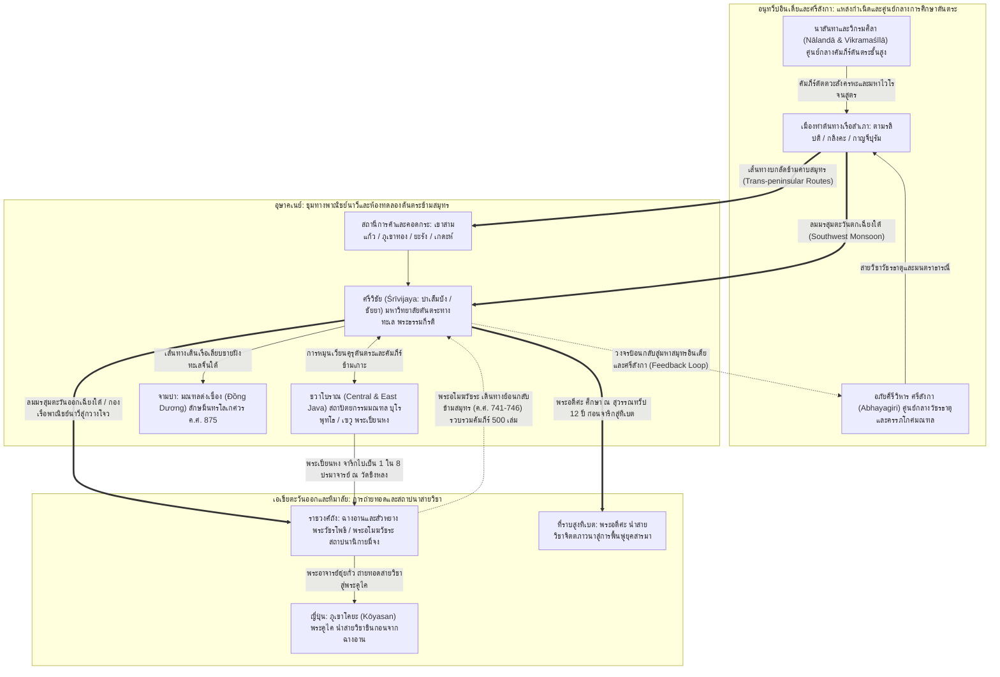

# บทที่ 4: เครือข่ายการค้าทางทะเลและชั้นวัฒนธรรมตันตระคลาสสิกในอุษาคเนย์
*(Maritime Feedback Loops and the Classical Tantric Substratum in Southeast Asia)*

---

## บทนำประจำบท (Executive Chapter Introduction)

การทำความเข้าใจประวัติศาสตร์และภูมิทัศน์ทางศาสนาของเอเชียตะวันออกเฉียงใต้ในสหัสวรรษแรกต่อเนื่องถึงต้นสหัสวรรษที่สองแห่งคริสต์ศักราช เรียกร้องการรื้อถอนกระบวนทัศน์ทางประวัติศาสตร์นิพนธ์ยุคอาณานิคมที่เคยมองการแพร่กระจายของอารยธรรมอินเดียว่าเป็นกระบวนการ "อินเดียภิวัตน์ทางเดียว" (Unidirectional Indianization) หรือการขยายตัวเชิงเส้นตรงจากศูนย์กลางชมพูทวีปสู่กลุ่มชนพื้นเมืองที่รอรับอิทธิพลอย่างเฉื่อยชา ในทางตรงกันข้าม พัฒนาการทางวิชาการร่วมสมัยด้านโบราณคดีพาณิชย์นาวี ศาสนศึกษาเปรียบเทียบ ภาษาศาสตร์ประวัติศาสตร์ และจารึกวิทยา ได้สถาปนากรอบคิดใหม่ที่มองภูมิภาคนี้ในฐานะ "พื้นที่ปฏิสัมพันธ์ร่วมทางทะเลแห่งเอเชียมรสุม" (Monsoon Asia / Indo-Pacific Maritime Interaction Sphere) ซึ่งขับเคลื่อนด้วยพลวัตข้ามสมุทรอันสลับซับซ้อนและการหมุนเวียนหลายทิศทาง (Multidirectional Feedback Loops) 

ภายใต้ระบบนิเวศแห่งลมมรสุมสองฤดู เครือข่ายการค้าทางทะเลมิได้ทำหน้าที่เป็นเพียงเส้นทางขนส่งสินค้าโภคภัณฑ์ทางกายภาพ หากแต่ปฏิบัติการในฐานะ "ท่อส่งศักดิ์สิทธิ์และทางด่วนข้ามสมุทร" (Sacred Technological Conduits) สำหรับการเคลื่อนย้ายของพระมหาเถระ นักจาริกแสวงบุญ พระคัมภีร์ วัตถุมงคล และเทคโนโลยีพิธีกรรมทางพุทธตันตระและวัชรยาน การเคลื่อนตัวของกระแสธารตันตระในห้วงเวลาดังกล่าวได้เข้าปฏิสัมพันธ์ ซ้อนทับ และหลอมรวมเข้ากับฐานความเชื่อดั้งเดิมของประชากรตระกูลภาษาออสโตรนีเชียนและออสโตรเอเชียติก ก่อรูปเป็น **"ชั้นวัฒนธรรมตันตระคลาสสิก" (Classical Tantric Substratum)** ที่หยั่งรากลึกอย่างมั่นคงและครอบคลุมทั้งภาคพื้นสมุทรจรและภาคพื้นทวีป

บทนี้มุ่งสำรวจ พลวัต โครงสร้าง และมรดกตกทอดของชั้นวัฒนธรรมตันตระคลาสสิกในอุษาคเนย์ผ่าน 7 หมวดเนื้อหาหลักอย่างรอบด้าน:
1. **หมวดที่ 4.1 เครือข่ายการค้าทางทะเล มรสุม และเส้นทางแพร่กระจายตันตระ:** วิเคราะห์พลวัตลมมรสุม เครือข่ายสถานีพักเรือ (Seasonal Waiting Rooms) เส้นทางลัดข้ามคาบสมุทร (เขาสามแก้วและภูเขาทอง) ภาษากลางทางการค้าข้ามสมุทร (Maritime Prakrit) การหมุนเวียนของมหาปรมาจารย์ (พระอี้จิง พระวัชรโพธิ พระอโมฆวัชระ พระเปียนหง และพระอตีศะ) ตลอดจนพิธีกรรมอารักขาทางทะเลและประติมานวิทยาของพระมหาโยคีโพธิสัตว์
2. **หมวดที่ 4.2 อาณาจักรศรีวิชัย: มหาวิทยาลัยตันตระทางทะเลและสะพานเชื่อมข้ามทวีป:** เจาะลึกโครงสร้างสหพันธรัฐเมืองท่า (ปาเล็มบัง, จัมบี, ไชยา, นครศรีธรรมราช) บทบาทของพระธรรมกีรติแห่งสุวรรณทวีป (Lama Serlingpa) ในฐานะมหาปราชญ์ผู้ถ่ายทอดวิชาอภิสมยาลังการและโพธิจิตแก่อตีศะทีปังกร จารึกวัดเสมาเมือง (Ligor 775 CE) และเทคโนโลยีมนตราสาปแช่ง (เตลากา บาตู และโกตา คาปูร์)
3. **หมวดที่ 4.3 ชวาโบราณ: สถาปัตยกรรมหิน อภิปรัชญามณฑล และจักรวาลวิทยา:** วิเคราะห์มหาเจดีย์บุโรพุทโธในฐานะมณฑลสามมิติและการไต่ระดับจิตจากกามธาตุ สู่รูปธาตุ และอรูปธาตุ ผังมณฑลและสายธารคัมภีร์ STTS ในกลุ่มจันทิเซวู ปลามบานัน และจันทิปลาโอซัน (Candi Plaosan) ตลอดจนมโนทัศน์ "สหายธรรมพุทธ-ไศวะ"
4. **หมวดที่ 4.4 ลัทธิไศวะ-พุทธา (Śiva-Buddha) และอทวยนิยมในชวายุคหลัง:** ชำระคัมภีร์ *สังเหยัง กามหายานิกาน* (Saṅ Hyaṅ Kamahāyānikan / SHK) และโยคะ 6 องค์ (ษฑังคโยคะ) ปรัชญาอทวยนิยม (Non-Dualism) ในวรรณกรรม *กากาวิน สุตโสม* (*Bhinneka Tunggal Ika*) ลัทธิบูชาพระไภรวะของกษัตริย์เกียรตินครและอทิตยวรมัน และการตกทอดสู่บาหลีและรหัสยลัทธิชวา (Kejawen/Sufism)
5. **หมวดที่ 4.5 อาณาจักรเขมรโบราณ: เทวราชา ปราสาทหินพิมาย และวัชรยานแห่งอังกอร์:** สืบย้อนรากฐานตันตระไศวะในลัทธิเทวราชาผ่านจารึกสดกก็อกธม (Sdok Kak Thom) และคัมภีร์ตันตระทั้งสี่เล่ม สถาปัตยกรรมวัชรยานมัณฑลยุคก่อนพระนครถึงยุคพิมายและบายน ตลอดจนการค้นพบหลักฐานโบราณคดีลานพุทธและบ่อบูชาไฟ (โฮมกรรม) ณ ปราสาทท็อปตะวันตกในยุคเปลี่ยนผ่านสู่เถรวาท
6. **หมวดที่ 4.6 อาณาจักรจามปา: พุทธมณฑลด่งเซือง (Đồng Dương):** วิเคราะห์มหาอารามพุทธ ค.ศ. 875 แห่งราชวงศ์อินทรปุระ ประติมานวิทยาพระลักษมีนทรโลเกศวรและพระนางตาราสำริด และการเชื่อมโยงเครือข่ายพุทธตันตระสากลระหว่างจามปา ชวา ศรีวิชัย และจีนราชวงศ์ถัง
7. **หมวดที่ 4.7 พุกามยุคต้น: ปัญหานักบวชอริ หรือพระอริ (Ari monks) และชั้นวัฒนธรรมตันตระคลาสสิก:** รื้อถอนวาทกรรมพงศาวดารพม่า พิสูจน์อัตลักษณ์คณะสงฆ์มหายาน-ตันตระวัชรยาน-สหชยานจากเบงกอล-ปาละ หลักฐานจิตรกรรมฝาผนังพะยาโต้นซูและนันทมัญญา จารึก ค.ศ. 1248 และการสืบทอดสู่ขบวนการเวะซาและการแปรธาตุในพม่า

จากการสืบค้นและสังเคราะห์หลักฐานประวัติศาสตร์ โบราณคดี และจารึกวิทยาข้ามภูมิภาค จะเห็นได้ว่า "ชั้นวัฒนธรรมตันตระคลาสสิก" มิใช่ปรากฏการณ์ชั่วคราวที่สูญสลายไปเมื่ออาณาจักรโบราณเหล่านี้โรยรา หากแต่ได้กลายสภาพเป็น "พิมพ์เขียวทางจิตวิญญาณและสรีรวิทยาภายใน" ที่แทรกซึม สวมทับ และแปลงรูปเข้าสู่โครงสร้างคำสอน พิธีกรรม และการปฏิบัติภาวนาของพุทธศาสนาเถรวาทในอุษาคเนย์ยุคต่อมา ดังปรากฏเด่นชัดในประเพณี "เถรวาทตันตระ" หรือ "โบราณกรรมฐาน" ซึ่งจะได้รับการคลี่คลายในบทถัดไป

---

## 4.1 เครือข่ายการค้าทางทะเล มรสุม และเส้นทางแพร่กระจายตันตระ

การศึกษาประวัติศาสตร์พุทธศาสนาในเอเชียตะวันออกเฉียงใต้ในอดีตมักตกอยู่ภายใต้พันธนาการของกระบวนทัศน์ "อินเดียภิวัตน์ทางเดียว" (Unidirectional Indianization) หรือแนวคิด "มหาภารตะ" (Greater India) ตามทัศนะของยอร์ช เซเดส์ (George Cœdès) และกลุ่มนักบูรพคดียุคอาณานิคม ซึ่งตั้งสมมติฐานว่าพัฒนาการทางอารยธรรม รัฐการปกครอง และศาสนาในอุษาคเนย์ ล้วนเป็นผลผลิตจากการถ่ายทอดอารยธรรมขั้นสูงจากชมพูทวีปสู่กลุ่มชนพื้นเมืองที่รอรับอิทธิพลอย่างเฉื่อยชา [1] อย่างไรก็ดี พัฒนาการทางวิชาการร่วมสมัยด้านโบราณคดีพาณิชย์นาวี ภาษาศาสตร์ประวัติศาสตร์ จารึกวิทยา และศาสนศึกษาเปรียบเทียบ ได้รื้อถอนภาพตัวแทนดังกล่าวอย่างสิ้นเชิง โดยสถาปนากระบวนทัศน์ใหม่ที่มองเอเชียตะวันออกเฉียงใต้ในฐานะ "พื้นที่ปฏิสัมพันธ์ร่วมทางทะเลแห่งเอเชียมรสุม" (Monsoon Asia / Indo-Pacific Maritime Interaction Sphere) ซึ่งขับเคลื่อนด้วยพลวัตข้ามสมุทรที่มีความซับซ้อน ลื่นไหล และดำเนินไปในลักษณะการหมุนเวียนหลายทิศทาง (Multidirectional Circulation and Feedback Loops) มาตั้งแต่ยุคก่อนประวัติศาสตร์ตอนปลาย [2]

ในบริบทนี้ เครือข่ายการค้าทางทะเลที่ขับเคลื่อนโดยพลังลมมรสุมมิได้ทำหน้าที่เป็นเพียงเส้นทางคมนาคมสำหรับขนส่งสินค้าโภคภัณฑ์ทางกายภาพ หากแต่เป็น "ท่อส่งทางจิตวิญญาณและเทคโนโลยีศักดิ์สิทธิ์" (Spiritual and Sacred Technological Conduits) ที่เชื่อมร้อยมหาสมุทรอินเดีย ทะเลอันดามัน อ่าวเบงกอล ช่องแคบมะละกา ช่องแคบซุนดา อ่าวไทย และทะเลจีนใต้ เข้าเป็นระบบนิเวศทางวัฒนธรรมเดียวกัน [3] เส้นทางสายไหมทางทะเล (Maritime Silk Road) ได้กลายเป็นทางด่วนข้ามสมุทรสำหรับการหลั่งไหลของพระคัมภีร์ พระมหาเถระ นักจาริกแสวงบุญ รูปเคารพ วัตถุศักดิ์สิทธิ์ และวิทยาการประกอบพิธีกรรมทางตันตระและวัชรยาน การเคลื่อนตัวของกระแสธารตันตระในสหัสวรรษแรกแห่งคริสต์ศักราชมิได้เกิดขึ้นในสุญญากาศ แต่ได้เข้าปฏิสัมพันธ์และซ้อนทับอย่างแนบแน่นกับ "ชั้นฐานความเชื่อร่วมดั้งเดิมของชาวออสโตรนีเชียนและออสโตรเอเชียติก" (Shared Cosmological Substratum) ก่อกำเนิดเป็น "ชั้นวัฒนธรรมตันตระคลาสสิก" (Classical Tantric Substratum) ในรัฐชายฝั่ง เช่น ฟูนัน ทวารวดี เจนละ จามปา ศรีวิชัย และชวาโบราณ ซึ่งต่อมาได้กลายเป็นเบ้าหลอมและรากฐานรองรับการก่อตัวของพุทธศาสนาแบบเถรวาทตันตระหรือประเพณีโบราณกรรมฐานในอุษาคเนย์ยุคหลัง [4]

---

### 4.1.1 เส้นทางสายไหมทางทะเล (Maritime Silk Road): ช่องแคบมะละกา ซุนดา และอ่าวไทย (พลวัตลมมรสุม ระบบการเดินเรือข้ามสมุทร และการไหลเวียนของสสาร วัฒนธรรม คัมภีร์)

การทำความเข้าใจสัณฐานวิทยาของเส้นทางสายไหมทางทะเลจำเป็นต้องเริ่มต้นจากการวิเคราะห์ปฏิสัมพันธ์ระหว่างสภาพแวดล้อมทางธรรมชาติกับเทคโนโลยีของมนุษย์ ดังที่อันเดรีย อาครี, โรเจอร์ เบลนช์, และอเล็กซานดรา ลันด์มันน์ (Andrea Acri, Roger Blench, and Alexandra Landmann) ได้เสนอไว้ ขอบเขตของ "เอเชียมรสุม" (Monsoon Asia) มิได้ถูกกำหนดด้วยเส้นเขตแดนทางการเมือง หากแต่ถูกร้อยรัดเข้าด้วยกันผ่าน "วงจรลมมรสุมสองฤดู" (Biannual Monsoon Rhythms) อันทรงพลัง [5] ลมมรสุมตะวันตกเฉียงใต้ (Southwest Monsoon) ซึ่งพัดผ่านมหาสมุทรอินเดียระหว่างเดือนพฤษภาคมถึงกันยายน ได้ขับเคลื่อนกองเรือสำเภาจากชายฝั่งอินเดีย อ่าวเบงกอล และทะเลอาหรับ เข้าสู่อ่าวไทย ทะเลจีนใต้ และหมู่เกาะอินโดนีเซีย ขณะที่ลมมรสุมตะวันออกเฉียงเหนือ (Northeast Monsoon) ระหว่างเดือนพฤศจิกายนถึงมีนาคม จะพัดพากองเรือจากจีนและทะเลจีนใต้ให้ล่องลงมาทางใต้และข้ามมหาสมุทรอินเดียกลับคืนสู่ตะวันตก

จังหวะการหมุนเวียนของลมมรสุมเช่นนี้ได้กำหนดโครงสร้างเชิงพื้นที่ของการเดินเรือข้ามสมุทร โดยสร้างเงื่อนไขที่เจสัน นีลิส (Jason Neelis) และคาร์ล เยตต์มาร์ (Karl Jettmar) นิยามว่าเป็น **"ห้องพักรอตามฤดูกาล" (Seasonal Waiting Rooms)** [6] กล่าวคือ เมื่อเรือสำเภาแล่นมาถึงสถานีชายฝั่งหรือจุดตัดทางภูมิศาสตร์ บรรดากะลาสี พ่อค้า วาณิช และพระภิกษุสงฆ์ผู้จาริก จำต้องทอดสมอหยุดพักอาศัยอยู่ในเมืองท่าเป็นเวลาหลายสัปดาห์หรือหลายเดือน เพื่อรอคอยให้กระแสลมมรสุมเปลี่ยนทิศทาง ช่วงเวลาแห่งการพักรออันยาวนานนี้เองที่ได้เปลี่ยนชุมชนท่าเรือให้กลายเป็น "เบ้าหลอมทางสังคมและวัฒนธรรมพหุชาติพันธุ์" (Cosmopolitan Contact Zones) ก่อให้เกิดการแลกเปลี่ยนข้อมูลข่าวสาร การแปลภาษา การถ่ายทอดคำสอนทางศาสนา และการประกอบพิธีกรรมร่วมกันระหว่างชาวต่างแดนกับประชากรท้องถิ่น [7]

ในเชิงประวัติศาสตร์นิพนธ์และทฤษฎีเครือข่าย นีลิสได้ชี้ให้เห็นอย่างแหลมคมว่า การศึกษาการแพร่กระจายของพุทธศาสนาในอดีตมักตกอยู่ใต้กับดักของแบบจำลอง "การขยายตัวโดยการแตะสัมผัสพรมแดนประชิด" (Contact Expansion) หรือการแพร่กระจายเชิงเส้นตรงแบบค่อยเป็นค่อยไป (Linear Point-to-Point Diffusion) ซึ่งมองว่าศาสนาจะค่อยๆ ขยายตัวจากศูนย์กลางอินเดียออกไปตามพื้นที่ข้างเคียงดุจหยดน้ำมันที่ซึมบนผืนผ้า [8] ทว่านีลิสได้นำเอากรอบทฤษฎี **"แบบจำลองการถ่ายทอดทางไกล" (Long-Distance Transmission Model)** ของเอริก ซูร์เชอร์ (Erik Zürcher) มาประยุกต์ใช้เพื่ออธิบายว่า การเผยแผ่พุทธศาสนาข้ามแดนมีลักษณะเป็นการ "ก้าวกระโดดข้ามพื้นที่" (Leaping across intervening zones) [9] 

ในบริบททางทะเล พุทธศาสนามิได้เคลื่อนตัวเลียบไปตามชายฝั่งอย่างเชื่องช้า หากแต่ "ก้าวกระโดดข้ามสมุทร" จากศูนย์กลางเมืองท่าใหญ่ในอินเดีย เช่น ตามรลิปติ (Tāmralipti) บริเวณปากแม่น้ำคงคา, กลิงคะ (Kalinga) ในโอริสสา, หรือกาญจีปุรัม (Kāñcīpuram) ในอินเดียใต้ ข้ามผืนน้ำอันกว้างใหญ่ของอ่าวเบงกอล มุ่งตรงเข้าสู่เมืองท่าที่เป็นศูนย์กลางอำนาจและจุดพักเรือในเอเชียตะวันออกเฉียงใต้โดยตรง [10] ยิ่งไปกว่านั้น ดังที่มาร์ก บล็อก (Marc Bloch) และนีลิสได้เสนอไว้ การสัญจรในยุคโบราณมิได้ถูกบังคับให้อยู่บน "เส้นเลือดใหญ่สายเดี่ยว" (Monopolizing Arteries) แต่แพร่กระจายไปตาม "เครือข่ายเส้นเลือดฝอยอันสลับซับซ้อน" (Capillary Routes) ที่ผู้เดินทางสามารถเลือกปรับเปลี่ยนเส้นทางได้อย่างยืดหยุ่นตามฤดูกาล สภาพอากาศ และสถานการณ์ทางการเมือง [11]

ในภูมิทัศน์ทางทะเลของเอเชียตะวันออกเฉียงใต้ เครือข่ายเส้นทางเดินเรือประกอบด้วยสองช่องแคบยุทธศาสตร์หลัก ได้แก่ **ช่องแคบมะละกา (Strait of Malacca)** และ **ช่องแคบซุนดา (Sunda Strait)** ซึ่งทำหน้าที่เป็นจุดคอขวดบังคับ (Strategic Chokepoints) ของการสัญจรระหว่างมหาสมุทรอินเดียกับทะเลจีนใต้ [12] อย่างไรก็ตาม การเดินเรืออ้อมช่องแคบมะละกาในยุคโบราณเต็มไปด้วยความเสี่ยงจากแนวปะการัง สันดอนทราย คลื่นลมแปรปรวน และการปล้นสะดมของโจรสลัด ด้วยเหตุนี้ เครือข่ายการค้าทางทะเลจึงได้พัฒนา **"เส้นทางบกลัดข้ามคาบสมุทร" (Trans-peninsular Portage Routes)** บริเวณคอดกระ (Isthmus of Kra) ในคาบสมุทรไทย-มลายูตอนบนขึ้นเป็นทางเลือกยุทธศาสตร์ที่สำคัญยิ่ง [13]

หลักฐานทางโบราณคดีที่ค้นพบโดยเบเรนิส แบลลินา (Bérénice Bellina) และคณะวิจัย ณ แหล่งโบราณคดี **"เขาสามแก้ว" (Khao Sam Kaeo)** ริมฝั่งแม่น้ำท่าตะเภาพร้อมคันคูเมืองโบราณ จังหวัดชุมพร (ฝั่งอ่าวไทย) เชื่อมโยงกับแหล่งโบราณคดี **"ภูเขาทอง" (Phu Khao Thong)** จังหวัดระนอง (ฝั่งทะเลอันดามัน) ได้พลิกโฉมหน้าความเข้าใจทางประวัติศาสตร์อย่างสิ้นเชิง [14] การขุดค้นทางโบราณคดีและผลการกำหนดอายุด้วยวิธีคาร์บอน-14 (Radiocarbon Dating) พิสูจน์ให้เห็นว่า แหล่งเขาสามแก้วได้สถาปนาขึ้นเป็น "เมืองท่านานาชาติข้ามคาบสมุทรยุคแรกเริ่ม" (Early Cosmopolitan Trans-peninsular Port-city) มาตั้งแต่ศตวรรษที่ 4 ก่อนคริสตกาล จนถึงศตวรรษที่ 1–2 แห่งคริสต์ศักราช ซึ่งแสดงให้เห็นว่า "พื้นที่บูรณาการทางทะเลของเอเชียตะวันออกเฉียงใต้" (Integrated Southeast Asian Maritime Space) ได้ก่อตัวขึ้นอย่างสมบูรณ์ตั้งแต่ยุคก่อนประวัติศาสตร์ตอนปลาย ก่อนหน้ากระบวนการอินเดียภิวัตน์ตามแบบแผนประวัติศาสตร์กระแสหลักนับร้อยปี [15]

เขาสามแก้วมิได้เป็นเพียงจุดแวะพักเรือ แต่เป็นศูนย์กลางอุตสาหกรรมและการผลิตที่มีการจัดแบ่งโซนทางสังคมและกายภาพอย่างเป็นระบบ (Socio-spatial Zoning) ภายในแหล่งโบราณคดีพบหลักฐานการตั้งถิ่นฐานร่วมกันของชุมชนช่างฝีมือต่างด้าว (Cosmopolitan Diaspora Enclaves) โดยเฉพาะช่างฝีมือชาวอินเดียใต้ที่อาศัยอยู่ร่วมกับประชากรท้องถิ่นออสโตรนีเชียนภายใต้การอุปถัมภ์ของผู้นำท้องถิ่น [16] ชุมชนแห่งนี้เป็นศูนย์กลางการผลิตอุตสาหกรรมประณีต 4 กลุ่มหลัก:
1. การผลิตลูกปัดและเครื่องประดับหินแข็งมีค่า (Carnelian, Agate, Quartz) โดยใช้เทคโนโลยีการเจาะรูด้วยหัวสว่านเพชรคู่ (Double diamond-tipped drills) ตามแบบแผนอินเดียขั้นสูง แต่ใช้วัตถุดิบท้องถิ่นและส่งออกสู่ตลาดทั่วเอเชียตะวันออกเฉียงใต้
2. การนำเข้าวัตถุดิบหินหยกเนไฟรต์ (Nephrite) จากเหมืองเฟิงเถียน (Fengtian) ในไต้หวัน เพื่อนำมาแกะสลักเป็นต่างหูมีปุ่ม (Lingling-o) และต่างหูรูปสัตว์สองหัว (Bicephalous pendants) ซึ่งเป็นเครื่องประดับสัญลักษณ์ศักดิ์สิทธิ์ของเครือข่ายวัฒนธรรมซาหวิ่น-กาลานาย (Sa Huỳnh-Kalanay) ในทะเลจีนใต้ ฟิลิปปินส์ และเวียดนาม
3. การผลิตลูกปัดแก้วสีเดียวแบบดึง (Monochrome drawn glass beads หรือ Indo-Pacific beads)
4. อุตสาหกรรมโลหกรรมสำริดที่มีดีบุกสูง (High-tin bronze bowls, มีสัดส่วนดีบุก 22–28%) ซึ่งมีคุณสมบัติพิเศษในการสะท้อนเสียงก้องกังวานศักดิ์สิทธิ์ (Acoustic Resonance) ดุจเสียงระฆังภาวนา [17]

การไหลเวียนของสสารเหล่านี้มีนัยสำคัญยิ่งต่อการแพร่กระจายของพุทธศาสนาตันตระ ดังที่แบลลินาและนีลิสได้วิเคราะห์ไว้ อัญมณี หินสี หยก และโลหะธาตุ มิได้มีมูลค่าเพียงในฐานะสินค้าฟุ่มเฟือยทางเศรษฐกิจ หากแต่เป็นสิ่งแทนของ **"สัตตรัตนะ" (Saptaratna / รัตนะ 7 ประการ)** ตามจักรวาลวิทยาพุทธ [18] ในคัมภีร์มหายานและตันตระ รัตนะเหล่านี้ถือเป็นวัตถุธาตุศักดิ์สิทธิ์ที่จำเป็นอย่างยิ่งในการสถาปนามณฑล (Mandala Consecration) การบรรจุลงในหม้อหรือผอบพระธาตุใต้ฐานสถูป (Garbhapatra) และการประกอบพิธีอภิเษกเพื่อแปลงสรีระให้เป็นพุทธภาวะ [19] ยิ่งไปกว่านั้น การค้นพบตราประทับหินคาร์เนเลียนและเศษภาชนะดินเผาที่มีรอยจารึกอักษรพราหมีโบราณ (Early Brāhmī) และภาษาปรากฤต (Prakrit) ตลอดจนสัญลักษณ์มงคล เช่น รูปนันทิบาท (Nandipada), ศรีวัตสะ (Śrīvatsa), และหม้อน้ำปูรณฆฏะ (Pūrṇaghaṭa) ณ เขาสามแก้ว ยืนยันว่าการไหลเวียนของสัญศาสตร์ทางพุทธศาสนาได้หยั่งรากข้ามสมุทรมาตั้งแต่ช่วงเปลี่ยนผ่านสหัสวรรษ [20]

นอกจากมิติทางวัตถุธรรมแล้ว มิติทางภาษาศาสตร์ยังเป็นพยานหลักฐานอันหนักแน่นในการรื้อถอนทัศนะเดิม ทอม ฮูเคอร์วอร์สต์ (Tom Hoogervorst) ได้ทำการศึกษาเชิงนิรุกติศาสตร์เปรียบเทียบอย่างลึกซึ้ง และเสนอข้อถกเถียงที่ท้าทายกรอบคิด "Sanskrit Cosmopolis" ของเชลดอน พอลล็อก (Sheldon Pollock) ซึ่งมักมองว่าการถ่ายทอดวัฒนธรรมอินเดียถูกผูกขาดโดยภาษาสันสกฤตชั้นสูงของพราหมณ์ราชสำนัก [21] ฮูเคอร์วอร์สต์ได้พิสูจน์ผ่านการสืบสร้าง **"ศัพทมูลวิทยาภาษาปรากฤต 101 คำ" (101 Prakrit Etymologies)** ในภาษาตระกูลออสโตรนีเชียน (โดยเฉพาะภาษามลายูและชวาโบราณ) ว่า การปฏิสัมพันธ์ข้ามสมุทรในยุคแรกเริ่มมิได้ขับเคลื่อนโดยวรรณะพราหมณ์ชั้นสูง เนื่องจากพราหมณ์มีข้อห้ามทางศาสนาอย่างเด็ดขาดในการเดินทางข้ามมหาสมุทร (*kālāpānī*) ซึ่งจะทำให้สูญสิ้นความบริสุทธิ์ของวรรณะ [22]

ในทางตรงกันข้าม ผู้ขับเคลื่อนการเดินเรือและบุกเบิกเครือข่ายการค้าทางทะเลตัวจริงคือกะลาสี พ่อค้าวาณิช ช่างฝีมือ และพระภิกษุสงฆ์ระดับรากหญ้า (*wiku/biku*) ผู้ใช้ **"ภาษาปรากฤต" (Middle Indo-Aryan / Prakrit)** เป็นภาษาแม่หรือภาษากลางในการสื่อสาร [23] การแปรเสียงสัทวิทยาของคำยืมเหล่านี้ส่วนใหญ่แสดงคุณลักษณะเฉพาะของ **"ภาษาอรรธมาคธี" (Ardhamāgadhī)** และกลุ่มภาษาปรากฤตสายตะวันออกของอินเดีย เช่น การเปลี่ยนเสียงพยัญชนะกักไม่ก้องระหว่างสระให้เป็นเสียงก้อง (*-k-* กลายเป็น *-g-*) ดังปรากฏในคำว่า *vāṇijaka* กลายเป็นภาษาปรากฤต *vāṇiyaga* และส่งทอดสู่ภาษามลายูโบราณในรูปคำว่า *vaṇiyāga* หรือ *berniaga* (การค้า/พ่อค้า) [24] สิ่งนี้สอดรับอย่างสมบูรณ์กับหลักฐานทางประวัติศาสตร์ที่ระบุว่า ท่าเรือตามรลิปติในเบงกอลและชายฝั่งโอริสสาคือประตูทางออกสู่ทะเลหลักของพระสงฆ์และพ่อค้าที่มุ่งหน้าสู่อุษาคเนย์

ภาษาปรากฤตทางการค้านี้ได้ผสมผสานเข้ากับไวยากรณ์ออสโตรนีเชียน จนเกิดเป็น "ภาษากลางทางการค้าข้ามสมุทร" (Maritime Trade Pidgin/Creole) ที่วางรากฐานคำศัพท์ทางเทคโนโลยี การปกครอง และศาสนาอย่างลึกซึ้ง เช่น:
- คำว่า *baja* (ภาษามลายู/ชวา แปลว่า เหล็กกล้า) ซึ่งกลายเสียงมาจากคำว่า *wajja* ในภาษาปรากฤต ซึ่งสืบมาจากภาษาสันสกฤต *vajra* (วัชระ / สายฟ้า / เพชร) [25]
- คำว่า *bǝndahara* (ขุนคลัง) จากภาษาปรากฤต *bhaṇḍāhāra* [26]
- คำว่า *bǝrhala* (ภาษามลายูโบราณ แปลว่า รูปเคารพศักดิ์สิทธิ์/พระพุทธรูป) จากภาษาปรากฤต *bhaṭṭāra(ka)* [27]
- คำว่า *wiku/biku* (นักบวช/พระภิกษุ) จากภาษาปรากฤต/บาลี *bhikkhu* [28]
- คำว่า *sapa* (คำสาบานศักดิ์สิทธิ์) จากภาษาปรากฤตสืบจากสันสกฤต *śāpa* [29]
- คำว่า *drohaka* (กบฏ/การคิดคดทรยศ) [30]

คำศัพท์เหล่านี้สะท้อนว่า เครือข่ายการค้าทางทะเลแถบมรสุมได้หล่อหลอมภาษา วัฒนธรรมทางวัตถุ และสถาบันทางสังคมในเมืองท่ารอบช่องแคบมะละกา ช่องแคบซุนดา และอ่าวไทย ให้มีความพร้อมในเชิงภววิทยาและโครงสร้างพื้นฐาน ที่จะรองรับการหลั่งไหลของพุทธศาสนาตันตระในระลอกถัดมา

---

### 4.1.2 การหมุนเวียนของนักจาริกแสวงบุญและพระมหาเถระ: พระอี้จิง (Yijing), พระวัชรโพธิ (Vajrabodhi), และพระอโมฆวัชระ (Amoghavajra) (การหยุดพักศึกษาที่ศรีวิชัย การแปลคัมภีร์ตันตระ และเครือข่ายข้ามทวีป)

เมื่อก้าวเข้าสู่ปลายศตวรรษที่ 7 ต่อเนื่องถึงศตวรรษที่ 8 ภูมิทัศน์ภูมิรัฐศาสตร์ของการเดินทางข้ามทวีปได้เกิดจุดเปลี่ยนครั้งประวัติศาสตร์ นีลิสได้ชี้ให้เห็นในบทที่ 6 ว่า เส้นทางสายไหมทางบกที่ตัดข้ามเอเชียกลางและแอ่งทาริมเริ่มประสบภาวะชะงักงันและทวีความอันตรายอย่างยิ่ง อันเนื่องมาจากความขัดแย้งทางทหาร การทำสงครามระหว่างราชวงศ์ถัง จักรวรรดิทิเบต และการรุกคืบของกองทัพอาหรับ [31] ความไม่มั่นคงบนเส้นทางคาราวานบกส่งผลให้ความสำคัญเชิงยุทธศาสตร์ของการสัญจรระหว่างอินเดียกับจีนเคลื่อนย้ายลงมาสู่ **"เส้นทางสายไหมทางทะเล" (Maritime Silk Route)** อย่างเต็มรูปแบบ โดยมีท่าเรือกวางโจว (Guangzhou) ในจีนภาคใต้ทำหน้าที่เป็นสถานีต้นทางและปลายทางหลักที่เชื่อมต่อกับทะเลจีนใต้และมหาสมุทรอินเดีย [32]

ในโครงข่ายทางทะเลข้ามทวีปนี้ อาณาจักร **"ศรีวิชัย" (Śrīvijaya)** บนเกาะสุมาตราและคาบสมุทรมลายู พร้อมด้วยราชสำนักใน **เกาะชวา (Java)** ได้ผงาดขึ้นเป็น "มหาอำนาจทางทะเล" (Thalassocracy) ที่ควบคุมเส้นทางการเดินเรือผ่านช่องแคบมะละกาและช่องแคบซุนดาอย่างเบ็ดเสร็จ ยิ่งไปกว่านั้น ศรีวิชัยมิได้ทำหน้าที่เป็นเพียงสถานีขนถ่ายสินค้าทางกายภาพ หากแต่ได้สถาปนาตนเองขึ้นเป็น **"มหาวิทยาลัยตันตระทางทะเลและสะพานเชื่อมข้ามทวีป" (Maritime Buddhist Academy and Transcontinental Nexus)** ที่มีชื่อเสียงเกียรติคุณขจรขจายไปทั่วโลกพุทธศาสนา [33]

พยานหลักฐานปฐมภูมิที่ทรงคุณค่าสูงสุดในยุคแรกเริ่มปรากฏผ่านบันทึกการเดินทางของ **พระภิกษุอี้จิง (Yijing, ค.ศ. 635–713)** พระมหาเถระชาวจีนแห่งราชวงศ์ถัง พระอี้จิงได้ตัดสินใจเดินทางไปแสวงธรรม ณ อนุทวีปอินเดียโดยใช้เส้นทางทะเล พระองค์ออกเดินทางโดยเรือพาณิชย์ของชาวเปอร์เซียจากท่าเรือกวางโจวในปี ค.ศ. 671 และแล่นเรือล่องลงมาตามลมมรสุมตะวันออกเฉียงเหนือจนกระทั่งเทียบท่าที่เมืองหลวงของศรีวิชัย ซึ่งในบันทึกภาษาจีนเรียกว่า **"โฟซือ" (Fo-shi / ปาเล็มบัง)** [34]

พระอี้จิงได้พำนักจำพรรษาอยู่ที่โฟซือเป็นเวลาถึง 6 เดือนเต็ม เพื่อเรียนรู้หลักไวยากรณ์ภาษาสันสกฤตและวิชาสัทวิทยา (Śabdavidyā) ให้เชี่ยวชาญ จากนั้นจึงโดยสารเรือของกษัตริย์ศรีวิชัยต่อไปยังแคว้นมาลายู (Melayu/Jambi), กะดะหะ (Kedah) บนคาบสมุทรมลายู, หมู่เกาะคนเปลือย (นิโคบาร์), จนกระทั่งข้ามอ่าวเบงกอลไปขึ้นฝั่งที่ท่าเรือตามรลิปติในอินเดีย เพื่อเดินทางต่อไปศึกษาพระธรรมวินัย ณ มหาวิทยาลัยนาลันทาเป็นเวลานานกว่าสิบปี [35] เมื่อสำเร็จการศึกษา พระอี้จิงได้เดินทางย้อนกลับมาตามเส้นทางทะเลเดิม และกลับมาพำนักจำพรรษาที่ศรีวิชัยอีกครั้งระหว่างปี ค.ศ. 689 ถึง 695 เพื่อแปลคัมภีร์พระวินัยและพระสูตรภาษาสันสกฤตเป็นภาษาจีน ตลอดจนเรียบเรียงผลงานชิ้นเอกสองเล่ม ได้แก่ *นันไฮ่จี้กุยเน่ยฝ่าจ้วน* (*Nanhai jigui neifa zhuan* / บันทึกพระธรรมวินัยที่ส่งกลับมาจากทะเลใต้) และ *ต้าถังซีอวี๋ฉิวฝ่าเกาสงจ้วน* (*Datang xiyu qiufa gaoseng zhuan* / ชีวประวัติพระภิกษุผู้แสวงธรรมในดินแดนประจิมทิศ) [36]

ในบันทึกเล่มดังกล่าว พระอี้จิงได้บันทึกข้อความอันเป็นอนุสรณ์สถานทางประวัติศาสตร์ที่สะท้อนความเจริญรุ่งเรืองขั้นสูงสุดของสถาบันพุทธศาสนาในศรีวิชัยไว้ว่า:
> ในนครโฟซืออันเป็นเมืองหลวงของศรีวิชัย มีพระภิกษุสงฆ์มากกว่าหนึ่งพันรูป ซึ่งจิตใจของท่านเหล่านั้นจดจ่ออยู่กับการศึกษาและการปฏิบัติธรรมอย่างเคร่งครัด กฎระเบียบและข้อวัตรปฏิบัติของคณะสงฆ์ที่นี่มิได้แตกต่างไปจากมัธยมประเทศในอินเดียเลยแม้แต่น้อย หากภิกษุชาวจีนรูปใดปรารถนาจะมุ่งหน้าไปศึกษาธรรมยังชมพูทวีป ย่อมเป็นการดีเลิศอย่างยิ่งที่จะมาพำนักศึกษาเล่าเรียนระเบียบวินัยและภาษาที่โฟซือแห่งนี้เป็นเวลาหนึ่งหรือสองปีก่อน แล้วจึงค่อยเดินทางต่อไปยังอินเดีย [37]

ข้อสังเกตของพระอี้จิงยืนยันอย่างชัดแจ้งว่า ศรีวิชัยในปลายศตวรรษที่ 7 มีสถานะเป็นศูนย์กลางทางวิชาการและจิตวิญญาณที่มีมาตรฐานทัดเทียมกับมหาวิทยาลัยนาลันทา และเป็นด่านหน้าที่พระสงฆ์ฝ่ายเหนือต้องมา "ปรับฐานความรู้" ทางภาษาศาสตร์และคัมภีร์ก่อนจะเข้าสู่อินเดีย

ต่อมาในต้นศตวรรษที่ 8 เครือข่ายทางทะเลแห่งนี้ได้กลายเป็นสะพานเชื่อมสำคัญที่สุดสำหรับการถ่ายทอดและสถาปนา **"พุทธตันตระสายวัชรยาน" (Esoteric Vajrayāna Buddhism)** เข้าสู่เอเชียตะวันออก ดังปรากฏในชีวประวัติและการปฏิบัติการของสองมหาปรมาจารย์แห่งยุค ได้แก่ **พระวัชรโพธิ (Vajrabodhi, ค.ศ. 669–741)** และศิษย์เอกคือ **พระอโมฆวัชระ (Amoghavajra, ค.ศ. 705–774)** [38]

พระวัชรโพธิเป็นพระราชโอรสของกษัตริย์ในอินเดียใต้ (ราชวงศ์ปัลลวะ) และได้รับการอุปสมบทเล่าเรียนวิทยาคมตันตระสายวัชรยานชั้นสูงที่นาลันทา หลังจากเดินทางไปเผยแผ่ธรรมและประกอบพิธีกรรมขอฝนที่ศรีลังกา พระวัชรโพธิพร้อมด้วยสามเณรอโมฆวัชระ (ผู้มีพื้นเพทางชาติพันธุ์เป็นชาวซอกเดีย/อินเดีย) ได้ออกเดินทางข้ามสมุทรในปี ค.ศ. 717 มุ่งหน้าสู่ประเทศจีน ในระหว่างการเดินทาง กองเรือของพระวัชรโพธิได้เผชิญกับพายุร้ายกลางมหาสมุทร แต่ด้วยอำนาจแห่งการบริกรรมมนตราธารณี ทำให้รอดพ้นภัยพิบัติมาได้อย่างอัศจรรย์ กองเรือได้แวะพำนักจำพรรษาที่อาณาจักรศรีวิชัยและเกาะชวา (บันทึกจีนระบุว่าอาณาจักรโฮลิง / Ho-ling) เป็นเวลาประมาณ 5 เดือน [39]

ในระหว่างการพำนักที่ศรีวิชัยและชวา พระวัชรโพธิและพระอโมฆวัชระได้แล่นเรือเข้าสู่ระบบนิเวศแห่งพุทธตันตระของหมู่เกาะ ได้พบปะกับคุรุตันตระท้องถิ่น และได้รวบรวมคัดลอกคัมภีร์ตันตระสายโยคตันตระระดับแม่บท โดยเฉพาะ **"คัมภีร์ตัตตวะสังครหะ" (*Tattvasaṃgraha*)** และ **"คัมภีร์มหาไวโรจนสูตร" (*Mahāvairocana-sūtra*)** ตลอดจนภาพมณฑลและอุปกรณ์พิธีกรรม ก่อนจะเดินทางต่อไปถึงท่าเรือกวางโจวในปี ค.ศ. 719 และเข้าสู่ราชสำนักนครลั่วหยางและฉางอาน ในรัชสมัยจักรพรรดิถังเสวียนจง [40] ทั้งสองท่านได้รับการยกย่องเป็น "ราชครูแห่งจักรวรรดิ" และได้สถาปนานิกายพุทธเร้นลับ (Mizong / 密宗) ขึ้นในจีน โดยมีศูนย์กลางอยู่ที่วัดต้าซิงซ่าน (Daxingshan) และวัดชิงหลง (Qinglong) [41]

ความสำคัญของเครือข่ายทางทะเลตอกย้ำยิ่งขึ้นเมื่อพระวัชรโพธิมรณภาพ พระอโมฆวัชระได้รับบัญชาให้เดินทางข้ามสมุทรย้อนกลับมายังศรีลังกาและเอเชียตะวันออกเฉียงใต้อีกครั้งระหว่างปี ค.ศ. 741 ถึง 746 การเดินทางในรอบที่สองนี้มีเป้าหมายเพื่อ "ตามล่าและรวบรวมคัมภีร์ตันตระ" พระอโมฆวัชระได้เข้าพบพระสังฆนายกสมันตภัทร (Samantabhadra) ณ สำนักอภัยคีรีวิหารในศรีลังกา เพื่อรับการอภิเษกขั้นสูงสุดในสายวัชรธาตุมณฑลและครรภโกศมณฑล พร้อมทั้งรวบรวมคัมภีร์ตันตระและธารณีมากกว่า 500 คัมภีร์ ก่อนจะเดินทางผ่านเมืองท่าในเอเชียตะวันออกเฉียงใต้เพื่อนำคัมภีร์เหล่านั้นกลับไปแปลเป็นภาษาจีนในราชสำนักถัง [42]

สิ่งที่อันเดรีย อาครี (Andrea Acri) ได้เน้นย้ำเป็นพิเศษในบทความ "Tantrism 'Seen from the East'" คือ การที่วงวิชาการต้องตระหนักว่า กระบวนการถ่ายทอดทางปัญญาข้ามสมุทรนี้ **มิใช่การเดินทางแบบทางเดียว (Not a One-Way Street)** หากแต่เป็น "วงจรป้อนกลับหลายทิศทาง" (Multidirectional Feedback Loops) อย่างแท้จริง [43] อาครีได้ยกหลักฐานชิ้นเอกสองกรณีเพื่อพิสูจน์บทบาทนำของเอเชียตะวันออกเฉียงใต้:

ประการแรก กรณีศึกษาของ **พระเปียนหง (Bianhong / 辯弘)** พระภิกษุผู้มีพื้นเพดั้งเดิมเป็นชาวเกาะชวา (Java-dvīpa) พระเปียนหงได้จาริกข้ามทะเลไปยังนครฉางอาน และได้เข้าฝากตัวเป็นศิษย์ของพระอาจารย์ฮุ่ยกั่ว (Huiguo, ค.ศ. 746–805) ผู้เป็นศิษย์เอกสืบทอดสายวิชาของพระอโมฆวัชระ ณ วัดชิงหลง พระเปียนหงได้รับการถ่ายทอดสายวิชาครรภโกศมณฑลและวัชรธาตุมณฑลจนเชี่ยวชาญ และได้รับการอภิเษกแต่งตั้งให้เป็น **หนึ่งในแปดศิษย์เอกระดับปรมาจารย์ (One of the Eight Great Disciples)** ร่วมรุ่นกับ **พระคูไค (Kūkai / Kōbō-Daishi, ค.ศ. 774–835)** พระมหาเถระชาวญี่ปุ่นผู้เดินทางมาศึกษาและนำพุทธตันตระกลับไปสถาปนานิกายชินกอน (Shingon) บนภูเขาโคยะ [44] การที่พระภิกษุชาวชวาก้าวขึ้นสู่ตำแหน่งผู้นำทางปัญญาในสำนักตันตระหลวงของจักรวรรดิถัง ยืนยันว่าอุษาคเนย์มิได้เป็นเพียงผู้รับคำสอน แต่เป็นผู้ส่งออกบุคลากรทางวิชาการเข้าสู่เครือข่ายสากล

ประการที่สอง กรณีศึกษาของ **พระอตีศะ ทีปังกรศรีชญาณ (Atiśa Dīpaṃkara Śrījñāna, ค.ศ. 982–1054)** มหาปราชญ์และอธิการบดีแห่งมหาวิหารวิกรมศิลาในแคว้นเบงกอล ผู้เป็นศูนย์กลางแห่งการฟื้นฟูพุทธศาสนาในทิเบตยุคหลัง (ยุคสารมา / Sarma) คัมภีร์ประวัติศาสตร์ทิเบตระบุตรงกันว่า ในช่วงต้นศตวรรษที่ 11 (ราว ค.ศ. 1012) พระอตีศะได้ตัดสินใจลงเรือสำเภาพาณิชย์รอนแรมฝ่าคลื่นลมข้ามมหาสมุทรอินเดียเป็นเวลาหลายเดือน เพื่อมุ่งหน้ามายังเกาะสุมาตรา (สุวรรณทวีป) เพื่อถวายตัวเป็นศิษย์ของ **"พระธรรมกีรติแห่งสุวรรณทวีป" (Dharmakīrti of Suvarṇadvīpa หรือที่ชาวทิเบตรู้จักในนาม ลามะเซร์ลิงปา / Lama Serlingpa)** [45]

พระอตีศะได้พำนักศึกษาเล่าเรียนวิชาพุทธตันตระ อภิธรรม วิปัสสนาจิตตภาวนา (Bodhicitta) และคัมภีร์ *อภิสมยาลังการ* อยู่ ณ ราชสำนักศรีวิชัยเป็นเวลายาวนานถึง 12 ปีเต็ม พระธรรมกีรติแห่งสุวรรณทวีปได้รับการยกย่องจากพระอตีศะว่าเป็น "พระอาจารย์ผู้ทรงพระคุณสูงสุด" ในบรรดาครูบาอาจารย์ทั้งหมด และคำสอนสายจิตตภาวนาที่พระอตีศะได้รับถ่ายทอดมาจากสุวรรณทวีปนี้เอง ที่ต่อมาได้กลายเป็นรากฐานแม่บทของวรรณกรรม *โพธิปถประทีป* (*Bodhipathapradīpa*) และโครงสร้างคำสอนแบบลำดับขั้น (Lamrim) ในพุทธศาสนาแบบทิเบต [46]

ประจักษ์พยานทางประวัติศาสตร์เหล่านี้พิสูจน์ให้เห็นว่า เครือข่ายการค้าทางทะเลแถบมรสุมได้แปรเปลี่ยนหมู่เกาะและคาบสมุทรในเอเชียตะวันออกเฉียงใต้ ให้กลายเป็นศูนย์กลางแห่งการสังเคราะห์ ผลิตซ้ำ และส่งออกองค์ความรู้ทางพุทธตันตระระดับโลก ที่เชื่อมร้อยอินเดีย ศรีลังกา สุมาตรา ชวา จีน ทิเบต และญี่ปุ่น เข้าไว้ด้วยกันอย่างเป็นอินทรียภาพ


*แผนภาพที่ 4.1: โครงข่ายเส้นทางแพร่กระจายตันตระทางทะเลและวงจรป้อนกลับหลายทิศทางในเอเชียมรสุม (Maritime Tantric Diffusion and Multidirectional Feedback Loops in Monsoon Asia)*

---

### 4.1.3 ท่าเรือพาณิชย์ในฐานะเบ้าหลอมการแลกเปลี่ยนทางวัฒนธรรม พิธีกรรม และการอารักขาทางทะเล (Emporia and Maritime Protection Rituals: บทบาทของมนตร์ ธารณี และพระโพธิสัตว์ผู้คุ้มครองภัยทางทะเล)

ในมิติสังคมวิทยาและมานุษยวิทยาศาสนา เมืองท่าพาณิชย์ (Emporia / Port-polities) ตามแนวชายฝั่งมหาสมุทรอินเดีย ช่องแคบมะละกา และอ่าวไทย มิได้ปฏิบัติการเป็นเพียงตลาดแลกเปลี่ยนสินค้าทางกายภาพ หากแต่มีสถานะเป็น **"พื้นที่ศักดิ์สิทธิ์และเบ้าหลอมทางพิธีกรรม" (Ritualized Commercial Arenas)** ความสัมพันธ์ระหว่างสถาบันสงฆ์กับเครือข่ายพ่อค้าทางทะเลตั้งอยู่บนรากฐานของกลไกที่เจสัน นีลิส เรียกว่า **"เศรษฐกิจเชิงศีลธรรมแห่งบุญบารมี" (The Moral Economy of Merit)** [47]

นีลิสอธิบายว่า การค้าทางทะเลระยะไกลในยุคโบราณเป็นการลงทุนที่มีความเสี่ยงภัยสูงสุดต่อทั้งทรัพย์สินและชีวิต วาณิชและกะลาสีต้องเผชิญหน้ากับความไม่แน่นอนของลมฟ้าอากาศ โรคระบาด สัตว์ร้าย และการอับปางกลางมหาสมุทร สภาวะความเปราะบางทางจิตวิทยานี้ได้กระตุ้นให้เกิดความต้องการอย่างแรงกล้าต่อ "หลักประกันทางจิตวิญญาณและความคุ้มครองเหนือธรรมชาติ" [48] ในระบบความสัมพันธ์แบบพึ่งพาอาศัยซึ่งกันและกัน (Symbiotic Relationship) นี้ คณะสงฆ์ทำหน้าที่เป็น "เนื้อนาบุญอันประเสริฐ" (Puṇyakṣetra) ที่เปิดโอกาสให้พ่อค้าวาณิชนำความมั่งคั่งส่วนเกิน (Surplus Wealth) มาเปลี่ยนเป็น "ไทยธรรม" (Deyadharma) ผ่านการบริจาคสร้างวัด สถูป พระพุทธรูป หรือการถวายทุนถาวร (Akṣayanīvī) เพื่อแลกกับ "ธรรมทาน" (Dharmadāna) อันเป็นบุญกุศลและพลังอำนาจศักดิ์สิทธิ์ที่จะคุ้มครองกองเรือพาณิชย์ให้เดินทางปลอดภัยและประสบผลกำไรมหาศาล [49]

คัมภีร์พุทธศาสนาตั้งแต่ยุคต้นจนถึงยุคมหายานและตันตระได้หยิบยืมอุปมาอุปไมยทางการค้ามาใช้อย่างลึกซึ้ง พระพุทธองค์ได้รับการเฉลิมพระนามว่าเป็น **"สารถวาหะ" (Sārthavāha)** หรือนายวาณิชผู้นำกองคาราวานและกองเรือสำเภาผู้มีปรีชาญาณ นำพามนุษยชาติข้ามผ่านทะเลทรายและห้วงมหาสมุทรแห่งวัฏสงสาร [50] ขณะเดียวกัน ชาดกและอวทานจำนวนมาก เช่น *สุปารกชาดก* และ *มหาชนกชาดก* ล้วนเล่าเรื่องราวอดีตชาติของพระโพธิสัตว์ในฐานะต้นหนเรือสำเภาผู้ยอมสละชีวิตเพื่อช่วยเหลือเหล่าวาณิชให้รอดพ้นจากพายุร้ายกลางทะเล

สภาวะความเสี่ยงภัยของการเดินเรือข้ามสมุทรได้ให้กำเนิด **"พิธีกรรมอารักขาทางทะเล" (Maritime Apotropaic Rituals)** ที่มีความสลับซับซ้อน พระสงฆ์ผู้จาริกและกะลาสีได้นำพาคัมภีร์มนตราและธารณี (Dhāraṇī) ติดตัวไปในเรือเดินสมุทร เพื่อใช้สวดบริกรรมในการระงับพายุ คลื่นยักษ์ และปัดเป่าสัตว์ร้ายในทะเล คัมภีร์ธารณีที่เป็นที่นิยมสูงสุดในหมู่ชาวเรือ ได้แก่ *อุษณีษวิชัยธารณี* (*Uṣṇīṣavijayā-dhāraṇī*), *มหาปรัตยังคิรา* (*Mahāpratyaṅgirā*), *มยุรีวิทยาราชญี* (*Mahāmāyūrī-vidyārājñī* / มนต์นกยูงทองคุ้มครองพิษและอสรพิษ), ตลอดจนคาถาหัวใจพระพุทธศาสนา [51]

พยานหลักฐานทางโบราณคดีที่กระจายตัวอยู่ตามเมืองท่า ชุมทางข้ามคาบสมุทร และถ้ำเพิงผาริมชายฝั่งรอบอ่าวไทยและคาบสมุทรมลายู ยืนยันถึงการปฏิบัติการของพิธีกรรมอารักขานี้อย่างเด่นชัด การค้นพบ **"พระพิมพ์ดินดิบ" (Votive Tablets)** จำนวนมหาศาลที่จารึกพระคาถาเย ธรฺมาฯ (*Ye dharmā hetuprabhavā...*) และรูปพระโพธิสัตว์ ในถ้ำต่างๆ เช่น ถ้ำคูหาภิมุข (วัดหน้าถ้ำ) จังหวัดยะลา, ถ้ำเขาอกทะลุ จังหวัดพัทลุง, ถ้ำสระมรกตในเทือกเขากลันตัน, ตลอดจนแหล่งโบราณคดีเมืองไชยา (สุราษฎร์ธานี), ยะรัง (ปัตตานี), และกัวลากังซาร์ในรัฐเประ [52] 

ดังที่นีลิสได้วิเคราะห์ไว้ในมโนทัศน์เรื่อง **"กระบวนการสร้างพื้นที่ศักดิ์สิทธิ์ท้องถิ่น" (Locativization of the Buddha's Presence)** ในพื้นที่ทุรกันดารหรือชุมทางชายทะเลที่ชุมชนยังไม่มีทรัพยากรเพียงพอจะสร้างมหาสถูปถาวร พระสงฆ์และนักเดินทางจะสร้าง "อุทเทสิกเจดีย์" (Uddeśika-dhātu) ผ่านพระพิมพ์ดินดิบ ภาพสลักหิน หรือแผ่นจารึกมนตรา เพื่อประดิษฐาน "พระธรรมกาย" (Dharmakāya) ให้สถิตอยู่ ณ จุดยุทธศาสตร์นั้น [53] เพิงผาและถ้ำชายฝั่งเหล่านี้จึงทำหน้าที่เป็น "ศาลาพักใจศักดิ์สิทธิ์" ที่ชาวเรือจะเข้ามากราบไหว้ สวดมนต์ขอพรก่อนออกเรือฝ่าคลื่นลมมรสุม และกลับมาถวายสิ่งของบูชาขอบพระคุณเมื่อรอดชีวิตกลับมาอย่างปลอดภัย [54]

ศูนย์กลางแห่งพิธีกรรมอารักขาทางทะเลคือ **"ลัทธิบูชาพระโพธิสัตว์อวโลกิเตศวร / โลเกศวร" (The Cult of Avalokiteshvara / Lokeshvara as Maritime Protector)** พระโพธิสัตว์องค์นี้ทรงมีบทบาทเด่นชัดในฐานะพระผู้คุ้มครองภัยพิบัติทั้งแปดประการ (Aṣṭamahābhaya) โดยเฉพาะภัยจากเรือแตกกลางมหาสมุทร ใน *สัทธรรมปุณฑรีกสูตร* บทที่ 24 (สมันตมุขปริวรรต) ระบุไว้อย่างชัดแจ้งว่า หากเรือสำเภาของเหล่าวาณิชที่ออกไปแสวงหาแก้วมณีถูกลมพายุพัดพาไปตกอยู่ในดินแดนของเหล่านางรากษสี หากมีใครคนหนึ่งระลึกถึงพระนามของพระอวโลกิเตศวร ทุกคนบนเรือลำนั้นจะรอดพ้นจากความตาย [55]

การศึกษาวิจัยล่าสุดของนิโกลาส์ เรอวีร์ (Nicolas Revire) และคณะ (2024/2025) ในวารสาร *Journal of the Siam Society* ได้เปิดเผยข้อค้นพบทางประวัติศาสตร์ศิลปะและประติมานวิทยาที่ปฏิวัติวงการอย่างยิ่ง [56] เรอวีร์ได้ทำการวิเคราะห์ประติมากรรมสัมฤทธิ์พระโพธิสัตว์ก่อนเมืองพระนคร (Pre-Angkorian Bronze Bodhisattva, ปลายศตวรรษที่ 7 ถึงต้นศตวรรษที่ 8) ณ สถาบันศิลปะแห่งชิคาโก (Art Institute of Chicago) ควบคู่กับ "กลุ่มประติมากรรมสำริดประโคนชัย" (Prakhon Chai Hoard) ในจังหวัดบุรีรัมย์ และประติมากรรมสำริดพระโพธิสัตว์ปัทมปาณีแห่งเมืองไชยา [57]

เรอวีร์พิสูจน์ให้เห็นว่า ประติมากรรมสำริดพระโพธิสัตว์เหล่านี้มิได้แสดงออกในรูปของ "กษัตริย์ผู้ทรงเครื่องราชาภรณ์อลังการ" (Crowned / Regal Bodhisattva) ตามแบบศิลปะบายนในยุคพระนครตอนปลาย แต่แสดงออกในรูปของ **"พระมหาโยคีนักพรตผู้บำเพ็ญตบะ" (Ascetic Mahāyogin)** อย่างบริสุทธิ์:
- พระเศียรเกล้ามวยผมสูงแบบ **ชฎามกุฏ (Jaṭāmukuṭa)** ที่ถักทอจากเส้นพระเกศาจริง มีรูปพระอมิตาภพุทธประทับด้านหน้า
- ทรงนุ่งผ้าผืนสั้นและพาดทับสะโพกด้วย **หนังกวางหรือหนังเสือ (Ajinājñeya / Tiger Skin)**
- พระหัตถ์ถือ **หม้อน้ำกมัณฑลุ (Kamaṇḍalu)**, **คัมภีร์ใบลาน (Pustaka)**, และ **ดอกบัว (Padma)** ปราศจากเครื่องประดับอัญมณีของกษัตริย์ [58]

เรอวีร์ชี้ว่า ประติมานวิทยาของพระมหาโยคีนักพรตนี้สะท้อนว่า พระโพธิสัตว์อวโลกิเตศวรได้รับการเคารพบูชาในฐานะ **"ปรมาจารย์แห่งโยคะเร้นลับ" (Archetype of Esoteric Meditation and Asceticism)** ซึ่งสอดคล้องอย่างสมบูรณ์กับภาพลักษณ์ของพระภิกษุสายโยคาวจรที่ปลีกวิเวกบำเพ็ญภาวนาตามถ้ำ ป่าเขา และชายฝั่งทะเล รูปเคารพพระโพธิสัตว์สัมฤทธิ์ขนาดกะทัดรัดเหล่านี้สามารถเคลื่อนย้ายและพกพาไปในเรือเดินสมุทรได้สะดวก ทำหน้าที่เป็นทั้งสิ่งยึดเหนี่ยวจิตใจ ศูนย์กลางแห่งการเพ่งนิมิต และวัตถุคุ้มครองภัยพิบัติของเหล่าวาณิชและพระภิกษุสงฆ์ข้ามสมุทร [59]

ยิ่งไปกว่านั้น การแพร่กระจายของพุทธตันตระในเมืองท่าพาณิชย์ยังเกิดจากการบรรจบกันทางโครงสร้างลึกกับความเชื่อดั้งเดิม ดังที่อันเดรีย อาครี ได้เสนอวิทยานิพนธ์เรื่อง **"ตันตริกชนม์ มองจากฟากตะวันออก" (Tantrism "Seen from the East")** [60] อาครีชี้ให้เห็นว่า ดินแดนอุษาคเนย์มี "ความพร้อมทางวัฒนธรรมและภววิทยาอยู่แล้ว" (Pre-adapted Cultural Matrix) ชุมชนพื้นเมืองออสโตรนีเชียนมีมโนทัศน์เรื่องพลังวิญญาณชีวิตที่เรียกว่า **"เซอมังงัต" (Semangat)** หรือสุมังงัต ซึ่งเป็นพลังงานที่ไหลเวียนอยู่ในร่างกายมนุษย์ สัตว์ พืช และวัตถุศักดิ์สิทธิ์ [61] เมื่อพุทธตันตระนำเสนอระบบ "กายละเอียด" (Subtle Body) ที่ว่าด้วยชีพจรลมปราณ (Nāḍī), จักระ (Cakra), และหยดพลังงาน (Bindu) ชนพื้นเมืองจึงมองว่าคำสอนตันตระคือ "เทคโนโลยีขั้นสูงในการควบคุมและยกระดับเซอมังงัต" ให้ทรงอานุภาพยิ่งขึ้น [62]

ในทำนองเดียวกัน วัฒนธรรมเรือของชาวทะเลได้แปรสภาพ "เรือ" ให้กลายเป็นอุปมาของร่างกายมนุษย์และการข้ามสังสารวัฏ ขณะที่ความกลัวต่อพายุร้ายและเทพเจ้าฟ้าร้อง เช่น เทพเจ้า *เอ็นกู* (*Nkuu'*) ในคติชนของชนพื้นเมือง (ตามการศึกษาของ Robert Knox Dentan) ได้กลายเป็นเบ้าหลอมทางจิตวิทยาที่เปิดรับ "ทวยเทพปางดุร้าย" (Wrathful / Krodha Deities) เช่น พระไภรวะ (Bhairava), พระเหรุกะ (Heruka), และพระยมาริ เพื่อนำอำนาจแห่งความดุร้ายมาสยบคลื่นลมและวิญญาณร้ายในทะเล [63]

มิติทางการเมืองของพิธีกรรมตันตระในเมืองท่าปรากฏชัดเจนในจารึกอาณาจักรศรีวิชัย เช่น **จารึกโกตา คาปูร์ (Kota Kapur, ค.ศ. 686)** บนเกาะบังกา และ **จารึกเทลากา บาตู (Telaga Batu, ปลายศตวรรษที่ 7)** ที่เมืองปาเล็มบัง [64] จารึกเหล่านี้บันทึกพิธีกรรมดื่มน้ำสาบานศักดิ์สิทธิ์ (*Tantu / Sumpah*) และการร่ายมนตราสาปแช่งตันตระอันน่าสะพรึงกลัว โดยใช้คำว่า **marsāpa-sumpah** (การสาบานแช่ง) และข่มขู่ผู้คิดคดทรยศ (**drohaka**) ว่าจะต้องถูกลงทัณฑ์ด้วยสายฟ้าฟาดและความวิบัติถึงแก่ชีวิต [65] พิธีกรรมตันตระนี้ถูกใช้เป็นเทคโนโลยีแห่งรัฐในการควบคุมเครือข่ายเจ้าเมืองท่า กองทัพเรือ และกะลาสี ให้รักษาความภักดีต่อศูนย์กลางจักรวรรดิ เพื่อประกันความมั่นคงและเสรีภาพของการค้าข้ามสมุทร

โดยสรุป เครือข่ายการค้าทางทะเลแถบมรสุม เมืองท่าพาณิชย์ และการหมุนเวียนของนักจาริกแสวงบุญ มิได้เป็นเพียงฉากหลังทางประวัติศาสตร์ แต่เป็น "กลไกขับเคลื่อนหลัก" ที่หล่อหลอม ถ่ายทอด และสถาปนาพุทธตันตระให้กลายเป็น **"ชั้นวัฒนธรรมรองรับร่วมกันของภูมิภาค" (Regional Esoteric Substratum)** ความรู้ด้านสรีรวิทยาภายใน มนตรา ธารณี ยันต์ การจัดวางธาตุ และจิตวิญญาณแห่งพระมหาโยคีโพธิสัตว์ ที่สั่งสมอยู่ในโครงข่ายเมืองท่าโบราณนี้ ได้ส่งทอดและกลมกลืนเข้าสู่พุทธศาสนาเถรวาทในยุคต่อมา กลายเป็นมรดกตกทอดที่ทรงพลังในรูปของ **"เถรวาทตันตระ" (Tantric Theravāda)** หรือ **"ประเพณีโบราณกรรมฐาน" (Borān Kammaṭṭhāna)** ที่ยังคงสืบทอดชีวิตชีวาอยู่ในดินแดนสุวรรณภูมิจวบจนปัจจุบัน

---

## 4.2 อาณาจักรศรีวิชัย: มหาวิทยาลัยตันตระทางทะเลและสะพานเชื่อมข้ามทวีป

การศึกษาประวัติศาสตร์และพัฒนาการของพุทธศาสนาในเอเชียตะวันออกเฉียงใต้ช่วงระหว่างคริสต์ศตวรรษที่เจ็ดถึงสิบสาม (พุทธศตวรรษที่ 12–18) ไม่อาจดำเนินไปอย่างครบถ้วนสมบูรณ์ได้หากปราศจากการทำความเข้าใจบทบาทอันไพศาลของ "อาณาจักรศรีวิชัย" (Śrīvijaya) ในฐานะมหาอำนาจพาณิชย์นาวี (Thalassocracy) และศูนย์กลางทางปัญญาเร้นลับของพุทธศาสนามหายานและวัชรยานระดับนานาชาติ ในประวัติศาสตร์นิพนธ์ยุคอาณานิคมภายใต้อิทธิพลของสำนักบูรพคดีศึกษาฝรั่งเศส นำโดยยอร์ช เซเดส์ (George Cœdès) อาณาจักรศรีวิชัยมักถูกสร้างภาพตัวแทนในฐานะ "รัฐฮินดูภิวัตน์" (Indianized State) หรือจักรวรรดิรวมศูนย์ทางอำนาจที่รับสินค้าทางปัญญา วรรณกรรม และเทววิทยาจากอินเดียมาใช้ในลักษณะถ่ายทอดทางเดียว (Unidirectional Diffusion) [66] ทว่า การรื้อสร้างกระบวนทัศน์ทางประวัติศาสตร์และโบราณคดีร่วมสมัย โดยเฉพาะข้อเสนอในหนังสือ *Spirits and Ships: Cultural Transfers in Early Monsoon Asia* (2017) นำโดย อันเดรีย อากรี (Andrea Acri), โรเจอร์ เบลนช์ (Roger Blench) และอเล็กซานดรา ลันด์มันน์ (Alexandra Landmann) ร่วมกับข้อวิเคราะห์ใน *Before Siam: Essays in Art and Archaeology* (2014) ของนิโกลาส์ เรอวีร์ (Nicolas Revire) และสตีเฟน เอ. เมอร์ฟีย์ (Stephen A. Murphy) ได้พิสูจน์ให้เห็นอย่างชัดเจนว่า เอเชียตะวันออกเฉียงใต้ภาคพื้นสมุทร (Maritime Southeast Asia) มิได้เป็นเพียงดินแดนชายขอบที่รองรับอิทธิพลจากภายนอกอย่างเฉื่อยชา หากแต่เป็น "เบ้าหลอมอันทรงพลัง" (Active Crucible) และ "ห้องทดลองทางจิตวิญญาณที่มีหลายศูนย์กลาง" (Polycentric Laboratory of the Spirit) ที่เข้าร่วมในการร่วมสร้างสรรค์ สังเคราะห์ และหมุนเวียนคัมภีร์ พิธีกรรม และเทคโนโลยีทางจิตวิญญาณของพุทธตันตระข้ามมหาสมุทร [67]

ความโดดเด่นของศรีวิชัยในฐานะ "มหาวิทยาลัยตันตระทางทะเล" (Maritime Tantric University) ปรากฏชัดผ่านการเชื่อมโยงระบบการศึกษาของสงฆ์เข้ากับเครือข่ายเส้นทางสายไหมทางทะเล (Maritime Silk Road) ในเขตมรสุมเอเชีย ดังที่พระภิกษุจีนหลวงจีนอี้จิง (Yijing) ได้บันทึกไว้ตั้งแต่ปลายคริสต์ศตวรรษที่เจ็ดว่า เมืองหลวงของศรีวิชัยเป็นศูนย์กลางที่มีพระสงฆ์พำนักศึกษาอยู่มากกว่าหนึ่งพันรูป ซึ่งดำเนินวัตรปฏิบัติและศึกษาหลักสูตรเช่นเดียวกับมหาวิทยาลัยนาลันทาในอินเดีย [68] การเป็นชุมทางทางทะเลทำให้ศรีวิชัยทำหน้าที่เป็นสะพานเชื่อมโยงเครือข่ายครูบาอาจารย์ ตำรา และพิธีกรรมระหว่างชมพูทวีป เอเชียตะวันออกเฉียงใต้ ราชวงศ์ถังและซ่งในจีน ตลอดจนราชอาณาจักรทิเบตบนเทือกเขาหิมาลัย สายธารคำสอนพุทธตันตระที่หยั่งรากลึกในศรีวิชัยได้กลายเป็น "ชั้นวัฒนธรรมรองรับ" (Classical Tantric Substratum) อันแข็งแกร่ง ซึ่งหล่อหลอมโลกทัศน์ เทววิทยาแห่งกษัตริย์ สถาปัตยกรรมมณฑล และวัฒนธรรมทางวัตถุของคาบสมุทรและหมู่เกาะมลายู ก่อนที่จะส่งอิทธิพลตกค้างและกลมกลืนเข้าสู่วัฒนธรรมพุทธศาสนาเถรวาทในยุคต่อมา

---

### 4.2.1 ภูมิทัศน์ศูนย์กลางอำนาจและศาสนาของศรีวิชัย: ปาเล็มบัง (Palembang), จัมบี (Muaro Jambi), ไชยา (Chaiya), และนครศรีธรรมราช (Ligor)

การทำความเข้าใจโครงสร้างทางภูมิศาสตร์การเมืองและศาสนาของศรีวิชัย เรียกร้องการรื้อถอนกรอบคิดเรื่อง "จักรวรรดิรวมศูนย์แบบแผ่นดินใหญ่" (Centralized Territorially Unified Empire) ซึ่งคริส เบเกอร์ (Chris Baker) และไฮแรม วูดเวิร์ด (Hiram Woodward) ได้วิพากษ์ว่าเป็นมโนทัศน์ที่นักประวัติศาสตร์ยุคอาณานิคมและชาตินิยมสร้างขึ้นจากจินตภาพของรัฐชาติสมัยใหม่ [69] ในความเป็นจริง อาณาจักรศรีวิชัยมีลักษณะเป็น "สหพันธรัฐเมืองท่าพาณิชย์นาวีแบบพหุศูนย์กลาง" (Polycentric Maritime Confederation / Mandala of Port-Polities) ตามการวิเคราะห์ของปีแยร์-อีฟว์ ม็องแกง (Pierre-Yves Manguin) และโอ. ดับเบิลยู. วอลเตอร์ส (O. W. Wolters) [70] โครงสร้างของรัฐศรีวิชัยขับเคลื่อนด้วยเครือข่ายสายสัมพันธ์ทางการค้าและพิธีกรรมศักดิ์สิทธิ์ที่เชื่อมโยงเมืองท่าและศูนย์กลางศาสนาสำคัญสี่แห่งเข้าด้วยกันอย่างแนบแน่น ได้แก่ ปาเล็มบัง (Palembang), จัมบี (Muaro Jambi), ไชยา (Chaiya), และนครศรีธรรมราช (Ligor) ซึ่งแต่ละแห่งทำหน้าที่เฉพาะในการบริหารอำนาจและการบ่มเพาะคำสอนตันตระข้ามสมุทร

ศูนย์กลางแห่งแรกคือ **ปาเล็มบัง (Palembang)** ริมแม่น้ำมูซี (Musi River) ทางตอนใต้ของเกาะสุมาตรา ซึ่งทำหน้าที่เป็นเมืองหลวงแห่งแรกและศูนย์กลางอำนาจบริหารของราชวงศ์ศรีวิชัยในปลายคริสต์ศตวรรษที่เจ็ด (พุทธศตวรรษที่ 13) ภูมิศาสตร์ของปาเล็มบังซึ่งตั้งอยู่ใกล้ทางออกสู่ช่องแคบบังกาและช่องแคบมะละกา ทำให้เมืองนี้กลายเป็นจุดแวะพักเรือและศูนย์กลางการศึกษาภาษาสันสกฤตที่สำคัญที่สุดในเอเชียสมุทรจร หลวงจีนอี้จิง (Yijing) ได้เดินทางมาจำพรรษา ณ ปาเล็มบัง (ซึ่งเอกสารจีนเรียกว่า "โฟชิ" Fo-shih หรือ "ซื่อลี่ฝอซื่อ" Shih-li-fo-shih) ในปี ค.ศ. 671 เป็นเวลาหกเดือน เพื่อศึกษาวิชาสัพพวิทยาหรือไวยากรณ์ภาษาสันสกฤต (Śabdavidyā) ก่อนจะเดินทางต่อไปศึกษา ณ มหาวิทยาลัยนาลันทาในอินเดีย และหลังจากนั้น อี้จิงได้เดินทางกลับมาพำนักแปลพระสูตรและคัมภีร์วินัยภาษาสันสกฤตเป็นภาษาจีน ณ ปาเล็มบังอีกเกือบสิบปี (ค.ศ. 685–695) [71] 

ในบันทึก *หนานไห่จี้กุยเน่ยฝ่าจ้วน* (Nan hai ji gui nei fa zhuan / บันทึกธรรมเนียมพระธรรมวินัยส่งมาจากทะเลใต้) อี้จิงได้พรรณนาถึงสภาพแวดล้อมทางปัญญาของปาเล็มบังไว้อย่างแจ่มชัดว่า ภายในเมืองหลวงศรีวิชัยมีภิกษุสงฆ์ผู้ทรงสมณศักดิ์มากกว่าหนึ่งพันรูป ซึ่งมุ่งมั่นศึกษาเล่าเรียนวิชาการทางพุทธศาสนาและปฏิบัติตามพระธรรมวินัยอย่างบริสุทธิ์หมดจด ข้อวัตรปฏิบัติ การสวดมนต์ และการอภิปรายธรรมล้วนมีมาตรฐานสูงส่งเทียบเท่ากับอารามในมัธยมประเทศของอินเดีย อี้จิงถึงกับระบุคำแนะนำแก่พระภิกษุชาวจีนที่ประสงค์จะเดินทางไปแสวงบุญยังแดนพุทธภูมิในชมพูทวีปว่า สมควรเดินทางมาพำนักศึกษา ณ ศรีวิชัยเป็นเวลาหนึ่งถึงสองปีเพื่อฝึกฝนไวยากรณ์และระเบียบพิธีกรรมเสียก่อน [72] หลักฐานทางโบราณคดีที่ปาเล็มบังยืนยันบันทึกของอี้จิงอย่างหนักแน่น โดยมีการค้นพบจารึกรุ่นแรกสุดของศรีวิชัย เช่น จารึกเกอดูกันบูกิต (Kedukan Bukit Inscription, ค.ศ. 683), จารึกตาลังตูโว (Talang Tuwo Inscription, ค.ศ. 684) ตลอดจนการค้นพบพระพุทธรูปหินขนาดใหญ่และประติมากรรมพระโพธิสัตว์อวโลกิเตศวรบนเนินเขาศักดิ์สิทธิ์บูกิต เซกุนตัง (Bukit Seguntang) ซึ่งเป็นศูนย์กลางพิธีกรรมทางจิตวิญญาณของราชสำนัก

ศูนย์กลางแห่งที่สองคือ **มูอาโร จัมบี (Muaro Jambi)** หรือแคว้นมลายูโบราณ (Melayu) ริมแม่น้ำบาตังฮารี (Batang Hari River) ตอนกลางของเกาะสุมาตรา ซึ่งได้ทวีบทบาทสำคัญขึ้นเป็นศูนย์กลางทางศาสนาและวิทยาลัยพุทธตันตระที่ใหญ่ที่สุดของศรีวิชัยในช่วงคริสต์ศตวรรษที่สิบถึงสิบสาม การสำรวจและขุดค้นทางโบราณคดีของอิมราน บิน ทาจุดีน (Imran bin Tajudeen) และราดา เชมบูร์การ์ (Radha Chemburkar) เผยให้เห็นว่า แหล่งโบราณคดีมูอาโร จัมบี ครอบคลุมพื้นที่กว้างใหญ่กว่า 12 ตารางกิโลเมตร ประกอบด้วยกลุ่มศาสนสถานก่ออิฐโบราณ (Candi) มากกว่าแปดสิบแห่ง โดยมีศาสนสถานหลักที่สำคัญ ได้แก่ จันทิติงกี (Candi Tinggi), จันทิกุมปุง (Candi Gumpung), จันทิเกอดาตอน (Candi Kedaton), และจันทิอัสตานา (Candi Astano) [73]

ทาจุดีนได้ชี้ให้เห็นว่า สถาปัตยกรรมก่ออิฐที่มูอาโร จัมบี สะท้อนการประยุกต์ใช้ "กรอบการทำงานคู่ขนาน" (Parallel Frameworks) ระหว่างตำราวาสตุศาสตร์ (Vāstuśāstra) และผังมณฑลพุทธตันตระของอินเดีย เข้ากับสถาปัตยกรรมแท่นหินลดหลั่นแบบปุนเดนเบอรุนดัก (Pundèn Berundak) ของชนพื้นเมืองออสโตรนีเชียน โดยจัดวางอาคารอิฐบนลานดินยกพื้นลดหลั่นหันหน้าเข้าสู่แม่น้ำบาตังฮารีอันเป็นเส้นทางสัญจร [74] ณ จันทิกุมปุง ได้มีการค้นพบพระพุทธรูปปางมารวิชัย พระโพธิสัตว์ปัทมปาณี และประติมากรรมพระนางปรัชญาปารมิตาสัมฤทธิ์ที่มีฝีมือช่างประณีตสูงสุด ตลอดจนการค้นพบหม้อดินศักดิ์สิทธิ์ (Garbhapatra / Pripih) ใต้ฐานอาคาร ซึ่งบรรจุแผ่นทองคำลงอักขระมนตราตันตระตามระบบธาตุทั้งห้า ยิ่งไปกว่านั้น บริเวณหุบเขาแม่น้ำกัมปาร์ (Kampar River) ซึ่งเชื่อมต่อกับจัมบี ยังเป็นที่ตั้งของกลุ่มโบราณสถานมูอาราตากุส (Muara Takus) ซึ่งการขุดค้น ณ จันทิบึงสุ (Candi Bungsu) ได้ค้นพบแผ่นศิลาจารึกมนตราด้วยอักษรนาครี (Nāgarī script) พร้อมด้วยสัญลักษณ์ "วิศววัชระ" (Viśvavajra หรือวัชระไขว้) ซึ่งเชมบูร์การ์ยืนยันว่าเป็นพยานหลักฐานอันหนักแน่นถึงการประกอบพิธีอภิเษกวัชรยาน (Vajrayāna Consecration) ภายในอาณาจักรศรีวิชัย [75] มูอาโร จัมบี จึงเป็นที่ตั้งของสถาบันการศึกษาตันตระชั้นสูงที่ซึ่งพระธรรมกีรติแห่งสุวรรณทวีปพำนักจำพรรษาและสั่งสอนศิษยานุศิษย์จากทั่วโลกพุทธศาสนาในศตวรรษที่สิบเอ็ด

ศูนย์กลางแห่งที่สามคือ **ไชยา (Chaiya)** บริเวณอ่าวบ้านดอน จังหวัดสุราษฎร์ธานี ในภาคใต้ของประเทศไทย ซึ่งทำหน้าที่เป็นศูนย์กลางอำนาจและเมืองท่าควบคุม "เส้นทางลัดข้ามคาบสมุทร" (Trans-peninsular Portage Route) ตอนบน เบเรนิซ เบลลินา (Bérénice Bellina) ได้แสดงหลักฐานทางโบราณคดีว่า ชุมชนบนคาบสมุทรไทย-มลายูตอนบน เช่น แหล่งโบราณคดีเขาสามแก้วและภูเขาทอง มีประวัติศาสตร์การเป็นชุมทางการค้าข้ามสมุทรเชื่อมโยงอ่าวเบงกอลกับทะเลจีนใต้มาตั้งแต่ช่วงปลายยุคก่อนประวัติศาสตร์ (ศตวรรษที่สี่ก่อนคริสตกาล) [76] เมื่อเข้าสู่ยุคประวัติศาสตร์ ไชยาจึงกลายเป็นจุดยุทธศาสตร์ที่รับส่งสินค้าและแนวคิดทางศาสนาข้ามระหว่างแม่น้ำพุมดวง-แม่น้ำตาปีกับฝั่งทะเลอันดามัน (ตะกั่วป่า)

ความรุ่งโรจน์ของพุทธศาสนามหายาน-วัชรยานในเขตไชยาปรากฏผ่านหลักฐานทางประวัติศาสตร์ศิลปะระดับมาสเตอร์พีซของโลก นั่นคือ พระบรมธาตุไชยา และกลุ่มประติมากรรมสัมฤทธิ์พระโพธิสัตว์อวโลกิเตศวร พระบรมธาตุไชยาได้รับการออกแบบตามคติมณฑลจักรวาลวิทยาตันตระ โดยมีเรือนธาตุประธานทรงปราสาทเหลี่ยมย่อมุม ล้อมรอบด้วยซุ้มจระนำและสถูปิกาจำลองซ้อนชั้นลดหลั่น ซึ่งมีลักษณะทางสถาปัตยกรรมคู่ขนานอย่างยิ่งกับจันทิกะลาซัน (Candi Kalasan, ค.ศ. 778) และจันทิปะวน (Candi Pawon) ในชวาภาคกลาง [77] นอกจากนี้ ประติมากรรมสัมฤทธิ์พระโพธิสัตว์อวโลกิเตศวรปัทมปาณีสองกรและสี่กรที่ค้นพบ ณ วัดพระบรมธาตุไชยา (ปัจจุบันจัดแสดงในพิพิธภัณฑสถานแห่งชาติ พระนคร) ซึ่งแสดงรูปองค์พระโพธิสัตว์ทรงศิราภรณ์มวยผมชฎามกุฏประดิษฐานพระอมิตาภพุทธเจ้า ทรงผ้านุ่งประดับลวดลายวิจิตรและพาดสายยัชโญปวีต แสดงให้เห็นถึงการถ่ายทอดอิทธิพลศิลปะแบบราชวงศ์ปาละและราชวงศ์ไศเลนทร์แห่งชวาที่หลอมรวมเข้ากับฝีมือช่างท้องถิ่นคาบสมุทรอย่างสมบูรณ์แบบ [78] ดังที่นิโกลาส์ เรอวีร์ ได้ชี้ให้เห็นว่า ลัทธิบูชาพระโพธิสัตว์อวโลกิเตศวรในคาบสมุทรมลายูทำหน้าที่เป็นสายธารทางจิตวิญญาณที่เชื่อมโยงผู้คนเข้ากับเครือข่ายความคุ้มครองทางทะเล [79]

ศูนย์กลางแห่งที่สี่คือ **นครศรีธรรมราช (Ligor / ตามพรลิงค์ Tāmbraliṅga)** ซึ่งตั้งอยู่บนแนวสันทรายโบราณริมชายฝั่งอ่าวไทยตอนกลาง นครศรีธรรมราชทำหน้าที่เป็นเมืองท่าพหุศาสนา (Multi-religious Entrepôt) ที่มีความสำคัญอย่างยิ่งยวดในการควบคุมเส้นทางการค้าทางทะเลข้ามแหลมมลายู เมืองแห่งนี้เป็นเบ้าหลอมทางวัฒนธรรมที่มีการอยู่ร่วมกันของพุทธศาสนามหายาน พุทธวัชรยาน ไศวนิกาย และไวษณวนิกาย หลักฐานสำคัญระดับอนุสรณ์สถานทางจารึกวิทยาของนครศรีธรรมราช คือ "ศิลาจารึกวัดเสมาเมือง" (Ligor Inscription ค.ศ. 775 / ศิลาจารึกหลักที่ 23) ซึ่งบันทึกการสร้างปราสาทอิฐสามหลังเพื่อถวายแด่พระพุทธเจ้า พระปัทมปาณี และพระวัชรปาณี โดยความร่วมมือระหว่างกษัตริย์ศรีวิชัยและราชวงศ์ไศเลนทร์ [80] นครศรีธรรมราชจึงเป็นจุดเชื่อมต่อเชิงพื้นที่ที่เชื่อมระหว่างสุมาตรา คาบสมุทรไทย และเกาะชวาเข้าด้วยกัน ก่อนที่ในคริสต์ศตวรรษที่สิบสาม เมืองแห่งนี้จะเปลี่ยนผ่านไปสู่การเป็นศูนย์กลางการเผยแผ่พุทธศาสนาเถรวาทแบบลังกาวงศ์สู่สุโขทัย โดยยังคงเก็บรักษาสัญลักษณ์และชั้นฐานวัฒนธรรมตันตระดั้งเดิมไว้ในรูปคติการสร้างพระบรมธาตุเจดีย์และพิธีกรรมทางจิตวิญญาณ

---

### 4.2.2 พระธรรมกีรติแห่งสุวรรณทวีป (Dharmakīrti of Suvarṇadvīpa / Serlingpa): ปราชญ์ผู้สอนคัมภีร์ *อภิสมยาลังการ* (Abhisamayālaṅkāra) และตันตระแก่อติศะทีปังกร (Atiśa Dīpaṅkara Śrījñāna)

ในมิติทางประวัติศาสตร์ปัญญาญาณและญาณวิทยาแห่งพุทธตันตระ ปรากฏการณ์ที่ยืนยันสถานะความเป็น "มหาวิทยาลัยตันตระทางทะเล" ของศรีวิชัยได้อย่างเด็ดขาดที่สุด คือชีวประวัติและการเดินทางของพระอตีศะ ทีปังกรศรีชญาณ (Atiśa Dīpaṃkara Śrījñāna, ค.ศ. 982–1054) มหาปราชญ์ชาวเบงกอลผู้ซึ่งต่อมาได้ดำรงตำแหน่งอัครมหาบัณฑิตแห่งมหาวิทยาลัยวิกรมศิลา (Vikramaśīla) และเป็นผู้นำการปฏิรูปฟื้นฟูพุทธศาสนาครั้งใหญ่ในทิเบต (ยุคการเผยแผ่ยุคหลัง หรือ Chidar / Phyi-dar) 

อันเดรีย อากรี (Andrea Acri) ได้นำเสนอข้อวิเคราะห์ทางประวัติศาสตร์นิพนธ์ระดับพลิกกระบวนทัศน์ (Paradigm Shift) ในบทความ *"Tantrism 'Seen from the East'"* (2017) โดยชี้ให้เห็นว่า เรื่องเล่าดั้งเดิมที่ยึดอินเดียเป็นศูนย์กลางมักทึกทักเอาเองว่าอินเดียเป็นครูตลอดกาลและเอเชียตะวันออกเฉียงใต้เป็นศิษย์ตลอดไป ทว่า การที่พระอตีศะจำต้องเดินทางรอนแรมข้ามมหาสมุทรเป็นระยะทางนับพันไมล์เพื่อมาศึกษาพระพุทธศาสนา ณ เกาะสุมาตรา เป็นเวลาถึงสิบสองปี ได้ทำลายมายาคติดังกล่าวลงอย่างสิ้นเชิง และพิสูจน์ว่าในคริสต์ศตวรรษที่สิบเอ็ด ปรมาจารย์ผู้ได้รับการยอมรับนับถือสูงสุดในโลกพุทธศาสนาด้านปรัชญาญาณและการปฏิบัติโพธิจิต มิได้พำนักอยู่ในอินเดีย หากแต่พำนักอยู่ในเอเชียตะวันออกเฉียงใต้ภาคพื้นสมุทร [81]

ปรมาจารย์ผู้ยิ่งใหญ่ท่านนั้นคือ **พระธรรมกีรติแห่งสุวรรณทวีป (Dharmakīrti of Suvarṇadvīpa)** ซึ่งในเอกสารตัวเขียนและชีวประวัติภาษาทิเบต (Tibetan Namthars / *rNam thar*, เช่น *bKa' gdams bu chos*, และบันทึกประวัติศาสตร์ของ Tāranātha ตลอดจนคัมภีร์ *Deb ther sngon po* หรือ *The Blue Annals* ของ Gö Lotsawa) ได้รับการถวายพระนามอันศักดิ์สิทธิ์ว่า **"ลามะ เซอร์ลิงปา" (Lama Serlingpa / Bla-ma gSer-gling-pa)** ซึ่งมีความหมายว่า "พระอาจารย์แห่งเกาะทองคำ" (สุวรรณทวีป/เกาะสุมาตรา) [82] บันทึกฝ่ายทิเบตระบุว่า พระธรรมกีรติเป็นเจ้านายในพระราชวงศ์ไศเลนทร์แห่งศรีวิชัย ผู้ทรงสละราชสมบัติออกผนวชและบรรลุปัญญาญาณชั้นสูงสุด จนได้รับการยกย่องว่าเป็นพระธรรมทายาทสายตรงผู้สืบทอดสายวิชา "จิตตภาวนาและโพธิจิต" จากพระไมเตรยะและพระอสังคะ 

ชีวประวัติของพระอตีศะระบุว่า ในช่วงต้นคริสต์ศตวรรษที่สิบเอ็ด (ราว ค.ศ. 1011–1012) ขณะที่พระอตีศะพำนักศึกษาอยู่ในอินเดีย ท่านได้รับคำชี้แนะจากพระอาจารย์หลายท่านและจากนิมิตว่า หากปรารถนาจะบรรลุความรู้แจ้งในธรรมะขั้นสูงสุดเพื่อช่วยเหลือสรรพสัตว์ ท่านจะต้องเดินทางไปศึกษาวิชาโพธิจิตกับพระธรรมกีรติ ณ เกาะสุวรรณทวีป พระอตีศะพร้อมด้วยคณะศิษย์จึงได้ตัดสินใจลงเรือเดินสมุทรของพ่อค้าข้ามอ่าวเบงกอล การเดินทางครั้งนั้นกินเวลายาวนานถึง 14 เดือน เนื่องจากเรือต้องเผชิญกับพายุร้ายและคลื่นยักษ์กลางทะเลลึก ซึ่งตามโลกทัศน์ทางศาสนาของทิเบตเชื่อว่าเป็นอำนาจของพญามารที่พยายามขัดขวางมิให้คำสอนเรื่องมหาโพธิจิตได้รับการถ่ายทอด [83] 

วารูโน มะฮ์ดี (Waruno Mahdi) ได้วิเคราะห์บริบททางกายภาพของการเดินทางนี้ว่า เรือที่พระอตีศะโดยสารคือ "เรือพญากุนหลุน" (K'un-lun bo / 崑崙舶) ซึ่งเป็นเรือสำเภาเดินสมุทรขนาดยักษ์ของชาวเกาะอุษาคเนย์ที่มีความยาวกว่า 50–60 เมตร มีกราบเรือซ้อนหลายชั้น และมีเสากระโดง 4–5 เสา บรรทุกผู้คนได้นับพันคน เรือเหล่านี้ทำหน้าที่เป็น "อารามลอยน้ำและวิทยาลัยพุทธตันตระข้ามสมุทร" [84] ในระหว่างที่เรือเผชิญวิกฤตคลื่นลม พระอตีศะได้ประกอบพิธีกรรมมนตรายาน เจริญสมาธิเพ่งถึงพระโพธิสัตว์อวโลกิเตศวรและสวดสาธยายธารณีพระแม่ตารา (Tārā) จนกระทั่งสามารถสงบคลื่นลมและนำเรือเข้าเทียบท่าปาเล็มบังและจัมบีได้อย่างปลอดภัย

เมื่อเดินทางถึงสุมาตรา พระอตีศะได้เข้าฝากตัวเป็นศิษย์และพำนักศึกษาเล่าเรียนอยู่ภายใต้การอบรมของพระธรรมกีรติเป็นเวลานานถึง 12 ปีเต็ม (ระหว่าง ค.ศ. 1012–1024) [85] ในช่วงเวลาดังกล่าว พระธรรมกีรติได้ถ่ายทอดคำสอนระดับแก่นแท้ของพุทธศาสนามหายานและตันตรยานให้แก่พระอตีศะอย่างหมดเปลือก โดยมีวิชาสำคัญสามประการ:

ประการแรกคือ **คัมภีร์ *อภิสมยาลังการ* (Abhisamayālaṅkāra)** พร้อมด้วยอรรถกถา *Sphuṭārthā* ของท่านหริภัทระ ซึ่งเป็นคัมภีร์อภิปรัชญาชั้นสูงที่ประมวลและจำแนกขั้นตอนแห่งการตรัสรู้ (Mārga) ทั้งหมดของพระโพธิสัตว์ตามแนวคิดในพระสูตรปรัชญาปารมิตา พระธรรมกีรติแห่งสุวรรณทวีปได้รับการยกย่องว่าเป็นผู้เชี่ยวชาญคัมภีร์นี้มากที่สุดในยุคนั้น โดยท่านได้รจนาอรรถกถาสำคัญของตนเองชื่อ *Duravabodhāloka* (แสงสว่างส่องธรรมอันเข้าใจได้ยาก) ซึ่งได้รับการแปลและเก็บรักษาไว้ในพระไตรปิฎกฉบับภาษาทิเบต (Tengyur) [86]

ประการที่สองคือ **เทคโนโลยีการเจริญโพธิจิตและการชำระจิต (Bodhicitta and Mind Training / Lojong):** พระธรรมกีรติได้ถ่ายทอดเคล็ดวิชาสมาธิภาวนาขั้นสูงสุดในการสร้าง "สมมติโพธิจิต" และ "ปรมัตถโพธิจิต" โดยเฉพาะวิธีการเจริญจิตแบบ **"การเปลี่ยนตนเองเป็นผู้อื่น" (Tonglen / Parātma-parivartana / การรับเอาความทุกข์ของผู้อื่นมาไว้ที่ตน และการมอบความสุขของตนให้แก่ผู้อื่น)** ตามแนวทางของพระศานติเทวะในคัมภีร์ *โพธิสัตวจรรยาวตาร* (*Bodhicaryāvatāra*) คำสอนสายนี้กลายเป็นหัวใจของวิชา "บลอกจอง" (Lojong / การฝึกอบรมจิต) ซึ่งพระอตีศะได้นำไปถ่ายทอดให้แก่ชาวทิเบตในเวลาต่อมา [87]

ประการที่สามคือ **คำสอนและพิธีอภิเษกสายวัชรยานตันตระขั้นสูง:** บันทึกของเดวิด สเนลล์โกรฟ (David Snellgrove) และเบนอยโตช ภัฏฏาจารย์ (Benoytosh Bhattacharyya) ระบุว่า พระธรรมกีรติยังเป็นผู้เชี่ยวชาญในคัมภีร์ *เหวัชรตันตระ* (*Hevajratantra*) และ *กาลจักรตันตระ* (*Kālacakratantra*) โดยได้ประกอบพิธีมนตราภิเษก ถ่ายทอดมณฑลเร้นลับ และมอบเทวรูปประจำพระองค์ให้แก่พระอตีศะ [88]

ความลึกซึ้งและความผูกพันระหว่างครูกับศิษย์ปรากฏผ่านบันทึกชีวประวัติว่า ภายหลังจากที่พระอตีศะเดินทางกลับสู่อินเดียและเดินทางต่อไปยังทิเบต ทุกครั้งที่มีลูกศิษย์เอ่ยพระนามของพระอาจารย์ท่านอื่น พระอตีศะจะประนมมือขึ้นแสดงความเคารพ แต่เมื่อใดก็ตามที่มีผู้เอ่ยถึงพระนามของ "พระอาจารย์เซอร์ลิงปาแห่งสุวรรณทวีป" พระอตีศะจะยกมือพนมขึ้นเหนือเศียรเกล้า หลั่งน้ำตาด้วยความซาบซึ้งและก้มกราบลงกับพื้น พร้อมทั้งกล่าวว่า "คุณธรรม ความรู้ และโพธิจิตทั้งหมดที่ข้าพเจ้ามี ล้วนเกิดขึ้นจากพระมหากรุณาธิคุณของพระอาจารย์เซอร์ลิงปาแต่เพียงผู้เดียว" [89]

มรดกทางปัญญาที่พระอตีศะได้รับจากศรีวิชัยได้ก่อให้เกิด **"วงจรการสะท้อนกลับทางปัญญาข้ามทวีป" (Trans-Himalayan Feedback Loop):** เมื่อพระอตีศะเดินทางไปถึงแคว้นงารีในทิเบตตะวันตกในปี ค.ศ. 1042 ท่านได้รจนาผลงานชิ้นเอกคือคัมภีร์ *โพธิปถประทีป* (*Bodhipathapradīpa* / ประทีปแห่งหนทางสู่โพธิญาณ) ซึ่งสรุปย่อขั้นตอนการปฏิบัติธรรมทั้งหมดโดยมีรากฐานมาจากคำสอนของพระธรรมกีรติ คัมภีร์เล่มนี้ได้กลายมาเป็นแม่แบบของวรรณกรรมตระกูล **"ลัมริม" (Lamrim / ขั้นตอนแห่งหนทางสู่ความหลุดพ้น)** ซึ่งเป็นแกนกลางคำสอนของสำนักกาแดม (Kadam) และต่อมาได้รับการสืบทอดโดยพระซงคาปา (Tsongkhapa) ผู้ก่อตั้งนิกายเกลุก (Gelug) และสถาบันดาไลลามะ [90] 

ข้อเท็จจริงทางประวัติศาสตร์นี้ยืนยันข้อสรุปอันทรงพลังของ Andrea Acri ที่ว่า:
> "การปรากฏอยู่ของพระอาจารย์ธรรมกีรติแห่งสุวรรณทวีป ณ ใจกลางสายธารธรรมวงศ์ของพระอตีศะ พิสูจน์ว่าเอเชียตะวันออกเฉียงใต้ภาคพื้นสมุทรมิใช่ 'ผู้บริโภค' หากแต่เป็น 'ผู้ผลิต' รายใหญ่ของทฤษฎีการหลุดพ้นขั้นสูงในพุทธศาสนา" [91]

---

### 4.2.3 จารึกตันตระและหลักฐานทางประวัติศาสตร์ของศรีวิชัย: จารึกวัดเสมาเมือง (Ligor Inscription 775 CE / ศิลาจารึกหลักที่ 23), จารึกโกตา คาปูร์ (Kota Kapur), จารึกเตลากา บาตู (Telaga Batu) และมนตร์สาปแช่ง (Tantric imprecations), สถูปิกาจำลองและคาถา เย ธรฺมา

หลักฐานเชิงประจักษ์ทางจารึกวิทยาและโบราณคดีที่ค้นพบในคาบสมุทรไทย-มลายูและเกาะสุมาตรา ได้มอบภาพสะท้อนอันหนักแน่นถึงการประยุกต์ใช้ "เทคโนโลยีพุทธตันตระ" (Tantric Technologies) ในฐานะเครื่องมือทางอุดมการณ์รัฐและการพิทักษ์ปริมณฑลอำนาจของศรีวิชัยอย่างเป็นรูปธรรม

หลักฐานชิ้นเอกชิ้นแรกคือ **ศิลาจารึกวัดเสมาเมือง (Ligor Inscription ค.ศ. 775 / ศิลาจารึกหลักที่ 23)** ซึ่งค้นพบ ณ วัดเสมาเมือง อำเภอเมือง จังหวัดนครศรีธรรมราช จารึกด้วยอักษรหลังปัลลวะภาษาสันสกฤต ระบุมหาศักราช 697 (ตรงกับ ค.ศ. 775 หรือ พ.ศ. 1318) ศิลาจารึกหลักนี้มีความสำคัญเป็นพิเศษเนื่องจากมีข้อความจารึกอยู่ทั้งสองด้าน (Face A และ Face B):

**ด้านที่หนึ่ง (Face A):** ประกอบด้วยโศลกภาษาสันสกฤต 10 โศลก สรรเสริญพระเกียรติคุณของ "พระมหากษัตริย์แห่งศรีวิชัย" (Śrīvijayendrarāja / ศรีวิชเยนทรราชา) ผู้ทรงเปี่ยมด้วยเดชานุภาพดั่งพระอินทร์และมหาสมุทร ทรงมีพระราชศรัทธาอย่างลึกซึ้งในพระรัตนตรัย ข้อความในโศลกที่หกและเจ็ดระบุอย่างชัดเจนว่า พระองค์ได้ทรงสร้าง **"ปราสาทอิฐสามหลัง" (Trisamaya Caitya / ตริสมัยเจติยะ)** เพื่อประดิษฐานรูปเคารพศักดิ์สิทธิ์สามองค์ ได้แก่:
1. พระศากยมุนีสัมมาสัมพุทธเจ้า (องค์ประธานผู้ทรงชนะมารและบรรลุพระโพธิญาณ)
2. พระปัทมปาณีโพธิสัตว์ (Avalokiteśvara Padmapāṇi - พระหัตถ์ถือดอกบัว บุคลาธิษฐานแห่งมหากรุณา)
3. พระวัชรปาณีโพธิสัตว์ (Vajrapāṇi - พระหัตถ์ถือวัชระ บุคลาธิษฐานแห่งพระปัญญาและพลังอำนาจมนตราเร้นลับแห่งวัชรยาน) [92]

นิโคลัส เจ. โครม (N. J. Krom) ปรมาจารย์โบราณคดีดัตช์ ได้ชี้ให้เห็นข้อสังเกตเชิงประติมานวิทยาและสถาปัตยกรรมเปรียบเทียบอันน่าทึ่งใน *Barabudur: Archaeological Description* (1927) ว่า ผังรูปเคารพตรีเอกานุภาพ (Triad) ของพระพุทธเจ้า, พระปัทมปาณี, และพระวัชรปาณี ในจารึกวัดเสมาเมือง สอดคล้องและตรงกันอย่างแม่นยำกับกลุ่มประติมากรรมหินขนาดมหึมาภายในห้องครรภคฤหะของ **"จันทิเมินดุต" (Candi Mendut)** ในชวาภาคกลาง ซึ่งประดิษฐานพระพุทธรูปปางปฐมเทศนา (ธรรมจักรมุทรา) ขนาบข้างด้วยพระอวโลกิเตศวรและพระวัชรปาณี [93]

**ด้านที่สอง (Face B):** ประกอบด้วยโศลกภาษาสันสกฤต 4 โศลก (จารึกไม่จบ) สรรเสริญพระมหากษัตริย์แห่ง **"ราชวงศ์ไศเลนทร์" (Śailendravamśa / ศรีมหาราชาแห่งไศเลนทรวงศ์)** ผู้ทรงมีสมญานามอันเกรียงไกรว่า "ผู้ทรงสังหารศัตรูผู้กล้าหาญ" (Vairi-vīra-vimardana) แม้นักวิชาการในอดีตเช่น ยอร์ช เซเดส์ จะเคยสันนิษฐานว่ากษัตริย์ศรีวิชัยในด้าน A และกษัตริย์ไศเลนทร์ในด้าน B คือบุคคลคนเดียวกัน แต่นักวิชาการรุ่นหลัง เช่น Krom, Boechari, de Casparis, และ Hiram Woodward ได้เสนอว่า จารึกหลักนี้บันทึกสายสัมพันธ์ทางเครือญาติและการเมืองระหว่างสองราชสำนัก ที่ร่วมมือกันสถาปนา "ระเบียงมณฑลพุทธตันตระข้ามสมุทร" จากคาบสมุทรมลายูลงไปสู่ชวากลาง [94]

หลักฐานสำคัญชิ้นที่สองคือ **จารึกโกตา คาปูร์ (Kota Kapur Inscription ค.ศ. 686)** ซึ่งค้นพบบนเกาะบังกา (Bangka Island) ใกล้ชายฝั่งสุมาตรา จารึกด้วยอักษรหลังปัลลวะ ภาษามาลายูโบราณ (Old Malay) ผสมผสานคำยืมภาษาสันสกฤต ระบุมหาศักราช 608 (ตรงกับ ค.ศ. 686) จารึกหลักนี้บันทึกเหตุการณ์ประวัติศาสตร์ที่กองทัพเรือศรีวิชัยยาตราทัพไปปราบปรามดินแดน "ภูมิชวา" (Bhūmi Jāva) ที่ไม่ยอมสวามิภักดิ์ ความสำคัญอย่างยิ่งยวดในมิติตันตระคือ การปรากฏของคำว่า **"สิทธยาตระ" (Siddhayātra / ศิทธยาตฺรา)** ซึ่งแปลว่า "การจาริกเพื่อแสวงหาฤทธิ์อำนาจ ความสำเร็จทางเวทมนตร์ หรือการบรรลุสิทธิทางตันตระ" คำคำนี้ยังปรากฏในจารึกเกอดูกันบูกิต (Kedukan Bukit, ค.ศ. 683) ที่ระบุว่ากษัตริย์ดัปุนตะ ฮียัง (Dapunta Hiyaṃ) เสด็จกรีธาทัพเรือสองหมื่นนายเพื่อ "ประกอบพิธีสิทธยาตระ" สะท้อนให้เห็นว่า การขยายอำนาจทางทหารและการรวมดินแดนของศรีวิชัยดำเนินไปควบคู่กับพิธีกรรมทางจิตวิญญาณสายมนตรนัยเพื่อดึงพลังเหนือธรรมชาติมาหนุนนำอำนาจราชสำนัก [95]

หลักฐานชิ้นที่สาม ซึ่งถือเป็น "อนุสาวรีย์แห่งเทคโนโลยีมนตราสาปแช่งของศรีวิชัย" คือ **จารึกเตลากา บาตู (Telaga Batu Inscription, ปลายคริสต์ศตวรรษที่เจ็ด)** ที่ค้นพบ ณ สระน้ำเตลากา บาตู เมืองปาเล็มบัง สุมาตราใต้ จารึกหลักนี้สลักลงบนแท่นหินแอนดีไซต์ขัดมันรูปทรงโค้งมน ด้านบนจำหลักเป็นรูปเศียรพญานาคแผ่พังพาน 7 เศียรอย่างสง่างามและน่าสะพรึงกลัว ตอนล่างของแท่นหินเจาะเป็นร่องรางและทำพวยกา (Spout) ยื่นออกมาสำหรับรองรับน้ำศักดิ์สิทธิ์ ตัวบทจารึกด้วยภาษามาลายูโบราณจำนวน 33 บรรทัด ประกอบด้วย **"สูตรคำสาปแช่งและมนตราลงทัณฑ์แบบตันตระอันวิจิตรพิสดาร" (Elaborate Tantric Curse Formula & Imprecation Ritual)** [96]

วารูโน มะฮ์ดี (Waruno Mahdi) และอันเดรีย อากรี (Andrea Acri) ได้วิเคราะห์หน้าที่เชิงสถาบันของจารึกเตลากา บาตูว่า แท่นหินนี้ถูกสร้างขึ้นเพื่อใช้ในพิธีกรรม "ดื่มน้ำสบถสาบานความจงรักภักดี" (*Tantu / Sumpah*) น้ำศักดิ์สิทธิ์จะถูกเทรินรดลงบนเศียรพญานาค ให้ไหลผ่านอักขระมนตราและสูตรคำสาปแช่งลงสู่พวยกา เพื่อให้ข้าราชบริพารและชนชั้นนำทุกระดับดื่มกิน ตัวบทจารึกได้ระบุรายชื่อตำแหน่งข้าราชการและกลุ่มคนในสังคมศรีวิชัยไว้อย่างละเอียดลออที่สุด ตั้งแต่พระราชโอรส (rājaputra), องค์รัชทายาท (yuvarāja), พระมเหสี, เสนาบดีผู้ใหญ่ (pratyaya), แม่ทัพนายกอง (daṇḍanāyaka), ผู้พิพากษา, เจ้าเมือง, เสมียนช่างน้ำ (kāyastha), ไปจนถึง **"กัปตันเรือเดินสมุทร" (Puhāvaṅ / Nākhodā)** และ **"ฝีพายชาวเล" (Orang Laut)** [97]

หากบุคคลใดคิดคด ทรยศ กระด้างกระเดื่อง หรือสมคบคิดกับศัตรูเพื่อก่อการกบฏต่อนครศรีวิชัย อำนาจแห่งมนตราและน้ำสาบานศักดิ์สิทธิ์จะกระตุ้นให้ "ทวยเทพปางดุร้าย" (Wrathful Deities) และสายฟ้าวัชระลงทัณฑ์ผู้ทรยศให้ถึงแก่ความวิบัติฉิบหาย ได้รับความทรมานแสนสาหัส อาเจียนเป็นเลือด เป็นบ้าคลั่ง และดับสูญไปสู่อเวจีมหานรก อากรีชี้ว่า นี่คือหลักฐานที่ยืนยันว่าตั้งแต่ปลายศตวรรษที่เจ็ด ศรีวิชัยได้ประยุกต์ใช้เทคโนโลยีพุทธศาสนาฝ่ายเร้นลับเพื่อสร้าง "มณฑลแห่งอำนาจอธิปไตยทางทะเล" (Maritime Mandala Sovereignty) ดึงเอาประชากรชาวเรือกุนหลุนและกะลาสีพื้นเมืองที่มีความรักอิสระ ให้เข้ามาอยู่ภายใต้พันธนาการศักดิ์สิทธิ์ของรัฐ [98]

หลักฐานสำคัญประการสุดท้ายที่แพร่หลายในระดับมวลชน คือ **สถูปิกาจำลองดินดิบ (Miniature Clay Stūpikas) และแผ่นพระพิมพ์ดินดิบคาถา "เย ธรฺมาฯ" (Ye Dharmā Hetuprabhavā Votive Tablets)** ซึ่งค้นพบเป็นจำนวนเรือนหมื่นเรือนแสนตามถ้ำศักดิ์สิทธิ์และแหล่งโบราณคดีตลอดแนวชายฝั่งคาบสมุทรมลายู เช่น ถ้ำเขาสายและถ้ำเขาศรีวิชัย (สุราษฎร์ธานี), ถ้ำคูหาภิมุข (ยะลา), ตลอดจนในจังหวัดตรัง พัทลุง กระบี่ ปัตตานี และบนเกาะสุมาตรา

นิโกลาส์ เรอวีร์ (Nicolas Revire) ได้วิเคราะห์ความหมายเชิงเทววิทยาของสถูปิกาและพระพิมพ์เหล่านี้ใน *Before Siam* (2014) ว่า สถูปิกาจำลองดินดิบมิใช่เพียงของที่ระลึกของนักจาริกแสวงบุญ แต่ทำหน้าที่เป็น **"พระธรรมกายเจดีย์" (Dharma-śarīra / Dharma-relics)** ตามคติพุทธศาสนามหายานและตันตรยาน ภายในสถูปิกาดินดิบมักบรรจุแผ่นดินเหนียวหรือแผ่นตะกั่วขนาดเล็กที่ประทับตราจารึกคาถาหัวใจพุทธศาสนา:
> *"เย ธรฺมา เหตุปฺรภวา เหตุเนฺตษานฺ ตถาคโต หฺยวทตฺ เตษานฺ จ โย นิโรโธ เอวมฺวาที มหาศฺรวณา"*  
> (ธรรมเหล่าใดเกิดแต่เหตุ พระตถาคตทรงแสดงเหตุแห่งธรรมเหล่านั้น และความดับแห่งธรรมเหล่านั้น พระมหาสมณะมีปกติตรัสเช่นนี้) [99]

ในคัมภีร์ฝ่ายมหายาน-ตันตระ เช่น *กัรณมุทราธารณีสูตร* ถือว่าการจารึกหรือบรรจุคาถา เย ธรฺมา ลงในสถูปิกาจำลองหรือพระพิมพ์ดินดิบ แม้มีขนาดเล็กเพียงปลายนิ้ว ย่อมมีอานิสงส์เทียบเท่ากับการสร้างพระสถูปบรรจุพระบรมสารีริกธาตุของจริงนับแสนองค์ การสร้างพระพิมพ์ภาพพระโพธิสัตว์อวโลกิเตศวรหลายกร พระมัญชุศรี พระนางตารา หรือพระธยานิพุทธะ แล้วนำไปประดิษฐานไว้ในถ้ำศักดิ์สิทธิ์ตามแนวชายฝั่งทะเล เป็นการประกอบพิธี "นยาสะ" (Nyāsa) เพื่อสถาปนา **"ปริมณฑลมนตราศักดิ์สิทธิ์คุ้มครองการเดินเรือ" (Apotropaic Maritime Mandala)** ปกป้องกะลาสี พ่อค้าวาณิช และพระสงฆ์ผู้จาริกให้รอดพ้นจากภัยพิบัติทางทะเล สัตว์ร้าย และโจรสลัด [100]

พิธีกรรมการสร้างพระพิมพ์ดินดิบบรรจุคาถา เย ธรฺมา นี้เอง ที่ได้กลายเป็นสะพานเชื่อมทางวัฒนธรรมและพิธีกรรมที่สำคัญที่สุด ซึ่งถ่ายทอดจากชั้นวัฒนธรรมพุทธมหายาน-วัชรยานของศรีวิชัย เข้าสู่วัฒนธรรมการสร้าง "พระพิมพ์คุ้มภัย/พระเครื่อง" และการสวดสาธยายคาถา เย ธมฺมา ในพระปริตรของพุทธศาสนาเถรวาทในดินแดนไทย เขมร ลาว และพม่าในยุคต่อมาอย่างแยกไม่ออก

---

## 4.3 ชวาโบราณ: สถาปัตยกรรมหิน อภิปรัชญามณฑล และจักรวาลวิทยา

บริเวณที่ราบเกดู (Kedu Plain) และที่ราบปรัมบานัน (Prambanan Plain) ในชวาภาคกลางช่วงพุทธศตวรรษที่ 13–14 (คริสต์ศตวรรษที่ 8–9) นับเป็นหนึ่งในศูนย์กลางอารยธรรมพุทธศาสนาและศาสนาพราหมณ์-ฮินดูที่มีความรุ่งเรืองถึงขีดสุดในประวัติศาสตร์เอเชียตะวันออกเฉียงใต้ ภายใต้พระบรมราชูปถัมภ์ของราชวงศ์ไศเลนทร์ (Śailendra Dynasty) ผู้ทรงเฉลิมพระยศเป็น "ราชาธิราชแห่งขุนเขา" และราชวงศ์สัญชัย (Sañjaya Dynasty) แห่งอาณาจักรมะตะรอมโบราณ ภูมิทัศน์อันอุดมสมบูรณ์รอบภูเขาไฟเมอราปีและแม่น้ำโปรโกได้รับการแปรสภาพให้กลายเป็น "ปริมณฑลศักดิ์สิทธิ์บนระนาบดิน" ผ่านการสถาปนามหาศาสนสถานศิลาอันสลับซับซ้อน มหาเจดีย์บุโรพุทโธ (Borobudur), จันทิเซวู (Candi Sewu), จันทิปลาโอซัน (Candi Plaosan), จันทิกะลาซัน (Candi Kalasan), จันทิเมินดุต (Candi Mendut) และปราสาทปรัมบานัน (Prambanan) มิได้เป็นเพียงอนุสรณ์สถานทางสถาปัตยกรรมที่สะท้อนอัจฉริยภาพเชิงวิศวกรรมการก่อสร้างหินแอนดีไซต์ประสานแห้งเท่านั้น หากแต่คือการแปลงรหัส (decoding and lithic transcription) อภิปรัชญาญาณวิทยา จักรวาลวิทยา และวิมุตติมรรคแห่งพุทธตันตระมัณตรนัย (Mantranaya / Vajrayāna) และไศวสิทธันตะ ลงสู่รูปแบบสามมิติที่ผู้จาริกธรรมสามารถมีปฏิสัมพันธ์ทางกายภาพและจิตวิญญาณได้อย่างเป็นรูปธรรม [101]

การศึกษาสถาปัตยกรรมหินชวาโบราณจึงมิอาจแยกขาดออกจากการทำความเข้าใจ "อภิปรัชญามณฑล" (Mandala Metaphysics) ซึ่งทำหน้าที่เป็นทั้งพิมพ์เขียวของจักรวาล (cosmogram), แผนที่จิตสำนึกของมนุษย์ (psychocosmogram), และเครื่องมือจัดระเบียบอำนาจทางการเมืองแบบศักดินาสามันต์ (sāmanta feudalism) [102] การจัดวางผังศาสนสถานในชวากลางสะท้อนการประสานระนาบระหว่างโลกิยวิสัยกับโลกุตตรธรรม โดยมีแก่นกลางอยู่ที่การไต่ระดับจิตของโยคาวจรจากสภาวะแห่งความมืดบอดในสังสารวัฏก้าวขึ้นสู่ความรู้แจ้งในพุทธภาวะอันบริสุทธิ์และสุญญตาธรรม สถาปัตยกรรมหินเหล่านี้ยังเป็นประจักษ์พยานชิ้นเอกที่แสดงให้เห็นถึงการอยู่ร่วมกัน การเกื้อกูล และการหลอมรวมทางเทววิทยาระหว่างพุทธมหายาน-วัชรยานกับฮินดูไศวนิกาย ซึ่งต่อมาได้วางรากฐานอันมั่นคงให้แก่ปรัชญา "ศิวะ-พุทธะ" (Śiva-Buddha Syncretism) และส่งทอดอิทธิพลทางความคิดข้ามสมุทรไปยังอาณาจักรโบราณในแผ่นดินใหญ่ของเอเชียตะวันออกเฉียงใต้ [103]

---

### 4.3.1 มหาเจดีย์บุโรพุทโธ (Borobudur): การเดินทางจากกามธาตุ สู่รูปธาตุ และอรูปธาตุ, มโนทัศน์คัณฑพยูหสูตร (Gaṇḍavyūha-sūtra) และวัชรธาตุมณฑล (Vajradhātu-maṇḍala)

มหาเจดีย์บุโรพุทโธ หรือ บรมพุทโธ (Borobudur) ซึ่งสร้างขึ้นในราวปลายพุทธศตวรรษที่ 13 ถึงต้นพุทธศตวรรษที่ 14 (ประมาณ ค.ศ. 780–830) ภายใต้การอุปถัมภ์ของกษัตริย์ราชวงศ์ไศเลนทร์ ได้รับการยอมรับในวงวิชาการโบราณคดีและประวัติศาสตร์ศิลปะสากลว่าเป็น "ยอดผลงานชิ้นเอกแห่งสถาปัตยกรรมพุทธที่ยิ่งใหญ่ที่สุดในโลก" นิโคลาส โยฮันเนส โครม (N. J. Krom) ศาสตราจารย์แห่งมหาวิทยาลัยไลเดิน ผู้บุกเบิกการศึกษาโบโรบูดูร์อย่างเป็นระบบ ได้ชี้ให้เห็นว่า บุโรพุทโธมิใช่เป็นเพียงสถูป (stūpa) บรรจุพระบรมสารีริกธาตุธรรมดา และมิใช่เพียงปราสาทหิน (prāsāda) แต่คือ "มณฑลสามมิติอันเป็นตัวแทนของจักรวาลและจิตสำนึก" (Three-Dimensional Architectural Mandala) ที่สังเคราะห์สถาปัตยกรรม ประติมากรรม และอุดมคติทางศาสนาเข้าเป็นเอกภาพเดียวกันอย่างสมบูรณ์ [104]

#### โครงสร้างทางกายภาพและวิมุตติศาสตร์แห่งภูมิสาม: กามธาตุ รูปธาตุ และอรูปธาตุ

โครงสร้างทางสถาปัตยกรรมของบุโรพุทโธถูกแบ่งออกเป็น 3 ระดับชั้นหลักในแนวดิ่ง ซึ่งสอดรับกับจักรวาลวิทยาและภพภูมิแห่งการเวียนว่ายตายเกิดตามคติพุทธศาสนา ได้แก่ กามธาตุ (Kāmadhātu), รูปธาตุ (Rūpadhātu), และอรูปธาตุ (Arūpadhātu):

1. **กามธาตุ (Kāmadhātu - ฐานชั้นล่างที่ถูกถมปิดทับ):**  
บริเวณฐานเดิมของมหาเจดีย์สลักภาพนูนต่ำจำนวน 160 แผง ตามคัมภีร์ *มหากรรมวิภังค์* (Mahākarmavibhaṅga) ซึ่งแสดงกฎแห่งกรรม การกระทำความดีความชั่ว ผลของการเวียนว่ายตายเกิดในนรกภูมิ เปรตภูมิ อสูรภูมิ เดรัจฉาน สวรรค์ชั้นกามภพ ตลอดจนภาพสะท้อนวิถีชีวิตชาวชวาโบราณ ทั้งการทำนา การประมง การฆ่าสัตว์ การพนัน และการบริจาคทาน [105] ทว่า ต่อมาในระหว่างการก่อสร้างหรือหลังสร้างเสร็จไม่นาน ฐานภาพสลักชุดนี้กลับถูกถมทับด้วยแนวหินแอนดีไซต์หนาทึบขนาดมหึมา (Encasing Base) ซึ่งเดิมทีนักวิชาการ เช่น Theodoor van Erp สันนิษฐานว่าเป็นเหตุผลทางวิศวกรรมเพื่อป้องกันดินทรุดตัว แต่ในมิติทางเทววิทยาและสัญลักษณ์ โครมและนักวิชาการรุ่นหลังชี้ว่า การถมปิดกามธาตุเป็นการแสดงนัยว่า "กามภูมิเป็นสิ่งที่จะต้องถูกละวางและกักขังไว้เบื้องล่าง" ผู้ปฏิบัติธรรมจำต้องตัดขาดจากความเย้ายวนทางประสาทสัมผัสก่อนที่จะก้าวเข้าสู่การจาริกแสวงหาโมกษธรรมในระเบียงชั้นบน [106]

2. **รูปธาตุ (Rūpadhātu - ระเบียงสี่เหลี่ยมลดหลั่น 4 ชั้น):**  
เหนือฐานกามธาตุขึ้นไปคือระเบียงทางเดินสี่เหลี่ยม 4 ชั้น ซึ่งมีกำแพงสูงขนาบสองข้าง ปิดกั้นทัศนียภาพของโลกภายนอกอย่างสิ้นเชิง เพื่อบังคับให้สายตาและจิตใจของผู้จาริกธรรมจดจ่ออยู่กับภาพสลักนูนต่ำที่จำหลักอย่างวิจิตรตระการตานับพันแผง การเดินในระเบียงสี่เหลี่ยมนี้ต้องกระทำผ่านพิธี "ประทักษิณ" (Pradakṣiṇa) คือการเดินเวียนขวาตามเข็มนาฬิกา โดยมีลำดับชั้นแห่งคัมภีร์ที่นำทางจิตวิญญาณอย่างเป็นขั้นเป็นตอน:
   - *ระเบียงชั้นที่ 1:* แผงภาพสลักแถวบนจำหลักพุทธประวัติตั้งแต่การประทับในสวรรค์ชั้นดุสิตจนถึงการแสดงปฐมเทศนา ณ ป่าอิสิปตนมฤคทายวัน ตามคัมภีร์ *ลลิตวิสตระ* (Lalitavistara) จำนวน 120 แผง ขณะที่แถวล่างและผนังราวระเบียงสลักนิทานชาดกและอวทานะตามคัมภีร์ *ชาตกมาลา* (Jātakamālā) ของอารยศูระ และ *ทิวยาวทาน* (Divyāvadāna) เพื่อปูพื้นฐานเรื่องบารมีและการเสียสละ [107]
   - *ระเบียงชั้นที่ 2:* ภาพสลักผนังประธานทั้งหมด 128 แผง จำหลักเรื่องราวการจาริกแสวงหาโมกษธรรมของสุธนกุมารตามคัมภีร์ *คัณฑพยูหสูตร* (Gaṇḍavyūha Sūtra) ซึ่งเป็นจุดเริ่มต้นของการฝึกอบรมจิตสู่โพธิญาณ [108]
   - *ระเบียงชั้นที่ 3:* ภาพสลัก 88 แผง จำหลักเรื่องราวของสุธนกุมารที่เข้าสู่ปริมณฑลของ **พระศรีอาริยเมตไตรยโพธิสัตว์** (Maitreya) และการเปิดมหากูฏาคารไวโรจนวยูหาลังการคัพภะ [109]
   - *ระเบียงชั้นที่ 4:* ภาพสลัก 72 แผง จำหลักจุดสูงสุดแห่งการรู้แจ้งร่วมกับ **พระสมันตภัทรโพธิสัตว์** (Samantabhadra) และบทสวดอุทิศบุญกุศล *ภัทรจรีประณิธาน* (Bhadracarīpraṇidhāna) [110]

3. **อรูปธาตุ (Arūpadhātu - ลานวงกลม 3 ชั้น และมหาเจดีย์ยอด):**  
เมื่อผู้จาริกธรรมก้าวพ้นระเบียงสี่เหลี่ยมชั้นที่ 4 ผ่านซุ้มประตูขึ้นสู่ส่วนยอด จะพบกับการเปลี่ยนผ่านทางสถาปัตยกรรมและภววิทยาอย่างฉับพลัน: จากรูปทรงสี่เหลี่ยมที่มีกำแพงล้อมรอบและเต็มไปด้วยภาพสลักเรื่องเล่าอันวิจิตรพิสดาร เข้าสู่ "ลานวงกลมเปิดโล่ง 3 ชั้น" (Circular Terraces) อันไร้ขอบเขต ปราศจากภาพสลัก ปราศจากลวดลายประดับ และปราศจากเรื่องเล่าใด ๆ มีเพียงความเกลี้ยงเกลา ความว่างเปล่า และความเงียบสงัด [111] บนลานวงกลมทั้งสามชั้นประดิษฐานสถูปโปร่งฉลุช่องตาข่าย (perforated / lattice-worked stūpas) จำนวน 72 องค์ (ชั้นล่าง 32 องค์, ชั้นกลาง 24 องค์, ชั้นบน 16 องค์) ภายในสถูปฉลุแต่ละองค์ประดิษฐานพระพุทธรูปปางหมุนธรรมจักร (Dharmacakra-mudrā) และ ณ จุดศูนย์กลางสูงสุดเหนือลานวงกลมทั้งปวง คือ **"พระมหาเจดีย์ทึบประธาน"** (Central Main Stūpa) ซึ่งเป็นห้องคูหากลมปิดสนิท ไม่มีช่องหน้าต่าง และว่างเปล่า สถูปยอดนี้ทำหน้าที่เป็นสัญลักษณ์ของสุญญตา (Śūnyatā), พระอาทิพุทธะ (Ādi-Buddha), พระศรีฆนนารถ (Śrī Ghananātha), หรือธรรมกายอันเป็นอกาลิกะข้ามพ้นรูปธรรมและการพรรณนาทั้งปวง [112]

#### มโนทัศน์คัณฑพยูหสูตร (Gaṇḍavyūha-sūtra) และการจาริกของสุธนกุมาร

คุณูปการอันยิ่งยวดของ นิโคลาส โยฮันเนส โครม ในการศึกษาระเบียงชั้นที่ 2 ของบุโรพุทโธ คือการที่เขาสามารถระบุตัวบท (Textual Identification) ได้สำเร็จว่า ภาพสลักทั้ง 128 แผงถูกสลักขึ้นตามเค้าโครงของคัมภีร์ **"คัณฑพยูหสูตร" (Gaṇḍavyūha)** ซึ่งจัดเป็นส่วนท้ายสุดและเป็นแก่นยอดอันลึกซึ้งที่สุดของ *มหาไวปุลยพุทธาวตังสกสูตร* (Mahāvaipulya Buddhāvataṃsaka Sūtra) หรือพระสูตรสายอวตังสกะ และเป็นหนึ่งใน "นวธรรม" (Navadharma - คัมภีร์ศักดิ์สิทธิ์ทั้งเก้าแห่งเนปาล) [113] โครมระบุว่า:

> "The text followed in the reliefs of the second gallery is I believe that of the Gandavyuha. This work belongs like the Lalitavistara represented on the first gallery, to the so-called 'nine Dharma's', and may therefore be considered a most authoritative text; moreover it is distinguished far above the others by being more vivid in description and suitable for depicting in sculpture." [114]

ในแผงภาพนำร่องที่ 1–15 โครมพบว่าเป็น "อารัมภบทแห่งธรรมธาตุ" (Prologue of Dharmadhātu) แสดงฉากพระพุทธเจ้าศากยมุนีประทับแสดงธรรมท่ามกลางพุทธบริษัท พระโพธิสัตว์ เทวดา นาค และครุฑ โดยเฉพาะในแผงที่ 2 ซึ่งแสดงภาพพุทธบริษัทนั่งชุมนุมอย่างเคารพเลื่อมใสโดยไม่มีพระพุทธรูปปรากฏ โครมเสนอสมมติฐานว่าศิลปินชวาโบราณจงใจแสดงสภาวะที่พระพุทธองค์ทรงเข้าสู่ **"สิงหวิจฤมภิตสมาธิ" (Siṃha-vijṛmbhita Samādhi - สมาธิสิงโตผงาด)** ซึ่งทำให้พระวรกายขยายแผ่ไปทั่วธรรมธาตุอันไม่มีที่สิ้นสุดและห้องประทับแปรสภาพเป็นมณีมณฑลอันไพศาล [115]

จุดเริ่มต้นของการจาริกเกิดขึ้นในแผงที่ 16 ณ อารามมาลาธวัชพยุหะ (Māladhvajavyūha) พระมัญชุศรีโพธิสัตว์ประทับนั่งแสดงธรรม ทรงถือคัมภีร์ใบลานทรงกบาก (kropak-form manuscript) บนดอกบัวสีน้ำเงิน (Nīlotpala) เบื้องหน้าพระพักตร์มีบุรุษหนุ่มในเครื่องแต่งกายชั้นสูงยืนพนมมือ และใต้ฐานที่ยืนมีรูป **"ถุงเงินสามถุง" (Three moneybags)** ปรากฏอยู่อย่างชัดเจน โครมชี้ว่านี่คือรหัสภาพ (Visual Pun) ชี้ขาดตัวละครเอก **"สุธนกุมาร" (Sudhana-śreṣṭhi-dāraka)** ซึ่งตามคัมภีร์ระบุว่า เมื่อเขาปฏิสนธิในครรภ์มารดา ขุมทรัพย์มหาศาลได้ผุดขึ้นในเรือน บิดาจึงตั้งชื่อว่า "สุธนะ" (ผู้มีทรัพย์ประเสริฐ) [116]

พระมัญชุศรีได้แนะนำให้สุธนกุมารออกเดินทางจาริกสู่ทักษิณาบถ (Dakṣiṇāpatha หรืออินเดียใต้) เพื่อแสวงหาความรู้แจ้งจาก **"กัลยาณมิตร" (Kalyāṇamitra)** หรือครูบาอาจารย์จำนวนมากกว่า 50 ท่าน [117] เครือข่ายกัลยาณมิตรที่สุธนกุมารเข้าพบมีความหลากหลายทางสถานะและชนชั้นอย่างยิ่ง ซึ่งสะท้อนมโนทัศน์มหายาน-วัชรยานว่า สัจธรรมสูงสุดมิได้ผูกขาดอยู่เฉพาะในหมู่นักบวช แต่แฝงเร้นอยู่ในทุกมิติของสังคมมนุษย์:
- กลุ่มพระภิกษุและนักบวช: ภิกษุเมฆศรี (Meghaśrī) บนภูเขาสุครีพ, ภิกษุสาครเมฆะ (Sāgaramegha) ผู้เพ่งมองมหาสมุทร, ภิกษุสุप्रतिษฐิตะ (Supratiṣṭhita), ภิกษุสุทรรศนะ (Sudarśana), และฤษีภีษโมตตรสังเฆศะ (Bhīṣmottarasaṃgheṣa) ในป่าหิน
- กลุ่มสตรีและผู้ปฏิบัติธรรมฝ่ายหญิง: ภิกษุณีอาศา (Āśā), นางไมเตรยานี (Maitrāyaṇī), อุบาสิกาประภูตา (Prabhūtā), อุบาสิกาอจลัสถิรา (Acalasthirā), ตลอดจนราตรีเทวดา 8 องค์ (Eight Rātridevatās) แห่งมคธ ซึ่งสั่งสอนธรรมะแห่งการตื่นรู้ในความมืด
- กลุ่มคฤหัสถ์ ช่างฝีมือ และพ่อค้า: นายช่างปรุงน้ำหอมสมันตเนตร (Samantanetra), ช่างทองมุกตสาระ, นายธนาคารรัตนจูฑะ, กษัตริย์นละ, กษัตริย์มหาประภา, และนายสำเภาเดินสมุทร
- ทาสและชนชั้นล่าง: ทาสไพสะ (Paisa the slave) ในห้องใต้ดินอันปราศจากการตกแต่ง (แผงที่ 41) ซึ่งจำหลักควบคู่กับภาพเรือเดินสมุทรมีกราบกาน้ำคู่ (outrigger ship) สองเสากระโดง อันเป็นประจักษ์พยานสำคัญถึงเทคโนโลยีการเดินเรือข้ามมหาสมุทรอินเดียของชาวชวาในยุคไศเลนทร์ [118]
- เทพเจ้าและการดูดซับทางศาสนา: สุธนกุมารเดินทางไปพบพระโพธิสัตว์อวโลกิเตศวร ณ ยอดเขาโปตาลกะ (Potalaka) และที่สำคัญยิ่งคือการเข้าพบ **พระศิวะมหาเทพแห่งทวารวดี** (Śiva Mahādeva of Dvāravatī) ถึงสองครั้ง (แผงที่ 48 และ 104) ซึ่งสลักเป็นรูปพระมหาเทพ 4 กร มีโคนนทิคุกเข่าอยู่ใต้บัลลังก์ ถือลูกประคำ พัดจามรี และตรีศูล การที่พระศิวะปรากฏในฐานะกัลยาณมิตรผู้สั่งสอนพุทธธรรมแก่สุธนกุมาร สะท้อนกระบวนการผนวกและกลืนกลายเทพเจ้าฮินดูเข้าสู่ปริมณฑลพุทธตันตระ (Tantric Assimilation) อย่างชัดเจน [119]
- สตรีศักดิ์สิทธิ์ชั้นสูงสุด: สุธนกุมารเข้าพบพระนางโคปา (ชายาพระพุทธองค์) และพระนางมายาเทวี (พุทธมารดา) ผู้ประทับบนบัลลังก์ดอกบัวในมหาวิหาร แสดงบทบาทมาตาธิปไตยศักดิ์สิทธิ์ในการอุ้มชูพระโพธิสัตว์ [120]

ในระเบียงชั้นที่ 3 สุธนกุมารได้เดินทางมาถึงสมุทรกฏีหะ (Samudrakatīha) เพื่อเข้าพบ **พระศรีอาริยเมตไตรยโพธิสัตว์** (Maitreya) ผู้ประทับในมหากูฏาคาร (Mahākūṭāgāra) พระเมตไตรยในภาพสลักโบโรบูดูร์ได้รับการจำหลักให้มี "พระสถูปจำลอง" ประดับอยู่บนชฎามงกุฎอย่างสม่ำเสมอ และในพระหัตถ์มักถือช่อดอกนาคพฤกษ์ (Nāgapuṣpa) หรือคัมภีร์ใบลานทรงกบาก [121] ภาพสลักแผงที่ 69–71 แสดงพระเมตไตรยเสด็จลงไปโปรดสัตว์ในนรกภูมิ โปรดเปรตผู้หิวโหย และเทศนาธรรมแก่สรรพสัตว์ในป่าหิมพานต์ ซึ่งโครมยกย่องว่าเป็นหนึ่งในภาพสลักที่ทรงพลังที่สุด [122] พระเมตไตรยได้ดีดนิ้วเปิดประตูปราสาทแก้วมหากูฏาคารไวโรจนวยูหาลังการคัพภะ ให้สุธนกุมารก้าวเข้าไปประจักษ์แจ้งในธรรมธาตุ ซึ่งภายในปราสาทนั้นบรรจุปราสาทแก้วอีกนับแสนล้านหลังซ้อนสะท้อนซึ่งกันและกัน ดุจเดียวกับร่างของพระพุทธเจ้าและพระโพธิสัตว์ที่แทรกซึมอยู่ในทุกอณูของเอกภพ [123]

ท้ายที่สุด ในระเบียงชั้นที่ 4 การจาริกของสุธนกุมารได้บรรลุถึงจุดยอดสูงสุดเมื่อได้เข้าเฝ้า **พระสมันตภัทรโพธิสัตว์** (Samantabhadra) ภาพสลัก 72 แผงบนผนังประธานเต็มไปด้วยพระพุทธเจ้านับร้อยนับพันองค์ประทับลอยอยู่ท่ามกลางหมู่เมฆบนบัลลังก์บัว แสดงปางวิตรรกมุทราหรือธรรมจักรมุทรา และมีพระโพธิสัตว์องค์เอกผู้ถือ "กิ่งไม้ที่มีดอกตูมทรงกลมสามดอก" (Triratna-kalikā หรือ แก้วมณีจินดามณี) ปรากฏกายเคียงข้างในเกือบทุกฉาก [124] โครมได้สร้างข้อโต้แย้งทางวิชาการครั้งประวัติศาสตร์ด้วยการปฏิเสธสมมติฐานของ อัลเฟรด ฟูเชร์ (Alfred Foucher) ที่เคยเสนอว่าภาพสลักพระพุทธเจ้านับร้อยองค์ในระเบียงที่ 4 คือ "มหาปาฏิหาริย์แห่งเมืองสาวัตถี" (Mahāpratihārya of Śrāvastī) โดยโครมชี้ว่าภาพสลักเหล่านี้ขาดองค์ประกอบสำคัญของปาฏิหาริย์สาวัตถีอย่างสิ้นเชิง (ไม่มีครูทั้งหก ไม่มีพญานาคนันทะ-อุปนันทะค้ำก้านบัว) และพระพุทธเจ้าทุกพระองค์มีขนาดเท่ากันหมด มิใช่พระพุทธเจ้าจริงหนึ่งองค์ล้อมด้วยภาพนิรมิต ยิ่งไปกว่านั้น โครมได้นำข้อความจากคัมภีร์ตันตระภาษาชวาโบราณเรื่อง *สังเหยัง กามหายานิกาน* (Saṅ Hyaṅ Kamahāyānikan, โฟลิโอ 9a) มาเป็นกุญแจตัดสินชี้ขาด:

> *"Tathā caivāpy anāgatāḥ, kunang bhaṭāra buddha sang anāgata, sang abhimukha mangabhisambuddha kadyanggan, bhaṭāra āryya Maitreyādi, Samantabhadra paryyanta, anāgata buddha ngaranira kabeh."* [125]

ข้อความนี้ระบุว่า พระพุทธเจ้าในอนาคตทั้งปวงมี "พระเมตไตรยเป็นปฐม และมีพระสมันตภัทรเป็นที่สุด" (*Maitreyādi Samantabhadra paryyanta*) ซึ่งสอดรับอย่างสมบูรณ์แบบกับการจัดผังระเบียงของบุโรพุทโธ ที่ระเบียงชั้นที่ 3 อุทิศแด่พระเมตไตรย และระเบียงชั้นที่ 4 อุทิศแด่พระสมันตภัทร การจาริกของสุธนกุมารจึงสิ้นสุดลงด้วยการสวดบท *ภัทรจรีประณิธาน* (Bhadracarīpraṇidhāna) เพื่ออุทิศบุญบารมีทั้งหมดที่สั่งสมมาเพื่อความหลุดพ้นของสรรพสัตว์ทั้งปวงในสากลจักรวาล [126]

#### อภิปรัชญาวัชรธาตุมณฑล (Vajradhātu-maṇḍala) และการถอดรหัสตามคัมภีร์ Saṅ Hyaṅ Kamahāyānikan

การศึกษาโบโรบูดูร์ในยุคต่อมาได้รับการยกระดับขึ้นอย่างก้าวกระโดดผ่านงานวิจัยของ ดร. ฮูดายา คันดะฮ์จายา (Hudaya Kandahjaya) และ ศาสตราจารย์ อันเดรีย อาครี (Andrea Acri) ในปี ค.ศ. 2016 ซึ่งได้พิสูจน์ให้เห็นว่า ตัวบทและโครงสร้างทางสถาปัตยกรรมของบุโรพุทโธสร้างขึ้นตามพิมพ์เขียวของพุทธตันตระสายวัชรยาน โดยเฉพาะคัมภีร์ *สังเหยัง กามหายานิกาน* (Saṅ Hyaṅ Kamahāyānikan - SHK) ควบคู่กับคัมภีร์ *สรรพตถาคตตัตตวะสังเคราะห์* (*Sarvatathāgatatattvasaṃgraha* - STTS) และคัมภีร์ในสาย *ศรีคุหยสมาช* (Śrīguhyasamāja) [127]

คันดะฮ์จายาได้หักล้างทัศนะเดิมที่เชื่อว่า SHK เป็นคัมภีร์ยุคหลัง โดยพิสูจน์ว่าโศลกภาษาสันสกฤตและคำอธิบายชวาโบราณใน SHK ได้รับการรวบรวมขึ้นในชวากลางช่วงศตวรรษที่ 8 ร่วมสมัยกับการสร้างบุโรพุทโธ และสืบทอดสายวิชามาจาก **"ดัง อาจารยะ ศรี ทิคนาคปาทะ" (Ḍaṅ Ācāryya Śrī Dignāgapāda)** ปรมาจารย์ด้านญาณวิทยาและตรรกศาสตร์แห่งนาลันทา [128] ผังโครงสร้างในแนวดิ่งของบุโรพุทโธจึงมิได้สะท้อนเพียงไตรธาตุทั่วไป แต่สอดคล้องอย่างแม่นยำกับ **"ขั้นตอนการบำเพ็ญเพียร 4 ขั้นแห่ง SHK"**:
1. *มหามาตรค (Mahā-mārga):* ลานกว้างที่ฐานเดิม (Hidden Foot) ใช้เป็นปริมณฑลประกอบพิธีอภิเษก (Abhiṣeka) และการทำอนุตตรบูชา 7 ประการ (Anuttarapūjā)
2. *ปรมโพธิมรรค (Parama-bodhi-mārga):* ระเบียงสี่เหลี่ยมทั้ง 4 ชั้น ที่ประดับภาพสลักพุทธจริยา (ลลิตวิสตระ ชาดก คัณฑพยูหะ ภัทรจรี) ซึ่งศิษย์ต้องเดินประทักษิณเพื่อชำระล้างจิตและบำเพ็ญทศบารมี
3. *มหาคุหย (Mahā-guhya):* ลานวงกลม 3 ชั้นพร้อมสถูปฉลุโปร่ง 72 องค์ ซึ่งพระพุทธรูปปางธรรมจักรภายในสามารถมองเห็นได้รำไร สะท้อนสภาวะแห่ง "ความลับอันยิ่งใหญ่" (Great Secret) ที่เริ่มเปิดเผยแก่สายตาของโยคี
4. *ปรมคุหย (Parama-guhya):* สถูปทึบประธานองค์เดียวบนยอดสูงสุดที่ปิดสนิทและว่างเปล่า เป็นสัญลักษณ์แห่ง "ความลับสูงสุด" สภาวะอทวิภาวะ (Advaya), สภาวะอันแน่นทึบไร้ช่องว่าง (Ghāna), และเป็นที่สถิตของ **"พระศรีฆนนารถ" (Śrī Ghananātha)** หรือพระพุทธเจ้าอันติมสัจจะ [129]

สำหรับกรณี "พระพุทธรูปสลักไม่เสร็จ" (Unfinished Buddha) ที่ขุดพบบริเวณพระสถูปประธานในยุคอาณานิคม (ค.ศ. 1842) นั้น N. J. Krom ได้ทำการวิพากษ์หลักฐานทางประวัติศาสตร์อย่างเข้มงวด และสรุปอย่างหนักแน่นว่า พระพุทธรูปดังกล่าวแท้จริงแล้วคือ **"พระอักษโภภยะที่ช่างสลักเสียหรือทำค้างไว้สำหรับซุ้มระเบียงชั้นล่างทิศตะวันออก"** ซึ่งถูกนำมาวางทิ้งไว้หรือเจ้าเมืองมาเกอลังสั่งให้นำมาใส่ไว้ในภายหลังเพื่อเบี่ยงเบนความสนใจจากข่าวลือเรื่องการขุดพบทองคำ [130] พระสถูปประธานแต่เดิมแท้จริงแล้วต้อง "ว่างเปล่าอย่างสมบูรณ์" เพื่อทำหน้าที่เป็นตัวแทนของสุญญตาและธรรมกายอันไร้รูป ดั่งที่ Swati Chemburkar (2024) สรุปว่า โบโรบูดูร์คือการหลอมรวมระหว่างครรภธาตุมณฑล (ในส่วนระเบียงภาพสลัก) เข้ากับวัชรธาตุมณฑล (ในส่วนลานกลมและสถูปยอด) กลายเป็นมณฑลจักรวาลสามมิติที่ค้ำจุนอำนาจธรรมราชาธิราชของราชวงศ์ไศเลนทร์ [131]

---

### 4.3.2 กลุ่มปราสาทจันทิเซวู (Candi Sewu), จันทิปลาโอซัน (Candi Plaosan), จันทิกะลาซัน (Candi Kalasan), และปราสาทปรัมบานัน (Prambanan): ความสัมพันธ์ทางศาสนาระหว่างพุทธและไศวะในราชวงศ์ไศเลนทร์-สัญชัย และจารึกเกอลูรัก (Kelurak 782 CE)

นอกจากมหาเจดีย์บุโรพุทโธในที่ราบเกดูแล้ว บริเวณที่ราบปรัมบานันทางทิศตะวันออกเฉียงใต้ยังเป็นที่ตั้งของกลุ่มมหาปราสาทหินขนาดมหึมาที่สร้างขึ้นในช่วงเวลาไล่เลี่ยกัน กลุ่มปราสาทเหล่านี้สะท้อนวิวัฒนาการอันน่าทึ่งของสถาปัตยกรรมมณฑลพุทธตันตระ และแสดงให้เห็นปฏิสัมพันธ์ทางศาสนาระหว่างพุทธมหายาน-วัชรยานกับฮินดูไศวนิกาย ภายใต้เครือข่ายความสัมพันธ์อันซับซ้อนของสองราชวงศ์สำคัญ คือ ราชวงศ์ไศเลนทร์และราชวงศ์สัญชัย [132]

#### จันทิกะลาซัน (Candi Kalasan, ค.ศ. 778) และการสถาปนาลัทธิตาระ

จันทิกะลาซัน ซึ่งตั้งอยู่บนเส้นทางระหว่างยอกยาการ์ตากับปรัมบานัน ถือเป็นหนึ่งในโบราณสถานพุทธที่เก่าแก่ที่สุดที่มีหลักฐานจารึกระบุศักราชอย่างชัดเจนในชวากลาง **ศิลาจารึกกะลาซัน (Kalasan Inscription)** จารึกด้วยอักษรปรินาครี (Prāṇāgarī) ภาษาสันสกฤต ระบุปีมหาศักราช 700 (ตรงกับ ค.ศ. 778 / พ.ศ. 1321) บันทึกว่า มหาราช เตชะปูรณปนะ ปนังกะรัน (Mahārāja Tejahpūrṇapaṇa Panangkaran หรือ รไก ปนังกะรัน) ผู้เป็น "ปิ่นประดับแห่งราชวงศ์ไศเลนทร์" (Śailendravamśatilaka) ได้มีพระราชโองการให้สร้างวิหารอันงดงามเพื่อถวายแด่ **"พระนางตารา" (Tārā / Tārābhavanam)** พระแม่แห่งปัญญาและความการุญ พร้อมทั้งสร้างพระอาราม (vihāra) ถวายแด่คณะสงฆ์ผู้เชี่ยวชาญในพระวินัยและคัมภีร์มหายาน ตามคำแนะนำของบรรดาพระราชครู (guru) แห่งราชสำนัก [133]

จันทิกะลาซันได้รับการออกแบบผังพื้นเป็นรูปกากบาทเพิ่มมุม (cruciform / indented ground plan) มีห้องครรภคฤหะประธานตรงกลางและมุขยื่นออกไปทั้งสี่ทิศ ภายนอกประดับด้วยซุ้มจระนำที่มีลวดลายหน้ากาล (Kāla-makara) อันวิจิตรงดงาม และฉาบผิวหินด้วย "วัชรเลปะ" (Vajralepa - ปูนฉาบโบราณผสมน้ำยางพืชที่ทนทานเป็นเลิศ) ภายในห้องประธานเดิมเคยประดิษฐานรูปหล่อสำริดขนาดมหึมาของพระนางตาราประทับนั่ง ซึ่งแม้ตัวรูปเคารพจะสูญหายไปแล้ว แต่รอยฐานบัวหินขนาดยักษ์ยังคงปรากฏเป็นพยาน จารึกกะลาซันจึงเป็นหลักฐานจารึกที่เก่าแก่ที่สุดในเอเชียตะวันออกเฉียงใต้ที่ยืนยันการสถาปนาลัทธิศักติในพุทธตันตระอย่างเป็นทางการ [134] ใกล้เคียงกันยังมี **จันทิสารี (Candi Sari)** ซึ่งเป็นอาคารหินสองชั้น มีห้องสี่เหลี่ยม 3 ห้องเรียงต่อกัน สลักรูปพระโพธิสัตว์และเทวสตรีถือดอกบัวและแสดงมุทราต่าง ๆ รอบผนังภายนอก ซึ่งทำหน้าที่เป็นทั้งวิหารประกอบพิธีและที่พำนักของพระภิกษุสงฆ์ระดับสูง [135]

#### จันทิเซวู (Candi Sewu): วัชรธาตุมณฑล และศิลาจารึกเกอลูรัก (Kelurak 782 CE)

จันทิเซวู (Candi Sewu ซึ่งในภาษาชวาแปลว่า "วัดพันหลัง") ตั้งอยู่ทางทิศเหนือของกลุ่มปราสาทปรัมบานัน เป็นพุทธศาสนสถานที่มีขนาดใหญ่เป็นอันดับสองรองจากบุโรพุทโธ ผังพื้นของจันทิเซวูประกอบด้วยวิหารประธานรูปกากบาท 20 มุม แวดล้อมด้วยวิหารบริวารขนาดเล็ก (candi perwara) จำนวนมหาศาลถึง 240 หลัง จัดวางเรียงเป็นแถวสี่เหลี่ยมจัตุรัสศูนย์ร่วม 4 ชั้นอย่างสมมาตร พร้อมด้วยวิหารประจำทิศ (candi apit) และมีรูปสลักทวารบาลหินยักษ์ (Dvārapāla) ถือกระบองและงูพิษคุกเข่าพิทักษ์ซุ้มประตูทางเข้าทั้ง 4 ทิศ [136]

หลักฐานทางจารึกวิทยาชิ้นสำคัญที่สุดที่ไขรหัสจันทิเซวู คือ **ศิลาจารึกเกอลูรัก (Kelurak Inscription)** ค้นพบใกล้จันทิเซวู จารึกด้วยอักษรปรินาครี ภาษาสันสกฤต ระบุปีมหาศักราช 704 (ตรงกับ ค.ศ. 782 / พ.ศ. 1325) จารึกหลักนี้บันทึกว่า พระราชครูกุมารโฆษะ (Kumāraghoṣa) ผู้เป็นปราชญ์มหาเถระข้ามสมุทรผู้เดินทางมาจากแคว้นเคาฑะ (Gauḍa หรือเบงกอล ดินแดนศูนย์กลางพุทธตันตระแห่งราชวงศ์ปาละ) ได้ประกอบพิธีประดิษฐานรูปเคารพ **"พระมัญชุโฆษ" (Mañjughoṣa / Mañjuśrī)** ณ อารามแห่งนี้ เพื่อเป็นหลักชัยแห่งความคุ้มครองพระราชอาณาจักร [137]

ความสำคัญเชิงเทววิทยาขั้นสูงสุดของจารึกเกอลูรัก ปรากฏในโศลกที่บรรยายคุณลักษณะของพระมัญชุศรี โดยประกาศอย่างชัดเจนว่า พระมัญชุศรีมิได้เป็นเพียงพระโพธิสัตว์แห่งปัญญาธรรมดา หากแต่ทรงเป็น "องค์รวมสัมบูรณ์แห่งพระไตรรัตน์และตรีมูรติ":

> *"Ayam sa Vajradhrk śrīmān Brahmā Viṣṇur Maheśvaraḥ,  
> sarvadevāmayo jñānaḥ Mañjughoṣaḥ pradīyate."*  
> (พระมัญชุโฆษผู้ทรงไว้ซึ่งวัชระอันสง่างามพระองค์นี้ แท้จริงแล้วคือ พระพรหม พระวิษณุ และพระมเหศวร/ศิวะ ทรงเป็นองค์รวมแห่งทวยเทพทั้งปวง และทรงเป็นปัญญาญาณสูงสุด) [138]

ข้อความนี้สอดรับอย่างน่าอัศจรรย์กับคำสอนในคัมภีร์ *สังเหยัง กามหายานิกาน* (SHK) ที่เทียบเคียงพระพุทธศาสนากับศาสนาพราหมณ์ผ่านรหัสมนตราตรีอักษร:
- อักษร *oṁ* = พระพรหม = พระพุทธ (วัชรสัตว์ / ไวโรจนะ ในระดับกาย)
- อักษร *aḥ* = พระมเหศวร/ศิวะ = พระธรรม (อมิตาภะ / อวโลกิเตศวร ในระดับวาจา)
- อักษร *hūṁ* = พระวิษณุ = พระสงฆ์ (อักโษภยะ / วัชรปาณี ในระดับจิต) [139]

การค้นพบ **ศิลาจารึกมัญชุศรีกฤหะ (Mañjuśrīgṛha Inscription)** ในปี ค.ศ. 792 (พ.ศ. 1335) บนวิหารบริวารหลังหนึ่ง ยืนยันว่านามดั้งเดิมของจันทิเซวูคือ **"มัญชุศรีกฤหะ" (เรือนแห่งพระมัญชุศรี)** โลเกศ จันทระ (Lokesh Chandra) และ สวาตี เจมบุรการ์ (Swati Chemburkar, 2024) ได้พิสูจน์ทางสถาปัตยกรรมว่า ผังของจันทิเซวูที่มีวิหารประธานแวดล้อมด้วยวิหารบริวาร 240 หลัง คือการจำลอง **"วัชรธาตุมณฑล" (Vajradhātu-maṇḍala)** ตามคัมภีร์ STTS ลงสู่ระนาบดินอย่างแท้จริง โดยมีพระมัญชุศรี/ไวโรจนะประทับ ณ จุดศูนย์กลาง ล้อมรอบด้วยพระพุทธเจ้า 4 ทิศ และพระโพธิสัตว์ 16 พระองค์ในวิหารบริวาร ทำหน้าที่เป็นมณฑลสถาปัตยกรรมคุ้มครองรัฐ (State-Protection Mandala) [140]

#### จันทิปลาโอซัน (Candi Plaosan) และการประสานสายสัมพันธ์พุทธ-ไศวะ

จันทิปลาโอซัน (Candi Plaosan) ซึ่งตั้งอยู่ห่างจากจันทิเซวูไปทางทิศตะวันออกราว 1 กิโลเมตร ประกอบด้วยกลุ่มโบราณสถานสองส่วน คือ ปลาโอซันลอร์ (Plaosan Lor ทางเหนือ) และปลาโอซันกีดุล (Plaosan Kidul ทางใต้) จุดเด่นที่สุดของปลาโอซันลอร์คือ การมี **"วิหารประธานแฝดสองหลัง"** (Twin Central Sanctuaries) ตั้งเคียงคู่กันบนฐานเดียวกันในแนวเหนือ-ใต้ ล้อมรอบด้วยสถูปบริวารและศาลหินขนาดเล็กรวม 174 หลัง พร้อมคูน้ำล้อมรอบ [141]

จารึกสั้นภาษาชวาโบราณและสันสกฤตจำนวนมากที่สลักอยู่บนสถูปและศาลบริวาร (สลักคำว่า *anumoda* หรือการอนุโมทนาทาน) ได้ระบุพระนามของข้าราชบริพาร เจ้าเมืองท้องถิ่น และพระราชวงศ์ร่วมกันอย่างหลากหลาย หลักฐานนี้บ่งชี้ว่าจันทิปลาโอซันสร้างขึ้นในช่วงกลางพุทธศตวรรษที่ 14 (ราว ค.ศ. 840–850) อันเป็นยุคสมัยที่เกิดการเชื่อมประสานอำนาจผ่านการอภิเษกสมรสระหว่าง **เจ้าหญิงปราโมทวรรธนี (Pramodawardhanī)** เจ้าหญิงแห่งราชวงศ์ไศเลนทร์ผู้ทรงนับถือพุทธศาสนามหายาน กับ **รไก ปีกาตัน (Rakai Pikatan)** เจ้าชายแห่งราชวงศ์สัญชัยผู้ทรงนับถือศาสนาฮินดูไศวนิกาย [142]

ภายในวิหารประธานแฝดแต่ละหลังแบ่งออกเป็น 3 ห้อง ประดิษฐานพระพุทธรูปนั่งบนฐานบัวขนาบข้างด้วยพระโพธิสัตว์ และบนผนังหินทรายภายในสลักภาพนูนสูงอันวิจิตรงดงามของ **พระโพธิสัตว์มหาบุรุษ 8 พระองค์ (Aṣṭamahābodhisattva)** ในท่ายืนประนมมือและถือสัญลักษณ์ประจำพระองค์ ได้แก่ พระอวโลกิเตศวร, พระมัญชุศรี, พระสมันตภัทร, พระวัชรปาณี, พระเมตไตรย, พระกษิติครรภ์, พระอากาศครรภ์, และพระสรรวนีวรณวิษกัมภิน ซึ่งผังประติมากรรมนี้สอดรับกับมณฑลพระครรภธาตุ จันทิปลาโอซันจึงเป็นสัญลักษณ์เชิงรูปธรรมของการประนีประนอมและการอุปถัมภ์ร่วมกันระหว่างชนชั้นนำฝ่ายพุทธและไศวะ [143]

#### ปราสาทปรัมบานัน (Prambanan) และสัมพันธภาพพุทธ-ไศวะในราชวงศ์ไศเลนทร์-สัญชัย

ในบริเวณใกล้เคียงกัน ปรากฏมหาเทวาลัยฮินดูที่ยิ่งใหญ่ที่สุดในชวา คือ **ปราสาทปรัมบานัน (Candi Prambanan หรือ Candi Loro Jonggrang)** ซึ่งสร้างขึ้นในราว ค.ศ. 856 ภายใต้การนำของ รไก ปีกาตัน และได้รับการต่อเติมในรัชสมัยของ ทยัฮ โลกปาละ (Dyah Lokapāla หรือ รไก กายุวังกี) ดังที่บันทึกไว้ใน **ศิลาจารึกศิวะกฤหะ (Śivagṛha Inscription, ค.ศ. 856)** [144] มหาเทวาลัยแห่งนี้ประกอบด้วยปราสาทประธานสูงตระหง่านถึง 47 เมตร อุทิศแด่พระศิวะมหาเทพ (ประดิษฐานเทวรูปพระศิวะ 4 กร, พระมเหสีทุรคามหิษาสุรมรรทินี/โลโรจงกรัง, พระคเณศ, และพระอคัสตยะ/มหาฤษี) ขนาบข้างด้วยปราสาทพระพรหมและปราสาทพระวิษณุ และแวดล้อมด้วยปราสาทบริวารรวมกว่า 240 หลัง พร้อมภาพสลักรามายณะอันลือลั่น [145]

ในอดีต ยัน โคเดส (George Cœdès) และ เด กัสปาริส (J. G. de Casparis) เคยตั้งสมมติฐานว่า ราชวงศ์ไศเลนทร์ (พุทธ) และราชวงศ์สัญชัย (ไศวะ) เป็นสองตระกูลที่ขัดแย้งแย่งชิงอำนาจกันอย่างรุนแรง จนกระทั่งราชวงศ์สัญชัยมีชัยชนะและขับไล่เจ้าชายพาลบุตรเดวะ (Bālaputradeva) แห่งไศเลนทร์ให้ลี้ภัยไปครองศรีวิชัย และสร้างปรัมบานันขึ้นเพื่อ "ข่มขวัญและประกาศชัยชนะเหนือบุโรพุทโธและเซวู" [146]

ทว่า งานวิจัยทางประวัติศาสตร์และจารึกวิทยายุคหลัง โดยนักวิชาการชาวอินโดนีเซีย เช่น ปูร์บาจารากา (Poerbatjaraka) และ บูการี (Boechari) ร่วมกับการสังเคราะห์ของ อเล็กซิส แซนเดอร์สัน (Alexis Sanderson, 2009) และ อันเดรีย อาครี (Andrea Acri, 2016, 2017) ได้หักล้างสมมติฐานดังกล่าวอย่างสิ้นเชิง:
1. *ราชวงศ์เดียวที่มีความหลากหลายทางศาสนา:* หลักฐานจารึกชี้ว่า ไศเลนทร์และสัญชัยมิใช่สองราชวงศ์ที่เป็นศัตรูทางชีววิทยา หากแต่เป็นสายตระกูลเดียวกันที่มีการสมรสเชื่อมโยงและสลับสับเปลี่ยนการนับถือศาสนาระหว่างพุทธกับไศวะตามความโน้มเอียงของกษัตริย์แต่ละรัชกาล
2. *บริบทแห่งยุคสมัยไศวะ (The Śaiva Age):* Sanderson ชี้ว่า ในช่วงศตวรรษที่ 8–10 ศาสนาพุทธและไศวะในอุษาคเนย์ดำรงอยู่ในสภาวะ "พึ่งพาอาศัยและเลียนแบบซึ่งกันและกัน" (Symbiosis and Mutual Borrowing) เพื่อรับใช้ราชบัลลังก์ พุทธศาสนาได้พัฒนาคลังพิธีกรรมตันตระ (มณฑล อภิเษก โฮมะ ธารณี) เพื่อแข่งขันและตอบสนองความต้องการของรัฐทัดเทียมกับพิธีกรรมของพราหมณ์ไศวะ
3. *การประสานผังมณฑล:* ทั้งจันทิเซวูและปรัมบานันต่างใช้หลักการออกแบบเชิงเรขาคณิตแบบ "มณฑลศูนย์ร่วม" (Concentric Mandala) อันเดียวกัน โดยปรัมบานันทำหน้าที่เป็นมณฑลไศวะคู่ขนานกับมณฑลพุทธเซวูและบุโรพุทโธ ความสัมพันธ์ระหว่างพุทธและไศวะในชวากลางจึงมิใช่สงครามศาสนา แต่เป็น "การสังเคราะห์ทางเทววิทยาและสุนทรียศาสตร์" ที่หล่อหลอมจิตวิญญาณแห่งความกลมกลืน จนนำไปสู่วลีอมตะในวรรณคดี *กากาวิน สุตโสม* (Kakawin Sutasoma) ในยุคหลังที่ว่า **"Bhinneka Tunggal Ika"** (แม้จะต่างกันแต่ก็เป็นหนึ่งเดียว) [147]

---

### 4.3.3 ประติมานวิทยาพระโพธิสัตว์ ชินพุทธะ และธารณีในประติมากรรมและสถาปัตยกรรมชวากลาง

ความรุ่งเรืองของพุทธตันตระในชวากลางมิได้สะท้อนออกมาเฉพาะในผังสถาปัตยกรรมระดับมหภาคเท่านั้น หากแต่ยังปรากฏอย่างประณีตลึกซึ้งในระบบประติมานวิทยา (Iconographical Program) ของรูปเคารพพระพุทธเจ้า พระโพธิสัตว์ ตลอดจนการบรรจุธารณีและแผ่นทองคำศักดิ์สิทธิ์ใต้ฐานศาสนสถาน ซึ่งทำหน้าที่เป็นกลไกทางรหัสยเวทในการขับเคลื่อนมณฑลหินให้มีชีวิต [148]

#### ระบบปัญจชินะ (Five Jinas / Dhyāni-Buddhas) และพระชินะองค์ที่ 6 (พระวัชรสัตว์)

บนมหาเจดีย์บุโรพุทโธ การจัดวางประติมากรรมพระพุทธรูปลอยตัวทั้งหมด 504 องค์ เป็นไปตามระบบ **"ปัญจชินะ" (Pañca-Jina)** หรือพระธยานิพุทธะ 5 พระองค์อย่างเคร่งครัดและสอดคล้องต้องกันอย่างไร้ที่ติ ดั่งที่ N. J. Krom ได้ประมวลไว้ในบทที่ 10 ของ *Barabudur* Vol. II:

```
                  ทิศเหนือ (North)
             พระอโมฆสิทธิ (Amoghasiddhi)
               [ปางอภยมุทรา: ประทานอภัย]
                        92 องค์
                           │
ทิศตะวันตก (West)          │          ทิศตะวันออก (East)
พระอมิตาภะ (Amitābha)      ┼────── พระอักษโภภยะ (Akṣobhya)
[ปางธยานมุทรา: สมาธิ]      │      [ปางภูมิผัสสมุทรา: มารวิชัย]
       92 องค์             │               92 องค์
                           │
                  ทิศใต้ (South)
             พระรัตนสัมภวะ (Ratnasambhava)
               [ปางวรทมุทรา: ประทานพร]
                        92 องค์

┌─────────────────────────────────────────────────────────────┐
│  • แถวที่ 5 บนยอดผนังระเบียงสี่เหลี่ยม (64 องค์ หัน 4 ทิศ):    │
│    พระไวโรจนะ (Vairocana) [ปางวิตรรกมุทรา: แสดงธรรม]        │
│  • ลานวงกลม 3 ชั้น ในสถูปฉลุโปร่ง (72 องค์):                  │
│    พระวัชรสัตว์ (Vajrasattva) [ปางธรรมจักรมุทรา: หมุนธรรมจักร] │
│  • สถูปประธานยอดสูงสุด: สุญญตา / พระศรีฆนนารถ / อาทิพุทธะ     │
└─────────────────────────────────────────────────────────────┘
```

โครมชี้ว่า การกระจายตัวของพระพุทธรูปในซุ้มระเบียง 4 ชั้นล่าง เป็นไปตามทิศประจำของพระชินะทั้งสี่ ทิศละ 92 องค์ รวมเป็น 368 องค์ พระพุทธรูปทุกองค์ประทับขัดสมาธิเพชรบนฐานบัว (Vajrāsana) ครองจีวรแนบเนื้อห่มเฉียงเปิดพระอังสาขวา พระพักตร์มีลักษณะอารยันอันสงบนิ่งและเปี่ยมด้วยสมาธิภาวนา [149]

สิ่งที่สร้างความฉงนแก่วงวิชาการมาอย่างยาวนานคือ พระพุทธรูปในแถวที่ 5 (ยอดผนังระเบียงชั้นสูงสุด 64 องค์) ซึ่งแสดงปาง **วิตรรกมุทรา (Vitarka-mudrā)** เหมือนกันหมดทุกทิศ โครมและฟูเชร์เห็นพ้องกันว่า พระพุทธรูปแถวนี้คือ **"พระไวโรจนะ" (Vairocana)** ศูนย์กลางแห่งปัญจชินะ ซึ่งประทับอยู่เหนือพระชินะทั้งสี่และเปล่งรังสีธรรมออกไปทุกทิศทาง ส่วนเหตุผลที่ช่างชวาไม่ใช้ปางธรรมจักรมุทรากับพระไวโรจนะแถวนี้ เป็นเพราะ **"ปางธรรมจักรมุทราถูกสงวนไว้เป็นพิเศษสำหรับพระพุทธรูปบนลานวงกลม 3 ชั้น"** [150]

บนลานวงกลม 3 ชั้น พระพุทธรูป 72 องค์ภายในสถูปฉลุโปร่ง ล้วนแสดงปาง **ธรรมจักรมุทรา (Dharmacakra-mudrā)** ทั้งสิ้น โครมปฏิเสธสมมติฐานของฟูเชร์ที่มองว่าเป็นพระศากยมุนี โดยชี้ว่าตามตรรกะแห่งการไต่ระดับจิต (Ascension Logic) เมื่อผู้ปฏิบัติธรรมก้าวข้ามปัญจชินะขึ้นมาสู่อรูปธาตุ ย่อมต้องพบกับสภาวะธรรมที่สูงส่งกว่า นั่นคือ **"พระวัชรสัตว์" (Vajrasattva) ในฐานะพระธยานิพุทธะองค์ที่ 6** ซึ่งในคัมภีร์ *Saṅ Hyaṅ Kamahāyānikan* ยกย่องพระองค์เป็น "สัพพพุทธาธิปะ" (*sarvabuddhādhipa*) หรือจอมแห่งพระตถาคตทั้งปวง และเป็นผู้ทรงกงล้อธรรมจักรศักดิ์สิทธิ์ (*dharmmacakra bhaṭāra śrī Bajradhara*) [151]

#### ประติมานวิทยาพระโพธิสัตว์มหาบุรุษ 8 พระองค์ (Aṣṭamahābodhisattva)

ในระบบพุทธตันตระของชวากลาง พระโพธิสัตว์มิได้เป็นเพียงผู้ช่วยในการโปรดสัตว์ แต่เป็นตัวแทนของพลังปัญญาญาณและอายตนะภายใน โครมได้ศึกษารูปเคารพพระโพธิสัตว์บนภาพสลักโบโรบูดูร์ และเปรียบเทียบกับภาพสลักหินนูนสูงอันเลื่องชื่อของ **พระโพธิสัตว์ 8 พระองค์ที่ผนังภายนอกของจันทิเมินดุต (Candi Mendut)** โดยพบว่าตรงกับระบบในคัมภีร์ตันตระ *ปัญจกรม* (Pañcakrama) ของสำนักนาลันทาอย่างแม่นยำ [152]:
1. **พระอวโลกิเตศวร (Avalokiteśvara / Padmapāṇi):** ทรงถือดอกบัวแดง (Padma) หรือบัวขาบ (Utpala) สวมชฎามงกุฎที่มีรูปจำลองพระอมิตาภพุทธะประดิษฐานอยู่ ทรงเป็นตัวแทนแห่งมหากรุณาและวาโยธาตุ
2. **พระเมตไตรย (Maitreya):** ทรงถือช่อดอกนาคพฤกษ์ (Nāgapuṣpa) และมีพระสถูปจำลองประดับในศิราภรณ์ ทรงเป็นตัวแทนแห่งอนาคตพุทธะ
3. **พระวัชรปาณี (Vajrapāṇi):** ทรงถือวัชระ (Vajra) วางบนดอกบัวหรือกำไว้ในพระหัตถ์ ทรงเป็นตัวแทนแห่งพลังอำนาจจิตที่ไม่หวั่นไหว
4. **พระมัญชุศรี (Mañjuśrī):** ทรงถือพระขรรค์แห่งปัญญา (Khaḍga) และคัมภีร์ใบลาน *ปรัชญาปารมิตาสูตร* (Pustaka) บนดอกบัว ทรงเป็นตัวแทนแห่งปัญญาญาณตัดกิเลส
5. **พระสมันตภัทร (Samantabhadra):** ทรงถือช่อสามดอกตูมหรือแก้วมณีจินดามณี (Cintāmaṇi) และประทับบนคชาสน์ ทรงเป็นตัวแทนแห่งพุทธจริยาอันบริบูรณ์
6. **พระกษิติครรภ์ หรือ รัตนปาณี (Kṣitigarbha / Ratnapāṇi):** ทรงถือแก้วสารพัดนึก ทรงเป็นตัวแทนแห่งความการุญโปรดสัตว์ในภพภูมิเบื้องล่าง
7. **พระอากาศครรภ์ (Ākāśagarbha / Khagarbha):** ทรงถือพระขรรค์บนดอกบัว ทรงเป็นตัวแทนแห่งความบริสุทธิ์อันไพศาลดุจห้วงอวกาศ
8. **พระสรรวนีวรณวิษกัมภิน (Sarvanīvaraṇaviṣkambhin):** ทรงถือกระถางกำยานหรือดอกบัวที่มีเปลวเพลิง ทรงเป็นตัวแทนแห่งการขจัดอุปสรรคและนิวรณ์ทั้งปวง [153]

ที่จันทิเมินดุต ภายในห้องครรภคฤหะประดิษฐานพระปฏิมาประธานหินขนาดมหึมา 3 องค์ที่สมบูรณ์ที่สุดในศิลปะชวา: พระพุทธรูปประทับนั่งห้อยพระบาทแบบยุโรป (Pralambapādāsana) แสดงปางปฐมเทศนา ขนาบข้างด้วยพระอวโลกิเตศวร (ปัทมปาณี) ทางเบื้องขวา และพระวัชรปาณีทางเบื้องซ้าย การจัดวาง "รัตนตรัยตันตระ" (Tantric Triad: พุทธะ-ปัทมะ-วัชระ) นี้ เป็นต้นแบบทางประติมานวิทยาที่เชื่อมโยงตรงไปยังคัมภีร์ SHK และสะท้อนสายธารโยคะตันตระที่แพร่หลายข้ามสมุทร [154]

#### ธารณี มนตรา และแผ่นจารึกทองคำในสถาปัตยกรรมชวากลาง

มิติที่สำคัญยิ่งยวดและแสดงถึงความเป็นพุทธตันตระอย่างแท้จริงในสถาปัตยกรรมชวากลาง คือวัฒนธรรมการบรรจุ **"ธารณี" (Dhāraṇī) และ "แผ่นจารึกทองคำศักดิ์สิทธิ์"** ไว้ในช่องกรุใต้ฐานปราสาทหรือใต้พระประธาน (กล่องศิลาบรรจุสิ่งศักดิ์สิทธิ์ที่เรียกว่า *Pripih*):

1. **ธารณีเย ธรฺมา (Ye Dharmā Hetuprabhavā...):**  
คาถาเยธรรมาได้รับการจารึกด้วยอักษรชวาโบราณหรืออักษรนาครีลงบนแผ่นทองคำ แผ่นเงิน และพระพิมพ์ดินเผา (votive tablets) พบเป็นจำนวนมหาศาลตามโบราณสถานรอบบุโรพุทโธและปรัมบานัน คาถานี้ทำหน้าที่เป็น "พระธรรมกายสารีริกธาตุ" (Dharmakāya-śarīra) ที่ปลุกเสกให้ก้อนหินกลายเป็นพระสรีระแห่งพุทธะที่มีชีวิต [155]

2. **ธารณีอุปนิษัตวิมลประภา (Raśmivimalaviśuddhaprabhā-dhāraṇī) และธารณีสรรวทุรคติปริโศธนะ:**  
การค้นพบแผ่นทองคำจารึกธารณีมนต์ในสถูปจำลองและฐานเจดีย์ สะท้อนอิทธิพลของคัมภีร์ *สรรวทุรคติปริโศธนตันตระ* (Sarvadurgatipariśodhana Tantra) ซึ่งมุ่งเน้นการสวดธารณีเพื่อชำระล้างวิบากกรรม ปลดปล่อยวิญญาณบรรพบุรุษจากทุคติภูมิ และค้ำจุนสันติสุขของรัฐ [156]

3. **ยันต์วัชระและอักขระพืช (Bījamantra Gold Plates):**  
การค้นพบแผ่นทองคำฉลุเป็นรูปดอกบัว 8 กลีบและรูปวิศววัชระ (Viśvavajra) ที่จารึกอักขระมนต์ประจำพระธยานิพุทธะและจตุรเทวี (เช่น *oṁ, aḥ, hūṁ, trāṁ, hrīḥ, khaṁ*) บรรจุอยู่ใต้ฐานจันทิเซวู จันทิปลาโอซัน และจันทิบุงสูในสุมาตรา สอดรับกับโศลกกำหนดมนตราในคัมภีร์ *Śrīguhyasamājamaṇḍalavidhi* (GSMV) และ SHK อย่างสมบูรณ์แบบ [157]

หลักฐานทางประติมานวิทยาและจารึกวิทยาเหล่านี้พิสูจน์ให้เห็นอย่างแจ้งชัดว่า สถาปัตยกรรมหินในชวาโบราณมิได้เป็นเพียงศิลปะเพื่อการประดับประดา หากแต่เป็น **"เทคโนโลยีทางจิตวิญญาณสามมิติ" (Three-Dimensional Spiritual Technology)** ที่ผสานสถาปัตยกรรม อภิปรัชญามณฑล และจักรวาลวิทยาเข้าด้วยกัน เพื่อทำหน้าที่เป็นประภาคารแห่งพุทธตันตระในเอเชียสมุทรจร และได้ส่งทอดตรรกะแห่งมณฑลนี้สู่สถาปัตยกรรมปราสาทหินและพระปรางค์ในกัมพูชาและสยามในยุคต่อมาอย่างลึกซึ้ง [158]

---

## 4.4 ลัทธิไศวะ-พุทธา (Śiva-Buddha) และอทวยนิยมในชวายุคหลัง

ภูมิทัศน์ทางศาสนาและปรัชญาของเกาะชวาในช่วงปลายยุคคลาสสิก (ราวคริสต์ศตวรรษที่ 10 ถึงต้นคริสต์ศตวรรษที่ 16 นับแต่การย้ายศูนย์กลางอำนาจสู่ชวาตะวันออก สมัยราชวงศ์เกดีรี สิงหะส่าหรี มัชฌาปาหิต จนกระทั่งการเปลี่ยนผ่านสู่ยุคอิสลาม) มีเอกลักษณ์อันโดดเด่นทางประวัติศาสตร์ศาสนาเปรียบเทียบ นั่นคือ การก่อร่างและวิวัฒนาการของระบบเทววิทยาแบบ "ไศวะ-พุทธา" (Śiva-Buddha Syncretism หรือ Coalition) และอภิปรัชญาแบบ "อทวยนิยม" (Advaya / Non-Dualism) [159] ปรากฏการณ์ดังกล่าวไม่ได้เป็นเพียงการประนีประนอมทางการเมืองอย่างผิวเผิน หรือเป็นผลลัพธ์ของความเสื่อมถอยทางหลักธรรมดังที่นักบูรพคดีศึกษาชาวยุโรปในยุคอาณานิคมเคยเข้าใจ หากแต่เป็นการสังเคราะห์ทางความคิดขั้นสูงที่ตั้งอยู่บนรากฐานของคัมภีร์ตันตระทั้งสายพุทธและสายไศวะ การปฏิบัติโยคะสมาธิภายใน และการจัดวางระบบสัญลักษณ์เชิงจักรวาลวิทยาที่มองว่า สัจธรรมสูงสุดอันเป็นความจริงแท้ขั้นปรมัตถ์ย่อมดำรงอยู่อย่างไร้ทวิภาวะ แม้จะปรากฏรูปสำแดงที่แตกต่างกันในโลกียวิสัยก็ตาม [160]

---

### 4.4.1 คัมภีร์ *สังเหยัง กามหายานิกาน* (*Saṅ Hyaṅ Kamahāyānikan*): การประนีประนอมและการสังเคราะห์อภิปรัชญามหายานตันตระกับไศวะ

ในประวัติศาสตร์คัมภีร์พุทธศาสนาในเอเชียตะวันออกเฉียงใต้ คัมภีร์ *สังเหยัง กามหายานิกาน* (*Saṅ Hyaṅ Kamahāyānikan* มักย่อว่า SHK) นับเป็นประจักษ์พยานชิ้นเอกที่แสดงถึงการหยั่งรากและคลี่คลายของพุทธศาสนามหายาน-วัชรยานในชวาโบราณ คัมภีร์นี้แต่งขึ้นด้วยร้อยแก้วภาษาชวาโบราณ (Kawi) แทรกด้วยโศลกคาถาภาษาสันสกฤต มีเนื้อหาว่าด้วยการสถาปนามรรควิถีแห่งมหายานชั้นสูงและการประกอบพิธีกรรมตามแนวทางมันตรนัย (Mantranaya) ควบคู่กับคู่คัมภีร์คือ *สังเหยัง กามหายานัน มันตรานัย* (*Saṅ Hyaṅ Kamahāyānan Mantranaya* หรือ SHKM) [161] ตัวบททำหน้าที่เป็นทั้งคู่มือการถ่ายทอดสายวิชาแก่ศิษย์ผู้รับการอภิเษก (Initiation Manual) และเป็นประมวลคำสอนทางอภิปรัชญาที่อธิบายการก่อกำเนิดของจักรวาลและจิตสำนึกบริสุทธิ์

แก่นแกนทางปรัชญาของ *สังเหยัง กามหายานิกาน* ตั้งอยู่บนมโนทัศน์เรื่อง "สุญญตา" (Śūnyatā) และ "วัชรญาณ" (Vajrajñāna หรือ Bajrajñāna) ซึ่งถูกระบุให้มีสถานะเป็นอันหนึ่งอันเดียวกับ "อทวยญาณ" (Advayajñāna) หรือปัญญาญาณอันปราศจากความแบ่งแยกเป็นสอง ในบทที่ 46a ของตัวบทได้เปรียบเทียบสรีรกายของมนุษย์ว่าเป็นเสมือนดอกบัวแปดกลีบที่ได้รับการค้ำจุนให้ดำรงอยู่อย่างมั่นคงด้วยวัชรญาณแห่งสุญญตา ซึ่งเชื่อมโยงโดยตรงกับบทสดุดีเปิดเรื่องในวรรณกรรมชวาโบราณที่ว่า *śrī bajrajñāna śūnyātmaka* ("พระผู้ทรงมีวัชรญาณอันมีสุญญตาเป็นแก่นสารแท้จริง") [162] นอกจากนี้ ในมิติทางภววิทยาและจักรวาลวิทยา SHK (52.11–12) ได้จัดวางระบบพระพุทธเจ้า 5 พระองค์ หรือ "ปัญจตถาคต" (Pañcatathāgata: พระไวโรจนะ พระอักโษภยะ พระรัตนสัมภวะ พระอมิตาภะ และพระอโมฆสิทธิ) ให้สัมพันธ์กับสีประจำทิศ ได้แก่ สีขาว สีน้ำเงิน สีเหลือง สีแดง และสีหลากพรรณ (viśvavarṇa) ทว่าเมื่ออธิบายถึงวิถีทางแห่งมหายานและสัจธรรมสูงสุด ตัวบทกลับนิยามอย่างเรียบง่ายตัดขาดจากสีสันทั้งปวงว่าเป็น "tan hirĕṅ, tan putih" (ไม่ใช่สีดำ และไม่ใช่สีขาว) อันสะท้อนถึงสภาวะอันพ้นไปจากทวิลักษณ์แห่งโลกียคุณ [163]

ความสำคัญเชิงประวัติศาสตร์นิพนธ์ของ *สังเหยัง กามหายานิกาน* ทวีความเด่นชัดยิ่งขึ้นจากการค้นคว้าเชิงนิรุกติศาสตร์เปรียบเทียบของ มิซูรุ อันโด (Mitsuru Ando 2007) ซึ่งค้นพบหลักฐานเชิงประจักษ์ชิ้นสำคัญในเอกสารตัวเขียนใบลานของ SHK (รหัส LOr 5129 แห่งหอสมุดมหาวิทยาลัยไลเดน) ว่ามีการผนวกเอาคำสอนเรื่อง "โยคะ 6 องค์" (ษฑังคโยคะ / Ṣaḍaṅga-yoga: ปรัตยาหาร, ธยานะ, ปราณายาม, ธารณา, ตรรกะ, สมาธิ) เข้าไว้ในโครงสร้างของคัมภีร์พุทธฉบับนี้ด้วย [164] ษฑังคโยคะเป็นระบบการบำเพ็ญภาวนาที่เป็นเอกลักษณ์เฉพาะของคัมภีร์ตันตระในอินเดีย (ทั้งฝ่ายไศวะสิทธานตะ เช่น *Rauravasūtrasaṅgraha*, *Mataṅgapārameśvara*, *Parākhyatantra* และฝ่ายพุทธวัชรยาน เช่น *Guhyasamājatantra* และ *Kālacakratantra*) ซึ่งแตกต่างจากระบบโยคะ 8 ขั้น (อัษฎางคโยคะ) ของปตัญชลี ตรงที่ตัด "อาสนะ" ออกไป แล้วเพิ่ม "ตรรกะ" (Tarka ในฐานะญาณทัศนะใคร่ครวญสัจธรรมภายใน) เข้ามาแทนที่

ที่น่าอัศจรรย์ยิ่งไปกว่านั้น อันโดได้พิสูจน์ให้เห็นว่า โศลกภาษาสันสกฤตที่ใช้กำหนดนิยามของ "สมาธิ" (Samādhi) ในคัมภีร์พุทธตันตระ *สังเหยัง กามหายานิกาน* มีความสอดคล้องตรงกันคำต่อคำกับโศลกในคัมภีร์ไศวะตันตระชวาโบราณเรื่อง *วฤหัสปติตัตตวะ* (Wṛhaspatitattwa โศลกที่ 59):
- *Saṅ Hyaṅ Kamahāyānikan:*  
  `nirapekṣa nirākaryyaṃ niṣpriha śāntam abyayam /`  
  `aliṅgaṃ cintayet nityaṃ samādhiḥ tena padyase //`  
- *Wṛhaspatitattwa 59:*  
  `nirupekṣaṃ nirākalpaṃ niḥspṛhaṃ śāntam avyayam /`  
  `aliṅgaṃ cintayen nityaṃ samādhis tena thyate //` [165]

ข้อความดังกล่าวแปลความได้ว่า: "จิตอันไร้เงื่อนไข ปราศจากการปรุงแต่งรูป ปราศจากความทะยานอยาก สงบระงับ ไม่เสื่อมสลาย พึงเพ่งพิจารณาสภาวะอันไร้เครื่องหมาย (aliṅga) อยู่เป็นนิตย์ ด้วยเหตุนั้น สมาธิจึงบังเกิดขึ้น" ความสอดคล้องเชิงตัวบทนี้พิสูจน์อย่างหนักแน่นว่า นักปราชญ์ฝ่ายพุทธและฝ่ายไศวะในชวาโบราณมิได้เพียงแต่อาศัยอยู่ร่วมกันในเชิงภูมิศาสตร์ หากแต่ใช้แบบเรียน ขุมทรัพย์ทางภาษา และระบบการปฏิบัติสมาธิภาวนาบนฐานรากเดียวกัน (Shared Meditational and Textual Substratum) [166] สภาวะสูงสุดแห่งจิตที่ฝ่ายไศวะเรียกว่า "ปรมศิวะ" หรือ "ศิวตัตตวะ" และฝ่ายพุทธเรียกว่า "ธรรมกาย" หรือ "สุญญตตัตตวะ" ต่างถูกอธิบายด้วยคุณลักษณะชุดเดียวกัน นั่นคือ จิตรู้บริสุทธิ์ (śuddha cetanā) ที่ว่างเปล่าจากกิเลสมลทินและพ้นจากเครื่องหมายจำแนกรูปพรรณทั้งปวง [167]

นอกจากนี้ ในคัมภีร์ *สังเหยัง กามหายานัน มันตรานัย* (SHKM โศลกที่ 31) ยังได้สะท้อนท่าทีทางญาณวิทยาของพุทธตันตระสายสหชยานที่ส่งผลต่อการประนีประนอมกับค่านิยมท้องถิ่น โดยตัวบทประกาศอย่างหนักแน่นว่า:
> *svam ātmānaṁ parityajya tapobhir na ca pīḍayet / yathāsukhaṁ sukhaṁ dhāryaṁ sambuddho ’yam anāgataḥ* [168]

คำแปลและอรรถาธิบายภาษาชวาโบราณได้ขยายความข้อความนี้ว่า บุคคลไม่พึงเบียดเบียนหรือทรมานร่างกายของตนด้วยตบะอันเกินพอดี (*hayva pinirsakitan riṅ tapa*) แต่พึงดำเนินไปบนโพธิมรรคด้วยความสุขสำราญตามธรรมชาติ (*yathāsukhātah lvirantat gavayaknaṅ bodhimārga*) เพราะผู้ปฏิบัติธรรมทุกรูปนามล้วนมีพุทธภาวะสถิตอยู่ภายใน และจักตรัสรู้เป็นพระสัมมาสัมพุทธเจ้าในอนาคตอย่างแน่นอน ทัศนะที่ไม่ปฏิเสธโลกียสุขและมุ่งแปรสภาพพลังงานภายในนี้ ได้กลายเป็นสะพานเชื่อมสำคัญระหว่างพุทธตันตระกับจารีตไศวะและลัทธิความเชื่อดั้งเดิมของชาวชวา ที่ให้คุณค่าแก่ความอุดมสมบูรณ์และพลังสร้างสรรค์แห่งจักรวาล [169]

---

### 4.4.2 วรรณกรรมกากาวิน: *Kakawin Sutasoma* ของ Mpu Tantular และปรัชญา "Bhinneka Tunggal Ika tan hana dharma mangrwa" (อทวยนิยม Advaya)

วิวัฒนาการทางปรัชญาและเทววิทยาแบบไศวะ-พุทธ ได้ก้าวขึ้นสู่จุดสูงสุดในรัชสมัยของพระเจ้าหะยัมวูรุก (Śrī Rājasanagara, ครองราชย์ ค.ศ. 1350–1389) แห่งอาณาจักรมัชฌาปาหิต ดังปรากฏในวรรณกรรมร้อยกรองราชสำนักประเภทกากาวิน (Kakawin) เรื่อง *กากาวิน สุตโสม* (*Kakawin Sutasoma* หรือมีอีกชื่อหนึ่งว่า *ปุรุษาทศานตะ* / *Puruṣādasānta*) ซึ่งรจนาโดย มปู ตันตูลาร์ (Mpu Tantular) กวีหลวงผู้เป็นอุบาสกพุทธมหายานที่รอบรู้ในเทววิทยาไศวะอย่างลึกซึ้ง [170]

วรรณกรรมชิ้นเอกนี้เป็นที่มาของวรรคทองอันเป็นอมตะ ซึ่งต่อมาได้รับเลือกให้เป็นคำขวัญประจำชาติของสาธารณรัฐอินโดนีเซีย คือ "Bhinneka Tunggal Ika" ปรากฏอยู่ในปุปุฮ์ที่ 139 บทที่ 5 (Canto 139, stanza 5) ความว่า:
> *Rwāneka dhātu winuwus wara Buddha Wiśwa /*  
> *Bhinneki rakwa riṅ apan kĕna parwanosen /*  
> *Maṅkaṅ Jinatwa kalawan Śiwatattwa tuṅgal /*  
> *Bhinneka tuṅgal ika tan hana dharma maṅrwa* [171]

ในการถอดรหัสเชิงปรัชญาและประวัติศาสตร์ความคิด อัล มาคิน (Al Makin 2016) และ อันเดรีย อากรี (Andrea Acri 2011, 2024) ได้ชี้ให้เห็นว่า โองการบทนี้มิได้หมายถึงเพียง "ขันติธรรมทางศาสนา" (Religious Tolerance) หรือการยอมรับความหลากหลายในมิติทางสังคมวิทยาแบบเสรีนิยมสมัยใหม่ หากแต่เป็นการประกาศหลักการทางภววิทยาและญาณวิทยาขั้นสูงสุดตามขนบ **"อทวยนิยม" (Advayavāda)**:
1. ในระดับรูปลักษณ์และปรากฏการณ์ภายนอก (dhātu / form / appearance) พระพุทธเจ้า (Buddha) และพระศิวะ (Wiśwa / Śiva) ดูประหนึ่งว่ามีความแตกต่างและแยกขาดจากกันเป็นสองสภาวะ
2. ทว่า ในระดับแก่นแท้แห่งปรมัตถ์ "ชินตัตตวะ" (Jinatwa / แก่นสารสัจธรรมแห่งพระพุทธชินเจ้า) และ "ศิวตัตตวะ" (Śiwatattwa / แก่นสารสัจธรรมแห่งพระศิวะ) ล้วนเป็นสัจธรรมเนื้อแท้เดียวกัน เป็นเอกภาพอันไม่อาจแบ่งแยกได้ (*tuṅgal*)
3. บทสรุปปิดท้ายที่ว่า *"Bhinneka tuṅgal ika tan hana dharma maṅrwa"* มีความหมายทางปรัชญาที่ลึกซึ้งอย่างยิ่ง นั่นคือ **"แม้จะปรากฏเป็นความต่าง แต่ล้วนเป็นหนึ่งเดียว และไม่มีธรรมะใดที่เป็นสอง"** (There is no duality in ultimate truth / Reality is non-dual) [172]

คำว่า "ธรรมะ" (Dharma) ในวรรคทองนี้ได้รับการวิเคราะห์อย่างถี่ถ้วนโดย อากรี (Acri 2011) ในการศึกษาคัมภีร์ *ธรรมปาตัญชละ* (*Dharma Pātañjala*) โดยชี้ว่า ในบริบทชวาโบราณ คำว่า Dharma มิได้ถูกจำกัดอยู่เพียงกรอบจริยธรรมหน้าที่ตามวรรณะแบบพราหมณ์อินเดียโบราณ (วรรณาศรมธรรม) หากแต่ถูกยกระดับขึ้นเป็น "ร่มความหมายทางภววิทยาขนาดใหญ่" (Overarching Ontological Umbrella) ที่หมายรวมถึง "สัจธรรมสากล", "กฎสูงสุดแห่งจักรวาล", และ "มรรควิถีแห่งการหลุดพ้น" อันเป็นพื้นที่ความจริงร่วมกันของทั้งฝ่ายพุทธและฝ่ายไศวะ [173] การที่คัมภีร์ไศวะใช้ชื่อว่า *Dharma Pātañjala* หรือคัมภีร์พุทธใช้ชื่อว่า *Kuñjarakarṇa Dharmakathana* สะท้อนถึงการแชร์ระบบมโนทัศน์ร่วมกันในราชสำนักและอาศรมฤๅษี ซึ่งสอดรับกับโครงสร้างการปกครองของมัชฌาปาหิตที่สถาปนาตำแหน่งสมเด็จพระสังฆราชคู่ขนานกันสองพระองค์เพื่อดูแลราชอาณาจักร ได้แก่ **ธรรมาธยักษะฝ่ายไศวะ (Dharmādhyakṣa riṅ Kasaiwan)** และ **ธรรมาธยักษะฝ่ายพุทธ (Dharmādhyakṣa riṅ Kasogatan)** [174]

ยิ่งไปกว่านั้น วรรณกรรม *สุตโสม* ยังเปิดเผยให้เห็นมิติทางจิตวิทยาและเทววิทยาในการเผชิญหน้าระหว่างพุทธศาสนากับ "ตันตระสายดุร้าย" หรือลัทธิไภรวะ (Bhairava Cult) ในเนื้อเรื่อง พระโพธิสัตว์สุตโสม (อวตารแห่งพระพุทธเจ้า) ต้องเผชิญหน้ากับกษัตริย์กินคนนามว่า กัลมาษปาทะ (Kalmāṣapāda หรือ Poruṣāda) ผู้มีพฤติกรรมโหดร้ายและปฏิบัติตามแนวทางของนิกายไภรวะ (*ambhairava* / *pakṣa bhairavatva*) [175] พญากาฬะ (Kāla) และราชาโปรูษาทะจับกษัตริย์ 100 พระองค์มาขังไว้เพื่อเตรียมสังเวยบูชายัญแด่พระไภรวะ ทว่าพระโพธิสัตว์สุตโสมมิได้ปราบปรามศัตรูด้วยการใช้กำลังประหัตประหารทำลายล้าง (annihilation) หากแต่ทรงใช้ "พลังแห่งเมตตาบารมีและอทวยสัจจะ" เข้าเปลี่ยนสภาพและขัดเกลาจิตใจของอสูร (spiritual conversion rather than destruction) [176] จนกระทั่งพญากาฬะบรรลุสมาธิขั้นสูง ละทิ้งความดุร้าย และแปรสภาพกลายเป็น "พระปศุปติ" (Paśupati) ส่วนราชาโปรูษาทะได้ยอมรับศีลธรรมและกลายมาเป็น "ชินปริวาร" (Jinapariwāra) ผู้พิทักษ์พุทธสถานจินาลัย โครงเรื่องนี้สะท้อนกระบวนทัศน์ของสังคมชวาโบราณที่มองว่า ความชั่วร้ายหรือพลังแห่งตันตระสายสุดขั้วมิได้เป็นสิ่งสมบูรณ์ในตัวเอง หากแต่เป็นพลังงานดิบที่สามารถควบคุมและจัดสรรให้อยู่ใต้ร่มเงาแห่งพระโพธิปัญญาได้ [177]

---

### 4.4.3 กษัตริย์กฤตนคร (Kertanagara) แห่งสิงหะส่าหรี: พิธีกรรมตันตระไภรวะ (Bhairava Tantra), จารึกวูราเร (Wurare Inscription 1289 CE), และการต้านทานจักรวรรดิมองโกล

หลักฐานทางประวัติศาสตร์ โบราณคดี และจารึกวิทยาที่แสดงถึงจุดเชื่อมต่ออันทรงพลังที่สุดระหว่างลัทธิไศวะ-พุทธา ตันตระสายสุดขั้ว และอำนาจทางการเมือง คือรัชสมัยของ **พระเจ้ากฤตนคร (Kṛtanagara หรือ Sri Kertanegara, ครองราชย์ ค.ศ. 1268–1292)** กษัตริย์พระองค์สุดท้ายและผู้ยิ่งใหญ่ที่สุดแห่งราชอาณาจักรสิงหะส่าหรี (Singhasāri) ในชวาตะวันออก [178]

ในประวัติศาสตร์นิพนธ์ยุคอาณานิคมดัตช์ นักวิชาการรุ่นเก่า (เช่น N. J. Krom และ J. L. A. Brandes) ซึ่งอ่านพงศาวดาร *Serat Pararaton* มักประเมินพระเจ้ากฤตนครในเชิงลบ โดยมองว่าพระองค์ทรงเป็นกษัตริย์ที่มัวเมาในสุรานารี หลงใหลในพิธีกรรมทางเพศและความรุนแรงในสนามเผาศพ จนเป็นเหตุให้ราชอาณาจักรล่มสลาย ทว่าการศึกษาเชิงวิพากษ์ในยุคปัจจุบัน โดยเฉพาะงานวิจัยของ อันเดรีย อากรี และ อะเล็กซานดรา เวนตา (Andrea Acri & Aleksandra Wenta 2022) ตลอดจนงานวิจัยของ อากรี (Acri 2024) ได้ปฏิวัติมุมมองดังกล่าวอย่างสิ้นเชิง โดยพิสูจน์ให้เห็นว่า วัตรปฏิบัติของพระเจ้ากฤตนครคือการประกอบพิธีกรรมตามสายธาร **"Hard-Core Tantra"** หรือตันตระสายซ้าย (Vāmācāra) ทั้งสายไภรวตันตระ (Bhairavatantras) ของไศวะ และสายโยคินีตันตระ/อนุตรโยคตันตระ (เหรุกะ, เหวัชระ, สังวร, กาลจักร) ของพุทธวัชรยาน ซึ่งถูกนำมาประยุกต์ใช้ในฐานะ **"เทคโนโลยีทางจิตวิญญาณและเวทมนตร์สงครามเพื่อความมั่นคงแห่งรัฐ" (Ritual War Magic & Apotropaic State Protection)** [179]

บริบททางภูมิรัฐศาสตร์ในปลายคริสต์ศตวรรษที่ 13 ชวาต้องเผชิญกับภัยคุกคามครั้งร้ายแรงที่สุดจากการแผ่อำนาจของจักรวรรดิมองโกล-หยวน ภายใต้จักรพรรดิกุบไล ข่าน ซึ่งส่งราชทูตเมิ่งฉี (Meng Qi) มาเรียกร้องให้สิงหะส่าหรีส่งบรรณาการและยอมจำนน (จนถูกกฤตนครสั่งลงทัณฑ์ตัดหู/กรีดใบหน้าและส่งกลับไป) อากรีและเวนตาได้ชี้ให้เห็นความเชื่อมโยงอันน่าทึ่งข้ามภูมิภาคว่า ทั้งราชสำนักปักกิ่งและราชสำนักสิงหะส่าหรีต่างขับเคี่ยวกันด้วย "สงครามเวทมนตร์ตันตระ" เนื่องจากกุบไล ข่าน ได้รับการอภิเษกในระบบเหวัชระตันตระและอัญเชิญพระมหากาล (Mahākāla) เป็นเทพพิทักษ์กองทัพผ่านราชครูชาวทิเบต เช่น พัคปา ('Phags-pa) และ ดัมปะ กุนกา กรักส์ (Dam pa Kun dga' grags) ขณะที่พระเจ้ากฤตนครทรงตอบโต้ด้วยการระดมพิธีกรรมตันตระสายดุร้ายอย่างเต็มรูปแบบเพื่อสร้างเกราะกำบังจักรวาล (Cosmic Shield) ให้แก่เกาะชวา [180]

หลักฐานปฐมภูมิชิ้นสำคัญยิ่งคือ **จารึกวูราเร (Wurare Inscription ค.ศ. 1289)** ซึ่งจารึกอยู่บนฐานของประติมากรรมพระพุทธรูปศากยมุนี/มหาอักโษภยะ ที่รู้จักกันในนาม "โจโก โดโลก" (Joko Dolog) ณ เมืองสุราบายา จารึกระบุว่าพระองค์ทรงได้รับการอภิเษกทางตันตระขั้นสูงสุดเป็นพระชินเจ้า (Jinābhiṣeka) ทรงพระนามว่า **"ชญาเนศวรพุทธ" (Jñānaśivabuddha)** หรือ **"ชญาเนศวรพัชระ" (Jñānaśivabajra)** และในวรรณกรรม *นาครกฤตากมะ* (*Nāgarakṛtāgama* 43.2) ได้ระบุพระนามว่า *Jñānabajreśvara* [181] พระนามเหล่านี้สะท้อนถึงการหลอมรวมอย่างสมบูรณ์ระหว่าง พระศิวะ พระพุทธเจ้า และวัชรญาณ นอกจากนี้ วัตถุประสงค์ของการจารึกยังระบุชัดเจนว่า เป็นการฟื้นฟูแผ่นดินชวาที่เคยแตกแยกในอดีต (ตั้งแต่สมัยพระเจ้าแอร์ลังกา) ให้กลับมารวมเป็นเอกภาพ เพื่อต่อต้านภยันตรายและสร้างความรุ่งเรืองไพบูลย์ให้แก่สากลโลก (*vṛddhiniṅ jagat*) [182]

ในส่วนของพิธีกรรม วรรณกรรม *นาครกฤตากมะ* (43.3–4) บันทึกว่า พระองค์ทรงเชี่ยวชาญในคัมภีร์ *Subhūti Tantra* (ซึ่ง Acri & Wenta เสนอว่าน่าจะตรงกับ *Saṅ Hyaṅ Tantra Bajradhātu Subhūti* ใน SHK ฉบับ C) และทรงประกอบพิธีกรรม **"คณจักร" (Gaṇacakra)** ร่วมกับพระมเหสีและคณะสงฆ์-พราหมณ์ในป่าช้า (*śmaśānavihāra*) โดยเสพของมึนเมาและเครื่องกระยาหารเพื่อขจัดทวิภาวะ [183] และในจารึกด้านหลังเทวรูปพระแม่จามุณฑี (Cāmuṇḍī Inscription ค.ศ. 1292) ซึ่งสลักเป็นรูปเทวีแปดกรเต้นรำบนซากศพ ได้บันทึกชัยชนะและการประกอบพิธีปราบสากลโลก (digvijaya) ด้วยมนตราคมฝ่ายสะกดและขับไล่ศัตรู (*vaśīkaraṇa* และ *uccāṭaṇa*) [184]

พยานวัตถุทางประติมานวิทยาแห่งยุคสิงหส่าหรียังคงหลงเหลือเป็นหลักฐานประจักษ์ชัด ได้แก่:
1. **ประติมากรรม "Dancing Bhairava" แห่งจันทิสิงหส่าหรี:** สลักรูปเทวะดุร้ายแปดกร มีเขี้ยวโง้ง สวมพวงมาลัยหัวกะโหลกมนุษย์ (muṇḍamālā) ถือถ้วยกะโหลก (kapāla) มีดพร้า (kartrikā) และตรีศูล ทรงร่ายรำในท่าอรรธปรยังกะเหนือซากศพบนฐานหัวกะโหลกและสุนัขจิ้งจอก [185]
2. **ประติมากรรมพระคเณศแห่งจันทิสิงหส่าหรี:** ซึ่งประทับอยู่บนฐานแถวหัวกะโหลกมนุษย์ และมีหัวกะโหลกประดับตามมือ เท้า และสายธุรำ สะท้อนการนำเทพแห่งการเริ่มต้นมาบูรณาการเข้ากับวัฒนธรรมป่าช้า [186]
3. **รูปสลักทวารบาลขนาดมหึมา:** ที่แสดงลักษณะของไภรวะ มีเขี้ยว งู และหัวกะโหลก พร้อมทั้งปรากฏรูปองคชาติตั้งตรงที่ถูกเจาะฝังหมุดแนวนอน หรือ **"ปาลัง" (palang)** ซึ่ง Acri (2024) อธิบายว่าสัมพันธ์กับเทคโนโลยีพิธีกรรมทางเพศเชิงรหัสยะเพื่อชะลอการหลั่งและยกระดับจิตสำนึกขั้นสูง [187]
4. **ประติมากรรมมหึมาแห่งปาดังโรโจ (Padang Roco Colossal Statue):** ซึ่งมีความสูงถึง 4.4 เมตร ค้นพบที่สุมาตราตะวันตก Acri & Wenta (2022) ได้เสนอการค้นพบครั้งสำคัญว่า รูปสลักนี้มิใช่รูปเหมือนของพระเจ้าอาทิตยวรมันดังที่เคยเชื่อกันมาเกือบศตวรรษ แต่คือรูปเคารพ **พระมหากาลในปาง "ปัญชรนาถ" (Pañjaranātha / ทิเบต: Gur gyi mgon po)** ซึ่งเป็นรูปจำแลงเทวภาพ (deified portrait) ของพระเจ้ากฤตนคร ที่ทรงส่งไปสถาปนา ณ สุมาตรา พร้อมกับประติมากรรมพระอโมฆปาศะ (Amoghapāśa Lokeśvara) ในปี ค.ศ. 1286 ระหว่างยุทธการปามาลายู เพื่อสร้างพันธมิตรข้ามสมุทรและผูกมณฑลทางจิตวิญญาณคุ้มครองช่องแคบมะละกาจากการรุกรานของทัพเรือมองโกล [188]

เมื่อพระเจ้ากฤตนครเสด็จสวรรคตใน ค.ศ. 1292 (จากการก่อกบฏของพระเจ้าชยกัตวังแห่งเกดีรี ก่อนหน้าที่กองทัพมองโกลจะยกพลขึ้นบก) พระบรมศพของพระองค์ได้รับการสถาปนาเป็นเทวรูปและพระพุทธรูปคู่ขนานกันในเทวสถานหลายแห่ง โดยเฉพาะอย่างยิ่ง ณ **จันทิชาวี (Candi Jawi)** ซึ่ง *นาครกฤตากมะ* (56.1–2) บันทึกว่า โครงสร้างส่วนล่างเป็นเทวสถานไศวะประดิษฐานศิวลึงค์ ส่วนยอดบนสุดประดิษฐานพระพุทธรูป และมีรูปเคารพ "ศิวะ-พุทธะ" ที่มีพระพุทธเจ้าอักโษภยะสถิตอยู่เหนือมงกุฎของพระศิวะ ซึ่งต่อมาเทวรูปนี้ได้อันตรธานสูญหายไป (*vināśa* / *hilaṅ*) สู่สภาวะสุญญตัตตวะ (*śūnyatatvaparamā*) หลังเกิดเหตุอัสนีบาตฟาดในปี ค.ศ. 1331 [189] ขณะที่พงศาวดาร *Pararaton* ได้ยืนยันสถานะสูงสุดหลังการสวรรคตของพระองค์ว่าทรงไปบังเกิดเป็น **"ภฏาระ ศิวะ-พุทธะ" (Bhaṭāra Śiwa-Buddha)** ในแดนทิพย์ [190]

---

### 4.4.4 มรดกทางตันตระในมัชฌาปาหิตและการสืบทอดสู่เกาะบาหลี (Tattwa และ Tutur)

ภายหลังการสถาปนาจักรวรรดิมัชฌาปาหิตโดยราเดนวิชัย (Raden Vijaya / Kertarajasa Jayawardhana, ค.ศ. 1293) มรดกลัทธิไศวะ-พุทธาและประเพณีตันตระมิได้สูญสิ้นไปตามการล่มสลายของสิงหะส่าหรี ในจารึกกูดาดู (Kudadu Inscription ค.ศ. 1296) ระบุว่า มีการปูนบำเหน็จแก่ข้าราชการชั้นผู้ใหญ่ผู้จงรักภักดี ซึ่งรวมถึงตำแหน่งปุโรหิตหลวงระดับสูงที่เรียกว่า "มหาปุโรหิตแห่งนิกายไภรวะ" (*sthāpaka riṅ bhairavapakṣa*) [191] และในรัชสมัยพระเจ้าหะยัมวูรุก ในปี ค.ศ. 1351 ขุนนางแห่งนิกายไภรวะนามว่า สัง อารยะ วังศาธิราช (Saṅ Ārya Vaṅśādhirāja) ยังได้สร้างและประกอบพิธีเทวาภิเษกเทวรูปพระไภรวะขึ้นในราชสำนัก [192] กวีนิพนธ์ *นาครกฤตากมะ* ของมปู ประปัญจะ ยังได้กล่าวถึงนักบวชไศวะผู้ยึดมั่นในพรตไภรวะ (*bhairavabrata*) ที่เข้าร่วมในพระราชพิธีหลวงเคียงข้างองค์พระมหากษัตริย์ ซึ่งแสดงว่าผู้บำเพ็ญสายนี้เป็นส่วนหนึ่งของกลไกโครงสร้างอำนาจรัฐมัชฌาปาหิตอย่างเป็นทางการ [193]

อย่างไรก็ดี เมื่อมัชฌาปาหิตก้าวเข้าสู่ยุคปลายในคริสต์ศตวรรษที่ 15 ศูนย์กลางอำนาจทางการเมืองเริ่มระส่ำระสาย ลัทธิไภรวะและตันตระได้เกิดการเปลี่ยนผ่านเชิงพื้นที่ (Spatial Displacement) จากราชสำนักหลวงในเมืองหลวง เคลื่อนย้ายออกสู่อาศรมฤๅษีในชนบทและเทวสถานศักดิ์สิทธิ์บนเทือกเขาสูง (Mountain Sanctuaries) เช่น จันทิสุกุฮ์ (Candi Sukuh) และ จันทิเจโต (Candi Ceto) บนเทือกเขาลาวู (Mount Lawu) ทางชวากลาง-ตะวันออก ตลอดจนเทือกเขาเปอนังกุงกัน (Mount Penanggungan) [194]

ณ เทวสถานบนภูเขาเหล่านี้ ตันตระได้ผสมผสานเข้ากับคติการบูชาบรรพบุรุษและพิธีกรรมสะเดาะเคราะห์ล้างมลทิน (Ruwat) โดยปรากฏการแปรเปลี่ยนบทบาทของวีรบุรุษมหาภารตะคือ **"พระภีมะ" (Bhīma หรือ Bhīmasena)** ให้กลายเป็นภาคสำแดงของพระไภรวะผู้ทำหน้าที่ปลดเปลื้องคำสาป ดังประติมากรรมหินขนาดมหึมาที่สลักรูปพระภีมะมีองคชาติตั้งตรง (ūrdhvaliṅga) ถือกระบอง และมีกรงเล็บหัวแม่มือยาวดุจสัตว์ร้าย คอยคุ้มครองวิญญาณของผู้แสวงบุญ [195] ขณะเดียวกัน การศึกษาของ ลีเดีย คีเฟน (Lydia Kieven 2017) แสดงให้เห็นว่า ภาพสลักนิทานเรื่อง "ปันหยี" (Panji) บนผนังจันทิปะนาตารัน และรูปบุคคลสวมหมวกปันหยี (Cap-Figure) ณ จันทิเซโลเกลีร์ (Candi Selokelir ค.ศ. 1450) บนเขาเปอนังกุงกัน มิใช่ภาพนิทานรักทางโลก แต่ทำหน้าที่เป็น "มัคคุเทศก์ชี้นำทางจิตวิญญาณในสายตันตระ" (Spiritual Intermediary) ฉากการพบฤๅษีในป่า การข้ามลำน้ำศักดิ์สิทธิ์ (Petirtaan) และการรวมตัวของคู่รักปันหยี-จันทรกรีรณา ถูกตีความตามคติตันตระกุณฑลินีว่าด้วยการหลอมรวมขั้วตรงข้ามระหว่างหลักการเพศชาย (ศิวะ) และเพศหญิง (ศักติ) เพื่อเข้าถึงความหลุดพ้นแห่งโมกษะ [196]

ในมิติด้านวรรณคดีร้อยแก้วภาษาชวาเก่า คัมภีร์ *ตันตุ ปังเกอลารัน* (*Tantu Paṅgĕlaran* แต่งขึ้นราวศตวรรษที่ 15 ถึงต้นศตวรรษที่ 16) ได้บันทึกวิถีชีวิตของชุมชนศาสนาในชนบท (*maṇḍala*) ไว้อย่างแจ่มชัดที่สุด ตัวบทได้เล่าถึงชีวประวัติของพราหมณ์นามว่า **มปู บารัง (Mpu Baraṅ)** ผู้ปฏิบัติตามแนวทางของพระไภรวะ (*ambhairava*) ด้วยการพำนักอยู่ในป่าช้า มีสุนัขสีดำเป็นสหาย บริโภคสิ่งปฏิกูล เนื้อสุนัข และของมึนเมา เพื่อฝึกจิตก้าวข้ามทวิภาวะระหว่างความบริสุทธิ์และความไม่บริสุทธิ์ตามหลัก "อทไวตาจาร" (Advaitācāra) [197]

เมื่อศูนย์กลางอารยธรรมฮินดู-พุทธในชวาต้องล่มสลายลงจากการแผ่ขยายของอาณาจักรอิสลาม (การผงาดขึ้นของสุลต่านเดอมัก ปาจัง และมาตาราม) มรดกคัมภีร์และระบบความรู้ตันตระได้ถูกอพยพและถ่ายโอนข้ามฟากไปสืบทอดอย่างบริสุทธิ์และมั่นคงบน **เกาะบาหลี** ผ่านประมวลวรรณกรรมสองกลุ่มหลักที่ อันเดรีย อากรี (Acri 2011, 2020) ได้ทำการจำแนกประเภทไว้อย่างเป็นระบบ [198]:
1. **วรรณกรรมกลุ่มตัตตวะ (Tattwa):** คัมภีร์ร้อยแก้วภาษาสันสกฤต-ชวาโบราณที่มุ่งแสดงระบบอภิปรัชญา เทววิทยา ภววิทยา และญาณวิทยาอย่างเป็นระบบตามขนบศาสตร์ (Śāstric style) โดยไม่เน้นความลี้ลับ เช่น *Dharma Pātañjala*, *Wṛhaspatitattwa*, และ *Tattvajñāna*
2. **วรรณกรรมกลุ่มตูตูร์ (Tutur):** คัมภีร์ที่เน้นคำสอนเชิงรหัสยนิยม การปฏิบัติสมาธิภาวนาภายใน (interiorized ritual), มนตราศาสตร์, จักรวาลวิทยาเปรียบเทียบระหว่างกายมนุษย์กับมหาจักรวาล (Microcosm-Macrocosm / Bhuvana Alit - Bhuvana Agung), สรีรวิทยาเรื่องเส้นลมปราณ 10 สาย (Daśanāḍī: อิฑา, ปิงคลา, สุษุมนา ฯลฯ) และลม 10 กอง (Daśavāyu) เช่น *Bhuvanakośa* และ *Jñānasiddhānta* [199]

กลไกการสืบทอดวรรณกรรมเหล่านี้ดำเนินไปผ่านกระบวนการที่ อากรี และ โธมัส เอ็ม. ฮันเตอร์ (Acri & Hunter 2020) เรียกว่า **"การแปลในฐานะอรรถกถา" (Translation as Commentary)** ภายใต้วัฒนธรรมทวิภาษา (Culture of Diglossia) โดยใช้โครงสร้าง "คู่แปลทวิบท" (Translation Dyad) ที่จับคู่โศลกภาษาสันสกฤตเข้ากับคำแปลและอรรถาธิบายขยายความภาษาชวาโบราณตามขนบวยาขยา (*vyākhyā*) ซึ่งยังคงมีชีวิตชีวาอยู่ในพิธีกรรมการอ่านคัมภีร์ของชมรมวรรณกรรม *เสกาฮา มาบาซัน* (*sekaha mabasan*) ในบาหลีตราบจนปัจจุบัน [200] ในระบบศาสนาฮินดูบาหลีร่วมสมัย (Agama Hindu Dharma) ร่องรอยของลัทธิไศวะ-พุทธายังคงฝังแน่นอยู่ในโครงสร้างสถาบันสงฆ์สูงสุด ซึ่งประกอบด้วยนักบวชสองสายที่ประกอบพิธีกรรมเคียงคู่กันเสมอ ได้แก่ **เปดันดา ศิวะ (Pedanda Siwa)** และ **เปดันดา โบดา (Pedanda Boda)** ซึ่งสืบทอดสายวิชามาจากราชสำนักมัชฌาปาหิต [201]

ทว่ามรดกตันตระมิได้จบลงเพียงแค่บนเกาะบาหลี ในแผ่นดินใหญ่ชวาเอง องค์ความรู้ตันตระไภรวะและมโนทัศน์อทวยนิยมมิได้ถูกทำลายจนหมดสิ้น หากแต่เกิดการ "แปรสภาพเชิงความหมาย" (Transmutation) แทรกซึมเข้าสู่วัฒนธรรมอิสลามิกรหัสยลัทธิชวา (Javanese Islamic Mysticism / Sufism / Kejawen) [202] อากรี (Acri 2024) ค้นพบว่า ในวรรณกรรมบทกวีซูฟีชวายุคแรกเริ่มประเภทสุลุก (Suluk literature) เช่น *Suluk Linglung*, *Suluk Seh Amongraga*, และ *Sĕrat Cabolek* ปรากฏการใช้สำนวนภาษาโบราณว่า **"mañjing ambirawa"** (แปลตามรูปศัพท์ว่า "การเข้าสู่/การประพฤติเยี่ยงพระไภรวะ") ซึ่งถูกนำมาใช้อธิบายนิยามสภาวะทางรหัสยะขั้นสูงสุด เมื่ออัตตาของมนุษย์สลายตัวและหลอมรวมเป็นหนึ่งเดียวกับพระผู้เป็นเจ้าอย่างสิ้นเชิง สอดรับกับมโนทัศน์ซูฟีเรื่อง *วะฮ์ดะตุลวูจูด* (Waḥdat al-Wujūd) และคำสอนพื้นเมืองเรื่อง *มานุงกัล อิง กาวูโล กุสตี* (*Manunggal ing Kawula Gusti* / ความเป็นหนึ่งระหว่างบ่าวกับพระเจ้า) [203]

เช่นเดียวกับที่ อัล มาคิน (Al Makin 2016) ได้วิเคราะห์วรรณกรรมชวายุคหลัง เช่น *Serat Dewa Ruci* และ *Serat Centhini* ว่า โครงสร้างการจาริกทางจิตวิญญาณของพระภีมะในการดำดิ่งสู่ก้นบึ้งมหาสมุทรเพื่อค้นหาน้ำอมฤตแห่งความบริสุทธิ์ (*Tirta Pawitra*) และการได้พบกับพระเทวะรุจิ (Dewa Ruci) ภายในหู คือภาพสะท้อนของการค้นพบพุทธภาวะหรืออาตมันภายในกายละเอียดตามแบบแผนโยคาวจรตันตระโบราณ ที่ถูกสวมทับด้วยกรอบอธิบายรหัสยญาณของอิสลาม [204] ยิ่งไปกว่านั้น ในราชสำนักอิสลามแห่งสุราการ์ตา (Surakarta) จวบจนถึงคริสต์ศตวรรษที่ 19 ยังปรากฏกลุ่มนักแสดงตลกหลวงในพระราชพิธีที่เรียกว่ากลุ่ม **"อาบิราวา" (abirawa)** ซึ่งได้รับอนุญาตให้แสดงพฤติกรรมก้าวล่วงบรรทัดฐานทางสังคม ดื่มสุรา และล้อเลียนความศักดิ์สิทธิ์ อันเป็นร่องรอยทางมานุษยวิทยาที่หลงเหลือมาจากอดีตของนักพรตไภรวะโบราณ [205]

ปรากฏการณ์ทั้งหมดนี้ยืนยันว่า ลัทธิไศวะ-พุทธาและอภิปรัชญาอทวยนิยมมิใช่เพียงประวัติศาสตร์ที่สาบสูญ หากแต่เป็นสายธารจิตวิญญาณใต้ผิวน้ำที่หล่อเลี้ยง ถักทอ และวางรากฐานโครงสร้างทางวัฒนธรรมและความคิดของภูมิภาคอุษาคเนย์อย่างต่อเนื่องยาวนานนับพันปี

---

## 4.5 อาณาจักรเขมรโบราณ: เทวราชา ปราสาทหินพิมาย และวัชรยานแห่งอังกอร์

อารยธรรมเขมรโบราณในยุคเมืองพระนคร (Angkorian Period, คริสต์ศตวรรษที่ 9–15) เป็นหนึ่งในหมุดหมายทางประวัติศาสตร์และโบราณคดีที่สะท้อนการลงหลักปักฐานและการปฏิสังสรรค์ระหว่างระบบความเชื่อทางศาสนาจากอินเดียกับโครงสร้างอำนาจทางการเมืองในเอเชียตะวันออกเฉียงใต้ได้อย่างแจ่มชัดที่สุด [206] ทว่าในประวัติศาสตร์นิพนธ์ยุคอาณานิคมของสำนักบูรพทิศคดีฝรั่งเศส (École française d'Extrême-Orient: EFEO) ภาพลักษณ์ของจักรวรรดิเมืองพระนครมักถูกตีกรอบอย่างคับแคบว่าเป็นดินแดนแห่งลัทธิพราหมณ์-ไศวนิกายที่ผูกขาดโดยชนชั้นกษัตริย์และวรรณะพราหมณ์ สลับกับพุทธศาสนามหายานเพียงชั่วครู่ในรัชสมัยพระเจ้าชัยวรมันที่ 7 ก่อนที่จะล่มสลายลงสู่พุทธศาสนาเถรวาทในฐานะ "ศาสนาแห่งความสยบยอมอันเหนื่อยล้า" [207] การค้นพบและการตีความหลักฐานจารึกวิทยา เอกสารตัวเขียนใบลานภาษาสันสกฤต และโบราณคดีเชิงพื้นที่ในรอบหลายทศวรรษที่ผ่านมา ได้รื้อถอนมายาคติดังกล่าวอย่างถอนรากถอนโคน โดยชี้ให้เห็นว่า รากฐานอำนาจอันศักดิ์สิทธิ์ของราชสำนักเขมรตั้งแต่จุดเริ่มต้นในต้นคริสต์ศตวรรษที่ 9 วางอยู่บนเทคโนโลยีพิธีกรรมแห่ง "ตันตระไศวะ" (Śaiva Tantrism) ซึ่งต่อมาได้พัฒนา ปะทะ ประสาน และถ่ายทอดสายธารเข้าสู่ "พุทธวัชรยานตันตระ" (Vajrayāna Buddhism) ในลุ่มน้ำมูลและเมืองพระนคร จนกระทั่งส่งผ่านโครงสร้างเชิงสัญลักษณ์ มณฑล และสรีรวิทยาพิธีกรรมเข้าสู่พุทธศาสนาเถรวาทในยุคหลังอังกอร์อย่างแนบแน่นและต่อเนื่อง [208]

---

### 4.5.1 ลัทธิเทวราชา (Devarāja / Kamrateṅ Jagat ta Rājya) และตันตระไศวะ: จารึกสดกก็อกธม (Sdok Kak Thom Inscription 1052 CE) และคัมภีร์ตันตระ 4 เล่ม (Śiraścheda, Vīnāśikha, Sammoha, Nayottara)

จุดเริ่มต้นของยุคเมืองพระนครในประวัติศาสตร์กัมพูชาผูกพันอยู่กับเหตุการณ์ทางพิธีกรรมครั้งสำคัญในมหาศักราช 724 (ตรงกับ ค.ศ. 802 / พ.ศ. 1345) เมื่อพระเจ้าชัยวรมันที่ 2 (Jayavarman II, เสด็จสวรรคต ค.ศ. 850 มีพระนามหลังสวรรคตว่า "ปรเมศวร") ได้ทรงประกอบพระราชพิธีสถาปนาราชอาณาจักรขึ้นบนยอดเขามเหนทรบรรพต (Mahendraparvata ปัจจุบันคือเทือกเขาพนมกุเลน) [209] หลักฐานปฐมภูมิที่บันทึกรายละเอียดของเหตุการณ์ประวัติศาสตร์นี้อย่างสมบูรณ์ที่สุดคือ *ศิลาจารึกสดกก็อกธม* (Sdok Kak Thom Inscription ทะเบียน K. 235) จารึกขึ้นในมหาศักราช 974 (ค.ศ. 1052 / พ.ศ. 1595) รัชสมัยพระเจ้าอุทัยทิตยวรมันที่ 2 โดยพราหมณ์สทาศิวะ (Sadāśiva) ผู้สืบสายตระกูลปุโรหิตหลวง [210] จารึกหลักนี้จารึกด้วยภาษาสันสกฤตและภาษาเขมรโบราณ บันทึกสายตระกูลปุโรหิตผู้พิทักษ์รักษาสถาบัน "กมรเตงชคัตตระราชย์" (Kamrateṅ Jagat ta Rājya หรือในภาษาสันสกฤตคือ "เทวราชา" - Devarāja) ตลอดระยะเวลากว่าสองศตวรรษครึ่ง [211]

ในมิติด้านภูมิรัฐศาสตร์ จารึกสดกก็อกธมระบุอย่างชัดเจนว่า พระเจ้าชัยวรมันที่ 2 ทรงเคยเสด็จไปประทับ ณ ดินแดนชวา (ซึ่งนักประวัติศาสตร์สันนิษฐานว่าหมายถึงราชสำนักแห่งราชวงศ์ไศเลนทร์ในชวากลาง) เมื่อพระองค์เสด็จกลับคืนสู่กัมพูชา พระองค์ได้ทรงย้ายศูนย์กลางอำนาจไปตามหัวเมืองต่างๆ เช่น อินทรปุระ หริหราลัย และอมเรนทรปุระ จนกระทั่งเสด็จขึ้นสู่ยอดเขาพนมกุเลน พระองค์ทรงมีพระราชประสงค์เด็ดขาดที่จะปลดแอกกัมพูชาให้พ้นจากการครอบงำของชวา ดังปรากฏข้อความในจารึกภาคภาษาเขมรโบราณว่า ทรงประกอบพิธีกรรมเพื่อให้ดินแดนกัมพูชานี้มิให้ตกเป็นข้าช่วงใช้หรือขึ้นตรงต่อชวาอีกต่อไป (*pi kurun kamrateṅ añ ta parameśvara leṅ cāp siddhi... man kamvujadeśa leṅ cāp cval ta jvā*) [212] และเพื่อสถาปนาพระองค์ให้ดำรงสถานะเป็น "พระเจ้าจักรพรรดิ" (Cakravartin) ผู้ทรงเอกราชและเทวอำนาจสูงสุดเหนือแผ่นดินเพียงพระองค์เดียว [213]

ในการประกอบพระราชพิธีอันศักดิ์สิทธิ์นี้ พระเจ้าชัยวรมันที่ 2 ทรงอัญเชิญพราหมณ์ผู้ทรงวิทยาคุณชั้นสูงนามว่า **พราหมณ์หิรัณยทามะ** (Hiraṇyadāma) ผู้เดินทางมาจากชนบททางตอนเหนือของอินเดีย (Janapada) พราหมณ์หิรัณยทามะได้นำเอาคัมภีร์ตันตระศักดิ์สิทธิ์และศาสตร์เร้นลับมาประกอบพิธีประสิทธิ์ประสาท "สิทธิ" (Siddhi) ถวายแด่พระมหากษัตริย์ และได้ถ่ายทอดคำสอนแห่งคัมภีร์ตันตระทั้งสี่เล่มให้แก่ **พราหมณ์ศิวไกวัลย์** (Śivakaivalya) มหาปุโรหิตประจำราชสำนักผู้รักษาเทวสถานภัทรโยคีแห่งเมืองอินทรปุระ [214] โศลกที่ 26–28 ในภาคภาษาสันสกฤตของจารึกสดกก็อกธมได้ระบุชื่อคัมภีร์ตันตระทั้งสี่เล่มไว้อย่างแม่นยำ:

> `śāstraṃ śiraścheda-vināśikhākhyaṃ sammohanāmāpi nayottarākhyam / tat tumburo vaktracatuṣkam asya siddhyeva vipras samadarśayat saḥ //` [215]

(พราหมณ์หิรัณยทามะได้สำแดงซึ่งคัมภีร์ศาสตร์อันมีนามว่า *ศิรเศเฉทะ*, *วินาสิขะ*, *สัมโมหะ*, และ *นยุตตร* อันเป็นเสมือนพระพักตร์ทั้งสี่แห่งพระตุ้มพุรุ แก่พราหมณ์ศิวไกวัลย์ ดั่งความสำเร็จอันปรากฏเป็นรูปธรรม...)

เป็นเวลานานหลายทศวรรษที่นักบูรพทิศคดีชาวตะวันตก เช่น Auguste Barth และ Louis Finot ไม่สามารถระบุได้ว่าชื่อคัมภีร์ทั้งสี่เล่มนี้คือคัมภีร์ใดในสารบบวรรณกรรมอินเดีย จนกระทั่งเกิดข้อสันนิษฐานลอยๆ ว่าอาจเป็นชื่อที่แต่งขึ้นเองในท้องถิ่นเขมร จนกระทั่งในปี ค.ศ. 1929–1939 ศาสตราจารย์ ดร. ประโพธ จันทระ บัคจี (Prabodh Chandra Bagchi) ปรมาจารย์ด้านภาษาศาสตร์และคัมภีร์วิทยาแห่งมหาวิทยาลัยกัลกัตตา ได้ปฏิวัติวงการประวัติศาสตร์เอเชียตะวันออกเฉียงใต้ด้วยการเดินทางไปสำรวจต้นฉบับตัวเขียนใบลานโบราณ ณ หอสมุดหลวงเนปาล (Nepal Durbar Library Collection) และสามารถสืบค้นพบตัวบทคัมภีร์ตันตระทั้งสี่เล่มที่มีอยู่จริงในสารบบวรรณกรรมสันสกฤตของอินเดียโบราณ [216]

บัคจีได้แสดงพยานหลักฐานจากเอกสารตัวเขียนใบลานที่พิสูจน์ตัวตนของคัมภีร์ทั้งสี่เล่มอย่างเด็ดขาด:
1. **คัมภีร์นยุตตร (Nayottara):** บัคจีค้นพบว่า คัมภีร์นี้คือส่วนหนึ่งของ *นิศวาสตัตตวะสังหิตา* (*Niśvāsatattvasaṃhitā*, MS No. 277) ซึ่งจารด้วยอักษรคุปตะยุคเปลี่ยนผ่านในราวคริสต์ศตวรรษที่ 8 ประกอบด้วยสูตรย่อย 5 สูตร ได้แก่ เลากิกธรรมสูตร, มูลสูตร, อุตตรสูตร, นยสูตร, และคุหยสูตร โดยส่วนที่เรียกว่า *นยสูตร* (Nayasūtra) และ *อุตตรสูตร* (Uttarasūtra) รวมกันก็คือคัมภีร์ "นยุตตร" นั่นเอง เนื้อหาของคัมภีร์บรรจุระเบียบวินัย ศีลจรรยา และข้อกำหนดการประกอบพิธีกรรมบวงสรวงที่ปุโรหิตต้องใช้ในการชี้นำศาสนพิธีของรัฐ [217]
2. **คัมภีร์ศิรเศเฉทะ (Śiraścheda):** บัคจีค้นพบว่า คัมภีร์นี้คือชื่อดั้งเดิมของมหาตันตระขนาดมหึมา 24,000 โศลกที่รู้จักกันในนาม *ชยัทรถยามะละ* (*Jayadrathayāmala*) โดยในบานแพนก (Colophon) ของตัวเขียนทุกเล่มระบุตรงกันว่า: `iti bhairavasrotasi vidyāpīṭhe śiraśchede śrī-jayadrathayāmale mahātantre...` [218] คำว่า "ศิรเศเฉทะ" แปลตรงตัวว่า "การบั่นเศียร" ซึ่งหมายถึงตำนานการที่พระไภรวะ (ภาคดุร้ายของพระศิวะ) ได้ทำการตัดพระเศียรที่ 5 ของพระพรหมที่กำลังกล่าวดูหมิ่นพระศิวะ ดังปรากฏในคัมภีร์ *สกันทปุราณะ* (*Skanda Purāṇa*) และบันทึกของนักปราชญ์มุสลิม อัล-บิรูนี (Al-Bīrūnī) [219] ในมิติรหัสยศาสตร์ การบั่นเศียรพรหมคือการทำลาย "อหังการ" หรืออัตตาอันยิ่งยวด เพื่อเปิดทางให้พลังจิตวิญญาณหลุดพ้นจากพันธนาการ
3. **คัมภีร์สัมโมหะ (Sammoha):** เป็นคัมภีร์ตันตระโบราณที่ได้รับการอ้างอิงในคัมภีร์ *พรหมยามะละ* (*Brahmayāmala*, คัดลอก ค.ศ. 1052 ปีเดียวกับจารึกสดกก็อกธม) ว่าเป็นคัมภีร์ที่อุบัติออกมาจาก "กระแสธรรมเบื้องซ้าย" (Vāmasrotas) แห่งพระศิวะ มีเนื้อหาว่าด้วยการสะกดจิต การสร้างมณฑล และการจัดหมวดหมู่ภูมิศาสตร์ศักดิ์สิทธิ์ของตันตระ [220]
4. **คัมภีร์วินาสิขะ (Vināśikha):** ในการศึกษาขั้นต่อมา (ค.ศ. 1930/1939) บัคจีได้ค้นพบตัวเขียนใบลานของ *วินาศิขตันตระ* (*Vināśikhatantra*, MS No. 147) จารด้วยอักษรเนวารีโบราณยุคศตวรรษที่ 12 ซึ่งเปิดบทสวดด้วยคำนมัสการพระตุ้มพุรุโดยตรงว่า `oṃ namas tumburave` ตัวบทบรรจุพิธีกรรมแห่งพระตุ้มพุรุและมหายาน-ไศวะ เพื่อการทำลายล้างอุปสรรคและขจัดศัตรูทั้งปวงในการทำสงคราม [221]

คัมภีร์ทั้งสี่เล่มนี้ได้รับการนิยามในจารึกว่าเป็น **"พระพักตร์ทั้งสี่แห่งพระตุ้มพุรุ" (Tumburor vaktracatuṣkam)** ในตำนานพราหมณ์ยุคพระเวท พระตุ้มพุรุคือหัวหน้าคนธรรพ์ผู้เชี่ยวชาญดนตรี ทว่าในสายธารไศวตันตระ พระตุ้มพุรุได้รับการยกระดับให้เป็นภาคสำแดงพิเศษของพระศิวะที่มี 4 พระพักตร์ โดยแต่ละพระพักตร์สอดคล้องกับคัมภีร์ 1 เล่มและแวดล้อมด้วยพระเทวีหรือศักติ 4 องค์ ได้แก่ พระนางชยา (Jayā - ทิศตะวันออก/ศิรเศเฉทะ), พระนางวิชยา (Vijayā - ทิศใต้/วินาสิขะ), พระนางอชิตา (Ajitā - ทิศตะวันตก/สัมโมหะ), และพระนางอปราชิตา (Aparājitā - ทิศเหนือ/นยุตตร) [222] การจำแนกตามคัมภีร์ *พรหมยามะละ* ระบุว่า คัมภีร์สายพระตุ้มพุรุจัดอยู่ใน **"วามโสรตัส" (Vāmasrotas หรือกระแสซ้าย)** ซึ่งเป็นสายธารที่เน้นพลังฝ่ายศักติ การใช้มนตราและยันตราคมชั้นสูง และพิธีกรรมเร้นลับที่แตกต่างจากสายทักษิโณสรตัส (กระแสขวา/ไภรวะดุดัน) และมัธยมโสรตัส (กระแสกลาง/ศิวสิทธันตะ) [223]

นัยสำคัญที่สุดของลัทธิเทวราชาตามจารึกสดกก็อกธม คือการที่พราหมณ์หิรัณยทามะได้สกัดเอา "สารัตถะแห่งคัมภีร์ตันตระ" (Tantrasāra) มาสถาปนาเป็นสถาบัน **"กมรเตงชคัตตระราชย์"** (Kamrateṅ Jagat ta Rājya) อันหมายถึง "เจ้านายแห่งโลกผู้ทรงเป็นราชา" ซึ่งมีศูนย์กลางอยู่ที่การสถาปนา "ศิวลึงค์หลวง" ประดิษฐานไว้บนปราสาททรงภูเขาขั้นบันได (Mountain Temple) อันเป็นสัญลักษณ์แทนเขาพระสุเมรุใจกลางจักรวาล [224] ศิวลึงค์เทวราชานี้มิใช่เทวรูปส่วนตัวของกษัตริย์พระองค์ใดพระองค์หนึ่ง แต่เป็นสื่อกลางทางเทววิทยาที่เชื่อมโยงเทวอำนาจของพระศิวะเข้ากับพระวรกายของพระมหากษัตริย์ในโลกมนุษย์ เพื่อค้ำจุนความอุดมสมบูรณ์ ชัยชนะในสงคราม และความร่มเย็นของอาณาจักร ยิ่งไปกว่านั้น พระเจ้าชัยวรมันที่ 2 และพราหมณ์หิรัณยทามะยังได้กระทำสัญญาประชาคมศักดิ์สิทธิ์ โดยออกพระบรมราชโองการจำกัดสิทธิ์ขาดในการประกอบพิธีบวงสรวงเทวราชานี้ไว้เฉพาะใน **"สายตระกูลฝ่ายมารดา" (Mātṛvaṃśa)** ของพราหมณ์ศิวไกวัลย์เท่านั้น [225] บัคจีได้วิเคราะห์ว่า การสืบสายตระกูลปุโรหิตทางสายมารดานี้ เป็นการประนีประนอมอันแยบคายระหว่างระเบียบสังคมดั้งเดิมของเขมรที่นับถือสายตระกูลฝ่ายหญิง (Matriliny) เข้ากับข้อกำหนดในคัมภีร์ไศวาคม (เช่น *กริยาสาระสมุจจัย* - *Kriyāsārasamuccaya*) ที่ระบุว่า ปุโรหิตหลวงต้องรักษาสายเลือดอันบริสุทธิ์ของพราหมณ์จากอารยาวรรตมิให้ปะปนกับชนชั้นอื่น ส่งผลให้ตระกูลของศิวไกวัลย์ผูกขาดตำแหน่งปุโรหิตหลวงคู่บัลลังก์เมืองพระนครยาวนานถึง 250 ปี [226] ลัทธิเทวราชาจึงมิใช่เพียงความเชื่อทางศาสนาแบบเทวสิทธิ์ทั่วไป แต่เป็น "เทคโนโลยีทางจิตวิญญาณและการเมือง" (Tantric Statecraft) ที่อาศัยอำนาจแห่งคัมภีร์ตันตระทั้งสี่ในการสถาปนาศูนย์กลางอำนาจรัฐที่มั่นคงและปลดแอกจักรวรรดิเขมรออกจากเครือข่ายอำนาจทางทะเลของชวาได้อย่างสมบูรณ์

---

### 4.5.2 ปราสาทหินพิมาย (Phimai): มหาปราสาทพุทธวัชรยานตันตระในลุ่มน้ำมูล, ประติมานวิทยาเหวัชร (Hevajra), ไตรโลกยวิชัย (Trailokyavijaya), และพระธรณินทรวรมันที่ 1

ในขณะที่ราชธานีเมืองพระนครตอนล่างมีลัทธิเทวราชาฝ่ายไศวนิกายเป็นแกนกลางหลักในการสถาปนาอำนาจรัฐ บริเวณที่ราบสูงโคราชในเขตลุ่มแม่น้ำมูล (ภาคตะวันออกเฉียงเหนือของประเทศไทยในปัจจุบัน) กลับปรากฏศูนย์กลางแห่งอำนาจและอุดมการณ์ทางศาสนาที่มีความโดดเด่นและเป็นเอกเทศ นั่นคือ **"วิมัยปุระ" (Vimāyapura)** หรือที่รู้จักกันในปัจจุบันว่า **ปราสาทหินพิมาย** อำเภอพิมาย จังหวัดนครราชสีมา [227] ปราสาทหินพิมายถือเป็นมหาปราสาทหินทรายในพุทธศาสนาวัชรยานตันตระที่มีขนาดใหญ่ที่สุดในเอเชียตะวันออกเฉียงใต้ภาคพื้นทวีป สร้างขึ้นในช่วงปลายคริสต์ศตวรรษที่ 11 ถึงต้นคริสต์ศตวรรษที่ 12 (ราว ค.ศ. 1080–1112) ภายใต้การอุปถัมภ์ของกษัตริย์ใน **ราชวงศ์มหิธรปุระ** (Mahīdharapura Dynasty) เริ่มตั้งแต่พระเจ้าชัยวรมันที่ 6 (Jayavarman VI, ครองราชย์ ค.ศ. 1080–1107) สืบเนื่องมาจนถึงรัชสมัยของพระเชษฐาคือ **พระเจ้าธรณินทรวรมันที่ 1** (Dharaṇīndravarman I, ครองราชย์ ค.ศ. 1107–1113) [228]

ลักษณะทางสถาปัตยกรรมที่โดดเด่นเป็นพิเศษของปราสาทหินพิมาย ซึ่งแตกต่างจากปราสาทขอมโบราณส่วนใหญ่ในภูมิภาค คือ **การวางแนวผังศาสนสถานให้หันหน้าไปทางทิศใต้** (มุ่งหน้าเอียงลงสู่ทิศใต้ตรงไปยังที่ราบลุ่มทะเลสาบเขมรและเมืองพระนคร) แทนที่จะหันหน้าไปทางทิศตะวันออกตามแบบแผนจักรวาลวิทยาฮินดูทั่วไป การจัดวางแกนสถาปัตยกรรมเช่นนี้สะท้อนนัยสำคัญทั้งในเชิงภูมิรัฐศาสตร์และการเชื่อมโยงเส้นทางศักดิ์สิทธิ์ข้ามเทือกเขาพนมดงรักระหว่างลุ่มน้ำมูลกับเมืองพระนคร [229] ยิ่งไปกว่านั้น บริเวณที่ราบสูงโคราชก่อนการสร้างปราสาทพิมายมิได้เป็นดินแดนชายขอบที่ว่างเปล่าทางวัฒนธรรม ดังปรากฏหลักฐานสำคัญใน *ศิลาจารึกสับบาก* (Sap Bak Inscription, ทะเบียน K. 397) อำเภอปักธงชัย จังหวัดนครราชสีมา จารึกขึ้นในมหาศักราช 988 (ค.ศ. 1066) ซึ่งบันทึกการประดิษฐานรูปเคารพในพุทธศาสนาตันตระอย่างเป็นทางการ ได้แก่ พระพุทธฑากินี (Buddhaḍākinī), พระปรัชญาปารมิตา (Prajñāpāramitā), พระไตรโลกยวิชัย (Trailokyavijaya), และพระวัชรสัตว์ (Vajrasattva) [230] หลักฐานนี้ยืนยันว่า พุทธตันตระสายอนุตรโยคะตันตระ (Anuttarayogatantra) ได้ลงหลักปักฐานอย่างลึกซึ้งในหมู่ชนชั้นนำแห่งลุ่มน้ำมูลมาก่อนที่ราชวงศ์มหิธรปุระจะก้าวขึ้นมามีอำนาจเหนือเมืองพระนคร

การศึกษาเชิงลึกด้านประติมานวิทยาโดย เปีย คอนติ (Pia Conti, 2014) และการต่อยอดข้อเสนอของ เจ. เจ. บูเลส (J.J. Boeles, 1966) ได้ทำการถอดรหัสภาพจำหลักทับหลังและหน้าบันภายในปรางค์ประธานของปราสาทหินพิมาย โดยเชื่อมโยงเข้ากับคัมภีร์พุทธตันตระภาษาสันสกฤตชั้นสูง ได้แก่ *เหวัชรตันตระ* (*Hevajratantra*), *คุหยสมาชตันตระ* (*Guhyasamājatantra*), และ *จักรสังวรตันตระ* (*Cakrasaṃvaratantra*) [231] ซึ่งเผยให้เห็นข้อความทางเทววิทยาและโยคะภาวนาอันทรงพลัง:

1. **ประติมานวิทยาพระไตรโลกยวิชัย (Trailokyavijaya):** ปรากฏบนทับหลังห้องมุขทิศใต้ของปรางค์ประธาน สลักเป็นภาพเทพเจ้าตันตระผู้มี 3 พักตร์ 8 กร ทรงทำมุทราลึกลับที่เรียกว่า **"ภูดัมพรตรา"** (Bhūtaḍāmaramudrā) หรือมุทราแห่งการข่มสะกดภูตผีปีศาจ โดยพระบาททั้งสองทรงก้าวเหยียบลงอย่างรุนแรงบนร่างของเทพเจ้าฮินดูสูงสุดสององค์ คือ **พระศิวะ (มเหศวร) และพระนางเคารี/พระอุมา** ซึ่งนอนทอดกายอยู่บนบัลลังก์ [232] คอนติได้ชี้ให้เห็นว่า ในการตีความเชิงอรรถศาสตร์พุทธตันตระ การเหยียบพระศิวะมิได้เป็นเพียงสัญลักษณ์แห่งชัยชนะทางการเมืองหรือการข่มเหงระหว่างนิกาย (Sectarian triumphalism) หากแต่เป็น **"การแปรสภาพทางจิต-สรีระ" (Psychophysical Subjugation)** ซึ่งพระไตรโลกยวิชัยเป็นบุคลาธิษฐานแห่งการสะกดข่ม "อัตตาจักรวาล" (Cosmic Egoism) และอวิชชาแบบทวิลักษณ์ โดยทำการแปรสภาพพลังงานแห่งราคะ โทสะ และความยึดมั่นถือมั่นทางโลก ให้กลายเป็นพลังงานอันแข็งแกร่งดุจเพชร (Vajra) เพื่อการตื่นรู้แจ้ง [233]
2. **ประติมานวิทยาพระเหวัชระและมณฑลโยคินี (Hevajra and Yoginī Maṇḍala):** บนทับหลังและเสาประดับกรอบประตู ปรากฏภาพสลักพระเหวัชระในปางร่ายรำอันดุดัน มี 8 เศียร 16 กร 4 บาท ทรงร่ายรำในท่า **"อรรธปรยังกะ" (Ardhaparyaṅka)** เหนือซากอสูรและเทพเจ้าฮินดู พระหัตถ์ทั้ง 16 ทรงถือหัวกะโหลกมนุษย์ (Kapāla) ที่บรรจุสัตว์มงคลและทวยเทพแห่งธรรมชาติ แวดล้อมด้วยวงล้อมการร่ายรำของ **นางโยคินีทั้งแปด** (Eight Yoginīs ได้แก่ เการี, โจรี, จัณฑาลี, โฑมพี ฯลฯ) [234] ดร. นันทนา ชุติวงศ์ (1982) ได้วิเคราะห์จิตวิทยาเชิงลึกของพระเหวัชระว่า พระองค์มิใช่สิ่งชั่วร้ายภายนอก แต่คือ **"บุคลาธิษฐานของพลังอกุศลแห่งโทสะ (Hatred/Wrath) ณ จุดสูงสุดแห่งความน่าสะพรึงกลัวของมัน"** พุทธตันตระค้นพบว่ากิเลสในจิตใต้สำนึกไม่อาจกดข่มได้ การกดทับรังแต่จะทำให้กิเลสระเบิดรุนแรงขึ้น ผู้ปฏิบัติจึงต้องเพ่งภาพพระเหวัชระเพื่อเผชิญหน้ากับความโกรธในใจตนเอง และอาศัยอุบายโยคะแปรเปลี่ยนพลังทำลายล้างนั้นให้กลายเป็นปัญญาญาณอันบริสุทธิ์ [235] การค้นพบประติมากรรมสำริดรูปพระเหวัชระร่ายรำและนางโยคินีบริวารเป็นจำนวนมากในเขตปราสาทพิมาย ลพบุรี และสุพรรณบุรี เป็นประจักษ์พยานยืนยันว่าลัทธิบูชาเหวัชระเป็นวัตรปฏิบัติที่มีชีวิตและได้รับความนิยมอย่างสูงในหมู่ชนชั้นนำและแม่ทัพนายกอง [236]
3. **พระวัชรสัตว์ในฐานะแกนกลางแห่งมณฑล (Vajrasattva as Axis Mundi):** ภายในห้องคูหาประธาน (Garbhagṛha) ของปราสาทหินพิมาย มิได้ประดิษฐานศิวลึงค์หรือเทวรูปพราหมณ์ แต่ประดิษฐาน **พระพุทธรูปนาคปรกหินทรายขนาดใหญ่** ซึ่งผู้รับการอภิเษกในสายตันตระย่อมเข้าใจดีว่า พระพุทธรูปนาคปรกนี้มิใช่เพียงพระศากยมุนีในประวัติศาสตร์ แต่ทรงดำรงสถานะเป็น **"พระวัชรสัตว์" (Vajrasattva)** หรือ "พระอาทิพุทธะ" (Primordial Buddha) ผู้เป็นศูนย์กลางแห่งปัญจชินพุทธะและจักรวาลมณฑล [237]

นอกจากนี้ ไฮรัม ดับเบิลยู. วูดเวิร์ด (Hiram W. Woodward, 2022) ยังได้เสนอข้อสังเกตสำคัญว่า ทับหลังชั้นในของปราสาทพิมายได้จัดแสดง **"รูปเคารพข้ามสายธารนิกาย" (Cross-over Images)** 3 รูปแบบ ได้แก่ พระพุทธรูปนาคปรก, พระพุทธรูปปางมารวิชัย, และพระพุทธรูปทรงเครื่องประทับยืนปางแสดงธรรมสองพระหัตถ์ (Double Vitarka-mudrā) รูปเคารพเหล่านี้ทำหน้าที่เป็นสะพานเชื่อมโยงทางศาสนาที่ทั้งพุทธมหายาน ตันตระ และเถรวาท สามารถประกอบพิธีเคารพบูชาร่วมกันได้ โดยทำหน้าที่เป็นสัญลักษณ์ของการพิชิต **"มารทั้งสี่"** (กิเลสมาร, ขันธมาร, อภิสังขารมาร, และมัจจุมาร) [238] โดยเฉพาะทับหลังทิศตะวันตกที่สลักพระพุทธรูปทรงเครื่องยืนปางแสดงธรรม ซึ่งวูดเวิร์ดตีความว่าเป็นการพิชิตมัจจุมาร (ความตาย) สรีระอันประดับด้วยเครื่องทรงกษัตริย์มิใช่ความหลงใหลในโลกียะ แต่เป็นสัญลักษณ์แห่ง "สรีระทิพย์แห่งอมตธรรม" ที่อยู่เหนือกาลเวลา [239]

ข้อค้นพบทั้งหมดนี้นำไปสู่การพลิกกระบวนทัศน์ทางประวัติศาสตร์ศิลปะ โดย เปีย คอนติ ได้เสนอว่า ความสัมพันธ์ระหว่างลุ่มน้ำมูล (พิมาย) กับศูนย์กลางเมืองพระนคร มิใช่ความสัมพันธ์ทางเดียวที่เมืองพระนครแผ่อิทธิพลมาสู่ชายขอบ หากแต่เป็น **"ความสัมพันธ์แบบต่างตอบแทนซึ่งกันและกัน" (Reciprocal Relationship)** ปราสาทหินพิมายสร้างขึ้นก่อนปราสาทนครวัด และแบบแผนประติมานวิทยาพุทธวัชรยานตันตระที่บ่มเพาะขึ้นในลุ่มน้ำมูล ได้ถูกถ่ายทอดกลับลงไปสู่ราชสำนักเมืองพระนครเมื่อราชวงศ์มหิธรปุระเข้าครอบครองบัลลังก์อังกอร์ ซึ่งได้กลายมาเป็นเชื้อแป้งทางปัญญาที่นำไปสู่การระเบิดออกของมหาจักรวรรดิพุทธตันตระในรัชสมัยพระเจ้าชัยวรมันที่ 7 ในเวลาต่อมา [240]

---

### 4.5.3 รัชสมัยพระเจ้าชัยวรมันที่ 7 (Jayavarman VII): มหาพุทธมณฑลบายน (Bayon), มโนทัศน์พระโพธิสัตว์อวโลกิเตศวรและปรัชญาปารมิตาในฐานะพระราชบิดา-มารดา, อโรคยศาลา 102 แห่ง และที่พักคนเดินทาง (ธรรมศาลา) ในฐานะมณฑลภูมิทัศน์ (Landscape Mandalas)

การขึ้นครองราชย์ของ **พระเจ้าชัยวรมันที่ 7** (Jayavarman VII, ครองราชย์ ค.ศ. 1181–1218) ถือเป็นจุดเปลี่ยนครั้งยิ่งใหญ่ที่สุดในประวัติศาสตร์อารยธรรมเขมรโบราณ หลังจากที่พระองค์ทรงนำทัพขับไล่กองทัพจามปาที่เข้ามารุกรานและยึดครองเมืองพระนครได้สำเร็จในปี ค.ศ. 1181 พระองค์ได้ทรงสถาปนาพุทธศาสนาวัชรยานตันตระขึ้นเป็น "ศาสนาแห่งรัฐ" (State Religion) อย่างเต็มรูปแบบ และได้ทรงเริ่มดำเนินโครงการก่อสร้างสถาปัตยกรรมที่ทะเยอทะยานและยิ่งใหญ่ที่สุดในประวัติศาสตร์เอเชีย [241] ดังที่ ปีเตอร์ ดี. ชาร์ร็อก (Peter D. Sharrock, 2024) ได้สังเคราะห์ไว้อย่างลึกซึ้งว่า พระเจ้าชัยวรมันที่ 7 มิได้เพียงสร้างศาสนสถานเพื่อเป็นอนุสรณ์สถานส่วนพระองค์ หากแต่ทรงกระทำการ **"จารึกมณฑลพุทธตันตระลงสู่ภูมิทัศน์จริงของจักรวรรดิ" (Inscribing the Mandala onto the Imperial Landscape)** เพื่อแปลงสภาพพระราชอาณาจักรทั้งหมดให้กลายเป็นมณฑลที่มีชีวิต [242]

เพื่อให้เข้าใจความสำเร็จของพุทธตันตระในราชสำนักของพระองค์ ชาร์ร็อกได้นำกรอบทฤษฎีแม่บทของ อเล็กซิส แซนเดอร์สัน (Alexis Sanderson, 2009) เรื่อง *"The Śaiva Age"* มาอธิบายว่า การที่พุทธศาสนาสามารถก้าวขึ้นมาแทนที่ลัทธิไศวะและได้รับการอุปถัมภ์สูงสุดจากพระมหากษัตริย์ได้นั้น เป็นเพราะพุทธศาสนาได้พัฒนา **"คลังพิธีกรรมตันตระ" (Tantric Repertoire)** ที่ทัดเทียมและจำลองแบบมาจากฝ่ายไศวะ โดยเสนอการให้อภิเษก (Abhiṣeka) เบื้องหน้ามณฑล การใช้มนตรา ยันตรา สมาธิภาวนา และพิธีโหมกูณฑ์บูชาไฟ (Homa) [243] พิธีกรรมเหล่านี้มิได้สัญญาเพียงการบรรลุพุทธภาวะหรือการสั่งสมบุญในชาติหน้า แต่สัญญาว่าจะก่อให้เกิด **"ผลอิทธิฤทธิ์เหนือธรรมชาติที่เป็นรูปธรรม" (Laukika Siddhis)** ในโลกปัจจุบัน ได้แก่ การปัดเป่าเสนียดจัญไรและภยันตรายของรัฐ (Śānti), การทำลายล้างข้าศึกศัตรูในสนามรบ (Abhicāra / Māraṇa), และการควบคุมดินฟ้าอากาศบันดาลฝนตกต้องตามฤดูกาล (Varṣāpaṇa) [244] ความสามารถในการตอบสนองความต้องการเชิงปฏิบัติและความมั่นคงของรัฐนี้เองที่ทำให้พุทธตันตระกลายเป็น "พุทธศาสนาเพื่อการคุ้มครองรัฐ" (State-Protection Buddhism) อย่างสมบูรณ์ [245]

โครงสร้างมณฑลแห่งจักรวรรดิของพระเจ้าชัยวรมันที่ 7 สามารถจำแนกการวิเคราะห์ออกเป็น 4 องค์ประกอบหลัก:

#### 1. ตรีเอกานุภาพแห่งราชวงศ์และพุทธตันตระ (The Tantric Royal Triad)
พระเจ้าชัยวรมันที่ 7 ทรงวางโครงสร้างมณฑลของพระนครผ่านการจับคู่ระหว่างสัจธรรมทางพุทธปรัชญากับบุคคลจริงในพระราชวงศ์:
- **ปราสาทตาพรหม (Ta Prohm / ราชวิหาร - Rājavihāra):** สมโภชในปี ค.ศ. 1186 สร้างอุทิศถวายแด่พระราชมารดา (พระนางชัยราชจุฑามณี) โดยสถาปนารูปเคารพประธานเป็น **พระนางปรัชญาปารมิตา** (Prajñāpāramitā) ผู้เป็น "พระมารดาแห่งพระพุทธเจ้าทั้งปวง" (Mother of all Buddhas) และเป็นบุคลาธิษฐานแห่ง **"ปัญญาญาณอันยิ่งยวด" (Prajñā / Transcendent Wisdom)** ซึ่งเป็นสภาวะสถิตและเป็นศูนยตาอันเป็นครรภ์กำเนิดของสรรพสิ่ง สถาปนาฐานรากทางภววิทยาฝ่ายสตรีให้แก่มณฑลของราชวงศ์ [246]
- **ปราสาทพระขรรค์ (Preah Khan / ชยศรี - Jayāśrī):** สมโภชในปี ค.ศ. 1191 สร้างอุทิศถวายแด่พระราชบิดา (พระเจ้าธรณินทรวรมันที่ 2) โดยสถาปนารูปเคารพประธานเป็น **พระโลเกศวร ชยปรเมศวร / ชยวรรมราช** (Lokeśvara Jayaparameśvara) พระโพธิสัตว์แห่ง **"มหากรุณาธิคุณและอุบาย" (Karuṇā / Upāya)** ซึ่งเป็นพลังงานพลวัตที่เคลื่อนไหวออกไปโปรดสรรพสัตว์ในสังสารวัฏ [247]
- **ปราสาทบายน (The Bayon):** สถาปนาขึ้น ณ จุดกึ่งกลางทางเรขาคณิตและคณิตศาสตร์ที่แม่นยำของมหานครนครธม ทำหน้าที่เป็น **แกนกลางแห่งจักรวาล (Axis Mundi)** และวัดประจำรัชกาล การรวมกันระหว่าง "ปัญญา" (พระราชมารดา/ตาพรหม) และ "อุบาย/กรุณา" (พระราชบิดา/พระขรรค์) ได้ให้กำเนิดพระพุทธเจ้าสูงสุด นั่นคือ **พระพุทธรูปนาคปรกชยพุทธมหานาถ** (Jayabuddhamahānātha) ซึ่งประดิษฐาน ณ ห้องคูหาประธานปราสาทบายน อันเป็นรูปธรรมของการหลอมรวมอัตลักษณ์ระหว่างพระเจ้าชัยวรมันที่ 7 กับพระพุทธเจ้าเข้าเป็นหนึ่งเดียวกัน [248]

#### 2. ปริศนาพระพักตร์ทั้งสี่ที่ปราสาทบายน
จุดเด่นที่สุดของปราสาทบายนคือการปรากฏของ **ปรางค์หน้า 4 ทิศ (Face-towers)** จำนวน 54 ยอด รวมทั้งสิ้น 216 พระพักตร์ขนาดยักษ์ที่ทอดสายตามองลงมายังทิศทั้งสี่ นักวิชาการในอดีต (เช่น Cœdès และ Boisselier) มักตีความว่าเป็นพระพักตร์ของพระอวโลกิเตศวร หรือเป็นพระพักตร์ของพระเจ้าชัยวรมันที่ 7 เองในฐานะเทวราชา ทว่า ปีเตอร์ ดี. ชาร์ร็อก (2024) ได้นำเสนอข้อโต้แย้งทางประติมานวิทยาใหม่ที่ทรงพลังยิ่ง โดยเสนอว่า พระพักตร์อันสงบนิ่งแต่ทรงอำนาจสะกดข่มเหล่านี้ คือการจำลองมณฑลแห่ง **พระสังวร (Samvara) หรือ พระไตรโลกยวิชัย (Trailokyavijaya)** ในปางกึ่งดุร้าย ซึ่งทำหน้าที่เป็นมณฑลพิทักษ์ทิศ แผ่สายตาแห่งอำนาจอธิปไตยคุ้มครองจักรวรรดิทั้ง 4 ทิศ และสะกดปราบปรามเหล่าอุปสรรคและวิญญาณที่กระด้างกระเดื่อง [249] ข้อเสนอนี้ยังสอดรับกับข้อสังเกตเดิมของ พี. ซี. บัคจี (1939) ที่ชี้ว่า แนวคิดเรื่องปรางค์สี่หน้าบนยอดปราสาทและซุ้มประตูนครธม แท้จริงแล้วคือการสืบทอดโครงสร้างสถาปัตยกรรมมาจากมโนทัศน์ **"พระพักตร์ทั้งสี่ของพระตุ้มพุรุ" (Tumburor vaktracatuṣkam)** และคัมภีร์ตันตระทั้งสี่เล่ม ที่หยั่งรากลึกในราชสำนักเขมรมาตั้งแต่ยุคพระเจ้าชัยวรมันที่ 2 บนพนมกุเลน โดยได้รับการแปลงสภาพ (Re-semanticized) เข้าสู่อภิปรัชญาของพุทธตันตระในสมัยบายน [250]

#### 3. อภิสถาปัตยกรรมแห่งการบำบัด: เครือข่ายอโรคยศาลา 102 แห่ง
ความกรุณาในโลกทัศน์พุทธตันตระของพระเจ้าชัยวรมันที่ 7 มิได้จำกัดอยู่เพียงคำสอนเชิงนามธรรม หากแต่ถูกแปรเป็นสถาบันทางสังคมที่จับต้องได้ จารึกปราสาทตาพรหมได้บันทึกข้อความอันสะเทือนอารมณ์และโด่งดังไปทั่วโลกว่า:

> *"โรคทางกายของราษฎรทั้งหลาย กลายมาเป็นโรคทางใจของพระองค์ ความเจ็บปวดของราษฎรสร้างความโศกเศร้าให้แก่พระราชา ยิ่งกว่าความเจ็บปวดของพระองค์เอง..."* [251]

ด้วยเหตุดังกล่าว พระองค์จึงทรงโปรดให้สร้างสถานพยาบาลหรือ **"อโรคยศาลา" (Ārogyaśālā)** จำนวน **102 แห่ง** กระจายตัวไปทั่วพระราชอาณาเขต ครอบคลุมทั้งกัมพูชา ลาวตอนใต้ ภาคตะวันออกเฉียงเหนือ และภาคกลางของไทย (เช่น ที่ปราสาทตาเมือนโต๊ด สุรินทร์, ปรางค์กู่ ร้อยเอ็ด, ชัยภูมิ, ขอนแก่น, พิมาย, ลพบุรี, และเมืองสิงห์ กาญจนบุรี) [252] อโรคยศาลาแต่ละแห่งมีวิหารประธานที่ประดิษฐาน **พระไภษัชยคุรุไวฑูรยประภาสุคต** (Bhaiṣajyaguru) พระพุทธเจ้าแห่งการแพทย์ ขนาบข้างด้วยพระโพธิสัตว์สององค์คือ สุริยไวโรจนะ (Sūryavairocana) และ จันทรไวโรจนะ (Candravairocana) [253] ชาร์ร็อกชี้ว่า อโรคยศาลาเหล่านี้ทำหน้าที่เป็น **"จุดฝังเข็มตรึงพลังมณฑล" (Mandalic Acupuncture Points)** ทั่วภูมิทัศน์ของจักรวรรดิ โดยผสมผสานเภสัชวิทยาสมุนไพร เข้ากับการสวดสาธยายธารณีมนตร์ศักดิ์สิทธิ์เพื่อขับไล่โรคภัยและภูตผีปีศาจ พร้อมทั้งทำหน้าที่เป็นสถานีข่าวกรองและศูนย์กลางการควบคุมทางการเมืองของราชสำนักในเขตชายแดน [254]

#### 4. ธรรมศาลา 121 แห่ง และปราสาทนาคพัน
จารึกปราสาทพระขรรค์ได้บันทึกการสถาปนา **"ธรรมศาลา" (Dharmasālā)** หรือที่จารึกเรียกว่า **"วหนิคฤหะ" (Vahnikṛha - ศาลาไฟ / House of Fire)** จำนวน **121 หลัง** ตามแนวเส้นทางหลวงคมนาคมโบราณ เช่น เส้นทางราชมรรคาจากเมืองพระนครสู่วิมัยปุระ (พิมาย) มีธรรมศาลาตั้งอยู่ทุกระยะการเดินเท้าหนึ่งวัน (ราว 12–15 กิโลเมตร) [255] ธรรมศาลาเหล่านี้มิใช่เพียงที่พักของนักเดินทางและผู้แสวงบุญ แต่เป็นสถานที่ประดิษฐานและประกอบพิธีโหมกูณฑ์บูชาไฟ (Homa) เพื่อรักษาเปลวเพลิงศักดิ์สิทธิ์ของราชสำนักให้ลุกโชติช่วงอย่างต่อเนื่อง เป็นการแผ่ขยายสายใยพลังงานศักดิ์สิทธิ์จากเมืองหลวงออกสู่ปริมณฑลรอบนอก [256]

นอกจากนี้ ณ ใจกลางสระบารายชัยตฏาก (Jayataṭāka) ด้านทิศเหนือของปราสาทพระขรรค์ พระองค์ยังได้ทรงสร้าง **ปราสาทนาคพัน (Neak Pean / ราชยศยาธาร - Rājyaśrīyādhāra)** ซึ่งออกแบบเป็นเกาะทรงกลมจำลอง **สระอโนดาต (Lake Anavatapta)** กลางป่าหิมพานต์ตามจักรวาลวิทยาพุทธ มีรูปสลักม้าพลาหะ (Balāha - พระโพธิสัตว์อวโลกิเตศวรจำแลงกาย) เข้าช่วยเหลือผู้ประสบภัยทางทะเล และมีท่อระบายน้ำศักดิ์สิทธิ์สลักเป็นรูปหัวสัตว์ 4 ชนิด (สิงห์ทางทิศเหนือ, ช้างทางทิศตะวันตก, ม้าทางทิศใต้, และโค/มนุษย์ทางทิศตะวันออก) เชื่อมต่อกับสระสี่เหลี่ยมทั้งสี่ทิศ เพื่อให้ผู้ป่วยและผู้แสวงบุญลงสรงน้ำมนต์ศักดิ์สิทธิ์ชำระล้างมลทินและปรับสมดุลธาตุทั้งสี่ในร่างกาย [257] สถาปัตยกรรมทั้งหมดนี้แสดงให้เห็นว่า ในรัชสมัยพระเจ้าชัยวรมันที่ 7 อาณาจักรเขมรโบราณได้รับการจัดระบบโครงสร้างทางกายภาพและสังคม ให้สอดรับกับมณฑลพุทธตันตระในระดับมหภาคอย่างที่ไม่เคยปรากฏมาก่อนในประวัติศาสตร์อุษาคเนย์

---

### 4.5.4 การเปลี่ยนผ่านสู่วัชรยานและเถรวาทในยุคหลังอังกอร์ (Post-Angkorian Transition)

การเปลี่ยนผ่านทางศาสนาในกัมพูชาหลังการสิ้นสุดรัชสมัยพระเจ้าชัยวรมันที่ 7 ในช่วงคริสต์ศตวรรษที่ 13 ถึง 16 ถือเป็นหนึ่งในประเด็นทางประวัติศาสตร์นิพนธ์ที่มีการถกเถียงกันอย่างเข้มข้นที่สุด ในอดีต หลุยส์ ฟิโนต์ (Louis Finot, 1908) และ ยอร์ช เซเดส์ (George Cœdès, 1963) ได้สร้างวาทกรรมแม่บทว่า การเสื่อมสลายของจักรวรรดิเมืองพระนครเกิดจากประชาชนชาวเขมรเหนื่อยล้าและล้มตายจากการถูกเกณฑ์แรงงานไปสร้างปราสาทหินขนาดมหึมาเพื่อบวงสรวงทวยเทพที่หิวกระหาย เมื่อกองทัพสยามรุกรานเข้ามา จึงได้มอบ "พุทธศาสนาเถรวาทอันอ่อนโยน" ซึ่งมีคำสอนแห่งการยอมจำนนและความสยบยอม (Doctrine of Resignation) ให้แก่ประชากรที่สิ้นหวัง นำไปสู่การละทิ้งเมืองพระนครให้กลายเป็นป่ารกชัฏ [258]

ทว่า ไฮรัม ดับเบิลยู. วูดเวิร์ด (Hiram W. Woodward, 2022) และ แอชลีย์ ทอมป์สัน (Ashley Thompson, 2022) ได้ทำการรื้อถอนวาทกรรมอาณานิคมนี้อย่างเป็นระบบ วูดเวิร์ดตั้งคำถามเชิงวิพากษ์ว่า คำกล่าวของฟิโนต์แทบไม่มีสิ่งใดที่ไม่เปิดกว้างต่อการโต้แย้ง: ประชาชนหมดสิ้นเรี่ยวแรงจริงหรือ? ทวยเทพหิวกระหายจริงหรือ? ผู้พิชิตคือใคร? กองทัพสยามมิได้มีหลักฐานการทำสงครามกับเขมรจนกระทั่งปลายศตวรรษที่ 13 และการยึดครองในปี ค.ศ. 1431 ก็เป็นเรื่องของความขัดแย้งระหว่างกลุ่มขุนนางภายในราชสำนักมากกว่าการลบล้างเผ่าพันธุ์ ยิ่งไปกว่านั้น เถรวาทเป็น "ศาสนาแห่งการยอมจำนน" จริงหรือ และสะท้อนผ่านพฤติกรรมใด? [259] ทอมป์สันได้เสนอแนวคิดแม่บทใหม่ว่า การเปลี่ยนผ่านสู่เถรวาทในกัมพูชามิใช่การรุกรานจากภายนอก แต่เป็นกระบวนการ **"การกำเนิดร่วมกันระหว่างเถรวาทกับกัมพูชา" (Co-emergence of Theravāda and Cambodia)** ในลักษณะที่ว่า "ในขณะที่เถรวาทสร้างกัมพูชา กัมพูชาก็สร้างเถรวาทขึ้นมาพร้อมๆ กัน" โดยกัมพูชาสมัยกลางมิได้เสื่อมถอย แต่เข้าสู่ยุคแห่งการฟื้นฟูวัฒนธรรมอย่างมีชีวิตชีวา (Renaissances) [260]

ในความเป็นจริง ลำดับเหตุการณ์ทางประวัติศาสตร์และโบราณคดีหลังรัชสมัยพระเจ้าชัยวรมันที่ 7 เผยให้เห็นกระบวนการเปลี่ยนผ่านที่มีความซับซ้อนและหลายชั้น:

#### 1. ปฏิกิริยาของฝ่ายไศวะในศตวรรษที่ 13 (The Śaivite Reaction)
ในช่วงกลางคริสต์ศตวรรษที่ 13 รัชสมัยของ **พระเจ้าชัยวรมันที่ 8** (Jayavarman VIII, ครองราชย์ ค.ศ. 1243–1295) ผู้ทรงกลับไปนับถือลัทธิไศวะ ได้เกิดกระแสการต่อต้านพุทธศาสนาอย่างรุนแรง มีการกะเทาะทำลายรูปเคารพพุทธ (Iconoclasm) ทั่วเมืองพระนคร พระพุทธรูปหลายพันองค์บนผนังปราสาทบายน ปราสาทพระขรรค์ และตาพรหม ถูกสกัดทำลายหรือดัดแปลงให้เป็นศิวลึงค์และฤษี ส่วนพระพุทธรูปนาคปรกชยพุทธมหานาถอันเป็นหัวใจของบายน ถูกทุบทำลายเป็นชิ้นๆ และทิ้งลงสู่ก้นบ่อน้ำใต้ปราสาท [261] การทำลายล้างนี้สะท้อนถึงการปะทะกันทางการเมืองระหว่างกลุ่มอำนาจเดิมฝ่ายพราหมณ์กับกลุ่มพุทธศาสนาหลวง

#### 2. การสถาปนาเถรวาทในราชสำนักและจารึกบาลีหลักแรก
แม้จะมีปฏิกิริยาฝ่ายไศวะ แต่กระแสธารพุทธศาสนาก็มิได้สูญหายไป ตรงกันข้าม กลับปรับเปลี่ยนรูปแบบสู่พุทธศาสนาเถรวาทสายลังกาวงศ์ ซึ่งมีความสัมพันธ์กับราชสำนักเขมรมาตั้งแต่ปลายศตวรรษที่ 12 ดังปรากฏใน *ศิลาจารึกกัลยาณี* (Kalyāṇī Inscription, พ.ศ. 2019) ในพม่า ที่บันทึกว่า **พระตามลินทะ (Tamalinda)** พระราชโอรสของพระมหากษัตริย์กัมพูชา ได้เสด็จไปอุปสมบทใหม่ ณ มหาวิหารในศรีลังการ่วมกับพระฉปัฏในปี ค.ศ. 1190 และนำสายสมณวงศ์เถรวาทกลับมาเผยแผ่ในภูมิภาค [262] จนกระทั่งในรัชสมัยของ **พระเจ้าศรีนทรวรมัน** (Śrīndravarman, ครองราชย์ ค.ศ. 1295–1307) พระองค์ทรงสมาทานพุทธศาสนาเถรวาทอย่างเป็นทางการ ดังปรากฏใน *จารึกก๊กสวายเจก* (Kok Svay Chek, ทะเบียน K. 754) ศักราช 1230 (ค.ศ. 1308) ซึ่งเป็น **จารึกภาษาบาลีหลักแรกในประวัติศาสตร์กัมพูชา** บันทึกว่าพระมหากษัตริย์ทรงสละราชสมบัติและพระราชทานที่ดิน ข้าทาส และปัจจัยแก่อารามพุทธเถรวาท [263] สอดคล้องกับบันทึกของราชทูตจีน **โจวดากวาน** (Zhou Daguan) ผู้เดินทางมาเยือนนครธมใน ค.ศ. 1296–1297 ซึ่งบันทึกถึงการดำรงอยู่ของนักบวชที่เรียกว่า "ฉู่กู" (Chukou หรือ "เจ้ากู") ผู้นุ่งห่มผ้ากาสาวพัสตร์สีเหลือง โกนศีรษะ สะพายบาตร และสวดสาธยายคัมภีร์ภาษาบาลี [264]

#### 3. หลักฐานโบราณคดี: ลานพุทธและปราสาทท็อปตะวันตก (Ea Darith & Yuni Sato)
หลักฐานทางโบราณคดีภาคสนามในเขตนครธมได้มอบภาพประจักษ์พยานที่ปฏิเสธทฤษฎีเมืองร้างอย่างเด็ดขาด:
- **ลานพุทธ 80 แห่งในนครธม (Ea Darith, 2022):** ดร. เอีย ดาริทธ์ แห่งองค์การอัปสรา ได้สำรวจพบโครงสร้างฐาน "ลานพุทธหรือระเบียงวิหารเถรวาท" (Buddhist Terraces / Preah Lan) ถึง **80 แห่ง** กระจายตัวอย่างสมดุลในทั้ง 4 จตุรภาคของนครธม ลานพุทธเหล่านี้สร้างขึ้นด้วยศิลาแลงและหินทราย ยกพื้นสูงราว 1 เมตร (จำแนกเป็น 5 ขนาด ตั้งแต่ Type I ถึง Type V) รองรับอาคารเครื่องไม้มุงกระเบื้องเคลือบสีน้ำตาล ประดิษฐานพระพุทธรูปประธานองค์เดียวหันหน้าไปทางทิศตะวันออก มีพื้นยกระดับขั้นที่สองทางทิศใต้สำหรับพระภิกษุนั่งทำสังฆกรรม ล้อมรอบด้วย **ใบเสมาคู่ (Double Sīmā)** 8 ทิศเพื่อกำหนดเขตพัทธสีมาที่บริสุทธิ์เด็ดขาดตามพระวินัย และที่น่าตื่นตะลึงคือการพบ "หีบศพหินทราย" (Stone Coffins) เช่นที่พระองค์งอก ซึ่งแสดงถึงการสืบทอดลัทธิบูชาบรรพบุรุษของเขมรโบราณเข้ามาอยู่ร่วมกับวิหารพุทธเถรวาท [265]
- **การขุดค้น ณ ปราสาทท็อปตะวันตก (Yuni Sato, 2022):** การขุดค้นทางโบราณคดีของคณะนักวิจัยนาระ-อัปสรา ณ ปราสาทท็อปตะวันตก (Western Prasat Top / โบราณสถานหมายเลข 486) ได้ค้นพบหลักฐานระดับประวัติศาสตร์:
  1. *จารึกบาลีพระกัสสปพุทธเจ้า:* ค้นพบแผ่นหินทรายสลักรูปกลีบบัวฝังใกล้ใบเสมาทิศใต้ จารึกภาษาบาลีด้วยอักษรเขมรโบราณว่า **"dakkhinṇe kassapo buddho"** (พระกัสสปพุทธเจ้าในทิศทักษิณ) พร้อมเศษจารึกคำว่า *pacca* (ปัจจิม/ทิศตะวันตก) และ *kyamuni* (ศากยมุนี) ซึ่งยืนยันว่าปราสาทท็อปตะวันตกได้รับการสถาปนาเป็น **"มณฑลแห่งพระพุทธเจ้า 4 พระองค์ในภัทรกัป"** (กกุสันโธ = เหนือ, โกนาคมโน = ตะวันออก, กัสสโป = ใต้, โคตโม = ตะวันตก) ตามคัมภีร์บาลีพุทธวงศ์ [266]
  2. *บ่ออิฐสังเวยไฟศักดิ์สิทธิ์ (Homa Fire Pit):* ใต้ฐานรากปรางค์เหนือ ลึกลงไป 1.6 เมตร พบบ่อก่ออิฐขนาด 2.2 x 2.2 เมตร ผนังมีคราบเขม่าควันไฟหนาแน่น ภายในบรรจุโบราณวัตถุผ่านการเผาไฟ 332 ชิ้น (แผ่นทองคำ 174 ชิ้น, ลูกปัดแก้ว, ควอตซ์, และเศษกระดูกที่มีลักษณะคล้ายกระดูกมนุษย์) ผลการตรวจอายุ AMS C-14 จากถ่านไม้ก้นบ่อได้ค่าอายุ calibrated ระหว่าง **ค.ศ. 1315–1440** ยืนยันการประกอบพิธีบูชาไฟ (โฮมกรรม) ใต้ฐานศาสนสถานในยุคเปลี่ยนผ่านสู่เถรวาท [267]
  3. *ประตูหลอกพระพุทธรูปปางลีลา:* ประตูหลอกทิศเหนือสลักเป็นพระพุทธรูปปางลีลา (Walking Buddha) อย่างแท้จริง ซึ่งมีรูปแบบทางศิลปะตรงกับศิลปะสุโขทัยและล้านนาในศตวรรษที่ 14 แสดงถึงเครือข่ายความสัมพันธ์ข้ามวัฒนธรรมอย่างใกล้ชิด [268]
  4. *การฝังใบเสมา 14 ใบใต้ฐาน:* พบการนำใบเสมาหิน 14 ใบไปฝังซ่อนไว้ภายในชั้นหินของฐานปรางค์ทิศใต้ เพื่อทำหน้าที่เป็นหินศักดิ์สิทธิ์ในการตรึงความบริสุทธิ์ของมณฑล [269]

#### 4. การดัดแปลงปราสาทหินขนาดมหึมาและการสืบทอดมรดกตันตระ
ในระยะที่สอง ตั้งแต่ศตวรรษที่ 15 เป็นต้นมา โดยเฉพาะในรัชสมัย **พระบาทอังจันทร์** (Ang Chan, ครองราชย์ ค.ศ. 1516–1566) ปรากฏการฟื้นฟูเมืองพระนครและการดัดแปลงปราสาทหินโบราณอย่างขนานใหญ่:
- **ปราสาทบาปวน (Baphuon):** มีการรื้อหินระเบียงคดด้านหลังมาสลักสร้างเป็น **พระพุทธรูปไสยาสน์ขนาดมหึมายาวถึง 70 เมตร** ทอดขนานไปกับผนังชั้นที่สองทางทิศตะวันตก ผลการตรวจอายุเหล็กยึดหินด้วย AMS ชี้ชัดว่าสร้างขึ้นในทศวรรษ 1430 ในช่วงที่อยุธยามีอิทธิพลเหนือเมืองพระนคร [270]
- **ปราสาทพนมบาแค็ง (Phnom Bakheng):** ยอดเทวาลัยภูเขาพระสุเมรุถูกรื้อปรางค์บริวารมาสร้างเป็น **พระพุทธรูปนั่งปางสมาธิขนาดใหญ่** ประดิษฐานครอบคลุมยอดเขา [271]
- **ปราสาทพระขรรค์ (Preah Khan):** มีการสถาปนา **พระสถูปหินทรายทรงระฆัง** ขึ้นใจกลางห้องคูหาประธานแทนที่รูปเคารพเดิม เพื่อเปลี่ยนมณฑลของชัยวรมันที่ 7 ให้กลายเป็นสถานสักการะพระบรมสารีริกธาตุในคติเถรวาท [272]
- **ปราสาทนครวัด (Angkor Wat):** ยอดปรางค์ประธาน (ชั้นบาขัน - Bakan) ถูกดัดแปลงเป็นที่ประดิษฐานพระพุทธรูป 4 ทิศ กลายสภาพเป็น "วิหารพุทธเถรวาทระดับนานาชาติ" มีการจารึกภาษาต่างๆ (พม่า มอญ สยาม ญี่ปุ่น) และการนำพระพุทธรูปสำริดศิลปะอยุธยาและล้านช้างมาประดิษฐานถวายเป็นพุทธบูชาจำนวนมากตลอดศตวรรษที่ 16–18 [273]

กระบวนการเปลี่ยนผ่านสู่เถรวาทในยุคหลังอังกอร์มิได้เป็นการลบล้างมรดกตันตระให้หมดสิ้นไป หากแต่เป็นการ **"สวมทับและเปลี่ยนรหัสเชิงสัญลักษณ์" (Re-coding / Re-semanticization)** มโนทัศน์ "เทวราชา" (Devarāja) มิได้สูญสลาย แต่ถูกแปลงสภาพเป็น "ธรรมราชา" (Dhammarāja) และ "พุทธราชา" (Buddharāja) ศิวลึงค์หลวงถูกแทนที่ด้วย "พระแก้วมรกต" หรือ "พระพุทธรูปฉลองพระองค์" สายตระกูลปุโรหิตหลวงพราหมณ์ยังคงได้รับการสืบทอดในราชสำนักกัมพูชาและสยามเพื่อประกอบพิธีราชาภิเษกและสวดถวายน้ำอภิเษกแปดทิศ ขณะที่โครงสร้างมณฑล คาถาอาคม ยันตรา และการจัดวางธาตุภายในกายของตันตระ ได้ถูกดูดซับและอนุรักษ์ไว้ภายในระบบการฝึกจิตภาวนาของ **"โบราณกรรมฐาน" (Borān Kammaṭṭhāna)** หรือสายธรรมกายโบราณในลุ่มน้ำเจ้าพระยา ลุ่มน้ำโขง และกัมพูชาอย่างมั่นคงสืบมาจนถึงยุคปัจจุบัน [274]

---

## 4.6 อาณาจักรจามปา: พุทธมณฑลด่งเซือง (Đồng Dương)

ในภูมิทัศน์ประวัติศาสตร์และโบราณคดีของเอเชียตะวันออกเฉียงใต้ อาณาจักรจามปา (Campā) ซึ่งแผ่ตัวอยู่ตามแนวชายฝั่งทะเลตอนกลางของประเทศเวียดนามในปัจจุบัน มักถูกจดจำและนิยามในประวัติศาสตร์นิพนธ์กระแสหลักว่าเป็นป้อมปราการอันมั่นคงของศาสนาพราหมณ์-ฮินดู โดยเฉพาะลัทธิไศวนิกาย (Śaivism) ที่มีศูนย์กลางศักดิ์สิทธิ์อยู่ที่หุบเขาหมีเซิน (Mỹ Sơn) ภายใต้การบูชาพระภัทเรศวร (Bhadreśvara) ในฐานะเทวราชย์อันเป็นหลักชัยแห่งราชตระกูลจาม ควบคู่ไปกับศูนย์กลางเทวสถานฝ่ายเทวี ณ ปราสาทโปนคร (Po Nagar) แห่งญาจาง ซึ่งเป็นที่สถิตของพระนางภควดี (Bhagavatī / Yan Po Nagar) [275] ทว่า ในช่วงปลายคริสต์ศตวรรษที่ 9 ดินแดนจามปาได้ก่อกำเนิดปรากฏการณ์ทางศาสนา ประวัติศาสตร์ และศิลปกรรมอันเป็นเอกเทศและน่าตื่นตาตื่นใจที่สุด นั่นคือการผงาดขึ้นของ "ราชวงศ์อินทรปุระ" (Indrapura Dynasty, ระหว่าง ค.ศ. 875–989) ภายใต้พระบรมราชูปถัมภ์ของพระเจ้าอินทรวรมันที่ 2 (Indravarman II) ผู้ทรงสถาปนามหาพุทธสถานและอารามขนาดมหึมานามว่า "ด่งเซือง" (Đồng Dương) ขึ้นใน ค.ศ. 875 [276]

การสถาปนามหาพุทธสถานด่งเซืองมิได้เป็นเพียงการสร้างวัดประจำราชสำนักธรรมดา หากแต่เป็นการเนรมิต "พุทธมณฑลตันตระสามมิติ" (Three-Dimensional Tantric Mandala) อันเป็นตัวแทนของสิ่งที่นักประวัติศาสตร์ศิลป์และโบราณคดีร่วมสมัยจำแนกว่าเป็น "คลื่นลูกแรกของพุทธศาสนาลี้ลับในเอเชียสมุทรจร" (First Wave of Esoteric Buddhism in Maritime Asia) ที่แผ่ขยายครอบคลุมตั้งแต่เบงกอล พิหาร บังกลาเทศ ชวากลาง จนถึงเวียดนามตอนกลาง [277] ด่งเซืองทำหน้าที่เป็นประจักษ์พยานเชิงโบราณคดีที่ปฏิเสธภาพจำดั้งเดิมว่าจามปาเป็นรัฐฮินดูล้วน แต่ยืนยันว่าจามปาเคยเป็นศูนย์กลางการศึกษาและปฏิบัติธรรมฝ่ายมหายาน-วัชรยานที่รุ่งโรจน์อย่างยิ่ง และเชื่อมโยงแนบแน่นกับเครือข่ายการเดินเรือเลียบชายฝั่งทะเลจีนใต้และมหาสมุทรอินเดีย การวิเคราะห์โครงสร้างพุทธมณฑลด่งเซือง ประติมานวิทยาของพระลักษมีนทรโลเกศวร (Lakṣmīndra-Lokeśvara) พระนางตาราหรือปรัชญาปารมิตา และหมู่อารักขเทวสถาน จึงเป็นกุญแจดอกสำคัญในการทำความเข้าใจ "ชั้นวัฒนธรรมตันตระคลาสสิก" (Classical Tantric Substratum) ที่ฝังตัวอยู่ใต้โครงสร้างอารยธรรมเอเชียตะวันออกเฉียงใต้ ก่อนที่จะส่งผ่านและคลี่คลายเข้าสู่มโนทัศน์แห่งจิตวิทยาการภาวนาและสรีรวิทยาเร้นลับในบริบทของเถรวาทในยุคต่อมา [278]

---

### 4.6.1 ราชวงศ์อินทรปุระ (Indrapura Dynasty) และอารามพุทธด่งเซือง (Đồng Dương Monastery 875 CE): ศูนย์กลางมหายาน-วัชรยานในเวียดนามกลาง

จุดเปลี่ยนครั้งประวัติศาสตร์ของอาณาจักรจามปาเริ่มต้นขึ้นเมื่อศูนย์กลางอำนาจทางการเมืองได้เคลื่อนย้ายจากแคว้นปัณฑุรังคะ (Pāṇḍuraṅga) ทางตอนใต้ ขึ้นสู่แคว้นอมราวดี (Amarāvatī) ในบริเวณลุ่มน้ำทูโบน (Thu Bồn River) จังหวัดกว๋างนาม (Quảng Nam) ในปัจจุบัน พระเจ้าอินทรวรมันที่ 2 ผู้ขึ้นครองราชย์ใน ค.ศ. 875 ได้ทรงสถาปนาราชธานีแห่งใหม่ขึ้น ณ นครอินทรปุระ (Indrapura) บริเวณใกล้กับหมู่บ้านด่งเซือง (ห่างจากเมืองดานังไปทางทิศตะวันตกเฉียงใต้ประมาณ 50 กิโลเมตร) ต่างจากกษัตริย์จามปาในอดีตที่ทรงผูกพันอยู่กับลัทธิไศวะ พระเจ้าอินทรวรมันที่ 2 ทรงประกาศพระองค์อย่างเปิดเผยและหนักแน่นว่าเป็นพุทธศาสนิกชนผู้มีศรัทธาแรงกล้า และได้ทรงสร้างมหาอารามพุทธ (Vihāra) ถวายแด่พระพุทธศาสนา ดังที่ปรากฏหลักฐานจารึกศิลาด่งเซือง (จารึกหมายเลข C. 66 ตามทะเบียนของสำนักฝรั่งเศสแห่งปลายบุรพทิศ / EFEO) อันจารึกขึ้นในปี ค.ศ. 875 (ศกศักราช 797) [279]

ข้อความในจารึก C. 66 ซึ่งรจนาด้วยภาษาสันสกฤตชั้นสูงผสมผสานภาษาจามโบราณ เปิดฉากด้วยบทสรรเสริญพระพุทธเจ้า (พระชินพุทธะ) พระธรรม และพระสงฆ์ พร้อมทั้งระบุว่า พระเจ้าอินทรวรมันที่ 2 ได้ทรงอุทิศที่ดิน พระราชทรัพย์ ข้าทาสบริวาร และสร้างอารามอันวิจิตรตระการตา เพื่อประดิษฐานรูปเคารพศักดิ์สิทธิ์ซึ่งมีพระนามเฉพาะว่า **"พระลักษมีนทรโลเกศวร" (Lakṣmīndra-Lokeśvara)** [280] พระนามผสมนี้เกิดจากการสมาสคำอย่างแยบคายระหว่างคำว่า "ลักษมี" (Lakṣmī) ซึ่งเป็นพระนามเดิมของพระนางราชเทวีมเหสีเอก เข้ากับ "อินทร" (Indra) อันเป็นส่วนหนึ่งของพระปรมาภิไธยอินทรวรมัน และ "โลเกศวร" (Lokeśvara) พระนามของพระโพธิสัตว์อวโลกิเตศวรผู้เปี่ยมด้วยพระมหากรุณา การตั้งพระนามรูปเคารพประธานเช่นนี้สะท้อนถึงการผสมกลมกลืนเชิงเทววิทยาและการเมืองอย่างลึกซึ้ง นั่นคือการหลอมรวมสถานะขององค์พระมหากษัตริย์และพระอัครมเหสีเข้าสู่สภาวะความเป็นหนึ่งเดียวกับพระโพธิสัตว์อวโลกิเตศวร ก่อเกิดเป็นมโนทัศน์ "โพธิสัตว์ราชา" (Bodhisattva-Rāja) หรือพุทธเทวราชย์ ที่กษัตริย์มิได้ทรงปกครองด้วยการข่มขู่ด้วยอำนาจทางทหารเพียงประการเดียว แต่ทรงปกครองในฐานะตัวแทนแห่งพระมหากรุณาและปัญญาญาณของพระโพธิสัตว์ผู้คอยพิทักษ์คุ้มครองสรรพสัตว์ในอาณาจักร [281]

การสถาปนามณฑลแห่งอำนาจนี้สอดคล้องอย่างแนบแน่นกับข้อวิเคราะห์ของ ดานิเอล บาโลกห์ (Dániel Balogh) ในการศึกษาจารึกภาษาสันสกฤตยุคต้นยุคกลาง (Early Medieval Inscriptions) ในอินเดียตะวันออกและเอเชียตะวันออกเฉียงใต้ ซึ่งชี้ให้เห็นว่า ในระบบศักดินาที่มีการช่วงชิงอำนาจทางการเมืองและการศึกสงครามอย่างเข้มข้น (Culture of Military Opportunism) กษัตริย์ที่เปิดรับพุทธศาสนาและใช้อิสริยยศ *บรมเสาคต* (Parama-saugata - ผู้เลื่อมใสยิ่งในพระสุคต) หรือการตั้งจิตสู่ *มหาโพธิจิต* (Mahābodhicitta) มิได้ละทิ้งวาทศิลป์แห่งอำนาจหรือความเด็ดขาดทางการทหารเลย หากแต่นำเอา "มณฑลแห่งจักรวาลวิทยา" (Cosmological Mandala) เข้ามาแปรสภาพเป็นเครื่องมือรองรับและสร้างความชอบธรรมให้แก่สถาบันกษัตริย์สูงสุด (Cakravartin) [282] 

สวาติ เชมบุรการ์ (Swati Chemburkar) ได้สังเคราะห์ความสัมพันธ์ระหว่างผังมณฑลและอำนาจกษัตริย์ไว้ว่า มณฑลพุทธตันตระที่มีพระพุทธเจ้าประธานสถิตอยู่ ณ ใจกลาง แวดล้อมด้วยพระพุทธเจ้าประจำทิศและทวยเทพบริวาร ทำหน้าที่เป็น "ภาพสะท้อนคู่ขนานที่แม่นยำของสถาบันกษัตริย์สูงสุดที่แวดล้อมด้วยเจ้าเมืองประเทศราชและขุนนางท้องถิ่น" (a supreme king surrounded by vassals) มณฑลจึงเป็น "อุปกรณ์ทางสายตาในการจัดระเบียบพื้นที่ และเป็นแบบจำลองพกพาได้ของโลกที่สมบูรณ์แบบ" (visual device for arranging space, a portable model of the perfect world) ซึ่งติดตั้งพลังเวทมนตร์เชิงพิธีกรรมเพื่อค้ำจุนอำนาจอธิปไตยของรัฐอย่างสมบูรณ์แบบ [283]

เมื่อพิจารณาผังทางสถาปัตยกรรมและโบราณคดีของพุทธสถานด่งเซือง ซึ่งได้รับการสำรวจและบันทึกผังครั้งแรกโดย อ็องรี ปาร์มองตีเยร์ (Henri Parmentier) ในช่วงต้นคริสต์ศตวรรษที่ 20 จะพบว่า ด่งเซืองได้รับการออกแบบให้มีโครงสร้างมหึมาตามแนวแกนทิศตะวันออก-ตะวันตก (East-West Linear Axial Layout) ทอดยาวรวมกันกว่า 1,300 เมตร ซึ่งถือเป็นศาสนสถานที่มีแกนยาวที่สุดแห่งหนึ่งในเอเชียตะวันออกเฉียงใต้ [284] บริเวณใจกลางของพุทธสถานล้อมรอบด้วยกำแพงศิลาแลงและอิฐหนาทึบ แบ่งพื้นที่การใช้สอยและระดับความศักดิ์สิทธิ์ออกเป็น 3 เขตหรือ 3 ลานล้อมรอบ (Three Concentric / Sequential Enclosures) ที่ทอดนำสายตาและผู้ประกอบพิธีกรรมจากทิศตะวันออกมุ่งสู่ทิศตะวันตก:

1. **ลานชั้นนอก (Enclosure III - ด้านหน้าทิศตะวันออก):** เป็นพื้นที่เชื่อมต่อกับโลกภายนอก ประกอบด้วยถนนทางเดินปูศิลาแลงขนาบด้วยเสาหินทรายแปดเหลี่ยม (Pillared Avenue / Causeway) นำเข้าสู่ซุ้มประตูก่ออิฐขนาดใหญ่ (Gopura) มีสระสรงน้ำศักดิ์สิทธิ์และอาคารศาลาสำหรับเตรียมตัวของผู้แสวงบุญและข้าราชบริพารก่อนก้าวเข้าสู่เขตพิธีการ
2. **ลานชั้นกลาง (Enclosure II):** เป็นพื้นที่สำหรับกิจการของสงฆ์และการศึกษาคัมภีร์ มีวิหารยาว (Long Assembly Hall / Vihāra) ขนาดใหญ่ที่สร้างด้วยเสาก่ออิฐและโครงหลังคาไม้ ซึ่งเป็นที่ประชุมสงฆ์ ประกอบพิธีกรรมสังฆกรรม และเป็นที่สวดสาธยายธารณีมนตร์ของพระภิกษุผู้เชี่ยวชาญในพระวินัยและคัมภีร์ตันตระ
3. **ลานชั้นในสุด (Enclosure I - ด้านในทิศตะวันตก):** เป็น "ครรภคฤหะ" หรือหัวใจอันศักดิ์สิทธิ์สูงสุดของพุทธสถาน ประกอบด้วยปราสาทประธานก่ออิฐทรงสูง (Central Sanctuary Tower / Kalan) ล้อมรอบด้วยหอทิศขนาดเล็ก วิหารบริวาร และสถูปจำลอง ภายในห้องครรภคฤหะของปราสาทประธานประดิษฐานแท่นฐานชุกชีหินทรายขนาดมหึมา สลักลวดลายภาพเล่าเรื่องพุทธประวัติ ชาดก และหมู่นักบวช ซึ่งเป็นที่ประดิษฐานรูปเคารพพระลักษมีนทรโลเกศวร [285]

การจัดผังพื้นที่ของด่งเซืองแสดงให้เห็นถึงการจัดระบบ "พื้นที่ศักดิ์สิทธิ์ตามลำดับชั้นแห่งการตรัสรู้" (Hierarchical Sacred Space) ที่ผู้ปฏิบัติหรือผู้เข้ารับการอภิเษก (Dīkṣā) จะต้องเดินทางผ่านกระบวนการชำระจิตใจจากพื้นที่เปิดภายนอก เข้าสู่พื้นที่รวมของหมู่สงฆ์ และก้าวลึกเข้าไปสู่ความเงียบสงบอันลี้ลับของห้องครรภคฤหะชั้นในสุด ซึ่ง เชมบุรการ์ ได้ชี้ให้เห็นว่า โครงสร้างเชิงมณฑลเช่นนี้คือลักษณะเฉพาะของ "คลื่นลูกแรกแห่งพุทธลี้ลับ" (First Wave of Esoteric Buddhism: คริสต์ศตวรรษที่ 7–10) ที่พัฒนาขึ้นบนฐานคัมภีร์สายจรรยาและโยคะตันตระ (Caryā & Yoga Tantras) โดยเฉพาะ **ครรภธาตุมณฑล (Garbhadhātu Maṇḍala)** ตาม *มหาไวโรจนสูตร* และ **วัชรธาตุมณฑล (Vajradhātu Maṇḍala)** ตาม *สรรพตถาคตตัตตวะสังเคราะห์* (Sarvatathāgatatattvasaṃgraha - STTS) [286] 

ในคลื่นลูกแรกนี้ สถาปัตยกรรมไม่ได้เป็นเพียงที่ประดิษฐานรูปปั้น แต่คือ "การฉายผังมณฑลสองมิติบนผืนผ้าหรือภาพวาดออกมาสู่สถาปัตยกรรมหินและอิฐสามมิติ" เพื่อให้ผู้ปฏิบัติธรรมสามารถก้าวเดินเข้าไปอยู่ภายในร่างกายและจิตวิญญาณของพระพุทธเจ้าและพระโพธิสัตว์ การวางผังของด่งเซืองจึงสะท้อนถึงการแบ่งปัน "ภาษาทางสถาปัตยกรรมร่วม" (Common Architectural Language) กับมหาศาสนสถานร่วมสมัยในชวากลาง เช่น จันทิเซวู (Candi Sewu) ซึ่งจำลองวัชรธาตุมณฑลของ STTS ไว้อย่างสมบูรณ์แบบ และจันทิปลาโอซัน (Candi Plaosan) ซึ่งวางผังวิหารคู่แฝดสะท้อนหลักการปัญญาและอุบาย [287] การอุบัติขึ้นของด่งเซืองใน ค.ศ. 875 จึงเป็นการประกาศตนของอาณาจักรจามปาในฐานะมหาอำนาจทางจิตวิญญาณแห่งพุทธตันตระในเอเชียตะวันออกเฉียงใต้ภาคพื้นทวีป ที่ทัดเทียมกับจักรวรรดิไศเลนทร์แห่งชวาและราชวงศ์ปาละแห่งอินเดียภาคตะวันออก

---

### 4.6.2 ประติมากรรมพระลักษมีนทรโลเกศวร (Lakṣmīndra-Lokeśvara), พระนางปรัชญาปารมิตา, และศิลปะตันตระแบบจาม

ในมิติประวัติศาสตร์ศิลปะ ประติมากรรมที่ค้นพบ ณ โบราณสถานด่งเซืองได้รับการยกย่องจากนักวิชาการระดับสากลว่าเป็นตัวแทนของ "ศิลปะแบบด่งเซือง" (Đồng Dương Style, ปลายศตวรรษที่ 9 ถึงต้นศตวรรษที่ 10) ซึ่งเป็นรูปแบบทางศิลปะที่มีความเป็นตัวของตัวเองสูงที่สุด กล้าหาญที่สุด และทรงพลังทางอารมณ์ความรู้สึกมากที่สุดในประวัติศาสตร์ศิลปกรรมจามปา [288] ในขณะที่ศิลปะจามในยุคก่อนหน้าและยุคถัดมา (เช่น ศิลปะแบบหมี่เซิน E1 หรือแบบจ่าเกี่ยวน) จะสะท้อนอิทธิพลความนุ่มนวล อ่อนช้อย กลมกลึง ตามแบบแผนศิลปะอินเดียราชวงศ์คุปตะ หลังคุปตะ หรือศิลปะขอมโบราณ แต่ศิลปะด่งเซืองกลับฉีกกรอบขนบเหล่านั้นออกไปอย่างสิ้นเชิง โดยนำเสนอรูปทรงที่มีความเหลี่ยม มั่นคง ทรงพลัง และมีพลังชีวิตแบบพื้นเมืองอย่างเด่นชัด

ประติมากรรมพระลักษมีนทรโลเกศวรศิลาทรายที่ประดิษฐานเป็นประธานในวิหาร แสดงให้เห็นถึงพุทธลักษณะอันเป็นเอกลักษณ์โดดเด่น: พระพักตร์เป็นรูปสี่เหลี่ยมคมชัด พระเนตรโปนโตเบิกกว้าง พระขนงหนาเด่นเป็นสันขอบลากยาวมาบรรจบกันตรงกึ่งกลางพระนลาฏเป็นรูปคล้ายปีกกา พระนาสิกใหญ่ปลายหนาบาน พระโอษฐ์กว้างหนาและมีเส้นร่องพระโอษฐ์ชัดเจน ริมฝีปากบนประดับด้วยแนวพระมัสสุ (หนวดเครา) สลักเป็นคลื่นลอนประณีต พระเกศาได้รับการเกล้าขึ้นเป็นทรงกระบอกสูงในลักษณะชฎามกุฏ (Jaṭāmukuṭa) โดยที่ด้านหน้าของมวยพระเกศามีการสลักรูปจำลองของพระอมิตาภพุทธเจ้า (Amitābha) ประทับนั่งขัดสมาธิแสดงปางสมาธิอย่างชัดเจน อันเป็นเครื่องหมายยืนยันว่าพระองค์ทรงเป็นองค์อวตารหรือพระโพธิสัตว์ในสาย "ปัทมกุล" (Padmakula / ตระกูลบัว) [289]

การผสมผสานพระพักตร์ที่มีหนวดเคราเข้มขลังและรูปทรงกายวิภาคที่แข็งแกร่ง บึกบึน เข้ากับเครื่องทรงของพระโพธิสัตว์ เป็นการสะท้อนแนวคิดการรวมร่างระหว่าง "พระมหากษัตริย์มนุษย์ที่มีตัวตนจริงในประวัติศาสตร์" เข้ากับ "พระโพธิสัตว์อวโลกิเตศวรผู้เป็นสัจธรรมทิพย์" พระพักตร์มิได้แสดงความอ่อนโยนอย่างไร้ตัวตนตามคติอุดมคตินิยมของอินเดียดั้งเดิม แต่คือภาพเหมือนเชิงสัญลักษณ์ (Symbolic Portraiture) ของพระเจ้าอินทรวรมันที่ 2 ที่ก้าวข้ามความเป็นมนุษย์ธรรมดาสู่การเป็นพระผู้พิทักษ์แห่งจักรวาล [290]

เคียงคู่กับพระลักษมีนทรโลเกศวร หลักฐานโบราณคดีชิ้นเอกระดับมรดกโลกที่ค้นพบ ณ ด่งเซือง คือ **"ประติมากรรมสำริดพระนางตารา หรือพระนางปรัชญาปารมิตา" (The Đồng Dương Bronze Tārā / Prajñāpāramitā)** ซึ่งถูกค้นพบโดยบังเอิญโดยชาวบ้านในท้องถิ่นเมื่อปี ค.ศ. 1978 (ปัจจุบันได้รับการยกย่องเป็นสมบัติประจำชาติของเวียดนาม และจัดแสดง ณ พิพิธภัณฑ์ประติมากรรมจาม เมืองดานัง / Da Nang Museum of Cham Sculpture) [291] ประติมากรรมชิ้นนี้หล่อด้วยโลหะสำริดกลวง มีความสูงถึง 1.15 เมตร นับเป็นประติมากรรมสำริดประธานที่มีขนาดใหญ่ที่สุดเท่าที่เคยค้นพบในอารยธรรมจามปา:

พระพุทธลักษณะของเทวรูปสำริดสตรีองค์นี้สะท้อนแบบแผนศิลปะด่งเซืองอย่างบริสุทธิ์ พระพักตร์เหลี่ยม พระนลาฏกว้าง พระขนงหนาโก่งจรดกันเป็นสันตรงกลาง พระเนตรเบิกกว้างฝังด้วยอัญมณีหรือแก้วในอดีต พระโอษฐ์หนา พระเกศาเกล้าสูงเป็นทรงชฎามกุฏ และที่กึ่งกลางด้านหน้าของมวยผมมีรูปพระอมิตาภพุทธเจ้าประทับนั่งสมาธิเช่นเดียวกัน พระวรกายท่อนบนเปลือยเปล่า แสดงทรวดทรงสตรีเพศที่มีพระถันอวบอิ่มสมบูรณ์ แสดงถึงความเป็นมารดาและพลังแห่งความอุดมสมบูรณ์ ท่อนล่างนุ่งผ้านุ่งยาวสองชั้นซ้อนกัน (ผ้านุ่งชั้นในยาวถึงข้อพระบาท ผ้านุ่งชั้นนอกพับเป็นจีบซ้อนทบด้านหน้าอย่างประณีต) พระหัตถ์ทั้งสองยกขึ้นในระดับพระอุระ: พระหัตถ์ซ้ายถือดอกบัวตูม (Padma) อันเป็นสัญลักษณ์แห่งความบริสุทธิ์และกรุณา พระหัตถ์ขวาถือสิ่งของทรงกระบอกมน ซึ่งนักประวัติศาสตร์ศิลป์ตีความว่าเป็นหอยสังข์ (Śaṅkha) หรือคัมภีร์ใบลาน (Pustaka) [292]

นักวิชาการทางประวัติศาสตร์ศิลปะได้ถกเถียงกันอย่างกว้างขวางเกี่ยวกับการระบุตัวตนของประติมากรรมสำริดนี้ โดยฝ่ายหนึ่งระบุว่าเป็น **พระนางตารา (Tārā)** พระโพธิสัตว์สตรีผู้เกิดจากหยดน้ำตาแห่งความกรุณาของพระอวโลกิเตศวรเพื่อช่วยเหลือสรรพสัตว์ให้พ้นจากห้วงทุกข์ทางทะเลและสังสารวัฏ ขณะที่อีกฝ่ายหนึ่งระบุว่าเป็น **พระนางปรัชญาปารมิตา (Prajñāpāramitā)** บุคลาธิษฐานแห่งพระสูตรปัญญาบารมีและปัญญาญาณสูงสุด ผู้เป็นพระมารดาของพระพุทธเจ้าทั้งปวงในอดีต ปัจจุบัน และอนาคต [293] ทว่า ในทางเทววิทยาตันตระ การแยกพระนางตาราและพระนางปรัชญาปารมิตาออกจากกันอย่างเด็ดขาดอาจมิใช่สิ่งจำเป็น เพราะในคัมภีร์ตันตระยุคแรก พระนางทั้งสองทรงเป็นภาคสำแดงของหลักการเพศหญิงสูงสุด (Supreme Female Principle) เช่นเดียวกัน

ในการถอดรหัสความหมายทางปรัชญาและจิตวิทยาของรูปเคารพทั้งสององค์นี้ ดร. นันทนา ชุติวงศ์ (Dr. Nandana Chutiwongs) ปรมาจารย์ด้านประวัติศาสตร์ศิลปะและปฏิมาวิทยาพุทธตันตระ ได้วางกรอบทฤษฎีอันลึกซึ้งไว้ในงานวิจัยคลาสสิก *"Visual Expressions of Tantric Buddhism"* (1982) ว่า รูปเคารพ สัญลักษณ์ และมณฑลในพุทธศาสนาตันตระ มิใช่รูปปั้นเพื่อการวิงวอนขอพรทางไสยศาสตร์ภายนอก (Idolatry) แต่เป็น **"อุปกรณ์ทางจิตวิทยาเชิงผัสสะ" (sensory psychotechnological instruments)** ที่สร้างขึ้นจาก "ญาณทัศนะ" (meditative visions) ของมหาปรมาจารย์ เพื่อทำหน้าที่เป็นสื่อกลางในการแปรสภาพจิตใจของมนุษย์ [294]

นันทนา ชุติวงศ์ ชี้ให้เห็นว่า รากฐานของตันตระวางอยู่บนสัจพจน์เรื่อง **"สรีรกายคือสัจธรรม" (Somatocentrism / Dehatattva)** นั่นคือความจริงสูงสุดมิได้สถิตอยู่บนท้องฟ้าอันไกลโพ้น แต่สะท้อนและอัดแน่นอยู่ภายในร่างกายของมนุษย์ ดั่งเงาท้องฟ้าที่สะท้อนลงในสายน้ำใสเบื้องล่าง ร่างกายมนุษย์จึงเป็นมณฑลจำลองที่ดีที่สุดในการบรรลุธรรม [295] ควบคู่ไปกับมโนทัศน์เรื่อง **"ทวิภาวะในอทวิภาวะ" (Duality in Non-Duality / Yuganaddha / Two-in-One)** ซึ่งอธิบายว่า โครงสร้างของจักรวาลและจิตใจประกอบด้วยสองขั้วตรงข้ามที่ต้องหลอมรวมเป็นหนึ่งเดียว:
- ขั้วบุรุษ เป็นตัวแทนของ **"อุบาย" (Upāya)** ความกรุณา (Karuṇā) และพลังแห่งการกระทำที่เป็นพลวัต ซึ่งสำแดงออกผ่านรูปเคารพของ **พระลักษมีนทรโลเกศวร**
- ขั้วสตรี เป็นตัวแทนของ **"ปัญญา" (Prajñā)** สุญญตา (Śūnyatā) และสภาวะความรู้แจ้งอันสงบนิ่ง ซึ่งสำแดงออกผ่านรูปเคารพของ **พระนางตารา / ปรัชญาปารมิตา** [296]

การประดิษฐานพระลักษมีนทรโลเกศวรควบคู่กับพระนางตาราหรือปรัชญาปารมิตา ณ ศูนย์กลางของมหาอารามด่งเซือง จึงเป็นการสร้างสัญลักษณ์แห่งการกำเนิดของ **"โพธิจิต" (Bodhicitta)** อันเกิดจากการปฏิสนธิทางจิตวิญญาณระหว่างปัญญาญาณและความกรุณา ซึ่งเป็นหัวใจสำคัญสูงสุดในการบรรลุพุทธภาวะในชาตินี้ตามคติพุทธตันตระ [297]

นอกจากรูปเคารพภาคสงบ (Śānta / Benign forms) แล้ว พุทธสถานด่งเซืองยังมีความโดดเด่นอย่างยิ่งยวดในการสร้างสรรค์ **ประติมากรรมผู้พิทักษ์และทวารบาลภาคดุร้าย (Wrathful Guardians / Dvārapālas / Dharmapālas)** ศิลาทรายขนาดมหึมาหลายคู่ ซึ่งเดิมตั้งตระหง่านอยู่ ณ ซุ้มประตูทางเข้าและบันไดทางขึ้นสู่ปราสาทประธาน:

ทวารบาลศิลาแห่งด่งเซืองได้รับการสลักให้อยู่ในท่านั่งคุกเข่าชันเข่าข้างหนึ่ง ทรงพลังอย่างมหาศาล พระพักตร์แสดงความดุร้ายถมึงทึง พระเนตรโปนโตเบิกโพลง พระทนต์ขบแน่น พระโอษฐ์อ้ากว้างจนเห็นเขี้ยวคม พระหัตถ์ข้างหนึ่งกำด้ามพระขรรค์หรือดาบสั้นไว้แน่น อีกข้างหนึ่งถือบ่วงบาศวัชระ (Vajrapāśa) ปลายเท้าหรือเข่าเหยียบอยู่บนหลังของอสูร ช้าง หรือสัตว์พาหนะใต้พิภพที่กำลังดิ้นรนทุรนทุราย [298] ลักษณะทางประติมานวิทยานี้มีความสอดคล้องอย่างน่าอัศจรรย์กับคำพรรณนาในคัมภีร์ *สาธนมาลา* (Sādhanamālā) ในบทที่ว่าด้วยการเจริญภาวนาถึง **พระจัณฑมหาโรษณะ หรือพระอจลนาถ (Caṇḍamahāroṣana / Acala)** ดังที่ เบโนยโตช ภัฏฏาจารย์ (Benoytosh Bhattacharyya) ได้ชี้ไว้ในสาธนะที่ 85 และ 86 ซึ่งกำหนดให้เทพผู้พิทักษ์ประทับคุกเข่า ถือดาบแห่งปัญญาเพื่อฟาดฟันอวิชชา และถือบ่วงบาศเพื่อผูกมัดเหล่ามารและศัตรูทางจิตวิญญาณ [299] ยิ่งไปกว่านั้น ณ ด่งเซืองยังมีการค้นพบประติมากรรมสำริดและหินสลักของเทพีหลายกร เช่น **พระนางจุนทา (Cundā)** และ **พระนางภฤกุฏี (Bhṛkuṭī)** ผู้ถือไม้เท้าสามง่ามและหม้อน้ำกมัณฑลุ ซึ่งเป็นเทพบริวารในมณฑลพุทธตันตระสายอักโษภยะและอมิตาภะ [300]

นันทนา ชุติวงศ์ ได้วิเคราะห์มิติทางจิตวิทยาเชิงลึกของประติมากรรมภาคดุร้ายเหล่านี้ไว้อย่างแหลมคมว่า ตันตระค้นพบความจริงของจิตใจมนุษย์ว่า กิเลสทั้ง 5 กอง (โมหะ โทสะ มานะ ราคะ โลภะ) ฝังลึกอยู่ใน "จิตไร้สำนึก" (Sub-consciousness) และ **"ไม่อาจข่มปราบหรือกดทับได้ (irrepressible) และจะยิ่งทวีอันตรายและทรงพลังรุนแรงยิ่งขึ้นเมื่อใดก็ตามที่พวกมันถูกกดทับหรือผลักดันกลับไป"** [301] หนทางเดียวที่จะก้าวข้ามพลังมืดเหล่านี้ได้ คือการไม่หนี แต่ต้องเผชิญหน้ากับความดุร้ายและความโกรธแค้นในใจตนเองอย่างตรงไปตรงมา รูปเคารพทวารบาลที่ดุร้ายมิใช่สิ่งชั่วร้ายภายนอก แต่คือ "บุคลาธิษฐานแห่งพลังโทสะ ณ จุดสูงสุดของมัน" ซึ่งถูกนำมาใช้เป็นเครื่องมือในการ **"แปรสภาพกิเลส" (Transmutation of Kleśas over Repression)** เปลี่ยนพลังแห่งความโกรธและความกลัวตายให้กลายเป็นพลังแห่งปัญญาญาณอันเฉียบขาดในการตัดทำลายรากเหง้าของอัตตาและอวิชชา [302] ประติมากรรมตันตระแห่งด่งเซืองจึงทำหน้าที่เป็นวงจรอุบายทางจิตวิทยาอันสมบูรณ์แบบ ที่ประสานพลังระหว่างความการุญของพระโลเกศวร ปัญญาของพระนางปรัชญาปารมิตา และความดุเดือดของธรรมบาล เข้าเป็นเอกภาพในการคุ้มครองและนำพาจิตวิญญาณของสาธกไปสู่ความรู้แจ้ง

---

### 4.6.3 ความเชื่อมโยงทางทะเลของด่งเซืองกับชวา ศรีวิชัย และจีน ผ่านเครือข่ายการเดินเรือเลียบชายฝั่ง

การอุบัติขึ้นและการดำรงอยู่อย่างรุ่งโรจน์ของมหาพุทธสถานด่งเซืองในปลายคริสต์ศตวรรษที่ 9 มิใช่ปรากฏการณ์ที่เกิดขึ้นอย่างโดดเดี่ยวหรือจำกัดขอบเขตอยู่เฉพาะภายในพรมแดนของเวียดนามตอนกลาง หากแต่เป็นผลผลิตโดยตรงจากตำแหน่งทางภูมิศาสตร์และบทบาทของอาณาจักรจามปาในฐานะ "ชุมทางยุทธศาสตร์แห่งการเดินเรือข้ามสมุทร" (Maritime Crossroad) บนเส้นทางสายไหมทางทะเล (Maritime Silk Road) ที่เชื่อมโยงระหว่างมหาสมุทรอินเดีย ทะเลอันดามัน ช่องแคบมะละกา ทะเลชวา และทะเลจีนใต้ มุ่งตรงสู่เมืองท่าสำคัญของจักรวรรดิจีน [303]

ชายฝั่งของจามปามีลักษณะเป็นแนวชายฝั่งยาวที่มีแหลมผาธรรมชาติ อ่าวจอดเรือกำบังลมมรสุม และปากแม่น้ำสายสั้นๆ แต่มีความลึกพอให้เรือสำเภาแล่นเข้ามาได้ โดยเฉพาะบริเวณปากแม่น้ำทูโบน ซึ่งมีเมืองท่าประวัติศาสตร์นามว่า "ได่เจียมไห่โข่ว" (Đại Chiêm Hải Khẩu / ปัจจุบันคือเมืองฮอยอัน หรือ Hội An) ตั้งอยู่ทางทิศตะวันออกของราชธานีอินทรปุระและด่งเซืองเพียงไม่กี่สิบกิโลเมตร เรือสินค้าและเรือของผู้แสวงบุญที่เดินทางข้ามทะเลจีนใต้ระหว่างกวางโจว (Guangzhou) ในจีนภาคใต้ กับคาบสมุทรมลายู สุมาตรา และชวา จำเป็นต้องแล่นเลียบชายฝั่งเวียดนามตอนกลางเพื่ออาศัยลมมรสุมตะวันออกเฉียงเหนือและตะวันตกเฉียงใต้ และต้องแวะจอดพัก ณ เมืองท่าของจามปาเพื่อเติมเสบียงอาหาร น้ำจืด ซ่อมแซมเรือ และแลกเปลี่ยนสินค้าของป่ามีค่า เช่น ไม้กฤษณา นอแรด ทองคำ และเครื่องเทศ [304]

ในมิติความสัมพันธ์กับ **เกาะชวา (Java)** ในสมัยราชวงศ์ไศเลนทร์ (Śailendra Dynasty): ประวัติศาสตร์ความสัมพันธ์ระหว่างจามปาและชวาเคยมีมิติของความขัดแย้งทางการทหารทางทะเลอย่างรุนแรงมาก่อน ดังที่ปรากฏในศิลาจารึกปราสาทโปนครแห่งญาจาง (จารึก ค.ศ. 774 และ ค.ศ. 787) ซึ่งบันทึกว่า มี "กองทัพเรือจากชวา" (กองทัพเรือชาวสมุทรจร / Javā) ได้แล่นเรือข้ามทะเลเข้ามารุกราน ปล้นสะดม และเผาทำลายเทวสถานศิวลึงค์และวิหารศักดิ์สิทธิ์ของจามปาจนพินาศ ก่อนที่กษัตริย์จามปาจะสามารถยกทัพขับไล่และสังหารศัตรูทางทะเลเหล่านั้นได้ [305] 

ทว่า เมื่อก้าวเข้าสู่ช่วงกลางถึงปลายคริสต์ศตวรรษที่ 9 ความสัมพันธ์ระหว่างราชสำนักจามปาแห่งราชวงศ์อินทรปุระกับราชสำนักชวากลางได้แปรเปลี่ยนจากความขัดแย้งทางการทหาร เข้าสู่ "เครือข่ายความร่วมมือและการแลกเปลี่ยนทางวัฒนธรรม-ศาสนาอย่างลึกซึ้ง" สวาติ เชมบุรการ์ ได้เสนอข้อค้นพบสำคัญว่า การแพร่กระจายของพิมพ์เขียวสถาปัตยกรรมมณฑลพุทธตันตระในเอเชียสมุทรจรดำเนินไปตามเส้นทางเดินเรือลมมรสุม (Monsoon Sailing Routes) โดยมิได้ถูกนำพาไปด้วยการพิชิตดินแดนทางทหาร หากแต่นำพาโดย **"เครือข่ายพระสงฆ์และช่างหลวงตันตระข้ามสมุทร" (Transnational Tantric Monastic Guilds)** ที่นำเสนอแบบจำลองทางอภิปรัชญาและสถาปัตยกรรมเพื่อการสถาปนาอำนาจอธิปไตยอันชอบธรรมแก่องค์อธิปัตย์ [306]

หลักฐานเชิงประจักษ์ที่ยืนยันความเชื่อมโยงระหว่างด่งเซืองกับชวากลาง ปรากฏชัดในองค์ประกอบทางสถาปัตยกรรมและประติมานวิทยา:
1. **การจำลองผังมณฑลพุทธตันตระ:** ผังพื้นของด่งเซืองที่จัดวางเป็นแนวแกนและลานล้อมรอบ มีการจัดวางพระพุทธเจ้าและพระโพธิสัตว์ในลักษณะมณฑลที่สอดคล้องกับผังของจันทิเซวู (Candi Sewu) และจันทิปลาโอซัน (Candi Plaosan) ในชวากลาง ซึ่งสร้างขึ้นตามระบบคัมภีร์ STTS และ *มหาไวโรจนสูตร* เช่นเดียวกัน [307]
2. **ลวดลายประดับเกียรติมุข (Kīrtimukha / Kāla) และมกร (Makara):** ซุ้มประตูและกรอบหน้าต่างของด่งเซืองใช้ลวดลายหน้ากาลคายพวงอุบะและมกรที่ปลายกรอบซุ้ม ซึ่งมีลักษณะทางสไตลิสติก (Stylistic) ใกล้เคียงกับลวดลาย "กาล-มกร" (Kāla-Makara Torana) ในศิลปะชวากลางยุคคลาสสิกอย่างน่าทึ่ง
3. **การประดิษฐานรูปเคารพพระนางตารา:** การที่พระเจ้าอินทรวรมันที่ 2 ทรงสร้างรูปเคารพพระนางตาราสำริดขนาดมหึมาไว้ที่ด่งเซือง สอดรับโดยตรงกับเหตุการณ์ในเกาะชวาเมื่อ ค.ศ. 778 ซึ่งปรากฏในจารึกกะลาซัน (Kalasan Inscription) ว่า กษัตริย์ราชวงศ์ไศเลนทร์ทรงสร้างจันทิกะลาซันขึ้นเพื่ออุทิศถวายแด่พระนางตารา (Tārā-bhavana) และเป็นที่พำนักของพระภิกษุผู้เชี่ยวชาญในคัมภีร์มหายาน-ตันตระ ตามคำร้องขอของพระราชครูทางจิตวิญญาณ [308]

ในมิติความสัมพันธ์กับ **อาณาจักรศรีวิชัย (Śrīvijaya)** บนเกาะสุมาตราและคาบสมุทรมลายู: ศรีวิชัยในศตวรรษที่ 7–10 ได้รับการยกย่องว่าเป็น "มหาวิทยาลัยพุทธตันตระและมหายานระดับสากลแห่งโลกสมุทรจร" ดังที่พระภิกษุอี้จิง (Yijing) พระสงฆ์จีนผู้เดินทางไปศึกษาพระธรรม ณ นครโฟซือ (ศรีวิชัย) ในช่วงปลายศตวรรษที่ 7 ได้บันทึกไว้ว่า ในเมืองหลวงของศรีวิชัยมีพระภิกษุกว่าพันรูปที่ศึกษาพระวินัยและคัมภีร์ต่างๆ เทียบเท่ากับมหาวิทยาลัยนาลันทาในอินเดีย และแนะนำว่าพระสงฆ์จีนที่จะเดินทางไปอินเดียควรแวะมาศึกษาภาษาและระเบียบปฏิบัติที่ศรีวิชัยก่อนอย่างน้อย 1–2 ปี [309] 

เส้นทางการเดินเรือเลียบชายฝั่งทำให้เรือสินค้าและเรือพระสงฆ์ต้องแล่นเชื่อมต่อระหว่างศรีวิชัย ข้ามอ่าวไทย เลียบชายฝั่งกัมพูชาและจามปา ก่อนที่จะมุ่งหน้าสู่กว่างโจว เครือข่ายการค้านี้ได้กลายเป็น "ทางหลวงแห่งการแพร่กระจายของพุทธตันตระ" ซึ่งคติการบูชา **พระโพธิสัตว์อวโลกิเตศวร (โลเกศวร)** ได้รับความนิยมสูงสุดในหมู่กะลาสี พ่อค้าวาณิช และกษัตริย์ทางทะเล เพราะคัมภีร์ *สัทธรรมปุณฑรีกสูตร* (บทสมันตมุขปริวรรต) และ *การัณฑวยูหสูตร* ระบุไว้อย่างชัดเจนว่า พระอวโลกิเตศวรคือ "พระผู้คุ้มครองผู้ประสบภัยพิบัติทางทะเล" (*Nāvika-trāṇa*) ผู้ที่เอ่ยพระนามของพระองค์ในยามที่เรือต้องลมพายุอัปปางหรือถูกสัตว์ร้ายใต้ทะเลจู่โจมจะรอดพ้นจากภัยอันตรายทั้งปวง [310] การที่พระเจ้าอินทรวรมันที่ 2 ทรงสถาปนาด่งเซืองเพื่อบูชาพระลักษมีนทรโลเกศวร จึงเป็นการประกาศสถาปนาพระโพธิสัตว์ผู้พิทักษ์การเดินเรือขึ้น ณ ใจกลางชายฝั่งทะเลจีนใต้ เพื่อประทานความปลอดภัยและความมั่งคั่งแก่เส้นทางการค้าทางทะเลของอาณาจักร

ในมิติความสัมพันธ์กับ **จักรวรรดิจีนสมัยราชวงศ์ถัง (Tang Dynasty China):** ในรัชสมัยพระเจ้าอินทรวรมันที่ 2 ราชวงศ์ถังของจีนเพิ่งผ่านพ้นยุคทองของพุทธศาสนาฝ่ายลี้ลับสาย **"มี่จง" (Mizong / 密宗)** ซึ่งได้รับการสถาปนาขึ้นในราชธานีฉางอานและลั่วหยางโดยสามมหาปรมาจารย์แห่งยุคถัง (The Three Great Esoteric Masters of Tang): พระศุภกรสิงห์ (Śubhākarasiṃha / ช่านอู๋เว่ย), พระวัชรโพธิ (Vajrabodhi / จินกังจื้อ), และพระอโมฆวัชระ (Amoghavajra / ปู้คง) ในช่วงคริสต์ศตวรรษที่ 8 [311] 

เป็นที่ทราบกันดีในประวัติศาสตร์พุทธศาสนาว่า พระวัชรโพธิและพระอโมฆวัชระได้เดินทางจากอินเดียตอนใต้และลังกาเข้าสู่ประเทศจีนโดยอาศัยเส้นทางเดินเรือทางทะเล ผ่านทางศรีวิชัยและแล่นเลียบชายฝั่งของอาณาจักรจามปา การที่ราชสำนักถังยกย่องพุทธตันตระ (มี่จง) เป็นศาสนาแห่งรัฐในการประกอบพิธีอภิเษกเพื่อปกป้องราชบัลลังก์และคุ้มครองความมั่นคงของจักรวรรดิ ได้กลายเป็นแบบอย่างอันทรงเกียรติภูมิที่ส่งอิทธิพลอย่างมหาศาลต่อราชสำนักข้างเคียงในเอเชียตะวันออกและเอเชียตะวันออกเฉียงใต้ การสถาปนาพุทธตันตระที่ด่งเซืองจึงทำหน้าที่เป็นสะพานเชื่อมโยงทางการทูตและวัฒนธรรมระหว่างจามปา เกาะชวา ศรีวิชัย และราชสำนักจีน ซึ่งทำให้จามปาสามารถวางตนเองอยู่ใน "เครือข่ายพุทธตันตระสากล" (Pan-Asian Esoteric Network) ได้อย่างสง่างาม [312]

นัยสำคัญที่สุดของพุทธมณฑลด่งเซืองต่อโครงสร้างรายงานวิจัยฉบับนี้ คือการทำหน้าที่เป็นหลักฐานเชิงประจักษ์ว่า **"ชั้นวัฒนธรรมตันตระคลาสสิก" (Classical Tantric Substratum)** ได้ฝังรากลึกอยู่ในเอเชียตะวันออกเฉียงใต้อย่างครอบคลุมทั้งภาคพื้นสมุทรจร (ชวา-สุมาตรา) และภาคพื้นทวีป (เวียดนามตอนกลาง-กัมพูชา-ไทย) มาตั้งแต่คริสต์ศตวรรษที่ 8–9 [313] แม้ว่าในเวลาต่อมา เมื่อราชวงศ์อินทรปุระสิ้นสุดลงในปลายศตวรรษที่ 10 ศูนย์กลางอำนาจของจามปาจะย้ายกลับลงไปทางใต้สู่แคว้นวิชัย (Vijaya / บิ่ญดิ่ญ) และหวนกลับไปสมาทานลัทธิไศวะและศาสนาพื้นเมืองเป็นหลัก หรือในดินแดนลุ่มน้ำเจ้าพระยาและลุ่มน้ำโขงจะเกิดการเปลี่ยนผ่านเข้าสู่พุทธศาสนาเถรวาทแบบลังกาวงศ์ตั้งแต่ศตวรรษที่ 13 เป็นต้นมา ทว่า รหัสสัญลักษณ์ โครงสร้างเรขาคณิตแห่งมณฑล ระบบสัญลักษณ์แห่งปัญญา-อุบาย และการจัดระเบียบสรีรวิทยาภายในที่เคยพัฒนาขึ้นในยุคพุทธตันตระ มิได้สูญหายไปไหน [314]

แต่โครงสร้างทางจิตวิทยาและพิธีกรรมเหล่านี้ได้ถูก "แปรสภาพและดูดซับ" (Sublimated and Co-opted) เข้าสู่แกนกลางของวิถีปฏิบัติในพุทธศาสนาเถรวาทในเอเชียตะวันออกเฉียงใต้ เกิดเป็นปรากฏการณ์ **"เถรวาทตันตระ" (Tantric Theravāda)** หรือจารึกระบบ **"โยคาวจร" (Yogāvacara / โบราณกรรมฐาน)** ซึ่งยังคงรักษาการจัดวางพระพุทธเจ้าประจำทิศ การเดินจิตผ่านศูนย์พลังงานในโพรงกาย (Antogabbha) การอุปมาสรีระเป็นพระเจดีย์หรือมณฑล และการใช้มนตรา-อักขระเลขยันต์ในการบรรลุสัจธรรมสากล ดั่งที่มรดกทางสถาปัตยกรรมและประติมานวิทยาแห่งพุทธมณฑลด่งเซืองได้เคยจารึกไว้บนแผ่นดินจามปาเมื่อกว่าหนึ่งพันปีที่ผ่านมา [315]

---

## 4.7 พุกามยุคต้น: ปัญหานักบวชอริ หรือพระอริ (Ari monks) และชั้นวัฒนธรรมตันตระคลาสสิก

ประวัติศาสตร์พุทธศาสนาในดินแดนพม่าตอนบนก่อนการก้าวขึ้นสู่อำนาจของพระเจ้าอโนรธามังช่อ (Anawrahta, ครองราชย์ ค.ศ. 1044–1077) และก่อนการสถาปนาราชธานีพุกามให้เป็นศูนย์กลางแห่งพุทธศาสนาเถรวาทในปี ค.ศ. 1057 เคยเป็นพื้นที่ปริศนาที่มืดมนที่สุดแห่งหนึ่งในประวัติศาสตร์นิพนธ์ของเอเชียตะวันออกเฉียงใต้ [316] นักวิชาการสายโบราณคดีอาณานิคมในยุคแรก เช่น ชาลส์ ดูรัวแซลล์ (Charles Duroiselle) ได้เคยตั้งข้อสังเกตไว้อย่างคมคายว่า ประวัติศาสตร์ศาสนาของพม่าตั้งแต่ต้นคริสต์ศตวรรษจนถึงคริสต์ศตวรรษที่ 11 แทบจะเป็น "หน้ากระดาษที่ว่างเปล่าในทางปฏิบัติ" หากเทียบเคียงกับอาณาจักรกัมพูชาโบราณหรือจามปา ซึ่งทิ้งศิลาจารึกภาษาสันสกฤตและโบราณสถานไว้อย่างไพศาล [317] สภาวะสุญญากาศทางหลักฐานลายลักษณ์อักษรชั้นต้นนี้ ได้เปิดช่องให้ประวัติศาสตร์นิพนธ์ฝ่ายจารีตของราชสำนักพม่า โดยเฉพาะพงศาวดาร *มหาราชวงศ์ ฉบับหอแก้ว* (*Hmannan Mahayazawin*) และคัมภีร์ *สาสนวังสะ* (*Sāsanavaṃsa*) สถาปนาโครงเรื่องแบบ "ตัดตอนและสร้างขั้วตรงข้าม" (dichotomous rupture) ขึ้นมาครอบงำความรับรู้ของสังคม [318]

ตามโครงเรื่องของพงศาวดารฉบับหลวง พุกามยุคก่อนพระเจ้าอโนรธาถูกนำเสนอในฐานะดินแดนอันธการที่ไร้ซึ่งพระสัทธรรมอันบริสุทธิ์ เป็นยุคสมัยที่ถูกครอบงำด้วยความมืดมนของกลุ่มนักบวชนอกรีตที่พงศาวดารเรียกขานว่า "พวกอารี" หรือ "พระอริ" (Ari monks) ผู้มีพฤติกรรมละเมิดพระธรรมวินัยอย่างร้ายแรง จนกระทั่งพระเจ้าอโนรธาได้ทรงสดับตรับฟังธรรมเทศนาจากพระชินอรหันต์ (Shin Arahan) พระมหาเถระฝ่ายเถรวาทผู้เดินทางมาจากสะเทิม (Thaton) กษัตริย์พุกามจึงทรงตื่นรู้ ทรงยกทัพไปตีอาณาจักรมอญเพื่ออัญเชิญพระไตรปิฎกบาลี 30 จบ และทรงกวาดล้างเนรเทศพวกอารีจนหมดสิ้นไปจากแผ่นดินในปี ค.ศ. 1057 อันเป็นจุดกำเนิดของ "ยุคทองแห่งเถรวาทบริสุทธิ์" [319]

ทว่าข้อค้นพบทางโบราณคดี ประติมานวิทยา และศิลาจารึกวิทยาตั้งแต่ต้นศตวรรษที่ 20 เป็นต้นมา โดยเฉพาะงานวิจัยระดับอนุสาวรีย์ของ ชาลส์ ดูรัวแซลล์ (Charles Duroiselle, 1915), นิฮาร-รัญชัน รอย (Niharranjan Ray, 1936, 1946), และ กอร์ดอน เอช. ลูซ (Gordon H. Luce, 1969) ได้ทำการ "รื้อถอน" (deconstruct) มายาคติของพงศาวดารลงอย่างสิ้นเชิง [320] หลักฐานเชิงประจักษ์ยืนยันว่า พระอริ (Ari monks) มิใช่นักบวชเถื่อนนอกรีตหรือคนทรงผีไร้อารยธรรม หากแต่คือคณะสงฆ์ในพุทธศาสนามหายานและตันตระวัชรยาน-สหชยาน (Tāntric Vajrayāna-Sahajayāna) สายอินเดียเหนือและเบงกอลยุคราชวงศ์ปาละ ที่เข้ามาหยั่งรากลึกในพม่าตอนบนและผสมผสานเข้ากับชั้นความเชื่อเรื่องการบูชานาคและผีบรรพบุรุษพื้นถิ่นมานานนับร้อยปี ยิ่งไปกว่านั้น ศิลาจารึกวัดนันทมัญญา ค.ศ. 1248 ยังพิสูจน์ว่า พวกอารียังคงได้รับการอุปถัมภ์จากราชสำนักเคียงคู่กับพระสงฆ์เถรวาทสืบเนื่องมาอีกกว่าสองศตวรรษหลังยุคพระเจ้าอโนรธา [321] ปรากฏการณ์นี้สะท้อนให้เห็นว่า พุทธศาสนาตันตระคลาสสิกมิได้ถูกทำลายจนสูญสลาย แต่ได้แปรสภาพกลายเป็น "ชั้นวัฒนธรรมฐานราก" (Classical Tantric Substratum) ที่แฝงเร้น ถ่ายทอด และหล่อเลี้ยงระบบสัญลักษณ์ พิธีกรรม มนตรา ยันตรา วิทยาการแปรธาตุ และสายวิชาสมาธิภาวนาแบบโบรณกรรมฐานและขบวนการเวะซา (Weizza) ในประวัติศาสตร์พุทธศาสนาพม่าตราบจนกระทั่งปัจจุบัน

---

### 4.7.1 วาทกรรมประวัติศาสตร์และพงศาวดารพม่าเรื่อง "นักบวชอริ" (Ari Monks): การวิพากษ์ภาพตัวแทนใน *มหาราชวงศ์ ฉบับหอแก้ว* (Hmannan Yazawin) ว่าเป็นพระนอกรีต หรือแท้จริงแล้วคือคณะสงฆ์มหายาน-ตันตระ (Samaṇakuṭṭaka) จากเบงกอล

#### 4.7.1.1 การสร้างภาพตัวแทนในพงศาวดารราชสำนัก: สรีระ จีวรคราม และวิถีนอกจารีต

ในคัมภีร์พงศาวดาร *มหาราชวงศ์ ฉบับหอแก้ว* (*Hmannan Yazawin*) รวมทั้งคัมภีร์ประวัติศาสตร์ศาสนาภาษาบาลี *สาสนวังสะ* (*Sāsanavaṃsa*) ของพระปัญญาสามี (Paññasāmī) ได้บันทึกภาพลักษณ์ของกลุ่มนักบวชที่เรียกว่า "พระอารี" หรือในภาษาบาลีใช้คำว่า **สมณกุฏฏกะ (Samaṇakuṭṭaka)** อันแปลว่า "สมณะเทียม" หรือ "พระนอกรีตผู้ล่อลวง" ไว้อย่างชัดเจนและเปี่ยมไปด้วยอคติทางนิกาย [322] พงศาวดารระบุว่า พระอารีมีศูนย์กลางทางสถาบันที่มั่นคงอยู่ที่บ้านธามะตี (Thamati หรือ ตัมพวดี Tampavatī) และบริเวณมินนานธู (Min-nan-thu) ทางทิศตะวันออกเฉียงใต้ของกำแพงเมืองพุกาม โดยมีจำนวนมหาศาลถึง 60,000 รูป และอยู่ภายใต้การปกครองของมหาเถระหรือพระครูบาใหญ่จำนวน 30 รูป [323]

ลักษณะทางกายภาพและวัตรปฏิบัติของพระอารีตามที่พงศาวดารพรรณนาไว้ มีความแตกต่างอย่างสุดขั้วจากพระภิกษุสงฆ์ในอุดมคติของเถรวาทมหาวิหาร:
1. **ทรงผมและอาภรณ์:** พระอารีมิได้ปลงเกศาจนเกลี้ยงเกลา แต่ไว้ผมยาวประมาณ 4 องคุลีหรือสี่นิ้วมือ (four finger-breadths long) และนุ่งห่มจีวรที่ย้อมด้วยครามจนมีสีน้ำเงินเข้มหรือสีครามคล้ำ (indigo-dyed robes) [324] ชาลส์ ดูรัวแซลล์ ได้ชี้ให้เห็นความเชื่อมโยงที่สำคัญยิ่งว่า ลักษณะการครองจีวรสีน้ำเงินเข้มนี้ตรงกันอย่างน่าทึ่งกับ "นิกายพระสงฆ์ตันตระจีวรน้ำเงิน" (Blue-robe order of Tantric monks) ในประวัติศาสตร์ทิเบตโบราณ ดังที่ ศรัท จันทระ ดาส (Sarat Chandra Das) ได้บันทึกไว้ในหนังสือ *Indian Pandits in the Land of Snow* ว่าเป็นนิกายที่สอนวิถีปฏิบัตินอกศีลธรรม ซึ่งสะท้อนการถ่ายทอดขนบทางวัฒนธรรมจากสายหิมาลัยและอินเดียเหนือเข้าสู่พุกาม [325]
2. **การปฏิเสธพรหมจรรย์และการบริโภคของมึนเมา:** พระอารีอาศัยอยู่ในหมู่อารามอิฐขนาดใหญ่ ไม่ถือพรหมจรรย์ของสงฆ์ (monastic celibacy) เสพติดการดื่มสุราเมรัยอย่างหนัก และบริโภคเนื้อสัตว์เป็นอาหารหลัก [326] ดูรัวแซลล์ได้วิเคราะห์พฤติกรรมเหล่านี้เข้ากับหลักการ **ปัญจมการะ (Pañcamakāra หรือ มการะทั้ง 5)** ของลัทธิตันตระฝ่ายซ้าย (Vāmācāra) และนิกายสหชยาน (Sahajayāna) ในเบงกอลและเนปาลช่วงพุทธศตวรรษที่ 13–14 ได้แก่: (1) มัทยะ (Madya - น้ำเมา/สุรา), (2) มังสะ (Māṃsa - เนื้อสัตว์), (3) มัตสยะ (Matsya - ปลา/ของคาว), (4) มุทรา (Mudrā - ท่าร่ายรำหรือธัญพืชคั่ว), และ (5) ไมถุน (Maithuna - กามสังวาส) ซึ่งถือเป็นองค์ประกอบศักดิ์สิทธิ์ในการบรรลุถึงสภาวะมหาสุข (Mahāsukha) อันเป็นธรรมชาติแท้ของจิต [327]

```
=============================================================================================================
             ตารางเปรียบเทียบ: ภาพตัวแทนพระอารีในพงศาวดาร ปะทะ ข้อเท็จจริงทางประวัติศาสตร์และโบราณคดี
=============================================================================================================
มิติเปรียบเทียบ      ภาพตัวแทนในพงศาวดารพม่า (Hmannan Yazawin)     ข้อเท็จจริงเชิงประจักษ์ (Duroiselle, Ray, Luce)
-------------------------------------------------------------------------------------------------------------
1. อัตลักษณ์ทางศาสนา   พระนอกรีต (Samaṇakuṭṭaka) / คนทรงผีป่าเถื่อน  คณะสงฆ์พุทธมหายาน-ตันตระ (วัชรยาน/สหชยาน)
                    ผู้หลอกลวงราษฎรและไร้หลักธรรมคำสอน           มีสายสืบทอดจากแคว้นมคธ เบงกอล ปาละ และเนปาล

2. นิรุกติศาสตร์      คำด่าทอ หรือเพี้ยนมาจากคำว่า "อรัญญิก"        มาจากภาษาบาลี "Ariya" (พระอริยะ/ผู้ประเสริฐ)
(Etymology)         (Araññika / พระป่า) ตามข้อเสนอของ Huber      ตามกฎสัทศาสตร์พม่าโบราณ (สระ -ya กลายเป็น -i)

3. วัตรปฏิบัติ         ดื่มสุรา ฉันเนื้อ เสพเมถุน ไว้ผมยาว สวมจีวรคราม  การปฏิบัติตามหลัก "ปัญจมการะ" (Pañcamakāra)
(Ritual Practice)   แย่งชิงสิทธิเปิดพรหมจารีเจ้าสาว (jus primae)    ของตันตระฝ่ายซ้าย ผสานพิธีขจัดมลทินเลือดพื้นเมือง

4. คำสอนเรื่องกรรม     สอนนอกรีตว่าการสวดมนต์ล้างบาปอนันตริยกรรมได้    ทฤษฎีธารณีมนตร์ล้างอกุศลกรรมตามคติมหายาน-ตันตระ
(Soteriology)       เพียงจ่ายทรัพย์แลกการหลุดพ้นจากนรก            ตอบสนองต่อกษัตริย์นักรบและชนชั้นนำศักดินา

5. ชะตากรรมสถาบัน    ถูกพระเจ้าอโนรธากวาดล้าง สึกเป็นทหารจนหมดสิ้น   ยังคงได้รับการอุปถัมภ์จากราชสำนักจนถึงศตวรรษที่ 13
(Institutional Fate) ในปี ค.ศ. 1057 พร้อมการมาถึงของชินอรหันต์    (จารึกนันทมัญญา ค.ศ. 1248) และสืบสู่ยุคอังวะ
=============================================================================================================
```

#### 4.7.1.2 สถาบันสิทธิพรหมจารี (Jus Primae Noctis) และการบูชายัญสัตว์ใหญ่

หนึ่งในข้อกล่าวหาที่อื้อฉาวที่สุดใน *มหาราชวงศ์ ฉบับหอแก้ว* คือการที่พวกอารีอ้างสิทธิพิเศษทางสังคมและพิธีกรรมในการครอบครอง **"สิทธิพรหมจารีคืนแรก" (Jus Primae Noctis / Premarital Defloration)** พงศาวดารบันทึกว่า ในคืนก่อนวันมงคลสมรส หญิงสาวผู้เป็นเจ้าสาวไม่ว่าจะมีชาติกำเนิดในตระกูลกษัตริย์ ขุนนาง หรือราษฎรสามัญ จะต้องถูกบิดามารดานำตัวมาส่งยังอารามของพระอารีในยามเย็น เพื่อให้นักบวชอารีเป็นผู้ประกอบพิธีทำลายความบริสุทธิ์ของพรหมจารี และส่งตัวเจ้าสาวกลับคืนให้แก่เจ้าบ่าวในตอนเช้าของวันรุ่งขึ้น หากหญิงใดเข้าพิธีวิวาห์โดยมิได้ผ่านการเปิดพรหมจารีจากพระอารี สังคมพุกามในเวลานั้นจะถือว่าเป็นการละเมิดจารีตอย่างร้ายแรงและเป็นมลทิน [328]

ในการวิเคราะห์เชิงมานุษยวิทยาศาสนา ชาลส์ ดูรัวแซลล์ และ หลุยส์ ฟีโนต์ (Louis Finot) ได้ชี้ให้เห็นว่า ขนบธรรมเนียมนี้มิใช่เรื่องที่แต่งขึ้นเพื่อใส่ร้าย และมิได้เป็นสิ่งประดิษฐ์เฉพาะของพม่า หากแต่เป็น **"สถาบันทางวัฒนธรรมร่วมของเอเชียตะวันออกเฉียงใต้โบราณ" (Pan-Southeast Asian Archaic Institution)** [329] ดูรัวแซลล์ได้นำหลักฐานเชิงชาติพันธุ์วรรณนาเปรียบเทียบมาแสดง 4 กรณี:
- **พิธีเจิน-ตัน (Chen-t'an) ในกัมพูชา:** ราชทูตจีนโจวตากวน (Zhou Daguan) บันทึกไว้ใน *บันทึกขนบธรรมเนียมประเพณีเจนละ* (ค.ศ. 1296) ว่า เด็กหญิงชาวเขมรเมื่อถึงวัย 7–11 ปี จะต้องผ่านพิธีเจิน-ตัน โดยเชิญพระภิกษุพุทธหรือนักพรตเต๋ามาประกอบพิธีทำลายเยื่อพรหมจารีด้วยนิ้วมือหรือเทียนไขในยามค่ำคืน [330]
- **ประเพณีหลี่หรือลายในสยาม:** เอกสารจีนโบราณบันทึกว่า ในดินแดนสยามเคยมีประเพณีที่เจ้าสาวต้องมอบความบริสุทธิ์ให้แก่นักบวชก่อนวันแต่งงาน [331]
- **ธรรมเนียมสงฆ์ในลาวและไทข่ามตี่:** ดูรัวแซลล์อ้างอิงข้อมูลว่า ในบางท้องถิ่นของลาว พระสงฆ์เคยมีบทบาทในพิธีกรรมก่อนแต่งงาน และในหมู่ชาวไทข่ามตี่ (Khamti Shan) บริเวณต้นน้ำอิระวดีตอนบน พระสงฆ์ยังคงรักษาประเพณี "การแตะหน้าอกเจ้าสาว" หรือการที่พระภิกษุลาสิกขาออกไปมีภรรยาหลังออกพรรษา [332]

ฟีโนต์และดูรัวแซลล์อธิบายปรากฏการณ์นี้ว่า มีรากฐานมาจาก **"ข้อห้ามทางเพศอันเนื่องมาจากความกลัวมลทินแห่งเลือดพรหมจรรย์" (Sexual taboo caused by the dread of hymenal blood)** ชนพื้นเมืองโบราณเชื่อว่าเลือดหยดแรกของการเปิดพรหมจารีแฝงไปด้วยอำนาจลึกลับและภยันตรายจากภูตผี สามีผู้เป็นฆราวาสจึงไม่กล้าเป็นผู้ทำลายเยื่อพรหมจรรย์ด้วยตนเอง แต่ต้องพึ่งพา "นักบวชหรือคนทรงผู้ทรงวิทยาคมศักดิ์สิทธิ์" (Sacred Priests / Shamans) ให้เป็นผู้รับเคราะห์ ทำลายมลทิน และประสิทธิ์ประสาทความอุดมสมบูรณ์ให้แก่สตรี [333] พระอารีในฐานะผู้นำพิธีกรรมของรัฐโบราณจึงทำหน้าที่สืบทอดสถาบันความเชื่อดั้งเดิมนี้ ควบคู่ไปกับการบูรณาการเข้ากับพิธีกรรมไมถุนตันตระ

นอกจากนี้ พงศาวดารยังบันทึกถึงบทบาทของพระอารีในการเป็นผู้นำพิธีบวงสรวงผีหลวงประจำปี โดยเฉพาะการเซ่นสังเวยผีนัตมหาคีรี (Mahagiri Nat) ณ ยอดเขาโปปา (Mount Popa) และในพระนครพุกาม พิธีกรรมนี้มีการตัดศีรษะกระบือเผือก แพะ ไก่ และการดื่มสุราเมรัยอย่างมโหฬารร่วมกันระหว่างองค์พระมหากษัตริย์ พระมเหสี ราชสำนัก และพระอารี [334] ดูรัวแซลล์ได้ปฏิเสธข้อสันนิษฐานเดิมของนักวิชาการอาณานิคมที่ว่าพิธีนี้มาจากลัทธิไศวะฮินดู โดยชี้ว่าในพม่าแทบไม่เคยพบศิวลึงค์เลย แต่พิธีฆ่ากระบือเซ่นสรวงนี้คือ **"พิธีกรรมเกษตรกรรมดั้งเดิมของชนพื้นเมืองตระกูลออสโตรเอเชียติกและทิเบต-พม่า" (Agrarian sacrificial cults)** ที่มุ่งหมายเพื่อความอุดมสมบูรณ์ของพืชผลและสายฝน ซึ่งพระอารีได้ผนวกเข้าเป็นส่วนหนึ่งของระบบศาสนาของตน [335]

#### 4.7.1.3 ญาณวิทยาว่าด้วยการลบล้างบาป (Soteriological Antinomianism) และคลังคัมภีร์ลี้ลับ

คำสอนที่เป็นเอกลักษณ์และสร้างอำนาจทางการเมืองสูงสุดให้แก่พระอารี คือทัศนะว่าด้วย **"การลบล้างบาปด้วยบทสวดมนตร์" (Antinomian Remission of Sins through Mantra Recitation)** พงศาวดารระบุว่า พระอารีได้สั่งสอนกษัตริย์และประชาชนว่า:

> "ผู้ใดก็ตามที่กระทำการฆ่าสัตว์ตัดชีวิต ผู้นั้นย่อมหลุดพ้นจากบาปได้ด้วยการสวดบริกรรมพระปริตรหรือบทสูตรเฉพาะบท; แม้กระทั่งบุคคลผู้ก่ออนันตริยกรรมขั้นสูงสุด เช่น การฆ่าบิดาหรือฆ่ามารดาของตน ก็สามารถรอดพ้นจากผลกรรมและพ้นจากนรกได้ หากได้สดับบทสวดนี้หรือว่าจ้างให้พระอารีประกอบพิธีสวดให้ โดยจ่ายค่าตอบแทนเป็นข้าวของเงินทองตามอัตราส่วนที่กำหนด" [336]

ในมิติทางประวัติศาสตร์สังคม คำสอนนี้ตอบสนองโดยตรงต่อความต้องการของชนชั้นปกครองในยุคสร้างบ้านแปงเมือง กษัตริย์และขุนนางพุกามยุคแรกต้องทำสงคราม เข่นฆ่าศัตรู แย่งชิงราชบัลลังก์ และปราบปรามกบฏ ซึ่งขัดแย้งอย่างรุนแรงกับกฎแห่งกรรมอันเคร่งครัดของเถรวาท คำสอนของพระอารีจึงทำหน้าที่เป็น **"เทคโนโลยีทางจิตวิญญาณเพื่อปลดเปลื้องมโนธรรมสำนึกผิด" (Soteriological absolution)** ที่ทำให้ชนชั้นนำสามารถใช้อำนาจความรุนแรงทางการเมืองได้โดยไม่ต้องหวาดกลัวต่อการตกนรกอเวจี [337]

ยิ่งไปกว่านั้น ดูรัวแซลล์ยังเป็นนักวิชาการคนแรกที่สืบค้นจนพบร่องรอยของ **คลังคัมภีร์เฉพาะของพระอารี** ซึ่งถูกเก็บรักษาและดัดแปลงสืบต่อมาในวรรณกรรมภาษาพม่า 3 แหล่งสำคัญ:
1. **คัมภีร์อาทิกัปปะ (*Ādikappa* หรือ *Ādikalpa*):** คัมภีร์ว่าด้วยกำเนิดโลก จักรวาลวิทยา เทพเจ้า และการกำเนิดของมนุษยชาติ ซึ่งสะท้อนโครงสร้างจักรวาลแบบพุทธมหายานผสมพราหมณ์ [338]
2. **คัมภีร์พุทธปุราณะ (*Buddha Purāṇa*):** คัมภีร์ภาษาสันสกฤตหายากจากเนปาล ซึ่ง ซิลแวง เลวี (Sylvain Lévi) บันทึกไว้ใน *Le Népal* และมีสำเนาตกทอดอยู่ในพม่า ยืนยันสายสัมพันธ์ทางคัมภีร์ระหว่างพุกามกับภูมิภาคหิมาลัย [339]
3. **วรรณกรรมกลุ่มโลกียะซา (*Loki-zā*):** ชุดตำราลี้ลับจำนวน 15–20 เล่ม ที่รวบรวมสูตรการเล่นแร่แปรธาตุ (alchemy), การหุงและฆ่าพิษปรอท, วิธีการค้นหา "แก้วจินดามณี" หรือหินนักปราชญ์ (Philosopher's stone), ตำรับยาสมุนไพรและยาอายุวัฒนะ, การฝึกโยคะเพื่อให้บรรลุอิทธิฤทธิ์ (Siddhi) เช่น การล่องหนหายตัวและการอยู่ยงคงกระพัน ตลอดจนแนวทางการเสพกามตามคัมภีร์กามศาสตร์ โดยมี **พระมหาอารีอาจารย์อัคคะโกนะ (Ajjagona the Great Ari)** ได้รับการยกย่องเป็นปฐมบรมครูแห่งนักเล่นแร่แปรธาตุพม่า [340]

#### 4.7.1.4 นิรุกติศาสตร์เชิงวิพากษ์: "Ariya" มิใช่ "Araññika"

ข้อถกเถียงสำคัญที่สุดทางภาษาศาสตร์ที่พลิกโฉมหน้าการศึกษาเรื่องพระอารี คือการสืบสาวศัพทมูลวิทยาของคำว่า "อารี" (Ari) ในยุคแรกเริ่ม นักบูรพคดีชาวฝรั่งเศส เอดัวร์ อูแบร์ (Edouard Huber, 1909) ได้เสนอสมมติฐานว่า คำว่า *Ari* ในภาษาพม่า กร่อนเสียงมาจากคำบาลีว่า **อรัญญิก (Araññika)** ซึ่งแปลว่า "พระป่า" หรือภิกษุผู้อยู่ป่า โดยเทียบเคียงกับคำว่า "อรัญญิก" ในศิลาจารึกสุโขทัยหลักที่ 1 ของพ่อขุนรามคำแหง [341]

ทว่า ชาลส์ ดูรัวแซลล์ และ หลุยส์ ฟีโนต์ ได้ทำการหักล้างข้อเสนอของอูแบร์อย่างเด็ดขาด โดยพิสูจน์ผ่านกฎสัทศาสตร์เปรียบเทียบระหว่างภาษาบาลีกับภาษาพม่าโบราณ (Comparative Burmese-Pali Phonology) 3 ประการ:
1. **กฎการกลายเสียงสระ:** ในระบบสัทศาสตร์พม่าโบราณ คำภาษาบาลีที่ลงท้ายด้วยเสียง *-ya* เมื่อถูกยืมเข้ามาในภาษาพม่า จะกลายเสียงเป็นสระ **-i** เสมอ เช่น คำว่า *Vinaya* (พระวินัย) กลายเสียงเป็น *Wini* ฉันใด คำว่า **Ariya** (พระอริยะ) ย่อมกลายเสียงเป็น **Ari** ฉันนั้น [342]
2. **การรักษาหน่วยเสียงพยัญชนะสะกด:** หากคำเดิมมาจาก *Araññika* ภาษาพม่าจะไม่ตัดทิ้งพยางค์ท้ายและเสียงสะกด *-ñña* แต่จะรักษาไว้ในรูป *Araññak* หรือ *Arañ* ดั่งที่ปรากฏในจารึกพม่าทั่วไป
3. **หลักฐานทางโบราณคดีเชิงกายภาพ:** พระอารีมิได้เป็นนักพรตสันโดษที่อาศัยอยู่ตามถ้ำหรือใต้โคนไม้ในป่าลึกแบบพระอรัญวาสี หากแต่สร้าง "อารามก่ออิฐขนาดใหญ่โตมโหฬาร" (large brick monasteries) ตั้งเรียงรายอยู่ชานพระนครพุกามและบ้านธามะตี [343]

การค้นพบทางนิรุกติศาสตร์นี้มีความสำคัญระดับปฏิวัติกระบวนทัศน์ เพราะมันพิสูจน์ว่า คำว่า "อารี" แท้จริงแล้วมิใช่คำด่าทอหรือชื่อนิกายป่าเถื่อน หากแต่เป็นคำที่นักบวชกลุ่มนี้ใช้เรียกขานตนเองว่า **"พระอริยะ" (Ariya)** อันหมายถึง "คณะสงฆ์ผู้ประเสริฐ" หรือ "อริยสงฆ์" ซึ่งสะท้อนว่าแต่เดิมสังคมและราชสำนักพุกามโบราณให้ความเคารพยกย่องนักบวชกลุ่มนี้ในฐานะเนื้อนาบุญชั้นสูง มิใช่กลุ่มอลัชชีนอกรีตดั่งที่พงศาวดารยุคหลังพยายามแต่งแต้ม [344]

---

### 4.7.2 ภาพจิตรกรรมฝาผนังวัดพะยาโต้นซู (Payathonzu), วัดนันดามัญญา (Nandamannya), วัดอเบยะดะนา (Abeyadana), และวัดปะโทะธัมยา (Patothamya): อิทธิพลมหายาน-ตันตระสายปาละ

หลักฐานที่หนักแน่นและไม่อาจปฏิเสธได้ที่สุดในการยืนยันตัวตนของพระอารีในฐานะผู้นับถือพุทธศาสนามหายาน-ตันตระ คือหลักฐานทางประติมานวิทยา (Iconography) และสถาปัตยกรรมที่ยังคงหลงเหลืออยู่จริง ณ เมืองพุกาม โบราณสถาน 4 แห่ง ได้แก่ วัดพะยาโต้นซู, วัดนันดามัญญา, วัดอเบยะดะนา, และวัดปะโทะธัมยา ถือเป็นประจักษ์พยานทางสายตาที่บันทึกความรุ่งเรืองของพุทธตันตระสายปาละ-เบงกอล ไว้อย่างสมบูรณ์ที่สุดในเอเชียตะวันออกเฉียงใต้ภาคพื้นทวีป

#### 4.7.2.1 วัดพะยาโต้นซู (Payathonzu Temple): สถาปัตยกรรมไตรมณฑลและภาพมัทนะสังวาส

วัดพะยาโต้นซู (มีความหมายตามภาษาพม่าว่า "วัดพระสามองค์") ตั้งอยู่ ณ บ้านมินนานธู ห่างจากกำแพงเมืองพุกามไปทางทิศตะวันออกเฉียงเหนือราว 5 ไมล์ และห่างจากบ้านธามะตี (ศูนย์กลางดั้งเดิมของพระอารี) เพียง 1 ไมล์ ตัวอาคารมีเอกลักษณ์ทางสถาปัตยกรรมที่ไม่เคยปรากฏในพุทธศาสนาเถรวาทแห่งใดในพม่า:
- **ผังอาคารสามวิหารแฝด (Triple-shrine morphology):** ตัวอาคารประกอบด้วยวิหารทรงสี่เหลี่ยมจัตุรัสขนาดเล็ก 3 หลังตั้งเรียงต่อกันเป็นเส้นตรง เชื่อมโยงถึงกันด้วยระเบียงทางเดินโค้งประทุน (vaulted corridors) และมีซุ้มประตูอุโมงค์แคบๆ เจาะทะลุเชื่อมระหว่างห้องคูหา [345] ผังอาคารเช่นนี้ได้รับการวิเคราะห์ว่าสร้างขึ้นเพื่อรองรับพิธีกรรมตันตระที่ผู้ปฏิบัติธรรมต้องเคลื่อนย้ายผ่านมณฑลศักดิ์สิทธิ์ 3 ระดับ หรือเป็นตัวแทนของ "ไตรกาย" (Trikāya) และ "ไตรมณฑล" (Tri-maṇḍala) [346]
- **พระพุทธรูปประธาน:** ภายในห้องคูหากลางของแต่ละวิหาร ประดิษฐานพระพุทธรูปปูนปั้นปางมารวิชัย (Bhūmisparśa mudrā) ประทับนั่งขัดสมาธิราบเหนือฐานบัว ซึ่งดูรัวแซลล์ชี้ว่า เป็นหลักฐานขั้นเด็ดขาดที่หักล้างทัศนะของ Phayre และ Finot เพราะยืนยันว่าศาสนสถานแห่งนี้คือ "พุทธสถาน" อย่างแท้จริง มิใช่วัดฮินดูหรือศาลบูชาพระวิษณุ [347]
- **จิตรกรรมฝาผนังภาพกามารมณ์และพระโพธิสัตว์ (Plates XLVIII–LI):** ผนังและเพดานโค้งถูกประดับด้วยภาพจิตรกรรมฝาผนังที่ประณีตและรักษาไว้ได้สมบูรณ์ที่สุดแห่งหนึ่งในพุกาม โดดเด่นด้วยภาพ **พระโพธิสัตว์ประทับนั่งโอบกอดสตรีสองนางในท่วงท่ามัทนะสังวาส (Bodhisattva with two śaktis in madana attitudes)** (Plates XLVIII b, XLIX a, L a) บุรุษในภาพมีลักษณะสูงศักดิ์ สวมศิราภรณ์มงกุฎ กุณฑล และประภามณฑล โอบกอดสตรีสองนางไว้ในวงแขน สตรีมีทรวดทรงองค์เอวอวบอิ่ม ท่อนบนเปลือยเปล่า สวมเพียงเครื่องประดับอกและผ้านุ่งบางเบา ทำท่วงท่ายั่วยวนและเอื้อมมือสัมผัสพระวรกายของพระโพธิสัตว์ สะท้อนแนวคิดเรื่อง "ยับ-ยุม" (Yab-Yum) และการผสานรวมระหว่าง "ปัญญา" (Prajñā - สตรี) กับ "อุบาย" (Upāya - บุรุษ) เพื่อบรรลุธรรม [348]
- **เทพหลายกรและสัตว์ประหลาดตันตระ:** ปรากฏภาพพระโพธิสัตว์แปดกร (Plate L b) พระหัตถ์ถือดอกบัวและแถบผ้าศักดิ์สิทธิ์ ทำมุทราแนบอก และภาพสัตว์ประหลาดที่ดูรัวแซลล์บันทึกว่าเป็นรูปแบบเฉพาะตัวอย่างยิ่ง คือ **"อสูรเศียรช้างที่มีดวงตาอยู่บนต้นขาทั้งสองข้าง" (Grotesque elephant-headed monster with eyes on thighs / Plate LII b)** มีพญานาคพุ่งออกมาจากแผ่นหลังและมีสิงห์กับภูตผีเกาะกอดรัดลำคอ ซึ่งเทียบเคียงได้กับ "ธรรมบาล" (Dharmapāla) หรือเทพพิทักษ์ดุร้ายในศิลปะลามะทิเบต-เนปาล [349]

#### 4.7.2.2 วัดนันดามัญญา (Nandamannya Temple) และศิลาจารึก ค.ศ. 1248: พยานหลักฐานแห่งการเสพเนื้อและสุรา

ห่างจากวัดพะยาโต้นซูไปเพียงไม่กี่ร้อยหลา คือที่ตั้งของวัดนันดามัญญา ซึ่งสร้างคู่ขนานกับซากอารามอิฐขนาดใหญ่ โบราณสถานแห่งนี้เป็นที่เลื่องลือในหมู่นักโบราณคดีจากภาพจิตรกรรมฝาผนังและศิลาจารึกสำคัญ:
- **จิตรกรรมพระพุทธรูปคู่พระแม่ตาราและภาพไมถุน:** ภายในคูหาวัดนันดามัญญา ปรากฏภาพประติมานวิทยาตันตระเข้มข้นยิ่งกว่าวัดพะยาโต้นซู โดยมีภาพพระพุทธรูปประทับยืนปางประทานพร (Varada-mudrā) เคียงคู่กับ **พระแม่ตารา (Śakti Tārā)** ในสรีระสตรีพม่าผู้เย้ายวนและใช้พระกรขวาโอบกอดพระพุทธเจ้าจากด้านหลัง [350] นอกจากนี้ ดูรัวแซลล์ยังบันทึกไว้อย่างตรงไปตรงมาว่า ผนังบางส่วนมีภาพจิตรกรรมฝาผนังที่แสดงฉากกามสังวาส (Maithuna) อย่างเปิดเผยและโจ่งแจ้งทางเพศยิ่ง จนมาตรฐานศีลธรรมของนักวิชาการยุคอาณานิคมไม่สามารถนำมาตีพิมพ์เผยแพร่หรือพรรณนาเป็นลายลักษณ์อักษรได้ [351]
- **ศิลาจารึกวัดนันทมัญญา ค.ศ. 1248 (จ.ศ. 610):** หลักฐานชิ้นเอกที่ค้นพบ ณ วัดแห่งนี้คือศิลาจารึกภาษาพม่าโบราณ จารึกขึ้นในรัชสมัยพระเจ้าคยาสวา (Kyaswa, ครองราชย์ ค.ศ. 1234–1250) เพื่อบันทึกประวัติการสร้างวัดและอารามในรัชสมัยของพระเจ้านรปติสิธู (Narapatisithu หรือ อลองสิธู Alaungsithu, ครองราชย์ ค.ศ. 1112–1167) [352] จารึกหลักนี้ได้ระบุข้อความที่เป็น "กุญแจทองคำ" หักล้างพงศาวดาร 2 ประการ:
  1. **การถวายเนื้อสัตว์และสุราวันละ 2 เวลา:** จารึกสั่งการอย่างเป็นทางการให้จัดสรรผลประโยชน์จากที่ดินกัลปนา นำส่ง **"ข้าวสุก เนื้อสัตว์ และสุราหมักดอง (Fermented spirits) ถวายแด่พระภิกษุสงฆ์ในอารามวันละสองเวลา ทั้งในเวลาเช้าและเวลาเย็น"** [353] ข้อความนี้พิสูจน์ว่าพระสงฆ์ในอารามมิใช่พระเถรวาท เพราะพระเถรวาทมีวินัยห้ามฉันอาหารหลังเที่ยงวัน (วิกาลโภชนา) และห้ามดื่มสุราเมรัยโดยเด็ดขาด นี่คือพยานเชิงประจักษ์ว่า พิธีกรรมชุมนุมเสพเนื้อและสุราตามหลักปัญจมการะ (Gaṇacakra) ยังคงได้รับการอุปถัมภ์จากราชสำนักพุกามอย่างเปิดเผย
  2. **บทบาทของพระชินอรหันต์:** จารึกระบุว่า พระเจ้านรปติสิธูได้ทรงมอบหมายให้ **พระชินอรหันต์ (Shin Arahan)** พระมหาเถระผู้นำฝ่ายเถรวาท เดินทางไกลไปยังเมืองตะนาวศรีเพื่ออัญเชิญพระบรมสารีริกธาตุมาประดิษฐานในวัดนันทมัญญาแห่งนี้ด้วยตนเอง [354] ข้อเท็จจริงนี้พิสูจน์ว่า พระสังฆราชฝ่ายเถรวาทมิได้มองวัดตันตระแห่งนี้เป็นศัตรูนอกรีตที่ต้องกวาดล้าง หากแต่ร่วมมือกับราชสำนักในการสถาปนาและเกื้อหนุนศาสนสถานแห่งนี้อย่างสันติ

#### 4.7.2.3 วัดอเบยะดะนา (Abeyadana Temple): พุทธมณฑลมหายาน-วัชรยานสายปาละในราชสำนักจานสิตถา

วัดอเบยะดะนาตั้งอยู่ทางทิศใต้ของหมู่บ้านมยินกะบา (Myinkaba) สร้างขึ้นในราวปลายคริสต์ศตวรรษที่ 11 (ราว ค.ศ. 1090–1100) โดย **พระเจ้าจานสิตถา (King Kyanzittha, ครองราชย์ ค.ศ. 1084–1112)** กษัตริย์ผู้ทรงรวมศูนย์อำนาจและอุปถัมภ์วัฒนธรรมมอญ พระองค์ทรงสร้างวัดนี้ขึ้นเพื่ออุทิศแด่พระมเหสีเอก คือ **พระนางอเบยะดะนา (Queen Abeyadana)** ผู้ซึ่งประวัติศาสตร์ระบุว่ามีเชื้อสายมาจากแคว้นเบงกอล (แคว้นปัตติเกรา Pattikera) [355]

จิตรกรรมฝาผนังภายในระเบียงทางเดินโค้งของวัดอเบยะดะนา ถือเป็น "สมบัติทางศิลปะพุทธตันตระที่วิจิตรและสมบูรณ์ที่สุดในพม่า":
- **มณฑลพระโพธิสัตว์และเทพสตรีตันตระ:** ผนังด้านในเต็มไปด้วยภาพเขียนจิตรกรรมฝาผนังมากกว่า 800 ช่อง แสดงภาพพระโพธิสัตว์มหายาน เช่น พระอวโลกิเตศวร, พระมัญชุศรี, พระวัชรปาณี, ตลอดจนเทพสตรีในพุทธตันตระ ได้แก่ พระนางตารา (Tārā) ทั้งในรูปตาราเขียวและตาราขาว, พระมหาปรติสรา (Mahāpratisarā), และเทพีผู้คุ้มครองในคัมภีร์ปัญจรักษ์ (Pañcarakṣā) [356]
- **มหาฤๅษีสิทธาจารย์ (Mahāsiddhas):** แถวล่างสุดของผนังระเบียง ปรากฏภาพเขียนของเหล่ามหาฤๅษี สิทธาจารย์ และโยคีตันตระ กำลังนั่งบำเพ็ญตบะในท่าอาสนะโยคะ (Yogic postures) กำลังฝึกปราณายามะ บริกรรมลูกประคำ หรืออยู่ร่วมกับสัตว์ป่า สะท้อนอิทธิพลของสายจารีตมหาฤๅษี 84 ตน (84 Mahāsiddhas) แห่งอินเดียตะวันออก [357]
- **เทวรูปพราหมณ์-ตันตระ:** ปรากฏภาพพระศิวะทรงโคอุสุภราช, พระพรหมทรงหงส์, พระวิษณุทรงครุฑ, พระคเณศ, และเทพดุร้ายหลายเศียรหลายกรในท่วงท่าร่ายรำตันตระ นิฮาร-รัญชัน รอย ได้วิเคราะห์ว่า ภาพจิตรกรรมเหล่านี้สะท้อนรูปแบบศิลปะปาละ-เสนะ (Pāla-Sena art) แห่งมคธและเบงกอลอย่างบริสุทธิ์ ซึ่งยืนยันว่าราชสำนักพุกามในยุคของกษัตริย์ผู้เคร่งครัดเถรวาทอย่างพระเจ้าจานสิตถา ยังคงเปิดรับและให้การอุปถัมภ์พุทธศาสนามหายาน-วัชรยานและลัทธิศักติอย่างเป็นทางการ [358]

#### 4.7.2.4 วัดปะโทะธัมยา (Patothamya Temple): ฐานรากลัทธิบูชางูยุคศตวรรษที่ 10

วัดปะโทะธัมยาตั้งอยู่ใกล้กับกำแพงพระราชวังพุกามด้านทิศตะวันตก เป็นหนึ่งในศาสนสถานที่มีอายุเก่าแก่ที่สุดในพุกาม พงศาวดารระบุว่าวัดแห่งนี้สร้างขึ้นในคริสต์ศตวรรษที่ 10 (ราว ค.ศ. 931–964) โดย **กษัตริย์สอลฮาน (King Sorahan หรือ ญองอู ซอระฮัน Nyaung-u Sawrahan)** กษัตริย์ผู้เคยเป็นชาวสวนแตงกวาที่ลอบปลงพระชนม์กษัตริย์องค์ก่อนและยึดอำนาจ [359]

พงศาวดารบันทึกว่า กษัตริย์สอลฮานเป็นผู้อุปถัมภ์คนสำคัญของลัทธิบูชางูและพระอารี พระองค์ทรงสร้างรูปมังกร/งูใหญ่ขึ้นในพระราชอุทยานเพื่อให้ราษฎรเซ่นสรวง และได้ทรงสร้างวัดขึ้น 5 หลังสำหรับพระอารี ซึ่งในปัจจุบันเหลือรอดเพียงวัดปะโทะธัมยาแห่งนี้ [360] ตัวสถาปัตยกรรมของวัดปะโทะธัมยามีลักษณะทึบตัน หน้าต่างเจาะเป็นช่องแสงสลัวคล้ายถ้ำ มีผังสี่เหลี่ยมและมุขยื่นแบบสถาปัตยกรรมปยู-มอญโบราณ ภายในประดับด้วยจิตรกรรมฝาผนังเล่าเรื่องพุทธประวัติและภาพพระยานาค-มังกร ซึ่งสะท้อนกระบวนการประนีประนอมในยุคแรกเริ่ม ที่พุทธศาสนาฝ่ายเหนือได้นำเอานาคมุจลินท์และนาคราชในคัมภีร์พุทธ มาสวมทับเข้ากับ "งูผีเจ้าที่" (Genius Loci) ประจำถิ่นของลุ่มน้ำอิระวดี [361]

---

### 4.7.3 การปฏิรูปของพระเจ้าอโนรธา (Anawrahta) และพระชินอรหันต์ (Shin Arahan) กับการสืบเนื่องของชั้นวัฒนธรรมตันตระคลาสสิก (Classical Tantric Substratum)

#### 4.7.3.1 การปฏิรูป ค.ศ. 1057 และการสังเคราะห์มอญ-พม่า (Mon-Burmese Synthesis)

ในปี ค.ศ. 1057 ประวัติศาสตร์พม่าได้ก้าวเข้าสู่จุดเปลี่ยนผ่านครั้งสำคัญ เมื่อพระเจ้าอโนรธาทรงตัดสินพระทัยยกกองทัพลงไปตีเมืองสะเทิม (สุธัมมวดี) ศูนย์กลางพุทธศาสนาเถรวาทของชาวมอญในพม่าตอนล่าง หลังจากที่พระเจ้ามนูหะ (King Manuha) ปฏิเสธที่จะส่งมอบพระไตรปิฎกบาลีให้แก่พุกาม ชัยชนะทางทหารของพระเจ้าอโนรธาส่งผลให้เกิดการกวาดต้อนพระเจ้ามนูหะ พระบรมวงศานุวงศ์ พระภิกษุสงฆ์มอญผู้ทรงคุณวุฒิ ช่างฝีมือปัญญาชน และพระไตรปิฎกบาลีพร้อมอรรถกถาจำนวน 30 ชุด บรรทุกบนหลังช้างเผือก 32 เชือก ขึ้นสู่ราชธานีพุกาม [362]

นิฮาร-รัญชัน รอย ได้ชี้ให้เห็นวิภาษวิธีอันน่าทึ่งของการปฏิรูปครั้งนี้ว่า ในทางการเมืองและการทหาร ชาวพม่าคือผู้พิชิตชาวมอญ แต่ในทางวัฒนธรรมและจิตวิญญาณแล้ว **"ชาวมอญผู้พ่ายแพ้กลับกลายเป็นผู้พิชิตและครอบงำชาวพม่าผู้เป็นนายอย่างราบคาบ" (The captive Mons led their captors captive)** [363]:
- ภาษาและอักษรศาสตร์: ราชสำนักพุกามได้รับเอาอักษรมอญโบราณมาประดิษฐ์เป็นอักษรพม่า ศิลาจารึกหลวงของกษัตริย์พุกามยุคแรก (เช่น พระเจ้าจานสิตถา) ล้วนจารึกด้วยภาษามอญโบราณทั้งสิ้น
- สถาปัตยกรรม: มหาศาสนสถานสำคัญ เช่น วัดอานันท (Ananda Temple), วัดนาคายน (Nagayon), และเจดีย์ชเวซิกอง ล้วนสร้างขึ้นตามแบบจำลองสถาปัตยกรรมและฝีมือช่างแต้มชาวมอญ
- สถาบันสงฆ์: พระชินอรหันต์ พระมหาเถระชาวมอญ ได้รับการสถาปนาเป็น "พระสังฆราช" (Thathanabaing) องค์แรกแห่งจักรวรรดิพุกาม ทำหน้าที่ชี้นำนโยบายทางศาสนาและวางระเบียบพระธรรมวินัยตามคติเถรวาทแบบรามัญประเทศ [364]

#### 4.7.3.2 ยุทธศาสตร์การกลืนกลาย: การจัดระเบียบผีนัต 37 ตน และการอยู่ร่วมกันแบบพหุลัทธิ

แม้พงศาวดารจะสร้างภาพว่าพระเจ้าอโนรธาทรงกวาดล้างความเชื่อดั้งเดิมอย่างรุนแรง แต่ในความเป็นจริง พระองค์ทรงดำเนิน **"ยุทธศาสตร์การประนีประนอมและการหลอมรวมทางวัฒนธรรม" (Syncretic Assimilation)** อย่างชาญฉลาด ทรงตระหนักดีว่าความเชื่อเรื่องผีนัต (Nat worship) และการนับถือนาคของชาวบ้านมิอาจถูกทำลายลงได้ด้วยกำลังทหาร พระองค์จึงทรงออกอุบายนำเอารูปเคารพของ **"ผีนัตหลวง 37 ตน" (Thirty-seven Traditional Nats)** อัญเชิญมาประดิษฐานไว้บนลานทักษิณาวัตรของมหาเจดีย์ชเวซิกอง (Shwezigon Pagoda) เพื่อให้ผีนัตทั้งหลายทำหน้าที่เป็น "เทวดาบริวารผู้พิทักษ์พระบรมสารีริกธาตุ" [365] พระเจ้าอโนรธาได้ทรงมีพระราชดำรัสอันมีชื่อเสียงบันทึกไว้ว่า:

> "หากราษฎรยังไม่ยอมเข้ามาสู่วัดเพราะความเลื่อมใสในพระพุทธศาสนา ก็จงปล่อยให้พวกเขาเข้ามาเพื่อกราบไหว้ผีนัตของพวกเขาเถิด แล้วในที่สุด พวกเขาจะซึมซับและหันมาเคารพในพระรัตนตรัยเอง" [366]

นโยบายนี้สะท้อนภาวะ **"พหุนิยมทางศาสนา" (Religious Eclecticism)** ของพุกาม ประชาชนและราชสำนักยอมรับการดำรงอยู่ของสามมิติทางความเชื่อพร้อมกัน: นับถือพระรัตนตรัยเถรวาทเพื่อการหลุดพ้นในปรโลก (โลกุตตรธรรม), พึ่งพาพิธีกรรมพราหมณ์ โหราศาสตร์ และพระอารีเพื่อความมั่งคั่งทางโลก (โลกิยธรรม), และเซ่นสรวงผีนัตเพื่อความคุ้มครองภัยในชีวิตประจำวัน [367]

#### 4.7.3.3 การสลายมายาคติเรื่อง "การกวาดล้างพระอารีจนหมดสิ้นในปี 1057"

หลักฐานประวัติศาสตร์และโบราณคดียืนยันอย่างหนักแน่นว่า เรื่องเล่าในพงศาวดารที่ว่าพระเจ้าอโนรธาทรงจับพระอารีสึกไปเป็นทหาร สั่งประหาร หรือเนรเทศจนหมดสิ้นในปี ค.ศ. 1057 นั้น เป็นเพียง **"ความทรงจำประดิษฐ์เพื่อสร้างความชอบธรรมทางนิกาย" (Pious Anachronistic Fabrication)** [368]

ความจริงเชิงประจักษ์คือ พระอารียังคงรักษาอิทธิพลและสถาบันของตนไว้อย่างมั่นคง:
1. **ศิลาจารึกนันทมัญญา (ค.ศ. 1248):** ยืนยันว่าหลังยุคพระเจ้าอโนรธาเกือบสองศตวรรษ ในรัชสมัยพระเจ้านรปติสิธู (ต้นศตวรรษที่ 12) และพระเจ้าคยาสวา (กลางศตวรรษที่ 13) พระอารียังคงได้รับพระราชทานที่ดินกัลปนา ได้รับเนื้อสัตว์และสุราถวายวันละสองมื้อ และพระชินอรหันต์ยังคงเดินทางไปนำพระบรมสารีริกธาตุมามอบให้อารามอารี [369]
2. **ศิลาจารึกบ้านธามะตี (ค.ศ. 1302):** จารึกในยุคหลังการล่มสลายของราชวงศ์พุกามยังคงบันทึกการถวายที่ดินแก่อารามในเขตธามะตี ซึ่งเป็นศูนย์กลางของพระอารี [370]
3. **ข้อสังเกตของ ไมเคิล ออง-ทวิน (Michael Aung-Thwin):** ใน *The Mists of Rāmañña* (2005) ออง-ทวินชี้ว่า เรื่องราวความชั่วร้ายของพระอารีและการกวาดล้างปี 1057 เพิ่งถูกขยายความอย่างวิจิตรพิสดารในพงศาวดารยุคราชวงศ์คองบอง (ศตวรรษที่ 18–19) เพื่อใช้เป็นเครื่องมือเปรียบเทียบความบริสุทธิ์ของราชสำนักยุคหลัง โดยบิดเบือนการมีอยู่จริงของชุมชนสงฆ์พุทธฝ่ายเหนือที่ดำรงอยู่ร่วมกับเถรวาทอย่างสันติ [371]

#### 4.7.3.4 การสืบเนื่องของชั้นวัฒนธรรมตันตระคลาสสิกสู่ "พระมวย" (Ari-gyi-do-anhway) และขบวนการเวะซา

เมื่ออิทธิพลของเถรวาทแบบลังกาวงศ์ (สีหลนิกาย) ทวีความเข้มงวดขึ้นในปลายศตวรรษที่ 12 หลังการกลับมาของพระฉปัฏ (Chapaṭa, ค.ศ. 1181/1190) คณะสงฆ์อารีมิได้สูญสลายไป แต่ได้ปรับตัวและแปรสภาพทางสถาบันไปตามบริบทประวัติศาสตร์ 2 ระดับ:

##### 4.7.3.4.1 การแปรสภาพสู่กลุ่ม "พระมวย" (*Ari-gyi-do-anhway*) ในยุคอังวะและสะกาย (ศตวรรษที่ 14–18)
ชาลส์ ดูรัวแซลล์ ได้สืบย้อนรอยประวัติศาสตร์พม่าในยุคหลังพุกาม และเปิดเผยว่า หลังการล่มสลายของพุกามจากการรุกรานของมองโกล (ค.ศ. 1287) พระอารีได้กลายสภาพเป็นกลุ่มนักบวชที่เรียกว่า **"พระมวย" หรือ "เชื้อสายพระมหาอารี" (*Ari-gyi-do-anhway*)** ในราชธานีปิ่นยา อังวะ และสะกาย [372]:
- **อัตลักษณ์และการดำเนินชีวิต:** พวกเขายังคงไว้ผมยาวประมาณ 2 นิ้วมือ สวมหมวกทรงกระบอก นุ่งห่มจีวรสีนอกรีต ปฏิเสธวินัยสงฆ์ มักรวมกลุ่มฝึกฝนศิลปะการต่อสู้ ชกมวยปล้ำ ขี่ม้า ซื้อขายม้า และฝึกใช้อาวุธ [373]
- **อิทธิพลในราชสำนัก:** ในรัชสมัยของพระเจ้าปฐมมินกอง (Pathama-Min-gaung, ศตวรรษที่ 15) ผู้นำพระมวยอารีได้รับอภิสิทธิ์สามารถเดินเข้าออกเขตพระราชฐานชั้นในได้ตลอดเวลา และมักเข้าไปดื่มสุราในพระราชวังหลวงจนมึนเมา ต้องใช้คานหามหามกลับอาราม [374]
- **บทบาทพระนักรบ (Warrior Monks):** ในคริสต์ศตวรรษที่ 18 พงศาวดารบันทึกเหตุการณ์อันน่าทึ่งว่า มีกองทัพพระมวยอารีจำนวนถึง 1,000 รูป รวมตัวกันถืออาวุธยกทัพออกจากกรุงอังวะ เพื่อเข้าตีกองทัพมอญที่มารุกรานจนแตกพ่ายไป ซึ่งสะท้อนบทบาทของนักบวชผู้ใช้วิทยาคมควบคู่กับทักษะการศึกสงคราม [375]
- **การกวาดล้างขั้นเด็ดขาด:** วิถีชีวิตของพระอารีถูกปราบปรามอย่างจริงจังในยุคหลังผ่านการปฏิรูปพระวินัยของพระเจ้าธรรมเจดีย์ (Kalyāṇī Inscriptions ค.ศ. 1476), พระราชกฤษฎีกาของพระเจ้าบุเรงนอง (Bayinnaung ค.ศ. 1557) ที่ห้ามการฆ่าสัตว์และดื่มสุราเซ่นผีนัตทั่วราชอาณาจักร, จนกระทั่งถูกปราบปรามจนหมดสิ้นในรัชสมัยพระเจ้าปดุง (Bodawpaya, ค.ศ. 1782–1819) [376]

##### 4.7.3.4.2 การแปรสภาพสู่ชั้นวัฒนธรรมลี้ลับ: คลังวิทยาการโลกียะซาและขบวนการเวะซา (Weizza)
แม้สถาบันสงฆ์ทางกายภาพของพระอารีจะเสื่อมสลายลง แต่วิทยาการทางจิตวิญญาณ สรีรวิทยาเร้นลับ และพิธีกรรมตันตระ ได้ถูกถ่ายโอนและฝังลึกเข้าสู่วัฒนธรรมพุทธศาสนาพม่า กลายเป็นรากฐานของ **ขบวนการเวะซา (Weizza / Vidyādhara - ผู้ทรงวิทยาธร)**:
- **มรดกพระอาจารย์อัคคะโกนะ (Ajjagona):** ตำนานของพระมหาอารีอัคคะโกนะ ผู้บรรลุการแปรธาตุตะกั่วให้เป็นทองคำบริสุทธิ์ด้วยหินจินดามณี ได้กลายเป็น "แม่บทศักดิ์สิทธิ์" ของนักเล่นแร่แปรธาตุพม่า การหุงปรอท การสะสมพลังจิต และการแสวงหากายสิทธิ์เพื่อยืดอายุขัยรอคอยการอุบัติของพระศรีอริยเมตไตรย [377]
- **การสืบทอดเทคโนโลยีทางพิธีกรรม:** การลงอักขระเลขยันต์ (In), การสร้างรหัสยันตร์มณฑล, การใช้มนตราและธารณีเพื่อความแคล้วคลาดคงกระพัน, และการจำแนกธาตุทั้งสี่ในพระอภิธรรม ล้วนเป็นร่องรอยการผสมผสานระหว่างตันตระคลาสสิกกับเถรวาท [378]
- **จารึกบัญชีหอสมุดพุทธศาสนา ค.ศ. 1442:** เมเบิล โบด (Mabel Bode, 1909) และ นิฮาร-รัญชัน รอย (1946) ได้วิเคราะห์จารึก ค.ศ. 1442 ที่เจ้าเมืองตองกวินยีถวายคัมภีร์ 295 รายการแก่อารามสงฆ์ พบว่าในบัญชีมีทั้งคัมภีร์พระไตรปิฎกบาลี เคียงคู่ไปกับคัมภีร์ไวยากรณ์สันสกฤต (*Kātantra*), คัมภีร์โหราศาสตร์พราหมณ์ (*Bṛhajjātaka*), ตำราอายุรเวท, คัมภีร์ดาราศาสตร์, และตำราเวทมนตร์คาถา [379] สิ่งนี้ยืนยันว่า อารามสงฆ์เถรวาทในพม่าทำหน้าที่เป็นแหล่งเก็บรักษาและสืบทอดวิทยาการลี้ลับเหล่านี้มาโดยตลอด

---

### 4.7.4 บทสรุป: การรื้อสร้างประวัติศาสตร์พุกามยุคต้นและชั้นวัฒนธรรมตันตระฐานราก

การวิเคราะห์เชิงวิพากษ์ต่อประวัติศาสตร์พุกามยุคต้นและปัญหานักบวชอารี นำไปสู่ข้อสรุปสำคัญทางประวัติศาสตร์นิพนธ์ 4 ประการ:
1. **การก้าวข้ามอคติพงศาวดาร:** วาทกรรมเรื่อง "พระอารีนอกรีต" ใน *มหาราชวงศ์ ฉบับหอแก้ว* เป็นเพียงผลผลิตของการเขียนประวัติศาสตร์ย้อนหลังเพื่อสร้างขั้วตรงข้ามทางศีลธรรม และสถาปนาความชอบธรรมให้แก่การปฏิรูปเถรวาทแบบมอญ-ลังกาของพระเจ้าอโนรธา
2. **อัตลักษณ์พุทธมหายาน-ตันตระที่แท้จริง:** พระอารีคือคณะสงฆ์ในพุทธศาสนามหายานและตันตระวัชรยาน-สหชยาน ที่มีสายสัมพันธ์กับอินเดียเหนือ เบงกอล ปาละ และทิเบต โดยมีหลักฐานเชิงประจักษ์ยืนยันจากชื่อ "Ariya" ในศัพทมูลวิทยา, จิตรกรรมฝาผนังวัดพะยาโต้นซูและนันทมัญญา, พระพุทธรูปคู่พระแม่ตารา, และศิลาจารึก ค.ศ. 1248
3. **การล่มสลายของตำนานการกวาดล้างปี 1057:** พระพุทธศาสนาในพุกามมิได้เปลี่ยนผ่านแบบฉับพลันด้วยสงครามสะเทิม หากแต่ดำเนินไปด้วยกระบวนการประนีประนอมและการอยู่ร่วมกันแบบพหุลัทธิ โดยพระอารียังคงได้รับการอุปถัมภ์และร่วมมือกับพระสังฆราชชินอรหันต์สืบเนื่องมาอีกกว่า 200 ปี
4. **ตันตระคลาสสิกในฐานะชั้นวัฒนธรรมฐานราก (Classical Tantric Substratum):** พุทธตันตระมิเคยสูญสลายไปจากลุ่มน้ำอิระวดี หากแต่ได้หลอมรวมเข้ากับวัฒนธรรมความเชื่อพื้นถิ่น กลายสภาพเป็นรากฐานภายในที่คอยค้ำจุนและก่อกำเนิดประเพณีลี้ลับของเถรวาท เช่น ขบวนการเวะซา, การเล่นแร่แปรธาตุ, พิธีกรรมมหาราชปริตร, และสายวิชาโบรณกรรมฐาน ซึ่งกลายมาเป็นอัตลักษณ์เฉพาะตัวของพุทธศาสนาในเอเชียตะวันออกเฉียงใต้สืบมาจนถึงยุคปัจจุบัน

---

## บทสังเคราะห์ประจำบท (Executive Chapter Synthesis)

การประมวลและวิเคราะห์เชิงลึกตลอดทั้ง 7 หมวดย่อยในบทที่ 4 นี้ ได้เผยให้เห็นภาพทัศน์ทางประวัติศาสตร์และอารยธรรมที่ท้าทายกรอบความเข้าใจแบบจารีตของประวัติศาสตร์พุทธศาสนาในเอเชียตะวันออกเฉียงใต้อย่างสิ้นเชิง ประวัติศาสตร์นิพนธ์กระแสหลักในอดีตมักมองพัฒนาการของพุทธศาสนาในภูมิภาคนี้ผ่านทัศนะแบบ "การแบ่งขั้วอย่างเด็ดขาด" (dichotomous paradigm) โดยมองว่ายุคโบราณถูกครอบงำด้วยพุทธศาสนามหายาน-ตันตระและลัทธิพราหมณ์-ฮินดู ก่อนที่จะถูกทดแทนและ "ชำระล้าง" อย่างสิ้นเชิงด้วยชัยชนะของพุทธศาสนาเถรวาทบริสุทธิ์แบบลังกาวงศ์ (Mahāvihāra Theravāda) นับตั้งแต่คริสต์ศตวรรษที่ 11 เป็นต้นมา ทว่า หลักฐานเชิงประจักษ์ทางโบราณคดี ศิลาจารึกวิทยา ประติมานวิทยา สถาปัตยกรรม และเอกสารตัวเขียนโบราณที่นำเสนอในบทนี้ ยืนยันอย่างหนักแน่นถึงความมีอยู่จริงของ **"ชั้นวัฒนธรรมตันตระคลาสสิก" (Classical Tantric Substratum)** ที่หยั่งรากลึก แผ่กระจาย และเชื่อมโยงอย่างเป็นระบบทั่วทั้งเอเชียตะวันออกเฉียงใต้ ทั้งภาคพื้นสมุทรจรและภาคพื้นทวีป ระหว่างพุทธศตวรรษที่ 12 ถึง 18 (คริสต์ศตวรรษที่ 7–13)

### 1. โครงข่ายสหวิทยาการสมุทรจร: ทางหลวงแห่งพุทธตันตระข้ามคาบสมุทร (Maritime Feedback Loops)

ข้อค้นพบประการแรกชี้ให้เห็นว่า การแพร่กระจายของพุทธศาสนามหายานและวัชรยาน-ตันตระในเอเชียตะวันออกเฉียงใต้ มิได้เป็นเพียงการรับอิทธิพลทางเดียว (Unidirectional Diffusion) จากอนุทวีปอินเดีย หากแต่เกิดขึ้นผ่าน **"วงจรสะท้อนกลับทางสมุทรจร" (Maritime Feedback Loops)** เครือข่ายการค้าทางทะเลที่อาศัยกระแสลมมรสุมตะวันตกเฉียงใต้และตะวันออกเฉียงเหนือ ได้เชื่อมโยงศูนย์กลางพุทธศาสนาในอินเดียภาคตะวันออก (มหาวิทยาลัยนาลันทา, วิกรมศิลา, โสมปุระ) และอินเดียตอนใต้ เข้ากับชุมทางศูนย์กลางในเอเชียตะวันออกเฉียงใต้ เช่น นครโฟซือ/ปาเล็มบัง (ศรีวิชัย) บนเกาะสุมาตรา, เมืองท่ากาตหะ/เคดาห์ (Kedah), ไชยาและยะรังบนคาบสมุทรมลายู, ออกแก้ว (Oc Eo) และนครวัด-นครธมในลุ่มน้ำโขง, ด่งเซืองในอาณาจักรจามปา, ตลอดจนท่าเรือชายฝั่งอาระกันและลุ่มน้ำอิระวดีในพม่า

เครือข่ายทางทะเลนี้ได้หล่อหลอมให้เกิด "ภูมิทัศน์ศักดิ์สิทธิ์ร่วมกัน" (Shared Sacred Geopolitics) โดยมีลัทธิบูชา **พระโพธิสัตว์อวโลกิเตศวร (โลเกศวร)** และ **พระแม่ตารา** ในฐานะพระผู้คุ้มครองผู้ประสบภัยพิบัติทางทะเล (*Nāvika-trāṇa*) เป็นศูนย์กลางทางจิตวิญญาณของเหล่าวาณิช กะลาสี และราชสำนักทางทะเล ที่สำคัญยิ่ง มหานครศรีวิชัยมิได้เป็นเพียงผู้รับถ่ายทอดวัฒนธรรม แต่ได้ยกระดับตนเองขึ้นเป็น "มหาวิทยาลัยพุทธตันตระระดับสากล" ที่มีบทบาทชี้นำภูมิปัญญาแห่งโลกพุทธศาสนา ดังพยานหลักฐานจากการที่พระภิกษุอี้จิง (Yijing) แห่งราชวงศ์ถังต้องพำนักศึกษาพระธรรมวินัยและภาษาศาสตร์ที่ศรีวิชัยเป็นเวลาหลายปี และการที่มหาปรมาจารย์พระอติศะ ทีปังกร ศรีชญาณ (Atiśa Dīpaṃkara Śrījñāna) ได้เดินทางรอนแรมข้ามมหาสมุทรมาศึกษาคัมภีร์ *อภิสมยาลังการ* และหลักโพธิจิตตันตระ ณ เกาะสุวรรณทวีปกับเสถียรธรรมิกะ พระธรรมกีรติแห่งศรีวิชัย (Dharmakīrti of Suvarṇadvīpa) นานถึง 12 ปี ก่อนจะนำวิทยาการอันล้ำค่านี้ไปประดิษฐานและฟื้นฟูพุทธศาสนาในดินแดนทิเบต

### 2. มณฑลศิลปวิทยาการและปรัชญาสรีรวิทยาในชวา กัมพูชา จามปา และลุ่มน้ำเจ้าพระยา

พุทธตันตระในเอเชียตะวันออกเฉียงใต้ได้สำแดงพลังเชิงสร้างสรรค์อันสูงสุดผ่านการผสานสถาปัตยกรรมเข้ากับปรัชญามณฑลและคัมภีร์ภาวนา:
- ใน **เกาะชวา:** พุทธมณฑลบุโรพุทโธ (Borobudur) ทำหน้าที่เป็นมหาจักรวาลวิทยาและมณฑลสามมิติที่ถอดรหัสคัมภีร์ *คัณฑวยูหสูตร* และ *วัชรธาตุมณฑล* ขณะที่กลุ่มศาสนสถานจันทิกะลาซัน จันทิเซวู และจันทิปลาโอซัน (Candi Plaosan) ตลอดจนคัมภีร์ชวาโบราณ *สังเหยัง กามหายานิกาน* (*Saṅ Hyaṅ Kamahāyānikan*) ได้บันทึกระบบปรัชญาตันตระชั้นสูงที่จัดระเบียบพระปัญจตถาคต ไตรกาย และการฝึกจิตโยคะตันตระ ซึ่งเปลี่ยนผ่านจากมหายานสู่การบรรลุสัจธรรมแบบฉับพลัน
- ใน **กัมพูชาโบราณ:** จารึกยุคพระเจ้าชัยวรมันที่ 5 และพระเจ้าราเชนทรวรมัน ได้บันทึกการประดิษฐานคัมภีร์ตันตระสายเสาวภควะและโยคินีตันตระ เช่น *สัมพุทธตันตระ* และ *วัชรโอมการะ* ควบคู่ไปกับบทบาทของเสนาบดีกีรติบัณฑิตผู้ฟื้นฟูคัมภีร์พุทธปรัชญา จนกระทั่งสุกงอมสูงสุดในรัชสมัยพระเจ้าชัยวรมันที่ 7 ซึ่งทรงสถาปนา "พุทธเทวราชา" (Buddhist Devarāja) ผสานมณฑลเหวัชระ ฑากินี และพระโลเกศวรเข้าเป็นแกนกลางในการบริหารราชอาณาจักรผ่านปราสาทบายน พระขรรค์ และตาพรหม
- ใน **อาณาจักรจามปา:** มหาพุทธมณฑลด่งเซือง (Đồng Dương, ค.ศ. 875) ภายใต้พระเจ้าอินทรวรมันที่ 2 ยืนยันถึงการสถาปนาพุทธตันตระสาย *ตัตตวะสังเคราะห์* (*Tattvasaṃgraha*) และมนตรยาน ที่เชื่อมโยงอย่างใกล้ชิดกับเครือข่ายพุทธตันตระสายราชวงศ์ถัง (มี่จง / Mizong) และเกาะชวา
- ใน **ลุ่มน้ำเจ้าพระยาและคาบสมุทรมลายู:** ประติมากรรมพระโพธิสัตว์อวโลกิเตศวรสำริดสำนักช่างไชยา, โบราณวัตถุในยะรัง, ศิลาจารึกเวียงสระ (ค.ศ. 775), ตลอดจนพระพิมพ์ดินดิบตันตระในถ้ำศักดิ์สิทธิ์ภาคใต้ของไทยและทวารวดี ล้วนยืนยันว่าดินแดนไทยโบราณเป็นชุมทางสำคัญที่ซึมซับและหล่อหลอมวัฒนธรรมพุทธตันตระไว้อย่างหนาแน่น

### 3. การรื้อสร้างประวัติศาสตร์พุกามและบทบาทของพระอริ (Ari monks)

ในมิติของพม่าตอนบน ข้อค้นพบเชิงประวัติศาสตร์นิพนธ์ในหมวดที่ 4.7 ได้ทำการรื้อถอนมายาคติของพงศาวดาร *มหาราชวงศ์ ฉบับหอแก้ว* ที่เคยตราหน้าพระอารีว่าเป็นนักบวชนอกรีตหรือคนทรงผีป่าเถื่อน หลักฐานทางประติมานวิทยาที่วัดพะยาโต้นซู วัดนันดามัญญา และวัดอเบยะดะนา ร่วมกับศิลาจารึก ค.ศ. 1248 ได้พิสูจน์ว่า พระอริแท้จริงแล้วคือ **คณะสงฆ์ในพุทธศาสนามหายาน-ตันตระ (วัชรยานและสหชยาน)** สายปาละ-เบงกอล ผู้เรียกขานตนเองตามศัพท์บาลีว่า "พระอริยะ" (Ariya) 

การปฏิรูปของพระเจ้าอโนรธาในปี ค.ศ. 1057 มิได้เป็นการกวาดล้างพระอารีจนสูญสิ้นแบบฉับพลัน หากแต่เป็นการดำเนินยุทธศาสตร์ประนีประนอมและการอยู่ร่วมกันแบบพหุลัทธิ โดยพระอารียังคงได้รับการอุปถัมภ์จากราชสำนักเคียงคู่กับพระสังฆราชชินอรหันต์สืบเนื่องมาอีกกว่าสองศตวรรษ และเมื่อสถาบันสงฆ์ภายนอกเสื่อมสลายลงในยุคอังวะ วิทยาการเร้นลับของพระอารีก็ได้กลายสภาพเป็นรากฐานภายในของ **ขบวนการเวะซา (Weizza)**, การเล่นแร่แปรธาตุของพระมหาอัคคะโกนะ, และสายวิชาอักขระเลขยันต์และมนตราที่ฝังลึกในวัฒนธรรมพม่า

#### ตารางที่ 4.1: การเปรียบเทียบชั้นวัฒนธรรมตันตระคลาสสิก 4 ภูมิภาคในเอเชียตะวันออกเฉียงใต้

| มิติการวิเคราะห์เปรียบเทียบ | ชวาโบราณ (Ancient Java) | กัมพูชาโบราณ (Angkorian Cambodia) | จามปา (Campā - Indrapura) | พุกามยุคต้น (Early Pagan) |
| :--- | :--- | :--- | :--- | :--- |
| **1. สายธารคัมภีร์และปรัชญาหลัก (Canonical & Philosophical Substratum)** | • *สรรพตถาคตตัตตวะสังเคราะห์* (STTS / โยคะตันตระ)<br>• *คัณฑวยูหสูตร* และ *มหาไวโรจนสูตร*<br>• *สังเหยัง กามหายานิกาน* (Saṅ Hyaṅ Kamahāyānikan / ษฑังคโยคะ)<br>• *ธรรมปาตัญชละ* (Dharma Pātañjala / ไศวะ-สิทธันตะ)<br>• อภิปรัชญาอทวยนิยม "ไศวะ-พุทธา" (*กากาวิน สุตโสม*) | • คัมภีร์ตันตระ 4 เล่มสายพระตุ้มพุรุ (*ศิรเศเฉทะ, วินาสิขะ, สัมโมหะ, นยุตตร*) ในจารึกสดกก็อกธม<br>• คัมภีร์สายอนุตรโยคะตันตระ: *เหวัชรตันตระ*, *คุหยสมาชตันตระ*, *จักรสังวรตันตระ*<br>• *ปรัชญาปารมิตาสูตร*<br>• วามโสรตัส (กระแสซ้าย) และเสาวภควะ | • *มหาไวโรจนสูตร* และ *ตัตตวะสังเคราะห์* (STTS)<br>• คัมภีร์มนตรยานและธารณีสูตร<br>• สายธารพุทธตันตระสากลคู่ขนานนิกายมี่จง (Mizong / 密宗) สมัยราชวงศ์ถัง<br>• คัมภีร์ปัทมกุล (ตระกูลบัว) และ *สาธนมาลา* (*Sādhanamālā*) | • คัมภีร์พุทธมหายาน-ตันตระและสหชยานสายปาละ-เบงกอล<br>• *คัมภีร์อาทิกัปปะ* (*Ādikappa*) และ *พุทธปุราณะ* (*Buddha Purāṇa*)<br>• ตำรากลุ่ม *โลกียะซา* (*Loki-zā* / การเล่นแร่แปรธาตุ ปรอท ยาอายุวัฒนะ และกามศาสตร์)<br>• มโนทัศน์ธารณีมนตร์ล้างอนันตริยกรรม |
| **2. สถาปัตยกรรมและมณฑลภูมิศาสตร์ (Mandala Architecture & Spatial Organization)** | • **บุโรพุทโธ (Borobudur):** มหาพุทธมณฑลสถูปสามมิติ ไต่ระดับกามธาตุ รูปธาตุ สู่ครรภ์ธรรมอรูปธาตุ<br>• **จันทิเซวู (Candi Sewu):** ผังวัชรธาตุมณฑล 249 วิหารล้อมรอบพระไวโรจนะ<br>• **จันทิปลาโอซัน (Candi Plaosan):** ผังวิหารคู่แฝด ปัญญา (Prajñā) และ อุบาย (Upāya) | • **ปราสาทหินพิมาย:** หันสู่ทิศใต้ จัดวางผังตามมณฑลเหวัชระและไตรโลกยวิชัย<br>• **ปราสาทบายน (Bayon):** แกนกลางจักรวาล (Axis Mundi) ปรางค์ 54 ยอด 216 พระพักตร์<br>• **มณฑลภูมิทัศน์จักรวรรดิ:** อโรคยศาลา 102 แห่ง และธรรมศาลา 121 แห่ง ตรึงสายใยพลังงานทั่วแผ่นดิน | • **มหาพุทธสถานด่งเซือง (Đồng Dương):** แกนสถาปัตยกรรมยาว 1,300 เมตร แบ่งลานศักดิ์สิทธิ์ 3 ลานตามลำดับชั้นแห่งการตรัสรู้ (Enclosures I, II, III)<br>• คลื่นลูกแรกแห่งพุทธลี้ลับในเอเชียสมุทรจร จำลองครรภธาตุและวัชรธาตุมณฑลสามมิติ | • **วัดพะยาโต้นซู (Payathonzu):** ผังไตรมณฑล (สามวิหารแฝดเชื่อมด้วยอุโมงค์ประทุนโค้ง)<br>• **วัดนันทมัญญา (Nandamannya):** คูหาประดิษฐานพระพุทธรูปคู่พระแม่ตารา<br>• **วัดอเบยะดะนา (Abeyadana):** ระเบียงภาพจิตรกรรมฝาผนังพระโพธิสัตว์และเทพีตันตระกว่า 800 ช่อง |
| **3. ประติมานวิทยาเร้นลับและสัญลักษณ์ (Esoteric Iconography & Symbolism)** | • พระปัญจตถาคตประจำ 4 ทิศ และใจกลาง (อักโษภยะ, รัตนสัมภวะ, อมิตาภะ, อโมฆสิทธิ, ไวโรจนะ)<br>• พระโพธิสัตว์วัชรสัตว์, มัญชุศรี, โลเกศวร<br>• รูปเคารพพระไภรวะมหึมา (สิงหส่าหรี/ปาดัง โรโก)<br>• พระนางปรัชญาปารมิตาศิลปะสิงหส่าหรีอันงามเลิศ | • พระไตรโลกยวิชัยเหยียบพระศิวะและพระอุมา (การแปรสภาพอัตตาทางจิตสรีระ)<br>• พระเหวัชระ 8 เศียร 16 กร ร่ายรำอรรธปรยังกะ แวดล้อมด้วยนางโยคินีทั้งแปด<br>• พระพุทธรูปนาคปรกชยพุทธมหานาถ<br>• ตรีเอกานุภาพ: บายน (พุทธ) - ตาพรหม (ปัญญา) - พระขรรค์ (กรุณา) | • พระลักษมีนทรโลเกศวร (Lakṣmīndra-Lokeśvara): พระพักตร์เหลี่ยมดุดัน มีหนวดเคราและพระอมิตาภะบนชฎามกุฏ<br>• พระแม่ตารา / ปรัชญาปารมิตาสำริดขนาด 1.15 เมตร (ศิลปะด่งเซืองบริสุทธิ์)<br>• ทวารบาลดุร้ายชันเข่า ถือดาบและบ่วงบาศ (caṇḍamahāroṣaṇa) เหยียบอสูร | • ภาพมัทนะสังวาสและยับ-ยุม (Yab-Yum): พระโพธิสัตว์โอบกอดศักติสองนางในวัดพะยาโต้นซู<br>• ภาพพระแม่ตาราโอบกอดพระพุทธเจ้าจากด้านหลัง และฉากไมถุนในวัดนันทมัญญา<br>• ชุมนุมมหาฤๅษีสิทธาจารย์ 84 ตน (Mahāsiddhas) บำเพ็ญโยคะและปราณายามะในวัดอเบยะดะนา |
| **4. เทคโนโลยีอำนาจรัฐและพิธีกรรมหลวง (Tantric Statecraft & Royal Legitimation)** | • **พิธีราชาภิเษกไศวะ-พุทธา:** การสถาปนากษัตริย์เป็นพระชินพุทธะ-ไภรวะ (พระเจ้าเกียรตินครและอทิตยวรมัน)<br>• การประกอบพิธีคณจักระ (Gaṇacakra) ปัญจมการะ และการดื่มสุราโลหิตในสนามเผาศพเพื่อคุ้มครองรัฐจากการรุกรานของจักรวรรดิมองโกล | • **สถาบันกมรเตงชคัตตระราชย์ (Devarāja):** การสถาปนาศิวลึงค์หลวงบนภูเขาจำลอง เชื่อมโยงเทวอำนาจสู่พระวรกายกษัตริย์ ผ่านตระกูลปุโรหิตฝ่ายมารดา (Mātṛvaṃśa)<br>• พุทธเทวราชย์ของชัยวรมันที่ 7: พิธีอภิเษก, โหมกรรมบูชาไฟ (พบหลักฐานบ่ออิฐ C-14 ที่ปราสาทท็อปตะวันตก) | • **มโนทัศน์โพธิสัตว์ราชา (Bodhisattva-Rāja):** หลอมรวมพระเจ้าอินทรวรมันที่ 2 และพระมเหสี เข้ากับพระโลเกศวรและพระนางตารา<br>• การใช้พุทธตันตระเป็น "ศาสนาเพื่อการคุ้มครองรัฐ" (State-Protection Buddhism) สถาปนาความชอบธรรมแก่อธิปไตยเหนือชายฝั่งทะเลจีนใต้ | • **ญาณวิทยาลบล้างบาป (Soteriological Antinomianism):** การสวดบริกรรมธารณีเพื่อล้างบาปอนันตริยกรรม ปลดเปลื้องมโนธรรมกษัตริย์นักรบ<br>• พิธีสังเวยผีนัตมหาคีรีด้วยกระบือและสุราร่วมกับราชสำนัก<br>• สิทธิพรหมจารีคืนแรก (Jus Primae Noctis) เพื่อขจัดมลทินเลือดศักดิ์สิทธิ์ |
| **5. การแปรสภาพและการสืบทอดสู่ชั้นวัฒนธรรมรองรับ (Transmutation & Substratum Legacy in Theravāda)** | • มโนทัศน์อทวยนิยมถ่ายทอดสู่รหัสยลัทธิชวา (*Kejawen*) และซูฟี (*Sufism*): คำว่า *"mañjing ambirawa"* ในวรรณกรรมสุลุก สอดรับกับ *วะฮ์ดะตุลวูจูด*<br>• ระบบไศวะ-พุทธาตกทอดสู่ศาสนาฮินดูธรรมะบนเกาะบาหลี<br>• โครงสร้างโยคาวจรสถิตในวรรณกรรม *Serat Dewa Ruci* | • การเปลี่ยนผ่านสู่เถรวาทในยุคหลังอังกอร์แบบ "การกำเนิดร่วมกัน" (Co-emergence): ลานพุทธ 80 แห่งในนครธม และจารึกบาลีพระกัสสปะ<br>• ดัดแปลงปราสาทหินเป็นวิหารเถรวาท (พระนอนบาปวน 70 เมตร, เจดีย์พระขรรค์)<br>• โครงสร้างมณฑลและสรีรวิทยาแปรสภาพสู่ "โบราณกรรมฐาน" (Borān Kammaṭṭhāna) | • การเคลื่อนย้ายศูนย์กลางลงสู่แดนใต้ (วิชัย/ปัณฑุรังคะ) คืนสู่จารีตไศวะ-พื้นเมือง<br>• รหัสสัญลักษณ์มณฑล ปัญญา-อุบาย และการจัดระเบียบสรีรวิทยาภายใน ถูกดูดซับเข้าสู่วิถีเถรวาทตันตระในลุ่มน้ำโขงและลุ่มน้ำเจ้าพระยา (เดินจิตผ่านโพรงกาย Antogabbha) | • การอยู่ร่วมกันแบบพหุลัทธิ (พระอริเคียงคู่พระชินอรหันต์และผีนัต 37 ตน)<br>• การแปรสภาพสู่กลุ่ม "พระมวย" (*Ari-gyi-do-anhway*) ในยุคอังวะ-สะกาย<br>• ถ่ายทอดสู่วิทยาการเร้นลับของ **ขบวนการเวะซา (Weizza)**, การเล่นแร่แปรธาตุหุงปรอท (พระอาจารย์อัคคะโกนะ), และการลงอักขระเลขยันต์ (In) |

### 4. สู่บทที่ 5: ชั้นวัฒนธรรมตันตระคลาสสิกในฐานะ "แม่พิมพ์พันธุกรรม" ของเถรวาทตันตระ (Tantric Theravāda)

บทสรุปที่สำคัญที่สุดของบทที่ 4 ซึ่งทำหน้าที่เป็นสะพานเชื่อมโยงเชิงทฤษฎีและประวัติศาสตร์สู่ **บทที่ 5 (การสถาปนากระบวนทัศน์ "เถรวาทตันตระ" หรือ โบราณกรรมฐาน)** คือข้อเท็จจริงที่ว่า: **ชั้นวัฒนธรรมตันตระคลาสสิก (Classical Tantric Substratum) มิเคยสูญสลายไปจากเอเชียตะวันออกเฉียงใต้**

เมื่อกระแสการปฏิรูปทางศาสนาแบบเถรวาทมหาวิหารจากลังกาแพร่หลายเข้ามาครอบงำราชสำนักและสังคมในศตวรรษที่ 12–14 (พุทธศตวรรษที่ 18–19) สิ่งที่เกิดขึ้นมิใช่การทำลายล้างหรือการเริ่มนับหนึ่งใหม่จากความว่างเปล่า หากแต่คือกระบวนการ **"การดูดซับ การแปรสภาพ และการสวมทับโครงสร้างภายใน" (Internal Sublimation and Structural Co-optation)**:
1. **รหัสนัยแห่งสรีระ (Somatic Esotericism):** โครงสร้างกายวิภาคศาสตร์เร้นลับ (Subtle Body) ที่เคยฝึกฝนในโยคะตันตระ เช่น ช่องพลังงาน (Nāḍī), ศูนย์จักระ (Cakra), และการรวมขั้วพลังงานหยิน-หยาง (ปัญญา-อุบาย / จันทรา-สูรยะ) ได้ถูก "ถอดรหัสและแปลสภาพ" เข้าสู่คำศัพท์และไวยากรณ์บาลีในระบบ **"โยคาวจร" (Yogāvacara) หรือ "โบราณกรรมฐาน"** เช่น การเดินจิตผ่านโพรงกาย (Antogabbha), การประดิษฐานพระธรรมกายในสะดือ หัวใจ และกระหม่อม, และการปฏิสนธิแห่งจิตในครรภ์มารดา
2. **มณฑลและจักรวาลวิทยาภายใน:** การจัดวางพระพุทธเจ้าประจำทิศทั้งห้า (ปัญจตถาคต) และธาตุทั้งสี่ที่พัฒนาไว้อย่างสมบูรณ์ในศิลปะบุโรพุทโธ ด่งเซือง และคัมภีร์ *สังเหยัง กามหายานิกาน* ได้ถูกสวมทับด้วยพระนามพระพุทธเจ้าในอดีตและอนาคตตามคติเถรวาท (กกุสันธะ, โกนาคมนะ, กัสสปะ, โคตมะ, เมตเตยยะ) และการจำแนกรูปขันธ์-นามขันธ์ตามพระอภิธรรม
3. **เทคโนโลยีทางมนตราและอักขระยันต์:** มนตรา ธารณี และยันตร์มณฑลที่เคยใช้ในพิธีกรรมตันตระเพื่อปกป้องคุ้มครองและบรรลุอิทธิฤทธิ์ ได้ถูกแปรเปลี่ยนเป็นอักษรขอม-ไทย-มอญ-พม่า ผ่านพระสูตรบาลี คาถามหาราชปริตร พระคาถาอาการะวัตตาสูตร รัตนมาลา ยันต์ตรีนิสิงเห และหัวใจพระอภิธรรม 7 คัมภีร์

กล่าวโดยสรุป เครือข่ายการค้าทางทะเลและชั้นวัฒนธรรมตันตระคลาสสิกที่แผ่ไพศาลในบทที่ 4 นี้ คือ **"มดลูกและแม่พิมพ์ทางพันธุกรรม" (Genetic Matrix)** ที่หล่อเลี้ยง ถ่ายทอด และก่อกำเนิดปรากฏการณ์ทางจิตวิญญาณอันเป็นเอกลักษณ์สูงสุดของเอเชียตะวันออกเฉียงใต้ นั่นคือ พุทธศาสนาสาย **"เถรวาทตันตระ" (Tantric Theravāda)** หรือ **"สายวิชาโบราณกรรมฐาน"** ที่จะได้รับการวิเคราะห์ ชำแหละโครงสร้าง และพิสูจน์ความสืบเนื่องอย่างลึกซึ้งในบทที่ 5 ต่อไป

---

## เชิงอรรถประจำบท (Chapter Notes)

[1] George Cœdès, *The Indianized States of Southeast Asia*, ed. Walter F. Vella, trans. Susan Brown Cowing (Honolulu: East-West Center Press, 1968), 14–35; ดูการทบทวนและวิพากษ์ใน Nicolas Revire, Gregory Kourilsky, and Pierre-Yves Manguin, eds., *Special Edition on George Cœdès, Śrīvijaya, and Pre-Angkorian Bodhisattvas*, *Journal of the Siam Society* 113, no. 2 (2024/2025): 1–12.

[2] Andrea Acri, Roger Blench, and Alexandra Landmann, "Introduction: Re-connecting Histories across the Indo-Pacific," in *Spirits and Ships: Cultural Transfers in Early Monsoon Asia*, ed. Andrea Acri, Roger Blench, and Alexandra Landmann, Nalanda-Sriwijaya Series 24 (Singapore: ISEAS - Yusof Ishak Institute, 2017), 1–7.

[3] Jason Neelis, "Conclusion: Alternative Paths and Paradigms of Buddhist Transmission," in *Early Buddhist Transmission and Trade Networks: Mobility and Exchange within and beyond the Northwestern Borderlands of South Asia*, Dynamics in the History of Religions 2 (Leiden: Brill, 2010), 319–320.

[4] Nicolas Revire, "A Pre-Angkorian Bronze Bodhisattva at the Art Institute of Chicago," *Journal of the Siam Society* 113, no. 2 (2024/2025): 234–240; Andrea Acri, "Tantrism 'Seen from the East'," in *Spirits and Ships: Cultural Transfers in Early Monsoon Asia*, ed. Andrea Acri, Roger Blench, and Alexandra Landmann, Nalanda-Sriwijaya Series 24 (Singapore: ISEAS - Yusof Ishak Institute, 2017), 71–75.

[5] Acri, Blench, and Landmann, "Introduction: Re-connecting Histories across the Indo-Pacific," 4–6.

[6] Jason Neelis, "Capillary Routes of the Upper Indus," in *Early Buddhist Transmission and Trade Networks: Mobility and Exchange within and beyond the Northwestern Borderlands of South Asia*, Dynamics in the History of Religions 2 (Leiden: Brill, 2010), 262; Karl Jettmar, *Antiquities of Northern Pakistan: Reports and Studies*, vol. 1 (Mainz: Philipp von Zabern, 1989), xxvii.

[7] Acri, Blench, and Landmann, "Introduction: Re-connecting Histories across the Indo-Pacific," 6–8.

[8] Neelis, "Conclusion: Alternative Paths and Paradigms of Buddhist Transmission," 311–312.

[9] Jason Neelis, "Long-Distance Transmission to Central Asian Silk Routes and China," in *Early Buddhist Transmission and Trade Networks: Mobility and Exchange within and beyond the Northwestern Borderlands of South Asia*, Dynamics in the History of Religions 2 (Leiden: Brill, 2010), 289–291; Erik Zürcher, *The Buddhist Conquest of China: The Spread and Adaptation of Buddhism in Early Medieval China*, 3rd ed. (Leiden: Brill, 2007), 22–24.

[10] Neelis, "Conclusion: Alternative Paths and Paradigms of Buddhist Transmission," 319–320.

[11] Neelis, "Capillary Routes of the Upper Indus," 257–258; Marc Bloch, *Feudal Society*, trans. L.A. Manyon, vol. 1 (Chicago: University of Chicago Press, 1961), 63–64.

[12] Acri, Blench, and Landmann, "Introduction: Re-connecting Histories across the Indo-Pacific," 15–16.

[13] Bérénice Bellina, "Was There a Late Prehistoric Integrated Southeast Asian Maritime Space? Insight from Settlements and Industries," in *Spirits and Ships: Cultural Transfers in Early Monsoon Asia*, ed. Andrea Acri, Roger Blench, and Alexandra Landmann, Nalanda-Sriwijaya Series 24 (Singapore: ISEAS - Yusof Ishak Institute, 2017), 245–248.

[14] Bellina, "Was There a Late Prehistoric Integrated Southeast Asian Maritime Space?," 239–243.

[15] Ibid., 248–251.

[16] Ibid., 250–252, 258–261.

[17] Ibid., 253–258.

[18] Ibid., 253–255; Neelis, "Capillary Routes of the Upper Indus," 261.

[19] Bellina, "Was There a Late Prehistoric Integrated Southeast Asian Maritime Space?," 256–258, 261–263.

[20] Ibid., 242–244, 255–256.

[21] Tom Hoogervorst, "The Role of “Prakrit” in Maritime Southeast Asia through 101 Etymologies," in *Spirits and Ships: Cultural Transfers in Early Monsoon Asia*, ed. Andrea Acri, Roger Blench, and Alexandra Landmann, Nalanda-Sriwijaya Series 24 (Singapore: ISEAS - Yusof Ishak Institute, 2017), 375–378, 441–444; Sheldon Pollock, *The Language of the Gods in the World of Men: Sanskrit, Culture, and Power in Premodern India* (Berkeley: University of California Press, 2006), 1–38.

[22] Hoogervorst, "The Role of “Prakrit” in Maritime Southeast Asia through 101 Etymologies," 378–380.

[23] Ibid., 375–380, 441–443.

[24] Ibid., 380–385, 412–413.

[25] Ibid., 386–387.

[26] Ibid., 388.

[27] Ibid., 388–389.

[28] Ibid., 389–390.

[29] Ibid., 426.

[30] Ibid., 415.

[31] Neelis, "Long-Distance Transmission to Central Asian Silk Routes and China," 289–293.

[32] Acri, "Tantrism 'Seen from the East'," 91–93.

[33] Ibid., 91–94; Revire, Kourilsky, and Manguin, eds., *Special Edition on George Cœdès, Śrīvijaya, and Pre-Angkorian Bodhisattvas*, 13–22.

[34] Yijing, *A Record of the Buddhist Religion as Practised in India and the Malay Archipelago (AD 671–695)*, trans. J. Takakusu (Oxford: Clarendon Press, 1896), xxv–xxxv; ดูการสังเคราะห์ใน Acri, "Tantrism 'Seen from the East'," 91–92.

[35] Yijing, *A Record of the Buddhist Religion*, xxx–xxxiv; Acri, "Tantrism 'Seen from the East'," 91–92.

[36] Acri, "Tantrism 'Seen from the East'," 91–92; Revire, Kourilsky, and Manguin, eds., *Special Edition on George Cœdès, Śrīvijaya, and Pre-Angkorian Bodhisattvas*, 15–18.

[37] แปลความและสังเคราะห์จาก Yijing, *Mémoire composé à l'époque de la grande dynastie T'ang sur les religieux éminents qui allèrent chercher la loi dans les pays d'occident*, trans. Édouard Chavannes (Paris: Ernest Leroux, 1894), 60, 63; อ้างอิงใน Acri, "Tantrism 'Seen from the East'," 91–92; Revire, Kourilsky, and Manguin, eds., *Special Edition on George Cœdès, Śrīvijaya, and Pre-Angkorian Bodhisattvas*, 16–17.

[38] Acri, "Tantrism 'Seen from the East'," 92–94.

[39] Ibid., 92–93.

[40] Ibid., 93–94; ดูการวิเคราะห์ตัวบทใน Charles D. Orzech, Henrik H. Sorensen, and Richard K. Payne, eds., *Esoteric Buddhism and the Tantras in East Asia* (Leiden: Brill, 2011), 315–330.

[41] Acri, "Tantrism 'Seen from the East'," 93–95.

[42] Ibid., 93–94; Orzech, Sorensen, and Payne, eds., *Esoteric Buddhism and the Tantras in East Asia*, 331–345.

[43] Acri, "Tantrism 'Seen from the East'," 71–75, 91–96.

[44] Ibid., 94–96.

[45] Ibid., 94–95; Alaka Chattopadhyaya, *Atīśa and Tibet: Life and Utterances of Dīpaṃkara Śrījñāna* (Calcutta: Indian Studies Past & Present, 1967), 84–96.

[46] Acri, "Tantrism 'Seen from the East'," 94–95.

[47] Neelis, "Conclusion: Alternative Paths and Paradigms of Buddhist Transmission," 311–313.

[48] Ibid., 311–314.

[49] Ibid., 312–315.

[50] Ibid., 311; Neelis, "Capillary Routes of the Upper Indus," 262.

[51] Neelis, "Capillary Routes of the Upper Indus," 262–265; Revire, "A Pre-Angkorian Bronze Bodhisattva at the Art Institute of Chicago," 235–238.

[52] Revire, "A Pre-Angkorian Bronze Bodhisattva at the Art Institute of Chicago," 230–236; Peter Skilling, "Traces of the Dharma: Votive Tablets from Southeast Asia," in *Buddhism in Southeast Asia*, ed. Nicolas Revire (Bangkok: River Books, 2008), 85–102.

[53] Neelis, "Capillary Routes of the Upper Indus," 262–264; Neelis, "Conclusion: Alternative Paths and Paradigms of Buddhist Transmission," 317–318.

[54] Neelis, "Capillary Routes of the Upper Indus," 262; Jettmar, *Antiquities of Northern Pakistan*, xxvii.

[55] *The Lotus Sutra: Saddharma-puṇḍarīka-sūtra*, trans. Tsugunari Kubo and Akira Yuyama, 2nd ed. (Berkeley: Numata Center for Buddhist Translation and Research, 2007), 297–305 (Ch. 25/24); Revire, "A Pre-Angkorian Bronze Bodhisattva at the Art Institute of Chicago," 218–220.

[56] Revire, "A Pre-Angkorian Bronze Bodhisattva at the Art Institute of Chicago," 215–242.

[57] Ibid., 215–218, 225–228.

[58] Ibid., 218–224.

[59] Ibid., 222–225, 235–238.

[60] Acri, "Tantrism 'Seen from the East'," 71–75.

[61] Ibid., 98–104; Acri, Blench, and Landmann, "Introduction: Re-connecting Histories across the Indo-Pacific," 18–20.

[62] Acri, "Tantrism 'Seen from the East'," 100–106.

[63] Ibid., 107–117; Robert Knox Dentan, "Semai Blood Sacrifice and the Thunder God," in *Spirits and Ships: Cultural Transfers in Early Monsoon Asia*, ed. Andrea Acri, Roger Blench, and Alexandra Landmann (Singapore: ISEAS - Yusof Ishak Institute, 2017), 145–182.

[64] Acri, "Tantrism 'Seen from the East'," 86–87, 122–124; George Cœdès, "Les inscriptions malaises de Çrīvijaya," *Bulletin de l'École française d'Extrême-Orient* 30, no. 1 (1930): 29–80.

[65] Hoogervorst, "The Role of “Prakrit” in Maritime Southeast Asia through 101 Etymologies," 415, 426, 435–437; Acri, "Tantrism 'Seen from the East'," 86–87.

[66] George Cœdès, *The Indianized States of Southeast Asia*, ed. Walter F. Vella, trans. Susan Brown Cowing (Honolulu: East-West Center Press, 1968), 81–84, 107–109.

[67] Andrea Acri, "Tantrism 'Seen from the East'," in *Spirits and Ships: Cultural Transfers in Early Monsoon Asia*, ed. Andrea Acri, Roger Blench, and Alexandra Landmann, Nalanda-Sriwijaya Series 24 (Singapore: ISEAS - Yusof Ishak Institute, 2017), 71–74, 133; Nicolas Revire and Stephen A. Murphy, eds., *Before Siam: Essays in Art and Archaeology* (Bangkok: River Books & The Siam Society, 2014), 14–19.

[68] Yijing, *A Record of the Buddhist Religion as Practised in India and the Malay Archipelago (A.D. 671–695)*, trans. J. Takakusu (Oxford: Clarendon Press, 1896), xxxiv, 10–11; Acri, "Tantrism 'Seen from the East'," 91–93.

[69] Chris Baker, "Preface," in *Before Siam: Essays in Art and Archaeology*, ed. Nicolas Revire and Stephen A. Murphy (Bangkok: River Books & The Siam Society, 2014), 7; Hiram Woodward, "What There Was before Siam: Traditional Views," in *Before Siam*, 14–29.

[70] Pierre-Yves Manguin, "The Archaeology of Early Maritime Polities of Southeast Asia," in *Southeast Asia: From Prehistory to History*, ed. Peter Bellwood and Ian Glover (London: RoutledgeCurzon, 2004), 282–313; Nicolas Revire, Gregory Kourilsky, and Pierre-Yves Manguin, eds., *Special Edition on George Cœdès, Śrīvijaya, and Pre-Angkorian Bodhisattvas*, *Journal of the Siam Society* 113, no. 2 (2024/2025): iii–iv, 1–25; O. W. Wolters, *Early Indonesian Commerce: A Study of the Origins of Śrīvijaya* (Ithaca: Cornell University Press, 1967), 15–24.

[71] Takakusu, *A Record of the Buddhist Religion*, xxxii–xxxv; Acri, "Tantrism 'Seen from the East'," 91–92.

[72] Takakusu, *A Record of the Buddhist Religion*, xxxiv; Jason Neelis, *Early Buddhist Transmission and Trade Networks: Mobility and Exchange within and beyond the Northwestern Borderlands of South Asia*, Dynamics in the History of Religions 2 (Leiden: Brill, 2010), 289–295.

[73] Radha Chemburkar, "Mandalas at Sea: The Architectural Language of Esoteric Buddhist Temples in Maritime Asia," in *The Oxford Handbook of Tantric Studies*, ed. Richard K. Payne and Glen A. Hayes (Oxford: Oxford University Press, 2024), 644–646; Imran bin Tajudeen, "Śāstric and Austronesian Conceptions of Sacred Space in Island Southeast Asia: Parallel Frameworks in Pre-modern Architecture," in *Spirits and Ships: Cultural Transfers in Early Monsoon Asia*, ed. Andrea Acri, Roger Blench, and Alexandra Landmann (Singapore: ISEAS - Yusof Ishak Institute, 2017), 485–490.

[74] Tajudeen, "Śāstric and Austronesian Conceptions of Sacred Space," 485–490, 515–520.

[75] Chemburkar, "Mandalas at Sea," 644–646; Acri, "Tantrism 'Seen from the East'," 86–87.

[76] Bérénice Bellina, "Was There a Late Prehistoric Integrated Southeast Asian Maritime Space? Insight from Settlements and Industries," in *Spirits and Ships: Cultural Transfers in Early Monsoon Asia*, ed. Andrea Acri, Roger Blench, and Alexandra Landmann (Singapore: ISEAS - Yusof Ishak Institute, 2017), 239–243, 245–248.

[77] Chemburkar, "Mandalas at Sea," 586–592, 600; N. J. Krom, *Barabudur: Archaeological Description*, vol. 2 (The Hague: Martinus Nijhoff, 1927), 350, 549–550.

[78] Nandana Chutiwongs, "Visual Expressions of Tantric Buddhism," *Journal of the Siam Society* 70, no. 1–2 (1982): 76–85; Nicolas Revire, "A Pre-Angkorian Bronze Bodhisattva at the Art Institute of Chicago," *Journal of the Siam Society* 113, no. 2 (2024/2025): 225–232.

[79] Revire, "A Pre-Angkorian Bronze Bodhisattva," 218–224, 230–236.

[80] Krom, *Barabudur: Archaeological Description*, vol. 2, 549; George Cœdès, *Recueil des inscriptions du Siam: Deuxième partie, Inscriptions de Dvāravatī, de Çrīvijaya et de Lavo* (Bangkok: Bangkok Times Press, 1929), 25–35.

[81] Acri, "Tantrism 'Seen from the East'," 71–74, 94–96.

[82] Acri, "Tantrism 'Seen from the East'," 94–95; Alaka Chattopadhyaya, *Atīśa and Tibet: Life and Works of Dīpaṃkara Śrījñāna in Relation to the History and Religion of Tibet* (Calcutta: Indian Studies Past & Present, 1967), 84–96; George N. Roerich, trans., *The Blue Annals*, 2nd ed. (Delhi: Motilal Banarsidass, 1976), 241–245.

[83] Waruno Mahdi, "Pre-Austronesian Seafaring in Island Southeast Asia: The Prehistoric Transmission of Watercraft Technology," in *Spirits and Ships: Cultural Transfers in Early Monsoon Asia*, ed. Andrea Acri, Roger Blench, and Alexandra Landmann (Singapore: ISEAS - Yusof Ishak Institute, 2017), 36–38; Chattopadhyaya, *Atīśa and Tibet*, 87–90.

[84] Mahdi, "Pre-Austronesian Seafaring," 36–38, 325–330.

[85] Acri, "Tantrism 'Seen from the East'," 94–96; Krom, *Barabudur: Archaeological Description*, vol. 2, 91, 317; David Snellgrove, *The Hevajra Tantra: A Critical Study*, Part 1 (London: Oxford University Press, 1959), 487.

[86] Acri, "Tantrism 'Seen from the East'," 94–96; Roerich, *The Blue Annals*, 242–243; Christian K. Wedemeyer, *Making Sense of Tantric Buddhism: History, Semiology, and Transgression in the Indian Traditions* (New York: Columbia University Press, 2013), 98–105.

[87] Acri, "Tantrism 'Seen from the East'," 94–96; Chattopadhyaya, *Atīśa and Tibet*, 92–95.

[88] Snellgrove, *The Hevajra Tantra*, Part 1, 35, 487; Benoytosh Bhattacharyya, *An Introduction to Buddhist Esoterism* (London: Oxford University Press, 1932), 40, 130.

[89] Chattopadhyaya, *Atīśa and Tibet*, 94–96; Acri, "Tantrism 'Seen from the East'," 94–95.

[90] Acri, "Tantrism 'Seen from the East'," 94–96; Roerich, *The Blue Annals*, 245–248.

[91] Acri, "Tantrism 'Seen from the East'," 96.

[92] Cœdès, *Recueil des inscriptions du Siam*, 25–35; Krom, *Barabudur: Archaeological Description*, vol. 2, 549.

[93] Krom, *Barabudur: Archaeological Description*, vol. 2, 549; Chemburkar, "Mandalas at Sea," 586–592.

[94] Krom, *Barabudur: Archaeological Description*, vol. 2, 470, 549; Hiram Woodward, *The Sacred Sculpture of Thailand: The Alexander B. Griswold Collection, The Walters Art Gallery* (Baltimore: Walters Art Gallery, 1997), 54–62.

[95] Cœdès, *The Indianized States of Southeast Asia*, 82–83; Acri, "Tantrism 'Seen from the East'," 86–87; Tom Hoogervorst, "Sailors, Ships and Ports in the Early Indian Ocean," in *Spirits and Ships: Cultural Transfers in Early Monsoon Asia*, ed. Andrea Acri, Roger Blench, and Alexandra Landmann (Singapore: ISEAS - Yusof Ishak Institute, 2017), 375–385.

[96] Acri, "Tantrism 'Seen from the East'," 86–87; Mahdi, "Pre-Austronesian Seafaring," 30–33.

[97] Mahdi, "Pre-Austronesian Seafaring," 30–33; J. G. de Casparis, *Selected Inscriptions from the 7th to the 9th Century A.D.*, Prasasti Indonesia 2 (Bandung: Masa Baru, 1956), 15–46.

[98] Acri, "Tantrism 'Seen from the East'," 86–87.

[99] Nicolas Revire, "Glimpses of Buddhist Practices and Rituals in Dvāravatī and Its Neighbouring Cultures," in *Before Siam: Essays in Art and Archaeology*, ed. Nicolas Revire and Stephen A. Murphy (Bangkok: River Books & The Siam Society, 2014), 242–246; Peter Skilling, "Traces of the Dharma," *Bulletin de l'École française d'Extrême-Orient* 90–91 (2003–2004): 273–287.

[100] Revire, "Glimpses of Buddhist Practices," 242–246; Chutiwongs, "Visual Expressions of Tantric Buddhism," 84–85; Acri, "Tantrism 'Seen from the East'," 108–112, 132.

[101] Nicolaas Johannes Krom, *Barabudur: Archaeological Description*, vol. 2 (The Hague: Martinus Nijhoff, 1927), 268, 356; Swati Chemburkar, "Mandalas and Monarchs: Tantra and Temple Architecture in Buddhist Southeast Asia," in *The Oxford Handbook of Tantric Studies*, ed. Richard K. Payne and Glen A. Hayes (New York: Oxford University Press, 2024), 582–585.

[102] Chemburkar, "Mandalas and Monarchs," 582–583; Peter D. Sharrock, "MANDALAS and Landscape in Maritime Asia," in *The Oxford Handbook of Tantric Studies*, ed. Richard K. Payne and Glen A. Hayes (New York: Oxford University Press, 2024), 558–560.

[103] Andrea Acri, "Tantrism 'Seen from the East'," in *Spirits and Ships: Cultural Transfers in Early Monsoon Asia*, ed. Andrea Acri, Roger Blench, and Alexandra Landmann (Singapore: ISEAS - Yusof Ishak Institute, 2017), 71–75, 88–91.

[104] Krom, *Barabudur*, 2:268, 356.

[105] Ibid., 2:270–274.

[106] Ibid., 2:268–275; Hudaya Kandahjaya, "Saṅ Hyaṅ Kamahāyānikan, Borobudur, and the Origins of Esoteric Buddhism in Indonesia," in *Esoteric Buddhism in Mediaeval Maritime Asia: Networks of Masters, Texts, Icons*, ed. Andrea Acri (Singapore: ISEAS Publishing, 2016), 103–105.

[107] N. J. Krom, "The Barabudur Pantheon," in *Barabudur: Archaeological Description*, vol. 2 (The Hague: Martinus Nijhoff, 1927), 250–255; Krom, *Barabudur*, 2:268.

[108] N. J. Krom, "The Gaṇḍavyūha," in *Barabudur: Archaeological Description*, vol. 2 (The Hague: Martinus Nijhoff, 1927), 1–64.

[109] N. J. Krom, "Maitreya and Samantabhadra," in *Barabudur: Archaeological Description*, vol. 2 (The Hague: Martinus Nijhoff, 1927), 71–88.

[110] Ibid., 2:88–102.

[111] Krom, *Barabudur*, 2:268–275, 356.

[112] Ibid., 2:150–152, 170–172; Kandahjaya, "Saṅ Hyaṅ Kamahāyānikan, Borobudur," 105.

[113] Krom, "The Gaṇḍavyūha," 2:1–3.

[114] Ibid., 2:1.

[115] Ibid., 2:2.

[116] Ibid., 2:16–18.

[117] Ibid., 2:2–8.

[118] Ibid., 2:18, 42; Krom, *Barabudur*, 2:280–282.

[119] Ibid., 2:3, 19–20, 48; Krom, "The Barabudur Pantheon," 2:265–268.

[120] Krom, "The Gaṇḍavyūha," 2:3, 52–54.

[121] Krom, "Maitreya and Samantabhadra," 2:71, 80.

[122] Ibid., 2:87–88.

[123] Ibid., 2:80–85; Krom, *Barabudur*, 2:65–70.

[124] Krom, "Maitreya and Samantabhadra," 2:88–95, 100–102.

[125] Ibid., 2:98–100; Krom, *Barabudur*, 2:290–294; Kandahjaya, "Saṅ Hyaṅ Kamahāyānikan, Borobudur," 72–76.

[126] Krom, "Maitreya and Samantabhadra," 2:102, 115.

[127] Kandahjaya, "Saṅ Hyaṅ Kamahāyānikan, Borobudur," 67–72, 103–111.

[128] Ibid., 76–80, 93–95.

[129] Ibid., 103–106, 110–111.

[130] N. J. Krom, "The Dhyāni-Buddhas and the Chief Statue," in *Barabudur: Archaeological Description*, vol. 2 (The Hague: Martinus Nijhoff, 1927), 165–172.

[131] Chemburkar, "Mandalas and Monarchs," 586–587; Sharrock, "MANDALAS and Landscape," 560–562.

[132] Chemburkar, "Mandalas and Monarchs," 583–586; Sharrock, "MANDALAS and Landscape," 559–561.

[133] Krom, *Barabudur*, 2:286–290; Kandahjaya, "Saṅ Hyaṅ Kamahāyānikan, Borobudur," 87; Chemburkar, "Mandalas and Monarchs," 584.

[134] Chemburkar, "Mandalas and Monarchs," 584; Acri, "Tantrism 'Seen from the East'," 86–87.

[135] Chemburkar, "Mandalas and Monarchs," 584–585.

[136] Ibid., 585; Sharrock, "MANDALAS and Landscape," 560.

[137] Kandahjaya, "Saṅ Hyaṅ Kamahāyānikan, Borobudur," 87–90; Sharrock, "MANDALAS and Landscape," 560; Acri, "Tantrism 'Seen from the East'," 86.

[138] Kandahjaya, "Saṅ Hyaṅ Kamahāyānikan, Borobudur," 90–91; Acri, "Tantrism 'Seen from the East'," 86–87.

[139] Kandahjaya, "Saṅ Hyaṅ Kamahāyānikan, Borobudur," 90–91; N. J. Krom, "The Form of Buddhism Represented at Barabudur," in *Barabudur: Archaeological Description*, vol. 2 (The Hague: Martinus Nijhoff, 1927), 290–295.

[140] Chemburkar, "Mandalas and Monarchs," 585; Kandahjaya, "Saṅ Hyaṅ Kamahāyānikan, Borobudur," 87–90.

[141] Chemburkar, "Mandalas and Monarchs," 585–586; Sharrock, "MANDALAS and Landscape," 560.

[142] Krom, *Barabudur*, 2:288–290; Acri, "Tantrism 'Seen from the East'," 86–88.

[143] Chemburkar, "Mandalas and Monarchs," 585–586; Krom, "The Barabudur Pantheon," 2:256–260.

[144] Sharrock, "MANDALAS and Landscape," 560–561; Acri, "Tantrism 'Seen from the East'," 87–88.

[145] Sharrock, "MANDALAS and Landscape," 560–561.

[146] Acri, "Tantrism 'Seen from the East'," 86–88; Sharrock, "MANDALAS and Landscape," 560.

[147] Alexis Sanderson, "The Śaiva Age: The Rise and Dominance of Śaivism during the Early Medieval Period," in *Genesis and Development of Tantrism*, ed. Shingo Einoo (Tokyo: Institute of Oriental Culture, University of Tokyo, 2009), 41–45; Acri, "Tantrism 'Seen from the East'," 73–75, 88–91.

[148] Krom, "The Barabudur Pantheon," 2:250–285; Kandahjaya, "Saṅ Hyaṅ Kamahāyānikan, Borobudur," 80–82, 103–111.

[149] Krom, "The Dhyāni-Buddhas and the Chief Statue," 2:144–146.

[150] Ibid., 2:146–150.

[151] Ibid., 2:150–152; Krom, "The Form of Buddhism Represented at Barabudur," 2:290–294; Kandahjaya, "Saṅ Hyaṅ Kamahāyānikan, Borobudur," 105–106.

[152] Krom, "The Barabudur Pantheon," 2:256–262.

[153] Ibid., 2:258–262; Kandahjaya, "Saṅ Hyaṅ Kamahāyānikan, Borobudur," 80.

[154] Krom, *Barabudur*, 2:315–318; Chemburkar, "Mandalas and Monarchs," 584.

[155] Kandahjaya, "Saṅ Hyaṅ Kamahāyānikan, Borobudur," 80–84; Sharrock, "MANDALAS and Landscape," 561.

[156] Kandahjaya, "Saṅ Hyaṅ Kamahāyānikan, Borobudur," 106–109; Acri, "Tantrism 'Seen from the East'," 91–96.

[157] Kandahjaya, "Saṅ Hyaṅ Kamahāyānikan, Borobudur," 88–89, 105–106.

[158] Chemburkar, "Mandalas and Monarchs," 586–588, 600–603; Sharrock, "MANDALAS and Landscape," 561–565.

[159] Andrea Acri, "“Hard-Core” Tantric Traditions and the Cult of Bhairava in Java," in *The Oxford Handbook of Tantric Studies*, ed. Richard K. Payne and Glen A. Hayes (New York: Oxford University Press, 2024), 427–428; Andrea Acri and Aleksandra Wenta, “A Buddhist Bhairava? Kṛtanagara’s Tantric Buddhism in Transregional Perspective,” *Entangled Religions* 13, no. 7 (2022): 1–5, https://doi.org/10.46586/er.13.2022.9653.

[160] Al Makin, "Unearthing Nusantara’s Concept of Religious Pluralism: Harmonization and Syncretism in Hindu-Buddhist and Islamic Classical Texts," *Al-Jāmi‘ah: Journal of Islamic Studies* 54, no. 1 (2016): 4–7, https://doi.org/10.14421/ajis.2016.541.1-30.

[161] Andrea Acri and Thomas M. Hunter, "Translation as Commentary in the Sanskrit-Old Javanese Didactic and Religious Literature from Java and Bali," *medieval worlds* 11 (2020): 224–226, https://doi.org/10.1553/medievalworlds_no11_2020s213.

[162] Acri and Wenta, “A Buddhist Bhairava?,” 27; Andrea Acri, *Dharma Pātañjala: A Śaiva Scripture from Ancient Java Studied in the Light of Related Old Javanese and Sanskrit Texts* (PhD diss., Leiden University, 2011), 10, 195.

[163] Acri, *Dharma Pātañjala*, 195 footnote, 214.

[164] Mitsuru Ando, “Ko-Jawa-go Shivakkyō Bunken ‘Wṛhaspatitattwa’ no Genryū ni tsuite” [Textual Sources of the Old Javanese Śaiva Tantrism], *Journal of Indian and Buddhist Studies (Indogaku Bukkyōgaku Kenkyū)* 56, no. 1 (2007): 252.

[165] Ando, “Textual Sources of the Old Javanese Śaiva Tantrism,” 252.

[166] Ibid., 252–253; Acri, *Dharma Pātañjala*, viii, 201–204.

[167] Acri, *Dharma Pātañjala*, 195–196, 202; Andrea Acri, "Part I, Chapter 1: The Text and its Place in the Tutur/Tattva Genre," in *Dharma Pātañjala: A Śaiva Scripture from Ancient Java Studied in the Light of Translocal and Local Texts*, Gonda Indological Studies 16 (Groningen: Egbert Forsten, 2011), 8–10.

[168] Acri and Hunter, "Translation as Commentary," 225.

[169] Ibid., 225–226; Makin, "Unearthing Nusantara’s Concept of Religious Pluralism," 11–13.

[170] Makin, "Unearthing Nusantara’s Concept of Religious Pluralism," 6; Acri, "“Hard-Core” Tantric Traditions and the Cult of Bhairava in Java," 436–437.

[171] ตัวบทภาษากาวีคัดลอกตาม Makin, "Unearthing Nusantara’s Concept of Religious Pluralism," 6; ดูการวิเคราะห์ศัพท์เพิ่มเติมใน Acri, *Dharma Pātañjala*, 8, 27.

[172] Makin, "Unearthing Nusantara’s Concept of Religious Pluralism," 6–7.

[173] Acri, *Dharma Pātañjala*, 16–17, 201–203.

[174] Ibid., 7, 26; Makin, "Unearthing Nusantara’s Concept of Religious Pluralism," 13; Acri, "“Hard-Core” Tantric Traditions and the Cult of Bhairava in Java," 434.

[175] Acri, "“Hard-Core” Tantric Traditions and the Cult of Bhairava in Java," 436–437.

[176] Makin, "Unearthing Nusantara’s Concept of Religious Pluralism," 7–8, 10.

[177] Ibid., 8, 26–28; Acri, "“Hard-Core” Tantric Traditions and the Cult of Bhairava in Java," 437.

[178] Acri and Wenta, “A Buddhist Bhairava?,” 1–5; Acri, "“Hard-Core” Tantric Traditions and the Cult of Bhairava in Java," 432–436.

[179] Acri, "“Hard-Core” Tantric Traditions and the Cult of Bhairava in Java," 427–428, 436; Acri and Wenta, “A Buddhist Bhairava?,” 2–5.

[180] Acri and Wenta, “A Buddhist Bhairava?,” 3–5, 34–38.

[181] Ibid., 26–27; Acri, "“Hard-Core” Tantric Traditions and the Cult of Bhairava in Java," 436.

[182] Acri and Wenta, “A Buddhist Bhairava?,” 5, 26.

[183] Ibid., 4–5; Acri, "“Hard-Core” Tantric Traditions and the Cult of Bhairava in Java," 434–436.

[184] Acri and Wenta, “A Buddhist Bhairava?,” 5; Acri, "“Hard-Core” Tantric Traditions and the Cult of Bhairava in Java," 433–434.

[185] Acri, "“Hard-Core” Tantric Traditions and the Cult of Bhairava in Java," 433–434.

[186] Ibid., 432–433.

[187] Ibid., 434.

[188] Acri and Wenta, “A Buddhist Bhairava?,” 8–11, 17–20, 36–40.

[189] Ibid., 21–23; Makin, "Unearthing Nusantara’s Concept of Religious Pluralism," 13–14.

[190] Makin, "Unearthing Nusantara’s Concept of Religious Pluralism," 16–17; Acri, "“Hard-Core” Tantric Traditions and the Cult of Bhairava in Java," 436.

[191] Acri, "“Hard-Core” Tantric Traditions and the Cult of Bhairava in Java," 432.

[192] Ibid., 437.

[193] Ibid., 434.

[194] Ibid., 438–440; Lydia Kieven, "Getting Closer to the Primordial Panji? Panji Stories Carved in Stone at Ancient Javanese Majapahit Temples – and their Impact as Cultural Heritage Today," *SPAFA Journal* 1, no. 1 (2017): 1–4, http://dx.doi.org/10.26721/spafajournal.v1i0.172.

[195] Acri, "“Hard-Core” Tantric Traditions and the Cult of Bhairava in Java," 439–440.

[196] Kieven, "Getting Closer to the Primordial Panji?," 4–7, 10–12.

[197] Acri, "“Hard-Core” Tantric Traditions and the Cult of Bhairava in Java," 438–439.

[198] Acri, "Part I, Chapter 1: The Text and its Place in the Tutur/Tattva Genre," 8–11.

[199] Ibid., 8–10; Ando, “Textual Sources of the Old Javanese Śaiva Tantrism,” 250–251; Andrea Acri, "The Śaiva Atimārga in the Light of Niśvāsaguhya 12.1–22ab," *Cracow Indological Studies* 16 (2014): 43–45, https://doi.org/10.12797/CIS.16.2014.16.03.

[200] Acri and Hunter, "Translation as Commentary," 213–216, 235–236.

[201] Ibid., 214–216; Makin, "Unearthing Nusantara’s Concept of Religious Pluralism," 13–14; Acri, *Dharma Pātañjala*, 7–8.

[202] Makin, "Unearthing Nusantara’s Concept of Religious Pluralism," 18–24; Acri, "“Hard-Core” Tantric Traditions and the Cult of Bhairava in Java," 440–442.

[203] Acri, "“Hard-Core” Tantric Traditions and the Cult of Bhairava in Java," 440–441.

[204] Makin, "Unearthing Nusantara’s Concept of Religious Pluralism," 9–10, 21–24.

[205] Acri, "“Hard-Core” Tantric Traditions and the Cult of Bhairava in Java," 428, 441–442.

[206] Prabodh Chandra Bagchi, "On Some Tāntrik Texts Studied in Ancient Kambuja," in *Studies in the Tantras*, Part 1 (Calcutta: University of Calcutta, 1939), 1–3.

[207] Louis Finot, "L'origine du Çivaïsme en Annam et au Cambodge," *Bulletin de l'École française d'Extrême-Orient* 8 (1908): 205; George Cœdès, *Angkor: An Introduction* (Hong Kong: Oxford University Press, 1963), 59; Hiram W. Woodward, "Angkor and Theravāda Buddhism: Some Considerations on Mon-Khmer Contacts, Epigraphy, and Iconography," in *Early Theravādin Cambodia: Perspectives from Art and Archaeology*, ed. Ashley Thompson (Singapore: NUS Press, 2022), 59.

[208] Peter D. Sharrock, "MANDALAS and Landscape in Maritime Asia," in *The Oxford Handbook of Tantric Studies*, ed. Richard K. Payne and Glen A. Hayes (New York: Oxford University Press, 2024), 558–561; Ashley Thompson, "Early Theravādin Cambodia: Terms of Engagement," in *Early Theravādin Cambodia: Perspectives from Art and Archaeology*, ed. Ashley Thompson (Singapore: NUS Press, 2022), 2–5.

[209] Bagchi, "Tāntrik Texts in Ancient Kambuja," 1.

[210] Ibid., 1–2; Étienne Aymonier, *Le Cambodge*, vol. 2 (Paris: Ernest Leroux, 1901), 250–275.

[211] Bagchi, "Tāntrik Texts in Ancient Kambuja," 2–4.

[212] Ibid., 2 (n. 1, quoting Sdok Kak Thom Khmer text, lines 70–71).

[213] Ibid., 2–3.

[214] Ibid., 1–2.

[215] Ibid., 2 (n. 2, quoting Sdok Kak Thom Sanskrit text, stanza 28).

[216] Ibid., 1–4; Prabodh Chandra Bagchi, "Further Notes on Tāntrik Texts Studied in Ancient Kambuja," in *Studies in the Tantras: Part I* (Calcutta: University of Calcutta, 1939), 16–18.

[217] Bagchi, "Tāntrik Texts in Ancient Kambuja," 3–5.

[218] Ibid., 6–8.

[219] Ibid., 8–10.

[220] Ibid., 6, 14.

[221] Bagchi, "Further Notes on Tāntrik Texts Studied in Ancient Kambuja," 21–22.

[222] Bagchi, "Tāntrik Texts in Ancient Kambuja," 6–8, 12; Bagchi, "Further Notes on Tāntrik Texts Studied in Ancient Kambuja," 21–23.

[223] Bagchi, "Tāntrik Texts in Ancient Kambuja," 3, 6; Alexis Sanderson, "The Śaiva Age: The Rise and Dominance of Śaivism during the Early Medieval Period," in *Genesis and Development of Tantrism*, ed. Shingo Einoo (Tokyo: Institute of Oriental Culture, University of Tokyo, 2009), 124.

[224] Bagchi, "Tāntrik Texts in Ancient Kambuja," 4–6.

[225] Ibid., 2, 6–8.

[226] Bagchi, "Further Notes on Tāntrik Texts Studied in Ancient Kambuja," 18–20.

[227] Pia Conti, "Tantric Buddhism at Prasat Hin Phimai: A New Reading of Its Iconographic Message," in *Before Siam: Essays in Art and Archaeology*, ed. Nicolas Revire and Stephen A. Murphy (Bangkok: River Books & The Siam Society, 2014), 374–376.

[228] Ibid., 374–377; Hiram W. Woodward, "What There Was before Siam: Traditional Views," in *Before Siam: Essays in Art and Archaeology*, ed. Nicolas Revire and Stephen A. Murphy (Bangkok: River Books & The Siam Society, 2014), 14–20.

[229] Conti, "Tantric Buddhism at Prasat Hin Phimai," 375–376; Hedwige Multzer O’Naghten, "The Organisation of Space in Pre-modern Thailand under Jayavarman VII," in *Before Siam: Essays in Art and Archaeology*, ed. Nicolas Revire and Stephen A. Murphy (Bangkok: River Books & The Siam Society, 2014), 396–402.

[230] Conti, "Tantric Buddhism at Prasat Hin Phimai," 376–378.

[231] Ibid., 376–377; David L. Snellgrove, *The Hevajra Tantra: A Critical Study*, 2 vols. (London: Oxford University Press, 1959); David B. Gray, *The Cakrasamvara Tantra (The Discourse of Śrī Heruka): A Study and Annotated Translation* (New York: American Institute of Buddhist Studies, 2007).

[232] Conti, "Tantric Buddhism at Prasat Hin Phimai," 382–384.

[233] Ibid., 382.

[234] Ibid., 386–390; J.J. Boeles, "Two Yoginīs of Hevajra from Thailand," in *Essays Offered to G. H. Luce*, ed. Ba Shin, Jean Boisselier, and A.B. Griswold, vol. 2 (Ascona: Artibus Asiae, 1966), 14–29.

[235] Nandana Chutiwongs, "Visual Expressions of Tantric Buddhism," *Journal of the Siam Society* 70, no. 1–2 (1982): 78–82, plate 6.

[236] Sharrock, "MANDALAS and Landscape in Maritime Asia," 572–573.

[237] Conti, "Tantric Buddhism at Prasat Hin Phimai," 386.

[238] Woodward, "Angkor and Theravāda Buddhism," 63–64.

[239] Ibid., 64.

[240] Conti, "Tantric Buddhism at Prasat Hin Phimai," 376–377.

[241] Sharrock, "MANDALAS and Landscape in Maritime Asia," 566; George Cœdès, *The Indianized States of Southeast Asia* (Honolulu: East-West Center Press, 1968), 169–173.

[242] Sharrock, "MANDALAS and Landscape in Maritime Asia," 558, 566.

[243] Sanderson, "The Śaiva Age," 124; Sharrock, "MANDALAS and Landscape in Maritime Asia," 558–559.

[244] Sharrock, "MANDALAS and Landscape in Maritime Asia," 559.

[245] Ibid., 558–560.

[246] Ibid., 566–567.

[247] Ibid., 568.

[248] Ibid., 568–569.

[249] Ibid., 569.

[250] Bagchi, "Further Notes on Tāntrik Texts Studied in Ancient Kambuja," 22–26.

[251] George Cœdès, "La stèle de Ta-Prohm," *Bulletin de l'École française d'Extrême-Orient* 6 (1906): 44–85; Sharrock, "MANDALAS and Landscape in Maritime Asia," 567.

[252] Sharrock, "MANDALAS and Landscape in Maritime Asia," 567–568; Multzer O’Naghten, "Organisation of Space under Jayavarman VII," 396–410.

[253] Sharrock, "MANDALAS and Landscape in Maritime Asia," 568.

[254] Ibid., 567–569.

[255] Ibid., 569–570; Multzer O’Naghten, "Organisation of Space under Jayavarman VII," 405–415.

[256] Sharrock, "MANDALAS and Landscape in Maritime Asia," 570–571.

[257] Ibid., 570–572.

[258] Finot, "L'origine du Çivaïsme en Annam et au Cambodge," 205; Cœdès, *Angkor: An Introduction*, 59; Woodward, "Angkor and Theravāda Buddhism," 59.

[259] Woodward, "Angkor and Theravāda Buddhism," 59–60.

[260] Thompson, "Early Theravādin Cambodia: Terms of Engagement," 1–5.

[261] Sharrock, "MANDALAS and Landscape in Maritime Asia," 574–575; Woodward, "Angkor and Theravāda Buddhism," 67, 72.

[262] Woodward, "Angkor and Theravāda Buddhism," 75.

[263] Ibid., 76–77.

[264] Zhou Daguan, *A Record of Cambodia: The Land and Its People*, trans. Peter Harris (Bangkok: Silkworm Books, 2007); Woodward, "Angkor and Theravāda Buddhism," 76, 88–89.

[265] Ea Darith, "A Brief Overview of Key Theravāda Buddhist Structures in Central Angkor from the 13th to 18th Centuries," in *Early Theravādin Cambodia: Perspectives from Art and Archaeology*, ed. Ashley Thompson (Singapore: NUS Press, 2022), 186–198.

[266] Yuni Sato, "New Evidence at Western Prasat Top, Angkor Thom: Stratigraphy, Radiocarbon Dates, Transition to Theravāda Buddhist Sanctuary," in *Early Theravādin Cambodia: Perspectives from Art and Archaeology*, ed. Ashley Thompson (Singapore: NUS Press, 2022), 205, 218–222.

[267] Ibid., 215–218.

[268] Ibid., 212–215.

[269] Ibid., 210–212.

[270] Ea, "Key Theravāda Buddhist Structures in Central Angkor," 198–200.

[271] Ibid., 200.

[272] Ibid., 199.

[273] Ibid., 200–202; Martin Polkinghorne, "17th- and 18th-Century Images of the Buddha from Ayutthaya and Lan Xang at Angkor Wat," in *Early Theravādin Cambodia: Perspectives from Art and Archaeology*, ed. Ashley Thompson (Singapore: NUS Press, 2022), 269–305.

[274] Sharrock, "MANDALAS and Landscape in Maritime Asia," 576–577; Thompson, "Early Theravādin Cambodia: Terms of Engagement," 34–45.

[275] Georges Maspero, *The Champa Kingdom: The History of an Extinct Vietnamese Nation*, trans. Walter E. J. Tips (Bangkok: White Lotus Press, 2002), 1–15; Tran Ky Phuong, *Vestiges of Champa Civilization* (Hanoi: The Gioi Publishers, 2008), 24–32.

[276] Louis Finot, "Notes d'épigraphie: XI. Les inscriptions de Mi-son; XII. L'inscription de Dong-duong," *Bulletin de l'École française d'Extrême-Orient* 4, no. 1 (1904): 84–99; Arlo Griffiths, "The Inscriptions of Campā at the Museum of Cham Sculpture in Da Nang, with an Inscription from Đồng Dương as an Appendix," in *Vibrancy in Stone: Masterpieces of the Da Nang Museum of Cham Sculpture*, ed. Vo Van Thang (Bangkok: River Books, 2018), 246–251.

[277] Andrea Acri, "Introduction: Esoteric Buddhist Networks along the Maritime Silk Routes, 7th–13th Centuries," in *Esoteric Buddhism in Mediaeval Maritime Asia: Networks of Masters, Texts, Icons*, ed. Andrea Acri (Singapore: ISEAS–Yusof Ishak Institute, 2016), 13–19; Swati Chemburkar, "Mandalas and Monarchs: Tantra and Temple Architecture in Buddhist Southeast Asia," in *The Oxford Handbook of Tantric Studies*, ed. Richard K. Payne and Glen A. Hayes (New York: Oxford University Press, 2024), 582–584.

[278] Nandana Chutiwongs, "Visual Expressions of Tantric Buddhism," *Journal of the Siam Society* 70, no. 1–2 (1982): 76–85; Kate Crosby, *Esoteric Theravada: The Story of the Forgotten Meditation Tradition of Southeast Asia* (Boulder: Shambhala Publications, 2020), 1–25.

[279] Finot, "L'inscription de Dong-duong," 84–89; Etienne Aymonier, "Première étude sur les inscriptions tchames," *Journal Asiatique* 17 (1891): 5–86; Michael Vickery, "Champa Revised," *ARI Working Paper*, no. 37 (Singapore: Asia Research Institute, 2005), 38–42.

[280] Finot, "L'inscription de Dong-duong," 86; Arlo Griffiths, Andrew Hardy, and Geoff Wade, eds., *Champa: Territories and Networks of a Southeast Asian Kingdom* (Paris: École française d'Extrême-Orient, 2019), 112–115.

[281] Jean Boisselier, *La statuaire du Champa: Recherches sur les cultes et l'iconographie* (Paris: École française d'Extrême-Orient, 1963), 89–110; Nandana Chutiwongs, *The Iconography of Avalokiteśvara in Mainland South East Asia* (New Delhi: Indira Gandhi National Centre for the Arts, 2002), 340–355.

[282] Dániel Balogh, "A háborús borzalmak gyönyöre? Saiva és buddhista retorika kelet-dekkáni földadományozó táblákon" [The Pleasure of War Horrors? Śaiva and Buddhist Rhetoric in Eastern Deccan Inscriptions], *Keletkutatás* 2022 (tavasz): 21–25, 44–48; Ronald M. Davidson, *Indian Esoteric Buddhism: A Social History of the Tantric Movement* (New York: Columbia University Press, 2002), 113–144.

[283] Chemburkar, "Mandalas and Monarchs," 582; Jonathan Z. Smith, *Map Is Not Territory: Studies in the History of Religions* (Leiden: E. J. Brill, 1978), 104; Geoffrey Samuel, *The Origins of Yoga and Tantra: Indic Religions to the Thirteenth Century* (Cambridge: Cambridge University Press, 2008), 220–245.

[284] Henri Parmentier, *Inventaire descriptif des monuments cams de l'Annam*, vol. 1 (Paris: Ernest Leroux, 1909), 438–475; Tran Ky Phuong, "The Architecture of the Temple-Monastery of Đồng Dương (Quảng Nam Province): A Masterpiece of Buddhist Art in Champa," in *Buddhism in Champa*, ed. Tran Ky Phuong (Hanoi: Vietnam National University Press, 2012), 45–68.

[285] Parmentier, *Inventaire descriptif des monuments cams*, 440–452; Boisselier, *La statuaire du Champa*, 92–98; Pierre-Yves Manguin and A. Mani, eds., *Early Interactions between South and Southeast Asia: Reflections on Cross-Cultural Exchange* (Singapore: ISEAS Publishing, 2011), 185–190.

[286] Chemburkar, "Mandalas and Monarchs," 582–584; Acri, "Introduction: Esoteric Buddhist Networks," 13; David L. Snellgrove, *Indo-Tibetan Buddhism: Indian Buddhists and Their Tibetan Successors*, vol. 1 (Boston: Shambhala, 1987), 117–144.

[287] Chemburkar, "Mandalas and Monarchs," 586–590; Lokesh Chandra, "Candi Sewu and the Buddhist Architecture of Central Java," in *Cultural Horizons of India*, vol. 4 (New Delhi: International Academy of Indian Culture, 1995), 185–214; Roy E. Jordaan, *In Praise of Prambanan: Dutch Essays on the Loro Jonggrang Complex* (Leiden: KITLV Press, 1996), 45–62.

[288] Boisselier, *La statuaire du Champa*, 89–124; Philippe Stern, *L'art du Champa (ancien Annam) et son évolution* (Toulouse: Les Frères Douladoure, 1942), 65–78; Emmanuel Guillon, *Cham Art: Treasures from the Da Nang Museum, Vietnam* (London: Thames and Hudson, 2001), 72–89.

[289] Boisselier, *La statuaire du Champa*, 95–102; Chutiwongs, *The Iconography of Avalokiteśvara*, 345–350; Vo Van Thang, ed., *Vibrancy in Stone: Masterpieces of the Da Nang Museum of Cham Sculpture* (Bangkok: River Books, 2018), 120–135.

[290] Chutiwongs, "Visual Expressions of Tantric Buddhism," 81–82; Davidson, *Indian Esoteric Buddhism*, 120–125; Chemburkar, "Mandalas and Monarchs," 582.

[291] Tran Ky Phuong, *Vestiges of Champa Civilization*, 78–82; Vo Van Thang, *Vibrancy in Stone*, 136–141; Baptiste Pierre and Thierry Zéphir, eds., *La sculpture du Champa: Trésors d'art du Vietnam Ve-XVe siècles* (Paris: Réunion des musées nationaux, 2005), 210–218.

[292] Boisselier, *La statuaire du Champa*, 104–108; Vo Van Thang, *Vibrancy in Stone*, 138; Nandana Chutiwongs, "The Female Deities in the Buddhist Art of Mainland Southeast Asia," in *Buddhism in Champa*, ed. Tran Ky Phuong (Hanoi: Vietnam National University Press, 2012), 105–122.

[293] Chutiwongs, "The Female Deities in the Buddhist Art of Mainland Southeast Asia," 108–115; Edward Conze, *The Prajñāpāramitā Literature* (The Hague: Mouton, 1960), 9–25; Miranda Shaw, *Buddhist Goddesses of India* (Princeton: Princeton University Press, 2006), 166–198.

[294] Chutiwongs, "Visual Expressions of Tantric Buddhism," 76–78.

[295] Chutiwongs, "Visual Expressions of Tantric Buddhism," 76–77; Shashi Bhushan Dasgupta, *An Introduction to Tantric Buddhism*, 3rd ed. (Calcutta: University of Calcutta, 1974), 145–168.

[296] Chutiwongs, "Visual Expressions of Tantric Buddhism," 77–79, 83–84; David L. Snellgrove, *The Hevajra Tantra: A Critical Study*, Part 1 (London: Oxford University Press, 1959), 22–35.

[297] Chutiwongs, "Visual Expressions of Tantric Buddhism," 78–79; Benoytosh Bhattacharyya, *An Introduction to Buddhist Esoterism* (Oxford: Oxford University Press, 1932), 32–45.

[298] Parmentier, *Inventaire descriptif des monuments cams*, 455–462; Boisselier, *La statuaire du Champa*, 112–118; Vo Van Thang, *Vibrancy in Stone*, 144–149.

[299] Benoytosh Bhattacharyya, ed., *Sādhanamālā*, vol. 1 (Baroda: Central Library, 1925), 170–175 (Sādhana Nos. 85 and 86); Benoytosh Bhattacharyya, *The Indian Buddhist Iconography: Mainly Based on the Sādhanamālā and Cognate Tāntric Texts of Rituals* (London: Humphrey Milford / Oxford University Press, 1924), 65–72.

[300] Bhattacharyya, *The Indian Buddhist Iconography*, 52–58, 128–132; Boisselier, *La statuaire du Champa*, 118–122.

[301] Chutiwongs, "Visual Expressions of Tantric Buddhism," 79–80.

[302] Chutiwongs, "Visual Expressions of Tantric Buddhism," 80–84; Chemburkar, "Mandalas and Monarchs," 650–656.

[303] Geoff Wade, "An Early Age of Commerce in Southeast Asia, 900–1300 CE," *Journal of Southeast Asian Studies* 40, no. 2 (2009): 221–265; Tansen Sen, *Buddhism, Diplomacy, and Trade: The Realignment of India-China Relations, 600–1400* (Honolulu: University of Hawaiʻi Press, 2003), 148–175.

[304] Tran Ky Phuong and Bruce M. Lockhart, eds., *The Cham of Vietnam: History, Society and Art* (Singapore: NUS Press, 2011), 180–205; Kenneth R. Hall, *A History of Early Southeast Asia: Maritime Trade and Societal Development, 100–1500* (Lanham, MD: Rowman & Littlefield, 2011), 159–188.

[305] Finot, "Notes d'épigraphie: XI. Les inscriptions de Mi-son," 65–72; Aymonier, "Première étude sur les inscriptions tchames," 28–34; Maspero, *The Champa Kingdom*, 48–52.

[306] Chemburkar, "Mandalas and Monarchs," 660.

[307] Chemburkar, "Mandalas and Monarchs," 586–588, 660–664; Chandra, "Candi Sewu and the Buddhist Architecture of Central Java," 190–202.

[308] Chemburkar, "Mandalas and Monarchs," 600; Himansu Bhusan Sarkar, *Corpus of the Inscriptions of Java (up to 928 A.D.)*, vol. 1 (Calcutta: Firma K. L. Mukhopadhyay, 1971), 34–40.

[309] Yijing, *A Record of the Buddhist Religion as Practised in India and the Malay Archipelago (A.D. 671–695)*, trans. Junjiro Takakusu (Oxford: Clarendon Press, 1896), xxxiv–xxxv, 10–12; George Cœdès, *The Indianized States of Southeast Asia*, ed. Walter F. Vella, trans. Susan Brown Cowing (Honolulu: East-West Center Press, 1968), 81–84.

[310] Chutiwongs, *The Iconography of Avalokiteśvara*, 340–344; Sen, *Buddhism, Diplomacy, and Trade*, 162–168; H. Kern, trans., *The Saddharma-puṇḍarīka or The Lotus of the True Law*, Sacred Books of the East, vol. 21 (Oxford: Clarendon Press, 1884), 406–418.

[311] Charles D. Orzech, Henrik H. Sørensen, and Richard K. Payne, eds., *Esoteric Buddhism and the Tantras in East Asia* (Leiden: E. J. Brill, 2011), 263–318; Chou Yi-liang, "Tantrism in China," *Harvard Journal of Asiatic Studies* 8, no. 3/4 (1945): 241–332.

[312] Acri, "Introduction: Esoteric Buddhist Networks," 1–25; Tansen Sen, "The Spread of Esoteric Buddhist Traditions in Mediaeval Maritime East Asia," in *Esoteric Buddhism in Mediaeval Maritime Asia*, ed. Andrea Acri (Singapore: ISEAS–Yusof Ishak Institute, 2016), 89–112.

[313] Chemburkar, "Mandalas and Monarchs," 582–584, 662–664; Acri, *Esoteric Buddhism in Mediaeval Maritime Asia*, 1–30.

[314] François Bizot, *Le chemin de Laṅkā* (Paris: École française d'Extrême-Orient, 1992), 15–40; Crosby, *Esoteric Theravada*, 25–65.

[315] Crosby, *Esoteric Theravada*, 65–110; L. S. Cousins, "The Teaching of the Southern Yogāvacara: The 'Forest Tradition' of Sri Lanka and Siam," in *Indological and Buddhist Studies: Volume in Honour of Professor J. W. de Jong on His Sixtieth Birthday*, ed. L. A. Hercus et al. (Canberra: Faculty of Asian Studies, 1982), 1–11; Chemburkar, "Mandalas and Monarchs," 664.

[316] Charles Duroiselle, "The Ari of Burma and Tantric Buddhism," in *Archaeological Survey of India, Annual Report 1915-16*, ed. Sir John Marshall (Calcutta: Superintendent Government Printing, 1918), 79.

[317] Duroiselle, "The Ari of Burma and Tantric Buddhism," 79.

[318] ชาลส์ ดูรัวแซลล์ ได้วิจารณ์ความพยายามของพงศาวดารพม่าในการลบล้างประวัติศาสตร์ช่วงก่อนศตวรรษที่ 11 ว่าเป็น "อุบายทางนิกาย" (sectarian endeavour) เพื่อปกปิดข้อเท็จจริงว่าพุกามเคยถูกครอบงำด้วยพุทธศาสนามหายาน-ตันตระที่ปฏิบัติตามวิถีปัญจมการะ ดู Duroiselle, "The Ari of Burma and Tantric Buddhism," 80–81.

[319] Pe Maung Tin and Gordon H. Luce, trans., *The Glass Palace Chronicle of the Kings of Burma* (London: Oxford University Press, 1923), 70–75; Niharranjan Ray, *An Introduction to the Study of Theravāda Buddhism in Burma: A Study in Indo-Burmese Historical and Cultural Relations from the Earliest Times to the British Conquest* (Calcutta: University of Calcutta Press, 1946), 88–92.

[320] ดูการประมวลหลักฐานโบราณคดีและจารึกวิทยาที่ปฏิเสธพงศาวดารใน Duroiselle, "The Ari of Burma and Tantric Buddhism," 82–86; Niharranjan Ray, *Sanskrit Buddhism in Burma* (Calcutta: University of Calcutta, 1936), 85–104; และ Gordon H. Luce, *Old Burma ~ Early Pagán*, vol. 1 (Locust Valley, NY: J.J. Augustin, 1969), 12–18.

[321] Duroiselle, "The Ari of Burma and Tantric Buddhism," 83–84.

[322] Mabel Haynes Bode, *The Pali Literature of Burma*, Prize Publication Fund, vol. 2 (London: Royal Asiatic Society, 1909), 12–14; Ray, *Theravāda Buddhism in Burma*, 98–100.

[323] Duroiselle, "The Ari of Burma and Tantric Buddhism," 87.

[324] Duroiselle, "The Ari of Burma and Tantric Buddhism," 87; Ray, *Theravāda Buddhism in Burma*, 98–99.

[325] Sarat Chandra Das, *Indian Pandits in the Land of Snow* (Calcutta: Baptist Mission Press, 1893), 8–12, อ้างใน Duroiselle, "The Ari of Burma and Tantric Buddhism," 87.

[326] Duroiselle, "The Ari of Burma and Tantric Buddhism," 87.

[327] Duroiselle, "The Ari of Burma and Tantric Buddhism," 87, n. 3; ดูการอธิบายบริบทของปัญจมการะในตันตระอินเดียเปรียบเทียบใน Ray, *Sanskrit Buddhism in Burma*, 90–95.

[328] Pe Maung Tin and Luce, *The Glass Palace Chronicle*, 71; Duroiselle, "The Ari of Burma and Tantric Buddhism," 88.

[329] Louis Finot, "Un nouveau document sur le Bouddhisme birman," *Journal Asiatique* 20 (1912): 121–136; Duroiselle, "The Ari of Burma and Tantric Buddhism," 88–89.

[330] Zhou Daguan, *A Record of Cambodia: The Land and Its People*, trans. Peter Harris (Bangkok: Silkworm Books, 2007), 54–57; Duroiselle, "The Ari of Burma and Tantric Buddhism," 88–89.

[331] Duroiselle, "The Ari of Burma and Tantric Buddhism," 89; กาบาตง (Antoine Cabaton) ยังได้บันทึกร่องรอยของประเพณีการเปิดพรหมจารีโดยนักบวชในหมู่ชนชาติต่างๆ ในอินโดจีนไว้เช่นเดียวกัน

[332] Duroiselle, "The Ari of Burma and Tantric Buddhism," 89.

[333] Finot, "Un nouveau document sur le Bouddhisme birman," 130–132; Duroiselle, "The Ari of Burma and Tantric Buddhism," 89.

[334] Pe Maung Tin and Luce, *The Glass Palace Chronicle*, 70–72; Duroiselle, "The Ari of Burma and Tantric Buddhism," 89–90.

[335] Duroiselle, "The Ari of Burma and Tantric Buddhism," 90; Antoine Cabaton, "Nouvelles recherches sur les Chams," *Publications de l'EFEO* 2 (1901): 28–35.

[336] Pe Maung Tin and Luce, *The Glass Palace Chronicle*, 71; Duroiselle, "The Ari of Burma and Tantric Buddhism," 90–91; Ray, *Theravāda Buddhism in Burma*, 98.

[337] Duroiselle, "The Ari of Burma and Tantric Buddhism," 90–91.

[338] Duroiselle, "The Ari of Burma and Tantric Buddhism," 91.

[339] Sylvain Lévi, *Le Népal: Étude historique d'un royaume hindou*, vol. 2 (Paris: Ernest Leroux, 1905), 180–185; Duroiselle, "The Ari of Burma and Tantric Buddhism," 91.

[340] Duroiselle, "The Ari of Burma and Tantric Buddhism," 91; ดูรายละเอียดเพิ่มเติมเกี่ยวกับพระอัคคะโกนะและวรรณกรรมเวะซาใน Maung Htin Aung, *Folk Elements in Burmese Buddhism* (London: Oxford University Press, 1962), 51–57.

[341] Edouard Huber, "Études Indochinoises: V. La fin de la dynastie de Pagan," *Bulletin de l'École française d'Extrême-Orient* 9, no. 4 (1909): 633–680.

[342] Duroiselle, "The Ari of Burma and Tantric Buddhism," 92, n. 3; Finot, "Un nouveau document sur le Bouddhisme birman," 125.

[343] Duroiselle, "The Ari of Burma and Tantric Buddhism," 87, 92.

[344] Duroiselle, "The Ari of Burma and Tantric Buddhism," 92; Ray, *Sanskrit Buddhism in Burma*, 99–101.

[345] Charles Duroiselle, "The Ari of Burma and Tantric Buddhism: Appendix — Descriptive Plates of Paya-thon-zu and Nandamaññā," in *Archaeological Survey of India, Annual Report 1915-16*, ed. Sir John Marshall (Calcutta: Superintendent Government Printing, 1918), 82, plate XLVIII a.

[346] Luce, *Old Burma ~ Early Pagán*, 1: 15–17; Donald M. Stadtner, *Sacred Sites of Burma: Myth and Folklore in an Evolving Tradition* (Bangkok: River Books, 2011), 240–245.

[347] Duroiselle, "The Ari of Burma and Tantric Buddhism," 84.

[348] Duroiselle, "The Ari of Burma: Appendix," plates XLVIII b, XLIX a, L a; Pratapaditya Pal, "A Note on the Frescoes of the Paya-thon-zu in Pagan," *Artibus Asiae* 58, no. 1/2 (1998): 120–125.

[349] Duroiselle, "The Ari of Burma: Appendix," 88, plate LII b; Ray, *Sanskrit Buddhism in Burma*, 102.

[350] Duroiselle, "The Ari of Burma and Tantric Buddhism," 84; Luce, *Old Burma ~ Early Pagán*, 1: 17–18.

[351] Duroiselle, "The Ari of Burma and Tantric Buddhism," 82–83.

[352] Duroiselle, "The Ari of Burma and Tantric Buddhism," 83; Inscriptions of Burma, Portfolio I, plate 18.

[353] Duroiselle, "The Ari of Burma and Tantric Buddhism," 83–84; Ray, *Theravāda Buddhism in Burma*, 147–148.

[354] Duroiselle, "The Ari of Burma and Tantric Buddhism," 83–84; ดูการคำนวณอายุขัยของพระชินอรหันต์ในประเด็นนี้ที่ชี้ว่าภารกิจไปตะนาวศรีเกิดขึ้นระหว่างปี ค.ศ. 1112–1130 ใน Duroiselle, ibid., 84.

[355] Ray, *Theravāda Buddhism in Burma*, 105, 142–146; Luce, *Old Burma ~ Early Pagán*, 1: 320–325.

[356] Ray, *Theravāda Buddhism in Burma*, 142–145; Gordon H. Luce and Bohmu Ba Shin, "Pagan Myinkaba Kubyauk-gyi Temple of Rājakumār (1113 A.D.) and the Abeyadana Temple," *Bulletin of the Burma Historical Commission* 2 (1961): 277–416.

[357] Ray, *Theravāda Buddhism in Burma*, 145; Luce, *Old Burma ~ Early Pagán*, 1: 322–324.

[358] Ray, *Theravāda Buddhism in Burma*, 146; Ray, *Sanskrit Buddhism in Burma*, 104–108.

[359] Pe Maung Tin and Luce, *The Glass Palace Chronicle*, 58–60; Duroiselle, "The Ari of Burma and Tantric Buddhism," 86–87.

[360] Duroiselle, "The Ari of Burma and Tantric Buddhism," 86; Ray, *Theravāda Buddhism in Burma*, 97.

[361] Luce, *Old Burma ~ Early Pagán*, 1: 285–290; Stadtner, *Sacred Sites of Burma*, 220–225.

[362] Pe Maung Tin and Luce, *The Glass Palace Chronicle*, 78–82; Ray, *Theravāda Buddhism in Burma*, 90–92.

[363] Ray, *Theravāda Buddhism in Burma*, 91–92.

[364] Ray, *Theravāda Buddhism in Burma*, 92–97; Bode, *The Pali Literature of Burma*, 12–14.

[365] Sir Richard Carnac Temple, *The Thirty-Seven Nats: A Phase of Spirit-Worship Prevailing in Burma* (London: W. Griggs, 1906), 2–8; Ray, *Theravāda Buddhism in Burma*, 148–150.

[366] Temple, *The Thirty-Seven Nats*, 2; Ray, *Theravāda Buddhism in Burma*, 149.

[367] Ray, *Theravāda Buddhism in Burma*, 147–151.

[368] Michael Aung-Thwin, *The Mists of Rāmañña: The Legend That Was Lower Burma* (Honolulu: University of Hawai'i Press, 2005), 143–150.

[369] Duroiselle, "The Ari of Burma and Tantric Buddhism," 83–84; Ray, *Theravāda Buddhism in Burma*, 147–148.

[370] Duroiselle, "The Ari of Burma and Tantric Buddhism," 85.

[371] Aung-Thwin, *The Mists of Rāmañña*, 145–148.

[372] Duroiselle, "The Ari of Burma and Tantric Buddhism," 92–93.

[373] Duroiselle, "The Ari of Burma and Tantric Buddhism," 92.

[374] Duroiselle, "The Ari of Burma and Tantric Buddhism," 92–93.

[375] Duroiselle, "The Ari of Burma and Tantric Buddhism," 93.

[376] Ray, *Theravāda Buddhism in Burma*, 169–204; Duroiselle, "The Ari of Burma and Tantric Buddhism," 92–93.

[377] Duroiselle, "The Ari of Burma and Tantric Buddhism," 91; Maung Htin Aung, *Folk Elements in Burmese Buddhism*, 51–57.

[378] Kate Crosby, *Esoteric Theravada: The Story of the Forgotten Meditation Tradition of Southeast Asia* (Boulder, CO: Shambhala Publications, 2020), 45–50, 138–142.

[379] Bode, *The Pali Literature of Burma*, 101–109; Ray, *Theravāda Buddhism in Burma*, 162–166.

---

## บรรณานุกรมประจำบท (Chapter Bibliography)

### 1. เอกสารปฐมภูมิ จารึก และคัมภีร์ใบลาน (Primary Sources, Epigraphy, and Manuscripts)

#### ศิลาจารึกและจารึกบนโลหะธาตุ (Epigraphical Records)
- **จารึกกลุ่มอาณาจักรศรีวิชัย (สุมาตราและบังกา):**
  - *จารึกเกอดูกัน บูกิต* (Kedukan Bukit Inscription, ค.ศ. 682, สุมาตราใต้)
  - *จารึกตาลัง ตูโว* (Talang Tuwo Inscription, ค.ศ. 684, สุมาตราใต้)
  - *จารึกโกตา คาปูร์* (Kota Kapur Inscription, ค.ศ. 686, เกาะบังกา)
  - *จารึกการัง บราฮี* (Karang Brahi Inscription, ปลายคริสต์ศตวรรษที่ 7, จัมบี)
  - *จารึกเทลากา บาตู* (Telaga Batu Inscription, ปลายคริสต์ศตวรรษที่ 7, ปาเล็มบัง)
- **จารึกชวากลางและชวาตะวันออก:**
  - *จารึกจัณฑิกะลาซัน* (Kalasan Inscription, ค.ศ. 778, อักษรปรนาครี ภาษาสันสกฤต)
  - *จารึกเกอลูรัก* (Kelurak Inscription, ค.ศ. 782, อักษรปรนาครี ภาษาสันสกฤต)
  - *จารึกมัญชุศรีคฤหะ / จัณฑิเซวู* (Mañjuśrīgṛha / Candi Sewu Inscription, ค.ศ. 792)
  - *จารึกกาญจนะ / ปลุมปุงอัน* (Plumpungan / Canggal Inscriptions)
  - *จารึกแผ่นทองคำธารณีและยันตร์มณฑล* (Dhāraṇī and Yantra Gold Plates from Borobudur, Sewu, and Plaosan)
- **จารึกคาบสมุทรมลายูและภาคใต้ของไทย:**
  - *ศิลาจารึกเวียงสระ / หลักที่ 23* (Ligor Stele / Viang Sa Inscription, ค.ศ. 775)
  - *จารึกหุบเขาบูกิต เมเรียม และเขากรอบ* (Kedah and Southern Thailand Buddhist Inscriptions)
  - *จารึกคาถา เย ธรฺมา ภาษาบาลี-สันสกฤต* (นครปฐม, ยะรัง, และไชยา)
- **จารึกอาณาจักรกัมพูชาโบราณ:**
  - *ศิลาจารึกสดกก็อกธม* (Sdok Kak Thom Inscription, K. 235, ค.ศ. 1052)
  - *ศิลาจารึกสระกำแพงใหญ่* (Prasat Sa Khampaeng Yai Inscription, K. 391)
  - *ศิลาจารึกวัดสิทธิกัมรเตง* (Wat Sith Kmar Teng Inscription, K. 214)
  - *ศิลาจารึกสวายเจก* (Svay Chek Inscription, K. 111)
  - *ศิลาจารึกปราสาทพนมวัน* (Prasat Phnom Wan Inscription, K. 391)
  - *ศิลาจารึกตาพรหม* (Ta Prohm Stele, K. 273, ค.ศ. 1186)
  - *ศิลาจารึกพระขรรค์* (Preah Khan Stele, K. 908, ค.ศ. 1191)
  - *ศิลาจารึกบันทายฉมาร์* (Banteay Chhmar Inscriptions, K. 227)
  - *ศิลาจารึกพิมานอากาศ* (Phimeanakas Inscription, K. 291/485)
- **จารึกอาณาจักรจามปา:**
  - *ศิลาจารึกพุทธมณฑลด่งเซือง* (Đồng Dương Stele Inscription, C. 66, ค.ศ. 875)
  - *ศิลาจารึกหมี่เซิน* (Mỹ Sơn Inscriptions, C. 73, C. 149)
- **จารึกพม่าโบราณ:**
  - *ศิลาจารึกวัดนันทมัญญา* (Nandamannya Inscription, ค.ศ. 1248 / จ.ศ. 610)
  - *ศิลาจารึกบ้านธามะตี* (Thamati Inscription, ค.ศ. 1302)
  - *ศิลาจารึกบัญชีหอสมุดพุทธศาสนาเมืองตองกวินยี* (Taungdwingyi Library List Inscription, ค.ศ. 1442)

#### คัมภีร์ใบลานและเอกสารตัวเขียนโบราณ (Manuscripts and Canonical Texts)
- *Ādikappa* (*Ādikalpa*). ใบลานภาษาบาลี-พม่าโบราณ ว่าด้วยจักรวาลวิทยาและกำเนิดมนุษย์.
- *Buddha Purāṇa*. คัมภีร์ภาษาสันสกฤตสายเนปาล-พม่า.
- *Cakrasaṃvara Tantra* (*The Discourse of Śrī Heruka*). แปลและชำระโดย David B. Gray. New York: American Institute of Buddhist Studies, 2007.
- *Dharma Pātañjala: A Śaiva Scripture from Ancient Java Studied in the Light of Related Old Javanese and Sanskrit Texts*. แปลและชำระโดย Andrea Acri. Groningen: Egbert Forsten, 2011.
- *Gaṇḍavyūha Sūtra* (คัณฑวยูหสูตร ใน *มหาไวปุลยพุทธาวตังสกสูตร*). คัมภีร์ภาษาสันสกฤตและฉบับแปลจีน.
- *Hevajra Tantra: A Critical Study*. 2 เล่ม. แปลและชำระโดย David L. Snellgrove. London: Oxford University Press, 1959.
- *Hmannan Yazawin* (*The Glass Palace Chronicle of the Kings of Burma*). แปลโดย Pe Maung Tin และ Gordon H. Luce. London: Oxford University Press, 1923.
- *Kāraṇḍavyūha Sūtra* (การัณฑวยูหสูตร). คัมภีร์ภาษาสันสกฤตว่าด้วยพระเกียรติคุณพระอวโลกิเตศวร.
- *Loki-zā* (วรรณกรรมกลุ่มโลกียะซา). ชุดตำราลี้ลับภาษาพม่าว่าด้วยการเล่นแร่แปรธาตุ ปรอท ยาอายุวัฒนะ และเวะซา.
- *Nagarakṛtāgama* (*Deśawarṇana* ของ Mpu Prapañca, ค.ศ. 1365). ชำระโดย Th. Pigeaud. The Hague: Martinus Nijhoff, 1960–1963.
- *Niśvāsatattvasaṃhitā* (*Niśvāsaguhya*). คัมภีร์ไศวะตันตระสายอติมารคะยุคแรก.
- *Saddharma-puṇḍarīka-sūtra* (*The Lotus of the True Law*). แปลโดย H. Kern, Sacred Books of the East, vol. 21. Oxford: Clarendon Press, 1884; และฉบับแปลโดย Tsugunari Kubo และ Akira Yuyama, 2nd ed. Berkeley: Numata Center for Buddhist Translation and Research, 2007.
- *Sādhanamālā*. 2 เล่ม. ชำระโดย Benoytosh Bhattacharyya. Gaekwad's Oriental Series. Baroda: Central Library, 1925, 1928.
- *Saṅ Hyaṅ Kamahāyānikan* (SHK). คัมภีร์พุทธตันตระชวาโบราณ ชำระโดย J. Kats (The Hague, 1910) และวิเคราะห์โดย Hudaya Kandahjaya (2016).
- *Sāsanavaṃsa*. โดย พระปัญญาสามี (Paññasāmī, ค.ศ. 1861). ชำระโดย Mabel Haynes Bode. London: Pali Text Society, 1897.
- *Sutaśoma* (*Kakawin Sutasoma* ของ Mpu Tantular, ค.ศ. 1365–1389). ชำระโดย Soewito Santoso. New Delhi: International Academy of Indian Culture, 1975.
- *Tattvasaṃgraha Tantra* (ตัตตวะสังเคราะห์). คัมภีร์โยคะตันตระแม่บทภาษาสันสกฤตและทิเบต.
- *Wṛhaspatitattwa*. คัมภีร์ปรัชญาไศวะ-สิทธันตะชวาโบราณ ชำระโดย Sudarshana Devi. New Delhi: International Academy of Indian Culture, 1957.
- Yijing (พระภิกษุอี้จิง). *A Record of the Buddhist Religion as Practised in India and the Malay Archipelago (AD 671–695)*. แปลโดย Junjiro Takakusu. Oxford: Clarendon Press, 1896.
- Yijing (พระภิกษุอี้จิง). *Mémoire composé à l'époque de la grande dynastie T'ang sur les religieux éminents qui allèrent chercher la loi dans les pays d'occident*. แปลโดย Édouard Chavannes. Paris: Ernest Leroux, 1894.
- Zhou Daguan (โจวตากวน). *A Record of Cambodia: The Land and Its People* (*Zhenla Fengtuji* ค.ศ. 1296). แปลโดย Peter Harris. Bangkok: Silkworm Books, 2007.

---

### 2. เอกสารทุติยภูมิและงานวิจัยร่วมสมัย (Secondary Literature)

- Acri, Andrea. *Dharma Pātañjala: A Śaiva Scripture from Ancient Java Studied in the Light of Related Old Javanese and Sanskrit Texts*. PhD diss., Leiden University, 2011.
- Acri, Andrea. "The Śaiva Atimārga in the Light of Niśvāsaguhya 12.1–22ab." *Cracow Indological Studies* 16 (2014): 43–76. https://doi.org/10.12797/CIS.16.2014.16.03.
- Acri, Andrea, ed. *Esoteric Buddhism in Mediaeval Maritime Asia: Networks of Masters, Texts, Icons*. Singapore: ISEAS–Yusof Ishak Institute, 2016.
- Acri, Andrea. "Tantrism 'Seen from the East'." In *Spirits and Ships: Cultural Transfers in Early Monsoon Asia*, edited by Andrea Acri, Roger Blench, and Alexandra Landmann, 71–144. Nalanda-Sriwijaya Series 24. Singapore: ISEAS - Yusof Ishak Institute, 2017.
- Acri, Andrea. "“Hard-Core” Tantric Traditions and the Cult of Bhairava in Java." In *The Oxford Handbook of Tantric Studies*, edited by Richard K. Payne and Glen A. Hayes, 427–456. New York: Oxford University Press, 2024.
- Acri, Andrea, Roger Blench, and Alexandra Landmann, eds. *Spirits and Ships: Cultural Transfers in Early Monsoon Asia*. Nalanda-Sriwijaya Series 24. Singapore: ISEAS - Yusof Ishak Institute, 2017.
- Acri, Andrea, and Thomas M. Hunter. "Translation as Commentary in the Sanskrit-Old Javanese Didactic and Religious Literature from Java and Bali." *medieval worlds* 11 (2020): 213–248. https://doi.org/10.1553/medievalworlds_no11_2020s213.
- Acri, Andrea, and Aleksandra Wenta. “A Buddhist Bhairava? Kṛtanagara’s Tantric Buddhism in Transregional Perspective.” *Entangled Religions* 13, no. 7 (2022): 1–55. https://doi.org/10.46586/er.13.2022.9653.
- Ando, Mitsuru. “Ko-Jawa-go Shivakkyō Bunken ‘Wṛhaspatitattwa’ no Genryū ni tsuite” [Textual Sources of the Old Javanese Śaiva Tantrism]. *Journal of Indian and Buddhist Studies (Indogaku Bukkyōgaku Kenkyū)* 56, no. 1 (2007): 250–254.
- Aung-Thwin, Michael. *The Mists of Rāmañña: The Legend That Was Lower Burma*. Honolulu: University of Hawai'i Press, 2005.
- Aymonier, Étienne. "Première étude sur les inscriptions tchames." *Journal Asiatique* 17 (1891): 5–86.
- Aymonier, Étienne. *Le Cambodge*. 3 เล่ม. Paris: Ernest Leroux, 1900–1904.
- Bagchi, Prabodh Chandra. *Studies in the Tantras: Part I*. Calcutta: University of Calcutta, 1939.
- Balogh, Dániel. "A háborús borzalmak gyönyöre? Saiva és buddhista retorika kelet-dekkáni földadományozó táblákon" [The Pleasure of War Horrors? Śaiva and Buddhist Rhetoric in Eastern Deccan Inscriptions]. *Keletkutatás* 2022 (tavasz): 21–52.
- Baptiste, Pierre, and Thierry Zéphir, eds. *La sculpture du Champa: Trésors d'art du Vietnam Ve-XVe siècles*. Paris: Réunion des musées nationaux, 2005.
- Bellina, Bérénice. "Was There a Late Prehistoric Integrated Southeast Asian Maritime Space? Insight from Settlements and Industries." In *Spirits and Ships: Cultural Transfers in Early Monsoon Asia*, edited by Andrea Acri, Roger Blench, and Alexandra Landmann, 239–274. Singapore: ISEAS - Yusof Ishak Institute, 2017.
- Bhattacharyya, Benoytosh. *The Indian Buddhist Iconography: Mainly Based on the Sādhanamālā and Cognate Tāntric Texts of Rituals*. London: Humphrey Milford / Oxford University Press, 1924.
- Bhattacharyya, Benoytosh. *An Introduction to Buddhist Esoterism*. London: Oxford University Press, 1932.
- Bizot, François. *Le chemin de Laṅkā*. Paris: École française d'Extrême-Orient, 1992.
- Bloch, Marc. *Feudal Society*. แปลโดย L. A. Manyon. 2 เล่ม. Chicago: University of Chicago Press, 1961.
- Bode, Mabel Haynes. *The Pali Literature of Burma*. Prize Publication Fund, vol. 2. London: Royal Asiatic Society, 1909.
- Boeles, J. J. "Two Yoginīs of Hevajra from Thailand." In *Essays Offered to G. H. Luce*, edited by Ba Shin, Jean Boisselier, and A. B. Griswold, vol. 2, 14–29. Ascona: Artibus Asiae, 1966.
- Boisselier, Jean. *La statuaire du Champa: Recherches sur les cultes et l'iconographie*. Paris: École française d'Extrême-Orient, 1963.
- Cabaton, Antoine. "Nouvelles recherches sur les Chams." *Publications de l'EFEO* 2 (1901): 1–215.
- Casparis, J. G. de. *Selected Inscriptions from the 7th to the 9th Century A.D.* Prasasti Indonesia 2. Bandung: Masa Baru, 1956.
- Chandra, Lokesh. "Candi Sewu and the Buddhist Architecture of Central Java." In *Cultural Horizons of India*, vol. 4, 185–214. New Delhi: International Academy of Indian Culture, 1995.
- Chattopadhyaya, Alaka. *Atīśa and Tibet: Life and Utterances of Dīpaṃkara Śrījñāna*. Calcutta: Indian Studies Past & Present, 1967.
- Chemburkar, Radha / Swati. "Mandalas at Sea: The Architectural Language of Esoteric Buddhist Temples in Maritime Asia." In *The Oxford Handbook of Tantric Studies*, edited by Richard K. Payne and Glen A. Hayes, 641–670. Oxford: Oxford University Press, 2024.
- Chemburkar, Swati. "Mandalas and Monarchs: Tantra and Temple Architecture in Buddhist Southeast Asia." In *The Oxford Handbook of Tantric Studies*, edited by Richard K. Payne and Glen A. Hayes, 581–612. New York: Oxford University Press, 2024.
- Chou Yi-liang. "Tantrism in China." *Harvard Journal of Asiatic Studies* 8, no. 3/4 (1945): 241–332.
- Chutiwongs, Nandana. "Visual Expressions of Tantric Buddhism." *Journal of the Siam Society* 70, no. 1–2 (1982): 76–85.
- Chutiwongs, Nandana. *The Iconography of Avalokiteśvara in Mainland South East Asia*. New Delhi: Indira Gandhi National Centre for the Arts, 2002.
- Chutiwongs, Nandana. "The Female Deities in the Buddhist Art of Mainland Southeast Asia." In *Buddhism in Champa*, edited by Tran Ky Phuong, 105–122. Hanoi: Vietnam National University Press, 2012.
- Cœdès, George. "La stèle de Ta-Prohm." *Bulletin de l'École française d'Extrême-Orient* 6 (1906): 44–85.
- Cœdès, George. *Recueil des inscriptions du Siam: Deuxième partie, Inscriptions de Dvāravatī, de Çrīvijaya et de Lavo*. Bangkok: Bangkok Times Press, 1929.
- Cœdès, George. "Les inscriptions malaises de Çrīvijaya." *Bulletin de l'École française d'Extrême-Orient* 30, no. 1 (1930): 29–80.
- Cœdès, George. *Angkor: An Introduction*. Hong Kong: Oxford University Press, 1963.
- Cœdès, George. *The Indianized States of Southeast Asia*. Edited by Walter F. Vella, translated by Susan Brown Cowing. Honolulu: East-West Center Press, 1968.
- Conti, Pia. "Tantric Buddhism at Prasat Hin Phimai: A New Reading of Its Iconographic Message." In *Before Siam: Essays in Art and Archaeology*, edited by Nicolas Revire and Stephen A. Murphy, 374–395. Bangkok: River Books & The Siam Society, 2014.
- Conze, Edward. *The Prajñāpāramitā Literature*. The Hague: Mouton, 1960.
- Cousins, L. S. "The Teaching of the Southern Yogāvacara: The 'Forest Tradition' of Sri Lanka and Siam." In *Indological and Buddhist Studies: Volume in Honour of Professor J. W. de Jong on His Sixtieth Birthday*, edited by L. A. Hercus et al., 1–11. Canberra: Faculty of Asian Studies, 1982.
- Crosby, Kate. *Esoteric Theravada: The Story of the Forgotten Meditation Tradition of Southeast Asia*. Boulder, CO: Shambhala Publications, 2020.
- Das, Sarat Chandra. *Indian Pandits in the Land of Snow*. Calcutta: Baptist Mission Press, 1893.
- Dasgupta, Shashi Bhushan. *An Introduction to Tantric Buddhism*. 3rd ed. Calcutta: University of Calcutta, 1974.
- Davidson, Ronald M. *Indian Esoteric Buddhism: A Social History of the Tantric Movement*. New York: Columbia University Press, 2002.
- Dentan, Robert Knox. "Semai Blood Sacrifice and the Thunder God." In *Spirits and Ships: Cultural Transfers in Early Monsoon Asia*, edited by Andrea Acri, Roger Blench, and Alexandra Landmann, 145–182. Singapore: ISEAS - Yusof Ishak Institute, 2017.
- Duroiselle, Charles. "The Ari of Burma and Tantric Buddhism." In *Archaeological Survey of India, Annual Report 1915-16*, edited by Sir John Marshall, 79–93, plates XLVIII–LII. Calcutta: Superintendent Government Printing, 1918.
- Ea Darith. "A Brief Overview of Key Theravāda Buddhist Structures in Central Angkor from the 13th to 18th Centuries." In *Early Theravādin Cambodia: Perspectives from Art and Archaeology*, edited by Ashley Thompson, 185–204. Singapore: NUS Press, 2022.
- Finot, Louis. "Notes d'épigraphie: XI. Les inscriptions de Mi-son; XII. L'inscription de Dong-duong." *Bulletin de l'École française d'Extrême-Orient* 4, no. 1 (1904): 84–99.
- Finot, Louis. "L'origine du Çivaïsme en Annam et au Cambodge." *Bulletin de l'École française d'Extrême-Orient* 8 (1908): 201–209.
- Finot, Louis. "Un nouveau document sur le Bouddhisme birman." *Journal Asiatique* 20 (1912): 121–136.
- Gray, David B. *The Cakrasamvara Tantra (The Discourse of Śrī Heruka): A Study and Annotated Translation*. New York: American Institute of Buddhist Studies, 2007.
- Griffiths, Arlo. "The Inscriptions of Campā at the Museum of Cham Sculpture in Da Nang, with an Inscription from Đồng Dương as an Appendix." In *Vibrancy in Stone: Masterpieces of the Da Nang Museum of Cham Sculpture*, edited by Vo Van Thang, 246–251. Bangkok: River Books, 2018.
- Griffiths, Arlo, Andrew Hardy, and Geoff Wade, eds. *Champa: Territories and Networks of a Southeast Asian Kingdom*. Paris: École française d'Extrême-Orient, 2019.
- Guillon, Emmanuel. *Cham Art: Treasures from the Da Nang Museum, Vietnam*. London: Thames and Hudson, 2001.
- Hall, Kenneth R. *A History of Early Southeast Asia: Maritime Trade and Societal Development, 100–1500*. Lanham, MD: Rowman & Littlefield, 2011.
- Hoogervorst, Tom. "The Role of “Prakrit” in Maritime Southeast Asia through 101 Etymologies." In *Spirits and Ships: Cultural Transfers in Early Monsoon Asia*, edited by Andrea Acri, Roger Blench, and Alexandra Landmann, 375–444. Singapore: ISEAS - Yusof Ishak Institute, 2017.
- Huber, Edouard. "Études Indochinoises: V. La fin de la dynastie de Pagan." *Bulletin de l'École française d'Extrême-Orient* 9, no. 4 (1909): 633–680.
- Jettmar, Karl. *Antiquities of Northern Pakistan: Reports and Studies*. Vol. 1. Mainz: Philipp von Zabern, 1989.
- Jordaan, Roy E. *In Praise of Prambanan: Dutch Essays on the Loro Jonggrang Complex*. Leiden: KITLV Press, 1996.
- Kandahjaya, Hudaya. "Saṅ Hyaṅ Kamahāyānikan, Borobudur, and the Origins of Esoteric Buddhism in Indonesia." In *Esoteric Buddhism in Mediaeval Maritime Asia: Networks of Masters, Texts, Icons*, edited by Andrea Acri, 67–112. Singapore: ISEAS Publishing, 2016.
- Kieven, Lydia. "Getting Closer to the Primordial Panji? Panji Stories Carved in Stone at Ancient Javanese Majapahit Temples – and their Impact as Cultural Heritage Today." *SPAFA Journal* 1, no. 1 (2017): 1–28. http://dx.doi.org/10.26721/spafajournal.v1i0.172.
- Krom, Nicolaas Johannes. *Barabudur: Archaeological Description*. 2 เล่ม. The Hague: Martinus Nijhoff, 1927.
- Lévi, Sylvain. *Le Népal: Étude historique d'un royaume hindou*. Vol. 2. Paris: Ernest Leroux, 1905.
- Luce, Gordon H. *Old Burma ~ Early Pagán*. 3 เล่ม. Locust Valley, NY: J. J. Augustin, 1969–1970.
- Luce, Gordon H., and Bohmu Ba Shin. "Pagan Myinkaba Kubyauk-gyi Temple of Rājakumār (1113 A.D.) and the Abeyadana Temple." *Bulletin of the Burma Historical Commission* 2 (1961): 277–416.
- Mahdi, Waruno. "Pre-Austronesian Seafaring in Island Southeast Asia: The Prehistoric Transmission of Watercraft Technology." In *Spirits and Ships: Cultural Transfers in Early Monsoon Asia*, edited by Andrea Acri, Roger Blench, and Alexandra Landmann, 23–70. Singapore: ISEAS - Yusof Ishak Institute, 2017.
- Makin, Al. "Unearthing Nusantara’s Concept of Religious Pluralism: Harmonization and Syncretism in Hindu-Buddhist and Islamic Classical Texts." *Al-Jāmi‘ah: Journal of Islamic Studies* 54, no. 1 (2016): 1–32. https://doi.org/10.14421/ajis.2016.541.1-30.
- Manguin, Pierre-Yves. "The Archaeology of Early Maritime Polities of Southeast Asia." In *Southeast Asia: From Prehistory to History*, edited by Peter Bellwood and Ian Glover, 282–313. London: RoutledgeCurzon, 2004.
- Manguin, Pierre-Yves, and A. Mani, eds. *Early Interactions between South and Southeast Asia: Reflections on Cross-Cultural Exchange*. Singapore: ISEAS Publishing, 2011.
- Maspero, Georges. *The Champa Kingdom: The History of an Extinct Vietnamese Nation*. แปลโดย Walter E. J. Tips. Bangkok: White Lotus Press, 2002.
- Maung Htin Aung. *Folk Elements in Burmese Buddhism*. London: Oxford University Press, 1962.
- Multzer O’Naghten, Hedwige. "The Organisation of Space in Pre-modern Thailand under Jayavarman VII." In *Before Siam: Essays in Art and Archaeology*, edited by Nicolas Revire and Stephen A. Murphy, 396–417. Bangkok: River Books & The Siam Society, 2014.
- Neelis, Jason. *Early Buddhist Transmission and Trade Networks: Mobility and Exchange within and beyond the Northwestern Borderlands of South Asia*. Dynamics in the History of Religions 2. Leiden: Brill, 2010.
- Orzech, Charles D., Henrik H. Sørensen, and Richard K. Payne, eds. *Esoteric Buddhism and the Tantras in East Asia*. Handbuch der Orientalistik 24. Leiden: E. J. Brill, 2011.
- Pal, Pratapaditya. "A Note on the Frescoes of the Paya-thon-zu in Pagan." *Artibus Asiae* 58, no. 1/2 (1998): 119–130.
- Parmentier, Henri. *Inventaire descriptif des monuments cams de l'Annam*. Vol. 1. Paris: Ernest Leroux, 1909.
- Polkinghorne, Martin. "17th- and 18th-Century Images of the Buddha from Ayutthaya and Lan Xang at Angkor Wat." In *Early Theravādin Cambodia: Perspectives from Art and Archaeology*, edited by Ashley Thompson, 269–305. Singapore: NUS Press, 2022.
- Pollock, Sheldon. *The Language of the Gods in the World of Men: Sanskrit, Culture, and Power in Premodern India*. Berkeley: University of California Press, 2006.
- Ray, Niharranjan. *Sanskrit Buddhism in Burma*. Calcutta: University of Calcutta, 1936.
- Ray, Niharranjan. *An Introduction to the Study of Theravāda Buddhism in Burma: A Study in Indo-Burmese Historical and Cultural Relations from the Earliest Times to the British Conquest*. Calcutta: University of Calcutta Press, 1946.
- Revire, Nicolas. "Traces of the Dharma: Votive Tablets from Southeast Asia." In *Buddhism in Southeast Asia*, edited by Nicolas Revire, 85–102. Bangkok: River Books, 2008.
- Revire, Nicolas. "Glimpses of Buddhist Practices and Rituals in Dvāravatī and Its Neighbouring Cultures." In *Before Siam: Essays in Art and Archaeology*, edited by Nicolas Revire and Stephen A. Murphy, 240–271. Bangkok: River Books & The Siam Society, 2014.
- Revire, Nicolas. "A Pre-Angkorian Bronze Bodhisattva at the Art Institute of Chicago." *Journal of the Siam Society* 113, no. 2 (2024/2025): 215–248.
- Revire, Nicolas, Gregory Kourilsky, and Pierre-Yves Manguin, eds. *Special Edition on George Cœdès, Śrīvijaya, and Pre-Angkorian Bodhisattvas*. *Journal of the Siam Society* 113, no. 2 (2024/2025): 1–250.
- Revire, Nicolas, and Stephen A. Murphy, eds. *Before Siam: Essays in Art and Archaeology*. Bangkok: River Books & The Siam Society, 2014.
- Roerich, George N., trans. *The Blue Annals*. 2nd ed. Delhi: Motilal Banarsidass, 1976.
- Samuel, Geoffrey. *The Origins of Yoga and Tantra: Indic Religions to the Thirteenth Century*. Cambridge: Cambridge University Press, 2008.
- Sanderson, Alexis. "The Śaiva Age: The Rise and Dominance of Śaivism during the Early Medieval Period." In *Genesis and Development of Tantrism*, edited by Shingo Einoo, 41–350. Tokyo: Institute of Oriental Culture, University of Tokyo, 2009.
- Sarkar, Himansu Bhusan. *Corpus of the Inscriptions of Java (up to 928 A.D.)*. Vol. 1. Calcutta: Firma K. L. Mukhopadhyay, 1971.
- Sato, Yuni. "New Evidence at Western Prasat Top, Angkor Thom: Stratigraphy, Radiocarbon Dates, Transition to Theravāda Buddhist Sanctuary." In *Early Theravādin Cambodia: Perspectives from Art and Archaeology*, edited by Ashley Thompson, 205–228. Singapore: NUS Press, 2022.
- Sen, Tansen. *Buddhism, Diplomacy, and Trade: The Realignment of India-China Relations, 600–1400*. Honolulu: University of Hawaiʻi Press, 2003.
- Sen, Tansen. "The Spread of Esoteric Buddhist Traditions in Mediaeval Maritime East Asia." In *Esoteric Buddhism in Mediaeval Maritime Asia: Networks of Masters, Texts, Icons*, edited by Andrea Acri, 89–112. Singapore: ISEAS–Yusof Ishak Institute, 2016.
- Sharrock, Peter D. "MANDALAS and Landscape in Maritime Asia." In *The Oxford Handbook of Tantric Studies*, edited by Richard K. Payne and Glen A. Hayes, 557–580. New York: Oxford University Press, 2024.
- Shaw, Miranda. *Buddhist Goddesses of India*. Princeton: Princeton University Press, 2006.
- Skilling, Peter. "Traces of the Dharma." *Bulletin de l'École française d'Extrême-Orient* 90–91 (2003–2004): 273–287.
- Smith, Jonathan Z. *Map Is Not Territory: Studies in the History of Religions*. Leiden: E. J. Brill, 1978.
- Snellgrove, David L. *Indo-Tibetan Buddhism: Indian Buddhists and Their Tibetan Successors*. 2 เล่ม. Boston: Shambhala, 1987.
- Stadtner, Donald M. *Sacred Sites of Burma: Myth and Folklore in an Evolving Tradition*. Bangkok: River Books, 2011.
- Stern, Philippe. *L'art du Champa (ancien Annam) et son évolution*. Toulouse: Les Frères Douladoure, 1942.
- Tajudeen, Imran bin. "Śāstric and Austronesian Conceptions of Sacred Space in Island Southeast Asia: Parallel Frameworks in Pre-modern Architecture." In *Spirits and Ships: Cultural Transfers in Early Monsoon Asia*, edited by Andrea Acri, Roger Blench, and Alexandra Landmann, 485–534. Singapore: ISEAS - Yusof Ishak Institute, 2017.
- Temple, Sir Richard Carnac. *The Thirty-Ancient Nats: A Phase of Spirit-Worship Prevailing in Burma*. London: W. Griggs, 1906.
- Thompson, Ashley, ed. *Early Theravādin Cambodia: Perspectives from Art and Archaeology*. Singapore: NUS Press, 2022.
- Tran Ky Phuong. *Vestiges of Champa Civilization*. Hanoi: The Gioi Publishers, 2008.
- Tran Ky Phuong. "The Architecture of the Temple-Monastery of Đồng Dương (Quảng Nam Province): A Masterpiece of Buddhist Art in Champa." In *Buddhism in Champa*, edited by Tran Ky Phuong, 45–68. Hanoi: Vietnam National University Press, 2012.
- Tran Ky Phuong, and Bruce M. Lockhart, eds. *The Cham of Vietnam: History, Society and Art*. Singapore: NUS Press, 2011.
- Vickery, Michael. "Champa Revised." *ARI Working Paper*, no. 37. Singapore: Asia Research Institute, 2005.
- Vo Van Thang, ed. *Vibrancy in Stone: Masterpieces of the Da Nang Museum of Cham Sculpture*. Bangkok: River Books, 2018.
- Wade, Geoff. "An Early Age of Commerce in Southeast Asia, 900–1300 CE." *Journal of Southeast Asian Studies* 40, no. 2 (2009): 221–265.
- Wedemeyer, Christian K. *Making Sense of Tantric Buddhism: History, Semiology, and Transgression in the Indian Traditions*. New York: Columbia University Press, 2013.
- Woodward, Hiram W. *The Sacred Sculpture of Thailand: The Alexander B. Griswold Collection, The Walters Art Gallery*. Baltimore: Walters Art Gallery, 1997.
- Woodward, Hiram W. "What There Was before Siam: Traditional Views." In *Before Siam: Essays in Art and Archaeology*, edited by Nicolas Revire and Stephen A. Murphy, 14–29. Bangkok: River Books & The Siam Society, 2014.
- Woodward, Hiram W. "Angkor and Theravāda Buddhism: Some Considerations on Mon-Khmer Contacts, Epigraphy, and Iconography." In *Early Theravādin Cambodia: Perspectives from Art and Archaeology*, edited by Ashley Thompson, 55–92. Singapore: NUS Press, 2022.
- Zürcher, Erik. *The Buddhist Conquest of China: The Spread and Adaptation of Buddhism in Early Medieval China*. 3rd ed. Leiden: Brill, 2007.
