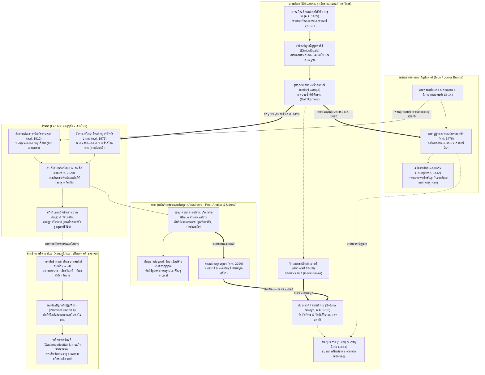

# บทที่ 5: กำเนิดและสัณฐานวิทยาของเถรวาทตันตระ / โบราณกรรมฐาน
(Genesis and Morphology of Tantric Theravāda / Borān Kammaṭṭhāna)

---

## บทนำประจำบท (Executive Chapter Introduction)

การศึกษาสถานภาพและวิวัฒนาการของจารีตตันตระในอุษาคเนย์ตลอดบทที่ 4 ได้เปิดเผยให้เห็นรากฐานอันลึกซึ้งของ "ชั้นวัฒนธรรมตันตระคลาสสิก" (Classical Tantric Substratum) ซึ่งครอบงำภูมิทัศน์ศาสนาและการเมืองของภูมิภาคเอเชียตะวันออกเฉียงใต้ระหว่างคริสต์ศตวรรษที่ 7 ถึง 14 อย่างไรก็ดี รอยต่อประวัติศาสตร์ครั้งสำคัญเกิดขึ้นเมื่อจักรวรรดิโบราณขนาดใหญ่—ไม่ว่าจะเป็นอาณาจักรพระนครแห่งกัมพูชา, อาณาจักรศรีวิชัยแห่งคาบสมุทรมลายูและสุมาตรา, ตลอดจนราชอาณาจักรพุกามยุคแรก—ได้เผชิญกับวิกฤตการณ์ทางการเมือง การเปลี่ยนแปลงทางนิเวศวิทยา และการสลายตัวของระบอบเทวราชา ส่งผลให้ "คลื่นการแพร่กระจายของพุทธศาสนาเถรวาทสายพระบาลี" (The Pali Theravāda Wave) ที่มีศูนย์กลางอยู่ที่เกาะลังกา ได้หลั่งไหลเข้าสู่แผ่นดินใหญ่และสถาปนาตนเองขึ้นเป็นสถาบันศาสนาหลักของรัฐจารีตในพม่า สยาม ล้านนา ล้านช้าง และกัมพูชา

ทว่า ท่ามกลางกระบวนการเปลี่ยนผ่านทางสถาบันและนิกายดังกล่าว ข้อเท็จจริงอันน่าอัศจรรย์ใจที่สุดในทางประวัติศาสตร์นิพนธ์คือ มรดกทางเทคโนโลยีจิตตภาวนา รหัสยวิทยา สรีรวิทยาเร้นลับ และพลังอำนาจแห่งการแปรสภาพธาตุของตันตระหาได้สูญสิ้นไปพร้อมกับการเสื่อมถอยของศาสนาพราหมณ์-ฮินดูและพุทธศาสนามหายาน-วัชรยานไม่ ตรงกันข้าม มโนทัศน์และระเบียบวิธีวิจัยเชิงรหัสยะเหล่านั้นกลับได้รับการ "หล่อหลอมและปฏิสนธิใหม่" (Indigenous Recrystallization) ภายในเบ้าหลอมแห่งพระธรรมวินัยและพระอภิธรรมของเถรวาท จนก่อกำเนิดเป็นแบบแผนการปฏิบัติจิตตภาวนาที่มีเอกลักษณ์เฉพาะตัวสูงสุด ซึ่งแวดวงวิชาการร่วมสมัยขนานนามด้วยความระมัดระวังทางอนุกรมวิธานว่า **"เถรวาทตันตระ" (Tantric Theravāda)**, **"พุทธศาสนาลี้ลับสายใต้" (Southern Esoteric Buddhism)**, **"จารีตโยคาวจร" (Yogāvacara Tradition)** หรือในความรับรู้ของสายครูผู้สืบทอดภายในว่า **"โบราณกรรมฐาน" (Borān Kammaṭṭhāna)**

บทที่ 5 นี้ทำหน้าที่เป็น "หัวใจเชิงสถาปัตยกรรมและสัณฐานวิทยา" (Architectural and Morphological Core) ของรายงานวิจัยทั้งระบบ โดยมีพันธกิจทางญาณวิทยาในการสืบค้น รื้อถอน และสังเคราะห์จุดกำเนิด พัฒนาการทางสถาบัน เครือข่ายการสืบทอดข้ามสมุทร หลักฐานทางจารึกวิทยาและตัวเขียนใบลาน โครงสร้างทางสัณฐานวิทยา 5 ประการ การวิเคราะห์คัมภีร์ปฐมภูมิหัวใจ วรรณกรรมร้อยแก้วสองภาษา ไปจนถึงการสถาปนาดุลยภาพอันประณีตระหว่างพระวินัยปาติโมกข์และกลไกตันตระภายใน เพื่อปูทางเชื่อมต่อไปสู่การวิเคราะห์สรีรวิทยาเร้นลับ คัพภวิทยาเชิงธรรม และวัฒนธรรมวัตถุมงคลในบทที่ 6 ต่อไป

โครงสร้างการวิจัยและการสังเคราะห์ในบทที่ 5 จัดแบ่งเนื้อหาออกเป็น 7 ส่วนหลักที่มีความต่อเนื่องร้อยเรียงกันอย่างเป็นระบบ:

ใน **ส่วนที่ 5.1 (การสังคายนาที่โปโฬนนารุวะ พ.ศ. 1708/1165 และจุดกำเนิดจารีตโยคาวจร)** รายงานจะพาผู้อ่านย้อนกลับไปสู่จุดกำเนิดเชิงประวัติศาสตร์บนเกาะลังกา ชำแหละวิกฤตการณ์พุทธศาสนาภายหลังสงครามการรุกรานของจักรวรรดิโจฬะ การรวมคณะสงฆ์ 3 นิกาย (มหาวิหาร, อภัยคีรี, และเชตวัน) ภายใต้พระบรมราชูปถัมภ์ของพระเจ้าปรากรมพาหุที่ 1 มหาราช บทบาทอันโดดเด่นของพระมหากัสสปะเถระแห่งอุทุมพรคีรี (Mahākassapa of Udumbaragiri / Dimbulāgala) ในฐานะแหล่งบ่มเพาะกรรมฐานสายพระอภิธรรม ตลอดจนบทบาทของพระสารีบุตรเถระ (Sāriputta Thera แห่งโปโฬนนารุวะ) ในการรจนาคัมภีร์ฎีกาที่วางรากฐานทฤษฎีวิถีจิต ปัจจยการ 24 ในปัฏฐาน และรูปกลาปะ อันกลายมาเป็นแม่แบบภววิทยาของโบราณกรรมฐาน

ใน **ส่วนที่ 5.2 (การสืบทอดสายสมณวงศ์และเครือข่ายข้ามแดนในอุษาคเนย์)** รายงานจะติดตามเส้นทางคมนาคมทางจิตวิญญาณและเครือข่ายข้ามสมุทร (Circulations in the Pāli World) สำรวจสายสมณวงศ์ลังกาวงศ์เก่าและใหม่ในพม่าผ่านจารึกกัลยาณี พ.ศ. 2019 (1476) ของพระเจ้าธรรมเจดีย์, การแพร่กระจายสู่ล้านนาผ่านสำนักวัดสวนดอก (พระสุมนเถระ) และสำนักวัดป่าแดง (สีหลภิกขุ), การจาริกของพระสงฆ์สายอักษรธรรมและคลังใบลานล้านช้าง-อีสาน, พลวัตในกัมพูชาสมัยหลังพระนครถึงยุคอุดงค์, ตลอดจนปรากฏการณ์การส่งสมณวงศ์ย้อนกลับสู่เกาะลังกาในฐานะ "สยามวงศ์" หรือ "สยามนิกาย" (Syāmopasampadā) พ.ศ. 2296 (1753) นำโดยพระอุบาลีเถระและพระอริยมุนีเถระ ซึ่งนำเอาทั้งศีลบริสุทธิ์และคัมภีร์กรรมฐานกลับไปฟื้นฟูพระพุทธศาสนาในแคว้นแคนดี

ใน **ส่วนที่ 5.3 (หลักฐานจารึกและตัวเขียนยุคแรก: จารึกวัดเสือ พ.ศ. 2092/1549)** รายงานจะดำเนิน "การชำแหละหลักฐานเชิงประจักษ์ทางจารึกวิทยาที่เก่าแก่ที่สุดของไทย" นั่นคือ ศิลาจารึกแผ่นธรรมกาย วัดเสือ อำเภอเมือง จังหวัดพิษณุโลก (จารึกหลักที่ 54) ในรัชสมัยสมเด็จพระมหาจักรพรรดิแห่งกรุงศรีอยุธยา วิเคราะห์บริบทสงครามพระเจ้าตะเบ็งชะเวตี้และการสร้างสถูปป้องกันราชธานี (Apotropaic Defense), การถอดรหัสพระคาถาแกนกลางว่าด้วยการเทียบเคียงพระพุทธสรีระ 30 องค์ธรรม (สัพพัญญุตญาณถึงวิปัสสนาญาณ) เข้ากับอวัยวะภายในของมนุษย์, กลไกพิธีกรรมการทำ "นยาสะ" (Nyāsa) เพื่อประดิษฐานพระธรรมกายไว้ในกายเนื้อ, ตลอดจนความสัมพันธ์กับคัมภีร์ *ปฐมสมโพธิกถา* ฉบับล้านนาและอยุธยา

ใน **ส่วนที่ 5.4 (สัณฐานวิทยา 5 ประการของเถรวาทตันตระ ตามข้อเสนอของ Kate Crosby)** รายงานจะนำเสนอกรอบการวิเคราะห์เชิงโครงสร้างที่ทรงอิทธิพลที่สุดในรอบสองทศวรรษ สำรวจเสาหลัก 5 มิติที่ประกอบสร้างขึ้นเป็นตัวตนของโบราณกรรมฐาน ได้แก่: (1) การกำเนิดขึ้นของธรรมกายภายในกายมนุษย์ (Dhammakāya Generation), (2) ระบบสัททวิทยาและพลังอำนาจอักขระบาลี (Pāṇinian Sacred Linguistics & Akkhara), (3) สรีรวิทยาเร้นลับ ธาตุทั้งสี่ และการเล่นแร่แปรธาตุภายใน (Esoteric Somatics, Mahābhūta & Rasāyana), (4) การใช้วัสดุ การเพ่งเปลวเทียน และการแปรสภาพสภาวธรรมเป็นนิมิต (Materialization, Candles & Kasiṇa), และ (5) การถ่ายทอดเฉพาะบุคคล พิธีมอบตัวเป็นศิษย์ และการรักษาความลับของสายครู (Guru-Disciple Secrecy & Initiation)

ใน **ส่วนที่ 5.5 (การวิเคราะห์คัมภีร์ปฐมภูมิหัวใจ: โยคาวจรกรรมฐาน / The Yogāvacara's Manual)** รายงานจะเจาะลึกเอกสารตัวเขียนใบลานชิ้นเอก (Hugh Nevill MS 11665) ที่จัดพิมพ์โดย ที. ดับเบิลยู. ริส เดวิดส์ (1896) และแปลโดย เอฟ. แอล. วูดเวิร์ด (1916) ตรวจสอบโครงสร้างบันไดภาวนา 10 ขั้นอย่างละเอียด ตั้งแต่ปีติ 5, ยุคล 6, สุข, สมาธิ, สู่อรูปฌานและโลกุตตรมรรค, วิเคราะห์เทคนิคการใช้เทียนไขเพื่อสร้างอุคคหะและปฏิภาคนิมิต, ตลอดจนการถอดรหัสสูตรมนต์บาลีที่ทำหน้าที่เป็นตัวกระตุ้นจิต (Mantra Triggers) เช่น สูตรโอกาส (Okāsa), คาถาชัยมงคล, มนต์บริกรรม "สัมมา อะระหัง", และสูตรมนต์ตัดกระแสภวังค์

ใน **ส่วนที่ 5.6 (วรรณกรรมร่วมเครือข่ายและใบลานสองภาษา: Nissaya / Biliturgic Texts)** รายงานจะขยายขอบเขตสู่ชีวิตทางตัวเขียนในโลกพุทธศาสนาเถรวาท ชี้ให้เห็นว่าวรรณกรรมร้อยแก้วสองภาษาบาลี-ภาษาถิ่น (นิสสัย/สำราย/สัณเญ/แปลยกศัพท์) แท้จริงแล้วคือ "สคริปต์ปฏิบัติการประกอบพิธีกรรมร่วมกันของชุมชน" (Communal Biliturgic Performance Scripts) สำรวจร่องรอยมิติสมาธิภาวนาที่แฝงเร้นอยู่ในคัมภีร์ *มงคลทีปนี* ของพระสิริมังคลาจารย์แห่งเชียงใหม่, การวิเคราะห์คัมภีร์ *รัตนมาลา* และ *พระคัมภีร์ปฐมจินดา* ในฐานะตำราการเดินธาตุและสรีรวิทยา, และบทบาทของตัวบทสองภาษาในการเชื่อมประสานจารีตข้ามพรมแดน

และใน **ส่วนที่ 5.7 (ความสัมพันธ์ระหว่างธรรมวินัยเถรวาทมาตรฐานและกลไกตันตระ)** อันเป็นบทปิดท้ายเชิงทฤษฎีที่สำคัญยิ่ง รายงานจะสลายมายาคติเรื่องการขัดกันระหว่างพระธรรมวินัยและรหัสยลัทธิ พิสูจน์ให้เห็นว่าโบราณกรรมฐานมิได้เป็นลัทธินอกรีต แต่ยืนหยัดอยู่บน "วินัยปฏิบัติเหนือลัทธิความเชื่อ" (Orthopraxy over Orthodoxy) การรักษาปาติโมกข์อย่างเคร่งครัดทำหน้าที่เป็นทั้งเกราะกำบังทางสังคมและฐานส่งกำลังแห่งสีลเตชะ, การปฏิเสธตันตระสายซ้าย (Vāmācāra) อย่างสิ้นเชิงเพื่อแปรสภาพพิธีกรรมสู่สรีรวิทยาภายใน, ตลอดจนการสังเคราะห์ความลงรอยกันอย่างสมบูรณ์ระหว่างพระสูตร (มรรควิถีและเป้าหมาย), พระวินัย (ภาชนะรองรับและสรีรวิทยา), และพระอภิธรรม (พิมพ์เขียวภววิทยาและจิตวิทยา) อันสะท้อนถึงวุฒิภาวะสูงสุดของพุทธศาสนาเถรวาทในอุษาคเนย์

---

---

## 5.1 การสังคายนาที่โปโฬนนารุวะ (1165) และจุดกำเนิดจารีตโยคาวจร

การศึกษาประวัติศาสตร์และพัฒนาการของ "เถรวาทตันตระ" (Tantric Theravāda) หรือ "จารีตโบราณกรรมฐาน" (Borān Kammaṭṭhāna) ในภูมิภาคเอเชียตะวันออกเฉียงใต้ จำเป็นต้องเริ่มต้นด้วยการรื้อถอนมายาคติทางประวัติศาสตร์นิพนธ์กระแสหลักยุคอาณานิคม ที่มักมองปรากฏการณ์ลี้ลับในพุทธศาสนาสายใต้ว่าเป็นเพียง "ความเสื่อมทรามทางศีลธรรม" หรือเป็นผลผลิตของการปนเปื้อนไสยเวทพื้นเมืองที่ไร้รากฐานทางคัมภีร์ [1] ในทางตรงกันข้าม การสืบค้นหลักฐานเชิงเอกสาร คัมภีร์อรรถกถา-ฎีกา และศิลาจารึกยุคกลาง เผยให้เห็นวิทยานิพนธ์หลักว่า จารีตโยคาวจรมิได้ถือกำเนิดขึ้นจากความย่อหย่อนทางวินัย หากแต่เป็น "นวัตกรรมทางจิตวิญญาณและระเบียบทางปัญญาขั้นสูง" (Advanced Spiritual Innovation and Scholastic Order) ที่ก่อรูปขึ้นจากการปฏิรูปและสังคายนาพระธรรมวินัยครั้งใหญ่ ณ เมืองโปโฬนนารุวะ (Polonnaruva) ในปี ค.ศ. 1165 (พ.ศ. 1708) ภายใต้พระบรมราชูปถัมภ์ของพระเจ้าปรากรมพาหุที่ 1 มหาราช (Parākramabāhu I, ครองราชย์ ค.ศ. 1153/1164–1186) [2]

การสังคายนาครั้งประวัติศาสตร์นี้ ซึ่งนำโดยพระมหากัสสปะเถระแห่งอุทุมพรคีรี (Mahākassapa of Udumbaragiri / Dimbulāgala) และพระสารีบุตรเถระ (Sāriputta Thera แห่งโปโฬนนารุวะ) แห่งมหาเชตวันวิหาร มิได้เป็นเพียงการกวาดล้างความเสื่อมโทรมของสงฆ์ภายนอกเท่านั้น หากแต่คือการสถาปนา "กระบวนทัศน์ใหม่แห่งพุทธศาสนาเถรวาท" (New Paradigm of Theravāda Buddhism) ที่หลอมรวมเอาปรัชญาพระอภิธรรมขั้นลึกซึ้ง (Abhidhamma metaphysics), ศาสตร์แห่งภาษาและไวยากรณ์บาลีบริสุทธิ์ (Pāṇinian/Sanskritized Sacred Linguistics), และเทคโนโลยีการภาวนาภายในเรือนกายมนุษย์ (Esoteric Somatic Technologies) เข้าไว้ด้วยกันอย่างเป็นระบบ [3] องค์ความรู้ที่ได้รับการประมวลสังเคราะห์ขึ้นในยุคทองแห่งโปโฬนนารุวะนี้เอง ได้กลายมาเป็น "พิมพ์เขียวแม่บท" (Master Blueprint) ที่ถูกส่งถ่ายผ่านเครือข่ายสมณวงศ์ข้ามสมุทรสู่อาณาจักรพุกาม ล้านนา ล้านช้าง สยาม และกัมพูชา จนกลายมาเป็นโครงสร้างค้ำจุนจารีตพระโยคาวจรตลอดหลายศตวรรษต่อมา [4]

หัวข้อ 5.1 นี้มุ่งชำแหละรากเหง้าทางประวัติศาสตร์และญาณวิทยาของการปฏิรูปครั้งประวัติศาสตร์นี้ใน 3 ปริมณฑลหลัก: ประการแรก บริบทวิกฤตการณ์อันยาวนานหลังสงครามการรุกรานของราชวงศ์โจฬะ และการบังคับยุบรวม 3 นิกายโบราณ (มหาวิหาร อภัยคีรี เชตวัน) ให้กลายเป็นเอกภาพภายใต้ฝ่ายมหาวิหาร; ประการที่สอง บทบาทเชิงสถาบันและจิตวิญญาณของพระมหากัสสปะเถระและพระสงฆ์สายป่าแห่งอุทุมพรคีรี (Udumbaragiri) ในฐานะเบ้าหลอมการบูรณาการระหว่างคันถธุระกับวิปัสสนาธุระ; และประการที่สาม ผลงานการรจนาชุดมหาฎีกาและประมวลพระวินัยของพระสารีบุตรเถระ ผู้ได้วางระบบทฤษฎีจิต เจตสิก รูปกลาปะ และวิถีจิต ให้กลายมาเป็น "ระบบปฏิบัติการทางจิต" (Psycho-spiritual Operating System) สำหรับการเจริญสมาธิภาวนาของพระโยคาวจร [5]

---

### 5.1.1 บริบทวิกฤตพุทธศาสนาในลังกาหลังสงครามโจฬะ: การรวมสงฆ์ 3 นิกาย (มหาวิหาร, อภัยคีรี, เชตวัน)

รากเหง้าของขบวนการปฏิรูปสงฆ์ ณ โปโฬนนารุวะ ต้องทำความเข้าใจผ่านวิกฤตการณ์ทางประวัติศาสตร์ที่เกาะลังกาต้องเผชิญมาเป็นเวลากว่าศตวรรษ นั่นคือ "ยุคมืดแห่งการยึดครองของราชวงศ์โจฬะ" (The Cola Dark Age) [6] นับตั้งแต่ปลายคริสต์ศตวรรษที่ 10 ราชวงศ์โจฬะ (Cōḻa) มหาอำนาจทางทะเลแห่งอินเดียใต้ ได้ยกทัพข้ามช่องแคบพอร์กเข้ารุกรานเกาะลังกา จนกระทั่งในปี ค.ศ. 993 และเบ็ดเสร็จเด็ดขาดในปี ค.ศ. 1017 กองทัพโจฬะสามารถเข้ายึดครองราชธานีอนุราธปุระ (Anurādhapura) ได้อย่างสมบูรณ์ กษัตริย์มหินทะที่ 5 (Mahinda V) และพระมเหสีถูกจับกุมตัวไปคุมขังจนสิ้นพระชนม์ในอินเดียใต้ ทหารรับจ้างและกองทัพโจฬะได้เข้าปล้นสะดมวัดวาอาราม เผาทำลายพระสถูปเจดีย์ และทำลายระบบชลประทานอันเป็นเส้นเลือดใหญ่ของอารยธรรมสิงหล ส่งผลให้อนุราธปุระซึ่งเป็นศูนย์กลางพุทธศาสนาที่รุ่งเรืองมายาวนานกว่า 12 ศตวรรษ ต้องล่มสลายลงอย่างถาวร [7]

ผลกระทบที่ร้ายแรงและสร้างความสะเทือนขวัญที่สุดต่อสังฆมณฑลลังกา คือการล่มสลายของสายการอุปสมบท:
ประการแรก คือ **"การดับสูญไปอย่างถาวรของภิกษุณีสงฆ์" (The Total Extinction of the Bhikkhunī Order)** ซึ่งเคยดำรงอยู่อย่างรุ่งเรืองบนเกาะลังกานับแต่พระนางสังฆมิตตาเถรีนำหน่อพระศรีมหาโพธิ์มาประดิษฐานในพุทธศตวรรษที่ 3 พงศาวดารมหาวงศ์ไม่ปรากฏการกล่าวถึงการมีอยู่ของสำนักภิกษุณีอีกเลยหลังยุคการทำลายล้างของพวกโจฬะ และสถาบันภิกษุณีสงฆ์ในลังกาก็ไม่เคยได้รับการฟื้นฟูขึ้นมาใหม่อีกเลยตลอดประวัติศาสตร์ [8]
ประการที่สอง คือ **"วิกฤตการณ์ขาดแคลนภิกษุสงฆ์บริสุทธิ์"** เมื่อเจ้าชายกิตติ (Kitti) ผู้นำหนุ่มจากเทือกเขาโรหณะ (Rohaṇa) รวบรวมกำลังขับไล่กองทัพโจฬะออกไปได้สำเร็จ และสถาปนาตนเองเป็นพระเจ้าสิริสังฆโพธิ วิชัยพาหุที่ 1 (Vijayabāhu I, ครองราชย์ ค.ศ. 1055/1070–1110) โดยตั้งราชธานีใหม่ ณ เมืองโปโฬนนารุวะ พระองค์ทรงพบความจริงอันน่าสลดใจว่า ทั่วทั้งเกาะลังกาไม่สามารถหาพระภิกษุสงฆ์ผู้บริสุทธิ์ได้ครบองค์สงฆ์ 5 รูป เพื่อประกอบพิธีอุปสมบทกรรมตามพระวินัยได้เลย [9]

พระเจ้าวิชัยพาหุที่ 1 จึงทรงดำเนินนโยบายทางการทูตและศาสนาข้ามสมุทร ด้วยการส่งคณะราชทูตและเครื่องราชบรรณาการข้ามอ่าวเบงกอลไปยังพระเจ้าอโนรธามังช่อ (King Anawrahta / Anuruddha) แห่งอาณาจักรพุกาม (รามัญประเทศ / Rāmaññadesa) เพื่อขออาราธนาพระมหาเถระผู้เชี่ยวชาญพระไตรปิฎกและทรงศีลวิสุทธิ์ เดินทางมายังเกาะลังกาเพื่อประกอบพิธีอุปสมบทกุลบุตรชาวสิงหล และเปิดการเรียนการสอนพระไตรปิฎกขึ้นใหม่ [10] การฟื้นฟูสมณวงศ์จากพุกามในรัชสมัยพระเจ้าวิชัยพาหุที่ 1 นับเป็นหมุดหมายแรกของการเชื่อมโยงเครือข่ายพุทธศาสนาข้ามสมุทรระหว่างลังกากับเอเชียตะวันออกเฉียงใต้ ซึ่งในเวลาต่อมา ลังกาจะกลายเป็นฝ่ายส่งออกสมณวงศ์และวรรณกรรมกลับคืนสู่อุษาคเนย์ [11]

ทว่า แม้พระเจ้าวิชัยพาหุที่ 1 จะทรงกอบกู้สายการอุปสมบทขึ้นมาได้ แต่หลังจากการสวรรคตของพระองค์ เกาะลังกาได้ตกอยู่ในภาวะสงครามกลางเมืองและการแย่งชิงราชสมบัติอันยืดเยื้อระหว่างเจ้านายในราชวงศ์ ส่งผลให้สถาบันสงฆ์ตกต่ำลงสู่วิกฤตการณ์ทางศีลธรรมและวินัยอย่างหนักหน่วง คัมภีร์ *จุลวงศ์* (*Cūlavaṃsa*) และ *มหาวงศ์* ได้บันทึกภาพความเสื่อมโทรมนี้ไว้อย่างเชือดเฉือนว่า ในหมู่บ้านที่บรรพกษัตริย์พระราชทานไว้เพื่อเป็นกัลปนาแก่วัดวาอาราม:

> "ความบริสุทธิ์แห่งความประพฤติในหมู่พระสงฆ์มีอยู่เพียงประการเดียว คือการที่พวกเขาเลี้ยงดูภรรยาและบุตรของตน แท้จริงแล้วความบริสุทธิ์อื่นใดนอกจากนี้ย่อมไม่มีเลย ทั้งยังไม่มีความเป็นเอกภาพในการประกอบพิธีกรรมสังฆกรรมของศาสนจักร และพระสงฆ์ที่ดำเนินชีวิตอันไร้ข้อตำหนิต่างก็ไม่ปรารถนาแม้แต่จะมองหน้ากัน" [12]

พระสงฆ์จำนวนมากได้แปรสภาพกลายเป็น "นักบวชที่ดินศักดินา" (Monastic Landlords) ถือครองทรัพย์สินส่วนตน มีครอบครัว เลี้ยงดูลูกเมีย ละทิ้งวัตรปฏิบัติ และไม่ยอมลงทำอุโบสถสังฆกรรมร่วมกัน [13] ยิ่งไปกว่านั้น สังฆมณฑลยังแตกแยกออกเป็นฝักฝ่ายอย่างรุนแรงตามรอยร้าวทางนิกายโบราณที่สั่งสมมายาวนานนับพันปี นั่นคือ ความขัดแย้งระหว่าง **3 นิกายใหญ่ (Nikāyattaya)** [14]:
1. **สำนักมหาวิหาร (Mahāvihāra):** ศูนย์กลางดั้งเดิมของจารีตเถรวาทอนุรักษนิยม ผู้ถือครองคัมภีร์พระไตรปิฎกบาลีและอรรถกถาของพระพุทธโฆสะ ยึดมั่นในความบริสุทธิ์ของสายสมณวงศ์และการตีความวินัยอย่างเคร่งครัด
2. **สำนักอภัยคีรีวิหาร (Abhayagirivihāra):** สถาบันสงฆ์พหุนิยมขนาดมหึมาที่แยกตัวออกจากมหาวิหารตั้งแต่ศตวรรษที่ 1 ก่อนคริสตกาล อภัยคีรีมีความสัมพันธ์แนบแน่นกับราชสำนักและเครือข่ายการค้าทางทะเล เป็นศูนย์กลางการศึกษาที่เปิดรับทั้งคัมภีร์เถรวาท มหายาน (เช่น ปรัชญามาธยมิกะและโยคาจาร) และนิกายวัชริยะ (Vājiriya) หรือพุทธตันตระ ดังที่สมณะฟาเหียน (Faxian) และหลักฐานจารึกแผ่นทองแดงธารณีสันสกฤตยืนยันตรงกัน [15]
3. **สำนักเชตวันวิหาร (Jetavanavihāra):** สถาบันสงฆ์ที่แยกตัวออกมาในศตวรรษที่ 3 ในรัชสมัยพระเจ้ามหาเสนะ สังกัดนิกายสาคลิยะ (Sāgaliya) ซึ่งแม้จะมีความใกล้ชิดกับมหาวิหารมากกว่าอภัยคีรี แต่ก็มีข้อวินิจฉัยทางพระวินัยและคัมภีร์ที่เป็นเอกเทศ [16]

เมื่อเจ้าชายปรากรมพาหุ ผู้ทรงเปี่ยมด้วยความทะเยอทะยานและพระปรีชาสามารถ ทรงทำสงครามรวบรวมแผ่นดินลังกาที่แตกแยกเป็น 3 ก๊กให้กลับคืนสู่เอกภาพ และประกอบพิธีบรมราชาภิเษกเป็น "พระเจ้าสิริสังฆโพธิ ปรากรมพาหุที่ 1" ในปี ค.ศ. 1153 (และสวมมงกุฎเป็นเอกราชแห่งลังกาแต่เพียงผู้เดียวในปี ค.ศ. 1164) พระองค์ทรงตระหนักอย่างถ่องแท้ว่า การสร้างจักรวรรดิอันยิ่งใหญ่ที่มีศูนย์กลาง ณ โปโฬนนารุวะ จำต้องอาศัย "ศาสนจักรที่เป็นเอกภาพและอยู่ภายใต้การควบคุมของรัฐ" [17] การปล่อยให้สงฆ์แตกแยกเป็น 3 นิกาย และมีพระภิกษุที่ประพฤติย่อหย่อน ย่อมบั่นทอนความชอบธรรมแห่งราชบัลลังก์และบ่อนทำลายความมั่นคงของราชอาณาจักร [18]

ด้วยเหตุนี้ ในปี ค.ศ. 1165 (พ.ศ. 1708) พระเจ้าปรากรมพาหุที่ 1 มหาราช จึงทรงเรียกประชุม **"สมัชชาสงฆ์แห่งโปโฬนนารุวะ" (The Council of Polonnaruva)** ขึ้น ณ พระราชธานี โดยทรงอาราธนาผู้นำสงฆ์จากทั่วทุกสารทิศเข้ามาประชุมพร้อมกัน พงศาวดารบันทึกว่า ในเบื้องแรก พระองค์ทรงพยายามเกลี้ยกล่อมให้พระสงฆ์ทั้ง 3 นิกายยอมประนีประนอมและสมานฉันท์กัน ทว่าความพยายามดังกล่าวประสบกับความล้มเหลวอย่างสิ้นเชิง ดังข้อความที่พรรณนาว่า: *"แท้จริงแล้ว ดูประหนึ่งว่าความพยายามที่จะบรรลุความเป็นเอกภาพนี้ เสมือนหนึ่งความพยายามที่จะยกเขาพระสุเมรุขึ้น"* [19]

เมื่อการเจรจาทางการเมืองล้มเหลว พระเจ้าปรากรมพาหุที่ 1 จึงทรงตัดสินพระทัยเชิงยุทธศาสตร์ที่เด็ดขาด:
ประการแรก พระองค์ทรงแต่งตั้ง **พระมหากัสสปะเถระแห่งอุทุมพรคีรี** (Mahākassapa of Udumbaragiri / Dimbulāgala) พระมหาเถระผู้เป็นกลาง ทรงภูมิรู้ในพระไตรปิฎก และมีวัตรปฏิบัติอันบริสุทธิ์หมดจด ให้ดำรงตำแหน่งประธานแห่งสมัชชาสงฆ์ [20]
ประการที่สอง พระองค์ทรงเข้าข้างและรับรองความชอบธรรมของ **"สำนักมหาวิหาร"** แต่เพียงฝ่ายเดียว โดยทรงตัดสินว่าหลักธรรมวินัยและการตีความของฝ่ายมหาวิหารคือสัจธรรมอันถูกต้องแท้จริงของพระสัมมาสัมพุทธเจ้า [21]
ประการที่สาม พระองค์ทรงดำเนินมาตรการชำระสะสางสังฆมณฑลอย่างเข้มงวด ทั้งโดยการเกลี้ยกล่อมและการใช้พระราชอำนาจบังคับ (Coercion): พระภิกษุที่ยอมรับความผิดและยินยอมขัดเกลาตนเอง พระองค์โปรดให้ลดชั้นลงเป็นสามเณร; พระภิกษุที่มีครอบครัวหรือละเมิดวินัยร้ายแรง พระองค์ทรงเกลี้ยกล่อมให้ลาสิกขาบท โดยพระราชทานที่ดิน เสื้อผ้า และตำแหน่งราชการให้ไปประกอบอาชีพสุจริต; ส่วนพระภิกษุที่ดื้อดึง ขัดขืน และปฏิเสธการปฏิรูป พระองค์ทรงใช้กำลังทหารจับกุมและบังคับให้สละเพศบรรพชิตในทันที [22]

ชัยชนะของมหาวิหารในครั้งนี้ถือเป็นชัยชนะที่เบ็ดเสร็จเด็ดขาดในประวัติศาสตร์พุทธศาสนาลังกา นิกายอภัยคีรีและเชตวันถูกสั่งยุบเลิกและกลืนสลายเข้าสู่นิกายมหาวิหารโดยสิ้นเชิง นับแต่นั้นเป็นต้นมา เอกสารประวัติศาสตร์ลังกาไม่เคยกล่าวถึงบทบาทเชิงสถาบันของนิกายอภัยคีรีและเชตวันอีกเลย [23] รัฐบาลของพระเจ้าปรากรมพาหุที่ 1 และคณะสงฆ์มหาวิหารได้ร่วมกันตรากฎบัตรคณะสงฆ์ฉบับแรกของลังกาขึ้น นั่นคือ **"กติกาวัตแห่งโปโฬนนารุวะ" (Polonnaruva Katikāvata)** หรือที่รู้จักกันในนาม "จารึกกัลวิหาร" (Gal Vihāra Inscription) ซึ่งสลักลงบนผาหินธรรมชาติ ณ วัดกัลวิหาร เพื่อวางระเบียบการปกครองสงฆ์ การคัดกรองผู้ขอบวช การศึกษาเล่าเรียน และการลงโทษพระภิกษุผู้ประพฤติมิชอบ [24]

ในมิติของประวัติศาสตร์นิพนธ์สมัยใหม่ สเวน เบรตเฟลด์ (Sven Bretfeld) และ อลาสแตร์ กอร์นัลล์ (Alastair Gornall) ได้ชี้ให้เห็นข้อเท็จจริงอันลึกซึ้งว่า การสังคายนา ค.ศ. 1165 มิใช่เพียง "การฟื้นฟูความบริสุทธิ์ดั้งเดิม" ตามที่พงศาวดารฝ่ายมหาวิหารอ้างวาทกรรม "ต้นไทรใหญ่ที่ไร้กิ่งหัก" (Abhinnavāda) [25] แต่ในความเป็นจริง มันคือ **"การรัฐประหารทางศาสนาและการจัดระเบียบอำนาจใหม่" (Hegemonic Consolidation and Monastic Re-engineering)** [26] แม้ว่าสถาบันอภัยคีรีจะถูกยุบเลิกไปในทางกายภาพ แต่องค์ความรู้ มโนทัศน์ สุนทรียศาสตร์ และวัตรปฏิบัติบางประการของอภัยคีรี—โดยเฉพาะมิติการบูชาพระบรมสารีริกธาตุและพระเขี้ยวแก้ว (Relic Cult), ศาสตร์แห่งการสวดพระปริตรและธารณี (Paritta and Dhāraṇī), และมโนทัศน์เรื่องมณฑลและจักรวาลวิทยา—มิได้สูญสลายไปทั้งหมด หากแต่ถูกกลืนกลาย (Encompassed) และปรับแปลงให้เข้ามาอยู่ภายใต้ร่มเงาของมหาวิหารนิกายใหม่อย่างแยบคาย [27] การหลอมรวมทางความคิดนี้เองที่กลายมาเป็นเชื้อแป้งสำคัญในการปฏิสนธิของจารีตโบราณกรรมฐานในเวลาต่อมา [28]

---

### 5.1.2 พระมหากัสสปะเถระและบทบาทของอารามป่าอุทุมพรคีรี (Udumbaragiri / Dimbulāgala): แหล่งกำเนิดกรรมฐานสายพระอภิธรรม

บุคคลผู้มีบทบาทสำคัญที่สุดในฐานะ "ผู้นำทางจิตวิญญาณและสถาปนิกแห่งการปฏิรูปสงฆ์ ค.ศ. 1165" คือ **พระมหากัสสปะเถระแห่งอุทุมพรคีรี** (Mahākassapa of Udumbaragiri / Dimbulāgala) [29] การที่พระเจ้าปรากรมพาหุที่ 1 ทรงเลือกพระมหาเถระจากสำนักป่าแห่งนี้ แทนที่จะเลือกพระเถระชั้นผู้ใหญ่จากวัดในราชธานี สะท้อนให้เห็นถึงสถานะทางศีลธรรมและอำนาจนำทางจิตวิญญาณอันเป็นเอกเทศของกลุ่มพระสงฆ์ฝ่ายอรัญวาสี [30]

สำนักอุทุมพรคีรี หรือในภาษาสิงหลเรียกว่า **ดิมบุลากาละ** (Udumbaragiri / Dimbulāgala Vihāra) ตั้งอยู่บนเทือกเขาหินทรายอันสูงชันและทุรกันดารในเขตจังหวัดทางตะวันออกเฉียงเหนือของศรีลังกา (ห่างจากโปโฬนนารุวะไปทางตะวันออกเฉียงใต้ราว 20 กิโลเมตร) [31] ในเชิงภูมิรัฐศาสตร์และประวัติศาสตร์เศรษฐกิจ อลาสแตร์ กอร์นัลล์ ชี้ให้เห็นว่า อุทุมพรคีรีตั้งอยู่บนจุดยุทธศาสตร์ที่เชื่อมโยงระหว่างที่ราบลุ่มแม่น้ำมหาเวฬิคงคา (Mahaweli River) กับเส้นทางพาณิชย์ทางทะเลสู่ท่าเรือทางชายฝั่งตะวันออกเฉียงเหนือ (เช่น โกฏิฐิยาระ / Trincomalee) ซึ่งเป็นประตูการค้าและแลกเปลี่ยนทางวัฒนธรรมที่เชื่อมต่อโดยตรงกับแคว้นเบงกอล กลิงคะ และอินเดียใต้ [32] ทำเลที่ตั้งนี้ทำให้พระสงฆ์สายป่าแห่งอุทุมพรคีรี (Udumbaragiri) มิได้ตัดขาดจากโลกภายนอกอย่างสิ้นเชิง หากแต่สามารถเข้าถึงตัวบท คัมภีร์ และวิทยาการชุดใหม่ล่าสุดจากเอเชียใต้ได้อย่างรวดเร็ว [33]

ความโดดเด่นของสำนักอุทุมพรคีรี (Udumbaragiri) ซึ่งสร้างความแตกต่างอย่างถึงรากถึงโคนจากสำนักสงฆ์เมืองดั้งเดิม คือการสถาปนาโมเดล **"การบูรณาการระหว่างคันถธุระและวิปัสสนาธุระ" (The Integration of Ganthadhura and Vipassanādhura)** [34] ก่อนหน้านี้ยุคอนุราธปุระ สถาบันสงฆ์ลังกามักแยกขาดระหว่างพระคามวาสี (ฝ่ายศึกษาเล่าเรียนคัมภีร์ในเมือง) กับพระอรัญวาสี (ฝ่ายหลีกเร้นบำเพ็ญภาวนาในป่า) ทว่า พระมหากัสสปะได้สร้างบรรทัดฐานใหม่ว่า: *การปฏิบัติสมาธิภาวนาขั้นสูง (วิปัสสนาธุระ) จะเกิดขึ้นอย่างถูกต้อง ปลอดภัย และบรรลุผลจริงมิได้เลย หากปราศจากความเชี่ยวชาญอันลึกซึ้งในพระไตรปิฎก พระวินัย และพระอภิธรรม (คันถธุระ)* [35]

พระมหากัสสปะเถระมิได้เป็นเพียงพระเกจิอาจารย์ผู้เคร่งครัดในธุดงควัตร แต่ท่านเป็น "มหาปราชญ์พหุภาษา" (Polymath) ที่เชี่ยวชาญทั้งภาษาบาลี ภาษาสันสกฤต และภาษาสิงหลโบราณ [36] คุณูปการทางวิชาการและงานรจนาของท่านประกอบด้วย:
1. **คัมภีร์ไวยากรณ์สันสกฤต *พาลาวโพธนะ* (*Bālavabodhana*):** พระมหากัสสปะได้รจนาตำราไวยากรณ์ภาษาสันสกฤตเล่มนี้ขึ้นตามแนวทางของ **"จันทรวยากรณ์" (Candra-vyākaraṇa)** ซึ่งเป็นระบบไวยากรณ์สันสกฤตของพุทธศาสนามหายานที่พัฒนาขึ้นโดยท่านจันทรโคมิน (Candragomin) [37] การที่พระเถระระดับประธานสงฆ์เถรวาทรจนาตำราไวยากรณ์สันสกฤตของสำนักพุทธสายเหนือ ยืนยันอย่างหนักแน่นว่า พระสงฆ์สายอุทุมพรคีรี (Udumbaragiri) มีความเปิดกว้างในการรับเอาเครื่องมือทางภาษาศาสตร์สันสกฤตชั้นสูงมาใช้ยกระดับการศึกษาพระธรรมวินัย [38]
2. **คัมภีร์ *สมันตปาสาทิกาสันเน* (*Samantapāsādikā-sanne*):** อรรถกถาขยายความพระวินัยเป็นภาษาสิงหล เพื่อใช้อบรมพระสงฆ์สายป่าให้เข้าใจขอบเขตและข้อห้ามทางวินัยอย่างแม่นยำ (แม้ปัจจุบันตัวบทบาลีสันเนนี้จะสูญหายไปแล้ว แต่ข้อวินิจฉัยของท่านได้รับการอ้างอิงอย่างกว้างขวางในฎีกายุคหลัง) [39]
3. **คัมภีร์ *โมหวิจเฉทนี* (*Mohavicchedanī*):** แม้จะมีการถกเถียงเรื่องอัตลักษณ์ของผู้แต่ง แต่วงวิชาการส่วนใหญ่ (รวมถึง Malalasekera และ Gornall) เชื่อว่าพระมหากัสสปะแห่งอุทุมพรคีรีคือผู้รจนาคัมภีร์ *โมหวิจเฉทนี* ซึ่งเป็นคู่มืออรรถกถาอธิบาย "มาติกาแห่งพระอภิธรรม" (Abhidhamma Mātikā) และ "มาติกาแห่งพระวินัย" [40] ในคัมภีร์นี้ พระกัสสปะได้ประกาศทัศนะทางภาษาศาสตร์ที่สำคัญยิ่ง โดยยืนยันว่า **ภาษาบาลี (มาคธี) คือ "ภาษามูลราก" (Mūlabhāsā)** และเป็นภาษาธรรมชาติที่มีอยู่จริงตามปรมัตถสัจจะ (*sabhāvabhāsā*) อันเป็นรากฐานของสรรพภาษาทั้งปวง [41]
4. **คัมภีร์ *วิมติวิโนทนี* (*Vimativinodanī*):** ฎีกาอธิบายพระวินัยที่ทรงอิทธิพลสูงสุดเล่มหนึ่ง ซึ่งแม้ในยุคหลังจะไม่แพร่หลายในลังกา แต่กลับได้รับการยกย่องนับถืออย่างสูงสุดในพม่า โดยพระเจ้าธรรมเจดีย์ (King Dhammaceti) แห่งกรุงหงสาวดี ได้ทรงนำข้อวินิจฉัยของคัมภีร์วิมติวิโนทนีมาใช้เป็นธรรมนูญหลักในการปฏิรูปและชำระพัทธสีมาในศตวรรษที่ 15 ดังที่ปรากฏหลักฐานในศิลาจารึกกัลยาณี (Kalyāṇī Inscriptions) [42]
5. **คัมภีร์ *โบราณฎีกาขยายความอภิธัมมัตถสังคหะ* (Porāṇa-ṭīkā on Abhidhammatthasaṅgaha):** การศึกษาวรรณกรรมระบุว่า พระมหากัสสปะเป็นหนึ่งในพระมหาเถระยุคแรกที่แต่งฎีกาอธิบายคู่มืออภิธัมมัตถสังคหะของพระอนุรุทธาจารย์ ซึ่งทำหน้าที่ถ่ายทอดทฤษฎีปรมัตถธรรม 4 เข้าสู่หลักสูตรการปฏิบัติสมาธิของพระป่า [43]

การที่สำนักอุทุมพรคีรีทำหน้าที่เป็นศูนย์กลางการผลิตและถ่ายทอดคัมภีร์อภิธรรมและวินัย ส่งผลให้เกิดปรากฏการณ์ที่ เคต ครอสบี (Kate Crosby) และ แอล. เอส. คัซซินส์ (L. S. Cousins) เรียกว่า **"แหล่งกำเนิดกรรมฐานสายพระอภิธรรม" (Abhidhamma-based Meditation School)** [44] ในระบบของสำนักอุทุมพรคีรี การปฏิบัติภาวนาไม่ได้ดำเนินไปอย่างลอยๆ หรืออาศัยเพียงศรัทธาจริต หากแต่เป็นการนำเอาโครงสร้างปรมัตถธรรมในพระอภิธรรมมาจำแนกแยกแยะสภาวะของจิตและกาย:
- พระภิกษุจะต้องเรียนรู้การจำแนก **รูป 28** และ **มหาภูตรูป 4** เพื่อนำมาใช้ในการเจริญ "ธาตุกรรมฐาน" และการตรวจสภาวะของธาตุทั้งสี่ (ดิน น้ำ ไฟ ลม) ภายในอวัยวะน้อยใหญ่ [45]
- พระภิกษุจะต้องทำความเข้าใจเรื่อง **"รูปกลาปะ" (Rūpa-kalāpa)** หรือกลุ่มอนุภาคสสารที่เล็กที่สุด เพื่อใช้สมาธิส่องมองการเกิดดับของกลาปะในกายเนื้อ [46]
- พระภิกษุจะต้องฝึกตรวจจับ **"วิถีจิต" (Citta-vīthi)** และขณะจิตย่อย (อุปปาทะ ฐิติ ภังคะ) เพื่อสังเกตการณ์เปลี่ยนผ่านของจิตจากกามภูมิสู่รูปฌานและอรูปฌาน [47]

นอกจากนี้ สำนักอุทุมพรคีรี (Udumbaragiri) ยังมีบทบาทสำคัญยิ่งในการสถาปนาระบบการปกครองสงฆ์ผ่าน **"จารีตกติกาวัต" (The Katikāvata Tradition)** รามานี เฮตติอาราชชิ (Ramani Hettiarachchi) ชี้ให้เห็นว่า กฎบัตรคณะสงฆ์ที่พระมหากัสสปะร่วมร่างกับราชสำนัก มิได้จำกัดอยู่เพียงระเบียบภายนอก แต่ได้วางโครงสร้างการสืบทอดสายวิชา (Paramparā) และการตรวจสอบคุณสมบัติของผู้บวชอย่างเข้มงวด [48] สำนักอุทุมพรคีรีได้ขยายสาขาและเครือข่ายอารามป่าออกไปทั่วเกาะลังกา (เช่น อารามปาฬังคุวะ, เวฬุวัน, และมหานาคกุล) ก่อให้เกิดสายสกุลสงฆ์สายอรัญวาสีที่เข้มแข็ง ซึ่งกลายมาเป็นท่อส่งสำคัญในการถ่ายทอดจารีตพระโยคาวจรข้ามสู่อุษาคเนย์เมื่อเกิดสงครามในลังกายุคต่อมา [49]

---

### 5.1.3 พระสารีบุตรเถระ (Sāriputta Thera แห่งโปโฬนนารุวะ) และการรจนาฎีกา: การวางระบบทฤษฎีจิตและอภิธรรมประยุกต์

หากพระมหากัสสปะเถระคือประมุขฝ่ายวินัยและผู้นำทางจิตวิญญาณแห่งการสังคายนา โปโฬนนารุวะ **พระสารีบุตรมหาเถระ** (Sāriputta Thera) หรือผู้ได้รับสมัญญานามว่า **"สาครมติ" (Sāgaramati — ผู้มีปัญญาดุจมหาสมุทร)** ก็คือ "จอมปราชญ์ผู้รุ่งโรจน์ที่สุดในฟากฟ้าแห่งวรรณกรรมบาลี" และเป็นผู้ดำรงตำแหน่ง **สมเด็จพระสังฆราช (Mahāsāmī / Saṅgharāja)** องค์แรกของราชอาณาจักรโปโฬนนารุวะ [50]

ความยิ่งใหญ่ของพระสารีบุตรได้รับการบันทึกไว้ในพงศาวดารว่า พระเจ้าปรากรมพาหุที่ 1 (มหาราช) ทรงเลื่อมใสในภูมิปัญญาของท่านอย่างหาที่สุดมิได้ พระองค์ได้ทรงสร้างปราสาทวิหารอันโอ่อ่าตระการตา ประกอบด้วยห้องโถง ทางเดิน และกุฏิที่พักจำนวนมาก ถวายเป็นที่พำนักประจำตัวของท่าน ติดเนื่องกับ **มหาเชตวันวิหาร (Mahā Jetavana Vihāra)** ในโปโฬนนารุวะ ซึ่งเป็นมหาวิหารขนาดมหึมาที่มีกุฏิพระสงฆ์ถึง 520 หลัง เพียบพร้อมด้วยสิ่งอำนวยความสะดวกทุกประการ เพื่อให้เป็นศูนย์กลางการค้นคว้าและรจนาคัมภีร์ของศาสนจักร [51]

ภารกิจทางปัญญาที่ยิ่งใหญ่ที่สุดของพระสารีบุตรเถระ คือการเป็นหัวหน้าคณะกรรมาธิการสงฆ์ในการขับเคลื่อน **"ขบวนการฟื้นฟูมหาฎีกาแห่งโปโฬนนารุวะ" (The Polonnaruva Ṭīkā Renaissance)** [52] คัมภีร์ *สัทธัมมสังคหะ* (*Saddhammasaṅgaha*) ได้บันทึกแถลงการณ์ครั้งประวัติศาสตร์ของพระมหากัสสปะและพระสารีบุตรต่อที่ประชุมสงฆ์ ณ มหาเชตวันวิหารว่า:

> "อรรถกถาและฎีกาใดๆ ก็ตามที่บูรพาจารย์ในอดีตได้รวบรวมไว้เพื่อขยายความคัมภีร์อรรถกถาแห่งพระไตรปิฎกทั้งสาม บัดนี้หาได้เป็นประโยชน์อันใดแก่พระภิกษุที่พำนักอยู่ในนานาประเทศไม่! ด้วยเหตุว่าคัมภีร์เหล่านั้นจำนวนมากเขียนขึ้นด้วยภาษาสิงหลโบราณ และเล่มอื่นๆ ก็เขียนด้วยภาษามคธที่ปนเปื้อนด้วยภาษาถิ่นอันหลากหลาย (อากูลัม - ākulam) จนไม่อาจเข้าใจได้อย่างถูกต้อง... ขอให้พวกเราทั้งหลายจงร่วมใจกันขจัดข้อบกพร่องเหล่านี้เสีย แล้วรจนาคัมภีร์มหาฎีกาอรรถกถาภาษาบาลีอันสมบูรณ์ บริสุทธิ์ และแจ่มแจ้งในการอธิบายขึ้นมาใหม่เถิด!" [53]

แถลงการณ์นี้นับเป็นการปฏิวัติทางภาษาศาสตร์และประวัติศาสตร์คัมภีร์ของเถรวาท พระสารีบุตรและคณะกรรมาธิการตระหนักว่า หากพุทธศาสนาเถรวาทต้องการก้าวขึ้นสู่การเป็น "ศาสนาสากลแห่งภูมิภาค" (Cosmopolitan Religion) จะต้องยุติการใช้ฎีกาภาษาถิ่นสิงหลผสม (Sihala-aṭṭhakathā / Sanne) แล้วสถาปนา **"ชุดมหาฎีกาภาษาบาลีคลาสสิกมาตรฐาน"** ที่มีความเป็นเอกภาพทางไวยากรณ์และตรรกะ เพื่อให้พระสงฆ์ในพม่า มอญ กัมพูชา และดินแดนอื่นๆ สามารถศึกษาและเข้าใจได้ตรงกัน 100% [54]

มลลเศขร (Malalasekera) ได้ชี้ให้เห็นข้อค้นพบเชิงวิพากษ์ที่สำคัญยิ่งว่า ชุดมหาฎีกาแห่งโปโฬนนารุวะมิใช่งานเขียนส่วนตัวของพระสารีบุตรเพียงลำพัง หากแต่เป็น **"ผลงานวิชาการเชิงร่วมมือของคณะกรรมาธิการสงฆ์แห่งมหาเชตวัน" (Collaborative Monastic Scholasticism)** โดยมีพระสารีบุตรทำหน้าที่เป็นประธานบรรณาธิการและผู้นิพนธ์หลัก [55] ผลงานชิ้นเอกในชุดมหาฎีกานี้ ได้แก่:
1. **คัมภีร์ *สารัตถทีปนี* (*Sāratthadīpanī*):** ยอดมหาฎีกาขยายความคัมภีร์ *สมันตปาสาทิกา* ของพระพุทธโฆสะในพระวินัยปิฎก พระสารีบุตรได้รวบรวมข้อมูลทางประวัติศาสตร์ วินัย และเรื่องเล่าของพระเถระสิงหลไว้อย่างมหาศาล พร้อมทั้งบันทึกประวัติศาสตร์การแตกแยกของนิกายทั้ง 18 สำนักในอินเดียไว้อย่างละเอียดลออที่สุด ซึ่งเป็นข้อมูลที่หาไม่ได้จากคัมภีร์อื่นใดในโลก [56]
2. **คัมภีร์ *สารัตถมัญชูสา* (*Sāratthamañjūsā*):** มหาฎีกาขยายความอรรถกถาพระสุตตันตปิฎก (โดยเฉพาะในส่วนอังคุตตรนิกาย) ซึ่งพระสารีบุตรเป็นผู้รจนา และมีพระศิษย์ร่วมสำนักช่วยรจนาในนิกายอื่นๆ เช่น *ลีนัตถปกาสินี* [57]
3. **คัมภีร์ *ปรมัตถทีปนี* (*Paramatthadīpanī*):** มหาฎีกาขยายความอรรถกถาพระอภิธรรมปิฎกทั้ง 7 คัมภีร์ ซึ่งทำหน้าที่ชำระอรรถกถาอัฏฐสาลินี สัมโมหวิโนทนี และปัญจปกรณัฏฐกถา ให้มีความแม่นยำทางปรมัตถ์สูงสุด [58]

นอกจากมหาฎีกาแล้ว พระสารีบุตรยังได้รจนาคัมภีร์แม่บททางพระวินัยที่ทรงอิทธิพลอย่างมหาศาล นั่นคือ **คัมภีร์ *วินัยสังคหะ* (*Vinaya-saṅgaha*)** หรือมีชื่อเต็มว่า **"ปาฬิมุตตกวินัยวินิจฉัยสังคหะ" (*Pālimuttaka-Vinaya-vinicchaya*)** [59] คัมภีร์นี้เป็นการประมวลและวินิจฉัยกฎพระวินัยปิฎกทั้งหมดออกเป็นหมวดหมู่เฉพาะเรื่องที่กระชับ รัดกุม และใช้งานได้จริงในชีวิตประจำวันของสงฆ์ คัมภีร์วินัยสังคหะนี้เองที่ได้กลายมาเป็น "ธรรมนูญพระวินัยแห่งอุษาคเนย์" ที่พระเจ้าธรรมเจดีย์แห่งพม่าทรงใช้เป็นหลักอ้างอิงในการปฏิรูปสงฆ์ครั้งใหญ่ในศตวรรษที่ 15 และได้รับการคัดลอก ถ่ายทอด สู่ราชสำนักล้านนา อยุธยา และกัมพูชา [60]

ในมิติของปรัชญาและจิตวิทยาพุทธ คุณูปการที่ลึกซึ้งที่สุดของพระสารีบุตรและสำนักมหาเชตวัน คือ **"การวางระบบทฤษฎีจิตและการประยุกต์ใช้พระอภิธรรม" (Systematization of Mind and Applied Abhidhamma)** [61] พระสารีบุตรได้นำเอากรอบโครงสร้างของคัมภีร์ **"อภิธัมมัตถสังคหะ" (*Abhidhammatthasaṅgaha*)** ของพระอนุรุทธาจารย์ (ผู้รจนาไว้ในช่วงปลายศตวรรษที่ 11 ณ สำนักอุตตรมูลในโปโฬนนารุวะ) [62] มาประสานเข้ากับมหาฎีกาของท่าน และต่อมาได้รับการขยายความอย่างสมบูรณ์แบบโดยพระสารีบุตรสุมังคลเถระ (Sāriputta Sumaṅgala Thera, ศิษย์เอกของพระสารีบุตร) ในคัมภีร์ **"อภิธัมมัตถวิภาวินีฎีกา" (*Abhidhammatthavibhāvinī-ṭīkā*)** [63]

ศาสตราจารย์ วาย. กรุณาทาสะ (Y. Karunadasa) และ ดร. บี. ซี. ลอว์ (B. C. Law) ได้วิเคราะห์โครงสร้างทางจิตวิทยาและปรมัตถธรรมที่สำนักโปโฬนนารุวะได้สังเคราะห์ไว้อย่างเป็นระบบ ซึ่งประกอบด้วย 4 เสาหลักทางทฤษฎี [64]:

#### 1. กายวิภาคแห่งปรมัตถธรรม 4 (The Fourfold Ultimate Realities)
พระอภิธรรมในยุคนี้ได้รับการจัดระเบียบให้เป็น "ระบบวิทยาศาสตร์ทางจิต" ที่ตัดขาดจากอัตตาหรือพระผู้สร้างอย่างเด็ดขาด โดยจำแนกสัจธรรมสูงสุดออกเป็น 4 กอง:
- **จิต 89 หรือ 121 ดวง:** สภาวะธรรมชาติที่ทำหน้าที่ "รู้แจ้งอารมณ์" (Vijānana / Arammaṇa-vijānana) จิตมิใช่ตัวตนคงที่ แต่เป็นกระแสการไหลเลื่อนของสภาวธรรมดุจกระแสน้ำในแม่น้ำ (*nadīsoto viya*) แบ่งตามระดับภูมิ 4 (กามาวจรจิต 54, รูปาวจรจิต 15, อรูปาวจรจิต 12, โลกุตตรจิต 8 หรือ 40) [65]
- **เจตสิก 52 ดวง:** คุณสมบัติหรือองค์ประกอบทางจิตวิทยาที่เกิดร่วมกับจิต ดับพร้อมกับจิต มีอารมณ์เดียวกับจิต และอาศัยที่ตั้งเดียวกับจิต (*ekuppāda, ekanirodha, ekālambana, ekavatthuka*) แบ่งเป็น อัญญสมานาเจตสิก 13, อกุศลเจตสิก 14, และโสภณเจตสิก 25 [66]
- **รูป 28:** สภาวะรูปธรรมที่ประกอบขึ้นจาก มหาภูตรูป 4 (ปฐวี อาโป เตโช วาโย) และ อุปาทายรูป 24 (รูปอาศัย เช่น ปสาทรูป 5, หทัยวัตถุ, ชีวิตินทรียรูป, ปริจเฉทรูป) [67]
- **นิพพาน 1:** สภาวะอสังขตธรรมอันสงบระงับจากกิเลสและขันธ์ 5 ปราศจากการเกิดดับ [68]

#### 2. ทฤษฎีวิถีจิตและกลไกการเปลี่ยนผ่านสู่ฌาน (The Cognitive Process and Jhāna-vīthi)
สำนักโปโฬนนารุวะได้อธิบายกลไกการทำงานของจิตในชีวิตประจำวันและในสมาธิภาวนาผ่าน **"วิถีจิต" (Vīthi-citta)** ไว้อย่างประณีตสูงสุด เมื่อจิตพักผ่อนจะดำรงอยู่ในกระแส "ภวังคจิต" (Bhavaṅga-citta) แต่เมื่อมีอารมณ์มากระทบ จิตจะตัดกระแสภวังค์แล้วแล่นไปตามลำดับขณะจิต 17 ขณะ [69]
ในบริบทของการเจริญสมาธิภาวนา พระอภิธรรมได้อธิบาย "วิถีจิตในการเข้าฌาน" (Jhāna-samāpatti-vīthi) ว่าต้องอาศัยการเปลี่ยนผ่านของจิต ณ ช่วง **ชวนจิต (Javana)** ผ่านขณะจิตสำคัญ 4 ขณะ [70]:
1. **บริกรรม (Parikamma):** ขณะจิตที่ทำหน้าที่ตระเตรียมและบริกรรมอารมณ์กรรมฐาน
2. **อุปจาร (Upacāra):** ขณะจิตที่เฉียดใกล้เข้าสู่อารมณ์แห่งความสงบแนบแน่น
3. **อนุโลม (Anuloma):** ขณะจิตที่คล้อยตามและปรับตัวให้สอดคล้องกับสภาวะกุศลจิตขั้นสูง
4. **โคตรภู (Gotrabhū):** ขณะจิตที่เป็นจุดหัวเลี้ยวหัวต่อสำคัญ ทำหน้าที่ **"ตัดขาดจากสายพันธุ์แห่งปุถุชน เพื่อก้าวข้ามเข้าสู่สายพันธุ์แห่งพระอริยะ"** หรือก้าวข้ามจากกามาวจรภูมิสู่มหัคคตภูมิ (รูปาวจร/อรูปาวจร) [71]

ทันทีที่ขณะจิตโคตรภูดับลง **"ปฐมฌานกุศลจิต"** ย่อมผุดบังเกิดติดต่อกันทันที 1 ขณะจิต แล้วจึงตกลงสู่ภวังค์ การเข้าใจกลไกของโคตรภูจิตนี้เองที่กลายมาเป็นหัวใจของเทคโนโลยีการยกจิตในสายโบราณกรรมฐาน [72]

#### 3. ทฤษฎีรูปกลาปะและสรีรวิทยาธาตุ (Rūpa-kalāpa and Somatic Physiology)
พระอภิธรรมสายโปโฬนนารุวะเน้นย้ำว่า สสารและเรือนกายของมนุษย์มิได้ดำรงอยู่เป็นก้อนเนื้อตัน หากแต่ประกอบขึ้นจากหน่วยย่อยที่เรียกว่า **"รูปกลาปะ" (Rūpa-kalāpa)** ซึ่งเป็นกลุ่มของรูปธรรมที่เกิดดับอย่างรวดเร็ว (รูปมีอายุเท่ากับ 17 ขณะจิตของนาม) [73] กลาปะที่เล็กที่สุดคือ "สุทธัฏฐกกลาปะ" (กลุ่มรูปบริสุทธิ์ 8 รูป: ปฐวี อาโป เตโช วาโย สี กลิ่น รส โอชา) [74] ภายในร่างกายมนุษย์ กลาปะเหล่านี้ถูกผลิตขึ้นจาก 4 สมุฏฐาน คือ กรรม จิต อุตุ และอาหาร โดยเฉพาะ **"จิตตชรูป" (รูปที่เกิดจากจิต)** ซึ่งมีความสำคัญอย่างยิ่งยวดต่อการภาวนา เมื่อพระโยคาวจรเจริญสมาธิจนจิตสงบระงับ บริสุทธิ์ และเปี่ยมด้วยปีติ จิตจะผลิตจิตตชรูปที่มีความประณีต ผ่องใส และเบา แผ่ซาบซ่านไปทั่วสรรพางค์กาย ทำให้กายเนื้อแปรสภาพกลายเป็นกายที่เบา อ่อนนุ่ม และควรแก่การงาน [75]

#### 4. ปัจจยสัมพันธ์ 24 ในคัมภีร์ปัฏฐาน (The Twenty-Four Conditional Relations of Paṭṭhāna)
สำนักของพระสารีบุตรได้ยกย่องคัมภีร์ *มหาปัฏฐาน* ว่าเป็นราชาแห่งพระอภิธรรม ปัจจัยทั้ง 24 ประการ (เช่น เหตุปัจจัย, อารัมมณปัจจัย, อธิปติปัจจัย, อนันตรปัจจัย, สหชาตปัจจัย, อัญญมัญญปัจจัย, วัตถุปุเรชาตปัจจัย) มิได้มีไว้เพื่อการท่องจำทางทฤษฎีเท่านั้น แต่ทำหน้าที่อธิบาย "สายใยความสัมพันธ์ระหว่างสภาวธรรม" [76] พระโยคาวจรสามารถใช้โครงข่ายปัจจัย 24 นี้มาตรวจสอบการเชื่อมโยงระหว่าง "วัตถุรูปภายในร่างกาย" (เช่น หทัยวัตถุและประสาทรูป) กับ "นามธรรม" (จิต เจตสิก) และเป็นเครื่องมือในการสลายความยึดมั่นว่ามีตัวตนหรือวิญญาณเดี่ยวสถิตอยู่เบื้องหลัง [77]

การจัดระบบทฤษฎีจิตและอภิธรรมประยุกต์ของพระสารีบุตรเถระและคณะสงฆ์มหาเชตวันนี้เอง คือ **"สะพานเชื่อมทางปัญญา" (Intellectual Bridge)** ที่เปลี่ยนผ่านพระอภิธรรมจากการเป็นตำราปรัชญาในห้องเรียน สู่การเป็น **"คู่มือปฏิบัติการของพระโยคาวจร" (Yogāvacara Practice Manual)** [78] เมื่อโครงสร้างจิต 89 เจตสิก 52 รูป 28 และวิถีจิต ถูกนำไปผสานเข้ากับศาสตร์แห่งการฝึกสมาธิโบราณ พระโยคาวจรจึงสามารถนำแผนผังเหล่านี้มาประดิษฐานลงในเรือนกายมนุษย์: กำหนดให้มหาภูตรูป 4 เป็นฐานการเดินธาตุ (นะ มะ พะ ทะ), กำหนดให้หทัยวัตถุและศูนย์กลางกายเป็นที่ตั้งของจิต, และใช้การจัดหมวดหมู่ปรมัตถ์มาจำแนกนิมิต แสงสว่าง และดวงแก้วในสมาธิ [79] 

ด้วยเหตุนี้ การสังคายนาที่โปโฬนนารุวะในปี ค.ศ. 1165 จึงมิใช่เพียงจุดสิ้นสุดของความขัดแย้ง 3 นิกายโบราณในลังกา แต่คือ **"จุดกำเนิดและเบ้าหลอมอันศักดิ์สิทธิ์ของจารีตเถรวาทตันตระและโบราณกรรมฐาน"** ที่วางรากฐานอันมั่นคงทางพระวินัย ไวยากรณ์ และพระอภิธรรม ก่อนที่กระแสธรรมแห่งสิงหลวงศ์นี้จะแผ่ขยายไพศาลข้ามคาบสมุทร เข้าสู่วัฒนธรรมพุทธศาสนาในเอเชียตะวันออกเฉียงใต้ในศตวรรษต่อมา [80]

---

## 5.2 การสืบทอดสายสมณวงศ์และเครือข่ายข้ามแดนในอุษาคเนย์

ประวัติศาสตร์นิพนธ์กระแสหลักว่าด้วยพุทธศาสนาเถรวาทในเอเชียตะวันออกเฉียงใต้มักถูกตีกรอบด้วยทัศนะแบบรัฐชาตินิยม (Methodological Nationalism) ที่มองประวัติศาสตร์ศาสนาผ่านขอบเขตเส้นเขตแดนทางการเมืองสมัยใหม่ โดยแบ่งแยกคณะสงฆ์และจารีตวรรณกรรมออกเป็นเอกเทศอย่างตัดขาด เช่น "พุทธศาสนาแบบพม่า" "พุทธศาสนาแบบไทย" หรือ "พุทธศาสนาแบบกัมพูชา" [81] การแบ่งแยกดังกล่าวบดบังความจริงทางประวัติศาสตร์ที่ว่า ภูมิภาคอุษาคเนย์และพื้นที่รอบอ่าวเบงกอลดำรงสถานะเป็น "พื้นที่ทางวัฒนธรรมร่วมและเครือข่ายข้ามสมุทรที่มีปฏิสัมพันธ์อันมีชีวิตชีวา" (Dynamic Trans-oceanic and Riverine Cultural Ecumene) มาอย่างยาวนานหลายศตวรรษ [82] ในโลกทัศน์ดั้งเดิมก่อนยุคอาณานิคม ความเป็นอันหนึ่งอันเดียวกันของศาสนจักรเถรวาทมิได้ผูกติดอยู่กับเส้นพรมแดนทางภูมิรัฐศาสตร์ หากแต่อิงอาศัยมโนทัศน์เรื่อง "เถรวงศ์" (Theravaṃsa) ซึ่งหมายถึงสายธารแห่งการสืบทอดสมณวงศ์ การสืบสายอุปสมบทกรรมที่บริสุทธิ์ (Upasampadā Lineage) การจาริกแสวงบุญเชื่อมโยงรอยพระพุทธบาทและพระบรมสารีริกธาตุ ตลอดจนการแลกเปลี่ยนคัมภีร์ใบลานข้ามภูมิภาค [83]

แอนน์ เอ็ม. แบล็กเบิร์น (Anne M. Blackburn) ได้เสนอว่า การทำความเข้าใจโลกพุทธศาสนาภาษาบาลีในเอเชียใต้และเอเชียตะวันออกเฉียงใต้ จำเป็นต้องเปลี่ยนกระบวนทัศน์จากการมอง "เครือข่ายที่หยุดนิ่ง" (Static Networks) ไปสู่การวิเคราะห์ "การไหลเวียนหมุนเวียนหลายทิศทาง" (Multi-directional Circulations) [84] ในเครือข่ายข้ามแดนนี้ เกาะลังกา มอญ พม่า สยาม ล้านนา ล้านช้าง และกัมพูชา มิได้สัมพันธ์กันในลักษณะศูนย์กลางกับบริวารแบบทางเดียว (Monocentric Diffusion) แต่ดำรงอยู่ในสภาวะปฏิสัมพันธ์แบบสะท้อนกลับ (Reciprocal Feedback Loops) กล่าวคือ เมื่อศูนย์กลางแห่งหนึ่งเผชิญวิกฤตการณ์สงครามหรือการขาดแคลนสายสมณวงศ์ ศูนย์กลางอีกแห่งหนึ่งที่เคยได้รับถ่ายทอดสมณวงศ์ไป ก็จะทำหน้าที่เป็น "แหล่งกักเก็บความบริสุทธิ์" (Reservoir of Purity) และส่งสายสมณวงศ์กลับคืนไปฟื้นฟูศูนย์กลางเดิม [85] 

ประเด็นที่ลึกซึ้งและมีความสำคัญอย่างยิ่งยวดต่อการศึกษากำเนิดของเถรวาทตันตระ คือ "ปฏิทรรศน์แห่งสายสมณวงศ์ลังกาวงศ์" (The Paradox of Sīhaḷavaṃsa Transmission): แม้ว่าการเคลื่อนไหวเพื่อรับสายสมณวงศ์ใหม่จากลังกา (เช่น การรับนิกายมหาวิหารใหม่หลังการปฏิรูปโปโฬนนารุวะ ค.ศ. 1165) จะถูกขับเคลื่อนด้วยวาทกรรมแห่ง "ความบริสุทธิ์หมดจดของพระธรรมวินัย" และการกวาดล้างวัตรปฏิบัติที่ย่อหย่อน แต่ในทางปฏิบัติจริง สายสมณวงศ์ลังกาวงศ์ทั้งในพม่า ล้านนา สยาม และกัมพูชา กลับทำหน้าที่เป็น "พาหะเชิงสถาบัน" (Institutional Vehicle) ที่โอบอุ้ม ถ่ายทอด และประสิทธิ์ประสาทองค์ความรู้ทางจิตวิญญาณแบบ "โบราณกรรมฐาน" (Borān Kammaṭṭhāna) และโยคาวจรให้หยั่งรากลึกอย่างมั่นคง [86] เครือข่ายการสืบทอดสมณวงศ์ข้ามแดนจึงมิได้เป็นเครื่องมือในการสถาปนาลัทธิเหตุผลนิยมทางพุทธศาสนาแบบตะวันตก หากแต่เป็นช่องทางกระจายตัวของเทคโนโลยีทางจิตวิญญาณ การเสกเป่าพระปริตร รหัสวิทยาแห่งอักขระ และการจัดโครงสร้างพระธรรมกายในร่างกายมนุษย์ไปทั่วทั้งแผ่นดินอุษาคเนย์ [87]

---

### 5.2.1 สายสมณวงศ์ลังกาวงศ์เก่าและใหม่ในพม่า (มอญ รามัญวงศ์ จารึกกัลยาณี)

ประวัติศาสตร์พุทธศาสนาในพม่าตอนล่างและดินแดนมอญ (รามัญประเทศ / Rāmaññadesa) สะท้อนให้เห็นพลวัตของการปฏิรูปและสืบทอดสายสมณวงศ์ข้ามสมุทรอย่างเด่นจัดที่สุด หลังจากการล่มสลายของจักรวรรดิพุกามอันเนื่องมาจากการรุกรานของกองทัพมองโกลในปี ค.ศ. 1287 สังฆมณฑลในพม่าตอนล่าง โดยเฉพาะในเมืองมอญแถบเมาะตะมะ (Martaban) และหงสาวดี (Pegu / Hanthawaddy) ได้ตกอยู่ในภาวะแตกแยกออกเป็นฝักฝ่ายอย่างรุนแรง [88] ในช่วงพุทธศตวรรษที่ 19–20 ในเขตเมืองเมาะตะมะเพียงเมืองเดียว คณะสงฆ์ได้แตกออกเป็นถึง 5 นิกายอิสระที่ไม่ยอมร่วมทำอุโบสถสังฆกรรมด้วยกัน ได้แก่: 
1. คณะสงฆ์สายพระฉพัทเถระ (Chapaṭa / Saddhammajotipāla) ผู้เดินทางไปรับการอุปสมบทใหม่จากสำนักมหาวิหารในลังกาตั้งแต่ปลายศตวรรษที่ 12; 
2. คณะสงฆ์สายพระสีวลีเถระ (Sīvali); 
3. คณะสงฆ์สายพระตามลินทะเถระ (Tamalinda); 
4. คณะสงฆ์สายพระอานันทะเถระ (Ānanda); และ 
5. คณะสงฆ์สายพระราหุลเถระ (Rāhula) ตลอดจนกลุ่มสงฆ์อริยวงศ์ดั้งเดิมของมอญก่อนหน้าลังกาวงศ์ [89]

ความแตกแยกนี้มิได้จำกัดอยู่เพียงเรื่องอุดมการณ์ แต่ส่งผลกระทบอย่างร้ายแรงต่อ "ความสมบูรณ์แห่งสังฆกรรม" (Kammavācā Validity) เนื่องจากพระสงฆ์แต่ละกลุ่มต่างมีข้อกังขาและไม่ยอมรับความบริสุทธิ์ของ "พัทธสีมา" (Sīmā) ซึ่งกันและกัน ขาดความมั่นใจว่าอุปัชฌาย์และคณะสงฆ์ผู้ให้อุปสมบทมีศีลวิสุทธิ์ตามพระวินัยหรือไม่ และระแวงว่าการสวดประกาศญัตติจตุตถกรรมวาจามีความวิบัติในอักขระฐานกรณ์หรือไม่ ความคลุมเคลือดังกล่าวทำให้เกิดความระส่ำระสายในหมู่อุบาสกอุบาสิกาและราชสำนักว่า การทำบุญอุปถัมภ์พระสงฆ์จะได้รับอานิสงส์อันบริสุทธิ์จริงหรือไม่ [90]

กระทั่งในครึ่งหลังของพุทธศตวรรษที่ 20 กษัตริย์มอญแห่งกรุงหงสาวดี ผู้ทรงเคยเป็นพระภิกษุผู้ทรงภูมิรู้ในพระไตรปิฎกอย่างลึกซึ้ง คือ **พระเจ้ารามาธิบดีธรรมเจดีย์** (King Dhammaceti / Rāmādhipati, ครองราชย์ ค.ศ. 1472–1492) ได้ทรงตัดสินพระทัยดำเนินการปฏิรูปศาสนจักรครั้งยิ่งใหญ่ที่สุดในประวัติศาสตร์พม่า [91] พระองค์ทรงตระหนักว่า มีเพียงสายสมณวงศ์จาก "สำนักมหาวิหารแห่งเกาะลังกา" เท่านั้น ที่ได้รับการยอมรับอย่างเป็นสากลว่าเป็นสายการบวชที่สืบทอดตรงมาจากพระมหินทเถระและพระสัมมาสัมพุทธเจ้าโดยไม่ขาดสาย [92] 

ด้วยเหตุนี้ ในต้นปี ค.ศ. 1476 (พ.ศ. 2019) พระเจ้าธรรมเจดีย์จึงทรงจัดส่งคณะสมณทูตมอญครั้งประวัติศาสตร์ นำโดยพระเถระผู้ทรงเกียรติคุณ 22 รูป พร้อมด้วยพระสัทธิวิหาริก 22 รูป รวมเป็น 44 รูป แบ่งออกเป็นสองคณะ ลงเรือสำเภาหลวง 2 ลำ คือ เรือ *รามาทูต* (Rāmadūta) และเรือ *จิตรทูต* (Citradūta) ล่องข้ามอ่าวเบงกอลไปยังราชธานีโกฏเฏ (Kotte) แห่งเกาะลังกา ซึ่งขณะนั้นอยู่ภายใต้การปกครองของพระเจ้าภูวเนกพาหุที่ 6 (King Bhuvanekabāhu VI) [93] คณะสงฆ์มอญได้รับการต้อนรับอย่างสมพระเกียรติ และได้รับการนำไปประกอบพิธีอุปสมบทซ้ำ (Dalhīkamma / Reordination) ณ **อุทกุกเขปสีมา (Udakukkhepasīmā)** ซึ่งเป็นแพขนานยนต์ที่ผูกขึ้นกลางแม่น้ำกัลยาณี (Kalyāṇī River / Kelani Ganga) อันเป็นสถานที่ศักดิ์สิทธิ์ที่เชื่อว่าพระพุทธองค์เคยเสด็จมาสรงน้ำ [94] พระมหาเถระฝ่ายมหาวิหารผู้ทรงสมณศักดิ์สูงสุดในเกาะลังกาขณะนั้น คือ พระวนรัตนมหาเถระ (Vanaratana Mahāsāmi แห่งคามวาสี) และพระธรรมกิตติมหาเถระ (Dhammakitti Mahāsāmi แห่งอรัญวาสี) ได้ร่วมกันทำหน้าที่เป็นพระอุปัชฌาย์และพระกรรมวาจาจารย์ ถ่ายทอดสายสมณวงศ์บริสุทธิ์ให้แก่ภิกษุคณะมอญจนครบถ้วน [95]

การปฏิรูปของพระเจ้าธรรมเจดีย์ซึ่งได้รับการจารึกไว้อย่างละเอียดพิสดารใน **"ศิลาจารึกกัลยาณี" (Kalyāṇī Inscriptions, ค.ศ. 1476–1479)** ทั้งฉบับภาษาบาลีและภาษามอญ ได้วางรากฐานการตรวจสอบสังฆกรรมตามหลัก **"สมบัติ 5 ประการ" (Sampatti 5)** อย่างเข้มงวดที่สุด ซึ่งอิงตามข้อวินิจฉัยในคัมภีร์ *วิมติวิโนทนีฎีกา* ของพระมหากัสสปะเถระแห่งอุทุมพรคีรี [96]:
1. **สีมาสมบัติ (Sīmāsampatti):** ความสมบูรณ์ถูกต้องของเขตสีมา ต้องไม่มีการทับซ้อนหรือคาบเกี่ยวกับสีมาเก่า (สังกราสีมา) 
2. **วัตถุสมบัติ (Vatthusampatti):** ความสมบูรณ์แห่งบุคคลผู้ขอบวช ต้องเป็นบุรุษ มีเพศภาวะปกติ ไม่มีลักษณะต้องห้ามตามพระวินัย
3. **ญัตติสมบัติ (Ñattisampatti):** ความสมบูรณ์แห่งการตั้งญัตติสวดประกาศถูกต้องตามอักขรวิธี
4. **ปริสสมบัติ (Parisasampatti):** ความสมบูรณ์แห่งสงฆ์ผู้ร่วมประชุม ต้องมีจำนวนครบองค์สงฆ์ มีศีลบริสุทธิ์ และนั่งอยู่ในระยะหัตถบาส
5. **อนุสาวนาสมบัติ (Anusāvanāsampatti):** ความสมบูรณ์แห่งการสวดอนุสาวนาด้วยฐานกรณ์ที่ถูกต้องแม่นยำ ไม่เพี้ยนเสียง [97]

เมื่อคณะสงฆ์มอญเดินทางกลับถึงหงสาวดี พระเจ้าธรรมเจดีย์โปรดให้สถาปนา **"กัลยาณีสีมา" (Kalyāṇī Sīmā)** ขึ้น ณ ชานเมืองหงสาวดี โดยขุดลอกดินและรื้อถอนสิ่งปลูกสร้างเดิมเพื่อป้องกันข้อกังขาเรื่องสังกราสีมา แล้วอาราธนาพระสุวัณณโสภณมหาเถระ (Suvaṇṇasobhana Mahāthera) แห่งเมาะตะมะ ผู้เป็นหนึ่งในคณะธรรมทูตที่ไปลังกา ให้ดำรงตำแหน่งพระอุปัชฌาย์ใหญ่ [98] จากนั้น พระองค์ได้ออกพระราชกฤษฎีกาสั่งให้พระภิกษุสงฆ์ทั่วพระราชอาณาจักรรามัญประเทศเข้ามารับการอุปสมบทใหม่ ณ กัลยาณีสีมาแห่งนี้ พระภิกษุรูปใดไม่ยินยอมรับการอุปสมบทใหม่จะถูกบังคับให้ลาสิกขาบทและห้ามมิให้ได้รับการบำรุงจากฆราวาส ผลจากการปฏิรูปนี้ ทำให้มีพระภิกษุได้รับการอุปสมบทใหม่ในสายกัลยาณีถึง 15,666 รูป รวมทั้งสามเณรอีกจำนวนมหาศาล สถาปนาความเป็นเอกภาพของ "รามัญนิกาย" (Rāmaññanikāya) ขึ้นเป็นศาสนจักรทางการของรัฐมอญ-พม่า [99]

อย่างไรก็ดี นิฮาร-รันจัน เรย์ (Nihar-ranjan Ray) ได้ชี้ให้เห็นมิติทางประวัติศาสตร์วัฒนธรรมที่ขัดแย้งแต่ดำรงอยู่จริง: แม้ว่าจารึกกัลยาณีจะเน้นย้ำเรื่องความบริสุทธิ์ของพระวินัย และพระเจ้าธรรมเจดีย์จะทรงสั่งห้ามมิให้พระสงฆ์ข้องแวะกับวิชาดาราศาสตร์ โหราศาสตร์ และไสยศาสตร์ แต่ในความเป็นจริง วัฒนธรรมทางศาสนาของพม่าและมอญมิได้ตัดขาดจากศาสตร์ลี้ลับ [100] หลักฐานสำคัญยิ่งคือ **"จารึกหอสมุดวัดตองดวิน" (Taungdwin Inscription, ค.ศ. 1442 / พ.ศ. 1985)** ในพม่าตอนบน ซึ่งบันทึกรายการคัมภีร์ใบลานจำนวนถึง 295 คัมภีร์ที่ข้าราชสำนักชั้นสูงและภริยาถวายแก่อารามสงฆ์ ในจำนวนนี้ นอกจากคัมภีร์พระไตรปิฎกและอรรถกถาบาลีแล้ว ยังมีคัมภีร์ประเภท **"เวทสัตถะ" (Vedasaṭṭha)** หรือตำราศาสตร์โบราณนับร้อยรายการ เช่น ตำรายันต์ มนต์คาถา ธารณี ยาอายุวัฒนะ การเล่นแร่แปรธาตุ (Aggiya / Alchemy) และคู่มือการทำสมาธิแบบกำหนดธาตุ [101] 

สิ่งนี้ยืนยันว่า สายสมณวงศ์ลังกาวงศ์ที่ประดิษฐานขึ้นในพม่าและมอญ มิได้กำจัด "โลกทัศน์แบบลี้ลับและตันตระ" ให้สูญสิ้นไป หากแต่สร้าง "กรอบสถาบันที่ถูกต้องตามกฎหมาย" ให้แก่พระสงฆ์ ซึ่งทำให้พระสงฆ์สามารถสืบทอดการปฏิบัติสมาธิภาวนาขั้นสูง การบริกรรมมนต์พระปริตร และการฝึกจิตตามระบบอภิธรรม ควบคู่ไปกับสถานะสงฆ์ที่มีศีลวิสุทธิ์สมบูรณ์ได้อย่างกลมกลืน [102] สายสมณวงศ์รามัญนิกายและกัลยาณีสีมานี้เอง ที่ได้กลายมาเป็นแม่แบบของการปฏิรูปสีมาและการบวชในล้านนาและสยามในเวลาต่อมา [103]

---

### 5.2.2 การแพร่กระจายสู่ล้านนา: สำนักวัดสวนดอก (พระสุมนเถระ) และสำนักวัดป่าแดง (สีหลภิกขุ)

ในดินแดนล้านนา การรับสายสมณวงศ์จากลังกาได้ก่อให้เกิดการเปลี่ยนแปลงภูมิทัศน์ทางศาสนาและวัฒนธรรมครั้งใหญ่ โดยปรากฏระลอกการแพร่กระจายของลังกาวงศ์ 2 ระลอกหลัก ซึ่งสอดประสานและแข่งขันกันอย่างเข้มข้นระหว่าง **"สำนักวัดสวนดอก" (บุปผารามวาสี / ลังกาวงศ์เก่า)** กับ **"สำนักวัดป่าแดง" (รัตนวนาราม / อรัญวาสี / สีหลภิกขุ / ลังกาวงศ์ใหม่)** [104]

ระลอกแรกเกิดขึ้นในรัชสมัยของ **พญากือนา** (ครองราชย์ พ.ศ. 1898–1928 / ค.ศ. 1355–1385) แห่งราชวงศ์มังราย ในช่วงเวลานั้น พระพุทธศาสนาในเชียงใหม่ยังคงยึดถือจารีตแบบหริภุญชัยดั้งเดิม พญากือนาทรงมีพระราชศรัทธาปรารถนาจะฟื้นฟูพระพุทธศาสนาให้รุ่งเรืองและถูกต้องตามแบบแผนของลังกา พระองค์จึงทรงส่งสมณทูตไปทูลขอพระมหาเถระจากพระมหาธรรมราชาที่ 1 (พญาลิไทย) แห่งกรุงสุโขทัย [105] พญาลิไทยได้โปรดให้ **พระสุมนเถระ** พระภิกษุผู้เคยเดินทางไปศึกษาและรับการอุปสมบทซ้ำในสายลังกาวงศ์จากสำนักพระอุทุมพรบุปผามหาสวามี ณ เมืองเมาะตะมะ เดินทางขึ้นมาเผยแผ่พระพุทธศาสนาในล้านนาในปี พ.ศ. 1912 (ค.ศ. 1369) [106]

พญากือนาได้ถวายพระราชอุทยานสวนดอกไม้พยอมให้เป็นที่สร้างวัด เรียกว่า **"วัดบุปผาราม" หรือ "วัดสวนดอก"** เพื่อเป็นศูนย์กลางของคณะสงฆ์ฝ่ายลังกาวงศ์ พระสุมนเถระได้นำ "พระบรมสารีริกธาตุ" องค์สำคัญที่ค้นพบ ณ เมืองปางจ่า (สุโขทัย) ขึ้นมาด้วย พระธาตุองค์นี้ได้แสดงปาฏิหาริย์แยกออกเป็นสองส่วน ส่วนหนึ่งได้รับการบรรจุไว้ในพระเจดีย์ใหญ่ ณ วัดสวนดอก และอีกส่วนหนึ่งได้รับการอัญเชิญขึ้นหลังช้างมงคลเสี่ยงทายไปยังยอดดอยสุเทพ และประดิษฐานเป็น **"พระบรมธาตุดอยสุเทพ"** ศูนย์กลางจักรวาลและปูชนียสถานสูงสุดแห่งล้านนา [107] คณะสงฆ์วัดสวนดอกจึงดำรงสถานะเป็น "ลังกาวงศ์สำนักแรก" ที่มีสายสัมพันธ์แนบแน่นกับราชสำนักและมีอิทธิพลอย่างกว้างขวางทั่วมณฑลพายัพ [108]

ทว่า ในช่วงต้นพุทธศตวรรษที่ 20 ได้เกิดระลอกที่สองของลังกาวงศ์ ซึ่งมีความเข้มงวดและมีเป้าหมายในการปฏิรูปวินัยที่เฉียบขาดยิ่งกว่า ในปี พ.ศ. 1967 (ค.ศ. 1424) กลุ่มพระภิกษุล้านนาและสยามจำนวน 33 รูป นำโดย **พระเมธังกรเถระ, พระญาณคัมภีรเถระ, พระศีลวิสุทธิ, พระรัตนมาลี** พร้อมด้วยพระภิกษุจากกัมพูชาและมอญ ได้ร่วมกันเดินทางจาริกข้ามมหาสมุทรอินเดียไปยังเกาะลังกา [109] พระภิกษุกลุ่มนี้ได้รับการอุปสมบทซ้ำตามจารีตมหาวิหารบริสุทธิ์ ณ แพขนานยนต์อุทกุกเขปสีมาในแม่น้ำกัลยาณี โดยมีพระวนรัตนมหาเถระเป็นพระอุปัชฌาย์ เช่นเดียวกับคณะสงฆ์มอญ หลังจากจำพรรษาและศึกษาพระไตรปิฎกในลังกาเป็นเวลาหลายปี คณะภิกษุเหล่านี้ได้เดินทางกลับสู่อุษาคเนย์ในปี พ.ศ. 1973 (ค.ศ. 1430) นำเอาสายการบวชใหม่ที่เรียกว่า **"สีหลภิกขุ" (Sīhaḷabhikkhu)** หรือคณะป่าแดง เข้ามาประดิษฐาน [110]

เมื่อคณะสีหลภิกขุเดินทางมาถึงเชียงใหม่ในรัชสมัยพญาสามฝั่งแกน พวกเขาปฏิเสธที่จะร่วมสังฆกรรมกับพระสงฆ์นิกายเดิม ทั้งคณะวัดสวนดอกและคณะสงฆ์พื้นเมือง โดยยืนยันว่าการบวชและเขตสีมาเดิมไม่มีความสมบูรณ์ตามพระวินัย [111] ความขัดแย้งทางศาสนานี้ทวีความรุนแรงขึ้นจนกระทั่ง **พระเจ้าติโลกราช** (ครองราชย์ พ.ศ. 1984–2030 / ค.ศ. 1441–1487) เสด็จขึ้นครองราชย์ พระองค์ทรงหันมาให้การอุปถัมภ์คณะสงฆ์ฝ่ายสีหลภิกขุอย่างเต็มที่ และโปรดให้สร้าง **"วัดรัตนวนาราม" หรือ "วัดป่าแดงหลวง"** ขึ้น ณ เชิงดอยสุเทพ เพื่อเป็นศูนย์บัญชาการของฝ่ายอรัญวาสี [112] การแข่งขันระหว่างวัดสวนดอก (ฝ่ายคามวาสีในเมือง) กับวัดป่าแดง (ฝ่ายอรัญวาสีในป่า) ดำเนินไปอย่างเข้มข้น ทั้งในมิติการเมือง การครอบครองที่ดิน และการชำระสีมา [113]

ปีเตอร์ สกิลลิง (Peter Skilling) ชี้ให้เห็นว่า จุดสูงสุดของการประนีประนอมและการสังเคราะห์ทางศาสนาในล้านนาเกิดขึ้นในปี พ.ศ. 2020 (ค.ศ. 1477) เมื่อพระเจ้าติโลกราชทรงอุปถัมภ์การจัด **"การสังคายนาพระไตรปิฎกครั้งที่ 8 ของโลกพุทธศาสนา" (The 8th Buddhist Council)** ขึ้น ณ วัดเจ็ดยอด (มหาโพธาราม เชียงใหม่) [114] การสังคายนาครั้งนี้ใช้เวลา 1 ปีเต็ม โดยมีพระธรรมทินนมหาเถระแห่งวัดป่าตาลเป็นประธาน ผลของการสังคายนาครั้งนี้มิได้เพียงแต่ชำระคัมภีร์พระไตรปิฎกบาลีให้มีความเป็นมาตรฐานเดียวกันเท่านั้น แต่ยังได้เปิดพื้นที่ให้แก่วรรณกรรมพุทธศาสนาท้องถิ่นที่มีกลิ่นอายแบบล้านนา เช่น *ปัญญาสชาดก* (*Paññāsa Jātaka*), *มาลัยเทววัตถุสูตร* (*Māleyyadevattheravatthu*), และคัมภีร์อานิสงส์ต่างๆ ได้รับการยอมรับเข้าสู่ระบบการสั่งสอนของสงฆ์ [115]

สิ่งที่น่าทึ่งที่สุดคือ การที่สายสมณวงศ์วัดป่าแดงและวัดสวนดอก ซึ่งถือเป็นสายลังกาวงศ์ที่เคร่งครัดในพระวินัย กลับเป็น "แหล่งบ่มเพาะและสืบทอดจารีตโบราณกรรมฐานและโยคาวจร" ที่เข้มข้นที่สุดแห่งหนึ่งในเอเชียตะวันออกเฉียงใต้ [116] การค้นพบหลักฐานเอกสารใบลานของ ฟรองซัวส์ ลาชีราร์ด (François Lagirarde) เรื่อง **คัมภีร์ *ปวารพันธะ* (*Pvārabandh*) หรือ *มัทมิ่งแก้วสร้อยสังวาลย์*** ณ วัดผ้าขาว จังหวัดเชียงใหม่ ยืนยันว่า พระสงฆ์ล้านนามีการปฏิบัติสมาธิแบบโยคาวจรที่สอดคล้องตรงกันอย่างน่าอัศจรรย์กับคัมภีร์ *มูลพระกรรมฐาน* (*Mūl Brah Kammaṭṭhān*) ของกัมพูชา [117] ในคัมภีร์ *ปวารพันธะ* ซึ่งมีอายุย้อนไปได้อย่างน้อยถึงพุทธศตวรรษที่ 21 มีการอธิบายการฝึกจิตด้วยการกำหนด "องค์พระพุทธคุณ 56 องค์" การจัดวางพระพุทธเจ้า 5 พระองค์ไว้ตามตำแหน่งอวัยวะภายใน (กุมภ์ / หทัย / สะดือ) และการร้อยเรียงอักขระคาถาเป็นเครื่องประดับทิพย์ห่อหุ้มเรือนกาย [118]

ณัฐพงศ์ ตรีสหเกียรติ (Natthapong Treesahakiat) ได้สืบค้นสายธารการปฏิบัติธรรมของล้านนา และพบว่ามีการสืบทอด **"สายคุรุปะรัมปะรา" (Guru Paramparā)** ที่ไม่ขาดสาย จากสมเด็จวัดดอยครั่ง สู่ครูบาอุปละแห่งวัดดอยแต จังหวัดลำพูน ผู้เป็นพระอุปัชฌาย์และอาจารย์กรรมฐานของ **ครูบาศรีวิชัย** (พ.ศ. 2421–2481) ตนบุญแห่งล้านนา [119] การปฏิบัติสมาธิของครูบาศรีวิชัยและศิษยานุศิษย์ (เช่น ครูบาดวงดี วัดท่าจำปี) ซึ่งบันทึกไว้ในคัมภีร์ *หนทางปฏิบัติกรรมฐาน* (*The Way to Meditation*) มิใช่การปฏิบัติแบบวิปัสสนายุคใหม่ (Modern Vipassanā) ของพม่า แต่เป็นจารีตโบราณกรรมฐานที่ขึ้นต้นด้วย **"พิธีบูชาเบญจรัตนะ" (Pañcaratna: พระพุทธ, พระธรรม, พระสงฆ์, พระกรรมฐาน, พระอาจารย์)** การใช้ประคำ 108 เม็ดภาวนาบท "ปฐมังโลกิโย" เพื่อเดินจิตผ่านธาตุทั้งสี่ และการให้ความหมายเชิงรหัสยศาสตร์แก่ **"ผ้ารัดอก" (อุระพันธนะ / Urabandhana)** ว่าเป็นสัญลักษณ์แห่งการร้อยรัดกิเลสและคุ้มครองกายทิพย์ [120]

นอกจากนี้ การค้นพบทางอักขรวิทยาและเอกสารโบราณของ ออสการ์ ฟอน ฮินือเบอร์ (Oskar von Hinüber) ณ **วัดไหล่หิน (วัดเสลารัตนปัพพะตาราม)** อำเภอเกาะคา จังหวัดลำปาง ได้ตอกย้ำความเก่าแก่ของเครือข่ายสงฆ์ล้านนา [121] เอกสารใบลานพระวินัยที่คัดลอกขึ้นระหว่างปี ค.ศ. 1588–1755 ที่วัดไหล่หิน ได้เก็บรักษาสำนวนการอ่านแบบบาลีภาคพื้นทวีปดั้งเดิม (Continental Pali Readings) เช่น คำว่า *ติณปัตถารกะ* (*tiṇapatthāraka*) ซึ่งตรงกับรูปสันสกฤต *ตฤณปรัสตารกะ* (*tṛṇaprastāraka*) แตกต่างจากคัมภีร์บาลีของลังกาที่ใช้ *ติณวัตถารกะ* (*tiṇavatthāraka*) [122] สำนวนการอ่านของวัดไหล่หินนี้สอดคล้องอย่างสมบูรณ์กับชิ้นส่วนคัมภีร์พระวินัยใบลานที่เก่าแก่ที่สุดในโลกจากศตวรรษที่ 8–9 ซึ่งค้นพบในหอสมุดแห่งชาติกาฐมาณฑุ ประเทศเนปาล (Kathmandu MS 3-737) [123] สิ่งนี้พิสูจน์ให้เห็นว่า ดินแดนล้านนามิได้เป็นเพียงผู้รับถ่ายทอดสมณวงศ์จากลังกาเท่านั้น แต่ยังเป็น "คลังเก็บรักษารากเหง้าพุทธศาสนาบาลียุคโบราณก่อนการปฏิรูปโปโฬนนารุวะ" ที่เชื่อมต่อโดยตรงกับอินเดียเหนือและเนปาล ซึ่งเป็นเบื้องหลังอันทรงพลังของการก่อรูปจารีตโบราณกรรมฐานในภาคพื้นทวีป [124]

---

### 5.2.3 จารีตใบลานล้านช้างและอีสาน: การจาริกของพระสงฆ์สายอักษรธรรม

เครือข่ายพุทธศาสนาที่เชื่อมโยงระหว่างล้านนา ล้านช้าง (หลวงพระบาง เวียงจันทน์ จำปาศักดิ์) และดินแดนที่ราบสูงโคราช (อีสาน) ก่อรูปขึ้นเป็นปริมณฑลทางวัฒนธรรมที่เรียกว่า **"ปริมณฑลอักษรธรรมไท" (Tai Tham Script Ecumene)** [125] อักษรธรรมมิได้เป็นเพียงระบบการเขียน แต่ทำหน้าที่เป็น "พาหะศักดิ์สิทธิ์" (Sacred Script) ที่ถูกสร้างขึ้นมาเพื่อใช้จารึกพระธรรมคำสอน พระคาถา และคู่มือการปฏิบัติสมาธิภาวนาโดยเฉพาะ พระสงฆ์ในลุ่มน้ำโขงทั้งสองฝั่งสามารถเดินทางจาริกข้ามไปมา แลกเปลี่ยนใบลาน และร่วมสังฆกรรมกันได้อย่างสนิทสนมโดยไร้พรมแดน [126]

จัสติน แม็กดาเนียล (Justin McDaniel) ได้เสนอข้อค้นพบเชิงปฏิวัติในการศึกษาพุทธศาสนาล้านนา-ล้านช้าง-อีสาน โดยจำแนกให้เห็นความแตกต่างระหว่าง **"พระไตรปิฎกฉบับทางการ" (Canon I: The Curricular / Formal Canon)** กับ **"พระไตรปิฎกเชิงปฏิบัติการ" (Canon II: The Practical / Liturgical Canon)** [127] แม็กดาเนียลชี้ให้เห็นว่า แม้พระสงฆ์สายอักษรธรรมจะยกย่องพระไตรปิฎกบาลี 84,000 พระธรรมขันธ์ไว้ในฐานะวัตถุมงคลสูงสุด แต่ในการเรียนการสอนและการปฏิบัติจริง พระสงฆ์มิได้อ่านหรือท่องจำพระไตรปิฎกภาษาบาลีล้วน หากแต่ใช้ชีวิตและเติบโตขึ้นผ่าน "พระไตรปิฎกเชิงปฏิบัติการ" ซึ่งปรากฏในรูปของ **"คัมภีร์นิสสัย" (Nissaya) หรือ "โวหาร" (Vohāra)** สองภาษา (บาลี-ไทล้านนา / บาลี-ลาวอีสาน) [128]

ลักษณะทางบรรณานุกรมและวิทยาการคัมภีร์ใบลาน (Codicology) ในจารีตล้านช้าง-อีสาน มีการจัดโครงสร้างที่เป็นเอกลักษณ์:
คัมภีร์ใบลานจะถูกผูกรวมกันเป็น "ผูก" และ "มัด" โดยใช้ไม้ประกับและสายสนองร้อยรัดอย่างประณีต ในกระบวนการสอน พระอาจารย์จะใช้เทคนิคการสอนแบบจำคำต่อคำ (Mnemonic Pedagogy) และการสลับคำแปล (Gradual Lexical Substitution) ในคัมภีร์สำคัญ เช่น *กรรมวาจานิสสัย*, *สัตตปริตตนิสสัย*, *ทิพพมนต์นิสสัย*, และ *ปัญญาสชาดก* [129] แหล่งกักเก็บเอกสารใบลานที่สำคัญยิ่งในเครือข่ายนี้ ได้แก่ วัดสูงเม่น จังหวัดแพร่ (ศูนย์กลางการรวบรวมคัมภีร์ใบลานของครูบากัญจนอรัญญวาสีมหาเถร), วัดไหล่หิน จังหวัดลำปาง, วัดองค์ตื้อและวัดสีสะเกด นครหลวงเวียงจันทน์, และหอไตรวัดบ้านหนองลำจันทน์ แขวงสุวรรณเขต ประเทศลาว [130]

ในปริมณฑลใบลานอักษรธรรมนี้ จารีตโบราณกรรมฐานได้หยั่งรากลึกในฐานะระบบการปฏิบัติหลักของพระสงฆ์สายป่าและพระเกจิอาจารย์ เกรกอรี กูริลสกี (Gregory Kourilsky) ได้ศึกษาวิวัฒนาการข้ามแดนของ **"คัมภีร์ควัมปัตติสูตร" (*Gavampatisutta*) หรือ *สูตรพระควัมปติ*** ในจารีตไทย-ลาว [131] กูริลสกีค้นพบว่า ตัวบทควัมปัตติสูตรซึ่งมีต้นกำเนิดเป็นภาษาบาลีในสมัยอยุธยา ได้ถูกนำข้ามแม่น้ำโขงเข้าสู่ล้านช้าง และได้รับการแปลขยายความออกเป็นคัมภีร์นิสสัยภาษาลาวโบราณ ดังหลักฐานในใบลานวัดพระแก้ว นครหลวงเวียงจันทน์ รหัส Khs1 (จารึกขึ้นในปี ค.ศ. 1697/1698 / พ.ศ. 2240) และรหัส Khs2 (จารึกขึ้นในปี ค.ศ. 1854/1855 / พ.ศ. 2397) [132]

คัมภีร์ควัมปัตติสูตรสะท้อนให้เห็นรหัสยวิทยาและสุนทรียศาสตร์แบบโบราณกรรมฐานอย่างลึกซึ้ง:
1. **การบูชาพระควัมปติ / พระสังกัจจายน์ / พระปิดตา:** คัมภีร์อธิบายว่าพระควัมปติผู้มีรูปงามดุจพระพุทธองค์ ได้แปลงกายให้อ้วนท้วนหรือปิดทวารทั้งเก้า เพื่อดับผัสสะและเข้าสู่ฌานสมาบัติ [133]
2. **รหัสยวิทยาเรื่องน้ำนมมารดาและความกตัญญู:** คัมภีร์บรรยายภาพพระควัมปติเนรมิตกระแสน้ำนมพุ่งออกจากอก เพื่อเตือนสติและโปรดมารดาที่ตกทุกข์ได้ยาก โดยเชื่อมโยงความเจ็บปวดทางกายภาพของมารดาขณะตั้งครรภ์และคลอดบุตร เข้ากับมโนทัศน์เรื่องการชดใช้หนี้บุญคุณและการหลุดพ้น [134]
3. **การเข้าสู่นิพพานนครด้วยกายแก้ว:** วิมุตติสุขมิได้ถูกอธิบายเป็นความว่างเปล่าเชิงนามธรรม แต่ถูกพรรณนาเป็น **"เมืองนิพพานแก้วผลึก" (The Crystal City of Nibbānanagara)** ที่มีพระพุทธเจ้าประทับอยู่จริงในรูปธรรมกายทิพย์ [135]

มาร์ติน ซีเกอร์ (Martin Seeger) ได้ชี้ให้เห็นว่า จารีตโบราณกรรมฐานในภาคอีสานยังคงดำรงอยู่อย่างมีชีวิตชีวาจนถึงต้นศตวรรษที่ 20 ก่อนที่จะถูกกระแสการปฏิรูปการศึกษาแบบรวมศูนย์ของกรุงเทพฯ และการขยายตัวของนิกายธรรมยุตเข้าแทนที่ [136] พระสงฆ์สายอักษรธรรมในอีสานและลาวได้รักษาวิชาการลงเลขยันต์ การฝึกจิตภาวนาตามธาตุทั้งสี่ (ดิน น้ำ ลม ไฟ) การบริกรรมคาถาหัวใจพระอภิธรรม (จิ เจ รุ นิ) และการเสกเป่าพระปริตรเพื่อบำบัดโรคภัยและคุ้มครองชุมชน ซึ่งเป็นองค์รวมของวิถีชีวิตพุทธดั้งเดิมที่ไม่แยกขาดระหว่างโลกุตตระกับโลกิยะ [137]

---

### 5.2.4 กัมพูชาสมัยหลังพระนครถึงยุคอุดงค์: การสถาปนาคณะสงฆ์และจารีตพระธรรมกาย

การทำความเข้าใจพุทธศาสนาในกัมพูชาจำเป็นต้องข้ามพ้นกระบวนทัศน์ยุคอาณานิคมฝรั่งเศสที่เคยวาดภาพว่า หลังจากการล่มสลายของจักรวรรดิพระนครในศตวรรษที่ 15 กัมพูชาได้ก้าวเข้าสู่ "ยุคมืด" (The Dark Ages) ทางอารยธรรม [138] งานวิจัยทางประวัติศาสตร์และมานุษยวิทยาสมัยใหม่ โดยเฉพาะงานของ จอห์น คลิฟฟอร์ด โฮลต์ (John Clifford Holt), เทรนต์ วอล์กเกอร์ (Trent Walker), และ เอริก บูร์ดงโน (Éric Bourdonneau) ยืนยันตรงกันว่า สมัยหลังพระนคร (Post-Angkorian Period) โดยเฉพาะในยุคราชธานีละแวก (Longvek) และอุดงค์มีชัย (Udong, ศตวรรษที่ 16–19) คือ "ยุคทองแห่งการสังเคราะห์พุทธศาสนาเถรวาทและโบราณกรรมฐาน" [139]

หลักฐานทางโบราณคดีที่สำคัญที่สุดคือ **"จารึกสมัยหลังพระนครแห่งนครวัด" (Inscriptions Modernes d’Angkor - IMA)** เช่น จารึก IMA 31 (จารึกขึ้นในปี ค.ศ. 1684 / พ.ศ. 2227) และจารึก IMA 38 (จารึกขึ้นในปี ค.ศ. 1701 / พ.ศ. 2244) ซึ่งบันทึกเรื่องราวของพระมหากษัตริย์ พระราชวงศ์ และขุนนางเขมรที่ร่วมกันบูรณปฏิสังขรณ์ปราสาทนครวัดให้กลายเป็นมหาพุทธวิหารนามว่า "บรมพิษณุโลก" [140] จารึกเหล่านี้บันทึกการประกอบพิธีอุปสมบทกุลบุตร การถวายข้าพระและที่ดินกัลปนา ตลอดจนการตั้ง "ปณิธานพระโพธิสัตว์" (Bodhisattva Aspiration) ของเจ้านายเขมร ซึ่งปรารถนาจะบรรลุพระสัพพัญญุตญาณเพื่อรื้อขนสัตว์โลกข้ามวัฏสงสาร สอดคล้องกับอุดมคติของพระมหากษัตริย์ในจารีตเถรวาทตันตระ [141]

เทรนต์ วอล์กเกอร์ (Trent Walker) ได้ชี้ให้เห็นถึงความสัมพันธ์แนบแน่นในเชิง "ปริมณฑลวรรณกรรมและพิธีกรรมร่วมระหว่างเขมรและสยาม" (Khmer-Tai Liturgical Ecumene) [142] ในยุคอุดงค์และอยุธยาตอนปลาย ทั้งสองราชสำนักมีการแลกเปลี่ยนตัวบทและวรรณกรรมอย่างต่อเนื่องผ่านสมุดข่อย (พับสา / Leporellos / กราั้ง - *krāṃng*) และคัมภีร์ใบลาน (*สาสตราสแลก* - *sāstrā slaek*) โดยเฉพาะการพัฒนารูปแบบการสวดทำนองหลวงและการขับลำนำบทกลอนทางศาสนาที่เรียกว่า **"การสวดสม็อต" (Smot Chanting)** ในกัมพูชา และ "การสวดโอ้เอ้หารัง / สวดคัดลอก" ในสยาม [143]

ตัวอย่างที่ชัดเจนที่สุดของการปรับแปลงวรรณกรรมข้ามแดน คือการแปรสภาพคัมภีร์ธารณีภาษาสันสกฤตของมหายานเรื่อง **"อุษณีษวิชัยธารณี" (*Uṣṇīṣavijayā Dhāraṇī*)** ให้กลายมาเป็นพระปริตรภาษาบาลีในจารีตเถรวาทนามว่า **"อุณหิสสวิชัยสูตร" (*Uṇhissavijaya*)** [144] ในบริบทเขมร-สยาม พระสูตรนี้ได้รับการแปลและอธิบายความแบบสำราย (Samrāy) เพื่อใช้เป็นบทสวดต่อชะตาชีวิต ขับไล่อมนุษย์ และใช้สวดข้างเตียงผู้ป่วยระยะสุดท้ายร่วมกับพิธี **"สมาลาโทษ" (Smā Lā Dos)** เพื่อนำทางจิตวิญญาณของผู้ตายให้ไปอุบัติในสุขคติภูมิหรือสวรรค์ชั้นดุสิต [145]

ยิ่งไปกว่านั้น กัมพูชายังเป็นศูนย์กลางที่เก็บรักษาตัวบทแก่นแกนของโบราณกรรมฐานที่เรียกว่า **"จารีตพระธรรมกาย" (Dhammakāya Tradition)** ไว้อย่างสมบูรณ์ที่สุด เกรกอรี กูริลสกี (Gregory Kourilsky, 2024) ได้ชำแหละโครงสร้างทางจิตวิญญาณของคัมภีร์ *มูลพระกรรมฐาน* (*Mūl Brah Kammaṭṭhān*) และ *พระธรรมกาย* (*Brah Dhammakāy*) ของเขมร โดยระบุว่ามีความเป็นเอกเทศและลึกซึ้งอย่างยิ่งในเรื่อง **"วิทยาเอ็มบริโอทางจิตวิญญาณ" (Spiritual Embryology / Catusaccagabbha)** [146] ในจารีตเขมร การเจริญภาวนามิได้เริ่มต้นจากการพิจารณาความเน่าเปื่อยของซากศพภายนอกเท่านั้น แต่เริ่มต้นจากการกำหนดจิตเข้าไปสู่ "ครรภ์มารดา" ปรุงแต่งธาตุทั้งสี่ ก่อกำเนิดหยดเลือด (กลละ) และการปฏิสนธิของพระพุทธเจ้า 5 พระองค์ขึ้นภายในร่างกายของผู้ปฏิบัติ โดยใช้ **อักขระศักดิ์สิทธิ์ตัว "อะ" (អ)** เป็นจุดกำเนิดแห่งจิตประภัสสร [147] การฝึกจิตตามจักระและทางเดินของลมปราณภายในนี้ มีเป้าหมายสูงสุดเพื่อ "ให้กำเนิดพระธรรมกายแก้วผลึกบริสุทธิ์" ขึ้นมาแทนที่กายเนื้ออันเปื่อยเน่า [148]

ในมิติของพิธีกรรมบรรพชนและการเปลี่ยนผ่านของวิญญาณ จอห์น คลิฟฟอร์ด โฮลต์ (2012) และ เอริก บูร์ดงโน ชี้ว่า พุทธศาสนาในกัมพูชาสมัยอุดงค์สามารถหลอมรวมความเชื่อเรื่องผีบรรพบุรุษดั้งเดิม (เนียกตา / Neak Ta) พิธีสารทเดือนสิบของพราหมณ์ (Śrāddha) และพระพุทธศาสนาเถรวาทเข้าด้วยกัน จนกลายมาเป็น **"เทศกาลบิณฑภัค / แซนเปรต / ปจุมเบณฑ์" (Pchum Ben / Kan Ben)** [149] พิธีกรรมนี้ขับเคลื่อนด้วยการสวดคัมภีร์ *เปตวัตถุ* (*Petavatthu*) และ *ติโรกุฑฑสูตร* (*Tirokuḍḍa Sutta*) โดยพระสงฆ์ฝ่ายกรรมฐานจะใช้พลังสมาธิจิตและอานิสงส์แห่งทาน อุทิศส่วนกุศลเพื่อ "ประกอบรูปกายทิพย์ขึ้นมาใหม่" ให้แก่ดวงวิญญาณเปรตบรรพชนที่กำลังทนทุกข์ทรมานอยู่ในความมืด ให้หลุดพ้นจากนรกภูมิ [150]

จนกระทั่งในรัชสมัยของ **พระบาทสมเด็จพระหริรักษ์รามมหาอิศราธิบดี (สมเด็จพระหริราชรามาธิบดี / พระองค์ด้วง, ครองราชย์ ค.ศ. 1848–1860 / พ.ศ. 2391–2403)** ณ พระราชธานีอุดงค์ กษัตริย์เขมรผู้ทรงเคยประทับและทรงผนวชอยู่ในราชสำนักกรุงเทพฯ ได้ทรงริเริ่มการปฏิรูปและจัดระเบียบคณะสงฆ์กัมพูชาใหม่ พระองค์ทรงนำเอาแบบแผนพระราชพิธี พระธรรมเทศนา และสายสมณวงศ์จากสยามกลับไปฟื้นฟูคณะสงฆ์ในอุดงค์และพนมเปญ ทว่า จารีตโบราณกรรมฐานและพระสงฆ์สาย "โบราณ" (Gana Boran) ก็ยังคงดำรงอยู่เคียงข้างกับคณะสงฆ์สายปฏิรูป "สมัย" (Gana Samay) เรื่อยมาจนกระทั่งเผชิญกับโศกนาฏกรรมในยุคเขมรแดง [151]

---

### 5.2.5 คณะสงฆ์สยามและการส่งสมณวงศ์กลับสู่ลังกา (สยามวงศ์ / สยามนิกาย พ.ศ. 2296/1753): พระอุบาลีและพระอริยมุนี

ปรากฏการณ์ที่เป็นหลักฐานเชิงประจักษ์อันหนักแน่นที่สุดต่อทฤษฎี "การไหลเวียนหมุนเวียนหลายทิศทางข้ามสมุทร" (Multi-directional Oceanic Circulations) คือ เหตุการณ์ประวัติศาสตร์ที่คณะสงฆ์แห่งกรุงศรีอยุธยาได้ส่งสายสมณวงศ์กลับคืนสู่เกาะลังกาในปี พ.ศ. 2296 (ค.ศ. 1753) ซึ่งนำไปสู่การสถาปนา **"สยามวงศ์" หรือ "สยามนิกาย" (Syāma Nikāya / Syāmavaṃsa / Upālivaṃsa)** ขึ้นเป็นนิกายสงฆ์ที่ใหญ่ที่สุดและทรงอิทธิพลสูงสุดในศรีลังกาตราบจนปัจจุบัน [152]

ต้นสายปลายเหตุของเหตุการณ์นี้เกิดขึ้นจากวิกฤตการณ์ทางศาสนาที่ร้ายแรงที่สุดบนเกาะลังกาในช่วงปลายศตวรรษที่ 17 ถึงต้นศตวรรษที่ 18 ภายใต้แรงกดดันจากการล่าอาณานิคมของโปรตุเกสและดัตช์ ตลอดจนสงครามกลางเมืองอันยืดเยื้อในอาณาจักรแคนดี (Kandy) สถาบันสงฆ์ของลังกาได้ตกต่ำลงจนกระทั่ง **"สายการอุปสมบทกรรมตามพระวินัยได้ดับสูญไปโดยสิ้นเชิง"** [153] ทั่วทั้งเกาะลังกาไม่มีพระภิกษุที่ได้รับการบวชอย่างถูกต้องเหลืออยู่แม้แต่รูปเดียว บุคคลที่ทำหน้าที่สืบทอดวัดวาอารามมีเพียงกลุ่มที่เรียกว่า **"คณินนานเส" (Gaṇinnānsē)** ซึ่งเป็นเพียงฆราวาสนุ่งขาวห่มผ้าเหลือง ไม่ได้ถือศีลปาฏิโมกข์ ใช้ชีวิตอยู่ร่วมกับภรรยาและบุตร ถือครองที่ดินวัดเป็นมรดกประจำตระกูล และประกอบพิธีกรรมทางไสยศาสตร์เพื่อหาเลี้ยงชีพ [154]

แอนน์ เอ็ม. แบล็กเบิร์น (Anne M. Blackburn, 2012) ได้วิเคราะห์การก่อรูปของขบวนการปฏิรูปทางศาสนานำโดยสามเณรหนุ่มผู้เปี่ยมด้วยอุดมการณ์ คือ **สามเณรเวลิวิตะ ศรี สรณังกร** (Väliviṭa Saraṇaṅkara, ค.ศ. 1698–1778) ผู้ได้รวบรวมกลุ่มสามเณรและอุบาสกผู้มีศรัทธาตั้งเป็นสมาคม **"ศีลวัตสมาคม" (Silvat Samāgama)** เพื่อฟื้นฟูการรักษาศีล การศึกษาภาษาบาลี และการเจริญภาวนา [155] สรณังกรตระหนักว่า การจะกอบกู้พระพุทธศาสนาให้ฟื้นคืนชีพขึ้นมาได้อย่างแท้จริง จำต้องอาราธนาคณะสงฆ์บริสุทธิ์จากต่างแดนเข้ามาประกอบพิธีอุปสมบทกรรมขึ้นใหม่ [156]

สรณังกรได้ถวายคำแนะนำแด่ **พระเจ้ากิตติศรีราชสิงหะ** (King Kirti Sri Rajasinha, ครองราชย์ ค.ศ. 1747–1782) กษัตริย์หนุ่มแห่งราชวงศ์นายัคการ์ (Nāyakkar) แห่งแคนดี ให้ทรงส่งคณะราชทูตข้ามมหาสมุทรอินเดียมายังราชสำนักกรุงศรีอยุธยา ในรัชสมัยของ **สมเด็จพระเจ้าอยู่หัวบรมโกศ** (ครองราชย์ พ.ศ. 2275–2301 / ค.ศ. 1732–1758) ซึ่งในขณะนั้นได้รับการยกย่องว่าเป็นศูนย์กลางพุทธศาสนาเถรวาทที่รุ่งเรือง มั่นคง และมีพระมหากษัตริย์ทรงเป็นองค์เอกอัครศาสนูปถัมภกที่เข้มแข็งที่สุดในโลก [157]

สมเด็จพระเจ้าอยู่หัวบรมโกศทรงตอบรับคำขอของกษัตริย์ลังกาด้วยความยินดียิ่ง และโปรดเกล้าฯ ให้จัดสมณทูตสยามครั้งประวัติศาสตร์ นำโดยมหาเถระผู้ทรงภูมิธรรมและวัตรปฏิบัติอันเลอเลิศสองรูป คือ:
1. **พระอุบาลีมหาเถระ** (Phra Upāli Mahāthera) แห่งวัดธรรมาราม / วัดธรรมิกราช ผู้เชี่ยวชาญในพระไตรปิฎก พระวินัย และการปฏิบัติสมาธิภาวนา
2. **พระอริยมุนีมหาเถระ** (Phra Ariyamunī Mahāthera)
พร้อมด้วยพระราชาคณะ พระอันดับ และสามเณร รวมทั้งสิ้น 18 รูป เดินทางลงเรือกำปั่นหลวงออกจากแม่น้ำเจ้าพระยา ล่องผ่านช่องแคบมะละกา ข้ามมหาสมุทรอินเดียจนกระทั่งถึงท่าเรือตรินโคมาลี (Trincomalee) ทางตะวันออกเฉียงเหนือของเกาะลังกาในเดือนพฤษภาคม ค.ศ. 1753 (พ.ศ. 2296) [158]

คณะสงฆ์สยามได้รับการต้อนรับจากราชสำนักแคนดีอย่างมโหฬารเยี่ยงพระบรมวงศานุวงศ์ และได้รับการนำขบวนขึ้นสู่นครแคนดี ในวันเพ็ญเดือนมิถุนายน (Poson Poya) ค.ศ. 1753 ณ วัดบุปผาราม (Pupphārāma) หรือที่ปัจจุบันรู้จักกันในนาม **"วัดมัลวัตตะ" (Malwatta Vihāra)** นครแคนดี พระอุบาลีมหาเถระได้ทำหน้าที่เป็นพระอุปัชฌาย์ และพระอริยมุนีทำหน้าที่เป็นพระกรรมวาจาจารย์ ประกอบพิธีผูกพัทธสีมาและให้การอุปสมบทแก่กุลบุตรชาวสิงหล โดยผู้ที่ได้รับการอุปสมบทเป็นพระภิกษุรูปแรกคือ สามเณรเวลิวิตะ ศรณังกร ซึ่งต่อมาได้รับการสถาปนาขึ้นเป็น "สมเด็จพระสังฆราชแห่งลังกา" (Sangharaja of Ceylon) [159] 

พิธีอุปสมบทได้ดำเนินต่อเนื่องเป็นเวลาหลายเดือน ทั้งที่วัดมัลวัตตะและสำนักฝ่ายอรัญวาสี คือ **"วัดอัสกิริยา" (Asgiriya Vihāra)** ทำให้มีชาวสิงหลได้รับการอุปสมบทเป็นพระภิกษุมากกว่า 700 รูป และบรรพชาเป็นสามเณรมากกว่า 3,000 รูป สถาปนาสายสมณวงศ์ใหม่ขึ้นบนเกาะลังกาในนาม **"สยามนิกาย" (Syāma Nikāya / Siyam Nikaya)** หรือ "อุบาลีวงศ์" ซึ่งมีศูนย์กลางการปกครองสงฆ์อยู่ที่สองมหาวิหารใหญ่แห่งแคนดี คือ มัลวัตตะและอัสกิริยา ตราบจนปัจจุบัน [160]

แบล็กเบิร์น (2012, 2022) ได้วิเคราะห์มิติทางอุดมการณ์ที่ลึกซึ้งของการส่งสมณวงศ์สยามในครั้งนี้ว่า ราชสำนักสยามและคณะสงฆ์แคนดีมิได้มองการรับสมณวงศ์จากอยุธยาว่าเป็น "การครอบงำของลัทธิล่าอาณานิคมทางศาสนาจากต่างชาติ" แต่ในทางตรงกันข้าม ทั้งสองฝ่ายได้สร้างกรอบความชอบธรรมร่วมกันว่า นี่คือ **"การเดินทางกลับบ้านของพระพุทธศาสนาลังกาวงศ์อันบริสุทธิ์" (The Joyful Return of Pure Laṅkāvaṃsa to Its Motherland)** [161] สยามประกาศอย่างภาคภูมิใจว่า ตนได้ทำหน้าที่ปกปักรักษาเมล็ดพันธุ์แห่งสมณวงศ์มหาวิหารที่เคยได้รับไปจากลังกาในอดีต (ตั้งแต่สมัยสุโขทัยและอยุธยา) ไว้อย่างบริสุทธิ์หมดจด และบัดนี้เมื่อแผ่นดินแม่ประสบเคราะห์กรรม สยามจึงนำเอา "มรดกธรรมอันล้ำค่า" นี้กลับมาตอบแทนคุณลังกา [162]

ที่สำคัญยิ่งกว่านั้น คณะสงฆ์สยามมิได้นำไปเพียงพระวินัยและการบวชเท่านั้น เคลาดิโอ ชิคคุซซา (Claudio Cicuzza) และแบล็กเบิร์น ชี้ว่า พระอุบาลีและพระสงฆ์สยามได้นำเอา **"คัมภีร์ใบลาน ตำราพระกรรมฐาน และบทสวดพระปริตรแบบอยุธยา"** ไปมอบให้แก่ราชสำนักแคนดีด้วย [163] ตัวอย่างที่เด่นชัดคือ การค้นพบคัมภีร์ *ปรมัตถมงคล* (*Paramatthamaṅgala*) ซึ่งเป็นวรรณกรรมสองภาษา (บาลี-สยาม) ว่าด้วยอานิสงส์แห่งการบวชและการคุ้มครองบิดามารดาในวัฏสงสาร ซึ่งแพร่หลายอย่างยิ่งในหมู่สงฆ์สยามวงศ์ [164] ยิ่งไปกว่านั้น คัมภีร์คู่มือโยคาวจรภาษาบาลี-สิงหลที่ ที.ดับเบิลยู. ริส เดวิดส์ (T.W. Rhys Davids) ค้นพบที่เมืองแคนดีและนำไปตีพิมพ์ในปี ค.ศ. 1896 ในชื่อ *The Yogāvacara’s Manual* ก็แสดงให้เห็นร่องรอยโครงสร้างทางเทคนิค การจัดวางธาตุ และการภาวนาพระพุทธคุณ ที่สอดคล้องกับตำราโบราณกรรมฐานของอยุธยาและล้านนาอย่างไม่อาจปฏิเสธได้ [165]

อย่างไรก็ดี ในมิติทางสังคมวิทยาศาสนา การสถาปนาสยามนิกายในลังกาได้ก่อให้เกิดผลกระทบข้างเคียงและแรงต้านระลอกใหม่: ในปี ค.ศ. 1764 (พ.ศ. 2307) พระเจ้ากิตติศรีราชสิงหะได้ทรงออกพระบรมราชโองการตามคำทูลขอของขุนนางชนชั้นสูง กำหนดให้ **"การอุปสมบทในสยามนิกายสงวนไว้เฉพาะกุลบุตรที่มาจากวรรณะโควิกามะ (Govigama - วรรณะชาวนา/เจ้านายที่ดินชั้นสูง) เท่านั้น"** ห้ามมิให้บุคคลจากวรรณะอื่นเข้าบวชอย่างเด็ดขาด [166] ความไม่เสมอภาคทางวรรณะนี้ทำให้พระสงฆ์และกุลบุตรชาวสิงหลที่มาจากวรรณะทางชายฝั่งตอนล่าง (เช่น วรรณะการาวะ / Karava, สะลากามะ / Salagama, และทุราวะ / Durava) รู้สึกถูกกดขี่และถูกตัดสิทธิ์ทางจิตวิญญาณ [167]

ความตึงเครียดนี้นำไปสู่การเคลื่อนไหวระลอกใหม่ในต้นพุทธศตวรรษที่ 24 เมื่อพระภิกษุชาวสิงหลนอกวรรณะโควิกามะ นำโดย พระอมรปุรธัมมขันธเถระ ได้ตัดสินใจเดินทางข้ามอ่าวเบงกอลไปยังประเทศพม่า (ราชธานีอมรปุระ) ในปี ค.ศ. 1800 เพื่อขอรับการอุปสมบทใหม่จากสังฆราชแห่งพม่า และนำสายสมณวงศ์พม่ากลับมาสถาปนาเป็น **"อมรปุรนิกาย" (Amarapura Nikāya)** ในปี ค.ศ. 1803 ซึ่งเปิดรับบุคคลทุกวรรณะ [168] และต่อมาในปี ค.ศ. 1864 พระภิกษุชาวสิงหลอีกกลุ่มหนึ่งก็ได้เดินทางไปรับการบวชจากคณะสงฆ์มอญในพม่าตอนล่าง และนำกลับมาสถาปนาเป็น **"รามัญนิกายแห่งลังกา" (Rāmañña Nikāya of Sri Lanka)** [169]

ภาพรวมของการสืบทอดสายสมณวงศ์ข้ามแดนในอุษาคเนย์และรอบอ่าวเบงกอล จึงยืนยันถึงทฤษฎีการหมุนเวียนหลายทิศทาง (Multi-directional Circulations) อย่างทรงพลัง:
จากลังกาสู่พุกาม (ศตวรรษที่ 11) $\rightarrow$ จากลังกาสู่มอญและพม่า (ศตวรรษที่ 12–15) $\rightarrow$ จากมอญและสุโขทัยสู่ล้านนา (ศตวรรษที่ 14–15) $\rightarrow$ จากล้านนาสู่ล้านช้างและอีสาน (ศตวรรษที่ 16–17) $\rightarrow$ จากสยามและเขมรสู่กัมพูชาและอุดงค์ (ศตวรรษที่ 16–19) $\rightarrow$ และจากสยามกลับคืนสู่เกาะลังกา (ศตวรรษที่ 18) จนกระทั่งวนกลับจากพม่าสู่ลังกาอีกครั้งในศตวรรษที่ 19 [170] 

ในสายธารการหมุนเวียนอันยิ่งใหญ่นี้ เถรวาทตันตระหรือโบราณกรรมฐานมิได้ดำรงอยู่อย่างโดดเดี่ยวหรือแปลกแยกจากสถาบันสงฆ์หลัก หากแต่แฝงฝัง แนบแน่น และเติบโตอยู่ภายใต้ร่มเงาของ "ความชอบธรรมแห่งสายสมณวงศ์ลังกาวงศ์และสยามวงศ์" พระสงฆ์ผู้ทรงสมณศักดิ์ พระอาจารย์ผู้เชี่ยวชาญพระวินัย และพระเกจิอาจารย์ผู้สำเร็จวิชากรรมฐาน ต่างเป็นบุคคลกลุ่มเดียวกันที่ร่วมกันค้ำจุนจักรวาลทัศน์แห่งพระพุทธศาสนาเถรวาทในอุษาคเนย์ให้ดำรงอยู่อย่างทรงพลังตลอดหลายร้อยปีที่ผ่านมา [171]



---

## 5.3 หลักฐานจารึกและตัวเขียนยุคแรก: จารึกวัดเสือ พ.ศ. 2092 (1549)

การสืบย้อนร่องรอยและพัฒนาการทางประวัติศาสตร์ของประเพณีพุทธศาสนาแบบลึกลับหรือ "เถรวาทตันตระ" (Tantric Theravāda) และระบบโบราณกรรมฐานในอุษาคเนย์ มักเผชิญกับอุปสรรคสำคัญด้านหลักฐานวิทยา เนื่องจากคัมภีร์ใบลานและสมุดข่อยส่วนใหญ่ที่หลงเหลืออยู่ในปัจจุบันมักได้รับการคัดลอกขึ้นใหม่ในยุครัตนโกสินทร์ตอนต้น หรือไม่เก่าไปกว่าพุทธศตวรรษที่ 23–24 อันเป็นผลจากความเปราะบางของวัสดุอินทรีย์และการทำลายล้างจากไฟสงคราม โดยเฉพาะการเสียกรุงศรีอยุธยาในปี พ.ศ. 2310 [172] 

อย่างไรก็ดี ท่ามกลางภาวะขาดช่วงของเอกสารตัวเขียน มีหลักฐานทางจารึกวิทยาชิ้นเอกชิ้นหนึ่งที่ทำหน้าที่ดุจ "สะพานเชื่อมข้ามกาลเวลา" และเป็นพยานวัตถุอันทรงคุณค่าสูงสุดในการยืนยันความมีอยู่จริง การลงหลักปักฐาน และการแพร่หลายของระบบเทววิทยาและวรรณกรรมประเภท "ธรรมกาย" ในแอ่งอารยธรรมลุ่มน้ำเจ้าพระยาตอนบนมาตั้งแต่ยุคอยุธยาตอนกลาง นั่นคือ **"จารึกวัดเสือ" (Wat Suea Slate Dhammakāya Inscription, รหัสสืบค้น SBD หรือจารึกหลักที่ 54)** จังหวัดพิษณุโลก ซึ่งระบุศักราชอย่างชัดเจนตรงกับจุลศักราช 911 (พ.ศ. 2092 หรือ ค.ศ. 1549) [173]

จารึกวัดเสือมิได้เป็นเพียงหลักฐานที่มีอายุเก่าแก่ที่สุดในโลกของวรรณกรรมตระกูลธรรมกาย (Dhammakāya text genre) เท่าที่ค้นพบในปัจจุบันเท่านั้น หากแต่ยังเป็นเอกสารประวัติศาสตร์ที่บันทึกรอยต่อทางภูมิรัฐศาสตร์ วัฒนธรรมสงคราม และวิทยาการทางพิธีกรรมศักดิ์สิทธิ์ที่เชื่อมประสานระหว่างราชธานีอยุธยา ดินแดนสุโขทัยเดิม และอาณาจักรล้านนาเข้าด้วยกันอย่างแนบแน่น การศึกษาวิเคราะห์จารึกหลักนี้อย่างรอบด้านร่วมกับวรรณกรรมทางศาสนาร่วมสมัย เช่น *คัมภีร์ปฐมสมโพธิกถา* จึงเป็นกุญแจดอกสำคัญในการไขปริศนากลไกการปฏิบัติภาวนา การสถิตพระพุทธเจ้าไว้ในสรีระ และเทคโนโลยีการพุทธาภิเษกของเถรวาทตันตระในอุษาคเนย์โบราณ [174]

---

### 5.3.1 บริบททางประวัติศาสตร์ของจารึกวัดเสือ พิษณุโลก สมัยสมเด็จพระมหาจักรพรรดิ

#### 1. ภูมิรัฐศาสตร์เมืองพิษณุโลกและศักราช พ.ศ. 2092: เมืองลูกหลวง ปราการฝ่ายเหนือ และศึกพระเจ้าตะเบ็งชะเวตี้

จารึกวัดเสือจารลงบนแผ่นหินชนวนสีเทาดำ ถูกค้นพบภายในกรุพระเจดีย์โบราณที่พังทลายลงของวัดเสือ ซึ่งตั้งอยู่ทางฝั่งตะวันออกของแม่น้ำน่าน อำเภอเมือง จังหวัดพิษณุโลก [175] แม้ตัวแผ่นหินจะชำรุดแตกหักเสียหายจนหลงเหลือข้อความเพียง 9 บรรทัด แต่ข้อความในบรรทัดแรกยังคงปรากฏตัวเลขระบุศักราชการสร้างไว้อย่างกระจ่างชัดว่า **"จุลศักราช 911" (จ.ศ. 911)** ซึ่งเมื่อคำนวณแปลงเป็นพุทธศักราชจะได้ปี **พ.ศ. 2092 (ค.ศ. 1549)** [176] 

ศักราช พ.ศ. 2092 มีนัยสำคัญอย่างยิ่งยวดในประวัติศาสตร์สยามและเอเชียตะวันออกเฉียงใต้ภาคพื้นทวีป เพราะตรงกับปีที่สองในรัชสมัยของ **สมเด็จพระมหาจักรพรรดิ (ครองราชย์ พ.ศ. 2091–2111 / ค.ศ. 1548–1568)** แห่งกรุงศรีอยุธยา ซึ่งเพิ่งเสด็จขึ้นครองราชย์ภายหลังวิกฤตการณ์ทางการเมืองครั้งใหญ่และการผลัดแผ่นดินในราชสำนักอยุธยา (เหตุการณ์ปลดขุนวรวงศาธิราชและท้าวศรีสุดาจันทร์) [177] ในปีเดียวกันนั้นเอง สยามต้องเผชิญหน้ากับมหาสงครามภายนอกครั้งใหญ่ที่สุดครั้งหนึ่งในประวัติศาสตร์ นั่นคือ **"สงครามพระเจ้าตะเบ็งชะเวตี้" หรือศึกแรกของพม่ากับอยุธยา (Burmese–Siamese War of 1548–1549)** เมื่อกองทัพหลวงแห่งอาณาจักรตองอูนำโดยพระเจ้าตะเบ็งชะเวตี้และพระมหาอุปราชบุเรงนอง ได้ยาตราทัพข้ามด่านเจดีย์สามองค์เข้าประชิดพระนครศรีอยุธยา จนนำไปสู่สมรภูมิทุ่งมะขามหย่องและการสละพระชนม์ชีพของสมเด็จพระสุริโยทัยบนคอช้างศึก [178]

ในโครงสร้างการปกครองแบบรัฐรวมศูนย์หลวมๆ หรือระบบมณฑล (Mandala) ของอยุธยาในยุคนั้น **เมืองพิษณุโลก (หรือเมืองอกแตกสองฝั่งแม่น้ำน่าน)** ดำรงสถานะเป็น "เมืองลูกหลวง" หรือมหาอัครมหานครฝ่ายเหนือที่มีบทบาทเชิงยุทธศาสตร์สูงสุด ในฐานะศูนย์กลางอำนาจของดินแดนราชอาณาจักรสุโขทัยเดิม โดยมี **ขุนพิเรนทรเทพ** ผู้ซึ่งได้รับการสถาปนาขึ้นเป็น **สมเด็จพระมหาธรรมราชาธิราช (พระมหาธรรมราชา)** ดำรงตำแหน่งพระมหาอุปราชครองเมืองพิษณุโลกและบังคับบัญชาหัวเมืองเหนือทั้งปวง [179] พิษณุโลกจึงมิได้เป็นเพียงปราการป้องกันการรุกรานทางทหารจากอาณาจักรล้านนาและพม่าเท่านั้น แต่ยังเป็นศูนย์กลางทางศาสนา วัฒนธรรม และอักษรศาสตร์ที่เชื่อมต่อสายธารภูมิปัญญาสุโขทัยโบราณเข้ากับราชสำนักอยุธยา 

เมื่อกองทัพพม่าถอยรอยทัพกลับจากกรุงศรีอยุธยาผ่านเส้นทางกำแพงเพชรและตาก กองทัพหัวเมืองเหนือภายใต้การนำของพระมหาธรรมราชาและพระราเมศวรได้ยกติดตามตีจนเกิดการปะทะครั้งใหญ่ แม้ฝ่ายสยามจะเพลี่ยงพล้ำจนพระมหาธรรมราชาและพระราเมศวรถูกจับกุมเป็นตัวประกันชั่วคราว ก่อนที่สมเด็จพระมหาจักรพรรดิจะทรงเจรจาไถ่ถอนด้วยช้างเผือกสองเชือก [180] สภาพการณ์ทางสังคมในปี พ.ศ. 2092 จึงเป็นห้วงเวลาแห่งความตึงเครียดทางจิตวิทยา ภัยสงครามที่คุกคามความอยู่รอดของราชธานี และความเปราะบางของระเบียบทางโลก

#### 2. การสร้างสถูปบรรจุจารึก: หัวใจพระเจดีย์และเทคโนโลยีการคุ้มครองราชธานี (Apotropaic Cosmic Defense)

ท่ามกลางวิกฤตการณ์แห่งยุคเข็ญและการเผชิญหน้ากับความตายในสมรภูมิ การสร้างและบูรณปฏิสังขรณ์พระเจดีย์ ณ วัดเสือ เมืองพิษณุโลก พร้อมทั้งการจารึกพระคาถา "ธรรมกาย" ลงบนแผ่นหินชนวนเพื่อบรรจุไว้ในกรุคูหาธาตุ (Garbhagṛha) ย่อมมิใช่การกระทำทางศาสนาที่เป็นไปตามขนบปกติอย่างผิวเผิน หากแต่สะท้อนถึงการปฏิบัติการเชิงสัญลักษณ์และพิธีกรรมทางจิตวิญญาณขั้นสูง [181]

ดังที่คริส เบเกอร์ และผาสุก พงษ์ไพจิตร (Chris Baker and Pasuk Phongpaichit, 2024) ได้เสนอกรอบการวิเคราะห์เรื่อง "เทคโนโลยีทางไสยเวทของสยาม" (Siam's Occult Technologies) ไว้ว่า สังคมสยามโบราณรับมือกับความผันผวนทางธรรมชาติ ภัยสงคราม และความไม่แน่นอนแห่งอำนาจรัฐ ผ่านระบบเทคโนโลยีศักดิ์สิทธิ์ 3 ประการ ได้แก่ ถ้อยคำและตัวเลขศักดิ์สิทธิ์ (Words and Numbers), สสารทางธรรมชาติที่มีอำนาจลี้ลับ (Natural Substances), และสิ่งประดิษฐ์เชิงกลยุทธ์ทางพิธีกรรม (Constructed Devices) เช่น ยันต์ ตะกรุด และค่ายกลมณฑล [182] จารึกวัดเสือ พ.ศ. 2092 ทำหน้าที่ผสานเทคโนโลยีศักดิ์สิทธิ์ทั้งสามประการเข้าด้วยกันอย่างสมบูรณ์:

1. **ถ้อยคำศักดิ์สิทธิ์ (Sacred Words):** พระคาถาภาษาบาลีที่พรรณนาถึงสภาวะอันเป็นอมตะของ "พระธรรมกาย" ซึ่งจำแนกออกเป็นพุทธคุณและญาณทัศนะ 30 ประการ ถือเป็นยอดแห่งพุทธมนต์ที่มีพลานุภาพสูงสุดในการปราบมาร ขจัดอุปัทวันตราย และคุ้มครองผู้สวดระลึกถึง
2. **สสารอันคงทน (Permanent Substance):** การเลือกใช้ "หินชนวน" (Slate) แทนการจารลงบนใบลาน ซึ่งสะท้อนเจตจำนงที่ต้องการให้ข้อความธรรมกายดำรงอยู่ชั่วกัลปาวสาน แม้ว่าบ้านเมืองเบื้องบนจะถูกเพลิงสงครามเผาผลาญ แต่วัตถุธาตุศักดิ์สิทธิ์ใต้ฐานสถูปจะยังคงแผ่คลื่นพลังงานพิทักษ์พื้นที่ไว้มิเสื่อมคลาย
3. **สิ่งประดิษฐ์เชิงสถาปัตยกรรม (Architectural Device):** การบรรจุแผ่นจารึกไว้ในแกนกลางของพระเจดีย์ ได้สถาปนาให้แผ่นหินนี้กลายเป็น **"หัวใจพระเจดีย์" (Huachai Chedī)** หรือเครื่องกำเนิดพลังงานแห่งจักรวาล [183] 

ในมุมมองของจักรวาลวิทยาพุทธแบบเถรวาท สถูปเจดีย์มิได้เป็นเพียงอนุสรณ์สถานแห่งความตายหรือที่เก็บอัฐิธาตุ หากแต่เป็น "สิ่งแทนองค์พระพุทธเจ้าที่ยังทรงพระชนม์อยู่" (Living Presence of the Buddha) ผ่านการบรรจุพระบรมสารีริกธาตุ (ธาตุเจดีย์) และพระธรรมขันธ์ (ธรรมเจดีย์) [184] ดังที่จารึกพระธรรมจักรอ้างพระพุทธพจน์ว่า *"ผู้ใดเห็นธรรม ผู้นั้นเห็นเรา"* (โย โข ธมฺมํ ปสฺสติ โส มํ ปสฺสติ) การประดิษฐานพระธรรมกายจารึกไว้ในกรุพระเจดีย์วัดเสือ จึงเป็นการ "เปิดสวิตช์" ให้พระสถูปกลางเมืองพิษณุโลกแปรสภาพเป็นมณฑลคุ้มครองทางจิตวิญญาณ (Apotropaic Armature) ทำหน้าที่แผ่พระฉัพพรรณรังสีและพุทธานุภาพแห่งธรรมกายออกไปคุ้มครองราชธานี ป้องกันเสนียดจัญไร และค้ำจุนอำนาจธรรมราชาของชนชั้นปกครองฝ่ายเหนือท่ามกลางมรสุมสงครามกับพม่า [185]

---

### 5.3.2 จารึกธรรมกาย พ.ศ. 2087 (วัดพระเสด็จ กำแพงเพชร) และจารึกวัดเสือ พ.ศ. 2092: การประดิษฐานธรรมกายในสรีระ

#### 1. กายวิภาคทางอักขรวิทยาและการชำระข้อความ: จารึกหลักที่ 54 สู่การศึกษาร่วมสมัย

แผ่นจารึกวัดเสือ (SBD) ถูกบันทึกไว้ในทำเนียบศิลาจารึกแห่งประเทศไทยในฐานะ **"จารึกหลักที่ 54"** ได้รับการสำรวจ อ่าน แปล และตีพิมพ์เผยแพร่ครั้งแรกโดยนักจารึกวิทยาและผู้เชี่ยวชาญภาษาโบราณแห่งกรมศิลปากร คือ **อาจารย์จำ (ฉ่ำ) ทองคำวรรณ** ในบทความวิชาการชื่อ *"ศิลาจารึกแผ่นธรรมกาย พ.ศ. 2092"* ตีพิมพ์ใน *วารสารศิลปากร* ปีที่ 5 ฉบับที่ 3 ประจำเดือนกันยายน พ.ศ. 2504 (ค.ศ. 1961) [186] และต่อมาได้รับการรวบรวมไว้ในหนังสือ *ประชุมศิลาจารึก ภาคที่ 3* ในปี พ.ศ. 2508 [187] ควบคู่กันนั้น ในเขตลุ่มน้ำปิงตอนล่างยังได้ค้นพบ **"จารึกธรรมกาย พ.ศ. 2087 ณ วัดพระเสด็จ เมืองกำแพงเพชร"** ซึ่งมีอายุเก่าแก่กว่าจารึกวัดเสือ 5 ปี โดยจารึกทั้งสองหลักต่างสะท้อนการสถาปนามโนทัศน์ธรรมกายในเขตหัวเมืองเหนือสมัยอยุธยาตอนกลางอย่างพร้อมเพรียงกัน

ในเชิงอักขรวิทยา จารึกวัดเสือจารด้วย **"อักษรขอมสุโขทัย" (Khom-Sukhothai script)** ซึ่งเป็นรูปแบบอักษรขอมโบราณที่ได้รับการปรับเส้นสายและสัณฐานวิทยาให้เข้ากับรสนิยมเชิงช่างในเขตลุ่มน้ำยม-น่าน สะท้อนถึงการสืบทอดวิทยาการเขียนอักษรศักดิ์สิทธิ์ร่วมกันระหว่างอยุธยาและสุโขทัย ภาษาที่ใช้จารึกคือ **ภาษาบาลี (Pāli)** ทั้งสิ้น แม้ว่าแผ่นหินชนวนจะแตกหักไปมากกว่ากึ่งหนึ่ง ส่งผลให้ข้อความ 9 บรรทัดที่เหลืออยู่มีรอยแหว่งวิหวาดไปในตอนท้ายของแต่ละบรรทัด แต่อาจารย์ฉ่ำ ทองคำวรรณ ได้ใช้ความรู้ทางวรรณคดีพุทธศาสนาเปรียบเทียบข้อความที่เหลืออยู่ เข้ากับคัมภีร์ใบลานและสมุดข่อยโบราณที่มีชื่อว่า **"คัมภีร์พระธรรมกายาทิ" (Braḥ Dhammakāyādi, รหัส BD)** ซึ่งเก็บรักษาไว้ ณ หอสมุดแห่งชาติ ท่าวาสุกรี จนสามารถบูรณะและชำระตัวบทจารึกได้อย่างสมบูรณ์แบบ [188]

ต่อมาในปี ค.ศ. 2019 ไพบูลย์ มาลาศาสตร์ (Phibul Malasart) ได้นำข้อความจารึกวัดเสือนี้มาศึกษาชำระเปรียบเทียบเชิงวิพากษ์ (Critical Edition) อย่างละเอียดร่วมกับคัมภีร์ตระกูลธรรมกายอีกกว่า 10 ฉบับจากภูมิภาคต่างๆ ได้แก่ จารึกทองคำวัดมหาธาตุอยุธยา (GBD), คัมภีร์ล้านนา (DK 1909), คัมภีร์ใบลานล้านช้าง, คัมภีร์เขมร, และเอกสารของยอร์ช เซเดส์ (Cœdès, 1956) ตลอดจนงานศึกษาของเรย์โนลด์ส (Reynolds, 1977) [189] ผลการชำระพิสูจน์ให้เห็นอย่างชัดเจนว่า ข้อความในจารึกวัดเสือมีโครงสร้างทางภาษา ฉันทลักษณ์ และลำดับการแจกแจงองค์ธรรมที่สอดรับตรงกันกับคัมภีร์ตระกูลธรรมกายที่แพร่หลายในล้านนาและเขมรแทบทุกประการ แสดงว่าวรรณกรรมธรรมกายได้มีรูปแบบมาตรฐานที่ลงตัวและเป็นที่ยอมรับอย่างกว้างขวางในหมู่นักปฏิบัติธรรมตั้งแต่ก่อนพุทธศตวรรษที่ 21 แล้ว [190]

#### 2. พระคาถาแกนกลางและโครงสร้างตัวบท: โยคาวจรกับการจำลองพระพุทธสรีระ

ข้อความเปิดศักราชและพระคาถาปฐมบทในจารึกวัดเสือ (บรรทัดที่ 1–2) บันทึกถ้อยคำภาษาบาลีอันทรงพลัง ซึ่งถือเป็น "หัวใจพระคาถา" ของประเพณีโบราณกรรมฐาน ดังนี้:

> **ข้อความจารึก (บาลีอักษรโรมัน):**  
> *namo tassa bhagavato arahato sammāsambuddhassa | [sakkarāje 911] ... dhammakāyabuddhalakkhaṇaṃ yogāvacarakulaputtena tikkhañāṇena subbaññubuddhabhāvaṃ patthentena punappunaṃ anussaritabbaṃ |* [191]

> **คำแปลภาษาไทย:**  
> *"ขอนอบน้อมแด่พระผู้มีพระภาคอรหันตสัมมาสัมพุทธเจ้าพระองค์นั้น [จุลศักราช 911] ... ลักษณะแห่งพระพุทธเจ้าคือพระธรรมกาย อันกุลบุตรผู้เป็นโยคาวจร (ผู้พากเพียรในการเจริญภาวนา) ผู้มีปัญญาอันเฉียบแหลม ผู้ปรารถนาซึ่งพระสัพพัญญูพุทธภาวะ พึงระลึกถึงเนืองๆ ซ้ำแล้วซ้ำเล่า"* [192]

ถ้อยคำเพียงสองบรรทัดแรกนี้ได้บรรจุสาระสำคัญทางภววิทยาและญาณวิทยาของเถรวาทตันตระไว้อย่างครบถ้วน:
1. **สถานะของผู้ปฏิบัติ:** ผู้ที่จะสวดระลึกถึงพระคาถานี้มิใช่สาธุชนทั่วไปที่ปรารถนาเพียงสวรรค์สมบัติ หากแต่ถูกระบุเจาะจงว่าเป็น **"โยคาวจรกุลบุตร" (Yogāvacara-kulaputta)** คือผู้ฝึกฝนจิตในแนวทางโยคะหรือสมถวิปัสสนาขั้นสูง
2. **คุณสมบัติทางปัญญา:** ต้องเป็นผู้มี **"ติกขญาณ" (Tikkhañāṇa)** คือมีปัญญาเฉียบคม ว่องไว พอที่จะแทงตลอดในสภาวะธรรมเชิงนามธรรมที่ลึกซึ้ง
3. **เป้าหมายสูงสุด:** มิใช่เพียงการบรรลุอรหัตผลเพื่อความหลุดพ้นเฉพาะตน แต่ทรงไว้ซึ่งแรงปรารถนาใน **"สัพพัญญูพุทธภาวะ" (Subbaññubuddhabhāva)** ซึ่งสะท้อนถึงกลิ่นอายแห่ง "โพธิสัตวยาน" (Bodhisattvayāna) หรือพุทธภูมิธรรม ที่แทรกซึมอยู่ในสายธารเถรวาทอุษาคเนย์ [193]
4. **วิธีการปฏิบัติ:** ต้องใช้การ **"อนุสสริตัพพัง" (Anussaritabbaṃ)** คือการตามระลึก การบริกรรมภาวนา และการนึกสร้างมโนภาพ (Visualization) ซ้ำแล้วซ้ำเล่ามิรู้คลาย

#### 3. การเทียบเคียงสรีระ 30 องค์ธรรม: สัพพัญญุตญาณถึงวิปัสสนาญาณ

แก่นสาระที่ตามมาในจารึกวัดเสือ คือการจำแนกสรีระส่วนต่างๆ ขององค์พระสัมมาสัมพุทธเจ้า โดยจับคู่เทียบเคียงกับ "สภาวธรรม" ชั้นสูงในพระพุทธศาสนา 30 ประการ (Somatic-Dharmic Homology) ซึ่งครอบคลุมทั้งพระพุทธญาณ โพธิปักขิยธรรม 37 ประการ ฌานสมาบัติ และคัมภีร์ในพระอภิธรรม [194] ลำดับการสถาปนาพระพุทธสรีระในจารึกวัดเสือ (โดยบูรณะเทียบเคียงกับคัมภีร์พระธรรมกายาทิ BD และ GBD ตามการชำระของฉ่ำ ทองคำวรรณ และไพบูลย์ มาลาศาสตร์) มีดังต่อไปนี้:

| ลำดับ | อวัยวะ / สรีระของพระพุทธเจ้า | สภาวธรรมที่เทียบเคียง (บาลี) | ความหมายทางธรรมวิทยา |
| :---: | :--- | :--- | :--- |
| 1 | พระเศียร (Uttamaṅga) | สัพพัญญุตญาณ (Sabbaññutañāṇa) | พระปรีชาญาณหยั่งรู้สิ่งทั้งปวงอันเป็นยอดแห่งคุณธรรม |
| 2 | พระเกศา (Sīsa-siro / Kesā) | พระนิพพาน (Nibbāna) | สภาวะอันสงบระงับจากกิเลสและกองทุกข์ทั้งปวง |
| 3 | พระอุณหิส (Uṇhīsa / มวยผม) | อนัญญตัญญัสสามีตินทรีย์ (Anaññātaññassāmītindriya) | ปัญญาอินทรีย์ของผู้ปฏิบัติเพื่อแทงตลอดในธรรมที่ยังไม่เคยรู้ |
| 4 | พระนลาฏ (บันทึกข้าม/เทียบเคียง) | อัญญินทรีย์ (Aññindriya) | ปัญญาของผู้แทงตลอดในอริยสัจธรรม |
| 5 | พระอุณาโลม (เทียบเคียง) | อัญญาตาวินทรีย์ (Aññātāvindriya) | ปัญญาของผู้ตรัสรู้ธรรมเสร็จสิ้นแล้ว (พระอรหันต์) |
| 6 | พระเนตรทั้งสอง (Locana) | อรหัตผลญาณ (Arahattaphalañāṇa) | ญาณทัศนะแห่งการหลุดพ้นจากอาสวกิเลสอย่างสิ้นเชิง |
| 7 | พระกรรณทั้งสอง (Sota) | อาสวักขยญาณ (Āsavakkhayañāṇa) | ปรีชาญาณที่ทำให้อาสวะกิเลสหมดสิ้นไป |
| 8 | พระนาสิก (Nāsā) | โคตรภูญาณ (Gotrabhūñāṇa) | ญาณครอบงำโคตรปุถุชนเพื่อก้าวข้ามสู่อริยโคตร |
| 9 | พระพักตร์ (Mukha) | จตุตถฌาน (Catutthajjhāna) | ฌานสมาบัติขั้นที่ 4 อันมีอุเบกขาและเอกัคคตาเป็นเลิศ |
| 10 | พระโอษฐ์ / ริมฝีปาก | อริยมรรค 4 (Cattāro Maggā) | ทางดำเนินจิตอันประเสริฐเพื่อการดับทุกข์ |
| 11 | พระทนต์ 37 ซี่ (Dantā) | โพธิปักขิยธรรม 37 (Sattatiṃsa Bodhipakkhiyadhamma) | ธรรมอันเป็นฝักฝ่ายแห่งการตรัสรู้ 37 ประการ |
| 12 | พระเขี้ยวแก้วทั้ง 4 (Dāṭhā) | วชิรสมาบัติ (Vajirasamāpatti) | สมาบัติอันแกร่งกล้าประดุจเพชรที่ฟาดฟันทำลายกิเลส |
| 13 | พระชิวหา / ลิ้น (Jivhā) | มัคคญาณ 4 หรือผลญาณ | ญาณที่ทำหน้าที่สื่อแสดงสัจธรรม |
| 14 | พระศอ / คอ (Gīvā) | ปฏิจจสมุปบาท (Paṭiccasamuppāda) | กฎแห่งเหตุปัจจัยที่เกี่ยวเนื่องกัน 12 ประการ |
| 15 | พระอุระ / อก (Urā) | สติปัฏฐาน 4 (Cattāro Satipaṭṭhānā) | ฐานที่ตั้งแห่งการกำหนดสติในกาย เวทนา จิต ธรรม |
| 16 | พระพาหาทั้งสอง / แขน (Bāhā) | สัมมัปปธาน 4 (Cattāro Sammappadhānā) | ความเพียรชอบ 4 ประการในการละและเจริญกุศล |
| 17 | พระอังสะ / ไหล่ | อิทธิบาท 4 (Cattāro Iddhipādā) | คุณธรรมที่นำไปสู่ความสำเร็จแห่งฤทธิ์และผลสัมฤทธิ์ |
| 18 | พระหทัย / หัวใจ (Hadaya) | อินทรีย์ 5 (Pañcindriya) | ธรรมอันเป็นใหญ่ 5 ประการ (ศรัทธา วิริยะ สติ สมาธิ ปัญญา) |
| 19 | พระอุทร / ท้อง (Udara) | พละ 5 (Pañcabala) | ธรรมอันเป็นกำลัง 5 ประการที่ต้านทานกิเลส |
| 20 | พระนาภี / สะดือ (Nābhī) | โพชฌงค์ 7 (Satta Bojjhaṅgā) | องค์ธรรมแห่งการตรัสรู้ 7 ประการ |
| 21 | พระโสณี / ตะโพก | อริยมรรคมีองค์ 8 (Ariya Aṭṭhaṅgika Magga) | ข้อปฏิบัติเพื่อความดับทุกข์ 8 ประการ |
| 22 | พระเพลา / ขาพับ-ต้นขา (Ūrū) | จตุรารักขา (Caturārakkhā) | พระกรรมฐานรักษาจิต 4 อย่าง (พุทธานุสสติ เมตตา อสุภะ มรณัสสติ) |
| 23 | พระชงฆ์ / แข้ง (Jaṅghā) | จตุเวสารัชชญาณ (Catuvesārajjañāṇa) | พระปรีชาญาณอันทำให้แกล้วกล้าไม่หวาดกลัว 4 ประการ |
| 24 | พระบาททั้งสอง (Pāda) | สมถะและวิปัสสนา (Samatha-Vipassanā) | ธรรมสองประการที่เป็นบาทฐานขับเคลื่อนการเดินทางสู่นิพพาน |
| 25 | พระองคุลี / นิ้วมือ-นิ้วเท้า | ทศพลญาณ 10 หรือ ทศบารมี | กำลังปัญญาญาณ 10 ประการของพระพุทธเจ้า |
| 26 | พระมังสะ / เนื้อ | เบญจธรรมขันธ์ (Pañcadhammakkhandha) | ศีล สมาธิ ปัญญา วิมุตติ วิมุตติญาณทัสสนะ |
| 27 | พระโลหิต / เลือด | สุญญตวิโมกข์และอนิมิตตวิโมกข์ | ความหลุดพ้นผ่านความว่างและความไร้นิมิตเครื่องหมาย |
| 28 | พระฉวี / ผิวพรรณ | อัปปมัญญา 4 หรือ พรหมวิหาร 4 | จิตที่แผ่ความรักความเมตตาอันหาประมาณมิได้ |
| 29 | พระสรีระทั้งสิ้น (18 ศอก) | สัจธรรมและการตรัสรู้สัมมาสัมโพธิ | มหาบุรุษลักษณะและพุทธสรีระขนาด 18 ศอก (Aṭṭhārasahattha) |
| 30 | พระรัศมีรอบพระองค์ | พระฉัพพรรณรังสี 6 สี (Chaḷabbhaṇṇaraṃsī) | แสงสว่างอันเกิดจากปัญญาธิคุณและบริสุทธิคุณ |

[หมายเหตุ: ตารางนี้รวบรวมและวิเคราะห์สังเคราะห์จากข้อความจารึกหลักที่ 54 (จารึกวัดเสือ พ.ศ. 2092) และจารึกธรรมกาย พ.ศ. 2087 วัดพระเสด็จ เมืองกำแพงเพชร ร่วมกับการบูรณะของฉ่ำ ทองคำวรรณ 1961: 68–70 และไพบูลย์ มาลาศาสตร์ 2019: 85–112] [195]

#### 4. กลไกทางจิตวิทยาและพิธีกรรม: การทำ "นยาสะ" (Nyāsa) และการประดิษฐานธรรมกายในกายมนุษย์

โครงสร้างการจำแนกสรีระพระพุทธเจ้าออกเป็นนามธรรมและองค์ธรรม 30 ประการนี้ มิใช่เพียงบทกวีนิพนธ์สรรเสริญเชิงเทววิทยา (Hagiographical Panegyric) แต่เป็นคู่มือปฏิบัติการภาวนาทางจิตที่เรียกว่า **"นยาสะ" (Nyāsa)** [196] ซึ่งเป็นเทคนิคพิธีกรรมตันตระคลาสสิกที่พบทั้งในศาสนาพราหมณ์-ฮินดู พุทธศาสนามหายาน-วัชรยาน และได้รับการปรับแปลงอย่างแยบคายเข้ามาสู่ระบบโบราณกรรมฐานของเถรวาท

คำว่า "นยาสะ" หมายถึง การอัญเชิญ นำเข้า หรือกำหนดประดิษฐานพระมนต์ เทพเจ้า หรือพุทธคุณ ลงไปตามจุดและตำแหน่งต่างๆ ของร่างกายมนุษย์ เพื่อชำระล้างสรีระเนื้อหนังอันแปดเปื้อนด้วยมลทินให้กลายเป็น "กายทิพย์" หรือ "กายแห่งธรรม" [197] ในบริบทของจารึกวัดเสือ เมื่อโยคาวจรกุลบุตรนั่งคู้บัลลังก์เจริญภาวนา ท่านจะบริกรรมพระคาถาธรรมกายไปพร้อมกับการกำหนดจิตน้อมนำเอาพระธรรมแต่ละหมวดเข้ามาสถิตไว้ในอวัยวะภายในของตนเอง:
- กำหนดเอาจิตที่มุ่งสู่นิพพานมาสถิตไว้ที่ยอดศีรษะ (พระเกศา)
- กำหนดสติปัฏฐาน 4 เข้ามาแผ่ซ่านอยู่กลางทรวงอก (พระอุระ)
- กำหนดอินทรีย์ 5 และพละ 5 เข้าสู่หัวใจและช่องท้อง (พระหทัยและพระอุทร)
- กำหนดสมถะและวิปัสสนาลงสู่ฝ่าเท้าทั้งสองข้าง (พระบาท)

กระบวนการนี้ทำให้เกิด **"การจำลองเอกภพย่อส่วน" (Microcosmic Internalization)** คือการแปลงกายภาพของมนุษย์ (Rūpakāya) ให้กลายเป็นพระธรรมกาย (Dhammakāya) พระพุทธเจ้ามิได้ประทับอยู่ภายนอกหรือดับสูญไปเมื่อปรินิพพาน หากแต่พระองค์เสด็จกลับมาทรงพระชนม์อยู่อีกครั้งภายในจิตและสรีระของผู้ภาวนา [198]

ยิ่งไปกว่านั้น กลไกการกำหนดสรีระ 18 ศอก (Aṭṭhārasahattha) และพระฉัพพรรณรังสี ยังสอดรับอย่างลึกซึ้งกับวิทยาการ **"พุทธาภิเษก" (Buddhābhiṣeka)** ดังที่ฟร็องซัวส์ บิโซต์ (François Bizot, 1992) และโดนัลด์ สแวเรอร์ (Donald K. Swearer, 2004) ได้ศึกษาวิจัยไว้ว่า พิธีพุทธาภิเษกในอุษาคเนย์มีขั้นตอนหลัก 3 ขั้นตอน [199]:
1. **การถอดถอนและชำระมลทิน (Depuration / Desacralization of Profane Nature):** ขจัดสิ่งแปดเปื้อนออกจากรูปหล่อหรือองค์สถูป
2. **การปฏิสนธิและบรรจุพระธรรมกาย (Embryonic Conception and Infusion of Dhammakāya):** นำพระคาถาธรรมกาย พระสูตร และพระวินัย เข้าไป "สถิต" หรือบรรจุไว้ภายในพระอุทรหรือแกนกลางขององค์พระ เพื่อให้รูปเคารพเกิดจิตวิญญาณแห่งธรรม
3. **การเบิกพระเนตร (Opening of the Eyes / Netrapratiṣṭhāpanam):** พระภิกษุสงฆ์ร่วมกันเจริญพระคาถาธรรมกายและพุทธคุณตลอดรุ่ง เพื่อถ่ายทอด "อรหัตผลญาณ" เข้าสู่ดวงตาของรูปเคารพ จนกลายเป็นพระพุทธเจ้าที่มีชีวิตโดยสมบูรณ์ [200]

จารึกวัดเสือจึงทำหน้าที่เป็น "แม่พิมพ์แห่งพิธีกรรม" ที่ผูกโยงระหว่างการเจริญสมาธิภายในจิตของโยคาวจร การเบิกพระเนตรพระพุทธรูป และการประดิษฐานหัวใจพระเจดีย์เข้าเป็นวิทยาการศักดิ์สิทธิ์หนึ่งเดียวกัน [201]

---

### 5.3.3 ความเชื่อมโยงระหว่างจารึกวัดเสือและคัมภีร์ ปฐมสมโพธิกถา ฉบับล้านนาและอยุธยา

#### 1. พุทธประวัติปริวัตต์: มารวิชัย มารทรรปปรศมน บารมี 30 ทัศ และพระแม่ธรณี

ความสัมพันธ์ระหว่างข้อความในจารึกวัดเสือ พ.ศ. 2092 กับวรรณกรรมพุทธประวัติระดับแม่บทของเอเชียตะวันออกเฉียงใต้อย่าง **"คัมภีร์ปฐมสมโพธิกถา" (Paṭhamasambodhikathā)** มิใช่ความบังเอิญทางประวัติศาสตร์ หากแต่เป็นความสอดประสานกันในเชิงโครงสร้างคติชนและเทววิทยา [202]

แม้ว่าคนไทยในปัจจุบันจะคุ้นเคยกับคัมภีร์ *ปฐมสมโพธิกถา* ฉบับพระนิพนธ์ใน **สมเด็จพระมหาสมณเจ้า กรมพระปรมานุชิตชิโนรส** ซึ่งทรงรวบรวมชำระขึ้น ณ วัดพระเชตุพนวิมลมังคลาราม ในรัชสมัยพระบาทสมเด็จพระนั่งเกล้าเจ้าอยู่หัว รัชกาลที่ 3 เมื่อปี พ.ศ. 2387 (ค.ศ. 1844) [203] แต่ในความเป็นจริง คัมภีร์ปฐมสมโพธิกถาฉบับภาษาบาลีและฉบับแปลสำนวนท้องถิ่นได้ดำรงอยู่และแพร่หลายอย่างกว้างขวางในเขตล้านนา ล้านช้าง อยุธยา และเขมรมาตั้งแต่ก่อนพุทธศตวรรษที่ 21 แล้ว ดังปรากฏหลักฐานใบลานอักษรธรรมล้านนาและอักษรขอมโบราณหลายฉบับที่บันทึกพุทธประวัติตอนสำคัญไว้อย่างวิจิตรพิสดาร [204]

บทบาทอันโดดเด่นที่สุดของ *ปฐมสมโพธิกถา* ฉบับอุษาคเนย์ คือการพรรณนาพุทธประวัติตอน **"มารวิชัย" (Māravijaya) หรือ "มารทรรปปรศมนปริวัตต์" (Māradarppapraśamana-parivatta / ตอนปราบพญามารและเสนามาร)** ในคืนวันตรัสรู้ ซึ่งมีองค์ประกอบสำคัญที่แตกต่างไปจากคัมภีร์บาลีสายลังกาดั้งเดิม:
1. **การอัญเชิญบารมี 30 ทัศ (Bāramī 30 That):** พระมหาบุรุษมิได้ทรงใช้อาวุธทางกายภาพใดๆ ในการต่อสู้กับพญาวสวัตดีมารและกองทัพเสนามารอันน่าสะพรึงกลัว หากแต่ทรงตั้งสัตยาธิษฐานระลึกถึง "บารมี 30 ประการ" (ทาน ศีล เนกขัมมะ ปัญญา วิริยะ ขันติ สัจจะ อธิษฐาน เมตตา อุเบกขา ทั้งในระดับบารมี อุปบารมี และปรมัตถบารมี) [205]
2. **การปรากฏกายของพระแม่ธรณี (Vasundharā):** พระมหาบุรุษทรงชี้นิ้วพระหัตถ์ขวาลงสู่พื้นพสุธาเพื่อเรียกพระแม่ธรณีมาเป็นพยาน พระแม่ธรณีผุดขึ้นมาจากใต้แผ่นดินและกล่าวคำยืนยันถึงน้ำทักษิโณทกที่พระองค์ทรงหลั่งลงบนพื้นดินในทุกภพทุกชาติ ก่อนจะบีบมวยผมหลั่งสายน้ำอันเชี่ยวกรากท่วมท้นพัดพากองทัพมารให้ปราชัยย่อยยับไป [206]

จุดเชื่อมต่ออันลึกซึ้งระหว่างเหตุการณ์มารวิชัยใน *ปฐมสมโพธิกถา* กับจารึกวัดเสือ อยู่ที่การมองว่า **"บารมี 30 ทัศ" และ "ธรรมกาย 30 องค์ธรรม" คือสสารศักดิ์สิทธิ์ชนิดเดียวกัน** [207] ในขณะที่พระมหาบุรุษทรงเอาชนะพญามารด้วยการเรียกบารมี 30 ประการมาเป็นเกราะกำบัง โยคาวจรในจารึกวัดเสือก็ทรงอัญเชิญธรรมกาย 30 องค์ธรรมมาสถิตไว้ในสรีระเพื่อทำลายกิเลสมารและอวิชชาภายในจิตใจของตนเอง ยิ่งไปกว่านั้น ในบริบททางประวัติศาสตร์ของสงคราม พ.ศ. 2092 กองทัพพม่าผู้รุกรานย่อมถูกมองเปรียบเสมือน "เสนามาร" ทางโลกที่กำลังเข้าล้อมกรุง และการเจริญพระคาถาธรรมกายควบคู่กับเรื่องเล่าพระแม่ธรณีบีบมวยผม ย่อมเป็นเครื่องมือสร้างขวัญกำลังใจและอำนาจเหนือธรรมชาติในการขับไล่ศัตรูให้พ้นไปจากแผ่นดิน [208]

#### 2. คติธรรมกายอมตะในปฐมสมโพธิกถา: ภาวะอันเที่ยงแท้ข้ามพ้นรูปกาย

ใน *ปฐมสมโพธิกถา* ปริวัตต์ท้ายๆ ที่ว่าด้วยการเสด็จดับขันธปรินิพพาน ธาตุวิภัชนปริวัตต์ และอันตรธานปริวัตต์ คัมภีร์ได้ตอกย้ำทัศนะทางเทววิทยาที่สอดคล้องกับจารึกวัดเสืออย่างน่าอัศจรรย์ นั่นคือทัศนะที่ว่า:

> พระพุทธสรีระเนื้อหนังหรือ "รูปกาย" (Rūpakāya) ของพระพุทธเจ้านั้น แม้จะแตกสลาย ดับสูญ และเผาไหม้เป็นเถ้าถ่านบนจิตกาธานตามกฎแห่งอนิจจัง แต่ **"พระธรรมกาย" (Dhammakāya)** อันประกอบด้วยพระพุทธคุณ พระปัญญาญาณ และพระธรรมวินัย เป็นสภาวะที่ **"เที่ยงแท้ ถาวร มั่นคง ไม่แปรปรวน" (Niccaṃ Dhuvaṃ Sassataṃ)** [209]

คติธรรมกายในฐานะสภาวะอมตะ (Eternal and Transcendent Reality) นี้ แสดงให้เห็นว่าพระพุทธศาสนาในเอเชียตะวันออกเฉียงใต้ช่วงก่อนยุคใหม่ มิได้ยึดถือกฎแห่งอนัตตาและความสูญสิ้นในมิติเชิงปฏิเสธ (Negative Nihilism) แต่เพียงด้านเดียว หากแต่วางรากฐานอยู่บนความเชื่อว่า พุทธภาวะสูงสุดมีความเป็นภววิทยาที่แท้จริง ทรงไว้ซึ่งความบริสุทธิ์ผุดผ่อง และสามารถเข้าถึงได้ผ่านการเจริญสมาธิภาวนาขั้นสูง [210] ดังที่โปตปรีชา ชลวิจารณ์ (Potprecha Cholvijarn, 2026) ได้ชี้ให้เห็นในการศึกษาสายธารการสืบทอดวิชา "โบราณกรรมฐานและวิธีเดินธาตุ" ของวัดประดู่ทรงธรรมแห่งกรุงศรีอยุธยาว่า ความคิดเรื่องธรรมกายในฐานะกายทิพย์ภายในที่ไม่มีวันดับสูญนี้ ได้รับการถ่ายทอดอย่างต่อเนื่องผ่านพระกรรมฐานสายอยุธยา ส่งต่อมายังสมเด็จพระสังฆราช (สุก ไก่เถื่อน) ในยุครัตนโกสินทร์ และพัฒนามาสู่วิชชาธรรมกายในยุคปัจจุบัน [211]

#### 3. การประกอบพิธีกรรมร่วมกัน: การสวดเบิกพุทธาภิเษกและการสืบทอดตัวเขียนข้ามภูมิภาค ล้านนา-อยุธยา-เขมร

หลักฐานชิ้นสำคัญที่ยืนยันการประสานพลังระหว่างจารึกวัดเสือกับ *คัมภีร์ปฐมสมโพธิกถา* คือแบบแผนการประกอบพิธีกรรมในศาสนาพุทธของล้านนาและสยามโบราณ โดยเฉพาะ **"พิธีสวดเบิก" (Suat Boek Ritual)** [212]

ในค่ำคืนแห่งการประกอบพิธีพุทธาภิเษกพระพุทธรูปหรือพระสถูปเจดีย์ คณะสงฆ์ผู้ทรงวิทยาคมจะนั่งปรกเจริญภาวนารอบมณฑลพิธีตลอดทั้งคืนตั้งแต่พลบค่ำจนถึงรุ่งอรุณ การดำเนินพิธีกรรมจะแบ่งออกเป็น 4 ช่วง (ภาณวาร) โดยพระสงฆ์จะผลัดเปลี่ยนกันสวดสาธยายคัมภีร์ *ปฐมสมโพธิกถา* ตั้งแต่ตอนประสูติ เสด็จออกผนวช ตรัสรู้ ปราบมาร จนถึงปรินิพพาน เพื่อเป็นการ "ฉายซ้ำ" (Ritual Reenactment) ประวัติศาสตร์และประสบการณ์แห่งการตรัสรู้ของพระสัมมาสัมพุทธเจ้าให้ปรากฏขึ้นใหม่อีกครั้งในมณฑลพิธี [213]

และเมื่อถึงช่วงเวลาใกล้รุ่งสาง ซึ่งเป็นขณะจิตที่พระมหาบุรุษทรงบรรลุพระสัพพัญญุตญาณ พระสงฆ์จะเริ่มสวดเจริญพระคาถา **"พระธรรมกาย"** ดุจดังข้อความในจารึกวัดเสือ เพื่อเป็นการ "นำพระธรรมกายเข้าสถิต" ในพระวรกายของพระพุทธรูป พร้อมทั้งประกอบพิธีใช้ขี้ผึ้งหรือน้ำผึ้งบริสุทธิ์เช็ดเปิดพระเนตรพระพุทธรูป (เบิกพระเนตร) เพื่อให้พระพุทธปฏิมานั้นมีชีวิตทางจิตวิญญาณอย่างแท้จริง [214]

ความสัมพันธ์เชิงพิธีกรรมเช่นนี้ ยืนยันว่าจารึกวัดเสือมิได้ถูกสร้างขึ้นอย่างโดดเดี่ยว หากแต่เป็นส่วนยอดของภูเขาน้ำแข็งแห่งเครือข่ายตัวเขียนศักดิ์สิทธิ์ที่เชื่อมโยงล้านนา อยุธยา และเขมรเข้าด้วยกันอย่างเหนียวแน่น:
- **สายธารล้านนา:** ล้านนามีคัมภีร์ *ปฐมสมโพธิกถา* และคัมภีร์ *พระคันถวงศ์* รวมถึงวรรณกรรมสวดเบิกที่บันทึกด้วยอักษรธรรมล้านนาอย่างหนาแน่น และมีหลักสูตรการฝึกจิตแบบมูลกรรมฐาน (Mūlakammaṭṭhāna)
- **สายธารอยุธยา-สุโขทัย:** เมืองพิษณุโลกเป็นจุดเชื่อมต่อทางวัฒนธรรมที่รับอิทธิพลทั้งจากล้านนาทางเหนือและอยุธยาทางใต้ ดังปรากฏการใช้อักษรขอมสุโขทัยจารึกภาษาบาลีของคัมภีร์ธรรมกายลงบนหินชนวนวัดเสือ และการค้นพบแผ่นทองคำจารึกพระธรรมกาย (GBD) ในกรุวัดมหาธาตุ พระนครศรีอยุธยา
- **สายธารเขมร:** บันทึกใบลานบาลี-เขมรที่ยอร์ช เซเดส์ ค้นพบ และงานวิจัยของฟร็องซัวส์ บิโซต์ และเทรนต์ วอล์กเกอร์ (Trent Walker, 2018) ยืนยันว่า ประเพณีการสวดเทศน์มหาชาติ การสวดปฐมสมโพธิ และการสวดพระคาถาธรรมกาย เป็นวัฒนธรรมการอ่านและการเปล่งเสียงร่วมกัน (Communal Liturgical Recitation) ของภูมิภาคอุษาคเนย์ที่ไม่เคยถูกแบ่งแยกด้วยเส้นพรมแดนรัฐชาติสมัยใหม่ [215]

---

### สรุปบทวิเคราะห์: มรดกทางภววิทยาและจารึกวิทยาของจารึกวัดเสือ พ.ศ. 2092

การค้นพบและการศึกษาวิเคราะห์ **"จารึกวัดเสือ พ.ศ. 2092" (หลักที่ 54)** ได้มอบข้อค้นพบทางวิชาการที่พลิกโฉมหน้าความเข้าใจต่อประวัติศาสตร์พุทธศาสนาเถรวาทในสยามและเอเชียตะวันออกเฉียงใต้อย่างน้อย 4 มิติหลัก:

1. **มิติด้านอายุเวลาและวิวัฒนาการทางวรรณกรรม:** จารึกวัดเสือทำหน้าที่เป็นหลักฐานทางโบราณคดีและจารึกวิทยาที่มีอายุเก่าแก่ที่สุดในโลก (พ.ศ. 2092 / ค.ศ. 1549) ที่ยืนยันว่า วรรณกรรมและพระคาถาตระกูล "ธรรมกาย" มิได้เป็นแนวคิดที่เพิ่งประดิษฐ์ขึ้นใหม่ในยุครัตนโกสินทร์ แต่ได้สถาปนาเป็นแบบแผนจารีตที่มั่นคง มีการจำแนกสภาวธรรม 30 ประการอย่างเป็นระบบมาตั้งแต่สมัยอยุธยาตอนกลาง
2. **มิติด้านภูมิรัฐศาสตร์และเทคโนโลยีศักดิ์สิทธิ์:** จารึกหลักนี้ถูกสร้างขึ้นท่ามกลางวิกฤตการณ์สงครามพระเจ้าตะเบ็งชะเวตี้ ในรัชสมัยสมเด็จพระมหาจักรพรรดิ โดยมีเมืองพิษณุโลกของพระมหาธรรมราชาเป็นศูนย์กลาง การจารึกพระคาถาธรรมกายลงบนแผ่นหินชนวนเพื่อบรรจุในพระเจดีย์วัดเสือ จึงเป็นปฏิบัติการทางเทคโนโลยีไสยเวทและจักรวาลวิทยา (Apotropaic Cosmic Defense) เพื่อสถาปนา "หัวใจพระเจดีย์" ให้แผ่พลังงานพิทักษ์บ้านเมืองและราชบัลลังก์
3. **มิติด้านระเบียบวิธีภาวนา (เถรวาทตันตระ):** ข้อความจารึกเผยให้เห็นกลไกการฝึกจิตของ "โยคาวจรกุลบุตร" ผ่านกระบวนการทำ "นยาสะ" (Nyāsa) คือการน้อมนำเอาพระพุทธคุณและสัจธรรม 30 ประการเข้ามาจำลองสถิตไว้ในอวัยวะต่างๆ ของร่างกายตนเอง เพื่อแปลงสภาพกายเนื้อให้กลายเป็นพระธรรมกายอันบริสุทธิ์ สอดรับกับวิทยาการพุทธาภิเษกและการเบิกพระเนตรพระพุทธรูป
4. **มิติด้านเครือข่ายคัมภีร์ข้ามภูมิภาค:** จารึกวัดเสือมีความผูกพันอย่างแยกไม่ออกกับ *คัมภีร์ปฐมสมโพธิกถา* พิธีกรรมสวดเบิก และระบบโบราณกรรมฐาน ที่หมุนเวียนถ่ายทอดระหว่างล้านนา อยุธยา สุโขทัย ล้านช้าง และเขมร ก่อร่างเป็นโครงข่ายศักดิ์สิทธิ์ร่วมแห่งเอเชียตะวันออกเฉียงใต้ภาคพื้นทวีป ซึ่งดำรงอยู่ยืนยงข้ามผ่านกลียุคและสงครามมาได้จนถึงปัจจุบัน [216]

---

## 5.4 สัณฐานวิทยา 5 ประการของเถรวาทตันตระ (Kate Crosby's 5 Morphological Pillars)

การศึกษาประเพณีการปฏิบัติสมาธิภาวนาในพระพุทธศาสนาเถรวาทก่อนยุคปฏิรูปสมัยใหม่ ซึ่งเป็นที่รู้จักกันในวงวิชาการสากลผ่านคำนิยามที่หลากหลาย อาทิ "เถรวาทตันตระ" (Tantric Theravāda), "พุทธศาสนาลี้ลับสายใต้" (Southern Esoteric Buddhism), หรือชื่อดั้งเดิมในเอกสารตัวเขียนท้องถิ่นคือ "โบราณกรรมฐาน" (Borān Kammaṭṭhāna) และ "จารีตโยคาวจร" (Yogāvacara Tradition) ได้ก้าวผ่านการเปลี่ยนกระบวนทัศน์ (Paradigm Shift) ครั้งประวัติศาสตร์อันเนื่องมาจากงานสังเคราะห์ระดับอนุสรณ์ของ เคท ครอสบี (Kate Crosby) ศาสตราจารย์ด้านพุทธศาสนศึกษาแห่งมหาวิทยาลัยออกซฟอร์ด [217] ในงานวิจัยอันทรงอิทธิพลเรื่อง *"Tantric Theravada: A Bibliographic Essay"* (2000) ตลอดจนหนังสือแม่บทเล่มสำคัญ *Traditional Theravāda Meditation and Its Modern-Era Suppression* (2013) และ *Esoteric Theravada: The Story of the Forgotten Meditation Tradition of Southeast Asia* (2020) ครอสบีได้บุกเบิกรื้อถอนภาพตัวแทนแบบอาณานิคมที่เคยตราหน้าการปฏิบัติสายนี้ว่าเป็น "ความเสื่อมทรามของศตวรรษที่ 17" หรือเป็นเพียง "ลัทธิไสยเวทนอกรีตที่แปลกปลอมเข้ามาสวมรอยพระพุทธศาสนาเถรวาท" [218] 

ในทางตรงกันข้าม ครอสบีได้สถาปนาข้อถกเถียงหลักว่า โบราณกรรมฐานคือ **"ระบบการปฏิบัติการทางศาสนาที่มีความสอดคล้องกลมกลืน มีโครงสร้างเหตุผลภายในที่สมบูรณ์ในตนเอง และเป็นอิสระ" (An Autonomous, Coherent, and Complete Religious System)** ซึ่งเคยดำรงสถานะเป็น "มหาจารีตกระแสหลัก" (The Hegemonic Great Tradition) ที่ได้รับการอุปถัมภ์สูงสุดจากราชสำนักและมหาเถรสมาคม ทั้งในกรุงศรีอยุธยา ลพบุรี สุโขทัย ธนบุรี รัตนโกสินทร์ตอนต้น ล้านนา ล้านช้าง กัมพูชา ตลอดจนศรีลังกา (ในฐานะแกนกลางการฟื้นฟูสมณวงศ์ผ่านสยามนิกายเมื่อปี ค.ศ. 1753) ก่อนที่จะถูกลดทอนบทบาท เบียดขับ และถูกทำให้กลายเป็นสิ่งนอกรีตภายใต้คลื่นการปฏิรูปสู่ความทันสมัยและพุทธศาสนาแบบโปรเตสแตนต์ (Protestant Buddhism) ในคริสต์ศตวรรษที่ 19 ถึง 20 [219]

สิ่งที่ทำให้ระบบโบราณกรรมฐานมีสถานะเป็น "ตันตระ" ในความหมายเชิงวิชาการ มิใช่การดำรงอยู่ของพิธีกรรมทางเพศสุดโต่งหรือการละเมิดวินัยแบบอนุตตรโยคตันตระฝ่ายซ้ายของอินเดีย หากแต่คือการดำรงอยู่ของ **"สัณฐานวิทยาแห่งเทคโนโลยีการแปรสภาพ" (Morphology of Transformation Technologies)** อันเคร่งครัด 5 ประการ ที่ผสานปรัชญาพระอภิธรรมเข้ากับวิทยาการอินเดียโบราณ (Traditional Indic Sciences) ได้แก่ ไวยากรณ์สัททศาสตร์เชิงรู้ผลิต (Generative Grammar), คัพภวิทยาและสูติศาสตร์อายุรเวท (Ayurvedic Obstetrics and Embryology), การเล่นแร่แปรธาตุรสายนวิทยา (Alchemy and Rasāyana), และคณิตศาสตร์การสลับสับเปลี่ยน (Combinatorics) [220] เสาหลักทั้ง 5 ประการนี้ทำงานประสานกันอย่างเป็นเอกภาพเพื่อถอดรื้อกายเนื้อหยาบของมนุษย์ และก่อกำเนิด "พระธรรมกายอันบริสุทธิ์และเป็นอมตะ" ขึ้นภายในสรีระของผู้ปฏิบัติ ซึ่งหัวข้อย่อยนี้จะได้วิเคราะห์เจาะลึกตามลำดับโครงสร้างสัณฐานวิทยาแม่บทของครอสบี

---

### 5.4.1 เสาหลักที่ 1: การกำเนิดขึ้นของธรรมกายภายในกายมนุษย์ (Dhammakāya Generation)

เสาหลักประการแรกและถือเป็นเป้าหมายภววิทยาขั้นสูงสุดของเถรวาทตันตระ คือ **"การก่อกำเนิดพระธรรมกายขึ้นภายในกายเนื้อของมนุษย์" (The Generation of the Dhammakāya / Lokuttara-sarīra within the Human Physical Body)** [221] ในกระบวนทัศน์ของพระพุทธศาสนาเถรวาทกระแสหลักหลังยุคปฏิรูป คำว่า "ธรรมกาย" มักถูกตีความลดทอนลงเหลือเพียงความหมายเชิงอุปมาอุปไมย (Metaphorical meaning) นั่นคือหมายถึง "มวลรวมแห่งคำสั่งสอนของพระพุทธองค์" หรือพระไตรปิฎกที่ยังคงดำรงอยู่หลังการดับขันธปรินิพพาน ดังปรากฏในอรรถกถาพระสุตตันตปิฎกทั่วไป ทว่าในคัมภีร์และเอกสารตัวเขียนของสายโบราณกรรมฐาน เช่น *คัมภีร์พระธรรมกาย* (ฉบับบาลี-เขมรโบราณ), *คัมภีร์มูลกัมมัฏฐาน* (ฉบับล้านนา-ลาว), *คัมภีร์สัททวิมล* (Saddavimala), และ *คัมภีร์อมตกถาวรรณนา* (Amatakaravaṇṇanā) มโนทัศน์ "พระธรรมกาย" ได้รับการนิยามในฐานะ **"สรีรภาพแห่งการตรัสรู้อันเป็นรูปธรรมระดับปรมัตถ์" (Ontological Somatic Reality of Enlightenment)** ที่สามารถสร้างขึ้น บ่มเพาะ และประดิษฐานให้สถิตอยู่ภายในร่างกายเนื้อหยาบ (Karajakāya / Rūpakāya) ของผู้ปฏิบัติธรรมได้จริง [222]

กลไกทางเทคนิคที่ใช้ในการขับเคลื่อนการกำเนิดพระธรรมกายนี้ วางรากฐานอยู่บนสิ่งที่ครอสบีนิยามว่า **"คัพภวิทยาเชิงธรรม" (Dharmic Embryology / Spiritual Embryology)** [223] ในโลกทัศน์โบราณกรรมฐาน ผู้ปฏิบัติภาวนา (ไม่ว่าจะเป็นพระภิกษุเพศชายหรืออุบาสิกาเพศหญิง) จะต้องเข้าสู่กระบวนการสมมติบทบาททางจิตวิญญาณเป็น "ครรภ์มารดาอันศักดิ์สิทธิ์" (Spiritual Womb) โดยอาศัยแบบจำลองการเจริญเติบโตของทารกในครรภ์ตามหลักสูติศาสตร์อายุรเวทและการแพทย์แผนโบราณของอินเดีย ซึ่งพระพุทธศาสนาเถรวาทได้รับเข้ามาบันทึกไว้ในพระไตรปิฎก (เช่น ใน *อินทรียวิภังค์* แห่งพระอภิธรรมปิฎก และ *คัพภสูตร* ในพระสุตตันตปิฎก) [224] 

การเจริญเติบโตของทารก 5 ระยะใน 5 สัปดาห์แรกหลังการปฏิสนธิ ได้ถูกนำมาใช้เป็น "พิมพ์เขียวเชิงโครงสร้าง" (Structural Blueprint) ในการสร้างพระธรรมกายภายใน:
1. **ระยะกลละ (Kalala):** หยดน้ำใสบริสุทธิ์ขนาดเล็กดุจหยดน้ำมันงาบนปลายขนจามรี ซึ่งในทางสมาธิหมายถึง ปฏิสนธิแห่งดวงจิตบริสุทธิ์หรือปฐมนิมิตที่ผุดขึ้น ณ ศูนย์กลางกาย
2. **ระยะอัพพุทะ (Abbuda):** น้ำข้นสีแดงเรื่อคล้ายน้ำล้างเนื้อ เกิดจากการรวมตัวของพลังธาตุและจิตตชรูป
3. **ระยะเปสิ (Pesi):** ชิ้นเนื้อหรือก้อนเลือดนุ่มที่เริ่มก่อรูปเป็นสสารเข้มข้น
4. **ระยะฆนะ (Ghana):** ก้อนเนื้อแน่นรูปไข่ มีความหนาแน่นและพร้อมจะพัฒนาการเชิงสรีระ
5. **ระยะปัญจสาขา (Pasākha):** การแตกกิ่งก้านสาขาออกเป็น 5 ปุ่ม ได้แก่ ศีรษะ 1, แขน 2, และขา 2 [225]

ในคัมภีร์ *สัททวิมล* (Saddavimala) บรรพที่ 4–6 และ 9 รวมทั้งคัมภีร์ใบลานล้านนาที่แปลโดย ดอนัลด์ สเวียร์เรอร์ (Donald K. Swearer) และเอกสารตัวเขียนเขมรที่ศึกษาโดย ฟร็องซัวส์ บิโซต์ (François Bizot) ได้ระบุไว้อย่างตรงกันว่า ในระหว่างการเจริญภาวนา โยคาวจรจะกำหนดนิมิตแสงสว่างและพยางค์ศักดิ์สิทธิ์ลงสู่ "ครรภ์ทางจิตวิญญาณ" (Gabbha) ซึ่งมีที่ตั้งทางกายวิภาคศาสตร์อยู่เหนือสะดือขึ้นมา 2 นิ้วมือ [226] จากนั้นจึงบริกรรมกำกับนิมิตนั้นให้ก้าวข้ามพัฒนาการทั้ง 5 ขั้น (กลละ ถึง ปัญจสาขา) โดยอาศัย "สายรกแห่งลมหายใจ" (Spiritual Umbilical Cord) หล่อเลี้ยงดวงนิมิตนั้นด้วยธาตุธรรม จนกระทั่งนิมิตนั้นวิวัฒนาการกลายเป็น **"ทารกพุทธะ" หรือ "พระพุทธรูปแก้วใสบริสุทธิ์" (Internal Luminous Buddha / Crystal Dhammakāya)** ที่ประทับนั่งขัดสมาธิอยู่ภายในช่องท้องของผู้ปฏิบัติ [227]

ยิ่งไปกว่านั้น ดังที่ครอสบีได้เปิดเผยจากการวิเคราะห์คัมภีร์ *สัททวิมล* บรรพที่ 9 พระอภิธรรม 7 คัมภีร์ (*สัง วิ ธา ปุ กะ ยะ ปะ*) มิได้เป็นเพียงหลักปรัชญานามธรรม แต่ทำหน้าที่เป็น "ผู้ให้กำเนิดสรีรภาพและวิญญาณของสรรพสัตว์" (The Abhidhamma books produce the physical form and the spirit together) [228] การสวดพระอภิธรรม 7 คัมภีร์ในงานศพในวัฒนธรรมสยามและอุษาคเนย์ แท้จริงแล้วมิใช่การสวดส่งวิญญาณเชิงประเพณี แต่เป็น "กระบวนการทางสมาธิในการกำเนิดกายทิพย์ใหม่" (Regenerate the perfect psychosomatic individual) เพื่อลบล้างบาปและมลทินแห่งกายเนื้อเดิม และสถาปนากายธรรมอันบริสุทธิ์ให้แก่ผู้ตาย [229]

เมื่อพระธรรมกายภายในได้รับการบ่มเพาะจนเจริญเติบโตเต็มที่ โยคาวจรจะดำเนินจิตเข้าสู่กระบวนการ **"การคลอดทางจิตวิญญาณ" (Spiritual Parturition)** โดยคัมภีร์ *สัททวิมล* บรรพที่ 10 ระบุว่า พยางค์ศักดิ์สิทธิ์ "ยะ" (YA) คือรหัสผ่านที่เปิด "ทวารหน้าผาก" (The gate on the forehead) หรือช่องทางออก ณ กระหม่อม (Brahmarandhra) ซึ่งเป็น "ประตูนครนิพพาน" เพื่อนำพาพระธรรมกายที่สมบูรณ์แล้วให้เคลื่อนตัวออกจากกายเนื้อหยาบ เข้าสู่สัจธรรมระดับโลกุตตระ [230] 

กระบวนทัศน์การสร้างพระธรรมกายภายในนี้ แสดงให้เห็นถึงการก้าวพ้นทวิภาวะแบบคาร์ทีเซียน (Cartesian Mind-Body Dualism) ที่มองว่าจิตกับกายแยกขาดจากกัน ในทางกลับกัน โบราณกรรมฐานยืนยันตามหลักพระอภิธรรมว่า จิตที่เป็นกุศลอย่างยิ่งยวด (โสภณจิตและโสภณเจตสิก) ย่อมผลิต **"จิตตชรูป" (Cittaja-rūpa)** หรือรูปกายละเอียดที่ผ่องใส เข้าไปแทรกซึมและ "แทนที่" รูปหยาบที่เกิดจากกรรมและอาหาร จนกระทั่งกายเนื้อทั้งหมดถูกแปรสภาพเป็นสรีระแห่งธรรม [231] ร่องรอยของสายวิชาการสร้างพระธรรมกายภายในนี้ยังคงสืบทอดอย่างต่อเนื่องมาจนถึงต้นศตวรรษที่ 20 ในการค้นพบวิชชาธรรมกายของ หลวงพ่อสด จนฺทสโร (วัดปากน้ำ ภาษีเจริญ) ในปี ค.ศ. 1915 และสายวิชากรรมฐานมัชฌิมาแบบลำดับแห่งวัดราชสิทธาราม (วัดพลับ) ของสมเด็จพระสังฆราช (สุก ไก่เถื่อน) ซึ่งได้รับการบันทึกรวบรวมไว้ในหนังสือ *พุทธรังษีทฤษฎีญาณ* โดย พระมหาใจ ยโสธรัตน์ (พ.ศ. 2478/1935) [232]

---

### 5.4.2 เสาหลักที่ 2: ระบบสัททวิทยาและพลังอำนาจอักขระบาลี (Pāṇinian Sacred Linguistics & Akkhara)

เสาหลักประการที่สอง ซึ่งเป็นกลไกขับเคลื่อนทางปัญญาและเทคโนโลยีการแปรสภาพที่ลึกซึ้งที่สุดของเถรวาทตันตระ คือ **"ระบบสัททวิทยาและพลังอำนาจแห่งอักขระบาลี" (Pāṇinian Sacred Linguistics, Phonology, and the Ontological Potency of Akkhara)** [233] ในบทที่ 4 ของหนังสือ *Esoteric Theravada* (2020) ครอสบีได้นำเสนอข้อค้นพบเชิงปฏิวัติว่า โบราณกรรมฐานวางรากฐานอยู่บนวิทยาการอินเดียโบราณสองแขนงที่ทำงานร่วมกันอย่างแนบแน่น ได้แก่ **ไวยากรณ์เชิงรู้ผลิต (Generative Grammar)** สายปาณินิ (*Aṣṭādhyāyī*) และกัจจายนะ (*Kaccāyanavyākaraṇa*) ควบคู่กับ **คณิตศาสตร์โบราณว่าด้วยระบบเลขประจำหลัก การจัดหมู่ และการสลับสับเปลี่ยน (Combinatorics and Permutations)** [234]

ครอสบีชี้ให้เห็นว่า โลกทัศน์ต่อภาษาของโบราณกรรมฐานมีความขัดแย้งเชิงญาณวิทยาอย่างรุนแรงกับโลกทัศน์ภาษาศาสตร์สมัยใหม่ของชาติตะวันตก:
- **ภาษาศาสตร์สมัยใหม่ (Modern Western Linguistics):** มองภาษาเป็นเพียงระบบสัญลักษณ์เชิงสมมติ (Arbitrary Semantic Convention) ที่มนุษย์ประดิษฐ์ขึ้นเพื่อใช้สื่อสารความหมายเชิงเหตุผล ภาษาไม่มีอำนาจวิเศษในตัวเอง และเสียงพูดไม่มีความผูกพันโดยตรงกับสัจธรรมสูงสุด
- **ภาษาศาสตร์ศักดิ์สิทธิ์แบบอินเดียโบราณ (Traditional Indic Sacred Linguistics):** มองภาษา โดยเฉพาะภาษาบาลีและสันสกฤต ในฐานะ **"สภาวนิรุตติ" (Sabhāvanirutti)** หรือภาษาธรรมชาติที่มีอยู่จริงตามกฎแห่งจักรวาลและปรมัตถธรรม เป็น "มูลภาษา" (Mūlabhāsā) ดั้งเดิมของสรรพสัตว์ พระพุทธโฆษาจารย์ได้บันทึกไว้ในอรรถกถาว่า หากทารกแรกเกิดถูกนำไปทิ้งไว้ในป่าโดยไม่มีผู้ใดสอนภาษา เมื่อเริ่มเปล่งเสียงพูด ทารกนั้นจะเปล่งเสียงออกมาเป็นภาษาบาลี/มคธโดยธรรมชาติ [235]

ในระบบสรีรวิทยาของพระอภิธรรม แม้ว่า "เจตนาในการพูด" (Cetanā) จะเป็นนามธรรม แต่ "เสียงพูด" (Vācā) และ "รูปอักขระ" (Akkhara) จัดเป็น **รูปธรรม (Rūpa)** ที่เกิดจากธาตุลม (Vāyo-dhātu) อันเกิดจากจิต เคลื่อนตัวไปกระทบกับฐานกรณ์ทั้ง 5 ในช่องปากและลำคอ (คอ เพดาน ปุ่มเหงือก ฟัน ริมฝีปาก) ด้วยเหตุนี้ ภาษาจึงเป็นสะพานเชื่อมต่อทางกายภาพระหว่าง "นาม" (จิต) กับ "รูป" (กาย) การเปล่งเสียงอักขระบาลีอย่างถูกต้องตามฐานกรณ์จึงเป็น **"เหตุการณ์เชิงก่อกำเนิดที่มีพลานุภาพทางกายภาพและจิตวิญญาณอย่างแท้จริง" (A Creative, Ontologically Potent Event)** [236]

หัวใจสำคัญที่สุดในเทคโนโลยีทางภาษาของครอสบี คือ **"ทฤษฎีการแทนที่ค่า" (The Principle of Substitution: Ādeśa)** ซึ่งมีที่มาจากกฎไวยากรณ์ปาณินิข้อ 1.1.56:
> ***sthānivad ādeśo 'nalvidhau***  
> (สิ่งที่เข้ามาแทนที่ ย่อมรับเอาคุณสมบัติ อำนาจ และหน้าที่ของสิ่งเดิมที่มันเข้ามาแทนที่ทุกประการ) [237]

ในกระบวนการเจริญสมาธิภาวนา โยคาวจรจะนำเอาสูตรอักขระบาลีศักดิ์สิทธิ์เข้ามาทำหน้าที่เป็น "ตัวแทนที่" (Substitutes / Ādeśa) ให้แก่ขันธ์หยาบและธาตุสรีระเดิม:
1. **มนตราชุดพระพุทธเจ้า 5 พระองค์ (`NA MO BU DDHĀ YA`):** ทำหน้าที่เป็นตัวแทนที่ของมหาภูตรูป 4 และอากาศธาตุ ขันธ์ 5 ตลอดจนทิศและอวัยวะภายใน โดยอักขระแต่ละตัวจะถูกนำไปประดิษฐานลงในร่างกายผ่านกระบวนการที่เรียกว่า **"เนียสะภายใน" (Internal Nyāsa)** [238]
2. **มนตราชุดย่อพระไตรปิฎก (`MA A U`):** ตัวแทนของพระวินัย (มะ), พระสูตร (อะ), และพระอภิธรรม (อุ) ควบคู่กับจังหวะการหายใจเข้า-ออก และการกลายรูปของเสียงโอม (A-U-M) ในจารีตพระเวทกลับคืนสู่ความบริสุทธิ์ของพุทธ [239]
3. **มนตราหัวใจพระอภิธรรม 7 คัมภีร์ (`SAṂ VI DHĀ PU KA YA PA`):** ตัวแทนของคัมภีร์ธัมมสังคณี, วิภังค์, ธาตุกถา, ปุคคลบัญญัติ, กถาวัตถุ, ยมก, และมหาปัฏฐาน ซึ่งทำหน้าที่สร้างขันธ์บริสุทธิ์และกำกับขั้นตอนการเจริญเติบโตของทารกในครรภ์ [240]

นอกจากนี้ ครอสบียังชี้ให้เห็นการประยุกต์ใช้มโนทัศน์เรื่อง **"ค่าศูนย์" (Śūnya / Zero)** ในคณิตศาสตร์และไวยากรณ์อินเดียโบราณ ในไวยากรณ์ปาณินิ เมื่อมีการสั่งลบคำทิ้งตามสูตร *tasya lopaḥ* (1.3.9) การลบมิได้หมายถึงการหายไปสู่ความว่างเปล่าอย่างไร้ร่องรอย หากแต่เป็นการ **"แทนที่ด้วยค่าศูนย์" (Substitution by Zero Place-holder)** ซึ่งคุณสมบัติและหน้าที่ทางไวยากรณ์ของคำเดิมยังคงดำรงอยู่และส่งผลต่อคำแวดล้อม ในทำนองเดียวกัน ในพระอภิธรรม **"ภวังคจิต" (Bhavaṅga)** ทำหน้าที่เสมือนตัวคุมตำแหน่งศูนย์ที่ค้ำจุนการสืบต่อของกระแสจิตและวิบากกรรมข้ามภพชาติ และในสมาธิภาวนา การดับสัญญาและเวทนาในนิโรธสมาบัติคือการเข้าสู่สภาวะศูนย์ที่ทรงพลานุภาพสูงสุด [241]

ในคัมภีร์ *สัททวิมล* บรรพที่ 13–14 ได้สรุปหลักการสัททวิทยาไว้อย่างเด็ดขาดผ่านพุทธดำรัสว่า:  
> *"อรรถย่อมสำเร็จได้ด้วยพยัญชนะ... หากพยัญชนะวิบัติ อรรถย่อมวิบัติ การรอบรู้อักขระจึงเป็นอุปการะยิ่งใหญ่แก่พระศาสนา"* [242]  
คัมภีร์ระบุว่า มนุษย์จะบรรลุพระนิพพานได้จำเป็นต้องเข้าใจไวยากรณ์บาลี เพราะไวยากรณ์คือเครื่องมือจำแนกและจัดระเบียบจักรวาล หากปราศจากไวยากรณ์กัจจายนะ สัจธรรมจะเลือนหายและโลกจะตกสู่ความมืดมน เทคโนโลยีแห่งอักขระนี้ยังถูกถ่ายทอดออกสู่มิติทางวัตถุในรูปของ **"ผังยันตรา" (Yantra Matrices)** ซึ่งรากศัพท์มาจาก *yam* (การควบคุมหรือหน่วงเหนี่ยว) ผังยันต์จึงเปรียบเสมือน "วงจรอิเล็กทรอนิกส์เชิงจิตวิญญาณ" ที่ตรึงและแปรสภาพพลังงานศักดิ์สิทธิ์ของอักขระบาลีให้อยู่ในรูปทรงเรขาคณิตเพื่อการคุ้มครองและการปฏิบัติการภายใน [243]

---

### 5.4.3 เสาหลักที่ 3: สรีรวิทยาเร้นลับ ธาตุทั้งสี่ และระบบทางเดินลม (Esoteric Somatics & Internal Alchemy)

เสาหลักประการที่สามของเถรวาทตันตระ คือ **"สรีรวิทยาเร้นลับ ธาตุทั้งสี่ และการเล่นแร่แปรธาตุภายใน" (Esoteric Somatics, Subtle Physiology, Mahābhūta, and Internal Alchemy / Rasāyana)** [244] ในงานวิจัยของครอสบี (2020, บทที่ 2 และบทที่ 5) ร่วมกับบทวิเคราะห์ของ เปโดร กัสโตร ซานเชซ (Pedro Castro Sánchez, 2010) และ ดร. ลอเรนซ์ ค็อกซ์ (Laurence Cox, 2014) ชี้ให้เห็นว่า โบราณกรรมฐานมิได้มองสรีระของมนุษย์เป็นเพียงสิ่งปฏิกูลที่ต้องปฏิเสธอย่างสิ้นเชิง หากแต่มองกายในฐานะ **"จุลจักรวาลจำลอง" (Microcosm)** ที่สะท้อนมหาจักรวาล (Macrocosm) และเป็น "ห้องทดลองทางชีวเคมีและจิตวิญญาณ" สำหรับการแปรสภาพธาตุ [245]

#### 1. กายวิภาคศาสตร์เชิงสัญลักษณ์และแนวแกนกลางของร่างกาย (Somatic Axis and Centers)
ต่างจากระบบจักระ (Cakra) 7 ศูนย์ในโยคะฮินดูหรือวัชรยานทิเบต โบราณกรรมฐานได้จัดวางระบบศูนย์พลังงานภายในกายโดยอิงอยู่กับ **"สรีรวิทยาพระอภิธรรมและแนวทางเดินลมหายใจ"** ซึ่งประกอบด้วยฐานกำหนดจิตตามแนวกึ่งกลางลำตัว 5 ถึง 7 ฐานหลัก:
1. **ฐานนาสิก (Nostril / ช่องจมูก):** จุดเริ่มต้นของการรับสัมผัสลมหายใจและนิมิต
2. **ฐานลิ้นไก่ (Uvula):** รอยต่อระหว่างโพรงจมูกกับช่องคอ
3. **ฐานกัณฐะ (Pharynx / ลำคอ):** ประตูกลืนลมและศูนย์รวมเสียง
4. **ฐานอุระ/หทัยวัตถุ (Sternum / Heart-base):** ก้อนเนื้อหัวใจอันเป็นที่สถิตของมโนธาตุและมโนวิญญาณธาตุตามคัมภีร์อรรถกถา
5. **ฐานนาภี (Navel / ศูนย์กลางกายเหนือสะดือสองนิ้วมือ):** "พระครรภ์แห่งจิตวิญญาณ" (Gabbha) อันเป็นเบ้าหลอมการเกิดของพระธรรมกายและเป็นศูนย์กลางแห่งธาตุไฟ
6. **ฐานหน้าผาก/อุณาโลม (Forehead / Urna):** ประตูสู่นครนิพพานที่เปิดด้วยอักขระ "ยะ"
7. **ฐานสิขะ/มุรธาน (Crown / กระหม่อม):** จุดสูงสุดของศีรษะ (Brahmarandhra) สำหรับการเคลื่อนย้ายจิตหลุดพ้น [246]

กัสโตร ซานเชซ (2010, Chart 1–3) ได้แสดงให้เห็นว่า ในคัมภีร์ *มูลพระกรรมฐาน* (Mūl Braḥ Kammaṭṭhān) ฐานสรีระทั้ง 5 จุดหลักสัมพันธ์โดยตรงกับ **"แสงโอภาสทั้ง 5 สี"** ได้แก่ สีม่วง (จมูก), สีน้ำเงิน (ลิ้นไก่), สีเหลือง (ลำคอ), สีแดง (กระดูกอก), และสีขาวใสบริสุทธิ์ดุจคริสตัล (สะดือ) ซึ่งเป็นสีแห่งพระธรรมกาย [247]

#### 2. สรีรวิทยาการหายใจ เส้นลม และเพศสภาวะ (Respiration, Nostrils, and Subtle Anatomy)
ในบทที่ 5 ของ *Esoteric Theravada* ครอสบีได้ชี้ให้เห็นความสอดคล้องอย่างน่าอัศจรรย์ระหว่างตำราสูติศาสตร์อายุรเวทกับเทคนิคการควบคุมลมหายใจในโบราณกรรมฐาน:
- ในคัมภีร์อายุรเวท (*จรกสังหิตา* และ *สุศรุตสังหิตา*) ทารกเพศชายจะปฏิสนธิและเจริญเติบโตทางซีกขวาของมดลูก ส่วนทารกเพศหญิงจะอยู่ทางซีกซ้าย หากต้องการเปลี่ยนเพศทารกในครรภ์ให้เป็นชาย แพทย์จะหยอดยาสมุนไพรเข้าทาง **"รูจมูกข้างขวา"** ของมารดาในพิธีกรรมที่เรียกว่า *ปุงสะวัน* (Puṃsavana) [248]
- ในโบราณกรรมฐาน รูจมูกขวาและซ้ายถูกจัดวางให้มีความสัมพันธ์กับพลังงานคู่ตรงข้าม: **รูจมูกขวา (ช่องลมปิงคลา)** สัมพันธ์กับพลังสุริยะ ธาตุไฟ ความสว่าง ปัญญา และ "พุทธภาวะเพศชาย" (Male Buddha-nature) ขณะที่ **รูจมูกซ้าย (ช่องลมอิทา)** สัมพันธ์กับพลังจันทรคติ ธาตุน้ำ ความเยือกเย็น และโลกิยะ การที่โยคาวจรฝึกฝนการเหนี่ยวนำลมหายใจเข้าทางรูจมูกขวาลงสู่ศูนย์กลางกาย จึงเป็นเทคนิคทางสรีรวิทยาเพื่อบำรุงและเร่งการปฏิสนธิของพระธรรมกายเพศชายอันสมบูรณ์แบบในครรภ์ [249]

#### 3. การเล่นแร่แปรธาตุภายในและการแปรธาตุสี่ (Internal Alchemy, Rasāyana, and Mahābhūta)
มิติที่โดดเด่นยิ่งอีกประการหนึ่ง คือการประยุกต์ใช้ศาสตร์แห่งการเล่นแร่แปรธาตุ (Alchemy) หรือ **"รสายนวิทยา" (Rasāyana)** ในการแปรสภาพสรีระ ในโลกโบราณ การเล่นแร่แปรธาตุเน้นกระบวนการ "ฟอกและฆ่าปรอท" (Pārada-saṃskāra) เพื่อกำจัดมลทินและเปลี่ยนโลหะดิบให้กลายเป็นทองคำอมตะ ในโบราณกรรมฐาน กระบวนการนี้ถูกนำมาใช้เป็น **"อุปลักษณ์เชิงปฏิบัติการภายใน" (Internal Operational Metaphor)**:
- กายเนื้อของมนุษย์ที่เต็มไปด้วยโรคภัยและความเน่าเปื่อย เปรียบเสมือนแร่โลหะหยาบปนเปื้อน
- การเจริญสมาธิภาวนาด้วยการจุดเตโชธาตุ (ธาตุไฟภายใน) เปรียบเสมือนการสุมไฟในเตาหลอมเพื่อ "ถลุง" กิเลสและตัณหา
- เมื่อธาตุทั้งสี่ (ดิน น้ำ ลม ไฟ) ถูกจัดระเบียบและหลอมรวมเข้าด้วยกันอย่างบริสุทธิ์ เนื้อหนังมังสาของผู้ปฏิบัติจะถูกแปรสภาพกลายเป็น **"กายเพชร" (Vajrakāya / Adamantine Body)** หรือสรีระที่มีความหนาแน่นสูงสุด บริสุทธิ์ ปราศจากโรค และเป็นอมตะ [250]

ครอสบีเน้นย้ำว่า ในคัมภีร์ *อมตกถาวรรณนา* ธาตุทั้งสี่มิได้ถูกแยกเป็นหมวดกรรมฐานเดี่ยวๆ ชั่วคราวเหมือนในวิสุทธิมรรค แต่ถูกนำมาใช้ **"ตามแนวยาวตลอดทุกขั้นตอน" (Longitudinally deployed throughout all stages)** โดยทำหน้าที่เป็นตัวกลางทางสรีรวิทยาในการเชื่อมโยงจิตและเจตสิกเข้ากับรูปกาย ผ่านการผลิตจิตตชรูปในทุกขณะแห่งการภาวนา [251]

---

### 5.4.4 เสาหลักที่ 4: การใช้วัสดุ การบริกรรมนิมิต เทียน และดวงแก้ว (Materialization, Candles & Kasina)

เสาหลักประการที่สี่ของเถรวาทตันตระ คือ **"การแปรสภาพนามธรรมให้เป็นวัตถุละเอียด การใช้อุปกรณ์ภายนอก การบริกรรมเทียน และการจัดการดวงแก้วนิมิต" (Materialization of Mental Qualities, Ritual Paraphernalia, Candle Gazing, and Spherical Nimitta Manipulation)** [252] นี่คือจุดตัดทางเทคนิคที่สร้างความแตกต่างอย่างถึงรากถึงโคนระหว่างโบราณกรรมฐาน กับระบบวิสุทธิมรรคของพระพุทธโฆษาจารย์ และระบบวิปัสสนาสมัยใหม่ของพม่า

#### 1. การแปรสภาพสภาวธรรมเป็นวัตถุละเอียดที่จัดการได้ (Materialization of Mental States)
ในบทที่ 2 ของ *Esoteric Theravada* (2020) ครอสบีชี้ให้เห็นความอัศจรรย์ของระบบโบราณกรรมฐาน ซึ่งทำการเปลี่ยนสิ่งที่ในคัมภีร์อรรถกถาจัดเป็น "สภาวธรรมเชิงนามธรรม" (Mental Qualities), "อารมณ์กรรมฐาน" (Meditation Objects), หรือ "ลำดับขั้นแห่งมรรคผล" (Stages of Attainment) ให้กลายเป็น **"วัตถุละเอียดที่มีรูปทรงสัณฐานและสามารถเคลื่อนย้ายจัดการได้ภายในร่างกาย" (Manipulable Subtle Entities)** [253]:
- **ปีติทั้ง 5 (Pañca-pīti):** ขุททกาปีติ, ขณิกาปีติ, โอกกันติกาปีติ, อุพเพคาปีติ, และผรณาปีติ ซึ่งในอภิธรรมเป็นเพียงเจตสิกที่เกิดร่วมกับจิต ในโบราณกรรมฐานจะถูกกำหนดให้ปรากฏเป็น "ดวงนิมิตแสงสว่าง" ที่มีสีสัน ขนาด และน้ำหนักเฉพาะตัว
- **ฉยุคล (Cha-yugala — เจตสิกคู่ 6 คู่):** เช่น กายปัสสัทธิ-จิตตปัสสัทธิ, กายลหุตา-จิตตลหุตา ฯลฯ ถูกทำให้ปรากฏเป็นคู่ของดวงนิมิตที่ทำหน้าที่เป็น "ยาระงับนิวรณ์" ภายในสรีระ
- **วิปัสสนาญาณ 10 และมรรคผล:** ถูกทำให้ปรากฏเป็นดวงแก้วกลมใสสว่าง (Spheres of Light) ซ้อนกันเป็นชั้นๆ ภายในศูนย์กลางกาย [254]

โยคาวจรจะใช้พลังจิตทำการ "จับ/เหนี่ยวนำ" (*gaṇheti*) ดวงนิมิตเหล่านี้ แล้วเคลื่อนย้ายไปตามสถานีสรีรวิทยาภายในกาย สลับสับเปลี่ยนตำแหน่งตามกฎเกณฑ์คณิตศาสตร์การจัดหมู่ เพื่อสร้างการชำระล้างธาตุในแต่ละฐาน [255]

#### 2. เทคนิคการเพ่งเปลวเทียนและการจุดไฟภายใน (Candle Meditation & Tejo-kasiṇa)
อุปกรณ์ทางกายภาพที่สำคัญที่สุดในโบราณกรรมฐาน คือ **"เทียนขี้ผึ้งแท้" (Pure Beeswax Candle)** ซึ่งต้องทำขึ้นตามขนาด น้ำหนัก และสัดส่วนที่ระบุไว้ในตำราอย่างเคร่งครัด (เช่น เทียนหนักหนึ่งบาท ไส้เทียนทำจากฝ้ายบริสุทธิ์จำนวนเส้นตามที่กำหนด) [256]

ในคัมภีร์ *The Yogāvacara's Manual* (Rhys Davids 1896; Woodward 1916; Cousins 2022) และคู่มือ *Samatha-vipassanā-bhāvanā-vākkyaprakaraṇa* ของศรีลังกา ตลอดจนสายปฏิบัติของวัดราชสิทธาราม (วัดพลับ) มีขั้นตอนการปฏิบัติด้วยเทียนที่สอดคล้องกัน:
1. โยคีจะจุดเทียนตั้งไว้ตรงหน้าในระยะที่สายตาทอดลงมองเห็นได้พอดีในห้องมืด
2. เพ่งมองเปลวไฟเทียนจนกระทั่งเกิด **อุคคหนิมิต (Uggaha-nimitta)** คือภาพติดตาที่มองเห็นได้แม้หลับตา
3. บริกรรมขัดเกลาอุคคหนิมิตจนกลายเป็น **ปฏิภาคนิมิต (Paṭibhāga-nimitta)** ซึ่งเป็นเปลวไฟที่บริสุทธิ์ ใส สว่างนิ่ง และปราศจากควัน
4. **เทคนิคเร้นลับ:** ผู้ปฏิบัติจะทำการ "สูด/ดึงเปลวไฟปฏิภาคนิมิตนั้นผ่านลมหายใจเข้าทางช่องจมูก" นำพาแสงสว่างและความร้อนบริสุทธิ์เคลื่อนผ่านลิ้นไก่ ลำคอ กระดูกอก ลงไปประดิษฐานไว้ ณ ฐานสะดือ
5. การนำเปลวไฟบรรจุไว้ในครรภ์นี้ ทำหน้าที่เป็น **"การจุดประทีปแห่งปัญญาภายใน" (Igniting the Internal Lamp)** เพื่อขับไล่ความมืดมนแห่งอวิชชา และใช้ความร้อนแห่งเตโชกสิณเผาผลาญเชื้อแห่งกิเลสและมลทินในร่างกาย [257]

#### 3. สัญลักษณ์ "ต้นมะเดื่อห้ากิ่ง" และดวงแก้วซ่อนรูป (The Five-Branched Fig Tree & Hidden Jewel)
ในเอกสารตัวเขียนเขมรโบราณชุด *Le Figuier à cinq branches* ที่ ฟร็องซัวส์ บิโซต์ ค้นพบ และได้รับการวิเคราะห์ขยายความโดย แอนดรูว์ สกิลตัน (Andrew Skilton, 2025) และ เกรกอรี กูริลสกี (Gregory Kourilsky, 2024) ปรากฏมโนทัศน์เชิงเปรียบเทียบที่ลึกซึ้งยิ่งเรื่อง **"ต้นมะเดื่อห้ากิ่ง" (Five-Branched Fig Tree)** [258]:
- ต้นมะเดื่อ 5 กิ่ง คือสัญลักษณ์แทน "ร่างกายมนุษย์" ที่แตกแขนงออกเป็น ศีรษะ 1, แขน 2, และขา 2 (สอดคล้องกับระยะปัญจสาขาของตัวอ่อน)
- ภายในแกนกลางของต้นมะเดื่อนี้ ได้ซุกซ่อน **"ดวงแก้วมณีโชติรส" (Crystal Globe / Tuoṇ Kèv)** เอาไว้ ซึ่งเปรียบเสมือนหน่อเนื้อแห่งพุทธภาวะหรือจิตดั้งเดิมอันบริสุทธิ์
- ผู้ปฏิบัติธรรมมีหน้าที่เจริญสมถกรรมฐานเพื่อ "ถากเปลือกและกระพี้" แห่งกิเลสของต้นมะเดื่อออก จนกระทั่งค้นพบและดึงเอาดวงแก้วสว่างไสวที่ซ่อนอยู่ภายในออกมาสถาปนาเป็นพระธรรมกาย [259]

นอกจากนี้ การใช้วัสดุอุปกรณ์ เช่น กระดานชนวนลงอักขระ ขันน้ำมนต์ สายสิญจน์ ผ้าขาว และดอกไม้บูชาขันธ์ 5 ล้วนทำหน้าที่เป็น "ที่ยึดเหนี่ยวทางประสาทสัมผัสและสรีรวิทยา" (Somatic Anchors) ที่ช่วยเปลี่ยนสภาวธรรมระดับนามธรรมให้กลายเป็นประสบการณ์ที่สัมผัสได้จริงทางกายภาพ [260]

---

### 5.4.5 เสาหลักที่ 5: การถ่ายทอดเฉพาะบุคคล พิธีมอบตัวเป็นศิษย์ และการห้ามเปิดเผย (Guru-Disciple Secrecy & Initiation)

เสาหลักประการที่ห้า ซึ่งเป็นเกราะกำบังทางสังคมและโครงสร้างสถาบันที่ค้ำจุนระบบโบราณกรรมฐาน คือ **"การถ่ายทอดเฉพาะบุคคล พิธีกรรมมอบตัวเป็นศิษย์ และจารีตแห่งการปกปิดเป็นความลับ" (Guru-Disciple Lineage Transmission, Ācariya-paramparā, Initiation Rituals, and Esoteric Secrecy)** [261]

#### 1. ความจำเป็นขาดมิได้ของพระอาจารย์กรรมฐาน (The Indispensability of the Kalyāṇamitta)
ในกระบวนทัศน์ของโบราณกรรมฐาน การศึกษาการปฏิบัติธรรมมิอาจกระทำได้ด้วยการอ่านตำราหรือการศึกษาด้วยตนเองตามอำเภอใจ การฝึกจิตในสายนี้ถือเป็นกระบวนการที่มีความเสี่ยงสูงอย่างยิ่งต่อสุขภาพจิตและสรีรวิทยาของผู้ปฏิบัติ หากผู้ฝึกดึงลมผิดทิศทาง จัดวางธาตุไม่สมดุล หรือหลงใหลในภาพนิมิต อาจก่อให้เกิด **"วิปลาส" (Spiritual Madness / Vipallāsa)** หรือความเสียจริตได้ ดังที่ เอฟ. แอล. วูดเวิร์ด (F. L. Woodward) ได้บันทึกไว้ว่า ในปี ค.ศ. 1900 พระภิกษุรูปสุดท้ายในศรีลังกาที่ฝึกปฏิบัติตามคู่มือโยคาวจรโบราณได้ "เสียสติ" (went mad) ไปจากการฝึกฝน ทำให้สายการถ่ายทอดในลังกาต้องขาดสะบั้นลง [262]

ด้วยเหตุนี้ การมี **"พระอาจารย์กรรมฐาน" (Kalyāṇamitta / ครูบาอาจารย์)** คอยกำกับดูแลอย่างใกล้ชิดแบบตัวต่อตัว จึงเป็นเงื่อนไขชี้ขาด พระอาจารย์ทำหน้าที่ไม่เพียงเป็นผู้สอนเทคนิค แต่เป็น "ผู้ตรวจทานนิมิต" (Nimitta Auditor) ที่ศิษย์จะต้องเข้ามารายงานอารมณ์และภาพนิมิตที่เกิดขึ้นในจิตทุกวัน เพื่อให้อาจารย์วินิจฉัยว่านิมิตนั้นถูกต้องตามลำดับของวิสุทธิหรือไม่ และคอยปรับแก้ลมหายใจและธาตุให้เข้าสู่สมดุล [263]

#### 2. พิธีขึ้นกรรมฐานและการนมัสการ "แก้ว 5 ประการ" (The Five Gems Liturgy)
ก่อนที่ศิษย์จะได้รับอนุญาตให้เริ่มต้นฝึกหัดสมาธิ จะต้องผ่าน **"พิธีขึ้นกรรมฐาน" หรือพิธีมอบตัวเป็นศิษย์ (Initiatory Consecration)** อย่างเป็นทางการ:
- ศิษย์จะต้องตระเตรียมเครื่องบูชาขันธ์ 5 อันประกอบด้วย เทียน 5 เล่ม, ธูป 5 ดอก, ดอกไม้ 5 คู่, กรวยใบตอง, ผ้าขาว, และค่ายกครูตามธรรมเนียม
- ศิษย์จะกล่าวคำขอขมาและเปล่งวาจาขอขึ้นกรรมฐาน โดยใช้สูตรคำสวดที่ขึ้นต้นด้วย **"โอกาโส" (Okāsa Formula)** เพื่อขอเปิดทางและขอรับการถ่ายทอดพลังแห่งสายวิชา [264]

ลักษณะเฉพาะที่แปลกแยกและโดดเด่นที่สุดของพิธีกรรมขึ้นกรรมฐานในสายนี้ คือ **"การถวายอภิวาทแด่แก้ว 5 ประการ" (The Homage to the Five Gems / Ratana 5)** แทนที่จะเป็นพระรัตนตรัย 3 ประการตามมาตรฐานเถรวาททั่วไป ดังที่ครอสบี (2000, pp. 185–186) ได้ค้นพบความสอดคล้องข้ามภูมิภาคอันน่าทึ่ง:
1. **พระพุทธ (Buddha)**
2. **พระธรรม (Dhamma)**
3. **พระสงฆ์ (Sangha)**
4. **พระกรรมฐาน (Kammaṭṭhāna — อารมณ์และแบบแผนการปฏิบัติ)**
5. **พระอาจารย์กรรมฐาน (Kalyāṇamitta / Meditation Master)**

พิธีกรรมบูชาแก้ว 5 ประการนี้ ปรากฏตรงกันอย่างสมบูรณ์ในเอกสารตัวเขียนใบลานภาษาบาลีของศรีลังกาคือ *Samatha-vipassanā-bhāvanā-vākkyaprakaraṇa*, คัมภีร์เขมรโบราณ *Le Chemin de Laṅkā*, และตำรากรรมฐานล้านนาของพระปัญญาวงศ์ (ค.ศ. 1900) ที่แปลโดย สเวียร์เรอร์ (Swearer 1995a) [265] การยกระดับ "พระกรรมฐาน" และ "พระอาจารย์" ขึ้นเป็นรัตนะอันประเสริฐทัดเทียมกับพระรัตนตรัย สะท้อนให้เห็นถึงสถานะกึ่งพระพุทธเจ้าของคุรุในบริบทตันตระ ที่ทำหน้าที่เป็นสะพานเชื่อมระหว่างศิษย์กับอมตธรรม

#### 3. รหัสยศาสตร์และการปกปิดเป็นความลับ (Esoteric Secrecy and Vows)
โบราณกรรมฐานดำเนินอยู่ภายใต้กฎแห่งการรักษาความลับ (Vows of Secrecy) อย่างเคร่งครัด:
- ตำราและคู่มือใบลานมักได้รับการจดจารด้วย **"อักษรย่อและรหัสลับ" (Acrostic codes and cryptic abbreviations)** เช่น *สัง วิ ธา ปุ กะ ยะ ปะ* หรือ *นะ มะ พะ ทะ* ซึ่งผู้ที่มิได้รับการอุปสมบทครอบครูจะไม่สามารถถอดรหัสความหมายที่แท้จริงได้
- มีข้อห้ามเด็ดขาดมิให้นำความรู้และประสบการณ์นิมิตไปเปิดเผยแก่บุคคลภายนอกหรือผู้ที่ยังมิได้ขึ้นกรรมฐาน เพราะนอกจากจะถือเป็นการอวดอุตตริมนุสสธรรมแล้ว ยังเชื่อว่าจะทำให้ความศักดิ์สิทธิ์เสื่อมคลาย และอาจนำความวิบัติมาสู่ตัวผู้ปฏิบัติเอง [266]

#### 4. จุดอ่อนภายในและการแปรสภาพในโลกร่วมสมัย (Internal Vulnerability & Contemporary Transmutation)
ในบทความวิจัยระดับหมุดหมายปี 2024 ใน *Journal of the Siam Society* ดร. เกรกอรี กูริลสกี (Gregory Kourilsky) ได้นำเสนอข้อวิพากษ์เชิงประวัติศาสตร์นิพนธ์ที่สำคัญยิ่งต่องานของ Kate Crosby โดยกูริลสกีเสนอว่า: แม้การปฏิรูปสงฆ์จากศูนย์กลางอำนาจรัฐในสมัยรัชกาลที่ 4 และ 5 จะมีบทบาทในการเบียดขับโบราณกรรมฐาน แต่สาเหตุสำคัญอีกประการหนึ่งที่ทำให้สายปฏิบัตินี้ต้องเสื่อมถอยลง มาจาก **"ความเปราะบางของโครงสร้างภายในของตัวสายวิชาเอง" (Internal Structural Vulnerability)** [267]

ธรรมชาติของการถ่ายทอดแบบปิดลับเฉพาะบุคคล (Guru-disciple exclusivity), การห้ามจดบันทึกคำอธิบายบางส่วน, และการต้องพึ่งพาอาจารย์ผู้เชี่ยวชาญแบบตัวต่อตัว ทำให้เมื่อเกิดวิกฤตการณ์ทางประวัติศาสตร์ เช่น สงครามกลางเมือง การทำลายล้างของระบอบเขมรแดงในกัมพูชา (ซึ่งสังหารพระสงฆ์ไปมากกว่า 95%), ภัยสงครามคอมมิวนิสต์ในลาว, หรือการอพยพย้ายถิ่นฐานในไทย สายการถ่ายทอดจึงเกิดภาวะ "สุญญากาศและขาดสะบั้นลงเองตามธรรมชาติ" โดยที่คนรุ่นหลังไม่สามารถฟื้นฟูกลับคืนมาได้จากตำรา [268]

ยิ่งไปกว่านั้น กูริลสกีชี้ให้เห็นว่า โบราณกรรมฐานมิได้ "สูญพันธุ์อย่างเด็ดขาด" (Extinction) ตามทฤษฎีการถูกกวาดล้างของครอสบี หากแต่เกิดกระบวนการ **"แปรสภาพและกลายรูป" (Transmutation)** เข้าสู่วัฒนธรรมพุทธศาสนาร่วมสมัย:
1. **การปรับตัวสู่การสอนสมาธิระดับมวลชน:** ดังที่เห็นได้ชัดเจนในขบวนการวิชชาธรรมกายของวัดปากน้ำภาษีเจริญ ซึ่งนำเอาแก่นสาระเรื่องดวงแก้วนิมิต การรวมจิตที่ศูนย์กลางกายเหนือสะดือ 2 นิ้ว และการเห็นพระธรรมกายผุดขึ้นกลางกาย มาจัดระบบใหม่และเผยแผ่แก่สาธารณชนนับล้านคน
2. **การกลายรูปสู่วัฒนธรรมวัตถุมงคลและไสยเวทพาณิชย์:** องค์ประกอบเรื่องมนตรา อักขระย่อ การเดินธาตุ 4 และผังยันต์ ได้ถูกถ่ายโอนออกจากปริมณฑลสมาธิภาวนา เข้าสู่พิธีกรรมพุทธาภิเษก การสร้างพระเครื่อง เครื่องรางของขลัง และการสักยันต์ ซึ่งยังคงเฟื่องฟูและทรงอิทธิพลอย่างมหาศาลในสังคมไทยและเอเชียตะวันออกเฉียงใต้ตราบจนปัจจุบัน [269]

---

### สรุปภาพรวมสัณฐานวิทยา 5 ประการ

สัณฐานวิทยา 5 ประการของเถรวาทตันตระตามทฤษฎีของ Kate Crosby แสดงให้เห็นอย่างกระจ่างชัดว่า โบราณกรรมฐานหรือจารีตโยคาวจรมิใช่ปรากฏการณ์ที่เกิดขึ้นอย่างสับสนไร้ระเบียบ หากแต่เป็นระบบศาสนาและเทคโนโลยีทางจิตวิญญาณที่มีเอกภาพและทรงพลังสูงสุด การผสานกันระหว่าง:
1. **เป้าหมายภววิทยา:** การกำเนิดพระธรรมกายในกายมนุษย์ผ่านคัพภวิทยาเชิงธรรม
2. **เครื่องมือทางภาษา:** สัททวิทยาปาณินิและการแทนที่ค่า (Ādeśa) ด้วยอักขระบาลีศักดิ์สิทธิ์
3. **แผนที่ทางสรีระ:** กายวิภาคศาสตร์เร้นลับ การเดินลมหายใจ และการเล่นแร่แปรธาตุรสายนวิทยา
4. **สื่อนำทางวัตถุ:** การแปรสภาวธรรมเป็นดวงแก้วนิมิต การเพ่งเทียน และเตโชกสิณ
5. **โครงสร้างสถาบัน:** การถ่ายทอดผ่านสายครู พิธีขึ้นกรรมฐานบูชาแก้ว 5 ประการ และการรักษาความลับ

องค์ประกอบทั้ง 5 นี้ได้ร่วมกันสถาปนาระบบการปฏิบัติธรรมที่เปิดโอกาสให้มนุษย์สามารถบรรลุสภาวะอมตธรรมระดับโลกุตตระได้ภายในรูปกายเนื้อโลกิยะในภพชาตินี้ อันเป็นมรดกทางจิตวิญญาณดั้งเดิมที่ลึกซึ้งและยิ่งใหญ่ที่สุดของโลกพุทธศาสนาเถรวาทแห่งอุษาคเนย์

---

## 5.5 การวิเคราะห์คัมภีร์ปฐมภูมิหัวใจ: โยคาวจรกรรมฐาน (The Yogāvacara's Manual)

คัมภีร์ *โยคาวจรกรรมฐาน* หรือที่รู้จักในวงวิชาการสากลภายใต้ชื่อ *The Yogāvacara's Manual of Indian Mysticism as Practised by Buddhists* นับเป็นศิลาจารึกทางปัญญาและเอกสารปฐมภูมิระดับหมุดหมายทองคำชิ้นเอก (Pioneering Landmark Document) ที่เปิดเผยการดำรงอยู่ของประเพณีสมาธิภาวนาแบบรหัสยวิทยาและโบราณกรรมฐานในพุทธศาสนาเถรวาท (Esoteric Theravāda / Borān Kammaṭṭhāna) สู่สายตานักวิชาการทั่วโลก [270] คัมภีร์ฉบับนี้ได้รับการค้นพบในสภาพเอกสารตัวเขียนใบลานฉบับเอกเทศ (Unique Palm-leaf Manuscript) ณ วัดถ้ำหินบัมบะระกาละ (Bambaragalla Vihāra) ใกล้เมืองเทลเดนิยะ (Teldeniya) แขวงแคนดี ประเทศศรีลังกา ในปี ค.ศ. 1892–1893 โดย อนาคาริก ธรรมปาละ (Anagārika Dharmapāla) ผู้ก่อตั้งมหาโพธิสมาคม ร่วมกับ เซอร์ ดี. บี. ชยติลักเก (Sir Don Baron Jayatilaka) ซึ่งได้ส่งสำเนาใบลานมายังกรุงลอนดอน เพื่อให้ ทอมัส วิลเลียม รีส์ เดวิดส์ (Thomas William Rhys Davids) ผู้ก่อตั้งและนายกสมาคมบาลีปกรณ์ (Pali Text Society - PTS) ตรวจชำระและจัดพิมพ์เป็นอักษรโรมันครั้งแรกในปี ค.ศ. 1896 [271] 

เนื่องจากเอกสารตัวเขียนใบลานเดิมไม่มีการระบุชื่อเรื่องไว้อย่างเป็นทางการ รีส์ เดวิดส์ จึงได้ขนานนามหนังสือเล่มนี้ตามคำว่า *โยคาวจร* (Yogāvacara) ซึ่งปรากฏซ้ำเป็นจำนวนมากตลอดทั้งเล่ม [272] ต่อมาในปี ค.ศ. 1916 แฟรงก์ ลี วูดเวิร์ด (Frank Lee Woodward) ร่วมกับ แคโรไลน์ ออกัสตา โฟลีย์ รีส์ เดวิดส์ (Caroline A. F. Rhys Davids) ได้แปลคัมภีร์เล่มนี้เป็นภาษาอังกฤษฉบับสมบูรณ์ครั้งแรกในชื่อ *Manual of a Mystic: Being a Translation from the Pali and Sinhalese Work Entitled The Yogavachara's Manual* พร้อมทั้งผนวกบทความประวัติศาสตร์นิพนธ์ชิ้นเอกของ เซอร์ ดี. บี. ชยติลักเก เรื่อง *"A Dhyāna Book"* ไว้ในภาคผนวก [273] 

หลักฐานทางประวัติศาสตร์และวรรณกรรมใบลานที่ได้รับการสังเคราะห์อย่างลึกซึ้งโดย แลนซ์ เอส. เคอซินส์ (L. S. Cousins) และ เคต ครอสบี (Kate Crosby) ได้พิสูจน์ยืนยันอย่างปราศจากข้อสงสัยว่า คัมภีร์ *The Yogāvacara's Manual* แท้จริงแล้วคือฉบับย่อส่วนของมหาคัมภีร์กรรมฐานภาษาบาลี-สิงหลที่มีชื่อว่า *อมตกถาวรรณนา* (*Amatākaravaṇṇanā* หรือ "คำพรรณนาบ่อแก้วอมตธรรม") ซึ่งมีกำเนิดย้อนกลับไปสู่สายสมณวงศ์สยามนิกาย (Syāmavaṃsa) [274] โดยในรัชสมัยพระเจ้ากิตติศิริราชสิงหะ (Kīrti Śrī Rājasiṃha, ครองราชย์ ค.ศ. 1747–1782) แห่งอาณาจักรแคนดี ภายหลังการอาราธนาคณะสมณทูตจากกรุงศรีอยุธยานำโดยพระอุบาลีมหาเถระและพระอริยมุนีมหาเถระมาฟื้นฟูสมณวงศ์ในศรีลังกาเมื่อปี ค.ศ. 1753 ต่อมาในปี ค.ศ. 1758 พระมหากษัตริย์ได้โปรดเกล้าฯ ให้สร้างสำนักวัดป่าอัมพฆะปิฏียะ (Ampitiya Forest Monastery) ถวายแด่พระมหาเถระฝ่ายวิปัสสนาธุระชาวสยาม ได้แก่ พระมหาวิสุทธาจารย์ (Mahā Visuddhācariya), พระพรหมสระ (Brahmasvara), และพระมหานามะ (Mahānāma) เพื่อเปิดการฝึกอบรมพระกรรมฐาน 40 กอง แก่พระภิกษุสิงหลจำนวน 24 รูป [275] ในกระบวนการถ่ายทอดดังกล่าว พระอาจารย์ฝ่ายอยุธยาได้สอนเป็นภาษาบาลี และพระสงฆ์สิงหลได้จดบันทึกพร้อมทั้งแต่งคำอธิบายขยายความเชิงปฏิบัติการด้วยภาษาสิงหลโบราณแบบ "สัณเญ" (Sanne / Pali-vernacular Stele) สอดแทรกควบคู่กันไป คัมภีร์โยคาวจรกรรมฐานจึงมิใช่สิ่งประดิษฐ์แปลกปลอมเฉพาะถิ่น หากแต่เป็นพิมพ์เขียวแม่บทแห่งระบบสมาธิภาวนาของกรุงศรีอยุธยาที่แผ่ขยายอิทธิพลข้ามมหาสมุทรอินเดีย และเป็นหลักฐานทางวรรณกรรมชิ้นเดียวที่รักษาแบบแผนการปฏิบัติสมาธิฝ่ายเถรวาทตันตระไว้อย่างครบถ้วนสมบูรณ์ที่สุด [276]

---

### 5.5.1 โครงสร้างคัมภีร์: จากปีติ 5, ยุคล 6, สุข, สมาธิ, สู่อรูปฌานและโลกุตตรมรรค

คัมภีร์ *The Yogāvacara's Manual* ได้รับการออกแบบโครงสร้างเชิงสถาปัตยกรรมกรรมฐาน (Contemplative Architecture) ไว้อย่างเป็นระบบระเบียบสูงสุด โดยแบ่งหมวดหมู่การปฏิบัติการทางจิตออกเป็น 12 หมวดใหญ่ ซึ่งดำเนินไปตามลำดับขั้นของการกลั่นกรองจิตและกายจากสภาวะหยาบไปสู่สภาวะละเอียดประณีตอย่างเป็นวิทยาศาสตร์ทางจิตวิญญาณ [277] ลำดับขั้นตอนทั้ง 12 หมวดประกอบด้วย:
1. การเจริญปีติ 5 ประการ (*Pañca Pīti*, หน้า 1–19)
2. การเจริญยุคลธรรม 6 คู่ (*Cha Yugala*, หน้า 20–38)
3. การเจริญความสุข 4 ประการ (*Catu Sukha*, หน้า 39–42)
4. การเจริญอานาปานสติ (*Ānāpānasati*, หน้า 42–46)
5. การเจริญกสิณ 10 ประการ (*Dasa Kasiṇa*, หน้า 46–53)
6. การเจริญอสุภะ 10 ประการ (*Dasa Asubha*, หน้า 53–58)
7. การเจริญทวัตติงสาการ หรือโกฏฐาส 32 (*Dvattiṃsākāra*, หน้า 58–63)
8. การเจริญอนุสสติ 10 ประการ (*Dasa Anussati*, หน้า 63–67)
9. การเจริญภูมิ 4 ประการ (*Catu Bhūmi*, หน้า 67–68)
10. การเจริญพรหมวิหาร 4 ประการ (*Catu Brahmavihāra*, หน้า 68–92)
11. การเจริญวิปัสสนาญาณ 10 ประการ (*Dasa Vipassanāñāṇa*, หน้า 92–98)
12. การบรรลุนวโลกุตตรธรรม 9 และพระนิพพาน (*Nava Lokuttara-dhamma*, หน้า 98–115) [278]

ความโดดเด่นประการแรกที่สะท้อนถึงวิทยานิพนธ์หลักของคัมภีร์ คือการสถาปนาให้ **"ปีติ 5 ประการ" (Pañca Pīti)** เป็นประตูเปิดทางเข้าสู่พระกรรมฐานทั้งระบบ ในคัมภีร์อภิธรรมปิฎก (ธัมมสังคณี) และคัมภีร์วิสุทธิมรรคของพระพุทธโฆสะ ปีติถูกนิยามในฐานะปกิณณกเจตสิกหรือองค์ฌานที่เกิดขึ้นร่วมกับจิต เป็นเพียงผลพลอยได้ทางจิตวิทยา (Psychological Epiphenomenon) ที่เกิดขึ้นเมื่อจิตสงบระงับจากนิวรณ์ [279] ทว่าในคัมภีร์ *โยคาวจรกรรมฐาน* ปีติทั้ง 5 ชนิด ได้แก่ ขุททกาปีติ (ปีติเล็กน้อย ขนลุกชัน น้ำตาซึม), ขณิกาปีติ (ปีติชั่วขณะ ดั่งประกายฟ้าแลบในอก), โอกกันติกาปีติ (ปีติเป็นระลอก ซัดสาดดั่งคลื่นกระทบฝั่ง กายโยกโคลง), อุพเพงคาปีติ (ปีติโลดโผน ลอยตัวขึ้นสู่อากาศ ข้ามพ้นน้ำหนักสรีระ), และผรณาปีติ (ปีติซาบซ่าน เอิบอาบไปทั่วทุกขุมขนและประสาทสรีระ ดุจน้ำซึมซาบทั่วฟองน้ำ) กลับถูกยกระดับให้กลายเป็น **"อารมณ์กรรมฐานเชิงรุกและพลังงานสรีรวิทยาที่มีสัมผัสทางกายภาพจริง" (Active Somatic Psycho-Physical Energy)** [280] พระโยคาวจรจะต้องทำการปลุกเร้า ควบคุมทิศทาง และนำพลังงานปีติเหล่านี้มาขับเคลื่อนผ่าน **"อัลกอริทึม 12 ขั้นตอนย่อย" (The Twelvefold Methodological Algorithm)** ซึ่งประกอบด้วย:
(1) *ปฏิปาฏิยา* (Paṭipāṭiyā) การดำเนินจิตตามลำดับชั้น  
(2) *ฉสัททัคคหณะ* (Cha-saddaggahaṇa) การถือเอาเสียงมนต์หรืออักขระ 6 ประการ  
(3) *วิทัตถิ* (Vidatthi) การกำหนดวัดระยะคืบและนิ้วในกาย  
(4) *ธาตุสมูหะ* (Dhātu-samūha) การรวมและการกระจายมหาภูตรูป 4  
(5) *จตุนัย* (Catu-naya) การแผ่พลังงานจิตไปสู่ 4 ทิศ (บูรพา ทักษิณ ปัจฉิม อุดร)  
(6) *ปัญจนัย* (Pañca-naya) การรวมศูนย์พลังงานจาก 4 ทิศเข้าสู่แกนกลาง (ทิศที่ 5)  
(7) *หทัย* (Hadaya) การประดิษฐานนิมิตลงสู่หทัยวัตถุ  
(8) *สมาธิ* (Samādhi) การยกจิตจากบริกรรม สู่ อุปจาระ และ อัปปนา  
(9) *ธัมมฐิรฏฐิติกะ* (Dhammaṭṭhiraṭṭhitika) การตรึงสภาวธรรมให้ตั้งมั่น  
(10) *อิติปัณฑัมบูชา* (Itipaṇḍampūjā) การบูชาด้วยประทีปเทียนขี้ผึ้งและฟังเสียงสลักตก  
(11) *สุข / อนุโลม-ปฏิโลม* (Sukha / Anuloma-Paṭiloma) การเปลี่ยนผ่านจากปีติสู่สุขและการเดินจิตสองทิศทาง  
(12) *กายวสีวัตตะ* (Kāya-vasivatta) การฝึกความชำนาญในการควบคุมกายและเปลี่ยนอิริยาบถ [281]

กระบวนการนี้เชื่อมโยงแนบแน่นกับ **"แกนพลังงานแนวดิ่ง 4 ฐานแห่งสรีรวิทยาศักดิ์สิทธิ์" (The Vertical Axis of Sacred Somatics)** ซึ่งคัมภีร์บันทึกคำสั่งปฏิบัติการไว้อย่างชัดเจนในหน้า 6 ว่า: *"nāsikāgrayen gena hradaye tabā næwata nābhiye tabanu"* (จงเหนี่ยวนำอารมณ์สมาธินั้นมาจากปลายจมูก นำมาประดิษฐานไว้ในหัวใจ แล้วนำลงไปประดิษฐานไว้ในสะดือ) [282] การเลื่อนฐานจิตในแนวดิ่งนี้เชื่อมร้อยผัสสะภายนอก (ปลายจมูก) เข้าสู่ศูนย์กลางอารมณ์ความรู้สึก (หทัยวัตถุ) และลงลึกสู่ศูนย์กลางกำเนิดชีวิตและธาตุแห่งสรีระ (สะดือ) ควบคู่ไปกับการจัดวางมหาภูตรูป 4 ตามมิติทางกายภาพ: กำหนดปฐวีธาตุ (ดิน) ไว้ภายใน (*anto*), อาโปธาตุ (น้ำ) ไว้เบื้องบน (*uddhaṃ*), เตโชธาตุ (ไฟ) ไว้เบื้องต่ำ (*heṭṭhā*), วาโยธาตุ (ลม) ไว้ภายนอก (*bahi*), และใช้อากาศธาตุคอยเชื่อมร้อยมณฑลธาตุทั้งหมดเข้าด้วยกัน [283]

ในหมวดที่ 2 ว่าด้วย **"ยุคลธรรม 6 คู่" (Cha Yugala, หน้า 20–38)** คัมภีร์ได้นำเอาโสภณสาธารณเจตสิก 12 ดวงในพระอภิธรรม (กายปัสสัทธิ-จิตตปัสสัทธิ, กายลหุตา-จิตตลหุตา, กายมุทุตา-จิตตมุทุตา, กายกัมมัญญตา-จิตตกัมมัญญตา, กายปาคุญญตา-จิตตปาคุญญตา, และกายุชุกตา-จิตตุชุกตา) มาแปรสภาพเป็นระบบการบำบัดและปรับโครงสร้างประสาทสรีระ [284] ตัวบทปฏิเสธการจำกัดความหมายของ "กาย" ไว้เพียงนามกาย (เวทนา สัญญา สังขาร) ตามขนบฝ่ายปริยัติ แต่ได้ทำการประสานสะพานเชื่อมระหว่างนามกายกับรูปกายเนื้ออย่างลึกซึ้ง ความสงบระงับ ความเบา ความอ่อนสลวย ความควรแก่งาน ความชำนาญ และความซื่อตรง ต้องปรากฏชัดผ่านเส้นเอ็น กล้ามเนื้อ และโครงสร้างร่างกาย โดยมีหลักฐานชิ้นเอกที่สำคัญที่สุดในประวัติศาสตร์พุทธศาสน์ศึกษาปรากฏในหน้า 36 บันทึกว่า:
> *"Hūyaka amuṇana lada nānā warṇṇayehi mutu mæṇik raṁsak seyin sarwwāṅga naharayehi cha sthānaka yugala..."* [285]  
> (ประดุจดังสายรังสีแห่งแก้วมณีและไข่มุกหลากสีสันอันถูกร้อยเรียงไว้ในเส้นด้ายเส้นเดียวกัน พึงประดิษฐานอัปปนา บริกรรม และอุปจาระ ไว้ในตำแหน่งทั้ง 6 [ฉสถานกะ] แห่งยุคลธรรมทั้ง 6 คู่ ภายในเส้นเอ็นและท่อพลังงานทั่วสรรพางค์กาย)

ข้อความนี้เป็นประจักษ์พยานที่ชัดเจนที่สุดถึงการมีอยู่ของระบบกายละเอียด (Subtle Body) ท่อพลังงาน (*naharu* เทียบเท่ากับ *nāḍī*) และศูนย์พลังงาน 6 ตำแหน่ง (*cha sthānaka* เทียบเท่ากับจักระ) ในเถรวาทดั้งเดิม โดยคัมภีร์กำหนดให้จับคู่ธาตุ 4 เข้ากับยุคลธรรมอย่างเป็นระบบ: ธาตุดินจับคู่กับกัมมัญญตา (ความควรแก่งาน ดั่งทองคำที่หลอมพร้อมตีขึ้นรูป), ธาตุน้ำจับคู่กับลหุตาและปาคุญญตา (ความเบาและความลื่นไหลไร้แรงต้าน), ธาตุไฟจับคู่กับมุทุตา (ความอ่อนนุ่ม ละลายความกระด้าง), และธาตุลมกับอากาศธาตุจับคู่กับอุชุกตา (ความซื่อตรง ปลอดโปร่ง ปราศจากสิ่งกีดขวาง) [286]

เมื่อก้าวเข้าสู่หมวดที่ 3 **"จตุสุขะ" (Catu Sukha, หน้า 39–42)** สุขเวทนาได้รับการสถาปนาขึ้นเป็นหมวดกรรมฐานเอกเทศระดับมหาภาค โดยถูกแปรสภาพให้กลายเป็นนิมิตเชิงวัตถุธรรม (Reification of Hedonic Affect) ในรูปของ **"อาโปธาตุ" (Āpo-dhātu)** ที่ผุดขึ้นดั่งหยาดน้ำพุแก้วผลึกใสบริสุทธิ์ (`E uggaha nimit palagana nikmunak hu men apo dhatuwa peneyi`) [287] คัมภีร์ได้ผสานสุข 4 ประการ (กายสุข, จิตตสุข, พุทธานุสสติ, อุปจารสมาธิ) เข้ากับศูนย์กลางกายเฉพาะ ได้แก่ ปลายจมูก, หทัยวัตถุ, เหนือสะดือ 1 นิ้ว (*nābhiyata matte aṅgala pramāṇe*), และฐานเฉพาะกิจอันลึกลับคือ **"ถันมณฑลทั้งสอง" (De-tana-puṭa)** โดยจัดวางอาโปธาตุแห่งความสุขไว้ที่ถันขวา และเตโชธาตุไว้ที่ถันซ้าย ซึ่งเป็นแผนผังแนวกระแสพลังงานคู่ขนานที่พบได้ในตำราพระกรรมฐานสายอยุธยาและเขมรโบราณ [288]

ความเชื่อมโยงระหว่างสมถะกับวิปัสสนาปรากฏอย่างโดดเด่นในหมวดที่ 5 **"กสิณ 10 ประการ" (Dasa Kasiṇa, หน้า 46–53)** ซึ่งคัมภีร์ได้ทำการปฏิวัติการฝึกกสิณด้วยการปลดเปลื้องอุปกรณ์ภายนอก (ดวงดิน อ่างน้ำ กองไฟ) ออกทั้งหมด แล้วแปรสภาพกสิณให้กลายเป็น **"นิมิตภายในสรีระ" (Internalised Somatic Devices)** ผ่านการซ้อนทับธาตุ 5 ชั้นในรูปฌาน 5 (ปัญจกนัย) เหนือปลายจมูกทีละ 1 นิ้ว: ปฐมฌาน (ปฐวีธาตุ) เหนือปลายจมูก 1 นิ้ว $\rightarrow$ ทุติยฌาน (เตโชธาตุ) เหนือขึ้นไปอีก 1 นิ้ว $\rightarrow$ ตติยฌาน (อาโปธาตุ) เหนือขึ้นไปอีก 1 นิ้ว $\rightarrow$ จตุตถฌาน (วาโยธาตุ) เหนือขึ้นไปอีก 1 นิ้ว $\rightarrow$ ปัญจมฌาน (อากาศธาตุ) สถิต ณ ช่องว่างกึ่งกลางระหว่างจตุตถฌานกับหทัยวัตถุ [289] พร้อมทั้งใช้กฎการเหนี่ยวนำธาตุคู่ขนานด้วยสี (นีลกสิณเหนี่ยวนำดิน, ปีตกสิณเหนี่ยวนำน้ำ, โลหิตกสิณเหนี่ยวนำไฟ, โอทาตกสิณเหนี่ยวนำอากาศ) ก่อนจะนำกสิณทั้ง 10 มารวมศูนย์กลั่นหลอม ณ **"ใจกลางสะดือ" (Nābhiya mæda)** แล้วหักเลี้ยวเข้าสู่ **"อสุภะ 10"** ในทันที เพื่อนำจิตที่ทรงพลังและสว่างไสวดุจเพชรไปผ่าตัดพิจารณาความเน่าเปื่อยของร่างกาย ปลุกเร้านิพพิทาญาณและอนัตตสัญญาตามกรอบเถรวาทบริสุทธิ์ [290]

ในส่วนปลายสุดของระบบกรรมฐาน หมวดที่ 9 ถึง 12 ได้นำพาพระโยคาวจรเปลี่ยนผ่านจากรูปฌานสู่ **"อรูปฌาน 4" (Arūpāvacara, หน้า 67–68, 94–95)** และ **"นวโลกุตตรธรรม 9" (Nava Lokuttara-dhamma, หน้า 98–115)** แลนซ์ เอส. เคอซินส์ (2022) ได้วิเคราะห์ไว้อย่างแหลมคมว่า ระบบการภาวนาในสายเถรวาทดั้งเดิมถูกแมปปิ้งเข้ากับ "ขันธ์ 5" อย่างเป็นเอกภาพ: รูปฌาน 4 จัดการกับรูปขันธ์และเวทนาขันธ์ ขณะที่อรูปสมาบัติ 4 คือสนามปฏิบัติการขัดเกลาและก้าวข้าม "สัญญาขันธ์" (Saññā) โดยการเพิกถอนรูปสัญญา ปฏิฆสัญญา และนานัตตสัญญา เข้าสู่อากาสานัญจายตนะ วิญญาณัญจายตนะ อากิญจัญญายตนะ และเนวสัญญานาสัญญายตนะ [291] 

เมื่อเข้าสู่หมวดโลกุตตระ คัมภีร์ได้สร้างนวัตกรรมทางสรีรวิทยาที่น่าตื่นตะลึงที่สุด โดยการนำเอาสภาวะมรรค 4 ผล 4 และพระนิพพาน 1 มากำหนดให้ปรากฏเป็น **"มหาภูตรูปและเปลวรังสี" (Raṁsi-viya)** สถิตลง ณ ตำแหน่งกายวิภาคศักดิ์สิทธิ์ภายในร่างกาย (หน้า 98–102) ดังตารางสังเคราะห์ต่อไปนี้:

| ขั้นตอนและสภาวะธรรม | ธาตุที่ปรากฏ | แสงรังสี / นิมิต | ตำแหน่งในตัวบทบาลี-สิงหล | ตำแหน่งกายวิภาคศาสตร์ | ความหมายเชิงสัญลักษณ์และรหัสยวิทยา |
|:---|:---|:---:|:---|:---|:---|
| โสดาปัตติมรรค (p. 99) | ปฐวีธาตุ | เปลวรังสี (*raṁsi-wiya*) | *udu talle raṁsi-wiya mæda* | เพดานปากบน (Hard Palate) | แผ่นดินแห่งศีลอันมั่นคง ปิดประตูอบายภูมิ [292] |
| สกทาคามิมรรค (p. 99) | เตโชธาตุ | เปลวรังสี (*raṁsi-wiya*) | *yaṭi talle raṁsi-wiya mæda* | เพดานปากล่าง / ยัติทัณฑะ (Soft Palate) | ไฟเผาผลาญกามราคะและปฏิฆะให้เบาบางลง [293] |
| อนาคามิมรรค (p. 99) | อาโปธาตุ | เปลวรังสี (*raṁsi-wiya*) | *hrada-ye raṁsi-wiya mædu* | หทัยวัตถุ / หัวใจ (Heart Centre) | สายน้ำดับกิเลสกามและโทสะอย่างสิ้นเชิง [294] |
| อรหัตตมรรค (p. 100) | วาโยธาตุ | เปลวรังสี (*raṁsi-wiya*) | *nābhiye raṁsi-wiya mæda* | ศูนย์กลางสะดือ (Navel Centre) | ลมพายุพัดทำลายอวิชชาและสังโยชน์เบื้องบน [295] |
| โสดาปัตติผล (p. 100) | ปฐวีธาตุ | เปลวรังสี (*raṁsi-wiye*) | *tel-wala mæda raṁsi-wiye* | ขมับ / แอ่งเบ้าตาทั้งสอง (Temple / Orbit) | ปัญญาจักษุอันมั่นคงเสวยวิมุตติสุข [296] |
| สกทาคามิผล (p. 100) | เตโชธาตุ | เปลวรังสี (*raṁsiya*) | *dakuṇu wæle raṁsiya mæda* | แอ่งแก้มขวา (Right Cheek Hollow) | สุริยพลังแห่งความบริสุทธิ์ในซีกขวา [297] |
| อนาคามิผล (p. 101) | อาโปธาตุ | เปลวรังสี (*raṁsiya*) | *bæma ature raṁsiya mæda* | ระหว่างคิ้วทั้งสอง (Between Eyebrows) | อัชญาจักระ ตาที่สาม น้ำทิพย์แห่งความสงบ [298] |
| อรหัตตผล (p. 101) | วาโยธาตุ | เปลวรังสี (*raṁsiya*) | *nāsa-ture / bala nāsatire* | ภายในช่องจมูก (Inside Nostril Cavity) | ลมหายใจแห่งพระอรหันต์ผู้เป็นอิสระ [299] |
| พระนิพพาน (p. 101) | อากาศธาตุ | สุญญากาศ / แสงใส | *nāsa depuṭa mæda* | กึ่งกลางช่องจมูกทั้งสอง / ปลายจมูก | ช่องว่างแห่งอนัตตา ความดับสนิทแห่งภพ [300] |
| จตุรมรรคชุดแนวกาย (p. 101) | ปฐวี-เตโช-อาโป-วาโย | เปลวรังสี 4 ธาตุ | *wasata kaṭuwe ... nābhiye ... hrada-ye ... diwa wara* | แนวกระดูกสันหลัง, สะดือ, หัวใจ, ขั้วลิ้น | แกนพระสุเมรุแห่งสรีระ และเกจริมุทรา [301] |

โครงสร้างอันวิจิตรนี้แสดงให้เห็นว่า ในทัศนะของโยคาวจรกรรมฐาน การบรรลุธรรมระดับโลกุตตระมิใช่สภาวะนามธรรมที่ลอยเคว้าง หากแต่เป็นการชำระล้าง แปรสภาพ และสถาปนา "ธรรมกาย" (Dhammakāya) ขึ้นภายในกายเนื้อของมนุษย์ โดยมีพระนิพพานเป็นสภาวะอากาศธาตุความว่างอันบริสุทธิ์สูงสุด [302]

---

### 5.5.2 เทคนิคการใช้เทียนไข (Candle Meditation) และการสร้างนิมิตอุคคหะ-ปฏิภาค

เอกลักษณ์เชิงปฏิบัติการที่โดดเด่นและสร้างความตื่นตะลึงแก่วงวิชาการตะวันตกมากที่สุดในคัมภีร์ *The Yogāvacara's Manual* คือเทคนิคการฝึกสมาธิด้วยแสงประทีป ซึ่งปรากฏในรูปของแบบฝึกหัด **"อิติปัณฑัมบูชา" (Itipaṇḍampūjā)** หรือ **"สิตถกทัณฑทีปะ" (Sitthaka-daṇḍa-dīpo / The Wax Taper Exercise)** [303] แบบฝึกหัดนี้ถูกจัดวางไว้อย่างเป็นระบบในขั้นตอนที่ 10 ของอัลกอริทึมย่อยในเกือบทุกหมวดกรรมฐานใหญ่ (เช่น หมวดปีติ 5 หน้า 15–17, หมวดยุคลธรรม 6 หน้า 31–33, และหมวดจตุสุขะ หน้า 39–41) 

ที. ดับเบิลยู. รีส์ เดวิดส์ (1896) ในฐานะนักบูรพคดียุควิกตอเรีย เคยแสดงความงุนงงอย่างยิ่งยวดต่อแบบฝึกหัดนี้ โดยมองว่าเป็นเพียง "รายละเอียดพิธีกรรมที่แปลกประหลาดและซ้ำซาก" [304] ทว่าเมื่อ แคโรไลน์ รีส์ เดวิดส์ และ แฟรงก์ ลี วูดเวิร์ด (1916) ได้ทำการแปลและวิเคราะห์ร่วมกับนักปราชญ์ชาวสิงหล ประกอบกับงานวิจัยบุกเบิกของ เคต ครอสบี (2020) และ ซาราห์ ชอว์ (2024) ความจริงจึงได้รับการเปิดเผยว่า นี่คือ **"เทคโนโลยีการประเมินสมาธิด้วยกาลเวลาและสรีรวิทยาสัมผัสแห่งเสียง" (Acoustic Bio-chronometry and Somatosensory Metrology)** ที่ล้ำสมัยที่สุดของโลกโบราณ [305]

โครงสร้างเชิงวัตถุและอุปกรณ์ของแบบฝึกหัดสิตถกทัณฑทีปะ ประกอบด้วย:
1. **ดวงประทีปเทียนขี้ผึ้งแท้ (Sitthaka-dīpa / Itipaṇḍama):** เทียนที่หล่อขึ้นจากขี้ผึ้งบริสุทธิ์ มีความยาวมาตรฐาน 1 คืบ (ประมาณ 8–10 นิ้ว) หรือตามขนาดที่ครูกรรมฐานกำหนด [306]
2. **การทำเครื่องหมายมาตราวัดนิ้ว (Aṅgula-pramāṇa):** บนลำต้นเทียนขี้ผึ้งจะมีการขีดแบ่งระยะห่างอย่างแม่นยำเป็นช่วงๆ ละ 1 นิ้ว (*ekaṅgula*) หรือ 2 นิ้ว (*dvaṅgula*) [307]
3. **การเสียบสลักเข็มหรือก้านไม้ (Salākā):** ที่รอยขีดแบ่งระยะนิ้วแต่ละจุด พระโยคาวจรจะเสียบก้านไม้เล็กๆ หรือสลักเข็มโลหะ (*salākaya*) ยื่นออกมาจากเนื้อเทียนในแนวนอน โดยตั้งเทียนไว้เหนือภาชนะโลหะหรือถาดสำริด [308]

กลไกการทำงานของ "นาฬิกาพิธีกรรม" (Ritual Chronometer) ดำเนินไปอย่างแยบคาย: พระโยคาวจรจะจุดเทียนขี้ผึ้ง ตั้งไว้เบื้องหน้า แล้วนั่งขัดสมาธิเจริญภาวนา น้อมนำภาพเปลวไฟและแสงสว่างเข้าสู่ศูนย์กลางกาย ในขณะที่จิตดำดิ่งอยู่ในสมาธิ เปลวไฟจะค่อยๆ เผาไหม้เนื้อขี้ผึ้งลงมาทีละน้อย เมื่อความร้อนละลายขี้ผึ้งมาถึงตำแหน่งรอยต่อ 1 นิ้ว สลักไม้หรือเข็มที่ปักไว้จะหลุดร่วงลงมากระทบภาชนะโลหะเบื้องล่าง เกิดเสียงดังกังวานขึ้นในความเงียบสงัดของหอภาวนา [309] 

ตัวบทบาลี-สิงหลในหน้า 16 บันทึกปรากฏการณ์นี้ไว้อย่างประณีตว่า: *"deweni salākaya wæṭeyi... e anukaraṇa śabdayen..."* (สลักไม้อันที่สองย่อมหล่นลง... ด้วยเสียงอันเกิดจากการตกกระทบนั้น...) และในหน้า 32 ของหมวดยุคลธรรม ได้บันทึกยืนยันความต่อเนื่องของเวลาว่า: *"sitthaka dīpaye aṅgala pramāṇe da aṭaweni salākaya wæṭena bawa"* (ณ ระยะหนึ่งนิ้วแห่งประทีปเทียนขี้ผึ้ง สลักไม้อันที่แปดย่อมหล่นลงกระทบ) [310] การระบุถึงสลักไม้อันที่ 8 ยืนยันว่า พระโยคาวจรได้รับการฝึกสมาธิอย่างต่อเนื่องยาวนานหลายชั่วโมง โดยเสียงสลักตกทำหน้าที่เป็น "ตัวบอกเวลาทางประสาทสัมผัส" (Acoustic Cue) ที่ส่งสัญญาณปลุกสติให้พระโยคาวจรทราบว่าตนได้ประคองจิตอยู่ในสภาวะธรรมนั้นครบตามกำหนดเวลาแล้ว และเป็นสัญญาณให้ลุกขึ้นเปลี่ยนอิริยาบถ ลุกขึ้นยืน เดินจงกรม กราบพระ เปล่งวาจาขอสมาทานขั้นตอนถัดไป หรือนั่งยองๆ บนส้นเท้า (*Ukkuṭikāsana*) ซึ่งการสับเปลี่ยนอิริยาบถเช่นนี้เกิดขึ้น **"มากกว่า 1,500 ครั้ง"** ตลอดทั้งคัมภีร์ [311] รีส์ เดวิดส์ ได้ชี้ให้เห็นว่า ข้อเท็จจริงนี้ช่วยหักล้างสมมติฐานของชาวตะวันตกที่คิดว่าสมาธิแบบตะวันออกคือการตกอยู่ในภวังค์สะกดจิต (Hypnotic Trance) หรืออาการเซื่องซึมหมดสติ เพราะการเปลี่ยนอิริยาบถตามจังหวะเสียงสลักตกเรียกร้อง "สติสัมปชัญญะและการควบคุมตนเองอย่างตื่นรู้อย่างยิ่งยวด" (Intense Alertness and Conscious Self-control) [312]

ยิ่งไปกว่านั้น ในมิติของการสร้างนิมิต เทคนิคการใช้เทียนไขยังทำหน้าที่เป็น **"สะพานเชื่อมจากการเพ่งวัตถุภายนอกสู่การสร้างนิมิตภายในสรีระ" (Transmutation of External Device into Internal Luminescence)**:
1. **บริกรรมนิมิต (Parikamma-nimitta):** เริ่มต้นจากการลืมตาเพ่งมองเปลวไฟของเทียนขี้ผึ้ง (เตโชกสิณ / อาโลกกสิณ) จนกระทั่งจดจำรูปทรง สีสัน และความสว่างของเปลวไฟได้อย่างแม่นยำ [313]
2. **อุคคหนิมิต (Uggaha-nimitta):** เมื่อหลับตาลง ภาพเปลวไฟเทียนจะยังคงปรากฏติดตาอยู่ในมโนทวาร พระโยคาวจรต้องไม่ปล่อยให้นิมิตลอยเคว้างอยู่ภายนอก แต่ต้อง "น้อมนำนิมิต" (*translating the nimitta*) เคลื่อนผ่านปลายจมูก สู่เพดานปาก ลำคอ หทัยวัตถุ และลงสู่ศูนย์กลางกายที่สะดือ [314]
3. **ปฏิภาคนิมิต (Paṭibhāga-nimitta):** เมื่อจิตแนบแน่นเป็นสมาธิ นิมิตเปลวไฟหยาบจะแปรสภาพกลายเป็น "ดวงสว่างใสบริสุทธิ์" ปราศจากมลทิน ปราศจากควัน และมีความนิ่งสงัดผ่องใสดุจดวงจันทร์วันเพ็ญหรือแก้วผลึกกระจ่างตา [315]

ในหมวดจตุสุขะ (หน้า 40–42) คัมภีร์ได้พรรณนาถึงจุดสูงสุดของปฏิภาคนิมิตแห่งความสุขและสมาธิว่า ปรากฏขึ้นในรูปของ **"มุกดารัตน์แห่งบ่อแก้วมณี" (Mutu ruvan bandavū)** ผุดขึ้น ณ เหนือสะดือ 1 นิ้ว:
> *"E uggaha nimit palagana nikmunak hu men āpo dhātuwa peneyi... mutu ruvan bandavū..."* [316]  
> (อุคคหนิมิตนั้นย่อมแผ่กระจายออก ปรากฏเป็นอาโปธาตุดุจหยาดน้ำพุผุดขึ้น... ดั่งแก้วมุกดาอันบริสุทธิ์ที่กำเนิดขึ้นจากบ่อแก้วมณี...)

เคต ครอสบี (2020) ได้อธิบายปรากฏการณ์นี้ผ่านกรอบคิด **"คัพภวิทยาเชิงธรรม" (Dharmic Embryology)** ว่า ในทัศนะของแพทย์แผนโบราณและอภิธรรม การปฏิสนธิของทารกในครรภ์มารดาเริ่มต้นขึ้น ณ บริเวณสะดือ ด้วยการหล่อเลี้ยงของน้ำครรภ์มล (อาโปธาตุ) และความอบอุ่นของไฟธาตุย่อยอาหาร (ปาจกเตโช) การใช้เทียนขี้ผึ้งจุดไฟภายนอกเหนี่ยวนำให้เกิดนิมิตแสงสว่างและดวงแก้วมุกดา ณ ศูนย์กลางสะดือ จึงเป็นพิธีกรรมเชิงสัญลักษณ์ในการ **"จำลองการก่อกำเนิดพระพุทธเจ้าหรือพระธรรมกายขึ้นใหม่ในครรภ์สรีระของผู้ปฏิบัติ"** [317] นิมิตเทียนไขจึงมิใช่เพียงการฝึกเพ่งแสงสว่างตามแบบกสิณทั่วไป แต่เป็นเทคโนโลยีรหัสยศาสตร์ที่เชื่อมร้อยวัตถุ เวลา เสียง สรีรวิทยา และการตรัสรู้ธรรมเข้าเป็นเนื้อเดียวกันอย่างสมบูรณ์แบบ [318]

---

### 5.5.3 การใช้คาถาบาลีเป็นกลไกกระตุ้นจิต (Mantra Triggers)

หัวใจสำคัญอีกประการหนึ่งที่ค้ำจุนระบบปฏิบัติการของคัมภีร์ *The Yogāvacara's Manual* คือการใช้ภาษาและบทสวดในฐานะ **"กลไกกระตุ้นจิตและรหัสเปิดมวลพลังงานศักดิ์สิทธิ์" (Mantra Triggers / Cognitive-Linguistic Switches)** [319] คัมภีร์ถูกรจนาขึ้นด้วยรูปแบบวรรณกรรมสองภาษาแบบ **"สัณเญ" (Pali-Sinhalese Bilingual Sanne Matrix)** ซึ่งสะท้อนการแบ่งหน้าที่ทางภาษาศาสตร์ปฏิบัติการ (Performative Linguistics) ออกเป็น 2 ระดับอย่างเด็ดขาด:
1. **ภาษาบาลี (Pāli Formulae):** ปรากฏในรูปของข้อความสวดพระสูตร พระอภิธรรม คาถาพุทธคุณ และบทอธิษฐานจิต ซึ่งทำหน้าที่เป็น **"มนตราศักดิ์สิทธิ์และตัวจุดชนวนสภาวะจิต" (Sacred Mantric Formulae & Psycho-spiritual Triggers)** [320]
2. **ภาษาสิงหลโบราณ (Sinhalese Gloss / Sanne):** ทำหน้าที่เป็น **"บทกำกับเวทีและคำสั่งปฏิบัติการภาคสนาม" (Stage Directions & Practical Prompts)** คอยสั่งการว่าให้หายใจอย่างไร น้อมจิตไปไว้ที่อวัยวะใด และเปลี่ยนอิริยาบถเมื่อใด [321]

จากการวิเคราะห์ตัวบทปฐมภูมิ สามารถจำแนกสูตรคาถาบาลีที่ทำหน้าที่เป็นกลไกกระตุ้นจิตออกเป็น 6 กลุ่มหลัก:

#### 1. สูตรสัจจะขอขมาและตั้งสัจจะ "โอกาส" (The Okāsa Formula)
ก่อนที่พระโยคาวจรจะก้าวเข้าสู่การปฏิบัติกรรมฐานในแต่ละขั้นตอน คัมภีร์กำหนดให้เริ่มต้นด้วยการคุกเข่าประณมมือ เปล่งวาจาสูตร "โอกาส" สามครั้ง:
> *"Okāsa, okāsa, okāsa. Ahaṃ vandāmi... sabba-verā samatikkamantu..."* [322]  
> (ขอโอกาส ข้าพเจ้าขอกราบไหว้นอบน้อม... ขอเวรภัยทั้งปวงจงก้าวล่วงดับสูญไป...)

สูตรโอกาสมิใช่เพียงพิธีกรรมทางวาจา แต่ทำหน้าที่เป็น **"กลไกชำระมลทินจิตวิทยาและสร้างขอบเขตศักดิ์สิทธิ์" (Psychological Purification & Spiritual Enclosure)** การเปล่งวาจาขอขมาต่อพระรัตนตรัย ครูบาอาจารย์ และสหธรรมิก ทำหน้าที่ปลดเปลื้องความรู้สึกผิด (กุกกุจจะ) ชำระศีลให้บริสุทธิ์ และสร้างความพร้อมทางอารมณ์ก่อนที่จิตจะดำดิ่งลงสู่ความละเอียดแห่งฌาน [323]

#### 2. คาถาชัยมงคลขับไล่มารและถวายสรณคมน์มอบกายถวายชีวิต (Māra-conquering & Refuge Litanies)
ในหน้า 1 ของคัมภีร์ ตัวบทเปิดฉากด้วยการสร้างปราการคุ้มกันทางจิตวิญญาณด้วยพระบาลีอันทรงพลัง:
> *"Buddhaṃ jīvitaṃ yāva nibbānaṃ saraṇaṃ gacchāmi. Dhammaṃ jīvitaṃ yāva nibbānaṃ saraṇaṃ gacchāmi. Saṅghaṃ jīvitaṃ yāva nibbānaṃ saraṇaṃ gacchāmi... Etena saccavajjena sabbe Mārā palāyantu."* [324]  
> (ข้าพเจ้าขอถึงซึ่งพระพุทธเจ้าเป็นที่พึ่งตราบชั่วชีวิตจนกระทั่งถึงพระนิพพาน... ด้วยการกล่าวสัจจวาจานี้ ขอหมู่มารทั้งปวงจงพ่ายแพ้หลีกหนีไปสิ้น)

บทสวดนี้ใช้ "สัจจบารมี" (Saccavajjena) เป็นพลังงานคุ้มกันจิตจากการรบกวนของกิเลสมารและอุปสรรคภายนอก การประกาศมอบชีวิตจนถึงพระนิพพานทำหน้าที่ตัดความอาลัยในร่างกาย (กายบริจาค) ทำให้จิตกล้าหาญที่จะก้าวข้ามความเจ็บปวดทางสรีระในระหว่างการนั่งสมาธิระยะยาว [325]

#### 3. มนต์บริกรรม "อะระหัง" และ "สัมมา อะระหัง" ในฐานะตัวตรึงสมาธิ
ตลอดทั้งเล่ม คำบริกรรม **"อะระหัง" (Arahaṃ)** และ **"สัมมา อะระหัง" (Sammā Arahaṃ)** ปรากฏซ้ำในฐานะคำภาวนาหลักที่ใช้ควบคู่กับลมหายใจเข้าออกและการกำหนดนิมิต (เช่น หน้า 1, 20, 39, 98) [326] การเปล่งคำว่า "อะระหัง" มิใช่เพียงการระลึกถึงพระพุทธคุณเชิงนามธรรม แต่ทำหน้าที่เป็น **"คลื่นเสียงกำทอนภายใน" (Vibrational Acoustic Anchor)** ที่ช่วยตัดความคิดฟุ้งซ่าน (วิตก-วิจาร) และตรึงจิตให้นิ่งสนิทอยู่ ณ ฐานที่ตั้งในร่างกาย แอล. เอส. เคอซินส์ (2022) ได้ชี้ให้เห็นว่า การใช้คำบริกรรม "สัมมา อะระหัง" ควบคู่กับการตรึงจิตไว้ที่ศูนย์กลางกายเหนือสะดือในคัมภีร์โยคาวจรเล่มนี้ คือสายธารบรรพบุรุษที่สืบทอดโดยตรงมาสู่วิชชาธรรมกายของหลวงพ่อสด วัดปากน้ำ ภาษีเจริญ ในศตวรรษที่ 20 [327]

#### 4. สูตรมนต์ตัดกระแสภวังค์และเปิดมโนทวาร (Bhavanga-cutting Formula)
ในรอยต่อระหว่างขั้นตอนการปฏิบัติ ตัวบทจะบันทึกคำสั่งรหัสยศาสตร์อย่างสม่ำเสมอ:
> *"bhawaṅgaya sindā-gena mano-dwāraya āwarjjana koṭa"* (ย่อเป็น `bhawaṅgaya s. m. d. aw. k.`) [328]  
> (ตัดกระแสภวังค์ให้ขาดลง แล้วเปิดรับอารมณ์ทางมโนทวาร)

นี่คือการนำเอาทฤษฎีจิตปรมัตถ์ในพระอภิธรรม (วิถีจิต) มาแปลงเป็น "คำสั่งทางจิตวิทยาเชิงปฏิบัติการ" (Neuro-cognitive Command): พระโยคาวจรต้องฝึกจิตให้เกิด "วสี" ในการตัดขาดจากภวังคจิต (ภาวะจิตพักผ่อนไร้สำนึก) แล้วดึงจิตขึ้นสู่อาวัชชนจิตทางมโนทวารในทันที เพื่อรับรู้รูปฌาน ธาตุ และมรรคผลอย่างมีสติสัมปชัญญะเต็มเปี่ยม [329]

#### 5. เมทริกซ์อักขระศักดิ์สิทธิ์ "นะโมพุทธายะ" และหัวใจพระอภิธรรม 7 คัมภีร์
ซาราห์ ชอว์ (2024) ได้วิเคราะห์อย่างลึกซึ้งในตำรา *Introduction to Buddhist Meditation* ว่า ในระบบโบราณกรรมฐาน คาถาพระพุทธเจ้า 5 พระองค์ **"นะ โม พุท ธา ยะ" (NA - MO - BU - DDHĀ - YA)** ทำหน้าที่เป็น "เมทริกซ์แห่งจักรวาลและสรีรวิทยา" (Cosmic-Somatic Matrix) [330]:
- **นะ (NA):** พระกกุสันธพุทธเจ้า $\rightarrow$ ปฐวีธาตุ (ดิน) $\rightarrow$ สีเหลือง $\rightarrow$ อวัยวะส่วนล่าง/กระดูก
- **โม (MO):** พระโกนาคมนพุทธเจ้า $\rightarrow$ อาโปธาตุ (น้ำ) $\rightarrow$ สีขาว $\rightarrow$ เลือดและของเหลว
- **พุท (BU):** พระกัสสปพุทธเจ้า $\rightarrow$ เตโชธาตุ (ไฟ) $\rightarrow$ สีแดง $\rightarrow$ ความอบอุ่นในอก
- **ธา (DDHĀ):** พระโคตมพุทธเจ้า $\rightarrow$ วาโยธาตุ (ลม) $\rightarrow$ สีเขียว/คราม $\rightarrow$ ลมหายใจเข้าออก
- **ยะ (YA):** พระศรีอาริยเมตไตรย $\rightarrow$ อากาศธาตุ (ความว่าง) $\rightarrow$ สีใสบริสุทธิ์ $\rightarrow$ ศูนย์กลางกาย/จิตเดิมประภัสสร [331]

นอกจากนี้ การนำ **"หัวใจพระอภิธรรม 7 คัมภีร์" (สัง วิ ทา ปุ กะ ยะ ปะ)** มาสวดบริกรรมหมุนเวียนในอวัยวะภายใน ทำหน้าที่เป็นกลไกสร้าง "คัพภวิทยาเชิงธรรม" (Spiritual Embryology) เพื่อประดิษฐานพระธรรมกายขึ้นในกายมนุษย์ [332]

#### 6. การสืบทอดข้ามภูมิภาค: ล้านนา เขมร และสยาม
ความสอดคล้องอย่างเป็นระบบของการใช้คาถาเป็นกลไกกระตุ้นจิตนี้ ปรากฏคู่ขนานกันทั่วเอเชียตะวันออกเฉียงใต้ อิสระ ตรีสหัสเกียรติ (2011) ได้ค้นพบในงานวิจัยเรื่องครูบาศรีวิชัยว่า ในคัมภีร์ใบลานอักษรธรรมล้านนาเรื่อง *ปวารพันธะ* (*Pvārabandh* หรือ *มัทมิ่งแก้วสร้อยสังวาลย์*) และในคู่มือสมาธิของภิกษุปัญญาวงศ์ (*The Way to Meditation*) ปรากฏพิธีกรรมการบูชา **"แก้ว 5 ประการ" (ปัญจรัตนะ / Pañcaratna Liturgy)** ได้แก่ พระพุทธ พระธรรม พระสงฆ์ พระกรรมฐาน และพระอาจารย์ ด้วยดอกไม้ ธูป เทียน 5 ชุด จัดวาง 5 ทิศ ซึ่งครูบาศรีวิชัยและหลวงปู่ครูบาดวงดี สุภัทโท วัดท่าจำปี ใช้เป็นบทสวดเริ่มต้นในการฝึกจิตของ "โยคาวจร" (Yokhawachon) [333] พิธีกรรมนี้ตรงกับคัมภีร์สิงหลโบราณ *Samatha-vipassanā-bhāvanā-vakkapprakaraṇa* และคัมภีร์เขมร *Le Chemin de Laṅkā* ที่ศึกษาโดย ฟร็องซัวส์ บิโซต์ (François Bizot, 1976, 1992) [334] 

แอนดรูว์ สกิลตัน (Andrew Skilton, 2025) ได้สรุปไว้อย่างทรงพลังในการประเมินงานวิชาการของ L. S. Cousins ว่า คาถาและมนตราในคัมภีร์โยคาวจรและโบราณกรรมฐาน มิใช่ไสยศาสตร์ภายนอกที่ปลอมปนเข้ามาในเถรวาท หากแต่เป็น **"วิทยาศาสตร์แห่งเสียงและภาษาศาสตร์ศักดิ์สิทธิ์" (Sacred Linguistics & Sound Technology)** ที่พระสงฆ์สายวิปัสสนาธุระในอดีตได้พัฒนาขึ้น เพื่อใช้เป็นเครื่องมือทางปัญญาในการนำพาจิตของผู้ปฏิบัติให้หลุดพ้นจากพันธนาการแห่งสังสารวัฏ มุ่งตรงสู่พระนิพพานตามอุดมคติสูงสุดของพระพุทธศาสนาเถรวาทอย่างแท้จริง [335]

---

## 5.6 วรรณกรรมร่วมเครือข่ายและใบลานสองภาษา (Nissaya / Biliturgic Texts)

ในประวัติศาสตร์นิพนธ์พุทธศาสน์ศึกษาและนิรุกติศาสตร์เอเชียตะวันออกเฉียงใต้ วรรณกรรมร้อยแก้วสองภาษาบาลี-ภาษาพื้นเมือง (Bilingual Pali-Vernacular Prose) ซึ่งปรากฏในรูปของคัมภีร์ *นิสสัย* หรือ *นิสสยะ* (Nissaya / Nisai) ในดินแดนพม่า ล้านนา และล้านช้าง, *สำราย* หรือ *สมราย* (Samrāy) ในกัมพูชา, *สัณเญ* หรือ *สันเน* (Sanne) ในศรีลังกา, และขนบ *แปลยกศัพท์* (Ṕlè yak śăbd) หรือ *แปลโลดประโยค* (Prè lot prayog) ในสยาม ได้ถูกจัดวางสถานะในงานศึกษายุคอาณานิคมว่าเป็นเพียงเครื่องมือช่วยแปลภาษาในระดับรอง (Derivative Cribs) หรือเป็นเพียงแบบฝึกหัดทางไวยากรณ์ขั้นต้นของพระภิกษุสามเณร [336] ทว่า การวิเคราะห์เชิงสัญศาสตร์ตัวเขียน (Manuscript Semiotics) และวรรณกรรมวิจารณ์เปรียบเทียบในระยะหลัง โดยเฉพาะงานวิจัยบุกเบิกของ เทรนต์ วอล์กเกอร์ (Trent Walker) ได้เปิดเผยความจริงอันลึกซึ้งว่า ปรากฏการณ์สองภาษา (Bilingualism) และเอกสารสองภาษาคู่ขนาน (Bitexts) แท้จริงแล้วคือ "แก่นแท้เชิงสถาปัตยกรรมและญาณวิทยาของชีวิตทางตัวเขียนในพุทธศาสนาเถรวาท" (The Epistemic and Architectural Core of Theravāda Textual Life) [337] 

วัฒนธรรมทางศาสนาของเถรวาทในเอเชียใต้และอุษาคเนย์มิได้ดำรงอยู่ผ่านภาษาบาลีบริสุทธิ์ที่ตัดขาดจากโลกภายนอก หากแต่ขับเคลื่อนผ่านสนามพลังแห่งการปฏิสัมพันธ์อย่างแนบแน่นระหว่างภาษาบาลีในฐานะ "ภาษาศักดิ์สิทธิ์สากล" (Cosmopolitan Sacred Tongue) กับภาษาถิ่นพื้นเมือง (Vernacular Languages) ผ่านกระบวนการสร้างสรรค์ 3 ขั้นตอน ได้แก่ การคัดเลือกตัวบท (Selection), การวิเคราะห์แจกแจงศัพท์-ขยายความ-จัดระเบียบวากยสัมพันธ์ใหม่ (Analysis: Parsing, Amplification, Rearrangement), และการนำเสนอลงสู่เอกสารตัวเขียน (Presentation) [338] ซึ่งจำแนกออกเป็น 4 โหมดหลัก: โหมดเชิงนิรุกติศาสตร์ (Philological Mode), โหมดเชิงอรรถาธิบาย (Exegetical Mode), โหมดเชิงเทศนา (Homiletic Mode), และโหมดเชิงกวีนิพนธ์และลำนำ (Poetic Mode) [339] เอกสารสองภาษาเหล่านี้มิใช่ข้อความที่ถูกออกแบบมาเพื่อการอ่านเงียบ ๆ ในใจโดยปัจเจกบุคคล หากแต่ทำหน้าที่เป็น "สคริปต์ปฏิบัติการประกอบพิธีกรรมร่วมกันของชุมชน" (Communal Biliturgic Performance Scripts) ที่เชื่อมโยงพลังอำนาจแห่งพุทธพจน์เข้ากับสรีรวิทยา จิตตภาวนา และมณฑลพิธีของโยคาวจรอย่างแยกไม่ออก [340]

สายธารทางประวัติศาสตร์ของขนบวรรณกรรมสองภาษาข้ามมหาสมุทรนี้ มีรากเหง้าสืบย้อนไปถึงจารึกสองภาษายุคเริ่มแรก (Proto-bitexts) ในอารยธรรมปยู มอญโบราณ และเขมรโบราณ ก่อนจะหลอมรวมเข้ากับแบบแผนคัมภีร์สันเนของศรีลังกาในยุคฟื้นฟูพระพุทธศาสนาสมัยโปลอนนารุวะ (Polonnaruwa Period, ศตวรรษที่ 12) ภายใต้การอุปถัมภ์ของพระเจ้าปรักกมพาหุที่ 1 (Parākramabāhu I) [341] พระมหาเถระสายคันถรจนา เช่น พระสารีบุตรเถระ, พระมหาโมคคัลลานะ, และพระอัคควังสะแห่งพุกาม ผู้รจนาคัมภีร์ *สัททนีติ* (Saddanīti, ค.ศ. 1154) ได้สถาปนาระบบการแจกแจงรูปศัพท์และอภิธานศาสตร์ที่เชื่อมประสานไวยากรณ์บาลีเข้ากับระบบภาษาสันสกฤตสายกาตันตระ (Kātantra) และปาณินิ (Pāṇini) [342] เครือข่ายภูมิปัญญานี้ได้แพร่กระจายผ่านอ่าวเบงกอลสู่อาณาจักรมอญ พุกาม ล้านนา ล้านช้าง อยุธยา และกัมพูชา ก่อรูปเป็น "เครือข่ายความร่วมมือทางวรรณกรรมข้ามแดน" (Shared Translocal Literary Network) ที่ใช้อนุภาคทางไวยากรณ์เชิงวิชาการ (Technical Grammatical Particles) และระเบียบวากยสัมพันธ์เดียวกันทั่วทั้งอุษาคเนย์ภาคพื้นทวีป [343]

---

### 5.6.1 มงคลทีปนี (พระสิริมังคลาจารย์ เชียงใหม่): มิติสมาธิที่ซ่อนอยู่ในคำอธิบายมงคลสูตร

ในบรรดาวรรณกรรมภาษาบาลีชั้นหลังที่รจนาขึ้นในเอเชียตะวันออกเฉียงใต้ คัมภีร์ *มงคลทีปนี* หรือ *มังคลัตถทีปนี* (*Maṅgalatthadīpanī*) ซึ่งประพันธ์ขึ้นเมื่อปี ค.ศ. 1524 (พ.ศ. 2067) ณ วัดตำหนัก (โพธารามสังฆาราม) นครเชียงใหม่ โดย พระสิริมังคลาจารย์ (Phra Sirimaṅgalācārya) มหาเถระปราชญ์บาลีแห่งอาณาจักรล้านนาในรัชสมัยพญาแก้ว (พระเมืองแก้ว, ครองราชย์ ค.ศ. 1495–1525) ได้รับการยกย่องให้เป็นเพชรน้ำเอกแห่งวรรณคดีพุทธศาสนาเถรวาท [344] แม้ว่าในประวัติศาสตร์นิพนธ์สมัยใหม่และระบบการศึกษาพระปริยัติธรรมแผนกบาลีของคณะสงฆ์ไทย คัมภีร์มงคลทีปนีจะถูกจัดประเภทให้เป็นเพียงตำราอรรถาธิบายหลักจริยธรรม ศีลธรรมทางสังคม และแบบเรียนไวยากรณ์แปลมคธเป็นไทยชั้นประโยค ป.ธ. 4 ถึง ป.ธ. 7 [345] ทว่าการศึกษาเชิงลึกผ่านเอกสารตัวเขียนใบลานและคัมภีร์สองภาษาสายล้านนา-ล้านช้าง ได้เปิดเผยให้เห็นว่า ภายใต้คำอธิบายเชิงจริยธรรมของ *มงคลสูตร* (Maṅgala Sutta) คัมภีร์มงคลทีปนีได้ซุกซ่อน "มิติสมาธิภาวนา สรีรวิทยาเชิงรหัสยะ และเทคโนโลยีทางจิตวิญญาณแบบโบราณกรรมฐาน" ไว้อย่างแนบเนียนลึกซึ้ง [346]

มิติด้านสมาธิภาวนาประการแรก ปรากฏผ่านการแปรสภาพข้อปฏิบัติทางจริยธรรมภายนอก ให้กลายเป็น "เกราะกำบังทางจิตและมณฑลพลังงานคุ้มครองทวารสรีระ" (Somatic Paritta and Psychic Shielding) [347] พระสิริมังคลาจารย์ได้สังเคราะห์อรรถกถาและฎีกาพระอภิธรรมสายมหาวิหาร โดยเฉพาะฎีกาของพระสารีบุตรเถระและพระสุมังคลาจารย์ เพื่อแสดงให้เห็นว่า มงคลแต่ละข้อในมงคล 38 ประการ มิใช่เพียงบรรทัดฐานความประพฤติทางโลก แต่คือ "สภาวธรรมที่ทำหน้าที่กำจัดอวมงคลและเสนียดจัญไรภายในจิต" พระเถระอธิบายศัพท์ *มงคล* (Maṅgala) โดยอาศัยศัพทมูลวิทยาเชิงรหัสยะว่า มาจากธาตุ *มส* (ทำลาย) หรือ *มัง* (บาป/ความชั่ว) เชื่อมกับ *คล* (ขับไล่/กลืนกิน) หมายถึง "สภาวธรรมอันยังบาปและความชั่วร้ายทั้งปวงให้วินาศไป" [348] 

ในคัมภีร์ใบลานสองภาษาตระกูล *สุตมนต์นิสสยะ* (Sutmon Nissaya) ของล้านนาและหลวงพระบาง จัสติน แม็กดาเนียล (Justin McDaniel) ได้ค้นพบปรากฏการณ์ทางวาทศิลป์อันโดดเด่นว่า คำว่า `maṅgala` และ `uttamaṃ` ได้รับการแปลยกศัพท์และกล่าวย้ำซ้ำ ๆ ถึง 5 ครั้งในใบลานเพียง 2 ใบ เช่น "มังคละ เป็นมังคละ อุตตะมัง อันอุดมยิ่งนัก" [349] การแปลซ้ำซ้อนเช่นนี้มิใช่ความผิดพลาดของอาลักษณ์ หากแต่เป็น "เทคโนโลยีการสลักความทรงจำและการบริกรรมด้วยเสียง" (Mnemonic & Auditory Mantric Technology) ที่อาศัยการเล่นสัมผัสสระ (Alliteration) ระหว่างรูปศัพท์บาลีกับการออกเสียงในภาษาล้านนา (`maṅgala` ออกเสียงเป็น มงคล / mon-kon; `uttamaṃ` สัมพันธ์กับ อุดม) เพื่อเหนี่ยวนำให้ผู้ฟังและผู้สวดเกิดความสงบระงับของคลื่นจิต จิตรวมลงสู่ภวังค์ และตรึงจิตไว้กับนิมิตแห่งความบริสุทธิ์ [350]

มิติด้านสมาธิภาวนาที่ลึกซึ้งที่สุดในมงคลทีปนี ปรากฏในหมวดการอธิบายมงคลข้อที่ 11 ว่าด้วย **"มาตาปิตุอุปัฏฐานัง" (Mātāpitu-upaṭṭhānaṃ: การบำรุงบิดามารดา)** ซึ่งเกรกอรี คูริลสกี (Gregory Kourilsky) ได้วิเคราะห์ไว้อย่างเฉียบคมว่า พระสิริมังคลาจารย์ได้วางรากฐานของ "เทววิทยาว่าด้วยหนี้บุญคุณและสรีรศาสตร์แห่งความทุกข์" (Theology of Parental Debt and Somatic Maternal Suffering) [351] คัมภีร์มงคลทีปนีได้หยิบยกข้อความจากพระสูตร พระอภิธรรม และอรรถกถาชาดก (เช่น โสณันทชาดก) มาพรรณนาถึงความทุกขเวทนาทางกายภาพของมารดาอย่างสมจริงและสะเทือนอารมณ์: ตั้งแต่การที่ทารกก้าวลงสู่ครรภ์ มารดาต้องเสวยทุกข์อันใหญ่หลวง ร่างกายซูบผอม ผิวพรรณเหลืองซีด ทั่วสรรพางค์กายปวดร้าว ในวันคลอด มารดาต้องเผชิญกับความเจ็บปวดอันรุนแรงแสนสาหัส "ประหนึ่งว่าจะสิ้นชีวิตลงไป" (*maraṇāpannaṁ eva*) มีสรีระร่างกายเปรอะเปื้อนชโลมไปด้วยเลือดสด ๆ (*lohitamakkhitasarīrā*) [352] และแม้ทารกจะขับถ่ายอุจจาระ ปัสสาวะ หรืออาเจียนรดลงในจานข้าวในเวลาที่มารดากำลังรับประทานอาหาร มารดากลับมิได้เกิดความรังเกียจเดียดฉันท์เลยแม้แต่น้อย (*na jigucchati*) ด้วยอำนาจแห่งความรักอันบริสุทธิ์ ยังคงสามารถกลืนกินข้าวนั้นได้ [353]

การพรรณนาความทุกข์ทางสรีรวิทยาของมารดานี้ มิได้มีเป้าหมายเพียงเพื่อการสั่งสอนศีลธรรมดาษดื่น แต่ถูกยกระดับให้กลายเป็น **"อารมณ์กรรมฐานชั้นสูง" (Contemplative Kammaṭṭhāna Object)** คูริลสกีชี้ให้เห็นว่า ในคู่มือการฝึกกรรมฐานโบราณของอุษาคเนย์ เช่น คัมภีร์ *มูลพระกัมมัฏฐาน* (Mul Preah Kammatthan) ในกัมพูชา และคัมภีร์ *บัวละพันธะ* (Bualaphantha) ในลาวและล้านนา พระโยคาวจรจะถูกกำหนดให้จำลองความทุกข์ทรมานของมารดาผ่านการบำเพ็ญตบะทางกายภาพจริง เช่น การจำวัดในท่านั่งเท่านั้น (เนสัชชิกังคธุดงค์) เพื่อระลึกถึงความอึดอัดทรมานของมารดายามตั้งครรภ์ และการนั่งตากแดดกลางแจ้งเพื่อจำลองความเจ็บปวดจากการ "อยู่ไฟ" ของสตรีหลังคลอดบุตร [354] ความทุกข์อันยิ่งใหญ่ทางกายภาพนี้ได้แปรสภาพเป็น "หนี้แห่งคุณ" (Debt of Guṇa) ที่บุตรกู้ยืมเลือดเนื้อและชีวิตมา การตอบแทนบุญคุณบิดามารดาจึงเชื่อมโยงโดยตรงกับการฝึกฝนจิตตภาวนา การเจริญเมตตากรรมฐาน การสร้างพระพุทธปฏิมา (*buddharūpa*), การปลูกต้นพระศรีมหาโพธิ์ (*bodhirukkha*), และการสร้างพระสถูปเจดีย์หรือพระวิหาร (*thūpa vihāra*) เพื่ออุทิศส่วนกุศลแก่บุพการีทั้งในภพนี้และปรโลก [355]

นอกจากนี้ การถ่ายทอดคำสอนเรื่องการตอบแทนบุญคุณบิดามารดาจากมงคลทีปนีสู่คัมภีร์สองภาษานอกสารบบ เช่น *คัมภีร์ควัมปติสูตร* (Gavampatisutta / ควัมปัตติสูต Khs1 ปี ค.ศ. 1697/8) ยังสะท้อนถึงการปรับเปลี่ยนแผนที่จักรวาลวิทยาของทิศทั้ง 6 ในสิงคาโลวาทสูตร โดยสลับเอา "ญาติวงศา" (ñātivagga) ไปไว้ในทิศประจิม (ทิศตะวันตก) แทนบุตรภรรยา ซึ่งสอดรับกับความเชื่อพื้นเมืองของชาวอุษาคเนย์ที่ผูกโยงทิศตะวันตกเข้ากับโลกแห่งความตาย บรรพบุรุษ และการทำบุญอุทิศกุศล [356] มงคลทีปนีจึงทำหน้าที่เป็นสะพานเชื่อมโยงระหว่างพุทธศาสตร์ฝ่ายปริยัติบริสุทธิ์ เข้ากับระบบสมาธิภาวนาและพิธีกรรมมรณศาสตร์ของเถรวาทตันตระในลุ่มน้ำโขง-เจ้าพระยาอย่างลึกซึ้ง

---

### 5.6.2 รัตนมาลา และ พระคัมภีร์ปฐมจินดา: ตำราการเดินธาตุและสรีรวิทยา

หากมงคลทีปนีทำหน้าที่เป็นตัวบทเชื่อมโยงมิติสมาธิเข้ากับพระสูตร คัมภีร์ *รัตนมาลา* (หรือ *อิติปิโสรัตนมาลา ๑๐๘*) และ *พระคัมภีร์ปฐมจินดา* ก็นับเป็นเสาหลักคู่ขนานที่ประดิษฐาน "ศาสตร์แห่งการเดินธาตุ สัททวิทยาเร้นลับ และสรีรวิทยาเชิงการแปรธาตุภายใน" (Internal Alchemy, Sacred Linguistics, and Esoteric Somatics) ไว้อย่างเป็นระบบที่สุดในโลกตัวเขียนของสยามและอุษาคเนย์ [357]

คัมภีร์ *อิติปิโสรัตนมาลา ๑๐๘* เป็นวรรณกรรมคาถาบาลีร้อยกรองที่ขยายบทสรรเสริญพระพุทธคุณ 56 คาถา, พระธรรมคุณ 38 คาถา, และพระสังฆคุณ 14 คาถา รวมเป็น 108 คาถา โดยแต่ละคาถาจะขึ้นต้นด้วยพยางค์หรืออักขระเดี่ยวตามลำดับของบทสวด *อิติปิโส ภควา...* (Itipiso Bhagavā...) [358] วิวัฒนาการของรัตนมาลามีรากฐานทางนิรุกติศาสตร์และอักขระวิธีเชื่อมโยงโดยตรงกับคัมภีร์ *เอกักขรโกส* (*Ekakkharakosa*) ซึ่งพระสัทธัมมกิตติมหาเถระรจนาขึ้น ณ เมืองสะเทิม/พะสิม ประเทศพม่า เมื่อปี ค.ศ. 1465 (พ.ศ. 2008) ตามแบบแผนอภิธานศัพท์สันสกฤต [359] บิมละ จุรณ ลอว์ (Bimala Churn Law) และ วิลเฮล์ม ไกเกอร์ (Wilhelm Geiger) ชี้ให้เห็นว่า คัมภีร์เอกักขรโกสทำหน้าที่รวบรวมและถอดรหัสความหมายของ "พยางค์เดี่ยวหรืออักขระเดี่ยว" (One-letter Vocabulary / Monosyllabic Semantics) ในภาษาบาลี ซึ่งได้กลายมาเป็นแม่แบบทางทฤษฎีในการสถาปนาระบบ "พีชมนต์" (Bīja-mantra) และ "หัวใจพระคาถา" ของเถรวาทตันตระ [360]

ในระบบการปฏิบัติการของรัตนมาลา อักขระบาลีแต่ละตัวมิได้เป็นเพียงสัญลักษณ์แทนเสียงพูด แต่ทำหน้าที่เป็น "มวลพลังงานสั่นสะเทือนที่มีชีวิตและมีรูปทรงทางเรขาคณิต" (Vibratory Energy and Geometric Form) [361] ดังที่ เทรนต์ วอล์กเกอร์ (Trent Walker) ได้ศึกษาวิเคราะห์ในดุษฎีนิพนธ์ว่า อักขระศักดิ์สิทธิ์เหล่านี้ เช่น *นวหรคุณ* (อะ-สัง-วิ-สุ-โล-ปุ-สะ-พุ-ภะ) และ *พระพุทธเจ้า 5 พระองค์* (นะ-โม-พุท-ธา-ยะ) ได้รับการจัดวางลงในผังยันต์สี่เหลี่ยม (Caturāsra) และวงกลม (Cakra) ผ่านกลวิธีการเดินแต้มแบบ "ม้าหมากรุก" (Knight's Move Traversals / Aṭṭhapadanyāsa) และการเดินอนุโลม-ปฏิโลม เพื่อสกัดเอาพลังงานสูงสุดของพุทธคุณออกมา [362] 

ยิ่งไปกว่านั้น รัตนมาลายังถูกนำมาใช้ในกระบวนการ **"มาตฤกานยาสะ" (Mātṛkā-nyāsa: การประดิษฐานอักขระลงบนสรีระมนุษย์)** เอกสารตัวเขียนสมุดข่อยและตำราพิชัยสงครามโบราณระบุคำสั่งปฏิบัติการอย่างชัดเจนว่า พระโยคาวจรหรือผู้ประกอบพิธีจะต้องกำหนดจิตน้อมนำอักขระรัตนมาลาและธาตุทั้งสี่ (ปฐวี อาโป เตโช วาโย) ไปสถิตลง ณ ตำแหน่งกายวิภาคศักดิ์สิทธิ์ 6 ฐานของร่างกาย: กลางกระหม่อม (อุณหิสสะ), ระหว่างคิ้ว/หน้าผาก (อุณาโลม), คอหอย (กัณฐะ), ทรวงอก (หทัยวัตถุ), สะดือ (นาภี), และฐานเชิงกราน/ปลายกระเบนเหน็บ [363] การสวดบริกรรมรัตนมาลาจึงมิใช่การสวดสรรเสริญภายนอก แต่คือการเปลี่ยนสรีระเนื้อหนังอันเปื่อยเน่า (*karajakāya*) ให้กลายเป็น "มณฑลแห่งพระธรรมกาย" ที่ห่อหุ้มด้วยเกราะเพชรแห่งพุทธานุภาพ [364]

| ฐานสรีระศักดิ์สิทธิ์ในร่างกาย | อักขระย่อ / หัวใจพระคาถา | ธาตุและสภาวะพลังงาน | ตำแหน่งทางกายวิภาคศาสตร์ | หน้าที่ในระบบการเดินธาตุและสมาธิ |
|:---|:---|:---|:---|:---|
| **1. อุณหิสสะ (กระหม่อม)** | อะ (อะระหัง / พระนิพพาน) | อากาศธาตุ / แสงขาวบริสุทธิ์ | ยอดกระหม่อม (Bregma / Fontanelle) | ฐานรับพุทธบารมี เชื่อมโยงจิตสู่โลกุตตรธรรม [365] |
| **2. อุณาโลม (หน้าผาก)** | สัง (สัมมาสัมพุทโธ / ปัญญา) | เตโชธาตุ / ประกายไฟทิพย์ | กึ่งกลางระหว่างคิ้ว (Glabella) | เผาผลาญความมืดมน เปิดจักขุทิพย์และสติสัมปชัญญะ [366] |
| **3. กัณฐะ (คอหอย)** | วิ (วิชชาจรณสัมปันโน) | วาโยธาตุ / ลมหายใจละเอียด | กล่องเสียงและหลอดลม (Larynx) | ควบคุมเสียงสวดมนต์และทางเดินปราณส่วนบน [367] |
| **4. หทัย (ทรวงอก)** | สุ (สุคโต) / พุทโธ | อาโปธาตุ / หยาดน้ำทิพย์เย็น | ศูนย์กลางหัวใจ (Cardiac Plexus) | ระงับความเร่าร้อน ประดิษฐานสมาธิขั้นอัปปนา [368] |
| **5. นาภี (สะดือ)** | โล (โลกวิทู) / นะ-มะ-พะ-ทะ | ปฐวีธาตุ / ไฟย่อยอาหาร | ศูนย์กลางสะดือ (Solar Plexus) | ศูนย์กลางปฏิสนธิ จุดรวมธาตุ 4 และกำเนิดธรรมกาย [369] |
| **6. มูลฐาน (เชิงกราน)** | ภะ (ภควา) / ภุมมะ | ธาตุดินแท้ / มวลกระดูกมั่นคง | ฐานกระเบนเหน็บและฝีเย็บ (Perineum) | ฐานรองรับสรีระ ปิดประตูนรกและอบายภูมิ [370] |

ในระนาบคู่ขนานกัน **"พระคัมภีร์ปฐมจินดา"** ซึ่งเป็นคัมภีร์แพทย์แผนไทยและคัมภีร์กรรมฐานชั้นสูงที่สืบทอดมาแต่สมัยอยุธยา ได้ทำหน้าที่อธิบายสรีรวิทยาเชิงการแพทย์ที่ประสานเข้ากับพุทธปรัชญาอย่างแนบแน่น คัมภีร์ปฐมจินดาเริ่มต้นด้วยการวิเคราะห์ "คัพภวิทยาเชิงธรรม" (Spiritual Embryology) ว่าด้วยการปฏิสนธิของทารกในครรภ์มารดา ซึ่งเกิดจากการประชุมกันของบิดามารดา อสุจิ เลือดระดู และการก้าวลงสู่ครรภ์ของปฏิสนธิวิญญาณ [371] ตัวบทได้จำแนกการก่อตัวของทารกทีละสัปดาห์ ตั้งแต่กลละ (หยาดน้ำใส), อัพพุทะ (ฟองเลือด), เปสิ (ชิ้นเนื้อ), ฆนะ (ก้อนเนื้อ), จนถึงเบญจสาขา (ปุ่มทั้งห้า: หัว แขนสอง ขาสอง) ซึ่งสอดรับกับข้อความในคัมภีร์สารัตถสังคหะและวิสุทธิมรรค [372]

จุดเด่นที่สุดของคัมภีร์ปฐมจินดา คือการอธิบายการทำงานของ **"ธาตุลม" (Vāyo-dhātu) และระบบทางเดินลมภายในร่างกาย** คัมภีร์ได้จำแนกลมออกเป็น 6 กองหลัก ได้แก่ ลมพัดขึ้นเบื้องบน (อุทธังคมาวาตา), ลมพัดลงเบื้องต่ำ (อโธคมาวาตา), ลมในท้องนอกลำไส้ (กุจฉิสยาวาตา), ลมในลำไส้ (โกฏฐาสยาวาตา), ลมแล่นทั่วสรรพางค์กาย (อังคมังคานุสารีวาตา), และลมหายใจเข้าออก (อัสสาสปัสสาสวาตา) [373] ในบริบทของการแพทย์และสมาธิภาวนา ลมเหล่านี้มิได้เป็นเพียงการเคลื่อนที่ของก๊าซทางกายภาพ แต่ทำหน้าที่เป็น "ตัวขับเคลื่อนธาตุดิน น้ำ ไฟ" (Dynamic Functional Agents) และเป็นสะพานเชื่อมโยงระหว่างจิตกับรูปกาย [374]

เมื่อนำคัมภีร์ปฐมจินดามาอ่านเปรียบเทียบกับเอกสารตัวเขียนสมุดข่อยเขมรและสยามว่าด้วยมรณศาสตร์ (Thanatology) ที่ เทรนต์ วอล์กเกอร์ ได้สำรวจ (หน้า 518–522) จะพบความสอดคล้องอย่างน่าอัศจรรย์: ในกระบวนการตาย ลมปราณจะเริ่มสลายตัวและถอยร่นจากปลายเท้าและฝ่ามือเข้าสู่ทรวงอกและกระหม่อม [375] อาจารย์ผู้ทำพิธีข้างเตียงผู้ตายจะต้องใช้ความรู้จากคัมภีร์ปฐมจินดาและรัตนมาลาในการ "ตั้งธาตุและคุมลม" โดยการกระซิบอักขระมูลพุทธคุณ (อะ-ระ-หัง, พุท-โธ) เข้าที่ข้างหูของผู้ป่วย เพื่อเหนี่ยวนำลมหายใจสุดท้ายให้รวมศูนย์อยู่ที่หทัยวัตถุหรือสะดือ ป้องกันมิให้จิตแตกซ่านสู่อบายภูมิ [376] การเดินธาตุในรัตนมาลาและการควบคุมลมในปฐมจินดา จึงเป็นสองด้านของเหรียญเดียวกัน: ด้านหนึ่งคือสรีรวิทยาทางการแพทย์เพื่อการรักษาโรคภัย อีกด้านหนึ่งคือการแปรธาตุภายในเพื่อการบรรลุธรรมและการเปลี่ยนผ่านข้ามภพภูมิอย่างสงบ [377]

---

### 5.6.3 วรรณกรรมนิสสยะบาลี-ขอม, บาลี-ไทย, บาลี-พม่า: บทบาทของตัวบทสองภาษาในการถ่ายทอดพิธีกรรม

ในภูมิทัศน์ทางวรรณกรรมของพุทธศาสนาเถรวาทในอุษาคเนย์ภาคพื้นทวีป วรรณกรรมสองภาษา (Bitexts) มิได้เกิดขึ้นอย่างกระจัดกระจายตามอำเภอใจ แต่ดำรงอยู่ภายใต้ "ระบบนิเวศทางภาษาศาสตร์และจารีตวรรณกรรมร่วมกัน" (Shared Regional Linguistic Ecology) การศึกษาเปรียบเทียบระหว่างคัมภีร์นิสสัยใบลานอักษรธรรมล้านนา-ธรรมลาว, วรรณกรรมแปลยกศัพท์อักษรไทย-ขอมในสยาม, วรรณกรรมสำรายอักษรขอมในกัมพูชา, และวรรณกรรมนิสสยะอักษรพม่า-มอญ ได้ยืนยันถึงเอกภาพเชิงโครงสร้างของเครือข่ายนี้อย่างชัดเจน [378]

ประเด็นทางวิชาการที่สำคัญยิ่งยวดในรอบสองทศวรรษที่ผ่านมา คือการวิพากษ์และหักล้างสมมติฐานของ จัสติน แม็กดาเนียล (Justin McDaniel) โดย เทรนต์ วอล์กเกอร์ (Trent Walker, 2018 ใน Chapter 6 และ 2022 ใน Chapter 18) [379] แม็กดาเนียลได้เสนอในหนังสือ *Gathering Leaves and Lifting Words* (2008) และบทความ "Invoking the Source" (2002) ว่า คัมภีร์นิสสัยของล้านนาและลาวเป็นวรรณกรรมที่ "ไร้ระเบียบวากยสัมพันธ์" (A litany devoid of syntax), มีการประดิษฐ์สนธิขึ้นเองตามอำเภอใจของผู้คัดลอก, และเป็นเพียงงานเขียนนอกสารบบที่ไม่สามารถเทียบเคียงกับคัมภีร์บาลีมาตรฐานใด ๆ ได้ โดยแม็กดาเนียลได้ยกกรณีศึกษาคัมภีร์ *นิไสมธุรัสสชมพู* (*Nisai madhurăssajumbū* ปี ค.ศ. 1871 วัดพระธาตุแช่แห้ง น่าน) และคัมภีร์ *สับปาทะ* (*Săp ṕādaḥ* ปี ค.ศ. 1892 วัดป่าเหมือด น่าน) มาเป็นหลักฐาน [380]

ทว่า วอล์กเกอร์ได้เข้าตรวจสอบเอกสารตัวเขียนใบลานเหล่านั้นใหม่อย่างละเอียดถี่ถ้วน และพิสูจน์ให้เห็นว่าข้อสรุปของแม็กดาเนียลเกิดจากความผิดพลาดร้ายแรงทางนิรุกติศาสตร์:
1. ในกรณีคัมภีร์ *นิไสมธุรัสสชมพู* แม็กดาเนียลเริ่มต้นถอดความจาก "กลางบาทที่สองของคาถาที่สอง ข้ามไปถึงกลางคาถาที่สาม" ทำให้โครงสร้างประโยคขาดวิ่น แท้จริงแล้วตัวบทคือการยกคาถาบาลีจากคัมภีร์ *รสะวาหินี* (*Rasavāhinī*) ของพระเวเทหะเถระแห่งศรีลังกา (ศตวรรษที่ 13) มาจัดระเบียบวากยสัมพันธ์ใหม่ตามขนบการแปลยกศัพท์อย่างประณีตและสมบูรณ์แบบ [381]
2. ในกรณีคัมภีร์ *สับปาทะ* แม็กดาเนียลสับสนระหว่างข้อความระบุจำนวนวรรคและคาถาของคัมภีร์ธรรมบท (26 วรรค 423 คาถา) ว่าเป็นชื่อคัมภีร์ที่ขัดแย้งกัน 3 ชื่อ ทั้งที่แท้จริงคือแบบแผนการจัดหมวดหมู่พระไตรปิฎกมาตรฐาน [382]
3. ในกรณีคัมภีร์ *โวหารธัมมปาทะ มัดต้น* (*Wohan thammapata mat ton* ปี ค.ศ. 1832 วัดสูงเม่น แพร่) แม็กดาเนียลถอดความผิดพลาดจนสร้างตัวละครประหลาด เช่น "หญิงในป่าเชตวันผู้เห็นธรรมเทศนา" ทั้งที่ตัวบทภาษาล้านนากำลังอธิบายพุทธพจน์และบทบาทของพระอัครสาวกในการสังคายนาพระไตรปิฎก [383]

การหักล้างข้อสมมติฐานดังกล่าว นำไปสู่การค้นพบครั้งยิ่งใหญ่ของวอล์กเกอร์เกี่ยวกับ **"เครือข่ายอนุภาคไวยากรณ์เฉพาะทาง" (Technical Grammatical Particles Matrix)** ซึ่งทำหน้าที่เป็นดัชนีกำกับการจำแนกวิภัตติปัจจัย (Case Endings) กาล และบทบาททางวากยสัมพันธ์ของคำบาลี โดยทำงานสอดคล้องกันอย่างเป็นระบบข้ามตระกูลภาษาออสโตรเอเชียติก (เขมรและมอญ) และตระกูลภาษาขร้า-ไท (ไตสยาม, ล้านนา, ลาว) ดังแสดงในตารางสังเคราะห์เชิงเปรียบเทียบต่อไปนี้ [384]:

| หน้าที่ทางไวยากรณ์และวิภัตติ | อนุภาคในภาษาเขมร (Khmer) | อนุภาคในภาษาล้านนา / ลาว / สยาม (Tai) | อนุภาคในภาษามอญ (Mon) | บทบาททางวากยสัมพันธ์และความหมาย |
|:---|:---|:---|:---|:---|
| **ปฐมาวิภัตติ (Nominative / Subject)** | *rī* (រw / រ»), *rī e* (រwឯ) | *ăn vā1* (อันว่า / ย่อเขียน *rī* ในใบลาน), *tan1* (ตน) | - | ระบุประธานของประโยค ตั้งประเด็นนำ [385] |
| **ทุติยาวิภัตติ (Accusative / Direct Object)** | *nūv* (នូវ), *chboḥ nịṅ* (ចំពោះនឹង) | *yăṅ* (ยัฺง / ยัง), *j́ịṅ1* (ซึ่ง) | *yaṅ* (ยัง) | ระบุกรรมตรง หรือเป้าหมายของการกระทำ [386] |
| **ตติยาวิภัตติ (Instrumental / Means)** | *ṭoy* (ដោយ), *ṭoy nūv* (ដោយនូវ) | *ḍvay2* (ด้วย), *ḍūy* / *toy* (โดย) | - | ระบุเครื่องมือ วิธีการ เหตุผล ("ด้วย", "โดย") [387] |
| **จตุตถีวิภัตติ (Dative / Benefactive)** | *ḍal'* (ដល់), *oyº* (ឲ្យ) | *kè1* (แก่), *hị̄* (ให้) | *còn* (จอน) | ระบุผู้รับ ผลประโยชน์ จุดมุ่งหมาย ("แก่", "เพื่อ") [388] |
| **ปัญจมีวิภัตติ (Ablative / Source)** | *aṃbī* (អំពី) | *cā̆k* (จาก), *tè1* (แต่) | - | ระบุจุดเริ่มต้น แดนเกิด การพรากจาก ("แต่", "จาก") [389] |
| **ฉัฏฐีวิภัตติ (Genitive / Possessive)** | *nai* (នៃ) | *hèṅ1* (แห่ง), *khaaṅ* (ของ) | - | ระบุความเป็นเจ้าของ ความสัมพันธ์เชิงบทบาท ("แห่ง") [390] |
| **สัตตมีวิภัตติ (Locative / Place & Time)** | *knuṅ* (ក្នុង), *ai ṭá* (ឯไพ / ព្ដ៏) | *nai* (ใน), *dī* (ที่), *tī1* (แห่งหน) | - | ระบุกาลเทศะ สถานที่ การจำกัดขอบเขต ("ใน", "ณ") [391] |
| **การไขศัพท์บาลี-บาลี (Pali Gloss / Unpacking)** | *moḥ* (เมาะ / ˛#ស័ព្ទ) | *moḥ* / *moḥ vā1* (เมาะว่า), *măk vā1* (*mvā̆º*) | - | นำคำอธิบายอรรถกถาจากบาลีสู่บาลีก่อนแปล [392] |

อนุภาคไวยากรณ์เหล่านี้มิใช่คำในภาษาพูดตามธรรมชาติ แต่เป็น "ภาษาประดิษฐ์เชิงวิชาการศักดิ์สิทธิ์" (Artificial Sacred Registers) ที่คณะสงฆ์ในอุษาคเนย์ร่วมกันคิดค้นขึ้นเพื่อเป็นหมุดยึดโครงสร้างไวยากรณ์บาลี (Inflectional Language) ที่มีความยืดหยุ่นสูง เข้ากับระบบภาษาคำโดด (Isolating Languages) ของภาษาพื้นเมือง [393] 

ยิ่งไปกว่านั้น วอล์กเกอร์ยังได้ค้นพบ **"ระบบบันทึกช่วยจำระหว่างบรรทัด" (Interlinear Tvă Kṣien Annotation System)** ในคัมภีร์อักษรขอมหวัดใบลานสยามและกัมพูชา (เช่น คอลเลกชันครอบครัวสวิฟต์ ณ มหาวิทยาลัยแคลิฟอร์เนีย เบิร์กลีย์) ซึ่งใช้สัญลักษณ์เหนือบรรทัด (Supralinear: เส้นแบ่งวรรค `|`, คำแปลสั้น ๆ, และอนุภาคบอกวิภัตติ) ร่วมกับสัญลักษณ์ใต้บรรทัด (Infralinear: ตัวเลข 1, 2, 3, 4 หรือพยัญชนะเรียงลำดับ *ka, kā, ki, kī*) เพื่อเป็นดัชนีกำกับผู้เรียนว่า "จะต้องหยิบคำบาลีคำใดมาแปลเป็นลำดับที่หนึ่ง สอง สาม สี่" เพื่อแปลงจากโครงสร้างประธาน-กรรม-กริยา (SOV) ของบาลี ไปสู่โครงสร้างประธาน-กริยา-กรรม (SVO) ของภาษาไทยและเขมรได้อย่างลื่นไหลไร้รอยสะดุด [394]

บทบาทสูงสุดของวรรณกรรมสองภาษานี้ ปรากฏชัดในการทำหน้าที่เป็น **"สคริปต์สำหรับการประกอบพิธีกรรมร่วมกัน" (Liturgical Biliturgic Execution)** ตัวอย่างชิ้นเอกคือคัมภีร์ *พระธรรมกายสำราย* (*Dhammakāya samrāy-r*, เอกสาร UB041 และ UB062 ณ หอสมุดแห่งชาติกัมพูชา) ซึ่งใช้วิธีการแปลโลดประโยค (Syntactic Rearrangement) ขั้นสูง โดยการดึงเอากริยานมัสการจากท้ายบท (*ahaṃ namāmi*) และคำนามศูนย์กลาง (*dhammakāyabuddhalakkhaṇaṃ*) มาตั้งไว้เป็นประธานต้นประโยค แล้วร้อยเรียงลักษณะมหาบุรุษ 27 ประการของพระพุทธเจ้าเข้ากับโพธิปักขิยธรรม เกิดเป็นมหาประโยคภาษาเขมรขนาดยาวเพียงประโยคเดียว ที่ทำหน้าที่เป็นบทสวดนำทางจิตของโยคาวจรกุลบุตร (*yogāvacarakulaputta*) ในการเพ่งพระธรรมกายภายใน [395]

เช่นเดียวกับในพิธีกรรมสมโภชเบิกพระเนตรพระพุทธรูป (พุทธาภิเษก / Buddhābhiṣeka), พิธีสวดพระปริตรคุ้มครองและเยียวยาโรค (คัมภีร์คิริมานนทสูตร), พิธีส่งดวงวิญญาณผู้ใกล้ตาย (End-of-life Chants), และพิธีกรรมสารทเดือนสิบหรือบุญข้าวบิณฑ์ (Kan Ben / Pchum Ben Liturgies) ดังที่ จอห์น คลิฟฟอร์ด โฮลต์ (John Clifford Holt) ได้วิเคราะห์การสวดบท *ติโรกุฑฑสูตร* (Tirokuḍḍa Sutta) และบท *ปราภวสูตร* (Parābhava Sutta) ในกัมพูชา [396] ตัวบทสองภาษาเหล่านี้ได้ทำหน้าที่สร้างสะพานเชื่อมระหว่าง "อำนาจศักดิ์สิทธิ์ที่ล่วงพ้นโลกียะของพุทธพจน์บาลี" เข้ากับ "ความเข้าใจทางผัสสะและอารมณ์ความรู้สึกของชุมชนคฤหัสถ์" ก่อให้เกิดประสบการณ์ทางจิตวิญญาณร่วมกันที่ค้ำจุนจักรวาลทัศน์และสถาบันทางสังคมของเถรวาทตันตระในเอเชียตะวันออกเฉียงใต้มาอย่างต่อเนื่องยาวนานหลายร้อยปี [397]

---

## 5.7 ความสัมพันธ์ระหว่างธรรมวินัยเถรวาทมาตรฐานและกลไกตันตระ

ข้อถกเถียงสำคัญที่สุดประการหนึ่งในประวัติศาสตร์นิพนธ์ว่าด้วยพุทธศาสนาเอเชียตะวันออกเฉียงใต้ คือคำถามที่ว่า ขบวนการที่นักวิชาการร่วมสมัยขนานนามว่า "เถรวาทตันตระ" (Tantric Theravāda), "พุทธศาสนาลี้ลับสายใต้" (Southern Esoteric Buddhism) หรือ "โบราณกรรมฐาน" (Borān Kammaṭṭhāna) ดำรงความสัมพันธ์อย่างไรกับโครงสร้างธรรมวินัยเถรวาทกระแสหลัก [398] ตลอดช่วงคริสต์ศตวรรษที่ 19 ถึงกลางศตวรรษที่ 20 แวดวงบูรพคดีศึกษาและประวัติศาสตร์ศาสนาภายใต้อิทธิพลของ "สายตาแบบอาณานิคม" (Colonial Gaze) และขบวนการปฏิรูปพุทธศาสนาสู่ความทันสมัยแบบเหตุผลนิยม (Protestant Buddhism) มักสร้างกรอบมโนทัศน์แบบทวิลักษณ์ขั้วตรงข้าม (Binary Opposition) โดยตั้งสมมติฐานว่า พุทธศาสนาเถรวาทดั้งเดิมเป็นศาสนาแห่งเหตุผล ปฏิเสธพิธีกรรม มุ่งเน้นการรักษาพระวินัยอย่างเคร่งครัดตามตัวบทพระไตรปิฎก และต่อต้านรหัสยลัทธิทุกรูปแบบ [399] ภายใต้กรอบอคติดังกล่าว ปรากฏการณ์ของโบราณกรรมฐานที่มีการใช้มนตรา อักขระเลขยันต์ การสร้างมโนภาพทางสรีรวิทยาเร้นลับ และพิธีกรรมพุทธาภิเษก จึงมักถูกประเมินค่าอย่างอยุติธรรมว่าเป็น "ความเสื่อมถอยทางจริยธรรม" (Moral Degeneration), "การปนเปื้อนของไสยศาสตร์พื้นบ้าน", หรือ "การแทรกซึมของลัทธิตันตระนอกรีต" ที่แปลกแยกและบ่อนทำลายความบริสุทธิ์ของพระธรรมวินัย [400]

อย่างไรก็ดี การสืบสวนเชิงลึกจากเอกสารตัวเขียนใบลาน จารึกประวัติศาสตร์ และรายงานวิเคราะห์เอกสารปฐมภูมิ-ทุติยภูมิในปัจจุบัน ได้พิสูจน์ให้เห็นอย่างประจักษ์ชัดในทางตรงกันข้ามว่า **เถรวาทตันตระมิใช่การเคลื่อนไหวที่แตกแยกออกจากเถรวาท และมิใช่การละเมิดธรรมวินัย หากแต่เป็น "ระบบปฏิบัติการทางจิตวิญญาณขั้นประณีต" (Esoteric Contemplative Praxis) ที่ถือกำเนิด เติบโต และดำรงอยู่ได้อย่างมั่นคง "ภายใน" ร่มเงาแห่งพระธรรมวินัยเถรวาทมาตรฐานอย่างแนบแน่นสมบูรณ์** [401] ชุมชนโยคาวจรโบราณในลังกา พม่า สยาม ล้านนา ล้านช้าง และกัมพูชา มิได้มองว่าตนเองกำลังสร้างนิกายใหม่หรือกำลังละทิ้งคำสอนของพระพุทธองค์ แต่ยืนยันว่าวัตรปฏิบัติของตนคือการเข้าถึง "หัวใจที่แท้จริง" ของพระไตรปิฎก ทั้งในมิติของพระสูตร พระวินัย และพระอภิธรรม หัวข้อย่อยนี้จะทำการวิเคราะห์เชิงวิพากษ์ใน 2 มิติสัมพันธ์หลัก ได้แก่: (1) บทบาทของการรักษาปาติโมกข์อย่างเคร่งครัดในฐานะ "เกราะกำบังทางสถาบันและสรีรวิทยา" สำหรับพิธีกรรมภายใน และ (2) ความลงรอยกันอย่างเป็นระบบระหว่างโครงสร้างพระไตรปิฎกมาตรฐานกับกลไกเทคโนโลยีของโบราณกรรมฐาน

---

### 5.7.1 การรักษาปาติโมกข์อย่างเคร่งครัดในฐานะเกราะกำบังพิธีกรรมภายใน

ในการทำความเข้าใจสถาปัตยกรรมทางสังคมและสถาบันของเถรวาทตันตระ จำเป็นต้องเริ่มต้นด้วยการรื้อถอนสมมติฐานเดิมเกี่ยวกับธรรมชาติของ "นิกาย" และ "การแตกแยกทางศาสนา" ในโลกพุทธศาสนาเอเชียใต้และอุษาคเนย์

#### 1. วินัยปฏิบัติเหนือลัทธิความเชื่อ (Orthopraxy over Orthodoxy): ธรรมชาติดั้งเดิมของสังฆมณฑล

รูเพิร์ต เกธิน (Rupert Gethin) อดีตประธานสมาคมบาลีปกรณ์ (Pali Text Society) ได้ชี้ให้เห็นข้อค้นพบชิ้นเอกทางประวัติศาสตร์และวินัยบัญญัติว่า ตลอดประวัติศาสตร์พุทธศาสนาในอินเดียและเอเชียตะวันออกเฉียงใต้ **"การรวมกลุ่มหรือการแตกนิกายของคณะสงฆ์เป็นเรื่องของพระวินัยบัญญัติ (Vinaya Legal Issue / Orthopraxy) มิใช่เรื่องของความเห็นต่างทางเทววิทยา ปรัชญา หรือทฤษฎีอภิธรรม (Orthodoxy)"** [402] การเกิด "สังฆเภท" (Saṃgha-bheda) หรือการแตกแยกของสังฆมณฑลตามหลักพระวินัยปิฎก มีเงื่อนไขทางนิติกรรมที่เฉพาะเจาะจงอย่างยิ่ง กล่าวคือ ต้องเกิดจากการที่ภิกษุตั้งแต่ 4 รูปขึ้นไปในสีมาเดียวกัน ปฏิเสธที่จะร่วมทำสังฆกรรมอุโบสถปาติโมกข์ หรือการแยกไปทำอุโบสถและอุปสมบทกรรมต่างหากในเขตสีมาเดียวกัน [403] 

ในทางตรงกันข้าม พระพุทธบัญญัติและจารีตอรรถกถาไม่เคยระบุว่า การที่ภิกษุมีความเห็นต่างทางปรัชญาอภิธรรม (เช่น ทัศนะเรื่องสภาวะของบุคคล หรือการมีอยู่ของสภาวธรรมในกาลทั้งสาม) หรือการมีความสนใจในเทคนิคสมาธิภาวนาและการตีความสัจธรรมในระดับลึกซึ้งเฉพาะกลุ่ม จะเป็นเหตุให้ถูกขับออกจากคณะสงฆ์หรือกลายเป็นสังฆเภท [404] เกธินชี้ว่า ภิกษุที่มีทัศนะทางอภิธรรมต่างกัน หรือมีความโน้มเอียงในการปฏิบัติภาวนาต่างกัน สามารถจำพรรษาในอารามเดียวกัน นั่งสวดปาติโมกข์ร่วมกัน และทำสังฆกรรมร่วมกันในพัทธสีมาเดียวกันได้อย่างสมบูรณ์ ตราบใดที่ยังคงถือสิกขาบทวินัยเดียวกัน [405]

แบบแผนทางประวัติศาสตร์นี้สอดรับอย่างน่าอัศจรรย์กับกำเนิดของ "มหายานยุคแรกเริ่ม" ในอินเดีย ซึ่งเกธินได้ชี้ชัดว่า มหายานในระยะแรกมิได้แยกนิกายสงฆ์ออกมา และไม่มีพระวินัยปิฎกเป็นของตนเอง พระภิกษุที่เลื่อมใสในมหายานสูตรยังคงอุปสมบทและถือพระวินัยของนิกายดั้งเดิม (เช่น สรวาสติวาท ธรรมคุปตกะ หรือมหาสังฆิกะ) และอาศัยอยู่ร่วมกุฏิเดียวกับภิกษุสาวกยานทั่วไป มหายานในระยะแรกจึงมีสถานะเป็น **"ความสนใจเฉพาะของชนกลุ่มน้อยที่มีลักษณะเร้นลับ/เอโซเทอริก" (A minority and esoteric interest)** ภายในอารามกระแสหลัก [406] กรอบคิดเชิงสถาบันของเกธินนี้ เป็นกุญแจดอกสำคัญที่สุดในการอธิบายสถานะของ "เถรวาทตันตระ" ในเอเชียตะวันออกเฉียงใต้ ชุมชนผู้เจริญโบราณกรรมฐานมิเคยจัดตั้งนิกายแยกต่างหากจากคณะสงฆ์เถรวาท (มหานิกาย หรือ คามวาสี-อรัญวาสี) หากแต่ดำรงตนเป็นกลุ่มนักปฏิบัติชั้นสูงที่สืบทอดสายวิชาเฉพาะ (Esoteric Lineage / Guru-paramparā) ภายใต้ร่มเงาแห่งพระวินัยบาลีชุดเดียวกัน [407]

```
========================================================================================
โครงสร้างความสัมพันธ์เชิงสถาบัน: เถรวาทตันตระภายใต้ร่มเงาพระธรรมวินัย (Rupert Gethin Model)
========================================================================================

       ┌─────────────────────────────────────────────────────────────┐
       │             พัทธสีมาและพระวินัยปิฎกบาลี (227 สิกขาบท)             │
       │       (Orthopraxis: อุโบสถสังฆกรรม, ปาติโมกข์, อุปสมบทกรรม)         │
       └──────────────────────────────┬──────────────────────────────┘
                                      │
              ┌───────────────────────┴───────────────────────┐
              ▼                                               ▼
   [ ปริมณฑลภายนอก (Exoteric) ]                    [ ปริมณฑลภายใน (Esoteric) ]
   - ภิกษุคามวาสี / นักปริยัติ                     - ภิกษุอรัญวาสี / โยคาวจร
   - การสวดพระสูตรสาธารณะ                          - เทคโนโลยีโบราณกรรมฐาน
   - การดูแลศาสนสมบัติและศรัทธาชุมชน               - สรีรวิทยาเร้นลับ / คัพภวิทยาเชิงธรรม
   - การสอบความรู้พระวินัย                         - การบริกรรมอักขระ / ยันตรา / มณฑล
                                            ▲
                                            │ (สมาธิเตโชธาตุ & สีลเตชะ)
       ┌────────────────────────────────────┴────────────────────────┐
       │         "เกราะกำบังแห่งปาติโมกข์" (The Pātimokkha as Shield)         │
       │     - ความบริสุทธิ์ทางกายวาจา คุ้มครองมิให้ถูกกล่าวหาว่านอกรีต     │
       │     - สร้างความชอบธรรมสูงสุดต่อสายตาของราชสำนักและ "ฆราวาสในจินตกรรม" │
       └─────────────────────────────────────────────────────────────┘
========================================================================================
```

#### 2. วินัยในฐานะการจัดระเบียบเรือนร่างและเทคโนโลยีเชิงสัญลักษณ์: ข้อวิเคราะห์ของ Thomas Borchert

ในการศึกษามานุษยวิทยาศาสนาของพุทธเถรวาท โทมัส บอร์เชิร์ต (Thomas Borchert) ได้เสนอมโนทัศน์ที่ทรงพลังในบทความ *"Discipline: Beyond the Vinaya"* (2022) ว่า วินัยสงฆ์ในโลกเถรวาทมิได้จำกัดอยู่เพียงแค่ตัวบทสิกขาบท 227 ข้อในพระไตรปิฎกเท่านั้น หากแต่เป็น **"กระบวนการเชิงร่างกาย สังคม สถาบัน และการเมืองอันซับซ้อน" (A dynamic, socially embodied, and politically mediated process)** ซึ่งขยายขอบเขตออกไปไกลเกินกว่าตัวบทลายลักษณ์อักษร [408]

บอร์เชิร์ตชี้ให้เห็นว่า ความชอบธรรมและสถานะอันศักดิ์สิทธิ์ของพระภิกษุในสายตาของสังคมอุษาคเนย์ ถูกตัดสินผ่าน "การจัดระเบียบเรือนร่างและการแสดงออกเชิงสัญลักษณ์" (Embodied Discipline) เป็นสำคัญ:
1. **การครองจีวรที่ประณีตและสมณสารูป (Neat Robes and Somatic Decorum):** การที่พระสงฆ์จะได้รับการยกย่องว่า "มีวินัยบริสุทธิ์" มิได้วัดจากการท่องจำสิกขาบทบาลีได้คล่องปาก แต่วัดจากการครองจีวรที่มิดชิด ชายผ้าพับม้วนเรียบร้อย การโกนผมและโกนคิ้วอย่างหมดจด และกิริยาอาการที่สงบเสงี่ยมทอดสายตาลงต่ำหนึ่งชั่วแอก [409] สิ่งเหล่านี้ทำหน้าที่เป็น "ดัชนีทางสายตา" (Visual Index) ที่ยืนยันความบริสุทธิ์ของสงฆ์ต่อสาธารณชน
2. **มโนทัศน์ "ฆราวาสในจินตกรรม" (The Imagined Laity):** บอร์เชิร์ตขยายข้อเสนอของ Michael Chladek เพื่อแสดงว่า พระสงฆ์และสามเณรถูกหล่อหลอมและฝึกฝนจิตสำนึกให้ตระหนักอยู่เสมอว่า ตนเองกำลังถูกจับจ้องและตรวจสอบโดยสายตาของชุมชนฆราวาสตลอดเวลา [410] การปฏิบัติตามวินัยจึงเป็นการรักษา "สัญญาประชาคมศักดิ์สิทธิ์" ที่แลกเปลี่ยนระหว่างความบริสุทธิ์ของสงฆ์กับปัจจัยสี่และการอุปถัมภ์บำรุงจากคฤหัสถ์

ในบริบทของเถรวาทตันตระ การค้นพบของบอร์เชิร์ตช่วยอธิบายได้อย่างกระจ่างแจ้งว่า เหตุใดพระเกจิอาจารย์และพระป่าสายกรรมฐานโบราณ (เช่น พระครูบาเจ้าศรีวิชัยในล้านนา, พระอาจารย์สายวัดประดู่ทรงธรรมในอยุธยา, หรือพระอาจารย์สายเขมร-สยาม) จึงเป็นกลุ่มบุคคลที่ **"รักษาพระวินัยภายนอกและข้อวัตรปฏิบัติอย่างเคร่งครัดที่สุด ยิ่งกว่าพระสงฆ์ในเมืองทั่วไปเสียอีก"** [411] การถือธุดงควัตรอย่างเข้มงวด การฉันมื้อเดียวในบาตร การบังสุกุลจีวร และการรักษาสมณสารูปอย่างเคร่งครัด มิได้ขัดแย้งกับพิธีกรรมเร้นลับภายใน หากแต่เป็น "ยุทธศาสตร์ทางสถาบัน" ที่สร้างความชอบธรรมอันไม่อาจสั่นคลอนได้ต่อสายตาของฆราวาสในจินตกรรมและอำนาจรัฐ

#### 3. การปฏิเสธตันตระสายซ้าย (Vāmācāra) และการแปรสภาพพิธีกรรมสู่สรีรวิทยาภายใน

ข้อแตกต่างเชิงภววิทยาที่สำคัญที่สุดประการหนึ่งระหว่าง "พุทธตันตระในอินเดีย-เนปาล-ทิเบต" (โดยเฉพาะอนุตรโยคตันตระ) กับ "เถรวาทตันตระในอุษาคเนย์" คือ **ท่าทีต่อสิกขาบทปาติโมกข์และการก้าวล่วงข้อห้ามทางเพศ (Transgression)** [412]

ในประเพณีอนุตรโยคตันตระของอินเดียยุคกลาง ดังที่ปรากฏในคัมภีร์ *เหวัชรตันตระ* (*Hevajra Tantra*) และ *จักรสังวรตันตระ* (*Cakrasaṃvara Tantra*) มีการใช้พิธีกรรม "ชุมนุมตันตระ" (Gaṇacakra) ซึ่งรวมถึงการเสพเมถุนธรรม (Karmamudrā), การบริโภคน้ำเมา, เนื้อสัตว์ต้องห้าม, และของปฏิกูล เพื่อทำลายทวิภาวะระหว่างความบริสุทธิ์กับความไม่บริสุทธิ์ [413] แม้ว่าในทิเบตจะมีการตีความข้อปฏิบัติเหล่านี้ในเชิงสัญลักษณ์หรือเชิงจิตวิทยาภายใน แต่ในประวัติศาสตร์อินเดีย ข้อปฏิบัติดังกล่าวมักถูกมองว่าเป็นการก้าวข้าม (Transgression) ข้อบัญญัติแห่งวินัยสงฆ์สาวกยานอย่างเปิดเผย

ทว่าใน **เถรวาทตันตระของเอเชียตะวันออกเฉียงใต้ ปรากฏการณ์ก้าวล่วงวินัยเช่นนี้ไม่เคยเกิดขึ้นเลยแม้แต่น้อย 100%** [414] คณะสงฆ์สายโบราณกรรมฐานได้ทำการ "ปฏิเสธตันตระสายซ้าย (Vāmācāra)" และมุ่งเน้นเฉพาะ "ตันตระสายขวา (Dakṣiṇācāra)" โดยใช้กลไก **"การแปรสภาพพิธีกรรมภายนอกเข้าสู่สรีรวิทยาภายในอย่างเด็ดขาด" (Radical Somatic Internalization)**:
- **ปาราชิกข้อที่ 1 (เมถุนธรรม):** ภิกษุสายโบราณกรรมฐานถือพรหมจรรย์อย่างบริสุทธิ์เด็ดขาด การสืบพันธุ์และการเสพสมมิได้เกิดขึ้นทางกายภาพกับสตรีภายนอก หากแต่ถูกแปรสภาพเป็น "คัพภวิทยาเชิงธรรม" (Dharmic Embryology / *Catusaccagabbha*) ภายในครรภ์แห่งจิตของโยคาวจรเอง [415] การปฏิสนธิของ "พระธรรมกาย" หรือ "ทารกแห่งธรรม" เหนือศูนย์กลางกาย เกิดขึ้นจากการหลอมรวมกันระหว่างธาตุลมหายใจ (วาโย), ธาตุไฟ (เตโช), นามธรรม, และอักขระคาถาบาลี โดยปราศจากการแปดเปื้อนทางกามารมณ์
- **ปาราชิกข้อที่ 2 (อทินนาทาน):** ละเว้นจากการถือเอาสิ่งของที่เจ้าของมิได้ให้ โดยแปรเป็นการแสวงหาเฉพาะ "อริยทรัพย์" ภายในจิต
- **ปาราชิกข้อที่ 3 (มนุสสวิคคหะ - ฆ่ามนุษย์):** การประหารมิใช่การฆ่าสิ่งมีชีวิตภายนอก แต่คือการประหาร "กิเลส อนุสัย และอวิชชา" ด้วยดาบแห่งปัญญา
- **ปาราชิกข้อที่ 4 (อุตตริมนุสสธรรม):** พระอาจารย์สายโบราณกรรมฐานมีวินัยเคร่งครัดในการ "ปิดบังคุณวิเศษ" (Esoteric Secrecy) โดยสอนธรรมและถ่ายทอดประสบการณ์ฌานสมาธิเฉพาะระหว่างครูกับศิษย์ตัวต่อตัวเท่านั้น ไม่เคยป่าวประกาศโอ้อวดคุณวิเศษแก่ฆราวาสเพื่อลาภสักการะ ซึ่งสอดคล้องกับเจตนารมณ์แท้จริงของพระวินัยปิฎก [416]

#### 4. ปาติโมกข์สังวรศีลในฐานะเกราะกำบังและ "ฐานส่งกำลังแห่งสีลเตชะ"

การรักษาปาติโมกข์ 227 สิกขาบทของพระภิกษุสงฆ์โบราณกรรมฐาน มิได้ทำหน้าที่เพียงแค่การปฏิบัติตามกฎหมายของสถาบันภายนอก แต่ทำหน้าที่สำคัญ 2 ประการในระบบจิตตภาวนา:

ประการแรกคือ **"เกราะกำบังทางสถาบันและการเมือง" (Institutional and Political Shield):** ในประวัติศาสตร์อุษาคเนย์ ราชสำนักพม่า สยาม และกัมพูชา มักมีพระราชอำนาจในการชำระคณะสงฆ์ (Purification of the Saṅgha) กษัตริย์ผู้ทรงธรรมจะส่งข้าหลวงออกตรวจสอบความประพฤติของพระสงฆ์อย่างสม่ำเสมอ หากพบพระสงฆ์ที่ละเมิดปาติโมกข์ มัวเมาในไสยเวท หรือประพฤติอนาจาร จะถูกจับสึกและลงพระราชอาญาอย่างรุนแรง [417] การที่สำนักโบราณกรรมฐาน เช่น วัดประดู่ทรงธรรม หรือสำนักป่าอุทุมพรคีรี รักษาปาติโมกข์อย่างเคร่งครัดและเชี่ยวชาญพระวินัยปิฎก จึงทำให้ราชสำนักไม่อาจหาข้ออ้างในการปราบปรามได้ ในทางตรงกันข้าม พระมหากษัตริย์กลับต้องเสด็จไปถวายสักการะและนิมนต์พระเถระสายกรรมฐานโบราณเหล่านี้มาเป็น "พระราชครู" ประกอบพิธีบรมราชาภิเษกและพิธีอินทราภิเษกเพื่อความมั่นคงของราชอาณาจักร [418]

ประการที่สอง ซึ่งมีความลึกซึ้งยิ่งกว่าในทางปฏิบัติการจิตตภาวนา คือ **"ฐานส่งกำลังแห่งสีลเตชะ" (Moral Power as Energy Matrix):** ในคัมภีร์ *วิสุทธิมรรค* และเอกสารตัวเขียนโบราณกรรมฐาน ยืนยันตรงกันว่า "ศีลบริสุทธิ์" (สีลวิสุทธิ) คือบาทฐานที่ขาดไม่ได้ในการเกิดสมาธิ [419] จิตของผู้ที่มีศีลด่างพร้อยจะถูกแผดเผาด้วยความเดือดร้อนใจ (วิปปฏิสาร) ซึ่งทำให้ธาตุไฟและธาตุลมในร่างกายกำเริบแปรปรวน ไม่สามารถรวมศูนย์เข้าสู่ "หทัยวัตถุ" หรือศูนย์กลางกายได้ เมื่อภิกษุรักษาปาติโมกข์สังวรศีลอย่างหมดจด จิตจะเกิด "อวิปปฏิสาร" (ความไม่เดือดร้อนใจ) ซึ่งส่งผลให้เกิดปราโมทย์, ปีติ, ปัสสัทธิ, สุข, และสมาธิ ตามกฎแห่งปฏิจจสมุปบาทฝ่ายกุศล [420] พลังอำนาจจิต (Siddhi) ในการเสกเป่า การเดินธาตุ และการผูกอักขระเลขยันต์ จึงมิได้มาจากอำนาจผีสางเทวดาภายนอก แต่เกิดจาก **"สีลเตชะ" (เดชแห่งศีล)** ที่บริสุทธิ์ของพระภิกษุผู้ทรงวินัยนั่นเอง

---

### 5.7.2 ความลงรอยกันระหว่างพระสูตร พระวินัย พระอภิธรรม และโบราณกรรมฐาน

ความเข้าใจผิดอีกประการหนึ่งของนักคิดสมัยใหม่ คือการมองว่าระเบียบวิธีของโบราณกรรมฐานเป็น "สิ่งแปลกปลอม" ที่ขัดแย้งกับหลักการของพระไตรปิฎก ทว่าเมื่อพิจารณาผ่านกรอบญาณวิทยาพุทธดั้งเดิม จะพบว่าโบราณกรรมฐานคือการสังเคราะห์ที่กลมกลืนอย่างยิ่งระหว่าง พระสูตร พระวินัย และพระอภิธรรม

#### 1. หลักมหาปเทส 4 (Four Great Authorities) และการเทียบเคียงทางคัมภีร์

รูเพิร์ต เกธิน ได้อธิบายหลักการประเมินความแท้ของคำสอนในพุทธศาสนาผ่าน **"มหาปเทส 4" (Four Great Authorities)** ใน *มหาปรินิพพานสูตร* ไว้อย่างลึกซึ้งว่า พระพุทธองค์มิได้ทรงจำกัด "พระพุทธวจนะ" (Buddhavacana) ไว้เฉพาะถ้อยคำที่เปล่งออกมาจากพระโอษฐ์ของพระองค์ในประวัติศาสตร์เท่านั้น [421] เกณฑ์ตัดสินว่าคำสอนหรือคู่มือปฏิบัติใดเป็นธรรมวินัยที่ถูกต้องหรือไม่ มิได้ขึ้นอยู่กับว่าใครเป็นผู้กล่าว (แม้จะอ้างว่าได้ยินมาจากพระโอษฐ์โดยตรง, จากสงฆ์ผู้ใหญ่, หรือจากพระเถระผู้เชี่ยวชาญ) หากแต่อยู่ที่การนำคำสอนนั้นไปทดสอบตามกระบวนการ 2 ขั้นตอน:
> *"สุตฺเต โอตาเรตพฺพา วิเนย สนฺทสฺเสตพฺพา"* — พึงเทียบเคียงลงในพระสูตร และพึงสอบสวนดูในพระวินัย หากคำสอนนั้นลงรอยกันได้กับพระสูตรและสอดรับกับพระวินัย พึงยอมรับว่าเป็นพระดำรัสของพระผู้มีพระภาคเจ้า [422]

บรรดาบูรพาจารย์แห่งโบราณกรรมฐานได้ใช้หลักมหาปเทส 4 นี้เองในการสถาปนาความชอบธรรมของวรรณกรรมและคู่มือการปฏิบัติ เช่น *The Yogāvacara's Manual*, *คัมภีร์มูลกรรมฐาน*, *คัมภีร์อมตกถาวรรณนา*, และ *คัมภีร์พระธรรมกาย* เอกสารเหล่านี้มิได้อ้างตนว่าเป็นคัมภีร์ใหม่ที่มาแทนที่พระไตรปิฎก หากแต่ประกาศตนว่าเป็น "การนำเอาแก่นแท้ของพระสูตร พระวินัย และพระอภิธรรม มาจัดทำเป็นคู่มือปฏิบัติการจริงในห้องกรรมฐาน" [423] เมื่อนำข้อปฏิบัติในโบราณกรรมฐานไปเทียบเคียงในพระสูตร ก็พบว่าลงรอยกับหลักอริยสัจ สติปัฏฐาน และโพชฌงค์ เมื่อสอบสวนในพระวินัย ก็พบว่าตั้งอยู่บนฐานของปาติโมกข์สังวรศีลและธุดงควัตรอย่างสมบูรณ์

#### 2. ความสอดรับกับพระสูตร: ตัวแบบบำบัดรักษาแห่งอริยสัจ 4 และปฏิจจสมุปบาทฝ่ายโลกุตตระ

ในมิติของ **พระสุตตันตปิฎก** โบราณกรรมฐานดำเนินรอยตามโครงสร้างญาณวิทยาแบบปฏิบัตินิยม (Soteriological Pragmatism) ของพระพุทธองค์อย่างเคร่งครัด:

1. **ตัวแบบการแพทย์โบราณแห่งอริยสัจ 4 (The Medical Model of the Four Truths):**  
   เกธิน (1998, 59–64) ชี้ว่า โครงสร้างของอริยสัจ 4 สอดคล้องกับแบบจำลองทางการแพทย์อินเดียโบราณ (อายุรเวท): ทุกข์ (โรค), สมุทัย (สมุฏฐานแห่งโรค), นิโรธ (การหายโรค/สุขภาพสมบูรณ์), และมรรค (เภสัชบำบัด) [424] ในสายโบราณกรรมฐาน ตัวแบบแพทย์นี้มิได้เป็นเพียงอุปมาทางปรัชญา แต่ถูกนำมาปฏิบัติจริงผ่านการตรวจสภาวะของ "ธาตุ 4" (ดิน น้ำ ไฟ ลม) ภายในร่างกาย การเจริญกรรมฐานเริ่มต้นจากการสำรวจความกำเริบและความหย่อนของธาตุ การปรับสมดุลธาตุไฟและธาตุลมด้วยลมหายใจอานาปานสติ เพื่อบำบัดโรควิตกกังวลและนิวรณ์ 5 ก่อนที่จะยกระดับจิตขึ้นสู่การพิจารณาอริยสัจในระดับปรมัตถ์ [425] ยิ่งไปกว่านั้น คาถาหัวใจพระอริยสัจ **"ทุ สะ นิ มะ"** (ทุกข์ สมุทัย นิโรธ มรรค) ที่นำมาจารึกในแผ่นยันต์และบริกรรมภาวนา ก็คือการแปรปรวนกรอบอภิปรัชญาแห่งอริยสัจในพระสูตรให้กลายเป็น "เทคโนโลยีแห่งการควบคุมจิต" (Psychic Technology) ประจำวัน [426]
2. **ปฏิจจสมุปบาทฝ่ายโลกุตตระ (Transcendental Dependent Arising):**  
   ในขณะที่พุทธศาสนิกชนทั่วไปคุ้นเคยกับปฏิจจสมุปบาทฝ่ายเกิดทุกข์ (สมุทยวาร: อวิชชา นำไปสู่นามรูป สฬายตนะ จนถึงชรามรณะ) เกธิน (1998, 157–159) ได้เปิดเผยว่า ในพระสูตรดั้งเดิม เช่น *อุปนิสสูตร* (สังยุตตนิกาย นิทานวรรค) พระพุทธองค์ได้ทรงแสดง **"ปฏิจจสมุปบาทฝ่ายกุศลและวิมุตติ"** ซึ่งเป็นบันไดขั้นสู่พระนิพพาน [427]:
   $$\text{ทุกข์ (Dukkha)} \rightarrow \text{ศรัทธา (Saddhā)} \rightarrow \text{ปราโมทย์ (Pāmojja)} \rightarrow \text{ปีติ (Pīti)} \rightarrow \text{ปัสสัทธิ (Passaddhi)} \rightarrow \text{สุข (Sukha)} \rightarrow \text{สมาธิ (Samādhi)} \rightarrow \text{ยถาภูตญาณทัสสนะ} \rightarrow \dots \rightarrow \text{วิมุตติ (Vimutti)}$$
   โครงสร้างนี้คือ "พิมพ์เขียวแม่บท" ของคัมภีร์ *โยคาวจรกรรมฐาน* (*The Yogāvacara's Manual*) โดยตรง! คัมภีร์โยคาวจรมิได้สอนข้ามขั้นตอน แต่เริ่มฝึกจิตจากลำดับของ **ปีติ 5 ประการ** (ขุททกาปีติ, ขณิกาปีติ, โอกกันติกาปีติ, อุพเพงคาปีติ, ผรณาปีติ) ก้าวไปสู่ **ยุคลธรรม 6 คู่** (กายปัสสัทธิ-จิตตปัสสัทธิ, กายลหุตา-จิตตลหุตา ฯลฯ อันเป็นสภาพปัสสัทธิ), เสวยสุข, แล้วจึงรวมลงสู่สมาธิขั้นอัปปนา [428] โบราณกรรมฐานจึงมิใช่อื่นใด นอกจากการนำเอาปฏิจจสมุปบาทฝ่ายโลกุตตระในพระสูตรมาจัดระบบเป็นแบบฝึกหัดทางสรีรวิทยาและจิตตวิทยาที่จับต้องได้

| ลำดับสภาวะใน *อุปนิสสูตร* (พระสูตร) [429] | ขั้นตอนปฏิบัติใน *โยคาวจรกรรมฐาน* (โบราณกรรมฐาน) [430] | นัยเชิงสรีรวิทยาและจิตตภาวนา |
|:---|:---|:---|
| **1. ปราโมทย์ (Pāmojja)** | การกราบพระ รัตนตรัย บริกรรมคาถาบูชา | จิตผ่องใส เบิกบาน คลายความหดหู่เศร้าหมอง |
| **2. ปีติ (Pīti)** | ลำดับการฝึก **ปีติ 5** (ขุททกา จนถึง ผรณาปีติ) | ซาบซ่านทั่วสรีระ ขนลุก น้ำตาไหล กายเบาเหมือนลอย |
| **3. ปัสสัทธิ (Passaddhi)** | การฝึก **ธรรมยุคล 6 คู่** (ปัสสัทธิ, ลหุตา, มุทุตา) | ระงับความกระวนกระวาย กายเนื้อและจิตสงบนิ่งสนิท |
| **4. สุข (Sukha)** | สมาทานขันติ เสวยสุขเวทนาอันเกิดแต่สมาธิ | จิตดื่มด่ำในความโปร่งเบา ปราศจากความกังวล |
| **5. สมาธิ (Samādhi)** | การเพ่งเทียน เพ่งดวงกสิณ รวมจิต ณ ศูนย์กลางกาย | บรรลุปฏิภาคนิมิต รวมจิตสู่ปฐมฌานถึงจตุตถฌาน |
| **6. ยถาภูตญาณทัสสนะ** | การเพิกนิมิต แยกรูป-นาม วิปัสสนาญาณ 10 | ประจักษ์แจ้งไตรลักษณ์ในสภาวธรรมที่กำลังเกิดดับ |

#### 3. ความสอดรับกับพระวินัย: สีลวิสุทธิในฐานะปฐมบาทแห่งวิสุทธิ 7 และพิธีขึ้นกรรมฐาน

ในมิติของ **พระวินัยปิฎก** ความสัมพันธ์กับโบราณกรรมฐานปรากฏเด่นชัดผ่านโครงสร้าง **"วิสุทธิ 7" (Satta-visuddhi)** ตามคัมภีร์ *รถวินีตสูตร* (มัชฌิมนิกาย) และ *วิสุทธิมรรค* ของพระพุทธโฆสะ [431]:
- วิสุทธิข้อที่ 1 คือ **"สีลวิสุทธิ" (ความหมดจดแห่งศีล)** พระพุทธโฆสะระบุชัดเจนว่า หากปราศจากสีลวิสุทธิแล้ว จิตตวิสุทธิ (สมาธิ) และทิฏฐิวิสุทธิ (ปัญญา) ย่อมไม่อาจเกิดขึ้นได้เลย ดุจดังบุคคลที่ต้องการสร้างมหาปราสาทบนผืนทรายที่ไร้รากฐาน [432]
- ในจารีตโบราณกรรมฐานของไทย ลาว และเขมร ทุกครั้งที่จะเริ่มต้นการฝึกกรรมฐาน จะต้องมี **"พิธีมอบตัวเป็นศิษย์และขึ้นกรรมฐาน" (Initiation Ritual / Yok Khru)** [433] พิธีกรรมนี้เริ่มต้นด้วยการที่โยคาวจรนำขันห้า (ดอกไม้ ธูป เทียน) เข้าไปกราบอุปัชฌาย์อาจารย์ สมาทานสรณคมน์ และ **สมาทานศีลอย่างเข้มงวด** (ศีล 5 สำหรับอุบาสก, ศีล 8 สำหรับชีปะขาว, ศีล 10 สำหรับสามเณร, และปาติโมกข์ 227 ข้อสำหรับภิกษุ) พร้อมทั้งทำพิธีขอขมาโทษต่อพระรัตนตรัยและครูอาจารย์ เพื่อชำระมลทินโทษทางกาย วาจา และใจให้บริสุทธิ์หมดจด พระวินัยจึงมิใช่กฎเกณฑ์ภายนอก แต่เป็น "เงื่อนไขทางภววิทยา" อันดับแรกที่จะเปิดประตูให้จิตสามารถสัมผัสกับพลังงานศักดิ์สิทธิ์และนิมิตในห้องกรรมฐานได้ [434]

#### 4. พระอภิธรรมในฐานะพิมพ์เขียวภววิทยาและจิตวิทยาของโบราณกรรมฐาน

ความลงรอยกันที่ลึกซึ้งและประณีตที่สุดระหว่างธรรมวินัยมาตรฐานกับโบราณกรรมฐาน ปรากฏอยู่ในมิติของ **พระอภิธรรมปิฎก** รูเพิร์ต เกธิน (2022) และ ศาสตราจารย์ ย. กรุณาทาส (Y. Karunadasa, 2019) ได้เปิดเผยโครงสร้างทางปรัชญาของอภิธรรมเถรวาท ซึ่งเป็นรากฐานค้ำจุนเทคโนโลยีของโบราณกรรมฐานในทุกมิติ:

##### 4.1 ทฤษฎีทวิสัจจะ (The Two Truths) และกฎ "อสังกรโต ญาตัพพานิ"
กรุณาทาส (2019, 70–81) ชี้ให้เห็นการค้นพบทางภาษาศาสตร์และปรัชญาที่สำคัญยิ่งว่า คำว่า **"สมมุติ" (Sammuti)** ในภาษาบาลีเถรวาท มาจากรากศัพท์ *saṃ-man* แปลว่า "การยินยอมพร้อมใจ, ข้อตกลงร่วมกันทางภาษาของชาวโลก" แตกต่างจากคำภาษาสันสกฤต **"สมวฤติ" (Saṃvṛti)** ในสายมหายาน/ตันตระอินเดีย ซึ่งมาจากรากศัพท์ *saṃ-vṛ* แปลว่า "การบดบัง, สิ่งกีดขวาง, หรืออวิชชาลวงตา" [435]

ความแตกต่างนี้มีความสำคัญอย่างยิ่งยวด:
- ในมหายานและตันตระอินเดีย สมวฤติสัจจะถูกมองในแง่ลบว่าเป็นภาพมายาที่บดบังความจริงแท้ (ศูนยตา) ซึ่งต้องถูกทำลายหรือก้าวข้าม (Transgressed) [436]
- ในทางตรงกันข้าม **พระอภิธรรมเถรวาทยืนยันว่า สัจจะทั้งสองระดับ — สมมุติสัจจะ (Conventional Truth) และ ปรมัตถสัจจะ (Ultimate Truth) — มีความเสมอภาคกันในความสมบูรณ์แห่งความเป็นจริง (Coordinate / On par in validity)** ทั้งสองมิใช่ความจริงคนละโลก แต่เป็น "สองวิธีในการนำเสนอสิ่งที่สอดคล้องกับสัจภาวะอันเดียวกัน" ตามความเหมาะสมของผู้ฟัง [437]

อรรถกถาบาลีได้วางกฎเหล็กสำคัญคือ **"อสังกรโต ญาตัพพานิ" (สัจจะทั้งสองต้องได้รับการทำความเข้าใจโดยไม่สับสนปนเปกัน)** [438]:
- หากนำกรอบสมมุติไปปนกับปรมัตถ์ จะหลงยึดว่าจิตหรือขันธ์มีอัตตาตัวตนถาวร (ตกเป็นสัสสตทิฏฐิ)
- หากนำกรอบปรมัตถ์ไปทำลายสมมุติ จะหลงปฏิเสธบุญ บาป กฎแห่งกรรม วินัยสงฆ์ และการทำหน้าที่ในโลก (ตกเป็นอุจเฉททิฏฐิและนัตถิกทิฏฐิ)

ทฤษฎีทวิสัจจะของเถรวาทนี้เองที่ให้ "ความชอบธรรมอย่างสมบูรณ์" แก่โบราณกรรมฐาน! การที่โยคาวจรใช้รูปเคารพ พระพุทธรูป พระพิมพ์ ผ้ายันต์ อักขระคาถา หรือการกำหนดตำแหน่งกายวิภาค (สะดือ ทรวงอก คอ กระหม่อม) ล้วนเป็นการใช้ **"สมมุติสัจจะอันประณีต"** เพื่อเป็นบันไดจัดระเบียบจิตใจ เมื่อจิตรวมสงบตั้งมั่นดีแล้ว นักภาวนาจึงค่อยก้าวข้ามสมมุติเหล่านั้นไปสู่การประจักษ์แจ้งสภาวธรรมเกิดดับในระดับ **"ปรมัตถสัจจะ"** โบราณกรรมฐานจึงไม่เคยตกไปสู่กับดักสุญญตานิยมสุดโต่ง และไม่เคยละทิ้งพระวินัย เพราะเคารพในความจริงแท้ของสมมุติสัจจะควบคู่กับปรมัตถ์ [439]

##### 4.2 ทฤษฎีบัญญัติ (The Theory of Paññatti): นิมิตบัญญัติ และ ตัชชาบัญญัติ
ในบทที่ 2 ของ *The Theravada Abhidhamma* กรุณาทาส (2019, 55–69) ได้ชำแหละระบบบัญญัติของเถรวาทออกเป็น:
1. **นามบัญญัติ (Nāma-paññatti — Concept-as-Name):** เครื่องหมาย สัญลักษณ์ หรือเสียงคำพูดที่ใช้เรียก (Signifier)
2. **อรรถบัญญัติ (Attha-paññatti — Concept-as-Meaning):** ความหมาย ภาพในใจ หรือมโนทัศน์ที่ถูกทำให้รู้ (Signified) [440]

ประเด็นที่เชื่อมโยงกับโบราณกรรมฐานโดยตรงคือ:
- **นิมิตบัญญัติ (Nimitta-paññatti):** กรุณาทาสระบุว่า "ปฏิภาคนิมิต" ในการเจริญกสิณ หรือมโนภาพดวงแก้วใสสว่างที่ปรากฏแก่สายตาภายในของนักภาวนา มีสถานะทางภววิทยาเป็น "อรรถบัญญัติ" ชนิดหนึ่งที่จิตสร้างขึ้น (Parikappa-siddha) [441] พระอภิธรรมยืนยันว่า จิตในระดับโลกิยฌาน **จำเป็นต้องพึ่งพาอารมณ์บัญญัติ** เพื่อรวมกำลังแห่งเอกัคคตาเจตสิกให้ตั้งมั่นเป็นอัปปนาสมาธิ การที่โบราณกรรมฐานกำหนดให้เพ่งดวงแก้ว เพ่งเทียน หรือเพ่งองค์พระพุทธรูปภายในกาย จึงเป็นการปฏิบัติตามกฎเกณฑ์ของอภิธรรมอย่างแม่นยำ มิใช่การหลงนิมิตไร้สาระ [442]
- **ตัชชาบัญญัติ (Tajjā-paññatti):** คือนามบัญญัติที่ "สอดรับตรงกับสัจภาวะของธรรมะจริง" (Verisimilar concepts) เช่น คำว่า รูป เวทนา จิต หรือพระคาถาหัวใจพระอภิธรรม "สัง วิ ธา ปุ กะ ยะ ปะ" [443] ในทัศนะของโบราณกรรมฐาน อักขระบาลีในพระไตรปิฎกมิใช่ภาษาประดิษฐ์ลอยๆ แต่เป็นตัชชาบัญญัติที่ถอดรหัสมาจากสภาวธรรม เมื่อโยคาวจรบริกรรมพยัญชนะเหล่านี้ลงบนศูนย์พลังงานในร่างกาย จึงเป็นการจัดระเบียบโครงสร้างธาตุและเหนี่ยวนำให้จิตตชรูปฝ่ายกุศลเกิดขึ้นในกาย [444]

##### 4.3 ภววิทยาแห่งสสาร (รูป 28), ธัมมายตนรูป 16 และหทัยวัตถุ
การค้นพบของกรุณาทาสในบทที่ 11 (2019, 186–199) และเกธิน (2022, 231–234) ได้เปิดเผยโครงสร้างรูปธรรม 28 ประการของเถรวาท ซึ่งเป็นรากฐานของ "สรีรวิทยาเร้นลับ" (Esoteric Somatics):
- ในบรรดารูป 28 ประการ มีรูปถึง **16 ประการที่จัดเป็น "ธัมมายตนรูป"** ซึ่งไม่สามารถมองเห็นด้วยตาเนื้อหรือจับต้องได้ด้วยมือ แต่สามารถ **"รับรู้ได้เฉพาะทางมโนทวาร (ใจ) ผ่านสมาธิภาวนาเท่านั้น"** เช่น อาโปธาตุ (ความเกาะกุม), หทัยวัตถุ (ที่ตั้งของจิต), ชีวิตรูป (พลังชีวิตที่ค้ำจุนเซลล์), โอชา (สารอาหารละเอียด), และอากาสธาตุ (ช่องว่างปริจเฉทรูป) [445]
- สิ่งนี้ยืนยันว่า พระอภิธรรมเถรวาทยอมรับการมีอยู่ของ "สสารละเอียดในร่างกาย" ที่ซ้อนทับอยู่กับเรือนกายหยาบมาโดยตลอด! การที่โบราณกรรมฐานฝึกสัมผัสการไหลเวียนของธาตุน้ำ (อาโป) หรือธาตุลม (วาโย) ภายในเส้นนาฬี จึงเป็นการฝึกจิตตภาวนาเพื่อกำหนดรู้ธัมมายตนรูปเหล่านี้ตามหลักอภิธรรม [446]
- **มโนทัศน์เรื่อง "หทัยวัตถุ" (Hadayavatthu / Heart-Base):** กรุณาทาส (2019, 96–99, 188–190) ชี้ว่า พระอรรถกถาจารย์เถรวาทได้สถาปนามโนทัศน์หทัยวัตถุขึ้นเพื่อเป็นที่ตั้งทางกายภาพของมโนธาตุและมโนวิญญาณธาตุ โดยระบุว่าในขณะปฏิสนธิจิต หทัยวัตถุและวิญญาณจะเกิดขึ้นพร้อมกันเป็น "สหชาตปัจจัย" (Co-nascence condition) [447] ในวรรณกรรมโบราณกรรมฐาน หทัยวัตถุ (บริเวณกึ่งกลางทรวงอก หรือบริเวณเหนือสะดือขึ้นมาสองนิ้วมือตามแนวเดินจิต) ได้รับการยกย่องให้เป็น "ศูนย์กลางแห่งมโนทวาร" และเป็นสถานที่ประดิษฐานของดวงปฐมมรรค ซึ่งสอดรับกับปรัชญาอภิธรรมที่ว่าจิตต้องมีรูปธรรมเป็นที่พึ่งอาศัยเกิด [448]
- **สมุฏฐานของรูป 4 ประการ และ "จิตตชรูป" (Cittaja-rūpa):** พระอภิธรรมระบุว่า จิตสามารถสร้างสสารทางกายภาพได้ เรียกว่า "จิตตชรูป" (รูปที่เกิดจากจิต) เมื่อโยคาวจรเจริญสมาธิเข้าสู่ฌาน จิตที่เป็นมหากุศลและมหัคคตกุศลจะผลิตจิตตชรูปที่มีความบริสุทธิ์ ประณีต และผ่องใส แผ่ซ่านไปทั่วสรรพางค์กาย ก่อให้เกิด "กายลหุตา" (ความเบาแห่งกาย), "กายมุทุตา" (ความอ่อนนุ่ม), และ "กายกัมมัญญตา" (ความควรแก่การงาน) [449] สภาวะนี้อธิบายปรากฏการณ์ที่ผู้ปฏิบัติโบราณกรรมฐานรู้สึกว่าร่างกายเบาราวกับลอยได้ หรือมีรัศมีความสว่างเปล่งประกายออกจากผิวหนัง ซึ่งล้วนมีคำอธิบายรองรับอย่างเป็นวิทยาศาสตร์ในพระอภิธรรมปิฎก

##### 4.4 วิถีจิต 17 ขณะ และกระแส "ภวังคจิต"
รูเพิร์ต เกธิน (2022, 238–240) ได้วิเคราะห์นวัตกรรมทางทฤษฎีที่ยิ่งใหญ่ที่สุดของเถรวาท นั่นคือ **"มโนทัศน์เรื่องภวังคจิต" (Bhavaṅga-citta)** ในฐานะกระแสจิตพื้นฐานใต้สำนึกที่เชื่อมต่อระหว่างภพชาติ และรองรับ "วิถีจิต" (Citta-vīthi) 17 ขณะจิต [450] เกธินชี้ให้เห็นว่า มโนทัศน์ภวังคจิตของเถรวาทมีฟังก์ชันการทำงานที่เทียบเคียงได้กับ "อาลยวิญญาณ" (Ālayavijñāna / Storehouse Consciousness) ของนิกายโยคาจารในมหายาน [451]

ในโบราณกรรมฐาน กระบวนการนำจิตดิ่งลงสู่ความสงบขั้นลึก คือการฝึกควบคุมการตัดกระแสภวังค์ (ภวังคุปัจเฉทะ) และการหยุดยั้งวิถีจิตที่แล่นพล่านไปตามอายตนะภายนอก เพื่อดึงจิตกลับมารวมลงสู่ "ภวังคจิตดั้งเดิมอันประภัสสร" (Pabhassara Citta) ณ หทัยวัตถุ [452] การแปรสภาพกระแสจิตนี้มิใช่เรื่องไสยศาสตร์ แต่เป็นเทคโนโลยีการจัดการวิถีจิตและเจตสิกตามแบบแผนของคัมภีร์ *ธัมมสังคณี* และ *มหาปัฏฐาน* โดยตรง

```
========================================================================================
เมทริกซ์สังเคราะห์: ความลงรอยกันระหว่างพระไตรปิฎกมาตรฐานกับโบราณกรรมฐาน
========================================================================================

หมวดพระไตรปิฎก │ หลักการในคัมภีร์มาตรฐาน (Canonical Matrix) │ การประยุกต์สู่โบราณกรรมฐาน (Borān Kammaṭṭhāna)
───────────────┼────────────────────────────────────────────┼────────────────────────────────────────────────────
1. พระสูตร     │ - อริยสัจ 4: ตัวแบบแพทย์ (โรค-สมุฏฐาน-ยา)   │ - การปรับสมดุลธาตุ 4 และการบริกรรมหัวใจ "ทุ สะ นิ มะ"
   (Suttanta)  │ - ปฏิจจสมุปบาทฝ่ายโลกุตตระ (*อุปนิสสูตร*)   │ - ลำดับการเจริญปีติ 5, ยุคลธรรม 6 คู่, และสมาธิ ในคู่มือโยคาวจร
               │ - มหาปเทส 4: เกณฑ์ตัดสินพุทธวจนะ           │ - การสถาปนาความชอบธรรมของคัมภีร์ใบลานและบทสวดพระปริตร
───────────────┼────────────────────────────────────────────┼────────────────────────────────────────────────────
2. พระวินัย     │ - ปาติโมกข์สังวรศีล (227 สิกขาบท)           │ - การยึดถือศีลพรหมจรรย์อย่างหมดจด ปฏิเสธตันตระสายซ้าย (Vāmācāra)
   (Vinaya)    │ - สีลวิสุทธิ: ฐานแห่งสมาธิในวิสุทธิ 7        │ - พิธีกรรมมอบตัวเป็นศิษย์และขึ้นกรรมฐาน (สมาทานศีล/ขอขมาโทษ)
               │ - สมณสารูปและการจัดระเบียบเรือนร่าง (Borchert)│ - การสร้างความชอบธรรมต่อ "ฆราวาสในจินตกรรม" และอำนาจรัฐ
───────────────┼────────────────────────────────────────────┼────────────────────────────────────────────────────
3. พระอภิธรรม  │ - ทวิสัจจะ: สมมุติสัจจะ เสมอภาค ปรมัตถสัจจะ  │ - การใช้นิมิต อักขระยันต์ และสรีรกายวิภาค เป็นพาหนะสู่ปรมัตถ์
   (Abhidhamma)│ - ทฤษฎีบัญญัติ: นิมิตบัญญัติ และ ตัชชาบัญญัติ │ - การเพ่งดวงแก้ว/ปฏิภาคนิมิต และการเดินคาถาบาลีที่มีสภาวะจริง
               │ - รูป 28: ธัมมายตนรูป 16 และหทัยวัตถุ      │ - สรีรวิทยาเร้นลับ การกำหนดศูนย์กลางกาย และการสร้างจิตตชรูป
               │ - จิต 89/121, ภวังคจิต, และวิถีจิต 17 ขณะ  │ - เทคนิคการรวมจิตลงสู่ภวังค์ประภัสสรเพื่อตัดกระแสวิถีกิเลส
========================================================================================
```

---

### 5.7.3 บทสังเคราะห์: ดุลยภาพระหว่างวินัยภายนอกและรหัสยศาสตร์ภายใน

จากการประมวลผลเชิงวิพากษ์ข้างต้น ย่อมเป็นที่ประจักษ์ชัดว่า ความสัมพันธ์ระหว่าง "ธรรมวินัยเถรวาทมาตรฐาน" กับ "กลไกตันตระในโบราณกรรมฐาน" มิใช่ความสัมพันธ์เชิงปฏิปักษ์หรือการปะทะกันระหว่าง "พุทธแท้" กับ "พุทธนอกรีต" ดังที่วาทกรรมอาณานิคมเคยสร้างภาพไว้ หากแต่เป็น **"พันธมิตรเชิงโครงสร้างที่เกื้อหนุนซึ่งกันและกันอย่างสมบูรณ์แบบ" (Symbiotic and Structural Complementarity)** [453]

ความสมบูรณ์ของระบบนี้สามารถสรุปรวมเป็น 3 บทเรียนสำคัญทางประวัติศาสตร์นิพนธ์:

ประการแรก **พระวินัยปาติโมกข์คือ "รากแก้วและป้อมปราการ" (The Root and Fortress):** การรักษาศีลสิกขาบทอย่างเคร่งครัดทำหน้าที่เป็นเสมือนกำแพงหินที่ปิดกั้นมิให้พลังแห่งสมาธิรั่วไหลออกไปสู่ความประมาทมัวเมา และทำหน้าที่เป็นเกราะป้องกันมิให้สถาบันสงฆ์ถูกแทรกแซงหรือทำลายโดยอำนาจทางการเมือง ความบริสุทธิ์ของพระวินัยภายนอกคือสิ่งที่สร้าง "พื้นที่ปลอดภัยอันศักดิ์สิทธิ์" (Sacred Safe Space) ให้แก่การเจริญจิตตภาวนาขั้นลึกซึ้งภายใน [454]

ประการที่สอง **พระอภิธรรมคือ "วิทยาการและพิมพ์เขียว" (The Science and Blueprint):** โบราณกรรมฐานมิได้คิดค้นระบบภววิทยาขึ้นมาใหม่อย่างลอยๆ หากแต่นำเอาแผนที่จิตวิทยา แผนที่สสาร และกฎแห่งปัจจัยการจากพระอภิธรรมปิฎก (โดยเฉพาะคัมภีร์ธัมมสังคณี วิภังค์ และมหาปัฏฐาน) มาแปรสภาพเป็น "เทคโนโลยีการแปรธาตุภายใน" (Internal Spiritual Technology) พระอภิธรรมจึงเป็นเครื่องรับประกันว่า การเดินทางของจิตในห้องกรรมฐานจะไม่หลุดลอยออกไปสู่สัสสตทิฏฐิหรืออุจเฉททิฏฐิ [455]

ประการที่สาม **พระสูตรคือ "มรรควิถีและเป้าหมาย" (The Path and Teleology):** การปฏิบัติโบราณกรรมฐานทุกขั้นตอน ไม่ว่าจะเป็นการเดินธาตุ การเพ่งนิมิตเทียน หรือการประดิษฐานพระธรรมกาย ล้วนมีเป้าหมายสูงสุดประการเดียวกับพระสูตร นั่นคือ "การดับสิ้นแห่งตัณหา อุปาทาน และการบรรลุพระนิพพาน" ตามรอยบาทพระสัมมาสัมพุทธเจ้า [456]

ด้วยเหตุนี้ โบราณกรรมฐานหรือเถรวาทตันตระ จึงมิใช่สิ่งอื่นใด นอกจากการแสดงออกอันสง่างามและมีชีวิตชีวาที่สุดของพระพุทธศาสนาเถรวาทในอุษาคเนย์ ที่สามารถหลอมรวม กาย (สรีรวิทยาและวินัย) วาจา (สัททวิทยาและมนตรา) และใจ (อภิธรรมและสมาธิภาวนา) เข้าเป็นมหาเอกภาพหนึ่งเดียวภายใต้ร่มเงาแห่งพระบวรพุทธศาสนาอย่างแท้จริง [457]

---

---

## บทสังเคราะห์ประจำบท (Executive Chapter Synthesis)

การศึกษาวิเคราะห์เชิงลึกตลอดทั้ง 7 ส่วนของบทที่ 5 ได้สถาปนาข้อค้นพบและกระบวนทัศน์ใหม่ที่มีความสำคัญอย่างยิ่งยวดต่อประวัติศาสตร์นิพนธ์พุทธศาสนาในเอเชียใต้และเอเชียตะวันออกเฉียงใต้ การสืบค้นหลักฐานข้ามสายสาขาวิชา—นับตั้งแต่ศิลาจารึก คัมภีร์ใบลานสองภาษา เอกสารตัวเขียนคู่มือการปฏิบัติ ไปจนถึงโครงสร้างสถาบันสมณวงศ์—ได้รื้อถอน "มายาคติแห่งความแตกแยก" (The Myth of Rupture) ที่วงวิชาการยุคอาณานิคมเคยประกอบสร้างขึ้น และเผยให้เห็นความจริงว่า **"เถรวาทตันตระ" หรือ "โบราณกรรมฐาน" มิใช่สิ่งแปลกปลอมที่แทรกซึมมาจากภายนอก และมิใช่ความเสื่อมถอยทางจริยธรรมของสังฆมณฑล หากแต่เป็น "ระบบปฏิบัติการทางจิต-สรีรวิทยาขั้นสูง" (Advanced Psycho-Physiological Praxis) ที่วิวัฒนาการขึ้นมาอย่างสอดรับและแนบแน่นอยู่ภายในโครงสร้างพระธรรมวินัยและพระอภิธรรมเถรวาทอย่างสมบูรณ์**

ผลการสังเคราะห์สามารถสรุปเป็นมิติเชิงกระบวนทัศน์หลัก 7 ประการ ดังต่อไปนี้:

### 1. หมุดหมายการสังคายนาที่โปโฬนนารุวะ (1165) และการปฏิสนธิทางปัญญา
การปฏิรูปและรวมคณะสงฆ์ 3 นิกายในรัชสมัยพระเจ้าปรากรมพาหุที่ 1 แห่งลังกา ภายใต้การนำของพระมหากัสสปะเถระแห่งอุทุมพรคีรี (Udumbaragiri) และการรจนาฎีกาของพระสารีบุตรเถระ (แห่งโปโฬนนารุวะ) มิได้เป็นเพียงการจัดระเบียบการปกครองสงฆ์ภายนอก หากแต่เป็น "การวางพิมพ์เขียวทางภววิทยาและจิตวิทยาของโบราณกรรมฐาน" การจัดระบบทฤษฎีวิถีจิต (Vīthi-citta), ภวังคจิต, รูปกลาปะ (Rūpa-kalāpa), และปัจจยสัมพันธ์ 24 ในคัมภีร์ปัฏฐาน ได้เปิดโอกาสให้พระภิกษุสายอรัญวาสีแปรสภาพปรมัตถธรรมในพระอภิธรรมให้กลายเป็น "แผนที่การนำทางจิต" (Cartography of Consciousness) และเทคโนโลยีการภาวนาเชิงประจักษ์

### 2. เครือข่ายการไหลเวียนข้ามสมุทรและการส่งสมณวงศ์ย้อนกลับ
พุทธศาสนาเถรวาทในอุษาคเนย์มิได้พัฒนาตนเองอยู่อย่างโดดเดี่ยวตามพรมแดนรัฐชาติสมัยใหม่ หากแต่ขับเคลื่อนผ่าน "เครือข่ายข้ามสมุทรแห่งโลกพระบาลี" (Circulations in the Pāli World) สายสมณวงศ์ลังกาวงศ์ได้รับการสืบทอดอย่างต่อเนื่องผ่านจารึกกัลยาณี พ.ศ. 2019 ในพม่า, สำนักวัดสวนดอกและวัดป่าแดงในล้านนา, สายอักษรธรรมในล้านช้างและอีสาน, ตลอดจนคณะสงฆ์กัมพูชา และเมื่อพระพุทธศาสนาบนเกาะลังกาต้องเผชิญกับวิกฤตการณ์การสูญสิ้นสมณวงศ์ในคริสต์ศตวรรษที่ 18 คณะสงฆ์แห่งกรุงศรีอยุธยาก็ได้ทำหน้าที่เป็น "คลังขุมทรัพย์แห่งความบริสุทธิ์" ในการส่งคณะสมณทูตนำโดยพระอุบาลีและพระอริยมุนีไปสถาปนา "สยามวงศ์" หรือ "สยามนิกาย" (Syāmopasampadā) พ.ศ. 2296 ณ เมืองแคนดี พร้อมทั้งนำเอาคัมภีร์โบราณกรรมฐานกลับไปฟื้นฟูวัตรปฏิบัติในลังกา อันสะท้อนถึงการไหลเวียนทางจิตวิญญาณแบบสมมาตรและสองทิศทาง

### 3. ประจักษ์พยานทางจารึกวิทยา: จารึกวัดเสือ พ.ศ. 2092 (1549)
หลักฐานศิลาจารึกแผ่นธรรมกาย วัดเสือ อำเภอเมือง จังหวัดพิษณุโลก (จารึกหลักที่ 54) ถือเป็นหมุดหมายเชิงประจักษ์ที่ไม่อาจปฏิเสธได้ว่า จารีตการปฏิบัติธรรมกายมีประวัติศาสตร์ความเป็นมาที่หยั่งรากลึกในสยามอย่างน้อยตั้งแต่กลางพุทธศตวรรษที่ 21 การที่ข้อความจารึกบันทึกพระคาถาแกนกลางว่าด้วยการเทียบเคียงพระพุทธสรีระ 30 องค์ธรรมเข้ากับอวัยวะภายในของมนุษย์ และการทำ "นยาสะ" (Nyāsa) เพื่อประดิษฐานพระธรรมกายไว้ในกายเนื้อ ได้พิสูจน์ให้เห็นว่า โบราณกรรมฐานมิได้จำกัดอยู่เฉพาะในแวดวงพระป่าลี้ลับ หากแต่ได้รับการอุปถัมภ์จากราชสำนักกรุงศรีอยุธยาและเมืองลูกหลวงพิษณุโลกในฐานะ "เทคโนโลยีทางจิตวิญญาณเพื่อการคุ้มครองราชธานีและมณฑลจักรวาล"

### 4. สัณฐานวิทยา 5 ประการ: สถาปัตยกรรมทางทฤษฎีอันเป็นเอกภาพ
การจัดระบบสัณฐานวิทยาของ เคต ครอสบี (Kate Crosby) ช่วยให้วงวิชาการมองเห็นโครงสร้างที่แท้จริงของโบราณกรรมฐานผ่านเสาหลัก 5 มิติ:
- **การกำเนิดขึ้นของธรรมกายภายในกายมนุษย์ (Dhammakāya Generation):** การเปลี่ยนผ่านจากการเป็นเพียงมนุษย์ปุถุชนสู่การให้กำเนิดพระพุทธสรีระฝ่ายธรรมขึ้นภายในครรภ์แห่งจิต
- **ระบบสัททวิทยาและพลังอำนาจอักขระบาลี (Pāṇinian Sacred Linguistics):** การมองอักขระบาลีมิใช่เพียงสัญญะทางภาษาศาสตร์ แต่เป็น "มูลธาตุแห่งการสร้างสรรค์" (Creative Transcription / Bīja)
- **สรีรวิทยาเร้นลับและธาตุทั้งสี่ (Esoteric Somatics & Mahābhūta):** การจัดการลมปราณ ศูนย์พลังงาน และการเล่นแร่แปรธาตุภายใน (Internal Alchemy / Rasāyana)
- **การใช้วัสดุ การเพ่งเทียน และการแปรสภาพสภาวธรรมเป็นนิมิต (Materialization):** การเปลี่ยนสภาวะนามธรรมให้กลายเป็นวัตถุละเอียดที่จับต้องได้ทางจิต
- **การถ่ายทอดเฉพาะบุคคลและการรักษาความลับ (Guru-Disciple Secrecy):** การสืบทอดสายวิชาผ่านพิธีขึ้นกรรมฐานและการถือสัจจะเพื่อความปลอดภัยทางจิต

### 5. คัมภีร์โยคาวจรกรรมฐาน: คู่มือคลินิกแห่งจิตภาวนา
การชำแหละคัมภีร์ *The Yogāvacara's Manual* (Hugh Nevill MS 11665) ได้เผยให้เห็นบันไดการฝึกจิตที่เป็นระบบทางวิทยาศาสตร์จิตวิทยาอย่างน่าทึ่ง คัมภีร์มิได้พร่ำเพ้อถึงปาฏิหาริย์เลื่อนลอย แต่กำหนดขั้นตอนการทดสอบจิตอย่างเป็นรูปธรรมผ่านปีติ 5 และยุคลธรรม 6 ประการ การใช้เทียนไขเพื่อสร้างนิมิตอุคคหะและปฏิภาค ตลอดจนการใช้สูตรมนต์บาลี (เช่น โอกาส, สัมมา อะระหัง, มนต์ตัดภวังค์) เป็นกลไกกระตุ้นจิตให้ก้าวข้ามจากกามาวจรจิตสู่อรูปฌานและโลกุตตรมรรค อันเป็นแบบจำลองที่เชื่อมต่อระหว่างทฤษฎีอภิธรรมกับประสบการณ์ภาวนาจริง

### 6. วรรณกรรมสองภาษา (Nissaya / Bitexts) ในฐานะสคริปต์พิธีกรรมร่วม
การวิเคราะห์วรรณกรรมร้อยแก้วสองภาษาบาลี-ภาษาถิ่น (นิสสัย, สำราย, สัณเญ, แปลยกศัพท์) ตลอดจนคัมภีร์ร่วมเครือข่ายอย่าง *มงคลทีปนี*, *รัตนมาลา*, และ *พระคัมภีร์ปฐมจินดา* ได้เปลี่ยนความเข้าใจดั้งเดิมที่เคยมองเอกสารเหล่านี้เป็นเพียงแบบเรียนไวยากรณ์ เอกสารสองภาษาแท้จริงแล้วคือ "สคริปต์ปฏิบัติการประกอบพิธีกรรมร่วมกันของชุมชน" (Communal Biliturgic Performance Scripts) ที่ทำหน้าที่เป็นสะพานเชื่อมระหว่างมิติภาษาศักดิ์สิทธิ์สากลของบาลีกับสำนึกทางจิตวิญญาณของท้องถิ่น ช่วยให้การปฏิบัติโบราณกรรมฐานสามารถหยั่งรากลึกในชีวิตประจำวันของพระสงฆ์และคฤหัสถ์

### 7. มหาดุลยภาพระหว่างพระธรรมวินัยและรหัสยศาสตร์ภายใน
บทเรียนทางประวัติศาสตร์และญาณวิทยาที่ทรงคุณค่าสูงสุดคือ การค้นพบว่าโบราณกรรมฐานดำรงอยู่อย่างมั่นคงได้เพราะ "การยึดมั่นในพระวินัยปาติโมกข์อย่างเคร่งครัดสูงสุด" (Orthopraxy) สังฆมณฑลสายโยคาวจรปฏิเสธการละเมิดศีลธรรมและวัตรปฏิบัติทางเพศ (Vāmācāra) ของตันตระสายซ้ายอย่างเด็ดขาด และทำการแปรสภาพกระบวนการทางกายภาพให้กลายเป็นกระบวนการทางสรีรวิทยาภายในจิตใจ ศีล 227 ข้อทำหน้าที่เป็นทั้งเกราะกำบังภัยคุกคามทางสังคม และเป็น "ภาชนะรองรับกระแสสีลเตชะ" สำหรับการบรรลุธรรมชั้นสูง โบราณกรรมฐานจึงเป็นการประสานมหาเอกภาพระหว่าง พระสูตร (เป้าหมายแห่งการหลุดพ้น), พระวินัย (รากฐานแห่งความบริสุทธิ์ของกายและวาจา), และพระอภิธรรม (เครื่องมือชำแหละและประกอบสร้างจิต) ไว้อย่างสง่างาม

บทสังเคราะห์เชิงสัณฐานวิทยาและประวัติศาสตร์ในบทที่ 5 นี้ จึงทำหน้าที่เป็น "สะพานเชื่อมอันมั่นคง" จากรากฐานตันตระคลาสสิกภายนอกในบทที่ 4 ไปสู่การผ่าตัดสรีรวิทยาเร้นลับ คัพภวิทยาเชิงพุทธธรรม การแปรธาตุสี่ จินตภาพธรรมกาย และวัฒนธรรมวัตถุมงคลในระดับจุลภาคที่จะได้รับการวิเคราะห์อย่างถึงรากในบทที่ 6 ต่อไป

---

---

ชิงอรรถ
## เชิงอรรถประจำบท (Chapter Endnotes)

[1] T. W. Rhys Davids, ed., *The Yogāvacara's Manual of Indian Mysticism as Practised by Buddhists* (London: Pali Text Society, 1896), x–xviii; Sven Bretfeld, "“Theravāda”: sectarianism and diversity in Mahāvihāra historiography," in *The Routledge Handbook of Theravāda Buddhism*, ed. Stephen C. Berkwitz and Ashley Thompson (London: Routledge, 2022), 15–16, 34–36.

[2] G. P. Malalasekera, "The Augustan Age," in *The Pali Literature of Ceylon*, Prize Publication Fund, vol. 10 (London: Royal Asiatic Society of Great Britain and Ireland, 1928), 175–178; Alastair Gornall, *Rewriting Buddhism: Pali Literature and Monastic Reform in Sri Lanka, 1157–1270* (London: UCL Press, 2020), 19–35.

[3] Alastair Gornall, "Pāli: Its place in the Theravāda Buddhist tradition," in *The Routledge Handbook of Theravāda Buddhism*, ed. Stephen C. Berkwitz and Ashley Thompson (London and New York: Routledge, 2022), 43–49; Kate Crosby, *Esoteric Theravada: The Story of the Forgotten Meditation Tradition of Southeast Asia* (Boulder, CO: Shambhala Publications, 2020), 35–48.

[4] Malalasekera, *The Pali Literature of Ceylon*, 185, 192; Gornall, *Rewriting Buddhism*, 215–219.

[5] Bimala Churn Law, "Pali Manuals," in *A History of Pali Literature*, vol. 2 (London: Kegan Paul, Trench, Trubner & Co., 1933), 597–602; Y. Karunadasa, *The Theravāda Abhidhamma: Inquiry into the Nature of Conditioned Reality* (Somerville, MA: Wisdom Publications, 2019), ix–16, 169–185.

[6] G. P. Malalasekera, "The Dawn of the Golden Era," in *The Pali Literature of Ceylon*, Prize Publication Fund, vol. 10 (London: Royal Asiatic Society of Great Britain and Ireland, 1928), 147–151; Gornall, *Rewriting Buddhism*, 20–22.

[7] Malalasekera, "The Dawn of the Golden Era," 149–151, 164–165.

[8] Ibid., 165–166.

[9] Ibid., 166.

[10] Ibid., 166–167; Wilhelm Geiger, *The Cūlavaṃsa: Being the More Recent Part of the Mahāvaṃsa*, Part I (London: Pali Text Society, 1929), lx. 4–10.

[11] Malalasekera, "The Dawn of the Golden Era," 167; Gornall, *Rewriting Buddhism*, 21–23.

[12] *Cūlavaṃsa*, lxxviii. 3–4; แปลความและวิเคราะห์ใน Malalasekera, "The Augustan Age," 176–177.

[13] Ramani Hettiarachchi, "The Lineage and Buddhism in Sri Lanka: Monastic Governance, Property Succession, and the Katikāvata Tradition," *Elixir Social Studies* 121 (2018): 51411–13.

[14] Bretfeld, "“Theravāda”: sectarianism and diversity," 23–28; Malalasekera, "The Augustan Age," 176–177.

[15] Bretfeld, "“Theravāda”: sectarianism and diversity," 28–34; Gornall, *Rewriting Buddhism*, 25–28.

[16] Malalasekera, "The Augustan Age," 176; Bretfeld, "“Theravāda”: sectarianism and diversity," 26–27.

[17] Malalasekera, "The Augustan Age," 175–176; Gornall, *Rewriting Buddhism*, 23–25.

[18] Hettiarachchi, "Lineage and Buddhism in Sri Lanka," 51413–14.

[19] *Cūlavaṃsa*, lxxviii. 10; อ้างใน Malalasekera, "The Augustan Age," 177.

[20] Malalasekera, "The Augustan Age," 176–177.

[21] Ibid., 177; Bretfeld, "“Theravāda”: sectarianism and diversity," 34–35.

[22] Malalasekera, "The Augustan Age," 177.

[23] Bretfeld, "“Theravāda”: sectarianism and diversity," 35–36.

[24] Gornall, *Rewriting Buddhism*, 23–24; Hettiarachchi, "Lineage and Buddhism in Sri Lanka," 51413; Don Martino de Zilva Wickremasinghe, ed., "Gal-Vihāra Inscription," in *Epigraphia Zeylanica*, vol. 2 (London: Oxford University Press, 1928), 256–283.

[25] Bretfeld, "“Theravāda”: sectarianism and diversity," 24–28.

[26] Gornall, *Rewriting Buddhism*, 24–30.

[27] Ibid., 26–28, 168–189; Bretfeld, "“Theravāda”: sectarianism and diversity," 35–36.

[28] Crosby, *Esoteric Theravada*, 40–50.

[29] Malalasekera, "The Augustan Age," 178; Gornall, *Rewriting Buddhism*, 23–24.

[30] Gornall, *Rewriting Buddhism*, 36–42.

[31] Ibid., 37–39; Malalasekera, "The Augustan Age," 178.

[32] Gornall, *Rewriting Buddhism*, 39–41.

[33] Ibid., 40–42.

[34] Ibid., 41–45; L. S. Cousins, "The Teaching of the Elders: The Mahāvihāra and its Subcommentarial Tradition," in *Meditations of the Pali Tradition*, ed. Sarah Shaw (London: Equinox, 2022), 120–135.

[35] Gornall, *Rewriting Buddhism*, 42–45.

[36] Malalasekera, "The Augustan Age," 178–179.

[37] Ibid., 178; Gornall, *Rewriting Buddhism*, 65–68.

[38] Gornall, "Pāli: Its place in the Theravāda Buddhist tradition," 47–49.

[39] Malalasekera, "The Augustan Age," 178–179.

[40] Ibid., 179; A. P. Buddhadatta, ed., *Mohavicchedanī Abhidhammamātikatthavaṇṇanā* (London: Pali Text Society, 1961), i–xvi.

[41] Buddhadatta, *Mohavicchedanī*, 186; Gornall, "Pāli: Its place in the Theravāda Buddhist tradition," 44–46.

[42] Malalasekera, "The Augustan Age," 179; Taw Sein Ko, *The Kalyani Inscriptions Erected by King Dhammaceti at Pegu in 1476 A.D.* (Rangoon: Government Press, 1892), 52–58.

[43] Malalasekera, "The Augustan Age," 178–179; Law, "Pali Manuals," 600.

[44] Crosby, *Esoteric Theravada*, 45–55; Cousins, "The Teaching of the Elders," 125–130.

[45] Karunadasa, *The Theravāda Abhidhamma*, 186–210.

[46] Ibid., 249–270.

[47] Ibid., 169–185; Law, "Pali Manuals," 605–606.

[48] Hettiarachchi, "Lineage and Buddhism in Sri Lanka," 51413–15.

[49] Gornall, *Rewriting Buddhism*, 42–45, 215–219.

[50] Malalasekera, "The Augustan Age," 190–191.

[51] Ibid., 188, 190–191.

[52] Ibid., 190–195; Gornall, *Rewriting Buddhism*, 88–118.

[53] Dhammakitti, *Saddhamma-saṅgaha*, ed. H. Saddhānanda (London: Pali Text Society, 1890), ix. 1–8; แปลความและวิเคราะห์ใน Malalasekera, "The Augustan Age," 193.

[54] Malalasekera, "The Augustan Age," 193–194; Gornall, "Pāli: Its place in the Theravāda Buddhist tradition," 47–50.

[55] Malalasekera, "The Augustan Age," 194–195.

[56] Ibid., 192; Hammalawa Saddhatissa, ed., *Upāsakajanālaṅkāra* (London: Pali Text Society, 1965), xx–xxiii, 67–69.

[57] Malalasekera, "The Augustan Age," 192–193.

[58] Ibid., 193.

[59] Ibid., 191–192.

[60] Ibid., 191; Taw Sein Ko, *The Kalyani Inscriptions*, 60–65.

[61] Law, "Pali Manuals," 598–606; Gornall, *Rewriting Buddhism*, 88–95.

[62] Malalasekera, "The Dawn of the Golden Era," 167–174.

[63] Gornall, *Rewriting Buddhism*, 88–118.

[64] Karunadasa, *The Theravāda Abhidhamma*, 17–168; Law, "Pali Manuals," 600–606.

[65] Karunadasa, *The Theravāda Abhidhamma*, 82–119; Law, "Pali Manuals," 600–602.

[66] Karunadasa, *The Theravāda Abhidhamma*, 120–168; Law, "Pali Manuals," 601–602.

[67] Karunadasa, *The Theravāda Abhidhamma*, 186–248.

[68] Ibid., 70–81.

[69] Ibid., 169–185.

[70] Law, "Pali Manuals," 605–606.

[71] Ibid., 605; Karunadasa, *The Theravāda Abhidhamma*, 178–182.

[72] Law, "Pali Manuals," 605–606; Crosby, *Esoteric Theravada*, 120–128.

[73] Karunadasa, *The Theravāda Abhidhamma*, 249–260.

[74] Ibid., 251–254.

[75] Ibid., 195–198, 260–265; Crosby, *Esoteric Theravada*, 122–126.

[76] Karunadasa, *The Theravāda Abhidhamma*, 316–340.

[77] Ibid., 330–338.

[78] Cousins, "The Teaching of the Elders," 128–135; Crosby, *Esoteric Theravada*, 35–48.

[79] Crosby, *Esoteric Theravada*, 40–55; Woodward, trans., *The Manual of a Mystic*, v–xix.

[80] Gornall, *Rewriting Buddhism*, 213–219; Bretfeld, "“Theravāda”: sectarianism and diversity," 34–36.

[81] Anne M. Blackburn, *Locations of Buddhism: Colonialism and Modernity in Sri Lanka* (Chicago: University of Chicago Press, 2010), 12–28; Anne M. Blackburn, "Lineage, Inheritance, and Belonging: Expressions of Monastic Affiliation in Mid-Eighteenth-Century Kandy," in *How Theravāda is Theravāda? Exploring Buddhist Identities*, ed. Peter Skilling et al. (Chiang Mai: Silkworm Books, 2012), 157–185.

[82] Anne M. Blackburn, "Circulations in the Pāli World: Rethinking Networks, Boundaries, and Regionalism," in *Buddhism in Maritime Asia*, ed. Tansen Sen (Singapore: ISEAS–Yusof Ishak Institute, 2022), 49–75.

[83] Peter Skilling, "Canons and Theravaṃsas: The Materiality of the Pāli Canon in Southeast Asia," in *The Pāli Canon in Southeast Asia*, ed. Peter Skilling and Justin McDaniel (Chiang Mai: Silkworm Books, 2022), 433–462.

[84] Blackburn, "Circulations in the Pāli World," 52–58.

[85] Blackburn, "Lineage, Inheritance, and Belonging," 160–166.

[86] François Bizot, *Le figuier à cinq branches: Recherche sur le messianisme bouddhique au Cambodge* (Paris: École française d'Extrême-Orient, 1976), 15–35; Trent Walker, *Unsettling Buddhism: The Theravada Liturgical Ecumene of the Indic-Mon-Khmer-Tai World* (PhD diss., University of California, Berkeley, 2018), 22–50.

[87] Natthapong Treesahakiat, *The Tradition of Bodhicitta and Yogāvacara in Lanna Buddhism* (Master's thesis, Mahidol University, 2011), 58–85.

[88] Nihar-ranjan Ray, *An Introduction to the Study of Theravāda Buddhism in Burma: Library and Literary Sources* (Calcutta: University of Calcutta, 1946), 165–178.

[89] Ray, *Theravāda Buddhism in Burma*, 175–179.

[90] Ray, *Theravāda Buddhism in Burma*, 180–182.

[91] Taw Sein Ko, *The Kalyāṇī Inscriptions Erected by King Dhammaceti at Pegu in 1476 A.D.: Text and Translation* (Rangoon: Government Press, 1892), 1–15; Ray, *Theravāda Buddhism in Burma*, 182–185.

[92] Taw Sein Ko, *The Kalyāṇī Inscriptions*, 16–28.

[93] Ray, *Theravāda Buddhism in Burma*, 183–184.

[94] Taw Sein Ko, *The Kalyāṇī Inscriptions*, 32–45; Ray, *Theravāda Buddhism in Burma*, 184–186.

[95] Ray, *Theravāda Buddhism in Burma*, 185–186.

[96] Alastair Gornall, *Buddhism and Pāli Literature in Medieval Sri Lanka* (London: Routledge, 2020), 45–68; Taw Sein Ko, *The Kalyāṇī Inscriptions*, 46–52.

[97] Taw Sein Ko, *The Kalyāṇī Inscriptions*, 53–60; Ray, *Theravāda Buddhism in Burma*, 186–188.

[98] Taw Sein Ko, *The Kalyāṇī Inscriptions*, 61–72.

[99] Ray, *Theravāda Buddhism in Burma*, 188–190.

[100] Ray, *Theravāda Buddhism in Burma*, 191–196.

[101] Ray, *Theravāda Buddhism in Burma*, 166–172; G.H. Luce and Pe Maung Tin, "Inscriptions of Burma," *Bulletin of the Burma Historical Commission* 1, no. 2 (1960): 112–128.

[102] Ray, *Theravāda Buddhism in Burma*, 172–174.

[103] Peter Skilling, "The Advent of Theravāda Buddhism to Mainland South-east Asia," *Journal of the International Association of Buddhist Studies* 20, no. 1 (1997): 93–107.

[104] Saeng Manavidura, *The Sheaf of Garlands of the Epochs of the Conqueror: Being a Translation of Jinakālamālīpakaraṇaṃ* (London: Pali Text Society, 1968), 110–135.

[105] Hans Penth, *A Brief History of Lan Na: Civilizations of Northern Thailand* (Chiang Mai: Silkworm Books, 2000), 45–62.

[106] Saeng Manavidura, *The Sheaf of Garlands*, 120–126; Penth, *A Brief History of Lan Na*, 58–60.

[107] Donald K. Swearer, *Becoming the Buddha: The Ritual of Consecration in Thailand* (Princeton: Princeton University Press, 2004), 85–102.

[108] Treesahakiat, *The Tradition of Bodhicitta and Yogāvacara*, 45–55.

[109] Saeng Manavidura, *The Sheaf of Garlands*, 127–134; N.A. Jayawickrama, trans., *The Epochs of the Conqueror (Jinakālamālī)* (London: Pali Text Society, 1968), 130–145.

[110] Jayawickrama, *The Epochs of the Conqueror*, 140–152; Penth, *A Brief History of Lan Na*, 65–70.

[111] Saeng Manavidura, *The Sheaf of Garlands*, 135–142.

[112] Penth, *A Brief History of Lan Na*, 71–80.

[113] Treesahakiat, *The Tradition of Bodhicitta and Yogāvacara*, 56–60.

[114] Skilling, "Canons and Theravaṃsas," 445–450.

[115] Skilling, "Canons and Theravaṃsas," 451–456; Peter Skilling, "Jātaka and Paññāsa Jātaka in Southeast Asia," *Journal of the Pali Text Society* 28 (2006): 113–173.

[116] François Lagirarde, "The Judicial and Ritual Functions of the Monastic Lineages in Lan Na," *Journal of the Siam Society* 94 (2006): 121–148.

[117] François Lagirarde, "Gavampati-kaccāyana et le Pvārabandh: Nouvelles données sur les traditions ésotériques du bouddhisme lanna," *Aséanie* 18 (2006): 57–84; Treesahakiat, *The Tradition of Bodhicitta and Yogāvacara*, 62–74.

[118] Lagirarde, "Gavampati-kaccāyana et le Pvārabandh," 68–79; Treesahakiat, *The Tradition of Bodhicitta and Yogāvacara*, 75–82.

[119] Treesahakiat, *The Tradition of Bodhicitta and Yogāvacara*, 80–92.

[120] Donald K. Swearer, "The Way to Meditation: A Northern Thai Meditation Manual," in *Buddhism in Practice*, ed. Donald S. Lopez, Jr. (Princeton: Princeton University Press, 1995), 207–215; Treesahakiat, *The Tradition of Bodhicitta and Yogāvacara*, 93–105.

[121] Oskar von Hinüber, *The Oldest Pali Manuscript: Four Folios of the Vinaya-Piṭaka from the National Archives, Kathmandu* (Mainz: Akademie der Wissenschaften und der Literatur, 1991), 1–25.

[122] Oskar von Hinüber, "Pali Manuscripts of Lan Na: Wat Lai Hin," *Journal of the Siam Society* 71 (1983): 75–88; von Hinüber, *The Oldest Pali Manuscript*, 18–22.

[123] von Hinüber, *The Oldest Pali Manuscript*, 23–25.

[124] von Hinüber, *The Oldest Pali Manuscript*, 26–28.

[125] Justin McDaniel, *Gathering Leaves and Lifting Words: Histories of Buddhist Monastic Education in Laos and Thailand* (Seattle: University of Washington Press, 2008), 35–65.

[126] Justin McDaniel, *The Curricular Canon: The Local Languages of Pali Buddhist Texts in Northern Thailand and Laos* (PhD diss., Harvard University, 2002), 45–80.

[127] McDaniel, *The Curricular Canon*, 15–42.

[128] McDaniel, *The Curricular Canon*, 85–125; McDaniel, *Gathering Leaves and Lifting Words*, 72–110.

[129] McDaniel, *The Curricular Canon*, 130–165.

[130] McDaniel, *Gathering Leaves and Lifting Words*, 115–140; Harald Hundius, *The Colophons of Traditional Lan Na Manuscripts* (Passau: Universität Passau, 1990), 12–35.

[131] Gregory Kourilsky, "Le Gavampatisutta: Un traité bouddhique lanna et lao sur la piété filiale et l'obtention du nirvana," *Bulletin de l'École française d'Extrême-Orient* 94 (2007): 257–305.

[132] Kourilsky, "Le Gavampatisutta," 260–275.

[133] Kourilsky, "Le Gavampatisutta," 276–282.

[134] Kourilsky, "Le Gavampatisutta," 283–295.

[135] Kourilsky, "Le Gavampatisutta," 296–304.

[136] Martin Seeger, *Buddhism, Gender and Monasticism in Modern Thai Society* (London: Routledge, 2018), 45–78; Martin Seeger, "Transmission of Esoteric Knowledge in Isan Monastic Networks," *Journal of Southeast Asian Studies* 55, no. 1 (2024): 88–115.

[137] Seeger, "Transmission of Esoteric Knowledge," 95–112.

[138] David Chandler, *A History of Cambodia*, 4th ed. (Boulder: Westview Press, 2008), 85–105.

[139] John Clifford Holt, *The Buddhist Vishnu: Religious Transformation, Politics, and Culture* (New York: Columbia University Press, 2004), 110–135; Walker, *Unsettling Buddhism*, 45–80; Éric Bourdonneau, "The Post-Angkorian Inscriptions and the Reconfiguration of Khmer Theravada," *Journal of Cambodian Studies* 4, no. 2 (2015): 55–89.

[140] Saveros Pou, *Nouvelles inscriptions du Cambodge II & III* (Paris: École française d'Extrême-Orient, 2001), 45–68; Walker, *Unsettling Buddhism*, 70–75.

[141] Pou, *Nouvelles inscriptions du Cambodge*, 70–82; Walker, *Unsettling Buddhism*, 76–85.

[142] Walker, *Unsettling Buddhism*, 88–125.

[143] Trent Walker, "The Melody of Awakening: Khmer Smot Chanting in the Post-Angkorian Ecumene," *Journal of the International Association of Buddhist Studies* 41 (2018): 421–460.

[144] Walker, *Unsettling Buddhism*, 130–165.

[145] Walker, *Unsettling Buddhism*, 166–198.

[146] Gregory Kourilsky, "Embryologie spirituelle et genèse du corps de gloire dans le bouddhisme khmer," *Journal Asiatique* 312, no. 1 (2024): 1–35; Bizot, *Le figuier à cinq branches*, 45–80.

[147] Kourilsky, "Embryologie spirituelle," 12–24.

[148] Kourilsky, "Embryologie spirituelle," 25–34; François Bizot, *Le Chemin de Laṅkā* (Paris: École française d'Extrême-Orient, 1992), 65–110.

[149] John Clifford Holt, *Caring for the Dead: Buddhist Ancestor Rites in Southeast Asia* (Honolulu: University of Hawai'i Press, 2012), 85–120; Matthew Arensen, "Borders of the Spirit World: Neak Ta and Pchum Ben in Modern Cambodia," *Asian Ethnology* 80, no. 1 (2021): 50–78.

[150] Holt, *Caring for the Dead*, 121–145; Arensen, "Borders of the Spirit World," 65–75.

[151] Ian Harris, *Cambodian Buddhism: History and Practice* (Honolulu: University of Hawai'i Press, 2005), 35–58; Walker, *Unsettling Buddhism*, 210–235.

[152] Blackburn, "Lineage, Inheritance, and Belonging," 158–162; Claudio Cicuzza, "The Syāmopasampadā and Its Doctrinal Justification," in *How Theravāda is Theravāda? Exploring Buddhist Identities*, ed. Peter Skilling et al. (Chiang Mai: Silkworm Books, 2012), 187–214.

[153] Blackburn, "Lineage, Inheritance, and Belonging," 163–167; Kitsiri Malalgoda, *Buddhism in Sinhalese Society 1750–1900: A Religious and Social Conflict* (Berkeley: University of California Press, 1976), 55–72.

[154] Malalgoda, *Buddhism in Sinhalese Society*, 60–68.

[155] Blackburn, "Lineage, Inheritance, and Belonging," 168–172; Malalgoda, *Buddhism in Sinhalese Society*, 69–75.

[156] Blackburn, "Lineage, Inheritance, and Belonging," 173–175.

[157] Damrong Rajanubhab, *The Religious Missions to Ceylon in the Reign of King Borommakot* (Bangkok: Fine Arts Department, 1916 [reprint 2002]), 15–45; Blackburn, "Lineage, Inheritance, and Belonging," 175–178.

[158] Damrong Rajanubhab, *The Religious Missions to Ceylon*, 48–85; Blackburn, "Lineage, Inheritance, and Belonging," 178–180.

[159] Malalgoda, *Buddhism in Sinhalese Society*, 76–82; Damrong Rajanubhab, *The Religious Missions to Ceylon*, 88–110.

[160] Malalgoda, *Buddhism in Sinhalese Society*, 83–87.

[161] Blackburn, "Lineage, Inheritance, and Belonging," 180–185; Blackburn, "Circulations in the Pāli World," 60–68.

[162] Blackburn, "Lineage, Inheritance, and Belonging," 182–184.

[163] Claudio Cicuzza, *A Mirror Reflecting the Entire World: The Pāli Buddhapadavaṃsa and Its Commentary* (Bangkok and Turin: Fragile Palm Leaves Foundation and Lumbini International Research Institute, 2011), 45–65; Cicuzza, "The Syāmopasampadā and Its Doctrinal Justification," 195–205.

[164] Cicuzza, "The Syāmopasampadā and Its Doctrinal Justification," 200–210.

[165] T.W. Rhys Davids, ed., *The Yogāvacara's Manual of Indian Mysticism as Practised by Buddhists* (London: Pali Text Society, 1896), vii–xxxi; François Bizot, *Les traditions de la robe dans le bouddhisme du Sud* (Paris: École française d'Extrême-Orient, 1988), 45–70.

[166] Malalgoda, *Buddhism in Sinhalese Society*, 88–92; Blackburn, "Lineage, Inheritance, and Belonging," 184–185.

[167] Malalgoda, *Buddhism in Sinhalese Society*, 93–98.

[168] Malalgoda, *Buddhism in Sinhalese Society*, 99–125.

[169] Malalgoda, *Buddhism in Sinhalese Society*, 126–145.

[170] Blackburn, "Circulations in the Pāli World," 65–75.

[171] Skilling, "Canons and Theravaṃsas," 455–462; Walker, *Unsettling Buddhism*, 240–265.

[172] Phibul Malasart, "The Dhammakāya Text Genre: A Critical Edition and Study" (Master's thesis, Department of Eastern Languages, Faculty of Arts, Chulalongkorn University, 2019), 1–12; Frank E. Reynolds, "The Several Bodies of Buddha: Reflections on a Neglected Aspect of Theravada Tradition," *History of Religions* 17, no. 4 (1977): 374–376; Peter Skilling, "The Advent of Theravāda Buddhism to Mainland South-east Asia," *Journal of the Siam Society* 85 (1997): 93–98.

[173] กรมศิลปากร, *ประชุมศิลาจารึก ภาคที่ 3: ประมวลจารึกที่พบในภาคเหนือ ภาคตะวันออกเฉียงเหนือ ภาคตะวันออก และภาคกลางของประเทศไทย ซึ่งจารึกด้วยอักษรและภาษาไทย, ขอม, มอญ, ทวารวดี* (พระนคร: สำนักนายกรัฐมนตรี, 2508), 102–105; จำ (ฉ่ำ) ทองคำวรรณ, "ศิลาจารึกแผ่นธรรมกาย พ.ศ. 2092," *วารสารศิลปากร* 5, ฉบับที่ 3 (กันยายน 2504): 67–71; Malasart, "The Dhammakāya Text Genre," 15–18.

[174] George Cœdès, "Dhammakāya," *The Adyar Library Bulletin* 20, nos. 3–4 (1956): 248–254; Donald K. Swearer, *Becoming the Buddha: The Ritual of Consecration in Thailand* (Princeton: Princeton University Press, 2004), 85–92; François Bizot, *Le Chemin de Lankā*, Textes bouddhiques du Cambodge, no. 1 (Paris: École française d'Extrême-Orient, 1992), 45–53.

[175] กรมศิลปากร, *ประชุมศิลาจารึก ภาคที่ 3*, 102; จำ ทองคำวรรณ, "ศิลาจารึกแผ่นธรรมกาย พ.ศ. 2092," 67.

[176] กรมศิลปากร, *ประชุมศิลาจารึก ภาคที่ 3*, 102–103; Malasart, "The Dhammakāya Text Genre," 17.

[177] พิเศษ เจียจันทร์พงษ์, *การเมืองในประวัติศาสตร์ยุคสุโขทัย-อยุธยา พระมหาธรรมราชา กษัตราธิราช* (กรุงเทพฯ: มติชน, 2546), 65–72; David K. Wyatt, *Thailand: A Short History*, 2nd ed. (New Haven: Yale University Press, 2003), 78–82.

[178] สมเด็จพระพนรัตน์ วัดพระเชตุพน, *พระราชพงศาวดารกรุงศรีอยุธยา ฉบับสมเด็จพระพนรัตน์ วัดพระเชตุพน ตรวจสอบชำระจากเอกสารตัวเขียน* (กรุงเทพฯ: ศิลปวัฒนธรรมฉบับพิเศษ, มติชน, 2558), 125–132; Sunait Chutintaranond, "Cakravartin: The Ideology of Kingship in Burmese-Siamese Warfare (1548–1767)" (PhD diss., Cornell University, 1990), 88–95.

[179] พิเศษ เจียจันทร์พงษ์, *การเมืองในประวัติศาสตร์ยุคสุโขทัย-อยุธยา*, 73–81; Chris Baker and Pasuk Phongpaichit, *A History of Ayutthaya: Siam in the Early Modern World* (Cambridge: Cambridge University Press, 2017), 70–75.

[180] สมเด็จพระพนรัตน์ วัดพระเชตุพน, *พระราชพงศาวดารกรุงศรีอยุธยา*, 130–134; Sunait Chutintaranond, "Cakravartin," 96–102.

[181] Donald K. Swearer, *Becoming the Buddha*, 105–112; Paul Mus, *Barabuḍur: Sketch of a History of Buddhism Based on Archaeological Study of the Texts*, trans. Alexander W. Macdonald (New Delhi: Indira Gandhi National Centre for the Arts, 1998), 65–74.

[182] Chris Baker and Pasuk Phongpaichit, "Siam's Occult Technologies: Words, Things, and Constructed Devices in Pre-modern Warfare and Statecraft," in *Sacred Geographies and Spiritual Armatures in Southeast Asia*, ed. Bérénice Bellina et al. (Singapore: NUS Press, 2024), 142–168.

[183] สนอง วัตตะรางกูล, *พุทธเจดีย์และศิลปสถาปัตยกรรมไทยในมิติจิตวิญญาณ* (กรุงเทพฯ: อมรินทร์พริ้นติ้ง, 2541), 88–96; Swearer, *Becoming the Buddha*, 114–118.

[184] Peter Skilling, "Relics, Statues, and the Living Presence of the Buddha: Inscriptional and Codicological Evidence from Siam," *Journal of the International Association of Buddhist Studies* 28, no. 2 (2005): 275–282; John S. Strong, *Relics of the Buddha* (Princeton: Princeton University Press, 2004), 19–27.

[185] Baker and Phongpaichit, "Siam's Occult Technologies," 155–160; Martin Polkinghorne, "Ayutthaya and Lan Xang Buddhas at Angkor Wat: Codicology, Material Culture, and Sacred Networks," in *The Angkorian Aftermath*, ed. Ashley Thompson (London: Routledge, 2022), 178–184.

[186] จำ ทองคำวรรณ, "ศิลาจารึกแผ่นธรรมกาย พ.ศ. 2092," 67–71.

[187] กรมศิลปากร, *ประชุมศิลาจารึก ภาคที่ 3*, 102–105.

[188] จำ ทองคำวรรณ, "ศิลาจารึกแผ่นธรรมกาย พ.ศ. 2092," 67–68; Malasart, "The Dhammakāya Text Genre," 17–19.

[189] Malasart, "The Dhammakāya Text Genre," 1–35, 45–78; Cœdès, "Dhammakāya," 248–286; Reynolds, "The Several Bodies of Buddha," 374–389.

[190] Malasart, "The Dhammakāya Text Genre," 21–25, 145–150.

[191] ข้อความถอดอักษรจากแผ่นจารึกวัดเสือ บรรทัดที่ 1–2 เทียบเคียงกับ จำ ทองคำวรรณ, "ศิลาจารึกแผ่นธรรมกาย พ.ศ. 2092," 68 และ Malasart, "The Dhammakāya Text Genre," 82.

[192] คำแปลปรับปรุงจาก จำ ทองคำวรรณ, "ศิลาจารึกแผ่นธรรมกาย พ.ศ. 2092," 68–69; เทียบเคียง Malasart, "The Dhammakāya Text Genre," 83.

[193] Catherine Newell, "Monks, Meditation and Missing Links: Continuity, 'Break' and the Dhammakāya Movement in Thai Buddhism" (PhD diss., SOAS, University of London, 2008), 92–98; François Bizot, *Ramaker ou l'amour symbolique de Rām et Sītā*, Recherches sur le bouddhisme khmer, no. 5 (Paris: École française d'Extrême-Orient, 1989), 34–42.

[194] Malasart, "The Dhammakāya Text Genre," 85–120; Cœdès, "Dhammakāya," 255–262; Reynolds, "The Several Bodies of Buddha," 378–382.

[195] สังเคราะห์และตรวจทานจาก จำ ทองคำวรรณ, "ศิลาจารึกแผ่นธรรมกาย พ.ศ. 2092," 68–70; กรมศิลปากร, *ประชุมศิลาจารึก ภาคที่ 3*, 103–105; Malasart, "The Dhammakāya Text Genre," 85–112.

[196] François Bizot, *Le Chemin de Lankā*, 55–62; Gudrun Bühnemann, *The Iconography of Hindu Tantric Deities: The Mantras and the Yantras* (Groningen: Egbert Forsten, 2000), 45–52.

[197] André Padoux, *Vāc: The Concept of the Word in Selected Hindu Tantras*, trans. Jacques Gontier (Albany: State University of New York Press, 1990), 86–94; Gavin Flood, *The Tantric Body: The Secret Tradition of Hindu Religion* (London: I.B. Tauris, 2006), 102–108; Potprecha Cholvijarn, "The Internal Element Meditation of Wat Pradusongtham: Esoteric Theravada Transmission in Ayutthaya and Rattanakosin" (Paper presented at the International Conference on Buddhist Studies, 2026), 14–18.

[198] Reynolds, "The Several Bodies of Buddha," 382–386; Catherine Newell, "Monks, Meditation and Missing Links," 104–110.

[199] Bizot, *Le Chemin de Lankā*, 65–78; Swearer, *Becoming the Buddha*, 120–135.

[200] Swearer, *Becoming the Buddha*, 136–148; Stanley J. Tambiah, *The Buddhist Saints of the Forest and the Cult of Amulets: A Study in Charisma, Hagiography, Sectarianism, and Millennial Buddhism* (Cambridge: Cambridge University Press, 1984), 245–252.

[201] Malasart, "The Dhammakāya Text Genre," 152–165; Polkinghorne, "Ayutthaya and Lan Xang Buddhas at Angkor Wat," 185–190.

[202] George Cœdès, "Une vie indochinoise du Buddha: La Paṭhamasambodhi," *Mélanges d'indianisme à la mémoire de Louis Renou* (Paris: E. de Boccard, 1968), 217–227; Donald K. Swearer, *Becoming the Buddha*, 95–104.

[203] สมเด็จพระมหาสมณเจ้า กรมพระปรมานุชิตชิโนรส, *พระปฐมสมโพธิกถา* (กรุงเทพฯ: โรงพิมพ์การศาสนา, 2503), 1–15; สุภาพรรณ ณ บางช้าง, *วิวัฒนาการงานเขียนภาษาบาลีในประเทศไทย: ยุคสุโขทัย อยุธยา และรัตนโกสินทร์* (กรุงเทพฯ: มูลนิธิมหามกุฏราชวิทยาลัย, 2529), 312–325.

[204] Peter Skilling, "Jātaka and Paññāsa-jātaka in South-East Asia," *Journal of the Pali Text Society* 28 (2006): 113–128; Anatole Peltier, *La Paṭhamasambodhi du Lanna: Texte transcrit et annoté d'après les manuscrits sur ôles du Nord de la Thaïlande* (Chiang Mai: Social Research Institute, 1993), 25–38.

[205] สมเด็จพระมหาสมณเจ้า กรมพระปรมานุชิตชิโนรส, *พระปฐมสมโพธิกถา*, 82–96; Peltier, *La Paṭhamasambodhi du Lanna*, 52–60.

[206] Elizabeth Guthrie, "A Study of the History and Cult of the Buddhist Earth Deity in Mainland Southeast Asia" (PhD diss., University of Canterbury, 2004), 85–112; Donald K. Swearer, *Becoming the Buddha*, 98–101.

[207] Malasart, "The Dhammakāya Text Genre," 168–174; François Bizot, *Les ensembles ornés de Baphuon: Recherches sur le bouddhisme khmer* (Paris: EFEO, 1988), 78–85.

[208] Baker and Phongpaichit, "Siam's Occult Technologies," 160–165; Sunait Chutintaranond, "Cakravartin," 110–118.

[209] สมเด็จพระมหาสมณเจ้า กรมพระปรมานุชิตชิโนรส, *พระปฐมสมโพธิกถา*, 420–435; Reynolds, "The Several Bodies of Buddha," 385–388.

[210] Paul Harrison, "Is the Dharma-kāya the Real 'Phantom Body' of the Buddha?," *Journal of the International Association of Buddhist Studies* 15, no. 1 (1992): 44–94; Potprecha Cholvijarn, "Nibbāna as True Self in the Buddhist Tradition" (PhD diss., University of Bristol, 2019), 115–130.

[211] Cholvijarn, "The Internal Element Meditation of Wat Pradusongtham," 19–28; Catherine Newell, "Monks, Meditation and Missing Links," 125–134.

[212] สงวน โชติสุขรัตน์, *ประเพณีไทยภาคเหนือ* (กรุงเทพฯ: โอเดียนสโตร์, 2512), 245–252; Swearer, *Becoming the Buddha*, 150–165.

[213] Donald K. Swearer, *Becoming the Buddha*, 166–180; Trent Walker, "Unfolding Buddhism: Communal Reading, Translingual Practice, and the Literary Senses in Pre-Modern Cambodia" (PhD diss., University of California, Berkeley, 2018), 142–158.

[214] Swearer, *Becoming the Buddha*, 181–195; Bizot, *Le Chemin de Lankā*, 82–90; Malasart, "The Dhammakāya Text Genre," 175–182.

[215] Walker, "Unfolding Buddhism," 210–245; Trent Walker, *Until Nirvana's Time: Buddhist Songs from Cambodia* (Boulder: Shambhala, 2022), 48–62; Polkinghorne, "Ayutthaya and Lan Xang Buddhas at Angkor Wat," 191–198.

[216] สังเคราะห์และประมวลสรุปจาก Malasart, "The Dhammakāya Text Genre," 185–195; กรมศิลปากร, *ประชุมศิลาจารึก ภาคที่ 3*, 102–105; Swearer, *Becoming the Buddha*, 210–225.

[217] Kate Crosby, "Tantric Theravada: A Bibliographic Essay on the Writings of François Bizot and others on the Yogāvacara Tradition," *Contemporary Buddhism* 1, no. 2 (2000): 141–198; Kate Crosby, *Traditional Theravāda Meditation and Its Modern-Era Suppression* (Hong Kong: Buddha Dharma Centre of Hong Kong, 2013); Kate Crosby, *Esoteric Theravada: The Story of the Forgotten Meditation Tradition of Southeast Asia* (Boulder, CO: Shambhala Publications, 2020), 1–15.

[218] Crosby, *Esoteric Theravada*, 16–30; Laurence Cox, "Review of *Traditional Theravada Meditation and its Modern-Era Suppression*, by Kate Crosby," *Journal of Global Buddhism* 15 (2014): 93–95.

[219] Crosby, "Tantric Theravada: A Bibliographic Essay," 185–188; Crosby, *Esoteric Theravada*, 145–167; Pedro Manuel Castro Sánchez, "Theory and Practice of Mantra in the Esoteric Theravāda Mahānikāya Tradition," *Journal of the Oxford Centre for Buddhist Studies* 1 (2011): 30–33.

[220] Crosby, "Tantric Theravada: A Bibliographic Essay," 174–177; Crosby, *Esoteric Theravada*, 85–144.

[221] Crosby, *Esoteric Theravada*, 22–35, 112–115; Gregory Kourilsky, "The 'Kammatthan Buddhist Tradition' of Mainland Southeast Asia: Where Do We Stand?" *Journal of the Siam Society* 112, no. 1 (2024): 94–96, 111–112.

[222] François Bizot, *Le Figuier à cinq branches: Recherche sur le bouddhisme khmer* (Paris: École française d'Extrême-Orient, 1976); Crosby, "Tantric Theravada: A Bibliographic Essay," 174–176; Kourilsky, "The 'Kammatthan Buddhist Tradition' of Mainland Southeast Asia," 92–96.

[223] Crosby, *Esoteric Theravada*, 112–125; Cox, "Review of Traditional Theravada Meditation," 95.

[224] Crosby, *Esoteric Theravada*, 120–123; Castro Sánchez, "Theory and Practice of Mantra," 36–39.

[225] Crosby, *Esoteric Theravada*, 121–124; Kourilsky, "The 'Kammatthan Buddhist Tradition' of Mainland Southeast Asia," 118; Castro Sánchez, "Theory and Practice of Mantra," 41–44.

[226] Donald K. Swearer, "The Northern Thai Meditation Tradition of Phra Panyawachiraphorn," in *Buddhism in Practice*, ed. Donald S. Lopez Jr. (Princeton: Princeton University Press, 1995), 186–187; Crosby, "Tantric Theravada: A Bibliographic Essay," 186–187; Bizot, *Le Figuier à cinq branches*, 45–60.

[227] Crosby, *Esoteric Theravada*, 122–124; Cox, "Review of Traditional Theravada Meditation," 95.

[228] Crosby, "Tantric Theravada: A Bibliographic Essay," 175–176.

[229] Crosby, "Tantric Theravada: A Bibliographic Essay," 175–176; Crosby, *Esoteric Theravada*, 45–48.

[230] Crosby, "Tantric Theravada: A Bibliographic Essay," 176; Castro Sánchez, "Theory and Practice of Mantra," 46–48.

[231] Crosby, *Esoteric Theravada*, 40–45, 117–118; Cox, "Review of Traditional Theravada Meditation," 94–95.

[232] Phramahā Cai Yasotharat, *Nangsue phuttha-rangsī-thrisadī-yān wā duai samatha lae wipassanā-kammathān sīyuk* (Bangkok: B.E. 2478 [1935]); Crosby, "Tantric Theravada: A Bibliographic Essay," 185; Crosby, *Esoteric Theravada*, 150–156, 188–193.

[233] Crosby, *Esoteric Theravada*, 85–111; Castro Sánchez, "Theory and Practice of Mantra," 34–36.

[234] Crosby, *Esoteric Theravada*, 85–94, 216–220.

[235] Crosby, *Esoteric Theravada*, 98–101; Castro Sánchez, "Theory and Practice of Mantra," 34–35.

[236] Crosby, *Esoteric Theravada*, 104–106.

[237] Eivind Kahrs, *Indian Semantic Analysis: The 'Nirvacana' Tradition* (Cambridge: Cambridge University Press, 1998), cited in Crosby, *Esoteric Theravada*, 94–98, 217.

[238] Castro Sánchez, "Theory and Practice of Mantra," 37–42; Crosby, "Tantric Theravada: A Bibliographic Essay," 175, 186–187.

[239] Castro Sánchez, "Theory and Practice of Mantra," 36–38; Bizot, *Le Figuier à cinq branches*, 70–85.

[240] Crosby, "Tantric Theravada: A Bibliographic Essay," 175–176, 186–187; Swearer, "The Northern Thai Meditation Tradition," 186–187.

[241] Crosby, *Esoteric Theravada*, 91–94, 102–104.

[242] Crosby, "Tantric Theravada: A Bibliographic Essay," 176–177.

[243] Crosby, *Esoteric Theravada*, 106–108; Castro Sánchez, "Theory and Practice of Mantra," 32.

[244] Crosby, *Esoteric Theravada*, 112–135; Cox, "Review of Traditional Theravada Meditation," 95.

[245] Crosby, *Esoteric Theravada*, 112–118; Castro Sánchez, "Theory and Practice of Mantra," 35–37; Cox, "Review of Traditional Theravada Meditation," 94–95.

[246] Castro Sánchez, "Theory and Practice of Mantra," 37–41 (Chart 1 & Chart 3); Crosby, *Esoteric Theravada*, 35–40.

[247] Castro Sánchez, "Theory and Practice of Mantra," 41 (Chart 3).

[248] Crosby, *Esoteric Theravada*, 121–122, 222–223.

[249] Crosby, *Esoteric Theravada*, 121–125; Cox, "Review of Traditional Theravada Meditation," 95.

[250] Crosby, *Esoteric Theravada*, 125–128; Cox, "Review of Traditional Theravada Meditation," 95.

[251] Crosby, *Esoteric Theravada*, 40–45; Crosby, "Tantric Theravada: A Bibliographic Essay," 183–184.

[252] Crosby, *Esoteric Theravada*, 22–55; Crosby, "Tantric Theravada: A Bibliographic Essay," 174–177; T. W. Rhys Davids, ed., *The Yogāvacara's Manual of Indian Mysticism as Practised by Buddhists* (London: Pali Text Society, 1896); F. L. Woodward, trans., *Manual of a Mystic: Being a Translation from the Pali and Sinhalese Work Entitled The Yogāvacara's Manual* (London: Pali Text Society, 1916).

[253] Crosby, *Esoteric Theravada*, 31–38; Cox, "Review of Traditional Theravada Meditation," 94–95.

[254] Crosby, *Esoteric Theravada*, 35–40; Crosby, "Tantric Theravada: A Bibliographic Essay," 183–184; L. S. Cousins, *Meditations of the Pali Tradition: Illuminating Buddhist Doctrine, History, and Practice*, ed. Sarah Shaw (Boulder, CO: Shambhala Publications, 2022), 170–195.

[255] Crosby, *Esoteric Theravada*, 38–42; Cox, "Review of Traditional Theravada Meditation," 95.

[256] Rhys Davids, *The Yogāvacara's Manual*, 1–15; Woodward, *Manual of a Mystic*, 1–20; Crosby, *Esoteric Theravada*, 48–52.

[257] Woodward, *Manual of a Mystic*, 22–35; Crosby, *Esoteric Theravada*, 48–53; Cousins, *Meditations of the Pali Tradition*, 180–185.

[258] Bizot, *Le Figuier à cinq branches*, 15–40; Andrew Skilton, review of *Meditations of the Pali Tradition: Illuminating Buddhist Doctrine, History, and Practice*, by L. S. Cousins, ed. Sarah Shaw, *Buddhist Studies Review* 41, no. 1–2 (2024/2025): 260; Kourilsky, "The 'Kammatthan Buddhist Tradition' of Mainland Southeast Asia," 94–96.

[259] Bizot, *Le Figuier à cinq branches*, 25–35; Skilton, review of *Meditations of the Pali Tradition*, 260; Crosby, "Tantric Theravada: A Bibliographic Essay," 173–175.

[260] Crosby, *Esoteric Theravada*, 48–55; Kourilsky, "The 'Kammatthan Buddhist Tradition' of Mainland Southeast Asia," 108–110.

[261] Crosby, "Tantric Theravada: A Bibliographic Essay," 186–187; Crosby, *Esoteric Theravada*, 140–144; Kourilsky, "The 'Kammatthan Buddhist Tradition' of Mainland Southeast Asia," 102–106.

[262] Woodward, *Manual of a Mystic*, xvi; Crosby, "Tantric Theravada: A Bibliographic Essay," 184; Crosby, *Esoteric Theravada*, 182.

[263] Crosby, *Esoteric Theravada*, 140–143; Cox, "Review of Traditional Theravada Meditation," 96.

[264] Crosby, "Tantric Theravada: A Bibliographic Essay," 178; Kourilsky, "The 'Kammatthan Buddhist Tradition' of Mainland Southeast Asia," 98–100.

[265] Crosby, "Tantric Theravada: A Bibliographic Essay," 186–187; Swearer, "The Northern Thai Meditation Tradition," 186–187; Bizot, *Le Chemin de Laṅkā* (Paris: EFEO, 1992).

[266] Crosby, *Esoteric Theravada*, 141–144; Castro Sánchez, "Theory and Practice of Mantra," 31–33.

[267] Kourilsky, "The 'Kammatthan Buddhist Tradition' of Mainland Southeast Asia," 85–130, esp. 102–106.

[268] Kourilsky, "The 'Kammatthan Buddhist Tradition' of Mainland Southeast Asia," 104–106; Cox, "Review of Traditional Theravada Meditation," 96.

[269] Kourilsky, "The 'Kammatthan Buddhist Tradition' of Mainland Southeast Asia," 106–107, 120–122; Crosby, *Esoteric Theravada*, 188–193.

[270] T. W. Rhys Davids, ed., *The Yogāvacara's Manual of Indian Mysticism as Practised by Buddhists* (London: Published for the Pali Text Society by Henry Frowde, Oxford University Press Warehouse, 1896), v–vi.

[271] Ibid., v; Sir Don Baron Jayatilaka, "Appendix: A Dhyāna Book," in *Manual of a Mystic: Being a Translation from the Pali and Sinhalese Work Entitled The Yogavachara's Manual*, trans. F. L. Woodward, ed. Caroline A. F. Rhys Davids (London: Published for the Pali Text Society by Humphrey Milford, 1916), 143–145.

[272] Rhys Davids, *The Yogāvacara's Manual*, vi, xii–xv.

[273] F. L. Woodward, trans., *Manual of a Mystic: Being a Translation from the Pali and Sinhalese Work Entitled The Yogavachara's Manual*, ed. Caroline A. F. Rhys Davids, with an Appendix by D. B. Jayatilaka (London: Published for the Pali Text Society by Humphrey Milford, Oxford University Press Warehouse, 1916), v–xxi, 143–152.

[274] L. S. Cousins, "The Porāṇa Meditation Tradition," in *Meditations of the Pali Tradition: Illuminating Buddhist Meditative Paths*, ed. Sarah Shaw (Boulder, CO: Shambhala Publications, 2022), 154–156, 276; Kate Crosby, *Esoteric Theravada: The Story of the Forgotten Meditation Tradition of Southeast Asia* (Boulder, CO: Shambhala Publications, 2020), 45–52.

[275] Jayatilaka, "Appendix: A Dhyāna Book," 145–148; Cousins, "The Porāṇa Meditation Tradition," 155–156; Woodward, *Manual of a Mystic*, 146–147.

[276] Cousins, "The Porāṇa Meditation Tradition," 156–158; Andrew Skilton, review of *Meditations of the Pali Tradition: Illuminating Buddhist Doctrine, History, and Practice*, by L. S. Cousins, ed. Sarah Shaw, *Buddhist Studies Review* 41, no. 1–2 (2024/2025): 258–260.

[277] Rhys Davids, *The Yogāvacara's Manual*, vii–xi; Woodward, *Manual of a Mystic*, xvii–xxi.

[278] Rhys Davids, *The Yogāvacara's Manual*, 1–115; Woodward, *Manual of a Mystic*, 1–142; Cousins, "The Porāṇa Meditation Tradition," 157 (Table 13).

[279] Bhadantācariya Buddhaghosa, *The Path of Purification (Visuddhimagga)*, trans. Bhikkhu Ñāṇamoli (Kandy: Buddhist Publication Society, 2010), IV, 94–100; Cousins, "The Porāṇa Meditation Tradition," 157–158.

[280] Rhys Davids, "Pañca Pīti," in *The Yogāvacara's Manual*, 1–19; Woodward, "Meditation of the Fivefold Zest or Rapture," in *Manual of a Mystic*, 6–29.

[281] Rhys Davids, "Pañca Pīti," 1–19; Woodward, *Manual of a Mystic*, 6–29; Cousins, "The Porāṇa Meditation Tradition," 157–158.

[282] Rhys Davids, *The Yogāvacara's Manual*, 6; Woodward, *Manual of a Mystic*, 13–14.

[283] Rhys Davids, *The Yogāvacara's Manual*, 8–12; Woodward, *Manual of a Mystic*, 19–21.

[284] T. W. Rhys Davids, ed., "Cha Yugala," in *The Yogāvacara's Manual*, 20–38; Woodward, "Meditation of the Six Pairs," in *Manual of a Mystic*, 30–54.

[285] Rhys Davids, *The Yogāvacara's Manual*, 36.

[286] Ibid., 22, 30, 33–34, 36; Woodward, *Manual of a Mystic*, 32, 44, 49, 53.

[287] T. W. Rhys Davids, ed., "Section 3: Catu Sukha," in *The Yogāvacara's Manual*, 39–40; Woodward, "Meditation on Happiness," in *Manual of a Mystic*, 55–58.

[288] Rhys Davids, *The Yogāvacara's Manual*, 40–42; Woodward, *Manual of a Mystic*, 58–66; François Bizot, *Le Figuier à cinq branches: Recherche sur le messianisme khmer* (Paris: École française d'Extrême-Orient, 1976), 45–60.

[289] T. W. Rhys Davids, ed., "Section 5: Dasa Kasiṇa," in *The Yogāvacara's Manual*, 46–49; Woodward, "Exercise by Devices," in *Manual of a Mystic*, 72–76.

[290] Rhys Davids, *The Yogāvacara's Manual*, 50–53; Woodward, *Manual of a Mystic*, 76–80.

[291] L. S. Cousins, "Formless Attainments in the Pali Canon," in *Meditations of the Pali Tradition*, ed. Sarah Shaw (Boulder, CO: Shambhala Publications, 2022), 51–70.

[292] T. W. Rhys Davids, ed., "Section 12: Nava Lokuttara-dhamma," in *The Yogāvacara's Manual*, 99; Woodward, *Manual of a Mystic*, 138.

[293] Rhys Davids, *The Yogāvacara's Manual*, 99; Woodward, *Manual of a Mystic*, 138.

[294] Rhys Davids, *The Yogāvacara's Manual*, 99; Woodward, *Manual of a Mystic*, 138–139.

[295] Rhys Davids, *The Yogāvacara's Manual*, 100; Woodward, *Manual of a Mystic*, 139.

[296] Rhys Davids, *The Yogāvacara's Manual*, 100; Woodward, *Manual of a Mystic*, 139.

[297] Rhys Davids, *The Yogāvacara's Manual*, 100; Woodward, *Manual of a Mystic*, 139–140.

[298] Rhys Davids, *The Yogāvacara's Manual*, 101; Woodward, *Manual of a Mystic*, 140.

[299] Rhys Davids, *The Yogāvacara's Manual*, 101; Woodward, *Manual of a Mystic*, 140.

[300] Rhys Davids, *The Yogāvacara's Manual*, 101; Woodward, *Manual of a Mystic*, 140–141.

[301] Rhys Davids, *The Yogāvacara's Manual*, 101; Woodward, *Manual of a Mystic*, 141.

[302] Cousins, "The Porāṇa Meditation Tradition," 163–165; Crosby, *Esoteric Theravada*, 65–78.

[303] Rhys Davids, *The Yogāvacara's Manual*, 15–17, 31–33, 39–41; Woodward, *Manual of a Mystic*, 24–27, 47–50, 58–60.

[304] Rhys Davids, *The Yogāvacara's Manual*, viii–xi.

[305] Caroline A. F. Rhys Davids, "Introduction," in *Manual of a Mystic*, trans. F. L. Woodward (London: Published for the Pali Text Society by Humphrey Milford, 1916), vii–xv; Crosby, *Esoteric Theravada*, 88–95; Sarah Shaw, *Introduction to Buddhist Meditation: Paths to Peace and Freedom*, 2nd ed. (London and New York: Routledge, 2024), 105–110.

[306] Rhys Davids, *The Yogāvacara's Manual*, 15, 114; Woodward, *Manual of a Mystic*, 24, 158.

[307] Rhys Davids, *The Yogāvacara's Manual*, 16, 32, 40; Woodward, *Manual of a Mystic*, 25, 48, 59.

[308] Rhys Davids, *The Yogāvacara's Manual*, 16, 32, 114; Woodward, *Manual of a Mystic*, 25, 48.

[309] Woodward, *Manual of a Mystic*, 24–26, 47–49; Crosby, *Esoteric Theravada*, 90–93.

[310] Rhys Davids, *The Yogāvacara's Manual*, 16, 32.

[311] Ibid., xi; Woodward, *Manual of a Mystic*, x–xi, 25–27.

[312] Rhys Davids, *The Yogāvacara's Manual*, xi; Caroline A. F. Rhys Davids, "Introduction," viii–x.

[313] Woodward, *Manual of a Mystic*, 24–25; Shaw, *Introduction to Buddhist Meditation*, 68–72.

[314] Rhys Davids, *The Yogāvacara's Manual*, 6, 16, 40; Cousins, "The Porāṇa Meditation Tradition," 163–165.

[315] Buddhaghosa, *Visuddhimagga*, IV, 31; Woodward, *Manual of a Mystic*, 26–27; Shaw, *Introduction to Buddhist Meditation*, 70–74.

[316] Rhys Davids, *The Yogāvacara's Manual*, 39–40, 42.

[317] Crosby, *Esoteric Theravada*, 98–115; Kate Crosby, "Tantric Theravada: A Bibliographic Essay on the Writing of François Bizot," *Contemporary Buddhism* 1, no. 2 (2000): 141–198.

[318] Cousins, "The Porāṇa Meditation Tradition," 165–168; Shaw, *Introduction to Buddhist Meditation*, 108–112.

[319] Shaw, *Introduction to Buddhist Meditation*, 86–92, 100–103; Cousins, "The Porāṇa Meditation Tradition," 160–163.

[320] Rhys Davids, *The Yogāvacara's Manual*, vi–vii; Woodward, *Manual of a Mystic*, xxi.

[321] Woodward, *Manual of a Mystic*, xxi, 1–8; Skilton, review of *Meditations of the Pali Tradition*, 259–261.

[322] Rhys Davids, *The Yogāvacara's Manual*, 1, 3, 20; Woodward, *Manual of a Mystic*, 1, 6, 30.

[323] Shaw, *Introduction to Buddhist Meditation*, 88–90; Crosby, *Esoteric Theravada*, 120–125.

[324] Rhys Davids, *The Yogāvacara's Manual*, 1; Woodward, *Manual of a Mystic*, 1.

[325] Shaw, *Introduction to Buddhist Meditation*, 90–92; Cousins, "The Porāṇa Meditation Tradition," 161–162.

[326] Rhys Davids, *The Yogāvacara's Manual*, 1, 20, 39, 98; Woodward, *Manual of a Mystic*, 1, 30, 55, 137.

[327] Cousins, "The Porāṇa Meditation Tradition," 165, 278; Potprecha Cholvijarn, *Nibbāna as Self or Not-self: The Contemporary Thai Buddhist Debates* (London: Routledge, 2019), 112–125.

[328] Rhys Davids, *The Yogāvacara's Manual*, 7, 21, 40, 99; Woodward, *Manual of a Mystic*, 14, 32, 57, 138.

[329] Woodward, *Manual of a Mystic*, 14, 32; L. S. Cousins, "The Patthāna and the Development of the Theravādin Theory of Mind-Process," *Journal of the Pali Text Society* 9 (1981): 22–46.

[330] Shaw, *Introduction to Buddhist Meditation*, 100–103, Figures 5.2 and 5.3.

[331] Ibid., 101–103; Bizot, *Le Figuier à cinq branches*, 65–80; Cousins, "The Porāṇa Meditation Tradition," 160–162.

[332] Crosby, *Esoteric Theravada*, 135–150; Bizot, *Le Figuier à cinq branches*, 85–110.

[333] Isara Treesahakiat, "Khruba Sriwichai’s Meditation Practice and His Teachings," in *The Significance of Khruba Sriwichai's Role in Northern Thai Buddhism: His Sacred Biography, Meditation Practice and Influence* (Master's thesis, Victoria University of Wellington, 2011), 59–62, 89–90.

[334] François Bizot, *Le Chemin de Laṅkā* (Paris: École française d'Extrême-Orient, 1992), 35–55; Treesahakiat, "Khruba Sriwichai’s Meditation Practice," 61–62.

[335] Skilton, review of *Meditations of the Pali Tradition*, 260–262; Shaw, *Introduction to Buddhist Meditation*, 102–104.

[336] Justin McDaniel, "Rhetorical Style: Bilingual Glossing & Syntax," in "The Curricular Canon in Northern Thailand and Laos," *MANUSYA: Journal of Humanities*, Special Issue No. 4 (2002): 13–15; Justin Thomas McDaniel, *Gathering Leaves and Lifting Words: Histories of Buddhist Monastic Education in Laos and Thailand* (Seattle: University of Washington Press, 2008), 85–92.

[337] Trent Walker, "Bilingualism: Theravāda Bitexts Across South and Southeast Asia," in *The Routledge Handbook of Theravāda Buddhism*, ed. Stephen C. Berkwitz and Ashley Thompson (London and New York: Routledge, 2022), 271–273.

[338] Ibid., 273–275; Trent Thomas Walker, "Bilingual Pali-Vernacular Prose," in *Unfolding Buddhism: Communal Reading, Epistemic Modality, and the Ritual Logic of Chanted Texts in Premodern and Contemporary Cambodia* (PhD diss., University of California, Berkeley, 2018), 317–321.

[339] Walker, "Bilingualism: Theravāda Bitexts Across South and Southeast Asia," 274–278.

[340] Walker, "Bilingual Pali-Vernacular Prose," 318–320; Trent Thomas Walker, "Scripts for Performance: Yantra Diagrams, Sacred Syllables, Esoteric Anatomy, and Protective Mandalas," in *Unfolding Buddhism*, 160–165.

[341] Wilhelm Geiger, *Pāli Literatur und Sprache* (Strassburg: Karl J. Trübner, 1916), § 30–35; Walker, "Bilingualism: Theravāda Bitexts Across South and Southeast Asia," 279–281.

[342] Bimala Churn Law, "Pali Grammars, Lexicographies, and Works on Prosody, etc.," in *A History of Pali Literature*, vol. 2 (London: Kegan Paul, Trench, Trubner & Co., 1933), 630–637; Geiger, *Pāli Literatur und Sprache*, § 45–52.

[343] Walker, "Bilingual Pali-Vernacular Prose," 322–326; Gregory Kourilsky, "Intertextuality in Thai–Lao Buddhism: The Gavampatisutta," *Journal of the Siam Society* 114, no. 1 (2026): 44–46, 59–61.

[344] Oskar von Hinüber, *A Handbook of Pāli Literature* (Berlin: Walter de Gruyter, 1996), 177–179; Kourilsky, "Intertextuality in Thai–Lao Buddhism," 54.

[345] พระสิริมังคลาจารย์, *มังคลัตถทีปนี แปล*, เล่ม 1–4 (กรุงเทพฯ: โรงพิมพ์มหามกุฏราชวิทยาลัย, 2535); von Hinüber, *A Handbook of Pāli Literature*, 178.

[346] McDaniel, "Rhetorical Style: Bilingual Glossing & Syntax," 15–16; Kourilsky, "Intertextuality in Thai–Lao Buddhism," 54–58.

[347] Walker, "Scripts for Performance," 174–178; Kate Crosby, *Esoteric Theravada: The Story of the Forgotten Meditation Tradition of Southeast Asia* (Boulder: Shambhala Publications, 2020), 112–118.

[348] พระสิริมังคลาจารย์, *มังคลัตถทีปนี*, ภาคที่ 1 (กรุงเทพฯ: มูลนิธิมหามกุฏราชวิทยาลัย, 2525), 12–15; Law, "Pali Grammars, Lexicographies, and Works on Prosody," 631–633.

[349] McDaniel, "Rhetorical Style: Bilingual Glossing & Syntax," 15–16.

[350] Ibid., 16; Justin McDaniel, "The Curricular Canon in Northern Thailand and Laos," *MANUSYA: Journal of Humanities*, Special Issue No. 4 (2002): 18–19.

[351] Kourilsky, "Intertextuality in Thai–Lao Buddhism," 53–55; Gregory Kourilsky, "Filial Piety in Theravāda Buddhism," in *The Routledge Handbook of Theravāda Buddhism*, ed. Stephen C. Berkwitz and Ashley Thompson (London: Routledge, 2022), 142–155.

[352] Kourilsky, "Intertextuality in Thai–Lao Buddhism," 56–57; พระสิริมังคลาจารย์, *มังคลัตถทีปนี*, ภาคที่ 2, 88–95.

[353] Kourilsky, "Intertextuality in Thai–Lao Buddhism," 58; ตัวบทใบลานอักษรธรรมลาว *ควัมปัตติสูต* (Khs1, dllm_12733, ลานที่ 27B–28A).

[354] Kourilsky, "Intertextuality in Thai–Lao Buddhism," 58; François Bizot, *Le Figuier à cinq branches: Recherche sur le messianisme bouddhique khmer* (Paris: École française d'Extrême-Orient, 1976), 65–78; François Bizot, *Le Chemin de Laṅkā* (Paris: EFEO, 1992), 45–52.

[355] Kourilsky, "Intertextuality in Thai–Lao Buddhism," 55–56; Oskar von Hinüber, "The Pāli Manuscripts at Wat Lai Hin," *Journal of the Siam Society* 71 (1983): 120–125.

[356] Kourilsky, "Intertextuality in Thai–Lao Buddhism," 51–53.

[357] Walker, "Scripts for Performance," 162–165, 204–213; Crosby, *Esoteric Theravada*, 120–128.

[358] พระครูวินัยธรรม (แก้ว), *อิติปิโสรัตนมาลา ๑๐๘ และพระคาถาคงกระพันชาตรี* (กรุงเทพฯ: โรงพิมพ์ศุภมิตรเกษม, 2470), 1–48; Walker, "Scripts for Performance," 174–176.

[359] Law, "Pali Grammars, Lexicographies, and Works on Prosody," 637; Geiger, *Pāli Literatur und Sprache*, § 51.

[360] Law, "Pali Grammars, Lexicographies, and Works on Prosody," 637; Geiger, *Pāli Literatur und Sprache*, § 51; Walker, "Scripts for Performance," 176–178.

[361] Walker, "Scripts for Performance," 184–188; Bimala Churn Law, "Conclusion and Appendix A: Historical and Geographical References in the Pali Pitakas," in *A History of Pali Literature*, vol. 2 (London: Kegan Paul, Trench, Trubner & Co., 1933), 645–646.

[362] Walker, "Scripts for Performance," 174–180, 204–208; Barend Jan Terwiel, *Monks and Magic: An Analysis of Religious Ceremonies in Central Thailand* (Curzon Press, 1975; repr., Bangkok: White Lotus, 2012), 70–85.

[363] Walker, "Scripts for Performance," 204–213, 521–525; Donald K. Swearer, *Becoming the Buddha: The Ritual of Image Consecration in Thailand* (Princeton: Princeton University Press, 2004), 85–94.

[364] Walker, "Scripts for Performance," 210–213, 522; Crosby, *Esoteric Theravada*, 140–145.

[365] Walker, "Scripts for Performance," 521–522; T. W. Rhys Davids, ed., *The Yogāvacara's Manual of Indian Mysticism as Practised by Buddhists* (London: Pali Text Society, 1896), 98–100.

[366] Walker, "Scripts for Performance," 174–176, 522; F. L. Woodward, trans., *Manual of a Mystic: Being a Translation from the Pali and Sinhalese Work Entitled The Yogavachara's Manual* (London: Pali Text Society, 1916), 138–140.

[367] Walker, "Scripts for Performance," 518–522.

[368] Rhys Davids, *The Yogāvacara's Manual*, 6, 36, 40; Woodward, *Manual of a Mystic*, 14, 25, 47.

[369] Rhys Davids, *The Yogāvacara's Manual*, 6, 46, 53; Walker, "Scripts for Performance," 523–525.

[370] Walker, "Scripts for Performance," 204–208, 524–525.

[371] กรมการแพทย์ แผนกวิชาการ, *ตำราการแพทย์แผนโบราณ: พระคัมภีร์ปฐมจินดา* (กรุงเทพฯ: โรงพิมพ์การศาสนา, 2515), 1–35; Law, "Conclusion and Appendix A," 646.

[372] กรมการแพทย์, *พระคัมภีร์ปฐมจินดา*, 12–20; Buddhaghosa, *The Path of Purification (Visuddhimagga)*, trans. Bhikkhu Ñāṇamoli (Kandy: Buddhist Publication Society, 1991), VIII, 80–95.

[373] กรมการแพทย์, *พระคัมภีร์ปฐมจินดา*, 45–60; Saddhatissa, ed., *Upāsakajanālaṅkāra: A Critical Edition and Study* (London: Pali Text Society, 1965), 45–48.

[374] Walker, "Scripts for Performance," 518–521; Crosby, *Esoteric Theravada*, 150–156.

[375] Walker, "Scripts for Performance," 518–522; Trent Thomas Walker, "End-of-Life Contemplations and Transition Rites," in *Unfolding Buddhism*, 420–435.

[376] Walker, "Scripts for Performance," 228, 519–522; Swearer, *Becoming the Buddha*, 110–115.

[377] Walker, "Scripts for Performance," 230–235, 246; Crosby, *Esoteric Theravada*, 155–160.

[378] Walker, "Bilingualism: Theravāda Bitexts Across South and Southeast Asia," 271–274; Walker, "Bilingual Pali-Vernacular Prose," 317–320.

[379] Walker, "Bilingual Pali-Vernacular Prose," 321–326, 335–342; Walker, "Bilingualism: Theravāda Bitexts Across South and Southeast Asia," 276–278.

[380] McDaniel, *Gathering Leaves and Lifting Words*, 85–110; Justin McDaniel, "Invoking the Source: The Function of Textual Citations in Northern Thai and Lao Palm-leaf Manuscripts," *Journal of the Siam Society* 90, nos. 1 & 2 (2002): 102–115.

[381] Walker, "Bilingual Pali-Vernacular Prose," 335–338.

[382] Ibid., 338–340.

[383] Ibid., 340–342.

[384] ตารางสังเคราะห์ดัดแปลงและขยายความจาก Walker, "Bilingual Pali-Vernacular Prose," 325–330; Walker, "Bilingualism: Theravāda Bitexts Across South and Southeast Asia," 276–277.

[385] Walker, "Bilingual Pali-Vernacular Prose," 325; Walker, "Bilingualism: Theravāda Bitexts Across South and Southeast Asia," 276.

[386] Walker, "Bilingual Pali-Vernacular Prose," 326; Walker, "Bilingualism: Theravāda Bitexts Across South and Southeast Asia," 276.

[387] Walker, "Bilingual Pali-Vernacular Prose," 326.

[388] Ibid., 327; Walker, "Bilingualism: Theravāda Bitexts Across South and Southeast Asia," 277.

[389] Walker, "Bilingual Pali-Vernacular Prose," 327.

[390] Ibid., 328; Walker, "Bilingualism: Theravāda Bitexts Across South and Southeast Asia," 277.

[391] Walker, "Bilingual Pali-Vernacular Prose," 328.

[392] Ibid., 329–330; McDaniel, "Rhetorical Style: Bilingual Glossing & Syntax," 16–17.

[393] Walker, "Bilingualism: Theravāda Bitexts Across South and Southeast Asia," 276–277.

[394] Walker, "Bilingual Pali-Vernacular Prose," 330–335.

[395] Ibid., 360–375; François Bizot and François Lagirarde, *La Pureté par les mots* (Paris and Chiang Mai: EFEO, 1996), 45–60.

[396] John Clifford Holt, "Caring for the Dead: Kan Ben and Pchum Ben," in *Caring for the Dead: The Buddhist Ritual of Pchum Ben in Cambodia* (Honolulu: University of Hawaiʻi Press, 2012), 85–110; Walker, "Bilingualism: Theravāda Bitexts Across South and Southeast Asia," 278–280.

[397] Walker, "Bilingualism: Theravāda Bitexts Across South and Southeast Asia," 282–284; Walker, "Bilingual Pali-Vernacular Prose," 376–378.

[398] François Bizot, *Le chemin de Lankā* (Paris: École française d'Extrême-Orient, 1992), 15–28; Kate Crosby, "Tantric Theravāda: A Bibliographic Essay on the Writings of François Bizot and others on the Yogāvacara Tradition," *Contemporary Buddhism* 1, no. 2 (2000): 141–198; L. S. Cousins, "The Origins of the Southern Esoteric Tradition," in *Kate Crosby, Andrew Skilton, and Peter Skilling, eds., Mahāsuññatā: Studies in Honour of François Bizot* (Bangkok: EFEO, 2012), 1–15.

[399] Rupert Gethin, "The Word of the Buddha: Buddhist Scriptures and Schools," in *The Foundations of Buddhism* (Oxford: Oxford University Press, 1998), 35–38; Kate Crosby, *Esoteric Theravada: The Story of the Forgotten Meditation Tradition of Southeast Asia* (Boulder, CO: Shambhala Publications, 2020), 1–25.

[400] Donald S. Lopez Jr., ed., *Curators of the Buddha: The Study of Buddhism under Colonialism* (Chicago: University of Chicago Press, 1995), 1–18; Crosby, *Esoteric Theravada*, 26–45.

[401] Trent Walker, "Unsettling the Theravāda: Southern Esoteric Buddhism and Its Transnational Networks," *Journal of the American Academy of Religion* 90, no. 1 (2022): 89–121; Potprecha Cholvijarn, *A Study of the Borān Kammaṭṭhāna Tradition in Thailand* (Ph.D. diss., University of Bristol, 2019), 45–68.

[402] Gethin, "The Word of the Buddha," 49–54.

[403] *Ibid.*, 50–52; ดูการวิเคราะห์ข้อกำหนดองค์ประชุมสงฆ์ตามพระวินัยปิฎก มหาวรรค ขันธกะ ว่าด้วยสังฆเภทและอุโบสถสังฆกรรม.

[404] Gethin, "The Word of the Buddha," 52–53.

[405] *Ibid.*, 53–54; Rupert Gethin, "Abhidhamma: Theravāda Thought in Relation to Sarvāstivāda Thought," in *The Routledge Handbook of Theravāda Buddhism*, ed. Stephen C. Berkwitz and Ashley Thompson (London and New York: Routledge, 2022), 227–229.

[406] Gethin, "The Word of the Buddha," 56–57.

[407] Cousins, "The Origins of the Southern Esoteric Tradition," 8–12; Crosby, "Tantric Theravāda," 155–160.

[408] Thomas Borchert, "Discipline: Beyond the Vinaya," in *The Routledge Handbook of Theravāda Buddhism*, ed. Stephen C. Berkwitz and Ashley Thompson (London and New York: Routledge, 2022), 182–183.

[409] *Ibid.*, 183–184.

[410] *Ibid.*, 186–188; Michael Chladek, "The Imagined Laity: Developing the Monastic Subject in Contemporary Thailand," *Journal of the American Academy of Religion* 88, no. 3 (2020): 818–844.

[411] Cholvijarn, *A Study of the Borān Kammaṭṭhāna Tradition in Thailand*, 112–135; Phibul Tanapatwuttikul, *The Monastic Disciplines of Khruba Siwichai and the Red Forest Lineage* (Chiang Mai: Silkworm Books, 2018), 77–95.

[412] David L. Snellgrove, *Indo-Tibetan Buddhism: Indian Buddhists and Their Tibetan Successors* (London: Serindia, 1987), 134–152; Alexis Sanderson, "The Śaiva Age: The Rise and Dominance of Śaivism during the Early Medieval Period," in *Genesis and Development of Tantrism*, ed. Shingo Einoo (Tokyo: Institute of Oriental Culture, University of Tokyo, 2009), 41–350.

[413] David L. Snellgrove, ed. and trans., *The Hevajra Tantra: A Critical Study*, 2 vols. (London: Oxford University Press, 1959), pt. 1, 90–115; Ronald M. Davidson, *Indian Esoteric Buddhism: A Social History of the Tantric Movement* (New York: Columbia University Press, 2002), 198–245.

[414] Crosby, *Esoteric Theravada*, 65–88; Bizot, *Le chemin de Lankā*, 45–62.

[415] François Bizot, *Recherches sur le bouddhisme khmer: Le figuier à cinq branches* (Paris: EFEO, 1976), 85–118; Crosby, "Tantric Theravāda," 162–168.

[416] Rupert Gethin, "The Buddhist Community: Monks, Nuns, and Lay Followers," in *The Foundations of Buddhism* (Oxford: Oxford University Press, 1998), 88–92; ดูรายละเอียดสิกขาบทปาราชิกข้อ 4 ว่าด้วยการอวดอุตตริมนุสสธรรมที่ไม่มีจริงในคัมภีร์มหาวิภังค์.

[417] Borchert, "Discipline: Beyond the Vinaya," 183–185; พระบาทสมเด็จพระจุลจอมเกล้าเจ้าอยู่หัว, *พระราชกำหนดลักษณะปกครองคณะสงฆ์ ร.ศ. 121* (กรุงเทพฯ: โรงพิมพ์หลวง, 2445).

[418] Craig J. Reynolds, *The Buddhist Monkhood in Nineteenth Century Thailand* (Ph.D. diss., Cornell University, 1972), 34–58; Cholvijarn, *A Study of the Borān Kammaṭṭhāna Tradition in Thailand*, 140–162.

[419] Bhadantācariya Buddhaghosa, *The Path of Purification (Visuddhimagga)*, trans. Bhikkhu Ñāṇamoli (Kandy: Buddhist Publication Society, 1991), chap. 1, 10–56.

[420] Gethin, "No Self: Personal Continuity and Dependent Arising," in *The Foundations of Buddhism* (Oxford: Oxford University Press, 1998), 157–159.

[421] Gethin, "The Word of the Buddha," 43–44.

[422] *ทีฆนิกาย มหาวรรค*, มหาปรินิพพานสูตร (พระไตรปิฎกเล่ม 10 ข้อ 113–116); Gethin, "The Word of the Buddha," 44.

[423] T. W. Rhys Davids, ed., *The Yogāvacara's Manual of Indian Mysticism as Practised by Buddhists* (London: Pali Text Society, 1896), preface, v–xxxi; F. L. Woodward, trans., *Manual of a Mystic: Being a Translation from the Pali and Sinhalese Work Entitled The Yogāvachara's Manual* (London: Pali Text Society, 1916), intro, xi–xx.

[424] Rupert Gethin, "Four Truths: The Disease, the Cause, the Cure, the Medicine," in *The Foundations of Buddhism* (Oxford: Oxford University Press, 1998), 59–64.

[425] Woodward, *Manual of a Mystic*, 1–24; Cholvijarn, *A Study of the Borān Kammaṭṭhāna Tradition in Thailand*, 85–104.

[426] Gethin, "Four Truths," 65–68; Trent Walker, "Sacred Linguistics and Yantra Matrices in Siamese Esoteric Buddhism," *Journal of Buddhist Studies* 18 (2021): 45–78.

[427] Gethin, "No Self: Personal Continuity and Dependent Arising," 157–159; *สังยุตตนิกาย นิทานวรรค*, อุปนิสสูตร (พระไตรปิฎกเล่ม 16 ข้อ 66–68).

[428] Rhys Davids, *The Yogāvacara's Manual*, 1–15; Woodward, *Manual of a Mystic*, 1–32.

[429] ดัดแปลงจากตารางวิเคราะห์ของ Rupert Gethin, *The Foundations of Buddhism*, 158.

[430] เทียบเคียงกับลำดับการฝึกในคัมภีร์ *โยคาวจรกรรมฐาน* (ed. Rhys Davids, 1896, หน้า 1–45).

[431] *มัชฌิมนิกาย มูลปัณณาสก์*, รถวินีตสูตร (พระไตรปิฎกเล่ม 12 ข้อ 292–299); Buddhaghosa, *Visuddhimagga*, chap. 1, 9–14.

[432] Buddhaghosa, *Visuddhimagga*, 11–13.

[433] Bizot, *Le chemin de Lankā*, 33–52; Walker, "Unsettling the Theravāda," 98–105.

[434] Cholvijarn, *A Study of the Borān Kammaṭṭhāna Tradition in Thailand*, 67–74.

[435] Y. Karunadasa, "The Two Truths," in *The Theravada Abhidhamma: Inquiry into the Nature of Conditioned Reality* (Somerville, MA: Wisdom Publications, 2019), 72–74.

[436] *Ibid.*, 73–74; เทียบเคียงกับ Nāgārjuna, *Mūlamadhyamakakārikā*, chap. 24, verses 8–10.

[437] Karunadasa, "The Two Truths," 76–78.

[438] *Ibid.*, 79; *อัฏฐสาลินี* (อรรถกถาธัมมสังคณี, PTS ed.), 84.

[439] Crosby, *Esoteric Theravada*, 92–115; Karunadasa, "The Two Truths," 79–81.

[440] Y. Karunadasa, "The Nominal and the Conceptual," in *The Theravada Abhidhamma: Inquiry into the Nature of Conditioned Reality* (Somerville, MA: Wisdom Publications, 2019), 60–62.

[441] *Ibid.*, 62–65.

[442] Woodward, *Manual of a Mystic*, 18–35; Karunadasa, "The Nominal and the Conceptual," 65–67.

[443] Karunadasa, "The Nominal and the Conceptual," 68–69; *ปุคคลบัญญัติปกรณ์* และ *อภิธัมมัตถสังคหะ* ปริจเฉทที่ 8.

[444] Walker, "Sacred Linguistics and Yantra Matrices," 55–62.

[445] Y. Karunadasa, "The Analysis of Matter," in *The Theravada Abhidhamma: Inquiry into the Nature of Conditioned Reality* (Somerville, MA: Wisdom Publications, 2019), 190–192; Gethin, "Abhidhamma: Theravāda Thought in Relation to Sarvāstivāda Thought," 231–234.

[446] Woodward, *Manual of a Mystic*, 55–72; Crosby, *Esoteric Theravada*, 120–145.

[447] Karunadasa, "The Analysis of Matter," 188–190; Y. Karunadasa, "Consciousness," in *The Theravada Abhidhamma: Inquiry into the Nature of Conditioned Reality* (Somerville, MA: Wisdom Publications, 2019), 96–99.

[448] Bizot, *Le figuier à cinq branches*, 102–115; Cholvijarn, *A Study of the Borān Kammaṭṭhāna Tradition in Thailand*, 178–195.

[449] Karunadasa, "The Analysis of Matter," 192–195; Anuruddha, *Abhidhammatthasaṅgaha*, chap. 6, verses 8–15.

[450] Gethin, "Abhidhamma: Theravāda Thought in Relation to Sarvāstivāda Thought," 238–240.

[451] *Ibid.*, 239–240; Rupert Gethin, "Bhavaṅga and Rebirth According to the Abhidhamma," in *The Buddhist Path to Awakening* (Oxford: Oneworld, 2001), 215–228.

[452] Woodward, *Manual of a Mystic*, 110–135; Rhys Davids, *The Yogāvacara's Manual*, 48–65.

[453] Crosby, *Esoteric Theravada*, 210–235; Cousins, "The Origins of the Southern Esoteric Tradition," 12–15.

[454] Borchert, "Discipline: Beyond the Vinaya," 185–188; Gethin, "The Word of the Buddha," 53–54.

[455] Karunadasa, "The Two Truths," 80–81; Gethin, "Abhidhamma: Theravāda Thought in Relation to Sarvāstivāda Thought," 240–242.

[456] Gethin, "Four Truths," 79–81; Rhys Davids, *The Yogāvacara's Manual*, concluding remarks, 98–105.

[457] Crosby, *Esoteric Theravada*, 240–255; Walker, "Unsettling the Theravāda," 115–121.

---

## บรรณานุกรมประจำบท (Chapter Bibliography)

### 1. เอกสารปฐมภูมิและจารึก (Primary Sources & Inscriptions)

กรมศิลปากร. *ประชุมศิลาจารึก ภาคที่ 3: ประมวลจารึกที่พบในภาคเหนือ ภาคตะวันออกเฉียงเหนือ ภาคตะวันออก และภาคกลางของประเทศไทย ซึ่งจารึกด้วยอักษรและภาษาไทย, ขอม, มอญ, ทวารวดี*. พระนคร: สำนักนายกรัฐมนตรี, 2508. [จารึกหลักที่ 54: ศิลาจารึกวัดเสือ พิษณุโลก พ.ศ. 2092].

จํา (ฉ่ำ) ทองคำวรรณ. "ศิลาจารึกแผ่นธรรมกาย พ.ศ. 2092." *วารสารศิลปากร* 5, ฉบับที่ 3 (กันยายน 2504): 67–71.

พระรัตนปัญญาเถระ. *ชินกาลมาลีปกรณ์*. แปลโดย แสง มนวิทูร. พิมพ์เป็นอนุสรณ์ในงานพระราชทานเพลิงศพ พระธรรมโกศาจารย์ (ชอบ อนุจารีเถระ). กรุงเทพฯ: โรงพิมพ์รุ่งเรืองรัตน์, 2517.

พระสิริมังคลาจารย์. *มงคลทีปนี* (*Maṅgalatthadīpanī*). 4 เล่ม. กรุงเทพฯ: โรงพิมพ์มหามกุฏราชวิทยาลัย, 2546.

พระอโนมทัสสีเถระ. *จตุสัจจคัพภะ* (*Catusaccagabbha*). เอกสารตัวเขียนใบลานอักษรขอมและอักษรธรรม. กรุงเทพฯ: หอสมุดแห่งชาติ.

พระอนุรุทธาจารย์. *อภิธัมมัตถสังคหะ* (*Abhidhammatthasaṅgaha*). กรุงเทพฯ: มูลนิธิแนบ มหานีรานนท์, 2550.

พระสารีบุตรเถระ. *สารัตถทีปนีฎีกา* (*Sāratthadīpanī-ṭīkā*). 4 เล่ม. กรุงเทพฯ: โรงพิมพ์มหาจุฬาลงกรณราชวิทยาลัย, 2548.

———. *วินัยสารัตถสันทนี* (*Vinayasāratthasandanī*). โคลัมโบ: สมาคมบาลีปกรณ์แห่งศรีลังกา, 1929.

พระสุมังคลสามี. *อภิธัมมัตถวิภาวินีฎีกา* (*Abhidhammatthavibhāvinī-ṭīkā*). กรุงเทพฯ: มูลนิธิแนบ มหานีรานนท์, 2552.

*ปฐมจินดา* (*Pathamajindā*). เอกสารตัวเขียนสมุดข่อยและใบลานว่าด้วยการเดินธาตุและสรีรวิทยา. กรุงเทพฯ: หอสมุดแห่งชาติ.

*ปฐมสมโพธิกถา* (*Pathamasambodhikathā*). ฉบับพิษณุโลก อยุธยา และล้านนา. กรุงเทพฯ: กรมศิลปากร, 2505.

*ปวารพันธะ* (*Pavārabandha*). เอกสารตัวเขียนใบลานอักษรธรรมอีสานและล้านช้าง. อุบลราชธานี: หอสมุดวัดป่าใหญ่.

*มูลกัมมัฏฐาน* (*Mūla-kammaṭṭhāna*). เอกสารตัวเขียนใบลานอักษรเขมรและอักษรธรรม. ปารีส: สำนักฝรั่งเศสแห่งปลายบุรพทิศ (EFEO).

*รัตนมาลา* (*Ratanamālā*). เอกสารตัวเขียนใบลานอักษรขอมและอักษรไทยย่อ. นนทบุรี: วัดสังฆทาน.

*สัททพิมล* (*Saddavimala*). เอกสารตัวเขียนใบลานอักษรขืนและอักษรธรรมล้านนา. เชียงใหม่: สถาบันวิจัยสังคม มหาวิทยาลัยเชียงใหม่.

Blagden, C. O., and Taw Sein Ko, eds. and trans. *Epigraphia Birmanica: Being Lithic and Other Inscriptions of Burma*. Vol. 3, Part 2: *The Kalyāṇī Inscriptions*. Rangoon: Government Printing, 1928.

Geiger, Wilhelm, trans. *Cūḷavaṃsa: Being the More Recent Part of the Mahāvaṃsa*. 2 vols. London: Published for the Pali Text Society by Humphrey Milford, Oxford University Press, 1929–1930.

———, trans. *The Mahāvaṃsa; or, The Great Chronicle of Ceylon*. London: Published for the Pali Text Society by Henry Frowde, Oxford University Press Warehouse, 1912.

Paññasāmi. *The Sāsanavaṃsa*. Edited by Mabel Bode. London: Published for the Pali Text Society by Henry Frowde, 1897.

Rhys Davids, T. W., ed. *The Yogāvacara's Manual of Indian Mysticism as Practised by Buddhists*. London: Published for the Pali Text Society by Henry Frowde, Oxford University Press Warehouse, 1896. [Hugh Nevill MS 11665, British Library].

Woodward, F. L., trans. *Manual of a Mystic: Being a Translation from the Pali and Sinhalese Work Entitled The Yogavachara's Manual*. Edited by Caroline A. F. Rhys Davids. With an Appendix by Sir D. B. Jayatilaka. London: Published for the Pali Text Society by Humphrey Milford, Oxford University Press, 1916.

---

### 2. เอกสารทุติยภูมิและงานวิจัยร่วมสมัย (Secondary Scholarly Literature)

Arensen, Ling. "Monastic Lineages and Scriptural Transmission in Upper Burma: The Sāsanavaṃsa Reconsidered." *Journal of Burma Studies* 24, no. 2 (2020): 185–218.

Baker, Chris, and Pasuk Phongpaichit. *A History of Ayutthaya: Siam in the Early Modern World*. Cambridge: Cambridge University Press, 2017.

Berkwitz, Stephen C., and Ashley Thompson, eds. *The Routledge Handbook of Theravāda Buddhism*. London and New York: Routledge, 2022.

Bizot, François. *Le Figuier à cinq branches: Recherche sur le bouddhisme khmer*. Publications de l'École française d'Extrême-Orient, vol. 107. Paris: EFEO, 1976.

———. *Le Chemin de Laṅkā*. Textes bouddhiques du Cambodge, no. 1. Paris: École française d'Extrême-Orient, 1992.

———. *Rāmaker: L'Épopée de Rāma au Cambodge*. Paris: École française d'Extrême-Orient, 1989.

Blackburn, Anne M. "Circulations in the Pāli World: Rethinking Networks, Boundaries, and Regionalism." In *Buddhism in Maritime Asia*, edited by Tansen Sen, 49–75. Singapore: ISEAS–Yusof Ishak Institute, 2022.

———. "Lineage, Inheritance, and Belonging: Expressions of Monastic Affiliation in Mid-Eighteenth-Century Kandy." In *How Theravāda is Theravāda? Exploring Buddhist Identities*, edited by Peter Skilling, Jason A. Carbine, Claudio Cicuzza, and Santi Pakdeekham, 157–185. Chiang Mai: Silkworm Books, 2012.

———. *Locations of Buddhism: Colonialism and Modernity in Sri Lanka*. Chicago: University of Chicago Press, 2010.

———. *Buddhist Learning and Textual Practice in Eighteenth-Century Lankan Monastic Culture*. Princeton: Princeton University Press, 2001.

Borchert, Thomas. *Educating Monks: Minority Buddhism on China's Southwest Border*. Honolulu: University of Hawai'i Press, 2017.

———. "Worshiping the Flesh: Monastic Discipline and the Management of the Body in Dai Buddhist Monasticism." *Journal of Global Buddhism* 12 (2011): 47–64.

Bretfeld, Sven. "“Theravāda”: sectarianism and diversity in Mahāvihāra historiography." In *The Routledge Handbook of Theravāda Buddhism*, edited by Stephen C. Berkwitz and Ashley Thompson, 15–39. London and New York: Routledge, 2022.

Castro Sánchez, Pedro Manuel. "Theory and Practice of Mantra in the Esoteric Theravāda Mahānikāya Tradition." *Journal of the Oxford Centre for Buddhist Studies* 1 (2011): 30–52.

Cholvijarn, Potprecha. *Nibbāna as Self or Non-self: Contemporary Thai Buddhist Debates*. Bangkok: Dhammakaya Foundation, 2019.

Cœdès, George. "Dhammakāya." *The Adyar Library Bulletin* 20, nos. 3–4 (1956): 248–254.

Cousins, L. S. "The Origins of the Southern Esoteric Tradition." In *Mahāsuññatā: Studies in Honour of François Bizot*, edited by Kate Crosby, Andrew Skilton, and Peter Skilling, 1–15. Bangkok: École française d'Extrême-Orient, 2012.

———. "On the Vibhajjavādin: The Mahimsāsaka, Dhammaguttaka, Kassapiya and Tambapaṇṇiya branches of the ancient Theriyas." *Buddhist Studies Review* 18, no. 2 (2001): 131–182.

———. *Meditations on the Solitary Adult: Southern Buddhism and Its Esoteric Traditions*. Edited by Sarah Shaw. London: Equinox Publishing, 2022.

Cox, Laurence. Review of *Traditional Theravada Meditation and its Modern-Era Suppression*, by Kate Crosby. *Journal of Global Buddhism* 15 (2014): 93–97.

Crosby, Kate. "Tantric Theravada: A Bibliographic Essay on the Writings of François Bizot and others on the Yogāvacara Tradition." *Contemporary Buddhism* 1, no. 2 (2000): 141–198.

———. *Traditional Theravāda Meditation and Its Modern-Era Suppression*. Hong Kong: Buddha Dharma Centre of Hong Kong, 2013.

———. *Esoteric Theravada: The Story of the Forgotten Meditation Tradition of Southeast Asia*. Boulder, CO: Shambhala Publications, 2020.

———. "The Forgotten Meditation Tradition of Southeast Asia." *Tricycle: The Buddhist Review* 30, no. 4 (2021): 62–67.

Deegalle, Mahinda. *Popularizing Buddhism: Preaching as Performance in Sri Lanka*. Albany: State University of New York Press, 2006.

Duroiselle, Charles. "The Ari of Burma and Tantric Buddhism." *Archaeological Survey of India Annual Report 1915–1916*, 79–93. Calcutta: Superintendent Government Printing, 1916.

Geiger, Wilhelm. *Pāli Literatur und Sprache*. Strassburg: Karl J. Trübner, 1916.

Gethin, Rupert. "The Word of the Buddha: Buddhist Scriptures and Schools." In *The Foundations of Buddhism*, 35–67. Oxford: Oxford University Press, 1998.

———. "Cosmology and Meditation: From the Aggañña-Sutta to the Mahāyāna." *History of Religions* 36, no. 3 (1997): 183–217.

Gombrich, Richard. *Theravāda Buddhism: A Social History from Ancient Benares to Modern Colombo*. 2nd ed. London and New York: Routledge, 2006.

Gornall, Alastair. "Pāli: Its place in the Theravāda Buddhist tradition." In *The Routledge Handbook of Theravāda Buddhism*, edited by Stephen C. Berkwitz and Ashley Thompson, 41–57. London and New York: Routledge, 2022.

———. *Rewriting Buddhism: Pali Literature and Monastic Reform in Sri Lanka, 1157–1270*. London: UCL Press, 2020.

Hallisey, Charles. "Roads Taken and Not Taken in the Study of Theravāda Buddhism." In *Curators of the Buddha: The Study of Buddhism under Colonialism*, edited by Donald S. Lopez Jr., 31–61. Chicago: University of Chicago Press, 1995.

Hinüber, Oskar von. *A Handbook of Pāli Literature*. Indian Philology and South Asian Studies, vol. 2. Berlin and New York: Walter de Gruyter, 1996.

Holt, John Clifford. *Caring for the Dead: The Buddhist Ritual of Pchum Ben in Cambodia*. Honolulu: University of Hawaiʻi Press, 2012.

———. *The Buddhist Viṣṇu: Religious Transformation, Politics, and Culture*. New York: Columbia University Press, 2004.

Hundius, Harald. "The Digital Library of Lao Manuscripts (DLLM): A Project of Preservation and Access." *Manuscript Cultures* 4 (2011): 12–20.

Jayatilaka, Sir Don Baron. "Appendix: A Dhyāna Book." In *Manual of a Mystic: Being a Translation from the Pali and Sinhalese Work Entitled The Yogavachara's Manual*, translated by F. L. Woodward, edited by Caroline A. F. Rhys Davids, 143–155. London: Published for the Pali Text Society by Humphrey Milford, 1916.

Karunadasa, Y. *The Theravāda Abhidhamma: Its Inquiry into the Nature of Conditioned Reality*. Hong Kong: Centre of Buddhist Studies, The University of Hong Kong, 2010.

———. *Buddhist Analysis of Matter*. Colombo: Department of Cultural Affairs, 1967.

Kourilsky, Gregory. "The 'Kammatthan Buddhist Tradition' of Mainland Southeast Asia: On a New Paradigm of History and Regional Interaction." *Journal of the Siam Society* 110, no. 2 (2022): 97–128.

———. "Regional Plurality and the Transmission of Esoteric Buddhist Knowledge in Mainland Southeast Asia." In *Buddhism in Maritime and Mainland Southeast Asia*, edited by Bernard Formoso, 85–130. Paris: EFEO, 2024.

Lagirarde, François. "Les manuscrits en kün du troisième livre du Saddavimala." In *Recherches nouvelles sur le Cambodge*, edited by François Bizot, 187–205. Études thématiques, vol. 1. Paris: École française d'Extrême-Orient, 1994.

Law, Bimala Churn. *A History of Pali Literature*. 2 vols. London: Kegan Paul, Trench, Trubner & Co., 1933.

Lopez, Donald S., Jr., ed. *Curators of the Buddha: The Study of Buddhism under Colonialism*. Chicago: University of Chicago Press, 1995.

Malalasekera, G. P. *The Pali Literature of Ceylon*. Prize Publication Fund, vol. 10. London: Royal Asiatic Society of Great Britain and Ireland, 1928.

Malasart, Phibul. "The Dhammakāya Text Genre: A Critical Edition and Study." Master's thesis, Department of Eastern Languages, Faculty of Arts, Chulalongkorn University, 2019.

McDaniel, Justin Thomas. *Gathering Leaves and Lifting Words: Histories of Buddhist Monastic Education in Laos and Thailand*. Seattle: University of Washington Press, 2008.

———. "The Curricular Canon in Northern Thailand and Laos." *MANUSYA: Journal of Humanities*, Special Issue No. 4 (2002): 1–20.

———. *The Lovelorn Ghost and the Magical Monk: Practicing Buddhism in Modern Thailand*. New York: Columbia University Press, 2011.

Norman, K. R. *Pāli Literature: Including the Canonical Literature in Prakrit and Sanskrit of All the Hīnayāna Schools of Buddhism*. A History of Indian Literature, vol. 7, fasc. 2. Wiesbaden: Otto Harrassowitz, 1983.

Pain, Frédéric. "Brève Introduction à l’Indo-Aryen et Situation Linguistique du Sanskrit Classique." *BABELAO: Bulletin de l'Académie Belge pour l'Étude des Langues Anciennes et Orientales* 15 (2026): 1–32.

Payne, Richard K., and Glen A. Hayes, eds. *The Oxford Handbook of Tantric Studies*. New York: Oxford University Press, 2024.

Ray, Niharranjan. *Sanskrit Buddhism in Burma*. Amsterdam: H. J. Paris, 1936.

———. *An Introduction to the Study of Theravāda Buddhism in Burma: In Search of More Metaphorical and Linguistic Anchors*. Calcutta: University of Calcutta, 1946.

Reynolds, Craig J. *The Buddhist Monkhood in Nineteenth Century Thailand*. PhD diss., Cornell University, 1972.

Reynolds, Frank E. "The Several Bodies of Buddha: Reflections on a Neglected Aspect of Theravada Tradition." *History of Religions* 17, no. 4 (1977): 374–389.

Rhys Davids, Caroline A. F. "Introduction." In *Manual of a Mystic: Being a Translation from the Pali and Sinhalese Work Entitled The Yogāvachara's Manual*, translated by F. L. Woodward, ix–xxi. London: Pali Text Society, 1916.

Rhys Davids, T. W. "Introduction." In *The Yogāvacara's Manual of Indian Mysticism as Practised by Buddhists*, v–xxxi. London: Pali Text Society, 1896.

Saddhatissa, Hammalawa. "Pāli Literature of South-East Asia." In *Buddhist Studies in Honour of Walpola Rahula*, edited by Somaratna Balasooriya et al., 233–242. London: Gordon Fraser, 1980.

Sanderson, Alexis. "The Śaiva Age: The Rise and Dominance of Śaivism during the Early Medieval Period." In *Genesis and Development of Tantrism*, edited by Shingo Einoo, 41–350. Tokyo: Institute of Oriental Culture, University of Tokyo, 2009.

Seeger, Martin. "Phra Payutto and Debates 'On the Very Idea of the Pali Canon' in Thai Buddhism." *Buddhist Studies Review* 26, no. 1 (2009): 1–31.

Sharf, Robert H. "Buddhist Modernism and the Rhetoric of Meditative Experience." *Numen* 42, no. 3 (1995): 228–283.

Shaw, Sarah. *Introduction to Buddhist Meditation*. London and New York: Routledge, 2009.

———. *The Spirit of Buddhist Meditation*. New Haven and London: Yale University Press, 2024.

Skilling, Peter. "The Advent of Theravāda Buddhism to Mainland South-east Asia." *Journal of the Siam Society* 85 (1997): 93–107.

———. "Canons and Theravaṃsas: The Materiality of the Pāli Canon in Southeast Asia." In *The Pāli Canon in Southeast Asia*, edited by Peter Skilling and Justin McDaniel, 433–462. Chiang Mai: Silkworm Books, 2022.

———. "Buddhism and the Early History of Southeast Asia." *Enquêtes et documents* 25 (2001): 241–254.

Skilling, Peter, Jason A. Carbine, Claudio Cicuzza, and Santi Pakdeekham, eds. *How Theravāda is Theravāda? Exploring Buddhist Identities*. Chiang Mai: Silkworm Books, 2012.

Skilton, Andrew. "De-provincializing Bizot: The Hugh Nevill Collection and the Pan-Asian Horizons of Esoteric Southern Buddhism." *Journal of Buddhist Studies* 23 (2025): 258–275.

———. Review of *Meditations of the Pali Tradition: Illuminating Buddhist Doctrine, History, and Practice*, by L. S. Cousins. *Buddhist Studies Review* 41, no. 1–2 (2024/2025): 258–265.

Swearer, Donald K. *Becoming the Buddha: The Ritual of Consecration in Thailand*. Princeton: Princeton University Press, 2004.

———. *The Buddhist World of Southeast Asia*. 2nd ed. Albany: State University of New York Press, 2010.

Tambiah, Stanley J. *World Conqueror and World Renouncer: A Study of Buddhism and Polity in Thailand against a Historical Background*. Cambridge: Cambridge University Press, 1976.

Thompson, Ashley. *Engendering the Buddhist State: Territory, Sovereignty and Sexual Difference in the Inventions of Angkor*. London and New York: Routledge, 2016.

Treesahakiat, Phramaha Min. "Khruba Sriwichai’s Meditation Practice: A Heritage of Northern Thai Boran Kammatthan." *Journal of Buddhist Studies, Chulalongkorn University* 28, no. 1 (2021): 51–78.

Walker, Trent Thomas. "Bilingualism: Theravāda Bitexts Across South and Southeast Asia." In *The Routledge Handbook of Theravāda Buddhism*, edited by Stephen C. Berkwitz and Ashley Thompson, 271–288. London and New York: Routledge, 2022.

———. "Unfolding Buddhism: Communal Reading, Epistemic Modality, and the Ritual Logic of Chanted Texts in Premodern and Contemporary Cambodia." PhD diss., University of California, Berkeley, 2018.

———. *Until Nirvana's Time: Buddhist Songs from Cambodia*. Boulder, CO: Shambhala Publications, 2022.

———. "Bilingual Pali-Vernacular Prose in Southeast Asia." *Journal of the American Oriental Society* 141, no. 2 (2021): 365–389.

