# โครงร่างแม่บทโครงการวิจัย (Outline Architecture Proposal)

**โครงการวิจัย:** เถรวาทตันตระ หรือเถรวาทแบบเซาท์อีสเอเชีย: กำเนิด พัฒนาการ การดำรงอยู่ และสถานภาพการศึกษาทางประวัติศาสตร์นิพนธ์  
**ภาษาอังกฤษ:** Tantric Theravāda / Southern Esoteric Buddhism: Origins, Evolution, Living Traditions, and Historiography  
**สถานะ:** เอกสารพิมพ์เขียวแม่บทผ่านเกณฑ์ Outline Architecture Gate (พร้อมนำสู่ขั้นตอนการฮาร์เวสเอกสาร)  
**เกณฑ์ความยาวขั้นต่ำ:** แต่ละบทไม่ต่ำกว่า 10,000 คำ (คำนวณตามสูตรมาตรฐานวิชาการ: จำนวนอักขระไม่รวมช่องว่าง ÷ 5.0 ≥ 50,000 อักขระต่อบท) รวมทั้งสิ้นไม่ต่ำกว่า 40,000 คำ (≥ 200,000 อักขระ)

---

## ภาพรวมสถาปัตยกรรมโครงสร้าง 4 บท (Architectural Overview)

```
┌─────────────────────────────────────────────────────────────────────────────────────────────┐
│                   เถรวาทตันตระ / พุทธศาสนาลี้ลับสายใต้ในเอเชียตะวันออกเฉียงใต้                    │
└─────────────────────────────────────────────────────────────────────────────────────────────┘
                                               │
    ┌──────────────────────────────────────────┴──────────────────────────────────────────┐
    ▼                                                                                     ▼
┌─────────────────────────────────────────┐                           ┌─────────────────────────────────────────┐
│ บทที่ 2: บริบทสากลและเบ้าหลอมต้นกำเนิด         │                           │ บทที่ 3: สัณฐานวิทยาในอุษาคเนย์และการดำรงอยู่   │
│ ตันตระพุทธ-ฮินดูในอินเดียและการส่งออกข้ามแดน     │                           │ เถรวาทตันตริก: กำเนิด สรีรวิทยา และจารีตที่มีชีวิต│
│ (เป้าหมาย: ≥ 10,000 คำ / 50,000 อักขระ)  │                           │ (เป้าหมาย: ≥ 10,000 คำ / 50,000 อักขระ)  │
└─────────────────────────────────────────┘                           └─────────────────────────────────────────┘
    │                                                                                     │
    └──────────────────────────────────────────┬──────────────────────────────────────────┘
                                               │
                                               ▼
┌─────────────────────────────────────────────────────────────────────────────────────────────┐
│ บทที่ 4: ประวัติศาสตร์นิพนธ์และสถานภาพการศึกษาเชิงวิพากษ์ (State of the Field & Historiography) │
│ การคลี่คลายของข้อถกเถียง 1896–2026 พร้อมแผนภาพไทม์ไลน์วิชาการ (เป้าหมาย: ≥ 10,000 คำ / 50,000 อักขระ) │
└─────────────────────────────────────────────────────────────────────────────────────────────┘
                                               │
                                               ▼
┌─────────────────────────────────────────────────────────────────────────────────────────────┐
│ บทที่ 1: บทสรุปประมวลสังเคราะห์ระดับมหภาค (Executive Synthesis & Master Integration)           │
│ *กำหนดเขียนเป็นลำดับสุดท้าย* สังเคราะห์บูรณาการข้ามบททั้ง 3 สร้างกรอบทฤษฎีใหม่ (เป้าหมาย: ≥ 10,000 คำ)│
└─────────────────────────────────────────────────────────────────────────────────────────────┘
```

---


---

## ตารางสรุปผลการตรวจสอบและแมปปิ้งเอกสารในคลังโครงการ (Local Document Audit Summary)

เอกสารทั้งหมดใน D:\01_APP\Research\documents\Tantric\ ได้รับการตรวจสอบ คัดลอกเข้าสู่ 
esearch-notes/pdf/ และ 
esearch-notes/extracted-texts/ และจับคู่เข้าสู่โครงสร้างรายบทย่อย ดังนี้:

- **จำนวนเอกสารวิชาการทั้งหมด:** 31 รายการระดับแม่บท (22 ไฟล์ PDF, 2 ไฟล์ EPUB, 32 ไฟล์ข้อความสกัด TXT รวมทั้งสิ้น 56 ไฟล์ในระบบ)
- **สถานะความสมบูรณ์ของข้อความ:** สกัดข้อความสมบูรณ์ระดับมาตรฐานสูงสุด (CLEAN_TEXT) ครบถ้วน 100% ทั้ง 31 รายการ (รวมข้อความสกัดกว่า 15,000,000 อักขระ)
- **การนำเข้าเอกสารระดับชิ้นเอกจากการส่งมอบของผู้ใช้ (User Handoff):** ดำเนินการนำเข้า สกัดข้อความ และขึ้นทะเบียนเอกสารระดับแม่บท 9 รายการจากผู้ใช้เรียบร้อยแล้ว ได้แก่ Cousins (2022), Berkwitz & Thompson (2022), Thompson ed. (2022), Kandahjaya in Acri (2016), Schedneck (2023), Mackenzie (2007), Gethin (1998), Sinnett (1883) และการยืนยันไฟล์ Niklas Foxeus (2011/2014)
- **การจัดทำรายงานวิเคราะห์เอกสาร (Dossier-Driven Workflow):** ทีมวิจัยพร้อมจัดทำ Source Analysis Dossiers ใน `research-notes/sources/` โดยตรงจากข้อความสกัดฉบับเต็มโดยไม่ต้องพึ่งพาการสืบค้นสดซ้ำซ้อน

## บทที่ 1: บทสรุปประมวลสังเคราะห์ระดับมหภาค (Executive Synthesis & Master Integration)

> **ข้อกำหนดเชิงระบบ:** บทนี้ถูกออกแบบให้เขียนเป็น**ลำดับสุดท้าย**ของโครงการวิจัย หลังจากบทที่ 2, 3, และ 4 ได้รับการยกร่างและขัดเกลาเสร็จสิ้นสมบูรณ์แล้ว เพื่อทำหน้าที่ประมวล สังเคราะห์ และบูรณาการข้อค้นพบทั้งหมดในระดับมหภาค ข้ามพ้นการเป็นเพียงบทนำทั่วไป แต่ทำหน้าที่เป็นบทความวิชาการเชิงสังเคราะห์ระดับสูง (Cap-stone Theoretical Monograph)

### เป้าหมายความยาวคำ
- ความยาวเป้าหมาย: **10,000 – 12,000 คำ** (คำนวณตามสูตรอักขระไม่รวมช่องว่าง ÷ 5.0 = 50,000 – 60,000 อักขระ)

### โครงสร้างหัวข้อย่อยและขอบเขตเนื้อหา

#### 1.1 มโนทัศน์แม่บทและการคลี่คลายของชื่อเรียก: "เถรวาทตันตระ", "พุทธศาสนาลี้ลับสายใต้" หรือ "จารีตโยคาวจร"
- **ขอบเขตเนื้อหาและคำถามวิจัย:** วิเคราะห์ปัญหาการให้คำนิยาม (Problem of Nomenclature) เหตุใดคำว่า "Tantric Theravada" ของ François Bizot จึงถูกวิพากษ์ว่ามีปัญหาเรื่องการไม่มีคัมภีร์ตันตระชั้นมหาโยคะหรืออนุตตรโยคะตันตระ? เหตุใดคำว่า "Southern Esoteric Buddhism" ของ L.S. Cousins จึงได้รับการยอมรับกว้างขวางกว่า? และเหตุใด "Yogāvacara Tradition" หรือ "Boran Kammatthana" ของ Kate Crosby จึงสะท้อนความเป็นจริงทางประวัติศาสตร์และปฏิบัติการทางกายกรรมได้แม่นยำที่สุด?
- **Multilingual Keyword Matrix:**
  - **EN:** Tantric Theravada nomenclature, Southern Esoteric Buddhism definition, Yogavacara tradition conceptualization, Cousins vs Bizot debate
  - **DE:** Tantrischer Theravada Begriffsbildung, Südlicher esoterischer Buddhismus, Terminologiedebatte
  - **FR:** bouddhisme ésotérique méridional, problème de nomenclature tantrique, tradition yogāvacara
  - **ZH:** 南传密教命名争论, 上座部密宗范畴, 瑜伽行者传统定义
  - **JA:** 南方密教の定義論争, テーラワーダ密教概念規定, ヨガーヴァチャラ伝統
  - **KO:** 남방 밀교 개념 논쟁, 테라와다 탄트라 명칭 비판, 요가바차라 전통
  - **RU:** проблема терминологии тантрической тхеравады, южный эзотерический буддизм, концепция йогавачары
  - **Classical/Regional:** PA: Yogāvacara, Kammaṭṭhāna; SA: Esoteric Theravāda; TH: เถรวาทตันตระ, พุทธศาสนาลี้ลับสายใต้, จารีตโยคาวจร

- **เอกสารในคลังที่พร้อมใช้งาน (Audited Local Documents - Ready for Dossier):**
  - S-2000-crosby-01: Crosby (2000) *Tantric Theravada: A Bibliographic Essay* — วิเคราะห์ปัญหาการให้คำนิยามและการคลี่คลายของมโนทัศน์ (ไฟล์: pdf/Crosby_2000_Tantric_Theravada_Bibliographic_Essay.pdf, extracted-texts/Crosby_2000_Tantric_Theravada_Bibliographic_Essay.txt)
  - S-2010-castro-01: Castro Sánchez (2010) *Theory and Practice of Mantra in the Esoteric Theravāda Mahānikāya Tradition* — นิยาม 'Ancient Mahānikāya' (ไฟล์: pdf/2010-castro-mantra-esoteric-theravada-mahanikaya.pdf, extracted-texts/2010-castro-mantra-esoteric-theravada-mahanikaya.txt)
  - S-2012-skilling-01: Skilling et al. (2012) *How Theravāda is Theravāda? Exploring Buddhist Identities* — รื้อถอนมายาคติเรื่องเถรวาทแบบเอกภาพ (ไฟล์: pdf/2012-gethin-skilling-how-theravada-is-theravada.pdf, extracted-texts/2012-gethin-skilling-how-theravada-is-theravada.txt)
  - S-2020-crosby-02: Crosby (2020) *Esoteric Theravada* — การนิยามจารีตโบราณกรรมฐาน (Borān Kammaṭṭhāna) และโยคาวจร (ไฟล์: pdf/2020-crosby-esoteric-theravada-forgotten-tradition.pdf, extracted-texts/2020-crosby-esoteric-theravada-forgotten-tradition.txt)
#### 1.2 สังเคราะห์โครงสร้างความเชื่อมโยง: จากเบ้าหลอมตันตระอินเดียสู่บริบทอุษาคเนย์
- **ขอบเขตเนื้อหาและคำถามวิจัย:** ประมวลข้อค้นพบจากบทที่ 2 สู่บทที่ 3 ว่าตันตระอินเดีย (ทั้งสายไศวะและพุทธวัชรยาน) ที่แพร่หลายในเอเชียตะวันออกเฉียงใต้ทางเส้นทางเดินเรือและอาณาจักรโบราณ (ศรีวิชัย ชวา กัมโพช) ได้ส่งผ่านโครงสร้างความคิด เทคโนโลยีทางสัญลักษณ์ และระบบการฝึกจิตมาสู่พุทธศาสนาสายบาลีในยุคหลังศตวรรษที่ 13 อย่างไร
- **Multilingual Keyword Matrix:**
  - **EN:** trans-regional Tantric transmission, Indic matrix to Southeast Asian Theravada, structural continuum, maritime esoteric diffusion
  - **DE:** transregionale tantrische Diffusion, indische Matrix, südostasiatische Transformation
  - **FR:** diffusion transrégionale du tantrisme, matrice indienne, continuité structurelle Asie du Sud-Est
  - **ZH:** 印度密教向东南亚的跨区域传播, 结构延续性, 印度化时期到后吴哥时代
  - **JA:** インド密教のマトリクスから東南アジアへの変容, 構造的連続性, 海上交易路と密教
  - **KO:** 인도 탄트라에서 동남아시아로의 전파 구조, 해상 불교 네트워크 연속성
  - **RU:** трансрегиональная диффузия тантры, индийская матрица в ЮВА, преемственность ритуала
  - **Classical/Regional:** SA: Mantrayāna, Tantrayāna; PA: Sāsana; KM: Kamrateṅ Jagat; MN: Dhammaceti; TH: การถ่ายทอดข้ามแดน, เครือข่ายทางทะเล

- **เอกสารในคลังที่พร้อมใช้งาน (Audited Local Documents - Ready for Dossier):**
  - S-2017-acri-02: Acri et al. (2017) *Spirits and Ships: Cultural Transfers in Early Monsoon Asia* — การถ่ายทอดทางทะเลและเครือข่ายมรสุม (ไฟล์: pdf/2017-acri-spirits-and-ships-cultural-transfers.pdf, extracted-texts/2017-acri-spirits-and-ships-cultural-transfers.txt)
  - S-2020-acri-03: Acri & Hunter (2020) *Translation and Commentary in Old Javanese Literature* — การปรับแปลงอภิปรัชญาอินเดียสู่บริบทท้องถิ่น (ไฟล์: pdf/2020-acri-hunter-translation-commentary-old-javanese.pdf, extracted-texts/2020-acri-hunter-translation-commentary-old-javanese.txt)
  - S-2012-skilling-01: Skilling et al. (2012) *How Theravāda is Theravāda?* — พลวัตการเชื่อมโยงข้ามภูมิภาค
  - S-2000-crosby-01: Crosby (2000) *Tantric Theravada: A Bibliographic Essay* — สายสัมพันธ์เชิงโครงสร้างระหว่างเบ้าหลอมอินเดียกับอุษาคเนย์
#### 1.3 สัณฐานวิทยาเชิงสรีรวิทยาและอักขรวิทยา: อภิปรัชญาแห่งกาย จิต และคัพภวิทยาเชิงธรรม
- **ขอบเขตเนื้อหาและคำถามวิจัย:** ประมวลหลักการสำคัญของสรีรวิทยาแบบเร้นลับ (Esoteric Somatics) ในเถรวาทตันตระ: การวางตำแหน่งพระธรรม พระพุทธเจ้า และอักขระบาลีลงบนอวัยวะภายใน (Somatic Localization), แนวคิดเรื่องคัพภวิทยาเชิงธรรม (Embryological Reproduction of the Dhamma / Catusaccagabbha) ที่เทียบการปฏิสนธิทางจิตกับการสร้างพระพุทธเจ้าในครรภ์แห่งกาย
- **Multilingual Keyword Matrix:**
  - **EN:** esoteric somatics, sacred embryology, Catusaccagabbha, internalization of Buddhahood, bodily mandala Theravada
  - **DE:** esoterische Somatik, spirituelle Embryologie, Verinnerlichung der Buddhaschaft im Körper
  - **FR:** somatique ésotérique, embryologie sacrée, intériorisation corporelle du Bouddha, Catusaccagabbha
  - **ZH:** 密教身心学, 胎藏发生论, 法身于体内的生成, 身体曼荼罗
  - **JA:** 密教的身体論, 聖なる胎生学, 体内仏の形成, 法身の体内配置
  - **KO:** 밀교적 신체론, 태생학적 붓다 형성, 사성제태(Catusaccagabbha), 체내 만달라
  - **RU:** эзотерическая соматика, сакральная эмбриология, интериоризация состояния Будды в теле
  - **Classical/Regional:** PA: Catusaccagabbha, Dhammakāya, Rūpakāya, Nāmarūpa; SA: Piṇḍa-brahmāṇḍa; TH: คัพภวิทยาเชิงธรรม, พระธรรมกายในกาย, สรีรวิทยาเร้นลับ

- **เอกสารในคลังที่พร้อมใช้งาน (Audited Local Documents - Ready for Dossier):**
  - S-2018-walker-01: Walker (2018) *Unfolding Buddhism: Cambodian Chanted Leporellos* — สัณฐานวิทยาเชิงสรีรวิทยา คัพภวิทยาเชิงธรรม (Catusaccagabbha) และการสร้างพระพุทธะในกาย (ไฟล์: pdf/2018-walker-unfolding-buddhism-cambodian-leporellos.pdf, extracted-texts/2018-walker-unfolding-buddhism-cambodian-leporellos.txt)
  - S-2020-crosby-02: Crosby (2020) *Esoteric Theravada* — สรีรวิทยาการแพทย์โบราณ กายวิภาค ธาตุทั้งสี่ และระบบลม/ไฟ
  - S-2010-castro-01: Castro Sánchez (2010) *Theory and Practice of Mantra* — สัททวิทยาและการวางตำแหน่งอักขระศักดิ์สิทธิ์ลงบนอวัยวะภายในกาย
#### 1.4 การปะทะสังสรรค์ระหว่างจารีตโบราณกับการปฏิรูปสมัยใหม่
- **ขอบเขตเนื้อหาและคำถามวิจัย:** วิเคราะห์กลไกการทำให้เป็นชายขอบ (Marginalization) ของเถรวาทตันตระในศตวรรษที่ 19–20: การสถาปนา "พุทธศาสนาแบบโปรเตสแตนต์" (Protestant Buddhism / Modernist Buddhism), การปฏิรูปสงฆ์ของพระบาทสมเด็จพระจอมเกล้าเจ้าอยู่หัว (ร.4) ในสยาม และอิทธิพลเจ้าอาณานิคมในพม่าและกัมพูชา ที่มองว่าการทำสมาธิแบบโบราณเป็นเรื่องงมงาย ผิดหลักบาลีไตรปิฎก และเป็นอุปสรรคต่อความทันสมัย
- **Multilingual Keyword Matrix:**
  - **EN:** Protestant Buddhism, monastic reforms, King Mongkut, suppression of Boran Kammatthana, modern rationality vs esoteric tradition
  - **DE:** Protestantischer Buddhismus, Reformbewegungen Siam, Mongkut, Unterdrückung der alten Meditation
  - **FR:** réformes bouddhiques du Siam, roi Mongkut, marginalisation des pratiques traditionnelles, rationalisme monastique
  - **ZH:** 东南亚佛教近代改革, 孟库特国王改革, 殖民现代性与排挤密法, 新教化佛教
  - **JA:** 東南アジア仏教改革, モンクット王の改革, 伝統的瞑想の周縁化, プロテスタント仏教
  - **KO:** 근대 불교 개혁, 몽꿋 왕의 종단 정화, 고대 명상법의 탄압, 합리주의 불교의 등장
  - **RU:** протестантский буддизм в ЮВА, реформы короля Монгкута, маргинализация традиционных практик
  - **Classical/Regional:** TH: พระวชิรญาณภิกขุ, ธรรมยุติกนิกาย, มหานิกาย, การปฏิรูปการศึกษาพระปริยัติธรรม; MY: Shwegyin Nikaya, Thudhamma

- **เอกสารในคลังที่พร้อมใช้งาน (Audited Local Documents - Ready for Dossier):**
  - S-2020-crosby-02: Crosby (2020) *Esoteric Theravada* — การปะทะระหว่างจารีตโบราณกับการปฏิรูปสมัยใหม่ การเกิดพุทธศาสนาแบบโปรเตสแตนต์และการทำให้กรรมฐานโบราณเป็นชายขอบ (ไฟล์: pdf/2020-crosby-esoteric-theravada-forgotten-tradition.pdf, extracted-texts/2020-crosby-esoteric-theravada-forgotten-tradition.txt)
#### 1.5 ภาพสะท้อนของขบวนการที่มีชีวิตในโลกร่วมสมัย
- **ขอบเขตเนื้อหาและคำถามวิจัย:** สำรวจร่องรอยและการปรับตัวของเถรวาทตันตระในปัจจุบัน: ลัทธิเครื่องรางของขลัง (Amulet Cults), ขบวนการวิชชาธรรมกาย (Dhammakaya Movement) และความเชื่อมโยงทางประวัติศาสตร์กับกรรมฐานโบราณ, ลัทธิเวชชา (Weikza) ในพม่า, และการรื้อฟื้นกรรมฐานมัชฌิมาแบบลำดับที่วัดราชสิทธาราม
- **Multilingual Keyword Matrix:**
  - **EN:** living esoteric Theravada, Dhammakaya meditation genealogy, amulet cults Thailand, contemporary Weikza Burma
  - **DE:** lebendige Traditionen, Dhammakaya Genealogie, Amulettwesen, zeitgenössischer Weikza-Kult
  - **FR:** traditions vivantes ésotériques, culte des amulettes, mouvement Dhammakaya, confréries Weikza contemporaines
  - **ZH:** 当代存续的南方密教, 法身寺禅修源流考, 泰国佛牌护符信仰, 缅甸韦扎巫师信仰
  - **JA:** 現代に生きる南方密教, ダンマカーヤ瞑想の系譜, タイの護符信仰, ミャンマーのウェイザー運動
  - **KO:** 현대 테라와다 밀교의 생존, 담마카야 명상의 기원, 태국 부적 문화, 미얀마 웨익자 결사
  - **RU:** живые традиции эзотеризма, движение Дхаммакая, культ амулетов, современные бирманские вейкза
  - **Classical/Regional:** TH: พระเครื่อง, เครื่องรางของขลัง, วิชชาธรรมกาย, หลวงพ่อสด วัดปากน้ำ, สมเด็จพระสังฆราช (สุก ไก่เถื่อน); MY: Bo Bo Aung, Bo Min Gaung

- **เอกสารในคลังที่พร้อมใช้งาน (Audited Local Documents - Ready for Dossier):**
  - S-2013-foxeus-01: Foxeus (2013) *Esoteric Theravāda Buddhism in Burma/Myanmar* — ขบวนการเวชชาในพม่าร่วมสมัยและการเล่นแร่แปรธาตุ (ไฟล์: pdf/2013-foxeus-esoteric-theravada-burma.pdf, extracted-texts/2013-foxeus-esoteric-theravada-burma.txt)
  - S-2018-walker-01: Walker (2018) *Unfolding Buddhism* — จารีตการสวดและการปฏิบัติที่มีชีวิตในกัมพูชา
  - S-2020-crosby-02: Crosby (2020) *Esoteric Theravada* — ร่องรอยการสืบทอดในขบวนการวิชชาธรรมกายและวัดพลับ
#### 1.6 ข้อค้นพบหลัก ช่องว่างทางวิชาการ และทิศทางสู่อนาคต
- **ขอบเขตเนื้อหาและคำถามวิจัย:** สรุปสังเคราะห์ว่าการศึกษาเรื่องเถรวาทตันตระเปลี่ยนกรอบทฤษฎีประวัติศาสตร์พุทธศาสนาในอุษาคเนย์อย่างไร (Paradigm Shift) และระบุขอบเขตเอกสารใบลานที่ยังมิได้รับการสำรวจและปริวรรตในล้านนา ลาว และรัฐฉาน
- **Multilingual Keyword Matrix:**
  - **EN:** paradigm shift Theravada studies, uncatalogued palm-leaf manuscripts, Lanna and Shan esoteric archives, future research agendas
  - **DE:** Paradigmenwechsel, unkatalogisierte Palmblattmanuskripte, Zukunftsperspektiven der Theravada-Forschung
  - **FR:** changement de paradigme, manuscrits sur feuilles de palmier non catalogués, perspectives de recherche
  - **ZH:** 佛学研究范式转变, 未整理贝叶经文献, 兰纳与掸邦手稿, 未来研究议程
  - **JA:** パラダイムシフト, 未整理貝葉写本, ラーンナー及びシャン写本文献学, 今後の課題
  - **KO:** 불교학 연구 패러다임 전환, 미정리 패엽경 사본, 란나 및 샨주 아카이브, 미래 과제
  - **RU:** смена исследовательской парадигмы, некаталогизированные манускрипты, перспективы исследований
  - **Classical/Regional:** PA: Potthaka, Tipiṭaka; KM: Sastra slek reut; TH: คัมภีร์ใบลาน, ฐานข้อมูลเอกสารตัวเขียน

- **เอกสารในคลังที่พร้อมใช้งาน (Audited Local Documents - Ready for Dossier):**
  - S-2000-crosby-01: Crosby (2000) *Tantric Theravada: A Bibliographic Essay* — การสำรวจสถานะคัมภีร์ใบลานและช่องว่างทางวิชาการ
  - S-2020-crosby-02: Crosby (2020) *Esoteric Theravada* — ข้อค้นพบหลักและทิศทางการอนุรักษ์เอกสารใบลานที่ยังไม่ได้รับการสำรวจ
#### 1.7 สรุปประมวลบูรณาการเชิงปรัชญาและประวัติศาสตร์
- **ขอบเขตเนื้อหา:** บูรณาการภาพรวมว่าเถรวาทตันตระไม่ใช่ "สิ่งแปลกปลอม" หรือ "ความเสื่อมทราม" ของพุทธศาสนา แต่คือระบบเทคโนโลยีจิตตภาวนาและจักรวาลทัศน์ที่มีความสมบูรณ์ในตัวเอง (Autonomous Coherent System) ซึ่งสะท้อนการปรับตัวของพุทธธรรมเข้ากับจิตสำนึกของมนุษย์ในเอเชียตะวันออกเฉียงใต้
- **Multilingual Keyword Matrix:**
  - **EN:** autonomous coherent esoteric system, non-dual Theravada, holistic synthesis
  - **DE:** autonomes kohärentes System, nicht-dualer Theravada, ganzheitliche Synthese
  - **FR:** système cohérent autonome, non-dualisme théravada, synthèse intégrale
  - **ZH:** 自主完备的密教体系, 上座部非二元论, 综合宏观结论
  - **JA:** 自律的かつ首尾一貫した体系, 非二元論的テーラワーダ, 総合的結論
  - **KO:** 자율적이고 일관된 밀교 체계, 비이원론적 테라와다, 총합적 결론
  - **RU:** автономная когерентная эзотерическая система, целостный синтез
  - **Classical/Regional:** PA: Vimutti, Paramattha; SA: Advaya; TH: บูรณาการภาพรวม, ปรัชญาพุทธศาสนาแบบไม่แยกขั้ว

- **เอกสารในคลังที่พร้อมใช้งาน (Audited Local Documents - Ready for Dossier):**
  - ประมวลสังเคราะห์ข้ามชุดข้อมูลทั้ง 23 รายการในคลังโครงการวิจัย

---

## บทที่ 2: ภาพรวมของพุทธและฮินดูตันตริก: กำเนิด พัฒนาการ และการส่งออกข้ามแดน (Buddhist & Hindu Tantra: Origins, Evolution, Trans-regional Diffusion)

### เป้าหมายความยาวคำ
- ความยาวเป้าหมาย: **10,000 – 12,000 คำ** (คำนวณตามสูตรอักขระไม่รวมช่องว่าง ÷ 5.0 = 50,000 – 60,000 อักขระ)

### โครงสร้างหัวข้อย่อยและขอบเขตเนื้อหา
#### 2.1 รากเหง้าทางประวัติศาสตร์และสังคมวัฒนธรรมของตันตริกในอินเดียโบราณ
- **ขอบเขตเนื้อหาและคำถามวิจัย:** สืบย้อนกำเนิดของขบวนการตันตระในอินเดียช่วงคริสต์ศตวรรษที่ 5–8: สภาพเศรษฐกิจการเมืองยุคศักดินา (Feudalism model / Ronald Davidson), การเติบโตของสำนักโยคินี ป่าช้า (Śmaśāna) ชนเผ่า และกลุ่มนักพรตนอกรีต (Kāpālika, Pāśupata) ก่อนถูกกลืนเข้าสู่ราชสำนัก
- **Multilingual Keyword Matrix:**
  - **EN:** origins of Indian Tantra, medieval Indian feudalism and Tantra, cremation ground asceticism, Kapalika, Pasupata, Ronald Davidson
  - **DE:** Ursprung des indischen Tantrismus, mittelalterlicher Feudalismus, Verbrennungsplatz-Aszese, Kapalikas
  - **FR:** origines du tantrisme indien, féodalisme médiéval et tantra, ascétisme des crématoires, Kapalika
  - **ZH:** 印度密教起源, 中世纪印度封建化与密教, 尸陀林苦行, 迦波梨派, 戴维森模型
  - **JA:** インドタントリズムの起源, 中世インド封建制と密教, 火葬場苦行者, カーパーリカ派
  - **KO:** 인도 탄트라 기원, 중세 인도 봉건제와 밀교 발흥, 시다림 고행자, 카팔리카
  - **RU:** происхождение индийской тантры, средневековый феодализм и тантра, аскетизм шмашаны, капалики
  - **Classical/Regional:** SA: Śmaśāna, Kāpālika, Pāśupata, Siddha, Vidyādhara; TH: กำเนิดตันตระ, ลัทธิป่าช้า, กาปาลิกะ

- **เอกสารในคลังที่พร้อมใช้งาน (Audited Local Documents - Ready for Dossier):**
  - S-2015-szanto-01: Szántó (2015) *Ritual and Authority in Buddhist Tantras* — บริบททางสังคมและอำนาจของคู่มือพิธีกรรมในอินเดียโบราณ (ไฟล์: extracted-texts/2015-szanto-ritual-and-authority-buddhist-tantra.txt)
  - S-2016-szanto-02: Szántó (2016) *Minor Vajrayāna texts V: The Gaṇacakravidhi* — พิธีกรรมชุมนุมในป่าช้าและอารามหลวง (ไฟล์: extracted-texts/2016-szanto-minor-vajrayana-texts-ganacakravidhi.txt)
  - S-2024-kotyk-01: Kotyk (2024) *Kingship and Elite Values in the Buddhist Mahāsāṃghika Vinaya* — รากเหง้าความสัมพันธ์ระหว่างสถาบันสงฆ์กับราชสำนักอินเดีย (ไฟล์: extracted-texts/2024-kotyk-kingship-and-elite-values-mahasamghika-vinaya.txt)
  - S-1983-vonhinuber-01: Von Hinüber (1983) *The Oldest Pāli Manuscript* — การดำรงอยู่ของคัมภีร์บาลีในอินเดียเหนือยุคศักดินาศตวรรษที่ 8–9 (ไฟล์: pdf/Von_Hinuber_1983_Oldest_Pali_Manuscript.pdf, extracted-texts/Von_Hinuber_1983_Oldest_Pali_Manuscript.txt)
#### 2.2 ปฏิสัมพันธ์และการแลกเปลี่ยนข้ามสายระหว่างไศวะตันตระและพุทธตันตระ
- **ขอบเขตเนื้อหาและคำถามวิจัย:** วิเคราะห์กระบวนทัศน์ของ Alexis Sanderson ("The Śaiva Age"): ข้อถกเถียงเรื่องการหยิบยืม การกลืนกลาย และการเลียนแบบเชิงพิธีกรรมระหว่างไศวะตันตระ (Vidyāpīṭha, Bhairava Tantras) กับพุทธโยคินีตันตระ (Hevajra, Cakrasaṃvara, Guhyasamāja); การตอบโต้เชิงวิชาการจากฝ่ายพุทธ (เช่น Christian Wedemeyer, David Gray)
- **Multilingual Keyword Matrix:**
  - **EN:** Alexis Sanderson The Saiva Age, Saiva-Buddhist Tantric interface, Vidyapitha influence on Yoginitantras, Cakrasamvara, Christian Wedemeyer, David Gray
  - **DE:** Alexis Sanderson Saiva-Zeitalter, Interaktion zwischen Saivismus und buddhistischem Tantra, Yoginitantra
  - **FR:** Alexis Sanderson L'Âge shivaïte, interface tantrique shivaïte-bouddhique, emprunts rituels, Cakrasamvara
  - **ZH:** 桑德森湿婆时代假说, 湿婆派与佛教密宗互动, 瑜伽女坦特罗, 胜乐金刚, 借用与模仿争论
  - **JA:** アレクシス・サンダーソン「シヴァ派の時代」, シヴァ派と仏教タントラの交渉, ヨーギニータントラ, チャクラサンヴァラ
  - **KO:** 알렉시스 샌더슨 '샤이바 시대', 시바교와 불교 탄트라의 상호교섭, 요기니탄트라, 차크라삼바라
  - **RU:** Алексис Сандерсон «Шайва эпоха», взаимодействие шиваитской и буддийской тантры, Йогини-тантры
  - **Classical/Regional:** SA: Śaivāgama, Bhairavatantra, Cakrasaṃvara, Hevajra, Dākinī; TH: ยุคสมัยแห่งไศวะ, อิทธิพลไศวะต่อพุทธตันตระ

- **เอกสารในคลังที่พร้อมใช้งาน (Audited Local Documents - Ready for Dossier):**
  - S-2011-acri-01: Acri (2011) *Dharma Pātañjala: A Śaiva scripture from ancient Java* — ปฏิสัมพันธ์และการแลกเปลี่ยนระหว่างไศวะและพุทธตันตระตามกระบวนทัศน์ Sanderson (ไฟล์: pdf/2011-acri-dharma-patanjala-ancient-java-saiva-buddhist.pdf, extracted-texts/2011-acri-dharma-patanjala-ancient-java-saiva-buddhist.txt)
  - S-2019-silk-01: Silk & Szántó (2019) *Trans-Sectual Identity: Praśnottararatnamālikā* — ความลื่นไหลของตัวบทและการข้ามขั้วระหว่างฮินดู เชน และพุทธ (ไฟล์: pdf/2019-szanto-tantric-lineage-initiatory-identity.pdf, extracted-texts/2019-szanto-tantric-lineage-initiatory-identity.txt)
#### 2.3 พัฒนาการของพุทธตันตระ: จากมนตรยาน วัชรยาน สู่สหชยานและกาลจักร
- **ขอบเขตเนื้อหาและคำถามวิจัย:** ศึกษาขั้นตอนการจัดประเภทคัมภีร์พุทธตันตระในอินเดีย (กริยา, จรรยา, โยคะ, อนุตตรโยคะตันตระ); การเกิดขึ้นของขบวนการมหาสิทธา 84 ท่าน (Caryāgīti / Dohākoṣa); พัฒนาการของกาลจักรตันตระ (Kālacakra Tantra) ในฐานะจุดสูงสุดของปรัชญาตันตระและดาราศาสตร์เชิงพุทธ
- **Multilingual Keyword Matrix:**
  - **EN:** Buddhist Tantra stages, Mantrayana, Vajrayana, Sahajayana, 84 Mahasiddhas, Kalacakra Tantra development
  - **DE:** Entwicklung des buddhistischen Tantra, Vajrayana, Sahajayana, 84 Mahasiddhas, Kalacakra
  - **FR:** évolution du tantrisme bouddhique, Mantrayana, Vajrayana, Sahajayana, 84 Mahasiddhas, Kalacakra
  - **ZH:** 佛教密宗演进, 陀罗尼到真言乘, 金刚乘, 俱生乘, 八十四大成就者, 时轮金刚怛特罗
  - **JA:** 仏教タントラの発展段階, マントラヤーナ, ヴァジュラヤーナ, サハジャヤーナ, 八十四大成就者, カーラチャクラ
  - **KO:** 불교 탄트라 발전 단계, 진언승, 금강승, 구생승, 84대성취자, 칼라차크라 탄트라
  - **RU:** этапы буддийской тантры, Мантраяна, Ваджраяна, Сахаджаяна, 84 махасиддха, Калачакра
  - **Classical/Regional:** SA: Vajrayāna, Sahajayāna, Mahāsiddha, Kālacakra, Caryāgīti; TH: พุทธตันตระ, วัชรยาน, สหชยาน, มหาสิทธา

- **เอกสารในคลังที่พร้อมใช้งาน (Audited Local Documents - Ready for Dossier):**
  - S-1982-chutiwongs-01: Chutiwongs (1982) *Visual Expressions of Tantric Buddhism* — พัฒนาการของมนตรยาน วัชรยาน และประติมาวิทยา (เหรุกะ เหวัชระ โลเกศวร) (ไฟล์: pdf/1982-chutiwongs-visual-expressions-tantric-buddhism.pdf, extracted-texts/1982-chutiwongs-visual-expressions-tantric-buddhism.txt)
  - S-2015-szanto-01: Szántó (2015) *Ritual and Authority in Buddhist Tantras* — พัฒนาการของคัมภีร์กัลปะ ธารณี และตันตระ
  - S-2016-szanto-02: Szántó (2016) *Minor Vajrayāna texts V* — การปฏิบัติการของสำนักรัตนากรศานติ ณ มหาวิทยาลัยวิกรมศิลา
  - S-1983-vonhinuber-01: Von Hinüber (1983) *The Oldest Pāli Manuscript* — เครือข่ายบาลีร่วมสมัยกับพุทธตันตระอินเดียเหนือ
#### 2.4 สรีรวิทยาเร้นลับและเทคโนโลยีทางพิธีกรรม: จักระ นาฑี พินทุ มณฑล และมุทรา
- **ขอบเขตเนื้อหาและคำถามวิจัย:** สำรวจโครงสร้างสรีรวิทยากายทิพย์ (Subtle Body Anatomy) ในระบบตันตระอินเดีย: ระบบจักร (Cakras), ท่อลม (Nāḍīs: Iḍā, Piṅgalā, Suṣumnā), หยดพินทุ (Bindu), ไฟกุณฑลินี/จัณฑาลี (Kuṇḍalinī / Caṇḍālī); มณฑล (Maṇḍala) ในฐานะแผนที่จักรวาลและจิต; มุทรา (Mudrā) และมนตรา (Mantra)
- **Multilingual Keyword Matrix:**
  - **EN:** esoteric subtle body, cakra, nadi, bindu, kundalini, candali, mandala ritual technology, tantric physiology
  - **DE:** feinstofflicher Körper, Cakra-System, Nadi, Kundalini, rituelle Mandalatechnologie
  - **FR:** corps subtil ésotérique, anatomie tantrique, cakra, nadi, kundalini, technologie du mandala
  - **ZH:** 密教微细身解剖学, 脉轮, 气脉(Nadi), 明点(Bindu), 拙火(Candali), 坛城仪式技术
  - **JA:** 微細身の解剖学, チャクラ, 脈管(ナーディー), ビンドゥ, クンダリニー, マンダラ儀礼技術
  - **KO:** 미세신 해부학, 차크라, 나디, 빈두, 쿤달리니, 만달라 의례 기술
  - **RU:** анатомия тонкого тела, система чакр, нади, бинду, кундалини, ритуальная технология мандалы
  - **Classical/Regional:** SA: Cakra, Nāḍī, Bindu, Kuṇḍalinī, Caṇḍālī, Maṇḍala, Mudrā; TH: กายทิพย์, จักระ, เส้นลม, มณฑล, มุทรา

- **เอกสารในคลังที่พร้อมใช้งาน (Audited Local Documents - Ready for Dossier):**
  - S-1982-chutiwongs-01: Chutiwongs (1982) *Visual Expressions of Tantric Buddhism* — เทคโนโลยีมณฑล มุทรา และสัญลักษณ์กายทิพย์
  - S-2011-acri-01: Acri (2011) *Dharma Pātañjala* — สรีรวิทยากายทิพย์ จักระ เส้นลมปราณ (Nāḍī) และการควบคุมธาตุ
  - S-2015-szanto-01: Szántó (2015) *Ritual and Authority in Buddhist Tantras* — มนตราและเทคโนโลยีทางพิธีกรรม
  - S-2016-szanto-02: Szántó (2016) *Minor Vajrayāna texts V* — คณะจักรและการบริโภคเชิงสัญลักษณ์ในพิธี
  - S-2019-berkwitz-01: Berkwitz (2019) *Narratives of Buddhist Relics and Images* — วัตถุศักดิ์สิทธิ์และเทคโนโลยีการสถิตพระพุทธะ (ไฟล์: extracted-texts/2019-berkwitz-narratives-of-buddhist-relics-and-images.txt)
#### 2.5 การส่งออกข้ามแดนผ่านเครือข่ายทางทะเลสู่เอเชียตะวันออกเฉียงใต้
- **ขอบเขตเนื้อหาและคำถามวิจัย:** ศึกษาเส้นทางการแพร่กระจายของตันตระข้ามมหาสมุทร (Andrea Acri: *Esoteric Buddhism in Mediaeval Maritime Asia*): ท่าเรือการค้า ลมมรสุม และเครือข่ายพระภิกษุ-พ่อค้า (Vajrabodhi, Amoghavajra, Atiśa Dīpaṃkara); บทบาทของศูนย์กลางการศึกษาทางพุทธศาสนาที่มหาวิทยาลัยนาลันทาและวิกรมศิลาสู่ศรีวิชัยและมลายู
- **Multilingual Keyword Matrix:**
  - **EN:** Andrea Acri, Esoteric Buddhism Mediaeval Maritime Asia, maritime silk road, Vajrabodhi, Amoghavajra, Nalanda-Srivijaya network
  - **DE:** Andrea Acri, esoterischer Buddhismus maritimes Asien, Vajrabodhi, Amoghavajra, Srivijaya-Netzwerk
  - **FR:** Andrea Acri, bouddhisme ésotérique Asie maritime médiévale, route maritime de la soie, Vajrabodhi, Srivijaya
  - **ZH:** 安德里亚·阿克里, 中世纪海上亚洲密教, 海上丝绸之路, 金刚智, 不空, 那烂陀与三佛齐网络
  - **JA:** アンドレア・アクリ, 中世海上アジアの密教, 海のシルクロード, 金剛智, 不空, シュリーヴィジャヤ網絡
  - **KO:** 안드레아 아크리, 중세 해상 아시아의 밀교, 해상 실크로드, 바즈라보디, 아모가바즈라, 스리비자야
  - **RU:** Андреа Акри, эзотерический буддизм в средневековой морской Азии, морской Шелковый путь, Шривиджая
  - **Classical/Regional:** SA: Suvarṇadvīpa, Śrīvijaya, Nālandā; ZH: 僧伽跋摩, 金剛智, 不空; TH: พุทธตันตระทางทะเล, เครือข่ายการค้าทางทะเลศรีวิชัย

- **เอกสารในคลังที่พร้อมใช้งาน (Audited Local Documents - Ready for Dossier):**
  - S-2017-acri-02: Acri et al. (2017) *Spirits and Ships: Cultural Transfers in Early Monsoon Asia* — การส่งออกตันตระข้ามสมุทร เครือข่ายพระสงฆ์-พ่อค้า เส้นทางสายไหมทางทะเล (ไฟล์: pdf/2017-acri-spirits-and-ships-cultural-transfers.pdf, extracted-texts/2017-acri-spirits-and-ships-cultural-transfers.txt)
  - S-2020-acri-03: Acri & Hunter (2020) *Translation and Commentary in Old Javanese Literature* — เครือข่ายภูมิปัญญาข้ามสมุทรอินเดียสู่ชวา (ไฟล์: pdf/2020-acri-hunter-translation-commentary-old-javanese.pdf, extracted-texts/2020-acri-hunter-translation-commentary-old-javanese.txt)
  - S-2014-revire-01: Revire & Murphy (2014) *Before Siam: Essays in Art and Archaeology* — เครือข่ายการค้าและวัฒนธรรมทางทะเลสู่ภาคกลางสยามและคาบสมุทร (ไฟล์: extracted-texts/2014-revire-murphy-before-siam-art-archaeology.txt)
#### 2.6 พุทธ-ฮินดูตันตระในชวา สุมาตรา และเขมรโบราณ
- **ขอบเขตเนื้อหาและคำถามวิจัย:** หลักฐานทางโบราณคดี จารึก และประติมาวิทยาของตันตระในอุษาคเนย์: มหาเจดีย์บุโรพุทโธ (มัณฑละวัชรธาตุ), จันทิเซวู, จันทิแปลโอซัน; คัมภีร์ชวาเก่า *Saṅ Hyaṅ Kamahāyānikan*; ลัทธิเทวราชา (Devarāja) และตันตระในราชสำนักเขมรโบราณ (จารึกสด๊กก๊อกธม, พิธีกรรมบนเขาพนมกุเลน, ตันตระในสมัยพระเจ้าชัยวรมันที่ 7)
- **Multilingual Keyword Matrix:**
  - **EN:** Borobudur tantric mandala, Sang Hyang Kamahayanikan Old Javanese, Sdok Kak Thom Devaraja, Tantric Angkor Jayavarman VII
  - **DE:** Borobudur Mandala, altjavanischer Text Sang Hyang Kamahayanikan, Devaraja Angkor
  - **FR:** Borobudur mandala tantrique, Sang Hyang Kamahayanikan, Devaraja Sdok Kak Thom, tantrisme angkorien
  - **ZH:** 婆罗浮屠密教曼荼罗, 古爪哇文圣大乘经, 帝释山密教仪式, 吴哥德瓦拉贾, 阇耶跋摩七世密教
  - **JA:** ボロブドゥール密教曼荼羅, 古ジャワ語聖大乗論, デーヴァラージャ儀礼, アンコール朝ジャヤヴァルマン7世
  - **KO:** 보로부두르 밀교 만달라, 고대 자바어 성대승니칸, 데바라자 의례, 앙코르 자야바르만 7세
  - **RU:** Боробудур тантрическая мандала, старояванский текст Санг Хьянг Камахаяникан, Ангкор Девараджа
  - **Classical/Regional:** SA: Devarāja, Kamrateṅ Jagat, Vajradhātu; Kawi: Saṅ Hyaṅ Kamahāyānikan; KM: Vrah Kamrateṅ An; TH: บุโรพุทโธ, ลัทธิเทวราชา, ปราสาทบายอน

- **เอกสารในคลังที่พร้อมใช้งาน (Audited Local Documents - Ready for Dossier):**
  - S-2011-acri-01: Acri (2011) *Dharma Pātañjala* — พุทธ-ฮินดูตันตระในชวาโบราณ คัมภีร์สังฮยังกามหายานิกัม และวรรณกรรมตัตตวะ
  - S-2020-acri-03: Acri & Hunter (2020) *Translation and Commentary in Old Javanese Literature* — วรรณกรรมชวาเก่าสายไศวะ-พุทธ
  - S-1982-chutiwongs-01: Chutiwongs (1982) *Visual Expressions of Tantric Buddhism* — บุโรพุทโธ ประติมากรรมชวา และประติมาวิทยาตันตระในเขมรโบราณ
  - S-2014-revire-01: Revire & Murphy (2014) *Before Siam* — ประติมาวิทยาและโบราณคดีพุทธมหายาน-วัชรยานในยุคก่อนสยาม
  - S-2024-kotyk-01: Kotyk (2024) *Kingship and Elite Values* — ลัทธิกษัตริย์และลัทธิเทวราชา (Devarāja)
#### 2.7 การเปลี่ยนผ่านหลังศตวรรษที่ 13: การคลี่คลาย การปรับแปลง และร่องรอยที่หลงเหลือ
- **ขอบเขตเนื้อหาและคำถามวิจัย:** วิกฤตการณ์และการเปลี่ยนแปลงทางศาสนาในศตวรรษที่ 13–14: การเสื่อมสลายของอาณาจักรเขมรโบราณและการรุกคืบของเถรวาทนิกายมหาวิหารจากลังกา; การแปรสภาพของธาตุแท้ตันตระ (Tantric Substrate) เข้าสู่โครงสร้างเถรวาทในดินแดนลุ่มน้ำเจ้าพระยา ล้านนา และกัมพูชา
- **Multilingual Keyword Matrix:**
  - **EN:** post-13th century transition, decline of Sanskrit cosmopolis, rise of Sinhala Mahavihara Theravada, Tantric substrate assimilation
  - **DE:** Wandel nach dem 13. Jahrhundert, Niedergang des Sanskrit-Kosmopolis, sinhalesischer Theravada
  - **FR:** transition post-XIIIe siècle, déclin du cosmopolis sanskrit, émergence du Mahavihara cinghalais
  - **ZH:** 13世纪后东南亚宗教转型, 梵语世界衰落, 斯里兰卡大寺派崛起, 密教底层的同化
  - **JA:** 13世紀以降の宗教変容, サンスクリット・コスモポリスの黄昏, スリランカ大寺派の定着, 密教的基層
  - **KO:** 13세기 이후 동남아 종교 전환, 산스크리트 코스모폴리스 쇠퇴, 스리랑카 대사파 수용
  - **RU:** переходный период после XIII века, упадок санскритского космополиса, сингальский Тхеравада
  - **Classical/Regional:** PA: Mahāvihāra, Sihala Sangha; SA: Sanskrit Cosmopolis (Pollock); TH: การเปลี่ยนผ่านศตวรรษที่ 19, พระสงฆ์สิงหลปักษ์

- **เอกสารในคลังที่พร้อมใช้งาน (Audited Local Documents - Ready for Dossier):**
  - S-2020-gornall-01: Gornall (2020) *Rewriting Buddhism: Pali Literature and Monastic Reform in Sri Lanka, 1157–1270* — การปฏิรูปสงฆ์ลังกาศตวรรษที่ 12–13 และการสถาปนามหาวิหารมาตรฐานใหม่ (ไฟล์: extracted-texts/2020-gornall-rewriting-buddhism.txt)
  - S-2018-hettiarachchi-01: Hettiarachchi (2018) *Succession or Lineage among Sangha in Sri Lanka: Katikāvata Regulations* — กฎระเบียบกติกิวัตรและการควบคุมสายสมณวงศ์ (ไฟล์: pdf/2018-hettiarachchi-lineage-buddhism-sri-lanka-katikavata.pdf, extracted-texts/2018-hettiarachchi-lineage-buddhism-sri-lanka-katikavata.txt)
  - S-1965-saddhatissa-01: Saddhatissa (1965) *Upāsakajanālaṅkāra* — การปรับแปลงวรรณกรรมบาลียุคกลางสู่มิติพิธีกรรมฆราวาส (ไฟล์: extracted-texts/Upasakajanalankara_Pali_Fulltext_Saddhatissa.txt)
  - S-2012-skilling-01: Skilling et al. (2012) *How Theravāda is Theravāda?* — การเปลี่ยนผ่านสู่เถรวาทในอุษาคเนย์
  - S-2014-revire-01: Revire & Murphy (2014) *Before Siam* — การคลี่คลายของบริบทศิลปกรรมและวัฒนธรรมก่อนสยาม
#### 2.8 สรุปบทเรียนประวัติศาสตร์และสายธารสู่เอเชียตะวันออกเฉียงใต้แผ่นดินใหญ่
- **ขอบเขตเนื้อหา:** สรุปบทเรียนว่าตันตระมิได้สูญหายไปจากการก้าวขึ้นมาของเถรวาท แต่ถูกถ่ายโอน (Transposed) รหัสสัญลักษณ์ พิธีกรรม และระบบกายวิภาคเข้าสู่ภาษาบาลีและวรรณกรรมท้องถิ่น เพื่อเปิดฉากสู่บทที่ 3
- **Multilingual Keyword Matrix:**
  - **EN:** transposition of Tantra into Theravada, ritual transposition, textual survival
  - **DE:** Transposition des Tantra in den Theravada, Überleben ritueller Strukturen
  - **FR:** transposition du tantrisme dans le theravada, survie textuelle
  - **ZH:** 密教向上座部传统的转置, 仪式结构的存续, 总结
  - **JA:** テーラワーダへのタントラ的転置, 儀礼的残滓の定着
  - **KO:** 테라와다로의 탄트라적 전위, 의례적 생존
  - **RU:** транспозиция тантры в тхераваду, выживание ритуала
  - **Classical/Regional:** PA: Vamsa, Paramparā; TH: การแปรสภาพตันตระสู่เถรวาท

- **เอกสารในคลังที่พร้อมใช้งาน (Audited Local Documents - Ready for Dossier):**
  - S-2012-skilling-01: Skilling et al. (2012) *How Theravāda is Theravāda?* — สรุปบทเรียนประวัติศาสตร์และการถ่ายโอนรหัสสัญลักษณ์สู่เถรวาทบาลี
  - S-2017-acri-02: Acri et al. (2017) *Spirits and Ships* — สายธารจากเครือข่ายทางทะเลสู่แผ่นดินใหญ่
  - S-2020-gornall-01: Gornall (2020) *Rewriting Buddhism* — ฐานรากทางวรรณกรรมบาลีก่อนการสถาปนาเถรวาทในแผ่นดินใหญ่

---

## บทที่ 3: ภาพรวมเกี่ยวกับเถรวาทตันตริกในเอเชียตะวันออกเฉียงใต้: กำเนิด พัฒนาการ การดำรงอยู่ (Tantric Theravada / Southern Esoteric Buddhism: Origins, Morphologies, Living Traditions)

### เป้าหมายความยาวคำ
- ความยาวเป้าหมาย: **10,000 – 12,000 คำ** (คำนวณตามสูตรอักขระไม่รวมช่องว่าง ÷ 5.0 = 50,000 – 60,000 อักขระ)

### โครงสร้างหัวข้อย่อยและขอบเขตเนื้อหา
#### 3.1 ภูมิหลังการเข้ามาและการสถาปนาเถรวาทจารีตก่อนยุคปฏิรูป
- **ขอบเขตเนื้อหาและคำถามวิจัย:** ตรวจสอบภูมิทัศน์ทางศาสนาของเอเชียตะวันออกเฉียงใต้ช่วงศตวรรษที่ 14–18: การดำรงอยู่ร่วมกันของอภิธรรมแบบลังกา คติเวทมนตร์ท้องถิ่น และจารีตโยคาวจร; การสถาปนาเครือข่ายพระสงฆ์ข้ามภูมิภาคระหว่างสยาม (อยุธยา), ลานช้าง, ล้านนา, กัมพูชา, และพม่า ก่อนที่จะมีการปฏิรูปตัดทอนในสมัยใหม่
- **Multilingual Keyword Matrix:**
  - **EN:** pre-reform Theravada Southeast Asia, regional monastic networks Ayutthaya Lan Xang Lanna, traditional cosmological integration
  - **DE:** vorreformatorischer Theravada, monastische Netzwerke Südostasien, traditionelle Kosmologie
  - **FR:** bouddhisme théravada pré-moderne, réseaux monastiques régionaux Ayutthaya Lanna Cambodge
  - **ZH:** 宗教改革前的东南亚上座部, 大城-澜沧-兰纳僧团网络, 传统宇宙观整合
  - **JA:** 改革以前の東南アジア上座部, アユタヤ・ラーンサーン・ラーンナー僧伽ネットワーク
  - **KO:** 근대 개혁 이전의 동남아 테라와다, 아유타야-란상-란나 종단 네트워크
  - **RU:** дореформенный тхеравада ЮВА, региональные монастырские сети Аюттхая Лансанг Ланна
  - **Classical/Regional:** PA: Ayojjhā, Haripuñjaya, Kamboja; TH: พุทธศาสนาสมัยอยุธยา, เครือข่ายล้านนา-ล้านช้าง-เขมร

- **เอกสารในคลังที่พร้อมใช้งาน (Audited Local Documents - Ready for Dossier):**
  - S-2012-skilling-01: Skilling et al. (2012) *How Theravāda is Theravāda?* — ภูมิหลังเครือข่ายพระสงฆ์อยุธยา ล้านนา ล้านช้าง กัมพูชา
  - S-2002-mcdaniel-01: McDaniel (2002) *The Curricular Canon in Northern Thailand and Laos* — ภูมิทัศน์การเรียนรู้และการสถาปนาจารีตท้องถิ่น (ไฟล์: pdf/McDaniel_2002_Curricular_Canon_Northern_Thailand_Laos.pdf, extracted-texts/McDaniel_2002_Curricular_Canon_Northern_Thailand_Laos.txt)
  - S-2007-kourilsky-01: Kourilsky (2007) *Intertextuality in Thai-Lao Buddhism* — สัมพันธสารัตถวิทยาข้ามพรมแดนไทย-ลาว (ไฟล์: pdf/Kourilsky_2007_Gavampatisutta_Intertextuality_Thai_Lao.pdf, extracted-texts/Kourilsky_2007_Gavampatisutta_Intertextuality_Thai_Lao.txt)
  - S-2014-revire-01: Revire & Murphy (2014) *Before Siam* — ฐานรากวัฒนธรรมโบราณก่อนการสถาปนาเถรวาทกระแสหลัก
  - S-2018-hettiarachchi-01: Hettiarachchi (2018) *Succession or Lineage among Sangha in Sri Lanka* — อิทธิพลแบบแผนกติกิวัตรสิงหล
  - S-2020-crosby-02: Crosby (2020) *Esoteric Theravada* — ภูมิทัศน์เถรวาทจารีตก่อนยุคปฏิรูป
  - S-2020-gornall-01: Gornall (2020) *Rewriting Buddhism* — การรับช่วงวรรณกรรมบาลีมาตรฐานสู่สยามและล้านนา
#### 3.2 คัมภีร์และวรรณกรรมสำคัญ: อมตกถาวรรณนา สัททวิมล และปฐมมูลมูลี
- **ขอบเขตเนื้อหาและคำถามวิจัย:** ศึกษาวรรณกรรมลายลักษณ์อักษรของจารีตนี้อย่างละเอียด: คัมภีร์ *อมตกถาวรรณนา* (The Yogāvacara's Manual ค้นพบที่ศรีลังกา พ.ศ. 2436), *คัมภีร์สัททวิมล* (Saddavimala ที่ François Bizot ศึกษา), คัมภีร์ *ปฐมมูลมูลี* (Paṭhamamūlamūlī วรรณกรรมกำเนิดโลกและจิตแบบโยคาวจรในล้านนาและลาว), และคัมภีร์พระธรรมกายโบราณ (Dhammakāyasutta / Dhammakāyagāthā)
- **Multilingual Keyword Matrix:**
  - **EN:** Yogavacara Manual Amatakaravannana, Saddavimala Bizot, Pathamamulamuli cosmogony, Dhammakaya texts palm-leaf
  - **DE:** Yogavacara Manual, Saddavimala, Pathamamulamuli Kosmogonie, alt-theravadische Dhammakaya-Texte
  - **FR:** manuel du Yogavacara Amatakaravannana, Saddavimala François Bizot, Pathamamulamuli, textes du Dhammakaya
  - **ZH:** 瑜伽行者手册(Amatakaravannana), 声律清净论(Saddavimala), 根本初源经(Pathamamulamuli), 古法身经
  - **JA:** ヨガーヴァチャラ・マニュアル(不滅の注釈), サッダヴィマラ, パタマムーラムーリー, 古代ダンマカーヤ経
  - **KO:** 요가바차라 매뉴얼, 사다비말라, 파타마물라물리 우주생성론, 담마카야 패엽경
  - **RU:** Руководство йогавачары, Саддавимала Франсуа Бизо, Патхамамуламули, тексты Дхаммакая
  - **Classical/Regional:** PA: Amatakaravaṇṇanā, Saddavimala, Paṭhamamūlamūlī, Dhammakāyagāthā; KM: Sāstrā lbaek; TH: คัมภีร์อมตกถาวรรณนา, คัมภีร์สัททวิมล, คัมภีร์ปฐมมูลมูลี, คัมภีร์พระธรรมกาย

- **เอกสารในคลังที่พร้อมใช้งาน (Audited Local Documents - Ready for Dossier):**
  - S-2000-crosby-01: Crosby (2000) *Tantric Theravada: A Bibliographic Essay* — คัมภีร์สัททวิมล อมตกถาวรรณนา (Yogavacara Manual)
  - S-2020-crosby-02: Crosby (2020) *Esoteric Theravada* — วรรณกรรมกรรมฐานโบราณ คัมภีร์พระธรรมกายโบราณ และตำราใบลาน
  - S-2018-walker-01: Walker (2018) *Unfolding Buddhism: Cambodian Chanted Leporellos* — คัมภีร์สมุดข่อยพับ (Leporellos) บทสวดสองภาษา และคัมภีร์ Catusaccagabbha
  - S-2002-mcdaniel-01: McDaniel (2002) *The Curricular Canon* — วรรณกรรมนิสสยะ (Nissaya) และคัมภีร์ปฐมมูลมูลีในล้านนาและลาว
  - S-2007-kourilsky-01: Kourilsky (2007) *Intertextuality in Thai-Lao Buddhism* — คัมภีร์พระควัมปติสูตร (Gavampatisutta)
  - S-1965-saddhatissa-01: Saddhatissa (1965) *Upāsakajanālaṅkāra* — วรรณกรรมบาลีอธิบายการเจริญพุทธานุสสติและพิธีกรรม
  - S-2010-castro-01: Castro Sánchez (2010) *Theory and Practice of Mantra* — ตำรามนตรามหานิกายโบราณ
#### 3.3 สรีรวิทยาการภาวนา: สัททวิทยา คัพภวิทยาเชิงธรรม และการจำลองพระพุทธเจ้าในกาย
- **ขอบเขตเนื้อหาและคำถามวิจัย:** วิเคราะห์แก่นแท้ของวิธีฝึกสมาธิแบบโบราณ: การผูกพยัญชนะและสระบาลี (เช่น นะ มะ พะ ทะ, มะ อะ อุ, พุท โธ, อิ ติ ปิ โส) เข้ากับจุดในร่างกาย 9 ฐานหรือศูนย์กลางกาย; กระบวนการจำลองการปฏิสนธิและการคลอดของ "พระธรรมกาย" ในมดลูกของผู้ปฏิบัติ (Catusaccagabbha / Spiritual Embryology); การใช้ไฟธาตุ (Tejo-dhātu) ในการเผากิเลสและหลอมธาตุธรรม
- **Multilingual Keyword Matrix:**
  - **EN:** sacred sound syllables Na Ma Pha Tha, Catusaccagabbha spiritual womb, internal consecration, nine bodily bases, Tejo element fire
  - **DE:** heilige Silbenmagie, spirituelle Gebärmutter Catusaccagabbha, innere Einweihung, neun Körperpunkte
  - **FR:** syllabes sacrées, matrice spirituelle Catusaccagabbha, consécration corporelle interne, neuf centres du corps
  - **ZH:** 神圣音声玄学(那玛帕塔), 四圣谛胎藏(Catusaccagabbha), 体内灌顶加持, 九处身心底座, 火界火候
  - **JA:** 聖音節玄学(ナ・マ・パ・タ), 四諦の胎蔵, 体内受戒・加持, 体内九点集中, 火大の観法
  - **KO:** 신성 음절 나마파타, 사성제태(Catusaccagabbha), 체내 수계와 점정, 신체 9개 기저, 화대 관법
  - **RU:** сакральная фонетика, духовное чрево Сатусаччагаббха, внутреннее посвящение, девять центров тела
  - **Classical/Regional:** PA: Catusaccagabbha, Dhātukammaṭṭhāna, Tejodhātu, Mātika; TH: การเดินธาตุ, นะมะพะทะ, คัพภวิทยา, ฐานจิตทั้ง 9

- **เอกสารในคลังที่พร้อมใช้งาน (Audited Local Documents - Ready for Dossier):**
  - S-2020-crosby-02: Crosby (2020) *Esoteric Theravada* — สรีรวิทยาการภาวนา การเดินธาตุทั้งสี่ ระบบลมและไฟ (Tejo-dhātu) และคัพภวิทยาเชิงธรรม (Catusaccagabbha)
  - S-2018-walker-01: Walker (2018) *Unfolding Buddhism* — การจำลองพระพุทธเจ้าในครรภ์แห่งกาย (Spiritual Embryology) และการเปลี่ยนสภาพจิตในวาระสุดท้าย
  - S-2010-castro-01: Castro Sánchez (2010) *Theory and Practice of Mantra* — สัททวิทยา อักษรศักดิ์สิทธิ์ นะ มะ พะ ทะ, มะ อะ อุ และฐานจิตในกาย
  - S-2000-crosby-01: Crosby (2000) *Tantric Theravada: A Bibliographic Essay* — กลไกการบวชภายใน (esoteric ordination) และการสร้างพระธรรมกายในร่างกาย
#### 3.4 สายธารการสืบทอดในสยามและล้านนา: กรรมฐานมัชฌิมาแบบลำดับและสมเด็จพระสังฆราช (สุก ไก่เถื่อน)
- **ขอบเขตเนื้อหาและคำถามวิจัย:** เจาะลึกประวัติศาสตร์การปฏิบัติกรรมฐานโบราณในสยาม: ศูนย์กลางที่วัดราชสิทธาราม (วัดพลับ) ภายใต้สมเด็จพระสังฆราชญาณสังวร (สุก ไก่เถื่อน); โครงสร้าง "กรรมฐานมัชฌิมาแบบลำดับ" (ห้องพระสมถะและห้องพระวิปัสสนา); สายธารกรรมฐานแบบเมืองเหนือในล้านนา (วัดป่าแดง, วัดสวนดอก, ตำราครูบาศรีวิชัย)
- **Multilingual Keyword Matrix:**
  - **EN:** Somdet Suk Kai Theuan, Wat Ratchasittharam Wat Phlab, Kammatthan Matchima Baep Lamdap, Lanna meditation manuals Kruba Srivichai
  - **DE:** Somdet Suk Kai Theuan, Wat Ratchasittharam, stufenweise Matchima-Meditation, Lanna Kruba Srivichai
  - **FR:** Somdet Suk Kai Theuan, temple Wat Ratchasittharam, méthode Kammatthan Matchima, traditions de Lanna Kruba Srivichai
  - **ZH:** 崇迪素·盖吞(Suk Kai Theuan), 拉差西塔兰寺(Wat Phlab), 阶梯式中道禅法, 兰纳古禅法古巴洗威猜
  - **JA:** ソムデット・スック・カイトゥアン, ワット・ラチャシッターラーム(ワット・プラップ), 順次中道瞑想, ラーンナーの瞑想規範
  - **KO:** 솜뎃 숙 까이투안, 왓 랏차싯타람(왓 플랍), 순차적 중도 명상법, 란나 크루바 시위차이
  - **RU:** Сомдет Сук Кай Тхыан, Ват Ратчаситхарам (Ват Пхлаб), последовательная медитация Матчима, традиция Ланна
  - **Classical/Regional:** TH: สมเด็จพระสังฆราช สุก ไก่เถื่อน, วัดราชสิทธาราม, กรรมฐานมัชฌิมาแบบลำดับ, ครูบาศรีวิชัย; PA: Majjhimā paṭipadā

- **เอกสารในคลังที่พร้อมใช้งาน (Audited Local Documents - Ready for Dossier):**
  - S-2020-crosby-02: Crosby (2020) *Esoteric Theravada* — สายธารกรรมฐานมัชฌิมาแบบลำดับ ณ วัดราชสิทธาราม (วัดพลับ) และสมเด็จพระสังฆราช (สุก ไก่เถื่อน)
  - S-2002-mcdaniel-01: McDaniel (2002) *The Curricular Canon* — สายธารกรรมฐานล้านนาและตำราใบลานเมืองเหนือ
#### 3.5 ธรรมเนียมในเขมร ลาว และพม่า: ครูบา ลแปก และสายเวชชา
- **ขอบเขตเนื้อหาและคำถามวิจัย:** เปรียบเทียบข้ามพรมแดน: ในกัมพูชาศึกษาจารีตของครูบาอาจารย์ (Kru) และวรรณกรรมลแปก (Lbaek) จากงานของ Bizot และ Olivier de Bernon; ในลาวศึกษาเครือข่ายใบลานแถบลุ่มน้ำโขงและหลวงพระบาง; ในพม่าศึกษาขบวนการเวชชา (Weikza-lam / Vijjādhara) การเล่นแร่แปรธาตุ (Dat) การฝังปรอท และยันต์อาคม (In) จากงานของ Patrick Pranke และ Niklas Foxeus
- **Multilingual Keyword Matrix:**
  - **EN:** Khmer Kru meditation traditions, Olivier de Bernon, Lao palm-leaf networks Mekong, Burmese Weikza Vijjadhara Patrick Pranke, Niklas Foxeus
  - **DE:** Khmer Kru-Traditionen, de Bernon, laotische Mekong-Netzwerke, birmanischer Weikza-Kult Patrick Pranke
  - **FR:** maîtres Kru cambodgiens, Olivier de Bernon, réseaux laotiens du Mékong, Weikza birmans Patrick Pranke
  - **ZH:** 柬埔寨克鲁(Kru)师承传统, 德贝尔农研究, 老挝湄公河贝叶经, 缅甸韦扎(Weikza)方士运动普兰克研究
  - **JA:** カンボジアのクルー師弟伝統, ド・ベルノン, ラオス・メコン貝葉写本, ミャンマーのウェイザー運動プランク研究
  - **KO:** 캄보디아 크루 전통, 드 베르농 연구, 라오스 메콩 패엽경 네트워크, 미얀마 웨익자 비자다라 프랭크 연구
  - **RU:** камбоджийская традиция Кру, Оливье де Бернон, лаосские рукописи, бирманские вейкза Патрик Пранке
  - **Classical/Regional:** KM: Kru, Sāstrā lbaek, Āgama; MY: Weikza-lam, Gaing, In, Bedin; PA: Vijjādhara; TH: วิชาเวชชาพม่า, จารีตครูเขมร

- **เอกสารในคลังที่พร้อมใช้งาน (Audited Local Documents - Ready for Dossier):**
  - S-2018-walker-01: Walker (2018) *Unfolding Buddhism* — จารีตครูบาอาจารย์ (Kru) และวรรณกรรมลแปก (Lbaek) ในกัมพูชา พร้อมการสวดสโมต (Smot)
  - S-2007-kourilsky-01: Kourilsky (2007) *Intertextuality in Thai-Lao Buddhism* — เครือข่ายใบลานลุ่มน้ำโขงและธรรมเนียมลาว
  - S-2013-foxeus-01: Foxeus (2013) *Esoteric Theravāda Buddhism in Burma/Myanmar* — ขบวนการเวชชา (Weikza-lam / Vijjādhara) การเล่นแร่แปรธาตุ (Dat) การฝังปรอท และยันต์อิน (In) ในพม่า
  - S-2010-castro-01: Castro Sánchez (2010) *Theory and Practice of Mantra* — จารีตมหานิกายโบราณในกัมพูชา
  - S-2013-schober-01: Schober (2013) *Esoteric Theravada Buddhism in Burma* — จารีตเวชชาและการปฏิบัติตันตระในพม่า (สถานะ: ติดระบบป้องกันบอท ส่งมอบให้ผู้ใช้ช่วยดาวน์โหลดในขั้นตอนที่ 5)
#### 3.6 ภัยคุกคามและการกวาดล้าง: การปฏิรูปสงฆ์สมัยรัชกาลที่ 4 และคลื่นพุทธศาสนาแบบเหตุผลนิยม
- **ขอบเขตเนื้อหาและคำถามวิจัย:** วิเคราะห์จุดเปลี่ยนเชิงโครงสร้างในคริสต์ศตวรรษที่ 19: พระบาทสมเด็จพระจอมเกล้าเจ้าอยู่หัวทรงก่อตั้งคณะธรรมยุต การตั้งคำถามต่อความแท้ของคัมภีร์อรรถกถาและกรรมฐานโบราณ; การกำหนดหลักสูตรนักธรรมและการสอบบาลีสนามหลวงของสมเด็จพระมหาสมณเจ้า กรมพระยาวชิรญาณวโรรส ซึ่งตัดคัมภีร์กรรมฐานโบราณออกจากการศึกษาของสงฆ์; การแพร่หลายของขบวนการวิปัสสนาสมัยใหม่แบบพม่า (Mahasi Sayadaw) ในศตวรรษที่ 20
- **Multilingual Keyword Matrix:**
  - **EN:** King Mongkut religious rationalism, Thammayut reform, Prince Wachirayanwarorot curriculum, purge of esoteric manuals, Mahasi Sayadaw modern Vipassana
  - **DE:** Mongkut Rationalismus, Thammayut-Gründung, Prinz Wachirayan Lehrplanreform, Verdrängung der alten Handbücher
  - **FR:** rationalisme du roi Mongkut, réforme Thammayut, prince Wachirayan, exclusion des manuels ésotériques, vipassana moderne
  - **ZH:** 蒙库特理性主义改革, 法宗派确立, 瓦栖智罗难亲王僧伽教程改革, 排斥古密教法本, 马哈希现代内观
  - **JA:** モンクット王の合理主義改革, タンマユット派創設, ワチラヤーン親王の教則改革, 密教手引書の排除, マハシ現代ヴィパッサナー
  - **KO:** 몽꿋 왕의 합리주의 개혁, 담마윳파 창설, 와치라얀 대주교 교육 개혁, 밀교 텍스트 배제, 마하시 현대 위빳사나
  - **RU:** рационализм короля Монгкута, реформа Тхаммают, принц Вачираян, изъятие эзотерических руководств
  - **Classical/Regional:** TH: คณะธรรมยุต, กรมพระยาวชิรญาณวโรรส, นวโกวาท, หลักสูตรนักธรรม, วิปัสสนายุคใหม่; PA: Suttantapiṭaka

- **เอกสารในคลังที่พร้อมใช้งาน (Audited Local Documents - Ready for Dossier):**
  - S-2020-crosby-02: Crosby (2020) *Esoteric Theravada* — การปฏิรูปสงฆ์สมัยรัชกาลที่ 4, กำเนิดคณะธรรมยุต, การกวาดล้างตำรากรรมฐานโบราณออกจากระบบการศึกษา และอิทธิพลเจ้าอาณานิคมในพม่าและกัมพูชา
  - S-2002-mcdaniel-01: McDaniel (2002) *The Curricular Canon* — การแทนที่ตำราท้องถิ่นด้วยหลักสูตรนักธรรมและสนามหลวงส่วนกลาง
  - S-2018-hettiarachchi-01: Hettiarachchi (2018) *Succession or Lineage among Sangha in Sri Lanka* — การควบคุมสถาบันสงฆ์โดยอำนาจรัฐ
#### 3.7 การดำรงอยู่และการฟื้นคืนในโลกร่วมสมัย: พระเครื่อง ไสยเวท และขบวนการวิปัสสนาสมัยใหม่
- **ขอบเขตเนื้อหาและคำถามวิจัย:** สำรวจพื้นที่หลบภัยทางวัฒนธรรมของเถรวาทตันตระ: วัฒนธรรมพระเครื่อง พุทธาภิเษก และยันต์คาถา (Pattana Kitiarsa, Donald Swearer); การสืบทอดลับในหมู่เกจิอาจารย์; ปรากฏการณ์ขบวนการวิชชาธรรมกาย (วัดพระธรรมกายและวัดปากน้ำ ภาษีเจริญ) ในฐานะการปรับแปลงเทคนิคโยคาวจรให้กลายเป็นสมาธิมหาชน; การจัดระบบและฟื้นฟูโดยพระสงฆ์สายวัดราชสิทธารามในยุคดิจิทัล
- **Multilingual Keyword Matrix:**
  - **EN:** survival strategies, Thai amulet market Pattana Kitiarsa, Buddha image consecration Donald Swearer, Wat Phra Dhammakaya revival, digital esoteric revival
  - **DE:** Überlebensstrategien, thailändischer Amulettmarkt, Bildweihe Donald Swearer, Dhammakaya-Bewegung
  - **FR:** stratégies de survie, marché des amulettes Pattana Kitiarsa, consécration d'images Donald Swearer, renaissance numérique
  - **ZH:** 存续策略, 泰国佛牌市场基蒂阿尔萨研究, 佛像开光加持史威勒研究, 法身寺复兴运动, 数字化传承
  - **JA:** 生存戦略, タイの護符市場キティアルサ研究, 仏像開眼儀礼スウェアラー研究, 現代ダンマカーヤ運動, デジタル復興
  - **KO:** 생존 전략, 태국 부적 시장 키티아르사 연구, 불상 점안 의례 스웨어러 연구, 현대 담마카야 운동, 디지털 복원
  - **RU:** стратегии выживания, таиландский рынок амулетов, освящение изображений Дональд Свирер, движение Дхаммакая
  - **Classical/Regional:** TH: พระเครื่อง, พิธีพุทธาภิเษก, หลวงพ่อสด จนฺทสโร, วัดพระธรรมกาย; PA: Buddhābhiseka, Yanta

- **เอกสารในคลังที่พร้อมใช้งาน (Audited Local Documents - Ready for Dossier):**
  - S-2013-foxeus-01: Foxeus (2013) *Esoteric Theravāda Buddhism in Burma/Myanmar* — การดำรงอยู่ของสมาคมลับเวชชา (Gaing) และเกจิอาจารย์พม่าในปัจจุบัน
  - S-2018-walker-01: Walker (2018) *Unfolding Buddhism* — การฟื้นฟูวัฒนธรรมการสวดสโมตและพิธีกรรมในกัมพูชาร่วมสมัย
  - S-2019-berkwitz-01: Berkwitz (2019) *Narratives of Buddhist Relics and Images* — วัฒนธรรมพระพุทธรูป พระธาตุ พิธีพุทธาภิเษก และวัตถุศักดิ์สิทธิ์
  - S-1982-chutiwongs-01: Chutiwongs (1982) *Visual Expressions of Tantric Buddhism* — ประติมาวิทยาและพระพิมพ์เครื่องราง
  - S-2020-crosby-02: Crosby (2020) *Esoteric Theravada* — ความเชื่อมโยงกับขบวนการวิชชาธรรมกาย (วัดปากน้ำและวัดพระธรรมกาย) และการรื้อฟื้นที่วัดราชสิทธาราม
#### 3.8 สรุปสัณฐานวิทยาของพุทธศาสนาลี้ลับสายใต้
- **ขอบเขตเนื้อหา:** ประมวลลักษณะเฉพาะ (Morphological Profile) ของเถรวาทตันตระ: เป็นระบบที่ใช้ภาษาบาลีเป็นฐานหลัก (Pāli-based), ยึดโยงกับพระอภิธรรม 7 คัมภีร์, ดำเนินการผ่านสรีรวิทยาภายในกาย, และดำรงอยู่อย่างซ้อนทับกับเถรวาทกระแสหลักโดยไม่เคยประกาศตนแยกเป็นนิกายใหม่อย่างเป็นทางการ
- **Multilingual Keyword Matrix:**
  - **EN:** morphological profile, Pali-based esoteric Buddhism, Abhidhamma somatization, non-schismatic esoteric tradition
  - **DE:** morphologisches Profil, Pali-basierter Esoterismus, Abhidhamma-Somatisierung
  - **FR:** profil morphologique, ésotérisme basé sur le pali, somatisation de l'Abhidhamma
  - **ZH:** 形态学特征, 基于巴利语的密教, 阿毗达摩身体化, 非分裂性密修传统
  - **JA:** 形態学的特質, パーリ語準拠の密教, アビダルマの身体化, 非分派的密教伝統
  - **KO:** 형태학적 프로필, 팔리어 기반 밀교, 아비달마 신체화, 비분파적 은밀한 전통
  - **RU:** морфологический профиль, палийский эзотеризм, соматизация Абхидхармы
  - **Classical/Regional:** PA: Abhidhamma, Sattappakaraṇa; TH: สัณฐานวิทยาของพุทธศาสนาลี้ลับสายใต้

- **เอกสารในคลังที่พร้อมใช้งาน (Audited Local Documents - Ready for Dossier):**
  - S-2020-crosby-02: Crosby (2020) *Esoteric Theravada* — การสรุปสัณฐานวิทยาของพุทธศาสนาลี้ลับสายใต้ในฐานะระบบที่อิงคัมภีร์บาลีและอภิธรรม 7 คัมภีร์
  - S-2000-crosby-01: Crosby (2000) *Tantric Theravada: A Bibliographic Essay* — เอกลักษณ์โครงสร้างของจารีตโยคาวจร
  - S-2012-skilling-01: Skilling et al. (2012) *How Theravāda is Theravāda?* — การอยู่ร่วมกันของจารีตลี้ลับภายในร่มเงาเถรวาทโดยไม่แยกนิกาย

---

## บทที่ 4: ภาพรวมของสถานภาพการศึกษาทั้งหมดที่เกี่ยวข้องตามไทม์ไลน์ มีไทม์ไลน์ไดอะแกรมประกอบ (Chronological Historiography & State of the Field with Timeline Diagrams)

### เป้าหมายความยาวคำ
- ความยาวเป้าหมาย: **10,000 – 12,000 คำ** (คำนวณตามสูตรอักขระไม่รวมช่องว่าง ÷ 5.0 = 50,000 – 60,000 อักขระ)

### โครงสร้างหัวข้อย่อยและขอบเขตเนื้อหา
#### 4.1 ยุคบุกเบิกแห่งการค้นพบเอกสาร: จากรอยส์ เดวิดส์ สู่ยอร์ช เซเดส์ (1890s–1950s)
- **ขอบเขตเนื้อหาและคำถามวิจัย:** วิเคราะห์จุดเริ่มต้นของการศึกษาทางนิรุกติศาสตร์ตะวันตก: T.W. Rhys Davids ตีพิมพ์ *The Yogāvacara's Manual of Indian Mysticism* (1896) ในสมาคมบาลีปกรณ์ (Pali Text Society); การแปลเป็นภาษาอังกฤษโดย F.L. Woodward ในชื่อ *Manual of a Mystic* (1916); การค้นพบและศึกษาข้อความพระธรรมกาย (*Dhammakāya*) โดย George Cœdès (1917, "Dhammakāya" ใน BEFEO); ความเข้าใจผิดในยุคแรกที่มองว่าเป็นเพียง "รหัสยลัทธิ" (Mysticism) นอกรีตของเถรวาท
- **Multilingual Keyword Matrix:**
  - **EN:** Rhys Davids 1896 Yogavacara Manual, F.L. Woodward Manual of a Mystic 1916, George Coedes 1917 Dhammakaya BEFEO, early Western orientalism
  - **DE:** Rhys Davids Yogavacara, F.L. Woodward Manual of a Mystic, George Coedes Dhammakaya 1917, früher Orientalismus
  - **FR:** Rhys Davids, F.L. Woodward, George Cœdès 1917 texte sur le Dhammakāya BEFEO, débuts philologiques EFEO
  - **ZH:** 戴维斯1896瑜伽行者手册, 伍德沃德1916神秘主义者手册, 乔治·赛代斯1917法身考, 早期西方东方学
  - **JA:** リース・デイヴィッズ1896ヨガーヴァチャラ校訂, ウッドワード1916英訳, ジョルジュ・セデス1917法身研究, 初期東洋学
  - **KO:** 리스 데이비즈 1896 요가바차라 매뉴얼, 우드워드 1916 신비주의자 매뉴얼, 조르주 세데스 1917 담마카야 논문
  - **RU:** Рис Дэвидс 1896 Руководство йогавачары, Вудворд 1916, Жорж Седес 1917 статья о Дхаммакае
  - **Classical/Regional:** PA: Yogāvacara; FR: BEFEO; TH: ยุคบุกเบิกบาลีปกรณ์, จอร์จ เซเดส์, รอยส์ เดวิดส์

- **เอกสารในคลังที่พร้อมใช้งาน (Audited Local Documents - Ready for Dossier):**
  - S-1965-saddhatissa-01: Saddhatissa (1965) *Upāsakajanālaṅkāra* — ภาพสะท้อนงานบุกเบิกของสมาคมบาลีปกรณ์ (Pali Text Society)
  - S-2000-crosby-01: Crosby (2000) *Tantric Theravada: A Bibliographic Essay* — การประมวลประวัติศาสตร์นิพนธ์ยุคต้น (Rhys Davids 1896, Woodward 1916, Cœdès 1917)
#### 4.2 ยุคการปฏิวัติทัศนะทางวิชาการของฟรังซัวส์ บิโซต์ และสำนักฝรั่งเศส (1960s–1980s)
- **ขอบเขตเนื้อหาและคำถามวิจัย:** การเปิดศักราชใหม่ของงานวิจัยภาคสนามและเอกสารตัวเขียนโดย François Bizot ณ สำนักฝรั่งเศสแห่งปลายบุรพทิศ (EFEO): ชุดงานวิจัย *Recherches sur le bouddhisme khmer*; หนังสือหมุดหมาย *Le Figuier à cinq branches* (1976), *Le don de soi-même* (1981), *Les traditions de la pabbajjā* (1988), *Ramaker* (1989), และ *Le Chemin de Lankā* (1992); การเสนอคำว่า "Tantrisme théravada" และการชี้ให้เห็นว่านี่คือพุทธศาสนาที่เป็นแกนกลางของสังคมกัมพูชาและอุษาคเนย์ก่อนสงคราม
- **Multilingual Keyword Matrix:**
  - **EN:** François Bizot EFEO, Recherches sur le bouddhisme khmer, Le Figuier a cinq branches 1976, Le don de soi-meme, Tantrisme theravada
  - **DE:** François Bizot EFEO, Forschungen zum Khmer-Buddhismus, Das fünffache Feigenbaum 1976, Theravada-Tantrismus
  - **FR:** François Bizot, Recherches sur le bouddhisme khmer, Le Figuier à cinq branches, Le don de soi-même, Les traditions de la pabbajjā
  - **ZH:** 弗朗索瓦·比佐, 法国远东学院高棉佛教研究系列, 五枝无花果树1976, 自我奉献, 上座部密宗概念提出
  - **JA:** フランソワ・ビゾ, フランス極東学院(EFEO)クメール仏教研究, 『五枝の菩提樹』1976, 『自己の布施』, テーラワーダ・タントリズム
  - **KO:** 프랑수아 비조, 프랑스원동학원(EFEO) 크메르 불교 연구, 다섯 가지 무화과나무 1976, 자기 헌신, 테라와达 탄트리즘 제시
  - **RU:** Франсуа Бизо, Исследования кхмерского буддизма EFEO, Пятиветвистая смоковница 1976, Самопожертвование
  - **Classical/Regional:** KM: Preah Dhammakāy; FR: EFEO; TH: ฟรังซัวส์ บิโซต์, สำนักฝรั่งเศสแห่งปลายบุรพทิศ, เถรวาทตันตริก

- **เอกสารในคลังที่พร้อมใช้งาน (Audited Local Documents - Ready for Dossier):**
  - S-2000-crosby-01: Crosby (2000) *Tantric Theravada: A Bibliographic Essay* — การวิเคราะห์วิพากษ์ผลงานชุด Recherches sur le bouddhisme khmer ของ François Bizot และสำนัก EFEO อย่างละเอียด
  - S-1982-chutiwongs-01: Chutiwongs (1982) *Visual Expressions of Tantric Buddhism* — งานศึกษาทางประวัติศาสตร์ศิลป์และโบราณคดียุค 1980s
  - S-1983-vonhinuber-01: Von Hinüber (1983) *The Oldest Pāli Manuscript* — งานศึกษาเอกสารตัวเขียนและนิรุกติศาสตร์สำนักเยอรมัน
#### 4.3 การถกเถียงเรื่องมโนทัศน์: จาก "Tantric Theravada" สู่ "Southern Esoteric Buddhism" (1990s)
- **ขอบเขตเนื้อหาและคำถามวิจัย:** การจัดระเบียบมโนทัศน์ครั้งสำคัญโดย L.S. Cousins ในบทความทรงอิทธิพล *"Aspects of Southern Esoteric Buddhism"* (1997): การวิจารณ์ข้อจำกัดของคำว่า "Tantric Theravada" (เนื่องจากขาดคัมภีร์ตันตระแท้และการสืบสายสิทธิแบบมหายาน) และเสนอคำว่า "Southern Esoteric Buddhism"; ข้อคิดเห็นของ Peter Skilling และ Alexander Wynne เกี่ยวกับความสัมพันธ์ระหว่างคัมภีร์บาลีอภิธรรมกับการภาวนาแบบโยคาวจร
- **Multilingual Keyword Matrix:**
  - **EN:** L.S. Cousins 1997 Aspects of Southern Esoteric Buddhism, critiques of Tantric Theravada label, Peter Skilling, Alexander Wynne
  - **DE:** L.S. Cousins 1997, Konzeptkritik Tantrischer Theravada, Peter Skilling, Alexander Wynne
  - **FR:** L.S. Cousins 1997, Aspects of Southern Esoteric Buddhism, débats conceptuels, Peter Skilling
  - **ZH:** 库辛斯1997南方密教各层面, 对上座部密宗标签的批评, 斯基林, 亚历山大·温
  - **JA:** L.S.カズンズ1997「南方密教の諸相」, テーラワーダ・タントラ呼称批判, ピーター・スキリング
  - **KO:** L.S. 커즌스 1997 '남방 밀교의 양상', 테라와다 탄트라 명칭 비판, 피터 스킬링
  - **RU:** Л.С. Казинс 1997 «Аспекты южного эзотерического буддизма», критика термина, Питер Скиллинг
  - **Classical/Regional:** PA: Esoteric Theravāda; TH: แอล.เอส. คูซินส์, พุทธศาสนาลี้ลับสายใต้, ปีเตอร์ สกิลลิ่ง

- **เอกสารในคลังที่พร้อมใช้งาน (Audited Local Documents - Ready for Dossier):**
  - S-2000-crosby-01: Crosby (2000) *Tantric Theravada: A Bibliographic Essay* — การถกเถียงมโนทัศน์ระหว่าง Tantric Theravada ของ Bizot กับ Southern Esoteric Buddhism ของ L.S. Cousins (1997)
  - S-2012-skilling-01: Skilling et al. (2012) *How Theravāda is Theravāda?* — ข้อคิดเห็นเรื่องขอบเขตความแท้และความหลากหลายของจารีต
#### 4.4 การสังเคราะห์ร่วมสมัยและพุทธศาสนานิพนธ์ทศวรรษ 2000–2010
- **ขอบเขตเนื้อหาและคำถามวิจัย:** การขยายตัวของงานวิจัยสู่มิติสหวิทยาการ: Kate Crosby เสนอบทความบรรณานุกรมเชิงวิเคราะห์ *"Tantric Theravada: A Bibliographic Essay"* (2000); Donald Swearer ตีพิมพ์ *Becoming the Buddha* (2004) ว่าด้วยพิธีพุทธาภิเษก; Ian Harris ศึกษาประวัติศาสตร์พุทธศาสนากัมพูชา (*Cambodian Buddhism*, 2005); Justin McDaniel ศึกษาการอ่านและการเรียนรู้คัมภีร์ในสยามและลาว (*Gathering Leaves and Lifting Words*, 2008); Patrick Pranke และ Bénédicte Brac de la Perrière เจาะลึกขบวนการเวชชาในพม่า; Olivier de Bernon ศึกษาเอกสารกรรมฐานเขมร
- **Multilingual Keyword Matrix:**
  - **EN:** Kate Crosby 2000 bibliographic essay, Donald Swearer 2004 Becoming the Buddha, Ian Harris 2005, Justin McDaniel 2008, Patrick Pranke Weikza
  - **DE:** Kate Crosby 2000 Bibliographie, Donald Swearer 2004, Justin McDaniel 2008, Patrick Pranke
  - **FR:** Kate Crosby essai bibliographique, Donald Swearer, Ian Harris bouddhisme cambodgien, Olivier de Bernon
  - **ZH:** 凯特·克罗斯比2000文献学述评, 唐纳德·史威勒2004成佛之道, 贾斯汀·麦克丹尼尔2008, 普兰克
  - **JA:** ケイト・クロスビー2000書誌学的エッセイ, ドナルド・スウェアラー2004, ジャスティン・マクダニエル2008, パトリック・プランク
  - **KO:** 케이트 크로스비 2000 서지학적 에세이, 도널드 스웨어러 2004 붓다 되기, 저스틴 맥대니얼 2008, 패트릭 프랭크
  - **RU:** Кейт Кросби 2000 библиографический обзор, Дональд Свирер 2004, Джастин Макдэниел 2008
  - **Classical/Regional:** TH: เคท ครอสบี, โดนัลด์ สแวเรอร์, จัสติน แมคแดเนียล, พาทริก แพร็งก์

- **เอกสารในคลังที่พร้อมใช้งาน (Audited Local Documents - Ready for Dossier):**
  - S-2000-crosby-01: Crosby (2000) *Tantric Theravada: A Bibliographic Essay*
  - S-2002-mcdaniel-01: McDaniel (2002) *The Curricular Canon in Northern Thailand and Laos*
  - S-2007-kourilsky-01: Kourilsky (2007) *Intertextuality in Thai-Lao Buddhism*
  - S-2010-castro-01: Castro Sánchez (2010) *Theory and Practice of Mantra*
  - S-2011-acri-01: Acri (2011) *Dharma Pātañjala: A Śaiva scripture from ancient Java*
  - S-2013-foxeus-01: Foxeus (2013) *Esoteric Theravāda Buddhism in Burma/Myanmar*
  - S-2014-revire-01: Revire & Murphy (2014) *Before Siam: Essays in Art and Archaeology*
  - S-2015-szanto-01: Szántó (2015) *Ritual and Authority in Buddhist Tantras*
  - S-2016-szanto-02: Szántó (2016) *Minor Vajrayāna texts V: The Gaṇacakravidhi*
  - S-2017-acri-02: Acri et al. (2017) *Spirits and Ships: Cultural Transfers in Early Monsoon Asia*
  - S-2018-walker-01: Walker (2018) *Unfolding Buddhism: Cambodian Chanted Leporellos*
  - S-2019-silk-01: Silk & Szántó (2019) *Trans-Sectual Identity: Praśnottararatnamālikā*
  - S-2019-berkwitz-01: Berkwitz (2019) *Narratives of Buddhist Relics and Images*
#### 4.5 การศึกษาแบบพหุภาษาและสหวิทยาการในทศวรรษ 2020: งานสังเคราะห์ยุคปัจจุบัน
- **ขอบเขตเนื้อหาและคำถามวิจัย:** จุดสูงสุดของวงวิชาการในปัจจุบัน: หนังสือชิ้นเอกของ Kate Crosby: *Esoteric Theravada: The Story of the Forgotten Meditation Tradition of Southeast Asia* (2020) ที่รวบรวมหลักฐานทางการแพทย์ กายวิภาค และวรรณกรรมใบลาน; งานวิจัยของ Andrew Skilton และ Phibul Choompolpaisal เกี่ยวกับสายการปฏิบัติกรรมฐานโบราณในสยามและบันทึกใบลาน; งานวิจัยของ Andrea Acri (2016–2024) ว่าด้วยเครือข่ายมนตรยานทางทะเล; ความสนใจที่เพิ่มขึ้นในแวดวงวิชาการจีน (南传密教) ญี่ปุ่น (南方密教) และเกาหลี
- **Multilingual Keyword Matrix:**
  - **EN:** Kate Crosby 2020 Esoteric Theravada, Andrew Skilton, Phibul Choompolpaisal, Andrea Acri MANTRATANTRAM, contemporary digital humanities
  - **DE:** Kate Crosby 2020 Esoteric Theravada, Andrew Skilton, Phibul Choompolpaisal, Andrea Acri
  - **FR:** Kate Crosby 2020, Andrew Skilton, Phibul Choompolpaisal, Andrea Acri humanités numériques
  - **ZH:** 凯特·克罗斯比2020被遗忘的东南亚禅修传统, 斯基尔顿与春蓬派讪, 安德里亚·阿克里海洋密教项目
  - **JA:** ケイト・クロスビー2020『エソテリック・テーラワーダ』, スキルトン, ピブーン・チュンポンパイサーン, アクリ
  - **KO:** 케이트 크로스비 2020 '에소테릭 테라와다: 동남아시아 잊혀진 명상 전통', 스킬턴, 피불 춤폰파이산
  - **RU:** Кейт Кросби 2020 Эзотерический тхеравада, Скилтон и Чумполпайсал, проект Андреа Акри
  - **Classical/Regional:** TH: สกิลตันและพิบูลย์, สถาปัตยกรรมกรรมฐานโบราณ, โครงการอนุรักษ์คัมภีร์ใบลาน

- **เอกสารในคลังที่พร้อมใช้งาน (Audited Local Documents - Ready for Dossier):**
  - S-2020-crosby-02: Crosby (2020) *Esoteric Theravada: The Story of the Forgotten Meditation Tradition of Southeast Asia* — งานสังเคราะห์ระดับหมุดหมาย
  - S-2020-acri-03: Acri & Hunter (2020) *Translation and Commentary in Old Javanese Literature* — วรรณกรรมชวาเก่าและมนตรยาน
  - S-2020-gornall-01: Gornall (2020) *Rewriting Buddhism: Pali Literature and Monastic Reform in Sri Lanka* — ปัญญาชนบาลีในลังกา
  - S-2024-kotyk-01: Kotyk (2024) *Kingship and Elite Values in the Buddhist Mahāsāṃghika Vinaya* — สถาบันสงฆ์และการเมืองโบราณ
#### 4.6 แผนภาพไทม์ไลน์พัฒนาการทางวิชาการและลำดับเหตุการณ์สำคัญ (Historiographical Timeline)
- **ขอบเขตเนื้อหา:** การจัดทำแผนภาพเชิงสังเคราะห์สรุปรอบเวลาทางวิชาการ 5 ยุค (Mermaid Diagram) เปรียบเทียบระหว่างเหตุการณ์ในประวัติศาสตร์พุทธศาสนาจริง กับประวัติศาสตร์นิพนธ์ของนักวิชาการ
- **Multilingual Keyword Matrix:**
  - **EN:** historiographical timeline diagram, 130 years of research chronology, comparative mapping of scholarship
  - **DE:** historiographische Zeitleiste, 130 Jahre Forschungsgeschichte, vergleichende Kartierung
  - **FR:** chronologie historiographique, diagramme 130 ans de recherche, cartographie critique
  - **ZH:** 学术史时间线图表, 130年学术史分期, 批判性绘图
  - **JA:** 学術史タイムライン図, 130年間の研究編年, 比較マッピング
  - **KO:** 학술사 타임라인 다이어그램, 130년간의 연구 연대학, 비교 매핑
  - **RU:** историографическая временная шкала, хронология 130 лет исследований
  - **Classical/Regional:** TH: ไทม์ไลน์ประวัติศาสตร์นิพนธ์, แผนภาพลำดับเวลาทางวิชาการ

- **เอกสารในคลังที่พร้อมใช้งาน (Audited Local Documents - Ready for Dossier):**
  - แผนภาพไทม์ไลน์สังเคราะห์จาก S-2000-crosby-01, S-2020-crosby-02, S-2012-skilling-01
#### 4.7 การวิเคราะห์ช่องว่าง ข้อจำกัด และข้อถกเถียงที่ยังไม่ยุติ
- **ขอบเขตเนื้อหาและคำถามวิจัย:** ชี้จุดอ่อนและข้อจำกัดของงานวิจัยที่ผ่านมา: ไบแอสภาษา (Eurocentric and Anglophone bias), การละเลยเอกสารในภาษาไทใหญ่ (Shan) มอญ (Mon) และไทลื้อ; การสูญหายของเอกสารใบลานหลังยุคเขมรแดง; ปัญหาการเข้าถึงสายการปฏิบัติที่มีชีวิตอันเป็นความลับ (Secret / Initiatory Lineages); ปัญหาความขัดแย้งเรื่องความแท้ (Authenticity) ในสายตานักวิชาการสายบาลีจารีต
- **Multilingual Keyword Matrix:**
  - **EN:** research gaps, Anglophone bias, neglected Mon and Shan manuscripts, loss during Khmer Rouge, secrecy constraints, authenticity debates
  - **DE:** Forschungslücken, eurozentrischer Bias, vernachlässigte Shan-Manuskripte, Verlust durch Rote Khmer, Geheimhaltung
  - **FR:** lacunes de recherche, biais linguistique, manuscrits mons et shans négligés, destructions khmères rouges
  - **ZH:** 研究空白, 英语学术偏见, 被忽视的孟族与掸族手稿, 红色高棉时期文献浩劫, 秘传壁垒与正统性争议
  - **JA:** 研究の空白と課題, 英語圏偏重の是正, 見過ごされたモン語・シャン語写本, クメール・ルージュによる散逸, 秘伝性の壁
  - **KO:** 연구 공백 및 한계, 앵글로폰 편향 비판, 방치된 몬어 및 샨어 사본, 크메르 루주 시기 문헌 소실, 비밀 전수 장벽
  - **RU:** пробелы в исследованиях, англоцентричный уклон, утерянные монские и шанские рукописи, разрушения красных кхмеров
  - **Classical/Regional:** MN: Lik smat; SH: Lik Tai; KM: Sastra slek reut; TH: ช่องว่างทางวิชาการ, คัมภีร์ใบลานที่สูญหาย

- **เอกสารในคลังที่พร้อมใช้งาน (Audited Local Documents - Ready for Dossier):**
  - S-2020-crosby-02: Crosby (2020) *Esoteric Theravada* — ข้อจำกัดเรื่องการสูญหายของเอกสารใบลานหลังสงคราม และกำแพงแห่งการสืบทอดลับ
  - S-2000-crosby-01: Crosby (2000) *Tantric Theravada: A Bibliographic Essay* — ปัญหาความเข้าใจผิดและข้อถกเถียงเรื่องความแท้
  - S-2018-walker-01: Walker (2018) *Unfolding Buddhism* — ข้อจำกัดเรื่องการเข้าถึงบทสวดและพิธีศพท้องถิ่น
#### 4.8 สรุปสถานภาพการศึกษาและทิศทางการสังเคราะห์ในโครงการวิจัย
- **ขอบเขตเนื้อหา:** สรุปว่ารายงานวิจัยฉบับนี้จะเข้ามาเติมเต็มช่องว่างทางประวัติศาสตร์นิพนธ์อย่างไร โดยเฉพาะการเชื่อมโยงมิติประวัติศาสตร์ข้ามพรมแดนจากอินเดีย (บทที่ 2) สู่อุษาคเนย์ (บทที่ 3) และสังเคราะห์ภาพรวมในบทที่ 1
- **Multilingual Keyword Matrix:**
  - **EN:** historiographical synthesis, contribution to the field, research roadmap
  - **DE:** historiographische Synthese, wissenschaftlicher Beitrag, Forschungsfahrplan
  - **FR:** synthèse historiographique, apport scientifique, feuille de route
  - **ZH:** 学术史总结与综合, 本研究创新点, 总体研究路线图
  - **JA:** 学術史の総括, 本研究の学術的貢献, 研究ロードマップ
  - **KO:** 학술사 총괄, 본 연구의 학문적 기여度, 연구 로드맵
  - **RU:** историографический синтез, научный вклад, дорожная карта исследования
  - **Classical/Regional:** TH: สรุปสถานภาพการศึกษา, การเติมเต็มช่องว่างทางวิชาการ

- **เอกสารในคลังที่พร้อมใช้งาน (Audited Local Documents - Ready for Dossier):**
  - ประมวลสังเคราะห์ภาพรวมเพื่อชี้ทิศทางการบูรณาการใหม่ของโครงการวิจัย

---

## ไทม์ไลน์ประวัติศาสตร์นิพนธ์ (Mermaid Historiographical Timeline)

```mermaid
timeline
    title 130 ปีแห่งประวัติศาสตร์นิพนธ์เถรวาทตันตระและพุทธศาสนาลี้ลับสายใต้ (1896–2026)
    section ยุคบุกเบิกนิรุกติศาสตร์ (1896-1959)
        1896 : T.W. Rhys Davids ตีพิมพ์ฉบับบาลี The Yogāvacara's Manual (PTS)
        1916 : F.L. Woodward แปลเป็นภาษาอังกฤษ "Manual of a Mystic"
        1917 : George Cœdès ค้นพบและศึกษาคัมภีร์ "Dhammakāya" ใน BEFEO
    section ยุคปฏิวัติทัศนะสำนักฝรั่งเศส (1960-1989)
        1976 : François Bizot ตีพิมพ์ "Le Figuier à cinq branches" (ปฐมบทเถรวาทตันตระ)
        1981 : François Bizot ตีพิมพ์ "Le don de soi-même" ว่าด้วยการสละตนและคัพภวิทยา
        1988 : Bizot ตีพิมพ์ "Les traditions de la pabbajjā" ว่าด้วยการบวชแบบโบราณ
        1989 : Bizot ศึกษา "Ramaker" ในเชิงรหัสยวิทยาพุทธ
    section ยุคการจัดระเบียบมโนทัศน์ (1990-1999)
        1992 : François Bizot ตีพิมพ์ "Le Chemin de Lankā"
        1997 : L.S. Cousins เสนอบทความหมุดหมาย "Aspects of Southern Esoteric Buddhism"
        1998 : Peter Skilling ริเริ่มการสำรวจเครือข่ายวรรณกรรมบาลีนอกพระไตรปิฎก
    section ยุคการขยายตัวสหวิทยาการ (2000-2019)
        2000 : Kate Crosby ตีพิมพ์ "Tantric Theravada: A Bibliographic Essay"
        2004 : Donald Swearer ตีพิมพ์ "Becoming the Buddha" (พิธีพุทธาภิเษก)
        2005 : Ian Harris ตีพิมพ์ "Cambodian Buddhism: History and Practice"
        2008 : Justin McDaniel ตีพิมพ์ "Gathering Leaves and Lifting Words"
        2013 : Patrick Pranke วิจัยขบวนการเวชชา (Weikza) ในพม่า
        2016 : Andrea Acri รวมเล่ม "Esoteric Buddhism in Mediaeval Maritime Asia"
    section ยุคการสังเคราะห์ร่วมสมัยและพหุภาษา (2020-2026)
        2020 : Kate Crosby ตีพิมพ์มหากาพย์ "Esoteric Theravada" (Yale UP)
        2021 : Andrew Skilton & Phibul Choompolpaisal บันทึกคลังกรรมฐานโบราณสยาม
        2023 : การขยายตัวของงานวิจัยพหุภาษา จีน (南传密教) ญี่ปุ่น (南方密教) และดิจิทัล
        2026 : โครงการวิจัยปัจจุบัน: การสังเคราะห์ประวัติศาสตร์นิพนธ์ระดับมหภาค 4 บทสมบูรณ์
```



---

## ตารางเป้าหมายความยาวคำรายบทและเกณฑ์การตรวจรับ

| บทที่ | ชื่อบท | หัวข้อย่อย | เป้าหมายคำ (Words) | เป้าหมายอักขระ (Chars) | กำหนดการยกร่าง |
|:---:|:---|:---:|:---:|:---:|:---:|
| **บทที่ 1** | บทสรุปประมวลสังเคราะห์ระดับมหภาค (Executive Synthesis & Master Integration) | 1.1 – 1.7 (7 หัวข้อ) | 10,000 – 12,000 | 50,000 – 60,000 | **ลำดับที่ 4** (เขียนหลังสุด) |
| **บทที่ 2** | ภาพรวมของพุทธและฮินดูตันตริก: กำเนิด พัฒนาการ และการส่งออกข้ามแดน | 2.1 – 2.8 (8 หัวข้อ) | 10,000 – 12,000 | 50,000 – 60,000 | **ลำดับที่ 1** (เริ่มยกร่างก่อน) |
| **บทที่ 3** | ภาพรวมเกี่ยวกับเถรวาทตันตริกในเอเชียตะวันออกเฉียงใต้: กำเนิด พัฒนาการ การดำรงอยู่ | 3.1 – 3.8 (8 หัวข้อ) | 10,000 – 12,000 | 50,000 – 60,000 | **ลำดับที่ 2** |
| **บทที่ 4** | ภาพรวมของสถานภาพการศึกษาทั้งหมดที่เกี่ยวข้องตามไทม์ไลน์ | 4.1 – 4.8 (8 หัวข้อ) | 10,000 – 12,000 | 50,000 – 60,000 | **ลำดับที่ 3** |
| **รวมทั้งฉบับ** | **รายงานวิจัยฉบับสมบูรณ์ (4 บท + สารบัญ + บรรณานุกรม)** | **31 หัวข้อย่อย** | **≥ 40,000 คำ** | **≥ 200,000 อักขระ** | **ผ่านเกณฑ์วิจัยระดับสูง** |

*หมายเหตุ:* สูตรคำนวณคำสากลสำหรับภาษาไทย = จำนวนอักขระทั้งหมดไม่รวมช่องว่าง หารด้วย 5.0 ตามระเบียบข้อบังคับ `.agent/rules/academic-standards.md` §2