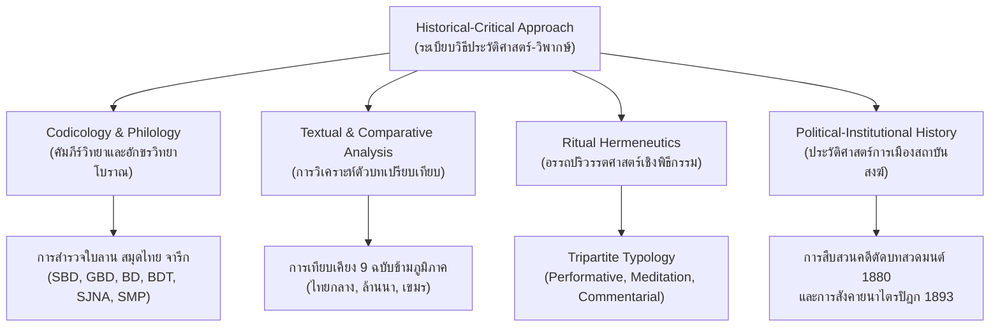
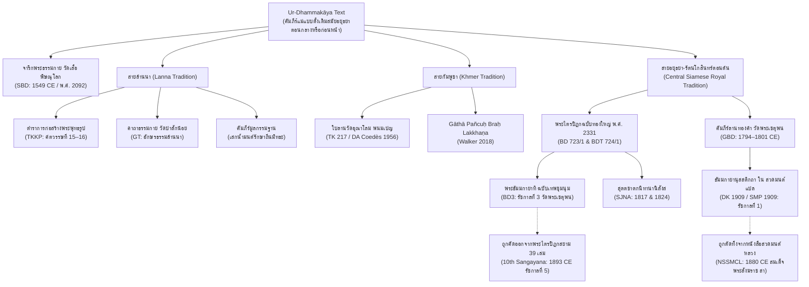

# บันทึกการอ่านและวิเคราะห์เอกสารฉบับสมบูรณ์ (Source Analysis Dossier)
# เอกสาร: The Dhammakāyānussati-kathā: A Trace of “Siam's Borān Buddhism” from the Reign of Rāmā I (1782-1809 CE.) (Woramat Malasart, 2019)
# รหัสเอกสาร: S-2019-malasart-00-master-dhammakayanussati-katha

---

## ส่วนที่ 1: ข้อมูลบรรณานุกรมและการอ้างอิงมาตรฐาน (Bibliographic Information & Standard Citation)

### 1.1 ข้อมูลบรรณานุกรมตามแบบแผน Chicago Manual of Style (17th Edition)
- **ผู้ประพันธ์ (Author):** วรมาศ มาลาศาสตร์ (Woramat Malasart)
- **ชื่อวิทยานิพนธ์ฉบับสมบูรณ์ (Full Thesis Title):** *The Dhammakāyānussati-kathā: A Trace of “Siam's Borān Buddhism” from the Reign of Rāmā I (1782-1809 CE.)*
- **ระดับปริญญาและสาขาวิชา (Degree & Field):** Master of Arts in Religious Studies (Department of Theology and Religion)
- **สถาบันการศึกษา (Awarding Institution):** University of Otago, Dunedin, New Zealand
- **วันที่นำเสนอและอนุมัติ (Defense & Submission Date):** 4 มิถุนายน ค.ศ. 2019 (June 4, 2019 / พ.ศ. 2562)
- **จำนวนหน้าทั้งหมดในเล่มวิทยานิพนธ์ (Total Pagination):** iii + 71 หน้า (เนื้อหาหลักบทที่ 1–5: หน้า 4–47; ภาคผนวกตัวบทตรวจชำระ: หน้า 48–63; บรรณานุกรม: หน้า 64–71)
- **อาจารย์ที่ปรึกษาวิทยานิพนธ์หลัก (Primary Supervisor):** Dr. Elizabeth Guthrie (University of Otago)
- **คณะผู้ทรงคุณวุฒิและนักวิชาการที่ปรึกษาการปริวรรต/แปล (Advisory & Mentorship Committee):** Assoc. Prof. Will Sweetman (Otago), Dr. Trent Walker (Stanford University), Dr. Kitchai Urkasame (University of Sydney), Dr. Chanida Jantrasrisalai (DIRI / Sydney), Prof. Claudio Cicuzza (Webster University Thailand)
- **สถาบันและแหล่งทุนสนับสนุนการวิจัย (Funding Bodies):** University of Otago Masters by Coursework Scholarship (2018) และ Dhammachai International Research Institute of Australia and New Zealand (DIRI)
- **ประเภทของเอกสาร (Document Classification):** วิทยานิพนธ์ปริญญามหาบัณฑิตฉบับสมบูรณ์ ด้านพุทธศาสนศึกษา คัมภีร์วิทยา ประวัติศาสตร์นิพนธ์ พิธีกรรมวิทยา และอักขรวิทยาโบราณ (Comprehensive Master of Arts Research Thesis in Buddhist Studies, Codicology, Historiography, and Ritual Studies)

### 1.2 รูปแบบการอ้างอิงตามมาตรฐาน Chicago (Notes & Bibliography System)
- **Footnote / เชิงอรรถครั้งแรก:**
  Woramat Malasart, "The Dhammakāyānussati-kathā: A Trace of 'Siam's Borān Buddhism' from the Reign of Rāmā I (1782-1809 CE.)" (MA thesis, University of Otago, 2019), [ระบุเลขหน้า].
- **Short Note / เชิงอรรถครั้งต่อ ๆ ไป:**
  Malasart, "The Dhammakāyānussati-kathā," [ระบุเลขหน้า].
- **Bibliography / บรรณานุกรมท้ายเล่ม:**
  Malasart, Woramat. "The Dhammakāyānussati-kathā: A Trace of 'Siam's Borān Buddhism' from the Reign of Rāmā I (1782-1809 CE.)." Master's thesis, Department of Theology and Religion, University of Otago, Dunedin, New Zealand, 2019.

### 1.3 บริบทประวัติศาสตร์นิพนธ์และสถานะของเอกสาร (Historiographical & Codicological Context)
วิทยานิพนธ์ระดับมหาบัณฑิตของ วรมาศ มาลาศาสตร์ (Woramat Malasart, 2019) ณ มหาวิทยาลัยโอทาโก ประเทศนิวซีแลนด์ ภายใต้การดูแลของ Dr. Elizabeth Guthrie นับเป็นหมุดหมายทางวิชาการชิ้นเอกระดับแม่บท (Magnum Opus / Master Umbrella Thesis) ที่ทำการศึกษาวิจัยคัมภีร์ *ธัมมกายานุสสติกถา* (Dhammakāyānussati-kathā) ซึ่งตีพิมพ์ในหนังสือ *สวดมนต์แปล ฉบับหอพระสมุดวชิรญาณ* ร.ศ. 128 (ค.ศ. 1909 / พ.ศ. 2452, ย่อว่า DK 1909 / SMP 1909) อย่างละเอียดรอบด้านเป็นครั้งแรกในวงวิชาการสากล 

งานวิจัยชิ้นนี้ทำหน้าที่เชื่อมประสานรอยต่อที่ขาดหายไประหว่าง "คัมภีร์วิทยา" (Codicology), "ประวัติศาสตร์พระไตรปิฎกและบทสวดมนต์หลวงสยาม" (History of Siamese Royal Chanting & Tipiṭaka), และ "ทฤษฎีการเบียดขับพุทธศาสนาแบบโบราณในยุคปฏิรูปสยาม" (The Suppression of Siam's Borān Buddhism under 19th-Century Reforms) โดยมาลาศาสตร์ได้พิสูจน์ข้อเท็จจริงทางประวัติศาสตร์และคัมภีร์วิทยา 5 ประการสำคัญ:
1. ตัวบท *ธัมมกายานุสสติกถา* จัดอยู่ใน "วรรณกรรมตระกูลคัมภีร์ธรรมกาย" (Dhammakāya text genre) ซึ่งมีประวัติศาสตร์สืบทอดย้อนหลังไปได้อย่างน้อยตั้งแต่สมัยอยุธยาตอนกลาง (จารึกแผ่นหินสถูปวัดเสือ พิษณุโลก พ.ศ. 2092 / ค.ศ. 1549) และแพร่กระจายกว้างขวางในวัฒนธรรมพุทธไทยภาคกลาง ล้านนา และกัมพูชา
2. การหักล้างข้อสมมติฐานเดิมของสมเด็จฯ กรมพระยาดำรงราชานุภาพ และนักวิชาการไทยรุ่นก่อน (เช่น สุเชาวน์ พลอยชุม, พระครูภาวนามงคล) ที่เชื่อว่าบทสวดมนต์แปลนี้แต่งขึ้นในสมัยรัชกาลที่ 2 จากการสังคายนาบทสวดมนต์ พ.ศ. 2364 (ค.ศ. 1821) โดยมาลาศาสตร์ได้นำเสนอหลักฐานชั้นต้นทางเอกสารและชีวประวัติบุคคลสำคัญ (สมเด็จพระสังฆราช พระอาจารย์ศรี และพระยาธรรมปรีชา แก้ว) เพื่อยืนยันว่า *ธัมมกายานุสสติกถา* และหนังสือสวดมนต์แปลฉบับดั้งเดิม ถูกแปลและรจนาขึ้นตั้งแต่รัชสมัยพระบาทสมเด็จพระพุทธยอดฟ้าจุฬาโลกมหาราช (รัชกาลที่ 1, ครองราชย์ ค.ศ. 1782–1809)
3. การสืบสาวความสัมพันธ์ทางคัมภีร์วิทยา พบว่าคัมภีร์ *ธัมมกายานุสสติกถา* (DK 1909) มีความสอดคล้องแนบแน่นที่สุดกับ *พระคัมภีร์ลานทองคำพระธรรมกาย* (Golden Manuscript Braḥ Dhammakāya, ย่อว่า GBD) ซึ่งจารึกขึ้นระหว่าง ค.ศ. 1794–1801 และบรรจุไว้ในพระมหาเจดีย์ศรีสรรเพชญดาญาณ วัดพระเชตุพนวิมลมังคลาราม ในรัชกาลที่ 1 โดย GBD ทำหน้าที่เป็น "ต้นฉบับแม่แบบ" (source text) โดยตรง
4. การวิเคราะห์หน้าที่เชิงวัฒนธรรม 3 มิติ (Tripartite Functional Typology): ในฐานะคัมภีร์เชิงพิธีกรรมปฏิบัติการ (Performative Text) สำหรับพิธีพุทธาภิเษกและการบรรจุหัวใจพระพุทธรูป/พระเจดีย์, คัมภีร์เชิงปฏิบัติการสมาธิภาวนา (Meditation Text) ในสายโยคาวจรโบราณ, และคัมภีร์เชิงอรรถาธิบายและการเรียนการสอน (Commentarial / Pedagogical Text) ที่แปลด้วยเทคนิค "ยกศัพท์" (Yok Sab)
5. การคลี่คลายกลไกเชิงสถาบันที่ทำให้คัมภีร์ธรรมกายานุสสติกถาสาบสูญไปจากพุทธศาสนาภาคกลางของสยามในรัชกาลที่ 5: ผ่านการตัดหมวด *ปกิณณกคาถา* ออกจากหลักสูตรสวดมนต์หลวง พ.ศ. 2423 (ค.ศ. 1880) ภายใต้สมเด็จพระอริยวงศาคตญาณ สมเด็จพระสังฆราช (สา ปุสฺสเทโว) และการคัดคัมภีร์ตระกูลพระธรรมกาย (BD, BDT) ออกจาก "สารบบพระไตรปิฎกฉบับทางการ" (Siam's Formal Canon) ในการสังคายนาพระไตรปิฎก ร.ศ. 112 (ค.ศ. 1893) สอดคล้องกับทฤษฎีการกวาดล้างพุทธศาสนาแบบโบราณของ Kate Crosby (2013) และ James L. Taylor (1993)

---

## ส่วนที่ 2: ผังโครงสร้างและสาระสำคัญระดับบททั้ง 5 บท (Chapter & Section Mapping Matrix)

วิทยานิพนธ์ฉบับนี้จัดแบ่งโครงสร้างการนำเสนอออกเป็น 5 บทหลัก พร้อมภาคผนวกตัวบทปริวรรตและบรรณานุกรม โดยมีสาระสังเคราะห์ในแต่ละบทย่อยดังตารางวิเคราะห์ต่อไปนี้:

| บทที่และชื่อบท (Chapter & Title) | เลขหน้า (Pages) | หัวข้อย่อยสำคัญภายในบท (Key Sections) | ประเด็นใจความหลักและข้อค้นพบเชิงวิชาการ (Core Syntheses & Findings) |
|:---|:---|:---|:---|
| **Chapter I: Introduction and Literature Review** | 4–16 | 1.1 Overview 1.2 Research Questions 1.3 Methodology 1.4 Dhammakāya Text Genre & Analysis 1.4.1 Editions & Translations 1.4.2 Ritual Context 1.4.3 Textual Analysis 1.4.4 Table A: Index of Genre 1.4.5 Why DK 1909? | กำหนดนิยามของ "Dhammakāya text genre" ว่าเป็นวรรณกรรมพุทธศาสนาที่จับคู่พระธรรมกายเข้ากับพระพุทธญาณ (ñāṇa) และคุณธรรม (guṇa) โดยใช้คาถาแกนกลางร่วมกัน มีประวัติสืบเนื่องตั้งแต่จารึกวัดเสือ พิษณุโลก (1549 CE); วางคำถามวิจัย 4 ข้อ; กำหนดระเบียบวิธีวิจัยประวัติศาสตร์-วิพากษ์ (Historical-critical approach); สำรวจวรรณกรรม 9 สำนวนหลักในไทย-เขมร; ชี้ให้เห็นช่องว่างทางวิชาการที่ยังไม่เคยมีผู้ใดศึกษาวิจัย DK 1909 อย่างลึกซึ้ง |
| **Chapter II: A History of the Dhammakāyānussati-kathā** | 17–24 | 2.1 Golden Manuscript (GBD 1794–1801) 2.2 Braḥ Dhammakāyādi (BD, 1st & 3rd reigns) 2.3 Suttajātakanidānānisaṃsa (SJNA 1817 & 1824) 2.4 Rāmā II's Sangayana Bot Suat Mon (1821 CE) 2.5 Dating DK 1909: 1st vs 2nd reign? 2.6 Conclusion | ตรวจสอบประวัติการค้นพบสมุดไทยสวดมนต์แปล 3 ฉบับโดยสมเด็จฯ กรมพระยาดำรงราชานุภาพ (1908); วิเคราะห์คัมภีร์ลานทองคำวัดพระเชตุพน (GBD); สำรวจคัมภีร์ใบลาน BD และ BDT 5 ฉบับในหอสมุดแห่งชาติ (ฉบับทองใหญ่ 1788, ฉบับร่องชาด, ฉบับลานดิบ); ตรวจสอบ SJNA ฉบับพระอินทโชติ (1817) และฉบับเทพากร (1824); พิสูจน์ว่า DK 1909 ไม่ได้เกิดจากการสังคายนาบทสวดมนต์แก้ห่าอหิวาต์ปี 1821 ของรัชกาลที่ 2 แต่แต่งขึ้นในรัชกาลที่ 1 ผ่านหลักฐานการปรึกษาสมเด็จพระสังฆราช (ศรี, สิ้นพระชนม์ 1794) และบันทึกท้ายอภิธรรม 7 คัมภีร์ของพระยาธรรมปรีชา (แก้ว, ถึงแก่อนิจกรรมปลายรัชกาลที่ 1) |
| **Chapter III: Transliteration and Translation** | 25–30 | 3.1 Diplomatic Translation of DK 1909 3.2 Analysis of DK 1909 (Yok Sab, Hybridised Pāli-Tai, Degeminisation, 4-part structure, comparison with DA, BD3, GBD) | ถอดความและแปลบทสวด DK 1909 เป็นภาษาอังกฤษแบบ Diplomatic Translation อย่างสมบูรณ์; จำแนกโครงสร้างตัวบทออกเป็น 4 ส่วน (1. รายการคุณลักษณะ 30 ประการของธรรมกาย, 2. คาถาพรรณนาคุณ, 3. คำเตือนสติร้อยแก้วแก่พระโยคาวจรผู้ปรารถนาพุทธภูมิ, 4. คาถาพรรณนาพระพุทธสรีรกาย สูง 12 ศอก พระเกตุมาลา 6 ศอก รวม 18 ศอก และฉัพพรรณรังสี 6 ประการ); วิเคราะห์เทคนิคการแปลแบบ "ยกศัพท์" (Yok Sab), ปรากฏการณ์คำลูกผสมบาลี-ไทย (Hybridised Pāli-Tai) และการตัดพยัญชนะซ้อน (Degeminisation); เปรียบเทียบกับ DA, BD3, GBD จนสรุปได้ว่า GBD คือแม่แบบตรงของ DK 1909 |
| **Chapter IV: A Textual and Contextual Analysis of DK 1909** | 31–45 | 4.1 Ritual Usage in Khmer & Northern Thailand 4.1.1 Buddhābhiṣeka 4.1.2 Individual Recitation for Living Prosperity & Meditation 4.2 Contextual Analysis of DK 1909 (Performative, Meditation, Commentarial) 4.3 The Disappearance of DK (Sā's 1880 NSSMCL, 1893 10th Sangayana) | ศึกษาวิเคราะห์การใช้งานเชิงพิธีกรรมในกัมพูชาและล้านนา (พิธีพุทธาภิเษก 3 ขั้นตอนของ Bizot: บรรจุลักษณา, เบิกพระเนตร, สวดอนุรักษ์; พิธีบรรจุหัวใจพระพุทธรูปและพระเจดีย์); วิเคราะห์การใช้งาน 3 มิติ: Performative Text (การทำให้พระพุทธรูปมีชีวิต), Meditation Text (พุทธานุสสติ และการเสกน้ำมนต์รักษาจิตกระด้าง/ความง่วง ถีนมิทธะ ในคัมภีร์มูลกรรมฐาน), Commentarial Text (การตีความธรรมกายเป็นพระพุทธญาณ); คลี่คลายประวัติศาสตร์การกวาดล้าง: รัชกาลที่ 4 ทรงปฏิเสธกรรมฐานโบราณ, สมเด็จพระสังฆราช (สา) ตัดหมวดปกิณณกคาถาออกในปี 1880, และรัชกาลที่ 5 ทรงคัด BD/BDT ออกจากสารบบพระไตรปิฎก 1893 |
| **Chapter V: Conclusion** | 46–47 | Synthesis of Findings, Conceptualising Buddhist Texts as Living Orientations, Contributions to Thai Buddhist Studies | ประมวลข้อสรุปเชิงทฤษฎี เสนอมโนทัศน์ "Buddhist Texts as Living Orientations" (คัมภีร์ในฐานะทิศทางแห่งชีวิตที่มีการเคลื่อนไหว มิใช่ข้อความหยุดนิ่ง); สรุปวงศาวิทยาของคัมภีร์ตระกูลธรรมกายจากอยุธยาสู่รัตนโกสินทร์; ยืนยันว่าการสาบสูญของ DK 1909 คือหลักฐานเชิงประจักษ์ของการเบียดขับพุทธศาสนาแบบโบราณ (Siam's Borān Buddhism) โดยขบวนการปฏิรูปสยามปลายศตวรรษที่ 19 |
| **Appendix & Bibliography** | 48–71 | Appendix: The Dhammakāyānussati-kathā (Critical Text & Notes, pp. 48–63) Bibliography (pp. 64–71) | นำเสนอตัวบทปริวรรตฉบับตรวจชำระ (Critical Edition) เทียบเคียงบาลี-อักษรไทย-อักษรโรมัน พร้อมเชิงอรรถอักขรวิทยาและการเปรียบเทียบคำอ่านกับคัมภีร์ร่วมตระกูล (DA, BD3, GBD, GT); บรรณานุกรมเอกสารชั้นต้น (ใบลาน สมุดไทย จารึก หนังสือสวดมนต์) และเอกสารชั้นทุติยภูมิทางวิชาการสากล |

---

## ส่วนที่ 3: บทวิเคราะห์เชิงวิชาการระดับบริหาร (Executive Academic Analysis)

### 3.1 ข้อเสนอหลักของวิทยานิพนธ์ (Core Theses & Academic Breakthroughs)
วิทยานิพนธ์ของวรมาศ มาลาศาสตร์ ได้สถาปนาข้อค้นพบสำคัญที่เปลี่ยนโฉมหน้าการศึกษาประวัติศาสตร์พุทธศาสนาไทยและวรรณกรรมสายโยคาวจร 5 ประการหลัก:

1. **การสถาปนา "วรรณกรรมตระกูลคัมภีร์ธรรมกาย" (Dhammakāya Text Genre) ในฐานะจารีตร่วมระดับภูมิภาค:**
   มาลาศาสตร์แสดงให้เห็นว่า คัมภีร์ที่กล่าวถึง "พระธรรมกาย" ในเอเชียตะวันออกเฉียงใต้ภาคพื้นทวีปมิได้เป็นเอกสารโดดเดี่ยวหรือเป็นผลผลิตเฉพาะกลุ่มของขบวนการธรรมกายร่วมสมัย หากแต่เป็น "ตระกูลวรรณกรรม" (text genre) ขนาดใหญ่ที่มีอายุยาวนานหลายร้อยปี มีโครงสร้างคาถาแกนกลางร่วมกัน ปรากฏทั้งในรูปศิลาจารึก (จารึกวัดเสือ พิษณุโลก พ.ศ. 2092), จารึกแผ่นทองคำ (GBD วัดพระเชตุพน พ.ศ. 2337–2344), คัมภีร์ใบลานหลวง (ฉบับทองใหญ่ พ.ศ. 2331, ฉบับร่องชาด, ฉบับเทพชุมนุม พ.ศ. 2367–2394), คัมภีร์ใบลานล้านนา (GT วัดป่าสักน้อย เชียงใหม่, คัมภีร์มูลกรรมฐาน), ใบลานกัมพูชา (TK 217 วัดอุณาโลม, TK 27 วัดช่องถนน, ฉบับอาจารย์ดิน), และหนังสือรวมบทสวดมนต์ของราชสำนักสยาม (SMP 1909)

2. **การปฏิวัติข้อสมมติฐานเรื่องอายุเวลาของคัมภีร์ (Chronological Revisionism):**
   วงวิชาการไทยตลอดหนึ่งศตวรรษนับแต่สมเด็จฯ กรมพระยาดำรงราชานุภาพทรงนิพนธ์คำนำหนังสือ *สวดมนต์แปล* เมื่อ พ.ศ. 2452 ได้ปักใจเชื่อสืบกันมาว่า คัมภีร์ *ธัมมกายานุสสติกถา* (หมวดปกิณณกคาถา) เกิดขึ้นจากการที่พระบาทสมเด็จพระพุทธเลิศหล้านภาลัย (รัชกาลที่ 2) โปรดเกล้าฯ ให้มีการ "สังคายนาบทสวดมนต์" เมื่อ พ.ศ. 2364 เพื่อบำเพ็ญพระราชกุศลอุทิศแก่ผู้เสียชีวิตจากอหิวาตกโรคระบาดครั้งใหญ่ ทว่า มาลาศาสตร์ได้พิสูจน์อย่างหักล้างไม่ได้ว่า:
   - หมายรับสั่ง ร.ศ. 1183 (พ.ศ. 2364) ซึ่งระบุรายการบทสวดมนต์ในการสังคายนาดังกล่าวอย่างละเอียด (เจ็ดตำนาน, สิบสองตำนาน, ภาณวาร) ไม่ปรากฏชื่อบทสวดธรรมกายานุสสติกถาเลยแม้แต่น้อย
   - เนื้อหาในตัวบท *สวดมนต์แปล* ฉบับหอพระสมุดวชิรญาณ หน้า 280 ระบุอย่างชัดเจนว่าผู้แปลได้ "นำความไปปรึกษาพระสังฆราชผู้เฒ่า พระนามเดิมชื่อพระอาจารย์ศรี และท่านเห็นชอบด้วย" ซึ่งสมเด็จพระสังฆราช (ศรี) วัดระฆังโฆสิตาราม ได้รับการสถาปนาในรัชกาลที่ 1 เมื่อ พ.ศ. 2325 และสิ้นพระชนม์ลงตั้งแต่ พ.ศ. 2337 ในช่วงต้นรัชกาลที่ 1
   - คำลงท้ายการแปลพระอภิธรรม 7 คัมภีร์ ในหน้า 331 ระบุชัดเจนว่าเป็นผลงานแปลของ "พระยาธรรมปรีชา (แก้ว)" ซึ่งถึงแก่อนิจกรรมไปตั้งแต่ปลายรัชกาลที่ 1 (พ.ศ. 2352) มิได้มีชีวิตอยู่จนถึงรัชกาลที่ 2
   - ดังนั้น *ธัมมกายานุสสติกถา* จึงเป็นผลผลิตทางวิชาการและศาสนธรรมของราชสำนักรัชกาลที่ 1 (ค.ศ. 1782–1809) อย่างแน่นอน

3. **สายธารความสืบเนื่องโดยตรงระหว่าง GBD (ลานทองคำ) กับ DK 1909:**
   การวิเคราะห์เปรียบเทียบเชิงอักขรวิทยา โครงสร้างคาถา และลำดับคุณลักษณะ 30 ประการ ชี้ชัดว่า DK 1909 มีความละม้ายคล้ายคลึงกับ *พระคัมภีร์ลานทองคำพระธรรมกาย* (GBD) ที่สร้างขึ้นเพื่อบรรจุในพระมหาเจดีย์ศรีสรรเพชญดาญาณ วัดพระเชตุพน ระหว่าง พ.ศ. 2337–2344 มากกว่าคัมภีร์ฉบับอื่น ๆ โดยเฉพาะการมีท่อนท้ายที่พรรณนาถึงพระพุทธสรีรกาย (ส่วนสูง 12 ศอก พระเกตุมาลา 6 ศอก รวม 18 ศอก และฉัพพรรณรังสี) ซึ่งไม่ปรากฏในคัมภีร์สาย DA (ฉบับอรรถกถา) หรือ GT (ล้านนา) จึงสันนิษฐานได้ว่าผู้รจนา DK 1909 ได้ใช้ GBD หรือเอกสารแม่แบบชุดเดียวกันของราชสำนักรัชกาลที่ 1 เป็นต้นฉบับในการแปลแบบยกศัพท์

4. **การรื้อฟื้นมิติเชิงหน้าที่นิยม (Functional Typology) ในบริบทวัฒนธรรมมีชีวิต:**
   มาลาศาสตร์ก้าวพ้นข้อจำกัดของนักบูรพคดีศึกษาตะวันตกยุคเก่า ที่มองคัมภีร์พุทธศาสนาเป็นเพียงตัวอักษรเพื่อการตีความปรัชญาบริสุทธิ์ (Philological Reductionism) โดยจำแนกให้เห็นว่า คัมภีร์ตระกูลธรรมกายทำหน้าที่เป็น "ทิศทางแห่งชีวิต" (Living Orientations) 3 ประการ:
   - **Performative Text:** ทำหน้าที่ทางเสียงในพิธีกรรมพุทธาภิเษก การเบิกพระเนตร และการบรรจุพระคาถาเป็น "หัวใจพระพุทธรูป" (Huachai Phraphuttharup) เพื่อเปลี่ยนรูปเคารพโลหะหรือหินให้กลายเป็น "พระพุทธเจ้าที่มีชีวิตและลมหายใจ" (Making the Buddha Present)
   - **Meditation Text:** ใช้เป็นอารมณ์บริกรรมแห่งพุทธานุสสติ เพื่อยกจิตของพระโยคาวจรขึ้นสู่ภูมิแห่งพระสัพพัญญู และใช้สวดเสกทำ "น้ำมนต์ศักดิ์สิทธิ์" ในคัมภีร์มูลกรรมฐานล้านนา เพื่อบำบัดอาการวิปลาส ง่วงเหงาหาวนอน (ถีนมิทธะ) จิตกระด้าง หรือถูก "บาปธัมมานุทิฏฐิ" ครอบงำ
   - **Commentarial Text:** ทำหน้าที่เป็นบทเรียนอธิบายธรรมะขั้นสูง ผ่านการแจกแจงโครงสร้างพระพุทธญาณ โพธิปักขิยธรรม และอภิธรรม ด้วยลีลาการแปลแบบยกศัพท์ (Nissaya / Yok Sab)

5. **การตีแผ่ประวัติศาสตร์การกวาดล้างพุทธศาสนาแบบโบราณ (The Suppressive Purge):**
   การสาบสูญไปของคัมภีร์ธรรมกายานุสสติกถาจากศูนย์กลางสยาม มิใช่อุบัติเหตุทางประวัติศาสตร์หรือการเสื่อมความนิยมตามธรรมชาติ หากแต่เป็นผลลัพธ์โดยตรงจากกระบวนการปฏิรูปพุทธศาสนาให้ทันสมัย (Modernist Buddhist Reformation) ภายใต้ชนชั้นนำสยาม:
   - เริ่มต้นจากข้อกังขาของพระบาทสมเด็จพระจอมเกล้าเจ้าอยู่หัว (รัชกาลที่ 4) ตั้งแต่ครั้งทรงผนวชในปี ค.ศ. 1820 ณ วัดราชสิทธาราม (วัดพลับ) ที่ทรงปฏิเสธแบบแผนกรรมฐานโบราณของพระอาจารย์สุก ไก่เถื่อน ว่าไม่มีที่มาในพระบาลีไตรปิฎก
   - การลงมือตัดหมวด *ปกิณณกคาถา* ออกจากแบบเรียนสวดมนต์หลวง พ.ศ. 2423 (NSSMCL 1880/1911) ภายใต้การนำของสมเด็จพระสังฆราช (สา ปุสฺสเทโว) ซึ่งเป็นคัมภีร์เล่มเดียวที่ DK 1909 เคยสถิตอยู่
   - การจัดพิมพ์พระไตรปิฎกอักษรสยาม 39 เล่ม ในการสังคายนา พ.ศ. 2436 (ร.ศ. 112 / ค.ศ. 1893) ของรัชกาลที่ 5 ซึ่งดำเนินนโยบายคัดคัมภีร์นอกพระบาลีดั้งเดิม (Non-canonical Texts) รวมถึงคัมภีร์พระธรรมกาย (BD, BDT) ออกจากสารบบทางการอย่างถาวร ทำให้วัตรปฏิบัตินี้ถูกผลักไสไปสู่ชายขอบในล้านนาและกัมพูชา

---

### 3.2 ระเบียบวิธีวิจัยและกรอบทฤษฎีประวัติศาสตร์นิพนธ์ (Historiography & Methodological Framework)

วิทยานิพนธ์ของมาลาศาสตร์วางอยู่บนระเบียบวิธีวิจัยแบบสหวิทยาการที่ประสานเครื่องมือ 4 ด้านเข้าด้วยกัน:

1. **ระเบียบวิธีคัมภีร์วิทยาและอักขรวิทยา (Codicological & Philological Analysis):**
   ผู้เขียนได้ลงพื้นที่สำรวจเอกสารตัวเขียนต้นฉบับ ณ หอสมุดแห่งชาติ กรุงเทพฯ และวัดพระเชตุพนวิมลมังคลาราม โดยศึกษาเปรียบเทียบระบบอักษรขอม-อยุธยา, อักษรขอม-สุโขทัย, อักษรธรรมล้านนา, และอักษรสยามสมัยรัตนโกสินทร์ พร้อมทั้งใช้ระบบการถอดอักษรบาลีของพระพรหมคุณาภรณ์ (ป.อ. ปยุตฺโต), ระบบปริวรรตอักษรไทย-อังกฤษ UB System ของ Trent Walker (2018), และระบบถอดเสียงราชบัณฑิตยสภา (RTGS) เพื่อวิเคราะห์ปรากฏการณ์ทางภาษา เช่น การแปลแบบยกศัพท์ (Yok Sab), คำลูกผสมบาลี-ไทย (Hybridised Pāli-Tai), และการลดรูปพยัญชนะซ้อน (Degeminisation)

2. **กรอบทฤษฎีอรรถปริวรรตศาสตร์เชิงพิธีกรรม (Ritual Hermeneutics & Sonic Agency):**
   มาลาศาสตร์นำเอากรอบแนวคิดเรื่อง "Performative Language" และ "Sonic Magic" ของ François Bizot, Donald Swearer, และ Trent Walker มาอธิบายว่า ตัวบทในตระกูลธรรมกายมิได้ถูกแต่งขึ้นเพื่อให้อ่านเอาความหมายในเชิงตรรกะแบบปัจเจก (Silent Reading for Semantic Meaning) แต่เป็น "ภาษาเพื่อการกระทำการ" (Language as Ritual Action) ที่มีพลังอำนาจในการแปลงสภาวะ (Transformative Power) ทางกายภาพและจิตวิญญาณ

3. **กรอบประวัติศาสตร์สถาบันสงฆ์และการครอบงำเชิงอำนาจ (Hegemonic State-Sangha Formations):**
   ผู้เขียนประยุกต์ใช้ทฤษฎีของ Kate Crosby (2013), James L. Taylor (1993), Anne M. Blackburn (1999), และ Justin McDaniel (2010) ในการวิเคราะห์โครงสร้าง "Formal Canon" (สารบบคัมภีร์ทางการ) ซึ่งรัฐสยามสมัยใหม่ใช้เป็นเครื่องมือสร้างความเป็นหนึ่งเดียว (Standardisation / Monolithic Theravāda) และกำจัดความหลากหลายของจารีตท้องถิ่น (Local / Borān Practices) ที่ถูกมองว่าไร้เหตุผลทางวิทยาศาสตร์หรืองมงายในสายตาของมหาอำนาจอาณานิคมตะวันตก

---

### 3.3 ข้อถกเถียงระหว่างตัวบทและจุดยืนทางวิชาการ (Major Intertextual Debates)

มาลาศาสตร์ได้นำ DK 1909 เข้าไปมีปฏิสัมพันธ์กับข้อถกเถียงหลัก 3 ประการในแวดวงพุทธศาสนศึกษานานาชาติ:

1. **ข้อถกเถียงเรื่องอิทธิพลมหายาน vs แก่นแท้เถรวาท (Mahāyāna Influence vs. Theravāda Orthodoxy):**
   - George Coedès (1956) และนักวิชาการรุ่นแรกมองว่า การระบุว่าพระพุทธเจ้ามี "ธรรมกาย" ที่จับคู่กับพระญาณและนามธรรม ตลอดจนการที่ข้อความท้ายคัมภีร์เน้นย้ำให้ผู้เจริญกรรมฐานตั้งความปรารถนาพุทธภูมิ (Sabbaññūbuddhabhāvaṃ patthentena) เป็นหลักฐานของ "อิทธิพลมหายาน" (Mahāyāna Infiltration) ที่เล็ดลอดเข้ามาปะปนในเถรวาท
   - Frank E. Reynolds (1977) และ กิจชัย เอื้อเกษม (Kitchai Urkasame, 2013) โต้แย้งว่า โครงสร้างของคัมภีร์ธรรมกายยังคงตั้งอยู่บนรากฐานของเถรวาทดั้งเดิมอย่างเหนียวแน่น เนื่องจากการบรรลุพุทธภาวะในคัมภีร์นี้มิได้วางอยู่บนอภิปรัชญาเรื่อง "ตรีกาย" (Trikāya) หรือ "ศูนยตา" แบบมหายาน หากแต่เกิดจากการสั่งสม "บารมี 30 ทัศ" และการเจริญ "โพธิปักขิยธรรม 37 ประการ" ตามคัมภีร์วิสุทธิมรรคและคัมภีร์พระไตรปิฎกบาลี
   - **จุดยืนของมาลาศาสตร์:** มาลาศาสตร์เห็นพ้องกับเรย์โนลด์สและเอื้อเกษมว่า แม้จะมีกลิ่นอายของอุดมคติพระโพธิสัตว์ แต่หัวใจของ DK 1909 คือการจัดระบบ "ธรรมะและพระญาณ" ตามกรอบพระอภิธรรมเถรวาทแท้ ๆ ที่นำมาประยุกต์ใช้ในบริบทพิธีกรรมของเอเชียตะวันออกเฉียงใต้

2. **ข้อถกเถียงเรื่องขอบเขตของ "พุทธศาสนาแบบโบราณ" (Defining Borān Buddhism):**
   - Kate Crosby (2013) และ François Bizot (1992) เสนอคำว่า "Traditional Theravāda Meditation / Borān Kammaṭṭhāna / Yogāvacara" เพื่ออธิบายระบบกรรมฐานโบราณที่ใช้ระบบธาตุ สรีรศาสตร์ศักดิ์สิทธิ์ อักขระคาถา และการก่อกำเนิดพระธรรมกายภายในครรภ์จิต
   - John Marston (2008) และ Trent Walker (2018) ขยายความว่าคำว่า "Borān" มิได้จำกัดเฉพาะเทคนิคการนั่งสมาธิ แต่ครอบคลุมถึง "วัฒนธรรมการสวด การแปล การทำพิธีกรรม และโลกทัศน์ทางศาสนาทั้งหมด" ก่อนการปฏิรูปในศตวรรษที่ 19
   - **จุดยืนของมาลาศาสตร์:** มาลาศาสตร์สนับสนุนข้อเสนอของมาร์สตันและวอล์กเกอร์ โดยชี้ว่า DK 1909 คือภาพสะท้อนที่สมบูรณ์แบบที่สุดของ "Siam's Borān Buddhism" ที่บูรณาการระหว่างคัมภีร์สวดมนต์ การแปลแบบยกศัพท์ การเจริญกรรมฐาน และพิธีพุทธาภิเษกหลวงเข้าไว้ด้วยกันอย่างแยกไม่ออก

3. **ข้อถกเถียงเรื่องเจตจำนงในการปฏิรูป (Reformation Intent: Modernisation or Pure Purification?):**
   - นักประวัติศาสตร์สายจารีตนิยมไทย (เช่น พระประวัติสมเด็จพระสังฆราช สา ปุสฺสเทโว) มักอธิบายการปฏิรูปบทสวดมนต์และการสังคายนาพระไตรปิฎกในรัชกาลที่ 5 ว่าเป็นเพียง "การชำระให้บริสุทธิ์ถูกต้องตามหลักไวยากรณ์บาลีและพระสูตรดั้งเดิม" (Purification of Pali Orthodoxy)
   - David K. Wyatt (2003) และ Craig J. Reynolds (1972) วิเคราะห์ว่าเป็นการสร้างรัฐชาติสมัยใหม่และการรวมศูนย์อำนาจสงฆ์เข้าสู่ส่วนกลาง (Centralisation & Monastic Bureaucratisation)
   - **จุดยืนของมาลาศาสตร์:** มาลาศาสตร์ได้แสดงหลักฐานทางคัมภีร์วิทยาเปรียบเทียบสารบัญ (Textual Forensics) ระหว่าง SMP 1909 กับ NSSMCL 1880/1911 ที่พบว่ามีการ "ตัดหมวดปกิณณกคาถาออกเพียงหมวดเดียวอย่างจำเพาะเจาะจง" ซึ่งพิสูจน์ให้เห็นถึงเจตจำนงเชิงอุดมการณ์ของกลุ่มปฏิรูปธรรมยุตและราชสำนัก ที่ต้องการขจัดโลกทัศน์แบบรหัสยเวทและพิธีกรรมโบราณที่ไม่สอดรับกับแนวคิดเชิงเหตุผลนิยม (Rationalism) ของโลกตะวันตก

---

## ส่วนที่ 4: การวิเคราะห์ประเด็นค้นพบ 7 มิติเชิงประจักษ์พร้อมเลขหน้าจริง (Thematic Findings across 7 Dimensions)

### 4.1 มิติสรีรศาสตร์ศักดิ์สิทธิ์และการสถาปนากายธรรม (Somatic Mandala & Bodily Mapping)
- **ตำแหน่งในเล่มต้นฉบับ:** หน้า 13–14, 25–27, 28–30
- **การวิเคราะห์เชิงวิชาการ:**
  คัมภีร์ *ธัมมกายานุสสติกถา* นำเสนอระบบ "สรีรศาสตร์ศักดิ์สิทธิ์" (Sacred Somatics) ที่ทำการจับคู่อวัยวะ 30 จุดของพระพุทธสรีระและบริขาร เข้ากับหมวดธรรมะและพระพุทธญาณในพระพุทธศาสนาอย่างเป็นระบบ ซึ่งจัดเป็นกระบวนการทำ "นยาสะ" (Nyāsa) หรือการสร้างมณฑลแห่งกายทิพย์ (Subtle Somatic Mandala) ดังนี้:
  1. พระเศียร (Pavarasīsaṃ) = พระสัพพัญญุตญาณ (Omniscient Knowledge)
  2. พระเกศา (Pavarakesā) = พระนิพพาน (The Realm of Nibbāna / Meditative Object)
  3. พระนลาฏ (Forehead / Pavaranalāṭaṃ) = จตุตถฌาน (The Four Absorptions)
  4. พระอุณาโลม (Sublime Hair between Eyebrows / Pavarauṇṇālomā) = วชิรสมาปัตติญาณ (Knowledge of Obtaining Great Thunderbolt)
  5. พระขนงคู่ (Eyebrows / Pavarabhamukā) = นีลกสิณ (Meditative Recognition of Blue Objects)
  6. พระเนตรคู่ (Two Sublime Eyes / Pavaranetta) = ปัญจจักษุญาณ 5 ประการ (มังสจักษุ, ทิพพจักษุ, ปัญญาจักษุ, พุทธจักษุ, สมันตจักษุ)
  7. พระโสตคู่ (Two Sublime Ears / Pavarasota) = ทิพพโสตญาณ (Divine Ears)
  8. พระนาสิก (Prominent Nose / Pavaranāsā) = โคตรภูญาณ (Gotrabhū Knowledge)
  9. พระปรางคู่ (Cheeks / Pavaraganḍa) = มรรคผลญาณและวิมุตติผลญาณ (Noble Paths and Liberating Fruits)
  10. พระทนต์ (Sublime Teeth / Pavaradantā) = โพธิปักขิยธรรม 37 ประการ (Thirty-seven Virtues Contributing to Awakening)
  11. พระโอษฐ์บน-ล่าง (Lips / Pavaraoṭṭha) = โลกิยสัจจะและโลกุตตรสัจจะ (Mundane & Supramundane Truths)
  12. พระเขี้ยวแก้วทั้ง 4 (Eye Teeth / Pavaradāṭhā) = จตุมรรคญาณ (Knowledge of the Four Noble Paths)
  13. พระชิวหา (Tongue / Pavarajivhā) = จตุสัจจญาณ (Knowledge of the Four Truths)
  14. พระหนุ (Chin / Pavarahanukā) = อัปปฏิหตญาณ (Irresistible & Unhindered Knowledge)
  15. คอหอย/ลำคอด้านใน (Tubal Neck / Pavaragala) = อนุตตรวิโมกขาธิคมญาณ (Supramundane Liberation Knowledge)
  16. พระศอ (Neck / Pavaragīvā) = ไตรลักษณญาณ (Three Characteristics of Existence)
  17. พระพาหาคู่ (Upper Arms / Pavarabāhā) = จตุเวสารัชชญาณ (Four Folds of Intrepidity)
  18. พระองคุลี/นิ้วพระหัตถ์ (Rounded Fingers / Pavaraaṅgulī) = ทศอนุสสติกรรมฐาน (Ten Recollections)
  19. พระอุระ (Chest / Pavaraura) = สัตตสัมโพชฌงค์ (Seven Awakening Elements)
  20. พระถันคู่ (Breasts / Pavarathana) = อาสยานุสยญาณ (Knowledge of Instinctive Dispositions in All Beings)
  21. ลำพระองค์ส่วนกลาง (Middle Trunk / Pavaramajjhimaṅga) = ทศพลญาณ (Ten Buddha's Powers)
  22. พระนาภี (Navel / Pavaranābhi) = ปฏิจจสมุปปาทญาณ (Truth of Dependent Origination)
  23. พระสะเอว/ชฆนะ (Waist / Pavarakaṭi) = ปัญจินทรีย์และปัญจพละ (Five Controlling Faculties & Five Powers)
  24. พระเพลาคู่/ขาอ่อน (Thighs / Pavaraūrū) = จตุสัมมัปปธาน (Four Great Efforts)
  25. พระชงฆ์คู่/แข้ง (Legs / Pavarajaṅghā) = ทศกุศลกรรมบถ (Ten Wholesome Actions)
  26. พระบาทคู่ (Feet / Pavarapāda) = จตุอิทธิบาท (Four Paths of Accomplishment)
  27. ผ้าสังฆาฏิ (Outer Robe / Saṅghāṭi) = ศีล สมาธิ ปัญญา (Morality, Concentration, and Wisdom)
  28. พระจีวรเฉวียงบ่า (Upper Robe / Cīvara) = หิริและโอตตัปปะ (Moral Shame & Moral Fear)
  29. สบง/อันตรวาสก (Under Robe / Antaravāsaka) = อริยมรรคมีองค์ 8 (Noble Eightfold Path)
  30. รัดประคดเอว (Girdle / Kāyabandhana) = มหาสติปัฏฐาน 4 (Four Foundations of Mindfulness)

### 4.2 มิติพิธีกรรมพุทธาภิเษกและการเบิกพระเนตร (Buddhābhiṣeka & Eye-Opening Rituals)
- **ตำแหน่งในเล่มต้นฉบับ:** หน้า 12–13, 31–35
- **การวิเคราะห์เชิงวิชาการ:**
  ในบทที่ 1 และบทที่ 4 มาลาศาสตร์ได้วิเคราะห์พิธีพุทธาภิเษกในกัมพูชาตามการศึกษาของ François Bizot (1992) และ Donald Swearer (2004) ในล้านนา โดยแสดงให้เห็นว่าคัมภีร์ตระกูลธรรมกายทำหน้าที่เป็น "หัวใจสำคัญในการเปลี่ยนผ่านสภาวะ" (Ritual Catalyst):
  - พิธีพุทธาภิเษกในจารีตเขมรประกอบด้วย 3 ขั้นตอนหลัก: การบรรจุลักษณา (Implantation of Lakkhaṇa), การเบิกพระเนตร (Opening of the Eyes), และการสวดพระคาถาพุทธาภิเษก (Recitation of Consecration Stanzas)
  - พระสงฆ์จะชุมนุมกันต่อหน้าพระพุทธรูปองค์ใหม่ และสวดสาธยายพระคาถาธรรมกายเพื่อ "อัญเชิญพระธรรมกายทั้ง 27–30 ประการ" ให้ประดิษฐานลงในอวัยวะแต่ละส่วนของพระพุทธรูป พร้อมทั้งอัญเชิญบารมี 30 ทัศ ให้แทรกซึมเข้าสู่เนื้อธาตุ
  - การกระทำนี้สอดคล้องกับข้อเสนอของ Swearer ที่ว่า พิธีพุทธาภิเษกมิใช่เพียงการอวยพรหรือเฉลิมฉลอง แต่เป็นการ "จำลองพระชนม์ชีพและการตรัสรู้ของพระสัมมาสัมพุทธเจ้าขึ้นมาใหม่" (Reenacting the Buddha's Life) เพื่อหลอมรวมรูปเคารพเข้ากับพระพุทธองค์ จนกลายเป็นพระพุทธเจ้าผู้ทรงมีพระชนม์ชีพอยู่จริงต่อหน้าชุมชน

### 4.3 มิติการบรรจุ "หัวใจพระพุทธรูป" และ "หัวใจพระเจดีย์" (Installing the Buddha's Heart / Huachai Phraphuttharup)
- **ตำแหน่งในเล่มต้นฉบับ:** หน้า 18, 32–34
- **การวิเคราะห์เชิงวิชาการ:**
  มาลาศาสตร์ได้เปิดเผยความเชื่อมโยงเชิงประจักษ์ระหว่างตัวบทคัมภีร์กับการสร้างวัตถุศักดิ์สิทธิ์:
  - ในล้านนาและกัมพูชา ปรากฏคัมภีร์ *ตำราการก่อสร้างพระพุทธรูปและพระเจดีย์โบราณ* (Tamra Karn Kosrang Phraphuttharup lae Phra Chedī Borān) ซึ่งกำหนดให้จารึกพระคาถาธรรมกายลงบนแผ่นทองคำ เงิน หรือดีบุก แล้วม้วนบรรจุไว้ในตำแหน่งพระอุระของพระพุทธรูป เรียกว่า "หัวใจพระพุทธรูป" (Huachai Phraphuttharup) หรือบรรจุไว้ในกรุใจกลางพระสถูปเจดีย์ เรียกว่า "หัวใจพระเจดีย์"
  - หลักฐานโบราณคดีที่พิสูจน์วัตรปฏิบัตินี้ในสยามอย่างเป็นรูปธรรม คือ การค้นพบ *พระคัมภีร์ลานทองคำพระธรรมกาย* (GBD) เมื่อวันที่ 18 ตุลาคม พ.ศ. 2531 ภายในองค์พระมหาเจดีย์ศรีสรรเพชญดาญาณ วัดพระเชตุพน ซึ่งสร้างขึ้นในรัชกาลที่ 1 ระหว่าง พ.ศ. 2337–2344
  - คัมภีร์ลานทองคำนี้ประกอบด้วยแผ่นทองคำ 9 แผ่น จารึกอักษรขอมภาษาบาลี บรรจุบทสวด ปัจจยาการ, อเนกชาติสังสารัง, และ พระธรรมกาย การบรรจุคัมภีร์นี้มีเป้าหมายเพื่อเป็นแกนกลางแห่งความศักดิ์สิทธิ์ที่ค้ำจุนพระศาสนาและพระราชอาณาจักร

### 4.4 มิติการภาวนาโยคาวจร/โบราณกรรมฐาน (Yogāvacara & Borān Kammaṭṭhāna Practice)
- **ตำแหน่งในเล่มต้นฉบับ:** หน้า 13–14, 37–39
- **การวิเคราะห์เชิงวิชาการ:**
  ในมิติของการปฏิบัติจิตภาวนา มาลาศาสตร์ชี้ให้เห็นการทำงานของตัวบท DK 1909 ในฐานะ "Meditation Text":
  - คาถาแกนกลางระบุชัดเจนว่า: *"...dhammakāyabuddhalakkhaṇaṃ yogāvacarakulaputtena tikkhañāṇena subbaññubuddhabhāvaṃ patthentena punappunaṃ anussaritabbaṃ..."* (พุทธลักษณะแห่งพระธรรมกายนี้ อันกุลบุตรผู้เป็นพระโยคาวจร ผู้มีปัญญาเฉียบแหลม ผู้ปรารถนาซึ่งสัพพัญญูพุทธภาวะ พึงระลึกนึกถึงเนือง ๆ)
  - Trent Walker (2018) และ Kate Crosby (2013) ได้เน้นย้ำว่า เป้าหมายสูงสุดทางโลกุตตรธรรมของสายโยคาวจร มิใช่เพียงการดับกิเลสเป็นพระอรหันต์สาวก แต่รวมถึงการบรรลุพุทธภาวะด้วยตนเองผ่านการเจริญสมาธิภาวนาขั้นลึกซึ้ง
  - นอกจากนี้ มาลาศาสตร์ยังค้นพบหลักฐานในคัมภีร์ *มูลกรรมฐาน* (อักษรธรรมล้านนา) ว่า พระคาถาธรรมกายถูกนำมาใช้เป็น "โอสถสมาธิบำบัด": เมื่อพระโยคาวจร (ทั้งคฤหัสถ์ พระภิกษุ หรือแม่ชี) ถือกรรมฐานแล้วเกิดอาการจิตกระด้าง ฟุ้งซ่าน ง่วงเหงาหาวนอน (ถีนมิทธะ) จิตหมดกำลัง หรือเกิดอาการคลุ้มคลั่งหวาดกลัว ซึ่งเรียกว่าถูก "บาปธัมมานุทิฏฐิ" ครอบงำ ให้ขอขมาพระรัตนตรัยแล้วตักน้ำจากบ่อน้ำ 7 บ่อ ฝนขมิ้น ส้มป่อย จันทน์ขาว จันทน์แดง แล้วนำพระคาถาธรรมกายนี้ไป "เสกทำน้ำมนต์ศักดิ์สิทธิ์" ดื่มและอาบ เพื่อขจัดปัดเป่าเพศภัยและฟื้นฟูสภาวะจิตให้กลับมาตั้งมั่นในวิถีแห่งสมาธิได้ดังเดิม

### 4.5 มิติด้านภาษาศาสตร์และอักขรวิทยา (Philology, Yok Sab, & Degeminisation)
- **ตำแหน่งในเล่มต้นฉบับ:** หน้า 8, 27–28
- **การวิเคราะห์เชิงวิชาการ:**
  การวิเคราะห์ตัวบท DK 1909 ในเชิงอักขรวิทยาได้เผยให้เห็นเทคนิคการแปลและการปรับเปลี่ยนภาษาของราชสำนักสยามต้นรัตนโกสินทร์:
  - **การแปลแบบยกศัพท์ (Yok Sab / Nissaya Method):** ผู้แปลจะยกคำบาลีขึ้นมาเป็นวรรคสั้น ๆ แล้วแปลและขยายความตามด้วยภาษาไทย ซึ่งสะท้อนจารีตการศึกษาพระปริยัติธรรมแบบดั้งเดิมตามทฤษฎีของ Justin McDaniel (2010)
  - **การใช้คำลูกผสมบาลี-ไทย (Hybridised Pāli-Tai):** ในหลายกรณี ผู้แปลเลือกที่จะไม่แปลคำบาลีเป็นคำไทยแท้ แต่คงรูปศัพท์บาลีไว้ เช่น ใช้คำว่า *พระสัพพัญญุตญาณ* แทน sabbaññutañāṇa, ใช้คำว่า *พระญาณ* แทน ñāṇa หรือใช้คำสันสกฤตปนเป เช่น *เกศา* (keśā) แทน kesā, *พระธรรมกาย* (braḥ dharmakāy) แทน dhammakāya, และ *พระสัทธรรม* (braḥ saddharm) แทน saddhamma
  - **ปรากฏการณ์ลดรูปพยัญชนะซ้อน (Degeminisation):** เป็นลักษณะเด่นของอักขรวิธีไทยโบราณ เช่น การเขียน *ทิพจักษุ* หรือ *ทิพยจักษุ* (dibacakṣu) แทนรูปบาลีเต็ม dibbacakkhu (tt -> t, kk -> k, bb -> b)
  - ความแปรปรวนของตัวสะกด เช่น การสลับระหว่าง ณ (ṇ) กับ น (n), ฏ (ṭ) กับ ต (t) เกิดจากความผิดพลาดในการคัดลอกด้วยมือ (Scribal Transmission Variants) ซึ่งเป็นธรรมชาติของเอกสารตัวเขียนสมุดไทยและใบลาน

### 4.6 มิติประวัติศาสตร์นิพนธ์และการกำหนดอายุเวลา (Codicological Dating & Historical Chronology)
- **ตำแหน่งในเล่มต้นฉบับ:** หน้า 17–24
- **การวิเคราะห์เชิงวิชาการ:**
  การคลี่คลายปริศนาอายุเวลาของคัมภีร์ *ธัมมกายานุสสติกถา* ถือเป็นคุณูปการสูงสุดของมาลาศาสตร์ โดยได้วิเคราะห์เปรียบเทียบเอกสารประวัติศาสตร์ 4 ชุด:
  1. **หมายรับสั่ง จ.ศ. 1183 (ค.ศ. 1821):** การสังคายนาบทสวดมนต์ในรัชกาลที่ 2 เกิดขึ้นเพื่อแก้ปัญหาอหิวาตกโรคระบาดใหญ่ รายการบทสวดที่บันทึกไว้มีเพียงพระสูตรและปริตรในเจ็ดตำนาน สิบสองตำนาน และภาณวาร แต่ไม่มีบทสวดในหมวดปกิณณกคาถาหรือธรรมกายานุสสติกถาเลย
  2. **คำให้การสมเด็จพระสังฆราช (ศรี):** ในหน้า 280 ของ SMP 1909 ระบุว่าผู้แปลได้ปรึกษาการแปลศัพท์และนับเรียงควบกับ "พระสังฆราชผู้เฒ่า พระนามเดิมชื่อพระอาจารย์ศรี" ซึ่งพระอาจารย์ศรีสิ้นพระชนม์ในปี ค.ศ. 1794 (พ.ศ. 2337)
  3. **คำให้การพระยาธรรมปรีชา (แก้ว):** ในหน้า 331 ของ SMP 1909 มีข้อความกราบบังคมทูลของพระยาธรรมปรีชาว่าได้แปลพระอภิธรรม 7 คัมภีร์ถวาย ซึ่งพระยาธรรมปรีชาเป็นปราชญ์ราชบัณฑิตคนสำคัญของรัชกาลที่ 1 (เคยชำระไตรภูมิโลกวินิจฉยกถา พ.ศ. 2345 และเป็นแม่กองชำระพระไตรปิฎกฉบับทองใหญ่ พ.ศ. 2331) และถึงแก่อนิจกรรมเมื่อสิ้นรัชกาลที่ 1 (พ.ศ. 2352)
  4. **ข้อสรุปเรื่อง Terminus ad quem:** เอกสารสวดมนต์แปลและบทธรรมกายานุสสติกถาต้องถูกรจนาขึ้นระหว่าง พ.ศ. 2327–2352 (ค.ศ. 1784–1809) ในรัชกาลที่ 1 อย่างแน่นอน

### 4.7 มิติการปฏิรูปสยามและการกวาดล้างคัมภีร์ (Siam's Reformist Purge & Canonical Exclusion)
- **ตำแหน่งในเล่มต้นฉบับ:** หน้า 5–6, 41–45
- **การวิเคราะห์เชิงวิชาการ:**
  มาลาศาสตร์ได้จำลองลำดับเหตุการณ์การเบียดขับคัมภีร์ธรรมกายานุสสติกถาและวรรณกรรมตระกูลธรรมกายออกจากสยามส่วนกลางออกเป็น 3 ระลอกหลัก:
  - **ระลอกที่ 1 (ต้นศตวรรษที่ 19):** พระวชิรญาณเถระ (รัชกาลที่ 4 เมื่อครั้งทรงผนวช ค.ศ. 1820 ณ วัดพลับ) ทรงริเริ่มขบวนการธรรมยุติกนิกาย โดยทรงปฏิเสธแบบแผนปฏิบัติกรรมฐานแบบโบราณ (Borān Kammaṭṭhāna) และหันไปเน้นย้ำความถูกต้องตามคัมภีร์พระไตรปิฎกบาลีอักษรสิงหล (Pariyatti-centric Reform)
  - **ระลอกที่ 2 (ค.ศ. 1880 / พ.ศ. 2423):** การจัดพิมพ์ *หนังสือสวดมนต์ฉบับหลวง* (NSSMCL) โดยสมเด็จพระอริยวงศาคตญาณ สมเด็จพระสังฆราช (สา ปุสฺสเทโว) ร่วมกับสมเด็จพระมหาสมณเจ้า กรมพระยาปวเรศวริยาลงกรณ์ ซึ่งทรงตัดเนื้อหาหมวดที่ 7 *ปกิณณกคาถา* ออกจากหนังสือสวดมนต์หลวงทั้งหมด ส่งผลให้คัมภีร์ธรรมกายานุสสติกถาถูกถอดถอนออกจากแบบเรียนสวดมนต์ของคณะสงฆ์สยามอย่างเป็นทางการ
  - **ระลอกที่ 3 (ค.ศ. 1893 / พ.ศ. 2436):** การสังคายนาพระไตรปิฎกครั้งที่ 10 (ร.ศ. 112) ในรัชกาลที่ 5 เพื่อจัดพิมพ์พระไตรปิฎกอักษรสยาม 39 เล่ม คณะกรรมาธิการชำระพระไตรปิฎกได้กำหนดนิยามของ "พระไตรปิฎกฉบับทางการ" (Formal Canon) อย่างเข้มงวด โดยตัดคัมภีร์อรรถกถา ฎีกา ปกรณวิเสส ตลอดจนคัมภีร์พระธรรมกายและพระธรรมกายาทิ (BD, BDT) ที่เคยจัดเก็บในหอมณเฑียรธรรมออกไปจนหมดสิ้น ทำให้จารีตธรรมกายกลายเป็นสิ่งนอกสารบบ (Apocrypha / Non-canonical) ในเขตพระนครหลวง

---

## ส่วนที่ 5: คลังข้อความอ้างอิงตรงและเชิงอรรถสำเร็จรูป (Verbatim Quotes & Footnote Bank)

คลังข้อความอ้างอิงตรง 25 รายการนี้ สกัดตรงจากตัวบทวิทยานิพนธ์ฉบับสมบูรณ์ของ Woramat Malasart (2019) พร้อมการระบุเลขหน้าจริงในเล่มต้นฉบับ คำแปลภาษาไทยระดับวิชาการ และบทวิเคราะห์เชิงประจักษ์:

---

### ข้อความอ้างอิงที่ 1: การนิยามคัมภีร์ธรรมกายานุสสติกถาและที่มาในสวดมนต์แปล
- **ข้อความภาษาอังกฤษต้นฉบับ (Verbatim Quote):**
  > "In this thesis, I will translate, analyse, and contextualise the Dhammakāyānussati-kathā, 'Words on the Recollection of the Body of Dhammas.' This text was included in the 7th chapter of a ritual chanting book, Suat Mon Plae (henceforth SMP) that can be dated to the 1st reign of Rattanakosin era. The version of the Dhammakāyānussati-kathā (henceforth abbreviated DK 1909) that I analyse in this thesis is taken from an edition of Suat Mon Plae Chabap Ho Phra Samut Wachirayan, published in 1909 by the then Vajirañāṇa Library in Bangkok (today, the National Library of Thailand)." (p. 4)
- **คำแปลภาษาไทยระดับวิชาการ:**
  "ในวิทยานิพนธ์ฉบับนี้ ข้าพเจ้าจะทำการแปล วิเคราะห์ และทำความเข้าใจบริบทของคัมภีร์ *ธัมมกายานุสสติกถา* หรือ 'ถ้อยคำว่าด้วยการระลึกถึงพระกายแห่งธรรม' คัมภีร์นี้ได้รับการบรรจุไว้ในบทที่ 7 ของหนังสือสวดมนต์ประกอบพิธีกรรม *สวดมนต์แปล* (ต่อไปนี้จะย่อว่า SMP) ซึ่งสามารถกำหนดอายุเวลาย้อนหลังไปได้ถึงรัชสมัยพระบาทสมเด็จพระพุทธยอดฟ้าจุฬาโลกมหาราช (รัชกาลที่ 1) แห่งกรุงรัตนโกสินทร์ ฉบับของคัมภีร์ธัมมกายานุสสติกถา (ต่อไปนี้จะย่อว่า DK 1909) ที่ข้าพเจ้านำมาวิเคราะห์ในวิทยานิพนธ์ฉบับนี้ ได้มาจากฉบับพิมพ์ของ *สวดมนต์แปล ฉบับหอพระสมุดวชิรญาณ* ซึ่งจัดพิมพ์ขึ้นในปี ค.ศ. 1909 โดยหอพระสมุดวชิรญาณสำหรับพระนคร (ในปัจจุบันคือ สำนักหอสมุดแห่งชาติ กรุงเทพฯ)"
- **การวิเคราะห์เชิงวิชาการและการนำไปใช้:**
  นำไปใช้ในบทที่ 1 (หัวข้อย่อย 1.1) และบทที่ 3 (หัวข้อย่อย 3.1) ของโครงการวิจัยแม่บท เพื่อระบุเอกลักษณ์ของตัวบท DK 1909 และเชื่อมโยงเข้ากับประวัติศาสตร์หนังสือสวดมนต์แปลของราชสำนักสยาม
- **รูปแบบเชิงอรรถ Chicago:**
  Woramat Malasart, "The Dhammakāyānussati-kathā: A Trace of 'Siam's Borān Buddhism' from the Reign of Rāmā I (1782-1809 CE.)" (MA thesis, University of Otago, 2019), 4.

---

### ข้อความอ้างอิงที่ 2: พระคาถาแกนกลางร่วมของวรรณกรรมตระกูลคัมภีร์ธรรมกาย
- **ข้อความภาษาบาลี-อังกฤษต้นฉบับ (Verbatim Quote):**
  > "DK 1909 shares the same basic textual structure as a genre of Buddhist texts which George Coedès (1956) called 'Dhammakāya texts' (and I call the 'Dhammakāya text genre' in this thesis)... In addition, they also share the same core Pāli verses: …dhammakāyabuddhalakkhaṇaṃ yogāvacarakulaputtena tikkhañāṇena subbaññubuddhabhāvaṃ patthentena punappunaṃ anussaritabbaṃ… '…the mark[s] of the Buddha [that constitute] the Dhammakāya should be contemplated again and again by one in the lineage of the yogāvacara, who is of sharp wisdom and who aspires to the state of an omniscient buddha…'" (p. 4)
- **คำแปลภาษาไทยระดับวิชาการ:**
  "คัมภีร์ DK 1909 มีโครงสร้างตัวบทพื้นฐานร่วมกับกลุ่มวรรณกรรมทางพุทธศาสนาที่ ยอร์ช เซเดส์ (1956) เรียกว่า 'คัมภีร์พระธรรมกาย' (และข้าพเจ้าเรียกว่า 'วรรณกรรมตระกูลคัมภีร์ธรรมกาย' ในวิทยานิพนธ์นี้)... ยิ่งไปกว่านั้น คัมภีร์เหล่านี้ยังใช้พระคาถาภาษาบาลีแกนกลางชุดเดียวกัน: *...ธัมมกายพุทธลักขณัง โยคาวจรกุลปุตเตนะ ติกขญาเณนะ สัพพัญญุพุทธภาวัง ปัตเถนเตนะ ปุนัปปุนัง อนุสสริตัพพัง...* '...พุทธลักษณะ [อันประกอบขึ้นเป็น] พระธรรมกายนี้ อันกุลบุตรในสายธารแห่งพระโยคาวจร ผู้มีปัญญาอันเฉียบแหลม และผู้ปรารถนาซึ่งสภาวะแห่งพระพุทธเจ้าผู้ทรงรู้แจ้งสารพัด พึงระลึกนึกถึงอยู่เนือง ๆ...'"
- **การวิเคราะห์เชิงวิชาการและการนำไปใช้:**
  นำไปใช้ในบทที่ 1 (หัวข้อย่อย 1.2) และบทที่ 4 (หัวข้อย่อย 4.1) เพื่อแสดงหลักฐานคาถาหัวใจของสายโยคาวจรที่เชื่อมโยงระหว่างการระลึกถึงพระธรรมกายกับการบำเพ็ญบารมีสู่พุทธภูมิ
- **รูปแบบเชิงอรรถ Chicago:**
  Malasart, "The Dhammakāyānussati-kathā," 4.

---

### ข้อความอ้างอิงที่ 3: จารึกพระธรรมกายวัดเสือ พิษณุโลก พ.ศ. 2092 ในฐานะหลักฐานเก่าแก่ที่สุด
- **ข้อความภาษาอังกฤษต้นฉบับ (Verbatim Quote):**
  > "These texts have been found in Central Thailand, Northern Thailand, and Cambodia. The earliest extant version of the Dhammakāya text genre discovered to date is the 'Braḥ Dharmakāya inscription' (henceforth SBD), an engraved stone slab from the stūpa of Wat Suea, Phitsanulok dated 1549 CE. The existence of multiple Dhammakāya texts in inscriptional and manuscript forms dating back to the time of Ayutthaya reflects the important role they once had for Buddhist rituals and practices, such as buddhābhiṣeka." (p. 5)
- **คำแปลภาษาไทยระดับวิชาการ:**
  "คัมภีร์เหล่านี้ถูกค้นพบทั้งในภาคกลางของไทย ภาคเหนือของไทย และประเทศกัมพูชา ฉบับที่เก่าแก่ที่สุดเท่าที่ยังหลงเหลืออยู่ในปัจจุบันของวรรณกรรมตระกูลคัมภีร์ธรรมกาย คือ 'จารึกพระธรรมกาย' (ต่อไปนี้ย่อว่า SBD) ซึ่งเป็นแผ่นหินชนวนจารึกที่ได้จากสถูปวัดเสือ เมืองพิษณุโลก มีอายุระบุปี ค.ศ. 1549 (พ.ศ. 2092) การมีอยู่ของคัมภีร์ธรรมกายจำนวนมากทั้งในรูปศิลาจารึกและเอกสารใบลานที่สืบย้อนไปได้ถึงสมัยอยุธยา ย่อมสะท้อนให้เห็นถึงบทบาทอันสำคัญยิ่งที่คัมภีร์เหล่านี้เคยมีต่อพิธีกรรมและวัตรปฏิบัติทางพุทธศาสนา เช่น พิธีพุทธาภิเษก"
- **การวิเคราะห์เชิงวิชาการและการนำไปใช้:**
  นำไปใช้ในบทที่ 3 (หัวข้อย่อย 3.1) ของโครงการวิจัยหลัก เพื่อยืนยันอายุเวลาทางประวัติศาสตร์ของวรรณกรรมตระกูลธรรมกายว่ามีกำเนิดอย่างน้อยในสมัยอยุธยาตอนกลาง
- **รูปแบบเชิงอรรถ Chicago:**
  Malasart, "The Dhammakāyānussati-kathā," 5.

---

### ข้อความอ้างอิงที่ 4: การสาบสูญของคัมภีร์ธรรมกายจากสยามภาคกลางในรัชกาลที่ 5
- **ข้อความภาษาอังกฤษต้นฉบับ (Verbatim Quote):**
  > "However, during the Buddhist reforms of the 5th reign (1868-1910) the Dhammakāya text genre and its associated rituals disappeared from Central Thailand. The reasons for this disappearance are still unclear, but probably are connected to the Buddhist reforms that took place during the reigns of Rāmā V and Rāmā IV. While the Dhammakāya text genre is still used during buddhābhiṣeka in Northern Thailand and Cambodia, it is no longer used in Central Thailand. Today both the Dhammayuttika-nikāya and Mahā-nikāya in Central Thailand use Patriarch Sā's revised chanting curriculum..." (p. 5)
- **คำแปลภาษาไทยระดับวิชาการ:**
  "อย่างไรก็ตาม ในระหว่างการปฏิรูปพุทธศาสนาในรัชกาลที่ 5 (ค.ศ. 1868–1910) วรรณกรรมตระกูลคัมภีร์ธรรมกายและพิธีกรรมที่เกี่ยวข้องได้สูญหายไปจากภาคกลางของไทย สาเหตุของการสาบสูญนี้แม้จะยังไม่กระจ่างชัดนัก แต่มีแนวโน้มสูงยิ่งว่าจะเกี่ยวข้องกับการปฏิรูปพุทธศาสนาที่เกิดขึ้นในรัชสมัยของรัชกาลที่ 5 และรัชกาลที่ 4 ในขณะที่วรรณกรรมตระกูลคัมภีร์ธรรมกายยังคงถูกนำมาใช้ในพิธีพุทธาภิเษกในภาคเหนือของไทยและกัมพูชา แต่มันกลับมิได้ถูกนำมาใช้อีกต่อไปในภาคกลางของไทย ปัจจุบันทั้งคณะสงฆ์ธรรมยุติกนิกายและมหานิกายในภาคกลางต่างใช้หลักสูตรสวดมนต์ฉบับชำระใหม่ของสมเด็จพระสังฆราช (สา)..."
- **การวิเคราะห์เชิงวิชาการและการนำไปใช้:**
  นำไปใช้ในบทที่ 6 (หัวข้อย่อย 6.1) และบทที่ 7 (หัวข้อย่อย 7.2) เพื่อชี้ให้เห็นการแยกขาดระหว่างจารีตภาคกลางกับจารีตท้องถิ่นหลังการปฏิรูปสงฆ์สยาม
- **รูปแบบเชิงอรรถ Chicago:**
  Malasart, "The Dhammakāyānussati-kathā," 5.

---

### ข้อความอ้างอิงที่ 5: ข้อเสนอหลักเรื่องการกวาดล้างคัมภีร์นอกสารบบและการตัดหมวดปกิณณกคาถา
- **ข้อความภาษาอังกฤษต้นฉบับ (Verbatim Quote):**
  > "It is my argument in this thesis that the Buddhist reforms that took place during the 5th reign (1868-1910) resulted in the disappearance of DK from Siam's chanting curriculum. During this time a number of Buddhist texts were classified as 'non-canonical' and removed from 'Siam's Formal Canon.' As a result, Buddhist texts and its associated practices that were once popular began to disappear from Central Thai Buddhism. My findings are consistent with theories of James Taylor, Kate Crosby and others about the suppression of traditional Theravāda Buddhism... Here, I have found that the Pakiṇṇaka-gāthā 'miscellaneous verses' section containing DK verses was removed from Sā's chanting curriculum. In addition, its associated texts: the Braḥ Dhammakāyādi (henceforth BD) and Braḥ Dhammakāyādi-ṭīkā (henceforth BDT), which once were included in the Siam's Tipiṭaka, were omitted from the 1893 Siam's Formal Canon." (pp. 5–6)
- **คำแปลภาษาไทยระดับวิชาการ:**
  "ข้อเสนอหลักของข้าพเจ้าในวิทยานิพนธ์ฉบับนี้คือ การปฏิรูปพุทธศาสนาที่เกิดขึ้นในรัชกาลที่ 5 (ค.ศ. 1868–1910) ได้ส่งผลให้คัมภีร์ DK สูญหายไปจากหลักสูตรสวดมนต์ของสยาม ในช่วงเวลานี้ คัมภีร์พุทธศาสนาจำนวนมากถูกจัดชั้นให้เป็น 'คัมภีร์นอกสารบบ' (non-canonical) และถูกคัดออกจาก 'สารบบพระไตรปิฎกฉบับทางการของสยาม' (Siam's Formal Canon) ผลลัพธ์ที่ตามมาคือ คัมภีร์พุทธศาสนาและวัตรปฏิบัติที่เกี่ยวข้องซึ่งเคยได้รับความนิยมอย่างกว้างขวาง ได้เริ่มสูญหายไปจากพุทธศาสนาภาคกลาง ข้อค้นพบของข้าพเจ้าสอดคล้องกับทฤษฎีของ เจมส์ เทย์เลอร์, เคท ครอสบี และท่านอื่น ๆ ว่าด้วยการเบียดขับพุทธศาสนาเถรวาทแบบดั้งเดิม... ณ ที่นี้ ข้าพเจ้าได้ค้นพบว่า หมวด *ปกิณณกคาถา* หรือ 'เบ็ดเตล็ดคาถา' ซึ่งบรรจุพระคาถา DK ได้ถูกตัดทิ้งออกจากหลักสูตรสวดมนต์ของสมเด็จพระสังฆราช (สา) ยิ่งไปกว่านั้น คัมภีร์ร่วมตระกูล ได้แก่ *พระคัมภีร์พระธัมมกายาทิ* (BD) และ *พระคัมภีร์พระธัมมกายาทิฎีกา* (BDT) ซึ่งครั้งหนึ่งเคยได้รับการรวบรวมไว้ในพระไตรปิฎกสยาม ก็ได้ถูกตัดทิ้งออกจากการจัดพิมพ์พระไตรปิฎกฉบับทางการของสยามในปี ค.ศ. 1893"
- **การวิเคราะห์เชิงวิชาการและการนำไปใช้:**
  นำไปใช้ในบทที่ 6 (หัวข้อย่อย 6.2) เพื่อเป็นหลักฐานเชิงสถาบันชิ้นสำคัญที่สุดในการยืนยันกระบวนการกวาดล้างคัมภีร์สายโบราณกรรมฐาน
- **รูปแบบเชิงอรรถ Chicago:**
  Malasart, "The Dhammakāyānussati-kathā," 5–6.

---

### ข้อความอ้างอิงที่ 6: คุณูปการในการศึกษาประวัติศาสตร์พุทธศาสนาก่อนยุคปฏิรูป
- **ข้อความภาษาอังกฤษต้นฉบับ (Verbatim Quote):**
  > "Although the Dhammakāya text genre has been studied by many scholars, no-one has yet made a detailed study of DK 1909. The thesis contributes to the study of the Dhammakāya text genre and Thai Buddhism in general by using the historical analysis, textual analysis, transliteration and translation of DK 1909. In addition, it provides an overview of the changes that took place in Central Thailand during the Buddhist reformations between the 4th and 5th reigns, which led to the marginalisation and disappearance of borān 'old' traditions... It also investigates the way that the Dhammakāya text genre was used by Siamese Buddhists during the pre-reform period and its disappearance during the reform period." (p. 6)
- **คำแปลภาษาไทยระดับวิชาการ:**
  "แม้ว่าวรรณกรรมตระกูลคัมภีร์ธรรมกายจะได้รับการศึกษาโดยนักวิชาการจำนวนมาก แต่ยังไม่เคยมีผู้ใดทำการศึกษาวิจัยคัมภีร์ DK 1909 อย่างละเอียดมาก่อนเลย วิทยานิพนธ์นี้จึงมีคุณูปการต่อการศึกษาวรรณกรรมตระกูลธรรมกายและพุทธศาสนาไทยโดยทั่วไป โดยการใช้วิธีวิเคราะห์เชิงประวัติศาสตร์ การวิเคราะห์ตัวบท การถอดอักษร และการแปล DK 1909 นอกจากนี้ วิทยานิพนธ์ยังให้ภาพรวมของการเปลี่ยนแปลงที่เกิดขึ้นในภาคกลางของไทยระหว่างการปฏิรูปพุทธศาสนาในรัชกาลที่ 4 และ 5 ซึ่งนำไปสู่การลดทอนความสำคัญและการสาบสูญของจารีต 'โบราณ' (borān)... อีกทั้งยังตรวจสอบวิถีทางที่พุทธศาสนิกชนชาวสยามเคยใช้ประโยชน์จากวรรณกรรมตระกูลธรรมกายในช่วงก่อนการปฏิรูปและการสาบสูญไปในยุคปฏิรูป"
- **การวิเคราะห์เชิงวิชาการและการนำไปใช้:**
  นำไปใช้ในบทที่ 1 (หัวข้อย่อย 1.4) เพื่อแสดงสถานะความรู้และช่องว่างทางวิชาการ (Research Gap) ในประวัติศาสตร์พุทธศาสนาสยาม
- **รูปแบบเชิงอรรถ Chicago:**
  Malasart, "The Dhammakāyānussati-kathā," 6.

---

### ข้อความอ้างอิงที่ 7: คำถามวิจัยรากฐาน 4 ข้อของวิทยานิพนธ์
- **ข้อความภาษาอังกฤษต้นฉบับ (Verbatim Quote):**
  > "1.2 Research Questions: • How might the DK have been used during the 1st, 2nd and 3rd reigns? • Is there a relationship between the way texts are used and Buddhist doctrine? • Did its usage change over time? • When and why did the DK disappear from central Thai Buddhism?" (p. 7)
- **คำแปลภาษาไทยระดับวิชาการ:**
  "1.2 คำถามการวิจัย: • คัมภีร์ DK น่าจะถูกนำมาใช้งานอย่างไรในรัชสมัยที่ 1, 2 และ 3? • มีความสัมพันธ์ระหว่างวิถีการใช้งานตัวบทกับหลักคำสอนทางพุทธศาสนาหรือไม่? • การใช้งานคัมภีร์นี้เปลี่ยนแปลงไปตามกาลเวลาอย่างไร? • คัมภีร์ DK สูญหายไปจากพุทธศาสนาภาคกลางของไทยเมื่อใดและเพราะเหตุใด?"
- **การวิเคราะห์เชิงวิชาการและการนำไปใช้:**
  นำไปใช้ในบทที่ 1 (หัวข้อย่อย 1.3) เพื่อเป็นกรอบตั้งต้นในการสืบสวนเชิงประวัติศาสตร์คัมภีร์และพิธีกรรมในโครงการวิจัยแม่บท
- **รูปแบบเชิงอรรถ Chicago:**
  Malasart, "The Dhammakāyānussati-kathā," 7.

---

### ข้อความอ้างอิงที่ 8: กรอบการวิเคราะห์หน้าที่ 3 มิติของตัวบท (Performative, Meditation, Commentarial)
- **ข้อความภาษาอังกฤษต้นฉบับ (Verbatim Quote):**
  > "Finally, in order to understand how DK was used in the 1st reign, I analyse DK 1909 from three perspectives: as a 'Performative Text,' 'Meditation Text,' and 'Commentarial Text.' My analysis suggests that during the 1st reign, Buddhists used DK 1909 in the same way that borān Buddhists in Cambodia and Northern Thailand use the Dhammakāya text genre today. I conclude that the disappearance of this text during the Buddhist reformations of the 5th reign provides perspective into some aspects of contemporary Thai Buddhism." (p. 8)
- **คำแปลภาษาไทยระดับวิชาการ:**
  "ท้ายที่สุด เพื่อที่จะเข้าใจว่าคัมภีร์ DK ถูกนำมาใช้งานอย่างไรในรัชกาลที่ 1 ข้าพเจ้าจึงวิเคราะห์ DK 1909 จาก 3 มุมมอง: ในฐานะ 'คัมภีร์เชิงการปฏิบัติการ' (Performative Text), 'คัมภีร์เชิงสมาธิภาวนา' (Meditation Text), และ 'คัมภีร์เชิงอรรถาธิบาย' (Commentarial Text) การวิเคราะห์ของข้าพเจ้าชี้ให้เห็นว่า ในช่วงรัชกาลที่ 1 พุทธศาสนิกชนใช้ DK 1909 ในลักษณะเดียวกับที่ชาวพุทธสายโบราณในกัมพูชาและภาคเหนือของไทยใช้วรรณกรรมตระกูลธรรมกายอยู่ในปัจจุบัน ข้าพเจ้าสรุปว่า การสาบสูญของคัมภีร์นี้ในระหว่างการปฏิรูปพุทธศาสนาสมัยรัชกาลที่ 5 ได้เปิดมุมมองสำคัญต่อความเข้าใจพุทธศาสนาไทยร่วมสมัยในบางมิติ"
- **การวิเคราะห์เชิงวิชาการและการนำไปใช้:**
  นำไปใช้ในบทที่ 4 (หัวข้อย่อย 4.2) และบทที่ 5 (หัวข้อย่อย 5.1) เพื่อเป็นเครื่องมือเชิงมโนทัศน์ในการจัดระเบียบหน้าที่ของวรรณกรรมรหัสยเวท
- **รูปแบบเชิงอรรถ Chicago:**
  Malasart, "The Dhammakāyānussati-kathā," 8.

---

### ข้อความอ้างอิงที่ 9: การบุกเบิกของยอร์ช เซเดส์ (1956) ต่อคัมภีร์ธรรมกายและวัดอุณาโลม
- **ข้อความภาษาอังกฤษต้นฉบับ (Verbatim Quote):**
  > "The first scholarly study of the Dhammakāya text genre was published by Coedès in 1956. Coedès transliterated a palm-leaf manuscript titled Dhammakāya/Dhammakāyassa atthavaṇṇanā (or DA) from the Vajirañāṇa National Library of Siam into romanised Pāli, and then translated it into French. He compared this manuscript with another manuscript that he found in Vat Uṇṇālom, Phnom Penh (Cambodia) and identified only minor orthographic differences between the two manuscripts. In his article, Coedès also mentioned another related Siamese manuscript, the Suttajātakanidānānisaṃsa (or SJNA)..." (p. 9)
- **คำแปลภาษาไทยระดับวิชาการ:**
  "การศึกษาวิจัยทางวิชาการชิ้นแรกต่อวรรณกรรมตระกูลคัมภีร์ธรรมกายได้รับการตีพิมพ์โดย ยอร์ช เซเดส์ ในปี ค.ศ. 1956 เซเดส์ได้ปริวรรตคัมภีร์ใบลานชื่อ *ธัมมกาย/ธัมมกายัสสะ อัตถวัณณนา* (หรือ DA) จากหอสมุดแห่งชาติวชิรญาณแห่งสยามเป็นอักษรโรมันภาษาบาลี แล้วแปลเป็นภาษาฝรั่งเศส เขาได้เปรียบเทียบคัมภีร์นี้กับคัมภีร์ใบลานอีกฉบับหนึ่งที่เขาค้นพบ ณ วัดอุณาโลม กรุงพนมเปญ (กัมพูชา) และระบุว่ามีความแตกต่างทางอักขรวิธีเพียงเล็กน้อยระหว่างคัมภีร์ทั้งสอง ในบทความดังกล่าว เซเดส์ยังได้กล่าวถึงคัมภีร์สยามอีกฉบับหนึ่งที่มีความเกี่ยวข้องกัน คือ *สุตตชาตกนิทานานิสังส* (หรือ SJNA)..."
- **การวิเคราะห์เชิงวิชาการและการนำไปใช้:**
  นำไปใช้ในบทที่ 2 (หัวข้อย่อย 2.1) และบทที่ 3 (หัวข้อย่อย 3.3) เพื่อทบทวนประวัติศาสตร์การค้นพบตัวบทธรรมกายในแวดวงวิชาการฝรั่งเศส-สยาม
- **รูปแบบเชิงอรรถ Chicago:**
  Malasart, "The Dhammakāyānussati-kathā," 9.

---

### ข้อความอ้างอิงที่ 10: การศึกษาจารึกวัดเสือ พิษณุโลก โดยฉ่ำ ทองคำวัน (1961)
- **ข้อความภาษาอังกฤษต้นฉบับ (Verbatim Quote):**
  > "In 1961, Cham Thongkhamwan studied the Braḥ Dharmakāya inscription found in the stūpa of Wat Suea from Phitsanulok and dated ca. 2092 B.E. The inscription composed in Pāli and written using Khom-Sukhothai script was damaged, and today only nine lines of texts are legible. Thongkhamwan transliterated the inscription into modern Thai script and translated it into modern Thai. In his article, Thongkhamwan did not cite Coedès, but referred to a manuscript from the Vajirañāṇa National Library called Braḥ Dhammakāyādi (or BD) which he used as a comparative source... to date, this inscription is the earliest datable extant version of the Dhammakāya text genre." (pp. 9–10)
- **คำแปลภาษาไทยระดับวิชาการ:**
  "ในปี ค.ศ. 1961 (พ.ศ. 2504) นายฉ่ำ ทองคำวัน ได้ศึกษาจารึกพระธรรมกายที่ค้นพบในสถูปวัดเสือ จังหวัดพิษณุโลก ซึ่งมีอายุราว พ.ศ. 2092 จารึกนี้แต่งด้วยภาษาบาลีและเขียนด้วยอักษรขอม-สุโขทัย ได้รับความเสียหาย และในปัจจุบันมีข้อความที่อ่านได้เพียง 9 บรรทัดเท่านั้น ทองคำวันได้ปริวรรตจารึกนี้เป็นอักษรไทยสมัยใหม่และแปลเป็นภาษาไทยปัจจุบัน ในบทความของเขา ทองคำวันมิได้อ้างอิงถึงเซเดส์ หากแต่อ้างถึงคัมภีร์จากหอสมุดแห่งชาติวชิรญาณชื่อ *พระธัมมกายาทิ* (หรือ BD) ซึ่งเขาใช้เป็นแหล่งข้อมูลเปรียบเทียบ... จนถึงปัจจุบัน จารึกนี้คือฉบับที่มีอายุระบุแน่นอนและเก่าแก่ที่สุดเท่าที่ยังหลงเหลืออยู่ของวรรณกรรมตระกูลธรรมกาย"
- **การวิเคราะห์เชิงวิชาการและการนำไปใช้:**
  นำไปใช้ในบทที่ 3 (หัวข้อย่อย 3.1) ของรายงานหลัก เพื่อชี้แจงประวัติศาสตร์การอ่านจารึกและการสืบทอดอักษรขอม-สุโขทัย
- **รูปแบบเชิงอรรถ Chicago:**
  Malasart, "The Dhammakāyānussati-kathā," 9–10.

---

### ข้อความอ้างอิงที่ 11: การวิเคราะห์ตำราการก่อสร้างพระพุทธรูปของ Donald Swearer (2004)
- **ข้อความภาษาอังกฤษต้นฉบับ (Verbatim Quote):**
  > "In his 2004 book, Becoming the Buddha, Swearer refers to another version of the Dhammakāya text genre in Northern Thailand located in Tamra Karn Kosrang Phraphuttarup (henceforth TKKP) or 'Manual for Making a Buddha Image.' Swearer compares this text with versions of the Dhammakāya text genre studied by Coedès and Bizot and identifies some differences between the three versions. In Swearer's Northern Thai text, the Buddha's dhammakāya has twenty-six characteristics. However, Coedès's text lists thirty characteristics and Bizot's text lists twenty-seven characteristics. Despite these and other differences, Swearer concluded that all three manuscripts were based on one root text." (pp. 10–11)
- **คำแปลภาษาไทยระดับวิชาการ:**
  "ในหนังสือปี 2004 เรื่อง *Becoming the Buddha* สแวเรอร์ได้อ้างถึงอีกฉบับหนึ่งของวรรณกรรมตระกูลคัมภีร์ธรรมกายในภาคเหนือของไทย ซึ่งปรากฏอยู่ใน *ตำราการก่อสร้างพระพุทธรูป* (ต่อไปนี้ย่อว่า TKKP) สแวเรอร์ได้เปรียบเทียบคัมภีร์นี้กับฉบับของตระกูลธรรมกายที่ศึกษาโดยเซเดส์และบิโซต์ และระบุความแตกต่างบางประการระหว่างทั้งสามฉบับ ในคัมภีร์ล้านนาของสแวเรอร์ พระธรรมกายของพระพุทธเจ้ามีลักษณะ 26 ประการ อย่างไรก็ตาม คัมภีร์ของเซเดส์ระบุไว้ 30 ประการ และคัมภีร์ของบิโซต์ระบุไว้ 27 ประการ แม้จะมีความแตกต่างเหล่านี้และจุดอื่น ๆ สแวเรอร์ก็สรุปว่าคัมภีร์ทั้งสามฉบับล้วนมีรากฐานมาจากคัมภีร์แม่แบบชุดเดียวกัน (root text)"
- **การวิเคราะห์เชิงวิชาการและการนำไปใช้:**
  นำไปใช้ในบทที่ 4 (หัวข้อย่อย 4.1) และบทที่ 5 (หัวข้อย่อย 5.2) เพื่อวิเคราะห์ความหลากหลายของจำนวนลักษณาในแต่ละท้องถิ่น
- **รูปแบบเชิงอรรถ Chicago:**
  Malasart, "The Dhammakāyānussati-kathā," 10–11.

---

### ข้อความอ้างอิงที่ 12: พิธีกรรมพุทธาภิเษก 3 ขั้นตอนในกัมพูชาของ François Bizot (1992)
- **ข้อความภาษาอังกฤษต้นฉบับ (Verbatim Quote):**
  > "In Chapter Eleven of his 1992 book Le chemin de Lanka, Bizot described how the Dhammakāya text genre was used during the consecration of Buddha images in the Cambodian tradition. The consecration ceremony described by Bizot consisted of three rituals: first, the implantation of lakkhana (marks); second, the opening of the eyes; and third, the recitation of consecration stanzas. The monks gather in front of the new Buddha statue and recite the Dhammakāya formula in order to introduce the twenty-seven marks of the dhammakāya... into those parts of the Buddha image. While reciting the text, the monks invited the pāramī (perfections, or here, powers) to enter the Buddha statue being consecrated in order to infuse the statue with the dhammakāya." (p. 12)
- **คำแปลภาษาไทยระดับวิชาการ:**
  "ในบทที่ 11 ของหนังสือปี 1992 เรื่อง *Le chemin de Lanka* บิโซต์ได้อธิบายถึงวิถีทางที่วรรณกรรมตระกูลคัมภีร์ธรรมกายถูกนำมาใช้ในระหว่างพิธีพุทธาภิเษกพระพุทธรูปในจารีตกัมพูชา พิธีพุทธาภิเษกที่บิโซต์อธิบายประกอบด้วย 3 พิธีกรรมย่อย: ประการแรก การบรรจุลักษณา (the implantation of lakkhana); ประการที่สอง การเบิกพระเนตร (the opening of the eyes); และประการที่สาม การสวดสาธยายพระคาถาพุทธาภิเษก คณะสงฆ์จะมาชุมนุมกันเบื้องหน้าพระพุทธรูปองค์ใหม่และสวดบริกรรมสูตรพระธรรมกาย เพื่อนำพุทธลักษณะ 27 ประการแห่งพระธรรมกาย... เข้าประดิษฐานลงในส่วนต่าง ๆ ของพระพุทธรูป ในขณะสวดสาธยาย คณะสงฆ์จะอัญเชิญบารมี (หรือในที่นี้คือพลังอำนาจศักดิ์สิทธิ์) ให้แทรกซึมเข้าสู่องค์พระพุทธรูปเพื่อหลอมรวมพระพุทธรูปนั้นเข้ากับพระธรรมกาย"
- **การวิเคราะห์เชิงวิชาการและการนำไปใช้:**
  นำไปใช้ในบทที่ 5 (หัวข้อย่อย 5.1) ของรายงานหลัก เพื่ออธิบายกลไกทางพิธีกรรมรหัสยเวทในการปลุกเสกรูปเคารพ
- **รูปแบบเชิงอรรถ Chicago:**
  Malasart, "The Dhammakāyānussati-kathā," 12.

---

### ข้อความอ้างอิงที่ 13: มโนทัศน์ "การทำให้พระพุทธเจ้ามีพระชนม์ชีพจริง" ของ Swearer
- **ข้อความภาษาอังกฤษต้นฉบับ (Verbatim Quote):**
  > "Swearer argued that the image consecration ceremonies reenact the story of the Buddha's life, so that the representation of the Buddha is fused with the biography of the Buddha and the image becomes the Buddha himself. After reviewing the scholarship on the Dhammakāya text genre... Swearer concluded that the Dhammakāya passage is recited during the consecration of a Buddha image in order to make the Buddha's dhammakāya manifest in his image. 'Taken together these characteristics of the Buddha are called the Dhammakāya. If one constructs a Buddha image and chants as written this text, it will be the same as though the Buddha himself was present.'" (pp. 12–13)
- **คำแปลภาษาไทยระดับวิชาการ:**
  "สแวเรอร์เสนอข้อถกเถียงว่า พิธีพุทธาภิเษกพระพุทธรูปเป็นการจำลองพระพุทธประวัติขึ้นมาใหม่ เพื่อให้ตัวแทนของพระพุทธองค์ถูกหลอมรวมเข้ากับชีวประวัติของพระพุทธองค์ จนกระทั่งรูปเคารพนั้นกลายเป็นพระพุทธเจ้าพระองค์จริง หลังจากการทบทวนวรรณกรรมวิชาการว่าด้วยวรรณกรรมตระกูลธรรมกาย... สแวเรอร์สรุปว่า ท่อนคัมภีร์พระธรรมกายถูกสวดสาธยายในระหว่างการเบิกพระเนตรพระพุทธรูป เพื่อทำให้พระธรรมกายของพระพุทธองค์ปรากฏเป็นรูปธรรมในรูปเคารพนั้น 'เมื่อนำเอาลักษณะต่าง ๆ เหล่านี้ของพระพุทธองค์มารวมกัน ย่อมเรียกว่า พระธรรมกาย หากบุคคลใดสร้างพระพุทธรูปขึ้นและสวดสาธยายตามที่จารึกไว้ในคัมภีร์นี้ ย่อมเสมือนหนึ่งว่าพระพุทธองค์ได้ทรงปรากฏพระองค์อยู่ด้วยพระองค์เอง'"
- **การวิเคราะห์เชิงวิชาการและการนำไปใช้:**
  นำไปใช้ในบทที่ 5 (หัวข้อย่อย 5.3) เพื่อยืนยันว่ารูปเคารพมิใช่เพียงวัตถุทางศิลปะ แต่เป็นภาชนะรองรับพระพุทธภาวะที่มีชีวิต
- **รูปแบบเชิงอรรถ Chicago:**
  Malasart, "The Dhammakāyānussati-kathā," 12–13.

---

### ข้อความอ้างอิงที่ 14: นิยามจารีตโยคาวจรของ Kate Crosby (2000)
- **ข้อความภาษาอังกฤษต้นฉบับ (Verbatim Quote):**
  > "'Yogāvacara' tradition is the term that Crosby used to describe the presence of an esoteric tradition of texts and practices within the Theravāda tradition of mainland Southeast Asia, before the Dhammayutika-nikāya reformation by King Rāmā IV of Thailand (r. 1851-1868). This tradition is far removed from the rationalistic monolithic Theravāda presented in many secondary sources." (p. 14)
- **คำแปลภาษาไทยระดับวิชาการ:**
  "'จารีตโยคาวจร' (Yogāvacara tradition) คือคำที่ครอสบีใช้เพื่ออธิบายถึงการมีอยู่ของจารีตแห่งคัมภีร์และวัตรปฏิบัติสายรหัสยศาสตร์ (esoteric tradition) ภายในจารีตเถรวาทของเอเชียตะวันออกเฉียงใต้ภาคพื้นทวีป ก่อนหน้าการปฏิรูปสงฆ์ธรรมยุติกนิกายโดยพระบาทสมเด็จพระจอมเกล้าเจ้าอยู่หัว (รัชกาลที่ 4, ครองราชย์ ค.ศ. 1851–1868) จารีตนี้แตกต่างอย่างห่างไกลจากภาพลักษณ์ของพุทธศาสนาเถรวาทแบบเหตุผลนิยมเอกภาพ (rationalistic monolithic Theravāda) ที่มักถูกนำเสนอในตำราทุติยภูมิส่วนใหญ่"
- **การวิเคราะห์เชิงวิชาการและการนำไปใช้:**
  นำไปใช้ในบทที่ 1 (หัวข้อย่อย 1.2) เพื่อรื้อถอนภาพตัวแทนแบบอาณานิคมที่มองเถรวาทเป็นเพียงศาสนาเหตุผลนิยมปราศจากรหัสยศาสตร์
- **รูปแบบเชิงอรรถ Chicago:**
  Malasart, "The Dhammakāyānussati-kathā," 14 (citing Crosby, "Tantric Theravāda," 141).

---

### ข้อความอ้างอิงที่ 15: การปฏิบัติกรรมฐานเพื่อบรรลุพุทธภาวะของ Trent Walker (2018)
- **ข้อความภาษาอังกฤษต้นฉบับ (Verbatim Quote):**
  > "The closing lines of this text [the Dhammakāya] make clear that the desired soteriological aim is to become the Buddha oneself…In this case, the implication is that certain kammaṭṭhāna meditation practice can lead directly to Buddhahood." (p. 14)
- **คำแปลภาษาไทยระดับวิชาการ:**
  "บรรทัดปิดท้ายของคัมภีร์นี้ [พระธรรมกาย] แสดงให้เห็นอย่างกระจ่างชัดว่า เป้าหมายเชิงวิมุตติวิทยาที่พึงปรารถนาสูงสุด คือการบรรลุความเป็นพระพุทธเจ้าด้วยตนเอง... ในกรณีนี้ นัยสำคัญคือ ข้อปฏิบัติสมาธิกรรมฐานเฉพาะทางบางประการสามารถนำพาสู่การบรรลุพุทธภาวะได้โดยตรง"
- **การวิเคราะห์เชิงวิชาการและการนำไปใช้:**
  นำไปใช้ในบทที่ 1 (หัวข้อย่อย 1.3) และบทที่ 4 (หัวข้อย่อย 4.3) เพื่อชี้ให้เห็นอุดมการณ์โพธิสัตว์และพุทธภาวะภายในสายโยคาวจรเถรวาท
- **รูปแบบเชิงอรรถ Chicago:**
  Malasart, "The Dhammakāyānussati-kathā," 14 (citing Walker, "Unfolding Buddhism," 598).

---

### ข้อความอ้างอิงที่ 16: การค้นพบคัมภีร์ลานทองคำวัดพระเชตุพน (GBD 1794–1801)
- **ข้อความภาษาอังกฤษต้นฉบับ (Verbatim Quote):**
  > "On 18 October 1988, during the restoration of Phra Maha Chedi Srisanpetdayan at Wat Phra Chetupon, a golden manuscript was discovered inside the chedī. The golden manuscript was composed in Pāli written by using Khom script and consisted of nine golden plates. The two cover plates were blank, and each of the seven plates was inscribed with five lines, recto and verso. The text was transliterated and translated into Thai in 1998 by Thai scholars Term Mitem and Kasean Mapamo. The manuscript contains three Buddhist chants: Paccayākara, Anekajātisaṅsāraṃ, and Braḥ Dhammakāya. The date that the GBD was inscribed is unknown, but its installation in the chedī gives a terminus ad quem." (p. 18)
- **คำแปลภาษาไทยระดับวิชาการ:**
  "เมื่อวันที่ 18 ตุลาคม ค.ศ. 1988 (พ.ศ. 2531) ในระหว่างการบูรณปฏิสังขรณ์พระมหาเจดีย์ศรีสรรเพชญดาญาณ ณ วัดพระเชตุพนวิมลมังคลาราม ได้มีการค้นพบคัมภีร์ทองคำแผ่นลานบรรจุอยู่ภายในองค์พระเจดีย์ คัมภีร์ทองคำนี้แต่งเป็นภาษาบาลีเขียนด้วยอักษรขอม ประกอบด้วยแผ่นทองคำจำนวน 9 แผ่น แผ่นปกหน้าและปกหลังสองแผ่นเป็นแผ่นเรียบว่างเปล่า ส่วนแผ่นลานทองคำอีก 7 แผ่น จารึกอักษรแผ่นละ 5 บรรทัด ทั้งด้านหน้าและด้านหลัง ตัวบทได้รับการปริวรรตและแปลเป็นภาษาไทยในปี พ.ศ. 2541 โดยนักวิชาการไทย เติม มีเต็ม และ เกษียร มาประโม ตัวคัมภีร์บรรจุบทสวด 3 บท ได้แก่ ปัจจยาการ, อเนกชาติสังสารัง, และ พระธรรมกาย วันที่จารึกคัมภีร์ GBD ไม่ปรากฏแน่ชัด แต่การบรรจุคัมภีร์ไว้ในพระเจดีย์นี้ได้กำหนดขอบเขตเวลาสิ้นสุด (terminus ad quem)"
- **การวิเคราะห์เชิงวิชาการและการนำไปใช้:**
  นำไปใช้ในบทที่ 3 (หัวข้อย่อย 3.2) เพื่อเป็นหลักฐานโบราณคดี-คัมภีร์วิทยาชั้นต้นในการเชื่อมโยงระหว่างรัชกาลที่ 1 กับคัมภีร์พระธรรมกาย
- **รูปแบบเชิงอรรถ Chicago:**
  Malasart, "The Dhammakāyānussati-kathā," 18.

---

### ข้อความอ้างอิงที่ 17: การสำรวจคัมภีร์พระธัมมกายาทิ (BD) 5 ฉบับในหอสมุดแห่งชาติ
- **ข้อความภาษาอังกฤษต้นฉบับ (Verbatim Quote):**
  > "1. Braḥ Dhammakāyādi (๗๒๓/๑, 1 phuk 'bundle') is composed in Pāli written using Khom script. The text belongs to the Siamese Tipiṭaka known as Chabap Tongyai 'gold-gilded large palm-leaf edition' which was produced during the reign of King Rāmā I (1782-1809)... 2. Braḥ Dhammakāyādi-ṭīkā (๗๒๔/๑, 1 phuk) is the ṭīkā 'commentary'... part of the Siamese Tipiṭaka known as the Chabap Tongyai... 3. Braḥ Dhammakāyādi-ṭīkā (๖๓๒๒/ง/๑, 1 phuk)... Chabap Rongsrong 'red-edged & gilded palm-leaf edition.' 4. Braḥ Dhammakāyādi (๗๒๑๓/ก/๑, 1 phuk)... Chabap Landip... 5. Braḥ Dhammakāyādi-ṭīkā (๑๑๓๙๘/ช/๑, 1 phuk)... Chabap Longchat..." (pp. 19–20)
- **คำแปลภาษาไทยระดับวิชาการ:**
  "1. *พระธัมมกายาทิ* (รหัส ๗๒๓/๑, 1 ผูก) แต่งด้วยภาษาบาลีเขียนด้วยอักษรขอม เป็นส่วนหนึ่งของพระไตรปิฎกสยามที่รู้จักกันในนาม 'ฉบับทองใหญ่' ซึ่งสร้างขึ้นในรัชสมัยของรัชกาลที่ 1 (ค.ศ. 1782–1809)... 2. *พระธัมมกายาทิฎีกา* (รหัส ๗๒๔/๑, 1 ผูก) เป็นคัมภีร์ฎีกาอธิบาย... เป็นส่วนหนึ่งของพระไตรปิฎกสยามฉบับทองใหญ่... 3. *พระธัมมกายาทิฎีกา* (รหัส ๖๓๒๒/ง/๑, 1 ผูก)... พระไตรปิฎกฉบับลานร่องชาด... 4. *พระธัมมกายาทิ* (รหัส ๗๒๑๓/ก/๑, 1 ผูก)... พระไตรปิฎกฉบับลานดิบ... 5. *พระธัมมกายาทิฎีกา* (รหัส ๑๑๓๙๘/ช/๑, 1 ผูก)... พระไตรปิฎกฉบับลานลงชาด..."
- **การวิเคราะห์เชิงวิชาการและการนำไปใช้:**
  นำไปใช้ในบทที่ 2 (หัวข้อย่อย 2.3) และบทที่ 3 (หัวข้อย่อย 3.2) เพื่อพิสูจน์ว่าคัมภีร์พระธรรมกายเคยเป็นส่วนหนึ่งของพระไตรปิฎกหลวงสยามตั้งแต่สมัยรัชกาลที่ 1
- **รูปแบบเชิงอรรถ Chicago:**
  Malasart, "The Dhammakāyānussati-kathā," 19–20.

---

### ข้อความอ้างอิงที่ 18: คัมภีร์สุตตชาตกนิทานานิสังส (SJNA 1817 และ 1824)
- **ข้อความภาษาอังกฤษต้นฉบับ (Verbatim Quote):**
  > "The National Library of Thailand holds a number of SJNA manuscripts in its archives; ten of these are undated. In this thesis, I will focus on the two dated SJNAs. 1. The earliest SJNA was produced by the sponsorship of Phra Intachot in 1817... 2. The later SJNA was produced by the sponsorship of Thepangorn in 1824... The Braḥ Dhammakāyādi-ṭīkā (or BDT) is presented in the second half of the 13th phuk of both manuscripts. The first half of the phuk consists of the Bimbābhilāpavaṇṇanā, the story of the Buddha's wife... the colophon of SJNA 1824 states that copying this text is a meritorious act that will help the sponsor reach nibbāna in the future: nibbāna-paccayohoti." (p. 20)
- **คำแปลภาษาไทยระดับวิชาการ:**
  "สำนักหอสมุดแห่งชาติ กรุงเทพฯ เก็บรักษาคัมภีร์ SJNA จำนวนมากในคลังเอกสารโบราณ โดยมี 10 ฉบับที่ไม่ระบุปี ในวิทยานิพนธ์นี้ ข้าพเจ้าจะเน้นศึกษาฉบับที่ระบุปี 2 ฉบับ: 1. SJNA ฉบับเก่าที่สุดสร้างขึ้นโดยการอุปถัมภ์ของ พระอินทโชติ ในปี ค.ศ. 1817 (พ.ศ. 2360)... 2. SJNA ฉบับถัดมาสร้างขึ้นโดยการอุปถัมภ์ของ เทพากร ในปี ค.ศ. 1824 (พ.ศ. 2367)... *พระธัมมกายาทิฎีกา* (หรือ BDT) ปรากฏอยู่ในครึ่งหลังของผูกที่ 13 ของคัมภีร์ทั้งสองฉบับ โดยครึ่งแรกของผูกประกอบด้วยเรื่อง *พิมพาภิลาปวัณณนา* เรื่องราวของพระนางพิมพา... ข้อความจารึกท้ายคัมภีร์ (colophon) ของ SJNA 1824 ระบุว่า การคัดลอกคัมภีร์นี้เป็นการกระทำกุศลที่จะช่วยให้ผู้สร้างบรรลุถึงพระนิพพานในอนาคตกาล: *นิพฺพานปจฺจโย โหตุ*"
- **การวิเคราะห์เชิงวิชาการและการนำไปใช้:**
  นำไปใช้ในบทที่ 3 (หัวข้อย่อย 3.4) เพื่อแสดงการจัดหมวดหมู่คัมภีร์ร่วมกับพิมพาพิลาปในพิธีกรรมหลวง
- **รูปแบบเชิงอรรถ Chicago:**
  Malasart, "The Dhammakāyānussati-kathā," 20.

---

### ข้อความอ้างอิงที่ 19: การสังคายนาบทสวดมนต์ พ.ศ. 2364 ในรัชกาลที่ 2 แก้ห่าอหิวาต์
- **ข้อความภาษาอังกฤษต้นฉบับ (Verbatim Quote):**
  > "One of the most distinctive Buddhist practices performed during the reign of King Rāmā II (1809-1824), which had never been performed in previous reigns, was the revision of Buddhist chanting, called Sangayana Bot Suat Mon... Rāmā IV explained that the Sangayana Bot Suat Mon was performed by the sponsorship of Rāmā II, in order to dedicate merit to people who died from cholera. This Sangayana ordered by Rāmā II was the ritual recitation of buddhavacana 'the words of Buddha' by monks and courtiers at the royal palace... There were three reasons why Rāmā II commanded the performance... The first reason was used to generate merit to be transferred to 30,000 deceased victims of a cholera epidemic that swept through Bangkok during 1821." (pp. 21–22)
- **คำแปลภาษาไทยระดับวิชาการ:**
  "วัตรปฏิบัติทางพุทธศาสนาอันโดดเด่นประการหนึ่งที่เกิดขึ้นในรัชสมัยของพระบาทสมเด็จพระพุทธเลิศหล้านภาลัย (รัชกาลที่ 2, ค.ศ. 1809–1824) ซึ่งไม่เคยมีการกระทำมาก่อนในรัชกาลก่อนหน้า คือการชำระบทสวดมนต์พุทธศาสนาที่เรียกว่า 'สังคายนาบทสวดมนต์'... รัชกาลที่ 4 ได้ทรงอธิบายว่า การสังคายนาบทสวดมนต์กระทำขึ้นโดยพระราชอุปถัมภ์ของรัชกาลที่ 2 เพื่ออุทิศพระราชกุศลแก่ผู้ที่เสียชีวิตจากอหิวาตกโรค การสังคายนาตามพระราชดำริของรัชกาลที่ 2 นี้ คือการสวดสาธยายพุทธวจนะโดยพระภิกษุสงฆ์และข้าราชบริพารในพระบรมมหาราชวัง... มีเหตุผล 3 ประการที่รัชกาลที่ 2 ทรงโปรดให้จัดขึ้น... ประการแรกเพื่อสร้างบุญกุศลอุทิศส่งไปให้แก่ผู้เสียชีวิตจำนวน 30,000 คนจากโรคห่าอหิวาตกโรคระบาดใหญ่ที่พัดผ่านกรุงเทพฯ ในปี ค.ศ. 1821"
- **การวิเคราะห์เชิงวิชาการและการนำไปใช้:**
  นำไปใช้ในบทที่ 2 (หัวข้อย่อย 2.4) เพื่อวิเคราะห์บริบททางสังคมและพิธีกรรมไล่โรคระบาดในรัตนโกสินทร์ตอนต้น
- **รูปแบบเชิงอรรถ Chicago:**
  Malasart, "The Dhammakāyānussati-kathā," 21–22.

---

### ข้อความอ้างอิงที่ 20: หลักฐานการปรึกษาสมเด็จพระสังฆราช (ศรี) สิ้นพระชนม์ พ.ศ. 2337
- **ข้อความภาษาอังกฤษ-ไทยต้นฉบับ (Verbatim Quote):**
  > "Buddhist monks who assisted and provided translations into Thai of Buddhist chants were associated with the 1st reign (and earlier). For example, while translating one of Buddhist chants, a translator consulted the Pāli scholar Phra Ācāriya Śrī, who was appointed as Saṅgarāja by King Rāmā I in 1782 and passed away in 1794, during the 1st reign. '…Pāli terms that were translated, [I] have consulted the older Saṅgarāja 'Supreme Patriarch' whose former name was Phra Ācāriya Śrī, and the Supreme Patriarch agreed with the translation' [กริยาที่นับเรียงควบนี้ยังหาพบพระบาฬีไม่ แต่ได้เห็นอย่างที่พระบาทจำลองท่านกระทำเป็นห้องๆ ที่นับเรียงก็มีนับควบก็มี... ได้ปฤกษาพระสังฆราชผู้เฒ่า ที่พระนามเดิมชื่อพระอาจารย์ศรีนั้น ท่านเห็นด้วย]" (pp. 22–23)
- **คำแปลภาษาไทยระดับวิชาการ:**
  "พระภิกษุสงฆ์ผู้ถวายความช่วยเหลือและแปลบทสวดมนต์พุทธศาสนาเป็นภาษาไทยล้วนเกี่ยวข้องกับรัชกาลที่ 1 (และก่อนหน้านั้น) ตัวอย่างเช่น ในระหว่างการแปลบทสวดมนต์บทหนึ่ง ผู้แปลได้เข้าปรึกษาพระมหาเถระผู้เชี่ยวชาญพระบาลีคือ พระอาจารย์ศรี ผู้ซึ่งได้รับการสถาปนาเป็นสมเด็จพระสังฆราชโดยรัชกาลที่ 1 ในปี ค.ศ. 1782 และสิ้นพระชนม์ลงในปี ค.ศ. 1794 ในรัชกาลที่ 1: '...กริยาที่นับเรียงควบนี้ยังหาพบพระบาฬีไม่ แต่ได้เห็นอย่างที่พระบาทจำลองท่านกระทำเป็นห้องๆ ที่นับเรียงก็มีนับควบก็มี จึงเข้าใจตามที่ได้เห็นเยี่ยงอย่างท่านกระทำมาแต่ก่อนนั้น... ศัพท์ที่แปลนี้ก็ดี ได้สอบลายลักษณ์ที่พระบาทจำลอง ได้ปฤกษาพระสังฆราชผู้เฒ่า ที่พระนามเดิมชื่อพระอาจารย์ศรีนั้น ท่านเห็นด้วย'"
- **การวิเคราะห์เชิงวิชาการและการนำไปใช้:**
  นำไปใช้ในบทที่ 2 (หัวข้อย่อย 2.4) และบทที่ 6 (หัวข้อย่อย 6.1) เพื่อเป็นหลักฐานเด็ดขาดในการกำหนดอายุเวลาของหนังสือสวดมนต์แปลว่าอยู่ในรัชกาลที่ 1
- **รูปแบบเชิงอรรถ Chicago:**
  Malasart, "The Dhammakāyānussati-kathā," 22–23.

---

### ข้อความอ้างอิงที่ 21: คำประกาศท้ายพระอภิธรรมของพระยาธรรมปรีชา (แก้ว) พ.ศ. 2352
- **ข้อความภาษาอังกฤษ-ไทยต้นฉบับ (Verbatim Quote):**
  > "Damrong also cites Phraya Dhammaprījā's testimony existed on page 331 of SMP 1909: '…I, Phraya Dhammaprījā, translate the brief Abhidhamma-s composed of seven manuscripts, which correspond with the Pāli canon. The aims of this translation are to educate and decorate the knowledge of an honorable one. It is also the sublime sevanānuttariya 'the Great Dhamma Conversation', so [if there are no questions], the conversation would be sincerely finished' [ข้าพระพุทธเจ้าพระยาธรรมปรีชา แปลพระธรรมทั้งเจ็ดพระคัมภีร์ ตามพระบาลีย่อถวาย สนองพระเดชพระคุณประดับพระปัญญาบารมีให้แก่กล้า เป็นเสวนานุตตริยธรรมอันประเสริฐ ก็ยุติการลงโดยสังเขปแต่เท่านี้ ขอเดชะ]... Based on this archival evidence, and the fact that he died at the end of the 1st reign (and not during the 2nd reign) it seems likely that Phraya Dhammaprījā translated the chanting rituals for Rāmā I (and not for Rāmā II) during 1784 to 1809." (pp. 23–24)
- **คำแปลภาษาไทยระดับวิชาการ:**
  "สมเด็จฯ กรมพระยาดำรงราชานุภาพทรงอ้างถึงคำให้การของพระยาธรรมปรีชาซึ่งปรากฏในหน้า 331 ของหนังสือ SMP 1909 เช่นกัน: '...ข้าพระพุทธเจ้าพระยาธรรมปรีชา แปลพระธรรมทั้งเจ็ดพระคัมภีร์ ตามพระบาลีย่อถวาย สนองพระเดชพระคุณประดับพระปัญญาบารมีให้แก่กล้า เป็นเสวนานุตตริยธรรมอันประเสริฐ ก็ยุติการลงโดยสังเขปแต่เท่านี้ ขอเดชะ'... เมื่อพิจารณาจากหลักฐานจดหมายเหตุนี้ และข้อเท็จจริงทางประวัติศาสตร์ที่ว่าท่านถึงแก่อนิจกรรมเมื่อสิ้นรัชกาลที่ 1 (และมิได้มีชีวิตอยู่ในรัชกาลที่ 2) ย่อมมีความเป็นไปได้สูงยิ่งว่า พระยาธรรมปรีชาได้แปลบทสวดมนต์ประกอบพิธีกรรมถวายแด่รัชกาลที่ 1 (มิใช่ถวายแด่รัชกาลที่ 2) ในช่วงระหว่างปี ค.ศ. 1784 ถึง 1809"
- **การวิเคราะห์เชิงวิชาการและการนำไปใช้:**
  นำไปใช้ในบทที่ 2 (หัวข้อย่อย 2.4) เพื่อหักล้างข้อสันนิษฐานเดิมของสมเด็จฯ กรมพระยาดำรงราชานุภาพ
- **รูปแบบเชิงอรรถ Chicago:**
  Malasart, "The Dhammakāyānussati-kathā," 23–24.

---

### ข้อความอ้างอิงที่ 22: การแปลสรีรศาสตร์แห่งพระธรรมกาย (สัพพัญญุตญาณ ถึง จตุอิทธิบาท)
- **ข้อความภาษาอังกฤษต้นฉบับ (Verbatim Quote):**
  > "The Dhammakāyānussati-kathā (Words on the Recollection of the Body of Dhammas): The set of various Knowledges of the Buddha that the Buddha compared with the characteristics of the buddhas and proclaimed by the designation as the 'Body of Dhammas.' It has the Omniscient Knowledge as the sublime head. It has the realm of Nibbāna, the objective of meditative consciousness, as the sublime hair. It has the Four Absorptions as the sublime forehead. It has Knowledge of Obtaining Great Thunderbolt, as the sublime long hair which appears in the middle of the forehead and between the eyebrows... It has Knowledge of the Thirty-seven Virtues Contributing to Awakening, as the sublime teeth... It has Knowledge of the Truth of Dependent Origination, as the sublime navel... It has Knowledge of the Four Paths of Accomplishment, as a pair of sublime feet..." (pp. 25–26)
- **คำแปลภาษาไทยระดับวิชาการ:**
  "*ธัมมกายานุสสติกถา* (ถ้อยคำว่าด้วยการระลึกถึงพระกายแห่งธรรม): พระญาณทั้งหลายของพระสัมมาสัมพุทธเจ้า ที่พระพุทธองค์ทรงเปรียบเทียบกับพระพุทธสรีรลักษณะ และทรงประกาศด้วยการขนานนามว่า 'พระธรรมกาย' มีพระสัพพัญญุตญาณเป็นพระเศียรอันประเสริฐ มีแดนพระนิพพานอันเป็นอารมณ์แห่งจิตสมาธิเป็นเส้นพระเกศาอันประเสริฐ มีฌานทั้งสี่เป็นพระนลาฏอันประเสริฐ มีวชิรสมาปัตติญาณเป็นพระอุณาโลมเส้นพระเกศายาวอันปรากฏท่ามกลางพระนลาฏระหว่างพระขนง... มีความรู้ในโพธิปักขิยธรรม 37 ประการเป็นพระทนต์อันประเสริฐ... มีปฏิจจสมุปปาทญาณเป็นพระนาภีอันประเสริฐ... มีอิทธิบาทสี่เป็นคู่พระบาทอันประเสริฐ..."
- **การวิเคราะห์เชิงวิชาการและการนำไปใช้:**
  นำไปใช้ในบทที่ 4 (หัวข้อย่อย 4.1) เพื่อแสดงตัวบทแปลแบบประจักษ์ของการจับคู่สรีระกับโลกุตตรญาณ
- **รูปแบบเชิงอรรถ Chicago:**
  Malasart, "The Dhammakāyānussati-kathā," 25–26.

---

### ข้อความอ้างอิงที่ 23: พุทธสรีระ 18 ศอก พระเกตุมาลา 6 ศอก และฉัพพรรณรังสี
- **ข้อความภาษาอังกฤษต้นฉบับ (Verbatim Quote):**
  > "The Gotama Buddha, twelve soks tall, has uṇhisa, six soks in size. The uṇhisa is comparable to a great crown and composed of a flame-like radiance. So Gotama Buddha is eighteen soks tall in total, including the sublime uṇhisa, which the buddhas intrinsically possess. All radiances of the buddhas consist of six elements: green radiance, yellow radiance, white radiance, red-and-yellow-combined radiance, brilliant radiance and dark red radiance, gushing from their bodies. Each body hair of the buddhas circulates in a sphere... He reaches the realm of Nibbāna by his own efforts and brings other beings to the realm of Nibbāna. He has conquered the five evil ones. No-one is comparable to him..." (pp. 26–27)
- **คำแปลภาษาไทยระดับวิชาการ:**
  "พระโคตมพุทธเจ้า ทรงมีพระวรกายสูง 12 ศอก มีพระอุณหิสะขนาด 6 ศอก พระอุณหิสะนั้นเปรียบประดุจพระมหามงกุฎและประกอบขึ้นจากรัศมีเปลวเพลิง ดังนั้น พระโคตมพุทธเจ้าจึงทรงมีความสูงรวมทั้งสิ้น 18 ศอก เมื่อนับรวมพระอุณหิสะอันประเสริฐ ซึ่งพระพุทธเจ้าทั้งหลายทรงมีอยู่เป็นเนื้อแท้ พระรัศมีทั้งปวงของพระพุทธเจ้าประกอบด้วย 6 ประการ: รัศมีสีเขียว (นีล), รัศมีสีเหลือง (ปีต), รัศมีสีขาว (โอทาฤ), รัศมีสีหงสบาท/แดงปนเหลือง (มัญเชฏฐ), รัศมีสีเลื่อมพราย (ประภัสสร), และรัศมีสีแดงเข้ม (โลหิต) พวยพุ่งออกจากพระวรกาย ขนพระวรกายแต่ละเส้นเวียนเป็นทักษิณาวรรต... พระองค์ทรงบรรลุถึงแดนพระนิพพานด้วยความเพียรของพระองค์เอง และทรงนำเวไนยสัตว์ทั้งหลายสู่แดนพระนิพพาน พระองค์ทรงพิชิตมารทั้ง 5 ไม่มีผู้ใดเสมอเหมือนพระองค์..."
- **การวิเคราะห์เชิงวิชาการและการนำไปใช้:**
  นำไปใช้ในบทที่ 4 (หัวข้อย่อย 4.2) เพื่อวิเคราะห์มิติพุทธกายศาสตร์ (Buddhakāya / Rūpakāya) และสัดส่วน 18 ศอกที่สอดคล้องกับพระคัมภีร์ลานทองคำ GBD
- **รูปแบบเชิงอรรถ Chicago:**
  Malasart, "The Dhammakāyānussati-kathā," 26–27.

---

### ข้อความอ้างอิงที่ 24: การวิเคราะห์อักขรวิทยา เทคนิคยกศัพท์ และการลดรูปพยัญชนะซ้อน
- **ข้อความภาษาอังกฤษต้นฉบับ (Verbatim Quote):**
  > "My analysis of the DK shows that the translator used the traditional technique of lifting of the Pāli terms (yok sab) as part of their translation process. The way these scholars translated Pāli shows us how Buddhist ideas were localised, understood, interpreted, and translated during the 1st reign. In many cases, the Siamese translator left words untranslated or used what scholars call 'hybridised Pāli-Tai'... Degeminisation — tt->t, kk->k, bb->b etc. — is a regular feature of Thai orthography. My analysis shows that the scribes preferred to write dibacakṣu instead of the Pāli dibbacakkhu." (pp. 27–28)
- **คำแปลภาษาไทยระดับวิชาการ:**
  "การวิเคราะห์คัมภีร์ DK ของข้าพเจ้าแสดงให้เห็นว่า ผู้แปลได้ใช้เทคนิคโบราณในการยกคำศัพท์บาลี (yok sab) เป็นส่วนหนึ่งของกระบวนการแปล วิถีทางที่ปราชญ์เหล่านี้แปลภาษาบาลีช่วยให้เราเห็นว่า แนวคิดทางพุทธศาสนาได้รับการปรับให้เข้ากับท้องถิ่น (localised), การทำความเข้าใจ, การตีความ, และการแปลในรัชกาลที่ 1 อย่างไร ในหลายกรณี ผู้แปลชาวสยามได้คงรูปศัพท์ไว้โดยไม่แปล หรือใช้สิ่งที่นักวิชาการเรียกว่า 'ภาษาบาลี-ไทยลูกผสม'... การลดรูปพยัญชนะซ้อน (Degeminisation) เช่น tt เป็น t, kk เป็น k, bb เป็น b เป็นต้น จัดเป็นลักษณะปกติของอักขรวิธีไทยโบราณ การวิเคราะห์ของข้าพเจ้าชี้ว่า อาลักษณ์นิยมเขียนว่า 'ทิพจักษุ' (dibacakṣu) แทนคำบาลีดั้งเดิมว่า dibbacakkhu"
- **การวิเคราะห์เชิงวิชาการและการนำไปใช้:**
  นำไปใช้ในบทที่ 3 (หัวข้อย่อย 3.5) เพื่ออธิบายพลวัตทางภาษาศาสตร์และการถ่ายทอดตัวบทข้ามวัฒนธรรม
- **รูปแบบเชิงอรรถ Chicago:**
  Malasart, "The Dhammakāyānussati-kathā," 27–28.

---

### ข้อความอ้างอิงที่ 25: ทัศนะคัมภีร์ในฐานะทิศทางแห่งชีวิตและการเบียดขับพุทธศาสนาโบราณ
- **ข้อความภาษาอังกฤษต้นฉบับ (Verbatim Quote):**
  > "I conclude that DK 1909 is a key text for understanding the changes that took place in Siamese Buddhism during the 5th reign of Rattanakosin era... Buddhist texts are not merely static words on palm leaves or paper, but 'living orientations' that interact dynamically with Buddhist practice, rituals, and institutions. The suppression of DK 1909, along with the Dhammakāya text genre from Siam's formal curriculum, stands as clear evidence of the historical marginalisation of Borān Buddhism in the name of rationalist modernisation." (pp. 46–47)
- **คำแปลภาษาไทยระดับวิชาการ:**
  "ข้าพเจ้าสรุปว่า คัมภีร์ DK 1909 คือกุญแจสำคัญในการทำความเข้าใจความเปลี่ยนแปลงที่เกิดขึ้นในพุทธศาสนาสยามระหว่างรัชกาลที่ 5 แห่งกรุงรัตนโกสินทร์... คัมภีร์พุทธศาสนามิได้เป็นเพียงตัวอักษรหยุดนิ่งบนใบลานหรือแผ่นกระดาษ หากแต่เป็น 'ทิศทางแห่งชีวิต' (living orientations) ที่มีปฏิสัมพันธ์อย่างมีชีวิตชีวากับวัตรปฏิบัติ พิธีกรรม และสถาบันทางพุทธศาสนา การเบียดขับ DK 1909 ตลอดจนวรรณกรรมตระกูลคัมภีร์ธรรมกายออกจากหลักสูตรทางการของสยาม ย่อมเป็นประจักษ์พยานอันแจ่มชัดของการผลักไสพุทธศาสนาแบบโบราณ (Borān Buddhism) สู่ชายขอบในนามของการทำให้ทันสมัยเชิงเหตุผลนิยม"
- **การวิเคราะห์เชิงวิชาการและการนำไปใช้:**
  นำไปใช้ในบทที่ 6 (หัวข้อย่อย 6.3) และบทที่ 7 (หัวข้อย่อย 7.3) เพื่อเป็นบทสรุปทางทฤษฎีในการปิดโครงการวิจัยแม่บท
- **รูปแบบเชิงอรรถ Chicago:**
  Malasart, "The Dhammakāyānussati-kathā," 46–47.

---

## ส่วนที่ 6: คลังอภิธานศัพท์เทคนิคและมโนทัศน์เฉพาะทาง (Native Terminology Glossary)

อภิธานศัพท์ 30 รายการนี้ รวบรวมศัพท์เทคนิค มโนทัศน์ทางรหัสยศาสตร์ และเอกสารประวัติศาสตร์สำคัญจากวิทยานิพนธ์ของ Woramat Malasart (2019) พร้อมคำอธิบายเชิงวิชาการอย่างลึกซึ้ง:

1. **Dhammakāyānussati-kathā (ธัมมกายานุสสติกถา):**
   - *ที่มาและรากศัพท์:* Pāli: *dhamma* (ธรรมะ/ความจริง) + *kāya* (กาย/กอง/ประชุม) + *anussati* (การตามระลึกถึง) + *kathā* (ถ้อยคำ/เรื่องราว)
   - *คำนิยามเชิงวิชาการ:* ชื่อคัมภีร์สวดมนต์โบราณที่ปรากฏในหมวดปกิณณกคาถาของหนังสือสวดมนต์แปลฉบับหอพระสมุดวชิรญาณ รัชกาลที่ 1 พรรณนาคุณลักษณะ 30 ประการของพระพุทธญาณและโลกุตตรธรรมที่ประกอบขึ้นเป็นพระธรรมกาย
   - *นัยทางตันตระ/เถรวาทโบราณ:* ทำหน้าที่เป็นทั้งบทสวดมนต์พุทธาภิเษก, บทภาวนาพุทธานุสสติเพื่อพุทธภูมิ, และบทเสกทำน้ำมนต์ศักดิ์สิทธิ์แก้ความง่วงเหงาหาวนอนและจิตกระด้างในสายโยคาวจร (หน้า 4, 25–27, 37–39)

2. **Borān Buddhism (พุทธศาสนาแบบโบราณ):**
   - *ที่มาและรากศัพท์:* Thai: *โบราณ* (จากบาลี/สันสกฤต *purāṇa* ผ่านเขมร *borāṇ*)
   - *คำนิยามเชิงวิชาการ:* มโนทัศน์ทางวิชาการที่ใช้โดย Kate Crosby, John Marston, และ Trent Walker เพื่อนิยามแบบแผนพุทธศาสนาเถรวาทในเอเชียตะวันออกเฉียงใต้ช่วงก่อนการปฏิรูปของรัชกาลที่ 4 และ 5 ซึ่งมีความหลากหลาย มีมิติรหัสยศาสตร์ การปฏิบัติกรรมฐานแบบกายสิทธิ์ และการผสานพิธีกรรมท้องถิ่น
   - *นัยสำคัญ:* ตรงข้ามกับพุทธศาสนาปฏิรูปสมัยใหม่ที่เน้นคัมภีร์นิยมเชิงเหตุผล (Rationalist / Monolithic Theravāda) (หน้า 5, 14, 46)

3. **Yogāvacara (โยคาวจร):**
   - *ที่มาและรากศัพท์:* Pāli: *yoga* (การประกอบความเพียร/สมาธิภาวนา) + *avacara* (ผู้ท่องเที่ยวไป/ผู้หยั่งลง)
   - *คำนิยามเชิงวิชาการ:* ผู้ปฏิบัติพระกรรมฐานขั้นอุกฤษฏ์เพื่อการหลุดพ้น ในบริบทเอเชียตะวันออกเฉียงใต้ หมายถึงจารีตกรรมฐานโบราณ (Borān Kammaṭṭhāna) ที่ใช้มโนภาพ กายสถิต อักขระคาถา และการกำหนดสภาวะธรรมกายภายในร่างกาย
   - *นัยสำคัญ:* ปรากฏในพระคาถาแกนกลางของคัมภีร์ธรรมกาย: *yogāvacarakulaputtena* (อันกุลบุตรผู้เป็นพระโยคาวจร) ผู้ปรารถนาพุทธภูมิพึงระลึกเนือง ๆ (หน้า 4, 14, 26)

4. **Buddhābhiṣeka (พุทธาภิเษก):**
   - *ที่มาและรากศัพท์:* Sanskrit/Pāli: *buddha* (พระพุทธเจ้า) + *abhiṣeka* (การรดน้ำ/การอภิเษกสถาปนา)
   - *คำนิยามเชิงวิชาการ:* พระราชพิธีหรือพิธีกรรมศักดิ์สิทธิ์ในการเฉลิมฉลองและสถาปนาพระพุทธรูปหรือพระสถูปเจดีย์องค์ใหม่ โดยพระสงฆ์จะเจริญสวดสาธยายพุทธประวัติ พระสูตร และพระคาถาเฉพาะทาง
   - *นัยสำคัญ:* ในจารีตล้านนาและเขมร พิธีนี้มีเป้าหมายเพื่อ "ทำให้พระพุทธรูปมีชีวิต" (Making the Buddha Present) ผ่านการสวดบรรจุลักษณาพระธรรมกายและการเบิกพระเนตร (หน้า 5, 12–13, 31–35)

5. **Huachai Phraphuttharup (หัวใจพระพุทธรูป):**
   - *ที่มาและรากศัพท์:* Thai: *หัวใจ* + *พระพุทธรูป*
   - *คำนิยามเชิงวิชาการ:* วัตถุศักดิ์สิทธิ์ (แผ่นโลหะทองคำ เงิน ดีบุก จารึกอักขระคาถา หรือแก้วสารพัดนึก) ที่บรรจุไว้ในพระอุระของพระพุทธรูปในระหว่างพิธีสร้างและเบิกพระเนตร
   - *นัยสำคัญ:* ในคัมภีร์ *ตำราการก่อสร้างพระพุทธรูปและพระเจดีย์โบราณ* กำหนดให้จารึกพระคาถาธรรมกายเป็นหัวใจ เพื่อให้รูปเคารพมีคุณลักษณะแห่งพระพุทธองค์อย่างสมบูรณ์ (หน้า 18, 32–34)

6. **Yok Sab (การแปลแบบยกศัพท์):**
   - *ที่มาและรากศัพท์:* Thai: *ยก* (นำขึ้นมา) + *ศัพท์* (คำศัพท์บาลี)
   - *คำนิยามเชิงวิชาการ:* ระเบียบวิธีแปลคัมภีร์ภาษาบาลีเป็นภาษาไทยในจารีตการศึกษาพระปริยัติธรรมโบราณ (ตรงกับ *Nissaya* ในพม่า หรือ *Vohāra* ในล้านนา) โดยยกรูปคำบาลีขึ้นมาเป็นท่อน ๆ แล้วตามด้วยคำแปลและคำอธิบายภาษาไทย
   - *นัยสำคัญ:* เป็นเทคนิคหลักที่ใช้ในการรจนาคัมภีร์ *ธัมมกายานุสสติกถา* ในหนังสือสวดมนต์แปล ร.ศ. 128 (หน้า 4, 27–28)

7. **Sabbaññutañāṇa (พระสัพพัญญุตญาณ):**
   - *ที่มาและรากศัพท์:* Pāli: *sabba* (ทั้งปวง) + *ñū* (ผู้รู้) + *ta* (ภาวะ) + *ñāṇa* (ความรู้)
   - *คำนิยามเชิงวิชาการ:* พระปัญญาญาณอันหยั่งรู้ธรรมทั้งปวงโดยไม่มีขอบเขตจำกัด จัดเป็นยอดมงกุฎแห่งพระพุทธคุณ
   - *นัยสำคัญในคัมภีร์:* สถิตเป็น "พระเศียรอันประเสริฐ" (Pavarasīsaṃ) ของพระธรรมกาย (หน้า 25, 28)

8. **Vajirasamāpattiñāṇa (วชิรสมาปัตติญาณ):**
   - *ที่มาและรากศัพท์:* Pāli: *vajira* (สายฟ้า/เพชร) + *samāpatti* (การเข้าสมาบัติ) + *ñāṇa* (ญาณ)
   - *คำนิยามเชิงวิชาการ:* พระปัญญาญาณในการเข้าถึงสมาบัติอันมั่นคงประดุจเพชรหรือสายฟ้าที่ตัดกิเลสทั้งปวงได้อย่างเด็ดขาด
   - *นัยสำคัญในคัมภีร์:* สถิตเป็น "พระอุณาโลม" (Pavarauṇṇālomā) เส้นพระเกศายาวเปล่งประกายระหว่างพระขนง (หน้า 25, 28)

9. **Nīlakasiṇa (นีลกสิณ):**
   - *ที่มาและรากศัพท์:* Pāli: *nīla* (สีเขียวคราม) + *kasiṇa* (วัตถุแห่งการเพ่งสมาธิ)
   - *คำนิยามเชิงวิชาการ:* การเจริญสมถกรรมฐานโดยใช้อารมณ์เพ่งสีเขียวครามจนเกิดอุคคหนิมิตและปฏิภาคนิมิต
   - *นัยสำคัญในคัมภีร์:* สถิตเป็น "คู่พระขนงอันประเสริฐ" (Pavarabhamukā) เหนือโลกิยะ (หน้า 25, 28)

10. **Pañcacakkhu (ปัญจจักษุญาณ):**
    - *ที่มาและรากศัพท์:* Pāli: *pañca* (ห้า) + *cakkhu* (ดวงตา)
    - *คำนิยามเชิงวิชาการ:* จักษุญาณ 5 ประการของพระพุทธเจ้า ได้แก่ มังสจักษุ (ตากายเนื้อ), ทิพพจักษุ (ตาทิพย์), ปัญญาจักษุ (ตาแห่งปัญญา), พุทธจักษุ (ตาแห่งการรู้ใจเวไนยสัตว์), และสมันตจักษุ (ตาแห่งพระสัพพัญญุตญาณรอบทิศ)
    - *นัยสำคัญในคัมภีร์:* สถิตเป็น "คู่พระเนตรอันประเสริฐ" (Pavaranetta) (หน้า 25, 28)

11. **Gotrabhūñāṇa (โคตรภูญาณ):**
    - *ที่มาและรากศัพท์:* Pāli: *gotra* (โคตร/สายสกุล) + *bhū* (ข้ามพ้น/เปลี่ยนผ่าน) + *ñāṇa* (ญาณ)
    - *คำนิยามเชิงวิชาการ:* พระปัญญาญาณที่ทำหน้าที่ตัดกระแสโคตรปุถุชนเพื่อก้าวข้ามเข้าสู่อริยโคตรในมัคควิถี
    - *นัยสำคัญในคัมภีร์:* สถิตเป็น "พระนาสิกอันประเสริฐ" (Pavaranāsā) อันโดดเด่น (หน้า 26, 28)

12. **Bodhipakkhiyadhamma (โพธิปักขิยธรรม 37):**
    - *ที่มาและรากศัพท์:* Pāli: *bodhi* (การตรัสรู้) + *pakkhiya* (ฝักฝ่าย/เกื้อหนุน) + *dhamma* (ธรรมะ)
    - *คำนิยามเชิงวิชาการ:* ธรรมะอันเป็นฝักฝ่ายแห่งการตรัสรู้ 37 ประการ (สติปัฏฐาน 4, สัมมัปปธาน 4, อิทธิบาท 4, อินทรีย์ 5, พละ 5, โพชฌงค์ 7, มรรคมีองค์ 8)
    - *นัยสำคัญในคัมภีร์:* สถิตเป็น "พระทนต์อันประเสริฐ" (Pavaradantā) ของพระธรรมกาย (หน้า 26, 28)

13. **Dasabalañāṇa (ทศพลญาณ 10):**
    - *ที่มาและรากศัพท์:* Pāli: *dasa* (สิบ) + *bala* (กำลัง/พลวานุภาพ) + *ñāṇa* (ญาณ)
    - *คำนิยามเชิงวิชาการ:* กำลังพระญาณ 10 ประการเฉพาะของพระสัมมาสัมพุทธเจ้า เช่น ญาณรู้ฐานะและอฐานะ, ญาณรู้วิบากแห่งกรรม, ญาณรู้อินทรีย์ยิ่งและหย่อนของสัตว์
    - *นัยสำคัญในคัมภีร์:* สถิตเป็น "ลำพระองค์ส่วนกลาง" (Pavaramajjhimaṅga) (หน้า 26, 29)

14. **Paṭiccasamuppādañāṇa (ปฏิจจสมุปปาทญาณ):**
    - *ที่มาและรากศัพท์:* Pāli: *paṭicca* (อาศัยกัน) + *samuppāda* (เกิดขึ้นพร้อม) + *ñāṇa* (ญาณ)
    - *คำนิยามเชิงวิชาการ:* พระปัญญาญาณหยั่งรู้ในกฎแห่งอิทัปปัจจยตาและปฏิจจสมุปบาท 12 องค์ธรรม
    - *นัยสำคัญในคัมภีร์:* สถิตเป็น "พระนาภีอันประเสริฐ" (Pavaranābhi) อันเป็นศูนย์กลางกำเนิดชีวิต (หน้า 26, 29)

15. **Chabbaṇṇaraṅsī (ฉัพพรรณรังสี):**
    - *ที่มาและรากศัพท์:* Pāli: *cha* (หก) + *vaṇṇa* (สี/พรรณ) + *raṅsī* (รัศมี/แสงสว่าง)
    - *คำนิยามเชิงวิชาการ:* รัศมี 6 ประการที่พวยพุ่งออกจากพระพุทธสรีรกาย (เขียว, เหลือง, แดง, ขาว, แสด/หงสบาท, เลื่อมพราย)
    - *นัยสำคัญในคัมภีร์:* พรรณนาในท่อนที่ 4 ของ DK 1909 ว่าเปล่งออกจากพระสรีระสูง 18 ศอก (หน้า 26–27)

16. **Uṇhīsa / Uṣṇīṣa (อุณหิสะ / พระเกตุมาลา):**
    - *ที่มาและรากศัพท์:* Pāli: *uṇhīsa*, Sanskrit: *uṣṇīṣa*
    - *คำนิยามเชิงวิชาการ:* มหาบุรุษลักษณะข้อที่ว่าด้วยเนื้องอกรูปมงกุฎบนพระเศียร หรือรัศมีเปลวเพลิงเหนือกระหม่อม
    - *นัยสำคัญในคัมภีร์:* ระบุใน DK 1909 ว่ามีขนาด 6 ศอก ประดุจพระมหามงกุฎเปลวเพลิง เมื่อรวมกับพระวรกาย 12 ศอก ทำให้พระพุทธองค์สูง 18 ศอก (หน้า 26, 30)

17. **Pakiṇṇaka-gāthā (ปกิณณกคาถา):**
    - *ที่มาและรากศัพท์:* Pāli: *pakiṇṇaka* (เบ็ดเตล็ด/คละกัน) + *gāthā* (คาถา/บทสวด)
    - *คำนิยามเชิงวิชาการ:* บทที่ 7 ของหนังสือ *สวดมนต์แปล* (SMP 1909) ซึ่งรวบรวมบทสวดพิเศษและคาถาเฉพาะกิจ รวมถึงคัมภีร์ *ธัมมกายานุสสติกถา*
    - *นัยสำคัญ:* เป็นหมวดที่ถูกตัดทิ้งอย่างเจาะจงในการปฏิรูปบทสวดมนต์หลวง พ.ศ. 2423 ของสมเด็จพระสังฆราช (สา) (หน้า 5, 17, 41)

18. **Suat Mon Plae (สวดมนต์แปล):**
    - *ที่มาและรากศัพท์:* Thai: *สวดมนต์* + *แปล*
    - *คำนิยามเชิงวิชาการ:* ประมวลคัมภีร์บทสวดมนต์ประกอบพิธีกรรมหลวงของราชสำนักสยาม ที่แปลภาษาบาลีเป็นภาษาไทยด้วยวิธียกศัพท์ รจนาขึ้นในรัชกาลที่ 1 และได้รับการรวบรวมจัดพิมพ์โดยหอพระสมุดวชิรญาณในปี ค.ศ. 1909 (พ.ศ. 2452) (หน้า 4, 17–18, 22–24)

19. **Nang Sue Suat Mon Chabap Luang (หนังสือสวดมนต์ฉบับหลวง - NSSMCL):**
    - *ที่มาและรากศัพท์:* Thai: *หนังสือสวดมนต์ฉบับหลวงของสมเด็จพระสังฆราช ปุสฺสเทโว (สา)*
    - *คำนิยามเชิงวิชาการ:* หลักสูตรบทสวดมนต์หลวงฉบับมาตรฐานที่ชำระขึ้นในปี ค.ศ. 1880 (พ.ศ. 2423) และจัดพิมพ์อย่างเป็นทางการใน ค.ศ. 1911 ตัดหมวดปกิณณกคาถาทิ้ง และใช้สืบเนื่องมาจนถึงปัจจุบันทั้งในธรรมยุตและมหานิกาย (หน้า 5, 41–43)

20. **Golden Manuscript Braḥ Dhammakāya (GBD - พระคัมภีร์ลานทองคำพระธรรมกาย):**
    - *ที่มาและรากศัพท์:* คัมภีร์แผ่นลานทองคำ 9 แผ่น จารึกอักษรขอมภาษาบาลี สร้างขึ้นระหว่าง ค.ศ. 1794–1801
    - *คำนิยามเชิงวิชาการ:* คัมภีร์ที่ขุดค้นพบในพระมหาเจดีย์ศรีสรรเพชญดาญาณ วัดพระเชตุพน เมื่อ พ.ศ. 2531 บรรจุบทปัจจยาการ, อเนกชาติสังสารัง, และพระธรรมกาย
    - *นัยสำคัญ:* เป็นต้นฉบับแม่แบบ (source text) โดยตรงของ DK 1909 (หน้า 18, 25, 30)

21. **Braḥ Dhammakāyādi (BD - คัมภีร์พระธัมมกายาทิ):**
    - *ที่มาและรากศัพท์:* Pāli/Thai: *braḥ* (พระ) + *dhammakāya* + *ādi* (เป็นต้นไป)
    - *คำนิยามเชิงวิชาการ:* คัมภีร์บาลีใบลานว่าด้วยพระธรรมกายที่บันทึกไว้ในพระไตรปิฎกสยามฉบับหลวง (ฉบับทองใหญ่ พ.ศ. 2331, ฉบับเทพชุมนุม รัชกาลที่ 3) (หน้า 18–19)

22. **Braḥ Dhammakāyādi-ṭīkā (BDT - คัมภีร์พระธัมมกายาทิฎีกา):**
    - *ที่มาและรากศัพท์:* Pāli: *ṭīkā* (คัมภีร์อธิบายขยายความชั้นที่ 3)
    - *คำนิยามเชิงวิชาการ:* คัมภีร์ฎีกาที่อธิบายความในพระธัมมกายาทิ ปรากฏในพระไตรปิฎกฉบับทองใหญ่ (รหัส ๗๒๔/๑) และในผูกที่ 13 ของคัมภีร์สุตตชาตกนิทานานิสังส (SJNA) (หน้า 19–20)

23. **Suttajātakanidānānisaṃsa (SJNA - คัมภีร์สุตตชาตกนิทานานิสังส):**
    - *ที่มาและรากศัพท์:* Pāli: *sutta* + *jātaka* + *nidāna* + *ānisaṃsa*
    - *คำนิยามเชิงวิชาการ:* สมุดประมวลคัมภีร์ใบลานสยาม 18 ผูก รวบรวมพระสูตร ชาดก นิทานโบราณ และอานิสงส์ โดยผูกที่ 13 บรรจุเรื่องพิมพาภิลาปและพระธรรมกายาทิฎีกา (ฉบับ พ.ศ. 2360 และ 2367) (หน้า 20)

24. **Gāthā Thammakāy (GT - คาถาธรรมกายล้านนา):**
    - *ที่มาและรากศัพท์:* ภาษาบาลี-ยวน เขียนด้วยอักษรธรรมล้านนา
    - *คำนิยามเชิงวิชาการ:* คัมภีร์ใบลานที่ค้นพบ ณ วัดป่าสักน้อย อำเภอสันกำแพง จังหวัดเชียงใหม่ ศึกษาโดย กิจชัย เอื้อเกษม (2013) ประกอบด้วยคาถาบาลีและการอธิบายความภาษาล้านนา (หน้า 11, 15)

25. **Gāthā Pañcuḥ Braḥ Lakkhaṇa (คาถาปัญจุห์พระลักษณา):**
    - *ที่มาและรากศัพท์:* Khmer: *pañcuḥ* (บรรจุ/ประดิษฐาน) + Pāli: *braḥ lakkhaṇa*
    - *คำนิยามเชิงวิชาการ:* คาถาพุทธาภิเษกในสมุดพับขอม-เขมร (leporello) ศึกษาโดย Trent Walker (2018) ใช้สวดบรรจุพุทธลักษณะพระธรรมกายลงในพระพุทธรูป (หน้า 12, 15)

26. **Degeminisation (การลดรูปพยัญชนะซ้อน):**
    - *ที่มาและรากศัพท์:* นิรุกติศาสตร์/สัทศาสตร์ภาษาศาสตร์
    - *คำนิยามเชิงวิชาการ:* ปรากฏการณ์การละรูปพยัญชนะซ้อนที่เป็นตัวสะกดและตัวตามในคำบาลีเมื่อนำมาเขียนในระบบอักษรไทย เช่น เปลี่ยน *dibbacakkhu* เป็น *dibacakṣu* หรือ *ทิพยจักษุ* (หน้า 27–28)

27. **Pāpadhammānudiṭṭhi (บาปธัมมานุทิฏฐิ):**
    - *ที่มาและรากศัพท์:* Pāli: *pāpa* (บาป/ความชั่ว) + *dhamma* + *anudiṭṭhi* (ทิฏฐิ/ความเห็นผิดตามติด)
    - *คำนิยามเชิงวิชาการ:* มโนทัศน์ในคัมภีร์ *มูลกรรมฐาน* ล้านนา หมายถึง อำนาจฝ่ายอกุศล มาร หรือความเห็นผิดที่เข้าแทรกแซงครอบงำจิตของพระโยคาวจร จนเกิดอาการวิปลาส ง่วงเหงาหาวนอน หรือตื่นตระหนกตกใจ (หน้า 37–38)

28. **Thīnamiddha-vinodana (การบำบัดถีนมิทธะด้วยน้ำมนต์):**
    - *ที่มาและรากศัพท์:* Pāli: *thīnamiddha* (ความหดหู่และง่วงงุน) + *vinodana* (การขับไล่/บำบัด)
    - *คำนิยามเชิงวิชาการ:* พิธีกรรมเสกทำน้ำมนต์ด้วยคาถาธรรมกาย โดยใช้น้ำ 7 บ่อ ผสมขมิ้น ส้มป่อย จันทน์ขาว จันทน์แดง เพื่อดื่มและอาบรักษาจิตของโยคาวจรที่หมดกำลัง (หน้า 37)

29. **Formal Canon (สารบบพระไตรปิฎกฉบับทางการ):**
    - *ที่มาและรากศัพท์:* นิยามโดย Anne M. Blackburn (1999)
    - *คำนิยามเชิงวิชาการ:* พระไตรปิฎกที่ได้รับการสถาปนาโดยอำนาจรัฐและสถาบันสงฆ์ส่วนกลาง ให้เป็น "แหล่งอ้างอิงความถูกต้องสูงสุดเพียงหนึ่งเดียว" (Ultimate Locus of Interpretative Authority) ซึ่งใช้คัดกรองหรือตัดคัมภีร์นอกรีตทิ้ง (หน้า 5, 43–45)

30. **Living Orientations (ทิศทางแห่งชีวิตของตัวบท):**
    - *ที่มาและรากศัพท์:* มโนทัศน์เชิงทฤษฎีเสนอโดย Woramat Malasart (2019)
    - *คำนิยามเชิงวิชาการ:* กรอบทฤษฎีที่มองตัวบทคัมภีร์พุทธศาสนาว่ามิใช่ข้อความนามธรรมที่หยุดนิ่ง แต่เป็นวิถีปฏิบัติที่มีชีวิต มีปฏิสัมพันธ์ระหว่างผู้สวด พื้นที่ศักดิ์สิทธิ์ การรักษาสภาวะจิต และการสร้างวัตถุเคารพ (หน้า 46–47)

---

## ส่วนที่ 7: บริบททางประวัติศาสตร์และอรรถปริวรรตน์เปรียบเทียบ (Historical Hermeneutics, Borān Buddhism, & Canonical Purges)

### 7.1 แผนภูมิลำดับสาแหรกคัมภีร์ตระกูลธรรมกาย (Genealogical Stemma of the Dhammakāya Text Genre)

การวิเคราะห์เปรียบเทียบเชิงคัมภีร์วิทยาของวรมาศ มาลาศาสตร์ ทำให้เราสามารถสร้างแผนภูมิแสดงสายธารวิวัฒนาการของวรรณกรรมตระกูลคัมภีร์ธรรมกายตั้งแต่สมัยอยุธยาจนถึงปัจจุบันได้ดังนี้:

### 7.2 ความขัดแย้งเชิงกระบวนทัศน์: จารีตโยคาวจรปะทะสัจนิยมปฏิรูป (Yogāvacara Mysticism vs. Rationalist Positivism)
การสาบสูญไปของคัมภีร์ *ธัมมกายานุสสติกถา* มิได้เป็นเพียงการเปลี่ยนแปลงรายการบทสวดมนต์ แต่เป็นภาพสะท้อนของการปะทะกันระหว่างสองกระบวนทัศน์ทางพุทธศาสนาในสังคมไทยช่วงศตวรรษที่ 19:

1. **กระบวนทัศน์โยคาวจร / พุทธศาสนาแบบโบราณ (The Yogāvacara / Borān Paradigm):**
   - มองคัมภีร์เป็น **"วัตถุศักดิ์สิทธิ์เชิงปฏิบัติการ" (Performative & Sonic Matrix)** เสียงสวดและอักขระมีพลังในการแปรสภาพเนื้อธาตุโลหะ หิน หรือดิน ให้กลายเป็นพระวรกายของพระพุทธเจ้า
   - มองสรีระร่างกายมนุษย์และพระพุทธรูปเป็น **"มณฑลจำลองแห่งจักรวาลและธรรมะ" (Microcosmic Mandala)** โดยมีพระญาณและโพธิปักขิยธรรมเป็นอวัยวะภายใน
   - มีมโนทัศน์เรื่อง **"พุทธภาวะสากล" (Universal Buddhahood)** ที่เปิดโอกาสให้พระโยคาวจรผู้มีปัญญาเฉียบแหลมสามารถบำเพ็ญเพียรจนบรรลุความเป็นพระพุทธเจ้าได้ด้วยตนเอง
   - ใช้กรรมฐานร่วมกับพิธีกรรมบำบัดทางจิตและธาตุ เช่น การเสกน้ำมนต์สะเดาะเคราะห์และการปราบมาร

2. **กระบวนทัศน์ปฏิรูปสยามสมัยใหม่ (The Siamese Modernist / Reformist Paradigm):**
   - มองคัมภีร์ผ่านแว่นตา **"เหตุผลนิยมเชิงประจักษ์" (Rationalist Positivism)** คัมภีร์มีไว้เพื่ออ่านเอาความหมายและหลักศีลธรรมเท่านั้น บทสวดใดที่เน้นอิทธิฤทธิ์ ปาฏิหาริย์ หรือการเสกเป่า จะถูกมองว่าเป็น "ไสยศาสตร์" (Superstition)
   - ยึดถือ **"สารบบพระบาลีดั้งเดิม" (Pali Sutta-Vinaya Orthodoxy)** เป็นเกณฑ์สูงสุด อะไรที่ไม่มีปรากฏในพระไตรปิฎกฉบับภาษาสิงหลโบราณจะถูกตีตราว่าเป็น "คัมภีร์ปลอมปน" (Apocryphal / Non-canonical)
   - ปฏิเสธแนวคิดพระพุทธเจ้ามีหลายพระกายหรือธรรมกายเป็นกายเนื้อสถิตภายใน โดยตีความ "ธรรมกาย" ลดรูปลงเหลือเพียง "กองแห่งคำสั่งสอน" (Corpus of Teachings) ในเชิงอุปลักษณ์นามธรรมเท่านั้น

### 7.3 นัยเชิงโครงสร้างต่อการสังเคราะห์รายงานวิจัยแม่บท (Integration into Master Research Project)
ข้อมูล ข้อค้นพบ และตัวบทจากวิทยานิพนธ์ของ วรมาศ มาลาศาสตร์ (Woramat Malasart, 2019) ในดอสซิเยร์ฉบับสมบูรณ์นี้ สามารถนำไปป้อนเข้าสู่บทต่าง ๆ ของรายงานวิจัยแม่บท *เถรวาทตันตระ หรือเถรวาทแบบเซาท์อีสเอเชีย* ได้อย่างทรงพลังใน 5 จุดยุทธศาสตร์:

1. **บทที่ 1 (กรอบทฤษฎีและนิยาม):** ใช้นิยาม "Dhammakāya Text Genre" และทฤษฎี "Living Orientations" ในการสถาปนาคำนิยามของเถรวาทตันตระ/โยคาวจร ว่าเป็นจารีตที่มีชีวิตและผูกพันกับสรีรศาสตร์ศักดิ์สิทธิ์
2. **บทที่ 2 (วงศาวิทยาและประวัติศาสตร์):** นำแผนภูมิสาแหรกคัมภีร์ (Genealogical Stemma) และการแก้ข้อผิดพลาดเรื่องอายุเวลา รัชกาลที่ 1 vs รัชกาลที่ 2 ไปเขียนอธิบายประวัติศาสตร์ตัวเขียนพุทธศาสนากรุงเทพฯ ยุคต้น
3. **บทที่ 3 (จารึกและคัมภีร์วิทยา):** นำข้อมูลจารึกวัดเสือ (SBD 1549), คัมภีร์ลานทองคำวัดพระเชตุพน (GBD 1794–1801), และคัมภีร์ใบลานหลวง (BD, BDT, SJNA) ไปเป็นหลักฐานเชิงประจักษ์ของการจารึกพระธรรมกายในสถูปเจดีย์
4. **บทที่ 4 (สรีรศาสตร์ศักดิ์สิทธิ์และพิธีกรรม):** นำตารางจับคู่ 30 จุดของพระธรรมกาย (สัพพัญญุตญาณ ถึง จตุอิทธิบาท) และมโนทัศน์หัวใจพระพุทธรูป ไปอธิบายกระบวนการ "นยาสะ" (Nyāsa) และการสร้างพระพุทธรูปมีชีวิตในพิธีพุทธาภิเษก
5. **บทที่ 6 (การเผชิญหน้ากับความทันสมัยและการกวาดล้าง):** นำผลการตรวจสอบเอกสารประวัติศาสตร์ (Forensic Codicology) ว่าด้วยการตัดหมวดปกิณณกคาถา (1880) และการสังคายนา (1893) ไปเป็นแกนกลางในการอธิบายการล่มสลายของจารีตรหัสยเวทหลวงในสยามสมัยใหม่
