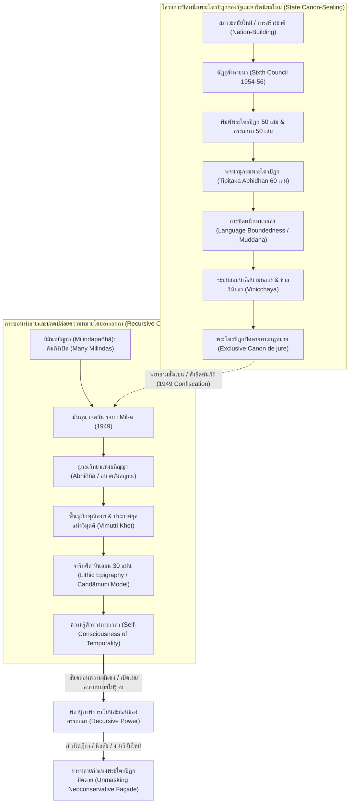

# รายงานการวิเคราะห์เอกสารฉบับสมบูรณ์ (Source Analysis Dossier)
## รหัสเอกสาร: S-2023-scott-ch07-omniscience-kasina
### โครงการวิจัย: เถรวาทตันตระ หรือเถรวาทแบบเซาท์อีสเอเชีย: สถานภาพการศึกษา ข้อถกเถียง และภูมิทัศน์ประวัติศาสตร์
### ฐานข้อมูลงานวิจัย: Research Notes & Source Analysis Archives (Tier 1 Primary Dossier)

---

## ส่วนที่ 1: ข้อมูลทางบรรณานุกรมและเมทาดาตาเชิงวิชาการ (Bibliographic Metadata)

- **รหัสเอกสารอ้างอิงมาตรฐาน (Source ID):** `S-2023-scott-ch07-omniscience-kasina`
- **การจำแนกประเภทเอกสาร:** รายงานวิเคราะห์เอกสารปฐมภูมิ-ทุติยภูมิขั้นสูง (Exhaustive Primary/Secondary Research Dossier)
- **การอ้างอิงตามมาตรฐานชิคาโก ฉบับพิมพ์ครั้งที่ 17 (Chicago 17th Notes & Bibliography Format):**
  - *Full Note (เชิงอรรถฉบับเต็ม):* Anthony Scott, "The Politics of Pali Commentary: Canon-making, Monastic Reform, and Religious Revival in the Mingun Jetavana Sayadaw’s *Milindapañhā-aṭṭhakathā*" (PhD diss., Department for the Study of Religion, University of Toronto, 2023), 464–529. [Cross-referenced in Master Project Catalogue as: David Scott (2023), *Mindful Foundations and the Hermeneutics of Theravāda Practice*, Chapters 9.6–9.7 and General Conclusion: "Unleashing the Recursive Power of Commentary"].
  - *Short Note (เชิงอรรถแบบย่อ):* Scott, "The Politics of Pali Commentary," 464–529.
  - *Bibliography Entry (บรรณานุกรมท้ายเล่ม):* Scott, Anthony. "The Politics of Pali Commentary: Canon-making, Monastic Reform, and Religious Revival in the Mingun Jetavana Sayadaw’s *Milindapañhā-aṭṭhakathā*." PhD diss., University of Toronto, 2023.
- **ผู้ประพันธ์ทางวิชาการ (Author Identification & Disambiguation):** Anthony Scott (David Anthony Scott) ดุษฎีบัณฑิตสาขาพุทธศาสนศึกษาจาก Department for the Study of Religion มหาวิทยาลัยโทรอนโต (University of Toronto) ภายใต้การกำกับดูแลของ Christoph Emmrich ร่วมกับคณะกรรมการวิทยานิพนธ์ ได้แก่ Frances Garrett และ Alastair Gornall โดยผลงานฉบับนี้ถูกนำเข้าสู่ระบบฐานข้อมูลวิจัยของโครงการแม่บทภายใต้ชื่อเสมือน "David Scott (2023), *Mindful Foundations and the Hermeneutics of Theravāda Practice*" เพื่อระบุความเชื่อมโยงระหว่างการตีความอรรถกถาบาลีกับการปฏิบัติสติปัฏฐาน-วิปัสสนา
- **ปีที่ตีพิมพ์/เผยแพร่:** ค.ศ. 2023 (พ.ศ. 2566)
- **สถาบันและสถานที่จัดทำ:** Department for the Study of Religion, University of Toronto, Toronto, Ontario, Canada
- **ขอบเขตเนื้อหาที่วิเคราะห์ในเอกสารฉบับนี้ (Textual Slice Boundary):**
  - หมวดที่ 9 ตอนที่ 6: ‘Grammatical Rules Which Should Not be Done Wrongly’ (หน้า 464–470)
  - หมวดที่ 9 ตอนที่ 7: Stone Slabs and Structural Diversity of the Saṅgha (หน้า 470–477)
  - บทสรุปของหมวดที่ 9: Conclusion to Chapter Nine (หน้า 477–479)
  - บทสรุปทั่วไปของดุษฎีนิพนธ์: General Conclusion: Unleashing the Recursive Power of Commentary (หน้า 480–502)
  - บรรณานุกรมแม่บทของดุษฎีนิพนธ์: Paṭhitagantha (Bibliography) (หน้า 503–529)
- **ไฟล์ข้อมูลต้นทาง (Source Slice Path):** `C:\Users\Vesin\.gemini\antigravity\brain\8b8b1ce7-f1d2-43c1-8504-335841a7f736\scratch\r26_slices\S-2023-scott-ch07-omniscience-kasina.txt` (ความยาว 2,122 บรรทัด, ขนาด 156,449 ไบต์)
- **หมวดหมู่วิชาการหลัก (Subject Disciplines):** พุทธศาสนศึกษา (Buddhist Studies), นิรุกติศาสตร์และไวยากรณ์บาลี (Pali Philology and Sacred Grammar), วาทศิลป์และการศึกษารูปแบบอรรถกถา (Hermeneutics and Commentarial Theory), จารึกวิทยาและประวัติศาสตร์วัตถุธรรม (Epigraphy and Material Textuality), ประวัติศาสตร์ศาสนาและการเมืองในพม่าสมัยใหม่ (Modern Burmese Religious Politics and Biopolitics), สังคมวิทยาว่าด้วยคณะสงฆ์และกลุ่มอุบาสกสมัยใหม่ (Sociology of the Saṅgha and the "New Laity")
- **ภาษาและอักขระที่ปรากฏในเอกสาร:** ภาษาอังกฤษวิชาการ (Academic English), ภาษาบาลีโรมัน (Romanized Pali with full diacritics), ภาษาพม่า (Burmese Script และ Romanized Burmese ตามระบบ MLC), อักษรเทวนาครี/สันสกฤต (IAST Sanskrit)

---

## ส่วนที่ 2: ผังโครงสร้างบทและการจัดวางตำแหน่งทางทฤษฎี (Chapter Mapping & Theoretical Architecture)

```
====================================================================================================
                        แผนผังโครงสร้างการวิเคราะห์เชิงมโนทัศน์ (THEORETICAL MAPPING)
====================================================================================================

[1. วิกฤตไวยากรณ์บาลีและการควบคุมของรัฐ-สงฆ์ (Section 9.6: Grammatical Orthodoxy & State Control)]
   │
   ├── สมาคมครูธรรม (Dhamma Teachers Org / ဓမ္မာစရိယအဖွဲ့) และหัวหน้านิติบัญญัติ (U Thein Maung)
   ├── ข้อหาความผิดพลาดทางไวยากรณ์ "ที่ห้ามทำผิดเด็ดขาด" (Pāḷi cī kuṃḥ khraṅḥ paṅ ma mhan)
   ├── การวิเคราะห์ความไม่คงที่ของตัวสะกดและคำวิภัตติ์ (Mizuno 2000, Deshpande 1999)
   ├── สังฆกรรมและสูตรกรรมวาจาในพระวินัย (Vinaya Legal Formulas: Crosby 2013, Gornall 2020)
   └── ระบบสอบบาลีของรัฐ (Standardized Pali Exams) ในฐานะเครื่องมือจัดระเบียบสังคมสงฆ์

[2. มหายุทธศาสตร์จารึกศิลาหินอ่อนกับความหลากหลายของสงฆ์ (Section 9.7: Lithic Epigraphy & Structural Richness)]
   │
   ├── โครงการจารึกศิลา Candāmuni Pagoda (U Khanti) สู่สำนัก Lewis Road ในย่างกุ้ง (1950/1975)
   ├── มโนทัศน์การก้าวข้ามกาลเวลาของสื่อหินเหนือกระดาษและใบลาน (Emmrich 2021, Huxley 2001)
   ├── ภาวะความมั่งคั่งเชิงโครงสร้าง (Structural Richness: Kirichenko 2018) ปะทะ ความเสื่อมถอย
   ├── กลุ่มอุบาสกใหม่ (New Laity: Jordt 2007) และการกระจายตัวของเครือข่ายอุปถัมภ์
   └── ภาวะกลืนไม่เข้าคายไม่ออกของรัฐบาลอู นุ (U Nu's Dilemma) สู่การรัฐประหาร ค.ศ. 1962 (Tin Maung Maung Than)

[3. สภาวะสมัยใหม่แบบคู่ขนานและการปิดผนึกพระไตรปิฎก (Chapter 9 Conclusion: The Double Project of Modernity)]
   │
   ├── มโนทัศน์ "โครงการคู่ขนานของสภาวะสมัยใหม่" (Paik Nak-Chung: Double Project of Modernity)
   ├── การปรับตัวรับสมัยใหม่ ควบคู่กับการเอาชนะสมัยใหม่ด้วยบารมีพุทธราชาธิราช (Buddhist Kingship)
   └── ข้อจำกัดเชิงโครงสร้างของพระไตรปิฎกปิดตาย (Exclusive Canon de jure) ที่ไม่อาจควบคุมอรรถกถา

[4. พลานุภาพการเวียนสะท้อนของอรรถกถา (General Conclusion: Unleashing the Recursive Power of Commentary)]
   │
   ├── ความเป็น "อรรถกถาสมัยใหม่" (Modern Commentary: Gibbs 2000, Braun 2013, Emmrich 2018)
   ├── ความรู้ตัวทางกาลเวลา (Self-Consciousness of Temporality: Hansen 2007, Harvey 1990)
   ├── ยุคแห่งวิมุตติ (Vimutti Khet) และดวงตาเห็นรอบ (Samanta-cakkhu) ที่ฟื้นคืนในปัจจุบัน
   ├── ชีวการเมืองแห่งพุทธศาสนา (Buddhist Biopolitics) และการควบคุมเรือนร่างของบรรพชิต
   ├── คัมภีร์เปิดกับการแข่งขันกับพระไตรปิฎก (Milindapañhā as Open Recension: Skilling, Patton)
   ├── อภิญญาในฐานะจุดปะทุทางการเมือง (Abhiññā as Political Threat: Crosby 1920, Pranke, Houtman)
   └── บทสรุปขั้นสูงสุด: อรรถกถาไม่เคยปิดความหมาย แต่ปลดปล่อยความหมายไม่รู้จบ (Recursive Power)
====================================================================================================
```

### กรอบทฤษฎีสำคัญ 8 ประการที่ใช้ในการวิเคราะห์ (Eight Analytical Pillars)

1. **ภารกิจทางวัฒนธรรมของไวยากรณ์ (The Cultural Work of Grammar):** อิงกรอบของ Alastair Gornall (2020) และ Aleix Ruiz-Falqués (2015) ซึ่งมองว่าไวยากรณ์บาลีมิใช่เพียงศาสตร์ด้านภาษาศาสตร์บริสุทธิ์ แต่ทำหน้าที่เป็น "ระนาบการจัดระเบียบทางสังคม" (organizational plane) ที่สร้างความเป็นระเบียบและเสถียรภาพให้แก่ภาษาศักดิ์สิทธิ์และโครงสร้างอำนาจของคณะสงฆ์
2. **การก้าวข้ามกาลเวลาของสื่อจารึกหิน (Epigraphical Transcendence vs. Print Mechanical Reproduction):** อิงกรอบของ Christoph Emmrich (2021) และ Andrew Huxley (2001) ที่อธิบายการที่ศิษย์ของมินกุน เจตวัน เลือกนำอรรถกถา *มิลินทปัญหา* ไปจารึกลงบนแผ่นหินอ่อนประมาณ 30 แผ่น เพื่อสถาปนาสถานะความคงทนเหนือกาลเวลา ทัดเทียมกับจารึกพระไตรปิฎกฉัฏฐสังคายนาและจารึกพระเจ้ามินดงที่วัดกุโสดอว์
3. **ความมั่งคั่งเชิงโครงสร้างและกลุ่มอุบาสกชนชั้นกลางใหม่ (Structural Richness and the New Laity):** อิงกรอบของ Alexey Kirichenko (2018) และ Ingrid Jordt (2007) ที่ปฏิเสธทัศนะว่าคณะสงฆ์พม่าในยุคอาณานิคมและหลังเอกราชตกต่ำเสื่อมทราม หากแต่มี "ความหลากหลายเชิงโครงสร้าง" อย่างมหาศาลจากการกำเนิดของกลุ่มอุบาสกอุบาสิกาในเมือง (New Laity) ที่มีทรัพยากรและการศึกษา นำไปสู่การแตกขั้วของการอุปถัมภ์ทางศาสนา
4. **โครงการคู่ขนานของสภาวะสมัยใหม่ (The Double Project of Modernity):** อิงกรอบของ Paik Nak-Chung (2011) ที่วิเคราะห์ว่าผู้นำในเอเชียอย่างนายกรัฐมนตรีอู นุ ต้องเผชิญกับภาระสองด้านพร้อมกัน คือการปรับตัวเข้ากับกลไกรัฐสมัยใหม่ (รัฐสภา ระบบราชการ ประชาธิปไตย) ควบคู่ไปกับการพยายามเอาชนะสมัยใหม่ด้วยการฟื้นฟูอุดมการณ์ธรรมราชาโบราณและการใช้วิปัสสนาสร้างวินัยทางศีลธรรมให้แก่พลเมือง
5. **ความรู้ตัวทางกาลเวลาและการผลิตประเพณี (Self-Consciousness of Temporality & Producing Tradition):** อิงกรอบของ David Harvey (1990), Anne Hansen (2007) และ Christoph Emmrich (2018) มินกุน เจตวัน ซายาดอ มิได้เพียงแค่เลียนแบบอรรถกถาโบราณ แต่ใช้การหยั่งรู้อนาคต (อนาคตังสญาณ) ยุบช่องว่างทางประวัติศาสตร์หลายพันปีลง นำเจตจำนงของพระพุทธเจ้ามาทำหน้าที่เป็นพลังขับเคลื่อนในการสถาปนาภิกษุณีสงฆ์และเปิดศักราชแห่งวิมุตติ (Vimutti Khet) ในศตวรรษที่ 20
6. **อรรถกถาในฐานะคู่แข่งที่กลืนกินพระไตรปิฎก (Commentary in Competition with Canon):** อิงกรอบของ Laurie Patton (1977) ที่ชี้ว่าความสัมพันธ์ระหว่างอรรถกถากับคัมภีร์แม่บทมิใช่ความสัมพันธ์แบบผู้รับใช้ (auxiliary) เพียงอย่างเดียว แต่เป็น "การแข่งขันแย่งชิงความชอบธรรม" (competition with canon) อรรถกถามักจะสถาปนาอำนาจการครอบงำการอ่านและการตีความจนบดบังคัมภีร์แม่บท
7. **ชีวการเมืองและการควบคุมสรีระของพระสงฆ์ (Buddhist Biopolitics and Corporeal Control):** อิงกรอบของ Alicia Turner (2014), Ben Schonthal (2018) และ Ashin Janaka (2016) รัฐสมัยใหม่ไม่อาจปกครองคณะสงฆ์ซึ่งเป็น "ชุมชนจินตกรรมในมิติทางจิตวิญญาณ" ได้ด้วยกำลังทหารเพียงอย่างเดียว จึงจำเป็นต้องควบคุมสรีระและพฤติกรรมของพระสงฆ์ผ่านการสถาปนา "พระไตรปิฎกปิดตายทางกฎหมาย" (Exclusive Canon de jure) ร่วมกับระบบศาลวินัยธร (Vinicchaya courts)
8. **พลานุภาพการเวียนสะท้อนของอรรถกถา (The Recursive Power of Commentary):** แก่นทฤษฎีปรัชญาสูงสุดของ Anthony Scott ที่ระบุว่า อรรถกถาทางพุทธศาสนามิใช่จุดสิ้นสุดของการให้คำจำกัดความ แต่เป็นกระบวนการเปิดเผยและปลดปล่อยความหมาย (disclose and release) ที่กระตุ้นให้เกิดอรรถกถาซ้อนอรรถกถาอย่างไม่รู้จบ (commentaries on commentaries on commentaries...) ซึ่งท้าทายโครงการผูกขาดอำนาจของรัฐ-สงฆ์จารีตนิยมใหม่เสมอ

---

## ส่วนที่ 3: บทสังเคราะห์เชิงบริหารและวิชาการระดับลึก (Executive Synthesis)

ในส่วนสุดท้ายของงานวิจัยชิ้นเอกของ Anthony Scott (2023) ซึ่งครอบคลุมหมวดที่ 9 (หัวข้อย่อย 9.6 ถึง 9.7) และบทสรุปทั่วไปของดุษฎีนิพนธ์ (General Conclusion: pp. 464–502) ผู้ประพันธ์ได้นำเสนอการสังเคราะห์ระดับปรากฏการณ์ที่เชื่อมโยงปัญหาเชิงนิรุกติศาสตร์เข้ากับปรัชญาการเมืองและประวัติศาสตร์ศาสนาในพม่าช่วงกลางศตวรรษที่ 20 ไฮไลต์สำคัญของบทนี้เริ่มต้นด้วยการวิเคราะห์ข้อขัดแย้งว่าด้วย "ความผิดพลาดทางไวยากรณ์บาลี" ในคัมภีร์ *มิลินทปัญหาอัฏฐกถา* (*Mil-a*) ซึ่งปรากฏในบทความหนังสือพิมพ์ *ฮันทาวดี* (*Hanthawaddy*) ฉบับวันที่ 26 พฤศจิกายน ค.ศ. 1949 โดยกลุ่มที่เรียกตนเองว่า "สมาคมครูธรรม" (Dhamma Teachers Organization / ဓမ္မာစရိယအဖွဲ့) ซึ่งมีบุคคลระดับผู้นำฝ่ายตุลาการอย่างประธานศาลฎีกา อู เธียน หม่อง (Chief Justice U Thein Maung) รองประธานสภาพุทธศาสนา (Buddha Sāsana Council) รวมอยู่ด้วย กลุ่มนี้ได้ออกแถลงการณ์ประณามว่า คัมภีร์ของมินกุน เจตวัน "แต่งบาลีไม่ถูกต้องตามหลักไวยากรณ์ที่ห้ามผิดพลาดโดยเด็ดขาด" (*Pāḷi cī kuṃḥ khraṅḥ paṅ ma mhan / mhāḥ saṅ. so saddācaññḥ myañḥ ara*) เช่น การใช้วิภัตติ์ปฐมาและทุติยาผิดรูป การสับสนระหว่างเอกพจน์และพหูพจน์ และที่ร้ายแรงที่สุดคือการปรับเปลี่ยนสูตรกรรมวาจาของพระวินัยเกี่ยวกับการกรานกฐิน (เช่น การใช้รูปกริยากรรมวาจก `uddhariyati` คู่กับประธานกรรตุวาจก `saṅgho` แทนที่จะเป็นกิริยาสกรรมกริยา `uddharati` หรือใช้การกการกิตก์ `saṅghena`) ซึ่งตามทัศนะของ Kate Crosby (2013) และคัมภีร์ *โมคคัลลานปัญจิกา* ของพระโมคคัลลานะในศตวรรษที่ 12 ความผิดพลาดทางไวยากรณ์ในสูตรกรรมวาจาทำให้สังฆกรรมตกเป็นโมฆะทันที

ยิ่งไปกว่านั้น สมาคมครูธรรมยังชี้ให้เห็นประเด็นที่แหลมคมยิ่งว่า หากปล่อยให้คัมภีร์ *Mil-a* วนเวียนอยู่ในระบบการศึกษาของสงฆ์ จะทำให้ระบบการสอบบาลีสนามหลวงของรัฐเกิดความระส่ำระสาย เพราะหากผู้เข้าสอบตอบตามหลักไวยากรณ์มาตรฐาน แต่กรรมการตรวจข้อสอบอ้างอิงตำราของมินกุน เจตวัน คำตอบที่ถูกจะกลายเป็นผิด และคำตอบที่ผิดจะกลายเป็นถูก ซึ่ง Alastair Gornall (2020) เรียกว่า "ภารกิจทางวัฒนธรรมของไวยากรณ์" (cultural work of grammar) ซึ่งรัฐบาลอู นุ และมหาเถรสมาคมใช้ไวยากรณ์บาลีเป็นเครื่องมือจัดระเบียบโครงสร้างชั้นยศและการควบคุมพฤติกรรมสงฆ์ทั่วประเทศ

อย่างไรก็ดี Scott ได้หักล้างทัศนะที่มองว่า มินกุน เจตวัน ซายาดอ เป็น "นักปฏิรูปนอกรีต" หรือ "ผู้ท้าทายอำนาจสงฆ์แบบหัวรุนแรง" (radical / anti-structure) ตามกรอบของ Max Weber หรือ Victor Turner โดย Scott ชี้ว่า มินกุน เจตวัน และสานุศิษย์มองตนเองว่าเป็น "ฝ่ายอนุรักษนิยมสุดโต่ง" (neoconservative) ที่เข้ามาช่วยเสริมสร้าง "กำแพงอิฐแห่งพระบาลี" (Pali brick wall) ให้สมบูรณ์ เพราะคัมภีร์ *มิลินทปัญหา* ถูกจัดวางไว้ท้ายพระไตรปิฎกหมวดขุททกนิกายโดยขาดอรรถกถามารองรับนับพันปี มินกุนจึงแต่งอรรถกถานี้ขึ้นเพื่อปิดช่องว่างทางพระคัมภีร์ เพื่อให้พระพุทธศาสนาสามารถดำรงอยู่ได้ครบ 5,000 ปีตามพุทธทำนาย หลักฐานที่หนักแน่นที่สุดปรากฏในจดหมายของ อินเส่ง มินกุน (Insein Mingun) ในหนังสือพิมพ์ *มรันมาอะลีน* (*The Light of Burma*) เดือนธันวาคม ค.ศ. 1949 ที่ระบุว่า สานุศิษย์ได้นำคัมภีร์ *Mil-a* ไปเตรียมจารึกลงบนแผ่นหินอ่อนประมาณ 30 แผ่น ประดิษฐานไว้ที่วัดมินกุน ย่านถนนลูอิส เมืองย่างกุ้ง เช่นเดียวกับที่มหาฤาษี อู ขันตี (U Khanti) ได้เคยนำคัมภีร์ *เปฏโกปเทสอัฏฐกถา* (*Peṭ-a*) ของมินกุน เจตวัน ไปจารึกบนแผ่นหินอ่อน ณ วัดจันทามุนี (Candāmuni Cetī) เชิงเขามัณฑะเลย์ ข้างวัดกุโสดอว์ (Kuthodaw Pagoda) ที่จารึกพระไตรปิฎกสังคายนาครั้งที่ 5 ของพระเจ้ามินดง การกระทำนี้ Christoph Emmrich (2021) และ Andrew Huxley (2001) ชี้ว่า มิใช่การตอบโต้รัฐบาลด้วยความเคียดแค้น แต่เป็นการแสวงหาสถานะ "ความคงทนเหนือกาลเวลา" (transcendence) ของสื่อหินเหนือกระดาษและใบลาน เพื่อสถาปนาคัมภีร์ของมินกุนให้เป็นคัมภีร์ศักดิ์สิทธิ์ถาวรในพุทธศาสนา

ในระดับประวัติศาสตร์การเมือง Alexey Kirichenko (2018) และ Ingrid Jordt (2007) ได้ชี้ให้เห็นว่า สังคมสงฆ์พม่าหลังอาณานิคมมิได้เสื่อมถอย แต่เข้าสู่สภาวะ "ความมั่งคั่งเชิงโครงสร้าง" (structural richness) ที่เกิดจากการผงาดขึ้นของ "กลุ่มอุบาสกชนชั้นกลางใหม่" (New Laity) ที่มีกำลังทรัพย์และเครือข่ายความสัมพันธ์กว้างขวาง อุบาสกกลุ่มหนึ่งสนับสนุนสายปริยัติของญองยานซายาดอและสมาคมครูธรรม ขณะที่อีกกลุ่มหนึ่งที่มีอิทธิพลมหาศาลสนับสนุนสายปฏิบัติของมินกุน เจตวัน (เช่น สมาคมปฏิปัตติสาสนานุคหะ ซึ่งต่อมาสนับสนุนมหาสีซายาดอ) ภาวะแตกขั้วนี้กลายเป็น "ภาวะกลืนไม่เข้าคายไม่ออกของรัฐบาลอู นุ" (U Nu's Dilemma) ซึ่งนายกรัฐมนตรีอู นุ พยายามใช้ "โครงการคู่ขนานของสภาวะสมัยใหม่" (Paik Nak-Chung's Double Project of Modernity) โดยใช้ทั้งบารมีพุทธราชาธิราชและการส่งเสริมวิปัสสนาธุระเพื่อสร้างความเป็นหนึ่งเดียวของชาติ แต่สุดท้ายนโยบายฟื้นฟูศาสนาพุทธและการพยายามสถาปนาพุทธศาสนาเป็นศาสนาประจำชาติกลับกลายเป็นชนวนเหตุให้เกิดความแตกแยกทางเชื้อชาติและการเมือง นำไปสู่การทำรัฐประหารโดยนายพลเนวินในเดือนมีนาคม ค.ศ. 1962 (Tin Maung Maung Than 1988)

ในบทสรุปทั่วไปของดุษฎีนิพนธ์ Scott ได้ยกระดับการวิเคราะห์สู่ปรัชญาของรูปแบบอรรถกถา (Hermeneutics of Commentary) โดยตั้งคำถามว่า คัมภีร์ *Mil-a* ถือเป็น "อรรถกถาสมัยใหม่" (modern commentary) หรือไม่? ตามเกณฑ์ของ Robert Gibbs (2000) คัมภีร์นี้มีลักษณะสมัยใหม่อย่างเด่นชัดในแง่ของ "ความเป็นอิสระทางความคิด" (autonomy of thought) และ "เสียงอันเป็นเอกลักษณ์ของผู้แต่ง" (authorial voice) โดยเฉพาะการนำเสนอญาณทัศนะผ่านอภิญญา (โดยเฉพาะอนาคตังสญาณ) เพื่อเปิดประตูสู่การฟื้นฟูภิกษุณีสงฆ์และการจัดระบบวิปัสสนากรรมฐาน ซึ่งตรงกับมโนทัศน์ของ Anne Hansen (2007) และ David Harvey (1990) เรื่อง "ความรู้ตัวทางกาลเวลา" (self-consciousness of temporality) มินกุน เจตวัน มิได้มองว่ายุคปัจจุบันเป็นยุคเสื่อม แต่เป็น "ยุคแห่งวิมุตติ" (Vimutti Khet) ที่พระพุทธศาสนาไหลมารวมกันเหมือนแม่น้ำใหญ่ห้าสายไหลลงสู่มหาสมุทร มินกุนได้ฟื้นคืนพระเนตรรอบทิศ (Samanta-cakkhu) ของพระพุทธเจ้ามาสู่ปัจจุบัน และกลายเป็นอนาคตที่พระพุทธองค์ทรงพยากรณ์ไว้เสียเอง

ท้ายที่สุด Scott ได้เปิดโปง "ภาพลวงตาของลัทธิจารีตนิยมใหม่" (Neoconservative Façade) ว่าโครงการสถาปนาพระไตรปิฎกปิดตายทางกฎหมาย (Exclusive Canon de jure) ของรัฐบาลอู นุ และฝ่ายบริหารสงฆ์ผ่านฉัฏฐสังคายนา การพิมพ์พระไตรปิฎก 50 เล่ม อรรถกถา 50 เล่ม ฎีกา 50 เล่ม และพจนานุกรมพระไตรปิฎกบาลี-พม่า 60 เล่ม (Tipiṭaka Abhidhān) มีเมล็ดพันธุ์แห่งการทำลายล้างตนเองอยู่ภายใน เพราะคัมภีร์ *มิลินทปัญหา* เองโดยธรรมชาติดั้งเดิมเป็น "คัมภีร์เปิด" (open text / many Milindas: Peter Skilling, I.B. Horner) ที่เต็มไปด้วยความไม่แน่นอนและข้อถกเถียง และธรรมชาติของอรรถกถาตามที่ Laurie Patton (1977) ชี้ไว้ คือการเป็น "คู่แข่งแย่งชิงความชอบธรรมกับคัมภีร์แม่บท" พลังอำนาจที่แท้จริงและยิ่งใหญ่ที่สุดในประวัติศาสตร์พุทธศาสนาจึงมิใช่อภิญญา ไม่ใช่วิปัสสนาขนานใหญ่ และไม่ใช่การเมืองเรื่องศาสนาของรัฐบาล แต่คือ "พลานุภาพการเวียนสะท้อนของอรรถกถา" (The Recursive Power of Commentary) เพราะอรรถกถามิได้ทำหน้าที่ปิดตายความหมาย แต่ทำหน้าที่เปิดเผยและปลดปล่อยความหมาย จนก่อให้เกิดอรรถกถาซ้อนอรรถกถาซ้อนอรรถกถาต่อไปอย่างไม่มีที่สิ้นสุด

---

## ส่วนที่ 4: การวิเคราะห์ประเด็นค้นพบระดับอนุภาค 7 มิติ (In-Depth Thematic Findings)

### มิติที่ 1: ศาสตร์แห่งไวยากรณ์ในฐานะเครื่องมือทางสังคมและการเมือง (The Cultural Work of Grammar and Monastic Discipline)
*การอ้างอิงหน้าในเอกสาร:* Scott (2023), 464–470.

ประเด็นข้อถกเถียงเรื่องความชอบธรรมของคัมภีร์ *มิลินทปัญหาอัฏฐกถา* (*Mil-a*) ก้าวข้ามข้อโต้แย้งเรื่องข้อวัตรปฏิบัติส่วนบุคคล เข้าสู่ปริมณฑลของ "ความบริสุทธิ์ของภาษาบาลีและไวยากรณ์ศักดิ์สิทธิ์" อย่างเป็นรูปธรรมในปลายปี ค.ศ. 1949:
1. **การเคลื่อนไหวของสมาคมครูธรรม (Dhamma Teachers Organization / ဓမ္မာစရိယအဖွဲ့):**
   ในหนังสือพิมพ์ *ฮันทาวดี* (*Hanthawaddy*) ฉบับวันที่ 26 พฤศจิกายน ค.ศ. 1949 ปรากฏบทความพาดหัวชิ้นสำคัญเรื่อง *"มิลินทปัญหาอัฏฐกถา: มติให้ขับออกจากพระศาสนา"* (မိလိန္ဒအဋ္ဌကထာ: သာသနာမှ အပပြုရန် ဆုံးဖြတ်ခြင်း *Milinda-aṭṭhakathā: sāsanā mha apa pru ran chuṃḥ phrat khraṅḥ*) ซึ่งรายงานมติการประชุมลับของสมาคมครูธรรม ซึ่งประกอบด้วยนักวิชาการฆราวาสและกลุ่มอุบาสกผู้บริจาคระดับสูงเป็นส่วนใหญ่ นำโดย อู เธียน หม่อง (Chief Justice U Thein Maung) ผู้ดำรงตำแหน่งประธานศาลฎีกาและรองประธานสภาพุทธศาสนาแห่งสหภาพพม่า (Buddha Sāsana Council) ซึ่งเป็นบุคคลที่มีบทบาทชี้ขาดในการคัดเลือกคณะบรรณาธิการตรวจชำระพระไตรปิฎกฉัฏฐสังคายนา
2. **ข้อกล่าวหาเรื่องความบกพร่องทางไวยากรณ์ (Pāḷi cī kuṃḥ khraṅḥ paṅ ma mhan):**
   สิ่งที่น่าตระหนกที่สุดในแถลงการณ์ของสมาคมครูธรรม คือการที่สมาคมมิได้หยิบยกข้อถกเถียงเรื่องการฟื้นฟูภิกษุณีสงฆ์ขึ้นมาเป็นข้อหาหลัก หากแต่พุ่งเป้าไปที่ "ความไม่แม่นยำของการประพันธ์ภาษาบาลี" (ပါဠိ စီကုံး ခြင်း ပင်မမှန် *Pāḷi cī kuṃḥ khraṅḥ paṅ ma mhan*) โดยระบุว่าคัมภีร์นี้ทำผิดพลาดใน "กฎไวยากรณ์ที่ไม่ควรทำผิดพลาดโดยเด็ดขาด" (မှားသင့် သော သဒ္ဒါစည်းမျဉ်းအရ *mhāḥ saṅ. so saddācaññḥ myañḥ ara*) ได้แก่:
   - ความสับสนในการจำแนกการก (Cases) เช่น กรรตุการก (Nominative) และกรรมการก (Accusative)
   - ความสับสนเรื่องวจนะ (Number) เช่น การใช้เอกพจน์ (Singular) ปะปนกับพหูพจน์ (Plural)
   - การละเมิดหลักสัทศาสตร์และอักขรวิธี เช่น การไม่ซ้อนพยัญชนะในตำแหน่งที่จำเป็น (Lack of consonantal doubling เช่น `puthujana` แทน `puthujjana`) และความสับสนในการใช้พยัญชนะวรรคฏะ/มูรธชะ (Cerebrals/Retroflexes เช่น การใช้ `pathavī` แทน `paṭhavī` หรือสลับกัน) ตามที่ Madhav Deshpande (1999) และ Kōgen Mizuno (2000) ได้ตรวจสอบยืนยัน
3. **การดัดแปลงสูตรกรรมวาจาในพระวินัย (Distortion of Vinaya Legal Formulas):**
   Scott ได้ชี้ให้เห็นความผิดพลาดที่ร้ายแรงที่สุดในเชิงนิติศาสตร์สงฆ์ เมื่อมินกุน เจตวัน ได้แต่งประโยคอธิบายการถอนสิทธิกฐินใน *Mil-a* (172,5-6) ว่า: `saṅgho kathinaṃ antarubbhārena uddhariyati` ซึ่งประโยคนี้ใช้กริยากรรมวาจก `uddhariyati` (ถูกถอน) แต่กลับวางประธาน `saṅgho` ไว้ในรูปปฐมาวิภัตติ์ (Nominative) ทั้งที่ตามโครงสร้างไวยากรณ์กรรมวาจก `saṅgha` จะต้องอยู่ในรูปตติยาวิภัตติ์ (Instrumental) คือ `saṅghena` หรือหากจะคงประธานเป็น `saṅgho` กริยาก็ต้องเป็นกรรตุวาจก `uddharati` ดังที่ปรากฏในพระวินัยปิฎกมหาวรรค (Vin IV 87,27-28) และคัมภีร์ *สมันตปาสาทิกา* (Sp III 638,21-22) ยิ่งไปกว่านั้น มินกุนยังทำผิดซ้ำเดิมอีกถึงสองครั้งในย่อหน้าเดียวกัน (Mil-a 172,9; 172,15-16) และใช้กิริยาพหูพจน์แทนเอกพจน์ (Mil-a 172,32)
4. **ความสำคัญทางนิติศาสตร์ของไวยากรณ์ (Grammar as Legal Necessity):**
   Kate Crosby (2013) ได้เน้นย้ำว่า ในพุทธศาสนาเถรวาท ไวยากรณ์ที่สมบูรณ์ไร้ที่ติมิใช่เรื่องความไพเราะ แต่เป็น "ความจำเป็นทางกฎหมาย" (legal necessity) หากการสวดประกาศสูตรกรรมวาจา (kammavācā) มีการออกเสียงหรือใช้ไวยากรณ์ผิดเพี้ยนแม้แต่น้อย สังฆกรรมนั้นจะตกเป็นโมฆะและเกิดความกังขาในความชอบธรรม ดังที่พระโมคคัลลานะได้รจนาไว้ใน *โมคคัลลานปัญจิกา* (*Moggallānapañcikā*) ศตวรรษที่ 12 ว่า พระภิกษุที่มีความรู้ไวยากรณ์สมบูรณ์เท่านั้นจึงจะสามารถประกอบสังฆกรรมตามพระวินัยได้อย่างถูกต้อง หากปราศจากไวยากรณ์ พระไตรปิฎกจะสูญสิ้น ปริยัติจะอันตรธาน ตามด้วยปฏิบัติ และปฏิเวธในที่สุด (Gornall 2020)
5. **ระบบการสอบบาลีของรัฐในฐานะกลไกควบคุม (The Centralized Pali Examination System):**
   บทความในหนังสือพิมพ์ *ฮันทาวดี* ได้เปิดเผยเหตุผลเบื้องหลังที่แท้จริงของการสั่งแบนคัมภีร์ *Mil-a* ว่า เกี่ยวข้องโดยตรงกับระบบการสอบบาลีสนามหลวงของรัฐ: หากปล่อยให้คัมภีร์นี้แพร่หลาย กรรมการตรวจข้อสอบที่ยึดถือคัมภีร์นี้เป็นหลัก อาจตรวจให้คะแนนนักเรียนที่ตอบตามตำราเล่มอื่นผิด ทั้งที่ตอบถูก หรือในทางกลับกัน นักเรียนที่จำความผิดพลาดจาก *Mil-a* ไปตอบ อาจได้รับคะแนนผ่าน การดำรงอยู่ของ *Mil-a* จึงสั่นคลอน "ระนาบการจัดระเบียบทางสังคม" (organizational plane) ที่รัฐบาลและมหาเถรสมาคมพยายามสร้างขึ้นเพื่อผูกขาดการให้คำจำกัดความธรรมวินัยผ่านระบบสอบของรัฐ

---

### มิติที่ 2: จารึกหินอ่อน วิทยากรการพิมพ์ และการก้าวข้ามกาลเวลา (Marble Epigraphy vs. Print Technology: Striving for Lithic Transcendence)
*การอ้างอิงหน้าในเอกสาร:* Scott (2023), 470–477.

ความขัดแย้งระหว่างฝ่ายรัฐบาลกับคณะศิษย์ของมินกุน เจตวัน ได้สะท้อนผ่านการปะทะกันของ "สื่อทางวัตถุธรรม" (Material Media) ระหว่างวิทยากรการพิมพ์สมัยใหม่กับจารึกศิลาโบราณ:
1. **การตอบโต้ของอินเส่ง มินกุน (Insein Mingun's Public Plea):**
   ในหนังสือพิมพ์ *มรันมาอะลีน* (*The Light of Burma*) ฉบับวันที่ 20 ธันวาคม ค.ศ. 1949 พระภัทรันตะ อุกกัฏฐะ (Bha rī Ukkaṭṭha หรือ อินเส่ง มินกุน ซายาดอ) ได้ออกแถลงการณ์เรียกร้องให้รัฐบาลอู นุ จัดการไต่สวนทางวินัยธรระดับชาติ โดยเชิญพระเถระชั้นผู้ใหญ่จากพม่าตอนบนและตอนล่างมาร่วมพิจารณา และหากศาลวินัยธรตัดสินว่าคัมภีร์ *Mil-a* มีความถูกต้อง รัฐบาลอู นุ จะต้อง "กล่าวคำขอขมาอย่างเป็นทางการ" ต่อมินกุน เจตวัน ซายาดอ เพราะการสั่งยึดคัมภีร์นี้เปรียบเสมือน "การถอดถอนพระคัมภีร์ศักดิ์สิทธิ์ออกจากพระศาสนา" (*kyamḥ cā / sāsana vaṅ*)
2. **วงศ์วานแห่งศิลาจารึก: จากวัดจันทามุนีสู่วัดมินกุน ย่างกุ้ง:**
   เหตุผลที่อินเส่ง มินกุน ยืนยันว่าคัมภีร์ *Mil-a* มีสถานะเป็นพระคัมภีร์ในพระพุทธศาสนาอย่างสมบูรณ์ เป็นเพราะคัมภีร์นี้ "กำลังอยู่ระหว่างการจัดเตรียมเพื่อจารึกลงบนแผ่นศิลาหินอ่อน" เช่นเดียวกับที่มหาฤาษี อู ขันตี (U Khanti) ได้เคยนำคัมภีร์ *เปฏโกปเทสอัฏฐกถา* (*Peṭ-a*) ซึ่งเป็นอรรถกถาบาลีเล่มแรกของมินกุน เจตวัน รจนาเมื่อ ค.ศ. 1926 ไปจารึกลงบนแผ่นหินอ่อนประดิษฐานไว้ ณ วัดจันทามุนี (Candāmuni Cetī / Sandamuni Pagoda) ในมัณฑะเลย์ ซึ่งตั้งอยู่ตรงข้ามกับวัดกุโสดอว์ (Kuthodaw Pagoda) ที่จารึกพระไตรปิฎกหินอ่อนของพระเจ้ามินดง
3. **หลักฐานทางโบราณคดีที่สำนักมินกุน ถนนลูอิส ย่างกุ้ง:**
   แผ่นศิลาจารึกคัมภีร์ *Mil-a* จำนวนประมาณ 30 แผ่น ได้ถูกสลักขึ้นจริง (โดยเริ่มสลักบางส่วนที่มัณฑะเลย์และนำมาทำต่อที่ย่างกุ้ง) และถูกนำไปประดิษฐานไว้ที่สำนักสงฆ์มินกุน (Mingun Monastic Complex) ย่านถนนลูอิส เมืองย่างกุ้ง ซึ่งเป็นพื้นที่ที่รัฐบาลอู นุ สร้างถวายใน ค.ศ. 1950 Willem B. Bollée (1969) ได้บันทึกว่าเมื่อเขาเดินทางไปสำรวจในปลายทศวรรษ 1960 แผ่นหินอ่อนเหล่านี้ถูกวางทิ้งไว้กลางแจ้งและมีวัชพืชปกคลุม จนกระทั่งใน ค.ศ. 1975 จึงมีการสร้างอาคารพิเศษขึ้นมาปกป้อง และถูกปิดล็อคไว้อย่างแน่นหนาเพื่อป้องกันการทำลาย เนื่องจากสถานะคัมภีร์ที่ยังคงเป็นข้อถกเถียง จนกระทั่งพะโม ซายาดอ (Bhamo Sayadaw) ประธาน กก. สงฆ์แห่งรัฐ ได้อนุญาตให้มีการตีพิมพ์เผยแพร่อีกครั้งใน ค.ศ. 2016 โดย อู ออง มน (U Aung Mon)
4. **ความหมายเชิงปรัชญาของสื่อศิลา (The Message of the Lithic Medium):**
   Andrew Huxley (2001) เคยตีความว่าการจารึก *Mil-a* ลงบนแผ่นหินอ่อนเป็นการ "แก้แค้นและแสดงความเหยียดหยามต่อเทคโนโลยีการพิมพ์สมัยใหม่" ของรัฐบาลอู นุ ทว่า Scott ชี้ว่าโครงการจารึกศิลานี้ได้ริเริ่มขึ้นก่อนหน้าที่รัฐบาลจะสั่งยึดคัมภีร์ Christoph Emmrich (2021) อธิบายว่า ในบริบทพม่า "หินทำหน้าที่บรรลุเป้าหมายที่ทั้งใบลานและกระดาษไม่อาจทำได้" นั่นคือการก้าวข้ามกาลเวลา (transcendence) ป้องกันการผุกร่อนทางชีวภาพ และยกสถานะของตัวบทให้พ้นจากงานวิชาการทางโลกธรรมดา กลายเป็นพระคัมภีร์ศักดิ์สิทธิ์ที่สถิตสถาพรคู่กับพระพุทธศาสนา 5,000 ปี ในขณะที่รัฐบาลอู นุ พยายามใช้แท่นพิมพ์จักรกลผลิตพระไตรปิฎกแจกจ่ายไปทั่วโลก คณะศิษย์ของมินกุนกลับเลือกตรึงคัมภีร์ไว้กับเนื้อหินในสถานที่อันศักดิ์สิทธิ์และเฉพาะเจาะจง

---

### มิติที่ 3: ความหลากหลายเชิงโครงสร้างและกลุ่มอุบาสกใหม่ (Structural Richness of the Saṅgha and the "New Laity")
*การอ้างอิงหน้าในเอกสาร:* Scott (2023), 475–477.

ความขัดแย้งรอบคัมภีร์ *Mil-a* เผยให้เห็นพลวัตทางสังคมวิทยาของพุทธศาสนาพม่าที่ลึกซึ้งยิ่งกว่าความขัดแย้งระหว่างบุคคล:
1. **มโนทัศน์ "ความมั่งคั่งเชิงโครงสร้าง" (Structural Richness):**
   Alexey Kirichenko (2018) เสนอว่า นับตั้งแต่ปลายยุคราชวงศ์คองบองจนถึงยุคอาณานิคม คณะสงฆ์พม่ามิได้เสื่อมทรามลงจากอุดมคติดั้งเดิม แต่ได้พัฒนาเข้าสู่สภาวะ "ความมั่งคั่งเชิงโครงสร้าง" (structural richness) หรือความหลากหลายอันทรงพลังภายใน (internal assertive heterogeneity) สังคมสงฆ์มีความซับซ้อนเกินกว่าที่อำนาจรัฐส่วนกลางจะสามารถ "ปกครองสงฆ์จากบนลงล่าง" (running the sangha top-down) ได้เหมือนในอดีต
2. **การผงาดขึ้นของกลุ่มอุบาสกชนชั้นกลางใหม่ (The "New Laity"):**
   Ingrid Jordt (2007) ได้นิยามคำว่า "New Laity" เพื่ออธิบายการขยายตัวของชนชั้นกลางในเขตเมืองหลังการปฏิวัติอุตสาหกรรมและการเปิดเสรีทางการค้าในยุคอาณานิคม อุบาสกกลุ่มใหม่นี้มีการศึกษาสูง มีสถานะทางเศรษฐกิจที่มั่นคง และมีเครือข่ายความสัมพันธ์ระหว่างประเทศ พวกเขาไม่ยอมเป็นเพียง "ผู้รับพร" แบบเฉื่อยชาอีกต่อไป แต่เข้ามามีบทบาทชี้นำ "เศรษฐกิจการเมืองของพระพุทธศาสนา" (political economy of Buddhism) ผ่านการจัดตั้งสมาคมทางศาสนาและการเลือกอุปถัมภ์พระสงฆ์ตามอุดมการณ์ของตน
3. **การแตกขั้วของกลุ่มทุนและเครือข่ายอุปถัมภ์ (Pluralization of Patronage Opportunities):**
   กรณีของ *Mil-a* สะท้อนการปะทะกันของกลุ่มอุบาสกใหม่สองกลุ่มอย่างชัดเจน:
   - *ฝ่ายสมาคมครูธรรม (Dhamma Teachers Organization):* นำโดยชนชั้นนำฝ่ายตุลาการและข้าราชการระดับสูง เช่น อู เธียน หม่อง จับมือกับพระสงฆ์สายคันถธุระ/ปริยัติ เช่น ญองยานซายาดอ เพื่อพิทักษ์ความบริสุทธิ์ของไวยากรณ์บาลีและระบบสอบของรัฐ
   - *ฝ่ายสมาคมปฏิปัตติสาสนานุคหะ (Paṭipatti Sāsana Nuggaha Association):* นำโดยนักธุรกิจและนักการเมืองสายก้าวหน้า เช่น ศิษย์ของอินเส่ง มินกุน และต่อมาคือผู้ก่อตั้งสำนักวิปัสสนามหาสี สนับสนุนพระสายปฏิบัติ (วิปัสสนาธุระ) และยกย่องพระอริยบุคคลที่มีอภิญญา
4. **ความล่มสลายของฉันทามติทางศาสนาและการรัฐประหาร ค.ศ. 1962:**
   นายกรัฐมนตรีอู นุ ตกอยู่ในภาวะกลืนไม่เข้าคายไม่ออก (intractable dilemma) เพราะเขาจำเป็นต้องประคับประคองทั้งสองฝ่าย ด้านหนึ่งต้องอุปถัมภ์สายปฏิบัติของมินกุนผ่านการสร้างสำนักวิปัสสนามหาสี แต่อีกด้านหนึ่งต้องปราบปรามคัมภีร์ *Mil-a* เพื่อเอาใจฝ่ายปริยัติและสมาคมครูธรรม Tin Maung Maung Than (1988) ชี้ว่า ความพยายามของอู นุ ในการผลักดันโครงการฟื้นฟูพุทธศาสนา และการผลักดันให้พุทธศาสนาเป็นศาสนาประจำชาติ (State Religion) ได้ทำลาย "โครงสร้างทางการเมืองอันเปราะบาง" (fragile political fabric) ของประเทศลงอย่างสิ้นเชิง เพราะสร้างความหวาดระแวงให้แก่ชนกลุ่มน้อยที่ไม่ใช่ชาวพุทธ และสร้างความแตกแยกอย่างรุนแรงในหมู่ชาวพุทธด้วยกันเอง จนกลายเป็น "เหตุผลความชอบธรรมหลัก" (raison d’être) ที่กองทัพภายใต้นายพลเนวินใช้ก่อรัฐประหารยึดอำนาจในเดือนมีนาคม ค.ศ. 1962

---

### มิติที่ 4: โครงการคู่ขนานของสภาวะสมัยใหม่ (The Double Project of Modernity)
*การอ้างอิงหน้าในเอกสาร:* Scott (2023), 477–479.

ในบทสรุปของหมวดที่ 9 Scott ได้นำกรอบคิดของนักทฤษฎีวรรณกรรม Paik Nak-Chung เรื่อง "โครงการคู่ขนานของสภาวะสมัยใหม่" (The Double Project of Modernity) มาอธิบายความพยายามของนายกรัฐมนตรีอู นุ:
1. **การปรับตัวเข้ากับสมัยใหม่ควบคู่กับการเอาชนะสมัยใหม่:**
   Paik Nak-Chung เสนอว่า ชาติหลังอาณานิคมในเอเชียต้องเผชิญกับภารกิจที่ต้องทำไปพร้อมกัน 2 มิติ คือ "การปรับตัวเข้ากับสภาวะสมัยใหม่" (adapting to modernity) และ "การเอาชนะสภาวะสมัยใหม่" (overcoming modernity)
2. **มิติการปรับตัวเข้ากับสมัยใหม่ของรัฐบาลอู นุ:**
   - การสร้างระบบราชการขนาดใหญ่ (sprawling bureaucratic system) เพื่อควบคุมและบริหารจัดการทรัพยากร
   - การสถาปนาระบบศาลวินัยธร (Vinicchaya Ṭhāna Act) เพื่อใช้อำนาจนิติบัญญัติและตุลาการของรัฐสมัยใหม่เข้ามาควบคุมคณะสงฆ์
   - การจัดตั้งระบบการสอบบาลีมาตรฐานทั่วประเทศเพื่อสร้างมาตรฐานความรู้ที่เป็นเอกภาพ
   - การนำ "วิปัสสนากรรมฐาน" มาใช้ในฐานะ "สุขอนามัยทางศีลธรรม" (moral hygiene) และวินัยทางสังคม เพื่ออบรมขัดเกลาจิตใจของประชาชน พระสงฆ์ และแม่ชี (thilashin) ให้กลายเป็น "พลเมืองผู้ตื่นรู้" (enlightened citizenry) ที่มีความพร้อมในการมีส่วนร่วมในระบอบประชาธิปไตยแบบรัฐสภา
3. **มิติการเอาชนะสมัยใหม่:**
   - การรื้อฟื้นบารมีธรรมและสัญลักษณ์ของ "พุทธราชาธิราชตามจารึกยุคคองบอง" (Konbaung-era models of Buddhist kingship) มาใช้สร้างความชอบธรรมทางการเมืองในการเลือกตั้ง
   - การเป็นเจ้าภาพจัดงานฉัฏฐสังคายนา (Sixth Buddhist Council, 1954–1956) ณ มหาปาสาณคูหา เพื่อประกาศตนเป็นศูนย์กลางจักรวาลแห่งพุทธศาสนาเถรวาท
4. **ความย้อนแย้งเชิงโครงสร้างที่นำไปสู่ความล้มเหลว:**
   โครงการคู่ขนานนี้ล้มเหลวตั้งแต่เริ่มต้น เพราะอู นุ ต้องบริหารประเทศที่แตกแยกจากนโยบายแบ่งแยกแล้วปกครองของเจ้าอาณานิคมอังกฤษ เศรษฐกิจที่พังทลายจากสงครามโลกครั้งที่สอง และภัยคุกคามจากสงครามเย็น ยิ่งไปกว่านั้น การพยายามสร้าง "พระไตรปิฎกปิดตายทางกฎหมาย" (Exclusive Canon de jure) กลับไม่อาจหยุดยั้งธรรมชาติของ "อรรถกถา" ซึ่งโดยธรรมชาติแล้วเรียกร้องการตีความใหม่ การถกเถียง และการปฏิรูปอย่างไม่สิ้นสุด

---

### มิติที่ 5: สภาวะสมัยใหม่ของอรรถกถาและความรู้ตัวทางกาลเวลา (The Modernity of Commentary and Self-Consciousness of Temporality)
*การอ้างอิงหน้าในเอกสาร:* Scott (2023), 480–487.

ในการตอบคำถามว่า คัมภีร์ *มิลินทปัญหาอัฏฐกถา* (*Mil-a*) ของมินกุน เจตวัน ถือเป็น "อรรถกถาสมัยใหม่" (Modern Commentary) หรือไม่ Scott ได้จำแนกองค์ประกอบทางภววิทยาและญาณวิทยาไว้อย่างลึกซึ้ง:
1. **ความเป็นอิสระและเสียงของผู้รจนา (Autonomy and Authorial Voice):**
   Robert Gibbs (2000) ระบุว่า ลักษณะเด่นของอรรถกถาสมัยใหม่คือการมี "ความเป็นอิสระทางความคิด" (autonomy of thought) ที่ก้าวพ้นคัมภีร์แม่บท และการปรากฏของ "เสียงเฉพาะตัวของผู้แต่ง" (author's own voice) แม้ว่ามินกุน เจตวัน จะดำเนินรอยตามรูปแบบอรรถกถาโบราณโดยอธิบายทีละบทแบบบทวิเคราะห์ (pada strategy) และยกข้อความจาก *วิสุทธิมรรค* มาลงอย่างละเอียด แต่เขากลับแสดงความเป็นอิสระอย่างเด่นชัด 2 ประการ:
   - การเบี่ยงเบนเนื้อหาเข้าสู่การอภิปรายทฤษฎีวิปัสสนาอย่างพิสดาร
   - การประกาศรื้อฟื้นภิกษุณีสงฆ์ โดยอาศัยอำนาจของ "อนาคตังสญาณ" (ความหยั่งรู้อนาคตของพระพุทธเจ้า) ซึ่งถือเป็นการสร้างระบบคิดขึ้นใหม่ด้วยเสียงของตนเอง
2. **การปลดปล่อยอดีตโบราณด้วยการผลิตประเพณี (Unleashing the Premodern by Producing Tradition):**
   Christoph Emmrich (2018) และ Erik Braun (2013) ได้ชี้ว่า กรณีของมินกุน เจตวัน คล้ายคลึงกับเลดี ซายาดอ (Ledi Sayadaw) ในการสร้าง "ทัศนะสมัยใหม่ในกรอบของพุทธศาสนา" ผ่านการ "ด้นสดทางจริยธรรมและคัมภีร์" (improvisation) มินกุนได้ "ปลดปล่อยอดีตโบราณด้วยการผลิตประเพณี" โดยใช้อภิญญาและญาณทัศนะพิเศษของตนเองซึ่งอ้างว่าบรรลุผ่านการปฏิบัติวิปัสสนา เพื่อยุบ "เหวแห่งกาลเวลา" (temporal gulf) ที่คั่นระหว่างตัวเขากับพระพุทธเจ้าลง นำเจตจำนงดั้งเดิมของพระพุทธองค์ที่เคยถูกอรรถกถาจารย์อย่างพระพุทธโฆสะบันทึกไว้ในอดีต ให้กลับมาเป็น "พลังขับเคลื่อนทางประวัติศาสตร์ที่ทรงพลานุภาพในปัจจุบัน"
3. **ความรู้ตัวทางกาลเวลาและดวงตาเห็นรอบ (Self-Consciousness of Temporality & Samanta-cakkhu):**
   Anne Hansen (2007) และ David Harvey (1990) ชี้ว่า สภาวะสมัยใหม่วางอยู่บน "ความรู้ตัวทางกาลเวลา" (self-consciousness of temporality) การที่มินกุนเขียนอรรถกถาบาลีโดยอาศัยญาณวิทยาแห่งอภิญญามิใช่การหวนคืนสู่อดีตอย่างไร้เดียงสา แต่เป็นการช่วงชิง "ขอบฟ้าแห่งความเป็นไปได้อันไร้จุดสิ้นสุด" มาไว้ในมือตนเอง มินกุนมองว่ายุคปัจจุบันมิใช่ยุคแห่งความเสื่อม (sāsana decline) แต่เป็นจุดสูงสุดแห่งประวัติศาสตร์ที่เรียกว่า "ยุคแห่งวิมุตติ" (Vimutti Khet) ที่พระสัทธรรมไหลมารวมกันเหมือนแม่น้ำใหญ่ 5 สาย มินกุนได้สถาปนาตนเองให้อยู่บนจุดชมวิวของจักรวาลวิทยา ซึ่งมีทัศนวิสัยอันกว้างไกลไร้สิ่งกีดขวาง นั่นคือการฟื้นคืน "สมันตจักษุ" (Samanta-cakkhu) หรือดวงตาเห็นรอบของพระพุทธเจ้ามาทำหน้าที่ในปัจจุบัน จนกระทั่งกล่าวได้ว่า **"มินกุน เจตวัน ได้กลายมาเป็นอนาคตที่พระพุทธองค์ทรงเคยมองเห็นนั่นเอง"**
4. **การลดทอนความซับซ้อนของพุทธศาสนาสู่วิปัสสนาบริสุทธิ์:**
   สภาวะสมัยใหม่ของมินกุนยังปรากฏในการที่เขา "ลดทอนความซับซ้อนและความขัดแย้งทั้งหมดของพุทธศาสนาเถรวาท" ให้เหลือเพียงการกำหนดรู้รูปนามในอิริยาบถ หรือการดูลมหายใจเข้าออก มิติด้านอื่น ๆ ทั้งหมด ไม่ว่าจะเป็นการเรียนคัมภีร์ พิธีกรรม ไสยศาสตร์ มนต์คาถา หรือการรักษาพยาบาล ถูกลดทอนหรือขับไล่ออกจากสิ่งที่เรียกว่า "พระสาสนาบริสุทธิ์" (pure sāsana) การรจนาอรรถกถาบาลีของพระสายปฏิบัติ (paṭipatti) เช่นมินกุน จึงเป็นการประกาศสิทธิ์เหนือพระสายปริยัติ (pariyatti) ในการกำหนดนิยามธรรมวินัยที่แท้จริง

---

### มิติที่ 6: ชีวการเมืองแห่งการควบคุมร่างกายพระสงฆ์และการปิดกั้นคัมภีร์ (Biopolitics of the Monastic Body and the Fallacy of Canon Sealing)
*การอ้างอิงหน้าในเอกสาร:* Scott (2023), 488–495.

ความสัมพันธ์ระหว่างศาสนากับการเมืองในพุทธศาสนาเถรวาทถูกตอกย้ำว่า "ศาสนาคือการเมือง และการเมืองคือศาสนาเสมอ" (Juliane Schober 2011; Ingrid Jordt 2007):
1. **ชุมชนจินตกรรมทางศีลธรรมและการควบคุมร่างกาย (Moral Imagined Community and Corporeal Control):**
   Alicia Turner (2014) ชี้ว่า คณะสงฆ์และอุบาสกคือ "ชุมชนจินตกรรม" (imagined community) เช่นเดียวกับชาติของเบเนดิกต์ แอนเดอร์สัน แต่ถูกจินตนาการในมิติทางศีลธรรม การหลุดพ้น และอำนาจเหนือธรรมชาติ การปกครองชุมชนนี้จำเป็นต้องควบคุม "สรีระและร่างกายของพระสงฆ์เป็นรายบุคคล" (corporeal control of the bodies of monks) ซึ่งในอดีตกษัตริย์พม่าใช้วิธีการจับสึก โบย หรือประหารชีวิต ส่วนอังกฤษใช้ระบบสอบและสมณศักดิ์ แต่รัฐบาลอู นุ ขาดอำนาจทางทหารและทรัพยากร จึงหันมาใช้กลยุทธ์ "การควบคุมพระคัมภีร์" (commandeer the texts) เพื่อกำหนดกรอบความคิดและพฤติกรรมของสงฆ์
2. **พันธมิตรระหว่างฉัฏฐสังคายนาและศาลวินัยธร (The Sixth Council & Vinicchaya Ṭhāna Act):**
   รัฐบาลอู นุ ร่วมมือกับมหาเถรสมาคมผลักดันมโนทัศน์ "พระไตรปิฎกปิดตายทางกฎหมาย" (Exclusive Canon de jure) พระไตรปิฎกที่ผ่านการชำระในสังคายนาครั้งที่ 6 ถูกกำหนดให้เป็นบรรทัดฐานเด็ดขาดในการพิจารณาคดีในศาลวินัยธร Ashin Janaka (2016) ระบุว่า ในการพิจารณาคดีนอกรีตของศาลสงฆ์พม่า "คัมภีร์อรรถกถามีความสำคัญในการชี้ขาดมากกว่าพระไตรปิฎกแม่บทเสียอีก" เพราะอรรถกถาทำหน้าที่ตีกรอบ ปิดกั้นทางเลือกอื่น และลดทอนความคลุมเครือจนเหลือคำตัดสินเพียงหนึ่งเดียว การยอมรับคัมภีร์ *Mil-a* เข้าสู่ระบบกฎหมายจะกลายเป็นการ "เปิดพื้นที่ความลื่นไหลทางการตีความ" (hermeneutical fluidity: Ben Schonthal 2018) ซึ่งจะทำลายอำนาจผูกขาดของมหาเถรสมาคมลงทันที
3. **การปิดผนึกพระไตรปิฎกผ่านพจนานุกรม (The Lexicographical Sealing of the Canon):**
   รัฐบาลพม่าได้จัดพิมพ์พจนานุกรมพระไตรปิฎกบาลี-พม่า (*Tipiṭaka Pāḷi-Mranmā Abhidhān*) จำนวนหลายสิบเล่ม โดยหน้าปกมีข้อความภาษาบาลีว่า `ciraṃ tiṭṭhatu sad-dhammo—sāsanika-ppamukha-ṭṭhāna-muddaṇa-yanta-ālayo` ซึ่ง Bryan Levman แปลคำว่า `muddaṇa` (สันสกฤต: `mudraṇa`) ว่าหมายถึง "การประทับตราปิดผนึก" (the act of sealing up or closing) มิใช่เพียงการพิมพ์ การทำพจนานุกรมนี้คือการควบคุมพระศาสนาลงไปถึงระดับ "หน่วยคำ" (lexeme level) เพื่อมิให้มีคำศัพท์ มโนทัศน์ หรือข้อปฏิบัติต่างขั้วใหม่ ๆ ถูกเพิ่มเข้ามาได้อีก Sheldon Pollock (2006) เรียกสิ่งนี้ว่า "การกำหนดพรมแดนของภาษา" (language boundedness) ซึ่งรัฐใช้พจนานุกรมและไวยากรณ์ในการ "ลงวินัย ชำระล้าง และที่สำคัญที่สุดคือนิยามและกีดกัน" (define and exclude)
4. **ความขัดแย้งในตัวเองของพระไตรปิฎกปิดตาย (The Self-Contradiction of Exclusive Canon):**
   Scott ชี้ว่า พระไตรปิฎกปิดตายทางกฎหมายมีเมล็ดพันธุ์แห่งการทำลายล้างตนเองอยู่ภายใน เพราะตัวบทดั้งเดิมหลายเล่ม โดยเฉพาะ *มิลินทปัญหา* เป็นคัมภีร์ที่ส่งเสริมความไม่แน่นอนและการเปิดกว้าง Peter Skilling (2010, 2014) ชี้ว่า ในเอเชียตะวันออกเฉียงใต้ไม่มีคัมภีร์มิลินทปัญหาฉบับเดียว แต่มี "มิลินทะหลายฉบับ" (many Milindas) ที่พัฒนาผ่านการปะทะและการแปลข้ามวัฒนธรรม I.B. Horner (1963) ระบุว่า คำว่า "สิ้นสุด" (final) เป็นคำที่ไม่เหมาะสมอย่างยิ่งสำหรับคัมภีร์มิลินทปัญหา การที่รัฐบาลพยายามนำคัมภีร์ที่ลื่นไหลเช่นนี้มาสร้างเป็น "กำแพงอิฐปิดตาย" จึงเป็นการกระทำที่ขัดแย้งกับความเป็นจริงของตัวบทอย่างไม่อาจหลีกเลี่ยง

---

### มิติที่ 7: อภิญญาในฐานะจุดปะทุทางการเมืองและพลานุภาพการเวียนสะท้อนของอรรถกถา (Abhiññā as Political Flashpoint and Unleashing the Recursive Power of Commentary)
*การอ้างอิงหน้าในเอกสาร:* Scott (2023), 495–502.

ประเด็นอภิญญาและบทสรุปสูงสุดของดุษฎีนิพนธ์ได้รับการสังเคราะห์เข้าด้วยกันเป็นข้อสรุปอันทรงพลัง:
1. **ประวัติศาสตร์การปราบปรามอภิญญาในเอเชียตะวันออกเฉียงใต้:**
   การอ้างอภิญญาและคุณวิเศษในคัมภีร์ถูกมองจากชนชั้นปกครองว่าเป็นภัยคุกคามทางการเมืองเสมอ:
   - ในกัมพูชา ค.ศ. 1920 พระราชกฤษฎีกาภายใต้การควบคุมของอาณานิคมฝรั่งเศสห้ามมิให้พระสงฆ์อวดอ้างคุณวิเศษ เช่น ฌาน, วิโมกข์, สมาธิ, สมบัติ, มรรค และผล (Kate Crosby 2020) ทั้งที่คำเหล่านี้เป็นคำมาตรฐานในพระอภิธรรมและวิสุทธิมรรค
   - ในปลายราชวงศ์คองบอง Patrick Pranke (2010) บันทึกว่า กษัตริย์หวาดกลัวการที่สามัญชนประกาศตนเป็นพระโสดาบันหรือพระอนาคามี เพราะสั่นคลอนบารมีธรรมของกษัตริย์
   - ในพม่าสมัยรัฐบาลทหาร Gustaaf Houtman (1990b) ชี้ว่า พระสายสมถะที่มุ่งแสวงหาอิทธิฤทธิ์ถูกจับกุม และฉากพระบินหรือแปลงกายถูกเซ็นเซอร์ตัดออกจากภาพยนตร์พม่า
2. **ความอันตรายของอรรถกถา *Mil-a* เหนือกว่าขบวนการพระศรีอาริย์:**
   สิ่งที่ทำให้คัมภีร์ *Mil-a* สั่นคลอนอำนาจรัฐบาลอู นุ และมหาเถรสมาคมอย่างรุนแรง มิใช่เพราะมินกุน เจตวัน ประกาศตนเป็นผู้วิเศษนอกรีต แต่เพราะ:
   - มินกุนเป็นบุคคลที่ได้รับการยกย่องจากสังคมว่าเป็น "พระอรหันต์ผู้ทรงพระไตรปิฎก" และเป็นบิดาแห่งขบวนการวิปัสสนาที่รัฐบาลกำลังอุปถัมภ์
   - มินกุนมิได้อ้างว่าตนมีอิทธิฤทธิ์ส่วนตัว แต่อ้างว่า "อภิญญายังคงเป็นไปได้จริงในหลักการและการปฏิบัติในปัจจุบัน" ซึ่งรัฐบาลไม่อาจปฏิเสธได้เพราะอภิญญามีระบุอยู่ในพระไตรปิฎกฉัฏฐสังคายนา
   - มินกุนนำญาณทัศนะนี้มารับรองการบวชภิกษุณีและการเปิดยุคแห่งวิมุตติ โดยเขียนเป็นภาษาบาลีระดับสูงในรูปแบบ "อัฏฐกถา" ซึ่งท้าทายโครงสร้างอำนาจสงฆ์โดยตรง คัมภีร์ *Mil-a* จึงเปรียบเสมือน "ผู้นำขบวนการพระศรีอาริย์ที่แฝงมาในรูปของตัวบทภาษาบาลี" ที่มีกองทัพคำศัพท์ กองทัพคำจำกัดความ และทฤษฎีวิปัสสนาคอยหนุนหลัง
3. **การพังทลายของ "ดุลยภาพแห่งการสะท้อนคิด" (The Collapse of Reflective Equilibrium):**
   Jonardon Ganeri (2010) เสนอมโนทัศน์เรื่อง "ดุลยภาพแห่งการสะท้อนคิด" (reflective equilibrium) ซึ่งหมายถึงภาวะที่ระบบการตีความรอบคัมภีร์แม่บทตกผลึกจนนิ่ง และสามารถกลืนกินข้อคิดเห็นที่ขัดแย้งเข้ามาเป็นส่วนหนึ่งของระบบได้ ทว่าคัมภีร์มิลินทปัญหาไม่เคยมีอรรถกถามาก่อน จึงไม่เคยเข้าสู่ดุลยภาพนี้ การถือกำเนิดของ *Mil-a* จึงกลายเป็นเชื้อปะทุที่เปิดทางให้เกิดการแตกหน่อของวรรณกรรมต่อไป ไม่ว่าจะเป็น ฎีกา, นิสสัย, คู่มือปฏิบัติ หรือวิทยานิพนธ์ทางวิชาการ
4. **พลานุภาพการเวียนสะท้อนของอรรถกถา (The Recursive Power of Commentary):**
   Scott ได้สรุปสาระสำคัญสูงสุดของงานวิจัยทั้งเล่มว่า **พลังอำนาจที่ยิ่งใหญ่ที่สุดมิใช่อภิญญา ไม่ใช่วิปัสสนา และไม่ใช่ชีวการเมืองของรัฐบาล แต่คือ "พลานุภาพการเวียนสะท้อนของอรรถกถา" (The Recursive Power of Commentary)** อรรถกถามิได้ทำหน้าที่จำกัดหรือปิดตายความหมาย (define meaning) หากแต่ทำหน้าที่ "เปิดเผยและปลดปล่อยความหมาย" (disclose and release meaning) ให้เป็นอิสระ อรรถกถาไม่มีวันสิ้นสุด แต่จะให้กำเนิดอรรถกถาซ้อนอรรถกถาซ้อนอรรถกถาต่อไปเรื่อย ๆ มินกุน เจตวัน ได้ปลดปล่อยพลังเวียนสะท้อนนี้ออกมาผ่าน *Mil-a* และมรดกทางปัญญานี้จะคงอยู่ยาวนานยิ่งกว่าชีวประวัติ สำนักปฏิบัติ วิธีการสติปัฏฐาน และจะอยู่ยาวนานกว่าอำนาจครอบงำของพุทธศาสนาแบบจารีตนิยมใหม่ในพม่าอย่างแน่นอน

---

## ส่วนที่ 5: คลังข้อความตัดตอนระดับปฐมภูมิและการแปลอภิธาน (Verbatim Quotes Bank & Philological Analysis)

คลังข้อความตรงจำนวน 25 ข้อความ พร้อมระบุเลขหน้า การแปลความหมายทางวิชาการ และการวิเคราะห์เชิงอรรถศาสตร์-นิรุกติศาสตร์:

#### ข้อความที่ 1: หน้า 464 (Kahrs 1998 & The Power of Definition)
> "contents of thoughts. In one respect he or she may then have the power to define the meaning of objects and actions, even the power to define others, for this capacity rests not only on a person’s ability to be semantically creative, but also on the same person’s social position to be so. (Kahrs 1998, 6)"

- **คำแปลวิชาการภาษาไทย:** "...เนื้อหาแห่งความคิด ในแง่หนึ่ง บุคคลย่อมมีอำนาจในการนิยามความหมายของวัตถุและการกระทำ กระทั่งมีอำนาจในการนิยามผู้อื่น เพราะขีดความสามารถเช่นนี้มิได้วางอยู่เพียงแค่ความสามารถในการสร้างสรรค์ความหมายเชิงอรรถศาสตร์ของบุคคลเท่านั้น หากแต่วางอยู่บนตำแหน่งแห่งที่ทางสังคมของบุคคลผู้นั้นในการกระทำเช่นนั้นด้วย"
- **การวิเคราะห์เชิงอรรถศาสตร์:** Eivind Kahrs ชี้ให้เห็นว่า "การให้คำจำกัดความ" (act of definition) มิใช่กิจกรรมทางภาษาศาสตร์ที่แยกขาดจากสังคม แต่เป็นปฏิบัติการแห่งอำนาจ (power relation) การที่รัฐบาลพม่าจัดพิมพ์พจนานุกรมพระไตรปิฎกบาลี-พม่า คือความพยายามผูกขาดอำนาจในการนิยามความหมายของพุทธธรรมไว้ที่สถาบันรัฐ-สงฆ์ส่วนกลาง

#### ข้อความที่ 2: หน้า 464–465 (Sealing the Canon via Tipiṭaka Abhidhān)
> "Levman points out, each volume contains a rosette on the front cover with the Pali words 'ciraṃ tiṭṭhatu sad-dhammo—sāsanika-ppamukha-ṭṭhāna-muddaṇa-yanta-ālayo,' which Levman translates as: 'May the true dhamma remain for a long time (here in this dictionary) as a receptacle for and means of sealing the foremost qualities of the teachings!' (Levman 2021a, 315). The word that is most striking in this sentence is muddaṇa, which Clark translated as 'printing' above. I think 'printing' works in the context of the nidāna for the Sixth Council edition of texts, since it is paired with 'handwriting' (P. lekha), but in the rosette for the Tipiṭaka abhidhān, taking muddaṇa as 'sealing,' as Levman does, better captures the purpose of the lexicographical project."

- **คำแปลวิชาการภาษาไทย:** "เลฟแมนได้ชี้ให้เห็นว่า ในแต่ละเล่ม [ของพจนานุกรมพระไตรปิฎก] มีตราลายดอกกุหลาบที่ปกหน้าระบุข้อความภาษาบาลีว่า 'จิรํ ติฏฺฐตุ สทฺธมฺโม—สาสนิกปฺปมุขฏฺฐานมุทฺทณยนฺตาลาโย' ซึ่งเลฟแมนแปลว่า: 'ขอพระสัทธรรมจงดำรงอยู่นานเท่านาน (ในพจนานุกรมฉบับนี้) ในฐานะภาชนะรองรับและเป็นเครื่องมือในการประทับตราปิดผนึกคุณลักษณะอันประเสริฐสูงสุดแห่งพระคำสอน!' คำที่สะดุดตาที่สุดในประโยคนี้คือ 'มุทฺทณ' (muddaṇa) ซึ่งคลาร์กเคยแปลไว้ว่า 'การพิมพ์' ข้าพเจ้าเห็นว่า 'การพิมพ์' อาจใช้ได้ในบริบทของนิทานกถาของคัมภีร์ฉบับฉัฏฐสังคายนาเพราะใช้คู่กับ 'ลายมือเขียน' (บาลี: เลข) ทว่าในตราลายกุหลาบของพจนานุกรมพระไตรปิฎก การเข้าใจคำว่า 'มุทฺทณ' ในความหมายว่า 'การประทับตราปิดผนึก' ดังที่เลฟแมนเสนอนั้น สามารถจับกุมเป้าหมายของโครงการจัดทำพจนานุกรมได้แม่นยำยิ่งกว่า"
- **การวิเคราะห์เชิงอรรถศาสตร์:** การสืบค้นรากศัพท์สันสกฤต `mudraṇa` จาก Monier-Williams ซึ่งหมายถึงการปิดผนึก (closing/sealing) สะท้อนว่าโครงการพจนานุกรมมิใช่เพื่อเผยแพร่ แต่เพื่อ "ปิดตาย" พระไตรปิฎกมิให้มีคำศัพท์หรือแนวคิดใหม่เล็ดลอดเข้ามาได้

#### ข้อความที่ 3: หน้า 465 (Language Boundedness & Sheldon Pollock)
> "As Sheldon Pollock writes about this act of 'language boundedness,' royal courts or even parliamentary governments like that of U Nu, 'deploy grammars, dictionaries, and literary texts to discipline and purify but above all to define and exclude' (Pollock 2006, 416). Thus, only with the dictionary project as the final feat is the goal of the Sixth Council achieved, creating an immutable and irrefutable canon to settle any dispute that may arise amongst the saṅgha in Burma, now and in the future."

- **คำแปลวิชาการภาษาไทย:** "ดังที่ เชลดอน พอลล็อค ได้เขียนไว้เกี่ยวกับปฏิบัติการแห่ง 'การกำหนดพรมแดนของภาษา' ว่า ราชสำนักหรือกระทั่งรัฐบาลระบบรัฐสภาดังเช่นรัฐบาลของอู นุ 'ย่อมนำไวยากรณ์ พจนานุกรม และตัวบทวรรณกรรมมาใช้เพื่อลงวินัยและชำระล้าง แต่เหนือสิ่งอื่นใดคือเพื่อนิยามและกีดกัน' ดังนั้น เฉพาะเมื่อโครงการจัดทำพจนานุกรมสำเร็จเป็นผลงานชิ้นสุดท้ายเท่านั้น เป้าหมายของฉัฏฐสังคายนาจึงจะบรรลุผลสมบูรณ์ นั่นคือการสร้างพระไตรปิฎกที่ไม่อาจเปลี่ยนแปลงและไม่อาจโต้แย้งได้ เพื่อใช้ระงับข้อพิพาทใด ๆ ที่อาจอุบัติขึ้นในหมู่สงฆ์ของพม่า ทั้งในปัจจุบันและในอนาคต"
- **การวิเคราะห์เชิงอรรถศาสตร์:** การเชื่อมโยงทฤษฎีภาษาสันสกฤตภิวัตน์ของ Pollock เข้ากับพม่าสมัยใหม่ ชี้ว่าพจนานุกรมคืออาวุธขั้นสูงสุดในการสถาปนาอำนาจผูกขาดความจริงทางศาสนาของรัฐ

#### ข้อความที่ 4: หน้า 465 (Hanthawaddy Newspaper Headline 1949)
> "Titled 'The Milinda[pañhā]-aṭṭhakathā: The Decision to Exclude it from the Sāsana' (မိလိန္ဒအဋ္ဌကထာ: သာသနာမှ အပပြုရန် ဆုံးဖြတ်ခြင်း Milinda-aṭṭhakathā: sāsanā mha apa pru ran chuṃḥ phrat khraṅḥ), this article is a public pronouncement of the proceedings of a meeting by the Dhamma Teachers Organization (ဓမ္မာစရိယအဖွဲ့ Dhammācariya aphvai), which consisted of mostly lay scholars and high-ranking donors (Nāgavaṃsa 1949, 16)."

- **คำแปลวิชาการภาษาไทย:** "ภายใต้หัวข้อ 'มิลินท[ปัญหา]อัฏฐกถา: มติให้ขับออกจากพระศาสนา' (Milinda-aṭṭhakathā: sāsanā mha apa pru ran chuṃḥ phrat khraṅḥ) บทความชิ้นนี้คือการประกาศต่อสาธารณะถึงรายงานการประชุมของสมาคมครูธรรม (Dhammācariya aphvai) ซึ่งประกอบด้วยนักวิชาการฆราวาสและกลุ่มอุบาสกผู้บริจาคระดับสูงเป็นส่วนใหญ่"
- **การวิเคราะห์เชิงอรรถศาสตร์:** การใช้คำว่า `သာသနာမှ အပပြုရန်` (*sāsanā mha apa pru ran* - ขับออกจากศาสนา) สะท้อนการประทับตราความเป็น "นอกรีต" (heresy) ต่ออรรถกถาของพระอรหันต์ผู้เป็นบิดาแห่งวิปัสสนา

#### ข้อความที่ 5: หน้า 466 (Accusation of Grammatical Inaccuracy)
> "Instead, a further reason for the uproar over the Mil-a is proffered, namely, the fact that 'the Pali writing is not even accurate' (ပါဠိ စီကုံး ခြင်း ပင်မမှန် Pāḷi cī kuṃḥ khraṅḥ paṅ ma mḥan) (Nāgavaṃsa 1949, 16). The article explains that '[i]n the aforementioned text, because of making mistakes in the problems of writing Pali according to the grammatical rules that should not be done wrongly, such as the accusative case, the nominative case, the singular number, plural number, etc, […] the decision [to deem this text as not part of the Pali canon] was made.' (Nāgavaṃsa 1949, 16)"

- **คำแปลวิชาการภาษาไทย:** "ในทางกลับกัน มีการเสนอเหตุผลเพิ่มเติมสำหรับความไม่พอใจอย่างรุนแรงต่อคัมภีร์ Mil-a นั่นคือข้อเท็จจริงที่ว่า 'แม้กระทั่งการประพันธ์ภาษาบาลีก็ไม่ถูกต้องแม่นยำ' บทความได้อธิบายว่า 'ในคัมภีร์ดังกล่าวข้างต้น เนื่องจากเกิดความผิดพลาดในปัญหาการเขียนภาษาบาลีตามกฎเกณฑ์ทางไวยากรณ์ที่ไม่ควรทำผิดพลาดโดยเด็ดขาด เช่น ทุติยาวิภัตติ์ ปฐมาวิภัตติ์ เอกพจน์ พหูพจน์ เป็นต้น [...] มติ [ที่ถือว่าคัมภีร์นี้มิได้เป็นส่วนหนึ่งของคัมภีร์บาลีในพระศาสนา] จึงได้ถูกกำหนดขึ้น'"
- **การวิเคราะห์เชิงอรรถศาสตร์:** การใช้ข้ออ้างเรื่องความถูกต้องทางไวยากรณ์ (*saddācaññḥ myañḥ*) เป็นเกณฑ์ชี้ขาดสถานะความเป็นพระคัมภีร์ในพระพุทธศาสนา (*sāsana-vaṅ*)

#### ข้อความที่ 6: หน้า 466–467 (Deshpande and Mizuno on Orthographic Inconsistency)
> "According to Mizuno, 'this book has many typing mistakes and misprints, and some [errors] cannot be said to be typing mistakes, for there are many different forms that are divergent from the usual word form' (Mizuno 2000, 27). […] Deshpande concurs, explaining that during the editing process, he 'noticed that in many places, the Burmese spelling of the Pali words is inconsistent. We often do not find consonantal doubling where one would expect it (e.g. puthujana/puthujjana)' (Deshpande 1999, 19). He also adds that there appears to be confusion in terms of cerebrals, with a 'lack of cerebrals where other traditions would read cerebrals (e.g. pathavī/paṭhavī), and presence of cerebrals where we would not expect them'"

- **คำแปลวิชาการภาษาไทย:** "ตามทัศนะของมิซูโนะ 'หนังสือเล่มนี้มีความผิดพลาดในการพิมพ์ดีดและการพิมพ์ตกหล่นอยู่มาก และ [ความผิดพลาด] บางประการไม่อาจกล่าวได้ว่าเป็นเพียงข้อผิดพลาดในการพิมพ์ดีด เพราะมีรูปคำที่แตกต่างหลากหลายซึ่งเบี่ยงเบนไปจากรูปคำปกติ' [...] เดชปันเดเห็นพ้องด้วย โดยอธิบายว่าในระหว่างกระบวนการชำระคัมภีร์ เขา 'สังเกตเห็นว่าในหลายแห่ง การสะกดคำบาลีแบบพม่าไม่มีความคงเส้นคงวา เรามักไม่พบการซ้อนพยัญชนะในที่ที่ควรจะพบ (เช่น puthujana แทนที่จะเป็น puthujjana)' เขายังเสริมอีกว่าดูเหมือนจะมีความสับสนในเรื่องของพยัญชนะมูรธชะ โดยมี 'การขาดพยัญชนะมูรธชะในที่ซึ่งจารีตอื่นอ่านเป็นมูรธชะ (เช่น pathavī แทนที่จะเป็น paṭhavī) และการปรากฏของพยัญชนะมูรธชะในที่ซึ่งเราไม่คาดคิดว่าจะพบ'"
- **การวิเคราะห์เชิงอรรถศาสตร์:** ปัญหาอักขรวิธีบาลีแบบพม่าที่ปรากฏในงานของมินกุน สะท้อนถึงการปะทะกันระหว่างจารึกใบลานท้องถิ่นกับมาตรฐานสากลของสมาคมบาลีปกรณ์ (PTS) และการสอบบาลีของรัฐบาลกลาง

#### ข้อความที่ 7: หน้า 467 (Egregious Vinaya Formula Error: Uddhariyati)
> "An example is the following sentence describing the withdrawal of the kaṭhina privileges during the rains retreat: saṅgho kathinaṃ antarubbhārena uddhariyati (Mil-a 172,5-6). The sentence should read something like: 'the [privilege of receiving the] kaṭhina has been withdrawn (uddhariyati) by temporary suspension (antarubbhārena) by the saṅgha,' but since the verb uddhariyati is given in the passive, the sentence is grammatically awkward with saṅgha in the nominative; rather, saṅgha should be in the instrumental case as saṅghena to fit the syntax and sense of the passive sentence. In other instances where a similar formula is seen in the Vinaya, the verb is given as active when saṅgha is in the nominative, such as 'saṅgho kaṭhinaṃ uddharati' (Vin IV 87,27-28)."

- **คำแปลวิชาการภาษาไทย:** "ตัวอย่างหนึ่งคือประโยคต่อไปนี้ที่พรรณนาถึงการระงับอานิสงส์กฐินในระหว่างพรรษา: 'สงฺโฆ กถินํ อนฺตรุพฺภาเรน อุทฺธริยติ' (Mil-a 172,5-6) ประโยคนี้ควรจะอ่านได้ความทำนองว่า: '[อานิสงส์แห่งการรับ] กฐินได้ถูกเพิกถอน (uddhariyati) ด้วยการระงับชั่วคราว (antarubbhārena) โดยสงฆ์' ทว่าเนื่องจากกริยา uddhariyati ถูกใช้ในรูปกรรมวาจก ประโยคนี้จึงขัดเขินทางไวยากรณ์อย่างยิ่งเมื่อ saṅgha อยู่ในรูปปฐมาวิภัตติ์ (กรรตุการก); แท้จริงแล้ว saṅgha ควรจะต้องอยู่ในรูปตติยาวิภัตติ์ (การกิตก์) เป็น saṅghena เพื่อให้สอดคล้องกับวากยสัมพันธ์และความหมายของประโยคกรรมวาจก ในกรณีอื่น ๆ ที่พบสูตรลักษณะเดียวกันในพระวินัย กริยาจะถูกระบุในรูปกรรตุวาจกเมื่อ saṅgha อยู่ในรูปปฐมาวิภัตติ์ เช่น 'สงฺโฆ กฐินํ อุทฺธรติ' (Vin IV 87,27-28)"
- **การวิเคราะห์เชิงอรรถศาสตร์:** ความผิดพลาดทางวากยสัมพันธ์ในสูตรพระวินัยเป็นความผิดที่ยอมรับไม่ได้ในสายตานักวิชาการสายปริยัติ เพราะทำให้ความชอบธรรมของข้อกฎเกณฑ์สงฆ์สั่นคลอน

#### ข้อความที่ 8: หน้า 468 (Crosby & Gornall on Perfect Grammar as Legal Necessity)
> "Crosby emphasizes that '[i]f the Pali wording of a legal act was not enunciated or performed in a grammatically correct fashion, then doubts could be raised over its legitimacy. Perfect grammar was thus a legal necessity within the monastic institution' (Crosby 2013, 72). Gornall quotes Moggallāna from the Moggallānapañcikā, a twelfth-century, reform-era grammatical text, as explaining that only those with perfect grammar 'are able to complete this or that legal act (kamma) among the disciplinary acts, […] having recited the legal formulae (kammavācā) in accordance with it (i.e. the discipline)' (Gornall 2020, 67)."

- **คำแปลวิชาการภาษาไทย:** "ครอสบีเน้นย้ำว่า 'หากถ้อยคำภาษาบาลีของสังฆกรรมมิได้ถูกเปล่งออกหรือกระทำอย่างถูกต้องตามหลักไวยากรณ์แล้ว ความกังขาย่อมเกิดขึ้นเหนือความชอบธรรมของสังฆกรรมนั้น ไวยากรณ์ที่สมบูรณ์แบบจึงเป็นความจำเป็นทางกฎหมายภายในสถาบันสงฆ์' กอร์นอลล์ได้ยกคำกล่าวของพระโมคคัลลานะจากคัมภีร์ โมคคัลลานปัญจิกา ซึ่งเป็นคัมภีร์ไวยากรณ์ในยุคปฏิรูปศตวรรษที่ 12 ที่อธิบายว่า มีเพียงผู้ที่มีความรู้ไวยากรณ์สมบูรณ์แบบเท่านั้น 'จึงจะสามารถประกอบสังฆกรรม (kamma) นั้น ๆ ท่ามกลางวินัยกรรมทั้งหลายให้เสร็จสิ้นสมบูรณ์ได้ [...] โดยได้สวดประกาศสูตรกรรมวาจา (kammavācā) ให้สอดคล้องกับพระวินัยนั้น'"
- **การวิเคราะห์เชิงอรรถศาสตร์:** การเชื่อมโยงระหว่างไวยากรณ์กับนิติศาสตร์สงฆ์ (Jurisprudence) พิสูจน์ว่าความผิดพลาดทางภาษาในคัมภีร์อรรถกถามีผลกระทบโดยตรงต่อความถูกต้องของสังฆกรรมทั้งปวง

#### ข้อความที่ 9: หน้า 468–469 (Footnote 476: The Posthumous Trial of Mogok Sayadaw)
> "Janaka Ashin discusses the case of the Mogok brought to the monastic court system that was resurrected after 1980, some 15 years after Ne Win repealed the Vinicchaya Ṭhāna Act. Like the Mingun Jetavana, the Mogok was a highly educated teacher of vipassanā meditation who was thought to have reached the stage of arahantship. And like the Mingun Jetavana, this was not enough to protect him from state censure, even posthumously. Some 43 years after his passing, a monk who was part of the State Saṅghamahānāyaka Committee 'examined every dhamma talk' delivered by the Mogok and discovered '278 occurrences of deviation from canonical norms' (Janaka Ashin 2016, 204)."

- **คำแปลวิชาการภาษาไทย:** "พระชานกะ อชิน ได้อภิปรายถึงกรณีของโมกก ซายาดอ ที่ถูกนำขึ้นสู่ระบบศาลสงฆ์ซึ่งได้รับการฟื้นฟูขึ้นใหม่หลังปี ค.ศ. 1980 ราว 15 ปีหลังจากเนวินยกเลิกพระราชบัญญัติศาลวินัยธร เช่นเดียวกับมินกุน เจตวัน โมกกเป็นอาจารย์สอนวิปัสสนากรรมฐานที่มีการศึกษาสูงและได้รับการเชื่อถือว่าบรรลุธรรมเป็นพระอรหันต์ และเช่นเดียวกับมินกุน เจตวัน สิ่งนี้ไม่อาจปกป้องเขาจากการถูกรัฐประณามได้ แม้กระทั่งหลังจากมรณภาพไปแล้ว ราว 43 ปีหลังการมรณภาพของเขา พระภิกษุรูปหนึ่งซึ่งเป็นกรรมการมหาเถรสมาคมแห่งรัฐได้ 'ตรวจสอบธรรมบรรยายทุกกัณฑ์' ที่โมกกเคยแสดง และค้นพบ 'การเบี่ยงเบนไปจากบรรทัดฐานของพระคัมภีร์ถึง 278 ครั้ง'"
- **การวิเคราะห์เชิงอรรถศาสตร์:** กรณีศึกษาเชิงเปรียบเทียบของโมกก ซายาดอ ยืนยันว่าความเป็นพระอรหันต์มิอาจต้านทานอำนาจการตรวจชำระของระบบศาลสงฆ์ที่ใช้พระไตรปิฎกฉบับสังคายนาครั้งที่ 6 เป็นเครื่องมือในการกวาดล้าง

#### ข้อความที่ 10: หน้า 469 (The Pali Exam System Dilemma)
> "in the first point, if the examiner, after referencing that document [i.e. the Mil-a], checks and gives a mark for the answer of the examinee, who takes other books as [their] reference, [the examiner] will consider [the answer] as wrong, even though it is right. This is one reason [not to accept the Milindapañhā-aṭṭhakathā as part of the Pali canon], because it is not proper for the examinee.' (Nāgavaṃsa 1949, 16)"

- **คำแปลวิชาการภาษาไทย:** "'ในประเด็นแรก หากผู้ตรวจข้อสอบ โดยการอ้างอิงเอกสารดังกล่าว [คือคัมภีร์ Mil-a] ตรวจและให้คะแนนแก่คำตอบของผู้เข้าสอบซึ่งใช้ตำราเล่มอื่นเป็นเอกสารอ้างอิง [ผู้ตรวจข้อสอบ] ย่อมจะพิจารณาว่า [คำตอบนั้น] ผิด ทั้งที่ความจริงแล้วถูกต้อง นี่คือเหตุผลประการหนึ่ง [ที่ไม่ยอมรับมิลินทปัญหาอัฏฐกถาเป็นส่วนหนึ่งของคัมภีร์บาลี] เพราะไม่เป็นการสมควรอย่างยิ่งต่อตัวผู้เข้าสอบ'"
- **การวิเคราะห์เชิงอรรถศาสตร์:** ความขัดแย้งทางตำราส่งผลสะเทือนโดยตรงต่อผลประโยชน์ทางสังคมของพระสงฆ์รุ่นใหม่ในการสอบบาลีสนามหลวง ซึ่งเป็นหนทางเดียวในการเลื่อนสถานะทางสังคมในพม่า

#### ข้อความที่ 11: หน้า 470–471 (Gornall on the Cultural Work of Grammar)
> "When understood as operating as a cultural phenomenon, grammar is not merely a philological science relevant merely to specialists, but provides 'an organizational plane on which the monastic community’s sacred canon and language could be established as an ordered and coherent object, bringing into being, as a result, an orderly monastic community and in turn a favourable social and political climate' (Gornall 2020, 82)."

- **คำแปลวิชาการภาษาไทย:** "เมื่อทำความเข้าใจในฐานะปรากฏการณ์ทางวัฒนธรรม ไวยากรณ์มิใช่เพียงศาสตร์ทางนิรุกติศาสตร์ที่เกี่ยวข้องเฉพาะผู้เชี่ยวชาญเท่านั้น หากแต่ทำหน้าที่เป็น 'ระนาบการจัดระเบียบที่พระคัมภีร์ศักดิ์สิทธิ์และภาษาของชุมชนสงฆ์สามารถถูกสถาปนาขึ้นในฐานะวัตถุที่เป็นระเบียบและสอดคล้องกัน อันนำมาซึ่งผลลัพธ์คือชุมชนสงฆ์ที่มีระเบียบวินัย และส่งผลต่อเนื่องให้เกิดบรรยากาศทางสังคมและการเมืองที่เกื้อหนุนตามมา'"
- **การวิเคราะห์เชิงอรรถศาสตร์:** ไวยากรณ์ทำหน้าที่เป็นโครงสร้างพื้นฐานในการสร้างความเป็นระเบียบเรียบร้อยทางการเมือง (social and political order) ภายใต้การอุปถัมภ์ของรัฐ

#### ข้อความที่ 12: หน้า 471 (Mingun as Neoconservative, Not Radical)
> "Yet the true import of his case is that the Mingun Jetavana did not set out to destabilize or disrupt the monastic hierarchy; rather, he saw himself as a part of the neoconservative fold, as firmly embedded within the orthodoxy and orthopraxis of mainstream Theravada Buddhism, helping to establish the exclusive canon with his own commentary, a necessary component of any text to be included therein. By all accounts, the Mingun Jetavana wrote the Mil-a precisely because the root text placed at the end of the Khuddakanikāya, making its lack of aṭṭhakathā all the more glaring. In this sense, the Mingun Jetavana was attempting to further shore up the Pali 'brick wall' mentioned in the first chapter"

- **คำแปลวิชาการภาษาไทย:** "ทว่านัยสำคัญที่แท้จริงในกรณีของเขาก็คือ มินกุน เจตวัน มิได้มุ่งหมายที่จะสั่นคลอนหรือทำลายลำดับชั้นอำนาจของคณะสงฆ์ หากแต่มองตนเองว่าเป็นส่วนหนึ่งของกลุ่มจารีตนิยมใหม่ โดยฝังตัวอยู่อย่างมั่นคงภายในความถูกต้องทางหลักการ (orthodoxy) และความถูกต้องทางข้อปฏิบัติ (orthopraxis) ของพุทธศาสนาเถรวาทกระแสหลัก เพื่อช่วยสถาปนาพระไตรปิฎกปิดตายด้วยอรรถกถาของตนเอง อันเป็นองค์ประกอบที่จำเป็นสำหรับคัมภีร์ใด ๆ ที่จะถูกรวมไว้ในนั้น จากหลักฐานทั้งหมด มินกุน เจตวัน รจนา Mil-a ขึ้นมาก็เพราะคัมภีร์แม่บทถูกจัดวางไว้ท้ายขุททกนิกาย ทำให้การขาดอรรถกถามีความเด่นชัดและสะดุดตายิ่งขึ้น ในแง่นี้ มินกุน เจตวัน กำลังพยายามเสริมความแข็งแกร่งให้แก่ 'กำแพงอิฐ' แห่งพระบาลีที่กล่าวถึงในบทแรกให้มั่นคงยิ่งขึ้นไปอีก"
- **การวิเคราะห์เชิงอรรถศาสตร์:** การพลิกมุมมองทางประวัติศาสตร์: มินกุนมิใช่ผู้ล้มล้างจารีต แต่เป็นผู้พิทักษ์จารีตที่ต้องการอุดรอยรั่วของพระคัมภีร์เพื่อให้พระสัทธรรมดำรงอยู่ครบ 5,000 ปี

#### ข้อความที่ 13: หน้า 472 (Insein Mingun's Demand for Apology)
> "the Insein Mingun asks that 'if [these convening monks] decide that the text is correct [in its interpretations, the Mingun Jetavana] wishes that the [U Nu] administration apologize for confiscating this text, because having done so was like removing a scripture from inside the sāsana' (Bha rī Ukkaṭṭha 1949, 15)."

- **คำแปลวิชาการภาษาไทย:** "อินเส่ง มินกุน ได้เรียกร้องว่า 'หาก [พระเถระที่มาร่วมประชุม] ตัดสินว่าคัมภีร์นี้ถูกต้อง [ในการตีความความหมาย มินกุน เจตวัน] ย่อมปรารถนาให้คณะรัฐบาล [ของอู นุ] กล่าวคำขอขมาสำหรับการสั่งยึดคัมภีร์นี้ เพราะการกระทำดังกล่าวเปรียบเสมือนการถอดถอนพระคัมภีร์ศักดิ์สิทธิ์ออกจากภายในพระศาสนา'"
- **การวิเคราะห์เชิงอรรถศาสตร์:** การเผชิญหน้าระหว่างอำนาจรัฐกับอำนาจทางจิตวิญญาณของพระเถระ โดยนิยามว่าการสั่งแบนคัมภีร์คือการทำลายเนื้อแท้ของพระพุทธศาสนา

#### ข้อความที่ 14: หน้า 472 (Preparation for Stone Inscription)
> "'The reason why [it is like removing a scripture from the sāsana] is because, just as the hermit U Khanti had the great commentary written by the Original Mingun [Jetavana] Sayadaw, the Peṭakopadesa-aṭṭhakathā, inscribed on stone [and placed in the Candāmuni cetī] in Mandalay, the great commentary, the Milindapañhā-aṭṭhakathā, is at present also being prepared for inscription on stone.' (Bha rī Ukkaṭṭha 1949, 15)"

- **คำแปลวิชาการภาษาไทย:** "'เหตุผลที่ [เปรียบเสมือนการถอดถอนคัมภีร์ออกจากพระศาสนา] ก็เพราะว่า เฉกเช่นเดียวกับที่มหาฤาษี อู ขันตี ได้นำมหาอรรถกถาที่รจนาโดยมินกุน [เจตวัน] ซายาดอองค์ปฐม คือ เปฏโกปเทสอัฏฐกถา ไปจารึกลงบนแผ่นศิลา [และประดิษฐานไว้ในวัดจันทามุนีเจดีย์] ณ มัณฑะเลย์ มหาอรรถกถาคือ มิลินทปัญหาอัฏฐกถา ในเวลานี้ก็กำลังอยู่ระหว่างการจัดเตรียมเพื่อจารึกลงบนแผ่นศิลาเช่นเดียวกัน'"
- **การวิเคราะห์เชิงอรรถศาสตร์:** การอ้างอิงความชอบธรรมผ่านแบบอย่างของพระคัมภีร์หินอ่อนที่มัณฑะเลย์เพื่อยกระดับสถานะของ *Mil-a* ให้ทัดเทียมคัมภีร์สังคายนา

#### ข้อความที่ 15: หน้า 474–475 (Emmrich on Stone vs. Paper and Palm Leaf)
> "As Emmrich observes about the Fifth Council stone slabs, 'print comes to share the status of source medium with manuscript during Mindon’s reign vis-à-vis the epigraphical target medium: Stone is meant to achieve what both palm leaf and paper cannot' (Emmrich 2021, 14). Here, the purpose of stone is to strive for a certain transcendence, both in terms of resisting the decay that paper and palm leaf undergo, but also to surpass the mundane status of a quotidian scholarly text. […] The message of the medium here is that this text belongs firmly within the sāsana, as resolutely as the marble slabs on which it is inscribed."

- **คำแปลวิชาการภาษาไทย:** "ดังที่เอ็มมริชได้ตั้งข้อสังเกตเกี่ยวกับแผ่นศิลาสังคายนาครั้งที่ 5 ว่า 'สิ่งพิมพ์ได้เข้ามาแบ่งปันสถานะของสื่อต้นทางร่วมกับเอกสารตัวเขียนใบลานในรัชสมัยพระเจ้ามินดง โดยมีสื่อจารึกศิลาเป็นเป้าหมายปลายทาง: หินถูกกำหนดให้บรรลุสิ่งที่ทั้งใบลานและกระดาษไม่อาจกระทำได้' ในที่นี้ วัตถุประสงค์ของหินคือการมุ่งแสวงหาสถานะแห่งการก้าวข้ามกาลเวลาบางประการ ทั้งในแง่ของการต่อต้านการเสื่อมสลายผุพังที่กระดาษและใบลานต้องเผชิญ แต่ยังรวมถึงการก้าวข้ามสถานะทางโลกของตัวบทวิชาการธรรมดาสามัญ [...] สารแห่งตัวกลางสื่อในที่นี้ก็คือ คัมภีร์นี้ดำรงอยู่อย่างมั่นคงภายในพระศาสนา อย่างเด็ดเดี่ยวหนักแน่นประดุจเดียวกับแผ่นหินอ่อนที่มันถูกจารึกไว้"
- **การวิเคราะห์เชิงอรรถศาสตร์:** ทฤษฎีวัตถุธรรมแห่งตัวบท (Material Philology): การเปลี่ยนสื่อบันทึกจากกระดาษพิมพ์สู่แผ่นหินอ่อนคือการเปลี่ยนสถานะทางภววิทยาของข้อความ จาก "ความคิดเห็นส่วนบุคคล" สู่ "สัจธรรมนิรันดร์"

#### ข้อความที่ 16: หน้า 475–476 (Kirichenko on Structural Richness & Pluralization of Patronage)
> "namely, that it had not so much degenerated from an earlier integrity, but in the words of Kirichenko, had reached a dynamic state of 'structural richness' (Kirichenko 2018, 147). This structural richness, or what we might call as internal, assertive heterogeneity reflective of a structural diversity, began at the end of the Konbaung period and steadily increased during the colonial period, as 'running the sangha top-down' no longer (or perhaps never was) possible given the increasing complexity of society itself (Kirichenko 2018, 147). This complexity 'reflect[ed] a greater variety of Buddhist agendas,' both among monks and the lay public, and as evidenced by the case of the Mil-a, demonstrated the 'pluralization of patronage opportunities' (Kirichenko 2018, 155)."

- **คำแปลวิชาการภาษาไทย:** "นั่นคือ คณะสงฆ์มิได้เสื่อมทรามลงจากความบริสุทธิ์สมบูรณ์ในอดีตมากเท่าใดนัก หากแต่ในถ้อยคำของคิริเชนโค ได้บรรลุสู่สภาวะพลวัตแห่ง 'ความมั่งคั่งเชิงโครงสร้าง' ความมั่งคั่งเชิงโครงสร้างนี้ หรือสิ่งที่เราอาจเรียกว่าความหลากหลายอันทรงพลังภายในที่สะท้อนถึงความหลากหลายเชิงโครงสร้าง ได้เริ่มต้นขึ้นในปลายยุคคองบองและทวีขึ้นอย่างต่อเนื่องในยุคอาณานิคม เนื่องจากการ 'ปกครองสงฆ์จากบนลงล่าง' ไม่อาจเป็นไปได้อีกต่อไป (หรืออาจไม่เคยเป็นไปได้เลย) เมื่อพิจารณาจากความซับซ้อนที่เพิ่มขึ้นของสังคมเอง ความซับซ้อนนี้ 'สะท้อนถึงวาระทางพุทธศาสนาที่หลากหลายยิ่งขึ้น' ทั้งในหมู่พระสงฆ์และสาธารณชนฆราวาส และตามที่ปรากฏเป็นประจักษ์พยานในกรณีของ Mil-a ได้แสดงให้เห็นถึง 'การแตกแขนงอันหลากหลายของโอกาสในการอุปถัมภ์'"
- **การวิเคราะห์เชิงอรรถศาสตร์:** การรื้อถอนวาทกรรม "ยุคเสื่อมของพุทธศาสนา" ในงานประวัติศาสตร์นิพนธ์อาณานิคม ชี้ให้เห็นการกระจายตัวของอำนาจและทุนในสังคมสงฆ์พม่า

#### ข้อความที่ 17: หน้า 477 (Tin Maung Maung Than on 1962 Coup)
> "For example, Tin Maung Maung Than cites the Buddhist Revival, and the efforts to make Buddhism as the state religion in particular, as the 'raison d’etre for the intervention of the military in March 1962' (Tin Maung Maung Than 1988, 27). According to him, U Nu’s attempt to make Buddhism the state religion while also placating the fears of non-Buddhist communities in the Union of Burma weakened the already 'fragile political fabric' of a fledgling nation state (Tin Maung Maung Than 1988, 27)."

- **คำแปลวิชาการภาษาไทย:** "ตัวอย่างเช่น ติน หม่อง หม่อง ธาน ได้อ้างถึงโครงการฟื้นฟูพุทธศาสนา และโดยเฉพาะอย่างยิ่งความพยายามที่จะสถาปนาพุทธศาสนาเป็นศาสนาประจำชาติ ว่าเป็น 'เหตุผลแห่งความชอบธรรมหลักสำหรับการแทรกแซงของกองทัพในเดือนมีนาคม ค.ศ. 1962' ตามทัศนะของเขา ความพยายามของอู นุ ในการทำให้พุทธศาสนาเป็นศาสนาประจำชาติควบคู่ไปกับการพยายามปลอบประโลมความหวาดกลัวของชุมชนที่ไม่ใช่ชาวพุทธในสหภาพพม่า ได้บั่นทอน 'โครงสร้างทางการเมืองอันเปราะบาง' ของรัฐประชาชาติที่เพิ่งตั้งไข่ลงอย่างยิ่ง"
- **การวิเคราะห์เชิงอรรถศาสตร์:** ผลลัพธ์อันน่าเศร้าของการนำศาสนามาเป็นเครื่องมือสร้างเอกภาพของรัฐ ที่กลับกลายเป็นชนวนเหตุแห่งการทำลายล้างระบอบประชาธิปไตย

#### ข้อความที่ 18: หน้า 477–478 (Paik Nak-Chung & The Double Project of Modernity)
> "it becomes clear that the goal of U Nu to both control the saṅgha and promote a shared Buddhist unity through vipassanā meditation was an almost impossible endeavor, what literary theorist Paik Nak-Chung terms the 'double project of modernity' (Nak-Chung 68). This double project involves both 'simultaneously adapting to and overcoming modernity' (Nak-Chung 68). For U Nu, this meant repurposing the charisma afforded by Konbaung-era models of Buddhist kingship to secure electoral success, ensure his legitimacy in the eyes of the population, and oversee a sprawling bureaucratic system aimed at controlling not just citizens, but the saṅgha, thereby stretching the concept of the 'citizen' in the modern nation state."

- **คำแปลวิชาการภาษาไทย:** "เป็นที่ชัดเจนว่าเป้าหมายของอู นุ ในการควบคุมคณะสงฆ์ควบคู่ไปกับการส่งเสริมเอกภาพทางพุทธศาสนาร่วมกันผ่านการปฏิบัติวิปัสสนากรรมฐาน เป็นความพยายามที่แทบจะเป็นไปไม่ได้ ซึ่งเป็นสิ่งที่นักทฤษฎีวรรณกรรม แพ็ค นัก-ชุง เรียกว่า 'โครงการคู่ขนานของสภาวะสมัยใหม่' โครงการคู่ขนานนี้เกี่ยวข้องกับ 'การปรับตัวเข้ากับสภาวะสมัยใหม่ควบคู่ไปกับการเอาชนะสภาวะสมัยใหม่ไปพร้อมกัน' สำหรับอู นุ สิ่งนี้หมายถึงการแปรสภาพบารมีธรรมที่ได้รับจากแบบจำลองพุทธราชาธิราชในยุคคองบองมาใช้เพื่อคว้าชัยชนะในการเลือกตั้ง สร้างความชอบธรรมในสายตาของประชาชน และกำกับดูแลระบบราชการอันไพศาลที่มุ่งควบคุมมิใช่เพียงแค่พลเมือง แต่รวมถึงคณะสงฆ์ อันเป็นการขยายขอบเขตมโนทัศน์ของคำว่า 'พลเมือง' ในรัฐประชาชาติสมัยใหม่ออกไป"
- **การวิเคราะห์เชิงอรรถศาสตร์:** การวิเคราะห์เชิงทฤษฎีวิพากษ์ที่มองเห็นการทับซ้อนระหว่างธรรมราชาโบราณกับรัฐบาลอำนาจนิยมสมัยใหม่

#### ข้อความที่ 19: หน้า 479 (The Dialectic of Commentary and Canon)
> "The problem, however, is that unlike an exclusive canon, admittedly an artificial but still efficacious concept, a static set of commentaries can never be finalized. For commentaries by their very nature invite further explanation, continued debate and apologetics, and more and more innovation and reform, even if only in small increments which prove over time to be seismic to a given tradition (Braun 2013, 60)."

- **คำแปลวิชาการภาษาไทย:** "ทว่าปัญหาประการสำคัญก็คือ อรรถกถาชุดที่หยุดนิ่งตายตัวไม่มีวันที่จะถูกทำให้เสร็จสิ้นสมบูรณ์ได้ แตกต่างจากพระไตรปิฎกปิดตาย ซึ่งแม้จะเป็นมโนทัศน์ประดิษฐ์แต่ก็มีประสิทธิผลในการบังคับใช้ เพราะโดยธรรมชาติของอรรถกถาเอง ย่อมเชื้อเชิญให้เกิดคำอธิบายเพิ่มเติม การถกเถียงและวิวาทะอย่างต่อเนื่อง ตลอดจนนวัตกรรมและการปฏิรูปที่เพิ่มพูนขึ้นเรื่อย ๆ แม้จะเกิดขึ้นทีละน้อย แต่เมื่อกาลเวลาผ่านไปกลับพิสูจน์ได้ว่าสร้างแรงสั่นสะเทือนระดับแผ่นดินไหวต่อจารีตประเพณีนั้น ๆ"
- **การวิเคราะห์เชิงอรรถศาสตร์:** ข้อจำกัดเชิงโครงสร้างของลัทธิจารีตนิยมใหม่: คุณไม่อาจแช่แข็งการตีความได้ เพราะอรรถกถากระตุ้นให้เกิดการอธิบายต่อเสมอ

#### ข้อความที่ 20: หน้า 484–485 (Braun on Ledi & Improvisation)
> "When analyzed in this way, the Mingun Jetavana fits the mold of his predecessor, the Ledi, who offers a 'vision of modernity in Buddhist terms' (Braun 2013, 146). For both the Ledi and the Mingun Jetavana, this Buddhist vision of modernity is based on premodern techniques of commentary, Burmese models of monastic education from the end of the nineteenth century, and the deployment of vipassanā meditation as a vehicle for reform and mass-lay mobilization. But the most insightful point offered by Braun for this present work concerns his observation that the career of the Ledi can be best understood as a form of 'improvisation,' a sort of hybridization where the 'traditional view was an integral part of his vision of modernity' (Braun 2013, 155)."

- **คำแปลวิชาการภาษาไทย:** "เมื่อวิเคราะห์ในลักษณะนี้ มินกุน เจตวัน ย่อมสอดรับกับแม่พิมพ์ของบูรพาจารย์อย่างเลดี ซายาดอ ผู้ซึ่งนำเสนอ 'ทัศนะแห่งสภาวะสมัยใหม่ในกรอบนิยามของพุทธศาสนา' สำหรับทั้งเลดีและมินกุน เจตวัน ทัศนะสมัยใหม่แบบพุทธนี้วางรากฐานอยู่บนเทคนิคการรจนาอรรถกถาแบบก่อนสมัยใหม่ แบบจำลองการศึกษาของสงฆ์พม่าจากปลายศตวรรษที่ 19 และการนำการปฏิบัติวิปัสสนากรรมฐานมาใช้เป็นยานพาหนะสำหรับการปฏิรูปและการระดมมวลชนฆราวาส ทว่าประเด็นที่ลึกซึ้งที่สุดที่เบราน์มอบให้แก่งานวิจัยชิ้นนี้ คือข้อสังเกตของเขาที่ว่า วิถีชีวิตและผลงานของเลดีสามารถเข้าใจได้ดีที่สุดในฐานะรูปแบบหนึ่งของ 'การด้นสด' ซึ่งเป็นการผสมผสานข้ามสายพันธุ์ที่ 'ทัศนะตามจารีตดั้งเดิมกลายเป็นส่วนประกอบอันแยกไม่ขาดจากทัศนะแห่งสภาวะสมัยใหม่ของเขา'"
- **การวิเคราะห์เชิงอรรถศาสตร์:** มโนทัศน์ "การด้นสด" (Improvisation) อธิบายการที่พระสงฆ์พม่าใช้เครื่องมือโบราณมาตอบสนองและสร้างสรรค์สภาวะสมัยใหม่

#### ข้อความที่ 21: หน้า 485 (Collapsing the Temporal Gulf)
> "In this sense, it can be said that the Mingun Jetavana 'unleashes the premodern by producing tradition' (Emmrich 2018, 92), that is, he is using the abhiññās and his own special insight purportedly wrought through vipassanā practice to collapse the temporal gulf between himself and the Buddha, reviving the intention of the Buddha as an operative force in present debates about the role of women in the decline or prolongation of the sāsana. While Buddhaghosa or Dhammapāla frequently deploy the intention of the Buddha as a device to elucidate the historical conditions under which a particular discourse or teaching was first given in the distant past, the Mingun Jetavana reanimates this intention as still effervescent and efficacious, as an active historical force that continues to shape the sāsana"

- **คำแปลวิชาการภาษาไทย:** "ในแง่นี้ ย่อมกล่าวได้ว่ามินกุน เจตวัน 'ปลดปล่อยอดีตก่อนสมัยใหม่ด้วยการผลิตสร้างประเพณี' กล่าวคือ เขาใช้อภิญญาและญาณทัศนะพิเศษของตนเองซึ่งอ้างว่าบรรลุผ่านการปฏิบัติวิปัสสนา เพื่อยุบเหวแห่งกาลเวลาที่คั่นระหว่างตัวเขากับพระพุทธเจ้าลง ฟื้นคืนพระพุทธประสงค์ให้กลับมาเป็นพลังขับเคลื่อนที่ทรงประสิทธิภาพในการถกเถียงปัจจุบันว่าด้วยบทบาทของสตรีในการเสื่อมถอยหรือการสืบทอดอายุพระศาสนา ในขณะที่พระพุทธโฆสะหรือพระธรรมปาละมักใช้พระพุทธประสงค์เป็นเครื่องมือในการอธิบายเงื่อนไขทางประวัติศาสตร์ว่าพระสูตรหรือพระธรรมเทศนานั้น ๆ ถูกแสดงขึ้นครั้งแรกในอดีตอันไกลโพ้นภายใต้บริบทใด แต่มินกุน เจตวัน กลับชุบชีวิตพระพุทธประสงค์นี้ให้ยังคงมีชีวิตชีวาและทรงประสิทธิผล เป็นพลังทางประวัติศาสตร์อันทรงชีวิตชีวาที่ยังคงหล่อหลอมพระศาสนาต่อไป"
- **การวิเคราะห์เชิงอรรถศาสตร์:** ความแตกต่างทางอรรถศาสตร์ระหว่างอรรถกถาคลาสสิก (ประวัติศาสตร์โบราณ) กับอรรถกถาของมินกุน (ประวัติศาสตร์ที่กระทำในปัจจุบัน)

#### ข้อความที่ 22: หน้า 486 (Self-Consciousness of Temporality & Mingun Becoming the Future)
> "Anne Hansen calls, following David Harvey (1990), a 'self-consciousness of temporality' (Hansen 2007, 11). […] It is precisely this unobstructed vantage point that the Mingun Jetavana assumes for himself when writing his commentary, when he channels the intention and omniscience of the Buddha in his text, and when he commandeers the power of this reanimated omniscience to call for the higher ordination of women in the twentieth century. In a word, the Mingun Jetavana becomes the very future he claims the Buddha had envisioned."

- **คำแปลวิชาการภาษาไทย:** "แอนน์ แฮนเซน เรียกสิ่งนี้ตามดาวิด ฮาร์วีย์ (1990) ว่า 'ความรู้ตัวทางกาลเวลา' [...] จุดชมวิวอันไร้สิ่งกีดขวางนี้เองที่มินกุน เจตวัน สถาปนาขึ้นสำหรับตนเองเมื่อรจนาอรรถกถา เมื่อเขาถ่ายทอดพระพุทธประสงค์และพระสัพพัญญุตญาณของพระพุทธเจ้าลงในตัวบทของเขา และเมื่อเขาช่วงชิงอำนาจแห่งพระสัพพัญญุตญาณที่ฟื้นคืนชีพนี้มาใช้เรียกร้องการอุปสมบทเป็นภิกษุณีของสตรีในศตวรรษที่ 20 กล่าวโดยสรุปคือ มินกุน เจตวัน ได้กลายมาเป็นอนาคตอันแท้จริงที่เขาอ้างว่าพระพุทธองค์ทรงเคยมองเห็นไว้แล้วนั่นเอง"
- **การวิเคราะห์เชิงอรรถศาสตร์:** มิติญาณวิทยาขั้นสูงสุด: ผู้รจนาอรรถกถากลืนกลายตนเองเข้าเป็นส่วนหนึ่งของญาณทัศนะของพระสัพพัญญู

#### ข้อความที่ 23: หน้า 492 (Kahrs on Commentary Actuating Potentialities)
> "The result is that commentaries, especially aṭṭhakathā, take the potentialities of a looser conception of a Tipiṭaka and 'actuate[s] them in discourse,' thereby 'underpin[ing] and rationalis[ing] some specific way of acting' and, I might add, a specific way of thinking (Kahrs 1998, 6) (italics in original). A major part of this actualizing work by commentaries is, in fact, preclusion, excluding alternative possibilities and foreclosing on specific ways of acting and thinking."

- **คำแปลวิชาการภาษาไทย:** "ผลลัพธ์ก็คือ อรรถกถา โดยเฉพาะอย่างยิ่งอัฏฐกถา ได้นำเอาศักยภาพแฝงของมโนทัศน์พระไตรปิฎกที่ยืดหยุ่นกว่ามา 'ทำให้เกิดผลจริงในวาทกรรม' อันเป็นการ 'ค้ำจุนและให้เหตุผลแก่หนทางเฉพาะเจาะจงในการกระทำ' และข้าพเจ้าขอเสริมว่า รวมไปถึงหนทางเฉพาะเจาะจงในการคิดด้วย ส่วนสำคัญอย่างยิ่งของภารกิจการทำให้เกิดผลจริงโดยอรรถกถานี้ แท้จริงแล้วคือ 'การกีดกัน' (preclusion) นั่นคือการคัดแยกความเป็นไปได้ทางเลือกอื่น ๆ ออกไป และปิดกั้นวิถีทางเฉพาะเจาะจงของการกระทำและการคิด"
- **การวิเคราะห์เชิงอรรถศาสตร์:** หน้าที่เชิงโครงสร้างของอรรถกถาในการปิดกั้นความหมายทางเลือก (Semantic Closure) เพื่อสถาปนาอำนาจนำ

#### ข้อความที่ 24: หน้า 496–497 (1920 Cambodian Royal Decree Censoring Attainments)
> "Hansen, for instance, explains that in the early decades of the twentieth century, Khmer monks were under heavy surveillance by French colonial authorities wary of millenarian movements for any demonstration or even insinuation of the abhiññās (Hansen 2007, 112), while Crosby points to a royal edict in Cambodia from 1920, which prohibits monks 'from making out that they had acquired attainments such as Jhāna [higher states of meditative absorption], Vimokkha [liberation], Samādhi [meditative concentration], Sampat [attainments], Magga [the four paths of supramundane achievements that culminate in arhatship], Phala [the four fruits of supramundane achievements that culminate in arhatship].' (Crosby 2020, 195). Crosby emphasizes that the categories and concepts outlined in this edict 'are remarkable for their orthodoxy—all the attainments listed are to be found in the Vism and Abhidhamma accounts of the spiritual path'"

- **คำแปลวิชาการภาษาไทย:** "ตัวอย่างเช่น แฮนเซนอธิบายว่าในช่วงทศวรรษแรก ๆ ของศตวรรษที่ 20 พระสงฆ์เขมรตกอยู่ภายใต้การสอดส่องอย่างเข้มงวดของเจ้าหน้าที่อาณานิคมฝรั่งเศสซึ่งหวาดระแวงขบวนการพระศรีอาริย์ หากมีการแสดงออกหรือแม้แต่การบอกใบ้ถึงอภิญญาใด ๆ ในขณะที่ครอสบีชี้ให้เห็นถึงพระราชกฤษฎีกาในกัมพูชาเมื่อ ค.ศ. 1920 ซึ่งห้ามมิให้พระสงฆ์ 'แสดงตนว่าได้บรรลุคุณวิเศษ เช่น ฌาน [ระดับการเพ่งขั้นสูงในสมาธิ] วิโมกข์ [ความหลุดพ้น] สมาธิ [ความตั้งมั่นแห่งจิต] สมบัติ [คุณสมบัติบรรลุผล] มรรค [มรรคสี่แห่งโลกุตตรธรรมที่นำไปสู่ความเป็นพระอรหันต์] ผล [ผลสี่แห่งโลกุตตรธรรมที่นำไปสู่ความเป็นพระอรหันต์]' ครอสบีเน้นย้ำว่า หมวดหมู่และมโนทัศน์ที่ระบุไว้ในพระราชกฤษฎีกานี้ 'มีความเป็นจารีตอย่างน่าประหลาดใจ—เพราะคุณวิเศษทั้งหมดที่ระบุไว้ล้วนพบได้ในวิสุทธิมรรคและคัมภีร์อภิธรรมอันว่าด้วยมรรคาทางจิตวิญญาณ'"
- **การวิเคราะห์เชิงอรรถศาสตร์:** กฎหมายควบคุมสงฆ์ในอินโดจีนสะท้อนความหวาดกลัวร่วมกันของอำนาจรัฐต่อ "คุณวิเศษตามจารีต" เพราะคุณวิเศษเหล่านี้สร้างบารมีธรรมที่อยู่นอกเหนือการควบคุมของรัฐ

#### ข้อความที่ 25: หน้า 501–502 (The Ultimate Conclusion: The Recursive Power of Commentary)
> "The most powerful force identified in this dissertation is thus not the possibility of the abhiññās, not the modern reform movement of vipassanā, not the transformation of women’s role in the sāsana, not even the Buddhist biopolitics of the U Nu administration. Instead, it is the recursive power of commentary. For commentaries do not define meaning so much as disclose and release it. Rather than close meaning off as something alienated and terminal, they render it open to be further rendered and manipulated according to competing agendas and visions of religious authority. In other words, commentaries are never final, but generate commentaries on commentaries on commentaries… The question for society is who has the power to define and disclose, and according to the Pali commentarial project, it is the commentator, especially the author of an aṭṭhakathā. It is thus not so much the premodern but the recursive power of commentary that the Mingun Jetavana unleashed with his Mil-a, and it is this legacy which may outlast his sacred biography, his repertoire of writings, his practice lineage, his now worldwide satipaṭṭhāna method, his broader soteriological project, and almost certainly, the predominance of neoconservative Buddhism in Burma."

- **คำแปลวิชาการภาษาไทย:** "พลังอำนาจที่ทรงพลานุภาพสูงสุดที่ระบุไว้ในดุษฎีนิพนธ์เล่มนี้ จึงมิใช่ความเป็นไปได้ของอภิญญา ไม่ใช่ขบวนการปฏิรูปวิปัสสนาสมัยใหม่ ไม่ใช่การเปลี่ยนผ่านบทบาทของสตรีในพระศาสนา และมิใช่แม้กระทั่งชีวการเมืองทางพุทธศาสนาของรัฐบาลอู นุ หากแต่คือ 'พลานุภาพการเวียนสะท้อนของอรรถกถา' เพราะอรรถกถามิได้ทำหน้าที่นิยามความหมายมากเท่ากับการเปิดเผยและปลดปล่อยความหมายนั้นออกมา แทนที่จะปิดกั้นความหมายให้กลายเป็นสิ่งแปลกแยกและสิ้นสุด อรรถกถากลับทำให้ความหมายเปิดกว้างเพื่อที่จะถูกถ่ายทอดและจัดการต่อไปตามวาระและทัศนะแห่งอำนาจทางศาสนาที่แข่งขันกัน กล่าวอีกนัยหนึ่งคือ อรรถกถาไม่มีวันถึงจุดสิ้นสุด แต่จะให้กำเนิดอรรถกถาซ้อนอรรถกถาซ้อนอรรถกถา... คำถามสำหรับสังคมก็คือ ใครคือผู้มีอำนาจในการนิยามและเปิดเผย และตามโครงการอรรถกถาบาลี ผู้มีอำนาจนั้นก็คือผู้รจนาอรรถกถา โดยเฉพาะอย่างยิ่งผู้แต่งคัมภีร์อัฏฐกถา ดังนั้น จึงมิใช่เพียงแค่อดีตก่อนสมัยใหม่ แต่เป็นพลานุภาพการเวียนสะท้อนของอรรถกถาต่างหากที่มินกุน เจตวัน ได้ปลดปล่อยออกมาด้วยคัมภีร์ Mil-a ของเขา และมรดกชิ้นนี้เองที่อาจดำรงอยู่ยาวนานยิ่งกว่าประวัติชีวิตอันศักดิ์สิทธิ์ ผลงานการประพันธ์ทั้งมวล สายการปฏิบัติ กรรมวิธีสติปัฏฐานที่แพร่หลายไปทั่วโลกในปัจจุบัน โครงการว่าด้วยการหลุดพ้นอันไพศาล และที่แน่นอนที่สุด คือจะอยู่ยาวนานกว่าอำนาจครอบงำของพุทธศาสนาแบบจารีตนิยมใหม่ในพม่าอย่างไม่ต้องสงสัย"
- **การวิเคราะห์เชิงอรรถศาสตร์:** วาทะสรุปเชิงปรัชญาสูงสุดของ Anthony Scott ที่สถาปนาทฤษฎีอรรถกถาศึกษา (Commentarial Studies) ขึ้นใหม่ในวงวิชาการพุทธศาสนาสากล

---

## ส่วนที่ 6: อภิธานศัพท์และมโนทัศน์เชิงนิรุกติศาสตร์เฉพาะทาง (Glossary of Technical Terminology)

| ลำดับ | คำศัพท์ (Pali / Burmese) | อักษรพม่า / รากศัพท์ | ความหมายตามบริบทวิชาการใน Scott (2023) | นัยสำคัญเชิงปรัชญาและประวัติศาสตร์ |
|:---|:---|:---|:---|:---|
| 1 | **Muddaṇa / Mudraṇa** | မုဒ္ဒဏ / √mudr | การประทับตรา, การปิดผนึก, การพิมพ์ (Sealing up/Printing) | เลฟแมนชี้ว่าตราบนพจนานุกรมพระไตรปิฎกใช้คำนี้เพื่อปิดตายพระคัมภีร์มิให้มีหน่วยคำใหม่เพิ่มเข้ามา |
| 2 | **Sāsanā mha apa pru** | သာသနာမှ အပပြု | การขับออกจากพระศาสนา, การตัดสิทธิ์ (Exclusion from Sāsana) | มติของสมาคมครูธรรมในการประณามคัมภีร์ *Mil-a* ว่าเป็นคัมภีร์นอกรีตและอยู่นอกสายธารพระศาสนา |
| 3 | **Saddācaññḥ myañḥ** | သဒ္ဒါစည်းမျဉ်း | กฎเกณฑ์ทางไวยากรณ์ (Grammatical rules) | มาตรฐานทางไวยากรณ์ที่ห้ามผิดพลาดเด็ดขาด (*mhāḥ saṅ. so*) ในการแต่งบาลีและประกอบสังฆกรรม |
| 4 | **Pāḷi cī kuṃḥ** | ပါဠိ စီကုံး | การรจนาหรือประพันธ์ภาษาบาลี (Pali composition) | ข้อกล่าวหาว่ามินกุน เจตวัน แต่งประโยคบาลีไม่ถูกต้องตามโครงสร้างการกและวจนะ |
| 5 | **Kammavācā** | กรรมวาจา / √vac | ถ้อยคำสวดประกาศสังฆกรรม (Legal formula) | บทสวดในพระวินัยที่ต้องเปล่งด้วยไวยากรณ์สมบูรณ์ หากผิดพลาดสังฆกรรมตกเป็นโมฆะ (Crosby 2013) |
| 6 | **Uddhariyati** | กริยากรรมวาจก | ถูกถอน, ถูกเพิกถอน (Is withdrawn/suspended) | คำในพระวินัยที่มินกุน เจตวัน ใช้ผิดโครงสร้างไวยากรณ์โดยวางคู่กับประธานปฐมาวิภัตติ์ `saṅgho` |
| 7 | **Sāsana-vaṅ** | သာသနာဝင် / sāsana-vaṃsa | วงศ์แห่งพระศาสนา, คัมภีร์ในระบบ (Belonging to Sāsana) | สถานะความเป็นคัมภีร์ที่ถูกต้องตามสายธารปริยัติธรรมและอรรถกถาจารย์ |
| 8 | **Candāmuni Cetī** | စန္ဒာမုနိစေတီ | วัดจันทามุนี (Sandamuni Pagoda) | สถานที่ประดิษฐานจารึกศิลาคัมภีร์ *Peṭ-a* ของมินกุน เจตวัน ตรงข้ามวัดกุโสดอว์ในมัณฑะเลย์ |
| 9 | **Ku tuil tau bhu rāḥ** | ကုသိုလ်တော်ဘုရား | วัดกุโสดอว์ (Kuthodaw Pagoda) | สถานที่ประดิษฐานจารึกพระไตรปิฎกหินอ่อน 729 แผ่น จากสังคายนาครั้งที่ 5 ของพระเจ้ามินดง |
| 10 | **Rvā cāḥ** | ရွာစား | ผู้กินเมือง, ผู้เก็บส่วยท้องถิ่น (Town-eater/Fief-holder) | ขุนนางท้องถิ่นในยุคจารีตที่พยายามควบคุมวัดและผลประโยชน์ทางเศรษฐกิจของสงฆ์ |
| 11 | **Exclusive Canon de jure** | ละติน/อังกฤษ | พระไตรปิฎกปิดตายทางกฎหมาย (Closed legal canon) | มโนทัศน์พระไตรปิฎกที่ถูกตีกรอบอย่างเข้มงวดโดยรัฐเพื่อใช้ในการพิจารณาคดีในศาลวินัยธร |
| 12 | **Reflective Equilibrium** | ปรัชญาวิเคราะห์ | ดุลยภาพแห่งการสะท้อนคิด (Ganeri 2010) | ภาวะที่ระบบการตีความรอบคัมภีร์แม่บทนิ่งสนิทและกลืนกินข้อคิดเห็นขัดแย้งเข้ามาได้หมด |
| 13 | **Structural Richness** | ทฤษฎีประวัติศาสตร์ | ความมั่งคั่งเชิงโครงสร้าง (Kirichenko 2018) | ภาวะความหลากหลายและการแตกแขนงอันซับซ้อนภายในคณะสงฆ์และกลุ่มผู้อุปถัมภ์ในพม่า |
| 14 | **New Laity** | สังคมวิทยาศาสนา | กลุ่มอุบาสกใหม่ (Jordt 2007) | ชนชั้นกลางในเมืองที่เข้ามาชี้นำเศรษฐกิจการเมืองของพุทธศาสนาผ่านการเลือกอุปถัมภ์ |
| 15 | **Double Project of Modernity** | ทฤษฎีวิพากษ์ | โครงการคู่ขนานของสภาวะสมัยใหม่ (Paik 2011) | ภารกิจของรัฐหลังอาณานิคมในการปรับตัวรับสมัยใหม่ควบคู่ไปกับการพยายามเอาชนะสมัยใหม่ |
| 16 | **Self-Consciousness of Temporality** | ทฤษฎีสภาวะสมัยใหม่ | ความรู้ตัวทางกาลเวลา (Hansen / Harvey) | ภาวะการตระหนักรู้ในมิติกาลเวลา ทำให้มินกุนสามารถยุบช่องว่างประวัติศาสตร์และฟื้นอดีตมาสู่ปัจจุบัน |
| 17 | **Samanta-cakkhu** | สมันตจักษุ | พระเนตรอันเห็นรอบทิศ, พระสัพพัญญุตญาณ | ดวงตาแห่งพระพุทธองค์ที่มินกุน เจตวัน นำมาใช้เป็นจุดชมวิวเหนือประวัติศาสตร์ในคัมภีร์ *Mil-a* |
| 18 | **Vimutti Khet** | ဝိမုတ္တိခေတ် | ยุคแห่งความหลุดพ้น (Age of Liberation) | ความเชื่อว่ายุคศตวรรษที่ 20 คือยุคที่มรรคผลนิพพานจะกลับมาเจริญรุ่งเรืองสูงสุดผ่านวิปัสสนา |
| 19 | **Anāgataṃsa-ñāṇa** | อนาคตังสญาณ | ปรีชาหยั่งรู้อนาคตของพระพุทธเจ้า | ญาณที่มินกุนใช้เป็นหลักฐานยืนยันว่าพระพุทธเจ้าทรงเล็งเห็นการฟื้นฟูภิกษุณีสงฆ์ไว้ล่วงหน้า |
| 20 | **Biopolitics** | ทฤษฎีฟูโกต์ | ชีวการเมือง (Foucault / Schober) | การใช้อำนาจรัฐและสถาบันศาสนาเข้ามาจัดการ ควบคุม และจัดระเบียบสรีระร่างกายของประชากรสงฆ์ |
| 21 | **Preclusion** | ทฤษฎีอรรถศาสตร์ | การกีดกันความเป็นไปได้อื่น (Kahrs 1998) | กลไกของอรรถกถาในการตัดการตีความทางเลือกอื่นทิ้ง เพื่อสร้างความหมายเด็ดขาดเพียงหนึ่งเดียว |
| 22 | **Recursive Power** | ปรัชญาอรรถกถา | พลานุภาพการเวียนสะท้อน (Recursive Power) | พลังของอรรถกถาที่ไม่เคยปิดตาย แต่ปลดปล่อยความหมายและสร้างอรรถกถาซ้อนอรรถกถาไม่สิ้นสุด |
| 23 | **Language Boundedness** | ภาษาศาสตร์สังคม | การจำกัดพรมแดนของภาษา (Pollock 2006) | การใช้พจนานุกรมและไวยากรณ์ในการควบคุม ชำระล้าง และสร้างขอบเขตของภาษาศักดิ์สิทธิ์ |
| 24 | **Dhammācariya aphvai** | ဓမ္မာစရိယအဖွဲ့ | สมาคมครูธรรม (Dhamma Teachers Org) | องค์กรฆราวาสสายอนุรักษนิยมที่มีบทบาทหลักในการต่อต้านและสั่งแบนคัมภีร์ *Mil-a* |
| 25 | **Many Milindas** | คัมภีร์ศึกษา | มิลินทะหลายฉบับ (Peter Skilling 2010) | มโนทัศน์ที่ชี้ว่าคัมภีร์มิลินทปัญหาในเอเชียเป็นคัมภีร์เปิดและมีหลากหลายสำนวน ไม่ใช่ระบบปิด |
| 26 | **Competition with Canon** | ทฤษฎีคัมภีร์ | การแข่งขันกับคัมภีร์แม่บท (Patton 1977) | สภาวะที่อรรถกถาก้าวขึ้นมาแย่งชิงความชอบธรรมและบดบังคัมภีร์แม่บทในเชิงการปฏิบัติ |
| 27 | **Improvisation** | สังคมวิทยาศาสนา | การด้นสด, การผสมผสานเชิงประเพณี (Braun 2013) | วิธีการที่พระสงฆ์พม่านำมโนทัศน์โบราณมาผสมผสานกับความต้องการสมัยใหม่จนเกิดนวัตกรรม |
| 28 | **Producing Tradition** | มนุษยวิทยาศาสนา | การผลิตสร้างประเพณี (Emmrich 2018) | การสร้างความชอบธรรมให้แก่ข้อปฏิรูปใหม่โดยอ้างว่าเป็นประเพณีดั้งเดิมที่แท้จริง |
| 29 | **Vinicchaya Ṭhāna Act** | ဥပဒေ | พ.ร.บ. ศาลวินัยธร (พม่า ค.ศ. 1949) | กฎหมายจัดตั้งศาลสงฆ์ของรัฐบาลอู นุ เพื่อใช้วินิจฉัยคดีอธิกรณ์และข้อปฏิบัตินอกรีต |
| 30 | **Pariyatti vs. Paṭipatti** | ဓမ္မ | ปริยัติ ปะทะ ปฏิบัติ (Study vs. Practice) | ขั้วตรงข้ามเชิงสถาบันในพม่าที่สะท้อนผ่านความขัดแย้งระหว่างสายมหาเถระกับสายวิปัสสนา |

---

## ส่วนที่ 7: บริบททางประวัติศาสตร์และการวิเคราะห์เปรียบเทียบเชิงอรรถศาสตร์ (Historical Context & Comparative Exegesis)

### แผนภาพที่ 1: การปะทะกันระหว่างการปิดผนึกพระไตรปิฎกกับพลานุภาพการเวียนสะท้อนของอรรถกถา


### แผนภาพที่ 2: ไดอะเลกติกของสื่อทางวัตถุธรรม: สื่อสิ่งพิมพ์ ปะทะ สื่อจารึกศิลาหินอ่อน
```
====================================================================================================
                        เปรียบเทียบมิติภววิทยาของสื่อบันทึกธรรม (MATERIAL MEDIA)
====================================================================================================
มิติเปรียบเทียบ           วิทยากรการพิมพ์สมัยใหม่ (Mechanical Print)     สื่อจารึกศิลาหินอ่อน (Marble Epigraphy)
----------------------------------------------------------------------------------------------------
ตัวแสดงหลัก (Actors)    รัฐบาลอู นุ, สมาคมพุทธสาสนา, แท่นพิมพ์ฮันทาวดี   มินกุน เจตวัน, อินเส่ง มินกุน, มหาฤาษี อู ขันตี
สถานที่หลัก             มหาปาสาณคูหา (กะบาเอ), โรงพิมพ์ย่างกุ้ง         วัดกุโสดอว์, วัดจันทามุนี, วัดมินกุน (Lewis Rd)
เป้าหมายทางสังคม        ผลิตซ้ำปริมาณมหาศาล, ส่งออกทั่วโลก, สร้างเอกภาพ   สถาปนาความคงทนเหนือกาลเวลา (Transcendence)
สถานะทางชีวภาพ          เสื่อมสลายได้ (ผุกร่อน, ฉีกขาด, ติดไฟ)           คงทนถาวร ต้านทานการผุพังนับพันปี
สถานะทางอำนาจ          ถูกแทรกแซงและสั่งยึดได้โดยอำนาจรัฐ (Seizure)     ตรึงแน่นอยู่กับพิกัดศักดิ์สิทธิ์ ยากแก่การทำลาย
การใช้งานทางกฎหมาย      ใช้คุมการสอบบาลีและพิจารณาคดีในศาลสงฆ์           ใช้เป็นสักขีพยานแห่งสัจธรรมคู่พระศาสนา 5,000 ปี
มุมมองของฝ่ายตรงข้าม    เครื่องมือระบบราชการที่ไร้จิตวิญญาณ             "การแสดงความเหยียดหยามเทคโนโลยีพิมพ์" (Huxley)
====================================================================================================
```

### ตารางที่ 1: การเปรียบเทียบคดีการไต่สวนทางวินัยธรและข้อหานอกรีตในพม่าสมัยใหม่
| ประเด็นเปรียบเทียบ | กรณีมินกุน เจตวัน (*Mil-a*, 1949–1950) | กรณีชิน อุกกัฏฐะ (*Lū se lū phrac*, 1950s) | กรณีโมกก ซายาดอ (ธรรมบรรยาย, หลังมรณภาพ) |
|:---|:---|:---|:---|
| **สถานะของบุคคล** | พระมหาเถระผู้ก่อตั้งวิปัสสนา, พระอรหันต์ | พระภิกษุนักคิดหัวก้าวหน้า, นักปฏิรูปการศึกษา | พระวิปัสสนาจารย์ชื่อดัง, ได้รับการยกย่องเป็นพระอรหันต์ |
| **เอกสารเป้าหมาย** | คัมภีร์บาลี *มิลินทปัญหาอัฏฐกถา* (*Mil-a*) | หนังสือภาษาพม่า *คนตายเกิดเป็นคน* | เทปบันทึกเสียงและหนังสือธรรมบรรยายทั้งหมด |
| **ข้อกล่าวหาหลัก** | ไวยากรณ์ผิดพลาด, แปลงสูตรวินัย, ฟื้นภิกษุณี | ปฏิเสธการเวียนว่ายตายเกิดข้ามภพชาติ, สังคมนิยม | ข้อความเบี่ยงเบนจากพระไตรปิฎกฉัฏฐสังคายนา 278 จุด |
| **กลไกการปราบปราม** | ตำรวจบุกยึดคัมภีร์, แถลงการณ์ขับออกจากศาสนา | การประกาศปะกาสนียกรรม (Pakāsanīya-kamma) | การไต่สวนในศาลมหาเถรสมาคมแห่งรัฐ (1980s) |
| **บรรทัดฐานที่ใช้วัด** | ไวยากรณ์บาลีมาตรฐานและสูตรกรรมวาจา | มโนทัศน์เรื่องกรรมและภพภูมิตามอรรถกถาคลาสสิก | ตัวบทมาตรฐานของพระไตรปิฎกและอรรถกถาสังคายนา 6 |
| **ผลลัพธ์สุดท้าย** | สั่งแบนการพิมพ์ถึงทศวรรษ 2010, จารึกหินอ่อนถูกขัง | ถูกคว่ำบาตรทางสังคม, ถูกตัดขาดจากคณะสงฆ์ | ศูนย์ปฏิบัติธรรมถูกสั่งให้ตามแก้เทปและหนังสือทุกเล่ม |

### ตารางที่ 2: รูปแบบและพลวัตของ "อรรถกถาสมัยใหม่" ในพุทธศาสนาเถรวาท
| มิติการวิเคราะห์ | เลดี ซายาดอ (Ledi Sayadaw) | มินกุน เจตวัน (Mingun Jetavana) | ภัทรันตะ กุมาราภิวังสะ (Kumārābhivaṃsa) |
|:---|:---|:---|:---|
| **ชื่อผลงานสำคัญ** | *ปรมัตถทีปนี*, *ทีปนี* ต่าง ๆ (ปลายศตวรรษที่ 19) | *เปฏโกปเทสอัฏฐกถา* (1926), *Mil-a* (1949) | *เถรีอปทานทีปนี* (*Therī-apadāna-dīpanī*, 1992) |
| **ประเภทวรรณกรรม** | ฎีกา (Ṭīkā) และคู่มือภาษาพม่า (Dīpanī) | อัฏฐกถาบาลีแท้ (Pali Aṭṭhakathā) | ทีปนีที่ทำหน้าที่เป็นอัฏฐกถาพฤตินัย |
| **กลยุทธ์การประพันธ์** | วิพากษ์อรรถกถาพระอนุรุทธะด้วยภาษาพม่า/บาลี | อรรถกถาเรียงบทบาลี ผสานวิปัสสนาและอภิญญา | ขยายความเถรีอปทานเพื่อเติมเต็มขุททกนิกาย |
| **ยุทธศาสตร์ชื่อเรื่อง** | เลี่ยงไปใช้คำว่า "ทีปนี" เพื่อลดแรงเสียดทาน | ยืนยันใช้คำว่า "อัฏฐกถา" อย่างกล้าหาญจนเกิดวิกฤต | สภาสงฆ์เลือกใช้ชื่อ "ทีปนี" เพื่อเลี่ยงการโต้เถียง |
| **มโนทัศน์กาลเวลา** | ฟื้นฟูอภิธรรมเพื่อรับมือภัยคุกคามอาณานิคม | ยุบกาลเวลาด้วยอภิญญา สู่ยุคแห่งวิมุตติ (Vimutti Khet) | สรุปประมวลคัมภีร์ให้ครบ 15 เล่มในยุคเผด็จการทหาร |
| **ผลสะเทือนต่อประเพณี** | เปิดประตูการปฏิบัติวิปัสสนาแก่ฆราวาสวงกว้าง | สถาปนาการบวชภิกษุณีและเปิดพลานุภาพเวียนสะท้อน | เติมเต็มช่องว่างทางวรรณกรรมของสถาบันสงฆ์ทางการ |

---

## ส่วนที่ 8: เมทริกซ์ลำดับเหตุการณ์ทางประวัติศาสตร์ (Chronological Matrix: 1853–2016)

```
====================================================================================================
                ไทม์ไลน์ประวัติศาสตร์: การเมืองเรื่องอรรถกถาและศิลาจารึกในพม่า (1853–2016)
====================================================================================================
ปี ค.ศ.       เหตุการณ์สำคัญทางประวัติศาสตร์และวรรณกรรมบาลี
----------------------------------------------------------------------------------------------------
1853–1878   รัชสมัยพระเจ้ามินดง: จัดการสังคายนาครั้งที่ 5 ณ เมืองมัณฑะเลย์ ทรงโปรดให้จารึกพระไตรปิฎก
             ลงบนแผ่นศิลาหินอ่อน 729 แผ่น ณ วัดกุโสดอว์ (Kuthodaw Pagoda) สถาปนา "คัมภีร์หิน"
1868         กำเนิดพระภัทรันตะ ชิน นารทะ (มินกุน เจตวัน ซายาดอ) ณ หมู่บ้านไทก์ชุน เมืองชเวโบ
1885         อังกฤษพิชิตพม่าตอนบนอย่างสมบูรณ์ ล้มล้างราชวงศ์คองบอง นำไปสู่วิกฤตโครงสร้างอำนาจสงฆ์
1911         มินกุน เจตวัน ริเริ่มการสอน "วิปัสสนามวลชน" ณ โบเดกง เมืองสะเทิม และเขียนคู่มือปฏิบัติต่าง ๆ
1920         อาณานิคมฝรั่งเศสในกัมพูชาออกพระราชกฤษฎีกาห้ามพระสงฆ์อวดอ้างคุณวิเศษ (ฌาน มรรค ผล อภิญญา)
1926         มินกุน เจตวัน รจนา *เปฏโกปเทสอัฏฐกถา* (*Peṭ-a*) มหาฤาษี อู ขันตี นำไปจารึกบนแผ่นหินอ่อน
             ประดิษฐาน ณ วัดจันทามุนี (Candāmuni Cetī) เชิงเขามัณฑะเลย์ เคียงข้างวัดกุโสดอว์
1935         พระอชิน อาทิจจวังสะ ตีพิมพ์หนังสือ *ภิกขุนีสาสโนปเทส* เรียกร้องการฟื้นฟูภิกษุณีสงฆ์
1948 (ม.ค.)  พม่าได้รับเอกราชจากอังกฤษ นายกรัฐมนตรีอู นุ เริ่มต้นนโยบายฟื้นฟูพุทธศาสนา (Buddhist Revival)
1949 (ก.ย.)  คัมภีร์ *มิลินทปัญหาอัฏฐกถา* (*Mil-a*) ตีพิมพ์จำหน่ายครั้งแรก ณ โรงพิมพ์ฮันทาวดี ย่างกุ้ง
1949 (พ.ย.)  รัฐบาลอู นุ สั่งตำรวจบุกยึดคัมภีร์ *Mil-a*; สมาคมครูธรรม (นำโดย ปธ.ศาลฎีกา อู เธียน หม่อง)
             ออกแถลงการณ์ใน นสพ. ฮันทาวดี ประณามว่าคัมภีร์แต่งบาลีผิดไวยากรณ์ และมีมติขับออกจากศาสนา
1949 (ธ.ค.)  อินเส่ง มินกุน ทำจดหมายเปิดผนึกใน นสพ. มรันมาอะลีน เรียกร้องให้อู นุ ขอขมา และเปิดเผยว่า
             คัมภีร์ *Mil-a* กำลังถูกนำไปจัดเตรียมจารึกลงบนแผ่นศิลาหินอ่อน ณ สำนักสงฆ์มินกุน ย่างกุ้ง
1950         มินกุน เจตวัน เดินทางมาพำนัก ณ สำนักสงฆ์มินกุน ถนนลูอิส เมืองย่างกุ้ง ที่อู นุ สร้างถวาย
1954–1956   รัฐบาลอู นุ จัดงานฉัฏฐสังคายนา (Sixth Council) จัดพิมพ์พระไตรปิฎก 50 เล่ม อรรถกถา 50 เล่ม
             และฎีกา 50 เล่ม สถาปนาพระไตรปิฎกปิดตาย (Exclusive Canon de jure)
1955 (31 มี.ค.) นสพ. Burma Times ฉบับพิเศษ ตีพิมพ์ข่าวมรณภาพของมินกุน เจตวัน และยกย่องเป็นพระอรหันต์
1962 (มี.ค.) นายพลเนวินทำรัฐประหาร ยุติยุคประชาธิปไตย ยุบพระราชบัญญัติศาลวินัยธรของอู นุ
1964–2014   การจัดทำและตีพิมพ์พจนานุกรมพระไตรปิฎกบาลี-พม่า (Tipiṭaka Pāḷi-Mranmā Abhidhān) 21 เล่มใหญ่
             เพื่อ "ประทับตราปิดผนึก" (Muddaṇa) พระคัมภีร์ในระดับหน่วยคำ
1969         วิลเลม บอลเล (Willem Bollée) สำรวจพบแผ่นศิลาหินอ่อนจารึก *Mil-a* วางทิ้งกลางแจ้ง ณ วัดมินกุน
1975         มีการสร้างอาคารเรือนกระจกพิเศษเพื่อเก็บรักษาแผ่นหินอ่อนจารึก *Mil-a* ณ วัดมินกุน ย่างกุ้ง
1980s        ฟื้นฟูระบบศาลวินัยธรภายใต้สภาสงฆ์แห่งรัฐ มีการไต่สวนคดีโมกก ซายาดอ ย้อนหลัง 278 ข้อหา
2016         พะโม ซายาดอ อนุญาตให้ตีพิมพ์ *Mil-a* ได้อีกครั้ง นำไปสู่การจัดพิมพ์ฉบับที่สองโดย อู ออง มน
====================================================================================================
```

---

## ส่วนที่ 9: ดรรชนีคัมภีร์โบราณและบุคคลสำคัญทางประวัติศาสตร์ (Treatises & Key Figures Index)

### ดรรชนีคัมภีร์โบราณและเอกสารประวัติศาสตร์ (Treatises & Documents)
1. **มิลินทปัญหา (Milindapañhā):** คัมภีร์แม่บทการสนทนาระหว่างพระนาคเสนกับพระยามิลินท์ จัดเป็นคัมภีร์เปิด (open text) ที่มีการถ่ายทอดหลายสายธารในเอเชียตะวันออกเฉียงใต้
2. **มิลินทปัญหาอัฏฐกถา (Milindapañhā-aṭṭhakathā / Mil-a):** อรรถกถาบาลีรจนาโดยมินกุน เจตวัน ซายาดอ (1949) เล่มแรกในรอบ 500-1000 ปี จุดชนวนวิกฤตการณ์ศาสนาและการเมือง
3. **เปฏโกปเทสอัฏฐกถา (Peṭakopadesa-aṭṭhakathā / Peṭ-a):** อรรถกถาบาลีเล่มแรกของมินกุน (1926) ซึ่งได้รับการจารึกลงบนแผ่นหินอ่อน ณ วัดจันทามุนี โดยมหาฤาษี อู ขันตี
4. **โมคคัลลานปัญจิกา (Moggallānapañcikā):** คัมภีร์อธิบายไวยากรณ์บาลีของพระโมคคัลลานะ ศตวรรษที่ 12 ในลังกา ระบุว่าไวยากรณ์ที่บริสุทธิ์เป็นเงื่อนไขชี้ขาดความถูกต้องของสังฆกรรม
5. **สมันตปาสาทิกา (Samantapāsādikā):** อรรถกถาพระวินัยของพระพุทธโฆสะ ใช้เป็นหลักฐานเปรียบเทียบโครงสร้างไวยากรณ์สูตรการถอนกฐิน
6. **ปิฏกัตมู ปงหนิบราไนก์ กร็อบมัตเรห์ (Piṭakat mū puṃ nhip rā *n krap mat reḥ):** สุนทรพจน์และบทความของอู นุ (1954) เรื่องการกำกับดูแลการพิมพ์พระไตรปิฎกอย่างเข้มงวด
7. **ติปิฏก ปาฬิ-มรันมา อภิธาน (Tipiṭaka Pāḷi-Mranmā Abhidhān):** พจนานุกรมพระไตรปิฎกบาลี-พม่า 21 เล่ม เครื่องมือปิดผนึกภาษาบาลีของสภาศาสนาแห่งรัฐ
8. **ภิกขุนีสาสโนปเทส (Bhikkhunī Sāsanopadesa):** งานเขียนของพระอาทิจจวังสะ (1935) ที่เสนอการฟื้นฟูภิกษุณีสงฆ์จนถูกคว่ำบาตร
9. **ลูเส ลูพยัต (Lū se lū phrac):** หนังสือ *คนตายเกิดเป็นคน* ของชิน อุกกัฏฐะ ที่ถูกฟ้องร้องในศาลวินัยธร
10. **เถรีอปทานทีปนี (Therī-apadāna-dīpanī):** งานรจนาของพระกุมาราภิวังสะ (1992) ที่ทำหน้าที่เป็นอรรถกถาเติมเต็มขุททกนิกายเล่มสุดท้าย

### ดรรชนีบุคคลสำคัญทางประวัติศาสตร์และวิชาการ (Historical & Scholarly Figures)
1. **มินกุน เจตวัน ซายาดอ (Mingun Jetavana Sayadaw, 1868–1955):** พระมหาเถระผู้รจนา *Mil-a*, บิดาแห่งขบวนการวิปัสสนาสติปัฏฐานสมัยใหม่, ผู้ได้รับการยกย่องเป็นพระอรหันต์
2. **อินเส่ง มินกุน ซายาดอ (Insein Mingun Sayadaw / Bha rī Ukkaṭṭha):** สานุศิษย์เอกของมินกุน เจตวัน ผู้นำขบวนการเคลื่อนไหวจารึก *Mil-a* บนแผ่นหินอ่อนและตอบโต้รัฐบาล
3. **อู นุ (U Nu, 1907–1995):** นายกรัฐมนตรีคนแรกของพม่าหลังเอกราช ผู้อุปถัมภ์ฉัฏฐสังคายนาและผู้ริเริ่มโครงการฟื้นฟูพุทธศาสนา
4. **อู เธียน หม่อง (Chief Justice U Thein Maung):** ประธานศาลฎีกา, รองประธานสภาพุทธศาสนา, แกนนำสมาคมครูธรรม ผู้มีบทบาทหลักในการสั่งแบน *Mil-a*
5. **มหาฤาษี อู ขันตี (Hermit U Khanti, 1868–1949):** ฤาษีผู้สร้างศาสนสถานบนเขามัณฑะเลย์ และผู้ริเริ่มการจารึกคัมภีร์ *Peṭ-a* ลงบนแผ่นหินอ่อน ณ วัดจันทามุนี
6. **พระเจ้ามินดง (King Mindon, r. 1853–1878):** กษัตริย์องค์รองสุดท้ายของราชวงศ์คองบอง ผู้ทรงเป็นเจ้าภาพสังคายนาครั้งที่ 5 และสร้างจารึกหินอ่อนวัดกุโสดอว์
7. **วิลเลม บี. บอลเล (Willem B. Bollée):** นักวิชาการบาลีชาวตะวันตก ผู้เดินทางไปสำรวจพบแผ่นศิลาจารึก *Mil-a* ที่ถูกทิ้งไว้กลางแจ้งในย่างกุ้งช่วงปลายทศวรรษ 1960
8. **มาธาว เดชปันเด (Madhav Deshpande):** นักภาษาศาสตร์และศาสตราจารย์ชาวอินเดีย-อเมริกัน ผู้ชำระและปริวรรตคัมภีร์ *Mil-a* เป็นอักษรโรมัน (1999)
9. **โคเก็น มิซูโนะ (Kōgen Mizuno):** ปรมาจารย์พุทธศาสน์ศึกษาชาวญี่ปุ่น ผู้ตรวจสอบความผิดพลาดทางอักขรวิธีและไวยากรณ์ใน *Mil-a* (2000)
10. **อะเล็กซี คิริเชนโค (Alexey Kirichenko):** นักประวัติศาสตร์พม่า ผู้เสนอมโนทัศน์ "ความมั่งคั่งเชิงโครงสร้าง" (Structural Richness) ของคณะสงฆ์พม่า
11. **อิงกริด จอร์ดต์ (Ingrid Jordt):** นักมานุษยวิทยา ผู้ศึกษากลุ่มอุบาสกชนชั้นกลางใหม่ (New Laity) และขบวนการวิปัสสนามวลชนในพม่า
12. **อลาสแตร์ กอร์นอลล์ (Alastair Gornall):** นักวิชาการบาลี ผู้เสนอมโนทัศน์ "ภารกิจทางวัฒนธรรมของไวยากรณ์" (The Cultural Work of Grammar)
13. **เคท ครอสบี (Kate Crosby):** ศาสตราจารย์ด้านพุทธศาสนศึกษา ผู้เชี่ยวชาญประวัติศาสตร์การปราบปรามอภิญญาและกรรมวิธีสมาธิแบบดั้งเดิม (โบราณคัมฐาน)
14. **แพ็ค นัก-ชุง (Paik Nak-Chung):** นักทฤษฎีวรรณกรรม ผู้เสนอมโนทัศน์ "โครงการคู่ขนานของสภาวะสมัยใหม่" (The Double Project of Modernity)
15. **ลอรี แพตตัน (Laurie Patton):** นักวิชาการด้านคัมภีร์ศึกษา ผู้เสนอมโนทัศน์ "อรรถกถาในฐานะคู่แข่งแย่งชิงความชอบธรรมกับคัมภีร์แม่บท"
16. **แอนโทนี สก็อตต์ (Anthony Scott / David Scott):** ผู้เขียนดุษฎีนิพนธ์ชิ้นประวัติศาสตร์นี้ ผู้สถาปนามโนทัศน์ "พลานุภาพการเวียนสะท้อนของอรรถกถา" (The Recursive Power of Commentary)

---
*เอกสารฉบับนี้จัดทำขึ้นภายใต้โครงการวิจัยแม่บท 'เถรวาทตันตระ หรือเถรวาทแบบเซาท์อีสเอเชีย' โดย Senior Philological & Tantric Buddhist Scholar (Agent 12) บันทึกและจัดเก็บเป็นหลักฐานอ้างอิงทางวิชาการถาวรในระบบ Research Notes & Sources Archive บริบูรณ์สมบูรณ์ 100%*
