# โครงสร้างรายงานวิจัยฉบับสมบูรณ์ (Research Outline Architecture)

**โครงการวิจัย:** เถรวาทตันตระ หรือเถรวาทแบบเซาท์อีสเอเชีย: กำเนิด พัฒนาการ การดำรงอยู่ และสถานภาพการศึกษาทางประวัติศาสตร์นิพนธ์  
**ภาษาอังกฤษ:** Tantric Theravāda / Southern Esoteric Buddhism: Origins, Evolution, Living Traditions, and Historiography  
**สถานะ:** เอกสารพิมพ์เขียวแม่บทผ่านเกณฑ์ Outline Architecture Gate (อัปเดตผลการแมปปิ้งเอกสารภายใน 23 รายการ / 37 ไฟล์ เรียบร้อยแล้ว)  
**เกณฑ์ความยาวขั้นต่ำ:** แต่ละบทไม่ต่ำกว่า 10,000 คำ (คำนวณตามสูตรมาตรฐานวิชาการ: จำนวนอักขระไม่รวมช่องว่าง ÷ 5.0 ≥ 50,000 อักขระต่อบท) รวมทั้งสิ้นไม่ต่ำกว่า 40,000 คำ (≥ 200,000 อักขระ)

---

## ตารางสรุปผลการตรวจสอบและแมปปิ้งเอกสารในคลังโครงการ (Local Document Audit Summary)

เอกสารทั้งหมดใน `D:\01_APP\Research\documents\Tantric\` ได้รับการตรวจสอบ คัดลอกเข้าสู่ `research-notes/pdf/` และ `research-notes/extracted-texts/` และจับคู่เข้าสู่โครงสร้างรายบทย่อย ดังนี้:

- **จำนวนเอกสารวิชาการทั้งหมด:** 34 รายการระดับแม่บท (24 ไฟล์ PDF, 3 ไฟล์ EPUB, 35 ไฟล์ข้อความสกัด TXT รวมทั้งสิ้น 62 ไฟล์ในระบบ)
- **สถานะความสมบูรณ์ของข้อความ:** สกัดข้อความสมบูรณ์ระดับมาตรฐานสูงสุด (CLEAN_TEXT) ครบถ้วน 100% ทั้ง 34 รายการ (รวมข้อความสกัดกว่า 19,500,000 อักขระ)
- **การนำเข้าเอกสารระดับชิ้นเอกจากการส่งมอบของผู้ใช้ (User Handoff Batch 1 & Batch 2):** ดำเนินการนำเข้า สกัดข้อความ และขึ้นทะเบียนเอกสารระดับแม่บทครบถ้วนสมบูรณ์ 12 รายการ ได้แก่ Payne & Hayes eds. (2024 *Oxford Handbook*), Karunadasa (2019 *The Theravada Abhidhamma*), Blackburn (2015 JESHO), Cousins (2022), Berkwitz & Thompson (2022), Thompson ed. (2022), Kandahjaya in Acri (2016), Schedneck (2023), Mackenzie (2007), Gethin (1998), Sinnett (1883) และ Niklas Foxeus (2011/2014) พร้อมตรวจสอบความซ้ำซ้อนของไฟล์อื่นในชุดส่งมอบเรียบร้อย 100%
- **การจัดทำรายงานวิเคราะห์เอกสาร (Dossier-Driven Workflow):** ทีมวิจัยพร้อมจัดทำ Source Analysis Dossiers ใน `research-notes/sources/` โดยตรงจากข้อความสกัดฉบับเต็มโดยไม่ต้องพึ่งพาการสืบค้นสดซ้ำซ้อน

---

## สารบัญโครงสร้างเนื้อหา 4 บท (31 หัวข้อย่อย) พร้อมการจับคู่เอกสาร

#### บทที่ 1: บทสรุปประมวลสังเคราะห์ระดับมหภาค (Executive Synthesis & Master Integration)
*(หมายเหตุ: กำหนดเขียนเป็นลำดับสุดท้ายหลังยกร่างบทที่ 2, 3, และ 4 เสร็จสมบูรณ์แล้ว)*

- **1.1 มโนทัศน์แม่บทและการคลี่คลายของชื่อเรียก:** "เถรวาทตันตระ", "พุทธศาสนาลี้ลับสายใต้" หรือ "จารีตโยคาวจร"
  - *เอกสารในคลังที่พร้อมใช้งาน:* `S-2022-cousins-01` (Cousins 2022), `S-1883-sinnett-01` (Sinnett 1883), `S-2022-berkwitz-02` (Berkwitz & Thompson 2022), `S-1998-gethin-01` (Gethin 1998), `S-2000-crosby-01` (Crosby 2000), `S-2010-castro-01` (Castro 2010), `S-2012-skilling-01` (Skilling et al. 2012), `S-2020-crosby-02` (Crosby 2020), `S-2024-oxford-tantra-01` (Payne & Hayes 2024), `S-2019-karunadasa-01` (Karunadasa 2019)
- **1.2 สังเคราะห์โครงสร้างความเชื่อมโยง:** จากเบ้าหลอมตันตระอินเดียสู่บริบทอุษาคเนย์
  - *เอกสารในคลังที่พร้อมใช้งาน:* `S-2016-acri-04` (Kandahjaya in Acri 2016), `S-2022-berkwitz-02` (Blackburn 2022 in Handbook), `S-1998-gethin-01` (Gethin 1998), `S-2015-blackburn-01` (Blackburn 2015 JESHO), `S-2024-oxford-tantra-01` (Sharrock in Oxford Handbook 2024), `S-2017-acri-02` (Acri et al. 2017), `S-2020-acri-03` (Acri & Hunter 2020), `S-2012-skilling-01` (Skilling et al. 2012), `S-2000-crosby-01` (Crosby 2000)
- **1.3 สัณฐานวิทยาเชิงสรีรวิทยาและอักขรวิทยา:** อภิปรัชญาแห่งกาย จิต และคัพภวิทยาเชิงธรรม
  - *เอกสารในคลังที่พร้อมใช้งาน:* `S-2022-cousins-01` (Cousins 2022: ระบบฌาน นิมิต และจิต), `S-2024-oxford-tantra-01` (Hayes in Oxford Handbook 2024: Esoteric Physiology & Subtle Body), `S-2019-karunadasa-01` (Karunadasa 2019: ปรมัตถรูป มหาภูตรูป 4 รูปกลาปะ และวิถีจิต), `S-2018-walker-01` (Walker 2018), `S-2020-crosby-02` (Crosby 2020), `S-2010-castro-01` (Castro 2010)
- **1.4 การปะทะสังสรรค์ระหว่างจารีตโบราณกับการปฏิรูปสมัยใหม่:** การทำให้เป็นชายขอบภายใต้อิทธิพลพุทธศาสนาแบบโปรเตสแตนต์
  - *เอกสารในคลังที่พร้อมใช้งาน:* `S-2022-berkwitz-02` (Berkwitz & Thompson 2022: Ladwig 2022; Bretfeld 2022), `S-2020-crosby-02` (Crosby 2020)
- **1.5 ภาพสะท้อนของขบวนการที่มีชีวิตในโลกร่วมสมัย:** พระเครื่อง ขบวนการวิชชาธรรมกาย และเวชชาพม่า
  - *เอกสารในคลังที่พร้อมใช้งาน:* `S-2007-mackenzie-01` (Mackenzie 2007: ขบวนการวิชชาธรรมกาย), `S-2013-foxeus-01` (Foxeus 2011/2014: ขบวนการเวชชาพม่า), `S-2023-schedneck-01` (Schedneck 2023: พระเครื่องและ Lived Buddhism), `S-2018-walker-01` (Walker 2018), `S-2020-crosby-02` (Crosby 2020)
- **1.6 ข้อค้นพบหลัก ช่องว่างทางวิชาการ และทิศทางสู่อนาคต:** เอกสารใบลานที่ยังไม่ได้รับการสำรวจ
  - *เอกสารในคลังที่พร้อมใช้งาน:* `S-2022-berkwitz-02` (Walker 2022: วรรณกรรมสองภาษา/Bitexts), `S-2000-crosby-01` (Crosby 2000), `S-2020-crosby-02` (Crosby 2020)
- **1.7 สรุปประมวลบูรณาการเชิงปรัชญาและประวัติศาสตร์:** ความเป็นเอกเทศของพุทธศาสนาลี้ลับสายใต้
  - *เอกสารในคลังที่พร้อมใช้งาน:* `S-2022-cousins-01` (Cousins 2022: การสังเคราะห์ Porāṇa Meditation Tradition), `S-2024-oxford-tantra-01` (Payne & Hayes 2024) บูรณาการข้ามชุดข้อมูลทั้ง 34 รายการ

---

### บทที่ 2: ภาพรวมของพุทธและฮินดูตันตริก: กำเนิด พัฒนาการ และการส่งออกข้ามแดน (Buddhist & Hindu Tantra: Origins, Evolution, Trans-regional Diffusion)
*(หมายเหตุ: กำหนดเริ่มยกร่างเป็นลำดับที่ 1)*

- **2.1 รากเหง้าทางประวัติศาสตร์และสังคมวัฒนธรรมของตันตริกในอินเดียโบราณ:** จากลัทธิป่าช้าสู่อารามหลวงในยุคศักดินา
  - *เอกสารในคลังที่พร้อมใช้งาน:* `S-1998-gethin-01` (Gethin 1998), `S-2024-oxford-tantra-01` (Abhiṣeka in Indian Buddhism, Oxford Handbook 2024 Ch. 2), `S-2015-szanto-01` (Szántó 2015), `S-2016-szanto-02` (Szántó 2016), `S-2024-kotyk-01` (Kotyk 2024), `S-1983-vonhinuber-01` (Von Hinüber 1983)
- **2.2 ปฏิสัมพันธ์และการแลกเปลี่ยนข้ามสายระหว่างไศวะตันตระและพุทธตันตระ:** กระบวนทัศน์ "The Śaiva Age" ของ Alexis Sanderson
  - *เอกสารในคลังที่พร้อมใช้งาน:* `S-2011-acri-01` (Acri 2011: Dharma Pātañjala), `S-2024-oxford-tantra-01` (Dominic Goodall Ch. 40; Somānanda vs Dharmakīrti Ch. 42), `S-2019-silk-01` (Silk & Szántó 2019: Praśnottararatnamālikā)
- **2.3 พัฒนาการของพุทธตันตระ:** จากมนตรยาน วัชรยาน สู่สหชยานและกาลจักร
  - *เอกสารในคลังที่พร้อมใช้งาน:* `S-1998-gethin-01` (Gethin 1998: วิวัฒนาการสู่มหายานและวัชรยาน), `S-2016-acri-04` (Kandahjaya 2016), `S-2024-oxford-tantra-01` (Sugiki Ch. 41: Chronology of Buddhist Tantras; Gray Ch. 34: Cakrasaṃvara), `S-1982-chutiwongs-01` (Chutiwongs 1982), `S-2015-szanto-01` (Szántó 2015), `S-2016-szanto-02` (Szántó 2016), `S-1983-vonhinuber-01` (Von Hinüber 1983)
- **2.4 สรีรวิทยาเร้นลับและเทคโนโลยีทางพิธีกรรม:** จักระ นาฑี พินทุ มณฑล และมุทรา
  - *เอกสารในคลังที่พร้อมใช้งาน:* `S-2016-acri-04` (Kandahjaya 2016: มณฑลวัชรธาตุและครรภโกศธาตุ), `S-2024-oxford-tantra-01` (Hayes Ch. 9: Esoteric Physiology & Subtle Body; Ch. 10: Transforming the Body; Ch. 28, 29: Cognitive Visualization), `S-2019-karunadasa-01` (Karunadasa 2019: มหาภูตรูป 4, อุปาทายรูป 24, รูปกลาปะ และหทยวัตถุ), `S-1998-gethin-01` (Gethin 1998), `S-1982-chutiwongs-01` (Chutiwongs 1982), `S-2011-acri-01` (Acri 2011), `S-2015-szanto-01` (Szántó 2015), `S-2016-szanto-02` (Szántó 2016), `S-2019-berkwitz-01` (Berkwitz 2019)
- **2.5 การส่งออกข้ามแดนผ่านเครือข่ายทางทะเลสู่เอเชียตะวันออกเฉียงใต้:** เส้นทางสายไหมทางทะเลและเครือข่ายศรีวิชัย-นาลันทา
  - *เอกสารในคลังที่พร้อมใช้งาน:* `S-2016-acri-04` (Kandahjaya 2016), `S-2022-thompson-01` (Thompson 2022), `S-2015-blackburn-01` (Blackburn 2015: Monastic Mobility 1000-1500), `S-2024-oxford-tantra-01` (Sharrock Ch. 25: Mandalas in Maritime Asia), `S-2017-acri-02` (Acri et al. 2017: Spirits and Ships), `S-2020-acri-03` (Acri & Hunter 2020), `S-2014-revire-01` (Revire & Murphy 2014)
- **2.6 พุทธ-ฮินดูตันตระในชวา สุมาตรา และเขมรโบราณ:** บุโรพุทโธ คัมภีร์สังฮยังกามหายานิกัม และลัทธิเทวราชา
  - *เอกสารในคลังที่พร้อมใช้งาน:* `S-2016-acri-04` (Kandahjaya 2016: คัมภีร์สังฮยังกามหายานิกัมและบุโรพุทโธ), `S-2022-thompson-01` (Thompson 2022: ยุคพระนครและการเปลี่ยนผ่าน), `S-2024-oxford-tantra-01` (Acri Ch. 19: Cult of Bhairava in Java; Ch. 26: Mandalas and Monarchs in SEA Architecture), `S-2011-acri-01` (Acri 2011), `S-2020-acri-03` (Acri & Hunter 2020), `S-1982-chutiwongs-01` (Chutiwongs 1982), `S-2014-revire-01` (Revire & Murphy 2014), `S-2024-kotyk-01` (Kotyk 2024)
- **2.7 การเปลี่ยนผ่านหลังศตวรรษที่ 13:** การคลี่คลาย การปรับแปลง และการแฝงตัวของธาตุแท้ตันตระ
  - *เอกสารในคลังที่พร้อมใช้งาน:* `S-2022-thompson-01` (Thompson 2022; Revire 2022; Woodward 2022), `S-2022-berkwitz-02` (Gornall 2022; Ladwig 2022 in Handbook), `S-2015-blackburn-01` (Blackburn 2015: การสถาปนาสายการบวชข้ามสมุทรอินเดีย), `S-2024-oxford-tantra-01` (Sam van Schaik Ch. 44: Buddhist Magic and Vajrayāna), `S-2020-gornall-01` (Gornall 2020), `S-2018-hettiarachchi-01` (Hettiarachchi 2018), `S-1965-saddhatissa-01` (Saddhatissa 1965), `S-2012-skilling-01` (Skilling et al. 2012), `S-2014-revire-01` (Revire & Murphy 2014)
- **2.8 สรุปบทเรียนประวัติศาสตร์และสายธารสู่เอเชียตะวันออกเฉียงใต้แผ่นดินใหญ่:** ฐานรากก่อนการสถาปนาเถรวาทบาลี
  - *เอกสารในคลังที่พร้อมใช้งาน:* `S-2022-thompson-01` (Thompson 2022), `S-2016-acri-04` (Kandahjaya 2016), `S-2012-skilling-01` (Skilling et al. 2012), `S-2017-acri-02` (Acri et al. 2017), `S-2020-gornall-01` (Gornall 2020)

---

### บทที่ 3: ภาพรวมเกี่ยวกับเถรวาทตันตริกในเอเชียตะวันออกเฉียงใต้: กำเนิด พัฒนาการ การดำรงอยู่ (Tantric Theravada / Southern Esoteric Buddhism: Origins, Morphologies, Living Traditions)
*(หมายเหตุ: กำหนดเริ่มยกร่างเป็นลำดับที่ 2)*

- **3.1 ภูมิหลังการเข้ามาและการสถาปนาเถรวาทจารีตก่อนยุคปฏิรูป:** เครือข่ายพระสงฆ์อยุธยา ล้านช้าง ล้านนา และกัมพูชา
  - *เอกสารในคลังที่พร้อมใช้งาน:* `S-2022-thompson-01` (Thompson 2022; Sato 2022; Polkinghorne 2022), `S-2022-berkwitz-02` (Berkwitz & Thompson 2022), `S-2015-blackburn-01` (Blackburn 2015: เครือข่ายการเดินทางของสงฆ์ข้ามมหาสมุทรอินเดีย), `S-2019-karunadasa-01` (Karunadasa 2019: ฐานรากคัมภีร์อภิธรรมเถรวาท), `S-2012-skilling-01` (Skilling et al. 2012), `S-2002-mcdaniel-01` (McDaniel 2002), `S-2007-kourilsky-01` (Kourilsky 2007), `S-2014-revire-01` (Revire & Murphy 2014), `S-2018-hettiarachchi-01` (Hettiarachchi 2018), `S-2020-crosby-02` (Crosby 2020), `S-2020-gornall-01` (Gornall 2020)
- **3.2 คัมภีร์และวรรณกรรมสำคัญ:** อมตกถาวรรณนา (คู่มือโยคาวจร), สัททวิมล, ปฐมมูลมูลี, และคัมภีร์พระธรรมกายโบราณ
  - *เอกสารในคลังที่พร้อมใช้งาน:* `S-2022-cousins-01` (Cousins 2022: Porāṇa Meditation และอภิธัมมาวตาร), `S-2022-berkwitz-02` (Walker 2022: Bitexts), `S-2022-thompson-01` (Tuy Danel 2022), `S-2019-karunadasa-01` (Karunadasa 2019: การถอดรหัสหมวดธรรมอภิธรรมในคัมภีร์โยคาวจร), `S-2000-crosby-01` (Crosby 2000), `S-2020-crosby-02` (Crosby 2020), `S-2018-walker-01` (Walker 2018), `S-2002-mcdaniel-01` (McDaniel 2002), `S-2007-kourilsky-01` (Kourilsky 2007), `S-1965-saddhatissa-01` (Saddhatissa 1965), `S-2010-castro-01` (Castro 2010)
- **3.3 สรีรวิทยาการภาวนา:** สัททวิทยา อักษรศักดิ์สิทธิ์ คัพภวิทยาเชิงธรรม (Catusaccagabbha) และการจำลองพระพุทธเจ้าในกาย
  - *เอกสารในคลังที่พร้อมใช้งาน:* `S-2022-cousins-01` (Cousins 2022: ฌาน นิมิต และจิต), `S-2019-karunadasa-01` (Karunadasa 2019: รายละเอียดระบบมหาภูตรูป 4 [Ch 12], อุปาทายรูป [Ch 13, 14], รูปกลาปะ [Ch 15], วิถีจิตและชวนจิต [Ch 10], และปัจจัย 24 ในปัฏฐาน [Ch 18] เพื่ออธิบายการให้กำเนิดกายธรรมในครรภ์), `S-2024-oxford-tantra-01` (Ben Williams Ch. 31: Cosmogenesis & Phonematic Emanation; Hayes Ch. 9: Subtle Body Systems), `S-2022-berkwitz-02` (Pyi Phyo Kyaw & Crosby 2022 ใน Handbook), `S-1998-gethin-01` (Gethin 1998), `S-2020-crosby-02` (Crosby 2020), `S-2018-walker-01` (Walker 2018), `S-2010-castro-01` (Castro 2010), `S-2000-crosby-01` (Crosby 2000)
- **3.4 สายธารการสืบทอดในสยามและล้านนา:** กรรมฐานมัชฌิมาแบบลำดับ สายสมเด็จพระสังฆราช (สุก ไก่เถื่อน) วัดราชสิทธาราม
  - *เอกสารในคลังที่พร้อมใช้งาน:* `S-2022-cousins-01` (Cousins 2022: Porāṇa Kammaṭṭhāna), `S-2007-mackenzie-01` (Mackenzie 2007: สายหลวงพ่อสด วัดปากน้ำ และวัดราชสิทธาราม), `S-2020-crosby-02` (Crosby 2020), `S-2002-mcdaniel-01` (McDaniel 2002)
- **3.5 ธรรมเนียมในเขมร ลาว และพม่า:** จารีตครูบาอาจารย์ (Kru), เครือข่ายใบลานลุ่มน้ำโขง, และขบวนการเวชชา (Weikza-lam)
  - *เอกสารในคลังที่พร้อมใช้งาน:* `S-2013-foxeus-01` (Foxeus 2011/2014: ขบวนการเวชชาพม่าฉบับสมบูรณ์), `S-2022-thompson-01` (Thompson 2022: จารีตเขมร), `S-2023-schedneck-01` (Schedneck 2023: พุทธลุ่มน้ำโขง), `S-2018-walker-01` (Walker 2018), `S-2007-kourilsky-01` (Kourilsky 2007), `S-2010-castro-01` (Castro 2010)
- **3.6 ภัยคุกคามและการกวาดล้าง:** การปฏิรูปสงฆ์สมัยรัชกาลที่ 4, คณะธรรมยุต, และการตัดคัมภีร์กรรมฐานโบราณออกจากหลักสูตร
  - *เอกสารในคลังที่พร้อมใช้งาน:* `S-2020-crosby-02` (Crosby 2020: การปฏิรูปสงฆ์ของ ร.4 การเกิดคณะธรรมยุต และการตัดตำราโบราณ), `S-2002-mcdaniel-01` (McDaniel 2002: การแทนที่สารบบท้องถิ่นด้วยหลักสูตรส่วนกลาง), `S-2018-hettiarachchi-01` (Hettiarachchi 2018: การควบคุมของรัฐ)
- **3.7 การดำรงอยู่และการฟื้นคืนในโลกร่วมสมัย:** วัฒนธรรมพระเครื่อง พุทธาภิเษก ขบวนการวิชชาธรรมกาย และการสืบทอดลับ
  - *เอกสารในคลังที่พร้อมใช้งาน:* `S-2007-mackenzie-01` (Mackenzie 2007: ขบวนการวิชชาธรรมกายและกายธรรม), `S-2023-schedneck-01` (Schedneck 2023: พระเครื่อง วัตถุมงคล และรอยสักยันต์), `S-2013-foxeus-01` (Foxeus 2011/2014: เวชชาร่วมสมัย), `S-2022-thompson-01` (Revire 2022; Poolsuwan 2022), `S-2022-berkwitz-02` (Thompson 2022; Holt 2022), `S-2024-oxford-tantra-01` (Oxford Handbook 2024: สถาปัตยกรรมมณฑล, แผนภาพยันต์ และพุทธไสยเวท), `S-2018-walker-01` (Walker 2018), `S-2019-berkwitz-01` (Berkwitz 2019), `S-1982-chutiwongs-01` (Chutiwongs 1982), `S-2020-crosby-02` (Crosby 2020)
- **3.8 สรุปสัณฐานวิทยาของพุทธศาสนาลี้ลับสายใต้:** ลักษณะเฉพาะของเถรวาทลี้ลับที่อิงคัมภีร์บาลีและอภิธรรม
  - *เอกสารในคลังที่พร้อมใช้งาน:* `S-2022-cousins-01` (Cousins 2022: Porāṇa Kammaṭṭhāna), `S-2019-karunadasa-01` (Karunadasa 2019: รากฐานอภิธรรมเถรวาทแท้แห่งสัณฐานวิทยาพุทธลี้ลับสายใต้), `S-1998-gethin-01` (Gethin 1998), `S-2020-crosby-02` (Crosby 2020), `S-2000-crosby-01` (Crosby 2000), `S-2012-skilling-01` (Skilling et al. 2012)

---

### บทที่ 4: ภาพรวมของสถานภาพการศึกษาทั้งหมดที่เกี่ยวข้องตามไทม์ไลน์ มีไทม์ไลน์ไดอะแกรมประกอบ (Chronological Historiography & State of the Field with Timeline Diagrams)
*(หมายเหตุ: กำหนดเริ่มยกร่างเป็นลำดับที่ 3)*

- **4.1 ยุคบุกเบิกแห่งการค้นพบเอกสาร (1890s–1950s):** Rhys Davids, Woodward, George Cœdès, และจุดเริ่มต้นทางนิรุกติศาสตร์
  - *เอกสารในคลังที่พร้อมใช้งาน:* `S-1883-sinnett-01` (Sinnett 1883: Esoteric Buddhism), `S-1965-saddhatissa-01` (Saddhatissa 1965), `S-2000-crosby-01` (Crosby 2000: การประมวลประวัติศาสตร์นิพนธ์ยุคต้น)
- **4.2 ยุคการปฏิวัติทัศนะทางวิชาการของฟรังซัวส์ บิโซต์ และสำนักฝรั่งเศส (1960s–1980s):** การค้นพบที่อังกอร์และชุดวิจัย EFEO
  - *เอกสารในคลังที่พร้อมใช้งาน:* `S-2000-crosby-01` (Crosby 2000: การวิเคราะห์วิพากษ์ผลงานชุด Bizot อย่างละเอียด), `S-1982-chutiwongs-01` (Chutiwongs 1982), `S-1983-vonhinuber-01` (Von Hinüber 1983)
- **4.3 การถกเถียงเรื่องมโนทัศน์ (1990s):** L.S. Cousins ("Aspects of Southern Esoteric Buddhism"), Peter Skilling, และขอบเขตความแท้
  - *เอกสารในคลังที่พร้อมใช้งาน:* `S-2022-cousins-01` (Cousins 2022), `S-1998-gethin-01` (Gethin 1998), `S-2000-crosby-01` (Crosby 2000: ข้อวิพากษ์มโนทัศน์ Cousins vs Bizot), `S-2012-skilling-01` (Skilling et al. 2012)
- **4.4 การสังเคราะห์ร่วมสมัยและพุทธศาสนานิพนธ์ทศวรรษ 2000–2010:** Kate Crosby, Donald Swearer, Justin McDaniel, Patrick Pranke
  - *เอกสารในคลังที่พร้อมใช้งาน:* `S-2007-mackenzie-01` (Mackenzie 2007), `S-2013-foxeus-01` (Foxeus 2011/2014), `S-2016-acri-04` (Kandahjaya in Acri 2016), `S-2015-blackburn-01` (Blackburn 2015 JESHO), `S-2000-crosby-01` (Crosby 2000), `S-2002-mcdaniel-01` (McDaniel 2002), `S-2007-kourilsky-01` (Kourilsky 2007), `S-2010-castro-01` (Castro 2010), `S-2011-acri-01` (Acri 2011), `S-2014-revire-01` (Revire & Murphy 2014), `S-2015-szanto-01` (Szántó 2015), `S-2016-szanto-02` (Szántó 2016), `S-2017-acri-02` (Acri et al. 2017), `S-2018-walker-01` (Walker 2018), `S-2019-silk-01` (Silk & Szántó 2019), `S-2019-berkwitz-01` (Berkwitz 2019)
- **4.5 การศึกษาแบบพหุภาษาและสหวิทยาการในทศวรรษ 2020:** Kate Crosby (2020 *Esoteric Theravada*), Skilton & Choompolpaisal, Andrea Acri
  - *เอกสารในคลังที่พร้อมใช้งาน:* `S-2022-cousins-01` (Cousins 2022), `S-2022-berkwitz-02` (Berkwitz & Thompson 2022: Routledge Handbook), `S-2022-thompson-01` (Thompson 2022: Early Theravādin Cambodia), `S-2023-schedneck-01` (Schedneck 2023: Living Theravada), `S-2024-oxford-tantra-01` (Payne & Hayes 2024: The Oxford Handbook of Tantric Studies), `S-2019-karunadasa-01` (Karunadasa 2019: The Theravada Abhidhamma), `S-2020-crosby-02` (Crosby 2020), `S-2020-acri-03` (Acri & Hunter 2020), `S-2020-gornall-01` (Gornall 2020), `S-2024-kotyk-01` (Kotyk 2024)
- **4.6 แผนภาพไทม์ไลน์พัฒนาการทางวิชาการและลำดับเหตุการณ์สำคัญ:** แผนภาพเปรียบเทียบประวัติศาสตร์และประวัติศาสตร์นิพนธ์
  - *เอกสารในคลังที่พร้อมใช้งาน:* สังเคราะห์จาก `S-2000-crosby-01`, `S-2020-crosby-02`, `S-2012-skilling-01`, `S-2024-oxford-tantra-01`
- **4.7 การวิเคราะห์ช่องว่าง ข้อจำกัด และข้อถกเถียงที่ยังไม่ยุติ:** ไบแอสภาษาอังกฤษ-ยุโรป เอกสารใบลานที่สูญหาย และกำแพงแห่งการสืบทอดลับ
  - *เอกสารในคลังที่พร้อมใช้งาน:* `S-1883-sinnett-01` (Sinnett 1883), `S-2022-berkwitz-02` (Berkwitz & Thompson 2022), `S-2020-crosby-02` (Crosby 2020), `S-2000-crosby-01` (Crosby 2000), `S-2018-walker-01` (Walker 2018)
- **4.8 สรุปสถานภาพการศึกษาและทิศทางการสังเคราะห์ในโครงการวิจัย:** แผนที่นำทางและคุณูปการใหม่ของโครงการ
  - *เอกสารในคลังที่พร้อมใช้งาน:* ประมวลสังเคราะห์ภาพรวมเพื่อชี้จุดเด่นและคุณูปการใหม่ของโครงการ

---

## แผนผังไทม์ไลน์ประวัติศาสตร์นิพนธ์ 130 ปี (1896–2026)

```mermaid
timeline
    title 130 ปีแห่งประวัติศาสตร์นิพนธ์เถรวาทตันตระและพุทธศาสนาลี้ลับสายใต้ (1896–2026)
    section ยุคบุกเบิกนิรุกติศาสตร์ (1896-1959)
        1896 : T.W. Rhys Davids ตีพิมพ์ The Yogāvacara's Manual (PTS)
        1916 : F.L. Woodward แปล "Manual of a Mystic"
        1917 : George Cœdès ศึกษาคัมภีร์ "Dhammakāya" (BEFEO)
    section ยุคปฏิวัติทัศนะสำนักฝรั่งเศส (1960-1989)
        1976 : François Bizot ตีพิมพ์ "Le Figuier à cinq branches"
        1981 : François Bizot ตีพิมพ์ "Le don de soi-même"
        1988 : Bizot ตีพิมพ์ "Les traditions de la pabbajjā"
        1989 : Bizot ตีพิมพ์ "Ramaker" (รหัสยวิทยาพุทธ)
    section ยุคการจัดระเบียบมโนทัศน์ (1990-1999)
        1992 : François Bizot ตีพิมพ์ "Le Chemin de Lankā"
        1997 : L.S. Cousins บทความหมุดหมาย "Aspects of Southern Esoteric Buddhism"
        1998 : Peter Skilling ริเริ่มการสำรวจวรรณกรรมบาลีนอกคัมภีร์หลวง
    section ยุคการขยายตัวสหวิทยาการ (2000-2019)
        2000 : Kate Crosby "Tantric Theravada: A Bibliographic Essay"
        2004 : Donald Swearer "Becoming the Buddha"
        2005 : Ian Harris "Cambodian Buddhism"
        2008 : Justin McDaniel "Gathering Leaves and Lifting Words"
        2013 : Patrick Pranke วิจัยขบวนการเวชชาพม่า
        2016 : Andrea Acri "Esoteric Buddhism in Mediaeval Maritime Asia"
    section ยุคการสังเคราะห์ร่วมสมัยและพหุภาษา (2020-2026)
        2020 : Kate Crosby "Esoteric Theravada" (Yale UP)
        2021 : Andrew Skilton & Phibul Choompolpaisal วิจัยกรรมฐานโบราณสยาม
        2023 : การขยายตัวของงานวิจัยพหุภาษา จีน (南传密教) ญี่ปุ่น (南方密教)
        2026 : การสังเคราะห์ประวัติศาสตร์นิพนธ์ระดับมหภาค 4 บทสมบูรณ์
```

---

## ตารางเป้าหมายความยาวคำรายบท

| บทที่ | ชื่อบท | หัวข้อย่อย | เป้าหมายคำ (Words) | เป้าหมายอักขระ (Chars) | กำหนดการยกร่าง |
|:---:|:---|:---:|:---:|:---:|:---:|
| **บทที่ 1** | บทสรุปประมวลสังเคราะห์ระดับมหภาค | 1.1 – 1.7 (7 หัวข้อ) | 10,000 – 12,000 | 50,000 – 60,000 | ลำดับที่ 4 (เขียนหลังสุด) |
| **บทที่ 2** | ภาพรวมของพุทธและฮินดูตันตริก: กำเนิด พัฒนาการ และการส่งออกข้ามแดน | 2.1 – 2.8 (8 หัวข้อ) | 10,000 – 12,000 | 50,000 – 60,000 | ลำดับที่ 1 (เริ่มยกร่างก่อน) |
| **บทที่ 3** | ภาพรวมเกี่ยวกับเถรวาทตันตริกในเอเชียตะวันออกเฉียงใต้: กำเนิด พัฒนาการ การดำรงอยู่ | 3.1 – 3.8 (8 หัวข้อ) | 10,000 – 12,000 | 50,000 – 60,000 | ลำดับที่ 2 |
| **บทที่ 4** | ภาพรวมของสถานภาพการศึกษาทั้งหมดที่เกี่ยวข้องตามไทม์ไลน์ | 4.1 – 4.8 (8 หัวข้อ) | 10,000 – 12,000 | 50,000 – 60,000 | ลำดับที่ 3 |
| **รวมทั้งฉบับ** | **รายงานวิจัยฉบับสมบูรณ์ (4 บท + สารบัญ + บรรณานุกรม)** | **31 หัวข้อย่อย** | **≥ 40,000 คำ** | **≥ 200,000 อักขระ** | **ผ่านเกณฑ์วิจัยระดับสูง** |
