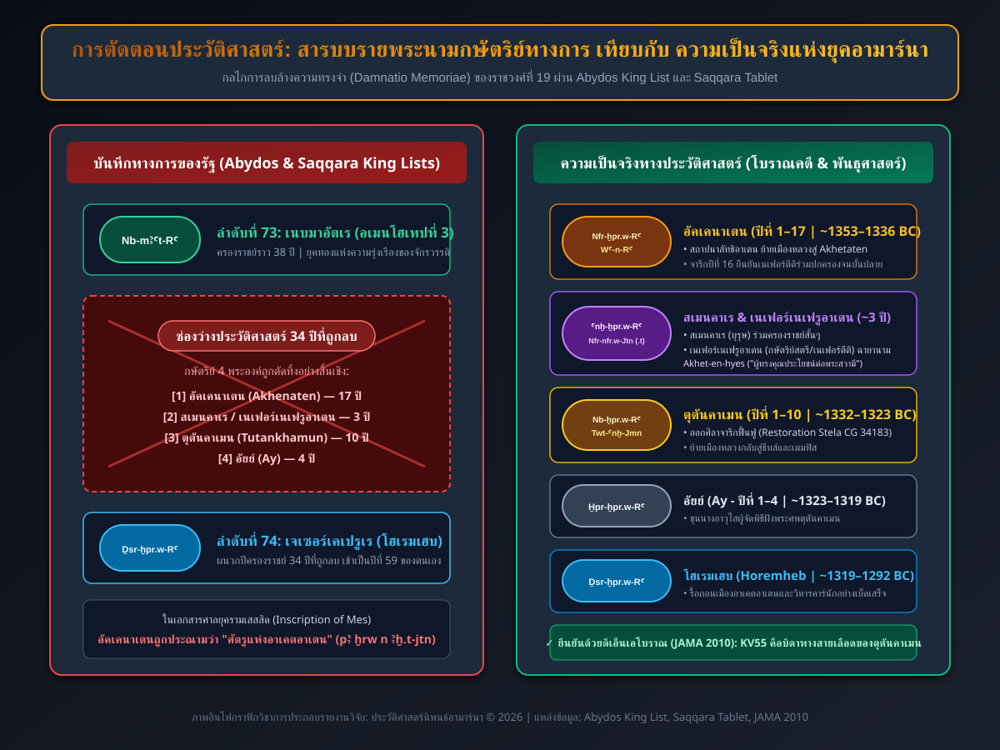

# บทที่ 1: การลบล้างความทรงจำและม่านหมอกแห่งประวัติศาสตร์ (Damnatio Memoriae: The Total Erasure)

**บทนำประจำบท:**  
บทนี้มุ่งศึกษากระบวนการและกลไกที่รัฐโบราณของอียิปต์ในยุคปลายราชวงศ์ที่ 18 และราชวงศ์ที่ 19 ดำเนินการเพื่อลบล้างการมีอยู่ของอัคเคนาเตน เนเฟอร์ตีติ และราชวงศ์อามาร์นาออกจากสารบบประวัติศาสตร์ โดยเริ่มจากการวิเคราะห์รากฐานทางปรัชญาและภววิทยาเรื่อง *มาอัต* (*MꜢꜤt*) และ *อิสเฟต* (*Jzft*) สู่การรื้อถอนเมืองอาเคตอาเตนทางกายภาพ การสกัดกะเทาะคาร์ทูชพระนาม การตัดตอนรายพระนามกษัตริย์ในบันทึกทางการแห่งอไบดอสและซัคคารา ตลอดจนการวิเคราะห์ศิลาจารึกการฟื้นฟูของตุตันคาเมน (Cairo CG 34183) ซึ่งเป็นเอกสารปฐมภูมิที่สะท้อนทัศนะของยุคฟื้นฟูที่มีต่อ "ความเสื่อมสลายของแผ่นดิน" และปูทางสู่นโยบายทำลายล้างความทรงจำ (*Damnatio memoriae*) ที่ทำให้ยุคสมัยนี้ถูกลืมเลือนไปเกือบสามพันปี

---

## 1.1 ปรัชญาและวิธีปฏิบัติว่าด้วยการทำลายความทรงจำในอารยธรรมอียิปต์โบราณ

ในกระบวนทัศน์ทางเทววิทยาและจักรวาลวิทยาของอารยธรรมอียิปต์โบราณ การดำรงอยู่ของรัฐและระเบียบทางสังคมมิได้ถูกมองว่าเป็นเพียงผลผลิตของอำนาจทางการเมืองเชิงโลกียวิสัย หากแต่เป็นกลไกศักดิ์สิทธิ์ในการผดุงรักษา *มาอัต* (*MꜢꜤt*) อันหมายถึงสัจธรรม ความยุติธรรม ความถูกต้องชอบธรรม และดุลยภาพแห่งเอกภพ ให้คงอยู่สืบไปเบื้องหน้าพลังปฏิปักษ์แห่ง *อิสเฟต* (*Jzft*) ซึ่งเป็นตัวแทนของความไร้ระเบียบ ความโกลาหล ความอยุติธรรม และความพินาศย่อยยับ [1] ฟาโรห์ในฐานะองค์อวตารของเทพฮอรัสบนผืนพิภพและสะพานเชื่อมระหว่างโลกมนุษย์กับทวยเทพ มีพันธกิจสูงสุดเพียงประการเดียว คือการปฏิบัติศาสนกิจเพื่อพิทักษ์และสถาปนามาอัต ปราบปรามอิสเฟต และถวายเครื่องบรรณาการอันเป็นที่โปรดปรานแก่หมู่ทวยเทพนับพันองค์ในวิหารทั่วทั้งสองแผ่นดิน

ทว่าการขึ้นครองราชย์ของอเมนโฮเทปที่ 4 (Amenhotep IV) ผู้ซึ่งต่อมาได้เฉลิมพระนามใหม่เป็น อัคเคนาเตน (*Ꜣḫ-n-jtn* - "ผู้ทรงคุณประโยชน์อันทรงชีวิตแด่องค์อาเตน") ในช่วงกลางศตวรรษที่ 14 ก่อนคริสตกาล ได้นำมาซึ่งการปฏิวัติทางศาสนา อุดมการณ์ และวัฒนธรรมที่สั่นสะเทือนรากฐานของอารยธรรมไอยคุปต์อย่างไม่เคยปรากฏมาก่อน [2] การประกาศยกเลิกการบูชาทวยเทพดั้งเดิม โดยเฉพาะสุริยเทพอามุน-รา (*Jmn-RꜤ*) แห่งธีบส์ ซึ่งเป็นมหาเทพผู้อุปถัมภ์จักรวรรดิแห่งราชวงศ์ที่ 18 แล้วสถาปนาองค์อาเตน (*Jtn*) หรือดวงสุริยะที่มีรัศมีเปล่งปลั่งเป็นพระหัตถ์ประทานพร ให้เป็นพระเจ้าสูงสุดเพียงพระองค์เดียว พร้อมทั้งสั่งปิดวิหารโบราณ ปลดนักบวช ยึดทรัพย์สินที่ดินของศาสนสถาน และส่งคณะข้าหลวงออกไปสกัดลบพระนามและรูปจำลองของเทพอามุนทั่วทั้งพระราชอาณาจักร ได้ก่อให้เกิดบาดแผลลึกในจิตสำนึกร่วมของสังคมอียิปต์ [3]

สำหรับราชสำนัก นักบวช และราษฎรชาวอียิปต์โบราณ การกระทำของอัคเคนาเตนมิใช่เพียงการปฏิรูปความเชื่อทางเทววิทยา หากแต่เป็นการก่อพันธกิจแห่งความพินาศ (Act of Sacrilege) ที่ละเมิดกฎเกณฑ์แห่งมาอัตอย่างร้ายแรงที่สุด การทอดทิ้งวิหารของทวยเทพโบราณส่งผลให้จักรวาลขาดสมดุล ทวยเทพผู้พิทักษ์แผ่นดินพิโรธและล่าถอย ละทิ้งไอยคุปต์ให้เผชิญกับทุพภิกขภัย โรคระบาด และความปราชัยทางการทหารในดินแดนเลแวนต์ (Levant) [4] ด้วยเหตุนี้ เมื่อการปฏิรูปอามาร์นาสิ้นสุดลงพร้อมกับการสวรรคตของกษัตริย์และการล่มสลายของราชสำนักอาเคตอาเตน ชนชั้นนำผู้ปกครองยุคฟื้นฟู โดยเฉพาะอย่างยิ่งนายพลโฮเรมเฮบ (*Ḥr-m-ḥb*) ผู้ก้าวขึ้นมาเป็นฟาโรห์องค์สุดท้ายแห่งราชวงศ์ที่ 18 จึงเห็นพ้องต้องกันว่า การฟื้นฟูมาอัตจะสมบูรณ์ได้ ก็ต่อเมื่อมีการชำระล้างมลทินและลบล้างตัวตนของยุคสมัยนอกรีตนี้ออกไปจากความทรงจำของแผ่นดินอย่างสิ้นเชิง [5]

ธรรมเนียมปฏิบัติในการทำลายล้างความทรงจำ ซึ่งในโลกวิชาการยุคใหม่มักเรียกด้วยศัพท์ภาษาละตินว่า *แดมนัตสิโอ เมมอริแอ* (*Damnatio memoriae*) หรือในภาษาอียิปต์โบราณว่าการลบชื่อ (*znf* หรือ *sštꜢ*) มิได้เป็นเพียงมาตรการลงโทษทางการเมืองตามแบบตะวันตก หากแต่แฝงไว้ด้วยปรัชญาทางภววิทยาและคติเรื่องชีวิตหลังความตายที่ลึกซึ้งยิ่ง [6] ชาวอียิปต์เชื่อว่าอัตลักษณ์และวิญญาณนิรันดร์ของบุคคลประกอบด้วยหลายมิติ โดยเฉพาะ *เรน* (*rn*) หรือ "นาม" และ *คา* (*kꜢ*) หรือ "พลังชีวิต" ตราบใดที่พระนามของบุคคลยังคงได้รับการจารึกไว้บนศิลา ได้รับการออกเสียงเรียกขานในบทสวด และรูปสลักของบุคคลยังคงตั้งตระหง่านอยู่ วิญญาณของบุคคลผู้นั้นจะยังคงได้รับพลังชีวิตและคงความเป็นอมตะ [7] ในทางตรงกันข้าม หากพระนามของบุคคลถูกกะเทาะทำลาย รูปจำลองถูกทุบทำลายจนพระพักตร์แตกหัก และไม่มีใครเอ่ยถึงชื่อนั้นอีกต่อไป บุคคลผู้นั้นจะเผชิญกับ "ความตายครั้งที่สอง" (Second Death) ซึ่งหมายถึงการดับสูญอันเป็นนิรันดร์ ถูกตัดขาดจากภพภูมิหลังความตาย และถูกลบเลือนออกไปจากโครงข่ายของเอกภพอย่างไม่มีวันหวนคืน [8]

---

## 1.2 การรื้อถอนเมืองอาเคตอาเตนและการแปรสภาพสู่เหมืองหิน

กระบวนการรื้อถอนและลบล้างเมืองอาเคตอาเตน (Akhetaten - ปัจจุบันคือบริเวณ Tell el-Amarna ในจังหวัดมินยา ประเทศอียิปต์) มิได้เกิดขึ้นในชั่วข้ามคืนภายหลังการสวรรคตของอัคเคนาเตน หากแต่ดำเนินไปเป็นขั้นตอนอย่างมีระเบียบและเป็นระบบตลอดช่วงปลายราชวงศ์ที่ 18 ต่อเนื่องไปจนถึงยุคราชวงศ์ที่ 19 [9] ภายหลังรัชสมัยอันสั้นของกษัตริย์สตรีเนเฟอร์เนเฟรูอาเตน (Neferneferuaten) ราชสำนักภายใต้การนำของฟาโรห์เยาว์วัย ตุตันคาเตน (*Twt-Ꜥnḫ-Jtn*) ได้ตัดสินใจครั้งประวัติศาสตร์ในการละทิ้งเมืองหลวงอาเคตอาเตน ย้ายศูนย์กลางอำนาจบริหารและศาสนากลับคืนสู่เมมฟิสและธีบส์ พร้อมทั้งเปลี่ยนพระนามเป็น ตุตันคาเมน (*Twt-Ꜥnḫ-Jmn* - "รูปจำลองอันทรงชีวิตแห่งอามุน") [10]

ในระยะแรกภายใต้รัชสมัยตุตันคาเมนและอัยย์ (Ay) เมืองอาเคตอาเตนยังมิได้ถูกทุบทำลายในทันที แต่ถูกลดสถานะลงเป็นเมืองร้างที่ปราศจากข้าราชบริพารและประชากรหลัก มีเพียงเจ้าหน้าที่เฝ้ารักษาการณ์และช่างฝีมือบางส่วนที่ยังคงประจำการอยู่เพื่อควบคุมการเคลื่อนย้ายทรัพย์สินและเครื่องใช้มีค่ากลับคืนสู่เมืองหลวงดั้งเดิม [11] ทว่าจุดเปลี่ยนสำคัญที่นำไปสู่การทำลายล้างทางกายภาพอย่างแท้จริงเริ่มต้นขึ้นเมื่อโฮเรมเฮบขึ้นครองราชย์ แม่ทัพใหญ่ผู้ขึ้นสู่บัลลังก์โดยไม่มีเชื้อสายราชวงศ์ ได้ใช้นโยบายกวาดล้างมรดกอามาร์นาเพื่อสร้างความชอบธรรมทางการเมืองแก่ตนเองในฐานะผู้ฟื้นฟูขนบธรรมเนียมดั้งเดิม [12]

โฮเรมเฮบได้ออกคำสั่งให้รื้อถอนสิ่งปลูกสร้าง พระราชวัง และวิหารสุริยะทั้งหมดในเมืองอาเคตอาเตนอย่างเป็นระบบ กองทหารและช่างหินถูกส่งเข้าไปยังเมืองร้างเพื่อทำการสกัดเอาวัสดุก่อสร้างที่มีค่า โดยเฉพาะหินปูนเนื้อละเอียด หินทราย และหินแกรนิต อาคารราชการ พระราชวังหลวง (Great Palace) พระราชวังเหนือ (North Palace) และวิหารใหญ่แห่งอาเตน (Great Aten Temple) ถูกทุบทำลายจนเหลือเพียงรากฐานระดับพื้นดิน [13] ชิ้นส่วนเสาหินและคานสลักลายถูกสกัดแบ่งเป็นก้อนเล็กเพื่อความสะดวกในการขนส่งทางเรือข้ามแม่น้ำไนล์ไปยังเมืองแอร์โมโพลิส (Hermopolis Magna หรือ el-Ashmunein) ซึ่งตั้งอยู่ฝั่งตรงข้าม เพื่อนำไปใช้เป็นฐานรากและแกนในสำหรับก่อสร้างวิหารแห่งเทพธอธ (Thoth) ในรัชสมัยของราเมสเสสที่ 2 ในเวลาต่อมา [14]

ไม่เพียงแต่สถาปัตยกรรมระดับผิวดินเท่านั้นที่ถูกทำลาย แม้กระทั่งสุสานหลวงของอัคเคนาเตน (Royal Tomb - Tomb 26) ซึ่งเจาะลึกเข้าไปในหุบเขาด้านหลังเมือง ก็ถูกบุกรุกโดยเจ้าหน้าที่ของรัฐ หีบพระบรมศพหินแกรนิตสีแดงของอัคเคนาเตนถูกทุบทำลายจนแตกเป็นเศษหินนับพันชิ้น ภาพสลักพระบรมรูปของอัคเคนาเตนและเนเฟอร์ตีติบนผนังห้องพระศพถูกสกัดกะเทาะใบหน้าและคาร์ทูชพระนามทิ้งจนเหี้ยนเกรียน [15] ชิ้นส่วนพระบรมศพและเครื่องราชกกุธภัณฑ์ถูกเคลื่อนย้ายออกไปอย่างเร่งรีบ (ซึ่งต่อมาปรากฏร่องรอยในสุสานปริศนา KV55 ณ หุบผากษัตริย์) [16] ขณะที่สุสานของบรรดาขุนนางและข้าราชบริพารในเขตสุสานเหนือและสุสานใต้ (North and South Tombs) เช่น สุสานของเมริเร (Meryre), ปาเนเฮซี (Panehesy), ฮูยา (Huya), และอัยย์ ถูกปล่อยทิ้งค้างไว้ในสภาพที่ยังสร้างไม่เสร็จสมบูรณ์ ภาพสลักของกษัตริย์และพระราชินีตามผนังทางเข้าถูกกะเทาะทำลายเพื่อลบล้างตัวตน [17]

การรื้อถอนดำเนินไปอย่างทั่วถึงจนกระทั่งผืนแผ่นดินอันเคยเป็นที่ตั้งของมหานครอาเคตอาเตน ที่มีประชากรนับหมื่นคนและเคยรุ่งเรืองด้วยเสียงสวดสรรเสริญพระอาทิตย์ ได้กลายสภาพเป็นซากปรักหักพังอันเงียบสงัด ถูกทรายแห่งทะเลทรายซาฮาราพัดพาเข้าปกคลุมอย่างช้าๆ ทว่าความพยายามในการทำลายล้างทางกายภาพนี้ กลับส่งผลลัพธ์ในเชิงประวัติศาสตร์นิพนธ์ที่ตรงกันข้ามกับเจตจำนงของผู้ทำลาย: การที่เมืองถูกทิ้งร้างและไม่มีการสร้างเมืองซ้อนทับในยุคหลัง ได้ทำให้ผังเมือง ฐานรากอาคาร โรงงานผลิตแก้ว และสุสานสามัญชนถูกเก็บรักษาไว้ภายใต้ผืนทรายในสภาพที่สมบูรณ์ที่สุดแห่งหนึ่งในโลกโบราณ รอคอยการมาถึงของนักโบราณคดียุคใหม่ในอีกสามพันปีต่อมา [18]

---

## 1.3 รายพระนามกษัตริย์ทางการแห่งราชอาณาจักรใหม่: การตัดตอนประวัติศาสตร์

นอกเหนือจากการทำลายล้างทางกายภาพ ณ แหล่งที่ตั้งของเมืองอาเคตอาเตนและวิหารสุริยะแล้ว กลไกทางอุดมการณ์ที่ทรงอำนาจและมีประสิทธิภาพสูงสุดในการลบล้างยุคอามาร์นา คือการตัดตอนและการบิดเบือน "บันทึกลำดับกษัตริย์ทางการ" (Official Royal King Lists) ของรัฐอียิปต์ในยุคราชวงศ์ที่ 19 และ 20 [19] สำหรับสังคมอียิปต์โบราณ รายพระนามกษัตริย์ที่สลักไว้บนผนังวิหารมิได้เป็นเพียงบันทึกทางลำดับเวลา (Chronology) ตามความหมายของประวัติศาสตร์นิพนธ์สมัยใหม่ หากแต่เป็น "คัมภีร์ทางพิธีกรรมศักดิ์สิทธิ์" ที่กษัตริย์ผู้ครองราชย์ปัจจุบันใช้ประกอบพิธีเซ่นสรวงดวงพระวิญญาณของบรรพกษัตริย์ผู้ชอบธรรม เพื่อยืนยันความต่อเนื่องแห่งสายพระโลหิตอันศักดิ์สิทธิ์ที่สืบทอดมาจากปฐมกษัตริย์แห่งทวยเทพ [20]

หลักฐานทางอักขรวิทยาที่แสดงถึงการตัดตอนประวัติศาสตร์อย่างเบ็ดเสร็จ ปรากฏชัดเจนที่สุดใน **รายพระนามกษัตริย์แห่งอไบดอส (Abydos King List)** ซึ่งสลักอยู่บนผนัง hành lang บรรพบุรุษ ภายในพระวิหารอนุสรณ์ของฟาโรห์เซติที่ 1 (Seti I) แห่งราชวงศ์ที่ 19 ณ เมืองอไบดอส อันเป็นศูนย์กลางการบูชาเทพโอซิริส [21] ในภาพสลักอันสง่างาม เซติที่ 1 ทรงยืนเคียงข้างเจ้าชายราเมสเสส (ต่อมาคือราเมสเสสที่ 2) ขณะถือกระถางกำยานถวายการบูชาแก่คาร์ทูชพระนามของฟาโรห์ 76 พระองค์ เรียงลำดับตั้งแต่ปฐมกษัตริย์เมเนส (Menes / Narmer) แห่งราชวงศ์ที่ 1 เรื่อยมาจนถึงรัชกาลปัจจุบัน [22]

ทว่าเมื่อพิจารณาในส่วนของราชวงศ์ที่ 18 ซึ่งเป็นยุคทองของจักรวรรดิ จะพบความผิดปกติทางประวัติศาสตร์อย่างน่าตื่นตะลึง: ลำดับคาร์ทูชพระนามหมายเลข 73 คือ เนบมาอัตเร (*Nb-mꜢꜤt-RꜤ*) ซึ่งเป็นพระนามนำหน้ารัชกาลของอเมนโฮเทปที่ 3 ทว่าคาร์ทูชถัดไปหมายเลข 74 กลับกลายเป็น เจเซอร์เคเปรูเร-เซเทเพนเร (*Ḏsr-ḫpr.w-RꜤ Stp-n-RꜤ*) ซึ่งเป็นพระนามของโฮเรมเฮบโดยตรง [23] ลำดับกษัตริย์ได้ตัดข้ามและละทิ้งฟาโรห์ถึง 4 พระองค์ไปอย่างสิ้นเชิง ได้แก่:
1. อเมนโฮเทปที่ 4 / อัคเคนาเตน (ครองราชย์ 17 ปี)
2. อันค์เคเปรูเร สเมนคาเร / เนเฟอร์เนเฟรูอาเตน (ครองราชย์รวมราว 3 ปี)
3. ตุตันคาเตน / ตุตันคาเมน (ครองราชย์ราว 9–10 ปี)
4. อัยย์ (ครองราชย์ราว 4 ปี)

ระยะเวลาเกือบสามทศวรรษ (ประมาณ 33–34 ปี) ของประวัติศาสตร์อียิปต์ถูกลบทิ้งไปจากสารบบหลวง ราวกับว่ายุคสมัยดังกล่าวไม่เคยดำรงอยู่บนโลก ยิ่งไปกว่านั้น เพื่อมิให้เกิดช่องว่างในบันทึกทางโหราศาสตร์และปีปฏิทินหลวง โฮเรมเฮบได้ผนวกรวมปีครองราชย์ของกษัตริย์ทั้ง 4 พระองค์เข้าเป็นปีครองราชย์ของตนเองอย่างเป็นทางการ ส่งผลให้เอกสารทางกฎหมายและบันทึกราชการในยุคหลังระบุปีครองราชย์ของโฮเรมเฮบยาวนานถึง "ปีที่ 59" ทั้งที่ในความเป็นจริงพระองค์ครองราชย์จริงเพียงประมาณ 27–28 ปีเท่านั้น [24]

รูปแบบการตัดตอนประวัติศาสตร์แบบเดียวกันนี้ ปรากฏซ้ำใน **แผ่นจารึกซัคคารา (Saqqara Tablet)** ซึ่งค้นพบในหลุมศพของขุนนางทจูเนรอย (Tjuneroy) หัวหน้าช่างหลวงในรัชสมัยราเมสเสสที่ 2 แผ่นจารึกหินปูนนี้ระบุรายพระนามกษัตริย์ 58 พระองค์ที่เริ่มต้นจากราชวงศ์ที่ 1 และตัดข้ามจากอเมนโฮเทปที่ 3 ไปยังโฮเรมเฮบเช่นเดียวกัน [25] ขณะที่ในเอกสารทางกฎหมายยุครามเสสสิด เช่น บันทึกคดีความเรื่องที่ดินของตระกูลเมส (Inscription of Mes) อัคเคนาเตนไม่เคยได้รับการเอ่ยพระนามหรือบันทึกในฐานะฟาโรห์ หากแต่ถูกกล่าวถึงด้วยถ้อยคำประณามอันขมขื่นว่า *"ปา เครู เอน อาเคตอาเตน"* (*pꜢ ḫrw n Ꜣḫ.t-jtn*) ซึ่งแปลตรงตัวว่า **"ศัตรูแห่งอาเคตอาเตน"** หรือ "กบฏแห่งอาเคตอาเตน" [26]

เอกสารประวัติศาสตร์ฉบับเดียวในยุคโบราณที่ยังคงหลงเหลือเค้าโครงของกษัตริย์ยุคนี้ คือบันทึกพงศาวดาร *ไอกิปเทียกา* (*Aegyptiaca*) ของนักประวัติศาสตร์และสมณะชาวอียิปต์ มาเนโธ (Manetho) ในศตวรรษที่ 3 ก่อนคริสตกาล (ยุคปโตเลมี) ซึ่งถูกคัดลอกส่งต่อโดยโยเซฟุส (Josephus) และนักประวัติศาสตร์คริสเตียนยุคแรก [27] แม้ว่ามาเนโธจะบันทึกรายชื่อกษัตริย์อย่างผิดเพี้ยน โดยระบุชื่ออย่างสับสน เช่น *โอซาร์ซิฟ* (Osarseph), *อาเคร์เรส* (Acherres), หรือ *ราโททิส* (Rathotis) พร้อมทั้งผูกโยงเรื่องราวเข้ากับตำนานการขับไล่กลุ่มคนโรคเรื้อนและคนนอกรีตออกจากอียิปต์ ซึ่งสะท้อนความทรงจำที่บิดเบี้ยวและบาดแผลทางสังคมอันยาวนานหลายศตวรรษหลังการปฏิวัติอามาร์นา [28]

---

  
*ภาพประกอบที่ 1.1: แผนผังเปรียบเทียบการตัดตอนประวัติศาสตร์ในจารึกทางการแห่งอไบดอส (Abydos King List) และซัคคารา (Saqqara Tablet) เทียบกับความเป็นจริงของรัชกาลที่ถูกลบเกือบ 34 ปี (จัดทำโดยผู้เขียน)*

---

## 1.4 ศิลาจารึกการฟื้นฟูของตุตันคาเมน: คำประกาศความล่มสลายและการปูทางสู่การลบล้าง

ก่อนที่โฮเรมเฮบจะเริ่มกระบวนการลบล้างความทรงจำอย่างเบ็ดเสร็จ เอกสารทางการฉบับแรกที่สะท้อนถึงวิกฤตการณ์และความเสื่อมสลายของยุคอามาร์นาในมุมมองของราชสำนักอียิปต์ คือ **ศิลาจารึกการฟื้นฟูของตุตันคาเมน (Restoration Stela of Tutankhamun - ทะเบียนวัตถุ Cairo CG 34183)** [29] ศิลาจารึกหินทรายสีแดงขนาดมหึมา (สูง 2.50 เมตร กว้าง 1.28 เมตร) ชิ้นนี้ เดิมถูกประดิษฐานไว้ในวิหารคาร์นักเพื่อประกาศนโยบายฟื้นฟูศาสนาและบูรณะอาณาจักรอย่างเป็นทางการภายหลังการย้ายราชสำนักกลับสู่ธีบส์ [30]

ข้อความบนศิลาจารึก ซึ่งร่างขึ้นโดยคณะที่ปรึกษาอาวุโสและนักบวชอามุน ได้บรรยายถึงสภาพความล่มสลายของอียิปต์ในรัชสมัยอัคเคนาเตนไว้อย่างทรงพลังและน่าสะพรึงกลัว:

> "Now when his majesty arose as king, the temples and shrines of the gods and goddesses beginning from Elephantine down to the marshes of the Delta had fallen into neglect; their shrines had fallen into desolation and become ruins overgrown with weeds. Their sanctuaries were as if they had never come into being, and their courts were used as roads for footpaths." [31]

*(คำแปล: "เมื่อพระองค์เสด็จขึ้นครองราชย์เป็นกษัตริย์ วิหารและศาลเจ้าของทวยเทพและเทวีทั้งหลาย นับตั้งแต่เกาะเอเลแฟนทีนทางใต้จรดหนองบึงเดลตาทางเหนือ ได้ตกอยู่ในสภาพถูกทอดทิ้งละเลย ศาลเจ้าทั้งมวลพังทลายรกร้าง กลายเป็นซากปรักหักพังที่ปกคลุมไปด้วยวัชพืช สถานศักดิ์สิทธิ์ของพวกเขาราวกับไม่เคยอุบัติขึ้นมาก่อน และลานวิหารถูกผู้คนใช้สัญจรเป็นทางเดินเท้า")*

จารึกยังได้อธิบายถึงผลกระทบทางจักรวาลวิทยาที่เกิดขึ้นจากการทอดทิ้งทวยเทพ โดยชี้ว่าความโกลาหลและความเจ็บป่วยได้เข้าครอบงำแผ่นดิน:

> "The land was in severe affliction and sickness; the gods had turned their backs upon this land. If an army was sent to the Levant (Djahy) to broaden the borders of Egypt, no success came to their efforts. If men prayed to a god to ask for counsel, he came not at all; and if they petitioned any goddess in like manner, she would never attend to their petition." [32]

ข้อความข้างต้นแสดงให้เห็นอย่างกระจ่างชัดว่า ในสายตาของราชสำนักหลังยุคอามาร์นา การปฏิรูปของอัคเคนาเตนถือเป็น "หายนะภัยระดับชาติ" ที่ทำลายทั้งความมั่นคงภายใน ศักยภาพทางทหารในต่างแดน และความสัมพันธ์อันศักดิ์สิทธิ์ระหว่างมนุษย์กับพระผู้เป็นเจ้า เพื่อแก้ไขวิกฤตินี้ ตุตันคาเมนทรงประกาศว่าพระองค์ได้ทรงหล่อเทวรูปอามุนขึ้นใหม่ด้วยทองคำบริสุทธิ์จากดินแดนไฮแลนด์ พระราชทานทรัพย์สิน ที่ดิน และข้าทาสบริวารแก่วิหารโบราณทุกแห่ง และแต่งตั้งนักบวชรุ่นใหม่ที่ได้รับการชำระให้บริสุทธิ์ [33]

ทว่าชะตากรรมของศิลาจารึกการฟื้นฟูนี้เอง ก็ได้สะท้อนถึงความอำมหิตของกระบวนการลบล้างความทรงจำในเวลาต่อมา: เมื่อโฮเรมเฮบขึ้นครองราชย์ พระองค์มิได้ยกย่องตุตันคาเมนในฐานะผู้ฟื้นฟู หากแต่ทรงสั่งให้สกัดกะเทาะลบคาร์ทูชพระนามของตุตันคาเมนบนศิลาจารึกนี้ทิ้ง แล้วสลักคาร์ทูชพระนามของโฮเรมเฮบลงไปแทนที่ [34] การกระทำดังกล่าวแสดงให้เห็นว่า โฮเรมเฮบไม่ต้องการให้ตุตันคาเมนหรือกษัตริย์องค์ใดในสายราชวงศ์อามาร์นาได้รับเกียรติยศในการกอบกู้แผ่นดิน พระองค์ต้องการสถาปนาตนเองเป็นผู้กอบกู้แต่เพียงผู้เดียว และผนวกเอาคุณงามความดีทั้งหมดของการบูรณะวิหารเข้าไว้ในรัชสมัยของพระองค์เอง

ด้วยกระบวนการทำลายล้างรอบด้าน ทั้งการรื้อถอนเมืองอาเคตอาเตนทางกายภาพ การสกัดลบคาร์ทูชบนอนุสาวรีย์ การตัดชื่อออกจากรายพระนามกษัตริย์แห่งอไบดอสและซัคคารา และการสลักทับจารึกทางประวัติศาสตร์ ม่านหมอกแห่งความเงียบงันจึงได้เข้าปกคลุมประวัติศาสตร์ยุคอามาร์นาอย่างเบ็ดเสร็จ กษัตริย์นอกรีต พระราชินีผู้เลอโฉม และเมืองหลวงแห่งแสงอาทิตย์ได้สูญหายไปจากความรับรู้ของมนุษยชาติอย่างสมบูรณ์ เป็นเวลาเกือบ 3,000 ปี จนกระทั่งเสียงสิ่วและพลั่วของนักโบราณคดียุคใหม่เริ่มปลุกพวกเขากลับคืนสู่แสงสว่างอีกครั้งในคริสต์ศตวรรษที่ 19 [35]

---

---

## เชิงอรรถ

[1] Jan Assmann, *The Search for God in Ancient Egypt*, trans. David Lorton (Ithaca: Cornell University Press, 2001), 4–12; Donald B. Redford, *Akhenaten: The Heretic King* (Princeton: Princeton University Press, 1984), 154–157.

[2] Cyril Aldred, *Akhenaten: King of Egypt* (London: Thames and Hudson, 1988), 13–24.

[3] Barry J. Kemp, *Ancient Egypt: Anatomy of a Civilization*, 2nd ed. (London: Routledge, 2006), 281–295.

[4] Tutankhamun, "The Restoration Stela of Tutankhamun (Cairo CG 34183)," in *Urkunden der 18. Dynastie*, ed. Wolfgang Helck (Berlin: Akademie-Verlag, 1958), 2026–2027.

[5] Aidan Dodson, *Amarna Sunset: Nefertiti, Tutankhamun, Ay, Horemheb, and the Egyptian Counter-Reformation* (Cairo: The American University in Cairo Press, 2009), 115–124.

[6] Peter J. Brand, "Usurpation and Restoration of Monuments," in *UCLA Encyclopedia of Egyptology*, ed. Willeke Wendrich (Los Angeles, 2010), 1–9.

[7] Alan H. Gardiner, *The Attitude of the Ancient Egyptians to Death and the Dead* (Cambridge: Cambridge University Press, 1935), 18–25.

[8] Erik Hornung, *Conceptions of God in Ancient Egypt: The One and the Many*, trans. John Baines (Ithaca: Cornell University Press, 1982), 172–179.

[9] Barry J. Kemp, *The City of Akhenaten and Nefertiti: Amarna and Its People* (London: Thames & Hudson, 2012), 244–256.

[10] Nicholas Reeves, *The Complete Tutankhamun: The King, the Tomb, the Royal Treasure* (London: Thames and Hudson, 1990), 22–27.

[11] Marc Gabolde, *D'Akhenaton à Toutânkhamon* (Lyon: Université Lumière-Lyon 2 / Paris: De Boccard, 1998), 185–190.

[12] Redford, *Akhenaten: The Heretic King*, 222–228.

[13] W. M. Flinders Petrie, *Tell el Amarna* (London: Methuen & Co., 1894), 12–15.

[14] Günther Roeder, *Amarna-Reliefs aus Hermopolis* (Hildesheim: Gerstenberg, 1969), 1–18.

[15] Geoffrey Thorndike Martin, *The Royal Tomb at El-'Amarna*, vol. 1: *The Objects* (London: Egypt Exploration Society, 1974), 21–34.

[16] Zahi Hawass et al., "Ancestry and Pathology in King Tutankhamun's Family," *JAMA* 303, no. 7 (2010): 638–642.

[17] Norman de Garis Davies, *The Rock Tombs of El Amarna*, vol. 6: *Tombs of Parennefer, Tutu, and Ay* (London: Egypt Exploration Fund, 1908), 1–8.

[18] Kemp, *The City of Akhenaten and Nefertiti*, 15–28.

[19] Donald B. Redford, *Pharaonic King-Lists, Annals and Day-Books: A Contribution to the Study of the Egyptian Sense of History* (Mississauga: Benben Publications, 1986), 18–35.

[20] Jan Assmann, *Moses the Egyptian: The Memory of Egypt in Western Monotheism* (Cambridge, MA: Harvard University Press, 1997), 23–38.

[21] Auguste Mariette, *Abydos: Description des fouilles exécutées sur l'emplacement de cette ville*, vol. 1 (Paris: Imprimerie Nationale, 1869), 15–22.

[22] Kenneth A. Kitchen, *Pharaoh Triumphant: The Life and Times of Ramesses II* (Warminster: Aris & Phillips, 1982), 24–28.

[23] Tutankhamun, "The Restoration Stela of Tutankhamun (Cairo CG 34183)," in *Urkunden der 18. Dynastie*, ed. Wolfgang Helck (Berlin: Akademie-Verlag, 1958), 2025–2032.

[24] Dodson, *Amarna Sunset*, 115–120.

[25] Alan H. Gardiner, "The Royal Canon of Turin," *Journal of Egyptian Archaeology* 45 (1959): 56–60.

[26] Alan H. Gardiner, *The Inscription of Mes: A Contribution to the Study of Egyptian Judicial Procedure*, Untersuchungen zur Geschichte und Altertumskunde Aegyptens 4 (Leipzig: J. C. Hinrichs, 1905), 11–18.

[27] W. G. Waddell, trans., *Manetho*, Loeb Classical Library 350 (Cambridge, MA: Harvard University Press, 1940), 101–145.

[28] Assmann, *Moses the Egyptian*, 30–45.

[29] Wolfgang Helck, *Urkunden der 18. Dynastie: Inschriften der Könige von Amenophis III. bis Haremhab* (Heft 22) (Berlin: Akademie-Verlag, 1958), 2025–2032.

[30] John Bennett, "The Restoration Inscription of Tut'ankhamun," *Journal of Egyptian Archaeology* 25, no. 1 (1939): 8–15.

[31] Tutankhamun, "The Restoration Stela of Tutankhamun (Cairo CG 34183)," p. 2.

[32] Ibid., p. 3.

[33] Bennett, "The Restoration Inscription of Tut'ankhamun," 12–14.

[34] Peter J. Brand, "The Damnatio Memoriae of Akhenaten and His Successors," in *Causing His Name to Live: Studies in Egyptian Epigraphy and History in Memory of William J. Murnane*, ed. P. Brand and L. Cooper (Leiden: E.J. Brill, 2009), 31–46.

[35] Cyril Aldred, *Akhenaten: King of Egypt* (London: Thames and Hudson, 1988), 24–32.
