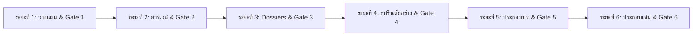

# แผนงานโครงการวิจัย (Project Plan)
## ประวัติศาสตร์นิพนธ์อามาร์นา: การลบล้าง การฟื้นคืนตัวตน และการสืบสวนข้อเท็จจริงทางโบราณคดีและอักขรวิทยา
### (The Amarna Historiography: Erasure, Rediscovery, and Epigraphic Reconstruction)

**รหัสโครงการ:** `2026-10-04_ประวัติศาสตร์นิพนธ์อามาร์นา`  
**สถานะ:** ระยะที่ 1 — วางแผนโครงการและกำหนดกรอบแนวคิด (Inception & Blueprint)  
**เป้าหมายจำนวนคำ:** 30,000–40,000 คำ (สูตรมาตรฐานสากล: อักขระตัดช่องว่าง ÷ 5.0)  
**รูปแบบงาน:** รายงานวิชาการระดับโมโนกราฟเชิงลึก (Comprehensive Academic Monograph) 6 บท  
**ระบบอ้างอิง:** Chicago/Turabian Notes & Bibliography Style (เชิงอรรถตัวเลขท้ายบท + บรรณานุกรมรวม)  

---

## 1. แผนการครอบคลุมหลายภาษา (Language Coverage Plan)

สอดคล้องกับข้อกำหนดใน `.agent/rules/multilingual-coverage.md` และความต้องการของผู้ใช้ที่ระบุให้ใช้ข้อมูลวิชาการระดับสูงจากภาษาอังกฤษ เยอรมัน ฝรั่งเศส และอียิปต์โบราณ:

### 1.1 การจัดระดับภาษา (Language Tiers)

| ระดับ (Tier) | ภาษา | บทบาทในโครงการ | เกณฑ์ขั้นต่ำและการดำเนินการ |
|:---:|:---|:---|:---|
| **Tier 0** | ไทย (TH) อังกฤษ (EN) | ภาษาฐานในการเรียบเรียงรายงาน และภาษาหลักของประวัติศาสตร์นิพนธ์อามาร์นาร่วมสมัย (Kemp, Redford, Dodson, Reeves, Allen) | ใช้ค้นคว้าทุกประเด็น รายงานเป็นภาษาไทย 100% |
| **Tier 1** | **อียิปต์โบราณ (EGY / Hieroglyphs / Akkadian Cuneiform)** | ภาษาปฐมภูมิของหลักฐานจารึก (Boundary Stelae, Great Hymn, Talatat, Amarna Letters EA 1–382) | ต้องมีตัวบทปริวรรต (Transliteration) และการวิเคราะห์ไวยากรณ์เชิงวิพากษ์ |
| **Tier 1** | **เยอรมัน (DE)** | แหล่งข้อมูลปฐมภูมิของการค้นพบยุคบุกเบิกและสำนักคิดแม่บท (Lepsius, Borchardt, DOG, Krauss, Assmann, Knudtzon) *(ได้รับการยกระดับจาก Tier 2 เป็น Tier 1 อัตโนมัติ)* | มีแหล่งอ้างอิงตรง $\ge$ 5 แหล่งสำคัญ |
| **Tier 1** | **ฝรั่งเศส (FR)** | แหล่งข้อมูลแม่บทด้านจารึกวิทยาคาร์นักและข้อถกเถียงการสืบราชสมบัติ (CFETK, Marc Gabolde, Dimitri Laboury, Maspero) *(ได้รับการยกระดับจาก Tier 2 เป็น Tier 1 อัตโนมัติ)* | มีแหล่งอ้างอิงตรง $\ge$ 5 แหล่งสำคัญ |

---

## 2. ตารางคำสำคัญหลายภาษา (Multilingual Keyword Matrix)

| ประเด็นหลัก | ภาษาอังกฤษ (EN) | ภาษาเยอรมัน (DE) | ภาษาฝรั่งเศส (FR) | ภาษาอียิปต์โบราณ / อักขรวิทยา (EGY) |
|:---|:---|:---|:---|:---|
| **1. การลบล้างประวัติศาสตร์ (Damnatio Memoriae & King Lists)** | Amarna damnatio memoriae, Horemheb erasure, Abydos King list, Saqqara tablet, Tutankhamun Restoration Stela | Damnatio memoriae Amarna, Haremhab Tilgung, Königsliste Abydos, Denkmalzerstörung | Martelage des noms, proscription amarnienne, table d'Abydos, stèle de la restauration | *sštꜢ*, *znf*, erasure of *Ꜣḫ-n-jtn*, restoration text of *Twt-Ꜥnḫ-Jmn* |
| **2. ยุคบุกเบิกและอักขรวิทยา (Early Rediscovery & Epigraphy)** | Napoleon expedition Description de l'Egypte, John Gardner Wilkinson, Karl Richard Lepsius, Boundary Stelae | Lepsius Denkmäler aus Aegypten, Grenzstelen Tell el-Amarna, Preussische Expedition | Expédition d'Égypte, stèles frontières d'Amarna, redécouverte d'Akhenaton | *tꜢ št n Ꜣḫ.t-jtn* (จารึกแสดงเขตอาเคตอาเตน) |
| **3. จดหมายอามาร์นาและการขุดค้นเมือง (Amarna Letters & Excavation)** | Amarna letters, EA tablets, Flinders Petrie excavation, Ludwig Borchardt Nefertiti bust, Deutsche Orient-Gesellschaft | El-Amarna-Tafeln Knudtzon, Borchardt Werkstatt des Thutmosis, Büste der Nofretete | Lettres d'El-Amarna, fouilles de Petrie, atelier du sculpteur Thoutmôsis | *tp.t n Ꜥm.rnꜢ*, cuneiform *Amarna* correspondence |
| **4. หินทาลาทัตและวิหารคาร์นัก (Karnak Talatat Project)** | Karnak talatat project, Ray Winfield Smith, Donald Redford, Gem-pa-Aten, CFETK reconstruction | Talatat Blöcke Karnak, Aton-Tempel Rekonstruktion | Talatat de Karnak, CFETK, temple d'Aton Karnak, démontage des pylônes | *Talatat* (ثلاثات), *Gm-pꜢ-Jtn*, *Ḥwt-bnbn* |
| **5. ข้อถกเถียงการสืบราชสมบัติ (Succession & Female Pharaoh)** | Smenkhkare, Neferneferuaten, female king Nefertiti, Dayr al-Barsha year 16 graffito, Meritaten | Nachfolgefrage Amarna, Anchkheperure, Nofretete Pharao, Graffito Dayr al-Barscha | Succession amarnienne, Smenkhkarê, Néfernéferouaton reine-pharaon, graffito de Deir el-Bersha | *Ꜥnḫ-ḫpr.w-rꜤ*, *Nfr-nfr.w-jtn*, *Ꜣḫ.t-n-hjs*, *.t* feminine marker |
| **6. นิติวิทยาศาสตร์และศตวรรษที่ 21 (Forensics, DNA & Current Archaeology)** | Tomb KV55 skeleton, Tutankhamun DNA JAMA 2010, Younger Lady, Barry Kemp South Tombs cemetery | Grab KV55 Identifizierung, DNA-Untersuchung Tutanchamun, Amarna Project Kemp | Tombe KV55 ossements, analyses génétiques Toutânkhamon, cimetière des tombes du Sud | *KV55*, *KV62*, *BꜢk.t-Jtn* |

---

## 3. ระเบียบวิธีวิจัยและแผนผัง 6 ระยะ (Workflow Methodology)

1. **ระยะที่ 1 (Inception & Blueprint):** จัดทำ `project-plan.md`, `outline-proposal.md`, และ `glossary.md`
2. **ระยะที่ 2 (Harvesting & OCR Routing):** ฮาร์เวสไฟล์ PDF ฉบับเต็มลงใน `research-notes/pdf/`, รันสกัด Markdown ลงใน `extracted-texts/`, และจัดทำ `source-index.md` พร้อมคอลัมน์ Language และ Script
3. **ระยะที่ 3 (Dossiers Production & Anti-Hallucination):** จัดทำแฟ้ม Source Analysis Dossiers ใน `research-notes/sources/S-YYYY-author-chXX.md` โดยสกัดโควทคำต่อคำผ่าน `quote_extractor.py` และตรวจผ่าน `verify_dossier.py` 100%
4. **ระยะที่ 4 (Micro-Sprints Drafting):** ยกร่างเนื้อหารายสปรินต์ใน `drafts/sections/chXX_secYY.md` (เพดาน 2,500–3,000 คำ) โดยอ้างอิงจาก Dossiers เท่านั้น
5. **ระยะที่ 5 (Assembly & Sanitization):** รวมบทใน `drafts/assembled/chXX.md`, รัน `footnote_engine.py` จัดเรียงเชิงอรรถและล้างรหัสระบบ 100%, สร้างอินโฟกราฟิกภาษาไทยเวกเตอร์ SVG 4 ชุด และย้ายเข้าสู่ `final/0X-บทที่X.md`
6. **ระยะที่ 6 (Final Assembly & Handover):** จัดทำ `final/references.md`, `final/00-สารบัญ.md`, ตรวจสถิติจำนวนคำรวมทั้งโครงการด้วย `count_words.py --project` และส่งมอบงานวิจัยฉบับสมบูรณ์
