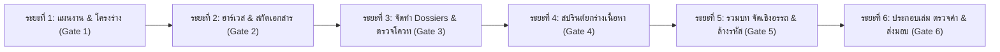

# แผนงานโครงการวิจัย (Project Plan)
## อาภรณ์ทองคำแห่งปรโลก: พลวัตทางโบราณคดี คติวิทยา และสถานะทางสังคมของ "แผ่นทองปิดศพ" (Gold Death Masks) ในวัฒนธรรมฟิลิปปินส์ยุคก่อนอาณานิคม
### (Golden Raiment of the Underworld: Archaeological Dynamics, Eschatology, and Social Stratification of Gold Death Masks in Pre-Colonial Philippines)

**รหัสโครงการ:** `2026-10-06_แผ่นทองปิดศพฟิลิปปินส์`  
**สถานะ:** ระยะที่ 1 — วางแผนโครงการ สำรวจภูมิทัศน์วิชาการ และยกร่างโครงร่างแม่บท (Inception, Reconnaissance & Blueprint)  
**เป้าหมายจำนวนคำ:** 30,000–38,000 คำ (สูตรมาตรฐานสากล: อักขระตัดช่องว่าง ÷ 5.0)  
**รูปแบบงาน:** รายงานวิชาการเชิงลึกระดับโมโนกราฟ (Comprehensive Academic Monograph) 6 บทสมบูรณ์ พร้อมบทนำและบทสรุปภาพรวม  
**ระบบอ้างอิง:** Chicago/Turabian Notes & Bibliography Style (เชิงอรรถตัวเลขท้ายบท + บรรณานุกรมรวม)  

---

## 1. ขอบเขตและประเด็นแกนกลางของโจทย์วิจัย (Core Research Scope)

1. **การจำแนกขอบเขตทางภูมิศาสตร์และประวัติศาสตร์ (Historiographical & Geographical Demarcation):**
   - ชี้แจงข้อเท็จจริงทางวิชาการเพื่อขจัดความเข้าใจคลาดเคลื่อน: "หุบเขาคินตา" (Kinta Valley) ในรัฐเปรัก ประเทศมาเลเซีย เป็นแหล่งอุตสาหกรรมเหมืองแร่ดีบุก (tin-mining) สำคัญระดับโลกในอดีต ซึ่งไม่มีความเกี่ยวข้องทั้งทางภูมิศาสตร์และทางโบราณคดีกับการค้นพบแผ่นทองปิดศพในฟิลิปปินส์
   - ระบุขอบเขตพื้นที่ศึกษาที่ถูกต้องในหมู่เกาะฟิลิปปินส์: แหล่งโบราณคดีหลัก 3 แหล่งที่พิพิธภัณฑสถานแห่งชาติฟิลิปปินส์ (National Museum of the Philippines) จัดเก็บรักษาชุดแผ่นทองปิดศพชิ้นสำคัญ
2. **สามแหล่งโบราณคดีแม่บทแห่งการค้นพบแผ่นทองปิดศพในฟิลิปปินส์:**
   - **แหล่งโบราณคดีโอตอน (Oton) จังหวัดอิโลอิโล (Iloilo):** ขุดค้นพบเมื่อวันที่ 5 มิถุนายน ค.ศ. 1967 ณ หลุมฝังศพหมายเลข 6 ที่ดินตระกูล Mediavilla บารังไกย์ San Antonio (แหล่งท่าเรือโบราณ Katagman) โดยทีมนักโบราณคดี Alfredo Evangelista และ F. Landa Jocano อายุราวปลายคริสต์ศตวรรษที่ 14 ถึงต้นศตวรรษที่ 15 ได้รับการประกาศยกย่องเป็น "สมบัติทางวัฒนธรรมแห่งชาติ" (National Cultural Treasure)
   - **แหล่งโบราณคดีบูตูอัน (Butuan) จังหวัดอากูซันเดลนอร์เต (Agusan del Norte เกาะมินดาเนา):** ศูนย์กลางรัฐการค้าทางทะเลและโลหะวิทยาชั้นสูง (Kingdom of Butuan / Kalaga Putuan) ยุคศตวรรษที่ 10–13 ขุดพบเครื่องทองคำและโบราณวัตถุจำนวนมหาศาลจากหลุมศพ ทั้งแผ่นทองปิดศพ/แผ่นปิดทวารร่างกาย (orifice covers) กริชทองคำ และเครื่องประดับ ซึ่งสะท้อนความมั่งคั่งมหาศาล และได้รับการคัดเลือกไปจัดแสดง ณ พิพิธภัณฑ์ลูฟร์ อาบูดาบี (Louvre Abu Dhabi)
   - **แหล่งโบราณคดีปลาซา อินเดเปนเดนเซีย (Plaza Independencia) นครเซบู (Cebu City):** ขุดค้นพบจากการดำเนินงานโบราณคดีกู้ภัย (Rescue Archaeology) ในปี ค.ศ. 2006–2008 นำโดยทีมนักโบราณคดีพิพิธภัณฑสถานแห่งชาติ (Nida Cuevas, Reynaldo Bautista) และร่วมวิเคราะห์โดย Dr. J. Eleazar Bersales พบแผ่นทองปิดศพ (ปิดตา จมูก ปาก) พร้อมกริชและเครื่องถ้วยชามการค้าในภาชนะดินเผาขนาดใหญ่ (Jar Burial) บรรจุโครงกระดูกสตรีที่มีการปรับแต่งรูปทรงกะโหลกศีรษะ (Artificial Cranial Reformation)
3. **คติวิทยาและมิติหน้าที่นิยมทางสังคม (Eschatology & Social Dynamics):**
   - คติความเชื่อเรื่องการป้องกันวิญญาณชั่วร้าย (Evil Spirits / Aswang / Mangalok) ไม่ให้แทรกซึมเข้าสู่ช่องทวารร่างกาย (Orifices: ตา จมูก ปาก) ในช่วงเปลี่ยนผ่านสู่ปรโลกตามระบบความเชื่อดั้งเดิม (Anitism / Dungan / Kalag)
   - คุณสมบัติทางจิตวิญญาณของทองคำ: ความสว่าง ความไม่แปรเปลี่ยน และความศักดิ์สิทธิ์ในฐานะเครื่องรางปกป้อง
   - มิติสถานะทางสังคมและเศรษฐกิจการเมือง: ทองคำในฐานะเครื่องหมายแสดงความมั่งคั่งและลำดับชั้นอำนาจของกลุ่มชนชั้นนำ (Datu / Maginoo / Kadatuan)

---

## 2. แผนการครอบคลุมหลายภาษา (Language Coverage Plan)

สอดคล้องกับข้อกำหนดใน `.agent/rules/multilingual-coverage.md` และข้อสั่งการของผู้ใช้ที่กำหนดให้ใช้เอกสารวิชาการระดับสูงจาก 7 ภาษาหลัก ได้แก่ อังกฤษ, เยอรมัน, ฝรั่งเศส, สเปน, ดัตช์, ญี่ปุ่น, และตากาล็อก (ร่วมกับภาษาไทยในฐานะภาษาเขียนรายงาน):

| ระดับ (Tier) | ภาษา | บทบาทและขอบเขตหลักในโครงการ | เกณฑ์ขั้นต่ำและการดำเนินการ |
|:---:|:---|:---|:---|
| **Tier 0** | **ไทย (TH)** **อังกฤษ (EN)** | ภาษาฐานในการเรียบเรียงรายงานทางวิชาการ (TH 100%) และภาษาหลักของประวัติศาสตร์และโบราณคดีฟิลิปปินส์สากล (Capistrano-Baker, Scott, Junker, Barretto-Tesoro, Solheim, Peralta, Miksic, Dizon, Fox, Bautista, Cuevas, Bersales) | สืบค้นทุกประเด็น ใช้เป็นกรอบการวิเคราะห์หลัก |
| **Tier 1** | **สเปน (ES)** | แหล่งหลักฐานลายลักษณ์อักษรปฐมภูมิยุคแรกเริ่มสัมผัสอาณานิคม (Chirino 1604, Loarca 1582, Colin 1663, Pigafetta 1524, Morga 1609, Boxer Codex c. 1590) ที่บันทึกพิธีศพ การใส่ทองคำในปากและปิดดวงตา | อ้างอิงตัวบทปฐมภูมิภาษาสเปนพร้อมคำแปลวิเคราะห์ $\ge$ 5 แหล่งสำคัญ |
| **Tier 1** | **ตากาล็อก / ฟิลิปปินส์ (TL / FIL)** | แหล่งรายงานการสำรวจภาคสนามของ National Museum of the Philippines, วารสารโบราณคดีท้องถิ่น, และมโนทัศน์ชาติพันธุ์วิทยา (*gintong maskara*, *takip sa mata at ilong*, *dungan*, *kadatoan*) | อ้างอิงรายงานวิชาการและบทวิเคราะห์ตรง $\ge$ 3 แหล่งสำคัญ |
| **Tier 2** | **เยอรมัน (DE)** | แหล่งประวัติศาสตร์นิพนธ์และชาติพันธุ์วรรณนาฟิลิปปินส์ยุคบุกเบิกคริสต์ศตวรรษที่ 19 (Alexander Schadenberg ใน *Zeitschrift für Ethnologie*, Adolf Bernhard Meyer ใน Dresden Museum, Fedor Jagor) | สืบค้นและอ้างอิงตรง $\ge$ 2 แหล่งสำคัญ |
| **Tier 2** | **ฝรั่งเศส (FR)** | บันทึกการสำรวจถ้ำและสุสานโบราณของ Alfred Marche (*Luçon et Palaouan*, 1887), งานวิชาการในวารสาร *Archipel*, และสูจิบัตรนิทรรศการหน้ากากศพ Louvre Abu Dhabi | สืบค้นและอ้างอิงตรง $\ge$ 2 แหล่งสำคัญ |
| **Tier 2** | **ดัตช์ (NL)** | แหล่งข้อมูลเปรียบเทียบในภูมิภาคนูซันตารา (ชวา บาหลี กิลีมานุก สุลาเวสี) ว่าด้วยแผ่นทองปิดตาและหน้ากากศพ (*gouden dodenmaskers*, *oogbedekkers*) จากคลัง KITLV/BKI | สืบค้นและอ้างอิงตรง $\ge$ 2 แหล่งสำคัญ |
| **Tier 2** | **ญี่ปุ่น (JA)** | งานวิจัยโบราณคดีอุษาคเนย์ศึกษาของนักวิชาการญี่ปุ่น (Aoyagi Yoji 青柳洋吉, Tanaka Kazuhiko 田中和彦, Sakai Takashi 坂井隆) ว่าด้วยเครือข่ายการค้าทางทะเลและสุสานเครื่องทอง (*金製デスマスク*) | สืบค้นและอ้างอิงตรง $\ge$ 2 แหล่งสำคัญ |

---

## 3. ตารางคำสำคัญหลายภาษา (Multilingual Keyword Matrix)

| มิติการวิเคราะห์ | ภาษาอังกฤษ (EN) | ภาษาสเปน (ES) | ภาษาตากาล็อก (TL) | ภาษาเยอรมัน (DE) / ฝรั่งเศส (FR) / ดัตช์ (NL) / ญี่ปุ่น (JA) |
|:---|:---|:---|:---|:---|
| **1. แหล่งขุดค้นและโบราณวัตถุ (Oton, Butuan, Cebu)** | Oton gold death mask, Mediavilla Grave 6, Butuan orifice covers, Plaza Independencia Cebu excavation, gold funerary mask | Mascara mortuoria de oro, entierros de Oton, oro funerario de Butuan, excavaciones Plaza Independencia Cebu | Gintong maskara sa patay, takip sa mata at ilong, libingan sa Oton, ginto sa Butuan, Cebu Plaza Independencia | **DE:** Totenmaske aus Gold, Grabfunde Oton Butuan **FR:** Masque funéraire en or, sépultures des Philippines **NL:** Gouden dodenmasker, grafvondsten **JA:** 金製デスマスク, フィリピン古代金製品, オトン, ブトゥアン, セブ |
| **2. คติความเชื่อเรื่องวิญญาณและช่องทวาร (Orifices & Evil Spirits)** | Orifice protection, soul transition, evil spirits, Anito, Dungan, Bisayan burial beliefs, repoussé technique | Protección de orificios, espiritus malignos, ritos funerarios antiguos, poner oro en la boca y ojos | Proteksyon sa mga espiritu, masasamang anito, kaluluwa, dungan, katutubong paniniwala | **DE:** Abwehr böser Geister, Seelenreise, Öffnungen bedecken **FR:** Protection contre les mauvais esprits, orifices du corps **NL:** Afweer van kwade geesten, openingen bedekken **JA:** 悪霊退散, 身体開口部の保護, 霊魂観 |
| **3. สถานะทางสังคมและชนชั้นนำ (Prestige Goods & Chiefdoms)** | Prestige goods, Philippine chiefdoms, social stratification, Datu class, Kadatuan, funerary wealth | Bienes de prestigio, estatus social de los caciques, distincion mortuoria, riquezas sepulcrales | Simbolo ng kapangyarihan, antas sa lipunan, kadatoan, marangyang libing | **DE:** Prestigegüter, soziale Schichtung, Häuptlingstum **FR:** Biens de prestige, hiérarchie sociale, chefferies **NL:** Prestigegoederen, sociale stratificatie **JA:** 威信財, 階層化社会, 首長層 |
| **4. การจำแนกพื้นที่ (Kinta Valley Demarcation)** | Kinta Valley tin mining Perak Malaysia, geographical distinction, no Philippine connection | Valle de Kinta minas de estano Perak Malasia, distincion geografica | Lambak ng Kinta minahan ng lata Perak Malaysia, pagtatama sa heograpiya | **DE:** Kinta-Tal Zinnbergbau Perak Malaysia **FR:** Vallée de Kinta étain Perak Malaisie **NL:** Kintavallei tinmijnbouw Perak Malakka **JA:** キンタ渓谷 ペラ州 スズ鉱山 |
| **5. การเปรียบเทียบในภูมิภาค (Regional Comparison)** | Southeast Asian gold death masks, Gilimanuk Bali, Majapahit gold, Liao dynasty gold masks, Sa Huynh | Mascaras de oro en el sudeste asiatico, entierros en tinajas, orfebreria antigua | Paghahambing sa Timog-Silangang Asya, gintong palamuti sa Java at Bali | **DE:** Goldmasken Südostasien, Java, Bali Gilimanuk **FR:** Masques d'or d'Asie du Sud-Est, Java Majapahit **NL:** Gouden oogbedekkers Java Bali, Champa, Liao **JA:** 東南アジア金製仮面, ジャワ, バリ島ギリマヌク |

---

## 4. แผนภาพเวิร์กโฟลว์ 6 ระยะ (Workflow Methodology)

---

## 5. การบริหารจัดการไฟล์และดัชนีโครงการ (System Ledger Scaffold)

1. `glossary.md` — คลังคำศัพท์เฉพาะทางและศัพท์เทียบเคียงหลายภาษา
2. `outline-proposal.md` — โครงร่างแม่บทฉบับสมบูรณ์เสนอขออนุมัติ Gate 1
3. `research-notes/reading-progress.md` — บัญชีติดตามการผลิต Dossiers และผลการทดสอบ `verify_dossier.py`
4. `research-notes/source-index.md` — บัญชีดัชนีแหล่งข้อมูลกลางระบุ Title, Author, Year, Language, Script, URL, และสถานะการสกัด
5. `drafts/drafting-progress.md` — บัญชีควบคุมสปรินต์ยกร่างเนื้อหาตามเพดานความยาวคำรายรอบ
