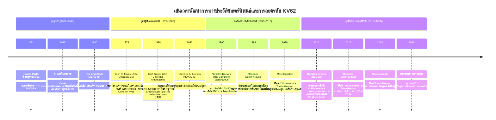

# บทที่ 7: ภาคผนวกทัศนสารสนเทศ: ชุดอินโฟกราฟิกวิชาการและแคตตาล็อกภาพถ่ายประวัติศาสตร์
### (Visual Appendix: Academic Infographics Suite & Historical Archaeological Photographs)

---

## ส่วนที่ 1: ชุดอินโฟกราฟิกวิชาการ (Academic Infographics Suite)

### อินโฟกราฟิกชุดที่ 1: แผนผังลำดับชั้นการซ้อนทับของเครื่องบรรจุพระบรมศพใน KV62
*(Stratigraphic Nesting Sequence of KV62 Funerary Assemblage)*

แผนผังแสดงโครงสร้างการซ้อนชั้นของเครื่องบรรจุพระบรมศพตั้งแต่ศาลไม้ปิดทองชั้นนอกสุดจนถึงองค์มัมมี่ พร้อมระบุสถานะความเป็นเจ้าของดั้งเดิม (Original Provenance) วัสดุ และหมายเลขทะเบียนโบราณวัตถุ:

```mermaid
flowchart TD
    subgraph S1["ชั้นที่ 1: ศาลไม้ปิดทอง 4 ชั้น (Four Gilded Shrines)"]
        A["ศาลไม้ปิดทองชั้นนอกสุด (Carter 207)<br>ไม้ซีดาร์ปิดทองคำ | 5.08 x 3.28 x 2.75 ม.<br><i>สถานะ: สร้างเพื่อตุตันคามุน (ตัดขอบเร่งด่วน)</i>"]
        --> B["ศาลไม้ปิดทองชั้นที่สอง (Carter 237)<br>ไม้ปิดทองฝังแก้วสี | 3.74 x 2.35 x 2.25 ม.<br><i>สถานะ: ปรากฏรอยแก้คาร์ทูชบางจุด</i>"]
        --> C["ศาลไม้ปิดทองชั้นที่สาม (Carter 238)<br>ไม้ปิดทองคำเปลว | 3.40 x 1.92 x 2.15 ม.<br><i>สถานะ: ประกอบสลับทิศทาง</i>"]
        --> D["ศาลไม้ปิดทองชั้นในสุด (Carter 239)<br>ไม้ปิดทองคำเปลว | 2.90 x 1.48 x 1.90 ม.<br><i>สถานะ: สลักบทมนตร์พิทักษ์</i>"]
    end

    subgraph S2["ชั้นที่ 2: ปราการศิลา (Quartzite Sarcophagus)"]
        D --> E["ฝาโลงหินแกรนิตสีชมพู (Pink Granite Lid)<br>แตกหัก 2 ท่อน ยาแนวด้วยปูนยิปซัม ทาสีเหลืองอำพราง<br><b>[สถานะ: โบราณวัตถุต่างชุด/นำมาแก้ปัญหาเฉพาะหน้า]</b>"]
        E --> F["ตัวหีบหินควอตซ์ไซต์สีเหลือง (Carter 240 / JE 60720)<br>หินก้อนเดียว | 2.74 x 1.47 x 1.47 ม.<br><b>[สถานะ: สลักปีกทับเทวสตรีเดิม + ไสลบคอลัมน์จารึก]</b>"]
    end

    subgraph S3["ชั้นที่ 3: ชุดโลงรูปมนุษย์ 3 ชั้น (Nest of Three Anthropoid Coffins)"]
        F --> G["โลงไม้ปิดทองชั้นนอกสุด (Outer Coffin - Carter 253 / JE 60668)<br>ไม้ปิดทองคำเปลว | ยาว 2.24 ม.<br><i>สถานะ: สร้างเพื่อตุตันคามุนโดยเฉพาะ (หน้าตรงกับมัมมี่)</i>"]
        G --> H["โลงไม้ปิดทองฝังกระจกสีชั้นกลาง (Middle Coffin - Carter 254 / JE 60670)<br>ไม้ปิดทองฝังแก้วหลากสีแบบริชี | ยาว 2.04 ม.<br><b>[สถานะ: Usurped 100% จากฟาโรห์หญิงเนเฟอร์เนเฟรูอาเตน]</b>"]
        H --> I["โลงทองคำแท้ชั้นในสุด (Innermost Coffin - Carter 255 / JE 60671)<br>ทองคำบริสุทธิ์หนา 2.5-3.5 มม. หนัก 110.4 กก. | ยาว 1.88 ม.<br><i>สถานะ: สร้างเพื่อตุตันคามุนโดยเฉพาะ (หน้าตรงกับมัมมี่)</i>"]
    end

    subgraph S4["ชั้นที่ 4: เครื่องพิทักษ์พระพักตร์และพระบรมศพ (Mask & Mummy)"]
        I --> J["หน้ากากทองคำ (The Gold Mask - Carter 256a / JE 60672)<br>ทองคำฝังอัญมณี หนัก 10.23 กก. | สูง 54 ซม.<br><b>[สถานะ: เนเมสเดิมของเนเฟอร์เนเฟรูอาเตน + บัดกรีพระพักตร์ใหม่ของตุตันคามุน]</b>"]
        J --> K["พระบรมศพมัมมี่ฟาโรห์ตุตันคามุน (Mummy)<br>พร้อมสายรัดทองคำ แผ่นประดับพระอุระ และพระธำมรงค์"]
    end

    style E fill:#ffcccc,stroke:#cc0000,stroke-width:2px
    style F fill:#fff0cc,stroke:#cc6600,stroke-width:2px
    style H fill:#ffcccc,stroke:#cc0000,stroke-width:3px
    style J fill:#ffddaa,stroke:#cc3300,stroke-width:3px
    style G fill:#d9ead3,stroke:#38761d,stroke-width:2px
    style I fill:#d9ead3,stroke:#38761d,stroke-width:2px
```

---

### อินโฟกราฟิกชุดที่ 2: ผังวิเคราะห์รอยจารึกทับทางอักขรวิทยา (Hieroglyphic Palimpsest Decryption)
*(Stroke-by-Stroke Epigraphic Analysis of Altered Cartouches)*

| องค์ประกอบทางอักขรวิทยา | คาร์ทูชเดิมของกษัตริย์สตรี (Original Inscription) | การดัดแปลงทางช่างโบราณ (Mechanical Alteration) | คาร์ทูชใหม่ของตุตันคามุน (Final Palimpsest) |
|:---|:---|:---|:---|
| **พระนามครองราชย์ (Prenomen)** | `[ 𓇳 𓋹 𓆣 𓏥 ]` *ꜥnḫ-ḫpr.w-rꜥ* (อังค์เคเปรูเร) "รูปปรากฏแห่งชีวิตของสุริยเทพเร" | - ทุบขอบโค้งมนด้านบนของสัญลักษณ์ *ꜥnḫ* (กางเขนอังค์) ให้แบนราบ - ใช้สิ่วแกะเส้นโค้งคว่ำของสัญลักษณ์ *nb* (ตะกร้าเนบ) ทับลงไป - คงสัญลักษณ์แมลงสคารับ 3 ตัว *ḫpr.w* และดวงอาทิตย์ *rꜥ* ไว้ตามเดิม | `[ 𓇳 𓎟 𓆣 𓏥 ]` *nb-ḫpr.w-rꜥ* (เนบเคเปรูเร) "เจ้าแห่งรูปปรากฏของสุริยเทพเร" |
| **พระนามประสูติ (Nomen)** | `[ 𓇋 𓏏 𓈖 𓄤 𓄤 𓄤 𓏏 ]` *nfr-nfr.w-jtn* (เนเฟอร์เนเฟรูอาเตน) "ความงดงามอันเป็นเลิศแห่งอาเตน" | - ไสถากชั้นทองคำและปูนเกสโซขูดลบสัญลักษณ์ *nfr* ทั้งสามตัวและแผ่นวงกลม *jtn* ออกทั้งแถบ - สลักพระนามประสูติใหม่พร้อมสร้อยพระนามของตุตันคามุนทับลงไป | `[ 𓇋 𓏠 𓈖 𓏏 𓅱 𓏏 𓋹 𓋾 𓉺 𓇓 ]` *twt-ꜥnḫ-jmn ḥqꜢ-jwnw-šmꜥ* (ตุตันคามุน เฮกา-อิวเนู-เชมา) "รูปเหมือนมีชีวิตแห่งอามุน ผู้ปกครองเฮลิโอโปลิสใต้" |
| **สร้อยพระนามชี้ขาด (Decisive Epithets)** | `[ 𓅜 𓐍 𓏏 𓈖 𓉔 𓇌 𓋴 ]` *Ꜣḫ.t-n-hy-s* (อาเคต-เอน-ฮีเอส) "ผู้ทรงคุณประโยชน์แด่พระสวามีของพระนาง" *(พบบนโลงจำลองคาโนปิก Carter 266g)*  `[ 𓌸 𓇳 𓄤 𓆣 𓏥 ]` *mry-nfr-ḫpr.w-rꜥ* (เมรี-เนเฟอร์เคเปรูเร) "ผู้เป็นที่รักของอักเฮนาเตน" *(พบบนแผ่นหลังหน้ากากทองคำ Carter 256a)* | - บนโลงจำลองคาโนปิก: ช่างใช้สิ่วไสลบสร้อยพระนามเพศหญิงออก แล้วสลักสร้อยพระนามของเทพเจ้าโอซิริสและเทพอามุนลงไปแทน แต่ยังคงหลงเหลือเส้นขอบเดิมให้อ่านได้ - บนหน้ากากทองคำ: ช่างทำการเคาะทุบและขัดเรียบเนื้อทองคำ 18.4 กะรัต แล้วสลักทับด้วยสูตรบทสวดคัมภีร์มรณะ | ข้อความถูกแทนที่ด้วยสูตรถวายการคุ้มครองตามแบบแผนศาสนาเทพบดีอามุนแห่งธีบส์ |

---

### อินโฟกราฟิกชุดที่ 3: ผังเปรียบเทียบโลหะวิทยาและกายวิภาคศาสตร์ประติมานวิทยา
*(Metallurgical Composition & Facial Incongruity Matrix of the Gold Mask)*

```mermaid
graph LR
    subgraph M1["ส่วนประกอบที่ 1: แผ่นพระพักตร์ (Face-Plate)"]
        direction TB
        F1["วัสดุ: ทองคำบริสุทธิ์สูง ~23.2 กะรัต<br>(ทองแดงเจือปนต่ำมาก สีเหลืองนวลสว่าง)"]
        F2["กายวิภาค: พระพักตร์กลม แก้มอิ่ม คางมน<br>แนวริมฝีปากขนาน สอดคล้องกับมัมมี่จริง"]
        F3["ที่มา: สร้างขึ้นใหม่เพื่อตุตันคามุนโดยเฉพาะ<br>ในกรอบเวลาฉุกเฉิน 70 วัน"]
    end

    subgraph JOIN["แนวรอยเชื่อมประสาน (Soldering Seam)"]
        direction TB
        J1["รอยบัดกรีเชื่อมโลหะรอบกรอบพระพักตร์"]
        J2["ฝังประดับแก้วสีและลาพิสลาซูลีด้วยกาว Mastic<br>เพื่ออำพรางรอยต่อทางเทคนิค"]
    end

    subgraph M2["ส่วนประกอบที่ 2: โครงเนเมสและแผงพระศอ (Nemes & Collar)"]
        direction TB
        N1["วัสดุ: โลหะผสมทองคำ ~18.4 กะรัต<br>(มีเงินและทองแดงเจือปนสูง สีเข้มอมส้ม)"]
        N2["กายวิภาค: ติ่งพระกรรณมีรูเจาะสำหรับต่างหูสตรี<br>ถูกปิดทับด้วยแผ่นทองคำเปลววงกลม"]
        N3["อักขรวิทยา: รอยจารึกทับ Ankhkheperure<br>พร้อมสร้อยพระนาม mery-Neferkheperure"]
        N4["ที่มา: ผลิตขึ้นสำหรับฟาโรห์หญิงเนเฟอร์เนเฟรูอาเตน"]
    end

    M1 --- JOIN --- M2

    style M1 fill:#fff2cc,stroke:#d6b656,stroke-width:2px
    style JOIN fill:#f8cecc,stroke:#b85450,stroke-width:3px
    style M2 fill:#ffe6cc,stroke:#d79b00,stroke-width:2px
```

---

### อินโฟกราฟิกชุดที่ 4: เส้นเวลาพัฒนาการทางญาณวิทยาของการสืบสวน ค.ศ. 1922–2026
*(Historiographical Investigation Timeline: From Howard Carter to Modern Forensics)*

---

## ส่วนที่ 2: แคตตาล็อกภาพถ่ายโบราณคดีจริงจากคลังจดหมายเหตุ (Historical Archaeological Photographic Portfolio)

### ภาพที่ 1: โลงพระศพชั้นกลาง (The Middle Coffin - Carter No. 254 / JE 60670)
- **แหล่งที่มาภาพจดหมายเหตุ:** Harry Burton Archive, Griffith Institute, University of Oxford (Neg. No. p0462, p0463)
- **วัตถุจัดแสดง:** พิพิธภัณฑ์อารยธรรมอียิปต์แห่งชาติ (NMEC) / พิพิธภัณฑ์ไคโร (JE 60670)
- **คำบรรยายเชิงวิชาการ:**  
  ภาพถ่ายขาวดำประวัติศาสตร์ของแฮร์รี เบอร์ตัน ขณะทำการเปิดฝาโลงไม้ปิดทองชั้นนอก เผยให้เห็นโลงชั้นกลางที่ยังคงสภาพสมบูรณ์ สังเกตลักษณะพระพักตร์อันเรียวช้อย ดวงตาเรียวยาวแบบอามาร์นาคลาสสิกที่แตกต่างจากโลงชั้นในและชั้นนอกอย่างสิ้นเชิง และลวดลายขนนกยูงริชี (Rishi Pattern) ฝังประดับด้วยแก้วสีหลากชนิด ซึ่งต่อมาได้รับการพิสูจน์ว่าเป็นโลงที่ช่วงชิงมาจากฟาโรห์หญิงเนเฟอร์เนเฟรูอาเตน

---

### ภาพที่ 2: หน้ากากทองคำและการตรวจสอบรอยเจาะพระกรรณ (The Gold Mask - Carter No. 256a / JE 60672)
- **แหล่งที่มาภาพจดหมายเหตุ:** Harry Burton Archive, Griffith Institute, University of Oxford (Neg. No. p0744, p0745); บันทึกภาพถ่ายสีโดยพิพิธภัณฑ์ไคโร (JE 60672)
- **วัตถุจัดแสดง:** พิพิธภัณฑ์อียิปต์ ณ กรุงไคโร (The Egyptian Museum, Tahrir)
- **คำบรรยายเชิงวิชาการ:**  
  ภาพถ่ายมุมเฉียงของหน้ากากทองคำบริสุทธิ์ Carter 256a เผยให้เห็นบริเวณติ่งพระกรรณที่มีการเจาะรูและอุดทับด้วยแผ่นทองคำเปลววงกลมขนาดเล็กเพื่ออำพรางเพศสตรีดั้งเดิม และแนวรอยเชื่อมประสานบัดกรีรอบขอบพระพักตร์ที่เชื่อมระหว่างแผ่นพระพักตร์ทองคำ 23.2 กะรัตของตุตันคามุน เข้ากับโครงสร้างเนเมสทองคำ 18.4 กะรัตของเนเฟอร์เนเฟรูอาเตน

---

### ภาพที่ 3: โลงหินควอตซ์ไซต์และฝาหินแกรนิตแตกหัก (The Sarcophagus - Carter No. 240 / JE 60720)
- **แหล่งที่มาภาพจดหมายเหตุ:** Harry Burton Archive, Griffith Institute, University of Oxford (Neg. No. p0434, p0435)
- **วัตถุจัดแสดง:** ห้องฝังพระศพ สุสาน KV62 หุบผากษัตริย์ เมืองลักซอร์
- **คำบรรยายเชิงวิชาการ:**  
  ภาพถ่ายบันทึกสภาพดั้งเดิมของโลงหินควอตซ์ไซต์สีเหลืองก้อนเดียวขนาดมหึมา ปรากฏภาพเทวสตรีผู้พิทักษ์ที่มุมโลงซึ่งผ่านการสลักปีกขนนกทับลวดลายเดิม และฝาโลงหินแกรนิตสีชมพูขนาดหนักที่แตกหักเป็นสองท่อนตรงกึ่งกลาง ได้รับการเชื่อมด้วยปูนยิปซัมและทาสีเหลืองอำพรางตั้งแต่สมัยโบราณ สะท้อนวิกฤตการณ์เฉพาะหน้าในชั่วโมงสุดท้ายของการประกอบพิธีศพ

---

### ภาพที่ 4: โลงจำลองคาโนปิกทองคำขนาดเล็กทั้งสี่ใบ (Canopic Coffinettes - Carter No. 266g / JE 60688–60691)
- **แหล่งที่มาภาพจดหมายเหตุ:** Harry Burton Archive, Griffith Institute, University of Oxford (Neg. No. p1058, p1059)
- **วัตถุจัดแสดง:** พิพิธภัณฑ์อียิปต์ ณ กรุงไคโร
- **คำบรรยายเชิงวิชาการ:**  
  ภาพถ่ายชุดโลงจำลองทองคำ 4 ใบสำหรับบรรจุอวัยวะภายในพระบรมศพ บริเวณแผ่นทองคำด้านในปรากฏร่องรอยการไสขูดลบพระนาม *Ankhkheperure Neferneferuaten* และปรากฏสร้อยพระนามเพศหญิง *Akhet-en-hyes* ("ผู้ทรงคุณประโยชน์แด่พระสวามีของพระนาง") ซึ่งจอห์น อาร์. แฮร์ริส ใช้เป็นหลักฐานชี้ขาดในปี 1973 ว่ามีฟาโรห์สตรีครองราชย์ก่อนหน้าตุตันคามุน

---

### ภาพที่ 5: ภาพถ่ายสะท้อนแสงความละเอียดสูง (RTI) แสดงรอยจารึกทับบนแผ่นหลังหน้ากากทองคำ
- **แหล่งที่มาภาพจดหมายเหตุ:** Nicholas Reeves Research Archive (2015) / Factum Arte High-Resolution Scanning Project
- **วัตถุจัดแสดง:** บริเวณแผ่นหลังด้านซ้ายของหน้ากากทองคำ JE 60672
- **คำบรรยายเชิงวิชาการ:**  
  ภาพถ่ายประมวลผลพื้นผิวด้วยเทคโนโลยี Reflectance Transformation Imaging (RTI) ภายใต้การจัดแสงตกกระทบเฉียง เผยให้เห็นเส้นขีดลึกของสัญลักษณ์ *ꜥnḫ* (อังค์) และ *ḫpr.w* (เคเปรู) ตลอดจนสร้อยพระนาม *mry-nfr-ḫpr.w-rꜥ* ของฟาโรห์หญิงเนเฟอร์เนเฟรูอาเตน ที่ซ่อนอยู่ใต้รอยสลักทับพระนาม *Nebkheperure* ของตุตันคามุนอย่างชัดเจน
